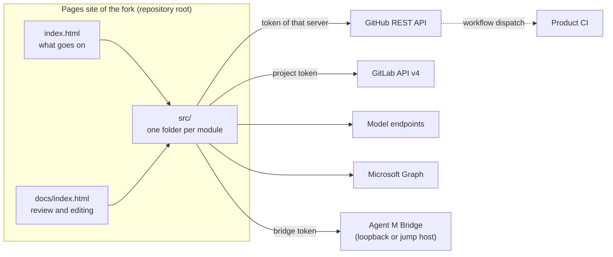

# ARC-001 A static site from the root of the repository, with no server of its own

## Context

Agent M is a companion to a book. Every reader runs their own copy — a fork — and manages their own products. There is
no server, no account system and no database. The site must still read and write repositories on GitHub and on GitLab
servers, call model endpoints, and reach a local bridge.

The book describes this situation as client-server with the server side taken by existing services (ch. 10
§"Client-Server and API-Centered Interaction"): the git servers' REST APIs are the servers, and Agent M is only a
client. The book's repository pattern (ch. 10 §"Repository Pattern") names the other half: every tool reads and writes
one shared store — here, the git repositories.

## Decision

1. **The repository root is the site.** GitHub Pages serves the default branch from its root (`/`), and a file
   `.nojekyll` at the root makes it serve every file as committed. The instance is a fork; its Pages address is its
   dashboard, and the pages derive the instance's repository from that address.
2. **Two pages.** `index.html` at the root is the instance's dashboard of what goes on — the progress of each product
   and every job. `docs/index.html` is the page on which documents are reviewed and edited. Both load their code from
   `src/`; neither holds code of its own beyond loading it.
3. **Code in `src/`, documents in `docs/`.** Every script, style sheet and library lies under `src/`, one folder per
   module (ARC-020); tests lie under `tests/`, CI workflows under `.github/workflows/`. `docs/` holds documents only.
4. **All behaviour runs in the reader's browser.** The only servers contacted are the git servers' APIs, the configured
   model endpoints, the mail provider's API, the local bridge — on loopback, or at the HTTPS address of the reader's own
   jump host that forwards to it —, and the package registries and resource hosts the page names before it calls them.
5. **What a browser cannot do runs where the reader already has a runtime**: in the product repository's own CI, or in
   the Agent M Bridge on the reader's computer. Neither is operated by the Agent M project.
6. **Authentication to a git server is a pasted token** — a fine-grained token on GitHub, a project token on a GitLab
   server; no code exchange, because that exchange needs a confidential server.
7. **A managed product has no Pages site.** It is read and written by the instance's pages through its server's API, and
   its repository holds its documents under `docs/` and its code wherever its own architecture puts it.
8. **A product's repository stands on its own.** What Agent M writes into a product repository is Markdown that a
   reader understands without Agent M: it names the product's own identifiers and files, and anything outside the
   product by a public address — never by a file of the instance, a page of the dashboard or a key in a browser's
   storage.

## Alternatives

- **`docs/` as the Pages root, with the code in `docs/assets/`** — code among the documents; a reader cannot tell what
  is reviewed and what is built.
- **A Pages workflow that publishes `src/` and `docs/`** — every fork would need Actions enabled before its site exists;
  serving the root needs one setting and no workflow.
- **A small hosted service of the Agent M project** (for example a serverless function doing the OAuth exchange and
  holding job state) — it would have to be operated for as long as any reader uses a fork, and it would hold every
  reader's tokens.
- **A GitHub App with "Sign in with GitHub"** — the code-for-token exchange needs the app's client secret, which a static
  page cannot keep.
- **A desktop application only, no Pages site** — installing software would be the first step; the first level of
  Agent M needs nothing installed.

## Consequences

- There is nothing to operate, back up or pay for on the project's side; a fork keeps working when upstream disappears.
- The whole repository is served; it is public anyway, and the pages read nothing from it but code and data under
  `src/`.
- Every capability is bounded by what browsers allow; what they forbid moves to CI or to the bridge.
- All state lives in repositories and in the browser (ARC-003, ARC-006). Two browsers see the same repository state but
  not each other's settings.
- Every Pages site of the same owner shares the browser storage origin; the dashboard discloses it.
