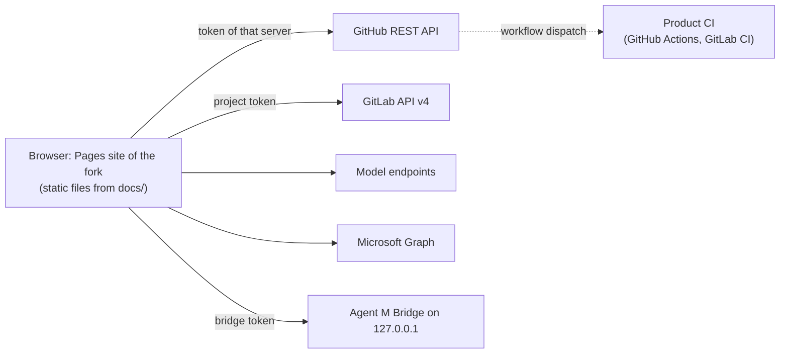

# ARC-001 Agent M is a static site on the git server's Pages, with no server of its own

## Context

Agent M is a companion to a book. Every reader runs their own copy (a fork) and manages their own
products. The SPEC rules out a server, an account system and a database (`NO SERVER`). The dashboard
must still read and write repositories on GitHub and on GitLab servers, call model endpoints, and
reach a local bridge.

The book describes this situation as client-server with the server side taken by existing services
(ch. 10 §"Client-Server and API-Centered Interaction"): the git servers' REST APIs are the servers,
and Agent M is only a client. The book's repository pattern (ch. 10 §"Repository Pattern") names
the other half: every tool reads and writes one shared store — here, the git repositories.

## Decision

1. The dashboard is a set of static files under `docs/` of the instance repository, served by
   GitHub Pages from the default branch (`THE PAGES ROOT IS DOCS`). The instance is a fork; its
   Pages address is its dashboard, and the dashboard derives its own repository from that address
   (`deriveTarget` in the current code).
2. All behaviour runs in the reader's browser. The only servers contacted are those the SPEC
   names: the git servers' APIs, the configured model endpoints, the mail provider's API
   (Microsoft Graph), the local bridge — on loopback, or at the HTTPS address of the reader's own
   jump host that forwards to it (`A BRIDGE CAN BE REACHED OVER HTTPS THROUGH THE JUMP HOST`,
   ARC-012) —, and the package registries and resource hosts the page names before it calls them.
3. Work that cannot run in a browser runs where the reader already has a runtime: in the product
   repository's own CI (ARC-015, ARC-009), or in the Agent M Bridge on the reader's computer
   (ARC-011). Neither is operated by the Agent M project.
4. Authentication to GitHub is a pasted fine-grained token (`THE GITHUB TOKEN IS PASTED, NOT
   OBTAINED BY LOGIN`); to a GitLab server, a pasted project token. No OAuth code exchange for git
   hosts, because that exchange needs a confidential server.
5. A managed product gets no Pages site. It is read by the instance's dashboard through its
   server's API.

## Alternatives

- **A small hosted service of the Agent M project** (for example a serverless function doing the
  OAuth exchange and holding job state) — rejected: it is exactly what `NO SERVER` forbids; it would
  have to be operated for as long as any reader uses a fork, and it would hold every reader's
  tokens.
- **A GitHub App with "Sign in with GitHub"** — rejected: the code-for-token exchange needs the
  app's client secret, which a static page cannot keep (the reason recorded in `THE GITHUB TOKEN IS
  PASTED, NOT OBTAINED BY LOGIN`).
- **A desktop application only, no Pages site** — rejected: it would make installing software
  the first step; the SPEC queue 2026-09-30f keeps a first level that needs nothing installed
  (`AGENT M WORKS WITHOUT A LOCAL INSTALLATION`).

## Consequences

- There is nothing to operate, back up or pay for on the project's side; a reader's fork keeps
  working when upstream disappears.
- Every capability is bounded by what browsers allow: cross-origin permissions of each API decide
  what the dashboard can do directly (`BROWSER REACHABILITY IS MEASURED, NOT ASSUMED`). What they
  forbid moves to CI or to the bridge.
- All state lives in repositories and in the browser (ARC-006, ARC-005). Two browsers see the same
  repository state but not each other's settings.
- Every Pages site of the same owner shares the browser storage origin; the dashboard discloses it
  (`THE SHARED PAGES ORIGIN IS DISCLOSED`). This is a consequence of this decision, not a defect of
  a later one.

*Drafted on 2026-09-30 by Claude (claude-opus-5-5) for the Agent M repository at commit 1605b2dcfe907fb1df6e394af3fdbec80f379dbc; revised on 2026-09-30 by Claude (claude-opus-5-5) against commit 1110607b6dc4d9c888549a23a680fbe4b38dd3f1 — SPEC and use cases as accepted that day, and `docs/measurements/2026-09-30_architecture-open-points.md`; open until accepted.*
