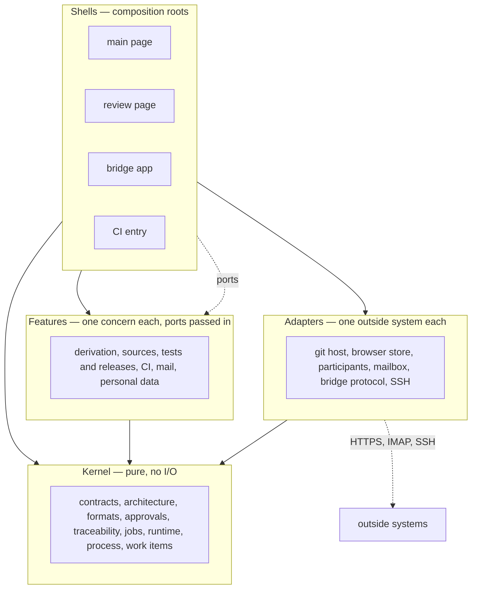

# ARC-003 Four layers, ports, one write path, one store per runtime, shared shapes

## Context

The same logic — how a status is derived, what a finding looks like, which job comes next — must give the same answer
in the browser, in a CI workflow and in the bridge, and the bridge is built from the dashboard's own modules. Each
runtime writes to repositories on a different authority: the browser on a person's click with that person's token, a
job on the server's machines with the person's token from a CI secret, the bridge with the login its agent already has.
Credentials reach only their own servers. Tests on every commit call no paid service, so the logic must be testable
without the network.

Every runtime keeps some state of its own: the browser its settings, the bridge its pairing token and its SSH key. What
is shared lives in repositories (ARC-006).

Book ch. 10: layered architecture — "every layer is only dependent on the layer directly below"; design to test;
develop against interfaces, not implementations; the open-closed principle.

## Decision

1. **Four layers.** Every module states its layer in its block (ARC-020).
   - **Kernel** — pure functions and data: no `fetch`, no DOM, no storage, no clock or randomness except passed in. A
     kernel module uses only kernel modules. It runs unchanged under `node --test`, in the browser, in a CI step and in
     the Deno bridge.
   - **Feature** — the logic of one concern. It uses kernel modules and other features, and reaches the outside only
     through ports passed in.
   - **Adapter** — one outside system each: git servers, browser storage, model endpoints and local agents, mailboxes,
     the bridge's HTTP protocol, SSH. Only an adapter builds an authorisation header, opens a connection, starts a
     process or touches storage. An adapter uses kernel modules and at most the adapter it sends through. In commit
     tests it is replaced by a recorded or constructed fake.
   - **Shell** — a composition root: the main page, the review page, the bridge app, the CI entry. A shell chooses the
     adapters, hands them to features and kernel as ports, holds every text a person reads, and turns a person's action
     into an authority.
2. **Ports, not imports.** A function that needs the outside receives it as a parameter, the same shape in every
   runtime; there is no dependency-injection container. A port passed in is not a use of the receiving module, so the
   `uses` of a module name imports only, and they form no cycle. Five kinds of port have a fixed shape; each has a fake
   that an example of an interface gives as data (ARC-020) and that a generated test turns into the port:
   - `read(path)`, asynchronous — the text of the file at `path`, or `null` when there is none. Fake: a map from path
     to text.
   - `fetch(request)`, asynchronous — sends `{ method, url, headers?, body? }`, a `body` that is not a string as JSON,
     and gives `{ status, headers, body }`, the body parsed as JSON when the response declares JSON and as text
     otherwise, or the refusal `unreachable` when no response arrives. Fake: a list of recorded exchanges; a request
     matches the first with the same method and URL, and the same body when the recorded request has one; a request
     that matches none is refused with `no-recorded-exchange`.
   - `clock()` — the current time as an ISO string. Fake: one ISO time, returned by every call.
   - `random()` — a number in `[0, 1)`. Fake: a list of numbers, returned in order and from the start again when used
     up.
   - `storage`, asynchronous — `get(key)`, the text kept under `key` or `null`; `set(key, text)`; `remove(key)`; `keys()`,
     every key kept; each call gives the refusal `not-kept` when the browser keeps nothing. Fake: a map from key to text,
     or `null` for a browser that keeps nothing.

   A shell makes its ports in one file, `ports.mjs` of its folder, from the platform objects they stand for — `fetch`,
   `Date`, `crypto.getRandomValues`, `localStorage`, Cache Storage — and adds nothing to what passes through them.
3. **One write path, with an authority.** Every write to a repository goes through one function of the git adapter,
   which takes an `Authority` and knows nothing of a page or a click:
   - `click` — made by a page shell, only from an input event the browser marks as trusted, with the person's own token;
   - `ci-secret` — made by the CI entry from the person's token in the named CI secret;
   - `agent-login` — made by the bridge app; the commit is made with the git login the agent already has.

   A write without an authority of one of these kinds is refused. All files of one decision go into one commit,
   fast-forward only (ARC-004).
4. **One store per runtime.**
   - **Browser** — `MOD-settings-store` is the only module that reads or writes browser storage, through two storage
     ports a page shell makes: one over `localStorage` for the settings, every key a named constant with the prefix
     `agent-m.` and a row on the settings page, so that clearing removes exactly Agent M's keys; one over Cache Storage for
     the texts of repository files read, kept by their git blob SHA. No cookie, no `sessionStorage`, no IndexedDB.
   - **Bridge** — one store owned by the bridge app: pairing token, settings, the SSH key pair and `known_hosts`, in one
     directory, each file readable by its user only. The bridge's server and tunnel modules receive it as a port.
   - **CI** — no store of its own: the secrets of the product's CI and the repository.
5. **Data, not text, below the shells.** Kernel and features return values, refusals and findings. Their only texts are
   the reason of a refusal and the `what` and `fix` of a finding, in the fixed form of
   `A FINDING READS LIKE A COMPILER MESSAGE`; every other sentence a person reads, its folded explanation and its HTML
   are written by the shell that shows it.
6. **Shared shapes.** A refusal, a finding and an authority have one shape everywhere, defined by `MOD-contracts`.
7. **Repository checks** keep the boundaries: no file outside an adapter's folder and a shell's `ports.mjs` names
   `fetch`, `localStorage` or `caches`. A vendored library's file under `src/vendor/` is no module's code (ARC-002); two
   are set apart by name, each on its one reason: `mermaid.min.js`, which names `fetch` only as a method of its own and
   calls no platform's `fetch`; and pdf.js's two files, which call it only for what they are given the address of — a
   document, character maps, fonts, decoders —, and which only `MOD-source-text` imports, giving them bytes and never an
   address (ARC-036 decision 8). `tests/test_no_backend.py`, the check of `NO SERVER` (ARC-016 decision 2), holds these
   reasons: it lists every request channel of a vendored file with its reason, and it finds a file outside
   `src/source-text/` that imports pdf.js, and a call of `getDocument` that names `url`, `cMapUrl`,
   `standardFontDataUrl`, `wasmUrl` or `iccUrl` (`docs/measurements/2026-10-05_source-texts.md` counts the channels).



## Alternatives

- **One core file and one app file** — the core would mix HTTP with parsing; the bridge would import the browser's
  `fetch` policy with the logic it needs, and tests of pure logic would need network fakes.
- **Core, adapters, store and UI as the layers** — gives the features no place of their own, so the concerns of one
  feature spread into the core and the adapters.
- **Hexagonal ports with a dependency-injection container** — more machinery than the size warrants (KISS); ports are
  plain parameters.
- **A git adapter that checks the click itself** — CI and the bridge write through the same function and have no click;
  the adapter would know the page.
- **Separate implementations per runtime** (a Python CI side, a JavaScript browser side) — two copies of each rule.
- **IndexedDB** for the browser store — more capable than needed, and a second storage API is a second place a clear
  can miss.
- **Exceptions for refusals** — a caller cannot see from a signature which refusals to expect; a returned `Refusal` with
  a code is part of the interface and of its examples.

## Consequences

- A CI workflow runs kernel and features with Node; the bridge runs them with Deno. The kernel uses only
  `crypto.subtle`, `TextEncoder`, `URL` and `structuredClone`, which both provide.
- Every Pages site of the same owner can read the browser store; the settings page says so before the first secret is
  stored.
- A test of a feature hands it fake ports; a test of an adapter records the requests it makes. Neither needs the other.

## Modules

### MOD-contracts

The shapes every module shares, and the three functions that make and read them.

```json module
{
  "id": "MOD-contracts",
  "folder": "src/contracts/",
  "layer": "kernel",
  "responsibility": "Defines the shapes every module shares — a refusal, a finding, a write authority and the fakes of the ports — and makes and reads refusals and findings.",
  "realises": ["A FINDING READS LIKE A COMPILER MESSAGE"],
  "owns": ["Refusal", "Finding", "Authority", "ReadPort", "FetchPort", "ClockPort", "RandomPort", "StoragePort"],
  "uses": []
}
```

```json interface
{
  "id": "MOD-contracts.refuse",
  "summary": "A refusal with its code and the reason a person or a log reads.",
  "params": [
    { "name": "code", "type": "string" },
    { "name": "reason", "type": "string" }
  ],
  "result": "Refusal",
  "async": false,
  "refusals": [],
  "examples": [
    {
      "name": "a stale text",
      "input": { "code": "stale-text", "reason": "the file changed after it was shown" },
      "result": { "refused": "stale-text", "reason": "the file changed after it was shown" }
    }
  ]
}
```

```json interface
{
  "id": "MOD-contracts.isRefusal",
  "summary": "Whether a value an interface returned is a refusal.",
  "params": [{ "name": "value", "type": "any" }],
  "result": "boolean",
  "async": false,
  "refusals": [],
  "examples": [
    { "name": "a refusal", "input": { "value": { "refused": "stale-text", "reason": "" } }, "result": true },
    { "name": "a result", "input": { "value": { "path": "SPEC.md" } }, "result": false },
    { "name": "nothing", "input": { "value": null }, "result": false }
  ]
}
```

```json interface
{
  "id": "MOD-contracts.formatFinding",
  "summary": "A finding in the compiler form: <artifact>:<line>: <kind>: <what> [<RULE>] — <fix>.",
  "params": [{ "name": "finding", "type": "Finding" }],
  "result": "string",
  "async": false,
  "refusals": [],
  "examples": [
    {
      "name": "an error in a decision",
      "input": {
        "finding": { "artifact": "ARC-902", "line": 25, "kind": "error", "what": "parameter n of MOD-x.double has no type", "rule": "AN INTERFACE STATES ITS TYPES", "fix": "give the parameter a type: a type's $id or a primitive, optionally followed by []" }
      },
      "result": "ARC-902:25: error: parameter n of MOD-x.double has no type [AN INTERFACE STATES ITS TYPES] — give the parameter a type: a type's $id or a primitive, optionally followed by []"
    },
    {
      "name": "a warning on a use-case step",
      "input": {
        "finding": { "artifact": "UC-901", "line": "2a", "kind": "warning", "what": "no interface carries this step", "rule": "EVERY USE-CASE STEP IS CARRIED BY AN INTERFACE", "fix": "name the interfaces that carry it in a realisation table, or — and the reason" }
      },
      "result": "UC-901:2a: warning: no interface carries this step [EVERY USE-CASE STEP IS CARRIED BY AN INTERFACE] — name the interfaces that carry it in a realisation table, or — and the reason"
    }
  ]
}
```

## Types

```json type
{
  "$id": "Refusal",
  "description": "What an interface returns instead of its result when it refuses: one of its declared codes, and the reason.",
  "type": "object",
  "required": ["refused", "reason"],
  "additionalProperties": false,
  "properties": {
    "refused": { "type": "string", "pattern": "^[a-z]+(-[a-z]+)*$" },
    "reason": { "type": "string" }
  },
  "examples": [{ "refused": "stale-text", "reason": "the file changed after it was shown" }]
}
```

```json type
{
  "$id": "Finding",
  "description": "One finding of a check: the artifact by its identifier, the line or step it concerns (0 for the artifact as a whole), its kind, what is wrong, the rule by name, and the correction expected.",
  "type": "object",
  "required": ["artifact", "line", "kind", "what", "rule", "fix"],
  "additionalProperties": false,
  "properties": {
    "artifact": { "type": "string", "minLength": 1 },
    "line": { "anyOf": [{ "type": "integer", "minimum": 0 }, { "type": "string", "minLength": 1 }] },
    "kind": { "type": "string", "enum": ["error", "warning", "person"] },
    "what": { "type": "string", "minLength": 1 },
    "rule": { "type": "string", "minLength": 1 },
    "fix": { "type": "string", "minLength": 1 }
  },
  "examples": [
    { "artifact": "ARC-902", "line": 25, "kind": "error", "what": "parameter n of MOD-x.double has no type", "rule": "AN INTERFACE STATES ITS TYPES", "fix": "give the parameter a type" },
    { "artifact": "R TWO", "line": 0, "kind": "warning", "what": "R TWO has no place in the architecture", "rule": "EVERY REQUIREMENT HAS ITS PLACE IN THE ARCHITECTURE", "fix": "name it under realises or keeps" }
  ]
}
```

```json type
{
  "$id": "Authority",
  "description": "The authority a write is made on; the git adapter refuses a write without one.",
  "type": "object",
  "required": ["kind"],
  "additionalProperties": false,
  "properties": { "kind": { "type": "string", "enum": ["click", "ci-secret", "agent-login"] } },
  "examples": [{ "kind": "click" }, { "kind": "ci-secret" }]
}
```

```json type
{
  "$id": "ReadPort",
  "description": "The fake of a read port: a map from path to text; a path the map lacks reads as null.",
  "x-port": "read",
  "type": "object",
  "additionalProperties": { "type": "string" },
  "examples": [{ "SPEC.md": "# Agent M — Specification\n" }]
}
```

```json type
{
  "$id": "FetchPort",
  "description": "The fake of a fetch port: recorded exchanges; a request that matches none is refused with no-recorded-exchange.",
  "x-port": "fetch",
  "type": "array",
  "items": {
    "type": "object",
    "required": ["request", "response"],
    "additionalProperties": false,
    "properties": {
      "request": {
        "type": "object",
        "required": ["method", "url"],
        "additionalProperties": false,
        "properties": {
          "method": { "type": "string", "enum": ["GET", "POST", "PUT", "PATCH", "DELETE"] },
          "url": { "type": "string", "pattern": "^https?://" },
          "body": {}
        }
      },
      "response": {
        "type": "object",
        "required": ["status"],
        "additionalProperties": false,
        "properties": {
          "status": { "type": "integer", "minimum": 100, "maximum": 599 },
          "headers": { "type": "object", "additionalProperties": { "type": "string" } },
          "body": {}
        }
      }
    }
  },
  "examples": [[{ "request": { "method": "GET", "url": "https://api.github.com/repos/akmaier/agent-m" }, "response": { "status": 200, "body": { "default_branch": "main" } } }]]
}
```

```json type
{
  "$id": "ClockPort",
  "description": "The fake of a clock port: one ISO time, returned by every call.",
  "x-port": "clock",
  "type": "string",
  "pattern": "^[0-9]{4}-[0-9]{2}-[0-9]{2}T[0-9]{2}:[0-9]{2}:[0-9]{2}(\\.[0-9]+)?Z$",
  "examples": ["2026-10-03T12:00:00Z"]
}
```

```json type
{
  "$id": "RandomPort",
  "description": "The fake of a random port: numbers in [0, 1), returned in order and from the start again when used up.",
  "x-port": "random",
  "type": "array",
  "minItems": 1,
  "items": { "type": "number", "minimum": 0, "exclusiveMaximum": 1 },
  "examples": [[0.5, 0.25]]
}
```

```json type
{
  "$id": "StoragePort",
  "description": "The fake of a storage port: a map from key to text, or null for a browser that keeps nothing, whose every call is refused with not-kept.",
  "x-port": "storage",
  "anyOf": [{ "type": "object", "additionalProperties": { "type": "string" } }, { "type": "null" }],
  "examples": [{ "agent-m.products": "[\"https://github.com/alice/thesis\"]" }, null]
}
```
