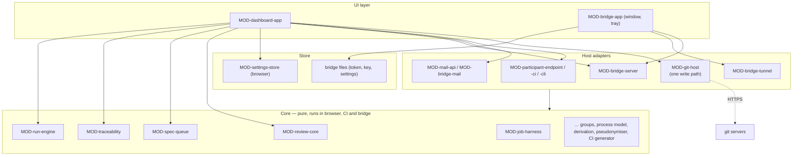

# ARC-003 Four layers, one write path, one core in three runtimes

## Context

The same logic — how status is derived, what a finding looks like, which job comes next — must give
the same answer in the browser, in a CI workflow and in the bridge (`ONE DEFINITION, THREE
DRIVERS`, `A RUNTIME IS INTERCHANGEABLE`). The browser holds credentials that must reach only their
own servers (`A TOKEN GOES ONLY TO THE SERVER THAT ISSUED IT`), and nothing may be written except on
a person's click (`THE DASHBOARD WRITES ONLY ON A PERSON'S CLICK`). Tests on every commit may call
no paid service (`COMMIT TESTS CALL NO PAID SERVICE`), so the logic must be testable without the
network.

The current code already separates a DOM-free core (`docs/assets/review-core.mjs`, 1 816 lines)
from the page (`review-app.mjs`) and the only storage module (`settings-store.mjs`). The core has
grown to hold parsing, derivation, HTTP calls and HTML strings together.

Book ch. 10: layered architecture — "every layer is only dependent on the layer directly below";
"design to test"; "develop against interfaces, not implementations".

## Decision

Four layers. A module belongs to exactly one.

1. **Core** — pure functions and data: parsing artifacts, deriving status, traceability, groups,
   process models, the run engine's next-job function, the correction loop's findings,
   pseudonymisation, derivation classes, CI generation, release texts. No `fetch`, no DOM, no
   storage, no clock or randomness except when passed in. Runs unchanged under `node --test`, in
   the browser, in a CI step and in the Deno bridge.
2. **Host adapters** — the only code that talks to the outside: git hosts (ARC-004), model
   endpoints and CI and CLI participants (ARC-009), mail providers and the bridge's mail (ARC-014),
   the bridge's HTTP API (ARC-012), SSH (ARC-013). Each adapter builds its own authorisation
   headers; a caller never sets one. Each is replaceable by a recorded fake in commit tests.
3. **Store** — where the runtime keeps its own state: in the browser the settings store (ARC-005);
   in the bridge its own files (pairing token, SSH key, settings). Nothing else touches storage.
4. **UI** — the dashboard page and the bridge's window. It renders what the core derives and turns
   a person's click into one call of the write path.

**One write path.** Every write to a repository goes through one function of the git-host adapter
(`MOD-git-host.commitFiles`), which refuses a call without a trusted click event from a browser
session, writes all files of a decision in one commit, and fast-forwards only. Jobs in CI or the
bridge write through the same adapter with their own credentials; their start record was written
by the click that started them (ARC-010).

## Alternatives

- **Keep one core file and one app file** — rejected: the core already mixes HTTP with parsing;
  the bridge would import the browser's `fetch` policy with the logic it needs, and tests of pure
  logic would need network fakes.
- **Hexagonal ports with dependency injection containers** — rejected as more machinery than the
  size warrants (KISS); adapters are passed as plain function arguments where the core needs I/O.
- **Separate implementations per runtime** (a Python CI side, a JavaScript browser side) — rejected
  by `THE BRIDGE IS BUILT FROM THE DASHBOARD'S CODE` and `ONE DEFINITION, THREE DRIVERS`. The one
  existing exception, `tools/apply_approvals.py`, mirrors `planAcceptance` and is kept equal by a
  test that hashes both outputs (MOD-apply-workflow).

## Consequences

- Splitting `review-core.mjs` along these modules is an implementation job (refactoring: `A
  REFACTORING JOB BEGINS WITHOUT A FAILING TEST`); the module files state which current functions
  each takes over.
- HTML-producing helpers now in the core (`stepHtml`, `browserSettingsHtml`, `impactHtml`) move to
  the UI layer; the tests that read their HTML follow them.
- A CI workflow runs the core with Node (already used by `tests.yml`); the bridge runs it with Deno.
  Differences between the two runtimes' Web APIs are a measurement point: the core uses only
  `crypto.subtle`, `TextEncoder`, `URL` and `structuredClone`, which both provide.

*Drafted on 2026-09-30 by Claude (claude-opus-5-5) for the Agent M repository at commit 1605b2dcfe907fb1df6e394af3fdbec80f379dbc; open until accepted.*
