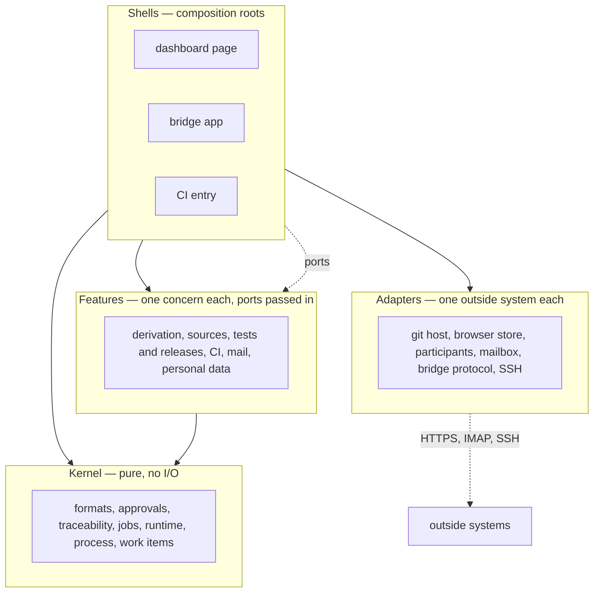

# ARC-003 Four layers, ports, one write path, one store per runtime

## Context

The same logic — how status is derived, what a finding looks like, which job comes next — must give
the same answer in the browser, in a CI workflow and in the bridge (`ONE DEFINITION, THREE
DRIVERS`, `A RUNTIME IS INTERCHANGEABLE`), and the bridge is built from the dashboard's own modules
(`THE BRIDGE IS BUILT FROM THE DASHBOARD'S CODE`). Each runtime writes to repositories on a different
authority: the browser on a person's click with that person's token (`THE DASHBOARD WRITES ONLY ON A
PERSON'S CLICK`), a job on the server's machines with the person's token from a CI secret (`A HOSTED JOB
WRITES WITH THE PERSON'S TOKEN FROM A CI SECRET`, ARC-015), the bridge with the login its agent already
has (`A LOCAL AGENT USES THE PERSON'S OWN LOGIN`). Credentials reach only their own servers (`A TOKEN
GOES ONLY TO THE SERVER THAT ISSUED IT`). Tests on every commit call no paid service (`COMMIT TESTS CALL
NO PAID SERVICE`), so the logic must be testable without the network.

Every runtime keeps some state of its own: the browser its settings (`CONFIGURATION LIVES IN THE
BROWSER`, never in a cookie, cleared for real, every key on one page), the bridge its pairing token and
its SSH key (`THE BRIDGE IS PAIRED ONCE`, `THE BRIDGE CREATES ITS OWN SSH KEY`). What is shared lives in
repositories (ARC-006).

The architecture review of 2026-10-01 found concerns of single features inside modules meant to be
generic — mail rules in the job definitions, a browser click in the git adapter's write path, CI-token
rules in the run engine, the settings store read directly by the mail and endpoint adapters —, and a
first module design that listed its modules here, in a second place beside the module files.

Book ch. 10: layered architecture — "every layer is only dependent on the layer directly below";
"design to test"; "develop against interfaces, not implementations"; the open-closed principle.

## Decision

1. **Four layers.** Each module belongs to exactly one; its layer is its group in
   `docs/groups/modules.md`, and the list of modules is read from the module files and that group file,
   never written here.
   - **Kernel** — pure functions and data: the text formats of the review layout, the approval engine,
     traceability, job kinds and the correction loop, the job runtime, process models, work items. No
     `fetch`, no DOM, no storage, no clock or randomness except passed in. A kernel module imports only
     kernel modules. It runs unchanged under `node --test`, in the browser, in a CI step and in the Deno
     bridge.
   - **Features** — the logic and orchestration of one concern: derivation, sources and resources, test
     evidence and releases, CI configuration, mail, personal data. A feature imports kernel modules and
     other features and reaches the outside only through ports passed in.
   - **Adapters** — one outside system each: git servers, browser storage, model endpoints and local
     agents, mailboxes, the bridge's HTTP protocol, SSH. Only an adapter builds an authorisation header,
     opens a connection, starts a process or touches storage. An adapter imports at most the adapter it
     sends through (the bridge client). Each is replaced by a recorded or constructed fake in commit tests.
   - **Shells** — the composition roots: the dashboard page (MOD-dashboard-app), the bridge app
     (MOD-bridge-app) and the CI entry (MOD-ci-entry). A shell chooses the
     adapters, hands them to features and kernel as ports, holds every text a person reads, and turns a
     person's action into an authority (point 3). In CI, which has no window and no person, every generated
     workflow step calls `MOD-ci-entry.ciEntry`, which makes the `ci-secret` authority from the
     workflow's secret.
2. **Ports, not imports.** A feature or kernel function that needs the outside receives it as a plain
   parameter — `{ forge, driver, mailbox, issues, read, clock, random }` —, the same object in all three
   runtimes; no dependency-injection container. An interface passed in this way is not a `uses` of the
   receiving module (ARC-020 decision 6), so the `uses` graph shows imports only, and it has no cycle.
3. **One write path, with an authority.** Every write to a repository goes through one function of the
   git adapter, `MOD-git-host.commitFiles`, which takes an `authority` value and knows nothing of a page
   or a click:
   - `click` — made by the dashboard, and only from an input event the browser marks as trusted
     (`isTrusted`), with the person's own token;
   - `ci-secret` — made by the CI entry from the person's token in the named CI secret (ARC-015);
   - `agent-login` — made by the bridge app; the commit is made with the git login the agent already
     has on that machine.

   A write without an authority of one of these kinds is refused. All files of one decision go into one
   commit, fast-forward only (ARC-004). The start record of a job is written on the authority that
   started it (ARC-010).
4. **One store per runtime.**
   - **Browser** — `MOD-settings-store` is the only code that touches browser storage. Settings live in
     `localStorage`, every key a named constant with the prefix `agent-m.` and a row on the settings page,
     so that `clear()` removes exactly Agent M's keys. The texts of repository files the dashboard has
     read are kept in Cache Storage by their git blob SHA; they are no settings, and *Clear everything*
     removes them too. No cookie, no `sessionStorage`, no IndexedDB. A library that would keep its own
     browser storage is not adopted, or its storage is routed through this store (ARC-014).
   - **Bridge** — one bridge-local store owned by `MOD-bridge-app`: pairing token, settings, the SSH key
     pair and `known_hosts`, in one directory, each file readable by its user only. The bridge's server
     and tunnel modules receive it as a port.
   - **CI** — no store of its own: the secrets of the product's CI (ARC-015) and the repository.
5. **Data, not text, below the shells.** Kernel and features return values, reasons and findings; the
   sentence a person reads, its folded explanation and its HTML are written by the shell that shows it.
6. **Repository checks** keep the boundaries: no module file but the adapters' calls `fetch`, and none
   but `MOD-settings-store`'s touches `localStorage` or `caches` — the checks that today refuse both in
   `review-app.mjs` are extended to every module file as the code is split.

## Alternatives

- **Keep one core file and one app file** — rejected: the core mixes HTTP with parsing; the bridge
  would import the browser's `fetch` policy with the logic it needs, and tests of pure logic would need
  network fakes.
- **Core, adapters, store and UI as the four layers** (the first version of this decision) — replaced:
  it gave the features no place of their own, so the concerns of one feature spread into the core and
  the adapters, as the review of 2026-10-01 found; the store is now one adapter of the browser and one
  file set of the bridge app.
- **Hexagonal ports with dependency-injection containers** — rejected as more machinery than the size
  warrants (KISS); ports are plain parameters.
- **A git adapter that checks the click itself** — rejected: CI and the bridge write through the same
  function and have no click; the adapter would know the page.
- **A shell module of its own for CI** — not taken: the CI runtime shows nothing to a person, and its
  wiring is one function beside the workflows it belongs to.
- **Separate implementations per runtime** (a Python CI side, a JavaScript browser side) — rejected by
  `THE BRIDGE IS BUILT FROM THE DASHBOARD'S CODE` and `ONE DEFINITION, THREE DRIVERS`. The one existing
  exception, `tools/apply_approvals.py`, is replaced by a Node entry using the approval module
  (`MOD-review-core.applyApprovals`) in a later refactoring job.
- **IndexedDB** for the browser store — rejected: more capable than needed, and a second storage API is a
  second place a clear can miss.

## Consequences

- Splitting `review-core.mjs` along the module files is an implementation job (refactoring: `A
  REFACTORING JOB BEGINS WITHOUT A FAILING TEST`); the HTML builders and the guidance texts now in the
  core move to the dashboard, and the tests that read their HTML follow them.
- A CI workflow runs the kernel and features with Node (already used by `tests.yml`); the bridge runs
  them with Deno. Differences between the two runtimes' Web APIs are a measurement point: the kernel uses
  only `crypto.subtle`, `TextEncoder`, `URL` and `structuredClone`, which both provide.
- Every Pages site of the same owner can read the browser store (`THE SHARED PAGES ORIGIN IS
  DISCLOSED`); the settings page says so before the first secret is stored.
- A test of a feature hands it fake ports; a test of an adapter records the requests it makes. Neither
  needs the other.

*Drafted on 2026-09-30 by Claude (claude-opus-5-5) for the Agent M repository at commit 1605b2dcfe907fb1df6e394af3fdbec80f379dbc; revised on 2026-10-01 by Claude (claude-opus-5-5) against commit d0e5631081876203e719a2508d673d904e7768db — the leaner architecture of the architecture review, as the PO approved it (UC-023); revised on 2026-10-01 by Claude (claude-opus-5-5) against commit 069522c1cd5696307322bea74bad3953924a38e0 — PO follow-up: the CI runtime's entry as a shell of its own (MOD-ci-entry), and the three rules of queues 2026-10-01 and 2026-10-01b cited; open until accepted.*
