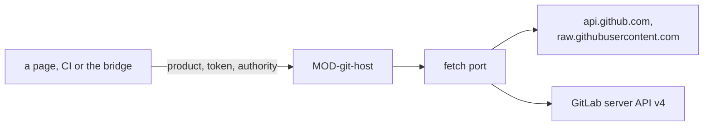

# ARC-004 GitHub and GitLab behind one adapter

## Context

Products live on github.com or on any GitLab server whose API accepts requests from the Pages origin, and a product is
named by its web address. The pages read and write them through the servers' REST APIs (ARC-001). Each GitHub token and
each GitLab project token may leave the browser only towards the API of the server that issued it. Every view shows one
state of a repository, and a write must never overwrite a commit the person has not seen. A refused request has
different causes — a token that has expired, a permission it lacks, a rate limit used up — and the person is told which.

## Decision

1. **One adapter speaks to git servers**, `MOD-git-host`; no other module sends a request to one. It receives the fetch
   port of ARC-003 and the token to send, and refuses where the server refuses, by code: `token-refused` (401),
   `rate-limited-account` and `rate-limited-network` (a used-up limit, its reset time in the reason where the server
   names it), `no-access` (another 403), `not-found`, `moved` (a write the branch has outrun) and `server-error`.
2. **A product is its address.** `https://github.com/<owner>/<name>` is a GitHub product; any other https address is
   taken for a GitLab project, whose path runs up to GitLab's `/-/`.
3. **GitHub** is read and written through `https://api.github.com`; without a token, files are read from
   `https://raw.githubusercontent.com`. A write is one commit through the git data API — a tree, a commit whose parent
   is the head the caller read, and an update of the branch with `force: false`.
4. **GitLab** is read and written through the REST API v4 of the server in the product's address, under that project's
   path only. A write is one `POST …/repository/commits` with one action per file, each existing file with
   `last_commit_id` set to the head the caller read, after the branch was read again and found still at that head.
5. **A token goes only to its own API**, as a header the adapter builds: a GitHub token as `Authorization: Bearer` to
   `https://api.github.com`, a GitLab project token as `PRIVATE-TOKEN` to `<server>/api/v4/projects/<this project>` and
   to `<server>/api/v4/user`, which names the account it acts as, and nowhere else; a request whose URL holds the token
   is refused before it is sent.
6. **Head first, then write.** A caller reads the branch's head, reads there what its checks need, plans the files on
   it, and passes the head to the write; a branch that moved meanwhile refuses the write and nothing is written. A write
   needs an authority of ARC-003; without one, nothing is sent.
7. **Releases, history and the token's account.** The release tags of a repository are its tags `vYYYY.MINOR.PATCH`,
   newest version first, read with the commit each names where a page needs it (`MOD-git-host.tagCommits`). The newest
   commits of a branch or tag are read with the first line of each message (`MOD-git-host.recentCommits`), and one
   commit by its SHA, a branch or a tag likewise (`MOD-git-host.commitOf`). The candidates of a version,
   `vYYYY.MINOR.PATCH-rc.N`, are read apart (`MOD-git-host.candidateTags`). A branch is started on a commit only where
   none of that name exists (`MOD-git-host.createBranch`) — `test-results` by the first run that records its result
   (ARC-015). A tag is set on a given commit, on an authority, only where no tag of that name names another commit
   (`MOD-git-host.createTag`): a tag is never moved (`A VERSION IS NOT REWRITTEN`), and one that names the commit
   already is left as it is, so that a tag is set again after a failure. What a folder's version history holds — each
   path, when it first appeared and when it was removed or renamed away — is read from the changes of each commit
   touching it (`MOD-git-host.pathHistory`): a page learns from one scan per folder when each file entered the
   repository, and every identifier the history holds, so that one withdrawn from the files is not given again
   (ARC-024). The account a token acts as is read from the server — on GitLab the user name of the project token's
   bot —, so that what a person writes is filed under their account.
8. **The server's own pages.** Without a token, GitHub's new-file page is opened with a record as its prefilled value —
   at most 1 000 characters, so that no reviewed text travels in a URL — and its editor for any other text; a GitLab
   product has no such page and needs its project token. The page of a token, the page of a file, the page of a branch
   or tag (`MOD-git-host.treeUrl`), the page where CI secrets are stored (`MOD-git-host.secretsPageUrl`), the page where
   a self-hosted runner is added (`MOD-git-host.runnersPageUrl`), a GitLab project's page of its pipeline schedules
   (`MOD-git-host.pipelineSchedulesPageUrl`) and the permissions one token needs are given by the adapter, so that every
   view names them alike.
9. **Pull requests and CI.** The adapter reads a repository's pull requests with their states and times
   (`MOD-git-host.pullRequests`) and the conclusion of each CI check on a commit (`MOD-git-host.checks`) — on GitHub the
   newest run of each workflow of the commit, which the one token reads with its Actions permission, so a CI check is
   named by its workflow; on GitLab each job's commit status. It reads the paths a commit changes
   (`MOD-git-host.commitFiles`) and a pull request's commits in the order of their parents
   (`MOD-git-host.pullRequestCommits`), since the servers document none. It opens a pull request
   (`MOD-git-host.openPullRequest`); it starts a workflow with inputs (`MOD-git-host.dispatchWorkflow`), lists its runs
   (`MOD-git-host.workflowRuns`) and cancels one (`MOD-git-host.cancelRun`) — on GitLab the project's pipelines, with
   the inputs as variables; a GitLab project's pipeline schedules, which live outside its repository file, are read and
   saved (`MOD-git-host.pipelineSchedules`, `MOD-git-host.savePipelineSchedule`). A token that may not start a workflow
   is refused, and the server's page that starts it by hand is given instead (`MOD-git-host.workflowPageUrl`).
10. **Code enters a default branch only through a pull request with green CI.** `MOD-git-host.writeFiles` refuses to
   bring any file other than `SPEC.md`, `CHANGELOG.md` or a Markdown file under `docs/` — code, tests, workflows, pages
   — onto the repository's default branch. `MOD-git-host.mergePullRequest` merges only at the head commit the caller
   saw, and only when every CI check on it is green and at least one ran; a caller asks for it once the product's
   Definition of Done holds. Whether the server itself enforces merging only on green is read
   (`MOD-git-host.branchProtection`), so that a page can say when it does not, and link to where it is set.



## Alternatives

- **Octokit or `@gitbeaker/rest`** — a handful of endpoints is used, and a client library would build requests outside
  the adapter's guard on where a token goes.
- **isomorphic-git in the browser** — GitHub's smart-HTTP endpoint answers without any `Access-Control-*` header, so a
  page cannot read it; cloning from the browser would need a proxy, which is a server.
- **GitLab through GraphQL** — the REST endpoints used are documented and suffice.
- **A write that reads the head itself and computes its files from it** — the files would be computed by a function the
  caller passes in, which no example can state; reading the head first keeps every step a value.

## Consequences

- Adding another forge is another branch of the same interfaces, not a change of callers.
- GitHub reads without a token count against the network's limit of 60 requests an hour; a page reads one snapshot with
  two requests and then only the files it shows.
- On GitLab a file that a write only read — and did not write — can change between the head check and the commit; the
  head check narrows the gap, it does not close it.
- No use-case step is realised here. The steps of UC-024, UC-035, UC-036 and UC-041 that read pull requests and CI or
  merge, start and cancel are actions on the dashboard's pages and in the runtimes; they are realised where those are
  designed, by their interfaces together with these.

## Modules

### MOD-git-host

```json module
{
  "id": "MOD-git-host",
  "folder": "src/git-host/",
  "layer": "adapter",
  "responsibility": "Reads and writes the repositories of GitHub and of GitLab servers through the fetch port, each token only to the API of the server that issued it, and names their own pages.",
  "realises": [
    "A PRODUCT IS NAMED BY ITS ADDRESS",
    "GITLAB PRODUCTS ARE SUPPORTED",
    "A TOKEN GOES ONLY TO THE SERVER THAT ISSUED IT",
    "A CREDENTIAL IS NEVER PLACED IN A URL",
    "A GITLAB PRODUCT USES A PROJECT ACCESS TOKEN",
    "A GITLAB PRODUCT IS WRITTEN WITH A TOKEN",
    "WITHOUT A TOKEN, GITHUB'S WEB INTERFACE IS THE FALLBACK",
    "NO TEXT TRAVELS IN A URL",
    "THE DASHBOARD WRITES ONLY ON A PERSON'S CLICK",
    "AN EXPIRED TOKEN IS NAMED AND ITS RENEWAL LINKED",
    "A USED-UP RATE LIMIT IS NAMED, NOT BLAMED ON THE TOKEN",
    "ONE GITHUB TOKEN SERVES EVERY FEATURE",
    "A VERSION IS NOT REWRITTEN"
  ],
  "owns": [
    "Product",
    "HeaderMap",
    "TreeEntry",
    "Snapshot",
    "CommitInfo",
    "PathHistory",
    "RepositoryInfo",
    "CommitTitle",
    "TagCommit",
    "CommitResult",
    "TagSet",
    "BranchStarted",
    "PipelineSchedule",
    "PipelineScheduleInput",
    "PullRequest",
    "PullRequestCommit",
    "MergeDone",
    "WorkflowInputs",
    "Dispatched",
    "WorkflowRun",
    "CancelRequested",
    "BranchProtection",
    "Permission",
    "GitLabPermission",
    "Permissions"
  ],
  "uses": ["MOD-contracts"]
}
```

```json interface
{
  "id": "MOD-git-host.parseProductAddress",
  "summary": "The product an address names: a github.com repository, or a project on another server, taken for a GitLab server, its path up to GitLab's /-/.",
  "params": [{ "name": "input", "type": "string" }],
  "result": "Product",
  "async": false,
  "refusals": [
    { "code": "not-an-address", "when": "the text is no web address" },
    { "code": "not-https", "when": "the address does not use https" },
    { "code": "credential-in-address", "when": "the address carries a user name or a token" },
    { "code": "not-a-repository", "when": "the address names no owner and repository, or no group and project" }
  ],
  "examples": [
    {
      "name": "a GitHub repository",
      "input": { "input": "https://github.com/alice/thesis.git" },
      "result": {
        "kind": "github",
        "address": "https://github.com/alice/thesis",
        "host": "github.com",
        "server": "https://github.com",
        "repo": "alice/thesis"
      }
    },
    {
      "name": "a GitLab project in a nested group",
      "input": { "input": "https://gitlab.example.org/group/tools/thesis/-/tree/main" },
      "result": {
        "kind": "gitlab",
        "address": "https://gitlab.example.org/group/tools/thesis",
        "host": "gitlab.example.org",
        "server": "https://gitlab.example.org",
        "repo": "group/tools/thesis"
      }
    },
    { "name": "http", "input": { "input": "http://github.com/alice/thesis" }, "refused": "not-https" }
  ]
}
```

```json interface
{
  "id": "MOD-git-host.authHeaders",
  "summary": "The authorisation header a request to a URL carries: a GitHub token only to api.github.com, a GitLab project token only to its project's API on its own server; none elsewhere.",
  "params": [
    { "name": "product", "type": "Product" },
    { "name": "url", "type": "string" },
    { "name": "token", "type": "string" }
  ],
  "result": "HeaderMap",
  "async": false,
  "refusals": [],
  "examples": [
    {
      "name": "GitHub's API",
      "input": {
        "product": {
          "kind": "github",
          "address": "https://github.com/alice/thesis",
          "host": "github.com",
          "server": "https://github.com",
          "repo": "alice/thesis"
        },
        "url": "https://api.github.com/repos/alice/thesis/git/trees",
        "token": "github_pat_example"
      },
      "result": { "Authorization": "Bearer github_pat_example" }
    },
    {
      "name": "GitHub's raw host",
      "input": {
        "product": {
          "kind": "github",
          "address": "https://github.com/alice/thesis",
          "host": "github.com",
          "server": "https://github.com",
          "repo": "alice/thesis"
        },
        "url": "https://raw.githubusercontent.com/alice/thesis/c000000000000000000000000000000000000000/SPEC.md",
        "token": "github_pat_example"
      },
      "result": {}
    },
    {
      "name": "another project on the same GitLab server",
      "input": {
        "product": {
          "kind": "gitlab",
          "address": "https://gitlab.example.org/group/tools/thesis",
          "host": "gitlab.example.org",
          "server": "https://gitlab.example.org",
          "repo": "group/tools/thesis"
        },
        "url": "https://gitlab.example.org/api/v4/projects/group%2Fother",
        "token": "glpat-example"
      },
      "result": {}
    },
    {
      "name": "the token's own account on its GitLab server",
      "input": {
        "product": {
          "kind": "gitlab",
          "address": "https://gitlab.example.org/group/tools/thesis",
          "host": "gitlab.example.org",
          "server": "https://gitlab.example.org",
          "repo": "group/tools/thesis"
        },
        "url": "https://gitlab.example.org/api/v4/user",
        "token": "glpat-example"
      },
      "result": { "PRIVATE-TOKEN": "glpat-example" }
    }
  ]
}
```

```json interface
{
  "id": "MOD-git-host.branchHead",
  "summary": "The commit a branch points at.",
  "params": [
    { "name": "product", "type": "Product" },
    { "name": "branch", "type": "string" },
    { "name": "token", "type": "string" },
    { "name": "fetch", "type": "FetchPort" }
  ],
  "result": "string",
  "async": true,
  "refusals": [
    {
      "code": "token-refused",
      "when": "the server answers 401: the token has expired, or was regenerated, rotated or revoked"
    },
    {
      "code": "rate-limited-account",
      "when": "the account's rate limit is used up; the reason names when it resets, where the server says"
    },
    { "code": "rate-limited-network", "when": "the network's rate limit for requests without a token is used up" },
    {
      "code": "no-access",
      "when": "the server answers 403 for another reason: the token lacks the permission or the repository"
    },
    { "code": "not-found", "when": "the server answers 404" },
    { "code": "server-error", "when": "the server answers with another error" },
    { "code": "unreachable", "when": "no answer arrives" },
    { "code": "credential-in-url", "when": "the URL of a request would hold the token; nothing is sent" }
  ],
  "examples": [
    {
      "name": "main on GitHub",
      "input": {
        "product": {
          "kind": "github",
          "address": "https://github.com/alice/thesis",
          "host": "github.com",
          "server": "https://github.com",
          "repo": "alice/thesis"
        },
        "branch": "main",
        "token": "github_pat_example",
        "fetch": [
          {
            "request": { "method": "GET", "url": "https://api.github.com/repos/alice/thesis/git/ref/heads/main" },
            "response": { "status": 200, "body": { "object": { "sha": "a100000000000000000000000000000000000000" } } }
          }
        ]
      },
      "result": "a100000000000000000000000000000000000000"
    }
  ]
}
```

```json interface
{
  "id": "MOD-git-host.readSnapshot",
  "summary": "A branch, tag or commit resolved to one commit, and every file of that commit with its blob SHA.",
  "params": [
    { "name": "product", "type": "Product" },
    { "name": "ref", "type": "string" },
    { "name": "token", "type": "string" },
    { "name": "fetch", "type": "FetchPort" }
  ],
  "result": "Snapshot",
  "async": true,
  "refusals": [
    {
      "code": "token-refused",
      "when": "the server answers 401: the token has expired, or was regenerated, rotated or revoked"
    },
    {
      "code": "rate-limited-account",
      "when": "the account's rate limit is used up; the reason names when it resets, where the server says"
    },
    { "code": "rate-limited-network", "when": "the network's rate limit for requests without a token is used up" },
    {
      "code": "no-access",
      "when": "the server answers 403 for another reason: the token lacks the permission or the repository"
    },
    { "code": "not-found", "when": "the server answers 404" },
    { "code": "server-error", "when": "the server answers with another error" },
    { "code": "unreachable", "when": "no answer arrives" },
    { "code": "credential-in-url", "when": "the URL of a request would hold the token; nothing is sent" }
  ],
  "examples": [
    {
      "name": "two files on GitHub",
      "input": {
        "product": {
          "kind": "github",
          "address": "https://github.com/alice/thesis",
          "host": "github.com",
          "server": "https://github.com",
          "repo": "alice/thesis"
        },
        "ref": "main",
        "token": "github_pat_example",
        "fetch": [
          {
            "request": { "method": "GET", "url": "https://api.github.com/repos/alice/thesis/commits/main" },
            "response": { "status": 200, "body": { "sha": "c000000000000000000000000000000000000000" } }
          },
          {
            "request": {
              "method": "GET",
              "url": "https://api.github.com/repos/alice/thesis/git/trees/c000000000000000000000000000000000000000?recursive=1"
            },
            "response": {
              "status": 200,
              "body": {
                "tree": [
                  { "path": "SPEC.md", "type": "blob", "sha": "f500000000000000000000000000000000000000" },
                  { "path": "docs", "type": "tree", "sha": "d300000000000000000000000000000000000000" },
                  {
                    "path": "docs/use-cases/UC-001-add.md",
                    "type": "blob",
                    "sha": "f600000000000000000000000000000000000000"
                  }
                ]
              }
            }
          }
        ]
      },
      "result": {
        "commit": "c000000000000000000000000000000000000000",
        "tree": [
          { "path": "SPEC.md", "blob": "f500000000000000000000000000000000000000" },
          { "path": "docs/use-cases/UC-001-add.md", "blob": "f600000000000000000000000000000000000000" }
        ]
      }
    },
    {
      "name": "a token GitHub no longer accepts",
      "input": {
        "product": {
          "kind": "github",
          "address": "https://github.com/alice/thesis",
          "host": "github.com",
          "server": "https://github.com",
          "repo": "alice/thesis"
        },
        "ref": "main",
        "token": "github_pat_example",
        "fetch": [
          {
            "request": { "method": "GET", "url": "https://api.github.com/repos/alice/thesis/commits/main" },
            "response": { "status": 401, "body": { "message": "Bad credentials" } }
          }
        ]
      },
      "refused": "token-refused"
    },
    {
      "name": "the account's limit used up",
      "input": {
        "product": {
          "kind": "github",
          "address": "https://github.com/alice/thesis",
          "host": "github.com",
          "server": "https://github.com",
          "repo": "alice/thesis"
        },
        "ref": "main",
        "token": "github_pat_example",
        "fetch": [
          {
            "request": { "method": "GET", "url": "https://api.github.com/repos/alice/thesis/commits/main" },
            "response": {
              "status": 403,
              "headers": {
                "x-ratelimit-remaining": "0",
                "x-ratelimit-limit": "5000",
                "x-ratelimit-reset": "1791216000"
              },
              "body": { "message": "API rate limit exceeded" }
            }
          }
        ]
      },
      "refused": "rate-limited-account"
    }
  ]
}
```

```json interface
{
  "id": "MOD-git-host.readFile",
  "summary": "A file's text at a commit: through the API with a token, from GitHub's raw host without one.",
  "params": [
    { "name": "product", "type": "Product" },
    { "name": "commit", "type": "string" },
    { "name": "path", "type": "string" },
    { "name": "token", "type": "string" },
    { "name": "fetch", "type": "FetchPort" }
  ],
  "result": "string",
  "async": true,
  "refusals": [
    { "code": "no-file", "when": "the file does not exist at the commit" },
    {
      "code": "token-refused",
      "when": "the server answers 401: the token has expired, or was regenerated, rotated or revoked"
    },
    {
      "code": "rate-limited-account",
      "when": "the account's rate limit is used up; the reason names when it resets, where the server says"
    },
    { "code": "rate-limited-network", "when": "the network's rate limit for requests without a token is used up" },
    {
      "code": "no-access",
      "when": "the server answers 403 for another reason: the token lacks the permission or the repository"
    },
    { "code": "server-error", "when": "the server answers with another error" },
    { "code": "unreachable", "when": "no answer arrives" },
    { "code": "credential-in-url", "when": "the URL of a request would hold the token; nothing is sent" }
  ],
  "examples": [
    {
      "name": "with a token",
      "input": {
        "product": {
          "kind": "github",
          "address": "https://github.com/alice/thesis",
          "host": "github.com",
          "server": "https://github.com",
          "repo": "alice/thesis"
        },
        "commit": "c000000000000000000000000000000000000000",
        "path": "SPEC.md",
        "token": "github_pat_example",
        "fetch": [
          {
            "request": {
              "method": "GET",
              "url": "https://api.github.com/repos/alice/thesis/contents/SPEC.md?ref=c000000000000000000000000000000000000000"
            },
            "response": { "status": 200, "body": "# Thesis — Specification\n" }
          }
        ]
      },
      "result": "# Thesis — Specification\n"
    },
    {
      "name": "without a token",
      "input": {
        "product": {
          "kind": "github",
          "address": "https://github.com/alice/thesis",
          "host": "github.com",
          "server": "https://github.com",
          "repo": "alice/thesis"
        },
        "commit": "c000000000000000000000000000000000000000",
        "path": "SPEC.md",
        "token": "",
        "fetch": [
          {
            "request": {
              "method": "GET",
              "url": "https://raw.githubusercontent.com/alice/thesis/c000000000000000000000000000000000000000/SPEC.md"
            },
            "response": { "status": 200, "body": "# Thesis — Specification\n" }
          }
        ]
      },
      "result": "# Thesis — Specification\n"
    },
    {
      "name": "a file that is not there",
      "input": {
        "product": {
          "kind": "github",
          "address": "https://github.com/alice/thesis",
          "host": "github.com",
          "server": "https://github.com",
          "repo": "alice/thesis"
        },
        "commit": "c000000000000000000000000000000000000000",
        "path": "docs/x.md",
        "token": "github_pat_example",
        "fetch": [
          {
            "request": {
              "method": "GET",
              "url": "https://api.github.com/repos/alice/thesis/contents/docs/x.md?ref=c000000000000000000000000000000000000000"
            },
            "response": { "status": 404, "body": { "message": "Not Found" } }
          }
        ]
      },
      "refused": "no-file"
    }
  ]
}
```

```json interface
{
  "id": "MOD-git-host.readBlob",
  "summary": "A text by its blob SHA, checked to hash to it.",
  "params": [
    { "name": "product", "type": "Product" },
    { "name": "blob", "type": "string" },
    { "name": "token", "type": "string" },
    { "name": "fetch", "type": "FetchPort" }
  ],
  "result": "string",
  "async": true,
  "refusals": [
    { "code": "not-a-blob", "when": "the blob is no SHA" },
    { "code": "wrong-text", "when": "the text read does not hash to the blob" },
    {
      "code": "token-refused",
      "when": "the server answers 401: the token has expired, or was regenerated, rotated or revoked"
    },
    {
      "code": "rate-limited-account",
      "when": "the account's rate limit is used up; the reason names when it resets, where the server says"
    },
    { "code": "rate-limited-network", "when": "the network's rate limit for requests without a token is used up" },
    {
      "code": "no-access",
      "when": "the server answers 403 for another reason: the token lacks the permission or the repository"
    },
    { "code": "not-found", "when": "the server answers 404" },
    { "code": "server-error", "when": "the server answers with another error" },
    { "code": "unreachable", "when": "no answer arrives" },
    { "code": "credential-in-url", "when": "the URL of a request would hold the token; nothing is sent" }
  ],
  "examples": [
    {
      "name": "a blob in base64",
      "input": {
        "product": {
          "kind": "github",
          "address": "https://github.com/alice/thesis",
          "host": "github.com",
          "server": "https://github.com",
          "repo": "alice/thesis"
        },
        "blob": "ce013625030ba8dba906f756967f9e9ca394464a",
        "token": "github_pat_example",
        "fetch": [
          {
            "request": {
              "method": "GET",
              "url": "https://api.github.com/repos/alice/thesis/git/blobs/ce013625030ba8dba906f756967f9e9ca394464a"
            },
            "response": { "status": 200, "body": { "encoding": "base64", "content": "aGVsbG8K" } }
          }
        ]
      },
      "result": "hello\n"
    },
    {
      "name": "a text that does not hash to the blob",
      "input": {
        "product": {
          "kind": "github",
          "address": "https://github.com/alice/thesis",
          "host": "github.com",
          "server": "https://github.com",
          "repo": "alice/thesis"
        },
        "blob": "ce013625030ba8dba906f756967f9e9ca394464a",
        "token": "github_pat_example",
        "fetch": [
          {
            "request": {
              "method": "GET",
              "url": "https://api.github.com/repos/alice/thesis/git/blobs/ce013625030ba8dba906f756967f9e9ca394464a"
            },
            "response": { "status": 200, "body": { "encoding": "base64", "content": "aGVsbG8hCg==" } }
          }
        ]
      },
      "refused": "wrong-text"
    }
  ]
}
```

```json interface
{
  "id": "MOD-git-host.commitsTouching",
  "summary": "The newest commits, at most limit, that touch a path at a commit, newest first.",
  "params": [
    { "name": "product", "type": "Product" },
    { "name": "commit", "type": "string" },
    { "name": "path", "type": "string" },
    { "name": "limit", "type": "integer" },
    { "name": "token", "type": "string" },
    { "name": "fetch", "type": "FetchPort" }
  ],
  "result": "CommitInfo[]",
  "async": true,
  "refusals": [
    {
      "code": "token-refused",
      "when": "the server answers 401: the token has expired, or was regenerated, rotated or revoked"
    },
    {
      "code": "rate-limited-account",
      "when": "the account's rate limit is used up; the reason names when it resets, where the server says"
    },
    { "code": "rate-limited-network", "when": "the network's rate limit for requests without a token is used up" },
    {
      "code": "no-access",
      "when": "the server answers 403 for another reason: the token lacks the permission or the repository"
    },
    { "code": "not-found", "when": "the server answers 404" },
    { "code": "server-error", "when": "the server answers with another error" },
    { "code": "unreachable", "when": "no answer arrives" },
    { "code": "credential-in-url", "when": "the URL of a request would hold the token; nothing is sent" }
  ],
  "examples": [
    {
      "name": "one commit",
      "input": {
        "product": {
          "kind": "github",
          "address": "https://github.com/alice/thesis",
          "host": "github.com",
          "server": "https://github.com",
          "repo": "alice/thesis"
        },
        "commit": "c000000000000000000000000000000000000000",
        "path": "SPEC.md",
        "limit": 2,
        "token": "github_pat_example",
        "fetch": [
          {
            "request": {
              "method": "GET",
              "url": "https://api.github.com/repos/alice/thesis/commits?path=SPEC.md&sha=c000000000000000000000000000000000000000&per_page=2"
            },
            "response": {
              "status": 200,
              "body": [
                {
                  "sha": "c000000000000000000000000000000000000000",
                  "commit": { "committer": { "date": "2026-10-03T14:08:00Z" }, "author": { "name": "A. Maier" } },
                  "author": { "login": "akmaier" }
                }
              ]
            }
          }
        ]
      },
      "result": [
        { "sha": "c000000000000000000000000000000000000000", "date": "2026-10-03T14:08:00Z", "author": "akmaier" }
      ]
    }
  ]
}
```

```json interface
{
  "id": "MOD-git-host.pathHistory",
  "summary": "What the version history of a folder holds: every path that a commit touching the folder, up to the one given, added — when it first appeared, and when it was removed or renamed away if the commit no longer holds it —, oldest first, read from each such commit's changes.",
  "params": [
    { "name": "product", "type": "Product" },
    { "name": "commit", "type": "string" },
    { "name": "folder", "type": "string" },
    { "name": "token", "type": "string" },
    { "name": "fetch", "type": "FetchPort" }
  ],
  "result": "PathHistory[]",
  "async": true,
  "refusals": [
    {
      "code": "token-refused",
      "when": "the server answers 401: the token has expired, or was regenerated, rotated or revoked"
    },
    {
      "code": "rate-limited-account",
      "when": "the account's rate limit is used up; the reason names when it resets, where the server says"
    },
    { "code": "rate-limited-network", "when": "the network's rate limit for requests without a token is used up" },
    {
      "code": "no-access",
      "when": "the server answers 403 for another reason: the token lacks the permission or the repository"
    },
    { "code": "not-found", "when": "the server answers 404" },
    { "code": "server-error", "when": "the server answers with another error" },
    { "code": "unreachable", "when": "no answer arrives" },
    { "code": "credential-in-url", "when": "the URL of a request would hold the token; nothing is sent" }
  ],
  "examples": [
    {
      "name": "an item added and later removed on GitHub",
      "input": {
        "product": {
          "kind": "github",
          "address": "https://github.com/alice/thesis",
          "host": "github.com",
          "server": "https://github.com",
          "repo": "alice/thesis"
        },
        "commit": "c000000000000000000000000000000000000000",
        "folder": "docs/backlog/",
        "token": "github_pat_example",
        "fetch": [
          {
            "request": {
              "method": "GET",
              "url": "https://api.github.com/repos/alice/thesis/commits?path=docs%2Fbacklog&sha=c000000000000000000000000000000000000000&per_page=100&page=1"
            },
            "response": {
              "status": 200,
              "body": [
                {
                  "sha": "c000000000000000000000000000000000000000",
                  "commit": { "committer": { "date": "2026-10-08T09:00:00Z" }, "author": { "name": "alice" } },
                  "author": { "login": "alice" }
                },
                {
                  "sha": "f500000000000000000000000000000000000000",
                  "commit": { "committer": { "date": "2026-10-05T08:00:00Z" }, "author": { "name": "alice" } },
                  "author": { "login": "alice" }
                }
              ]
            }
          },
          {
            "request": {
              "method": "GET",
              "url": "https://api.github.com/repos/alice/thesis/commits/f500000000000000000000000000000000000000"
            },
            "response": {
              "status": 200,
              "body": {
                "sha": "f500000000000000000000000000000000000000",
                "files": [
                  { "filename": "docs/backlog/ITM-016-accept-a-chapter-with-one-click.md", "status": "added" },
                  { "filename": "docs/backlog/ITM-017-print-a-chapter.md", "status": "added" },
                  { "filename": "docs/backlog/order.md", "status": "modified" }
                ]
              }
            }
          },
          {
            "request": {
              "method": "GET",
              "url": "https://api.github.com/repos/alice/thesis/commits/c000000000000000000000000000000000000000"
            },
            "response": {
              "status": 200,
              "body": {
                "sha": "c000000000000000000000000000000000000000",
                "files": [
                  { "filename": "docs/backlog/ITM-017-print-a-chapter.md", "status": "removed" },
                  { "filename": "docs/backlog/order.md", "status": "modified" },
                  { "filename": "README.md", "status": "removed" }
                ]
              }
            }
          }
        ]
      },
      "result": [
        {
          "path": "docs/backlog/ITM-016-accept-a-chapter-with-one-click.md",
          "added": "2026-10-05T08:00:00Z",
          "removed": ""
        },
        {
          "path": "docs/backlog/ITM-017-print-a-chapter.md",
          "added": "2026-10-05T08:00:00Z",
          "removed": "2026-10-08T09:00:00Z"
        },
        { "path": "docs/backlog/order.md", "added": "2026-10-05T08:00:00Z", "removed": "" }
      ]
    },
    {
      "name": "a renamed item on GitLab",
      "input": {
        "product": {
          "kind": "gitlab",
          "address": "https://gitlab.example.org/group/tools/thesis",
          "host": "gitlab.example.org",
          "server": "https://gitlab.example.org",
          "repo": "group/tools/thesis"
        },
        "commit": "c000000000000000000000000000000000000000",
        "folder": "docs/backlog/",
        "token": "glpat-example",
        "fetch": [
          {
            "request": {
              "method": "GET",
              "url": "https://gitlab.example.org/api/v4/projects/group%2Ftools%2Fthesis/repository/commits?path=docs%2Fbacklog&ref_name=c000000000000000000000000000000000000000&per_page=100&page=1"
            },
            "response": {
              "status": 200,
              "body": [
                {
                  "id": "c000000000000000000000000000000000000000",
                  "committed_date": "2026-10-08T09:00:00.000Z",
                  "author_name": "alice"
                }
              ]
            }
          },
          {
            "request": {
              "method": "GET",
              "url": "https://gitlab.example.org/api/v4/projects/group%2Ftools%2Fthesis/repository/commits/c000000000000000000000000000000000000000/diff?per_page=100"
            },
            "response": {
              "status": 200,
              "body": [
                {
                  "old_path": "docs/backlog/ITM-009-export.md",
                  "new_path": "docs/backlog/ITM-009-export-a-chapter.md",
                  "new_file": false,
                  "renamed_file": true,
                  "deleted_file": false
                }
              ]
            }
          }
        ]
      },
      "result": [
        {
          "path": "docs/backlog/ITM-009-export.md",
          "added": "2026-10-08T09:00:00Z",
          "removed": "2026-10-08T09:00:00Z"
        },
        { "path": "docs/backlog/ITM-009-export-a-chapter.md", "added": "2026-10-08T09:00:00Z", "removed": "" }
      ]
    }
  ]
}
```

```json interface
{
  "id": "MOD-git-host.recentCommits",
  "summary": "The newest commits of a branch or tag, at most limit, newest first, each with the first line of its message, when it was committed, and its author's account or name.",
  "params": [
    { "name": "product", "type": "Product" },
    { "name": "ref", "type": "string" },
    { "name": "limit", "type": "integer" },
    { "name": "token", "type": "string" },
    { "name": "fetch", "type": "FetchPort" }
  ],
  "result": "CommitTitle[]",
  "async": true,
  "refusals": [
    {
      "code": "token-refused",
      "when": "the server answers 401: the token has expired, or was regenerated, rotated or revoked"
    },
    {
      "code": "rate-limited-account",
      "when": "the account's rate limit is used up; the reason names when it resets, where the server says"
    },
    { "code": "rate-limited-network", "when": "the network's rate limit for requests without a token is used up" },
    {
      "code": "no-access",
      "when": "the server answers 403 for another reason: the token lacks the permission or the repository"
    },
    { "code": "not-found", "when": "the server answers 404" },
    { "code": "server-error", "when": "the server answers with another error" },
    { "code": "unreachable", "when": "no answer arrives" },
    { "code": "credential-in-url", "when": "the URL of a request would hold the token; nothing is sent" }
  ],
  "examples": [
    {
      "name": "two commits of main on GitHub",
      "input": {
        "product": {
          "kind": "github",
          "address": "https://github.com/alice/thesis",
          "host": "github.com",
          "server": "https://github.com",
          "repo": "alice/thesis"
        },
        "ref": "main",
        "limit": 2,
        "token": "github_pat_example",
        "fetch": [
          {
            "request": {
              "method": "GET",
              "url": "https://api.github.com/repos/alice/thesis/commits?sha=main&per_page=2"
            },
            "response": {
              "status": 200,
              "body": [
                {
                  "sha": "a100000000000000000000000000000000000000",
                  "commit": {
                    "message": "ITM-014: export a chapter as PDF\n\nThe figures stay.",
                    "committer": { "date": "2026-10-09T07:58:00Z" },
                    "author": { "name": "Alice" }
                  },
                  "author": { "login": "alice" }
                },
                {
                  "sha": "c000000000000000000000000000000000000000",
                  "commit": {
                    "message": "docs: UC-003 open for review",
                    "committer": { "date": "2026-10-08T16:20:00Z" },
                    "author": { "name": "Alice" }
                  },
                  "author": { "login": "alice" }
                }
              ]
            }
          }
        ]
      },
      "result": [
        {
          "sha": "a100000000000000000000000000000000000000",
          "title": "ITM-014: export a chapter as PDF",
          "date": "2026-10-09T07:58:00Z",
          "author": "alice"
        },
        {
          "sha": "c000000000000000000000000000000000000000",
          "title": "docs: UC-003 open for review",
          "date": "2026-10-08T16:20:00Z",
          "author": "alice"
        }
      ]
    },
    {
      "name": "a commit of main on GitLab",
      "input": {
        "product": {
          "kind": "gitlab",
          "address": "https://gitlab.example.org/group/tools/thesis",
          "host": "gitlab.example.org",
          "server": "https://gitlab.example.org",
          "repo": "group/tools/thesis"
        },
        "ref": "main",
        "limit": 1,
        "token": "glpat-example",
        "fetch": [
          {
            "request": {
              "method": "GET",
              "url": "https://gitlab.example.org/api/v4/projects/group%2Ftools%2Fthesis/repository/commits?ref_name=main&per_page=1"
            },
            "response": {
              "status": 200,
              "body": [
                {
                  "id": "a100000000000000000000000000000000000000",
                  "title": "ITM-014: export a chapter as PDF",
                  "committed_date": "2026-10-09T07:58:00.000+00:00",
                  "author_name": "Alice"
                }
              ]
            }
          }
        ]
      },
      "result": [
        {
          "sha": "a100000000000000000000000000000000000000",
          "title": "ITM-014: export a chapter as PDF",
          "date": "2026-10-09T07:58:00.000+00:00",
          "author": "Alice"
        }
      ]
    }
  ]
}
```

```json interface
{
  "id": "MOD-git-host.commitOf",
  "summary": "One commit by its SHA, a branch or a tag: its SHA, the first line of its message, when it was committed, and its author's account or name.",
  "params": [
    { "name": "product", "type": "Product" },
    { "name": "ref", "type": "string" },
    { "name": "token", "type": "string" },
    { "name": "fetch", "type": "FetchPort" }
  ],
  "result": "CommitTitle",
  "async": true,
  "refusals": [
    { "code": "no-commit", "when": "the server answers 404: it knows no commit by that name" },
    {
      "code": "token-refused",
      "when": "the server answers 401: the token has expired, or was regenerated, rotated or revoked"
    },
    {
      "code": "rate-limited-account",
      "when": "the account's rate limit is used up; the reason names when it resets, where the server says"
    },
    { "code": "rate-limited-network", "when": "the network's rate limit for requests without a token is used up" },
    {
      "code": "no-access",
      "when": "the server answers 403 for another reason: the token lacks the permission or the repository"
    },
    { "code": "server-error", "when": "the server answers with another error" },
    { "code": "unreachable", "when": "no answer arrives" },
    { "code": "credential-in-url", "when": "the URL of a request would hold the token; nothing is sent" }
  ],
  "examples": [
    {
      "name": "a commit by its SHA on GitHub",
      "input": {
        "product": {
          "kind": "github",
          "address": "https://github.com/alice/thesis",
          "host": "github.com",
          "server": "https://github.com",
          "repo": "alice/thesis"
        },
        "ref": "a100000000000000000000000000000000000000",
        "token": "github_pat_example",
        "fetch": [
          {
            "request": {
              "method": "GET",
              "url": "https://api.github.com/repos/alice/thesis/commits/a100000000000000000000000000000000000000"
            },
            "response": {
              "status": 200,
              "body": {
                "sha": "a100000000000000000000000000000000000000",
                "commit": {
                  "message": "ITM-014: export a chapter as PDF\n\nThe figures stay.",
                  "committer": { "date": "2026-10-09T07:58:00Z" },
                  "author": { "name": "Alice" }
                },
                "author": { "login": "alice" }
              }
            }
          }
        ]
      },
      "result": {
        "sha": "a100000000000000000000000000000000000000",
        "title": "ITM-014: export a chapter as PDF",
        "date": "2026-10-09T07:58:00Z",
        "author": "alice"
      }
    },
    {
      "name": "a release tag on GitLab",
      "input": {
        "product": {
          "kind": "gitlab",
          "address": "https://gitlab.example.org/group/tools/thesis",
          "host": "gitlab.example.org",
          "server": "https://gitlab.example.org",
          "repo": "group/tools/thesis"
        },
        "ref": "v2026.2.1",
        "token": "glpat-example",
        "fetch": [
          {
            "request": {
              "method": "GET",
              "url": "https://gitlab.example.org/api/v4/projects/group%2Ftools%2Fthesis/repository/commits/v2026.2.1"
            },
            "response": {
              "status": 200,
              "body": {
                "id": "c000000000000000000000000000000000000000",
                "title": "release v2026.2.1",
                "message": "release v2026.2.1\n",
                "committed_date": "2026-10-02T07:30:00.000+00:00",
                "author_name": "Alice"
              }
            }
          }
        ]
      },
      "result": {
        "sha": "c000000000000000000000000000000000000000",
        "title": "release v2026.2.1",
        "date": "2026-10-02T07:30:00.000+00:00",
        "author": "Alice"
      }
    },
    {
      "name": "a commit the server does not know",
      "input": {
        "product": {
          "kind": "github",
          "address": "https://github.com/alice/thesis",
          "host": "github.com",
          "server": "https://github.com",
          "repo": "alice/thesis"
        },
        "ref": "b200000000000000000000000000000000000000",
        "token": "github_pat_example",
        "fetch": [
          {
            "request": {
              "method": "GET",
              "url": "https://api.github.com/repos/alice/thesis/commits/b200000000000000000000000000000000000000"
            },
            "response": { "status": 404, "body": { "message": "Not Found" } }
          }
        ]
      },
      "refused": "no-commit"
    }
  ]
}
```

```json interface
{
  "id": "MOD-git-host.repositoryInfo",
  "summary": "What the server reports about a repository: its visibility, its default branch, and on GitLab the access level the token acts with (0 elsewhere).",
  "params": [
    { "name": "product", "type": "Product" },
    { "name": "token", "type": "string" },
    { "name": "fetch", "type": "FetchPort" }
  ],
  "result": "RepositoryInfo",
  "async": true,
  "refusals": [
    {
      "code": "token-refused",
      "when": "the server answers 401: the token has expired, or was regenerated, rotated or revoked"
    },
    {
      "code": "rate-limited-account",
      "when": "the account's rate limit is used up; the reason names when it resets, where the server says"
    },
    { "code": "rate-limited-network", "when": "the network's rate limit for requests without a token is used up" },
    {
      "code": "no-access",
      "when": "the server answers 403 for another reason: the token lacks the permission or the repository"
    },
    { "code": "not-found", "when": "the server answers 404" },
    { "code": "server-error", "when": "the server answers with another error" },
    { "code": "unreachable", "when": "no answer arrives" },
    { "code": "credential-in-url", "when": "the URL of a request would hold the token; nothing is sent" }
  ],
  "examples": [
    {
      "name": "a GitLab project with a Maintainer token",
      "input": {
        "product": {
          "kind": "gitlab",
          "address": "https://gitlab.example.org/group/tools/thesis",
          "host": "gitlab.example.org",
          "server": "https://gitlab.example.org",
          "repo": "group/tools/thesis"
        },
        "token": "glpat-example",
        "fetch": [
          {
            "request": { "method": "GET", "url": "https://gitlab.example.org/api/v4/projects/group%2Ftools%2Fthesis" },
            "response": {
              "status": 200,
              "body": {
                "visibility": "internal",
                "default_branch": "main",
                "permissions": { "project_access": { "access_level": 40 } }
              }
            }
          }
        ]
      },
      "result": { "visibility": "internal", "defaultBranch": "main", "role": 40 }
    }
  ]
}
```

```json interface
{
  "id": "MOD-git-host.releaseTags",
  "summary": "The release tags vYYYY.MINOR.PATCH of a repository, newest version first; other tags are left out.",
  "params": [
    { "name": "product", "type": "Product" },
    { "name": "token", "type": "string" },
    { "name": "fetch", "type": "FetchPort" }
  ],
  "result": "string[]",
  "async": true,
  "refusals": [
    {
      "code": "token-refused",
      "when": "the server answers 401: the token has expired, or was regenerated, rotated or revoked"
    },
    {
      "code": "rate-limited-account",
      "when": "the account's rate limit is used up; the reason names when it resets, where the server says"
    },
    { "code": "rate-limited-network", "when": "the network's rate limit for requests without a token is used up" },
    {
      "code": "no-access",
      "when": "the server answers 403 for another reason: the token lacks the permission or the repository"
    },
    { "code": "not-found", "when": "the server answers 404" },
    { "code": "server-error", "when": "the server answers with another error" },
    { "code": "unreachable", "when": "no answer arrives" },
    { "code": "credential-in-url", "when": "the URL of a request would hold the token; nothing is sent" }
  ],
  "examples": [
    {
      "name": "three releases and another tag",
      "input": {
        "product": {
          "kind": "github",
          "address": "https://github.com/alice/thesis",
          "host": "github.com",
          "server": "https://github.com",
          "repo": "alice/thesis"
        },
        "token": "github_pat_example",
        "fetch": [
          {
            "request": {
              "method": "GET",
              "url": "https://api.github.com/repos/alice/thesis/tags?per_page=100&page=1"
            },
            "response": {
              "status": 200,
              "body": [
                { "name": "v2026.2.0" },
                { "name": "v2026.10.1" },
                { "name": "draft" },
                { "name": "v2026.10.0" }
              ]
            }
          }
        ]
      },
      "result": ["v2026.10.1", "v2026.10.0", "v2026.2.0"]
    }
  ]
}
```

```json interface
{
  "id": "MOD-git-host.tagCommits",
  "summary": "The release tags vYYYY.MINOR.PATCH of a repository with the commit each names, newest version first; other tags are left out.",
  "params": [
    { "name": "product", "type": "Product" },
    { "name": "token", "type": "string" },
    { "name": "fetch", "type": "FetchPort" }
  ],
  "result": "TagCommit[]",
  "async": true,
  "refusals": [
    {
      "code": "token-refused",
      "when": "the server answers 401: the token has expired, or was regenerated, rotated or revoked"
    },
    {
      "code": "rate-limited-account",
      "when": "the account's rate limit is used up; the reason names when it resets, where the server says"
    },
    { "code": "rate-limited-network", "when": "the network's rate limit for requests without a token is used up" },
    {
      "code": "no-access",
      "when": "the server answers 403 for another reason: the token lacks the permission or the repository"
    },
    { "code": "not-found", "when": "the server answers 404" },
    { "code": "server-error", "when": "the server answers with another error" },
    { "code": "unreachable", "when": "no answer arrives" },
    { "code": "credential-in-url", "when": "the URL of a request would hold the token; nothing is sent" }
  ],
  "examples": [
    {
      "name": "two releases and another tag on GitHub",
      "input": {
        "product": {
          "kind": "github",
          "address": "https://github.com/alice/thesis",
          "host": "github.com",
          "server": "https://github.com",
          "repo": "alice/thesis"
        },
        "token": "github_pat_example",
        "fetch": [
          {
            "request": {
              "method": "GET",
              "url": "https://api.github.com/repos/alice/thesis/tags?per_page=100&page=1"
            },
            "response": {
              "status": 200,
              "body": [
                { "name": "v2026.2.0", "commit": { "sha": "b200000000000000000000000000000000000000" } },
                { "name": "draft", "commit": { "sha": "d300000000000000000000000000000000000000" } },
                { "name": "v2026.2.1", "commit": { "sha": "c000000000000000000000000000000000000000" } }
              ]
            }
          }
        ]
      },
      "result": [
        { "name": "v2026.2.1", "commit": "c000000000000000000000000000000000000000" },
        { "name": "v2026.2.0", "commit": "b200000000000000000000000000000000000000" }
      ]
    },
    {
      "name": "a release on GitLab",
      "input": {
        "product": {
          "kind": "gitlab",
          "address": "https://gitlab.example.org/group/tools/thesis",
          "host": "gitlab.example.org",
          "server": "https://gitlab.example.org",
          "repo": "group/tools/thesis"
        },
        "token": "glpat-example",
        "fetch": [
          {
            "request": {
              "method": "GET",
              "url": "https://gitlab.example.org/api/v4/projects/group%2Ftools%2Fthesis/repository/tags?per_page=100&page=1"
            },
            "response": {
              "status": 200,
              "body": [{ "name": "v2026.2.1", "commit": { "id": "c000000000000000000000000000000000000000" } }]
            }
          }
        ]
      },
      "result": [{ "name": "v2026.2.1", "commit": "c000000000000000000000000000000000000000" }]
    }
  ]
}
```

```json interface
{
  "id": "MOD-git-host.createBranch",
  "summary": "A branch started on a commit, on an authority, only where no branch of that name exists: the commit is read first, then the branch, and a write the server refuses after both is a branch another started meanwhile.",
  "params": [
    { "name": "product", "type": "Product" },
    { "name": "name", "type": "string" },
    { "name": "commit", "type": "string" },
    { "name": "token", "type": "string" },
    { "name": "fetch", "type": "FetchPort" },
    { "name": "authority", "type": "Authority", "optional": true }
  ],
  "result": "BranchStarted",
  "async": true,
  "refusals": [
    { "code": "no-authority", "when": "no authority of ARC-003 is given, or one of no known kind" },
    { "code": "no-token", "when": "no token is given" },
    { "code": "not-a-commit", "when": "the commit is no 40-character SHA, or one the server does not know" },
    { "code": "wrong-token", "when": "a GitHub token is given for a GitLab product" },
    { "code": "branch-exists", "when": "a branch of that name exists, or was started meanwhile" },
    {
      "code": "token-refused",
      "when": "the server answers 401: the token has expired, or was regenerated, rotated or revoked"
    },
    {
      "code": "rate-limited-account",
      "when": "the account's rate limit is used up; the reason names when it resets, where the server says"
    },
    { "code": "rate-limited-network", "when": "the network's rate limit for requests without a token is used up" },
    {
      "code": "no-access",
      "when": "the server answers 403 for another reason: the token lacks the permission or the repository"
    },
    { "code": "not-found", "when": "the server answers 404" },
    { "code": "server-error", "when": "the server answers with another error" },
    { "code": "unreachable", "when": "no answer arrives" },
    { "code": "credential-in-url", "when": "the URL of a request would hold the token; nothing is sent" }
  ],
  "examples": [
    {
      "name": "test-results on GitHub",
      "input": {
        "product": {
          "kind": "github",
          "address": "https://github.com/alice/thesis",
          "host": "github.com",
          "server": "https://github.com",
          "repo": "alice/thesis"
        },
        "name": "test-results",
        "commit": "a100000000000000000000000000000000000000",
        "token": "github_pat_example",
        "authority": { "kind": "ci-secret" },
        "fetch": [
          {
            "request": {
              "method": "GET",
              "url": "https://api.github.com/repos/alice/thesis/git/commits/a100000000000000000000000000000000000000"
            },
            "response": { "status": 200, "body": { "sha": "a100000000000000000000000000000000000000" } }
          },
          {
            "request": {
              "method": "GET",
              "url": "https://api.github.com/repos/alice/thesis/git/ref/heads/test-results"
            },
            "response": { "status": 404, "body": { "message": "Not Found" } }
          },
          {
            "request": {
              "method": "POST",
              "url": "https://api.github.com/repos/alice/thesis/git/refs",
              "body": { "ref": "refs/heads/test-results", "sha": "a100000000000000000000000000000000000000" }
            },
            "response": {
              "status": 201,
              "body": {
                "ref": "refs/heads/test-results",
                "object": { "sha": "a100000000000000000000000000000000000000" }
              }
            }
          }
        ]
      },
      "result": { "name": "test-results", "commit": "a100000000000000000000000000000000000000" }
    },
    {
      "name": "test-results on GitLab",
      "input": {
        "product": {
          "kind": "gitlab",
          "address": "https://gitlab.example.org/group/tools/thesis",
          "host": "gitlab.example.org",
          "server": "https://gitlab.example.org",
          "repo": "group/tools/thesis"
        },
        "name": "test-results",
        "commit": "a100000000000000000000000000000000000000",
        "token": "glpat-example",
        "authority": { "kind": "ci-secret" },
        "fetch": [
          {
            "request": {
              "method": "GET",
              "url": "https://gitlab.example.org/api/v4/projects/group%2Ftools%2Fthesis/repository/commits/a100000000000000000000000000000000000000"
            },
            "response": { "status": 200, "body": { "id": "a100000000000000000000000000000000000000" } }
          },
          {
            "request": {
              "method": "GET",
              "url": "https://gitlab.example.org/api/v4/projects/group%2Ftools%2Fthesis/repository/branches/test-results"
            },
            "response": { "status": 404, "body": { "message": "404 Branch Not Found" } }
          },
          {
            "request": {
              "method": "POST",
              "url": "https://gitlab.example.org/api/v4/projects/group%2Ftools%2Fthesis/repository/branches",
              "body": { "branch": "test-results", "ref": "a100000000000000000000000000000000000000" }
            },
            "response": {
              "status": 201,
              "body": { "name": "test-results", "commit": { "id": "a100000000000000000000000000000000000000" } }
            }
          }
        ]
      },
      "result": { "name": "test-results", "commit": "a100000000000000000000000000000000000000" }
    },
    {
      "name": "started by another run",
      "input": {
        "product": {
          "kind": "github",
          "address": "https://github.com/alice/thesis",
          "host": "github.com",
          "server": "https://github.com",
          "repo": "alice/thesis"
        },
        "name": "test-results",
        "commit": "a100000000000000000000000000000000000000",
        "token": "github_pat_example",
        "authority": { "kind": "ci-secret" },
        "fetch": [
          {
            "request": {
              "method": "GET",
              "url": "https://api.github.com/repos/alice/thesis/git/commits/a100000000000000000000000000000000000000"
            },
            "response": { "status": 200, "body": { "sha": "a100000000000000000000000000000000000000" } }
          },
          {
            "request": {
              "method": "GET",
              "url": "https://api.github.com/repos/alice/thesis/git/ref/heads/test-results"
            },
            "response": { "status": 200, "body": { "object": { "sha": "b200000000000000000000000000000000000000" } } }
          }
        ]
      },
      "refused": "branch-exists"
    }
  ]
}
```

```json interface
{
  "id": "MOD-git-host.candidateTags",
  "summary": "The release candidates of a version, vYYYY.MINOR.PATCH-rc.N, by N: on GitHub the tag references that begin with the name, on GitLab the tags its search finds beginning with it.",
  "params": [
    { "name": "product", "type": "Product" },
    { "name": "version", "type": "string" },
    { "name": "token", "type": "string" },
    { "name": "fetch", "type": "FetchPort" }
  ],
  "result": "string[]",
  "async": true,
  "refusals": [
    { "code": "not-a-version", "when": "the version is no YYYY.MINOR.PATCH" },
    {
      "code": "token-refused",
      "when": "the server answers 401: the token has expired, or was regenerated, rotated or revoked"
    },
    {
      "code": "rate-limited-account",
      "when": "the account's rate limit is used up; the reason names when it resets, where the server says"
    },
    { "code": "rate-limited-network", "when": "the network's rate limit for requests without a token is used up" },
    {
      "code": "no-access",
      "when": "the server answers 403 for another reason: the token lacks the permission or the repository"
    },
    { "code": "not-found", "when": "the server answers 404" },
    { "code": "server-error", "when": "the server answers with another error" },
    { "code": "unreachable", "when": "no answer arrives" },
    { "code": "credential-in-url", "when": "the URL of a request would hold the token; nothing is sent" }
  ],
  "examples": [
    {
      "name": "two candidates on GitHub",
      "input": {
        "product": {
          "kind": "github",
          "address": "https://github.com/alice/thesis",
          "host": "github.com",
          "server": "https://github.com",
          "repo": "alice/thesis"
        },
        "version": "2026.3.0",
        "token": "github_pat_example",
        "fetch": [
          {
            "request": {
              "method": "GET",
              "url": "https://api.github.com/repos/alice/thesis/git/matching-refs/tags/v2026.3.0-rc."
            },
            "response": {
              "status": 200,
              "body": [
                {
                  "ref": "refs/tags/v2026.3.0-rc.2",
                  "object": { "sha": "a100000000000000000000000000000000000000", "type": "commit" }
                },
                {
                  "ref": "refs/tags/v2026.3.0-rc.1",
                  "object": { "sha": "b200000000000000000000000000000000000000", "type": "commit" }
                }
              ]
            }
          }
        ]
      },
      "result": ["v2026.3.0-rc.1", "v2026.3.0-rc.2"]
    },
    {
      "name": "none yet on GitLab",
      "input": {
        "product": {
          "kind": "gitlab",
          "address": "https://gitlab.example.org/group/tools/thesis",
          "host": "gitlab.example.org",
          "server": "https://gitlab.example.org",
          "repo": "group/tools/thesis"
        },
        "version": "2026.3.0",
        "token": "glpat-example",
        "fetch": [
          {
            "request": {
              "method": "GET",
              "url": "https://gitlab.example.org/api/v4/projects/group%2Ftools%2Fthesis/repository/tags?search=%5Ev2026.3.0-rc.&per_page=100"
            },
            "response": { "status": 200, "body": [] }
          }
        ]
      },
      "result": []
    }
  ]
}
```

```json interface
{
  "id": "MOD-git-host.createTag",
  "summary": "A release tag on a commit, on an authority, only where no tag of that name names another commit — a tag is never moved: the commit is read first, then the tag — one that names this commit already is left as it is, so that a tag is set again after a failure —, and a write the server refuses after both is a tag another set meanwhile.",
  "params": [
    { "name": "product", "type": "Product" },
    { "name": "name", "type": "string" },
    { "name": "commit", "type": "string" },
    { "name": "token", "type": "string" },
    { "name": "fetch", "type": "FetchPort" },
    { "name": "authority", "type": "Authority", "optional": true }
  ],
  "result": "TagSet",
  "async": true,
  "refusals": [
    { "code": "no-authority", "when": "no authority of ARC-003 is given, or one of no known kind" },
    { "code": "no-token", "when": "no token is given" },
    { "code": "not-a-commit", "when": "the commit is no 40-character SHA, or one the server does not know" },
    { "code": "wrong-token", "when": "a GitHub token is given for a GitLab product" },
    { "code": "tag-exists", "when": "a tag of that name names another commit, or was set meanwhile" },
    {
      "code": "token-refused",
      "when": "the server answers 401: the token has expired, or was regenerated, rotated or revoked"
    },
    {
      "code": "rate-limited-account",
      "when": "the account's rate limit is used up; the reason names when it resets, where the server says"
    },
    { "code": "rate-limited-network", "when": "the network's rate limit for requests without a token is used up" },
    {
      "code": "no-access",
      "when": "the server answers 403 for another reason: the token lacks the permission or the repository"
    },
    { "code": "not-found", "when": "the server answers 404" },
    { "code": "server-error", "when": "the server answers with another error" },
    { "code": "unreachable", "when": "no answer arrives" },
    { "code": "credential-in-url", "when": "the URL of a request would hold the token; nothing is sent" }
  ],
  "examples": [
    {
      "name": "a release on GitHub",
      "input": {
        "product": {
          "kind": "github",
          "address": "https://github.com/alice/thesis",
          "host": "github.com",
          "server": "https://github.com",
          "repo": "alice/thesis"
        },
        "name": "v2026.3.0",
        "commit": "a100000000000000000000000000000000000000",
        "token": "github_pat_example",
        "authority": { "kind": "click" },
        "fetch": [
          {
            "request": {
              "method": "GET",
              "url": "https://api.github.com/repos/alice/thesis/git/commits/a100000000000000000000000000000000000000"
            },
            "response": { "status": 200, "body": { "sha": "a100000000000000000000000000000000000000" } }
          },
          {
            "request": { "method": "GET", "url": "https://api.github.com/repos/alice/thesis/git/ref/tags/v2026.3.0" },
            "response": { "status": 404, "body": { "message": "Not Found" } }
          },
          {
            "request": {
              "method": "POST",
              "url": "https://api.github.com/repos/alice/thesis/git/refs",
              "body": { "ref": "refs/tags/v2026.3.0", "sha": "a100000000000000000000000000000000000000" }
            },
            "response": {
              "status": 201,
              "body": {
                "ref": "refs/tags/v2026.3.0",
                "object": { "sha": "a100000000000000000000000000000000000000" }
              }
            }
          }
        ]
      },
      "result": {
        "name": "v2026.3.0",
        "commit": "a100000000000000000000000000000000000000",
        "url": "https://github.com/alice/thesis/tree/v2026.3.0"
      }
    },
    {
      "name": "a release candidate on GitLab",
      "input": {
        "product": {
          "kind": "gitlab",
          "address": "https://gitlab.example.org/group/tools/thesis",
          "host": "gitlab.example.org",
          "server": "https://gitlab.example.org",
          "repo": "group/tools/thesis"
        },
        "name": "v2026.3.0-rc.1",
        "commit": "a100000000000000000000000000000000000000",
        "token": "glpat-example",
        "authority": { "kind": "click" },
        "fetch": [
          {
            "request": {
              "method": "GET",
              "url": "https://gitlab.example.org/api/v4/projects/group%2Ftools%2Fthesis/repository/commits/a100000000000000000000000000000000000000"
            },
            "response": { "status": 200, "body": { "id": "a100000000000000000000000000000000000000" } }
          },
          {
            "request": {
              "method": "GET",
              "url": "https://gitlab.example.org/api/v4/projects/group%2Ftools%2Fthesis/repository/tags/v2026.3.0-rc.1"
            },
            "response": { "status": 404, "body": { "message": "404 Tag Not Found" } }
          },
          {
            "request": {
              "method": "POST",
              "url": "https://gitlab.example.org/api/v4/projects/group%2Ftools%2Fthesis/repository/tags",
              "body": { "tag_name": "v2026.3.0-rc.1", "ref": "a100000000000000000000000000000000000000" }
            },
            "response": {
              "status": 201,
              "body": {
                "name": "v2026.3.0-rc.1",
                "target": "a100000000000000000000000000000000000000",
                "commit": { "id": "a100000000000000000000000000000000000000" }
              }
            }
          }
        ]
      },
      "result": {
        "name": "v2026.3.0-rc.1",
        "commit": "a100000000000000000000000000000000000000",
        "url": "https://gitlab.example.org/group/tools/thesis/-/tags/v2026.3.0-rc.1"
      }
    },
    {
      "name": "the tag exists",
      "input": {
        "product": {
          "kind": "github",
          "address": "https://github.com/alice/thesis",
          "host": "github.com",
          "server": "https://github.com",
          "repo": "alice/thesis"
        },
        "name": "v2026.2.0",
        "commit": "a100000000000000000000000000000000000000",
        "token": "github_pat_example",
        "authority": { "kind": "click" },
        "fetch": [
          {
            "request": {
              "method": "GET",
              "url": "https://api.github.com/repos/alice/thesis/git/commits/a100000000000000000000000000000000000000"
            },
            "response": { "status": 200, "body": { "sha": "a100000000000000000000000000000000000000" } }
          },
          {
            "request": { "method": "GET", "url": "https://api.github.com/repos/alice/thesis/git/ref/tags/v2026.2.0" },
            "response": {
              "status": 200,
              "body": {
                "ref": "refs/tags/v2026.2.0",
                "object": { "sha": "b200000000000000000000000000000000000000" }
              }
            }
          }
        ]
      },
      "refused": "tag-exists"
    },
    {
      "name": "the tag names this commit already",
      "input": {
        "product": {
          "kind": "github",
          "address": "https://github.com/alice/thesis",
          "host": "github.com",
          "server": "https://github.com",
          "repo": "alice/thesis"
        },
        "name": "v2026.3.0",
        "commit": "a100000000000000000000000000000000000000",
        "token": "github_pat_example",
        "authority": { "kind": "click" },
        "fetch": [
          {
            "request": {
              "method": "GET",
              "url": "https://api.github.com/repos/alice/thesis/git/commits/a100000000000000000000000000000000000000"
            },
            "response": { "status": 200, "body": { "sha": "a100000000000000000000000000000000000000" } }
          },
          {
            "request": { "method": "GET", "url": "https://api.github.com/repos/alice/thesis/git/ref/tags/v2026.3.0" },
            "response": {
              "status": 200,
              "body": {
                "ref": "refs/tags/v2026.3.0",
                "object": { "sha": "a100000000000000000000000000000000000000" }
              }
            }
          }
        ]
      },
      "result": {
        "name": "v2026.3.0",
        "commit": "a100000000000000000000000000000000000000",
        "url": "https://github.com/alice/thesis/tree/v2026.3.0"
      }
    },
    {
      "name": "set by another meanwhile",
      "input": {
        "product": {
          "kind": "github",
          "address": "https://github.com/alice/thesis",
          "host": "github.com",
          "server": "https://github.com",
          "repo": "alice/thesis"
        },
        "name": "v2026.3.0",
        "commit": "a100000000000000000000000000000000000000",
        "token": "github_pat_example",
        "authority": { "kind": "click" },
        "fetch": [
          {
            "request": {
              "method": "GET",
              "url": "https://api.github.com/repos/alice/thesis/git/commits/a100000000000000000000000000000000000000"
            },
            "response": { "status": 200, "body": { "sha": "a100000000000000000000000000000000000000" } }
          },
          {
            "request": { "method": "GET", "url": "https://api.github.com/repos/alice/thesis/git/ref/tags/v2026.3.0" },
            "response": { "status": 404, "body": { "message": "Not Found" } }
          },
          {
            "request": {
              "method": "POST",
              "url": "https://api.github.com/repos/alice/thesis/git/refs",
              "body": { "ref": "refs/tags/v2026.3.0", "sha": "a100000000000000000000000000000000000000" }
            },
            "response": { "status": 422, "body": { "message": "Reference already exists" } }
          }
        ]
      },
      "refused": "tag-exists"
    },
    {
      "name": "a commit the server does not know",
      "input": {
        "product": {
          "kind": "github",
          "address": "https://github.com/alice/thesis",
          "host": "github.com",
          "server": "https://github.com",
          "repo": "alice/thesis"
        },
        "name": "v2026.3.0",
        "commit": "b200000000000000000000000000000000000000",
        "token": "github_pat_example",
        "authority": { "kind": "click" },
        "fetch": [
          {
            "request": {
              "method": "GET",
              "url": "https://api.github.com/repos/alice/thesis/git/commits/b200000000000000000000000000000000000000"
            },
            "response": { "status": 404, "body": { "message": "Not Found" } }
          }
        ]
      },
      "refused": "not-a-commit"
    },
    {
      "name": "no authority",
      "input": {
        "product": {
          "kind": "github",
          "address": "https://github.com/alice/thesis",
          "host": "github.com",
          "server": "https://github.com",
          "repo": "alice/thesis"
        },
        "name": "v2026.3.0",
        "commit": "a100000000000000000000000000000000000000",
        "token": "github_pat_example",
        "fetch": []
      },
      "refused": "no-authority"
    }
  ]
}
```

```json interface
{
  "id": "MOD-git-host.runnersPageUrl",
  "summary": "The server's page where a self-hosted runner is added to a repository: GitHub's new self-hosted runner, whose labels its configuration names; a GitLab project's CI/CD settings, whose Runners section creates a project runner with its tags.",
  "params": [{ "name": "product", "type": "Product" }],
  "result": "string",
  "async": false,
  "refusals": [],
  "examples": [
    {
      "name": "on GitHub",
      "input": {
        "product": {
          "kind": "github",
          "address": "https://github.com/alice/thesis",
          "host": "github.com",
          "server": "https://github.com",
          "repo": "alice/thesis"
        }
      },
      "result": "https://github.com/alice/thesis/settings/actions/runners/new"
    },
    {
      "name": "on GitLab",
      "input": {
        "product": {
          "kind": "gitlab",
          "address": "https://gitlab.example.org/group/tools/thesis",
          "host": "gitlab.example.org",
          "server": "https://gitlab.example.org",
          "repo": "group/tools/thesis"
        }
      },
      "result": "https://gitlab.example.org/group/tools/thesis/-/settings/ci_cd"
    }
  ]
}
```

```json interface
{
  "id": "MOD-git-host.pipelineSchedules",
  "summary": "A GitLab project's pipeline schedules — which live outside its repository file —, each with its description, branch, cron line, time zone and whether it is active; refused for a GitHub product, whose workflow keeps its schedule in its file.",
  "params": [
    { "name": "product", "type": "Product" },
    { "name": "token", "type": "string" },
    { "name": "fetch", "type": "FetchPort" }
  ],
  "result": "PipelineSchedule[]",
  "async": true,
  "refusals": [
    { "code": "not-on-gitlab", "when": "the product is on GitHub" },
    {
      "code": "token-refused",
      "when": "the server answers 401: the token has expired, or was regenerated, rotated or revoked"
    },
    {
      "code": "rate-limited-account",
      "when": "the account's rate limit is used up; the reason names when it resets, where the server says"
    },
    { "code": "rate-limited-network", "when": "the network's rate limit for requests without a token is used up" },
    {
      "code": "no-access",
      "when": "the server answers 403 for another reason: the token lacks the permission or the repository"
    },
    { "code": "not-found", "when": "the server answers 404" },
    { "code": "server-error", "when": "the server answers with another error" },
    { "code": "unreachable", "when": "no answer arrives" },
    { "code": "credential-in-url", "when": "the URL of a request would hold the token; nothing is sent" }
  ],
  "examples": [
    {
      "name": "the nightly run of a project",
      "input": {
        "product": {
          "kind": "gitlab",
          "address": "https://gitlab.example.org/group/tools/thesis",
          "host": "gitlab.example.org",
          "server": "https://gitlab.example.org",
          "repo": "group/tools/thesis"
        },
        "token": "glpat-example",
        "fetch": [
          {
            "request": {
              "method": "GET",
              "url": "https://gitlab.example.org/api/v4/projects/group%2Ftools%2Fthesis/pipeline_schedules?per_page=100"
            },
            "response": {
              "status": 200,
              "body": [
                {
                  "id": 13,
                  "description": "agent-m nightly",
                  "ref": "refs/heads/main",
                  "cron": "0 2 * * *",
                  "cron_timezone": "UTC",
                  "active": true
                }
              ]
            }
          }
        ]
      },
      "result": [
        {
          "id": 13,
          "description": "agent-m nightly",
          "ref": "main",
          "cron": "0 2 * * *",
          "timezone": "UTC",
          "active": true
        }
      ]
    },
    {
      "name": "a GitHub product",
      "input": {
        "product": {
          "kind": "github",
          "address": "https://github.com/alice/thesis",
          "host": "github.com",
          "server": "https://github.com",
          "repo": "alice/thesis"
        },
        "token": "github_pat_example",
        "fetch": []
      },
      "refused": "not-on-gitlab"
    }
  ]
}
```

```json interface
{
  "id": "MOD-git-host.savePipelineSchedule",
  "summary": "The pipeline schedule of the description given, created — or, where one of that description exists, changed — with the cron line, time zone and branch given, on an authority.",
  "params": [
    { "name": "product", "type": "Product" },
    { "name": "schedule", "type": "PipelineScheduleInput" },
    { "name": "token", "type": "string" },
    { "name": "fetch", "type": "FetchPort" },
    { "name": "authority", "type": "Authority", "optional": true }
  ],
  "result": "PipelineSchedule",
  "async": true,
  "refusals": [
    { "code": "no-authority", "when": "no authority of ARC-003 is given, or one of no known kind" },
    { "code": "no-token", "when": "no token is given" },
    { "code": "not-on-gitlab", "when": "the product is on GitHub" },
    {
      "code": "token-refused",
      "when": "the server answers 401: the token has expired, or was regenerated, rotated or revoked"
    },
    {
      "code": "rate-limited-account",
      "when": "the account's rate limit is used up; the reason names when it resets, where the server says"
    },
    { "code": "rate-limited-network", "when": "the network's rate limit for requests without a token is used up" },
    {
      "code": "no-access",
      "when": "the server answers 403 for another reason: the token lacks the permission or the repository"
    },
    { "code": "not-found", "when": "the server answers 404" },
    { "code": "server-error", "when": "the server answers with another error" },
    { "code": "unreachable", "when": "no answer arrives" },
    { "code": "credential-in-url", "when": "the URL of a request would hold the token; nothing is sent" }
  ],
  "examples": [
    {
      "name": "the nightly run moved to 03:30",
      "input": {
        "product": {
          "kind": "gitlab",
          "address": "https://gitlab.example.org/group/tools/thesis",
          "host": "gitlab.example.org",
          "server": "https://gitlab.example.org",
          "repo": "group/tools/thesis"
        },
        "schedule": { "description": "agent-m nightly", "ref": "main", "cron": "30 3 * * *", "timezone": "UTC" },
        "token": "glpat-example",
        "authority": { "kind": "click" },
        "fetch": [
          {
            "request": {
              "method": "GET",
              "url": "https://gitlab.example.org/api/v4/projects/group%2Ftools%2Fthesis/pipeline_schedules?per_page=100"
            },
            "response": {
              "status": 200,
              "body": [
                {
                  "id": 13,
                  "description": "agent-m nightly",
                  "ref": "refs/heads/main",
                  "cron": "0 2 * * *",
                  "cron_timezone": "UTC",
                  "active": true
                }
              ]
            }
          },
          {
            "request": {
              "method": "PUT",
              "url": "https://gitlab.example.org/api/v4/projects/group%2Ftools%2Fthesis/pipeline_schedules/13",
              "body": {
                "description": "agent-m nightly",
                "ref": "main",
                "cron": "30 3 * * *",
                "cron_timezone": "UTC",
                "active": true
              }
            },
            "response": {
              "status": 200,
              "body": {
                "id": 13,
                "description": "agent-m nightly",
                "ref": "refs/heads/main",
                "cron": "30 3 * * *",
                "cron_timezone": "UTC",
                "active": true
              }
            }
          }
        ]
      },
      "result": {
        "id": 13,
        "description": "agent-m nightly",
        "ref": "main",
        "cron": "30 3 * * *",
        "timezone": "UTC",
        "active": true
      }
    },
    {
      "name": "the first nightly run",
      "input": {
        "product": {
          "kind": "gitlab",
          "address": "https://gitlab.example.org/group/tools/thesis",
          "host": "gitlab.example.org",
          "server": "https://gitlab.example.org",
          "repo": "group/tools/thesis"
        },
        "schedule": { "description": "agent-m nightly", "ref": "main", "cron": "0 2 * * *", "timezone": "UTC" },
        "token": "glpat-example",
        "authority": { "kind": "click" },
        "fetch": [
          {
            "request": {
              "method": "GET",
              "url": "https://gitlab.example.org/api/v4/projects/group%2Ftools%2Fthesis/pipeline_schedules?per_page=100"
            },
            "response": { "status": 200, "body": [] }
          },
          {
            "request": {
              "method": "POST",
              "url": "https://gitlab.example.org/api/v4/projects/group%2Ftools%2Fthesis/pipeline_schedules",
              "body": {
                "description": "agent-m nightly",
                "ref": "main",
                "cron": "0 2 * * *",
                "cron_timezone": "UTC",
                "active": true
              }
            },
            "response": {
              "status": 201,
              "body": {
                "id": 14,
                "description": "agent-m nightly",
                "ref": "refs/heads/main",
                "cron": "0 2 * * *",
                "cron_timezone": "UTC",
                "active": true
              }
            }
          }
        ]
      },
      "result": {
        "id": 14,
        "description": "agent-m nightly",
        "ref": "main",
        "cron": "0 2 * * *",
        "timezone": "UTC",
        "active": true
      }
    }
  ]
}
```

```json interface
{
  "id": "MOD-git-host.secretsPageUrl",
  "summary": "The server's page where a repository's CI secrets are stored: GitHub's Actions secrets, a GitLab project's CI/CD settings with its variables.",
  "params": [{ "name": "product", "type": "Product" }],
  "result": "string",
  "async": false,
  "refusals": [],
  "examples": [
    {
      "name": "on GitHub",
      "input": {
        "product": {
          "kind": "github",
          "address": "https://github.com/alice/thesis",
          "host": "github.com",
          "server": "https://github.com",
          "repo": "alice/thesis"
        }
      },
      "result": "https://github.com/alice/thesis/settings/secrets/actions"
    },
    {
      "name": "on GitLab",
      "input": {
        "product": {
          "kind": "gitlab",
          "address": "https://gitlab.example.org/group/tools/thesis",
          "host": "gitlab.example.org",
          "server": "https://gitlab.example.org",
          "repo": "group/tools/thesis"
        }
      },
      "result": "https://gitlab.example.org/group/tools/thesis/-/settings/ci_cd"
    }
  ]
}
```

```json interface
{
  "id": "MOD-git-host.tokenAccount",
  "summary": "The account a token acts as on its server: the GitHub login, or the user name of a GitLab project token's bot.",
  "params": [
    { "name": "product", "type": "Product" },
    { "name": "token", "type": "string" },
    { "name": "fetch", "type": "FetchPort" }
  ],
  "result": "string",
  "async": true,
  "refusals": [
    { "code": "no-token", "when": "no token is given" },
    {
      "code": "token-refused",
      "when": "the server answers 401: the token has expired, or was regenerated, rotated or revoked"
    },
    {
      "code": "rate-limited-account",
      "when": "the account's rate limit is used up; the reason names when it resets, where the server says"
    },
    { "code": "rate-limited-network", "when": "the network's rate limit for requests without a token is used up" },
    {
      "code": "no-access",
      "when": "the server answers 403 for another reason: the token lacks the permission or the repository"
    },
    { "code": "not-found", "when": "the server answers 404" },
    { "code": "server-error", "when": "the server answers with another error" },
    { "code": "unreachable", "when": "no answer arrives" },
    { "code": "credential-in-url", "when": "the URL of a request would hold the token; nothing is sent" }
  ],
  "examples": [
    {
      "name": "a GitHub token",
      "input": {
        "product": {
          "kind": "github",
          "address": "https://github.com/alice/thesis",
          "host": "github.com",
          "server": "https://github.com",
          "repo": "alice/thesis"
        },
        "token": "github_pat_example",
        "fetch": [
          {
            "request": { "method": "GET", "url": "https://api.github.com/user" },
            "response": { "status": 200, "body": { "login": "alice" } }
          }
        ]
      },
      "result": "alice"
    },
    {
      "name": "a GitLab project token",
      "input": {
        "product": {
          "kind": "gitlab",
          "address": "https://gitlab.example.org/group/tools/thesis",
          "host": "gitlab.example.org",
          "server": "https://gitlab.example.org",
          "repo": "group/tools/thesis"
        },
        "token": "glpat-example",
        "fetch": [
          {
            "request": { "method": "GET", "url": "https://gitlab.example.org/api/v4/user" },
            "response": { "status": 200, "body": { "username": "project_42_bot_3f1c" } }
          }
        ]
      },
      "result": "project_42_bot_3f1c"
    },
    {
      "name": "no token",
      "input": {
        "product": {
          "kind": "github",
          "address": "https://github.com/alice/thesis",
          "host": "github.com",
          "server": "https://github.com",
          "repo": "alice/thesis"
        },
        "token": "",
        "fetch": []
      },
      "refused": "no-token"
    }
  ]
}
```

```json interface
{
  "id": "MOD-git-host.writeFiles",
  "summary": "One commit of the files given on the head the caller read, on an authority; refused when the branch moved meanwhile, and when a file other than SPEC.md, CHANGELOG.md or a Markdown file under docs/ would reach the repository's default branch.",
  "params": [
    { "name": "product", "type": "Product" },
    { "name": "branch", "type": "string" },
    { "name": "head", "type": "string" },
    { "name": "files", "type": "FileText[]" },
    { "name": "message", "type": "string" },
    { "name": "token", "type": "string" },
    { "name": "fetch", "type": "FetchPort" },
    { "name": "authority", "type": "Authority", "optional": true }
  ],
  "result": "CommitResult",
  "async": true,
  "refusals": [
    { "code": "no-authority", "when": "no authority of ARC-003 is given, or one of no known kind" },
    { "code": "no-token", "when": "no token is given" },
    { "code": "nothing-to-write", "when": "no file is given" },
    { "code": "wrong-token", "when": "a GitHub token is given for a GitLab product" },
    {
      "code": "code-on-default-branch",
      "when": "a file other than SPEC.md, CHANGELOG.md or Markdown under docs/ would reach the default branch"
    },
    { "code": "moved", "when": "the branch moved on after the head the caller read" },
    {
      "code": "token-refused",
      "when": "the server answers 401: the token has expired, or was regenerated, rotated or revoked"
    },
    {
      "code": "rate-limited-account",
      "when": "the account's rate limit is used up; the reason names when it resets, where the server says"
    },
    { "code": "rate-limited-network", "when": "the network's rate limit for requests without a token is used up" },
    {
      "code": "no-access",
      "when": "the server answers 403 for another reason: the token lacks the permission or the repository"
    },
    { "code": "not-found", "when": "the server answers 404" },
    { "code": "server-error", "when": "the server answers with another error" },
    { "code": "unreachable", "when": "no answer arrives" },
    { "code": "credential-in-url", "when": "the URL of a request would hold the token; nothing is sent" }
  ],
  "examples": [
    {
      "name": "a record on GitHub",
      "input": {
        "product": {
          "kind": "github",
          "address": "https://github.com/alice/thesis",
          "host": "github.com",
          "server": "https://github.com",
          "repo": "alice/thesis"
        },
        "branch": "main",
        "head": "a100000000000000000000000000000000000000",
        "files": [
          {
            "path": "docs/approvals/UC-001-0123456789ab.md",
            "text": "kind: use-case\nfile: docs/use-cases/UC-001-add.md\nblob: 0123456789abcdef0123456789abcdef01234567\n"
          }
        ],
        "message": "accept UC-001",
        "token": "github_pat_example",
        "authority": { "kind": "click" },
        "fetch": [
          {
            "request": {
              "method": "GET",
              "url": "https://api.github.com/repos/alice/thesis/git/commits/a100000000000000000000000000000000000000"
            },
            "response": { "status": 200, "body": { "tree": { "sha": "d300000000000000000000000000000000000000" } } }
          },
          {
            "request": {
              "method": "POST",
              "url": "https://api.github.com/repos/alice/thesis/git/trees",
              "body": {
                "base_tree": "d300000000000000000000000000000000000000",
                "tree": [
                  {
                    "path": "docs/approvals/UC-001-0123456789ab.md",
                    "mode": "100644",
                    "type": "blob",
                    "content": "kind: use-case\nfile: docs/use-cases/UC-001-add.md\nblob: 0123456789abcdef0123456789abcdef01234567\n"
                  }
                ]
              }
            },
            "response": { "status": 201, "body": { "sha": "e400000000000000000000000000000000000000" } }
          },
          {
            "request": {
              "method": "POST",
              "url": "https://api.github.com/repos/alice/thesis/git/commits",
              "body": {
                "message": "accept UC-001",
                "tree": "e400000000000000000000000000000000000000",
                "parents": ["a100000000000000000000000000000000000000"]
              }
            },
            "response": {
              "status": 201,
              "body": {
                "sha": "b200000000000000000000000000000000000000",
                "html_url": "https://github.com/alice/thesis/commit/b200000000000000000000000000000000000000"
              }
            }
          },
          {
            "request": {
              "method": "PATCH",
              "url": "https://api.github.com/repos/alice/thesis/git/refs/heads/main",
              "body": { "sha": "b200000000000000000000000000000000000000", "force": false }
            },
            "response": { "status": 200, "body": { "object": { "sha": "b200000000000000000000000000000000000000" } } }
          }
        ]
      },
      "result": {
        "sha": "b200000000000000000000000000000000000000",
        "url": "https://github.com/alice/thesis/commit/b200000000000000000000000000000000000000"
      }
    },
    {
      "name": "the branch moved meanwhile",
      "input": {
        "product": {
          "kind": "github",
          "address": "https://github.com/alice/thesis",
          "host": "github.com",
          "server": "https://github.com",
          "repo": "alice/thesis"
        },
        "branch": "main",
        "head": "a100000000000000000000000000000000000000",
        "files": [
          {
            "path": "docs/approvals/UC-001-0123456789ab.md",
            "text": "kind: use-case\nfile: docs/use-cases/UC-001-add.md\nblob: 0123456789abcdef0123456789abcdef01234567\n"
          }
        ],
        "message": "accept UC-001",
        "token": "github_pat_example",
        "authority": { "kind": "click" },
        "fetch": [
          {
            "request": {
              "method": "GET",
              "url": "https://api.github.com/repos/alice/thesis/git/commits/a100000000000000000000000000000000000000"
            },
            "response": { "status": 200, "body": { "tree": { "sha": "d300000000000000000000000000000000000000" } } }
          },
          {
            "request": {
              "method": "POST",
              "url": "https://api.github.com/repos/alice/thesis/git/trees",
              "body": {
                "base_tree": "d300000000000000000000000000000000000000",
                "tree": [
                  {
                    "path": "docs/approvals/UC-001-0123456789ab.md",
                    "mode": "100644",
                    "type": "blob",
                    "content": "kind: use-case\nfile: docs/use-cases/UC-001-add.md\nblob: 0123456789abcdef0123456789abcdef01234567\n"
                  }
                ]
              }
            },
            "response": { "status": 201, "body": { "sha": "e400000000000000000000000000000000000000" } }
          },
          {
            "request": {
              "method": "POST",
              "url": "https://api.github.com/repos/alice/thesis/git/commits",
              "body": {
                "message": "accept UC-001",
                "tree": "e400000000000000000000000000000000000000",
                "parents": ["a100000000000000000000000000000000000000"]
              }
            },
            "response": {
              "status": 201,
              "body": {
                "sha": "b200000000000000000000000000000000000000",
                "html_url": "https://github.com/alice/thesis/commit/b200000000000000000000000000000000000000"
              }
            }
          },
          {
            "request": {
              "method": "PATCH",
              "url": "https://api.github.com/repos/alice/thesis/git/refs/heads/main",
              "body": { "sha": "b200000000000000000000000000000000000000", "force": false }
            },
            "response": { "status": 422, "body": { "message": "Update is not a fast forward" } }
          }
        ]
      },
      "refused": "moved"
    },
    {
      "name": "no authority",
      "input": {
        "product": {
          "kind": "github",
          "address": "https://github.com/alice/thesis",
          "host": "github.com",
          "server": "https://github.com",
          "repo": "alice/thesis"
        },
        "branch": "main",
        "head": "a100000000000000000000000000000000000000",
        "files": [
          {
            "path": "docs/approvals/UC-001-0123456789ab.md",
            "text": "kind: use-case\nfile: docs/use-cases/UC-001-add.md\nblob: 0123456789abcdef0123456789abcdef01234567\n"
          }
        ],
        "message": "accept UC-001",
        "token": "github_pat_example",
        "fetch": []
      },
      "refused": "no-authority"
    },
    {
      "name": "a workflow file on the default branch",
      "input": {
        "product": {
          "kind": "github",
          "address": "https://github.com/alice/thesis",
          "host": "github.com",
          "server": "https://github.com",
          "repo": "alice/thesis"
        },
        "branch": "main",
        "head": "a100000000000000000000000000000000000000",
        "files": [{ "path": ".github/workflows/agent-m.yml", "text": "name: agent-m\n" }],
        "message": "ci: add the workflow",
        "token": "github_pat_example",
        "authority": { "kind": "click" },
        "fetch": [
          {
            "request": { "method": "GET", "url": "https://api.github.com/repos/alice/thesis" },
            "response": { "status": 200, "body": { "visibility": "private", "default_branch": "main" } }
          }
        ]
      },
      "refused": "code-on-default-branch"
    }
  ]
}
```

```json interface
{
  "id": "MOD-git-host.pullRequests",
  "summary": "Every pull request of a repository into a branch — every branch for an empty base —, newest first, over all pages: number, title, state — open, merged or closed —, head branch and commit, base, when it was opened, merged and closed, whether it is a draft, and its page.",
  "params": [
    { "name": "product", "type": "Product" },
    { "name": "base", "type": "string" },
    { "name": "token", "type": "string" },
    { "name": "fetch", "type": "FetchPort" }
  ],
  "result": "PullRequest[]",
  "async": true,
  "refusals": [
    {
      "code": "token-refused",
      "when": "the server answers 401: the token has expired, or was regenerated, rotated or revoked"
    },
    {
      "code": "rate-limited-account",
      "when": "the account's rate limit is used up; the reason names when it resets, where the server says"
    },
    { "code": "rate-limited-network", "when": "the network's rate limit for requests without a token is used up" },
    {
      "code": "no-access",
      "when": "the server answers 403 for another reason: the token lacks the permission or the repository"
    },
    { "code": "not-found", "when": "the server answers 404" },
    { "code": "server-error", "when": "the server answers with another error" },
    { "code": "unreachable", "when": "no answer arrives" },
    { "code": "credential-in-url", "when": "the URL of a request would hold the token; nothing is sent" }
  ],
  "examples": [
    {
      "name": "a merged and an open one on GitHub",
      "input": {
        "product": {
          "kind": "github",
          "address": "https://github.com/alice/thesis",
          "host": "github.com",
          "server": "https://github.com",
          "repo": "alice/thesis"
        },
        "base": "main",
        "token": "github_pat_example",
        "fetch": [
          {
            "request": {
              "method": "GET",
              "url": "https://api.github.com/repos/alice/thesis/pulls?state=all&per_page=100&page=1&base=main"
            },
            "response": {
              "status": 200,
              "body": [
                {
                  "number": 71,
                  "title": "ITM-014: export a chapter as PDF",
                  "state": "open",
                  "draft": false,
                  "head": { "ref": "item/ITM-014", "sha": "a100000000000000000000000000000000000000" },
                  "base": { "ref": "main" },
                  "created_at": "2026-10-07T10:30:00Z",
                  "merged_at": null,
                  "closed_at": null,
                  "html_url": "https://github.com/alice/thesis/pull/71"
                },
                {
                  "number": 70,
                  "title": "ITM-015: write a chapter in the editor",
                  "state": "closed",
                  "draft": false,
                  "head": { "ref": "item/ITM-015", "sha": "f500000000000000000000000000000000000000" },
                  "base": { "ref": "main" },
                  "created_at": "2026-10-06T10:00:00Z",
                  "merged_at": "2026-10-07T15:00:00Z",
                  "closed_at": "2026-10-07T15:00:00Z",
                  "html_url": "https://github.com/alice/thesis/pull/70"
                }
              ]
            }
          }
        ]
      },
      "result": [
        {
          "number": 71,
          "title": "ITM-014: export a chapter as PDF",
          "state": "open",
          "head": "item/ITM-014",
          "base": "main",
          "headSha": "a100000000000000000000000000000000000000",
          "created": "2026-10-07T10:30:00Z",
          "merged": "",
          "closed": "",
          "draft": false,
          "url": "https://github.com/alice/thesis/pull/71"
        },
        {
          "number": 70,
          "title": "ITM-015: write a chapter in the editor",
          "state": "merged",
          "head": "item/ITM-015",
          "base": "main",
          "headSha": "f500000000000000000000000000000000000000",
          "created": "2026-10-06T10:00:00Z",
          "merged": "2026-10-07T15:00:00Z",
          "closed": "2026-10-07T15:00:00Z",
          "draft": false,
          "url": "https://github.com/alice/thesis/pull/70"
        }
      ]
    },
    {
      "name": "an open merge request on GitLab",
      "input": {
        "product": {
          "kind": "gitlab",
          "address": "https://gitlab.example.org/group/tools/thesis",
          "host": "gitlab.example.org",
          "server": "https://gitlab.example.org",
          "repo": "group/tools/thesis"
        },
        "base": "",
        "token": "glpat-example",
        "fetch": [
          {
            "request": {
              "method": "GET",
              "url": "https://gitlab.example.org/api/v4/projects/group%2Ftools%2Fthesis/merge_requests?state=all&per_page=100&page=1"
            },
            "response": {
              "status": 200,
              "body": [
                {
                  "iid": 12,
                  "title": "ITM-014: export a chapter as PDF",
                  "state": "opened",
                  "draft": false,
                  "source_branch": "item/ITM-014",
                  "target_branch": "main",
                  "sha": "a100000000000000000000000000000000000000",
                  "created_at": "2026-10-07T10:30:00.000Z",
                  "merged_at": null,
                  "closed_at": null,
                  "web_url": "https://gitlab.example.org/group/tools/thesis/-/merge_requests/12"
                }
              ]
            }
          }
        ]
      },
      "result": [
        {
          "number": 12,
          "title": "ITM-014: export a chapter as PDF",
          "state": "open",
          "head": "item/ITM-014",
          "base": "main",
          "headSha": "a100000000000000000000000000000000000000",
          "created": "2026-10-07T10:30:00Z",
          "merged": "",
          "closed": "",
          "draft": false,
          "url": "https://gitlab.example.org/group/tools/thesis/-/merge_requests/12"
        }
      ]
    }
  ]
}
```

```json interface
{
  "id": "MOD-git-host.checks",
  "summary": "The conclusion of every CI check on a commit — success, failure, cancelled, skipped, neutral, or pending while it runs —: on GitHub each workflow's newest run of the commit, read with the one token's Actions permission, named by its workflow; on GitLab each job's latest commit status.",
  "params": [
    { "name": "product", "type": "Product" },
    { "name": "commit", "type": "string" },
    { "name": "token", "type": "string" },
    { "name": "fetch", "type": "FetchPort" }
  ],
  "result": "CheckResult[]",
  "async": true,
  "refusals": [
    { "code": "not-a-commit", "when": "the commit is no 40-character SHA" },
    {
      "code": "token-refused",
      "when": "the server answers 401: the token has expired, or was regenerated, rotated or revoked"
    },
    {
      "code": "rate-limited-account",
      "when": "the account's rate limit is used up; the reason names when it resets, where the server says"
    },
    { "code": "rate-limited-network", "when": "the network's rate limit for requests without a token is used up" },
    {
      "code": "no-access",
      "when": "the server answers 403 for another reason: the token lacks the permission or the repository"
    },
    { "code": "not-found", "when": "the server answers 404" },
    { "code": "server-error", "when": "the server answers with another error" },
    { "code": "unreachable", "when": "no answer arrives" },
    { "code": "credential-in-url", "when": "the URL of a request would hold the token; nothing is sent" }
  ],
  "examples": [
    {
      "name": "GitHub's workflow runs",
      "input": {
        "product": {
          "kind": "github",
          "address": "https://github.com/alice/thesis",
          "host": "github.com",
          "server": "https://github.com",
          "repo": "alice/thesis"
        },
        "commit": "b200000000000000000000000000000000000000",
        "token": "github_pat_example",
        "fetch": [
          {
            "request": {
              "method": "GET",
              "url": "https://api.github.com/repos/alice/thesis/actions/runs?head_sha=b200000000000000000000000000000000000000&per_page=100"
            },
            "response": {
              "status": 200,
              "body": {
                "workflow_runs": [
                  {
                    "name": "tests",
                    "status": "completed",
                    "conclusion": "success",
                    "head_sha": "b200000000000000000000000000000000000000"
                  },
                  {
                    "name": "lint",
                    "status": "in_progress",
                    "conclusion": null,
                    "head_sha": "b200000000000000000000000000000000000000"
                  },
                  {
                    "name": "tests",
                    "status": "completed",
                    "conclusion": "failure",
                    "head_sha": "b200000000000000000000000000000000000000"
                  }
                ]
              }
            }
          }
        ]
      },
      "result": [
        { "name": "tests", "on": "b200000000000000000000000000000000000000", "conclusion": "success" },
        { "name": "lint", "on": "b200000000000000000000000000000000000000", "conclusion": "pending" }
      ]
    },
    {
      "name": "GitLab's commit statuses",
      "input": {
        "product": {
          "kind": "gitlab",
          "address": "https://gitlab.example.org/group/tools/thesis",
          "host": "gitlab.example.org",
          "server": "https://gitlab.example.org",
          "repo": "group/tools/thesis"
        },
        "commit": "b200000000000000000000000000000000000000",
        "token": "glpat-example",
        "fetch": [
          {
            "request": {
              "method": "GET",
              "url": "https://gitlab.example.org/api/v4/projects/group%2Ftools%2Fthesis/repository/commits/b200000000000000000000000000000000000000/statuses?per_page=100"
            },
            "response": { "status": 200, "body": [{ "name": "tests", "status": "failed" }] }
          }
        ]
      },
      "result": [{ "name": "tests", "on": "b200000000000000000000000000000000000000", "conclusion": "failure" }]
    }
  ]
}
```

```json interface
{
  "id": "MOD-git-host.commitFiles",
  "summary": "The paths a commit changes against its first parent — added, changed, removed, and both paths of a rename —, sorted.",
  "params": [
    { "name": "product", "type": "Product" },
    { "name": "commit", "type": "string" },
    { "name": "token", "type": "string" },
    { "name": "fetch", "type": "FetchPort" }
  ],
  "result": "string[]",
  "async": true,
  "refusals": [
    { "code": "not-a-commit", "when": "the commit is no 40-character SHA" },
    {
      "code": "token-refused",
      "when": "the server answers 401: the token has expired, or was regenerated, rotated or revoked"
    },
    {
      "code": "rate-limited-account",
      "when": "the account's rate limit is used up; the reason names when it resets, where the server says"
    },
    { "code": "rate-limited-network", "when": "the network's rate limit for requests without a token is used up" },
    {
      "code": "no-access",
      "when": "the server answers 403 for another reason: the token lacks the permission or the repository"
    },
    { "code": "not-found", "when": "the server answers 404" },
    { "code": "server-error", "when": "the server answers with another error" },
    { "code": "unreachable", "when": "no answer arrives" },
    { "code": "credential-in-url", "when": "the URL of a request would hold the token; nothing is sent" }
  ],
  "examples": [
    {
      "name": "a test added and a file renamed on GitHub",
      "input": {
        "product": {
          "kind": "github",
          "address": "https://github.com/alice/thesis",
          "host": "github.com",
          "server": "https://github.com",
          "repo": "alice/thesis"
        },
        "commit": "b200000000000000000000000000000000000000",
        "token": "github_pat_example",
        "fetch": [
          {
            "request": {
              "method": "GET",
              "url": "https://api.github.com/repos/alice/thesis/commits/b200000000000000000000000000000000000000?per_page=100&page=1"
            },
            "response": {
              "status": 200,
              "body": {
                "sha": "b200000000000000000000000000000000000000",
                "files": [
                  { "filename": "tests/export.test.mjs", "status": "added" },
                  {
                    "filename": "src/export/pdf.mjs",
                    "previous_filename": "src/export/index.mjs",
                    "status": "renamed"
                  }
                ]
              }
            }
          }
        ]
      },
      "result": ["src/export/index.mjs", "src/export/pdf.mjs", "tests/export.test.mjs"]
    },
    {
      "name": "a change on GitLab",
      "input": {
        "product": {
          "kind": "gitlab",
          "address": "https://gitlab.example.org/group/tools/thesis",
          "host": "gitlab.example.org",
          "server": "https://gitlab.example.org",
          "repo": "group/tools/thesis"
        },
        "commit": "b200000000000000000000000000000000000000",
        "token": "glpat-example",
        "fetch": [
          {
            "request": {
              "method": "GET",
              "url": "https://gitlab.example.org/api/v4/projects/group%2Ftools%2Fthesis/repository/commits/b200000000000000000000000000000000000000/diff?per_page=100&page=1"
            },
            "response": {
              "status": 200,
              "body": [
                {
                  "old_path": "src/export/index.mjs",
                  "new_path": "src/export/index.mjs",
                  "new_file": false,
                  "renamed_file": false,
                  "deleted_file": false
                }
              ]
            }
          }
        ]
      },
      "result": ["src/export/index.mjs"]
    },
    {
      "name": "no commit",
      "input": {
        "product": {
          "kind": "github",
          "address": "https://github.com/alice/thesis",
          "host": "github.com",
          "server": "https://github.com",
          "repo": "alice/thesis"
        },
        "commit": "main",
        "token": "github_pat_example",
        "fetch": []
      },
      "refused": "not-a-commit"
    }
  ]
}
```

```json interface
{
  "id": "MOD-git-host.pullRequestCommits",
  "summary": "The commits of a pull request — at most 250 on GitHub —, each with the first line of its message, its date, its author and its parents, ordered so that every commit follows its parents within the pull request, ties by date: the servers document no order, and the first is the one the branch began with.",
  "params": [
    { "name": "product", "type": "Product" },
    { "name": "number", "type": "integer" },
    { "name": "token", "type": "string" },
    { "name": "fetch", "type": "FetchPort" }
  ],
  "result": "PullRequestCommit[]",
  "async": true,
  "refusals": [
    {
      "code": "token-refused",
      "when": "the server answers 401: the token has expired, or was regenerated, rotated or revoked"
    },
    {
      "code": "rate-limited-account",
      "when": "the account's rate limit is used up; the reason names when it resets, where the server says"
    },
    { "code": "rate-limited-network", "when": "the network's rate limit for requests without a token is used up" },
    {
      "code": "no-access",
      "when": "the server answers 403 for another reason: the token lacks the permission or the repository"
    },
    { "code": "not-found", "when": "the server answers 404" },
    { "code": "server-error", "when": "the server answers with another error" },
    { "code": "unreachable", "when": "no answer arrives" },
    { "code": "credential-in-url", "when": "the URL of a request would hold the token; nothing is sent" }
  ],
  "examples": [
    {
      "name": "a test commit and its implementation on GitHub, listed newest first",
      "input": {
        "product": {
          "kind": "github",
          "address": "https://github.com/alice/thesis",
          "host": "github.com",
          "server": "https://github.com",
          "repo": "alice/thesis"
        },
        "number": 71,
        "token": "github_pat_example",
        "fetch": [
          {
            "request": {
              "method": "GET",
              "url": "https://api.github.com/repos/alice/thesis/pulls/71/commits?per_page=100&page=1"
            },
            "response": {
              "status": 200,
              "body": [
                {
                  "sha": "a100000000000000000000000000000000000000",
                  "commit": {
                    "message": "ITM-014: the figures are exported",
                    "committer": { "date": "2026-10-12T09:40:00Z" },
                    "author": { "name": "ci-dev" }
                  },
                  "author": null,
                  "parents": [{ "sha": "b200000000000000000000000000000000000000" }]
                },
                {
                  "sha": "b200000000000000000000000000000000000000",
                  "commit": {
                    "message": "ITM-014: tests for the figures\n\nThey fail.",
                    "committer": { "date": "2026-10-12T09:10:00Z" },
                    "author": { "name": "ci-dev" }
                  },
                  "author": null,
                  "parents": [{ "sha": "c000000000000000000000000000000000000000" }]
                }
              ]
            }
          }
        ]
      },
      "result": [
        {
          "sha": "b200000000000000000000000000000000000000",
          "title": "ITM-014: tests for the figures",
          "date": "2026-10-12T09:10:00Z",
          "author": "ci-dev",
          "parents": ["c000000000000000000000000000000000000000"]
        },
        {
          "sha": "a100000000000000000000000000000000000000",
          "title": "ITM-014: the figures are exported",
          "date": "2026-10-12T09:40:00Z",
          "author": "ci-dev",
          "parents": ["b200000000000000000000000000000000000000"]
        }
      ]
    },
    {
      "name": "a merge request's commit on GitLab",
      "input": {
        "product": {
          "kind": "gitlab",
          "address": "https://gitlab.example.org/group/tools/thesis",
          "host": "gitlab.example.org",
          "server": "https://gitlab.example.org",
          "repo": "group/tools/thesis"
        },
        "number": 9,
        "token": "glpat-example",
        "fetch": [
          {
            "request": {
              "method": "GET",
              "url": "https://gitlab.example.org/api/v4/projects/group%2Ftools%2Fthesis/merge_requests/9/commits?per_page=100&page=1"
            },
            "response": {
              "status": 200,
              "body": [
                {
                  "id": "b200000000000000000000000000000000000000",
                  "title": "ITM-014: tests for the figures",
                  "committed_date": "2026-10-12T09:10:00.000+00:00",
                  "author_name": "ci-dev",
                  "parent_ids": ["c000000000000000000000000000000000000000"]
                }
              ]
            }
          }
        ]
      },
      "result": [
        {
          "sha": "b200000000000000000000000000000000000000",
          "title": "ITM-014: tests for the figures",
          "date": "2026-10-12T09:10:00Z",
          "author": "ci-dev",
          "parents": ["c000000000000000000000000000000000000000"]
        }
      ]
    }
  ]
}
```

```json interface
{
  "id": "MOD-git-host.openPullRequest",
  "summary": "A new pull request from a branch into another, with its title and description, on an authority.",
  "params": [
    { "name": "product", "type": "Product" },
    { "name": "head", "type": "string" },
    { "name": "base", "type": "string" },
    { "name": "title", "type": "string" },
    { "name": "body", "type": "string" },
    { "name": "token", "type": "string" },
    { "name": "fetch", "type": "FetchPort" },
    { "name": "authority", "type": "Authority", "optional": true }
  ],
  "result": "PullRequest",
  "async": true,
  "refusals": [
    { "code": "no-authority", "when": "no authority of ARC-003 is given" },
    { "code": "no-token", "when": "no token is given" },
    { "code": "moved", "when": "the server refuses the pull request, as when one for the same branches is open" },
    {
      "code": "token-refused",
      "when": "the server answers 401: the token has expired, or was regenerated, rotated or revoked"
    },
    {
      "code": "rate-limited-account",
      "when": "the account's rate limit is used up; the reason names when it resets, where the server says"
    },
    { "code": "rate-limited-network", "when": "the network's rate limit for requests without a token is used up" },
    {
      "code": "no-access",
      "when": "the server answers 403 for another reason: the token lacks the permission or the repository"
    },
    { "code": "not-found", "when": "the server answers 404" },
    { "code": "server-error", "when": "the server answers with another error" },
    { "code": "unreachable", "when": "no answer arrives" },
    { "code": "credential-in-url", "when": "the URL of a request would hold the token; nothing is sent" }
  ],
  "examples": [
    {
      "name": "a sprint's increment into main",
      "input": {
        "product": {
          "kind": "github",
          "address": "https://github.com/alice/thesis",
          "host": "github.com",
          "server": "https://github.com",
          "repo": "alice/thesis"
        },
        "head": "sprint/04",
        "base": "main",
        "title": "sprint-04: the increment",
        "body": "Merges the increment of sprint-04 after its review.",
        "token": "github_pat_example",
        "authority": { "kind": "click" },
        "fetch": [
          {
            "request": {
              "method": "POST",
              "url": "https://api.github.com/repos/alice/thesis/pulls",
              "body": {
                "title": "sprint-04: the increment",
                "head": "sprint/04",
                "base": "main",
                "body": "Merges the increment of sprint-04 after its review."
              }
            },
            "response": {
              "status": 201,
              "body": {
                "number": 73,
                "title": "sprint-04: the increment",
                "state": "open",
                "draft": false,
                "head": { "ref": "sprint/04", "sha": "d300000000000000000000000000000000000000" },
                "base": { "ref": "main" },
                "created_at": "2026-10-16T15:00:00Z",
                "merged_at": null,
                "closed_at": null,
                "html_url": "https://github.com/alice/thesis/pull/73"
              }
            }
          }
        ]
      },
      "result": {
        "number": 73,
        "title": "sprint-04: the increment",
        "state": "open",
        "head": "sprint/04",
        "base": "main",
        "headSha": "d300000000000000000000000000000000000000",
        "created": "2026-10-16T15:00:00Z",
        "merged": "",
        "closed": "",
        "draft": false,
        "url": "https://github.com/alice/thesis/pull/73"
      }
    }
  ]
}
```

```json interface
{
  "id": "MOD-git-host.mergePullRequest",
  "summary": "The merge of a pull request at the head commit the caller saw, on an authority; refused while a CI check on that head is not green or none ran, when the pull request has commits after it, or when the server will not merge it.",
  "params": [
    { "name": "product", "type": "Product" },
    { "name": "number", "type": "integer" },
    { "name": "headSha", "type": "string" },
    { "name": "token", "type": "string" },
    { "name": "fetch", "type": "FetchPort" },
    { "name": "authority", "type": "Authority", "optional": true }
  ],
  "result": "MergeDone",
  "async": true,
  "refusals": [
    { "code": "no-authority", "when": "no authority of ARC-003 is given" },
    { "code": "no-token", "when": "no token is given" },
    { "code": "not-green", "when": "a CI check on the head is not green, or none ran" },
    { "code": "moved", "when": "the pull request has commits after the head the caller saw" },
    {
      "code": "not-mergeable",
      "when": "the server will not merge it: a check it requires has not passed, or the branches conflict"
    },
    {
      "code": "token-refused",
      "when": "the server answers 401: the token has expired, or was regenerated, rotated or revoked"
    },
    {
      "code": "rate-limited-account",
      "when": "the account's rate limit is used up; the reason names when it resets, where the server says"
    },
    { "code": "rate-limited-network", "when": "the network's rate limit for requests without a token is used up" },
    {
      "code": "no-access",
      "when": "the server answers 403 for another reason: the token lacks the permission or the repository"
    },
    { "code": "not-found", "when": "the server answers 404" },
    { "code": "server-error", "when": "the server answers with another error" },
    { "code": "unreachable", "when": "no answer arrives" },
    { "code": "credential-in-url", "when": "the URL of a request would hold the token; nothing is sent" }
  ],
  "examples": [
    {
      "name": "merged on GitHub",
      "input": {
        "product": {
          "kind": "github",
          "address": "https://github.com/alice/thesis",
          "host": "github.com",
          "server": "https://github.com",
          "repo": "alice/thesis"
        },
        "number": 71,
        "headSha": "a100000000000000000000000000000000000000",
        "token": "github_pat_example",
        "authority": { "kind": "agent-login" },
        "fetch": [
          {
            "request": {
              "method": "GET",
              "url": "https://api.github.com/repos/alice/thesis/actions/runs?head_sha=a100000000000000000000000000000000000000&per_page=100"
            },
            "response": {
              "status": 200,
              "body": {
                "workflow_runs": [
                  {
                    "name": "tests",
                    "status": "completed",
                    "conclusion": "success",
                    "head_sha": "a100000000000000000000000000000000000000"
                  }
                ]
              }
            }
          },
          {
            "request": {
              "method": "PUT",
              "url": "https://api.github.com/repos/alice/thesis/pulls/71/merge",
              "body": { "sha": "a100000000000000000000000000000000000000", "merge_method": "merge" }
            },
            "response": {
              "status": 200,
              "body": { "sha": "b200000000000000000000000000000000000000", "merged": true }
            }
          }
        ]
      },
      "result": { "sha": "b200000000000000000000000000000000000000" }
    },
    {
      "name": "a check still red",
      "input": {
        "product": {
          "kind": "github",
          "address": "https://github.com/alice/thesis",
          "host": "github.com",
          "server": "https://github.com",
          "repo": "alice/thesis"
        },
        "number": 71,
        "headSha": "a100000000000000000000000000000000000000",
        "token": "github_pat_example",
        "authority": { "kind": "click" },
        "fetch": [
          {
            "request": {
              "method": "GET",
              "url": "https://api.github.com/repos/alice/thesis/actions/runs?head_sha=a100000000000000000000000000000000000000&per_page=100"
            },
            "response": {
              "status": 200,
              "body": {
                "workflow_runs": [
                  {
                    "name": "tests",
                    "status": "completed",
                    "conclusion": "failure",
                    "head_sha": "a100000000000000000000000000000000000000"
                  }
                ]
              }
            }
          }
        ]
      },
      "refused": "not-green"
    },
    {
      "name": "a commit after the head seen",
      "input": {
        "product": {
          "kind": "github",
          "address": "https://github.com/alice/thesis",
          "host": "github.com",
          "server": "https://github.com",
          "repo": "alice/thesis"
        },
        "number": 71,
        "headSha": "a100000000000000000000000000000000000000",
        "token": "github_pat_example",
        "authority": { "kind": "click" },
        "fetch": [
          {
            "request": {
              "method": "GET",
              "url": "https://api.github.com/repos/alice/thesis/actions/runs?head_sha=a100000000000000000000000000000000000000&per_page=100"
            },
            "response": {
              "status": 200,
              "body": {
                "workflow_runs": [
                  {
                    "name": "tests",
                    "status": "completed",
                    "conclusion": "success",
                    "head_sha": "a100000000000000000000000000000000000000"
                  }
                ]
              }
            }
          },
          {
            "request": {
              "method": "PUT",
              "url": "https://api.github.com/repos/alice/thesis/pulls/71/merge",
              "body": { "sha": "a100000000000000000000000000000000000000", "merge_method": "merge" }
            },
            "response": { "status": 409, "body": { "message": "Head branch was modified" } }
          }
        ]
      },
      "refused": "moved"
    },
    {
      "name": "a check the server requires not passed",
      "input": {
        "product": {
          "kind": "github",
          "address": "https://github.com/alice/thesis",
          "host": "github.com",
          "server": "https://github.com",
          "repo": "alice/thesis"
        },
        "number": 71,
        "headSha": "a100000000000000000000000000000000000000",
        "token": "github_pat_example",
        "authority": { "kind": "click" },
        "fetch": [
          {
            "request": {
              "method": "GET",
              "url": "https://api.github.com/repos/alice/thesis/actions/runs?head_sha=a100000000000000000000000000000000000000&per_page=100"
            },
            "response": {
              "status": 200,
              "body": {
                "workflow_runs": [
                  {
                    "name": "tests",
                    "status": "completed",
                    "conclusion": "success",
                    "head_sha": "a100000000000000000000000000000000000000"
                  }
                ]
              }
            }
          },
          {
            "request": {
              "method": "PUT",
              "url": "https://api.github.com/repos/alice/thesis/pulls/71/merge",
              "body": { "sha": "a100000000000000000000000000000000000000", "merge_method": "merge" }
            },
            "response": { "status": 405, "body": { "message": "Required status check \"lint\" is expected." } }
          }
        ]
      },
      "refused": "not-mergeable"
    },
    {
      "name": "merged on GitLab",
      "input": {
        "product": {
          "kind": "gitlab",
          "address": "https://gitlab.example.org/group/tools/thesis",
          "host": "gitlab.example.org",
          "server": "https://gitlab.example.org",
          "repo": "group/tools/thesis"
        },
        "number": 12,
        "headSha": "a100000000000000000000000000000000000000",
        "token": "glpat-example",
        "authority": { "kind": "click" },
        "fetch": [
          {
            "request": {
              "method": "GET",
              "url": "https://gitlab.example.org/api/v4/projects/group%2Ftools%2Fthesis/repository/commits/a100000000000000000000000000000000000000/statuses?per_page=100"
            },
            "response": { "status": 200, "body": [{ "name": "tests", "status": "success" }] }
          },
          {
            "request": {
              "method": "PUT",
              "url": "https://gitlab.example.org/api/v4/projects/group%2Ftools%2Fthesis/merge_requests/12/merge",
              "body": { "sha": "a100000000000000000000000000000000000000" }
            },
            "response": { "status": 200, "body": { "merge_commit_sha": "b200000000000000000000000000000000000000" } }
          }
        ]
      },
      "result": { "sha": "b200000000000000000000000000000000000000" }
    }
  ]
}
```

```json interface
{
  "id": "MOD-git-host.dispatchWorkflow",
  "summary": "A run of a workflow on a branch with its inputs, on an authority: GitHub's workflow dispatch, a GitLab pipeline with the inputs as variables; the page of the run or of the workflow.",
  "params": [
    { "name": "product", "type": "Product" },
    { "name": "workflow", "type": "string" },
    { "name": "ref", "type": "string" },
    { "name": "inputs", "type": "WorkflowInputs" },
    { "name": "token", "type": "string" },
    { "name": "fetch", "type": "FetchPort" },
    { "name": "authority", "type": "Authority", "optional": true }
  ],
  "result": "Dispatched",
  "async": true,
  "refusals": [
    { "code": "no-authority", "when": "no authority of ARC-003 is given" },
    { "code": "no-token", "when": "no token is given" },
    {
      "code": "token-refused",
      "when": "the server answers 401: the token has expired, or was regenerated, rotated or revoked"
    },
    {
      "code": "rate-limited-account",
      "when": "the account's rate limit is used up; the reason names when it resets, where the server says"
    },
    { "code": "rate-limited-network", "when": "the network's rate limit for requests without a token is used up" },
    {
      "code": "no-access",
      "when": "the server answers 403 for another reason: the token lacks the permission or the repository"
    },
    { "code": "not-found", "when": "the server answers 404" },
    { "code": "server-error", "when": "the server answers with another error" },
    { "code": "unreachable", "when": "no answer arrives" },
    { "code": "credential-in-url", "when": "the URL of a request would hold the token; nothing is sent" }
  ],
  "examples": [
    {
      "name": "a job's workflow on GitHub",
      "input": {
        "product": {
          "kind": "github",
          "address": "https://github.com/alice/thesis",
          "host": "github.com",
          "server": "https://github.com",
          "repo": "alice/thesis"
        },
        "workflow": "agent-m-job.yml",
        "ref": "main",
        "inputs": { "job": "JOB-20261010-0915-1b1b" },
        "token": "github_pat_example",
        "authority": { "kind": "click" },
        "fetch": [
          {
            "request": {
              "method": "POST",
              "url": "https://api.github.com/repos/alice/thesis/actions/workflows/agent-m-job.yml/dispatches",
              "body": { "ref": "main", "inputs": { "job": "JOB-20261010-0915-1b1b" } }
            },
            "response": { "status": 204 }
          }
        ]
      },
      "result": { "url": "https://github.com/alice/thesis/actions/workflows/agent-m-job.yml" }
    },
    {
      "name": "a token that may not start workflows",
      "input": {
        "product": {
          "kind": "github",
          "address": "https://github.com/alice/thesis",
          "host": "github.com",
          "server": "https://github.com",
          "repo": "alice/thesis"
        },
        "workflow": "agent-m-job.yml",
        "ref": "main",
        "inputs": { "job": "JOB-20261010-0915-1b1b" },
        "token": "github_pat_example",
        "authority": { "kind": "click" },
        "fetch": [
          {
            "request": {
              "method": "POST",
              "url": "https://api.github.com/repos/alice/thesis/actions/workflows/agent-m-job.yml/dispatches",
              "body": { "ref": "main", "inputs": { "job": "JOB-20261010-0915-1b1b" } }
            },
            "response": { "status": 403, "body": { "message": "Resource not accessible by personal access token" } }
          }
        ]
      },
      "refused": "no-access"
    },
    {
      "name": "a pipeline on GitLab",
      "input": {
        "product": {
          "kind": "gitlab",
          "address": "https://gitlab.example.org/group/tools/thesis",
          "host": "gitlab.example.org",
          "server": "https://gitlab.example.org",
          "repo": "group/tools/thesis"
        },
        "workflow": "agent-m-job",
        "ref": "main",
        "inputs": { "JOB": "JOB-20261010-0915-1b1b" },
        "token": "glpat-example",
        "authority": { "kind": "click" },
        "fetch": [
          {
            "request": {
              "method": "POST",
              "url": "https://gitlab.example.org/api/v4/projects/group%2Ftools%2Fthesis/pipeline",
              "body": { "ref": "main", "variables": [{ "key": "JOB", "value": "JOB-20261010-0915-1b1b" }] }
            },
            "response": {
              "status": 201,
              "body": { "id": 551, "web_url": "https://gitlab.example.org/group/tools/thesis/-/pipelines/551" }
            }
          }
        ]
      },
      "result": { "url": "https://gitlab.example.org/group/tools/thesis/-/pipelines/551" }
    }
  ]
}
```

```json interface
{
  "id": "MOD-git-host.workflowPageUrl",
  "summary": "The server's page that starts a workflow by hand — GitHub's page of the workflow, GitLab's new pipeline —, opened when the token may not start it.",
  "params": [{ "name": "product", "type": "Product" }, { "name": "workflow", "type": "string" }],
  "result": "string",
  "async": false,
  "refusals": [],
  "examples": [
    {
      "name": "on GitHub",
      "input": {
        "product": {
          "kind": "github",
          "address": "https://github.com/alice/thesis",
          "host": "github.com",
          "server": "https://github.com",
          "repo": "alice/thesis"
        },
        "workflow": "agent-m-job.yml"
      },
      "result": "https://github.com/alice/thesis/actions/workflows/agent-m-job.yml"
    },
    {
      "name": "on GitLab",
      "input": {
        "product": {
          "kind": "gitlab",
          "address": "https://gitlab.example.org/group/tools/thesis",
          "host": "gitlab.example.org",
          "server": "https://gitlab.example.org",
          "repo": "group/tools/thesis"
        },
        "workflow": "agent-m-job"
      },
      "result": "https://gitlab.example.org/group/tools/thesis/-/pipelines/new"
    }
  ]
}
```

```json interface
{
  "id": "MOD-git-host.workflowRuns",
  "summary": "The latest runs of a workflow — GitLab's pipelines of the project —, newest first: their identifier, title, status — queued, running or completed —, conclusion once completed, start and page.",
  "params": [
    { "name": "product", "type": "Product" },
    { "name": "workflow", "type": "string" },
    { "name": "token", "type": "string" },
    { "name": "fetch", "type": "FetchPort" }
  ],
  "result": "WorkflowRun[]",
  "async": true,
  "refusals": [
    {
      "code": "token-refused",
      "when": "the server answers 401: the token has expired, or was regenerated, rotated or revoked"
    },
    {
      "code": "rate-limited-account",
      "when": "the account's rate limit is used up; the reason names when it resets, where the server says"
    },
    { "code": "rate-limited-network", "when": "the network's rate limit for requests without a token is used up" },
    {
      "code": "no-access",
      "when": "the server answers 403 for another reason: the token lacks the permission or the repository"
    },
    { "code": "not-found", "when": "the server answers 404" },
    { "code": "server-error", "when": "the server answers with another error" },
    { "code": "unreachable", "when": "no answer arrives" },
    { "code": "credential-in-url", "when": "the URL of a request would hold the token; nothing is sent" }
  ],
  "examples": [
    {
      "name": "two runs on GitHub",
      "input": {
        "product": {
          "kind": "github",
          "address": "https://github.com/alice/thesis",
          "host": "github.com",
          "server": "https://github.com",
          "repo": "alice/thesis"
        },
        "workflow": "agent-m-job.yml",
        "token": "github_pat_example",
        "fetch": [
          {
            "request": {
              "method": "GET",
              "url": "https://api.github.com/repos/alice/thesis/actions/workflows/agent-m-job.yml/runs?per_page=100"
            },
            "response": {
              "status": 200,
              "body": {
                "workflow_runs": [
                  {
                    "id": 9002,
                    "display_title": "JOB-20261010-1100-3d3d",
                    "status": "in_progress",
                    "conclusion": null,
                    "created_at": "2026-10-10T11:00:05Z",
                    "html_url": "https://github.com/alice/thesis/actions/runs/9002"
                  },
                  {
                    "id": 9001,
                    "display_title": "JOB-20261010-0915-1b1b",
                    "status": "completed",
                    "conclusion": "success",
                    "created_at": "2026-10-10T09:15:05Z",
                    "html_url": "https://github.com/alice/thesis/actions/runs/9001"
                  }
                ]
              }
            }
          }
        ]
      },
      "result": [
        {
          "id": 9002,
          "title": "JOB-20261010-1100-3d3d",
          "status": "running",
          "conclusion": "",
          "created": "2026-10-10T11:00:05Z",
          "url": "https://github.com/alice/thesis/actions/runs/9002"
        },
        {
          "id": 9001,
          "title": "JOB-20261010-0915-1b1b",
          "status": "completed",
          "conclusion": "success",
          "created": "2026-10-10T09:15:05Z",
          "url": "https://github.com/alice/thesis/actions/runs/9001"
        }
      ]
    },
    {
      "name": "a running pipeline on GitLab",
      "input": {
        "product": {
          "kind": "gitlab",
          "address": "https://gitlab.example.org/group/tools/thesis",
          "host": "gitlab.example.org",
          "server": "https://gitlab.example.org",
          "repo": "group/tools/thesis"
        },
        "workflow": "agent-m-job",
        "token": "glpat-example",
        "fetch": [
          {
            "request": {
              "method": "GET",
              "url": "https://gitlab.example.org/api/v4/projects/group%2Ftools%2Fthesis/pipelines?per_page=100"
            },
            "response": {
              "status": 200,
              "body": [
                {
                  "id": 551,
                  "name": "JOB-20261010-0915-1b1b",
                  "ref": "main",
                  "status": "running",
                  "created_at": "2026-10-10T09:15:05.120Z",
                  "web_url": "https://gitlab.example.org/group/tools/thesis/-/pipelines/551"
                }
              ]
            }
          }
        ]
      },
      "result": [
        {
          "id": 551,
          "title": "JOB-20261010-0915-1b1b",
          "status": "running",
          "conclusion": "",
          "created": "2026-10-10T09:15:05Z",
          "url": "https://gitlab.example.org/group/tools/thesis/-/pipelines/551"
        }
      ]
    }
  ]
}
```

```json interface
{
  "id": "MOD-git-host.cancelRun",
  "summary": "The cancel of a workflow run or pipeline, on an authority; the server ends it, and a later read of the runs shows it cancelled.",
  "params": [
    { "name": "product", "type": "Product" },
    { "name": "run", "type": "integer" },
    { "name": "token", "type": "string" },
    { "name": "fetch", "type": "FetchPort" },
    { "name": "authority", "type": "Authority", "optional": true }
  ],
  "result": "CancelRequested",
  "async": true,
  "refusals": [
    { "code": "no-authority", "when": "no authority of ARC-003 is given" },
    { "code": "no-token", "when": "no token is given" },
    { "code": "moved", "when": "the run has already ended" },
    {
      "code": "token-refused",
      "when": "the server answers 401: the token has expired, or was regenerated, rotated or revoked"
    },
    {
      "code": "rate-limited-account",
      "when": "the account's rate limit is used up; the reason names when it resets, where the server says"
    },
    { "code": "rate-limited-network", "when": "the network's rate limit for requests without a token is used up" },
    {
      "code": "no-access",
      "when": "the server answers 403 for another reason: the token lacks the permission or the repository"
    },
    { "code": "not-found", "when": "the server answers 404" },
    { "code": "server-error", "when": "the server answers with another error" },
    { "code": "unreachable", "when": "no answer arrives" },
    { "code": "credential-in-url", "when": "the URL of a request would hold the token; nothing is sent" }
  ],
  "examples": [
    {
      "name": "a running job's workflow",
      "input": {
        "product": {
          "kind": "github",
          "address": "https://github.com/alice/thesis",
          "host": "github.com",
          "server": "https://github.com",
          "repo": "alice/thesis"
        },
        "run": 9002,
        "token": "github_pat_example",
        "authority": { "kind": "click" },
        "fetch": [
          {
            "request": {
              "method": "POST",
              "url": "https://api.github.com/repos/alice/thesis/actions/runs/9002/cancel"
            },
            "response": { "status": 202, "body": {} }
          }
        ]
      },
      "result": { "run": 9002, "cancelling": true }
    }
  ]
}
```

```json interface
{
  "id": "MOD-git-host.branchProtection",
  "summary": "Whether the server protects a branch and requires checks to pass before a merge, and the page where that is set — so that a page can say when the server does not enforce merging only on green.",
  "params": [
    { "name": "product", "type": "Product" },
    { "name": "branch", "type": "string" },
    { "name": "token", "type": "string" },
    { "name": "fetch", "type": "FetchPort" }
  ],
  "result": "BranchProtection",
  "async": true,
  "refusals": [
    {
      "code": "token-refused",
      "when": "the server answers 401: the token has expired, or was regenerated, rotated or revoked"
    },
    {
      "code": "rate-limited-account",
      "when": "the account's rate limit is used up; the reason names when it resets, where the server says"
    },
    { "code": "rate-limited-network", "when": "the network's rate limit for requests without a token is used up" },
    {
      "code": "no-access",
      "when": "the server answers 403 for another reason: the token lacks the permission or the repository"
    },
    { "code": "not-found", "when": "the server answers 404" },
    { "code": "server-error", "when": "the server answers with another error" },
    { "code": "unreachable", "when": "no answer arrives" },
    { "code": "credential-in-url", "when": "the URL of a request would hold the token; nothing is sent" }
  ],
  "examples": [
    {
      "name": "a protected branch on GitHub",
      "input": {
        "product": {
          "kind": "github",
          "address": "https://github.com/alice/thesis",
          "host": "github.com",
          "server": "https://github.com",
          "repo": "alice/thesis"
        },
        "branch": "main",
        "token": "github_pat_example",
        "fetch": [
          {
            "request": { "method": "GET", "url": "https://api.github.com/repos/alice/thesis/branches/main" },
            "response": {
              "status": 200,
              "body": {
                "name": "main",
                "protected": true,
                "protection": { "required_status_checks": { "contexts": ["tests"] } }
              }
            }
          }
        ]
      },
      "result": {
        "protected": true,
        "checksRequired": true,
        "settingsUrl": "https://github.com/alice/thesis/settings/branches"
      }
    },
    {
      "name": "no protection on GitLab",
      "input": {
        "product": {
          "kind": "gitlab",
          "address": "https://gitlab.example.org/group/tools/thesis",
          "host": "gitlab.example.org",
          "server": "https://gitlab.example.org",
          "repo": "group/tools/thesis"
        },
        "branch": "main",
        "token": "glpat-example",
        "fetch": [
          {
            "request": {
              "method": "GET",
              "url": "https://gitlab.example.org/api/v4/projects/group%2Ftools%2Fthesis/protected_branches/main"
            },
            "response": { "status": 404, "body": { "message": "404 Not found" } }
          },
          {
            "request": { "method": "GET", "url": "https://gitlab.example.org/api/v4/projects/group%2Ftools%2Fthesis" },
            "response": { "status": 200, "body": { "only_allow_merge_if_pipeline_succeeds": false } }
          }
        ]
      },
      "result": {
        "protected": false,
        "checksRequired": false,
        "settingsUrl": "https://gitlab.example.org/group/tools/thesis/-/settings/repository"
      }
    }
  ]
}
```

```json interface
{
  "id": "MOD-git-host.newFileUrl",
  "summary": "GitHub's new-file page at a path with a value prefilled, for a value of at most 1 000 characters.",
  "params": [
    { "name": "product", "type": "Product" },
    { "name": "ref", "type": "string" },
    { "name": "path", "type": "string" },
    { "name": "value", "type": "string" }
  ],
  "result": "string",
  "async": false,
  "refusals": [
    { "code": "not-github", "when": "the product is not on GitHub" },
    { "code": "too-long", "when": "the value has more than 1 000 characters" }
  ],
  "examples": [
    {
      "name": "a record",
      "input": {
        "product": {
          "kind": "github",
          "address": "https://github.com/alice/thesis",
          "host": "github.com",
          "server": "https://github.com",
          "repo": "alice/thesis"
        },
        "ref": "main",
        "path": "docs/approvals/UC-001-0123456789ab.md",
        "value": "kind: use-case\nfile: docs/use-cases/UC-001-add.md\nblob: 0123456789abcdef0123456789abcdef01234567\n"
      },
      "result": "https://github.com/alice/thesis/new/main?filename=docs%2Fapprovals%2FUC-001-0123456789ab.md&value=kind%3A%20use-case%0Afile%3A%20docs%2Fuse-cases%2FUC-001-add.md%0Ablob%3A%200123456789abcdef0123456789abcdef01234567%0A"
    },
    {
      "name": "a GitLab product",
      "input": {
        "product": {
          "kind": "gitlab",
          "address": "https://gitlab.example.org/group/tools/thesis",
          "host": "gitlab.example.org",
          "server": "https://gitlab.example.org",
          "repo": "group/tools/thesis"
        },
        "ref": "main",
        "path": "docs/approvals/UC-001-0123456789ab.md",
        "value": "kind: use-case\nfile: docs/use-cases/UC-001-add.md\nblob: 0123456789abcdef0123456789abcdef01234567\n"
      },
      "refused": "not-github"
    }
  ]
}
```

```json interface
{
  "id": "MOD-git-host.editUrl",
  "summary": "GitHub's editor for a file, opened when no token is stored; a GitLab product has no editing without its project token.",
  "params": [
    { "name": "product", "type": "Product" },
    { "name": "ref", "type": "string" },
    { "name": "path", "type": "string" }
  ],
  "result": "string",
  "async": false,
  "refusals": [{ "code": "not-github", "when": "the product is not on GitHub" }],
  "examples": [
    {
      "name": "on GitHub",
      "input": {
        "product": {
          "kind": "github",
          "address": "https://github.com/alice/thesis",
          "host": "github.com",
          "server": "https://github.com",
          "repo": "alice/thesis"
        },
        "ref": "main",
        "path": "docs/use-cases/UC-001-add.md"
      },
      "result": "https://github.com/alice/thesis/edit/main/docs/use-cases/UC-001-add.md"
    },
    {
      "name": "a GitLab product",
      "input": {
        "product": {
          "kind": "gitlab",
          "address": "https://gitlab.example.org/group/tools/thesis",
          "host": "gitlab.example.org",
          "server": "https://gitlab.example.org",
          "repo": "group/tools/thesis"
        },
        "ref": "main",
        "path": "SPEC.md"
      },
      "refused": "not-github"
    }
  ]
}
```

```json interface
{
  "id": "MOD-git-host.treeUrl",
  "summary": "The server's page of a branch or tag.",
  "params": [{ "name": "product", "type": "Product" }, { "name": "ref", "type": "string" }],
  "result": "string",
  "async": false,
  "refusals": [],
  "examples": [
    {
      "name": "test-results on GitHub",
      "input": {
        "product": {
          "kind": "github",
          "address": "https://github.com/alice/thesis",
          "host": "github.com",
          "server": "https://github.com",
          "repo": "alice/thesis"
        },
        "ref": "test-results"
      },
      "result": "https://github.com/alice/thesis/tree/test-results"
    },
    {
      "name": "test-results on GitLab",
      "input": {
        "product": {
          "kind": "gitlab",
          "address": "https://gitlab.example.org/group/tools/thesis",
          "host": "gitlab.example.org",
          "server": "https://gitlab.example.org",
          "repo": "group/tools/thesis"
        },
        "ref": "test-results"
      },
      "result": "https://gitlab.example.org/group/tools/thesis/-/tree/test-results"
    }
  ]
}
```

```json interface
{
  "id": "MOD-git-host.pipelineSchedulesPageUrl",
  "summary": "A GitLab project's page of its pipeline schedules (Build → Pipeline schedules); refused for a GitHub product, whose workflow keeps its schedule in its file.",
  "params": [{ "name": "product", "type": "Product" }],
  "result": "string",
  "async": false,
  "refusals": [{ "code": "not-on-gitlab", "when": "the product is on GitHub" }],
  "examples": [
    {
      "name": "on GitLab",
      "input": {
        "product": {
          "kind": "gitlab",
          "address": "https://gitlab.example.org/group/tools/thesis",
          "host": "gitlab.example.org",
          "server": "https://gitlab.example.org",
          "repo": "group/tools/thesis"
        }
      },
      "result": "https://gitlab.example.org/group/tools/thesis/-/pipeline_schedules"
    },
    {
      "name": "a GitHub product",
      "input": {
        "product": {
          "kind": "github",
          "address": "https://github.com/alice/thesis",
          "host": "github.com",
          "server": "https://github.com",
          "repo": "alice/thesis"
        }
      },
      "refused": "not-on-gitlab"
    }
  ]
}
```

```json interface
{
  "id": "MOD-git-host.fileUrl",
  "summary": "The server's page of a file.",
  "params": [
    { "name": "product", "type": "Product" },
    { "name": "ref", "type": "string" },
    { "name": "path", "type": "string" }
  ],
  "result": "string",
  "async": false,
  "refusals": [],
  "examples": [
    {
      "name": "on GitLab",
      "input": {
        "product": {
          "kind": "gitlab",
          "address": "https://gitlab.example.org/group/tools/thesis",
          "host": "gitlab.example.org",
          "server": "https://gitlab.example.org",
          "repo": "group/tools/thesis"
        },
        "ref": "main",
        "path": "SPEC.md"
      },
      "result": "https://gitlab.example.org/group/tools/thesis/-/blob/main/SPEC.md"
    }
  ]
}
```

```json interface
{
  "id": "MOD-git-host.tokenPageUrl",
  "summary": "Where the product's token is renewed: GitHub's list of the person's tokens, or the GitLab project's access tokens page.",
  "params": [{ "name": "product", "type": "Product" }],
  "result": "string",
  "async": false,
  "refusals": [],
  "examples": [
    {
      "name": "on GitHub",
      "input": {
        "product": {
          "kind": "github",
          "address": "https://github.com/alice/thesis",
          "host": "github.com",
          "server": "https://github.com",
          "repo": "alice/thesis"
        }
      },
      "result": "https://github.com/settings/personal-access-tokens"
    },
    {
      "name": "on GitLab",
      "input": {
        "product": {
          "kind": "gitlab",
          "address": "https://gitlab.example.org/group/tools/thesis",
          "host": "gitlab.example.org",
          "server": "https://gitlab.example.org",
          "repo": "group/tools/thesis"
        }
      },
      "result": "https://gitlab.example.org/group/tools/thesis/-/settings/access_tokens"
    }
  ]
}
```

```json interface
{
  "id": "MOD-git-host.requiredPermissions",
  "summary": "The permissions the one token needs: the six GitHub repository permissions, or a GitLab project token's role and scope.",
  "params": [{ "name": "product", "type": "Product" }],
  "result": "Permissions",
  "async": false,
  "refusals": [],
  "examples": [
    {
      "name": "on GitHub",
      "input": {
        "product": {
          "kind": "github",
          "address": "https://github.com/alice/thesis",
          "host": "github.com",
          "server": "https://github.com",
          "repo": "alice/thesis"
        }
      },
      "result": {
        "github": [
          { "permission": "Contents", "param": "contents", "access": "write" },
          { "permission": "Issues", "param": "issues", "access": "write" },
          { "permission": "Pull requests", "param": "pull_requests", "access": "write" },
          { "permission": "Actions", "param": "actions", "access": "write" },
          { "permission": "Workflows", "param": "workflows", "access": "write" },
          { "permission": "Metadata", "param": "metadata", "access": "read" }
        ],
        "gitlab": { "role": "", "scope": "" }
      }
    },
    {
      "name": "on GitLab",
      "input": {
        "product": {
          "kind": "gitlab",
          "address": "https://gitlab.example.org/group/tools/thesis",
          "host": "gitlab.example.org",
          "server": "https://gitlab.example.org",
          "repo": "group/tools/thesis"
        }
      },
      "result": { "github": [], "gitlab": { "role": "Maintainer", "scope": "api" } }
    }
  ]
}
```

## Types

```json type
{
  "$id": "Product",
  "description": "A managed product by its address: the kind of server, the address, the host, the server's origin, and the repository's path.",
  "type": "object",
  "required": ["kind", "address", "host", "server", "repo"],
  "additionalProperties": false,
  "properties": {
    "kind": { "type": "string", "enum": ["github", "gitlab"] },
    "address": { "type": "string", "pattern": "^https://" },
    "host": { "type": "string" },
    "server": { "type": "string", "pattern": "^https://" },
    "repo": { "type": "string" }
  },
  "examples": [
    {
      "kind": "github",
      "address": "https://github.com/alice/thesis",
      "host": "github.com",
      "server": "https://github.com",
      "repo": "alice/thesis"
    },
    {
      "kind": "gitlab",
      "address": "https://gitlab.example.org/group/tools/thesis",
      "host": "gitlab.example.org",
      "server": "https://gitlab.example.org",
      "repo": "group/tools/thesis"
    }
  ]
}
```

```json type
{
  "$id": "HeaderMap",
  "description": "Request headers by name.",
  "type": "object",
  "additionalProperties": { "type": "string" },
  "examples": [{ "Authorization": "Bearer github_pat_example" }, {}]
}
```

```json type
{
  "$id": "TreeEntry",
  "description": "A file of a commit and its blob SHA.",
  "type": "object",
  "required": ["path", "blob"],
  "additionalProperties": false,
  "properties": { "path": { "type": "string" }, "blob": { "type": "string", "pattern": "^[0-9a-f]{40}$" } },
  "examples": [{ "path": "SPEC.md", "blob": "f500000000000000000000000000000000000000" }]
}
```

```json type
{
  "$id": "Snapshot",
  "description": "One commit and every file of it.",
  "type": "object",
  "required": ["commit", "tree"],
  "additionalProperties": false,
  "properties": {
    "commit": { "type": "string", "pattern": "^[0-9a-f]{40}$" },
    "tree": { "type": "array", "items": { "$ref": "TreeEntry" } }
  },
  "examples": [
    {
      "commit": "c000000000000000000000000000000000000000",
      "tree": [{ "path": "SPEC.md", "blob": "f500000000000000000000000000000000000000" }]
    }
  ]
}
```

```json type
{
  "$id": "PathHistory",
  "description": "A path a folder held in its version history: when it first appeared, and when it was removed or renamed away — empty while the commit read holds it.",
  "type": "object",
  "required": ["path", "added", "removed"],
  "additionalProperties": false,
  "properties": { "path": { "type": "string" }, "added": { "type": "string" }, "removed": { "type": "string" } },
  "examples": [
    {
      "path": "docs/backlog/ITM-017-print-a-chapter.md",
      "added": "2026-10-05T08:00:00Z",
      "removed": "2026-10-08T09:00:00Z"
    }
  ]
}
```

```json type
{
  "$id": "CommitInfo",
  "description": "A commit, when it was committed, and its author's account or name.",
  "type": "object",
  "required": ["sha", "date", "author"],
  "additionalProperties": false,
  "properties": { "sha": { "type": "string" }, "date": { "type": "string" }, "author": { "type": "string" } },
  "examples": [
    { "sha": "c000000000000000000000000000000000000000", "date": "2026-10-03T14:08:00Z", "author": "akmaier" }
  ]
}
```

```json type
{
  "$id": "RepositoryInfo",
  "description": "What the server reports about a repository.",
  "type": "object",
  "required": ["visibility", "defaultBranch", "role"],
  "additionalProperties": false,
  "properties": {
    "visibility": { "type": "string", "enum": ["public", "private", "internal"] },
    "defaultBranch": { "type": "string" },
    "role": { "type": "integer", "minimum": 0 }
  },
  "examples": [{ "visibility": "private", "defaultBranch": "main", "role": 0 }]
}
```

```json type
{
  "$id": "CommitTitle",
  "description": "A commit, the first line of its message, when it was committed, and its author's account or name.",
  "type": "object",
  "required": ["sha", "title", "date", "author"],
  "additionalProperties": false,
  "properties": {
    "sha": { "type": "string" },
    "title": { "type": "string" },
    "date": { "type": "string" },
    "author": { "type": "string" }
  },
  "examples": [
    {
      "sha": "a100000000000000000000000000000000000000",
      "title": "ITM-014: export a chapter as PDF",
      "date": "2026-10-09T07:58:00Z",
      "author": "alice"
    }
  ]
}
```

```json type
{
  "$id": "TagCommit",
  "description": "A release tag and the commit it names.",
  "type": "object",
  "required": ["name", "commit"],
  "additionalProperties": false,
  "properties": {
    "name": { "type": "string", "pattern": "^v[0-9]{4}\\.[0-9]+\\.[0-9]+$" },
    "commit": { "type": "string", "pattern": "^[0-9a-f]{40}$" }
  },
  "examples": [{ "name": "v2026.2.1", "commit": "c000000000000000000000000000000000000000" }]
}
```

```json type
{
  "$id": "PullRequestCommit",
  "description": "A commit of a pull request: the commit, the first line of its message, when it was committed, its author's account or name, and its parents.",
  "type": "object",
  "required": ["sha", "title", "date", "author", "parents"],
  "additionalProperties": false,
  "properties": {
    "sha": { "type": "string", "pattern": "^[0-9a-f]{40}$" },
    "title": { "type": "string" },
    "date": { "type": "string" },
    "author": { "type": "string" },
    "parents": { "type": "array", "items": { "type": "string", "pattern": "^[0-9a-f]{40}$" } }
  },
  "examples": [
    {
      "sha": "b200000000000000000000000000000000000000",
      "title": "ITM-014: tests for the figures",
      "date": "2026-10-12T09:10:00Z",
      "author": "ci-dev",
      "parents": ["c000000000000000000000000000000000000000"]
    }
  ]
}
```

```json type
{
  "$id": "PipelineSchedule",
  "description": "A GitLab pipeline schedule: its identifier, description, branch, cron line, time zone, and whether it is active.",
  "type": "object",
  "required": ["id", "description", "ref", "cron", "timezone", "active"],
  "additionalProperties": false,
  "properties": {
    "id": { "type": "integer", "minimum": 1 },
    "description": { "type": "string" },
    "ref": { "type": "string" },
    "cron": { "type": "string" },
    "timezone": { "type": "string" },
    "active": { "type": "boolean" }
  },
  "examples": [
    {
      "id": 13,
      "description": "agent-m nightly",
      "ref": "main",
      "cron": "0 2 * * *",
      "timezone": "UTC",
      "active": true
    }
  ]
}
```

```json type
{
  "$id": "PipelineScheduleInput",
  "description": "A pipeline schedule to save: its description, branch, cron line and time zone.",
  "type": "object",
  "required": ["description", "ref", "cron", "timezone"],
  "additionalProperties": false,
  "properties": {
    "description": { "type": "string", "minLength": 1 },
    "ref": { "type": "string", "minLength": 1 },
    "cron": { "type": "string", "minLength": 1 },
    "timezone": { "type": "string", "minLength": 1 }
  },
  "examples": [{ "description": "agent-m nightly", "ref": "main", "cron": "30 3 * * *", "timezone": "UTC" }]
}
```

```json type
{
  "$id": "BranchStarted",
  "description": "A branch the adapter started: its name, and the commit it starts on.",
  "type": "object",
  "required": ["name", "commit"],
  "additionalProperties": false,
  "properties": {
    "name": { "type": "string", "minLength": 1 },
    "commit": { "type": "string", "pattern": "^[0-9a-f]{40}$" }
  },
  "examples": [{ "name": "test-results", "commit": "a100000000000000000000000000000000000000" }]
}
```

```json type
{
  "$id": "TagSet",
  "description": "A tag the adapter set: its name, the commit it names, and its page.",
  "type": "object",
  "required": ["name", "commit", "url"],
  "additionalProperties": false,
  "properties": {
    "name": { "type": "string", "minLength": 1 },
    "commit": { "type": "string", "pattern": "^[0-9a-f]{40}$" },
    "url": { "type": "string" }
  },
  "examples": [
    {
      "name": "v2026.3.0",
      "commit": "a100000000000000000000000000000000000000",
      "url": "https://github.com/alice/thesis/tree/v2026.3.0"
    }
  ]
}
```

```json type
{
  "$id": "CommitResult",
  "description": "The commit a write made, and its page.",
  "type": "object",
  "required": ["sha", "url"],
  "additionalProperties": false,
  "properties": { "sha": { "type": "string" }, "url": { "type": "string" } },
  "examples": [
    {
      "sha": "b200000000000000000000000000000000000000",
      "url": "https://github.com/alice/thesis/commit/b200000000000000000000000000000000000000"
    }
  ]
}
```

```json type
{
  "$id": "PullRequest",
  "description": "A pull request — a merge request on GitLab —: number, title, state, head branch and its commit, base branch, when it was opened, merged and closed — empty while it was not —, whether it is a draft, and its page.",
  "type": "object",
  "required": ["number", "title", "state", "head", "base", "headSha", "created", "merged", "closed", "draft", "url"],
  "additionalProperties": false,
  "properties": {
    "number": { "type": "integer", "minimum": 1 },
    "title": { "type": "string" },
    "state": { "type": "string", "enum": ["open", "merged", "closed"] },
    "head": { "type": "string" },
    "base": { "type": "string" },
    "headSha": { "type": "string", "pattern": "^[0-9a-f]{40}$" },
    "created": { "type": "string", "pattern": "^[0-9]{4}-[0-9]{2}-[0-9]{2}T[0-9]{2}:[0-9]{2}:[0-9]{2}Z$" },
    "merged": { "type": "string", "pattern": "^([0-9]{4}-[0-9]{2}-[0-9]{2}T[0-9]{2}:[0-9]{2}:[0-9]{2}Z)?$" },
    "closed": { "type": "string", "pattern": "^([0-9]{4}-[0-9]{2}-[0-9]{2}T[0-9]{2}:[0-9]{2}:[0-9]{2}Z)?$" },
    "draft": { "type": "boolean" },
    "url": { "type": "string", "pattern": "^https://" }
  },
  "examples": [
    {
      "number": 70,
      "title": "ITM-015: write a chapter in the editor",
      "state": "merged",
      "head": "item/ITM-015",
      "base": "main",
      "headSha": "f500000000000000000000000000000000000000",
      "created": "2026-10-06T10:00:00Z",
      "merged": "2026-10-07T15:00:00Z",
      "closed": "2026-10-07T15:00:00Z",
      "draft": false,
      "url": "https://github.com/alice/thesis/pull/70"
    }
  ]
}
```

```json type
{
  "$id": "MergeDone",
  "description": "The commit a merge made.",
  "type": "object",
  "required": ["sha"],
  "additionalProperties": false,
  "properties": { "sha": { "type": "string", "pattern": "^[0-9a-f]{40}$" } },
  "examples": [{ "sha": "b200000000000000000000000000000000000000" }]
}
```

```json type
{
  "$id": "WorkflowInputs",
  "description": "A workflow's inputs by name — on GitLab its variables.",
  "type": "object",
  "additionalProperties": { "type": "string" },
  "examples": [{ "job": "JOB-20261010-0915-1b1b" }]
}
```

```json type
{
  "$id": "Dispatched",
  "description": "The page where a started run is seen: GitLab's pipeline, or GitHub's page of the workflow, since its dispatch names no run.",
  "type": "object",
  "required": ["url"],
  "additionalProperties": false,
  "properties": { "url": { "type": "string", "pattern": "^https://" } },
  "examples": [{ "url": "https://github.com/alice/thesis/actions/workflows/agent-m-job.yml" }]
}
```

```json type
{
  "$id": "WorkflowRun",
  "description": "A run of a workflow: identifier, title, status, conclusion once completed — empty before —, start and page.",
  "type": "object",
  "required": ["id", "title", "status", "conclusion", "created", "url"],
  "additionalProperties": false,
  "properties": {
    "id": { "type": "integer", "minimum": 1 },
    "title": { "type": "string" },
    "status": { "type": "string", "enum": ["queued", "running", "completed"] },
    "conclusion": { "type": "string", "enum": ["", "success", "failure", "cancelled", "skipped", "neutral"] },
    "created": { "type": "string" },
    "url": { "type": "string", "pattern": "^https://" }
  },
  "examples": [
    {
      "id": 9001,
      "title": "JOB-20261010-0915-1b1b",
      "status": "completed",
      "conclusion": "success",
      "created": "2026-10-10T09:15:05Z",
      "url": "https://github.com/alice/thesis/actions/runs/9001"
    }
  ]
}
```

```json type
{
  "$id": "CancelRequested",
  "description": "A run whose cancel the server accepted.",
  "type": "object",
  "required": ["run", "cancelling"],
  "additionalProperties": false,
  "properties": { "run": { "type": "integer", "minimum": 1 }, "cancelling": { "type": "boolean" } },
  "examples": [{ "run": 9002, "cancelling": true }]
}
```

```json type
{
  "$id": "BranchProtection",
  "description": "Whether a branch is protected, whether checks must pass before a merge into it, and where that is set.",
  "type": "object",
  "required": ["protected", "checksRequired", "settingsUrl"],
  "additionalProperties": false,
  "properties": {
    "protected": { "type": "boolean" },
    "checksRequired": { "type": "boolean" },
    "settingsUrl": { "type": "string", "pattern": "^https://" }
  },
  "examples": [
    { "protected": true, "checksRequired": true, "settingsUrl": "https://github.com/alice/thesis/settings/branches" }
  ]
}
```

```json type
{
  "$id": "Permission",
  "description": "A GitHub repository permission: its display name, its parameter on the token page, and the access it needs.",
  "type": "object",
  "required": ["permission", "param", "access"],
  "additionalProperties": false,
  "properties": {
    "permission": { "type": "string" },
    "param": { "type": "string" },
    "access": { "type": "string", "enum": ["read", "write"] }
  },
  "examples": [{ "permission": "Contents", "param": "contents", "access": "write" }]
}
```

```json type
{
  "$id": "GitLabPermission",
  "description": "The role and scope a GitLab project token needs; empty for a GitHub product.",
  "type": "object",
  "required": ["role", "scope"],
  "additionalProperties": false,
  "properties": { "role": { "type": "string" }, "scope": { "type": "string" } },
  "examples": [{ "role": "Maintainer", "scope": "api" }]
}
```

```json type
{
  "$id": "Permissions",
  "description": "The permissions of the one token a product needs.",
  "type": "object",
  "required": ["github", "gitlab"],
  "additionalProperties": false,
  "properties": {
    "github": { "type": "array", "items": { "$ref": "Permission" } },
    "gitlab": { "$ref": "GitLabPermission" }
  },
  "examples": [{ "github": [], "gitlab": { "role": "Maintainer", "scope": "api" } }]
}
```
