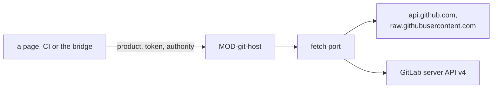

# ARC-004 GitHub and GitLab behind one adapter

## Context

Products live on github.com or on any GitLab server whose API accepts requests from the Pages origin, and a product is
named by its web address. The pages read and write them through the servers' REST APIs (ARC-001). Each GitHub token and
each GitLab project token may leave the browser only towards the API of the server that issued it. Every view shows one
state of a repository, and a write must never overwrite a commit the person has not seen. A refused request has
different causes — a token that has expired, a permission it lacks, a rate limit used up — and the person is told which.

## Decision

1. **One adapter speaks to git servers**, `MOD-git-host`; no other module sends a request to one. It receives the fetch
   port of ARC-003 and the token to send, and refuses where the server refuses, by code: `token-refused` (401),
   `rate-limited-account` and `rate-limited-network` (a used-up limit, its reset time in the reason where the server names
   it), `no-access` (another 403), `not-found`, `moved` (a write the branch has outrun) and `server-error`.
2. **A product is its address.** `https://github.com/<owner>/<name>` is a GitHub product; any other https address is taken
   for a GitLab project, whose path runs up to GitLab's `/-/`.
3. **GitHub** is read and written through `https://api.github.com`; without a token, files are read from
   `https://raw.githubusercontent.com`. A write is one commit through the git data API — a tree, a commit whose parent is
   the head the caller read, and an update of the branch with `force: false`.
4. **GitLab** is read and written through the REST API v4 of the server in the product's address, under that project's
   path only. A write is one `POST …/repository/commits` with one action per file, each existing file with
   `last_commit_id` set to the head the caller read, after the branch was read again and found still at that head.
5. **A token goes only to its own API**, as a header the adapter builds: a GitHub token as `Authorization: Bearer` to
   `https://api.github.com`, a GitLab project token as `PRIVATE-TOKEN` to `<server>/api/v4/projects/<this project>`, and
   nowhere else; a request whose URL holds the token is refused before it is sent.
6. **Head first, then write.** A caller reads the branch's head, reads there what its checks need, plans the files on it,
   and passes the head to the write; a branch that moved meanwhile refuses the write and nothing is written. A write
   needs an authority of ARC-003; without one, nothing is sent.
7. **The server's own pages.** Without a token, GitHub's new-file page is opened with a record as its prefilled value — at
   most 1 000 characters, so that no reviewed text travels in a URL — and its editor for any other text; a GitLab product
   has no such page and needs its project token. The page of a token, the page of a file and the permissions one token
   needs are given by the adapter, so that every view names them alike.



## Alternatives

- **Octokit or `@gitbeaker/rest`** — a handful of endpoints is used, and a client library would build requests outside
  the adapter's guard on where a token goes.
- **isomorphic-git in the browser** — GitHub's smart-HTTP endpoint answers without any `Access-Control-*` header, so a
  page cannot read it; cloning from the browser would need a proxy, which is a server.
- **GitLab through GraphQL** — the REST endpoints used are documented and suffice.
- **A write that reads the head itself and computes its files from it** — the files would be computed by a function the
  caller passes in, which no example can state; reading the head first keeps every step a value.

## Consequences

- Adding another forge is another branch of the same interfaces, not a change of callers.
- GitHub reads without a token count against the network's limit of 60 requests an hour; a page reads one snapshot with
  two requests and then only the files it shows.
- On GitLab a file that a write only read — and did not write — can change between the head check and the commit; the
  head check narrows the gap, it does not close it.

## Modules

### MOD-git-host

```json module
{
  "id": "MOD-git-host",
  "folder": "src/git-host/",
  "layer": "adapter",
  "responsibility": "Reads and writes the repositories of GitHub and of GitLab servers through the fetch port, each token only to the API of the server that issued it, and names their own pages.",
  "realises": [
    "A PRODUCT IS NAMED BY ITS ADDRESS",
    "GITLAB PRODUCTS ARE SUPPORTED",
    "A TOKEN GOES ONLY TO THE SERVER THAT ISSUED IT",
    "A CREDENTIAL IS NEVER PLACED IN A URL",
    "A GITLAB PRODUCT USES A PROJECT ACCESS TOKEN",
    "A GITLAB PRODUCT IS WRITTEN WITH A TOKEN",
    "WITHOUT A TOKEN, GITHUB'S WEB INTERFACE IS THE FALLBACK",
    "NO TEXT TRAVELS IN A URL",
    "THE DASHBOARD WRITES ONLY ON A PERSON'S CLICK",
    "AN EXPIRED TOKEN IS NAMED AND ITS RENEWAL LINKED",
    "A USED-UP RATE LIMIT IS NAMED, NOT BLAMED ON THE TOKEN",
    "ONE GITHUB TOKEN SERVES EVERY FEATURE"
  ],
  "owns": [
    "Product",
    "HeaderMap",
    "TreeEntry",
    "Snapshot",
    "CommitInfo",
    "RepositoryInfo",
    "CommitResult",
    "Permission",
    "GitLabPermission",
    "Permissions"
  ],
  "uses": ["MOD-contracts"]
}
```

```json interface
{
  "id": "MOD-git-host.parseProductAddress",
  "summary": "The product an address names: a github.com repository, or a project on another server, taken for a GitLab server, its path up to GitLab's /-/.",
  "params": [{ "name": "input", "type": "string" }],
  "result": "Product",
  "async": false,
  "refusals": [
    { "code": "not-an-address", "when": "the text is no web address" },
    { "code": "not-https", "when": "the address does not use https" },
    { "code": "credential-in-address", "when": "the address carries a user name or a token" },
    { "code": "not-a-repository", "when": "the address names no owner and repository, or no group and project" }
  ],
  "examples": [
    {
      "name": "a GitHub repository",
      "input": { "input": "https://github.com/alice/thesis.git" },
      "result": {
        "kind": "github",
        "address": "https://github.com/alice/thesis",
        "host": "github.com",
        "server": "https://github.com",
        "repo": "alice/thesis"
      }
    },
    {
      "name": "a GitLab project in a nested group",
      "input": { "input": "https://gitlab.example.org/group/tools/thesis/-/tree/main" },
      "result": {
        "kind": "gitlab",
        "address": "https://gitlab.example.org/group/tools/thesis",
        "host": "gitlab.example.org",
        "server": "https://gitlab.example.org",
        "repo": "group/tools/thesis"
      }
    },
    { "name": "http", "input": { "input": "http://github.com/alice/thesis" }, "refused": "not-https" }
  ]
}
```

```json interface
{
  "id": "MOD-git-host.authHeaders",
  "summary": "The authorisation header a request to a URL carries: a GitHub token only to api.github.com, a GitLab project token only to its project's API on its own server; none elsewhere.",
  "params": [
    { "name": "product", "type": "Product" },
    { "name": "url", "type": "string" },
    { "name": "token", "type": "string" }
  ],
  "result": "HeaderMap",
  "async": false,
  "refusals": [],
  "examples": [
    {
      "name": "GitHub's API",
      "input": {
        "product": {
          "kind": "github",
          "address": "https://github.com/alice/thesis",
          "host": "github.com",
          "server": "https://github.com",
          "repo": "alice/thesis"
        },
        "url": "https://api.github.com/repos/alice/thesis/git/trees",
        "token": "github_pat_example"
      },
      "result": { "Authorization": "Bearer github_pat_example" }
    },
    {
      "name": "GitHub's raw host",
      "input": {
        "product": {
          "kind": "github",
          "address": "https://github.com/alice/thesis",
          "host": "github.com",
          "server": "https://github.com",
          "repo": "alice/thesis"
        },
        "url": "https://raw.githubusercontent.com/alice/thesis/c000000000000000000000000000000000000000/SPEC.md",
        "token": "github_pat_example"
      },
      "result": {}
    },
    {
      "name": "another project on the same GitLab server",
      "input": {
        "product": {
          "kind": "gitlab",
          "address": "https://gitlab.example.org/group/tools/thesis",
          "host": "gitlab.example.org",
          "server": "https://gitlab.example.org",
          "repo": "group/tools/thesis"
        },
        "url": "https://gitlab.example.org/api/v4/projects/group%2Fother",
        "token": "glpat-example"
      },
      "result": {}
    }
  ]
}
```

```json interface
{
  "id": "MOD-git-host.branchHead",
  "summary": "The commit a branch points at.",
  "params": [
    { "name": "product", "type": "Product" },
    { "name": "branch", "type": "string" },
    { "name": "token", "type": "string" },
    { "name": "fetch", "type": "FetchPort" }
  ],
  "result": "string",
  "async": true,
  "refusals": [
    {
      "code": "token-refused",
      "when": "the server answers 401: the token has expired, or was regenerated, rotated or revoked"
    },
    {
      "code": "rate-limited-account",
      "when": "the account's rate limit is used up; the reason names when it resets, where the server says"
    },
    { "code": "rate-limited-network", "when": "the network's rate limit for requests without a token is used up" },
    {
      "code": "no-access",
      "when": "the server answers 403 for another reason: the token lacks the permission or the repository"
    },
    { "code": "not-found", "when": "the server answers 404" },
    { "code": "server-error", "when": "the server answers with another error" },
    { "code": "unreachable", "when": "no answer arrives" },
    { "code": "credential-in-url", "when": "the URL of a request would hold the token; nothing is sent" }
  ],
  "examples": [
    {
      "name": "main on GitHub",
      "input": {
        "product": {
          "kind": "github",
          "address": "https://github.com/alice/thesis",
          "host": "github.com",
          "server": "https://github.com",
          "repo": "alice/thesis"
        },
        "branch": "main",
        "token": "github_pat_example",
        "fetch": [
          {
            "request": { "method": "GET", "url": "https://api.github.com/repos/alice/thesis/git/ref/heads/main" },
            "response": { "status": 200, "body": { "object": { "sha": "a100000000000000000000000000000000000000" } } }
          }
        ]
      },
      "result": "a100000000000000000000000000000000000000"
    }
  ]
}
```

```json interface
{
  "id": "MOD-git-host.readSnapshot",
  "summary": "A branch, tag or commit resolved to one commit, and every file of that commit with its blob SHA.",
  "params": [
    { "name": "product", "type": "Product" },
    { "name": "ref", "type": "string" },
    { "name": "token", "type": "string" },
    { "name": "fetch", "type": "FetchPort" }
  ],
  "result": "Snapshot",
  "async": true,
  "refusals": [
    {
      "code": "token-refused",
      "when": "the server answers 401: the token has expired, or was regenerated, rotated or revoked"
    },
    {
      "code": "rate-limited-account",
      "when": "the account's rate limit is used up; the reason names when it resets, where the server says"
    },
    { "code": "rate-limited-network", "when": "the network's rate limit for requests without a token is used up" },
    {
      "code": "no-access",
      "when": "the server answers 403 for another reason: the token lacks the permission or the repository"
    },
    { "code": "not-found", "when": "the server answers 404" },
    { "code": "server-error", "when": "the server answers with another error" },
    { "code": "unreachable", "when": "no answer arrives" },
    { "code": "credential-in-url", "when": "the URL of a request would hold the token; nothing is sent" }
  ],
  "examples": [
    {
      "name": "two files on GitHub",
      "input": {
        "product": {
          "kind": "github",
          "address": "https://github.com/alice/thesis",
          "host": "github.com",
          "server": "https://github.com",
          "repo": "alice/thesis"
        },
        "ref": "main",
        "token": "github_pat_example",
        "fetch": [
          {
            "request": { "method": "GET", "url": "https://api.github.com/repos/alice/thesis/commits/main" },
            "response": { "status": 200, "body": { "sha": "c000000000000000000000000000000000000000" } }
          },
          {
            "request": {
              "method": "GET",
              "url": "https://api.github.com/repos/alice/thesis/git/trees/c000000000000000000000000000000000000000?recursive=1"
            },
            "response": {
              "status": 200,
              "body": {
                "tree": [
                  { "path": "SPEC.md", "type": "blob", "sha": "f500000000000000000000000000000000000000" },
                  { "path": "docs", "type": "tree", "sha": "d300000000000000000000000000000000000000" },
                  {
                    "path": "docs/use-cases/UC-001-add.md",
                    "type": "blob",
                    "sha": "f600000000000000000000000000000000000000"
                  }
                ]
              }
            }
          }
        ]
      },
      "result": {
        "commit": "c000000000000000000000000000000000000000",
        "tree": [
          { "path": "SPEC.md", "blob": "f500000000000000000000000000000000000000" },
          { "path": "docs/use-cases/UC-001-add.md", "blob": "f600000000000000000000000000000000000000" }
        ]
      }
    },
    {
      "name": "a token GitHub no longer accepts",
      "input": {
        "product": {
          "kind": "github",
          "address": "https://github.com/alice/thesis",
          "host": "github.com",
          "server": "https://github.com",
          "repo": "alice/thesis"
        },
        "ref": "main",
        "token": "github_pat_example",
        "fetch": [
          {
            "request": { "method": "GET", "url": "https://api.github.com/repos/alice/thesis/commits/main" },
            "response": { "status": 401, "body": { "message": "Bad credentials" } }
          }
        ]
      },
      "refused": "token-refused"
    },
    {
      "name": "the account's limit used up",
      "input": {
        "product": {
          "kind": "github",
          "address": "https://github.com/alice/thesis",
          "host": "github.com",
          "server": "https://github.com",
          "repo": "alice/thesis"
        },
        "ref": "main",
        "token": "github_pat_example",
        "fetch": [
          {
            "request": { "method": "GET", "url": "https://api.github.com/repos/alice/thesis/commits/main" },
            "response": {
              "status": 403,
              "headers": {
                "x-ratelimit-remaining": "0",
                "x-ratelimit-limit": "5000",
                "x-ratelimit-reset": "1791216000"
              },
              "body": { "message": "API rate limit exceeded" }
            }
          }
        ]
      },
      "refused": "rate-limited-account"
    }
  ]
}
```

```json interface
{
  "id": "MOD-git-host.readFile",
  "summary": "A file's text at a commit: through the API with a token, from GitHub's raw host without one.",
  "params": [
    { "name": "product", "type": "Product" },
    { "name": "commit", "type": "string" },
    { "name": "path", "type": "string" },
    { "name": "token", "type": "string" },
    { "name": "fetch", "type": "FetchPort" }
  ],
  "result": "string",
  "async": true,
  "refusals": [
    { "code": "no-file", "when": "the file does not exist at the commit" },
    {
      "code": "token-refused",
      "when": "the server answers 401: the token has expired, or was regenerated, rotated or revoked"
    },
    {
      "code": "rate-limited-account",
      "when": "the account's rate limit is used up; the reason names when it resets, where the server says"
    },
    { "code": "rate-limited-network", "when": "the network's rate limit for requests without a token is used up" },
    {
      "code": "no-access",
      "when": "the server answers 403 for another reason: the token lacks the permission or the repository"
    },
    { "code": "server-error", "when": "the server answers with another error" },
    { "code": "unreachable", "when": "no answer arrives" },
    { "code": "credential-in-url", "when": "the URL of a request would hold the token; nothing is sent" }
  ],
  "examples": [
    {
      "name": "with a token",
      "input": {
        "product": {
          "kind": "github",
          "address": "https://github.com/alice/thesis",
          "host": "github.com",
          "server": "https://github.com",
          "repo": "alice/thesis"
        },
        "commit": "c000000000000000000000000000000000000000",
        "path": "SPEC.md",
        "token": "github_pat_example",
        "fetch": [
          {
            "request": {
              "method": "GET",
              "url": "https://api.github.com/repos/alice/thesis/contents/SPEC.md?ref=c000000000000000000000000000000000000000"
            },
            "response": { "status": 200, "body": "# Thesis — Specification\n" }
          }
        ]
      },
      "result": "# Thesis — Specification\n"
    },
    {
      "name": "without a token",
      "input": {
        "product": {
          "kind": "github",
          "address": "https://github.com/alice/thesis",
          "host": "github.com",
          "server": "https://github.com",
          "repo": "alice/thesis"
        },
        "commit": "c000000000000000000000000000000000000000",
        "path": "SPEC.md",
        "token": "",
        "fetch": [
          {
            "request": {
              "method": "GET",
              "url": "https://raw.githubusercontent.com/alice/thesis/c000000000000000000000000000000000000000/SPEC.md"
            },
            "response": { "status": 200, "body": "# Thesis — Specification\n" }
          }
        ]
      },
      "result": "# Thesis — Specification\n"
    },
    {
      "name": "a file that is not there",
      "input": {
        "product": {
          "kind": "github",
          "address": "https://github.com/alice/thesis",
          "host": "github.com",
          "server": "https://github.com",
          "repo": "alice/thesis"
        },
        "commit": "c000000000000000000000000000000000000000",
        "path": "docs/x.md",
        "token": "github_pat_example",
        "fetch": [
          {
            "request": {
              "method": "GET",
              "url": "https://api.github.com/repos/alice/thesis/contents/docs/x.md?ref=c000000000000000000000000000000000000000"
            },
            "response": { "status": 404, "body": { "message": "Not Found" } }
          }
        ]
      },
      "refused": "no-file"
    }
  ]
}
```

```json interface
{
  "id": "MOD-git-host.readBlob",
  "summary": "A text by its blob SHA, checked to hash to it.",
  "params": [
    { "name": "product", "type": "Product" },
    { "name": "blob", "type": "string" },
    { "name": "token", "type": "string" },
    { "name": "fetch", "type": "FetchPort" }
  ],
  "result": "string",
  "async": true,
  "refusals": [
    { "code": "not-a-blob", "when": "the blob is no SHA" },
    { "code": "wrong-text", "when": "the text read does not hash to the blob" },
    {
      "code": "token-refused",
      "when": "the server answers 401: the token has expired, or was regenerated, rotated or revoked"
    },
    {
      "code": "rate-limited-account",
      "when": "the account's rate limit is used up; the reason names when it resets, where the server says"
    },
    { "code": "rate-limited-network", "when": "the network's rate limit for requests without a token is used up" },
    {
      "code": "no-access",
      "when": "the server answers 403 for another reason: the token lacks the permission or the repository"
    },
    { "code": "not-found", "when": "the server answers 404" },
    { "code": "server-error", "when": "the server answers with another error" },
    { "code": "unreachable", "when": "no answer arrives" },
    { "code": "credential-in-url", "when": "the URL of a request would hold the token; nothing is sent" }
  ],
  "examples": [
    {
      "name": "a blob in base64",
      "input": {
        "product": {
          "kind": "github",
          "address": "https://github.com/alice/thesis",
          "host": "github.com",
          "server": "https://github.com",
          "repo": "alice/thesis"
        },
        "blob": "ce013625030ba8dba906f756967f9e9ca394464a",
        "token": "github_pat_example",
        "fetch": [
          {
            "request": {
              "method": "GET",
              "url": "https://api.github.com/repos/alice/thesis/git/blobs/ce013625030ba8dba906f756967f9e9ca394464a"
            },
            "response": { "status": 200, "body": { "encoding": "base64", "content": "aGVsbG8K" } }
          }
        ]
      },
      "result": "hello\n"
    },
    {
      "name": "a text that does not hash to the blob",
      "input": {
        "product": {
          "kind": "github",
          "address": "https://github.com/alice/thesis",
          "host": "github.com",
          "server": "https://github.com",
          "repo": "alice/thesis"
        },
        "blob": "ce013625030ba8dba906f756967f9e9ca394464a",
        "token": "github_pat_example",
        "fetch": [
          {
            "request": {
              "method": "GET",
              "url": "https://api.github.com/repos/alice/thesis/git/blobs/ce013625030ba8dba906f756967f9e9ca394464a"
            },
            "response": { "status": 200, "body": { "encoding": "base64", "content": "aGVsbG8hCg==" } }
          }
        ]
      },
      "refused": "wrong-text"
    }
  ]
}
```

```json interface
{
  "id": "MOD-git-host.commitsTouching",
  "summary": "The newest commits, at most limit, that touch a path at a commit, newest first.",
  "params": [
    { "name": "product", "type": "Product" },
    { "name": "commit", "type": "string" },
    { "name": "path", "type": "string" },
    { "name": "limit", "type": "integer" },
    { "name": "token", "type": "string" },
    { "name": "fetch", "type": "FetchPort" }
  ],
  "result": "CommitInfo[]",
  "async": true,
  "refusals": [
    {
      "code": "token-refused",
      "when": "the server answers 401: the token has expired, or was regenerated, rotated or revoked"
    },
    {
      "code": "rate-limited-account",
      "when": "the account's rate limit is used up; the reason names when it resets, where the server says"
    },
    { "code": "rate-limited-network", "when": "the network's rate limit for requests without a token is used up" },
    {
      "code": "no-access",
      "when": "the server answers 403 for another reason: the token lacks the permission or the repository"
    },
    { "code": "not-found", "when": "the server answers 404" },
    { "code": "server-error", "when": "the server answers with another error" },
    { "code": "unreachable", "when": "no answer arrives" },
    { "code": "credential-in-url", "when": "the URL of a request would hold the token; nothing is sent" }
  ],
  "examples": [
    {
      "name": "one commit",
      "input": {
        "product": {
          "kind": "github",
          "address": "https://github.com/alice/thesis",
          "host": "github.com",
          "server": "https://github.com",
          "repo": "alice/thesis"
        },
        "commit": "c000000000000000000000000000000000000000",
        "path": "SPEC.md",
        "limit": 2,
        "token": "github_pat_example",
        "fetch": [
          {
            "request": {
              "method": "GET",
              "url": "https://api.github.com/repos/alice/thesis/commits?path=SPEC.md&sha=c000000000000000000000000000000000000000&per_page=2"
            },
            "response": {
              "status": 200,
              "body": [
                {
                  "sha": "c000000000000000000000000000000000000000",
                  "commit": { "committer": { "date": "2026-10-03T14:08:00Z" }, "author": { "name": "A. Maier" } },
                  "author": { "login": "akmaier" }
                }
              ]
            }
          }
        ]
      },
      "result": [
        { "sha": "c000000000000000000000000000000000000000", "date": "2026-10-03T14:08:00Z", "author": "akmaier" }
      ]
    }
  ]
}
```

```json interface
{
  "id": "MOD-git-host.repositoryInfo",
  "summary": "What the server reports about a repository: its visibility, its default branch, and on GitLab the access level the token acts with (0 elsewhere).",
  "params": [
    { "name": "product", "type": "Product" },
    { "name": "token", "type": "string" },
    { "name": "fetch", "type": "FetchPort" }
  ],
  "result": "RepositoryInfo",
  "async": true,
  "refusals": [
    {
      "code": "token-refused",
      "when": "the server answers 401: the token has expired, or was regenerated, rotated or revoked"
    },
    {
      "code": "rate-limited-account",
      "when": "the account's rate limit is used up; the reason names when it resets, where the server says"
    },
    { "code": "rate-limited-network", "when": "the network's rate limit for requests without a token is used up" },
    {
      "code": "no-access",
      "when": "the server answers 403 for another reason: the token lacks the permission or the repository"
    },
    { "code": "not-found", "when": "the server answers 404" },
    { "code": "server-error", "when": "the server answers with another error" },
    { "code": "unreachable", "when": "no answer arrives" },
    { "code": "credential-in-url", "when": "the URL of a request would hold the token; nothing is sent" }
  ],
  "examples": [
    {
      "name": "a GitLab project with a Maintainer token",
      "input": {
        "product": {
          "kind": "gitlab",
          "address": "https://gitlab.example.org/group/tools/thesis",
          "host": "gitlab.example.org",
          "server": "https://gitlab.example.org",
          "repo": "group/tools/thesis"
        },
        "token": "glpat-example",
        "fetch": [
          {
            "request": { "method": "GET", "url": "https://gitlab.example.org/api/v4/projects/group%2Ftools%2Fthesis" },
            "response": {
              "status": 200,
              "body": {
                "visibility": "internal",
                "default_branch": "main",
                "permissions": { "project_access": { "access_level": 40 } }
              }
            }
          }
        ]
      },
      "result": { "visibility": "internal", "defaultBranch": "main", "role": 40 }
    }
  ]
}
```

```json interface
{
  "id": "MOD-git-host.writeFiles",
  "summary": "One commit of the files given on the head the caller read, on an authority; refused when the branch moved meanwhile.",
  "params": [
    { "name": "product", "type": "Product" },
    { "name": "branch", "type": "string" },
    { "name": "head", "type": "string" },
    { "name": "files", "type": "FileText[]" },
    { "name": "message", "type": "string" },
    { "name": "token", "type": "string" },
    { "name": "fetch", "type": "FetchPort" },
    { "name": "authority", "type": "Authority", "optional": true }
  ],
  "result": "CommitResult",
  "async": true,
  "refusals": [
    { "code": "no-authority", "when": "no authority of ARC-003 is given, or one of no known kind" },
    { "code": "no-token", "when": "no token is given" },
    { "code": "nothing-to-write", "when": "no file is given" },
    { "code": "wrong-token", "when": "a GitHub token is given for a GitLab product" },
    { "code": "moved", "when": "the branch moved on after the head the caller read" },
    {
      "code": "token-refused",
      "when": "the server answers 401: the token has expired, or was regenerated, rotated or revoked"
    },
    {
      "code": "rate-limited-account",
      "when": "the account's rate limit is used up; the reason names when it resets, where the server says"
    },
    { "code": "rate-limited-network", "when": "the network's rate limit for requests without a token is used up" },
    {
      "code": "no-access",
      "when": "the server answers 403 for another reason: the token lacks the permission or the repository"
    },
    { "code": "not-found", "when": "the server answers 404" },
    { "code": "server-error", "when": "the server answers with another error" },
    { "code": "unreachable", "when": "no answer arrives" },
    { "code": "credential-in-url", "when": "the URL of a request would hold the token; nothing is sent" }
  ],
  "examples": [
    {
      "name": "a record on GitHub",
      "input": {
        "product": {
          "kind": "github",
          "address": "https://github.com/alice/thesis",
          "host": "github.com",
          "server": "https://github.com",
          "repo": "alice/thesis"
        },
        "branch": "main",
        "head": "a100000000000000000000000000000000000000",
        "files": [
          {
            "path": "docs/approvals/UC-001-0123456789ab.md",
            "text": "kind: use-case\nfile: docs/use-cases/UC-001-add.md\nblob: 0123456789abcdef0123456789abcdef01234567\n"
          }
        ],
        "message": "accept UC-001",
        "token": "github_pat_example",
        "authority": { "kind": "click" },
        "fetch": [
          {
            "request": {
              "method": "GET",
              "url": "https://api.github.com/repos/alice/thesis/git/commits/a100000000000000000000000000000000000000"
            },
            "response": { "status": 200, "body": { "tree": { "sha": "d300000000000000000000000000000000000000" } } }
          },
          {
            "request": {
              "method": "POST",
              "url": "https://api.github.com/repos/alice/thesis/git/trees",
              "body": {
                "base_tree": "d300000000000000000000000000000000000000",
                "tree": [
                  {
                    "path": "docs/approvals/UC-001-0123456789ab.md",
                    "mode": "100644",
                    "type": "blob",
                    "content": "kind: use-case\nfile: docs/use-cases/UC-001-add.md\nblob: 0123456789abcdef0123456789abcdef01234567\n"
                  }
                ]
              }
            },
            "response": { "status": 201, "body": { "sha": "e400000000000000000000000000000000000000" } }
          },
          {
            "request": {
              "method": "POST",
              "url": "https://api.github.com/repos/alice/thesis/git/commits",
              "body": {
                "message": "accept UC-001",
                "tree": "e400000000000000000000000000000000000000",
                "parents": ["a100000000000000000000000000000000000000"]
              }
            },
            "response": {
              "status": 201,
              "body": {
                "sha": "b200000000000000000000000000000000000000",
                "html_url": "https://github.com/alice/thesis/commit/b200000000000000000000000000000000000000"
              }
            }
          },
          {
            "request": {
              "method": "PATCH",
              "url": "https://api.github.com/repos/alice/thesis/git/refs/heads/main",
              "body": { "sha": "b200000000000000000000000000000000000000", "force": false }
            },
            "response": { "status": 200, "body": { "object": { "sha": "b200000000000000000000000000000000000000" } } }
          }
        ]
      },
      "result": {
        "sha": "b200000000000000000000000000000000000000",
        "url": "https://github.com/alice/thesis/commit/b200000000000000000000000000000000000000"
      }
    },
    {
      "name": "the branch moved meanwhile",
      "input": {
        "product": {
          "kind": "github",
          "address": "https://github.com/alice/thesis",
          "host": "github.com",
          "server": "https://github.com",
          "repo": "alice/thesis"
        },
        "branch": "main",
        "head": "a100000000000000000000000000000000000000",
        "files": [
          {
            "path": "docs/approvals/UC-001-0123456789ab.md",
            "text": "kind: use-case\nfile: docs/use-cases/UC-001-add.md\nblob: 0123456789abcdef0123456789abcdef01234567\n"
          }
        ],
        "message": "accept UC-001",
        "token": "github_pat_example",
        "authority": { "kind": "click" },
        "fetch": [
          {
            "request": {
              "method": "GET",
              "url": "https://api.github.com/repos/alice/thesis/git/commits/a100000000000000000000000000000000000000"
            },
            "response": { "status": 200, "body": { "tree": { "sha": "d300000000000000000000000000000000000000" } } }
          },
          {
            "request": {
              "method": "POST",
              "url": "https://api.github.com/repos/alice/thesis/git/trees",
              "body": {
                "base_tree": "d300000000000000000000000000000000000000",
                "tree": [
                  {
                    "path": "docs/approvals/UC-001-0123456789ab.md",
                    "mode": "100644",
                    "type": "blob",
                    "content": "kind: use-case\nfile: docs/use-cases/UC-001-add.md\nblob: 0123456789abcdef0123456789abcdef01234567\n"
                  }
                ]
              }
            },
            "response": { "status": 201, "body": { "sha": "e400000000000000000000000000000000000000" } }
          },
          {
            "request": {
              "method": "POST",
              "url": "https://api.github.com/repos/alice/thesis/git/commits",
              "body": {
                "message": "accept UC-001",
                "tree": "e400000000000000000000000000000000000000",
                "parents": ["a100000000000000000000000000000000000000"]
              }
            },
            "response": {
              "status": 201,
              "body": {
                "sha": "b200000000000000000000000000000000000000",
                "html_url": "https://github.com/alice/thesis/commit/b200000000000000000000000000000000000000"
              }
            }
          },
          {
            "request": {
              "method": "PATCH",
              "url": "https://api.github.com/repos/alice/thesis/git/refs/heads/main",
              "body": { "sha": "b200000000000000000000000000000000000000", "force": false }
            },
            "response": { "status": 422, "body": { "message": "Update is not a fast forward" } }
          }
        ]
      },
      "refused": "moved"
    },
    {
      "name": "no authority",
      "input": {
        "product": {
          "kind": "github",
          "address": "https://github.com/alice/thesis",
          "host": "github.com",
          "server": "https://github.com",
          "repo": "alice/thesis"
        },
        "branch": "main",
        "head": "a100000000000000000000000000000000000000",
        "files": [
          {
            "path": "docs/approvals/UC-001-0123456789ab.md",
            "text": "kind: use-case\nfile: docs/use-cases/UC-001-add.md\nblob: 0123456789abcdef0123456789abcdef01234567\n"
          }
        ],
        "message": "accept UC-001",
        "token": "github_pat_example",
        "fetch": []
      },
      "refused": "no-authority"
    }
  ]
}
```

```json interface
{
  "id": "MOD-git-host.newFileUrl",
  "summary": "GitHub's new-file page at a path with a value prefilled, for a value of at most 1 000 characters.",
  "params": [
    { "name": "product", "type": "Product" },
    { "name": "ref", "type": "string" },
    { "name": "path", "type": "string" },
    { "name": "value", "type": "string" }
  ],
  "result": "string",
  "async": false,
  "refusals": [
    { "code": "not-github", "when": "the product is not on GitHub" },
    { "code": "too-long", "when": "the value has more than 1 000 characters" }
  ],
  "examples": [
    {
      "name": "a record",
      "input": {
        "product": {
          "kind": "github",
          "address": "https://github.com/alice/thesis",
          "host": "github.com",
          "server": "https://github.com",
          "repo": "alice/thesis"
        },
        "ref": "main",
        "path": "docs/approvals/UC-001-0123456789ab.md",
        "value": "kind: use-case\nfile: docs/use-cases/UC-001-add.md\nblob: 0123456789abcdef0123456789abcdef01234567\n"
      },
      "result": "https://github.com/alice/thesis/new/main?filename=docs%2Fapprovals%2FUC-001-0123456789ab.md&value=kind%3A%20use-case%0Afile%3A%20docs%2Fuse-cases%2FUC-001-add.md%0Ablob%3A%200123456789abcdef0123456789abcdef01234567%0A"
    },
    {
      "name": "a GitLab product",
      "input": {
        "product": {
          "kind": "gitlab",
          "address": "https://gitlab.example.org/group/tools/thesis",
          "host": "gitlab.example.org",
          "server": "https://gitlab.example.org",
          "repo": "group/tools/thesis"
        },
        "ref": "main",
        "path": "docs/approvals/UC-001-0123456789ab.md",
        "value": "kind: use-case\nfile: docs/use-cases/UC-001-add.md\nblob: 0123456789abcdef0123456789abcdef01234567\n"
      },
      "refused": "not-github"
    }
  ]
}
```

```json interface
{
  "id": "MOD-git-host.editUrl",
  "summary": "GitHub's editor for a file, opened when no token is stored; a GitLab product has no editing without its project token.",
  "params": [
    { "name": "product", "type": "Product" },
    { "name": "ref", "type": "string" },
    { "name": "path", "type": "string" }
  ],
  "result": "string",
  "async": false,
  "refusals": [{ "code": "not-github", "when": "the product is not on GitHub" }],
  "examples": [
    {
      "name": "on GitHub",
      "input": {
        "product": {
          "kind": "github",
          "address": "https://github.com/alice/thesis",
          "host": "github.com",
          "server": "https://github.com",
          "repo": "alice/thesis"
        },
        "ref": "main",
        "path": "docs/use-cases/UC-001-add.md"
      },
      "result": "https://github.com/alice/thesis/edit/main/docs/use-cases/UC-001-add.md"
    },
    {
      "name": "a GitLab product",
      "input": {
        "product": {
          "kind": "gitlab",
          "address": "https://gitlab.example.org/group/tools/thesis",
          "host": "gitlab.example.org",
          "server": "https://gitlab.example.org",
          "repo": "group/tools/thesis"
        },
        "ref": "main",
        "path": "SPEC.md"
      },
      "refused": "not-github"
    }
  ]
}
```

```json interface
{
  "id": "MOD-git-host.fileUrl",
  "summary": "The server's page of a file.",
  "params": [
    { "name": "product", "type": "Product" },
    { "name": "ref", "type": "string" },
    { "name": "path", "type": "string" }
  ],
  "result": "string",
  "async": false,
  "refusals": [],
  "examples": [
    {
      "name": "on GitLab",
      "input": {
        "product": {
          "kind": "gitlab",
          "address": "https://gitlab.example.org/group/tools/thesis",
          "host": "gitlab.example.org",
          "server": "https://gitlab.example.org",
          "repo": "group/tools/thesis"
        },
        "ref": "main",
        "path": "SPEC.md"
      },
      "result": "https://gitlab.example.org/group/tools/thesis/-/blob/main/SPEC.md"
    }
  ]
}
```

```json interface
{
  "id": "MOD-git-host.tokenPageUrl",
  "summary": "Where the product's token is renewed: GitHub's list of the person's tokens, or the GitLab project's access tokens page.",
  "params": [{ "name": "product", "type": "Product" }],
  "result": "string",
  "async": false,
  "refusals": [],
  "examples": [
    {
      "name": "on GitHub",
      "input": {
        "product": {
          "kind": "github",
          "address": "https://github.com/alice/thesis",
          "host": "github.com",
          "server": "https://github.com",
          "repo": "alice/thesis"
        }
      },
      "result": "https://github.com/settings/personal-access-tokens"
    },
    {
      "name": "on GitLab",
      "input": {
        "product": {
          "kind": "gitlab",
          "address": "https://gitlab.example.org/group/tools/thesis",
          "host": "gitlab.example.org",
          "server": "https://gitlab.example.org",
          "repo": "group/tools/thesis"
        }
      },
      "result": "https://gitlab.example.org/group/tools/thesis/-/settings/access_tokens"
    }
  ]
}
```

```json interface
{
  "id": "MOD-git-host.requiredPermissions",
  "summary": "The permissions the one token needs: the six GitHub repository permissions, or a GitLab project token's role and scope.",
  "params": [{ "name": "product", "type": "Product" }],
  "result": "Permissions",
  "async": false,
  "refusals": [],
  "examples": [
    {
      "name": "on GitHub",
      "input": {
        "product": {
          "kind": "github",
          "address": "https://github.com/alice/thesis",
          "host": "github.com",
          "server": "https://github.com",
          "repo": "alice/thesis"
        }
      },
      "result": {
        "github": [
          { "permission": "Contents", "param": "contents", "access": "write" },
          { "permission": "Issues", "param": "issues", "access": "write" },
          { "permission": "Pull requests", "param": "pull_requests", "access": "write" },
          { "permission": "Actions", "param": "actions", "access": "write" },
          { "permission": "Workflows", "param": "workflows", "access": "write" },
          { "permission": "Metadata", "param": "metadata", "access": "read" }
        ],
        "gitlab": { "role": "", "scope": "" }
      }
    },
    {
      "name": "on GitLab",
      "input": {
        "product": {
          "kind": "gitlab",
          "address": "https://gitlab.example.org/group/tools/thesis",
          "host": "gitlab.example.org",
          "server": "https://gitlab.example.org",
          "repo": "group/tools/thesis"
        }
      },
      "result": { "github": [], "gitlab": { "role": "Maintainer", "scope": "api" } }
    }
  ]
}
```

## Types

```json type
{
  "$id": "Product",
  "description": "A managed product by its address: the kind of server, the address, the host, the server's origin, and the repository's path.",
  "type": "object",
  "required": ["kind", "address", "host", "server", "repo"],
  "additionalProperties": false,
  "properties": {
    "kind": { "type": "string", "enum": ["github", "gitlab"] },
    "address": { "type": "string", "pattern": "^https://" },
    "host": { "type": "string" },
    "server": { "type": "string", "pattern": "^https://" },
    "repo": { "type": "string" }
  },
  "examples": [
    {
      "kind": "github",
      "address": "https://github.com/alice/thesis",
      "host": "github.com",
      "server": "https://github.com",
      "repo": "alice/thesis"
    },
    {
      "kind": "gitlab",
      "address": "https://gitlab.example.org/group/tools/thesis",
      "host": "gitlab.example.org",
      "server": "https://gitlab.example.org",
      "repo": "group/tools/thesis"
    }
  ]
}
```

```json type
{
  "$id": "HeaderMap",
  "description": "Request headers by name.",
  "type": "object",
  "additionalProperties": { "type": "string" },
  "examples": [{ "Authorization": "Bearer github_pat_example" }, {}]
}
```

```json type
{
  "$id": "TreeEntry",
  "description": "A file of a commit and its blob SHA.",
  "type": "object",
  "required": ["path", "blob"],
  "additionalProperties": false,
  "properties": { "path": { "type": "string" }, "blob": { "type": "string", "pattern": "^[0-9a-f]{40}$" } },
  "examples": [{ "path": "SPEC.md", "blob": "f500000000000000000000000000000000000000" }]
}
```

```json type
{
  "$id": "Snapshot",
  "description": "One commit and every file of it.",
  "type": "object",
  "required": ["commit", "tree"],
  "additionalProperties": false,
  "properties": {
    "commit": { "type": "string", "pattern": "^[0-9a-f]{40}$" },
    "tree": { "type": "array", "items": { "$ref": "TreeEntry" } }
  },
  "examples": [
    {
      "commit": "c000000000000000000000000000000000000000",
      "tree": [{ "path": "SPEC.md", "blob": "f500000000000000000000000000000000000000" }]
    }
  ]
}
```

```json type
{
  "$id": "CommitInfo",
  "description": "A commit, when it was committed, and its author's account or name.",
  "type": "object",
  "required": ["sha", "date", "author"],
  "additionalProperties": false,
  "properties": { "sha": { "type": "string" }, "date": { "type": "string" }, "author": { "type": "string" } },
  "examples": [
    { "sha": "c000000000000000000000000000000000000000", "date": "2026-10-03T14:08:00Z", "author": "akmaier" }
  ]
}
```

```json type
{
  "$id": "RepositoryInfo",
  "description": "What the server reports about a repository.",
  "type": "object",
  "required": ["visibility", "defaultBranch", "role"],
  "additionalProperties": false,
  "properties": {
    "visibility": { "type": "string", "enum": ["public", "private", "internal"] },
    "defaultBranch": { "type": "string" },
    "role": { "type": "integer", "minimum": 0 }
  },
  "examples": [{ "visibility": "private", "defaultBranch": "main", "role": 0 }]
}
```

```json type
{
  "$id": "CommitResult",
  "description": "The commit a write made, and its page.",
  "type": "object",
  "required": ["sha", "url"],
  "additionalProperties": false,
  "properties": { "sha": { "type": "string" }, "url": { "type": "string" } },
  "examples": [
    {
      "sha": "b200000000000000000000000000000000000000",
      "url": "https://github.com/alice/thesis/commit/b200000000000000000000000000000000000000"
    }
  ]
}
```

```json type
{
  "$id": "Permission",
  "description": "A GitHub repository permission: its display name, its parameter on the token page, and the access it needs.",
  "type": "object",
  "required": ["permission", "param", "access"],
  "additionalProperties": false,
  "properties": {
    "permission": { "type": "string" },
    "param": { "type": "string" },
    "access": { "type": "string", "enum": ["read", "write"] }
  },
  "examples": [{ "permission": "Contents", "param": "contents", "access": "write" }]
}
```

```json type
{
  "$id": "GitLabPermission",
  "description": "The role and scope a GitLab project token needs; empty for a GitHub product.",
  "type": "object",
  "required": ["role", "scope"],
  "additionalProperties": false,
  "properties": { "role": { "type": "string" }, "scope": { "type": "string" } },
  "examples": [{ "role": "Maintainer", "scope": "api" }]
}
```

```json type
{
  "$id": "Permissions",
  "description": "The permissions of the one token a product needs.",
  "type": "object",
  "required": ["github", "gitlab"],
  "additionalProperties": false,
  "properties": {
    "github": { "type": "array", "items": { "$ref": "Permission" } },
    "gitlab": { "$ref": "GitLabPermission" }
  },
  "examples": [{ "github": [], "gitlab": { "role": "Maintainer", "scope": "api" } }]
}
```
