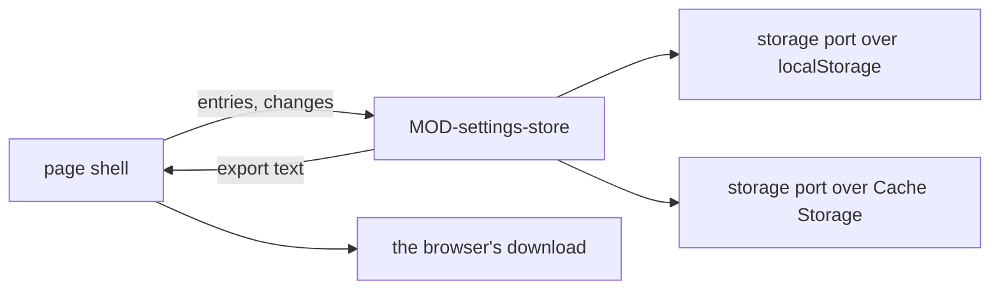

# ARC-005 The browser's settings and file texts, kept by one adapter

## Context

Every setting of a person's dashboard lives in that person's browser and nowhere else: the repository tokens, the
products, the model endpoints and their keys, the bridge, the mailbox connection, the mails marked *not an issue*, the
jump host with its remote sessions, and the keys of resources. Each is shown on one settings page with its last test and
a control that clears it; a clear removes it from storage, not only from the form; the whole set moves to another
browser as one file, which can be locked with a passphrase. Beside the settings, the pages keep the texts of repository
files they have read, so that a file is not read again until it changes.

ARC-003 leaves browser storage to one adapter, reached through storage ports that a page shell makes. Every Pages site of
the same owner can read what is kept there.

## Decision

1. **One adapter**, `MOD-settings-store`, keeps the settings and the file texts, through two storage ports of ARC-003
   that a page shell makes: one over `localStorage` for the settings, one over the Cache Storage cache
   `agent-m-file-texts` for the file texts. No cookie, no `sessionStorage`, no IndexedDB.
2. **Twelve keys**, each named by `MOD-settings-store.settingKeys` with the setting it belongs to and whether it holds a
   secret; nothing else is written under the prefix `agent-m.`:

   | Key | Holds | Set up in |
   |---|---|---|
   | `agent-m.github-token`, `-expires`, `-tested` | the GitHub token's text, its expiry date, its last test | UC-014 |
   | `agent-m.gitlab-tokens` | each GitLab project token, by its product's address, with expiry date and last test | UC-001 |
   | `agent-m.products` | the products' addresses, in the order they were added | UC-001 |
   | `agent-m.endpoints` | `Endpoint` list | UC-003 |
   | `agent-m.bridge` | `Bridge` | UC-044 |
   | `agent-m.mailbox` | `Mailbox` | UC-037 |
   | `agent-m.not-an-issue` | the `MAIL-` identifiers marked *not an issue* | UC-038 |
   | `agent-m.jump-host` | `JumpHost` | UC-011 |
   | `agent-m.remote-sessions` | `RemoteSession` list | UC-011 |
   | `agent-m.resource-keys` | `ResourceKey` list | UC-040 |

3. **Entries in, entries out.** A page shell loads the entries once, `MOD-settings-store.loadEntries`; every change is a
   pure function from entries to entries, or a refusal; `MOD-settings-store.saveEntries` then writes what changed and
   removes what is gone, and touches no key without the prefix. `MOD-settings-store.readSettings` reads the entries as
   one `Settings` value; a value that does not read as its type is left out, so a damaged entry shows as not set and
   stops no page. A browser that keeps nothing is loaded as empty and refuses every save with `not-kept`.
4. **Tests and expiry beside the setting.** A setting's last test is kept with it: `{ "ok": <date> }` or
   `{ "refused": true }`. Storing a new value starts it untested, and a token is stored with the expiry date given with
   it; clearing a setting clears both. `MOD-settings-store.expiryWarnings` names each token within fourteen days of its
   expiry date, and each token past it.
5. **Each token by its server.** The GitHub token and each GitLab project token are kept apart, the latter by the address
   of its product; `MOD-settings-store.tokenFor` gives a product only its own server's token. A resource key is kept with
   the origin of the one server it goes to.
6. **Clearing.** `MOD-settings-store.clearSetting` removes one setting, a product together with its GitLab project
   token; `MOD-settings-store.clearEverything` removes every key with the prefix and every kept file text, and nothing
   else.
7. **The export** is the file `SettingsExportFile`: the format tag, the version, the time of export, a note that it holds
   every token, key and password, and the entries of the keys of point 2. Locked with a passphrase, the entries are
   encrypted in the browser with Web Crypto: PBKDF2 with SHA-256 over a 16-byte salt, 600 000 iterations, derives a
   256-bit key; AES-GCM with a 12-byte IV encrypts the entries; salt, IV and iteration count stand beside the
   ciphertext, and salt and IV come from the random port. The page hands the file to the browser's download only — to
   no repository and into no URL. `MOD-settings-store.secretsHeld` names every secret a file would hold, for the notice
   before it is saved.
8. **The import** reads only the keys of point 2. `MOD-settings-store.mergeImport` keeps what this browser has, adds
   what it lacks, and lists what was kept, added and not added — a remote session whose port another session has here
   is not added. The bridge app reads the same file with `MOD-settings-store.importSettings`.
9. **File texts by blob SHA.** `MOD-settings-store.keepText` keeps a text under the git blob SHA it hashes to;
   `MOD-settings-store.textByBlob` gives it back only while it still hashes to that SHA, and removes it otherwise.
   Without Cache Storage nothing is kept, and every file is read from its server.



## Alternatives

- **A store object whose setters write `localStorage` at once** — a change of several keys could stop halfway, and every
  rule would need a storage stand-in in its tests; pure functions over entries are tested with values.
- **All settings as one JSON value under one key** — every change would rewrite every secret, and one damaged value would
  lose them all.
- **A crypto library (a libsodium build or `crypto-js`)** — Web Crypto provides PBKDF2 and AES-GCM in every browser and
  in Deno; no library means no due diligence.
- **Argon2 instead of PBKDF2** — Web Crypto offers no Argon2; it would need a WebAssembly library. The file names its key
  derivation, so another can be read beside it.
- **Encrypting the stored settings with a passphrase asked at every visit** — the key would stay in memory for the
  session anyway, and every Pages site of the owner could still read the ciphertext; the gain does not pay for a prompt
  on every page load.
- **No export, a second setup in every browser** — `SETTINGS ARE EXPORTED AND IMPORTED WITH THEIR SECRETS`.

## Consequences

- A forgotten passphrase makes a locked export unreadable; the page says so before saving.
- The file records its iteration count, so exports with a higher count are read beside earlier ones.
- An unlocked export holds every secret in clear; the notice before saving names each one, from
  `MOD-settings-store.secretsHeld`.
- Which value a feature chooses — the lowest free port of a new remote session, the route of a mailbox — is the
  feature's; the store keeps the rules of what it holds: one port per session, inside the range.

## Modules

### MOD-settings-store

```json module
{
  "id": "MOD-settings-store",
  "folder": "src/settings-store/",
  "layer": "adapter",
  "responsibility": "Keeps the settings of this browser and the texts of repository files read, through storage ports, as entries changed by pure functions, and exports and imports the settings as one file.",
  "realises": [
    "CONFIGURATION LIVES IN THE BROWSER",
    "CONFIGURATION IS STORED IN LOCALSTORAGE, NOT IN A COOKIE",
    "A CLEAR IS A REAL CLEAR",
    "A TOKEN'S EXPIRY IS WARNED OF IN ADVANCE",
    "SETTINGS ARE EXPORTED AND IMPORTED WITH THEIR SECRETS",
    "AN EXPORT CAN BE LOCKED WITH A PASSPHRASE",
    "THE DASHBOARD KEEPS ITS PRODUCTS IN THE BROWSER",
    "THE JUMP HOST AND THE REMOTE SESSIONS ARE SETTINGS"
  ],
  "owns": [
    "SettingEntries",
    "SettingName",
    "SettingKey",
    "SettingRef",
    "LastTest",
    "TestResult",
    "GitHubToken",
    "GitLabToken",
    "Endpoint",
    "Bridge",
    "MailServer",
    "MailboxSignIn",
    "MailboxLogin",
    "MailboxTests",
    "Mailbox",
    "WebLogin",
    "JumpHost",
    "RemoteSession",
    "ResourceKey",
    "Settings",
    "ExpiryWarning",
    "MergeResult",
    "LockedSettings",
    "SettingsExport",
    "SettingsExportFile"
  ],
  "uses": ["MOD-contracts"]
}
```

```json interface
{
  "id": "MOD-settings-store.loadEntries",
  "summary": "Every entry kept under the prefix agent-m., by key; none from a browser that keeps nothing.",
  "params": [{ "name": "storage", "type": "StoragePort" }],
  "result": "SettingEntries",
  "async": true,
  "refusals": [],
  "examples": [
    {
      "name": "Agent M's keys, not another site's",
      "input": {
        "storage": {
          "agent-m.github-token": "github_pat_example",
          "agent-m.products": "[\"https://github.com/alice/thesis\"]",
          "theme-of-another-site": "dark"
        }
      },
      "result": {
        "agent-m.github-token": "github_pat_example",
        "agent-m.products": "[\"https://github.com/alice/thesis\"]"
      }
    },
    { "name": "a browser that keeps nothing", "input": { "storage": null }, "result": {} }
  ]
}
```

```json interface
{
  "id": "MOD-settings-store.saveEntries",
  "summary": "Writes the entries that changed from before to after and removes those that are gone, only under the prefix agent-m.; gives the keys it touched.",
  "params": [
    { "name": "storage", "type": "StoragePort" },
    { "name": "before", "type": "SettingEntries" },
    { "name": "after", "type": "SettingEntries" }
  ],
  "result": "string[]",
  "async": true,
  "refusals": [{ "code": "not-kept", "when": "the browser keeps nothing: its storage is blocked or unavailable" }],
  "examples": [
    {
      "name": "a new token and a removed product list",
      "input": {
        "storage": {
          "agent-m.github-token": "github_pat_example",
          "agent-m.products": "[\"https://github.com/alice/thesis\"]"
        },
        "before": {
          "agent-m.github-token": "github_pat_example",
          "agent-m.products": "[\"https://github.com/alice/thesis\"]"
        },
        "after": { "agent-m.github-token": "github_pat_new" }
      },
      "result": ["agent-m.github-token", "agent-m.products"]
    },
    {
      "name": "a key without the prefix is left alone",
      "input": {
        "storage": {
          "agent-m.github-token": "github_pat_example",
          "agent-m.products": "[\"https://github.com/alice/thesis\"]"
        },
        "before": {
          "agent-m.github-token": "github_pat_example",
          "agent-m.products": "[\"https://github.com/alice/thesis\"]"
        },
        "after": {
          "agent-m.github-token": "github_pat_example",
          "agent-m.products": "[\"https://github.com/alice/thesis\"]",
          "theme-of-another-site": "light"
        }
      },
      "result": []
    },
    {
      "name": "a browser that keeps nothing",
      "input": {
        "storage": null,
        "before": {},
        "after": {
          "agent-m.github-token": "github_pat_example",
          "agent-m.products": "[\"https://github.com/alice/thesis\"]"
        }
      },
      "refused": "not-kept"
    }
  ]
}
```

```json interface
{
  "id": "MOD-settings-store.clearEverything",
  "summary": "Removes every key under the prefix agent-m. and every kept file text, and nothing else; gives the keys removed.",
  "params": [{ "name": "storage", "type": "StoragePort" }, { "name": "texts", "type": "StoragePort" }],
  "result": "string[]",
  "async": true,
  "refusals": [{ "code": "not-kept", "when": "the browser keeps nothing: its storage is blocked or unavailable" }],
  "examples": [
    {
      "name": "the settings and the texts, another site's key kept",
      "input": {
        "storage": {
          "agent-m.github-token": "github_pat_example",
          "agent-m.products": "[\"https://github.com/alice/thesis\"]",
          "theme-of-another-site": "dark"
        },
        "texts": { "5d0c9e2a1f2c0f8d1b5a3c3c5b0b6f1e1d9c9e7a": "# Thesis\n" }
      },
      "result": ["agent-m.github-token", "agent-m.products"]
    },
    { "name": "a browser that keeps nothing", "input": { "storage": null, "texts": null }, "refused": "not-kept" }
  ]
}
```

```json interface
{
  "id": "MOD-settings-store.settingKeys",
  "summary": "Every key the store writes, with the setting it belongs to and whether it holds a secret.",
  "params": [],
  "result": "SettingKey[]",
  "async": false,
  "refusals": [],
  "examples": [
    {
      "name": "the twelve keys",
      "input": {},
      "result": [
        { "key": "agent-m.bridge", "setting": "bridge", "secret": true },
        { "key": "agent-m.endpoints", "setting": "endpoint", "secret": true },
        { "key": "agent-m.github-token", "setting": "github-token", "secret": true },
        { "key": "agent-m.github-token-expires", "setting": "github-token", "secret": false },
        { "key": "agent-m.github-token-tested", "setting": "github-token", "secret": false },
        { "key": "agent-m.gitlab-tokens", "setting": "gitlab-token", "secret": true },
        { "key": "agent-m.jump-host", "setting": "jump-host", "secret": true },
        { "key": "agent-m.mailbox", "setting": "mailbox", "secret": true },
        { "key": "agent-m.not-an-issue", "setting": "not-an-issue", "secret": false },
        { "key": "agent-m.products", "setting": "product", "secret": false },
        { "key": "agent-m.remote-sessions", "setting": "session", "secret": true },
        { "key": "agent-m.resource-keys", "setting": "resource-key", "secret": true }
      ]
    }
  ]
}
```

```json interface
{
  "id": "MOD-settings-store.readSettings",
  "summary": "The entries read as settings; a value that does not read as its type is left out.",
  "params": [{ "name": "entries", "type": "SettingEntries" }],
  "result": "Settings",
  "async": false,
  "refusals": [],
  "examples": [
    {
      "name": "every setting",
      "input": {
        "entries": {
          "agent-m.bridge": "{\"address\":\"http://127.0.0.1:7171\",\"token\":\"bridge-token-example\",\"tested\":null}",
          "agent-m.endpoints": "[{\"name\":\"hub\",\"url\":\"https://hub.example.org/v1\",\"model\":\"llama-3.3-70b\",\"key\":\"sk-example\",\"via\":\"browser\",\"tested\":null}]",
          "agent-m.github-token": "github_pat_example",
          "agent-m.github-token-expires": "2026-10-10",
          "agent-m.github-token-tested": "{\"ok\":\"2026-10-01\"}",
          "agent-m.gitlab-tokens": "{\"https://gitlab.example.org/group/tools/thesis\":{\"token\":\"glpat-example\",\"expires\":\"2026-12-31\"}}",
          "agent-m.jump-host": "{\"host\":\"jump.example.org\",\"user\":\"alice\",\"portFrom\":20001,\"portTo\":20010,\"reverseKey\":\"~/.ssh/id_ed25519\",\"forwardKey\":\"~/.ssh/id_ed25519\",\"https\":\"https://jump.example.org\",\"login\":{\"user\":\"alice\",\"password\":\"web-example\"},\"tested\":null}",
          "agent-m.mailbox": "{\"address\":\"reports@example.org\",\"route\":\"graph\",\"folders\":[\"INBOX\",\"Reports\"],\"places\":[\"FAU data centre (EU)\"],\"signIn\":{\"clientId\":\"11111111-2222-3333-4444-555555555555\",\"token\":\"eyJ0eXAi.example\",\"refreshToken\":\"0.refresh.example\",\"expires\":\"2026-10-03T15:00:00Z\"},\"login\":null,\"tested\":{\"read\":null,\"send\":null}}",
          "agent-m.not-an-issue": "[\"MAIL-0123456789abcdef\"]",
          "agent-m.products": "[\"https://github.com/alice/thesis\",\"https://gitlab.example.org/group/tools/thesis\"]",
          "agent-m.remote-sessions": "[{\"name\":\"gpu-box\",\"port\":20001,\"bridgePort\":7171,\"route\":\"forward\",\"token\":\"session-token-example\",\"tested\":null}]",
          "agent-m.resource-keys": "[{\"name\":\"LOCAL_LLM_KEY\",\"server\":\"http://gpu01:8000\",\"key\":\"key-example\",\"tested\":null}]"
        }
      },
      "result": {
        "github": { "token": "github_pat_example", "expires": "2026-10-10", "tested": { "ok": "2026-10-01" } },
        "gitlab": [
          {
            "address": "https://gitlab.example.org/group/tools/thesis",
            "token": "glpat-example",
            "expires": "2026-12-31",
            "tested": null
          }
        ],
        "products": ["https://github.com/alice/thesis", "https://gitlab.example.org/group/tools/thesis"],
        "endpoints": [
          {
            "name": "hub",
            "url": "https://hub.example.org/v1",
            "model": "llama-3.3-70b",
            "key": "sk-example",
            "via": "browser",
            "tested": null
          }
        ],
        "bridge": { "address": "http://127.0.0.1:7171", "token": "bridge-token-example", "tested": null },
        "mailbox": {
          "address": "reports@example.org",
          "route": "graph",
          "folders": ["INBOX", "Reports"],
          "places": ["FAU data centre (EU)"],
          "signIn": {
            "clientId": "11111111-2222-3333-4444-555555555555",
            "token": "eyJ0eXAi.example",
            "refreshToken": "0.refresh.example",
            "expires": "2026-10-03T15:00:00Z"
          },
          "login": null,
          "tested": { "read": null, "send": null }
        },
        "notAnIssue": ["MAIL-0123456789abcdef"],
        "jumpHost": {
          "host": "jump.example.org",
          "user": "alice",
          "portFrom": 20001,
          "portTo": 20010,
          "reverseKey": "~/.ssh/id_ed25519",
          "forwardKey": "~/.ssh/id_ed25519",
          "https": "https://jump.example.org",
          "login": { "user": "alice", "password": "web-example" },
          "tested": null
        },
        "sessions": [
          {
            "name": "gpu-box",
            "port": 20001,
            "bridgePort": 7171,
            "route": "forward",
            "token": "session-token-example",
            "tested": null
          }
        ],
        "resourceKeys": [
          { "name": "LOCAL_LLM_KEY", "server": "http://gpu01:8000", "key": "key-example", "tested": null }
        ]
      }
    },
    {
      "name": "a damaged product list and an endpoint without a model",
      "input": {
        "entries": {
          "agent-m.products": "[\"https://github.com/alice/thesis\"",
          "agent-m.endpoints": "[{\"name\":\"hub\",\"url\":\"https://hub.example.org/v1\"}]"
        }
      },
      "result": {
        "github": null,
        "gitlab": [],
        "products": [],
        "endpoints": [],
        "bridge": null,
        "mailbox": null,
        "notAnIssue": [],
        "jumpHost": null,
        "sessions": [],
        "resourceKeys": []
      }
    }
  ]
}
```

```json interface
{
  "id": "MOD-settings-store.secretsHeld",
  "summary": "Every token, key and password the settings hold, as the settings they belong to.",
  "params": [{ "name": "settings", "type": "Settings" }],
  "result": "SettingRef[]",
  "async": false,
  "refusals": [],
  "examples": [
    {
      "name": "every secret of a full browser",
      "input": {
        "settings": {
          "github": { "token": "github_pat_example", "expires": "2026-10-10", "tested": { "ok": "2026-10-01" } },
          "gitlab": [
            {
              "address": "https://gitlab.example.org/group/tools/thesis",
              "token": "glpat-example",
              "expires": "2026-12-31",
              "tested": null
            }
          ],
          "products": ["https://github.com/alice/thesis", "https://gitlab.example.org/group/tools/thesis"],
          "endpoints": [
            {
              "name": "hub",
              "url": "https://hub.example.org/v1",
              "model": "llama-3.3-70b",
              "key": "sk-example",
              "via": "browser",
              "tested": null
            }
          ],
          "bridge": { "address": "http://127.0.0.1:7171", "token": "bridge-token-example", "tested": null },
          "mailbox": {
            "address": "reports@example.org",
            "route": "graph",
            "folders": ["INBOX", "Reports"],
            "places": ["FAU data centre (EU)"],
            "signIn": {
              "clientId": "11111111-2222-3333-4444-555555555555",
              "token": "eyJ0eXAi.example",
              "refreshToken": "0.refresh.example",
              "expires": "2026-10-03T15:00:00Z"
            },
            "login": null,
            "tested": { "read": null, "send": null }
          },
          "notAnIssue": ["MAIL-0123456789abcdef"],
          "jumpHost": {
            "host": "jump.example.org",
            "user": "alice",
            "portFrom": 20001,
            "portTo": 20010,
            "reverseKey": "~/.ssh/id_ed25519",
            "forwardKey": "~/.ssh/id_ed25519",
            "https": "https://jump.example.org",
            "login": { "user": "alice", "password": "web-example" },
            "tested": null
          },
          "sessions": [
            {
              "name": "gpu-box",
              "port": 20001,
              "bridgePort": 7171,
              "route": "forward",
              "token": "session-token-example",
              "tested": null
            }
          ],
          "resourceKeys": [
            { "name": "LOCAL_LLM_KEY", "server": "http://gpu01:8000", "key": "key-example", "tested": null }
          ]
        }
      },
      "result": [
        { "setting": "github-token", "item": "" },
        { "setting": "gitlab-token", "item": "https://gitlab.example.org/group/tools/thesis" },
        { "setting": "endpoint", "item": "hub" },
        { "setting": "bridge", "item": "" },
        { "setting": "mailbox", "item": "" },
        { "setting": "jump-host", "item": "" },
        { "setting": "session", "item": "gpu-box" },
        { "setting": "resource-key", "item": "LOCAL_LLM_KEY" }
      ]
    }
  ]
}
```

```json interface
{
  "id": "MOD-settings-store.tokenFor",
  "summary": "The token kept for a product's own server: the GitHub token, or the GitLab project token kept for that product's address; empty when there is none.",
  "params": [{ "name": "settings", "type": "Settings" }, { "name": "product", "type": "Product" }],
  "result": "string",
  "async": false,
  "refusals": [],
  "examples": [
    {
      "name": "a GitHub product",
      "input": {
        "settings": {
          "github": { "token": "github_pat_example", "expires": "2026-10-10", "tested": { "ok": "2026-10-01" } },
          "gitlab": [
            {
              "address": "https://gitlab.example.org/group/tools/thesis",
              "token": "glpat-example",
              "expires": "2026-12-31",
              "tested": null
            }
          ],
          "products": ["https://github.com/alice/thesis", "https://gitlab.example.org/group/tools/thesis"],
          "endpoints": [
            {
              "name": "hub",
              "url": "https://hub.example.org/v1",
              "model": "llama-3.3-70b",
              "key": "sk-example",
              "via": "browser",
              "tested": null
            }
          ],
          "bridge": { "address": "http://127.0.0.1:7171", "token": "bridge-token-example", "tested": null },
          "mailbox": {
            "address": "reports@example.org",
            "route": "graph",
            "folders": ["INBOX", "Reports"],
            "places": ["FAU data centre (EU)"],
            "signIn": {
              "clientId": "11111111-2222-3333-4444-555555555555",
              "token": "eyJ0eXAi.example",
              "refreshToken": "0.refresh.example",
              "expires": "2026-10-03T15:00:00Z"
            },
            "login": null,
            "tested": { "read": null, "send": null }
          },
          "notAnIssue": ["MAIL-0123456789abcdef"],
          "jumpHost": {
            "host": "jump.example.org",
            "user": "alice",
            "portFrom": 20001,
            "portTo": 20010,
            "reverseKey": "~/.ssh/id_ed25519",
            "forwardKey": "~/.ssh/id_ed25519",
            "https": "https://jump.example.org",
            "login": { "user": "alice", "password": "web-example" },
            "tested": null
          },
          "sessions": [
            {
              "name": "gpu-box",
              "port": 20001,
              "bridgePort": 7171,
              "route": "forward",
              "token": "session-token-example",
              "tested": null
            }
          ],
          "resourceKeys": [
            { "name": "LOCAL_LLM_KEY", "server": "http://gpu01:8000", "key": "key-example", "tested": null }
          ]
        },
        "product": {
          "kind": "github",
          "address": "https://github.com/alice/thesis",
          "host": "github.com",
          "server": "https://github.com",
          "repo": "alice/thesis"
        }
      },
      "result": "github_pat_example"
    },
    {
      "name": "a GitLab product",
      "input": {
        "settings": {
          "github": { "token": "github_pat_example", "expires": "2026-10-10", "tested": { "ok": "2026-10-01" } },
          "gitlab": [
            {
              "address": "https://gitlab.example.org/group/tools/thesis",
              "token": "glpat-example",
              "expires": "2026-12-31",
              "tested": null
            }
          ],
          "products": ["https://github.com/alice/thesis", "https://gitlab.example.org/group/tools/thesis"],
          "endpoints": [
            {
              "name": "hub",
              "url": "https://hub.example.org/v1",
              "model": "llama-3.3-70b",
              "key": "sk-example",
              "via": "browser",
              "tested": null
            }
          ],
          "bridge": { "address": "http://127.0.0.1:7171", "token": "bridge-token-example", "tested": null },
          "mailbox": {
            "address": "reports@example.org",
            "route": "graph",
            "folders": ["INBOX", "Reports"],
            "places": ["FAU data centre (EU)"],
            "signIn": {
              "clientId": "11111111-2222-3333-4444-555555555555",
              "token": "eyJ0eXAi.example",
              "refreshToken": "0.refresh.example",
              "expires": "2026-10-03T15:00:00Z"
            },
            "login": null,
            "tested": { "read": null, "send": null }
          },
          "notAnIssue": ["MAIL-0123456789abcdef"],
          "jumpHost": {
            "host": "jump.example.org",
            "user": "alice",
            "portFrom": 20001,
            "portTo": 20010,
            "reverseKey": "~/.ssh/id_ed25519",
            "forwardKey": "~/.ssh/id_ed25519",
            "https": "https://jump.example.org",
            "login": { "user": "alice", "password": "web-example" },
            "tested": null
          },
          "sessions": [
            {
              "name": "gpu-box",
              "port": 20001,
              "bridgePort": 7171,
              "route": "forward",
              "token": "session-token-example",
              "tested": null
            }
          ],
          "resourceKeys": [
            { "name": "LOCAL_LLM_KEY", "server": "http://gpu01:8000", "key": "key-example", "tested": null }
          ]
        },
        "product": {
          "kind": "gitlab",
          "address": "https://gitlab.example.org/group/tools/thesis",
          "host": "gitlab.example.org",
          "server": "https://gitlab.example.org",
          "repo": "group/tools/thesis"
        }
      },
      "result": "glpat-example"
    },
    {
      "name": "another project on the same GitLab server",
      "input": {
        "settings": {
          "github": { "token": "github_pat_example", "expires": "2026-10-10", "tested": { "ok": "2026-10-01" } },
          "gitlab": [
            {
              "address": "https://gitlab.example.org/group/tools/thesis",
              "token": "glpat-example",
              "expires": "2026-12-31",
              "tested": null
            }
          ],
          "products": ["https://github.com/alice/thesis", "https://gitlab.example.org/group/tools/thesis"],
          "endpoints": [
            {
              "name": "hub",
              "url": "https://hub.example.org/v1",
              "model": "llama-3.3-70b",
              "key": "sk-example",
              "via": "browser",
              "tested": null
            }
          ],
          "bridge": { "address": "http://127.0.0.1:7171", "token": "bridge-token-example", "tested": null },
          "mailbox": {
            "address": "reports@example.org",
            "route": "graph",
            "folders": ["INBOX", "Reports"],
            "places": ["FAU data centre (EU)"],
            "signIn": {
              "clientId": "11111111-2222-3333-4444-555555555555",
              "token": "eyJ0eXAi.example",
              "refreshToken": "0.refresh.example",
              "expires": "2026-10-03T15:00:00Z"
            },
            "login": null,
            "tested": { "read": null, "send": null }
          },
          "notAnIssue": ["MAIL-0123456789abcdef"],
          "jumpHost": {
            "host": "jump.example.org",
            "user": "alice",
            "portFrom": 20001,
            "portTo": 20010,
            "reverseKey": "~/.ssh/id_ed25519",
            "forwardKey": "~/.ssh/id_ed25519",
            "https": "https://jump.example.org",
            "login": { "user": "alice", "password": "web-example" },
            "tested": null
          },
          "sessions": [
            {
              "name": "gpu-box",
              "port": 20001,
              "bridgePort": 7171,
              "route": "forward",
              "token": "session-token-example",
              "tested": null
            }
          ],
          "resourceKeys": [
            { "name": "LOCAL_LLM_KEY", "server": "http://gpu01:8000", "key": "key-example", "tested": null }
          ]
        },
        "product": {
          "kind": "gitlab",
          "address": "https://gitlab.example.org/group/tools/other",
          "host": "gitlab.example.org",
          "server": "https://gitlab.example.org",
          "repo": "group/tools/other"
        }
      },
      "result": ""
    }
  ]
}
```

```json interface
{
  "id": "MOD-settings-store.expiryWarnings",
  "summary": "Each token whose recorded expiry date is at most fourteen days away, or past, with the days left.",
  "params": [{ "name": "settings", "type": "Settings" }, { "name": "today", "type": "string" }],
  "result": "ExpiryWarning[]",
  "async": false,
  "refusals": [],
  "examples": [
    {
      "name": "the GitHub token in seven days, the GitLab token later",
      "input": {
        "settings": {
          "github": { "token": "github_pat_example", "expires": "2026-10-10", "tested": { "ok": "2026-10-01" } },
          "gitlab": [
            {
              "address": "https://gitlab.example.org/group/tools/thesis",
              "token": "glpat-example",
              "expires": "2026-12-31",
              "tested": null
            }
          ],
          "products": ["https://github.com/alice/thesis", "https://gitlab.example.org/group/tools/thesis"],
          "endpoints": [
            {
              "name": "hub",
              "url": "https://hub.example.org/v1",
              "model": "llama-3.3-70b",
              "key": "sk-example",
              "via": "browser",
              "tested": null
            }
          ],
          "bridge": { "address": "http://127.0.0.1:7171", "token": "bridge-token-example", "tested": null },
          "mailbox": {
            "address": "reports@example.org",
            "route": "graph",
            "folders": ["INBOX", "Reports"],
            "places": ["FAU data centre (EU)"],
            "signIn": {
              "clientId": "11111111-2222-3333-4444-555555555555",
              "token": "eyJ0eXAi.example",
              "refreshToken": "0.refresh.example",
              "expires": "2026-10-03T15:00:00Z"
            },
            "login": null,
            "tested": { "read": null, "send": null }
          },
          "notAnIssue": ["MAIL-0123456789abcdef"],
          "jumpHost": {
            "host": "jump.example.org",
            "user": "alice",
            "portFrom": 20001,
            "portTo": 20010,
            "reverseKey": "~/.ssh/id_ed25519",
            "forwardKey": "~/.ssh/id_ed25519",
            "https": "https://jump.example.org",
            "login": { "user": "alice", "password": "web-example" },
            "tested": null
          },
          "sessions": [
            {
              "name": "gpu-box",
              "port": 20001,
              "bridgePort": 7171,
              "route": "forward",
              "token": "session-token-example",
              "tested": null
            }
          ],
          "resourceKeys": [
            { "name": "LOCAL_LLM_KEY", "server": "http://gpu01:8000", "key": "key-example", "tested": null }
          ]
        },
        "today": "2026-10-03"
      },
      "result": [{ "ref": { "setting": "github-token", "item": "" }, "expires": "2026-10-10", "days": 7 }]
    },
    {
      "name": "both tokens past their date",
      "input": {
        "settings": {
          "github": { "token": "github_pat_example", "expires": "2026-10-10", "tested": { "ok": "2026-10-01" } },
          "gitlab": [
            {
              "address": "https://gitlab.example.org/group/tools/thesis",
              "token": "glpat-example",
              "expires": "2026-12-31",
              "tested": null
            }
          ],
          "products": ["https://github.com/alice/thesis", "https://gitlab.example.org/group/tools/thesis"],
          "endpoints": [
            {
              "name": "hub",
              "url": "https://hub.example.org/v1",
              "model": "llama-3.3-70b",
              "key": "sk-example",
              "via": "browser",
              "tested": null
            }
          ],
          "bridge": { "address": "http://127.0.0.1:7171", "token": "bridge-token-example", "tested": null },
          "mailbox": {
            "address": "reports@example.org",
            "route": "graph",
            "folders": ["INBOX", "Reports"],
            "places": ["FAU data centre (EU)"],
            "signIn": {
              "clientId": "11111111-2222-3333-4444-555555555555",
              "token": "eyJ0eXAi.example",
              "refreshToken": "0.refresh.example",
              "expires": "2026-10-03T15:00:00Z"
            },
            "login": null,
            "tested": { "read": null, "send": null }
          },
          "notAnIssue": ["MAIL-0123456789abcdef"],
          "jumpHost": {
            "host": "jump.example.org",
            "user": "alice",
            "portFrom": 20001,
            "portTo": 20010,
            "reverseKey": "~/.ssh/id_ed25519",
            "forwardKey": "~/.ssh/id_ed25519",
            "https": "https://jump.example.org",
            "login": { "user": "alice", "password": "web-example" },
            "tested": null
          },
          "sessions": [
            {
              "name": "gpu-box",
              "port": 20001,
              "bridgePort": 7171,
              "route": "forward",
              "token": "session-token-example",
              "tested": null
            }
          ],
          "resourceKeys": [
            { "name": "LOCAL_LLM_KEY", "server": "http://gpu01:8000", "key": "key-example", "tested": null }
          ]
        },
        "today": "2027-01-02"
      },
      "result": [
        { "ref": { "setting": "github-token", "item": "" }, "expires": "2026-10-10", "days": -84 },
        {
          "ref": { "setting": "gitlab-token", "item": "https://gitlab.example.org/group/tools/thesis" },
          "expires": "2026-12-31",
          "days": -2
        }
      ]
    }
  ]
}
```

```json interface
{
  "id": "MOD-settings-store.storeGitHubToken",
  "summary": "The entries with a new GitHub token and the expiry date given with it, untested.",
  "params": [
    { "name": "entries", "type": "SettingEntries" },
    { "name": "token", "type": "string" },
    { "name": "expires", "type": "string" }
  ],
  "result": "SettingEntries",
  "async": false,
  "refusals": [
    { "code": "incomplete", "when": "the token is empty" },
    { "code": "not-a-date", "when": "the expiry date is neither empty nor a date YYYY-MM-DD" }
  ],
  "examples": [
    {
      "name": "a new token replaces a tested one",
      "input": {
        "entries": {
          "agent-m.github-token": "github_pat_example",
          "agent-m.products": "[\"https://github.com/alice/thesis\"]",
          "agent-m.github-token-tested": "{\"ok\":\"2026-09-30\"}"
        },
        "token": " github_pat_new ",
        "expires": "2026-12-31"
      },
      "result": {
        "agent-m.github-token": "github_pat_new",
        "agent-m.github-token-expires": "2026-12-31",
        "agent-m.products": "[\"https://github.com/alice/thesis\"]"
      }
    },
    {
      "name": "no such day",
      "input": {
        "entries": {
          "agent-m.github-token": "github_pat_example",
          "agent-m.products": "[\"https://github.com/alice/thesis\"]"
        },
        "token": "github_pat_example",
        "expires": "2026-13-01"
      },
      "refused": "not-a-date"
    }
  ]
}
```

```json interface
{
  "id": "MOD-settings-store.storeGitLabToken",
  "summary": "The entries with a GitLab project token kept for one product's address and the expiry date given with it, untested.",
  "params": [
    { "name": "entries", "type": "SettingEntries" },
    { "name": "address", "type": "string" },
    { "name": "token", "type": "string" },
    { "name": "expires", "type": "string" }
  ],
  "result": "SettingEntries",
  "async": false,
  "refusals": [
    { "code": "incomplete", "when": "the address or the token is empty" },
    { "code": "not-a-date", "when": "the expiry date is neither empty nor a date YYYY-MM-DD" }
  ],
  "examples": [
    {
      "name": "the token of one project",
      "input": {
        "entries": {
          "agent-m.github-token": "github_pat_example",
          "agent-m.products": "[\"https://github.com/alice/thesis\"]"
        },
        "address": "https://gitlab.example.org/group/tools/thesis",
        "token": "glpat-example",
        "expires": ""
      },
      "result": {
        "agent-m.github-token": "github_pat_example",
        "agent-m.gitlab-tokens": "{\"https://gitlab.example.org/group/tools/thesis\":{\"token\":\"glpat-example\",\"expires\":\"\"}}",
        "agent-m.products": "[\"https://github.com/alice/thesis\"]"
      }
    }
  ]
}
```

```json interface
{
  "id": "MOD-settings-store.addProduct",
  "summary": "The entries with a product's address added at the end of the list, unless it is listed.",
  "params": [{ "name": "entries", "type": "SettingEntries" }, { "name": "address", "type": "string" }],
  "result": "SettingEntries",
  "async": false,
  "refusals": [{ "code": "incomplete", "when": "the address is empty" }],
  "examples": [
    {
      "name": "a second product",
      "input": {
        "entries": {
          "agent-m.github-token": "github_pat_example",
          "agent-m.products": "[\"https://github.com/alice/thesis\"]"
        },
        "address": "https://gitlab.example.org/group/tools/thesis"
      },
      "result": {
        "agent-m.github-token": "github_pat_example",
        "agent-m.products": "[\"https://github.com/alice/thesis\",\"https://gitlab.example.org/group/tools/thesis\"]"
      }
    },
    {
      "name": "a product already listed",
      "input": {
        "entries": {
          "agent-m.github-token": "github_pat_example",
          "agent-m.products": "[\"https://github.com/alice/thesis\"]"
        },
        "address": "https://github.com/alice/thesis"
      },
      "result": {
        "agent-m.github-token": "github_pat_example",
        "agent-m.products": "[\"https://github.com/alice/thesis\"]"
      }
    }
  ]
}
```

```json interface
{
  "id": "MOD-settings-store.storeEndpoint",
  "summary": "The entries with a model endpoint, replacing the one of the same name, untested.",
  "params": [{ "name": "entries", "type": "SettingEntries" }, { "name": "endpoint", "type": "Endpoint" }],
  "result": "SettingEntries",
  "async": false,
  "refusals": [
    { "code": "incomplete", "when": "the name, the address or the model is empty" },
    { "code": "unknown-route", "when": "via is neither browser, bridge nor session:<name>" }
  ],
  "examples": [
    {
      "name": "an endpoint the browser calls",
      "input": {
        "entries": {},
        "endpoint": {
          "name": "hub",
          "url": "https://hub.example.org/v1",
          "model": "llama-3.3-70b",
          "key": "sk-example",
          "via": "browser",
          "tested": null
        }
      },
      "result": {
        "agent-m.endpoints": "[{\"name\":\"hub\",\"url\":\"https://hub.example.org/v1\",\"model\":\"llama-3.3-70b\",\"key\":\"sk-example\",\"via\":\"browser\",\"tested\":null}]"
      }
    },
    {
      "name": "a model server through the bridge, without a key",
      "input": {
        "entries": {},
        "endpoint": {
          "name": "ollama",
          "url": "http://127.0.0.1:11434/v1",
          "model": "qwen3:32b",
          "key": "",
          "via": "bridge",
          "tested": null
        }
      },
      "result": {
        "agent-m.endpoints": "[{\"name\":\"ollama\",\"url\":\"http://127.0.0.1:11434/v1\",\"model\":\"qwen3:32b\",\"key\":\"\",\"via\":\"bridge\",\"tested\":null}]"
      }
    },
    {
      "name": "no model",
      "input": {
        "entries": {},
        "endpoint": {
          "name": "hub",
          "url": "https://hub.example.org/v1",
          "model": "",
          "key": "sk-example",
          "via": "browser",
          "tested": null
        }
      },
      "refused": "incomplete"
    }
  ]
}
```

```json interface
{
  "id": "MOD-settings-store.storeBridge",
  "summary": "The entries with the paired bridge's address and token, untested.",
  "params": [
    { "name": "entries", "type": "SettingEntries" },
    { "name": "address", "type": "string" },
    { "name": "token", "type": "string" }
  ],
  "result": "SettingEntries",
  "async": false,
  "refusals": [{ "code": "incomplete", "when": "the address or the token is empty" }],
  "examples": [
    {
      "name": "the bridge on this computer",
      "input": { "entries": {}, "address": "http://127.0.0.1:7171", "token": "bridge-token-example" },
      "result": {
        "agent-m.bridge": "{\"address\":\"http://127.0.0.1:7171\",\"token\":\"bridge-token-example\",\"tested\":null}"
      }
    }
  ]
}
```

```json interface
{
  "id": "MOD-settings-store.storeMailbox",
  "summary": "The entries with the mailbox connection, untested.",
  "params": [{ "name": "entries", "type": "SettingEntries" }, { "name": "connection", "type": "Mailbox" }],
  "result": "SettingEntries",
  "async": false,
  "refusals": [
    {
      "code": "incomplete",
      "when": "the address or every folder is missing, or the route's part: the sign-in on the web-API route, the servers, account and password on the IMAP route"
    }
  ],
  "examples": [
    {
      "name": "Microsoft 365 after its sign-in",
      "input": {
        "entries": {},
        "connection": {
          "address": "reports@example.org",
          "route": "graph",
          "folders": ["INBOX", "Reports"],
          "places": ["FAU data centre (EU)"],
          "signIn": {
            "clientId": "11111111-2222-3333-4444-555555555555",
            "token": "eyJ0eXAi.example",
            "refreshToken": "0.refresh.example",
            "expires": "2026-10-03T15:00:00Z"
          },
          "login": null,
          "tested": { "read": null, "send": null }
        }
      },
      "result": {
        "agent-m.mailbox": "{\"address\":\"reports@example.org\",\"route\":\"graph\",\"folders\":[\"INBOX\",\"Reports\"],\"places\":[\"FAU data centre (EU)\"],\"signIn\":{\"clientId\":\"11111111-2222-3333-4444-555555555555\",\"token\":\"eyJ0eXAi.example\",\"refreshToken\":\"0.refresh.example\",\"expires\":\"2026-10-03T15:00:00Z\"},\"login\":null,\"tested\":{\"read\":null,\"send\":null}}"
      }
    },
    {
      "name": "the IMAP route before the password",
      "input": {
        "entries": {},
        "connection": {
          "address": "alice@example.org",
          "route": "imap",
          "folders": ["INBOX"],
          "places": [],
          "signIn": null,
          "login": {
            "imap": { "host": "imap.example.org", "port": 993, "security": "tls" },
            "smtp": { "host": "smtp.example.org", "port": 587, "security": "starttls" },
            "user": "alice@example.org",
            "password": ""
          },
          "tested": { "read": null, "send": null }
        }
      },
      "refused": "incomplete"
    }
  ]
}
```

```json interface
{
  "id": "MOD-settings-store.markNotAnIssue",
  "summary": "The entries with a mail marked not an issue, by its identifier.",
  "params": [{ "name": "entries", "type": "SettingEntries" }, { "name": "mailId", "type": "string" }],
  "result": "SettingEntries",
  "async": false,
  "refusals": [{ "code": "not-a-mail-id", "when": "the identifier is not MAIL- and sixteen hexadecimal digits" }],
  "examples": [
    {
      "name": "one mail",
      "input": { "entries": {}, "mailId": "MAIL-0123456789abcdef" },
      "result": { "agent-m.not-an-issue": "[\"MAIL-0123456789abcdef\"]" }
    },
    {
      "name": "a sender's address",
      "input": { "entries": {}, "mailId": "alice@example.org" },
      "refused": "not-a-mail-id"
    }
  ]
}
```

```json interface
{
  "id": "MOD-settings-store.storeJumpHost",
  "summary": "The entries with the jump host, untested.",
  "params": [{ "name": "entries", "type": "SettingEntries" }, { "name": "jumpHost", "type": "JumpHost" }],
  "result": "SettingEntries",
  "async": false,
  "refusals": [
    { "code": "incomplete", "when": "the hostname or the SSH user is empty" },
    { "code": "bad-range", "when": "the port range does not run from a lower to a higher port between 1 and 65535" }
  ],
  "examples": [
    {
      "name": "a jump host with its HTTPS address",
      "input": {
        "entries": {},
        "jumpHost": {
          "host": "jump.example.org",
          "user": "alice",
          "portFrom": 20001,
          "portTo": 20010,
          "reverseKey": "~/.ssh/id_ed25519",
          "forwardKey": "~/.ssh/id_ed25519",
          "https": "https://jump.example.org",
          "login": { "user": "alice", "password": "web-example" },
          "tested": null
        }
      },
      "result": {
        "agent-m.jump-host": "{\"host\":\"jump.example.org\",\"user\":\"alice\",\"portFrom\":20001,\"portTo\":20010,\"reverseKey\":\"~/.ssh/id_ed25519\",\"forwardKey\":\"~/.ssh/id_ed25519\",\"https\":\"https://jump.example.org\",\"login\":{\"user\":\"alice\",\"password\":\"web-example\"},\"tested\":null}"
      }
    },
    {
      "name": "a range that runs backwards",
      "input": {
        "entries": {},
        "jumpHost": {
          "host": "jump.example.org",
          "user": "alice",
          "portFrom": 20010,
          "portTo": 20001,
          "reverseKey": "~/.ssh/id_ed25519",
          "forwardKey": "~/.ssh/id_ed25519",
          "https": "https://jump.example.org",
          "login": { "user": "alice", "password": "web-example" },
          "tested": null
        }
      },
      "refused": "bad-range"
    }
  ]
}
```

```json interface
{
  "id": "MOD-settings-store.storeRemoteSession",
  "summary": "The entries with a remote session, replacing the one of the same name, untested; its port lies in the jump host's range and is no other session's.",
  "params": [{ "name": "entries", "type": "SettingEntries" }, { "name": "session", "type": "RemoteSession" }],
  "result": "SettingEntries",
  "async": false,
  "refusals": [
    { "code": "no-jump-host", "when": "no jump host is kept" },
    {
      "code": "incomplete",
      "when": "the name is empty, a port is no port, or the route is neither forward nor https"
    },
    { "code": "port-outside-range", "when": "the port lies outside the jump host's range" },
    { "code": "port-taken", "when": "another session has the port" }
  ],
  "examples": [
    {
      "name": "a session not yet paired",
      "input": {
        "entries": {
          "agent-m.jump-host": "{\"host\":\"jump.example.org\",\"user\":\"alice\",\"portFrom\":20001,\"portTo\":20010,\"reverseKey\":\"~/.ssh/id_ed25519\",\"forwardKey\":\"~/.ssh/id_ed25519\",\"https\":\"https://jump.example.org\",\"login\":{\"user\":\"alice\",\"password\":\"web-example\"},\"tested\":null}"
        },
        "session": {
          "name": "gpu-box",
          "port": 20001,
          "bridgePort": 7171,
          "route": "forward",
          "token": "",
          "tested": null
        }
      },
      "result": {
        "agent-m.jump-host": "{\"host\":\"jump.example.org\",\"user\":\"alice\",\"portFrom\":20001,\"portTo\":20010,\"reverseKey\":\"~/.ssh/id_ed25519\",\"forwardKey\":\"~/.ssh/id_ed25519\",\"https\":\"https://jump.example.org\",\"login\":{\"user\":\"alice\",\"password\":\"web-example\"},\"tested\":null}",
        "agent-m.remote-sessions": "[{\"name\":\"gpu-box\",\"port\":20001,\"bridgePort\":7171,\"route\":\"forward\",\"token\":\"\",\"tested\":null}]"
      }
    },
    {
      "name": "its pairing token, later",
      "input": {
        "entries": {
          "agent-m.jump-host": "{\"host\":\"jump.example.org\",\"user\":\"alice\",\"portFrom\":20001,\"portTo\":20010,\"reverseKey\":\"~/.ssh/id_ed25519\",\"forwardKey\":\"~/.ssh/id_ed25519\",\"https\":\"https://jump.example.org\",\"login\":{\"user\":\"alice\",\"password\":\"web-example\"},\"tested\":null}",
          "agent-m.remote-sessions": "[{\"name\":\"gpu-box\",\"port\":20001,\"bridgePort\":7171,\"route\":\"forward\",\"token\":\"\",\"tested\":null}]"
        },
        "session": {
          "name": "gpu-box",
          "port": 20001,
          "bridgePort": 7171,
          "route": "forward",
          "token": "session-token-example",
          "tested": null
        }
      },
      "result": {
        "agent-m.jump-host": "{\"host\":\"jump.example.org\",\"user\":\"alice\",\"portFrom\":20001,\"portTo\":20010,\"reverseKey\":\"~/.ssh/id_ed25519\",\"forwardKey\":\"~/.ssh/id_ed25519\",\"https\":\"https://jump.example.org\",\"login\":{\"user\":\"alice\",\"password\":\"web-example\"},\"tested\":null}",
        "agent-m.remote-sessions": "[{\"name\":\"gpu-box\",\"port\":20001,\"bridgePort\":7171,\"route\":\"forward\",\"token\":\"session-token-example\",\"tested\":null}]"
      }
    },
    {
      "name": "a second session on the same port",
      "input": {
        "entries": {
          "agent-m.jump-host": "{\"host\":\"jump.example.org\",\"user\":\"alice\",\"portFrom\":20001,\"portTo\":20010,\"reverseKey\":\"~/.ssh/id_ed25519\",\"forwardKey\":\"~/.ssh/id_ed25519\",\"https\":\"https://jump.example.org\",\"login\":{\"user\":\"alice\",\"password\":\"web-example\"},\"tested\":null}",
          "agent-m.remote-sessions": "[{\"name\":\"gpu-box\",\"port\":20001,\"bridgePort\":7171,\"route\":\"forward\",\"token\":\"\",\"tested\":null}]"
        },
        "session": {
          "name": "lab",
          "port": 20001,
          "bridgePort": 7171,
          "route": "forward",
          "token": "",
          "tested": null
        }
      },
      "refused": "port-taken"
    },
    {
      "name": "no jump host",
      "input": {
        "entries": {},
        "session": {
          "name": "gpu-box",
          "port": 20001,
          "bridgePort": 7171,
          "route": "forward",
          "token": "",
          "tested": null
        }
      },
      "refused": "no-jump-host"
    }
  ]
}
```

```json interface
{
  "id": "MOD-settings-store.storeResourceKey",
  "summary": "The entries with a resource's key kept in this browser under its name, with the origin of the one server it goes to, untested.",
  "params": [
    { "name": "entries", "type": "SettingEntries" },
    { "name": "name", "type": "string" },
    { "name": "server", "type": "string" },
    { "name": "key", "type": "string" }
  ],
  "result": "SettingEntries",
  "async": false,
  "refusals": [
    { "code": "incomplete", "when": "the name or the key is empty" },
    { "code": "not-an-origin", "when": "the server is no origin http(s)://host[:port]" }
  ],
  "examples": [
    {
      "name": "a key for a model server",
      "input": { "entries": {}, "name": "LOCAL_LLM_KEY", "server": "http://gpu01:8000", "key": "key-example" },
      "result": {
        "agent-m.resource-keys": "[{\"name\":\"LOCAL_LLM_KEY\",\"server\":\"http://gpu01:8000\",\"key\":\"key-example\",\"tested\":null}]"
      }
    },
    {
      "name": "a path instead of an origin",
      "input": { "entries": {}, "name": "LOCAL_LLM_KEY", "server": "http://gpu01:8000/v1", "key": "key-example" },
      "refused": "not-an-origin"
    }
  ]
}
```

```json interface
{
  "id": "MOD-settings-store.clearSetting",
  "summary": "The entries without one setting and its last test: a product goes together with its GitLab project token, the marks not an issue all at once unless an item names one.",
  "params": [{ "name": "entries", "type": "SettingEntries" }, { "name": "setting", "type": "SettingRef" }],
  "result": "SettingEntries",
  "async": false,
  "refusals": [],
  "examples": [
    {
      "name": "the GitHub token, its expiry date and its test",
      "input": {
        "entries": {
          "agent-m.github-token": "github_pat_example",
          "agent-m.products": "[\"https://github.com/alice/thesis\"]",
          "agent-m.github-token-expires": "2026-12-31",
          "agent-m.github-token-tested": "{\"refused\":true}"
        },
        "setting": { "setting": "github-token", "item": "" }
      },
      "result": { "agent-m.products": "[\"https://github.com/alice/thesis\"]" }
    },
    {
      "name": "a GitLab product and its token",
      "input": {
        "entries": {
          "agent-m.products": "[\"https://github.com/alice/thesis\",\"https://gitlab.example.org/group/tools/thesis\"]",
          "agent-m.gitlab-tokens": "{\"https://gitlab.example.org/group/tools/thesis\":{\"token\":\"glpat-example\",\"expires\":\"2026-12-31\"}}"
        },
        "setting": { "setting": "product", "item": "https://gitlab.example.org/group/tools/thesis" }
      },
      "result": { "agent-m.products": "[\"https://github.com/alice/thesis\"]" }
    }
  ]
}
```

```json interface
{
  "id": "MOD-settings-store.recordTest",
  "summary": "The entries with the last test of one setting: works on a date, refused, or untested; for the mailbox, the item names the part tested, read or send.",
  "params": [
    { "name": "entries", "type": "SettingEntries" },
    { "name": "setting", "type": "SettingRef" },
    { "name": "result", "type": "TestResult" },
    { "name": "date", "type": "string" }
  ],
  "result": "SettingEntries",
  "async": false,
  "refusals": [
    { "code": "not-set", "when": "the setting is not kept" },
    { "code": "not-testable", "when": "the setting has no test of its own: a product, a mark not an issue" },
    { "code": "unknown-part", "when": "the item of a mailbox test is neither read nor send" },
    { "code": "not-a-date", "when": "a working test comes without a date YYYY-MM-DD" }
  ],
  "examples": [
    {
      "name": "the GitHub token works",
      "input": {
        "entries": {
          "agent-m.github-token": "github_pat_example",
          "agent-m.products": "[\"https://github.com/alice/thesis\"]"
        },
        "setting": { "setting": "github-token", "item": "" },
        "result": "works",
        "date": "2026-10-03"
      },
      "result": {
        "agent-m.github-token": "github_pat_example",
        "agent-m.github-token-tested": "{\"ok\":\"2026-10-03\"}",
        "agent-m.products": "[\"https://github.com/alice/thesis\"]"
      }
    },
    {
      "name": "sending refused, reading untouched",
      "input": {
        "entries": {
          "agent-m.mailbox": "{\"address\":\"reports@example.org\",\"route\":\"graph\",\"folders\":[\"INBOX\",\"Reports\"],\"places\":[\"FAU data centre (EU)\"],\"signIn\":{\"clientId\":\"11111111-2222-3333-4444-555555555555\",\"token\":\"eyJ0eXAi.example\",\"refreshToken\":\"0.refresh.example\",\"expires\":\"2026-10-03T15:00:00Z\"},\"login\":null,\"tested\":{\"read\":null,\"send\":null}}"
        },
        "setting": { "setting": "mailbox", "item": "send" },
        "result": "refused",
        "date": "2026-10-03"
      },
      "result": {
        "agent-m.mailbox": "{\"address\":\"reports@example.org\",\"route\":\"graph\",\"folders\":[\"INBOX\",\"Reports\"],\"places\":[\"FAU data centre (EU)\"],\"signIn\":{\"clientId\":\"11111111-2222-3333-4444-555555555555\",\"token\":\"eyJ0eXAi.example\",\"refreshToken\":\"0.refresh.example\",\"expires\":\"2026-10-03T15:00:00Z\"},\"login\":null,\"tested\":{\"read\":null,\"send\":{\"refused\":true}}}"
      }
    },
    {
      "name": "a session that is not kept",
      "input": {
        "entries": {
          "agent-m.github-token": "github_pat_example",
          "agent-m.products": "[\"https://github.com/alice/thesis\"]"
        },
        "setting": { "setting": "session", "item": "gpu-box" },
        "result": "works",
        "date": "2026-10-03"
      },
      "refused": "not-set"
    },
    {
      "name": "a product",
      "input": {
        "entries": {
          "agent-m.github-token": "github_pat_example",
          "agent-m.products": "[\"https://github.com/alice/thesis\"]"
        },
        "setting": { "setting": "product", "item": "https://github.com/alice/thesis" },
        "result": "works",
        "date": "2026-10-03"
      },
      "refused": "not-testable"
    }
  ]
}
```

```json interface
{
  "id": "MOD-settings-store.exportSettings",
  "summary": "The text of the export file of the entries: in clear, or locked with the passphrase, salt and IV drawn from the random port.",
  "params": [
    { "name": "entries", "type": "SettingEntries" },
    { "name": "passphrase", "type": "string" },
    { "name": "at", "type": "string" },
    { "name": "random", "type": "RandomPort" }
  ],
  "result": "string",
  "async": true,
  "refusals": [],
  "examples": [
    {
      "name": "in clear",
      "input": {
        "entries": {
          "agent-m.github-token": "github_pat_example",
          "agent-m.products": "[\"https://github.com/alice/thesis\"]"
        },
        "passphrase": "",
        "at": "2026-10-03T14:00:00.000Z",
        "random": [0.5]
      },
      "result": "{\n  \"format\": \"agent-m-settings\",\n  \"version\": 1,\n  \"exported\": \"2026-10-03T14:00:00.000Z\",\n  \"note\": \"Contains the tokens, keys and passwords of an Agent M dashboard. Whoever holds it can use them.\",\n  \"settings\": {\n    \"agent-m.github-token\": \"github_pat_example\",\n    \"agent-m.products\": \"[\\\"https://github.com/alice/thesis\\\"]\"\n  }\n}\n"
    },
    {
      "name": "locked",
      "input": {
        "entries": {
          "agent-m.github-token": "github_pat_example",
          "agent-m.products": "[\"https://github.com/alice/thesis\"]"
        },
        "passphrase": "correct horse",
        "at": "2026-10-03T14:00:00.000Z",
        "random": [0.5]
      },
      "result": "{\n  \"format\": \"agent-m-settings\",\n  \"version\": 1,\n  \"exported\": \"2026-10-03T14:00:00.000Z\",\n  \"note\": \"Contains the tokens, keys and passwords of an Agent M dashboard. Whoever holds it can use them.\",\n  \"locked\": {\n    \"kdf\": \"PBKDF2\",\n    \"hash\": \"SHA-256\",\n    \"iterations\": 600000,\n    \"salt\": \"gICAgICAgICAgICAgICAgA==\",\n    \"cipher\": \"AES-GCM\",\n    \"iv\": \"gICAgICAgICAgICA\",\n    \"data\": \"Zu2TOWVes/ryyvGeE0JX8oEKfPXvAX+XvFDZFms2LdwuWjnGSfc5NhsFDcbilDQ3U+BsFRgqrbqOEXKphw/RLo/dduZp2OzEyZOzLB/MX1vh6CX0eHarr80Q+4ymWcAC2aaHwIQZU2cxYRBrZox7VJ+xX2M+fLis\"\n  }\n}\n"
    }
  ]
}
```

```json interface
{
  "id": "MOD-settings-store.importSettings",
  "summary": "The entries of an export file, only of the keys the store writes; a locked file with its passphrase.",
  "params": [{ "name": "text", "type": "string" }, { "name": "passphrase", "type": "string" }],
  "result": "SettingEntries",
  "async": true,
  "refusals": [
    { "code": "not-an-export", "when": "the text is no export file of Agent M, or holds no settings" },
    { "code": "locked", "when": "the file is locked and no passphrase is given" },
    { "code": "wrong-passphrase", "when": "the passphrase does not open the file, or the file is damaged" }
  ],
  "examples": [
    {
      "name": "a file in clear",
      "input": {
        "text": "{\n  \"format\": \"agent-m-settings\",\n  \"version\": 1,\n  \"exported\": \"2026-10-03T14:00:00.000Z\",\n  \"note\": \"Contains the tokens, keys and passwords of an Agent M dashboard. Whoever holds it can use them.\",\n  \"settings\": {\n    \"agent-m.github-token\": \"github_pat_example\",\n    \"agent-m.products\": \"[\\\"https://github.com/alice/thesis\\\"]\"\n  }\n}\n",
        "passphrase": ""
      },
      "result": {
        "agent-m.github-token": "github_pat_example",
        "agent-m.products": "[\"https://github.com/alice/thesis\"]"
      }
    },
    {
      "name": "a locked file with its passphrase",
      "input": {
        "text": "{\n  \"format\": \"agent-m-settings\",\n  \"version\": 1,\n  \"exported\": \"2026-10-03T14:00:00.000Z\",\n  \"note\": \"Contains the tokens, keys and passwords of an Agent M dashboard. Whoever holds it can use them.\",\n  \"locked\": {\n    \"kdf\": \"PBKDF2\",\n    \"hash\": \"SHA-256\",\n    \"iterations\": 600000,\n    \"salt\": \"gICAgICAgICAgICAgICAgA==\",\n    \"cipher\": \"AES-GCM\",\n    \"iv\": \"gICAgICAgICAgICA\",\n    \"data\": \"Zu2TOWVes/ryyvGeE0JX8oEKfPXvAX+XvFDZFms2LdwuWjnGSfc5NhsFDcbilDQ3U+BsFRgqrbqOEXKphw/RLo/dduZp2OzEyZOzLB/MX1vh6CX0eHarr80Q+4ymWcAC2aaHwIQZU2cxYRBrZox7VJ+xX2M+fLis\"\n  }\n}\n",
        "passphrase": "correct horse"
      },
      "result": {
        "agent-m.github-token": "github_pat_example",
        "agent-m.products": "[\"https://github.com/alice/thesis\"]"
      }
    },
    {
      "name": "a locked file without one",
      "input": {
        "text": "{\n  \"format\": \"agent-m-settings\",\n  \"version\": 1,\n  \"exported\": \"2026-10-03T14:00:00.000Z\",\n  \"note\": \"Contains the tokens, keys and passwords of an Agent M dashboard. Whoever holds it can use them.\",\n  \"locked\": {\n    \"kdf\": \"PBKDF2\",\n    \"hash\": \"SHA-256\",\n    \"iterations\": 600000,\n    \"salt\": \"gICAgICAgICAgICAgICAgA==\",\n    \"cipher\": \"AES-GCM\",\n    \"iv\": \"gICAgICAgICAgICA\",\n    \"data\": \"Zu2TOWVes/ryyvGeE0JX8oEKfPXvAX+XvFDZFms2LdwuWjnGSfc5NhsFDcbilDQ3U+BsFRgqrbqOEXKphw/RLo/dduZp2OzEyZOzLB/MX1vh6CX0eHarr80Q+4ymWcAC2aaHwIQZU2cxYRBrZox7VJ+xX2M+fLis\"\n  }\n}\n",
        "passphrase": ""
      },
      "refused": "locked"
    },
    {
      "name": "a wrong passphrase",
      "input": {
        "text": "{\n  \"format\": \"agent-m-settings\",\n  \"version\": 1,\n  \"exported\": \"2026-10-03T14:00:00.000Z\",\n  \"note\": \"Contains the tokens, keys and passwords of an Agent M dashboard. Whoever holds it can use them.\",\n  \"locked\": {\n    \"kdf\": \"PBKDF2\",\n    \"hash\": \"SHA-256\",\n    \"iterations\": 600000,\n    \"salt\": \"gICAgICAgICAgICAgICAgA==\",\n    \"cipher\": \"AES-GCM\",\n    \"iv\": \"gICAgICAgICAgICA\",\n    \"data\": \"Zu2TOWVes/ryyvGeE0JX8oEKfPXvAX+XvFDZFms2LdwuWjnGSfc5NhsFDcbilDQ3U+BsFRgqrbqOEXKphw/RLo/dduZp2OzEyZOzLB/MX1vh6CX0eHarr80Q+4ymWcAC2aaHwIQZU2cxYRBrZox7VJ+xX2M+fLis\"\n  }\n}\n",
        "passphrase": "battery staple"
      },
      "refused": "wrong-passphrase"
    },
    {
      "name": "another file",
      "input": { "text": "{\"format\":\"something-else\"}", "passphrase": "" },
      "refused": "not-an-export"
    }
  ]
}
```

```json interface
{
  "id": "MOD-settings-store.mergeImport",
  "summary": "The entries with what an import adds: what this browser has is kept, what it lacks is added, and a remote session whose port another session has here is not added; with the three lists.",
  "params": [{ "name": "entries", "type": "SettingEntries" }, { "name": "imported", "type": "SettingEntries" }],
  "result": "MergeResult",
  "async": false,
  "refusals": [],
  "examples": [
    {
      "name": "a second browser with a token, a product and a session of its own",
      "input": {
        "entries": {
          "agent-m.github-token": "github_pat_other",
          "agent-m.products": "[\"https://gitlab.example.org/group/tools/thesis\"]",
          "agent-m.jump-host": "{\"host\":\"jump.example.org\",\"user\":\"alice\",\"portFrom\":20001,\"portTo\":20010,\"reverseKey\":\"~/.ssh/id_ed25519\",\"forwardKey\":\"~/.ssh/id_ed25519\",\"https\":\"https://jump.example.org\",\"login\":{\"user\":\"alice\",\"password\":\"web-example\"},\"tested\":null}",
          "agent-m.remote-sessions": "[{\"name\":\"lab\",\"port\":20001,\"bridgePort\":7171,\"route\":\"forward\",\"token\":\"lab-token\",\"tested\":null}]"
        },
        "imported": {
          "agent-m.bridge": "{\"address\":\"http://127.0.0.1:7171\",\"token\":\"bridge-token-example\",\"tested\":null}",
          "agent-m.endpoints": "[{\"name\":\"hub\",\"url\":\"https://hub.example.org/v1\",\"model\":\"llama-3.3-70b\",\"key\":\"sk-example\",\"via\":\"browser\",\"tested\":null}]",
          "agent-m.github-token": "github_pat_example",
          "agent-m.github-token-expires": "2026-10-10",
          "agent-m.github-token-tested": "{\"ok\":\"2026-10-01\"}",
          "agent-m.gitlab-tokens": "{\"https://gitlab.example.org/group/tools/thesis\":{\"token\":\"glpat-example\",\"expires\":\"2026-12-31\"}}",
          "agent-m.jump-host": "{\"host\":\"jump.example.org\",\"user\":\"alice\",\"portFrom\":20001,\"portTo\":20010,\"reverseKey\":\"~/.ssh/id_ed25519\",\"forwardKey\":\"~/.ssh/id_ed25519\",\"https\":\"https://jump.example.org\",\"login\":{\"user\":\"alice\",\"password\":\"web-example\"},\"tested\":null}",
          "agent-m.mailbox": "{\"address\":\"reports@example.org\",\"route\":\"graph\",\"folders\":[\"INBOX\",\"Reports\"],\"places\":[\"FAU data centre (EU)\"],\"signIn\":{\"clientId\":\"11111111-2222-3333-4444-555555555555\",\"token\":\"eyJ0eXAi.example\",\"refreshToken\":\"0.refresh.example\",\"expires\":\"2026-10-03T15:00:00Z\"},\"login\":null,\"tested\":{\"read\":null,\"send\":null}}",
          "agent-m.not-an-issue": "[\"MAIL-0123456789abcdef\"]",
          "agent-m.products": "[\"https://github.com/alice/thesis\",\"https://gitlab.example.org/group/tools/thesis\"]",
          "agent-m.remote-sessions": "[{\"name\":\"gpu-box\",\"port\":20001,\"bridgePort\":7171,\"route\":\"forward\",\"token\":\"session-token-example\",\"tested\":null}]",
          "agent-m.resource-keys": "[{\"name\":\"LOCAL_LLM_KEY\",\"server\":\"http://gpu01:8000\",\"key\":\"key-example\",\"tested\":null}]"
        }
      },
      "result": {
        "entries": {
          "agent-m.bridge": "{\"address\":\"http://127.0.0.1:7171\",\"token\":\"bridge-token-example\",\"tested\":null}",
          "agent-m.endpoints": "[{\"name\":\"hub\",\"url\":\"https://hub.example.org/v1\",\"model\":\"llama-3.3-70b\",\"key\":\"sk-example\",\"via\":\"browser\",\"tested\":null}]",
          "agent-m.github-token": "github_pat_other",
          "agent-m.gitlab-tokens": "{\"https://gitlab.example.org/group/tools/thesis\":{\"token\":\"glpat-example\",\"expires\":\"2026-12-31\"}}",
          "agent-m.jump-host": "{\"host\":\"jump.example.org\",\"user\":\"alice\",\"portFrom\":20001,\"portTo\":20010,\"reverseKey\":\"~/.ssh/id_ed25519\",\"forwardKey\":\"~/.ssh/id_ed25519\",\"https\":\"https://jump.example.org\",\"login\":{\"user\":\"alice\",\"password\":\"web-example\"},\"tested\":null}",
          "agent-m.mailbox": "{\"address\":\"reports@example.org\",\"route\":\"graph\",\"folders\":[\"INBOX\",\"Reports\"],\"places\":[\"FAU data centre (EU)\"],\"signIn\":{\"clientId\":\"11111111-2222-3333-4444-555555555555\",\"token\":\"eyJ0eXAi.example\",\"refreshToken\":\"0.refresh.example\",\"expires\":\"2026-10-03T15:00:00Z\"},\"login\":null,\"tested\":{\"read\":null,\"send\":null}}",
          "agent-m.not-an-issue": "[\"MAIL-0123456789abcdef\"]",
          "agent-m.products": "[\"https://gitlab.example.org/group/tools/thesis\",\"https://github.com/alice/thesis\"]",
          "agent-m.remote-sessions": "[{\"name\":\"lab\",\"port\":20001,\"bridgePort\":7171,\"route\":\"forward\",\"token\":\"lab-token\",\"tested\":null}]",
          "agent-m.resource-keys": "[{\"name\":\"LOCAL_LLM_KEY\",\"server\":\"http://gpu01:8000\",\"key\":\"key-example\",\"tested\":null}]"
        },
        "kept": [
          { "setting": "github-token", "item": "" },
          { "setting": "product", "item": "https://gitlab.example.org/group/tools/thesis" },
          { "setting": "jump-host", "item": "" }
        ],
        "added": [
          { "setting": "gitlab-token", "item": "https://gitlab.example.org/group/tools/thesis" },
          { "setting": "product", "item": "https://github.com/alice/thesis" },
          { "setting": "endpoint", "item": "hub" },
          { "setting": "bridge", "item": "" },
          { "setting": "mailbox", "item": "" },
          { "setting": "not-an-issue", "item": "MAIL-0123456789abcdef" },
          { "setting": "resource-key", "item": "LOCAL_LLM_KEY" }
        ],
        "notAdded": [{ "setting": "session", "item": "gpu-box" }]
      }
    }
  ]
}
```

```json interface
{
  "id": "MOD-settings-store.keepText",
  "summary": "Keeps a file's text under the git blob SHA it hashes to; gives the SHA.",
  "params": [
    { "name": "texts", "type": "StoragePort" },
    { "name": "blob", "type": "string" },
    { "name": "text", "type": "string" }
  ],
  "result": "string",
  "async": true,
  "refusals": [
    { "code": "wrong-text", "when": "the text does not hash to the blob SHA" },
    { "code": "not-kept", "when": "the browser keeps nothing: its storage is blocked or unavailable" }
  ],
  "examples": [
    {
      "name": "a text and its SHA",
      "input": { "texts": {}, "blob": "38246d7a0e7972d08fd8936ccfef885ab3ccf3d3", "text": "# Thesis\n" },
      "result": "38246d7a0e7972d08fd8936ccfef885ab3ccf3d3"
    },
    {
      "name": "a text of another blob",
      "input": { "texts": {}, "blob": "5d0c9e2a1f2c0f8d1b5a3c3c5b0b6f1e1d9c9e7a", "text": "# Thesis, changed\n" },
      "refused": "wrong-text"
    }
  ]
}
```

```json interface
{
  "id": "MOD-settings-store.textByBlob",
  "summary": "The text kept under a git blob SHA, while it still hashes to it; one that no longer does is removed.",
  "params": [{ "name": "texts", "type": "StoragePort" }, { "name": "blob", "type": "string" }],
  "result": "string",
  "async": true,
  "refusals": [{ "code": "not-kept", "when": "no text is kept under the SHA, or the one kept does not hash to it" }],
  "examples": [
    {
      "name": "a kept text",
      "input": {
        "texts": { "38246d7a0e7972d08fd8936ccfef885ab3ccf3d3": "# Thesis\n" },
        "blob": "38246d7a0e7972d08fd8936ccfef885ab3ccf3d3"
      },
      "result": "# Thesis\n"
    },
    {
      "name": "a text that changed in the cache",
      "input": {
        "texts": { "38246d7a0e7972d08fd8936ccfef885ab3ccf3d3": "# Thesis, changed in the cache\n" },
        "blob": "38246d7a0e7972d08fd8936ccfef885ab3ccf3d3"
      },
      "refused": "not-kept"
    },
    {
      "name": "nothing kept",
      "input": { "texts": {}, "blob": "5d0c9e2a1f2c0f8d1b5a3c3c5b0b6f1e1d9c9e7a" },
      "refused": "not-kept"
    }
  ]
}
```

## Types

```json type
{
  "$id": "SettingEntries",
  "description": "Stored entries by key: each value the text kept under its key.",
  "type": "object",
  "additionalProperties": { "type": "string" },
  "examples": [
    { "agent-m.github-token": "github_pat_example", "agent-m.products": "[\"https://github.com/alice/thesis\"]" },
    {}
  ]
}
```

```json type
{
  "$id": "SettingName",
  "description": "A setting as the settings page shows it, one line each.",
  "type": "string",
  "enum": [
    "github-token",
    "gitlab-token",
    "product",
    "endpoint",
    "bridge",
    "mailbox",
    "not-an-issue",
    "jump-host",
    "session",
    "resource-key"
  ],
  "examples": ["github-token", "session"]
}
```

```json type
{
  "$id": "SettingKey",
  "description": "A key the store writes, the setting it belongs to, and whether it holds a secret.",
  "type": "object",
  "required": ["key", "setting", "secret"],
  "additionalProperties": false,
  "properties": {
    "key": { "type": "string", "pattern": "^agent-m\\.[a-z-]+$" },
    "setting": { "$ref": "SettingName" },
    "secret": { "type": "boolean" }
  },
  "examples": [{ "key": "agent-m.github-token", "setting": "github-token", "secret": true }]
}
```

```json type
{
  "$id": "SettingRef",
  "description": "One setting: its name, and the address or name of the entry where a setting has several — for a mailbox test, the part tested, read or send; empty otherwise.",
  "type": "object",
  "required": ["setting", "item"],
  "additionalProperties": false,
  "properties": { "setting": { "$ref": "SettingName" }, "item": { "type": "string" } },
  "examples": [
    { "setting": "gitlab-token", "item": "https://gitlab.example.org/group/tools/thesis" },
    { "setting": "github-token", "item": "" }
  ]
}
```

```json type
{
  "$id": "LastTest",
  "description": "A setting's last test: it worked on that day, or it was refused at its last use.",
  "anyOf": [
    {
      "type": "object",
      "required": ["ok"],
      "additionalProperties": false,
      "properties": { "ok": { "type": "string", "pattern": "^[0-9]{4}-[0-9]{2}-[0-9]{2}$" } }
    },
    {
      "type": "object",
      "required": ["refused"],
      "additionalProperties": false,
      "properties": { "refused": { "type": "boolean", "const": true } }
    }
  ],
  "examples": [{ "ok": "2026-10-01" }, { "refused": true }]
}
```

```json type
{
  "$id": "TestResult",
  "description": "What a test found: the setting works, it was refused, or its last test is forgotten.",
  "type": "string",
  "enum": ["works", "refused", "untested"],
  "examples": ["works"]
}
```

```json type
{
  "$id": "GitHubToken",
  "description": "The GitHub token, the expiry date given when it was stored or empty, and its last test.",
  "type": "object",
  "required": ["token", "expires", "tested"],
  "additionalProperties": false,
  "properties": {
    "token": { "type": "string", "minLength": 1 },
    "expires": { "type": "string", "pattern": "^([0-9]{4}-[0-9]{2}-[0-9]{2})?$" },
    "tested": { "anyOf": [{ "$ref": "LastTest" }, { "type": "null" }] }
  },
  "examples": [{ "token": "github_pat_example", "expires": "2026-10-10", "tested": { "ok": "2026-10-01" } }]
}
```

```json type
{
  "$id": "GitLabToken",
  "description": "A GitLab project token, kept for the address of its product, with its expiry date or empty, and its last test.",
  "type": "object",
  "required": ["address", "token", "expires", "tested"],
  "additionalProperties": false,
  "properties": {
    "address": { "type": "string" },
    "token": { "type": "string", "minLength": 1 },
    "expires": { "type": "string", "pattern": "^([0-9]{4}-[0-9]{2}-[0-9]{2})?$" },
    "tested": { "anyOf": [{ "$ref": "LastTest" }, { "type": "null" }] }
  },
  "examples": [
    {
      "address": "https://gitlab.example.org/group/tools/thesis",
      "token": "glpat-example",
      "expires": "2026-12-31",
      "tested": null
    }
  ]
}
```

```json type
{
  "$id": "Endpoint",
  "description": "A model endpoint by its name: its base address, the model, the key or empty, whether the browser calls it or a bridge — the paired one, or a remote session's —, and its last test.",
  "type": "object",
  "required": ["name", "url", "model", "key", "via", "tested"],
  "additionalProperties": false,
  "properties": {
    "name": { "type": "string" },
    "url": { "type": "string" },
    "model": { "type": "string" },
    "key": { "type": "string" },
    "via": { "type": "string", "pattern": "^(browser|bridge|session:.+)$" },
    "tested": { "anyOf": [{ "$ref": "LastTest" }, { "type": "null" }] }
  },
  "examples": [
    {
      "name": "hub",
      "url": "https://hub.example.org/v1",
      "model": "llama-3.3-70b",
      "key": "sk-example",
      "via": "browser",
      "tested": null
    }
  ]
}
```

```json type
{
  "$id": "Bridge",
  "description": "The paired bridge: its address, its token, and its last test.",
  "type": "object",
  "required": ["address", "token", "tested"],
  "additionalProperties": false,
  "properties": {
    "address": { "type": "string", "minLength": 1 },
    "token": { "type": "string", "minLength": 1 },
    "tested": { "anyOf": [{ "$ref": "LastTest" }, { "type": "null" }] }
  },
  "examples": [{ "address": "http://127.0.0.1:7171", "token": "bridge-token-example", "tested": null }]
}
```

```json type
{
  "$id": "MailServer",
  "description": "An IMAP or SMTP server, its port, and its encryption: implicit TLS or STARTTLS.",
  "type": "object",
  "required": ["host", "port", "security"],
  "additionalProperties": false,
  "properties": {
    "host": { "type": "string" },
    "port": { "type": "integer", "minimum": 1, "maximum": 65535 },
    "security": { "type": "string", "enum": ["tls", "starttls"] }
  },
  "examples": [{ "host": "imap.example.org", "port": 993, "security": "tls" }]
}
```

```json type
{
  "$id": "MailboxSignIn",
  "description": "The web-API route's app registration and the tokens its provider returned, with the access token's expiry time.",
  "type": "object",
  "required": ["clientId", "token", "refreshToken", "expires"],
  "additionalProperties": false,
  "properties": {
    "clientId": { "type": "string" },
    "token": { "type": "string" },
    "refreshToken": { "type": "string" },
    "expires": { "type": "string" }
  },
  "examples": [
    {
      "clientId": "11111111-2222-3333-4444-555555555555",
      "token": "eyJ0eXAi.example",
      "refreshToken": "0.refresh.example",
      "expires": "2026-10-03T15:00:00Z"
    }
  ]
}
```

```json type
{
  "$id": "MailboxLogin",
  "description": "The IMAP route's servers, account and password.",
  "type": "object",
  "required": ["imap", "smtp", "user", "password"],
  "additionalProperties": false,
  "properties": {
    "imap": { "$ref": "MailServer" },
    "smtp": { "$ref": "MailServer" },
    "user": { "type": "string" },
    "password": { "type": "string" }
  },
  "examples": [
    {
      "imap": { "host": "imap.example.org", "port": 993, "security": "tls" },
      "smtp": { "host": "smtp.example.org", "port": 587, "security": "starttls" },
      "user": "alice@example.org",
      "password": "app-password-example"
    }
  ]
}
```

```json type
{
  "$id": "MailboxTests",
  "description": "The last tests of reading and of sending.",
  "type": "object",
  "required": ["read", "send"],
  "additionalProperties": false,
  "properties": {
    "read": { "anyOf": [{ "$ref": "LastTest" }, { "type": "null" }] },
    "send": { "anyOf": [{ "$ref": "LastTest" }, { "type": "null" }] }
  },
  "examples": [{ "read": { "ok": "2026-10-01" }, "send": { "refused": true } }]
}
```

```json type
{
  "$id": "Mailbox",
  "description": "The mailbox connection: its address, its route, the folders read, the processing places its mails may go to, the route's sign-in or login, and its tests.",
  "type": "object",
  "required": ["address", "route", "folders", "places", "signIn", "login", "tested"],
  "additionalProperties": false,
  "properties": {
    "address": { "type": "string" },
    "route": { "type": "string", "enum": ["graph", "imap"] },
    "folders": { "type": "array", "items": { "type": "string" } },
    "places": { "type": "array", "items": { "type": "string" } },
    "signIn": { "anyOf": [{ "$ref": "MailboxSignIn" }, { "type": "null" }] },
    "login": { "anyOf": [{ "$ref": "MailboxLogin" }, { "type": "null" }] },
    "tested": { "$ref": "MailboxTests" }
  },
  "examples": [
    {
      "address": "reports@example.org",
      "route": "graph",
      "folders": ["INBOX", "Reports"],
      "places": ["FAU data centre (EU)"],
      "signIn": {
        "clientId": "11111111-2222-3333-4444-555555555555",
        "token": "eyJ0eXAi.example",
        "refreshToken": "0.refresh.example",
        "expires": "2026-10-03T15:00:00Z"
      },
      "login": null,
      "tested": { "read": null, "send": null }
    }
  ]
}
```

```json type
{
  "$id": "WebLogin",
  "description": "The login of the jump host's web server; empty without one.",
  "type": "object",
  "required": ["user", "password"],
  "additionalProperties": false,
  "properties": { "user": { "type": "string" }, "password": { "type": "string" } },
  "examples": [{ "user": "alice", "password": "web-example" }]
}
```

```json type
{
  "$id": "JumpHost",
  "description": "The jump host: its name, the SSH user, the port range of the sessions, the SSH key files named in the tunnel commands, the HTTPS address of its web server or empty, that server's login, and the last test of the HTTPS address.",
  "type": "object",
  "required": ["host", "user", "portFrom", "portTo", "reverseKey", "forwardKey", "https", "login", "tested"],
  "additionalProperties": false,
  "properties": {
    "host": { "type": "string" },
    "user": { "type": "string" },
    "portFrom": { "type": "integer", "minimum": 1, "maximum": 65535 },
    "portTo": { "type": "integer", "minimum": 1, "maximum": 65535 },
    "reverseKey": { "type": "string" },
    "forwardKey": { "type": "string" },
    "https": { "type": "string" },
    "login": { "$ref": "WebLogin" },
    "tested": { "anyOf": [{ "$ref": "LastTest" }, { "type": "null" }] }
  },
  "examples": [
    {
      "host": "jump.example.org",
      "user": "alice",
      "portFrom": 20001,
      "portTo": 20010,
      "reverseKey": "~/.ssh/id_ed25519",
      "forwardKey": "~/.ssh/id_ed25519",
      "https": "https://jump.example.org",
      "login": { "user": "alice", "password": "web-example" },
      "tested": null
    }
  ]
}
```

```json type
{
  "$id": "RemoteSession",
  "description": "A remote session by its name: its port on the jump host, the port of its bridge, whether the browser reaches it through a forward or the jump host's HTTPS address, its bridge token or empty before pairing, and its last test.",
  "type": "object",
  "required": ["name", "port", "bridgePort", "route", "token", "tested"],
  "additionalProperties": false,
  "properties": {
    "name": { "type": "string" },
    "port": { "type": "integer", "minimum": 1, "maximum": 65535 },
    "bridgePort": { "type": "integer", "minimum": 1, "maximum": 65535 },
    "route": { "type": "string", "enum": ["forward", "https"] },
    "token": { "type": "string" },
    "tested": { "anyOf": [{ "$ref": "LastTest" }, { "type": "null" }] }
  },
  "examples": [
    { "name": "gpu-box", "port": 20001, "bridgePort": 7171, "route": "forward", "token": "", "tested": null }
  ]
}
```

```json type
{
  "$id": "ResourceKey",
  "description": "A resource's key kept in this browser, by the name its resource entry gives, with the origin of the one server it goes to, and its last test.",
  "type": "object",
  "required": ["name", "server", "key", "tested"],
  "additionalProperties": false,
  "properties": {
    "name": { "type": "string", "minLength": 1 },
    "server": { "type": "string", "pattern": "^https?://[^/?#\\s]+$" },
    "key": { "type": "string", "minLength": 1 },
    "tested": { "anyOf": [{ "$ref": "LastTest" }, { "type": "null" }] }
  },
  "examples": [{ "name": "LOCAL_LLM_KEY", "server": "http://gpu01:8000", "key": "key-example", "tested": null }]
}
```

```json type
{
  "$id": "Settings",
  "description": "Every setting of this browser.",
  "type": "object",
  "required": [
    "github",
    "gitlab",
    "products",
    "endpoints",
    "bridge",
    "mailbox",
    "notAnIssue",
    "jumpHost",
    "sessions",
    "resourceKeys"
  ],
  "additionalProperties": false,
  "properties": {
    "github": { "anyOf": [{ "$ref": "GitHubToken" }, { "type": "null" }] },
    "gitlab": { "type": "array", "items": { "$ref": "GitLabToken" } },
    "products": { "type": "array", "items": { "type": "string" } },
    "endpoints": { "type": "array", "items": { "$ref": "Endpoint" } },
    "bridge": { "anyOf": [{ "$ref": "Bridge" }, { "type": "null" }] },
    "mailbox": { "anyOf": [{ "$ref": "Mailbox" }, { "type": "null" }] },
    "notAnIssue": { "type": "array", "items": { "type": "string", "pattern": "^MAIL-[0-9a-f]{16}$" } },
    "jumpHost": { "anyOf": [{ "$ref": "JumpHost" }, { "type": "null" }] },
    "sessions": { "type": "array", "items": { "$ref": "RemoteSession" } },
    "resourceKeys": { "type": "array", "items": { "$ref": "ResourceKey" } }
  },
  "examples": [
    {
      "github": { "token": "github_pat_example", "expires": "2026-10-10", "tested": { "ok": "2026-10-01" } },
      "gitlab": [
        {
          "address": "https://gitlab.example.org/group/tools/thesis",
          "token": "glpat-example",
          "expires": "2026-12-31",
          "tested": null
        }
      ],
      "products": ["https://github.com/alice/thesis", "https://gitlab.example.org/group/tools/thesis"],
      "endpoints": [
        {
          "name": "hub",
          "url": "https://hub.example.org/v1",
          "model": "llama-3.3-70b",
          "key": "sk-example",
          "via": "browser",
          "tested": null
        }
      ],
      "bridge": { "address": "http://127.0.0.1:7171", "token": "bridge-token-example", "tested": null },
      "mailbox": {
        "address": "reports@example.org",
        "route": "graph",
        "folders": ["INBOX", "Reports"],
        "places": ["FAU data centre (EU)"],
        "signIn": {
          "clientId": "11111111-2222-3333-4444-555555555555",
          "token": "eyJ0eXAi.example",
          "refreshToken": "0.refresh.example",
          "expires": "2026-10-03T15:00:00Z"
        },
        "login": null,
        "tested": { "read": null, "send": null }
      },
      "notAnIssue": ["MAIL-0123456789abcdef"],
      "jumpHost": {
        "host": "jump.example.org",
        "user": "alice",
        "portFrom": 20001,
        "portTo": 20010,
        "reverseKey": "~/.ssh/id_ed25519",
        "forwardKey": "~/.ssh/id_ed25519",
        "https": "https://jump.example.org",
        "login": { "user": "alice", "password": "web-example" },
        "tested": null
      },
      "sessions": [
        {
          "name": "gpu-box",
          "port": 20001,
          "bridgePort": 7171,
          "route": "forward",
          "token": "session-token-example",
          "tested": null
        }
      ],
      "resourceKeys": [
        { "name": "LOCAL_LLM_KEY", "server": "http://gpu01:8000", "key": "key-example", "tested": null }
      ]
    }
  ]
}
```

```json type
{
  "$id": "ExpiryWarning",
  "description": "A token at most fourteen days before its expiry date, or past it: the days left, negative when past.",
  "type": "object",
  "required": ["ref", "expires", "days"],
  "additionalProperties": false,
  "properties": {
    "ref": { "$ref": "SettingRef" },
    "expires": { "type": "string", "pattern": "^[0-9]{4}-[0-9]{2}-[0-9]{2}$" },
    "days": { "type": "integer" }
  },
  "examples": [{ "ref": { "setting": "github-token", "item": "" }, "expires": "2026-10-10", "days": 7 }]
}
```

```json type
{
  "$id": "MergeResult",
  "description": "The entries after an import, and the settings it kept, added and did not add.",
  "type": "object",
  "required": ["entries", "kept", "added", "notAdded"],
  "additionalProperties": false,
  "properties": {
    "entries": { "$ref": "SettingEntries" },
    "kept": { "type": "array", "items": { "$ref": "SettingRef" } },
    "added": { "type": "array", "items": { "$ref": "SettingRef" } },
    "notAdded": { "type": "array", "items": { "$ref": "SettingRef" } }
  },
  "examples": [
    {
      "entries": {
        "agent-m.github-token": "github_pat_example",
        "agent-m.products": "[\"https://github.com/alice/thesis\"]"
      },
      "kept": [{ "setting": "github-token", "item": "" }],
      "added": [{ "setting": "product", "item": "https://github.com/alice/thesis" }],
      "notAdded": []
    }
  ]
}
```

```json type
{
  "$id": "LockedSettings",
  "description": "Entries encrypted with a key derived from a passphrase: PBKDF2 with SHA-256, its iterations and salt, AES-GCM with its IV, the ciphertext; byte strings in base64.",
  "type": "object",
  "required": ["kdf", "hash", "iterations", "salt", "cipher", "iv", "data"],
  "additionalProperties": false,
  "properties": {
    "kdf": { "type": "string", "const": "PBKDF2" },
    "hash": { "type": "string", "const": "SHA-256" },
    "iterations": { "type": "integer", "minimum": 1 },
    "salt": { "type": "string", "minLength": 1 },
    "cipher": { "type": "string", "const": "AES-GCM" },
    "iv": { "type": "string", "minLength": 1 },
    "data": { "type": "string", "minLength": 1 }
  },
  "examples": [
    {
      "kdf": "PBKDF2",
      "hash": "SHA-256",
      "iterations": 600000,
      "salt": "gICAgICAgICAgICAgICAgA==",
      "cipher": "AES-GCM",
      "iv": "gICAgICAgICAgICA",
      "data": "Zu2TOWVes/ryyvGeE0JX8oEKfPXvAX+XvFDZFms2LdwuWjnGSfc5NhsFDcbilDQ3U+BsFRgqrbqOEXKphw/RLo/dduZp2OzEyZOzLB/MX1vh6CX0eHarr80Q+4ymWcAC2aaHwIQZU2cxYRBrZox7VJ+xX2M+fLis"
    }
  ]
}
```

```json type
{
  "$id": "SettingsExport",
  "description": "An export of the settings: the format tag, the version, the time of export, the note that it holds secrets, and the entries in clear or locked.",
  "type": "object",
  "required": ["format", "version", "exported", "note"],
  "additionalProperties": false,
  "properties": {
    "format": { "type": "string", "const": "agent-m-settings" },
    "version": { "type": "integer", "const": 1 },
    "exported": { "type": "string" },
    "note": { "type": "string" },
    "settings": { "$ref": "SettingEntries" },
    "locked": { "$ref": "LockedSettings" }
  },
  "anyOf": [{ "required": ["settings"] }, { "required": ["locked"] }],
  "examples": [
    {
      "format": "agent-m-settings",
      "version": 1,
      "exported": "2026-10-03T14:00:00.000Z",
      "note": "Contains the tokens, keys and passwords of an Agent M dashboard. Whoever holds it can use them.",
      "settings": {
        "agent-m.github-token": "github_pat_example",
        "agent-m.products": "[\"https://github.com/alice/thesis\"]"
      }
    }
  ]
}
```

```json format
{
  "$id": "SettingsExportFile",
  "description": "The file an export saves through the browser's download.",
  "path": "agent-m-settings.json",
  "syntax": "json",
  "content": "SettingsExport",
  "examples": [
    "{\n  \"format\": \"agent-m-settings\",\n  \"version\": 1,\n  \"exported\": \"2026-10-03T14:00:00.000Z\",\n  \"note\": \"Contains the tokens, keys and passwords of an Agent M dashboard. Whoever holds it can use them.\",\n  \"settings\": {\n    \"agent-m.github-token\": \"github_pat_example\",\n    \"agent-m.products\": \"[\\\"https://github.com/alice/thesis\\\"]\"\n  }\n}\n",
    "{\n  \"format\": \"agent-m-settings\",\n  \"version\": 1,\n  \"exported\": \"2026-10-03T14:00:00.000Z\",\n  \"note\": \"Contains the tokens, keys and passwords of an Agent M dashboard. Whoever holds it can use them.\",\n  \"locked\": {\n    \"kdf\": \"PBKDF2\",\n    \"hash\": \"SHA-256\",\n    \"iterations\": 600000,\n    \"salt\": \"gICAgICAgICAgICAgICAgA==\",\n    \"cipher\": \"AES-GCM\",\n    \"iv\": \"gICAgICAgICAgICA\",\n    \"data\": \"Zu2TOWVes/ryyvGeE0JX8oEKfPXvAX+XvFDZFms2LdwuWjnGSfc5NhsFDcbilDQ3U+BsFRgqrbqOEXKphw/RLo/dduZp2OzEyZOzLB/MX1vh6CX0eHarr80Q+4ymWcAC2aaHwIQZU2cxYRBrZox7VJ+xX2M+fLis\"\n  }\n}\n"
  ]
}
```
