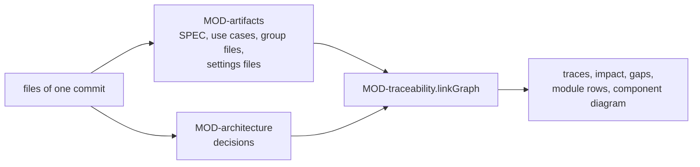

# ARC-006 State is files and records in the repositories; every view is derived from one commit

## Context

With no server and no database (ARC-001), state can live in three places: the repositories, the issue trackers of their
servers, and one browser. A status, a trace or a progress figure that is stored drifts from the text it describes; the
SPEC forbids it and asks instead for records written once as evidence. A product's repository must stay readable
without Agent M (ARC-001).

Each artifact names what it descends from: a use case its requirements, a decision what forces it and the modules it
designs, a module what it realises and uses, a test what it guards and the module it exercises. From these names the
dashboard derives what traces to a requirement, the gaps, the impact of a change and the validation of modules — never
stored.

This is the book's repository pattern (ch. 10): tools interact only through a shared store — here git, which also gives
history, authorship and integrity by hash.

## Decision

1. **Two kinds of file.** *Artifacts* are Markdown that a person reviews: the SPEC and its change queues, use cases,
   architecture decisions, group files, backlog items, user tests (ARC-027). *Records* are small Markdown files written
   once as evidence — approval records, gate records, job records, counter-proofs, test result records, sprint records;
   a record is never shown for acceptance and never edited.
2. **One layout for every product**, below the root of its repository:

   | Path | Content |
   |---|---|
   | `SPEC.md` | the accepted requirements |
   | `docs/spec-freigaben/<date>[<letter>]_<name>/` | change queues of the SPEC (ARC-021) |
   | `docs/use-cases/UC-<nnn>-<slug>.md` | use cases |
   | `docs/architecture/ARC-<nnn>-<slug>.md` | architecture decisions with the modules they design (ARC-020) |
   | `docs/approvals/` | approval records (ARC-021) |
   | `docs/groups/<kind>.md` | the hierarchy of one kind of artifact |
   | `docs/backlog/` | backlog items and sprint records |
   | `docs/jobs/JOB-<id>.md`, `docs/jobs/gates/` | job records and gate records |
   | `docs/process.md`, `docs/settings.md`, `docs/collaborators.md`, `docs/resources.md`, `docs/sources.md`, `docs/tests/schedule.md` | the product's settings |
   | `tests/user/<slug>.md` | user tests: the cases a person carries out (ARC-027) |
   | `docs/tests/counter-proofs/TST-<nnn>.md` | the counter-proofs of new tests (ARC-027) |
   | `docs/audits/<tag>.md` | the audit of a release, written once on a click (ARC-028) |
   | branch `test-results`, `results/<commit>/<run>.md` | test result records, append-only |

   An instance adds `docs/participants.md`, `docs/sources/`, `docs/process-models/` and its own `docs/resources.md`. The
   issues of a product hold what concerns its mails; the browser holds only credentials, the product list and the
   identifiers of mails marked *not an issue* (ARC-003).
3. **Derived, never stored.** Review status, the status of a SPEC entry, traces, gaps, impact lists, progress and job
   states are pure functions over the files of one pinned commit — and, for a running job, over what its runtime
   reports. A released version is the commit of its tag; comparing two versions compares the views of two commits.
4. **The formats of the review layout are read in one module**, `MOD-artifacts`: the requirements and sections of a SPEC
   in the four fields of `A REQUIREMENT HAS FOUR FIELDS`; use cases with their steps as UC-022 numbers them; group files.
   A SPEC's requirement is written

   ```
   **NAME IN CAPITALS** *(source)*
   The rule, on one or more lines.
   *Check:* the test that guards it, or: no automatic check; at review.
   ```

   and ends at a blank line, a heading or the next requirement; a section is found by its heading line, which stands
   once outside code blocks, and ends before the next heading of the same or a higher level, or before a given end line.
   What counts as the history a file must not hold (`A DOCUMENT HOLDS NO HISTORY`): in a SPEC, the date in a requirement's
   source (`MOD-artifacts.checkSpec`); in a product's settings file — one of the six of point 2 —, a line that marks
   something withdrawn, by the word *withdrawn* or by text struck through with `~~`, or a line with a date beside an edit
   or a change: *drafted*, *revised*, *edited*, *updated*, *modified*, *changed*, *added*, *removed*, *switched*, *moved*,
   *since*, *until*, *as of* (`MOD-artifacts.historyIn`). A date without such a word — a served model's identifier, a
   source's edition — is no history.
5. **Traceability is one link graph per commit**, in `MOD-traceability`. Its nodes are the requirements of the SPEC and
   of the open queue entries, the use cases, the decisions, the modules they design, the code files and the tests, each
   by its identifier — a requirement by its name, a code file or a test by its path. Its edges are the names each states:
   a use case *realises*; a decision is *forced by* and *keeps*, and *designs* its modules; a module *realises* and
   *uses*; a code file lies *in* the module whose folder holds it, and *imports* from another module's folder; a test
   *exercises* its module and *guards* requirements and use cases; an open queue entry *proposes* to add, change or remove
   a requirement. Every view is a function of the graph: what traces to a requirement, its impact list, the coverage gaps,
   the module rows with their gaps, the impact of an architecture change, and the component diagram.
6. **Gaps never block.** A gap is a line of a list; no write path consults one, except the one rule the SPEC makes
   blocking, `ARCHITECTURE RESTS ON ACCEPTED ARTIFACTS` (ARC-021).



## Alternatives

- **A JSON or SQLite store committed to the repository** — not reviewable as Markdown, a merge conflict on every
  concurrent write, and a second representation beside the artifacts.
- **Status fields in the artifacts' front matter** — a stored status drifts from the text; editing the text would have to
  reset it.
- **Test results as CI artifacts or on the default branch** — CI servers delete logs after a while; a commit to the
  default branch per run would start CI again.
- **Job state in the browser** — a job started in another browser, or on a bridge that is off, would be invisible.
- **A stored traceability matrix** — `THE TRACEABILITY MATRIX IS DERIVED`.
- **Links by section number or file path** — `A REFERENCE NAMES THE IDENTIFIER, NOT THE POSITION`; a renamed file keeps
  its identifier.
- **Traceability computed in CI and committed** — a committed result is a stored matrix with a delay.
- **A `Module:` line in every code file** — a code file belongs to the module whose folder holds it (ARC-020); a line
  would repeat the folder and could contradict it.

## Consequences

- Reading a product means reading many small files: the page reads one pinned tree, then each view reads the files it
  shows, kept in the browser by their blob SHA (ARC-003).
- The module view reads every code file of a module's folder to find its imports; imports are read from JavaScript
  modules, and a file in another language shows no import.
- A test names its module and what it guards in its first lines (ARC-020); a test without them is a gap, not an error.
- The same functions serve the dashboard, a run's final validation and an audit export, so they cannot disagree.
- `A DOCUMENT HOLDS NO HISTORY` is kept across the decisions (ARC-020). Here `MOD-artifacts` finds it in a text it is given,
  a SPEC or a product's settings file; the saves of ARC-026 decisions 8 and 9 write no text in which
  `MOD-artifacts.historyIn` finds history.

## Modules

### MOD-artifacts

```json module
{
  "id": "MOD-artifacts",
  "folder": "src/artifacts/",
  "layer": "kernel",
  "responsibility": "Reads and checks the texts of the review layout: the requirements and sections of a SPEC, use cases with their steps, and group files.",
  "realises": [
    "A REQUIREMENT HAS FOUR FIELDS",
    "A REQUIREMENT NAMES ITS CHECK",
    "ONE STATEMENT PER REQUIREMENT",
    "A REQUIREMENT HAS A REGISTERED SOURCE",
    "A USE CASE REALISES NAMED REQUIREMENTS",
    "A USE CASE HAS ACTOR, PRECONDITION, FLOW AND POSTCONDITION",
    "ONE USE CASE, ONE FILE",
    "DIAGRAMS ARE MERMAID IN MARKDOWN",
    "AN EDITED FILE KEEPS ITS IDENTIFIER",
    "ARTIFACTS ARE ARRANGED IN NESTED GROUPS",
    "A GROUP CARRIES NO IDENTIFIER",
    "A GROUP HOLDS ONE KIND OF ARTIFACT",
    "AN ITEM HAS ONE PLACE IN ITS HIERARCHY",
    "EVERY HIERARCHY IS KEPT IN A GROUP FILE OF ITS OWN",
    "AN UNGROUPED ITEM IS SHOWN AT THE TOP LEVEL",
    "REGROUPING LEAVES THE GROUPED FILE UNCHANGED"
  ],
  "owns": [
    "FileText",
    "Requirement",
    "SpecDoc",
    "SpecContext",
    "Section",
    "SpecChange",
    "UseCaseDoc",
    "UseCaseFileContent",
    "GroupNode",
    "GroupTree",
    "GroupMove",
    "RefusedMove",
    "MoveResult",
    "SpecFile",
    "UseCaseFile",
    "GroupFile"
  ],
  "uses": ["MOD-contracts"]
}
```

```json interface
{
  "id": "MOD-artifacts.parseSpec",
  "summary": "Every requirement of a SPEC or of a queue entry, in the order of the text, with its four fields, the heading of its section and the line of its name.",
  "params": [{ "name": "text", "type": "string" }],
  "result": "SpecDoc",
  "async": false,
  "refusals": [],
  "examples": [
    {
      "name": "two requirements",
      "input": {
        "text": "# P — Specification\n\n## 0. Rules\n\n**NO SERVER** *(PO A. Maier)*\nThe product runs no server.\n*Check:* `tests/test_no_backend.py`\n\n**ONE CLICK** *(PO A. Maier)*\nA decision takes one click.\n*Check:* no automatic check; at review.\n"
      },
      "result": {
        "requirements": [
          {
            "name": "NO SERVER",
            "source": "PO A. Maier",
            "rule": "The product runs no server.",
            "check": "`tests/test_no_backend.py`",
            "section": "0. Rules",
            "line": 5
          },
          {
            "name": "ONE CLICK",
            "source": "PO A. Maier",
            "rule": "A decision takes one click.",
            "check": "no automatic check; at review.",
            "section": "0. Rules",
            "line": 9
          }
        ]
      }
    }
  ]
}
```

```json interface
{
  "id": "MOD-artifacts.checkSpec",
  "summary": "Every finding on the form of the requirements of a SPEC or of a queue entry: a missing field, a check that names no test, a field the form does not have, a date in a source, an unlinked source, a name standing twice, and a rule containing a conjunction, which is a person's decision.",
  "params": [{ "name": "text", "type": "string" }, { "name": "context", "type": "SpecContext" }],
  "result": "Finding[]",
  "async": false,
  "refusals": [],
  "examples": [
    {
      "name": "a dated source, no check, a conjunction",
      "input": {
        "text": "## 1. Rules\n\n**DATED RULE** *(PO A. Maier, 2026-08-25)*\nIt does this and that.\n",
        "context": { "linkedSources": [] }
      },
      "result": [
        {
          "artifact": "DATED RULE",
          "line": 3,
          "kind": "error",
          "what": "the source carries a date",
          "rule": "A DOCUMENT HOLDS NO HISTORY",
          "fix": "write the source without the date; the version history keeps when it was decided"
        },
        {
          "artifact": "DATED RULE",
          "line": 3,
          "kind": "error",
          "what": "no check",
          "rule": "A REQUIREMENT HAS FOUR FIELDS",
          "fix": "add a line *Check:* naming the test that guards it, or: no automatic check; at review."
        },
        {
          "artifact": "DATED RULE",
          "line": 3,
          "kind": "person",
          "what": "the rule contains \"and\"",
          "rule": "ONE STATEMENT PER REQUIREMENT",
          "fix": "decide whether it states one thing; if not, split it into two requirements"
        }
      ]
    },
    {
      "name": "a complete requirement",
      "input": {
        "text": "# P — Specification\n\n## 0. Rules\n\n**NO SERVER** *(PO A. Maier)*\nThe product runs no server.\n*Check:* `tests/test_no_backend.py`\n\n**ONE CLICK** *(PO A. Maier)*\nA decision takes one click.\n*Check:* no automatic check; at review.\n",
        "context": { "linkedSources": [] }
      },
      "result": []
    }
  ]
}
```

```json interface
{
  "id": "MOD-artifacts.historyIn",
  "summary": "Every finding of history in a product's settings file — one of the six files of ARC-006 decision 2: a line that marks something withdrawn, by the word withdrawn or by text struck through with ~~, and a line with a date beside an edit or a change — drafted, revised, edited, updated, modified, changed, added, removed, switched, moved, since, until, as of.",
  "params": [{ "name": "path", "type": "string" }, { "name": "text", "type": "string" }],
  "result": "Finding[]",
  "async": false,
  "refusals": [{ "code": "not-a-settings-file", "when": "the path is none of a product's six settings files" }],
  "examples": [
    {
      "name": "a person struck through and one added with a date",
      "input": {
        "path": "docs/collaborators.md",
        "text": "# Collaborators\n\nThe people who agreed to be named in this repository (UC-042), each with the account they have on its server.\n\n| Name | Account |\n|---|---|\n| Bob Example | @bob |\n| ~~Carla Muster~~ | @carla |\n| Dana Okafor, added 2026-10-05 | @dokafor |\n"
      },
      "result": [
        {
          "artifact": "docs/collaborators.md",
          "line": 8,
          "kind": "error",
          "what": "a withdrawal note",
          "rule": "A DOCUMENT HOLDS NO HISTORY",
          "fix": "remove the line; the version history keeps what was withdrawn"
        },
        {
          "artifact": "docs/collaborators.md",
          "line": 9,
          "kind": "error",
          "what": "the date of a change",
          "rule": "A DOCUMENT HOLDS NO HISTORY",
          "fix": "write what holds now, without the date and the change; the version history keeps who changed what when"
        }
      ]
    },
    {
      "name": "a switch with its date",
      "input": {
        "path": "docs/settings.md",
        "text": "---\npseudonymisation: off\n---\n\n# Settings\n\nSwitched off on 2026-09-28 by alice.\n"
      },
      "result": [
        {
          "artifact": "docs/settings.md",
          "line": 7,
          "kind": "error",
          "what": "the date of a change",
          "rule": "A DOCUMENT HOLDS NO HISTORY",
          "fix": "write what holds now, without the date and the change; the version history keeps who changed what when"
        }
      ]
    },
    {
      "name": "a served model whose identifier holds a date",
      "input": {
        "path": "docs/resources.md",
        "text": "# Resources\n\n## gpt-4o\n\n- kind: endpoint\n- pin: gpt-4o-2024-08-06\n"
      },
      "result": []
    },
    {
      "name": "the SPEC, which checkSpec reads",
      "input": { "path": "SPEC.md", "text": "# Agent M — Specification\n" },
      "refused": "not-a-settings-file"
    }
  ]
}
```

```json interface
{
  "id": "MOD-artifacts.extractSection",
  "summary": "The section a heading line opens — up to the next heading of the same or a higher level, or up to an end line —, its lines and its text with one final newline.",
  "params": [
    { "name": "text", "type": "string" },
    { "name": "anchor", "type": "string" },
    { "name": "bis", "type": "string", "optional": true }
  ],
  "result": "Section",
  "async": false,
  "refusals": [
    { "code": "anchor-not-unique", "when": "the anchor line does not stand exactly once outside code blocks" },
    { "code": "end-not-unique", "when": "an end line is given and does not stand exactly once after the anchor" }
  ],
  "examples": [
    {
      "name": "a section up to the end of the text",
      "input": {
        "text": "# P — Specification\n\n## 0. Rules\n\n**NO SERVER** *(PO A. Maier)*\nThe product runs no server.\n*Check:* `tests/test_no_backend.py`\n\n**ONE CLICK** *(PO A. Maier)*\nA decision takes one click.\n*Check:* no automatic check; at review.\n",
        "anchor": "## 0. Rules"
      },
      "result": {
        "start": 3,
        "end": 12,
        "text": "## 0. Rules\n\n**NO SERVER** *(PO A. Maier)*\nThe product runs no server.\n*Check:* `tests/test_no_backend.py`\n\n**ONE CLICK** *(PO A. Maier)*\nA decision takes one click.\n*Check:* no automatic check; at review.\n"
      }
    },
    {
      "name": "a heading that stands twice",
      "input": { "text": "## A\n\nOne.\n\n## A\n\nTwo.\n", "anchor": "## A" },
      "refused": "anchor-not-unique"
    }
  ]
}
```

```json interface
{
  "id": "MOD-artifacts.replaceSection",
  "summary": "The text with the section an anchor opens replaced by a proposal byte for byte, its final newline kept.",
  "params": [
    { "name": "text", "type": "string" },
    { "name": "anchor", "type": "string" },
    { "name": "proposal", "type": "string" },
    { "name": "bis", "type": "string", "optional": true }
  ],
  "result": "string",
  "async": false,
  "refusals": [
    { "code": "anchor-not-unique", "when": "the anchor line does not stand exactly once outside code blocks" },
    { "code": "end-not-unique", "when": "an end line is given and does not stand exactly once after the anchor" }
  ],
  "examples": [
    {
      "name": "a section replaced",
      "input": {
        "text": "# P — Specification\n\n## 0. Rules\n\n**NO SERVER** *(PO A. Maier)*\nThe product runs no server.\n*Check:* `tests/test_no_backend.py`\n\n**ONE CLICK** *(PO A. Maier)*\nA decision takes one click.\n*Check:* no automatic check; at review.\n",
        "anchor": "## 0. Rules",
        "proposal": "## 0. Rules\n\n**NO SERVER** *(PO A. Maier)*\nThe product runs no server of its own.\n*Check:* `tests/test_no_backend.py`\n"
      },
      "result": "# P — Specification\n\n## 0. Rules\n\n**NO SERVER** *(PO A. Maier)*\nThe product runs no server of its own.\n*Check:* `tests/test_no_backend.py`\n"
    }
  ]
}
```

```json interface
{
  "id": "MOD-artifacts.specChanges",
  "summary": "The requirements one SPEC text adds, changes or removes against another, by name.",
  "params": [{ "name": "before", "type": "string" }, { "name": "after", "type": "string" }],
  "result": "SpecChange[]",
  "async": false,
  "refusals": [],
  "examples": [
    {
      "name": "one changed, one added, one removed",
      "input": {
        "before": "# P — Specification\n\n## 0. Rules\n\n**NO SERVER** *(PO A. Maier)*\nThe product runs no server.\n*Check:* `tests/test_no_backend.py`\n\n**ONE CLICK** *(PO A. Maier)*\nA decision takes one click.\n*Check:* no automatic check; at review.\n",
        "after": "# P — Specification\n\n## 0. Rules\n\n**NO SERVER** *(PO A. Maier)*\nThe product runs no server of its own.\n*Check:* `tests/test_no_backend.py`\n\n**NO COOKIE** *(PO A. Maier)*\nThe product sets no cookie.\n*Check:* `tests/test_no_cookie.py`\n"
      },
      "result": [
        { "name": "NO SERVER", "change": "changed" },
        { "name": "NO COOKIE", "change": "added" },
        { "name": "ONE CLICK", "change": "removed" }
      ]
    }
  ]
}
```

```json interface
{
  "id": "MOD-artifacts.parseUseCase",
  "summary": "A use case as its file holds it: its front matter, the headings of its sections, its steps as UC-022 numbers them, and how many Mermaid diagrams it has.",
  "params": [{ "name": "path", "type": "string" }, { "name": "text", "type": "string" }],
  "result": "UseCaseDoc",
  "async": false,
  "refusals": [
    { "code": "not-a-use-case", "when": "the path is not docs/use-cases/UC-<nnn>-<slug>.md" },
    { "code": "no-front-matter", "when": "the text does not begin with a front-matter block" }
  ],
  "examples": [
    {
      "name": "steps, nested steps and an alternative flow",
      "input": {
        "path": "docs/use-cases/UC-901-accept.md",
        "text": "---\nid: UC-901\ntitle: Accept a use case\narea: review\nactors:\n  - Reviewer\nrealises:\n  - ONE CLICK\n---\n# UC-901 Accept a use case\n\n## Actors\n\n- **Reviewer** — reads and accepts.\n\n## Precondition\n\n- The use case exists.\n\n## Main flow\n\n1. The reviewer opens the use case.\n2. The reviewer presses **Accept**:\n   1. the record is written;\n   2. the status turns accepted.\n\n```mermaid\nsequenceDiagram\n    actor R as Reviewer\n    R->>R: Accept\n```\n\n## Alternative flows\n\n- **2a. No token is stored.** GitHub's page opens.\n\n## Postcondition\n\n- A record names the text.\n"
      },
      "result": {
        "path": "docs/use-cases/UC-901-accept.md",
        "id": "UC-901",
        "title": "Accept a use case",
        "area": "review",
        "actors": ["Reviewer"],
        "realises": ["ONE CLICK"],
        "sections": ["Actors", "Precondition", "Main flow", "Alternative flows", "Postcondition"],
        "steps": ["1", "2", "2.1", "2.2", "2a"],
        "diagrams": 1
      }
    },
    {
      "name": "an alternative flow with steps of its own",
      "input": {
        "path": "docs/use-cases/UC-901-accept.md",
        "text": "---\nid: UC-901\ntitle: Accept a use case\narea: review\nactors:\n  - Reviewer\nrealises:\n  - ONE CLICK\n---\n# UC-901 Accept a use case\n\n## Actors\n\n- **Reviewer** — reads and accepts.\n\n## Precondition\n\n- The use case exists.\n\n## Main flow\n\n1. The reviewer opens the use case.\n2. The reviewer presses **Accept**:\n   1. the record is written;\n   2. the status turns accepted.\n\n```mermaid\nsequenceDiagram\n    actor R as Reviewer\n    R->>R: Accept\n```\n\n## Alternative flows\n\n- **2a. No token is stored.** GitHub's page opens.\n  1. the reviewer opens GitHub's page;\n  2. the reviewer commits there.\n\n## Postcondition\n\n- A record names the text.\n"
      },
      "result": {
        "path": "docs/use-cases/UC-901-accept.md",
        "id": "UC-901",
        "title": "Accept a use case",
        "area": "review",
        "actors": ["Reviewer"],
        "realises": ["ONE CLICK"],
        "sections": ["Actors", "Precondition", "Main flow", "Alternative flows", "Postcondition"],
        "steps": ["1", "2", "2.1", "2.2", "2a", "2a.1", "2a.2"],
        "diagrams": 1
      }
    },
    {
      "name": "a file outside docs/use-cases",
      "input": {
        "path": "docs/notes/UC-901.md",
        "text": "---\nid: UC-901\ntitle: Accept a use case\narea: review\nactors:\n  - Reviewer\nrealises:\n  - ONE CLICK\n---\n# UC-901 Accept a use case\n\n## Actors\n\n- **Reviewer** — reads and accepts.\n\n## Precondition\n\n- The use case exists.\n\n## Main flow\n\n1. The reviewer opens the use case.\n2. The reviewer presses **Accept**:\n   1. the record is written;\n   2. the status turns accepted.\n\n```mermaid\nsequenceDiagram\n    actor R as Reviewer\n    R->>R: Accept\n```\n\n## Alternative flows\n\n- **2a. No token is stored.** GitHub's page opens.\n\n## Postcondition\n\n- A record names the text.\n"
      },
      "refused": "not-a-use-case"
    }
  ]
}
```

```json interface
{
  "id": "MOD-artifacts.checkUseCase",
  "summary": "Every finding on the form of a use case: its file name and identifier, title, area, actors, the requirements it names, its five sections, and its diagrams written as Mermaid.",
  "params": [
    { "name": "path", "type": "string" },
    { "name": "text", "type": "string" },
    { "name": "requirements", "type": "string[]" }
  ],
  "result": "Finding[]",
  "async": false,
  "refusals": [],
  "examples": [
    {
      "name": "a name that is no requirement",
      "input": {
        "path": "docs/use-cases/UC-901-accept.md",
        "text": "---\nid: UC-901\ntitle: Accept a use case\narea: review\nactors:\n  - Reviewer\nrealises:\n  - ONE CLICK\n---\n# UC-901 Accept a use case\n\n## Actors\n\n- **Reviewer** — reads and accepts.\n\n## Precondition\n\n- The use case exists.\n\n## Main flow\n\n1. The reviewer opens the use case.\n2. The reviewer presses **Accept**:\n   1. the record is written;\n   2. the status turns accepted.\n\n```mermaid\nsequenceDiagram\n    actor R as Reviewer\n    R->>R: Accept\n```\n\n## Alternative flows\n\n- **2a. No token is stored.** GitHub's page opens.\n\n## Postcondition\n\n- A record names the text.\n",
        "requirements": ["NO SERVER"]
      },
      "result": [
        {
          "artifact": "UC-901",
          "line": 8,
          "kind": "error",
          "what": "ONE CLICK names no requirement of the SPEC",
          "rule": "A USE CASE REALISES NAMED REQUIREMENTS",
          "fix": "name a requirement exactly as the SPEC writes it, or remove the line"
        }
      ]
    },
    {
      "name": "a complete use case",
      "input": {
        "path": "docs/use-cases/UC-901-accept.md",
        "text": "---\nid: UC-901\ntitle: Accept a use case\narea: review\nactors:\n  - Reviewer\nrealises:\n  - ONE CLICK\n---\n# UC-901 Accept a use case\n\n## Actors\n\n- **Reviewer** — reads and accepts.\n\n## Precondition\n\n- The use case exists.\n\n## Main flow\n\n1. The reviewer opens the use case.\n2. The reviewer presses **Accept**:\n   1. the record is written;\n   2. the status turns accepted.\n\n```mermaid\nsequenceDiagram\n    actor R as Reviewer\n    R->>R: Accept\n```\n\n## Alternative flows\n\n- **2a. No token is stored.** GitHub's page opens.\n\n## Postcondition\n\n- A record names the text.\n",
        "requirements": ["NO SERVER", "ONE CLICK"]
      },
      "result": []
    }
  ]
}
```

```json interface
{
  "id": "MOD-artifacts.identifierKept",
  "summary": "The finding when an edited text carries another identifier than the one its file was opened with; none when it keeps it.",
  "params": [{ "name": "openedId", "type": "string" }, { "name": "text", "type": "string" }],
  "result": "Finding[]",
  "async": false,
  "refusals": [],
  "examples": [
    {
      "name": "the identifier changed",
      "input": {
        "openedId": "UC-901",
        "text": "---\nid: UC-902\ntitle: Accept a use case\narea: review\nactors:\n  - Reviewer\nrealises:\n  - ONE CLICK\n---\n# UC-901 Accept a use case\n\n## Actors\n\n- **Reviewer** — reads and accepts.\n\n## Precondition\n\n- The use case exists.\n\n## Main flow\n\n1. The reviewer opens the use case.\n2. The reviewer presses **Accept**:\n   1. the record is written;\n   2. the status turns accepted.\n\n```mermaid\nsequenceDiagram\n    actor R as Reviewer\n    R->>R: Accept\n```\n\n## Alternative flows\n\n- **2a. No token is stored.** GitHub's page opens.\n\n## Postcondition\n\n- A record names the text.\n"
      },
      "result": [
        {
          "artifact": "UC-901",
          "line": 2,
          "kind": "error",
          "what": "the file was opened as UC-901, but its text carries the identifier UC-902",
          "rule": "AN EDITED FILE KEEPS ITS IDENTIFIER",
          "fix": "put back id: UC-901; a new identifier is a new file"
        }
      ]
    },
    {
      "name": "the identifier kept",
      "input": {
        "openedId": "UC-901",
        "text": "---\nid: UC-901\ntitle: Accept a use case\narea: review\nactors:\n  - Reviewer\nrealises:\n  - ONE CLICK\n---\n# UC-901 Accept a use case\n\n## Actors\n\n- **Reviewer** — reads and accepts.\n\n## Precondition\n\n- The use case exists.\n\n## Main flow\n\n1. The reviewer opens the use case.\n2. The reviewer presses **Accept**:\n   1. the record is written;\n   2. the status turns accepted.\n\n```mermaid\nsequenceDiagram\n    actor R as Reviewer\n    R->>R: Accept\n```\n\n## Alternative flows\n\n- **2a. No token is stored.** GitHub's page opens.\n\n## Postcondition\n\n- A record names the text.\n"
      },
      "result": []
    }
  ]
}
```

```json interface
{
  "id": "MOD-artifacts.reviewedId",
  "summary": "The identifier of a reviewed file — a use case, an architecture decision, or a release test report by its version — from its path.",
  "params": [{ "name": "path", "type": "string" }],
  "result": "string",
  "async": false,
  "refusals": [
    {
      "code": "not-a-reviewed-file",
      "when": "the path is none of docs/use-cases/UC-<nnn>-<slug>.md, docs/architecture/ARC-<nnn>-<slug>.md and docs/tests/releases/v<version>.md"
    }
  ],
  "examples": [
    { "name": "a use case", "input": { "path": "docs/use-cases/UC-901-accept.md" }, "result": "UC-901" },
    { "name": "a decision", "input": { "path": "docs/architecture/ARC-006-state.md" }, "result": "ARC-006" },
    {
      "name": "a release test report",
      "input": { "path": "docs/tests/releases/v2026.3.0.md" },
      "result": "v2026.3.0"
    },
    { "name": "another file", "input": { "path": "docs/notes.md" }, "refused": "not-a-reviewed-file" }
  ]
}
```

```json interface
{
  "id": "MOD-artifacts.parseGroupFile",
  "summary": "The hierarchy a group file holds: its heading, its paragraph, its groups and members nested by two spaces, the kind most of its members have, and every problem of the list's form.",
  "params": [{ "name": "text", "type": "string" }],
  "result": "GroupTree",
  "async": false,
  "refusals": [],
  "examples": [
    {
      "name": "two groups",
      "input": {
        "text": "# Use cases — groups\n\nThe hierarchy of the use cases.\n\n- Review\n  - UC-901\n  - UC-902\n- Setup\n  - UC-903\n"
      },
      "result": {
        "heading": "Use cases — groups",
        "intro": "The hierarchy of the use cases.",
        "kind": "use-case",
        "children": [
          { "title": "Review", "line": 5, "children": [{ "id": "UC-901", "line": 6 }, { "id": "UC-902", "line": 7 }] },
          { "title": "Setup", "line": 8, "children": [{ "id": "UC-903", "line": 9 }] }
        ],
        "problems": []
      }
    }
  ]
}
```

```json interface
{
  "id": "MOD-artifacts.arrangeGroups",
  "summary": "The hierarchy laid over the items of its kind: every item in one place — an item no group names at the top level, marked not yet placed —, and every problem: a member of another kind, a member listed a second time, a member that names no item, marked unknown, and a group title written like an identifier.",
  "params": [{ "name": "tree", "type": "GroupTree" }, { "name": "items", "type": "string[]" }],
  "result": "GroupTree",
  "async": false,
  "refusals": [],
  "examples": [
    {
      "name": "an unknown member and an item not yet placed",
      "input": {
        "tree": {
          "heading": "Use cases — groups",
          "intro": "The hierarchy of the use cases.",
          "kind": "use-case",
          "children": [
            {
              "title": "Review",
              "line": 5,
              "children": [{ "id": "UC-901", "line": 6 }, { "id": "UC-902", "line": 7 }]
            },
            { "title": "Setup", "line": 8, "children": [{ "id": "UC-903", "line": 9 }] }
          ],
          "problems": []
        },
        "items": ["UC-901", "UC-903", "UC-904"]
      },
      "result": {
        "heading": "Use cases — groups",
        "intro": "The hierarchy of the use cases.",
        "kind": "use-case",
        "children": [
          {
            "title": "Review",
            "line": 5,
            "children": [{ "id": "UC-901", "line": 6 }, { "id": "UC-902", "line": 7, "unknown": true }]
          },
          { "title": "Setup", "line": 8, "children": [{ "id": "UC-903", "line": 9 }] },
          { "id": "UC-904", "line": 0, "notYetPlaced": true }
        ],
        "problems": [
          {
            "artifact": "UC-902",
            "line": 7,
            "kind": "warning",
            "what": "UC-902 names no use case of the product",
            "rule": "EVERY HIERARCHY IS KEPT IN A GROUP FILE OF ITS OWN",
            "fix": "remove the line, or name the item by the identifier it has"
          }
        ]
      }
    },
    {
      "name": "a title like an identifier, a member twice, a member of another kind",
      "input": {
        "tree": {
          "heading": "Use cases — groups",
          "intro": "",
          "kind": "use-case",
          "children": [
            { "title": "UC-905 drafts", "line": 3, "children": [{ "id": "UC-901", "line": 4 }] },
            {
              "title": "Review",
              "line": 5,
              "children": [{ "id": "UC-901", "line": 6 }, { "id": "ARC-001", "line": 7 }]
            }
          ],
          "problems": []
        },
        "items": ["UC-901"]
      },
      "result": {
        "heading": "Use cases — groups",
        "intro": "",
        "kind": "use-case",
        "children": [
          { "title": "UC-905 drafts", "line": 3, "children": [{ "id": "UC-901", "line": 4 }] },
          {
            "title": "Review",
            "line": 5,
            "children": [{ "id": "UC-901", "line": 6 }, { "id": "ARC-001", "line": 7 }]
          }
        ],
        "problems": [
          {
            "artifact": "UC-905 drafts",
            "line": 3,
            "kind": "error",
            "what": "the group title \"UC-905 drafts\" looks like an identifier",
            "rule": "A GROUP CARRIES NO IDENTIFIER",
            "fix": "name a group by a title in words; list an identifier as a member"
          },
          {
            "artifact": "UC-901",
            "line": 6,
            "kind": "error",
            "what": "UC-901 is listed a second time (first on line 4)",
            "rule": "AN ITEM HAS ONE PLACE IN ITS HIERARCHY",
            "fix": "keep UC-901 in one place and remove the other line"
          },
          {
            "artifact": "ARC-001",
            "line": 7,
            "kind": "error",
            "what": "ARC-001 is an architecture decision, not a use case",
            "rule": "A GROUP HOLDS ONE KIND OF ARTIFACT",
            "fix": "list ARC-001 in the group file of its own kind"
          }
        ]
      }
    }
  ]
}
```

```json interface
{
  "id": "MOD-artifacts.moveInGroups",
  "summary": "The hierarchy after a list of changes in their order — create, rename, move or delete a group, move an item, remove a member that names no item —, with every change that is refused and why: an item of another kind than the hierarchy's, an item of the product removed, a group title written like an identifier or one its siblings already have, a group that is not empty deleted, a group moved into itself, a group that does not exist.",
  "params": [{ "name": "tree", "type": "GroupTree" }, { "name": "moves", "type": "GroupMove[]" }],
  "result": "MoveResult",
  "async": false,
  "refusals": [],
  "examples": [
    {
      "name": "a move done, a deletion refused",
      "input": {
        "tree": {
          "heading": "Use cases — groups",
          "intro": "The hierarchy of the use cases.",
          "kind": "use-case",
          "children": [
            {
              "title": "Review",
              "line": 5,
              "children": [{ "id": "UC-901", "line": 6 }, { "id": "UC-902", "line": 7 }]
            },
            { "title": "Setup", "line": 8, "children": [{ "id": "UC-903", "line": 9 }] }
          ],
          "problems": []
        },
        "moves": [{ "op": "move", "item": "UC-903", "to": ["Review"] }, { "op": "delete", "group": ["Review"] }]
      },
      "result": {
        "tree": {
          "heading": "Use cases — groups",
          "intro": "The hierarchy of the use cases.",
          "kind": "use-case",
          "children": [
            {
              "title": "Review",
              "line": 5,
              "children": [
                { "id": "UC-901", "line": 6 },
                { "id": "UC-902", "line": 7 },
                { "id": "UC-903", "line": 0 }
              ]
            },
            { "title": "Setup", "line": 8, "children": [] }
          ],
          "problems": []
        },
        "refused": [
          {
            "move": { "op": "delete", "group": ["Review"] },
            "reason": "the group \"Review\" is not empty; move what it holds out first"
          }
        ]
      }
    },
    {
      "name": "an item of another kind, a title like an identifier",
      "input": {
        "tree": {
          "heading": "Use cases — groups",
          "intro": "The hierarchy of the use cases.",
          "kind": "use-case",
          "children": [
            {
              "title": "Review",
              "line": 5,
              "children": [{ "id": "UC-901", "line": 6 }, { "id": "UC-902", "line": 7 }]
            },
            { "title": "Setup", "line": 8, "children": [{ "id": "UC-903", "line": 9 }] }
          ],
          "problems": []
        },
        "moves": [
          { "op": "move", "item": "ARC-001", "to": ["Review"] },
          { "op": "create", "in": [], "title": "UC-905 drafts" }
        ]
      },
      "result": {
        "tree": {
          "heading": "Use cases — groups",
          "intro": "The hierarchy of the use cases.",
          "kind": "use-case",
          "children": [
            {
              "title": "Review",
              "line": 5,
              "children": [{ "id": "UC-901", "line": 6 }, { "id": "UC-902", "line": 7 }]
            },
            { "title": "Setup", "line": 8, "children": [{ "id": "UC-903", "line": 9 }] }
          ],
          "problems": []
        },
        "refused": [
          {
            "move": { "op": "move", "item": "ARC-001", "to": ["Review"] },
            "reason": "ARC-001 is an architecture decision, not a use case"
          },
          {
            "move": { "op": "create", "in": [], "title": "UC-905 drafts" },
            "reason": "\"UC-905 drafts\" is no title for a group"
          }
        ]
      }
    },
    {
      "name": "a member that names no item removed, an item of the product not",
      "input": {
        "tree": {
          "heading": "Use cases — groups",
          "intro": "The hierarchy of the use cases.",
          "kind": "use-case",
          "children": [
            {
              "title": "Review",
              "line": 5,
              "children": [{ "id": "UC-901", "line": 6 }, { "id": "UC-902", "line": 7 }]
            },
            {
              "title": "Setup",
              "line": 8,
              "children": [{ "id": "UC-903", "line": 9 }, { "id": "UC-907", "line": 10, "unknown": true }]
            }
          ],
          "problems": [
            {
              "artifact": "UC-907",
              "line": 10,
              "kind": "warning",
              "what": "UC-907 names no use case of the product",
              "rule": "EVERY HIERARCHY IS KEPT IN A GROUP FILE OF ITS OWN",
              "fix": "remove the line, or name the item by the identifier it has"
            }
          ]
        },
        "moves": [{ "op": "delete", "item": "UC-907" }, { "op": "delete", "item": "UC-901" }]
      },
      "result": {
        "tree": {
          "heading": "Use cases — groups",
          "intro": "The hierarchy of the use cases.",
          "kind": "use-case",
          "children": [
            {
              "title": "Review",
              "line": 5,
              "children": [{ "id": "UC-901", "line": 6 }, { "id": "UC-902", "line": 7 }]
            },
            { "title": "Setup", "line": 8, "children": [{ "id": "UC-903", "line": 9 }] }
          ],
          "problems": [
            {
              "artifact": "UC-907",
              "line": 10,
              "kind": "warning",
              "what": "UC-907 names no use case of the product",
              "rule": "EVERY HIERARCHY IS KEPT IN A GROUP FILE OF ITS OWN",
              "fix": "remove the line, or name the item by the identifier it has"
            }
          ]
        },
        "refused": [
          {
            "move": { "op": "delete", "item": "UC-901" },
            "reason": "UC-901 is an item of the product; grouping never removes an item, it moves it"
          }
        ]
      }
    }
  ]
}
```

```json interface
{
  "id": "MOD-artifacts.formatGroupFile",
  "summary": "The canonical text of a group file: its heading, its paragraph and the list nested by two spaces; an item not yet placed is not written.",
  "params": [{ "name": "tree", "type": "GroupTree" }, { "name": "heading", "type": "string", "optional": true }],
  "result": "string",
  "async": false,
  "refusals": [],
  "examples": [
    {
      "name": "after a move",
      "input": {
        "tree": {
          "heading": "Use cases — groups",
          "intro": "The hierarchy of the use cases.",
          "kind": "use-case",
          "children": [
            {
              "title": "Review",
              "line": 5,
              "children": [
                { "id": "UC-901", "line": 6 },
                { "id": "UC-902", "line": 7 },
                { "id": "UC-903", "line": 0 }
              ]
            },
            { "title": "Setup", "line": 8, "children": [] }
          ],
          "problems": []
        }
      },
      "result": "# Use cases — groups\n\nThe hierarchy of the use cases.\n\n- Review\n  - UC-901\n  - UC-902\n  - UC-903\n- Setup\n"
    }
  ]
}
```

### MOD-traceability

```json module
{
  "id": "MOD-traceability",
  "folder": "src/traceability/",
  "layer": "kernel",
  "responsibility": "Derives from the files of one commit the link graph of every name the artifacts state, and the views over it: what traces to a requirement, impact lists, coverage gaps, module rows with their gaps, the impact of an architecture change and the component diagram.",
  "realises": [
    "THE TRACEABILITY MATRIX IS DERIVED",
    "A REQUIREMENT SHOWS WHAT TRACES TO IT",
    "UNREALISED REQUIREMENTS ARE REPORTED, NOT FORBIDDEN",
    "MODULE GAPS ARE REPORTED, NOT FORBIDDEN",
    "A REQUIREMENT IS NOT CHANGED WITHOUT AN IMPACT LIST"
  ],
  "owns": [
    "TraceInput",
    "StatusOf",
    "LinkGraph",
    "GraphNode",
    "GraphEdge",
    "GraphModule",
    "UnknownName",
    "Trace",
    "ProposalTrace",
    "ImpactEntry",
    "CoverageGaps",
    "ModuleView",
    "ModuleRow",
    "ModuleGap",
    "ArchitectureImpact",
    "AffectedModule",
    "NameChanges",
    "TestHeader"
  ],
  "uses": ["MOD-artifacts", "MOD-architecture", "MOD-review-core"]
}
```

```json interface
{
  "id": "MOD-traceability.linkGraph",
  "summary": "The link graph of one commit: every requirement, open queue entry, use case, decision, module, code file and test as a node, every name they state as an edge, and every name that matches no node.",
  "params": [{ "name": "input", "type": "TraceInput" }],
  "result": "LinkGraph",
  "async": false,
  "refusals": [],
  "examples": [
    {
      "name": "a SPEC, a use case, a decision with its module, code and a test",
      "input": {
        "input": {
          "files": [
            {
              "path": "SPEC.md",
              "text": "# P — Specification\n\n## 0. Rules\n\n**NO SERVER** *(PO A. Maier)*\nThe product runs no server.\n*Check:* `tests/test_no_backend.py`\n\n**ONE CLICK** *(PO A. Maier)*\nA decision takes one click.\n*Check:* no automatic check; at review.\n"
            },
            {
              "path": "docs/use-cases/UC-901-accept.md",
              "text": "---\nid: UC-901\ntitle: Accept a use case\narea: review\nactors:\n  - Reviewer\nrealises:\n  - ONE CLICK\n---\n# UC-901 Accept a use case\n\n## Actors\n\n- **Reviewer** — reads and accepts.\n\n## Precondition\n\n- The use case exists.\n\n## Main flow\n\n1. The reviewer opens the use case.\n2. The reviewer presses **Accept**:\n   1. the record is written;\n   2. the status turns accepted.\n\n```mermaid\nsequenceDiagram\n    actor R as Reviewer\n    R->>R: Accept\n```\n\n## Alternative flows\n\n- **2a. No token is stored.** GitHub's page opens.\n\n## Postcondition\n\n- A record names the text.\n"
            },
            {
              "path": "docs/architecture/ARC-901-site.md",
              "text": "---\nid: ARC-901\ntitle: A static site\nforced_by:\n  - NO SERVER\nkeeps:\n  - ONE CLICK\n---\n# ARC-901 A static site\n\n## Context\n\nC.\n\n## Decision\n\nD.\n\n## Alternatives\n\nA.\n\n## Consequences\n\nE.\n\n## Modules\n\n```json module\n{\"id\":\"MOD-x\",\"folder\":\"src/x/\",\"layer\":\"kernel\",\"responsibility\":\"Doubles.\",\"realises\":[\"NO SERVER\"],\"owns\":[],\"uses\":[]}\n```\n\n```json interface\n{\"id\":\"MOD-x.double\",\"summary\":\"Doubles.\",\"params\":[{\"name\":\"n\",\"type\":\"integer\"}],\"result\":\"integer\",\"async\":false,\"refusals\":[],\"examples\":[{\"name\":\"two\",\"input\":{\"n\":2},\"result\":4}]}\n```\n"
            },
            { "path": "src/x/index.mjs", "text": "export const double = (n) => 2 * n;\n" },
            {
              "path": "tests/x.test.mjs",
              "text": "// Module: MOD-x\n// Guards: NO SERVER\n// Level: unit\nimport { test } from \"node:test\";\n"
            }
          ],
          "paths": [
            "SPEC.md",
            "docs/use-cases/UC-901-accept.md",
            "docs/architecture/ARC-901-site.md",
            "src/other.mjs",
            "src/x/index.mjs",
            "tests/x.test.mjs"
          ],
          "status": [{ "key": "UC-901", "status": "accepted" }]
        }
      },
      "result": {
        "nodes": [
          {
            "id": "ARC-901",
            "kind": "architecture-decision",
            "path": "docs/architecture/ARC-901-site.md",
            "status": "open"
          },
          { "id": "MOD-x", "kind": "module", "path": "docs/architecture/ARC-901-site.md", "status": "open" },
          { "id": "NO SERVER", "kind": "requirement", "path": "SPEC.md", "status": "accepted" },
          { "id": "ONE CLICK", "kind": "requirement", "path": "SPEC.md", "status": "accepted" },
          { "id": "UC-901", "kind": "use-case", "path": "docs/use-cases/UC-901-accept.md", "status": "accepted" },
          { "id": "src/other.mjs", "kind": "code", "path": "src/other.mjs", "status": "" },
          { "id": "src/x/index.mjs", "kind": "code", "path": "src/x/index.mjs", "status": "" },
          { "id": "tests/x.test.mjs", "kind": "test", "path": "tests/x.test.mjs", "status": "" }
        ],
        "edges": [
          { "from": "ARC-901", "to": "NO SERVER", "via": "forced_by" },
          { "from": "ARC-901", "to": "ONE CLICK", "via": "keeps" },
          { "from": "ARC-901", "to": "MOD-x", "via": "designs" },
          { "from": "MOD-x", "to": "NO SERVER", "via": "realises" },
          { "from": "UC-901", "to": "ONE CLICK", "via": "realises" },
          { "from": "src/x/index.mjs", "to": "MOD-x", "via": "in" },
          { "from": "tests/x.test.mjs", "to": "MOD-x", "via": "exercises" },
          { "from": "tests/x.test.mjs", "to": "NO SERVER", "via": "guards" }
        ],
        "modules": [{ "id": "MOD-x", "folder": "src/x/" }],
        "unknown": []
      }
    }
  ]
}
```

```json interface
{
  "id": "MOD-traceability.tracesTo",
  "summary": "Everything that names one requirement: the use cases realising it, the decisions it forces or that keep it, the modules realising it, the tests guarding it, and the open queue entries that would change it.",
  "params": [{ "name": "graph", "type": "LinkGraph" }, { "name": "name", "type": "string" }],
  "result": "Trace",
  "async": false,
  "refusals": [],
  "examples": [
    {
      "name": "a requirement a decision is forced by",
      "input": {
        "graph": {
          "nodes": [
            {
              "id": "ARC-901",
              "kind": "architecture-decision",
              "path": "docs/architecture/ARC-901-site.md",
              "status": "open"
            },
            { "id": "MOD-x", "kind": "module", "path": "docs/architecture/ARC-901-site.md", "status": "open" },
            { "id": "NO SERVER", "kind": "requirement", "path": "SPEC.md", "status": "accepted" },
            { "id": "ONE CLICK", "kind": "requirement", "path": "SPEC.md", "status": "accepted" },
            { "id": "UC-901", "kind": "use-case", "path": "docs/use-cases/UC-901-accept.md", "status": "accepted" },
            { "id": "src/other.mjs", "kind": "code", "path": "src/other.mjs", "status": "" },
            { "id": "src/x/index.mjs", "kind": "code", "path": "src/x/index.mjs", "status": "" },
            { "id": "tests/x.test.mjs", "kind": "test", "path": "tests/x.test.mjs", "status": "" }
          ],
          "edges": [
            { "from": "ARC-901", "to": "NO SERVER", "via": "forced_by" },
            { "from": "ARC-901", "to": "ONE CLICK", "via": "keeps" },
            { "from": "ARC-901", "to": "MOD-x", "via": "designs" },
            { "from": "MOD-x", "to": "NO SERVER", "via": "realises" },
            { "from": "UC-901", "to": "ONE CLICK", "via": "realises" },
            { "from": "src/x/index.mjs", "to": "MOD-x", "via": "in" },
            { "from": "tests/x.test.mjs", "to": "MOD-x", "via": "exercises" },
            { "from": "tests/x.test.mjs", "to": "NO SERVER", "via": "guards" }
          ],
          "modules": [{ "id": "MOD-x", "folder": "src/x/" }],
          "unknown": []
        },
        "name": "NO SERVER"
      },
      "result": {
        "useCases": [],
        "decisions": ["ARC-901"],
        "modules": ["MOD-x"],
        "tests": ["tests/x.test.mjs"],
        "proposals": []
      }
    }
  ]
}
```

```json interface
{
  "id": "MOD-traceability.requirementImpact",
  "summary": "Every artifact that names a requirement, to be shown beside a proposal that changes it.",
  "params": [{ "name": "graph", "type": "LinkGraph" }, { "name": "name", "type": "string" }],
  "result": "ImpactEntry[]",
  "async": false,
  "refusals": [],
  "examples": [
    {
      "name": "a use case and a decision",
      "input": {
        "graph": {
          "nodes": [
            {
              "id": "ARC-901",
              "kind": "architecture-decision",
              "path": "docs/architecture/ARC-901-site.md",
              "status": "open"
            },
            { "id": "MOD-x", "kind": "module", "path": "docs/architecture/ARC-901-site.md", "status": "open" },
            { "id": "NO SERVER", "kind": "requirement", "path": "SPEC.md", "status": "accepted" },
            { "id": "ONE CLICK", "kind": "requirement", "path": "SPEC.md", "status": "accepted" },
            { "id": "UC-901", "kind": "use-case", "path": "docs/use-cases/UC-901-accept.md", "status": "accepted" },
            { "id": "src/other.mjs", "kind": "code", "path": "src/other.mjs", "status": "" },
            { "id": "src/x/index.mjs", "kind": "code", "path": "src/x/index.mjs", "status": "" },
            { "id": "tests/x.test.mjs", "kind": "test", "path": "tests/x.test.mjs", "status": "" }
          ],
          "edges": [
            { "from": "ARC-901", "to": "NO SERVER", "via": "forced_by" },
            { "from": "ARC-901", "to": "ONE CLICK", "via": "keeps" },
            { "from": "ARC-901", "to": "MOD-x", "via": "designs" },
            { "from": "MOD-x", "to": "NO SERVER", "via": "realises" },
            { "from": "UC-901", "to": "ONE CLICK", "via": "realises" },
            { "from": "src/x/index.mjs", "to": "MOD-x", "via": "in" },
            { "from": "tests/x.test.mjs", "to": "MOD-x", "via": "exercises" },
            { "from": "tests/x.test.mjs", "to": "NO SERVER", "via": "guards" }
          ],
          "modules": [{ "id": "MOD-x", "folder": "src/x/" }],
          "unknown": []
        },
        "name": "ONE CLICK"
      },
      "result": [
        { "id": "UC-901", "kind": "use-case", "path": "docs/use-cases/UC-901-accept.md", "via": "realises" },
        {
          "id": "ARC-901",
          "kind": "architecture-decision",
          "path": "docs/architecture/ARC-901-site.md",
          "via": "keeps"
        }
      ]
    }
  ]
}
```

```json interface
{
  "id": "MOD-traceability.coverageGaps",
  "summary": "The requirements of the SPEC no use case realises, the use cases that realise none, every name that matches nothing, the requirements no test guards once tests exist, and those no module realises once modules exist.",
  "params": [{ "name": "graph", "type": "LinkGraph" }],
  "result": "CoverageGaps",
  "async": false,
  "refusals": [],
  "examples": [
    {
      "name": "one requirement no use case realises",
      "input": {
        "graph": {
          "nodes": [
            {
              "id": "ARC-901",
              "kind": "architecture-decision",
              "path": "docs/architecture/ARC-901-site.md",
              "status": "open"
            },
            { "id": "MOD-x", "kind": "module", "path": "docs/architecture/ARC-901-site.md", "status": "open" },
            { "id": "NO SERVER", "kind": "requirement", "path": "SPEC.md", "status": "accepted" },
            { "id": "ONE CLICK", "kind": "requirement", "path": "SPEC.md", "status": "accepted" },
            { "id": "UC-901", "kind": "use-case", "path": "docs/use-cases/UC-901-accept.md", "status": "accepted" },
            { "id": "src/other.mjs", "kind": "code", "path": "src/other.mjs", "status": "" },
            { "id": "src/x/index.mjs", "kind": "code", "path": "src/x/index.mjs", "status": "" },
            { "id": "tests/x.test.mjs", "kind": "test", "path": "tests/x.test.mjs", "status": "" }
          ],
          "edges": [
            { "from": "ARC-901", "to": "NO SERVER", "via": "forced_by" },
            { "from": "ARC-901", "to": "ONE CLICK", "via": "keeps" },
            { "from": "ARC-901", "to": "MOD-x", "via": "designs" },
            { "from": "MOD-x", "to": "NO SERVER", "via": "realises" },
            { "from": "UC-901", "to": "ONE CLICK", "via": "realises" },
            { "from": "src/x/index.mjs", "to": "MOD-x", "via": "in" },
            { "from": "tests/x.test.mjs", "to": "MOD-x", "via": "exercises" },
            { "from": "tests/x.test.mjs", "to": "NO SERVER", "via": "guards" }
          ],
          "modules": [{ "id": "MOD-x", "folder": "src/x/" }],
          "unknown": []
        }
      },
      "result": {
        "unrealised": ["NO SERVER"],
        "realisingNothing": [],
        "unknownNames": [],
        "untested": ["ONE CLICK"],
        "withoutModule": ["ONE CLICK"]
      }
    }
  ]
}
```

```json interface
{
  "id": "MOD-traceability.moduleRows",
  "summary": "One row per module — the decision designing it, what it realises, its code, its tests, the status of the decision and of every name it realises, and the requirements its tests guard — and every gap of UC-025.",
  "params": [{ "name": "graph", "type": "LinkGraph" }],
  "result": "ModuleView",
  "async": false,
  "refusals": [],
  "examples": [
    {
      "name": "a module with code and a test, code outside every module",
      "input": {
        "graph": {
          "nodes": [
            {
              "id": "ARC-901",
              "kind": "architecture-decision",
              "path": "docs/architecture/ARC-901-site.md",
              "status": "open"
            },
            { "id": "MOD-x", "kind": "module", "path": "docs/architecture/ARC-901-site.md", "status": "open" },
            { "id": "NO SERVER", "kind": "requirement", "path": "SPEC.md", "status": "accepted" },
            { "id": "ONE CLICK", "kind": "requirement", "path": "SPEC.md", "status": "accepted" },
            { "id": "UC-901", "kind": "use-case", "path": "docs/use-cases/UC-901-accept.md", "status": "accepted" },
            { "id": "src/other.mjs", "kind": "code", "path": "src/other.mjs", "status": "" },
            { "id": "src/x/index.mjs", "kind": "code", "path": "src/x/index.mjs", "status": "" },
            { "id": "tests/x.test.mjs", "kind": "test", "path": "tests/x.test.mjs", "status": "" }
          ],
          "edges": [
            { "from": "ARC-901", "to": "NO SERVER", "via": "forced_by" },
            { "from": "ARC-901", "to": "ONE CLICK", "via": "keeps" },
            { "from": "ARC-901", "to": "MOD-x", "via": "designs" },
            { "from": "MOD-x", "to": "NO SERVER", "via": "realises" },
            { "from": "UC-901", "to": "ONE CLICK", "via": "realises" },
            { "from": "src/x/index.mjs", "to": "MOD-x", "via": "in" },
            { "from": "tests/x.test.mjs", "to": "MOD-x", "via": "exercises" },
            { "from": "tests/x.test.mjs", "to": "NO SERVER", "via": "guards" }
          ],
          "modules": [{ "id": "MOD-x", "folder": "src/x/" }],
          "unknown": []
        }
      },
      "result": {
        "rows": [
          {
            "module": "MOD-x",
            "decision": "ARC-901",
            "realises": ["NO SERVER"],
            "code": ["src/x/index.mjs"],
            "tests": ["tests/x.test.mjs"],
            "status": [{ "key": "ARC-901", "status": "open" }, { "key": "NO SERVER", "status": "accepted" }],
            "guards": ["NO SERVER"]
          }
        ],
        "gaps": [
          { "kind": "requirement-without-module", "artifact": "ONE CLICK", "names": [] },
          { "kind": "code-outside-modules", "artifact": "src/other.mjs", "names": [] }
        ]
      }
    }
  ]
}
```

```json interface
{
  "id": "MOD-traceability.architectureImpact",
  "summary": "What a change of a decision touches: the interfaces it removes or alters, the modules using a module whose interfaces change — those losing one first, marked breaks —, the modules it designs, their code, their tests and the requirements those tests guard, and the names it states before and after.",
  "params": [
    { "name": "before", "type": "DecisionDoc" },
    { "name": "after", "type": "DecisionDoc" },
    { "name": "graph", "type": "LinkGraph" }
  ],
  "result": "ArchitectureImpact",
  "async": false,
  "refusals": [],
  "examples": [
    {
      "name": "an interface removed that another module uses",
      "input": {
        "before": {
          "path": "docs/architecture/ARC-901-site.md",
          "id": "ARC-901",
          "title": "A static site",
          "forcedBy": ["NO SERVER"],
          "keeps": ["ONE CLICK"],
          "sections": ["Context", "Decision", "Alternatives", "Consequences", "Modules"],
          "modules": [
            {
              "line": 29,
              "value": {
                "id": "MOD-x",
                "folder": "src/x/",
                "layer": "kernel",
                "responsibility": "Doubles.",
                "realises": ["NO SERVER"],
                "owns": [],
                "uses": []
              }
            }
          ],
          "interfaces": [
            {
              "line": 33,
              "value": {
                "id": "MOD-x.double",
                "summary": "Doubles.",
                "params": [{ "name": "n", "type": "integer" }],
                "result": "integer",
                "async": false,
                "refusals": [],
                "examples": [{ "name": "two", "input": { "n": 2 }, "result": 4 }]
              }
            }
          ],
          "types": [],
          "formats": [],
          "realisation": [],
          "mentions": [{ "line": 9, "name": "ARC-901" }]
        },
        "after": {
          "path": "docs/architecture/ARC-901-site.md",
          "id": "ARC-901",
          "title": "A static site",
          "forcedBy": ["NO SERVER"],
          "keeps": ["ONE CLICK"],
          "sections": ["Context", "Decision", "Alternatives", "Consequences", "Modules"],
          "modules": [
            {
              "line": 29,
              "value": {
                "id": "MOD-x",
                "folder": "src/x/",
                "layer": "kernel",
                "responsibility": "Doubles.",
                "realises": ["NO SERVER"],
                "owns": [],
                "uses": []
              }
            }
          ],
          "interfaces": [],
          "types": [],
          "formats": [],
          "realisation": [],
          "mentions": [{ "line": 9, "name": "ARC-901" }]
        },
        "graph": {
          "nodes": [
            {
              "id": "ARC-901",
              "kind": "architecture-decision",
              "path": "docs/architecture/ARC-901-site.md",
              "status": "open"
            },
            {
              "id": "ARC-902",
              "kind": "architecture-decision",
              "path": "docs/architecture/ARC-902-triple.md",
              "status": "open"
            },
            { "id": "MOD-x", "kind": "module", "path": "docs/architecture/ARC-901-site.md", "status": "open" },
            { "id": "MOD-y", "kind": "module", "path": "docs/architecture/ARC-902-triple.md", "status": "open" },
            { "id": "NO SERVER", "kind": "requirement", "path": "SPEC.md", "status": "accepted" },
            { "id": "ONE CLICK", "kind": "requirement", "path": "SPEC.md", "status": "accepted" },
            { "id": "UC-901", "kind": "use-case", "path": "docs/use-cases/UC-901-accept.md", "status": "accepted" },
            { "id": "src/other.mjs", "kind": "code", "path": "src/other.mjs", "status": "" },
            { "id": "src/x/index.mjs", "kind": "code", "path": "src/x/index.mjs", "status": "" },
            { "id": "src/y/index.mjs", "kind": "code", "path": "src/y/index.mjs", "status": "" },
            { "id": "tests/x.test.mjs", "kind": "test", "path": "tests/x.test.mjs", "status": "" }
          ],
          "edges": [
            { "from": "ARC-901", "to": "NO SERVER", "via": "forced_by" },
            { "from": "ARC-901", "to": "ONE CLICK", "via": "keeps" },
            { "from": "ARC-901", "to": "MOD-x", "via": "designs" },
            { "from": "MOD-x", "to": "NO SERVER", "via": "realises" },
            { "from": "ARC-902", "to": "NO SERVER", "via": "forced_by" },
            { "from": "ARC-902", "to": "ONE CLICK", "via": "keeps" },
            { "from": "ARC-902", "to": "MOD-y", "via": "designs" },
            { "from": "MOD-y", "to": "ONE CLICK", "via": "realises" },
            { "from": "MOD-y", "to": "MOD-x", "via": "uses" },
            { "from": "UC-901", "to": "ONE CLICK", "via": "realises" },
            { "from": "src/x/index.mjs", "to": "MOD-x", "via": "in" },
            { "from": "src/y/index.mjs", "to": "MOD-y", "via": "in" },
            { "from": "src/y/index.mjs", "to": "MOD-x", "via": "imports" },
            { "from": "tests/x.test.mjs", "to": "MOD-x", "via": "exercises" },
            { "from": "tests/x.test.mjs", "to": "NO SERVER", "via": "guards" }
          ],
          "modules": [{ "id": "MOD-x", "folder": "src/x/" }, { "id": "MOD-y", "folder": "src/y/" }],
          "unknown": []
        }
      },
      "result": {
        "decision": "ARC-901",
        "removedInterfaces": ["MOD-x.double"],
        "alteredInterfaces": [],
        "affected": [
          {
            "module": "MOD-y",
            "reasons": ["uses MOD-x, whose interfaces the change removes"],
            "breaks": true,
            "code": ["src/y/index.mjs"],
            "tests": [],
            "guards": []
          },
          {
            "module": "MOD-x",
            "reasons": ["designed by ARC-901"],
            "breaks": false,
            "code": ["src/x/index.mjs"],
            "tests": ["tests/x.test.mjs"],
            "guards": ["NO SERVER"]
          }
        ],
        "names": { "kept": ["NO SERVER", "ONE CLICK"], "added": [], "removed": [] }
      }
    }
  ]
}
```

```json interface
{
  "id": "MOD-traceability.componentDiagram",
  "summary": "The component diagram as Mermaid: one box per module, one arrow per module it uses, the modules given marked, a used module that no decision designs drawn as missing.",
  "params": [{ "name": "graph", "type": "LinkGraph" }, { "name": "marked", "type": "string[]" }],
  "result": "string",
  "async": false,
  "refusals": [],
  "examples": [
    {
      "name": "two modules, one marked",
      "input": {
        "graph": {
          "nodes": [
            {
              "id": "ARC-901",
              "kind": "architecture-decision",
              "path": "docs/architecture/ARC-901-site.md",
              "status": "open"
            },
            {
              "id": "ARC-902",
              "kind": "architecture-decision",
              "path": "docs/architecture/ARC-902-triple.md",
              "status": "open"
            },
            { "id": "MOD-x", "kind": "module", "path": "docs/architecture/ARC-901-site.md", "status": "open" },
            { "id": "MOD-y", "kind": "module", "path": "docs/architecture/ARC-902-triple.md", "status": "open" },
            { "id": "NO SERVER", "kind": "requirement", "path": "SPEC.md", "status": "accepted" },
            { "id": "ONE CLICK", "kind": "requirement", "path": "SPEC.md", "status": "accepted" },
            { "id": "UC-901", "kind": "use-case", "path": "docs/use-cases/UC-901-accept.md", "status": "accepted" },
            { "id": "src/other.mjs", "kind": "code", "path": "src/other.mjs", "status": "" },
            { "id": "src/x/index.mjs", "kind": "code", "path": "src/x/index.mjs", "status": "" },
            { "id": "src/y/index.mjs", "kind": "code", "path": "src/y/index.mjs", "status": "" },
            { "id": "tests/x.test.mjs", "kind": "test", "path": "tests/x.test.mjs", "status": "" }
          ],
          "edges": [
            { "from": "ARC-901", "to": "NO SERVER", "via": "forced_by" },
            { "from": "ARC-901", "to": "ONE CLICK", "via": "keeps" },
            { "from": "ARC-901", "to": "MOD-x", "via": "designs" },
            { "from": "MOD-x", "to": "NO SERVER", "via": "realises" },
            { "from": "ARC-902", "to": "NO SERVER", "via": "forced_by" },
            { "from": "ARC-902", "to": "ONE CLICK", "via": "keeps" },
            { "from": "ARC-902", "to": "MOD-y", "via": "designs" },
            { "from": "MOD-y", "to": "ONE CLICK", "via": "realises" },
            { "from": "MOD-y", "to": "MOD-x", "via": "uses" },
            { "from": "UC-901", "to": "ONE CLICK", "via": "realises" },
            { "from": "src/x/index.mjs", "to": "MOD-x", "via": "in" },
            { "from": "src/y/index.mjs", "to": "MOD-y", "via": "in" },
            { "from": "src/y/index.mjs", "to": "MOD-x", "via": "imports" },
            { "from": "tests/x.test.mjs", "to": "MOD-x", "via": "exercises" },
            { "from": "tests/x.test.mjs", "to": "NO SERVER", "via": "guards" }
          ],
          "modules": [{ "id": "MOD-x", "folder": "src/x/" }, { "id": "MOD-y", "folder": "src/y/" }],
          "unknown": []
        },
        "marked": ["MOD-y"]
      },
      "result": "flowchart LR\n  MOD_x[\"MOD-x\"]\n  MOD_y[\"MOD-y\"]\n  MOD_y --> MOD_x\n  classDef gap stroke:#b42318\n  class MOD_y gap\n"
    }
  ]
}
```

```json interface
{
  "id": "MOD-traceability.testHeader",
  "summary": "The module a test exercises, what it guards and its level, from the lines Module:, Guards: and Level: among its first 20 lines.",
  "params": [{ "name": "path", "type": "string" }, { "name": "text", "type": "string" }],
  "result": "TestHeader",
  "async": false,
  "refusals": [],
  "examples": [
    {
      "name": "a test with its three lines",
      "input": {
        "path": "tests/x.test.mjs",
        "text": "// Module: MOD-x\n// Guards: NO SERVER\n// Level: unit\nimport { test } from \"node:test\";\n"
      },
      "result": { "path": "tests/x.test.mjs", "module": "MOD-x", "guards": ["NO SERVER"], "level": "unit" }
    }
  ]
}
```

```json interface
{
  "id": "MOD-traceability.importsOf",
  "summary": "The specifiers a JavaScript module imports or re-exports from; none for a file in another language.",
  "params": [{ "name": "path", "type": "string" }, { "name": "text", "type": "string" }],
  "result": "string[]",
  "async": false,
  "refusals": [],
  "examples": [
    {
      "name": "one import",
      "input": {
        "path": "src/y/index.mjs",
        "text": "import { double } from \"../x/index.mjs\";\nexport const triple = (n) => double(n) + n;\n"
      },
      "result": ["../x/index.mjs"]
    },
    { "name": "a Python file", "input": { "path": "tools/x.py", "text": "import os\n" }, "result": [] }
  ]
}
```

## Types

```json type
{
  "$id": "FileText",
  "description": "A file of a repository by its path, and its whole text.",
  "type": "object",
  "required": ["path", "text"],
  "additionalProperties": false,
  "properties": { "path": { "type": "string", "minLength": 1 }, "text": { "type": "string" } },
  "examples": [{ "path": "SPEC.md", "text": "# P — Specification\n" }]
}
```

```json type
{
  "$id": "Requirement",
  "description": "A requirement as a SPEC or a queue entry writes it: its name, its source, its rule, its check, the heading of its section without the hashes (empty above the first one), and the line of its name.",
  "type": "object",
  "required": ["name", "source", "rule", "check", "section", "line"],
  "additionalProperties": false,
  "properties": {
    "name": { "type": "string", "pattern": "^[A-Z0-9][A-Z0-9 ,'’/-]*$" },
    "source": { "type": "string" },
    "rule": { "type": "string" },
    "check": { "type": "string" },
    "section": { "type": "string" },
    "line": { "type": "integer", "minimum": 1 }
  },
  "examples": [
    {
      "name": "NO SERVER",
      "source": "PO A. Maier",
      "rule": "The product runs no server.",
      "check": "`tests/test_no_backend.py`",
      "section": "0. Rules",
      "line": 5
    }
  ]
}
```

```json type
{
  "$id": "SpecDoc",
  "description": "The requirements of a SPEC or of a queue entry, in the order of the text.",
  "type": "object",
  "required": ["requirements"],
  "additionalProperties": false,
  "properties": { "requirements": { "type": "array", "items": { "$ref": "Requirement" } } },
  "examples": [{ "requirements": [] }]
}
```

```json type
{
  "$id": "SpecContext",
  "description": "What the form of a requirement is checked against: the identifiers of the sources the product links.",
  "type": "object",
  "required": ["linkedSources"],
  "additionalProperties": false,
  "properties": { "linkedSources": { "type": "array", "items": { "type": "string" } } },
  "examples": [{ "linkedSources": ["SRC-gdpr"] }]
}
```

```json type
{
  "$id": "Section",
  "description": "A section of a text: the line of its anchor, its last line, and its text with one final newline.",
  "type": "object",
  "required": ["start", "end", "text"],
  "additionalProperties": false,
  "properties": {
    "start": { "type": "integer", "minimum": 1 },
    "end": { "type": "integer", "minimum": 1 },
    "text": { "type": "string" }
  },
  "examples": [{ "start": 3, "end": 4, "text": "## A\nOne.\n" }]
}
```

```json type
{
  "$id": "SpecChange",
  "description": "A requirement one SPEC text adds, changes or removes against another.",
  "type": "object",
  "required": ["name", "change"],
  "additionalProperties": false,
  "properties": {
    "name": { "type": "string", "pattern": "^[A-Z0-9][A-Z0-9 ,'’/-]*$" },
    "change": { "type": "string", "enum": ["added", "changed", "removed"] }
  },
  "examples": [{ "name": "NO COOKIE", "change": "added" }]
}
```

```json type
{
  "$id": "UseCaseDoc",
  "description": "A use case as its file holds it.",
  "type": "object",
  "required": ["path", "id", "title", "area", "actors", "realises", "sections", "steps", "diagrams"],
  "additionalProperties": false,
  "properties": {
    "path": { "type": "string" },
    "id": { "type": "string" },
    "title": { "type": "string" },
    "area": { "type": "string" },
    "actors": { "type": "array", "items": { "type": "string" } },
    "realises": { "type": "array", "items": { "type": "string" } },
    "sections": { "type": "array", "items": { "type": "string" } },
    "steps": { "type": "array", "items": { "type": "string", "pattern": "^[0-9]+[a-z]?(\\.[0-9]+)*$" } },
    "diagrams": { "type": "integer", "minimum": 0 }
  },
  "examples": [
    {
      "path": "docs/use-cases/UC-901-accept.md",
      "id": "UC-901",
      "title": "Accept a use case",
      "area": "review",
      "actors": ["Reviewer"],
      "realises": ["ONE CLICK"],
      "sections": ["Actors", "Main flow"],
      "steps": ["1", "2", "2a", "2a.1"],
      "diagrams": 1
    }
  ]
}
```

```json type
{
  "$id": "UseCaseFileContent",
  "description": "What the markdown-front-matter syntax reads from a use-case file.",
  "type": "object",
  "required": ["fields", "body"],
  "additionalProperties": false,
  "properties": {
    "fields": {
      "type": "object",
      "required": ["id", "title", "area", "actors", "realises"],
      "additionalProperties": false,
      "properties": {
        "id": { "type": "string", "pattern": "^UC-[0-9]{3}$" },
        "title": { "type": "string", "minLength": 1 },
        "area": { "type": "string", "minLength": 1 },
        "actors": { "type": "array", "items": { "type": "string" }, "minItems": 1 },
        "realises": {
          "type": "array",
          "items": { "type": "string", "pattern": "^[A-Z0-9][A-Z0-9 ,'’/-]*$" },
          "minItems": 1
        }
      }
    },
    "body": { "type": "string" }
  },
  "examples": [
    {
      "fields": {
        "id": "UC-901",
        "title": "Accept a use case",
        "area": "review",
        "actors": ["Reviewer"],
        "realises": ["ONE CLICK"]
      },
      "body": "# UC-901 Accept a use case\n"
    }
  ]
}
```

```json type
{
  "$id": "GroupNode",
  "description": "A group with its title and what it holds, or a member by its identifier; line counts from 1 in the text read, 0 for a node added since. An unknown member names no item of the kind; a member not yet placed stands at the top level because no group names it.",
  "anyOf": [
    {
      "type": "object",
      "required": ["title", "line", "children"],
      "additionalProperties": false,
      "properties": {
        "title": { "type": "string", "minLength": 1 },
        "line": { "type": "integer", "minimum": 0 },
        "children": { "type": "array", "items": { "$ref": "GroupNode" } }
      }
    },
    {
      "type": "object",
      "required": ["id", "line"],
      "additionalProperties": false,
      "properties": {
        "id": { "type": "string", "minLength": 1 },
        "line": { "type": "integer", "minimum": 0 },
        "unknown": { "type": "boolean" },
        "notYetPlaced": { "type": "boolean" }
      }
    }
  ],
  "examples": [
    { "title": "Review", "line": 5, "children": [{ "id": "UC-901", "line": 6 }] },
    { "id": "UC-904", "line": 0, "notYetPlaced": true }
  ]
}
```

```json type
{
  "$id": "GroupTree",
  "description": "The hierarchy of one kind of artifact: the group file's heading and paragraph, the kind of its members, its groups and members, and the problems found.",
  "type": "object",
  "required": ["heading", "intro", "kind", "children", "problems"],
  "additionalProperties": false,
  "properties": {
    "heading": { "type": "string" },
    "intro": { "type": "string" },
    "kind": { "type": "string" },
    "children": { "type": "array", "items": { "$ref": "GroupNode" } },
    "problems": { "type": "array", "items": { "$ref": "Finding" } }
  },
  "examples": [
    {
      "heading": "Use cases — groups",
      "intro": "",
      "kind": "use-case",
      "children": [{ "title": "Review", "line": 5, "children": [{ "id": "UC-901", "line": 6 }] }],
      "problems": []
    }
  ]
}
```

```json type
{
  "$id": "GroupMove",
  "description": "One change of a hierarchy: create a group in a group (`in`, the path of titles from the top), rename one, delete an empty one or a member that names no item (`item`), or move an item or a group to a group (`to`).",
  "type": "object",
  "required": ["op"],
  "additionalProperties": false,
  "properties": {
    "op": { "type": "string", "enum": ["create", "rename", "delete", "move"] },
    "in": { "type": "array", "items": { "type": "string" } },
    "title": { "type": "string" },
    "group": { "type": "array", "items": { "type": "string" } },
    "item": { "type": "string" },
    "to": { "type": "array", "items": { "type": "string" } }
  },
  "examples": [
    { "op": "move", "item": "UC-903", "to": ["Review"] },
    { "op": "create", "in": [], "title": "Approval" }
  ]
}
```

```json type
{
  "$id": "RefusedMove",
  "description": "A change that was not made, and why.",
  "type": "object",
  "required": ["move", "reason"],
  "additionalProperties": false,
  "properties": { "move": { "$ref": "GroupMove" }, "reason": { "type": "string", "minLength": 1 } },
  "examples": [
    {
      "move": { "op": "delete", "group": ["Review"] },
      "reason": "the group \"Review\" is not empty; move what it holds out first"
    }
  ]
}
```

```json type
{
  "$id": "MoveResult",
  "description": "The hierarchy after the changes, and the changes refused.",
  "type": "object",
  "required": ["tree", "refused"],
  "additionalProperties": false,
  "properties": {
    "tree": { "$ref": "GroupTree" },
    "refused": { "type": "array", "items": { "$ref": "RefusedMove" } }
  },
  "examples": [{ "tree": { "heading": "", "intro": "", "kind": "", "children": [], "problems": [] }, "refused": [] }]
}
```

```json type
{
  "$id": "StatusOf",
  "description": "A status derived elsewhere: of a use case or decision by its identifier, of a queue entry by its path.",
  "type": "object",
  "required": ["key", "status"],
  "additionalProperties": false,
  "properties": { "key": { "type": "string", "minLength": 1 }, "status": { "type": "string", "minLength": 1 } },
  "examples": [{ "key": "UC-901", "status": "accepted" }]
}
```

```json type
{
  "$id": "TraceInput",
  "description": "What the graph is built from: the texts of the files it reads — SPEC.md, queue entries with their index.md, use cases, decisions, code files whose imports count, tests —, every path of the commit, and the statuses derived for its reviewed files and queue entries.",
  "type": "object",
  "required": ["files", "paths", "status"],
  "additionalProperties": false,
  "properties": {
    "files": { "type": "array", "items": { "$ref": "FileText" } },
    "paths": { "type": "array", "items": { "type": "string" } },
    "status": { "type": "array", "items": { "$ref": "StatusOf" } }
  },
  "examples": [{ "files": [], "paths": ["SPEC.md"], "status": [] }]
}
```

```json type
{
  "$id": "GraphNode",
  "description": "A node of the link graph, by identifier — a requirement by its name, a code file, test or queue entry by its path — with its kind, the file stating it, and its status where one is derived.",
  "type": "object",
  "required": ["id", "kind", "path", "status"],
  "additionalProperties": false,
  "properties": {
    "id": { "type": "string", "minLength": 1 },
    "kind": {
      "type": "string",
      "enum": ["requirement", "proposal", "use-case", "architecture-decision", "module", "code", "test"]
    },
    "path": { "type": "string" },
    "status": { "type": "string" }
  },
  "examples": [{ "id": "NO SERVER", "kind": "requirement", "path": "SPEC.md", "status": "accepted" }]
}
```

```json type
{
  "$id": "GraphEdge",
  "description": "A name one node states: realises, forced_by, keeps, designs, uses, in (a code file in a module's folder), imports, exercises, guards, or proposes — with the change an open queue entry proposes.",
  "type": "object",
  "required": ["from", "to", "via"],
  "additionalProperties": false,
  "properties": {
    "from": { "type": "string" },
    "to": { "type": "string" },
    "via": {
      "type": "string",
      "enum": [
        "realises",
        "forced_by",
        "keeps",
        "designs",
        "uses",
        "in",
        "imports",
        "exercises",
        "guards",
        "proposes"
      ]
    },
    "change": { "type": "string", "enum": ["add", "change", "remove"] }
  },
  "examples": [
    { "from": "UC-901", "to": "ONE CLICK", "via": "realises" },
    {
      "from": "docs/spec-freigaben/2026-10-03_edits-akmaier/01-rules.md",
      "to": "NO SERVER",
      "via": "proposes",
      "change": "change"
    }
  ]
}
```

```json type
{
  "$id": "GraphModule",
  "description": "A module of the graph with its folder.",
  "type": "object",
  "required": ["id", "folder"],
  "additionalProperties": false,
  "properties": {
    "id": { "type": "string", "pattern": "^MOD-[a-z0-9]+(-[a-z0-9]+)*$" },
    "folder": { "type": "string" }
  },
  "examples": [{ "id": "MOD-x", "folder": "src/x/" }]
}
```

```json type
{
  "$id": "UnknownName",
  "description": "A name an edge points at that no node carries, and what states it.",
  "type": "object",
  "required": ["name", "from"],
  "additionalProperties": false,
  "properties": { "name": { "type": "string" }, "from": { "type": "array", "items": { "type": "string" } } },
  "examples": [{ "name": "OLD NAME", "from": ["UC-901"] }]
}
```

```json type
{
  "$id": "LinkGraph",
  "description": "The link graph of one commit.",
  "type": "object",
  "required": ["nodes", "edges", "modules", "unknown"],
  "additionalProperties": false,
  "properties": {
    "nodes": { "type": "array", "items": { "$ref": "GraphNode" } },
    "edges": { "type": "array", "items": { "$ref": "GraphEdge" } },
    "modules": { "type": "array", "items": { "$ref": "GraphModule" } },
    "unknown": { "type": "array", "items": { "$ref": "UnknownName" } }
  },
  "examples": [{ "nodes": [], "edges": [], "modules": [], "unknown": [] }]
}
```

```json type
{
  "$id": "ProposalTrace",
  "description": "An open queue entry that would change a requirement, the change, and the entry's status.",
  "type": "object",
  "required": ["entry", "change", "status"],
  "additionalProperties": false,
  "properties": {
    "entry": { "type": "string" },
    "change": { "type": "string", "enum": ["add", "change", "remove"] },
    "status": { "type": "string" }
  },
  "examples": [
    { "entry": "docs/spec-freigaben/2026-10-03_edits-akmaier/01-rules.md", "change": "change", "status": "open" }
  ]
}
```

```json type
{
  "$id": "Trace",
  "description": "Everything that names one requirement.",
  "type": "object",
  "required": ["useCases", "decisions", "modules", "tests", "proposals"],
  "additionalProperties": false,
  "properties": {
    "useCases": { "type": "array", "items": { "type": "string" } },
    "decisions": { "type": "array", "items": { "type": "string" } },
    "modules": { "type": "array", "items": { "type": "string" } },
    "tests": { "type": "array", "items": { "type": "string" } },
    "proposals": { "type": "array", "items": { "$ref": "ProposalTrace" } }
  },
  "examples": [{ "useCases": ["UC-901"], "decisions": [], "modules": [], "tests": [], "proposals": [] }]
}
```

```json type
{
  "$id": "ImpactEntry",
  "description": "An artifact that names a requirement, its kind, its file, and the name by which it names it.",
  "type": "object",
  "required": ["id", "kind", "path", "via"],
  "additionalProperties": false,
  "properties": {
    "id": { "type": "string" },
    "kind": { "type": "string" },
    "path": { "type": "string" },
    "via": { "type": "string" }
  },
  "examples": [{ "id": "UC-901", "kind": "use-case", "path": "docs/use-cases/UC-901-accept.md", "via": "realises" }]
}
```

```json type
{
  "$id": "CoverageGaps",
  "description": "The coverage of UC-020 step 7: the requirements no use case realises, the use cases that realise none, every name that matches nothing, and — once tests or modules exist — the requirements no test guards and those no module realises.",
  "type": "object",
  "required": ["unrealised", "realisingNothing", "unknownNames", "untested", "withoutModule"],
  "additionalProperties": false,
  "properties": {
    "unrealised": { "type": "array", "items": { "type": "string" } },
    "realisingNothing": { "type": "array", "items": { "type": "string" } },
    "unknownNames": { "type": "array", "items": { "$ref": "UnknownName" } },
    "untested": { "type": "array", "items": { "type": "string" } },
    "withoutModule": { "type": "array", "items": { "type": "string" } }
  },
  "examples": [
    { "unrealised": ["NO SERVER"], "realisingNothing": [], "unknownNames": [], "untested": [], "withoutModule": [] }
  ]
}
```

```json type
{
  "$id": "ModuleRow",
  "description": "One module with the decision designing it, what it realises, the code files in its folder, the tests exercising it, the status of the decision and of each name it realises — accepted, open, changed, not-in-spec or unknown —, and the requirements its tests guard.",
  "type": "object",
  "required": ["module", "decision", "realises", "code", "tests", "status", "guards"],
  "additionalProperties": false,
  "properties": {
    "module": { "type": "string" },
    "decision": { "type": "string" },
    "realises": { "type": "array", "items": { "type": "string" } },
    "code": { "type": "array", "items": { "type": "string" } },
    "tests": { "type": "array", "items": { "type": "string" } },
    "status": { "type": "array", "items": { "$ref": "StatusOf" } },
    "guards": { "type": "array", "items": { "type": "string" } }
  },
  "examples": [
    {
      "module": "MOD-x",
      "decision": "ARC-901",
      "realises": ["NO SERVER"],
      "code": ["src/x/index.mjs"],
      "tests": ["tests/x.test.mjs"],
      "status": [{ "key": "ARC-901", "status": "accepted" }, { "key": "NO SERVER", "status": "accepted" }],
      "guards": ["NO SERVER"]
    }
  ]
}
```

```json type
{
  "$id": "ModuleGap",
  "description": "A gap of UC-025 step 4, the artifact it concerns, and the names involved.",
  "type": "object",
  "required": ["kind", "artifact", "names"],
  "additionalProperties": false,
  "properties": {
    "kind": {
      "type": "string",
      "enum": [
        "realises-nothing",
        "module-without-code",
        "module-without-test",
        "undeclared-import",
        "requirement-without-module",
        "folder-inside-folder",
        "code-outside-modules",
        "test-names-no-module",
        "test-guards-what-its-module-does-not-realise",
        "unknown-name"
      ]
    },
    "artifact": { "type": "string" },
    "names": { "type": "array", "items": { "type": "string" } }
  },
  "examples": [{ "kind": "code-outside-modules", "artifact": "src/other.mjs", "names": [] }]
}
```

```json type
{
  "$id": "ModuleView",
  "description": "The module rows and the gaps of UC-025.",
  "type": "object",
  "required": ["rows", "gaps"],
  "additionalProperties": false,
  "properties": {
    "rows": { "type": "array", "items": { "$ref": "ModuleRow" } },
    "gaps": { "type": "array", "items": { "$ref": "ModuleGap" } }
  },
  "examples": [{ "rows": [], "gaps": [] }]
}
```

```json type
{
  "$id": "AffectedModule",
  "description": "A module a change touches, why, whether it loses an interface it may use, its code and tests, and the requirements those tests guard.",
  "type": "object",
  "required": ["module", "reasons", "breaks", "code", "tests", "guards"],
  "additionalProperties": false,
  "properties": {
    "module": { "type": "string" },
    "reasons": { "type": "array", "items": { "type": "string" } },
    "breaks": { "type": "boolean" },
    "code": { "type": "array", "items": { "type": "string" } },
    "tests": { "type": "array", "items": { "type": "string" } },
    "guards": { "type": "array", "items": { "type": "string" } }
  },
  "examples": [
    {
      "module": "MOD-y",
      "reasons": ["uses MOD-x, whose interfaces the change removes"],
      "breaks": true,
      "code": ["src/y/index.mjs"],
      "tests": [],
      "guards": []
    }
  ]
}
```

```json type
{
  "$id": "NameChanges",
  "description": "The requirements and use cases a decision names, kept, added and removed by a change.",
  "type": "object",
  "required": ["kept", "added", "removed"],
  "additionalProperties": false,
  "properties": {
    "kept": { "type": "array", "items": { "type": "string" } },
    "added": { "type": "array", "items": { "type": "string" } },
    "removed": { "type": "array", "items": { "type": "string" } }
  },
  "examples": [{ "kept": ["NO SERVER"], "added": [], "removed": [] }]
}
```

```json type
{
  "$id": "ArchitectureImpact",
  "description": "The impact list of an architecture change (UC-023 step 4).",
  "type": "object",
  "required": ["decision", "removedInterfaces", "alteredInterfaces", "affected", "names"],
  "additionalProperties": false,
  "properties": {
    "decision": { "type": "string" },
    "removedInterfaces": { "type": "array", "items": { "type": "string" } },
    "alteredInterfaces": { "type": "array", "items": { "type": "string" } },
    "affected": { "type": "array", "items": { "$ref": "AffectedModule" } },
    "names": { "$ref": "NameChanges" }
  },
  "examples": [
    {
      "decision": "ARC-901",
      "removedInterfaces": [],
      "alteredInterfaces": [],
      "affected": [],
      "names": { "kept": [], "added": [], "removed": [] }
    }
  ]
}
```

```json type
{
  "$id": "TestHeader",
  "description": "The module a test exercises, what it guards and its level; empty where its first lines do not say.",
  "type": "object",
  "required": ["path", "module", "guards", "level"],
  "additionalProperties": false,
  "properties": {
    "path": { "type": "string" },
    "module": { "type": "string" },
    "guards": { "type": "array", "items": { "type": "string" } },
    "level": { "type": "string", "enum": ["", "unit", "component", "system", "release", "user"] }
  },
  "examples": [{ "path": "tests/x.test.mjs", "module": "MOD-x", "guards": ["NO SERVER"], "level": "unit" }]
}
```

```json format
{
  "$id": "SpecFile",
  "description": "The specification of a product: its requirements, read by MOD-artifacts.parseSpec.",
  "path": "SPEC.md",
  "syntax": "text",
  "content": "string",
  "examples": [
    "# P — Specification\n\n## 0. Rules\n\n**NO SERVER** *(PO A. Maier)*\nThe product runs no server.\n*Check:* `tests/test_no_backend.py`\n\n**ONE CLICK** *(PO A. Maier)*\nA decision takes one click.\n*Check:* no automatic check; at review.\n"
  ]
}
```

```json format
{
  "$id": "UseCaseFile",
  "description": "One use case: front matter, then the sections Actors, Precondition, Main flow, Alternative flows and Postcondition and a Mermaid diagram.",
  "path": "docs/use-cases/UC-{nnn}-{slug}.md",
  "syntax": "markdown-front-matter",
  "content": "UseCaseFileContent",
  "examples": [
    "---\nid: UC-901\ntitle: Accept a use case\narea: review\nactors:\n  - Reviewer\nrealises:\n  - ONE CLICK\n---\n# UC-901 Accept a use case\n\n## Actors\n\n- **Reviewer** — reads and accepts.\n\n## Precondition\n\n- The use case exists.\n\n## Main flow\n\n1. The reviewer opens the use case.\n2. The reviewer presses **Accept**:\n   1. the record is written;\n   2. the status turns accepted.\n\n```mermaid\nsequenceDiagram\n    actor R as Reviewer\n    R->>R: Accept\n```\n\n## Alternative flows\n\n- **2a. No token is stored.** GitHub's page opens.\n\n## Postcondition\n\n- A record names the text.\n"
  ]
}
```

```json format
{
  "$id": "GroupFile",
  "description": "The hierarchy of one kind of artifact, read by MOD-artifacts.parseGroupFile.",
  "path": "docs/groups/{kind}.md",
  "syntax": "text",
  "content": "string",
  "examples": [
    "# Use cases — groups\n\nThe hierarchy of the use cases.\n\n- Review\n  - UC-901\n  - UC-902\n- Setup\n  - UC-903\n"
  ]
}
```
