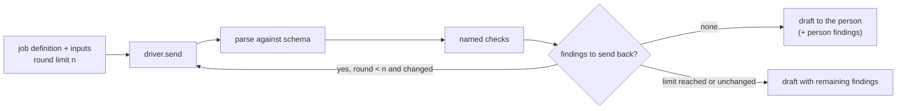

# ARC-007 Job definitions are data; the correction loop is one harness

## Context

A job — derive requirements, derive use cases or architecture, change by prompt, generate tests,
implement a module, propose issues from mail, check a text for persons, draft replies, close a sprint —
runs in the browser against a model endpoint, in CI, or through the bridge. The SPEC's origin story for
`ONE DEFINITION, THREE DRIVERS` is three copies of one rule drifting apart. The finding template of
the correction loop "lives once in the repository's single definition"
(`A FINDING READS LIKE A COMPILER MESSAGE`).

Every drafting job ends with deterministic checks; a draft that fails goes back to its participant
with compiler-like findings until it passes, a fixed round limit is reached, or a round changes
nothing. Findings a person decides (a conflict with an existing requirement) are never sent back.
The rounds are counted, shown and recorded. The same loop must behave identically whichever driver
reaches the participant. The book frames this as the agent loop "reason, act, observe" with Agent
M's checks as the observation (ch. 11 §2).

What a job may be given is restricted in three ways the SPEC names: content of a restricted source only
to places its register entry permits, a mailbox's mails only to the places the connection allows, and no
mail at all to a job that writes to a repository. The first design wrote these rules into the job
definitions module as mail rules; the architecture review of 2026-10-01 asked for one generic rule with
the labels supplied by the modules that own the content.

## Decision

1. **One folder per job kind** under `docs/assets/jobs/<kind>/` of Agent M's repository, served by
   Pages and compiled into the bridge (`--include`):
   - `job.json` — the kind, the role it belongs to, the capabilities it needs, the inputs it takes
     (by artifact kind), the output JSON Schema, the names of the deterministic checks to run on a
     draft, the default correction-round limit, and whether its result is a commit to the default
     branch (open artifacts) or a pull request (code);
   - `prompt.md` — the prompt template, Markdown with named placeholders for the inputs.

   A feature's own job kinds — the mail jobs `propose-issue-from-mail` and `check-for-persons`, for
   example — are folders of the same form; the harness knows nothing of what they are for.
2. **One finding catalogue**, `docs/assets/jobs/findings.json`: each finding code with its kind
   (`error`, `warning`, or `person` — decided by a person, never sent back), the rule it enforces by
   name, and the message template in the compiler form
   `<artifact>:<line>: <kind>: <what> [<RULE>] — <expected correction>`.
3. **Checks are code, named by data.** The deterministic checks are pure functions of the modules that
   own the format or the rule — the formats of the review layout, the classification of candidates, the
   search for a mail's people; a definition lists which run, and the runtime that starts the job hands
   those functions to the harness. Adding a check is a code change with a test; choosing checks for a job
   is a data change.
4. **Drivers read, never copy.** The browser fetches the folder from its own Pages origin; the CI
   workflow checks out Agent M at the instance's commit and reads the same files; the bridge reads
   the copy compiled into it and states the Agent M version it was built from. Each job record
   names the Agent M commit whose definition it used (`AN ARTIFACT RECORDS THE VERSION THAT
   PRODUCED IT`).
5. **Context assembly is part of the definition's contract**: the inputs a definition names are
   collected completely (all existing requirements, all use cases, all architecture files, as the
   SPEC requires for each job kind) and the job refuses to send when they do not fit the chosen
   participant's context, naming the counts (`NO REQUIREMENT IS LEFT OUT OF THE CONTEXT SILENTLY`).
   The run panel shows exactly what the definition will send and to which destination
   (`THE PAGE STATES WHAT IT SENDS WHERE`).
6. **One rule for where content may go.** Every piece of content a job would send carries the labels its
   owner gives it — a restricted source's permitted places (`RESTRICTED CONTENT GOES ONLY WHERE ITS SOURCE
   PERMITS`), a mailbox's allowed places (`THE PLACES A MAILBOX'S MAIL MAY GO ARE CONFIGURED`), and, for
   a mail, that no job writing to a repository may have it (`A PARTICIPANT THAT WRITES TO A REPOSITORY NEVER
   RECEIVES A MAIL`). One function, `MOD-job-harness.mayReceive(labels, place)`, decides for a participant's
   processing place whether the content may go there, and names the label that forbids it; nothing is sent
   before it says yes.
7. **The correction loop is one harness.** `MOD-job-harness.runDraft` runs the loop as a function of a
   job definition, its inputs, a round limit fixed before the first round, the checks of decision 3, and
   a **driver** — an object with one method that sends a message and returns the participant's answer
   (ARC-009). The harness never knows whether the participant is a browser call, a workflow or a CLI
   agent. Each round:
   - parse the answer against the definition's output schema (an unreadable answer is an error
     finding, never an empty result);
   - run the checks; split findings into *back* (errors, unjustified warnings) and *person* (decided by
     a person);
   - stop when *back* is empty, when the round limit is reached, or when the *back* findings are equal
     to the previous round's; otherwise send the draft and the *back* findings to the same participant.

   A warning leaves the loop when the answer carries a one-line justification for it; the justification
   travels with the draft to the person. The result is the last draft, the remaining findings in the
   compiler form, the *person* findings, and the list of rounds with their findings; the job record and
   the commit or queue entry record the number of rounds.
8. **Where the loop runs follows the driver** — in the browser for an endpoint participant, inside the
   CI job for a CI agent, in the bridge for a job the bridge runs — always the same function. A CI agent's
   job runs the loop in its workflow and then commits the draft only as an open use case or a new queue
   entry (`A CI AGENT'S DRAFT ENTERS AS OPEN`, UC-019 6b); the person reads the difference at review, and
   *person* findings such as conflicts are decided there.

## Alternatives

- **Prompts embedded in JavaScript strings** — rejected: the CI workflow and the bridge would carry
  copies or have to import UI code; reviewers could not diff a prompt change as text.
- **Checks described declaratively too (a rule language)** — rejected: a second language to
  maintain for a dozen checks; YAGNI (book ch. 10 §3).
- **A prompt library such as a templating engine** — rejected: named placeholder substitution is a
  few lines; no reuse, no due diligence.
- **Let each participant correct itself (a system prompt asking it to self-check)** — rejected: the
  check would be stochastic; what can be decided without a model is decided without one
  (SOFTWARE_MAINTENANCE §4.0a rule 3).
- **Retry until green without a limit** — rejected by `THE CORRECTION LOOP HAS A FIXED LIMIT`.
- **One loop per driver** — rejected: three copies of one rule (`ONE DEFINITION, THREE DRIVERS`).
- **The content rules inside each feature** (mail rules in the mail module, source rules in the source
  module) — rejected: every job that assembles context would have to ask each of them; one function over
  labels is asked once, and a new kind of restricted content brings a new label, not a new rule.
- **A separate decision for the loop** (ARC-008 until 2026-10-01) — merged here: the loop is the part of
  a job definition that runs; two files repeated its semantics.

## Consequences

- `tests/test_single_definition.py` can check that no prompt or schema text appears outside
  `docs/assets/jobs/`.
- A definition change is reviewed like code (pull request with green CI), because it changes
  behaviour for every driver at once.
- The bridge carries the definitions of the Agent M version it was built from; a bridge older than
  the instance may run an older definition. The job record names both versions, and the dashboard
  warns when they differ.
- The harness is testable with a fixture driver that returns scripted answers, which is exactly
  the check the SPEC names (`tests/test_correction_loop.py`).
- A CLI agent that edits files itself instead of returning a draft (an implementation job) is not
  run through this loop; its checks are the CI run and the Definition of Done (ARC-010, ARC-015).
- Cost per round is reported where the driver reports it and summed by the job record
  (`NO COST IS GUESSED`).

*Drafted on 2026-09-30 by Claude (claude-opus-5-5) for the Agent M repository at commit 1605b2dcfe907fb1df6e394af3fdbec80f379dbc; revised on 2026-10-01 by Claude (claude-opus-5-5) against commit d0e5631081876203e719a2508d673d904e7768db — the leaner architecture of the architecture review, as the PO approved it (UC-023): ARC-008 merged into this decision, and one rule for where content may go; open until accepted.*
