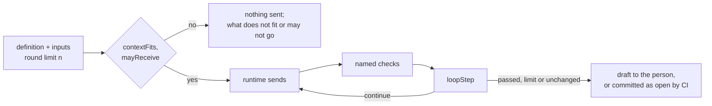

# ARC-007 Job definitions are data; a job runs as pure steps

## Context

A job — derive requirements, derive use cases or architecture, change by prompt, propose backlog items, implement a
module or an item, generate tests, configure CI, close a sprint, propose an issue from a mail — runs in the browser
against a model endpoint, in the product's CI, or through the bridge on a person's machine. `ONE DEFINITION, THREE
DRIVERS` asks that its prompt, schema and definition exist once, and `A RUNTIME IS INTERCHANGEABLE` that the same job
with the same inputs produces the same kind of artifact wherever it runs.

Jobs come in two forms. A **drafting** job sends a prompt and receives a draft: Agent M checks the draft without a
model and sends every finding back to the same participant until it passes, a fixed round limit is reached, or a round
changes nothing; what a person decides is never sent back (UC-019). An **agent's** job hands a task to a coding agent
that works in the repository itself — a branch, failing tests first, the code, a pull request — and is merged only
when the Definition of Done holds and every gate on the way is decided (UC-024, UC-034).

What a job may be given is restricted in three ways the SPEC names: content of a restricted source only to places its
register entry permits, a mailbox's mail only to the places its connection allows, and no mail at all to a job that
writes to a repository. ARC-003 lets a kernel or feature module reach the outside only through ports with a fixed shape;
an agent's process, a model endpoint and a git server are adapters the runtimes hold.

## Decision

1. **One folder per job kind**, `src/job-harness/jobs/<kind>/`, read by every runtime: `job.json` — the kind; whether
   it drafts or is an agent's job; the kinds of artifact it produces, from which its role follows — that of the first
   phase of the workflow producing one of them, or the first phase's role (`MOD-job-harness.roleFor`) —; the
   capabilities its participant needs; its inputs, by placeholder, kind of content and whether every artifact of that
   kind goes in; the JSON Schema of its answer; the names of the checks run on a draft; the default round limit; and
   its result — shown to the person or committed as open, a queue entry, or a pull request. A drafting job's result is
   never a pull request and an agent's job's always is (`MOD-job-harness.parseDefinition`). `prompt.md` is the prompt,
   Markdown with one `{{placeholder}}` per input, filled by `MOD-job-harness.renderPrompt`; no other prompt text exists.
2. **Checks are code, named by data.** A check a definition names is a function of the module that owns its rule; the
   runtime runs the named checks on each draft and hands their findings to the loop. Adding a check is a code change
   with a test; choosing the checks of a job is a change of its definition.
3. **Runtimes read, never copy.** The browser fetches the folder from its own Pages origin; the CI workflow checks out
   Agent M at the instance's commit; the bridge carries the copy compiled into it and states the Agent M version it was
   built from.
4. **Nothing is left out silently.** The inputs a definition marks as all are collected completely, and before anything
   is sent `MOD-job-harness.contextFits` compares the rendered prompt with the participant's context: tokens are
   estimated at three characters each, rounded up, and a prompt that does not fit is not sent — the counts of what it
   holds are named. The run panel states the destination, its route and place, and what is sent
   (`MOD-job-harness.disclosure`).
5. **One rule for where content may go.** Every piece of content a job would send carries the labels its owner gives
   it — the places it may go to, and whether a job that writes to a repository may have it. `MOD-job-harness.mayReceive`
   decides for a participant's place and for a writing job, names each label that forbids it, and refuses an unknown
   place; nothing is sent before it says yes.
6. **The correction loop is one pure step** (`MOD-job-harness.loopStep`): the round limit is fixed before the first
   round; an answer that cannot be read against the job's schema is an error finding, never an empty result; errors and
   unjustified warnings go back with the draft in the compiler form (`MOD-job-harness.backMessage`,
   `MOD-job-harness.splitFindings`); findings a person decides never do; the loop stops when nothing is to be sent back,
   the limit is reached, or a round leaves the findings unchanged; every round is kept with its findings. The runtime
   sends, runs the checks and calls the step: in the browser for an endpoint, and for a CLI agent through the bridge
   whose answer comes back to the dashboard; inside the CI job for a CI agent. The browser shows the draft to the
   person; a CI agent commits it as an open artifact or a queue entry, with the findings left stated.
7. **An agent's job advances from its facts.** The runtime asks `MOD-job-harness.agentStep` after every fact it learns —
   a cancel, the agent's question, its pull request, CI with its attempts, the Definition of Done
   (`MOD-process-model.doneCheck`), the gates leaving the job's phase (`MOD-process-model.gateDecision`) — and performs
   what it answers: wait, merge, end, or stop the agent. An implementation job's first commit holds the tests Agent M
   generates from the decisions; when it is green, the job stops for the author. Nothing is merged before the
   Definition of Done holds and every gate is passed, and nothing more is written after a cancel.
8. **The commit records the provenance** (`MOD-job-harness.commitMessage`): the job, participant, model, Agent M version,
   correction rounds and, for a change by prompt, the instruction; the artifact's own text names none of them.
   `MOD-job-harness.parseProvenance` reads it back for the dashboard.



## Alternatives

- **Prompts embedded in JavaScript strings** — the CI workflow and the bridge would carry copies or import page code,
  and a prompt change could not be read as text.
- **Checks described declaratively in a rule language** — a second language for a dozen checks (YAGNI, book ch. 10 §3).
- **A templating library** — named placeholders are a few lines; nothing to reuse.
- **Asking the participant to check itself** — the check would be stochastic; what can be decided without a model is.
- **Retrying until green without a limit** — `THE CORRECTION LOOP HAS A FIXED LIMIT`.
- **One loop per runtime** — three copies of one rule (`ONE DEFINITION, THREE DRIVERS`).
- **The content rules inside each feature** — every job that assembles context would ask each of them; one function over
  labels is asked once, and a new kind of restricted content brings a new label, not a new rule.
- **One executor function that reaches the git server and the participant itself** — a kernel or feature module reaches
  the outside only through ports with a fixed shape (ARC-003), and an agent's process has none; as pure steps, the job's
  logic is one, and each runtime only performs what the steps return.

## Consequences

- `tests/test_single_definition.py` checks that no prompt or schema text appears outside `src/job-harness/jobs/`.
- A definition change is reviewed like code, through a pull request with green CI, because it changes behaviour in
  every runtime at once.
- The bridge carries the definitions of the Agent M version it was built from; the job record names both versions, and
  the dashboard warns when they differ.
- The loop is tested with scripted rounds, and an agent's job with sequences of facts — the checks the SPEC names for
  the loop and for implementation jobs.
- The checks of each drafting job, and the inputs it collects, are designed with the job: derivation, changes by prompt,
  backlog items, mail.
- No use-case step is realised here. The steps of UC-010, UC-011, UC-019, UC-024 and UC-034 are actions on the
  dashboard's pages and in the runtimes; they are realised where those are designed, by their interfaces together with
  these.

## Modules

### MOD-job-harness

```json module
{
  "id": "MOD-job-harness",
  "folder": "src/job-harness/",
  "layer": "kernel",
  "responsibility": "Reads the job definitions, renders their prompts, decides what may be sent where and whether it fits, runs the correction loop one round at a time, gives an agent's job its next step from the facts, and writes and reads the provenance a commit records; every runtime performs what it returns.",
  "realises": ["ONE DEFINITION, THREE DRIVERS", "A DRAFT THAT FAILS A CHECK GOES BACK TO ITS PARTICIPANT", "AN ERROR MUST BE FIXED, A WARNING FIXED OR JUSTIFIED", "WHAT A PERSON DECIDES IS NOT SENT BACK", "THE CORRECTION LOOP HAS A FIXED LIMIT", "THE ROUNDS ARE COUNTED AND SHOWN", "A CI AGENT'S DRAFT ENTERS AS OPEN", "NO REQUIREMENT IS LEFT OUT OF THE CONTEXT SILENTLY", "NO USE CASE IS LEFT OUT OF A PROMPT SILENTLY", "THE PAGE STATES WHAT IT SENDS WHERE", "RESTRICTED CONTENT GOES ONLY WHERE ITS SOURCE PERMITS", "THE PLACES A MAILBOX'S MAIL MAY GO ARE CONFIGURED", "A PARTICIPANT THAT WRITES TO A REPOSITORY NEVER RECEIVES A MAIL", "AN ARTIFACT RECORDS THE VERSION THAT PRODUCED IT", "A JOB STOPS AT EVERY GATE", "A PULL REQUEST IS MERGED ONLY WHEN THE DEFINITION OF DONE HOLDS", "AN IMPLEMENTATION JOB BEGINS WITH A FAILING TEST", "A CANCELLED JOB WRITES NOTHING MORE"],
  "owns": ["DefinitionInput", "JobDefinition", "PromptInputs", "ContextCounts", "ContextFit", "ContentLabel", "ReceiveRefusal", "ReceiveCheck", "DisclosedItem", "Disclosure", "Justification", "JustifiedFinding", "SplitFindings", "LoopRoundRecord", "LoopState", "LoopRound", "LoopStepResult", "PullRequestFact", "PullRequestFactOrNone", "CiFact", "AgentGate", "AgentFacts", "AgentNext", "Provenance", "JobDefinitionContent", "JobDefinitionFile", "PromptFile"],
  "uses": ["MOD-contracts"]
}
```

```json interface
{
  "id": "MOD-job-harness.parseDefinition",
  "summary": "A job definition from its two files: the kind, whether it drafts or is an agent's job, the kinds of artifact it produces, the capabilities its participant needs, its inputs, the schema of its answer, the checks run on a draft, the default round limit, its result, and its prompt; refused when the prompt names a placeholder that is no input, an input appears nowhere in the prompt, or a drafting job's result would be a pull request or an agent's job's would not.",
  "params": [
    { "name": "kind", "type": "string" },
    { "name": "jobJson", "type": "string" },
    { "name": "prompt", "type": "string" }
  ],
  "result": "JobDefinition",
  "async": false,
  "refusals": [
    { "code": "not-a-definition", "when": "job.json is no JSON, names another kind, or names a mode or result outside its lists" },
    { "code": "unknown-placeholder", "when": "the prompt names a placeholder that is no input" },
    { "code": "unused-input", "when": "an input appears nowhere in the prompt" },
    { "code": "mode-result", "when": "a drafting job's result is a pull request, or an agent's job's result is not" }
  ],
  "examples": [
    {
      "name": "a drafting job",
      "input": { "kind": "change-use-case", "jobJson": "{\n  \"kind\": \"change-use-case\",\n  \"mode\": \"draft\",\n  \"produces\": [\n    \"UC\"\n  ],\n  \"capabilities\": [\n    \"draft text\"\n  ],\n  \"inputs\": [\n    {\n      \"name\": \"instruction\",\n      \"of\": \"text\"\n    },\n    {\n      \"name\": \"useCase\",\n      \"of\": \"UC\"\n    },\n    {\n      \"name\": \"requirements\",\n      \"of\": \"requirement\",\n      \"all\": true\n    },\n    {\n      \"name\": \"useCases\",\n      \"of\": \"UC\",\n      \"all\": true\n    }\n  ],\n  \"output\": {\n    \"type\": \"object\",\n    \"required\": [\n      \"text\",\n      \"justifications\"\n    ],\n    \"properties\": {\n      \"text\": {\n        \"type\": \"string\",\n        \"minLength\": 1\n      },\n      \"justifications\": {\n        \"type\": \"array\"\n      }\n    }\n  },\n  \"checks\": [\n    \"use-case-format\",\n    \"realised-names\"\n  ],\n  \"rounds\": 5,\n  \"result\": \"shown-or-open\"\n}\n", "prompt": "Change the use case below as the author asks, and answer with the whole changed use case.\n\nThe author asks: {{instruction}}\n\nThe use case:\n\n{{useCase}}\n\nEvery requirement of the product, in its SPEC and in its open change queues:\n\n{{requirements}}\n\nEvery other use case of the product:\n\n{{useCases}}\n" },
      "result": {
        "kind": "change-use-case",
        "mode": "draft",
        "produces": ["UC"],
        "capabilities": ["draft text"],
        "inputs": [
          { "name": "instruction", "of": "text", "all": false },
          { "name": "useCase", "of": "UC", "all": false },
          { "name": "requirements", "of": "requirement", "all": true },
          { "name": "useCases", "of": "UC", "all": true }
        ],
        "output": {
          "type": "object",
          "required": ["text", "justifications"],
          "properties": { "text": { "type": "string", "minLength": 1 }, "justifications": { "type": "array" } }
        },
        "checks": ["use-case-format", "realised-names"],
        "rounds": 5,
        "result": "shown-or-open",
        "prompt": "Change the use case below as the author asks, and answer with the whole changed use case.\n\nThe author asks: {{instruction}}\n\nThe use case:\n\n{{useCase}}\n\nEvery requirement of the product, in its SPEC and in its open change queues:\n\n{{requirements}}\n\nEvery other use case of the product:\n\n{{useCases}}\n"
      }
    },
    {
      "name": "a placeholder that is no input",
      "input": { "kind": "change-use-case", "jobJson": "{\n  \"kind\": \"change-use-case\",\n  \"mode\": \"draft\",\n  \"produces\": [\n    \"UC\"\n  ],\n  \"capabilities\": [\n    \"draft text\"\n  ],\n  \"inputs\": [\n    {\n      \"name\": \"instruction\",\n      \"of\": \"text\"\n    },\n    {\n      \"name\": \"useCase\",\n      \"of\": \"UC\"\n    },\n    {\n      \"name\": \"requirements\",\n      \"of\": \"requirement\",\n      \"all\": true\n    },\n    {\n      \"name\": \"useCases\",\n      \"of\": \"UC\",\n      \"all\": true\n    }\n  ],\n  \"output\": {\n    \"type\": \"object\",\n    \"required\": [\n      \"text\",\n      \"justifications\"\n    ],\n    \"properties\": {\n      \"text\": {\n        \"type\": \"string\",\n        \"minLength\": 1\n      },\n      \"justifications\": {\n        \"type\": \"array\"\n      }\n    }\n  },\n  \"checks\": [\n    \"use-case-format\",\n    \"realised-names\"\n  ],\n  \"rounds\": 5,\n  \"result\": \"shown-or-open\"\n}\n", "prompt": "Change the use case below as the author asks, and answer with the whole changed use case.\n\nThe author asks: {{instruction}}\n\nThe use case:\n\n{{useCase}}\n\nEvery requirement of the product, in its SPEC and in its open change queues:\n\n{{requirements}}\n\nEvery other use case of the product:\n\n{{useCases}}\n\n{{glossary}}\n" },
      "refused": "unknown-placeholder"
    },
    {
      "name": "a draft that would be a pull request",
      "input": { "kind": "change-use-case", "jobJson": "{\n  \"kind\": \"change-use-case\",\n  \"mode\": \"draft\",\n  \"produces\": [\n    \"UC\"\n  ],\n  \"capabilities\": [\n    \"draft text\"\n  ],\n  \"inputs\": [\n    {\n      \"name\": \"instruction\",\n      \"of\": \"text\"\n    },\n    {\n      \"name\": \"useCase\",\n      \"of\": \"UC\"\n    },\n    {\n      \"name\": \"requirements\",\n      \"of\": \"requirement\",\n      \"all\": true\n    },\n    {\n      \"name\": \"useCases\",\n      \"of\": \"UC\",\n      \"all\": true\n    }\n  ],\n  \"output\": {\n    \"type\": \"object\",\n    \"required\": [\n      \"text\",\n      \"justifications\"\n    ],\n    \"properties\": {\n      \"text\": {\n        \"type\": \"string\",\n        \"minLength\": 1\n      },\n      \"justifications\": {\n        \"type\": \"array\"\n      }\n    }\n  },\n  \"checks\": [\n    \"use-case-format\",\n    \"realised-names\"\n  ],\n  \"rounds\": 5,\n  \"result\": \"pull-request\"\n}\n", "prompt": "Change the use case below as the author asks, and answer with the whole changed use case.\n\nThe author asks: {{instruction}}\n\nThe use case:\n\n{{useCase}}\n\nEvery requirement of the product, in its SPEC and in its open change queues:\n\n{{requirements}}\n\nEvery other use case of the product:\n\n{{useCases}}\n" },
      "refused": "mode-result"
    }
  ]
}
```

```json interface
{
  "id": "MOD-job-harness.roleFor",
  "summary": "The role a job belongs to: that of the first phase of the workflow that produces a kind of artifact the job produces, or the first phase's role when none does.",
  "params": [{ "name": "definition", "type": "JobDefinition" }, { "name": "phases", "type": "WorkflowPhase[]" }],
  "result": "string",
  "async": false,
  "refusals": [],
  "examples": [
    {
      "name": "changing a use case in the V-model",
      "input": {
        "definition": {
          "kind": "change-use-case",
          "mode": "draft",
          "produces": ["UC"],
          "capabilities": ["draft text"],
          "inputs": [
            { "name": "instruction", "of": "text", "all": false },
            { "name": "useCase", "of": "UC", "all": false },
            { "name": "requirements", "of": "requirement", "all": true },
            { "name": "useCases", "of": "UC", "all": true }
          ],
          "output": {
            "type": "object",
            "required": ["text", "justifications"],
            "properties": { "text": { "type": "string", "minLength": 1 }, "justifications": { "type": "array" } }
          },
          "checks": ["use-case-format", "realised-names"],
          "rounds": 5,
          "result": "shown-or-open",
          "prompt": "Change the use case below as the author asks, and answer with the whole changed use case.\n\nThe author asks: {{instruction}}\n\nThe use case:\n\n{{useCase}}\n\nEvery requirement of the product, in its SPEC and in its open change queues:\n\n{{requirements}}\n\nEvery other use case of the product:\n\n{{useCases}}\n"
        },
        "phases": [
          {
            "name": "Requirements",
            "role": "Analyst",
            "produces": "requirements, UC",
            "kinds": ["UC", "requirement"],
            "line": 14,
            "practice": ""
          },
          { "name": "Design", "role": "Architect", "produces": "ARC", "kinds": ["ARC"], "line": 15, "practice": "" },
          {
            "name": "Implementation",
            "role": "Developers",
            "produces": "MOD",
            "kinds": ["MOD"],
            "line": 16,
            "practice": ""
          },
          { "name": "Testing", "role": "Tester", "produces": "TST", "kinds": ["TST"], "line": 17, "practice": "" },
          {
            "name": "Validation",
            "role": "Analyst",
            "produces": "the validation of the requirements",
            "kinds": [],
            "line": 18,
            "practice": ""
          },
          {
            "name": "Deployment",
            "role": "Operator",
            "produces": "the deployed release",
            "kinds": [],
            "line": 14,
            "practice": "devops"
          }
        ]
      },
      "result": "Analyst"
    },
    {
      "name": "implementing",
      "input": {
        "definition": {
          "kind": "implement",
          "mode": "agent",
          "produces": ["MOD", "TST"],
          "capabilities": ["read the repository", "write to the repository", "run code and tests"],
          "inputs": [
            { "name": "decisions", "of": "ARC", "all": false },
            { "name": "interfaces", "of": "ARC", "all": false },
            { "name": "instruction", "of": "text", "all": false }
          ],
          "output": {},
          "checks": [],
          "rounds": 5,
          "result": "pull-request",
          "prompt": "Implement the modules the decisions below design, test first.\n\n{{instruction}}\n\nThe decisions:\n\n{{decisions}}\n\nThe interfaces of the modules they use:\n\n{{interfaces}}\n"
        },
        "phases": [
          {
            "name": "Requirements",
            "role": "Analyst",
            "produces": "requirements, UC",
            "kinds": ["UC", "requirement"],
            "line": 14,
            "practice": ""
          },
          { "name": "Design", "role": "Architect", "produces": "ARC", "kinds": ["ARC"], "line": 15, "practice": "" },
          {
            "name": "Implementation",
            "role": "Developers",
            "produces": "MOD",
            "kinds": ["MOD"],
            "line": 16,
            "practice": ""
          },
          { "name": "Testing", "role": "Tester", "produces": "TST", "kinds": ["TST"], "line": 17, "practice": "" },
          {
            "name": "Validation",
            "role": "Analyst",
            "produces": "the validation of the requirements",
            "kinds": [],
            "line": 18,
            "practice": ""
          },
          {
            "name": "Deployment",
            "role": "Operator",
            "produces": "the deployed release",
            "kinds": [],
            "line": 14,
            "practice": "devops"
          }
        ]
      },
      "result": "Developers"
    },
    {
      "name": "changing a use case in Scrum, where no phase produces UC",
      "input": {
        "definition": {
          "kind": "change-use-case",
          "mode": "draft",
          "produces": ["UC"],
          "capabilities": ["draft text"],
          "inputs": [
            { "name": "instruction", "of": "text", "all": false },
            { "name": "useCase", "of": "UC", "all": false },
            { "name": "requirements", "of": "requirement", "all": true },
            { "name": "useCases", "of": "UC", "all": true }
          ],
          "output": {
            "type": "object",
            "required": ["text", "justifications"],
            "properties": { "text": { "type": "string", "minLength": 1 }, "justifications": { "type": "array" } }
          },
          "checks": ["use-case-format", "realised-names"],
          "rounds": 5,
          "result": "shown-or-open",
          "prompt": "Change the use case below as the author asks, and answer with the whole changed use case.\n\nThe author asks: {{instruction}}\n\nThe use case:\n\n{{useCase}}\n\nEvery requirement of the product, in its SPEC and in its open change queues:\n\n{{requirements}}\n\nEvery other use case of the product:\n\n{{useCases}}\n"
        },
        "phases": [
          {
            "name": "Sprint planning",
            "role": "Product Owner",
            "produces": "ITM",
            "kinds": ["ITM"],
            "line": 12,
            "practice": ""
          },
          {
            "name": "Development",
            "role": "Developers",
            "produces": "MOD, TST",
            "kinds": ["MOD", "TST"],
            "line": 13,
            "practice": ""
          }
        ]
      },
      "result": "Product Owner"
    }
  ]
}
```

```json interface
{
  "id": "MOD-job-harness.renderPrompt",
  "summary": "The prompt with every placeholder filled by its input; no other prompt text exists.",
  "params": [{ "name": "definition", "type": "JobDefinition" }, { "name": "inputs", "type": "PromptInputs" }],
  "result": "string",
  "async": false,
  "refusals": [{ "code": "missing-input", "when": "an input the definition names is not given" }],
  "examples": [
    {
      "name": "a use case to change",
      "input": {
        "definition": {
          "kind": "change-use-case",
          "mode": "draft",
          "produces": ["UC"],
          "capabilities": ["draft text"],
          "inputs": [
            { "name": "instruction", "of": "text", "all": false },
            { "name": "useCase", "of": "UC", "all": false },
            { "name": "requirements", "of": "requirement", "all": true },
            { "name": "useCases", "of": "UC", "all": true }
          ],
          "output": {
            "type": "object",
            "required": ["text", "justifications"],
            "properties": { "text": { "type": "string", "minLength": 1 }, "justifications": { "type": "array" } }
          },
          "checks": ["use-case-format", "realised-names"],
          "rounds": 5,
          "result": "shown-or-open",
          "prompt": "Change the use case below as the author asks, and answer with the whole changed use case.\n\nThe author asks: {{instruction}}\n\nThe use case:\n\n{{useCase}}\n\nEvery requirement of the product, in its SPEC and in its open change queues:\n\n{{requirements}}\n\nEvery other use case of the product:\n\n{{useCases}}\n"
        },
        "inputs": { "instruction": "Add error handling to UC-003.", "useCase": "# UC-003 Export a chapter\n\n## Main flow\n\n1. The author presses **Export**.\n", "requirements": "**A CHAPTER IS EXPORTED** *(PO A. Maier)*\nEvery accepted chapter can be exported as PDF.\n*Check:* `tests/export.test.mjs`\n", "useCases": "UC-001 Accept a chapter\nUC-002 Write a chapter\n" }
      },
      "result": "Change the use case below as the author asks, and answer with the whole changed use case.\n\nThe author asks: Add error handling to UC-003.\n\nThe use case:\n\n# UC-003 Export a chapter\n\n## Main flow\n\n1. The author presses **Export**.\n\n\nEvery requirement of the product, in its SPEC and in its open change queues:\n\n**A CHAPTER IS EXPORTED** *(PO A. Maier)*\nEvery accepted chapter can be exported as PDF.\n*Check:* `tests/export.test.mjs`\n\n\nEvery other use case of the product:\n\nUC-001 Accept a chapter\nUC-002 Write a chapter\n\n"
    },
    {
      "name": "an input missing",
      "input": {
        "definition": {
          "kind": "change-use-case",
          "mode": "draft",
          "produces": ["UC"],
          "capabilities": ["draft text"],
          "inputs": [
            { "name": "instruction", "of": "text", "all": false },
            { "name": "useCase", "of": "UC", "all": false },
            { "name": "requirements", "of": "requirement", "all": true },
            { "name": "useCases", "of": "UC", "all": true }
          ],
          "output": {
            "type": "object",
            "required": ["text", "justifications"],
            "properties": { "text": { "type": "string", "minLength": 1 }, "justifications": { "type": "array" } }
          },
          "checks": ["use-case-format", "realised-names"],
          "rounds": 5,
          "result": "shown-or-open",
          "prompt": "Change the use case below as the author asks, and answer with the whole changed use case.\n\nThe author asks: {{instruction}}\n\nThe use case:\n\n{{useCase}}\n\nEvery requirement of the product, in its SPEC and in its open change queues:\n\n{{requirements}}\n\nEvery other use case of the product:\n\n{{useCases}}\n"
        },
        "inputs": { "instruction": "x" }
      },
      "refused": "missing-input"
    }
  ]
}
```

```json interface
{
  "id": "MOD-job-harness.contextFits",
  "summary": "Whether a prompt fits a participant's context, its tokens estimated at three characters each, rounded up — an estimate that errs towards \"does not fit\" —, with the counts of what it holds, so that nothing is left out silently.",
  "params": [
    { "name": "prompt", "type": "string" },
    { "name": "limit", "type": "integer" },
    { "name": "counts", "type": "ContextCounts" }
  ],
  "result": "ContextFit",
  "async": false,
  "refusals": [],
  "examples": [
    {
      "name": "it fits",
      "input": {
        "prompt": "Change the use case below as the author asks, and answer with the whole changed use case.\n\nThe author asks: Add error handling to UC-003.\n\nThe use case:\n\n# UC-003 Export a chapter\n\n## Main flow\n\n1. The author presses **Export**.\n\n\nEvery requirement of the product, in its SPEC and in its open change queues:\n\n**A CHAPTER IS EXPORTED** *(PO A. Maier)*\nEvery accepted chapter can be exported as PDF.\n*Check:* `tests/export.test.mjs`\n\n\nEvery other use case of the product:\n\nUC-001 Accept a chapter\nUC-002 Write a chapter\n\n",
        "limit": 8000,
        "counts": { "requirements": 1, "useCases": 3 }
      },
      "result": { "fits": true, "tokens": 173, "limit": 8000, "counts": { "requirements": 1, "useCases": 3 } }
    },
    {
      "name": "it does not fit",
      "input": {
        "prompt": "Change the use case below as the author asks, and answer with the whole changed use case.\n\nThe author asks: Add error handling to UC-003.\n\nThe use case:\n\n# UC-003 Export a chapter\n\n## Main flow\n\n1. The author presses **Export**.\n\n\nEvery requirement of the product, in its SPEC and in its open change queues:\n\n**A CHAPTER IS EXPORTED** *(PO A. Maier)*\nEvery accepted chapter can be exported as PDF.\n*Check:* `tests/export.test.mjs`\n\n\nEvery other use case of the product:\n\nUC-001 Accept a chapter\nUC-002 Write a chapter\n\n",
        "limit": 100,
        "counts": { "requirements": 1, "useCases": 3 }
      },
      "result": { "fits": false, "tokens": 173, "limit": 100, "counts": { "requirements": 1, "useCases": 3 } }
    }
  ]
}
```

```json interface
{
  "id": "MOD-job-harness.mayReceive",
  "summary": "Whether content carrying these labels may go to a participant processing data at a place, and to a job that writes to a repository; each label that forbids it, with the reason. An unknown place is refused for every label that names places.",
  "params": [
    { "name": "labels", "type": "ContentLabel[]" },
    { "name": "place", "type": "string" },
    { "name": "writes", "type": "boolean" }
  ],
  "result": "ReceiveCheck",
  "async": false,
  "refusals": [],
  "examples": [
    {
      "name": "to the hub in Erlangen, a drafting job",
      "input": {
        "labels": [
          { "owner": "SRC-iec-62304", "places": ["NHR@FAU, Erlangen", "this machine"], "writing": true },
          { "owner": "mail of support@thesis.example", "places": ["NHR@FAU, Erlangen"], "writing": false }
        ],
        "place": "NHR@FAU, Erlangen",
        "writes": false
      },
      "result": { "ok": true, "refused": [] }
    },
    {
      "name": "to GitHub's machines, a job that writes",
      "input": {
        "labels": [
          { "owner": "SRC-iec-62304", "places": ["NHR@FAU, Erlangen", "this machine"], "writing": true },
          { "owner": "mail of support@thesis.example", "places": ["NHR@FAU, Erlangen"], "writing": false }
        ],
        "place": "GitHub's machines, a provider in the USA",
        "writes": true
      },
      "result": {
        "ok": false,
        "refused": [
          { "label": "SRC-iec-62304", "reason": "SRC-iec-62304 may go only to NHR@FAU, Erlangen, this machine, not to GitHub's machines, a provider in the USA" },
          { "label": "mail of support@thesis.example", "reason": "mail of support@thesis.example may not go to a job that writes to a repository, and may go only to NHR@FAU, Erlangen, not to GitHub's machines, a provider in the USA" }
        ]
      }
    }
  ]
}
```

```json interface
{
  "id": "MOD-job-harness.disclosure",
  "summary": "What the run panel states before Run: the job, the participant it goes to, its route and the place it processes data, each kind of content sent and how many, and the estimated tokens.",
  "params": [
    { "name": "definition", "type": "JobDefinition" },
    { "name": "participant", "type": "Participant" },
    { "name": "items", "type": "DisclosedItem[]" },
    { "name": "prompt", "type": "string" }
  ],
  "result": "Disclosure",
  "async": false,
  "refusals": [],
  "examples": [
    {
      "name": "a use case to the hub",
      "input": {
        "definition": {
          "kind": "change-use-case",
          "mode": "draft",
          "produces": ["UC"],
          "capabilities": ["draft text"],
          "inputs": [
            { "name": "instruction", "of": "text", "all": false },
            { "name": "useCase", "of": "UC", "all": false },
            { "name": "requirements", "of": "requirement", "all": true },
            { "name": "useCases", "of": "UC", "all": true }
          ],
          "output": {
            "type": "object",
            "required": ["text", "justifications"],
            "properties": { "text": { "type": "string", "minLength": 1 }, "justifications": { "type": "array" } }
          },
          "checks": ["use-case-format", "realised-names"],
          "rounds": 5,
          "result": "shown-or-open",
          "prompt": "Change the use case below as the author asks, and answer with the whole changed use case.\n\nThe author asks: {{instruction}}\n\nThe use case:\n\n{{useCase}}\n\nEvery requirement of the product, in its SPEC and in its open change queues:\n\n{{requirements}}\n\nEvery other use case of the product:\n\n{{useCases}}\n"
        },
        "participant": {
          "name": "hub-writer",
          "type": "model endpoint",
          "model": "llama-3.3-70b",
          "context": null,
          "price": null,
          "capabilities": ["draft text"],
          "place": "NHR@FAU, Erlangen",
          "route": "the endpoint hub of this browser",
          "line": 6
        },
        "items": [
          { "name": "use case", "count": 1 },
          { "name": "requirements", "count": 1 },
          { "name": "other use cases", "count": 2 }
        ],
        "prompt": "Change the use case below as the author asks, and answer with the whole changed use case.\n\nThe author asks: Add error handling to UC-003.\n\nThe use case:\n\n# UC-003 Export a chapter\n\n## Main flow\n\n1. The author presses **Export**.\n\n\nEvery requirement of the product, in its SPEC and in its open change queues:\n\n**A CHAPTER IS EXPORTED** *(PO A. Maier)*\nEvery accepted chapter can be exported as PDF.\n*Check:* `tests/export.test.mjs`\n\n\nEvery other use case of the product:\n\nUC-001 Accept a chapter\nUC-002 Write a chapter\n\n"
      },
      "result": {
        "kind": "change-use-case",
        "destination": "hub-writer",
        "route": "the endpoint hub of this browser",
        "place": "NHR@FAU, Erlangen",
        "items": [
          { "name": "use case", "count": 1 },
          { "name": "requirements", "count": 1 },
          { "name": "other use cases", "count": 2 }
        ],
        "tokens": 173
      }
    }
  ]
}
```

```json interface
{
  "id": "MOD-job-harness.splitFindings",
  "summary": "The findings of a round split into those sent back — every error, and every warning without a one-line justification —, those a person decides, which are never sent back, and the justified warnings with their reasons.",
  "params": [{ "name": "findings", "type": "Finding[]" }, { "name": "justifications", "type": "Justification[]" }],
  "result": "SplitFindings",
  "async": false,
  "refusals": [],
  "examples": [
    {
      "name": "an error, a justified warning, a conflict",
      "input": {
        "findings": [
          { "artifact": "UC-003", "line": 12, "kind": "error", "what": "realises \"EXPORT AS PDF\" matches no requirement", "rule": "A USE CASE REALISES NAMED REQUIREMENTS", "fix": "use an existing name or remove the line" },
          { "artifact": "UC-003", "line": 4, "kind": "warning", "what": "the step has two actions", "rule": "EVERY STEP EXPLAINS ITSELF", "fix": "split it, or keep it and give a one-line reason" },
          { "artifact": "UC-003", "line": 0, "kind": "person", "what": "the use case conflicts with UC-001 on who accepts", "rule": "A CANDIDATE IS NEW, A CHANGE, A DUPLICATE OR A CONFLICT", "fix": "the author decides" }
        ],
        "justifications": [
          { "artifact": "UC-003", "line": 4, "rule": "EVERY STEP EXPLAINS ITSELF", "reason": "pressing and confirming are one decision" }
        ]
      },
      "result": {
        "back": [
          { "artifact": "UC-003", "line": 12, "kind": "error", "what": "realises \"EXPORT AS PDF\" matches no requirement", "rule": "A USE CASE REALISES NAMED REQUIREMENTS", "fix": "use an existing name or remove the line" }
        ],
        "person": [
          { "artifact": "UC-003", "line": 0, "kind": "person", "what": "the use case conflicts with UC-001 on who accepts", "rule": "A CANDIDATE IS NEW, A CHANGE, A DUPLICATE OR A CONFLICT", "fix": "the author decides" }
        ],
        "justified": [
          {
            "finding": { "artifact": "UC-003", "line": 4, "kind": "warning", "what": "the step has two actions", "rule": "EVERY STEP EXPLAINS ITSELF", "fix": "split it, or keep it and give a one-line reason" },
            "reason": "pressing and confirming are one decision"
          }
        ]
      }
    }
  ]
}
```

```json interface
{
  "id": "MOD-job-harness.backMessage",
  "summary": "The message that sends a draft back: the findings in the compiler form, and the draft.",
  "params": [{ "name": "answer", "type": "string" }, { "name": "back", "type": "Finding[]" }],
  "result": "string",
  "async": false,
  "refusals": [],
  "examples": [
    {
      "name": "one error",
      "input": {
        "answer": "# UC-003 Export a chapter\n\n## Main flow\n\n1. The author presses **Export** and confirms.\n",
        "back": [
          { "artifact": "UC-003", "line": 12, "kind": "error", "what": "realises \"EXPORT AS PDF\" matches no requirement", "rule": "A USE CASE REALISES NAMED REQUIREMENTS", "fix": "use an existing name or remove the line" }
        ]
      },
      "result": "Your draft has these findings. Fix every error; fix every warning, or justify it in one line.\n\nUC-003:12: error: realises \"EXPORT AS PDF\" matches no requirement [A USE CASE REALISES NAMED REQUIREMENTS] — use an existing name or remove the line\n\nYour draft:\n\n# UC-003 Export a chapter\n\n## Main flow\n\n1. The author presses **Export** and confirms.\n"
    }
  ]
}
```

```json interface
{
  "id": "MOD-job-harness.loopStep",
  "summary": "One round of the correction loop: the answer read against the job's schema — an answer that cannot be read is an error finding —, the round's findings split, and whether to send back or stop because nothing is to be sent back, the limit fixed before the first round is reached, or the round left the findings unchanged; every round with its findings is kept.",
  "params": [{ "name": "loop", "type": "LoopState" }, { "name": "round", "type": "LoopRound" }],
  "result": "LoopStepResult",
  "async": false,
  "refusals": [],
  "examples": [
    {
      "name": "the first round: an error goes back, the conflict does not",
      "input": {
        "loop": { "limit": 3, "rounds": [] },
        "round": {
          "answer": "# UC-003 Export a chapter\n\n## Main flow\n\n1. The author presses **Export** and confirms.\n",
          "readable": true,
          "artifact": "UC-003",
          "findings": [
            { "artifact": "UC-003", "line": 12, "kind": "error", "what": "realises \"EXPORT AS PDF\" matches no requirement", "rule": "A USE CASE REALISES NAMED REQUIREMENTS", "fix": "use an existing name or remove the line" },
            { "artifact": "UC-003", "line": 4, "kind": "warning", "what": "the step has two actions", "rule": "EVERY STEP EXPLAINS ITSELF", "fix": "split it, or keep it and give a one-line reason" },
            { "artifact": "UC-003", "line": 0, "kind": "person", "what": "the use case conflicts with UC-001 on who accepts", "rule": "A CANDIDATE IS NEW, A CHANGE, A DUPLICATE OR A CONFLICT", "fix": "the author decides" }
          ],
          "justifications": []
        }
      },
      "result": {
        "loop": {
          "limit": 3,
          "rounds": [
            {
              "back": [
                { "artifact": "UC-003", "line": 12, "kind": "error", "what": "realises \"EXPORT AS PDF\" matches no requirement", "rule": "A USE CASE REALISES NAMED REQUIREMENTS", "fix": "use an existing name or remove the line" },
                { "artifact": "UC-003", "line": 4, "kind": "warning", "what": "the step has two actions", "rule": "EVERY STEP EXPLAINS ITSELF", "fix": "split it, or keep it and give a one-line reason" }
              ],
              "person": [
                { "artifact": "UC-003", "line": 0, "kind": "person", "what": "the use case conflicts with UC-001 on who accepts", "rule": "A CANDIDATE IS NEW, A CHANGE, A DUPLICATE OR A CONFLICT", "fix": "the author decides" }
              ],
              "justified": []
            }
          ]
        },
        "outcome": "continue",
        "send": "Your draft has these findings. Fix every error; fix every warning, or justify it in one line.\n\nUC-003:12: error: realises \"EXPORT AS PDF\" matches no requirement [A USE CASE REALISES NAMED REQUIREMENTS] — use an existing name or remove the line\nUC-003:4: warning: the step has two actions [EVERY STEP EXPLAINS ITSELF] — split it, or keep it and give a one-line reason\n\nYour draft:\n\n# UC-003 Export a chapter\n\n## Main flow\n\n1. The author presses **Export** and confirms.\n",
        "remaining": [],
        "person": [
          { "artifact": "UC-003", "line": 0, "kind": "person", "what": "the use case conflicts with UC-001 on who accepts", "rule": "A CANDIDATE IS NEW, A CHANGE, A DUPLICATE OR A CONFLICT", "fix": "the author decides" }
        ],
        "justified": []
      }
    },
    {
      "name": "the error fixed, the warning justified",
      "input": {
        "loop": {
          "limit": 3,
          "rounds": [
            {
              "back": [
                { "artifact": "UC-003", "line": 12, "kind": "error", "what": "realises \"EXPORT AS PDF\" matches no requirement", "rule": "A USE CASE REALISES NAMED REQUIREMENTS", "fix": "use an existing name or remove the line" },
                { "artifact": "UC-003", "line": 4, "kind": "warning", "what": "the step has two actions", "rule": "EVERY STEP EXPLAINS ITSELF", "fix": "split it, or keep it and give a one-line reason" }
              ],
              "person": [
                { "artifact": "UC-003", "line": 0, "kind": "person", "what": "the use case conflicts with UC-001 on who accepts", "rule": "A CANDIDATE IS NEW, A CHANGE, A DUPLICATE OR A CONFLICT", "fix": "the author decides" }
              ],
              "justified": []
            }
          ]
        },
        "round": {
          "answer": "# UC-003 Export a chapter\n\n## Main flow\n\n1. The author presses **Export** and confirms.\n",
          "readable": true,
          "artifact": "UC-003",
          "findings": [
            { "artifact": "UC-003", "line": 4, "kind": "warning", "what": "the step has two actions", "rule": "EVERY STEP EXPLAINS ITSELF", "fix": "split it, or keep it and give a one-line reason" }
          ],
          "justifications": [
            { "artifact": "UC-003", "line": 4, "rule": "EVERY STEP EXPLAINS ITSELF", "reason": "pressing and confirming are one decision" }
          ]
        }
      },
      "result": {
        "loop": {
          "limit": 3,
          "rounds": [
            {
              "back": [
                { "artifact": "UC-003", "line": 12, "kind": "error", "what": "realises \"EXPORT AS PDF\" matches no requirement", "rule": "A USE CASE REALISES NAMED REQUIREMENTS", "fix": "use an existing name or remove the line" },
                { "artifact": "UC-003", "line": 4, "kind": "warning", "what": "the step has two actions", "rule": "EVERY STEP EXPLAINS ITSELF", "fix": "split it, or keep it and give a one-line reason" }
              ],
              "person": [
                { "artifact": "UC-003", "line": 0, "kind": "person", "what": "the use case conflicts with UC-001 on who accepts", "rule": "A CANDIDATE IS NEW, A CHANGE, A DUPLICATE OR A CONFLICT", "fix": "the author decides" }
              ],
              "justified": []
            },
            {
              "back": [],
              "person": [],
              "justified": [
                {
                  "finding": { "artifact": "UC-003", "line": 4, "kind": "warning", "what": "the step has two actions", "rule": "EVERY STEP EXPLAINS ITSELF", "fix": "split it, or keep it and give a one-line reason" },
                  "reason": "pressing and confirming are one decision"
                }
              ]
            }
          ]
        },
        "outcome": "passed",
        "send": "",
        "remaining": [],
        "person": [],
        "justified": [
          {
            "finding": { "artifact": "UC-003", "line": 4, "kind": "warning", "what": "the step has two actions", "rule": "EVERY STEP EXPLAINS ITSELF", "fix": "split it, or keep it and give a one-line reason" },
            "reason": "pressing and confirming are one decision"
          }
        ]
      }
    },
    {
      "name": "a round that changes nothing",
      "input": {
        "loop": {
          "limit": 3,
          "rounds": [
            {
              "back": [
                { "artifact": "UC-003", "line": 12, "kind": "error", "what": "realises \"EXPORT AS PDF\" matches no requirement", "rule": "A USE CASE REALISES NAMED REQUIREMENTS", "fix": "use an existing name or remove the line" },
                { "artifact": "UC-003", "line": 4, "kind": "warning", "what": "the step has two actions", "rule": "EVERY STEP EXPLAINS ITSELF", "fix": "split it, or keep it and give a one-line reason" }
              ],
              "person": [
                { "artifact": "UC-003", "line": 0, "kind": "person", "what": "the use case conflicts with UC-001 on who accepts", "rule": "A CANDIDATE IS NEW, A CHANGE, A DUPLICATE OR A CONFLICT", "fix": "the author decides" }
              ],
              "justified": []
            },
            {
              "back": [
                { "artifact": "UC-003", "line": 12, "kind": "error", "what": "realises \"EXPORT AS PDF\" matches no requirement", "rule": "A USE CASE REALISES NAMED REQUIREMENTS", "fix": "use an existing name or remove the line" }
              ],
              "person": [],
              "justified": []
            }
          ]
        },
        "round": {
          "answer": "# UC-003 Export a chapter\n\n## Main flow\n\n1. The author presses **Export** and confirms.\n",
          "readable": true,
          "artifact": "UC-003",
          "findings": [
            { "artifact": "UC-003", "line": 12, "kind": "error", "what": "realises \"EXPORT AS PDF\" matches no requirement", "rule": "A USE CASE REALISES NAMED REQUIREMENTS", "fix": "use an existing name or remove the line" }
          ],
          "justifications": []
        }
      },
      "result": {
        "loop": {
          "limit": 3,
          "rounds": [
            {
              "back": [
                { "artifact": "UC-003", "line": 12, "kind": "error", "what": "realises \"EXPORT AS PDF\" matches no requirement", "rule": "A USE CASE REALISES NAMED REQUIREMENTS", "fix": "use an existing name or remove the line" },
                { "artifact": "UC-003", "line": 4, "kind": "warning", "what": "the step has two actions", "rule": "EVERY STEP EXPLAINS ITSELF", "fix": "split it, or keep it and give a one-line reason" }
              ],
              "person": [
                { "artifact": "UC-003", "line": 0, "kind": "person", "what": "the use case conflicts with UC-001 on who accepts", "rule": "A CANDIDATE IS NEW, A CHANGE, A DUPLICATE OR A CONFLICT", "fix": "the author decides" }
              ],
              "justified": []
            },
            {
              "back": [
                { "artifact": "UC-003", "line": 12, "kind": "error", "what": "realises \"EXPORT AS PDF\" matches no requirement", "rule": "A USE CASE REALISES NAMED REQUIREMENTS", "fix": "use an existing name or remove the line" }
              ],
              "person": [],
              "justified": []
            },
            {
              "back": [
                { "artifact": "UC-003", "line": 12, "kind": "error", "what": "realises \"EXPORT AS PDF\" matches no requirement", "rule": "A USE CASE REALISES NAMED REQUIREMENTS", "fix": "use an existing name or remove the line" }
              ],
              "person": [],
              "justified": []
            }
          ]
        },
        "outcome": "unchanged",
        "send": "",
        "remaining": [
          { "artifact": "UC-003", "line": 12, "kind": "error", "what": "realises \"EXPORT AS PDF\" matches no requirement", "rule": "A USE CASE REALISES NAMED REQUIREMENTS", "fix": "use an existing name or remove the line" }
        ],
        "person": [],
        "justified": []
      }
    },
    {
      "name": "the limit reached",
      "input": {
        "loop": {
          "limit": 3,
          "rounds": [
            {
              "back": [
                { "artifact": "UC-003", "line": 12, "kind": "error", "what": "realises \"EXPORT AS PDF\" matches no requirement", "rule": "A USE CASE REALISES NAMED REQUIREMENTS", "fix": "use an existing name or remove the line" },
                { "artifact": "UC-003", "line": 4, "kind": "warning", "what": "the step has two actions", "rule": "EVERY STEP EXPLAINS ITSELF", "fix": "split it, or keep it and give a one-line reason" }
              ],
              "person": [
                { "artifact": "UC-003", "line": 0, "kind": "person", "what": "the use case conflicts with UC-001 on who accepts", "rule": "A CANDIDATE IS NEW, A CHANGE, A DUPLICATE OR A CONFLICT", "fix": "the author decides" }
              ],
              "justified": []
            },
            {
              "back": [
                { "artifact": "UC-003", "line": 12, "kind": "error", "what": "realises \"EXPORT AS PDF\" matches no requirement", "rule": "A USE CASE REALISES NAMED REQUIREMENTS", "fix": "use an existing name or remove the line" }
              ],
              "person": [],
              "justified": []
            }
          ]
        },
        "round": {
          "answer": "# UC-003 Export a chapter\n\n## Main flow\n\n1. The author presses **Export** and confirms.\n",
          "readable": true,
          "artifact": "UC-003",
          "findings": [
            { "artifact": "UC-003", "line": 4, "kind": "warning", "what": "the step has two actions", "rule": "EVERY STEP EXPLAINS ITSELF", "fix": "split it, or keep it and give a one-line reason" }
          ],
          "justifications": []
        }
      },
      "result": {
        "loop": {
          "limit": 3,
          "rounds": [
            {
              "back": [
                { "artifact": "UC-003", "line": 12, "kind": "error", "what": "realises \"EXPORT AS PDF\" matches no requirement", "rule": "A USE CASE REALISES NAMED REQUIREMENTS", "fix": "use an existing name or remove the line" },
                { "artifact": "UC-003", "line": 4, "kind": "warning", "what": "the step has two actions", "rule": "EVERY STEP EXPLAINS ITSELF", "fix": "split it, or keep it and give a one-line reason" }
              ],
              "person": [
                { "artifact": "UC-003", "line": 0, "kind": "person", "what": "the use case conflicts with UC-001 on who accepts", "rule": "A CANDIDATE IS NEW, A CHANGE, A DUPLICATE OR A CONFLICT", "fix": "the author decides" }
              ],
              "justified": []
            },
            {
              "back": [
                { "artifact": "UC-003", "line": 12, "kind": "error", "what": "realises \"EXPORT AS PDF\" matches no requirement", "rule": "A USE CASE REALISES NAMED REQUIREMENTS", "fix": "use an existing name or remove the line" }
              ],
              "person": [],
              "justified": []
            },
            {
              "back": [
                { "artifact": "UC-003", "line": 4, "kind": "warning", "what": "the step has two actions", "rule": "EVERY STEP EXPLAINS ITSELF", "fix": "split it, or keep it and give a one-line reason" }
              ],
              "person": [],
              "justified": []
            }
          ]
        },
        "outcome": "limit",
        "send": "",
        "remaining": [
          { "artifact": "UC-003", "line": 4, "kind": "warning", "what": "the step has two actions", "rule": "EVERY STEP EXPLAINS ITSELF", "fix": "split it, or keep it and give a one-line reason" }
        ],
        "person": [],
        "justified": []
      }
    },
    {
      "name": "an answer that cannot be read",
      "input": {
        "loop": { "limit": 3, "rounds": [] },
        "round": {
          "answer": "Sure! Here is the use case.",
          "readable": false,
          "artifact": "UC-003",
          "findings": [],
          "justifications": []
        }
      },
      "result": {
        "loop": {
          "limit": 3,
          "rounds": [
            {
              "back": [
                { "artifact": "UC-003", "line": 0, "kind": "error", "what": "the answer cannot be read as the artifact", "rule": "A DRAFT THAT FAILS A CHECK GOES BACK TO ITS PARTICIPANT", "fix": "answer with the artifact in the form the job asks for" }
              ],
              "person": [],
              "justified": []
            }
          ]
        },
        "outcome": "continue",
        "send": "Your draft has these findings. Fix every error; fix every warning, or justify it in one line.\n\nUC-003:0: error: the answer cannot be read as the artifact [A DRAFT THAT FAILS A CHECK GOES BACK TO ITS PARTICIPANT] — answer with the artifact in the form the job asks for\n\nYour draft:\n\nSure! Here is the use case.",
        "remaining": [],
        "person": [],
        "justified": []
      }
    }
  ]
}
```

```json interface
{
  "id": "MOD-job-harness.agentStep",
  "summary": "The next step of an agent's job, from its facts: stop when a person cancelled it; wait at a gate for the author's answer to its question, or when the tests of an implementation pass before any code; wait while it has no pull request or CI runs; end done when merged, failed when the pull request was closed, CI stays red past the attempt limit, or a gate refused it; wait while the Definition of Done fails or a gate leaving its phase waits; then merge, or wait for a person to merge, as the author chose.",
  "params": [{ "name": "facts", "type": "AgentFacts" }],
  "result": "AgentNext",
  "async": false,
  "refusals": [],
  "examples": [
    {
      "name": "everything holds, the participant merges",
      "input": {
        "facts": {
          "cancelled": false,
          "question": "",
          "pullRequest": { "number": 71, "state": "open" },
          "refactoring": false,
          "firstCommit": "failure",
          "ci": { "conclusion": "success", "attempts": 1 },
          "attemptLimit": 3,
          "done": { "ok": true, "failed": [] },
          "gates": [{ "gate": "Implementation → Testing", "state": "passed", "deciders": [] }],
          "mergeBy": "participant"
        }
      },
      "result": { "state": "running", "note": "", "action": "merge" }
    },
    {
      "name": "a gate waits for its decider",
      "input": {
        "facts": {
          "cancelled": false,
          "question": "",
          "pullRequest": { "number": 71, "state": "open" },
          "refactoring": false,
          "firstCommit": "failure",
          "ci": { "conclusion": "success", "attempts": 1 },
          "attemptLimit": 3,
          "done": { "ok": true, "failed": [] },
          "gates": [{ "gate": "Implementation → Testing", "state": "waiting", "deciders": ["alice"] }],
          "mergeBy": "participant"
        }
      },
      "result": { "state": "waiting-at-gate", "note": "Implementation → Testing waits for alice", "action": "wait" }
    },
    {
      "name": "the tests pass before any code",
      "input": {
        "facts": {
          "cancelled": false,
          "question": "",
          "pullRequest": { "number": 71, "state": "open" },
          "refactoring": false,
          "firstCommit": "success",
          "ci": { "conclusion": "success", "attempts": 1 },
          "attemptLimit": 3,
          "done": { "ok": false, "failed": ["tests-first"] },
          "gates": [{ "gate": "Implementation → Testing", "state": "passed", "deciders": [] }],
          "mergeBy": "participant"
        }
      },
      "result": { "state": "waiting-at-gate", "note": "the tests pass before any implementation: rewrite them, or close the job if the behaviour exists", "action": "wait" }
    },
    {
      "name": "CI red past the attempt limit",
      "input": {
        "facts": {
          "cancelled": false,
          "question": "",
          "pullRequest": { "number": 71, "state": "open" },
          "refactoring": false,
          "firstCommit": "failure",
          "ci": { "conclusion": "failure", "attempts": 3 },
          "attemptLimit": 3,
          "done": { "ok": false, "failed": ["ci-green"] },
          "gates": [{ "gate": "Implementation → Testing", "state": "passed", "deciders": [] }],
          "mergeBy": "participant"
        }
      },
      "result": { "state": "failed", "note": "CI stays red after 3 attempts", "action": "end" }
    },
    {
      "name": "the Definition of Done fails",
      "input": {
        "facts": {
          "cancelled": false,
          "question": "",
          "pullRequest": { "number": 71, "state": "open" },
          "refactoring": false,
          "firstCommit": "failure",
          "ci": { "conclusion": "success", "attempts": 1 },
          "attemptLimit": 3,
          "done": { "ok": false, "failed": ["own-modules"] },
          "gates": [{ "gate": "Implementation → Testing", "state": "passed", "deciders": [] }],
          "mergeBy": "participant"
        }
      },
      "result": { "state": "running", "note": "the Definition of Done fails: own-modules", "action": "wait" }
    },
    {
      "name": "a person merges",
      "input": {
        "facts": {
          "cancelled": false,
          "question": "",
          "pullRequest": { "number": 71, "state": "open" },
          "refactoring": false,
          "firstCommit": "failure",
          "ci": { "conclusion": "success", "attempts": 1 },
          "attemptLimit": 3,
          "done": { "ok": true, "failed": [] },
          "gates": [{ "gate": "Implementation → Testing", "state": "passed", "deciders": [] }],
          "mergeBy": "person"
        }
      },
      "result": { "state": "waiting-at-gate", "note": "waits for a person to merge", "action": "wait" }
    },
    {
      "name": "cancelled",
      "input": {
        "facts": {
          "cancelled": true,
          "question": "",
          "pullRequest": { "number": 71, "state": "open" },
          "refactoring": false,
          "firstCommit": "failure",
          "ci": { "conclusion": "success", "attempts": 1 },
          "attemptLimit": 3,
          "done": { "ok": true, "failed": [] },
          "gates": [{ "gate": "Implementation → Testing", "state": "passed", "deciders": [] }],
          "mergeBy": "participant"
        }
      },
      "result": { "state": "cancelled", "note": "cancelled by a person", "action": "stop" }
    }
  ]
}
```

```json interface
{
  "id": "MOD-job-harness.commitMessage",
  "summary": "The message of a commit that writes what a job produced: its subject, then the job, participant, model, Agent M version, correction rounds and — for a change by prompt — the instruction; the artifact's own text names none of them.",
  "params": [{ "name": "subject", "type": "string" }, { "name": "provenance", "type": "Provenance" }],
  "result": "string",
  "async": false,
  "refusals": [],
  "examples": [
    {
      "name": "a use case changed by prompt",
      "input": {
        "subject": "docs: UC-003 drafted by prompt, open for review",
        "provenance": { "job": "JOB-20261010-1400-7c7c", "participant": "hub-writer", "model": "llama-3.3-70b", "agentM": "2026.10.1", "rounds": 2, "instruction": "Add error handling to UC-003." }
      },
      "result": "docs: UC-003 drafted by prompt, open for review\n\nJob: JOB-20261010-1400-7c7c\nParticipant: hub-writer\nModel: llama-3.3-70b\nAgent-M: 2026.10.1\nRounds: 2\nInstruction: Add error handling to UC-003.\n"
    }
  ]
}
```

```json interface
{
  "id": "MOD-job-harness.parseProvenance",
  "summary": "The provenance a commit message records.",
  "params": [{ "name": "message", "type": "string" }],
  "result": "Provenance",
  "async": false,
  "refusals": [{ "code": "no-provenance", "when": "the message names no job, participant or Agent M version" }],
  "examples": [
    {
      "name": "a job's commit",
      "input": { "message": "docs: UC-003 drafted by prompt, open for review\n\nJob: JOB-20261010-1400-7c7c\nParticipant: hub-writer\nModel: llama-3.3-70b\nAgent-M: 2026.10.1\nRounds: 2\nInstruction: Add error handling to UC-003.\n" },
      "result": { "job": "JOB-20261010-1400-7c7c", "participant": "hub-writer", "model": "llama-3.3-70b", "agentM": "2026.10.1", "rounds": 2, "instruction": "Add error handling to UC-003." }
    },
    { "name": "a person's commit", "input": { "message": "docs: fix a typo\n" }, "refused": "no-provenance" }
  ]
}
```

## Types

```json type
{
  "$id": "DefinitionInput",
  "description": "An input of a job: its placeholder's name, the kind of content — a kind of artifact, or text —, and whether every artifact of that kind of the product goes in.",
  "type": "object",
  "required": ["name", "of", "all"],
  "additionalProperties": false,
  "properties": {
    "name": { "type": "string", "pattern": "^[a-zA-Z][a-zA-Z0-9]*$" },
    "of": { "type": "string", "minLength": 1 },
    "all": { "type": "boolean" }
  },
  "examples": [{ "name": "requirements", "of": "requirement", "all": true }]
}
```

```json type
{
  "$id": "JobDefinition",
  "description": "A job definition as read: its kind, its mode — draft or agent —, the kinds of artifact it produces, the capabilities its participant needs, its inputs, the JSON Schema of its answer, the names of the checks run on a draft, the default round limit, its result — shown-or-open, queue-entry or pull-request —, and its prompt.",
  "type": "object",
  "required": ["kind", "mode", "produces", "capabilities", "inputs", "output", "checks", "rounds", "result", "prompt"],
  "additionalProperties": false,
  "properties": {
    "kind": { "type": "string", "pattern": "^[a-z][a-z0-9]*(-[a-z0-9]+)*$" },
    "mode": { "type": "string", "enum": ["draft", "agent"] },
    "produces": { "type": "array", "items": { "type": "string" } },
    "capabilities": { "type": "array", "items": { "type": "string" } },
    "inputs": { "type": "array", "items": { "$ref": "DefinitionInput" } },
    "output": { "type": "object" },
    "checks": { "type": "array", "items": { "type": "string" } },
    "rounds": { "type": "integer", "minimum": 1 },
    "result": { "type": "string", "enum": ["shown-or-open", "queue-entry", "pull-request"] },
    "prompt": { "type": "string", "minLength": 1 }
  },
  "examples": [
    {
      "kind": "implement",
      "mode": "agent",
      "produces": ["MOD", "TST"],
      "capabilities": ["read the repository", "write to the repository", "run code and tests"],
      "inputs": [
        { "name": "decisions", "of": "ARC", "all": false },
        { "name": "interfaces", "of": "ARC", "all": false },
        { "name": "instruction", "of": "text", "all": false }
      ],
      "output": {},
      "checks": [],
      "rounds": 5,
      "result": "pull-request",
      "prompt": "Implement the modules the decisions below design, test first.\n\n{{instruction}}\n\nThe decisions:\n\n{{decisions}}\n\nThe interfaces of the modules they use:\n\n{{interfaces}}\n"
    }
  ]
}
```

```json type
{
  "$id": "PromptInputs",
  "description": "The text of each input, by its placeholder's name.",
  "type": "object",
  "additionalProperties": { "type": "string" },
  "examples": [
    { "instruction": "Add error handling to UC-003.", "useCase": "# UC-003 Export a chapter\n\n## Main flow\n\n1. The author presses **Export**.\n", "requirements": "**A CHAPTER IS EXPORTED** *(PO A. Maier)*\nEvery accepted chapter can be exported as PDF.\n*Check:* `tests/export.test.mjs`\n", "useCases": "UC-001 Accept a chapter\nUC-002 Write a chapter\n" }
  ]
}
```

```json type
{
  "$id": "ContextCounts",
  "description": "How many artifacts of each kind a prompt holds.",
  "type": "object",
  "additionalProperties": { "type": "integer", "minimum": 0 },
  "examples": [{ "requirements": 1, "useCases": 3 }]
}
```

```json type
{
  "$id": "ContextFit",
  "description": "Whether a prompt fits, its estimated tokens, the participant's limit, and the counts of what it holds.",
  "type": "object",
  "required": ["fits", "tokens", "limit", "counts"],
  "additionalProperties": false,
  "properties": {
    "fits": { "type": "boolean" },
    "tokens": { "type": "integer", "minimum": 0 },
    "limit": { "type": "integer", "minimum": 0 },
    "counts": { "$ref": "ContextCounts" }
  },
  "examples": [{ "fits": false, "tokens": 173, "limit": 100, "counts": { "requirements": 1, "useCases": 3 } }]
}
```

```json type
{
  "$id": "ContentLabel",
  "description": "What the owner of a piece of content allows: the owner by name, the processing places it may go to — none named: any place —, and whether a job that writes to a repository may have it.",
  "type": "object",
  "required": ["owner", "places", "writing"],
  "additionalProperties": false,
  "properties": {
    "owner": { "type": "string", "minLength": 1 },
    "places": { "type": "array", "items": { "type": "string" } },
    "writing": { "type": "boolean" }
  },
  "examples": [{ "owner": "mail of support@thesis.example", "places": ["NHR@FAU, Erlangen"], "writing": false }]
}
```

```json type
{
  "$id": "ReceiveRefusal",
  "description": "A label that forbids content to go somewhere, and why.",
  "type": "object",
  "required": ["label", "reason"],
  "additionalProperties": false,
  "properties": { "label": { "type": "string" }, "reason": { "type": "string" } },
  "examples": [
    { "label": "SRC-iec-62304", "reason": "SRC-iec-62304 may go only to NHR@FAU, Erlangen, this machine, not to GitHub's machines, a provider in the USA" }
  ]
}
```

```json type
{
  "$id": "ReceiveCheck",
  "description": "Whether the content may go there, and each label that forbids it.",
  "type": "object",
  "required": ["ok", "refused"],
  "additionalProperties": false,
  "properties": { "ok": { "type": "boolean" }, "refused": { "type": "array", "items": { "$ref": "ReceiveRefusal" } } },
  "examples": [
    {
      "ok": false,
      "refused": [
        { "label": "SRC-iec-62304", "reason": "SRC-iec-62304 may go only to NHR@FAU, Erlangen, this machine, not to GitHub's machines, a provider in the USA" },
        { "label": "mail of support@thesis.example", "reason": "mail of support@thesis.example may not go to a job that writes to a repository, and may go only to NHR@FAU, Erlangen, not to GitHub's machines, a provider in the USA" }
      ]
    }
  ]
}
```

```json type
{
  "$id": "DisclosedItem",
  "description": "A kind of content a job sends, and how many.",
  "type": "object",
  "required": ["name", "count"],
  "additionalProperties": false,
  "properties": { "name": { "type": "string", "minLength": 1 }, "count": { "type": "integer", "minimum": 0 } },
  "examples": [{ "name": "requirements", "count": 1 }]
}
```

```json type
{
  "$id": "Disclosure",
  "description": "What the run panel states before Run.",
  "type": "object",
  "required": ["kind", "destination", "route", "place", "items", "tokens"],
  "additionalProperties": false,
  "properties": {
    "kind": { "type": "string" },
    "destination": { "type": "string" },
    "route": { "type": "string" },
    "place": { "type": "string" },
    "items": { "type": "array", "items": { "$ref": "DisclosedItem" } },
    "tokens": { "type": "integer", "minimum": 0 }
  },
  "examples": [
    {
      "kind": "change-use-case",
      "destination": "hub-writer",
      "route": "the endpoint hub of this browser",
      "place": "NHR@FAU, Erlangen",
      "items": [
        { "name": "use case", "count": 1 },
        { "name": "requirements", "count": 1 },
        { "name": "other use cases", "count": 2 }
      ],
      "tokens": 173
    }
  ]
}
```

```json type
{
  "$id": "Justification",
  "description": "A participant's one-line justification of a warning, naming it by artifact, line and rule.",
  "type": "object",
  "required": ["artifact", "line", "rule", "reason"],
  "additionalProperties": false,
  "properties": {
    "artifact": { "type": "string" },
    "line": { "anyOf": [{ "type": "integer", "minimum": 0 }, { "type": "string", "minLength": 1 }] },
    "rule": { "type": "string" },
    "reason": { "type": "string" }
  },
  "examples": [
    { "artifact": "UC-003", "line": 4, "rule": "EVERY STEP EXPLAINS ITSELF", "reason": "pressing and confirming are one decision" }
  ]
}
```

```json type
{
  "$id": "JustifiedFinding",
  "description": "A warning and the justification that keeps it.",
  "type": "object",
  "required": ["finding", "reason"],
  "additionalProperties": false,
  "properties": { "finding": { "$ref": "Finding" }, "reason": { "type": "string", "minLength": 1 } },
  "examples": [
    {
      "finding": { "artifact": "UC-003", "line": 4, "kind": "warning", "what": "the step has two actions", "rule": "EVERY STEP EXPLAINS ITSELF", "fix": "split it, or keep it and give a one-line reason" },
      "reason": "pressing and confirming are one decision"
    }
  ]
}
```

```json type
{
  "$id": "SplitFindings",
  "description": "A round's findings: sent back, decided by a person, justified.",
  "type": "object",
  "required": ["back", "person", "justified"],
  "additionalProperties": false,
  "properties": {
    "back": { "type": "array", "items": { "$ref": "Finding" } },
    "person": { "type": "array", "items": { "$ref": "Finding" } },
    "justified": { "type": "array", "items": { "$ref": "JustifiedFinding" } }
  },
  "examples": [
    {
      "back": [
        { "artifact": "UC-003", "line": 12, "kind": "error", "what": "realises \"EXPORT AS PDF\" matches no requirement", "rule": "A USE CASE REALISES NAMED REQUIREMENTS", "fix": "use an existing name or remove the line" }
      ],
      "person": [
        { "artifact": "UC-003", "line": 0, "kind": "person", "what": "the use case conflicts with UC-001 on who accepts", "rule": "A CANDIDATE IS NEW, A CHANGE, A DUPLICATE OR A CONFLICT", "fix": "the author decides" }
      ],
      "justified": [
        {
          "finding": { "artifact": "UC-003", "line": 4, "kind": "warning", "what": "the step has two actions", "rule": "EVERY STEP EXPLAINS ITSELF", "fix": "split it, or keep it and give a one-line reason" },
          "reason": "pressing and confirming are one decision"
        }
      ]
    }
  ]
}
```

```json type
{
  "$id": "LoopRoundRecord",
  "description": "A round of the loop as kept: what was sent back, what a person decides, and what was justified.",
  "type": "object",
  "required": ["back", "person", "justified"],
  "additionalProperties": false,
  "properties": {
    "back": { "type": "array", "items": { "$ref": "Finding" } },
    "person": { "type": "array", "items": { "$ref": "Finding" } },
    "justified": { "type": "array", "items": { "$ref": "JustifiedFinding" } }
  },
  "examples": [
    {
      "back": [
        { "artifact": "UC-003", "line": 12, "kind": "error", "what": "realises \"EXPORT AS PDF\" matches no requirement", "rule": "A USE CASE REALISES NAMED REQUIREMENTS", "fix": "use an existing name or remove the line" },
        { "artifact": "UC-003", "line": 4, "kind": "warning", "what": "the step has two actions", "rule": "EVERY STEP EXPLAINS ITSELF", "fix": "split it, or keep it and give a one-line reason" }
      ],
      "person": [
        { "artifact": "UC-003", "line": 0, "kind": "person", "what": "the use case conflicts with UC-001 on who accepts", "rule": "A CANDIDATE IS NEW, A CHANGE, A DUPLICATE OR A CONFLICT", "fix": "the author decides" }
      ],
      "justified": []
    }
  ]
}
```

```json type
{
  "$id": "LoopState",
  "description": "The loop so far: its limit, fixed before the first round, and its rounds.",
  "type": "object",
  "required": ["limit", "rounds"],
  "additionalProperties": false,
  "properties": {
    "limit": { "type": "integer", "minimum": 1 },
    "rounds": { "type": "array", "items": { "$ref": "LoopRoundRecord" } }
  },
  "examples": [{ "limit": 3, "rounds": [] }]
}
```

```json type
{
  "$id": "LoopRound",
  "description": "A round's answer: its text, whether it could be read against the job's schema, the artifact it is, the findings of the job's checks on it, and the justifications it carries.",
  "type": "object",
  "required": ["answer", "readable", "artifact", "findings", "justifications"],
  "additionalProperties": false,
  "properties": {
    "answer": { "type": "string" },
    "readable": { "type": "boolean" },
    "artifact": { "type": "string", "minLength": 1 },
    "findings": { "type": "array", "items": { "$ref": "Finding" } },
    "justifications": { "type": "array", "items": { "$ref": "Justification" } }
  },
  "examples": [
    {
      "answer": "# UC-003 Export a chapter\n\n## Main flow\n\n1. The author presses **Export** and confirms.\n",
      "readable": true,
      "artifact": "UC-003",
      "findings": [
        { "artifact": "UC-003", "line": 12, "kind": "error", "what": "realises \"EXPORT AS PDF\" matches no requirement", "rule": "A USE CASE REALISES NAMED REQUIREMENTS", "fix": "use an existing name or remove the line" }
      ],
      "justifications": []
    }
  ]
}
```

```json type
{
  "$id": "LoopStepResult",
  "description": "The loop after a round, its outcome — continue, passed, limit or unchanged —, the message to send back while it continues, and, once it stops, the findings left, those a person decides and the justified warnings.",
  "type": "object",
  "required": ["loop", "outcome", "send", "remaining", "person", "justified"],
  "additionalProperties": false,
  "properties": {
    "loop": { "$ref": "LoopState" },
    "outcome": { "type": "string", "enum": ["continue", "passed", "limit", "unchanged"] },
    "send": { "type": "string" },
    "remaining": { "type": "array", "items": { "$ref": "Finding" } },
    "person": { "type": "array", "items": { "$ref": "Finding" } },
    "justified": { "type": "array", "items": { "$ref": "JustifiedFinding" } }
  },
  "examples": [
    {
      "loop": {
        "limit": 3,
        "rounds": [
          {
            "back": [
              { "artifact": "UC-003", "line": 12, "kind": "error", "what": "realises \"EXPORT AS PDF\" matches no requirement", "rule": "A USE CASE REALISES NAMED REQUIREMENTS", "fix": "use an existing name or remove the line" },
              { "artifact": "UC-003", "line": 4, "kind": "warning", "what": "the step has two actions", "rule": "EVERY STEP EXPLAINS ITSELF", "fix": "split it, or keep it and give a one-line reason" }
            ],
            "person": [
              { "artifact": "UC-003", "line": 0, "kind": "person", "what": "the use case conflicts with UC-001 on who accepts", "rule": "A CANDIDATE IS NEW, A CHANGE, A DUPLICATE OR A CONFLICT", "fix": "the author decides" }
            ],
            "justified": []
          },
          {
            "back": [],
            "person": [],
            "justified": [
              {
                "finding": { "artifact": "UC-003", "line": 4, "kind": "warning", "what": "the step has two actions", "rule": "EVERY STEP EXPLAINS ITSELF", "fix": "split it, or keep it and give a one-line reason" },
                "reason": "pressing and confirming are one decision"
              }
            ]
          }
        ]
      },
      "outcome": "passed",
      "send": "",
      "remaining": [],
      "person": [],
      "justified": [
        {
          "finding": { "artifact": "UC-003", "line": 4, "kind": "warning", "what": "the step has two actions", "rule": "EVERY STEP EXPLAINS ITSELF", "fix": "split it, or keep it and give a one-line reason" },
          "reason": "pressing and confirming are one decision"
        }
      ]
    }
  ]
}
```

```json type
{
  "$id": "PullRequestFact",
  "description": "An agent's pull request: its number and state.",
  "type": "object",
  "required": ["number", "state"],
  "additionalProperties": false,
  "properties": {
    "number": { "type": "integer", "minimum": 1 },
    "state": { "type": "string", "enum": ["open", "merged", "closed"] }
  },
  "examples": [{ "number": 71, "state": "open" }]
}
```

```json type
{
  "$id": "PullRequestFactOrNone",
  "description": "A pull request, or null while there is none.",
  "anyOf": [{ "$ref": "PullRequestFact" }, { "type": "null" }],
  "examples": [null]
}
```

```json type
{
  "$id": "CiFact",
  "description": "CI on the pull request: its conclusion and the attempts so far.",
  "type": "object",
  "required": ["conclusion", "attempts"],
  "additionalProperties": false,
  "properties": {
    "conclusion": { "type": "string", "enum": ["pending", "success", "failure"] },
    "attempts": { "type": "integer", "minimum": 0 }
  },
  "examples": [{ "conclusion": "success", "attempts": 1 }]
}
```

```json type
{
  "$id": "AgentGate",
  "description": "A gate leaving the job's phase, its decision as MOD-process-model.gateDecision gives it, and who may decide it.",
  "type": "object",
  "required": ["gate", "state", "deciders"],
  "additionalProperties": false,
  "properties": {
    "gate": { "type": "string", "pattern": "^.+ → .+$" },
    "state": { "type": "string", "enum": ["passed", "passed-earlier", "refused", "waiting"] },
    "deciders": { "type": "array", "items": { "type": "string" } }
  },
  "examples": [{ "gate": "Implementation → Testing", "state": "passed", "deciders": [] }]
}
```

```json type
{
  "$id": "AgentFacts",
  "description": "What an agent's job's next step is decided from: a cancel, a question it asked the author, its pull request, whether it is a refactoring, CI's conclusion on its first commit — empty before there is one —, CI on its pull request with the attempts and their limit, the Definition of Done as MOD-process-model.doneCheck gives it over the facts CI gathered for the same pull request — so it fails ci-green while CI is not green and tests-first while the first commit was green —, the gates leaving its phase, and who merges.",
  "type": "object",
  "required": ["cancelled", "question", "pullRequest", "refactoring", "firstCommit", "ci", "attemptLimit", "done", "gates", "mergeBy"],
  "additionalProperties": false,
  "properties": {
    "cancelled": { "type": "boolean" },
    "question": { "type": "string" },
    "pullRequest": { "$ref": "PullRequestFactOrNone" },
    "refactoring": { "type": "boolean" },
    "firstCommit": { "type": "string", "enum": ["", "pending", "success", "failure"] },
    "ci": { "$ref": "CiFact" },
    "attemptLimit": { "type": "integer", "minimum": 1 },
    "done": { "$ref": "DoneResult" },
    "gates": { "type": "array", "items": { "$ref": "AgentGate" } },
    "mergeBy": { "type": "string", "enum": ["participant", "person"] }
  },
  "examples": [
    {
      "cancelled": false,
      "question": "",
      "pullRequest": { "number": 71, "state": "open" },
      "refactoring": false,
      "firstCommit": "failure",
      "ci": { "conclusion": "success", "attempts": 1 },
      "attemptLimit": 3,
      "done": { "ok": true, "failed": [] },
      "gates": [{ "gate": "Implementation → Testing", "state": "passed", "deciders": [] }],
      "mergeBy": "participant"
    }
  ]
}
```

```json type
{
  "$id": "AgentNext",
  "description": "The job's state now, a note, and what its runtime does next: wait, merge, end, or stop the agent.",
  "type": "object",
  "required": ["state", "note", "action"],
  "additionalProperties": false,
  "properties": {
    "state": { "type": "string", "enum": ["running", "waiting-at-gate", "done", "failed", "cancelled"] },
    "note": { "type": "string" },
    "action": { "type": "string", "enum": ["wait", "merge", "end", "stop"] }
  },
  "examples": [{ "state": "waiting-at-gate", "note": "Implementation → Testing waits for alice", "action": "wait" }]
}
```

```json type
{
  "$id": "Provenance",
  "description": "What a commit of a job records: the job, participant, model, Agent M version, correction rounds, and the instruction of a change by prompt.",
  "type": "object",
  "required": ["job", "participant", "model", "agentM", "rounds", "instruction"],
  "additionalProperties": false,
  "properties": {
    "job": { "type": "string", "pattern": "^JOB-" },
    "participant": { "type": "string", "minLength": 1 },
    "model": { "type": "string" },
    "agentM": { "type": "string", "minLength": 1 },
    "rounds": { "type": "integer", "minimum": 0 },
    "instruction": { "type": "string" }
  },
  "examples": [
    { "job": "JOB-20261010-1400-7c7c", "participant": "hub-writer", "model": "llama-3.3-70b", "agentM": "2026.10.1", "rounds": 2, "instruction": "Add error handling to UC-003." }
  ]
}
```

```json type
{
  "$id": "JobDefinitionContent",
  "description": "What the json syntax reads from a job.json.",
  "type": "object",
  "required": ["kind", "mode", "produces", "capabilities", "inputs", "output", "checks", "rounds", "result"],
  "additionalProperties": false,
  "properties": {
    "kind": { "type": "string", "pattern": "^[a-z][a-z0-9]*(-[a-z0-9]+)*$" },
    "mode": { "type": "string", "enum": ["draft", "agent"] },
    "produces": { "type": "array", "items": { "type": "string" } },
    "capabilities": { "type": "array", "items": { "type": "string" } },
    "inputs": {
      "type": "array",
      "items": {
        "type": "object",
        "required": ["name", "of"],
        "additionalProperties": false,
        "properties": {
          "name": { "type": "string", "pattern": "^[a-zA-Z][a-zA-Z0-9]*$" },
          "of": { "type": "string", "minLength": 1 },
          "all": { "type": "boolean" }
        }
      }
    },
    "output": { "type": "object" },
    "checks": { "type": "array", "items": { "type": "string" } },
    "rounds": { "type": "integer", "minimum": 1 },
    "result": { "type": "string", "enum": ["shown-or-open", "queue-entry", "pull-request"] }
  },
  "examples": [
    {
      "kind": "change-use-case",
      "mode": "draft",
      "produces": ["UC"],
      "capabilities": ["draft text"],
      "inputs": [
        { "name": "instruction", "of": "text" },
        { "name": "useCase", "of": "UC" },
        { "name": "requirements", "of": "requirement", "all": true },
        { "name": "useCases", "of": "UC", "all": true }
      ],
      "output": {
        "type": "object",
        "required": ["text", "justifications"],
        "properties": { "text": { "type": "string", "minLength": 1 }, "justifications": { "type": "array" } }
      },
      "checks": ["use-case-format", "realised-names"],
      "rounds": 5,
      "result": "shown-or-open"
    }
  ]
}
```

```json format
{
  "$id": "JobDefinitionFile",
  "description": "A job definition: what the job is, what it needs and sends, how its answer is checked, and where its result goes.",
  "path": "src/job-harness/jobs/{kind}/job.json",
  "syntax": "json",
  "content": "JobDefinitionContent",
  "examples": ["{\n  \"kind\": \"change-use-case\",\n  \"mode\": \"draft\",\n  \"produces\": [\n    \"UC\"\n  ],\n  \"capabilities\": [\n    \"draft text\"\n  ],\n  \"inputs\": [\n    {\n      \"name\": \"instruction\",\n      \"of\": \"text\"\n    },\n    {\n      \"name\": \"useCase\",\n      \"of\": \"UC\"\n    },\n    {\n      \"name\": \"requirements\",\n      \"of\": \"requirement\",\n      \"all\": true\n    },\n    {\n      \"name\": \"useCases\",\n      \"of\": \"UC\",\n      \"all\": true\n    }\n  ],\n  \"output\": {\n    \"type\": \"object\",\n    \"required\": [\n      \"text\",\n      \"justifications\"\n    ],\n    \"properties\": {\n      \"text\": {\n        \"type\": \"string\",\n        \"minLength\": 1\n      },\n      \"justifications\": {\n        \"type\": \"array\"\n      }\n    }\n  },\n  \"checks\": [\n    \"use-case-format\",\n    \"realised-names\"\n  ],\n  \"rounds\": 5,\n  \"result\": \"shown-or-open\"\n}\n"]
}
```

```json format
{
  "$id": "PromptFile",
  "description": "A job's prompt: Markdown with a {{placeholder}} for each input.",
  "path": "src/job-harness/jobs/{kind}/prompt.md",
  "syntax": "text",
  "content": "string",
  "examples": ["Change the use case below as the author asks, and answer with the whole changed use case.\n\nThe author asks: {{instruction}}\n\nThe use case:\n\n{{useCase}}\n\nEvery requirement of the product, in its SPEC and in its open change queues:\n\n{{requirements}}\n\nEvery other use case of the product:\n\n{{useCases}}\n"]
}
```
