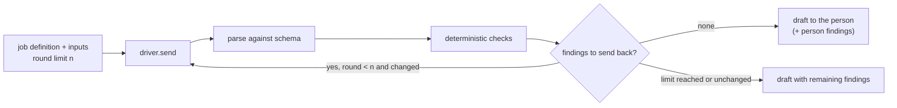

# ARC-008 The correction loop is one driver-independent harness

## Context

Every drafting job ends with deterministic checks; a draft that fails goes back to its participant
with compiler-like findings until it passes, a fixed round limit is reached, or a round changes
nothing. Findings a person decides (a conflict with an existing requirement) are never sent back.
The rounds are counted, shown and recorded. The same loop must behave identically whichever driver
reaches the participant. The book frames this as the agent loop "reason, act, observe" with Agent
M's checks as the observation (ch. 11 §2).

## Decision

1. `MOD-job-harness` runs the loop as a function of a job definition (ARC-007), its inputs, a round
   limit fixed before the first round, and a **driver** — an object with one method that sends a
   message and returns the participant's answer (ARC-009). The harness never knows whether the
   participant is a browser call, a workflow or a CLI agent.
2. Each round: parse the answer against the definition's output schema (an unreadable answer is an
   error finding), run the named checks, split findings into *back* (errors, unjustified warnings)
   and *person* (decided by a person), stop when *back* is empty, when the round limit is reached,
   or when the *back* findings are equal to the previous round's; otherwise send the draft and the
   *back* findings to the same participant.
3. A warning leaves the loop when the answer carries a one-line justification for it; the
   justification travels with the draft to the person.
4. The result is the last draft, the remaining findings in the compiler form, the *person*
   findings, and the list of rounds with their findings. The job record and the commit or queue
   entry record the number of rounds.
5. Where the loop runs follows the driver: in the browser for endpoint participants, inside the CI
   job for CI agents, inside the bridge for CLI agents — always the same module. A CI agent's job
   runs the loop in its workflow and then commits the draft only as an open use case or a new queue
   entry (`A CI AGENT'S DRAFT ENTERS AS OPEN`, UC-019 6b); the person reads the difference at review,
   and *person* findings such as conflicts are decided there.

## Alternatives

- **Let each participant correct itself (a system prompt asking it to self-check)** — rejected: the
  check would be stochastic; what can be decided without a model is decided without one
  (SOFTWARE_MAINTENANCE §4.0a rule 3).
- **Retry until green without a limit** — rejected by `THE CORRECTION LOOP HAS A FIXED LIMIT`.
- **One loop per driver** — rejected: three copies of one rule (`ONE DEFINITION, THREE DRIVERS`).

## Consequences

- The harness is testable with a fixture driver that returns scripted answers, which is exactly
  the check the SPEC names (`tests/test_correction_loop.py`).
- A CLI agent that edits files itself instead of returning a draft (an implementation job) is not
  run through this loop; its checks are the CI run and the Definition of Done (ARC-010, ARC-015).
- Cost per round is reported where the driver reports it and summed by the job record
  (`NO COST IS GUESSED`).

*Drafted on 2026-09-30 by Claude (claude-opus-5-5) for the Agent M repository at commit 1605b2dcfe907fb1df6e394af3fdbec80f379dbc; open until accepted.*
