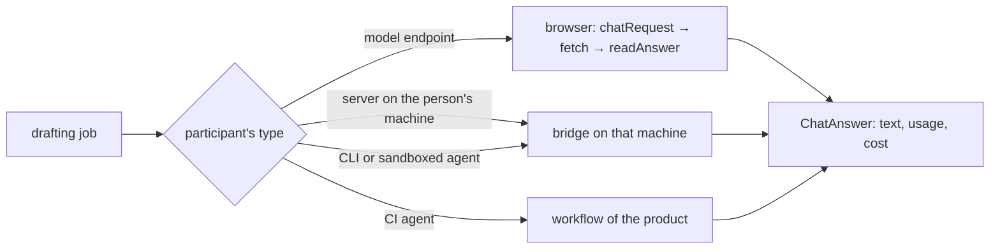

# ARC-009 Participants behind one route each

## Context

A participant is a person, a model endpoint, a CI agent, a CLI agent on a machine, or a sandboxed agent (UC-017). The
job harness (ARC-007) and the run engine (ARC-010) do not care which: a drafting job needs an answer to a prompt, an
agent's job a task handed over and its facts reported back. Each type is reached differently — an endpoint over HTTPS,
a CI agent through a workflow of the product, a CLI or sandboxed agent through the bridge (UC-011). Book ch. 10: the
plug-in pattern, a stable contract with each plug-in behind it.

Model endpoints speak one of two wire formats: the OpenAI-compatible chat completions — hosted gateways, vLLM, LiteLLM,
Ollama — or Anthropic's Messages API. What the endpoints and their SDKs document about calls from a web page is
recorded in `docs/measurements/2026-09-30_architecture-open-points.md`, point 7: Anthropic answers a browser only when
the request opts in with the header `anthropic-dangerous-direct-browser-access: true`, which its own SDK sets; the
self-hosted gateways allow every origin by default; whether the hosted endpoints answer a browser at all is not
documented. A key belongs to its endpoint and to the browser that holds it (ARC-005).

## Decision

1. **One route per type.** A person works on the dashboard; a model endpoint is called from the browser, or — for a
   model server on the person's own machine — through the bridge on that machine; a CI agent runs in a workflow of the
   product; a CLI or sandboxed agent is reached through the bridge. Every route gives a drafting job the same answer —
   the text, and the usage and cost as reported, never estimated — so that the job's loop does not know which route
   answered.
2. **Two wire formats, chosen by address** (`MOD-participants.endpointFormat`): the Anthropic Messages API for
   `https://api.anthropic.com`, the OpenAI-compatible chat completions for every other address. The request carries
   the key only in that endpoint's own header and, for Anthropic, the header that opts into calls from a browser
   (`MOD-participants.chatRequest`). No SDK is vendored: two request shapes over the fetch port are smaller than
   either SDK and keep the key's way inside this adapter.
3. **An answer is read, never guessed** (`MOD-participants.readAnswer`): its text and the usage the endpoint reported; a
   refused key, another error and a body in no form of the API are refused with the endpoint's own message.
4. **An endpoint that does not answer the browser says so.** `MOD-participants.chat` refuses such a turn as
   `unreachable`. `MOD-participants.testEndpoint` — the test the settings page runs when an endpoint is configured
   (UC-003 step 4), and runs again when a job's turn is refused so — names the reason — no cross-origin permission for
   this site, a header it requires, or the endpoint offline — and the routes that would work instead: a CI agent, or
   the bridge on a machine of the person's. No generic failure is reported.
5. **Browser reachability is measured before release.** Before the browser route to an endpoint kind is released, a
   preflight and a real call from the instance's Pages origin — to `api.anthropic.com` with and without the opt-in
   header, to `api.openai.com`, and to a self-hosted gateway — are made on current browsers and recorded with their
   date in `docs/measurements/`.



## Alternatives

- **Local model servers called directly from the browser** — the browser treats them as loopback, blocked in some
  browsers and asked about in others, and Ollama answers only its own origins until the person sets `OLLAMA_ORIGINS`;
  through the bridge neither is needed.
- **The vendors' SDKs in the browser** — larger than the two request shapes, and each holds the key in a way of its own
  beside the browser's store (ARC-005).
- **One wire protocol to all agents, such as the Agent Client Protocol or MCP** — a second adapter layer without a
  present need (YAGNI).

## Consequences

- The routes through the bridge and through a workflow are designed with the bridge and with the product's CI
  workflow; they give the answer of decision 1.
- No commit test calls a paid endpoint: every example of this adapter runs on recorded exchanges, and a real call per
  endpoint kind belongs to the nightly runs.
- No use-case step is realised here. The steps of UC-003 and UC-017 are actions on the settings and participants pages;
  they are realised where those are designed, by their interfaces together with these.

## Modules

### MOD-participants

```json module
{
  "id": "MOD-participants",
  "folder": "src/participants/",
  "layer": "adapter",
  "responsibility": "Reaches a model endpoint from the browser in its wire format — the OpenAI-compatible chat completions or the Anthropic Messages API —: the request it is sent, the answer read from its response with the usage it reports, one turn of a chat, and the test that names why an endpoint cannot be called from the browser and what would work instead.",
  "realises": ["AN UNSUPPORTED ENDPOINT SAYS SO"],
  "owns": ["ChatMessage", "HttpRequest", "HttpResponse", "ChatAnswer", "EndpointTest"],
  "uses": ["MOD-contracts"]
}
```

```json interface
{
  "id": "MOD-participants.endpointFormat",
  "summary": "The wire format of an endpoint: the Anthropic Messages API for the address https://api.anthropic.com, the OpenAI-compatible chat completions for every other.",
  "params": [{ "name": "endpoint", "type": "Endpoint" }],
  "result": "string",
  "async": false,
  "refusals": [],
  "examples": [
    {
      "name": "the hub",
      "input": {
        "endpoint": { "name": "hub", "url": "https://hub.nhr.fau.de/api/llmgw/v1", "model": "llama-3.3-70b", "key": "hub-key-example", "via": "browser", "tested": null }
      },
      "result": "openai"
    },
    {
      "name": "Anthropic",
      "input": {
        "endpoint": { "name": "claude", "url": "https://api.anthropic.com", "model": "claude-sonnet-5", "key": "ant-key-example", "via": "browser", "tested": null }
      },
      "result": "anthropic"
    }
  ]
}
```

```json interface
{
  "id": "MOD-participants.chatRequest",
  "summary": "The request of one turn in the endpoint's format: the key only in that endpoint's header — for Anthropic with the header that opts into calls from a browser —, the system messages as the Messages API's system field, and the answer's token limit.",
  "params": [
    { "name": "endpoint", "type": "Endpoint" },
    { "name": "messages", "type": "ChatMessage[]" },
    { "name": "maxTokens", "type": "integer" }
  ],
  "result": "HttpRequest",
  "async": false,
  "refusals": [],
  "examples": [
    {
      "name": "chat completions",
      "input": {
        "endpoint": { "name": "hub", "url": "https://hub.nhr.fau.de/api/llmgw/v1", "model": "llama-3.3-70b", "key": "hub-key-example", "via": "browser", "tested": null },
        "messages": [
          { "role": "system", "content": "Answer briefly." },
          { "role": "user", "content": "Name the model you are." }
        ],
        "maxTokens": 64
      },
      "result": {
        "method": "POST",
        "url": "https://hub.nhr.fau.de/api/llmgw/v1/chat/completions",
        "headers": { "content-type": "application/json", "authorization": "Bearer hub-key-example" },
        "body": {
          "model": "llama-3.3-70b",
          "max_tokens": 64,
          "messages": [
            { "role": "system", "content": "Answer briefly." },
            { "role": "user", "content": "Name the model you are." }
          ]
        }
      }
    },
    {
      "name": "Messages",
      "input": {
        "endpoint": { "name": "claude", "url": "https://api.anthropic.com", "model": "claude-sonnet-5", "key": "ant-key-example", "via": "browser", "tested": null },
        "messages": [
          { "role": "system", "content": "Answer briefly." },
          { "role": "user", "content": "Name the model you are." }
        ],
        "maxTokens": 64
      },
      "result": {
        "method": "POST",
        "url": "https://api.anthropic.com/v1/messages",
        "headers": { "content-type": "application/json", "x-api-key": "ant-key-example", "anthropic-version": "2023-06-01", "anthropic-dangerous-direct-browser-access": "true" },
        "body": {
          "model": "claude-sonnet-5",
          "max_tokens": 64,
          "system": "Answer briefly.",
          "messages": [{ "role": "user", "content": "Name the model you are." }]
        }
      }
    }
  ]
}
```

```json interface
{
  "id": "MOD-participants.readAnswer",
  "summary": "The answer an endpoint gave: its text and the usage it reported, never estimated; a refused key, another error and an answer in no form of the API each refused with the endpoint's own message.",
  "params": [{ "name": "endpoint", "type": "Endpoint" }, { "name": "response", "type": "HttpResponse" }],
  "result": "ChatAnswer",
  "async": false,
  "refusals": [
    { "code": "unauthorised", "when": "the endpoint answers 401 or 403" },
    { "code": "endpoint-error", "when": "the endpoint answers another status than 200" },
    { "code": "not-an-answer", "when": "the body is in no form of the endpoint's API" }
  ],
  "examples": [
    {
      "name": "chat completions",
      "input": {
        "endpoint": { "name": "hub", "url": "https://hub.nhr.fau.de/api/llmgw/v1", "model": "llama-3.3-70b", "key": "hub-key-example", "via": "browser", "tested": null },
        "response": {
          "status": 200,
          "body": {
            "choices": [{ "message": { "role": "assistant", "content": "OK" } }],
            "usage": { "prompt_tokens": 14, "completion_tokens": 1 }
          }
        }
      },
      "result": { "text": "OK", "usage": { "inputTokens": 14, "outputTokens": 1, "minutes": null }, "cost": null }
    },
    {
      "name": "Messages",
      "input": {
        "endpoint": { "name": "claude", "url": "https://api.anthropic.com", "model": "claude-sonnet-5", "key": "ant-key-example", "via": "browser", "tested": null },
        "response": {
          "status": 200,
          "body": {
            "content": [{ "type": "text", "text": "I am Claude." }],
            "usage": { "input_tokens": 18, "output_tokens": 5 }
          }
        }
      },
      "result": {
        "text": "I am Claude.",
        "usage": { "inputTokens": 18, "outputTokens": 5, "minutes": null },
        "cost": null
      }
    },
    {
      "name": "a refused key",
      "input": {
        "endpoint": { "name": "hub", "url": "https://hub.nhr.fau.de/api/llmgw/v1", "model": "llama-3.3-70b", "key": "hub-key-example", "via": "browser", "tested": null },
        "response": { "status": 401, "body": { "error": { "message": "invalid api key" } } }
      },
      "refused": "unauthorised"
    }
  ]
}
```

```json interface
{
  "id": "MOD-participants.chat",
  "summary": "One turn with an endpoint the browser calls: the request sent through the fetch port and the answer read; an endpoint reached through a bridge is refused here, and one that does not answer the browser is refused as unreachable — MOD-participants.testEndpoint then names why and what works instead.",
  "params": [
    { "name": "endpoint", "type": "Endpoint" },
    { "name": "messages", "type": "ChatMessage[]" },
    { "name": "maxTokens", "type": "integer" },
    { "name": "fetch", "type": "FetchPort" }
  ],
  "result": "ChatAnswer",
  "async": true,
  "refusals": [
    { "code": "unreachable", "when": "no response reaches the browser" },
    { "code": "not-from-the-browser", "when": "the endpoint is reached through a bridge" },
    { "code": "unauthorised", "when": "the endpoint refuses the key" },
    { "code": "endpoint-error", "when": "the endpoint answers another status than 200" },
    { "code": "not-an-answer", "when": "the body is in no form of the endpoint's API" }
  ],
  "examples": [
    {
      "name": "Anthropic from the browser",
      "input": {
        "endpoint": { "name": "claude", "url": "https://api.anthropic.com", "model": "claude-sonnet-5", "key": "ant-key-example", "via": "browser", "tested": null },
        "messages": [
          { "role": "system", "content": "Answer briefly." },
          { "role": "user", "content": "Name the model you are." }
        ],
        "maxTokens": 64,
        "fetch": [
          {
            "request": {
              "method": "POST",
              "url": "https://api.anthropic.com/v1/messages",
              "body": {
                "model": "claude-sonnet-5",
                "max_tokens": 64,
                "system": "Answer briefly.",
                "messages": [{ "role": "user", "content": "Name the model you are." }]
              }
            },
            "response": {
              "status": 200,
              "body": {
                "content": [{ "type": "text", "text": "I am Claude." }],
                "usage": { "input_tokens": 18, "output_tokens": 5 }
              }
            }
          }
        ]
      },
      "result": {
        "text": "I am Claude.",
        "usage": { "inputTokens": 18, "outputTokens": 5, "minutes": null },
        "cost": null
      }
    },
    {
      "name": "no answer to the browser",
      "input": {
        "endpoint": { "name": "hub", "url": "https://hub.nhr.fau.de/api/llmgw/v1", "model": "llama-3.3-70b", "key": "hub-key-example", "via": "browser", "tested": null },
        "messages": [
          { "role": "system", "content": "Answer briefly." },
          { "role": "user", "content": "Name the model you are." }
        ],
        "maxTokens": 64,
        "fetch": []
      },
      "refused": "unreachable"
    },
    {
      "name": "a server on the person's machine",
      "input": {
        "endpoint": { "name": "ollama", "url": "http://127.0.0.1:11434/v1", "model": "qwen3:8b", "key": "", "via": "bridge", "tested": null },
        "messages": [
          { "role": "system", "content": "Answer briefly." },
          { "role": "user", "content": "Name the model you are." }
        ],
        "maxTokens": 64,
        "fetch": []
      },
      "refused": "not-from-the-browser"
    }
  ]
}
```

```json interface
{
  "id": "MOD-participants.testEndpoint",
  "summary": "The short test request of a configured endpoint: whether it answers the browser and, when it does not, why — named, never a generic failure — and the routes that would work instead.",
  "params": [{ "name": "endpoint", "type": "Endpoint" }, { "name": "fetch", "type": "FetchPort" }],
  "result": "EndpointTest",
  "async": true,
  "refusals": [],
  "examples": [
    {
      "name": "the hub answers",
      "input": {
        "endpoint": { "name": "hub", "url": "https://hub.nhr.fau.de/api/llmgw/v1", "model": "llama-3.3-70b", "key": "hub-key-example", "via": "browser", "tested": null },
        "fetch": [
          {
            "request": {
              "method": "POST",
              "url": "https://hub.nhr.fau.de/api/llmgw/v1/chat/completions",
              "body": {
                "model": "llama-3.3-70b",
                "max_tokens": 16,
                "messages": [{ "role": "user", "content": "Answer with the single word OK." }]
              }
            },
            "response": {
              "status": 200,
              "body": {
                "choices": [{ "message": { "role": "assistant", "content": "OK" } }],
                "usage": { "prompt_tokens": 14, "completion_tokens": 1 }
              }
            }
          }
        ]
      },
      "result": { "ok": true, "reason": "", "alternatives": [] }
    },
    {
      "name": "Anthropic does not answer the browser",
      "input": {
        "endpoint": { "name": "claude", "url": "https://api.anthropic.com", "model": "claude-sonnet-5", "key": "ant-key-example", "via": "browser", "tested": null },
        "fetch": []
      },
      "result": {
        "ok": false,
        "reason": "claude did not answer the browser: it may not accept calls from a web page — no cross-origin permission for this site, or a header it requires —, or it is offline",
        "alternatives": ["a CI agent, whose workflow calls the endpoint on the git server's machines (UC-010)", "the bridge on a machine of yours, which calls the endpoint there (UC-011)"]
      }
    },
    {
      "name": "a wrong key",
      "input": {
        "endpoint": { "name": "hub", "url": "https://hub.nhr.fau.de/api/llmgw/v1", "model": "llama-3.3-70b", "key": "hub-key-example", "via": "browser", "tested": null },
        "fetch": [
          {
            "request": {
              "method": "POST",
              "url": "https://hub.nhr.fau.de/api/llmgw/v1/chat/completions",
              "body": {
                "model": "llama-3.3-70b",
                "max_tokens": 16,
                "messages": [{ "role": "user", "content": "Answer with the single word OK." }]
              }
            },
            "response": { "status": 401, "body": { "error": { "message": "invalid api key" } } }
          }
        ]
      },
      "result": { "ok": false, "reason": "hub refused the key: invalid api key", "alternatives": [] }
    }
  ]
}
```

## Types

```json type
{
  "$id": "ChatMessage",
  "description": "A message of a chat: system, user or assistant, and its text.",
  "type": "object",
  "required": ["role", "content"],
  "additionalProperties": false,
  "properties": {
    "role": { "type": "string", "enum": ["system", "user", "assistant"] },
    "content": { "type": "string" }
  },
  "examples": [{ "role": "user", "content": "Name the model you are." }]
}
```

```json type
{
  "$id": "HttpRequest",
  "description": "A request as the fetch port sends it: method, address, headers, and a body sent as JSON.",
  "type": "object",
  "required": ["method", "url", "headers", "body"],
  "additionalProperties": false,
  "properties": {
    "method": { "type": "string", "enum": ["GET", "POST", "PUT", "PATCH", "DELETE"] },
    "url": { "type": "string", "pattern": "^https?://" },
    "headers": { "type": "object", "additionalProperties": { "type": "string" } },
    "body": {}
  },
  "examples": [
    {
      "method": "POST",
      "url": "https://hub.nhr.fau.de/api/llmgw/v1/chat/completions",
      "headers": { "content-type": "application/json", "authorization": "Bearer hub-key-example" },
      "body": {
        "model": "llama-3.3-70b",
        "max_tokens": 64,
        "messages": [
          { "role": "system", "content": "Answer briefly." },
          { "role": "user", "content": "Name the model you are." }
        ]
      }
    }
  ]
}
```

```json type
{
  "$id": "HttpResponse",
  "description": "A response as the fetch port gives it: status, headers, and the body, parsed as JSON when declared so.",
  "type": "object",
  "required": ["status"],
  "additionalProperties": false,
  "properties": {
    "status": { "type": "integer", "minimum": 100, "maximum": 599 },
    "headers": { "type": "object", "additionalProperties": { "type": "string" } },
    "body": {}
  },
  "examples": [
    {
      "status": 200,
      "body": {
        "choices": [{ "message": { "role": "assistant", "content": "OK" } }],
        "usage": { "prompt_tokens": 14, "completion_tokens": 1 }
      }
    }
  ]
}
```

```json type
{
  "$id": "ChatAnswer",
  "description": "An endpoint's answer: its text, the usage it reported — null where it reported none —, and its cost — null, since no endpoint reports one in its answer.",
  "type": "object",
  "required": ["text", "usage", "cost"],
  "additionalProperties": false,
  "properties": {
    "text": { "type": "string" },
    "usage": { "$ref": "UsageOrNone" },
    "cost": { "$ref": "MoneyOrNone" }
  },
  "examples": [{ "text": "OK", "usage": { "inputTokens": 14, "outputTokens": 1, "minutes": null }, "cost": null }]
}
```

```json type
{
  "$id": "EndpointTest",
  "description": "The result of an endpoint's test: whether it answered the browser, why not, and the routes that would work instead.",
  "type": "object",
  "required": ["ok", "reason", "alternatives"],
  "additionalProperties": false,
  "properties": {
    "ok": { "type": "boolean" },
    "reason": { "type": "string" },
    "alternatives": { "type": "array", "items": { "type": "string" } }
  },
  "examples": [
    {
      "ok": false,
      "reason": "claude did not answer the browser: it may not accept calls from a web page — no cross-origin permission for this site, or a header it requires —, or it is offline",
      "alternatives": ["a CI agent, whose workflow calls the endpoint on the git server's machines (UC-010)", "the bridge on a machine of yours, which calls the endpoint there (UC-011)"]
    }
  ]
}
```
