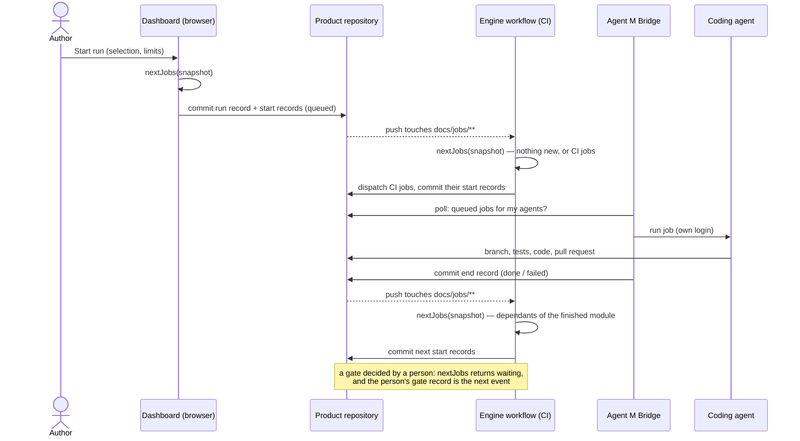

# ARC-010 A stateless, event-driven run engine

## Context

A run carries out the product's process model over a selection: CI first if missing, then one job
per module in the order of their interfaces, then the test battery, then validation — starting
each job by itself, stopping at gates a person decides, and within limits fixed at the start
(UC-043). There is no server that could hold a scheduler (`NO SERVER`), and state must be derived,
not stored (`PROGRESS AND JOB STATE ARE DERIVED, NOT STORED`). Jobs run in three places — browser,
CI, bridge — any of which may be switched off.

Every job, whichever runtime carries it, goes through the same steps: its start record, its definition
and inputs, the driver or the correction loop, a check for a cancel before each commit, its end record
with cost and rounds. The architecture review of 2026-10-01 found that no module owned these steps, so
that the browser, the CI workflow and the bridge would each have written them.

Book ch. 10 §"APIs": a REST interaction is stateless, and "any server instance can handle any
request, because no request depends on previous state". The engine takes the same stance: any
runtime may compute the next step, because the step depends only on the records.

## Decision

1. **The engine is a pure function** in the core (`MOD-run-engine`):
   `nextJobs(snapshot) -> { start: [jobSpec], waiting: [reason], done: bool, stop: reason | null }`.
   The snapshot is read at one pinned commit: the run record (selection, limits, model version), all
   job and gate records of the product, approval records, the modules' `uses`, the process model,
   role assignments, and — passed in by the caller — the states of pull requests and CI runs the
   records name. Nothing is remembered between calls.
2. **Queue = job records.** Starting a job means committing its start record
   `docs/jobs/JOB-<id>.md` with state *queued*, its participant, its runtime and the run it belongs
   to. Each job spec carries a *slot key* (run, phase, module or item); `nextJobs` never proposes a
   slot that already has a record, so two engines computing at once cannot start the same job twice
   — the second commit fails its fast-forward and recomputes on the new head.
3. **Triggers — any of three, all equivalent:**
   - a workflow of the product (`agent-m-engine`, generated by MOD-ci-generator) runs on every push
     that touches `docs/jobs/**` and on the completion of an Agent M job workflow, computes
     `nextJobs`, commits the start records, and dispatches the jobs whose participant is a CI agent, on
     the CI authority of ARC-015;
   - the bridge, while running, polls the products it serves, computes `nextJobs` itself, and takes
     the queued jobs assigned to its own agents — it connects out, so it works behind NAT;
   - the browser computes `nextJobs` on the *Start run* click (to write the run record and the first
     start records) and on each page load (to show the plan), and starts endpoint jobs in the tab.
4. **Runtimes pull their own jobs.** A job whose participant is a CLI agent is picked up by the
   bridge that hosts it; one for a CI agent is dispatched by the engine workflow; one for an
   endpoint runs only in an open tab. A job with a start record, no end record and no runtime that
   knows it — the tab closed, the bridge restarted — is in the seventh state, *ended without record*
   (`ONE DASHBOARD SHOWS EVERY JOB`, MOD-run-engine); `nextJobs` treats it as ended without a result,
   so its dependants do not start, and offers it for *Retry* as a failed one is.
5. **Gates and limits are inputs, not state.** A job whose next step is a gate waits until a gate
   record by the gate's decider exists (`A JOB STOPS AT EVERY GATE`), never one by the participant
   whose work it checks. Limits are read from the run record and compared with the costs the job
   records report; when a limit is reached, `nextJobs` returns `stop` and starts nothing more.
6. **Order.** Modules are ordered by their `uses` graph (a cycle is refused before the run starts,
   naming the modules); independent modules run side by side up to the jobs-at-once limit.
7. **Cancel.** A cancel is a record too; `nextJobs` treats a cancelled job as ended, and every
   runtime checks for a cancel record before each commit of a job (`A CANCELLED JOB WRITES NOTHING
   MORE`).
8. **One executor.** `MOD-run-engine.runJob(job, ports)` carries one job from its start record to its
   end record, the same function in the tab, in the CI entry and in the bridge: it reads the job's
   definition (ARC-007), assembles its inputs through the ports the runtime hands it, runs the driver —
   for a drafting job through the correction loop —, checks for a cancel record before each commit,
   commits the result on the route the definition names, and writes the end record with the state, the
   results, the rounds, the Agent M version and the model, and a cost only where the runtime reported one
   (`NO COST IS GUESSED`). Its ports are the git host with the runtime's authority (ARC-003), the
   participant's driver, a clock and a random source. Which credential each runtime writes with is
   ARC-003's authority and, for CI, ARC-015's.

## Alternatives

- **A long-running scheduler** (in the bridge, or a hosted queue) — rejected: a server (`NO
  SERVER`), or a process whose state is lost with the machine; a run would stop when one laptop
  sleeps.
- **The engine as a loop in the browser tab** — rejected: a run over all modules takes hours; it
  would stop when the tab closes.
- **GitHub Actions `needs:` graphs generated per run** — rejected: the graph is known only as jobs
  finish (a failed job blocks its dependants, a gate waits for a person), and GitLab has a
  different syntax; the engine would be written twice.
- **Stored run state (a `run.json` updated after each job)** — rejected by `PROGRESS AND JOB STATE
  ARE DERIVED, NOT STORED`; concurrent writers would conflict on one file.

## Consequences

- Every job start and end is a commit under `docs/jobs/`; the tests CI ignores them
  (`A JOB RECORD STARTS NO CI RUN`), only the engine workflow reacts.
- A run of a product without its engine workflow (a GitLab product whose pipeline is not set up, a
  fork with Actions disabled) advances only while a bridge or a tab computes `nextJobs`; the run
  panel says which triggers exist.
- The engine continues a run by dispatching (`workflow_dispatch`), never by relying on the push of its
  own records — ARC-015 says why the workflow's built-in token would stop a run there. With the person's
  token those pushes do start the engine workflow once more; `nextJobs` then finds nothing new and
  commits nothing, because it depends only on the records (point 1). The cost is one short engine run per
  record commit; a `concurrency` group per product keeps them one after the other.
- Because one executor writes every start and end record, a runtime adds only its ports: the browser
  its tab and the person's click, CI its secret, the bridge its agents. Testing `runJob` with fake ports
  covers the lifecycle once for all three.

*Drafted on 2026-09-30 by Claude (claude-opus-5-5) for the Agent M repository at commit 1605b2dcfe907fb1df6e394af3fdbec80f379dbc; revised on 2026-09-30 by Claude (claude-opus-5-5) against commit 1110607b6dc4d9c888549a23a680fbe4b38dd3f1 — SPEC and use cases as accepted that day, and `docs/measurements/2026-09-30_architecture-open-points.md`; revised on 2026-10-01 by Claude (claude-opus-5-5) against commit d0e5631081876203e719a2508d673d904e7768db — the leaner architecture of the architecture review, as the PO approved it (UC-023): the CI credentials moved to ARC-015, and one executor owns a job's lifecycle; open until accepted.*
