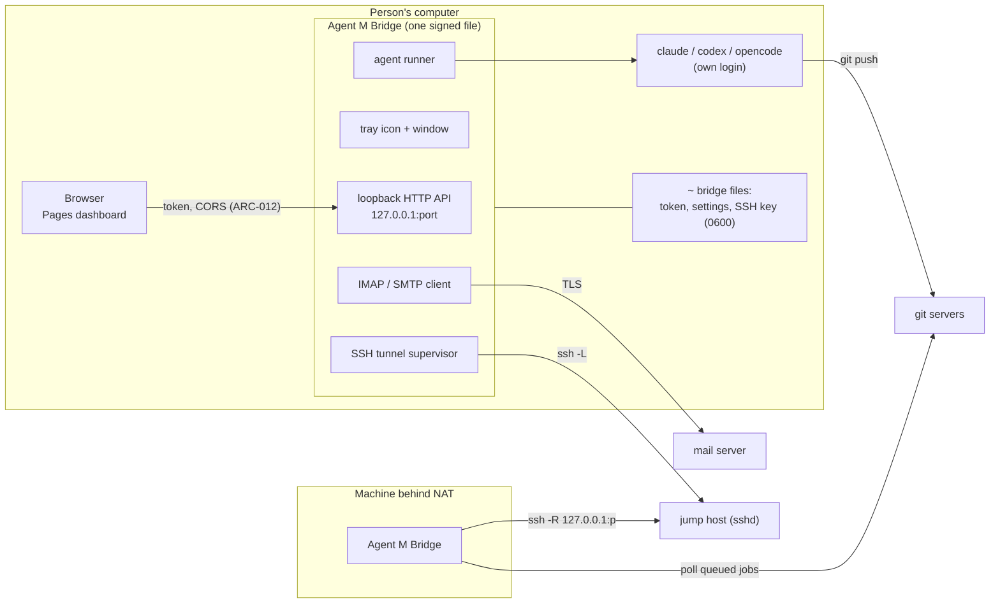

# ARC-011 The Agent M Bridge: Deno, one signed file per platform, tray, window, updater

## Context

The second level of Agent M runs local coding agents with the person's own login, speaks IMAP and
SMTP, and opens SSH tunnels (UC-044). The person may never have used a terminal. The PO decided:
JavaScript, compiled with `deno compile` to one file per platform from the same modules as the
dashboard, signed by the PO personally (Apple Developer ID with notarisation, Windows code signing).
This decision records how, what the Deno toolchain offers for the app shell, and what is still
unmeasured.

## Decision

1. **One entry module, the dashboard's modules.** `bridge/main.mjs` imports the core and adapter
   modules the dashboard uses (ARC-003) plus the bridge-only modules (MOD-bridge-server,
   MOD-bridge-tunnel, MOD-bridge-mail, MOD-participant-cli) and the job definitions (ARC-007,
   compiled in with `--include`). No second language.
2. **Build: `deno compile`** (PO decision) with `--target` for each of `x86_64-pc-windows-msvc`,
   `aarch64-pc-windows-msvc`, `x86_64-apple-darwin`, `aarch64-apple-darwin`,
   `x86_64-unknown-linux-gnu`, `aarch64-unknown-linux-gnu` — the targets the Deno documentation
   lists, all cross-compiled from one host (read 2026-09-30,
   `https://docs.deno.com/runtime/reference/cli/compile.md`; Windows on ARM from Deno 2.9.3). The
   result is one executable per target that needs no Deno installed.
3. **Signing** after the build, as the Deno documentation describes: macOS `codesign -s "Developer
   ID Application: …"` followed by notarisation; Windows `signtool sign /fd SHA256`. `deno compile`
   itself signs macOS binaries only ad hoc (same page). Details in ARC-017.
4. **App shell — tray icon and window.** Chosen candidate: the Deno toolchain's own desktop APIs,
   `Deno.Tray` (menu-bar extra on macOS, system tray on Windows, AppIndicator on Linux) and Deno's
   window, available with `deno desktop` from Deno 2.9.0 (read 2026-09-30,
   `https://docs.deno.com/runtime/desktop/tray_and_dock.md`, `https://docs.deno.com/runtime/reference/cli/desktop.md`).
   The window shows the bridge's own page (pairing token with *Copy*, agents found and how to install
   missing ones, jump host, port, tunnel state, import of a dashboard export). The tray menu offers
   *Open*, *Pause*, *Quit*. See the open points below: whether this shell is compatible with "one
   executable file" is not settled.
5. **Headless mode.** The same entry runs without a tray when no desktop session exists (a lab
   machine behind NAT, UC-044 6a); its settings then come from an imported export file.
6. **The bridge's own settings** — its port, its pairing token, its jump host — live in the bridge,
   set in its window or read from a dashboard export (`THE BRIDGE IS CONFIGURED IN ITS WINDOW OR FROM
   AN EXPORT`), in a file readable by its user only (`THE BRIDGE IS PAIRED ONCE`). The port is a
   setting of the bridge; the dashboard learns it at pairing.
7. **Updater.** The bridge reads the release feed of Agent M (ARC-017), offers a newer version with
   its notes, and on the person's click downloads the file for its platform, checks the SHA-256
   named in a feed signed with the publisher's Ed25519 key (public key compiled into the bridge,
   verified with Web Crypto) and the platform signature (`codesign --verify` / Authenticode), and
   only then replaces itself (`THE BRIDGE IS UPDATED ONLY BY THE PERSON'S CHOICE`). No background
   installation.

### Due diligence (read 2026-09-30)

Sources: GitHub API `https://api.github.com/repos/<owner>/<repo>`, its `/releases` and `/license`,
issue search as in ARC-002; npm registry for npm packages; the documentation pages named. Agent M's
licence is MIT.

| Candidate | Role | Licence | Against MIT | Releases | Issues | Adoption |
|---|---|---|---|---|---|---|
| **Deno** (denoland/deno) — chosen (PO) | runtime and compiler | MIT (GitHub) | compatible | latest v2.9.7 on 2026-09-17; 44 releases in 12 months; v2.9.0 (first with `deno desktop`) on 2026-06-25 | 1 257 open, 13 865 closed, 2 832 closed in 12 months; label `compile`: 33 open, 156 closed; label `desktop`: 30 open, 48 closed | 108 550 stars |
| Node.js single executable applications (nodejs/node) | alternative | `LICENSE` begins "Node.js is licensed for use as follows" with the MIT text; GitHub reports NOASSERTION | compatible | v22.23.3 on 2026-09-23; 59 releases in 12 months; SEA documented as "Stability: 1.1 - Active development" (`https://nodejs.org/api/single-executable-applications.md`) | 601 open, 20 333 closed | 122 200 stars |
| Bun `bun build --compile` (oven-sh/bun) | alternative | `LICENSE.md`: "Bun itself is MIT-licensed", but it "statically links JavaScriptCore (and WebKit) which is LGPL-2 licensed" | **marked — LGPL-2 statically linked, not known to be compatible for redistribution without relinking provisions** | bun-v1.4.2 on 2026-09-05; 18 releases in 12 months; cross-compiles with `--target` (`https://bun.com/docs/bundler/executables.md`) | 3 722 open, 14 745 closed | 96 087 stars |
| **`deno desktop` / `Deno.Tray`** — chosen for the shell | tray, window | part of Deno (MIT) | compatible | since v2.9.0, 2026-06-25 | open issue "Deno.Tray does not work on KDE Plasma, despite fulfilling documented requirements" (search `label:desktop tray`, 2 open) | new; no adoption figure available |
| webview_deno (webview/webview_deno, JSR `@webview/webview`) | window via FFI | MIT | compatible | 0.9.0 on 2025-01-29; 0 releases in 12 months; JSR package updated 2024-03-03 | 41 open, 0 closed in 12 months | 1 592 stars; JSR: 1 dependent |
| systray2 (felixhao28/node-systray) | tray via a Go helper binary | MIT | compatible | 2.1.4 on 2021-10-14; none in 12 months | 4 open, 12 closed; no activity in 12 months | 124 361 downloads last month; 40 stars |
| Electron (electron/electron) | whole app shell | MIT | compatible | v43.7.7 on 2026-09-30; 100+ releases in 12 months | 566 open, 21 356 closed | 123 341 stars |
| Tauri (tauri-apps/tauri) | whole app shell | `LICENSE-MIT` and `LICENSE-APACHE-2.0` (GitHub reports Apache-2.0) | compatible | tauri-v3.0.0-alpha.3 on 2026-09-26 | 1 302 open, 5 172 closed | 111 504 stars |

## Alternatives

- **Node SEA or Bun** instead of Deno — the PO chose Deno; also: Node's SEA is marked "Active
  development" and needs a separate injection step per platform; Bun links LGPL-2 code statically,
  which the licence table marks.
- **webview_deno plus a Go tray helper** — rejected: no release in twelve months for either, the
  window needs a shared library beside the binary (not one file), and the helper is a second
  executable in another language.
- **Electron or Tauri** — rejected: Electron ships Chromium and Node (about 100 MB+ per the Deno
  comparison page) and is a different runtime from the one the PO chose; Tauri's core is Rust and
  cannot run the dashboard's modules outside its webview (`THE BRIDGE IS BUILT FROM THE DASHBOARD'S
  CODE`).
- **No tray, the window as a page in the default browser** — rejected: `THE BRIDGE RUNS AS AN APP`
  asks for a tray or menu-bar icon; and a page on `127.0.0.1` showing the pairing token could be
  read by any local process that can open that address.
- **Deno's built-in `Deno.autoUpdate()`** (bsdiff patches, Ed25519-signed manifest) — not chosen: it
  polls, applies and stages updates without a click, and "Applying staged updates … currently run on
  macOS and Linux only … Treat Windows auto-update as not yet supported" (read 2026-09-30,
  `https://docs.deno.com/runtime/desktop/auto_update.md`). Its manifest signing scheme is reused.

## Consequences

- **Open point for the PO — `deno compile` versus `deno desktop`.** The tray API is documented for
  `deno desktop`. Its outputs are, per the Distribution page (read 2026-09-30,
  `https://docs.deno.com/runtime/desktop/distribution.md`): macOS `.app` directory or `.dmg`; Windows a
  directory with launcher, `denort.dll` and backend DLLs, or an `.msi` installer; Linux a directory,
  `.AppImage` (one file), `.deb` or `.rpm`; targets without Windows on ARM. `THE BRIDGE IS ONE FILE PER
  PLATFORM` is met on macOS (`.dmg`) and Linux (`.AppImage`); on Windows only by the `.msi`, which is an
  installer, not an executable. Either the PO accepts the `.msi` as the Windows file, or the tray has
  to work from a `deno compile` binary — which is the first measurement below.
- **Open measurement 1 — tray from `deno compile`.** Whether `Deno.Tray` exists and shows an icon in a
  binary built with `deno compile` (Deno 2.9.7) on macOS 15, Windows 11 and Ubuntu 24.04 (GNOME) — the
  documentation does not say. Method: a ten-line program that creates a tray with one menu item,
  compiled for each target, started on each system; record `typeof Deno.Tray` and a screenshot.
- **Open measurement 2 — Linux desktops.** The open Deno issue about KDE Plasma means the tray must be
  measured on at least GNOME and KDE; where it fails, the bridge runs headless and says so in its log
  and on the dashboard.
- **Open measurement 3 — signing a Deno-built file.** Whether a `deno compile` output survives
  `codesign` with hardened runtime and notarisation (it embeds the program after the runtime) and
  whether Windows SmartScreen accepts it with a fresh OV certificate, is measured on the first release
  candidate (ARC-017).
- The bridge's size is that of the Deno runtime plus the modules; the Deno comparison page names about
  40 MB for a `deno desktop` webview app (not measured here).

*Drafted on 2026-09-30 by Claude (claude-opus-5-5) for the Agent M repository at commit 1605b2dcfe907fb1df6e394af3fdbec80f379dbc; open until accepted.*
