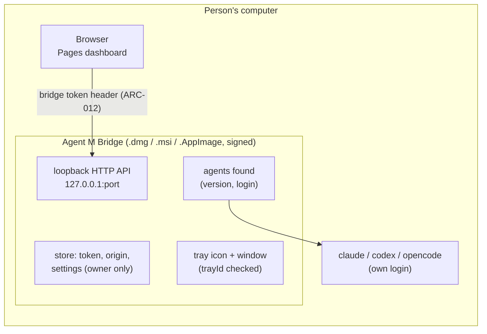

# ARC-011 The Agent M Bridge: Deno, one signed file per platform, tray or window, its pairing and its agents

## Context

The second level of Agent M runs local coding agents with the person's own login, speaks IMAP and SMTP, calls local model servers and opens SSH tunnels (UC-044). The person may never have used a terminal. The bridge is compiled from the dashboard's JavaScript modules (`THE BRIDGE IS BUILT FROM THE DASHBOARD'S CODE`), signed by the publisher of the release — with an Apple Developer ID and notarised for macOS, with a code-signing certificate for Windows (`THE BRIDGE IS SIGNED BY ITS PUBLISHER`) —, and delivered as one file for each of Windows on x86-64, macOS and Linux, which `THE BRIDGE IS ONE FILE PER PLATFORM` counts as "an executable, a disk image or an installer".

What the Deno documentation and issue tracker say about the app shell is recorded, with every source and quotation, in `docs/measurements/2026-09-30_architecture-open-points.md`, point 1, cited here as *measurement point 1*. The tray and the window are documented only for `deno desktop`, which "is experimental in 2.9." (`https://deno.com/blog/v2.9`); two open issues concern the tray on KDE Plasma and on Windows; a tray that cannot be created fails silently — "the constructor's underlying `trayId` is `0` and subsequent calls are no-ops" (`https://docs.deno.com/runtime/desktop/tray_and_dock.md`); there is no Windows-on-ARM target.

The coding-agent CLIs say how they report themselves. Claude Code prints its version with `--version`, and `claude auth status` "Exits with code 0 if logged in, 1 if not" (`https://code.claude.com/docs/en/cli-reference`). Codex's `codex login status` will "Print the active authentication mode and exit with 0 when logged in" (`https://learn.chatgpt.com/docs/developer-commands?surface=cli`); a version flag of Codex is not documented in what was read. opencode prints its version with `opencode --version` and lists the credentials of its providers with `opencode auth list` (`https://opencode.ai/docs/cli/`). Each vendor's installation instructions stand on one page, a part per system: Claude Code's setup page, section *Install Claude Code* — a tab for "macOS, Linux, WSL" and for Windows PowerShell and CMD — and section *Set up on Windows*, which says "You do not need to run as Administrator" (`https://code.claude.com/docs/en/setup`); Codex's CLI page, a tab per system (`https://learn.chatgpt.com/docs/codex/cli`); opencode's documentation, section *Install* — "The easiest way to install OpenCode is through the install script" — and section *Windows* (`https://opencode.ai/docs/`).

## Decision

1. **One entry module, the dashboard's modules.** `bridge/main.mjs` is the bridge's composition root (`MOD-bridge-app`, ARC-003): it imports the kernel, feature and adapter modules the dashboard uses, the bridge sides of the adapters — the protocol (`MOD-bridge-server`, ARC-012), the tunnels, the mail routes, the coding agents (`MOD-local-agents`), a model server's list of models (`MOD-model-servers`, ARC-034) and the compute check (`MOD-local-compute`, ARC-034) — and the job definitions (ARC-007). No second language.
2. **Build: `deno desktop`**, because the tray and the window exist only there (the tray page: "`deno desktop` is available starting in Deno v2.9.0"; the word `Tray` occurs 0 times on the `deno compile` reference, `https://docs.deno.com/runtime/reference/cli/compile.md`). One file per platform, as the Distribution page lists the outputs (`https://docs.deno.com/runtime/desktop/distribution.md`):
   - **macOS** — a `.dmg`, built on a Mac ("the macOS `.dmg`, which shells out to `hdiutil`"), for macOS Intel and macOS arm64;
   - **Windows** — an `.msi`, which "installs the app per-machine under `%ProgramFiles%\<AppName>\`", for Windows x86_64;
   - **Linux** — an `.AppImage` ("the most portable Linux format: one file, no install step"), for Linux x86_64 and arm64.

   `deno desktop` is experimental; the build itself prints "⚠ deno desktop is experimental and subject to change" (issue #36780). The bridge pins the Deno version it is built with (`MOD-bridge-release.releaseWorkflow`, ARC-017), and each Deno update is a pull request; each target's file is started in a test once the bridge has a start that reports and ends without a desktop session (ARC-017).
3. **Signing** of each file by the publisher (ARC-017): the `.dmg` notarised and stapled on macOS, the executables and the `.msi` signed with Authenticode on Windows.
4. **How the bridge shows itself** (`MOD-bridge-app.shellMode`). Its tray icon — `Deno.Tray`: the menu-bar extra on macOS, the notification area on Windows, AppIndicator or KStatusNotifierItem on Linux — offers *Open*, *Pause* and *Quit*. Its window shows the bridge's own page: its address, the pairing token with *Copy* and *Pair anew*, the origin it is paired with, the agents it found with *How to install* and *Check again*, the jump host, the session port, the tunnels' state, the import of a dashboard export, and *Update* where a newer release is offered (decision 9). The tray reaches the shell through one function of `MOD-bridge-app`, so a rename of the API — open pull request #35939 would move it to `Deno.desktop.Tray` — touches one place. After creating the tray, the bridge reads its `trayId`: where it is `0`, the window stays open as the only control. Where the tray is known not to answer, the window stays open, minimised, not hidden (measurement point 1): on KDE Plasma on Wayland — "`Deno.Tray` appears to be completely non-functional on KDE Plasma 6 on Wayland" (issue #36502) —, and on Windows with the default WebView2 backend, where "The tray icon has **zero click or menu interactivity**" while the window is hidden (issue #36778). `THE BRIDGE RUNS AS AN APP` asks for the window open where the system shows no tray icon; `GET /hello` names how the bridge shows itself and why.
5. **Headless** (`MOD-bridge-app.shellMode`). Where no desktop session exists — a lab machine behind NAT (UC-044 6a) —, the same file runs without a window; its settings come from an imported export (`THE BRIDGE IS CONFIGURED IN ITS WINDOW OR FROM AN EXPORT`), and its state is read on the dashboard through `GET /hello` and `GET /tunnels`.
6. **The pairing, in the bridge's store** (`MOD-bridge-app.pairingOf`, `MOD-bridge-app.pairAnew`, `MOD-bridge-app.pairWith`, `MOD-bridge-app.recordOrigin`, `MOD-bridge-app.spendConfirmation`). The bridge's one store holds its own settings — its port: the bridge port of the session it serves behind NAT where its tunnel settings name one (`MOD-bridge-tunnel.tunnelSettingsOf`, ARC-013), else 47321 unless set in its window (`MOD-bridge-server.defaultAddress`, ARC-012); its pairing token and the origin it is paired with; its tunnel settings (ARC-013); the confirmations of the mails it was asked to send in the last ten minutes, kept as spent before each mail is sent, one mail at a time (ARC-014 decision 13) — in one directory, `.agent-m-bridge` in the person's home directory and so outside every repository, in files readable by its user only (ARC-003 decision 4). The token is made on first use and kept across restarts (`THE BRIDGE IS PAIRED ONCE`); *Pair anew* replaces it — the old one is refused from then on — and unpairs the bridge; so does an imported export, with the bridge token of the session the bridge serves (`MOD-bridge-app.pairWith`, ARC-013 decision 7). The bridge is paired with the origin of the first request it admits while unpaired (ARC-012 decision 4). It keeps no model server and no key: the address of a server or the system of a compute resource comes with each request (decision 8), as the browser keeps the configuration (`CONFIGURATION LIVES IN THE BROWSER`). The dashboard's settings page presets the address of a bridge on this computer, `http://127.0.0.1:47321`, which the person changes only where the bridge's window names another; the person pastes the token and presses *Pair*, and the page keeps both in the browser and tests the bridge (ARC-026, ARC-005).
7. **The coding agents on its machine** (`MOD-local-agents`). The bridge runs each supported CLI's version command and, where the CLI reports one, its login command — as an argument list, never through a shell, and with no key (`MOD-local-agents.agentProbes`; `A LOCAL AGENT USES THE PERSON'S OWN LOGIN`). A CLI whose version command does not run is missing: the window offers the vendor's instructions for the bridge's system — the part of its page for that system — and *Check again* (`MOD-local-agents.installHelp`). One whose login command exits with another code than 0 is not logged in: the window shows the CLI's own login step for the person to run, and the bridge never asks for a password (`MOD-local-agents.agentsFound`). opencode's credentials are its providers', so its login is not asked. `GET /agents` and the greeting list what was found, and only ready agents are offered as participants: the settings page reads them from the greeting through the bridge's route (`MOD-settings-page.agentsOn`), offers each with its model to be named (`MOD-process-config.bridgeOffer`), and writes a participant's route only for an agent the bridge reported ready (`MOD-process-config.participantOf`; ARC-025, ARC-026 decision 12).
8. **The greeting and the route table** (`MOD-bridge-app.hello`, `MOD-bridge-app.routeTable`): `GET /hello` names the protocol's major version, the bridge's version, its paired origin, how it shows itself and its agents; the route table holds every endpoint of the protocol (ARC-012 decision 8), each to the handler of the module that owns it. Three routes serve what the bridge's machine reaches, none of them with a key: `GET /endpoint/models?address=<address>` answers the models the server at that address serves, asked without a key (`MOD-model-servers.servedModels`, ARC-034); `POST /endpoint/chat`, whose body names the server's address, the model, the messages and the answer's token limit, sends that turn to the server in its format without a key (`MOD-participants.chatRequest`) and answers what the server said (`MOD-participants.readAnswer`, ARC-009), a server that does not answer as `no-answer`; `GET /compute/check?system=<system>` runs the command `MOD-local-compute.computeProbe` gives — an argument list, never a shell, ended where it has not ended after 30 seconds — and answers what it printed (`MOD-local-compute.computeFound`, ARC-034). A refusal of these is answered with status `200` and the refusal as its body, as a job route's is (ARC-030 decision 7).
9. **Updater** (`MOD-bridge-update`, ARC-017 decision 6), composed by the bridge app, whose window offers *Update* (decision 4): when the bridge starts and once a day it reads the latest release and its feed, trusts the feed only where the publisher's key compiled into the bridge verifies its signature (ARC-017 decision 5), and offers a newer release of its protocol for its target with the release's notes; on the person's click it downloads the file, checks its SHA-256 and its platform signature, and only then installs it — the `.app` from the new `.dmg` on macOS, the new `.msi` on Windows, the new `.AppImage` on Linux (`THE BRIDGE IS UPDATED ONLY BY THE PERSON'S CHOICE`). No background installation.



### Due diligence (read 2026-09-30)

Sources: GitHub API `https://api.github.com/repos/<owner>/<repo>`, its `/releases` and `/license`,
issue search as in ARC-002; npm registry for npm packages; the documentation pages named; for the rows
on `deno desktop`, measurement point 1. Agent M's licence is MIT.

| Candidate | Role | Licence | Against MIT | Releases | Issues | Adoption |
|---|---|---|---|---|---|---|
| **Deno** (denoland/deno) — chosen | runtime and build | MIT (GitHub) | compatible | latest v2.9.7 on 2026-09-17; 44 releases in 12 months; v2.9.0 (first with `deno desktop`) on 2026-06-25 | 1 257 open, 13 865 closed, 2 832 closed in 12 months; label `compile`: 33 open, 156 closed; label `desktop`: 30 open, 48 closed | 108 550 stars |
| **`deno desktop` / `Deno.Tray`** — chosen for the shell and the files | tray, window, `.dmg`/`.msi`/`.AppImage` | part of Deno (MIT) | compatible | since v2.9.0, 2026-06-25; experimental in 2.9 (`https://deno.com/blog/v2.9`); macOS tray from Finder fixed in 2.9.1 (PR #35626); bundle signature fix in 2.9.6 (PR #36574) | open: #36502 (KDE Plasma 6 on Wayland), #36778 (Windows, WebView2, hidden window), #36780 (signing error on `laufey_webview`), PR #36421 (JIT entitlement, signing order), PR #35939 (`Deno.desktop.Tray`) | new; no adoption figure available |
| Node.js single executable applications (nodejs/node) | alternative | `LICENSE` begins "Node.js is licensed for use as follows" with the MIT text; GitHub reports NOASSERTION | compatible | v22.23.3 on 2026-09-23; 59 releases in 12 months; SEA documented as "Stability: 1.1 - Active development" (`https://nodejs.org/api/single-executable-applications.md`) | 601 open, 20 333 closed | 122 200 stars |
| Bun `bun build --compile` (oven-sh/bun) | alternative | `LICENSE.md`: "Bun itself is MIT-licensed", but it "statically links JavaScriptCore (and WebKit) which is LGPL-2 licensed" | **marked — LGPL-2 statically linked, not known to be compatible for redistribution without relinking provisions** | bun-v1.4.2 on 2026-09-05; 18 releases in 12 months; cross-compiles with `--target` (`https://bun.com/docs/bundler/executables.md`) | 3 722 open, 14 745 closed | 96 087 stars |
| webview_deno (webview/webview_deno, JSR `@webview/webview`) | window via FFI | MIT | compatible | 0.9.0 on 2025-01-29; 0 releases in 12 months; JSR package updated 2024-03-03 | 41 open, 0 closed in 12 months | 1 592 stars; JSR: 1 dependent |
| systray2 (felixhao28/node-systray) | tray via a Go helper binary | MIT | compatible | 2.1.4 on 2021-10-14; none in 12 months | 4 open, 12 closed; no activity in 12 months | 124 361 downloads last month; 40 stars |
| Electron (electron/electron) | whole app shell | MIT | compatible | v43.7.7 on 2026-09-30; 100+ releases in 12 months | 566 open, 21 356 closed | 123 341 stars |
| Tauri (tauri-apps/tauri) | whole app shell | `LICENSE-MIT` and `LICENSE-APACHE-2.0` (GitHub reports Apache-2.0) | compatible | tauri-v3.0.0-alpha.3 on 2026-09-26 | 1 302 open, 5 172 closed | 111 504 stars |

## Alternatives

- **`deno compile` executables with no tray** — one executable per target, including Windows on ARM
  ("`aarch64-pc-windows-msvc` (Windows on ARM) is supported starting in Deno 2.9.3", compile reference), but without a tray or window: open issue #36778 asks to allow `Deno.Tray` "in
  standalone binaries compiled via `deno compile`", so today it is not offered (measurement point 1). It
  would miss `THE BRIDGE RUNS AS AN APP`.
- **Node SEA or Bun** instead of Deno — rejected: Node's SEA is marked "Active development" and needs
  a separate injection step per platform; Bun links LGPL-2 code statically, which the licence table
  marks.
- **webview_deno plus a Go tray helper** — rejected: no release in twelve months for either, the
  window needs a shared library beside the binary (not one file), and the helper is a second
  executable in another language.
- **Electron or Tauri** — rejected: Electron ships Chromium and Node (about 100 MB+ per the Deno
  comparison page), a second runtime beside Deno; Tauri's core is Rust and
  cannot run the dashboard's modules outside its webview (`THE BRIDGE IS BUILT FROM THE DASHBOARD'S
  CODE`).
- **No tray, the window as a page in the default browser** — rejected: `THE BRIDGE RUNS AS AN APP`
  asks for a tray or menu-bar icon; and a page on `127.0.0.1` showing the pairing token could be
  read by any local process that can open that address.
- **Deno's built-in `Deno.autoUpdate()`** (bsdiff patches, Ed25519-signed manifest) — not chosen: it
  polls, applies and stages updates without a click, and "Applying staged updates … currently run on
  macOS and Linux only … Treat Windows auto-update as not yet supported"
  (`https://docs.deno.com/runtime/desktop/auto_update.md`; issue #35269: "Auto-updater is unix-only",
  measurement point 1). Its manifest signing scheme is reused.

## Consequences

- The bridge rests on an experimental build mode. A Deno release can change `deno desktop` or rename
  its API (PR #35939); the pinned Deno version, and the start test of each target's file once the bridge can start without a desktop session
  (ARC-017), keep such a change from reaching a release unnoticed.
- Where the tray cannot be created or does not answer, the bridge keeps its window open (decision 4), which
  `THE BRIDGE RUNS AS AN APP` asks for where the system shows no tray icon; on Windows and on KDE Plasma on Wayland
  until a Deno release fixes the issue, taken up like any Deno update by a pull request (decision 2).
- **Windows on ARM** is not among the platforms `THE BRIDGE IS ONE FILE PER PLATFORM` names, and `deno desktop`
  builds for none of its targets: it lists "macOS Intel, macOS arm64, Windows x86_64, Linux arm64, and Linux
  x86_64" (Distribution page, measurement point 1). Whether the x86-64 `.msi` installs and runs on Windows 11 on
  ARM under emulation is not documented in what was read; open measurement 4 records it, and the download page
  states the result (ARC-017).
- **Open measurement 1 — tray and window per platform.** Start a `deno desktop` build (Deno 2.9.7) on
  macOS 15, Windows 11, Ubuntu 24.04 with GNOME and KDE Plasma 6 on Wayland; record `tray.trayId`, a
  screenshot, and whether the tray menu reacts with the window minimised and hidden. GNOME is not named
  on the tray page (measurement point 1: 0 hits).
- **Open measurement 2 — Windows backend.** For issue #36778: the same test with the default WebView2 backend,
  recording whether the tray answers while the window is minimised, as decision 4 keeps it. The CEF backend
  (`--backend cef`) is not chosen: the window that stays open already meets `THE BRIDGE RUNS AS AN APP`, and CEF
  is a second browser engine in the file.
- **Open measurement 3 — the Windows launcher and install rights.** The Distribution page shows
  `MyApp.bat` as the directory build's launcher, the overview page `.\main.exe` (the two pages disagree,
  measurement point 1). Build for `x86_64-pc-windows-msvc`, list the output and the files the `.msi`
  installs, and record whether installing the per-machine `.msi` asks for an administrator — the
  non-expert case the bridge is for; the download page states it (ARC-017).
- **Open measurement 4 — Windows on ARM.** Install the x86-64 `.msi` on Windows 11 on ARM and record whether it
  installs, starts, shows its tray and answers `GET /hello`.
- **Open measurement 5 — the CLIs' answers.** On macOS, Windows and Linux, record what `claude --version`,
  `codex --version` and `opencode --version` print and their exit codes, and the exit codes of `claude auth status`
  and `codex login status` logged in and logged out. `MOD-local-agents.agentsFound` reads a version by the pattern
  `\d+\.\d+(\.\d+)?([-.][0-9A-Za-z.]+)?` and a login by the exit code `0`; its examples take what is recorded.
- The bridge's size is that of the Deno runtime plus the modules; the Deno comparison page names about
  40 MB for a `deno desktop` webview app (not measured here).
- The download page, the start by a double click and the update (UC-044 1, 2, 7a) stand in ARC-017's table; the tray or window of UC-044 2 is `MOD-bridge-app.shellMode`.
- Adding a ready agent as a participant in one click (UC-044 5) stands in ARC-026's table: the greeting names no model, so each ready agent is offered with a field for the model it uses, which a participant names (UC-017 3), and the click adds it once the model is named.
- Not realised here: quitting with jobs running shows the bridge as not reachable on the dashboard (UC-044 7b), with what reads every runtime (ARC-029, ARC-030).
- The earlier module file of `MOD-bridge-app` leaves the working tree: this decision is where the module is designed (ARC-020 decisions 3 and 12).

## Modules

### MOD-bridge-app

```json module
{
  "id": "MOD-bridge-app",
  "folder": "src/bridge-app/",
  "layer": "shell",
  "responsibility": "The bridge runtime's composition root: how it shows itself — tray, window or headless —, its pairing kept in its one store, its greeting, its route table, and the confirmations of mails to send, spent in that store before a mail is sent, one at a time; it holds the tray, the window and every text they show, starts the server with the protocol's checks, and runs the probes of the agents.",
  "realises": ["THE BRIDGE RUNS AS AN APP", "THE BRIDGE IS PAIRED ONCE", "THE BRIDGE SHOWS ITS PAIRING TOKEN IN ITS WINDOW"],
  "owns": ["ShellSession", "ShellMode", "Pairing", "PairedOrigin", "SpentNonce", "HelloInput", "Hello"],
  "uses": ["MOD-contracts", "MOD-bridge-server", "MOD-local-agents", "MOD-bridge-update", "MOD-bridge-jobs", "MOD-job-steps", "MOD-bridge-tunnel", "MOD-mailbox", "MOD-model-servers", "MOD-local-compute", "MOD-participants"]
}
```

```json interface
{
  "id": "MOD-bridge-app.shellMode",
  "summary": "How the bridge shows itself: headless where no desktop session exists, its settings then coming from an export and its state read through GET /hello; with its window open as the only control where the tray reports trayId 0 — a tray that cannot be created fails silently —; with its window open, minimised, where the tray is known not to answer — on Windows while the window is hidden, and on KDE Plasma on Wayland —; with its tray icon otherwise.",
  "params": [{ "name": "trayId", "type": "integer" }, { "name": "session", "type": "ShellSession" }],
  "result": "ShellMode",
  "async": false,
  "refusals": [],
  "examples": [
    {
      "name": "a tray on macOS",
      "input": { "trayId": 7, "session": { "desktop": true, "system": "macos", "desktopName": "", "wayland": false } },
      "result": { "mode": "tray", "reason": "" }
    },
    {
      "name": "a tray that could not be created",
      "input": {
        "trayId": 0,
        "session": { "desktop": true, "system": "linux", "desktopName": "GNOME", "wayland": false }
      },
      "result": { "mode": "window", "reason": "the tray could not be created; the window stays open as the only control" }
    },
    {
      "name": "Windows",
      "input": {
        "trayId": 3,
        "session": { "desktop": true, "system": "windows", "desktopName": "", "wayland": false }
      },
      "result": { "mode": "window", "reason": "the tray of this system answers no click while the window is hidden; the window stays open, minimised" }
    },
    {
      "name": "KDE Plasma on Wayland",
      "input": {
        "trayId": 5,
        "session": { "desktop": true, "system": "linux", "desktopName": "KDE", "wayland": true }
      },
      "result": { "mode": "window", "reason": "the tray does not work on KDE Plasma on Wayland; the window stays open, minimised" }
    },
    {
      "name": "a machine without a desktop",
      "input": {
        "trayId": 0,
        "session": { "desktop": false, "system": "linux", "desktopName": "", "wayland": false }
      },
      "result": { "mode": "headless", "reason": "no desktop session; the bridge's settings come from an export, its state is read through GET /hello" }
    }
  ]
}
```

```json interface
{
  "id": "MOD-bridge-app.pairingOf",
  "summary": "The pairing kept in the bridge's one store, whose files only its user can read: the token — made on first use and kept across restarts (THE BRIDGE IS PAIRED ONCE) — and the origin of the dashboard it is paired with, empty until the first admitted request names one.",
  "params": [{ "name": "store", "type": "StoragePort" }, { "name": "random", "type": "RandomPort" }],
  "result": "Pairing",
  "async": true,
  "refusals": [{ "code": "not-kept", "when": "the store keeps nothing" }],
  "examples": [
    {
      "name": "the first start",
      "input": {
        "store": {},
        "random": [0.01, 0.37, 0.92, 0.55, 0.18, 0.73, 0.44, 0.08, 0.64, 0.29, 0.86, 0.12, 0.5, 0.97, 0.23, 0.69, 0.31, 0.78, 0.05, 0.6, 0.94, 0.16, 0.42, 0.87, 0.27, 0.53, 0.11, 0.99, 0.35, 0.66, 0.2, 0.81]
      },
      "result": { "token": "025eeb8c2eba7014a34adc1e80f83ab04fc70c99f0286bde45871cfd59a833cf", "origin": "" }
    },
    {
      "name": "after a restart",
      "input": {
        "store": { "pairing-token": "025eeb8c2eba7014a34adc1e80f83ab04fc70c99f0286bde45871cfd59a833cf", "paired-origin": "https://alice.github.io" },
        "random": [0.01, 0.37, 0.92, 0.55, 0.18, 0.73, 0.44, 0.08, 0.64, 0.29, 0.86, 0.12, 0.5, 0.97, 0.23, 0.69, 0.31, 0.78, 0.05, 0.6, 0.94, 0.16, 0.42, 0.87, 0.27, 0.53, 0.11, 0.99, 0.35, 0.66, 0.2, 0.81]
      },
      "result": { "token": "025eeb8c2eba7014a34adc1e80f83ab04fc70c99f0286bde45871cfd59a833cf", "origin": "https://alice.github.io" }
    },
    {
      "name": "a store that keeps nothing",
      "input": {
        "store": null,
        "random": [0.01, 0.37, 0.92, 0.55, 0.18, 0.73, 0.44, 0.08, 0.64, 0.29, 0.86, 0.12, 0.5, 0.97, 0.23, 0.69, 0.31, 0.78, 0.05, 0.6, 0.94, 0.16, 0.42, 0.87, 0.27, 0.53, 0.11, 0.99, 0.35, 0.66, 0.2, 0.81]
      },
      "refused": "not-kept"
    }
  ]
}
```

```json interface
{
  "id": "MOD-bridge-app.pairAnew",
  "summary": "Pair anew: a new token replaces the old — refused from then on — and the bridge is unpaired until the next admitted request names its origin.",
  "params": [{ "name": "store", "type": "StoragePort" }, { "name": "random", "type": "RandomPort" }],
  "result": "Pairing",
  "async": true,
  "refusals": [{ "code": "not-kept", "when": "the store keeps nothing" }],
  "examples": [
    {
      "name": "after a leak",
      "input": {
        "store": { "pairing-token": "025eeb8c2eba7014a34adc1e80f83ab04fc70c99f0286bde45871cfd59a833cf", "paired-origin": "https://alice.github.io" },
        "random": [0.81, 0.2, 0.66, 0.35, 0.99, 0.11, 0.53, 0.27, 0.87, 0.42, 0.16, 0.94, 0.6, 0.05, 0.78, 0.31, 0.69, 0.23, 0.97, 0.5, 0.12, 0.86, 0.29, 0.64, 0.08, 0.44, 0.73, 0.18, 0.55, 0.92, 0.37, 0.01]
      },
      "result": { "token": "cf33a859fd1c8745de6b28f0990cc74fb03af8801edc4aa31470ba2e8ceb5e02", "origin": "" }
    }
  ]
}
```

```json interface
{
  "id": "MOD-bridge-app.pairWith",
  "summary": "Pair with the token an imported export names for the session the bridge serves (MOD-bridge-tunnel.settingsFromExport): it replaces the bridge's own — refused from then on — and the bridge is unpaired until the next admitted request names its origin; where it is the bridge's own already — the session of this computer's bridge —, nothing changes.",
  "params": [{ "name": "store", "type": "StoragePort" }, { "name": "token", "type": "string" }],
  "result": "Pairing",
  "async": true,
  "refusals": [
    { "code": "not-a-token", "when": "the token is not 64 hexadecimal characters" },
    { "code": "not-kept", "when": "the store keeps nothing" }
  ],
  "examples": [
    {
      "name": "the GPU box's token from the export",
      "input": {
        "store": { "pairing-token": "025eeb8c2eba7014a34adc1e80f83ab04fc70c99f0286bde45871cfd59a833cf", "paired-origin": "https://alice.github.io" },
        "token": "3c5eeb8c2eba7014a34adc1e80f83ab04fc70c99f0286bde45871cfd59a833cf"
      },
      "result": { "token": "3c5eeb8c2eba7014a34adc1e80f83ab04fc70c99f0286bde45871cfd59a833cf", "origin": "" }
    },
    {
      "name": "the bridge's own token, from the export of this computer's session",
      "input": {
        "store": { "pairing-token": "025eeb8c2eba7014a34adc1e80f83ab04fc70c99f0286bde45871cfd59a833cf", "paired-origin": "https://alice.github.io" },
        "token": "025eeb8c2eba7014a34adc1e80f83ab04fc70c99f0286bde45871cfd59a833cf"
      },
      "result": { "token": "025eeb8c2eba7014a34adc1e80f83ab04fc70c99f0286bde45871cfd59a833cf", "origin": "https://alice.github.io" }
    },
    {
      "name": "an export's session without a token",
      "input": {
        "store": { "pairing-token": "025eeb8c2eba7014a34adc1e80f83ab04fc70c99f0286bde45871cfd59a833cf", "paired-origin": "https://alice.github.io" },
        "token": ""
      },
      "refused": "not-a-token"
    }
  ]
}
```

```json interface
{
  "id": "MOD-bridge-app.recordOrigin",
  "summary": "The origin of the dashboard that paired the bridge, recorded once its first request was admitted: an HTTPS origin, or a loopback one.",
  "params": [{ "name": "store", "type": "StoragePort" }, { "name": "origin", "type": "string" }],
  "result": "PairedOrigin",
  "async": true,
  "refusals": [
    { "code": "not-an-origin", "when": "the value is no HTTPS or loopback origin" },
    { "code": "not-kept", "when": "the store keeps nothing" }
  ],
  "examples": [
    {
      "name": "the instance's Pages site",
      "input": { "store": {}, "origin": "https://alice.github.io" },
      "result": { "origin": "https://alice.github.io" }
    },
    { "name": "no web origin", "input": { "store": {}, "origin": "null" }, "refused": "not-an-origin" }
  ]
}
```

```json interface
{
  "id": "MOD-bridge-app.hello",
  "summary": "The bridge's greeting, GET /hello: the protocol's major version, the bridge's version, the origin it is paired with, how it shows itself, and the agents it found.",
  "params": [{ "name": "input", "type": "HelloInput" }],
  "result": "Hello",
  "async": false,
  "refusals": [],
  "examples": [
    {
      "name": "a bridge with Claude Code ready",
      "input": {
        "input": {
          "version": "2026.10.1",
          "pairedOrigin": "https://alice.github.io",
          "shell": { "mode": "tray", "reason": "" },
          "agents": [
            { "agent": "claude", "version": "2.1.290", "state": "ready", "loginStep": "", "install": "" },
            { "agent": "codex", "version": "0.48.0", "state": "not-logged-in", "loginStep": "codex login", "install": "" },
            { "agent": "opencode", "version": "", "state": "missing", "loginStep": "", "install": "https://opencode.ai/docs/#install" }
          ]
        }
      },
      "result": {
        "protocol": 1,
        "version": "2026.10.1",
        "pairedOrigin": "https://alice.github.io",
        "shell": { "mode": "tray", "reason": "" },
        "agents": [
          { "agent": "claude", "version": "2.1.290", "state": "ready", "loginStep": "", "install": "" },
          { "agent": "codex", "version": "0.48.0", "state": "not-logged-in", "loginStep": "codex login", "install": "" },
          { "agent": "opencode", "version": "", "state": "missing", "loginStep": "", "install": "https://opencode.ai/docs/#install" }
        ]
      }
    }
  ]
}
```

```json interface
{
  "id": "MOD-bridge-app.routeTable",
  "summary": "The route table the bridge serves: every endpoint of the protocol (ARC-012 decision 8) by its method, path and the name of the handler the bridge app composes into it.",
  "params": [],
  "result": "RouteEntry[]",
  "async": false,
  "refusals": [],
  "examples": [
    {
      "name": "the protocol",
      "input": {},
      "result": [
        { "method": "GET", "path": "/hello", "name": "hello" },
        { "method": "GET", "path": "/agents", "name": "agents" },
        { "method": "POST", "path": "/jobs", "name": "start-job" },
        { "method": "GET", "path": "/jobs", "name": "jobs" },
        { "method": "GET", "path": "/jobs/:id", "name": "job" },
        { "method": "GET", "path": "/jobs/:id/log", "name": "job-log" },
        { "method": "DELETE", "path": "/jobs/:id", "name": "cancel-job" },
        { "method": "GET", "path": "/endpoint/models", "name": "endpoint-models" },
        { "method": "POST", "path": "/endpoint/chat", "name": "endpoint-chat" },
        { "method": "GET", "path": "/compute/check", "name": "compute-check" },
        { "method": "POST", "path": "/mail/test", "name": "mail-test" },
        { "method": "POST", "path": "/mail/read", "name": "mail-read" },
        { "method": "POST", "path": "/mail/draft", "name": "mail-draft" },
        { "method": "POST", "path": "/mail/send", "name": "mail-send" },
        { "method": "GET", "path": "/tunnels", "name": "tunnels" }
      ]
    }
  ]
}
```

```json interface
{
  "id": "MOD-bridge-app.spendConfirmation",
  "summary": "The confirmation of a mail to send, spent in the bridge's store before anything is sent: checked against the SHA-256 of the mail the bridge read and the confirmations the store holds as spent (MOD-mailbox.checkConfirmation), and kept there as spent for ten minutes — a JSON list under one key —, so that a second request with it — a reload, a double click, a restart between — sends nothing.",
  "params": [
    { "name": "store", "type": "StoragePort" },
    { "name": "confirmation", "type": "SendConfirmation" },
    { "name": "digest", "type": "string" },
    { "name": "clock", "type": "ClockPort" }
  ],
  "result": "SpentNonce",
  "async": true,
  "refusals": [
    { "code": "no-confirmation", "when": "no confirmation is given, or one of another form" },
    { "code": "stale", "when": "the confirmation is not of the last ten minutes" },
    { "code": "spent", "when": "the confirmation was used already" },
    { "code": "mismatch", "when": "the confirmation names another mail" },
    { "code": "not-kept", "when": "the store keeps nothing" }
  ],
  "examples": [
    {
      "name": "a confirmation not used before",
      "input": {
        "store": { "pairing-token": "025eeb8c2eba7014a34adc1e80f83ab04fc70c99f0286bde45871cfd59a833cf", "paired-origin": "https://alice.github.io" },
        "confirmation": { "nonce": "c0148563cf2ba147f5700cb59754de1e", "sha256": "87f375b7e493ee7d7417f4591ef89b7a7de44712d7181e9c62db20b09c32dd92", "at": "2026-10-12T09:30:00Z" },
        "digest": "87f375b7e493ee7d7417f4591ef89b7a7de44712d7181e9c62db20b09c32dd92",
        "clock": "2026-10-12T09:30:04Z"
      },
      "result": { "nonce": "c0148563cf2ba147f5700cb59754de1e" }
    },
    {
      "name": "the same confirmation again — a double click",
      "input": {
        "store": { "pairing-token": "025eeb8c2eba7014a34adc1e80f83ab04fc70c99f0286bde45871cfd59a833cf", "paired-origin": "https://alice.github.io", "spent-confirmations": "[{\"nonce\":\"c0148563cf2ba147f5700cb59754de1e\",\"at\":\"2026-10-12T09:30:00Z\"}]" },
        "confirmation": { "nonce": "c0148563cf2ba147f5700cb59754de1e", "sha256": "87f375b7e493ee7d7417f4591ef89b7a7de44712d7181e9c62db20b09c32dd92", "at": "2026-10-12T09:30:00Z" },
        "digest": "87f375b7e493ee7d7417f4591ef89b7a7de44712d7181e9c62db20b09c32dd92",
        "clock": "2026-10-12T09:30:05Z"
      },
      "refused": "spent"
    },
    {
      "name": "a draft changed after the dialog",
      "input": {
        "store": { "pairing-token": "025eeb8c2eba7014a34adc1e80f83ab04fc70c99f0286bde45871cfd59a833cf", "paired-origin": "https://alice.github.io" },
        "confirmation": { "nonce": "c0148563cf2ba147f5700cb59754de1e", "sha256": "87f375b7e493ee7d7417f4591ef89b7a7de44712d7181e9c62db20b09c32dd92", "at": "2026-10-12T09:30:00Z" },
        "digest": "9d9d9d9d9d9d9d9d9d9d9d9d9d9d9d9d9d9d9d9d9d9d9d9d9d9d9d9d9d9d9d9d",
        "clock": "2026-10-12T09:30:04Z"
      },
      "refused": "mismatch"
    }
  ]
}
```

### MOD-local-agents

```json module
{
  "id": "MOD-local-agents",
  "folder": "src/local-agents/",
  "layer": "adapter",
  "responsibility": "The supported coding-agent CLIs on the bridge's machine: the commands that find each with its version and its login, what they found, and the vendor's page that says how to install a missing one.",
  "realises": ["THE BRIDGE FINDS THE INSTALLED AGENTS", "THE BRIDGE GUIDES THE INSTALLATION OF A MISSING AGENT"],
  "owns": ["AgentProbe", "ProbeResult", "AgentFound", "InstallHelp"],
  "uses": ["MOD-contracts"]
}
```

```json interface
{
  "id": "MOD-local-agents.agentProbes",
  "summary": "The commands the bridge runs to find the supported CLIs — Claude Code, Codex and opencode —: per CLI its version, and its login where the CLI reports one; run as an argument list, never through a shell, and with no key (A LOCAL AGENT USES THE PERSON'S OWN LOGIN).",
  "params": [],
  "result": "AgentProbe[]",
  "async": false,
  "refusals": [],
  "examples": [
    {
      "name": "the supported CLIs",
      "input": {},
      "result": [
        { "agent": "claude", "check": "version", "command": ["claude", "--version"] },
        { "agent": "claude", "check": "login", "command": ["claude", "auth", "status"] },
        { "agent": "codex", "check": "version", "command": ["codex", "--version"] },
        { "agent": "codex", "check": "login", "command": ["codex", "login", "status"] },
        { "agent": "opencode", "check": "version", "command": ["opencode", "--version"] }
      ]
    }
  ]
}
```

```json interface
{
  "id": "MOD-local-agents.agentsFound",
  "summary": "What the probes found on the bridge's system, per supported CLI: missing where its version command did not run, with the vendor's instructions for that system; installed with the version it printed; ready, or not logged in where its login command exited with another code than 0 — with the login step the person runs, the password never asked here.",
  "params": [{ "name": "results", "type": "ProbeResult[]" }, { "name": "system", "type": "string" }],
  "result": "AgentFound[]",
  "async": false,
  "refusals": [{ "code": "unknown-system", "when": "the system is none of macos, windows and linux" }],
  "examples": [
    {
      "name": "Claude Code ready, Codex not logged in, opencode missing",
      "input": {
        "results": [
          { "agent": "claude", "check": "version", "exitCode": 0, "stdout": "2.1.290 (Claude Code)\n", "stderr": "" },
          { "agent": "claude", "check": "login", "exitCode": 0, "stdout": "{\"loggedIn\":true,\"authMethod\":\"claude.ai\"}\n", "stderr": "" },
          { "agent": "codex", "check": "version", "exitCode": 0, "stdout": "codex-cli 0.48.0\n", "stderr": "" },
          { "agent": "codex", "check": "login", "exitCode": 1, "stdout": "Not logged in\n", "stderr": "" },
          { "agent": "opencode", "check": "version", "exitCode": null, "stdout": "", "stderr": "opencode: command not found" }
        ],
        "system": "macos"
      },
      "result": [
        { "agent": "claude", "version": "2.1.290", "state": "ready", "loginStep": "", "install": "" },
        { "agent": "codex", "version": "0.48.0", "state": "not-logged-in", "loginStep": "codex login", "install": "" },
        { "agent": "opencode", "version": "", "state": "missing", "loginStep": "", "install": "https://opencode.ai/docs/#install" }
      ]
    },
    {
      "name": "none installed on Windows",
      "input": {
        "results": [
          { "agent": "claude", "check": "version", "exitCode": null, "stdout": "", "stderr": "claude: command not found" },
          { "agent": "codex", "check": "version", "exitCode": null, "stdout": "", "stderr": "codex: command not found" },
          { "agent": "opencode", "check": "version", "exitCode": null, "stdout": "", "stderr": "opencode: command not found" }
        ],
        "system": "windows"
      },
      "result": [
        { "agent": "claude", "version": "", "state": "missing", "loginStep": "", "install": "https://code.claude.com/docs/en/setup#set-up-on-windows" },
        { "agent": "codex", "version": "", "state": "missing", "loginStep": "", "install": "https://learn.chatgpt.com/docs/codex/cli" },
        { "agent": "opencode", "version": "", "state": "missing", "loginStep": "", "install": "https://opencode.ai/docs/#windows" }
      ]
    },
    {
      "name": "a system the bridge is not built for",
      "input": {
        "results": [
          { "agent": "claude", "check": "version", "exitCode": 0, "stdout": "2.1.290 (Claude Code)\n", "stderr": "" },
          { "agent": "claude", "check": "login", "exitCode": 0, "stdout": "{\"loggedIn\":true,\"authMethod\":\"claude.ai\"}\n", "stderr": "" },
          { "agent": "codex", "check": "version", "exitCode": 0, "stdout": "codex-cli 0.48.0\n", "stderr": "" },
          { "agent": "codex", "check": "login", "exitCode": 1, "stdout": "Not logged in\n", "stderr": "" },
          { "agent": "opencode", "check": "version", "exitCode": null, "stdout": "", "stderr": "opencode: command not found" }
        ],
        "system": "freebsd"
      },
      "refused": "unknown-system"
    }
  ]
}
```

```json interface
{
  "id": "MOD-local-agents.installHelp",
  "summary": "The vendor's instructions for installing a supported CLI on a system: the section of its page for that system.",
  "params": [{ "name": "agent", "type": "string" }, { "name": "system", "type": "string" }],
  "result": "InstallHelp",
  "async": false,
  "refusals": [
    { "code": "unsupported", "when": "the agent is none of the supported CLIs" },
    { "code": "unknown-system", "when": "the system is none of macos, windows and linux" }
  ],
  "examples": [
    {
      "name": "Claude Code on macOS",
      "input": { "agent": "claude", "system": "macos" },
      "result": { "agent": "claude", "system": "macos", "url": "https://code.claude.com/docs/en/setup#install-claude-code" }
    },
    {
      "name": "opencode on Windows",
      "input": { "agent": "opencode", "system": "windows" },
      "result": { "agent": "opencode", "system": "windows", "url": "https://opencode.ai/docs/#windows" }
    },
    {
      "name": "an agent the bridge does not support",
      "input": { "agent": "aider", "system": "macos" },
      "refused": "unsupported"
    }
  ]
}
```

## Types

```json type
{
  "$id": "ShellSession",
  "description": "What the bridge's shell finds about its session: whether a desktop session exists, the system, the desktop's name as the system reports it — empty where it reports none —, and whether the session runs on Wayland.",
  "type": "object",
  "required": ["desktop", "system", "desktopName", "wayland"],
  "additionalProperties": false,
  "properties": {
    "desktop": { "type": "boolean" },
    "system": { "type": "string", "enum": ["macos", "windows", "linux"] },
    "desktopName": { "type": "string" },
    "wayland": { "type": "boolean" }
  },
  "examples": [
    { "desktop": true, "system": "macos", "desktopName": "", "wayland": false },
    { "desktop": true, "system": "linux", "desktopName": "KDE", "wayland": true }
  ]
}
```

```json type
{
  "$id": "ShellMode",
  "description": "How the bridge shows itself — with its tray icon, with its window as the only control, or headless — and why, where it is not the tray.",
  "type": "object",
  "required": ["mode", "reason"],
  "additionalProperties": false,
  "properties": {
    "mode": { "type": "string", "enum": ["tray", "window", "headless"] },
    "reason": { "type": "string" }
  },
  "examples": [
    { "mode": "tray", "reason": "" },
    { "mode": "window", "reason": "the tray of this system answers no click while the window is hidden; the window stays open, minimised" }
  ]
}
```

```json type
{
  "$id": "Pairing",
  "description": "The bridge's pairing: its token, and the origin it is paired with — empty while unpaired.",
  "type": "object",
  "required": ["token", "origin"],
  "additionalProperties": false,
  "properties": {
    "token": { "type": "string", "pattern": "^[0-9a-f]{64}$" },
    "origin": { "type": "string", "pattern": "^(https://[^/]+|http://(127\\.0\\.0\\.1|localhost)(:[0-9]+)?)?$" }
  },
  "examples": [
    { "token": "025eeb8c2eba7014a34adc1e80f83ab04fc70c99f0286bde45871cfd59a833cf", "origin": "https://alice.github.io" }
  ]
}
```

```json type
{
  "$id": "PairedOrigin",
  "description": "The origin recorded as paired.",
  "type": "object",
  "required": ["origin"],
  "additionalProperties": false,
  "properties": { "origin": { "type": "string", "minLength": 1 } },
  "examples": [{ "origin": "https://alice.github.io" }]
}
```

```json type
{
  "$id": "SpentNonce",
  "description": "The nonce of a confirmation spent, after which the bridge sends the mail.",
  "type": "object",
  "required": ["nonce"],
  "additionalProperties": false,
  "properties": { "nonce": { "type": "string", "pattern": "^[0-9a-f]{32}$" } },
  "examples": [{ "nonce": "c0148563cf2ba147f5700cb59754de1e" }]
}
```

```json type
{
  "$id": "HelloInput",
  "description": "What the greeting is made of: the bridge's version, the origin it is paired with, how it shows itself, and the agents it found.",
  "type": "object",
  "required": ["version", "pairedOrigin", "shell", "agents"],
  "additionalProperties": false,
  "properties": {
    "version": { "type": "string" },
    "pairedOrigin": { "type": "string", "pattern": "^(https://[^/]+|http://(127\\.0\\.0\\.1|localhost)(:[0-9]+)?)?$" },
    "shell": { "$ref": "ShellMode" },
    "agents": { "type": "array", "items": { "$ref": "AgentFound" } }
  },
  "examples": [
    {
      "version": "2026.10.1",
      "pairedOrigin": "https://alice.github.io",
      "shell": { "mode": "tray", "reason": "" },
      "agents": [
        { "agent": "claude", "version": "2.1.290", "state": "ready", "loginStep": "", "install": "" },
        { "agent": "codex", "version": "0.48.0", "state": "not-logged-in", "loginStep": "codex login", "install": "" },
        { "agent": "opencode", "version": "", "state": "missing", "loginStep": "", "install": "https://opencode.ai/docs/#install" }
      ]
    }
  ]
}
```

```json type
{
  "$id": "Hello",
  "description": "The bridge's greeting, GET /hello.",
  "type": "object",
  "required": ["protocol", "version", "pairedOrigin", "shell", "agents"],
  "additionalProperties": false,
  "properties": {
    "protocol": { "type": "integer", "minimum": 1 },
    "version": { "type": "string" },
    "pairedOrigin": { "type": "string", "pattern": "^(https://[^/]+|http://(127\\.0\\.0\\.1|localhost)(:[0-9]+)?)?$" },
    "shell": { "$ref": "ShellMode" },
    "agents": { "type": "array", "items": { "$ref": "AgentFound" } }
  },
  "examples": [
    {
      "protocol": 1,
      "version": "2026.10.1",
      "pairedOrigin": "https://alice.github.io",
      "shell": { "mode": "tray", "reason": "" },
      "agents": [
        { "agent": "claude", "version": "2.1.290", "state": "ready", "loginStep": "", "install": "" },
        { "agent": "codex", "version": "0.48.0", "state": "not-logged-in", "loginStep": "codex login", "install": "" },
        { "agent": "opencode", "version": "", "state": "missing", "loginStep": "", "install": "https://opencode.ai/docs/#install" }
      ]
    }
  ]
}
```

```json type
{
  "$id": "AgentProbe",
  "description": "A command the bridge runs to find a supported CLI: the CLI, what it asks — the version or the login —, and the argument list.",
  "type": "object",
  "required": ["agent", "check", "command"],
  "additionalProperties": false,
  "properties": {
    "agent": { "type": "string", "enum": ["claude", "codex", "opencode"] },
    "check": { "type": "string", "enum": ["version", "login"] },
    "command": { "type": "array", "items": { "type": "string", "minLength": 1 } }
  },
  "examples": [{ "agent": "claude", "check": "version", "command": ["claude", "--version"] }]
}
```

```json type
{
  "$id": "ProbeResult",
  "description": "What a probe's command did: its CLI and check, its exit code — null where the command could not be started —, and what it printed.",
  "type": "object",
  "required": ["agent", "check", "exitCode", "stdout", "stderr"],
  "additionalProperties": false,
  "properties": {
    "agent": { "type": "string" },
    "check": { "type": "string", "enum": ["version", "login"] },
    "exitCode": { "anyOf": [{ "type": "integer" }, { "type": "null" }] },
    "stdout": { "type": "string" },
    "stderr": { "type": "string" }
  },
  "examples": [
    { "agent": "claude", "check": "version", "exitCode": 0, "stdout": "2.1.290 (Claude Code)\n", "stderr": "" },
    { "agent": "opencode", "check": "version", "exitCode": null, "stdout": "", "stderr": "opencode: command not found" }
  ]
}
```

```json type
{
  "$id": "AgentFound",
  "description": "A supported CLI as found: its version — empty where missing —, ready, not logged in or missing, the login step the person runs where it is not logged in, and the vendor's installation page where it is missing.",
  "type": "object",
  "required": ["agent", "version", "state", "loginStep", "install"],
  "additionalProperties": false,
  "properties": {
    "agent": { "type": "string", "enum": ["claude", "codex", "opencode"] },
    "version": { "type": "string" },
    "state": { "type": "string", "enum": ["ready", "not-logged-in", "missing"] },
    "loginStep": { "type": "string" },
    "install": { "type": "string" }
  },
  "examples": [
    { "agent": "claude", "version": "2.1.290", "state": "ready", "loginStep": "", "install": "" },
    { "agent": "codex", "version": "0.48.0", "state": "not-logged-in", "loginStep": "codex login", "install": "" },
    { "agent": "opencode", "version": "", "state": "missing", "loginStep": "", "install": "https://opencode.ai/docs/#install" }
  ]
}
```

```json type
{
  "$id": "InstallHelp",
  "description": "Where a supported CLI's vendor says how to install it on a system.",
  "type": "object",
  "required": ["agent", "system", "url"],
  "additionalProperties": false,
  "properties": {
    "agent": { "type": "string" },
    "system": { "type": "string", "enum": ["macos", "windows", "linux"] },
    "url": { "type": "string", "pattern": "^https://" }
  },
  "examples": [
    { "agent": "claude", "system": "macos", "url": "https://code.claude.com/docs/en/setup#install-claude-code" },
    { "agent": "opencode", "system": "windows", "url": "https://opencode.ai/docs/#windows" }
  ]
}
```

## Realisation

| Step | Interfaces |
|---|---|
| UC-011 1 | MOD-bridge-app.pairingOf, MOD-bridge-server.defaultAddress, MOD-settings-views.settingsPage, MOD-settings-store.storeBridge, MOD-settings-page.testSetting, MOD-bridge-server.callBridge, MOD-bridge-server.admit, MOD-bridge-app.recordOrigin, MOD-bridge-app.hello, MOD-bridge-server.speaks, MOD-settings-store.recordTest, MOD-settings-store.saveEntries |
| UC-011 1a | MOD-bridge-app.pairingOf, MOD-settings-views.settingsPage, MOD-settings-store.storeBridge, MOD-settings-page.testSetting, MOD-bridge-server.callBridge, MOD-bridge-server.admit, MOD-bridge-app.recordOrigin, MOD-bridge-app.hello, MOD-bridge-server.speaks, MOD-settings-store.recordTest, MOD-settings-store.saveEntries |
| UC-011 1b | MOD-bridge-app.pairAnew, MOD-bridge-server.admit, MOD-settings-store.storeBridge, MOD-settings-page.testSetting, MOD-bridge-server.callBridge, MOD-bridge-app.recordOrigin, MOD-bridge-app.hello, MOD-bridge-server.speaks, MOD-settings-store.recordTest, MOD-settings-store.saveEntries |
| UC-011 3a | MOD-bridge-server.admit |
| UC-044 3 | MOD-local-agents.agentProbes, MOD-local-agents.agentsFound, MOD-local-agents.installHelp |
| UC-044 4 | MOD-bridge-app.pairingOf, MOD-bridge-server.defaultAddress, MOD-settings-views.settingsPage, MOD-settings-store.storeBridge, MOD-settings-page.testSetting, MOD-bridge-server.callBridge, MOD-bridge-server.admit, MOD-bridge-app.recordOrigin, MOD-bridge-app.hello, MOD-bridge-server.speaks, MOD-settings-store.recordTest, MOD-settings-store.saveEntries |
| UC-044 3a | MOD-local-agents.agentProbes, MOD-local-agents.agentsFound, MOD-local-agents.installHelp |
| UC-044 3b | MOD-local-agents.agentProbes, MOD-local-agents.agentsFound |
| UC-044 4a | MOD-bridge-app.pairingOf, MOD-bridge-server.defaultAddress, MOD-settings-views.settingsPage, MOD-settings-store.storeBridge, MOD-settings-store.importSettings, MOD-settings-store.mergeImport, MOD-settings-page.testSetting, MOD-bridge-server.callBridge, MOD-bridge-server.admit, MOD-bridge-app.hello, MOD-bridge-server.speaks, MOD-settings-store.recordTest, MOD-settings-store.saveEntries |
| UC-044 4b | MOD-bridge-app.pairAnew, MOD-bridge-server.admit, MOD-settings-store.storeBridge, MOD-settings-page.testSetting, MOD-bridge-server.callBridge, MOD-bridge-app.recordOrigin, MOD-bridge-app.hello, MOD-bridge-server.speaks, MOD-settings-store.recordTest, MOD-settings-store.saveEntries |
