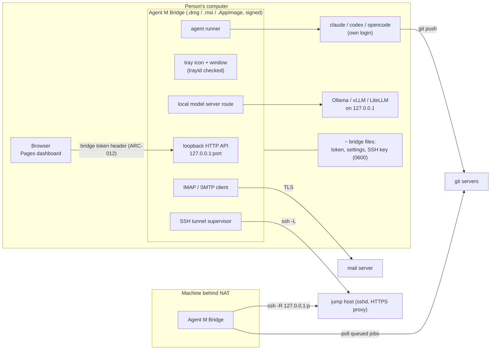

# ARC-011 The Agent M Bridge: Deno, one signed file per platform, tray, window, updater

## Context

The second level of Agent M runs local coding agents with the person's own login, speaks IMAP and
SMTP, calls local model servers and opens SSH tunnels (UC-044). The person may never have used a
terminal. The PO decided: JavaScript, built with Deno from the same modules as the dashboard, signed by
the PO personally (Apple Developer ID with notarisation, Windows code signing). `THE BRIDGE IS ONE FILE
PER PLATFORM` counts "an executable, a disk image or an installer" as the one file; the PO accepted the
Windows `.msi` of `deno desktop` on 2026-09-30.

What the Deno documentation and issue tracker say about the app shell was read on 2026-09-30 and is
recorded in `docs/measurements/2026-09-30_architecture-open-points.md`, point 1; this decision cites it
as *measurement §1*. In short: the tray and the window are documented only for `deno desktop`, which is
experimental in Deno 2.9; two open issues concern the tray on KDE Plasma and on Windows; a tray that
cannot be created fails silently; there is no Windows-on-ARM target.

## Decision

1. **One entry module, the dashboard's modules.** `bridge/main.mjs` imports the core and adapter
   modules the dashboard uses (ARC-003) plus the bridge-only modules (MOD-bridge-server,
   MOD-bridge-tunnel, MOD-bridge-mail, MOD-participant-cli, the local-endpoint route of
   MOD-participant-endpoint) and the job definitions (ARC-007). No second language.
2. **Build: `deno desktop`**, because the tray and the window exist only there (measurement §1: the
   tray page says "`deno desktop` is available starting in Deno v2.9.0"; the word `Tray` occurs 0 times
   on the `deno compile` reference, read 2026-09-30,
   `https://docs.deno.com/runtime/desktop/tray_and_dock.md`,
   `https://docs.deno.com/runtime/reference/cli/compile.md`). One file per platform, as the Distribution
   page lists the outputs (read 2026-09-30, `https://docs.deno.com/runtime/desktop/distribution.md`):
   - **macOS** — a `.dmg`, built on a Mac ("the macOS `.dmg`, which shells out to `hdiutil`"), for
     macOS Intel and macOS arm64;
   - **Windows** — an `.msi`, which "installs the app per-machine under `%ProgramFiles%\<AppName>\`",
     for Windows x86_64 (PO decision 2026-09-30: the installer is the one file);
   - **Linux** — an `.AppImage` ("the most portable Linux format: one file, no install step"), for
     Linux x86_64 and arm64.

   `deno desktop` is **experimental**: "deno desktop is experimental in 2.9." (read 2026-09-30,
   `https://deno.com/blog/v2.9`); the build itself prints "⚠ deno desktop is experimental and subject to
   change" (issue #36780, Deno 2.9.6). The bridge pins the Deno version it is built with, and each Deno
   update is a pull request with the platform start test of ARC-017 on every target.
3. **Signing** of each file by the publisher (ARC-017): the `.dmg` notarised and stapled on macOS, the
   executables and the `.msi` signed with Authenticode on Windows.
4. **App shell — tray icon and window.** `Deno.Tray` (menu-bar extra on macOS, notification area on
   Windows, AppIndicator/KStatusNotifierItem on Linux, per the tray page) and Deno's window. The window
   shows the bridge's own page: pairing token with *Copy*, agents found and how to install missing ones,
   jump host, session port, tunnel state, import of a dashboard export. The tray menu offers *Open*,
   *Pause*, *Quit*. Open pull request #35939 would move the API to `Deno.desktop.Tray`
   (`https://github.com/denoland/deno/pull/35939`, read 2026-09-30); the shell reaches it through one
   function of MOD-bridge-app, so a rename touches one place.
5. **The bridge checks that its tray exists.** The tray page states: "the constructor's underlying
   `trayId` is `0` and subsequent calls are no-ops" when a tray cannot be created — it fails silently.
   After creating the tray, MOD-bridge-app reads `trayId`; when it is `0`, the bridge keeps its window
   open as the only control, writes the reason to its log, and reports *no tray* in `GET /hello`, so the
   dashboard can say so. The known cases (measurement §1, both issues open on 2026-09-30):
   - **KDE Plasma 6 on Wayland** — "`Deno.Tray` appears to be completely non-functional on KDE Plasma 6
     on Wayland" (`https://github.com/denoland/deno/issues/36502`, labels `bug`, `desktop`, Deno 2.9.5);
   - **Windows with the default WebView2 backend** — "The tray icon has **zero click or menu
     interactivity** on Windows" while the host window is hidden; with `--backend cef` it reacts
     (`https://github.com/denoland/deno/issues/36778`). Until it is fixed, the Windows build keeps its
     window open (minimised, not hidden) — see the open measurement below for the choice between that
     and the CEF backend.
6. **Headless mode.** Where no desktop session exists (a lab machine behind NAT, UC-044 6a), the same
   file runs without a window; its settings then come from an imported export file (`THE BRIDGE IS
   CONFIGURED IN ITS WINDOW OR FROM AN EXPORT`), and its state is read on the dashboard through
   `GET /hello` and `GET /tunnels`.
7. **The bridge's own settings** — its port, its pairing token, its jump host, its session port, its
   local model servers — live in the bridge, set in its window or read from a dashboard export, in a
   file readable by its user only (`THE BRIDGE IS PAIRED ONCE`). The port is a setting of the bridge; the
   dashboard learns it at pairing.
8. **Updater.** The bridge reads the release feed of Agent M (ARC-017), offers a newer version with its
   notes, and on the person's click downloads the file for its platform, checks the SHA-256 named in a
   feed signed with the publisher's Ed25519 key (public key compiled into the bridge, verified with Web
   Crypto) and the platform signature, and only then installs it — the new `.msi` on Windows, the `.app`
   from the new `.dmg` on macOS, the new `.AppImage` file on Linux (`THE BRIDGE IS UPDATED ONLY BY THE
   PERSON'S CHOICE`). No background installation.

### Due diligence (read 2026-09-30)

Sources: GitHub API `https://api.github.com/repos/<owner>/<repo>`, its `/releases` and `/license`,
issue search as in ARC-002; npm registry for npm packages; the documentation pages named; for the rows
on `deno desktop`, measurement §1. Agent M's licence is MIT.

| Candidate | Role | Licence | Against MIT | Releases | Issues | Adoption |
|---|---|---|---|---|---|---|
| **Deno** (denoland/deno) — chosen (PO) | runtime and build | MIT (GitHub) | compatible | latest v2.9.7 on 2026-09-17; 44 releases in 12 months; v2.9.0 (first with `deno desktop`) on 2026-06-25 | 1 257 open, 13 865 closed, 2 832 closed in 12 months; label `compile`: 33 open, 156 closed; label `desktop`: 30 open, 48 closed | 108 550 stars |
| **`deno desktop` / `Deno.Tray`** — chosen for the shell and the files | tray, window, `.dmg`/`.msi`/`.AppImage` | part of Deno (MIT) | compatible | since v2.9.0, 2026-06-25; experimental in 2.9 (`https://deno.com/blog/v2.9`); macOS tray from Finder fixed in 2.9.1 (PR #35626); bundle signature fix in 2.9.6 (PR #36574) | open: #36502 (KDE Plasma 6 on Wayland), #36778 (Windows, WebView2, hidden window), #36780 (signing error on `laufey_webview`), PR #36421 (JIT entitlement, signing order), PR #35939 (`Deno.desktop.Tray`) | new; no adoption figure available |
| Node.js single executable applications (nodejs/node) | alternative | `LICENSE` begins "Node.js is licensed for use as follows" with the MIT text; GitHub reports NOASSERTION | compatible | v22.23.3 on 2026-09-23; 59 releases in 12 months; SEA documented as "Stability: 1.1 - Active development" (`https://nodejs.org/api/single-executable-applications.md`) | 601 open, 20 333 closed | 122 200 stars |
| Bun `bun build --compile` (oven-sh/bun) | alternative | `LICENSE.md`: "Bun itself is MIT-licensed", but it "statically links JavaScriptCore (and WebKit) which is LGPL-2 licensed" | **marked — LGPL-2 statically linked, not known to be compatible for redistribution without relinking provisions** | bun-v1.4.2 on 2026-09-05; 18 releases in 12 months; cross-compiles with `--target` (`https://bun.com/docs/bundler/executables.md`) | 3 722 open, 14 745 closed | 96 087 stars |
| webview_deno (webview/webview_deno, JSR `@webview/webview`) | window via FFI | MIT | compatible | 0.9.0 on 2025-01-29; 0 releases in 12 months; JSR package updated 2024-03-03 | 41 open, 0 closed in 12 months | 1 592 stars; JSR: 1 dependent |
| systray2 (felixhao28/node-systray) | tray via a Go helper binary | MIT | compatible | 2.1.4 on 2021-10-14; none in 12 months | 4 open, 12 closed; no activity in 12 months | 124 361 downloads last month; 40 stars |
| Electron (electron/electron) | whole app shell | MIT | compatible | v43.7.7 on 2026-09-30; 100+ releases in 12 months | 566 open, 21 356 closed | 123 341 stars |
| Tauri (tauri-apps/tauri) | whole app shell | `LICENSE-MIT` and `LICENSE-APACHE-2.0` (GitHub reports Apache-2.0) | compatible | tauri-v3.0.0-alpha.3 on 2026-09-26 | 1 302 open, 5 172 closed | 111 504 stars |

## Alternatives

- **`deno compile` executables with no tray** — one executable per target, including Windows on ARM
  ("`aarch64-pc-windows-msvc` (Windows on ARM) is supported starting in Deno 2.9.3", compile reference,
  read 2026-09-30), but without a tray or window: open issue #36778 asks to allow `Deno.Tray` "in
  standalone binaries compiled via `deno compile`", so today it is not offered (measurement §1). It
  would miss `THE BRIDGE RUNS AS AN APP`. Kept as the fallback for Windows on ARM (open point below).
- **Node SEA or Bun** instead of Deno — the PO chose Deno; also: Node's SEA is marked "Active
  development" and needs a separate injection step per platform; Bun links LGPL-2 code statically,
  which the licence table marks.
- **webview_deno plus a Go tray helper** — rejected: no release in twelve months for either, the
  window needs a shared library beside the binary (not one file), and the helper is a second
  executable in another language.
- **Electron or Tauri** — rejected: Electron ships Chromium and Node (about 100 MB+ per the Deno
  comparison page) and is a different runtime from the one the PO chose; Tauri's core is Rust and
  cannot run the dashboard's modules outside its webview (`THE BRIDGE IS BUILT FROM THE DASHBOARD'S
  CODE`).
- **No tray, the window as a page in the default browser** — rejected: `THE BRIDGE RUNS AS AN APP`
  asks for a tray or menu-bar icon; and a page on `127.0.0.1` showing the pairing token could be
  read by any local process that can open that address.
- **Deno's built-in `Deno.autoUpdate()`** (bsdiff patches, Ed25519-signed manifest) — not chosen: it
  polls, applies and stages updates without a click, and "Applying staged updates … currently run on
  macOS and Linux only … Treat Windows auto-update as not yet supported" (read 2026-09-30,
  `https://docs.deno.com/runtime/desktop/auto_update.md`; confirmed in measurement §1 by issue #35269:
  "Auto-updater is unix-only"). Its manifest signing scheme is reused.

## Consequences

- The bridge rests on an experimental build mode. A Deno release can change `deno desktop` or rename
  its API (PR #35939); the pinned Deno version and the platform start test on every target (ARC-017)
  keep such a change from reaching a release unnoticed.
- On KDE Plasma 6 on Wayland, and wherever `trayId` is `0`, the bridge is a window without a tray until
  the issue is fixed — `THE BRIDGE RUNS AS AN APP` is then met only in part, and the dashboard says so.
- **Open point for the PO — Windows on ARM.** `deno desktop` lists "macOS Intel, macOS arm64, Windows
  x86_64, Linux arm64, and Linux x86_64" — no Windows on ARM (Distribution page, measurement §1).
  Whether the x86_64 `.msi` installs and runs on Windows 11 on ARM under emulation is not documented in
  what was read; it is a hands-on measurement. If it does not, the PO decides between offering no bridge
  there and a headless `deno compile` executable for `aarch64-pc-windows-msvc`.
- **Open measurement 1 — tray and window per platform.** Start a `deno desktop` build (Deno 2.9.7) on
  macOS 15, Windows 11, Ubuntu 24.04 with GNOME and KDE Plasma 6 on Wayland; record `tray.trayId`, a
  screenshot, and whether the tray menu reacts with the window minimised and hidden. GNOME is not named
  on the tray page (measurement §1: 0 hits).
- **Open measurement 2 — Windows backend.** For issue #36778: the same test with the default WebView2
  backend and with `--backend cef`; record the file size of each `.msi` and the tray's behaviour. The PO
  chooses between the CEF backend and a window that stays open.
- **Open measurement 3 — the Windows launcher and install rights.** The Distribution page shows
  `MyApp.bat` as the directory build's launcher, the overview page `.\main.exe` (the two pages disagree,
  measurement §1). Build for `x86_64-pc-windows-msvc`, list the output and the files the `.msi`
  installs, and record whether installing the per-machine `.msi` asks for an administrator — the
  non-expert case the bridge is for.
- **Open measurement 4 — tray from `deno compile`.** Only needed if the fallback above is chosen:
  `typeof Deno.Tray` in a `deno compile` binary (Deno 2.9.7); the documentation is silent and issue
  #36778 suggests it is absent.
- The bridge's size is that of the Deno runtime plus the modules; the Deno comparison page names about
  40 MB for a `deno desktop` webview app (not measured here).

*Drafted on 2026-09-30 by Claude (claude-opus-5-5) for the Agent M repository at commit 1605b2dcfe907fb1df6e394af3fdbec80f379dbc; revised on 2026-09-30 by Claude (claude-opus-5-5) against commit 1110607b6dc4d9c888549a23a680fbe4b38dd3f1 — SPEC and use cases as accepted that day, and `docs/measurements/2026-09-30_architecture-open-points.md`; open until accepted.*
