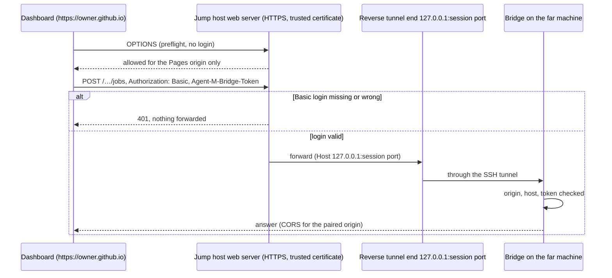

# ARC-012 The bridge's loopback HTTP API

## Context

The dashboard (served from `https://<owner>.github.io`) calls the bridge on the same computer, or on
another computer through a tunnel that ends on that bridge's loopback address. Loopback is not a
permission boundary between programs on one machine (`THE LOCAL BRIDGE REQUIRES A TOKEN`): any web
page the person opens can send requests to `127.0.0.1`. The book's OpenClaw box (ch. 10) is the
cautionary case: a local gateway that "any website a developer visited could silently connect to".

How browsers treat a request from a public HTTPS page to loopback was read from their documentation on
2026-09-30 and is recorded in `docs/measurements/2026-09-30_architecture-open-points.md`, point 3
(*measurement §3*):

- **Local Network Access replaces Private Network Access.** Chrome: "Local Network Access replaces that
  effort, after PNA was put on hold" (`https://developer.chrome.com/blog/local-network-access`); on by
  default "in Chrome 142"; loopback is prompted, not exempt — "triggered when a connection has been made
  to … localhost"; the prompt is shown once and the decision kept; since Chrome 145 loopback has its own
  permission, `loopback-network`; only a secure context may ask for it; "localhost is considered a
  secure origin by the mixed content specification" (Chrome's adoption guide, linked from the blog).
- **Per browser**, from the documentation:

| Browser | `https://…github.io` → `http://127.0.0.1` or `http://localhost` | Source (read 2026-09-30) |
|---|---|---|
| Chrome ≥ 142 | allowed after one Local Network Access prompt; both addresses count as loopback | Chrome blog and adoption guide; mdn/browser-compat-data `http/mixed-content.json` (`allow_loopback_url`, `allow_localhost_url`) |
| Edge ≥ 143 | the same prompt, "start shipping by default in Microsoft Edge 143" | `https://learn.microsoft.com/en-us/deployedge/ms-edge-local-network-access`; compat data `"edge": "mirror"` |
| Firefox ≥ 153 | Local Network Access on by default "or to apps and services on your device"; mixed content from `127.0.0.1` allowed since 55, from `localhost` since 84 | `https://www.firefox.com/en-US/firefox/153.0/releasenotes/`; compat data |
| Safari | **blocked** as mixed content: `allow_loopback_url` safari `"version_added": false`; WebKit bug 171934 ("Don't treat loopback addresses … as mixed content") is open, status NEW | compat data; `https://bugs.webkit.org/show_bug.cgi?id=171934` |

For Safari, and for every browser without a forward on the person's own machine, the SPEC names a
second route: an HTTPS address of the jump host, with a certificate the browsers trust, whose web server
forwards to the end of the bridge's reverse tunnel only after its own login, and answers cross-origin
requests only for the instance's Pages origin (`A BRIDGE CAN BE REACHED OVER HTTPS THROUGH THE JUMP
HOST`, `THE JUMP HOST FORWARDS TO A BRIDGE ONLY AFTER ITS OWN LOGIN`, `THE JUMP HOST ALLOWS CROSS-ORIGIN
REQUESTS ONLY FROM THE INSTANCE`). The web server's `Authorization` header carries its own login, so
"the bridge's token travels in a header of its own".

## Decision

1. **Bind.** The bridge listens on `127.0.0.1` (and `::1`) only; any other configured address is
   refused at start (`THE LOCAL BRIDGE BINDS TO LOOPBACK ONLY`). The port is the bridge's own setting
   (ARC-011).
2. **Plain HTTP with `fetch`, JSON bodies, no WebSockets.** Long-running output (a job's log) is
   read by polling a cursor (`GET /jobs/<id>/log?after=<n>`). WebSockets are not left out of Local
   Network Access any more — they are gated from Chrome 147 and Firefox 154 (measurement §3) —, so the
   reason is simplicity: one request type to measure, to proxy and to authenticate on both routes.
3. **Authentication — the bridge token in a header of its own.** Every request except the CORS
   preflight carries `Agent-M-Bridge-Token: <pairing token>` — on both routes, so the bridge checks one
   header whichever way a request came. The bridge compares it in constant time and answers `401`
   without a body otherwise. `Authorization` is left to the jump host's web server (point 9); the bridge
   ignores it. The token is 256 random bits, kept in a file readable by its user only, replaced by
   *Pair anew*. It never appears in a URL, a log line or an export's clear text.
4. **Origin.** At pairing, the bridge records the origin of the dashboard that paired it. CORS
   answers name exactly that origin (never `*`), allow the methods `GET, POST, DELETE` and the headers
   `agent-m-bridge-token, authorization, content-type`, and send no credentials mode. A request whose
   `Origin` is another web origin is refused before the token is checked.
5. **Host check.** The bridge refuses a request whose `Host` header is not `127.0.0.1:<port>`,
   `localhost:<port>` or `[::1]:<port>` — its own port, or the session port its reverse tunnel serves
   on the jump host, which is what the web server of point 9 names when it forwards to
   `http://127.0.0.1:<session port>/`. This guards against DNS rebinding, which the token alone also
   stops but which costs nothing to check.
6. **Local Network Access.** The dashboard's requests to loopback set `targetAddressSpace: 'loopback'`
   where the browser supports it (Chrome's adoption guide), and the settings page explains the one-time
   prompt before the first pairing (`EVERY STEP EXPLAINS ITSELF`). If a preflight still carries the
   older `Access-Control-Request-Private-Network: true`, the bridge answers
   `Access-Control-Allow-Private-Network: true`; it costs nothing, and PNA is "put on hold".
7. **The mailbox password** reaches the bridge only in the body of a mail request over this API
   (`THE MAILBOX PASSWORD LEAVES THE BROWSER ONLY TO THE BRIDGE`), is kept in memory for that request
   and dropped (MOD-bridge-mail). On the HTTPS route it travels inside TLS to the jump host and then
   through the SSH tunnel; the web server logs no request bodies (point 9).
8. **Endpoints** (MOD-bridge-server): `GET /hello` (version, paired origin, agents, shell mode; the
   pairing test), `GET /agents`, `POST /jobs`, `GET /jobs`, `GET /jobs/<id>`, `GET /jobs/<id>/log`,
   `DELETE /jobs/<id>` (cancel), `GET /endpoint/models`, `POST /endpoint/chat` (local model servers,
   ARC-009), `POST /mail/read`, `POST /mail/find`, `POST /mail/draft`, `POST /mail/send`,
   `GET /tunnels`. The endpoint names are part of the protocol version the bridge reports in `/hello`;
   the dashboard refuses a bridge with an unknown major version.
9. **The route over HTTPS through the jump host.** Which route the dashboard takes is a browser setting
   of the remote session (`THE JUMP HOST AND THE REMOTE SESSIONS ARE SETTINGS`): *loopback* (the bridge
   on this computer, or a forward to `localhost:<port>`) or *HTTPS* (the jump host's HTTPS address and
   web-server login). On the HTTPS route:
   - the dashboard sends `https://<jump host>/<base path>/<session port>/<endpoint>` with
     `Authorization: Basic …` — the web server's login, sent only to that address — and
     `Agent-M-Bridge-Token`;
   - the web server answers the preflight (`OPTIONS`, which carries no login) itself, for the instance's
     Pages origin only, without forwarding it; any other origin gets no `Access-Control-Allow-Origin`;
   - every other request is forwarded to `http://127.0.0.1:<session port>/` — the reverse tunnel's end
     on the jump host's loopback (ARC-013) — only when its Basic login is valid; without it the web
     server answers `401` and forwards nothing;
   - the bridge then applies points 3 to 5 as for any request; its `Access-Control-Allow-Origin` names
     the same Pages origin, and the web server adds no second one;
   - the certificate is one the browsers trust, issued for the jump host's name; behind a self-signed
     certificate "a request made by a page fails without any way to proceed" (SPEC occasion), so the
     settings page names the certificate as a possible cause when the test call fails.

   The web server is the person's own (ARC-013 says how its configuration comes about); Agent M
   operates none (`NO SERVER`).

## Alternatives

- **The bridge token in `Authorization: Bearer` on the loopback route and elsewhere on the HTTPS
  route** — rejected: two ways to authenticate one protocol; the header of its own works on both routes.
- **WebSocket API** — rejected (point 2).
- **Pairing by a one-time code in the URL** (`http://127.0.0.1:port/pair#code`) — rejected by
  `A CREDENTIAL IS NEVER PLACED IN A URL`; the token is copied from the bridge's window instead
  (`THE BRIDGE SHOWS ITS PAIRING TOKEN IN ITS WINDOW`).
- **HTTPS on loopback with a self-signed certificate** — rejected: the person would have to trust a
  certificate by hand on every computer. Its original reason, "the mixed-content exemptions", does not
  hold for Safari (measurement §3); Safari is served by the HTTPS route of point 9 instead, with a
  certificate the browsers already trust.
- **The jump host's web server forwarding the preflight to the bridge** — rejected: the preflight
  carries no login, so the web server would forward an unauthenticated request; answering it itself
  keeps `THE JUMP HOST FORWARDS TO A BRIDGE ONLY AFTER ITS OWN LOGIN` without exception.
- **Native messaging through a browser extension** — rejected: an extension per browser is a second
  thing to install and review for a non-expert.

## Consequences

- In Chrome, Edge and Firefox the loopback route works after one prompt per site, according to their
  documentation; in Safari only the HTTPS route works. The dashboard recognises a blocked call and
  offers the HTTPS route (UC-011 2a, UC-044 4c).
- The HTTPS route needs a jump host with a web server the person controls, a trusted certificate and a
  login; the settings page tests it with one harmless request and names the failing part.
- **Open measurement 1 — reachability per browser, loopback.** From `https://akmaier.github.io` to a
  test server on `http://127.0.0.1:<port>`: whether a `fetch` with the bridge-token header and a JSON
  body succeeds, which prompt appears, and whether it is remembered — Chrome, Edge and Firefox on macOS
  and Windows, and Safari 26 on macOS with its console message (the compatibility data names no Safari
  version). Recorded in `docs/measurements/` before the bridge is released (`BROWSER REACHABILITY IS
  MEASURED, NOT ASSUMED`). `localhost` and `127.0.0.1` behave alike in every source read, so both are
  kept in the measurement only as a check.
- **Open measurement 2 — reachability per browser, HTTPS route.** Through a test web server with a
  trusted certificate, Basic login and a reverse tunnel: the preflight, a request without login (`401`,
  nothing forwarded), a request with login and token (answered by the bridge), and a preflight from
  another origin (refused) — in all four browsers.
- The API is the only way into the bridge; a tunnel or the web server forwards to it and adds nothing
  but the web server's own login.

*Drafted on 2026-09-30 by Claude (claude-opus-5-5) for the Agent M repository at commit 1605b2dcfe907fb1df6e394af3fdbec80f379dbc; revised on 2026-09-30 by Claude (claude-opus-5-5) against commit 1110607b6dc4d9c888549a23a680fbe4b38dd3f1 — SPEC and use cases as accepted that day, and `docs/measurements/2026-09-30_architecture-open-points.md`; open until accepted.*
