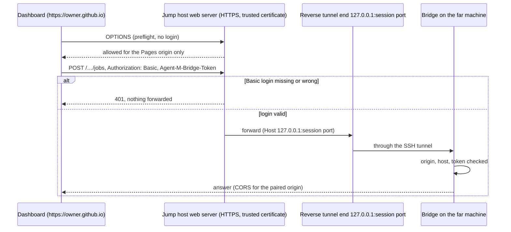

# ARC-013 SSH tunnels in the bridge, and the jump host's HTTPS route

## Context

A bridge behind NAT is reached through a reverse tunnel it opens to a jump host, and the person's
own machine opens a forward to that jump host (`A BRIDGE BEHIND NAT IS REACHED THROUGH A REVERSE
TUNNEL`). With the bridge app, the bridges open and keep these tunnels themselves, with an SSH key
each bridge creates on first use and never lets leave its machine. The core already writes both
commands and checks them (`tunnelCommands`, `tunnelBindProblems`, `nextFreePort` in
`review-core.mjs`): `ssh -N -o ServerAliveInterval=30 -o ServerAliveCountMax=3 -o
ExitOnForwardFailure=yes -R 127.0.0.1:<port>:127.0.0.1:<bridge port> <user>@<jump host>` and the
matching `-L`. The process repository's support cockpit runs the same pattern, restarted by
launchd; measured 2026-08-24: restart after 5 s, tunnel end on the jump host's loopback only
(`SOFTWARE_MAINTENANCE.md` §6.1a).

Instead of the forward, the dashboard may reach the tunnel's end through an HTTPS address of the jump
host (`A BRIDGE CAN BE REACHED OVER HTTPS THROUGH THE JUMP HOST`) — the only route Safari allows, which
blocks a page's call to loopback as mixed content (measurement §3, cited in ARC-012). The SPEC sets three
conditions for it: a certificate the browsers trust, the web server's own login before it forwards
anything (`THE JUMP HOST FORWARDS TO A BRIDGE ONLY AFTER ITS OWN LOGIN`), and cross-origin requests for the
instance's Pages origin only (`THE JUMP HOST ALLOWS CROSS-ORIGIN REQUESTS ONLY FROM THE INSTANCE`). The
web server's `Authorization` header carries its own login, so "the bridge's token travels in a header of
its own" (ARC-012 point 3). The jump host's name, SSH user, port range, HTTPS address and web-server
login, and each session's name, port and bridge token, are browser settings (`THE JUMP HOST AND THE
REMOTE SESSIONS ARE SETTINGS`). This decision holds the whole route; the other files refer here.

Windows 10 and 11 have no OpenSSH client by default, and adding the feature needs an administrator
(read 2026-09-30, `https://learn.microsoft.com/en-us/troubleshoot/windows-server/system-management-components/cant-install-openssh-features`:
"this situation isn't true for older versions of Windows Server or for Windows 11";
`https://learn.microsoft.com/en-us/windows-server/administration/openssh/openssh_install_firstuse`:
"An account that is a member of the built-in Administrators group."; recorded in
`docs/measurements/2026-09-30_architecture-open-points.md`, point 4). The PO decided on 2026-09-30 that
the Windows bridge ships its own OpenSSH client, Microsoft's Win32-OpenSSH.

## Decision

1. **The bridge runs an OpenSSH `ssh` client** as a child process, with exactly the argument list
   `MOD-bridge-tunnel.tunnelCommands` produces and `tunnelBindProblems` accepts — one definition for
   the dashboard's displayed command and the bridge's executed one. Arguments are passed as an array,
   never through a shell. Which binary runs is decided in one place, `MOD-bridge-tunnel.sshClient`:
   - **macOS and Linux** — the system's `ssh` and `ssh-keygen`;
   - **Windows** — `ssh.exe` and `ssh-keygen.exe` of **Win32-OpenSSH**, shipped inside the bridge's
     `.msi` beside the `libcrypto.dll` they load (the release's `OpenSSH-Win64.zip` holds `ssh.exe`,
     `ssh-keygen.exe`, `libcrypto.dll`, `LICENSE.txt` and `NOTICE.txt`, listed 2026-09-30 from
     `https://github.com/PowerShell/Win32-OpenSSH/releases/download/10.0.0.0p2-Preview/OpenSSH-Win64.zip`),
     with its `LICENSE.txt` and `NOTICE.txt` installed beside them. The bridge never uses a
     Windows-feature `ssh.exe` that may or may not be on the path, so every Windows bridge runs the
     version it was tested with.
2. **Own key.** On first use the bridge runs `ssh-keygen -t ed25519 -N "" -f <bridge dir>/id_ed25519`
   and sets the private key's mode to owner-only (on Windows, an ACL for the user only); it shows the
   public key with *Copy* and one sentence of what to do with it. The private key is never read into the
   dashboard, an export, or a log. The command also sets `-i <that file>` and `-o IdentitiesOnly=yes`,
   so the person's other keys are not offered to the jump host.
3. **Host key.** The first connection shows the jump host's key fingerprint in the bridge window and
   stores it in the bridge's own `known_hosts` (`-o UserKnownHostsFile=<bridge dir>/known_hosts
   -o StrictHostKeyChecking=yes` after the first acceptance); the person accepts once.
4. **Supervision.** The bridge restarts `ssh` with backoff when it exits, after sleep or a network
   change, and shows *tunnel open* or the last error from `ssh`'s stderr in its window and in `GET
   /tunnels`.
5. **The route over HTTPS through the jump host.** Which route the dashboard takes is a browser setting
   of the remote session (`THE JUMP HOST AND THE REMOTE SESSIONS ARE SETTINGS`): *loopback* (the bridge
   on this computer, or a forward to `localhost:<port>`) or *HTTPS* (the jump host's HTTPS address and
   web-server login). On the HTTPS route:
   - the dashboard sends `https://<jump host>/<base path>/<session port>/<endpoint>` with
     `Authorization: Basic …` — the web server's login, sent only to that address — and
     `Agent-M-Bridge-Token`;
   - the web server answers the preflight (`OPTIONS`, which carries no login) itself, for the instance's
     Pages origin only, without forwarding it; any other origin gets no `Access-Control-Allow-Origin`
     (`THE JUMP HOST ALLOWS CROSS-ORIGIN REQUESTS ONLY FROM THE INSTANCE`);
   - every other request is forwarded to `http://127.0.0.1:<session port>/` — the reverse tunnel's end
     on the jump host's loopback — only when its Basic login is valid; without it the web server answers
     `401` and forwards nothing (`THE JUMP HOST FORWARDS TO A BRIDGE ONLY AFTER ITS OWN LOGIN`);
   - the bridge then applies its token, origin and host checks as for any request (ARC-012 points 3–5);
     its `Access-Control-Allow-Origin` names the same Pages origin, and the web server adds no second one;
   - the certificate is one the browsers trust, issued for the jump host's name — for example Let's
     Encrypt, or the institution's own; behind a self-signed certificate "a request made by a page fails
     without any way to proceed" (SPEC occasion), so the settings page names the certificate as a
     possible cause when the test call fails.

   The web server is the person's own; Agent M operates none (`NO SERVER`). The pattern is the support
   cockpit's (`SOFTWARE_MAINTENANCE.md` §6.1a: `ProxyPass` to the tunnel end, `AuthUserFile`,
   `Require valid-user`, password hashed with `htpasswd -B`); the process repository keeps its Apache
   block as `config/apache-support-location.conf`. The mailbox password travels on this route inside TLS
   to the jump host and then through the SSH tunnel; the web server logs no request bodies.

6. **Proposed: the dashboard writes that configuration.** As it writes the tunnel commands (`THE
   DASHBOARD WRITES THE TUNNEL COMMANDS`), the settings page shows, filled in from the settings, the
   web-server block for all remote sessions of a jump host — one `<Location>` block per session for
   Apache and one `location` block for nginx — with the Pages origin, the session ports, the path of
   the password file and the `htpasswd -B` command to create the login on the jump host. It never
   contains the password or its hash: the person runs `htpasswd` there, and only the login name and
   password are kept in the browser. Generated by `MOD-bridge-tunnel.webServerConfig`, it is checked by
   the same kind of test as the tunnel commands: every block authenticates before it proxies, answers
   the preflight for the Pages origin only, and proxies to `127.0.0.1` only. This is a design choice,
   not a SPEC requirement; the alternatives are below, and the PO decides at acceptance of this file.

### Due diligence (read 2026-09-30)

Sources: GitHub API `https://api.github.com/repos/PowerShell/Win32-OpenSSH` (repository, `/releases`,
`/releases/latest` with asset download counts), issue search
`https://api.github.com/search/issues?q=repo:PowerShell/Win32-OpenSSH+is:issue+is:open` (and `is:closed`,
`closed:>=2025-09-30`, `created:>=2025-09-30`); the licence file
`https://api.github.com/repos/PowerShell/openssh-portable/contents/LICENCE` and the `LICENSE.txt` and
`NOTICE.txt` inside `OpenSSH-Win64.zip` of release 10.0.0.0p2-Preview; the README
`https://github.com/PowerShell/Win32-OpenSSH`; for PuTTY, `https://www.chiark.greenend.org.uk/~sgtatham/putty/licence.html`,
`…/putty/latest.html`, `…/putty/changes.html` and the 0.85 manual
`https://the.earth.li/~sgtatham/putty/0.85/htmldoc/Chapter7.html` and `…/Chapter8.html`. All read
2026-09-30. Agent M's licence is MIT.

| Candidate | Licence | Against MIT | Releases | Issues | Adoption / availability |
|---|---|---|---|---|---|
| **Win32-OpenSSH** (PowerShell/Win32-OpenSSH; source in PowerShell/openssh-portable) — chosen for Windows (PO) | OpenSSH's `LICENCE`: "all components are under a BSD licence, or a licence more free than that. OpenSSH contains no GPL code."; the release's `NOTICE.txt` adds LibreSSL ("New additions are ISC licensed"; OpenSSL code "under the terms of the original OpenSSL licenses", i.e. the OpenSSL and SSLeay licences), zlib, libfido2 (BSD-2-Clause) and libcbor (MIT). GitHub reports no licence for the release repository and NOASSERTION for openssh-portable | **compatible for redistribution**: every licence named permits redistribution in binary form on conditions — reproduce the copyright notices and licence texts in the documentation or other materials (BSD clause 2, OpenSSL/SSLeay), and, under the OpenSSL and SSLeay licences, the acknowledgement "This product includes software developed by the OpenSSL Project…" in advertising materials that mention its features; zlib: an altered version must be marked. Shipping `ssh.exe` unaltered inside the `.msi` with `LICENSE.txt` and `NOTICE.txt` beside it meets these; none imposes a condition on Agent M's own licence. | 17 releases listed in the README from 7.7.2.0 (2018-07-26) to 10.0.0.0 (2025-10-27); latest `10.0.0.0p2-Preview` on 2025-10-27, whose notes say "**This is a preview-release (non-production ready)**"; the one before, v9.8.3.0p2-Preview, on 2025-04-18; the last *Beta* v9.5.0.0p1 on 2023-12-18; builds as `.zip` for x64, x86, ARM64 and ARM, and as `.msi` for x64, x86 and ARM64 | 407 open, 1 846 closed; 32 closed and 58 opened since 2025-09-30 | 8 293 stars, 820 forks; downloads of the latest release: `OpenSSH-Win64.zip` 402 777, `OpenSSH-Win64-v10.0.0.0.msi` 278 029, `OpenSSH-ARM64.zip` 31 787 |
| OpenSSH client of the system (openssh/openssh-portable) — chosen for macOS and Linux (invoked, not redistributed) | `LICENCE` as above | compatible; not redistributed | 10.5 on 2026-08-11, 10.4 on 2026-07-06, 10.3 on 2026-04-02, 10.2 on 2025-10-10, 10.1 on 2025-10-06 (`https://www.openssh.com/releasenotes.html`) | the portable repository takes no issues on GitHub (0 open, 0 closed via search); bugs go to the project's bugzilla (not read) | part of macOS and of common Linux distributions (not measured per distribution) |
| PuTTY `plink` — rejected | MIT: "The PuTTY executables and source code are distributed under the MIT licence" | compatible | latest 0.85 on 2026-08-16; the one before on 2026-05-22; then 2025-02-08 (changes page) | no public issue tracker; a wishlist page | Windows installers also offered in the Microsoft Store (latest page) |
| ssh2 (mscdex/ssh2), pure-JS SSH, through Deno's npm compatibility | MIT (`LICENSE`; npm field empty) | compatible | 1.17.0 on 2025-08-20; no version in 12 months | 61 open, 1 281 closed, 12 closed in 12 months | 48 068 287 downloads last month; 5 825 stars; one maintainer |
| node-ssh (steelbrain/node-ssh), wrapper over ssh2 | MIT | compatible | 13.2.1 on 2025-03-20; none in 12 months | — | 1 559 769 downloads last month |

## Alternatives

- **Guide the person to add Windows's OpenSSH feature** (the earlier decision 5) — rejected by the
  PO: the feature is absent by default on Windows 10 and 11 and adding it needs an administrator, which
  is exactly the step a non-expert cannot take.
- **PuTTY's `plink`** — rejected: its manual documents `-R [listen-IP:]listen-port:host:port`, `-N` and
  `-batch`, so it could hold the tunnel, but "SSH-2 private keys have no standard format. OpenSSH and
  ssh.com have different formats, and PuTTY's is different again" (Chapter 8) — the bridge's key would
  be a `.ppk` on Windows and an OpenSSH key elsewhere, made by `puttygen` instead of `ssh-keygen`, and
  `tunnelCommands` would have to write a second command dialect. The commands the dashboard shows would
  no longer be the commands Windows runs.
- **ssh2 inside the bridge** — not chosen: it would make the bridge independent of any client binary,
  but it has had no release in twelve months, one maintainer, and it depends on Node's `crypto` and
  `net` as implemented by Deno's compatibility layer — unmeasured. The shown commands would again not
  be the executed ones.
- **Deno's own TCP plus a hand-written SSH client** — rejected: implementing a security protocol is
  exactly what not to do.
- **A VPN or an overlay network (WireGuard, Tailscale)** — rejected: another service and account;
  SSH to a host the person already controls is what the SPEC names.
- **For the web-server configuration (decision 6):** (a) the dashboard writes it — proposed; (b) a
  documented template the person fills in by hand — fewer lines of Agent M, but the same mistakes the
  tunnel commands are generated to avoid (a proxy without login, a preflight forwarded, `*` as origin);
  (c) nothing from Agent M, the jump host's administrator configures it from the SPEC's rules — fits an
  institution with its own web team, and remains possible alongside (a) because the generated block is
  only shown, never applied; (d) the bridge terminating HTTPS itself with a certificate — rejected: the
  bridge binds to loopback only, and the certificate belongs to the jump host's name, which the bridge
  does not own.
- **The jump host's web server forwarding the preflight to the bridge** — rejected: the preflight
  carries no login, so the web server would forward an unauthenticated request; answering it itself
  keeps `THE JUMP HOST FORWARDS TO A BRIDGE ONLY AFTER ITS OWN LOGIN` without exception.

## Consequences

- The HTTPS route needs a jump host with a web server the person controls, a trusted certificate and a
  login; the settings page tests it with one harmless request and names the failing part.

- Windows needs no administrator step for tunnels beyond whatever installing the bridge's `.msi` itself
  requires (ARC-011, open measurement 3).
- The Windows bridge carries a third-party security component: every Win32-OpenSSH release is a bridge
  update, taken by a pull request that replaces the files, their `LICENSE.txt` and `NOTICE.txt`, and the
  version recorded in the release notes. The latest release is labelled "preview-release
  (non-production ready)" by its publisher; the PO accepted Win32-OpenSSH knowing the label, and it is
  named in the bridge's release notes.
- The licence notices of Win32-OpenSSH and its components are reproduced in the bridge's *About*
  window and in its release notes, as the BSD and OpenSSL licences ask for binary redistribution.
- **Open measurement 1 — Win32-OpenSSH from the bridge's folder.** Install the bridge `.msi` with
  `ssh.exe`, `ssh-keygen.exe` and `libcrypto.dll` on a fresh Windows 11 without the OpenSSH feature;
  record whether `ssh-keygen` creates the key with an owner-only ACL, whether `ssh -N -R …` holds the
  tunnel, and whether a Windows-feature `ssh.exe` on the path interferes. How `deno desktop` places
  extra executables into its `.msi` is not described on the pages read and is part of this measurement.
- **Open measurement 2 — reachability per browser, HTTPS route.** Through a test web server with a
  trusted certificate, Basic login and a reverse tunnel: the preflight, a request without login (`401`,
  nothing forwarded), a request with login and token (answered by the bridge), and a preflight from
  another origin (refused) — in all four browsers (`BROWSER REACHABILITY IS MEASURED, NOT ASSUMED`).
- **Open measurement 3 — the generated web-server block.** Apply it to a test Apache and a test nginx
  with a Let's Encrypt certificate and a reverse tunnel; run open measurement 2 against it.
- The jump host keeps `GatewayPorts no` (its default); the bridge never passes `-g` or a non-loopback
  bind address, which `tunnelBindProblems` already refuses.
- The core's tunnel functions move from `review-core.mjs` to MOD-bridge-tunnel; the settings page
  keeps showing the commands for machines without a bridge (`THE DASHBOARD WRITES THE TUNNEL
  COMMANDS`).

*Drafted on 2026-09-30 by Claude (claude-opus-5-5) for the Agent M repository at commit 1605b2dcfe907fb1df6e394af3fdbec80f379dbc; revised on 2026-09-30 by Claude (claude-opus-5-5) against commit 1110607b6dc4d9c888549a23a680fbe4b38dd3f1 — SPEC and use cases as accepted that day, and `docs/measurements/2026-09-30_architecture-open-points.md`; revised on 2026-10-01 by Claude (claude-opus-5-5) against commit d0e5631081876203e719a2508d673d904e7768db — the leaner architecture of the architecture review, as the PO approved it (UC-023): the whole HTTPS route through the jump host, including ARC-012's former decision 9, its diagram and its measurement; open until accepted.*
