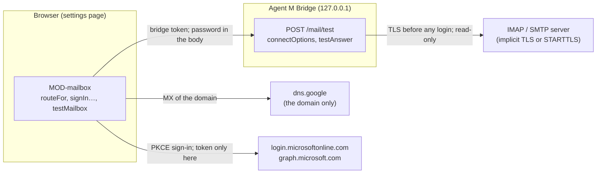

# ARC-014 Two mail routes behind one mailbox module

## Context

Reports arrive by mail. Browsers let no page open IMAP or SMTP. The SPEC settles the routes: "The dashboard reaches a Microsoft 365 mailbox directly through Microsoft Graph, and any other mailbox — Gmail included — through the local bridge over IMAP and SMTP" (`A MAILBOX IS REACHED THROUGH ITS PROVIDER'S WEB API OR THROUGH THE BRIDGE`). What Microsoft, Google and the maintainers of the mail libraries document is recorded in `docs/measurements/2026-09-30_architecture-open-points.md`, points 5 and 6, cited here as *measurement point 5* and *point 6*; Gmail is on the IMAP route because every Gmail read scope is restricted and needs Google's verification for a public app, and a browser-only app gets no refresh token (measurement point 6).

What the routes rest on, as their documentation states it:

- **Microsoft's sign-in.** The authorization-code flow with PKCE for a single-page application: the authorization address `https://login.microsoftonline.com/{tenant}/oauth2/v2.0/authorize`, whose `{tenant}` takes "common, organizations, consumers, and tenant identifiers"; the code challenge "required by the Microsoft identity platform for single page apps"; the code redeemed by a `POST` to `…/oauth2/v2.0/token` with `Content-Type: application/x-www-form-urlencoded`; an answer of `access_token`, `token_type`, `expires_in`, `scope` — "Optional … if omitted, the token is for the scopes requested" — and a `refresh_token` "Only provided if offline_access scope was requested"; a declined sign-in returned as `error=access_denied`; "Single page apps get a token with a 24-hour lifetime", and "For refresh tokens sent to a redirect URI registered as spa, the refresh token expires after 24 hours" (`https://learn.microsoft.com/en-us/entra/identity-platform/v2-oauth2-auth-code-flow`). PKCE: "code-verifier = 43*128unreserved", "code_challenge = BASE64URL-ENCODE(SHA256(ASCII(code_verifier)))" (`https://www.rfc-editor.org/rfc/rfc7636.txt`).
- **Microsoft Graph's folders.** "Well-known names work regardless of the locale of the user's mailbox" — among them `inbox`, `drafts` and `sentitems` —; a folder's `totalItemCount` is "The number of items in the mailFolder" (`https://learn.microsoft.com/en-us/graph/api/resources/mailfolder?view=graph-rest-1.0`); `GET /me/mailFolders` returns "only the child folders of the root folder", ten to a page with `@odata.nextLink` for the next (`https://learn.microsoft.com/en-us/graph/api/user-list-mailfolders?view=graph-rest-1.0`), and a folder's own with `GET /me/mailFolders/{id}/childFolders` (`https://learn.microsoft.com/en-us/graph/api/mailfolder-list-childfolders?view=graph-rest-1.0`).
- **Whose mail servers a domain has.** A Microsoft 365 domain's "Target email server: <MX token>.mail.protection.outlook.com" (`https://learn.microsoft.com/en-us/microsoft-365/enterprise/external-domain-name-system-records`), or with DNSSEC a "Mail Exchanger ending in mx.microsoft", for example `contosotest-com.o-v1.mx.microsoft` (`https://learn.microsoft.com/en-us/purview/how-smtp-dane-works`). "The Google Workspace MX record value is smtp.google.com"; older ones "start with "aspmx"" (`https://support.google.com/a/answer/174125`). Google's DNS-over-HTTPS service answers `https://dns.google/resolve?name=<domain>&type=MX` in JSON (`https://developers.google.com/speed/public-dns/docs/doh/json`), with `access-control-allow-origin: *`, and gives gmail.com's mail servers under `gmail-smtp-in.l.google.com` — both measured with a request of origin `https://alice.github.io`.
- **Gmail's servers.** "Incoming connections to the IMAP server at imap.gmail.com:993 … require SSL"; for `smtp.gmail.com`, "use port 465 (for SSL) or port 587 (for TLS)" (`https://developers.google.com/workspace/gmail/imap/imap-smtp`). An app password "can only be used with accounts that have 2-Step Verification turned on", and may not be offered where "You're logged into a work, school, or another organization account" (`https://support.google.com/accounts/answer/185833`).
- **TLS for mail.** Connections should "be made using "Implicit TLS"", on port 993 for IMAP and 465 for submission, in preference to STARTTLS on 587 (`https://www.rfc-editor.org/rfc/rfc8314.txt`); IMAP is served on "port 143 (cleartext port) or port 993 (Implicit TLS port)", and "An IMAP client MUST NOT issue the LOGIN command if the server advertises the LOGINDISABLED capability" (`https://www.rfc-editor.org/rfc/rfc9051.txt`); the folders a mailbox marks `\Drafts` and `\Sent` are its drafts and sent mail (`https://www.rfc-editor.org/rfc/rfc6154.txt`).
- **The libraries in the bridge.** imapflow: `secure` "establishes the connection directly over TLS"; `doSTARTTLS: true` "requires STARTTLS upgrade (fails if not supported)" and "Cannot be combined with secure: true"; `mailboxOpen(path, { readOnly: true })` "uses IMAP EXAMINE instead of SELECT", the open folder's count is its `exists`, and `list()` gives each folder's `specialUse` (`https://imapflow.com/docs/api/imapflow-client`). nodemailer: with `requireTLS`, "If the server does not support STARTTLS, sending fails with an error"; `transporter.verify()` "attempts to connect to the server and authenticate without sending any message" (`https://nodemailer.com/smtp`).
- **Registering an app.** "Sign in to the Microsoft Entra admin center as at least an Application Developer", then "Browse to Entra ID > App registrations and select New registration" (`https://learn.microsoft.com/en-us/entra/identity-platform/quickstart-register-app`); the admin center is `https://entra.microsoft.com`.
- **Withdrawing an app's access.** In Microsoft's My Apps portal, `https://myapps.microsoft.com`, "Permissions consented to by the user can be revoked by the user" (`https://learn.microsoft.com/en-us/entra/identity/enterprise-apps/myapps-overview`).

## Decision

1. **One mailbox module, two routes** (`MOD-mailbox`). The browser's side reaches Microsoft Graph and Microsoft's sign-in through the fetch port, and the bridge through the generic bridge client (`MOD-bridge-server.callBridge`, ARC-012); the bridge's side gives the options its mail libraries connect with and the answer of a test. The module keeps no store: the connection — its route, its folders, its sign-in or its servers, account and password — is kept by the settings store (`MOD-settings-store.storeMailbox`, ARC-005) and passed in.
2. **The route, preselected** (`MOD-mailbox.mxOf`, `MOD-mailbox.routeFor`, `MOD-mailbox.securityFor`). From the address's domain the page asks Google's DNS service for its mail servers and preselects the web API where one is Microsoft 365's, IMAP through the bridge for every other domain — with Gmail's servers filled in where the domain is Gmail's or its mail servers are Google's —, `INBOX` as the folder read and the address as the account. Before asking, the page says: *"To recognise your provider, Agent M asks Google's public DNS service which servers receive mail for `<domain>`; only the domain is sent."* (`THE PAGE STATES WHAT IT SENDS WHERE`). Where the service does not answer, the route is preselected by the domain alone. The author can change each. The folders read are preset to `INBOX`; the author adds the folders into which reported mails are filed (UC-037 5), which the page holds with the form until **Store and test** keeps them with the connection (decision 5); *Drafts* and *Sent* are not named — the test finds them by the mailbox's own markings. A server's encryption is preset by its port: implicit TLS on 993 and 465, STARTTLS on 143 and 587.
3. **The web-API route: the app registration and the sign-in** (`MOD-mailbox.redirectFor`, `MOD-mailbox.mailScopes`, `MOD-mailbox.signInStart`, `MOD-mailbox.signInFinish`, `MOD-mailbox.signInRenew`). The page opens the Microsoft Entra admin center, `https://entra.microsoft.com`, where an app is registered under *Entra ID > App registrations > New registration*, and shows what to enter there: the name `Agent M`, the kind *single-page application*, and the return address — the site's directory of the settings page (`MOD-mailbox.redirectFor`) — with **Copy**; a folded explanation says that registering needs at least the role *Application Developer*, which an institution may give only to its administrators, and to ask them for a single-page application with this return address and the three permissions (UC-037 2a); the IMAP route is offered meanwhile where the provider has one. Before Microsoft's window opens, the page names the permissions it asks for and nothing else: *`Mail.ReadWrite` — read mail and create drafts; Microsoft offers no narrower permission for drafts, and it would also allow changing and deleting mail, which Agent M never does. `Mail.Send` — send the replies you release. `offline_access` — stay signed in for a day.* The sign-in runs in a window of its own: the authorization address with PKCE, the tenant `common`, the response in the query; the page takes the address the window returns to on the instance's origin, redeems the code at the token endpoint, and stores the sign-in through the settings store (`MOD-settings-store.storeMailbox`). A declined sign-in, another state and a permission not granted are named (UC-037 3a): *"The sign-in did not grant `<permission>`; without it Agent M cannot `<read mail and create drafts | send replies | stay signed in>`."* The access token goes only to `https://graph.microsoft.com`, the refresh token only to Microsoft's token endpoint (`THE MAIL SIGN-IN TOKEN GOES ONLY TO ITS PROVIDER`), neither in an address (`A CREDENTIAL IS NEVER PLACED IN A URL`). Where the access token has expired, the page renews it with the refresh token before a request; where Microsoft no longer takes that, the page asks for the sign-in again in Microsoft's window (UC-037 3b).
4. **The IMAP route: the servers, the password and its notice** (`MOD-mailbox.routeFor`, `MOD-mailbox.securityFor`). The page presets the servers and their encryption, and the account as the address. For Gmail a folded explanation says: *"Gmail accepts an app password here, not your account password. An app password needs 2-Step Verification; work, school and other organisations' accounts may not offer it — then the organisation's administrator decides."*, with a link to `https://support.google.com/accounts/answer/185833`. Before the password field is enabled, the page shows: *"The password is stored in this browser. Every GitHub Pages site under `<owner>.github.io` can read it — here: the sites of `<owner>`. With it, anyone can read all mail in this mailbox and send mail in its name. It goes to no server except your bridge on this machine. Recommended: run this instance under a GitHub owner you use for nothing else."* The field is enabled only once the author ticks **I have read this**; without a password the settings store keeps no connection of this route (`THE MAILBOX PASSWORD IS STORED ONLY AFTER ITS OWN DISCLOSURE`). Nothing of this route is stored while the author fills in the form: the servers, the account, the password, the folders and the places are stored together with **Store and test**, one click (decision 5; `ONE CLICK PER DECISION`).
5. **The test, changing nothing** (`MOD-mailbox.testMailbox`; `MOD-settings-page.testSetting`, ARC-026). **Store and test** stores the connection (`MOD-settings-store.storeMailbox`) and tests reading and sending as two parts, each outcome — works, refused or untested — recorded with the connection (`MOD-settings-store.recordTest`) and written at once (`MOD-settings-store.saveEntries`):
   - **On the web API**, each named folder — `INBOX` by its well-known name, any other by its display name, a path `A/B` folder by folder — is read with its count, and the folders `drafts` and `sentitems` are found by their well-known names, all with `GET` and the sign-in's token; sending is not tried without a mail, and the part stays untested.
   - **On the IMAP route**, one request goes to the bridge, `POST /mail/test` (ARC-012) with the bridge token, the part, both servers, the account, the folders and the password in its body — the password's only way out of the browser (`THE MAILBOX PASSWORD LEAVES THE BROWSER ONLY TO THE BRIDGE`). The bridge's handler connects its libraries with the options of `MOD-mailbox.connectOptions` — implicit TLS, or a STARTTLS upgrade required before any login (`THE MAIL SERVER IS REACHED ONLY OVER TLS`) —; for reading, imapflow logs in, opens each named folder read-only and reads its `exists`, and finds the folders whose `specialUse` is `\Drafts` and `\Sent`; for sending, nodemailer's `verify()` logs in and sends nothing. Its shell classifies a failure — no answer, no encryption offered, the login refused, another error — and `MOD-mailbox.testAnswer` gives the answer. The password lives in a variable of that request and is dropped with it; the bridge logs the request's name and outcome only (`THE BRIDGE HOLDS THE MAILBOX PASSWORD ONLY FOR ONE REQUEST`).
   - Each part shows ✓ or the reason, the count of each named folder, Drafts and Sent where found, the route and the encryption. A server without encryption is named, and the bridge sent no login to it (UC-037 7b); a refused login shows the server's words and the hint of an app password where two-factor login is on (7c); reading and sending are shown apart (7d). A bridge that does not answer, or none paired, leaves both parts untested and the connection stored, shown as untested; the page names the reason the bridge client gave — not running, a wrong address, the bridge token missing or refused — and links the bridge's pairing (UC-011) (7a).
6. **Shown, and disconnected** (UC-037 8, 8a). The connected mailbox is shown with its route, its folders, its allowed places each with its statement, and **Disconnect**, from the connection as the settings store reads it (`MOD-settings-store.readSettings`). **Disconnect** is pressed on that line; after one confirmation, the page removes the connection — its password or its sign-in included — through the settings store (`MOD-settings-store.clearSetting`), reads the entries again and shows the mailbox as not connected, and says that nothing is stored; on the web-API route it links Microsoft's My Apps portal, `https://myapps.microsoft.com`, where the person revokes the permissions they granted. Issues and their mail identifiers are not touched.

7. **Where a mailbox's mails may go** (`MOD-mailbox.declaredPlaces`, `MOD-mailbox.placesNotice`, `MOD-mailbox.allowPlaces`; `MOD-settings-store.storePlaces`, ARC-005). The page lists the processing places the instance's participants declare (`A PARTICIPANT DECLARES WHERE IT PROCESSES DATA`), read with the participant register (`MOD-settings-page.readConfig`, ARC-026), and the author ticks those to which this mailbox's mails may go; none is preset, and until one is ticked the mails are only read, never handed to a participant. For each ticked place the author states whether it lies inside the European Union — *inside*, *outside* or *not known*, preset to *not known*. Agent M judges no place by its name and keeps no list of countries. A place stated outside, or not known to lie inside, counts as outside: before saving, the page names those places and states:
   *"Outside the European Union, as you stated: `<places>`. Not known to lie inside it: `<places>`. Processing personal data there does not comply with the EU's rules — the GDPR for transferring personal data, and the EU AI Act. You can still allow it; this connection records that you did."*
   — each of its first two sentences only where it names a place —, and it saves only from that notice's **Allow and save** (`A PLACE OUTSIDE THE EU IS NAMED AS NOT COMPLIANT`). Each allowed place is kept with its statement in the connection, which records that the author allowed it. A change later (UC-037 6a) shows the same list, statements and notice, replaces the places, and keeps the connection's tests (`MOD-settings-store.storePlaces`); a mail already handed to a participant is not recalled. A place no participant declares any more is no longer listed and leaves the connection when the places are saved again. Who receives a mailbox's mail is decided by the one rule of ARC-007 (`MOD-job-harness.mayReceive`), given the mailbox's allowed places as the places of its mails' content label (`THE PLACES A MAILBOX'S MAIL MAY GO ARE CONFIGURED`); the label is set where mails are handed to a job, with the pipeline from mail to issue (below).



### Due diligence (read 2026-09-30)

Sources as in ARC-002. Licence texts read from `https://api.github.com/repos/<repo>/license`. The maintainers' statements on Deno are those of measurement point 5. The JSR packages were read from `https://api.jsr.io/scopes/<scope>/packages/<name>` and `…/versions`.

| Candidate | Role | Licence | Against MIT | Releases | Issues | Adoption |
|---|---|---|---|---|---|---|
| **imapflow** (postalsys/imapflow) — chosen, subject to open measurement 1 | IMAP | npm field `MIT`; `LICENSE.txt` is the MIT grant without the notice condition (MIT-0 wording); GitHub reports NOASSERTION | compatible | first 2019-12-19, latest 2.1.2 on 2026-09-28, 70 versions in 12 months | 1 open, 211 closed, 16 closed in 12 months; on Deno, its maintainer: "Deno and Bun are not supported. It might work but probably does not." (issue #230), "All my email modules are Node only." (issue #329), and "Deno and edge runtimes are not in the test matrix" (issue #401) | 12 680 287 downloads last month; 570 stars |
| **nodemailer** (nodemailer/nodemailer) — chosen, subject to open measurement 1 | SMTP | npm field `MIT-0`; `LICENSE` is the MIT-0 wording | compatible | first 2011-01-21, latest 10.0.13 on 2026-09-30, 41 versions in 12 months | 0 open, 1 508 closed, 27 closed in 12 months; on Deno: "There are no plans to migrate or change anything in this regard." (issue #1331); STARTTLS on 587 failed under Deno 2.0.4 and was fixed ("This is fixed on canary.", denoland/deno#26735) | 93 411 804; 17 683 stars |
| `@workingdevshero/deno-imap` (JSR; workingdevshero/deno-imap) — fallback candidate for IMAP | IMAP, written for Deno | MIT (GitHub) | compatible | 1.0.0 on 2025-03-22, 5 versions, none in 12 months; JSR `runtimeCompat`: Deno yes, Node no | 3 open, 2 closed | 12 stars; JSR: 1 dependent |
| `@upyo/smtp` (JSR; dahlia/upyo) — fallback candidate for SMTP | SMTP transport | MIT (GitHub) | compatible | latest 0.6.0; 166 versions on JSR, the newest on 2026-09-09; JSR `runtimeCompat`: Deno, Node and Bun | 1 open, 47 closed (whole repository) | 585 stars; JSR: 2 dependents |
| emailjs-imap-client (emailjs/emailjs-imap-client) | IMAP | MIT | compatible | latest 3.1.0 on 2020-02-14; none in 12 months | 29 open, 0 closed in 12 months | 26 378 |
| imap (mscdex/node-imap) | IMAP | GitHub MIT; npm field empty | compatible | latest 0.8.19 on 2016-12-06 | 165 open; 0 closed in 12 months | 2 195 723 |
| @azure/msal-browser (AzureAD/microsoft-authentication-library-for-js) | Microsoft sign-in | MIT | compatible | latest 5.23.0 on 2026-09-23, 48 versions in 12 months | 149 open, 3 769 closed (whole repository) | 75 085 855 |
| oauth4webapi (panva/oauth4webapi) | OAuth helper | MIT | compatible | latest 3.8.8 on 2026-09-05, 6 versions in 12 months | 0 open, 31 closed | 54 768 923 |

## Alternatives

- **All mail through the bridge** — rejected: Microsoft 365 users would need the bridge although Graph allows the browser (`AGENT M WORKS WITHOUT A LOCAL INSTALLATION`).
- **Gmail through the Gmail API from the browser** — rejected: the hand-written implicit flow is "strongly discouraged due to security vulnerabilities", Google's library would load code at run time from a third origin into the page that holds every token, and the read scopes are restricted (measurement point 6).
- **msal-browser** — not chosen: it keeps its own token cache in browser storage beside the settings store (ARC-003), and the PKCE exchange it wraps is a few Web Crypto calls. **oauth4webapi** is the fallback if the hand-written exchange proves fragile; it is small and has no open issue.
- **Recognising Microsoft 365 by the address's domain alone** — rejected: an organisation's own domain says nothing of where its mail is served; its mail servers do.
- **Cloudflare's DNS-over-HTTPS JSON service** instead of Google's — equivalent: it follows "the same schema as Google's DNS over HTTPS resolver" and also answers `access-control-allow-origin: *` (measured), but asks for the header `accept: application/dns-json` (`https://developers.cloudflare.com/1.1.1.1/encryption/dns-over-https/make-api-requests/dns-json/`).
- **The fallback if imapflow or nodemailer do not run in the compiled bridge** (open measurement 1):
  - IMAP: a small client over `Deno.connectTls` for the command set needed — the IMAP commands EXAMINE, UID SEARCH, UID FETCH with BODY.PEEK, and APPEND —, with `@workingdevshero/deno-imap` read as a starting point — it is written for Deno, but has had no release in twelve months and one maintainer. In imapflow issue #401, raw `Deno.connectTls` fetched the same message in 379 ms in a runtime where imapflow hung (measurement point 5). Parsing IMAP responses correctly is the hard part, and a test IMAP server is part of the bridge's tests (ARC-016).
  - SMTP: `@upyo/smtp`, which declares Deno support on JSR and is released often.

## Consequences

- A Microsoft 365 connection needs a sign-in once a day: the `spa` refresh token lasts 24 hours and is not extended by refreshing. The page asks for it in Microsoft's window when it has expired (UC-037 3b).
- `Mail.ReadWrite` would also allow changing and deleting mail; Agent M's reads use `GET` and its only writes are drafts and sends, which the mail route's tests check request by request.
- A Gmail connection needs the bridge and an app password; accounts without app passwords need their administrator, and the page says so.
- The page sends the address's domain to Google's DNS service once, when the connection is set up; nothing else of the mailbox leaves for it.
- **Open measurement 1 — imapflow and nodemailer inside the compiled bridge.** No source says anything about either library in a compiled Deno program (measurement point 5). Build the bridge with imapflow ≥ 2.0.7 and nodemailer; read a mailbox of more than 1 MB over implicit TLS and over STARTTLS; send over 465 and 587 against a local test server and against Gmail with an app password; record each result. If one fails, the fallback above is built instead, with its own due diligence read again.
- **Open measurement 2 — Microsoft 365 tenant consent.** Whether a tenant such as FAU's lets a user consent to `Mail.ReadWrite`, `Mail.Send` and `offline_access` for an unverified `spa` app: all three are marked "AdminConsentRequired … No" in the reference, but a tenant's own consent policy may still restrict them (measurement point 6). Measured with a test registration.
- **Open measurement 3 — the libraries' errors.** Which error imapflow and nodemailer raise for no answer, for a server without STARTTLS under `doSTARTTLS` or `requireTLS`, and for a refused login, so that the bridge's shell classifies each as `MOD-mailbox.testAnswer` expects; recorded against a local test server.
- **Not realised here — the pipeline from mail to issue** (UC-038, UC-039): reading mails for issues without changing the mailbox, their identifiers, finding a mail again, threads, proposals, the search for a mail's people, the rewriting and its three checks, the write gate, reply drafts in *Drafts*, and sending only with a confirmation of the mail shown. It is designed in this decision with the interfaces of the issue tracker, which the git adapter does not have yet (ARC-004), and with the drafting jobs that propose, rewrite and check; until then the earlier module files of the mail flow and of the pseudonymiser stay in `docs/architecture/`, under those modules' names, and that of `MOD-mailbox` leaves (the last consequence).
- **Not kept yet — what the earlier module file of `MOD-mailbox` also named.** Here `MOD-mailbox` keeps the connection and its test; five requirements wait for the mailbox's operations of that pipeline, and no module keeps them until then: `READING THE MAILBOX CHANGES NOTHING IN IT` — the reading of mails for issues (the test here opens folders read-only and reads no mail); `A MAIL IS FOUND AGAIN BY ITS IDENTIFIER` — finding a listed mail by the hashes of the named folders' `Message-ID`s; `A REPLY DRAFT IS KEPT IN THE MAILBOX'S DRAFTS FOLDER` — storing a reply as a draft in *Drafts*; `THE BRIDGE SENDS ONLY WITH A CONFIRMATION OF THE MAIL SHOWN` — the bridge's sending with a single-use confirmation naming the SHA-256 of the mail shown; `EVERY OUTGOING MAIL IS RELEASED BY A PERSON` — the person's release of every outgoing mail, on both routes (the test of sending here logs in and sends nothing).
- The earlier module file of `MOD-mailbox` leaves the working tree: this decision is where the module is designed (ARC-020 decisions 3 and 12).

## Modules

### MOD-mailbox

```json module
{
  "id": "MOD-mailbox",
  "folder": "src/mailbox/",
  "layer": "adapter",
  "responsibility": "A mailbox over Microsoft Graph from the browser or over IMAP and SMTP through the bridge: the route a mail address takes, the Microsoft sign-in with PKCE and its renewal, and the test of a connection on either route changing nothing in the mailbox; on the bridge's side, the options under which its mail libraries log in only over TLS, and the answer of a test from what the bridge observed. It keeps no store: the connection, its sign-in and its password are passed in and handed back.",
  "realises": ["A MAILBOX IS REACHED THROUGH ITS PROVIDER'S WEB API OR THROUGH THE BRIDGE", "AN API MAILBOX IS OPENED BY THE PROVIDER'S SIGN-IN", "THE MAIL SIGN-IN ASKS ONLY FOR READING, DRAFTING AND SENDING", "THE MAIL SIGN-IN TOKEN GOES ONLY TO ITS PROVIDER", "THE MAILBOX PASSWORD LEAVES THE BROWSER ONLY TO THE BRIDGE", "THE MAIL SERVER IS REACHED ONLY OVER TLS", "A PLACE OUTSIDE THE EU IS NAMED AS NOT COMPLIANT"],
  "owns": ["MailRoute", "MailSecurity", "SignInStart", "PlacesNotice", "PairedBridge", "MailFolderCount", "MailPartTest", "BridgeMailTest", "MailAuth", "ImapOptions", "SmtpOptions", "MailConnectOptions", "MailError", "MailFolderSeen", "SpecialUseFolders", "ImapSeen", "SmtpSeen", "MailObserved"],
  "uses": ["MOD-contracts", "MOD-bridge-server"]
}
```

```json interface
{
  "id": "MOD-mailbox.routeFor",
  "summary": "The route a mail address takes, preselected: the web API for a Microsoft 365 domain, told by its mail servers — a name ending in .mail.protection.outlook.com, or with DNSSEC in .mx.microsoft —; IMAP through the bridge for every other domain, Gmail's servers filled in where the domain is Gmail's or its mail servers are Google's; INBOX as the folder read and the address as the account. The author can change each.",
  "params": [{ "name": "address", "type": "string" }, { "name": "mx", "type": "string[]" }],
  "result": "MailRoute",
  "async": false,
  "refusals": [{ "code": "not-an-address", "when": "the text is no mail address" }],
  "examples": [
    {
      "name": "a Microsoft 365 domain",
      "input": { "address": "reports@example.org", "mx": ["example-org.mail.protection.outlook.com"] },
      "result": {
        "route": "graph",
        "provider": "microsoft-365",
        "folders": ["INBOX"],
        "user": "reports@example.org",
        "imap": null,
        "smtp": null
      }
    },
    {
      "name": "a Microsoft 365 domain with DNSSEC",
      "input": { "address": "reports@example.org", "mx": ["example-org.o-v1.mx.microsoft"] },
      "result": {
        "route": "graph",
        "provider": "microsoft-365",
        "folders": ["INBOX"],
        "user": "reports@example.org",
        "imap": null,
        "smtp": null
      }
    },
    {
      "name": "Gmail",
      "input": {
        "address": "reports.notes@gmail.com",
        "mx": ["gmail-smtp-in.l.google.com", "alt2.gmail-smtp-in.l.google.com"]
      },
      "result": {
        "route": "imap",
        "provider": "gmail",
        "folders": ["INBOX"],
        "user": "reports.notes@gmail.com",
        "imap": { "host": "imap.gmail.com", "port": 993, "security": "tls" },
        "smtp": { "host": "smtp.gmail.com", "port": 465, "security": "tls" }
      }
    },
    {
      "name": "a domain whose mail Google handles",
      "input": { "address": "reports@lab.example", "mx": ["smtp.google.com"] },
      "result": {
        "route": "imap",
        "provider": "gmail",
        "folders": ["INBOX"],
        "user": "reports@lab.example",
        "imap": { "host": "imap.gmail.com", "port": 993, "security": "tls" },
        "smtp": { "host": "smtp.gmail.com", "port": 465, "security": "tls" }
      }
    },
    {
      "name": "a university's own servers",
      "input": { "address": "reports@uni.example", "mx": ["mx1.uni.example", "mx2.uni.example"] },
      "result": {
        "route": "imap",
        "provider": "other",
        "folders": ["INBOX"],
        "user": "reports@uni.example",
        "imap": { "host": "", "port": 993, "security": "tls" },
        "smtp": { "host": "", "port": 465, "security": "tls" }
      }
    },
    { "name": "no address", "input": { "address": "reports", "mx": [] }, "refused": "not-an-address" }
  ]
}
```

```json interface
{
  "id": "MOD-mailbox.securityFor",
  "summary": "The encryption usual for a server's port, preset on the page: implicit TLS on 993 for IMAP and on 465 for SMTP, STARTTLS on 143 for IMAP and on 587 for SMTP; another port has none preset, and the author chooses as the provider lists.",
  "params": [{ "name": "kind", "type": "string" }, { "name": "port", "type": "integer" }],
  "result": "MailSecurity",
  "async": false,
  "refusals": [
    { "code": "unknown-kind", "when": "the kind is neither imap nor smtp" },
    { "code": "unknown-port", "when": "the port has no usual encryption" }
  ],
  "examples": [
    { "name": "IMAP on 993", "input": { "kind": "imap", "port": 993 }, "result": { "security": "tls" } },
    { "name": "SMTP on 587", "input": { "kind": "smtp", "port": 587 }, "result": { "security": "starttls" } },
    { "name": "SMTP on 25", "input": { "kind": "smtp", "port": 25 }, "refused": "unknown-port" }
  ]
}
```

```json interface
{
  "id": "MOD-mailbox.mxOf",
  "summary": "The mail servers of a domain by preference, asked of Google's DNS-over-HTTPS JSON service, which answers a page of any origin; only the domain is sent. A domain without mail servers has none; where the service does not answer, the route is preselected by the domain alone.",
  "params": [{ "name": "domain", "type": "string" }, { "name": "fetch", "type": "FetchPort" }],
  "result": "string[]",
  "async": true,
  "refusals": [
    { "code": "not-a-domain", "when": "the text is no domain" },
    { "code": "unreachable", "when": "no answer arrives" }
  ],
  "examples": [
    {
      "name": "gmail.com",
      "input": {
        "domain": "gmail.com",
        "fetch": [
          {
            "request": { "method": "GET", "url": "https://dns.google/resolve?name=gmail.com&type=MX" },
            "response": {
              "status": 200,
              "headers": { "access-control-allow-origin": "*" },
              "body": {
                "Status": 0,
                "TC": false,
                "RD": true,
                "RA": true,
                "AD": false,
                "CD": false,
                "Question": [{ "name": "gmail.com.", "type": 15 }],
                "Answer": [
                  { "name": "gmail.com.", "type": 15, "TTL": 984, "data": "20 alt2.gmail-smtp-in.l.google.com." },
                  { "name": "gmail.com.", "type": 15, "TTL": 984, "data": "5 gmail-smtp-in.l.google.com." }
                ]
              }
            }
          }
        ]
      },
      "result": ["gmail-smtp-in.l.google.com", "alt2.gmail-smtp-in.l.google.com"]
    },
    {
      "name": "a domain without mail servers",
      "input": {
        "domain": "no-mail.example",
        "fetch": [
          {
            "request": { "method": "GET", "url": "https://dns.google/resolve?name=no-mail.example&type=MX" },
            "response": {
              "status": 200,
              "body": {
                "Status": 0,
                "TC": false,
                "RD": true,
                "RA": true,
                "AD": false,
                "CD": false,
                "Question": [{ "name": "no-mail.example.", "type": 15 }]
              }
            }
          }
        ]
      },
      "result": []
    },
    { "name": "no answer", "input": { "domain": "uni.example", "fetch": [] }, "refused": "unreachable" }
  ]
}
```

```json interface
{
  "id": "MOD-mailbox.declaredPlaces",
  "summary": "The processing places the instance's participants declare — every participant but a person states one —, each once, in the order of the register: the places the author may allow a mailbox's mails to go to.",
  "params": [{ "name": "participants", "type": "Participant[]" }],
  "result": "string[]",
  "async": false,
  "refusals": [],
  "examples": [
    {
      "name": "the instance's five participants",
      "input": {
        "participants": [
          {
            "name": "alice",
            "type": "person",
            "model": "",
            "context": null,
            "price": null,
            "capabilities": ["draft text", "read the repository", "write to the repository"],
            "place": "",
            "route": "the GitHub account `alice`",
            "line": 5
          },
          {
            "name": "hub-writer",
            "type": "model endpoint",
            "model": "llama-3.3-70b",
            "context": null,
            "price": null,
            "capabilities": ["draft text"],
            "place": "NHR@FAU, Erlangen",
            "route": "the endpoint hub of this browser",
            "line": 6
          },
          {
            "name": "gw-writer",
            "type": "model endpoint",
            "model": "gateway-model",
            "context": 32000,
            "price": { "currency": "EUR", "input": 0.2, "output": 0.6 },
            "capabilities": ["draft text"],
            "place": "a gateway in Frankfurt, Germany",
            "route": "the endpoint gw of this browser",
            "line": 7
          },
          {
            "name": "ci-dev",
            "type": "CI agent",
            "model": "claude-opus-5-5",
            "context": null,
            "price": null,
            "capabilities": ["read the repository", "write to the repository", "run code and tests"],
            "place": "GitHub's machines, a provider in the USA",
            "route": "the workflow agent-m-job",
            "line": 8
          },
          {
            "name": "cli-dev",
            "type": "CLI agent",
            "model": "claude-opus-5-5",
            "context": null,
            "price": null,
            "capabilities": ["draft text", "read the repository", "write to the repository", "run code and tests", "use tools"],
            "place": "this machine",
            "route": "the bridge on the Mac of `alice`",
            "line": 9
          }
        ]
      },
      "result": ["NHR@FAU, Erlangen", "a gateway in Frankfurt, Germany", "GitHub's machines, a provider in the USA", "this machine"]
    },
    {
      "name": "only a person",
      "input": {
        "participants": [
          {
            "name": "alice",
            "type": "person",
            "model": "",
            "context": null,
            "price": null,
            "capabilities": ["draft text", "read the repository", "write to the repository"],
            "place": "",
            "route": "the GitHub account `alice`",
            "line": 5
          }
        ]
      },
      "result": []
    }
  ]
}
```

```json interface
{
  "id": "MOD-mailbox.placesNotice",
  "summary": "The places the dashboard names before saving as not complying with the EU's rules: every allowed place the author stated to lie outside the European Union, and every one whose statement is unknown, which counts as outside; no place is judged by its name.",
  "params": [{ "name": "allowed", "type": "AllowedPlace[]" }],
  "result": "PlacesNotice",
  "async": false,
  "refusals": [],
  "examples": [
    {
      "name": "inside, outside and not known",
      "input": {
        "allowed": [
          { "place": "NHR@FAU, Erlangen", "eu": "inside" },
          { "place": "GitHub's machines, a provider in the USA", "eu": "outside" },
          { "place": "this machine", "eu": "unknown" }
        ]
      },
      "result": { "outside": ["GitHub's machines, a provider in the USA"], "unknown": ["this machine"] }
    },
    {
      "name": "only places inside",
      "input": {
        "allowed": [
          { "place": "NHR@FAU, Erlangen", "eu": "inside" },
          { "place": "a gateway in Frankfurt, Germany", "eu": "inside" }
        ]
      },
      "result": { "outside": [], "unknown": [] }
    }
  ]
}
```

```json interface
{
  "id": "MOD-mailbox.allowPlaces",
  "summary": "The places a mailbox's mails may go to, as the author allows them: each a place a participant declares, once, with the author's statement whether it lies inside the European Union — inside, outside or unknown —; a place outside or unknown only after the notice of placesNotice was shown. None allowed is the preset: the mails are then only read.",
  "params": [
    { "name": "allowed", "type": "AllowedPlace[]" },
    { "name": "declared", "type": "string[]" },
    { "name": "shown", "type": "boolean" }
  ],
  "result": "AllowedPlace[]",
  "async": false,
  "refusals": [
    { "code": "not-declared", "when": "no participant declares the place" },
    { "code": "twice", "when": "a place is allowed twice" },
    { "code": "notice-not-shown", "when": "a place outside the European Union, or not known to lie inside it, is allowed without the notice shown" }
  ],
  "examples": [
    {
      "name": "two places in Germany",
      "input": {
        "allowed": [
          { "place": "NHR@FAU, Erlangen", "eu": "inside" },
          { "place": "a gateway in Frankfurt, Germany", "eu": "inside" }
        ],
        "declared": ["NHR@FAU, Erlangen", "a gateway in Frankfurt, Germany", "GitHub's machines, a provider in the USA", "this machine"],
        "shown": false
      },
      "result": [
        { "place": "NHR@FAU, Erlangen", "eu": "inside" },
        { "place": "a gateway in Frankfurt, Germany", "eu": "inside" }
      ]
    },
    {
      "name": "a place in the USA after the notice",
      "input": {
        "allowed": [
          { "place": "NHR@FAU, Erlangen", "eu": "inside" },
          { "place": "GitHub's machines, a provider in the USA", "eu": "outside" }
        ],
        "declared": ["NHR@FAU, Erlangen", "a gateway in Frankfurt, Germany", "GitHub's machines, a provider in the USA", "this machine"],
        "shown": true
      },
      "result": [
        { "place": "NHR@FAU, Erlangen", "eu": "inside" },
        { "place": "GitHub's machines, a provider in the USA", "eu": "outside" }
      ]
    },
    {
      "name": "a place in the USA without the notice",
      "input": {
        "allowed": [{ "place": "GitHub's machines, a provider in the USA", "eu": "outside" }],
        "declared": ["NHR@FAU, Erlangen", "a gateway in Frankfurt, Germany", "GitHub's machines, a provider in the USA", "this machine"],
        "shown": false
      },
      "refused": "notice-not-shown"
    },
    {
      "name": "a place whose statement is not known, without the notice",
      "input": {
        "allowed": [{ "place": "this machine", "eu": "unknown" }],
        "declared": ["NHR@FAU, Erlangen", "a gateway in Frankfurt, Germany", "GitHub's machines, a provider in the USA", "this machine"],
        "shown": false
      },
      "refused": "notice-not-shown"
    },
    {
      "name": "a place no participant declares",
      "input": {
        "allowed": [{ "place": "a cloud in Ireland", "eu": "inside" }],
        "declared": ["NHR@FAU, Erlangen", "a gateway in Frankfurt, Germany", "GitHub's machines, a provider in the USA", "this machine"],
        "shown": false
      },
      "refused": "not-declared"
    },
    {
      "name": "a place ticked twice",
      "input": {
        "allowed": [{ "place": "this machine", "eu": "inside" }, { "place": "this machine", "eu": "outside" }],
        "declared": ["NHR@FAU, Erlangen", "a gateway in Frankfurt, Germany", "GitHub's machines, a provider in the USA", "this machine"],
        "shown": true
      },
      "refused": "twice"
    },
    {
      "name": "none",
      "input": {
        "allowed": [],
        "declared": ["NHR@FAU, Erlangen", "a gateway in Frankfurt, Germany", "GitHub's machines, a provider in the USA", "this machine"],
        "shown": false
      },
      "result": []
    }
  ]
}
```

```json interface
{
  "id": "MOD-mailbox.mailScopes",
  "summary": "The permissions the Microsoft sign-in asks for, and nothing else: Mail.ReadWrite — reading mail and creating drafts, for which Microsoft offers no narrower one —, Mail.Send and offline_access.",
  "params": [],
  "result": "string[]",
  "async": false,
  "refusals": [],
  "examples": [
    {
      "name": "the three",
      "input": {},
      "result": ["https://graph.microsoft.com/Mail.ReadWrite", "https://graph.microsoft.com/Mail.Send", "offline_access"]
    }
  ]
}
```

```json interface
{
  "id": "MOD-mailbox.redirectFor",
  "summary": "The address Microsoft returns the sign-in to, registered as the app's single-page-application return address: the site's directory of the page that asks, without its file, query or fragment — the instance's Pages address, a custom domain included.",
  "params": [{ "name": "pageUrl", "type": "string" }],
  "result": "string",
  "async": false,
  "refusals": [
    { "code": "not-an-address", "when": "the text is no address" },
    { "code": "not-https", "when": "the page is not served over HTTPS" }
  ],
  "examples": [
    {
      "name": "the settings page of alice's instance",
      "input": { "pageUrl": "https://alice.github.io/agent-m/settings.html#mailbox" },
      "result": "https://alice.github.io/agent-m/"
    },
    {
      "name": "a page over plain HTTP",
      "input": { "pageUrl": "http://alice.example/agent-m/settings.html" },
      "refused": "not-https"
    }
  ]
}
```

```json interface
{
  "id": "MOD-mailbox.signInStart",
  "summary": "The start of the sign-in: the authorization address with PKCE — a verifier of 64 hexadecimal characters drawn from the random port, its challenge BASE64URL(SHA-256(verifier)) with the method S256 —, a state of 32 hexadecimal characters, the response in the query, and the scopes of mailScopes; the verifier and the state stay with the page until Microsoft returns.",
  "params": [
    { "name": "clientId", "type": "string" },
    { "name": "redirect", "type": "string" },
    { "name": "random", "type": "RandomPort" }
  ],
  "result": "SignInStart",
  "async": true,
  "refusals": [{ "code": "no-client-id", "when": "the client ID is no GUID" }],
  "examples": [
    {
      "name": "alice's app registration",
      "input": {
        "clientId": "6a1f3c2e-8d4b-4f71-9b0e-2c5d7e9f1a33",
        "redirect": "https://alice.github.io/agent-m/",
        "random": [0.61, 0.07, 0.84, 0.33, 0.19, 0.95, 0.42, 0.71, 0.03, 0.58, 0.27, 0.89, 0.14, 0.66, 0.38, 0.92, 0.05, 0.47, 0.81, 0.24, 0.69, 0.11, 0.53, 0.97, 0.31, 0.76, 0.09, 0.44, 0.63, 0.18, 0.86, 0.35, 0.72, 0.01, 0.57, 0.29, 0.93, 0.16, 0.48, 0.82, 0.26, 0.67, 0.12, 0.54, 0.99, 0.37, 0.75, 0.21]
      },
      "result": { "url": "https://login.microsoftonline.com/common/oauth2/v2.0/authorize?client_id=6a1f3c2e-8d4b-4f71-9b0e-2c5d7e9f1a33&response_type=code&redirect_uri=https%3A%2F%2Falice.github.io%2Fagent-m%2F&response_mode=query&scope=https%3A%2F%2Fgraph.microsoft.com%2FMail.ReadWrite+https%3A%2F%2Fgraph.microsoft.com%2FMail.Send+offline_access&state=b802914aee287ad142ab1e8afd5ec035&code_challenge=Cppsl-ulkqwdcTCaNdgtEgJcGaWvs5frbEeWzl8FkXI&code_challenge_method=S256", "verifier": "9c11d75430f36bb5079445e323a861eb0c78cf3db01c87f84fc21770a12edc59", "state": "b802914aee287ad142ab1e8afd5ec035" }
    },
    {
      "name": "a client ID that is no GUID",
      "input": {
        "clientId": "agent-m",
        "redirect": "https://alice.github.io/agent-m/",
        "random": [0.61, 0.07, 0.84, 0.33, 0.19, 0.95, 0.42, 0.71, 0.03, 0.58, 0.27, 0.89, 0.14, 0.66, 0.38, 0.92, 0.05, 0.47, 0.81, 0.24, 0.69, 0.11, 0.53, 0.97, 0.31, 0.76, 0.09, 0.44, 0.63, 0.18, 0.86, 0.35, 0.72, 0.01, 0.57, 0.29, 0.93, 0.16, 0.48, 0.82, 0.26, 0.67, 0.12, 0.54, 0.99, 0.37, 0.75, 0.21]
      },
      "refused": "no-client-id"
    }
  ]
}
```

```json interface
{
  "id": "MOD-mailbox.signInFinish",
  "summary": "The end of the sign-in: the address Microsoft returned to — its code and state, or its error —, the code redeemed with the verifier at the token endpoint in a form-encoded POST, and the sign-in to keep: the client ID, the access token, the refresh token and the access token's expiry; a declined sign-in, another state, a refused code and a permission not granted each named.",
  "params": [
    { "name": "start", "type": "SignInStart" },
    { "name": "clientId", "type": "string" },
    { "name": "redirect", "type": "string" },
    { "name": "returned", "type": "string" },
    { "name": "fetch", "type": "FetchPort" },
    { "name": "clock", "type": "ClockPort" }
  ],
  "result": "MailboxSignIn",
  "async": true,
  "refusals": [
    { "code": "not-an-address", "when": "the sign-in returned to no address" },
    { "code": "access-denied", "when": "the person declined in Microsoft's window" },
    { "code": "sign-in-error", "when": "Microsoft returned another error, or no code" },
    { "code": "state-mismatch", "when": "the answer carries another state than the start" },
    { "code": "unreachable", "when": "no answer arrives" },
    { "code": "token-refused", "when": "the token endpoint refuses the code" },
    { "code": "permission-missing", "when": "a permission asked for was not granted" }
  ],
  "examples": [
    {
      "name": "every permission granted",
      "input": {
        "start": { "url": "https://login.microsoftonline.com/common/oauth2/v2.0/authorize?client_id=6a1f3c2e-8d4b-4f71-9b0e-2c5d7e9f1a33&response_type=code&redirect_uri=https%3A%2F%2Falice.github.io%2Fagent-m%2F&response_mode=query&scope=https%3A%2F%2Fgraph.microsoft.com%2FMail.ReadWrite+https%3A%2F%2Fgraph.microsoft.com%2FMail.Send+offline_access&state=b802914aee287ad142ab1e8afd5ec035&code_challenge=Cppsl-ulkqwdcTCaNdgtEgJcGaWvs5frbEeWzl8FkXI&code_challenge_method=S256", "verifier": "9c11d75430f36bb5079445e323a861eb0c78cf3db01c87f84fc21770a12edc59", "state": "b802914aee287ad142ab1e8afd5ec035" },
        "clientId": "6a1f3c2e-8d4b-4f71-9b0e-2c5d7e9f1a33",
        "redirect": "https://alice.github.io/agent-m/",
        "returned": "https://alice.github.io/agent-m/?code=0.AXwA-code-example&state=b802914aee287ad142ab1e8afd5ec035",
        "fetch": [
          {
            "request": { "method": "POST", "url": "https://login.microsoftonline.com/common/oauth2/v2.0/token", "body": "client_id=6a1f3c2e-8d4b-4f71-9b0e-2c5d7e9f1a33&scope=https%3A%2F%2Fgraph.microsoft.com%2FMail.ReadWrite+https%3A%2F%2Fgraph.microsoft.com%2FMail.Send+offline_access&code=0.AXwA-code-example&redirect_uri=https%3A%2F%2Falice.github.io%2Fagent-m%2F&grant_type=authorization_code&code_verifier=9c11d75430f36bb5079445e323a861eb0c78cf3db01c87f84fc21770a12edc59" },
            "response": {
              "status": 200,
              "body": { "access_token": "eyJ0eXAi.access-example", "token_type": "Bearer", "expires_in": 3599, "scope": "https://graph.microsoft.com/Mail.ReadWrite https://graph.microsoft.com/Mail.Send", "refresh_token": "0.AXwA-refresh-example" }
            }
          }
        ],
        "clock": "2026-10-11T15:00:00Z"
      },
      "result": { "clientId": "6a1f3c2e-8d4b-4f71-9b0e-2c5d7e9f1a33", "token": "eyJ0eXAi.access-example", "refreshToken": "0.AXwA-refresh-example", "expires": "2026-10-11T15:59:59Z" }
    },
    {
      "name": "declined in Microsoft's window",
      "input": {
        "start": { "url": "https://login.microsoftonline.com/common/oauth2/v2.0/authorize?client_id=6a1f3c2e-8d4b-4f71-9b0e-2c5d7e9f1a33&response_type=code&redirect_uri=https%3A%2F%2Falice.github.io%2Fagent-m%2F&response_mode=query&scope=https%3A%2F%2Fgraph.microsoft.com%2FMail.ReadWrite+https%3A%2F%2Fgraph.microsoft.com%2FMail.Send+offline_access&state=b802914aee287ad142ab1e8afd5ec035&code_challenge=Cppsl-ulkqwdcTCaNdgtEgJcGaWvs5frbEeWzl8FkXI&code_challenge_method=S256", "verifier": "9c11d75430f36bb5079445e323a861eb0c78cf3db01c87f84fc21770a12edc59", "state": "b802914aee287ad142ab1e8afd5ec035" },
        "clientId": "6a1f3c2e-8d4b-4f71-9b0e-2c5d7e9f1a33",
        "redirect": "https://alice.github.io/agent-m/",
        "returned": "https://alice.github.io/agent-m/?error=access_denied&error_description=the+user+canceled+the+authentication&state=b802914aee287ad142ab1e8afd5ec035",
        "fetch": [],
        "clock": "2026-10-11T15:00:00Z"
      },
      "refused": "access-denied"
    },
    {
      "name": "Mail.Send not granted",
      "input": {
        "start": { "url": "https://login.microsoftonline.com/common/oauth2/v2.0/authorize?client_id=6a1f3c2e-8d4b-4f71-9b0e-2c5d7e9f1a33&response_type=code&redirect_uri=https%3A%2F%2Falice.github.io%2Fagent-m%2F&response_mode=query&scope=https%3A%2F%2Fgraph.microsoft.com%2FMail.ReadWrite+https%3A%2F%2Fgraph.microsoft.com%2FMail.Send+offline_access&state=b802914aee287ad142ab1e8afd5ec035&code_challenge=Cppsl-ulkqwdcTCaNdgtEgJcGaWvs5frbEeWzl8FkXI&code_challenge_method=S256", "verifier": "9c11d75430f36bb5079445e323a861eb0c78cf3db01c87f84fc21770a12edc59", "state": "b802914aee287ad142ab1e8afd5ec035" },
        "clientId": "6a1f3c2e-8d4b-4f71-9b0e-2c5d7e9f1a33",
        "redirect": "https://alice.github.io/agent-m/",
        "returned": "https://alice.github.io/agent-m/?code=0.AXwA-code-example&state=b802914aee287ad142ab1e8afd5ec035",
        "fetch": [
          {
            "request": { "method": "POST", "url": "https://login.microsoftonline.com/common/oauth2/v2.0/token", "body": "client_id=6a1f3c2e-8d4b-4f71-9b0e-2c5d7e9f1a33&scope=https%3A%2F%2Fgraph.microsoft.com%2FMail.ReadWrite+https%3A%2F%2Fgraph.microsoft.com%2FMail.Send+offline_access&code=0.AXwA-code-example&redirect_uri=https%3A%2F%2Falice.github.io%2Fagent-m%2F&grant_type=authorization_code&code_verifier=9c11d75430f36bb5079445e323a861eb0c78cf3db01c87f84fc21770a12edc59" },
            "response": {
              "status": 200,
              "body": { "access_token": "eyJ0eXAi.access-example", "token_type": "Bearer", "expires_in": 3599, "scope": "https://graph.microsoft.com/Mail.ReadWrite", "refresh_token": "0.AXwA-refresh-example" }
            }
          }
        ],
        "clock": "2026-10-11T15:00:00Z"
      },
      "refused": "permission-missing"
    },
    {
      "name": "an answer of another sign-in",
      "input": {
        "start": { "url": "https://login.microsoftonline.com/common/oauth2/v2.0/authorize?client_id=6a1f3c2e-8d4b-4f71-9b0e-2c5d7e9f1a33&response_type=code&redirect_uri=https%3A%2F%2Falice.github.io%2Fagent-m%2F&response_mode=query&scope=https%3A%2F%2Fgraph.microsoft.com%2FMail.ReadWrite+https%3A%2F%2Fgraph.microsoft.com%2FMail.Send+offline_access&state=b802914aee287ad142ab1e8afd5ec035&code_challenge=Cppsl-ulkqwdcTCaNdgtEgJcGaWvs5frbEeWzl8FkXI&code_challenge_method=S256", "verifier": "9c11d75430f36bb5079445e323a861eb0c78cf3db01c87f84fc21770a12edc59", "state": "b802914aee287ad142ab1e8afd5ec035" },
        "clientId": "6a1f3c2e-8d4b-4f71-9b0e-2c5d7e9f1a33",
        "redirect": "https://alice.github.io/agent-m/",
        "returned": "https://alice.github.io/agent-m/?code=0.AXwA-code-example&state=0000",
        "fetch": [],
        "clock": "2026-10-11T15:00:00Z"
      },
      "refused": "state-mismatch"
    }
  ]
}
```

```json interface
{
  "id": "MOD-mailbox.signInRenew",
  "summary": "A sign-in renewed with its refresh token; one Microsoft no longer takes — a single-page app's refresh token lasts 24 hours — means signing in again in Microsoft's window.",
  "params": [
    { "name": "signIn", "type": "MailboxSignIn" },
    { "name": "fetch", "type": "FetchPort" },
    { "name": "clock", "type": "ClockPort" }
  ],
  "result": "MailboxSignIn",
  "async": true,
  "refusals": [
    { "code": "unreachable", "when": "no answer arrives" },
    { "code": "sign-in-expired", "when": "Microsoft no longer takes the refresh token" },
    { "code": "token-refused", "when": "the answer holds no access token" },
    { "code": "permission-missing", "when": "a permission is no longer granted" }
  ],
  "examples": [
    {
      "name": "renewed",
      "input": {
        "signIn": { "clientId": "6a1f3c2e-8d4b-4f71-9b0e-2c5d7e9f1a33", "token": "eyJ0eXAi.access-example", "refreshToken": "0.AXwA-refresh-example", "expires": "2026-10-11T15:59:59Z" },
        "fetch": [
          {
            "request": { "method": "POST", "url": "https://login.microsoftonline.com/common/oauth2/v2.0/token", "body": "client_id=6a1f3c2e-8d4b-4f71-9b0e-2c5d7e9f1a33&scope=https%3A%2F%2Fgraph.microsoft.com%2FMail.ReadWrite+https%3A%2F%2Fgraph.microsoft.com%2FMail.Send+offline_access&refresh_token=0.AXwA-refresh-example&grant_type=refresh_token" },
            "response": {
              "status": 200,
              "body": { "access_token": "eyJ0eXAi.renewed-example", "token_type": "Bearer", "expires_in": 3599, "scope": "https://graph.microsoft.com/Mail.ReadWrite https://graph.microsoft.com/Mail.Send", "refresh_token": "0.AXwA-refresh-renewed" }
            }
          }
        ],
        "clock": "2026-10-11T16:30:00Z"
      },
      "result": { "clientId": "6a1f3c2e-8d4b-4f71-9b0e-2c5d7e9f1a33", "token": "eyJ0eXAi.renewed-example", "refreshToken": "0.AXwA-refresh-renewed", "expires": "2026-10-11T17:29:59Z" }
    },
    {
      "name": "a day later",
      "input": {
        "signIn": { "clientId": "6a1f3c2e-8d4b-4f71-9b0e-2c5d7e9f1a33", "token": "eyJ0eXAi.access-example", "refreshToken": "0.AXwA-refresh-example", "expires": "2026-10-11T15:59:59Z" },
        "fetch": [
          {
            "request": { "method": "POST", "url": "https://login.microsoftonline.com/common/oauth2/v2.0/token", "body": "client_id=6a1f3c2e-8d4b-4f71-9b0e-2c5d7e9f1a33&scope=https%3A%2F%2Fgraph.microsoft.com%2FMail.ReadWrite+https%3A%2F%2Fgraph.microsoft.com%2FMail.Send+offline_access&refresh_token=0.AXwA-refresh-example&grant_type=refresh_token" },
            "response": {
              "status": 400,
              "body": { "error": "invalid_grant", "error_description": "The refresh token has expired." }
            }
          }
        ],
        "clock": "2026-10-12T16:00:00Z"
      },
      "refused": "sign-in-expired"
    }
  ]
}
```

```json interface
{
  "id": "MOD-mailbox.testMailbox",
  "summary": "The test of one part of a mailbox connection — reading or sending —, changing nothing in the mailbox: on the web-API route each named folder's count and the Drafts and Sent folders by their well-known names, read through Microsoft Graph with the sign-in's token only, sending not tried without a mail; on the IMAP route one request to the bridge with the bridge token, the password in its body and nowhere else. A bridge that does not answer, or none paired, leaves the part untested.",
  "params": [
    { "name": "connection", "type": "Mailbox" },
    { "name": "which", "type": "string" },
    { "name": "bridge", "type": "PairedBridge" },
    { "name": "fetch", "type": "FetchPort" }
  ],
  "result": "MailPartTest",
  "async": true,
  "refusals": [
    { "code": "unknown-part", "when": "the part is neither read nor send" },
    { "code": "not-set", "when": "the route's sign-in or login is missing" }
  ],
  "examples": [
    {
      "name": "reading on the web API",
      "input": {
        "connection": {
          "address": "reports@example.org",
          "route": "graph",
          "folders": ["INBOX", "Reports"],
          "places": [],
          "signIn": { "clientId": "6a1f3c2e-8d4b-4f71-9b0e-2c5d7e9f1a33", "token": "eyJ0eXAi.access-example", "refreshToken": "0.AXwA-refresh-example", "expires": "2026-10-11T15:59:59Z" },
          "login": null,
          "tested": { "read": null, "send": null }
        },
        "which": "read",
        "bridge": null,
        "fetch": [
          {
            "request": { "method": "GET", "url": "https://graph.microsoft.com/v1.0/me/mailFolders/inbox?$select=id,displayName,totalItemCount" },
            "response": {
              "status": 200,
              "body": { "id": "AAMkAGI2-inbox", "displayName": "Inbox", "totalItemCount": 1234 }
            }
          },
          {
            "request": { "method": "GET", "url": "https://graph.microsoft.com/v1.0/me/mailFolders?$select=id,displayName,totalItemCount&$top=100" },
            "response": {
              "status": 200,
              "body": {
                "value": [
                  { "id": "AAMkAGI2-inbox", "displayName": "Inbox", "totalItemCount": 1234 },
                  { "id": "AAMkAGI2-reports", "displayName": "Reports", "totalItemCount": 56 },
                  { "id": "AAMkAGI2-drafts", "displayName": "Drafts", "totalItemCount": 3 }
                ]
              }
            }
          },
          {
            "request": { "method": "GET", "url": "https://graph.microsoft.com/v1.0/me/mailFolders/drafts?$select=displayName" },
            "response": { "status": 200, "body": { "displayName": "Drafts" } }
          },
          {
            "request": { "method": "GET", "url": "https://graph.microsoft.com/v1.0/me/mailFolders/sentitems?$select=displayName" },
            "response": { "status": 200, "body": { "displayName": "Sent Items" } }
          }
        ]
      },
      "result": {
        "part": "read",
        "result": "works",
        "reason": "every named folder read, nothing changed",
        "folders": [{ "folder": "INBOX", "count": 1234 }, { "folder": "Reports", "count": 56 }],
        "drafts": "Drafts",
        "sent": "Sent Items",
        "encryption": "https"
      }
    },
    {
      "name": "sending on the web API",
      "input": {
        "connection": {
          "address": "reports@example.org",
          "route": "graph",
          "folders": ["INBOX", "Reports"],
          "places": [],
          "signIn": { "clientId": "6a1f3c2e-8d4b-4f71-9b0e-2c5d7e9f1a33", "token": "eyJ0eXAi.access-example", "refreshToken": "0.AXwA-refresh-example", "expires": "2026-10-11T15:59:59Z" },
          "login": null,
          "tested": { "read": null, "send": null }
        },
        "which": "send",
        "bridge": null,
        "fetch": []
      },
      "result": {
        "part": "send",
        "result": "untested",
        "reason": "the web API's sending is not tried without a mail; the sign-in granted Mail.Send",
        "folders": [],
        "drafts": "",
        "sent": "",
        "encryption": "https"
      }
    },
    {
      "name": "an expired sign-in",
      "input": {
        "connection": {
          "address": "reports@example.org",
          "route": "graph",
          "folders": ["INBOX", "Reports"],
          "places": [],
          "signIn": { "clientId": "6a1f3c2e-8d4b-4f71-9b0e-2c5d7e9f1a33", "token": "eyJ0eXAi.access-example", "refreshToken": "0.AXwA-refresh-example", "expires": "2026-10-11T15:59:59Z" },
          "login": null,
          "tested": { "read": null, "send": null }
        },
        "which": "read",
        "bridge": null,
        "fetch": [
          {
            "request": { "method": "GET", "url": "https://graph.microsoft.com/v1.0/me/mailFolders/inbox?$select=id,displayName,totalItemCount" },
            "response": {
              "status": 401,
              "body": {
                "error": { "code": "InvalidAuthenticationToken", "message": "The access token has expired." }
              }
            }
          }
        ]
      },
      "result": {
        "part": "read",
        "result": "refused",
        "reason": "the sign-in has expired; sign in again in Microsoft's window",
        "folders": [],
        "drafts": "",
        "sent": "",
        "encryption": "https"
      }
    },
    {
      "name": "reading through the bridge",
      "input": {
        "connection": {
          "address": "reports@uni.example",
          "route": "imap",
          "folders": ["INBOX", "Reports"],
          "places": [],
          "signIn": null,
          "login": {
            "imap": { "host": "imap.uni.example", "port": 993, "security": "tls" },
            "smtp": { "host": "smtp.uni.example", "port": 587, "security": "starttls" },
            "user": "reports@uni.example",
            "password": "app-password-example"
          },
          "tested": { "read": null, "send": null }
        },
        "which": "read",
        "bridge": { "address": "http://127.0.0.1:47321", "token": "025eeb8c2eba7014a34adc1e80f83ab04fc70c99f0286bde45871cfd59a833cf", "tested": null },
        "fetch": [
          {
            "request": {
              "method": "POST",
              "url": "http://127.0.0.1:47321/mail/test",
              "body": {
                "part": "read",
                "imap": { "host": "imap.uni.example", "port": 993, "security": "tls" },
                "smtp": { "host": "smtp.uni.example", "port": 587, "security": "starttls" },
                "user": "reports@uni.example",
                "password": "app-password-example",
                "folders": ["INBOX", "Reports"]
              }
            },
            "response": {
              "status": 200,
              "headers": { "access-control-allow-origin": "https://alice.github.io" },
              "body": {
                "part": "read",
                "result": "works",
                "reason": "every named folder opened read-only over implicit TLS",
                "folders": [{ "folder": "INBOX", "count": 1234 }, { "folder": "Reports", "count": 56 }],
                "drafts": "Drafts",
                "sent": "Sent",
                "encryption": "implicit TLS"
              }
            }
          }
        ]
      },
      "result": {
        "part": "read",
        "result": "works",
        "reason": "every named folder opened read-only over implicit TLS",
        "folders": [{ "folder": "INBOX", "count": 1234 }, { "folder": "Reports", "count": 56 }],
        "drafts": "Drafts",
        "sent": "Sent",
        "encryption": "implicit TLS"
      }
    },
    {
      "name": "sending to a server without encryption",
      "input": {
        "connection": {
          "address": "reports@uni.example",
          "route": "imap",
          "folders": ["INBOX", "Reports"],
          "places": [],
          "signIn": null,
          "login": {
            "imap": { "host": "imap.uni.example", "port": 993, "security": "tls" },
            "smtp": { "host": "smtp.uni.example", "port": 587, "security": "starttls" },
            "user": "reports@uni.example",
            "password": "app-password-example"
          },
          "tested": { "read": null, "send": null }
        },
        "which": "send",
        "bridge": { "address": "http://127.0.0.1:47321", "token": "025eeb8c2eba7014a34adc1e80f83ab04fc70c99f0286bde45871cfd59a833cf", "tested": null },
        "fetch": [
          {
            "request": {
              "method": "POST",
              "url": "http://127.0.0.1:47321/mail/test",
              "body": {
                "part": "send",
                "imap": { "host": "imap.uni.example", "port": 993, "security": "tls" },
                "smtp": { "host": "smtp.uni.example", "port": 587, "security": "starttls" },
                "user": "reports@uni.example",
                "password": "app-password-example",
                "folders": ["INBOX", "Reports"]
              }
            },
            "response": {
              "status": 200,
              "headers": { "access-control-allow-origin": "https://alice.github.io" },
              "body": {
                "part": "send",
                "result": "refused",
                "reason": "smtp.uni.example:587 offers no encryption; the bridge sent no login, the password would travel in clear text",
                "folders": [],
                "drafts": "",
                "sent": "",
                "encryption": "STARTTLS"
              }
            }
          }
        ]
      },
      "result": {
        "part": "send",
        "result": "refused",
        "reason": "smtp.uni.example:587 offers no encryption; the bridge sent no login, the password would travel in clear text",
        "folders": [],
        "drafts": "",
        "sent": "",
        "encryption": "STARTTLS"
      }
    },
    {
      "name": "a bridge that does not answer",
      "input": {
        "connection": {
          "address": "reports@uni.example",
          "route": "imap",
          "folders": ["INBOX", "Reports"],
          "places": [],
          "signIn": null,
          "login": {
            "imap": { "host": "imap.uni.example", "port": 993, "security": "tls" },
            "smtp": { "host": "smtp.uni.example", "port": 587, "security": "starttls" },
            "user": "reports@uni.example",
            "password": "app-password-example"
          },
          "tested": { "read": null, "send": null }
        },
        "which": "read",
        "bridge": { "address": "http://127.0.0.1:47321", "token": "025eeb8c2eba7014a34adc1e80f83ab04fc70c99f0286bde45871cfd59a833cf", "tested": null },
        "fetch": []
      },
      "result": {
        "part": "read",
        "result": "untested",
        "reason": "no answer from http://127.0.0.1:47321/mail/test: the bridge does not run there, or this browser blocks the call",
        "folders": [],
        "drafts": "",
        "sent": "",
        "encryption": ""
      }
    },
    {
      "name": "a part that does not exist",
      "input": {
        "connection": {
          "address": "reports@uni.example",
          "route": "imap",
          "folders": ["INBOX", "Reports"],
          "places": [],
          "signIn": null,
          "login": {
            "imap": { "host": "imap.uni.example", "port": 993, "security": "tls" },
            "smtp": { "host": "smtp.uni.example", "port": 587, "security": "starttls" },
            "user": "reports@uni.example",
            "password": "app-password-example"
          },
          "tested": { "read": null, "send": null }
        },
        "which": "delete",
        "bridge": { "address": "http://127.0.0.1:47321", "token": "025eeb8c2eba7014a34adc1e80f83ab04fc70c99f0286bde45871cfd59a833cf", "tested": null },
        "fetch": []
      },
      "refused": "unknown-part"
    }
  ]
}
```

```json interface
{
  "id": "MOD-mailbox.connectOptions",
  "summary": "On the bridge, the options under which its mail libraries connect, so that they log in only over TLS: implicit TLS where a server's security is tls; otherwise a STARTTLS upgrade required before any login — imapflow's doSTARTTLS, which fails where the server offers none, and nodemailer's requireTLS, with which sending fails where it offers none.",
  "params": [{ "name": "login", "type": "MailboxLogin" }],
  "result": "MailConnectOptions",
  "async": false,
  "refusals": [],
  "examples": [
    {
      "name": "IMAP over implicit TLS, SMTP with STARTTLS",
      "input": {
        "login": {
          "imap": { "host": "imap.uni.example", "port": 993, "security": "tls" },
          "smtp": { "host": "smtp.uni.example", "port": 587, "security": "starttls" },
          "user": "reports@uni.example",
          "password": "app-password-example"
        }
      },
      "result": {
        "imap": {
          "host": "imap.uni.example",
          "port": 993,
          "secure": true,
          "auth": { "user": "reports@uni.example", "pass": "app-password-example" }
        },
        "smtp": {
          "host": "smtp.uni.example",
          "port": 587,
          "secure": false,
          "requireTLS": true,
          "auth": { "user": "reports@uni.example", "pass": "app-password-example" }
        }
      }
    }
  ]
}
```

```json interface
{
  "id": "MOD-mailbox.testAnswer",
  "summary": "On the bridge, the answer to a test from what its shell observed: reading — the IMAP login over TLS, each named folder opened read-only with its count, the folders marked \\Drafts and \\Sent —, or sending — the SMTP login over TLS, no mail sent —; a server without encryption named, the login never sent to it; a refused login with the server's words; a named folder the mailbox lacks.",
  "params": [{ "name": "observed", "type": "MailObserved" }, { "name": "request", "type": "BridgeMailTest" }],
  "result": "MailPartTest",
  "async": false,
  "refusals": [],
  "examples": [
    {
      "name": "reading works",
      "input": {
        "observed": {
          "imap": {
            "error": null,
            "secure": true,
            "folders": [{ "path": "INBOX", "exists": 1234 }, { "path": "Reports", "exists": 56 }],
            "specialUse": { "drafts": "Drafts", "sent": "Sent" }
          },
          "smtp": { "error": null, "secure": true }
        },
        "request": {
          "part": "read",
          "imap": { "host": "imap.uni.example", "port": 993, "security": "tls" },
          "smtp": { "host": "smtp.uni.example", "port": 587, "security": "starttls" },
          "user": "reports@uni.example",
          "password": "app-password-example",
          "folders": ["INBOX", "Reports"]
        }
      },
      "result": {
        "part": "read",
        "result": "works",
        "reason": "every named folder opened read-only over implicit TLS",
        "folders": [{ "folder": "INBOX", "count": 1234 }, { "folder": "Reports", "count": 56 }],
        "drafts": "Drafts",
        "sent": "Sent",
        "encryption": "implicit TLS"
      }
    },
    {
      "name": "sending works",
      "input": {
        "observed": {
          "imap": {
            "error": null,
            "secure": true,
            "folders": [{ "path": "INBOX", "exists": 1234 }, { "path": "Reports", "exists": 56 }],
            "specialUse": { "drafts": "Drafts", "sent": "Sent" }
          },
          "smtp": { "error": null, "secure": true }
        },
        "request": {
          "part": "send",
          "imap": { "host": "imap.uni.example", "port": 993, "security": "tls" },
          "smtp": { "host": "smtp.uni.example", "port": 587, "security": "starttls" },
          "user": "reports@uni.example",
          "password": "app-password-example",
          "folders": ["INBOX", "Reports"]
        }
      },
      "result": {
        "part": "send",
        "result": "works",
        "reason": "logged in to smtp.uni.example:587 over STARTTLS; nothing sent",
        "folders": [],
        "drafts": "",
        "sent": "",
        "encryption": "STARTTLS"
      }
    },
    {
      "name": "an SMTP server without STARTTLS",
      "input": {
        "observed": {
          "imap": {
            "error": null,
            "secure": true,
            "folders": [{ "path": "INBOX", "exists": 1234 }, { "path": "Reports", "exists": 56 }],
            "specialUse": { "drafts": "Drafts", "sent": "Sent" }
          },
          "smtp": {
            "error": { "kind": "no-encryption", "message": "the server offered no STARTTLS" },
            "secure": false
          }
        },
        "request": {
          "part": "send",
          "imap": { "host": "imap.uni.example", "port": 993, "security": "tls" },
          "smtp": { "host": "smtp.uni.example", "port": 587, "security": "starttls" },
          "user": "reports@uni.example",
          "password": "app-password-example",
          "folders": ["INBOX", "Reports"]
        }
      },
      "result": {
        "part": "send",
        "result": "refused",
        "reason": "smtp.uni.example:587 offers no encryption; the bridge sent no login, the password would travel in clear text",
        "folders": [],
        "drafts": "",
        "sent": "",
        "encryption": "STARTTLS"
      }
    },
    {
      "name": "a refused login",
      "input": {
        "observed": {
          "imap": {
            "error": { "kind": "login-refused", "message": "NO LOGIN failed" },
            "secure": true,
            "folders": [],
            "specialUse": { "drafts": "", "sent": "" }
          },
          "smtp": { "error": null, "secure": true }
        },
        "request": {
          "part": "read",
          "imap": { "host": "imap.uni.example", "port": 993, "security": "tls" },
          "smtp": { "host": "smtp.uni.example", "port": 587, "security": "starttls" },
          "user": "reports@uni.example",
          "password": "app-password-example",
          "folders": ["INBOX", "Reports"]
        }
      },
      "result": {
        "part": "read",
        "result": "refused",
        "reason": "imap.uni.example:993 refused the login: NO LOGIN failed",
        "folders": [],
        "drafts": "",
        "sent": "",
        "encryption": "implicit TLS"
      }
    },
    {
      "name": "a folder the mailbox lacks",
      "input": {
        "observed": {
          "imap": {
            "error": null,
            "secure": true,
            "folders": [{ "path": "INBOX", "exists": 1234 }],
            "specialUse": { "drafts": "Drafts", "sent": "Sent" }
          },
          "smtp": { "error": null, "secure": true }
        },
        "request": {
          "part": "read",
          "imap": { "host": "imap.uni.example", "port": 993, "security": "tls" },
          "smtp": { "host": "smtp.uni.example", "port": 587, "security": "starttls" },
          "user": "reports@uni.example",
          "password": "app-password-example",
          "folders": ["INBOX", "Reports"]
        }
      },
      "result": {
        "part": "read",
        "result": "refused",
        "reason": "the mailbox has no folder Reports",
        "folders": [{ "folder": "INBOX", "count": 1234 }, { "folder": "Reports", "count": null }],
        "drafts": "Drafts",
        "sent": "Sent",
        "encryption": "implicit TLS"
      }
    }
  ]
}
```

## Types

```json type
{
  "$id": "MailRoute",
  "description": "The route a mail address takes, preselected — the web API or IMAP through the bridge —, its provider as recognised, the folders read, the account, and the servers of the IMAP route, Gmail's filled in; null on the web-API route.",
  "type": "object",
  "required": ["route", "provider", "folders", "user", "imap", "smtp"],
  "additionalProperties": false,
  "properties": {
    "route": { "type": "string", "enum": ["graph", "imap"] },
    "provider": { "type": "string", "enum": ["microsoft-365", "gmail", "other"] },
    "folders": { "type": "array", "items": { "type": "string" } },
    "user": { "type": "string" },
    "imap": { "anyOf": [{ "$ref": "MailServer" }, { "type": "null" }] },
    "smtp": { "anyOf": [{ "$ref": "MailServer" }, { "type": "null" }] }
  },
  "examples": [
    {
      "route": "graph",
      "provider": "microsoft-365",
      "folders": ["INBOX"],
      "user": "reports@example.org",
      "imap": null,
      "smtp": null
    },
    {
      "route": "imap",
      "provider": "gmail",
      "folders": ["INBOX"],
      "user": "reports.notes@gmail.com",
      "imap": { "host": "imap.gmail.com", "port": 993, "security": "tls" },
      "smtp": { "host": "smtp.gmail.com", "port": 465, "security": "tls" }
    }
  ]
}
```

```json type
{
  "$id": "MailSecurity",
  "description": "The encryption usual for a server's port.",
  "type": "object",
  "required": ["security"],
  "additionalProperties": false,
  "properties": { "security": { "type": "string", "enum": ["tls", "starttls"] } },
  "examples": [{ "security": "tls" }]
}
```

```json type
{
  "$id": "SignInStart",
  "description": "The start of a Microsoft sign-in: the authorization address the window opens, and the PKCE verifier and the state the page keeps until Microsoft returns.",
  "type": "object",
  "required": ["url", "verifier", "state"],
  "additionalProperties": false,
  "properties": {
    "url": { "type": "string", "pattern": "^https://login\\.microsoftonline\\.com/" },
    "verifier": { "type": "string", "pattern": "^[0-9a-f]{64}$" },
    "state": { "type": "string", "pattern": "^[0-9a-f]{32}$" }
  },
  "examples": [
    { "url": "https://login.microsoftonline.com/common/oauth2/v2.0/authorize?client_id=6a1f3c2e-8d4b-4f71-9b0e-2c5d7e9f1a33&response_type=code&redirect_uri=https%3A%2F%2Falice.github.io%2Fagent-m%2F&response_mode=query&scope=https%3A%2F%2Fgraph.microsoft.com%2FMail.ReadWrite+https%3A%2F%2Fgraph.microsoft.com%2FMail.Send+offline_access&state=b802914aee287ad142ab1e8afd5ec035&code_challenge=Cppsl-ulkqwdcTCaNdgtEgJcGaWvs5frbEeWzl8FkXI&code_challenge_method=S256", "verifier": "9c11d75430f36bb5079445e323a861eb0c78cf3db01c87f84fc21770a12edc59", "state": "b802914aee287ad142ab1e8afd5ec035" }
  ]
}
```

```json type
{
  "$id": "PlacesNotice",
  "description": "The places the notice before saving names: those stated to lie outside the European Union, and those whose statement is unknown, which counts as outside; both empty where no notice is shown.",
  "type": "object",
  "required": ["outside", "unknown"],
  "additionalProperties": false,
  "properties": {
    "outside": { "type": "array", "items": { "type": "string" } },
    "unknown": { "type": "array", "items": { "type": "string" } }
  },
  "examples": [
    { "outside": ["GitHub's machines, a provider in the USA"], "unknown": ["this machine"] },
    { "outside": [], "unknown": [] }
  ]
}
```

```json type
{
  "$id": "PairedBridge",
  "description": "The bridge paired in this browser, or null where none is.",
  "anyOf": [{ "$ref": "Bridge" }, { "type": "null" }],
  "examples": [
    { "address": "http://127.0.0.1:47321", "token": "025eeb8c2eba7014a34adc1e80f83ab04fc70c99f0286bde45871cfd59a833cf", "tested": null },
    null
  ]
}
```

```json type
{
  "$id": "MailFolderCount",
  "description": "A named folder and the number of mails in it — null where the mailbox has no such folder.",
  "type": "object",
  "required": ["folder", "count"],
  "additionalProperties": false,
  "properties": {
    "folder": { "type": "string" },
    "count": { "anyOf": [{ "type": "integer", "minimum": 0 }, { "type": "null" }] }
  },
  "examples": [{ "folder": "INBOX", "count": 1234 }, { "folder": "Archive/2025", "count": null }]
}
```

```json type
{
  "$id": "MailPartTest",
  "description": "What a test of one part of a mailbox found: the part — reading or sending —, whether it works, was refused or stayed untested, why, the named folders' counts, the Drafts and Sent folders found — empty where none is —, and the encryption used.",
  "type": "object",
  "required": ["part", "result", "reason", "folders", "drafts", "sent", "encryption"],
  "additionalProperties": false,
  "properties": {
    "part": { "type": "string", "enum": ["read", "send"] },
    "result": { "type": "string", "enum": ["works", "refused", "untested"] },
    "reason": { "type": "string" },
    "folders": { "type": "array", "items": { "$ref": "MailFolderCount" } },
    "drafts": { "type": "string" },
    "sent": { "type": "string" },
    "encryption": { "type": "string" }
  },
  "examples": [
    {
      "part": "read",
      "result": "works",
      "reason": "every named folder read, nothing changed",
      "folders": [{ "folder": "INBOX", "count": 1234 }, { "folder": "Reports", "count": 56 }],
      "drafts": "Drafts",
      "sent": "Sent Items",
      "encryption": "https"
    },
    {
      "part": "send",
      "result": "refused",
      "reason": "smtp.uni.example:587 offers no encryption; the bridge sent no login, the password would travel in clear text",
      "folders": [],
      "drafts": "",
      "sent": "",
      "encryption": "STARTTLS"
    }
  ]
}
```

```json type
{
  "$id": "BridgeMailTest",
  "description": "The body of a mailbox test sent to the bridge (POST /mail/test): the part, both servers, the account, the password — kept by the bridge for this request only —, and the folders read.",
  "type": "object",
  "required": ["part", "imap", "smtp", "user", "password", "folders"],
  "additionalProperties": false,
  "properties": {
    "part": { "type": "string", "enum": ["read", "send"] },
    "imap": { "$ref": "MailServer" },
    "smtp": { "$ref": "MailServer" },
    "user": { "type": "string" },
    "password": { "type": "string" },
    "folders": { "type": "array", "items": { "type": "string" } }
  },
  "examples": [
    {
      "part": "read",
      "imap": { "host": "imap.uni.example", "port": 993, "security": "tls" },
      "smtp": { "host": "smtp.uni.example", "port": 587, "security": "starttls" },
      "user": "reports@uni.example",
      "password": "app-password-example",
      "folders": ["INBOX", "Reports"]
    }
  ]
}
```

```json type
{
  "$id": "MailAuth",
  "description": "The account and password a mail library logs in with.",
  "type": "object",
  "required": ["user", "pass"],
  "additionalProperties": false,
  "properties": { "user": { "type": "string" }, "pass": { "type": "string" } },
  "examples": [{ "user": "reports@uni.example", "pass": "app-password-example" }]
}
```

```json type
{
  "$id": "ImapOptions",
  "description": "imapflow's connection options: the server, implicit TLS (secure) or a required STARTTLS upgrade (doSTARTTLS, set only without secure), and the login.",
  "type": "object",
  "required": ["host", "port", "secure", "auth"],
  "additionalProperties": false,
  "properties": {
    "host": { "type": "string" },
    "port": { "type": "integer", "minimum": 1, "maximum": 65535 },
    "secure": { "type": "boolean" },
    "doSTARTTLS": { "const": true },
    "auth": { "$ref": "MailAuth" }
  },
  "examples": [
    {
      "host": "imap.uni.example",
      "port": 993,
      "secure": true,
      "auth": { "user": "reports@uni.example", "pass": "app-password-example" }
    }
  ]
}
```

```json type
{
  "$id": "SmtpOptions",
  "description": "nodemailer's connection options: the server, implicit TLS (secure) or a required STARTTLS upgrade (requireTLS), and the login.",
  "type": "object",
  "required": ["host", "port", "secure", "requireTLS", "auth"],
  "additionalProperties": false,
  "properties": {
    "host": { "type": "string" },
    "port": { "type": "integer", "minimum": 1, "maximum": 65535 },
    "secure": { "type": "boolean" },
    "requireTLS": { "type": "boolean" },
    "auth": { "$ref": "MailAuth" }
  },
  "examples": [
    {
      "host": "smtp.uni.example",
      "port": 587,
      "secure": false,
      "requireTLS": true,
      "auth": { "user": "reports@uni.example", "pass": "app-password-example" }
    }
  ]
}
```

```json type
{
  "$id": "MailConnectOptions",
  "description": "The options both mail libraries connect with.",
  "type": "object",
  "required": ["imap", "smtp"],
  "additionalProperties": false,
  "properties": { "imap": { "$ref": "ImapOptions" }, "smtp": { "$ref": "SmtpOptions" } },
  "examples": [
    {
      "imap": {
        "host": "imap.uni.example",
        "port": 993,
        "secure": true,
        "auth": { "user": "reports@uni.example", "pass": "app-password-example" }
      },
      "smtp": {
        "host": "smtp.uni.example",
        "port": 587,
        "secure": false,
        "requireTLS": true,
        "auth": { "user": "reports@uni.example", "pass": "app-password-example" }
      }
    }
  ]
}
```

```json type
{
  "$id": "MailError",
  "description": "Why a connection failed, as the bridge's shell classifies its library's error: no answer, no encryption offered, the login refused, or another error, with the server's words.",
  "type": "object",
  "required": ["kind", "message"],
  "additionalProperties": false,
  "properties": {
    "kind": { "type": "string", "enum": ["unreachable", "no-encryption", "login-refused", "other"] },
    "message": { "type": "string" }
  },
  "examples": [{ "kind": "no-encryption", "message": "the server offered no STARTTLS" }]
}
```

```json type
{
  "$id": "MailFolderSeen",
  "description": "A folder opened read-only and the number of mails it holds.",
  "type": "object",
  "required": ["path", "exists"],
  "additionalProperties": false,
  "properties": { "path": { "type": "string" }, "exists": { "type": "integer", "minimum": 0 } },
  "examples": [{ "path": "INBOX", "exists": 1234 }]
}
```

```json type
{
  "$id": "SpecialUseFolders",
  "description": "The folders the mailbox marks \\Drafts and \\Sent — empty where it marks none.",
  "type": "object",
  "required": ["drafts", "sent"],
  "additionalProperties": false,
  "properties": { "drafts": { "type": "string" }, "sent": { "type": "string" } },
  "examples": [{ "drafts": "Drafts", "sent": "Sent" }]
}
```

```json type
{
  "$id": "ImapSeen",
  "description": "What the bridge observed of the IMAP server: its error, whether the connection was encrypted, the folders opened, and the special-use folders.",
  "type": "object",
  "required": ["error", "secure", "folders", "specialUse"],
  "additionalProperties": false,
  "properties": {
    "error": { "anyOf": [{ "$ref": "MailError" }, { "type": "null" }] },
    "secure": { "type": "boolean" },
    "folders": { "type": "array", "items": { "$ref": "MailFolderSeen" } },
    "specialUse": { "$ref": "SpecialUseFolders" }
  },
  "examples": [
    {
      "error": null,
      "secure": true,
      "folders": [{ "path": "INBOX", "exists": 1234 }, { "path": "Reports", "exists": 56 }],
      "specialUse": { "drafts": "Drafts", "sent": "Sent" }
    }
  ]
}
```

```json type
{
  "$id": "SmtpSeen",
  "description": "What the bridge observed of the SMTP server: its error, and whether the connection was encrypted.",
  "type": "object",
  "required": ["error", "secure"],
  "additionalProperties": false,
  "properties": {
    "error": { "anyOf": [{ "$ref": "MailError" }, { "type": "null" }] },
    "secure": { "type": "boolean" }
  },
  "examples": [
    { "error": null, "secure": true },
    { "error": { "kind": "no-encryption", "message": "the server offered no STARTTLS" }, "secure": false }
  ]
}
```

```json type
{
  "$id": "MailObserved",
  "description": "What the bridge's shell observed while testing a mailbox, for testAnswer.",
  "type": "object",
  "required": ["imap", "smtp"],
  "additionalProperties": false,
  "properties": { "imap": { "$ref": "ImapSeen" }, "smtp": { "$ref": "SmtpSeen" } },
  "examples": [
    {
      "imap": {
        "error": null,
        "secure": true,
        "folders": [{ "path": "INBOX", "exists": 1234 }, { "path": "Reports", "exists": 56 }],
        "specialUse": { "drafts": "Drafts", "sent": "Sent" }
      },
      "smtp": { "error": null, "secure": true }
    }
  ]
}
```

## Realisation

| Step | Interfaces |
|---|---|
| UC-037 1 | MOD-settings-page.route, MOD-mailbox.mxOf, MOD-mailbox.routeFor |
| UC-037 2 | MOD-mailbox.redirectFor |
| UC-037 3 | MOD-mailbox.mailScopes, MOD-mailbox.signInStart, MOD-mailbox.signInFinish, MOD-settings-store.storeMailbox, MOD-settings-store.saveEntries |
| UC-037 4 | MOD-mailbox.routeFor, MOD-mailbox.securityFor |
| UC-037 4.1 | MOD-mailbox.routeFor, MOD-mailbox.securityFor |
| UC-037 4.2 | MOD-mailbox.routeFor |
| UC-037 4.3 | — the author reads the notice ARC-014 decision 4 words, ticks I have read this and enters the password; the connection is stored only with Store and test (step 7) |
| UC-037 5 | MOD-mailbox.routeFor |
| UC-037 6 | MOD-settings-page.readConfig, MOD-mailbox.declaredPlaces, MOD-mailbox.placesNotice, MOD-mailbox.allowPlaces |
| UC-037 7 | MOD-settings-store.storeMailbox, MOD-settings-page.testSetting, MOD-mailbox.testMailbox, MOD-bridge-server.callBridge, MOD-bridge-server.admit, MOD-mailbox.connectOptions, MOD-mailbox.testAnswer, MOD-settings-store.recordTest, MOD-settings-store.saveEntries |
| UC-037 8 | MOD-settings-store.readSettings, MOD-settings-views.settingsPage |
| UC-037 2a | MOD-mailbox.routeFor |
| UC-037 3a | MOD-mailbox.signInFinish |
| UC-037 3b | MOD-mailbox.signInRenew, MOD-mailbox.signInStart, MOD-mailbox.signInFinish, MOD-settings-store.storeMailbox, MOD-settings-store.saveEntries |
| UC-037 7a | MOD-settings-store.storeMailbox, MOD-settings-page.testSetting, MOD-mailbox.testMailbox, MOD-bridge-server.callBridge, MOD-settings-store.recordTest, MOD-settings-store.saveEntries, MOD-settings-store.readSettings, MOD-settings-views.settingsPage |
| UC-037 7b | MOD-mailbox.connectOptions, MOD-mailbox.testAnswer, MOD-settings-page.testSetting, MOD-settings-store.recordTest, MOD-settings-store.saveEntries |
| UC-037 7c | MOD-mailbox.testAnswer, MOD-settings-page.testSetting, MOD-settings-store.recordTest, MOD-settings-store.saveEntries |
| UC-037 7d | MOD-settings-page.testSetting, MOD-mailbox.testMailbox, MOD-settings-store.recordTest, MOD-settings-store.saveEntries |
| UC-037 6a | MOD-settings-page.readConfig, MOD-mailbox.declaredPlaces, MOD-mailbox.placesNotice, MOD-mailbox.allowPlaces, MOD-settings-store.storePlaces, MOD-settings-store.saveEntries, MOD-settings-store.readSettings, MOD-settings-views.settingsPage |
| UC-037 8a | MOD-settings-views.settingsPage, MOD-settings-store.clearSetting, MOD-settings-store.saveEntries, MOD-settings-store.readSettings, MOD-settings-views.settingsPage |
| UC-037 1a | MOD-settings-store.importSettings, MOD-settings-store.mergeImport, MOD-settings-store.saveEntries, MOD-mailbox.signInRenew |
| UC-037 4a | MOD-settings-store.storeMailbox |
