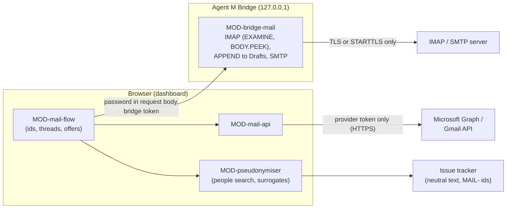

# ARC-014 Two mail routes and the pseudonymisation layer

## Context

Reports arrive by mail. Browsers let no page open IMAP or SMTP; Microsoft Graph and the Gmail API
accept the Pages origin (measured 2026-09-29, SPEC `A MAILBOX IS REACHED THROUGH ITS PROVIDER'S WEB
API OR THROUGH THE BRIDGE`). Every other mail server is reached by the bridge. The mailbox is the only
store of mail (`MAIL STAYS IN THE MAILBOX`); issues hold `MAIL-` identifiers; drafts wait in the
mailbox's *Drafts*. Personal data from a mail must not reach a repository; report data is
pseudonymised with surrogates derived again from the mail whenever needed.

Book ch. 10, pipe-and-filter: a mail flows through filters — identify, match thread, propose,
search for its people, pseudonymise — before anything reaches a tracker.

## Decision

**One mail interface, two adapters.** The mail flow (MOD-mail-flow) talks to a mailbox through one
interface — list the `Message-ID`s of named folders, read one mail by identifier without changing
it, store a draft replying to a mail, send a draft with a confirmation — implemented twice:

1. **Route 1 — provider web API (MOD-mail-api).** Microsoft 365 through Microsoft Graph, Gmail
   through the Gmail API, from the browser. Sign-in without a library:
   - Microsoft: the authorization-code flow with PKCE for single-page applications, redirect URI of
     type `spa`, token endpoint called from the browser; Microsoft documents that such a redirect
     enables CORS on the token endpoint and that "Single page apps get a token with a 24-hour
     lifetime" and refresh tokens for `spa` redirects expire after 24 hours (read 2026-09-30,
     `https://learn.microsoft.com/en-us/entra/identity-platform/v2-oauth2-auth-code-flow`);
   - Google: Google documents two flows; the authorization-code flow "requires a backend platform"
     for endpoint hosting and refresh-token storage, the implicit flow does not, and needs a user
     gesture for each new token (read 2026-09-30,
     `https://developers.google.com/identity/oauth2/web/guides/choose-authorization-model`). With no
     server (`NO SERVER`), Gmail uses the implicit flow: a sign-in window per session.
   Tokens are stored through the settings store (ARC-005) and sent only to the provider's API
   (`THE MAIL SIGN-IN TOKEN GOES ONLY TO ITS PROVIDER`). The requested scopes are a constant list in
   the module, checked by a test against the documented list.
2. **Route 2 — IMAP and SMTP through the bridge (MOD-bridge-mail).** The browser sends the mailbox
   password in the body of each mail request to the bridge (ARC-012); the bridge opens the connection
   over implicit TLS or STARTTLS and refuses to send `LOGIN`/`AUTH` otherwise, selects folders with
   `EXAMINE`, fetches with `BODY.PEEK[]`, finds mails by `UID SEARCH HEADER Message-ID`, stores drafts
   with `APPEND` to the folder marked `\Drafts`, and sends through SMTP only with a single-use
   confirmation naming the SHA-256 of the mail shown. The password lives in a variable of that
   request and is dropped with it; nothing is logged but request names and outcomes.
   Library: **imapflow** for IMAP and **nodemailer** for SMTP, through Deno's npm compatibility,
   subject to the measurement below.
3. **Pseudonymisation (MOD-pseudonymiser) is pure core.** For one mail it derives *the mail's
   people*: every address and display name from its headers, and every address, phone number, account
   and signature name found in its body by fixed patterns. `findPeople(text, people)` reports each
   hit (a text from a mail is written nowhere while one is found); `pseudonymise(data, mail)` replaces
   each datum with a surrogate numbered in order of first appearance (`user1`, `user1@example.org`,
   `+49 000 0000001`, `/home/user1`, `192.0.2.1`), the same one throughout the report. The mapping is
   a local variable; the same surrogates come back from the same mail every time.
4. **No mail content leaves the flow into repositories.** Issue texts go through `findPeople`; report
   data through `pseudonymise` unless the product switched it off; jobs that write to a repository
   receive only the neutral issue and pseudonymised data (MOD-mail-flow enforces the input shape).

### Due diligence (read 2026-09-30)

Sources as in ARC-002. Licence texts read from `https://api.github.com/repos/<repo>/license`.

| Candidate | Role | Licence | Against MIT | Releases | Issues | Adoption |
|---|---|---|---|---|---|---|
| **imapflow** (postalsys/imapflow) — chosen | IMAP | npm field `MIT`; `LICENSE.txt` is the MIT grant without the notice condition (MIT-0 wording); GitHub reports NOASSERTION | compatible | first 2019-12-19, latest 2.1.2 on 2026-09-28, 70 versions in 12 months | 1 open, 211 closed, 16 closed in 12 months | 12 680 287 downloads last month; 570 stars |
| emailjs-imap-client (emailjs/emailjs-imap-client) | IMAP | MIT | compatible | latest 3.1.0 on 2020-02-14; none in 12 months | 29 open, 0 closed in 12 months | 26 378 |
| imap (mscdex/node-imap) | IMAP | GitHub MIT; npm field empty | compatible | latest 0.8.19 on 2016-12-06 | 165 open; 0 closed in 12 months | 2 195 723 |
| **nodemailer** (nodemailer/nodemailer) — chosen | SMTP | npm field `MIT-0`; `LICENSE` is the MIT-0 wording | compatible | first 2011-01-21, latest 10.0.13 on 2026-09-30, 41 versions in 12 months | 0 open, 1 508 closed, 27 closed in 12 months | 93 411 804; 17 683 stars |
| @azure/msal-browser (AzureAD/microsoft-authentication-library-for-js) | Microsoft sign-in | MIT | compatible | latest 5.23.0 on 2026-09-23, 48 versions in 12 months | 149 open, 3 769 closed (whole repository) | 75 085 855 |
| oauth4webapi (panva/oauth4webapi) | OAuth helper | MIT | compatible | latest 3.8.8 on 2026-09-05, 6 versions in 12 months | 0 open, 31 closed | 54 768 923 |
| Google Identity Services (`https://accounts.google.com/gsi/client`) | Google sign-in | Google's terms; not a package | **marked — not a licence, not known to be compatible** | not versioned; "self-hosting or using an offline copy is not a supported use case" (`https://developers.google.com/identity/oauth2/web/guides/load-3p-authorization-library`) | n/a | n/a |

## Alternatives

- **All mail through the bridge** — rejected: Microsoft 365 and Gmail users would need the bridge
  although their providers allow the browser (`AGENT M WORKS WITHOUT A LOCAL INSTALLATION`).
- **msal-browser** — not chosen: it keeps its own token cache in browser storage beside the settings
  store (ARC-005), and the PKCE exchange it wraps is a few Web Crypto calls. **oauth4webapi** is the
  fallback if the hand-written exchange proves fragile; it is small and has no open issue.
- **Google Identity Services** — rejected: code loaded at run time from a third origin into the page
  that holds every token, and Google does not support a vendored copy — which ARC-002 requires.
- **A hand-written IMAP client over `Deno.connectTls`** — kept as the fallback if imapflow does not run
  under `deno compile`; the needed command set is small (`EXAMINE`, `UID SEARCH`, `UID FETCH
  BODY.PEEK`, `APPEND`), but parsing IMAP responses correctly is not.
- **A model to find people in a text** — rejected for the check itself: what can be decided without a
  model is decided without one; the model's residual rate is measured, not trusted (`THE PRODUCT ISSUE
  CARRIES NO PERSONAL DATA`).

## Consequences

- **Open measurement 1 — imapflow and nodemailer under `deno compile`.** Both use Node's `net`/`tls`;
  whether Deno's compatibility layer runs them in a compiled binary, with STARTTLS, is measured against
  a local test server before MOD-bridge-mail is built.
- **Open measurement 2 — token endpoints from the Pages origin.** That Microsoft's token endpoint
  answers a PKCE exchange from `https://<owner>.github.io` with CORS (documented), and whether Gmail's
  implicit flow completes in a popup from a Pages origin, are measured with test registrations.
- **Open point — scopes.** The exact scope names for "read, draft, send" on Graph and Gmail are to be
  read from the providers' documentation when MOD-mail-api is built and fixed in its test; they are not
  recorded here.
- Name detection in free text is heuristic: signature names and names in running text can be missed.
  The deterministic check covers the mail's headers and patterns; what slips through is the measured
  rate the SPEC asks for.
- Gmail's implicit flow asks the person to sign in again when the token expires; this is a documented
  property of the flow without a server.

*Drafted on 2026-09-30 by Claude (claude-opus-5-5) for the Agent M repository at commit 1605b2dcfe907fb1df6e394af3fdbec80f379dbc; open until accepted.*
