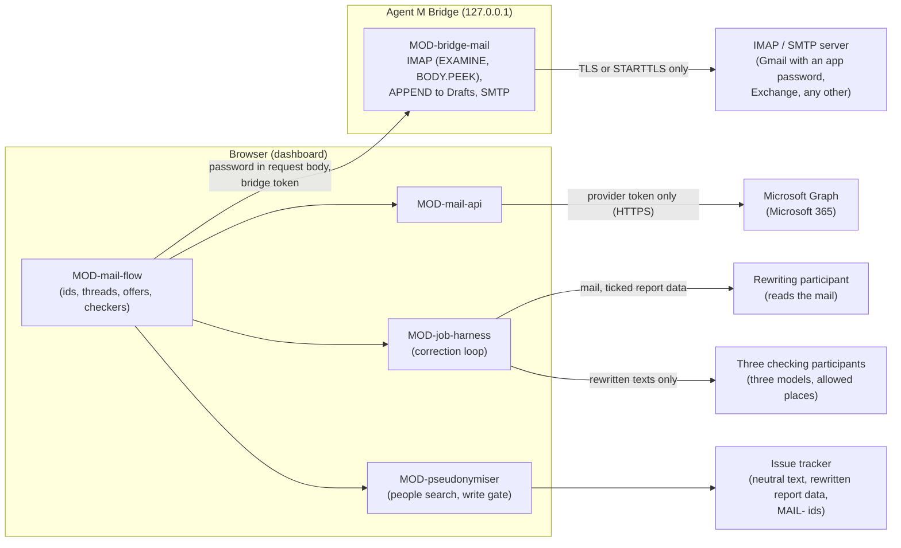

# ARC-014 Two mail routes, and report data rewritten without persons

## Context

Reports arrive by mail. Browsers let no page open IMAP or SMTP. The SPEC settles the routes: "The
dashboard reaches a Microsoft 365 mailbox directly through Microsoft Graph, and any other mailbox —
Gmail included — through the local bridge over IMAP and SMTP" (`A MAILBOX IS REACHED THROUGH ITS
PROVIDER'S WEB API OR THROUGH THE BRIDGE`). The provider sign-in asks for "no permission beyond the
narrowest ones its provider offers for reading mail, creating drafts and sending mail"; for Microsoft
Graph that is exactly `Mail.ReadWrite`, `Mail.Send` and `offline_access` (`THE MAIL SIGN-IN ASKS ONLY
FOR READING, DRAFTING AND SENDING`). The mailbox is the only store of mail (`MAIL STAYS IN THE
MAILBOX`); issues hold `MAIL-` identifiers; drafts wait in the mailbox's *Drafts*. Personal data from a
mail must not reach a repository. Report data — attachments, logs, error messages — goes into an issue
"only as a participant's rewriting that mentions no person and keeps their technical content"
(`REPORT DATA LEAVES THE MAILBOX ONLY REWRITTEN WITHOUT PERSONS`), and a rewritten text "is written only
after three LLM participants with three different models, at places the mailbox allows, have each checked
it for any mention of a person and none of them has found one" (`A REWRITTEN TEXT IS CHECKED BY THREE
LLMS`); the search for the mail's own people runs as well. The neutral issue text is itself a rewriting
of the mail and is checked the same way (queue 2026-09-30k, rationale). A product may switch the rewriting
off (`PSEUDONYMISATION IS ON UNLESS A PRODUCT SWITCHES IT OFF`). The PO withdrew the surrogates of the
first version of this decision on 2026-09-30.

What Microsoft, Google and the maintainers of the mail libraries document was read on 2026-09-30 and is
recorded in `docs/measurements/2026-09-30_architecture-open-points.md`, points 5 and 6 (*measurement
§5*, *§6*). Gmail went to the bridge because, per measurement §6, every Gmail read scope is restricted
and needs Google's verification for a public app, a browser-only app gets no refresh token, and the
hand-written flow without Google's library is "strongly discouraged due to security vulnerabilities".

Book ch. 10, pipe-and-filter: a mail flows through filters — identify, match thread, propose and
rewrite, search for its people, check by three LLMs — before anything reaches a tracker.

## Decision

**One mail interface, two adapters.** The mail flow (MOD-mail-flow) talks to a mailbox through one
interface — list the `Message-ID`s of named folders, read one mail by identifier without changing
it, store a draft replying to a mail, send a draft with a confirmation — implemented twice:

1. **Route 1 — Microsoft Graph for Microsoft 365 (MOD-mail-api).** From the browser, sign-in without
   a library: the authorization-code flow with PKCE for single-page applications, redirect URI of type
   `spa`. Microsoft documents that such a redirect "supports auth code flow with PKCE and cross-origin
   resource sharing (CORS)", that "Single page apps get a token with a 24-hour lifetime" and that "the
   refresh token expires after 24 hours", renewed by a pop-up or page load "in browsers without
   third-party cookies, such as Safari" (read 2026-09-30,
   `https://learn.microsoft.com/en-us/entra/identity-platform/v2-oauth2-auth-code-flow`). The requested
   scopes are the constant list `Mail.ReadWrite`, `Mail.Send`, `offline_access` — nothing else — in
   MOD-mail-api, checked by its test. Graph has no permission for drafts alone: storing a reply draft
   (`POST /me/messages/{id}/createReply`) needs `Mail.ReadWrite`, described as "create, read, update, and
   delete email in user mailboxes"; sending needs `Mail.Send`; the refresh token needs `offline_access`
   (permission tables of `https://github.com/microsoftgraph/microsoft-graph-docs-contrib` and
   `https://learn.microsoft.com/en-us/graph/permissions-reference`, measurement §6). That Agent M changes
   nothing it reads rests on `READING THE MAILBOX CHANGES NOTHING IN IT` — reads use `GET` only —, not
   on the permission. Tokens are stored through the settings store (ARC-005) and sent only to
   `https://graph.microsoft.com` and Microsoft's token endpoint (`THE MAIL SIGN-IN TOKEN GOES ONLY TO
   ITS PROVIDER`).
2. **Route 2 — IMAP and SMTP through the bridge (MOD-bridge-mail)**, for Gmail and every other server.
   The browser sends the mailbox password in the body of each mail request to the bridge (ARC-012);
   the bridge opens the connection over implicit TLS or STARTTLS and refuses to send `LOGIN`/`AUTH`
   otherwise, selects folders with `EXAMINE`, fetches with `BODY.PEEK[]`, finds mails by `UID SEARCH
   HEADER Message-ID`, stores drafts with `APPEND` to the folder marked `\Drafts`, and sends through
   SMTP only with a single-use confirmation naming the SHA-256 of the mail shown. The password lives
   in a variable of that request and is dropped with it; nothing is logged but request names and
   outcomes. For Gmail the password is an **app password**: Gmail refuses the account password over
   IMAP since 2025-03-14 and accepts an app password, which needs 2-Step Verification and is not
   offered for many work or school accounts (SPEC occasion, `support.google.com/accounts/answer/185833`,
   read 2026-09-30); the settings page says so (UC-037 step 4.2).
   Library: **imapflow** for IMAP and **nodemailer** for SMTP, through Deno's npm compatibility — both
   maintained for Node only (below); whether they run inside the compiled bridge is the first open
   measurement, and the fallback is named.
3. **One participant rewrites; the loop corrects.** The participant the author picks for the
   proposals (UC-038 step 4) runs the job `propose-issue-from-mail`, a job definition of MOD-mail-flow: it returns
   the proposal — product, kind, a neutral title and text, possible duplicates — and every piece of
   report data the author ticked, rewritten without any person and keeping its technical content: a
   path with a user name becomes "the user's home folder", a name is left out, never replaced by a
   second name. The job runs through the correction loop of ARC-007 (`MOD-job-harness.runDraft`),
   started by MOD-mail-flow. Each round two kinds of check run on the draft:
   - **the search for this mail's people**, without a model (MOD-pseudonymiser): `peopleOf(mail)` —
     every address and display name from its headers, and every name, address, phone number and account
     found in its body and signature by fixed patterns — and `findPeople(text, people)` for each text;
   - **the three checks**: each of three checking participants receives the neutral text and the
     rewritten report data — nothing else, not the mail and not its people — with the job
     `check-for-persons`, and returns every mention of a person it finds.

   A finding of either kind goes back to the rewriting participant as a compiler-like finding, and it
   corrects the texts, within the round limit (`A DRAFT THAT FAILS A CHECK GOES BACK TO ITS
   PARTICIPANT`). Both kinds are a check MOD-mail-flow supplies to the one loop; the loop itself knows
   nothing about mail (ARC-007). What is still found after the last round is marked in the review panel (UC-038 6a).
   A finding may quote a person: it goes only to the rewriting participant, which read the mail
   already, and to the dashboard, which forgets it with the tab; the job's recorded rounds name the
   text, the line and the rule, not the person.
4. **Where the checkers run, and how they are picked.** The checkers are participants of the instance
   (UC-017), reached through the drivers of ARC-009: a hosted model endpoint from the browser, a model
   server on the author's machine through the bridge (`POST /endpoint/chat`, ARC-012), a CLI agent
   through the bridge. `MOD-mail-flow.checkers` preselects three for the panel of UC-038 step 4, from
   the participants that are not persons, can *draft text*, declare their model, and process data at a
   place this mailbox allows (`THE PLACES A MAILBOX'S MAIL MAY GO ARE CONFIGURED` — a checker reads a text
   that may still hold a person); the three models differ, and the rewriting participant is not among
   them, for the reason of `A GATE IS NOT DECIDED BY THE PARTICIPANT WHOSE WORK IT CHECKS`. The panel
   names each checker, where it processes data and that it receives only the rewritten texts; the author
   may exchange a checker for another that meets the same conditions. Nothing about the choice is
   stored. With fewer than three such participants, the participant's texts cannot be written: the panel
   names what is missing and links UC-017 and the mailbox's places; the author may still write the issue
   text by hand, covered by the search alone, without report data (UC-038 6c).
5. **The write gate (`MOD-pseudonymiser.writeGate`).** An issue is created only on the author's click
   and only when every text passes: no person of this mail found, and, for a text a participant drafted
   or rewrote, verdicts of three checkers with three different models at allowed places that name the
   SHA-256 of exactly that text and report nothing. A text the author edits in the review panel is
   checked again — the search and the three checkers on the edited text — before *Create issue* is
   possible (UC-038 step 7: "possible only when the check of step 6 finds nothing").
6. **The switch.** With the product's setting *pseudonymisation* on — the default, read from its
   `docs/settings.md` — report data is rewritten as above. Switched off (UC-042 step 4), report data is
   not sent to the rewriting participant and enters the issue unchanged; the neutral issue text is
   still rewritten, searched and checked by the three (UC-038 6b).
7. **No mail content leaves the flow into repositories.** The only way from a mail to an issue or a
   repository is the gate of decision 5. Jobs that write to a repository receive the neutral issue and
   the report data as the issue holds it, never a mail (`A PARTICIPANT THAT WRITES TO A REPOSITORY NEVER
   RECEIVES A MAIL`; MOD-mail-flow gives them the issue and nothing from the mail).

### Due diligence (read 2026-09-30; the person-detection candidate read 2026-10-01)

Sources as in ARC-002. Licence texts read from `https://api.github.com/repos/<repo>/license`. The
maintainers' statements on Deno are those of measurement §5. The JSR packages were read from
`https://api.jsr.io/scopes/<scope>/packages/<name>` and `…/versions`.

| Candidate | Role | Licence | Against MIT | Releases | Issues | Adoption |
|---|---|---|---|---|---|---|
| **imapflow** (postalsys/imapflow) — chosen, subject to open measurement 1 | IMAP | npm field `MIT`; `LICENSE.txt` is the MIT grant without the notice condition (MIT-0 wording); GitHub reports NOASSERTION | compatible | first 2019-12-19, latest 2.1.2 on 2026-09-28, 70 versions in 12 months | 1 open, 211 closed, 16 closed in 12 months; on Deno, its maintainer: "Deno and Bun are not supported. It might work but probably does not." (issue #230, 2024-11-04), "All my email modules are Node only." (issue #329), and "Deno and edge runtimes are not in the test matrix" (issue #401, 2026-09-25) | 12 680 287 downloads last month; 570 stars |
| **nodemailer** (nodemailer/nodemailer) — chosen, subject to open measurement 1 | SMTP | npm field `MIT-0`; `LICENSE` is the MIT-0 wording | compatible | first 2011-01-21, latest 10.0.13 on 2026-09-30, 41 versions in 12 months | 0 open, 1 508 closed, 27 closed in 12 months; on Deno: "There are no plans to migrate or change anything in this regard." (issue #1331); STARTTLS on 587 failed under Deno 2.0.4 and was fixed ("This is fixed on canary.", denoland/deno#26735) | 93 411 804; 17 683 stars |
| `@workingdevshero/deno-imap` (JSR; workingdevshero/deno-imap) — fallback candidate for IMAP | IMAP, written for Deno | MIT (GitHub) | compatible | 1.0.0 on 2025-03-22, 5 versions, none in 12 months; JSR `runtimeCompat`: Deno yes, Node no | 3 open, 2 closed | 12 stars; JSR: 1 dependent |
| `@upyo/smtp` (JSR; dahlia/upyo) — fallback candidate for SMTP | SMTP transport | MIT (GitHub) | compatible | latest 0.6.0; 166 versions on JSR, the newest on 2026-09-09; JSR `runtimeCompat`: Deno, Node and Bun | 1 open, 47 closed (whole repository) | 585 stars; JSR: 2 dependents |
| emailjs-imap-client (emailjs/emailjs-imap-client) | IMAP | MIT | compatible | latest 3.1.0 on 2020-02-14; none in 12 months | 29 open, 0 closed in 12 months | 26 378 |
| imap (mscdex/node-imap) | IMAP | GitHub MIT; npm field empty | compatible | latest 0.8.19 on 2016-12-06 | 165 open; 0 closed in 12 months | 2 195 723 |
| @azure/msal-browser (AzureAD/microsoft-authentication-library-for-js) | Microsoft sign-in | MIT | compatible | latest 5.23.0 on 2026-09-23, 48 versions in 12 months | 149 open, 3 769 closed (whole repository) | 75 085 855 |
| oauth4webapi (panva/oauth4webapi) | OAuth helper | MIT | compatible | latest 3.8.8 on 2026-09-05, 6 versions in 12 months | 0 open, 31 closed | 54 768 923 |
| pseudonymkit (akmaier/pseudonymization) — considered, not reused | detecting persons in text: an ensemble of fifteen detectors (rule-based, classical NER, LLMs) | `pyproject.toml`: `license = { text = "MIT" }`; no licence file in the repository — GitHub's licence endpoint answers 404 for it (the same endpoint names MIT for akmaier/agent-m) | MIT declared; a copy would need the licence text added | no release and no tag; version `0.1.0` in `pyproject.toml`; 233 commits from 2026-09-06 to 2026-09-30, the latest `10b442e6447f` on 2026-09-30T20:59:25Z | 0 open, 0 closed | 1 star, 0 forks, one contributor (akmaier, 233 commits) |

## Alternatives

- **All mail through the bridge** — rejected: Microsoft 365 users would need the bridge although Graph
  allows the browser (`AGENT M WORKS WITHOUT A LOCAL INSTALLATION`).
- **Gmail through the Gmail API from the browser** (the earlier decision) — rejected by the PO on
  2026-09-30 (SPEC): the hand-written implicit flow is "strongly discouraged due to security
  vulnerabilities", Google's library would load code at run time from a third origin into the page that
  holds every token, and the read scopes are restricted (measurement §6). Gmail goes through the bridge
  with an app password.
- **msal-browser** — not chosen: it keeps its own token cache in browser storage beside the settings
  store (ARC-005), and the PKCE exchange it wraps is a few Web Crypto calls. **oauth4webapi** is the
  fallback if the hand-written exchange proves fragile; it is small and has no open issue.
- **The fallback if imapflow or nodemailer do not run in the compiled bridge** (open measurement 1):
  - IMAP: a small client over `Deno.connectTls` for the command set needed (`EXAMINE`, `UID SEARCH`,
    `UID FETCH BODY.PEEK`, `APPEND`), with `@workingdevshero/deno-imap` read as a starting point — it is
    written for Deno, but has had no release in twelve months and one maintainer. In imapflow issue #401,
    raw `Deno.connectTls` fetched the same message in 379 ms in a runtime where imapflow hung
    (measurement §5). Parsing IMAP responses correctly is the hard part, and a test IMAP server is part
    of the bridge's tests (ARC-016).
  - SMTP: `@upyo/smtp`, which declares Deno support on JSR and is released often.
- **Reuse the group's `akmaier/pseudonymization` (package `pseudonymkit`)** — considered and not
  reused. Facts read 2026-10-01 from `https://api.github.com/repos/akmaier/pseudonymization` (with
  `/commits`, `/releases`, `/tags`, `/contributors`, `/license`) and from `README.md`, `ARCHITECTURE.md`
  and `pyproject.toml` of its branch `master` at `10b442e6447f`
  (`https://github.com/akmaier/pseudonymization`); the row above. It is a Python package
  (`requires-python = ">=3.10"`) whose detector extra needs `presidio-analyzer`, `gliner`, `flair`,
  `spacy`, `transformers` and `torch` — Python and PyTorch, which run neither in the browser nor in the
  Deno core compiled into the bridge (ARC-003, `THE BRIDGE IS BUILT FROM THE DASHBOARD'S CODE`). Its
  README states what the PO decided on: "Surrogates are not a privacy control."; "an ensemble across
  LLMs plus the baseline methods outperformed any single detector"; "The last point of quality is
  bought with an LLM". The PO chose rewriting with three LLM checkers instead (queue 2026-09-30k).
- **Surrogates in a deterministic filter** (the first version of this decision: each personal datum
  replaced by a numbered stand-in, the same within a report, the mapping never stored) — withdrawn by
  the PO on 2026-09-30: "We simply don't want person names be part of issues." A surrogate is a second
  name for a person; the rewriting leaves the person out.
- **Three participants rewrite and the results are compared**, or **three detect and one rewrites** —
  the two other forms put to the PO; he chose one rewriting participant and three checkers, of which one
  finding is enough (queue 2026-09-30k, rationale).
- **The deterministic search alone** — not enough under `A REWRITTEN TEXT IS CHECKED BY THREE LLMS`: it
  finds the mail's own people by their headers and patterns, not a colleague named in running text or a
  name in a log line. It stays as the check that needs no model and applies to every text, including
  one the author writes by hand.
- **The rewriting participant as one of the checkers** — rejected: it would check its own work
  (decision 4).

## Consequences

- A Microsoft 365 connection needs a sign-in once a day: the `spa` refresh token lasts 24 hours and is
  not extended by refreshing (measurement §6). The dashboard asks for it in Microsoft's window when it
  has expired (UC-037 3b).
- `Mail.ReadWrite` would also allow changing and deleting mail; Agent M's reads use `GET` and its only
  writes are drafts and sends, which the mail route's tests check request by request.
- A Gmail connection needs the bridge and an app password; accounts without app passwords (many work or
  school accounts) need their administrator, and the settings page says so.
- **Open measurement 1 — imapflow and nodemailer inside the compiled bridge.** No source says anything
  about either library in a compiled Deno program (measurement §5). Build the bridge with imapflow ≥
  2.0.7 and nodemailer; read a mailbox of more than 1 MB over implicit TLS and over STARTTLS; send over
  465 and 587 against a local test server and against Gmail with an app password; record each result.
  If one fails, the fallback above is built instead, with its own due diligence re-read.
- **Open measurement 2 — Microsoft 365 tenant consent.** Whether a tenant such as FAU's lets a user
  consent to `Mail.ReadWrite`, `Mail.Send` and `offline_access` for an unverified `spa` app: all three
  are marked "AdminConsentRequired … No" in the reference, but a tenant's own consent policy may still
  restrict them (measurement §6). Measured with a test registration.
- A product that takes report data from mail needs three LLM participants at places its mailbox allows,
  besides the one that rewrites; without them only a hand-written issue without report data is possible
  (UC-038 6c).
- Each round costs one call to the rewriting participant and one to each checker; the round limit of
  the run panel bounds it (`THE CORRECTION LOOP HAS A FIXED LIMIT`).
- Whether a person slips through all three, and whether the rewriting keeps the error message, the
  stack trace and the version, depends on models. Both are measured as rates on a fixed set of mails and
  reports, reported and not gated (`A MODEL-DEPENDENT TEST IS MEASURED AS A RATE`; ARC-016 kind 4). The
  gate itself is deterministic given the verdicts, and is tested with scripted checkers.
- A checker processes a text that may still hold a person; it is therefore held to the mailbox's places
  like the participant that reads the mail.

*Drafted on 2026-09-30 by Claude (claude-opus-5-5) for the Agent M repository at commit 1605b2dcfe907fb1df6e394af3fdbec80f379dbc; revised on 2026-09-30 by Claude (claude-opus-5-5) against commit 1110607b6dc4d9c888549a23a680fbe4b38dd3f1 — SPEC and use cases as accepted that day, and `docs/measurements/2026-09-30_architecture-open-points.md`; revised on 2026-10-01 by Claude (claude-opus-5-5) against commit 8b299337b2e61b80cb4a4415ff4e7c865d7a2dfe — SPEC queue 2026-09-30k as accepted: the deterministic pseudonymisation layer replaced by rewriting without persons, checked by three LLMs; revised on 2026-10-01 by Claude (claude-opus-5-5) against commit 2e6d8e4752b55b0707ec5e69c229914cb5d15fe8 — the mail's rewriting and checking kept inside the mail modules, at the PO's request; open until accepted.*
