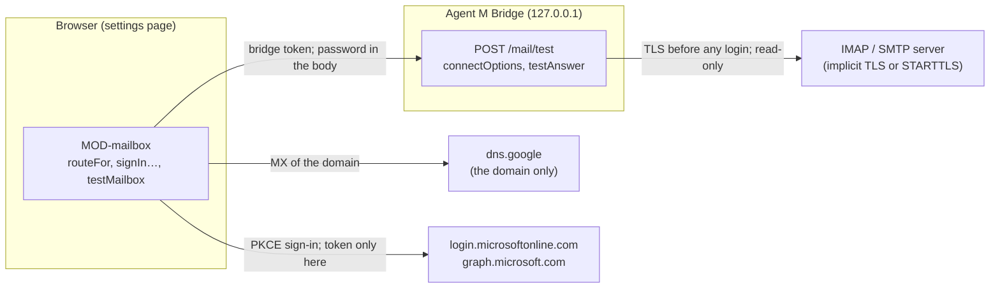
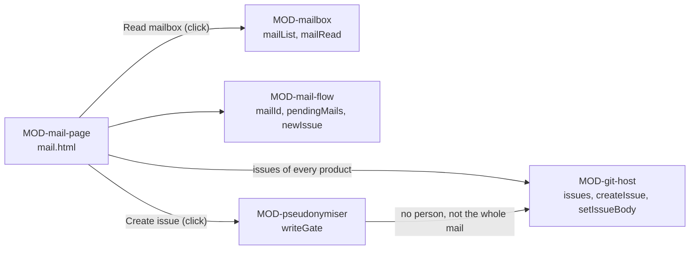
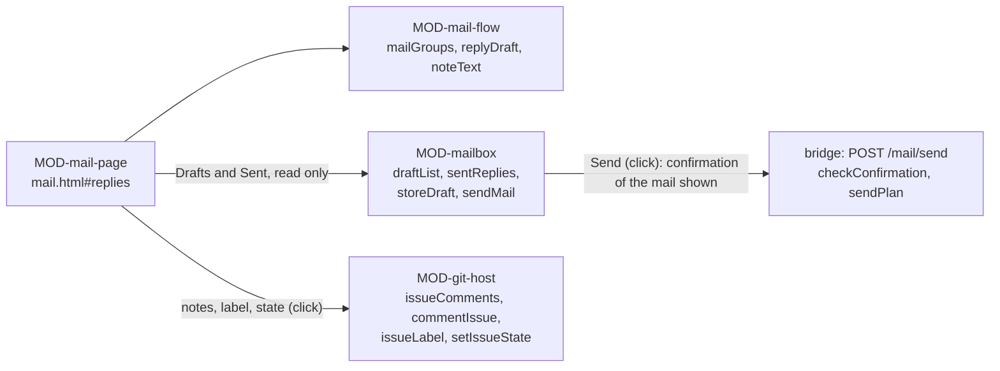

# ARC-014 Two mail routes behind one mailbox module

## Context

Reports arrive by mail. Browsers let no page open IMAP or SMTP. The SPEC settles the routes: "The dashboard reaches a Microsoft 365 mailbox directly through Microsoft Graph, and any other mailbox — Gmail included — through the local bridge over IMAP and SMTP" (`A MAILBOX IS REACHED THROUGH ITS PROVIDER'S WEB API OR THROUGH THE BRIDGE`). What Microsoft, Google and the maintainers of the mail libraries document is recorded in `docs/measurements/2026-09-30_architecture-open-points.md`, points 5 and 6, cited here as *measurement point 5* and *point 6*; Gmail is on the IMAP route because every Gmail read scope is restricted and needs Google's verification for a public app, and a browser-only app gets no refresh token (measurement point 6).

What the routes rest on, as their documentation states it:

- **Microsoft's sign-in.** The authorization-code flow with PKCE for a single-page application: the authorization address `https://login.microsoftonline.com/{tenant}/oauth2/v2.0/authorize`, whose `{tenant}` takes "common, organizations, consumers, and tenant identifiers"; the code challenge "required by the Microsoft identity platform for single page apps"; the code redeemed by a `POST` to `…/oauth2/v2.0/token` with `Content-Type: application/x-www-form-urlencoded`; an answer of `access_token`, `token_type`, `expires_in`, `scope` — "Optional … if omitted, the token is for the scopes requested" — and a `refresh_token` "Only provided if offline_access scope was requested"; a declined sign-in returned as `error=access_denied`; "Single page apps get a token with a 24-hour lifetime", and "For refresh tokens sent to a redirect URI registered as spa, the refresh token expires after 24 hours" (`https://learn.microsoft.com/en-us/entra/identity-platform/v2-oauth2-auth-code-flow`). PKCE: "code-verifier = 43*128unreserved", "code_challenge = BASE64URL-ENCODE(SHA256(ASCII(code_verifier)))" (`https://www.rfc-editor.org/rfc/rfc7636.txt`).
- **Microsoft Graph's folders.** "Well-known names work regardless of the locale of the user's mailbox" — among them `inbox`, `drafts` and `sentitems` —; a folder's `totalItemCount` is "The number of items in the mailFolder" (`https://learn.microsoft.com/en-us/graph/api/resources/mailfolder?view=graph-rest-1.0`); `GET /me/mailFolders` returns "only the child folders of the root folder", ten to a page with `@odata.nextLink` for the next (`https://learn.microsoft.com/en-us/graph/api/user-list-mailfolders?view=graph-rest-1.0`), and a folder's own with `GET /me/mailFolders/{id}/childFolders` (`https://learn.microsoft.com/en-us/graph/api/mailfolder-list-childfolders?view=graph-rest-1.0`).
- **Whose mail servers a domain has.** A Microsoft 365 domain's "Target email server: <MX token>.mail.protection.outlook.com" (`https://learn.microsoft.com/en-us/microsoft-365/enterprise/external-domain-name-system-records`), or with DNSSEC a "Mail Exchanger ending in mx.microsoft", for example `contosotest-com.o-v1.mx.microsoft` (`https://learn.microsoft.com/en-us/purview/how-smtp-dane-works`). "The Google Workspace MX record value is smtp.google.com"; older ones "start with "aspmx"" (`https://support.google.com/a/answer/174125`). Google's DNS-over-HTTPS service answers `https://dns.google/resolve?name=<domain>&type=MX` in JSON (`https://developers.google.com/speed/public-dns/docs/doh/json`), with `access-control-allow-origin: *`, and gives gmail.com's mail servers under `gmail-smtp-in.l.google.com` — both measured with a request of origin `https://alice.github.io`.
- **Gmail's servers.** "Incoming connections to the IMAP server at imap.gmail.com:993 … require SSL"; for `smtp.gmail.com`, "use port 465 (for SSL) or port 587 (for TLS)" (`https://developers.google.com/workspace/gmail/imap/imap-smtp`). An app password "can only be used with accounts that have 2-Step Verification turned on", and may not be offered where "You're logged into a work, school, or another organization account" (`https://support.google.com/accounts/answer/185833`).
- **TLS for mail.** Connections should "be made using "Implicit TLS"", on port 993 for IMAP and 465 for submission, in preference to STARTTLS on 587 (`https://www.rfc-editor.org/rfc/rfc8314.txt`); IMAP is served on "port 143 (cleartext port) or port 993 (Implicit TLS port)", and "An IMAP client MUST NOT issue the LOGIN command if the server advertises the LOGINDISABLED capability" (`https://www.rfc-editor.org/rfc/rfc9051.txt`); the folders a mailbox marks `\Drafts` and `\Sent` are its drafts and sent mail (`https://www.rfc-editor.org/rfc/rfc6154.txt`).
- **The libraries in the bridge.** imapflow: `secure` "establishes the connection directly over TLS"; `doSTARTTLS: true` "requires STARTTLS upgrade (fails if not supported)" and "Cannot be combined with secure: true"; `mailboxOpen(path, { readOnly: true })` "uses IMAP EXAMINE instead of SELECT", the open folder's count is its `exists`, and `list()` gives each folder's `specialUse` (`https://imapflow.com/docs/api/imapflow-client`). nodemailer: with `requireTLS`, "If the server does not support STARTTLS, sending fails with an error"; `transporter.verify()` "attempts to connect to the server and authenticate without sending any message" (`https://nodemailer.com/smtp`).
- **Registering an app.** "Sign in to the Microsoft Entra admin center as at least an Application Developer", then "Browse to Entra ID > App registrations and select New registration" (`https://learn.microsoft.com/en-us/entra/identity-platform/quickstart-register-app`); the admin center is `https://entra.microsoft.com`.
- **Reading mails on Microsoft Graph.** A folder's messages are listed with `GET /me/mailFolders/{id}/messages` and the OData query parameters, the next page named by `@odata.nextLink` until "the @odata.nextLink property is no longer returned" (`https://learn.microsoft.com/en-us/graph/api/mailfolder-list-messages?view=graph-rest-1.0`, `https://learn.microsoft.com/en-us/graph/paging`). A message's `internetMessageId` is "The message ID in the format specified by RFC2822"; its `internetMessageHeaders`, "A collection of message headers defined by RFC5322", come only with `$select`; its `id` "changes when the item is moved", unless "Prefer: IdType="ImmutableId"" is sent with the request (`https://learn.microsoft.com/en-us/graph/api/resources/message?view=graph-rest-1.0`, `https://learn.microsoft.com/en-us/graph/outlook-immutable-id`). With `Prefer: outlook.body-content-type="text"` the body comes as text; `$value` gives "the MIME content of a message" (`https://learn.microsoft.com/en-us/graph/api/message-get?view=graph-rest-1.0`); a message's attachments are listed with `GET /me/messages/{id}/attachments`, which "supports the OData Query Parameters" (`https://learn.microsoft.com/en-us/graph/api/message-list-attachments?view=graph-rest-1.0`). One `Prefer` header carries "multiple comma-separated preference tokens" (`https://www.rfc-editor.org/rfc/rfc7240.txt`).
- **Reading mails with imapflow.** Its fetch asks for a body as `BODY.PEEK[…]` or `BINARY.PEEK[…]` — "PEEK avoids marking messages as \Seen" (its source, `src/commands/fetch.ts` of `https://github.com/postalsys/imapflow`) —; its envelope gives date, subject, `messageId`, `inReplyTo`, `from`, `replyTo`, `to` and `cc`, each address with `name` and `address`, and its body structure each part's `part`, `type`, `parameters`, `disposition`, `dispositionParameters` and `childNodes` (`src/types.ts`); `download(range, part)` gives a body part's content, decoded (`https://imapflow.com/docs/api/imapflow-client`).
- **Threads and signatures.** A message identifier is `msg-id = [CFWS] "<" id-left "@" id-right ">" [CFWS]`; a reply's "References:" field "will contain the contents of the parent's "References:" field (if any) followed by the contents of the parent's "Message-ID:" field" (`https://www.rfc-editor.org/rfc/rfc5322.txt`, 3.6.4). Mail commonly uses "-- " "as the separator line between the body and the signature" (`https://www.rfc-editor.org/rfc/rfc3676.txt`, 4.3).
- **Withdrawing an app's access.** In Microsoft's My Apps portal, `https://myapps.microsoft.com`, "Permissions consented to by the user can be revoked by the user" (`https://learn.microsoft.com/en-us/entra/identity/enterprise-apps/myapps-overview`).
- **Replies on Microsoft Graph.** `createReply` will "Create a draft to reply to the sender of a message in either JSON or MIME format"; in JSON, "Specify either a comment or the body property of the message parameter", and "If replyTo is specified in the original message, per Internet Message Format (RFC 2822), you should send the reply to the recipients in replyTo, and not the recipients in from" (`https://learn.microsoft.com/en-us/graph/api/message-createreply?view=graph-rest-1.0`). A draft's body and recipients are each "Updatable only if isDraft = true" (`https://learn.microsoft.com/en-us/graph/api/message-update?view=graph-rest-1.0`). `send` will "Send an existing draft message", a "reply draft" among them; it "saves the message in the Sent Items folder" and answers `202 Accepted` (`https://learn.microsoft.com/en-us/graph/api/message-send?view=graph-rest-1.0`). A reply carries PidTagInReplyToId, which "Contains the original message's PR_INTERNET_MESSAGE_ID (PidTagInternetMessageId) property value", identifier `0x1042`: "These properties must be set on all message replies" (`https://learn.microsoft.com/en-us/office/client-developer/outlook/mapi/pidtaginreplytoid-canonical-property`). Graph reaches such a property as a single-value extended property in the proptag format `"{type} {proptag}"`, for example `"String 0x4001"` (`https://learn.microsoft.com/en-us/graph/api/resources/extended-properties-overview?view=graph-rest-1.0`), expanded on one message with `$expand=singleValueExtendedProperties($filter=id eq '{id_value}')`, or filtered on in a folder's messages with `$filter=singleValueExtendedProperties/Any(ep: ep/id eq '{id_value}' and ep/value eq '{property_value}')` (`https://learn.microsoft.com/en-us/graph/api/singlevaluelegacyextendedproperty-get?view=graph-rest-1.0`).
- **Drafts and sending on the IMAP route.** imapflow's `append(path, content, flags, idate)` takes "Message content (RFC822 format)" and answers the "UID of appended message (if UIDPLUS extension)"; `messageDelete(range, options)` "Deletes messages by marking them as deleted and expunging"; `search` takes `header` — "Header field matches" — and `or` (`https://imapflow.com/docs/api/imapflow-client`); its source says that with UIDPLUS the command UID EXPUNGE "removes only the specified UIDs", while "Without UIDPLUS: plain "EXPUNGE" removes ALL messages flagged \Deleted in the mailbox" (`src/commands/expunge.ts`). nodemailer's MailComposer "accepts the same message options as Nodemailer's message configuration" and "removes the Bcc: header from the generated message by default", which `keepBcc` keeps (`https://nodemailer.com/extras/mailcomposer`); among those options `inReplyTo`, "The Message-ID of the email this message is replying to", `references`, "A list of Message-IDs that this email references", `raw`, "An existing MIME message to send instead of generating a new one", and `envelope`, "A custom SMTP envelope" (`https://nodemailer.com/message`). Gmail: "Sent messages are automatically copied to the Gmail/Sent folder if your email client uses SMTP" (`https://support.google.com/mail/answer/78892`). A mail with a "Bcc:" field: "when a message containing a "Bcc:" field is prepared to be sent, the "Bcc:" line is removed even though all of the recipients (including those specified in the "Bcc:" field) are sent a copy of the message" (`https://www.rfc-editor.org/rfc/rfc5322.txt`, 3.6.3).

## Decision

1. **One mailbox module, two routes** (`MOD-mailbox`). The browser's side reaches Microsoft Graph and Microsoft's sign-in through the fetch port, and the bridge through the generic bridge client (`MOD-bridge-server.callBridge`, ARC-012); the bridge's side gives the options its mail libraries connect with and the answer of a test. The module keeps no store: the connection — its route, its folders, its sign-in or its servers, account and password — is kept by the settings store (`MOD-settings-store.storeMailbox`, ARC-005) and passed in.
2. **The route, preselected** (`MOD-mailbox.mxOf`, `MOD-mailbox.routeFor`, `MOD-mailbox.securityFor`). From the address's domain the page asks Google's DNS service for its mail servers and preselects the web API where one is Microsoft 365's, IMAP through the bridge for every other domain — with Gmail's servers filled in where the domain is Gmail's or its mail servers are Google's —, `INBOX` as the folder read and the address as the account. Before asking, the page says: *"To recognise your provider, Agent M asks Google's public DNS service which servers receive mail for `<domain>`; only the domain is sent."* Where the service does not answer, the route is preselected by the domain alone. The author can change each. The folders read are preset to `INBOX`; the author adds the folders into which reported mails are filed (UC-037 5), which the page holds with the form until **Store and test** keeps them with the connection (decision 5); *Drafts* and *Sent* are not named — the test finds them by the mailbox's own markings. A server's encryption is preset by its port: implicit TLS on 993 and 465, STARTTLS on 143 and 587.
3. **The web-API route: the app registration and the sign-in** (`MOD-mailbox.redirectFor`, `MOD-mailbox.mailScopes`, `MOD-mailbox.signInStart`, `MOD-mailbox.signInFinish`, `MOD-mailbox.signInRenew`). The page opens the Microsoft Entra admin center, `https://entra.microsoft.com`, where an app is registered under *Entra ID > App registrations > New registration*, and shows what to enter there: the name `Agent M`, the kind *single-page application*, and the return address — the site's directory of the settings page (`MOD-mailbox.redirectFor`) — with **Copy**; a folded explanation says that registering needs at least the role *Application Developer*, which an institution may give only to its administrators, and to ask them for a single-page application with this return address and the three permissions (UC-037 2a); the IMAP route is offered meanwhile where the provider has one. Before Microsoft's window opens, the page names the permissions it asks for and nothing else: *`Mail.ReadWrite` — read mail and create drafts; Microsoft offers no narrower permission for drafts, and it would also allow changing and deleting mail, which Agent M never does. `Mail.Send` — send the replies you release. `offline_access` — stay signed in for a day.* The sign-in runs in a window of its own: the authorization address with PKCE, the tenant `common`, the response in the query; the page takes the address the window returns to on the instance's origin, redeems the code at the token endpoint, and stores the sign-in through the settings store (`MOD-settings-store.storeMailbox`). A declined sign-in, another state and a permission not granted are named (UC-037 3a): *"The sign-in did not grant `<permission>`; without it Agent M cannot `<read mail and create drafts | send replies | stay signed in>`."* The access token goes only to `https://graph.microsoft.com`, the refresh token only to Microsoft's token endpoint (`THE MAIL SIGN-IN TOKEN GOES ONLY TO ITS PROVIDER`), neither in an address (`A CREDENTIAL IS NEVER PLACED IN A URL`). Where the access token has expired, the page renews it with the refresh token before a request; where Microsoft no longer takes that, the page asks for the sign-in again in Microsoft's window (UC-037 3b).
4. **The IMAP route: the servers, the password and its notice** (`MOD-mailbox.routeFor`, `MOD-mailbox.securityFor`). The page presets the servers and their encryption, and the account as the address. For Gmail a folded explanation says: *"Gmail accepts an app password here, not your account password. An app password needs 2-Step Verification; work, school and other organisations' accounts may not offer it — then the organisation's administrator decides."*, with a link to `https://support.google.com/accounts/answer/185833`. Before the password field is enabled, the page shows: *"The password is stored in this browser. Every GitHub Pages site under `<owner>.github.io` can read it — here: the sites of `<owner>`. With it, anyone can read all mail in this mailbox and send mail in its name. It goes to no server except your bridge on this machine. Recommended: run this instance under a GitHub owner you use for nothing else."* The field is enabled only once the author ticks **I have read this**; without a password the settings store keeps no connection of this route (`THE MAILBOX PASSWORD IS STORED ONLY AFTER ITS OWN DISCLOSURE`). Nothing of this route is stored while the author fills in the form: the servers, the account, the password, the folders and the places are stored together with **Store and test**, one click (decision 5; `ONE CLICK PER DECISION`).
5. **The test, changing nothing** (`MOD-mailbox.testMailbox`; `MOD-settings-page.testSetting`, ARC-026). **Store and test** stores the connection (`MOD-settings-store.storeMailbox`) and tests reading and sending as two parts, each outcome — works, refused or untested — recorded with the connection (`MOD-settings-store.recordTest`) and written at once (`MOD-settings-store.saveEntries`):
   - **On the web API**, each named folder — `INBOX` by its well-known name, any other by its display name, a path `A/B` folder by folder — is read with its count, and the folders `drafts` and `sentitems` are found by their well-known names, all with `GET` and the sign-in's token; sending is not tried without a mail, and the part stays untested.
   - **On the IMAP route**, one request goes to the bridge, `POST /mail/test` (ARC-012) with the bridge token, the part, both servers, the account, the folders and the password in its body — the password's only way out of the browser (`THE MAILBOX PASSWORD LEAVES THE BROWSER ONLY TO THE BRIDGE`). The bridge's handler connects its libraries with the options of `MOD-mailbox.connectOptions` — implicit TLS, or a STARTTLS upgrade required before any login (`THE MAIL SERVER IS REACHED ONLY OVER TLS`) —; for reading, imapflow logs in, opens each named folder read-only and reads its `exists`, and finds the folders whose `specialUse` is `\Drafts` and `\Sent`; for sending, nodemailer's `verify()` logs in and sends nothing. Its shell classifies a failure — no answer, no encryption offered, the login refused, another error — and `MOD-mailbox.testAnswer` gives the answer. The password lives in a variable of that request and is dropped with it; the bridge logs the request's name and outcome only (`THE BRIDGE HOLDS THE MAILBOX PASSWORD ONLY FOR ONE REQUEST`).
   - Each part shows ✓ or the reason, the count of each named folder, Drafts and Sent where found, the route and the encryption. A server without encryption is named, and the bridge sent no login to it (UC-037 7b); a refused login shows the server's words and the hint of an app password where two-factor login is on (7c); reading and sending are shown apart (7d). A bridge that does not answer, or none paired, leaves both parts untested and the connection stored, shown as untested; the page names the reason the bridge client gave — not running, a wrong address, the bridge token missing or refused — and links the bridge's pairing (UC-011) (7a).
6. **Shown, and disconnected** (UC-037 8, 8a). The connected mailbox is shown with its route, its folders, its allowed places each with its statement, and **Disconnect**, from the connection as the settings store reads it (`MOD-settings-store.readSettings`). **Disconnect** is pressed on that line; after one confirmation, the page removes the connection — its password or its sign-in included — through the settings store (`MOD-settings-store.clearSetting`), reads the entries again and shows the mailbox as not connected, and says that nothing is stored; on the web-API route it links Microsoft's My Apps portal, `https://myapps.microsoft.com`, where the person revokes the permissions they granted. Issues and their mail identifiers are not touched.

7. **Where a mailbox's mails may go** (`MOD-mailbox.declaredPlaces`, `MOD-mailbox.placesNotice`, `MOD-mailbox.allowPlaces`; `MOD-settings-store.storePlaces`, ARC-005). The page lists the processing places the instance's participants declare (`A PARTICIPANT DECLARES WHERE IT PROCESSES DATA`), read with the participant register (`MOD-settings-page.readConfig`, ARC-026), and the author ticks those to which this mailbox's mails may go; none is preset, and until one is ticked the mails are only read, never handed to a participant. For each ticked place the author states whether it lies inside the European Union — *inside*, *outside* or *not known*, preset to *not known*. Agent M judges no place by its name and keeps no list of countries. A place stated outside, or not known to lie inside, counts as outside: before saving, the page names those places and states:
   *"Outside the European Union, as you stated: `<places>`. Not known to lie inside it: `<places>`. Processing personal data there does not comply with the EU's rules — the GDPR for transferring personal data, and the EU AI Act. You can still allow it; this connection records that you did."*
   — each of its first two sentences only where it names a place —, and it saves only from that notice's **Allow and save** (`A PLACE OUTSIDE THE EU IS NAMED AS NOT COMPLIANT`). Each allowed place is kept with its statement in the connection, which records that the author allowed it. A change later (UC-037 6a) shows the same list, statements and notice, replaces the places, and keeps the connection's tests (`MOD-settings-store.storePlaces`); a mail already handed to a participant is not recalled. A place no participant declares any more is no longer listed and leaves the connection when the places are saved again. `THE PLACES A MAILBOX'S MAIL MAY GO ARE CONFIGURED` has two halves: the configuring is designed here — the places the participants declare, the author's statement for each, the notice, and the allowed places kept with the connection (`MOD-mailbox.declaredPlaces`, `MOD-mailbox.placesNotice`, `MOD-mailbox.allowPlaces`, ARC-005's `Mailbox`) —; the delivery is the one rule of ARC-007 (`MOD-job-harness.mayReceive`), given the mailbox's allowed places as the places of its mails' content label, which is set where mails are handed to a job.

8. **Reading mails for issues, changing nothing** (`MOD-mailbox.mailList`, `MOD-mailbox.mailRead`, `MOD-mailbox.headerOf`, `MOD-mailbox.partsOf`; `READING THE MAILBOX CHANGES NOTHING IN IT`). The mailbox's named folders are read for each mail's header — its handle, folder, `Message-ID` with its angle brackets, the `Message-ID`s of `In-Reply-To` and `References`, sender, reply addresses, recipients, copies and blind copies, subject and date. On the web API only `GET` requests are sent: each folder's messages a hundred to a page with `$select` of exactly those fields and `internetMessageHeaders`, following `@odata.nextLink`, with immutable ids so that a mail keeps its handle when it is filed into another named folder; for a mail without a `Message-ID`, its MIME source through `$value`, of which only the SHA-256 is kept. On the IMAP route one request goes to the bridge, `POST /mail/read` (ARC-012), with the login in its body as for the test (decision 5); the bridge opens each named folder read-only, fetches each mail's UID, envelope and `References` header with imapflow, whose body reads are `BODY.PEEK`, and answers with the headers it builds (`MOD-mailbox.headerOf`). One mail is read in full the same ways: on the web API its body asked for as text and its attachments' names, sizes and types listed, never their content; through the bridge, the part of its text chosen from its structure (`MOD-mailbox.partsOf`), downloaded and decoded, and its attachments named. No reading on either route marks a mail as read or moves, flags or deletes it.
9. **A mail's identifier, an issue's mails** (`MOD-mail-flow.mailId`, `MOD-mail-flow.listedIds`, `MOD-mail-flow.issueBody`, `MOD-mail-flow.withMail`). A mail is named `MAIL-` and the first sixteen hexadecimal digits of the SHA-256 of its `Message-ID` with its angle brackets — on both routes the same text —, or of its source where it has none (`A MAIL IS NAMED BY A PSEUDONYMOUS IDENTIFIER`). An issue from a mail is its neutral text followed by the section `## Mails`, one line `- MAIL-…` per mail and nothing else of a mail (`AN ISSUE FROM A MAIL NAMES ITS MAILS BY THEIR IDENTIFIERS`); a mail is added to an issue at the end of that section, which is added where the issue lacks one, and an identifier listed already is not listed twice (`A DUPLICATE MAIL IS ADDED TO THE EXISTING ISSUE`).
10. **What a reading proposes, and what it attaches** (`MOD-mail-flow.pendingMails`, `MOD-mail-flow.findMails`). From the headers, the issues of every managed product (`MOD-git-host.issues`, ARC-004) and the identifiers marked *not an issue* in this browser (`MOD-settings-store.markNotAnIssue`, ARC-005): a mail an issue lists, or a marked one, is left out (`A MAIL ALREADY DECIDED IS NOT PROPOSED AGAIN`); a mail whose `In-Reply-To` or `References` names a mail an issue lists is attached to that issue — the nearest named first: `In-Reply-To`, then `References` from the last, the parent's own identifier —, without a participant (`A MAIL IN A KNOWN THREAD IS MATCHED WITHOUT A MODEL`); a closed issue stays closed. Every other mail is proposed with its sender, subject and date. A mail an issue lists is found again by hashing the `Message-ID`s of the named folders — `INBOX` unless others are named —, each identifier with its mail or named *not found in the mailbox*, never a guess (`A MAIL IS FOUND AGAIN BY ITS IDENTIFIER`); this runs on the headers in the browser, so the bridge has no route of its own for it.
11. **The gate** (`MOD-pseudonymiser.peopleOf`, `MOD-pseudonymiser.findPeople`, `MOD-pseudonymiser.writeGate`). The people of a mail are found without a model: every address and display name of its headers — sender, reply addresses, recipients and copies —, each part of three letters or more of the sender's and the reply addresses' names; in its text every mail address, every number written as a phone number — beginning with `+`, `(` or `0`, separated by spaces, brackets, slashes or hyphens, seven digits or more, so that a version such as 2026.10.1 is none —, every account written with `@`; and each line of its signature that reads as a name — after the separator "-- " or a usual closing — with its parts. A text is searched for them line by line, an address and an account as written, a name as a whole word, a phone number by its digits, case and typographic dashes hiding none (`A TEXT FROM A MAIL IS SEARCHED FOR THAT MAIL'S PEOPLE`). A text is written only when no one is found in it and it does not hold the mail's whole text (`THE PRODUCT ISSUE CARRIES NO PERSONAL DATA`, `MAIL STAYS IN THE MAILBOX`); a text a participant wrote needs, besides, three verdicts of checkers with three different models at places the mailbox allows, none of them that participant or of its model, each naming the SHA-256 of exactly that text and finding no person (`A REWRITTEN TEXT IS CHECKED BY THREE LLMS`). A hit goes back to the page only, never into a record.
12. **The mail page** (`MOD-mail-page.route`, `MOD-mail-page.readMailbox`, `MOD-mail-page.decideMail`), the shell of `mail.html` at the root of the instance's Pages site, reached from **Mail** on every dashboard page. **Read mailbox** — a click, whose authority the reading's writes carry (`THE DASHBOARD WRITES ONLY ON A PERSON'S CLICK`) — reads the mailbox and every managed product's issues, writes the identifier of each mail in a known thread into its issue (`MOD-git-host.setIssueBody`) and says *added to #n*, and lists the proposed mails with sender, subject and date, *visible only in this browser*. A mailbox, a bridge or a product that cannot be read is named — not running, the sign-in expired, the token refused — and nothing is written (UC-038 2a). For a mail, the page shows the mail in full on the left and, on the right, the title, the neutral text and the label, editable, with **Create issue**, **Add to #n** — the open issues to choose from — and **Not an issue**. **Create issue** runs the gate first: a hit is marked in the text — *"`<value>` is a person of this mail (line n)"* — and nothing is written until the author has edited it out (UC-038 6a); otherwise the issue is created with its label and the mail's identifier (`MOD-git-host.createIssue`, `A MAIL BECOMES AN ISSUE ONLY BY A PERSON'S CLICK`). A mail with several concerns is decided once per concern, each issue listing the same identifier (UC-038 7b). An issue that cannot be created names the reason and links the token's page of UC-001 (UC-038 8a). **Not an issue** marks the mail in this browser's entries, which the page writes (`MOD-settings-store.saveEntries`). A mail is held only in the page's memory and forgotten with the tab; the page writes nothing of it but what passed the gate (`MAIL STAYS IN THE MAILBOX`).
13. **Replies kept as drafts, sent only with a confirmation** (`MOD-mailbox.draftList`, `MOD-mailbox.sentReplies`, `MOD-mailbox.storeDraft`, `MOD-mailbox.updateDraft`, `MOD-mailbox.mailDigest`, `MOD-mailbox.confirmMail`, `MOD-mailbox.sendMail`; on the bridge `MOD-mailbox.checkConfirmation`, `MOD-mailbox.sendPlan`, `MOD-mailbox.draftOptions`, `MOD-bridge-app.spendConfirmation`, ARC-011). A reply is a draft in the mailbox's *Drafts* folder and nowhere else (`A REPLY DRAFT IS KEPT IN THE MAILBOX'S DRAFTS FOLDER`). On the web API it is made by `createReply` on the mail it answers, its recipients, subject and plain text given, so that Exchange threads it on that mail; an edit replaces its body with `PATCH`. On the IMAP route the bridge takes it with `POST /mail/draft` (ARC-012), composes it with nodemailer's MailComposer — `In-Reply-To` and `References` from the draft, `keepBcc` set — and appends it to the folder the mailbox marks `\Drafts`, flagged `\Draft` and `\Seen`; an edit appends the draft composed anew, the old draft's attachments carried over on the bridge, and removes the old one. A draft is found by the mail it answers: on the web API through PidTagInReplyToId, expanded on each draft of the folder `drafts`, and a reply in *Sent* through the same property filtered on in `sentitems`; on the IMAP route the bridge's reading, `POST /mail/read` with `special` naming *Drafts* or *Sent*, opens the folder the mailbox marks so read-only, leaves out mails flagged `\Deleted`, and in *Sent* searches for an `In-Reply-To` naming one of the given `Message-ID`s.
   A mail is sent only as the direct result of the author's click on the complete mail shown — every recipient, copy and blind copy, the subject, the whole text, every attachment with name and size (`EVERY OUTGOING MAIL IS RELEASED BY A PERSON`). The click in the send dialog makes a single-use confirmation — a nonce of 128 random bits, the SHA-256 of the mail shown, the time —, which the sending carries. On the web API the page reads the draft again and sends it only where it is still a draft and its SHA-256 is the confirmed one; Microsoft sends it, keeps it in *Sent Items*, and so takes it out of *Drafts*. On the IMAP route the page passes the draft's handle and the confirmation, `POST /mail/send`; the bridge reads the draft itself as its reading builds a mail — so that what is sent is what *Drafts* holds, and a draft changed after the preview, in the dialog or in the mail program, is not sent —, computes the SHA-256 of what it would send, and sends only where the confirmation is of the last ten minutes, not spent, and names exactly that mail — spending it in its store before the SMTP server is asked, one mail at a time, so that a reload or a double click sends nothing (`THE BRIDGE SENDS ONLY WITH A CONFIRMATION OF THE MAIL SHOWN`). It hands the draft's source without its Bcc field to nodemailer as `raw`, with the envelope of every recipient, copy and blind copy, over TLS (`MOD-mailbox.connectOptions`); stores the source in the folder marked `\Sent` with `\Seen` — not where the server copies a sent mail itself, as Gmail's does —; and removes the draft by UID EXPUNGE, or only flags it `\Deleted` where the server lacks UIDPLUS, so that no other mail flagged `\Deleted` goes with it. The password lives as for every mail request (decision 5). A refusal — the confirmation stale, spent or of another mail, the server's own words — is the bridge's answer, and nothing is sent.
14. **A reply as data, the notes, the groups** (`MOD-mail-flow.replyDraft`, `MOD-mail-flow.noteText`, `MOD-mail-flow.notesOf`, `MOD-mail-flow.mailGroups`). A reply goes from the connected mailbox to the mail's reply address — its `Reply-To` where it has one, else its sender — and to no one else (`A REPLY GOES TO ONE REPORTER`); its subject is *Re:* and the mail's subject; its `In-Reply-To` is the mail's `Message-ID`, its `References` the mail's `References` followed by that `Message-ID` (RFC 5322, 3.6.4; `A REPLY IS THREADED ON THE REPORTER'S MAIL`); its text is the author's or a participant's, the mail quoted below it. A mail without a `Message-ID`, or without a valid reply address, gets no reply: it is shown *not sendable* with the reason, and only **No reply** is offered (UC-039 4a). How a mail was handled is recorded only as a comment on its issue — *Reply sent to MAIL-… on YYYY-MM-DD*, *Question sent to MAIL-… on YYYY-MM-DD*, *No reply to MAIL-…, decided on YYYY-MM-DD* —, the mail's identifier and the date and nothing of a reply's text or recipient (`A SENT REPLY IS NOTED IN THE ISSUE`); a comment that is exactly such a line is a note, every other comment is left aside. The replies page is computed from the issues and the mailbox alone (`THE ISSUE IS THE ONLY RECORD OF A MAIL'S HANDLING`): for each issue that lists mails, each listed mail — found in the mailbox, or *not found in the mailbox* and so not sendable (UC-039 2b) —, answered where a reply or no-reply note names it, the questions sent to it, *new* where it has no note and came after the issue's latest note, and every draft in *Drafts* that replies to it (`THE SEND DASHBOARD LISTS THE DRAFTS OF LISTED MAILS`), blocked where a recipient reported another of the issue's mails. A mail with more replies in *Sent* than reply and question notes in all its issues together was answered from the mail program: every issue that lists it unanswered is to note a reply, dated by the newest (`A REPLY SENT FROM THE MAIL PROGRAM IS NOTED TOO`). A closed issue with a mail not answered is *to answer*, whoever closed it (`CLOSING AN ISSUE PREPARES ITS REPLIES`); an open issue labelled `waiting-for-reporter` with a new mail has an *answer received* (`A REPORTER'S ANSWER IS SHOWN AT ITS ISSUE`); every other open issue is *open*. An issue leaves *to answer* once each of its mails is answered (UC-039 7).
15. **The replies page** (`MOD-mail-page.readReplies`, `MOD-mail-page.issuePanel`, `MOD-mail-page.saveDraft`, `MOD-mail-page.sendReply`, `MOD-mail-page.decideIssue`), the view *Replies* of `mail.html`. **Replies** — a click, whose authority the reading's writes carry — reads the mailbox's named folders, every managed product's issues, the comments of each issue that lists mails (`MOD-git-host.issueComments`, ARC-004) and *Drafts*, finds the listed mails again, and reads in *Sent* the replies to every listed mail not answered in each issue that lists it; on that click it notes each reply sent from the mail program in its issue (`MOD-git-host.commentIssue`), and it shows the three groups. An issue opened shows its panel: the neutral issue; what solved it — the commit of GitHub's latest `closed` event or of the merged merge request that closed it on GitLab, the pull or merge request, and the first release that contains that commit (`MOD-git-host.issueClosedBy`, `MOD-git-host.releaseWith`, ARC-004), each where known —; and each listed mail in full with its drafts in full. **Write the reply** stores a draft with the mail quoted (UC-039 3a); a text a participant returns is stored the same way. A draft's text is editable, and **Save** — a click — saves the edit to the draft. **Send**, and **Send and wait** for a question, saves an unsaved edit, reads the draft again and opens the dialog that shows it complete — every recipient, copy and blind copy, the subject, the whole text, every attachment with name and size — and repeats recipient and subject; the dialog's own **Send** makes the confirmation of exactly the mail shown and sends; an edit in the dialog shows the edited mail again before anything is sent (UC-039 5a). Once the mail is sent, the page notes it in the issue and, for a question, sets the label `waiting-for-reporter` (`MOD-git-host.issueLabel`; `AN ISSUE WAITING FOR A REPORTER IS LABELLED`); a mail not sent is noted nowhere, its draft stays, and the page shows why, the server's words included (UC-039 6a). A draft blocked or not sendable has no **Send**. The author's decisions on an issue are one click each: **No reply** for a mail — **Leave closed** for a new mail of a closed issue —, noted in the issue (UC-039 2c, 7a); **Close and reply** on an open issue (`MOD-git-host.setIssueState`; UC-039 2a); **Reopen** on a closed one, the only way a closed issue opens again (`A CLOSED ISSUE IS REOPENED ONLY BY A PERSON`); and **Remove the label** on an issue labelled `waiting-for-reporter`, the only way the label leaves it (UC-039 1b). **Ask the reporter** on a mail of an open issue opens a draft to that mail as **Write the reply** does, sent with **Send and wait** (UC-039 1a, by hand). The page holds a mail and a draft only in its memory, and writes nothing of them but the notes.







### Due diligence (read 2026-09-30)

Sources as in ARC-002. Licence texts read from `https://api.github.com/repos/<repo>/license`. The maintainers' statements on Deno are those of measurement point 5. The JSR packages were read from `https://api.jsr.io/scopes/<scope>/packages/<name>` and `…/versions`.

| Candidate | Role | Licence | Against MIT | Releases | Issues | Adoption |
|---|---|---|---|---|---|---|
| **imapflow** (postalsys/imapflow) — chosen, subject to open measurement 1 | IMAP | npm field `MIT`; `LICENSE.txt` is the MIT grant without the notice condition (MIT-0 wording); GitHub reports NOASSERTION | compatible | first 2019-12-19, latest 2.1.2 on 2026-09-28, 70 versions in 12 months | 1 open, 211 closed, 16 closed in 12 months; on Deno, its maintainer: "Deno and Bun are not supported. It might work but probably does not." (issue #230), "All my email modules are Node only." (issue #329), and "Deno and edge runtimes are not in the test matrix" (issue #401) | 12 680 287 downloads last month; 570 stars |
| **nodemailer** (nodemailer/nodemailer) — chosen, subject to open measurement 1 | SMTP | npm field `MIT-0`; `LICENSE` is the MIT-0 wording | compatible | first 2011-01-21, latest 10.0.13 on 2026-09-30, 41 versions in 12 months | 0 open, 1 508 closed, 27 closed in 12 months; on Deno: "There are no plans to migrate or change anything in this regard." (issue #1331); STARTTLS on 587 failed under Deno 2.0.4 and was fixed ("This is fixed on canary.", denoland/deno#26735) | 93 411 804; 17 683 stars |
| `@workingdevshero/deno-imap` (JSR; workingdevshero/deno-imap) — fallback candidate for IMAP | IMAP, written for Deno | MIT (GitHub) | compatible | 1.0.0 on 2025-03-22, 5 versions, none in 12 months; JSR `runtimeCompat`: Deno yes, Node no | 3 open, 2 closed | 12 stars; JSR: 1 dependent |
| `@upyo/smtp` (JSR; dahlia/upyo) — fallback candidate for SMTP | SMTP transport | MIT (GitHub) | compatible | latest 0.6.0; 166 versions on JSR, the newest on 2026-09-09; JSR `runtimeCompat`: Deno, Node and Bun | 1 open, 47 closed (whole repository) | 585 stars; JSR: 2 dependents |
| emailjs-imap-client (emailjs/emailjs-imap-client) | IMAP | MIT | compatible | latest 3.1.0 on 2020-02-14; none in 12 months | 29 open, 0 closed in 12 months | 26 378 |
| imap (mscdex/node-imap) | IMAP | GitHub MIT; npm field empty | compatible | latest 0.8.19 on 2016-12-06 | 165 open; 0 closed in 12 months | 2 195 723 |
| @azure/msal-browser (AzureAD/microsoft-authentication-library-for-js) | Microsoft sign-in | MIT | compatible | latest 5.23.0 on 2026-09-23, 48 versions in 12 months | 149 open, 3 769 closed (whole repository) | 75 085 855 |
| oauth4webapi (panva/oauth4webapi) | OAuth helper | MIT | compatible | latest 3.8.8 on 2026-09-05, 6 versions in 12 months | 0 open, 31 closed | 54 768 923 |

## Alternatives

- **All mail through the bridge** — rejected: Microsoft 365 users would need the bridge although Graph allows the browser (`AGENT M WORKS WITHOUT A LOCAL INSTALLATION`).
- **Gmail through the Gmail API from the browser** — rejected: the hand-written implicit flow is "strongly discouraged due to security vulnerabilities", Google's library would load code at run time from a third origin into the page that holds every token, and the read scopes are restricted (measurement point 6).
- **msal-browser** — not chosen: it keeps its own token cache in browser storage beside the settings store (ARC-003), and the PKCE exchange it wraps is a few Web Crypto calls. **oauth4webapi** is the fallback if the hand-written exchange proves fragile; it is small and has no open issue.
- **Recognising Microsoft 365 by the address's domain alone** — rejected: an organisation's own domain says nothing of where its mail is served; its mail servers do.
- **Cloudflare's DNS-over-HTTPS JSON service** instead of Google's — equivalent: it follows "the same schema as Google's DNS over HTTPS resolver" and also answers `access-control-allow-origin: *` (measured), but asks for the header `accept: application/dns-json` (`https://developers.cloudflare.com/1.1.1.1/encryption/dns-over-https/make-api-requests/dns-json/`).
- **The fallback if imapflow or nodemailer do not run in the compiled bridge** (open measurement 1):
  - IMAP: a small client over `Deno.connectTls` for the command set needed — the IMAP commands EXAMINE, UID SEARCH, UID FETCH with BODY.PEEK, and APPEND —, with `@workingdevshero/deno-imap` read as a starting point — it is written for Deno, but has had no release in twelve months and one maintainer. In imapflow issue #401, raw `Deno.connectTls` fetched the same message in 379 ms in a runtime where imapflow hung (measurement point 5). Parsing IMAP responses correctly is the hard part, and a test IMAP server is part of the bridge's tests (ARC-016).
  - SMTP: `@upyo/smtp`, which declares Deno support on JSR and is released often.

## Consequences

- A Microsoft 365 connection needs a sign-in once a day: the `spa` refresh token lasts 24 hours and is not extended by refreshing. The page asks for it in Microsoft's window when it has expired (UC-037 3b).
- `Mail.ReadWrite` would also allow changing and deleting mail; Agent M's reads use `GET` and its only writes are drafts and sends, which the mail route's tests check request by request.
- A Gmail connection needs the bridge and an app password; accounts without app passwords need their administrator, and the page says so.
- The page sends the address's domain to Google's DNS service once, when the connection is set up; nothing else of the mailbox leaves for it.
- **Open measurement 1 — imapflow and nodemailer inside the compiled bridge.** No source says anything about either library in a compiled Deno program (measurement point 5). Build the bridge with imapflow ≥ 2.0.7 and nodemailer; read a mailbox of more than 1 MB over implicit TLS and over STARTTLS; send over 465 and 587 against a local test server and against Gmail with an app password; record each result. If one fails, the fallback above is built instead, with its own due diligence read again.
- **Open measurement 2 — Microsoft 365 tenant consent.** Whether a tenant such as FAU's lets a user consent to `Mail.ReadWrite`, `Mail.Send` and `offline_access` for an unverified `spa` app: all three are marked "AdminConsentRequired … No" in the reference, but a tenant's own consent policy may still restrict them (measurement point 6). Measured with a test registration.
- **Open measurement 3 — the libraries' errors.** Which error imapflow and nodemailer raise for no answer, for a server without STARTTLS under `doSTARTTLS` or `requireTLS`, and for a refused login, so that the bridge's shell classifies each as `MOD-mailbox.testAnswer` expects; recorded against a local test server.
- **Open measurement 4 — the threading headers on Microsoft Graph.** Whether `internetMessageHeaders` holds `In-Reply-To` and `References` for every message of a Microsoft 365 mailbox, as the reference's "message headers defined by RFC5322" suggests without naming them: a reply sent from Outlook and one from another program, read with `$select=internetMessageHeaders`.
- **Not realised here — a participant's job over a mail.** A participant that proposes an issue, rewrites report data or drafts a reply is a model endpoint in the tab or a CLI agent through the bridge (UC-038 and UC-039, *Actors*; UC-038 4a, UC-039 3b), never a CI agent. ARC-031's drafting jobs run by the steps such a job would take (decision 1), but what a job over a mail's content needs is designed nowhere yet:
  - **its definitions** — ARC-031 gives `propose-items` and `derive-use-cases` (decisions 4 and 5); none proposes an issue for a mail (UC-038 5), rewrites report data without persons (UC-038 6), checks a text for a person (`A REWRITTEN TEXT IS CHECKED BY THREE LLMS`), or drafts a reply or a question (UC-039 3);
  - **a mail's content label** — every piece of content a job sends carries "the labels its owner gives it", which `MOD-job-harness.mayReceive` decides on (ARC-007 decision 5) and the run panel weighs (ARC-031 decision 6); no decision gives a mail's text and attachments theirs — the places their mailbox allows (decision 7), and that no job writing to a repository may have them (`A PARTICIPANT THAT WRITES TO A REPOSITORY NEVER RECEIVES A MAIL`) —, so participants at those places only are not offered yet (UC-038 4, 4c; UC-039 3);
  - **where it runs** — `MOD-drafting.drafters` lets the bridge run only a drafting job whose drafts are written as open (ARC-031 decision 3), while a proposal is shown to the author and a reply stored in *Drafts*, so a CLI agent's job through the bridge (UC-038 4a, UC-039 3b) has no runtime yet; and the bridge's turns read what a job sends from the product's working tree (ARC-029 decision 12), which holds no mail;
  - **its record** — every job has a record naming its inputs (`A JOB IS RECORDED IN ITS PRODUCT REPOSITORY`; its start record, ARC-031 decision 6), and of a mail it may hold the `MAIL-` identifier at most (`NO PERSONAL DATA FROM A MAIL ENTERS A REPOSITORY`, whose check names the job record); no decision says how such a record names its inputs.
- **Not realised here — UC-038 4, 5, 6, 4a, 4c, 5a, 5b, 6b, 6c**: they wait for that job; meanwhile the author decides each mail by hand (UC-038 4b) through the gate of decision 11. Switching pseudonymisation off for a product (6b; `PSEUDONYMISATION IS ON UNLESS A PRODUCT SWITCHES IT OFF`) is not designed yet either: ARC-026 names UC-042's pseudonymisation step among those not realised.
- **Kept in part — `A REWRITTEN TEXT IS CHECKED BY THREE LLMS` and `NO CHECKER IS THE REWRITER`.** Kept here, by the gate (`MOD-pseudonymiser.writeGate`, decision 11): a text a participant wrote is written only with three verdicts of three different models at places the mailbox allows, none from the rewriter or of its model, each naming the text's SHA-256 and finding no person. Waiting, designed nowhere yet: the job that checks a text and the choice of its three checkers — three LLM participants with three different models at places the mailbox allows (`A REWRITTEN TEXT IS CHECKED BY THREE LLMS`), and a set holding the rewriter or a checker of its model refused before anything is sent (`NO CHECKER IS THE REWRITER`); `MOD-drafting.drafters` proposes one holder of a job's role (ARC-031 decision 3). Both requirements stay unplaced.
- **Not realised here — UC-038 10**: the offer of a change to the SPEC opens UC-012, which no decision designs yet.
- **Not realised here — UC-039 3, 3b and 1a**: a participant's replies (3), a CLI agent's through the bridge (3b), and a question a participant drafts (1a, whose case by hand is designed: **Write the reply** and **Send and wait**, `MOD-mail-page.saveDraft`, `MOD-mail-page.sendReply`) wait for that job. Its result — one text per mail, which the page stores as a draft (`MOD-mail-page.saveDraft`) — is a result no job definition names yet: ARC-031's drafting jobs end with items shown or use cases written as open (decision 2). The job sends nothing; a mail leaves only by decision 13.
- **Open measurement 5 — replies on Microsoft Graph.** Whether a draft that `createReply` makes carries PidTagInReplyToId and PidTagInternetReferences naming the mail it answers, whether the filter on `String 0x1042` finds it in `drafts` and, once sent, in `sentitems`, and whether the mail sent carries `In-Reply-To` and `References`: a reply made by `createReply` and one sent from Outlook, read back with the property expanded. Where one fails, the draft is made by `createReply` in MIME format, with the headers Agent M writes (`MOD-mail-flow.replyDraft`).
- **Open measurement 6 — a label the repository lacks.** GitLab's `add_labels` "creates a new project label" where none exists; GitHub's *Add labels to an issue* says nothing of a label the repository does not have (`https://docs.github.com/en/rest/issues/labels`). Measured on a test repository without them: `waiting-for-reporter` added to an issue, and an issue created labelled `defect` or `change`. Where GitHub refuses, the label is first made with *Create a label*, which "Creates a label for the specified repository with the given name and color" — a change of ARC-004.
- The bridge sends one mail at a time: a second sending waits until the first has spent its confirmation, so that two requests with one confirmation never both reach the SMTP server.
- *Sent* is read only for mails not answered in every issue that lists them; a second reply to a mail answered already is not noted again, its issue recording the mail as answered.
- The bridge's route `POST /mail/find` leaves the protocol: finding a mail again runs on the headers in the browser (decision 10; ARC-012 decision 8).
- The earlier module files of `MOD-mail-flow` and `MOD-pseudonymiser` leave the working tree: this decision is where the modules are designed (ARC-020 decisions 3 and 12).
- The earlier module file of `MOD-mailbox` leaves the working tree: this decision is where the module is designed (ARC-020 decisions 3 and 12).

## Modules

### MOD-mailbox

```json module
{
  "id": "MOD-mailbox",
  "folder": "src/mailbox/",
  "layer": "adapter",
  "responsibility": "A mailbox over Microsoft Graph from the browser or over IMAP and SMTP through the bridge: the route a mail address takes, the Microsoft sign-in with PKCE and its renewal, and the test of a connection on either route changing nothing in the mailbox; its mails read without changing anything; the replies kept as drafts in its Drafts folder and edited there, the replies in its Sent folder, and a draft sent only with the confirmation of the mail shown; on the bridge's side, the options under which its mail libraries log in only over TLS, the answer of a test from what the bridge observed, a mail's header and parts, the confirmation checked, how a confirmed draft is sent, and the options a draft is composed with. It keeps no store: the connection, its sign-in and its password are passed in and handed back.",
  "realises": ["A MAILBOX IS REACHED THROUGH ITS PROVIDER'S WEB API OR THROUGH THE BRIDGE", "AN API MAILBOX IS OPENED BY THE PROVIDER'S SIGN-IN", "THE MAIL SIGN-IN ASKS ONLY FOR READING, DRAFTING AND SENDING", "THE MAIL SIGN-IN TOKEN GOES ONLY TO ITS PROVIDER", "THE MAILBOX PASSWORD LEAVES THE BROWSER ONLY TO THE BRIDGE", "THE MAIL SERVER IS REACHED ONLY OVER TLS", "A PLACE OUTSIDE THE EU IS NAMED AS NOT COMPLIANT", "READING THE MAILBOX CHANGES NOTHING IN IT", "A CREDENTIAL IS NEVER PLACED IN A URL", "THE PLACES A MAILBOX'S MAIL MAY GO ARE CONFIGURED", "A REPLY DRAFT IS KEPT IN THE MAILBOX'S DRAFTS FOLDER", "A REPLY IS THREADED ON THE REPORTER'S MAIL", "THE BRIDGE SENDS ONLY WITH A CONFIRMATION OF THE MAIL SHOWN"],
  "owns": ["MailRoute", "MailSecurity", "SignInStart", "PlacesNotice", "PairedBridge", "MailFolderCount", "MailPartTest", "BridgeMailTest", "MailAuth", "ImapOptions", "SmtpOptions", "MailConnectOptions", "MailError", "MailFolderSeen", "SpecialUseFolders", "ImapSeen", "SmtpSeen", "MailObserved", "MailPerson", "MailHeader", "MailAttachment", "Mail", "ImapAddress", "ImapEnvelope", "ImapMessage", "ImapPart", "MailPart", "MailParts", "BridgeMailRead", "DraftMail", "BridgeMailDraft", "DraftSaved", "SendConfirmation", "BridgeMailSend", "MailSendAnswer", "MailSent", "SpentConfirmation", "SpentConfirmations", "SmtpEnvelope", "SendPlan", "DraftAttachment", "ComposerAttachment", "ComposerMessage", "ComposerOptions"],
  "uses": ["MOD-contracts", "MOD-bridge-server"]
}
```

```json interface
{
  "id": "MOD-mailbox.routeFor",
  "summary": "The route a mail address takes, preselected: the web API for a Microsoft 365 domain, told by its mail servers — a name ending in .mail.protection.outlook.com, or with DNSSEC in .mx.microsoft —; IMAP through the bridge for every other domain, Gmail's servers filled in where the domain is Gmail's or its mail servers are Google's; INBOX as the folder read and the address as the account. The author can change each.",
  "params": [{ "name": "address", "type": "string" }, { "name": "mx", "type": "string[]" }],
  "result": "MailRoute",
  "async": false,
  "refusals": [{ "code": "not-an-address", "when": "the text is no mail address" }],
  "examples": [
    {
      "name": "a Microsoft 365 domain",
      "input": { "address": "reports@example.org", "mx": ["example-org.mail.protection.outlook.com"] },
      "result": {
        "route": "graph",
        "provider": "microsoft-365",
        "folders": ["INBOX"],
        "user": "reports@example.org",
        "imap": null,
        "smtp": null
      }
    },
    {
      "name": "a Microsoft 365 domain with DNSSEC",
      "input": { "address": "reports@example.org", "mx": ["example-org.o-v1.mx.microsoft"] },
      "result": {
        "route": "graph",
        "provider": "microsoft-365",
        "folders": ["INBOX"],
        "user": "reports@example.org",
        "imap": null,
        "smtp": null
      }
    },
    {
      "name": "Gmail",
      "input": {
        "address": "reports.notes@gmail.com",
        "mx": ["gmail-smtp-in.l.google.com", "alt2.gmail-smtp-in.l.google.com"]
      },
      "result": {
        "route": "imap",
        "provider": "gmail",
        "folders": ["INBOX"],
        "user": "reports.notes@gmail.com",
        "imap": { "host": "imap.gmail.com", "port": 993, "security": "tls" },
        "smtp": { "host": "smtp.gmail.com", "port": 465, "security": "tls" }
      }
    },
    {
      "name": "a domain whose mail Google handles",
      "input": { "address": "reports@lab.example", "mx": ["smtp.google.com"] },
      "result": {
        "route": "imap",
        "provider": "gmail",
        "folders": ["INBOX"],
        "user": "reports@lab.example",
        "imap": { "host": "imap.gmail.com", "port": 993, "security": "tls" },
        "smtp": { "host": "smtp.gmail.com", "port": 465, "security": "tls" }
      }
    },
    {
      "name": "a university's own servers",
      "input": { "address": "reports@uni.example", "mx": ["mx1.uni.example", "mx2.uni.example"] },
      "result": {
        "route": "imap",
        "provider": "other",
        "folders": ["INBOX"],
        "user": "reports@uni.example",
        "imap": { "host": "", "port": 993, "security": "tls" },
        "smtp": { "host": "", "port": 465, "security": "tls" }
      }
    },
    { "name": "no address", "input": { "address": "reports", "mx": [] }, "refused": "not-an-address" }
  ]
}
```

```json interface
{
  "id": "MOD-mailbox.securityFor",
  "summary": "The encryption usual for a server's port, preset on the page: implicit TLS on 993 for IMAP and on 465 for SMTP, STARTTLS on 143 for IMAP and on 587 for SMTP; another port has none preset, and the author chooses as the provider lists.",
  "params": [{ "name": "kind", "type": "string" }, { "name": "port", "type": "integer" }],
  "result": "MailSecurity",
  "async": false,
  "refusals": [
    { "code": "unknown-kind", "when": "the kind is neither imap nor smtp" },
    { "code": "unknown-port", "when": "the port has no usual encryption" }
  ],
  "examples": [
    { "name": "IMAP on 993", "input": { "kind": "imap", "port": 993 }, "result": { "security": "tls" } },
    { "name": "SMTP on 587", "input": { "kind": "smtp", "port": 587 }, "result": { "security": "starttls" } },
    { "name": "SMTP on 25", "input": { "kind": "smtp", "port": 25 }, "refused": "unknown-port" }
  ]
}
```

```json interface
{
  "id": "MOD-mailbox.mxOf",
  "summary": "The mail servers of a domain by preference, asked of Google's DNS-over-HTTPS JSON service, which answers a page of any origin; only the domain is sent. A domain without mail servers has none; where the service does not answer, the route is preselected by the domain alone.",
  "params": [{ "name": "domain", "type": "string" }, { "name": "fetch", "type": "FetchPort" }],
  "result": "string[]",
  "async": true,
  "refusals": [
    { "code": "not-a-domain", "when": "the text is no domain" },
    { "code": "unreachable", "when": "no answer arrives" }
  ],
  "examples": [
    {
      "name": "gmail.com",
      "input": {
        "domain": "gmail.com",
        "fetch": [
          {
            "request": { "method": "GET", "url": "https://dns.google/resolve?name=gmail.com&type=MX" },
            "response": {
              "status": 200,
              "headers": { "access-control-allow-origin": "*" },
              "body": {
                "Status": 0,
                "TC": false,
                "RD": true,
                "RA": true,
                "AD": false,
                "CD": false,
                "Question": [{ "name": "gmail.com.", "type": 15 }],
                "Answer": [
                  { "name": "gmail.com.", "type": 15, "TTL": 984, "data": "20 alt2.gmail-smtp-in.l.google.com." },
                  { "name": "gmail.com.", "type": 15, "TTL": 984, "data": "5 gmail-smtp-in.l.google.com." }
                ]
              }
            }
          }
        ]
      },
      "result": ["gmail-smtp-in.l.google.com", "alt2.gmail-smtp-in.l.google.com"]
    },
    {
      "name": "a domain without mail servers",
      "input": {
        "domain": "no-mail.example",
        "fetch": [
          {
            "request": { "method": "GET", "url": "https://dns.google/resolve?name=no-mail.example&type=MX" },
            "response": {
              "status": 200,
              "body": {
                "Status": 0,
                "TC": false,
                "RD": true,
                "RA": true,
                "AD": false,
                "CD": false,
                "Question": [{ "name": "no-mail.example.", "type": 15 }]
              }
            }
          }
        ]
      },
      "result": []
    },
    { "name": "no answer", "input": { "domain": "uni.example", "fetch": [] }, "refused": "unreachable" }
  ]
}
```

```json interface
{
  "id": "MOD-mailbox.declaredPlaces",
  "summary": "The processing places the instance's participants declare — every participant but a person states one —, each once, in the order of the register: the places the author may allow a mailbox's mails to go to.",
  "params": [{ "name": "participants", "type": "Participant[]" }],
  "result": "string[]",
  "async": false,
  "refusals": [],
  "examples": [
    {
      "name": "the instance's five participants",
      "input": {
        "participants": [
          {
            "name": "alice",
            "type": "person",
            "model": "",
            "context": null,
            "price": null,
            "capabilities": ["draft text", "read the repository", "write to the repository"],
            "place": "",
            "route": "the GitHub account `alice`",
            "line": 5
          },
          {
            "name": "hub-writer",
            "type": "model endpoint",
            "model": "llama-3.3-70b",
            "context": null,
            "price": null,
            "capabilities": ["draft text"],
            "place": "NHR@FAU, Erlangen",
            "route": "the endpoint hub of this browser",
            "line": 6
          },
          {
            "name": "gw-writer",
            "type": "model endpoint",
            "model": "gateway-model",
            "context": 32000,
            "price": { "currency": "EUR", "input": 0.2, "output": 0.6 },
            "capabilities": ["draft text"],
            "place": "a gateway in Frankfurt, Germany",
            "route": "the endpoint gw of this browser",
            "line": 7
          },
          {
            "name": "ci-dev",
            "type": "CI agent",
            "model": "claude-opus-5-5",
            "context": null,
            "price": null,
            "capabilities": ["read the repository", "write to the repository", "run code and tests"],
            "place": "GitHub's machines, a provider in the USA",
            "route": "the workflow agent-m-job",
            "line": 8
          },
          {
            "name": "cli-dev",
            "type": "CLI agent",
            "model": "claude-opus-5-5",
            "context": null,
            "price": null,
            "capabilities": ["draft text", "read the repository", "write to the repository", "run code and tests", "use tools"],
            "place": "this machine",
            "route": "the bridge on the Mac of `alice`",
            "line": 9
          }
        ]
      },
      "result": ["NHR@FAU, Erlangen", "a gateway in Frankfurt, Germany", "GitHub's machines, a provider in the USA", "this machine"]
    },
    {
      "name": "only a person",
      "input": {
        "participants": [
          {
            "name": "alice",
            "type": "person",
            "model": "",
            "context": null,
            "price": null,
            "capabilities": ["draft text", "read the repository", "write to the repository"],
            "place": "",
            "route": "the GitHub account `alice`",
            "line": 5
          }
        ]
      },
      "result": []
    }
  ]
}
```

```json interface
{
  "id": "MOD-mailbox.placesNotice",
  "summary": "The places the dashboard names before saving as not complying with the EU's rules: every allowed place the author stated to lie outside the European Union, and every one whose statement is unknown, which counts as outside; no place is judged by its name.",
  "params": [{ "name": "allowed", "type": "AllowedPlace[]" }],
  "result": "PlacesNotice",
  "async": false,
  "refusals": [],
  "examples": [
    {
      "name": "inside, outside and not known",
      "input": {
        "allowed": [
          { "place": "NHR@FAU, Erlangen", "eu": "inside" },
          { "place": "GitHub's machines, a provider in the USA", "eu": "outside" },
          { "place": "this machine", "eu": "unknown" }
        ]
      },
      "result": { "outside": ["GitHub's machines, a provider in the USA"], "unknown": ["this machine"] }
    },
    {
      "name": "only places inside",
      "input": {
        "allowed": [
          { "place": "NHR@FAU, Erlangen", "eu": "inside" },
          { "place": "a gateway in Frankfurt, Germany", "eu": "inside" }
        ]
      },
      "result": { "outside": [], "unknown": [] }
    }
  ]
}
```

```json interface
{
  "id": "MOD-mailbox.allowPlaces",
  "summary": "The places a mailbox's mails may go to, as the author allows them: each a place a participant declares, once, with the author's statement whether it lies inside the European Union — inside, outside or unknown —; a place outside or unknown only after the notice of placesNotice was shown. None allowed is the preset: the mails are then only read.",
  "params": [
    { "name": "allowed", "type": "AllowedPlace[]" },
    { "name": "declared", "type": "string[]" },
    { "name": "shown", "type": "boolean" }
  ],
  "result": "AllowedPlace[]",
  "async": false,
  "refusals": [
    { "code": "not-declared", "when": "no participant declares the place" },
    { "code": "twice", "when": "a place is allowed twice" },
    { "code": "notice-not-shown", "when": "a place outside the European Union, or not known to lie inside it, is allowed without the notice shown" }
  ],
  "examples": [
    {
      "name": "two places in Germany",
      "input": {
        "allowed": [
          { "place": "NHR@FAU, Erlangen", "eu": "inside" },
          { "place": "a gateway in Frankfurt, Germany", "eu": "inside" }
        ],
        "declared": ["NHR@FAU, Erlangen", "a gateway in Frankfurt, Germany", "GitHub's machines, a provider in the USA", "this machine"],
        "shown": false
      },
      "result": [
        { "place": "NHR@FAU, Erlangen", "eu": "inside" },
        { "place": "a gateway in Frankfurt, Germany", "eu": "inside" }
      ]
    },
    {
      "name": "a place in the USA after the notice",
      "input": {
        "allowed": [
          { "place": "NHR@FAU, Erlangen", "eu": "inside" },
          { "place": "GitHub's machines, a provider in the USA", "eu": "outside" }
        ],
        "declared": ["NHR@FAU, Erlangen", "a gateway in Frankfurt, Germany", "GitHub's machines, a provider in the USA", "this machine"],
        "shown": true
      },
      "result": [
        { "place": "NHR@FAU, Erlangen", "eu": "inside" },
        { "place": "GitHub's machines, a provider in the USA", "eu": "outside" }
      ]
    },
    {
      "name": "a place in the USA without the notice",
      "input": {
        "allowed": [{ "place": "GitHub's machines, a provider in the USA", "eu": "outside" }],
        "declared": ["NHR@FAU, Erlangen", "a gateway in Frankfurt, Germany", "GitHub's machines, a provider in the USA", "this machine"],
        "shown": false
      },
      "refused": "notice-not-shown"
    },
    {
      "name": "a place whose statement is not known, without the notice",
      "input": {
        "allowed": [{ "place": "this machine", "eu": "unknown" }],
        "declared": ["NHR@FAU, Erlangen", "a gateway in Frankfurt, Germany", "GitHub's machines, a provider in the USA", "this machine"],
        "shown": false
      },
      "refused": "notice-not-shown"
    },
    {
      "name": "a place no participant declares",
      "input": {
        "allowed": [{ "place": "a cloud in Ireland", "eu": "inside" }],
        "declared": ["NHR@FAU, Erlangen", "a gateway in Frankfurt, Germany", "GitHub's machines, a provider in the USA", "this machine"],
        "shown": false
      },
      "refused": "not-declared"
    },
    {
      "name": "a place ticked twice",
      "input": {
        "allowed": [{ "place": "this machine", "eu": "inside" }, { "place": "this machine", "eu": "outside" }],
        "declared": ["NHR@FAU, Erlangen", "a gateway in Frankfurt, Germany", "GitHub's machines, a provider in the USA", "this machine"],
        "shown": true
      },
      "refused": "twice"
    },
    {
      "name": "none",
      "input": {
        "allowed": [],
        "declared": ["NHR@FAU, Erlangen", "a gateway in Frankfurt, Germany", "GitHub's machines, a provider in the USA", "this machine"],
        "shown": false
      },
      "result": []
    }
  ]
}
```

```json interface
{
  "id": "MOD-mailbox.mailScopes",
  "summary": "The permissions the Microsoft sign-in asks for, and nothing else: Mail.ReadWrite — reading mail and creating drafts, for which Microsoft offers no narrower one —, Mail.Send and offline_access.",
  "params": [],
  "result": "string[]",
  "async": false,
  "refusals": [],
  "examples": [
    {
      "name": "the three",
      "input": {},
      "result": ["https://graph.microsoft.com/Mail.ReadWrite", "https://graph.microsoft.com/Mail.Send", "offline_access"]
    }
  ]
}
```

```json interface
{
  "id": "MOD-mailbox.redirectFor",
  "summary": "The address Microsoft returns the sign-in to, registered as the app's single-page-application return address: the site's directory of the page that asks, without its file, query or fragment — the instance's Pages address, a custom domain included.",
  "params": [{ "name": "pageUrl", "type": "string" }],
  "result": "string",
  "async": false,
  "refusals": [
    { "code": "not-an-address", "when": "the text is no address" },
    { "code": "not-https", "when": "the page is not served over HTTPS" }
  ],
  "examples": [
    {
      "name": "the settings page of alice's instance",
      "input": { "pageUrl": "https://alice.github.io/agent-m/settings.html#mailbox" },
      "result": "https://alice.github.io/agent-m/"
    },
    {
      "name": "a page over plain HTTP",
      "input": { "pageUrl": "http://alice.example/agent-m/settings.html" },
      "refused": "not-https"
    }
  ]
}
```

```json interface
{
  "id": "MOD-mailbox.signInStart",
  "summary": "The start of the sign-in: the authorization address with PKCE — a verifier of 64 hexadecimal characters drawn from the random port, its challenge BASE64URL(SHA-256(verifier)) with the method S256 —, a state of 32 hexadecimal characters, the response in the query, and the scopes of mailScopes; the verifier and the state stay with the page until Microsoft returns.",
  "params": [
    { "name": "clientId", "type": "string" },
    { "name": "redirect", "type": "string" },
    { "name": "random", "type": "RandomPort" }
  ],
  "result": "SignInStart",
  "async": true,
  "refusals": [{ "code": "no-client-id", "when": "the client ID is no GUID" }],
  "examples": [
    {
      "name": "alice's app registration",
      "input": {
        "clientId": "6a1f3c2e-8d4b-4f71-9b0e-2c5d7e9f1a33",
        "redirect": "https://alice.github.io/agent-m/",
        "random": [0.61, 0.07, 0.84, 0.33, 0.19, 0.95, 0.42, 0.71, 0.03, 0.58, 0.27, 0.89, 0.14, 0.66, 0.38, 0.92, 0.05, 0.47, 0.81, 0.24, 0.69, 0.11, 0.53, 0.97, 0.31, 0.76, 0.09, 0.44, 0.63, 0.18, 0.86, 0.35, 0.72, 0.01, 0.57, 0.29, 0.93, 0.16, 0.48, 0.82, 0.26, 0.67, 0.12, 0.54, 0.99, 0.37, 0.75, 0.21]
      },
      "result": { "url": "https://login.microsoftonline.com/common/oauth2/v2.0/authorize?client_id=6a1f3c2e-8d4b-4f71-9b0e-2c5d7e9f1a33&response_type=code&redirect_uri=https%3A%2F%2Falice.github.io%2Fagent-m%2F&response_mode=query&scope=https%3A%2F%2Fgraph.microsoft.com%2FMail.ReadWrite+https%3A%2F%2Fgraph.microsoft.com%2FMail.Send+offline_access&state=b802914aee287ad142ab1e8afd5ec035&code_challenge=Cppsl-ulkqwdcTCaNdgtEgJcGaWvs5frbEeWzl8FkXI&code_challenge_method=S256", "verifier": "9c11d75430f36bb5079445e323a861eb0c78cf3db01c87f84fc21770a12edc59", "state": "b802914aee287ad142ab1e8afd5ec035" }
    },
    {
      "name": "a client ID that is no GUID",
      "input": {
        "clientId": "agent-m",
        "redirect": "https://alice.github.io/agent-m/",
        "random": [0.61, 0.07, 0.84, 0.33, 0.19, 0.95, 0.42, 0.71, 0.03, 0.58, 0.27, 0.89, 0.14, 0.66, 0.38, 0.92, 0.05, 0.47, 0.81, 0.24, 0.69, 0.11, 0.53, 0.97, 0.31, 0.76, 0.09, 0.44, 0.63, 0.18, 0.86, 0.35, 0.72, 0.01, 0.57, 0.29, 0.93, 0.16, 0.48, 0.82, 0.26, 0.67, 0.12, 0.54, 0.99, 0.37, 0.75, 0.21]
      },
      "refused": "no-client-id"
    }
  ]
}
```

```json interface
{
  "id": "MOD-mailbox.signInFinish",
  "summary": "The end of the sign-in: the address Microsoft returned to — its code and state, or its error —, the code redeemed with the verifier at the token endpoint in a form-encoded POST, and the sign-in to keep: the client ID, the access token, the refresh token and the access token's expiry; a declined sign-in, another state, a refused code and a permission not granted each named.",
  "params": [
    { "name": "start", "type": "SignInStart" },
    { "name": "clientId", "type": "string" },
    { "name": "redirect", "type": "string" },
    { "name": "returned", "type": "string" },
    { "name": "fetch", "type": "FetchPort" },
    { "name": "clock", "type": "ClockPort" }
  ],
  "result": "MailboxSignIn",
  "async": true,
  "refusals": [
    { "code": "not-an-address", "when": "the sign-in returned to no address" },
    { "code": "access-denied", "when": "the person declined in Microsoft's window" },
    { "code": "sign-in-error", "when": "Microsoft returned another error, or no code" },
    { "code": "state-mismatch", "when": "the answer carries another state than the start" },
    { "code": "unreachable", "when": "no answer arrives" },
    { "code": "token-refused", "when": "the token endpoint refuses the code" },
    { "code": "permission-missing", "when": "a permission asked for was not granted" }
  ],
  "examples": [
    {
      "name": "every permission granted",
      "input": {
        "start": { "url": "https://login.microsoftonline.com/common/oauth2/v2.0/authorize?client_id=6a1f3c2e-8d4b-4f71-9b0e-2c5d7e9f1a33&response_type=code&redirect_uri=https%3A%2F%2Falice.github.io%2Fagent-m%2F&response_mode=query&scope=https%3A%2F%2Fgraph.microsoft.com%2FMail.ReadWrite+https%3A%2F%2Fgraph.microsoft.com%2FMail.Send+offline_access&state=b802914aee287ad142ab1e8afd5ec035&code_challenge=Cppsl-ulkqwdcTCaNdgtEgJcGaWvs5frbEeWzl8FkXI&code_challenge_method=S256", "verifier": "9c11d75430f36bb5079445e323a861eb0c78cf3db01c87f84fc21770a12edc59", "state": "b802914aee287ad142ab1e8afd5ec035" },
        "clientId": "6a1f3c2e-8d4b-4f71-9b0e-2c5d7e9f1a33",
        "redirect": "https://alice.github.io/agent-m/",
        "returned": "https://alice.github.io/agent-m/?code=0.AXwA-code-example&state=b802914aee287ad142ab1e8afd5ec035",
        "fetch": [
          {
            "request": { "method": "POST", "url": "https://login.microsoftonline.com/common/oauth2/v2.0/token", "body": "client_id=6a1f3c2e-8d4b-4f71-9b0e-2c5d7e9f1a33&scope=https%3A%2F%2Fgraph.microsoft.com%2FMail.ReadWrite+https%3A%2F%2Fgraph.microsoft.com%2FMail.Send+offline_access&code=0.AXwA-code-example&redirect_uri=https%3A%2F%2Falice.github.io%2Fagent-m%2F&grant_type=authorization_code&code_verifier=9c11d75430f36bb5079445e323a861eb0c78cf3db01c87f84fc21770a12edc59" },
            "response": {
              "status": 200,
              "body": { "access_token": "eyJ0eXAi.access-example", "token_type": "Bearer", "expires_in": 3599, "scope": "https://graph.microsoft.com/Mail.ReadWrite https://graph.microsoft.com/Mail.Send", "refresh_token": "0.AXwA-refresh-example" }
            }
          }
        ],
        "clock": "2026-10-11T15:00:00Z"
      },
      "result": { "clientId": "6a1f3c2e-8d4b-4f71-9b0e-2c5d7e9f1a33", "token": "eyJ0eXAi.access-example", "refreshToken": "0.AXwA-refresh-example", "expires": "2026-10-11T15:59:59Z" }
    },
    {
      "name": "declined in Microsoft's window",
      "input": {
        "start": { "url": "https://login.microsoftonline.com/common/oauth2/v2.0/authorize?client_id=6a1f3c2e-8d4b-4f71-9b0e-2c5d7e9f1a33&response_type=code&redirect_uri=https%3A%2F%2Falice.github.io%2Fagent-m%2F&response_mode=query&scope=https%3A%2F%2Fgraph.microsoft.com%2FMail.ReadWrite+https%3A%2F%2Fgraph.microsoft.com%2FMail.Send+offline_access&state=b802914aee287ad142ab1e8afd5ec035&code_challenge=Cppsl-ulkqwdcTCaNdgtEgJcGaWvs5frbEeWzl8FkXI&code_challenge_method=S256", "verifier": "9c11d75430f36bb5079445e323a861eb0c78cf3db01c87f84fc21770a12edc59", "state": "b802914aee287ad142ab1e8afd5ec035" },
        "clientId": "6a1f3c2e-8d4b-4f71-9b0e-2c5d7e9f1a33",
        "redirect": "https://alice.github.io/agent-m/",
        "returned": "https://alice.github.io/agent-m/?error=access_denied&error_description=the+user+canceled+the+authentication&state=b802914aee287ad142ab1e8afd5ec035",
        "fetch": [],
        "clock": "2026-10-11T15:00:00Z"
      },
      "refused": "access-denied"
    },
    {
      "name": "Mail.Send not granted",
      "input": {
        "start": { "url": "https://login.microsoftonline.com/common/oauth2/v2.0/authorize?client_id=6a1f3c2e-8d4b-4f71-9b0e-2c5d7e9f1a33&response_type=code&redirect_uri=https%3A%2F%2Falice.github.io%2Fagent-m%2F&response_mode=query&scope=https%3A%2F%2Fgraph.microsoft.com%2FMail.ReadWrite+https%3A%2F%2Fgraph.microsoft.com%2FMail.Send+offline_access&state=b802914aee287ad142ab1e8afd5ec035&code_challenge=Cppsl-ulkqwdcTCaNdgtEgJcGaWvs5frbEeWzl8FkXI&code_challenge_method=S256", "verifier": "9c11d75430f36bb5079445e323a861eb0c78cf3db01c87f84fc21770a12edc59", "state": "b802914aee287ad142ab1e8afd5ec035" },
        "clientId": "6a1f3c2e-8d4b-4f71-9b0e-2c5d7e9f1a33",
        "redirect": "https://alice.github.io/agent-m/",
        "returned": "https://alice.github.io/agent-m/?code=0.AXwA-code-example&state=b802914aee287ad142ab1e8afd5ec035",
        "fetch": [
          {
            "request": { "method": "POST", "url": "https://login.microsoftonline.com/common/oauth2/v2.0/token", "body": "client_id=6a1f3c2e-8d4b-4f71-9b0e-2c5d7e9f1a33&scope=https%3A%2F%2Fgraph.microsoft.com%2FMail.ReadWrite+https%3A%2F%2Fgraph.microsoft.com%2FMail.Send+offline_access&code=0.AXwA-code-example&redirect_uri=https%3A%2F%2Falice.github.io%2Fagent-m%2F&grant_type=authorization_code&code_verifier=9c11d75430f36bb5079445e323a861eb0c78cf3db01c87f84fc21770a12edc59" },
            "response": {
              "status": 200,
              "body": { "access_token": "eyJ0eXAi.access-example", "token_type": "Bearer", "expires_in": 3599, "scope": "https://graph.microsoft.com/Mail.ReadWrite", "refresh_token": "0.AXwA-refresh-example" }
            }
          }
        ],
        "clock": "2026-10-11T15:00:00Z"
      },
      "refused": "permission-missing"
    },
    {
      "name": "an answer of another sign-in",
      "input": {
        "start": { "url": "https://login.microsoftonline.com/common/oauth2/v2.0/authorize?client_id=6a1f3c2e-8d4b-4f71-9b0e-2c5d7e9f1a33&response_type=code&redirect_uri=https%3A%2F%2Falice.github.io%2Fagent-m%2F&response_mode=query&scope=https%3A%2F%2Fgraph.microsoft.com%2FMail.ReadWrite+https%3A%2F%2Fgraph.microsoft.com%2FMail.Send+offline_access&state=b802914aee287ad142ab1e8afd5ec035&code_challenge=Cppsl-ulkqwdcTCaNdgtEgJcGaWvs5frbEeWzl8FkXI&code_challenge_method=S256", "verifier": "9c11d75430f36bb5079445e323a861eb0c78cf3db01c87f84fc21770a12edc59", "state": "b802914aee287ad142ab1e8afd5ec035" },
        "clientId": "6a1f3c2e-8d4b-4f71-9b0e-2c5d7e9f1a33",
        "redirect": "https://alice.github.io/agent-m/",
        "returned": "https://alice.github.io/agent-m/?code=0.AXwA-code-example&state=0000",
        "fetch": [],
        "clock": "2026-10-11T15:00:00Z"
      },
      "refused": "state-mismatch"
    }
  ]
}
```

```json interface
{
  "id": "MOD-mailbox.signInRenew",
  "summary": "A sign-in renewed with its refresh token; one Microsoft no longer takes — a single-page app's refresh token lasts 24 hours — means signing in again in Microsoft's window.",
  "params": [
    { "name": "signIn", "type": "MailboxSignIn" },
    { "name": "fetch", "type": "FetchPort" },
    { "name": "clock", "type": "ClockPort" }
  ],
  "result": "MailboxSignIn",
  "async": true,
  "refusals": [
    { "code": "unreachable", "when": "no answer arrives" },
    { "code": "sign-in-expired", "when": "Microsoft no longer takes the refresh token" },
    { "code": "token-refused", "when": "the answer holds no access token" },
    { "code": "permission-missing", "when": "a permission is no longer granted" }
  ],
  "examples": [
    {
      "name": "renewed",
      "input": {
        "signIn": { "clientId": "6a1f3c2e-8d4b-4f71-9b0e-2c5d7e9f1a33", "token": "eyJ0eXAi.access-example", "refreshToken": "0.AXwA-refresh-example", "expires": "2026-10-11T15:59:59Z" },
        "fetch": [
          {
            "request": { "method": "POST", "url": "https://login.microsoftonline.com/common/oauth2/v2.0/token", "body": "client_id=6a1f3c2e-8d4b-4f71-9b0e-2c5d7e9f1a33&scope=https%3A%2F%2Fgraph.microsoft.com%2FMail.ReadWrite+https%3A%2F%2Fgraph.microsoft.com%2FMail.Send+offline_access&refresh_token=0.AXwA-refresh-example&grant_type=refresh_token" },
            "response": {
              "status": 200,
              "body": { "access_token": "eyJ0eXAi.renewed-example", "token_type": "Bearer", "expires_in": 3599, "scope": "https://graph.microsoft.com/Mail.ReadWrite https://graph.microsoft.com/Mail.Send", "refresh_token": "0.AXwA-refresh-renewed" }
            }
          }
        ],
        "clock": "2026-10-11T16:30:00Z"
      },
      "result": { "clientId": "6a1f3c2e-8d4b-4f71-9b0e-2c5d7e9f1a33", "token": "eyJ0eXAi.renewed-example", "refreshToken": "0.AXwA-refresh-renewed", "expires": "2026-10-11T17:29:59Z" }
    },
    {
      "name": "a day later",
      "input": {
        "signIn": { "clientId": "6a1f3c2e-8d4b-4f71-9b0e-2c5d7e9f1a33", "token": "eyJ0eXAi.access-example", "refreshToken": "0.AXwA-refresh-example", "expires": "2026-10-11T15:59:59Z" },
        "fetch": [
          {
            "request": { "method": "POST", "url": "https://login.microsoftonline.com/common/oauth2/v2.0/token", "body": "client_id=6a1f3c2e-8d4b-4f71-9b0e-2c5d7e9f1a33&scope=https%3A%2F%2Fgraph.microsoft.com%2FMail.ReadWrite+https%3A%2F%2Fgraph.microsoft.com%2FMail.Send+offline_access&refresh_token=0.AXwA-refresh-example&grant_type=refresh_token" },
            "response": {
              "status": 400,
              "body": { "error": "invalid_grant", "error_description": "The refresh token has expired." }
            }
          }
        ],
        "clock": "2026-10-12T16:00:00Z"
      },
      "refused": "sign-in-expired"
    }
  ]
}
```

```json interface
{
  "id": "MOD-mailbox.testMailbox",
  "summary": "The test of one part of a mailbox connection — reading or sending —, changing nothing in the mailbox: on the web-API route each named folder's count and the Drafts and Sent folders by their well-known names, read through Microsoft Graph with the sign-in's token only, sending not tried without a mail; on the IMAP route one request to the bridge with the bridge token, the password in its body and nowhere else. A bridge that does not answer, or none paired, leaves the part untested.",
  "params": [
    { "name": "connection", "type": "Mailbox" },
    { "name": "which", "type": "string" },
    { "name": "bridge", "type": "PairedBridge" },
    { "name": "fetch", "type": "FetchPort" }
  ],
  "result": "MailPartTest",
  "async": true,
  "refusals": [
    { "code": "unknown-part", "when": "the part is neither read nor send" },
    { "code": "not-set", "when": "the route's sign-in or login is missing" }
  ],
  "examples": [
    {
      "name": "reading on the web API",
      "input": {
        "connection": {
          "address": "reports@example.org",
          "route": "graph",
          "folders": ["INBOX", "Reports"],
          "places": [],
          "signIn": { "clientId": "6a1f3c2e-8d4b-4f71-9b0e-2c5d7e9f1a33", "token": "eyJ0eXAi.access-example", "refreshToken": "0.AXwA-refresh-example", "expires": "2026-10-11T15:59:59Z" },
          "login": null,
          "tested": { "read": null, "send": null }
        },
        "which": "read",
        "bridge": null,
        "fetch": [
          {
            "request": { "method": "GET", "url": "https://graph.microsoft.com/v1.0/me/mailFolders/inbox?$select=id,displayName,totalItemCount" },
            "response": {
              "status": 200,
              "body": { "id": "AAMkAGI2-inbox", "displayName": "Inbox", "totalItemCount": 1234 }
            }
          },
          {
            "request": { "method": "GET", "url": "https://graph.microsoft.com/v1.0/me/mailFolders?$select=id,displayName,totalItemCount&$top=100" },
            "response": {
              "status": 200,
              "body": {
                "value": [
                  { "id": "AAMkAGI2-inbox", "displayName": "Inbox", "totalItemCount": 1234 },
                  { "id": "AAMkAGI2-reports", "displayName": "Reports", "totalItemCount": 56 },
                  { "id": "AAMkAGI2-drafts", "displayName": "Drafts", "totalItemCount": 3 }
                ]
              }
            }
          },
          {
            "request": { "method": "GET", "url": "https://graph.microsoft.com/v1.0/me/mailFolders/drafts?$select=displayName" },
            "response": { "status": 200, "body": { "displayName": "Drafts" } }
          },
          {
            "request": { "method": "GET", "url": "https://graph.microsoft.com/v1.0/me/mailFolders/sentitems?$select=displayName" },
            "response": { "status": 200, "body": { "displayName": "Sent Items" } }
          }
        ]
      },
      "result": {
        "part": "read",
        "result": "works",
        "reason": "every named folder read, nothing changed",
        "folders": [{ "folder": "INBOX", "count": 1234 }, { "folder": "Reports", "count": 56 }],
        "drafts": "Drafts",
        "sent": "Sent Items",
        "encryption": "https"
      }
    },
    {
      "name": "sending on the web API",
      "input": {
        "connection": {
          "address": "reports@example.org",
          "route": "graph",
          "folders": ["INBOX", "Reports"],
          "places": [],
          "signIn": { "clientId": "6a1f3c2e-8d4b-4f71-9b0e-2c5d7e9f1a33", "token": "eyJ0eXAi.access-example", "refreshToken": "0.AXwA-refresh-example", "expires": "2026-10-11T15:59:59Z" },
          "login": null,
          "tested": { "read": null, "send": null }
        },
        "which": "send",
        "bridge": null,
        "fetch": []
      },
      "result": {
        "part": "send",
        "result": "untested",
        "reason": "the web API's sending is not tried without a mail; the sign-in granted Mail.Send",
        "folders": [],
        "drafts": "",
        "sent": "",
        "encryption": "https"
      }
    },
    {
      "name": "an expired sign-in",
      "input": {
        "connection": {
          "address": "reports@example.org",
          "route": "graph",
          "folders": ["INBOX", "Reports"],
          "places": [],
          "signIn": { "clientId": "6a1f3c2e-8d4b-4f71-9b0e-2c5d7e9f1a33", "token": "eyJ0eXAi.access-example", "refreshToken": "0.AXwA-refresh-example", "expires": "2026-10-11T15:59:59Z" },
          "login": null,
          "tested": { "read": null, "send": null }
        },
        "which": "read",
        "bridge": null,
        "fetch": [
          {
            "request": { "method": "GET", "url": "https://graph.microsoft.com/v1.0/me/mailFolders/inbox?$select=id,displayName,totalItemCount" },
            "response": {
              "status": 401,
              "body": {
                "error": { "code": "InvalidAuthenticationToken", "message": "The access token has expired." }
              }
            }
          }
        ]
      },
      "result": {
        "part": "read",
        "result": "refused",
        "reason": "the sign-in has expired; sign in again in Microsoft's window",
        "folders": [],
        "drafts": "",
        "sent": "",
        "encryption": "https"
      }
    },
    {
      "name": "reading through the bridge",
      "input": {
        "connection": {
          "address": "reports@uni.example",
          "route": "imap",
          "folders": ["INBOX", "Reports"],
          "places": [],
          "signIn": null,
          "login": {
            "imap": { "host": "imap.uni.example", "port": 993, "security": "tls" },
            "smtp": { "host": "smtp.uni.example", "port": 587, "security": "starttls" },
            "user": "reports@uni.example",
            "password": "app-password-example"
          },
          "tested": { "read": null, "send": null }
        },
        "which": "read",
        "bridge": { "address": "http://127.0.0.1:47321", "token": "025eeb8c2eba7014a34adc1e80f83ab04fc70c99f0286bde45871cfd59a833cf", "tested": null },
        "fetch": [
          {
            "request": {
              "method": "POST",
              "url": "http://127.0.0.1:47321/mail/test",
              "body": {
                "part": "read",
                "imap": { "host": "imap.uni.example", "port": 993, "security": "tls" },
                "smtp": { "host": "smtp.uni.example", "port": 587, "security": "starttls" },
                "user": "reports@uni.example",
                "password": "app-password-example",
                "folders": ["INBOX", "Reports"]
              }
            },
            "response": {
              "status": 200,
              "headers": { "access-control-allow-origin": "https://alice.github.io" },
              "body": {
                "part": "read",
                "result": "works",
                "reason": "every named folder opened read-only over implicit TLS",
                "folders": [{ "folder": "INBOX", "count": 1234 }, { "folder": "Reports", "count": 56 }],
                "drafts": "Drafts",
                "sent": "Sent",
                "encryption": "implicit TLS"
              }
            }
          }
        ]
      },
      "result": {
        "part": "read",
        "result": "works",
        "reason": "every named folder opened read-only over implicit TLS",
        "folders": [{ "folder": "INBOX", "count": 1234 }, { "folder": "Reports", "count": 56 }],
        "drafts": "Drafts",
        "sent": "Sent",
        "encryption": "implicit TLS"
      }
    },
    {
      "name": "sending to a server without encryption",
      "input": {
        "connection": {
          "address": "reports@uni.example",
          "route": "imap",
          "folders": ["INBOX", "Reports"],
          "places": [],
          "signIn": null,
          "login": {
            "imap": { "host": "imap.uni.example", "port": 993, "security": "tls" },
            "smtp": { "host": "smtp.uni.example", "port": 587, "security": "starttls" },
            "user": "reports@uni.example",
            "password": "app-password-example"
          },
          "tested": { "read": null, "send": null }
        },
        "which": "send",
        "bridge": { "address": "http://127.0.0.1:47321", "token": "025eeb8c2eba7014a34adc1e80f83ab04fc70c99f0286bde45871cfd59a833cf", "tested": null },
        "fetch": [
          {
            "request": {
              "method": "POST",
              "url": "http://127.0.0.1:47321/mail/test",
              "body": {
                "part": "send",
                "imap": { "host": "imap.uni.example", "port": 993, "security": "tls" },
                "smtp": { "host": "smtp.uni.example", "port": 587, "security": "starttls" },
                "user": "reports@uni.example",
                "password": "app-password-example",
                "folders": ["INBOX", "Reports"]
              }
            },
            "response": {
              "status": 200,
              "headers": { "access-control-allow-origin": "https://alice.github.io" },
              "body": {
                "part": "send",
                "result": "refused",
                "reason": "smtp.uni.example:587 offers no encryption; the bridge sent no login, the password would travel in clear text",
                "folders": [],
                "drafts": "",
                "sent": "",
                "encryption": "STARTTLS"
              }
            }
          }
        ]
      },
      "result": {
        "part": "send",
        "result": "refused",
        "reason": "smtp.uni.example:587 offers no encryption; the bridge sent no login, the password would travel in clear text",
        "folders": [],
        "drafts": "",
        "sent": "",
        "encryption": "STARTTLS"
      }
    },
    {
      "name": "a bridge that does not answer",
      "input": {
        "connection": {
          "address": "reports@uni.example",
          "route": "imap",
          "folders": ["INBOX", "Reports"],
          "places": [],
          "signIn": null,
          "login": {
            "imap": { "host": "imap.uni.example", "port": 993, "security": "tls" },
            "smtp": { "host": "smtp.uni.example", "port": 587, "security": "starttls" },
            "user": "reports@uni.example",
            "password": "app-password-example"
          },
          "tested": { "read": null, "send": null }
        },
        "which": "read",
        "bridge": { "address": "http://127.0.0.1:47321", "token": "025eeb8c2eba7014a34adc1e80f83ab04fc70c99f0286bde45871cfd59a833cf", "tested": null },
        "fetch": []
      },
      "result": {
        "part": "read",
        "result": "untested",
        "reason": "no answer from http://127.0.0.1:47321/mail/test: the bridge does not run there, or this browser blocks the call",
        "folders": [],
        "drafts": "",
        "sent": "",
        "encryption": ""
      }
    },
    {
      "name": "a part that does not exist",
      "input": {
        "connection": {
          "address": "reports@uni.example",
          "route": "imap",
          "folders": ["INBOX", "Reports"],
          "places": [],
          "signIn": null,
          "login": {
            "imap": { "host": "imap.uni.example", "port": 993, "security": "tls" },
            "smtp": { "host": "smtp.uni.example", "port": 587, "security": "starttls" },
            "user": "reports@uni.example",
            "password": "app-password-example"
          },
          "tested": { "read": null, "send": null }
        },
        "which": "delete",
        "bridge": { "address": "http://127.0.0.1:47321", "token": "025eeb8c2eba7014a34adc1e80f83ab04fc70c99f0286bde45871cfd59a833cf", "tested": null },
        "fetch": []
      },
      "refused": "unknown-part"
    }
  ]
}
```

```json interface
{
  "id": "MOD-mailbox.connectOptions",
  "summary": "On the bridge, the options under which its mail libraries connect, so that they log in only over TLS: implicit TLS where a server's security is tls; otherwise a STARTTLS upgrade required before any login — imapflow's doSTARTTLS, which fails where the server offers none, and nodemailer's requireTLS, with which sending fails where it offers none.",
  "params": [{ "name": "login", "type": "MailboxLogin" }],
  "result": "MailConnectOptions",
  "async": false,
  "refusals": [],
  "examples": [
    {
      "name": "IMAP over implicit TLS, SMTP with STARTTLS",
      "input": {
        "login": {
          "imap": { "host": "imap.uni.example", "port": 993, "security": "tls" },
          "smtp": { "host": "smtp.uni.example", "port": 587, "security": "starttls" },
          "user": "reports@uni.example",
          "password": "app-password-example"
        }
      },
      "result": {
        "imap": {
          "host": "imap.uni.example",
          "port": 993,
          "secure": true,
          "auth": { "user": "reports@uni.example", "pass": "app-password-example" }
        },
        "smtp": {
          "host": "smtp.uni.example",
          "port": 587,
          "secure": false,
          "requireTLS": true,
          "auth": { "user": "reports@uni.example", "pass": "app-password-example" }
        }
      }
    }
  ]
}
```

```json interface
{
  "id": "MOD-mailbox.testAnswer",
  "summary": "On the bridge, the answer to a test from what its shell observed: reading — the IMAP login over TLS, each named folder opened read-only with its count, the folders marked \\Drafts and \\Sent —, or sending — the SMTP login over TLS, no mail sent —; a server without encryption named, the login never sent to it; a refused login with the server's words; a named folder the mailbox lacks.",
  "params": [{ "name": "observed", "type": "MailObserved" }, { "name": "request", "type": "BridgeMailTest" }],
  "result": "MailPartTest",
  "async": false,
  "refusals": [],
  "examples": [
    {
      "name": "reading works",
      "input": {
        "observed": {
          "imap": {
            "error": null,
            "secure": true,
            "folders": [{ "path": "INBOX", "exists": 1234 }, { "path": "Reports", "exists": 56 }],
            "specialUse": { "drafts": "Drafts", "sent": "Sent" }
          },
          "smtp": { "error": null, "secure": true }
        },
        "request": {
          "part": "read",
          "imap": { "host": "imap.uni.example", "port": 993, "security": "tls" },
          "smtp": { "host": "smtp.uni.example", "port": 587, "security": "starttls" },
          "user": "reports@uni.example",
          "password": "app-password-example",
          "folders": ["INBOX", "Reports"]
        }
      },
      "result": {
        "part": "read",
        "result": "works",
        "reason": "every named folder opened read-only over implicit TLS",
        "folders": [{ "folder": "INBOX", "count": 1234 }, { "folder": "Reports", "count": 56 }],
        "drafts": "Drafts",
        "sent": "Sent",
        "encryption": "implicit TLS"
      }
    },
    {
      "name": "sending works",
      "input": {
        "observed": {
          "imap": {
            "error": null,
            "secure": true,
            "folders": [{ "path": "INBOX", "exists": 1234 }, { "path": "Reports", "exists": 56 }],
            "specialUse": { "drafts": "Drafts", "sent": "Sent" }
          },
          "smtp": { "error": null, "secure": true }
        },
        "request": {
          "part": "send",
          "imap": { "host": "imap.uni.example", "port": 993, "security": "tls" },
          "smtp": { "host": "smtp.uni.example", "port": 587, "security": "starttls" },
          "user": "reports@uni.example",
          "password": "app-password-example",
          "folders": ["INBOX", "Reports"]
        }
      },
      "result": {
        "part": "send",
        "result": "works",
        "reason": "logged in to smtp.uni.example:587 over STARTTLS; nothing sent",
        "folders": [],
        "drafts": "",
        "sent": "",
        "encryption": "STARTTLS"
      }
    },
    {
      "name": "an SMTP server without STARTTLS",
      "input": {
        "observed": {
          "imap": {
            "error": null,
            "secure": true,
            "folders": [{ "path": "INBOX", "exists": 1234 }, { "path": "Reports", "exists": 56 }],
            "specialUse": { "drafts": "Drafts", "sent": "Sent" }
          },
          "smtp": {
            "error": { "kind": "no-encryption", "message": "the server offered no STARTTLS" },
            "secure": false
          }
        },
        "request": {
          "part": "send",
          "imap": { "host": "imap.uni.example", "port": 993, "security": "tls" },
          "smtp": { "host": "smtp.uni.example", "port": 587, "security": "starttls" },
          "user": "reports@uni.example",
          "password": "app-password-example",
          "folders": ["INBOX", "Reports"]
        }
      },
      "result": {
        "part": "send",
        "result": "refused",
        "reason": "smtp.uni.example:587 offers no encryption; the bridge sent no login, the password would travel in clear text",
        "folders": [],
        "drafts": "",
        "sent": "",
        "encryption": "STARTTLS"
      }
    },
    {
      "name": "a refused login",
      "input": {
        "observed": {
          "imap": {
            "error": { "kind": "login-refused", "message": "NO LOGIN failed" },
            "secure": true,
            "folders": [],
            "specialUse": { "drafts": "", "sent": "" }
          },
          "smtp": { "error": null, "secure": true }
        },
        "request": {
          "part": "read",
          "imap": { "host": "imap.uni.example", "port": 993, "security": "tls" },
          "smtp": { "host": "smtp.uni.example", "port": 587, "security": "starttls" },
          "user": "reports@uni.example",
          "password": "app-password-example",
          "folders": ["INBOX", "Reports"]
        }
      },
      "result": {
        "part": "read",
        "result": "refused",
        "reason": "imap.uni.example:993 refused the login: NO LOGIN failed",
        "folders": [],
        "drafts": "",
        "sent": "",
        "encryption": "implicit TLS"
      }
    },
    {
      "name": "a folder the mailbox lacks",
      "input": {
        "observed": {
          "imap": {
            "error": null,
            "secure": true,
            "folders": [{ "path": "INBOX", "exists": 1234 }],
            "specialUse": { "drafts": "Drafts", "sent": "Sent" }
          },
          "smtp": { "error": null, "secure": true }
        },
        "request": {
          "part": "read",
          "imap": { "host": "imap.uni.example", "port": 993, "security": "tls" },
          "smtp": { "host": "smtp.uni.example", "port": 587, "security": "starttls" },
          "user": "reports@uni.example",
          "password": "app-password-example",
          "folders": ["INBOX", "Reports"]
        }
      },
      "result": {
        "part": "read",
        "result": "refused",
        "reason": "the mailbox has no folder Reports",
        "folders": [{ "folder": "INBOX", "count": 1234 }, { "folder": "Reports", "count": null }],
        "drafts": "Drafts",
        "sent": "Sent",
        "encryption": "implicit TLS"
      }
    }
  ]
}
```

```json interface
{
  "id": "MOD-mailbox.mailList",
  "summary": "The headers of every mail in the connection's named folders, read without changing anything: on the web API with GET requests only, each folder's messages a hundred to a page, following @odata.nextLink, with immutable ids so that a mail keeps its handle when it is moved, and for a mail without a Message-ID the SHA-256 of its MIME source; on the IMAP route through the bridge, which opens each folder read-only and fetches with BODY.PEEK.",
  "params": [
    { "name": "connection", "type": "Mailbox" },
    { "name": "bridge", "type": "PairedBridge" },
    { "name": "fetch", "type": "FetchPort" }
  ],
  "result": "MailHeader[]",
  "async": true,
  "refusals": [
    { "code": "not-set", "when": "the route's sign-in or login is missing" },
    { "code": "no-bridge", "when": "the IMAP route has no bridge paired" },
    { "code": "no-folder", "when": "the mailbox has no named folder" },
    { "code": "sign-in-expired", "when": "Microsoft no longer takes the sign-in" },
    { "code": "unreachable", "when": "no answer arrives" },
    { "code": "graph-error", "when": "Microsoft Graph answers another error" },
    { "code": "token-refused", "when": "the bridge refuses its token" }
  ],
  "examples": [
    {
      "name": "the Microsoft 365 mailbox",
      "input": {
        "connection": {
          "address": "reports@example.org",
          "route": "graph",
          "folders": ["INBOX", "Reports"],
          "places": [],
          "signIn": { "clientId": "6a1f3c2e-8d4b-4f71-9b0e-2c5d7e9f1a33", "token": "eyJ0eXAi.access-example", "refreshToken": "0.AXwA-refresh-example", "expires": "2026-10-11T15:59:59Z" },
          "login": null,
          "tested": { "read": null, "send": null }
        },
        "bridge": null,
        "fetch": [
          {
            "request": { "method": "GET", "url": "https://graph.microsoft.com/v1.0/me/mailFolders/inbox?$select=id,displayName,totalItemCount" },
            "response": {
              "status": 200,
              "body": { "id": "AAMkAGI2-inbox", "displayName": "Inbox", "totalItemCount": 1234 }
            }
          },
          {
            "request": { "method": "GET", "url": "https://graph.microsoft.com/v1.0/me/mailFolders?$select=id,displayName,totalItemCount&$top=100" },
            "response": {
              "status": 200,
              "body": {
                "value": [
                  { "id": "AAMkAGI2-inbox", "displayName": "Inbox", "totalItemCount": 1234 },
                  { "id": "AAMkAGI2-reports", "displayName": "Reports", "totalItemCount": 56 },
                  { "id": "AAMkAGI2-drafts", "displayName": "Drafts", "totalItemCount": 3 }
                ]
              }
            }
          },
          {
            "request": { "method": "GET", "url": "https://graph.microsoft.com/v1.0/me/mailFolders/AAMkAGI2-inbox/messages?$select=internetMessageId,subject,from,replyTo,toRecipients,ccRecipients,bccRecipients,receivedDateTime,internetMessageHeaders&$top=100" },
            "response": {
              "status": 200,
              "body": {
                "value": [
                  {
                    "id": "AAMkAGI2-m2",
                    "internetMessageId": "<77aa.1@lab.example>",
                    "subject": "Search finds nothing",
                    "from": { "emailAddress": { "name": "Dan Sample", "address": "dan@lab.example" } },
                    "replyTo": [],
                    "toRecipients": [
                      { "emailAddress": { "name": "Notes Support", "address": "reports@example.org" } }
                    ],
                    "ccRecipients": [],
                    "receivedDateTime": "2026-10-02T10:00:00Z",
                    "internetMessageHeaders": [{ "name": "Message-ID", "value": "<77aa.1@lab.example>" }]
                  },
                  {
                    "id": "AAMkAGI2-m1",
                    "internetMessageId": "<c1f0.4711@uni.example>",
                    "subject": "Export loses figures",
                    "from": { "emailAddress": { "name": "Bea Example", "address": "bea@uni.example" } },
                    "replyTo": [],
                    "toRecipients": [
                      { "emailAddress": { "name": "Notes Support", "address": "reports@example.org" } }
                    ],
                    "ccRecipients": [],
                    "receivedDateTime": "2026-10-09T08:12:00Z",
                    "internetMessageHeaders": [{ "name": "Message-ID", "value": "<c1f0.4711@uni.example>" }]
                  },
                  {
                    "id": "AAMkAGI2-m3",
                    "internetMessageId": "<77aa.2@lab.example>",
                    "subject": "Re: Search finds nothing",
                    "from": { "emailAddress": { "name": "Dan Sample", "address": "dan@lab.example" } },
                    "replyTo": [],
                    "toRecipients": [
                      { "emailAddress": { "name": "Notes Support", "address": "reports@example.org" } }
                    ],
                    "ccRecipients": [],
                    "receivedDateTime": "2026-10-10T09:30:00Z",
                    "internetMessageHeaders": [
                      { "name": "Message-ID", "value": "<77aa.2@lab.example>" },
                      { "name": "In-Reply-To", "value": "<77aa.1@lab.example>" },
                      { "name": "References", "value": "<77aa.1@lab.example>" }
                    ]
                  }
                ]
              }
            }
          },
          {
            "request": { "method": "GET", "url": "https://graph.microsoft.com/v1.0/me/mailFolders/AAMkAGI2-reports/messages?$select=internetMessageId,subject,from,replyTo,toRecipients,ccRecipients,bccRecipients,receivedDateTime,internetMessageHeaders&$top=100" },
            "response": { "status": 200, "body": { "value": [] } }
          }
        ]
      },
      "result": [
        {
          "ref": "AAMkAGI2-m2",
          "folder": "INBOX",
          "messageId": "<77aa.1@lab.example>",
          "inReplyTo": [],
          "references": [],
          "from": { "name": "Dan Sample", "address": "dan@lab.example" },
          "replyTo": [],
          "to": [{ "name": "Notes Support", "address": "reports@example.org" }],
          "cc": [],
          "bcc": [],
          "subject": "Search finds nothing",
          "date": "2026-10-02T10:00:00Z",
          "sourceSha256": ""
        },
        {
          "ref": "AAMkAGI2-m1",
          "folder": "INBOX",
          "messageId": "<c1f0.4711@uni.example>",
          "inReplyTo": [],
          "references": [],
          "from": { "name": "Bea Example", "address": "bea@uni.example" },
          "replyTo": [],
          "to": [{ "name": "Notes Support", "address": "reports@example.org" }],
          "cc": [],
          "bcc": [],
          "subject": "Export loses figures",
          "date": "2026-10-09T08:12:00Z",
          "sourceSha256": ""
        },
        {
          "ref": "AAMkAGI2-m3",
          "folder": "INBOX",
          "messageId": "<77aa.2@lab.example>",
          "inReplyTo": ["<77aa.1@lab.example>"],
          "references": ["<77aa.1@lab.example>"],
          "from": { "name": "Dan Sample", "address": "dan@lab.example" },
          "replyTo": [],
          "to": [{ "name": "Notes Support", "address": "reports@example.org" }],
          "cc": [],
          "bcc": [],
          "subject": "Re: Search finds nothing",
          "date": "2026-10-10T09:30:00Z",
          "sourceSha256": ""
        }
      ]
    },
    {
      "name": "the IMAP mailbox through the bridge",
      "input": {
        "connection": {
          "address": "reports@uni.example",
          "route": "imap",
          "folders": ["INBOX", "Reports"],
          "places": [],
          "signIn": null,
          "login": {
            "imap": { "host": "imap.uni.example", "port": 993, "security": "tls" },
            "smtp": { "host": "smtp.uni.example", "port": 587, "security": "starttls" },
            "user": "reports@uni.example",
            "password": "app-password-example"
          },
          "tested": { "read": null, "send": null }
        },
        "bridge": { "address": "http://127.0.0.1:47321", "token": "025eeb8c2eba7014a34adc1e80f83ab04fc70c99f0286bde45871cfd59a833cf", "tested": null },
        "fetch": [
          {
            "request": {
              "method": "POST",
              "url": "http://127.0.0.1:47321/mail/read",
              "body": {
                "imap": { "host": "imap.uni.example", "port": 993, "security": "tls" },
                "user": "reports@uni.example",
                "password": "app-password-example",
                "folders": ["INBOX", "Reports"],
                "ref": ""
              }
            },
            "response": {
              "status": 200,
              "headers": { "access-control-allow-origin": "https://alice.github.io" },
              "body": {
                "mails": [
                  {
                    "ref": "INBOX/4700",
                    "folder": "INBOX",
                    "messageId": "<77aa.1@lab.example>",
                    "inReplyTo": [],
                    "references": [],
                    "from": { "name": "Dan Sample", "address": "dan@lab.example" },
                    "replyTo": [],
                    "to": [{ "name": "Notes Support", "address": "reports@example.org" }],
                    "cc": [],
                    "bcc": [],
                    "subject": "Search finds nothing",
                    "date": "2026-10-02T10:00:00Z",
                    "sourceSha256": ""
                  },
                  {
                    "ref": "INBOX/4701",
                    "folder": "INBOX",
                    "messageId": "<c1f0.4711@uni.example>",
                    "inReplyTo": [],
                    "references": [],
                    "from": { "name": "Bea Example", "address": "bea@uni.example" },
                    "replyTo": [],
                    "to": [{ "name": "Notes Support", "address": "reports@example.org" }],
                    "cc": [],
                    "bcc": [],
                    "subject": "Export loses figures",
                    "date": "2026-10-09T08:12:00Z",
                    "sourceSha256": ""
                  },
                  {
                    "ref": "INBOX/4702",
                    "folder": "INBOX",
                    "messageId": "<77aa.2@lab.example>",
                    "inReplyTo": ["<77aa.1@lab.example>"],
                    "references": ["<77aa.1@lab.example>"],
                    "from": { "name": "Dan Sample", "address": "dan@lab.example" },
                    "replyTo": [],
                    "to": [{ "name": "Notes Support", "address": "reports@example.org" }],
                    "cc": [],
                    "bcc": [],
                    "subject": "Re: Search finds nothing",
                    "date": "2026-10-10T09:30:00Z",
                    "sourceSha256": ""
                  }
                ]
              }
            }
          }
        ]
      },
      "result": [
        {
          "ref": "INBOX/4700",
          "folder": "INBOX",
          "messageId": "<77aa.1@lab.example>",
          "inReplyTo": [],
          "references": [],
          "from": { "name": "Dan Sample", "address": "dan@lab.example" },
          "replyTo": [],
          "to": [{ "name": "Notes Support", "address": "reports@example.org" }],
          "cc": [],
          "bcc": [],
          "subject": "Search finds nothing",
          "date": "2026-10-02T10:00:00Z",
          "sourceSha256": ""
        },
        {
          "ref": "INBOX/4701",
          "folder": "INBOX",
          "messageId": "<c1f0.4711@uni.example>",
          "inReplyTo": [],
          "references": [],
          "from": { "name": "Bea Example", "address": "bea@uni.example" },
          "replyTo": [],
          "to": [{ "name": "Notes Support", "address": "reports@example.org" }],
          "cc": [],
          "bcc": [],
          "subject": "Export loses figures",
          "date": "2026-10-09T08:12:00Z",
          "sourceSha256": ""
        },
        {
          "ref": "INBOX/4702",
          "folder": "INBOX",
          "messageId": "<77aa.2@lab.example>",
          "inReplyTo": ["<77aa.1@lab.example>"],
          "references": ["<77aa.1@lab.example>"],
          "from": { "name": "Dan Sample", "address": "dan@lab.example" },
          "replyTo": [],
          "to": [{ "name": "Notes Support", "address": "reports@example.org" }],
          "cc": [],
          "bcc": [],
          "subject": "Re: Search finds nothing",
          "date": "2026-10-10T09:30:00Z",
          "sourceSha256": ""
        }
      ]
    },
    {
      "name": "an expired sign-in",
      "input": {
        "connection": {
          "address": "reports@example.org",
          "route": "graph",
          "folders": ["INBOX", "Reports"],
          "places": [],
          "signIn": { "clientId": "6a1f3c2e-8d4b-4f71-9b0e-2c5d7e9f1a33", "token": "eyJ0eXAi.access-example", "refreshToken": "0.AXwA-refresh-example", "expires": "2026-10-11T15:59:59Z" },
          "login": null,
          "tested": { "read": null, "send": null }
        },
        "bridge": null,
        "fetch": [
          {
            "request": { "method": "GET", "url": "https://graph.microsoft.com/v1.0/me/mailFolders/inbox?$select=id,displayName,totalItemCount" },
            "response": {
              "status": 401,
              "body": {
                "error": { "code": "InvalidAuthenticationToken", "message": "The access token has expired." }
              }
            }
          }
        ]
      },
      "refused": "sign-in-expired"
    },
    {
      "name": "a bridge that does not answer",
      "input": {
        "connection": {
          "address": "reports@uni.example",
          "route": "imap",
          "folders": ["INBOX", "Reports"],
          "places": [],
          "signIn": null,
          "login": {
            "imap": { "host": "imap.uni.example", "port": 993, "security": "tls" },
            "smtp": { "host": "smtp.uni.example", "port": 587, "security": "starttls" },
            "user": "reports@uni.example",
            "password": "app-password-example"
          },
          "tested": { "read": null, "send": null }
        },
        "bridge": { "address": "http://127.0.0.1:47321", "token": "025eeb8c2eba7014a34adc1e80f83ab04fc70c99f0286bde45871cfd59a833cf", "tested": null },
        "fetch": []
      },
      "refused": "unreachable"
    },
    {
      "name": "no bridge paired",
      "input": {
        "connection": {
          "address": "reports@uni.example",
          "route": "imap",
          "folders": ["INBOX", "Reports"],
          "places": [],
          "signIn": null,
          "login": {
            "imap": { "host": "imap.uni.example", "port": 993, "security": "tls" },
            "smtp": { "host": "smtp.uni.example", "port": 587, "security": "starttls" },
            "user": "reports@uni.example",
            "password": "app-password-example"
          },
          "tested": { "read": null, "send": null }
        },
        "bridge": null,
        "fetch": []
      },
      "refused": "no-bridge"
    }
  ]
}
```

```json interface
{
  "id": "MOD-mailbox.mailRead",
  "summary": "One mail in full, read without changing anything: its header, its text — Microsoft Graph's body asked for as text, the IMAP route's first text part decoded on the bridge —, and the name, size and type of each attachment; the attachments' content stays in the mailbox.",
  "params": [
    { "name": "connection", "type": "Mailbox" },
    { "name": "bridge", "type": "PairedBridge" },
    { "name": "header", "type": "MailHeader" },
    { "name": "fetch", "type": "FetchPort" }
  ],
  "result": "Mail",
  "async": true,
  "refusals": [
    { "code": "not-set", "when": "the route's sign-in or login is missing" },
    { "code": "no-bridge", "when": "the IMAP route has no bridge paired" },
    { "code": "sign-in-expired", "when": "Microsoft no longer takes the sign-in" },
    { "code": "not-found", "when": "the mail is no longer there" },
    { "code": "unreachable", "when": "no answer arrives" },
    { "code": "graph-error", "when": "Microsoft Graph answers another error" },
    { "code": "token-refused", "when": "the bridge refuses its token" }
  ],
  "examples": [
    {
      "name": "the report on the web API",
      "input": {
        "connection": {
          "address": "reports@example.org",
          "route": "graph",
          "folders": ["INBOX", "Reports"],
          "places": [],
          "signIn": { "clientId": "6a1f3c2e-8d4b-4f71-9b0e-2c5d7e9f1a33", "token": "eyJ0eXAi.access-example", "refreshToken": "0.AXwA-refresh-example", "expires": "2026-10-11T15:59:59Z" },
          "login": null,
          "tested": { "read": null, "send": null }
        },
        "bridge": null,
        "header": {
          "ref": "AAMkAGI2-m1",
          "folder": "INBOX",
          "messageId": "<c1f0.4711@uni.example>",
          "inReplyTo": [],
          "references": [],
          "from": { "name": "Bea Example", "address": "bea@uni.example" },
          "replyTo": [],
          "to": [{ "name": "Notes Support", "address": "reports@example.org" }],
          "cc": [],
          "bcc": [],
          "subject": "Export loses figures",
          "date": "2026-10-09T08:12:00Z",
          "sourceSha256": ""
        },
        "fetch": [
          {
            "request": { "method": "GET", "url": "https://graph.microsoft.com/v1.0/me/messages/AAMkAGI2-m1?$select=internetMessageId,subject,from,replyTo,toRecipients,ccRecipients,bccRecipients,receivedDateTime,internetMessageHeaders,body" },
            "response": {
              "status": 200,
              "body": {
                "id": "AAMkAGI2-m1",
                "internetMessageId": "<c1f0.4711@uni.example>",
                "subject": "Export loses figures",
                "from": { "emailAddress": { "name": "Bea Example", "address": "bea@uni.example" } },
                "replyTo": [],
                "toRecipients": [{ "emailAddress": { "name": "Notes Support", "address": "reports@example.org" } }],
                "ccRecipients": [],
                "receivedDateTime": "2026-10-09T08:12:00Z",
                "internetMessageHeaders": [{ "name": "Message-ID", "value": "<c1f0.4711@uni.example>" }],
                "body": { "contentType": "text", "content": "Hello,\nexporting a note with figures to PDF gives a document without any figure, since 2026.10.1.\nThe log is attached.\n\nBest regards\nBea Example\n" }
              }
            }
          },
          {
            "request": { "method": "GET", "url": "https://graph.microsoft.com/v1.0/me/messages/AAMkAGI2-m1/attachments?$select=name,size,contentType" },
            "response": {
              "status": 200,
              "body": { "value": [{ "name": "export.log", "size": 2048, "contentType": "text/plain" }] }
            }
          }
        ]
      },
      "result": {
        "ref": "AAMkAGI2-m1",
        "folder": "INBOX",
        "messageId": "<c1f0.4711@uni.example>",
        "inReplyTo": [],
        "references": [],
        "from": { "name": "Bea Example", "address": "bea@uni.example" },
        "replyTo": [],
        "to": [{ "name": "Notes Support", "address": "reports@example.org" }],
        "cc": [],
        "bcc": [],
        "subject": "Export loses figures",
        "date": "2026-10-09T08:12:00Z",
        "sourceSha256": "",
        "text": "Hello,\nexporting a note with figures to PDF gives a document without any figure, since 2026.10.1.\nThe log is attached.\n\nBest regards\nBea Example\n",
        "attachments": [{ "name": "export.log", "size": 2048, "contentType": "text/plain" }]
      }
    },
    {
      "name": "the report through the bridge",
      "input": {
        "connection": {
          "address": "reports@uni.example",
          "route": "imap",
          "folders": ["INBOX", "Reports"],
          "places": [],
          "signIn": null,
          "login": {
            "imap": { "host": "imap.uni.example", "port": 993, "security": "tls" },
            "smtp": { "host": "smtp.uni.example", "port": 587, "security": "starttls" },
            "user": "reports@uni.example",
            "password": "app-password-example"
          },
          "tested": { "read": null, "send": null }
        },
        "bridge": { "address": "http://127.0.0.1:47321", "token": "025eeb8c2eba7014a34adc1e80f83ab04fc70c99f0286bde45871cfd59a833cf", "tested": null },
        "header": {
          "ref": "INBOX/4701",
          "folder": "INBOX",
          "messageId": "<c1f0.4711@uni.example>",
          "inReplyTo": [],
          "references": [],
          "from": { "name": "Bea Example", "address": "bea@uni.example" },
          "replyTo": [],
          "to": [{ "name": "Notes Support", "address": "reports@example.org" }],
          "cc": [],
          "bcc": [],
          "subject": "Export loses figures",
          "date": "2026-10-09T08:12:00Z",
          "sourceSha256": ""
        },
        "fetch": [
          {
            "request": {
              "method": "POST",
              "url": "http://127.0.0.1:47321/mail/read",
              "body": {
                "imap": { "host": "imap.uni.example", "port": 993, "security": "tls" },
                "user": "reports@uni.example",
                "password": "app-password-example",
                "folders": ["INBOX", "Reports"],
                "ref": "INBOX/4701"
              }
            },
            "response": {
              "status": 200,
              "headers": { "access-control-allow-origin": "https://alice.github.io" },
              "body": {
                "mail": {
                  "ref": "INBOX/4701",
                  "folder": "INBOX",
                  "messageId": "<c1f0.4711@uni.example>",
                  "inReplyTo": [],
                  "references": [],
                  "from": { "name": "Bea Example", "address": "bea@uni.example" },
                  "replyTo": [],
                  "to": [{ "name": "Notes Support", "address": "reports@example.org" }],
                  "cc": [],
                  "bcc": [],
                  "subject": "Export loses figures",
                  "date": "2026-10-09T08:12:00Z",
                  "sourceSha256": "",
                  "text": "Hello,\nexporting a note with figures to PDF gives a document without any figure, since 2026.10.1.\nThe log is attached.\n\nBest regards\nBea Example\n",
                  "attachments": [{ "name": "export.log", "size": 2048, "contentType": "text/plain" }]
                }
              }
            }
          }
        ]
      },
      "result": {
        "ref": "INBOX/4701",
        "folder": "INBOX",
        "messageId": "<c1f0.4711@uni.example>",
        "inReplyTo": [],
        "references": [],
        "from": { "name": "Bea Example", "address": "bea@uni.example" },
        "replyTo": [],
        "to": [{ "name": "Notes Support", "address": "reports@example.org" }],
        "cc": [],
        "bcc": [],
        "subject": "Export loses figures",
        "date": "2026-10-09T08:12:00Z",
        "sourceSha256": "",
        "text": "Hello,\nexporting a note with figures to PDF gives a document without any figure, since 2026.10.1.\nThe log is attached.\n\nBest regards\nBea Example\n",
        "attachments": [{ "name": "export.log", "size": 2048, "contentType": "text/plain" }]
      }
    }
  ]
}
```

```json interface
{
  "id": "MOD-mailbox.headerOf",
  "summary": "On the bridge, a mail's header from what imapflow fetched with its UID, its envelope and its References header — and the SHA-256 of its source where it has no Message-ID —; its handle is the folder and the UID.",
  "params": [{ "name": "folder", "type": "string" }, { "name": "message", "type": "ImapMessage" }],
  "result": "MailHeader",
  "async": false,
  "refusals": [],
  "examples": [
    {
      "name": "the report",
      "input": {
        "folder": "INBOX",
        "message": {
          "uid": 4701,
          "envelope": {
            "date": "2026-10-09T08:12:00.000Z",
            "subject": "Export loses figures",
            "messageId": "<c1f0.4711@uni.example>",
            "inReplyTo": "",
            "from": [{ "name": "Bea Example", "address": "bea@uni.example" }],
            "replyTo": [],
            "to": [{ "name": "Notes Support", "address": "reports@uni.example" }],
            "cc": [],
            "bcc": []
          },
          "references": "",
          "sourceSha256": ""
        }
      },
      "result": {
        "ref": "INBOX/4701",
        "folder": "INBOX",
        "messageId": "<c1f0.4711@uni.example>",
        "inReplyTo": [],
        "references": [],
        "from": { "name": "Bea Example", "address": "bea@uni.example" },
        "replyTo": [],
        "to": [{ "name": "Notes Support", "address": "reports@uni.example" }],
        "cc": [],
        "bcc": [],
        "subject": "Export loses figures",
        "date": "2026-10-09T08:12:00Z",
        "sourceSha256": ""
      }
    },
    {
      "name": "a reply naming its thread",
      "input": {
        "folder": "Reports",
        "message": {
          "uid": 812,
          "envelope": {
            "date": "2026-10-09T08:12:00.000Z",
            "subject": "Re: Search finds nothing",
            "messageId": "<77aa.2@lab.example>",
            "inReplyTo": "<77aa.1@lab.example>",
            "from": [{ "name": "Dan Sample", "address": "dan@lab.example" }],
            "replyTo": [],
            "to": [{ "name": "Notes Support", "address": "reports@uni.example" }],
            "cc": [],
            "bcc": []
          },
          "references": "References: <77aa.1@lab.example>\r\n",
          "sourceSha256": ""
        }
      },
      "result": {
        "ref": "Reports/812",
        "folder": "Reports",
        "messageId": "<77aa.2@lab.example>",
        "inReplyTo": ["<77aa.1@lab.example>"],
        "references": ["<77aa.1@lab.example>"],
        "from": { "name": "Dan Sample", "address": "dan@lab.example" },
        "replyTo": [],
        "to": [{ "name": "Notes Support", "address": "reports@uni.example" }],
        "cc": [],
        "bcc": [],
        "subject": "Re: Search finds nothing",
        "date": "2026-10-09T08:12:00Z",
        "sourceSha256": ""
      }
    }
  ]
}
```

```json interface
{
  "id": "MOD-mailbox.partsOf",
  "summary": "On the bridge, what to download of a mail from its MIME structure: the first text/plain part that is no attachment, else the first text/html one, and each attachment with its part, name, size and type.",
  "params": [{ "name": "structure", "type": "ImapPart" }],
  "result": "MailParts",
  "async": false,
  "refusals": [],
  "examples": [
    {
      "name": "a text and a log",
      "input": {
        "structure": {
          "type": "multipart/mixed",
          "childNodes": [
            {
              "part": "1",
              "type": "text/plain",
              "parameters": { "charset": "utf-8" },
              "encoding": "quoted-printable",
              "size": 412
            },
            {
              "part": "2",
              "type": "text/plain",
              "disposition": "attachment",
              "dispositionParameters": { "filename": "export.log" },
              "encoding": "base64",
              "size": 2048
            }
          ]
        }
      },
      "result": {
        "text": "1",
        "html": false,
        "attachments": [{ "part": "2", "name": "export.log", "size": 2048, "contentType": "text/plain" }]
      }
    },
    {
      "name": "HTML only",
      "input": {
        "structure": {
          "type": "multipart/alternative",
          "childNodes": [
            {
              "part": "1",
              "type": "text/html",
              "parameters": { "charset": "utf-8" },
              "encoding": "base64",
              "size": 900
            }
          ]
        }
      },
      "result": { "text": "1", "html": true, "attachments": [] }
    }
  ]
}
```

```json interface
{
  "id": "MOD-mailbox.draftList",
  "summary": "Every draft in the mailbox's Drafts folder, read without changing anything, each with the Message-ID it replies to: on the web API the folder drafts by its well-known name, each draft read with the extended property PidTagInReplyToId (String 0x1042) expanded; on the IMAP route through the bridge, which opens the folder the mailbox marks \\Drafts read-only and leaves out mails flagged \\Deleted.",
  "params": [
    { "name": "connection", "type": "Mailbox" },
    { "name": "bridge", "type": "PairedBridge" },
    { "name": "fetch", "type": "FetchPort" }
  ],
  "result": "MailHeader[]",
  "async": true,
  "refusals": [
    { "code": "not-set", "when": "the route's sign-in or login is missing" },
    { "code": "no-bridge", "when": "the IMAP route has no bridge paired" },
    { "code": "sign-in-expired", "when": "Microsoft no longer takes the sign-in" },
    { "code": "not-found", "when": "a draft is no longer there" },
    { "code": "unreachable", "when": "no answer arrives" },
    { "code": "graph-error", "when": "Microsoft Graph answers another error" },
    { "code": "token-refused", "when": "the bridge refuses its token" }
  ],
  "examples": [
    {
      "name": "the Microsoft 365 mailbox: the reply to Dan's report and an unrelated draft",
      "input": {
        "connection": {
          "address": "reports@example.org",
          "route": "graph",
          "folders": ["INBOX", "Reports"],
          "places": [],
          "signIn": { "clientId": "6a1f3c2e-8d4b-4f71-9b0e-2c5d7e9f1a33", "token": "eyJ0eXAi.access-example", "refreshToken": "0.AXwA-refresh-example", "expires": "2026-10-11T15:59:59Z" },
          "login": null,
          "tested": { "read": null, "send": null }
        },
        "bridge": null,
        "fetch": [
          {
            "request": { "method": "GET", "url": "https://graph.microsoft.com/v1.0/me/mailFolders/drafts/messages?$select=id&$top=100" },
            "response": { "status": 200, "body": { "value": [{ "id": "AAMkAGI2-d1" }, { "id": "AAMkAGI2-d2" }] } }
          },
          {
            "request": { "method": "GET", "url": "https://graph.microsoft.com/v1.0/me/messages/AAMkAGI2-d1?$select=internetMessageId,subject,from,replyTo,toRecipients,ccRecipients,bccRecipients,receivedDateTime,internetMessageHeaders&$expand=singleValueExtendedProperties(%24filter%3Did%20eq%20'String%200x1042')" },
            "response": {
              "status": 200,
              "body": {
                "id": "AAMkAGI2-d1",
                "internetMessageId": "<d1.20261011@example.org>",
                "subject": "Re: Search finds nothing",
                "from": { "emailAddress": { "name": "Notes Support", "address": "reports@example.org" } },
                "replyTo": [],
                "toRecipients": [{ "emailAddress": { "name": "Dan Sample", "address": "dan@lab.example" } }],
                "ccRecipients": [],
                "bccRecipients": [],
                "receivedDateTime": "2026-10-11T09:00:00Z",
                "internetMessageHeaders": [],
                "singleValueExtendedProperties": [{ "id": "String 0x1042", "value": "<77aa.1@lab.example>" }]
              }
            }
          },
          {
            "request": { "method": "GET", "url": "https://graph.microsoft.com/v1.0/me/messages/AAMkAGI2-d2?$select=internetMessageId,subject,from,replyTo,toRecipients,ccRecipients,bccRecipients,receivedDateTime,internetMessageHeaders&$expand=singleValueExtendedProperties(%24filter%3Did%20eq%20'String%200x1042')" },
            "response": {
              "status": 200,
              "body": {
                "id": "AAMkAGI2-d2",
                "internetMessageId": "<d2.20261011@example.org>",
                "subject": "Team lunch on Friday",
                "from": { "emailAddress": { "name": "Notes Support", "address": "reports@example.org" } },
                "replyTo": [],
                "toRecipients": [{ "emailAddress": { "name": "Eve Colleague", "address": "eve@example.org" } }],
                "ccRecipients": [],
                "bccRecipients": [],
                "receivedDateTime": "2026-10-11T11:00:00Z",
                "internetMessageHeaders": []
              }
            }
          }
        ]
      },
      "result": [
        {
          "ref": "AAMkAGI2-d1",
          "folder": "drafts",
          "messageId": "<d1.20261011@example.org>",
          "inReplyTo": ["<77aa.1@lab.example>"],
          "references": [],
          "from": { "name": "Notes Support", "address": "reports@example.org" },
          "replyTo": [],
          "to": [{ "name": "Dan Sample", "address": "dan@lab.example" }],
          "cc": [],
          "bcc": [],
          "subject": "Re: Search finds nothing",
          "date": "2026-10-11T09:00:00Z",
          "sourceSha256": ""
        },
        {
          "ref": "AAMkAGI2-d2",
          "folder": "drafts",
          "messageId": "<d2.20261011@example.org>",
          "inReplyTo": [],
          "references": [],
          "from": { "name": "Notes Support", "address": "reports@example.org" },
          "replyTo": [],
          "to": [{ "name": "Eve Colleague", "address": "eve@example.org" }],
          "cc": [],
          "bcc": [],
          "subject": "Team lunch on Friday",
          "date": "2026-10-11T11:00:00Z",
          "sourceSha256": ""
        }
      ]
    },
    {
      "name": "the IMAP mailbox through the bridge",
      "input": {
        "connection": {
          "address": "reports@uni.example",
          "route": "imap",
          "folders": ["INBOX", "Reports"],
          "places": [],
          "signIn": null,
          "login": {
            "imap": { "host": "imap.uni.example", "port": 993, "security": "tls" },
            "smtp": { "host": "smtp.uni.example", "port": 587, "security": "starttls" },
            "user": "reports@uni.example",
            "password": "app-password-example"
          },
          "tested": { "read": null, "send": null }
        },
        "bridge": { "address": "http://127.0.0.1:47321", "token": "025eeb8c2eba7014a34adc1e80f83ab04fc70c99f0286bde45871cfd59a833cf", "tested": null },
        "fetch": [
          {
            "request": {
              "method": "POST",
              "url": "http://127.0.0.1:47321/mail/read",
              "body": {
                "imap": { "host": "imap.uni.example", "port": 993, "security": "tls" },
                "user": "reports@uni.example",
                "password": "app-password-example",
                "folders": [],
                "ref": "",
                "special": "drafts",
                "replyTo": []
              }
            },
            "response": {
              "status": 200,
              "headers": { "access-control-allow-origin": "https://alice.github.io" },
              "body": {
                "mails": [
                  {
                    "ref": "Drafts/31",
                    "folder": "Drafts",
                    "messageId": "<d1.20261011@uni.example>",
                    "inReplyTo": ["<77aa.1@lab.example>"],
                    "references": ["<77aa.1@lab.example>"],
                    "from": { "name": "Notes Support", "address": "reports@example.org" },
                    "replyTo": [],
                    "to": [{ "name": "Dan Sample", "address": "dan@lab.example" }],
                    "cc": [],
                    "bcc": [],
                    "subject": "Re: Search finds nothing",
                    "date": "2026-10-11T09:00:00Z",
                    "sourceSha256": ""
                  }
                ]
              }
            }
          }
        ]
      },
      "result": [
        {
          "ref": "Drafts/31",
          "folder": "Drafts",
          "messageId": "<d1.20261011@uni.example>",
          "inReplyTo": ["<77aa.1@lab.example>"],
          "references": ["<77aa.1@lab.example>"],
          "from": { "name": "Notes Support", "address": "reports@example.org" },
          "replyTo": [],
          "to": [{ "name": "Dan Sample", "address": "dan@lab.example" }],
          "cc": [],
          "bcc": [],
          "subject": "Re: Search finds nothing",
          "date": "2026-10-11T09:00:00Z",
          "sourceSha256": ""
        }
      ]
    },
    {
      "name": "an expired sign-in",
      "input": {
        "connection": {
          "address": "reports@example.org",
          "route": "graph",
          "folders": ["INBOX", "Reports"],
          "places": [],
          "signIn": { "clientId": "6a1f3c2e-8d4b-4f71-9b0e-2c5d7e9f1a33", "token": "eyJ0eXAi.access-example", "refreshToken": "0.AXwA-refresh-example", "expires": "2026-10-11T15:59:59Z" },
          "login": null,
          "tested": { "read": null, "send": null }
        },
        "bridge": null,
        "fetch": [
          {
            "request": { "method": "GET", "url": "https://graph.microsoft.com/v1.0/me/mailFolders/drafts/messages?$select=id&$top=100" },
            "response": { "status": 401, "body": { "error": { "code": "InvalidAuthenticationToken" } } }
          }
        ]
      },
      "refused": "sign-in-expired"
    },
    {
      "name": "no bridge paired",
      "input": {
        "connection": {
          "address": "reports@uni.example",
          "route": "imap",
          "folders": ["INBOX", "Reports"],
          "places": [],
          "signIn": null,
          "login": {
            "imap": { "host": "imap.uni.example", "port": 993, "security": "tls" },
            "smtp": { "host": "smtp.uni.example", "port": 587, "security": "starttls" },
            "user": "reports@uni.example",
            "password": "app-password-example"
          },
          "tested": { "read": null, "send": null }
        },
        "bridge": null,
        "fetch": []
      },
      "refused": "no-bridge"
    }
  ]
}
```

```json interface
{
  "id": "MOD-mailbox.sentReplies",
  "summary": "The mails of the Sent folder that reply to the given Message-IDs, read without changing anything: on the web API the folder sentitems filtered on PidTagInReplyToId, one request for each Message-ID; on the IMAP route through the bridge, which searches the folder the mailbox marks \\Sent for mails not flagged \\Deleted whose In-Reply-To names one of them.",
  "params": [
    { "name": "connection", "type": "Mailbox" },
    { "name": "bridge", "type": "PairedBridge" },
    { "name": "messageIds", "type": "string[]" },
    { "name": "fetch", "type": "FetchPort" }
  ],
  "result": "MailHeader[]",
  "async": true,
  "refusals": [
    { "code": "not-a-message-id", "when": "a value is no Message-ID in angle brackets" },
    { "code": "not-set", "when": "the route's sign-in or login is missing" },
    { "code": "no-bridge", "when": "the IMAP route has no bridge paired" },
    { "code": "sign-in-expired", "when": "Microsoft no longer takes the sign-in" },
    { "code": "unreachable", "when": "no answer arrives" },
    { "code": "graph-error", "when": "Microsoft Graph answers another error" },
    { "code": "token-refused", "when": "the bridge refuses its token" }
  ],
  "examples": [
    {
      "name": "Dan's two mails on the web API: one answered from Outlook",
      "input": {
        "connection": {
          "address": "reports@example.org",
          "route": "graph",
          "folders": ["INBOX", "Reports"],
          "places": [],
          "signIn": { "clientId": "6a1f3c2e-8d4b-4f71-9b0e-2c5d7e9f1a33", "token": "eyJ0eXAi.access-example", "refreshToken": "0.AXwA-refresh-example", "expires": "2026-10-11T15:59:59Z" },
          "login": null,
          "tested": { "read": null, "send": null }
        },
        "bridge": null,
        "messageIds": ["<77aa.1@lab.example>", "<77aa.2@lab.example>"],
        "fetch": [
          {
            "request": { "method": "GET", "url": "https://graph.microsoft.com/v1.0/me/mailFolders/sentitems/messages?$filter=singleValueExtendedProperties%2FAny(ep%3A%20ep%2Fid%20eq%20'String%200x1042'%20and%20ep%2Fvalue%20eq%20'%3C77aa.1%40lab.example%3E')&$select=internetMessageId,subject,from,replyTo,toRecipients,ccRecipients,bccRecipients,receivedDateTime,internetMessageHeaders&$top=100" },
            "response": { "status": 200, "body": { "value": [] } }
          },
          {
            "request": { "method": "GET", "url": "https://graph.microsoft.com/v1.0/me/mailFolders/sentitems/messages?$filter=singleValueExtendedProperties%2FAny(ep%3A%20ep%2Fid%20eq%20'String%200x1042'%20and%20ep%2Fvalue%20eq%20'%3C77aa.2%40lab.example%3E')&$select=internetMessageId,subject,from,replyTo,toRecipients,ccRecipients,bccRecipients,receivedDateTime,internetMessageHeaders&$top=100" },
            "response": {
              "status": 200,
              "body": {
                "value": [
                  {
                    "id": "AAMkAGI2-s1",
                    "internetMessageId": "<s1.20261011@example.org>",
                    "subject": "RE: Re: Search finds nothing",
                    "from": { "emailAddress": { "name": "Notes Support", "address": "reports@example.org" } },
                    "replyTo": [],
                    "toRecipients": [{ "emailAddress": { "name": "Dan Sample", "address": "dan@lab.example" } }],
                    "ccRecipients": [],
                    "bccRecipients": [],
                    "receivedDateTime": "2026-10-11T10:20:00Z",
                    "internetMessageHeaders": []
                  }
                ]
              }
            }
          }
        ]
      },
      "result": [
        {
          "ref": "AAMkAGI2-s1",
          "folder": "sentitems",
          "messageId": "<s1.20261011@example.org>",
          "inReplyTo": ["<77aa.2@lab.example>"],
          "references": [],
          "from": { "name": "Notes Support", "address": "reports@example.org" },
          "replyTo": [],
          "to": [{ "name": "Dan Sample", "address": "dan@lab.example" }],
          "cc": [],
          "bcc": [],
          "subject": "RE: Re: Search finds nothing",
          "date": "2026-10-11T10:20:00Z",
          "sourceSha256": ""
        }
      ]
    },
    {
      "name": "through the bridge",
      "input": {
        "connection": {
          "address": "reports@uni.example",
          "route": "imap",
          "folders": ["INBOX", "Reports"],
          "places": [],
          "signIn": null,
          "login": {
            "imap": { "host": "imap.uni.example", "port": 993, "security": "tls" },
            "smtp": { "host": "smtp.uni.example", "port": 587, "security": "starttls" },
            "user": "reports@uni.example",
            "password": "app-password-example"
          },
          "tested": { "read": null, "send": null }
        },
        "bridge": { "address": "http://127.0.0.1:47321", "token": "025eeb8c2eba7014a34adc1e80f83ab04fc70c99f0286bde45871cfd59a833cf", "tested": null },
        "messageIds": ["<77aa.1@lab.example>", "<77aa.2@lab.example>"],
        "fetch": [
          {
            "request": {
              "method": "POST",
              "url": "http://127.0.0.1:47321/mail/read",
              "body": {
                "imap": { "host": "imap.uni.example", "port": 993, "security": "tls" },
                "user": "reports@uni.example",
                "password": "app-password-example",
                "folders": [],
                "ref": "",
                "special": "sent",
                "replyTo": ["<77aa.1@lab.example>", "<77aa.2@lab.example>"]
              }
            },
            "response": {
              "status": 200,
              "headers": { "access-control-allow-origin": "https://alice.github.io" },
              "body": {
                "mails": [
                  {
                    "ref": "Sent/208",
                    "folder": "Sent",
                    "messageId": "<s1.20261011@example.org>",
                    "inReplyTo": ["<77aa.2@lab.example>"],
                    "references": [],
                    "from": { "name": "Notes Support", "address": "reports@example.org" },
                    "replyTo": [],
                    "to": [{ "name": "Dan Sample", "address": "dan@lab.example" }],
                    "cc": [],
                    "bcc": [],
                    "subject": "RE: Re: Search finds nothing",
                    "date": "2026-10-11T10:20:00Z",
                    "sourceSha256": ""
                  }
                ]
              }
            }
          }
        ]
      },
      "result": [
        {
          "ref": "Sent/208",
          "folder": "Sent",
          "messageId": "<s1.20261011@example.org>",
          "inReplyTo": ["<77aa.2@lab.example>"],
          "references": [],
          "from": { "name": "Notes Support", "address": "reports@example.org" },
          "replyTo": [],
          "to": [{ "name": "Dan Sample", "address": "dan@lab.example" }],
          "cc": [],
          "bcc": [],
          "subject": "RE: Re: Search finds nothing",
          "date": "2026-10-11T10:20:00Z",
          "sourceSha256": ""
        }
      ]
    },
    {
      "name": "nothing to look for",
      "input": {
        "connection": {
          "address": "reports@example.org",
          "route": "graph",
          "folders": ["INBOX", "Reports"],
          "places": [],
          "signIn": { "clientId": "6a1f3c2e-8d4b-4f71-9b0e-2c5d7e9f1a33", "token": "eyJ0eXAi.access-example", "refreshToken": "0.AXwA-refresh-example", "expires": "2026-10-11T15:59:59Z" },
          "login": null,
          "tested": { "read": null, "send": null }
        },
        "bridge": null,
        "messageIds": [],
        "fetch": []
      },
      "result": []
    },
    {
      "name": "an identifier instead of a Message-ID",
      "input": {
        "connection": {
          "address": "reports@example.org",
          "route": "graph",
          "folders": ["INBOX", "Reports"],
          "places": [],
          "signIn": { "clientId": "6a1f3c2e-8d4b-4f71-9b0e-2c5d7e9f1a33", "token": "eyJ0eXAi.access-example", "refreshToken": "0.AXwA-refresh-example", "expires": "2026-10-11T15:59:59Z" },
          "login": null,
          "tested": { "read": null, "send": null }
        },
        "bridge": null,
        "messageIds": ["MAIL-20a9a87e7d0cc824"],
        "fetch": []
      },
      "refused": "not-a-message-id"
    }
  ]
}
```

```json interface
{
  "id": "MOD-mailbox.storeDraft",
  "summary": "A reply stored as a draft in the mailbox's Drafts folder, and nowhere else: on the web API created with createReply on the mail it answers — its recipients, subject and text given, the text as plain text —, which Exchange threads on that mail; on the IMAP route through the bridge, POST /mail/draft, which composes it with nodemailer's MailComposer (draftOptions) and appends it to the folder marked \\Drafts, flagged \\Draft and \\Seen. The draft's handle.",
  "params": [
    { "name": "connection", "type": "Mailbox" },
    { "name": "bridge", "type": "PairedBridge" },
    { "name": "draft", "type": "DraftMail" },
    { "name": "fetch", "type": "FetchPort" }
  ],
  "result": "DraftSaved",
  "async": true,
  "refusals": [
    { "code": "no-recipient", "when": "the draft has no recipient" },
    { "code": "not-set", "when": "the route's sign-in or login is missing" },
    { "code": "no-bridge", "when": "the IMAP route has no bridge paired" },
    { "code": "sign-in-expired", "when": "Microsoft no longer takes the sign-in" },
    { "code": "not-found", "when": "the mail answered is no longer there" },
    { "code": "unreachable", "when": "no answer arrives" },
    { "code": "graph-error", "when": "Microsoft Graph answers another error" },
    { "code": "token-refused", "when": "the bridge refuses its token" }
  ],
  "examples": [
    {
      "name": "the reply to Dan's report on the web API",
      "input": {
        "connection": {
          "address": "reports@example.org",
          "route": "graph",
          "folders": ["INBOX", "Reports"],
          "places": [],
          "signIn": { "clientId": "6a1f3c2e-8d4b-4f71-9b0e-2c5d7e9f1a33", "token": "eyJ0eXAi.access-example", "refreshToken": "0.AXwA-refresh-example", "expires": "2026-10-11T15:59:59Z" },
          "login": null,
          "tested": { "read": null, "send": null }
        },
        "bridge": null,
        "draft": {
          "replyRef": "AAMkAGI2-m2",
          "from": { "name": "", "address": "reports@example.org" },
          "to": [{ "name": "Dan Sample", "address": "dan@lab.example" }],
          "cc": [],
          "bcc": [],
          "subject": "Re: Search finds nothing",
          "inReplyTo": ["<77aa.1@lab.example>"],
          "references": ["<77aa.1@lab.example>"],
          "text": "Dear Dan,\n\nsearch now looks at the titles of notes as well; the fix is live from version 2026.10.2.\n\nBest regards\nNotes Support\n\nOn 2026-10-02, Dan Sample wrote:\n> Hello,\n> searching for a word in a note's title finds nothing; words in the text are found.\n>\n> Thanks,\n> Dan Sample\n"
        },
        "fetch": [
          {
            "request": {
              "method": "POST",
              "url": "https://graph.microsoft.com/v1.0/me/messages/AAMkAGI2-m2/createReply",
              "body": {
                "message": {
                  "subject": "Re: Search finds nothing",
                  "toRecipients": [{ "emailAddress": { "name": "Dan Sample", "address": "dan@lab.example" } }],
                  "body": { "contentType": "text", "content": "Dear Dan,\n\nsearch now looks at the titles of notes as well; the fix is live from version 2026.10.2.\n\nBest regards\nNotes Support\n\nOn 2026-10-02, Dan Sample wrote:\n> Hello,\n> searching for a word in a note's title finds nothing; words in the text are found.\n>\n> Thanks,\n> Dan Sample\n" }
                }
              }
            },
            "response": {
              "status": 201,
              "body": {
                "id": "AAMkAGI2-d1",
                "internetMessageId": "<d1.20261011@example.org>",
                "subject": "Re: Search finds nothing",
                "from": { "emailAddress": { "name": "Notes Support", "address": "reports@example.org" } },
                "replyTo": [],
                "toRecipients": [{ "emailAddress": { "name": "Dan Sample", "address": "dan@lab.example" } }],
                "ccRecipients": [],
                "bccRecipients": [],
                "receivedDateTime": "2026-10-11T09:00:00Z",
                "internetMessageHeaders": [],
                "singleValueExtendedProperties": [{ "id": "String 0x1042", "value": "<77aa.1@lab.example>" }],
                "body": { "contentType": "text", "content": "Dear Dan,\n\nsearch now looks at the titles of notes as well; the fix is live from version 2026.10.2.\n\nBest regards\nNotes Support\n\nOn 2026-10-02, Dan Sample wrote:\n> Hello,\n> searching for a word in a note's title finds nothing; words in the text are found.\n>\n> Thanks,\n> Dan Sample\n" }
              }
            }
          }
        ]
      },
      "result": { "ref": "AAMkAGI2-d1" }
    },
    {
      "name": "the same through the bridge",
      "input": {
        "connection": {
          "address": "reports@uni.example",
          "route": "imap",
          "folders": ["INBOX", "Reports"],
          "places": [],
          "signIn": null,
          "login": {
            "imap": { "host": "imap.uni.example", "port": 993, "security": "tls" },
            "smtp": { "host": "smtp.uni.example", "port": 587, "security": "starttls" },
            "user": "reports@uni.example",
            "password": "app-password-example"
          },
          "tested": { "read": null, "send": null }
        },
        "bridge": { "address": "http://127.0.0.1:47321", "token": "025eeb8c2eba7014a34adc1e80f83ab04fc70c99f0286bde45871cfd59a833cf", "tested": null },
        "draft": {
          "replyRef": "INBOX/4700",
          "from": { "name": "", "address": "reports@uni.example" },
          "to": [{ "name": "Dan Sample", "address": "dan@lab.example" }],
          "cc": [],
          "bcc": [],
          "subject": "Re: Search finds nothing",
          "inReplyTo": ["<77aa.1@lab.example>"],
          "references": ["<77aa.1@lab.example>"],
          "text": "Dear Dan,\n\nsearch now looks at the titles of notes as well; the fix is live from version 2026.10.2.\n\nBest regards\nNotes Support\n\nOn 2026-10-02, Dan Sample wrote:\n> Hello,\n> searching for a word in a note's title finds nothing; words in the text are found.\n>\n> Thanks,\n> Dan Sample\n"
        },
        "fetch": [
          {
            "request": {
              "method": "POST",
              "url": "http://127.0.0.1:47321/mail/draft",
              "body": {
                "imap": { "host": "imap.uni.example", "port": 993, "security": "tls" },
                "user": "reports@uni.example",
                "password": "app-password-example",
                "draft": {
                  "replyRef": "INBOX/4700",
                  "from": { "name": "", "address": "reports@uni.example" },
                  "to": [{ "name": "Dan Sample", "address": "dan@lab.example" }],
                  "cc": [],
                  "bcc": [],
                  "subject": "Re: Search finds nothing",
                  "inReplyTo": ["<77aa.1@lab.example>"],
                  "references": ["<77aa.1@lab.example>"],
                  "text": "Dear Dan,\n\nsearch now looks at the titles of notes as well; the fix is live from version 2026.10.2.\n\nBest regards\nNotes Support\n\nOn 2026-10-02, Dan Sample wrote:\n> Hello,\n> searching for a word in a note's title finds nothing; words in the text are found.\n>\n> Thanks,\n> Dan Sample\n"
                },
                "replace": ""
              }
            },
            "response": {
              "status": 200,
              "headers": { "access-control-allow-origin": "https://alice.github.io" },
              "body": { "ref": "Drafts/31" }
            }
          }
        ]
      },
      "result": { "ref": "Drafts/31" }
    },
    {
      "name": "a reply to no one",
      "input": {
        "connection": {
          "address": "reports@example.org",
          "route": "graph",
          "folders": ["INBOX", "Reports"],
          "places": [],
          "signIn": { "clientId": "6a1f3c2e-8d4b-4f71-9b0e-2c5d7e9f1a33", "token": "eyJ0eXAi.access-example", "refreshToken": "0.AXwA-refresh-example", "expires": "2026-10-11T15:59:59Z" },
          "login": null,
          "tested": { "read": null, "send": null }
        },
        "bridge": null,
        "draft": {
          "replyRef": "AAMkAGI2-m2",
          "from": { "name": "", "address": "reports@example.org" },
          "to": [],
          "cc": [],
          "bcc": [],
          "subject": "Re: Search finds nothing",
          "inReplyTo": ["<77aa.1@lab.example>"],
          "references": ["<77aa.1@lab.example>"],
          "text": "Dear Dan,\n\nsearch now looks at the titles of notes as well; the fix is live from version 2026.10.2.\n\nBest regards\nNotes Support\n\nOn 2026-10-02, Dan Sample wrote:\n> Hello,\n> searching for a word in a note's title finds nothing; words in the text are found.\n>\n> Thanks,\n> Dan Sample\n"
        },
        "fetch": []
      },
      "refused": "no-recipient"
    }
  ]
}
```

```json interface
{
  "id": "MOD-mailbox.updateDraft",
  "summary": "A draft's text replaced by the author's edit, saved to the draft: on the web API the draft's body updated in place, its handle kept; on the IMAP route through the bridge, POST /mail/draft naming the draft it replaces, which appends the draft composed anew with the edited text and the old draft's attachments, and then removes the old one. The draft's handle.",
  "params": [
    { "name": "connection", "type": "Mailbox" },
    { "name": "bridge", "type": "PairedBridge" },
    { "name": "ref", "type": "string" },
    { "name": "draft", "type": "DraftMail" },
    { "name": "fetch", "type": "FetchPort" }
  ],
  "result": "DraftSaved",
  "async": true,
  "refusals": [
    { "code": "not-set", "when": "the route's sign-in or login is missing" },
    { "code": "no-bridge", "when": "the IMAP route has no bridge paired" },
    { "code": "sign-in-expired", "when": "Microsoft no longer takes the sign-in" },
    { "code": "not-found", "when": "the draft is no longer there" },
    { "code": "unreachable", "when": "no answer arrives" },
    { "code": "graph-error", "when": "Microsoft Graph answers another error" },
    { "code": "token-refused", "when": "the bridge refuses its token" }
  ],
  "examples": [
    {
      "name": "an edit on the web API",
      "input": {
        "connection": {
          "address": "reports@example.org",
          "route": "graph",
          "folders": ["INBOX", "Reports"],
          "places": [],
          "signIn": { "clientId": "6a1f3c2e-8d4b-4f71-9b0e-2c5d7e9f1a33", "token": "eyJ0eXAi.access-example", "refreshToken": "0.AXwA-refresh-example", "expires": "2026-10-11T15:59:59Z" },
          "login": null,
          "tested": { "read": null, "send": null }
        },
        "bridge": null,
        "ref": "AAMkAGI2-d1",
        "draft": {
          "replyRef": "AAMkAGI2-m2",
          "from": { "name": "", "address": "reports@example.org" },
          "to": [{ "name": "Dan Sample", "address": "dan@lab.example" }],
          "cc": [],
          "bcc": [],
          "subject": "Re: Search finds nothing",
          "inReplyTo": ["<77aa.1@lab.example>"],
          "references": ["<77aa.1@lab.example>"],
          "text": "Dear Dan,\n\nsearch now looks at the titles of notes as well; the fix is live from version 2026.10.2; reload the page once to get it.\n\nBest regards\nNotes Support\n\nOn 2026-10-02, Dan Sample wrote:\n> Hello,\n> searching for a word in a note's title finds nothing; words in the text are found.\n>\n> Thanks,\n> Dan Sample\n"
        },
        "fetch": [
          {
            "request": {
              "method": "PATCH",
              "url": "https://graph.microsoft.com/v1.0/me/messages/AAMkAGI2-d1",
              "body": {
                "body": { "contentType": "text", "content": "Dear Dan,\n\nsearch now looks at the titles of notes as well; the fix is live from version 2026.10.2; reload the page once to get it.\n\nBest regards\nNotes Support\n\nOn 2026-10-02, Dan Sample wrote:\n> Hello,\n> searching for a word in a note's title finds nothing; words in the text are found.\n>\n> Thanks,\n> Dan Sample\n" }
              }
            },
            "response": {
              "status": 200,
              "body": {
                "id": "AAMkAGI2-d1",
                "internetMessageId": "<d1.20261011@example.org>",
                "subject": "Re: Search finds nothing",
                "from": { "emailAddress": { "name": "Notes Support", "address": "reports@example.org" } },
                "replyTo": [],
                "toRecipients": [{ "emailAddress": { "name": "Dan Sample", "address": "dan@lab.example" } }],
                "ccRecipients": [],
                "bccRecipients": [],
                "receivedDateTime": "2026-10-11T09:00:00Z",
                "internetMessageHeaders": [],
                "singleValueExtendedProperties": [{ "id": "String 0x1042", "value": "<77aa.1@lab.example>" }],
                "body": { "contentType": "text", "content": "Dear Dan,\n\nsearch now looks at the titles of notes as well; the fix is live from version 2026.10.2; reload the page once to get it.\n\nBest regards\nNotes Support\n\nOn 2026-10-02, Dan Sample wrote:\n> Hello,\n> searching for a word in a note's title finds nothing; words in the text are found.\n>\n> Thanks,\n> Dan Sample\n" }
              }
            }
          }
        ]
      },
      "result": { "ref": "AAMkAGI2-d1" }
    },
    {
      "name": "an edit through the bridge",
      "input": {
        "connection": {
          "address": "reports@uni.example",
          "route": "imap",
          "folders": ["INBOX", "Reports"],
          "places": [],
          "signIn": null,
          "login": {
            "imap": { "host": "imap.uni.example", "port": 993, "security": "tls" },
            "smtp": { "host": "smtp.uni.example", "port": 587, "security": "starttls" },
            "user": "reports@uni.example",
            "password": "app-password-example"
          },
          "tested": { "read": null, "send": null }
        },
        "bridge": { "address": "http://127.0.0.1:47321", "token": "025eeb8c2eba7014a34adc1e80f83ab04fc70c99f0286bde45871cfd59a833cf", "tested": null },
        "ref": "Drafts/31",
        "draft": {
          "replyRef": "INBOX/4700",
          "from": { "name": "", "address": "reports@uni.example" },
          "to": [{ "name": "Dan Sample", "address": "dan@lab.example" }],
          "cc": [],
          "bcc": [],
          "subject": "Re: Search finds nothing",
          "inReplyTo": ["<77aa.1@lab.example>"],
          "references": ["<77aa.1@lab.example>"],
          "text": "Dear Dan,\n\nsearch now looks at the titles of notes as well; the fix is live from version 2026.10.2; reload the page once to get it.\n\nBest regards\nNotes Support\n\nOn 2026-10-02, Dan Sample wrote:\n> Hello,\n> searching for a word in a note's title finds nothing; words in the text are found.\n>\n> Thanks,\n> Dan Sample\n"
        },
        "fetch": [
          {
            "request": {
              "method": "POST",
              "url": "http://127.0.0.1:47321/mail/draft",
              "body": {
                "imap": { "host": "imap.uni.example", "port": 993, "security": "tls" },
                "user": "reports@uni.example",
                "password": "app-password-example",
                "draft": {
                  "replyRef": "INBOX/4700",
                  "from": { "name": "", "address": "reports@uni.example" },
                  "to": [{ "name": "Dan Sample", "address": "dan@lab.example" }],
                  "cc": [],
                  "bcc": [],
                  "subject": "Re: Search finds nothing",
                  "inReplyTo": ["<77aa.1@lab.example>"],
                  "references": ["<77aa.1@lab.example>"],
                  "text": "Dear Dan,\n\nsearch now looks at the titles of notes as well; the fix is live from version 2026.10.2; reload the page once to get it.\n\nBest regards\nNotes Support\n\nOn 2026-10-02, Dan Sample wrote:\n> Hello,\n> searching for a word in a note's title finds nothing; words in the text are found.\n>\n> Thanks,\n> Dan Sample\n"
                },
                "replace": "Drafts/31"
              }
            },
            "response": {
              "status": 200,
              "headers": { "access-control-allow-origin": "https://alice.github.io" },
              "body": { "ref": "Drafts/33" }
            }
          }
        ]
      },
      "result": { "ref": "Drafts/33" }
    },
    {
      "name": "a draft sent meanwhile",
      "input": {
        "connection": {
          "address": "reports@example.org",
          "route": "graph",
          "folders": ["INBOX", "Reports"],
          "places": [],
          "signIn": { "clientId": "6a1f3c2e-8d4b-4f71-9b0e-2c5d7e9f1a33", "token": "eyJ0eXAi.access-example", "refreshToken": "0.AXwA-refresh-example", "expires": "2026-10-11T15:59:59Z" },
          "login": null,
          "tested": { "read": null, "send": null }
        },
        "bridge": null,
        "ref": "AAMkAGI2-d1",
        "draft": {
          "replyRef": "AAMkAGI2-m2",
          "from": { "name": "", "address": "reports@example.org" },
          "to": [{ "name": "Dan Sample", "address": "dan@lab.example" }],
          "cc": [],
          "bcc": [],
          "subject": "Re: Search finds nothing",
          "inReplyTo": ["<77aa.1@lab.example>"],
          "references": ["<77aa.1@lab.example>"],
          "text": "Dear Dan,\n\nsearch now looks at the titles of notes as well; the fix is live from version 2026.10.2; reload the page once to get it.\n\nBest regards\nNotes Support\n\nOn 2026-10-02, Dan Sample wrote:\n> Hello,\n> searching for a word in a note's title finds nothing; words in the text are found.\n>\n> Thanks,\n> Dan Sample\n"
        },
        "fetch": [
          {
            "request": {
              "method": "PATCH",
              "url": "https://graph.microsoft.com/v1.0/me/messages/AAMkAGI2-d1",
              "body": {
                "body": { "contentType": "text", "content": "Dear Dan,\n\nsearch now looks at the titles of notes as well; the fix is live from version 2026.10.2; reload the page once to get it.\n\nBest regards\nNotes Support\n\nOn 2026-10-02, Dan Sample wrote:\n> Hello,\n> searching for a word in a note's title finds nothing; words in the text are found.\n>\n> Thanks,\n> Dan Sample\n" }
              }
            },
            "response": { "status": 404, "body": { "error": { "code": "ErrorItemNotFound" } } }
          }
        ]
      },
      "refused": "not-found"
    }
  ]
}
```

```json interface
{
  "id": "MOD-mailbox.mailDigest",
  "summary": "The SHA-256 of a mail as it is shown — its sender, every recipient, copy and blind copy, its subject, its whole text and every attachment's name, size and type —, of the same JSON on the page and on the bridge.",
  "params": [{ "name": "mail", "type": "Mail" }],
  "result": "string",
  "async": true,
  "refusals": [],
  "examples": [
    {
      "name": "the reply to Dan's report",
      "input": {
        "mail": {
          "ref": "AAMkAGI2-d1",
          "folder": "drafts",
          "messageId": "<d1.20261011@example.org>",
          "inReplyTo": [],
          "references": [],
          "from": { "name": "Notes Support", "address": "reports@example.org" },
          "replyTo": [],
          "to": [{ "name": "Dan Sample", "address": "dan@lab.example" }],
          "cc": [],
          "bcc": [],
          "subject": "Re: Search finds nothing",
          "date": "2026-10-11T09:00:00Z",
          "sourceSha256": "",
          "text": "Dear Dan,\n\nsearch now looks at the titles of notes as well; the fix is live from version 2026.10.2.\n\nBest regards\nNotes Support\n\nOn 2026-10-02, Dan Sample wrote:\n> Hello,\n> searching for a word in a note's title finds nothing; words in the text are found.\n>\n> Thanks,\n> Dan Sample\n",
          "attachments": []
        }
      },
      "result": "87f375b7e493ee7d7417f4591ef89b7a7de44712d7181e9c62db20b09c32dd92"
    },
    {
      "name": "the same with one word changed",
      "input": {
        "mail": {
          "ref": "AAMkAGI2-d1",
          "folder": "drafts",
          "messageId": "<d1.20261011@example.org>",
          "inReplyTo": [],
          "references": [],
          "from": { "name": "Notes Support", "address": "reports@example.org" },
          "replyTo": [],
          "to": [{ "name": "Dan Sample", "address": "dan@lab.example" }],
          "cc": [],
          "bcc": [],
          "subject": "Re: Search finds nothing",
          "date": "2026-10-11T09:00:00Z",
          "sourceSha256": "",
          "text": "Dear Dan,\n\nsearch now looks at the titles of notes too; the fix is live from version 2026.10.2.\n\nBest regards\nNotes Support\n\nOn 2026-10-02, Dan Sample wrote:\n> Hello,\n> searching for a word in a note's title finds nothing; words in the text are found.\n>\n> Thanks,\n> Dan Sample\n",
          "attachments": []
        }
      },
      "result": "483984848a11899823a1ead3f1a89c73f2bc415f806a8c657ee0f7375dc3585f"
    }
  ]
}
```

```json interface
{
  "id": "MOD-mailbox.confirmMail",
  "summary": "The single-use confirmation of the mail shown, made on the click in the send dialog: a nonce of 32 hexadecimal characters drawn from the random port, the mail's SHA-256 (mailDigest) and the time.",
  "params": [
    { "name": "mail", "type": "Mail" },
    { "name": "random", "type": "RandomPort" },
    { "name": "clock", "type": "ClockPort" }
  ],
  "result": "SendConfirmation",
  "async": true,
  "refusals": [],
  "examples": [
    {
      "name": "the reply to Dan's report",
      "input": {
        "mail": {
          "ref": "AAMkAGI2-d1",
          "folder": "drafts",
          "messageId": "<d1.20261011@example.org>",
          "inReplyTo": [],
          "references": [],
          "from": { "name": "Notes Support", "address": "reports@example.org" },
          "replyTo": [],
          "to": [{ "name": "Dan Sample", "address": "dan@lab.example" }],
          "cc": [],
          "bcc": [],
          "subject": "Re: Search finds nothing",
          "date": "2026-10-11T09:00:00Z",
          "sourceSha256": "",
          "text": "Dear Dan,\n\nsearch now looks at the titles of notes as well; the fix is live from version 2026.10.2.\n\nBest regards\nNotes Support\n\nOn 2026-10-02, Dan Sample wrote:\n> Hello,\n> searching for a word in a note's title finds nothing; words in the text are found.\n>\n> Thanks,\n> Dan Sample\n",
          "attachments": []
        },
        "random": [0.12, 0.87, 0.33, 0.59, 0.71, 0.05, 0.44, 0.96, 0.28, 0.63, 0.17, 0.81, 0.39, 0.52, 0.08, 0.75],
        "clock": "2026-10-12T09:30:00Z"
      },
      "result": { "nonce": "1ede5497b50c70f547a12bcf638514c0", "sha256": "87f375b7e493ee7d7417f4591ef89b7a7de44712d7181e9c62db20b09c32dd92", "at": "2026-10-12T09:30:00Z" }
    }
  ]
}
```

```json interface
{
  "id": "MOD-mailbox.sendMail",
  "summary": "A draft sent with the confirmation of the mail shown, and only with it: on the web API the draft read again — a mail sent already, or one whose SHA-256 is not the confirmed one, is not sent — and then sent by Microsoft, which saves it in Sent Items; on the IMAP route through the bridge, POST /mail/send with the draft's handle and the confirmation, the bridge reading the draft itself, checking the confirmation (checkConfirmation) and sending only then. The draft leaves Drafts with it.",
  "params": [
    { "name": "connection", "type": "Mailbox" },
    { "name": "bridge", "type": "PairedBridge" },
    { "name": "ref", "type": "string" },
    { "name": "confirmation", "type": "SendConfirmation", "optional": true },
    { "name": "fetch", "type": "FetchPort" }
  ],
  "result": "MailSent",
  "async": true,
  "refusals": [
    { "code": "no-confirmation", "when": "no confirmation of the mail shown is given" },
    { "code": "not-set", "when": "the route's sign-in or login is missing" },
    { "code": "no-bridge", "when": "the IMAP route has no bridge paired" },
    { "code": "sign-in-expired", "when": "Microsoft no longer takes the sign-in" },
    { "code": "not-found", "when": "the draft is no longer there" },
    { "code": "already-sent", "when": "the mail was sent already" },
    { "code": "mismatch", "when": "the mail is not the one shown" },
    { "code": "stale", "when": "the confirmation is not of the last ten minutes" },
    { "code": "spent", "when": "the confirmation was used already" },
    { "code": "no-recipient", "when": "the mail has no recipient" },
    { "code": "smtp-refused", "when": "the SMTP server refuses the mail; its words are named" },
    { "code": "no-encryption", "when": "the server offers no encryption" },
    { "code": "login-refused", "when": "the server refuses the login" },
    { "code": "unreachable", "when": "no answer arrives" },
    { "code": "graph-error", "when": "Microsoft Graph answers another error" },
    { "code": "token-refused", "when": "the bridge refuses its token" }
  ],
  "examples": [
    {
      "name": "the reply to Dan's report on the web API",
      "input": {
        "connection": {
          "address": "reports@example.org",
          "route": "graph",
          "folders": ["INBOX", "Reports"],
          "places": [],
          "signIn": { "clientId": "6a1f3c2e-8d4b-4f71-9b0e-2c5d7e9f1a33", "token": "eyJ0eXAi.access-example", "refreshToken": "0.AXwA-refresh-example", "expires": "2026-10-11T15:59:59Z" },
          "login": null,
          "tested": { "read": null, "send": null }
        },
        "bridge": null,
        "ref": "AAMkAGI2-d1",
        "confirmation": { "nonce": "1ede5497b50c70f547a12bcf638514c0", "sha256": "87f375b7e493ee7d7417f4591ef89b7a7de44712d7181e9c62db20b09c32dd92", "at": "2026-10-12T09:30:00Z" },
        "fetch": [
          {
            "request": { "method": "GET", "url": "https://graph.microsoft.com/v1.0/me/messages/AAMkAGI2-d1?$select=internetMessageId,subject,from,replyTo,toRecipients,ccRecipients,bccRecipients,receivedDateTime,internetMessageHeaders,body,isDraft" },
            "response": {
              "status": 200,
              "body": {
                "id": "AAMkAGI2-d1",
                "internetMessageId": "<d1.20261011@example.org>",
                "subject": "Re: Search finds nothing",
                "from": { "emailAddress": { "name": "Notes Support", "address": "reports@example.org" } },
                "replyTo": [],
                "toRecipients": [{ "emailAddress": { "name": "Dan Sample", "address": "dan@lab.example" } }],
                "ccRecipients": [],
                "bccRecipients": [],
                "receivedDateTime": "2026-10-11T09:00:00Z",
                "internetMessageHeaders": [],
                "singleValueExtendedProperties": [{ "id": "String 0x1042", "value": "<77aa.1@lab.example>" }],
                "body": { "contentType": "text", "content": "Dear Dan,\n\nsearch now looks at the titles of notes as well; the fix is live from version 2026.10.2.\n\nBest regards\nNotes Support\n\nOn 2026-10-02, Dan Sample wrote:\n> Hello,\n> searching for a word in a note's title finds nothing; words in the text are found.\n>\n> Thanks,\n> Dan Sample\n" },
                "isDraft": true
              }
            }
          },
          {
            "request": { "method": "GET", "url": "https://graph.microsoft.com/v1.0/me/messages/AAMkAGI2-d1/attachments?$select=name,size,contentType" },
            "response": { "status": 200, "body": { "value": [] } }
          },
          {
            "request": { "method": "POST", "url": "https://graph.microsoft.com/v1.0/me/messages/AAMkAGI2-d1/send" },
            "response": { "status": 202, "body": null }
          }
        ]
      },
      "result": { "sent": true, "copied": true, "removed": "provider" }
    },
    {
      "name": "the same through the bridge",
      "input": {
        "connection": {
          "address": "reports@uni.example",
          "route": "imap",
          "folders": ["INBOX", "Reports"],
          "places": [],
          "signIn": null,
          "login": {
            "imap": { "host": "imap.uni.example", "port": 993, "security": "tls" },
            "smtp": { "host": "smtp.uni.example", "port": 587, "security": "starttls" },
            "user": "reports@uni.example",
            "password": "app-password-example"
          },
          "tested": { "read": null, "send": null }
        },
        "bridge": { "address": "http://127.0.0.1:47321", "token": "025eeb8c2eba7014a34adc1e80f83ab04fc70c99f0286bde45871cfd59a833cf", "tested": null },
        "ref": "Drafts/31",
        "confirmation": { "nonce": "c0148563cf2ba147f5700cb59754de1e", "sha256": "87f375b7e493ee7d7417f4591ef89b7a7de44712d7181e9c62db20b09c32dd92", "at": "2026-10-12T09:30:00Z" },
        "fetch": [
          {
            "request": {
              "method": "POST",
              "url": "http://127.0.0.1:47321/mail/send",
              "body": {
                "imap": { "host": "imap.uni.example", "port": 993, "security": "tls" },
                "user": "reports@uni.example",
                "password": "app-password-example",
                "smtp": { "host": "smtp.uni.example", "port": 587, "security": "starttls" },
                "ref": "Drafts/31",
                "confirmation": { "nonce": "c0148563cf2ba147f5700cb59754de1e", "sha256": "87f375b7e493ee7d7417f4591ef89b7a7de44712d7181e9c62db20b09c32dd92", "at": "2026-10-12T09:30:00Z" }
              }
            },
            "response": {
              "status": 200,
              "headers": { "access-control-allow-origin": "https://alice.github.io" },
              "body": { "sent": true, "code": "", "reason": "", "copied": true, "removed": "uid-expunge" }
            }
          }
        ]
      },
      "result": { "sent": true, "copied": true, "removed": "uid-expunge" }
    },
    {
      "name": "a draft changed after it was shown",
      "input": {
        "connection": {
          "address": "reports@example.org",
          "route": "graph",
          "folders": ["INBOX", "Reports"],
          "places": [],
          "signIn": { "clientId": "6a1f3c2e-8d4b-4f71-9b0e-2c5d7e9f1a33", "token": "eyJ0eXAi.access-example", "refreshToken": "0.AXwA-refresh-example", "expires": "2026-10-11T15:59:59Z" },
          "login": null,
          "tested": { "read": null, "send": null }
        },
        "bridge": null,
        "ref": "AAMkAGI2-d1",
        "confirmation": { "nonce": "1ede5497b50c70f547a12bcf638514c0", "sha256": "87f375b7e493ee7d7417f4591ef89b7a7de44712d7181e9c62db20b09c32dd92", "at": "2026-10-12T09:30:00Z" },
        "fetch": [
          {
            "request": { "method": "GET", "url": "https://graph.microsoft.com/v1.0/me/messages/AAMkAGI2-d1?$select=internetMessageId,subject,from,replyTo,toRecipients,ccRecipients,bccRecipients,receivedDateTime,internetMessageHeaders,body,isDraft" },
            "response": {
              "status": 200,
              "body": {
                "id": "AAMkAGI2-d1",
                "internetMessageId": "<d1.20261011@example.org>",
                "subject": "Re: Search finds nothing",
                "from": { "emailAddress": { "name": "Notes Support", "address": "reports@example.org" } },
                "replyTo": [],
                "toRecipients": [{ "emailAddress": { "name": "Dan Sample", "address": "dan@lab.example" } }],
                "ccRecipients": [],
                "bccRecipients": [],
                "receivedDateTime": "2026-10-11T09:00:00Z",
                "internetMessageHeaders": [],
                "singleValueExtendedProperties": [{ "id": "String 0x1042", "value": "<77aa.1@lab.example>" }],
                "body": { "contentType": "text", "content": "Dear Dan,\n\nsearch now looks at the titles of notes as well; the fix is live from version 2026.10.2; reload the page once to get it.\n\nBest regards\nNotes Support\n\nOn 2026-10-02, Dan Sample wrote:\n> Hello,\n> searching for a word in a note's title finds nothing; words in the text are found.\n>\n> Thanks,\n> Dan Sample\n" },
                "isDraft": true
              }
            }
          },
          {
            "request": { "method": "GET", "url": "https://graph.microsoft.com/v1.0/me/messages/AAMkAGI2-d1/attachments?$select=name,size,contentType" },
            "response": { "status": 200, "body": { "value": [] } }
          }
        ]
      },
      "refused": "mismatch"
    },
    {
      "name": "a mail sent already — a double click",
      "input": {
        "connection": {
          "address": "reports@example.org",
          "route": "graph",
          "folders": ["INBOX", "Reports"],
          "places": [],
          "signIn": { "clientId": "6a1f3c2e-8d4b-4f71-9b0e-2c5d7e9f1a33", "token": "eyJ0eXAi.access-example", "refreshToken": "0.AXwA-refresh-example", "expires": "2026-10-11T15:59:59Z" },
          "login": null,
          "tested": { "read": null, "send": null }
        },
        "bridge": null,
        "ref": "AAMkAGI2-d1",
        "confirmation": { "nonce": "1ede5497b50c70f547a12bcf638514c0", "sha256": "87f375b7e493ee7d7417f4591ef89b7a7de44712d7181e9c62db20b09c32dd92", "at": "2026-10-12T09:30:00Z" },
        "fetch": [
          {
            "request": { "method": "GET", "url": "https://graph.microsoft.com/v1.0/me/messages/AAMkAGI2-d1?$select=internetMessageId,subject,from,replyTo,toRecipients,ccRecipients,bccRecipients,receivedDateTime,internetMessageHeaders,body,isDraft" },
            "response": {
              "status": 200,
              "body": {
                "id": "AAMkAGI2-d1",
                "internetMessageId": "<d1.20261011@example.org>",
                "subject": "Re: Search finds nothing",
                "from": { "emailAddress": { "name": "Notes Support", "address": "reports@example.org" } },
                "replyTo": [],
                "toRecipients": [{ "emailAddress": { "name": "Dan Sample", "address": "dan@lab.example" } }],
                "ccRecipients": [],
                "bccRecipients": [],
                "receivedDateTime": "2026-10-11T09:00:00Z",
                "internetMessageHeaders": [],
                "singleValueExtendedProperties": [{ "id": "String 0x1042", "value": "<77aa.1@lab.example>" }],
                "body": { "contentType": "text", "content": "Dear Dan,\n\nsearch now looks at the titles of notes as well; the fix is live from version 2026.10.2.\n\nBest regards\nNotes Support\n\nOn 2026-10-02, Dan Sample wrote:\n> Hello,\n> searching for a word in a note's title finds nothing; words in the text are found.\n>\n> Thanks,\n> Dan Sample\n" },
                "isDraft": false
              }
            }
          },
          {
            "request": { "method": "GET", "url": "https://graph.microsoft.com/v1.0/me/messages/AAMkAGI2-d1/attachments?$select=name,size,contentType" },
            "response": { "status": 200, "body": { "value": [] } }
          }
        ]
      },
      "refused": "already-sent"
    },
    {
      "name": "a confirmation the bridge has spent",
      "input": {
        "connection": {
          "address": "reports@uni.example",
          "route": "imap",
          "folders": ["INBOX", "Reports"],
          "places": [],
          "signIn": null,
          "login": {
            "imap": { "host": "imap.uni.example", "port": 993, "security": "tls" },
            "smtp": { "host": "smtp.uni.example", "port": 587, "security": "starttls" },
            "user": "reports@uni.example",
            "password": "app-password-example"
          },
          "tested": { "read": null, "send": null }
        },
        "bridge": { "address": "http://127.0.0.1:47321", "token": "025eeb8c2eba7014a34adc1e80f83ab04fc70c99f0286bde45871cfd59a833cf", "tested": null },
        "ref": "Drafts/31",
        "confirmation": { "nonce": "c0148563cf2ba147f5700cb59754de1e", "sha256": "87f375b7e493ee7d7417f4591ef89b7a7de44712d7181e9c62db20b09c32dd92", "at": "2026-10-12T09:30:00Z" },
        "fetch": [
          {
            "request": {
              "method": "POST",
              "url": "http://127.0.0.1:47321/mail/send",
              "body": {
                "imap": { "host": "imap.uni.example", "port": 993, "security": "tls" },
                "user": "reports@uni.example",
                "password": "app-password-example",
                "smtp": { "host": "smtp.uni.example", "port": 587, "security": "starttls" },
                "ref": "Drafts/31",
                "confirmation": { "nonce": "c0148563cf2ba147f5700cb59754de1e", "sha256": "87f375b7e493ee7d7417f4591ef89b7a7de44712d7181e9c62db20b09c32dd92", "at": "2026-10-12T09:30:00Z" }
              }
            },
            "response": {
              "status": 200,
              "headers": { "access-control-allow-origin": "https://alice.github.io" },
              "body": { "sent": false, "code": "spent", "reason": "this confirmation was used already; nothing is sent twice", "copied": false, "removed": "" }
            }
          }
        ]
      },
      "refused": "spent"
    },
    {
      "name": "no confirmation",
      "input": {
        "connection": {
          "address": "reports@example.org",
          "route": "graph",
          "folders": ["INBOX", "Reports"],
          "places": [],
          "signIn": { "clientId": "6a1f3c2e-8d4b-4f71-9b0e-2c5d7e9f1a33", "token": "eyJ0eXAi.access-example", "refreshToken": "0.AXwA-refresh-example", "expires": "2026-10-11T15:59:59Z" },
          "login": null,
          "tested": { "read": null, "send": null }
        },
        "bridge": null,
        "ref": "AAMkAGI2-d1",
        "fetch": []
      },
      "refused": "no-confirmation"
    }
  ]
}
```

```json interface
{
  "id": "MOD-mailbox.checkConfirmation",
  "summary": "On the bridge, a confirmation checked against the SHA-256 of the mail the bridge is about to send and the confirmations spent: one made in the last ten minutes, not spent, naming exactly this mail; it is then spent, and the spent ones older than ten minutes are dropped.",
  "params": [
    { "name": "confirmation", "type": "SendConfirmation", "optional": true },
    { "name": "digest", "type": "string" },
    { "name": "spent", "type": "SpentConfirmation[]" },
    { "name": "now", "type": "string" }
  ],
  "result": "SpentConfirmations",
  "async": false,
  "refusals": [
    { "code": "no-confirmation", "when": "no confirmation is given, or one of another form" },
    { "code": "stale", "when": "the confirmation is not of the last ten minutes" },
    { "code": "spent", "when": "the confirmation was used already" },
    { "code": "mismatch", "when": "the confirmation names another mail" }
  ],
  "examples": [
    {
      "name": "a fresh confirmation",
      "input": {
        "confirmation": { "nonce": "c0148563cf2ba147f5700cb59754de1e", "sha256": "87f375b7e493ee7d7417f4591ef89b7a7de44712d7181e9c62db20b09c32dd92", "at": "2026-10-12T09:30:00Z" },
        "digest": "87f375b7e493ee7d7417f4591ef89b7a7de44712d7181e9c62db20b09c32dd92",
        "spent": [{ "nonce": "0f0f0f0f0f0f0f0f0f0f0f0f0f0f0f0f", "at": "2026-10-12T09:10:00Z" }],
        "now": "2026-10-12T09:30:04Z"
      },
      "result": { "spent": [{ "nonce": "c0148563cf2ba147f5700cb59754de1e", "at": "2026-10-12T09:30:00Z" }] }
    },
    {
      "name": "the same confirmation again — a reload",
      "input": {
        "confirmation": { "nonce": "c0148563cf2ba147f5700cb59754de1e", "sha256": "87f375b7e493ee7d7417f4591ef89b7a7de44712d7181e9c62db20b09c32dd92", "at": "2026-10-12T09:30:00Z" },
        "digest": "87f375b7e493ee7d7417f4591ef89b7a7de44712d7181e9c62db20b09c32dd92",
        "spent": [{ "nonce": "c0148563cf2ba147f5700cb59754de1e", "at": "2026-10-12T09:30:00Z" }],
        "now": "2026-10-12T09:30:09Z"
      },
      "refused": "spent"
    },
    {
      "name": "a mail changed after the preview",
      "input": {
        "confirmation": { "nonce": "c0148563cf2ba147f5700cb59754de1e", "sha256": "87f375b7e493ee7d7417f4591ef89b7a7de44712d7181e9c62db20b09c32dd92", "at": "2026-10-12T09:30:00Z" },
        "digest": "9d9d9d9d9d9d9d9d9d9d9d9d9d9d9d9d9d9d9d9d9d9d9d9d9d9d9d9d9d9d9d9d",
        "spent": [],
        "now": "2026-10-12T09:30:04Z"
      },
      "refused": "mismatch"
    },
    {
      "name": "a confirmation of an hour ago",
      "input": {
        "confirmation": { "nonce": "c0148563cf2ba147f5700cb59754de1e", "sha256": "87f375b7e493ee7d7417f4591ef89b7a7de44712d7181e9c62db20b09c32dd92", "at": "2026-10-12T09:30:00Z" },
        "digest": "87f375b7e493ee7d7417f4591ef89b7a7de44712d7181e9c62db20b09c32dd92",
        "spent": [],
        "now": "2026-10-12T10:30:00Z"
      },
      "refused": "stale"
    },
    {
      "name": "no confirmation",
      "input": {
        "digest": "87f375b7e493ee7d7417f4591ef89b7a7de44712d7181e9c62db20b09c32dd92",
        "spent": [],
        "now": "2026-10-12T09:30:04Z"
      },
      "refused": "no-confirmation"
    }
  ]
}
```

```json interface
{
  "id": "MOD-mailbox.sendPlan",
  "summary": "On the bridge, how a confirmed draft is sent: the SMTP envelope — the sender's address, else the account, and every recipient, copy and blind copy once —; the draft's source without its Bcc field; whether the bridge stores a copy in the folder marked \\Sent — not where the server copies the mail itself, as Gmail does —; and how the draft leaves Drafts: by UID EXPUNGE where the server has UIDPLUS, otherwise flagged \\Deleted only, so that no other mail flagged \\Deleted is expunged with it.",
  "params": [
    { "name": "mail", "type": "Mail" },
    { "name": "source", "type": "string" },
    { "name": "login", "type": "MailboxLogin" },
    { "name": "capabilities", "type": "string[]" }
  ],
  "result": "SendPlan",
  "async": false,
  "refusals": [{ "code": "no-recipient", "when": "the mail has no recipient" }],
  "examples": [
    {
      "name": "a reply with a blind copy to the archive, a server with UIDPLUS",
      "input": {
        "mail": {
          "ref": "Drafts/31",
          "folder": "Drafts",
          "messageId": "<d1.20261011@uni.example>",
          "inReplyTo": ["<77aa.1@lab.example>"],
          "references": ["<77aa.1@lab.example>"],
          "from": { "name": "", "address": "reports@uni.example" },
          "replyTo": [],
          "to": [{ "name": "Dan Sample", "address": "dan@lab.example" }],
          "cc": [],
          "bcc": [{ "name": "", "address": "archive@uni.example" }],
          "subject": "Re: Search finds nothing",
          "date": "2026-10-11T09:00:00Z",
          "sourceSha256": "",
          "text": "Dear Dan,\n\nsearch now looks at the titles of notes as well; the fix is live from version 2026.10.2.\n\nBest regards\nNotes Support\n\nOn 2026-10-02, Dan Sample wrote:\n> Hello,\n> searching for a word in a note's title finds nothing; words in the text are found.\n>\n> Thanks,\n> Dan Sample\n",
          "attachments": []
        },
        "source": "From: reports@uni.example\r\nTo: Dan Sample <dan@lab.example>\r\nBcc: archive@uni.example\r\nSubject: Re: Search finds nothing\r\nIn-Reply-To: <77aa.1@lab.example>\r\nReferences: <77aa.1@lab.example>\r\nMessage-ID: <d1.20261011@uni.example>\r\nMIME-Version: 1.0\r\nContent-Type: text/plain; charset=utf-8\r\n\r\nDear Dan,\r\n",
        "login": {
          "imap": { "host": "imap.uni.example", "port": 993, "security": "tls" },
          "smtp": { "host": "smtp.uni.example", "port": 587, "security": "starttls" },
          "user": "reports@uni.example",
          "password": "app-password-example"
        },
        "capabilities": ["IMAP4rev1", "UIDPLUS", "MOVE"]
      },
      "result": {
        "envelope": { "from": "reports@uni.example", "to": ["dan@lab.example", "archive@uni.example"] },
        "raw": "From: reports@uni.example\r\nTo: Dan Sample <dan@lab.example>\r\nSubject: Re: Search finds nothing\r\nIn-Reply-To: <77aa.1@lab.example>\r\nReferences: <77aa.1@lab.example>\r\nMessage-ID: <d1.20261011@uni.example>\r\nMIME-Version: 1.0\r\nContent-Type: text/plain; charset=utf-8\r\n\r\nDear Dan,\r\n",
        "copy": true,
        "removal": "uid-expunge"
      }
    },
    {
      "name": "Gmail, without UIDPLUS",
      "input": {
        "mail": {
          "ref": "Drafts/31",
          "folder": "Drafts",
          "messageId": "<d1.20261011@uni.example>",
          "inReplyTo": ["<77aa.1@lab.example>"],
          "references": ["<77aa.1@lab.example>"],
          "from": { "name": "", "address": "reports@uni.example" },
          "replyTo": [],
          "to": [{ "name": "Dan Sample", "address": "dan@lab.example" }],
          "cc": [],
          "bcc": [],
          "subject": "Re: Search finds nothing",
          "date": "2026-10-11T09:00:00Z",
          "sourceSha256": "",
          "text": "Dear Dan,\n\nsearch now looks at the titles of notes as well; the fix is live from version 2026.10.2.\n\nBest regards\nNotes Support\n\nOn 2026-10-02, Dan Sample wrote:\n> Hello,\n> searching for a word in a note's title finds nothing; words in the text are found.\n>\n> Thanks,\n> Dan Sample\n",
          "attachments": []
        },
        "source": "From: reports@uni.example\r\nTo: Dan Sample <dan@lab.example>\r\nSubject: Re: Search finds nothing\r\nIn-Reply-To: <77aa.1@lab.example>\r\nReferences: <77aa.1@lab.example>\r\nMessage-ID: <d1.20261011@uni.example>\r\nMIME-Version: 1.0\r\nContent-Type: text/plain; charset=utf-8\r\n\r\nDear Dan,\r\n",
        "login": {
          "imap": { "host": "imap.gmail.com", "port": 993, "security": "tls" },
          "smtp": { "host": "smtp.gmail.com", "port": 465, "security": "tls" },
          "user": "reports.notes@gmail.com",
          "password": "app-password-example"
        },
        "capabilities": ["IMAP4rev1"]
      },
      "result": {
        "envelope": { "from": "reports@uni.example", "to": ["dan@lab.example"] },
        "raw": "From: reports@uni.example\r\nTo: Dan Sample <dan@lab.example>\r\nSubject: Re: Search finds nothing\r\nIn-Reply-To: <77aa.1@lab.example>\r\nReferences: <77aa.1@lab.example>\r\nMessage-ID: <d1.20261011@uni.example>\r\nMIME-Version: 1.0\r\nContent-Type: text/plain; charset=utf-8\r\n\r\nDear Dan,\r\n",
        "copy": false,
        "removal": "flag-deleted"
      }
    },
    {
      "name": "a draft to no one",
      "input": {
        "mail": {
          "ref": "Drafts/31",
          "folder": "Drafts",
          "messageId": "<d1.20261011@uni.example>",
          "inReplyTo": ["<77aa.1@lab.example>"],
          "references": ["<77aa.1@lab.example>"],
          "from": { "name": "", "address": "reports@uni.example" },
          "replyTo": [],
          "to": [],
          "cc": [],
          "bcc": [],
          "subject": "Re: Search finds nothing",
          "date": "2026-10-11T09:00:00Z",
          "sourceSha256": "",
          "text": "Dear Dan,\n\nsearch now looks at the titles of notes as well; the fix is live from version 2026.10.2.\n\nBest regards\nNotes Support\n\nOn 2026-10-02, Dan Sample wrote:\n> Hello,\n> searching for a word in a note's title finds nothing; words in the text are found.\n>\n> Thanks,\n> Dan Sample\n",
          "attachments": []
        },
        "source": "",
        "login": {
          "imap": { "host": "imap.uni.example", "port": 993, "security": "tls" },
          "smtp": { "host": "smtp.uni.example", "port": 587, "security": "starttls" },
          "user": "reports@uni.example",
          "password": "app-password-example"
        },
        "capabilities": []
      },
      "refused": "no-recipient"
    }
  ]
}
```

```json interface
{
  "id": "MOD-mailbox.draftOptions",
  "summary": "On the bridge, the options nodemailer's MailComposer composes a draft with: sender, recipients, copies and blind copies, the subject, In-Reply-To and References, the text, and the attachments a replaced draft carries over, their content as base64; keepBcc set, since MailComposer removes the Bcc field by default.",
  "params": [{ "name": "draft", "type": "DraftMail" }, { "name": "attachments", "type": "DraftAttachment[]" }],
  "result": "ComposerOptions",
  "async": false,
  "refusals": [
    { "code": "no-recipient", "when": "the draft has no recipient" },
    { "code": "not-a-reply", "when": "the draft replies to no mail" }
  ],
  "examples": [
    {
      "name": "the reply to Dan's report",
      "input": {
        "draft": {
          "replyRef": "INBOX/4700",
          "from": { "name": "", "address": "reports@uni.example" },
          "to": [{ "name": "Dan Sample", "address": "dan@lab.example" }],
          "cc": [],
          "bcc": [],
          "subject": "Re: Search finds nothing",
          "inReplyTo": ["<77aa.1@lab.example>"],
          "references": ["<77aa.1@lab.example>"],
          "text": "Dear Dan,\n\nsearch now looks at the titles of notes as well; the fix is live from version 2026.10.2.\n\nBest regards\nNotes Support\n\nOn 2026-10-02, Dan Sample wrote:\n> Hello,\n> searching for a word in a note's title finds nothing; words in the text are found.\n>\n> Thanks,\n> Dan Sample\n"
        },
        "attachments": []
      },
      "result": {
        "message": {
          "from": { "name": "", "address": "reports@uni.example" },
          "to": [{ "name": "Dan Sample", "address": "dan@lab.example" }],
          "cc": [],
          "bcc": [],
          "subject": "Re: Search finds nothing",
          "inReplyTo": "<77aa.1@lab.example>",
          "references": ["<77aa.1@lab.example>"],
          "text": "Dear Dan,\n\nsearch now looks at the titles of notes as well; the fix is live from version 2026.10.2.\n\nBest regards\nNotes Support\n\nOn 2026-10-02, Dan Sample wrote:\n> Hello,\n> searching for a word in a note's title finds nothing; words in the text are found.\n>\n> Thanks,\n> Dan Sample\n",
          "attachments": []
        },
        "keepBcc": true
      }
    },
    {
      "name": "an edited draft that carried a screenshot",
      "input": {
        "draft": {
          "replyRef": "INBOX/4700",
          "from": { "name": "", "address": "reports@uni.example" },
          "to": [{ "name": "Dan Sample", "address": "dan@lab.example" }],
          "cc": [],
          "bcc": [],
          "subject": "Re: Search finds nothing",
          "inReplyTo": ["<77aa.1@lab.example>"],
          "references": ["<77aa.1@lab.example>"],
          "text": "Dear Dan,\n\nsearch now looks at the titles of notes as well; the fix is live from version 2026.10.2; reload the page once to get it.\n\nBest regards\nNotes Support\n\nOn 2026-10-02, Dan Sample wrote:\n> Hello,\n> searching for a word in a note's title finds nothing; words in the text are found.\n>\n> Thanks,\n> Dan Sample\n"
        },
        "attachments": [
          { "name": "search.png", "contentType": "image/png", "content": "iVBORw0KGgoAAAANSUhEUgAAAAEAAAABCAYAAAAfFcSJAAAADUlEQVR42mNk+M9QDwADhgGAWjR9awAAAABJRU5ErkJggg==" }
        ]
      },
      "result": {
        "message": {
          "from": { "name": "", "address": "reports@uni.example" },
          "to": [{ "name": "Dan Sample", "address": "dan@lab.example" }],
          "cc": [],
          "bcc": [],
          "subject": "Re: Search finds nothing",
          "inReplyTo": "<77aa.1@lab.example>",
          "references": ["<77aa.1@lab.example>"],
          "text": "Dear Dan,\n\nsearch now looks at the titles of notes as well; the fix is live from version 2026.10.2; reload the page once to get it.\n\nBest regards\nNotes Support\n\nOn 2026-10-02, Dan Sample wrote:\n> Hello,\n> searching for a word in a note's title finds nothing; words in the text are found.\n>\n> Thanks,\n> Dan Sample\n",
          "attachments": [
            { "filename": "search.png", "content": "iVBORw0KGgoAAAANSUhEUgAAAAEAAAABCAYAAAAfFcSJAAAADUlEQVR42mNk+M9QDwADhgGAWjR9awAAAABJRU5ErkJggg==", "encoding": "base64", "contentType": "image/png" }
          ]
        },
        "keepBcc": true
      }
    },
    {
      "name": "a draft that replies to nothing",
      "input": {
        "draft": {
          "replyRef": "INBOX/4700",
          "from": { "name": "", "address": "reports@uni.example" },
          "to": [{ "name": "Dan Sample", "address": "dan@lab.example" }],
          "cc": [],
          "bcc": [],
          "subject": "Re: Search finds nothing",
          "inReplyTo": [],
          "references": [],
          "text": "Dear Dan,\n\nsearch now looks at the titles of notes as well; the fix is live from version 2026.10.2.\n\nBest regards\nNotes Support\n\nOn 2026-10-02, Dan Sample wrote:\n> Hello,\n> searching for a word in a note's title finds nothing; words in the text are found.\n>\n> Thanks,\n> Dan Sample\n"
        },
        "attachments": []
      },
      "refused": "not-a-reply"
    }
  ]
}
```

### MOD-mail-flow

```json module
{
  "id": "MOD-mail-flow",
  "folder": "src/mail-flow/",
  "layer": "feature",
  "responsibility": "Mails into issues as data: a mail's pseudonymous identifier, the mails an issue lists, what a reading of the mailbox attaches and proposes, a listed mail found again by its identifier, and the issue the author decides on; and the replies as data: the reply to a mail as a draft, the notes an issue's comments hold and the text of each, and the groups of the replies page computed from the issues and the mailbox alone. It reads and writes nothing; the mail page passes the headers and the issues in and writes what it gives back.",
  "realises": ["A MAIL IS NAMED BY A PSEUDONYMOUS IDENTIFIER", "AN ISSUE FROM A MAIL NAMES ITS MAILS BY THEIR IDENTIFIERS", "A MAIL ALREADY DECIDED IS NOT PROPOSED AGAIN", "A MAIL IN A KNOWN THREAD IS MATCHED WITHOUT A MODEL", "A DUPLICATE MAIL IS ADDED TO THE EXISTING ISSUE", "AN ISSUE FROM A MAIL IS A DEFECT OR A CHANGE", "A MAIL IS FOUND AGAIN BY ITS IDENTIFIER", "THE ISSUE IS THE ONLY RECORD OF A MAIL'S HANDLING", "CLOSING AN ISSUE PREPARES ITS REPLIES", "A REPLY GOES TO ONE REPORTER", "THE SEND DASHBOARD LISTS THE DRAFTS OF LISTED MAILS", "A REPLY SENT FROM THE MAIL PROGRAM IS NOTED TOO", "A SENT REPLY IS NOTED IN THE ISSUE", "A REPORTER'S ANSWER IS SHOWN AT ITS ISSUE"],
  "owns": ["ProductIssue", "AttachedMail", "ProposedMail", "MailPlan", "FoundMail", "FoundMails", "IssueDecision", "IssueNote", "IssueNotes", "ReplyState", "DraftEntry", "MailEntry", "IssueEntry", "NoteToWrite", "MailGroups"],
  "uses": ["MOD-contracts"]
}
```

```json interface
{
  "id": "MOD-mail-flow.mailId",
  "summary": "A mail's identifier: MAIL- and the first sixteen hexadecimal digits of the SHA-256 of its Message-ID, angle brackets included, or of its source where it has none.",
  "params": [{ "name": "header", "type": "MailHeader" }],
  "result": "string",
  "async": true,
  "refusals": [{ "code": "no-identity", "when": "the mail has neither a Message-ID nor the SHA-256 of its source" }],
  "examples": [
    {
      "name": "the report",
      "input": {
        "header": {
          "ref": "AAMkAGI2-m1",
          "folder": "INBOX",
          "messageId": "<c1f0.4711@uni.example>",
          "inReplyTo": [],
          "references": [],
          "from": { "name": "Bea Example", "address": "bea@uni.example" },
          "replyTo": [],
          "to": [{ "name": "Notes Support", "address": "reports@example.org" }],
          "cc": [],
          "bcc": [],
          "subject": "Export loses figures",
          "date": "2026-10-09T08:12:00Z",
          "sourceSha256": ""
        }
      },
      "result": "MAIL-a5394516da5a18b1"
    },
    {
      "name": "a mail without a Message-ID",
      "input": {
        "header": {
          "ref": "AAMkAGI2-m1",
          "folder": "INBOX",
          "messageId": "",
          "inReplyTo": [],
          "references": [],
          "from": { "name": "Bea Example", "address": "bea@uni.example" },
          "replyTo": [],
          "to": [{ "name": "Notes Support", "address": "reports@example.org" }],
          "cc": [],
          "bcc": [],
          "subject": "Export loses figures",
          "date": "2026-10-09T08:12:00Z",
          "sourceSha256": "9f4e0c5b8a7d6e5f4a3b2c1d0e9f8a7b6c5d4e3f2a1b0c9d8e7f6a5b4c3d2e1f"
        }
      },
      "result": "MAIL-9f4e0c5b8a7d6e5f"
    },
    {
      "name": "neither",
      "input": {
        "header": {
          "ref": "AAMkAGI2-m1",
          "folder": "INBOX",
          "messageId": "",
          "inReplyTo": [],
          "references": [],
          "from": { "name": "Bea Example", "address": "bea@uni.example" },
          "replyTo": [],
          "to": [{ "name": "Notes Support", "address": "reports@example.org" }],
          "cc": [],
          "bcc": [],
          "subject": "Export loses figures",
          "date": "2026-10-09T08:12:00Z",
          "sourceSha256": ""
        }
      },
      "refused": "no-identity"
    }
  ]
}
```

```json interface
{
  "id": "MOD-mail-flow.listedIds",
  "summary": "The identifiers an issue lists: the lines \"- MAIL-…\" of its section \"## Mails\", each once.",
  "params": [{ "name": "body", "type": "string" }],
  "result": "string[]",
  "async": false,
  "refusals": [],
  "examples": [
    {
      "name": "issue #12",
      "input": { "body": "Searching for a word in a note's title finds nothing.\n\n## Mails\n\n- MAIL-20a9a87e7d0cc824\n- MAIL-f037dedb909ab9d9\n" },
      "result": ["MAIL-20a9a87e7d0cc824", "MAIL-f037dedb909ab9d9"]
    },
    {
      "name": "an issue of no mail",
      "input": { "body": "The pages could follow the system's dark mode." },
      "result": []
    }
  ]
}
```

```json interface
{
  "id": "MOD-mail-flow.issueBody",
  "summary": "An issue's description from the author's neutral text and the identifiers of its mails, in the section \"## Mails\"; nothing else of a mail.",
  "params": [{ "name": "text", "type": "string" }, { "name": "ids", "type": "string[]" }],
  "result": "string",
  "async": false,
  "refusals": [{ "code": "not-a-mail-id", "when": "an identifier is no MAIL- identifier" }],
  "examples": [
    {
      "name": "one mail",
      "input": {
        "text": "Exporting a note with figures to PDF gives a document without any figure.",
        "ids": ["MAIL-a5394516da5a18b1"]
      },
      "result": "Exporting a note with figures to PDF gives a document without any figure.\n\n## Mails\n\n- MAIL-a5394516da5a18b1\n"
    },
    { "name": "no identifier", "input": { "text": "x", "ids": ["MAIL-123"] }, "refused": "not-a-mail-id" }
  ]
}
```

```json interface
{
  "id": "MOD-mail-flow.withMail",
  "summary": "An issue's description with one more mail listed, at the end of its section \"## Mails\", which is added where it lacks one; unchanged where the mail is listed already.",
  "params": [{ "name": "body", "type": "string" }, { "name": "id", "type": "string" }],
  "result": "string",
  "async": false,
  "refusals": [{ "code": "not-a-mail-id", "when": "the identifier is no MAIL- identifier" }],
  "examples": [
    {
      "name": "a reply added to issue #12",
      "input": { "body": "Searching for a word in a note's title finds nothing.\n\n## Mails\n\n- MAIL-20a9a87e7d0cc824\n", "id": "MAIL-f037dedb909ab9d9" },
      "result": "Searching for a word in a note's title finds nothing.\n\n## Mails\n\n- MAIL-20a9a87e7d0cc824\n- MAIL-f037dedb909ab9d9\n"
    },
    {
      "name": "an issue without the section",
      "input": { "body": "The log stops after 64 kB.", "id": "MAIL-a5394516da5a18b1" },
      "result": "The log stops after 64 kB.\n\n## Mails\n\n- MAIL-a5394516da5a18b1\n"
    },
    {
      "name": "listed already",
      "input": { "body": "Searching for a word in a note's title finds nothing.\n\n## Mails\n\n- MAIL-20a9a87e7d0cc824\n", "id": "MAIL-20a9a87e7d0cc824" },
      "result": "Searching for a word in a note's title finds nothing.\n\n## Mails\n\n- MAIL-20a9a87e7d0cc824\n"
    }
  ]
}
```

```json interface
{
  "id": "MOD-mail-flow.pendingMails",
  "summary": "What a reading of the mailbox does with each mail, without a model: a mail an issue lists, or one marked not an issue, is left out; a mail whose In-Reply-To or References names a mail an issue lists is attached to that issue — the nearest named first: In-Reply-To, then References from the last —, closed or open; every other mail is proposed with its sender, subject and date, by date.",
  "params": [
    { "name": "headers", "type": "MailHeader[]" },
    { "name": "issues", "type": "ProductIssue[]" },
    { "name": "marked", "type": "string[]" }
  ],
  "result": "MailPlan",
  "async": true,
  "refusals": [{ "code": "no-identity", "when": "a mail has neither a Message-ID nor the SHA-256 of its source" }],
  "examples": [
    {
      "name": "a report, a reply and a mail listed already",
      "input": {
        "headers": [
          {
            "ref": "AAMkAGI2-m2",
            "folder": "INBOX",
            "messageId": "<77aa.1@lab.example>",
            "inReplyTo": [],
            "references": [],
            "from": { "name": "Dan Sample", "address": "dan@lab.example" },
            "replyTo": [],
            "to": [{ "name": "Notes Support", "address": "reports@example.org" }],
            "cc": [],
            "bcc": [],
            "subject": "Search finds nothing",
            "date": "2026-10-02T10:00:00Z",
            "sourceSha256": ""
          },
          {
            "ref": "AAMkAGI2-m1",
            "folder": "INBOX",
            "messageId": "<c1f0.4711@uni.example>",
            "inReplyTo": [],
            "references": [],
            "from": { "name": "Bea Example", "address": "bea@uni.example" },
            "replyTo": [],
            "to": [{ "name": "Notes Support", "address": "reports@example.org" }],
            "cc": [],
            "bcc": [],
            "subject": "Export loses figures",
            "date": "2026-10-09T08:12:00Z",
            "sourceSha256": ""
          },
          {
            "ref": "AAMkAGI2-m3",
            "folder": "INBOX",
            "messageId": "<77aa.2@lab.example>",
            "inReplyTo": ["<77aa.1@lab.example>"],
            "references": ["<77aa.1@lab.example>"],
            "from": { "name": "Dan Sample", "address": "dan@lab.example" },
            "replyTo": [],
            "to": [{ "name": "Notes Support", "address": "reports@example.org" }],
            "cc": [],
            "bcc": [],
            "subject": "Re: Search finds nothing",
            "date": "2026-10-10T09:30:00Z",
            "sourceSha256": ""
          }
        ],
        "issues": [
          {
            "product": "https://github.com/alice/notes",
            "number": 12,
            "title": "Search ignores titles",
            "body": "Searching for a word in a note's title finds nothing.\n\n## Mails\n\n- MAIL-20a9a87e7d0cc824\n",
            "labels": ["defect"],
            "state": "open",
            "url": "https://github.com/alice/notes/issues/12"
          },
          {
            "product": "https://github.com/alice/notes",
            "number": 9,
            "title": "Dark mode",
            "body": "The pages could follow the system's dark mode.",
            "labels": ["change"],
            "state": "closed",
            "url": "https://github.com/alice/notes/issues/9"
          }
        ],
        "marked": []
      },
      "result": {
        "attach": [
          { "id": "MAIL-f037dedb909ab9d9", "ref": "AAMkAGI2-m3", "product": "https://github.com/alice/notes", "number": 12, "closed": false }
        ],
        "propose": [
          {
            "id": "MAIL-a5394516da5a18b1",
            "ref": "AAMkAGI2-m1",
            "from": { "name": "Bea Example", "address": "bea@uni.example" },
            "subject": "Export loses figures",
            "date": "2026-10-09T08:12:00Z"
          }
        ]
      }
    },
    {
      "name": "the report marked not an issue",
      "input": {
        "headers": [
          {
            "ref": "AAMkAGI2-m2",
            "folder": "INBOX",
            "messageId": "<77aa.1@lab.example>",
            "inReplyTo": [],
            "references": [],
            "from": { "name": "Dan Sample", "address": "dan@lab.example" },
            "replyTo": [],
            "to": [{ "name": "Notes Support", "address": "reports@example.org" }],
            "cc": [],
            "bcc": [],
            "subject": "Search finds nothing",
            "date": "2026-10-02T10:00:00Z",
            "sourceSha256": ""
          },
          {
            "ref": "AAMkAGI2-m1",
            "folder": "INBOX",
            "messageId": "<c1f0.4711@uni.example>",
            "inReplyTo": [],
            "references": [],
            "from": { "name": "Bea Example", "address": "bea@uni.example" },
            "replyTo": [],
            "to": [{ "name": "Notes Support", "address": "reports@example.org" }],
            "cc": [],
            "bcc": [],
            "subject": "Export loses figures",
            "date": "2026-10-09T08:12:00Z",
            "sourceSha256": ""
          },
          {
            "ref": "AAMkAGI2-m3",
            "folder": "INBOX",
            "messageId": "<77aa.2@lab.example>",
            "inReplyTo": ["<77aa.1@lab.example>"],
            "references": ["<77aa.1@lab.example>"],
            "from": { "name": "Dan Sample", "address": "dan@lab.example" },
            "replyTo": [],
            "to": [{ "name": "Notes Support", "address": "reports@example.org" }],
            "cc": [],
            "bcc": [],
            "subject": "Re: Search finds nothing",
            "date": "2026-10-10T09:30:00Z",
            "sourceSha256": ""
          }
        ],
        "issues": [],
        "marked": ["MAIL-a5394516da5a18b1"]
      },
      "result": {
        "attach": [],
        "propose": [
          {
            "id": "MAIL-20a9a87e7d0cc824",
            "ref": "AAMkAGI2-m2",
            "from": { "name": "Dan Sample", "address": "dan@lab.example" },
            "subject": "Search finds nothing",
            "date": "2026-10-02T10:00:00Z"
          },
          {
            "id": "MAIL-f037dedb909ab9d9",
            "ref": "AAMkAGI2-m3",
            "from": { "name": "Dan Sample", "address": "dan@lab.example" },
            "subject": "Re: Search finds nothing",
            "date": "2026-10-10T09:30:00Z"
          }
        ]
      }
    }
  ]
}
```

```json interface
{
  "id": "MOD-mail-flow.findMails",
  "summary": "The mails an issue lists, found again by hashing the Message-IDs of the mailbox's named folders: each with its header, or named as not found in the mailbox — never a guess.",
  "params": [{ "name": "headers", "type": "MailHeader[]" }, { "name": "ids", "type": "string[]" }],
  "result": "FoundMails",
  "async": true,
  "refusals": [],
  "examples": [
    {
      "name": "the two mails of issue #12, and one filed elsewhere",
      "input": {
        "headers": [
          {
            "ref": "AAMkAGI2-m2",
            "folder": "INBOX",
            "messageId": "<77aa.1@lab.example>",
            "inReplyTo": [],
            "references": [],
            "from": { "name": "Dan Sample", "address": "dan@lab.example" },
            "replyTo": [],
            "to": [{ "name": "Notes Support", "address": "reports@example.org" }],
            "cc": [],
            "bcc": [],
            "subject": "Search finds nothing",
            "date": "2026-10-02T10:00:00Z",
            "sourceSha256": ""
          },
          {
            "ref": "AAMkAGI2-m1",
            "folder": "INBOX",
            "messageId": "<c1f0.4711@uni.example>",
            "inReplyTo": [],
            "references": [],
            "from": { "name": "Bea Example", "address": "bea@uni.example" },
            "replyTo": [],
            "to": [{ "name": "Notes Support", "address": "reports@example.org" }],
            "cc": [],
            "bcc": [],
            "subject": "Export loses figures",
            "date": "2026-10-09T08:12:00Z",
            "sourceSha256": ""
          },
          {
            "ref": "AAMkAGI2-m3",
            "folder": "INBOX",
            "messageId": "<77aa.2@lab.example>",
            "inReplyTo": ["<77aa.1@lab.example>"],
            "references": ["<77aa.1@lab.example>"],
            "from": { "name": "Dan Sample", "address": "dan@lab.example" },
            "replyTo": [],
            "to": [{ "name": "Notes Support", "address": "reports@example.org" }],
            "cc": [],
            "bcc": [],
            "subject": "Re: Search finds nothing",
            "date": "2026-10-10T09:30:00Z",
            "sourceSha256": ""
          }
        ],
        "ids": ["MAIL-20a9a87e7d0cc824", "MAIL-f037dedb909ab9d9", "MAIL-00112233aabbccdd"]
      },
      "result": {
        "found": [
          {
            "id": "MAIL-20a9a87e7d0cc824",
            "header": {
              "ref": "AAMkAGI2-m2",
              "folder": "INBOX",
              "messageId": "<77aa.1@lab.example>",
              "inReplyTo": [],
              "references": [],
              "from": { "name": "Dan Sample", "address": "dan@lab.example" },
              "replyTo": [],
              "to": [{ "name": "Notes Support", "address": "reports@example.org" }],
              "cc": [],
              "bcc": [],
              "subject": "Search finds nothing",
              "date": "2026-10-02T10:00:00Z",
              "sourceSha256": ""
            }
          },
          {
            "id": "MAIL-f037dedb909ab9d9",
            "header": {
              "ref": "AAMkAGI2-m3",
              "folder": "INBOX",
              "messageId": "<77aa.2@lab.example>",
              "inReplyTo": ["<77aa.1@lab.example>"],
              "references": ["<77aa.1@lab.example>"],
              "from": { "name": "Dan Sample", "address": "dan@lab.example" },
              "replyTo": [],
              "to": [{ "name": "Notes Support", "address": "reports@example.org" }],
              "cc": [],
              "bcc": [],
              "subject": "Re: Search finds nothing",
              "date": "2026-10-10T09:30:00Z",
              "sourceSha256": ""
            }
          }
        ],
        "missing": ["MAIL-00112233aabbccdd"]
      }
    }
  ]
}
```

```json interface
{
  "id": "MOD-mail-flow.newIssue",
  "summary": "The issue the author decides on for a mail: its title, its neutral text with the identifiers of its mails, and its label — defect against the current SPEC, or change.",
  "params": [{ "name": "decision", "type": "IssueDecision" }],
  "result": "IssueText",
  "async": false,
  "refusals": [
    { "code": "no-title", "when": "the title is empty" },
    { "code": "unknown-kind", "when": "the kind is neither defect nor change" },
    { "code": "not-a-mail-id", "when": "an identifier is no MAIL- identifier" }
  ],
  "examples": [
    {
      "name": "a defect",
      "input": {
        "decision": {
          "title": "PDF export drops every figure",
          "text": "Exporting a note with figures to PDF gives a document without any figure.",
          "kind": "defect",
          "ids": ["MAIL-a5394516da5a18b1"]
        }
      },
      "result": {
        "title": "PDF export drops every figure",
        "body": "Exporting a note with figures to PDF gives a document without any figure.\n\n## Mails\n\n- MAIL-a5394516da5a18b1\n",
        "labels": ["defect"]
      }
    },
    {
      "name": "a request for a new behaviour",
      "input": {
        "decision": {
          "title": "Export notes as HTML",
          "text": "A note could be exported as an HTML page.",
          "kind": "change",
          "ids": ["MAIL-a5394516da5a18b1"]
        }
      },
      "result": {
        "title": "Export notes as HTML",
        "body": "A note could be exported as an HTML page.\n\n## Mails\n\n- MAIL-a5394516da5a18b1\n",
        "labels": ["change"]
      }
    },
    {
      "name": "neither kind",
      "input": { "decision": { "title": "Thanks", "text": "", "kind": "no issue", "ids": ["MAIL-a5394516da5a18b1"] } },
      "refused": "unknown-kind"
    }
  ]
}
```

```json interface
{
  "id": "MOD-mail-flow.replyDraft",
  "summary": "The reply to a mail, as a draft: from the connected mailbox; to the mail's reply address — its Reply-To where it has one, else its sender — and to no one else; the subject \"Re: \" and the mail's subject; In-Reply-To the mail's Message-ID, References the mail's References followed by it; the text, and below it the mail quoted. A mail without a Message-ID, or without a valid reply address, gets no reply.",
  "params": [
    { "name": "mail", "type": "Mail" },
    { "name": "text", "type": "string" },
    { "name": "from", "type": "MailPerson" }
  ],
  "result": "DraftMail",
  "async": false,
  "refusals": [
    { "code": "no-message-id", "when": "the mail has no Message-ID, so no reply can be threaded on it" },
    { "code": "no-reply-address", "when": "the mail names no valid address a reply can go to" }
  ],
  "examples": [
    {
      "name": "the author's reply to Dan's report",
      "input": {
        "mail": {
          "ref": "AAMkAGI2-m2",
          "folder": "INBOX",
          "messageId": "<77aa.1@lab.example>",
          "inReplyTo": [],
          "references": [],
          "from": { "name": "Dan Sample", "address": "dan@lab.example" },
          "replyTo": [],
          "to": [{ "name": "Notes Support", "address": "reports@example.org" }],
          "cc": [],
          "bcc": [],
          "subject": "Search finds nothing",
          "date": "2026-10-02T10:00:00Z",
          "sourceSha256": "",
          "text": "Hello,\nsearching for a word in a note's title finds nothing; words in the text are found.\n\nThanks,\nDan Sample\n",
          "attachments": []
        },
        "text": "Dear Dan,\n\nsearch now looks at the titles of notes as well; the fix is live from version 2026.10.2.\n\nBest regards\nNotes Support",
        "from": { "name": "", "address": "reports@example.org" }
      },
      "result": {
        "replyRef": "AAMkAGI2-m2",
        "from": { "name": "", "address": "reports@example.org" },
        "to": [{ "name": "Dan Sample", "address": "dan@lab.example" }],
        "cc": [],
        "bcc": [],
        "subject": "Re: Search finds nothing",
        "inReplyTo": ["<77aa.1@lab.example>"],
        "references": ["<77aa.1@lab.example>"],
        "text": "Dear Dan,\n\nsearch now looks at the titles of notes as well; the fix is live from version 2026.10.2.\n\nBest regards\nNotes Support\n\nOn 2026-10-02, Dan Sample wrote:\n> Hello,\n> searching for a word in a note's title finds nothing; words in the text are found.\n>\n> Thanks,\n> Dan Sample\n"
      }
    },
    {
      "name": "written by hand, empty but for the quoted mail",
      "input": {
        "mail": {
          "ref": "AAMkAGI2-m4",
          "folder": "INBOX",
          "messageId": "<c1f0.4712@uni.example>",
          "inReplyTo": ["<q1.20261010@example.org>"],
          "references": ["<c1f0.4711@uni.example>", "<q1.20261010@example.org>"],
          "from": { "name": "Bea Example", "address": "bea@uni.example" },
          "replyTo": [],
          "to": [{ "name": "Notes Support", "address": "reports@example.org" }],
          "cc": [],
          "bcc": [],
          "subject": "Re: Export loses figures",
          "date": "2026-10-11T07:45:00Z",
          "sourceSha256": "",
          "text": "Yes, every figure is a PNG.\n\nBea\n",
          "attachments": []
        },
        "text": "",
        "from": { "name": "", "address": "reports@example.org" }
      },
      "result": {
        "replyRef": "AAMkAGI2-m4",
        "from": { "name": "", "address": "reports@example.org" },
        "to": [{ "name": "Bea Example", "address": "bea@uni.example" }],
        "cc": [],
        "bcc": [],
        "subject": "Re: Export loses figures",
        "inReplyTo": ["<c1f0.4712@uni.example>"],
        "references": ["<c1f0.4711@uni.example>", "<q1.20261010@example.org>", "<c1f0.4712@uni.example>"],
        "text": "\n\nOn 2026-10-11, Bea Example wrote:\n> Yes, every figure is a PNG.\n>\n> Bea\n"
      }
    },
    {
      "name": "a mail with a Reply-To",
      "input": {
        "mail": {
          "ref": "AAMkAGI2-m1",
          "folder": "INBOX",
          "messageId": "<c1f0.4711@uni.example>",
          "inReplyTo": [],
          "references": [],
          "from": { "name": "Bea Example", "address": "bea@uni.example" },
          "replyTo": [{ "name": "Bea Example", "address": "bea.example@mail.example" }],
          "to": [{ "name": "Notes Support", "address": "reports@example.org" }],
          "cc": [],
          "bcc": [],
          "subject": "Export loses figures",
          "date": "2026-10-09T08:12:00Z",
          "sourceSha256": "",
          "text": "Hello,\nexporting a note with figures to PDF gives a document without any figure, since 2026.10.1.\nThe log is attached.\n\nBest regards\nBea Example\n",
          "attachments": [{ "name": "export.log", "size": 2048, "contentType": "text/plain" }]
        },
        "text": "Dear Bea,\n\nthe export keeps every figure from 2026.10.2 on.",
        "from": { "name": "", "address": "reports@example.org" }
      },
      "result": {
        "replyRef": "AAMkAGI2-m1",
        "from": { "name": "", "address": "reports@example.org" },
        "to": [{ "name": "Bea Example", "address": "bea.example@mail.example" }],
        "cc": [],
        "bcc": [],
        "subject": "Re: Export loses figures",
        "inReplyTo": ["<c1f0.4711@uni.example>"],
        "references": ["<c1f0.4711@uni.example>"],
        "text": "Dear Bea,\n\nthe export keeps every figure from 2026.10.2 on.\n\nOn 2026-10-09, Bea Example wrote:\n> Hello,\n> exporting a note with figures to PDF gives a document without any figure, since 2026.10.1.\n> The log is attached.\n>\n> Best regards\n> Bea Example\n"
      }
    },
    {
      "name": "a delivery report without a sender address",
      "input": {
        "mail": {
          "ref": "AAMkAGI2-m2",
          "folder": "INBOX",
          "messageId": "<77aa.1@lab.example>",
          "inReplyTo": [],
          "references": [],
          "from": { "name": "Mail Delivery System", "address": "" },
          "replyTo": [],
          "to": [{ "name": "Notes Support", "address": "reports@example.org" }],
          "cc": [],
          "bcc": [],
          "subject": "Search finds nothing",
          "date": "2026-10-02T10:00:00Z",
          "sourceSha256": "",
          "text": "Hello,\nsearching for a word in a note's title finds nothing; words in the text are found.\n\nThanks,\nDan Sample\n",
          "attachments": []
        },
        "text": "",
        "from": { "name": "", "address": "reports@example.org" }
      },
      "refused": "no-reply-address"
    },
    {
      "name": "a mail without a Message-ID",
      "input": {
        "mail": {
          "ref": "AAMkAGI2-m2",
          "folder": "INBOX",
          "messageId": "",
          "inReplyTo": [],
          "references": [],
          "from": { "name": "Dan Sample", "address": "dan@lab.example" },
          "replyTo": [],
          "to": [{ "name": "Notes Support", "address": "reports@example.org" }],
          "cc": [],
          "bcc": [],
          "subject": "Search finds nothing",
          "date": "2026-10-02T10:00:00Z",
          "sourceSha256": "9f4e0c5b8a7d6e5f4a3b2c1d0e9f8a7b6c5d4e3f2a1b0c9d8e7f6a5b4c3d2e1f",
          "text": "Hello,\nsearching for a word in a note's title finds nothing; words in the text are found.\n\nThanks,\nDan Sample\n",
          "attachments": []
        },
        "text": "",
        "from": { "name": "", "address": "reports@example.org" }
      },
      "refused": "no-message-id"
    }
  ]
}
```

```json interface
{
  "id": "MOD-mail-flow.noteText",
  "summary": "The comment an issue receives for a mail's handling, its identifier and the date and nothing of a reply's text or recipient: Reply sent to MAIL-… on YYYY-MM-DD, Question sent to MAIL-… on YYYY-MM-DD, or No reply to MAIL-…, decided on YYYY-MM-DD.",
  "params": [
    { "name": "kind", "type": "string" },
    { "name": "id", "type": "string" },
    { "name": "date", "type": "string" }
  ],
  "result": "string",
  "async": false,
  "refusals": [
    { "code": "unknown-note", "when": "the kind is none of reply, question and no-reply" },
    { "code": "not-a-mail-id", "when": "the identifier is no MAIL- identifier" },
    { "code": "not-a-date", "when": "the date is not YYYY-MM-DD" }
  ],
  "examples": [
    {
      "name": "a reply",
      "input": { "kind": "reply", "id": "MAIL-20a9a87e7d0cc824", "date": "2026-10-12" },
      "result": "Reply sent to MAIL-20a9a87e7d0cc824 on 2026-10-12"
    },
    {
      "name": "a question",
      "input": { "kind": "question", "id": "MAIL-2bf41fe3257099c6", "date": "2026-10-12" },
      "result": "Question sent to MAIL-2bf41fe3257099c6 on 2026-10-12"
    },
    {
      "name": "no reply",
      "input": { "kind": "no-reply", "id": "MAIL-20a9a87e7d0cc824", "date": "2026-10-12" },
      "result": "No reply to MAIL-20a9a87e7d0cc824, decided on 2026-10-12"
    },
    {
      "name": "another kind",
      "input": { "kind": "thanks", "id": "MAIL-20a9a87e7d0cc824", "date": "2026-10-12" },
      "refused": "unknown-note"
    },
    {
      "name": "a date with a time",
      "input": { "kind": "reply", "id": "MAIL-20a9a87e7d0cc824", "date": "2026-10-12T09:30:00Z" },
      "refused": "not-a-date"
    }
  ]
}
```

```json interface
{
  "id": "MOD-mail-flow.notesOf",
  "summary": "The notes an issue's comments hold, oldest first: each comment that is exactly one note, with its kind, the mail's identifier, the date it names and the time the comment was made; every other comment is left aside.",
  "params": [{ "name": "comments", "type": "IssueComment[]" }],
  "result": "IssueNote[]",
  "async": false,
  "refusals": [],
  "examples": [
    {
      "name": "issue #14 and a person's comment",
      "input": {
        "comments": [
          { "id": 7002, "body": "Question sent to MAIL-a5394516da5a18b1 on 2026-10-10", "created": "2026-10-10T12:00:00Z" },
          { "id": 7010, "body": "Could be the PNG decoder.", "created": "2026-10-10T13:00:00Z" },
          { "id": 7011, "body": "No reply to MAIL-20a9a87e7d0cc824, decided on 2026-10-12\n", "created": "2026-10-12T09:31:00Z" }
        ]
      },
      "result": [
        { "kind": "question", "id": "MAIL-a5394516da5a18b1", "date": "2026-10-10", "at": "2026-10-10T12:00:00Z" },
        { "kind": "no-reply", "id": "MAIL-20a9a87e7d0cc824", "date": "2026-10-12", "at": "2026-10-12T09:31:00Z" }
      ]
    }
  ]
}
```

```json interface
{
  "id": "MOD-mail-flow.mailGroups",
  "summary": "What the replies page shows, computed from the issues and the mailbox alone: for each issue that lists mails, each mail — found or not found in the mailbox, answered by a reply or a decision not to answer, the questions sent to it, new where it came after the issue's latest note and has none, whether a reply can be sent and why not — with the drafts that reply to it, each blocked where it goes to a reporter of another of the issue's mails; and the replies found in Sent that no note counts: where a mail has more replies in Sent than reply and question notes in all issues together, each issue that lists it unanswered is to note a reply, dated by the newest. A closed issue with a mail not answered is to answer; an open one labelled waiting-for-reporter with a new mail has an answer received; every other open one is open.",
  "params": [{ "name": "state", "type": "ReplyState" }],
  "result": "MailGroups",
  "async": false,
  "refusals": [],
  "examples": [
    {
      "name": "issue #12 closed, #14 answered by Bea",
      "input": {
        "state": {
          "issues": [
            {
              "issue": {
                "product": "https://github.com/alice/notes",
                "number": 12,
                "title": "Search ignores titles",
                "body": "Searching for a word in a note's title finds nothing.\n\n## Mails\n\n- MAIL-20a9a87e7d0cc824\n- MAIL-f037dedb909ab9d9\n",
                "labels": ["defect"],
                "state": "closed",
                "url": "https://github.com/alice/notes/issues/12"
              },
              "notes": []
            },
            {
              "issue": {
                "product": "https://github.com/alice/notes",
                "number": 14,
                "title": "PDF export drops every figure",
                "body": "Exporting a note with figures to PDF gives a document without any figure, since 2026.10.1.\n\n## Mails\n\n- MAIL-a5394516da5a18b1\n- MAIL-2bf41fe3257099c6\n",
                "labels": ["defect", "waiting-for-reporter"],
                "state": "open",
                "url": "https://github.com/alice/notes/issues/14"
              },
              "notes": [
                { "kind": "question", "id": "MAIL-a5394516da5a18b1", "date": "2026-10-10", "at": "2026-10-10T12:00:00Z" }
              ]
            }
          ],
          "found": [
            {
              "id": "MAIL-20a9a87e7d0cc824",
              "header": {
                "ref": "AAMkAGI2-m2",
                "folder": "INBOX",
                "messageId": "<77aa.1@lab.example>",
                "inReplyTo": [],
                "references": [],
                "from": { "name": "Dan Sample", "address": "dan@lab.example" },
                "replyTo": [],
                "to": [{ "name": "Notes Support", "address": "reports@example.org" }],
                "cc": [],
                "bcc": [],
                "subject": "Search finds nothing",
                "date": "2026-10-02T10:00:00Z",
                "sourceSha256": ""
              }
            },
            {
              "id": "MAIL-f037dedb909ab9d9",
              "header": {
                "ref": "AAMkAGI2-m3",
                "folder": "INBOX",
                "messageId": "<77aa.2@lab.example>",
                "inReplyTo": ["<77aa.1@lab.example>"],
                "references": ["<77aa.1@lab.example>"],
                "from": { "name": "Dan Sample", "address": "dan@lab.example" },
                "replyTo": [],
                "to": [{ "name": "Notes Support", "address": "reports@example.org" }],
                "cc": [],
                "bcc": [],
                "subject": "Re: Search finds nothing",
                "date": "2026-10-10T09:30:00Z",
                "sourceSha256": ""
              }
            },
            {
              "id": "MAIL-a5394516da5a18b1",
              "header": {
                "ref": "AAMkAGI2-m1",
                "folder": "INBOX",
                "messageId": "<c1f0.4711@uni.example>",
                "inReplyTo": [],
                "references": [],
                "from": { "name": "Bea Example", "address": "bea@uni.example" },
                "replyTo": [],
                "to": [{ "name": "Notes Support", "address": "reports@example.org" }],
                "cc": [],
                "bcc": [],
                "subject": "Export loses figures",
                "date": "2026-10-09T08:12:00Z",
                "sourceSha256": ""
              }
            },
            {
              "id": "MAIL-2bf41fe3257099c6",
              "header": {
                "ref": "AAMkAGI2-m4",
                "folder": "INBOX",
                "messageId": "<c1f0.4712@uni.example>",
                "inReplyTo": ["<q1.20261010@example.org>"],
                "references": ["<c1f0.4711@uni.example>", "<q1.20261010@example.org>"],
                "from": { "name": "Bea Example", "address": "bea@uni.example" },
                "replyTo": [],
                "to": [{ "name": "Notes Support", "address": "reports@example.org" }],
                "cc": [],
                "bcc": [],
                "subject": "Re: Export loses figures",
                "date": "2026-10-11T07:45:00Z",
                "sourceSha256": ""
              }
            }
          ],
          "drafts": [
            {
              "ref": "AAMkAGI2-d1",
              "folder": "drafts",
              "messageId": "<d1.20261011@example.org>",
              "inReplyTo": ["<77aa.1@lab.example>"],
              "references": [],
              "from": { "name": "Notes Support", "address": "reports@example.org" },
              "replyTo": [],
              "to": [{ "name": "Dan Sample", "address": "dan@lab.example" }],
              "cc": [],
              "bcc": [],
              "subject": "Re: Search finds nothing",
              "date": "2026-10-11T09:00:00Z",
              "sourceSha256": ""
            },
            {
              "ref": "AAMkAGI2-d2",
              "folder": "drafts",
              "messageId": "<d2.20261011@example.org>",
              "inReplyTo": [],
              "references": [],
              "from": { "name": "Notes Support", "address": "reports@example.org" },
              "replyTo": [],
              "to": [{ "name": "Eve Colleague", "address": "eve@example.org" }],
              "cc": [],
              "bcc": [],
              "subject": "Team lunch on Friday",
              "date": "2026-10-11T11:00:00Z",
              "sourceSha256": ""
            }
          ],
          "sent": [
            {
              "ref": "AAMkAGI2-s1",
              "folder": "sentitems",
              "messageId": "<s1.20261011@example.org>",
              "inReplyTo": ["<77aa.2@lab.example>"],
              "references": [],
              "from": { "name": "Notes Support", "address": "reports@example.org" },
              "replyTo": [],
              "to": [{ "name": "Dan Sample", "address": "dan@lab.example" }],
              "cc": [],
              "bcc": [],
              "subject": "RE: Re: Search finds nothing",
              "date": "2026-10-11T10:20:00Z",
              "sourceSha256": ""
            },
            {
              "ref": "AAMkAGI2-q1",
              "folder": "sentitems",
              "messageId": "<q1.20261010@example.org>",
              "inReplyTo": ["<c1f0.4711@uni.example>"],
              "references": [],
              "from": { "name": "Notes Support", "address": "reports@example.org" },
              "replyTo": [],
              "to": [{ "name": "Bea Example", "address": "bea@uni.example" }],
              "cc": [],
              "bcc": [],
              "subject": "Re: Export loses figures",
              "date": "2026-10-10T11:58:00Z",
              "sourceSha256": ""
            }
          ]
        }
      },
      "result": {
        "toAnswer": [
          {
            "product": "https://github.com/alice/notes",
            "number": 12,
            "title": "Search ignores titles",
            "body": "Searching for a word in a note's title finds nothing.\n\n## Mails\n\n- MAIL-20a9a87e7d0cc824\n- MAIL-f037dedb909ab9d9\n",
            "url": "https://github.com/alice/notes/issues/12",
            "state": "closed",
            "waiting": false,
            "mails": [
              {
                "id": "MAIL-20a9a87e7d0cc824",
                "header": {
                  "ref": "AAMkAGI2-m2",
                  "folder": "INBOX",
                  "messageId": "<77aa.1@lab.example>",
                  "inReplyTo": [],
                  "references": [],
                  "from": { "name": "Dan Sample", "address": "dan@lab.example" },
                  "replyTo": [],
                  "to": [{ "name": "Notes Support", "address": "reports@example.org" }],
                  "cc": [],
                  "bcc": [],
                  "subject": "Search finds nothing",
                  "date": "2026-10-02T10:00:00Z",
                  "sourceSha256": ""
                },
                "answered": "",
                "asked": 0,
                "new": false,
                "sendable": true,
                "reason": "",
                "drafts": [
                  {
                    "header": {
                      "ref": "AAMkAGI2-d1",
                      "folder": "drafts",
                      "messageId": "<d1.20261011@example.org>",
                      "inReplyTo": ["<77aa.1@lab.example>"],
                      "references": [],
                      "from": { "name": "Notes Support", "address": "reports@example.org" },
                      "replyTo": [],
                      "to": [{ "name": "Dan Sample", "address": "dan@lab.example" }],
                      "cc": [],
                      "bcc": [],
                      "subject": "Re: Search finds nothing",
                      "date": "2026-10-11T09:00:00Z",
                      "sourceSha256": ""
                    },
                    "blocked": ""
                  }
                ]
              },
              {
                "id": "MAIL-f037dedb909ab9d9",
                "header": {
                  "ref": "AAMkAGI2-m3",
                  "folder": "INBOX",
                  "messageId": "<77aa.2@lab.example>",
                  "inReplyTo": ["<77aa.1@lab.example>"],
                  "references": ["<77aa.1@lab.example>"],
                  "from": { "name": "Dan Sample", "address": "dan@lab.example" },
                  "replyTo": [],
                  "to": [{ "name": "Notes Support", "address": "reports@example.org" }],
                  "cc": [],
                  "bcc": [],
                  "subject": "Re: Search finds nothing",
                  "date": "2026-10-10T09:30:00Z",
                  "sourceSha256": ""
                },
                "answered": "reply",
                "asked": 0,
                "new": false,
                "sendable": true,
                "reason": "",
                "drafts": []
              }
            ]
          }
        ],
        "answerReceived": [
          {
            "product": "https://github.com/alice/notes",
            "number": 14,
            "title": "PDF export drops every figure",
            "body": "Exporting a note with figures to PDF gives a document without any figure, since 2026.10.1.\n\n## Mails\n\n- MAIL-a5394516da5a18b1\n- MAIL-2bf41fe3257099c6\n",
            "url": "https://github.com/alice/notes/issues/14",
            "state": "open",
            "waiting": true,
            "mails": [
              {
                "id": "MAIL-a5394516da5a18b1",
                "header": {
                  "ref": "AAMkAGI2-m1",
                  "folder": "INBOX",
                  "messageId": "<c1f0.4711@uni.example>",
                  "inReplyTo": [],
                  "references": [],
                  "from": { "name": "Bea Example", "address": "bea@uni.example" },
                  "replyTo": [],
                  "to": [{ "name": "Notes Support", "address": "reports@example.org" }],
                  "cc": [],
                  "bcc": [],
                  "subject": "Export loses figures",
                  "date": "2026-10-09T08:12:00Z",
                  "sourceSha256": ""
                },
                "answered": "",
                "asked": 1,
                "new": false,
                "sendable": true,
                "reason": "",
                "drafts": []
              },
              {
                "id": "MAIL-2bf41fe3257099c6",
                "header": {
                  "ref": "AAMkAGI2-m4",
                  "folder": "INBOX",
                  "messageId": "<c1f0.4712@uni.example>",
                  "inReplyTo": ["<q1.20261010@example.org>"],
                  "references": ["<c1f0.4711@uni.example>", "<q1.20261010@example.org>"],
                  "from": { "name": "Bea Example", "address": "bea@uni.example" },
                  "replyTo": [],
                  "to": [{ "name": "Notes Support", "address": "reports@example.org" }],
                  "cc": [],
                  "bcc": [],
                  "subject": "Re: Export loses figures",
                  "date": "2026-10-11T07:45:00Z",
                  "sourceSha256": ""
                },
                "answered": "",
                "asked": 0,
                "new": true,
                "sendable": true,
                "reason": "",
                "drafts": []
              }
            ]
          }
        ],
        "open": [],
        "toNote": [
          { "product": "https://github.com/alice/notes", "number": 12, "id": "MAIL-f037dedb909ab9d9", "date": "2026-10-11" }
        ]
      }
    },
    {
      "name": "every mail of #12 answered",
      "input": {
        "state": {
          "issues": [
            {
              "issue": {
                "product": "https://github.com/alice/notes",
                "number": 12,
                "title": "Search ignores titles",
                "body": "Searching for a word in a note's title finds nothing.\n\n## Mails\n\n- MAIL-20a9a87e7d0cc824\n- MAIL-f037dedb909ab9d9\n",
                "labels": ["defect"],
                "state": "closed",
                "url": "https://github.com/alice/notes/issues/12"
              },
              "notes": [
                { "kind": "reply", "id": "MAIL-f037dedb909ab9d9", "date": "2026-10-11", "at": "2026-10-12T09:00:00Z" },
                { "kind": "reply", "id": "MAIL-20a9a87e7d0cc824", "date": "2026-10-12", "at": "2026-10-12T09:31:00Z" }
              ]
            }
          ],
          "found": [
            {
              "id": "MAIL-20a9a87e7d0cc824",
              "header": {
                "ref": "AAMkAGI2-m2",
                "folder": "INBOX",
                "messageId": "<77aa.1@lab.example>",
                "inReplyTo": [],
                "references": [],
                "from": { "name": "Dan Sample", "address": "dan@lab.example" },
                "replyTo": [],
                "to": [{ "name": "Notes Support", "address": "reports@example.org" }],
                "cc": [],
                "bcc": [],
                "subject": "Search finds nothing",
                "date": "2026-10-02T10:00:00Z",
                "sourceSha256": ""
              }
            },
            {
              "id": "MAIL-f037dedb909ab9d9",
              "header": {
                "ref": "AAMkAGI2-m3",
                "folder": "INBOX",
                "messageId": "<77aa.2@lab.example>",
                "inReplyTo": ["<77aa.1@lab.example>"],
                "references": ["<77aa.1@lab.example>"],
                "from": { "name": "Dan Sample", "address": "dan@lab.example" },
                "replyTo": [],
                "to": [{ "name": "Notes Support", "address": "reports@example.org" }],
                "cc": [],
                "bcc": [],
                "subject": "Re: Search finds nothing",
                "date": "2026-10-10T09:30:00Z",
                "sourceSha256": ""
              }
            }
          ],
          "drafts": [],
          "sent": [
            {
              "ref": "AAMkAGI2-s1",
              "folder": "sentitems",
              "messageId": "<s1.20261011@example.org>",
              "inReplyTo": ["<77aa.2@lab.example>"],
              "references": [],
              "from": { "name": "Notes Support", "address": "reports@example.org" },
              "replyTo": [],
              "to": [{ "name": "Dan Sample", "address": "dan@lab.example" }],
              "cc": [],
              "bcc": [],
              "subject": "RE: Re: Search finds nothing",
              "date": "2026-10-11T10:20:00Z",
              "sourceSha256": ""
            }
          ]
        }
      },
      "result": { "toAnswer": [], "answerReceived": [], "open": [], "toNote": [] }
    },
    {
      "name": "a draft that copies another reporter",
      "input": {
        "state": {
          "issues": [
            {
              "issue": {
                "product": "https://github.com/alice/notes",
                "number": 12,
                "title": "Search ignores titles",
                "body": "Search ignores titles.\n\n## Mails\n\n- MAIL-20a9a87e7d0cc824\n- MAIL-a5394516da5a18b1\n",
                "labels": ["defect"],
                "state": "closed",
                "url": "https://github.com/alice/notes/issues/12"
              },
              "notes": []
            }
          ],
          "found": [
            {
              "id": "MAIL-20a9a87e7d0cc824",
              "header": {
                "ref": "AAMkAGI2-m2",
                "folder": "INBOX",
                "messageId": "<77aa.1@lab.example>",
                "inReplyTo": [],
                "references": [],
                "from": { "name": "Dan Sample", "address": "dan@lab.example" },
                "replyTo": [],
                "to": [{ "name": "Notes Support", "address": "reports@example.org" }],
                "cc": [],
                "bcc": [],
                "subject": "Search finds nothing",
                "date": "2026-10-02T10:00:00Z",
                "sourceSha256": ""
              }
            },
            {
              "id": "MAIL-a5394516da5a18b1",
              "header": {
                "ref": "AAMkAGI2-m1",
                "folder": "INBOX",
                "messageId": "<c1f0.4711@uni.example>",
                "inReplyTo": [],
                "references": [],
                "from": { "name": "Bea Example", "address": "bea@uni.example" },
                "replyTo": [],
                "to": [{ "name": "Notes Support", "address": "reports@example.org" }],
                "cc": [],
                "bcc": [],
                "subject": "Export loses figures",
                "date": "2026-10-09T08:12:00Z",
                "sourceSha256": ""
              }
            }
          ],
          "drafts": [
            {
              "ref": "AAMkAGI2-d1",
              "folder": "drafts",
              "messageId": "<d1.20261011@example.org>",
              "inReplyTo": ["<77aa.1@lab.example>"],
              "references": [],
              "from": { "name": "Notes Support", "address": "reports@example.org" },
              "replyTo": [],
              "to": [{ "name": "Dan Sample", "address": "dan@lab.example" }],
              "cc": [{ "name": "Bea Example", "address": "bea@uni.example" }],
              "bcc": [],
              "subject": "Re: Search finds nothing",
              "date": "2026-10-11T09:00:00Z",
              "sourceSha256": ""
            }
          ],
          "sent": []
        }
      },
      "result": {
        "toAnswer": [
          {
            "product": "https://github.com/alice/notes",
            "number": 12,
            "title": "Search ignores titles",
            "body": "Search ignores titles.\n\n## Mails\n\n- MAIL-20a9a87e7d0cc824\n- MAIL-a5394516da5a18b1\n",
            "url": "https://github.com/alice/notes/issues/12",
            "state": "closed",
            "waiting": false,
            "mails": [
              {
                "id": "MAIL-20a9a87e7d0cc824",
                "header": {
                  "ref": "AAMkAGI2-m2",
                  "folder": "INBOX",
                  "messageId": "<77aa.1@lab.example>",
                  "inReplyTo": [],
                  "references": [],
                  "from": { "name": "Dan Sample", "address": "dan@lab.example" },
                  "replyTo": [],
                  "to": [{ "name": "Notes Support", "address": "reports@example.org" }],
                  "cc": [],
                  "bcc": [],
                  "subject": "Search finds nothing",
                  "date": "2026-10-02T10:00:00Z",
                  "sourceSha256": ""
                },
                "answered": "",
                "asked": 0,
                "new": false,
                "sendable": true,
                "reason": "",
                "drafts": [
                  {
                    "header": {
                      "ref": "AAMkAGI2-d1",
                      "folder": "drafts",
                      "messageId": "<d1.20261011@example.org>",
                      "inReplyTo": ["<77aa.1@lab.example>"],
                      "references": [],
                      "from": { "name": "Notes Support", "address": "reports@example.org" },
                      "replyTo": [],
                      "to": [{ "name": "Dan Sample", "address": "dan@lab.example" }],
                      "cc": [{ "name": "Bea Example", "address": "bea@uni.example" }],
                      "bcc": [],
                      "subject": "Re: Search finds nothing",
                      "date": "2026-10-11T09:00:00Z",
                      "sourceSha256": ""
                    },
                    "blocked": "bea@uni.example reported another mail of this issue; a reply goes to one reporter"
                  }
                ]
              },
              {
                "id": "MAIL-a5394516da5a18b1",
                "header": {
                  "ref": "AAMkAGI2-m1",
                  "folder": "INBOX",
                  "messageId": "<c1f0.4711@uni.example>",
                  "inReplyTo": [],
                  "references": [],
                  "from": { "name": "Bea Example", "address": "bea@uni.example" },
                  "replyTo": [],
                  "to": [{ "name": "Notes Support", "address": "reports@example.org" }],
                  "cc": [],
                  "bcc": [],
                  "subject": "Export loses figures",
                  "date": "2026-10-09T08:12:00Z",
                  "sourceSha256": ""
                },
                "answered": "",
                "asked": 0,
                "new": false,
                "sendable": true,
                "reason": "",
                "drafts": []
              }
            ]
          }
        ],
        "answerReceived": [],
        "open": [],
        "toNote": []
      }
    }
  ]
}
```

### MOD-pseudonymiser

```json module
{
  "id": "MOD-pseudonymiser",
  "folder": "src/pseudonymiser/",
  "layer": "feature",
  "responsibility": "Whether a text drawn from a mail may be written with respect to persons: the people of that mail found without a model, each text searched for them, and the gate that lets a text through only when the search found no one, the mail's whole text is not in it, and — for a text a participant wrote — three checkers of three other models at places the mailbox allows named exactly that text and found no person. It rewrites nothing and keeps no list of people.",
  "realises": ["A TEXT FROM A MAIL IS SEARCHED FOR THAT MAIL'S PEOPLE", "THE PRODUCT ISSUE CARRIES NO PERSONAL DATA"],
  "owns": ["PersonDatum", "PersonHit", "Rewriter", "GatedText", "CheckVerdict", "GateInput", "GateHit", "GateMissing", "GateFinding", "GateVerdict"],
  "uses": ["MOD-contracts"]
}
```

```json interface
{
  "id": "MOD-pseudonymiser.peopleOf",
  "summary": "The people of a mail, without a model: every address and display name of its headers — sender, reply addresses, recipients and copies —, and each part of three letters or more of the sender's and the reply addresses' names; in its text every mail address, every number written as a phone number — beginning with +, ( or 0, separated by spaces, brackets, slashes or hyphens, seven digits or more — and every account written with @; and every line of its signature that reads as a name, with its parts — the lines after the separator \"-- \" or after a usual closing.",
  "params": [{ "name": "mail", "type": "Mail" }],
  "result": "PersonDatum[]",
  "async": false,
  "refusals": [],
  "examples": [
    {
      "name": "the report",
      "input": {
        "mail": {
          "ref": "AAMkAGI2-m1",
          "folder": "INBOX",
          "messageId": "<c1f0.4711@uni.example>",
          "inReplyTo": [],
          "references": [],
          "from": { "name": "Bea Example", "address": "bea@uni.example" },
          "replyTo": [],
          "to": [{ "name": "Notes Support", "address": "reports@example.org" }],
          "cc": [],
          "bcc": [],
          "subject": "Export loses figures",
          "date": "2026-10-09T08:12:00Z",
          "sourceSha256": "",
          "text": "Hello,\nexporting a note with figures to PDF gives a document without any figure, since 2026.10.1.\nThe log is attached.\n\nBest regards\nBea Example\n",
          "attachments": [{ "name": "export.log", "size": 2048, "contentType": "text/plain" }]
        }
      },
      "result": [
        { "kind": "address", "value": "bea@uni.example" },
        { "kind": "name", "value": "Bea Example" },
        { "kind": "name", "value": "Bea" },
        { "kind": "name", "value": "Example" },
        { "kind": "address", "value": "reports@example.org" },
        { "kind": "name", "value": "Notes Support" }
      ]
    },
    {
      "name": "a phone number, an account and a colleague in copy",
      "input": {
        "mail": {
          "ref": "AAMkAGI2-m1",
          "folder": "INBOX",
          "messageId": "<c1f0.4711@uni.example>",
          "inReplyTo": [],
          "references": [],
          "from": { "name": "Bea Example", "address": "bea@uni.example" },
          "replyTo": [],
          "to": [{ "name": "Notes Support", "address": "reports@example.org" }],
          "cc": [{ "name": "Carl Sample", "address": "carl@uni.example" }],
          "bcc": [],
          "subject": "Export loses figures",
          "date": "2026-10-09T08:12:00Z",
          "sourceSha256": "",
          "text": "The export fails since 2026.10.12.\nCall me at +49 9131 85-12345 or ask @bsample.\n-- \nBea Example\nInstitute of Examples\n",
          "attachments": [{ "name": "export.log", "size": 2048, "contentType": "text/plain" }]
        }
      },
      "result": [
        { "kind": "address", "value": "bea@uni.example" },
        { "kind": "name", "value": "Bea Example" },
        { "kind": "name", "value": "Bea" },
        { "kind": "name", "value": "Example" },
        { "kind": "address", "value": "reports@example.org" },
        { "kind": "name", "value": "Notes Support" },
        { "kind": "address", "value": "carl@uni.example" },
        { "kind": "name", "value": "Carl Sample" },
        { "kind": "phone", "value": "+49 9131 85-12345" },
        { "kind": "account", "value": "@bsample" }
      ]
    }
  ]
}
```

```json interface
{
  "id": "MOD-pseudonymiser.findPeople",
  "summary": "Each occurrence of a mail's people in a text, by line: an address or an account as written, a name as a whole word, a phone number by its digits; case and typographic dashes do not hide one. An empty list is the only result that lets a text be written; the hits go back to the caller only.",
  "params": [{ "name": "text", "type": "string" }, { "name": "people", "type": "PersonDatum[]" }],
  "result": "PersonHit[]",
  "async": false,
  "refusals": [],
  "examples": [
    {
      "name": "a neutral text",
      "input": {
        "text": "Exporting a note with figures to PDF gives a document without any figure, since 2026.10.1.",
        "people": [
          { "kind": "address", "value": "bea@uni.example" },
          { "kind": "name", "value": "Bea Example" },
          { "kind": "name", "value": "Bea" },
          { "kind": "name", "value": "Example" },
          { "kind": "address", "value": "reports@example.org" },
          { "kind": "name", "value": "Notes Support" }
        ]
      },
      "result": []
    },
    {
      "name": "the reporter's first name and number",
      "input": {
        "text": "Reported by Bea: the export drops figures.\nCall back on 0049 9131 8512345.",
        "people": [
          { "kind": "address", "value": "bea@uni.example" },
          { "kind": "name", "value": "Bea Example" },
          { "kind": "name", "value": "Bea" },
          { "kind": "name", "value": "Example" },
          { "kind": "address", "value": "reports@example.org" },
          { "kind": "name", "value": "Notes Support" },
          { "kind": "phone", "value": "+49 9131 85-12345" }
        ]
      },
      "result": [
        { "kind": "name", "value": "Bea", "line": 1 },
        { "kind": "phone", "value": "+49 9131 85-12345", "line": 2 }
      ]
    }
  ]
}
```

```json interface
{
  "id": "MOD-pseudonymiser.writeGate",
  "summary": "Whether texts drawn from a mail may be written: no person of that mail in any of them, and not the mail's whole text; for a text a participant wrote, besides, three verdicts of checkers with three different models, at places the mailbox allows, none of them the participant or of its model, each naming the SHA-256 of exactly that text and finding no person. A text the author wrote needs the search alone.",
  "params": [{ "name": "input", "type": "GateInput" }],
  "result": "GateVerdict",
  "async": true,
  "refusals": [],
  "examples": [
    {
      "name": "the author's neutral text",
      "input": {
        "input": {
          "texts": [
            { "name": "text", "text": "Exporting a note with figures to PDF gives a document without any figure, since 2026.10.1.", "origin": "author", "rewriter": null }
          ],
          "mail": {
            "ref": "AAMkAGI2-m1",
            "folder": "INBOX",
            "messageId": "<c1f0.4711@uni.example>",
            "inReplyTo": [],
            "references": [],
            "from": { "name": "Bea Example", "address": "bea@uni.example" },
            "replyTo": [],
            "to": [{ "name": "Notes Support", "address": "reports@example.org" }],
            "cc": [],
            "bcc": [],
            "subject": "Export loses figures",
            "date": "2026-10-09T08:12:00Z",
            "sourceSha256": "",
            "text": "Hello,\nexporting a note with figures to PDF gives a document without any figure, since 2026.10.1.\nThe log is attached.\n\nBest regards\nBea Example\n",
            "attachments": [{ "name": "export.log", "size": 2048, "contentType": "text/plain" }]
          },
          "verdicts": [],
          "places": []
        }
      },
      "result": { "write": true, "hits": [], "missing": [], "found": [] }
    },
    {
      "name": "the author's text naming the reporter",
      "input": {
        "input": {
          "texts": [
            { "name": "text", "text": "Bea Example reports: Exporting a note with figures to PDF gives a document without any figure, since 2026.10.1.", "origin": "author", "rewriter": null }
          ],
          "mail": {
            "ref": "AAMkAGI2-m1",
            "folder": "INBOX",
            "messageId": "<c1f0.4711@uni.example>",
            "inReplyTo": [],
            "references": [],
            "from": { "name": "Bea Example", "address": "bea@uni.example" },
            "replyTo": [],
            "to": [{ "name": "Notes Support", "address": "reports@example.org" }],
            "cc": [],
            "bcc": [],
            "subject": "Export loses figures",
            "date": "2026-10-09T08:12:00Z",
            "sourceSha256": "",
            "text": "Hello,\nexporting a note with figures to PDF gives a document without any figure, since 2026.10.1.\nThe log is attached.\n\nBest regards\nBea Example\n",
            "attachments": [{ "name": "export.log", "size": 2048, "contentType": "text/plain" }]
          },
          "verdicts": [],
          "places": []
        }
      },
      "result": {
        "write": false,
        "hits": [
          { "text": "text", "kind": "name", "value": "Bea Example", "line": 1 },
          { "text": "text", "kind": "name", "value": "Bea", "line": 1 },
          { "text": "text", "kind": "name", "value": "Example", "line": 1 }
        ],
        "missing": [],
        "found": []
      }
    },
    {
      "name": "the mail's whole text pasted",
      "input": {
        "input": {
          "texts": [
            { "name": "text", "text": "From the report: The PDF export drops every figure since 2026.10.1. It worked in 2026.9.3.", "origin": "author", "rewriter": null }
          ],
          "mail": {
            "ref": "AAMkAGI2-m1",
            "folder": "INBOX",
            "messageId": "<c1f0.4711@uni.example>",
            "inReplyTo": [],
            "references": [],
            "from": { "name": "Bea Example", "address": "bea@uni.example" },
            "replyTo": [],
            "to": [{ "name": "Notes Support", "address": "reports@example.org" }],
            "cc": [],
            "bcc": [],
            "subject": "Export loses figures",
            "date": "2026-10-09T08:12:00Z",
            "sourceSha256": "",
            "text": "The PDF export drops every figure since 2026.10.1.\nIt worked in 2026.9.3.\n",
            "attachments": [{ "name": "export.log", "size": 2048, "contentType": "text/plain" }]
          },
          "verdicts": [],
          "places": []
        }
      },
      "result": {
        "write": false,
        "hits": [{ "text": "text", "kind": "mail-text", "value": "the mail's whole text", "line": 1 }],
        "missing": [],
        "found": []
      }
    },
    {
      "name": "a participant's text and three checks",
      "input": {
        "input": {
          "texts": [
            {
              "name": "text",
              "text": "Exporting a note with figures to PDF gives a document without any figure, since 2026.10.1.",
              "origin": "participant",
              "rewriter": { "name": "hub-writer", "model": "llama-3.3-70b" }
            }
          ],
          "mail": {
            "ref": "AAMkAGI2-m1",
            "folder": "INBOX",
            "messageId": "<c1f0.4711@uni.example>",
            "inReplyTo": [],
            "references": [],
            "from": { "name": "Bea Example", "address": "bea@uni.example" },
            "replyTo": [],
            "to": [{ "name": "Notes Support", "address": "reports@example.org" }],
            "cc": [],
            "bcc": [],
            "subject": "Export loses figures",
            "date": "2026-10-09T08:12:00Z",
            "sourceSha256": "",
            "text": "Hello,\nexporting a note with figures to PDF gives a document without any figure, since 2026.10.1.\nThe log is attached.\n\nBest regards\nBea Example\n",
            "attachments": [{ "name": "export.log", "size": 2048, "contentType": "text/plain" }]
          },
          "places": ["NHR@FAU, Erlangen", "a gateway in Frankfurt, Germany", "this machine"],
          "verdicts": [
            {
              "text": "text",
              "checker": "gw-writer",
              "model": "gateway-model",
              "place": "a gateway in Frankfurt, Germany",
              "sha256": "504e1da507e677cc87983d28563e00106bc667165a9c4e5ae0bc2a90bfb4b0b1",
              "found": []
            },
            {
              "text": "text",
              "checker": "cli-dev",
              "model": "claude-opus-5-5",
              "place": "this machine",
              "sha256": "504e1da507e677cc87983d28563e00106bc667165a9c4e5ae0bc2a90bfb4b0b1",
              "found": []
            },
            {
              "text": "text",
              "checker": "hub-checker",
              "model": "qwen3-32b",
              "place": "NHR@FAU, Erlangen",
              "sha256": "504e1da507e677cc87983d28563e00106bc667165a9c4e5ae0bc2a90bfb4b0b1",
              "found": []
            }
          ]
        }
      },
      "result": { "write": true, "hits": [], "missing": [], "found": [] }
    },
    {
      "name": "a participant's text, one checker of its own model",
      "input": {
        "input": {
          "texts": [
            {
              "name": "text",
              "text": "Exporting a note with figures to PDF gives a document without any figure, since 2026.10.1.",
              "origin": "participant",
              "rewriter": { "name": "hub-writer", "model": "llama-3.3-70b" }
            }
          ],
          "mail": {
            "ref": "AAMkAGI2-m1",
            "folder": "INBOX",
            "messageId": "<c1f0.4711@uni.example>",
            "inReplyTo": [],
            "references": [],
            "from": { "name": "Bea Example", "address": "bea@uni.example" },
            "replyTo": [],
            "to": [{ "name": "Notes Support", "address": "reports@example.org" }],
            "cc": [],
            "bcc": [],
            "subject": "Export loses figures",
            "date": "2026-10-09T08:12:00Z",
            "sourceSha256": "",
            "text": "Hello,\nexporting a note with figures to PDF gives a document without any figure, since 2026.10.1.\nThe log is attached.\n\nBest regards\nBea Example\n",
            "attachments": [{ "name": "export.log", "size": 2048, "contentType": "text/plain" }]
          },
          "places": ["NHR@FAU, Erlangen", "a gateway in Frankfurt, Germany", "this machine"],
          "verdicts": [
            {
              "text": "text",
              "checker": "gw-writer",
              "model": "gateway-model",
              "place": "a gateway in Frankfurt, Germany",
              "sha256": "504e1da507e677cc87983d28563e00106bc667165a9c4e5ae0bc2a90bfb4b0b1",
              "found": []
            },
            {
              "text": "text",
              "checker": "cli-dev",
              "model": "claude-opus-5-5",
              "place": "this machine",
              "sha256": "504e1da507e677cc87983d28563e00106bc667165a9c4e5ae0bc2a90bfb4b0b1",
              "found": []
            },
            {
              "text": "text",
              "checker": "hub-twin",
              "model": "llama-3.3-70b",
              "place": "NHR@FAU, Erlangen",
              "sha256": "504e1da507e677cc87983d28563e00106bc667165a9c4e5ae0bc2a90bfb4b0b1",
              "found": []
            }
          ]
        }
      },
      "result": {
        "write": false,
        "hits": [],
        "missing": [
          { "text": "text", "reason": "2 of three checks with three different models at places the mailbox allows name this text and found no person" }
        ],
        "found": []
      }
    },
    {
      "name": "a participant's text, a checker that found a person",
      "input": {
        "input": {
          "texts": [
            {
              "name": "text",
              "text": "Exporting a note with figures to PDF gives a document without any figure, since 2026.10.1.",
              "origin": "participant",
              "rewriter": { "name": "hub-writer", "model": "llama-3.3-70b" }
            }
          ],
          "mail": {
            "ref": "AAMkAGI2-m1",
            "folder": "INBOX",
            "messageId": "<c1f0.4711@uni.example>",
            "inReplyTo": [],
            "references": [],
            "from": { "name": "Bea Example", "address": "bea@uni.example" },
            "replyTo": [],
            "to": [{ "name": "Notes Support", "address": "reports@example.org" }],
            "cc": [],
            "bcc": [],
            "subject": "Export loses figures",
            "date": "2026-10-09T08:12:00Z",
            "sourceSha256": "",
            "text": "Hello,\nexporting a note with figures to PDF gives a document without any figure, since 2026.10.1.\nThe log is attached.\n\nBest regards\nBea Example\n",
            "attachments": [{ "name": "export.log", "size": 2048, "contentType": "text/plain" }]
          },
          "places": ["NHR@FAU, Erlangen", "a gateway in Frankfurt, Germany", "this machine"],
          "verdicts": [
            {
              "text": "text",
              "checker": "gw-writer",
              "model": "gateway-model",
              "place": "a gateway in Frankfurt, Germany",
              "sha256": "504e1da507e677cc87983d28563e00106bc667165a9c4e5ae0bc2a90bfb4b0b1",
              "found": ["line 1 names a colleague: the reporter's supervisor"]
            },
            {
              "text": "text",
              "checker": "cli-dev",
              "model": "claude-opus-5-5",
              "place": "this machine",
              "sha256": "504e1da507e677cc87983d28563e00106bc667165a9c4e5ae0bc2a90bfb4b0b1",
              "found": []
            },
            {
              "text": "text",
              "checker": "hub-checker",
              "model": "qwen3-32b",
              "place": "NHR@FAU, Erlangen",
              "sha256": "504e1da507e677cc87983d28563e00106bc667165a9c4e5ae0bc2a90bfb4b0b1",
              "found": []
            }
          ]
        }
      },
      "result": {
        "write": false,
        "hits": [],
        "missing": [
          { "text": "text", "reason": "2 of three checks with three different models at places the mailbox allows name this text and found no person" }
        ],
        "found": [
          { "text": "text", "checker": "gw-writer", "finding": "line 1 names a colleague: the reporter's supervisor" }
        ]
      }
    }
  ]
}
```

### MOD-mail-page

```json module
{
  "id": "MOD-mail-page",
  "folder": "src/mail-page/",
  "layer": "shell",
  "responsibility": "The shell of mail.html: its route, the reading of the mailbox on the author's click — the headers, every managed product's issues, what is proposed, and the identifiers of mails in known threads written into their issues on that click —, and the author's decision on a mail; the replies read on the author's click — the issues that list mails in their groups, and the replies sent from the mail program noted —, an issue's panel, a reply saved to Drafts, a mail sent on the author's click with the confirmation of the mail shown and noted in its issue, and the author's decisions on an issue; it holds every text and all HTML of the page, and keeps a mail only in the page's memory.",
  "realises": ["A MAIL BECOMES AN ISSUE ONLY BY A PERSON'S CLICK", "THE DASHBOARD WRITES ONLY ON A PERSON'S CLICK", "ONE CLICK PER DECISION", "EVERY OUTGOING MAIL IS RELEASED BY A PERSON", "AN ISSUE WAITING FOR A REPORTER IS LABELLED", "A CLOSED ISSUE IS REOPENED ONLY BY A PERSON"],
  "owns": ["MailPageRoute", "OpenIssue", "MailboxReading", "MailDecision", "IssueDone", "DecisionDone", "RepliesReading", "SolvedBy", "PanelIssue", "PanelDraft", "PanelMail", "IssuePanel", "DraftInput", "SendInput", "ReplySent", "IssueChoice", "IssueChosen"],
  "uses": ["MOD-contracts", "MOD-git-host", "MOD-settings-store", "MOD-mailbox", "MOD-mail-flow", "MOD-pseudonymiser"]
}
```

```json interface
{
  "id": "MOD-mail-page.route",
  "summary": "What the mail page shows, from its address and the fragment: the instance — derived from the page mail.html at the root of its Pages site — and the view.",
  "params": [{ "name": "hash", "type": "string" }, { "name": "pagesAddress", "type": "string" }],
  "result": "MailPageRoute",
  "async": false,
  "refusals": [
    { "code": "not-a-pages-address", "when": "the page is not mail.html at the root of a GitHub Pages site" },
    { "code": "unknown-view", "when": "the fragment names no view" }
  ],
  "examples": [
    {
      "name": "alice's instance",
      "input": { "hash": "", "pagesAddress": "https://alice.github.io/agent-m/mail.html" },
      "result": { "instance": "https://github.com/alice/agent-m", "view": "mail" }
    },
    {
      "name": "the replies",
      "input": { "hash": "#replies", "pagesAddress": "https://alice.github.io/agent-m/mail.html" },
      "result": { "instance": "https://github.com/alice/agent-m", "view": "replies" }
    },
    {
      "name": "another page",
      "input": { "hash": "", "pagesAddress": "https://alice.github.io/agent-m/settings.html" },
      "refused": "not-a-pages-address"
    }
  ]
}
```

```json interface
{
  "id": "MOD-mail-page.readMailbox",
  "summary": "The mailbox read on the author's click on Read mailbox: the headers of its named folders, read without changing anything; the issues of every managed product; the mails proposed, each with its sender, subject and date; every mail in a known thread attached at once — its identifier added to its issue on that click, a closed issue left closed —; and the open issues to add a mail to. A mailbox, a bridge or a product that cannot be read is named, and nothing is written.",
  "params": [
    { "name": "settings", "type": "Settings" },
    { "name": "fetch", "type": "FetchPort" },
    { "name": "authority", "type": "Authority" }
  ],
  "result": "MailboxReading",
  "async": true,
  "refusals": [
    { "code": "no-click", "when": "no click of the author authorises the reading" },
    { "code": "not-set", "when": "no mailbox is connected" },
    { "code": "no-bridge", "when": "the IMAP route has no bridge paired" },
    { "code": "no-folder", "when": "the mailbox has no named folder" },
    { "code": "sign-in-expired", "when": "Microsoft no longer takes the sign-in" },
    { "code": "unreachable", "when": "no answer arrives" },
    { "code": "token-refused", "when": "a server refuses a token" },
    { "code": "not-found", "when": "a product cannot be read" },
    { "code": "no-access", "when": "a token cannot write to a product's issues" }
  ],
  "examples": [
    {
      "name": "the Microsoft 365 mailbox and alice/notes",
      "input": {
        "settings": {
          "github": { "token": "github_pat_example", "expires": "2026-12-31", "tested": null },
          "gitlab": [],
          "products": ["https://github.com/alice/notes"],
          "endpoints": [],
          "bridge": null,
          "mailbox": {
            "address": "reports@example.org",
            "route": "graph",
            "folders": ["INBOX", "Reports"],
            "places": [],
            "signIn": { "clientId": "6a1f3c2e-8d4b-4f71-9b0e-2c5d7e9f1a33", "token": "eyJ0eXAi.access-example", "refreshToken": "0.AXwA-refresh-example", "expires": "2026-10-11T15:59:59Z" },
            "login": null,
            "tested": { "read": null, "send": null }
          },
          "notAnIssue": [],
          "jumpHost": null,
          "sessions": [],
          "resourceKeys": []
        },
        "fetch": [
          {
            "request": { "method": "GET", "url": "https://graph.microsoft.com/v1.0/me/mailFolders/inbox?$select=id,displayName,totalItemCount" },
            "response": {
              "status": 200,
              "body": { "id": "AAMkAGI2-inbox", "displayName": "Inbox", "totalItemCount": 1234 }
            }
          },
          {
            "request": { "method": "GET", "url": "https://graph.microsoft.com/v1.0/me/mailFolders?$select=id,displayName,totalItemCount&$top=100" },
            "response": {
              "status": 200,
              "body": {
                "value": [
                  { "id": "AAMkAGI2-inbox", "displayName": "Inbox", "totalItemCount": 1234 },
                  { "id": "AAMkAGI2-reports", "displayName": "Reports", "totalItemCount": 56 },
                  { "id": "AAMkAGI2-drafts", "displayName": "Drafts", "totalItemCount": 3 }
                ]
              }
            }
          },
          {
            "request": { "method": "GET", "url": "https://graph.microsoft.com/v1.0/me/mailFolders/AAMkAGI2-inbox/messages?$select=internetMessageId,subject,from,replyTo,toRecipients,ccRecipients,bccRecipients,receivedDateTime,internetMessageHeaders&$top=100" },
            "response": {
              "status": 200,
              "body": {
                "value": [
                  {
                    "id": "AAMkAGI2-m2",
                    "internetMessageId": "<77aa.1@lab.example>",
                    "subject": "Search finds nothing",
                    "from": { "emailAddress": { "name": "Dan Sample", "address": "dan@lab.example" } },
                    "replyTo": [],
                    "toRecipients": [
                      { "emailAddress": { "name": "Notes Support", "address": "reports@example.org" } }
                    ],
                    "ccRecipients": [],
                    "receivedDateTime": "2026-10-02T10:00:00Z",
                    "internetMessageHeaders": [{ "name": "Message-ID", "value": "<77aa.1@lab.example>" }]
                  },
                  {
                    "id": "AAMkAGI2-m1",
                    "internetMessageId": "<c1f0.4711@uni.example>",
                    "subject": "Export loses figures",
                    "from": { "emailAddress": { "name": "Bea Example", "address": "bea@uni.example" } },
                    "replyTo": [],
                    "toRecipients": [
                      { "emailAddress": { "name": "Notes Support", "address": "reports@example.org" } }
                    ],
                    "ccRecipients": [],
                    "receivedDateTime": "2026-10-09T08:12:00Z",
                    "internetMessageHeaders": [{ "name": "Message-ID", "value": "<c1f0.4711@uni.example>" }]
                  },
                  {
                    "id": "AAMkAGI2-m3",
                    "internetMessageId": "<77aa.2@lab.example>",
                    "subject": "Re: Search finds nothing",
                    "from": { "emailAddress": { "name": "Dan Sample", "address": "dan@lab.example" } },
                    "replyTo": [],
                    "toRecipients": [
                      { "emailAddress": { "name": "Notes Support", "address": "reports@example.org" } }
                    ],
                    "ccRecipients": [],
                    "receivedDateTime": "2026-10-10T09:30:00Z",
                    "internetMessageHeaders": [
                      { "name": "Message-ID", "value": "<77aa.2@lab.example>" },
                      { "name": "In-Reply-To", "value": "<77aa.1@lab.example>" },
                      { "name": "References", "value": "<77aa.1@lab.example>" }
                    ]
                  }
                ]
              }
            }
          },
          {
            "request": { "method": "GET", "url": "https://graph.microsoft.com/v1.0/me/mailFolders/AAMkAGI2-reports/messages?$select=internetMessageId,subject,from,replyTo,toRecipients,ccRecipients,bccRecipients,receivedDateTime,internetMessageHeaders&$top=100" },
            "response": { "status": 200, "body": { "value": [] } }
          },
          {
            "request": { "method": "GET", "url": "https://api.github.com/repos/alice/notes/issues?state=all&per_page=100&page=1" },
            "response": {
              "status": 200,
              "body": [
                {
                  "number": 13,
                  "title": "Search the titles too",
                  "body": "Fixes #12.",
                  "labels": [],
                  "state": "open",
                  "html_url": "https://github.com/alice/notes/pull/13",
                  "pull_request": { "url": "https://api.github.com/repos/alice/notes/pulls/13" }
                },
                {
                  "number": 12,
                  "title": "Search ignores titles",
                  "body": "Searching for a word in a note's title finds nothing.\n\n## Mails\n\n- MAIL-20a9a87e7d0cc824\n",
                  "labels": [{ "name": "defect" }],
                  "state": "open",
                  "html_url": "https://github.com/alice/notes/issues/12"
                },
                {
                  "number": 9,
                  "title": "Dark mode",
                  "body": "The pages could follow the system's dark mode.",
                  "labels": [{ "name": "change" }],
                  "state": "closed",
                  "html_url": "https://github.com/alice/notes/issues/9"
                }
              ]
            }
          },
          {
            "request": {
              "method": "PATCH",
              "url": "https://api.github.com/repos/alice/notes/issues/12",
              "body": { "body": "Searching for a word in a note's title finds nothing.\n\n## Mails\n\n- MAIL-20a9a87e7d0cc824\n- MAIL-f037dedb909ab9d9\n" }
            },
            "response": {
              "status": 200,
              "body": { "number": 12, "html_url": "https://github.com/alice/notes/issues/12" }
            }
          }
        ],
        "authority": { "kind": "click" }
      },
      "result": {
        "propose": [
          {
            "id": "MAIL-a5394516da5a18b1",
            "ref": "AAMkAGI2-m1",
            "from": { "name": "Bea Example", "address": "bea@uni.example" },
            "subject": "Export loses figures",
            "date": "2026-10-09T08:12:00Z"
          }
        ],
        "attached": [
          { "id": "MAIL-f037dedb909ab9d9", "ref": "AAMkAGI2-m3", "product": "https://github.com/alice/notes", "number": 12, "closed": false }
        ],
        "open": [
          { "product": "https://github.com/alice/notes", "number": 12, "title": "Search ignores titles", "url": "https://github.com/alice/notes/issues/12" }
        ]
      }
    },
    {
      "name": "the IMAP mailbox, its bridge not running",
      "input": {
        "settings": {
          "github": { "token": "github_pat_example", "expires": "2026-12-31", "tested": null },
          "gitlab": [],
          "products": ["https://github.com/alice/notes"],
          "endpoints": [],
          "bridge": { "address": "http://127.0.0.1:47321", "token": "025eeb8c2eba7014a34adc1e80f83ab04fc70c99f0286bde45871cfd59a833cf", "tested": null },
          "mailbox": {
            "address": "reports@uni.example",
            "route": "imap",
            "folders": ["INBOX", "Reports"],
            "places": [],
            "signIn": null,
            "login": {
              "imap": { "host": "imap.uni.example", "port": 993, "security": "tls" },
              "smtp": { "host": "smtp.uni.example", "port": 587, "security": "starttls" },
              "user": "reports@uni.example",
              "password": "app-password-example"
            },
            "tested": { "read": null, "send": null }
          },
          "notAnIssue": [],
          "jumpHost": null,
          "sessions": [],
          "resourceKeys": []
        },
        "fetch": [],
        "authority": { "kind": "click" }
      },
      "refused": "unreachable"
    },
    {
      "name": "without the author's click",
      "input": {
        "settings": {
          "github": { "token": "github_pat_example", "expires": "2026-12-31", "tested": null },
          "gitlab": [],
          "products": ["https://github.com/alice/notes"],
          "endpoints": [],
          "bridge": null,
          "mailbox": {
            "address": "reports@example.org",
            "route": "graph",
            "folders": ["INBOX", "Reports"],
            "places": [],
            "signIn": { "clientId": "6a1f3c2e-8d4b-4f71-9b0e-2c5d7e9f1a33", "token": "eyJ0eXAi.access-example", "refreshToken": "0.AXwA-refresh-example", "expires": "2026-10-11T15:59:59Z" },
            "login": null,
            "tested": { "read": null, "send": null }
          },
          "notAnIssue": [],
          "jumpHost": null,
          "sessions": [],
          "resourceKeys": []
        },
        "fetch": [],
        "authority": { "kind": "ci-secret" }
      },
      "refused": "no-click"
    }
  ]
}
```

```json interface
{
  "id": "MOD-mail-page.decideMail",
  "summary": "The author's decision on a mail, on a click: Create issue — the title and the text pass the gate (MOD-pseudonymiser.writeGate) and the issue is created labelled defect or change, listing the mail's identifier and naming no reporter —, Add to #n — the mail's identifier added to that issue —, or Not an issue — the mail marked in this browser's entries, which the page then writes. A text the gate refuses is not written, and the gate's verdict says why.",
  "params": [
    { "name": "decision", "type": "MailDecision" },
    { "name": "settings", "type": "Settings" },
    { "name": "entries", "type": "SettingEntries" },
    { "name": "fetch", "type": "FetchPort" },
    { "name": "authority", "type": "Authority" }
  ],
  "result": "DecisionDone",
  "async": true,
  "refusals": [
    { "code": "no-click", "when": "no click of the author authorises the decision" },
    { "code": "unknown-decision", "when": "the decision is none of create, add and not-an-issue" },
    { "code": "no-title", "when": "the title is empty" },
    { "code": "unknown-kind", "when": "the label is neither defect nor change" },
    { "code": "not-a-mail-id", "when": "the identifier is no MAIL- identifier" },
    { "code": "no-token", "when": "no token is stored for the product" },
    { "code": "token-refused", "when": "the server refuses the token" },
    { "code": "no-access", "when": "the token lacks the permission to create or edit issues" },
    { "code": "unreachable", "when": "no answer arrives" }
  ],
  "examples": [
    {
      "name": "Create issue",
      "input": {
        "decision": {
          "kind": "create",
          "id": "MAIL-a5394516da5a18b1",
          "product": "https://github.com/alice/notes",
          "title": "PDF export drops every figure",
          "text": "Exporting a note with figures to PDF gives a document without any figure, since 2026.10.1.",
          "label": "defect",
          "mail": {
            "ref": "AAMkAGI2-m1",
            "folder": "INBOX",
            "messageId": "<c1f0.4711@uni.example>",
            "inReplyTo": [],
            "references": [],
            "from": { "name": "Bea Example", "address": "bea@uni.example" },
            "replyTo": [],
            "to": [{ "name": "Notes Support", "address": "reports@example.org" }],
            "cc": [],
            "bcc": [],
            "subject": "Export loses figures",
            "date": "2026-10-09T08:12:00Z",
            "sourceSha256": "",
            "text": "Hello,\nexporting a note with figures to PDF gives a document without any figure, since 2026.10.1.\nThe log is attached.\n\nBest regards\nBea Example\n",
            "attachments": [{ "name": "export.log", "size": 2048, "contentType": "text/plain" }]
          },
          "origin": "author",
          "verdicts": [],
          "rewriter": null,
          "number": 0,
          "issueBody": ""
        },
        "settings": {
          "github": { "token": "github_pat_example", "expires": "2026-12-31", "tested": null },
          "gitlab": [],
          "products": ["https://github.com/alice/notes"],
          "endpoints": [],
          "bridge": null,
          "mailbox": {
            "address": "reports@example.org",
            "route": "graph",
            "folders": ["INBOX", "Reports"],
            "places": [],
            "signIn": { "clientId": "6a1f3c2e-8d4b-4f71-9b0e-2c5d7e9f1a33", "token": "eyJ0eXAi.access-example", "refreshToken": "0.AXwA-refresh-example", "expires": "2026-10-11T15:59:59Z" },
            "login": null,
            "tested": { "read": null, "send": null }
          },
          "notAnIssue": [],
          "jumpHost": null,
          "sessions": [],
          "resourceKeys": []
        },
        "entries": { "agent-m.github-token": "github_pat_example", "agent-m.github-token-expires": "2026-12-31", "agent-m.mailbox": "{\"address\":\"reports@example.org\",\"route\":\"graph\",\"folders\":[\"INBOX\",\"Reports\"],\"places\":[],\"signIn\":{\"clientId\":\"6a1f3c2e-8d4b-4f71-9b0e-2c5d7e9f1a33\",\"token\":\"eyJ0eXAi.access-example\",\"refreshToken\":\"0.AXwA-refresh-example\",\"expires\":\"2026-10-11T15:59:59Z\"},\"login\":null,\"tested\":{\"read\":null,\"send\":null}}", "agent-m.products": "[\"https://github.com/alice/notes\"]" },
        "fetch": [
          {
            "request": {
              "method": "POST",
              "url": "https://api.github.com/repos/alice/notes/issues",
              "body": {
                "title": "PDF export drops every figure",
                "body": "Exporting a note with figures to PDF gives a document without any figure, since 2026.10.1.\n\n## Mails\n\n- MAIL-a5394516da5a18b1\n",
                "labels": ["defect"]
              }
            },
            "response": {
              "status": 201,
              "body": { "number": 14, "html_url": "https://github.com/alice/notes/issues/14" }
            }
          }
        ],
        "authority": { "kind": "click" }
      },
      "result": {
        "kind": "create",
        "issue": { "product": "https://github.com/alice/notes", "number": 14, "url": "https://github.com/alice/notes/issues/14" },
        "gate": { "write": true, "hits": [], "missing": [], "found": [] },
        "entries": null
      }
    },
    {
      "name": "a text naming the reporter",
      "input": {
        "decision": {
          "kind": "create",
          "id": "MAIL-a5394516da5a18b1",
          "product": "https://github.com/alice/notes",
          "title": "PDF export drops every figure",
          "text": "Bea Example reports: the PDF export drops every figure.",
          "label": "defect",
          "mail": {
            "ref": "AAMkAGI2-m1",
            "folder": "INBOX",
            "messageId": "<c1f0.4711@uni.example>",
            "inReplyTo": [],
            "references": [],
            "from": { "name": "Bea Example", "address": "bea@uni.example" },
            "replyTo": [],
            "to": [{ "name": "Notes Support", "address": "reports@example.org" }],
            "cc": [],
            "bcc": [],
            "subject": "Export loses figures",
            "date": "2026-10-09T08:12:00Z",
            "sourceSha256": "",
            "text": "Hello,\nexporting a note with figures to PDF gives a document without any figure, since 2026.10.1.\nThe log is attached.\n\nBest regards\nBea Example\n",
            "attachments": [{ "name": "export.log", "size": 2048, "contentType": "text/plain" }]
          },
          "origin": "author",
          "verdicts": [],
          "rewriter": null,
          "number": 0,
          "issueBody": ""
        },
        "settings": {
          "github": { "token": "github_pat_example", "expires": "2026-12-31", "tested": null },
          "gitlab": [],
          "products": ["https://github.com/alice/notes"],
          "endpoints": [],
          "bridge": null,
          "mailbox": {
            "address": "reports@example.org",
            "route": "graph",
            "folders": ["INBOX", "Reports"],
            "places": [],
            "signIn": { "clientId": "6a1f3c2e-8d4b-4f71-9b0e-2c5d7e9f1a33", "token": "eyJ0eXAi.access-example", "refreshToken": "0.AXwA-refresh-example", "expires": "2026-10-11T15:59:59Z" },
            "login": null,
            "tested": { "read": null, "send": null }
          },
          "notAnIssue": [],
          "jumpHost": null,
          "sessions": [],
          "resourceKeys": []
        },
        "entries": { "agent-m.github-token": "github_pat_example", "agent-m.github-token-expires": "2026-12-31", "agent-m.mailbox": "{\"address\":\"reports@example.org\",\"route\":\"graph\",\"folders\":[\"INBOX\",\"Reports\"],\"places\":[],\"signIn\":{\"clientId\":\"6a1f3c2e-8d4b-4f71-9b0e-2c5d7e9f1a33\",\"token\":\"eyJ0eXAi.access-example\",\"refreshToken\":\"0.AXwA-refresh-example\",\"expires\":\"2026-10-11T15:59:59Z\"},\"login\":null,\"tested\":{\"read\":null,\"send\":null}}", "agent-m.products": "[\"https://github.com/alice/notes\"]" },
        "fetch": [],
        "authority": { "kind": "click" }
      },
      "result": {
        "kind": "create",
        "issue": null,
        "gate": {
          "write": false,
          "hits": [
            { "text": "text", "kind": "name", "value": "Bea Example", "line": 1 },
            { "text": "text", "kind": "name", "value": "Bea", "line": 1 },
            { "text": "text", "kind": "name", "value": "Example", "line": 1 }
          ],
          "missing": [],
          "found": []
        },
        "entries": null
      }
    },
    {
      "name": "Add to #12",
      "input": {
        "decision": {
          "kind": "add",
          "id": "MAIL-a5394516da5a18b1",
          "product": "https://github.com/alice/notes",
          "title": "",
          "text": "",
          "label": "",
          "mail": null,
          "origin": "author",
          "verdicts": [],
          "rewriter": null,
          "number": 12,
          "issueBody": "Searching for a word in a note's title finds nothing.\n\n## Mails\n\n- MAIL-20a9a87e7d0cc824\n"
        },
        "settings": {
          "github": { "token": "github_pat_example", "expires": "2026-12-31", "tested": null },
          "gitlab": [],
          "products": ["https://github.com/alice/notes"],
          "endpoints": [],
          "bridge": null,
          "mailbox": {
            "address": "reports@example.org",
            "route": "graph",
            "folders": ["INBOX", "Reports"],
            "places": [],
            "signIn": { "clientId": "6a1f3c2e-8d4b-4f71-9b0e-2c5d7e9f1a33", "token": "eyJ0eXAi.access-example", "refreshToken": "0.AXwA-refresh-example", "expires": "2026-10-11T15:59:59Z" },
            "login": null,
            "tested": { "read": null, "send": null }
          },
          "notAnIssue": [],
          "jumpHost": null,
          "sessions": [],
          "resourceKeys": []
        },
        "entries": { "agent-m.github-token": "github_pat_example", "agent-m.github-token-expires": "2026-12-31", "agent-m.mailbox": "{\"address\":\"reports@example.org\",\"route\":\"graph\",\"folders\":[\"INBOX\",\"Reports\"],\"places\":[],\"signIn\":{\"clientId\":\"6a1f3c2e-8d4b-4f71-9b0e-2c5d7e9f1a33\",\"token\":\"eyJ0eXAi.access-example\",\"refreshToken\":\"0.AXwA-refresh-example\",\"expires\":\"2026-10-11T15:59:59Z\"},\"login\":null,\"tested\":{\"read\":null,\"send\":null}}", "agent-m.products": "[\"https://github.com/alice/notes\"]" },
        "fetch": [
          {
            "request": {
              "method": "PATCH",
              "url": "https://api.github.com/repos/alice/notes/issues/12",
              "body": { "body": "Searching for a word in a note's title finds nothing.\n\n## Mails\n\n- MAIL-20a9a87e7d0cc824\n- MAIL-a5394516da5a18b1\n" }
            },
            "response": {
              "status": 200,
              "body": { "number": 12, "html_url": "https://github.com/alice/notes/issues/12" }
            }
          }
        ],
        "authority": { "kind": "click" }
      },
      "result": {
        "kind": "add",
        "issue": { "product": "https://github.com/alice/notes", "number": 12, "url": "https://github.com/alice/notes/issues/12" },
        "gate": null,
        "entries": null
      }
    },
    {
      "name": "Not an issue",
      "input": {
        "decision": {
          "kind": "not-an-issue",
          "id": "MAIL-a5394516da5a18b1",
          "product": "https://github.com/alice/notes",
          "title": "",
          "text": "",
          "label": "",
          "mail": null,
          "origin": "author",
          "verdicts": [],
          "rewriter": null,
          "number": 0,
          "issueBody": ""
        },
        "settings": {
          "github": { "token": "github_pat_example", "expires": "2026-12-31", "tested": null },
          "gitlab": [],
          "products": ["https://github.com/alice/notes"],
          "endpoints": [],
          "bridge": null,
          "mailbox": {
            "address": "reports@example.org",
            "route": "graph",
            "folders": ["INBOX", "Reports"],
            "places": [],
            "signIn": { "clientId": "6a1f3c2e-8d4b-4f71-9b0e-2c5d7e9f1a33", "token": "eyJ0eXAi.access-example", "refreshToken": "0.AXwA-refresh-example", "expires": "2026-10-11T15:59:59Z" },
            "login": null,
            "tested": { "read": null, "send": null }
          },
          "notAnIssue": [],
          "jumpHost": null,
          "sessions": [],
          "resourceKeys": []
        },
        "entries": { "agent-m.github-token": "github_pat_example", "agent-m.github-token-expires": "2026-12-31", "agent-m.mailbox": "{\"address\":\"reports@example.org\",\"route\":\"graph\",\"folders\":[\"INBOX\",\"Reports\"],\"places\":[],\"signIn\":{\"clientId\":\"6a1f3c2e-8d4b-4f71-9b0e-2c5d7e9f1a33\",\"token\":\"eyJ0eXAi.access-example\",\"refreshToken\":\"0.AXwA-refresh-example\",\"expires\":\"2026-10-11T15:59:59Z\"},\"login\":null,\"tested\":{\"read\":null,\"send\":null}}", "agent-m.products": "[\"https://github.com/alice/notes\"]" },
        "fetch": [],
        "authority": { "kind": "click" }
      },
      "result": {
        "kind": "not-an-issue",
        "issue": null,
        "gate": null,
        "entries": { "agent-m.github-token": "github_pat_example", "agent-m.github-token-expires": "2026-12-31", "agent-m.mailbox": "{\"address\":\"reports@example.org\",\"route\":\"graph\",\"folders\":[\"INBOX\",\"Reports\"],\"places\":[],\"signIn\":{\"clientId\":\"6a1f3c2e-8d4b-4f71-9b0e-2c5d7e9f1a33\",\"token\":\"eyJ0eXAi.access-example\",\"refreshToken\":\"0.AXwA-refresh-example\",\"expires\":\"2026-10-11T15:59:59Z\"},\"login\":null,\"tested\":{\"read\":null,\"send\":null}}", "agent-m.not-an-issue": "[\"MAIL-a5394516da5a18b1\"]", "agent-m.products": "[\"https://github.com/alice/notes\"]" }
      }
    },
    {
      "name": "a token without the permission to create issues",
      "input": {
        "decision": {
          "kind": "create",
          "id": "MAIL-a5394516da5a18b1",
          "product": "https://github.com/alice/notes",
          "title": "PDF export drops every figure",
          "text": "Exporting a note with figures to PDF gives a document without any figure, since 2026.10.1.",
          "label": "defect",
          "mail": {
            "ref": "AAMkAGI2-m1",
            "folder": "INBOX",
            "messageId": "<c1f0.4711@uni.example>",
            "inReplyTo": [],
            "references": [],
            "from": { "name": "Bea Example", "address": "bea@uni.example" },
            "replyTo": [],
            "to": [{ "name": "Notes Support", "address": "reports@example.org" }],
            "cc": [],
            "bcc": [],
            "subject": "Export loses figures",
            "date": "2026-10-09T08:12:00Z",
            "sourceSha256": "",
            "text": "Hello,\nexporting a note with figures to PDF gives a document without any figure, since 2026.10.1.\nThe log is attached.\n\nBest regards\nBea Example\n",
            "attachments": [{ "name": "export.log", "size": 2048, "contentType": "text/plain" }]
          },
          "origin": "author",
          "verdicts": [],
          "rewriter": null,
          "number": 0,
          "issueBody": ""
        },
        "settings": {
          "github": { "token": "github_pat_example", "expires": "2026-12-31", "tested": null },
          "gitlab": [],
          "products": ["https://github.com/alice/notes"],
          "endpoints": [],
          "bridge": null,
          "mailbox": {
            "address": "reports@example.org",
            "route": "graph",
            "folders": ["INBOX", "Reports"],
            "places": [],
            "signIn": { "clientId": "6a1f3c2e-8d4b-4f71-9b0e-2c5d7e9f1a33", "token": "eyJ0eXAi.access-example", "refreshToken": "0.AXwA-refresh-example", "expires": "2026-10-11T15:59:59Z" },
            "login": null,
            "tested": { "read": null, "send": null }
          },
          "notAnIssue": [],
          "jumpHost": null,
          "sessions": [],
          "resourceKeys": []
        },
        "entries": { "agent-m.github-token": "github_pat_example", "agent-m.github-token-expires": "2026-12-31", "agent-m.mailbox": "{\"address\":\"reports@example.org\",\"route\":\"graph\",\"folders\":[\"INBOX\",\"Reports\"],\"places\":[],\"signIn\":{\"clientId\":\"6a1f3c2e-8d4b-4f71-9b0e-2c5d7e9f1a33\",\"token\":\"eyJ0eXAi.access-example\",\"refreshToken\":\"0.AXwA-refresh-example\",\"expires\":\"2026-10-11T15:59:59Z\"},\"login\":null,\"tested\":{\"read\":null,\"send\":null}}", "agent-m.products": "[\"https://github.com/alice/notes\"]" },
        "fetch": [
          {
            "request": {
              "method": "POST",
              "url": "https://api.github.com/repos/alice/notes/issues",
              "body": {
                "title": "PDF export drops every figure",
                "body": "Exporting a note with figures to PDF gives a document without any figure, since 2026.10.1.\n\n## Mails\n\n- MAIL-a5394516da5a18b1\n",
                "labels": ["defect"]
              }
            },
            "response": { "status": 403, "body": { "message": "Resource not accessible by personal access token" } }
          }
        ],
        "authority": { "kind": "click" }
      },
      "refused": "no-access"
    }
  ]
}
```

```json interface
{
  "id": "MOD-mail-page.readReplies",
  "summary": "The replies read on the author's click on Replies: the mailbox's named folders, every managed product's issues, the comments of each issue that lists mails, the listed mails found again, every draft in Drafts, and the replies in Sent to the listed mails not answered in every issue that lists them; the groups to answer, answer received and open; and each reply found in Sent that no note counts noted in its issue on that click — a reply sent from the mail program.",
  "params": [
    { "name": "settings", "type": "Settings" },
    { "name": "fetch", "type": "FetchPort" },
    { "name": "authority", "type": "Authority" }
  ],
  "result": "RepliesReading",
  "async": true,
  "refusals": [
    { "code": "no-click", "when": "no click of the author authorises the reading" },
    { "code": "not-set", "when": "no mailbox is connected" },
    { "code": "no-bridge", "when": "the IMAP route has no bridge paired" },
    { "code": "no-folder", "when": "the mailbox has no named folder" },
    { "code": "sign-in-expired", "when": "Microsoft no longer takes the sign-in" },
    { "code": "unreachable", "when": "no answer arrives" },
    { "code": "token-refused", "when": "a server refuses a token" },
    { "code": "not-found", "when": "a product or a mail cannot be read" },
    { "code": "no-access", "when": "a token cannot comment on a product's issues" }
  ],
  "examples": [
    {
      "name": "the Microsoft 365 mailbox and alice/notes",
      "input": {
        "settings": {
          "github": { "token": "github_pat_example", "expires": "2026-12-31", "tested": null },
          "gitlab": [],
          "products": ["https://github.com/alice/notes"],
          "endpoints": [],
          "bridge": null,
          "mailbox": {
            "address": "reports@example.org",
            "route": "graph",
            "folders": ["INBOX", "Reports"],
            "places": [],
            "signIn": { "clientId": "6a1f3c2e-8d4b-4f71-9b0e-2c5d7e9f1a33", "token": "eyJ0eXAi.access-example", "refreshToken": "0.AXwA-refresh-example", "expires": "2026-10-11T15:59:59Z" },
            "login": null,
            "tested": { "read": null, "send": null }
          },
          "notAnIssue": [],
          "jumpHost": null,
          "sessions": [],
          "resourceKeys": []
        },
        "fetch": [
          {
            "request": { "method": "GET", "url": "https://graph.microsoft.com/v1.0/me/mailFolders/inbox?$select=id,displayName,totalItemCount" },
            "response": {
              "status": 200,
              "body": { "id": "AAMkAGI2-inbox", "displayName": "Inbox", "totalItemCount": 1234 }
            }
          },
          {
            "request": { "method": "GET", "url": "https://graph.microsoft.com/v1.0/me/mailFolders?$select=id,displayName,totalItemCount&$top=100" },
            "response": {
              "status": 200,
              "body": {
                "value": [
                  { "id": "AAMkAGI2-inbox", "displayName": "Inbox", "totalItemCount": 1234 },
                  { "id": "AAMkAGI2-reports", "displayName": "Reports", "totalItemCount": 56 },
                  { "id": "AAMkAGI2-drafts", "displayName": "Drafts", "totalItemCount": 3 }
                ]
              }
            }
          },
          {
            "request": { "method": "GET", "url": "https://graph.microsoft.com/v1.0/me/mailFolders/AAMkAGI2-inbox/messages?$select=internetMessageId,subject,from,replyTo,toRecipients,ccRecipients,bccRecipients,receivedDateTime,internetMessageHeaders&$top=100" },
            "response": {
              "status": 200,
              "body": {
                "value": [
                  {
                    "id": "AAMkAGI2-m2",
                    "internetMessageId": "<77aa.1@lab.example>",
                    "subject": "Search finds nothing",
                    "from": { "emailAddress": { "name": "Dan Sample", "address": "dan@lab.example" } },
                    "replyTo": [],
                    "toRecipients": [
                      { "emailAddress": { "name": "Notes Support", "address": "reports@example.org" } }
                    ],
                    "ccRecipients": [],
                    "receivedDateTime": "2026-10-02T10:00:00Z",
                    "internetMessageHeaders": [{ "name": "Message-ID", "value": "<77aa.1@lab.example>" }]
                  },
                  {
                    "id": "AAMkAGI2-m1",
                    "internetMessageId": "<c1f0.4711@uni.example>",
                    "subject": "Export loses figures",
                    "from": { "emailAddress": { "name": "Bea Example", "address": "bea@uni.example" } },
                    "replyTo": [],
                    "toRecipients": [
                      { "emailAddress": { "name": "Notes Support", "address": "reports@example.org" } }
                    ],
                    "ccRecipients": [],
                    "receivedDateTime": "2026-10-09T08:12:00Z",
                    "internetMessageHeaders": [{ "name": "Message-ID", "value": "<c1f0.4711@uni.example>" }]
                  },
                  {
                    "id": "AAMkAGI2-m3",
                    "internetMessageId": "<77aa.2@lab.example>",
                    "subject": "Re: Search finds nothing",
                    "from": { "emailAddress": { "name": "Dan Sample", "address": "dan@lab.example" } },
                    "replyTo": [],
                    "toRecipients": [
                      { "emailAddress": { "name": "Notes Support", "address": "reports@example.org" } }
                    ],
                    "ccRecipients": [],
                    "receivedDateTime": "2026-10-10T09:30:00Z",
                    "internetMessageHeaders": [
                      { "name": "Message-ID", "value": "<77aa.2@lab.example>" },
                      { "name": "In-Reply-To", "value": "<77aa.1@lab.example>" },
                      { "name": "References", "value": "<77aa.1@lab.example>" }
                    ]
                  },
                  {
                    "id": "AAMkAGI2-m4",
                    "internetMessageId": "<c1f0.4712@uni.example>",
                    "subject": "Re: Export loses figures",
                    "from": { "emailAddress": { "name": "Bea Example", "address": "bea@uni.example" } },
                    "replyTo": [],
                    "toRecipients": [
                      { "emailAddress": { "name": "Notes Support", "address": "reports@example.org" } }
                    ],
                    "ccRecipients": [],
                    "receivedDateTime": "2026-10-11T07:45:00Z",
                    "internetMessageHeaders": [
                      { "name": "Message-ID", "value": "<c1f0.4712@uni.example>" },
                      { "name": "In-Reply-To", "value": "<q1.20261010@example.org>" },
                      { "name": "References", "value": "<c1f0.4711@uni.example> <q1.20261010@example.org>" }
                    ]
                  }
                ]
              }
            }
          },
          {
            "request": { "method": "GET", "url": "https://graph.microsoft.com/v1.0/me/mailFolders/AAMkAGI2-reports/messages?$select=internetMessageId,subject,from,replyTo,toRecipients,ccRecipients,bccRecipients,receivedDateTime,internetMessageHeaders&$top=100" },
            "response": { "status": 200, "body": { "value": [] } }
          },
          {
            "request": { "method": "GET", "url": "https://api.github.com/repos/alice/notes/issues?state=all&per_page=100&page=1" },
            "response": {
              "status": 200,
              "body": [
                {
                  "number": 14,
                  "title": "PDF export drops every figure",
                  "body": "Exporting a note with figures to PDF gives a document without any figure, since 2026.10.1.\n\n## Mails\n\n- MAIL-a5394516da5a18b1\n- MAIL-2bf41fe3257099c6\n",
                  "labels": [{ "name": "defect" }, { "name": "waiting-for-reporter" }],
                  "state": "open",
                  "html_url": "https://github.com/alice/notes/issues/14"
                },
                {
                  "number": 13,
                  "title": "Search the titles too",
                  "body": "Fixes #12.",
                  "labels": [],
                  "state": "closed",
                  "html_url": "https://github.com/alice/notes/pull/13",
                  "pull_request": { "url": "https://api.github.com/repos/alice/notes/pulls/13" }
                },
                {
                  "number": 12,
                  "title": "Search ignores titles",
                  "body": "Searching for a word in a note's title finds nothing.\n\n## Mails\n\n- MAIL-20a9a87e7d0cc824\n- MAIL-f037dedb909ab9d9\n",
                  "labels": [{ "name": "defect" }],
                  "state": "closed",
                  "html_url": "https://github.com/alice/notes/issues/12"
                },
                {
                  "number": 9,
                  "title": "Dark mode",
                  "body": "The pages could follow the system's dark mode.",
                  "labels": [{ "name": "change" }],
                  "state": "closed",
                  "html_url": "https://github.com/alice/notes/issues/9"
                }
              ]
            }
          },
          {
            "request": { "method": "GET", "url": "https://api.github.com/repos/alice/notes/issues/12/comments?per_page=100&page=1" },
            "response": {
              "status": 200,
              "body": [
                {
                  "id": 7001,
                  "body": "Fixed by #13.",
                  "created_at": "2026-10-10T16:00:00Z",
                  "user": { "login": "alice" }
                }
              ]
            }
          },
          {
            "request": { "method": "GET", "url": "https://api.github.com/repos/alice/notes/issues/14/comments?per_page=100&page=1" },
            "response": {
              "status": 200,
              "body": [
                {
                  "id": 7002,
                  "body": "Question sent to MAIL-a5394516da5a18b1 on 2026-10-10",
                  "created_at": "2026-10-10T12:00:00Z",
                  "user": { "login": "alice" }
                }
              ]
            }
          },
          {
            "request": { "method": "GET", "url": "https://graph.microsoft.com/v1.0/me/mailFolders/drafts/messages?$select=id&$top=100" },
            "response": { "status": 200, "body": { "value": [{ "id": "AAMkAGI2-d1" }, { "id": "AAMkAGI2-d2" }] } }
          },
          {
            "request": { "method": "GET", "url": "https://graph.microsoft.com/v1.0/me/messages/AAMkAGI2-d1?$select=internetMessageId,subject,from,replyTo,toRecipients,ccRecipients,bccRecipients,receivedDateTime,internetMessageHeaders&$expand=singleValueExtendedProperties(%24filter%3Did%20eq%20'String%200x1042')" },
            "response": {
              "status": 200,
              "body": {
                "id": "AAMkAGI2-d1",
                "internetMessageId": "<d1.20261011@example.org>",
                "subject": "Re: Search finds nothing",
                "from": { "emailAddress": { "name": "Notes Support", "address": "reports@example.org" } },
                "replyTo": [],
                "toRecipients": [{ "emailAddress": { "name": "Dan Sample", "address": "dan@lab.example" } }],
                "ccRecipients": [],
                "bccRecipients": [],
                "receivedDateTime": "2026-10-11T09:00:00Z",
                "internetMessageHeaders": [],
                "singleValueExtendedProperties": [{ "id": "String 0x1042", "value": "<77aa.1@lab.example>" }]
              }
            }
          },
          {
            "request": { "method": "GET", "url": "https://graph.microsoft.com/v1.0/me/messages/AAMkAGI2-d2?$select=internetMessageId,subject,from,replyTo,toRecipients,ccRecipients,bccRecipients,receivedDateTime,internetMessageHeaders&$expand=singleValueExtendedProperties(%24filter%3Did%20eq%20'String%200x1042')" },
            "response": {
              "status": 200,
              "body": {
                "id": "AAMkAGI2-d2",
                "internetMessageId": "<d2.20261011@example.org>",
                "subject": "Team lunch on Friday",
                "from": { "emailAddress": { "name": "Notes Support", "address": "reports@example.org" } },
                "replyTo": [],
                "toRecipients": [{ "emailAddress": { "name": "Eve Colleague", "address": "eve@example.org" } }],
                "ccRecipients": [],
                "bccRecipients": [],
                "receivedDateTime": "2026-10-11T11:00:00Z",
                "internetMessageHeaders": []
              }
            }
          },
          {
            "request": { "method": "GET", "url": "https://graph.microsoft.com/v1.0/me/mailFolders/sentitems/messages?$filter=singleValueExtendedProperties%2FAny(ep%3A%20ep%2Fid%20eq%20'String%200x1042'%20and%20ep%2Fvalue%20eq%20'%3C77aa.1%40lab.example%3E')&$select=internetMessageId,subject,from,replyTo,toRecipients,ccRecipients,bccRecipients,receivedDateTime,internetMessageHeaders&$top=100" },
            "response": { "status": 200, "body": { "value": [] } }
          },
          {
            "request": { "method": "GET", "url": "https://graph.microsoft.com/v1.0/me/mailFolders/sentitems/messages?$filter=singleValueExtendedProperties%2FAny(ep%3A%20ep%2Fid%20eq%20'String%200x1042'%20and%20ep%2Fvalue%20eq%20'%3C77aa.2%40lab.example%3E')&$select=internetMessageId,subject,from,replyTo,toRecipients,ccRecipients,bccRecipients,receivedDateTime,internetMessageHeaders&$top=100" },
            "response": {
              "status": 200,
              "body": {
                "value": [
                  {
                    "id": "AAMkAGI2-s1",
                    "internetMessageId": "<s1.20261011@example.org>",
                    "subject": "RE: Re: Search finds nothing",
                    "from": { "emailAddress": { "name": "Notes Support", "address": "reports@example.org" } },
                    "replyTo": [],
                    "toRecipients": [{ "emailAddress": { "name": "Dan Sample", "address": "dan@lab.example" } }],
                    "ccRecipients": [],
                    "bccRecipients": [],
                    "receivedDateTime": "2026-10-11T10:20:00Z",
                    "internetMessageHeaders": []
                  }
                ]
              }
            }
          },
          {
            "request": { "method": "GET", "url": "https://graph.microsoft.com/v1.0/me/mailFolders/sentitems/messages?$filter=singleValueExtendedProperties%2FAny(ep%3A%20ep%2Fid%20eq%20'String%200x1042'%20and%20ep%2Fvalue%20eq%20'%3Cc1f0.4711%40uni.example%3E')&$select=internetMessageId,subject,from,replyTo,toRecipients,ccRecipients,bccRecipients,receivedDateTime,internetMessageHeaders&$top=100" },
            "response": {
              "status": 200,
              "body": {
                "value": [
                  {
                    "id": "AAMkAGI2-q1",
                    "internetMessageId": "<q1.20261010@example.org>",
                    "subject": "Re: Export loses figures",
                    "from": { "emailAddress": { "name": "Notes Support", "address": "reports@example.org" } },
                    "replyTo": [],
                    "toRecipients": [{ "emailAddress": { "name": "Bea Example", "address": "bea@uni.example" } }],
                    "ccRecipients": [],
                    "bccRecipients": [],
                    "receivedDateTime": "2026-10-10T11:58:00Z",
                    "internetMessageHeaders": []
                  }
                ]
              }
            }
          },
          {
            "request": { "method": "GET", "url": "https://graph.microsoft.com/v1.0/me/mailFolders/sentitems/messages?$filter=singleValueExtendedProperties%2FAny(ep%3A%20ep%2Fid%20eq%20'String%200x1042'%20and%20ep%2Fvalue%20eq%20'%3Cc1f0.4712%40uni.example%3E')&$select=internetMessageId,subject,from,replyTo,toRecipients,ccRecipients,bccRecipients,receivedDateTime,internetMessageHeaders&$top=100" },
            "response": { "status": 200, "body": { "value": [] } }
          },
          {
            "request": {
              "method": "POST",
              "url": "https://api.github.com/repos/alice/notes/issues/12/comments",
              "body": { "body": "Reply sent to MAIL-f037dedb909ab9d9 on 2026-10-11" }
            },
            "response": {
              "status": 201,
              "headers": { "content-type": "application/json" },
              "body": { "id": 7003, "body": "Reply sent to MAIL-f037dedb909ab9d9 on 2026-10-11", "html_url": "https://github.com/alice/notes/issues/12#issuecomment-7003" }
            }
          }
        ],
        "authority": { "kind": "click" }
      },
      "result": {
        "toAnswer": [
          {
            "product": "https://github.com/alice/notes",
            "number": 12,
            "title": "Search ignores titles",
            "body": "Searching for a word in a note's title finds nothing.\n\n## Mails\n\n- MAIL-20a9a87e7d0cc824\n- MAIL-f037dedb909ab9d9\n",
            "url": "https://github.com/alice/notes/issues/12",
            "state": "closed",
            "waiting": false,
            "mails": [
              {
                "id": "MAIL-20a9a87e7d0cc824",
                "header": {
                  "ref": "AAMkAGI2-m2",
                  "folder": "INBOX",
                  "messageId": "<77aa.1@lab.example>",
                  "inReplyTo": [],
                  "references": [],
                  "from": { "name": "Dan Sample", "address": "dan@lab.example" },
                  "replyTo": [],
                  "to": [{ "name": "Notes Support", "address": "reports@example.org" }],
                  "cc": [],
                  "bcc": [],
                  "subject": "Search finds nothing",
                  "date": "2026-10-02T10:00:00Z",
                  "sourceSha256": ""
                },
                "answered": "",
                "asked": 0,
                "new": false,
                "sendable": true,
                "reason": "",
                "drafts": [
                  {
                    "header": {
                      "ref": "AAMkAGI2-d1",
                      "folder": "drafts",
                      "messageId": "<d1.20261011@example.org>",
                      "inReplyTo": ["<77aa.1@lab.example>"],
                      "references": [],
                      "from": { "name": "Notes Support", "address": "reports@example.org" },
                      "replyTo": [],
                      "to": [{ "name": "Dan Sample", "address": "dan@lab.example" }],
                      "cc": [],
                      "bcc": [],
                      "subject": "Re: Search finds nothing",
                      "date": "2026-10-11T09:00:00Z",
                      "sourceSha256": ""
                    },
                    "blocked": ""
                  }
                ]
              },
              {
                "id": "MAIL-f037dedb909ab9d9",
                "header": {
                  "ref": "AAMkAGI2-m3",
                  "folder": "INBOX",
                  "messageId": "<77aa.2@lab.example>",
                  "inReplyTo": ["<77aa.1@lab.example>"],
                  "references": ["<77aa.1@lab.example>"],
                  "from": { "name": "Dan Sample", "address": "dan@lab.example" },
                  "replyTo": [],
                  "to": [{ "name": "Notes Support", "address": "reports@example.org" }],
                  "cc": [],
                  "bcc": [],
                  "subject": "Re: Search finds nothing",
                  "date": "2026-10-10T09:30:00Z",
                  "sourceSha256": ""
                },
                "answered": "reply",
                "asked": 0,
                "new": false,
                "sendable": true,
                "reason": "",
                "drafts": []
              }
            ]
          }
        ],
        "answerReceived": [
          {
            "product": "https://github.com/alice/notes",
            "number": 14,
            "title": "PDF export drops every figure",
            "body": "Exporting a note with figures to PDF gives a document without any figure, since 2026.10.1.\n\n## Mails\n\n- MAIL-a5394516da5a18b1\n- MAIL-2bf41fe3257099c6\n",
            "url": "https://github.com/alice/notes/issues/14",
            "state": "open",
            "waiting": true,
            "mails": [
              {
                "id": "MAIL-a5394516da5a18b1",
                "header": {
                  "ref": "AAMkAGI2-m1",
                  "folder": "INBOX",
                  "messageId": "<c1f0.4711@uni.example>",
                  "inReplyTo": [],
                  "references": [],
                  "from": { "name": "Bea Example", "address": "bea@uni.example" },
                  "replyTo": [],
                  "to": [{ "name": "Notes Support", "address": "reports@example.org" }],
                  "cc": [],
                  "bcc": [],
                  "subject": "Export loses figures",
                  "date": "2026-10-09T08:12:00Z",
                  "sourceSha256": ""
                },
                "answered": "",
                "asked": 1,
                "new": false,
                "sendable": true,
                "reason": "",
                "drafts": []
              },
              {
                "id": "MAIL-2bf41fe3257099c6",
                "header": {
                  "ref": "AAMkAGI2-m4",
                  "folder": "INBOX",
                  "messageId": "<c1f0.4712@uni.example>",
                  "inReplyTo": ["<q1.20261010@example.org>"],
                  "references": ["<c1f0.4711@uni.example>", "<q1.20261010@example.org>"],
                  "from": { "name": "Bea Example", "address": "bea@uni.example" },
                  "replyTo": [],
                  "to": [{ "name": "Notes Support", "address": "reports@example.org" }],
                  "cc": [],
                  "bcc": [],
                  "subject": "Re: Export loses figures",
                  "date": "2026-10-11T07:45:00Z",
                  "sourceSha256": ""
                },
                "answered": "",
                "asked": 0,
                "new": true,
                "sendable": true,
                "reason": "",
                "drafts": []
              }
            ]
          }
        ],
        "open": [],
        "noted": [
          { "product": "https://github.com/alice/notes", "number": 12, "id": "MAIL-f037dedb909ab9d9", "date": "2026-10-11" }
        ]
      }
    },
    {
      "name": "a product whose comments cannot be read",
      "input": {
        "settings": {
          "github": { "token": "github_pat_example", "expires": "2026-12-31", "tested": null },
          "gitlab": [],
          "products": ["https://github.com/alice/notes"],
          "endpoints": [],
          "bridge": null,
          "mailbox": {
            "address": "reports@example.org",
            "route": "graph",
            "folders": ["INBOX", "Reports"],
            "places": [],
            "signIn": { "clientId": "6a1f3c2e-8d4b-4f71-9b0e-2c5d7e9f1a33", "token": "eyJ0eXAi.access-example", "refreshToken": "0.AXwA-refresh-example", "expires": "2026-10-11T15:59:59Z" },
            "login": null,
            "tested": { "read": null, "send": null }
          },
          "notAnIssue": [],
          "jumpHost": null,
          "sessions": [],
          "resourceKeys": []
        },
        "fetch": [
          {
            "request": { "method": "GET", "url": "https://graph.microsoft.com/v1.0/me/mailFolders/inbox?$select=id,displayName,totalItemCount" },
            "response": {
              "status": 200,
              "body": { "id": "AAMkAGI2-inbox", "displayName": "Inbox", "totalItemCount": 1234 }
            }
          },
          {
            "request": { "method": "GET", "url": "https://graph.microsoft.com/v1.0/me/mailFolders?$select=id,displayName,totalItemCount&$top=100" },
            "response": {
              "status": 200,
              "body": {
                "value": [
                  { "id": "AAMkAGI2-inbox", "displayName": "Inbox", "totalItemCount": 1234 },
                  { "id": "AAMkAGI2-reports", "displayName": "Reports", "totalItemCount": 56 },
                  { "id": "AAMkAGI2-drafts", "displayName": "Drafts", "totalItemCount": 3 }
                ]
              }
            }
          },
          {
            "request": { "method": "GET", "url": "https://graph.microsoft.com/v1.0/me/mailFolders/AAMkAGI2-inbox/messages?$select=internetMessageId,subject,from,replyTo,toRecipients,ccRecipients,bccRecipients,receivedDateTime,internetMessageHeaders&$top=100" },
            "response": {
              "status": 200,
              "body": {
                "value": [
                  {
                    "id": "AAMkAGI2-m2",
                    "internetMessageId": "<77aa.1@lab.example>",
                    "subject": "Search finds nothing",
                    "from": { "emailAddress": { "name": "Dan Sample", "address": "dan@lab.example" } },
                    "replyTo": [],
                    "toRecipients": [
                      { "emailAddress": { "name": "Notes Support", "address": "reports@example.org" } }
                    ],
                    "ccRecipients": [],
                    "receivedDateTime": "2026-10-02T10:00:00Z",
                    "internetMessageHeaders": [{ "name": "Message-ID", "value": "<77aa.1@lab.example>" }]
                  },
                  {
                    "id": "AAMkAGI2-m1",
                    "internetMessageId": "<c1f0.4711@uni.example>",
                    "subject": "Export loses figures",
                    "from": { "emailAddress": { "name": "Bea Example", "address": "bea@uni.example" } },
                    "replyTo": [],
                    "toRecipients": [
                      { "emailAddress": { "name": "Notes Support", "address": "reports@example.org" } }
                    ],
                    "ccRecipients": [],
                    "receivedDateTime": "2026-10-09T08:12:00Z",
                    "internetMessageHeaders": [{ "name": "Message-ID", "value": "<c1f0.4711@uni.example>" }]
                  },
                  {
                    "id": "AAMkAGI2-m3",
                    "internetMessageId": "<77aa.2@lab.example>",
                    "subject": "Re: Search finds nothing",
                    "from": { "emailAddress": { "name": "Dan Sample", "address": "dan@lab.example" } },
                    "replyTo": [],
                    "toRecipients": [
                      { "emailAddress": { "name": "Notes Support", "address": "reports@example.org" } }
                    ],
                    "ccRecipients": [],
                    "receivedDateTime": "2026-10-10T09:30:00Z",
                    "internetMessageHeaders": [
                      { "name": "Message-ID", "value": "<77aa.2@lab.example>" },
                      { "name": "In-Reply-To", "value": "<77aa.1@lab.example>" },
                      { "name": "References", "value": "<77aa.1@lab.example>" }
                    ]
                  },
                  {
                    "id": "AAMkAGI2-m4",
                    "internetMessageId": "<c1f0.4712@uni.example>",
                    "subject": "Re: Export loses figures",
                    "from": { "emailAddress": { "name": "Bea Example", "address": "bea@uni.example" } },
                    "replyTo": [],
                    "toRecipients": [
                      { "emailAddress": { "name": "Notes Support", "address": "reports@example.org" } }
                    ],
                    "ccRecipients": [],
                    "receivedDateTime": "2026-10-11T07:45:00Z",
                    "internetMessageHeaders": [
                      { "name": "Message-ID", "value": "<c1f0.4712@uni.example>" },
                      { "name": "In-Reply-To", "value": "<q1.20261010@example.org>" },
                      { "name": "References", "value": "<c1f0.4711@uni.example> <q1.20261010@example.org>" }
                    ]
                  }
                ]
              }
            }
          },
          {
            "request": { "method": "GET", "url": "https://graph.microsoft.com/v1.0/me/mailFolders/AAMkAGI2-reports/messages?$select=internetMessageId,subject,from,replyTo,toRecipients,ccRecipients,bccRecipients,receivedDateTime,internetMessageHeaders&$top=100" },
            "response": { "status": 200, "body": { "value": [] } }
          },
          {
            "request": { "method": "GET", "url": "https://api.github.com/repos/alice/notes/issues?state=all&per_page=100&page=1" },
            "response": {
              "status": 200,
              "body": [
                {
                  "number": 14,
                  "title": "PDF export drops every figure",
                  "body": "Exporting a note with figures to PDF gives a document without any figure, since 2026.10.1.\n\n## Mails\n\n- MAIL-a5394516da5a18b1\n- MAIL-2bf41fe3257099c6\n",
                  "labels": [{ "name": "defect" }, { "name": "waiting-for-reporter" }],
                  "state": "open",
                  "html_url": "https://github.com/alice/notes/issues/14"
                },
                {
                  "number": 13,
                  "title": "Search the titles too",
                  "body": "Fixes #12.",
                  "labels": [],
                  "state": "closed",
                  "html_url": "https://github.com/alice/notes/pull/13",
                  "pull_request": { "url": "https://api.github.com/repos/alice/notes/pulls/13" }
                },
                {
                  "number": 12,
                  "title": "Search ignores titles",
                  "body": "Searching for a word in a note's title finds nothing.\n\n## Mails\n\n- MAIL-20a9a87e7d0cc824\n- MAIL-f037dedb909ab9d9\n",
                  "labels": [{ "name": "defect" }],
                  "state": "closed",
                  "html_url": "https://github.com/alice/notes/issues/12"
                },
                {
                  "number": 9,
                  "title": "Dark mode",
                  "body": "The pages could follow the system's dark mode.",
                  "labels": [{ "name": "change" }],
                  "state": "closed",
                  "html_url": "https://github.com/alice/notes/issues/9"
                }
              ]
            }
          },
          {
            "request": { "method": "GET", "url": "https://api.github.com/repos/alice/notes/issues/12/comments?per_page=100&page=1" },
            "response": { "status": 401, "body": { "message": "Bad credentials" } }
          }
        ],
        "authority": { "kind": "click" }
      },
      "refused": "token-refused"
    },
    {
      "name": "without the author's click",
      "input": {
        "settings": {
          "github": { "token": "github_pat_example", "expires": "2026-12-31", "tested": null },
          "gitlab": [],
          "products": ["https://github.com/alice/notes"],
          "endpoints": [],
          "bridge": null,
          "mailbox": {
            "address": "reports@example.org",
            "route": "graph",
            "folders": ["INBOX", "Reports"],
            "places": [],
            "signIn": { "clientId": "6a1f3c2e-8d4b-4f71-9b0e-2c5d7e9f1a33", "token": "eyJ0eXAi.access-example", "refreshToken": "0.AXwA-refresh-example", "expires": "2026-10-11T15:59:59Z" },
            "login": null,
            "tested": { "read": null, "send": null }
          },
          "notAnIssue": [],
          "jumpHost": null,
          "sessions": [],
          "resourceKeys": []
        },
        "fetch": [],
        "authority": { "kind": "ci-secret" }
      },
      "refused": "no-click"
    }
  ]
}
```

```json interface
{
  "id": "MOD-mail-page.issuePanel",
  "summary": "The panel of an issue the author opens: the neutral issue; what solved it — the commit and the pull or merge request that closed it and the first release that contains that commit, where known —; and each listed mail in full, with its drafts in full as the send dialog shows them. It reads, and writes nothing.",
  "params": [
    { "name": "entry", "type": "IssueEntry" },
    { "name": "settings", "type": "Settings" },
    { "name": "fetch", "type": "FetchPort" }
  ],
  "result": "IssuePanel",
  "async": true,
  "refusals": [
    { "code": "not-set", "when": "no mailbox is connected" },
    { "code": "no-bridge", "when": "the IMAP route has no bridge paired" },
    { "code": "sign-in-expired", "when": "Microsoft no longer takes the sign-in" },
    { "code": "not-found", "when": "the issue or a mail is no longer there" },
    { "code": "unreachable", "when": "no answer arrives" },
    { "code": "token-refused", "when": "a server refuses a token" }
  ],
  "examples": [
    {
      "name": "issue #12, closed by pull request #13",
      "input": {
        "entry": {
          "product": "https://github.com/alice/notes",
          "number": 12,
          "title": "Search ignores titles",
          "body": "Searching for a word in a note's title finds nothing.\n\n## Mails\n\n- MAIL-20a9a87e7d0cc824\n- MAIL-f037dedb909ab9d9\n",
          "url": "https://github.com/alice/notes/issues/12",
          "state": "closed",
          "waiting": false,
          "mails": [
            {
              "id": "MAIL-20a9a87e7d0cc824",
              "header": {
                "ref": "AAMkAGI2-m2",
                "folder": "INBOX",
                "messageId": "<77aa.1@lab.example>",
                "inReplyTo": [],
                "references": [],
                "from": { "name": "Dan Sample", "address": "dan@lab.example" },
                "replyTo": [],
                "to": [{ "name": "Notes Support", "address": "reports@example.org" }],
                "cc": [],
                "bcc": [],
                "subject": "Search finds nothing",
                "date": "2026-10-02T10:00:00Z",
                "sourceSha256": ""
              },
              "answered": "",
              "asked": 0,
              "new": false,
              "sendable": true,
              "reason": "",
              "drafts": [
                {
                  "header": {
                    "ref": "AAMkAGI2-d1",
                    "folder": "drafts",
                    "messageId": "<d1.20261011@example.org>",
                    "inReplyTo": ["<77aa.1@lab.example>"],
                    "references": [],
                    "from": { "name": "Notes Support", "address": "reports@example.org" },
                    "replyTo": [],
                    "to": [{ "name": "Dan Sample", "address": "dan@lab.example" }],
                    "cc": [],
                    "bcc": [],
                    "subject": "Re: Search finds nothing",
                    "date": "2026-10-11T09:00:00Z",
                    "sourceSha256": ""
                  },
                  "blocked": ""
                }
              ]
            },
            {
              "id": "MAIL-f037dedb909ab9d9",
              "header": {
                "ref": "AAMkAGI2-m3",
                "folder": "INBOX",
                "messageId": "<77aa.2@lab.example>",
                "inReplyTo": ["<77aa.1@lab.example>"],
                "references": ["<77aa.1@lab.example>"],
                "from": { "name": "Dan Sample", "address": "dan@lab.example" },
                "replyTo": [],
                "to": [{ "name": "Notes Support", "address": "reports@example.org" }],
                "cc": [],
                "bcc": [],
                "subject": "Re: Search finds nothing",
                "date": "2026-10-10T09:30:00Z",
                "sourceSha256": ""
              },
              "answered": "reply",
              "asked": 0,
              "new": false,
              "sendable": true,
              "reason": "",
              "drafts": []
            }
          ]
        },
        "settings": {
          "github": { "token": "github_pat_example", "expires": "2026-12-31", "tested": null },
          "gitlab": [],
          "products": ["https://github.com/alice/notes"],
          "endpoints": [],
          "bridge": null,
          "mailbox": {
            "address": "reports@example.org",
            "route": "graph",
            "folders": ["INBOX", "Reports"],
            "places": [],
            "signIn": { "clientId": "6a1f3c2e-8d4b-4f71-9b0e-2c5d7e9f1a33", "token": "eyJ0eXAi.access-example", "refreshToken": "0.AXwA-refresh-example", "expires": "2026-10-11T15:59:59Z" },
            "login": null,
            "tested": { "read": null, "send": null }
          },
          "notAnIssue": [],
          "jumpHost": null,
          "sessions": [],
          "resourceKeys": []
        },
        "fetch": [
          {
            "request": { "method": "GET", "url": "https://api.github.com/repos/alice/notes/issues/12/events?per_page=100&page=1" },
            "response": {
              "status": 200,
              "body": [
                { "id": 8001, "event": "referenced", "commit_id": "8e1d2c3b4a5f6e7d8c9b0a1f2e3d4c5b6a7f8e9d", "created_at": "2026-10-09T15:00:00Z" },
                { "id": 8002, "event": "closed", "commit_id": "3f2a9d1c7e5b4a6f8d0c2e1b3a5f7d9c1e3b5a7f", "created_at": "2026-10-10T15:55:00Z" }
              ]
            }
          },
          {
            "request": { "method": "GET", "url": "https://api.github.com/repos/alice/notes/commits/3f2a9d1c7e5b4a6f8d0c2e1b3a5f7d9c1e3b5a7f/pulls?per_page=100&page=1" },
            "response": {
              "status": 200,
              "body": [
                { "number": 13, "title": "Search the titles too", "state": "closed", "merged_at": "2026-10-10T15:55:00Z", "html_url": "https://github.com/alice/notes/pull/13" }
              ]
            }
          },
          {
            "request": { "method": "GET", "url": "https://api.github.com/repos/alice/notes/tags?per_page=100&page=1" },
            "response": {
              "status": 200,
              "body": [
                { "name": "v2026.10.2", "commit": { "sha": "aaaaaaaaaaaaaaaaaaaaaaaaaaaaaaaaaaaaaaaa" } },
                { "name": "v2026.10.1", "commit": { "sha": "bbbbbbbbbbbbbbbbbbbbbbbbbbbbbbbbbbbbbbbb" } },
                { "name": "v2026.9.3", "commit": { "sha": "cccccccccccccccccccccccccccccccccccccccc" } }
              ]
            }
          },
          {
            "request": { "method": "GET", "url": "https://api.github.com/repos/alice/notes/compare/3f2a9d1c7e5b4a6f8d0c2e1b3a5f7d9c1e3b5a7f...v2026.10.1?per_page=1" },
            "response": { "status": 200, "body": { "status": "behind", "ahead_by": 0, "behind_by": 3 } }
          },
          {
            "request": { "method": "GET", "url": "https://api.github.com/repos/alice/notes/compare/3f2a9d1c7e5b4a6f8d0c2e1b3a5f7d9c1e3b5a7f...v2026.10.2?per_page=1" },
            "response": { "status": 200, "body": { "status": "ahead", "ahead_by": 2, "behind_by": 0 } }
          },
          {
            "request": { "method": "GET", "url": "https://graph.microsoft.com/v1.0/me/messages/AAMkAGI2-m2?$select=internetMessageId,subject,from,replyTo,toRecipients,ccRecipients,bccRecipients,receivedDateTime,internetMessageHeaders,body" },
            "response": {
              "status": 200,
              "body": {
                "id": "AAMkAGI2-m2",
                "internetMessageId": "<77aa.1@lab.example>",
                "subject": "Search finds nothing",
                "from": { "emailAddress": { "name": "Dan Sample", "address": "dan@lab.example" } },
                "replyTo": [],
                "toRecipients": [{ "emailAddress": { "name": "Notes Support", "address": "reports@example.org" } }],
                "ccRecipients": [],
                "receivedDateTime": "2026-10-02T10:00:00Z",
                "internetMessageHeaders": [{ "name": "Message-ID", "value": "<77aa.1@lab.example>" }],
                "body": { "contentType": "text", "content": "Hello,\nsearching for a word in a note's title finds nothing; words in the text are found.\n\nThanks,\nDan Sample\n" }
              }
            }
          },
          {
            "request": { "method": "GET", "url": "https://graph.microsoft.com/v1.0/me/messages/AAMkAGI2-m2/attachments?$select=name,size,contentType" },
            "response": { "status": 200, "body": { "value": [] } }
          },
          {
            "request": { "method": "GET", "url": "https://graph.microsoft.com/v1.0/me/messages/AAMkAGI2-m3?$select=internetMessageId,subject,from,replyTo,toRecipients,ccRecipients,bccRecipients,receivedDateTime,internetMessageHeaders,body" },
            "response": {
              "status": 200,
              "body": {
                "id": "AAMkAGI2-m3",
                "internetMessageId": "<77aa.2@lab.example>",
                "subject": "Re: Search finds nothing",
                "from": { "emailAddress": { "name": "Dan Sample", "address": "dan@lab.example" } },
                "replyTo": [],
                "toRecipients": [{ "emailAddress": { "name": "Notes Support", "address": "reports@example.org" } }],
                "ccRecipients": [],
                "receivedDateTime": "2026-10-10T09:30:00Z",
                "internetMessageHeaders": [
                  { "name": "Message-ID", "value": "<77aa.2@lab.example>" },
                  { "name": "In-Reply-To", "value": "<77aa.1@lab.example>" },
                  { "name": "References", "value": "<77aa.1@lab.example>" }
                ],
                "body": { "contentType": "text", "content": "It is the same in 2026.10.1.\n\nDan\n" }
              }
            }
          },
          {
            "request": { "method": "GET", "url": "https://graph.microsoft.com/v1.0/me/messages/AAMkAGI2-m3/attachments?$select=name,size,contentType" },
            "response": { "status": 200, "body": { "value": [] } }
          },
          {
            "request": { "method": "GET", "url": "https://graph.microsoft.com/v1.0/me/messages/AAMkAGI2-d1?$select=internetMessageId,subject,from,replyTo,toRecipients,ccRecipients,bccRecipients,receivedDateTime,internetMessageHeaders,body" },
            "response": {
              "status": 200,
              "body": {
                "id": "AAMkAGI2-d1",
                "internetMessageId": "<d1.20261011@example.org>",
                "subject": "Re: Search finds nothing",
                "from": { "emailAddress": { "name": "Notes Support", "address": "reports@example.org" } },
                "replyTo": [],
                "toRecipients": [{ "emailAddress": { "name": "Dan Sample", "address": "dan@lab.example" } }],
                "ccRecipients": [],
                "bccRecipients": [],
                "receivedDateTime": "2026-10-11T09:00:00Z",
                "internetMessageHeaders": [],
                "singleValueExtendedProperties": [{ "id": "String 0x1042", "value": "<77aa.1@lab.example>" }],
                "body": { "contentType": "text", "content": "Dear Dan,\n\nsearch now looks at the titles of notes as well; the fix is live from version 2026.10.2.\n\nBest regards\nNotes Support\n\nOn 2026-10-02, Dan Sample wrote:\n> Hello,\n> searching for a word in a note's title finds nothing; words in the text are found.\n>\n> Thanks,\n> Dan Sample\n" }
              }
            }
          },
          {
            "request": { "method": "GET", "url": "https://graph.microsoft.com/v1.0/me/messages/AAMkAGI2-d1/attachments?$select=name,size,contentType" },
            "response": { "status": 200, "body": { "value": [] } }
          }
        ]
      },
      "result": {
        "issue": { "product": "https://github.com/alice/notes", "number": 12, "title": "Search ignores titles", "body": "Searching for a word in a note's title finds nothing.\n\n## Mails\n\n- MAIL-20a9a87e7d0cc824\n- MAIL-f037dedb909ab9d9\n", "url": "https://github.com/alice/notes/issues/12", "state": "closed", "waiting": false },
        "solvedBy": { "commit": "3f2a9d1c7e5b4a6f8d0c2e1b3a5f7d9c1e3b5a7f", "pull": "https://github.com/alice/notes/pull/13", "tag": "v2026.10.2" },
        "mails": [
          {
            "id": "MAIL-20a9a87e7d0cc824",
            "mail": {
              "ref": "AAMkAGI2-m2",
              "folder": "INBOX",
              "messageId": "<77aa.1@lab.example>",
              "inReplyTo": [],
              "references": [],
              "from": { "name": "Dan Sample", "address": "dan@lab.example" },
              "replyTo": [],
              "to": [{ "name": "Notes Support", "address": "reports@example.org" }],
              "cc": [],
              "bcc": [],
              "subject": "Search finds nothing",
              "date": "2026-10-02T10:00:00Z",
              "sourceSha256": "",
              "text": "Hello,\nsearching for a word in a note's title finds nothing; words in the text are found.\n\nThanks,\nDan Sample\n",
              "attachments": []
            },
            "answered": "",
            "new": false,
            "sendable": true,
            "reason": "",
            "drafts": [
              {
                "mail": {
                  "ref": "AAMkAGI2-d1",
                  "folder": "drafts",
                  "messageId": "<d1.20261011@example.org>",
                  "inReplyTo": [],
                  "references": [],
                  "from": { "name": "Notes Support", "address": "reports@example.org" },
                  "replyTo": [],
                  "to": [{ "name": "Dan Sample", "address": "dan@lab.example" }],
                  "cc": [],
                  "bcc": [],
                  "subject": "Re: Search finds nothing",
                  "date": "2026-10-11T09:00:00Z",
                  "sourceSha256": "",
                  "text": "Dear Dan,\n\nsearch now looks at the titles of notes as well; the fix is live from version 2026.10.2.\n\nBest regards\nNotes Support\n\nOn 2026-10-02, Dan Sample wrote:\n> Hello,\n> searching for a word in a note's title finds nothing; words in the text are found.\n>\n> Thanks,\n> Dan Sample\n",
                  "attachments": []
                },
                "blocked": ""
              }
            ]
          },
          {
            "id": "MAIL-f037dedb909ab9d9",
            "mail": {
              "ref": "AAMkAGI2-m3",
              "folder": "INBOX",
              "messageId": "<77aa.2@lab.example>",
              "inReplyTo": ["<77aa.1@lab.example>"],
              "references": ["<77aa.1@lab.example>"],
              "from": { "name": "Dan Sample", "address": "dan@lab.example" },
              "replyTo": [],
              "to": [{ "name": "Notes Support", "address": "reports@example.org" }],
              "cc": [],
              "bcc": [],
              "subject": "Re: Search finds nothing",
              "date": "2026-10-10T09:30:00Z",
              "sourceSha256": "",
              "text": "It is the same in 2026.10.1.\n\nDan\n",
              "attachments": []
            },
            "answered": "reply",
            "new": false,
            "sendable": true,
            "reason": "",
            "drafts": []
          }
        ]
      }
    },
    {
      "name": "issue #14, Bea's answer received",
      "input": {
        "entry": {
          "product": "https://github.com/alice/notes",
          "number": 14,
          "title": "PDF export drops every figure",
          "body": "Exporting a note with figures to PDF gives a document without any figure, since 2026.10.1.\n\n## Mails\n\n- MAIL-a5394516da5a18b1\n- MAIL-2bf41fe3257099c6\n",
          "url": "https://github.com/alice/notes/issues/14",
          "state": "open",
          "waiting": true,
          "mails": [
            {
              "id": "MAIL-a5394516da5a18b1",
              "header": {
                "ref": "AAMkAGI2-m1",
                "folder": "INBOX",
                "messageId": "<c1f0.4711@uni.example>",
                "inReplyTo": [],
                "references": [],
                "from": { "name": "Bea Example", "address": "bea@uni.example" },
                "replyTo": [],
                "to": [{ "name": "Notes Support", "address": "reports@example.org" }],
                "cc": [],
                "bcc": [],
                "subject": "Export loses figures",
                "date": "2026-10-09T08:12:00Z",
                "sourceSha256": ""
              },
              "answered": "",
              "asked": 1,
              "new": false,
              "sendable": true,
              "reason": "",
              "drafts": []
            },
            {
              "id": "MAIL-2bf41fe3257099c6",
              "header": {
                "ref": "AAMkAGI2-m4",
                "folder": "INBOX",
                "messageId": "<c1f0.4712@uni.example>",
                "inReplyTo": ["<q1.20261010@example.org>"],
                "references": ["<c1f0.4711@uni.example>", "<q1.20261010@example.org>"],
                "from": { "name": "Bea Example", "address": "bea@uni.example" },
                "replyTo": [],
                "to": [{ "name": "Notes Support", "address": "reports@example.org" }],
                "cc": [],
                "bcc": [],
                "subject": "Re: Export loses figures",
                "date": "2026-10-11T07:45:00Z",
                "sourceSha256": ""
              },
              "answered": "",
              "asked": 0,
              "new": true,
              "sendable": true,
              "reason": "",
              "drafts": []
            }
          ]
        },
        "settings": {
          "github": { "token": "github_pat_example", "expires": "2026-12-31", "tested": null },
          "gitlab": [],
          "products": ["https://github.com/alice/notes"],
          "endpoints": [],
          "bridge": null,
          "mailbox": {
            "address": "reports@example.org",
            "route": "graph",
            "folders": ["INBOX", "Reports"],
            "places": [],
            "signIn": { "clientId": "6a1f3c2e-8d4b-4f71-9b0e-2c5d7e9f1a33", "token": "eyJ0eXAi.access-example", "refreshToken": "0.AXwA-refresh-example", "expires": "2026-10-11T15:59:59Z" },
            "login": null,
            "tested": { "read": null, "send": null }
          },
          "notAnIssue": [],
          "jumpHost": null,
          "sessions": [],
          "resourceKeys": []
        },
        "fetch": [
          {
            "request": { "method": "GET", "url": "https://graph.microsoft.com/v1.0/me/messages/AAMkAGI2-m1?$select=internetMessageId,subject,from,replyTo,toRecipients,ccRecipients,bccRecipients,receivedDateTime,internetMessageHeaders,body" },
            "response": {
              "status": 200,
              "body": {
                "id": "AAMkAGI2-m1",
                "internetMessageId": "<c1f0.4711@uni.example>",
                "subject": "Export loses figures",
                "from": { "emailAddress": { "name": "Bea Example", "address": "bea@uni.example" } },
                "replyTo": [],
                "toRecipients": [{ "emailAddress": { "name": "Notes Support", "address": "reports@example.org" } }],
                "ccRecipients": [],
                "receivedDateTime": "2026-10-09T08:12:00Z",
                "internetMessageHeaders": [{ "name": "Message-ID", "value": "<c1f0.4711@uni.example>" }],
                "body": { "contentType": "text", "content": "Hello,\nexporting a note with figures to PDF gives a document without any figure, since 2026.10.1.\nThe log is attached.\n\nBest regards\nBea Example\n" }
              }
            }
          },
          {
            "request": { "method": "GET", "url": "https://graph.microsoft.com/v1.0/me/messages/AAMkAGI2-m1/attachments?$select=name,size,contentType" },
            "response": {
              "status": 200,
              "body": { "value": [{ "name": "export.log", "size": 2048, "contentType": "text/plain" }] }
            }
          },
          {
            "request": { "method": "GET", "url": "https://graph.microsoft.com/v1.0/me/messages/AAMkAGI2-m4?$select=internetMessageId,subject,from,replyTo,toRecipients,ccRecipients,bccRecipients,receivedDateTime,internetMessageHeaders,body" },
            "response": {
              "status": 200,
              "body": {
                "id": "AAMkAGI2-m4",
                "internetMessageId": "<c1f0.4712@uni.example>",
                "subject": "Re: Export loses figures",
                "from": { "emailAddress": { "name": "Bea Example", "address": "bea@uni.example" } },
                "replyTo": [],
                "toRecipients": [{ "emailAddress": { "name": "Notes Support", "address": "reports@example.org" } }],
                "ccRecipients": [],
                "receivedDateTime": "2026-10-11T07:45:00Z",
                "internetMessageHeaders": [
                  { "name": "Message-ID", "value": "<c1f0.4712@uni.example>" },
                  { "name": "In-Reply-To", "value": "<q1.20261010@example.org>" },
                  { "name": "References", "value": "<c1f0.4711@uni.example> <q1.20261010@example.org>" }
                ],
                "body": { "contentType": "text", "content": "Yes, every figure is a PNG.\n\nBea\n" }
              }
            }
          },
          {
            "request": { "method": "GET", "url": "https://graph.microsoft.com/v1.0/me/messages/AAMkAGI2-m4/attachments?$select=name,size,contentType" },
            "response": { "status": 200, "body": { "value": [] } }
          }
        ]
      },
      "result": {
        "issue": { "product": "https://github.com/alice/notes", "number": 14, "title": "PDF export drops every figure", "body": "Exporting a note with figures to PDF gives a document without any figure, since 2026.10.1.\n\n## Mails\n\n- MAIL-a5394516da5a18b1\n- MAIL-2bf41fe3257099c6\n", "url": "https://github.com/alice/notes/issues/14", "state": "open", "waiting": true },
        "solvedBy": { "commit": "", "pull": "", "tag": "" },
        "mails": [
          {
            "id": "MAIL-a5394516da5a18b1",
            "mail": {
              "ref": "AAMkAGI2-m1",
              "folder": "INBOX",
              "messageId": "<c1f0.4711@uni.example>",
              "inReplyTo": [],
              "references": [],
              "from": { "name": "Bea Example", "address": "bea@uni.example" },
              "replyTo": [],
              "to": [{ "name": "Notes Support", "address": "reports@example.org" }],
              "cc": [],
              "bcc": [],
              "subject": "Export loses figures",
              "date": "2026-10-09T08:12:00Z",
              "sourceSha256": "",
              "text": "Hello,\nexporting a note with figures to PDF gives a document without any figure, since 2026.10.1.\nThe log is attached.\n\nBest regards\nBea Example\n",
              "attachments": [{ "name": "export.log", "size": 2048, "contentType": "text/plain" }]
            },
            "answered": "",
            "new": false,
            "sendable": true,
            "reason": "",
            "drafts": []
          },
          {
            "id": "MAIL-2bf41fe3257099c6",
            "mail": {
              "ref": "AAMkAGI2-m4",
              "folder": "INBOX",
              "messageId": "<c1f0.4712@uni.example>",
              "inReplyTo": ["<q1.20261010@example.org>"],
              "references": ["<c1f0.4711@uni.example>", "<q1.20261010@example.org>"],
              "from": { "name": "Bea Example", "address": "bea@uni.example" },
              "replyTo": [],
              "to": [{ "name": "Notes Support", "address": "reports@example.org" }],
              "cc": [],
              "bcc": [],
              "subject": "Re: Export loses figures",
              "date": "2026-10-11T07:45:00Z",
              "sourceSha256": "",
              "text": "Yes, every figure is a PNG.\n\nBea\n",
              "attachments": []
            },
            "answered": "",
            "new": true,
            "sendable": true,
            "reason": "",
            "drafts": []
          }
        ]
      }
    },
    {
      "name": "a mail moved out of the named folders meanwhile",
      "input": {
        "entry": {
          "product": "https://github.com/alice/notes",
          "number": 14,
          "title": "PDF export drops every figure",
          "body": "Exporting a note with figures to PDF gives a document without any figure, since 2026.10.1.\n\n## Mails\n\n- MAIL-a5394516da5a18b1\n- MAIL-2bf41fe3257099c6\n",
          "url": "https://github.com/alice/notes/issues/14",
          "state": "open",
          "waiting": true,
          "mails": [
            {
              "id": "MAIL-a5394516da5a18b1",
              "header": {
                "ref": "AAMkAGI2-m1",
                "folder": "INBOX",
                "messageId": "<c1f0.4711@uni.example>",
                "inReplyTo": [],
                "references": [],
                "from": { "name": "Bea Example", "address": "bea@uni.example" },
                "replyTo": [],
                "to": [{ "name": "Notes Support", "address": "reports@example.org" }],
                "cc": [],
                "bcc": [],
                "subject": "Export loses figures",
                "date": "2026-10-09T08:12:00Z",
                "sourceSha256": ""
              },
              "answered": "",
              "asked": 1,
              "new": false,
              "sendable": true,
              "reason": "",
              "drafts": []
            },
            {
              "id": "MAIL-2bf41fe3257099c6",
              "header": {
                "ref": "AAMkAGI2-m4",
                "folder": "INBOX",
                "messageId": "<c1f0.4712@uni.example>",
                "inReplyTo": ["<q1.20261010@example.org>"],
                "references": ["<c1f0.4711@uni.example>", "<q1.20261010@example.org>"],
                "from": { "name": "Bea Example", "address": "bea@uni.example" },
                "replyTo": [],
                "to": [{ "name": "Notes Support", "address": "reports@example.org" }],
                "cc": [],
                "bcc": [],
                "subject": "Re: Export loses figures",
                "date": "2026-10-11T07:45:00Z",
                "sourceSha256": ""
              },
              "answered": "",
              "asked": 0,
              "new": true,
              "sendable": true,
              "reason": "",
              "drafts": []
            }
          ]
        },
        "settings": {
          "github": { "token": "github_pat_example", "expires": "2026-12-31", "tested": null },
          "gitlab": [],
          "products": ["https://github.com/alice/notes"],
          "endpoints": [],
          "bridge": null,
          "mailbox": {
            "address": "reports@example.org",
            "route": "graph",
            "folders": ["INBOX", "Reports"],
            "places": [],
            "signIn": { "clientId": "6a1f3c2e-8d4b-4f71-9b0e-2c5d7e9f1a33", "token": "eyJ0eXAi.access-example", "refreshToken": "0.AXwA-refresh-example", "expires": "2026-10-11T15:59:59Z" },
            "login": null,
            "tested": { "read": null, "send": null }
          },
          "notAnIssue": [],
          "jumpHost": null,
          "sessions": [],
          "resourceKeys": []
        },
        "fetch": [
          {
            "request": { "method": "GET", "url": "https://graph.microsoft.com/v1.0/me/messages/AAMkAGI2-m1?$select=internetMessageId,subject,from,replyTo,toRecipients,ccRecipients,bccRecipients,receivedDateTime,internetMessageHeaders,body" },
            "response": { "status": 404, "body": { "error": { "code": "ErrorItemNotFound" } } }
          }
        ]
      },
      "refused": "not-found"
    }
  ]
}
```

```json interface
{
  "id": "MOD-mail-page.saveDraft",
  "summary": "A reply saved on the author's click: a new draft for a mail — the text the author or a participant wrote, the mail quoted below it —, stored in Drafts; or an edit of a draft as shown, its text replaced in Drafts.",
  "params": [
    { "name": "input", "type": "DraftInput" },
    { "name": "settings", "type": "Settings" },
    { "name": "fetch", "type": "FetchPort" },
    { "name": "authority", "type": "Authority" }
  ],
  "result": "DraftSaved",
  "async": true,
  "refusals": [
    { "code": "no-click", "when": "no click of the author authorises the saving" },
    { "code": "not-set", "when": "no mailbox is connected" },
    { "code": "no-draft", "when": "an edit names no draft as shown" },
    { "code": "no-message-id", "when": "the mail has no Message-ID" },
    { "code": "no-reply-address", "when": "the mail names no valid address a reply can go to" },
    { "code": "no-recipient", "when": "the draft has no recipient" },
    { "code": "no-bridge", "when": "the IMAP route has no bridge paired" },
    { "code": "sign-in-expired", "when": "Microsoft no longer takes the sign-in" },
    { "code": "not-found", "when": "the mail or the draft is no longer there" },
    { "code": "unreachable", "when": "no answer arrives" },
    { "code": "graph-error", "when": "Microsoft Graph answers another error" },
    { "code": "token-refused", "when": "the bridge refuses its token" }
  ],
  "examples": [
    {
      "name": "the reply to Dan's report, written by the author",
      "input": {
        "input": {
          "report": {
            "ref": "AAMkAGI2-m2",
            "folder": "INBOX",
            "messageId": "<77aa.1@lab.example>",
            "inReplyTo": [],
            "references": [],
            "from": { "name": "Dan Sample", "address": "dan@lab.example" },
            "replyTo": [],
            "to": [{ "name": "Notes Support", "address": "reports@example.org" }],
            "cc": [],
            "bcc": [],
            "subject": "Search finds nothing",
            "date": "2026-10-02T10:00:00Z",
            "sourceSha256": "",
            "text": "Hello,\nsearching for a word in a note's title finds nothing; words in the text are found.\n\nThanks,\nDan Sample\n",
            "attachments": []
          },
          "ref": "",
          "text": "Dear Dan,\n\nsearch now looks at the titles of notes as well; the fix is live from version 2026.10.2.\n\nBest regards\nNotes Support",
          "shown": null
        },
        "settings": {
          "github": { "token": "github_pat_example", "expires": "2026-12-31", "tested": null },
          "gitlab": [],
          "products": ["https://github.com/alice/notes"],
          "endpoints": [],
          "bridge": null,
          "mailbox": {
            "address": "reports@example.org",
            "route": "graph",
            "folders": ["INBOX", "Reports"],
            "places": [],
            "signIn": { "clientId": "6a1f3c2e-8d4b-4f71-9b0e-2c5d7e9f1a33", "token": "eyJ0eXAi.access-example", "refreshToken": "0.AXwA-refresh-example", "expires": "2026-10-11T15:59:59Z" },
            "login": null,
            "tested": { "read": null, "send": null }
          },
          "notAnIssue": [],
          "jumpHost": null,
          "sessions": [],
          "resourceKeys": []
        },
        "fetch": [
          {
            "request": {
              "method": "POST",
              "url": "https://graph.microsoft.com/v1.0/me/messages/AAMkAGI2-m2/createReply",
              "body": {
                "message": {
                  "subject": "Re: Search finds nothing",
                  "toRecipients": [{ "emailAddress": { "name": "Dan Sample", "address": "dan@lab.example" } }],
                  "body": { "contentType": "text", "content": "Dear Dan,\n\nsearch now looks at the titles of notes as well; the fix is live from version 2026.10.2.\n\nBest regards\nNotes Support\n\nOn 2026-10-02, Dan Sample wrote:\n> Hello,\n> searching for a word in a note's title finds nothing; words in the text are found.\n>\n> Thanks,\n> Dan Sample\n" }
                }
              }
            },
            "response": {
              "status": 201,
              "body": {
                "id": "AAMkAGI2-d1",
                "internetMessageId": "<d1.20261011@example.org>",
                "subject": "Re: Search finds nothing",
                "from": { "emailAddress": { "name": "Notes Support", "address": "reports@example.org" } },
                "replyTo": [],
                "toRecipients": [{ "emailAddress": { "name": "Dan Sample", "address": "dan@lab.example" } }],
                "ccRecipients": [],
                "bccRecipients": [],
                "receivedDateTime": "2026-10-11T09:00:00Z",
                "internetMessageHeaders": [],
                "singleValueExtendedProperties": [{ "id": "String 0x1042", "value": "<77aa.1@lab.example>" }],
                "body": { "contentType": "text", "content": "Dear Dan,\n\nsearch now looks at the titles of notes as well; the fix is live from version 2026.10.2.\n\nBest regards\nNotes Support\n\nOn 2026-10-02, Dan Sample wrote:\n> Hello,\n> searching for a word in a note's title finds nothing; words in the text are found.\n>\n> Thanks,\n> Dan Sample\n" }
              }
            }
          }
        ],
        "authority": { "kind": "click" }
      },
      "result": { "ref": "AAMkAGI2-d1" }
    },
    {
      "name": "an edit of that draft",
      "input": {
        "input": {
          "report": {
            "ref": "AAMkAGI2-m2",
            "folder": "INBOX",
            "messageId": "<77aa.1@lab.example>",
            "inReplyTo": [],
            "references": [],
            "from": { "name": "Dan Sample", "address": "dan@lab.example" },
            "replyTo": [],
            "to": [{ "name": "Notes Support", "address": "reports@example.org" }],
            "cc": [],
            "bcc": [],
            "subject": "Search finds nothing",
            "date": "2026-10-02T10:00:00Z",
            "sourceSha256": "",
            "text": "Hello,\nsearching for a word in a note's title finds nothing; words in the text are found.\n\nThanks,\nDan Sample\n",
            "attachments": []
          },
          "ref": "AAMkAGI2-d1",
          "text": "Dear Dan,\n\nsearch now looks at the titles of notes as well; the fix is live from version 2026.10.2; reload the page once to get it.\n\nBest regards\nNotes Support\n\nOn 2026-10-02, Dan Sample wrote:\n> Hello,\n> searching for a word in a note's title finds nothing; words in the text are found.\n>\n> Thanks,\n> Dan Sample\n",
          "shown": {
            "ref": "AAMkAGI2-d1",
            "folder": "drafts",
            "messageId": "<d1.20261011@example.org>",
            "inReplyTo": [],
            "references": [],
            "from": { "name": "Notes Support", "address": "reports@example.org" },
            "replyTo": [],
            "to": [{ "name": "Dan Sample", "address": "dan@lab.example" }],
            "cc": [],
            "bcc": [],
            "subject": "Re: Search finds nothing",
            "date": "2026-10-11T09:00:00Z",
            "sourceSha256": "",
            "text": "Dear Dan,\n\nsearch now looks at the titles of notes as well; the fix is live from version 2026.10.2.\n\nBest regards\nNotes Support\n\nOn 2026-10-02, Dan Sample wrote:\n> Hello,\n> searching for a word in a note's title finds nothing; words in the text are found.\n>\n> Thanks,\n> Dan Sample\n",
            "attachments": []
          }
        },
        "settings": {
          "github": { "token": "github_pat_example", "expires": "2026-12-31", "tested": null },
          "gitlab": [],
          "products": ["https://github.com/alice/notes"],
          "endpoints": [],
          "bridge": null,
          "mailbox": {
            "address": "reports@example.org",
            "route": "graph",
            "folders": ["INBOX", "Reports"],
            "places": [],
            "signIn": { "clientId": "6a1f3c2e-8d4b-4f71-9b0e-2c5d7e9f1a33", "token": "eyJ0eXAi.access-example", "refreshToken": "0.AXwA-refresh-example", "expires": "2026-10-11T15:59:59Z" },
            "login": null,
            "tested": { "read": null, "send": null }
          },
          "notAnIssue": [],
          "jumpHost": null,
          "sessions": [],
          "resourceKeys": []
        },
        "fetch": [
          {
            "request": {
              "method": "PATCH",
              "url": "https://graph.microsoft.com/v1.0/me/messages/AAMkAGI2-d1",
              "body": {
                "body": { "contentType": "text", "content": "Dear Dan,\n\nsearch now looks at the titles of notes as well; the fix is live from version 2026.10.2; reload the page once to get it.\n\nBest regards\nNotes Support\n\nOn 2026-10-02, Dan Sample wrote:\n> Hello,\n> searching for a word in a note's title finds nothing; words in the text are found.\n>\n> Thanks,\n> Dan Sample\n" }
              }
            },
            "response": {
              "status": 200,
              "body": {
                "id": "AAMkAGI2-d1",
                "internetMessageId": "<d1.20261011@example.org>",
                "subject": "Re: Search finds nothing",
                "from": { "emailAddress": { "name": "Notes Support", "address": "reports@example.org" } },
                "replyTo": [],
                "toRecipients": [{ "emailAddress": { "name": "Dan Sample", "address": "dan@lab.example" } }],
                "ccRecipients": [],
                "bccRecipients": [],
                "receivedDateTime": "2026-10-11T09:00:00Z",
                "internetMessageHeaders": [],
                "singleValueExtendedProperties": [{ "id": "String 0x1042", "value": "<77aa.1@lab.example>" }],
                "body": { "contentType": "text", "content": "Dear Dan,\n\nsearch now looks at the titles of notes as well; the fix is live from version 2026.10.2; reload the page once to get it.\n\nBest regards\nNotes Support\n\nOn 2026-10-02, Dan Sample wrote:\n> Hello,\n> searching for a word in a note's title finds nothing; words in the text are found.\n>\n> Thanks,\n> Dan Sample\n" }
              }
            }
          }
        ],
        "authority": { "kind": "click" }
      },
      "result": { "ref": "AAMkAGI2-d1" }
    },
    {
      "name": "on the IMAP route",
      "input": {
        "input": {
          "report": {
            "ref": "INBOX/4700",
            "folder": "INBOX",
            "messageId": "<77aa.1@lab.example>",
            "inReplyTo": [],
            "references": [],
            "from": { "name": "Dan Sample", "address": "dan@lab.example" },
            "replyTo": [],
            "to": [{ "name": "Notes Support", "address": "reports@example.org" }],
            "cc": [],
            "bcc": [],
            "subject": "Search finds nothing",
            "date": "2026-10-02T10:00:00Z",
            "sourceSha256": "",
            "text": "Hello,\nsearching for a word in a note's title finds nothing; words in the text are found.\n\nThanks,\nDan Sample\n",
            "attachments": []
          },
          "ref": "",
          "text": "Dear Dan,\n\nsearch now looks at the titles of notes as well; the fix is live from version 2026.10.2.\n\nBest regards\nNotes Support",
          "shown": null
        },
        "settings": {
          "github": { "token": "github_pat_example", "expires": "2026-12-31", "tested": null },
          "gitlab": [],
          "products": ["https://github.com/alice/notes"],
          "endpoints": [],
          "bridge": { "address": "http://127.0.0.1:47321", "token": "025eeb8c2eba7014a34adc1e80f83ab04fc70c99f0286bde45871cfd59a833cf", "tested": null },
          "mailbox": {
            "address": "reports@uni.example",
            "route": "imap",
            "folders": ["INBOX", "Reports"],
            "places": [],
            "signIn": null,
            "login": {
              "imap": { "host": "imap.uni.example", "port": 993, "security": "tls" },
              "smtp": { "host": "smtp.uni.example", "port": 587, "security": "starttls" },
              "user": "reports@uni.example",
              "password": "app-password-example"
            },
            "tested": { "read": null, "send": null }
          },
          "notAnIssue": [],
          "jumpHost": null,
          "sessions": [],
          "resourceKeys": []
        },
        "fetch": [
          {
            "request": {
              "method": "POST",
              "url": "http://127.0.0.1:47321/mail/draft",
              "body": {
                "imap": { "host": "imap.uni.example", "port": 993, "security": "tls" },
                "user": "reports@uni.example",
                "password": "app-password-example",
                "draft": {
                  "replyRef": "INBOX/4700",
                  "from": { "name": "", "address": "reports@uni.example" },
                  "to": [{ "name": "Dan Sample", "address": "dan@lab.example" }],
                  "cc": [],
                  "bcc": [],
                  "subject": "Re: Search finds nothing",
                  "inReplyTo": ["<77aa.1@lab.example>"],
                  "references": ["<77aa.1@lab.example>"],
                  "text": "Dear Dan,\n\nsearch now looks at the titles of notes as well; the fix is live from version 2026.10.2.\n\nBest regards\nNotes Support\n\nOn 2026-10-02, Dan Sample wrote:\n> Hello,\n> searching for a word in a note's title finds nothing; words in the text are found.\n>\n> Thanks,\n> Dan Sample\n"
                },
                "replace": ""
              }
            },
            "response": {
              "status": 200,
              "headers": { "access-control-allow-origin": "https://alice.github.io" },
              "body": { "ref": "Drafts/31" }
            }
          }
        ],
        "authority": { "kind": "click" }
      },
      "result": { "ref": "Drafts/31" }
    },
    {
      "name": "a delivery report without a sender address",
      "input": {
        "input": {
          "report": {
            "ref": "AAMkAGI2-m2",
            "folder": "INBOX",
            "messageId": "<77aa.1@lab.example>",
            "inReplyTo": [],
            "references": [],
            "from": { "name": "Mail Delivery System", "address": "" },
            "replyTo": [],
            "to": [{ "name": "Notes Support", "address": "reports@example.org" }],
            "cc": [],
            "bcc": [],
            "subject": "Search finds nothing",
            "date": "2026-10-02T10:00:00Z",
            "sourceSha256": "",
            "text": "Hello,\nsearching for a word in a note's title finds nothing; words in the text are found.\n\nThanks,\nDan Sample\n",
            "attachments": []
          },
          "ref": "",
          "text": "",
          "shown": null
        },
        "settings": {
          "github": { "token": "github_pat_example", "expires": "2026-12-31", "tested": null },
          "gitlab": [],
          "products": ["https://github.com/alice/notes"],
          "endpoints": [],
          "bridge": null,
          "mailbox": {
            "address": "reports@example.org",
            "route": "graph",
            "folders": ["INBOX", "Reports"],
            "places": [],
            "signIn": { "clientId": "6a1f3c2e-8d4b-4f71-9b0e-2c5d7e9f1a33", "token": "eyJ0eXAi.access-example", "refreshToken": "0.AXwA-refresh-example", "expires": "2026-10-11T15:59:59Z" },
            "login": null,
            "tested": { "read": null, "send": null }
          },
          "notAnIssue": [],
          "jumpHost": null,
          "sessions": [],
          "resourceKeys": []
        },
        "fetch": [],
        "authority": { "kind": "click" }
      },
      "refused": "no-reply-address"
    },
    {
      "name": "without the author's click",
      "input": {
        "input": {
          "report": {
            "ref": "AAMkAGI2-m2",
            "folder": "INBOX",
            "messageId": "<77aa.1@lab.example>",
            "inReplyTo": [],
            "references": [],
            "from": { "name": "Dan Sample", "address": "dan@lab.example" },
            "replyTo": [],
            "to": [{ "name": "Notes Support", "address": "reports@example.org" }],
            "cc": [],
            "bcc": [],
            "subject": "Search finds nothing",
            "date": "2026-10-02T10:00:00Z",
            "sourceSha256": "",
            "text": "Hello,\nsearching for a word in a note's title finds nothing; words in the text are found.\n\nThanks,\nDan Sample\n",
            "attachments": []
          },
          "ref": "",
          "text": "Dear Dan,\n\nsearch now looks at the titles of notes as well; the fix is live from version 2026.10.2.\n\nBest regards\nNotes Support",
          "shown": null
        },
        "settings": {
          "github": { "token": "github_pat_example", "expires": "2026-12-31", "tested": null },
          "gitlab": [],
          "products": ["https://github.com/alice/notes"],
          "endpoints": [],
          "bridge": null,
          "mailbox": {
            "address": "reports@example.org",
            "route": "graph",
            "folders": ["INBOX", "Reports"],
            "places": [],
            "signIn": { "clientId": "6a1f3c2e-8d4b-4f71-9b0e-2c5d7e9f1a33", "token": "eyJ0eXAi.access-example", "refreshToken": "0.AXwA-refresh-example", "expires": "2026-10-11T15:59:59Z" },
            "login": null,
            "tested": { "read": null, "send": null }
          },
          "notAnIssue": [],
          "jumpHost": null,
          "sessions": [],
          "resourceKeys": []
        },
        "fetch": [],
        "authority": { "kind": "agent-login" }
      },
      "refused": "no-click"
    }
  ]
}
```

```json interface
{
  "id": "MOD-mail-page.sendReply",
  "summary": "A draft sent on the author's click in the send dialog, with the confirmation of the mail the dialog showed: Send for a reply, Send and wait for a question. Once it is sent, the issue receives the note — the mail's identifier and the date — and, for a question, the label waiting-for-reporter. A mail not sent is noted nowhere, and the refusal names why, the server's words included.",
  "params": [
    { "name": "input", "type": "SendInput" },
    { "name": "settings", "type": "Settings" },
    { "name": "fetch", "type": "FetchPort" },
    { "name": "authority", "type": "Authority" },
    { "name": "clock", "type": "ClockPort" }
  ],
  "result": "ReplySent",
  "async": true,
  "refusals": [
    { "code": "no-click", "when": "no click of the author authorises the sending" },
    { "code": "not-set", "when": "no mailbox is connected" },
    { "code": "unknown-note", "when": "the kind is neither reply nor question" },
    { "code": "not-a-mail-id", "when": "the identifier is no MAIL- identifier" },
    { "code": "not-a-repository", "when": "the product's address names no repository" },
    { "code": "no-confirmation", "when": "no confirmation of the mail shown is given" },
    { "code": "no-bridge", "when": "the IMAP route has no bridge paired" },
    { "code": "sign-in-expired", "when": "Microsoft no longer takes the sign-in" },
    { "code": "not-found", "when": "the draft is no longer there" },
    { "code": "already-sent", "when": "the mail was sent already" },
    { "code": "mismatch", "when": "the mail is not the one shown" },
    { "code": "stale", "when": "the confirmation is not of the last ten minutes" },
    { "code": "spent", "when": "the confirmation was used already" },
    { "code": "no-recipient", "when": "the mail has no recipient" },
    { "code": "smtp-refused", "when": "the SMTP server refuses the mail; its words are named" },
    { "code": "no-encryption", "when": "the server offers no encryption" },
    { "code": "login-refused", "when": "the server refuses the login" },
    { "code": "unreachable", "when": "no answer arrives" },
    { "code": "graph-error", "when": "Microsoft Graph answers another error" },
    { "code": "token-refused", "when": "the bridge refuses its token" }
  ],
  "examples": [
    {
      "name": "Send: the reply to Dan's report",
      "input": {
        "input": {
          "kind": "reply",
          "product": "https://github.com/alice/notes",
          "number": 12,
          "id": "MAIL-20a9a87e7d0cc824",
          "ref": "AAMkAGI2-d1",
          "confirmation": { "nonce": "1ede5497b50c70f547a12bcf638514c0", "sha256": "87f375b7e493ee7d7417f4591ef89b7a7de44712d7181e9c62db20b09c32dd92", "at": "2026-10-12T09:30:00Z" }
        },
        "settings": {
          "github": { "token": "github_pat_example", "expires": "2026-12-31", "tested": null },
          "gitlab": [],
          "products": ["https://github.com/alice/notes"],
          "endpoints": [],
          "bridge": null,
          "mailbox": {
            "address": "reports@example.org",
            "route": "graph",
            "folders": ["INBOX", "Reports"],
            "places": [],
            "signIn": { "clientId": "6a1f3c2e-8d4b-4f71-9b0e-2c5d7e9f1a33", "token": "eyJ0eXAi.access-example", "refreshToken": "0.AXwA-refresh-example", "expires": "2026-10-11T15:59:59Z" },
            "login": null,
            "tested": { "read": null, "send": null }
          },
          "notAnIssue": [],
          "jumpHost": null,
          "sessions": [],
          "resourceKeys": []
        },
        "fetch": [
          {
            "request": { "method": "GET", "url": "https://graph.microsoft.com/v1.0/me/messages/AAMkAGI2-d1?$select=internetMessageId,subject,from,replyTo,toRecipients,ccRecipients,bccRecipients,receivedDateTime,internetMessageHeaders,body,isDraft" },
            "response": {
              "status": 200,
              "body": {
                "id": "AAMkAGI2-d1",
                "internetMessageId": "<d1.20261011@example.org>",
                "subject": "Re: Search finds nothing",
                "from": { "emailAddress": { "name": "Notes Support", "address": "reports@example.org" } },
                "replyTo": [],
                "toRecipients": [{ "emailAddress": { "name": "Dan Sample", "address": "dan@lab.example" } }],
                "ccRecipients": [],
                "bccRecipients": [],
                "receivedDateTime": "2026-10-11T09:00:00Z",
                "internetMessageHeaders": [],
                "singleValueExtendedProperties": [{ "id": "String 0x1042", "value": "<77aa.1@lab.example>" }],
                "body": { "contentType": "text", "content": "Dear Dan,\n\nsearch now looks at the titles of notes as well; the fix is live from version 2026.10.2.\n\nBest regards\nNotes Support\n\nOn 2026-10-02, Dan Sample wrote:\n> Hello,\n> searching for a word in a note's title finds nothing; words in the text are found.\n>\n> Thanks,\n> Dan Sample\n" },
                "isDraft": true
              }
            }
          },
          {
            "request": { "method": "GET", "url": "https://graph.microsoft.com/v1.0/me/messages/AAMkAGI2-d1/attachments?$select=name,size,contentType" },
            "response": { "status": 200, "body": { "value": [] } }
          },
          {
            "request": { "method": "POST", "url": "https://graph.microsoft.com/v1.0/me/messages/AAMkAGI2-d1/send" },
            "response": { "status": 202, "body": null }
          },
          {
            "request": {
              "method": "POST",
              "url": "https://api.github.com/repos/alice/notes/issues/12/comments",
              "body": { "body": "Reply sent to MAIL-20a9a87e7d0cc824 on 2026-10-12" }
            },
            "response": {
              "status": 201,
              "headers": { "content-type": "application/json" },
              "body": { "id": 7100, "body": "Reply sent to MAIL-20a9a87e7d0cc824 on 2026-10-12", "html_url": "https://github.com/alice/notes/issues/12#issuecomment-7100" }
            }
          }
        ],
        "authority": { "kind": "click" },
        "clock": "2026-10-12T09:30:00Z"
      },
      "result": {
        "sent": { "sent": true, "copied": true, "removed": "provider" },
        "noted": true,
        "labelled": false,
        "reason": ""
      }
    },
    {
      "name": "Send and wait: a question to Bea through the bridge",
      "input": {
        "input": {
          "kind": "question",
          "product": "https://github.com/alice/notes",
          "number": 14,
          "id": "MAIL-2bf41fe3257099c6",
          "ref": "Drafts/32",
          "confirmation": { "nonce": "97b50c70f547a12bcf638514c097b50c", "sha256": "c5d30a12e6e8e855ce8b8bc7d6211f62282be517d8ec6fec7ffa128c8e3ab54d", "at": "2026-10-12T09:30:00Z" }
        },
        "settings": {
          "github": { "token": "github_pat_example", "expires": "2026-12-31", "tested": null },
          "gitlab": [],
          "products": ["https://github.com/alice/notes"],
          "endpoints": [],
          "bridge": { "address": "http://127.0.0.1:47321", "token": "025eeb8c2eba7014a34adc1e80f83ab04fc70c99f0286bde45871cfd59a833cf", "tested": null },
          "mailbox": {
            "address": "reports@uni.example",
            "route": "imap",
            "folders": ["INBOX", "Reports"],
            "places": [],
            "signIn": null,
            "login": {
              "imap": { "host": "imap.uni.example", "port": 993, "security": "tls" },
              "smtp": { "host": "smtp.uni.example", "port": 587, "security": "starttls" },
              "user": "reports@uni.example",
              "password": "app-password-example"
            },
            "tested": { "read": null, "send": null }
          },
          "notAnIssue": [],
          "jumpHost": null,
          "sessions": [],
          "resourceKeys": []
        },
        "fetch": [
          {
            "request": {
              "method": "POST",
              "url": "http://127.0.0.1:47321/mail/send",
              "body": {
                "imap": { "host": "imap.uni.example", "port": 993, "security": "tls" },
                "user": "reports@uni.example",
                "password": "app-password-example",
                "smtp": { "host": "smtp.uni.example", "port": 587, "security": "starttls" },
                "ref": "Drafts/32",
                "confirmation": { "nonce": "97b50c70f547a12bcf638514c097b50c", "sha256": "c5d30a12e6e8e855ce8b8bc7d6211f62282be517d8ec6fec7ffa128c8e3ab54d", "at": "2026-10-12T09:30:00Z" }
              }
            },
            "response": {
              "status": 200,
              "headers": { "access-control-allow-origin": "https://alice.github.io" },
              "body": { "sent": true, "code": "", "reason": "", "copied": true, "removed": "uid-expunge" }
            }
          },
          {
            "request": {
              "method": "POST",
              "url": "https://api.github.com/repos/alice/notes/issues/14/comments",
              "body": { "body": "Question sent to MAIL-2bf41fe3257099c6 on 2026-10-12" }
            },
            "response": {
              "status": 201,
              "headers": { "content-type": "application/json" },
              "body": { "id": 7100, "body": "Question sent to MAIL-2bf41fe3257099c6 on 2026-10-12", "html_url": "https://github.com/alice/notes/issues/14#issuecomment-7100" }
            }
          },
          {
            "request": {
              "method": "POST",
              "url": "https://api.github.com/repos/alice/notes/issues/14/labels",
              "body": { "labels": ["waiting-for-reporter"] }
            },
            "response": { "status": 200, "body": [{ "name": "defect" }, { "name": "waiting-for-reporter" }] }
          }
        ],
        "authority": { "kind": "click" },
        "clock": "2026-10-12T09:30:00Z"
      },
      "result": {
        "sent": { "sent": true, "copied": true, "removed": "uid-expunge" },
        "noted": true,
        "labelled": true,
        "reason": ""
      }
    },
    {
      "name": "the server refuses the mail",
      "input": {
        "input": {
          "kind": "reply",
          "product": "https://github.com/alice/notes",
          "number": 12,
          "id": "MAIL-20a9a87e7d0cc824",
          "ref": "Drafts/31",
          "confirmation": { "nonce": "c0148563cf2ba147f5700cb59754de1e", "sha256": "87f375b7e493ee7d7417f4591ef89b7a7de44712d7181e9c62db20b09c32dd92", "at": "2026-10-12T09:30:00Z" }
        },
        "settings": {
          "github": { "token": "github_pat_example", "expires": "2026-12-31", "tested": null },
          "gitlab": [],
          "products": ["https://github.com/alice/notes"],
          "endpoints": [],
          "bridge": { "address": "http://127.0.0.1:47321", "token": "025eeb8c2eba7014a34adc1e80f83ab04fc70c99f0286bde45871cfd59a833cf", "tested": null },
          "mailbox": {
            "address": "reports@uni.example",
            "route": "imap",
            "folders": ["INBOX", "Reports"],
            "places": [],
            "signIn": null,
            "login": {
              "imap": { "host": "imap.uni.example", "port": 993, "security": "tls" },
              "smtp": { "host": "smtp.uni.example", "port": 587, "security": "starttls" },
              "user": "reports@uni.example",
              "password": "app-password-example"
            },
            "tested": { "read": null, "send": null }
          },
          "notAnIssue": [],
          "jumpHost": null,
          "sessions": [],
          "resourceKeys": []
        },
        "fetch": [
          {
            "request": {
              "method": "POST",
              "url": "http://127.0.0.1:47321/mail/send",
              "body": {
                "imap": { "host": "imap.uni.example", "port": 993, "security": "tls" },
                "user": "reports@uni.example",
                "password": "app-password-example",
                "smtp": { "host": "smtp.uni.example", "port": 587, "security": "starttls" },
                "ref": "Drafts/31",
                "confirmation": { "nonce": "c0148563cf2ba147f5700cb59754de1e", "sha256": "87f375b7e493ee7d7417f4591ef89b7a7de44712d7181e9c62db20b09c32dd92", "at": "2026-10-12T09:30:00Z" }
              }
            },
            "response": {
              "status": 200,
              "headers": { "access-control-allow-origin": "https://alice.github.io" },
              "body": { "sent": false, "code": "smtp-refused", "reason": "smtp.uni.example:587 refused the mail: 550 5.7.1 Relaying denied", "copied": false, "removed": "" }
            }
          }
        ],
        "authority": { "kind": "click" },
        "clock": "2026-10-12T09:30:00Z"
      },
      "refused": "smtp-refused"
    },
    {
      "name": "a draft changed after it was shown",
      "input": {
        "input": {
          "kind": "reply",
          "product": "https://github.com/alice/notes",
          "number": 12,
          "id": "MAIL-20a9a87e7d0cc824",
          "ref": "AAMkAGI2-d1",
          "confirmation": { "nonce": "1ede5497b50c70f547a12bcf638514c0", "sha256": "87f375b7e493ee7d7417f4591ef89b7a7de44712d7181e9c62db20b09c32dd92", "at": "2026-10-12T09:30:00Z" }
        },
        "settings": {
          "github": { "token": "github_pat_example", "expires": "2026-12-31", "tested": null },
          "gitlab": [],
          "products": ["https://github.com/alice/notes"],
          "endpoints": [],
          "bridge": null,
          "mailbox": {
            "address": "reports@example.org",
            "route": "graph",
            "folders": ["INBOX", "Reports"],
            "places": [],
            "signIn": { "clientId": "6a1f3c2e-8d4b-4f71-9b0e-2c5d7e9f1a33", "token": "eyJ0eXAi.access-example", "refreshToken": "0.AXwA-refresh-example", "expires": "2026-10-11T15:59:59Z" },
            "login": null,
            "tested": { "read": null, "send": null }
          },
          "notAnIssue": [],
          "jumpHost": null,
          "sessions": [],
          "resourceKeys": []
        },
        "fetch": [
          {
            "request": { "method": "GET", "url": "https://graph.microsoft.com/v1.0/me/messages/AAMkAGI2-d1?$select=internetMessageId,subject,from,replyTo,toRecipients,ccRecipients,bccRecipients,receivedDateTime,internetMessageHeaders,body,isDraft" },
            "response": {
              "status": 200,
              "body": {
                "id": "AAMkAGI2-d1",
                "internetMessageId": "<d1.20261011@example.org>",
                "subject": "Re: Search finds nothing",
                "from": { "emailAddress": { "name": "Notes Support", "address": "reports@example.org" } },
                "replyTo": [],
                "toRecipients": [{ "emailAddress": { "name": "Dan Sample", "address": "dan@lab.example" } }],
                "ccRecipients": [],
                "bccRecipients": [],
                "receivedDateTime": "2026-10-11T09:00:00Z",
                "internetMessageHeaders": [],
                "singleValueExtendedProperties": [{ "id": "String 0x1042", "value": "<77aa.1@lab.example>" }],
                "body": { "contentType": "text", "content": "Dear Dan,\n\nsearch now looks at the titles of notes as well; the fix is live from version 2026.10.2; reload the page once to get it.\n\nBest regards\nNotes Support\n\nOn 2026-10-02, Dan Sample wrote:\n> Hello,\n> searching for a word in a note's title finds nothing; words in the text are found.\n>\n> Thanks,\n> Dan Sample\n" },
                "isDraft": true
              }
            }
          },
          {
            "request": { "method": "GET", "url": "https://graph.microsoft.com/v1.0/me/messages/AAMkAGI2-d1/attachments?$select=name,size,contentType" },
            "response": { "status": 200, "body": { "value": [] } }
          }
        ],
        "authority": { "kind": "click" },
        "clock": "2026-10-12T09:30:00Z"
      },
      "refused": "mismatch"
    }
  ]
}
```

```json interface
{
  "id": "MOD-mail-page.decideIssue",
  "summary": "The author's decision on an issue, on a click: No reply to a mail — Leave closed for a mail that came after a closed issue was answered —, noted with the mail's identifier and the date; Close and reply; Reopen; or the label waiting-for-reporter removed. Nothing but such a click reopens an issue or removes the label.",
  "params": [
    { "name": "decision", "type": "IssueChoice" },
    { "name": "settings", "type": "Settings" },
    { "name": "fetch", "type": "FetchPort" },
    { "name": "authority", "type": "Authority" },
    { "name": "clock", "type": "ClockPort" }
  ],
  "result": "IssueChosen",
  "async": true,
  "refusals": [
    { "code": "no-click", "when": "no click of the author authorises the decision" },
    { "code": "unknown-decision", "when": "the decision is none of no-reply, close, reopen and unlabel" },
    { "code": "not-a-mail-id", "when": "No reply names no MAIL- identifier" },
    { "code": "not-a-repository", "when": "the product's address names no repository" },
    { "code": "no-token", "when": "no token is stored for the product" },
    { "code": "token-refused", "when": "the server refuses the token" },
    { "code": "no-access", "when": "the token lacks the permission to edit issues" },
    { "code": "not-found", "when": "the issue is no longer there" },
    { "code": "unreachable", "when": "no answer arrives" }
  ],
  "examples": [
    {
      "name": "No reply to Dan's report",
      "input": {
        "decision": { "kind": "no-reply", "product": "https://github.com/alice/notes", "number": 12, "id": "MAIL-20a9a87e7d0cc824" },
        "settings": {
          "github": { "token": "github_pat_example", "expires": "2026-12-31", "tested": null },
          "gitlab": [],
          "products": ["https://github.com/alice/notes"],
          "endpoints": [],
          "bridge": null,
          "mailbox": {
            "address": "reports@example.org",
            "route": "graph",
            "folders": ["INBOX", "Reports"],
            "places": [],
            "signIn": { "clientId": "6a1f3c2e-8d4b-4f71-9b0e-2c5d7e9f1a33", "token": "eyJ0eXAi.access-example", "refreshToken": "0.AXwA-refresh-example", "expires": "2026-10-11T15:59:59Z" },
            "login": null,
            "tested": { "read": null, "send": null }
          },
          "notAnIssue": [],
          "jumpHost": null,
          "sessions": [],
          "resourceKeys": []
        },
        "fetch": [
          {
            "request": {
              "method": "POST",
              "url": "https://api.github.com/repos/alice/notes/issues/12/comments",
              "body": { "body": "No reply to MAIL-20a9a87e7d0cc824, decided on 2026-10-12" }
            },
            "response": {
              "status": 201,
              "headers": { "content-type": "application/json" },
              "body": { "id": 7100, "body": "No reply to MAIL-20a9a87e7d0cc824, decided on 2026-10-12", "html_url": "https://github.com/alice/notes/issues/12#issuecomment-7100" }
            }
          }
        ],
        "authority": { "kind": "click" },
        "clock": "2026-10-12T09:30:00Z"
      },
      "result": { "kind": "no-reply", "product": "https://github.com/alice/notes", "number": 12 }
    },
    {
      "name": "Close and reply",
      "input": {
        "decision": { "kind": "close", "product": "https://github.com/alice/notes", "number": 14, "id": "" },
        "settings": {
          "github": { "token": "github_pat_example", "expires": "2026-12-31", "tested": null },
          "gitlab": [],
          "products": ["https://github.com/alice/notes"],
          "endpoints": [],
          "bridge": null,
          "mailbox": {
            "address": "reports@example.org",
            "route": "graph",
            "folders": ["INBOX", "Reports"],
            "places": [],
            "signIn": { "clientId": "6a1f3c2e-8d4b-4f71-9b0e-2c5d7e9f1a33", "token": "eyJ0eXAi.access-example", "refreshToken": "0.AXwA-refresh-example", "expires": "2026-10-11T15:59:59Z" },
            "login": null,
            "tested": { "read": null, "send": null }
          },
          "notAnIssue": [],
          "jumpHost": null,
          "sessions": [],
          "resourceKeys": []
        },
        "fetch": [
          {
            "request": {
              "method": "PATCH",
              "url": "https://api.github.com/repos/alice/notes/issues/14",
              "body": { "state": "closed" }
            },
            "response": {
              "status": 200,
              "body": { "number": 14, "state": "closed", "html_url": "https://github.com/alice/notes/issues/14" }
            }
          }
        ],
        "authority": { "kind": "click" },
        "clock": "2026-10-12T09:30:00Z"
      },
      "result": { "kind": "close", "product": "https://github.com/alice/notes", "number": 14 }
    },
    {
      "name": "Reopen",
      "input": {
        "decision": { "kind": "reopen", "product": "https://github.com/alice/notes", "number": 12, "id": "" },
        "settings": {
          "github": { "token": "github_pat_example", "expires": "2026-12-31", "tested": null },
          "gitlab": [],
          "products": ["https://github.com/alice/notes"],
          "endpoints": [],
          "bridge": null,
          "mailbox": {
            "address": "reports@example.org",
            "route": "graph",
            "folders": ["INBOX", "Reports"],
            "places": [],
            "signIn": { "clientId": "6a1f3c2e-8d4b-4f71-9b0e-2c5d7e9f1a33", "token": "eyJ0eXAi.access-example", "refreshToken": "0.AXwA-refresh-example", "expires": "2026-10-11T15:59:59Z" },
            "login": null,
            "tested": { "read": null, "send": null }
          },
          "notAnIssue": [],
          "jumpHost": null,
          "sessions": [],
          "resourceKeys": []
        },
        "fetch": [
          {
            "request": {
              "method": "PATCH",
              "url": "https://api.github.com/repos/alice/notes/issues/12",
              "body": { "state": "open" }
            },
            "response": {
              "status": 200,
              "body": { "number": 12, "state": "open", "html_url": "https://github.com/alice/notes/issues/12" }
            }
          }
        ],
        "authority": { "kind": "click" },
        "clock": "2026-10-12T09:30:00Z"
      },
      "result": { "kind": "reopen", "product": "https://github.com/alice/notes", "number": 12 }
    },
    {
      "name": "the label removed",
      "input": {
        "decision": { "kind": "unlabel", "product": "https://github.com/alice/notes", "number": 14, "id": "" },
        "settings": {
          "github": { "token": "github_pat_example", "expires": "2026-12-31", "tested": null },
          "gitlab": [],
          "products": ["https://github.com/alice/notes"],
          "endpoints": [],
          "bridge": null,
          "mailbox": {
            "address": "reports@example.org",
            "route": "graph",
            "folders": ["INBOX", "Reports"],
            "places": [],
            "signIn": { "clientId": "6a1f3c2e-8d4b-4f71-9b0e-2c5d7e9f1a33", "token": "eyJ0eXAi.access-example", "refreshToken": "0.AXwA-refresh-example", "expires": "2026-10-11T15:59:59Z" },
            "login": null,
            "tested": { "read": null, "send": null }
          },
          "notAnIssue": [],
          "jumpHost": null,
          "sessions": [],
          "resourceKeys": []
        },
        "fetch": [
          {
            "request": { "method": "DELETE", "url": "https://api.github.com/repos/alice/notes/issues/14/labels/waiting-for-reporter" },
            "response": { "status": 200, "body": [{ "name": "defect" }] }
          }
        ],
        "authority": { "kind": "click" },
        "clock": "2026-10-12T09:30:00Z"
      },
      "result": { "kind": "unlabel", "product": "https://github.com/alice/notes", "number": 14 }
    },
    {
      "name": "without the author's click",
      "input": {
        "decision": { "kind": "reopen", "product": "https://github.com/alice/notes", "number": 12, "id": "" },
        "settings": {
          "github": { "token": "github_pat_example", "expires": "2026-12-31", "tested": null },
          "gitlab": [],
          "products": ["https://github.com/alice/notes"],
          "endpoints": [],
          "bridge": null,
          "mailbox": {
            "address": "reports@example.org",
            "route": "graph",
            "folders": ["INBOX", "Reports"],
            "places": [],
            "signIn": { "clientId": "6a1f3c2e-8d4b-4f71-9b0e-2c5d7e9f1a33", "token": "eyJ0eXAi.access-example", "refreshToken": "0.AXwA-refresh-example", "expires": "2026-10-11T15:59:59Z" },
            "login": null,
            "tested": { "read": null, "send": null }
          },
          "notAnIssue": [],
          "jumpHost": null,
          "sessions": [],
          "resourceKeys": []
        },
        "fetch": [],
        "authority": { "kind": "ci-secret" },
        "clock": "2026-10-12T09:30:00Z"
      },
      "refused": "no-click"
    }
  ]
}
```

## Types

```json type
{
  "$id": "MailRoute",
  "description": "The route a mail address takes, preselected — the web API or IMAP through the bridge —, its provider as recognised, the folders read, the account, and the servers of the IMAP route, Gmail's filled in; null on the web-API route.",
  "type": "object",
  "required": ["route", "provider", "folders", "user", "imap", "smtp"],
  "additionalProperties": false,
  "properties": {
    "route": { "type": "string", "enum": ["graph", "imap"] },
    "provider": { "type": "string", "enum": ["microsoft-365", "gmail", "other"] },
    "folders": { "type": "array", "items": { "type": "string" } },
    "user": { "type": "string" },
    "imap": { "anyOf": [{ "$ref": "MailServer" }, { "type": "null" }] },
    "smtp": { "anyOf": [{ "$ref": "MailServer" }, { "type": "null" }] }
  },
  "examples": [
    {
      "route": "graph",
      "provider": "microsoft-365",
      "folders": ["INBOX"],
      "user": "reports@example.org",
      "imap": null,
      "smtp": null
    },
    {
      "route": "imap",
      "provider": "gmail",
      "folders": ["INBOX"],
      "user": "reports.notes@gmail.com",
      "imap": { "host": "imap.gmail.com", "port": 993, "security": "tls" },
      "smtp": { "host": "smtp.gmail.com", "port": 465, "security": "tls" }
    }
  ]
}
```

```json type
{
  "$id": "MailSecurity",
  "description": "The encryption usual for a server's port.",
  "type": "object",
  "required": ["security"],
  "additionalProperties": false,
  "properties": { "security": { "type": "string", "enum": ["tls", "starttls"] } },
  "examples": [{ "security": "tls" }]
}
```

```json type
{
  "$id": "SignInStart",
  "description": "The start of a Microsoft sign-in: the authorization address the window opens, and the PKCE verifier and the state the page keeps until Microsoft returns.",
  "type": "object",
  "required": ["url", "verifier", "state"],
  "additionalProperties": false,
  "properties": {
    "url": { "type": "string", "pattern": "^https://login\\.microsoftonline\\.com/" },
    "verifier": { "type": "string", "pattern": "^[0-9a-f]{64}$" },
    "state": { "type": "string", "pattern": "^[0-9a-f]{32}$" }
  },
  "examples": [
    { "url": "https://login.microsoftonline.com/common/oauth2/v2.0/authorize?client_id=6a1f3c2e-8d4b-4f71-9b0e-2c5d7e9f1a33&response_type=code&redirect_uri=https%3A%2F%2Falice.github.io%2Fagent-m%2F&response_mode=query&scope=https%3A%2F%2Fgraph.microsoft.com%2FMail.ReadWrite+https%3A%2F%2Fgraph.microsoft.com%2FMail.Send+offline_access&state=b802914aee287ad142ab1e8afd5ec035&code_challenge=Cppsl-ulkqwdcTCaNdgtEgJcGaWvs5frbEeWzl8FkXI&code_challenge_method=S256", "verifier": "9c11d75430f36bb5079445e323a861eb0c78cf3db01c87f84fc21770a12edc59", "state": "b802914aee287ad142ab1e8afd5ec035" }
  ]
}
```

```json type
{
  "$id": "PlacesNotice",
  "description": "The places the notice before saving names: those stated to lie outside the European Union, and those whose statement is unknown, which counts as outside; both empty where no notice is shown.",
  "type": "object",
  "required": ["outside", "unknown"],
  "additionalProperties": false,
  "properties": {
    "outside": { "type": "array", "items": { "type": "string" } },
    "unknown": { "type": "array", "items": { "type": "string" } }
  },
  "examples": [
    { "outside": ["GitHub's machines, a provider in the USA"], "unknown": ["this machine"] },
    { "outside": [], "unknown": [] }
  ]
}
```

```json type
{
  "$id": "PairedBridge",
  "description": "The bridge paired in this browser, or null where none is.",
  "anyOf": [{ "$ref": "Bridge" }, { "type": "null" }],
  "examples": [
    { "address": "http://127.0.0.1:47321", "token": "025eeb8c2eba7014a34adc1e80f83ab04fc70c99f0286bde45871cfd59a833cf", "tested": null },
    null
  ]
}
```

```json type
{
  "$id": "MailFolderCount",
  "description": "A named folder and the number of mails in it — null where the mailbox has no such folder.",
  "type": "object",
  "required": ["folder", "count"],
  "additionalProperties": false,
  "properties": {
    "folder": { "type": "string" },
    "count": { "anyOf": [{ "type": "integer", "minimum": 0 }, { "type": "null" }] }
  },
  "examples": [{ "folder": "INBOX", "count": 1234 }, { "folder": "Archive/2025", "count": null }]
}
```

```json type
{
  "$id": "MailPartTest",
  "description": "What a test of one part of a mailbox found: the part — reading or sending —, whether it works, was refused or stayed untested, why, the named folders' counts, the Drafts and Sent folders found — empty where none is —, and the encryption used.",
  "type": "object",
  "required": ["part", "result", "reason", "folders", "drafts", "sent", "encryption"],
  "additionalProperties": false,
  "properties": {
    "part": { "type": "string", "enum": ["read", "send"] },
    "result": { "type": "string", "enum": ["works", "refused", "untested"] },
    "reason": { "type": "string" },
    "folders": { "type": "array", "items": { "$ref": "MailFolderCount" } },
    "drafts": { "type": "string" },
    "sent": { "type": "string" },
    "encryption": { "type": "string" }
  },
  "examples": [
    {
      "part": "read",
      "result": "works",
      "reason": "every named folder read, nothing changed",
      "folders": [{ "folder": "INBOX", "count": 1234 }, { "folder": "Reports", "count": 56 }],
      "drafts": "Drafts",
      "sent": "Sent Items",
      "encryption": "https"
    },
    {
      "part": "send",
      "result": "refused",
      "reason": "smtp.uni.example:587 offers no encryption; the bridge sent no login, the password would travel in clear text",
      "folders": [],
      "drafts": "",
      "sent": "",
      "encryption": "STARTTLS"
    }
  ]
}
```

```json type
{
  "$id": "BridgeMailTest",
  "description": "The body of a mailbox test sent to the bridge (POST /mail/test): the part, both servers, the account, the password — kept by the bridge for this request only —, and the folders read.",
  "type": "object",
  "required": ["part", "imap", "smtp", "user", "password", "folders"],
  "additionalProperties": false,
  "properties": {
    "part": { "type": "string", "enum": ["read", "send"] },
    "imap": { "$ref": "MailServer" },
    "smtp": { "$ref": "MailServer" },
    "user": { "type": "string" },
    "password": { "type": "string" },
    "folders": { "type": "array", "items": { "type": "string" } }
  },
  "examples": [
    {
      "part": "read",
      "imap": { "host": "imap.uni.example", "port": 993, "security": "tls" },
      "smtp": { "host": "smtp.uni.example", "port": 587, "security": "starttls" },
      "user": "reports@uni.example",
      "password": "app-password-example",
      "folders": ["INBOX", "Reports"]
    }
  ]
}
```

```json type
{
  "$id": "MailAuth",
  "description": "The account and password a mail library logs in with.",
  "type": "object",
  "required": ["user", "pass"],
  "additionalProperties": false,
  "properties": { "user": { "type": "string" }, "pass": { "type": "string" } },
  "examples": [{ "user": "reports@uni.example", "pass": "app-password-example" }]
}
```

```json type
{
  "$id": "ImapOptions",
  "description": "imapflow's connection options: the server, implicit TLS (secure) or a required STARTTLS upgrade (doSTARTTLS, set only without secure), and the login.",
  "type": "object",
  "required": ["host", "port", "secure", "auth"],
  "additionalProperties": false,
  "properties": {
    "host": { "type": "string" },
    "port": { "type": "integer", "minimum": 1, "maximum": 65535 },
    "secure": { "type": "boolean" },
    "doSTARTTLS": { "const": true },
    "auth": { "$ref": "MailAuth" }
  },
  "examples": [
    {
      "host": "imap.uni.example",
      "port": 993,
      "secure": true,
      "auth": { "user": "reports@uni.example", "pass": "app-password-example" }
    }
  ]
}
```

```json type
{
  "$id": "SmtpOptions",
  "description": "nodemailer's connection options: the server, implicit TLS (secure) or a required STARTTLS upgrade (requireTLS), and the login.",
  "type": "object",
  "required": ["host", "port", "secure", "requireTLS", "auth"],
  "additionalProperties": false,
  "properties": {
    "host": { "type": "string" },
    "port": { "type": "integer", "minimum": 1, "maximum": 65535 },
    "secure": { "type": "boolean" },
    "requireTLS": { "type": "boolean" },
    "auth": { "$ref": "MailAuth" }
  },
  "examples": [
    {
      "host": "smtp.uni.example",
      "port": 587,
      "secure": false,
      "requireTLS": true,
      "auth": { "user": "reports@uni.example", "pass": "app-password-example" }
    }
  ]
}
```

```json type
{
  "$id": "MailConnectOptions",
  "description": "The options both mail libraries connect with.",
  "type": "object",
  "required": ["imap", "smtp"],
  "additionalProperties": false,
  "properties": { "imap": { "$ref": "ImapOptions" }, "smtp": { "$ref": "SmtpOptions" } },
  "examples": [
    {
      "imap": {
        "host": "imap.uni.example",
        "port": 993,
        "secure": true,
        "auth": { "user": "reports@uni.example", "pass": "app-password-example" }
      },
      "smtp": {
        "host": "smtp.uni.example",
        "port": 587,
        "secure": false,
        "requireTLS": true,
        "auth": { "user": "reports@uni.example", "pass": "app-password-example" }
      }
    }
  ]
}
```

```json type
{
  "$id": "MailError",
  "description": "Why a connection failed, as the bridge's shell classifies its library's error: no answer, no encryption offered, the login refused, or another error, with the server's words.",
  "type": "object",
  "required": ["kind", "message"],
  "additionalProperties": false,
  "properties": {
    "kind": { "type": "string", "enum": ["unreachable", "no-encryption", "login-refused", "other"] },
    "message": { "type": "string" }
  },
  "examples": [{ "kind": "no-encryption", "message": "the server offered no STARTTLS" }]
}
```

```json type
{
  "$id": "MailFolderSeen",
  "description": "A folder opened read-only and the number of mails it holds.",
  "type": "object",
  "required": ["path", "exists"],
  "additionalProperties": false,
  "properties": { "path": { "type": "string" }, "exists": { "type": "integer", "minimum": 0 } },
  "examples": [{ "path": "INBOX", "exists": 1234 }]
}
```

```json type
{
  "$id": "SpecialUseFolders",
  "description": "The folders the mailbox marks \\Drafts and \\Sent — empty where it marks none.",
  "type": "object",
  "required": ["drafts", "sent"],
  "additionalProperties": false,
  "properties": { "drafts": { "type": "string" }, "sent": { "type": "string" } },
  "examples": [{ "drafts": "Drafts", "sent": "Sent" }]
}
```

```json type
{
  "$id": "ImapSeen",
  "description": "What the bridge observed of the IMAP server: its error, whether the connection was encrypted, the folders opened, and the special-use folders.",
  "type": "object",
  "required": ["error", "secure", "folders", "specialUse"],
  "additionalProperties": false,
  "properties": {
    "error": { "anyOf": [{ "$ref": "MailError" }, { "type": "null" }] },
    "secure": { "type": "boolean" },
    "folders": { "type": "array", "items": { "$ref": "MailFolderSeen" } },
    "specialUse": { "$ref": "SpecialUseFolders" }
  },
  "examples": [
    {
      "error": null,
      "secure": true,
      "folders": [{ "path": "INBOX", "exists": 1234 }, { "path": "Reports", "exists": 56 }],
      "specialUse": { "drafts": "Drafts", "sent": "Sent" }
    }
  ]
}
```

```json type
{
  "$id": "SmtpSeen",
  "description": "What the bridge observed of the SMTP server: its error, and whether the connection was encrypted.",
  "type": "object",
  "required": ["error", "secure"],
  "additionalProperties": false,
  "properties": {
    "error": { "anyOf": [{ "$ref": "MailError" }, { "type": "null" }] },
    "secure": { "type": "boolean" }
  },
  "examples": [
    { "error": null, "secure": true },
    { "error": { "kind": "no-encryption", "message": "the server offered no STARTTLS" }, "secure": false }
  ]
}
```

```json type
{
  "$id": "MailObserved",
  "description": "What the bridge's shell observed while testing a mailbox, for testAnswer.",
  "type": "object",
  "required": ["imap", "smtp"],
  "additionalProperties": false,
  "properties": { "imap": { "$ref": "ImapSeen" }, "smtp": { "$ref": "SmtpSeen" } },
  "examples": [
    {
      "imap": {
        "error": null,
        "secure": true,
        "folders": [{ "path": "INBOX", "exists": 1234 }, { "path": "Reports", "exists": 56 }],
        "specialUse": { "drafts": "Drafts", "sent": "Sent" }
      },
      "smtp": { "error": null, "secure": true }
    }
  ]
}
```

```json type
{
  "$id": "MailPerson",
  "description": "A person as a mail's header names them: the display name — empty where none is given — and the address, in lower case.",
  "type": "object",
  "required": ["name", "address"],
  "additionalProperties": false,
  "properties": { "name": { "type": "string" }, "address": { "type": "string" } },
  "examples": [{ "name": "Bea Example", "address": "bea@uni.example" }]
}
```

```json type
{
  "$id": "MailHeader",
  "description": "A mail's header as both routes give it: the route's handle of the mail, its folder, its Message-ID with its angle brackets — or empty, with the SHA-256 of its source instead —, the Message-IDs of In-Reply-To and References, its sender, reply addresses, recipients, copies and blind copies, its subject and its date.",
  "type": "object",
  "required": ["ref", "folder", "messageId", "inReplyTo", "references", "from", "replyTo", "to", "cc", "bcc", "subject", "date", "sourceSha256"],
  "additionalProperties": false,
  "properties": {
    "ref": { "type": "string", "minLength": 1 },
    "folder": { "type": "string" },
    "messageId": { "type": "string", "pattern": "^(<[^<>\\s]+>)?$" },
    "inReplyTo": { "type": "array", "items": { "type": "string" } },
    "references": { "type": "array", "items": { "type": "string" } },
    "from": { "$ref": "MailPerson" },
    "replyTo": { "type": "array", "items": { "$ref": "MailPerson" } },
    "to": { "type": "array", "items": { "$ref": "MailPerson" } },
    "cc": { "type": "array", "items": { "$ref": "MailPerson" } },
    "bcc": { "type": "array", "items": { "$ref": "MailPerson" } },
    "subject": { "type": "string" },
    "date": { "type": "string" },
    "sourceSha256": { "type": "string", "pattern": "^([0-9a-f]{64})?$" }
  },
  "examples": [
    {
      "ref": "AAMkAGI2-m1",
      "folder": "INBOX",
      "messageId": "<c1f0.4711@uni.example>",
      "inReplyTo": [],
      "references": [],
      "from": { "name": "Bea Example", "address": "bea@uni.example" },
      "replyTo": [],
      "to": [{ "name": "Notes Support", "address": "reports@example.org" }],
      "cc": [],
      "bcc": [],
      "subject": "Export loses figures",
      "date": "2026-10-09T08:12:00Z",
      "sourceSha256": ""
    },
    {
      "ref": "AAMkAGI2-m3",
      "folder": "INBOX",
      "messageId": "<77aa.2@lab.example>",
      "inReplyTo": ["<77aa.1@lab.example>"],
      "references": ["<77aa.1@lab.example>"],
      "from": { "name": "Dan Sample", "address": "dan@lab.example" },
      "replyTo": [],
      "to": [{ "name": "Notes Support", "address": "reports@example.org" }],
      "cc": [],
      "bcc": [],
      "subject": "Re: Search finds nothing",
      "date": "2026-10-10T09:30:00Z",
      "sourceSha256": ""
    }
  ]
}
```

```json type
{
  "$id": "MailAttachment",
  "description": "An attachment as the mail names it: its file name, size and type; its content stays in the mailbox.",
  "type": "object",
  "required": ["name", "size", "contentType"],
  "additionalProperties": false,
  "properties": {
    "name": { "type": "string" },
    "size": { "type": "integer", "minimum": 0 },
    "contentType": { "type": "string" }
  },
  "examples": [{ "name": "export.log", "size": 2048, "contentType": "text/plain" }]
}
```

```json type
{
  "$id": "Mail",
  "description": "One mail in full: its header, its text, and the names, sizes and types of its attachments.",
  "type": "object",
  "required": ["ref", "folder", "messageId", "inReplyTo", "references", "from", "replyTo", "to", "cc", "bcc", "subject", "date", "sourceSha256", "text", "attachments"],
  "additionalProperties": false,
  "properties": {
    "ref": { "type": "string", "minLength": 1 },
    "folder": { "type": "string" },
    "messageId": { "type": "string", "pattern": "^(<[^<>\\s]+>)?$" },
    "inReplyTo": { "type": "array", "items": { "type": "string" } },
    "references": { "type": "array", "items": { "type": "string" } },
    "from": { "$ref": "MailPerson" },
    "replyTo": { "type": "array", "items": { "$ref": "MailPerson" } },
    "to": { "type": "array", "items": { "$ref": "MailPerson" } },
    "cc": { "type": "array", "items": { "$ref": "MailPerson" } },
    "bcc": { "type": "array", "items": { "$ref": "MailPerson" } },
    "subject": { "type": "string" },
    "date": { "type": "string" },
    "sourceSha256": { "type": "string", "pattern": "^([0-9a-f]{64})?$" },
    "text": { "type": "string" },
    "attachments": { "type": "array", "items": { "$ref": "MailAttachment" } }
  },
  "examples": [
    {
      "ref": "AAMkAGI2-m1",
      "folder": "INBOX",
      "messageId": "<c1f0.4711@uni.example>",
      "inReplyTo": [],
      "references": [],
      "from": { "name": "Bea Example", "address": "bea@uni.example" },
      "replyTo": [],
      "to": [{ "name": "Notes Support", "address": "reports@example.org" }],
      "cc": [],
      "bcc": [],
      "subject": "Export loses figures",
      "date": "2026-10-09T08:12:00Z",
      "sourceSha256": "",
      "text": "Hello,\nexporting a note with figures to PDF gives a document without any figure, since 2026.10.1.\nThe log is attached.\n\nBest regards\nBea Example\n",
      "attachments": [{ "name": "export.log", "size": 2048, "contentType": "text/plain" }]
    }
  ]
}
```

```json type
{
  "$id": "ImapAddress",
  "description": "An address of imapflow's envelope.",
  "type": "object",
  "required": ["name", "address"],
  "additionalProperties": false,
  "properties": { "name": { "type": "string" }, "address": { "type": "string" } },
  "examples": [{ "name": "Bea Example", "address": "bea@uni.example" }]
}
```

```json type
{
  "$id": "ImapEnvelope",
  "description": "The envelope imapflow fetched: date, subject, Message-ID, In-Reply-To, sender, reply addresses, recipients, copies and blind copies.",
  "type": "object",
  "required": ["date", "subject", "messageId", "inReplyTo", "from", "replyTo", "to", "cc", "bcc"],
  "additionalProperties": false,
  "properties": {
    "date": { "type": "string" },
    "subject": { "type": "string" },
    "messageId": { "type": "string" },
    "inReplyTo": { "type": "string" },
    "from": { "type": "array", "items": { "$ref": "ImapAddress" } },
    "replyTo": { "type": "array", "items": { "$ref": "ImapAddress" } },
    "to": { "type": "array", "items": { "$ref": "ImapAddress" } },
    "cc": { "type": "array", "items": { "$ref": "ImapAddress" } },
    "bcc": { "type": "array", "items": { "$ref": "ImapAddress" } }
  },
  "examples": [
    {
      "date": "2026-10-09T08:12:00.000Z",
      "subject": "Export loses figures",
      "messageId": "<c1f0.4711@uni.example>",
      "inReplyTo": "",
      "from": [{ "name": "Bea Example", "address": "bea@uni.example" }],
      "replyTo": [],
      "to": [{ "name": "Notes Support", "address": "reports@uni.example" }],
      "cc": [],
      "bcc": []
    }
  ]
}
```

```json type
{
  "$id": "ImapMessage",
  "description": "What the bridge's shell fetched of a mail with imapflow: its UID, its envelope, its References header as fetched — empty where it has none —, and the SHA-256 of its source where it has no Message-ID.",
  "type": "object",
  "required": ["uid", "envelope", "references", "sourceSha256"],
  "additionalProperties": false,
  "properties": {
    "uid": { "type": "integer", "minimum": 1 },
    "envelope": { "$ref": "ImapEnvelope" },
    "references": { "type": "string" },
    "sourceSha256": { "type": "string", "pattern": "^([0-9a-f]{64})?$" }
  },
  "examples": [
    {
      "uid": 4701,
      "envelope": {
        "date": "2026-10-09T08:12:00.000Z",
        "subject": "Export loses figures",
        "messageId": "<c1f0.4711@uni.example>",
        "inReplyTo": "",
        "from": [{ "name": "Bea Example", "address": "bea@uni.example" }],
        "replyTo": [],
        "to": [{ "name": "Notes Support", "address": "reports@uni.example" }],
        "cc": [],
        "bcc": []
      },
      "references": "",
      "sourceSha256": ""
    }
  ]
}
```

```json type
{
  "$id": "ImapPart",
  "description": "A node of imapflow's MIME structure: its part, type, parameters, encoding, size, disposition and its parameters, and its children.",
  "type": "object",
  "required": ["type"],
  "additionalProperties": false,
  "properties": {
    "part": { "type": "string" },
    "type": { "type": "string" },
    "parameters": { "type": "object", "additionalProperties": { "type": "string" } },
    "encoding": { "type": "string" },
    "size": { "type": "integer", "minimum": 0 },
    "disposition": { "type": "string" },
    "dispositionParameters": { "type": "object", "additionalProperties": { "type": "string" } },
    "childNodes": { "type": "array", "items": { "$ref": "ImapPart" } }
  },
  "examples": [
    {
      "type": "multipart/mixed",
      "childNodes": [
        {
          "part": "1",
          "type": "text/plain",
          "parameters": { "charset": "utf-8" },
          "encoding": "quoted-printable",
          "size": 412
        },
        {
          "part": "2",
          "type": "text/plain",
          "disposition": "attachment",
          "dispositionParameters": { "filename": "export.log" },
          "encoding": "base64",
          "size": 2048
        }
      ]
    }
  ]
}
```

```json type
{
  "$id": "MailPart",
  "description": "An attachment's part, name, size and type.",
  "type": "object",
  "required": ["part", "name", "size", "contentType"],
  "additionalProperties": false,
  "properties": {
    "part": { "type": "string" },
    "name": { "type": "string" },
    "size": { "type": "integer", "minimum": 0 },
    "contentType": { "type": "string" }
  },
  "examples": [{ "part": "2", "name": "export.log", "size": 2048, "contentType": "text/plain" }]
}
```

```json type
{
  "$id": "MailParts",
  "description": "What the bridge downloads of a mail: the part of its text — empty where it has none —, whether that text is HTML, and its attachments.",
  "type": "object",
  "required": ["text", "html", "attachments"],
  "additionalProperties": false,
  "properties": {
    "text": { "type": "string" },
    "html": { "type": "boolean" },
    "attachments": { "type": "array", "items": { "$ref": "MailPart" } }
  },
  "examples": [
    {
      "text": "1",
      "html": false,
      "attachments": [{ "part": "2", "name": "export.log", "size": 2048, "contentType": "text/plain" }]
    },
    { "text": "1", "html": true, "attachments": [] }
  ]
}
```

```json type
{
  "$id": "BridgeMailRead",
  "description": "The body of a reading sent to the bridge (POST /mail/read): the IMAP server, the account, the password — kept by the bridge for this request only —, the named folders, and the handle of one mail to read in full — empty for the headers —; or, with special, the folder the mailbox marks \\Drafts or \\Sent instead of the named ones, and with replyTo the Message-IDs whose replies in it are read.",
  "type": "object",
  "required": ["imap", "user", "password", "folders", "ref"],
  "additionalProperties": false,
  "properties": {
    "imap": { "$ref": "MailServer" },
    "user": { "type": "string" },
    "password": { "type": "string" },
    "folders": { "type": "array", "items": { "type": "string" } },
    "ref": { "type": "string" },
    "special": { "type": "string", "enum": ["drafts", "sent"] },
    "replyTo": { "type": "array", "items": { "type": "string", "pattern": "^<[^<>\\s]+>$" } }
  },
  "examples": [
    {
      "imap": { "host": "imap.uni.example", "port": 993, "security": "tls" },
      "user": "reports@uni.example",
      "password": "app-password-example",
      "folders": ["INBOX", "Reports"],
      "ref": ""
    },
    {
      "imap": { "host": "imap.uni.example", "port": 993, "security": "tls" },
      "user": "reports@uni.example",
      "password": "app-password-example",
      "folders": [],
      "ref": "",
      "special": "drafts",
      "replyTo": []
    },
    {
      "imap": { "host": "imap.uni.example", "port": 993, "security": "tls" },
      "user": "reports@uni.example",
      "password": "app-password-example",
      "folders": [],
      "ref": "",
      "special": "sent",
      "replyTo": ["<77aa.1@lab.example>", "<77aa.2@lab.example>"]
    }
  ]
}
```

```json type
{
  "$id": "DraftMail",
  "description": "A reply to store as a draft: the handle of the mail it answers, its sender, recipients, copies and blind copies, its subject, In-Reply-To and References, and its text.",
  "type": "object",
  "required": ["replyRef", "from", "to", "cc", "bcc", "subject", "inReplyTo", "references", "text"],
  "additionalProperties": false,
  "properties": {
    "replyRef": { "type": "string", "minLength": 1 },
    "from": { "$ref": "MailPerson" },
    "to": { "type": "array", "items": { "$ref": "MailPerson" } },
    "cc": { "type": "array", "items": { "$ref": "MailPerson" } },
    "bcc": { "type": "array", "items": { "$ref": "MailPerson" } },
    "subject": { "type": "string" },
    "inReplyTo": { "type": "array", "items": { "type": "string", "pattern": "^<[^<>\\s]+>$" } },
    "references": { "type": "array", "items": { "type": "string", "pattern": "^<[^<>\\s]+>$" } },
    "text": { "type": "string" }
  },
  "examples": [
    {
      "replyRef": "AAMkAGI2-m2",
      "from": { "name": "", "address": "reports@example.org" },
      "to": [{ "name": "Dan Sample", "address": "dan@lab.example" }],
      "cc": [],
      "bcc": [],
      "subject": "Re: Search finds nothing",
      "inReplyTo": ["<77aa.1@lab.example>"],
      "references": ["<77aa.1@lab.example>"],
      "text": "Dear Dan,\n\nsearch now looks at the titles of notes as well; the fix is live from version 2026.10.2.\n\nBest regards\nNotes Support\n\nOn 2026-10-02, Dan Sample wrote:\n> Hello,\n> searching for a word in a note's title finds nothing; words in the text are found.\n>\n> Thanks,\n> Dan Sample\n"
    },
    {
      "replyRef": "INBOX/4700",
      "from": { "name": "", "address": "reports@uni.example" },
      "to": [{ "name": "Dan Sample", "address": "dan@lab.example" }],
      "cc": [],
      "bcc": [],
      "subject": "Re: Search finds nothing",
      "inReplyTo": ["<77aa.1@lab.example>"],
      "references": ["<77aa.1@lab.example>"],
      "text": "Dear Dan,\n\nsearch now looks at the titles of notes as well; the fix is live from version 2026.10.2.\n\nBest regards\nNotes Support\n\nOn 2026-10-02, Dan Sample wrote:\n> Hello,\n> searching for a word in a note's title finds nothing; words in the text are found.\n>\n> Thanks,\n> Dan Sample\n"
    }
  ]
}
```

```json type
{
  "$id": "BridgeMailDraft",
  "description": "The body of a draft sent to the bridge (POST /mail/draft): the IMAP server, the account, the password, the draft, and the handle of the draft it replaces — empty for a new one.",
  "type": "object",
  "required": ["imap", "user", "password", "draft", "replace"],
  "additionalProperties": false,
  "properties": {
    "imap": { "$ref": "MailServer" },
    "user": { "type": "string" },
    "password": { "type": "string" },
    "draft": { "$ref": "DraftMail" },
    "replace": { "type": "string" }
  },
  "examples": [
    {
      "imap": { "host": "imap.uni.example", "port": 993, "security": "tls" },
      "user": "reports@uni.example",
      "password": "app-password-example",
      "draft": {
        "replyRef": "INBOX/4700",
        "from": { "name": "", "address": "reports@uni.example" },
        "to": [{ "name": "Dan Sample", "address": "dan@lab.example" }],
        "cc": [],
        "bcc": [],
        "subject": "Re: Search finds nothing",
        "inReplyTo": ["<77aa.1@lab.example>"],
        "references": ["<77aa.1@lab.example>"],
        "text": "Dear Dan,\n\nsearch now looks at the titles of notes as well; the fix is live from version 2026.10.2.\n\nBest regards\nNotes Support\n\nOn 2026-10-02, Dan Sample wrote:\n> Hello,\n> searching for a word in a note's title finds nothing; words in the text are found.\n>\n> Thanks,\n> Dan Sample\n"
      },
      "replace": ""
    },
    {
      "imap": { "host": "imap.uni.example", "port": 993, "security": "tls" },
      "user": "reports@uni.example",
      "password": "app-password-example",
      "draft": {
        "replyRef": "INBOX/4700",
        "from": { "name": "", "address": "reports@uni.example" },
        "to": [{ "name": "Dan Sample", "address": "dan@lab.example" }],
        "cc": [],
        "bcc": [],
        "subject": "Re: Search finds nothing",
        "inReplyTo": ["<77aa.1@lab.example>"],
        "references": ["<77aa.1@lab.example>"],
        "text": "Dear Dan,\n\nsearch now looks at the titles of notes as well; the fix is live from version 2026.10.2; reload the page once to get it.\n\nBest regards\nNotes Support\n\nOn 2026-10-02, Dan Sample wrote:\n> Hello,\n> searching for a word in a note's title finds nothing; words in the text are found.\n>\n> Thanks,\n> Dan Sample\n"
      },
      "replace": "Drafts/31"
    }
  ]
}
```

```json type
{
  "$id": "DraftSaved",
  "description": "The handle of a draft stored.",
  "type": "object",
  "required": ["ref"],
  "additionalProperties": false,
  "properties": { "ref": { "type": "string", "minLength": 1 } },
  "examples": [{ "ref": "AAMkAGI2-d1" }, { "ref": "Drafts/33" }]
}
```

```json type
{
  "$id": "SendConfirmation",
  "description": "The single-use confirmation of the mail shown: a nonce of 32 hexadecimal characters, the SHA-256 of the mail, and the time it was made.",
  "type": "object",
  "required": ["nonce", "sha256", "at"],
  "additionalProperties": false,
  "properties": {
    "nonce": { "type": "string", "pattern": "^[0-9a-f]{32}$" },
    "sha256": { "type": "string", "pattern": "^[0-9a-f]{64}$" },
    "at": { "type": "string" }
  },
  "examples": [
    { "nonce": "1ede5497b50c70f547a12bcf638514c0", "sha256": "87f375b7e493ee7d7417f4591ef89b7a7de44712d7181e9c62db20b09c32dd92", "at": "2026-10-12T09:30:00Z" },
    { "nonce": "c0148563cf2ba147f5700cb59754de1e", "sha256": "87f375b7e493ee7d7417f4591ef89b7a7de44712d7181e9c62db20b09c32dd92", "at": "2026-10-12T09:30:00Z" }
  ]
}
```

```json type
{
  "$id": "BridgeMailSend",
  "description": "The body of a sending sent to the bridge (POST /mail/send): both servers, the account, the password, the draft's handle, and the confirmation of the mail shown.",
  "type": "object",
  "required": ["imap", "user", "password", "smtp", "ref", "confirmation"],
  "additionalProperties": false,
  "properties": {
    "imap": { "$ref": "MailServer" },
    "user": { "type": "string" },
    "password": { "type": "string" },
    "smtp": { "$ref": "MailServer" },
    "ref": { "type": "string", "minLength": 1 },
    "confirmation": { "$ref": "SendConfirmation" }
  },
  "examples": [
    {
      "imap": { "host": "imap.uni.example", "port": 993, "security": "tls" },
      "user": "reports@uni.example",
      "password": "app-password-example",
      "smtp": { "host": "smtp.uni.example", "port": 587, "security": "starttls" },
      "ref": "Drafts/31",
      "confirmation": { "nonce": "c0148563cf2ba147f5700cb59754de1e", "sha256": "87f375b7e493ee7d7417f4591ef89b7a7de44712d7181e9c62db20b09c32dd92", "at": "2026-10-12T09:30:00Z" }
    }
  ]
}
```

```json type
{
  "$id": "MailSendAnswer",
  "description": "The bridge's answer to a sending: whether the mail was sent, and otherwise the refusal's code and words — the SMTP server's own among them —; whether a copy was stored in Sent, and how the draft left Drafts.",
  "type": "object",
  "required": ["sent", "code", "reason", "copied", "removed"],
  "additionalProperties": false,
  "properties": {
    "sent": { "type": "boolean" },
    "code": { "type": "string" },
    "reason": { "type": "string" },
    "copied": { "type": "boolean" },
    "removed": { "type": "string", "enum": ["", "uid-expunge", "flag-deleted", "kept"] }
  },
  "examples": [
    { "sent": true, "code": "", "reason": "", "copied": true, "removed": "uid-expunge" },
    { "sent": false, "code": "spent", "reason": "this confirmation was used already; nothing is sent twice", "copied": false, "removed": "" }
  ]
}
```

```json type
{
  "$id": "MailSent",
  "description": "A mail sent: whether a copy is in Sent, and how the draft left Drafts — by the provider itself on the web API, by UID EXPUNGE or flagged \\Deleted on the IMAP route, or kept where its removal failed.",
  "type": "object",
  "required": ["sent", "copied", "removed"],
  "additionalProperties": false,
  "properties": {
    "sent": { "const": true },
    "copied": { "type": "boolean" },
    "removed": { "type": "string", "enum": ["provider", "uid-expunge", "flag-deleted", "kept"] }
  },
  "examples": [
    { "sent": true, "copied": true, "removed": "provider" },
    { "sent": true, "copied": true, "removed": "uid-expunge" }
  ]
}
```

```json type
{
  "$id": "SpentConfirmation",
  "description": "A confirmation the bridge has spent: its nonce and when it was made.",
  "type": "object",
  "required": ["nonce", "at"],
  "additionalProperties": false,
  "properties": { "nonce": { "type": "string", "pattern": "^[0-9a-f]{32}$" }, "at": { "type": "string" } },
  "examples": [{ "nonce": "0f0f0f0f0f0f0f0f0f0f0f0f0f0f0f0f", "at": "2026-10-12T09:10:00Z" }]
}
```

```json type
{
  "$id": "SpentConfirmations",
  "description": "The confirmations spent in the last ten minutes, the one just checked among them.",
  "type": "object",
  "required": ["spent"],
  "additionalProperties": false,
  "properties": { "spent": { "type": "array", "items": { "$ref": "SpentConfirmation" } } },
  "examples": [{ "spent": [{ "nonce": "c0148563cf2ba147f5700cb59754de1e", "at": "2026-10-12T09:30:00Z" }] }]
}
```

```json type
{
  "$id": "SmtpEnvelope",
  "description": "The SMTP envelope of a mail: the sender's address and every recipient's once.",
  "type": "object",
  "required": ["from", "to"],
  "additionalProperties": false,
  "properties": { "from": { "type": "string" }, "to": { "type": "array", "items": { "type": "string" } } },
  "examples": [{ "from": "reports@uni.example", "to": ["dan@lab.example", "archive@uni.example"] }]
}
```

```json type
{
  "$id": "SendPlan",
  "description": "How the bridge sends a confirmed draft: the envelope, the source without its Bcc field, whether it stores a copy in Sent, and how the draft leaves Drafts.",
  "type": "object",
  "required": ["envelope", "raw", "copy", "removal"],
  "additionalProperties": false,
  "properties": {
    "envelope": { "$ref": "SmtpEnvelope" },
    "raw": { "type": "string" },
    "copy": { "type": "boolean" },
    "removal": { "type": "string", "enum": ["uid-expunge", "flag-deleted"] }
  },
  "examples": [
    {
      "envelope": { "from": "reports@uni.example", "to": ["dan@lab.example", "archive@uni.example"] },
      "raw": "From: reports@uni.example\r\nTo: Dan Sample <dan@lab.example>\r\nSubject: Re: Search finds nothing\r\nIn-Reply-To: <77aa.1@lab.example>\r\nReferences: <77aa.1@lab.example>\r\nMessage-ID: <d1.20261011@uni.example>\r\nMIME-Version: 1.0\r\nContent-Type: text/plain; charset=utf-8\r\n\r\nDear Dan,\r\n",
      "copy": true,
      "removal": "uid-expunge"
    },
    {
      "envelope": { "from": "reports@uni.example", "to": ["dan@lab.example"] },
      "raw": "From: reports@uni.example\r\nTo: Dan Sample <dan@lab.example>\r\nSubject: Re: Search finds nothing\r\nIn-Reply-To: <77aa.1@lab.example>\r\nReferences: <77aa.1@lab.example>\r\nMessage-ID: <d1.20261011@uni.example>\r\nMIME-Version: 1.0\r\nContent-Type: text/plain; charset=utf-8\r\n\r\nDear Dan,\r\n",
      "copy": false,
      "removal": "flag-deleted"
    }
  ]
}
```

```json type
{
  "$id": "DraftAttachment",
  "description": "An attachment a replaced draft carries over: its name, its type and its content as base64, which stays on the bridge.",
  "type": "object",
  "required": ["name", "contentType", "content"],
  "additionalProperties": false,
  "properties": { "name": { "type": "string" }, "contentType": { "type": "string" }, "content": { "type": "string" } },
  "examples": [
    { "name": "search.png", "contentType": "image/png", "content": "iVBORw0KGgoAAAANSUhEUgAAAAEAAAABCAYAAAAfFcSJAAAADUlEQVR42mNk+M9QDwADhgGAWjR9awAAAABJRU5ErkJggg==" }
  ]
}
```

```json type
{
  "$id": "ComposerAttachment",
  "description": "An attachment as MailComposer takes it: file name, content, its encoding and its type.",
  "type": "object",
  "required": ["filename", "content", "encoding", "contentType"],
  "additionalProperties": false,
  "properties": {
    "filename": { "type": "string" },
    "content": { "type": "string" },
    "encoding": { "const": "base64" },
    "contentType": { "type": "string" }
  },
  "examples": [
    { "filename": "search.png", "content": "iVBORw0KGgoAAAANSUhEUgAAAAEAAAABCAYAAAAfFcSJAAAADUlEQVR42mNk+M9QDwADhgGAWjR9awAAAABJRU5ErkJggg==", "encoding": "base64", "contentType": "image/png" }
  ]
}
```

```json type
{
  "$id": "ComposerMessage",
  "description": "The message options MailComposer composes a draft with.",
  "type": "object",
  "required": ["from", "to", "cc", "bcc", "subject", "inReplyTo", "references", "text", "attachments"],
  "additionalProperties": false,
  "properties": {
    "from": { "$ref": "MailPerson" },
    "to": { "type": "array", "items": { "$ref": "MailPerson" } },
    "cc": { "type": "array", "items": { "$ref": "MailPerson" } },
    "bcc": { "type": "array", "items": { "$ref": "MailPerson" } },
    "subject": { "type": "string" },
    "inReplyTo": { "type": "string", "pattern": "^<[^<>\\s]+>$" },
    "references": { "type": "array", "items": { "type": "string" } },
    "text": { "type": "string" },
    "attachments": { "type": "array", "items": { "$ref": "ComposerAttachment" } }
  },
  "examples": [
    {
      "from": { "name": "", "address": "reports@uni.example" },
      "to": [{ "name": "Dan Sample", "address": "dan@lab.example" }],
      "cc": [],
      "bcc": [],
      "subject": "Re: Search finds nothing",
      "inReplyTo": "<77aa.1@lab.example>",
      "references": ["<77aa.1@lab.example>"],
      "text": "Dear Dan,\n\nsearch now looks at the titles of notes as well; the fix is live from version 2026.10.2.\n\nBest regards\nNotes Support\n\nOn 2026-10-02, Dan Sample wrote:\n> Hello,\n> searching for a word in a note's title finds nothing; words in the text are found.\n>\n> Thanks,\n> Dan Sample\n",
      "attachments": []
    }
  ]
}
```

```json type
{
  "$id": "ComposerOptions",
  "description": "The options of a draft to compose, and keepBcc, which the bridge's shell sets on the compiled message.",
  "type": "object",
  "required": ["message", "keepBcc"],
  "additionalProperties": false,
  "properties": { "message": { "$ref": "ComposerMessage" }, "keepBcc": { "const": true } },
  "examples": [
    {
      "message": {
        "from": { "name": "", "address": "reports@uni.example" },
        "to": [{ "name": "Dan Sample", "address": "dan@lab.example" }],
        "cc": [],
        "bcc": [],
        "subject": "Re: Search finds nothing",
        "inReplyTo": "<77aa.1@lab.example>",
        "references": ["<77aa.1@lab.example>"],
        "text": "Dear Dan,\n\nsearch now looks at the titles of notes as well; the fix is live from version 2026.10.2.\n\nBest regards\nNotes Support\n\nOn 2026-10-02, Dan Sample wrote:\n> Hello,\n> searching for a word in a note's title finds nothing; words in the text are found.\n>\n> Thanks,\n> Dan Sample\n",
        "attachments": []
      },
      "keepBcc": true
    },
    {
      "message": {
        "from": { "name": "", "address": "reports@uni.example" },
        "to": [{ "name": "Dan Sample", "address": "dan@lab.example" }],
        "cc": [],
        "bcc": [],
        "subject": "Re: Search finds nothing",
        "inReplyTo": "<77aa.1@lab.example>",
        "references": ["<77aa.1@lab.example>"],
        "text": "Dear Dan,\n\nsearch now looks at the titles of notes as well; the fix is live from version 2026.10.2; reload the page once to get it.\n\nBest regards\nNotes Support\n\nOn 2026-10-02, Dan Sample wrote:\n> Hello,\n> searching for a word in a note's title finds nothing; words in the text are found.\n>\n> Thanks,\n> Dan Sample\n",
        "attachments": [
          { "filename": "search.png", "content": "iVBORw0KGgoAAAANSUhEUgAAAAEAAAABCAYAAAAfFcSJAAAADUlEQVR42mNk+M9QDwADhgGAWjR9awAAAABJRU5ErkJggg==", "encoding": "base64", "contentType": "image/png" }
        ]
      },
      "keepBcc": true
    }
  ]
}
```

```json type
{
  "$id": "ProductIssue",
  "description": "An issue of a managed product, with the product's address.",
  "type": "object",
  "required": ["product", "number", "title", "body", "labels", "state", "url"],
  "additionalProperties": false,
  "properties": {
    "product": { "type": "string", "pattern": "^https://" },
    "number": { "type": "integer", "minimum": 1 },
    "title": { "type": "string" },
    "body": { "type": "string" },
    "labels": { "type": "array", "items": { "type": "string" } },
    "state": { "type": "string", "enum": ["open", "closed"] },
    "url": { "type": "string", "pattern": "^https://" }
  },
  "examples": [
    {
      "product": "https://github.com/alice/notes",
      "number": 12,
      "title": "Search ignores titles",
      "body": "Searching for a word in a note's title finds nothing.\n\n## Mails\n\n- MAIL-20a9a87e7d0cc824\n",
      "labels": ["defect"],
      "state": "open",
      "url": "https://github.com/alice/notes/issues/12"
    }
  ]
}
```

```json type
{
  "$id": "AttachedMail",
  "description": "A mail in a known thread, attached to an issue: its identifier, its handle, the issue's product and number, and whether that issue is closed.",
  "type": "object",
  "required": ["id", "ref", "product", "number", "closed"],
  "additionalProperties": false,
  "properties": {
    "id": { "type": "string", "pattern": "^MAIL-[0-9a-f]{16}$" },
    "ref": { "type": "string" },
    "product": { "type": "string", "pattern": "^https://" },
    "number": { "type": "integer", "minimum": 1 },
    "closed": { "type": "boolean" }
  },
  "examples": [
    { "id": "MAIL-f037dedb909ab9d9", "ref": "AAMkAGI2-m3", "product": "https://github.com/alice/notes", "number": 12, "closed": false }
  ]
}
```

```json type
{
  "$id": "ProposedMail",
  "description": "A mail proposed for a decision: its identifier, its handle, its sender, subject and date.",
  "type": "object",
  "required": ["id", "ref", "from", "subject", "date"],
  "additionalProperties": false,
  "properties": {
    "id": { "type": "string", "pattern": "^MAIL-[0-9a-f]{16}$" },
    "ref": { "type": "string" },
    "from": { "$ref": "MailPerson" },
    "subject": { "type": "string" },
    "date": { "type": "string" }
  },
  "examples": [
    {
      "id": "MAIL-a5394516da5a18b1",
      "ref": "AAMkAGI2-m1",
      "from": { "name": "Bea Example", "address": "bea@uni.example" },
      "subject": "Export loses figures",
      "date": "2026-10-09T08:12:00Z"
    }
  ]
}
```

```json type
{
  "$id": "MailPlan",
  "description": "What a reading of the mailbox does: the mails attached to issues, and the mails proposed.",
  "type": "object",
  "required": ["attach", "propose"],
  "additionalProperties": false,
  "properties": {
    "attach": { "type": "array", "items": { "$ref": "AttachedMail" } },
    "propose": { "type": "array", "items": { "$ref": "ProposedMail" } }
  },
  "examples": [
    {
      "attach": [
        { "id": "MAIL-f037dedb909ab9d9", "ref": "AAMkAGI2-m3", "product": "https://github.com/alice/notes", "number": 12, "closed": false }
      ],
      "propose": [
        {
          "id": "MAIL-a5394516da5a18b1",
          "ref": "AAMkAGI2-m1",
          "from": { "name": "Bea Example", "address": "bea@uni.example" },
          "subject": "Export loses figures",
          "date": "2026-10-09T08:12:00Z"
        }
      ]
    },
    {
      "attach": [],
      "propose": [
        {
          "id": "MAIL-20a9a87e7d0cc824",
          "ref": "AAMkAGI2-m2",
          "from": { "name": "Dan Sample", "address": "dan@lab.example" },
          "subject": "Search finds nothing",
          "date": "2026-10-02T10:00:00Z"
        },
        {
          "id": "MAIL-f037dedb909ab9d9",
          "ref": "AAMkAGI2-m3",
          "from": { "name": "Dan Sample", "address": "dan@lab.example" },
          "subject": "Re: Search finds nothing",
          "date": "2026-10-10T09:30:00Z"
        }
      ]
    }
  ]
}
```

```json type
{
  "$id": "FoundMail",
  "description": "A listed mail found in the mailbox: its identifier and its header.",
  "type": "object",
  "required": ["id", "header"],
  "additionalProperties": false,
  "properties": { "id": { "type": "string", "pattern": "^MAIL-[0-9a-f]{16}$" }, "header": { "$ref": "MailHeader" } },
  "examples": [
    {
      "id": "MAIL-20a9a87e7d0cc824",
      "header": {
        "ref": "AAMkAGI2-m2",
        "folder": "INBOX",
        "messageId": "<77aa.1@lab.example>",
        "inReplyTo": [],
        "references": [],
        "from": { "name": "Dan Sample", "address": "dan@lab.example" },
        "replyTo": [],
        "to": [{ "name": "Notes Support", "address": "reports@example.org" }],
        "cc": [],
        "bcc": [],
        "subject": "Search finds nothing",
        "date": "2026-10-02T10:00:00Z",
        "sourceSha256": ""
      }
    }
  ]
}
```

```json type
{
  "$id": "FoundMails",
  "description": "The listed mails found in the mailbox, and the identifiers not found there.",
  "type": "object",
  "required": ["found", "missing"],
  "additionalProperties": false,
  "properties": {
    "found": { "type": "array", "items": { "$ref": "FoundMail" } },
    "missing": { "type": "array", "items": { "type": "string", "pattern": "^MAIL-[0-9a-f]{16}$" } }
  },
  "examples": [
    {
      "found": [
        {
          "id": "MAIL-20a9a87e7d0cc824",
          "header": {
            "ref": "AAMkAGI2-m2",
            "folder": "INBOX",
            "messageId": "<77aa.1@lab.example>",
            "inReplyTo": [],
            "references": [],
            "from": { "name": "Dan Sample", "address": "dan@lab.example" },
            "replyTo": [],
            "to": [{ "name": "Notes Support", "address": "reports@example.org" }],
            "cc": [],
            "bcc": [],
            "subject": "Search finds nothing",
            "date": "2026-10-02T10:00:00Z",
            "sourceSha256": ""
          }
        },
        {
          "id": "MAIL-f037dedb909ab9d9",
          "header": {
            "ref": "AAMkAGI2-m3",
            "folder": "INBOX",
            "messageId": "<77aa.2@lab.example>",
            "inReplyTo": ["<77aa.1@lab.example>"],
            "references": ["<77aa.1@lab.example>"],
            "from": { "name": "Dan Sample", "address": "dan@lab.example" },
            "replyTo": [],
            "to": [{ "name": "Notes Support", "address": "reports@example.org" }],
            "cc": [],
            "bcc": [],
            "subject": "Re: Search finds nothing",
            "date": "2026-10-10T09:30:00Z",
            "sourceSha256": ""
          }
        }
      ],
      "missing": ["MAIL-00112233aabbccdd"]
    }
  ]
}
```

```json type
{
  "$id": "IssueDecision",
  "description": "What the author decided an issue from a mail holds: its title, its neutral text, its kind — defect or change —, and the identifiers of its mails.",
  "type": "object",
  "required": ["title", "text", "kind", "ids"],
  "additionalProperties": false,
  "properties": {
    "title": { "type": "string" },
    "text": { "type": "string" },
    "kind": { "type": "string" },
    "ids": { "type": "array", "items": { "type": "string" } }
  },
  "examples": [
    {
      "title": "PDF export drops every figure",
      "text": "Exporting a note with figures to PDF gives a document without any figure.",
      "kind": "defect",
      "ids": ["MAIL-a5394516da5a18b1"]
    }
  ]
}
```

```json type
{
  "$id": "IssueNote",
  "description": "A note an issue's comment holds: its kind — a reply sent, a question sent, or no reply decided —, the mail's identifier, the date it names, and when the comment was made.",
  "type": "object",
  "required": ["kind", "id", "date", "at"],
  "additionalProperties": false,
  "properties": {
    "kind": { "type": "string", "enum": ["reply", "question", "no-reply"] },
    "id": { "type": "string", "pattern": "^MAIL-[0-9a-f]{16}$" },
    "date": { "type": "string", "pattern": "^[0-9]{4}-[0-9]{2}-[0-9]{2}$" },
    "at": { "type": "string" }
  },
  "examples": [
    { "kind": "question", "id": "MAIL-a5394516da5a18b1", "date": "2026-10-10", "at": "2026-10-10T12:00:00Z" }
  ]
}
```

```json type
{
  "$id": "IssueNotes",
  "description": "An issue that lists mails, and the notes its comments hold.",
  "type": "object",
  "required": ["issue", "notes"],
  "additionalProperties": false,
  "properties": {
    "issue": { "$ref": "ProductIssue" },
    "notes": { "type": "array", "items": { "$ref": "IssueNote" } }
  },
  "examples": [
    {
      "issue": {
        "product": "https://github.com/alice/notes",
        "number": 14,
        "title": "PDF export drops every figure",
        "body": "Exporting a note with figures to PDF gives a document without any figure, since 2026.10.1.\n\n## Mails\n\n- MAIL-a5394516da5a18b1\n- MAIL-2bf41fe3257099c6\n",
        "labels": ["defect", "waiting-for-reporter"],
        "state": "open",
        "url": "https://github.com/alice/notes/issues/14"
      },
      "notes": [
        { "kind": "question", "id": "MAIL-a5394516da5a18b1", "date": "2026-10-10", "at": "2026-10-10T12:00:00Z" }
      ]
    }
  ]
}
```

```json type
{
  "$id": "ReplyState",
  "description": "What the replies page is computed from: the issues that list mails with their notes, the listed mails found in the mailbox, every draft, and the replies in Sent to the listed mails.",
  "type": "object",
  "required": ["issues", "found", "drafts", "sent"],
  "additionalProperties": false,
  "properties": {
    "issues": { "type": "array", "items": { "$ref": "IssueNotes" } },
    "found": { "type": "array", "items": { "$ref": "FoundMail" } },
    "drafts": { "type": "array", "items": { "$ref": "MailHeader" } },
    "sent": { "type": "array", "items": { "$ref": "MailHeader" } }
  },
  "examples": [
    {
      "issues": [
        {
          "issue": {
            "product": "https://github.com/alice/notes",
            "number": 12,
            "title": "Search ignores titles",
            "body": "Searching for a word in a note's title finds nothing.\n\n## Mails\n\n- MAIL-20a9a87e7d0cc824\n- MAIL-f037dedb909ab9d9\n",
            "labels": ["defect"],
            "state": "closed",
            "url": "https://github.com/alice/notes/issues/12"
          },
          "notes": []
        },
        {
          "issue": {
            "product": "https://github.com/alice/notes",
            "number": 14,
            "title": "PDF export drops every figure",
            "body": "Exporting a note with figures to PDF gives a document without any figure, since 2026.10.1.\n\n## Mails\n\n- MAIL-a5394516da5a18b1\n- MAIL-2bf41fe3257099c6\n",
            "labels": ["defect", "waiting-for-reporter"],
            "state": "open",
            "url": "https://github.com/alice/notes/issues/14"
          },
          "notes": [
            { "kind": "question", "id": "MAIL-a5394516da5a18b1", "date": "2026-10-10", "at": "2026-10-10T12:00:00Z" }
          ]
        }
      ],
      "found": [
        {
          "id": "MAIL-20a9a87e7d0cc824",
          "header": {
            "ref": "AAMkAGI2-m2",
            "folder": "INBOX",
            "messageId": "<77aa.1@lab.example>",
            "inReplyTo": [],
            "references": [],
            "from": { "name": "Dan Sample", "address": "dan@lab.example" },
            "replyTo": [],
            "to": [{ "name": "Notes Support", "address": "reports@example.org" }],
            "cc": [],
            "bcc": [],
            "subject": "Search finds nothing",
            "date": "2026-10-02T10:00:00Z",
            "sourceSha256": ""
          }
        },
        {
          "id": "MAIL-f037dedb909ab9d9",
          "header": {
            "ref": "AAMkAGI2-m3",
            "folder": "INBOX",
            "messageId": "<77aa.2@lab.example>",
            "inReplyTo": ["<77aa.1@lab.example>"],
            "references": ["<77aa.1@lab.example>"],
            "from": { "name": "Dan Sample", "address": "dan@lab.example" },
            "replyTo": [],
            "to": [{ "name": "Notes Support", "address": "reports@example.org" }],
            "cc": [],
            "bcc": [],
            "subject": "Re: Search finds nothing",
            "date": "2026-10-10T09:30:00Z",
            "sourceSha256": ""
          }
        },
        {
          "id": "MAIL-a5394516da5a18b1",
          "header": {
            "ref": "AAMkAGI2-m1",
            "folder": "INBOX",
            "messageId": "<c1f0.4711@uni.example>",
            "inReplyTo": [],
            "references": [],
            "from": { "name": "Bea Example", "address": "bea@uni.example" },
            "replyTo": [],
            "to": [{ "name": "Notes Support", "address": "reports@example.org" }],
            "cc": [],
            "bcc": [],
            "subject": "Export loses figures",
            "date": "2026-10-09T08:12:00Z",
            "sourceSha256": ""
          }
        },
        {
          "id": "MAIL-2bf41fe3257099c6",
          "header": {
            "ref": "AAMkAGI2-m4",
            "folder": "INBOX",
            "messageId": "<c1f0.4712@uni.example>",
            "inReplyTo": ["<q1.20261010@example.org>"],
            "references": ["<c1f0.4711@uni.example>", "<q1.20261010@example.org>"],
            "from": { "name": "Bea Example", "address": "bea@uni.example" },
            "replyTo": [],
            "to": [{ "name": "Notes Support", "address": "reports@example.org" }],
            "cc": [],
            "bcc": [],
            "subject": "Re: Export loses figures",
            "date": "2026-10-11T07:45:00Z",
            "sourceSha256": ""
          }
        }
      ],
      "drafts": [
        {
          "ref": "AAMkAGI2-d1",
          "folder": "drafts",
          "messageId": "<d1.20261011@example.org>",
          "inReplyTo": ["<77aa.1@lab.example>"],
          "references": [],
          "from": { "name": "Notes Support", "address": "reports@example.org" },
          "replyTo": [],
          "to": [{ "name": "Dan Sample", "address": "dan@lab.example" }],
          "cc": [],
          "bcc": [],
          "subject": "Re: Search finds nothing",
          "date": "2026-10-11T09:00:00Z",
          "sourceSha256": ""
        },
        {
          "ref": "AAMkAGI2-d2",
          "folder": "drafts",
          "messageId": "<d2.20261011@example.org>",
          "inReplyTo": [],
          "references": [],
          "from": { "name": "Notes Support", "address": "reports@example.org" },
          "replyTo": [],
          "to": [{ "name": "Eve Colleague", "address": "eve@example.org" }],
          "cc": [],
          "bcc": [],
          "subject": "Team lunch on Friday",
          "date": "2026-10-11T11:00:00Z",
          "sourceSha256": ""
        }
      ],
      "sent": [
        {
          "ref": "AAMkAGI2-s1",
          "folder": "sentitems",
          "messageId": "<s1.20261011@example.org>",
          "inReplyTo": ["<77aa.2@lab.example>"],
          "references": [],
          "from": { "name": "Notes Support", "address": "reports@example.org" },
          "replyTo": [],
          "to": [{ "name": "Dan Sample", "address": "dan@lab.example" }],
          "cc": [],
          "bcc": [],
          "subject": "RE: Re: Search finds nothing",
          "date": "2026-10-11T10:20:00Z",
          "sourceSha256": ""
        },
        {
          "ref": "AAMkAGI2-q1",
          "folder": "sentitems",
          "messageId": "<q1.20261010@example.org>",
          "inReplyTo": ["<c1f0.4711@uni.example>"],
          "references": [],
          "from": { "name": "Notes Support", "address": "reports@example.org" },
          "replyTo": [],
          "to": [{ "name": "Bea Example", "address": "bea@uni.example" }],
          "cc": [],
          "bcc": [],
          "subject": "Re: Export loses figures",
          "date": "2026-10-10T11:58:00Z",
          "sourceSha256": ""
        }
      ]
    }
  ]
}
```

```json type
{
  "$id": "DraftEntry",
  "description": "A draft that replies to a listed mail, and why it cannot be sent — empty where it can: a recipient who reported another mail of the issue.",
  "type": "object",
  "required": ["header", "blocked"],
  "additionalProperties": false,
  "properties": { "header": { "$ref": "MailHeader" }, "blocked": { "type": "string" } },
  "examples": [
    {
      "header": {
        "ref": "AAMkAGI2-d1",
        "folder": "drafts",
        "messageId": "<d1.20261011@example.org>",
        "inReplyTo": ["<77aa.1@lab.example>"],
        "references": [],
        "from": { "name": "Notes Support", "address": "reports@example.org" },
        "replyTo": [],
        "to": [{ "name": "Dan Sample", "address": "dan@lab.example" }],
        "cc": [],
        "bcc": [],
        "subject": "Re: Search finds nothing",
        "date": "2026-10-11T09:00:00Z",
        "sourceSha256": ""
      },
      "blocked": ""
    },
    {
      "header": {
        "ref": "AAMkAGI2-d1",
        "folder": "drafts",
        "messageId": "<d1.20261011@example.org>",
        "inReplyTo": ["<77aa.1@lab.example>"],
        "references": [],
        "from": { "name": "Notes Support", "address": "reports@example.org" },
        "replyTo": [],
        "to": [{ "name": "Dan Sample", "address": "dan@lab.example" }],
        "cc": [{ "name": "Bea Example", "address": "bea@uni.example" }],
        "bcc": [],
        "subject": "Re: Search finds nothing",
        "date": "2026-10-11T09:00:00Z",
        "sourceSha256": ""
      },
      "blocked": "bea@uni.example reported another mail of this issue; a reply goes to one reporter"
    }
  ]
}
```

```json type
{
  "$id": "MailEntry",
  "description": "A listed mail on the replies page: its identifier and header — null where it is not found in the mailbox —, whether it is answered by a reply or a decision not to answer, how many questions were sent to it, whether it is new, whether a reply can be sent and why not, and its drafts.",
  "type": "object",
  "required": ["id", "header", "answered", "asked", "new", "sendable", "reason", "drafts"],
  "additionalProperties": false,
  "properties": {
    "id": { "type": "string", "pattern": "^MAIL-[0-9a-f]{16}$" },
    "header": { "anyOf": [{ "$ref": "MailHeader" }, { "type": "null" }] },
    "answered": { "type": "string", "enum": ["", "reply", "no-reply"] },
    "asked": { "type": "integer", "minimum": 0 },
    "new": { "type": "boolean" },
    "sendable": { "type": "boolean" },
    "reason": { "type": "string" },
    "drafts": { "type": "array", "items": { "$ref": "DraftEntry" } }
  },
  "examples": [
    {
      "id": "MAIL-20a9a87e7d0cc824",
      "header": {
        "ref": "AAMkAGI2-m2",
        "folder": "INBOX",
        "messageId": "<77aa.1@lab.example>",
        "inReplyTo": [],
        "references": [],
        "from": { "name": "Dan Sample", "address": "dan@lab.example" },
        "replyTo": [],
        "to": [{ "name": "Notes Support", "address": "reports@example.org" }],
        "cc": [],
        "bcc": [],
        "subject": "Search finds nothing",
        "date": "2026-10-02T10:00:00Z",
        "sourceSha256": ""
      },
      "answered": "",
      "asked": 0,
      "new": false,
      "sendable": true,
      "reason": "",
      "drafts": [
        {
          "header": {
            "ref": "AAMkAGI2-d1",
            "folder": "drafts",
            "messageId": "<d1.20261011@example.org>",
            "inReplyTo": ["<77aa.1@lab.example>"],
            "references": [],
            "from": { "name": "Notes Support", "address": "reports@example.org" },
            "replyTo": [],
            "to": [{ "name": "Dan Sample", "address": "dan@lab.example" }],
            "cc": [],
            "bcc": [],
            "subject": "Re: Search finds nothing",
            "date": "2026-10-11T09:00:00Z",
            "sourceSha256": ""
          },
          "blocked": ""
        }
      ]
    },
    {
      "id": "MAIL-2bf41fe3257099c6",
      "header": {
        "ref": "AAMkAGI2-m4",
        "folder": "INBOX",
        "messageId": "<c1f0.4712@uni.example>",
        "inReplyTo": ["<q1.20261010@example.org>"],
        "references": ["<c1f0.4711@uni.example>", "<q1.20261010@example.org>"],
        "from": { "name": "Bea Example", "address": "bea@uni.example" },
        "replyTo": [],
        "to": [{ "name": "Notes Support", "address": "reports@example.org" }],
        "cc": [],
        "bcc": [],
        "subject": "Re: Export loses figures",
        "date": "2026-10-11T07:45:00Z",
        "sourceSha256": ""
      },
      "answered": "",
      "asked": 0,
      "new": true,
      "sendable": true,
      "reason": "",
      "drafts": []
    }
  ]
}
```

```json type
{
  "$id": "IssueEntry",
  "description": "An issue on the replies page: its product, number, title, description, page and state, whether it is labelled waiting-for-reporter, and its mails.",
  "type": "object",
  "required": ["product", "number", "title", "body", "url", "state", "waiting", "mails"],
  "additionalProperties": false,
  "properties": {
    "product": { "type": "string", "pattern": "^https://" },
    "number": { "type": "integer", "minimum": 1 },
    "title": { "type": "string" },
    "body": { "type": "string" },
    "url": { "type": "string", "pattern": "^https://" },
    "state": { "type": "string", "enum": ["open", "closed"] },
    "waiting": { "type": "boolean" },
    "mails": { "type": "array", "items": { "$ref": "MailEntry" } }
  },
  "examples": [
    {
      "product": "https://github.com/alice/notes",
      "number": 12,
      "title": "Search ignores titles",
      "body": "Searching for a word in a note's title finds nothing.\n\n## Mails\n\n- MAIL-20a9a87e7d0cc824\n- MAIL-f037dedb909ab9d9\n",
      "url": "https://github.com/alice/notes/issues/12",
      "state": "closed",
      "waiting": false,
      "mails": [
        {
          "id": "MAIL-20a9a87e7d0cc824",
          "header": {
            "ref": "AAMkAGI2-m2",
            "folder": "INBOX",
            "messageId": "<77aa.1@lab.example>",
            "inReplyTo": [],
            "references": [],
            "from": { "name": "Dan Sample", "address": "dan@lab.example" },
            "replyTo": [],
            "to": [{ "name": "Notes Support", "address": "reports@example.org" }],
            "cc": [],
            "bcc": [],
            "subject": "Search finds nothing",
            "date": "2026-10-02T10:00:00Z",
            "sourceSha256": ""
          },
          "answered": "",
          "asked": 0,
          "new": false,
          "sendable": true,
          "reason": "",
          "drafts": [
            {
              "header": {
                "ref": "AAMkAGI2-d1",
                "folder": "drafts",
                "messageId": "<d1.20261011@example.org>",
                "inReplyTo": ["<77aa.1@lab.example>"],
                "references": [],
                "from": { "name": "Notes Support", "address": "reports@example.org" },
                "replyTo": [],
                "to": [{ "name": "Dan Sample", "address": "dan@lab.example" }],
                "cc": [],
                "bcc": [],
                "subject": "Re: Search finds nothing",
                "date": "2026-10-11T09:00:00Z",
                "sourceSha256": ""
              },
              "blocked": ""
            }
          ]
        },
        {
          "id": "MAIL-f037dedb909ab9d9",
          "header": {
            "ref": "AAMkAGI2-m3",
            "folder": "INBOX",
            "messageId": "<77aa.2@lab.example>",
            "inReplyTo": ["<77aa.1@lab.example>"],
            "references": ["<77aa.1@lab.example>"],
            "from": { "name": "Dan Sample", "address": "dan@lab.example" },
            "replyTo": [],
            "to": [{ "name": "Notes Support", "address": "reports@example.org" }],
            "cc": [],
            "bcc": [],
            "subject": "Re: Search finds nothing",
            "date": "2026-10-10T09:30:00Z",
            "sourceSha256": ""
          },
          "answered": "reply",
          "asked": 0,
          "new": false,
          "sendable": true,
          "reason": "",
          "drafts": []
        }
      ]
    }
  ]
}
```

```json type
{
  "$id": "NoteToWrite",
  "description": "A reply found in Sent that no note counts: the issue to note it in, the mail's identifier, and the date of the newest reply.",
  "type": "object",
  "required": ["product", "number", "id", "date"],
  "additionalProperties": false,
  "properties": {
    "product": { "type": "string", "pattern": "^https://" },
    "number": { "type": "integer", "minimum": 1 },
    "id": { "type": "string", "pattern": "^MAIL-[0-9a-f]{16}$" },
    "date": { "type": "string", "pattern": "^[0-9]{4}-[0-9]{2}-[0-9]{2}$" }
  },
  "examples": [
    { "product": "https://github.com/alice/notes", "number": 12, "id": "MAIL-f037dedb909ab9d9", "date": "2026-10-11" }
  ]
}
```

```json type
{
  "$id": "MailGroups",
  "description": "The replies page's groups — to answer, answer received, open — and the replies to note.",
  "type": "object",
  "required": ["toAnswer", "answerReceived", "open", "toNote"],
  "additionalProperties": false,
  "properties": {
    "toAnswer": { "type": "array", "items": { "$ref": "IssueEntry" } },
    "answerReceived": { "type": "array", "items": { "$ref": "IssueEntry" } },
    "open": { "type": "array", "items": { "$ref": "IssueEntry" } },
    "toNote": { "type": "array", "items": { "$ref": "NoteToWrite" } }
  },
  "examples": [
    {
      "toAnswer": [
        {
          "product": "https://github.com/alice/notes",
          "number": 12,
          "title": "Search ignores titles",
          "body": "Searching for a word in a note's title finds nothing.\n\n## Mails\n\n- MAIL-20a9a87e7d0cc824\n- MAIL-f037dedb909ab9d9\n",
          "url": "https://github.com/alice/notes/issues/12",
          "state": "closed",
          "waiting": false,
          "mails": [
            {
              "id": "MAIL-20a9a87e7d0cc824",
              "header": {
                "ref": "AAMkAGI2-m2",
                "folder": "INBOX",
                "messageId": "<77aa.1@lab.example>",
                "inReplyTo": [],
                "references": [],
                "from": { "name": "Dan Sample", "address": "dan@lab.example" },
                "replyTo": [],
                "to": [{ "name": "Notes Support", "address": "reports@example.org" }],
                "cc": [],
                "bcc": [],
                "subject": "Search finds nothing",
                "date": "2026-10-02T10:00:00Z",
                "sourceSha256": ""
              },
              "answered": "",
              "asked": 0,
              "new": false,
              "sendable": true,
              "reason": "",
              "drafts": [
                {
                  "header": {
                    "ref": "AAMkAGI2-d1",
                    "folder": "drafts",
                    "messageId": "<d1.20261011@example.org>",
                    "inReplyTo": ["<77aa.1@lab.example>"],
                    "references": [],
                    "from": { "name": "Notes Support", "address": "reports@example.org" },
                    "replyTo": [],
                    "to": [{ "name": "Dan Sample", "address": "dan@lab.example" }],
                    "cc": [],
                    "bcc": [],
                    "subject": "Re: Search finds nothing",
                    "date": "2026-10-11T09:00:00Z",
                    "sourceSha256": ""
                  },
                  "blocked": ""
                }
              ]
            },
            {
              "id": "MAIL-f037dedb909ab9d9",
              "header": {
                "ref": "AAMkAGI2-m3",
                "folder": "INBOX",
                "messageId": "<77aa.2@lab.example>",
                "inReplyTo": ["<77aa.1@lab.example>"],
                "references": ["<77aa.1@lab.example>"],
                "from": { "name": "Dan Sample", "address": "dan@lab.example" },
                "replyTo": [],
                "to": [{ "name": "Notes Support", "address": "reports@example.org" }],
                "cc": [],
                "bcc": [],
                "subject": "Re: Search finds nothing",
                "date": "2026-10-10T09:30:00Z",
                "sourceSha256": ""
              },
              "answered": "reply",
              "asked": 0,
              "new": false,
              "sendable": true,
              "reason": "",
              "drafts": []
            }
          ]
        }
      ],
      "answerReceived": [
        {
          "product": "https://github.com/alice/notes",
          "number": 14,
          "title": "PDF export drops every figure",
          "body": "Exporting a note with figures to PDF gives a document without any figure, since 2026.10.1.\n\n## Mails\n\n- MAIL-a5394516da5a18b1\n- MAIL-2bf41fe3257099c6\n",
          "url": "https://github.com/alice/notes/issues/14",
          "state": "open",
          "waiting": true,
          "mails": [
            {
              "id": "MAIL-a5394516da5a18b1",
              "header": {
                "ref": "AAMkAGI2-m1",
                "folder": "INBOX",
                "messageId": "<c1f0.4711@uni.example>",
                "inReplyTo": [],
                "references": [],
                "from": { "name": "Bea Example", "address": "bea@uni.example" },
                "replyTo": [],
                "to": [{ "name": "Notes Support", "address": "reports@example.org" }],
                "cc": [],
                "bcc": [],
                "subject": "Export loses figures",
                "date": "2026-10-09T08:12:00Z",
                "sourceSha256": ""
              },
              "answered": "",
              "asked": 1,
              "new": false,
              "sendable": true,
              "reason": "",
              "drafts": []
            },
            {
              "id": "MAIL-2bf41fe3257099c6",
              "header": {
                "ref": "AAMkAGI2-m4",
                "folder": "INBOX",
                "messageId": "<c1f0.4712@uni.example>",
                "inReplyTo": ["<q1.20261010@example.org>"],
                "references": ["<c1f0.4711@uni.example>", "<q1.20261010@example.org>"],
                "from": { "name": "Bea Example", "address": "bea@uni.example" },
                "replyTo": [],
                "to": [{ "name": "Notes Support", "address": "reports@example.org" }],
                "cc": [],
                "bcc": [],
                "subject": "Re: Export loses figures",
                "date": "2026-10-11T07:45:00Z",
                "sourceSha256": ""
              },
              "answered": "",
              "asked": 0,
              "new": true,
              "sendable": true,
              "reason": "",
              "drafts": []
            }
          ]
        }
      ],
      "open": [],
      "toNote": [
        { "product": "https://github.com/alice/notes", "number": 12, "id": "MAIL-f037dedb909ab9d9", "date": "2026-10-11" }
      ]
    },
    { "toAnswer": [], "answerReceived": [], "open": [], "toNote": [] }
  ]
}
```

```json type
{
  "$id": "PersonDatum",
  "description": "A person of a mail, as the search looks for them: an address, a name, a phone number or an account.",
  "type": "object",
  "required": ["kind", "value"],
  "additionalProperties": false,
  "properties": {
    "kind": { "type": "string", "enum": ["address", "name", "phone", "account"] },
    "value": { "type": "string", "minLength": 1 }
  },
  "examples": [{ "kind": "name", "value": "Bea Example" }]
}
```

```json type
{
  "$id": "PersonHit",
  "description": "A person of a mail found in a text, and the line.",
  "type": "object",
  "required": ["kind", "value", "line"],
  "additionalProperties": false,
  "properties": {
    "kind": { "type": "string", "enum": ["address", "name", "phone", "account"] },
    "value": { "type": "string" },
    "line": { "type": "integer", "minimum": 1 }
  },
  "examples": [{ "kind": "name", "value": "Bea", "line": 1 }]
}
```

```json type
{
  "$id": "Rewriter",
  "description": "The participant that wrote a text, by name and model.",
  "type": "object",
  "required": ["name", "model"],
  "additionalProperties": false,
  "properties": { "name": { "type": "string", "minLength": 1 }, "model": { "type": "string", "minLength": 1 } },
  "examples": [{ "name": "hub-writer", "model": "llama-3.3-70b" }]
}
```

```json type
{
  "$id": "GatedText",
  "description": "A text to be written, by name — the issue's title, its text, a piece of report data —, with whether the author or a participant wrote it, and that participant.",
  "type": "object",
  "required": ["name", "text", "origin", "rewriter"],
  "additionalProperties": false,
  "properties": {
    "name": { "type": "string", "minLength": 1 },
    "text": { "type": "string" },
    "origin": { "type": "string", "enum": ["author", "participant"] },
    "rewriter": { "anyOf": [{ "$ref": "Rewriter" }, { "type": "null" }] }
  },
  "examples": [
    { "name": "text", "text": "Exporting a note with figures to PDF gives a document without any figure, since 2026.10.1.", "origin": "author", "rewriter": null }
  ]
}
```

```json type
{
  "$id": "CheckVerdict",
  "description": "A checker's verdict on a text: the text's name, the checker, its model and place, the SHA-256 of the text it checked, and the mentions of a person it found — none where it found none.",
  "type": "object",
  "required": ["text", "checker", "model", "place", "sha256", "found"],
  "additionalProperties": false,
  "properties": {
    "text": { "type": "string" },
    "checker": { "type": "string", "minLength": 1 },
    "model": { "type": "string", "minLength": 1 },
    "place": { "type": "string" },
    "sha256": { "type": "string", "pattern": "^[0-9a-f]{64}$" },
    "found": { "type": "array", "items": { "type": "string" } }
  },
  "examples": [
    {
      "text": "text",
      "checker": "cli-dev",
      "model": "claude-opus-5-5",
      "place": "this machine",
      "sha256": "504e1da507e677cc87983d28563e00106bc667165a9c4e5ae0bc2a90bfb4b0b1",
      "found": []
    }
  ]
}
```

```json type
{
  "$id": "GateInput",
  "description": "What the gate weighs: the texts, the mail they are drawn from, the checkers' verdicts, and the places the mailbox allows.",
  "type": "object",
  "required": ["texts", "mail", "verdicts", "places"],
  "additionalProperties": false,
  "properties": {
    "texts": { "type": "array", "items": { "$ref": "GatedText" } },
    "mail": { "$ref": "Mail" },
    "verdicts": { "type": "array", "items": { "$ref": "CheckVerdict" } },
    "places": { "type": "array", "items": { "type": "string" } }
  },
  "examples": [
    {
      "texts": [
        { "name": "text", "text": "Exporting a note with figures to PDF gives a document without any figure, since 2026.10.1.", "origin": "author", "rewriter": null }
      ],
      "mail": {
        "ref": "AAMkAGI2-m1",
        "folder": "INBOX",
        "messageId": "<c1f0.4711@uni.example>",
        "inReplyTo": [],
        "references": [],
        "from": { "name": "Bea Example", "address": "bea@uni.example" },
        "replyTo": [],
        "to": [{ "name": "Notes Support", "address": "reports@example.org" }],
        "cc": [],
        "bcc": [],
        "subject": "Export loses figures",
        "date": "2026-10-09T08:12:00Z",
        "sourceSha256": "",
        "text": "Hello,\nexporting a note with figures to PDF gives a document without any figure, since 2026.10.1.\nThe log is attached.\n\nBest regards\nBea Example\n",
        "attachments": [{ "name": "export.log", "size": 2048, "contentType": "text/plain" }]
      },
      "verdicts": [],
      "places": []
    }
  ]
}
```

```json type
{
  "$id": "GateHit",
  "description": "A person — or the mail's whole text — found in a text, with the text's name and the line.",
  "type": "object",
  "required": ["text", "kind", "value", "line"],
  "additionalProperties": false,
  "properties": {
    "text": { "type": "string" },
    "kind": { "type": "string", "enum": ["address", "name", "phone", "account", "mail-text"] },
    "value": { "type": "string" },
    "line": { "type": "integer", "minimum": 1 }
  },
  "examples": [
    { "text": "text", "kind": "name", "value": "Bea Example", "line": 1 },
    { "text": "text", "kind": "mail-text", "value": "the mail's whole text", "line": 1 }
  ]
}
```

```json type
{
  "$id": "GateMissing",
  "description": "A participant's text without the three checks it needs, and why.",
  "type": "object",
  "required": ["text", "reason"],
  "additionalProperties": false,
  "properties": { "text": { "type": "string" }, "reason": { "type": "string" } },
  "examples": [
    { "text": "text", "reason": "2 of three checks with three different models at places the mailbox allows name this text and found no person" }
  ]
}
```

```json type
{
  "$id": "GateFinding",
  "description": "A mention of a person a checker found in a text, which goes back to the participant that wrote it.",
  "type": "object",
  "required": ["text", "checker", "finding"],
  "additionalProperties": false,
  "properties": { "text": { "type": "string" }, "checker": { "type": "string" }, "finding": { "type": "string" } },
  "examples": [
    { "text": "text", "checker": "gw-writer", "finding": "line 1 names a colleague: the reporter's supervisor" }
  ]
}
```

```json type
{
  "$id": "GateVerdict",
  "description": "Whether the texts may be written, and otherwise the hits, the missing checks and the checkers' findings.",
  "type": "object",
  "required": ["write", "hits", "missing", "found"],
  "additionalProperties": false,
  "properties": {
    "write": { "type": "boolean" },
    "hits": { "type": "array", "items": { "$ref": "GateHit" } },
    "missing": { "type": "array", "items": { "$ref": "GateMissing" } },
    "found": { "type": "array", "items": { "$ref": "GateFinding" } }
  },
  "examples": [
    { "write": true, "hits": [], "missing": [], "found": [] },
    {
      "write": false,
      "hits": [
        { "text": "text", "kind": "name", "value": "Bea Example", "line": 1 },
        { "text": "text", "kind": "name", "value": "Bea", "line": 1 },
        { "text": "text", "kind": "name", "value": "Example", "line": 1 }
      ],
      "missing": [],
      "found": []
    },
    {
      "write": false,
      "hits": [],
      "missing": [
        { "text": "text", "reason": "2 of three checks with three different models at places the mailbox allows name this text and found no person" }
      ],
      "found": [
        { "text": "text", "checker": "gw-writer", "finding": "line 1 names a colleague: the reporter's supervisor" }
      ]
    }
  ]
}
```

```json type
{
  "$id": "MailPageRoute",
  "description": "What the mail page shows: the instance and the view — the mails to decide, or the replies.",
  "type": "object",
  "required": ["instance", "view"],
  "additionalProperties": false,
  "properties": {
    "instance": { "type": "string", "pattern": "^https://github\\.com/" },
    "view": { "type": "string", "enum": ["mail", "replies"] }
  },
  "examples": [
    { "instance": "https://github.com/alice/agent-m", "view": "mail" },
    { "instance": "https://github.com/alice/agent-m", "view": "replies" }
  ]
}
```

```json type
{
  "$id": "OpenIssue",
  "description": "An open issue a mail can be added to: its product, number, title and page.",
  "type": "object",
  "required": ["product", "number", "title", "url"],
  "additionalProperties": false,
  "properties": {
    "product": { "type": "string", "pattern": "^https://" },
    "number": { "type": "integer", "minimum": 1 },
    "title": { "type": "string" },
    "url": { "type": "string", "pattern": "^https://" }
  },
  "examples": [
    { "product": "https://github.com/alice/notes", "number": 12, "title": "Search ignores titles", "url": "https://github.com/alice/notes/issues/12" }
  ]
}
```

```json type
{
  "$id": "MailboxReading",
  "description": "A reading of the mailbox: the mails proposed, the mails attached to issues at once, and the open issues.",
  "type": "object",
  "required": ["propose", "attached", "open"],
  "additionalProperties": false,
  "properties": {
    "propose": { "type": "array", "items": { "$ref": "ProposedMail" } },
    "attached": { "type": "array", "items": { "$ref": "AttachedMail" } },
    "open": { "type": "array", "items": { "$ref": "OpenIssue" } }
  },
  "examples": [
    {
      "propose": [
        {
          "id": "MAIL-a5394516da5a18b1",
          "ref": "AAMkAGI2-m1",
          "from": { "name": "Bea Example", "address": "bea@uni.example" },
          "subject": "Export loses figures",
          "date": "2026-10-09T08:12:00Z"
        }
      ],
      "attached": [
        { "id": "MAIL-f037dedb909ab9d9", "ref": "AAMkAGI2-m3", "product": "https://github.com/alice/notes", "number": 12, "closed": false }
      ],
      "open": [
        { "product": "https://github.com/alice/notes", "number": 12, "title": "Search ignores titles", "url": "https://github.com/alice/notes/issues/12" }
      ]
    }
  ]
}
```

```json type
{
  "$id": "MailDecision",
  "description": "The author's decision on a mail: its kind — create, add or not-an-issue —, the mail's identifier, the product; for create the title, the text, the label, the mail in full, who wrote the text, the checkers' verdicts and the writing participant; for add the issue's number and description.",
  "type": "object",
  "required": ["kind", "id", "product", "title", "text", "label", "mail", "origin", "verdicts", "rewriter", "number", "issueBody"],
  "additionalProperties": false,
  "properties": {
    "kind": { "type": "string", "enum": ["create", "add", "not-an-issue"] },
    "id": { "type": "string" },
    "product": { "type": "string", "pattern": "^https://" },
    "title": { "type": "string" },
    "text": { "type": "string" },
    "label": { "type": "string" },
    "mail": { "anyOf": [{ "$ref": "Mail" }, { "type": "null" }] },
    "origin": { "type": "string", "enum": ["author", "participant"] },
    "verdicts": { "type": "array", "items": { "$ref": "CheckVerdict" } },
    "rewriter": { "anyOf": [{ "$ref": "Rewriter" }, { "type": "null" }] },
    "number": { "type": "integer", "minimum": 0 },
    "issueBody": { "type": "string" }
  },
  "examples": [
    {
      "kind": "create",
      "id": "MAIL-a5394516da5a18b1",
      "product": "https://github.com/alice/notes",
      "title": "PDF export drops every figure",
      "text": "Exporting a note with figures to PDF gives a document without any figure, since 2026.10.1.",
      "label": "defect",
      "mail": {
        "ref": "AAMkAGI2-m1",
        "folder": "INBOX",
        "messageId": "<c1f0.4711@uni.example>",
        "inReplyTo": [],
        "references": [],
        "from": { "name": "Bea Example", "address": "bea@uni.example" },
        "replyTo": [],
        "to": [{ "name": "Notes Support", "address": "reports@example.org" }],
        "cc": [],
        "bcc": [],
        "subject": "Export loses figures",
        "date": "2026-10-09T08:12:00Z",
        "sourceSha256": "",
        "text": "Hello,\nexporting a note with figures to PDF gives a document without any figure, since 2026.10.1.\nThe log is attached.\n\nBest regards\nBea Example\n",
        "attachments": [{ "name": "export.log", "size": 2048, "contentType": "text/plain" }]
      },
      "origin": "author",
      "verdicts": [],
      "rewriter": null,
      "number": 0,
      "issueBody": ""
    },
    {
      "kind": "add",
      "id": "MAIL-a5394516da5a18b1",
      "product": "https://github.com/alice/notes",
      "title": "",
      "text": "",
      "label": "",
      "mail": null,
      "origin": "author",
      "verdicts": [],
      "rewriter": null,
      "number": 12,
      "issueBody": "Searching for a word in a note's title finds nothing.\n\n## Mails\n\n- MAIL-20a9a87e7d0cc824\n"
    }
  ]
}
```

```json type
{
  "$id": "IssueDone",
  "description": "The issue a decision wrote: its product, number and page.",
  "type": "object",
  "required": ["product", "number", "url"],
  "additionalProperties": false,
  "properties": {
    "product": { "type": "string", "pattern": "^https://" },
    "number": { "type": "integer", "minimum": 1 },
    "url": { "type": "string", "pattern": "^https://" }
  },
  "examples": [
    { "product": "https://github.com/alice/notes", "number": 14, "url": "https://github.com/alice/notes/issues/14" }
  ]
}
```

```json type
{
  "$id": "DecisionDone",
  "description": "What a decision did: its kind, the issue written — none where nothing was written —, the gate's verdict on create, and the entries with the mail marked on not-an-issue.",
  "type": "object",
  "required": ["kind", "issue", "gate", "entries"],
  "additionalProperties": false,
  "properties": {
    "kind": { "type": "string", "enum": ["create", "add", "not-an-issue"] },
    "issue": { "anyOf": [{ "$ref": "IssueDone" }, { "type": "null" }] },
    "gate": { "anyOf": [{ "$ref": "GateVerdict" }, { "type": "null" }] },
    "entries": { "anyOf": [{ "$ref": "SettingEntries" }, { "type": "null" }] }
  },
  "examples": [
    {
      "kind": "create",
      "issue": { "product": "https://github.com/alice/notes", "number": 14, "url": "https://github.com/alice/notes/issues/14" },
      "gate": { "write": true, "hits": [], "missing": [], "found": [] },
      "entries": null
    },
    {
      "kind": "create",
      "issue": null,
      "gate": {
        "write": false,
        "hits": [
          { "text": "text", "kind": "name", "value": "Bea Example", "line": 1 },
          { "text": "text", "kind": "name", "value": "Bea", "line": 1 },
          { "text": "text", "kind": "name", "value": "Example", "line": 1 }
        ],
        "missing": [],
        "found": []
      },
      "entries": null
    }
  ]
}
```

```json type
{
  "$id": "RepliesReading",
  "description": "A reading of the replies: the groups to answer, answer received and open, and the replies from Sent noted on that click.",
  "type": "object",
  "required": ["toAnswer", "answerReceived", "open", "noted"],
  "additionalProperties": false,
  "properties": {
    "toAnswer": { "type": "array", "items": { "$ref": "IssueEntry" } },
    "answerReceived": { "type": "array", "items": { "$ref": "IssueEntry" } },
    "open": { "type": "array", "items": { "$ref": "IssueEntry" } },
    "noted": { "type": "array", "items": { "$ref": "NoteToWrite" } }
  },
  "examples": [
    {
      "toAnswer": [
        {
          "product": "https://github.com/alice/notes",
          "number": 12,
          "title": "Search ignores titles",
          "body": "Searching for a word in a note's title finds nothing.\n\n## Mails\n\n- MAIL-20a9a87e7d0cc824\n- MAIL-f037dedb909ab9d9\n",
          "url": "https://github.com/alice/notes/issues/12",
          "state": "closed",
          "waiting": false,
          "mails": [
            {
              "id": "MAIL-20a9a87e7d0cc824",
              "header": {
                "ref": "AAMkAGI2-m2",
                "folder": "INBOX",
                "messageId": "<77aa.1@lab.example>",
                "inReplyTo": [],
                "references": [],
                "from": { "name": "Dan Sample", "address": "dan@lab.example" },
                "replyTo": [],
                "to": [{ "name": "Notes Support", "address": "reports@example.org" }],
                "cc": [],
                "bcc": [],
                "subject": "Search finds nothing",
                "date": "2026-10-02T10:00:00Z",
                "sourceSha256": ""
              },
              "answered": "",
              "asked": 0,
              "new": false,
              "sendable": true,
              "reason": "",
              "drafts": [
                {
                  "header": {
                    "ref": "AAMkAGI2-d1",
                    "folder": "drafts",
                    "messageId": "<d1.20261011@example.org>",
                    "inReplyTo": ["<77aa.1@lab.example>"],
                    "references": [],
                    "from": { "name": "Notes Support", "address": "reports@example.org" },
                    "replyTo": [],
                    "to": [{ "name": "Dan Sample", "address": "dan@lab.example" }],
                    "cc": [],
                    "bcc": [],
                    "subject": "Re: Search finds nothing",
                    "date": "2026-10-11T09:00:00Z",
                    "sourceSha256": ""
                  },
                  "blocked": ""
                }
              ]
            },
            {
              "id": "MAIL-f037dedb909ab9d9",
              "header": {
                "ref": "AAMkAGI2-m3",
                "folder": "INBOX",
                "messageId": "<77aa.2@lab.example>",
                "inReplyTo": ["<77aa.1@lab.example>"],
                "references": ["<77aa.1@lab.example>"],
                "from": { "name": "Dan Sample", "address": "dan@lab.example" },
                "replyTo": [],
                "to": [{ "name": "Notes Support", "address": "reports@example.org" }],
                "cc": [],
                "bcc": [],
                "subject": "Re: Search finds nothing",
                "date": "2026-10-10T09:30:00Z",
                "sourceSha256": ""
              },
              "answered": "reply",
              "asked": 0,
              "new": false,
              "sendable": true,
              "reason": "",
              "drafts": []
            }
          ]
        }
      ],
      "answerReceived": [
        {
          "product": "https://github.com/alice/notes",
          "number": 14,
          "title": "PDF export drops every figure",
          "body": "Exporting a note with figures to PDF gives a document without any figure, since 2026.10.1.\n\n## Mails\n\n- MAIL-a5394516da5a18b1\n- MAIL-2bf41fe3257099c6\n",
          "url": "https://github.com/alice/notes/issues/14",
          "state": "open",
          "waiting": true,
          "mails": [
            {
              "id": "MAIL-a5394516da5a18b1",
              "header": {
                "ref": "AAMkAGI2-m1",
                "folder": "INBOX",
                "messageId": "<c1f0.4711@uni.example>",
                "inReplyTo": [],
                "references": [],
                "from": { "name": "Bea Example", "address": "bea@uni.example" },
                "replyTo": [],
                "to": [{ "name": "Notes Support", "address": "reports@example.org" }],
                "cc": [],
                "bcc": [],
                "subject": "Export loses figures",
                "date": "2026-10-09T08:12:00Z",
                "sourceSha256": ""
              },
              "answered": "",
              "asked": 1,
              "new": false,
              "sendable": true,
              "reason": "",
              "drafts": []
            },
            {
              "id": "MAIL-2bf41fe3257099c6",
              "header": {
                "ref": "AAMkAGI2-m4",
                "folder": "INBOX",
                "messageId": "<c1f0.4712@uni.example>",
                "inReplyTo": ["<q1.20261010@example.org>"],
                "references": ["<c1f0.4711@uni.example>", "<q1.20261010@example.org>"],
                "from": { "name": "Bea Example", "address": "bea@uni.example" },
                "replyTo": [],
                "to": [{ "name": "Notes Support", "address": "reports@example.org" }],
                "cc": [],
                "bcc": [],
                "subject": "Re: Export loses figures",
                "date": "2026-10-11T07:45:00Z",
                "sourceSha256": ""
              },
              "answered": "",
              "asked": 0,
              "new": true,
              "sendable": true,
              "reason": "",
              "drafts": []
            }
          ]
        }
      ],
      "open": [],
      "noted": [
        { "product": "https://github.com/alice/notes", "number": 12, "id": "MAIL-f037dedb909ab9d9", "date": "2026-10-11" }
      ]
    }
  ]
}
```

```json type
{
  "$id": "SolvedBy",
  "description": "What solved a closed issue, where known: the commit, the pull or merge request, and the first release that contains the commit — each empty where unknown.",
  "type": "object",
  "required": ["commit", "pull", "tag"],
  "additionalProperties": false,
  "properties": {
    "commit": { "type": "string", "pattern": "^([0-9a-f]{40})?$" },
    "pull": { "type": "string" },
    "tag": { "type": "string" }
  },
  "examples": [
    { "commit": "3f2a9d1c7e5b4a6f8d0c2e1b3a5f7d9c1e3b5a7f", "pull": "https://github.com/alice/notes/pull/13", "tag": "v2026.10.2" },
    { "commit": "", "pull": "", "tag": "" }
  ]
}
```

```json type
{
  "$id": "PanelIssue",
  "description": "The neutral issue a panel shows: product, number, title, description, page, state, and whether it waits for a reporter.",
  "type": "object",
  "required": ["product", "number", "title", "body", "url", "state", "waiting"],
  "additionalProperties": false,
  "properties": {
    "product": { "type": "string", "pattern": "^https://" },
    "number": { "type": "integer", "minimum": 1 },
    "title": { "type": "string" },
    "body": { "type": "string" },
    "url": { "type": "string", "pattern": "^https://" },
    "state": { "type": "string", "enum": ["open", "closed"] },
    "waiting": { "type": "boolean" }
  },
  "examples": [
    { "product": "https://github.com/alice/notes", "number": 12, "title": "Search ignores titles", "body": "Searching for a word in a note's title finds nothing.\n\n## Mails\n\n- MAIL-20a9a87e7d0cc824\n- MAIL-f037dedb909ab9d9\n", "url": "https://github.com/alice/notes/issues/12", "state": "closed", "waiting": false }
  ]
}
```

```json type
{
  "$id": "PanelDraft",
  "description": "A draft in full, as the send dialog shows it, and why it cannot be sent — empty where it can.",
  "type": "object",
  "required": ["mail", "blocked"],
  "additionalProperties": false,
  "properties": { "mail": { "$ref": "Mail" }, "blocked": { "type": "string" } },
  "examples": [
    {
      "mail": {
        "ref": "AAMkAGI2-d1",
        "folder": "drafts",
        "messageId": "<d1.20261011@example.org>",
        "inReplyTo": [],
        "references": [],
        "from": { "name": "Notes Support", "address": "reports@example.org" },
        "replyTo": [],
        "to": [{ "name": "Dan Sample", "address": "dan@lab.example" }],
        "cc": [],
        "bcc": [],
        "subject": "Re: Search finds nothing",
        "date": "2026-10-11T09:00:00Z",
        "sourceSha256": "",
        "text": "Dear Dan,\n\nsearch now looks at the titles of notes as well; the fix is live from version 2026.10.2.\n\nBest regards\nNotes Support\n\nOn 2026-10-02, Dan Sample wrote:\n> Hello,\n> searching for a word in a note's title finds nothing; words in the text are found.\n>\n> Thanks,\n> Dan Sample\n",
        "attachments": []
      },
      "blocked": ""
    }
  ]
}
```

```json type
{
  "$id": "PanelMail",
  "description": "A listed mail on an issue's panel: its identifier, the mail in full — null where it is not found in the mailbox —, whether it is answered, whether it is new, whether a reply can be sent and why not, and its drafts in full.",
  "type": "object",
  "required": ["id", "mail", "answered", "new", "sendable", "reason", "drafts"],
  "additionalProperties": false,
  "properties": {
    "id": { "type": "string", "pattern": "^MAIL-[0-9a-f]{16}$" },
    "mail": { "anyOf": [{ "$ref": "Mail" }, { "type": "null" }] },
    "answered": { "type": "string", "enum": ["", "reply", "no-reply"] },
    "new": { "type": "boolean" },
    "sendable": { "type": "boolean" },
    "reason": { "type": "string" },
    "drafts": { "type": "array", "items": { "$ref": "PanelDraft" } }
  },
  "examples": [
    {
      "id": "MAIL-20a9a87e7d0cc824",
      "mail": {
        "ref": "AAMkAGI2-m2",
        "folder": "INBOX",
        "messageId": "<77aa.1@lab.example>",
        "inReplyTo": [],
        "references": [],
        "from": { "name": "Dan Sample", "address": "dan@lab.example" },
        "replyTo": [],
        "to": [{ "name": "Notes Support", "address": "reports@example.org" }],
        "cc": [],
        "bcc": [],
        "subject": "Search finds nothing",
        "date": "2026-10-02T10:00:00Z",
        "sourceSha256": "",
        "text": "Hello,\nsearching for a word in a note's title finds nothing; words in the text are found.\n\nThanks,\nDan Sample\n",
        "attachments": []
      },
      "answered": "",
      "new": false,
      "sendable": true,
      "reason": "",
      "drafts": [
        {
          "mail": {
            "ref": "AAMkAGI2-d1",
            "folder": "drafts",
            "messageId": "<d1.20261011@example.org>",
            "inReplyTo": [],
            "references": [],
            "from": { "name": "Notes Support", "address": "reports@example.org" },
            "replyTo": [],
            "to": [{ "name": "Dan Sample", "address": "dan@lab.example" }],
            "cc": [],
            "bcc": [],
            "subject": "Re: Search finds nothing",
            "date": "2026-10-11T09:00:00Z",
            "sourceSha256": "",
            "text": "Dear Dan,\n\nsearch now looks at the titles of notes as well; the fix is live from version 2026.10.2.\n\nBest regards\nNotes Support\n\nOn 2026-10-02, Dan Sample wrote:\n> Hello,\n> searching for a word in a note's title finds nothing; words in the text are found.\n>\n> Thanks,\n> Dan Sample\n",
            "attachments": []
          },
          "blocked": ""
        }
      ]
    }
  ]
}
```

```json type
{
  "$id": "IssuePanel",
  "description": "The panel of an issue: the neutral issue, what solved it, and its mails with their drafts.",
  "type": "object",
  "required": ["issue", "solvedBy", "mails"],
  "additionalProperties": false,
  "properties": {
    "issue": { "$ref": "PanelIssue" },
    "solvedBy": { "$ref": "SolvedBy" },
    "mails": { "type": "array", "items": { "$ref": "PanelMail" } }
  },
  "examples": [
    {
      "issue": { "product": "https://github.com/alice/notes", "number": 12, "title": "Search ignores titles", "body": "Searching for a word in a note's title finds nothing.\n\n## Mails\n\n- MAIL-20a9a87e7d0cc824\n- MAIL-f037dedb909ab9d9\n", "url": "https://github.com/alice/notes/issues/12", "state": "closed", "waiting": false },
      "solvedBy": { "commit": "3f2a9d1c7e5b4a6f8d0c2e1b3a5f7d9c1e3b5a7f", "pull": "https://github.com/alice/notes/pull/13", "tag": "v2026.10.2" },
      "mails": [
        {
          "id": "MAIL-20a9a87e7d0cc824",
          "mail": {
            "ref": "AAMkAGI2-m2",
            "folder": "INBOX",
            "messageId": "<77aa.1@lab.example>",
            "inReplyTo": [],
            "references": [],
            "from": { "name": "Dan Sample", "address": "dan@lab.example" },
            "replyTo": [],
            "to": [{ "name": "Notes Support", "address": "reports@example.org" }],
            "cc": [],
            "bcc": [],
            "subject": "Search finds nothing",
            "date": "2026-10-02T10:00:00Z",
            "sourceSha256": "",
            "text": "Hello,\nsearching for a word in a note's title finds nothing; words in the text are found.\n\nThanks,\nDan Sample\n",
            "attachments": []
          },
          "answered": "",
          "new": false,
          "sendable": true,
          "reason": "",
          "drafts": [
            {
              "mail": {
                "ref": "AAMkAGI2-d1",
                "folder": "drafts",
                "messageId": "<d1.20261011@example.org>",
                "inReplyTo": [],
                "references": [],
                "from": { "name": "Notes Support", "address": "reports@example.org" },
                "replyTo": [],
                "to": [{ "name": "Dan Sample", "address": "dan@lab.example" }],
                "cc": [],
                "bcc": [],
                "subject": "Re: Search finds nothing",
                "date": "2026-10-11T09:00:00Z",
                "sourceSha256": "",
                "text": "Dear Dan,\n\nsearch now looks at the titles of notes as well; the fix is live from version 2026.10.2.\n\nBest regards\nNotes Support\n\nOn 2026-10-02, Dan Sample wrote:\n> Hello,\n> searching for a word in a note's title finds nothing; words in the text are found.\n>\n> Thanks,\n> Dan Sample\n",
                "attachments": []
              },
              "blocked": ""
            }
          ]
        },
        {
          "id": "MAIL-f037dedb909ab9d9",
          "mail": {
            "ref": "AAMkAGI2-m3",
            "folder": "INBOX",
            "messageId": "<77aa.2@lab.example>",
            "inReplyTo": ["<77aa.1@lab.example>"],
            "references": ["<77aa.1@lab.example>"],
            "from": { "name": "Dan Sample", "address": "dan@lab.example" },
            "replyTo": [],
            "to": [{ "name": "Notes Support", "address": "reports@example.org" }],
            "cc": [],
            "bcc": [],
            "subject": "Re: Search finds nothing",
            "date": "2026-10-10T09:30:00Z",
            "sourceSha256": "",
            "text": "It is the same in 2026.10.1.\n\nDan\n",
            "attachments": []
          },
          "answered": "reply",
          "new": false,
          "sendable": true,
          "reason": "",
          "drafts": []
        }
      ]
    }
  ]
}
```

```json type
{
  "$id": "DraftInput",
  "description": "What a saving holds: the mail the reply answers, the draft's handle — empty for a new draft —, the text, and the draft as shown — null for a new one.",
  "type": "object",
  "required": ["report", "ref", "text", "shown"],
  "additionalProperties": false,
  "properties": {
    "report": { "$ref": "Mail" },
    "ref": { "type": "string" },
    "text": { "type": "string" },
    "shown": { "anyOf": [{ "$ref": "Mail" }, { "type": "null" }] }
  },
  "examples": [
    {
      "report": {
        "ref": "AAMkAGI2-m2",
        "folder": "INBOX",
        "messageId": "<77aa.1@lab.example>",
        "inReplyTo": [],
        "references": [],
        "from": { "name": "Dan Sample", "address": "dan@lab.example" },
        "replyTo": [],
        "to": [{ "name": "Notes Support", "address": "reports@example.org" }],
        "cc": [],
        "bcc": [],
        "subject": "Search finds nothing",
        "date": "2026-10-02T10:00:00Z",
        "sourceSha256": "",
        "text": "Hello,\nsearching for a word in a note's title finds nothing; words in the text are found.\n\nThanks,\nDan Sample\n",
        "attachments": []
      },
      "ref": "",
      "text": "Dear Dan,\n\nsearch now looks at the titles of notes as well; the fix is live from version 2026.10.2.\n\nBest regards\nNotes Support",
      "shown": null
    },
    {
      "report": {
        "ref": "AAMkAGI2-m2",
        "folder": "INBOX",
        "messageId": "<77aa.1@lab.example>",
        "inReplyTo": [],
        "references": [],
        "from": { "name": "Dan Sample", "address": "dan@lab.example" },
        "replyTo": [],
        "to": [{ "name": "Notes Support", "address": "reports@example.org" }],
        "cc": [],
        "bcc": [],
        "subject": "Search finds nothing",
        "date": "2026-10-02T10:00:00Z",
        "sourceSha256": "",
        "text": "Hello,\nsearching for a word in a note's title finds nothing; words in the text are found.\n\nThanks,\nDan Sample\n",
        "attachments": []
      },
      "ref": "AAMkAGI2-d1",
      "text": "Dear Dan,\n\nsearch now looks at the titles of notes as well; the fix is live from version 2026.10.2; reload the page once to get it.\n\nBest regards\nNotes Support\n\nOn 2026-10-02, Dan Sample wrote:\n> Hello,\n> searching for a word in a note's title finds nothing; words in the text are found.\n>\n> Thanks,\n> Dan Sample\n",
      "shown": {
        "ref": "AAMkAGI2-d1",
        "folder": "drafts",
        "messageId": "<d1.20261011@example.org>",
        "inReplyTo": [],
        "references": [],
        "from": { "name": "Notes Support", "address": "reports@example.org" },
        "replyTo": [],
        "to": [{ "name": "Dan Sample", "address": "dan@lab.example" }],
        "cc": [],
        "bcc": [],
        "subject": "Re: Search finds nothing",
        "date": "2026-10-11T09:00:00Z",
        "sourceSha256": "",
        "text": "Dear Dan,\n\nsearch now looks at the titles of notes as well; the fix is live from version 2026.10.2.\n\nBest regards\nNotes Support\n\nOn 2026-10-02, Dan Sample wrote:\n> Hello,\n> searching for a word in a note's title finds nothing; words in the text are found.\n>\n> Thanks,\n> Dan Sample\n",
        "attachments": []
      }
    }
  ]
}
```

```json type
{
  "$id": "SendInput",
  "description": "What a sending holds: reply for Send or question for Send and wait, the issue's product and number, the mail's identifier, the draft's handle, and the confirmation of the mail shown.",
  "type": "object",
  "required": ["kind", "product", "number", "id", "ref", "confirmation"],
  "additionalProperties": false,
  "properties": {
    "kind": { "type": "string", "enum": ["reply", "question"] },
    "product": { "type": "string", "pattern": "^https://" },
    "number": { "type": "integer", "minimum": 1 },
    "id": { "type": "string", "pattern": "^MAIL-[0-9a-f]{16}$" },
    "ref": { "type": "string", "minLength": 1 },
    "confirmation": { "$ref": "SendConfirmation" }
  },
  "examples": [
    {
      "kind": "reply",
      "product": "https://github.com/alice/notes",
      "number": 12,
      "id": "MAIL-20a9a87e7d0cc824",
      "ref": "AAMkAGI2-d1",
      "confirmation": { "nonce": "1ede5497b50c70f547a12bcf638514c0", "sha256": "87f375b7e493ee7d7417f4591ef89b7a7de44712d7181e9c62db20b09c32dd92", "at": "2026-10-12T09:30:00Z" }
    },
    {
      "kind": "question",
      "product": "https://github.com/alice/notes",
      "number": 14,
      "id": "MAIL-2bf41fe3257099c6",
      "ref": "Drafts/32",
      "confirmation": { "nonce": "97b50c70f547a12bcf638514c097b50c", "sha256": "c5d30a12e6e8e855ce8b8bc7d6211f62282be517d8ec6fec7ffa128c8e3ab54d", "at": "2026-10-12T09:30:00Z" }
    }
  ]
}
```

```json type
{
  "$id": "ReplySent",
  "description": "A mail sent and what followed: the sending, whether the issue was noted and labelled, and why not where it was not.",
  "type": "object",
  "required": ["sent", "noted", "labelled", "reason"],
  "additionalProperties": false,
  "properties": {
    "sent": { "$ref": "MailSent" },
    "noted": { "type": "boolean" },
    "labelled": { "type": "boolean" },
    "reason": { "type": "string" }
  },
  "examples": [
    {
      "sent": { "sent": true, "copied": true, "removed": "provider" },
      "noted": true,
      "labelled": false,
      "reason": ""
    },
    {
      "sent": { "sent": true, "copied": true, "removed": "uid-expunge" },
      "noted": true,
      "labelled": true,
      "reason": ""
    }
  ]
}
```

```json type
{
  "$id": "IssueChoice",
  "description": "The author's decision on an issue: no-reply, close, reopen or unlabel, the issue's product and number, and the mail's identifier for no-reply — empty otherwise.",
  "type": "object",
  "required": ["kind", "product", "number", "id"],
  "additionalProperties": false,
  "properties": {
    "kind": { "type": "string", "enum": ["no-reply", "close", "reopen", "unlabel"] },
    "product": { "type": "string", "pattern": "^https://" },
    "number": { "type": "integer", "minimum": 1 },
    "id": { "type": "string" }
  },
  "examples": [
    { "kind": "no-reply", "product": "https://github.com/alice/notes", "number": 12, "id": "MAIL-20a9a87e7d0cc824" },
    { "kind": "close", "product": "https://github.com/alice/notes", "number": 14, "id": "" }
  ]
}
```

```json type
{
  "$id": "IssueChosen",
  "description": "The decision done on an issue: its kind, the issue's product and number.",
  "type": "object",
  "required": ["kind", "product", "number"],
  "additionalProperties": false,
  "properties": {
    "kind": { "type": "string", "enum": ["no-reply", "close", "reopen", "unlabel"] },
    "product": { "type": "string", "pattern": "^https://" },
    "number": { "type": "integer", "minimum": 1 }
  },
  "examples": [
    { "kind": "no-reply", "product": "https://github.com/alice/notes", "number": 12 },
    { "kind": "unlabel", "product": "https://github.com/alice/notes", "number": 14 }
  ]
}
```

## Realisation

| Step | Interfaces |
|---|---|
| UC-037 1 | MOD-settings-page.route, MOD-mailbox.mxOf, MOD-mailbox.routeFor |
| UC-037 2 | MOD-mailbox.redirectFor |
| UC-037 3 | MOD-mailbox.mailScopes, MOD-mailbox.signInStart, MOD-mailbox.signInFinish, MOD-settings-store.storeMailbox, MOD-settings-store.saveEntries |
| UC-037 4 | MOD-mailbox.routeFor, MOD-mailbox.securityFor |
| UC-037 4.1 | MOD-mailbox.routeFor, MOD-mailbox.securityFor |
| UC-037 4.2 | MOD-mailbox.routeFor |
| UC-037 4.3 | — the author reads the notice ARC-014 decision 4 words, ticks I have read this and enters the password; the connection is stored only with Store and test (step 7) |
| UC-037 5 | MOD-mailbox.routeFor |
| UC-037 6 | MOD-settings-page.readConfig, MOD-mailbox.declaredPlaces, MOD-mailbox.placesNotice, MOD-mailbox.allowPlaces |
| UC-037 7 | MOD-settings-store.storeMailbox, MOD-settings-page.testSetting, MOD-mailbox.testMailbox, MOD-bridge-server.callBridge, MOD-bridge-server.admit, MOD-mailbox.connectOptions, MOD-mailbox.testAnswer, MOD-settings-store.recordTest, MOD-settings-store.saveEntries |
| UC-037 8 | MOD-settings-store.readSettings, MOD-settings-views.settingsPage |
| UC-037 2a | MOD-mailbox.routeFor |
| UC-037 3a | MOD-mailbox.signInFinish |
| UC-037 3b | MOD-mailbox.signInRenew, MOD-mailbox.signInStart, MOD-mailbox.signInFinish, MOD-settings-store.storeMailbox, MOD-settings-store.saveEntries |
| UC-037 7a | MOD-settings-store.storeMailbox, MOD-settings-page.testSetting, MOD-mailbox.testMailbox, MOD-bridge-server.callBridge, MOD-settings-store.recordTest, MOD-settings-store.saveEntries, MOD-settings-store.readSettings, MOD-settings-views.settingsPage |
| UC-037 7b | MOD-mailbox.connectOptions, MOD-mailbox.testAnswer, MOD-settings-page.testSetting, MOD-settings-store.recordTest, MOD-settings-store.saveEntries |
| UC-037 7c | MOD-mailbox.testAnswer, MOD-settings-page.testSetting, MOD-settings-store.recordTest, MOD-settings-store.saveEntries |
| UC-037 7d | MOD-settings-page.testSetting, MOD-mailbox.testMailbox, MOD-settings-store.recordTest, MOD-settings-store.saveEntries |
| UC-037 6a | MOD-settings-page.readConfig, MOD-mailbox.declaredPlaces, MOD-mailbox.placesNotice, MOD-mailbox.allowPlaces, MOD-settings-store.storePlaces, MOD-settings-store.saveEntries, MOD-settings-store.readSettings, MOD-settings-views.settingsPage |
| UC-037 8a | MOD-settings-views.settingsPage, MOD-settings-store.clearSetting, MOD-settings-store.saveEntries, MOD-settings-store.readSettings, MOD-settings-views.settingsPage |
| UC-037 1a | MOD-settings-store.importSettings, MOD-settings-store.mergeImport, MOD-settings-store.saveEntries, MOD-mailbox.signInRenew |
| UC-037 4a | MOD-settings-store.storeMailbox |
| UC-038 1 | MOD-mail-page.route, MOD-mail-page.readMailbox |
| UC-038 2 | MOD-mail-page.readMailbox, MOD-mailbox.mailList, MOD-mail-flow.mailId, MOD-git-host.issues, MOD-mail-flow.listedIds |
| UC-038 3 | MOD-mail-flow.pendingMails, MOD-mail-flow.withMail, MOD-git-host.setIssueBody |
| UC-038 7 | MOD-mailbox.mailRead, MOD-mail-page.decideMail, MOD-pseudonymiser.peopleOf, MOD-pseudonymiser.findPeople, MOD-pseudonymiser.writeGate, MOD-settings-store.markNotAnIssue, MOD-settings-store.saveEntries |
| UC-038 8 | MOD-mail-page.decideMail, MOD-mail-flow.newIssue, MOD-mail-flow.issueBody, MOD-pseudonymiser.writeGate, MOD-git-host.createIssue |
| UC-038 9 | MOD-mail-page.decideMail, MOD-mail-flow.withMail, MOD-git-host.setIssueBody |
| UC-038 2a | MOD-mail-page.readMailbox, MOD-mailbox.mailList |
| UC-038 4b | MOD-mailbox.mailRead, MOD-mail-page.decideMail |
| UC-038 6a | MOD-pseudonymiser.findPeople, MOD-pseudonymiser.writeGate, MOD-mail-page.decideMail |
| UC-038 7a | MOD-mail-page.decideMail, MOD-mail-flow.newIssue |
| UC-038 7b | MOD-mail-page.decideMail, MOD-mail-flow.newIssue, MOD-pseudonymiser.writeGate, MOD-git-host.createIssue |
| UC-038 8a | MOD-mail-page.decideMail, MOD-git-host.createIssue |
| UC-038 3a | MOD-mail-flow.pendingMails, MOD-mail-flow.withMail, MOD-git-host.setIssueBody |
| UC-038 1a | MOD-mail-page.readMailbox, MOD-mail-flow.pendingMails, MOD-settings-store.importSettings, MOD-settings-store.mergeImport |
| UC-039 1 | MOD-mail-page.route, MOD-mail-page.readReplies, MOD-mailbox.mailList, MOD-git-host.issues, MOD-mail-flow.listedIds, MOD-git-host.issueComments, MOD-mail-flow.notesOf, MOD-mail-flow.findMails, MOD-mailbox.draftList, MOD-mailbox.sentReplies, MOD-mail-flow.mailGroups, MOD-mail-flow.noteText, MOD-git-host.commentIssue |
| UC-039 2 | MOD-mail-page.issuePanel, MOD-git-host.issueClosedBy, MOD-git-host.releaseWith, MOD-mailbox.mailRead |
| UC-039 4 | MOD-mail-page.saveDraft, MOD-mail-flow.replyDraft, MOD-mailbox.storeDraft, MOD-mailbox.draftOptions, MOD-mailbox.draftList, MOD-mail-flow.mailGroups, MOD-mailbox.mailRead, MOD-mailbox.updateDraft |
| UC-039 5 | MOD-mailbox.mailRead, MOD-mailbox.confirmMail, MOD-mailbox.mailDigest, MOD-mail-page.sendReply, MOD-mailbox.sendMail, MOD-bridge-server.callBridge, MOD-bridge-app.spendConfirmation, MOD-mailbox.checkConfirmation, MOD-mailbox.sendPlan, MOD-mailbox.connectOptions |
| UC-039 6 | MOD-mailbox.sendPlan, MOD-mail-page.sendReply, MOD-mail-flow.noteText, MOD-git-host.commentIssue |
| UC-039 7 | MOD-mail-page.readReplies, MOD-mail-flow.mailGroups |
| UC-039 2a | MOD-mail-page.decideIssue, MOD-git-host.setIssueState, MOD-mail-page.readReplies, MOD-mail-page.issuePanel |
| UC-039 2b | MOD-mail-flow.findMails, MOD-mail-flow.mailGroups, MOD-mail-page.issuePanel |
| UC-039 2c | MOD-mail-page.decideIssue, MOD-mail-flow.noteText, MOD-git-host.commentIssue, MOD-mail-flow.mailGroups |
| UC-039 3a | MOD-mail-page.saveDraft, MOD-mail-flow.replyDraft, MOD-mailbox.storeDraft |
| UC-039 5a | MOD-mail-page.saveDraft, MOD-mailbox.updateDraft, MOD-mailbox.mailRead, MOD-mailbox.confirmMail, MOD-mailbox.mailDigest, MOD-mailbox.checkConfirmation |
| UC-039 5b | MOD-mailbox.sendMail, MOD-bridge-app.spendConfirmation, MOD-mailbox.checkConfirmation |
| UC-039 6a | MOD-mailbox.sendMail, MOD-mail-page.sendReply |
| UC-039 1b | MOD-mail-page.readMailbox, MOD-mail-flow.pendingMails, MOD-mail-flow.withMail, MOD-git-host.setIssueBody, MOD-mail-page.readReplies, MOD-mail-flow.mailGroups, MOD-mail-page.issuePanel, MOD-mailbox.mailRead, MOD-mail-page.decideIssue, MOD-git-host.issueLabel, MOD-git-host.setIssueState |
| UC-039 7a | MOD-mail-page.readMailbox, MOD-mail-flow.pendingMails, MOD-mail-flow.withMail, MOD-git-host.setIssueBody, MOD-mail-page.readReplies, MOD-mail-flow.mailGroups, MOD-mail-page.decideIssue, MOD-git-host.setIssueState, MOD-mail-flow.noteText, MOD-git-host.commentIssue |
| UC-039 4a | MOD-mail-flow.replyDraft, MOD-mail-flow.mailGroups, MOD-mail-page.issuePanel, MOD-mail-page.decideIssue |
