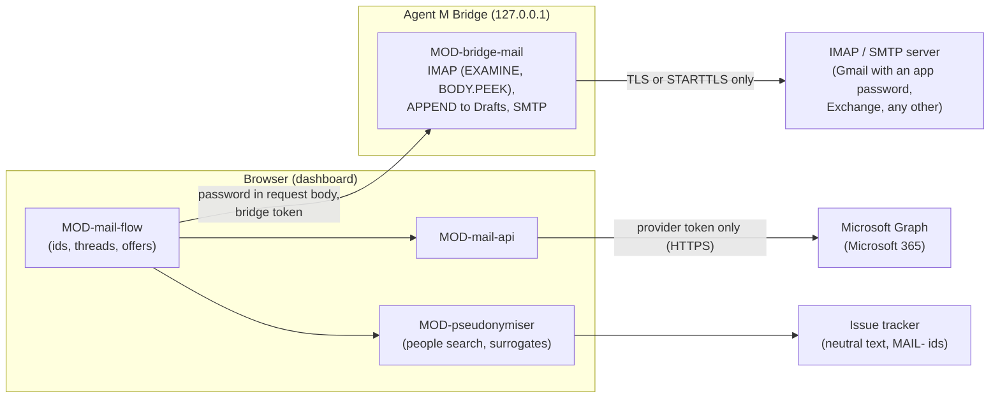

# ARC-014 Two mail routes and the pseudonymisation layer

## Context

Reports arrive by mail. Browsers let no page open IMAP or SMTP. The SPEC settles the routes: "The
dashboard reaches a Microsoft 365 mailbox directly through Microsoft Graph, and any other mailbox —
Gmail included — through the local bridge over IMAP and SMTP" (`A MAILBOX IS REACHED THROUGH ITS
PROVIDER'S WEB API OR THROUGH THE BRIDGE`). The provider sign-in asks for "no permission beyond the
narrowest ones its provider offers for reading mail, creating drafts and sending mail"; for Microsoft
Graph that is exactly `Mail.ReadWrite`, `Mail.Send` and `offline_access` (`THE MAIL SIGN-IN ASKS ONLY
FOR READING, DRAFTING AND SENDING`). The mailbox is the only store of mail (`MAIL STAYS IN THE
MAILBOX`); issues hold `MAIL-` identifiers; drafts wait in the mailbox's *Drafts*. Personal data from a
mail must not reach a repository; report data is pseudonymised with surrogates derived again from the
mail whenever needed.

What Microsoft, Google and the maintainers of the mail libraries document was read on 2026-09-30 and is
recorded in `docs/measurements/2026-09-30_architecture-open-points.md`, points 5 and 6 (*measurement
§5*, *§6*). Gmail went to the bridge because, per measurement §6, every Gmail read scope is restricted
and needs Google's verification for a public app, a browser-only app gets no refresh token, and the
hand-written flow without Google's library is "strongly discouraged due to security vulnerabilities".

Book ch. 10, pipe-and-filter: a mail flows through filters — identify, match thread, propose,
search for its people, pseudonymise — before anything reaches a tracker.

## Decision

**One mail interface, two adapters.** The mail flow (MOD-mail-flow) talks to a mailbox through one
interface — list the `Message-ID`s of named folders, read one mail by identifier without changing
it, store a draft replying to a mail, send a draft with a confirmation — implemented twice:

1. **Route 1 — Microsoft Graph for Microsoft 365 (MOD-mail-api).** From the browser, sign-in without
   a library: the authorization-code flow with PKCE for single-page applications, redirect URI of type
   `spa`. Microsoft documents that such a redirect "supports auth code flow with PKCE and cross-origin
   resource sharing (CORS)", that "Single page apps get a token with a 24-hour lifetime" and that "the
   refresh token expires after 24 hours", renewed by a pop-up or page load "in browsers without
   third-party cookies, such as Safari" (read 2026-09-30,
   `https://learn.microsoft.com/en-us/entra/identity-platform/v2-oauth2-auth-code-flow`). The requested
   scopes are the constant list `Mail.ReadWrite`, `Mail.Send`, `offline_access` — nothing else — in
   MOD-mail-api, checked by its test. Graph has no permission for drafts alone: storing a reply draft
   (`POST /me/messages/{id}/createReply`) needs `Mail.ReadWrite`, described as "create, read, update, and
   delete email in user mailboxes"; sending needs `Mail.Send`; the refresh token needs `offline_access`
   (permission tables of `https://github.com/microsoftgraph/microsoft-graph-docs-contrib` and
   `https://learn.microsoft.com/en-us/graph/permissions-reference`, measurement §6). That Agent M changes
   nothing it reads rests on `READING THE MAILBOX CHANGES NOTHING IN IT` — reads use `GET` only —, not
   on the permission. Tokens are stored through the settings store (ARC-005) and sent only to
   `https://graph.microsoft.com` and Microsoft's token endpoint (`THE MAIL SIGN-IN TOKEN GOES ONLY TO
   ITS PROVIDER`).
2. **Route 2 — IMAP and SMTP through the bridge (MOD-bridge-mail)**, for Gmail and every other server.
   The browser sends the mailbox password in the body of each mail request to the bridge (ARC-012);
   the bridge opens the connection over implicit TLS or STARTTLS and refuses to send `LOGIN`/`AUTH`
   otherwise, selects folders with `EXAMINE`, fetches with `BODY.PEEK[]`, finds mails by `UID SEARCH
   HEADER Message-ID`, stores drafts with `APPEND` to the folder marked `\Drafts`, and sends through
   SMTP only with a single-use confirmation naming the SHA-256 of the mail shown. The password lives
   in a variable of that request and is dropped with it; nothing is logged but request names and
   outcomes. For Gmail the password is an **app password**: Gmail refuses the account password over
   IMAP since 2025-03-14 and accepts an app password, which needs 2-Step Verification and is not
   offered for many work or school accounts (SPEC occasion, `support.google.com/accounts/answer/185833`,
   read 2026-09-30); the settings page says so (UC-037 step 4.2).
   Library: **imapflow** for IMAP and **nodemailer** for SMTP, through Deno's npm compatibility — both
   maintained for Node only (below); whether they run inside the compiled bridge is the first open
   measurement, and the fallback is named.
3. **Pseudonymisation (MOD-pseudonymiser) is pure core.** For one mail it derives *the mail's
   people*: every address and display name from its headers, and every address, phone number, account
   and signature name found in its body by fixed patterns. `findPeople(text, people)` reports each
   hit (a text from a mail is written nowhere while one is found); `pseudonymise(data, mail)` replaces
   each datum with a surrogate numbered in order of first appearance (`user1`, `user1@example.org`,
   `+49 000 0000001`, `/home/user1`, `192.0.2.1`), the same one throughout the report. The mapping is
   a local variable; the same surrogates come back from the same mail every time.
4. **No mail content leaves the flow into repositories.** Issue texts go through `findPeople`; report
   data through `pseudonymise` unless the product switched it off; jobs that write to a repository
   receive only the neutral issue and pseudonymised data (MOD-mail-flow enforces the input shape).

### Due diligence (read 2026-09-30)

Sources as in ARC-002. Licence texts read from `https://api.github.com/repos/<repo>/license`. The
maintainers' statements on Deno are those of measurement §5. The JSR packages were read from
`https://api.jsr.io/scopes/<scope>/packages/<name>` and `…/versions`.

| Candidate | Role | Licence | Against MIT | Releases | Issues | Adoption |
|---|---|---|---|---|---|---|
| **imapflow** (postalsys/imapflow) — chosen, subject to open measurement 1 | IMAP | npm field `MIT`; `LICENSE.txt` is the MIT grant without the notice condition (MIT-0 wording); GitHub reports NOASSERTION | compatible | first 2019-12-19, latest 2.1.2 on 2026-09-28, 70 versions in 12 months | 1 open, 211 closed, 16 closed in 12 months; on Deno, its maintainer: "Deno and Bun are not supported. It might work but probably does not." (issue #230, 2024-11-04), "All my email modules are Node only." (issue #329), and "Deno and edge runtimes are not in the test matrix" (issue #401, 2026-09-25) | 12 680 287 downloads last month; 570 stars |
| **nodemailer** (nodemailer/nodemailer) — chosen, subject to open measurement 1 | SMTP | npm field `MIT-0`; `LICENSE` is the MIT-0 wording | compatible | first 2011-01-21, latest 10.0.13 on 2026-09-30, 41 versions in 12 months | 0 open, 1 508 closed, 27 closed in 12 months; on Deno: "There are no plans to migrate or change anything in this regard." (issue #1331); STARTTLS on 587 failed under Deno 2.0.4 and was fixed ("This is fixed on canary.", denoland/deno#26735) | 93 411 804; 17 683 stars |
| `@workingdevshero/deno-imap` (JSR; workingdevshero/deno-imap) — fallback candidate for IMAP | IMAP, written for Deno | MIT (GitHub) | compatible | 1.0.0 on 2025-03-22, 5 versions, none in 12 months; JSR `runtimeCompat`: Deno yes, Node no | 3 open, 2 closed | 12 stars; JSR: 1 dependent |
| `@upyo/smtp` (JSR; dahlia/upyo) — fallback candidate for SMTP | SMTP transport | MIT (GitHub) | compatible | latest 0.6.0; 166 versions on JSR, the newest on 2026-09-09; JSR `runtimeCompat`: Deno, Node and Bun | 1 open, 47 closed (whole repository) | 585 stars; JSR: 2 dependents |
| emailjs-imap-client (emailjs/emailjs-imap-client) | IMAP | MIT | compatible | latest 3.1.0 on 2020-02-14; none in 12 months | 29 open, 0 closed in 12 months | 26 378 |
| imap (mscdex/node-imap) | IMAP | GitHub MIT; npm field empty | compatible | latest 0.8.19 on 2016-12-06 | 165 open; 0 closed in 12 months | 2 195 723 |
| @azure/msal-browser (AzureAD/microsoft-authentication-library-for-js) | Microsoft sign-in | MIT | compatible | latest 5.23.0 on 2026-09-23, 48 versions in 12 months | 149 open, 3 769 closed (whole repository) | 75 085 855 |
| oauth4webapi (panva/oauth4webapi) | OAuth helper | MIT | compatible | latest 3.8.8 on 2026-09-05, 6 versions in 12 months | 0 open, 31 closed | 54 768 923 |

## Alternatives

- **All mail through the bridge** — rejected: Microsoft 365 users would need the bridge although Graph
  allows the browser (`AGENT M WORKS WITHOUT A LOCAL INSTALLATION`).
- **Gmail through the Gmail API from the browser** (the earlier decision) — rejected by the PO on
  2026-09-30 (SPEC): the hand-written implicit flow is "strongly discouraged due to security
  vulnerabilities", Google's library would load code at run time from a third origin into the page that
  holds every token, and the read scopes are restricted (measurement §6). Gmail goes through the bridge
  with an app password.
- **msal-browser** — not chosen: it keeps its own token cache in browser storage beside the settings
  store (ARC-005), and the PKCE exchange it wraps is a few Web Crypto calls. **oauth4webapi** is the
  fallback if the hand-written exchange proves fragile; it is small and has no open issue.
- **The fallback if imapflow or nodemailer do not run in the compiled bridge** (open measurement 1):
  - IMAP: a small client over `Deno.connectTls` for the command set needed (`EXAMINE`, `UID SEARCH`,
    `UID FETCH BODY.PEEK`, `APPEND`), with `@workingdevshero/deno-imap` read as a starting point — it is
    written for Deno, but has had no release in twelve months and one maintainer. In imapflow issue #401,
    raw `Deno.connectTls` fetched the same message in 379 ms in a runtime where imapflow hung
    (measurement §5). Parsing IMAP responses correctly is the hard part, and a test IMAP server is part
    of the bridge's tests (ARC-016).
  - SMTP: `@upyo/smtp`, which declares Deno support on JSR and is released often.
- **A model to find people in a text** — rejected for the check itself: what can be decided without a
  model is decided without one; the model's residual rate is measured, not trusted (`THE PRODUCT ISSUE
  CARRIES NO PERSONAL DATA`).

## Consequences

- A Microsoft 365 connection needs a sign-in once a day: the `spa` refresh token lasts 24 hours and is
  not extended by refreshing (measurement §6). The dashboard asks for it in Microsoft's window when it
  has expired (UC-037 3b).
- `Mail.ReadWrite` would also allow changing and deleting mail; Agent M's reads use `GET` and its only
  writes are drafts and sends, which the mail route's tests check request by request.
- A Gmail connection needs the bridge and an app password; accounts without app passwords (many work or
  school accounts) need their administrator, and the settings page says so.
- **Open measurement 1 — imapflow and nodemailer inside the compiled bridge.** No source says anything
  about either library in a compiled Deno program (measurement §5). Build the bridge with imapflow ≥
  2.0.7 and nodemailer; read a mailbox of more than 1 MB over implicit TLS and over STARTTLS; send over
  465 and 587 against a local test server and against Gmail with an app password; record each result.
  If one fails, the fallback above is built instead, with its own due diligence re-read.
- **Open measurement 2 — Microsoft 365 tenant consent.** Whether a tenant such as FAU's lets a user
  consent to `Mail.ReadWrite`, `Mail.Send` and `offline_access` for an unverified `spa` app: all three
  are marked "AdminConsentRequired … No" in the reference, but a tenant's own consent policy may still
  restrict them (measurement §6). Measured with a test registration.
- Name detection in free text is heuristic: signature names and names in running text can be missed.
  The deterministic check covers the mail's headers and patterns; what slips through is the measured
  rate the SPEC asks for.

*Drafted on 2026-09-30 by Claude (claude-opus-5-5) for the Agent M repository at commit 1605b2dcfe907fb1df6e394af3fdbec80f379dbc; revised on 2026-09-30 by Claude (claude-opus-5-5) against commit 1110607b6dc4d9c888549a23a680fbe4b38dd3f1 — SPEC and use cases as accepted that day, and `docs/measurements/2026-09-30_architecture-open-points.md`; open until accepted.*
