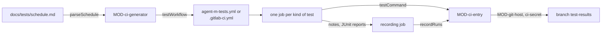

# ARC-015 CI generated from the test schedule, and the credentials CI writes with

## Context

Each product declares which tests run on every commit, on a pull request, nightly, on a release candidate and on demand
(`THE TEST SCHEDULE IS DECLARED PER PRODUCT`); without a declaration the book's default applies, and the tests that call
a paid service or a model never run on every commit or pull request (`COMMIT TESTS CALL NO PAID SERVICE`). The CI
configuration follows from the schedule and is never a second place that says the same
(`THE CI CONFIGURATION IS GENERATED FROM THE SCHEDULE`). Job records start no test run; every run leaves a record on the
branch `test-results`, which only grows (ARC-006, ARC-027). Book ch. 12 §5: CI runs "the complete test suite" on every
commit; ch. 13 §4: paid external calls are mocked and exercised for real only in "a limited nightly integration test".

Writes from CI — the result records here, and the pushes, pull requests and merges of the job runtimes — are made with a
credential the SPEC names: the agent authenticates with a key from a CI secret
(`A HOSTED JOB AUTHENTICATES ITS AGENT WITH A CI SECRET`), and every write is made with the person's Agent M token from
a CI secret, never with the workflow's built-in token (`A HOSTED JOB WRITES WITH THE PERSON'S TOKEN FROM A CI SECRET`).

## Decision

1. **Two modules.** `MOD-ci-generator`, a feature, reads, writes, defaults and checks the schedule and generates the
   configuration; it reads nothing itself. `MOD-ci-entry`, a shell, runs the steps of the generated jobs that run Agent
   M's code, with the process's environment, its working tree, the network and the clock as ports;
   `src/ci-entry/main.mjs`, the file the jobs call, maps a step's name to its interface.
2. **The schedule is data** in the product repository, `docs/tests/schedule.md` (`MOD-ci-generator.parseSchedule`,
   `MOD-ci-generator.scheduleText`): front matter with the time of the nightly run in UTC and the command that runs the
   product's tests — none for node's test runner —, then the table UC-027 shows, one row per kind of test — unit,
   component, system with recorded responses, tests that call a paid service or a model, release, user — and one column
   per occasion, with where each kind runs: a hosted runner, the self-hosted runner of a CLI or sandboxed agent by its
   name, or people for user tests. A product without the file has the book's default
   (`MOD-ci-generator.defaultSchedule`). A schedule is checked before it is saved (`MOD-ci-generator.scheduleProblems`):
   the tests that call a paid service or a model are never ticked for every commit or a pull request, every kind is
   ticked for a release candidate (`A RELEASE RUNS EVERY TEST AT EVERY LEVEL`), and a runner names a participant with
   *run code and tests* (UC-027 3).
3. **The configuration is generated** (`MOD-ci-generator.testWorkflow`), byte for byte the same for the same schedule,
   so that a configuration edited by hand shows as different from a fresh generation (UC-027 1b):
   - on GitHub, `.github/workflows/agent-m-tests.yml`: a push to any branch but `test-results` and a pull request, both
     with `paths-ignore: ["docs/jobs/**"]`, the nightly `schedule`, and a `workflow_dispatch` with the occasion
     (*release candidate* or *on demand*), the commit and, on demand, the kinds of test; a first job chooses the
     occasion, the commit — a pull request's head, not its merge — and the kinds that run; one job per kind follows,
     `runs-on: ubuntu-latest` for a hosted runner and `runs-on: [self-hosted, <name>]` for the runner a CLI or sandboxed
     agent registered with its name as label; the workflow's own token reads only;
   - on GitLab, `.gitlab-ci.yml`: `workflow:rules` that start no pipeline on `test-results`, start one for a push or a
     merge request only where it changes a path outside `docs/jobs/`, and start one for the nightly pipeline schedule
     and for a pipeline started with the variable `AGENT_M_OCCASION`; one job per kind with `rules` for its occasions,
     and `tags: [<name>]` for the runner of a CLI or sandboxed agent. GitLab matches `changes` with Ruby's
     `File.fnmatch` and the flags `FNM_PATHNAME`, `FNM_DOTMATCH` and `FNM_EXTGLOB`, and a list of patterns matches when
     any does; it has no pattern that excludes, so every path outside `docs/jobs/` is written as the patterns of its
     complement, checked with `File.fnmatch` against paths that must and must not match. The nightly run is a pipeline
     schedule of the project (`MOD-ci-generator.nightlySchedule`).

   A job of a kind checks out the commit to test and the instance's Agent M at the commit the configuration was
   generated with — the instance is a fork of a public repository, so it is read without a token —, runs the tests, and,
   whatever their status, leaves a note of its run and its JUnit report as an artifact (decision 5). One more job —
   `results` on GitHub after every kind's job, `agent-m-results` in GitLab's last stage `.post` — records every run of
   the pipeline.
4. **Which test is which kind.** A job sets `AGENT_M_KIND` — `unit`, `component`, `system`, `paid` or `release` — and
   `AGENT_M_JUNIT`, the file the JUnit report goes to. With node's test runner, `MOD-ci-entry.testCommand` gives the
   command: the files whose `Level:` is the kind (ARC-020 decision 11) and of them every case but those declaring
   `Paid:` or `Runs:` (ARC-027 decision 2), skipped by name; for the kind `paid`, the files that declare such cases, and
   only those. A product with another runner names its command in the schedule; it reads the same two variables.
5. **A pipeline's runs are recorded in one commit.** The last step of a kind's job writes its note, `run.txt` — the
   kind, the job's outcome, the secrets it missed, the run's name, the page of its log and the runner — with plain shell
   lines, so that a job that failed before its tests still leaves one; a job whose secrets are missing fails naming them
   (UC-027 4a). The recording job reads every note and report (`MOD-ci-entry.recordRuns`) and writes the record of
   ARC-027 of each run — not run where secrets were missing or no test is of the kind, a note where no JUnit XML was
   written — as new files on `test-results`, in one commit on the CI secret's authority (ARC-003): the branch is started
   on the tested commit where the repository has none (`MOD-git-host.createBranch`), a record whose path is taken is
   never written over, and a branch that another pipeline moved on is read again, up to three times.
6. **The keys of paid services reach only their job.** The job of tests that call a paid service or a model is the only
   one given them: on GitHub each is passed to that job's steps alone; on GitLab that job accesses the environment
   `agent-m-paid` (`action: access`, which gives access to environment-scoped variables without a deployment), and the
   keys are stored scoped to it. A case that reaches a paid service without declaring it finds no key in a run of every
   commit or pull request, and its call fails that run (ARC-027).
7. **The credentials CI writes with.** The secrets a product's CI needs are named by the dashboard, with the server's
   page where they are stored (`MOD-ci-generator.secretsNeeded`, `MOD-git-host.secretsPageUrl`); their values it never
   asks for, and the generated files name them, never their values (`NO SECRET IN THE REPOSITORY`):
   - the **person's Agent M token**, `AGENT_M_TOKEN`, with which the recording job writes the records — and the job
     runtimes every push, pull request and merge —; on GitHub the one fine-grained token of
     `ONE GITHUB TOKEN SERVES EVERY FEATURE`, passed to the recording step alone; on GitLab the product's project access
     token (`A GITLAB PRODUCT USES A PROJECT ACCESS TOKEN`), masked, scoped to the environment `agent-m-results` that
     only the recording job accesses, and not protected, so that a merge request's pipeline can record its runs. The
     token never reaches a job that runs the product's code;
   - the **keys of paid services** of decision 6;
   - the **agent's key**, read only by the job workflow of the job runtimes and handed only to the agent's provider
     (`A HOSTED JOB AUTHENTICATES ITS AGENT WITH A CI SECRET`).

   The workflow's built-in token (`GITHUB_TOKEN`, `CI_JOB_TOKEN`) is given no write.
8. **Every generated file reaches the default branch through a pull request with green CI**, like code
   (`CODE ENTERS THE DEFAULT BRANCH THROUGH A PULL REQUEST WITH GREEN CI`); UC-027 5 opens one pull request with the
   schedule and the configuration together, so that the two never disagree on the default branch.



## Alternatives

- **One hand-written workflow reading the schedule at run time** — rejected: the schedule decides the triggers
  themselves (nightly or not), and triggers cannot be computed at run time; also GitLab needs its own file.
- **One job running every kind of test** — rejected: a kind runs on its own runner, and only the job of tests that call
  a paid service or a model may be given the keys of paid services.
- **Each kind's job recording its own run** — rejected: the person's token would stand in a job that has run the
  product's code, which can change the files the recording step then runs; and up to five jobs of one pipeline would
  write `test-results` at once.
- **Result records as CI artifacts** — rejected by `TEST RESULTS ARE KEPT IN THE REPOSITORY`: servers delete them after
  their retention period.
- **Result records in the default branch** — rejected: a commit per run on the default branch would start CI again and
  bury the history.
- **Agent M's code vendored into the product's repository** — rejected: every update of Agent M would change files of
  every product; the jobs read the instance at the commit they were generated with, and a newer Agent M shows as a
  configuration to generate again (UC-027 1b).
- **The built-in token for the job workflows' pushes and pull requests** — rejected by
  `A HOSTED JOB WRITES WITH THE PERSON'S TOKEN FROM A CI SECRET`: its events start no new run, and its pull requests
  wait in "approval-required" (consequences); on GitLab the job token opens no merge request.
- **The built-in token for the result-record step only** (on GitHub it would work, since that push needs to start
  nothing) — not chosen: on GitLab it needs a project setting that is off by default, and two credential paths for one
  kind of step are one more thing to get wrong.
- **A GitHub App installation token** minted in the workflow — GitHub's other documented remedy, which "will expire
  after 1 hour"
  (`https://docs.github.com/en/apps/creating-github-apps/authenticating-with-a-github-app/generating-an-installation-access-token-for-a-github-app`)
  — not chosen: minting needs the App's private key, and a second credential beside the person's token contradicts
  `ONE GITHUB TOKEN SERVES EVERY FEATURE`.
- **A protected GitLab variable for the person's token** — not chosen: a protected variable is "only available in
  pipelines that run on protected branches or protected tags", so a merge request's pipeline could not record its runs
  (`EVERY TEST RUN LEAVES A RESULT RECORD`); scoping it to `agent-m-results` keeps it from the other jobs instead.

## Consequences

- The other files and steps of the two modules are designed with what they serve, with the credentials of decision 7:
  with the job runtimes, the engine workflow and the job workflow (ARC-010, ARC-009), the driver that dispatches a CI
  agent's job, the check that a self-hosted runner serves only a private repository, and the check of the Definition of
  Done on an implementation job's pull request; with the instance, its step that writes an accepted SPEC change without
  a token (ARC-021); with the sources, its step that fetches an EU legal text. The earlier module files of
  `MOD-ci-generator` and `MOD-ci-entry` leave the working tree: this decision is where the modules are designed (ARC-020
  decision 3).
- The steps of UC-027 and UC-028 are realised with the tests pages; creating and updating a GitLab project's pipeline
  schedule (UC-027 3a) needs an interface of `MOD-git-host` designed with them.
- On GitLab, the recording job of every pipeline of the project — a merge request's too — reads `AGENT_M_TOKEN`, so
  whoever may push a branch could change what that job runs; the settings page says so where it names the variable.
- Pipelines of one product write `test-results` one commit each; two that finish at once meet as a branch that moved on,
  and the later one writes again on the new head, which only adds files.
- A pull request from a fork gets no secrets on GitHub: its run cannot write its record, says so in its log, and a
  person runs the tests on its commit from the dashboard (UC-028 5) to record them.
- The append-only property of `test-results` is checked over the branch history by a test (ARC-006); where the host
  offers branch protection against force pushes, the settings page recommends it.
- **Why not the built-in token.** In `https://docs.github.com/en/actions/concepts/security/github_token` (recorded in
  `docs/measurements/2026-09-30_architecture-open-points.md`, point 8): "events triggered by the `GITHUB_TOKEN` will not
  create a new workflow run", except that "`workflow_dispatch` and `repository_dispatch` events always create workflow
  runs"; a pull request opened or updated with it "creates workflow runs in an **approval-required** state", released
  only by "a user with write access" selecting "**Approve workflows to run**". A run would stop at that click
  (`A RUN CONTINUES WITHOUT A CLICK BETWEEN ITS JOBS`). GitHub's remedy is "a GitHub App installation access token or a
  personal access token", which "lets `pull_request` workflows run automatically (without the approval prompt described
  above)"; the PO chose the person's own token. On GitLab, "When you use a job token to push to the project, no CI/CD
  pipelines are triggered", and the job token can only read merge requests
  (`https://docs.gitlab.com/ci/jobs/ci_job_token/`).
- **The token is stored twice.** A secret cannot be read back — the secrets API lists secrets "without revealing their
  encrypted values" (`https://docs.github.com/en/rest/actions/secrets`) —, so the person stores the token in the browser
  and as the secret; the dashboard names the secret and opens its page, and the token's renewal
  (`A TOKEN'S EXPIRY IS WARNED OF IN ADVANCE`) names both places.
- The token a CI job writes with needs, per GitHub's permission table
  (`https://docs.github.com/en/rest/authentication/permissions-required-for-fine-grained-personal-access-tokens`,
  measurement point 8): *Contents* write to push through the git data API and to merge a pull request, *Pull requests*
  write to open one, and *Workflows* write where it writes CI files (`A RUN SETS UP CI BEFORE IT IMPLEMENTS`);
  dispatching a run needs *Actions*, as the occasion of `ONE GITHUB TOKEN SERVES EVERY FEATURE` states.
- **Open measurement 1 — *Workflows* on a push.** GitHub states the need for *Workflows* write only for the releases
  endpoint ("also need the "Workflows" repository permission (write)") and that "The GITHUB_TOKEN available to GitHub
  Actions cannot be authorized for this" (`https://docs.github.com/en/rest/releases/releases`); whether a commit that
  changes `.github/workflows/` through the git data API needs it is not documented in what was read. Measurement: update
  a workflow file with a fine-grained token without *Workflows*, and with it; record both answers.
- **Open measurement 2 — GitLab.** Whether a push and a merge request made with a GitLab project access token start
  pipelines as usual: GitLab documents the exception only for the job token, and the project access token pages say
  nothing about pipelines (measurement point 8). Measurement: push and open a merge request with a project access token
  on a test project; record the pipelines.

## Modules

### MOD-ci-generator

```json module
{
  "id": "MOD-ci-generator",
  "folder": "src/ci-generator/",
  "layer": "feature",
  "responsibility": "Reads, writes, defaults and checks a product's test schedule, and generates from it the CI configuration of the product's server — byte for byte the same for the same schedule —, the secrets its jobs read and the pipeline schedule of a GitLab product's nightly run; it reads nothing itself.",
  "realises": ["THE TEST SCHEDULE IS DECLARED PER PRODUCT", "THE DEFAULT SCHEDULE FOLLOWS THE BOOK", "THE CI CONFIGURATION IS GENERATED FROM THE SCHEDULE", "A JOB RECORD STARTS NO CI RUN", "COMMIT TESTS CALL NO PAID SERVICE", "A RELEASE RUNS EVERY TEST AT EVERY LEVEL"],
  "owns": ["ScheduleRow", "Schedule", "CiSetup", "SecretNeed", "NightlySchedule", "ScheduleContent", "ScheduleFile", "GitHubTestWorkflowFile", "GitLabPipelineFile"],
  "uses": ["MOD-contracts", "MOD-artifacts", "MOD-process-model", "MOD-git-host"]
}
```

```json interface
{
  "id": "MOD-ci-generator.defaultSchedule",
  "summary": "The book's schedule, for a product that declares none: unit, component and system tests on every occasion; tests that call a paid service or a model nightly, on a release candidate and on demand; release and user tests on a release candidate and on demand; every kind on a hosted runner, user tests carried out by people; the nightly run at 02:00 UTC; the tests run with node's test runner.",
  "params": [],
  "result": "Schedule",
  "async": false,
  "refusals": [],
  "examples": [
    {
      "name": "the book's default",
      "input": {},
      "result": {
        "declared": false,
        "nightly": "02:00",
        "command": "",
        "rows": [
          {
            "tests": "unit",
            "occasions": ["every commit", "pull request", "nightly", "release candidate", "on demand"],
            "runsOn": "hosted",
            "line": 0
          },
          {
            "tests": "component",
            "occasions": ["every commit", "pull request", "nightly", "release candidate", "on demand"],
            "runsOn": "hosted",
            "line": 0
          },
          {
            "tests": "system",
            "occasions": ["every commit", "pull request", "nightly", "release candidate", "on demand"],
            "runsOn": "hosted",
            "line": 0
          },
          {
            "tests": "paid",
            "occasions": ["nightly", "release candidate", "on demand"],
            "runsOn": "hosted",
            "line": 0
          },
          { "tests": "release", "occasions": ["release candidate", "on demand"], "runsOn": "hosted", "line": 0 },
          { "tests": "user", "occasions": ["release candidate", "on demand"], "runsOn": "people", "line": 0 }
        ]
      }
    }
  ]
}
```

```json interface
{
  "id": "MOD-ci-generator.parseSchedule",
  "summary": "A product's schedule as docs/tests/schedule.md holds it: front matter with the time of the nightly run and the command that runs its tests — none for node's test runner —, then a table with one row per kind of test, one column per occasion, ✓ where it runs, and where it runs.",
  "params": [{ "name": "text", "type": "string" }],
  "result": "Schedule",
  "async": false,
  "refusals": [
    { "code": "not-a-schedule", "when": "the text has no front matter, no table, a header other than Tests, the five occasions and Runs on, or a row of no known kind" }
  ],
  "examples": [
    {
      "name": "system tests nightly only, the paid ones on a CLI agent's runner",
      "input": { "text": "---\nnightly: 03:30\ncommand: npm test\n---\n\n# Test schedule\n\n| Tests | every commit | pull request | nightly | release candidate | on demand | Runs on |\n|---|:-:|:-:|:-:|:-:|:-:|---|\n| unit | ✓ | ✓ | ✓ | ✓ | ✓ | hosted |\n| component | ✓ | ✓ | ✓ | ✓ | ✓ | hosted |\n| system (with recorded responses) |   |   | ✓ | ✓ | ✓ | hosted |\n| tests that call a paid service or a model |   |   | ✓ | ✓ | ✓ | cli-dev |\n| release |   |   |   | ✓ | ✓ | hosted |\n| user (manual) |   |   |   | ✓ | ✓ | people |\n" },
      "result": {
        "declared": true,
        "nightly": "03:30",
        "command": "npm test",
        "rows": [
          {
            "tests": "unit",
            "occasions": ["every commit", "pull request", "nightly", "release candidate", "on demand"],
            "runsOn": "hosted",
            "line": 10
          },
          {
            "tests": "component",
            "occasions": ["every commit", "pull request", "nightly", "release candidate", "on demand"],
            "runsOn": "hosted",
            "line": 11
          },
          {
            "tests": "system",
            "occasions": ["nightly", "release candidate", "on demand"],
            "runsOn": "hosted",
            "line": 12
          },
          {
            "tests": "paid",
            "occasions": ["nightly", "release candidate", "on demand"],
            "runsOn": "cli-dev",
            "line": 13
          },
          { "tests": "release", "occasions": ["release candidate", "on demand"], "runsOn": "hosted", "line": 14 },
          { "tests": "user", "occasions": ["release candidate", "on demand"], "runsOn": "people", "line": 15 }
        ]
      }
    },
    {
      "name": "a file without its table",
      "input": { "text": "---\nnightly: 02:00\n---\n\n# Test schedule\n" },
      "refused": "not-a-schedule"
    }
  ]
}
```

```json interface
{
  "id": "MOD-ci-generator.scheduleText",
  "summary": "The text of a schedule and where it lies, docs/tests/schedule.md, in the form parseSchedule reads.",
  "params": [{ "name": "schedule", "type": "Schedule" }],
  "result": "FileText",
  "async": false,
  "refusals": [],
  "examples": [
    {
      "name": "the book's default",
      "input": {
        "schedule": {
          "declared": false,
          "nightly": "02:00",
          "command": "",
          "rows": [
            {
              "tests": "unit",
              "occasions": ["every commit", "pull request", "nightly", "release candidate", "on demand"],
              "runsOn": "hosted",
              "line": 0
            },
            {
              "tests": "component",
              "occasions": ["every commit", "pull request", "nightly", "release candidate", "on demand"],
              "runsOn": "hosted",
              "line": 0
            },
            {
              "tests": "system",
              "occasions": ["every commit", "pull request", "nightly", "release candidate", "on demand"],
              "runsOn": "hosted",
              "line": 0
            },
            {
              "tests": "paid",
              "occasions": ["nightly", "release candidate", "on demand"],
              "runsOn": "hosted",
              "line": 0
            },
            { "tests": "release", "occasions": ["release candidate", "on demand"], "runsOn": "hosted", "line": 0 },
            { "tests": "user", "occasions": ["release candidate", "on demand"], "runsOn": "people", "line": 0 }
          ]
        }
      },
      "result": { "path": "docs/tests/schedule.md", "text": "---\nnightly: 02:00\n---\n\n# Test schedule\n\n| Tests | every commit | pull request | nightly | release candidate | on demand | Runs on |\n|---|:-:|:-:|:-:|:-:|:-:|---|\n| unit | ✓ | ✓ | ✓ | ✓ | ✓ | hosted |\n| component | ✓ | ✓ | ✓ | ✓ | ✓ | hosted |\n| system (with recorded responses) | ✓ | ✓ | ✓ | ✓ | ✓ | hosted |\n| tests that call a paid service or a model |   |   | ✓ | ✓ | ✓ | hosted |\n| release |   |   |   | ✓ | ✓ | hosted |\n| user (manual) |   |   |   | ✓ | ✓ | people |\n" }
    },
    {
      "name": "a declared schedule with its command",
      "input": {
        "schedule": {
          "declared": true,
          "nightly": "03:30",
          "command": "npm test",
          "rows": [
            {
              "tests": "unit",
              "occasions": ["every commit", "pull request", "nightly", "release candidate", "on demand"],
              "runsOn": "hosted",
              "line": 10
            },
            {
              "tests": "component",
              "occasions": ["every commit", "pull request", "nightly", "release candidate", "on demand"],
              "runsOn": "hosted",
              "line": 11
            },
            {
              "tests": "system",
              "occasions": ["nightly", "release candidate", "on demand"],
              "runsOn": "hosted",
              "line": 12
            },
            {
              "tests": "paid",
              "occasions": ["nightly", "release candidate", "on demand"],
              "runsOn": "cli-dev",
              "line": 13
            },
            { "tests": "release", "occasions": ["release candidate", "on demand"], "runsOn": "hosted", "line": 14 },
            { "tests": "user", "occasions": ["release candidate", "on demand"], "runsOn": "people", "line": 15 }
          ]
        }
      },
      "result": { "path": "docs/tests/schedule.md", "text": "---\nnightly: 03:30\ncommand: npm test\n---\n\n# Test schedule\n\n| Tests | every commit | pull request | nightly | release candidate | on demand | Runs on |\n|---|:-:|:-:|:-:|:-:|:-:|---|\n| unit | ✓ | ✓ | ✓ | ✓ | ✓ | hosted |\n| component | ✓ | ✓ | ✓ | ✓ | ✓ | hosted |\n| system (with recorded responses) |   |   | ✓ | ✓ | ✓ | hosted |\n| tests that call a paid service or a model |   |   | ✓ | ✓ | ✓ | cli-dev |\n| release |   |   |   | ✓ | ✓ | hosted |\n| user (manual) |   |   |   | ✓ | ✓ | people |\n" }
    }
  ]
}
```

```json interface
{
  "id": "MOD-ci-generator.scheduleProblems",
  "summary": "Every finding of a schedule: a kind of test it has no row for; a nightly time that is no HH:MM; tests that call a paid service or a model ticked for every commit or a pull request; a kind not ticked for a release candidate; a runner that names no CLI or sandboxed agent with \"run code and tests\"; user tests carried out by anything but people.",
  "params": [{ "name": "schedule", "type": "Schedule" }, { "name": "participants", "type": "Participant[]" }],
  "result": "Finding[]",
  "async": false,
  "refusals": [],
  "examples": [
    {
      "name": "four findings",
      "input": {
        "schedule": {
          "declared": true,
          "nightly": "3am",
          "command": "npm test",
          "rows": [
            {
              "tests": "unit",
              "occasions": ["every commit", "pull request", "nightly", "release candidate", "on demand"],
              "runsOn": "hosted",
              "line": 10
            },
            {
              "tests": "component",
              "occasions": ["every commit", "pull request", "nightly", "release candidate", "on demand"],
              "runsOn": "hosted",
              "line": 11
            },
            {
              "tests": "system",
              "occasions": ["nightly", "release candidate", "on demand"],
              "runsOn": "hub-writer",
              "line": 12
            },
            {
              "tests": "paid",
              "occasions": ["pull request", "nightly", "release candidate"],
              "runsOn": "cli-dev",
              "line": 13
            },
            { "tests": "release", "occasions": ["on demand"], "runsOn": "hosted", "line": 14 },
            { "tests": "user", "occasions": ["release candidate", "on demand"], "runsOn": "people", "line": 15 }
          ]
        },
        "participants": [
          {
            "name": "alice",
            "type": "person",
            "model": "",
            "context": null,
            "price": null,
            "capabilities": ["draft text", "read the repository", "write to the repository"],
            "place": "",
            "route": "the GitHub account `alice`",
            "line": 5
          },
          {
            "name": "hub-writer",
            "type": "model endpoint",
            "model": "llama-3.3-70b",
            "context": null,
            "price": null,
            "capabilities": ["draft text"],
            "place": "NHR@FAU, Erlangen",
            "route": "the endpoint hub of this browser",
            "line": 6
          },
          {
            "name": "gw-writer",
            "type": "model endpoint",
            "model": "gateway-model",
            "context": 32000,
            "price": { "currency": "EUR", "input": 0.2, "output": 0.6 },
            "capabilities": ["draft text"],
            "place": "a gateway in Frankfurt, Germany",
            "route": "the endpoint gw of this browser",
            "line": 7
          },
          {
            "name": "ci-dev",
            "type": "CI agent",
            "model": "claude-opus-5-5",
            "context": null,
            "price": null,
            "capabilities": ["read the repository", "write to the repository", "run code and tests"],
            "place": "GitHub's machines, a provider in the USA",
            "route": "the workflow agent-m-job",
            "line": 8
          },
          {
            "name": "cli-dev",
            "type": "CLI agent",
            "model": "claude-opus-5-5",
            "context": null,
            "price": null,
            "capabilities": ["draft text", "read the repository", "write to the repository", "run code and tests", "use tools"],
            "place": "this machine",
            "route": "the bridge on the Mac of `alice`",
            "line": 9
          }
        ]
      },
      "result": [
        { "artifact": "docs/tests/schedule.md", "line": 2, "kind": "error", "what": "the nightly time \"3am\" is no HH:MM", "rule": "THE TEST SCHEDULE IS DECLARED PER PRODUCT", "fix": "write the time of the nightly run as HH:MM in UTC" },
        { "artifact": "docs/tests/schedule.md", "line": 12, "kind": "error", "what": "system tests run on hub-writer, which is no CLI or sandboxed agent with \"run code and tests\"", "rule": "THE TEST SCHEDULE IS DECLARED PER PRODUCT", "fix": "choose a hosted runner or such a participant (UC-017)" },
        { "artifact": "docs/tests/schedule.md", "line": 13, "kind": "error", "what": "tests that call a paid service or a model are ticked for pull request", "rule": "COMMIT TESTS CALL NO PAID SERVICE", "fix": "untick them; a commit's tests use recorded or constructed responses" },
        { "artifact": "docs/tests/schedule.md", "line": 14, "kind": "error", "what": "release tests do not run on a release candidate", "rule": "A RELEASE RUNS EVERY TEST AT EVERY LEVEL", "fix": "tick release candidate" }
      ]
    },
    {
      "name": "a schedule that holds",
      "input": {
        "schedule": {
          "declared": true,
          "nightly": "03:30",
          "command": "npm test",
          "rows": [
            {
              "tests": "unit",
              "occasions": ["every commit", "pull request", "nightly", "release candidate", "on demand"],
              "runsOn": "hosted",
              "line": 10
            },
            {
              "tests": "component",
              "occasions": ["every commit", "pull request", "nightly", "release candidate", "on demand"],
              "runsOn": "hosted",
              "line": 11
            },
            {
              "tests": "system",
              "occasions": ["nightly", "release candidate", "on demand"],
              "runsOn": "hosted",
              "line": 12
            },
            {
              "tests": "paid",
              "occasions": ["nightly", "release candidate", "on demand"],
              "runsOn": "cli-dev",
              "line": 13
            },
            { "tests": "release", "occasions": ["release candidate", "on demand"], "runsOn": "hosted", "line": 14 },
            { "tests": "user", "occasions": ["release candidate", "on demand"], "runsOn": "people", "line": 15 }
          ]
        },
        "participants": [
          {
            "name": "alice",
            "type": "person",
            "model": "",
            "context": null,
            "price": null,
            "capabilities": ["draft text", "read the repository", "write to the repository"],
            "place": "",
            "route": "the GitHub account `alice`",
            "line": 5
          },
          {
            "name": "hub-writer",
            "type": "model endpoint",
            "model": "llama-3.3-70b",
            "context": null,
            "price": null,
            "capabilities": ["draft text"],
            "place": "NHR@FAU, Erlangen",
            "route": "the endpoint hub of this browser",
            "line": 6
          },
          {
            "name": "gw-writer",
            "type": "model endpoint",
            "model": "gateway-model",
            "context": 32000,
            "price": { "currency": "EUR", "input": 0.2, "output": 0.6 },
            "capabilities": ["draft text"],
            "place": "a gateway in Frankfurt, Germany",
            "route": "the endpoint gw of this browser",
            "line": 7
          },
          {
            "name": "ci-dev",
            "type": "CI agent",
            "model": "claude-opus-5-5",
            "context": null,
            "price": null,
            "capabilities": ["read the repository", "write to the repository", "run code and tests"],
            "place": "GitHub's machines, a provider in the USA",
            "route": "the workflow agent-m-job",
            "line": 8
          },
          {
            "name": "cli-dev",
            "type": "CLI agent",
            "model": "claude-opus-5-5",
            "context": null,
            "price": null,
            "capabilities": ["draft text", "read the repository", "write to the repository", "run code and tests", "use tools"],
            "place": "this machine",
            "route": "the bridge on the Mac of `alice`",
            "line": 9
          }
        ]
      },
      "result": []
    }
  ]
}
```

```json interface
{
  "id": "MOD-ci-generator.testWorkflow",
  "summary": "The CI configuration a schedule gives, and where it lies: on GitHub .github/workflows/agent-m-tests.yml — triggered by a push to any branch but test-results and by a pull request, both unless only docs/jobs/ changed, by the nightly cron, and by a dispatch for a release candidate or on demand —; on GitLab .gitlab-ci.yml — a pipeline for a push or a merge request that changes more than docs/jobs/, for the nightly pipeline schedule, and for one started with AGENT_M_OCCASION —; one job per kind of test on its runner, which checks out the commit and the instance's Agent M at the version, runs the tests, and records the run whatever its status; the keys of paid services only in the job of tests that call a paid service or a model; the workflow's own token reads only.",
  "params": [
    { "name": "schedule", "type": "Schedule" },
    { "name": "product", "type": "Product" },
    { "name": "setup", "type": "CiSetup" }
  ],
  "result": "FileText",
  "async": false,
  "refusals": [
    { "code": "not-an-instance", "when": "the instance is no https://github.com/<owner>/<repository>" },
    { "code": "no-version", "when": "the version is no 40-hex commit" },
    { "code": "not-a-secret-name", "when": "a secret's name has other signs than capitals, digits and underscores" }
  ],
  "examples": [
    {
      "name": "the book's default on GitHub, with a paid service's key",
      "input": {
        "schedule": {
          "declared": false,
          "nightly": "02:00",
          "command": "",
          "rows": [
            {
              "tests": "unit",
              "occasions": ["every commit", "pull request", "nightly", "release candidate", "on demand"],
              "runsOn": "hosted",
              "line": 0
            },
            {
              "tests": "component",
              "occasions": ["every commit", "pull request", "nightly", "release candidate", "on demand"],
              "runsOn": "hosted",
              "line": 0
            },
            {
              "tests": "system",
              "occasions": ["every commit", "pull request", "nightly", "release candidate", "on demand"],
              "runsOn": "hosted",
              "line": 0
            },
            {
              "tests": "paid",
              "occasions": ["nightly", "release candidate", "on demand"],
              "runsOn": "hosted",
              "line": 0
            },
            { "tests": "release", "occasions": ["release candidate", "on demand"], "runsOn": "hosted", "line": 0 },
            { "tests": "user", "occasions": ["release candidate", "on demand"], "runsOn": "people", "line": 0 }
          ]
        },
        "product": { "kind": "github", "address": "https://github.com/alice/thesis", "host": "github.com", "server": "https://github.com", "repo": "alice/thesis" },
        "setup": {
          "instance": "https://github.com/alice/agent-m",
          "version": "a100000000000000000000000000000000000000",
          "paidSecrets": ["HUB_KEY"]
        }
      },
      "result": { "path": ".github/workflows/agent-m-tests.yml", "text": "# Generated by Agent M from docs/tests/schedule.md; change the schedule, not this file.\nname: agent-m tests\non:\n  push:\n    branches-ignore: [test-results]\n    paths-ignore: [\"docs/jobs/**\"]\n  pull_request:\n    paths-ignore: [\"docs/jobs/**\"]\n  schedule:\n    - cron: \"0 2 * * *\"\n  workflow_dispatch:\n    inputs:\n      AGENT_M_OCCASION:\n        description: release candidate or on demand\n        type: choice\n        options: [\"on demand\", \"release candidate\"]\n        default: \"on demand\"\n      AGENT_M_COMMIT:\n        description: the commit to test, empty for the head of the branch\n        type: string\n        default: \"\"\n      AGENT_M_TESTS:\n        description: the kinds of test to run on demand, separated by spaces, empty for every kind\n        type: string\n        default: \"\"\npermissions:\n  contents: read\njobs:\n  occasion:\n    runs-on: ubuntu-latest\n    outputs:\n      occasion: ${{ steps.o.outputs.occasion }}\n      commit: ${{ steps.o.outputs.commit }}\n      unit: ${{ steps.o.outputs.unit }}\n      component: ${{ steps.o.outputs.component }}\n      system: ${{ steps.o.outputs.system }}\n      paid: ${{ steps.o.outputs.paid }}\n      release: ${{ steps.o.outputs.release }}\n    steps:\n      - id: o\n        env:\n          EVENT: ${{ github.event_name }}\n          HEAD: ${{ github.event.pull_request.head.sha || github.sha }}\n          OCCASION: ${{ inputs.AGENT_M_OCCASION }}\n          COMMIT: ${{ inputs.AGENT_M_COMMIT }}\n          TESTS: ${{ inputs.AGENT_M_TESTS }}\n        run: |\n          case \"$EVENT\" in\n            push) occasion=\"every commit\" ;;\n            pull_request) occasion=\"pull request\" ;;\n            schedule) occasion=\"nightly\" ;;\n            *) occasion=\"$OCCASION\" ;;\n          esac\n          case \"$occasion\" in\n            \"every commit\") runs=\"unit component system\" ;;\n            \"pull request\") runs=\"unit component system\" ;;\n            \"nightly\") runs=\"unit component system paid\" ;;\n            \"release candidate\") runs=\"unit component system paid release\" ;;\n            \"on demand\") runs=\"unit component system paid release\" ;;\n            *) runs=\"\" ;;\n          esac\n          if [ \"$occasion\" = \"on demand\" ] && [ -n \"$TESTS\" ]; then\n            chosen=\"\"\n            for t in $runs; do case \" $TESTS \" in *\" $t \"*) chosen=\"$chosen $t\" ;; esac; done\n            runs=\"${chosen# }\"\n          fi\n          echo \"occasion=$occasion\" >> \"$GITHUB_OUTPUT\"\n          echo \"commit=${COMMIT:-$HEAD}\" >> \"$GITHUB_OUTPUT\"\n          for t in unit component system paid release; do\n            case \" $runs \" in *\" $t \"*) echo \"$t=yes\" ;; *) echo \"$t=no\" ;; esac >> \"$GITHUB_OUTPUT\"\n          done\n  unit:\n    needs: occasion\n    if: needs.occasion.outputs.unit == 'yes'\n    runs-on: ubuntu-latest\n    env:\n      AGENT_M_HOME: ${{ github.workspace }}/agent-m\n      AGENT_M_KIND: unit\n      AGENT_M_OUT: ${{ github.workspace }}/agent-m-out/unit\n      AGENT_M_JUNIT: ${{ github.workspace }}/agent-m-out/unit/junit.xml\n    steps:\n      - run: rm -rf \"$AGENT_M_OUT\" && mkdir -p \"$AGENT_M_OUT\"\n      - uses: actions/checkout@v4\n        with:\n          ref: ${{ needs.occasion.outputs.commit }}\n          path: product\n      - uses: actions/checkout@v4\n        with:\n          repository: alice/agent-m\n          ref: a100000000000000000000000000000000000000\n          path: agent-m\n      - uses: actions/setup-node@v4\n        with:\n          node-version: \"22\"\n      - id: tests\n        working-directory: product\n        run: node \"$AGENT_M_HOME/src/ci-entry/main.mjs\" test\n      - if: always()\n        env:\n          OUTCOME: ${{ steps.tests.outcome }}\n        run: |\n          missing=\"$(cat \"$AGENT_M_OUT/missing\" 2>/dev/null)\"\n          mkdir -p \"$AGENT_M_OUT\"\n          {\n            echo \"kind: $AGENT_M_KIND\"\n            echo \"outcome: ${OUTCOME:-skipped}\"\n            echo \"missing: $missing\"\n            echo \"run: gh-${{ github.run_id }}-${{ github.run_attempt }}-unit\"\n            echo \"log: ${{ github.server_url }}/${{ github.repository }}/actions/runs/${{ github.run_id }}\"\n            echo \"participant: GitHub Actions, runner $RUNNER_NAME\"\n          } > \"$AGENT_M_OUT/run.txt\"\n      - if: always()\n        uses: actions/upload-artifact@v4\n        with:\n          name: agent-m-unit\n          path: agent-m-out/unit\n  component:\n    needs: occasion\n    if: needs.occasion.outputs.component == 'yes'\n    runs-on: ubuntu-latest\n    env:\n      AGENT_M_HOME: ${{ github.workspace }}/agent-m\n      AGENT_M_KIND: component\n      AGENT_M_OUT: ${{ github.workspace }}/agent-m-out/component\n      AGENT_M_JUNIT: ${{ github.workspace }}/agent-m-out/component/junit.xml\n    steps:\n      - run: rm -rf \"$AGENT_M_OUT\" && mkdir -p \"$AGENT_M_OUT\"\n      - uses: actions/checkout@v4\n        with:\n          ref: ${{ needs.occasion.outputs.commit }}\n          path: product\n      - uses: actions/checkout@v4\n        with:\n          repository: alice/agent-m\n          ref: a100000000000000000000000000000000000000\n          path: agent-m\n      - uses: actions/setup-node@v4\n        with:\n          node-version: \"22\"\n      - id: tests\n        working-directory: product\n        run: node \"$AGENT_M_HOME/src/ci-entry/main.mjs\" test\n      - if: always()\n        env:\n          OUTCOME: ${{ steps.tests.outcome }}\n        run: |\n          missing=\"$(cat \"$AGENT_M_OUT/missing\" 2>/dev/null)\"\n          mkdir -p \"$AGENT_M_OUT\"\n          {\n            echo \"kind: $AGENT_M_KIND\"\n            echo \"outcome: ${OUTCOME:-skipped}\"\n            echo \"missing: $missing\"\n            echo \"run: gh-${{ github.run_id }}-${{ github.run_attempt }}-component\"\n            echo \"log: ${{ github.server_url }}/${{ github.repository }}/actions/runs/${{ github.run_id }}\"\n            echo \"participant: GitHub Actions, runner $RUNNER_NAME\"\n          } > \"$AGENT_M_OUT/run.txt\"\n      - if: always()\n        uses: actions/upload-artifact@v4\n        with:\n          name: agent-m-component\n          path: agent-m-out/component\n  system:\n    needs: occasion\n    if: needs.occasion.outputs.system == 'yes'\n    runs-on: ubuntu-latest\n    env:\n      AGENT_M_HOME: ${{ github.workspace }}/agent-m\n      AGENT_M_KIND: system\n      AGENT_M_OUT: ${{ github.workspace }}/agent-m-out/system\n      AGENT_M_JUNIT: ${{ github.workspace }}/agent-m-out/system/junit.xml\n    steps:\n      - run: rm -rf \"$AGENT_M_OUT\" && mkdir -p \"$AGENT_M_OUT\"\n      - uses: actions/checkout@v4\n        with:\n          ref: ${{ needs.occasion.outputs.commit }}\n          path: product\n      - uses: actions/checkout@v4\n        with:\n          repository: alice/agent-m\n          ref: a100000000000000000000000000000000000000\n          path: agent-m\n      - uses: actions/setup-node@v4\n        with:\n          node-version: \"22\"\n      - id: tests\n        working-directory: product\n        run: node \"$AGENT_M_HOME/src/ci-entry/main.mjs\" test\n      - if: always()\n        env:\n          OUTCOME: ${{ steps.tests.outcome }}\n        run: |\n          missing=\"$(cat \"$AGENT_M_OUT/missing\" 2>/dev/null)\"\n          mkdir -p \"$AGENT_M_OUT\"\n          {\n            echo \"kind: $AGENT_M_KIND\"\n            echo \"outcome: ${OUTCOME:-skipped}\"\n            echo \"missing: $missing\"\n            echo \"run: gh-${{ github.run_id }}-${{ github.run_attempt }}-system\"\n            echo \"log: ${{ github.server_url }}/${{ github.repository }}/actions/runs/${{ github.run_id }}\"\n            echo \"participant: GitHub Actions, runner $RUNNER_NAME\"\n          } > \"$AGENT_M_OUT/run.txt\"\n      - if: always()\n        uses: actions/upload-artifact@v4\n        with:\n          name: agent-m-system\n          path: agent-m-out/system\n  paid:\n    needs: occasion\n    if: needs.occasion.outputs.paid == 'yes'\n    runs-on: ubuntu-latest\n    env:\n      AGENT_M_HOME: ${{ github.workspace }}/agent-m\n      AGENT_M_KIND: paid\n      AGENT_M_OUT: ${{ github.workspace }}/agent-m-out/paid\n      AGENT_M_JUNIT: ${{ github.workspace }}/agent-m-out/paid/junit.xml\n    steps:\n      - run: rm -rf \"$AGENT_M_OUT\" && mkdir -p \"$AGENT_M_OUT\"\n      - uses: actions/checkout@v4\n        with:\n          ref: ${{ needs.occasion.outputs.commit }}\n          path: product\n      - uses: actions/checkout@v4\n        with:\n          repository: alice/agent-m\n          ref: a100000000000000000000000000000000000000\n          path: agent-m\n      - uses: actions/setup-node@v4\n        with:\n          node-version: \"22\"\n      - id: secrets\n        env:\n          HUB_KEY: ${{ secrets.HUB_KEY }}\n        run: |\n          missing=\"\"\n          [ -n \"$HUB_KEY\" ] || missing=\"$missing HUB_KEY\"\n          missing=\"${missing# }\"\n          echo \"$missing\" > \"$AGENT_M_OUT/missing\"\n          [ -z \"$missing\" ] || { echo \"the secret(s) $missing missing\"; exit 1; }\n      - id: tests\n        if: steps.secrets.outcome == 'success'\n        working-directory: product\n        env:\n          HUB_KEY: ${{ secrets.HUB_KEY }}\n        run: node \"$AGENT_M_HOME/src/ci-entry/main.mjs\" test\n      - if: always()\n        env:\n          OUTCOME: ${{ steps.tests.outcome }}\n        run: |\n          missing=\"$(cat \"$AGENT_M_OUT/missing\" 2>/dev/null)\"\n          mkdir -p \"$AGENT_M_OUT\"\n          {\n            echo \"kind: $AGENT_M_KIND\"\n            echo \"outcome: ${OUTCOME:-skipped}\"\n            echo \"missing: $missing\"\n            echo \"run: gh-${{ github.run_id }}-${{ github.run_attempt }}-paid\"\n            echo \"log: ${{ github.server_url }}/${{ github.repository }}/actions/runs/${{ github.run_id }}\"\n            echo \"participant: GitHub Actions, runner $RUNNER_NAME\"\n          } > \"$AGENT_M_OUT/run.txt\"\n      - if: always()\n        uses: actions/upload-artifact@v4\n        with:\n          name: agent-m-paid\n          path: agent-m-out/paid\n  release:\n    needs: occasion\n    if: needs.occasion.outputs.release == 'yes'\n    runs-on: ubuntu-latest\n    env:\n      AGENT_M_HOME: ${{ github.workspace }}/agent-m\n      AGENT_M_KIND: release\n      AGENT_M_OUT: ${{ github.workspace }}/agent-m-out/release\n      AGENT_M_JUNIT: ${{ github.workspace }}/agent-m-out/release/junit.xml\n    steps:\n      - run: rm -rf \"$AGENT_M_OUT\" && mkdir -p \"$AGENT_M_OUT\"\n      - uses: actions/checkout@v4\n        with:\n          ref: ${{ needs.occasion.outputs.commit }}\n          path: product\n      - uses: actions/checkout@v4\n        with:\n          repository: alice/agent-m\n          ref: a100000000000000000000000000000000000000\n          path: agent-m\n      - uses: actions/setup-node@v4\n        with:\n          node-version: \"22\"\n      - id: tests\n        working-directory: product\n        run: node \"$AGENT_M_HOME/src/ci-entry/main.mjs\" test\n      - if: always()\n        env:\n          OUTCOME: ${{ steps.tests.outcome }}\n        run: |\n          missing=\"$(cat \"$AGENT_M_OUT/missing\" 2>/dev/null)\"\n          mkdir -p \"$AGENT_M_OUT\"\n          {\n            echo \"kind: $AGENT_M_KIND\"\n            echo \"outcome: ${OUTCOME:-skipped}\"\n            echo \"missing: $missing\"\n            echo \"run: gh-${{ github.run_id }}-${{ github.run_attempt }}-release\"\n            echo \"log: ${{ github.server_url }}/${{ github.repository }}/actions/runs/${{ github.run_id }}\"\n            echo \"participant: GitHub Actions, runner $RUNNER_NAME\"\n          } > \"$AGENT_M_OUT/run.txt\"\n      - if: always()\n        uses: actions/upload-artifact@v4\n        with:\n          name: agent-m-release\n          path: agent-m-out/release\n  results:\n    needs: [occasion, unit, component, system, paid, release]\n    if: always() && needs.occasion.result == 'success'\n    runs-on: ubuntu-latest\n    env:\n      AGENT_M_HOME: ${{ github.workspace }}/agent-m\n      AGENT_M_OUT: ${{ github.workspace }}/agent-m-out\n    steps:\n      - uses: actions/checkout@v4\n        with:\n          ref: ${{ needs.occasion.outputs.commit }}\n          path: product\n      - uses: actions/checkout@v4\n        with:\n          repository: alice/agent-m\n          ref: a100000000000000000000000000000000000000\n          path: agent-m\n      - uses: actions/setup-node@v4\n        with:\n          node-version: \"22\"\n      - uses: actions/download-artifact@v4\n        continue-on-error: true\n        with:\n          pattern: agent-m-*\n          path: agent-m-out\n      - working-directory: product\n        env:\n          AGENT_M_TOKEN: ${{ secrets.AGENT_M_TOKEN }}\n          AGENT_M_OCCASION: ${{ needs.occasion.outputs.occasion }}\n          AGENT_M_COMMIT: ${{ needs.occasion.outputs.commit }}\n        run: AGENT_M_NOTES=\"$(ls \"$AGENT_M_OUT\" 2>/dev/null | tr '\\n' ' ')\" node \"$AGENT_M_HOME/src/ci-entry/main.mjs\" results\n" }
    },
    {
      "name": "a declared schedule on GitHub, its command and a CLI agent's runner",
      "input": {
        "schedule": {
          "declared": true,
          "nightly": "03:30",
          "command": "npm test",
          "rows": [
            {
              "tests": "unit",
              "occasions": ["every commit", "pull request", "nightly", "release candidate", "on demand"],
              "runsOn": "hosted",
              "line": 10
            },
            {
              "tests": "component",
              "occasions": ["every commit", "pull request", "nightly", "release candidate", "on demand"],
              "runsOn": "hosted",
              "line": 11
            },
            {
              "tests": "system",
              "occasions": ["nightly", "release candidate", "on demand"],
              "runsOn": "hosted",
              "line": 12
            },
            {
              "tests": "paid",
              "occasions": ["nightly", "release candidate", "on demand"],
              "runsOn": "cli-dev",
              "line": 13
            },
            { "tests": "release", "occasions": ["release candidate", "on demand"], "runsOn": "hosted", "line": 14 },
            { "tests": "user", "occasions": ["release candidate", "on demand"], "runsOn": "people", "line": 15 }
          ]
        },
        "product": { "kind": "github", "address": "https://github.com/alice/thesis", "host": "github.com", "server": "https://github.com", "repo": "alice/thesis" },
        "setup": {
          "instance": "https://github.com/alice/agent-m",
          "version": "a100000000000000000000000000000000000000",
          "paidSecrets": ["HUB_KEY"]
        }
      },
      "result": { "path": ".github/workflows/agent-m-tests.yml", "text": "# Generated by Agent M from docs/tests/schedule.md; change the schedule, not this file.\nname: agent-m tests\non:\n  push:\n    branches-ignore: [test-results]\n    paths-ignore: [\"docs/jobs/**\"]\n  pull_request:\n    paths-ignore: [\"docs/jobs/**\"]\n  schedule:\n    - cron: \"30 3 * * *\"\n  workflow_dispatch:\n    inputs:\n      AGENT_M_OCCASION:\n        description: release candidate or on demand\n        type: choice\n        options: [\"on demand\", \"release candidate\"]\n        default: \"on demand\"\n      AGENT_M_COMMIT:\n        description: the commit to test, empty for the head of the branch\n        type: string\n        default: \"\"\n      AGENT_M_TESTS:\n        description: the kinds of test to run on demand, separated by spaces, empty for every kind\n        type: string\n        default: \"\"\npermissions:\n  contents: read\njobs:\n  occasion:\n    runs-on: ubuntu-latest\n    outputs:\n      occasion: ${{ steps.o.outputs.occasion }}\n      commit: ${{ steps.o.outputs.commit }}\n      unit: ${{ steps.o.outputs.unit }}\n      component: ${{ steps.o.outputs.component }}\n      system: ${{ steps.o.outputs.system }}\n      paid: ${{ steps.o.outputs.paid }}\n      release: ${{ steps.o.outputs.release }}\n    steps:\n      - id: o\n        env:\n          EVENT: ${{ github.event_name }}\n          HEAD: ${{ github.event.pull_request.head.sha || github.sha }}\n          OCCASION: ${{ inputs.AGENT_M_OCCASION }}\n          COMMIT: ${{ inputs.AGENT_M_COMMIT }}\n          TESTS: ${{ inputs.AGENT_M_TESTS }}\n        run: |\n          case \"$EVENT\" in\n            push) occasion=\"every commit\" ;;\n            pull_request) occasion=\"pull request\" ;;\n            schedule) occasion=\"nightly\" ;;\n            *) occasion=\"$OCCASION\" ;;\n          esac\n          case \"$occasion\" in\n            \"every commit\") runs=\"unit component\" ;;\n            \"pull request\") runs=\"unit component\" ;;\n            \"nightly\") runs=\"unit component system paid\" ;;\n            \"release candidate\") runs=\"unit component system paid release\" ;;\n            \"on demand\") runs=\"unit component system paid release\" ;;\n            *) runs=\"\" ;;\n          esac\n          if [ \"$occasion\" = \"on demand\" ] && [ -n \"$TESTS\" ]; then\n            chosen=\"\"\n            for t in $runs; do case \" $TESTS \" in *\" $t \"*) chosen=\"$chosen $t\" ;; esac; done\n            runs=\"${chosen# }\"\n          fi\n          echo \"occasion=$occasion\" >> \"$GITHUB_OUTPUT\"\n          echo \"commit=${COMMIT:-$HEAD}\" >> \"$GITHUB_OUTPUT\"\n          for t in unit component system paid release; do\n            case \" $runs \" in *\" $t \"*) echo \"$t=yes\" ;; *) echo \"$t=no\" ;; esac >> \"$GITHUB_OUTPUT\"\n          done\n  unit:\n    needs: occasion\n    if: needs.occasion.outputs.unit == 'yes'\n    runs-on: ubuntu-latest\n    env:\n      AGENT_M_HOME: ${{ github.workspace }}/agent-m\n      AGENT_M_KIND: unit\n      AGENT_M_OUT: ${{ github.workspace }}/agent-m-out/unit\n      AGENT_M_JUNIT: ${{ github.workspace }}/agent-m-out/unit/junit.xml\n    steps:\n      - run: rm -rf \"$AGENT_M_OUT\" && mkdir -p \"$AGENT_M_OUT\"\n      - uses: actions/checkout@v4\n        with:\n          ref: ${{ needs.occasion.outputs.commit }}\n          path: product\n      - uses: actions/checkout@v4\n        with:\n          repository: alice/agent-m\n          ref: a100000000000000000000000000000000000000\n          path: agent-m\n      - uses: actions/setup-node@v4\n        with:\n          node-version: \"22\"\n      - id: tests\n        working-directory: product\n        run: npm test\n      - if: always()\n        env:\n          OUTCOME: ${{ steps.tests.outcome }}\n        run: |\n          missing=\"$(cat \"$AGENT_M_OUT/missing\" 2>/dev/null)\"\n          mkdir -p \"$AGENT_M_OUT\"\n          {\n            echo \"kind: $AGENT_M_KIND\"\n            echo \"outcome: ${OUTCOME:-skipped}\"\n            echo \"missing: $missing\"\n            echo \"run: gh-${{ github.run_id }}-${{ github.run_attempt }}-unit\"\n            echo \"log: ${{ github.server_url }}/${{ github.repository }}/actions/runs/${{ github.run_id }}\"\n            echo \"participant: GitHub Actions, runner $RUNNER_NAME\"\n          } > \"$AGENT_M_OUT/run.txt\"\n      - if: always()\n        uses: actions/upload-artifact@v4\n        with:\n          name: agent-m-unit\n          path: agent-m-out/unit\n  component:\n    needs: occasion\n    if: needs.occasion.outputs.component == 'yes'\n    runs-on: ubuntu-latest\n    env:\n      AGENT_M_HOME: ${{ github.workspace }}/agent-m\n      AGENT_M_KIND: component\n      AGENT_M_OUT: ${{ github.workspace }}/agent-m-out/component\n      AGENT_M_JUNIT: ${{ github.workspace }}/agent-m-out/component/junit.xml\n    steps:\n      - run: rm -rf \"$AGENT_M_OUT\" && mkdir -p \"$AGENT_M_OUT\"\n      - uses: actions/checkout@v4\n        with:\n          ref: ${{ needs.occasion.outputs.commit }}\n          path: product\n      - uses: actions/checkout@v4\n        with:\n          repository: alice/agent-m\n          ref: a100000000000000000000000000000000000000\n          path: agent-m\n      - uses: actions/setup-node@v4\n        with:\n          node-version: \"22\"\n      - id: tests\n        working-directory: product\n        run: npm test\n      - if: always()\n        env:\n          OUTCOME: ${{ steps.tests.outcome }}\n        run: |\n          missing=\"$(cat \"$AGENT_M_OUT/missing\" 2>/dev/null)\"\n          mkdir -p \"$AGENT_M_OUT\"\n          {\n            echo \"kind: $AGENT_M_KIND\"\n            echo \"outcome: ${OUTCOME:-skipped}\"\n            echo \"missing: $missing\"\n            echo \"run: gh-${{ github.run_id }}-${{ github.run_attempt }}-component\"\n            echo \"log: ${{ github.server_url }}/${{ github.repository }}/actions/runs/${{ github.run_id }}\"\n            echo \"participant: GitHub Actions, runner $RUNNER_NAME\"\n          } > \"$AGENT_M_OUT/run.txt\"\n      - if: always()\n        uses: actions/upload-artifact@v4\n        with:\n          name: agent-m-component\n          path: agent-m-out/component\n  system:\n    needs: occasion\n    if: needs.occasion.outputs.system == 'yes'\n    runs-on: ubuntu-latest\n    env:\n      AGENT_M_HOME: ${{ github.workspace }}/agent-m\n      AGENT_M_KIND: system\n      AGENT_M_OUT: ${{ github.workspace }}/agent-m-out/system\n      AGENT_M_JUNIT: ${{ github.workspace }}/agent-m-out/system/junit.xml\n    steps:\n      - run: rm -rf \"$AGENT_M_OUT\" && mkdir -p \"$AGENT_M_OUT\"\n      - uses: actions/checkout@v4\n        with:\n          ref: ${{ needs.occasion.outputs.commit }}\n          path: product\n      - uses: actions/checkout@v4\n        with:\n          repository: alice/agent-m\n          ref: a100000000000000000000000000000000000000\n          path: agent-m\n      - uses: actions/setup-node@v4\n        with:\n          node-version: \"22\"\n      - id: tests\n        working-directory: product\n        run: npm test\n      - if: always()\n        env:\n          OUTCOME: ${{ steps.tests.outcome }}\n        run: |\n          missing=\"$(cat \"$AGENT_M_OUT/missing\" 2>/dev/null)\"\n          mkdir -p \"$AGENT_M_OUT\"\n          {\n            echo \"kind: $AGENT_M_KIND\"\n            echo \"outcome: ${OUTCOME:-skipped}\"\n            echo \"missing: $missing\"\n            echo \"run: gh-${{ github.run_id }}-${{ github.run_attempt }}-system\"\n            echo \"log: ${{ github.server_url }}/${{ github.repository }}/actions/runs/${{ github.run_id }}\"\n            echo \"participant: GitHub Actions, runner $RUNNER_NAME\"\n          } > \"$AGENT_M_OUT/run.txt\"\n      - if: always()\n        uses: actions/upload-artifact@v4\n        with:\n          name: agent-m-system\n          path: agent-m-out/system\n  paid:\n    needs: occasion\n    if: needs.occasion.outputs.paid == 'yes'\n    runs-on: [self-hosted, cli-dev]\n    env:\n      AGENT_M_HOME: ${{ github.workspace }}/agent-m\n      AGENT_M_KIND: paid\n      AGENT_M_OUT: ${{ github.workspace }}/agent-m-out/paid\n      AGENT_M_JUNIT: ${{ github.workspace }}/agent-m-out/paid/junit.xml\n    steps:\n      - run: rm -rf \"$AGENT_M_OUT\" && mkdir -p \"$AGENT_M_OUT\"\n      - uses: actions/checkout@v4\n        with:\n          ref: ${{ needs.occasion.outputs.commit }}\n          path: product\n      - uses: actions/checkout@v4\n        with:\n          repository: alice/agent-m\n          ref: a100000000000000000000000000000000000000\n          path: agent-m\n      - uses: actions/setup-node@v4\n        with:\n          node-version: \"22\"\n      - id: secrets\n        env:\n          HUB_KEY: ${{ secrets.HUB_KEY }}\n        run: |\n          missing=\"\"\n          [ -n \"$HUB_KEY\" ] || missing=\"$missing HUB_KEY\"\n          missing=\"${missing# }\"\n          echo \"$missing\" > \"$AGENT_M_OUT/missing\"\n          [ -z \"$missing\" ] || { echo \"the secret(s) $missing missing\"; exit 1; }\n      - id: tests\n        if: steps.secrets.outcome == 'success'\n        working-directory: product\n        env:\n          HUB_KEY: ${{ secrets.HUB_KEY }}\n        run: npm test\n      - if: always()\n        env:\n          OUTCOME: ${{ steps.tests.outcome }}\n        run: |\n          missing=\"$(cat \"$AGENT_M_OUT/missing\" 2>/dev/null)\"\n          mkdir -p \"$AGENT_M_OUT\"\n          {\n            echo \"kind: $AGENT_M_KIND\"\n            echo \"outcome: ${OUTCOME:-skipped}\"\n            echo \"missing: $missing\"\n            echo \"run: gh-${{ github.run_id }}-${{ github.run_attempt }}-paid\"\n            echo \"log: ${{ github.server_url }}/${{ github.repository }}/actions/runs/${{ github.run_id }}\"\n            echo \"participant: GitHub Actions, runner $RUNNER_NAME\"\n          } > \"$AGENT_M_OUT/run.txt\"\n      - if: always()\n        uses: actions/upload-artifact@v4\n        with:\n          name: agent-m-paid\n          path: agent-m-out/paid\n  release:\n    needs: occasion\n    if: needs.occasion.outputs.release == 'yes'\n    runs-on: ubuntu-latest\n    env:\n      AGENT_M_HOME: ${{ github.workspace }}/agent-m\n      AGENT_M_KIND: release\n      AGENT_M_OUT: ${{ github.workspace }}/agent-m-out/release\n      AGENT_M_JUNIT: ${{ github.workspace }}/agent-m-out/release/junit.xml\n    steps:\n      - run: rm -rf \"$AGENT_M_OUT\" && mkdir -p \"$AGENT_M_OUT\"\n      - uses: actions/checkout@v4\n        with:\n          ref: ${{ needs.occasion.outputs.commit }}\n          path: product\n      - uses: actions/checkout@v4\n        with:\n          repository: alice/agent-m\n          ref: a100000000000000000000000000000000000000\n          path: agent-m\n      - uses: actions/setup-node@v4\n        with:\n          node-version: \"22\"\n      - id: tests\n        working-directory: product\n        run: npm test\n      - if: always()\n        env:\n          OUTCOME: ${{ steps.tests.outcome }}\n        run: |\n          missing=\"$(cat \"$AGENT_M_OUT/missing\" 2>/dev/null)\"\n          mkdir -p \"$AGENT_M_OUT\"\n          {\n            echo \"kind: $AGENT_M_KIND\"\n            echo \"outcome: ${OUTCOME:-skipped}\"\n            echo \"missing: $missing\"\n            echo \"run: gh-${{ github.run_id }}-${{ github.run_attempt }}-release\"\n            echo \"log: ${{ github.server_url }}/${{ github.repository }}/actions/runs/${{ github.run_id }}\"\n            echo \"participant: GitHub Actions, runner $RUNNER_NAME\"\n          } > \"$AGENT_M_OUT/run.txt\"\n      - if: always()\n        uses: actions/upload-artifact@v4\n        with:\n          name: agent-m-release\n          path: agent-m-out/release\n  results:\n    needs: [occasion, unit, component, system, paid, release]\n    if: always() && needs.occasion.result == 'success'\n    runs-on: ubuntu-latest\n    env:\n      AGENT_M_HOME: ${{ github.workspace }}/agent-m\n      AGENT_M_OUT: ${{ github.workspace }}/agent-m-out\n    steps:\n      - uses: actions/checkout@v4\n        with:\n          ref: ${{ needs.occasion.outputs.commit }}\n          path: product\n      - uses: actions/checkout@v4\n        with:\n          repository: alice/agent-m\n          ref: a100000000000000000000000000000000000000\n          path: agent-m\n      - uses: actions/setup-node@v4\n        with:\n          node-version: \"22\"\n      - uses: actions/download-artifact@v4\n        continue-on-error: true\n        with:\n          pattern: agent-m-*\n          path: agent-m-out\n      - working-directory: product\n        env:\n          AGENT_M_TOKEN: ${{ secrets.AGENT_M_TOKEN }}\n          AGENT_M_OCCASION: ${{ needs.occasion.outputs.occasion }}\n          AGENT_M_COMMIT: ${{ needs.occasion.outputs.commit }}\n        run: AGENT_M_NOTES=\"$(ls \"$AGENT_M_OUT\" 2>/dev/null | tr '\\n' ' ')\" node \"$AGENT_M_HOME/src/ci-entry/main.mjs\" results\n" }
    },
    {
      "name": "a declared schedule on GitLab",
      "input": {
        "schedule": {
          "declared": true,
          "nightly": "03:30",
          "command": "npm test",
          "rows": [
            {
              "tests": "unit",
              "occasions": ["every commit", "pull request", "nightly", "release candidate", "on demand"],
              "runsOn": "hosted",
              "line": 10
            },
            {
              "tests": "component",
              "occasions": ["every commit", "pull request", "nightly", "release candidate", "on demand"],
              "runsOn": "hosted",
              "line": 11
            },
            {
              "tests": "system",
              "occasions": ["nightly", "release candidate", "on demand"],
              "runsOn": "hosted",
              "line": 12
            },
            {
              "tests": "paid",
              "occasions": ["nightly", "release candidate", "on demand"],
              "runsOn": "cli-dev",
              "line": 13
            },
            { "tests": "release", "occasions": ["release candidate", "on demand"], "runsOn": "hosted", "line": 14 },
            { "tests": "user", "occasions": ["release candidate", "on demand"], "runsOn": "people", "line": 15 }
          ]
        },
        "product": { "kind": "gitlab", "address": "https://gitlab.example.org/group/tools/thesis", "host": "gitlab.example.org", "server": "https://gitlab.example.org", "repo": "group/tools/thesis" },
        "setup": {
          "instance": "https://github.com/alice/agent-m",
          "version": "a100000000000000000000000000000000000000",
          "paidSecrets": ["HUB_KEY"]
        }
      },
      "result": { "path": ".gitlab-ci.yml", "text": "# Generated by Agent M from docs/tests/schedule.md; change the schedule, not this file.\nworkflow:\n  rules:\n    - if: $CI_COMMIT_BRANCH == \"test-results\"\n      when: never\n    - if: $CI_PIPELINE_SOURCE == \"push\" || $CI_PIPELINE_SOURCE == \"merge_request_event\"\n      changes:\n        - \"*\"\n        - \"[!d]*/**/*\"\n        - \"d[!o]*/**/*\"\n        - \"do[!c]*/**/*\"\n        - \"doc[!s]*/**/*\"\n        - \"d/**/*\"\n        - \"do/**/*\"\n        - \"doc/**/*\"\n        - \"docs?*/**/*\"\n        - \"docs/*\"\n        - \"docs/[!j]*/**/*\"\n        - \"docs/j[!o]*/**/*\"\n        - \"docs/jo[!b]*/**/*\"\n        - \"docs/job[!s]*/**/*\"\n        - \"docs/j/**/*\"\n        - \"docs/jo/**/*\"\n        - \"docs/job/**/*\"\n        - \"docs/jobs?*/**/*\"\n    - if: $CI_PIPELINE_SOURCE == \"push\" || $CI_PIPELINE_SOURCE == \"merge_request_event\"\n      when: never\n    - when: always\nvariables:\n  AGENT_M_HOME: \"/tmp/agent-m-$CI_JOB_ID\"\nunit:\n  image: node:22\n  variables:\n    AGENT_M_KIND: unit\n    AGENT_M_OUT: \"$CI_PROJECT_DIR/agent-m-out/unit\"\n    AGENT_M_JUNIT: \"$CI_PROJECT_DIR/agent-m-out/unit/junit.xml\"\n  rules:\n    - if: $CI_PIPELINE_SOURCE == \"push\"\n    - if: $CI_PIPELINE_SOURCE == \"merge_request_event\"\n    - if: $CI_PIPELINE_SOURCE == \"schedule\"\n    - if: $AGENT_M_OCCASION == \"release candidate\"\n    - if: $AGENT_M_OCCASION == \"on demand\" && ($AGENT_M_TESTS == null || $AGENT_M_TESTS == \"\" || $AGENT_M_TESTS =~ /(^| )unit( |$)/)\n  script:\n    - mkdir -p \"$AGENT_M_OUT\"\n    - if [ -n \"$AGENT_M_COMMIT\" ]; then git fetch --quiet origin \"$AGENT_M_COMMIT\" && git checkout --quiet \"$AGENT_M_COMMIT\"; fi\n    - git clone --quiet https://github.com/alice/agent-m.git \"$AGENT_M_HOME\"\n    - git -C \"$AGENT_M_HOME\" checkout --quiet a100000000000000000000000000000000000000\n    - npm test\n  after_script:\n    - |\n      missing=\"$(cat \"$AGENT_M_OUT/missing\" 2>/dev/null)\"\n      mkdir -p \"$AGENT_M_OUT\"\n      {\n        echo \"kind: $AGENT_M_KIND\"\n        echo \"outcome: $CI_JOB_STATUS\"\n        echo \"missing: $missing\"\n        echo \"run: gl-$CI_PIPELINE_ID-$CI_JOB_ID\"\n        echo \"log: $CI_JOB_URL\"\n        echo \"participant: GitLab CI, runner $CI_RUNNER_DESCRIPTION\"\n      } > \"$AGENT_M_OUT/run.txt\"\n  artifacts:\n    when: always\n    paths:\n      - agent-m-out/unit/\ncomponent:\n  image: node:22\n  variables:\n    AGENT_M_KIND: component\n    AGENT_M_OUT: \"$CI_PROJECT_DIR/agent-m-out/component\"\n    AGENT_M_JUNIT: \"$CI_PROJECT_DIR/agent-m-out/component/junit.xml\"\n  rules:\n    - if: $CI_PIPELINE_SOURCE == \"push\"\n    - if: $CI_PIPELINE_SOURCE == \"merge_request_event\"\n    - if: $CI_PIPELINE_SOURCE == \"schedule\"\n    - if: $AGENT_M_OCCASION == \"release candidate\"\n    - if: $AGENT_M_OCCASION == \"on demand\" && ($AGENT_M_TESTS == null || $AGENT_M_TESTS == \"\" || $AGENT_M_TESTS =~ /(^| )component( |$)/)\n  script:\n    - mkdir -p \"$AGENT_M_OUT\"\n    - if [ -n \"$AGENT_M_COMMIT\" ]; then git fetch --quiet origin \"$AGENT_M_COMMIT\" && git checkout --quiet \"$AGENT_M_COMMIT\"; fi\n    - git clone --quiet https://github.com/alice/agent-m.git \"$AGENT_M_HOME\"\n    - git -C \"$AGENT_M_HOME\" checkout --quiet a100000000000000000000000000000000000000\n    - npm test\n  after_script:\n    - |\n      missing=\"$(cat \"$AGENT_M_OUT/missing\" 2>/dev/null)\"\n      mkdir -p \"$AGENT_M_OUT\"\n      {\n        echo \"kind: $AGENT_M_KIND\"\n        echo \"outcome: $CI_JOB_STATUS\"\n        echo \"missing: $missing\"\n        echo \"run: gl-$CI_PIPELINE_ID-$CI_JOB_ID\"\n        echo \"log: $CI_JOB_URL\"\n        echo \"participant: GitLab CI, runner $CI_RUNNER_DESCRIPTION\"\n      } > \"$AGENT_M_OUT/run.txt\"\n  artifacts:\n    when: always\n    paths:\n      - agent-m-out/component/\nsystem:\n  image: node:22\n  variables:\n    AGENT_M_KIND: system\n    AGENT_M_OUT: \"$CI_PROJECT_DIR/agent-m-out/system\"\n    AGENT_M_JUNIT: \"$CI_PROJECT_DIR/agent-m-out/system/junit.xml\"\n  rules:\n    - if: $CI_PIPELINE_SOURCE == \"schedule\"\n    - if: $AGENT_M_OCCASION == \"release candidate\"\n    - if: $AGENT_M_OCCASION == \"on demand\" && ($AGENT_M_TESTS == null || $AGENT_M_TESTS == \"\" || $AGENT_M_TESTS =~ /(^| )system( |$)/)\n  script:\n    - mkdir -p \"$AGENT_M_OUT\"\n    - if [ -n \"$AGENT_M_COMMIT\" ]; then git fetch --quiet origin \"$AGENT_M_COMMIT\" && git checkout --quiet \"$AGENT_M_COMMIT\"; fi\n    - git clone --quiet https://github.com/alice/agent-m.git \"$AGENT_M_HOME\"\n    - git -C \"$AGENT_M_HOME\" checkout --quiet a100000000000000000000000000000000000000\n    - npm test\n  after_script:\n    - |\n      missing=\"$(cat \"$AGENT_M_OUT/missing\" 2>/dev/null)\"\n      mkdir -p \"$AGENT_M_OUT\"\n      {\n        echo \"kind: $AGENT_M_KIND\"\n        echo \"outcome: $CI_JOB_STATUS\"\n        echo \"missing: $missing\"\n        echo \"run: gl-$CI_PIPELINE_ID-$CI_JOB_ID\"\n        echo \"log: $CI_JOB_URL\"\n        echo \"participant: GitLab CI, runner $CI_RUNNER_DESCRIPTION\"\n      } > \"$AGENT_M_OUT/run.txt\"\n  artifacts:\n    when: always\n    paths:\n      - agent-m-out/system/\npaid:\n  image: node:22\n  tags: [cli-dev]\n  environment:\n    name: agent-m-paid\n    action: access\n  variables:\n    AGENT_M_KIND: paid\n    AGENT_M_OUT: \"$CI_PROJECT_DIR/agent-m-out/paid\"\n    AGENT_M_JUNIT: \"$CI_PROJECT_DIR/agent-m-out/paid/junit.xml\"\n  rules:\n    - if: $CI_PIPELINE_SOURCE == \"schedule\"\n    - if: $AGENT_M_OCCASION == \"release candidate\"\n    - if: $AGENT_M_OCCASION == \"on demand\" && ($AGENT_M_TESTS == null || $AGENT_M_TESTS == \"\" || $AGENT_M_TESTS =~ /(^| )paid( |$)/)\n  script:\n    - mkdir -p \"$AGENT_M_OUT\"\n    - if [ -n \"$AGENT_M_COMMIT\" ]; then git fetch --quiet origin \"$AGENT_M_COMMIT\" && git checkout --quiet \"$AGENT_M_COMMIT\"; fi\n    - git clone --quiet https://github.com/alice/agent-m.git \"$AGENT_M_HOME\"\n    - git -C \"$AGENT_M_HOME\" checkout --quiet a100000000000000000000000000000000000000\n    - |\n      missing=\"\"\n      [ -n \"$HUB_KEY\" ] || missing=\"$missing HUB_KEY\"\n      missing=\"${missing# }\"\n      echo \"$missing\" > \"$AGENT_M_OUT/missing\"\n      [ -z \"$missing\" ] || { echo \"the secret(s) $missing missing\"; exit 1; }\n    - npm test\n  after_script:\n    - |\n      missing=\"$(cat \"$AGENT_M_OUT/missing\" 2>/dev/null)\"\n      mkdir -p \"$AGENT_M_OUT\"\n      {\n        echo \"kind: $AGENT_M_KIND\"\n        echo \"outcome: $CI_JOB_STATUS\"\n        echo \"missing: $missing\"\n        echo \"run: gl-$CI_PIPELINE_ID-$CI_JOB_ID\"\n        echo \"log: $CI_JOB_URL\"\n        echo \"participant: GitLab CI, runner $CI_RUNNER_DESCRIPTION\"\n      } > \"$AGENT_M_OUT/run.txt\"\n  artifacts:\n    when: always\n    paths:\n      - agent-m-out/paid/\nrelease:\n  image: node:22\n  variables:\n    AGENT_M_KIND: release\n    AGENT_M_OUT: \"$CI_PROJECT_DIR/agent-m-out/release\"\n    AGENT_M_JUNIT: \"$CI_PROJECT_DIR/agent-m-out/release/junit.xml\"\n  rules:\n    - if: $AGENT_M_OCCASION == \"release candidate\"\n    - if: $AGENT_M_OCCASION == \"on demand\" && ($AGENT_M_TESTS == null || $AGENT_M_TESTS == \"\" || $AGENT_M_TESTS =~ /(^| )release( |$)/)\n  script:\n    - mkdir -p \"$AGENT_M_OUT\"\n    - if [ -n \"$AGENT_M_COMMIT\" ]; then git fetch --quiet origin \"$AGENT_M_COMMIT\" && git checkout --quiet \"$AGENT_M_COMMIT\"; fi\n    - git clone --quiet https://github.com/alice/agent-m.git \"$AGENT_M_HOME\"\n    - git -C \"$AGENT_M_HOME\" checkout --quiet a100000000000000000000000000000000000000\n    - npm test\n  after_script:\n    - |\n      missing=\"$(cat \"$AGENT_M_OUT/missing\" 2>/dev/null)\"\n      mkdir -p \"$AGENT_M_OUT\"\n      {\n        echo \"kind: $AGENT_M_KIND\"\n        echo \"outcome: $CI_JOB_STATUS\"\n        echo \"missing: $missing\"\n        echo \"run: gl-$CI_PIPELINE_ID-$CI_JOB_ID\"\n        echo \"log: $CI_JOB_URL\"\n        echo \"participant: GitLab CI, runner $CI_RUNNER_DESCRIPTION\"\n      } > \"$AGENT_M_OUT/run.txt\"\n  artifacts:\n    when: always\n    paths:\n      - agent-m-out/release/\nagent-m-results:\n  stage: .post\n  image: node:22\n  when: always\n  environment:\n    name: agent-m-results\n    action: access\n  variables:\n    AGENT_M_OUT: \"$CI_PROJECT_DIR/agent-m-out\"\n  script:\n    - if [ -n \"$AGENT_M_COMMIT\" ]; then git fetch --quiet origin \"$AGENT_M_COMMIT\" && git checkout --quiet \"$AGENT_M_COMMIT\"; fi\n    - git clone --quiet https://github.com/alice/agent-m.git \"$AGENT_M_HOME\"\n    - git -C \"$AGENT_M_HOME\" checkout --quiet a100000000000000000000000000000000000000\n    - |\n      case \"$CI_PIPELINE_SOURCE\" in\n        push) occasion=\"every commit\" ;;\n        merge_request_event) occasion=\"pull request\" ;;\n        schedule) occasion=\"nightly\" ;;\n        *) occasion=\"$AGENT_M_OCCASION\" ;;\n      esac\n      AGENT_M_OCCASION=\"$occasion\" AGENT_M_COMMIT=\"${AGENT_M_COMMIT:-$CI_COMMIT_SHA}\" AGENT_M_NOTES=\"$(ls \"$AGENT_M_OUT\" 2>/dev/null | tr '\\n' ' ')\" node \"$AGENT_M_HOME/src/ci-entry/main.mjs\" results\n" }
    },
    {
      "name": "a key's name in small letters",
      "input": {
        "schedule": {
          "declared": false,
          "nightly": "02:00",
          "command": "",
          "rows": [
            {
              "tests": "unit",
              "occasions": ["every commit", "pull request", "nightly", "release candidate", "on demand"],
              "runsOn": "hosted",
              "line": 0
            },
            {
              "tests": "component",
              "occasions": ["every commit", "pull request", "nightly", "release candidate", "on demand"],
              "runsOn": "hosted",
              "line": 0
            },
            {
              "tests": "system",
              "occasions": ["every commit", "pull request", "nightly", "release candidate", "on demand"],
              "runsOn": "hosted",
              "line": 0
            },
            {
              "tests": "paid",
              "occasions": ["nightly", "release candidate", "on demand"],
              "runsOn": "hosted",
              "line": 0
            },
            { "tests": "release", "occasions": ["release candidate", "on demand"], "runsOn": "hosted", "line": 0 },
            { "tests": "user", "occasions": ["release candidate", "on demand"], "runsOn": "people", "line": 0 }
          ]
        },
        "product": { "kind": "github", "address": "https://github.com/alice/thesis", "host": "github.com", "server": "https://github.com", "repo": "alice/thesis" },
        "setup": {
          "instance": "https://github.com/alice/agent-m",
          "version": "a100000000000000000000000000000000000000",
          "paidSecrets": ["hub-key"]
        }
      },
      "refused": "not-a-secret-name"
    }
  ]
}
```

```json interface
{
  "id": "MOD-ci-generator.secretsNeeded",
  "summary": "The secrets the generated jobs read, by name only, what each holds, the jobs that read it, and on GitLab the environment it is scoped to: the person's Agent M token — on GitLab the product's project access token, scoped to agent-m-results —, read only by the job that records the runs, and each key of a paid service, read only by the job of tests that call a paid service or a model — on GitLab scoped to agent-m-paid.",
  "params": [
    { "name": "schedule", "type": "Schedule" },
    { "name": "product", "type": "Product" },
    { "name": "setup", "type": "CiSetup" }
  ],
  "result": "SecretNeed[]",
  "async": false,
  "refusals": [],
  "examples": [
    {
      "name": "on GitLab, with a paid service's key",
      "input": {
        "schedule": {
          "declared": false,
          "nightly": "02:00",
          "command": "",
          "rows": [
            {
              "tests": "unit",
              "occasions": ["every commit", "pull request", "nightly", "release candidate", "on demand"],
              "runsOn": "hosted",
              "line": 0
            },
            {
              "tests": "component",
              "occasions": ["every commit", "pull request", "nightly", "release candidate", "on demand"],
              "runsOn": "hosted",
              "line": 0
            },
            {
              "tests": "system",
              "occasions": ["every commit", "pull request", "nightly", "release candidate", "on demand"],
              "runsOn": "hosted",
              "line": 0
            },
            {
              "tests": "paid",
              "occasions": ["nightly", "release candidate", "on demand"],
              "runsOn": "hosted",
              "line": 0
            },
            { "tests": "release", "occasions": ["release candidate", "on demand"], "runsOn": "hosted", "line": 0 },
            { "tests": "user", "occasions": ["release candidate", "on demand"], "runsOn": "people", "line": 0 }
          ]
        },
        "product": { "kind": "gitlab", "address": "https://gitlab.example.org/group/tools/thesis", "host": "gitlab.example.org", "server": "https://gitlab.example.org", "repo": "group/tools/thesis" },
        "setup": {
          "instance": "https://github.com/alice/agent-m",
          "version": "a100000000000000000000000000000000000000",
          "paidSecrets": ["HUB_KEY"]
        }
      },
      "result": [
        {
          "name": "AGENT_M_TOKEN",
          "holds": "the product's project access token",
          "jobs": ["results"],
          "scope": "agent-m-results"
        },
        {
          "name": "HUB_KEY",
          "holds": "the key of a paid service the tests call",
          "jobs": ["paid"],
          "scope": "agent-m-paid"
        }
      ]
    }
  ]
}
```

```json interface
{
  "id": "MOD-ci-generator.nightlySchedule",
  "summary": "The pipeline schedule of a GitLab product's nightly run, which lives outside its repository file: the time as a cron line in UTC, and its description.",
  "params": [{ "name": "schedule", "type": "Schedule" }],
  "result": "NightlySchedule",
  "async": false,
  "refusals": [{ "code": "no-time", "when": "the schedule's nightly time is no HH:MM" }],
  "examples": [
    {
      "name": "03:30",
      "input": {
        "schedule": {
          "declared": true,
          "nightly": "03:30",
          "command": "npm test",
          "rows": [
            {
              "tests": "unit",
              "occasions": ["every commit", "pull request", "nightly", "release candidate", "on demand"],
              "runsOn": "hosted",
              "line": 10
            },
            {
              "tests": "component",
              "occasions": ["every commit", "pull request", "nightly", "release candidate", "on demand"],
              "runsOn": "hosted",
              "line": 11
            },
            {
              "tests": "system",
              "occasions": ["nightly", "release candidate", "on demand"],
              "runsOn": "hosted",
              "line": 12
            },
            {
              "tests": "paid",
              "occasions": ["nightly", "release candidate", "on demand"],
              "runsOn": "cli-dev",
              "line": 13
            },
            { "tests": "release", "occasions": ["release candidate", "on demand"], "runsOn": "hosted", "line": 14 },
            { "tests": "user", "occasions": ["release candidate", "on demand"], "runsOn": "people", "line": 15 }
          ]
        }
      },
      "result": { "cron": "30 3 * * *", "timezone": "UTC", "description": "agent-m nightly" }
    }
  ]
}
```

### MOD-ci-entry

```json module
{
  "id": "MOD-ci-entry",
  "folder": "src/ci-entry/",
  "layer": "shell",
  "responsibility": "Runs the steps of the generated CI jobs that run Agent M's code — the command of node's test runner for a job's kind of tests, and the records of a pipeline's runs on the branch test-results, written by the one job that holds the person's token — with the process's environment, its working tree, the network and the clock as ports; src/ci-entry/main.mjs maps a step's name to these.",
  "realises": [],
  "owns": ["CiEnv", "RunOutcome", "RecordsWritten", "RunNoteLines", "RunNoteFile"],
  "uses": ["MOD-contracts", "MOD-test-records", "MOD-git-host"]
}
```

```json interface
{
  "id": "MOD-ci-entry.testCommand",
  "summary": "The command of node's test runner for a job's kind: the files of its level and, of them, every case but those that call a paid service or a model — or, for the job of those tests, the files that declare them and only those cases —, the JUnit report written to AGENT_M_JUNIT, the spec report to the log; nothing to run where no file is of the kind.",
  "params": [{ "name": "env", "type": "CiEnv" }, { "name": "files", "type": "TestFile[]" }],
  "result": "string[]",
  "async": false,
  "refusals": [
    { "code": "unknown-kind", "when": "AGENT_M_KIND is none of unit, component, system, paid and release" },
    { "code": "no-report-path", "when": "AGENT_M_JUNIT names no file" }
  ],
  "examples": [
    {
      "name": "the system tests of a commit",
      "input": {
        "env": { "AGENT_M_KIND": "system", "AGENT_M_JUNIT": "/home/runner/work/thesis/agent-m-out/system/junit.xml" },
        "files": [
          {
            "path": "tests/export.test.mjs",
            "module": "MOD-export",
            "guards": ["A CHAPTER IS EXPORTED", "UC-003"],
            "level": "system",
            "levels": ["system"],
            "cases": [
              {
                "id": "TST-014",
                "title": "the PDF keeps the figures",
                "given": "a chapter with two figures",
                "when": "the author exports it as PDF",
                "then": "the PDF holds both figures",
                "extends": "",
                "runs": null,
                "paid": [],
                "awaiting": false,
                "line": 8
              },
              {
                "id": "TST-015",
                "title": "the PDF names the chapter",
                "given": "a chapter titled Methods",
                "when": "the author exports it as PDF",
                "then": "the PDF's title is Methods",
                "extends": "",
                "runs": null,
                "paid": [],
                "awaiting": false,
                "line": 14
              },
              {
                "id": "TST-016",
                "title": "the summary of an export reads as the chapter",
                "given": "a chapter of four pages",
                "when": "the model summarises the exported PDF",
                "then": "the summary names the chapter's three findings",
                "extends": "",
                "runs": 20,
                "paid": ["hub"],
                "awaiting": false,
                "line": 20
              }
            ]
          },
          {
            "path": "tests/release-export.test.mjs",
            "module": "MOD-export",
            "guards": ["A CHAPTER IS EXPORTED"],
            "level": "release",
            "levels": ["release"],
            "cases": [
              {
                "id": "TST-021",
                "title": "an accepted chapter can be exported",
                "given": "an accepted chapter",
                "when": "the release candidate exports it",
                "then": "a PDF arrives",
                "extends": "",
                "runs": null,
                "paid": [],
                "awaiting": false,
                "line": 5
              }
            ]
          }
        ]
      },
      "result": ["node", "--test", "--test-reporter=spec", "--test-reporter-destination=stdout", "--test-reporter=junit", "--test-reporter-destination=/home/runner/work/thesis/agent-m-out/system/junit.xml", "--test-skip-pattern=^(TST-016)\\b", "tests/export.test.mjs"]
    },
    {
      "name": "the tests that call a paid service or a model",
      "input": {
        "env": { "AGENT_M_KIND": "paid", "AGENT_M_JUNIT": "/home/runner/work/thesis/agent-m-out/paid/junit.xml" },
        "files": [
          {
            "path": "tests/export.test.mjs",
            "module": "MOD-export",
            "guards": ["A CHAPTER IS EXPORTED", "UC-003"],
            "level": "system",
            "levels": ["system"],
            "cases": [
              {
                "id": "TST-014",
                "title": "the PDF keeps the figures",
                "given": "a chapter with two figures",
                "when": "the author exports it as PDF",
                "then": "the PDF holds both figures",
                "extends": "",
                "runs": null,
                "paid": [],
                "awaiting": false,
                "line": 8
              },
              {
                "id": "TST-015",
                "title": "the PDF names the chapter",
                "given": "a chapter titled Methods",
                "when": "the author exports it as PDF",
                "then": "the PDF's title is Methods",
                "extends": "",
                "runs": null,
                "paid": [],
                "awaiting": false,
                "line": 14
              },
              {
                "id": "TST-016",
                "title": "the summary of an export reads as the chapter",
                "given": "a chapter of four pages",
                "when": "the model summarises the exported PDF",
                "then": "the summary names the chapter's three findings",
                "extends": "",
                "runs": 20,
                "paid": ["hub"],
                "awaiting": false,
                "line": 20
              }
            ]
          },
          {
            "path": "tests/release-export.test.mjs",
            "module": "MOD-export",
            "guards": ["A CHAPTER IS EXPORTED"],
            "level": "release",
            "levels": ["release"],
            "cases": [
              {
                "id": "TST-021",
                "title": "an accepted chapter can be exported",
                "given": "an accepted chapter",
                "when": "the release candidate exports it",
                "then": "a PDF arrives",
                "extends": "",
                "runs": null,
                "paid": [],
                "awaiting": false,
                "line": 5
              }
            ]
          }
        ]
      },
      "result": ["node", "--test", "--test-reporter=spec", "--test-reporter-destination=stdout", "--test-reporter=junit", "--test-reporter-destination=/home/runner/work/thesis/agent-m-out/paid/junit.xml", "--test-name-pattern=^(TST-016)\\b", "tests/export.test.mjs"]
    },
    {
      "name": "no unit test",
      "input": {
        "env": { "AGENT_M_KIND": "unit", "AGENT_M_JUNIT": "/home/runner/work/thesis/agent-m-out/unit/junit.xml" },
        "files": [
          {
            "path": "tests/export.test.mjs",
            "module": "MOD-export",
            "guards": ["A CHAPTER IS EXPORTED", "UC-003"],
            "level": "system",
            "levels": ["system"],
            "cases": [
              {
                "id": "TST-014",
                "title": "the PDF keeps the figures",
                "given": "a chapter with two figures",
                "when": "the author exports it as PDF",
                "then": "the PDF holds both figures",
                "extends": "",
                "runs": null,
                "paid": [],
                "awaiting": false,
                "line": 8
              },
              {
                "id": "TST-015",
                "title": "the PDF names the chapter",
                "given": "a chapter titled Methods",
                "when": "the author exports it as PDF",
                "then": "the PDF's title is Methods",
                "extends": "",
                "runs": null,
                "paid": [],
                "awaiting": false,
                "line": 14
              },
              {
                "id": "TST-016",
                "title": "the summary of an export reads as the chapter",
                "given": "a chapter of four pages",
                "when": "the model summarises the exported PDF",
                "then": "the summary names the chapter's three findings",
                "extends": "",
                "runs": 20,
                "paid": ["hub"],
                "awaiting": false,
                "line": 20
              }
            ]
          },
          {
            "path": "tests/release-export.test.mjs",
            "module": "MOD-export",
            "guards": ["A CHAPTER IS EXPORTED"],
            "level": "release",
            "levels": ["release"],
            "cases": [
              {
                "id": "TST-021",
                "title": "an accepted chapter can be exported",
                "given": "an accepted chapter",
                "when": "the release candidate exports it",
                "then": "a PDF arrives",
                "extends": "",
                "runs": null,
                "paid": [],
                "awaiting": false,
                "line": 5
              }
            ]
          }
        ]
      },
      "result": []
    },
    {
      "name": "a kind of none of the five",
      "input": {
        "env": { "AGENT_M_KIND": "integration", "AGENT_M_JUNIT": "/home/runner/work/thesis/agent-m-out/integration/junit.xml" },
        "files": [
          {
            "path": "tests/export.test.mjs",
            "module": "MOD-export",
            "guards": ["A CHAPTER IS EXPORTED", "UC-003"],
            "level": "system",
            "levels": ["system"],
            "cases": [
              {
                "id": "TST-014",
                "title": "the PDF keeps the figures",
                "given": "a chapter with two figures",
                "when": "the author exports it as PDF",
                "then": "the PDF holds both figures",
                "extends": "",
                "runs": null,
                "paid": [],
                "awaiting": false,
                "line": 8
              },
              {
                "id": "TST-015",
                "title": "the PDF names the chapter",
                "given": "a chapter titled Methods",
                "when": "the author exports it as PDF",
                "then": "the PDF's title is Methods",
                "extends": "",
                "runs": null,
                "paid": [],
                "awaiting": false,
                "line": 14
              },
              {
                "id": "TST-016",
                "title": "the summary of an export reads as the chapter",
                "given": "a chapter of four pages",
                "when": "the model summarises the exported PDF",
                "then": "the summary names the chapter's three findings",
                "extends": "",
                "runs": 20,
                "paid": ["hub"],
                "awaiting": false,
                "line": 20
              }
            ]
          }
        ]
      },
      "refused": "unknown-kind"
    }
  ]
}
```

```json interface
{
  "id": "MOD-ci-entry.recordRuns",
  "summary": "The records of a pipeline's runs, written in one commit as new files on the branch test-results on the CI secret's authority, by the one job that holds the person's token: per note directory AGENT_M_NOTES names under AGENT_M_OUT, the run its note describes — the kind, the job's outcome, the secrets it missed, the run's name, the page of its log, the runner — with the levels of its kind, the occasion, when, and the outcomes of its JUnit report; not run where secrets were missing or no test is of its kind. test-results is started on the tested commit where the repository has none, a record whose path is taken is never written over, and a branch that moved on is read again, up to three times.",
  "params": [
    { "name": "env", "type": "CiEnv" },
    { "name": "paths", "type": "string[]" },
    { "name": "files", "type": "ReadPort" },
    { "name": "fetch", "type": "FetchPort" },
    { "name": "clock", "type": "ClockPort" }
  ],
  "result": "RecordsWritten",
  "async": true,
  "refusals": [
    { "code": "no-token", "when": "the job's environment holds no AGENT_M_TOKEN" },
    { "code": "not-an-address", "when": "the platform's variables name no product" },
    { "code": "no-commit", "when": "AGENT_M_COMMIT names no 40-hex commit" },
    { "code": "not-a-note", "when": "a note names no kind of test or no run" },
    { "code": "no-run", "when": "no job left a note of its run" },
    { "code": "record-exists", "when": "a record of one of the paths is on test-results" },
    { "code": "moved", "when": "test-results moved on three times while the records were written" },
    { "code": "token-refused", "when": "the server refuses the token" },
    { "code": "no-access", "when": "the token lacks the permission" },
    { "code": "server-error", "when": "the server answers with another error" },
    { "code": "unreachable", "when": "no answer arrives" }
  ],
  "examples": [
    {
      "name": "a push's runs, the first records of a product on GitHub",
      "input": {
        "env": { "GITHUB_ACTIONS": "true", "GITHUB_SERVER_URL": "https://github.com", "GITHUB_REPOSITORY": "alice/thesis", "AGENT_M_HOME": "/home/runner/work/thesis/agent-m", "AGENT_M_OUT": "/home/runner/work/thesis/agent-m-out", "AGENT_M_NOTES": "agent-m-system agent-m-unit", "AGENT_M_TOKEN": "github_pat_example", "AGENT_M_OCCASION": "every commit", "AGENT_M_COMMIT": "c100000000000000000000000000000000000000" },
        "paths": ["tests/export.test.mjs", "tests/release-export.test.mjs"],
        "files": { "tests/export.test.mjs": "// The export of a chapter.\n//\n// Module: MOD-export\n// Guards: A CHAPTER IS EXPORTED; UC-003\n// Level: system\nimport { test } from \"node:test\";\n\n// TST-014 the PDF keeps the figures\n// Given: a chapter with two figures\n// When: the author exports it as PDF\n// Then: the PDF holds both figures\ntest(\"TST-014 the PDF keeps the figures\", () => {});\n\n// TST-015 the PDF names the chapter\n// Given: a chapter titled Methods\n// When: the author exports it as PDF\n// Then: the PDF's title is Methods\ntest(\"TST-015 the PDF names the chapter\", () => {});\n\n// TST-016 the summary of an export reads as the chapter\n// Given: a chapter of four pages\n// When: the model summarises the exported PDF\n// Then: the summary names the chapter's three findings\n// Runs: 20\n// Paid: hub\ntest(\"TST-016 the summary of an export reads as the chapter\", () => {});\n", "tests/release-export.test.mjs": "// Module: MOD-export\n// Guards: A CHAPTER IS EXPORTED\n// Level: release\n\n// TST-021 an accepted chapter can be exported\n// Given: an accepted chapter\n// When: the release candidate exports it\n// Then: a PDF arrives\ntest(\"TST-021 an accepted chapter can be exported\", () => {});\n", "/home/runner/work/thesis/agent-m-out/agent-m-system/run.txt": "kind: system\noutcome: failure\nmissing: \nrun: gh-4711-1-system\nlog: https://github.com/alice/thesis/actions/runs/4711\nparticipant: GitHub Actions, runner GitHub Actions 7\n", "/home/runner/work/thesis/agent-m-out/agent-m-system/junit.xml": "<?xml version=\"1.0\" encoding=\"utf-8\"?>\n<testsuites>\n  <testsuite name=\"tests/export.test.mjs\" tests=\"23\" failures=\"4\">\n    <testcase classname=\"tests/export.test.mjs\" name=\"TST-014 the PDF keeps the figures\" time=\"0.01\"></testcase>\n    <testcase classname=\"tests/export.test.mjs\" name=\"TST-015 the PDF names the chapter\" time=\"0.01\"><failure message=\"expected &quot;Methods&quot;, got &quot;chapter-2&quot;\" type=\"AssertionError\">AssertionError: expected &quot;Methods&quot;, got &quot;chapter-2&quot;\n    at tests/export.test.mjs:18:3</failure></testcase>\n    <testcase classname=\"tests/export.test.mjs\" name=\"TST-016 the summary of an export reads as the chapter #1\" time=\"0.01\"><failure message=\"the summary names two findings\"/></testcase>\n    <testcase classname=\"tests/export.test.mjs\" name=\"TST-016 the summary of an export reads as the chapter #2\" time=\"0.01\"><failure message=\"the summary names two findings\"/></testcase>\n    <testcase classname=\"tests/export.test.mjs\" name=\"TST-016 the summary of an export reads as the chapter #3\" time=\"0.01\"><failure message=\"the summary names two findings\"/></testcase>\n    <testcase classname=\"tests/export.test.mjs\" name=\"TST-016 the summary of an export reads as the chapter #4\" time=\"0.01\"></testcase>\n    <testcase classname=\"tests/export.test.mjs\" name=\"TST-016 the summary of an export reads as the chapter #5\" time=\"0.01\"></testcase>\n    <testcase classname=\"tests/export.test.mjs\" name=\"TST-016 the summary of an export reads as the chapter #6\" time=\"0.01\"></testcase>\n    <testcase classname=\"tests/export.test.mjs\" name=\"TST-016 the summary of an export reads as the chapter #7\" time=\"0.01\"></testcase>\n    <testcase classname=\"tests/export.test.mjs\" name=\"TST-016 the summary of an export reads as the chapter #8\" time=\"0.01\"></testcase>\n    <testcase classname=\"tests/export.test.mjs\" name=\"TST-016 the summary of an export reads as the chapter #9\" time=\"0.01\"></testcase>\n    <testcase classname=\"tests/export.test.mjs\" name=\"TST-016 the summary of an export reads as the chapter #10\" time=\"0.01\"></testcase>\n    <testcase classname=\"tests/export.test.mjs\" name=\"TST-016 the summary of an export reads as the chapter #11\" time=\"0.01\"></testcase>\n    <testcase classname=\"tests/export.test.mjs\" name=\"TST-016 the summary of an export reads as the chapter #12\" time=\"0.01\"></testcase>\n    <testcase classname=\"tests/export.test.mjs\" name=\"TST-016 the summary of an export reads as the chapter #13\" time=\"0.01\"></testcase>\n    <testcase classname=\"tests/export.test.mjs\" name=\"TST-016 the summary of an export reads as the chapter #14\" time=\"0.01\"></testcase>\n    <testcase classname=\"tests/export.test.mjs\" name=\"TST-016 the summary of an export reads as the chapter #15\" time=\"0.01\"></testcase>\n    <testcase classname=\"tests/export.test.mjs\" name=\"TST-016 the summary of an export reads as the chapter #16\" time=\"0.01\"></testcase>\n    <testcase classname=\"tests/export.test.mjs\" name=\"TST-016 the summary of an export reads as the chapter #17\" time=\"0.01\"></testcase>\n    <testcase classname=\"tests/export.test.mjs\" name=\"TST-016 the summary of an export reads as the chapter #18\" time=\"0.01\"></testcase>\n    <testcase classname=\"tests/export.test.mjs\" name=\"TST-016 the summary of an export reads as the chapter #19\" time=\"0.01\"></testcase>\n    <testcase classname=\"tests/export.test.mjs\" name=\"TST-016 the summary of an export reads as the chapter #20\" time=\"0.01\"></testcase>\n    <testcase classname=\"tests/helpers.test.mjs\" name=\"a helper without an identifier\"/>\n  </testsuite>\n</testsuites>\n", "/home/runner/work/thesis/agent-m-out/agent-m-unit/run.txt": "kind: unit\noutcome: success\nmissing: \nrun: gh-4711-1-unit\nlog: https://github.com/alice/thesis/actions/runs/4711\nparticipant: GitHub Actions, runner GitHub Actions 3\n" },
        "fetch": [
          {
            "request": { "method": "GET", "url": "https://api.github.com/repos/alice/thesis/git/ref/heads/test-results" },
            "response": { "status": 404, "body": { "message": "Not Found" } }
          },
          {
            "request": { "method": "GET", "url": "https://api.github.com/repos/alice/thesis/git/commits/c100000000000000000000000000000000000000" },
            "response": {
              "status": 200,
              "body": {
                "sha": "c100000000000000000000000000000000000000",
                "tree": { "sha": "d300000000000000000000000000000000000000" }
              }
            }
          },
          {
            "request": {
              "method": "POST",
              "url": "https://api.github.com/repos/alice/thesis/git/refs",
              "body": { "ref": "refs/heads/test-results", "sha": "c100000000000000000000000000000000000000" }
            },
            "response": {
              "status": 201,
              "body": {
                "ref": "refs/heads/test-results",
                "object": { "sha": "c100000000000000000000000000000000000000" }
              }
            }
          },
          {
            "request": { "method": "GET", "url": "https://api.github.com/repos/alice/thesis/contents/results/c100000000000000000000000000000000000000/gh-4711-1-system.md?ref=c100000000000000000000000000000000000000" },
            "response": { "status": 404, "body": { "message": "Not Found" } }
          },
          {
            "request": { "method": "GET", "url": "https://api.github.com/repos/alice/thesis/contents/results/c100000000000000000000000000000000000000/gh-4711-1-unit.md?ref=c100000000000000000000000000000000000000" },
            "response": { "status": 404, "body": { "message": "Not Found" } }
          },
          {
            "request": { "method": "GET", "url": "https://api.github.com/repos/alice/thesis" },
            "response": { "status": 200, "body": { "visibility": "private", "default_branch": "main" } }
          },
          {
            "request": {
              "method": "POST",
              "url": "https://api.github.com/repos/alice/thesis/git/trees",
              "body": {
                "base_tree": "d300000000000000000000000000000000000000",
                "tree": [
                  { "path": "results/c100000000000000000000000000000000000000/gh-4711-1-system.md", "mode": "100644", "type": "blob", "content": "---\ncommit: c100000000000000000000000000000000000000\nlevels:\n  - system\noccasion: every commit\nparticipant: GitHub Actions, runner GitHub Actions 7\nlog: https://github.com/alice/thesis/actions/runs/4711\nat: 2026-10-09T08:04:00Z\nuncommitted: no\noutcome: failed\nnote: 1 testcase carries no TST- identifier\n---\n\n# Run gh-4711-1-system\n\n| Test | Level | Outcome | Runs | Passed | Note |\n|---|---|---|---|---|---|\n| TST-014 | system | passed | 1 | 1 |  |\n| TST-015 | system | failed | 1 | 0 | expected \"Methods\", got \"chapter-2\" |\n| TST-016 | system | rate | 20 | 17 | the summary names two findings |\n\n## TST-015\n\n~~~text\nAssertionError: expected \"Methods\", got \"chapter-2\"\n    at tests/export.test.mjs:18:3\n~~~\n" },
                  { "path": "results/c100000000000000000000000000000000000000/gh-4711-1-unit.md", "mode": "100644", "type": "blob", "content": "---\ncommit: c100000000000000000000000000000000000000\nlevels:\n  - unit\noccasion: every commit\nparticipant: GitHub Actions, runner GitHub Actions 3\nlog: https://github.com/alice/thesis/actions/runs/4711\nat: 2026-10-09T08:04:00Z\nuncommitted: no\noutcome: not-run\nnote: no test declares the level unit\n---\n\n# Run gh-4711-1-unit\n\n| Test | Level | Outcome | Runs | Passed | Note |\n|---|---|---|---|---|---|\n" }
                ]
              }
            },
            "response": { "status": 201, "body": { "sha": "e400000000000000000000000000000000000000" } }
          },
          {
            "request": {
              "method": "POST",
              "url": "https://api.github.com/repos/alice/thesis/git/commits",
              "body": {
                "message": "results: gh-4711-1-system, gh-4711-1-unit on c10000000000",
                "tree": "e400000000000000000000000000000000000000",
                "parents": ["c100000000000000000000000000000000000000"]
              }
            },
            "response": {
              "status": 201,
              "body": { "sha": "b200000000000000000000000000000000000000", "html_url": "https://github.com/alice/thesis/commit/b200000000000000000000000000000000000000" }
            }
          },
          {
            "request": {
              "method": "PATCH",
              "url": "https://api.github.com/repos/alice/thesis/git/refs/heads/test-results",
              "body": { "sha": "b200000000000000000000000000000000000000", "force": false }
            },
            "response": { "status": 200, "body": { "object": { "sha": "b200000000000000000000000000000000000000" } } }
          }
        ],
        "clock": "2026-10-09T08:04:00Z"
      },
      "result": {
        "paths": ["results/c100000000000000000000000000000000000000/gh-4711-1-system.md", "results/c100000000000000000000000000000000000000/gh-4711-1-unit.md"],
        "commit": "b200000000000000000000000000000000000000",
        "outcomes": [
          { "run": "gh-4711-1-system", "outcome": "failed" },
          { "run": "gh-4711-1-unit", "outcome": "not-run" }
        ]
      }
    },
    {
      "name": "a nightly pipeline on GitLab, one job without its key",
      "input": {
        "env": { "GITLAB_CI": "true", "CI_PROJECT_URL": "https://gitlab.example.org/group/tools/thesis", "AGENT_M_HOME": "/tmp/agent-m-5503", "AGENT_M_OUT": "/builds/group/tools/thesis/agent-m-out", "AGENT_M_NOTES": "paid system", "AGENT_M_TOKEN": "glpat-example", "AGENT_M_OCCASION": "nightly", "AGENT_M_COMMIT": "c100000000000000000000000000000000000000" },
        "paths": ["tests/export.test.mjs", "tests/release-export.test.mjs"],
        "files": { "tests/export.test.mjs": "// The export of a chapter.\n//\n// Module: MOD-export\n// Guards: A CHAPTER IS EXPORTED; UC-003\n// Level: system\nimport { test } from \"node:test\";\n\n// TST-014 the PDF keeps the figures\n// Given: a chapter with two figures\n// When: the author exports it as PDF\n// Then: the PDF holds both figures\ntest(\"TST-014 the PDF keeps the figures\", () => {});\n\n// TST-015 the PDF names the chapter\n// Given: a chapter titled Methods\n// When: the author exports it as PDF\n// Then: the PDF's title is Methods\ntest(\"TST-015 the PDF names the chapter\", () => {});\n\n// TST-016 the summary of an export reads as the chapter\n// Given: a chapter of four pages\n// When: the model summarises the exported PDF\n// Then: the summary names the chapter's three findings\n// Runs: 20\n// Paid: hub\ntest(\"TST-016 the summary of an export reads as the chapter\", () => {});\n", "tests/release-export.test.mjs": "// Module: MOD-export\n// Guards: A CHAPTER IS EXPORTED\n// Level: release\n\n// TST-021 an accepted chapter can be exported\n// Given: an accepted chapter\n// When: the release candidate exports it\n// Then: a PDF arrives\ntest(\"TST-021 an accepted chapter can be exported\", () => {});\n", "/builds/group/tools/thesis/agent-m-out/paid/run.txt": "kind: paid\noutcome: failed\nmissing: HUB_KEY\nrun: gl-901-5501\nlog: https://gitlab.example.org/group/tools/thesis/-/jobs/5501\nparticipant: GitLab CI, runner cli-dev on lab-pc-3\n", "/builds/group/tools/thesis/agent-m-out/system/run.txt": "kind: system\noutcome: success\nmissing: \nrun: gl-901-5502\nlog: https://gitlab.example.org/group/tools/thesis/-/jobs/5502\nparticipant: GitLab CI, runner gitlab-runner-12\n", "/builds/group/tools/thesis/agent-m-out/system/junit.xml": "<?xml version=\"1.0\" encoding=\"utf-8\"?>\n<testsuites>\n  <testsuite name=\"tests/export.test.mjs\" tests=\"23\" failures=\"4\">\n    <testcase classname=\"tests/export.test.mjs\" name=\"TST-014 the PDF keeps the figures\" time=\"0.01\"></testcase>\n    <testcase classname=\"tests/export.test.mjs\" name=\"TST-015 the PDF names the chapter\" time=\"0.01\"></testcase>\n    <testcase classname=\"tests/export.test.mjs\" name=\"TST-016 the summary of an export reads as the chapter #1\" time=\"0.01\"></testcase>\n    <testcase classname=\"tests/export.test.mjs\" name=\"TST-016 the summary of an export reads as the chapter #2\" time=\"0.01\"></testcase>\n    <testcase classname=\"tests/export.test.mjs\" name=\"TST-016 the summary of an export reads as the chapter #3\" time=\"0.01\"></testcase>\n    <testcase classname=\"tests/export.test.mjs\" name=\"TST-016 the summary of an export reads as the chapter #4\" time=\"0.01\"></testcase>\n    <testcase classname=\"tests/export.test.mjs\" name=\"TST-016 the summary of an export reads as the chapter #5\" time=\"0.01\"></testcase>\n    <testcase classname=\"tests/export.test.mjs\" name=\"TST-016 the summary of an export reads as the chapter #6\" time=\"0.01\"></testcase>\n    <testcase classname=\"tests/export.test.mjs\" name=\"TST-016 the summary of an export reads as the chapter #7\" time=\"0.01\"></testcase>\n    <testcase classname=\"tests/export.test.mjs\" name=\"TST-016 the summary of an export reads as the chapter #8\" time=\"0.01\"></testcase>\n    <testcase classname=\"tests/export.test.mjs\" name=\"TST-016 the summary of an export reads as the chapter #9\" time=\"0.01\"></testcase>\n    <testcase classname=\"tests/export.test.mjs\" name=\"TST-016 the summary of an export reads as the chapter #10\" time=\"0.01\"></testcase>\n    <testcase classname=\"tests/export.test.mjs\" name=\"TST-016 the summary of an export reads as the chapter #11\" time=\"0.01\"></testcase>\n    <testcase classname=\"tests/export.test.mjs\" name=\"TST-016 the summary of an export reads as the chapter #12\" time=\"0.01\"></testcase>\n    <testcase classname=\"tests/export.test.mjs\" name=\"TST-016 the summary of an export reads as the chapter #13\" time=\"0.01\"></testcase>\n    <testcase classname=\"tests/export.test.mjs\" name=\"TST-016 the summary of an export reads as the chapter #14\" time=\"0.01\"></testcase>\n    <testcase classname=\"tests/export.test.mjs\" name=\"TST-016 the summary of an export reads as the chapter #15\" time=\"0.01\"></testcase>\n    <testcase classname=\"tests/export.test.mjs\" name=\"TST-016 the summary of an export reads as the chapter #16\" time=\"0.01\"></testcase>\n    <testcase classname=\"tests/export.test.mjs\" name=\"TST-016 the summary of an export reads as the chapter #17\" time=\"0.01\"></testcase>\n    <testcase classname=\"tests/export.test.mjs\" name=\"TST-016 the summary of an export reads as the chapter #18\" time=\"0.01\"></testcase>\n    <testcase classname=\"tests/export.test.mjs\" name=\"TST-016 the summary of an export reads as the chapter #19\" time=\"0.01\"></testcase>\n    <testcase classname=\"tests/export.test.mjs\" name=\"TST-016 the summary of an export reads as the chapter #20\" time=\"0.01\"></testcase>\n    <testcase classname=\"tests/helpers.test.mjs\" name=\"a helper without an identifier\"/>\n  </testsuite>\n</testsuites>\n" },
        "fetch": [
          {
            "request": { "method": "GET", "url": "https://gitlab.example.org/api/v4/projects/group%2Ftools%2Fthesis/repository/branches/test-results" },
            "response": { "status": 200, "body": { "commit": { "id": "a700000000000000000000000000000000000000" } } }
          },
          {
            "request": { "method": "GET", "url": "https://gitlab.example.org/api/v4/projects/group%2Ftools%2Fthesis/repository/files/results%2Fc100000000000000000000000000000000000000%2Fgl-901-5501.md/raw?ref=a700000000000000000000000000000000000000" },
            "response": { "status": 404, "body": { "message": "404 File Not Found" } }
          },
          {
            "request": { "method": "GET", "url": "https://gitlab.example.org/api/v4/projects/group%2Ftools%2Fthesis/repository/files/results%2Fc100000000000000000000000000000000000000%2Fgl-901-5502.md/raw?ref=a700000000000000000000000000000000000000" },
            "response": { "status": 404, "body": { "message": "404 File Not Found" } }
          },
          {
            "request": { "method": "GET", "url": "https://gitlab.example.org/api/v4/projects/group%2Ftools%2Fthesis" },
            "response": {
              "status": 200,
              "body": {
                "visibility": "private",
                "default_branch": "main",
                "permissions": { "project_access": { "access_level": 40 } }
              }
            }
          },
          {
            "request": { "method": "GET", "url": "https://gitlab.example.org/api/v4/projects/group%2Ftools%2Fthesis/repository/files/results%2Fc100000000000000000000000000000000000000%2Fgl-901-5501.md?ref=a700000000000000000000000000000000000000" },
            "response": { "status": 404, "body": { "message": "404 File Not Found" } }
          },
          {
            "request": { "method": "GET", "url": "https://gitlab.example.org/api/v4/projects/group%2Ftools%2Fthesis/repository/files/results%2Fc100000000000000000000000000000000000000%2Fgl-901-5502.md?ref=a700000000000000000000000000000000000000" },
            "response": { "status": 404, "body": { "message": "404 File Not Found" } }
          },
          {
            "request": {
              "method": "POST",
              "url": "https://gitlab.example.org/api/v4/projects/group%2Ftools%2Fthesis/repository/commits",
              "body": {
                "branch": "test-results",
                "commit_message": "results: gl-901-5501, gl-901-5502 on c10000000000",
                "actions": [
                  { "action": "create", "file_path": "results/c100000000000000000000000000000000000000/gl-901-5501.md", "content": "---\ncommit: c100000000000000000000000000000000000000\nlevels:\n  - system\noccasion: nightly\nparticipant: GitLab CI, runner cli-dev on lab-pc-3\nlog: https://gitlab.example.org/group/tools/thesis/-/jobs/5501\nat: 2026-10-09T08:04:00Z\nuncommitted: no\noutcome: not-run\nnote: the secret HUB_KEY is missing\n---\n\n# Run gl-901-5501\n\n| Test | Level | Outcome | Runs | Passed | Note |\n|---|---|---|---|---|---|\n", "encoding": "text" },
                  { "action": "create", "file_path": "results/c100000000000000000000000000000000000000/gl-901-5502.md", "content": "---\ncommit: c100000000000000000000000000000000000000\nlevels:\n  - system\noccasion: nightly\nparticipant: GitLab CI, runner gitlab-runner-12\nlog: https://gitlab.example.org/group/tools/thesis/-/jobs/5502\nat: 2026-10-09T08:04:00Z\nuncommitted: no\noutcome: passed\nnote: 1 testcase carries no TST- identifier\n---\n\n# Run gl-901-5502\n\n| Test | Level | Outcome | Runs | Passed | Note |\n|---|---|---|---|---|---|\n| TST-014 | system | passed | 1 | 1 |  |\n| TST-015 | system | passed | 1 | 1 |  |\n| TST-016 | system | rate | 20 | 20 |  |\n", "encoding": "text" }
                ]
              }
            },
            "response": {
              "status": 201,
              "body": { "id": "b200000000000000000000000000000000000000", "web_url": "https://gitlab.example.org/group/tools/thesis/-/commit/b200000000000000000000000000000000000000" }
            }
          }
        ],
        "clock": "2026-10-09T08:04:00Z"
      },
      "result": {
        "paths": ["results/c100000000000000000000000000000000000000/gl-901-5501.md", "results/c100000000000000000000000000000000000000/gl-901-5502.md"],
        "commit": "b200000000000000000000000000000000000000",
        "outcomes": [{ "run": "gl-901-5501", "outcome": "not-run" }, { "run": "gl-901-5502", "outcome": "passed" }]
      }
    },
    {
      "name": "a record already written",
      "input": {
        "env": { "GITHUB_ACTIONS": "true", "GITHUB_SERVER_URL": "https://github.com", "GITHUB_REPOSITORY": "alice/thesis", "AGENT_M_HOME": "/home/runner/work/thesis/agent-m", "AGENT_M_OUT": "/home/runner/work/thesis/agent-m-out", "AGENT_M_NOTES": "agent-m-system agent-m-unit", "AGENT_M_TOKEN": "github_pat_example", "AGENT_M_OCCASION": "every commit", "AGENT_M_COMMIT": "c100000000000000000000000000000000000000" },
        "paths": ["tests/export.test.mjs", "tests/release-export.test.mjs"],
        "files": { "tests/export.test.mjs": "// The export of a chapter.\n//\n// Module: MOD-export\n// Guards: A CHAPTER IS EXPORTED; UC-003\n// Level: system\nimport { test } from \"node:test\";\n\n// TST-014 the PDF keeps the figures\n// Given: a chapter with two figures\n// When: the author exports it as PDF\n// Then: the PDF holds both figures\ntest(\"TST-014 the PDF keeps the figures\", () => {});\n\n// TST-015 the PDF names the chapter\n// Given: a chapter titled Methods\n// When: the author exports it as PDF\n// Then: the PDF's title is Methods\ntest(\"TST-015 the PDF names the chapter\", () => {});\n\n// TST-016 the summary of an export reads as the chapter\n// Given: a chapter of four pages\n// When: the model summarises the exported PDF\n// Then: the summary names the chapter's three findings\n// Runs: 20\n// Paid: hub\ntest(\"TST-016 the summary of an export reads as the chapter\", () => {});\n", "tests/release-export.test.mjs": "// Module: MOD-export\n// Guards: A CHAPTER IS EXPORTED\n// Level: release\n\n// TST-021 an accepted chapter can be exported\n// Given: an accepted chapter\n// When: the release candidate exports it\n// Then: a PDF arrives\ntest(\"TST-021 an accepted chapter can be exported\", () => {});\n", "/home/runner/work/thesis/agent-m-out/agent-m-system/run.txt": "kind: system\noutcome: failure\nmissing: \nrun: gh-4711-1-system\nlog: https://github.com/alice/thesis/actions/runs/4711\nparticipant: GitHub Actions, runner GitHub Actions 7\n", "/home/runner/work/thesis/agent-m-out/agent-m-system/junit.xml": "<?xml version=\"1.0\" encoding=\"utf-8\"?>\n<testsuites>\n  <testsuite name=\"tests/export.test.mjs\" tests=\"23\" failures=\"4\">\n    <testcase classname=\"tests/export.test.mjs\" name=\"TST-014 the PDF keeps the figures\" time=\"0.01\"></testcase>\n    <testcase classname=\"tests/export.test.mjs\" name=\"TST-015 the PDF names the chapter\" time=\"0.01\"><failure message=\"expected &quot;Methods&quot;, got &quot;chapter-2&quot;\" type=\"AssertionError\">AssertionError: expected &quot;Methods&quot;, got &quot;chapter-2&quot;\n    at tests/export.test.mjs:18:3</failure></testcase>\n    <testcase classname=\"tests/export.test.mjs\" name=\"TST-016 the summary of an export reads as the chapter #1\" time=\"0.01\"><failure message=\"the summary names two findings\"/></testcase>\n    <testcase classname=\"tests/export.test.mjs\" name=\"TST-016 the summary of an export reads as the chapter #2\" time=\"0.01\"><failure message=\"the summary names two findings\"/></testcase>\n    <testcase classname=\"tests/export.test.mjs\" name=\"TST-016 the summary of an export reads as the chapter #3\" time=\"0.01\"><failure message=\"the summary names two findings\"/></testcase>\n    <testcase classname=\"tests/export.test.mjs\" name=\"TST-016 the summary of an export reads as the chapter #4\" time=\"0.01\"></testcase>\n    <testcase classname=\"tests/export.test.mjs\" name=\"TST-016 the summary of an export reads as the chapter #5\" time=\"0.01\"></testcase>\n    <testcase classname=\"tests/export.test.mjs\" name=\"TST-016 the summary of an export reads as the chapter #6\" time=\"0.01\"></testcase>\n    <testcase classname=\"tests/export.test.mjs\" name=\"TST-016 the summary of an export reads as the chapter #7\" time=\"0.01\"></testcase>\n    <testcase classname=\"tests/export.test.mjs\" name=\"TST-016 the summary of an export reads as the chapter #8\" time=\"0.01\"></testcase>\n    <testcase classname=\"tests/export.test.mjs\" name=\"TST-016 the summary of an export reads as the chapter #9\" time=\"0.01\"></testcase>\n    <testcase classname=\"tests/export.test.mjs\" name=\"TST-016 the summary of an export reads as the chapter #10\" time=\"0.01\"></testcase>\n    <testcase classname=\"tests/export.test.mjs\" name=\"TST-016 the summary of an export reads as the chapter #11\" time=\"0.01\"></testcase>\n    <testcase classname=\"tests/export.test.mjs\" name=\"TST-016 the summary of an export reads as the chapter #12\" time=\"0.01\"></testcase>\n    <testcase classname=\"tests/export.test.mjs\" name=\"TST-016 the summary of an export reads as the chapter #13\" time=\"0.01\"></testcase>\n    <testcase classname=\"tests/export.test.mjs\" name=\"TST-016 the summary of an export reads as the chapter #14\" time=\"0.01\"></testcase>\n    <testcase classname=\"tests/export.test.mjs\" name=\"TST-016 the summary of an export reads as the chapter #15\" time=\"0.01\"></testcase>\n    <testcase classname=\"tests/export.test.mjs\" name=\"TST-016 the summary of an export reads as the chapter #16\" time=\"0.01\"></testcase>\n    <testcase classname=\"tests/export.test.mjs\" name=\"TST-016 the summary of an export reads as the chapter #17\" time=\"0.01\"></testcase>\n    <testcase classname=\"tests/export.test.mjs\" name=\"TST-016 the summary of an export reads as the chapter #18\" time=\"0.01\"></testcase>\n    <testcase classname=\"tests/export.test.mjs\" name=\"TST-016 the summary of an export reads as the chapter #19\" time=\"0.01\"></testcase>\n    <testcase classname=\"tests/export.test.mjs\" name=\"TST-016 the summary of an export reads as the chapter #20\" time=\"0.01\"></testcase>\n    <testcase classname=\"tests/helpers.test.mjs\" name=\"a helper without an identifier\"/>\n  </testsuite>\n</testsuites>\n", "/home/runner/work/thesis/agent-m-out/agent-m-unit/run.txt": "kind: unit\noutcome: success\nmissing: \nrun: gh-4711-1-unit\nlog: https://github.com/alice/thesis/actions/runs/4711\nparticipant: GitHub Actions, runner GitHub Actions 3\n" },
        "fetch": [
          {
            "request": { "method": "GET", "url": "https://api.github.com/repos/alice/thesis/git/ref/heads/test-results" },
            "response": { "status": 200, "body": { "object": { "sha": "a700000000000000000000000000000000000000" } } }
          },
          {
            "request": { "method": "GET", "url": "https://api.github.com/repos/alice/thesis/contents/results/c100000000000000000000000000000000000000/gh-4711-1-system.md?ref=a700000000000000000000000000000000000000" },
            "response": { "status": 200, "body": "---\ncommit: c100000000000000000000000000000000000000\nlevels:\n  - system\noccasion: every commit\nparticipant: GitHub Actions, runner GitHub Actions 7\nlog: https://github.com/alice/thesis/actions/runs/4711\nat: 2026-10-09T08:04:00Z\nuncommitted: no\noutcome: failed\nnote: 1 testcase carries no TST- identifier\n---\n\n# Run gh-4711-1-system\n\n| Test | Level | Outcome | Runs | Passed | Note |\n|---|---|---|---|---|---|\n| TST-014 | system | passed | 1 | 1 |  |\n| TST-015 | system | failed | 1 | 0 | expected \"Methods\", got \"chapter-2\" |\n| TST-016 | system | rate | 20 | 17 | the summary names two findings |\n\n## TST-015\n\n~~~text\nAssertionError: expected \"Methods\", got \"chapter-2\"\n    at tests/export.test.mjs:18:3\n~~~\n" }
          }
        ],
        "clock": "2026-10-09T08:04:00Z"
      },
      "refused": "record-exists"
    },
    {
      "name": "no job left a note",
      "input": {
        "env": { "GITHUB_ACTIONS": "true", "GITHUB_SERVER_URL": "https://github.com", "GITHUB_REPOSITORY": "alice/thesis", "AGENT_M_HOME": "/home/runner/work/thesis/agent-m", "AGENT_M_OUT": "/home/runner/work/thesis/agent-m-out", "AGENT_M_NOTES": "", "AGENT_M_TOKEN": "github_pat_example", "AGENT_M_OCCASION": "every commit", "AGENT_M_COMMIT": "c100000000000000000000000000000000000000" },
        "paths": ["tests/export.test.mjs", "tests/release-export.test.mjs"],
        "files": { "tests/export.test.mjs": "// The export of a chapter.\n//\n// Module: MOD-export\n// Guards: A CHAPTER IS EXPORTED; UC-003\n// Level: system\nimport { test } from \"node:test\";\n\n// TST-014 the PDF keeps the figures\n// Given: a chapter with two figures\n// When: the author exports it as PDF\n// Then: the PDF holds both figures\ntest(\"TST-014 the PDF keeps the figures\", () => {});\n\n// TST-015 the PDF names the chapter\n// Given: a chapter titled Methods\n// When: the author exports it as PDF\n// Then: the PDF's title is Methods\ntest(\"TST-015 the PDF names the chapter\", () => {});\n\n// TST-016 the summary of an export reads as the chapter\n// Given: a chapter of four pages\n// When: the model summarises the exported PDF\n// Then: the summary names the chapter's three findings\n// Runs: 20\n// Paid: hub\ntest(\"TST-016 the summary of an export reads as the chapter\", () => {});\n", "tests/release-export.test.mjs": "// Module: MOD-export\n// Guards: A CHAPTER IS EXPORTED\n// Level: release\n\n// TST-021 an accepted chapter can be exported\n// Given: an accepted chapter\n// When: the release candidate exports it\n// Then: a PDF arrives\ntest(\"TST-021 an accepted chapter can be exported\", () => {});\n" },
        "fetch": [],
        "clock": "2026-10-09T08:04:00Z"
      },
      "refused": "no-run"
    },
    {
      "name": "no token",
      "input": {
        "env": { "GITHUB_ACTIONS": "true", "GITHUB_SERVER_URL": "https://github.com", "GITHUB_REPOSITORY": "alice/thesis", "AGENT_M_HOME": "/home/runner/work/thesis/agent-m", "AGENT_M_OUT": "/home/runner/work/thesis/agent-m-out", "AGENT_M_NOTES": "agent-m-system agent-m-unit", "AGENT_M_TOKEN": "", "AGENT_M_OCCASION": "every commit", "AGENT_M_COMMIT": "c100000000000000000000000000000000000000" },
        "paths": ["tests/export.test.mjs", "tests/release-export.test.mjs"],
        "files": { "tests/export.test.mjs": "// The export of a chapter.\n//\n// Module: MOD-export\n// Guards: A CHAPTER IS EXPORTED; UC-003\n// Level: system\nimport { test } from \"node:test\";\n\n// TST-014 the PDF keeps the figures\n// Given: a chapter with two figures\n// When: the author exports it as PDF\n// Then: the PDF holds both figures\ntest(\"TST-014 the PDF keeps the figures\", () => {});\n\n// TST-015 the PDF names the chapter\n// Given: a chapter titled Methods\n// When: the author exports it as PDF\n// Then: the PDF's title is Methods\ntest(\"TST-015 the PDF names the chapter\", () => {});\n\n// TST-016 the summary of an export reads as the chapter\n// Given: a chapter of four pages\n// When: the model summarises the exported PDF\n// Then: the summary names the chapter's three findings\n// Runs: 20\n// Paid: hub\ntest(\"TST-016 the summary of an export reads as the chapter\", () => {});\n", "tests/release-export.test.mjs": "// Module: MOD-export\n// Guards: A CHAPTER IS EXPORTED\n// Level: release\n\n// TST-021 an accepted chapter can be exported\n// Given: an accepted chapter\n// When: the release candidate exports it\n// Then: a PDF arrives\ntest(\"TST-021 an accepted chapter can be exported\", () => {});\n", "/home/runner/work/thesis/agent-m-out/agent-m-system/run.txt": "kind: system\noutcome: failure\nmissing: \nrun: gh-4711-1-system\nlog: https://github.com/alice/thesis/actions/runs/4711\nparticipant: GitHub Actions, runner GitHub Actions 7\n", "/home/runner/work/thesis/agent-m-out/agent-m-system/junit.xml": "<?xml version=\"1.0\" encoding=\"utf-8\"?>\n<testsuites>\n  <testsuite name=\"tests/export.test.mjs\" tests=\"23\" failures=\"4\">\n    <testcase classname=\"tests/export.test.mjs\" name=\"TST-014 the PDF keeps the figures\" time=\"0.01\"></testcase>\n    <testcase classname=\"tests/export.test.mjs\" name=\"TST-015 the PDF names the chapter\" time=\"0.01\"><failure message=\"expected &quot;Methods&quot;, got &quot;chapter-2&quot;\" type=\"AssertionError\">AssertionError: expected &quot;Methods&quot;, got &quot;chapter-2&quot;\n    at tests/export.test.mjs:18:3</failure></testcase>\n    <testcase classname=\"tests/export.test.mjs\" name=\"TST-016 the summary of an export reads as the chapter #1\" time=\"0.01\"><failure message=\"the summary names two findings\"/></testcase>\n    <testcase classname=\"tests/export.test.mjs\" name=\"TST-016 the summary of an export reads as the chapter #2\" time=\"0.01\"><failure message=\"the summary names two findings\"/></testcase>\n    <testcase classname=\"tests/export.test.mjs\" name=\"TST-016 the summary of an export reads as the chapter #3\" time=\"0.01\"><failure message=\"the summary names two findings\"/></testcase>\n    <testcase classname=\"tests/export.test.mjs\" name=\"TST-016 the summary of an export reads as the chapter #4\" time=\"0.01\"></testcase>\n    <testcase classname=\"tests/export.test.mjs\" name=\"TST-016 the summary of an export reads as the chapter #5\" time=\"0.01\"></testcase>\n    <testcase classname=\"tests/export.test.mjs\" name=\"TST-016 the summary of an export reads as the chapter #6\" time=\"0.01\"></testcase>\n    <testcase classname=\"tests/export.test.mjs\" name=\"TST-016 the summary of an export reads as the chapter #7\" time=\"0.01\"></testcase>\n    <testcase classname=\"tests/export.test.mjs\" name=\"TST-016 the summary of an export reads as the chapter #8\" time=\"0.01\"></testcase>\n    <testcase classname=\"tests/export.test.mjs\" name=\"TST-016 the summary of an export reads as the chapter #9\" time=\"0.01\"></testcase>\n    <testcase classname=\"tests/export.test.mjs\" name=\"TST-016 the summary of an export reads as the chapter #10\" time=\"0.01\"></testcase>\n    <testcase classname=\"tests/export.test.mjs\" name=\"TST-016 the summary of an export reads as the chapter #11\" time=\"0.01\"></testcase>\n    <testcase classname=\"tests/export.test.mjs\" name=\"TST-016 the summary of an export reads as the chapter #12\" time=\"0.01\"></testcase>\n    <testcase classname=\"tests/export.test.mjs\" name=\"TST-016 the summary of an export reads as the chapter #13\" time=\"0.01\"></testcase>\n    <testcase classname=\"tests/export.test.mjs\" name=\"TST-016 the summary of an export reads as the chapter #14\" time=\"0.01\"></testcase>\n    <testcase classname=\"tests/export.test.mjs\" name=\"TST-016 the summary of an export reads as the chapter #15\" time=\"0.01\"></testcase>\n    <testcase classname=\"tests/export.test.mjs\" name=\"TST-016 the summary of an export reads as the chapter #16\" time=\"0.01\"></testcase>\n    <testcase classname=\"tests/export.test.mjs\" name=\"TST-016 the summary of an export reads as the chapter #17\" time=\"0.01\"></testcase>\n    <testcase classname=\"tests/export.test.mjs\" name=\"TST-016 the summary of an export reads as the chapter #18\" time=\"0.01\"></testcase>\n    <testcase classname=\"tests/export.test.mjs\" name=\"TST-016 the summary of an export reads as the chapter #19\" time=\"0.01\"></testcase>\n    <testcase classname=\"tests/export.test.mjs\" name=\"TST-016 the summary of an export reads as the chapter #20\" time=\"0.01\"></testcase>\n    <testcase classname=\"tests/helpers.test.mjs\" name=\"a helper without an identifier\"/>\n  </testsuite>\n</testsuites>\n", "/home/runner/work/thesis/agent-m-out/agent-m-unit/run.txt": "kind: unit\noutcome: success\nmissing: \nrun: gh-4711-1-unit\nlog: https://github.com/alice/thesis/actions/runs/4711\nparticipant: GitHub Actions, runner GitHub Actions 3\n" },
        "fetch": [],
        "clock": "2026-10-09T08:04:00Z"
      },
      "refused": "no-token"
    }
  ]
}
```

## Types

```json type
{
  "$id": "ScheduleRow",
  "description": "A kind of test in the schedule: the occasions it runs on, where it runs — hosted, a CLI or sandboxed agent's runner by its name, or people for user tests —, and the row's line in the file (0 for the default).",
  "type": "object",
  "required": ["tests", "occasions", "runsOn", "line"],
  "additionalProperties": false,
  "properties": {
    "tests": { "type": "string", "enum": ["unit", "component", "system", "paid", "release", "user"] },
    "occasions": {
      "type": "array",
      "items": {
        "type": "string",
        "enum": ["every commit", "pull request", "nightly", "release candidate", "on demand"]
      }
    },
    "runsOn": { "type": "string", "minLength": 1 },
    "line": { "type": "integer", "minimum": 0 }
  },
  "examples": [
    { "tests": "paid", "occasions": ["nightly", "release candidate", "on demand"], "runsOn": "cli-dev", "line": 13 }
  ]
}
```

```json type
{
  "$id": "Schedule",
  "description": "A product's test schedule: whether the product declares it, the time of the nightly run in UTC, the command that runs its tests — empty for node's test runner —, and its rows.",
  "type": "object",
  "required": ["declared", "nightly", "command", "rows"],
  "additionalProperties": false,
  "properties": {
    "declared": { "type": "boolean" },
    "nightly": { "type": "string" },
    "command": { "type": "string" },
    "rows": { "type": "array", "items": { "$ref": "ScheduleRow" } }
  },
  "examples": [
    {
      "declared": false,
      "nightly": "02:00",
      "command": "",
      "rows": [
        {
          "tests": "unit",
          "occasions": ["every commit", "pull request", "nightly", "release candidate", "on demand"],
          "runsOn": "hosted",
          "line": 0
        },
        {
          "tests": "component",
          "occasions": ["every commit", "pull request", "nightly", "release candidate", "on demand"],
          "runsOn": "hosted",
          "line": 0
        },
        {
          "tests": "system",
          "occasions": ["every commit", "pull request", "nightly", "release candidate", "on demand"],
          "runsOn": "hosted",
          "line": 0
        },
        { "tests": "paid", "occasions": ["nightly", "release candidate", "on demand"], "runsOn": "hosted", "line": 0 },
        { "tests": "release", "occasions": ["release candidate", "on demand"], "runsOn": "hosted", "line": 0 },
        { "tests": "user", "occasions": ["release candidate", "on demand"], "runsOn": "people", "line": 0 }
      ]
    }
  ]
}
```

```json type
{
  "$id": "CiSetup",
  "description": "What the configuration is generated with beside the schedule: the instance's repository on GitHub, https://github.com/<owner>/<repository>; the instance's commit the jobs run Agent M at, 40 hex; and the names of the CI secrets holding the keys of paid services, in capitals, digits and underscores — each checked by testWorkflow.",
  "type": "object",
  "required": ["instance", "version", "paidSecrets"],
  "additionalProperties": false,
  "properties": {
    "instance": { "type": "string", "minLength": 1 },
    "version": { "type": "string" },
    "paidSecrets": { "type": "array", "items": { "type": "string" } }
  },
  "examples": [
    {
      "instance": "https://github.com/alice/agent-m",
      "version": "a100000000000000000000000000000000000000",
      "paidSecrets": ["HUB_KEY"]
    }
  ]
}
```

```json type
{
  "$id": "SecretNeed",
  "description": "A CI secret the generated jobs read: its name, what it holds, the jobs that read it — a kind's job, or results, the one that records the runs —, and the environment it is scoped to on GitLab — empty for none.",
  "type": "object",
  "required": ["name", "holds", "jobs", "scope"],
  "additionalProperties": false,
  "properties": {
    "name": { "type": "string" },
    "holds": { "type": "string" },
    "jobs": {
      "type": "array",
      "items": { "type": "string", "enum": ["unit", "component", "system", "paid", "release", "results"] }
    },
    "scope": { "type": "string" }
  },
  "examples": [
    {
      "name": "HUB_KEY",
      "holds": "the key of a paid service the tests call",
      "jobs": ["paid"],
      "scope": "agent-m-paid"
    }
  ]
}
```

```json type
{
  "$id": "NightlySchedule",
  "description": "A GitLab pipeline schedule: the cron line, its time zone, and its description.",
  "type": "object",
  "required": ["cron", "timezone", "description"],
  "additionalProperties": false,
  "properties": {
    "cron": { "type": "string" },
    "timezone": { "type": "string", "const": "UTC" },
    "description": { "type": "string" }
  },
  "examples": [{ "cron": "30 3 * * *", "timezone": "UTC", "description": "agent-m nightly" }]
}
```

```json type
{
  "$id": "ScheduleContent",
  "description": "What the markdown-front-matter syntax reads from a schedule.",
  "type": "object",
  "required": ["fields", "body"],
  "additionalProperties": false,
  "properties": {
    "fields": {
      "type": "object",
      "required": ["nightly"],
      "additionalProperties": false,
      "properties": {
        "nightly": { "type": "string", "pattern": "^([01][0-9]|2[0-3]):[0-5][0-9]$" },
        "command": { "type": "string", "minLength": 1 }
      }
    },
    "body": { "type": "string" }
  },
  "examples": [{ "fields": { "nightly": "03:30", "command": "npm test" }, "body": "\n# Test schedule\n" }]
}
```

```json format
{
  "$id": "ScheduleFile",
  "description": "A product's test schedule.",
  "path": "docs/tests/schedule.md",
  "syntax": "markdown-front-matter",
  "content": "ScheduleContent",
  "examples": ["---\nnightly: 03:30\ncommand: npm test\n---\n\n# Test schedule\n\n| Tests | every commit | pull request | nightly | release candidate | on demand | Runs on |\n|---|:-:|:-:|:-:|:-:|:-:|---|\n| unit | ✓ | ✓ | ✓ | ✓ | ✓ | hosted |\n| component | ✓ | ✓ | ✓ | ✓ | ✓ | hosted |\n| system (with recorded responses) |   |   | ✓ | ✓ | ✓ | hosted |\n| tests that call a paid service or a model |   |   | ✓ | ✓ | ✓ | cli-dev |\n| release |   |   |   | ✓ | ✓ | hosted |\n| user (manual) |   |   |   | ✓ | ✓ | people |\n"]
}
```

```json format
{
  "$id": "GitHubTestWorkflowFile",
  "description": "The tests' workflow a schedule gives a GitHub product; generated, never edited.",
  "path": ".github/workflows/agent-m-tests.yml",
  "syntax": "text",
  "content": "string",
  "examples": ["# Generated by Agent M from docs/tests/schedule.md; change the schedule, not this file.\nname: agent-m tests\non:\n  push:\n    branches-ignore: [test-results]\n    paths-ignore: [\"docs/jobs/**\"]\n  pull_request:\n    paths-ignore: [\"docs/jobs/**\"]\n  schedule:\n    - cron: \"0 2 * * *\"\n  workflow_dispatch:\n    inputs:\n      AGENT_M_OCCASION:\n        description: release candidate or on demand\n        type: choice\n        options: [\"on demand\", \"release candidate\"]\n        default: \"on demand\"\n      AGENT_M_COMMIT:\n        description: the commit to test, empty for the head of the branch\n        type: string\n        default: \"\"\n      AGENT_M_TESTS:\n        description: the kinds of test to run on demand, separated by spaces, empty for every kind\n        type: string\n        default: \"\"\npermissions:\n  contents: read\njobs:\n  occasion:\n    runs-on: ubuntu-latest\n    outputs:\n      occasion: ${{ steps.o.outputs.occasion }}\n      commit: ${{ steps.o.outputs.commit }}\n      unit: ${{ steps.o.outputs.unit }}\n      component: ${{ steps.o.outputs.component }}\n      system: ${{ steps.o.outputs.system }}\n      paid: ${{ steps.o.outputs.paid }}\n      release: ${{ steps.o.outputs.release }}\n    steps:\n      - id: o\n        env:\n          EVENT: ${{ github.event_name }}\n          HEAD: ${{ github.event.pull_request.head.sha || github.sha }}\n          OCCASION: ${{ inputs.AGENT_M_OCCASION }}\n          COMMIT: ${{ inputs.AGENT_M_COMMIT }}\n          TESTS: ${{ inputs.AGENT_M_TESTS }}\n        run: |\n          case \"$EVENT\" in\n            push) occasion=\"every commit\" ;;\n            pull_request) occasion=\"pull request\" ;;\n            schedule) occasion=\"nightly\" ;;\n            *) occasion=\"$OCCASION\" ;;\n          esac\n          case \"$occasion\" in\n            \"every commit\") runs=\"unit component system\" ;;\n            \"pull request\") runs=\"unit component system\" ;;\n            \"nightly\") runs=\"unit component system paid\" ;;\n            \"release candidate\") runs=\"unit component system paid release\" ;;\n            \"on demand\") runs=\"unit component system paid release\" ;;\n            *) runs=\"\" ;;\n          esac\n          if [ \"$occasion\" = \"on demand\" ] && [ -n \"$TESTS\" ]; then\n            chosen=\"\"\n            for t in $runs; do case \" $TESTS \" in *\" $t \"*) chosen=\"$chosen $t\" ;; esac; done\n            runs=\"${chosen# }\"\n          fi\n          echo \"occasion=$occasion\" >> \"$GITHUB_OUTPUT\"\n          echo \"commit=${COMMIT:-$HEAD}\" >> \"$GITHUB_OUTPUT\"\n          for t in unit component system paid release; do\n            case \" $runs \" in *\" $t \"*) echo \"$t=yes\" ;; *) echo \"$t=no\" ;; esac >> \"$GITHUB_OUTPUT\"\n          done\n  unit:\n    needs: occasion\n    if: needs.occasion.outputs.unit == 'yes'\n    runs-on: ubuntu-latest\n    env:\n      AGENT_M_HOME: ${{ github.workspace }}/agent-m\n      AGENT_M_KIND: unit\n      AGENT_M_OUT: ${{ github.workspace }}/agent-m-out/unit\n      AGENT_M_JUNIT: ${{ github.workspace }}/agent-m-out/unit/junit.xml\n    steps:\n      - run: rm -rf \"$AGENT_M_OUT\" && mkdir -p \"$AGENT_M_OUT\"\n      - uses: actions/checkout@v4\n        with:\n          ref: ${{ needs.occasion.outputs.commit }}\n          path: product\n      - uses: actions/checkout@v4\n        with:\n          repository: alice/agent-m\n          ref: a100000000000000000000000000000000000000\n          path: agent-m\n      - uses: actions/setup-node@v4\n        with:\n          node-version: \"22\"\n      - id: tests\n        working-directory: product\n        run: node \"$AGENT_M_HOME/src/ci-entry/main.mjs\" test\n      - if: always()\n        env:\n          OUTCOME: ${{ steps.tests.outcome }}\n        run: |\n          missing=\"$(cat \"$AGENT_M_OUT/missing\" 2>/dev/null)\"\n          mkdir -p \"$AGENT_M_OUT\"\n          {\n            echo \"kind: $AGENT_M_KIND\"\n            echo \"outcome: ${OUTCOME:-skipped}\"\n            echo \"missing: $missing\"\n            echo \"run: gh-${{ github.run_id }}-${{ github.run_attempt }}-unit\"\n            echo \"log: ${{ github.server_url }}/${{ github.repository }}/actions/runs/${{ github.run_id }}\"\n            echo \"participant: GitHub Actions, runner $RUNNER_NAME\"\n          } > \"$AGENT_M_OUT/run.txt\"\n      - if: always()\n        uses: actions/upload-artifact@v4\n        with:\n          name: agent-m-unit\n          path: agent-m-out/unit\n  component:\n    needs: occasion\n    if: needs.occasion.outputs.component == 'yes'\n    runs-on: ubuntu-latest\n    env:\n      AGENT_M_HOME: ${{ github.workspace }}/agent-m\n      AGENT_M_KIND: component\n      AGENT_M_OUT: ${{ github.workspace }}/agent-m-out/component\n      AGENT_M_JUNIT: ${{ github.workspace }}/agent-m-out/component/junit.xml\n    steps:\n      - run: rm -rf \"$AGENT_M_OUT\" && mkdir -p \"$AGENT_M_OUT\"\n      - uses: actions/checkout@v4\n        with:\n          ref: ${{ needs.occasion.outputs.commit }}\n          path: product\n      - uses: actions/checkout@v4\n        with:\n          repository: alice/agent-m\n          ref: a100000000000000000000000000000000000000\n          path: agent-m\n      - uses: actions/setup-node@v4\n        with:\n          node-version: \"22\"\n      - id: tests\n        working-directory: product\n        run: node \"$AGENT_M_HOME/src/ci-entry/main.mjs\" test\n      - if: always()\n        env:\n          OUTCOME: ${{ steps.tests.outcome }}\n        run: |\n          missing=\"$(cat \"$AGENT_M_OUT/missing\" 2>/dev/null)\"\n          mkdir -p \"$AGENT_M_OUT\"\n          {\n            echo \"kind: $AGENT_M_KIND\"\n            echo \"outcome: ${OUTCOME:-skipped}\"\n            echo \"missing: $missing\"\n            echo \"run: gh-${{ github.run_id }}-${{ github.run_attempt }}-component\"\n            echo \"log: ${{ github.server_url }}/${{ github.repository }}/actions/runs/${{ github.run_id }}\"\n            echo \"participant: GitHub Actions, runner $RUNNER_NAME\"\n          } > \"$AGENT_M_OUT/run.txt\"\n      - if: always()\n        uses: actions/upload-artifact@v4\n        with:\n          name: agent-m-component\n          path: agent-m-out/component\n  system:\n    needs: occasion\n    if: needs.occasion.outputs.system == 'yes'\n    runs-on: ubuntu-latest\n    env:\n      AGENT_M_HOME: ${{ github.workspace }}/agent-m\n      AGENT_M_KIND: system\n      AGENT_M_OUT: ${{ github.workspace }}/agent-m-out/system\n      AGENT_M_JUNIT: ${{ github.workspace }}/agent-m-out/system/junit.xml\n    steps:\n      - run: rm -rf \"$AGENT_M_OUT\" && mkdir -p \"$AGENT_M_OUT\"\n      - uses: actions/checkout@v4\n        with:\n          ref: ${{ needs.occasion.outputs.commit }}\n          path: product\n      - uses: actions/checkout@v4\n        with:\n          repository: alice/agent-m\n          ref: a100000000000000000000000000000000000000\n          path: agent-m\n      - uses: actions/setup-node@v4\n        with:\n          node-version: \"22\"\n      - id: tests\n        working-directory: product\n        run: node \"$AGENT_M_HOME/src/ci-entry/main.mjs\" test\n      - if: always()\n        env:\n          OUTCOME: ${{ steps.tests.outcome }}\n        run: |\n          missing=\"$(cat \"$AGENT_M_OUT/missing\" 2>/dev/null)\"\n          mkdir -p \"$AGENT_M_OUT\"\n          {\n            echo \"kind: $AGENT_M_KIND\"\n            echo \"outcome: ${OUTCOME:-skipped}\"\n            echo \"missing: $missing\"\n            echo \"run: gh-${{ github.run_id }}-${{ github.run_attempt }}-system\"\n            echo \"log: ${{ github.server_url }}/${{ github.repository }}/actions/runs/${{ github.run_id }}\"\n            echo \"participant: GitHub Actions, runner $RUNNER_NAME\"\n          } > \"$AGENT_M_OUT/run.txt\"\n      - if: always()\n        uses: actions/upload-artifact@v4\n        with:\n          name: agent-m-system\n          path: agent-m-out/system\n  paid:\n    needs: occasion\n    if: needs.occasion.outputs.paid == 'yes'\n    runs-on: ubuntu-latest\n    env:\n      AGENT_M_HOME: ${{ github.workspace }}/agent-m\n      AGENT_M_KIND: paid\n      AGENT_M_OUT: ${{ github.workspace }}/agent-m-out/paid\n      AGENT_M_JUNIT: ${{ github.workspace }}/agent-m-out/paid/junit.xml\n    steps:\n      - run: rm -rf \"$AGENT_M_OUT\" && mkdir -p \"$AGENT_M_OUT\"\n      - uses: actions/checkout@v4\n        with:\n          ref: ${{ needs.occasion.outputs.commit }}\n          path: product\n      - uses: actions/checkout@v4\n        with:\n          repository: alice/agent-m\n          ref: a100000000000000000000000000000000000000\n          path: agent-m\n      - uses: actions/setup-node@v4\n        with:\n          node-version: \"22\"\n      - id: secrets\n        env:\n          HUB_KEY: ${{ secrets.HUB_KEY }}\n        run: |\n          missing=\"\"\n          [ -n \"$HUB_KEY\" ] || missing=\"$missing HUB_KEY\"\n          missing=\"${missing# }\"\n          echo \"$missing\" > \"$AGENT_M_OUT/missing\"\n          [ -z \"$missing\" ] || { echo \"the secret(s) $missing missing\"; exit 1; }\n      - id: tests\n        if: steps.secrets.outcome == 'success'\n        working-directory: product\n        env:\n          HUB_KEY: ${{ secrets.HUB_KEY }}\n        run: node \"$AGENT_M_HOME/src/ci-entry/main.mjs\" test\n      - if: always()\n        env:\n          OUTCOME: ${{ steps.tests.outcome }}\n        run: |\n          missing=\"$(cat \"$AGENT_M_OUT/missing\" 2>/dev/null)\"\n          mkdir -p \"$AGENT_M_OUT\"\n          {\n            echo \"kind: $AGENT_M_KIND\"\n            echo \"outcome: ${OUTCOME:-skipped}\"\n            echo \"missing: $missing\"\n            echo \"run: gh-${{ github.run_id }}-${{ github.run_attempt }}-paid\"\n            echo \"log: ${{ github.server_url }}/${{ github.repository }}/actions/runs/${{ github.run_id }}\"\n            echo \"participant: GitHub Actions, runner $RUNNER_NAME\"\n          } > \"$AGENT_M_OUT/run.txt\"\n      - if: always()\n        uses: actions/upload-artifact@v4\n        with:\n          name: agent-m-paid\n          path: agent-m-out/paid\n  release:\n    needs: occasion\n    if: needs.occasion.outputs.release == 'yes'\n    runs-on: ubuntu-latest\n    env:\n      AGENT_M_HOME: ${{ github.workspace }}/agent-m\n      AGENT_M_KIND: release\n      AGENT_M_OUT: ${{ github.workspace }}/agent-m-out/release\n      AGENT_M_JUNIT: ${{ github.workspace }}/agent-m-out/release/junit.xml\n    steps:\n      - run: rm -rf \"$AGENT_M_OUT\" && mkdir -p \"$AGENT_M_OUT\"\n      - uses: actions/checkout@v4\n        with:\n          ref: ${{ needs.occasion.outputs.commit }}\n          path: product\n      - uses: actions/checkout@v4\n        with:\n          repository: alice/agent-m\n          ref: a100000000000000000000000000000000000000\n          path: agent-m\n      - uses: actions/setup-node@v4\n        with:\n          node-version: \"22\"\n      - id: tests\n        working-directory: product\n        run: node \"$AGENT_M_HOME/src/ci-entry/main.mjs\" test\n      - if: always()\n        env:\n          OUTCOME: ${{ steps.tests.outcome }}\n        run: |\n          missing=\"$(cat \"$AGENT_M_OUT/missing\" 2>/dev/null)\"\n          mkdir -p \"$AGENT_M_OUT\"\n          {\n            echo \"kind: $AGENT_M_KIND\"\n            echo \"outcome: ${OUTCOME:-skipped}\"\n            echo \"missing: $missing\"\n            echo \"run: gh-${{ github.run_id }}-${{ github.run_attempt }}-release\"\n            echo \"log: ${{ github.server_url }}/${{ github.repository }}/actions/runs/${{ github.run_id }}\"\n            echo \"participant: GitHub Actions, runner $RUNNER_NAME\"\n          } > \"$AGENT_M_OUT/run.txt\"\n      - if: always()\n        uses: actions/upload-artifact@v4\n        with:\n          name: agent-m-release\n          path: agent-m-out/release\n  results:\n    needs: [occasion, unit, component, system, paid, release]\n    if: always() && needs.occasion.result == 'success'\n    runs-on: ubuntu-latest\n    env:\n      AGENT_M_HOME: ${{ github.workspace }}/agent-m\n      AGENT_M_OUT: ${{ github.workspace }}/agent-m-out\n    steps:\n      - uses: actions/checkout@v4\n        with:\n          ref: ${{ needs.occasion.outputs.commit }}\n          path: product\n      - uses: actions/checkout@v4\n        with:\n          repository: alice/agent-m\n          ref: a100000000000000000000000000000000000000\n          path: agent-m\n      - uses: actions/setup-node@v4\n        with:\n          node-version: \"22\"\n      - uses: actions/download-artifact@v4\n        continue-on-error: true\n        with:\n          pattern: agent-m-*\n          path: agent-m-out\n      - working-directory: product\n        env:\n          AGENT_M_TOKEN: ${{ secrets.AGENT_M_TOKEN }}\n          AGENT_M_OCCASION: ${{ needs.occasion.outputs.occasion }}\n          AGENT_M_COMMIT: ${{ needs.occasion.outputs.commit }}\n        run: AGENT_M_NOTES=\"$(ls \"$AGENT_M_OUT\" 2>/dev/null | tr '\\n' ' ')\" node \"$AGENT_M_HOME/src/ci-entry/main.mjs\" results\n"]
}
```

```json format
{
  "$id": "GitLabPipelineFile",
  "description": "The pipeline a schedule gives a GitLab product; generated, never edited.",
  "path": ".gitlab-ci.yml",
  "syntax": "text",
  "content": "string",
  "examples": ["# Generated by Agent M from docs/tests/schedule.md; change the schedule, not this file.\nworkflow:\n  rules:\n    - if: $CI_COMMIT_BRANCH == \"test-results\"\n      when: never\n    - if: $CI_PIPELINE_SOURCE == \"push\" || $CI_PIPELINE_SOURCE == \"merge_request_event\"\n      changes:\n        - \"*\"\n        - \"[!d]*/**/*\"\n        - \"d[!o]*/**/*\"\n        - \"do[!c]*/**/*\"\n        - \"doc[!s]*/**/*\"\n        - \"d/**/*\"\n        - \"do/**/*\"\n        - \"doc/**/*\"\n        - \"docs?*/**/*\"\n        - \"docs/*\"\n        - \"docs/[!j]*/**/*\"\n        - \"docs/j[!o]*/**/*\"\n        - \"docs/jo[!b]*/**/*\"\n        - \"docs/job[!s]*/**/*\"\n        - \"docs/j/**/*\"\n        - \"docs/jo/**/*\"\n        - \"docs/job/**/*\"\n        - \"docs/jobs?*/**/*\"\n    - if: $CI_PIPELINE_SOURCE == \"push\" || $CI_PIPELINE_SOURCE == \"merge_request_event\"\n      when: never\n    - when: always\nvariables:\n  AGENT_M_HOME: \"/tmp/agent-m-$CI_JOB_ID\"\nunit:\n  image: node:22\n  variables:\n    AGENT_M_KIND: unit\n    AGENT_M_OUT: \"$CI_PROJECT_DIR/agent-m-out/unit\"\n    AGENT_M_JUNIT: \"$CI_PROJECT_DIR/agent-m-out/unit/junit.xml\"\n  rules:\n    - if: $CI_PIPELINE_SOURCE == \"push\"\n    - if: $CI_PIPELINE_SOURCE == \"merge_request_event\"\n    - if: $CI_PIPELINE_SOURCE == \"schedule\"\n    - if: $AGENT_M_OCCASION == \"release candidate\"\n    - if: $AGENT_M_OCCASION == \"on demand\" && ($AGENT_M_TESTS == null || $AGENT_M_TESTS == \"\" || $AGENT_M_TESTS =~ /(^| )unit( |$)/)\n  script:\n    - mkdir -p \"$AGENT_M_OUT\"\n    - if [ -n \"$AGENT_M_COMMIT\" ]; then git fetch --quiet origin \"$AGENT_M_COMMIT\" && git checkout --quiet \"$AGENT_M_COMMIT\"; fi\n    - git clone --quiet https://github.com/alice/agent-m.git \"$AGENT_M_HOME\"\n    - git -C \"$AGENT_M_HOME\" checkout --quiet a100000000000000000000000000000000000000\n    - npm test\n  after_script:\n    - |\n      missing=\"$(cat \"$AGENT_M_OUT/missing\" 2>/dev/null)\"\n      mkdir -p \"$AGENT_M_OUT\"\n      {\n        echo \"kind: $AGENT_M_KIND\"\n        echo \"outcome: $CI_JOB_STATUS\"\n        echo \"missing: $missing\"\n        echo \"run: gl-$CI_PIPELINE_ID-$CI_JOB_ID\"\n        echo \"log: $CI_JOB_URL\"\n        echo \"participant: GitLab CI, runner $CI_RUNNER_DESCRIPTION\"\n      } > \"$AGENT_M_OUT/run.txt\"\n  artifacts:\n    when: always\n    paths:\n      - agent-m-out/unit/\ncomponent:\n  image: node:22\n  variables:\n    AGENT_M_KIND: component\n    AGENT_M_OUT: \"$CI_PROJECT_DIR/agent-m-out/component\"\n    AGENT_M_JUNIT: \"$CI_PROJECT_DIR/agent-m-out/component/junit.xml\"\n  rules:\n    - if: $CI_PIPELINE_SOURCE == \"push\"\n    - if: $CI_PIPELINE_SOURCE == \"merge_request_event\"\n    - if: $CI_PIPELINE_SOURCE == \"schedule\"\n    - if: $AGENT_M_OCCASION == \"release candidate\"\n    - if: $AGENT_M_OCCASION == \"on demand\" && ($AGENT_M_TESTS == null || $AGENT_M_TESTS == \"\" || $AGENT_M_TESTS =~ /(^| )component( |$)/)\n  script:\n    - mkdir -p \"$AGENT_M_OUT\"\n    - if [ -n \"$AGENT_M_COMMIT\" ]; then git fetch --quiet origin \"$AGENT_M_COMMIT\" && git checkout --quiet \"$AGENT_M_COMMIT\"; fi\n    - git clone --quiet https://github.com/alice/agent-m.git \"$AGENT_M_HOME\"\n    - git -C \"$AGENT_M_HOME\" checkout --quiet a100000000000000000000000000000000000000\n    - npm test\n  after_script:\n    - |\n      missing=\"$(cat \"$AGENT_M_OUT/missing\" 2>/dev/null)\"\n      mkdir -p \"$AGENT_M_OUT\"\n      {\n        echo \"kind: $AGENT_M_KIND\"\n        echo \"outcome: $CI_JOB_STATUS\"\n        echo \"missing: $missing\"\n        echo \"run: gl-$CI_PIPELINE_ID-$CI_JOB_ID\"\n        echo \"log: $CI_JOB_URL\"\n        echo \"participant: GitLab CI, runner $CI_RUNNER_DESCRIPTION\"\n      } > \"$AGENT_M_OUT/run.txt\"\n  artifacts:\n    when: always\n    paths:\n      - agent-m-out/component/\nsystem:\n  image: node:22\n  variables:\n    AGENT_M_KIND: system\n    AGENT_M_OUT: \"$CI_PROJECT_DIR/agent-m-out/system\"\n    AGENT_M_JUNIT: \"$CI_PROJECT_DIR/agent-m-out/system/junit.xml\"\n  rules:\n    - if: $CI_PIPELINE_SOURCE == \"schedule\"\n    - if: $AGENT_M_OCCASION == \"release candidate\"\n    - if: $AGENT_M_OCCASION == \"on demand\" && ($AGENT_M_TESTS == null || $AGENT_M_TESTS == \"\" || $AGENT_M_TESTS =~ /(^| )system( |$)/)\n  script:\n    - mkdir -p \"$AGENT_M_OUT\"\n    - if [ -n \"$AGENT_M_COMMIT\" ]; then git fetch --quiet origin \"$AGENT_M_COMMIT\" && git checkout --quiet \"$AGENT_M_COMMIT\"; fi\n    - git clone --quiet https://github.com/alice/agent-m.git \"$AGENT_M_HOME\"\n    - git -C \"$AGENT_M_HOME\" checkout --quiet a100000000000000000000000000000000000000\n    - npm test\n  after_script:\n    - |\n      missing=\"$(cat \"$AGENT_M_OUT/missing\" 2>/dev/null)\"\n      mkdir -p \"$AGENT_M_OUT\"\n      {\n        echo \"kind: $AGENT_M_KIND\"\n        echo \"outcome: $CI_JOB_STATUS\"\n        echo \"missing: $missing\"\n        echo \"run: gl-$CI_PIPELINE_ID-$CI_JOB_ID\"\n        echo \"log: $CI_JOB_URL\"\n        echo \"participant: GitLab CI, runner $CI_RUNNER_DESCRIPTION\"\n      } > \"$AGENT_M_OUT/run.txt\"\n  artifacts:\n    when: always\n    paths:\n      - agent-m-out/system/\npaid:\n  image: node:22\n  tags: [cli-dev]\n  environment:\n    name: agent-m-paid\n    action: access\n  variables:\n    AGENT_M_KIND: paid\n    AGENT_M_OUT: \"$CI_PROJECT_DIR/agent-m-out/paid\"\n    AGENT_M_JUNIT: \"$CI_PROJECT_DIR/agent-m-out/paid/junit.xml\"\n  rules:\n    - if: $CI_PIPELINE_SOURCE == \"schedule\"\n    - if: $AGENT_M_OCCASION == \"release candidate\"\n    - if: $AGENT_M_OCCASION == \"on demand\" && ($AGENT_M_TESTS == null || $AGENT_M_TESTS == \"\" || $AGENT_M_TESTS =~ /(^| )paid( |$)/)\n  script:\n    - mkdir -p \"$AGENT_M_OUT\"\n    - if [ -n \"$AGENT_M_COMMIT\" ]; then git fetch --quiet origin \"$AGENT_M_COMMIT\" && git checkout --quiet \"$AGENT_M_COMMIT\"; fi\n    - git clone --quiet https://github.com/alice/agent-m.git \"$AGENT_M_HOME\"\n    - git -C \"$AGENT_M_HOME\" checkout --quiet a100000000000000000000000000000000000000\n    - |\n      missing=\"\"\n      [ -n \"$HUB_KEY\" ] || missing=\"$missing HUB_KEY\"\n      missing=\"${missing# }\"\n      echo \"$missing\" > \"$AGENT_M_OUT/missing\"\n      [ -z \"$missing\" ] || { echo \"the secret(s) $missing missing\"; exit 1; }\n    - npm test\n  after_script:\n    - |\n      missing=\"$(cat \"$AGENT_M_OUT/missing\" 2>/dev/null)\"\n      mkdir -p \"$AGENT_M_OUT\"\n      {\n        echo \"kind: $AGENT_M_KIND\"\n        echo \"outcome: $CI_JOB_STATUS\"\n        echo \"missing: $missing\"\n        echo \"run: gl-$CI_PIPELINE_ID-$CI_JOB_ID\"\n        echo \"log: $CI_JOB_URL\"\n        echo \"participant: GitLab CI, runner $CI_RUNNER_DESCRIPTION\"\n      } > \"$AGENT_M_OUT/run.txt\"\n  artifacts:\n    when: always\n    paths:\n      - agent-m-out/paid/\nrelease:\n  image: node:22\n  variables:\n    AGENT_M_KIND: release\n    AGENT_M_OUT: \"$CI_PROJECT_DIR/agent-m-out/release\"\n    AGENT_M_JUNIT: \"$CI_PROJECT_DIR/agent-m-out/release/junit.xml\"\n  rules:\n    - if: $AGENT_M_OCCASION == \"release candidate\"\n    - if: $AGENT_M_OCCASION == \"on demand\" && ($AGENT_M_TESTS == null || $AGENT_M_TESTS == \"\" || $AGENT_M_TESTS =~ /(^| )release( |$)/)\n  script:\n    - mkdir -p \"$AGENT_M_OUT\"\n    - if [ -n \"$AGENT_M_COMMIT\" ]; then git fetch --quiet origin \"$AGENT_M_COMMIT\" && git checkout --quiet \"$AGENT_M_COMMIT\"; fi\n    - git clone --quiet https://github.com/alice/agent-m.git \"$AGENT_M_HOME\"\n    - git -C \"$AGENT_M_HOME\" checkout --quiet a100000000000000000000000000000000000000\n    - npm test\n  after_script:\n    - |\n      missing=\"$(cat \"$AGENT_M_OUT/missing\" 2>/dev/null)\"\n      mkdir -p \"$AGENT_M_OUT\"\n      {\n        echo \"kind: $AGENT_M_KIND\"\n        echo \"outcome: $CI_JOB_STATUS\"\n        echo \"missing: $missing\"\n        echo \"run: gl-$CI_PIPELINE_ID-$CI_JOB_ID\"\n        echo \"log: $CI_JOB_URL\"\n        echo \"participant: GitLab CI, runner $CI_RUNNER_DESCRIPTION\"\n      } > \"$AGENT_M_OUT/run.txt\"\n  artifacts:\n    when: always\n    paths:\n      - agent-m-out/release/\nagent-m-results:\n  stage: .post\n  image: node:22\n  when: always\n  environment:\n    name: agent-m-results\n    action: access\n  variables:\n    AGENT_M_OUT: \"$CI_PROJECT_DIR/agent-m-out\"\n  script:\n    - if [ -n \"$AGENT_M_COMMIT\" ]; then git fetch --quiet origin \"$AGENT_M_COMMIT\" && git checkout --quiet \"$AGENT_M_COMMIT\"; fi\n    - git clone --quiet https://github.com/alice/agent-m.git \"$AGENT_M_HOME\"\n    - git -C \"$AGENT_M_HOME\" checkout --quiet a100000000000000000000000000000000000000\n    - |\n      case \"$CI_PIPELINE_SOURCE\" in\n        push) occasion=\"every commit\" ;;\n        merge_request_event) occasion=\"pull request\" ;;\n        schedule) occasion=\"nightly\" ;;\n        *) occasion=\"$AGENT_M_OCCASION\" ;;\n      esac\n      AGENT_M_OCCASION=\"$occasion\" AGENT_M_COMMIT=\"${AGENT_M_COMMIT:-$CI_COMMIT_SHA}\" AGENT_M_NOTES=\"$(ls \"$AGENT_M_OUT\" 2>/dev/null | tr '\\n' ' ')\" node \"$AGENT_M_HOME/src/ci-entry/main.mjs\" results\n"]
}
```

```json type
{
  "$id": "CiEnv",
  "description": "The environment of a CI job as the steps read it: the platform's variables, those the generated job sets — AGENT_M_KIND, AGENT_M_JUNIT, AGENT_M_COMMIT, AGENT_M_OCCASION, AGENT_M_OUTCOME, AGENT_M_RUN, AGENT_M_LOG, AGENT_M_SECRETS — and the secrets it was given.",
  "type": "object",
  "additionalProperties": { "type": "string" },
  "examples": [{ "AGENT_M_KIND": "system", "AGENT_M_JUNIT": "/home/runner/work/thesis/agent-m-out/system/junit.xml" }]
}
```

```json type
{
  "$id": "RunOutcome",
  "description": "A run and its own outcome.",
  "type": "object",
  "required": ["run", "outcome"],
  "additionalProperties": false,
  "properties": {
    "run": { "type": "string" },
    "outcome": { "type": "string", "enum": ["passed", "failed", "not-run"] }
  },
  "examples": [{ "run": "gh-4711-1-system", "outcome": "failed" }]
}
```

```json type
{
  "$id": "RecordsWritten",
  "description": "The records a pipeline's recording job wrote: their paths on test-results, the commit that added them, and each run's own outcome.",
  "type": "object",
  "required": ["paths", "commit", "outcomes"],
  "additionalProperties": false,
  "properties": {
    "paths": { "type": "array", "items": { "type": "string" } },
    "commit": { "type": "string", "pattern": "^[0-9a-f]{40}$" },
    "outcomes": { "type": "array", "items": { "$ref": "RunOutcome" } }
  },
  "examples": [
    {
      "paths": ["results/c100000000000000000000000000000000000000/gh-4711-1-system.md", "results/c100000000000000000000000000000000000000/gh-4711-1-unit.md"],
      "commit": "b200000000000000000000000000000000000000",
      "outcomes": [
        { "run": "gh-4711-1-system", "outcome": "failed" },
        { "run": "gh-4711-1-unit", "outcome": "not-run" }
      ]
    }
  ]
}
```

```json type
{
  "$id": "RunNoteLines",
  "description": "What the key-value-lines syntax reads from a job's run note.",
  "type": "object",
  "required": ["kind", "outcome", "missing", "run", "log", "participant"],
  "additionalProperties": false,
  "properties": {
    "kind": { "type": "string", "enum": ["unit", "component", "system", "paid", "release"] },
    "outcome": { "type": "string" },
    "missing": { "type": "string" },
    "run": { "type": "string", "minLength": 1 },
    "log": { "type": "string" },
    "participant": { "type": "string" }
  },
  "examples": [
    { "kind": "paid", "outcome": "failed", "missing": "HUB_KEY", "run": "gl-901-5501", "log": "https://gitlab.example.org/group/tools/thesis/-/jobs/5501", "participant": "GitLab CI, runner cli-dev on lab-pc-3" }
  ]
}
```

```json format
{
  "$id": "RunNoteFile",
  "description": "The note a job of a kind of test leaves of its run, written by the job's own last step whatever its status, and passed to the recording job as an artifact.",
  "path": "agent-m-out/{kind}/run.txt",
  "syntax": "key-value-lines",
  "content": "RunNoteLines",
  "examples": ["kind: paid\noutcome: failed\nmissing: HUB_KEY\nrun: gl-901-5501\nlog: https://gitlab.example.org/group/tools/thesis/-/jobs/5501\nparticipant: GitLab CI, runner cli-dev on lab-pc-3\n"]
}
```
