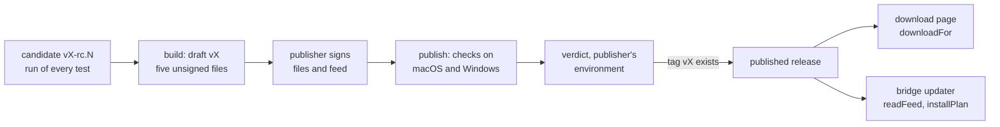

# ARC-017 The bridge's release, its signed feed and its updates

## Context

Every product, Agent M's included, is released alike: the next version, a candidate, the run of every test at every level on the candidate's commit, and the one click that accepts the report and sets the release's tag on that commit (ARC-027 decision 9, ARC-028). Agent M's own release also publishes its bridge (ARC-011): one file for each of Windows on x86-64, macOS and Linux (`THE BRIDGE IS ONE FILE PER PLATFORM`), each "signed by the publisher of the Agent M release — for macOS with an Apple Developer ID and notarised, for Windows with a code-signing certificate", the release refusing "to publish a file whose signature or notarisation cannot be verified" (`THE BRIDGE IS SIGNED BY ITS PUBLISHER`); and a bridge "offers a newer release and installs it only after the person's click, and only when its signature is valid" (`THE BRIDGE IS UPDATED ONLY BY THE PERSON'S CHOICE`).

What the build, the signing and the update rest on, as their vendors document it:

- **Deno.** `deno desktop` builds for five targets — "macOS Intel, macOS arm64, Windows x86_64, Linux arm64, and Linux x86_64" —; the `.dmg` "shells out to `hdiutil` and therefore must be built on a macOS host", while the `.AppImage` "works from any build host" (`https://docs.deno.com/runtime/desktop/distribution.md`). Deno's own updater takes a manifest as an envelope `{"signed": …, "signature": …}`, a "base64 Ed25519 signature over the `signed` string", and "verifies `signature` over the exact bytes of the `signed` string" (`https://docs.deno.com/runtime/desktop/auto_update.md`). Deno's Web Crypto registers Ed25519 for importing, signing and verifying (`https://github.com/denoland/deno/blob/main/ext/crypto/algorithm.rs`); a running bridge knows its target from `Deno.build.target`, "The LLVM target triple" (`https://github.com/denoland/deno/blob/main/cli/tsc/dts/lib.deno.ns.d.ts`).
- **Node**, which runs the generated tests and the steps of a workflow: "Algorithms `Ed25519` and `X25519` are now stable" from v22.13.0 (`https://github.com/nodejs/node/blob/main/doc/api/webcrypto.md`); Agent M's CI uses Node 22.
- **GitHub.** "The REST API supports cross-origin resource sharing (CORS) for AJAX requests from any origin" (`https://docs.github.com/en/rest/using-the-rest-api/using-cors-and-jsonp-to-make-cross-origin-requests`). The latest release is "the most recent non-prerelease, non-draft release", and "Only users with push access will receive listings for draft releases" (`https://docs.github.com/en/rest/releases/releases`); each file of a release has a `digest`, "string or null", given as `sha256:<hex>` in GitHub's API description (`https://github.com/github/rest-api-description`). A file's bytes come with `Accept: application/octet-stream`; the API "will either redirect the client to the location, or stream it directly" (`https://docs.github.com/en/rest/releases/assets`). GitHub's command line creates a draft on a "full commit SHA" (`https://cli.github.com/manual/gh_release_create`), uploads, downloads and publishes it — "Publish a release that was previously a draft: `gh release edit v1.0 --draft=false`", where `--verify-tag` aborts "in case the git tag doesn't already exist" (`https://cli.github.com/manual/gh_release_edit`) —, and its lookup "finds a published repository release by its tagName, or a draft release by its pending tag name" (`https://github.com/cli/cli/blob/trunk/pkg/cmd/release/shared/fetch.go`). An environment's required reviewers "approve workflow jobs that reference the environment"; on GitHub Free, Pro and Team they "are only available for public repositories" (`https://docs.github.com/en/actions/reference/workflows-and-actions/deployments-and-environments`). The hosted runners include `macos-15` (arm64), `macos-15-intel`, `windows-latest`, `ubuntu-latest` and `windows-11-arm`, and their images list the GitHub CLI (`https://github.com/actions/runner-images`).
- **Apple.** `codesign -vvv --deep --strict` verifies a bundle, and `spctl -vvv --assess --type exec` determines whether software "will run with the system policies currently in effect" (`https://developer.apple.com/documentation/security/resolving-common-notarization-issues`). The manual pages of macOS 26.6.2: codesign "exits 0 if all operations succeed"; for spctl, "If an assessment operation results in denial but no other problem has occurred, the exit code is three"; `hdiutil attach` mounts an image with `-readonly`, `-nobrowse` and `-mountpoint`. What Apple documents about notarising and stapling, and what Deno documents about signing its outputs, is recorded in `docs/measurements/2026-09-30_architecture-open-points.md`, point 2, cited here as *measurement point 2*.
- **Microsoft.** `Get-AuthenticodeSignature [-FilePath]` "Gets information about the Authenticode signature for a file" (`https://learn.microsoft.com/en-us/powershell/module/microsoft.powershell.security/get-authenticodesignature`); its status is `Valid`, `NotSigned`, `HashMismatch`, `NotTrusted` or another value of `SignatureStatus` (`https://learn.microsoft.com/en-us/dotnet/api/system.management.automation.signaturestatus`). PowerShell reads a variable of the environment as `$Env:<variable-name>` and takes `-NoProfile`, `-NonInteractive` and `-Command` (`https://github.com/MicrosoftDocs/PowerShell-Docs`, `about_Environment_Variables`, `about_PowerShell_exe`). A freshly signed file is "flagged as unrecognized until reputation accumulates", "EV certificates no longer bypass SmartScreen", and reputation can carry over "on new files signed by the same trusted certificate" (`https://learn.microsoft.com/en-us/windows/apps/package-and-deploy/smartscreen-reputation`).
- **Browsers.** A user agent's platform names the system — "Windows, Mac, Linux, Android, etc." (`https://developer.mozilla.org/en-US/docs/Web/HTTP/Reference/Headers/User-Agent`); the processor comes only from `NavigatorUAData.getHighEntropyValues()`, "architecture", in Chrome from 90 and in Edge, not in Firefox or Safari (`https://github.com/mdn/browser-compat-data/blob/main/api/NavigatorUAData.json`).

## Decision

1. **One release flow; the bridge is Agent M's addition to it.** The version, the candidate, its run and the acceptance are those of every product (ARC-027 decision 9, ARC-028). Agent M's own repository has one more workflow, `.github/workflows/agent-m-bridge-release.yml`, generated by `MOD-bridge-release.releaseWorkflow` and dispatched by the publisher with a version and a step; no product has it.
2. **Built from the candidate's commit, as a draft.** The step `build` makes the draft release `vYYYY.MINOR.PATCH` on the commit of the candidate `vYYYY.MINOR.PATCH-rc.N` and builds each of the five targets there with `deno desktop` and the Deno version the workflow pins (ARC-011 decision 2): the disk images on `macos-15` and `macos-15-intel`, the installer on `windows-latest`, both AppImages on `ubuntu-latest`. Each file is named by `MOD-bridge-feed.bridgeFileName` and attached to the draft unsigned. The files are built from the code the candidate's run tested, and the release's tag later names the same commit (`A RELEASE RUNS EVERY TEST AT EVERY LEVEL`). A draft is seen only by those who can push; no bridge and no download page reads it, since both read the latest release, which is never a draft.
3. **Signed by its publisher, on the publisher's machine.** The publisher downloads the draft's files (`gh release download`), signs them with keys kept on their own machine — the application in each disk image with the Developer ID, the Hardened Runtime and a secure timestamp, the disk image notarised with `xcrun notarytool submit` and its ticket stapled with `xcrun stapler staple`; the installer and the executables in it with the code-signing certificate, `signtool sign /fd SHA256` (measurement point 2) —, writes the feed of the signed files (decision 5), signs it with the feed's Ed25519 key, and replaces the draft's files with the signed ones and the feed (`gh release upload --clobber`). No signing key is a secret of CI (`NO SECRET IN THE REPOSITORY`): a key in CI signs whatever a compromised workflow builds. The AppImages carry no platform signature; the feed's signature covers them.
4. **Checked before it is published, the publisher deciding.** The step `publish` runs the checks of each system on a runner of it (`MOD-bridge-feed.platformChecks`): on `macos-15`, `codesign` and Gatekeeper's assessment of the application in each disk image; on `windows-latest`, the installer's Authenticode status. A job of the environment `agent-m-bridge-release`, whose required reviewer is the publisher (`A GATE NAMES WHO DECIDES IT`), then weighs the release (`MOD-bridge-release.publishVerdict`): the feed verified by the publisher's key and naming this version; every file it names among the draft's files, of its size and SHA-256; no other file; every macOS and Windows file's platform signature valid (`MOD-bridge-feed.platformVerdict`). Where anything fails, it names every failure and nothing is published (`THE BRIDGE IS SIGNED BY ITS PUBLISHER`). Otherwise the release is published with its changelog entry (`MOD-bridge-release.releaseNotes`) by `gh release edit --verify-tag --draft=false`: only where the release's tag exists, that is, where its test report was accepted (`ACCEPTING THE RELEASE TEST REPORT RELEASES`). A release that is no draft any more — its record on the server, which lists drafts to whoever may push, says so (`https://docs.github.com/en/rest/releases/releases`) — is refused before anything else: a published release is not published again, and a correction is a new version (`A VERSION IS NOT REWRITTEN`, `MOD-bridge-release.publishVerdict`).
5. **The signed feed.** `bridge-feed.json`, a file of the release, is the envelope Deno documents for its own updater, `{"signed": "…", "signature": "…"}` (`MOD-bridge-feed.envelopeText`). Its signed text is the feed (`MOD-bridge-feed.feedText`): the version (`CALENDAR VERSIONS`), the date, the major version of the protocol its bridge speaks (ARC-012), and one file for each target with its name, size and SHA-256, its keys and files in one fixed order. Every runtime trusts a feed only where the publisher's key verifies the Ed25519 signature over the exact bytes of the signed text (`MOD-bridge-feed.verifyFeed`, with Web Crypto). The publisher's repository, the name its certificates carry and its public key are one file of Agent M's code, `src/bridge-feed/publisher.json`, written once when the keys exist.
6. **The updater** (`MOD-bridge-update`), which the bridge app composes and whose *Update* its window offers (ARC-011 decision 9). When the bridge starts and once a day, it reads the latest release of the publisher's repository and its feed without a token through the git host (`MOD-bridge-update.readFeed`; `MOD-git-host.latestRelease`, `MOD-git-host.releaseText`, ARC-004) and offers a newer release whose bridge speaks its protocol and carries the file of its target, with the release's notes (`MOD-bridge-update.offerOf`). On the person's click on *Update*, it downloads that file with the request the git host gives (`MOD-git-host.assetRequest`) — the bridge's shell sends it, since the fetch port carries no bytes, and the git host reads its answer (`MOD-git-host.assetAnswer`) —, takes the SHA-256 of its bytes, runs the checks of its system — on macOS on the application of the disk image, mounted with `hdiutil attach -readonly -nobrowse -mountpoint` —, and installs only what the plan allows (`MOD-bridge-update.installPlan`, which weighs the checks' results by `MOD-bridge-feed.platformVerdict`, as the release does): on the click, the file the feed names, its platform signature valid (`THE BRIDGE IS UPDATED ONLY BY THE PERSON'S CHOICE`). It replaces the application from the disk image, runs the installer, or replaces the AppImage, and starts again. Nothing is installed in the background.
7. **The download page** (UC-044 1, 2). Under the bridge's line, the settings page offers *Get the Agent M Bridge* (ARC-026): the latest release of the publisher's repository, read through the API with the browser's GitHub token where one is stored (`MOD-git-host.latestRelease`), and the files for this browser (`MOD-bridge-feed.downloadFor`) — its system from the user agent; its processor where the browser tells it, through the client hints of a Chromium browser (`architecture`, `https://developer.mozilla.org/en-US/docs/Web/API/NavigatorUAData/getHighEntropyValues`) or in a Linux user agent, which names it (MDN's example `X11; Linux x86_64`, `https://developer.mozilla.org/en-US/docs/Web/HTTP/Reference/Headers/User-Agent`), while a Mac's user agent is not read for it — MDN's examples of Chrome, Edge, Opera and Safari on a Mac all read `Intel Mac OS X 10_15_7` —; else every file of its system, each named by its processor, with how to tell which one the computer has (UC-044 1): on a Mac, *About This Mac* in the Apple menu shows an item labeled *Chip* on a Mac with Apple silicon — the arm64 file — and one labeled *Processor* on a Mac with an Intel processor — the x86-64 file (`https://support.apple.com/en-us/116943`); on Linux, the x86-64 file for an Intel or AMD processor and the arm64 file for an ARM one; each file's size and SHA-256 from the release's digest; the publisher's name. On Windows, a folded *Why this warning?* says that SmartScreen flags a newly signed file "as unrecognized until reputation accumulates", shows the publisher's name to look for, and names *More info → Run anyway* (`EVERY STEP EXPLAINS ITSELF`); the publisher keeps one certificate across releases, so that each adds to its reputation. On Windows on ARM the page offers the x86-64 installer, named as such; whether it runs there under emulation is ARC-011's open measurement 4, whose result the page states once it is recorded.



## Alternatives

- **A release flow of Agent M's own beside the products'** — two flows for one rule drift apart; Agent M's release differs only by its bridge.
- **Signing in CI with the certificates as secrets** — rejected: a signing key in CI signs whatever a compromised workflow builds (decision 3).
- **Microsoft's Artifact Signing (formerly Trusted Signing)**, which Microsoft calls its "recommended code signing service for non-Store distribution" (SmartScreen page above) — not chosen: it moves the signing out of the publisher's hands; it is the option if the publisher's certificate cannot be kept across releases.
- **An EV certificate to avoid the warning** — rejected: "EV certificates no longer bypass SmartScreen"; a certificate kept across releases builds the same reputation.
- **The bare macOS binary** — rejected: a standalone binary's ticket cannot be stapled, so Gatekeeper looks it up online at first start (measurement point 2); the disk image carries it.
- **Deno's `Deno.autoUpdate()`** — rejected for the reasons of ARC-011: it installs without a click, and Windows is not supported according to its documentation.
- **An update check against the latest release without a signed feed** — rejected: TLS proves the server, not the publisher; the feed's signature ties every file to the publisher's key.
- **A pre-release instead of a draft** — rejected: a pre-release is public, so unsigned files would be downloadable; a draft is seen only by those who can push.
- **The download page reading the signed feed** — rejected: the feed is read in the browser only through a download address whose cross-origin behaviour GitHub does not document; the API's digest gives each file's SHA-256, and the bridge itself verifies the feed.
- **The release's gate on the dashboard** — rejected: the publish step runs in CI, and an environment's required reviewer is a decider GitHub enforces on the job itself.

## Consequences

- **One file for each computer.** `THE BRIDGE IS ONE FILE PER PLATFORM` names Windows on x86-64 — with its processor — and
  macOS and Linux without one, so every Mac and every Linux machine is served, on either processor; `deno desktop` builds
  for one processor at a time and lists "macOS Intel, macOS arm64, Windows x86_64, Linux arm64, and Linux x86_64"
  (`https://docs.deno.com/runtime/desktop/distribution.md`), and documents none for both. The release therefore holds one file
  for each processor of macOS and of Linux, and each computer is served by exactly one of them: the download page offers
  the one of its processor where the browser tells it, else both, each named by the processor it is for (decision 7);
  the person downloads one file and double-clicks it (UC-044 1, 2), and the rule's check starts each of them. The rule's
  occasion names per-processor executables for macOS — "one executable for Windows, macOS (x86-64, ARM64) and Linux" —
  and asks for one file that is easy to install on a client
  (`docs/spec-freigaben/2026-09-30j_architektur-befunde/02-laufzeiten-befunde.md`).
- The publisher keeps three keys: an Apple Developer ID, which costs an annual fee, a Windows code-signing certificate, and the feed's Ed25519 key. Losing the feed key means a bridge with a new public key, whose feed the old bridges refuse (`bad-signature`); they say so, and the person downloads the new file from the download page.
- The first Windows releases are shown as *unrecognized* until the certificate has gathered reputation — weeks and many clean installs —; the download page explains it before the download.
- The environment `agent-m-bridge-release` with the publisher as its required reviewer, and `src/bridge-feed/publisher.json`, are set once by the publisher; required reviewers need a public repository on GitHub's Free plan, which Agent M's is.
- The updater's daily read makes two requests without a token, for the release and for its feed; where the network's limit for such requests is used up, `MOD-git-host` names it, and the bridge offers the update at its next read.
- **Open measurement 1 — notarising the `deno desktop` disk image.** Sign the application with an identity in `deno.json` (Deno 2.9.7), notarise and staple the `.dmg`, mount it on a Mac that has never seen it, and record `codesign -vvv --deep --strict` and `spctl -vvv --assess --type exec` on the application, online and offline, and whether it starts. Known issues to watch (measurement point 2): issue #36780, a signing error on `laufey_webview`; pull request #36421, the JIT entitlement and the order of signing.
- **Open measurement 2 — signing the installer.** Sign the executables and the `.msi` with `signtool`, install on a fresh Windows 11, and record `Get-AuthenticodeSignature`'s status and what SmartScreen shows.
- **Open measurement 3 — the checks on the runners.** On `macos-15`, record `spctl`'s assessment of the x86-64 application beside the arm64 one; on both runners, `gh release download` of a draft's files.
- The platform start test of each file that ARC-011 decision 2 names needs a start of the bridge that reports and ends without a desktop session, which `MOD-bridge-app` does not give; it is designed with it, and until then the release runs no start test.
- The record of a job on the bridge names the bridge's version with the bridge as a job runtime.
- The steps of UC-013 are the tests pages' (ARC-028), and this decision carries none of them; ARC-028's consequences leave UC-013 3 — the candidate's run on the job dashboard and the audit view — and UC-013 2a — the job records of the job runtimes — with their reasons.

## Modules

### MOD-bridge-feed

```json module
{
  "id": "MOD-bridge-feed",
  "folder": "src/bridge-feed/",
  "layer": "kernel",
  "responsibility": "What the release of the bridge, the bridge's updater and the download page share: the name of each target's file, the signed feed the publisher writes and every runtime verifies, the checks of a file's platform signature and their verdict, and the files a browser is offered.",
  "realises": [],
  "owns": ["Publisher", "BridgeFile", "BridgeFeed", "PlatformCheck", "PlatformResult", "PlatformVerdict", "ClientHints", "DownloadFile", "DownloadOffer", "PublisherFile"],
  "uses": ["MOD-contracts"]
}
```

```json interface
{
  "id": "MOD-bridge-feed.bridgeFileName",
  "summary": "The name of a release's file for one of the five targets deno desktop builds for: agent-m-bridge-<version>-<system>-<processor> with .dmg on macOS, .msi on Windows and .AppImage on Linux.",
  "params": [{ "name": "version", "type": "string" }, { "name": "target", "type": "string" }],
  "result": "string",
  "async": false,
  "refusals": [
    { "code": "not-a-version", "when": "the version is no YYYY.MINOR.PATCH" },
    { "code": "unknown-target", "when": "the target is none of the five deno desktop builds for" }
  ],
  "examples": [
    {
      "name": "macOS on Apple silicon",
      "input": { "version": "2026.11.0", "target": "aarch64-apple-darwin" },
      "result": "agent-m-bridge-2026.11.0-macos-arm64.dmg"
    },
    {
      "name": "Windows",
      "input": { "version": "2026.11.0", "target": "x86_64-pc-windows-msvc" },
      "result": "agent-m-bridge-2026.11.0-windows-x64.msi"
    },
    {
      "name": "Windows on ARM, which deno desktop does not build for",
      "input": { "version": "2026.11.0", "target": "aarch64-pc-windows-msvc" },
      "refused": "unknown-target"
    },
    {
      "name": "no calendar version",
      "input": { "version": "2026.11", "target": "aarch64-apple-darwin" },
      "refused": "not-a-version"
    }
  ]
}
```

```json interface
{
  "id": "MOD-bridge-feed.feedText",
  "summary": "The text the publisher signs: the feed — its version, its date, the protocol its bridge speaks, and one file for each target with its name, size and SHA-256 — as JSON in one fixed order of keys and files, so that the same feed gives the same bytes.",
  "params": [{ "name": "feed", "type": "BridgeFeed" }],
  "result": "string",
  "async": false,
  "refusals": [
    { "code": "not-a-feed", "when": "the feed lacks a field, a target's file, or names a file of no target or by another name" }
  ],
  "examples": [
    {
      "name": "the feed of 2026.11.0",
      "input": {
        "feed": {
          "version": "2026.11.0",
          "date": "2026-11-03",
          "protocol": 1,
          "files": [
            { "target": "aarch64-apple-darwin", "name": "agent-m-bridge-2026.11.0-macos-arm64.dmg", "size": 41872309, "sha256": "8eaca47ad1cfe3de15b9cb7fc43055f4f94a318b2048e2e1343767f48a4c8768" },
            { "target": "x86_64-apple-darwin", "name": "agent-m-bridge-2026.11.0-macos-x64.dmg", "size": 43105877, "sha256": "4e57e1c020d47847c70432b44a45ff53bba25328edd9730bba181dc1d9f4f08b" },
            { "target": "x86_64-pc-windows-msvc", "name": "agent-m-bridge-2026.11.0-windows-x64.msi", "size": 38664192, "sha256": "e875cc9d5c1b53bd1062ffc4ebde16b865dda3414b4dc00e04904c2ac321c2ad" },
            { "target": "x86_64-unknown-linux-gnu", "name": "agent-m-bridge-2026.11.0-linux-x64.AppImage", "size": 45210624, "sha256": "20ce8823b99481aeecd7ce192ccd6573f9c937c76b9c13b3126493e81cb8a569" },
            { "target": "aarch64-unknown-linux-gnu", "name": "agent-m-bridge-2026.11.0-linux-arm64.AppImage", "size": 44032000, "sha256": "2cd420851083cd318bb4503c0983656da2e5ad64286c89e36735128909997388" }
          ]
        }
      },
      "result": "{\"version\":\"2026.11.0\",\"date\":\"2026-11-03\",\"protocol\":1,\"files\":[{\"target\":\"aarch64-apple-darwin\",\"name\":\"agent-m-bridge-2026.11.0-macos-arm64.dmg\",\"size\":41872309,\"sha256\":\"8eaca47ad1cfe3de15b9cb7fc43055f4f94a318b2048e2e1343767f48a4c8768\"},{\"target\":\"x86_64-apple-darwin\",\"name\":\"agent-m-bridge-2026.11.0-macos-x64.dmg\",\"size\":43105877,\"sha256\":\"4e57e1c020d47847c70432b44a45ff53bba25328edd9730bba181dc1d9f4f08b\"},{\"target\":\"x86_64-pc-windows-msvc\",\"name\":\"agent-m-bridge-2026.11.0-windows-x64.msi\",\"size\":38664192,\"sha256\":\"e875cc9d5c1b53bd1062ffc4ebde16b865dda3414b4dc00e04904c2ac321c2ad\"},{\"target\":\"x86_64-unknown-linux-gnu\",\"name\":\"agent-m-bridge-2026.11.0-linux-x64.AppImage\",\"size\":45210624,\"sha256\":\"20ce8823b99481aeecd7ce192ccd6573f9c937c76b9c13b3126493e81cb8a569\"},{\"target\":\"aarch64-unknown-linux-gnu\",\"name\":\"agent-m-bridge-2026.11.0-linux-arm64.AppImage\",\"size\":44032000,\"sha256\":\"2cd420851083cd318bb4503c0983656da2e5ad64286c89e36735128909997388\"}]}"
    },
    {
      "name": "a feed without the Windows file",
      "input": {
        "feed": {
          "version": "2026.11.0",
          "date": "2026-11-03",
          "protocol": 1,
          "files": [
            { "target": "aarch64-apple-darwin", "name": "agent-m-bridge-2026.11.0-macos-arm64.dmg", "size": 41872309, "sha256": "8eaca47ad1cfe3de15b9cb7fc43055f4f94a318b2048e2e1343767f48a4c8768" },
            { "target": "x86_64-apple-darwin", "name": "agent-m-bridge-2026.11.0-macos-x64.dmg", "size": 43105877, "sha256": "4e57e1c020d47847c70432b44a45ff53bba25328edd9730bba181dc1d9f4f08b" },
            { "target": "x86_64-unknown-linux-gnu", "name": "agent-m-bridge-2026.11.0-linux-x64.AppImage", "size": 45210624, "sha256": "20ce8823b99481aeecd7ce192ccd6573f9c937c76b9c13b3126493e81cb8a569" },
            { "target": "aarch64-unknown-linux-gnu", "name": "agent-m-bridge-2026.11.0-linux-arm64.AppImage", "size": 44032000, "sha256": "2cd420851083cd318bb4503c0983656da2e5ad64286c89e36735128909997388" }
          ]
        }
      },
      "refused": "not-a-feed"
    }
  ]
}
```

```json interface
{
  "id": "MOD-bridge-feed.envelopeText",
  "summary": "The feed as it is published, bridge-feed.json: the envelope Deno documents for its own updater — the signed text verbatim and the base64 Ed25519 signature over it.",
  "params": [{ "name": "signed", "type": "string" }, { "name": "signature", "type": "string" }],
  "result": "string",
  "async": false,
  "refusals": [
    { "code": "not-a-signature", "when": "the signature is no base64 Ed25519 signature of 64 bytes" },
    { "code": "not-a-feed", "when": "there is no signed text" }
  ],
  "examples": [
    {
      "name": "the signed feed of 2026.11.0",
      "input": { "signed": "{\"version\":\"2026.11.0\",\"date\":\"2026-11-03\",\"protocol\":1,\"files\":[{\"target\":\"aarch64-apple-darwin\",\"name\":\"agent-m-bridge-2026.11.0-macos-arm64.dmg\",\"size\":41872309,\"sha256\":\"8eaca47ad1cfe3de15b9cb7fc43055f4f94a318b2048e2e1343767f48a4c8768\"},{\"target\":\"x86_64-apple-darwin\",\"name\":\"agent-m-bridge-2026.11.0-macos-x64.dmg\",\"size\":43105877,\"sha256\":\"4e57e1c020d47847c70432b44a45ff53bba25328edd9730bba181dc1d9f4f08b\"},{\"target\":\"x86_64-pc-windows-msvc\",\"name\":\"agent-m-bridge-2026.11.0-windows-x64.msi\",\"size\":38664192,\"sha256\":\"e875cc9d5c1b53bd1062ffc4ebde16b865dda3414b4dc00e04904c2ac321c2ad\"},{\"target\":\"x86_64-unknown-linux-gnu\",\"name\":\"agent-m-bridge-2026.11.0-linux-x64.AppImage\",\"size\":45210624,\"sha256\":\"20ce8823b99481aeecd7ce192ccd6573f9c937c76b9c13b3126493e81cb8a569\"},{\"target\":\"aarch64-unknown-linux-gnu\",\"name\":\"agent-m-bridge-2026.11.0-linux-arm64.AppImage\",\"size\":44032000,\"sha256\":\"2cd420851083cd318bb4503c0983656da2e5ad64286c89e36735128909997388\"}]}", "signature": "mKOvstkVkOt3BDelUurHWCwUTiXuzktTv/lR3uhxu5JSYXgpqrIdfaUEDLe6YVXQp0Eit+3tgp5woiDJ+D3TDg==" },
      "result": "{\"signed\":\"{\\\"version\\\":\\\"2026.11.0\\\",\\\"date\\\":\\\"2026-11-03\\\",\\\"protocol\\\":1,\\\"files\\\":[{\\\"target\\\":\\\"aarch64-apple-darwin\\\",\\\"name\\\":\\\"agent-m-bridge-2026.11.0-macos-arm64.dmg\\\",\\\"size\\\":41872309,\\\"sha256\\\":\\\"8eaca47ad1cfe3de15b9cb7fc43055f4f94a318b2048e2e1343767f48a4c8768\\\"},{\\\"target\\\":\\\"x86_64-apple-darwin\\\",\\\"name\\\":\\\"agent-m-bridge-2026.11.0-macos-x64.dmg\\\",\\\"size\\\":43105877,\\\"sha256\\\":\\\"4e57e1c020d47847c70432b44a45ff53bba25328edd9730bba181dc1d9f4f08b\\\"},{\\\"target\\\":\\\"x86_64-pc-windows-msvc\\\",\\\"name\\\":\\\"agent-m-bridge-2026.11.0-windows-x64.msi\\\",\\\"size\\\":38664192,\\\"sha256\\\":\\\"e875cc9d5c1b53bd1062ffc4ebde16b865dda3414b4dc00e04904c2ac321c2ad\\\"},{\\\"target\\\":\\\"x86_64-unknown-linux-gnu\\\",\\\"name\\\":\\\"agent-m-bridge-2026.11.0-linux-x64.AppImage\\\",\\\"size\\\":45210624,\\\"sha256\\\":\\\"20ce8823b99481aeecd7ce192ccd6573f9c937c76b9c13b3126493e81cb8a569\\\"},{\\\"target\\\":\\\"aarch64-unknown-linux-gnu\\\",\\\"name\\\":\\\"agent-m-bridge-2026.11.0-linux-arm64.AppImage\\\",\\\"size\\\":44032000,\\\"sha256\\\":\\\"2cd420851083cd318bb4503c0983656da2e5ad64286c89e36735128909997388\\\"}]}\",\"signature\":\"mKOvstkVkOt3BDelUurHWCwUTiXuzktTv/lR3uhxu5JSYXgpqrIdfaUEDLe6YVXQp0Eit+3tgp5woiDJ+D3TDg==\"}\n"
    },
    {
      "name": "no signature",
      "input": { "signed": "{\"version\":\"2026.11.0\",\"date\":\"2026-11-03\",\"protocol\":1,\"files\":[{\"target\":\"aarch64-apple-darwin\",\"name\":\"agent-m-bridge-2026.11.0-macos-arm64.dmg\",\"size\":41872309,\"sha256\":\"8eaca47ad1cfe3de15b9cb7fc43055f4f94a318b2048e2e1343767f48a4c8768\"},{\"target\":\"x86_64-apple-darwin\",\"name\":\"agent-m-bridge-2026.11.0-macos-x64.dmg\",\"size\":43105877,\"sha256\":\"4e57e1c020d47847c70432b44a45ff53bba25328edd9730bba181dc1d9f4f08b\"},{\"target\":\"x86_64-pc-windows-msvc\",\"name\":\"agent-m-bridge-2026.11.0-windows-x64.msi\",\"size\":38664192,\"sha256\":\"e875cc9d5c1b53bd1062ffc4ebde16b865dda3414b4dc00e04904c2ac321c2ad\"},{\"target\":\"x86_64-unknown-linux-gnu\",\"name\":\"agent-m-bridge-2026.11.0-linux-x64.AppImage\",\"size\":45210624,\"sha256\":\"20ce8823b99481aeecd7ce192ccd6573f9c937c76b9c13b3126493e81cb8a569\"},{\"target\":\"aarch64-unknown-linux-gnu\",\"name\":\"agent-m-bridge-2026.11.0-linux-arm64.AppImage\",\"size\":44032000,\"sha256\":\"2cd420851083cd318bb4503c0983656da2e5ad64286c89e36735128909997388\"}]}", "signature": "c2lnbmF0dXJl" },
      "refused": "not-a-signature"
    }
  ]
}
```

```json interface
{
  "id": "MOD-bridge-feed.verifyFeed",
  "summary": "The feed of an envelope, trusted only where the publisher's key verifies the signature over the exact bytes of the signed text; only then is the signed text read as a feed.",
  "params": [{ "name": "envelope", "type": "string" }, { "name": "key", "type": "string" }],
  "result": "BridgeFeed",
  "async": true,
  "refusals": [
    { "code": "not-a-key", "when": "the publisher's key is no base64 Ed25519 public key of 32 bytes" },
    { "code": "not-a-feed", "when": "the envelope or its signed text is no feed: one file for each target, named, sized and with its SHA-256" },
    { "code": "bad-signature", "when": "the publisher's key does not verify the signature over the signed text" }
  ],
  "examples": [
    {
      "name": "signed by the publisher",
      "input": { "envelope": "{\"signed\":\"{\\\"version\\\":\\\"2026.11.0\\\",\\\"date\\\":\\\"2026-11-03\\\",\\\"protocol\\\":1,\\\"files\\\":[{\\\"target\\\":\\\"aarch64-apple-darwin\\\",\\\"name\\\":\\\"agent-m-bridge-2026.11.0-macos-arm64.dmg\\\",\\\"size\\\":41872309,\\\"sha256\\\":\\\"8eaca47ad1cfe3de15b9cb7fc43055f4f94a318b2048e2e1343767f48a4c8768\\\"},{\\\"target\\\":\\\"x86_64-apple-darwin\\\",\\\"name\\\":\\\"agent-m-bridge-2026.11.0-macos-x64.dmg\\\",\\\"size\\\":43105877,\\\"sha256\\\":\\\"4e57e1c020d47847c70432b44a45ff53bba25328edd9730bba181dc1d9f4f08b\\\"},{\\\"target\\\":\\\"x86_64-pc-windows-msvc\\\",\\\"name\\\":\\\"agent-m-bridge-2026.11.0-windows-x64.msi\\\",\\\"size\\\":38664192,\\\"sha256\\\":\\\"e875cc9d5c1b53bd1062ffc4ebde16b865dda3414b4dc00e04904c2ac321c2ad\\\"},{\\\"target\\\":\\\"x86_64-unknown-linux-gnu\\\",\\\"name\\\":\\\"agent-m-bridge-2026.11.0-linux-x64.AppImage\\\",\\\"size\\\":45210624,\\\"sha256\\\":\\\"20ce8823b99481aeecd7ce192ccd6573f9c937c76b9c13b3126493e81cb8a569\\\"},{\\\"target\\\":\\\"aarch64-unknown-linux-gnu\\\",\\\"name\\\":\\\"agent-m-bridge-2026.11.0-linux-arm64.AppImage\\\",\\\"size\\\":44032000,\\\"sha256\\\":\\\"2cd420851083cd318bb4503c0983656da2e5ad64286c89e36735128909997388\\\"}]}\",\"signature\":\"mKOvstkVkOt3BDelUurHWCwUTiXuzktTv/lR3uhxu5JSYXgpqrIdfaUEDLe6YVXQp0Eit+3tgp5woiDJ+D3TDg==\"}\n", "key": "1UetG1hsX7ThxFSSSpAFdqUwx8TU3OkTPdPva6jrvuY=" },
      "result": {
        "version": "2026.11.0",
        "date": "2026-11-03",
        "protocol": 1,
        "files": [
          { "target": "aarch64-apple-darwin", "name": "agent-m-bridge-2026.11.0-macos-arm64.dmg", "size": 41872309, "sha256": "8eaca47ad1cfe3de15b9cb7fc43055f4f94a318b2048e2e1343767f48a4c8768" },
          { "target": "x86_64-apple-darwin", "name": "agent-m-bridge-2026.11.0-macos-x64.dmg", "size": 43105877, "sha256": "4e57e1c020d47847c70432b44a45ff53bba25328edd9730bba181dc1d9f4f08b" },
          { "target": "x86_64-pc-windows-msvc", "name": "agent-m-bridge-2026.11.0-windows-x64.msi", "size": 38664192, "sha256": "e875cc9d5c1b53bd1062ffc4ebde16b865dda3414b4dc00e04904c2ac321c2ad" },
          { "target": "x86_64-unknown-linux-gnu", "name": "agent-m-bridge-2026.11.0-linux-x64.AppImage", "size": 45210624, "sha256": "20ce8823b99481aeecd7ce192ccd6573f9c937c76b9c13b3126493e81cb8a569" },
          { "target": "aarch64-unknown-linux-gnu", "name": "agent-m-bridge-2026.11.0-linux-arm64.AppImage", "size": 44032000, "sha256": "2cd420851083cd318bb4503c0983656da2e5ad64286c89e36735128909997388" }
        ]
      }
    },
    {
      "name": "a file's SHA-256 changed after signing",
      "input": { "envelope": "{\"signed\":\"{\\\"version\\\":\\\"2026.11.0\\\",\\\"date\\\":\\\"2026-11-03\\\",\\\"protocol\\\":1,\\\"files\\\":[{\\\"target\\\":\\\"aarch64-apple-darwin\\\",\\\"name\\\":\\\"agent-m-bridge-2026.11.0-macos-arm64.dmg\\\",\\\"size\\\":41872309,\\\"sha256\\\":\\\"8eaca47ad1cfe3de15b9cb7fc43055f4f94a318b2048e2e1343767f48a4c8768\\\"},{\\\"target\\\":\\\"x86_64-apple-darwin\\\",\\\"name\\\":\\\"agent-m-bridge-2026.11.0-macos-x64.dmg\\\",\\\"size\\\":43105877,\\\"sha256\\\":\\\"4e57e1c020d47847c70432b44a45ff53bba25328edd9730bba181dc1d9f4f08b\\\"},{\\\"target\\\":\\\"x86_64-pc-windows-msvc\\\",\\\"name\\\":\\\"agent-m-bridge-2026.11.0-windows-x64.msi\\\",\\\"size\\\":38664192,\\\"sha256\\\":\\\"0000000000000000000000000000000000000000000000000000000000000000\\\"},{\\\"target\\\":\\\"x86_64-unknown-linux-gnu\\\",\\\"name\\\":\\\"agent-m-bridge-2026.11.0-linux-x64.AppImage\\\",\\\"size\\\":45210624,\\\"sha256\\\":\\\"20ce8823b99481aeecd7ce192ccd6573f9c937c76b9c13b3126493e81cb8a569\\\"},{\\\"target\\\":\\\"aarch64-unknown-linux-gnu\\\",\\\"name\\\":\\\"agent-m-bridge-2026.11.0-linux-arm64.AppImage\\\",\\\"size\\\":44032000,\\\"sha256\\\":\\\"2cd420851083cd318bb4503c0983656da2e5ad64286c89e36735128909997388\\\"}]}\",\"signature\":\"mKOvstkVkOt3BDelUurHWCwUTiXuzktTv/lR3uhxu5JSYXgpqrIdfaUEDLe6YVXQp0Eit+3tgp5woiDJ+D3TDg==\"}\n", "key": "1UetG1hsX7ThxFSSSpAFdqUwx8TU3OkTPdPva6jrvuY=" },
      "refused": "bad-signature"
    },
    {
      "name": "another key",
      "input": { "envelope": "{\"signed\":\"{\\\"version\\\":\\\"2026.11.0\\\",\\\"date\\\":\\\"2026-11-03\\\",\\\"protocol\\\":1,\\\"files\\\":[{\\\"target\\\":\\\"aarch64-apple-darwin\\\",\\\"name\\\":\\\"agent-m-bridge-2026.11.0-macos-arm64.dmg\\\",\\\"size\\\":41872309,\\\"sha256\\\":\\\"8eaca47ad1cfe3de15b9cb7fc43055f4f94a318b2048e2e1343767f48a4c8768\\\"},{\\\"target\\\":\\\"x86_64-apple-darwin\\\",\\\"name\\\":\\\"agent-m-bridge-2026.11.0-macos-x64.dmg\\\",\\\"size\\\":43105877,\\\"sha256\\\":\\\"4e57e1c020d47847c70432b44a45ff53bba25328edd9730bba181dc1d9f4f08b\\\"},{\\\"target\\\":\\\"x86_64-pc-windows-msvc\\\",\\\"name\\\":\\\"agent-m-bridge-2026.11.0-windows-x64.msi\\\",\\\"size\\\":38664192,\\\"sha256\\\":\\\"e875cc9d5c1b53bd1062ffc4ebde16b865dda3414b4dc00e04904c2ac321c2ad\\\"},{\\\"target\\\":\\\"x86_64-unknown-linux-gnu\\\",\\\"name\\\":\\\"agent-m-bridge-2026.11.0-linux-x64.AppImage\\\",\\\"size\\\":45210624,\\\"sha256\\\":\\\"20ce8823b99481aeecd7ce192ccd6573f9c937c76b9c13b3126493e81cb8a569\\\"},{\\\"target\\\":\\\"aarch64-unknown-linux-gnu\\\",\\\"name\\\":\\\"agent-m-bridge-2026.11.0-linux-arm64.AppImage\\\",\\\"size\\\":44032000,\\\"sha256\\\":\\\"2cd420851083cd318bb4503c0983656da2e5ad64286c89e36735128909997388\\\"}]}\",\"signature\":\"mKOvstkVkOt3BDelUurHWCwUTiXuzktTv/lR3uhxu5JSYXgpqrIdfaUEDLe6YVXQp0Eit+3tgp5woiDJ+D3TDg==\"}\n", "key": "GrY/RLcbkI+nNk08I2++CKTv1OPEt6Ev/XOkzAyQ8yQ=" },
      "refused": "bad-signature"
    },
    {
      "name": "no envelope",
      "input": { "envelope": "<html>", "key": "1UetG1hsX7ThxFSSSpAFdqUwx8TU3OkTPdPva6jrvuY=" },
      "refused": "not-a-feed"
    }
  ]
}
```

```json interface
{
  "id": "MOD-bridge-feed.platformChecks",
  "summary": "The commands that check a file's platform signature on its system, each an argument list run without a shell: on macOS codesign's verification and Gatekeeper's assessment for execution of the application taken from the disk image; on Windows the installer's Authenticode status, its path handed in the environment; on Linux none, an AppImage carrying no platform signature.",
  "params": [{ "name": "target", "type": "string" }, { "name": "path", "type": "string" }],
  "result": "PlatformCheck[]",
  "async": false,
  "refusals": [{ "code": "unknown-target", "when": "the target is none of the five deno desktop builds for" }],
  "examples": [
    {
      "name": "the application from the disk image",
      "input": { "target": "aarch64-apple-darwin", "path": "/Users/alice/Library/Caches/agent-m-bridge/update/Agent M Bridge.app" },
      "result": [
        {
          "check": "codesign",
          "command": ["codesign", "-vvv", "--deep", "--strict", "/Users/alice/Library/Caches/agent-m-bridge/update/Agent M Bridge.app"],
          "env": {}
        },
        {
          "check": "spctl",
          "command": ["spctl", "-vvv", "--assess", "--type", "exec", "/Users/alice/Library/Caches/agent-m-bridge/update/Agent M Bridge.app"],
          "env": {}
        }
      ]
    },
    {
      "name": "the installer",
      "input": { "target": "x86_64-pc-windows-msvc", "path": "C:\\Users\\alice\\AppData\\Local\\Temp\\agent-m-bridge-2026.11.0-windows-x64.msi" },
      "result": [
        {
          "check": "authenticode",
          "command": ["powershell.exe", "-NoProfile", "-NonInteractive", "-Command", "(Get-AuthenticodeSignature -LiteralPath $env:AGENT_M_FILE).Status"],
          "env": { "AGENT_M_FILE": "C:\\Users\\alice\\AppData\\Local\\Temp\\agent-m-bridge-2026.11.0-windows-x64.msi" }
        }
      ]
    },
    {
      "name": "an AppImage",
      "input": { "target": "x86_64-unknown-linux-gnu", "path": "/home/alice/Applications/agent-m-bridge.AppImage" },
      "result": []
    }
  ]
}
```

```json interface
{
  "id": "MOD-bridge-feed.platformVerdict",
  "summary": "Whether the checks found the platform signature valid: on macOS both exit with 0 — Gatekeeper's assessment exits with 3 on a denial —; on Windows the Authenticode status reads Valid; on Linux the feed's signature over the file's SHA-256 is the signature.",
  "params": [{ "name": "target", "type": "string" }, { "name": "results", "type": "PlatformResult[]" }],
  "result": "PlatformVerdict",
  "async": false,
  "refusals": [
    { "code": "unknown-target", "when": "the target is none of the five" },
    { "code": "unchecked", "when": "a check of the system has no result" },
    { "code": "signature-invalid", "when": "a check exits with another code than 0, or the Authenticode status is not Valid" }
  ],
  "examples": [
    {
      "name": "signed and notarised",
      "input": {
        "target": "aarch64-apple-darwin",
        "results": [
          { "check": "codesign", "exitCode": 0, "stdout": "", "stderr": "" },
          { "check": "spctl", "exitCode": 0, "stdout": "", "stderr": "" }
        ]
      },
      "result": { "target": "aarch64-apple-darwin", "valid": true, "reason": "codesign verifies the signature and Gatekeeper accepts the application" }
    },
    {
      "name": "Gatekeeper denies it",
      "input": {
        "target": "aarch64-apple-darwin",
        "results": [
          { "check": "codesign", "exitCode": 0, "stdout": "", "stderr": "" },
          { "check": "spctl", "exitCode": 3, "stdout": "", "stderr": "" }
        ]
      },
      "refused": "signature-invalid"
    },
    {
      "name": "a valid Authenticode signature",
      "input": {
        "target": "x86_64-pc-windows-msvc",
        "results": [{ "check": "authenticode", "exitCode": 0, "stdout": "Valid\r\n", "stderr": "" }]
      },
      "result": { "target": "x86_64-pc-windows-msvc", "valid": true, "reason": "the Authenticode status is Valid" }
    },
    {
      "name": "an unsigned installer",
      "input": {
        "target": "x86_64-pc-windows-msvc",
        "results": [{ "check": "authenticode", "exitCode": 0, "stdout": "NotSigned\r\n", "stderr": "" }]
      },
      "refused": "signature-invalid"
    },
    {
      "name": "an AppImage",
      "input": { "target": "aarch64-unknown-linux-gnu", "results": [] },
      "result": { "target": "aarch64-unknown-linux-gnu", "valid": true, "reason": "an AppImage carries no platform signature; the feed's signature covers its SHA-256" }
    },
    { "name": "no check ran", "input": { "target": "x86_64-apple-darwin", "results": [] }, "refused": "unchecked" }
  ]
}
```

```json interface
{
  "id": "MOD-bridge-feed.downloadFor",
  "summary": "The files a download page offers this browser from the latest release: its system from the user agent — Windows, macOS or Linux; a phone or a tablet has no bridge —, its processor where the browser tells it, else every file of that system; each with its size, its SHA-256 from the release's digest and its address; the publisher's name, which the signed file shows; whether Windows' SmartScreen notice is explained, and whether Windows runs the file emulated.",
  "params": [
    { "name": "release", "type": "Release" },
    { "name": "client", "type": "ClientHints" },
    { "name": "publisher", "type": "Publisher" }
  ],
  "result": "DownloadOffer",
  "async": false,
  "refusals": [
    { "code": "unknown-system", "when": "the user agent names no Windows, macOS or Linux desktop" },
    { "code": "no-bridge", "when": "the release carries no file for that system" }
  ],
  "examples": [
    {
      "name": "Windows",
      "input": {
        "release": {
          "tag": "v2026.11.0",
          "url": "https://github.com/publisher/agent-m/releases/tag/v2026.11.0",
          "notes": "A job's log is read from a cursor.\n",
          "assets": [
            { "id": 9100, "name": "agent-m-bridge-2026.11.0-macos-arm64.dmg", "size": 41872309, "digest": "sha256:8eaca47ad1cfe3de15b9cb7fc43055f4f94a318b2048e2e1343767f48a4c8768", "url": "https://github.com/publisher/agent-m/releases/download/v2026.11.0/agent-m-bridge-2026.11.0-macos-arm64.dmg" },
            { "id": 9101, "name": "agent-m-bridge-2026.11.0-macos-x64.dmg", "size": 43105877, "digest": "sha256:4e57e1c020d47847c70432b44a45ff53bba25328edd9730bba181dc1d9f4f08b", "url": "https://github.com/publisher/agent-m/releases/download/v2026.11.0/agent-m-bridge-2026.11.0-macos-x64.dmg" },
            { "id": 9102, "name": "agent-m-bridge-2026.11.0-windows-x64.msi", "size": 38664192, "digest": "sha256:e875cc9d5c1b53bd1062ffc4ebde16b865dda3414b4dc00e04904c2ac321c2ad", "url": "https://github.com/publisher/agent-m/releases/download/v2026.11.0/agent-m-bridge-2026.11.0-windows-x64.msi" },
            { "id": 9103, "name": "agent-m-bridge-2026.11.0-linux-x64.AppImage", "size": 45210624, "digest": "sha256:20ce8823b99481aeecd7ce192ccd6573f9c937c76b9c13b3126493e81cb8a569", "url": "https://github.com/publisher/agent-m/releases/download/v2026.11.0/agent-m-bridge-2026.11.0-linux-x64.AppImage" },
            { "id": 9104, "name": "agent-m-bridge-2026.11.0-linux-arm64.AppImage", "size": 44032000, "digest": "sha256:2cd420851083cd318bb4503c0983656da2e5ad64286c89e36735128909997388", "url": "https://github.com/publisher/agent-m/releases/download/v2026.11.0/agent-m-bridge-2026.11.0-linux-arm64.AppImage" },
            { "id": 9105, "name": "bridge-feed.json", "size": 1161, "digest": "sha256:7d198fa20a1ad8c40d2a137ab28d6f3f3c9c16999c38eaae7e5e28cdf4af15d3", "url": "https://github.com/publisher/agent-m/releases/download/v2026.11.0/bridge-feed.json" }
          ]
        },
        "client": { "userAgent": "Mozilla/5.0 (Windows NT 10.0; Win64; x64) AppleWebKit/537.36 (KHTML, like Gecko) Chrome/143.0.0.0 Safari/537.36", "architecture": "x86" },
        "publisher": { "repository": "https://github.com/publisher/agent-m", "name": "Example Publisher", "key": "1UetG1hsX7ThxFSSSpAFdqUwx8TU3OkTPdPva6jrvuY=" }
      },
      "result": {
        "version": "2026.11.0",
        "system": "windows",
        "files": [
          { "target": "x86_64-pc-windows-msvc", "name": "agent-m-bridge-2026.11.0-windows-x64.msi", "size": 38664192, "sha256": "e875cc9d5c1b53bd1062ffc4ebde16b865dda3414b4dc00e04904c2ac321c2ad", "url": "https://github.com/publisher/agent-m/releases/download/v2026.11.0/agent-m-bridge-2026.11.0-windows-x64.msi" }
        ],
        "publisher": "Example Publisher",
        "smartScreen": true,
        "emulated": false
      }
    },
    {
      "name": "a Mac whose browser does not tell its processor",
      "input": {
        "release": {
          "tag": "v2026.11.0",
          "url": "https://github.com/publisher/agent-m/releases/tag/v2026.11.0",
          "notes": "A job's log is read from a cursor.\n",
          "assets": [
            { "id": 9100, "name": "agent-m-bridge-2026.11.0-macos-arm64.dmg", "size": 41872309, "digest": "sha256:8eaca47ad1cfe3de15b9cb7fc43055f4f94a318b2048e2e1343767f48a4c8768", "url": "https://github.com/publisher/agent-m/releases/download/v2026.11.0/agent-m-bridge-2026.11.0-macos-arm64.dmg" },
            { "id": 9101, "name": "agent-m-bridge-2026.11.0-macos-x64.dmg", "size": 43105877, "digest": "sha256:4e57e1c020d47847c70432b44a45ff53bba25328edd9730bba181dc1d9f4f08b", "url": "https://github.com/publisher/agent-m/releases/download/v2026.11.0/agent-m-bridge-2026.11.0-macos-x64.dmg" },
            { "id": 9102, "name": "agent-m-bridge-2026.11.0-windows-x64.msi", "size": 38664192, "digest": "sha256:e875cc9d5c1b53bd1062ffc4ebde16b865dda3414b4dc00e04904c2ac321c2ad", "url": "https://github.com/publisher/agent-m/releases/download/v2026.11.0/agent-m-bridge-2026.11.0-windows-x64.msi" },
            { "id": 9103, "name": "agent-m-bridge-2026.11.0-linux-x64.AppImage", "size": 45210624, "digest": "sha256:20ce8823b99481aeecd7ce192ccd6573f9c937c76b9c13b3126493e81cb8a569", "url": "https://github.com/publisher/agent-m/releases/download/v2026.11.0/agent-m-bridge-2026.11.0-linux-x64.AppImage" },
            { "id": 9104, "name": "agent-m-bridge-2026.11.0-linux-arm64.AppImage", "size": 44032000, "digest": "sha256:2cd420851083cd318bb4503c0983656da2e5ad64286c89e36735128909997388", "url": "https://github.com/publisher/agent-m/releases/download/v2026.11.0/agent-m-bridge-2026.11.0-linux-arm64.AppImage" },
            { "id": 9105, "name": "bridge-feed.json", "size": 1161, "digest": "sha256:7d198fa20a1ad8c40d2a137ab28d6f3f3c9c16999c38eaae7e5e28cdf4af15d3", "url": "https://github.com/publisher/agent-m/releases/download/v2026.11.0/bridge-feed.json" }
          ]
        },
        "client": { "userAgent": "Mozilla/5.0 (Macintosh; Intel Mac OS X 10_15_7) AppleWebKit/537.36 (KHTML, like Gecko) Chrome/143.0.0.0 Safari/537.36", "architecture": "" },
        "publisher": { "repository": "https://github.com/publisher/agent-m", "name": "Example Publisher", "key": "1UetG1hsX7ThxFSSSpAFdqUwx8TU3OkTPdPva6jrvuY=" }
      },
      "result": {
        "version": "2026.11.0",
        "system": "macos",
        "files": [
          { "target": "aarch64-apple-darwin", "name": "agent-m-bridge-2026.11.0-macos-arm64.dmg", "size": 41872309, "sha256": "8eaca47ad1cfe3de15b9cb7fc43055f4f94a318b2048e2e1343767f48a4c8768", "url": "https://github.com/publisher/agent-m/releases/download/v2026.11.0/agent-m-bridge-2026.11.0-macos-arm64.dmg" },
          { "target": "x86_64-apple-darwin", "name": "agent-m-bridge-2026.11.0-macos-x64.dmg", "size": 43105877, "sha256": "4e57e1c020d47847c70432b44a45ff53bba25328edd9730bba181dc1d9f4f08b", "url": "https://github.com/publisher/agent-m/releases/download/v2026.11.0/agent-m-bridge-2026.11.0-macos-x64.dmg" }
        ],
        "publisher": "Example Publisher",
        "smartScreen": false,
        "emulated": false
      }
    },
    {
      "name": "a Mac with Apple silicon",
      "input": {
        "release": {
          "tag": "v2026.11.0",
          "url": "https://github.com/publisher/agent-m/releases/tag/v2026.11.0",
          "notes": "A job's log is read from a cursor.\n",
          "assets": [
            { "id": 9100, "name": "agent-m-bridge-2026.11.0-macos-arm64.dmg", "size": 41872309, "digest": "sha256:8eaca47ad1cfe3de15b9cb7fc43055f4f94a318b2048e2e1343767f48a4c8768", "url": "https://github.com/publisher/agent-m/releases/download/v2026.11.0/agent-m-bridge-2026.11.0-macos-arm64.dmg" },
            { "id": 9101, "name": "agent-m-bridge-2026.11.0-macos-x64.dmg", "size": 43105877, "digest": "sha256:4e57e1c020d47847c70432b44a45ff53bba25328edd9730bba181dc1d9f4f08b", "url": "https://github.com/publisher/agent-m/releases/download/v2026.11.0/agent-m-bridge-2026.11.0-macos-x64.dmg" },
            { "id": 9102, "name": "agent-m-bridge-2026.11.0-windows-x64.msi", "size": 38664192, "digest": "sha256:e875cc9d5c1b53bd1062ffc4ebde16b865dda3414b4dc00e04904c2ac321c2ad", "url": "https://github.com/publisher/agent-m/releases/download/v2026.11.0/agent-m-bridge-2026.11.0-windows-x64.msi" },
            { "id": 9103, "name": "agent-m-bridge-2026.11.0-linux-x64.AppImage", "size": 45210624, "digest": "sha256:20ce8823b99481aeecd7ce192ccd6573f9c937c76b9c13b3126493e81cb8a569", "url": "https://github.com/publisher/agent-m/releases/download/v2026.11.0/agent-m-bridge-2026.11.0-linux-x64.AppImage" },
            { "id": 9104, "name": "agent-m-bridge-2026.11.0-linux-arm64.AppImage", "size": 44032000, "digest": "sha256:2cd420851083cd318bb4503c0983656da2e5ad64286c89e36735128909997388", "url": "https://github.com/publisher/agent-m/releases/download/v2026.11.0/agent-m-bridge-2026.11.0-linux-arm64.AppImage" },
            { "id": 9105, "name": "bridge-feed.json", "size": 1161, "digest": "sha256:7d198fa20a1ad8c40d2a137ab28d6f3f3c9c16999c38eaae7e5e28cdf4af15d3", "url": "https://github.com/publisher/agent-m/releases/download/v2026.11.0/bridge-feed.json" }
          ]
        },
        "client": { "userAgent": "Mozilla/5.0 (Macintosh; Intel Mac OS X 10_15_7) AppleWebKit/537.36 (KHTML, like Gecko) Chrome/143.0.0.0 Safari/537.36", "architecture": "arm" },
        "publisher": { "repository": "https://github.com/publisher/agent-m", "name": "Example Publisher", "key": "1UetG1hsX7ThxFSSSpAFdqUwx8TU3OkTPdPva6jrvuY=" }
      },
      "result": {
        "version": "2026.11.0",
        "system": "macos",
        "files": [
          { "target": "aarch64-apple-darwin", "name": "agent-m-bridge-2026.11.0-macos-arm64.dmg", "size": 41872309, "sha256": "8eaca47ad1cfe3de15b9cb7fc43055f4f94a318b2048e2e1343767f48a4c8768", "url": "https://github.com/publisher/agent-m/releases/download/v2026.11.0/agent-m-bridge-2026.11.0-macos-arm64.dmg" }
        ],
        "publisher": "Example Publisher",
        "smartScreen": false,
        "emulated": false
      }
    },
    {
      "name": "Linux on x86-64",
      "input": {
        "release": {
          "tag": "v2026.11.0",
          "url": "https://github.com/publisher/agent-m/releases/tag/v2026.11.0",
          "notes": "A job's log is read from a cursor.\n",
          "assets": [
            { "id": 9100, "name": "agent-m-bridge-2026.11.0-macos-arm64.dmg", "size": 41872309, "digest": "sha256:8eaca47ad1cfe3de15b9cb7fc43055f4f94a318b2048e2e1343767f48a4c8768", "url": "https://github.com/publisher/agent-m/releases/download/v2026.11.0/agent-m-bridge-2026.11.0-macos-arm64.dmg" },
            { "id": 9101, "name": "agent-m-bridge-2026.11.0-macos-x64.dmg", "size": 43105877, "digest": "sha256:4e57e1c020d47847c70432b44a45ff53bba25328edd9730bba181dc1d9f4f08b", "url": "https://github.com/publisher/agent-m/releases/download/v2026.11.0/agent-m-bridge-2026.11.0-macos-x64.dmg" },
            { "id": 9102, "name": "agent-m-bridge-2026.11.0-windows-x64.msi", "size": 38664192, "digest": "sha256:e875cc9d5c1b53bd1062ffc4ebde16b865dda3414b4dc00e04904c2ac321c2ad", "url": "https://github.com/publisher/agent-m/releases/download/v2026.11.0/agent-m-bridge-2026.11.0-windows-x64.msi" },
            { "id": 9103, "name": "agent-m-bridge-2026.11.0-linux-x64.AppImage", "size": 45210624, "digest": "sha256:20ce8823b99481aeecd7ce192ccd6573f9c937c76b9c13b3126493e81cb8a569", "url": "https://github.com/publisher/agent-m/releases/download/v2026.11.0/agent-m-bridge-2026.11.0-linux-x64.AppImage" },
            { "id": 9104, "name": "agent-m-bridge-2026.11.0-linux-arm64.AppImage", "size": 44032000, "digest": "sha256:2cd420851083cd318bb4503c0983656da2e5ad64286c89e36735128909997388", "url": "https://github.com/publisher/agent-m/releases/download/v2026.11.0/agent-m-bridge-2026.11.0-linux-arm64.AppImage" },
            { "id": 9105, "name": "bridge-feed.json", "size": 1161, "digest": "sha256:7d198fa20a1ad8c40d2a137ab28d6f3f3c9c16999c38eaae7e5e28cdf4af15d3", "url": "https://github.com/publisher/agent-m/releases/download/v2026.11.0/bridge-feed.json" }
          ]
        },
        "client": { "userAgent": "Mozilla/5.0 (X11; Linux x86_64) AppleWebKit/537.36 (KHTML, like Gecko) Chrome/51.0.2704.103 Safari/537.36", "architecture": "" },
        "publisher": { "repository": "https://github.com/publisher/agent-m", "name": "Example Publisher", "key": "1UetG1hsX7ThxFSSSpAFdqUwx8TU3OkTPdPva6jrvuY=" }
      },
      "result": {
        "version": "2026.11.0",
        "system": "linux",
        "files": [
          { "target": "x86_64-unknown-linux-gnu", "name": "agent-m-bridge-2026.11.0-linux-x64.AppImage", "size": 45210624, "sha256": "20ce8823b99481aeecd7ce192ccd6573f9c937c76b9c13b3126493e81cb8a569", "url": "https://github.com/publisher/agent-m/releases/download/v2026.11.0/agent-m-bridge-2026.11.0-linux-x64.AppImage" }
        ],
        "publisher": "Example Publisher",
        "smartScreen": false,
        "emulated": false
      }
    },
    {
      "name": "Windows on ARM",
      "input": {
        "release": {
          "tag": "v2026.11.0",
          "url": "https://github.com/publisher/agent-m/releases/tag/v2026.11.0",
          "notes": "A job's log is read from a cursor.\n",
          "assets": [
            { "id": 9100, "name": "agent-m-bridge-2026.11.0-macos-arm64.dmg", "size": 41872309, "digest": "sha256:8eaca47ad1cfe3de15b9cb7fc43055f4f94a318b2048e2e1343767f48a4c8768", "url": "https://github.com/publisher/agent-m/releases/download/v2026.11.0/agent-m-bridge-2026.11.0-macos-arm64.dmg" },
            { "id": 9101, "name": "agent-m-bridge-2026.11.0-macos-x64.dmg", "size": 43105877, "digest": "sha256:4e57e1c020d47847c70432b44a45ff53bba25328edd9730bba181dc1d9f4f08b", "url": "https://github.com/publisher/agent-m/releases/download/v2026.11.0/agent-m-bridge-2026.11.0-macos-x64.dmg" },
            { "id": 9102, "name": "agent-m-bridge-2026.11.0-windows-x64.msi", "size": 38664192, "digest": "sha256:e875cc9d5c1b53bd1062ffc4ebde16b865dda3414b4dc00e04904c2ac321c2ad", "url": "https://github.com/publisher/agent-m/releases/download/v2026.11.0/agent-m-bridge-2026.11.0-windows-x64.msi" },
            { "id": 9103, "name": "agent-m-bridge-2026.11.0-linux-x64.AppImage", "size": 45210624, "digest": "sha256:20ce8823b99481aeecd7ce192ccd6573f9c937c76b9c13b3126493e81cb8a569", "url": "https://github.com/publisher/agent-m/releases/download/v2026.11.0/agent-m-bridge-2026.11.0-linux-x64.AppImage" },
            { "id": 9104, "name": "agent-m-bridge-2026.11.0-linux-arm64.AppImage", "size": 44032000, "digest": "sha256:2cd420851083cd318bb4503c0983656da2e5ad64286c89e36735128909997388", "url": "https://github.com/publisher/agent-m/releases/download/v2026.11.0/agent-m-bridge-2026.11.0-linux-arm64.AppImage" },
            { "id": 9105, "name": "bridge-feed.json", "size": 1161, "digest": "sha256:7d198fa20a1ad8c40d2a137ab28d6f3f3c9c16999c38eaae7e5e28cdf4af15d3", "url": "https://github.com/publisher/agent-m/releases/download/v2026.11.0/bridge-feed.json" }
          ]
        },
        "client": { "userAgent": "Mozilla/5.0 (Windows NT 10.0; Win64; x64) AppleWebKit/537.36 (KHTML, like Gecko) Chrome/143.0.0.0 Safari/537.36", "architecture": "arm" },
        "publisher": { "repository": "https://github.com/publisher/agent-m", "name": "Example Publisher", "key": "1UetG1hsX7ThxFSSSpAFdqUwx8TU3OkTPdPva6jrvuY=" }
      },
      "result": {
        "version": "2026.11.0",
        "system": "windows",
        "files": [
          { "target": "x86_64-pc-windows-msvc", "name": "agent-m-bridge-2026.11.0-windows-x64.msi", "size": 38664192, "sha256": "e875cc9d5c1b53bd1062ffc4ebde16b865dda3414b4dc00e04904c2ac321c2ad", "url": "https://github.com/publisher/agent-m/releases/download/v2026.11.0/agent-m-bridge-2026.11.0-windows-x64.msi" }
        ],
        "publisher": "Example Publisher",
        "smartScreen": true,
        "emulated": true
      }
    },
    {
      "name": "a phone",
      "input": {
        "release": {
          "tag": "v2026.11.0",
          "url": "https://github.com/publisher/agent-m/releases/tag/v2026.11.0",
          "notes": "A job's log is read from a cursor.\n",
          "assets": [
            { "id": 9100, "name": "agent-m-bridge-2026.11.0-macos-arm64.dmg", "size": 41872309, "digest": "sha256:8eaca47ad1cfe3de15b9cb7fc43055f4f94a318b2048e2e1343767f48a4c8768", "url": "https://github.com/publisher/agent-m/releases/download/v2026.11.0/agent-m-bridge-2026.11.0-macos-arm64.dmg" },
            { "id": 9101, "name": "agent-m-bridge-2026.11.0-macos-x64.dmg", "size": 43105877, "digest": "sha256:4e57e1c020d47847c70432b44a45ff53bba25328edd9730bba181dc1d9f4f08b", "url": "https://github.com/publisher/agent-m/releases/download/v2026.11.0/agent-m-bridge-2026.11.0-macos-x64.dmg" },
            { "id": 9102, "name": "agent-m-bridge-2026.11.0-windows-x64.msi", "size": 38664192, "digest": "sha256:e875cc9d5c1b53bd1062ffc4ebde16b865dda3414b4dc00e04904c2ac321c2ad", "url": "https://github.com/publisher/agent-m/releases/download/v2026.11.0/agent-m-bridge-2026.11.0-windows-x64.msi" },
            { "id": 9103, "name": "agent-m-bridge-2026.11.0-linux-x64.AppImage", "size": 45210624, "digest": "sha256:20ce8823b99481aeecd7ce192ccd6573f9c937c76b9c13b3126493e81cb8a569", "url": "https://github.com/publisher/agent-m/releases/download/v2026.11.0/agent-m-bridge-2026.11.0-linux-x64.AppImage" },
            { "id": 9104, "name": "agent-m-bridge-2026.11.0-linux-arm64.AppImage", "size": 44032000, "digest": "sha256:2cd420851083cd318bb4503c0983656da2e5ad64286c89e36735128909997388", "url": "https://github.com/publisher/agent-m/releases/download/v2026.11.0/agent-m-bridge-2026.11.0-linux-arm64.AppImage" },
            { "id": 9105, "name": "bridge-feed.json", "size": 1161, "digest": "sha256:7d198fa20a1ad8c40d2a137ab28d6f3f3c9c16999c38eaae7e5e28cdf4af15d3", "url": "https://github.com/publisher/agent-m/releases/download/v2026.11.0/bridge-feed.json" }
          ]
        },
        "client": { "userAgent": "Mozilla/5.0 (Linux; Android 10; K) AppleWebKit/537.36 (KHTML, like Gecko) Chrome/143.0.0.0 Mobile Safari/537.36", "architecture": "" },
        "publisher": { "repository": "https://github.com/publisher/agent-m", "name": "Example Publisher", "key": "1UetG1hsX7ThxFSSSpAFdqUwx8TU3OkTPdPva6jrvuY=" }
      },
      "refused": "unknown-system"
    },
    {
      "name": "a release without the bridge",
      "input": {
        "release": {
          "tag": "v2026.11.0",
          "url": "https://github.com/publisher/agent-m/releases/tag/v2026.11.0",
          "notes": "A job's log is read from a cursor.\n",
          "assets": [
            { "id": 9105, "name": "bridge-feed.json", "size": 1161, "digest": "sha256:7d198fa20a1ad8c40d2a137ab28d6f3f3c9c16999c38eaae7e5e28cdf4af15d3", "url": "https://github.com/publisher/agent-m/releases/download/v2026.11.0/bridge-feed.json" }
          ]
        },
        "client": { "userAgent": "Mozilla/5.0 (Windows NT 10.0; Win64; x64) AppleWebKit/537.36 (KHTML, like Gecko) Chrome/143.0.0.0 Safari/537.36", "architecture": "x86" },
        "publisher": { "repository": "https://github.com/publisher/agent-m", "name": "Example Publisher", "key": "1UetG1hsX7ThxFSSSpAFdqUwx8TU3OkTPdPva6jrvuY=" }
      },
      "refused": "no-bridge"
    }
  ]
}
```

### MOD-bridge-update

```json module
{
  "id": "MOD-bridge-update",
  "folder": "src/bridge-update/",
  "layer": "adapter",
  "responsibility": "The bridge's updates: the publisher's feed of the latest release read through the git host and verified, the newer release offered, and its installation planned on the person's click only where the file and its signature hold.",
  "realises": ["THE BRIDGE IS UPDATED ONLY BY THE PERSON'S CHOICE"],
  "owns": ["UpdateSource", "RunningBridge", "UpdateOffer", "DownloadedFile", "InstallPlan"],
  "uses": ["MOD-contracts", "MOD-git-host", "MOD-bridge-feed"]
}
```

```json interface
{
  "id": "MOD-bridge-update.readFeed",
  "summary": "The latest release of the publisher's repository and its feed, read without a token through the git host, trusted only where the publisher's key verifies it and where it is the feed of that release.",
  "params": [{ "name": "publisher", "type": "Publisher" }, { "name": "fetch", "type": "FetchPort" }],
  "result": "UpdateSource",
  "async": true,
  "refusals": [
    { "code": "not-a-repository", "when": "the publisher's repository is no GitHub repository's address" },
    { "code": "no-feed", "when": "the release carries no bridge-feed.json" },
    { "code": "other-release", "when": "the feed names another version than the release's tag" },
    { "code": "not-a-key", "when": "the publisher's key is no base64 Ed25519 public key of 32 bytes" },
    { "code": "not-a-feed", "when": "the envelope or its signed text is no feed: one file for each target, named, sized and with its SHA-256" },
    { "code": "bad-signature", "when": "the publisher's key does not verify the signature over the signed text" },
    { "code": "not-found", "when": "the repository has no published release, or the file is gone" },
    { "code": "token-refused", "when": "the server answers 401" },
    { "code": "rate-limited-account", "when": "the account's rate limit is used up" },
    { "code": "rate-limited-network", "when": "the network's rate limit for requests without a token is used up" },
    { "code": "no-access", "when": "the server answers 403 for another reason" },
    { "code": "server-error", "when": "the server answers with another error" },
    { "code": "unreachable", "when": "no answer arrives" }
  ],
  "examples": [
    {
      "name": "the latest release and its feed",
      "input": {
        "publisher": { "repository": "https://github.com/publisher/agent-m", "name": "Example Publisher", "key": "1UetG1hsX7ThxFSSSpAFdqUwx8TU3OkTPdPva6jrvuY=" },
        "fetch": [
          {
            "request": { "method": "GET", "url": "https://api.github.com/repos/publisher/agent-m/releases/latest" },
            "response": {
              "status": 200,
              "headers": { "content-type": "application/json" },
              "body": {
                "tag_name": "v2026.11.0",
                "html_url": "https://github.com/publisher/agent-m/releases/tag/v2026.11.0",
                "body": "A job's log is read from a cursor.\n",
                "draft": false,
                "prerelease": false,
                "assets": [
                  { "id": 9100, "name": "agent-m-bridge-2026.11.0-macos-arm64.dmg", "size": 41872309, "digest": "sha256:8eaca47ad1cfe3de15b9cb7fc43055f4f94a318b2048e2e1343767f48a4c8768", "browser_download_url": "https://github.com/publisher/agent-m/releases/download/v2026.11.0/agent-m-bridge-2026.11.0-macos-arm64.dmg" },
                  { "id": 9101, "name": "agent-m-bridge-2026.11.0-macos-x64.dmg", "size": 43105877, "digest": "sha256:4e57e1c020d47847c70432b44a45ff53bba25328edd9730bba181dc1d9f4f08b", "browser_download_url": "https://github.com/publisher/agent-m/releases/download/v2026.11.0/agent-m-bridge-2026.11.0-macos-x64.dmg" },
                  { "id": 9102, "name": "agent-m-bridge-2026.11.0-windows-x64.msi", "size": 38664192, "digest": "sha256:e875cc9d5c1b53bd1062ffc4ebde16b865dda3414b4dc00e04904c2ac321c2ad", "browser_download_url": "https://github.com/publisher/agent-m/releases/download/v2026.11.0/agent-m-bridge-2026.11.0-windows-x64.msi" },
                  { "id": 9103, "name": "agent-m-bridge-2026.11.0-linux-x64.AppImage", "size": 45210624, "digest": "sha256:20ce8823b99481aeecd7ce192ccd6573f9c937c76b9c13b3126493e81cb8a569", "browser_download_url": "https://github.com/publisher/agent-m/releases/download/v2026.11.0/agent-m-bridge-2026.11.0-linux-x64.AppImage" },
                  { "id": 9104, "name": "agent-m-bridge-2026.11.0-linux-arm64.AppImage", "size": 44032000, "digest": "sha256:2cd420851083cd318bb4503c0983656da2e5ad64286c89e36735128909997388", "browser_download_url": "https://github.com/publisher/agent-m/releases/download/v2026.11.0/agent-m-bridge-2026.11.0-linux-arm64.AppImage" },
                  { "id": 9105, "name": "bridge-feed.json", "size": 1161, "digest": "sha256:7d198fa20a1ad8c40d2a137ab28d6f3f3c9c16999c38eaae7e5e28cdf4af15d3", "browser_download_url": "https://github.com/publisher/agent-m/releases/download/v2026.11.0/bridge-feed.json" }
                ]
              }
            }
          },
          {
            "request": { "method": "GET", "url": "https://api.github.com/repos/publisher/agent-m/releases/assets/9105" },
            "response": {
              "status": 200,
              "headers": { "content-type": "application/octet-stream" },
              "body": "{\"signed\":\"{\\\"version\\\":\\\"2026.11.0\\\",\\\"date\\\":\\\"2026-11-03\\\",\\\"protocol\\\":1,\\\"files\\\":[{\\\"target\\\":\\\"aarch64-apple-darwin\\\",\\\"name\\\":\\\"agent-m-bridge-2026.11.0-macos-arm64.dmg\\\",\\\"size\\\":41872309,\\\"sha256\\\":\\\"8eaca47ad1cfe3de15b9cb7fc43055f4f94a318b2048e2e1343767f48a4c8768\\\"},{\\\"target\\\":\\\"x86_64-apple-darwin\\\",\\\"name\\\":\\\"agent-m-bridge-2026.11.0-macos-x64.dmg\\\",\\\"size\\\":43105877,\\\"sha256\\\":\\\"4e57e1c020d47847c70432b44a45ff53bba25328edd9730bba181dc1d9f4f08b\\\"},{\\\"target\\\":\\\"x86_64-pc-windows-msvc\\\",\\\"name\\\":\\\"agent-m-bridge-2026.11.0-windows-x64.msi\\\",\\\"size\\\":38664192,\\\"sha256\\\":\\\"e875cc9d5c1b53bd1062ffc4ebde16b865dda3414b4dc00e04904c2ac321c2ad\\\"},{\\\"target\\\":\\\"x86_64-unknown-linux-gnu\\\",\\\"name\\\":\\\"agent-m-bridge-2026.11.0-linux-x64.AppImage\\\",\\\"size\\\":45210624,\\\"sha256\\\":\\\"20ce8823b99481aeecd7ce192ccd6573f9c937c76b9c13b3126493e81cb8a569\\\"},{\\\"target\\\":\\\"aarch64-unknown-linux-gnu\\\",\\\"name\\\":\\\"agent-m-bridge-2026.11.0-linux-arm64.AppImage\\\",\\\"size\\\":44032000,\\\"sha256\\\":\\\"2cd420851083cd318bb4503c0983656da2e5ad64286c89e36735128909997388\\\"}]}\",\"signature\":\"mKOvstkVkOt3BDelUurHWCwUTiXuzktTv/lR3uhxu5JSYXgpqrIdfaUEDLe6YVXQp0Eit+3tgp5woiDJ+D3TDg==\"}\n"
            }
          }
        ]
      },
      "result": {
        "feed": {
          "version": "2026.11.0",
          "date": "2026-11-03",
          "protocol": 1,
          "files": [
            { "target": "aarch64-apple-darwin", "name": "agent-m-bridge-2026.11.0-macos-arm64.dmg", "size": 41872309, "sha256": "8eaca47ad1cfe3de15b9cb7fc43055f4f94a318b2048e2e1343767f48a4c8768" },
            { "target": "x86_64-apple-darwin", "name": "agent-m-bridge-2026.11.0-macos-x64.dmg", "size": 43105877, "sha256": "4e57e1c020d47847c70432b44a45ff53bba25328edd9730bba181dc1d9f4f08b" },
            { "target": "x86_64-pc-windows-msvc", "name": "agent-m-bridge-2026.11.0-windows-x64.msi", "size": 38664192, "sha256": "e875cc9d5c1b53bd1062ffc4ebde16b865dda3414b4dc00e04904c2ac321c2ad" },
            { "target": "x86_64-unknown-linux-gnu", "name": "agent-m-bridge-2026.11.0-linux-x64.AppImage", "size": 45210624, "sha256": "20ce8823b99481aeecd7ce192ccd6573f9c937c76b9c13b3126493e81cb8a569" },
            { "target": "aarch64-unknown-linux-gnu", "name": "agent-m-bridge-2026.11.0-linux-arm64.AppImage", "size": 44032000, "sha256": "2cd420851083cd318bb4503c0983656da2e5ad64286c89e36735128909997388" }
          ]
        },
        "release": {
          "tag": "v2026.11.0",
          "url": "https://github.com/publisher/agent-m/releases/tag/v2026.11.0",
          "notes": "A job's log is read from a cursor.\n",
          "assets": [
            { "id": 9100, "name": "agent-m-bridge-2026.11.0-macos-arm64.dmg", "size": 41872309, "digest": "sha256:8eaca47ad1cfe3de15b9cb7fc43055f4f94a318b2048e2e1343767f48a4c8768", "url": "https://github.com/publisher/agent-m/releases/download/v2026.11.0/agent-m-bridge-2026.11.0-macos-arm64.dmg" },
            { "id": 9101, "name": "agent-m-bridge-2026.11.0-macos-x64.dmg", "size": 43105877, "digest": "sha256:4e57e1c020d47847c70432b44a45ff53bba25328edd9730bba181dc1d9f4f08b", "url": "https://github.com/publisher/agent-m/releases/download/v2026.11.0/agent-m-bridge-2026.11.0-macos-x64.dmg" },
            { "id": 9102, "name": "agent-m-bridge-2026.11.0-windows-x64.msi", "size": 38664192, "digest": "sha256:e875cc9d5c1b53bd1062ffc4ebde16b865dda3414b4dc00e04904c2ac321c2ad", "url": "https://github.com/publisher/agent-m/releases/download/v2026.11.0/agent-m-bridge-2026.11.0-windows-x64.msi" },
            { "id": 9103, "name": "agent-m-bridge-2026.11.0-linux-x64.AppImage", "size": 45210624, "digest": "sha256:20ce8823b99481aeecd7ce192ccd6573f9c937c76b9c13b3126493e81cb8a569", "url": "https://github.com/publisher/agent-m/releases/download/v2026.11.0/agent-m-bridge-2026.11.0-linux-x64.AppImage" },
            { "id": 9104, "name": "agent-m-bridge-2026.11.0-linux-arm64.AppImage", "size": 44032000, "digest": "sha256:2cd420851083cd318bb4503c0983656da2e5ad64286c89e36735128909997388", "url": "https://github.com/publisher/agent-m/releases/download/v2026.11.0/agent-m-bridge-2026.11.0-linux-arm64.AppImage" },
            { "id": 9105, "name": "bridge-feed.json", "size": 1161, "digest": "sha256:7d198fa20a1ad8c40d2a137ab28d6f3f3c9c16999c38eaae7e5e28cdf4af15d3", "url": "https://github.com/publisher/agent-m/releases/download/v2026.11.0/bridge-feed.json" }
          ]
        }
      }
    },
    {
      "name": "a feed changed after signing",
      "input": {
        "publisher": { "repository": "https://github.com/publisher/agent-m", "name": "Example Publisher", "key": "1UetG1hsX7ThxFSSSpAFdqUwx8TU3OkTPdPva6jrvuY=" },
        "fetch": [
          {
            "request": { "method": "GET", "url": "https://api.github.com/repos/publisher/agent-m/releases/latest" },
            "response": {
              "status": 200,
              "headers": { "content-type": "application/json" },
              "body": {
                "tag_name": "v2026.11.0",
                "html_url": "https://github.com/publisher/agent-m/releases/tag/v2026.11.0",
                "body": "A job's log is read from a cursor.\n",
                "draft": false,
                "prerelease": false,
                "assets": [
                  { "id": 9100, "name": "agent-m-bridge-2026.11.0-macos-arm64.dmg", "size": 41872309, "digest": "sha256:8eaca47ad1cfe3de15b9cb7fc43055f4f94a318b2048e2e1343767f48a4c8768", "browser_download_url": "https://github.com/publisher/agent-m/releases/download/v2026.11.0/agent-m-bridge-2026.11.0-macos-arm64.dmg" },
                  { "id": 9101, "name": "agent-m-bridge-2026.11.0-macos-x64.dmg", "size": 43105877, "digest": "sha256:4e57e1c020d47847c70432b44a45ff53bba25328edd9730bba181dc1d9f4f08b", "browser_download_url": "https://github.com/publisher/agent-m/releases/download/v2026.11.0/agent-m-bridge-2026.11.0-macos-x64.dmg" },
                  { "id": 9102, "name": "agent-m-bridge-2026.11.0-windows-x64.msi", "size": 38664192, "digest": "sha256:e875cc9d5c1b53bd1062ffc4ebde16b865dda3414b4dc00e04904c2ac321c2ad", "browser_download_url": "https://github.com/publisher/agent-m/releases/download/v2026.11.0/agent-m-bridge-2026.11.0-windows-x64.msi" },
                  { "id": 9103, "name": "agent-m-bridge-2026.11.0-linux-x64.AppImage", "size": 45210624, "digest": "sha256:20ce8823b99481aeecd7ce192ccd6573f9c937c76b9c13b3126493e81cb8a569", "browser_download_url": "https://github.com/publisher/agent-m/releases/download/v2026.11.0/agent-m-bridge-2026.11.0-linux-x64.AppImage" },
                  { "id": 9104, "name": "agent-m-bridge-2026.11.0-linux-arm64.AppImage", "size": 44032000, "digest": "sha256:2cd420851083cd318bb4503c0983656da2e5ad64286c89e36735128909997388", "browser_download_url": "https://github.com/publisher/agent-m/releases/download/v2026.11.0/agent-m-bridge-2026.11.0-linux-arm64.AppImage" },
                  { "id": 9105, "name": "bridge-feed.json", "size": 1161, "digest": "sha256:7d198fa20a1ad8c40d2a137ab28d6f3f3c9c16999c38eaae7e5e28cdf4af15d3", "browser_download_url": "https://github.com/publisher/agent-m/releases/download/v2026.11.0/bridge-feed.json" }
                ]
              }
            }
          },
          {
            "request": { "method": "GET", "url": "https://api.github.com/repos/publisher/agent-m/releases/assets/9105" },
            "response": {
              "status": 200,
              "headers": { "content-type": "application/octet-stream" },
              "body": "{\"signed\":\"{\\\"version\\\":\\\"2026.11.0\\\",\\\"date\\\":\\\"2026-11-03\\\",\\\"protocol\\\":1,\\\"files\\\":[{\\\"target\\\":\\\"aarch64-apple-darwin\\\",\\\"name\\\":\\\"agent-m-bridge-2026.11.0-macos-arm64.dmg\\\",\\\"size\\\":41872309,\\\"sha256\\\":\\\"8eaca47ad1cfe3de15b9cb7fc43055f4f94a318b2048e2e1343767f48a4c8768\\\"},{\\\"target\\\":\\\"x86_64-apple-darwin\\\",\\\"name\\\":\\\"agent-m-bridge-2026.11.0-macos-x64.dmg\\\",\\\"size\\\":43105877,\\\"sha256\\\":\\\"4e57e1c020d47847c70432b44a45ff53bba25328edd9730bba181dc1d9f4f08b\\\"},{\\\"target\\\":\\\"x86_64-pc-windows-msvc\\\",\\\"name\\\":\\\"agent-m-bridge-2026.11.0-windows-x64.msi\\\",\\\"size\\\":38664192,\\\"sha256\\\":\\\"0000000000000000000000000000000000000000000000000000000000000000\\\"},{\\\"target\\\":\\\"x86_64-unknown-linux-gnu\\\",\\\"name\\\":\\\"agent-m-bridge-2026.11.0-linux-x64.AppImage\\\",\\\"size\\\":45210624,\\\"sha256\\\":\\\"20ce8823b99481aeecd7ce192ccd6573f9c937c76b9c13b3126493e81cb8a569\\\"},{\\\"target\\\":\\\"aarch64-unknown-linux-gnu\\\",\\\"name\\\":\\\"agent-m-bridge-2026.11.0-linux-arm64.AppImage\\\",\\\"size\\\":44032000,\\\"sha256\\\":\\\"2cd420851083cd318bb4503c0983656da2e5ad64286c89e36735128909997388\\\"}]}\",\"signature\":\"mKOvstkVkOt3BDelUurHWCwUTiXuzktTv/lR3uhxu5JSYXgpqrIdfaUEDLe6YVXQp0Eit+3tgp5woiDJ+D3TDg==\"}\n"
            }
          }
        ]
      },
      "refused": "bad-signature"
    },
    {
      "name": "a release without its feed",
      "input": {
        "publisher": { "repository": "https://github.com/publisher/agent-m", "name": "Example Publisher", "key": "1UetG1hsX7ThxFSSSpAFdqUwx8TU3OkTPdPva6jrvuY=" },
        "fetch": [
          {
            "request": { "method": "GET", "url": "https://api.github.com/repos/publisher/agent-m/releases/latest" },
            "response": {
              "status": 200,
              "body": {
                "tag_name": "v2026.11.0",
                "html_url": "https://github.com/publisher/agent-m/releases/tag/v2026.11.0",
                "body": "A job's log is read from a cursor.\n",
                "draft": false,
                "prerelease": false,
                "assets": [
                  { "id": 9100, "name": "agent-m-bridge-2026.11.0-macos-arm64.dmg", "size": 41872309, "digest": "sha256:8eaca47ad1cfe3de15b9cb7fc43055f4f94a318b2048e2e1343767f48a4c8768", "browser_download_url": "https://github.com/publisher/agent-m/releases/download/v2026.11.0/agent-m-bridge-2026.11.0-macos-arm64.dmg" },
                  { "id": 9101, "name": "agent-m-bridge-2026.11.0-macos-x64.dmg", "size": 43105877, "digest": "sha256:4e57e1c020d47847c70432b44a45ff53bba25328edd9730bba181dc1d9f4f08b", "browser_download_url": "https://github.com/publisher/agent-m/releases/download/v2026.11.0/agent-m-bridge-2026.11.0-macos-x64.dmg" },
                  { "id": 9102, "name": "agent-m-bridge-2026.11.0-windows-x64.msi", "size": 38664192, "digest": "sha256:e875cc9d5c1b53bd1062ffc4ebde16b865dda3414b4dc00e04904c2ac321c2ad", "browser_download_url": "https://github.com/publisher/agent-m/releases/download/v2026.11.0/agent-m-bridge-2026.11.0-windows-x64.msi" },
                  { "id": 9103, "name": "agent-m-bridge-2026.11.0-linux-x64.AppImage", "size": 45210624, "digest": "sha256:20ce8823b99481aeecd7ce192ccd6573f9c937c76b9c13b3126493e81cb8a569", "browser_download_url": "https://github.com/publisher/agent-m/releases/download/v2026.11.0/agent-m-bridge-2026.11.0-linux-x64.AppImage" },
                  { "id": 9104, "name": "agent-m-bridge-2026.11.0-linux-arm64.AppImage", "size": 44032000, "digest": "sha256:2cd420851083cd318bb4503c0983656da2e5ad64286c89e36735128909997388", "browser_download_url": "https://github.com/publisher/agent-m/releases/download/v2026.11.0/agent-m-bridge-2026.11.0-linux-arm64.AppImage" }
                ]
              }
            }
          }
        ]
      },
      "refused": "no-feed"
    },
    {
      "name": "the feed of another release",
      "input": {
        "publisher": { "repository": "https://github.com/publisher/agent-m", "name": "Example Publisher", "key": "1UetG1hsX7ThxFSSSpAFdqUwx8TU3OkTPdPva6jrvuY=" },
        "fetch": [
          {
            "request": { "method": "GET", "url": "https://api.github.com/repos/publisher/agent-m/releases/latest" },
            "response": {
              "status": 200,
              "body": {
                "tag_name": "v2026.11.1",
                "html_url": "https://github.com/publisher/agent-m/releases/tag/v2026.11.1",
                "body": "A job's log is read from a cursor.\n",
                "draft": false,
                "prerelease": false,
                "assets": [
                  { "id": 9100, "name": "agent-m-bridge-2026.11.0-macos-arm64.dmg", "size": 41872309, "digest": "sha256:8eaca47ad1cfe3de15b9cb7fc43055f4f94a318b2048e2e1343767f48a4c8768", "browser_download_url": "https://github.com/publisher/agent-m/releases/download/v2026.11.0/agent-m-bridge-2026.11.0-macos-arm64.dmg" },
                  { "id": 9101, "name": "agent-m-bridge-2026.11.0-macos-x64.dmg", "size": 43105877, "digest": "sha256:4e57e1c020d47847c70432b44a45ff53bba25328edd9730bba181dc1d9f4f08b", "browser_download_url": "https://github.com/publisher/agent-m/releases/download/v2026.11.0/agent-m-bridge-2026.11.0-macos-x64.dmg" },
                  { "id": 9102, "name": "agent-m-bridge-2026.11.0-windows-x64.msi", "size": 38664192, "digest": "sha256:e875cc9d5c1b53bd1062ffc4ebde16b865dda3414b4dc00e04904c2ac321c2ad", "browser_download_url": "https://github.com/publisher/agent-m/releases/download/v2026.11.0/agent-m-bridge-2026.11.0-windows-x64.msi" },
                  { "id": 9103, "name": "agent-m-bridge-2026.11.0-linux-x64.AppImage", "size": 45210624, "digest": "sha256:20ce8823b99481aeecd7ce192ccd6573f9c937c76b9c13b3126493e81cb8a569", "browser_download_url": "https://github.com/publisher/agent-m/releases/download/v2026.11.0/agent-m-bridge-2026.11.0-linux-x64.AppImage" },
                  { "id": 9104, "name": "agent-m-bridge-2026.11.0-linux-arm64.AppImage", "size": 44032000, "digest": "sha256:2cd420851083cd318bb4503c0983656da2e5ad64286c89e36735128909997388", "browser_download_url": "https://github.com/publisher/agent-m/releases/download/v2026.11.0/agent-m-bridge-2026.11.0-linux-arm64.AppImage" },
                  { "id": 9105, "name": "bridge-feed.json", "size": 1161, "digest": "sha256:7d198fa20a1ad8c40d2a137ab28d6f3f3c9c16999c38eaae7e5e28cdf4af15d3", "browser_download_url": "https://github.com/publisher/agent-m/releases/download/v2026.11.0/bridge-feed.json" }
                ]
              }
            }
          },
          {
            "request": { "method": "GET", "url": "https://api.github.com/repos/publisher/agent-m/releases/assets/9105" },
            "response": {
              "status": 200,
              "headers": { "content-type": "application/octet-stream" },
              "body": "{\"signed\":\"{\\\"version\\\":\\\"2026.11.0\\\",\\\"date\\\":\\\"2026-11-03\\\",\\\"protocol\\\":1,\\\"files\\\":[{\\\"target\\\":\\\"aarch64-apple-darwin\\\",\\\"name\\\":\\\"agent-m-bridge-2026.11.0-macos-arm64.dmg\\\",\\\"size\\\":41872309,\\\"sha256\\\":\\\"8eaca47ad1cfe3de15b9cb7fc43055f4f94a318b2048e2e1343767f48a4c8768\\\"},{\\\"target\\\":\\\"x86_64-apple-darwin\\\",\\\"name\\\":\\\"agent-m-bridge-2026.11.0-macos-x64.dmg\\\",\\\"size\\\":43105877,\\\"sha256\\\":\\\"4e57e1c020d47847c70432b44a45ff53bba25328edd9730bba181dc1d9f4f08b\\\"},{\\\"target\\\":\\\"x86_64-pc-windows-msvc\\\",\\\"name\\\":\\\"agent-m-bridge-2026.11.0-windows-x64.msi\\\",\\\"size\\\":38664192,\\\"sha256\\\":\\\"e875cc9d5c1b53bd1062ffc4ebde16b865dda3414b4dc00e04904c2ac321c2ad\\\"},{\\\"target\\\":\\\"x86_64-unknown-linux-gnu\\\",\\\"name\\\":\\\"agent-m-bridge-2026.11.0-linux-x64.AppImage\\\",\\\"size\\\":45210624,\\\"sha256\\\":\\\"20ce8823b99481aeecd7ce192ccd6573f9c937c76b9c13b3126493e81cb8a569\\\"},{\\\"target\\\":\\\"aarch64-unknown-linux-gnu\\\",\\\"name\\\":\\\"agent-m-bridge-2026.11.0-linux-arm64.AppImage\\\",\\\"size\\\":44032000,\\\"sha256\\\":\\\"2cd420851083cd318bb4503c0983656da2e5ad64286c89e36735128909997388\\\"}]}\",\"signature\":\"mKOvstkVkOt3BDelUurHWCwUTiXuzktTv/lR3uhxu5JSYXgpqrIdfaUEDLe6YVXQp0Eit+3tgp5woiDJ+D3TDg==\"}\n"
            }
          }
        ]
      },
      "refused": "other-release"
    },
    {
      "name": "no release yet",
      "input": {
        "publisher": { "repository": "https://github.com/publisher/agent-m", "name": "Example Publisher", "key": "1UetG1hsX7ThxFSSSpAFdqUwx8TU3OkTPdPva6jrvuY=" },
        "fetch": [
          {
            "request": { "method": "GET", "url": "https://api.github.com/repos/publisher/agent-m/releases/latest" },
            "response": { "status": 404, "body": { "message": "Not Found" } }
          }
        ]
      },
      "refused": "not-found"
    }
  ]
}
```

```json interface
{
  "id": "MOD-bridge-update.offerOf",
  "summary": "The update offered to a running bridge: a release whose calendar version is newer than its own, whose bridge speaks its protocol — which the dashboard it is paired with speaks too —, and which carries the file of its target; with the release's notes and page.",
  "params": [{ "name": "source", "type": "UpdateSource" }, { "name": "running", "type": "RunningBridge" }],
  "result": "UpdateOffer",
  "async": false,
  "refusals": [
    { "code": "not-a-version", "when": "the running bridge's version is no YYYY.MINOR.PATCH" },
    { "code": "up-to-date", "when": "the release is not newer than the running bridge" },
    { "code": "other-protocol", "when": "the release's bridge speaks another protocol" },
    { "code": "no-file", "when": "the release carries no file for the running bridge's target" }
  ],
  "examples": [
    {
      "name": "a bridge of 2026.10.1 on Apple silicon",
      "input": {
        "source": {
          "feed": {
            "version": "2026.11.0",
            "date": "2026-11-03",
            "protocol": 1,
            "files": [
              { "target": "aarch64-apple-darwin", "name": "agent-m-bridge-2026.11.0-macos-arm64.dmg", "size": 41872309, "sha256": "8eaca47ad1cfe3de15b9cb7fc43055f4f94a318b2048e2e1343767f48a4c8768" },
              { "target": "x86_64-apple-darwin", "name": "agent-m-bridge-2026.11.0-macos-x64.dmg", "size": 43105877, "sha256": "4e57e1c020d47847c70432b44a45ff53bba25328edd9730bba181dc1d9f4f08b" },
              { "target": "x86_64-pc-windows-msvc", "name": "agent-m-bridge-2026.11.0-windows-x64.msi", "size": 38664192, "sha256": "e875cc9d5c1b53bd1062ffc4ebde16b865dda3414b4dc00e04904c2ac321c2ad" },
              { "target": "x86_64-unknown-linux-gnu", "name": "agent-m-bridge-2026.11.0-linux-x64.AppImage", "size": 45210624, "sha256": "20ce8823b99481aeecd7ce192ccd6573f9c937c76b9c13b3126493e81cb8a569" },
              { "target": "aarch64-unknown-linux-gnu", "name": "agent-m-bridge-2026.11.0-linux-arm64.AppImage", "size": 44032000, "sha256": "2cd420851083cd318bb4503c0983656da2e5ad64286c89e36735128909997388" }
            ]
          },
          "release": {
            "tag": "v2026.11.0",
            "url": "https://github.com/publisher/agent-m/releases/tag/v2026.11.0",
            "notes": "A job's log is read from a cursor.\n",
            "assets": [
              { "id": 9100, "name": "agent-m-bridge-2026.11.0-macos-arm64.dmg", "size": 41872309, "digest": "sha256:8eaca47ad1cfe3de15b9cb7fc43055f4f94a318b2048e2e1343767f48a4c8768", "url": "https://github.com/publisher/agent-m/releases/download/v2026.11.0/agent-m-bridge-2026.11.0-macos-arm64.dmg" },
              { "id": 9101, "name": "agent-m-bridge-2026.11.0-macos-x64.dmg", "size": 43105877, "digest": "sha256:4e57e1c020d47847c70432b44a45ff53bba25328edd9730bba181dc1d9f4f08b", "url": "https://github.com/publisher/agent-m/releases/download/v2026.11.0/agent-m-bridge-2026.11.0-macos-x64.dmg" },
              { "id": 9102, "name": "agent-m-bridge-2026.11.0-windows-x64.msi", "size": 38664192, "digest": "sha256:e875cc9d5c1b53bd1062ffc4ebde16b865dda3414b4dc00e04904c2ac321c2ad", "url": "https://github.com/publisher/agent-m/releases/download/v2026.11.0/agent-m-bridge-2026.11.0-windows-x64.msi" },
              { "id": 9103, "name": "agent-m-bridge-2026.11.0-linux-x64.AppImage", "size": 45210624, "digest": "sha256:20ce8823b99481aeecd7ce192ccd6573f9c937c76b9c13b3126493e81cb8a569", "url": "https://github.com/publisher/agent-m/releases/download/v2026.11.0/agent-m-bridge-2026.11.0-linux-x64.AppImage" },
              { "id": 9104, "name": "agent-m-bridge-2026.11.0-linux-arm64.AppImage", "size": 44032000, "digest": "sha256:2cd420851083cd318bb4503c0983656da2e5ad64286c89e36735128909997388", "url": "https://github.com/publisher/agent-m/releases/download/v2026.11.0/agent-m-bridge-2026.11.0-linux-arm64.AppImage" },
              { "id": 9105, "name": "bridge-feed.json", "size": 1161, "digest": "sha256:7d198fa20a1ad8c40d2a137ab28d6f3f3c9c16999c38eaae7e5e28cdf4af15d3", "url": "https://github.com/publisher/agent-m/releases/download/v2026.11.0/bridge-feed.json" }
            ]
          }
        },
        "running": { "version": "2026.10.1", "protocol": 1, "target": "aarch64-apple-darwin" }
      },
      "result": {
        "version": "2026.11.0",
        "date": "2026-11-03",
        "notes": "A job's log is read from a cursor.\n",
        "page": "https://github.com/publisher/agent-m/releases/tag/v2026.11.0",
        "file": { "target": "aarch64-apple-darwin", "name": "agent-m-bridge-2026.11.0-macos-arm64.dmg", "size": 41872309, "sha256": "8eaca47ad1cfe3de15b9cb7fc43055f4f94a318b2048e2e1343767f48a4c8768" },
        "asset": { "id": 9100, "name": "agent-m-bridge-2026.11.0-macos-arm64.dmg", "size": 41872309, "digest": "sha256:8eaca47ad1cfe3de15b9cb7fc43055f4f94a318b2048e2e1343767f48a4c8768", "url": "https://github.com/publisher/agent-m/releases/download/v2026.11.0/agent-m-bridge-2026.11.0-macos-arm64.dmg" }
      }
    },
    {
      "name": "the newest already",
      "input": {
        "source": {
          "feed": {
            "version": "2026.11.0",
            "date": "2026-11-03",
            "protocol": 1,
            "files": [
              { "target": "aarch64-apple-darwin", "name": "agent-m-bridge-2026.11.0-macos-arm64.dmg", "size": 41872309, "sha256": "8eaca47ad1cfe3de15b9cb7fc43055f4f94a318b2048e2e1343767f48a4c8768" },
              { "target": "x86_64-apple-darwin", "name": "agent-m-bridge-2026.11.0-macos-x64.dmg", "size": 43105877, "sha256": "4e57e1c020d47847c70432b44a45ff53bba25328edd9730bba181dc1d9f4f08b" },
              { "target": "x86_64-pc-windows-msvc", "name": "agent-m-bridge-2026.11.0-windows-x64.msi", "size": 38664192, "sha256": "e875cc9d5c1b53bd1062ffc4ebde16b865dda3414b4dc00e04904c2ac321c2ad" },
              { "target": "x86_64-unknown-linux-gnu", "name": "agent-m-bridge-2026.11.0-linux-x64.AppImage", "size": 45210624, "sha256": "20ce8823b99481aeecd7ce192ccd6573f9c937c76b9c13b3126493e81cb8a569" },
              { "target": "aarch64-unknown-linux-gnu", "name": "agent-m-bridge-2026.11.0-linux-arm64.AppImage", "size": 44032000, "sha256": "2cd420851083cd318bb4503c0983656da2e5ad64286c89e36735128909997388" }
            ]
          },
          "release": {
            "tag": "v2026.11.0",
            "url": "https://github.com/publisher/agent-m/releases/tag/v2026.11.0",
            "notes": "A job's log is read from a cursor.\n",
            "assets": [
              { "id": 9100, "name": "agent-m-bridge-2026.11.0-macos-arm64.dmg", "size": 41872309, "digest": "sha256:8eaca47ad1cfe3de15b9cb7fc43055f4f94a318b2048e2e1343767f48a4c8768", "url": "https://github.com/publisher/agent-m/releases/download/v2026.11.0/agent-m-bridge-2026.11.0-macos-arm64.dmg" },
              { "id": 9101, "name": "agent-m-bridge-2026.11.0-macos-x64.dmg", "size": 43105877, "digest": "sha256:4e57e1c020d47847c70432b44a45ff53bba25328edd9730bba181dc1d9f4f08b", "url": "https://github.com/publisher/agent-m/releases/download/v2026.11.0/agent-m-bridge-2026.11.0-macos-x64.dmg" },
              { "id": 9102, "name": "agent-m-bridge-2026.11.0-windows-x64.msi", "size": 38664192, "digest": "sha256:e875cc9d5c1b53bd1062ffc4ebde16b865dda3414b4dc00e04904c2ac321c2ad", "url": "https://github.com/publisher/agent-m/releases/download/v2026.11.0/agent-m-bridge-2026.11.0-windows-x64.msi" },
              { "id": 9103, "name": "agent-m-bridge-2026.11.0-linux-x64.AppImage", "size": 45210624, "digest": "sha256:20ce8823b99481aeecd7ce192ccd6573f9c937c76b9c13b3126493e81cb8a569", "url": "https://github.com/publisher/agent-m/releases/download/v2026.11.0/agent-m-bridge-2026.11.0-linux-x64.AppImage" },
              { "id": 9104, "name": "agent-m-bridge-2026.11.0-linux-arm64.AppImage", "size": 44032000, "digest": "sha256:2cd420851083cd318bb4503c0983656da2e5ad64286c89e36735128909997388", "url": "https://github.com/publisher/agent-m/releases/download/v2026.11.0/agent-m-bridge-2026.11.0-linux-arm64.AppImage" },
              { "id": 9105, "name": "bridge-feed.json", "size": 1161, "digest": "sha256:7d198fa20a1ad8c40d2a137ab28d6f3f3c9c16999c38eaae7e5e28cdf4af15d3", "url": "https://github.com/publisher/agent-m/releases/download/v2026.11.0/bridge-feed.json" }
            ]
          }
        },
        "running": { "version": "2026.11.0", "protocol": 1, "target": "aarch64-apple-darwin" }
      },
      "refused": "up-to-date"
    },
    {
      "name": "a release of another protocol",
      "input": {
        "source": {
          "feed": {
            "version": "2026.11.0",
            "date": "2026-11-03",
            "protocol": 2,
            "files": [
              { "target": "aarch64-apple-darwin", "name": "agent-m-bridge-2026.11.0-macos-arm64.dmg", "size": 41872309, "sha256": "8eaca47ad1cfe3de15b9cb7fc43055f4f94a318b2048e2e1343767f48a4c8768" },
              { "target": "x86_64-apple-darwin", "name": "agent-m-bridge-2026.11.0-macos-x64.dmg", "size": 43105877, "sha256": "4e57e1c020d47847c70432b44a45ff53bba25328edd9730bba181dc1d9f4f08b" },
              { "target": "x86_64-pc-windows-msvc", "name": "agent-m-bridge-2026.11.0-windows-x64.msi", "size": 38664192, "sha256": "e875cc9d5c1b53bd1062ffc4ebde16b865dda3414b4dc00e04904c2ac321c2ad" },
              { "target": "x86_64-unknown-linux-gnu", "name": "agent-m-bridge-2026.11.0-linux-x64.AppImage", "size": 45210624, "sha256": "20ce8823b99481aeecd7ce192ccd6573f9c937c76b9c13b3126493e81cb8a569" },
              { "target": "aarch64-unknown-linux-gnu", "name": "agent-m-bridge-2026.11.0-linux-arm64.AppImage", "size": 44032000, "sha256": "2cd420851083cd318bb4503c0983656da2e5ad64286c89e36735128909997388" }
            ]
          },
          "release": {
            "tag": "v2026.11.0",
            "url": "https://github.com/publisher/agent-m/releases/tag/v2026.11.0",
            "notes": "A job's log is read from a cursor.\n",
            "assets": [
              { "id": 9100, "name": "agent-m-bridge-2026.11.0-macos-arm64.dmg", "size": 41872309, "digest": "sha256:8eaca47ad1cfe3de15b9cb7fc43055f4f94a318b2048e2e1343767f48a4c8768", "url": "https://github.com/publisher/agent-m/releases/download/v2026.11.0/agent-m-bridge-2026.11.0-macos-arm64.dmg" },
              { "id": 9101, "name": "agent-m-bridge-2026.11.0-macos-x64.dmg", "size": 43105877, "digest": "sha256:4e57e1c020d47847c70432b44a45ff53bba25328edd9730bba181dc1d9f4f08b", "url": "https://github.com/publisher/agent-m/releases/download/v2026.11.0/agent-m-bridge-2026.11.0-macos-x64.dmg" },
              { "id": 9102, "name": "agent-m-bridge-2026.11.0-windows-x64.msi", "size": 38664192, "digest": "sha256:e875cc9d5c1b53bd1062ffc4ebde16b865dda3414b4dc00e04904c2ac321c2ad", "url": "https://github.com/publisher/agent-m/releases/download/v2026.11.0/agent-m-bridge-2026.11.0-windows-x64.msi" },
              { "id": 9103, "name": "agent-m-bridge-2026.11.0-linux-x64.AppImage", "size": 45210624, "digest": "sha256:20ce8823b99481aeecd7ce192ccd6573f9c937c76b9c13b3126493e81cb8a569", "url": "https://github.com/publisher/agent-m/releases/download/v2026.11.0/agent-m-bridge-2026.11.0-linux-x64.AppImage" },
              { "id": 9104, "name": "agent-m-bridge-2026.11.0-linux-arm64.AppImage", "size": 44032000, "digest": "sha256:2cd420851083cd318bb4503c0983656da2e5ad64286c89e36735128909997388", "url": "https://github.com/publisher/agent-m/releases/download/v2026.11.0/agent-m-bridge-2026.11.0-linux-arm64.AppImage" },
              { "id": 9105, "name": "bridge-feed.json", "size": 1161, "digest": "sha256:7d198fa20a1ad8c40d2a137ab28d6f3f3c9c16999c38eaae7e5e28cdf4af15d3", "url": "https://github.com/publisher/agent-m/releases/download/v2026.11.0/bridge-feed.json" }
            ]
          }
        },
        "running": { "version": "2026.10.1", "protocol": 1, "target": "aarch64-apple-darwin" }
      },
      "refused": "other-protocol"
    },
    {
      "name": "a target the release has no file for",
      "input": {
        "source": {
          "feed": {
            "version": "2026.11.0",
            "date": "2026-11-03",
            "protocol": 1,
            "files": [
              { "target": "aarch64-apple-darwin", "name": "agent-m-bridge-2026.11.0-macos-arm64.dmg", "size": 41872309, "sha256": "8eaca47ad1cfe3de15b9cb7fc43055f4f94a318b2048e2e1343767f48a4c8768" },
              { "target": "x86_64-apple-darwin", "name": "agent-m-bridge-2026.11.0-macos-x64.dmg", "size": 43105877, "sha256": "4e57e1c020d47847c70432b44a45ff53bba25328edd9730bba181dc1d9f4f08b" },
              { "target": "x86_64-pc-windows-msvc", "name": "agent-m-bridge-2026.11.0-windows-x64.msi", "size": 38664192, "sha256": "e875cc9d5c1b53bd1062ffc4ebde16b865dda3414b4dc00e04904c2ac321c2ad" },
              { "target": "x86_64-unknown-linux-gnu", "name": "agent-m-bridge-2026.11.0-linux-x64.AppImage", "size": 45210624, "sha256": "20ce8823b99481aeecd7ce192ccd6573f9c937c76b9c13b3126493e81cb8a569" },
              { "target": "aarch64-unknown-linux-gnu", "name": "agent-m-bridge-2026.11.0-linux-arm64.AppImage", "size": 44032000, "sha256": "2cd420851083cd318bb4503c0983656da2e5ad64286c89e36735128909997388" }
            ]
          },
          "release": {
            "tag": "v2026.11.0",
            "url": "https://github.com/publisher/agent-m/releases/tag/v2026.11.0",
            "notes": "A job's log is read from a cursor.\n",
            "assets": [
              { "id": 9100, "name": "agent-m-bridge-2026.11.0-macos-arm64.dmg", "size": 41872309, "digest": "sha256:8eaca47ad1cfe3de15b9cb7fc43055f4f94a318b2048e2e1343767f48a4c8768", "url": "https://github.com/publisher/agent-m/releases/download/v2026.11.0/agent-m-bridge-2026.11.0-macos-arm64.dmg" },
              { "id": 9101, "name": "agent-m-bridge-2026.11.0-macos-x64.dmg", "size": 43105877, "digest": "sha256:4e57e1c020d47847c70432b44a45ff53bba25328edd9730bba181dc1d9f4f08b", "url": "https://github.com/publisher/agent-m/releases/download/v2026.11.0/agent-m-bridge-2026.11.0-macos-x64.dmg" },
              { "id": 9102, "name": "agent-m-bridge-2026.11.0-windows-x64.msi", "size": 38664192, "digest": "sha256:e875cc9d5c1b53bd1062ffc4ebde16b865dda3414b4dc00e04904c2ac321c2ad", "url": "https://github.com/publisher/agent-m/releases/download/v2026.11.0/agent-m-bridge-2026.11.0-windows-x64.msi" },
              { "id": 9103, "name": "agent-m-bridge-2026.11.0-linux-x64.AppImage", "size": 45210624, "digest": "sha256:20ce8823b99481aeecd7ce192ccd6573f9c937c76b9c13b3126493e81cb8a569", "url": "https://github.com/publisher/agent-m/releases/download/v2026.11.0/agent-m-bridge-2026.11.0-linux-x64.AppImage" },
              { "id": 9104, "name": "agent-m-bridge-2026.11.0-linux-arm64.AppImage", "size": 44032000, "digest": "sha256:2cd420851083cd318bb4503c0983656da2e5ad64286c89e36735128909997388", "url": "https://github.com/publisher/agent-m/releases/download/v2026.11.0/agent-m-bridge-2026.11.0-linux-arm64.AppImage" },
              { "id": 9105, "name": "bridge-feed.json", "size": 1161, "digest": "sha256:7d198fa20a1ad8c40d2a137ab28d6f3f3c9c16999c38eaae7e5e28cdf4af15d3", "url": "https://github.com/publisher/agent-m/releases/download/v2026.11.0/bridge-feed.json" }
            ]
          }
        },
        "running": { "version": "2026.10.1", "protocol": 1, "target": "aarch64-pc-windows-msvc" }
      },
      "refused": "no-file"
    }
  ]
}
```

```json interface
{
  "id": "MOD-bridge-update.installPlan",
  "summary": "The installation of an offered release, on the person's click only, and only where the downloaded file is the one the feed names — its SHA-256 — and its platform signature is valid, the checks' results weighed by MOD-bridge-feed.platformVerdict: the application replaced from the disk image, the installer run, or the AppImage replaced.",
  "params": [
    { "name": "offer", "type": "UpdateOffer" },
    { "name": "downloaded", "type": "DownloadedFile" },
    { "name": "results", "type": "PlatformResult[]" },
    { "name": "authority", "type": "Authority", "optional": true }
  ],
  "result": "InstallPlan",
  "async": false,
  "refusals": [
    { "code": "no-click", "when": "no authority of the person's click is given" },
    { "code": "checksum-mismatch", "when": "the downloaded file has another name or SHA-256 than the feed names" },
    { "code": "unchecked", "when": "a check of the file's system has no result" },
    { "code": "signature-invalid", "when": "the platform signature is not valid" }
  ],
  "examples": [
    {
      "name": "Update clicked, file and signature valid",
      "input": {
        "offer": {
          "version": "2026.11.0",
          "date": "2026-11-03",
          "notes": "A job's log is read from a cursor.\n",
          "page": "https://github.com/publisher/agent-m/releases/tag/v2026.11.0",
          "file": { "target": "aarch64-apple-darwin", "name": "agent-m-bridge-2026.11.0-macos-arm64.dmg", "size": 41872309, "sha256": "8eaca47ad1cfe3de15b9cb7fc43055f4f94a318b2048e2e1343767f48a4c8768" },
          "asset": { "id": 9100, "name": "agent-m-bridge-2026.11.0-macos-arm64.dmg", "size": 41872309, "digest": "sha256:8eaca47ad1cfe3de15b9cb7fc43055f4f94a318b2048e2e1343767f48a4c8768", "url": "https://github.com/publisher/agent-m/releases/download/v2026.11.0/agent-m-bridge-2026.11.0-macos-arm64.dmg" }
        },
        "downloaded": { "name": "agent-m-bridge-2026.11.0-macos-arm64.dmg", "sha256": "8eaca47ad1cfe3de15b9cb7fc43055f4f94a318b2048e2e1343767f48a4c8768" },
        "results": [
          { "check": "codesign", "exitCode": 0, "stdout": "", "stderr": "" },
          { "check": "spctl", "exitCode": 0, "stdout": "", "stderr": "" }
        ],
        "authority": { "kind": "click" }
      },
      "result": { "version": "2026.11.0", "target": "aarch64-apple-darwin", "name": "agent-m-bridge-2026.11.0-macos-arm64.dmg", "action": "replace-app" }
    },
    {
      "name": "the installer on Windows",
      "input": {
        "offer": {
          "version": "2026.11.0",
          "date": "2026-11-03",
          "notes": "A job's log is read from a cursor.\n",
          "page": "https://github.com/publisher/agent-m/releases/tag/v2026.11.0",
          "file": { "target": "x86_64-pc-windows-msvc", "name": "agent-m-bridge-2026.11.0-windows-x64.msi", "size": 38664192, "sha256": "e875cc9d5c1b53bd1062ffc4ebde16b865dda3414b4dc00e04904c2ac321c2ad" },
          "asset": { "id": 9102, "name": "agent-m-bridge-2026.11.0-windows-x64.msi", "size": 38664192, "digest": "sha256:e875cc9d5c1b53bd1062ffc4ebde16b865dda3414b4dc00e04904c2ac321c2ad", "url": "https://github.com/publisher/agent-m/releases/download/v2026.11.0/agent-m-bridge-2026.11.0-windows-x64.msi" }
        },
        "downloaded": { "name": "agent-m-bridge-2026.11.0-windows-x64.msi", "sha256": "e875cc9d5c1b53bd1062ffc4ebde16b865dda3414b4dc00e04904c2ac321c2ad" },
        "results": [{ "check": "authenticode", "exitCode": 0, "stdout": "Valid\r\n", "stderr": "" }],
        "authority": { "kind": "click" }
      },
      "result": { "version": "2026.11.0", "target": "x86_64-pc-windows-msvc", "name": "agent-m-bridge-2026.11.0-windows-x64.msi", "action": "run-installer" }
    },
    {
      "name": "no click",
      "input": {
        "offer": {
          "version": "2026.11.0",
          "date": "2026-11-03",
          "notes": "A job's log is read from a cursor.\n",
          "page": "https://github.com/publisher/agent-m/releases/tag/v2026.11.0",
          "file": { "target": "aarch64-apple-darwin", "name": "agent-m-bridge-2026.11.0-macos-arm64.dmg", "size": 41872309, "sha256": "8eaca47ad1cfe3de15b9cb7fc43055f4f94a318b2048e2e1343767f48a4c8768" },
          "asset": { "id": 9100, "name": "agent-m-bridge-2026.11.0-macos-arm64.dmg", "size": 41872309, "digest": "sha256:8eaca47ad1cfe3de15b9cb7fc43055f4f94a318b2048e2e1343767f48a4c8768", "url": "https://github.com/publisher/agent-m/releases/download/v2026.11.0/agent-m-bridge-2026.11.0-macos-arm64.dmg" }
        },
        "downloaded": { "name": "agent-m-bridge-2026.11.0-macos-arm64.dmg", "sha256": "8eaca47ad1cfe3de15b9cb7fc43055f4f94a318b2048e2e1343767f48a4c8768" },
        "results": [
          { "check": "codesign", "exitCode": 0, "stdout": "", "stderr": "" },
          { "check": "spctl", "exitCode": 0, "stdout": "", "stderr": "" }
        ]
      },
      "refused": "no-click"
    },
    {
      "name": "a file the feed does not name",
      "input": {
        "offer": {
          "version": "2026.11.0",
          "date": "2026-11-03",
          "notes": "A job's log is read from a cursor.\n",
          "page": "https://github.com/publisher/agent-m/releases/tag/v2026.11.0",
          "file": { "target": "aarch64-apple-darwin", "name": "agent-m-bridge-2026.11.0-macos-arm64.dmg", "size": 41872309, "sha256": "8eaca47ad1cfe3de15b9cb7fc43055f4f94a318b2048e2e1343767f48a4c8768" },
          "asset": { "id": 9100, "name": "agent-m-bridge-2026.11.0-macos-arm64.dmg", "size": 41872309, "digest": "sha256:8eaca47ad1cfe3de15b9cb7fc43055f4f94a318b2048e2e1343767f48a4c8768", "url": "https://github.com/publisher/agent-m/releases/download/v2026.11.0/agent-m-bridge-2026.11.0-macos-arm64.dmg" }
        },
        "downloaded": { "name": "agent-m-bridge-2026.11.0-macos-arm64.dmg", "sha256": "4e57e1c020d47847c70432b44a45ff53bba25328edd9730bba181dc1d9f4f08b" },
        "results": [
          { "check": "codesign", "exitCode": 0, "stdout": "", "stderr": "" },
          { "check": "spctl", "exitCode": 0, "stdout": "", "stderr": "" }
        ],
        "authority": { "kind": "click" }
      },
      "refused": "checksum-mismatch"
    },
    {
      "name": "Gatekeeper denies it",
      "input": {
        "offer": {
          "version": "2026.11.0",
          "date": "2026-11-03",
          "notes": "A job's log is read from a cursor.\n",
          "page": "https://github.com/publisher/agent-m/releases/tag/v2026.11.0",
          "file": { "target": "aarch64-apple-darwin", "name": "agent-m-bridge-2026.11.0-macos-arm64.dmg", "size": 41872309, "sha256": "8eaca47ad1cfe3de15b9cb7fc43055f4f94a318b2048e2e1343767f48a4c8768" },
          "asset": { "id": 9100, "name": "agent-m-bridge-2026.11.0-macos-arm64.dmg", "size": 41872309, "digest": "sha256:8eaca47ad1cfe3de15b9cb7fc43055f4f94a318b2048e2e1343767f48a4c8768", "url": "https://github.com/publisher/agent-m/releases/download/v2026.11.0/agent-m-bridge-2026.11.0-macos-arm64.dmg" }
        },
        "downloaded": { "name": "agent-m-bridge-2026.11.0-macos-arm64.dmg", "sha256": "8eaca47ad1cfe3de15b9cb7fc43055f4f94a318b2048e2e1343767f48a4c8768" },
        "results": [
          { "check": "codesign", "exitCode": 0, "stdout": "", "stderr": "" },
          { "check": "spctl", "exitCode": 3, "stdout": "", "stderr": "" }
        ],
        "authority": { "kind": "click" }
      },
      "refused": "signature-invalid"
    }
  ]
}
```

### MOD-bridge-release

```json module
{
  "id": "MOD-bridge-release",
  "folder": "src/bridge-release/",
  "layer": "shell",
  "responsibility": "The release of the bridge in Agent M's own repository: the workflow that builds a candidate's files as a draft release and publishes them signed, its steps' composition root, the notes it publishes with, and the verdict that refuses to publish a file whose signature cannot be verified.",
  "realises": ["THE BRIDGE IS SIGNED BY ITS PUBLISHER"],
  "owns": ["ReleaseSetup", "SignedFile", "FileChecks", "PublishInput", "PublishVerdict"],
  "uses": ["MOD-contracts", "MOD-bridge-feed"]
}
```

```json interface
{
  "id": "MOD-bridge-release.releaseWorkflow",
  "summary": "The release workflow of Agent M's own repository, dispatched with a version and a step: build — the draft release on the commit of the version's candidate, each target's file built there with the pinned Deno and attached unsigned —; publish — the draft's files, as the publisher replaced them signed with the feed, checked on a macOS and a Windows runner, then, in the environment whose required reviewer is the publisher, the verdict, and the release published with its changelog entry only where its tag exists.",
  "params": [{ "name": "setup", "type": "ReleaseSetup" }],
  "result": "FileText",
  "async": false,
  "refusals": [{ "code": "no-deno-version", "when": "the setup names no Deno version vMAJOR.MINOR.PATCH" }],
  "examples": [
    {
      "name": "the bridge built with Deno 2.9.7",
      "input": { "setup": { "deno": "v2.9.7" } },
      "result": { "path": ".github/workflows/agent-m-bridge-release.yml", "text": "# Generated by Agent M; it builds the bridge of a release candidate as a draft release, and publishes the files the\n# publisher signed once the release is accepted and every check holds.\nname: agent-m bridge release\nrun-name: agent-m bridge ${{ inputs.step }} ${{ inputs.version }}\non:\n  workflow_dispatch:\n    inputs:\n      version:\n        description: \"The release, YYYY.MINOR.PATCH\"\n        required: true\n      candidate:\n        description: \"N of the candidate vYYYY.MINOR.PATCH-rc.N the bridge is built from\"\n        required: false\n      step:\n        description: \"build: the candidate's files as a draft release; publish: the signed files checked and published\"\n        required: true\n        type: choice\n        options:\n          - build\n          - publish\npermissions:\n  contents: write\nconcurrency:\n  group: agent-m-bridge-release\njobs:\n  draft:\n    if: inputs.step == 'build'\n    runs-on: ubuntu-latest\n    env:\n      GH_TOKEN: ${{ github.token }}\n      VERSION: ${{ inputs.version }}\n      CANDIDATE: ${{ inputs.candidate }}\n    steps:\n      - uses: actions/checkout@v4\n      - uses: actions/setup-node@v4\n        with:\n          node-version: \"22\"\n      - shell: bash\n        run: |\n          node src/bridge-release/main.mjs names \"$VERSION\"\n          sha=$(gh api \"repos/$GITHUB_REPOSITORY/commits/v$VERSION-rc.$CANDIDATE\" --jq .sha)\n          gh release create \"v$VERSION\" --draft --target \"$sha\" --title \"Agent M $VERSION\" --notes \"The bridge of v$VERSION-rc.$CANDIDATE, not yet signed.\"\n  build:\n    if: inputs.step == 'build'\n    needs: draft\n    strategy:\n      fail-fast: false\n      matrix:\n        include:\n          - target: aarch64-apple-darwin\n            runner: macos-15\n          - target: x86_64-apple-darwin\n            runner: macos-15-intel\n          - target: x86_64-pc-windows-msvc\n            runner: windows-latest\n          - target: x86_64-unknown-linux-gnu\n            runner: ubuntu-latest\n          - target: aarch64-unknown-linux-gnu\n            runner: ubuntu-latest\n    runs-on: ${{ matrix.runner }}\n    env:\n      GH_TOKEN: ${{ github.token }}\n      VERSION: ${{ inputs.version }}\n      TARGET: ${{ matrix.target }}\n    steps:\n      - uses: actions/checkout@v4\n        with:\n          ref: v${{ inputs.version }}-rc.${{ inputs.candidate }}\n      - uses: denoland/setup-deno@v2\n        with:\n          deno-version: v2.9.7\n      - uses: actions/setup-node@v4\n        with:\n          node-version: \"22\"\n      - shell: bash\n        run: |\n          name=$(node src/bridge-release/main.mjs name \"$VERSION\" \"$TARGET\")\n          deno desktop --target \"$TARGET\" --output \"dist/$name\" bridge/main.mjs\n          gh release upload \"v$VERSION\" \"dist/$name\"\n  check:\n    if: inputs.step == 'publish'\n    strategy:\n      fail-fast: false\n      matrix:\n        include:\n          - system: macos\n            runner: macos-15\n          - system: windows\n            runner: windows-latest\n    runs-on: ${{ matrix.runner }}\n    env:\n      GH_TOKEN: ${{ github.token }}\n      VERSION: ${{ inputs.version }}\n      SYSTEM: ${{ matrix.system }}\n    steps:\n      - uses: actions/checkout@v4\n      - uses: actions/setup-node@v4\n        with:\n          node-version: \"22\"\n      - shell: bash\n        run: |\n          gh release download \"v$VERSION\" --dir signed\n          node src/bridge-release/main.mjs check \"$VERSION\" \"$SYSTEM\" signed > \"checks-$SYSTEM.json\"\n      - uses: actions/upload-artifact@v7\n        with:\n          name: checks-${{ matrix.system }}\n          path: checks-${{ matrix.system }}.json\n  publish:\n    if: inputs.step == 'publish'\n    needs: check\n    runs-on: ubuntu-latest\n    environment: agent-m-bridge-release\n    env:\n      GH_TOKEN: ${{ github.token }}\n      VERSION: ${{ inputs.version }}\n    steps:\n      - uses: actions/checkout@v4\n      - uses: actions/setup-node@v4\n        with:\n          node-version: \"22\"\n      - uses: actions/download-artifact@v8\n        with:\n          path: checks\n          merge-multiple: true\n      - shell: bash\n        run: |\n          gh release download \"v$VERSION\" --dir signed\n          gh api \"repos/{owner}/{repo}/releases\" --paginate --jq \".[] | select(.tag_name == \\\"v$VERSION\\\") | .draft\" > draft.txt\n          node src/bridge-release/main.mjs verdict \"$VERSION\" signed checks draft.txt\n          node src/bridge-release/main.mjs notes \"$VERSION\" > notes.md\n          gh release edit \"v$VERSION\" --verify-tag --draft=false --notes-file notes.md\n" }
    },
    { "name": "no pinned Deno", "input": { "setup": { "deno": "latest" } }, "refused": "no-deno-version" }
  ]
}
```

```json interface
{
  "id": "MOD-bridge-release.releaseNotes",
  "summary": "The notes a release is published with: its entry of CHANGELOG.md, the section headed by its tag, which the release's acceptance wrote.",
  "params": [{ "name": "changelog", "type": "string" }, { "name": "version", "type": "string" }],
  "result": "string",
  "async": false,
  "refusals": [{ "code": "no-entry", "when": "the changelog has no entry of the version" }],
  "examples": [
    {
      "name": "the entry of 2026.11.0",
      "input": { "changelog": "# Changelog\n\n## v2026.11.0 — 2026-11-03\n\nA job's log is read from a cursor.\n\n## v2026.10.1 — 2026-10-20\n\nThe bridge pairs with one click.\n", "version": "2026.11.0" },
      "result": "A job's log is read from a cursor.\n"
    },
    {
      "name": "a release not yet accepted",
      "input": { "changelog": "# Changelog\n\n## v2026.11.0 — 2026-11-03\n\nA job's log is read from a cursor.\n\n## v2026.10.1 — 2026-10-20\n\nThe bridge pairs with one click.\n", "version": "2026.12.0" },
      "refused": "no-entry"
    }
  ]
}
```

```json interface
{
  "id": "MOD-bridge-release.publishVerdict",
  "summary": "Whether the release's files may be published: still a draft, as its record on the server says — a published release is not published again (A VERSION IS NOT REWRITTEN) —; the feed verified by the publisher's key and naming this version; every file it names among the draft's files with its size and SHA-256; no other file but the feed; every macOS and Windows file with a valid platform signature by the checks its system's runner ran. Every failure is named.",
  "params": [{ "name": "input", "type": "PublishInput" }],
  "result": "PublishVerdict",
  "async": true,
  "refusals": [
    { "code": "already-published", "when": "the release is no draft any more" },
    { "code": "not-a-key", "when": "the publisher's key is no base64 Ed25519 public key of 32 bytes" },
    { "code": "not-a-feed", "when": "the envelope or its signed text is no feed: one file for each target, named, sized and with its SHA-256" },
    { "code": "bad-signature", "when": "the publisher's key does not verify the signature over the signed text" },
    { "code": "other-version", "when": "the feed names another version than the release" },
    { "code": "missing-file", "when": "a file the feed names is not among the release's files" },
    { "code": "size-mismatch", "when": "a file has another size than the feed names" },
    { "code": "checksum-mismatch", "when": "a file has another SHA-256 than the feed names" },
    { "code": "unchecked", "when": "a macOS or Windows file has no result of its system's checks" },
    { "code": "signature-invalid", "when": "a file's platform signature is not valid" },
    { "code": "extra-file", "when": "the release holds a file the feed does not name" }
  ],
  "examples": [
    {
      "name": "every file signed and checked",
      "input": {
        "input": {
          "version": "2026.11.0",
          "draft": true,
          "envelope": "{\"signed\":\"{\\\"version\\\":\\\"2026.11.0\\\",\\\"date\\\":\\\"2026-11-03\\\",\\\"protocol\\\":1,\\\"files\\\":[{\\\"target\\\":\\\"aarch64-apple-darwin\\\",\\\"name\\\":\\\"agent-m-bridge-2026.11.0-macos-arm64.dmg\\\",\\\"size\\\":41872309,\\\"sha256\\\":\\\"8eaca47ad1cfe3de15b9cb7fc43055f4f94a318b2048e2e1343767f48a4c8768\\\"},{\\\"target\\\":\\\"x86_64-apple-darwin\\\",\\\"name\\\":\\\"agent-m-bridge-2026.11.0-macos-x64.dmg\\\",\\\"size\\\":43105877,\\\"sha256\\\":\\\"4e57e1c020d47847c70432b44a45ff53bba25328edd9730bba181dc1d9f4f08b\\\"},{\\\"target\\\":\\\"x86_64-pc-windows-msvc\\\",\\\"name\\\":\\\"agent-m-bridge-2026.11.0-windows-x64.msi\\\",\\\"size\\\":38664192,\\\"sha256\\\":\\\"e875cc9d5c1b53bd1062ffc4ebde16b865dda3414b4dc00e04904c2ac321c2ad\\\"},{\\\"target\\\":\\\"x86_64-unknown-linux-gnu\\\",\\\"name\\\":\\\"agent-m-bridge-2026.11.0-linux-x64.AppImage\\\",\\\"size\\\":45210624,\\\"sha256\\\":\\\"20ce8823b99481aeecd7ce192ccd6573f9c937c76b9c13b3126493e81cb8a569\\\"},{\\\"target\\\":\\\"aarch64-unknown-linux-gnu\\\",\\\"name\\\":\\\"agent-m-bridge-2026.11.0-linux-arm64.AppImage\\\",\\\"size\\\":44032000,\\\"sha256\\\":\\\"2cd420851083cd318bb4503c0983656da2e5ad64286c89e36735128909997388\\\"}]}\",\"signature\":\"mKOvstkVkOt3BDelUurHWCwUTiXuzktTv/lR3uhxu5JSYXgpqrIdfaUEDLe6YVXQp0Eit+3tgp5woiDJ+D3TDg==\"}\n",
          "key": "1UetG1hsX7ThxFSSSpAFdqUwx8TU3OkTPdPva6jrvuY=",
          "files": [
            { "name": "agent-m-bridge-2026.11.0-macos-arm64.dmg", "size": 41872309, "sha256": "8eaca47ad1cfe3de15b9cb7fc43055f4f94a318b2048e2e1343767f48a4c8768" },
            { "name": "agent-m-bridge-2026.11.0-macos-x64.dmg", "size": 43105877, "sha256": "4e57e1c020d47847c70432b44a45ff53bba25328edd9730bba181dc1d9f4f08b" },
            { "name": "agent-m-bridge-2026.11.0-windows-x64.msi", "size": 38664192, "sha256": "e875cc9d5c1b53bd1062ffc4ebde16b865dda3414b4dc00e04904c2ac321c2ad" },
            { "name": "agent-m-bridge-2026.11.0-linux-x64.AppImage", "size": 45210624, "sha256": "20ce8823b99481aeecd7ce192ccd6573f9c937c76b9c13b3126493e81cb8a569" },
            { "name": "agent-m-bridge-2026.11.0-linux-arm64.AppImage", "size": 44032000, "sha256": "2cd420851083cd318bb4503c0983656da2e5ad64286c89e36735128909997388" },
            { "name": "bridge-feed.json", "size": 1161, "sha256": "7d198fa20a1ad8c40d2a137ab28d6f3f3c9c16999c38eaae7e5e28cdf4af15d3" }
          ],
          "checks": [
            {
              "name": "agent-m-bridge-2026.11.0-macos-arm64.dmg",
              "results": [
                { "check": "codesign", "exitCode": 0, "stdout": "", "stderr": "" },
                { "check": "spctl", "exitCode": 0, "stdout": "", "stderr": "" }
              ]
            },
            {
              "name": "agent-m-bridge-2026.11.0-macos-x64.dmg",
              "results": [
                { "check": "codesign", "exitCode": 0, "stdout": "", "stderr": "" },
                { "check": "spctl", "exitCode": 0, "stdout": "", "stderr": "" }
              ]
            },
            {
              "name": "agent-m-bridge-2026.11.0-windows-x64.msi",
              "results": [{ "check": "authenticode", "exitCode": 0, "stdout": "Valid\r\n", "stderr": "" }]
            }
          ]
        }
      },
      "result": {
        "version": "2026.11.0",
        "files": ["agent-m-bridge-2026.11.0-macos-arm64.dmg", "agent-m-bridge-2026.11.0-macos-x64.dmg", "agent-m-bridge-2026.11.0-windows-x64.msi", "agent-m-bridge-2026.11.0-linux-x64.AppImage", "agent-m-bridge-2026.11.0-linux-arm64.AppImage"]
      }
    },
    {
      "name": "the installer left unsigned",
      "input": {
        "input": {
          "version": "2026.11.0",
          "draft": true,
          "envelope": "{\"signed\":\"{\\\"version\\\":\\\"2026.11.0\\\",\\\"date\\\":\\\"2026-11-03\\\",\\\"protocol\\\":1,\\\"files\\\":[{\\\"target\\\":\\\"aarch64-apple-darwin\\\",\\\"name\\\":\\\"agent-m-bridge-2026.11.0-macos-arm64.dmg\\\",\\\"size\\\":41872309,\\\"sha256\\\":\\\"8eaca47ad1cfe3de15b9cb7fc43055f4f94a318b2048e2e1343767f48a4c8768\\\"},{\\\"target\\\":\\\"x86_64-apple-darwin\\\",\\\"name\\\":\\\"agent-m-bridge-2026.11.0-macos-x64.dmg\\\",\\\"size\\\":43105877,\\\"sha256\\\":\\\"4e57e1c020d47847c70432b44a45ff53bba25328edd9730bba181dc1d9f4f08b\\\"},{\\\"target\\\":\\\"x86_64-pc-windows-msvc\\\",\\\"name\\\":\\\"agent-m-bridge-2026.11.0-windows-x64.msi\\\",\\\"size\\\":38664192,\\\"sha256\\\":\\\"e875cc9d5c1b53bd1062ffc4ebde16b865dda3414b4dc00e04904c2ac321c2ad\\\"},{\\\"target\\\":\\\"x86_64-unknown-linux-gnu\\\",\\\"name\\\":\\\"agent-m-bridge-2026.11.0-linux-x64.AppImage\\\",\\\"size\\\":45210624,\\\"sha256\\\":\\\"20ce8823b99481aeecd7ce192ccd6573f9c937c76b9c13b3126493e81cb8a569\\\"},{\\\"target\\\":\\\"aarch64-unknown-linux-gnu\\\",\\\"name\\\":\\\"agent-m-bridge-2026.11.0-linux-arm64.AppImage\\\",\\\"size\\\":44032000,\\\"sha256\\\":\\\"2cd420851083cd318bb4503c0983656da2e5ad64286c89e36735128909997388\\\"}]}\",\"signature\":\"mKOvstkVkOt3BDelUurHWCwUTiXuzktTv/lR3uhxu5JSYXgpqrIdfaUEDLe6YVXQp0Eit+3tgp5woiDJ+D3TDg==\"}\n",
          "key": "1UetG1hsX7ThxFSSSpAFdqUwx8TU3OkTPdPva6jrvuY=",
          "files": [
            { "name": "agent-m-bridge-2026.11.0-macos-arm64.dmg", "size": 41872309, "sha256": "8eaca47ad1cfe3de15b9cb7fc43055f4f94a318b2048e2e1343767f48a4c8768" },
            { "name": "agent-m-bridge-2026.11.0-macos-x64.dmg", "size": 43105877, "sha256": "4e57e1c020d47847c70432b44a45ff53bba25328edd9730bba181dc1d9f4f08b" },
            { "name": "agent-m-bridge-2026.11.0-windows-x64.msi", "size": 38664192, "sha256": "e875cc9d5c1b53bd1062ffc4ebde16b865dda3414b4dc00e04904c2ac321c2ad" },
            { "name": "agent-m-bridge-2026.11.0-linux-x64.AppImage", "size": 45210624, "sha256": "20ce8823b99481aeecd7ce192ccd6573f9c937c76b9c13b3126493e81cb8a569" },
            { "name": "agent-m-bridge-2026.11.0-linux-arm64.AppImage", "size": 44032000, "sha256": "2cd420851083cd318bb4503c0983656da2e5ad64286c89e36735128909997388" },
            { "name": "bridge-feed.json", "size": 1161, "sha256": "7d198fa20a1ad8c40d2a137ab28d6f3f3c9c16999c38eaae7e5e28cdf4af15d3" }
          ],
          "checks": [
            {
              "name": "agent-m-bridge-2026.11.0-macos-arm64.dmg",
              "results": [
                { "check": "codesign", "exitCode": 0, "stdout": "", "stderr": "" },
                { "check": "spctl", "exitCode": 0, "stdout": "", "stderr": "" }
              ]
            },
            {
              "name": "agent-m-bridge-2026.11.0-macos-x64.dmg",
              "results": [
                { "check": "codesign", "exitCode": 0, "stdout": "", "stderr": "" },
                { "check": "spctl", "exitCode": 0, "stdout": "", "stderr": "" }
              ]
            },
            {
              "name": "agent-m-bridge-2026.11.0-windows-x64.msi",
              "results": [{ "check": "authenticode", "exitCode": 0, "stdout": "NotSigned\r\n", "stderr": "" }]
            }
          ]
        }
      },
      "refused": "signature-invalid"
    },
    {
      "name": "a disk image replaced after the feed was signed",
      "input": {
        "input": {
          "version": "2026.11.0",
          "draft": true,
          "envelope": "{\"signed\":\"{\\\"version\\\":\\\"2026.11.0\\\",\\\"date\\\":\\\"2026-11-03\\\",\\\"protocol\\\":1,\\\"files\\\":[{\\\"target\\\":\\\"aarch64-apple-darwin\\\",\\\"name\\\":\\\"agent-m-bridge-2026.11.0-macos-arm64.dmg\\\",\\\"size\\\":41872309,\\\"sha256\\\":\\\"8eaca47ad1cfe3de15b9cb7fc43055f4f94a318b2048e2e1343767f48a4c8768\\\"},{\\\"target\\\":\\\"x86_64-apple-darwin\\\",\\\"name\\\":\\\"agent-m-bridge-2026.11.0-macos-x64.dmg\\\",\\\"size\\\":43105877,\\\"sha256\\\":\\\"4e57e1c020d47847c70432b44a45ff53bba25328edd9730bba181dc1d9f4f08b\\\"},{\\\"target\\\":\\\"x86_64-pc-windows-msvc\\\",\\\"name\\\":\\\"agent-m-bridge-2026.11.0-windows-x64.msi\\\",\\\"size\\\":38664192,\\\"sha256\\\":\\\"e875cc9d5c1b53bd1062ffc4ebde16b865dda3414b4dc00e04904c2ac321c2ad\\\"},{\\\"target\\\":\\\"x86_64-unknown-linux-gnu\\\",\\\"name\\\":\\\"agent-m-bridge-2026.11.0-linux-x64.AppImage\\\",\\\"size\\\":45210624,\\\"sha256\\\":\\\"20ce8823b99481aeecd7ce192ccd6573f9c937c76b9c13b3126493e81cb8a569\\\"},{\\\"target\\\":\\\"aarch64-unknown-linux-gnu\\\",\\\"name\\\":\\\"agent-m-bridge-2026.11.0-linux-arm64.AppImage\\\",\\\"size\\\":44032000,\\\"sha256\\\":\\\"2cd420851083cd318bb4503c0983656da2e5ad64286c89e36735128909997388\\\"}]}\",\"signature\":\"mKOvstkVkOt3BDelUurHWCwUTiXuzktTv/lR3uhxu5JSYXgpqrIdfaUEDLe6YVXQp0Eit+3tgp5woiDJ+D3TDg==\"}\n",
          "key": "1UetG1hsX7ThxFSSSpAFdqUwx8TU3OkTPdPva6jrvuY=",
          "files": [
            { "name": "agent-m-bridge-2026.11.0-macos-arm64.dmg", "size": 41872309, "sha256": "8eaca47ad1cfe3de15b9cb7fc43055f4f94a318b2048e2e1343767f48a4c8768" },
            { "name": "agent-m-bridge-2026.11.0-macos-x64.dmg", "size": 43105877, "sha256": "8eaca47ad1cfe3de15b9cb7fc43055f4f94a318b2048e2e1343767f48a4c8768" },
            { "name": "agent-m-bridge-2026.11.0-windows-x64.msi", "size": 38664192, "sha256": "e875cc9d5c1b53bd1062ffc4ebde16b865dda3414b4dc00e04904c2ac321c2ad" },
            { "name": "agent-m-bridge-2026.11.0-linux-x64.AppImage", "size": 45210624, "sha256": "20ce8823b99481aeecd7ce192ccd6573f9c937c76b9c13b3126493e81cb8a569" },
            { "name": "agent-m-bridge-2026.11.0-linux-arm64.AppImage", "size": 44032000, "sha256": "2cd420851083cd318bb4503c0983656da2e5ad64286c89e36735128909997388" },
            { "name": "bridge-feed.json", "size": 1161, "sha256": "7d198fa20a1ad8c40d2a137ab28d6f3f3c9c16999c38eaae7e5e28cdf4af15d3" }
          ],
          "checks": [
            {
              "name": "agent-m-bridge-2026.11.0-macos-arm64.dmg",
              "results": [
                { "check": "codesign", "exitCode": 0, "stdout": "", "stderr": "" },
                { "check": "spctl", "exitCode": 0, "stdout": "", "stderr": "" }
              ]
            },
            {
              "name": "agent-m-bridge-2026.11.0-macos-x64.dmg",
              "results": [
                { "check": "codesign", "exitCode": 0, "stdout": "", "stderr": "" },
                { "check": "spctl", "exitCode": 0, "stdout": "", "stderr": "" }
              ]
            },
            {
              "name": "agent-m-bridge-2026.11.0-windows-x64.msi",
              "results": [{ "check": "authenticode", "exitCode": 0, "stdout": "Valid\r\n", "stderr": "" }]
            }
          ]
        }
      },
      "refused": "checksum-mismatch"
    },
    {
      "name": "an AppImage missing",
      "input": {
        "input": {
          "version": "2026.11.0",
          "draft": true,
          "envelope": "{\"signed\":\"{\\\"version\\\":\\\"2026.11.0\\\",\\\"date\\\":\\\"2026-11-03\\\",\\\"protocol\\\":1,\\\"files\\\":[{\\\"target\\\":\\\"aarch64-apple-darwin\\\",\\\"name\\\":\\\"agent-m-bridge-2026.11.0-macos-arm64.dmg\\\",\\\"size\\\":41872309,\\\"sha256\\\":\\\"8eaca47ad1cfe3de15b9cb7fc43055f4f94a318b2048e2e1343767f48a4c8768\\\"},{\\\"target\\\":\\\"x86_64-apple-darwin\\\",\\\"name\\\":\\\"agent-m-bridge-2026.11.0-macos-x64.dmg\\\",\\\"size\\\":43105877,\\\"sha256\\\":\\\"4e57e1c020d47847c70432b44a45ff53bba25328edd9730bba181dc1d9f4f08b\\\"},{\\\"target\\\":\\\"x86_64-pc-windows-msvc\\\",\\\"name\\\":\\\"agent-m-bridge-2026.11.0-windows-x64.msi\\\",\\\"size\\\":38664192,\\\"sha256\\\":\\\"e875cc9d5c1b53bd1062ffc4ebde16b865dda3414b4dc00e04904c2ac321c2ad\\\"},{\\\"target\\\":\\\"x86_64-unknown-linux-gnu\\\",\\\"name\\\":\\\"agent-m-bridge-2026.11.0-linux-x64.AppImage\\\",\\\"size\\\":45210624,\\\"sha256\\\":\\\"20ce8823b99481aeecd7ce192ccd6573f9c937c76b9c13b3126493e81cb8a569\\\"},{\\\"target\\\":\\\"aarch64-unknown-linux-gnu\\\",\\\"name\\\":\\\"agent-m-bridge-2026.11.0-linux-arm64.AppImage\\\",\\\"size\\\":44032000,\\\"sha256\\\":\\\"2cd420851083cd318bb4503c0983656da2e5ad64286c89e36735128909997388\\\"}]}\",\"signature\":\"mKOvstkVkOt3BDelUurHWCwUTiXuzktTv/lR3uhxu5JSYXgpqrIdfaUEDLe6YVXQp0Eit+3tgp5woiDJ+D3TDg==\"}\n",
          "key": "1UetG1hsX7ThxFSSSpAFdqUwx8TU3OkTPdPva6jrvuY=",
          "files": [
            { "name": "agent-m-bridge-2026.11.0-macos-arm64.dmg", "size": 41872309, "sha256": "8eaca47ad1cfe3de15b9cb7fc43055f4f94a318b2048e2e1343767f48a4c8768" },
            { "name": "agent-m-bridge-2026.11.0-macos-x64.dmg", "size": 43105877, "sha256": "4e57e1c020d47847c70432b44a45ff53bba25328edd9730bba181dc1d9f4f08b" },
            { "name": "agent-m-bridge-2026.11.0-windows-x64.msi", "size": 38664192, "sha256": "e875cc9d5c1b53bd1062ffc4ebde16b865dda3414b4dc00e04904c2ac321c2ad" },
            { "name": "agent-m-bridge-2026.11.0-linux-x64.AppImage", "size": 45210624, "sha256": "20ce8823b99481aeecd7ce192ccd6573f9c937c76b9c13b3126493e81cb8a569" },
            { "name": "bridge-feed.json", "size": 1161, "sha256": "7d198fa20a1ad8c40d2a137ab28d6f3f3c9c16999c38eaae7e5e28cdf4af15d3" }
          ],
          "checks": [
            {
              "name": "agent-m-bridge-2026.11.0-macos-arm64.dmg",
              "results": [
                { "check": "codesign", "exitCode": 0, "stdout": "", "stderr": "" },
                { "check": "spctl", "exitCode": 0, "stdout": "", "stderr": "" }
              ]
            },
            {
              "name": "agent-m-bridge-2026.11.0-macos-x64.dmg",
              "results": [
                { "check": "codesign", "exitCode": 0, "stdout": "", "stderr": "" },
                { "check": "spctl", "exitCode": 0, "stdout": "", "stderr": "" }
              ]
            },
            {
              "name": "agent-m-bridge-2026.11.0-windows-x64.msi",
              "results": [{ "check": "authenticode", "exitCode": 0, "stdout": "Valid\r\n", "stderr": "" }]
            }
          ]
        }
      },
      "refused": "missing-file"
    },
    {
      "name": "a file the feed does not name",
      "input": {
        "input": {
          "version": "2026.11.0",
          "draft": true,
          "envelope": "{\"signed\":\"{\\\"version\\\":\\\"2026.11.0\\\",\\\"date\\\":\\\"2026-11-03\\\",\\\"protocol\\\":1,\\\"files\\\":[{\\\"target\\\":\\\"aarch64-apple-darwin\\\",\\\"name\\\":\\\"agent-m-bridge-2026.11.0-macos-arm64.dmg\\\",\\\"size\\\":41872309,\\\"sha256\\\":\\\"8eaca47ad1cfe3de15b9cb7fc43055f4f94a318b2048e2e1343767f48a4c8768\\\"},{\\\"target\\\":\\\"x86_64-apple-darwin\\\",\\\"name\\\":\\\"agent-m-bridge-2026.11.0-macos-x64.dmg\\\",\\\"size\\\":43105877,\\\"sha256\\\":\\\"4e57e1c020d47847c70432b44a45ff53bba25328edd9730bba181dc1d9f4f08b\\\"},{\\\"target\\\":\\\"x86_64-pc-windows-msvc\\\",\\\"name\\\":\\\"agent-m-bridge-2026.11.0-windows-x64.msi\\\",\\\"size\\\":38664192,\\\"sha256\\\":\\\"e875cc9d5c1b53bd1062ffc4ebde16b865dda3414b4dc00e04904c2ac321c2ad\\\"},{\\\"target\\\":\\\"x86_64-unknown-linux-gnu\\\",\\\"name\\\":\\\"agent-m-bridge-2026.11.0-linux-x64.AppImage\\\",\\\"size\\\":45210624,\\\"sha256\\\":\\\"20ce8823b99481aeecd7ce192ccd6573f9c937c76b9c13b3126493e81cb8a569\\\"},{\\\"target\\\":\\\"aarch64-unknown-linux-gnu\\\",\\\"name\\\":\\\"agent-m-bridge-2026.11.0-linux-arm64.AppImage\\\",\\\"size\\\":44032000,\\\"sha256\\\":\\\"2cd420851083cd318bb4503c0983656da2e5ad64286c89e36735128909997388\\\"}]}\",\"signature\":\"mKOvstkVkOt3BDelUurHWCwUTiXuzktTv/lR3uhxu5JSYXgpqrIdfaUEDLe6YVXQp0Eit+3tgp5woiDJ+D3TDg==\"}\n",
          "key": "1UetG1hsX7ThxFSSSpAFdqUwx8TU3OkTPdPva6jrvuY=",
          "files": [
            { "name": "agent-m-bridge-2026.11.0-macos-arm64.dmg", "size": 41872309, "sha256": "8eaca47ad1cfe3de15b9cb7fc43055f4f94a318b2048e2e1343767f48a4c8768" },
            { "name": "agent-m-bridge-2026.11.0-macos-x64.dmg", "size": 43105877, "sha256": "4e57e1c020d47847c70432b44a45ff53bba25328edd9730bba181dc1d9f4f08b" },
            { "name": "agent-m-bridge-2026.11.0-windows-x64.msi", "size": 38664192, "sha256": "e875cc9d5c1b53bd1062ffc4ebde16b865dda3414b4dc00e04904c2ac321c2ad" },
            { "name": "agent-m-bridge-2026.11.0-linux-x64.AppImage", "size": 45210624, "sha256": "20ce8823b99481aeecd7ce192ccd6573f9c937c76b9c13b3126493e81cb8a569" },
            { "name": "agent-m-bridge-2026.11.0-linux-arm64.AppImage", "size": 44032000, "sha256": "2cd420851083cd318bb4503c0983656da2e5ad64286c89e36735128909997388" },
            { "name": "bridge-feed.json", "size": 1161, "sha256": "7d198fa20a1ad8c40d2a137ab28d6f3f3c9c16999c38eaae7e5e28cdf4af15d3" },
            { "name": "agent-m-bridge-2026.11.0-windows-x64.zip", "size": 1024, "sha256": "20ce8823b99481aeecd7ce192ccd6573f9c937c76b9c13b3126493e81cb8a569" }
          ],
          "checks": [
            {
              "name": "agent-m-bridge-2026.11.0-macos-arm64.dmg",
              "results": [
                { "check": "codesign", "exitCode": 0, "stdout": "", "stderr": "" },
                { "check": "spctl", "exitCode": 0, "stdout": "", "stderr": "" }
              ]
            },
            {
              "name": "agent-m-bridge-2026.11.0-macos-x64.dmg",
              "results": [
                { "check": "codesign", "exitCode": 0, "stdout": "", "stderr": "" },
                { "check": "spctl", "exitCode": 0, "stdout": "", "stderr": "" }
              ]
            },
            {
              "name": "agent-m-bridge-2026.11.0-windows-x64.msi",
              "results": [{ "check": "authenticode", "exitCode": 0, "stdout": "Valid\r\n", "stderr": "" }]
            }
          ]
        }
      },
      "refused": "extra-file"
    },
    {
      "name": "the feed of the last release",
      "input": {
        "input": {
          "version": "2026.11.1",
          "draft": true,
          "envelope": "{\"signed\":\"{\\\"version\\\":\\\"2026.11.0\\\",\\\"date\\\":\\\"2026-11-03\\\",\\\"protocol\\\":1,\\\"files\\\":[{\\\"target\\\":\\\"aarch64-apple-darwin\\\",\\\"name\\\":\\\"agent-m-bridge-2026.11.0-macos-arm64.dmg\\\",\\\"size\\\":41872309,\\\"sha256\\\":\\\"8eaca47ad1cfe3de15b9cb7fc43055f4f94a318b2048e2e1343767f48a4c8768\\\"},{\\\"target\\\":\\\"x86_64-apple-darwin\\\",\\\"name\\\":\\\"agent-m-bridge-2026.11.0-macos-x64.dmg\\\",\\\"size\\\":43105877,\\\"sha256\\\":\\\"4e57e1c020d47847c70432b44a45ff53bba25328edd9730bba181dc1d9f4f08b\\\"},{\\\"target\\\":\\\"x86_64-pc-windows-msvc\\\",\\\"name\\\":\\\"agent-m-bridge-2026.11.0-windows-x64.msi\\\",\\\"size\\\":38664192,\\\"sha256\\\":\\\"e875cc9d5c1b53bd1062ffc4ebde16b865dda3414b4dc00e04904c2ac321c2ad\\\"},{\\\"target\\\":\\\"x86_64-unknown-linux-gnu\\\",\\\"name\\\":\\\"agent-m-bridge-2026.11.0-linux-x64.AppImage\\\",\\\"size\\\":45210624,\\\"sha256\\\":\\\"20ce8823b99481aeecd7ce192ccd6573f9c937c76b9c13b3126493e81cb8a569\\\"},{\\\"target\\\":\\\"aarch64-unknown-linux-gnu\\\",\\\"name\\\":\\\"agent-m-bridge-2026.11.0-linux-arm64.AppImage\\\",\\\"size\\\":44032000,\\\"sha256\\\":\\\"2cd420851083cd318bb4503c0983656da2e5ad64286c89e36735128909997388\\\"}]}\",\"signature\":\"mKOvstkVkOt3BDelUurHWCwUTiXuzktTv/lR3uhxu5JSYXgpqrIdfaUEDLe6YVXQp0Eit+3tgp5woiDJ+D3TDg==\"}\n",
          "key": "1UetG1hsX7ThxFSSSpAFdqUwx8TU3OkTPdPva6jrvuY=",
          "files": [
            { "name": "agent-m-bridge-2026.11.0-macos-arm64.dmg", "size": 41872309, "sha256": "8eaca47ad1cfe3de15b9cb7fc43055f4f94a318b2048e2e1343767f48a4c8768" },
            { "name": "agent-m-bridge-2026.11.0-macos-x64.dmg", "size": 43105877, "sha256": "4e57e1c020d47847c70432b44a45ff53bba25328edd9730bba181dc1d9f4f08b" },
            { "name": "agent-m-bridge-2026.11.0-windows-x64.msi", "size": 38664192, "sha256": "e875cc9d5c1b53bd1062ffc4ebde16b865dda3414b4dc00e04904c2ac321c2ad" },
            { "name": "agent-m-bridge-2026.11.0-linux-x64.AppImage", "size": 45210624, "sha256": "20ce8823b99481aeecd7ce192ccd6573f9c937c76b9c13b3126493e81cb8a569" },
            { "name": "agent-m-bridge-2026.11.0-linux-arm64.AppImage", "size": 44032000, "sha256": "2cd420851083cd318bb4503c0983656da2e5ad64286c89e36735128909997388" },
            { "name": "bridge-feed.json", "size": 1161, "sha256": "7d198fa20a1ad8c40d2a137ab28d6f3f3c9c16999c38eaae7e5e28cdf4af15d3" }
          ],
          "checks": [
            {
              "name": "agent-m-bridge-2026.11.0-macos-arm64.dmg",
              "results": [
                { "check": "codesign", "exitCode": 0, "stdout": "", "stderr": "" },
                { "check": "spctl", "exitCode": 0, "stdout": "", "stderr": "" }
              ]
            },
            {
              "name": "agent-m-bridge-2026.11.0-macos-x64.dmg",
              "results": [
                { "check": "codesign", "exitCode": 0, "stdout": "", "stderr": "" },
                { "check": "spctl", "exitCode": 0, "stdout": "", "stderr": "" }
              ]
            },
            {
              "name": "agent-m-bridge-2026.11.0-windows-x64.msi",
              "results": [{ "check": "authenticode", "exitCode": 0, "stdout": "Valid\r\n", "stderr": "" }]
            }
          ]
        }
      },
      "refused": "other-version"
    },
    {
      "name": "a feed the publisher's key does not verify",
      "input": {
        "input": {
          "version": "2026.11.0",
          "draft": true,
          "envelope": "{\"signed\":\"{\\\"version\\\":\\\"2026.11.0\\\",\\\"date\\\":\\\"2026-11-03\\\",\\\"protocol\\\":1,\\\"files\\\":[{\\\"target\\\":\\\"aarch64-apple-darwin\\\",\\\"name\\\":\\\"agent-m-bridge-2026.11.0-macos-arm64.dmg\\\",\\\"size\\\":41872309,\\\"sha256\\\":\\\"8eaca47ad1cfe3de15b9cb7fc43055f4f94a318b2048e2e1343767f48a4c8768\\\"},{\\\"target\\\":\\\"x86_64-apple-darwin\\\",\\\"name\\\":\\\"agent-m-bridge-2026.11.0-macos-x64.dmg\\\",\\\"size\\\":43105877,\\\"sha256\\\":\\\"4e57e1c020d47847c70432b44a45ff53bba25328edd9730bba181dc1d9f4f08b\\\"},{\\\"target\\\":\\\"x86_64-pc-windows-msvc\\\",\\\"name\\\":\\\"agent-m-bridge-2026.11.0-windows-x64.msi\\\",\\\"size\\\":38664192,\\\"sha256\\\":\\\"e875cc9d5c1b53bd1062ffc4ebde16b865dda3414b4dc00e04904c2ac321c2ad\\\"},{\\\"target\\\":\\\"x86_64-unknown-linux-gnu\\\",\\\"name\\\":\\\"agent-m-bridge-2026.11.0-linux-x64.AppImage\\\",\\\"size\\\":45210624,\\\"sha256\\\":\\\"20ce8823b99481aeecd7ce192ccd6573f9c937c76b9c13b3126493e81cb8a569\\\"},{\\\"target\\\":\\\"aarch64-unknown-linux-gnu\\\",\\\"name\\\":\\\"agent-m-bridge-2026.11.0-linux-arm64.AppImage\\\",\\\"size\\\":44032000,\\\"sha256\\\":\\\"2cd420851083cd318bb4503c0983656da2e5ad64286c89e36735128909997388\\\"}]}\",\"signature\":\"mKOvstkVkOt3BDelUurHWCwUTiXuzktTv/lR3uhxu5JSYXgpqrIdfaUEDLe6YVXQp0Eit+3tgp5woiDJ+D3TDg==\"}\n",
          "key": "GrY/RLcbkI+nNk08I2++CKTv1OPEt6Ev/XOkzAyQ8yQ=",
          "files": [
            { "name": "agent-m-bridge-2026.11.0-macos-arm64.dmg", "size": 41872309, "sha256": "8eaca47ad1cfe3de15b9cb7fc43055f4f94a318b2048e2e1343767f48a4c8768" },
            { "name": "agent-m-bridge-2026.11.0-macos-x64.dmg", "size": 43105877, "sha256": "4e57e1c020d47847c70432b44a45ff53bba25328edd9730bba181dc1d9f4f08b" },
            { "name": "agent-m-bridge-2026.11.0-windows-x64.msi", "size": 38664192, "sha256": "e875cc9d5c1b53bd1062ffc4ebde16b865dda3414b4dc00e04904c2ac321c2ad" },
            { "name": "agent-m-bridge-2026.11.0-linux-x64.AppImage", "size": 45210624, "sha256": "20ce8823b99481aeecd7ce192ccd6573f9c937c76b9c13b3126493e81cb8a569" },
            { "name": "agent-m-bridge-2026.11.0-linux-arm64.AppImage", "size": 44032000, "sha256": "2cd420851083cd318bb4503c0983656da2e5ad64286c89e36735128909997388" },
            { "name": "bridge-feed.json", "size": 1161, "sha256": "7d198fa20a1ad8c40d2a137ab28d6f3f3c9c16999c38eaae7e5e28cdf4af15d3" }
          ],
          "checks": [
            {
              "name": "agent-m-bridge-2026.11.0-macos-arm64.dmg",
              "results": [
                { "check": "codesign", "exitCode": 0, "stdout": "", "stderr": "" },
                { "check": "spctl", "exitCode": 0, "stdout": "", "stderr": "" }
              ]
            },
            {
              "name": "agent-m-bridge-2026.11.0-macos-x64.dmg",
              "results": [
                { "check": "codesign", "exitCode": 0, "stdout": "", "stderr": "" },
                { "check": "spctl", "exitCode": 0, "stdout": "", "stderr": "" }
              ]
            },
            {
              "name": "agent-m-bridge-2026.11.0-windows-x64.msi",
              "results": [{ "check": "authenticode", "exitCode": 0, "stdout": "Valid\r\n", "stderr": "" }]
            }
          ]
        }
      },
      "refused": "bad-signature"
    },
    {
      "name": "a release published already",
      "input": {
        "input": {
          "version": "2026.11.0",
          "draft": false,
          "envelope": "{\"signed\":\"{\\\"version\\\":\\\"2026.11.0\\\",\\\"date\\\":\\\"2026-11-03\\\",\\\"protocol\\\":1,\\\"files\\\":[{\\\"target\\\":\\\"aarch64-apple-darwin\\\",\\\"name\\\":\\\"agent-m-bridge-2026.11.0-macos-arm64.dmg\\\",\\\"size\\\":41872309,\\\"sha256\\\":\\\"8eaca47ad1cfe3de15b9cb7fc43055f4f94a318b2048e2e1343767f48a4c8768\\\"},{\\\"target\\\":\\\"x86_64-apple-darwin\\\",\\\"name\\\":\\\"agent-m-bridge-2026.11.0-macos-x64.dmg\\\",\\\"size\\\":43105877,\\\"sha256\\\":\\\"4e57e1c020d47847c70432b44a45ff53bba25328edd9730bba181dc1d9f4f08b\\\"},{\\\"target\\\":\\\"x86_64-pc-windows-msvc\\\",\\\"name\\\":\\\"agent-m-bridge-2026.11.0-windows-x64.msi\\\",\\\"size\\\":38664192,\\\"sha256\\\":\\\"e875cc9d5c1b53bd1062ffc4ebde16b865dda3414b4dc00e04904c2ac321c2ad\\\"},{\\\"target\\\":\\\"x86_64-unknown-linux-gnu\\\",\\\"name\\\":\\\"agent-m-bridge-2026.11.0-linux-x64.AppImage\\\",\\\"size\\\":45210624,\\\"sha256\\\":\\\"20ce8823b99481aeecd7ce192ccd6573f9c937c76b9c13b3126493e81cb8a569\\\"},{\\\"target\\\":\\\"aarch64-unknown-linux-gnu\\\",\\\"name\\\":\\\"agent-m-bridge-2026.11.0-linux-arm64.AppImage\\\",\\\"size\\\":44032000,\\\"sha256\\\":\\\"2cd420851083cd318bb4503c0983656da2e5ad64286c89e36735128909997388\\\"}]}\",\"signature\":\"mKOvstkVkOt3BDelUurHWCwUTiXuzktTv/lR3uhxu5JSYXgpqrIdfaUEDLe6YVXQp0Eit+3tgp5woiDJ+D3TDg==\"}\n",
          "key": "1UetG1hsX7ThxFSSSpAFdqUwx8TU3OkTPdPva6jrvuY=",
          "files": [
            { "name": "agent-m-bridge-2026.11.0-macos-arm64.dmg", "size": 41872309, "sha256": "8eaca47ad1cfe3de15b9cb7fc43055f4f94a318b2048e2e1343767f48a4c8768" },
            { "name": "agent-m-bridge-2026.11.0-macos-x64.dmg", "size": 43105877, "sha256": "4e57e1c020d47847c70432b44a45ff53bba25328edd9730bba181dc1d9f4f08b" },
            { "name": "agent-m-bridge-2026.11.0-windows-x64.msi", "size": 38664192, "sha256": "e875cc9d5c1b53bd1062ffc4ebde16b865dda3414b4dc00e04904c2ac321c2ad" },
            { "name": "agent-m-bridge-2026.11.0-linux-x64.AppImage", "size": 45210624, "sha256": "20ce8823b99481aeecd7ce192ccd6573f9c937c76b9c13b3126493e81cb8a569" },
            { "name": "agent-m-bridge-2026.11.0-linux-arm64.AppImage", "size": 44032000, "sha256": "2cd420851083cd318bb4503c0983656da2e5ad64286c89e36735128909997388" },
            { "name": "bridge-feed.json", "size": 1161, "sha256": "7d198fa20a1ad8c40d2a137ab28d6f3f3c9c16999c38eaae7e5e28cdf4af15d3" }
          ],
          "checks": [
            {
              "name": "agent-m-bridge-2026.11.0-macos-arm64.dmg",
              "results": [
                { "check": "codesign", "exitCode": 0, "stdout": "", "stderr": "" },
                { "check": "spctl", "exitCode": 0, "stdout": "", "stderr": "" }
              ]
            },
            {
              "name": "agent-m-bridge-2026.11.0-macos-x64.dmg",
              "results": [
                { "check": "codesign", "exitCode": 0, "stdout": "", "stderr": "" },
                { "check": "spctl", "exitCode": 0, "stdout": "", "stderr": "" }
              ]
            },
            {
              "name": "agent-m-bridge-2026.11.0-windows-x64.msi",
              "results": [{ "check": "authenticode", "exitCode": 0, "stdout": "Valid\r\n", "stderr": "" }]
            }
          ]
        }
      },
      "refused": "already-published"
    }
  ]
}
```

## Types

```json type
{
  "$id": "Publisher",
  "description": "Who publishes Agent M's bridge: the repository its releases are published in, the name its signing certificates carry, and the base64 Ed25519 public key that signs its feed.",
  "type": "object",
  "required": ["repository", "name", "key"],
  "additionalProperties": false,
  "properties": {
    "repository": { "type": "string", "pattern": "^https://github\\.com/" },
    "name": { "type": "string", "minLength": 1 },
    "key": { "type": "string", "minLength": 44 }
  },
  "examples": [
    { "repository": "https://github.com/publisher/agent-m", "name": "Example Publisher", "key": "1UetG1hsX7ThxFSSSpAFdqUwx8TU3OkTPdPva6jrvuY=" }
  ]
}
```

```json type
{
  "$id": "BridgeFile",
  "description": "A file of a release: its target, its name, its size in bytes and its SHA-256.",
  "type": "object",
  "required": ["target", "name", "size", "sha256"],
  "additionalProperties": false,
  "properties": {
    "target": {
      "type": "string",
      "enum": ["aarch64-apple-darwin", "x86_64-apple-darwin", "x86_64-pc-windows-msvc", "x86_64-unknown-linux-gnu", "aarch64-unknown-linux-gnu"]
    },
    "name": { "type": "string", "minLength": 1 },
    "size": { "type": "integer", "minimum": 1 },
    "sha256": { "type": "string", "pattern": "^[0-9a-f]{64}$" }
  },
  "examples": [
    { "target": "aarch64-apple-darwin", "name": "agent-m-bridge-2026.11.0-macos-arm64.dmg", "size": 41872309, "sha256": "8eaca47ad1cfe3de15b9cb7fc43055f4f94a318b2048e2e1343767f48a4c8768" }
  ]
}
```

```json type
{
  "$id": "BridgeFeed",
  "description": "The feed of a release: its version, its date, the major version of the protocol its bridge speaks, and one file for each target.",
  "type": "object",
  "required": ["version", "date", "protocol", "files"],
  "additionalProperties": false,
  "properties": {
    "version": { "type": "string", "pattern": "^[0-9]{4}\\.[0-9]+\\.[0-9]+$" },
    "date": { "type": "string", "pattern": "^[0-9]{4}-[0-9]{2}-[0-9]{2}$" },
    "protocol": { "type": "integer", "minimum": 1 },
    "files": { "type": "array", "items": { "$ref": "BridgeFile" } }
  },
  "examples": [
    {
      "version": "2026.11.0",
      "date": "2026-11-03",
      "protocol": 1,
      "files": [
        { "target": "aarch64-apple-darwin", "name": "agent-m-bridge-2026.11.0-macos-arm64.dmg", "size": 41872309, "sha256": "8eaca47ad1cfe3de15b9cb7fc43055f4f94a318b2048e2e1343767f48a4c8768" },
        { "target": "x86_64-apple-darwin", "name": "agent-m-bridge-2026.11.0-macos-x64.dmg", "size": 43105877, "sha256": "4e57e1c020d47847c70432b44a45ff53bba25328edd9730bba181dc1d9f4f08b" },
        { "target": "x86_64-pc-windows-msvc", "name": "agent-m-bridge-2026.11.0-windows-x64.msi", "size": 38664192, "sha256": "e875cc9d5c1b53bd1062ffc4ebde16b865dda3414b4dc00e04904c2ac321c2ad" },
        { "target": "x86_64-unknown-linux-gnu", "name": "agent-m-bridge-2026.11.0-linux-x64.AppImage", "size": 45210624, "sha256": "20ce8823b99481aeecd7ce192ccd6573f9c937c76b9c13b3126493e81cb8a569" },
        { "target": "aarch64-unknown-linux-gnu", "name": "agent-m-bridge-2026.11.0-linux-arm64.AppImage", "size": 44032000, "sha256": "2cd420851083cd318bb4503c0983656da2e5ad64286c89e36735128909997388" }
      ]
    }
  ]
}
```

```json type
{
  "$id": "PlatformCheck",
  "description": "A command that checks a file's platform signature: what it checks, its argument list, and the environment it runs with.",
  "type": "object",
  "required": ["check", "command", "env"],
  "additionalProperties": false,
  "properties": {
    "check": { "type": "string", "enum": ["codesign", "spctl", "authenticode"] },
    "command": { "type": "array", "items": { "type": "string", "minLength": 1 } },
    "env": { "type": "object", "additionalProperties": { "type": "string" } }
  },
  "examples": [
    {
      "check": "authenticode",
      "command": ["powershell.exe", "-NoProfile", "-NonInteractive", "-Command", "(Get-AuthenticodeSignature -LiteralPath $env:AGENT_M_FILE).Status"],
      "env": { "AGENT_M_FILE": "C:\\Users\\alice\\AppData\\Local\\Temp\\agent-m-bridge-2026.11.0-windows-x64.msi" }
    }
  ]
}
```

```json type
{
  "$id": "PlatformResult",
  "description": "What a check's command did: the check, its exit code — null where the command could not be started —, and what it printed.",
  "type": "object",
  "required": ["check", "exitCode", "stdout", "stderr"],
  "additionalProperties": false,
  "properties": {
    "check": { "type": "string", "enum": ["codesign", "spctl", "authenticode"] },
    "exitCode": { "anyOf": [{ "type": "integer" }, { "type": "null" }] },
    "stdout": { "type": "string" },
    "stderr": { "type": "string" }
  },
  "examples": [
    { "check": "spctl", "exitCode": 3, "stdout": "", "stderr": "" },
    { "check": "authenticode", "exitCode": 0, "stdout": "Valid\r\n", "stderr": "" }
  ]
}
```

```json type
{
  "$id": "PlatformVerdict",
  "description": "A file's platform signature found valid, and on what.",
  "type": "object",
  "required": ["target", "valid", "reason"],
  "additionalProperties": false,
  "properties": {
    "target": {
      "type": "string",
      "enum": ["aarch64-apple-darwin", "x86_64-apple-darwin", "x86_64-pc-windows-msvc", "x86_64-unknown-linux-gnu", "aarch64-unknown-linux-gnu"]
    },
    "valid": { "const": true },
    "reason": { "type": "string" }
  },
  "examples": [
    { "target": "aarch64-apple-darwin", "valid": true, "reason": "codesign verifies the signature and Gatekeeper accepts the application" },
    { "target": "aarch64-unknown-linux-gnu", "valid": true, "reason": "an AppImage carries no platform signature; the feed's signature covers its SHA-256" }
  ]
}
```

```json type
{
  "$id": "ClientHints",
  "description": "What the browser tells of its system: its user agent, and its processor where it gives one — arm or x86 —, else empty.",
  "type": "object",
  "required": ["userAgent", "architecture"],
  "additionalProperties": false,
  "properties": { "userAgent": { "type": "string" }, "architecture": { "type": "string" } },
  "examples": [
    { "userAgent": "Mozilla/5.0 (Macintosh; Intel Mac OS X 10_15_7) AppleWebKit/537.36 (KHTML, like Gecko) Chrome/143.0.0.0 Safari/537.36", "architecture": "" }
  ]
}
```

```json type
{
  "$id": "DownloadFile",
  "description": "A file offered for download: its target, its name, its size, its SHA-256 — empty where the release gives no digest — and its address.",
  "type": "object",
  "required": ["target", "name", "size", "sha256", "url"],
  "additionalProperties": false,
  "properties": {
    "target": {
      "type": "string",
      "enum": ["aarch64-apple-darwin", "x86_64-apple-darwin", "x86_64-pc-windows-msvc", "x86_64-unknown-linux-gnu", "aarch64-unknown-linux-gnu"]
    },
    "name": { "type": "string", "minLength": 1 },
    "size": { "type": "integer", "minimum": 1 },
    "sha256": { "type": "string", "pattern": "^([0-9a-f]{64})?$" },
    "url": { "type": "string", "pattern": "^https://" }
  },
  "examples": [
    { "target": "x86_64-pc-windows-msvc", "name": "agent-m-bridge-2026.11.0-windows-x64.msi", "size": 38664192, "sha256": "e875cc9d5c1b53bd1062ffc4ebde16b865dda3414b4dc00e04904c2ac321c2ad", "url": "https://github.com/publisher/agent-m/releases/download/v2026.11.0/agent-m-bridge-2026.11.0-windows-x64.msi" }
  ]
}
```

```json type
{
  "$id": "DownloadOffer",
  "description": "What the download page offers: the release's version, the browser's system, its files, the publisher's name, whether SmartScreen's notice is explained, and whether Windows runs the file emulated.",
  "type": "object",
  "required": ["version", "system", "files", "publisher", "smartScreen", "emulated"],
  "additionalProperties": false,
  "properties": {
    "version": { "type": "string", "pattern": "^[0-9]{4}\\.[0-9]+\\.[0-9]+$" },
    "system": { "type": "string", "enum": ["windows", "macos", "linux"] },
    "files": { "type": "array", "items": { "$ref": "DownloadFile" } },
    "publisher": { "type": "string", "minLength": 1 },
    "smartScreen": { "type": "boolean" },
    "emulated": { "type": "boolean" }
  },
  "examples": [
    {
      "version": "2026.11.0",
      "system": "macos",
      "files": [
        { "target": "aarch64-apple-darwin", "name": "agent-m-bridge-2026.11.0-macos-arm64.dmg", "size": 41872309, "sha256": "8eaca47ad1cfe3de15b9cb7fc43055f4f94a318b2048e2e1343767f48a4c8768", "url": "https://github.com/publisher/agent-m/releases/download/v2026.11.0/agent-m-bridge-2026.11.0-macos-arm64.dmg" },
        { "target": "x86_64-apple-darwin", "name": "agent-m-bridge-2026.11.0-macos-x64.dmg", "size": 43105877, "sha256": "4e57e1c020d47847c70432b44a45ff53bba25328edd9730bba181dc1d9f4f08b", "url": "https://github.com/publisher/agent-m/releases/download/v2026.11.0/agent-m-bridge-2026.11.0-macos-x64.dmg" }
      ],
      "publisher": "Example Publisher",
      "smartScreen": false,
      "emulated": false
    }
  ]
}
```

```json type
{
  "$id": "UpdateSource",
  "description": "The latest release and its verified feed.",
  "type": "object",
  "required": ["feed", "release"],
  "additionalProperties": false,
  "properties": { "feed": { "$ref": "BridgeFeed" }, "release": { "$ref": "Release" } },
  "examples": [
    {
      "feed": {
        "version": "2026.11.0",
        "date": "2026-11-03",
        "protocol": 1,
        "files": [
          { "target": "aarch64-apple-darwin", "name": "agent-m-bridge-2026.11.0-macos-arm64.dmg", "size": 41872309, "sha256": "8eaca47ad1cfe3de15b9cb7fc43055f4f94a318b2048e2e1343767f48a4c8768" },
          { "target": "x86_64-apple-darwin", "name": "agent-m-bridge-2026.11.0-macos-x64.dmg", "size": 43105877, "sha256": "4e57e1c020d47847c70432b44a45ff53bba25328edd9730bba181dc1d9f4f08b" },
          { "target": "x86_64-pc-windows-msvc", "name": "agent-m-bridge-2026.11.0-windows-x64.msi", "size": 38664192, "sha256": "e875cc9d5c1b53bd1062ffc4ebde16b865dda3414b4dc00e04904c2ac321c2ad" },
          { "target": "x86_64-unknown-linux-gnu", "name": "agent-m-bridge-2026.11.0-linux-x64.AppImage", "size": 45210624, "sha256": "20ce8823b99481aeecd7ce192ccd6573f9c937c76b9c13b3126493e81cb8a569" },
          { "target": "aarch64-unknown-linux-gnu", "name": "agent-m-bridge-2026.11.0-linux-arm64.AppImage", "size": 44032000, "sha256": "2cd420851083cd318bb4503c0983656da2e5ad64286c89e36735128909997388" }
        ]
      },
      "release": {
        "tag": "v2026.11.0",
        "url": "https://github.com/publisher/agent-m/releases/tag/v2026.11.0",
        "notes": "A job's log is read from a cursor.\n",
        "assets": [
          { "id": 9100, "name": "agent-m-bridge-2026.11.0-macos-arm64.dmg", "size": 41872309, "digest": "sha256:8eaca47ad1cfe3de15b9cb7fc43055f4f94a318b2048e2e1343767f48a4c8768", "url": "https://github.com/publisher/agent-m/releases/download/v2026.11.0/agent-m-bridge-2026.11.0-macos-arm64.dmg" },
          { "id": 9101, "name": "agent-m-bridge-2026.11.0-macos-x64.dmg", "size": 43105877, "digest": "sha256:4e57e1c020d47847c70432b44a45ff53bba25328edd9730bba181dc1d9f4f08b", "url": "https://github.com/publisher/agent-m/releases/download/v2026.11.0/agent-m-bridge-2026.11.0-macos-x64.dmg" },
          { "id": 9102, "name": "agent-m-bridge-2026.11.0-windows-x64.msi", "size": 38664192, "digest": "sha256:e875cc9d5c1b53bd1062ffc4ebde16b865dda3414b4dc00e04904c2ac321c2ad", "url": "https://github.com/publisher/agent-m/releases/download/v2026.11.0/agent-m-bridge-2026.11.0-windows-x64.msi" },
          { "id": 9103, "name": "agent-m-bridge-2026.11.0-linux-x64.AppImage", "size": 45210624, "digest": "sha256:20ce8823b99481aeecd7ce192ccd6573f9c937c76b9c13b3126493e81cb8a569", "url": "https://github.com/publisher/agent-m/releases/download/v2026.11.0/agent-m-bridge-2026.11.0-linux-x64.AppImage" },
          { "id": 9104, "name": "agent-m-bridge-2026.11.0-linux-arm64.AppImage", "size": 44032000, "digest": "sha256:2cd420851083cd318bb4503c0983656da2e5ad64286c89e36735128909997388", "url": "https://github.com/publisher/agent-m/releases/download/v2026.11.0/agent-m-bridge-2026.11.0-linux-arm64.AppImage" },
          { "id": 9105, "name": "bridge-feed.json", "size": 1161, "digest": "sha256:7d198fa20a1ad8c40d2a137ab28d6f3f3c9c16999c38eaae7e5e28cdf4af15d3", "url": "https://github.com/publisher/agent-m/releases/download/v2026.11.0/bridge-feed.json" }
        ]
      }
    }
  ]
}
```

```json type
{
  "$id": "RunningBridge",
  "description": "The bridge that asks: its version, the major version of the protocol it and its dashboard speak, and the target it was built for (Deno.build.target).",
  "type": "object",
  "required": ["version", "protocol", "target"],
  "additionalProperties": false,
  "properties": {
    "version": { "type": "string", "pattern": "^[0-9]{4}\\.[0-9]+\\.[0-9]+$" },
    "protocol": { "type": "integer", "minimum": 1 },
    "target": { "type": "string" }
  },
  "examples": [{ "version": "2026.10.1", "protocol": 1, "target": "aarch64-apple-darwin" }]
}
```

```json type
{
  "$id": "UpdateOffer",
  "description": "A newer release offered: its version, its date, its notes, its page, the file of the running bridge's target and that file's asset.",
  "type": "object",
  "required": ["version", "date", "notes", "page", "file", "asset"],
  "additionalProperties": false,
  "properties": {
    "version": { "type": "string", "pattern": "^[0-9]{4}\\.[0-9]+\\.[0-9]+$" },
    "date": { "type": "string" },
    "notes": { "type": "string" },
    "page": { "type": "string", "pattern": "^https://" },
    "file": { "$ref": "BridgeFile" },
    "asset": { "$ref": "ReleaseAsset" }
  },
  "examples": [
    {
      "version": "2026.11.0",
      "date": "2026-11-03",
      "notes": "A job's log is read from a cursor.\n",
      "page": "https://github.com/publisher/agent-m/releases/tag/v2026.11.0",
      "file": { "target": "aarch64-apple-darwin", "name": "agent-m-bridge-2026.11.0-macos-arm64.dmg", "size": 41872309, "sha256": "8eaca47ad1cfe3de15b9cb7fc43055f4f94a318b2048e2e1343767f48a4c8768" },
      "asset": { "id": 9100, "name": "agent-m-bridge-2026.11.0-macos-arm64.dmg", "size": 41872309, "digest": "sha256:8eaca47ad1cfe3de15b9cb7fc43055f4f94a318b2048e2e1343767f48a4c8768", "url": "https://github.com/publisher/agent-m/releases/download/v2026.11.0/agent-m-bridge-2026.11.0-macos-arm64.dmg" }
    }
  ]
}
```

```json type
{
  "$id": "DownloadedFile",
  "description": "The file the bridge downloaded: its name and the SHA-256 of its bytes.",
  "type": "object",
  "required": ["name", "sha256"],
  "additionalProperties": false,
  "properties": {
    "name": { "type": "string", "minLength": 1 },
    "sha256": { "type": "string", "pattern": "^[0-9a-f]{64}$" }
  },
  "examples": [
    { "name": "agent-m-bridge-2026.11.0-macos-arm64.dmg", "sha256": "8eaca47ad1cfe3de15b9cb7fc43055f4f94a318b2048e2e1343767f48a4c8768" }
  ]
}
```

```json type
{
  "$id": "InstallPlan",
  "description": "How an update is installed: its version, its target, its file, and the action — the application replaced from the disk image, the installer run, or the AppImage replaced.",
  "type": "object",
  "required": ["version", "target", "name", "action"],
  "additionalProperties": false,
  "properties": {
    "version": { "type": "string", "pattern": "^[0-9]{4}\\.[0-9]+\\.[0-9]+$" },
    "target": {
      "type": "string",
      "enum": ["aarch64-apple-darwin", "x86_64-apple-darwin", "x86_64-pc-windows-msvc", "x86_64-unknown-linux-gnu", "aarch64-unknown-linux-gnu"]
    },
    "name": { "type": "string", "minLength": 1 },
    "action": { "type": "string", "enum": ["replace-app", "run-installer", "replace-appimage"] }
  },
  "examples": [
    { "version": "2026.11.0", "target": "aarch64-apple-darwin", "name": "agent-m-bridge-2026.11.0-macos-arm64.dmg", "action": "replace-app" },
    { "version": "2026.11.0", "target": "x86_64-pc-windows-msvc", "name": "agent-m-bridge-2026.11.0-windows-x64.msi", "action": "run-installer" }
  ]
}
```

```json type
{
  "$id": "ReleaseSetup",
  "description": "What the release workflow is generated from: the Deno version the bridge is built with, which releaseWorkflow takes only pinned, vMAJOR.MINOR.PATCH.",
  "type": "object",
  "required": ["deno"],
  "additionalProperties": false,
  "properties": { "deno": { "type": "string", "minLength": 1 } },
  "examples": [{ "deno": "v2.9.7" }]
}
```

```json type
{
  "$id": "SignedFile",
  "description": "A file of the draft release as the publish step finds it: its name, its size and its SHA-256.",
  "type": "object",
  "required": ["name", "size", "sha256"],
  "additionalProperties": false,
  "properties": {
    "name": { "type": "string", "minLength": 1 },
    "size": { "type": "integer", "minimum": 0 },
    "sha256": { "type": "string", "pattern": "^[0-9a-f]{64}$" }
  },
  "examples": [
    { "name": "agent-m-bridge-2026.11.0-windows-x64.msi", "size": 38664192, "sha256": "e875cc9d5c1b53bd1062ffc4ebde16b865dda3414b4dc00e04904c2ac321c2ad" }
  ]
}
```

```json type
{
  "$id": "FileChecks",
  "description": "The results of the checks a runner of a file's system ran on it.",
  "type": "object",
  "required": ["name", "results"],
  "additionalProperties": false,
  "properties": {
    "name": { "type": "string", "minLength": 1 },
    "results": { "type": "array", "items": { "$ref": "PlatformResult" } }
  },
  "examples": [
    {
      "name": "agent-m-bridge-2026.11.0-windows-x64.msi",
      "results": [{ "check": "authenticode", "exitCode": 0, "stdout": "Valid\r\n", "stderr": "" }]
    }
  ]
}
```

```json type
{
  "$id": "PublishInput",
  "description": "What the verdict weighs: the release's version, whether it is still a draft as its record on the server says, the feed's envelope, the publisher's key, the draft's files, and the checks the runners ran.",
  "type": "object",
  "required": ["version", "draft", "envelope", "key", "files", "checks"],
  "additionalProperties": false,
  "properties": {
    "version": { "type": "string", "pattern": "^[0-9]{4}\\.[0-9]+\\.[0-9]+$" },
    "draft": { "type": "boolean" },
    "envelope": { "type": "string" },
    "key": { "type": "string" },
    "files": { "type": "array", "items": { "$ref": "SignedFile" } },
    "checks": { "type": "array", "items": { "$ref": "FileChecks" } }
  },
  "examples": [
    {
      "version": "2026.11.0",
      "draft": true,
      "envelope": "{\"signed\":\"{\\\"version\\\":\\\"2026.11.0\\\",\\\"date\\\":\\\"2026-11-03\\\",\\\"protocol\\\":1,\\\"files\\\":[{\\\"target\\\":\\\"aarch64-apple-darwin\\\",\\\"name\\\":\\\"agent-m-bridge-2026.11.0-macos-arm64.dmg\\\",\\\"size\\\":41872309,\\\"sha256\\\":\\\"8eaca47ad1cfe3de15b9cb7fc43055f4f94a318b2048e2e1343767f48a4c8768\\\"},{\\\"target\\\":\\\"x86_64-apple-darwin\\\",\\\"name\\\":\\\"agent-m-bridge-2026.11.0-macos-x64.dmg\\\",\\\"size\\\":43105877,\\\"sha256\\\":\\\"4e57e1c020d47847c70432b44a45ff53bba25328edd9730bba181dc1d9f4f08b\\\"},{\\\"target\\\":\\\"x86_64-pc-windows-msvc\\\",\\\"name\\\":\\\"agent-m-bridge-2026.11.0-windows-x64.msi\\\",\\\"size\\\":38664192,\\\"sha256\\\":\\\"e875cc9d5c1b53bd1062ffc4ebde16b865dda3414b4dc00e04904c2ac321c2ad\\\"},{\\\"target\\\":\\\"x86_64-unknown-linux-gnu\\\",\\\"name\\\":\\\"agent-m-bridge-2026.11.0-linux-x64.AppImage\\\",\\\"size\\\":45210624,\\\"sha256\\\":\\\"20ce8823b99481aeecd7ce192ccd6573f9c937c76b9c13b3126493e81cb8a569\\\"},{\\\"target\\\":\\\"aarch64-unknown-linux-gnu\\\",\\\"name\\\":\\\"agent-m-bridge-2026.11.0-linux-arm64.AppImage\\\",\\\"size\\\":44032000,\\\"sha256\\\":\\\"2cd420851083cd318bb4503c0983656da2e5ad64286c89e36735128909997388\\\"}]}\",\"signature\":\"mKOvstkVkOt3BDelUurHWCwUTiXuzktTv/lR3uhxu5JSYXgpqrIdfaUEDLe6YVXQp0Eit+3tgp5woiDJ+D3TDg==\"}\n",
      "key": "1UetG1hsX7ThxFSSSpAFdqUwx8TU3OkTPdPva6jrvuY=",
      "files": [
        { "name": "agent-m-bridge-2026.11.0-macos-arm64.dmg", "size": 41872309, "sha256": "8eaca47ad1cfe3de15b9cb7fc43055f4f94a318b2048e2e1343767f48a4c8768" },
        { "name": "agent-m-bridge-2026.11.0-macos-x64.dmg", "size": 43105877, "sha256": "4e57e1c020d47847c70432b44a45ff53bba25328edd9730bba181dc1d9f4f08b" },
        { "name": "agent-m-bridge-2026.11.0-windows-x64.msi", "size": 38664192, "sha256": "e875cc9d5c1b53bd1062ffc4ebde16b865dda3414b4dc00e04904c2ac321c2ad" },
        { "name": "agent-m-bridge-2026.11.0-linux-x64.AppImage", "size": 45210624, "sha256": "20ce8823b99481aeecd7ce192ccd6573f9c937c76b9c13b3126493e81cb8a569" },
        { "name": "agent-m-bridge-2026.11.0-linux-arm64.AppImage", "size": 44032000, "sha256": "2cd420851083cd318bb4503c0983656da2e5ad64286c89e36735128909997388" },
        { "name": "bridge-feed.json", "size": 1161, "sha256": "7d198fa20a1ad8c40d2a137ab28d6f3f3c9c16999c38eaae7e5e28cdf4af15d3" }
      ],
      "checks": [
        {
          "name": "agent-m-bridge-2026.11.0-macos-arm64.dmg",
          "results": [
            { "check": "codesign", "exitCode": 0, "stdout": "", "stderr": "" },
            { "check": "spctl", "exitCode": 0, "stdout": "", "stderr": "" }
          ]
        },
        {
          "name": "agent-m-bridge-2026.11.0-macos-x64.dmg",
          "results": [
            { "check": "codesign", "exitCode": 0, "stdout": "", "stderr": "" },
            { "check": "spctl", "exitCode": 0, "stdout": "", "stderr": "" }
          ]
        },
        {
          "name": "agent-m-bridge-2026.11.0-windows-x64.msi",
          "results": [{ "check": "authenticode", "exitCode": 0, "stdout": "Valid\r\n", "stderr": "" }]
        }
      ]
    }
  ]
}
```

```json type
{
  "$id": "PublishVerdict",
  "description": "A release whose files may be published: its version and the files.",
  "type": "object",
  "required": ["version", "files"],
  "additionalProperties": false,
  "properties": {
    "version": { "type": "string", "pattern": "^[0-9]{4}\\.[0-9]+\\.[0-9]+$" },
    "files": { "type": "array", "items": { "type": "string", "minLength": 1 } }
  },
  "examples": [
    {
      "version": "2026.11.0",
      "files": ["agent-m-bridge-2026.11.0-macos-arm64.dmg", "agent-m-bridge-2026.11.0-macos-x64.dmg", "agent-m-bridge-2026.11.0-windows-x64.msi", "agent-m-bridge-2026.11.0-linux-x64.AppImage", "agent-m-bridge-2026.11.0-linux-arm64.AppImage"]
    }
  ]
}
```

```json format
{
  "$id": "PublisherFile",
  "description": "Who publishes Agent M's bridge, written once by the publisher when the keys exist; every runtime reads it from Agent M's own code.",
  "path": "src/bridge-feed/publisher.json",
  "syntax": "json",
  "content": "Publisher",
  "examples": ["{\n  \"repository\": \"https://github.com/publisher/agent-m\",\n  \"name\": \"Example Publisher\",\n  \"key\": \"1UetG1hsX7ThxFSSSpAFdqUwx8TU3OkTPdPva6jrvuY=\"\n}\n"]
}
```

## Realisation

| Step | Interfaces |
|---|---|
| UC-044 1 | MOD-settings-page.route, MOD-settings-views.settingsPage, MOD-git-host.latestRelease, MOD-bridge-feed.downloadFor |
| UC-044 2 | MOD-bridge-feed.downloadFor, MOD-bridge-app.shellMode |
| UC-044 7a | MOD-bridge-update.readFeed, MOD-git-host.latestRelease, MOD-git-host.releaseText, MOD-bridge-feed.verifyFeed, MOD-bridge-update.offerOf, MOD-git-host.assetRequest, MOD-git-host.assetAnswer, MOD-bridge-feed.platformChecks, MOD-bridge-update.installPlan, MOD-bridge-feed.platformVerdict |
