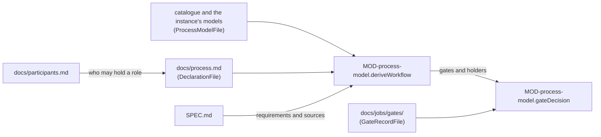

# ARC-019 Process models as data

## Context

The book's five process models and its practices ship with Agent M, and an instance adds its own: a definition names
its kind of work — planned from the whole SPEC, or pulled from a backlog —, its phases, the transitions between them,
the pairs of phases that verify each other, its gates with what they check and who decides them, its roles with the
capabilities their holders need, its flow control and its progress measure (UC-031). Adding one changes no code. A
definition is validated before a product may declare it.

A product declares one model, assigns its roles to participants of the instance, adds practices, gives a phase or a
sprint a branch of its own, and adds conditions to its Definition of Done (UC-002). What a requirement constrains is
named by where it lives: a requirement in a product's SPEC constrains that product, and Agent M's own rules for the
process are requirements of Agent M. A requirement of a product that asks more of its process — a documented unit
verification before validation — adds a gate or an artifact to the workflow; the product's declaration records the
addition, with the requirement it comes from.

## Decision

1. **Models and practices are Markdown files of one format**: front matter `name`, `kind` — `planned`, `pulled`, or
   `practice` —, `adapted_from`, and `measure` for a model or `fits` — the models or kinds of work it fits — for a
   practice; then a title, an introduction, and one table under each fixed heading: `## Phases`, `## Transitions`,
   `## Verification pairs`, `## Gates`, `## Roles`, and for pulled work `## Flow control` with the rows WIP limit,
   Time box and Sprints. A gate's decider is a role of the model, or `` CI check `<name>` ``. The shipped catalogue lies
   in `src/process-model/catalogue/`; an instance's own definitions in `docs/process-models/` of the instance. Reading
   is strict: a table with other columns or a row with another number of cells is an error, never a guess. The kinds of
   artifact a phase produces or a gate checks are an identifier prefix — `UC`, `ARC`, `MOD`, `TST`, `ITM`, `SRC`,
   `RES`, `JOB` — standing as a word, and `requirement` where a comma-separated entry begins with *requirement* or
   *requirements*; other words name no kind.
2. **Validation before use.** `MOD-process-model.validateModel` names every error beside its line; a product may
   declare only a definition without errors, and each model of the shipped catalogue passes.
3. **The participant register** is the first table of `docs/participants.md` of the instance — name, type, model,
   context, price, capabilities, processing place, route. A type is one of the five, a capability one of the six; a
   participant that works with a language model names its model, and may name how many tokens its model's context
   holds and its price as `<input> / <output> <currency> per million tokens`; one that is not a person names where it
   processes data; a cell holding a credential is an error. A job is not sent to a participant whose context is not
   declared, since what it is sent cannot be checked against it (`MOD-job-harness.contextFits`); usage it reports
   without a declared price stays *price unknown* (`MOD-run-engine.jobCost`). The register gives these rules their
   facts; the modules named keep them. The text around the table is kept (`MOD-process-model.formatParticipants`).
4. **A product's declaration** is `docs/process.md` of its repository: front matter `model`, `model_file`,
   `model_version` — the commit of the instance that holds the definition, so that a product keeps the version it
   declared — and `sprint_close`; then the tables `## Roles` and `## Branches`, the list `## Practices`, the list
   `## Definition of Done` of conditions added to the job rules — `` CI check `<name>` ``, `` gate `<From → To>` ``, or
   a condition a person confirms —, and the tables `## Gates added by requirements` and
   `## Artifacts added by requirements`, each row naming the requirement it comes from. Every other section is kept as
   a note and written back unchanged.
5. **The workflow** (`MOD-process-model.deriveWorkflow`) is the model's phases, transitions, pairs, gates and roles,
   with what each declared practice adds — a practice adds and never replaces —, and with the gates and artifacts the
   declaration adds, each marked with its requirement and that requirement's source; every role and every deciding role
   names its holders. A practice not in the catalogue or not fitting the model, and an addition naming no requirement of
   the product, no phase or no role of the workflow, is an error.
6. **Gates are decided from their records.** A decision is a record `docs/jobs/gates/<subject>-<from>-<to>-<hex>.md`:
   the gate, what passes it — a product, an item, a job —, the blob or commit decided on, the deciding participant, the
   decision and why; who committed it and when, the version history keeps. `MOD-process-model.gateDecision` counts only
   a record of a holder of the deciding role who did not do the work it checks, on the current text; a record on an
   earlier text shows the gate as passed on that text and not on this one. A gate decided by a CI check passes on that
   check's success on the current text. A gate leaving one of the phases whose jobs a run starts — from the first phase
   that produces `MOD`, each that produces `MOD` or `TST` (ARC-010 decision 4) — is passed by each job of that phase
   before its merge, and with it by the item the job implements; any other gate is passed by the product. The current
   text of a gate passed by a job or an item is the head commit of its pull request; of a gate passed by the product,
   the newest commit that changed a path of what it checks — every artifact of the kinds its artifacts name, all of the
   product's (`MOD-process-model.gatePaths`) —, so that a gate record, a change of the backlog or a merge of code leaves
   a design gate passed, and any change of the design does not. A gate whose artifacts name no kind with a path checks
   no text, and its record counts on any commit.
7. **The Definition of Done** is the four job rules and the conditions the product adds
   (`MOD-process-model.definitionOfDone`); `MOD-process-model.doneCheck` decides it from the facts the product's CI
   gathers for a pull request and names every condition that fails.
8. **A new version of a model** is shown to a product that declared the old one before the product saves its
   declaration again (`MOD-process-model.modelChanges`): the phases, gates and roles added and removed, the
   assignments that become invalid, and the kinds of artifact no longer produced.



## Alternatives

- **Models as code, one module per model** — `THE CATALOGUE IS DATA`.
- **YAML or JSON definitions** — a parser library for YAML, and a file a reader does not review as a document; Markdown
  tables are data and readable (`ARTIFACTS ARE MARKDOWN`).
- **A BPMN or state-machine notation** — more than the five models need, and not what the book teaches; a Mermaid
  diagram is drawn from the tables.
- **A field on each requirement saying whether it constrains the product or the process** — what a requirement
  constrains is named by where it lives; the declaration records the gates and artifacts a requirement adds, which is
  what the workflow needs.
- **Gate decisions as approval records** — an approval record accepts a reviewed file's text and is written by the one
  accepting person; a gate is decided by the holder of a role, a person or an agent, on items, jobs and products.

## Consequences

- A product keeps the model version it declared until its author saves the declaration again; a changed definition
  never changes a running product silently.
- A condition the product adds to its Definition of Done is checked by CI only when it is a CI check or a gate; any
  other condition is confirmed by a person.
- Agent M's own `docs/process.md`, its model `docs/process-models/scrum-wip.md` and `docs/participants.md` are files of
  these formats.

## Modules

### MOD-process-model

```json module
{
  "id": "MOD-process-model",
  "folder": "src/process-model/",
  "layer": "kernel",
  "responsibility": "Reads, validates and writes process models and practices, the instance's participant register and a product's declaration, derives the product's workflow, decides its gates from their records, and checks the Definition of Done.",
  "realises": ["THE PROCESS MODEL IS DECLARED PER PRODUCT", "THE CATALOGUE IS DATA", "THE MODEL DETERMINES THE PHASES AND THE GATES", "A PROCESS REQUIREMENT ADDS TO THE MODEL", "A PROCESS MODEL ORGANISES PEOPLE AND AGENTS", "A PRACTICE IS NOT A MODEL", "A GATE NAMES WHAT IT CHECKS", "PARTICIPANTS ARE CONFIGURED ONCE PER INSTANCE", "A PARTICIPANT HAS ONE OF FIVE TYPES", "A PARTICIPANT DECLARES ITS CAPABILITIES", "A ROLE NAMES THE CAPABILITIES IT NEEDS", "A PARTICIPANT DECLARES WHERE IT PROCESSES DATA", "A PARTICIPANT BASED ON A LANGUAGE MODEL NAMES ITS MODEL", "A MODEL DEFINITION IS VALIDATED BEFORE IT IS USED", "A GATE NAMES WHO DECIDES IT", "A GATE IS NOT DECIDED BY THE PARTICIPANT WHOSE WORK IT CHECKS", "THE GATE IS RECORDED", "A PRODUCT DECLARES ITS DEFINITION OF DONE", "THE DEFAULT DEFINITION OF DONE IS THE JOB RULES", "A PHASE OR A TIME BOX MAY HAVE A BRANCH OF ITS OWN", "WORK MERGES INTO THE DEFAULT BRANCH UNLESS A BRANCH IS SET"],
  "owns": ["Decider", "Phase", "Transition", "VerificationPair", "ModelGate", "ModelRole", "FlowControl", "ProcessModel", "Participant", "ParticipantRegister", "Restriction", "Assignability", "RoleAssignment", "Branch", "DoneCondition", "DeclaredCondition", "AddedGate", "AddedArtifact", "Declaration", "WorkflowPhase", "WorkflowGate", "WorkflowRole", "WorkflowArtifact", "Workflow", "GateRecordInput", "GateRecord", "CheckResult", "GateQuestion", "GateState", "DoneFacts", "DoneResult", "InvalidAssignment", "ModelChange", "ModelFileContent", "DeclarationFileContent", "ParticipantRow", "GateRecordFields", "ProcessModelFile", "DeclarationFile", "ParticipantRegisterFile", "GateRecordFile"],
  "uses": ["MOD-contracts"]
}
```

```json interface
{
  "id": "MOD-process-model.parseModel",
  "summary": "A process model or practice file read into its parts — kind of work, phases, transitions, verification pairs, gates with their deciders, roles, flow control, measure, the models a practice fits — with every row that does not read as an error.",
  "params": [{ "name": "text", "type": "string" }],
  "result": "ProcessModel",
  "async": false,
  "refusals": [],
  "examples": [
    {
      "name": "a planned model",
      "input": { "text": "---\nname: v-model\nkind: planned\nmeasure: plan entries per phase\n---\n# V-model\n\nEvery accepted requirement passes every phase; each later phase checks an earlier one.\n\n## Phases\n\n| Name | Role | Produces |\n|---|---|---|\n| Requirements | Analyst | requirements, UC |\n| Design | Architect | ARC |\n| Implementation | Developers | MOD |\n| Testing | Tester | TST |\n| Validation | Analyst | the validation of the requirements |\n\n## Transitions\n\n| From | To | Kind |\n|---|---|---|\n| Requirements | Design | sequence |\n| Design | Implementation | sequence |\n| Implementation | Testing | sequence |\n| Testing | Implementation | back |\n| Testing | Validation | sequence |\n\n## Verification pairs\n\n| Phase | Checked by |\n|---|---|\n| Design | Testing |\n| Requirements | Validation |\n\n## Gates\n\n| Between | Artifacts | Condition | Decider |\n|---|---|---|---|\n| Design → Implementation | ARC | every requirement has an ARC, and the design is accepted | Architect |\n| Implementation → Testing | MOD | CI is green | CI check `tests` |\n\n## Roles\n\n| Name | Filled by | Capabilities |\n|---|---|---|\n| Analyst | either | draft text, read the repository |\n| Architect | person | read the repository |\n| Developers | agent | read the repository, write to the repository, run code and tests |\n| Tester | either | read the repository, run code and tests |\n" },
      "result": {
        "name": "v-model",
        "kind": "planned",
        "adaptedFrom": "",
        "measure": "plan entries per phase",
        "fits": [],
        "title": "V-model",
        "intro": "Every accepted requirement passes every phase; each later phase checks an earlier one.",
        "phases": [
          {
            "name": "Requirements",
            "role": "Analyst",
            "produces": "requirements, UC",
            "kinds": ["UC", "requirement"],
            "line": 14
          },
          { "name": "Design", "role": "Architect", "produces": "ARC", "kinds": ["ARC"], "line": 15 },
          { "name": "Implementation", "role": "Developers", "produces": "MOD", "kinds": ["MOD"], "line": 16 },
          { "name": "Testing", "role": "Tester", "produces": "TST", "kinds": ["TST"], "line": 17 },
          {
            "name": "Validation",
            "role": "Analyst",
            "produces": "the validation of the requirements",
            "kinds": [],
            "line": 18
          }
        ],
        "transitions": [
          { "from": "Requirements", "to": "Design", "kind": "sequence", "line": 24 },
          { "from": "Design", "to": "Implementation", "kind": "sequence", "line": 25 },
          { "from": "Implementation", "to": "Testing", "kind": "sequence", "line": 26 },
          { "from": "Testing", "to": "Implementation", "kind": "back", "line": 27 },
          { "from": "Testing", "to": "Validation", "kind": "sequence", "line": 28 }
        ],
        "pairs": [
          { "phase": "Design", "checkedBy": "Testing", "line": 34 },
          { "phase": "Requirements", "checkedBy": "Validation", "line": 35 }
        ],
        "gates": [
          {
            "between": "Design → Implementation",
            "from": "Design",
            "to": "Implementation",
            "artifacts": "ARC",
            "kinds": ["ARC"],
            "condition": "every requirement has an ARC, and the design is accepted",
            "decider": { "role": "Architect" },
            "line": 41
          },
          {
            "between": "Implementation → Testing",
            "from": "Implementation",
            "to": "Testing",
            "artifacts": "MOD",
            "kinds": ["MOD"],
            "condition": "CI is green",
            "decider": { "check": "tests" },
            "line": 42
          }
        ],
        "roles": [
          {
            "name": "Analyst",
            "filledBy": "either",
            "capabilities": ["draft text", "read the repository"],
            "line": 48
          },
          { "name": "Architect", "filledBy": "person", "capabilities": ["read the repository"], "line": 49 },
          {
            "name": "Developers",
            "filledBy": "agent",
            "capabilities": ["read the repository", "write to the repository", "run code and tests"],
            "line": 50
          },
          {
            "name": "Tester",
            "filledBy": "either",
            "capabilities": ["read the repository", "run code and tests"],
            "line": 51
          }
        ],
        "flow": { "wipLimit": null, "timeBox": "", "sprints": null, "line": 0 },
        "lines": { "kind": 3, "measure": 4 },
        "problems": []
      }
    },
    {
      "name": "a practice",
      "input": { "text": "---\nname: devops\nkind: practice\nfits: v-model, pulled\n---\n# DevOps\n\nA release is deployed after validation, once its deployment check is green.\n\n## Phases\n\n| Name | Role | Produces |\n|---|---|---|\n| Deployment | Operator | the deployed release |\n\n## Transitions\n\n| From | To | Kind |\n|---|---|---|\n| Validation | Deployment | sequence |\n\n## Verification pairs\n\n| Phase | Checked by |\n|---|---|\n\n## Gates\n\n| Between | Artifacts | Condition | Decider |\n|---|---|---|---|\n| Validation → Deployment | TST | the deployment check is green | CI check `deploy` |\n\n## Roles\n\n| Name | Filled by | Capabilities |\n|---|---|---|\n| Operator | agent | read the repository, run code and tests |\n" },
      "result": {
        "name": "devops",
        "kind": "practice",
        "adaptedFrom": "",
        "measure": "",
        "fits": ["v-model", "pulled"],
        "title": "DevOps",
        "intro": "A release is deployed after validation, once its deployment check is green.",
        "phases": [
          { "name": "Deployment", "role": "Operator", "produces": "the deployed release", "kinds": [], "line": 14 }
        ],
        "transitions": [{ "from": "Validation", "to": "Deployment", "kind": "sequence", "line": 20 }],
        "pairs": [],
        "gates": [
          {
            "between": "Validation → Deployment",
            "from": "Validation",
            "to": "Deployment",
            "artifacts": "TST",
            "kinds": ["TST"],
            "condition": "the deployment check is green",
            "decider": { "check": "deploy" },
            "line": 31
          }
        ],
        "roles": [
          {
            "name": "Operator",
            "filledBy": "agent",
            "capabilities": ["read the repository", "run code and tests"],
            "line": 37
          }
        ],
        "flow": { "wipLimit": null, "timeBox": "", "sprints": null, "line": 0 },
        "lines": { "kind": 3, "measure": 1 },
        "problems": []
      }
    }
  ]
}
```

```json interface
{
  "id": "MOD-process-model.validateModel",
  "summary": "Every error of a model beside the line that causes it — a phase no transition reaches, a transition or pair naming no phase, a gate without artifacts, condition or decider, a role without capabilities, a phase without a role, a gate checking what no earlier phase produces, pulled work without exactly one of a time box and a WIP limit or without saying whether it runs in sprints, a measure that does not fit — or none, when it may be declared.",
  "params": [{ "name": "model", "type": "ProcessModel" }],
  "result": "Finding[]",
  "async": false,
  "refusals": [],
  "examples": [
    {
      "name": "the V-model",
      "input": {
        "model": {
          "name": "v-model",
          "kind": "planned",
          "adaptedFrom": "",
          "measure": "plan entries per phase",
          "fits": [],
          "title": "V-model",
          "intro": "Every accepted requirement passes every phase; each later phase checks an earlier one.",
          "phases": [
            {
              "name": "Requirements",
              "role": "Analyst",
              "produces": "requirements, UC",
              "kinds": ["UC", "requirement"],
              "line": 14
            },
            { "name": "Design", "role": "Architect", "produces": "ARC", "kinds": ["ARC"], "line": 15 },
            { "name": "Implementation", "role": "Developers", "produces": "MOD", "kinds": ["MOD"], "line": 16 },
            { "name": "Testing", "role": "Tester", "produces": "TST", "kinds": ["TST"], "line": 17 },
            {
              "name": "Validation",
              "role": "Analyst",
              "produces": "the validation of the requirements",
              "kinds": [],
              "line": 18
            }
          ],
          "transitions": [
            { "from": "Requirements", "to": "Design", "kind": "sequence", "line": 24 },
            { "from": "Design", "to": "Implementation", "kind": "sequence", "line": 25 },
            { "from": "Implementation", "to": "Testing", "kind": "sequence", "line": 26 },
            { "from": "Testing", "to": "Implementation", "kind": "back", "line": 27 },
            { "from": "Testing", "to": "Validation", "kind": "sequence", "line": 28 }
          ],
          "pairs": [
            { "phase": "Design", "checkedBy": "Testing", "line": 34 },
            { "phase": "Requirements", "checkedBy": "Validation", "line": 35 }
          ],
          "gates": [
            {
              "between": "Design → Implementation",
              "from": "Design",
              "to": "Implementation",
              "artifacts": "ARC",
              "kinds": ["ARC"],
              "condition": "every requirement has an ARC, and the design is accepted",
              "decider": { "role": "Architect" },
              "line": 41
            },
            {
              "between": "Implementation → Testing",
              "from": "Implementation",
              "to": "Testing",
              "artifacts": "MOD",
              "kinds": ["MOD"],
              "condition": "CI is green",
              "decider": { "check": "tests" },
              "line": 42
            }
          ],
          "roles": [
            {
              "name": "Analyst",
              "filledBy": "either",
              "capabilities": ["draft text", "read the repository"],
              "line": 48
            },
            { "name": "Architect", "filledBy": "person", "capabilities": ["read the repository"], "line": 49 },
            {
              "name": "Developers",
              "filledBy": "agent",
              "capabilities": ["read the repository", "write to the repository", "run code and tests"],
              "line": 50
            },
            {
              "name": "Tester",
              "filledBy": "either",
              "capabilities": ["read the repository", "run code and tests"],
              "line": 51
            }
          ],
          "flow": { "wipLimit": null, "timeBox": "", "sprints": null, "line": 0 },
          "lines": { "kind": 3, "measure": 4 },
          "problems": []
        }
      },
      "result": []
    },
    {
      "name": "a model with an error in each part",
      "input": {
        "model": {
          "name": "broken",
          "kind": "",
          "adaptedFrom": "",
          "measure": "story points",
          "fits": [],
          "title": "Broken",
          "intro": "",
          "phases": [
            { "name": "Doing", "role": "Developers", "produces": "MOD", "kinds": ["MOD"], "line": 11 },
            { "name": "Review", "role": "", "produces": "the review", "kinds": [], "line": 12 },
            { "name": "Done", "role": "Reviewer", "produces": "the merged pull request", "kinds": [], "line": 13 }
          ],
          "transitions": [
            { "from": "Doing", "to": "Review", "kind": "sequence", "line": 19 },
            { "from": "Review", "to": "Merged", "kind": "sequence", "line": 20 }
          ],
          "pairs": [{ "phase": "Doing", "checkedBy": "Testing", "line": 26 }],
          "gates": [
            {
              "between": "Doing → Review",
              "from": "Doing",
              "to": "Review",
              "artifacts": "",
              "kinds": [],
              "condition": "",
              "decider": null,
              "line": 32
            },
            {
              "between": "Review → Merged",
              "from": "Review",
              "to": "Merged",
              "artifacts": "ARC",
              "kinds": ["ARC"],
              "condition": "the design is accepted",
              "decider": { "role": "Developers" },
              "line": 33
            }
          ],
          "roles": [{ "name": "Developers", "filledBy": "robot", "capabilities": [], "line": 39 }],
          "flow": { "wipLimit": null, "timeBox": "", "sprints": null, "line": 0 },
          "lines": { "kind": 1, "measure": 3 },
          "problems": [
            { "artifact": "broken", "line": 40, "kind": "error", "what": "the row has 2 cells; the table Roles has 3 columns", "rule": "A MODEL DEFINITION IS VALIDATED BEFORE IT IS USED", "fix": "give the row one cell per column: | Name | Filled by | Capabilities |" }
          ]
        }
      },
      "result": [
        { "artifact": "broken", "line": 1, "kind": "error", "what": "the model declares no kind of work", "rule": "A MODEL DEFINITION IS VALIDATED BEFORE IT IS USED", "fix": "declare kind: planned, kind: pulled, or kind: practice for a practice" },
        { "artifact": "broken", "line": 3, "kind": "error", "what": "the measure \"story points\" is no progress measure", "rule": "PROGRESS IS SHOWN IN THE MODEL'S OWN MEASURE", "fix": "name one of: plan entries per phase; remaining items per time box; items per state over time" },
        { "artifact": "broken", "line": 12, "kind": "error", "what": "the phase Review names no role", "rule": "A PROCESS MODEL ORGANISES PEOPLE AND AGENTS", "fix": "name the role that does the phase" },
        { "artifact": "broken", "line": 13, "kind": "error", "what": "the phase Done names the role Reviewer, which the model does not define", "rule": "A PROCESS MODEL ORGANISES PEOPLE AND AGENTS", "fix": "define Reviewer under ## Roles" },
        { "artifact": "broken", "line": 13, "kind": "error", "what": "no transition reaches the phase Done", "rule": "THE MODEL DETERMINES THE PHASES AND THE GATES", "fix": "add a transition to Done, or remove the phase" },
        { "artifact": "broken", "line": 20, "kind": "error", "what": "the transition Review → Merged names Merged, which is no phase of the model", "rule": "THE MODEL DETERMINES THE PHASES AND THE GATES", "fix": "name a phase defined under ## Phases" },
        { "artifact": "broken", "line": 26, "kind": "error", "what": "the verification pair Doing ↔ Testing names Testing, which is no phase of the model", "rule": "THE MODEL DETERMINES THE PHASES AND THE GATES", "fix": "name a phase defined under ## Phases" },
        { "artifact": "broken", "line": 32, "kind": "error", "what": "the gate Doing → Review names no artifacts it checks", "rule": "A GATE NAMES WHAT IT CHECKS", "fix": "name the artifacts that must exist before the next phase opens" },
        { "artifact": "broken", "line": 32, "kind": "error", "what": "the gate Doing → Review names no condition", "rule": "A GATE NAMES WHAT IT CHECKS", "fix": "name the condition that must hold before the next phase opens" },
        { "artifact": "broken", "line": 32, "kind": "error", "what": "the gate Doing → Review names no decider", "rule": "A GATE NAMES WHO DECIDES IT", "fix": "name the role that decides it, or the check: CI check `<name>`" },
        { "artifact": "broken", "line": 33, "kind": "error", "what": "the gate Review → Merged names Merged, which is no phase of the model", "rule": "THE MODEL DETERMINES THE PHASES AND THE GATES", "fix": "name a phase defined under ## Phases" },
        { "artifact": "broken", "line": 33, "kind": "error", "what": "the gate Review → Merged checks ARC, which no phase up to Review produces", "rule": "A GATE NAMES WHAT IT CHECKS", "fix": "let a phase up to Review produce ARC" },
        { "artifact": "broken", "line": 39, "kind": "error", "what": "the role Developers is filled by \"robot\", not by person, agent or either", "rule": "A PROCESS MODEL ORGANISES PEOPLE AND AGENTS", "fix": "write person, agent or either" },
        { "artifact": "broken", "line": 39, "kind": "error", "what": "the role Developers names no capabilities", "rule": "A ROLE NAMES THE CAPABILITIES IT NEEDS", "fix": "name the capabilities its holder needs" },
        { "artifact": "broken", "line": 40, "kind": "error", "what": "the row has 2 cells; the table Roles has 3 columns", "rule": "A MODEL DEFINITION IS VALIDATED BEFORE IT IS USED", "fix": "give the row one cell per column: | Name | Filled by | Capabilities |" }
      ]
    },
    {
      "name": "pulled work without flow control",
      "input": {
        "model": {
          "name": "unbounded",
          "kind": "pulled",
          "adaptedFrom": "",
          "measure": "items per state over time",
          "fits": [],
          "title": "Unbounded",
          "intro": "",
          "phases": [{ "name": "Doing", "role": "Developers", "produces": "MOD", "kinds": ["MOD"], "line": 12 }],
          "transitions": [],
          "pairs": [],
          "gates": [],
          "roles": [
            { "name": "Developers", "filledBy": "agent", "capabilities": ["write to the repository"], "line": 18 }
          ],
          "flow": { "wipLimit": null, "timeBox": "", "sprints": null, "line": 0 },
          "lines": { "kind": 3, "measure": 4 },
          "problems": []
        }
      },
      "result": [
        { "artifact": "unbounded", "line": 1, "kind": "error", "what": "pulled work names neither a time box nor a WIP limit", "rule": "A MODEL DEFINITION IS VALIDATED BEFORE IT IS USED", "fix": "name one of them under ## Flow control" },
        { "artifact": "unbounded", "line": 1, "kind": "error", "what": "pulled work does not say whether it runs in sprints", "rule": "A MODEL DEFINITION IS VALIDATED BEFORE IT IS USED", "fix": "add the row | Sprints | yes | or | Sprints | no |" }
      ]
    }
  ]
}
```

```json interface
{
  "id": "MOD-process-model.formatModel",
  "summary": "The canonical text of a model or practice: its front matter, title and introduction, and one table per part.",
  "params": [{ "name": "model", "type": "ProcessModel" }],
  "result": "string",
  "async": false,
  "refusals": [],
  "examples": [
    {
      "name": "the practice as read",
      "input": {
        "model": {
          "name": "devops",
          "kind": "practice",
          "adaptedFrom": "",
          "measure": "",
          "fits": ["v-model", "pulled"],
          "title": "DevOps",
          "intro": "A release is deployed after validation, once its deployment check is green.",
          "phases": [
            { "name": "Deployment", "role": "Operator", "produces": "the deployed release", "kinds": [], "line": 14 }
          ],
          "transitions": [{ "from": "Validation", "to": "Deployment", "kind": "sequence", "line": 20 }],
          "pairs": [],
          "gates": [
            {
              "between": "Validation → Deployment",
              "from": "Validation",
              "to": "Deployment",
              "artifacts": "TST",
              "kinds": ["TST"],
              "condition": "the deployment check is green",
              "decider": { "check": "deploy" },
              "line": 31
            }
          ],
          "roles": [
            {
              "name": "Operator",
              "filledBy": "agent",
              "capabilities": ["read the repository", "run code and tests"],
              "line": 37
            }
          ],
          "flow": { "wipLimit": null, "timeBox": "", "sprints": null, "line": 0 },
          "lines": { "kind": 3, "measure": 1 },
          "problems": []
        }
      },
      "result": "---\nname: devops\nkind: practice\nfits: v-model, pulled\n---\n\n# DevOps\n\nA release is deployed after validation, once its deployment check is green.\n\n## Phases\n\n| Name | Role | Produces |\n|---|---|---|\n| Deployment | Operator | the deployed release |\n\n## Transitions\n\n| From | To | Kind |\n|---|---|---|\n| Validation | Deployment | sequence |\n\n## Verification pairs\n\n| Phase | Checked by |\n|---|---|\n\n## Gates\n\n| Between | Artifacts | Condition | Decider |\n|---|---|---|---|\n| Validation → Deployment | TST | the deployment check is green | CI check `deploy` |\n\n## Roles\n\n| Name | Filled by | Capabilities |\n|---|---|---|\n| Operator | agent | read the repository, run code and tests |\n"
    }
  ]
}
```

```json interface
{
  "id": "MOD-process-model.parseParticipants",
  "summary": "The instance's participant register: one participant per row — with the context its model holds and its price where declared —, the text before and after the table, and every error — a type not of the five, a participant working with a language model without its model, a context that is no number of tokens, a price not in the form <input> / <output> <currency> per million tokens, one that is not a person without its processing place, a capability not of the six, a credential in a cell.",
  "params": [{ "name": "text", "type": "string" }],
  "result": "ParticipantRegister",
  "async": false,
  "refusals": [],
  "examples": [
    {
      "name": "five participants",
      "input": { "text": "# Participants of this instance\n\n| Name | Type | Model | Context | Price | Capabilities | Processing place | Route |\n|---|---|---|---|---|---|---|---|\n| alice | person | — | — | — | draft text, read the repository, write to the repository | — | the GitHub account `alice` |\n| hub-writer | model endpoint | llama-3.3-70b | — | — | draft text | NHR@FAU, Erlangen | the endpoint hub of this browser |\n| gw-writer | model endpoint | gateway-model | 32000 | 0.2 / 0.6 EUR per million tokens | draft text | a gateway in Frankfurt, Germany | the endpoint gw of this browser |\n| ci-dev | CI agent | claude-opus-5-5 | — | — | read the repository, write to the repository, run code and tests | GitHub's machines, a provider in the USA | the workflow agent-m-job |\n| cli-dev | CLI agent | claude-opus-5-5 | — | — | draft text, read the repository, write to the repository, run code and tests, use tools | this machine | the bridge on the Mac of `alice` |\n\nEvery participant that works with a language model names its model.\n" },
      "result": {
        "participants": [
          {
            "name": "alice",
            "type": "person",
            "model": "",
            "context": null,
            "price": null,
            "capabilities": ["draft text", "read the repository", "write to the repository"],
            "place": "",
            "route": "the GitHub account `alice`",
            "line": 5
          },
          {
            "name": "hub-writer",
            "type": "model endpoint",
            "model": "llama-3.3-70b",
            "context": null,
            "price": null,
            "capabilities": ["draft text"],
            "place": "NHR@FAU, Erlangen",
            "route": "the endpoint hub of this browser",
            "line": 6
          },
          {
            "name": "gw-writer",
            "type": "model endpoint",
            "model": "gateway-model",
            "context": 32000,
            "price": { "currency": "EUR", "input": 0.2, "output": 0.6 },
            "capabilities": ["draft text"],
            "place": "a gateway in Frankfurt, Germany",
            "route": "the endpoint gw of this browser",
            "line": 7
          },
          {
            "name": "ci-dev",
            "type": "CI agent",
            "model": "claude-opus-5-5",
            "context": null,
            "price": null,
            "capabilities": ["read the repository", "write to the repository", "run code and tests"],
            "place": "GitHub's machines, a provider in the USA",
            "route": "the workflow agent-m-job",
            "line": 8
          },
          {
            "name": "cli-dev",
            "type": "CLI agent",
            "model": "claude-opus-5-5",
            "context": null,
            "price": null,
            "capabilities": ["draft text", "read the repository", "write to the repository", "run code and tests", "use tools"],
            "place": "this machine",
            "route": "the bridge on the Mac of `alice`",
            "line": 9
          }
        ],
        "problems": [],
        "before": "# Participants of this instance",
        "after": "Every participant that works with a language model names its model."
      }
    },
    {
      "name": "a row with four errors",
      "input": { "text": "| Name | Type | Model | Context | Price | Capabilities | Processing place | Route |\n|---|---|---|---|---|---|---|---|\n| bot | CLI agent | — | — | — | read the repository, sing | — | token github_pat_11AAAAAAAAAAAAAAAAAAAA |\n" },
      "result": {
        "participants": [
          {
            "name": "bot",
            "type": "CLI agent",
            "model": "",
            "context": null,
            "price": null,
            "capabilities": ["read the repository", "sing"],
            "place": "",
            "route": "token github_pat_11AAAAAAAAAAAAAAAAAAAA",
            "line": 3
          }
        ],
        "problems": [
          { "artifact": "docs/participants.md", "line": 3, "kind": "error", "what": "bot names no model", "rule": "A PARTICIPANT BASED ON A LANGUAGE MODEL NAMES ITS MODEL", "fix": "name the model it works with, such as claude-opus-5-5" },
          { "artifact": "docs/participants.md", "line": 3, "kind": "error", "what": "bot names no processing place", "rule": "A PARTICIPANT DECLARES WHERE IT PROCESSES DATA", "fix": "name where the data given to it is processed" },
          { "artifact": "docs/participants.md", "line": 3, "kind": "error", "what": "bot declares \"sing\", which is no capability", "rule": "A PARTICIPANT DECLARES ITS CAPABILITIES", "fix": "name capabilities of: draft text, read the repository, write to the repository, run code and tests, use tools, reach the web" },
          { "artifact": "docs/participants.md", "line": 3, "kind": "error", "what": "the row of bot holds a credential", "rule": "NO SECRET IN THE REPOSITORY", "fix": "remove it; name where the credential is held instead" }
        ],
        "before": "",
        "after": ""
      }
    },
    {
      "name": "a context and a price that cannot be read",
      "input": { "text": "| Name | Type | Model | Context | Price | Capabilities | Processing place | Route |\n|---|---|---|---|---|---|---|---|\n| gw | model endpoint | gateway-model | lots | cheap | draft text | a gateway in Frankfurt, Germany | the endpoint gw of this browser |\n" },
      "result": {
        "participants": [
          {
            "name": "gw",
            "type": "model endpoint",
            "model": "gateway-model",
            "context": null,
            "price": null,
            "capabilities": ["draft text"],
            "place": "a gateway in Frankfurt, Germany",
            "route": "the endpoint gw of this browser",
            "line": 3
          }
        ],
        "problems": [
          { "artifact": "docs/participants.md", "line": 3, "kind": "error", "what": "the context of gw is \"lots\", not a number of tokens", "rule": "NO REQUIREMENT IS LEFT OUT OF THE CONTEXT SILENTLY", "fix": "write how many tokens its model's context holds, such as 128000, or leave it empty" },
          { "artifact": "docs/participants.md", "line": 3, "kind": "error", "what": "the price of gw is \"cheap\"", "rule": "NO COST IS GUESSED", "fix": "write <input> / <output> <currency> per million tokens, such as 0.2 / 0.6 EUR per million tokens, or leave it empty" }
        ],
        "before": "",
        "after": ""
      }
    }
  ]
}
```

```json interface
{
  "id": "MOD-process-model.formatParticipants",
  "summary": "The canonical text of the register: the text before the table, one row per participant, and the text after it.",
  "params": [{ "name": "register", "type": "ParticipantRegister" }],
  "result": "string",
  "async": false,
  "refusals": [],
  "examples": [
    {
      "name": "the register as read",
      "input": {
        "register": {
          "participants": [
            {
              "name": "alice",
              "type": "person",
              "model": "",
              "context": null,
              "price": null,
              "capabilities": ["draft text", "read the repository", "write to the repository"],
              "place": "",
              "route": "the GitHub account `alice`",
              "line": 5
            },
            {
              "name": "hub-writer",
              "type": "model endpoint",
              "model": "llama-3.3-70b",
              "context": null,
              "price": null,
              "capabilities": ["draft text"],
              "place": "NHR@FAU, Erlangen",
              "route": "the endpoint hub of this browser",
              "line": 6
            },
            {
              "name": "gw-writer",
              "type": "model endpoint",
              "model": "gateway-model",
              "context": 32000,
              "price": { "currency": "EUR", "input": 0.2, "output": 0.6 },
              "capabilities": ["draft text"],
              "place": "a gateway in Frankfurt, Germany",
              "route": "the endpoint gw of this browser",
              "line": 7
            },
            {
              "name": "ci-dev",
              "type": "CI agent",
              "model": "claude-opus-5-5",
              "context": null,
              "price": null,
              "capabilities": ["read the repository", "write to the repository", "run code and tests"],
              "place": "GitHub's machines, a provider in the USA",
              "route": "the workflow agent-m-job",
              "line": 8
            },
            {
              "name": "cli-dev",
              "type": "CLI agent",
              "model": "claude-opus-5-5",
              "context": null,
              "price": null,
              "capabilities": ["draft text", "read the repository", "write to the repository", "run code and tests", "use tools"],
              "place": "this machine",
              "route": "the bridge on the Mac of `alice`",
              "line": 9
            }
          ],
          "problems": [],
          "before": "# Participants of this instance",
          "after": "Every participant that works with a language model names its model."
        }
      },
      "result": "# Participants of this instance\n\n| Name | Type | Model | Context | Price | Capabilities | Processing place | Route |\n|---|---|---|---|---|---|---|---|\n| alice | person | — | — | — | draft text, read the repository, write to the repository | — | the GitHub account `alice` |\n| hub-writer | model endpoint | llama-3.3-70b | — | — | draft text | NHR@FAU, Erlangen | the endpoint hub of this browser |\n| gw-writer | model endpoint | gateway-model | 32000 | 0.2 / 0.6 EUR per million tokens | draft text | a gateway in Frankfurt, Germany | the endpoint gw of this browser |\n| ci-dev | CI agent | claude-opus-5-5 | — | — | read the repository, write to the repository, run code and tests | GitHub's machines, a provider in the USA | the workflow agent-m-job |\n| cli-dev | CLI agent | claude-opus-5-5 | — | — | draft text, read the repository, write to the repository, run code and tests, use tools | this machine | the bridge on the Mac of `alice` |\n\nEvery participant that works with a language model names its model.\n"
    }
  ]
}
```

```json interface
{
  "id": "MOD-process-model.assignable",
  "summary": "Who may hold a role: each participant with the capabilities it lacks, whether its type may fill the role, and the sources whose content may not go where it processes data.",
  "params": [
    { "name": "role", "type": "ModelRole" },
    { "name": "participants", "type": "Participant[]" },
    { "name": "restrictions", "type": "Restriction[]" }
  ],
  "result": "Assignability[]",
  "async": false,
  "refusals": [],
  "examples": [
    {
      "name": "the Developers of the V-model, one source restricted to this machine",
      "input": {
        "role": {
          "name": "Developers",
          "filledBy": "agent",
          "capabilities": ["read the repository", "write to the repository", "run code and tests"],
          "line": 50
        },
        "participants": [
          {
            "name": "alice",
            "type": "person",
            "model": "",
            "context": null,
            "price": null,
            "capabilities": ["draft text", "read the repository", "write to the repository"],
            "place": "",
            "route": "the GitHub account `alice`",
            "line": 5
          },
          {
            "name": "hub-writer",
            "type": "model endpoint",
            "model": "llama-3.3-70b",
            "context": null,
            "price": null,
            "capabilities": ["draft text"],
            "place": "NHR@FAU, Erlangen",
            "route": "the endpoint hub of this browser",
            "line": 6
          },
          {
            "name": "gw-writer",
            "type": "model endpoint",
            "model": "gateway-model",
            "context": 32000,
            "price": { "currency": "EUR", "input": 0.2, "output": 0.6 },
            "capabilities": ["draft text"],
            "place": "a gateway in Frankfurt, Germany",
            "route": "the endpoint gw of this browser",
            "line": 7
          },
          {
            "name": "ci-dev",
            "type": "CI agent",
            "model": "claude-opus-5-5",
            "context": null,
            "price": null,
            "capabilities": ["read the repository", "write to the repository", "run code and tests"],
            "place": "GitHub's machines, a provider in the USA",
            "route": "the workflow agent-m-job",
            "line": 8
          },
          {
            "name": "cli-dev",
            "type": "CLI agent",
            "model": "claude-opus-5-5",
            "context": null,
            "price": null,
            "capabilities": ["draft text", "read the repository", "write to the repository", "run code and tests", "use tools"],
            "place": "this machine",
            "route": "the bridge on the Mac of `alice`",
            "line": 9
          }
        ],
        "restrictions": [{ "source": "SRC-iec-62304", "permitted": ["this machine"] }]
      },
      "result": [
        {
          "participant": "alice",
          "ok": false,
          "missing": ["run code and tests"],
          "allowed": false,
          "placeWarnings": []
        },
        {
          "participant": "hub-writer",
          "ok": false,
          "missing": ["read the repository", "write to the repository", "run code and tests"],
          "allowed": true,
          "placeWarnings": ["SRC-iec-62304"]
        },
        {
          "participant": "gw-writer",
          "ok": false,
          "missing": ["read the repository", "write to the repository", "run code and tests"],
          "allowed": true,
          "placeWarnings": ["SRC-iec-62304"]
        },
        { "participant": "ci-dev", "ok": true, "missing": [], "allowed": true, "placeWarnings": ["SRC-iec-62304"] },
        { "participant": "cli-dev", "ok": true, "missing": [], "allowed": true, "placeWarnings": [] }
      ]
    }
  ]
}
```

```json interface
{
  "id": "MOD-process-model.parseDeclaration",
  "summary": "A product's declaration docs/process.md: the model by name, file and version, who closes a sprint, the role assignment, practices, branches, the conditions added to the Definition of Done, the gates and artifacts added for requirements, and its other sections as notes.",
  "params": [{ "name": "text", "type": "string" }],
  "result": "Declaration",
  "async": false,
  "refusals": [],
  "examples": [
    {
      "name": "a V-model product with a practice and a gate added for a requirement",
      "input": { "text": "---\nmodel: v-model\nmodel_file: src/process-model/catalogue/v-model.md\nmodel_version: 5a00000000000000000000000000000000000000\n---\n# How the thesis tool is developed\n\nThe declaration of this product's process (UC-002).\n\n## Roles\n\n| Role | Participants |\n|---|---|\n| Analyst | alice |\n| Architect | alice |\n| Developers | cli-dev |\n| Tester | ci-dev |\n| Operator | ci-dev |\n\n## Practices\n\n- devops\n\n## Branches\n\n| Phase or time box | Branch |\n|---|---|\n| Implementation | `implementation` |\n\n## Definition of Done\n\nThe job rules hold for every pull request, and these conditions besides:\n\n- CI check `lint` — the linter passes\n- a second developer has read the change\n\n## Gates added by requirements\n\n| Requirement | Between | Artifacts | Condition | Decider |\n|---|---|---|---|---|\n| UNIT VERIFICATION IS DOCUMENTED | Testing → Validation | TST | every unit's verification is recorded | Tester |\n\n## Artifacts added by requirements\n\n| Requirement | Phase | Artifacts |\n|---|---|---|\n| UNIT VERIFICATION IS DOCUMENTED | Testing | the unit verification report |\n\n## Releases\n\nA release is cut from `main` once Validation is passed.\n" },
      "result": {
        "model": "v-model",
        "modelFile": "src/process-model/catalogue/v-model.md",
        "modelVersion": "5a00000000000000000000000000000000000000",
        "sprintClose": "",
        "title": "How the thesis tool is developed",
        "intro": "The declaration of this product's process (UC-002).",
        "roles": [
          { "role": "Analyst", "participants": ["alice"], "line": 14 },
          { "role": "Architect", "participants": ["alice"], "line": 15 },
          { "role": "Developers", "participants": ["cli-dev"], "line": 16 },
          { "role": "Tester", "participants": ["ci-dev"], "line": 17 },
          { "role": "Operator", "participants": ["ci-dev"], "line": 18 }
        ],
        "practices": ["devops"],
        "branches": [{ "phase": "Implementation", "branch": "implementation", "line": 28 }],
        "done": [
          { "kind": "ci-check", "name": "lint", "text": "the linter passes", "line": 34 },
          { "kind": "person", "name": "", "text": "a second developer has read the change", "line": 35 }
        ],
        "gatesAdded": [
          {
            "requirement": "UNIT VERIFICATION IS DOCUMENTED",
            "between": "Testing → Validation",
            "from": "Testing",
            "to": "Validation",
            "artifacts": "TST",
            "kinds": ["TST"],
            "condition": "every unit's verification is recorded",
            "decider": { "role": "Tester" },
            "line": 41
          }
        ],
        "artifactsAdded": [
          {
            "requirement": "UNIT VERIFICATION IS DOCUMENTED",
            "phase": "Testing",
            "artifacts": "the unit verification report",
            "kinds": [],
            "line": 47
          }
        ],
        "notes": "## Releases\n\nA release is cut from `main` once Validation is passed.",
        "problems": []
      }
    },
    {
      "name": "no model",
      "input": { "text": "# How it is developed\n" },
      "result": {
        "model": "",
        "modelFile": "",
        "modelVersion": "",
        "sprintClose": "",
        "title": "How it is developed",
        "intro": "",
        "roles": [],
        "practices": [],
        "branches": [],
        "done": [],
        "gatesAdded": [],
        "artifactsAdded": [],
        "notes": "",
        "problems": [
          { "artifact": "docs/process.md", "line": 1, "kind": "error", "what": "the declaration names no process model", "rule": "THE PROCESS MODEL IS DECLARED PER PRODUCT", "fix": "name it in the front matter: model: <name>" }
        ]
      }
    }
  ]
}
```

```json interface
{
  "id": "MOD-process-model.formatDeclaration",
  "summary": "The canonical text of a declaration, its notes kept.",
  "params": [{ "name": "declaration", "type": "Declaration" }],
  "result": "string",
  "async": false,
  "refusals": [],
  "examples": [
    {
      "name": "the declaration as read",
      "input": {
        "declaration": {
          "model": "v-model",
          "modelFile": "src/process-model/catalogue/v-model.md",
          "modelVersion": "5a00000000000000000000000000000000000000",
          "sprintClose": "",
          "title": "How the thesis tool is developed",
          "intro": "The declaration of this product's process (UC-002).",
          "roles": [
            { "role": "Analyst", "participants": ["alice"], "line": 14 },
            { "role": "Architect", "participants": ["alice"], "line": 15 },
            { "role": "Developers", "participants": ["cli-dev"], "line": 16 },
            { "role": "Tester", "participants": ["ci-dev"], "line": 17 },
            { "role": "Operator", "participants": ["ci-dev"], "line": 18 }
          ],
          "practices": ["devops"],
          "branches": [{ "phase": "Implementation", "branch": "implementation", "line": 28 }],
          "done": [
            { "kind": "ci-check", "name": "lint", "text": "the linter passes", "line": 34 },
            { "kind": "person", "name": "", "text": "a second developer has read the change", "line": 35 }
          ],
          "gatesAdded": [
            {
              "requirement": "UNIT VERIFICATION IS DOCUMENTED",
              "between": "Testing → Validation",
              "from": "Testing",
              "to": "Validation",
              "artifacts": "TST",
              "kinds": ["TST"],
              "condition": "every unit's verification is recorded",
              "decider": { "role": "Tester" },
              "line": 41
            }
          ],
          "artifactsAdded": [
            {
              "requirement": "UNIT VERIFICATION IS DOCUMENTED",
              "phase": "Testing",
              "artifacts": "the unit verification report",
              "kinds": [],
              "line": 47
            }
          ],
          "notes": "## Releases\n\nA release is cut from `main` once Validation is passed.",
          "problems": []
        }
      },
      "result": "---\nmodel: v-model\nmodel_file: src/process-model/catalogue/v-model.md\nmodel_version: 5a00000000000000000000000000000000000000\n---\n\n# How the thesis tool is developed\n\nThe declaration of this product's process (UC-002).\n\n## Roles\n\n| Role | Participants |\n|---|---|\n| Analyst | alice |\n| Architect | alice |\n| Developers | cli-dev |\n| Tester | ci-dev |\n| Operator | ci-dev |\n\n## Practices\n\n- devops\n\n## Branches\n\n| Phase or time box | Branch |\n|---|---|\n| Implementation | `implementation` |\n\n## Definition of Done\n\nThe job rules hold for every pull request, and these conditions besides:\n\n- CI check `lint` — the linter passes\n- a second developer has read the change\n\n## Gates added by requirements\n\n| Requirement | Between | Artifacts | Condition | Decider |\n|---|---|---|---|---|\n| UNIT VERIFICATION IS DOCUMENTED | Testing → Validation | TST | every unit's verification is recorded | Tester |\n\n## Artifacts added by requirements\n\n| Requirement | Phase | Artifacts |\n|---|---|---|\n| UNIT VERIFICATION IS DOCUMENTED | Testing | the unit verification report |\n\n## Releases\n\nA release is cut from `main` once Validation is passed.\n"
    }
  ]
}
```

```json interface
{
  "id": "MOD-process-model.deriveWorkflow",
  "summary": "The product's workflow: the model's phases, transitions, pairs, gates and roles, with what its practices add and the gates and artifacts its declaration adds for requirements — each marked with the requirement and its source —, the holders of every role and deciding role, and the branches; a practice that is not in the catalogue or does not fit, or an addition naming no requirement, phase or role, is an error.",
  "params": [
    { "name": "model", "type": "ProcessModel" },
    { "name": "practices", "type": "ProcessModel[]" },
    { "name": "declaration", "type": "Declaration" },
    { "name": "requirements", "type": "Requirement[]" }
  ],
  "result": "Workflow",
  "async": false,
  "refusals": [],
  "examples": [
    {
      "name": "the V-model with DevOps and a gate for a requirement",
      "input": {
        "model": {
          "name": "v-model",
          "kind": "planned",
          "adaptedFrom": "",
          "measure": "plan entries per phase",
          "fits": [],
          "title": "V-model",
          "intro": "Every accepted requirement passes every phase; each later phase checks an earlier one.",
          "phases": [
            {
              "name": "Requirements",
              "role": "Analyst",
              "produces": "requirements, UC",
              "kinds": ["UC", "requirement"],
              "line": 14
            },
            { "name": "Design", "role": "Architect", "produces": "ARC", "kinds": ["ARC"], "line": 15 },
            { "name": "Implementation", "role": "Developers", "produces": "MOD", "kinds": ["MOD"], "line": 16 },
            { "name": "Testing", "role": "Tester", "produces": "TST", "kinds": ["TST"], "line": 17 },
            {
              "name": "Validation",
              "role": "Analyst",
              "produces": "the validation of the requirements",
              "kinds": [],
              "line": 18
            }
          ],
          "transitions": [
            { "from": "Requirements", "to": "Design", "kind": "sequence", "line": 24 },
            { "from": "Design", "to": "Implementation", "kind": "sequence", "line": 25 },
            { "from": "Implementation", "to": "Testing", "kind": "sequence", "line": 26 },
            { "from": "Testing", "to": "Implementation", "kind": "back", "line": 27 },
            { "from": "Testing", "to": "Validation", "kind": "sequence", "line": 28 }
          ],
          "pairs": [
            { "phase": "Design", "checkedBy": "Testing", "line": 34 },
            { "phase": "Requirements", "checkedBy": "Validation", "line": 35 }
          ],
          "gates": [
            {
              "between": "Design → Implementation",
              "from": "Design",
              "to": "Implementation",
              "artifacts": "ARC",
              "kinds": ["ARC"],
              "condition": "every requirement has an ARC, and the design is accepted",
              "decider": { "role": "Architect" },
              "line": 41
            },
            {
              "between": "Implementation → Testing",
              "from": "Implementation",
              "to": "Testing",
              "artifacts": "MOD",
              "kinds": ["MOD"],
              "condition": "CI is green",
              "decider": { "check": "tests" },
              "line": 42
            }
          ],
          "roles": [
            {
              "name": "Analyst",
              "filledBy": "either",
              "capabilities": ["draft text", "read the repository"],
              "line": 48
            },
            { "name": "Architect", "filledBy": "person", "capabilities": ["read the repository"], "line": 49 },
            {
              "name": "Developers",
              "filledBy": "agent",
              "capabilities": ["read the repository", "write to the repository", "run code and tests"],
              "line": 50
            },
            {
              "name": "Tester",
              "filledBy": "either",
              "capabilities": ["read the repository", "run code and tests"],
              "line": 51
            }
          ],
          "flow": { "wipLimit": null, "timeBox": "", "sprints": null, "line": 0 },
          "lines": { "kind": 3, "measure": 4 },
          "problems": []
        },
        "practices": [
          {
            "name": "devops",
            "kind": "practice",
            "adaptedFrom": "",
            "measure": "",
            "fits": ["v-model", "pulled"],
            "title": "DevOps",
            "intro": "A release is deployed after validation, once its deployment check is green.",
            "phases": [
              {
                "name": "Deployment",
                "role": "Operator",
                "produces": "the deployed release",
                "kinds": [],
                "line": 14
              }
            ],
            "transitions": [{ "from": "Validation", "to": "Deployment", "kind": "sequence", "line": 20 }],
            "pairs": [],
            "gates": [
              {
                "between": "Validation → Deployment",
                "from": "Validation",
                "to": "Deployment",
                "artifacts": "TST",
                "kinds": ["TST"],
                "condition": "the deployment check is green",
                "decider": { "check": "deploy" },
                "line": 31
              }
            ],
            "roles": [
              {
                "name": "Operator",
                "filledBy": "agent",
                "capabilities": ["read the repository", "run code and tests"],
                "line": 37
              }
            ],
            "flow": { "wipLimit": null, "timeBox": "", "sprints": null, "line": 0 },
            "lines": { "kind": 3, "measure": 1 },
            "problems": []
          }
        ],
        "declaration": {
          "model": "v-model",
          "modelFile": "src/process-model/catalogue/v-model.md",
          "modelVersion": "5a00000000000000000000000000000000000000",
          "sprintClose": "",
          "title": "How the thesis tool is developed",
          "intro": "The declaration of this product's process (UC-002).",
          "roles": [
            { "role": "Analyst", "participants": ["alice"], "line": 14 },
            { "role": "Architect", "participants": ["alice"], "line": 15 },
            { "role": "Developers", "participants": ["cli-dev"], "line": 16 },
            { "role": "Tester", "participants": ["ci-dev"], "line": 17 },
            { "role": "Operator", "participants": ["ci-dev"], "line": 18 }
          ],
          "practices": ["devops"],
          "branches": [{ "phase": "Implementation", "branch": "implementation", "line": 28 }],
          "done": [
            { "kind": "ci-check", "name": "lint", "text": "the linter passes", "line": 34 },
            { "kind": "person", "name": "", "text": "a second developer has read the change", "line": 35 }
          ],
          "gatesAdded": [
            {
              "requirement": "UNIT VERIFICATION IS DOCUMENTED",
              "between": "Testing → Validation",
              "from": "Testing",
              "to": "Validation",
              "artifacts": "TST",
              "kinds": ["TST"],
              "condition": "every unit's verification is recorded",
              "decider": { "role": "Tester" },
              "line": 41
            }
          ],
          "artifactsAdded": [
            {
              "requirement": "UNIT VERIFICATION IS DOCUMENTED",
              "phase": "Testing",
              "artifacts": "the unit verification report",
              "kinds": [],
              "line": 47
            }
          ],
          "notes": "## Releases\n\nA release is cut from `main` once Validation is passed.",
          "problems": []
        },
        "requirements": [
          { "name": "UNIT VERIFICATION IS DOCUMENTED", "source": "IEC 62304, 5.5.5", "rule": "Every software unit's verification is documented.", "check": "`tests/test_unit_records.py`", "section": "3. Process", "line": 12 }
        ]
      },
      "result": {
        "model": "v-model",
        "kind": "planned",
        "measure": "plan entries per phase",
        "flow": { "wipLimit": null, "timeBox": "", "sprints": null, "line": 0 },
        "phases": [
          {
            "name": "Requirements",
            "role": "Analyst",
            "produces": "requirements, UC",
            "kinds": ["UC", "requirement"],
            "line": 14,
            "practice": ""
          },
          { "name": "Design", "role": "Architect", "produces": "ARC", "kinds": ["ARC"], "line": 15, "practice": "" },
          {
            "name": "Implementation",
            "role": "Developers",
            "produces": "MOD",
            "kinds": ["MOD"],
            "line": 16,
            "practice": ""
          },
          { "name": "Testing", "role": "Tester", "produces": "TST", "kinds": ["TST"], "line": 17, "practice": "" },
          {
            "name": "Validation",
            "role": "Analyst",
            "produces": "the validation of the requirements",
            "kinds": [],
            "line": 18,
            "practice": ""
          },
          {
            "name": "Deployment",
            "role": "Operator",
            "produces": "the deployed release",
            "kinds": [],
            "line": 14,
            "practice": "devops"
          }
        ],
        "transitions": [
          { "from": "Requirements", "to": "Design", "kind": "sequence", "line": 24 },
          { "from": "Design", "to": "Implementation", "kind": "sequence", "line": 25 },
          { "from": "Implementation", "to": "Testing", "kind": "sequence", "line": 26 },
          { "from": "Testing", "to": "Implementation", "kind": "back", "line": 27 },
          { "from": "Testing", "to": "Validation", "kind": "sequence", "line": 28 },
          { "from": "Validation", "to": "Deployment", "kind": "sequence", "line": 20 }
        ],
        "pairs": [
          { "phase": "Design", "checkedBy": "Testing", "line": 34 },
          { "phase": "Requirements", "checkedBy": "Validation", "line": 35 }
        ],
        "gates": [
          {
            "between": "Design → Implementation",
            "from": "Design",
            "to": "Implementation",
            "artifacts": "ARC",
            "kinds": ["ARC"],
            "condition": "every requirement has an ARC, and the design is accepted",
            "decider": { "role": "Architect" },
            "line": 41,
            "practice": "",
            "requirement": "",
            "source": "",
            "holders": ["alice"]
          },
          {
            "between": "Implementation → Testing",
            "from": "Implementation",
            "to": "Testing",
            "artifacts": "MOD",
            "kinds": ["MOD"],
            "condition": "CI is green",
            "decider": { "check": "tests" },
            "line": 42,
            "practice": "",
            "requirement": "",
            "source": "",
            "holders": []
          },
          {
            "between": "Validation → Deployment",
            "from": "Validation",
            "to": "Deployment",
            "artifacts": "TST",
            "kinds": ["TST"],
            "condition": "the deployment check is green",
            "decider": { "check": "deploy" },
            "line": 31,
            "practice": "devops",
            "requirement": "",
            "source": "",
            "holders": []
          },
          {
            "between": "Testing → Validation",
            "from": "Testing",
            "to": "Validation",
            "artifacts": "TST",
            "kinds": ["TST"],
            "condition": "every unit's verification is recorded",
            "decider": { "role": "Tester" },
            "line": 41,
            "practice": "",
            "requirement": "UNIT VERIFICATION IS DOCUMENTED",
            "source": "IEC 62304, 5.5.5",
            "holders": ["ci-dev"]
          }
        ],
        "roles": [
          {
            "name": "Analyst",
            "filledBy": "either",
            "capabilities": ["draft text", "read the repository"],
            "line": 48,
            "holders": ["alice"]
          },
          {
            "name": "Architect",
            "filledBy": "person",
            "capabilities": ["read the repository"],
            "line": 49,
            "holders": ["alice"]
          },
          {
            "name": "Developers",
            "filledBy": "agent",
            "capabilities": ["read the repository", "write to the repository", "run code and tests"],
            "line": 50,
            "holders": ["cli-dev"]
          },
          {
            "name": "Tester",
            "filledBy": "either",
            "capabilities": ["read the repository", "run code and tests"],
            "line": 51,
            "holders": ["ci-dev"]
          },
          {
            "name": "Operator",
            "filledBy": "agent",
            "capabilities": ["read the repository", "run code and tests"],
            "line": 37,
            "holders": ["ci-dev"]
          }
        ],
        "branches": [{ "phase": "Implementation", "branch": "implementation", "line": 28 }],
        "artifactsAdded": [
          { "requirement": "UNIT VERIFICATION IS DOCUMENTED", "source": "IEC 62304, 5.5.5", "phase": "Testing", "artifacts": "the unit verification report" }
        ],
        "problems": []
      }
    },
    {
      "name": "additions that resolve nothing",
      "input": {
        "model": {
          "name": "mini",
          "kind": "planned",
          "adaptedFrom": "",
          "measure": "plan entries per phase",
          "fits": [],
          "title": "Mini",
          "intro": "",
          "phases": [
            { "name": "Build", "role": "Developers", "produces": "MOD", "kinds": ["MOD"], "line": 12 },
            { "name": "Check", "role": "Tester", "produces": "TST", "kinds": ["TST"], "line": 13 }
          ],
          "transitions": [{ "from": "Build", "to": "Check", "kind": "sequence", "line": 19 }],
          "pairs": [],
          "gates": [],
          "roles": [
            { "name": "Developers", "filledBy": "agent", "capabilities": ["write to the repository"], "line": 25 },
            { "name": "Tester", "filledBy": "either", "capabilities": ["run code and tests"], "line": 26 }
          ],
          "flow": { "wipLimit": null, "timeBox": "", "sprints": null, "line": 0 },
          "lines": { "kind": 3, "measure": 4 },
          "problems": []
        },
        "practices": [
          {
            "name": "devops",
            "kind": "practice",
            "adaptedFrom": "",
            "measure": "",
            "fits": ["v-model", "pulled"],
            "title": "DevOps",
            "intro": "A release is deployed after validation, once its deployment check is green.",
            "phases": [
              {
                "name": "Deployment",
                "role": "Operator",
                "produces": "the deployed release",
                "kinds": [],
                "line": 14
              }
            ],
            "transitions": [{ "from": "Validation", "to": "Deployment", "kind": "sequence", "line": 20 }],
            "pairs": [],
            "gates": [
              {
                "between": "Validation → Deployment",
                "from": "Validation",
                "to": "Deployment",
                "artifacts": "TST",
                "kinds": ["TST"],
                "condition": "the deployment check is green",
                "decider": { "check": "deploy" },
                "line": 31
              }
            ],
            "roles": [
              {
                "name": "Operator",
                "filledBy": "agent",
                "capabilities": ["read the repository", "run code and tests"],
                "line": 37
              }
            ],
            "flow": { "wipLimit": null, "timeBox": "", "sprints": null, "line": 0 },
            "lines": { "kind": 3, "measure": 1 },
            "problems": []
          }
        ],
        "declaration": {
          "model": "mini",
          "modelFile": "docs/process-models/mini.md",
          "modelVersion": "5a00000000000000000000000000000000000000",
          "sprintClose": "",
          "title": "How the mini product is developed",
          "intro": "",
          "roles": [
            { "role": "Developers", "participants": ["cli-dev"], "line": 12 },
            { "role": "Tester", "participants": ["ci-dev"], "line": 13 },
            { "role": "Operator", "participants": ["ci-dev"], "line": 14 }
          ],
          "practices": ["devops", "pairing"],
          "branches": [],
          "done": [],
          "gatesAdded": [
            {
              "requirement": "UNIT VERIFICATION IS DOCUMENTED",
              "between": "Check → Release",
              "from": "Check",
              "to": "Release",
              "artifacts": "TST",
              "kinds": ["TST"],
              "condition": "every unit's verification is recorded",
              "decider": { "role": "Tester" },
              "line": 25
            },
            {
              "requirement": "UNIT VERIFICATION IS DOCUMENTED",
              "between": "Build → Check",
              "from": "Build",
              "to": "Check",
              "artifacts": "MOD",
              "kinds": ["MOD"],
              "condition": "every unit has its record",
              "decider": { "role": "Auditor" },
              "line": 26
            }
          ],
          "artifactsAdded": [
            {
              "requirement": "NO SUCH RULE",
              "phase": "Check",
              "artifacts": "the unit verification report",
              "kinds": [],
              "line": 32
            }
          ],
          "notes": "",
          "problems": []
        },
        "requirements": [
          { "name": "UNIT VERIFICATION IS DOCUMENTED", "source": "IEC 62304, 5.5.5", "rule": "Every software unit's verification is documented.", "check": "`tests/test_unit_records.py`", "section": "3. Process", "line": 12 }
        ]
      },
      "result": {
        "model": "mini",
        "kind": "planned",
        "measure": "plan entries per phase",
        "flow": { "wipLimit": null, "timeBox": "", "sprints": null, "line": 0 },
        "phases": [
          { "name": "Build", "role": "Developers", "produces": "MOD", "kinds": ["MOD"], "line": 12, "practice": "" },
          { "name": "Check", "role": "Tester", "produces": "TST", "kinds": ["TST"], "line": 13, "practice": "" }
        ],
        "transitions": [{ "from": "Build", "to": "Check", "kind": "sequence", "line": 19 }],
        "pairs": [],
        "gates": [],
        "roles": [
          {
            "name": "Developers",
            "filledBy": "agent",
            "capabilities": ["write to the repository"],
            "line": 25,
            "holders": ["cli-dev"]
          },
          {
            "name": "Tester",
            "filledBy": "either",
            "capabilities": ["run code and tests"],
            "line": 26,
            "holders": ["ci-dev"]
          }
        ],
        "branches": [],
        "artifactsAdded": [],
        "problems": [
          { "artifact": "docs/process.md", "line": 1, "kind": "error", "what": "the practice devops does not fit mini", "rule": "A PRACTICE IS NOT A MODEL", "fix": "choose a practice that fits mini" },
          { "artifact": "docs/process.md", "line": 1, "kind": "error", "what": "the practice pairing is not in the catalogue", "rule": "A PRACTICE IS NOT A MODEL", "fix": "choose a practice the catalogue holds" },
          { "artifact": "docs/process.md", "line": 14, "kind": "error", "what": "Operator is no role of the workflow", "rule": "A PROCESS MODEL ORGANISES PEOPLE AND AGENTS", "fix": "assign the roles the model and its practices name" },
          { "artifact": "docs/process.md", "line": 25, "kind": "error", "what": "the gate Check → Release names a phase the workflow does not have", "rule": "A PROCESS REQUIREMENT ADDS TO THE MODEL", "fix": "name two phases of the workflow" },
          { "artifact": "docs/process.md", "line": 26, "kind": "error", "what": "the gate Build → Check is decided by Auditor, which is no role of the workflow", "rule": "A GATE NAMES WHO DECIDES IT", "fix": "name a role of the model, or CI check `<name>`" },
          { "artifact": "docs/process.md", "line": 32, "kind": "error", "what": "NO SUCH RULE is no requirement of the product", "rule": "A PROCESS REQUIREMENT ADDS TO THE MODEL", "fix": "name an accepted requirement of SPEC.md" }
        ]
      }
    }
  ]
}
```

```json interface
{
  "id": "MOD-process-model.gateRecordText",
  "summary": "The record of a gate's decision and where it is written: docs/jobs/gates/<subject>-<from>-<to>-<first 12 hex>.md — the gate, what passed it, on which text, who decided, the decision and why.",
  "params": [{ "name": "record", "type": "GateRecordInput" }],
  "result": "FileText",
  "async": false,
  "refusals": [],
  "examples": [
    {
      "name": "the Architect passes the design",
      "input": {
        "record": { "from": "Design", "to": "Implementation", "subject": "thesis-tool", "on": "be00000000000000000000000000000000000000", "decider": "alice", "decision": "passed", "reason": "the design covers every requirement" }
      },
      "result": { "path": "docs/jobs/gates/thesis-tool-design-implementation-be0000000000.md", "text": "gate: Design → Implementation\nsubject: thesis-tool\non: be00000000000000000000000000000000000000\ndecider: alice\ndecision: passed\nreason: the design covers every requirement\n" }
    }
  ]
}
```

```json interface
{
  "id": "MOD-process-model.parseGateRecord",
  "summary": "The gate record a file holds.",
  "params": [{ "name": "path", "type": "string" }, { "name": "text", "type": "string" }],
  "result": "GateRecord",
  "async": false,
  "refusals": [
    { "code": "not-a-gate-record", "when": "the text lacks the gate, the subject, a 40-hex text, the decider or a decision of passed or refused" }
  ],
  "examples": [
    {
      "name": "a record",
      "input": { "path": "docs/jobs/gates/thesis-tool-design-implementation-be0000000000.md", "text": "gate: Design → Implementation\nsubject: thesis-tool\non: be00000000000000000000000000000000000000\ndecider: alice\ndecision: passed\nreason: the design covers every requirement\n" },
      "result": { "path": "docs/jobs/gates/thesis-tool-design-implementation-be0000000000.md", "from": "Design", "to": "Implementation", "subject": "thesis-tool", "on": "be00000000000000000000000000000000000000", "decider": "alice", "decision": "passed", "reason": "the design covers every requirement" }
    },
    {
      "name": "a record without its decider",
      "input": { "path": "docs/jobs/gates/x.md", "text": "gate: Design → Implementation\nsubject: thesis-tool\n" },
      "refused": "not-a-gate-record"
    }
  ]
}
```

```json interface
{
  "id": "MOD-process-model.gatePaths",
  "summary": "Where everything of the kinds a gate checks lies in a product: SPEC.md for requirements, docs/use-cases/ for UC, docs/architecture/ for ARC, the folders of the product's modules for MOD, tests/ for TST, docs/backlog/ for ITM, docs/sources.md for SRC and docs/resources.md for RES; none for JOB or a word that names no kind.",
  "params": [{ "name": "kinds", "type": "string[]" }, { "name": "folders", "type": "string[]" }],
  "result": "string[]",
  "async": false,
  "refusals": [],
  "examples": [
    {
      "name": "a design gate",
      "input": { "kinds": ["ARC"], "folders": ["src/export/", "src/pages/"] },
      "result": ["docs/architecture/"]
    },
    {
      "name": "a gate on the product's code and tests",
      "input": { "kinds": ["MOD", "TST"], "folders": ["src/export/", "src/pages/"] },
      "result": ["src/export/", "src/pages/", "tests/"]
    },
    { "name": "a gate on no kind of artifact", "input": { "kinds": [], "folders": ["src/export/"] }, "result": [] }
  ]
}
```

```json interface
{
  "id": "MOD-process-model.gateDecision",
  "summary": "Whether a gate is passed for what it checks, on its current text — on any, for a gate that checks none: by a record of one of the deciding role's holders who did not do the work, or by its CI check's success on that text; passed on an earlier text, refused, or waiting with who may decide.",
  "params": [{ "name": "question", "type": "GateQuestion" }],
  "result": "GateState",
  "async": false,
  "refusals": [],
  "examples": [
    {
      "name": "passed by the Architect",
      "input": {
        "question": {
          "gate": {
            "between": "Design → Implementation",
            "from": "Design",
            "to": "Implementation",
            "artifacts": "ARC",
            "kinds": ["ARC"],
            "condition": "every requirement has an ARC, and the design is accepted",
            "decider": { "role": "Architect" },
            "line": 41,
            "practice": "",
            "requirement": "",
            "source": "",
            "holders": ["alice"]
          },
          "subject": "thesis-tool",
          "on": "be00000000000000000000000000000000000000",
          "worker": "cli-dev",
          "records": [
            { "path": "docs/jobs/gates/thesis-tool-design-implementation-be0000000000.md", "from": "Design", "to": "Implementation", "subject": "thesis-tool", "on": "be00000000000000000000000000000000000000", "decider": "alice", "decision": "passed", "reason": "the design covers every requirement" }
          ],
          "checks": []
        }
      },
      "result": { "state": "passed", "by": "alice", "record": "docs/jobs/gates/thesis-tool-design-implementation-be0000000000.md" }
    },
    {
      "name": "the worker's own record does not pass it",
      "input": {
        "question": {
          "gate": {
            "between": "Design → Implementation",
            "from": "Design",
            "to": "Implementation",
            "artifacts": "ARC",
            "kinds": ["ARC"],
            "condition": "every requirement has an ARC, and the design is accepted",
            "decider": { "role": "Architect" },
            "line": 41,
            "practice": "",
            "requirement": "",
            "source": "",
            "holders": ["alice", "cli-dev"]
          },
          "subject": "thesis-tool",
          "on": "be00000000000000000000000000000000000000",
          "worker": "cli-dev",
          "records": [
            { "path": "docs/jobs/gates/thesis-tool-design-implementation-be0000000000.md", "from": "Design", "to": "Implementation", "subject": "thesis-tool", "on": "be00000000000000000000000000000000000000", "decider": "cli-dev", "decision": "passed", "reason": "the design covers every requirement" }
          ],
          "checks": []
        }
      },
      "result": { "state": "waiting", "by": "", "record": "", "deciders": ["alice"] }
    },
    {
      "name": "passed on an earlier text",
      "input": {
        "question": {
          "gate": {
            "between": "Design → Implementation",
            "from": "Design",
            "to": "Implementation",
            "artifacts": "ARC",
            "kinds": ["ARC"],
            "condition": "every requirement has an ARC, and the design is accepted",
            "decider": { "role": "Architect" },
            "line": 41,
            "practice": "",
            "requirement": "",
            "source": "",
            "holders": ["alice"]
          },
          "subject": "thesis-tool",
          "on": "be00000000000000000000000000000000000000",
          "worker": "cli-dev",
          "records": [
            { "path": "docs/jobs/gates/thesis-tool-design-implementation-bd0000000000.md", "from": "Design", "to": "Implementation", "subject": "thesis-tool", "on": "bd00000000000000000000000000000000000000", "decider": "alice", "decision": "passed", "reason": "the design covers every requirement" }
          ],
          "checks": []
        }
      },
      "result": { "state": "passed-earlier", "by": "alice", "record": "docs/jobs/gates/thesis-tool-design-implementation-bd0000000000.md" }
    },
    {
      "name": "a gate its CI check decides",
      "input": {
        "question": {
          "gate": {
            "between": "Implementation → Testing",
            "from": "Implementation",
            "to": "Testing",
            "artifacts": "MOD",
            "kinds": ["MOD"],
            "condition": "CI is green",
            "decider": { "check": "tests" },
            "line": 42,
            "practice": "",
            "requirement": "",
            "source": "",
            "holders": []
          },
          "subject": "thesis-tool",
          "on": "be00000000000000000000000000000000000000",
          "worker": "cli-dev",
          "records": [],
          "checks": [{ "name": "tests", "on": "be00000000000000000000000000000000000000", "conclusion": "success" }]
        }
      },
      "result": { "state": "passed", "by": "CI check tests", "record": "" }
    },
    {
      "name": "a gate that checks no text",
      "input": {
        "question": {
          "gate": {
            "between": "Validation → Release",
            "from": "Validation",
            "to": "Release",
            "artifacts": "the validation report",
            "kinds": [],
            "condition": "the report is signed",
            "decider": { "role": "Architect" },
            "line": 0,
            "practice": "",
            "requirement": "",
            "source": "",
            "holders": ["alice"]
          },
          "subject": "thesis-tool",
          "on": "",
          "worker": "cli-dev",
          "records": [
            { "path": "docs/jobs/gates/thesis-tool-validation-release-bd0000000000.md", "from": "Validation", "to": "Release", "subject": "thesis-tool", "on": "bd00000000000000000000000000000000000000", "decider": "alice", "decision": "passed", "reason": "the report is signed" }
          ],
          "checks": []
        }
      },
      "result": { "state": "passed", "by": "alice", "record": "docs/jobs/gates/thesis-tool-validation-release-bd0000000000.md" }
    }
  ]
}
```

```json interface
{
  "id": "MOD-process-model.definitionOfDone",
  "summary": "The conditions a pull request must meet: the four job rules, then the conditions the product adds.",
  "params": [{ "name": "declaration", "type": "Declaration" }],
  "result": "DoneCondition[]",
  "async": false,
  "refusals": [],
  "examples": [
    {
      "name": "the job rules and two conditions",
      "input": {
        "declaration": {
          "model": "v-model",
          "modelFile": "src/process-model/catalogue/v-model.md",
          "modelVersion": "5a00000000000000000000000000000000000000",
          "sprintClose": "",
          "title": "How the thesis tool is developed",
          "intro": "The declaration of this product's process (UC-002).",
          "roles": [
            { "role": "Analyst", "participants": ["alice"], "line": 14 },
            { "role": "Architect", "participants": ["alice"], "line": 15 },
            { "role": "Developers", "participants": ["cli-dev"], "line": 16 },
            { "role": "Tester", "participants": ["ci-dev"], "line": 17 },
            { "role": "Operator", "participants": ["ci-dev"], "line": 18 }
          ],
          "practices": ["devops"],
          "branches": [{ "phase": "Implementation", "branch": "implementation", "line": 28 }],
          "done": [
            { "kind": "ci-check", "name": "lint", "text": "the linter passes", "line": 34 },
            { "kind": "person", "name": "", "text": "a second developer has read the change", "line": 35 }
          ],
          "gatesAdded": [
            {
              "requirement": "UNIT VERIFICATION IS DOCUMENTED",
              "between": "Testing → Validation",
              "from": "Testing",
              "to": "Validation",
              "artifacts": "TST",
              "kinds": ["TST"],
              "condition": "every unit's verification is recorded",
              "decider": { "role": "Tester" },
              "line": 41
            }
          ],
          "artifactsAdded": [
            {
              "requirement": "UNIT VERIFICATION IS DOCUMENTED",
              "phase": "Testing",
              "artifacts": "the unit verification report",
              "kinds": [],
              "line": 47
            }
          ],
          "notes": "## Releases\n\nA release is cut from `main` once Validation is passed.",
          "problems": []
        }
      },
      "result": [
        { "kind": "job-rule", "name": "ci-green", "text": "the pull request's CI run is green" },
        { "kind": "job-rule", "name": "tests-first", "text": "the job's first commit holds only failing tests — for a refactoring job, CI is green on every commit and no expected result changed" },
        { "kind": "job-rule", "name": "own-modules", "text": "the pull request changes only the job's modules" },
        { "kind": "job-rule", "name": "gates-recorded", "text": "every gate the workflow places before the merge is recorded" },
        { "kind": "ci-check", "name": "lint", "text": "the linter passes" },
        { "kind": "person", "name": "", "text": "a second developer has read the change" }
      ]
    }
  ]
}
```

```json interface
{
  "id": "MOD-process-model.doneCheck",
  "summary": "Whether a pull request meets every condition, from the facts its CI gathered; each condition that fails is named.",
  "params": [{ "name": "conditions", "type": "DoneCondition[]" }, { "name": "facts", "type": "DoneFacts" }],
  "result": "DoneResult",
  "async": false,
  "refusals": [],
  "examples": [
    {
      "name": "every condition met",
      "input": {
        "conditions": [
          { "kind": "job-rule", "name": "ci-green", "text": "the pull request's CI run is green" },
          { "kind": "job-rule", "name": "tests-first", "text": "the job's first commit holds only failing tests — for a refactoring job, CI is green on every commit and no expected result changed" },
          { "kind": "job-rule", "name": "own-modules", "text": "the pull request changes only the job's modules" },
          { "kind": "job-rule", "name": "gates-recorded", "text": "every gate the workflow places before the merge is recorded" },
          { "kind": "ci-check", "name": "lint", "text": "the linter passes" },
          { "kind": "person", "name": "", "text": "a second developer has read the change" }
        ],
        "facts": {
          "ciGreen": true,
          "firstCommitOnlyFailingTests": true,
          "refactoring": false,
          "greenEveryCommit": false,
          "expectationsUnchanged": false,
          "filesOutsideModules": [],
          "gatesMissing": [],
          "checks": [{ "name": "lint", "on": "be00000000000000000000000000000000000000", "conclusion": "success" }],
          "personConfirmed": ["a second developer has read the change"]
        }
      },
      "result": { "ok": true, "failed": [] }
    },
    {
      "name": "a file outside the job's modules, the linter not run",
      "input": {
        "conditions": [
          { "kind": "job-rule", "name": "ci-green", "text": "the pull request's CI run is green" },
          { "kind": "job-rule", "name": "tests-first", "text": "the job's first commit holds only failing tests — for a refactoring job, CI is green on every commit and no expected result changed" },
          { "kind": "job-rule", "name": "own-modules", "text": "the pull request changes only the job's modules" },
          { "kind": "job-rule", "name": "gates-recorded", "text": "every gate the workflow places before the merge is recorded" },
          { "kind": "ci-check", "name": "lint", "text": "the linter passes" },
          { "kind": "person", "name": "", "text": "a second developer has read the change" }
        ],
        "facts": {
          "ciGreen": true,
          "firstCommitOnlyFailingTests": true,
          "refactoring": false,
          "greenEveryCommit": false,
          "expectationsUnchanged": false,
          "filesOutsideModules": ["src/other/index.mjs"],
          "gatesMissing": [],
          "checks": [],
          "personConfirmed": ["a second developer has read the change"]
        }
      },
      "result": { "ok": false, "failed": ["own-modules", "ci-check lint"] }
    }
  ]
}
```

```json interface
{
  "id": "MOD-process-model.modelChanges",
  "summary": "What a new version of a model changes for a product that declared the old one: the phases, gates and roles added and removed, the assignments that become invalid, and the kinds of artifact no phase produces any more.",
  "params": [
    { "name": "before", "type": "ProcessModel" },
    { "name": "after", "type": "ProcessModel" },
    { "name": "declaration", "type": "Declaration" },
    { "name": "participants", "type": "Participant[]" }
  ],
  "result": "ModelChange",
  "async": false,
  "refusals": [],
  "examples": [
    {
      "name": "a gate added; the Tester now a person",
      "input": {
        "before": {
          "name": "v-model",
          "kind": "planned",
          "adaptedFrom": "",
          "measure": "plan entries per phase",
          "fits": [],
          "title": "V-model",
          "intro": "Every accepted requirement passes every phase; each later phase checks an earlier one.",
          "phases": [
            {
              "name": "Requirements",
              "role": "Analyst",
              "produces": "requirements, UC",
              "kinds": ["UC", "requirement"],
              "line": 14
            },
            { "name": "Design", "role": "Architect", "produces": "ARC", "kinds": ["ARC"], "line": 15 },
            { "name": "Implementation", "role": "Developers", "produces": "MOD", "kinds": ["MOD"], "line": 16 },
            { "name": "Testing", "role": "Tester", "produces": "TST", "kinds": ["TST"], "line": 17 },
            {
              "name": "Validation",
              "role": "Analyst",
              "produces": "the validation of the requirements",
              "kinds": [],
              "line": 18
            }
          ],
          "transitions": [
            { "from": "Requirements", "to": "Design", "kind": "sequence", "line": 24 },
            { "from": "Design", "to": "Implementation", "kind": "sequence", "line": 25 },
            { "from": "Implementation", "to": "Testing", "kind": "sequence", "line": 26 },
            { "from": "Testing", "to": "Implementation", "kind": "back", "line": 27 },
            { "from": "Testing", "to": "Validation", "kind": "sequence", "line": 28 }
          ],
          "pairs": [
            { "phase": "Design", "checkedBy": "Testing", "line": 34 },
            { "phase": "Requirements", "checkedBy": "Validation", "line": 35 }
          ],
          "gates": [
            {
              "between": "Design → Implementation",
              "from": "Design",
              "to": "Implementation",
              "artifacts": "ARC",
              "kinds": ["ARC"],
              "condition": "every requirement has an ARC, and the design is accepted",
              "decider": { "role": "Architect" },
              "line": 41
            },
            {
              "between": "Implementation → Testing",
              "from": "Implementation",
              "to": "Testing",
              "artifacts": "MOD",
              "kinds": ["MOD"],
              "condition": "CI is green",
              "decider": { "check": "tests" },
              "line": 42
            }
          ],
          "roles": [
            {
              "name": "Analyst",
              "filledBy": "either",
              "capabilities": ["draft text", "read the repository"],
              "line": 48
            },
            { "name": "Architect", "filledBy": "person", "capabilities": ["read the repository"], "line": 49 },
            {
              "name": "Developers",
              "filledBy": "agent",
              "capabilities": ["read the repository", "write to the repository", "run code and tests"],
              "line": 50
            },
            {
              "name": "Tester",
              "filledBy": "either",
              "capabilities": ["read the repository", "run code and tests"],
              "line": 51
            }
          ],
          "flow": { "wipLimit": null, "timeBox": "", "sprints": null, "line": 0 },
          "lines": { "kind": 3, "measure": 4 },
          "problems": []
        },
        "after": {
          "name": "v-model",
          "kind": "planned",
          "adaptedFrom": "",
          "measure": "plan entries per phase",
          "fits": [],
          "title": "V-model",
          "intro": "Every accepted requirement passes every phase; each later phase checks an earlier one.",
          "phases": [
            {
              "name": "Requirements",
              "role": "Analyst",
              "produces": "requirements, UC",
              "kinds": ["UC", "requirement"],
              "line": 14
            },
            { "name": "Design", "role": "Architect", "produces": "ARC", "kinds": ["ARC"], "line": 15 },
            { "name": "Implementation", "role": "Developers", "produces": "MOD", "kinds": ["MOD"], "line": 16 },
            { "name": "Testing", "role": "Tester", "produces": "TST", "kinds": ["TST"], "line": 17 },
            {
              "name": "Validation",
              "role": "Analyst",
              "produces": "the validation of the requirements",
              "kinds": [],
              "line": 18
            }
          ],
          "transitions": [
            { "from": "Requirements", "to": "Design", "kind": "sequence", "line": 24 },
            { "from": "Design", "to": "Implementation", "kind": "sequence", "line": 25 },
            { "from": "Implementation", "to": "Testing", "kind": "sequence", "line": 26 },
            { "from": "Testing", "to": "Implementation", "kind": "back", "line": 27 },
            { "from": "Testing", "to": "Validation", "kind": "sequence", "line": 28 }
          ],
          "pairs": [
            { "phase": "Design", "checkedBy": "Testing", "line": 34 },
            { "phase": "Requirements", "checkedBy": "Validation", "line": 35 }
          ],
          "gates": [
            {
              "between": "Design → Implementation",
              "from": "Design",
              "to": "Implementation",
              "artifacts": "ARC",
              "kinds": ["ARC"],
              "condition": "every requirement has an ARC, and the design is accepted",
              "decider": { "role": "Architect" },
              "line": 41
            },
            {
              "between": "Implementation → Testing",
              "from": "Implementation",
              "to": "Testing",
              "artifacts": "MOD",
              "kinds": ["MOD"],
              "condition": "CI is green",
              "decider": { "check": "tests" },
              "line": 42
            },
            {
              "between": "Testing → Validation",
              "from": "Testing",
              "to": "Validation",
              "artifacts": "TST",
              "kinds": ["TST"],
              "condition": "every test is green",
              "decider": { "role": "Tester" },
              "line": 43
            }
          ],
          "roles": [
            {
              "name": "Analyst",
              "filledBy": "either",
              "capabilities": ["draft text", "read the repository"],
              "line": 49
            },
            { "name": "Architect", "filledBy": "person", "capabilities": ["read the repository"], "line": 50 },
            {
              "name": "Developers",
              "filledBy": "agent",
              "capabilities": ["read the repository", "write to the repository", "run code and tests"],
              "line": 51
            },
            {
              "name": "Tester",
              "filledBy": "person",
              "capabilities": ["read the repository", "run code and tests"],
              "line": 52
            }
          ],
          "flow": { "wipLimit": null, "timeBox": "", "sprints": null, "line": 0 },
          "lines": { "kind": 3, "measure": 4 },
          "problems": []
        },
        "declaration": {
          "model": "v-model",
          "modelFile": "src/process-model/catalogue/v-model.md",
          "modelVersion": "5a00000000000000000000000000000000000000",
          "sprintClose": "",
          "title": "How the thesis tool is developed",
          "intro": "The declaration of this product's process (UC-002).",
          "roles": [
            { "role": "Analyst", "participants": ["alice"], "line": 14 },
            { "role": "Architect", "participants": ["alice"], "line": 15 },
            { "role": "Developers", "participants": ["cli-dev"], "line": 16 },
            { "role": "Tester", "participants": ["ci-dev"], "line": 17 },
            { "role": "Operator", "participants": ["ci-dev"], "line": 18 }
          ],
          "practices": ["devops"],
          "branches": [{ "phase": "Implementation", "branch": "implementation", "line": 28 }],
          "done": [
            { "kind": "ci-check", "name": "lint", "text": "the linter passes", "line": 34 },
            { "kind": "person", "name": "", "text": "a second developer has read the change", "line": 35 }
          ],
          "gatesAdded": [
            {
              "requirement": "UNIT VERIFICATION IS DOCUMENTED",
              "between": "Testing → Validation",
              "from": "Testing",
              "to": "Validation",
              "artifacts": "TST",
              "kinds": ["TST"],
              "condition": "every unit's verification is recorded",
              "decider": { "role": "Tester" },
              "line": 41
            }
          ],
          "artifactsAdded": [
            {
              "requirement": "UNIT VERIFICATION IS DOCUMENTED",
              "phase": "Testing",
              "artifacts": "the unit verification report",
              "kinds": [],
              "line": 47
            }
          ],
          "notes": "## Releases\n\nA release is cut from `main` once Validation is passed.",
          "problems": []
        },
        "participants": [
          {
            "name": "alice",
            "type": "person",
            "model": "",
            "context": null,
            "price": null,
            "capabilities": ["draft text", "read the repository", "write to the repository"],
            "place": "",
            "route": "the GitHub account `alice`",
            "line": 5
          },
          {
            "name": "hub-writer",
            "type": "model endpoint",
            "model": "llama-3.3-70b",
            "context": null,
            "price": null,
            "capabilities": ["draft text"],
            "place": "NHR@FAU, Erlangen",
            "route": "the endpoint hub of this browser",
            "line": 6
          },
          {
            "name": "gw-writer",
            "type": "model endpoint",
            "model": "gateway-model",
            "context": 32000,
            "price": { "currency": "EUR", "input": 0.2, "output": 0.6 },
            "capabilities": ["draft text"],
            "place": "a gateway in Frankfurt, Germany",
            "route": "the endpoint gw of this browser",
            "line": 7
          },
          {
            "name": "ci-dev",
            "type": "CI agent",
            "model": "claude-opus-5-5",
            "context": null,
            "price": null,
            "capabilities": ["read the repository", "write to the repository", "run code and tests"],
            "place": "GitHub's machines, a provider in the USA",
            "route": "the workflow agent-m-job",
            "line": 8
          },
          {
            "name": "cli-dev",
            "type": "CLI agent",
            "model": "claude-opus-5-5",
            "context": null,
            "price": null,
            "capabilities": ["draft text", "read the repository", "write to the repository", "run code and tests", "use tools"],
            "place": "this machine",
            "route": "the bridge on the Mac of `alice`",
            "line": 9
          }
        ]
      },
      "result": {
        "phasesAdded": [],
        "phasesRemoved": [],
        "gatesAdded": ["Testing → Validation"],
        "gatesRemoved": [],
        "rolesAdded": [],
        "rolesRemoved": [],
        "invalidAssignments": [
          { "role": "Tester", "participant": "ci-dev", "reason": "the role may not be filled by its type" }
        ],
        "artifactsNoLongerRequired": []
      }
    }
  ]
}
```

## Types

```json type
{
  "$id": "Decider",
  "description": "Who decides a gate: a role of the model, or the CI check whose result decides.",
  "anyOf": [
    {
      "type": "object",
      "required": ["role"],
      "additionalProperties": false,
      "properties": { "role": { "type": "string", "minLength": 1 } }
    },
    {
      "type": "object",
      "required": ["check"],
      "additionalProperties": false,
      "properties": { "check": { "type": "string", "minLength": 1 } }
    }
  ],
  "examples": [{ "role": "Architect" }, { "check": "tests" }]
}
```

```json type
{
  "$id": "Phase",
  "description": "A phase: its name, the role that does it, what it produces, the kinds of artifact named there — a prefix such as ARC standing as a word, and requirement for an entry beginning with requirement or requirements —, and its line.",
  "type": "object",
  "required": ["name", "role", "produces", "kinds", "line"],
  "additionalProperties": false,
  "properties": {
    "name": { "type": "string" },
    "role": { "type": "string" },
    "produces": { "type": "string" },
    "kinds": { "type": "array", "items": { "type": "string" } },
    "line": { "type": "integer", "minimum": 0 }
  },
  "examples": [{ "name": "Design", "role": "Architect", "produces": "ARC", "kinds": ["ARC"], "line": 15 }]
}
```

```json type
{
  "$id": "Transition",
  "description": "Which phase follows which: in sequence, as an alternative, or back.",
  "type": "object",
  "required": ["from", "to", "kind", "line"],
  "additionalProperties": false,
  "properties": {
    "from": { "type": "string" },
    "to": { "type": "string" },
    "kind": { "type": "string" },
    "line": { "type": "integer", "minimum": 0 }
  },
  "examples": [{ "from": "Requirements", "to": "Design", "kind": "sequence", "line": 24 }]
}
```

```json type
{
  "$id": "VerificationPair",
  "description": "A later phase that checks an earlier one.",
  "type": "object",
  "required": ["phase", "checkedBy", "line"],
  "additionalProperties": false,
  "properties": {
    "phase": { "type": "string" },
    "checkedBy": { "type": "string" },
    "line": { "type": "integer", "minimum": 0 }
  },
  "examples": [{ "phase": "Design", "checkedBy": "Testing", "line": 34 }]
}
```

```json type
{
  "$id": "ModelGate",
  "description": "A gate between two phases: the artifacts that must exist, the condition that must hold, and its decider, null where none is named.",
  "type": "object",
  "required": ["between", "from", "to", "artifacts", "kinds", "condition", "decider", "line"],
  "additionalProperties": false,
  "properties": {
    "between": { "type": "string" },
    "from": { "type": "string" },
    "to": { "type": "string" },
    "artifacts": { "type": "string" },
    "kinds": { "type": "array", "items": { "type": "string" } },
    "condition": { "type": "string" },
    "decider": { "anyOf": [{ "$ref": "Decider" }, { "type": "null" }] },
    "line": { "type": "integer", "minimum": 0 }
  },
  "examples": [
    {
      "between": "Design → Implementation",
      "from": "Design",
      "to": "Implementation",
      "artifacts": "ARC",
      "kinds": ["ARC"],
      "condition": "every requirement has an ARC, and the design is accepted",
      "decider": { "role": "Architect" },
      "line": 41
    }
  ]
}
```

```json type
{
  "$id": "ModelRole",
  "description": "A role: whether a person, an agent or either fills it, and the capabilities its holder needs.",
  "type": "object",
  "required": ["name", "filledBy", "capabilities", "line"],
  "additionalProperties": false,
  "properties": {
    "name": { "type": "string" },
    "filledBy": { "type": "string" },
    "capabilities": { "type": "array", "items": { "type": "string" } },
    "line": { "type": "integer", "minimum": 0 }
  },
  "examples": [
    {
      "name": "Developers",
      "filledBy": "agent",
      "capabilities": ["read the repository", "write to the repository", "run code and tests"],
      "line": 50
    }
  ]
}
```

```json type
{
  "$id": "FlowControl",
  "description": "How pulled work flows: a WIP limit or null, a time box or empty, whether it runs in sprints or null where unsaid, and the line of its table, 0 without one.",
  "type": "object",
  "required": ["wipLimit", "timeBox", "sprints", "line"],
  "additionalProperties": false,
  "properties": {
    "wipLimit": { "anyOf": [{ "type": "integer", "minimum": 1 }, { "type": "null" }] },
    "timeBox": { "type": "string" },
    "sprints": { "anyOf": [{ "type": "boolean" }, { "type": "null" }] },
    "line": { "type": "integer", "minimum": 0 }
  },
  "examples": [{ "wipLimit": null, "timeBox": "", "sprints": null, "line": 0 }]
}
```

```json type
{
  "$id": "ProcessModel",
  "description": "A process model or a practice as its file holds it: name, kind of work — planned, pulled or practice —, the model it was adapted from, its measure, the models or kinds a practice fits, title and introduction, its parts, the lines of kind and measure, and the problems found in reading.",
  "type": "object",
  "required": ["name", "kind", "adaptedFrom", "measure", "fits", "title", "intro", "phases", "transitions", "pairs", "gates", "roles", "flow", "lines", "problems"],
  "additionalProperties": false,
  "properties": {
    "name": { "type": "string" },
    "kind": { "type": "string" },
    "adaptedFrom": { "type": "string" },
    "measure": { "type": "string" },
    "fits": { "type": "array", "items": { "type": "string" } },
    "title": { "type": "string" },
    "intro": { "type": "string" },
    "phases": { "type": "array", "items": { "$ref": "Phase" } },
    "transitions": { "type": "array", "items": { "$ref": "Transition" } },
    "pairs": { "type": "array", "items": { "$ref": "VerificationPair" } },
    "gates": { "type": "array", "items": { "$ref": "ModelGate" } },
    "roles": { "type": "array", "items": { "$ref": "ModelRole" } },
    "flow": { "$ref": "FlowControl" },
    "lines": {
      "type": "object",
      "required": ["kind", "measure"],
      "additionalProperties": false,
      "properties": { "kind": { "type": "integer", "minimum": 0 }, "measure": { "type": "integer", "minimum": 0 } }
    },
    "problems": { "type": "array", "items": { "$ref": "Finding" } }
  },
  "examples": [
    {
      "name": "devops",
      "kind": "practice",
      "adaptedFrom": "",
      "measure": "",
      "fits": ["v-model", "pulled"],
      "title": "DevOps",
      "intro": "A release is deployed after validation, once its deployment check is green.",
      "phases": [
        { "name": "Deployment", "role": "Operator", "produces": "the deployed release", "kinds": [], "line": 14 }
      ],
      "transitions": [{ "from": "Validation", "to": "Deployment", "kind": "sequence", "line": 20 }],
      "pairs": [],
      "gates": [
        {
          "between": "Validation → Deployment",
          "from": "Validation",
          "to": "Deployment",
          "artifacts": "TST",
          "kinds": ["TST"],
          "condition": "the deployment check is green",
          "decider": { "check": "deploy" },
          "line": 31
        }
      ],
      "roles": [
        {
          "name": "Operator",
          "filledBy": "agent",
          "capabilities": ["read the repository", "run code and tests"],
          "line": 37
        }
      ],
      "flow": { "wipLimit": null, "timeBox": "", "sprints": null, "line": 0 },
      "lines": { "kind": 3, "measure": 1 },
      "problems": []
    }
  ]
}
```

```json type
{
  "$id": "Participant",
  "description": "A participant of the instance: name, one of the five types, the model it works with or empty, how many tokens that model's context holds and its price per million input and output tokens — each null where not declared —, its capabilities, where it processes data or empty, how Agent M reaches it, and its line.",
  "type": "object",
  "required": ["name", "type", "model", "context", "price", "capabilities", "place", "route", "line"],
  "additionalProperties": false,
  "properties": {
    "name": { "type": "string" },
    "type": { "type": "string" },
    "model": { "type": "string" },
    "context": { "anyOf": [{ "type": "integer", "minimum": 1 }, { "type": "null" }] },
    "price": { "$ref": "PriceOrNone" },
    "capabilities": { "type": "array", "items": { "type": "string" } },
    "place": { "type": "string" },
    "route": { "type": "string" },
    "line": { "type": "integer", "minimum": 0 }
  },
  "examples": [
    {
      "name": "gw-writer",
      "type": "model endpoint",
      "model": "gateway-model",
      "context": 32000,
      "price": { "currency": "EUR", "input": 0.2, "output": 0.6 },
      "capabilities": ["draft text"],
      "place": "a gateway in Frankfurt, Germany",
      "route": "the endpoint gw of this browser",
      "line": 7
    }
  ]
}
```

```json type
{
  "$id": "ParticipantRegister",
  "description": "The participants of the register, its problems, and the text before and after its table.",
  "type": "object",
  "required": ["participants", "problems", "before", "after"],
  "additionalProperties": false,
  "properties": {
    "participants": { "type": "array", "items": { "$ref": "Participant" } },
    "problems": { "type": "array", "items": { "$ref": "Finding" } },
    "before": { "type": "string" },
    "after": { "type": "string" }
  },
  "examples": [
    {
      "participants": [
        {
          "name": "bot",
          "type": "CLI agent",
          "model": "",
          "context": null,
          "price": null,
          "capabilities": ["read the repository", "sing"],
          "place": "",
          "route": "token github_pat_11AAAAAAAAAAAAAAAAAAAA",
          "line": 3
        }
      ],
      "problems": [
        { "artifact": "docs/participants.md", "line": 3, "kind": "error", "what": "bot names no model", "rule": "A PARTICIPANT BASED ON A LANGUAGE MODEL NAMES ITS MODEL", "fix": "name the model it works with, such as claude-opus-5-5" },
        { "artifact": "docs/participants.md", "line": 3, "kind": "error", "what": "bot names no processing place", "rule": "A PARTICIPANT DECLARES WHERE IT PROCESSES DATA", "fix": "name where the data given to it is processed" },
        { "artifact": "docs/participants.md", "line": 3, "kind": "error", "what": "bot declares \"sing\", which is no capability", "rule": "A PARTICIPANT DECLARES ITS CAPABILITIES", "fix": "name capabilities of: draft text, read the repository, write to the repository, run code and tests, use tools, reach the web" },
        { "artifact": "docs/participants.md", "line": 3, "kind": "error", "what": "the row of bot holds a credential", "rule": "NO SECRET IN THE REPOSITORY", "fix": "remove it; name where the credential is held instead" }
      ],
      "before": "",
      "after": ""
    }
  ]
}
```

```json type
{
  "$id": "Restriction",
  "description": "A source whose content may go only to the processing places it permits.",
  "type": "object",
  "required": ["source", "permitted"],
  "additionalProperties": false,
  "properties": { "source": { "type": "string" }, "permitted": { "type": "array", "items": { "type": "string" } } },
  "examples": [{ "source": "SRC-iec-62304", "permitted": ["this machine"] }]
}
```

```json type
{
  "$id": "Assignability",
  "description": "Whether a participant may hold a role: the capabilities it lacks, whether its type may fill the role, and the sources whose content it may not receive.",
  "type": "object",
  "required": ["participant", "ok", "missing", "allowed", "placeWarnings"],
  "additionalProperties": false,
  "properties": {
    "participant": { "type": "string" },
    "ok": { "type": "boolean" },
    "missing": { "type": "array", "items": { "type": "string" } },
    "allowed": { "type": "boolean" },
    "placeWarnings": { "type": "array", "items": { "type": "string" } }
  },
  "examples": [
    {
      "participant": "hub-writer",
      "ok": false,
      "missing": ["read the repository", "write to the repository", "run code and tests"],
      "allowed": true,
      "placeWarnings": ["SRC-iec-62304"]
    }
  ]
}
```

```json type
{
  "$id": "RoleAssignment",
  "description": "A role and the participants holding it.",
  "type": "object",
  "required": ["role", "participants", "line"],
  "additionalProperties": false,
  "properties": {
    "role": { "type": "string" },
    "participants": { "type": "array", "items": { "type": "string" } },
    "line": { "type": "integer", "minimum": 0 }
  },
  "examples": [{ "role": "Developers", "participants": ["cli-dev"], "line": 16 }]
}
```

```json type
{
  "$id": "Branch",
  "description": "A phase or time box with a branch of its own.",
  "type": "object",
  "required": ["phase", "branch", "line"],
  "additionalProperties": false,
  "properties": {
    "phase": { "type": "string" },
    "branch": { "type": "string" },
    "line": { "type": "integer", "minimum": 0 }
  },
  "examples": [{ "phase": "Implementation", "branch": "implementation", "line": 28 }]
}
```

```json type
{
  "$id": "DoneCondition",
  "description": "A condition of the Definition of Done: one of the four job rules, a CI check by name, a gate by From → To, or a condition a person confirms; with its text.",
  "type": "object",
  "required": ["kind", "name", "text"],
  "additionalProperties": false,
  "properties": {
    "kind": { "type": "string", "enum": ["job-rule", "ci-check", "gate", "person"] },
    "name": { "type": "string" },
    "text": { "type": "string" }
  },
  "examples": [
    { "kind": "job-rule", "name": "ci-green", "text": "the pull request's CI run is green" },
    { "kind": "ci-check", "name": "lint", "text": "the linter passes" }
  ]
}
```

```json type
{
  "$id": "DeclaredCondition",
  "description": "A condition the declaration adds to the Definition of Done, with its line.",
  "type": "object",
  "required": ["kind", "name", "text", "line"],
  "additionalProperties": false,
  "properties": {
    "kind": { "type": "string", "enum": ["ci-check", "gate", "person"] },
    "name": { "type": "string" },
    "text": { "type": "string" },
    "line": { "type": "integer", "minimum": 0 }
  },
  "examples": [{ "kind": "ci-check", "name": "lint", "text": "the linter passes", "line": 34 }]
}
```

```json type
{
  "$id": "AddedGate",
  "description": "A gate a declaration adds for a requirement.",
  "type": "object",
  "required": ["requirement", "between", "from", "to", "artifacts", "kinds", "condition", "decider", "line"],
  "additionalProperties": false,
  "properties": {
    "requirement": { "type": "string", "pattern": "^[A-Z0-9][A-Z0-9 ,'’/-]*$" },
    "between": { "type": "string" },
    "from": { "type": "string" },
    "to": { "type": "string" },
    "artifacts": { "type": "string" },
    "kinds": { "type": "array", "items": { "type": "string" } },
    "condition": { "type": "string" },
    "decider": { "anyOf": [{ "$ref": "Decider" }, { "type": "null" }] },
    "line": { "type": "integer", "minimum": 0 }
  },
  "examples": [
    {
      "requirement": "UNIT VERIFICATION IS DOCUMENTED",
      "between": "Testing → Validation",
      "from": "Testing",
      "to": "Validation",
      "artifacts": "TST",
      "kinds": ["TST"],
      "condition": "every unit's verification is recorded",
      "decider": { "role": "Tester" },
      "line": 41
    }
  ]
}
```

```json type
{
  "$id": "AddedArtifact",
  "description": "Artifacts a declaration adds to a phase for a requirement.",
  "type": "object",
  "required": ["requirement", "phase", "artifacts", "kinds", "line"],
  "additionalProperties": false,
  "properties": {
    "requirement": { "type": "string", "pattern": "^[A-Z0-9][A-Z0-9 ,'’/-]*$" },
    "phase": { "type": "string" },
    "artifacts": { "type": "string" },
    "kinds": { "type": "array", "items": { "type": "string" } },
    "line": { "type": "integer", "minimum": 0 }
  },
  "examples": [
    {
      "requirement": "UNIT VERIFICATION IS DOCUMENTED",
      "phase": "Testing",
      "artifacts": "the unit verification report",
      "kinds": [],
      "line": 47
    }
  ]
}
```

```json type
{
  "$id": "Declaration",
  "description": "A product's declaration as its file holds it.",
  "type": "object",
  "required": ["model", "modelFile", "modelVersion", "sprintClose", "title", "intro", "roles", "practices", "branches", "done", "gatesAdded", "artifactsAdded", "notes", "problems"],
  "additionalProperties": false,
  "properties": {
    "model": { "type": "string" },
    "modelFile": { "type": "string" },
    "modelVersion": { "type": "string" },
    "sprintClose": { "type": "string" },
    "title": { "type": "string" },
    "intro": { "type": "string" },
    "roles": { "type": "array", "items": { "$ref": "RoleAssignment" } },
    "practices": { "type": "array", "items": { "type": "string" } },
    "branches": { "type": "array", "items": { "$ref": "Branch" } },
    "done": { "type": "array", "items": { "$ref": "DeclaredCondition" } },
    "gatesAdded": { "type": "array", "items": { "$ref": "AddedGate" } },
    "artifactsAdded": { "type": "array", "items": { "$ref": "AddedArtifact" } },
    "notes": { "type": "string" },
    "problems": { "type": "array", "items": { "$ref": "Finding" } }
  },
  "examples": [
    {
      "model": "",
      "modelFile": "",
      "modelVersion": "",
      "sprintClose": "",
      "title": "How it is developed",
      "intro": "",
      "roles": [],
      "practices": [],
      "branches": [],
      "done": [],
      "gatesAdded": [],
      "artifactsAdded": [],
      "notes": "",
      "problems": [
        { "artifact": "docs/process.md", "line": 1, "kind": "error", "what": "the declaration names no process model", "rule": "THE PROCESS MODEL IS DECLARED PER PRODUCT", "fix": "name it in the front matter: model: <name>" }
      ]
    }
  ]
}
```

```json type
{
  "$id": "WorkflowPhase",
  "description": "A phase of the workflow and the practice that adds it, empty for the model's own.",
  "type": "object",
  "required": ["name", "role", "produces", "kinds", "line", "practice"],
  "additionalProperties": false,
  "properties": {
    "name": { "type": "string" },
    "role": { "type": "string" },
    "produces": { "type": "string" },
    "kinds": { "type": "array", "items": { "type": "string" } },
    "line": { "type": "integer", "minimum": 0 },
    "practice": { "type": "string" }
  },
  "examples": [
    {
      "name": "Deployment",
      "role": "Operator",
      "produces": "the deployed release",
      "kinds": [],
      "line": 14,
      "practice": "devops"
    }
  ]
}
```

```json type
{
  "$id": "WorkflowGate",
  "description": "A gate of the workflow, the practice or the requirement and its source that add it — empty for the model's own —, and the holders of its deciding role.",
  "type": "object",
  "required": ["between", "from", "to", "artifacts", "kinds", "condition", "decider", "line", "practice", "requirement", "source", "holders"],
  "additionalProperties": false,
  "properties": {
    "between": { "type": "string" },
    "from": { "type": "string" },
    "to": { "type": "string" },
    "artifacts": { "type": "string" },
    "kinds": { "type": "array", "items": { "type": "string" } },
    "condition": { "type": "string" },
    "decider": { "anyOf": [{ "$ref": "Decider" }, { "type": "null" }] },
    "line": { "type": "integer", "minimum": 0 },
    "practice": { "type": "string" },
    "requirement": { "type": "string" },
    "source": { "type": "string" },
    "holders": { "type": "array", "items": { "type": "string" } }
  },
  "examples": [
    {
      "between": "Design → Implementation",
      "from": "Design",
      "to": "Implementation",
      "artifacts": "ARC",
      "kinds": ["ARC"],
      "condition": "every requirement has an ARC, and the design is accepted",
      "decider": { "role": "Architect" },
      "line": 41,
      "practice": "",
      "requirement": "",
      "source": "",
      "holders": ["alice"]
    }
  ]
}
```

```json type
{
  "$id": "WorkflowRole",
  "description": "A role of the workflow and the participants holding it.",
  "type": "object",
  "required": ["name", "filledBy", "capabilities", "line", "holders"],
  "additionalProperties": false,
  "properties": {
    "name": { "type": "string" },
    "filledBy": { "type": "string" },
    "capabilities": { "type": "array", "items": { "type": "string" } },
    "line": { "type": "integer", "minimum": 0 },
    "holders": { "type": "array", "items": { "type": "string" } }
  },
  "examples": [
    {
      "name": "Analyst",
      "filledBy": "either",
      "capabilities": ["draft text", "read the repository"],
      "line": 48,
      "holders": ["alice"]
    }
  ]
}
```

```json type
{
  "$id": "WorkflowArtifact",
  "description": "Artifacts added to a phase for a requirement, with the requirement's source.",
  "type": "object",
  "required": ["requirement", "source", "phase", "artifacts"],
  "additionalProperties": false,
  "properties": {
    "requirement": { "type": "string" },
    "source": { "type": "string" },
    "phase": { "type": "string" },
    "artifacts": { "type": "string" }
  },
  "examples": [
    { "requirement": "UNIT VERIFICATION IS DOCUMENTED", "source": "IEC 62304, 5.5.5", "phase": "Testing", "artifacts": "the unit verification report" }
  ]
}
```

```json type
{
  "$id": "Workflow",
  "description": "A product's workflow, derived from its model, practices and declaration, with the problems of the combination.",
  "type": "object",
  "required": ["model", "kind", "measure", "flow", "phases", "transitions", "pairs", "gates", "roles", "branches", "artifactsAdded", "problems"],
  "additionalProperties": false,
  "properties": {
    "model": { "type": "string" },
    "kind": { "type": "string" },
    "measure": { "type": "string" },
    "flow": { "$ref": "FlowControl" },
    "phases": { "type": "array", "items": { "$ref": "WorkflowPhase" } },
    "transitions": { "type": "array", "items": { "$ref": "Transition" } },
    "pairs": { "type": "array", "items": { "$ref": "VerificationPair" } },
    "gates": { "type": "array", "items": { "$ref": "WorkflowGate" } },
    "roles": { "type": "array", "items": { "$ref": "WorkflowRole" } },
    "branches": { "type": "array", "items": { "$ref": "Branch" } },
    "artifactsAdded": { "type": "array", "items": { "$ref": "WorkflowArtifact" } },
    "problems": { "type": "array", "items": { "$ref": "Finding" } }
  },
  "examples": [
    {
      "model": "v-model",
      "kind": "planned",
      "measure": "plan entries per phase",
      "flow": { "wipLimit": null, "timeBox": "", "sprints": null, "line": 0 },
      "phases": [
        {
          "name": "Requirements",
          "role": "Analyst",
          "produces": "requirements, UC",
          "kinds": ["UC", "requirement"],
          "line": 14,
          "practice": ""
        },
        { "name": "Design", "role": "Architect", "produces": "ARC", "kinds": ["ARC"], "line": 15, "practice": "" },
        {
          "name": "Implementation",
          "role": "Developers",
          "produces": "MOD",
          "kinds": ["MOD"],
          "line": 16,
          "practice": ""
        },
        { "name": "Testing", "role": "Tester", "produces": "TST", "kinds": ["TST"], "line": 17, "practice": "" },
        {
          "name": "Validation",
          "role": "Analyst",
          "produces": "the validation of the requirements",
          "kinds": [],
          "line": 18,
          "practice": ""
        },
        {
          "name": "Deployment",
          "role": "Operator",
          "produces": "the deployed release",
          "kinds": [],
          "line": 14,
          "practice": "devops"
        }
      ],
      "transitions": [
        { "from": "Requirements", "to": "Design", "kind": "sequence", "line": 24 },
        { "from": "Design", "to": "Implementation", "kind": "sequence", "line": 25 },
        { "from": "Implementation", "to": "Testing", "kind": "sequence", "line": 26 },
        { "from": "Testing", "to": "Implementation", "kind": "back", "line": 27 },
        { "from": "Testing", "to": "Validation", "kind": "sequence", "line": 28 },
        { "from": "Validation", "to": "Deployment", "kind": "sequence", "line": 20 }
      ],
      "pairs": [
        { "phase": "Design", "checkedBy": "Testing", "line": 34 },
        { "phase": "Requirements", "checkedBy": "Validation", "line": 35 }
      ],
      "gates": [
        {
          "between": "Design → Implementation",
          "from": "Design",
          "to": "Implementation",
          "artifacts": "ARC",
          "kinds": ["ARC"],
          "condition": "every requirement has an ARC, and the design is accepted",
          "decider": { "role": "Architect" },
          "line": 41,
          "practice": "",
          "requirement": "",
          "source": "",
          "holders": ["alice"]
        },
        {
          "between": "Implementation → Testing",
          "from": "Implementation",
          "to": "Testing",
          "artifacts": "MOD",
          "kinds": ["MOD"],
          "condition": "CI is green",
          "decider": { "check": "tests" },
          "line": 42,
          "practice": "",
          "requirement": "",
          "source": "",
          "holders": []
        },
        {
          "between": "Validation → Deployment",
          "from": "Validation",
          "to": "Deployment",
          "artifacts": "TST",
          "kinds": ["TST"],
          "condition": "the deployment check is green",
          "decider": { "check": "deploy" },
          "line": 31,
          "practice": "devops",
          "requirement": "",
          "source": "",
          "holders": []
        },
        {
          "between": "Testing → Validation",
          "from": "Testing",
          "to": "Validation",
          "artifacts": "TST",
          "kinds": ["TST"],
          "condition": "every unit's verification is recorded",
          "decider": { "role": "Tester" },
          "line": 41,
          "practice": "",
          "requirement": "UNIT VERIFICATION IS DOCUMENTED",
          "source": "IEC 62304, 5.5.5",
          "holders": ["ci-dev"]
        }
      ],
      "roles": [
        {
          "name": "Analyst",
          "filledBy": "either",
          "capabilities": ["draft text", "read the repository"],
          "line": 48,
          "holders": ["alice"]
        },
        {
          "name": "Architect",
          "filledBy": "person",
          "capabilities": ["read the repository"],
          "line": 49,
          "holders": ["alice"]
        },
        {
          "name": "Developers",
          "filledBy": "agent",
          "capabilities": ["read the repository", "write to the repository", "run code and tests"],
          "line": 50,
          "holders": ["cli-dev"]
        },
        {
          "name": "Tester",
          "filledBy": "either",
          "capabilities": ["read the repository", "run code and tests"],
          "line": 51,
          "holders": ["ci-dev"]
        },
        {
          "name": "Operator",
          "filledBy": "agent",
          "capabilities": ["read the repository", "run code and tests"],
          "line": 37,
          "holders": ["ci-dev"]
        }
      ],
      "branches": [{ "phase": "Implementation", "branch": "implementation", "line": 28 }],
      "artifactsAdded": [
        { "requirement": "UNIT VERIFICATION IS DOCUMENTED", "source": "IEC 62304, 5.5.5", "phase": "Testing", "artifacts": "the unit verification report" }
      ],
      "problems": []
    }
  ]
}
```

```json type
{
  "$id": "GateRecordInput",
  "description": "A gate's decision to be recorded: the gate's two phases, what passes it — a product, an item or a job by identifier —, the blob or commit it was decided on, the participant who decided, the decision and why.",
  "type": "object",
  "required": ["from", "to", "subject", "on", "decider", "decision", "reason"],
  "additionalProperties": false,
  "properties": {
    "from": { "type": "string" },
    "to": { "type": "string" },
    "subject": { "type": "string", "minLength": 1 },
    "on": { "type": "string", "pattern": "^[0-9a-f]{40}$" },
    "decider": { "type": "string", "minLength": 1 },
    "decision": { "type": "string", "enum": ["passed", "refused"] },
    "reason": { "type": "string" }
  },
  "examples": [
    { "from": "Design", "to": "Implementation", "subject": "thesis-tool", "on": "be00000000000000000000000000000000000000", "decider": "alice", "decision": "passed", "reason": "the design covers every requirement" }
  ]
}
```

```json type
{
  "$id": "GateRecord",
  "description": "A gate record as read, with its path.",
  "type": "object",
  "required": ["path", "from", "to", "subject", "on", "decider", "decision", "reason"],
  "additionalProperties": false,
  "properties": {
    "path": { "type": "string" },
    "from": { "type": "string" },
    "to": { "type": "string" },
    "subject": { "type": "string" },
    "on": { "type": "string", "pattern": "^[0-9a-f]{40}$" },
    "decider": { "type": "string" },
    "decision": { "type": "string", "enum": ["passed", "refused"] },
    "reason": { "type": "string" }
  },
  "examples": [
    { "path": "docs/jobs/gates/thesis-tool-design-implementation-be0000000000.md", "from": "Design", "to": "Implementation", "subject": "thesis-tool", "on": "be00000000000000000000000000000000000000", "decider": "alice", "decision": "passed", "reason": "the design covers every requirement" }
  ]
}
```

```json type
{
  "$id": "CheckResult",
  "description": "A CI check's conclusion on a commit.",
  "type": "object",
  "required": ["name", "on", "conclusion"],
  "additionalProperties": false,
  "properties": {
    "name": { "type": "string" },
    "on": { "type": "string", "pattern": "^[0-9a-f]{40}$" },
    "conclusion": { "type": "string" }
  },
  "examples": [{ "name": "tests", "on": "be00000000000000000000000000000000000000", "conclusion": "success" }]
}
```

```json type
{
  "$id": "GateQuestion",
  "description": "What a gate's decision is derived from: the gate of the workflow, what passes it, the text it is decided on — empty for a gate that checks none —, the participant whose work it checks, the gate records, and the CI checks.",
  "type": "object",
  "required": ["gate", "subject", "on", "worker", "records", "checks"],
  "additionalProperties": false,
  "properties": {
    "gate": { "$ref": "WorkflowGate" },
    "subject": { "type": "string" },
    "on": { "type": "string", "pattern": "^([0-9a-f]{40})?$" },
    "worker": { "type": "string" },
    "records": { "type": "array", "items": { "$ref": "GateRecord" } },
    "checks": { "type": "array", "items": { "$ref": "CheckResult" } }
  },
  "examples": [
    {
      "gate": {
        "between": "Design → Implementation",
        "from": "Design",
        "to": "Implementation",
        "artifacts": "ARC",
        "kinds": ["ARC"],
        "condition": "every requirement has an ARC, and the design is accepted",
        "decider": { "role": "Architect" },
        "line": 41,
        "practice": "",
        "requirement": "",
        "source": "",
        "holders": ["alice"]
      },
      "subject": "thesis-tool",
      "on": "be00000000000000000000000000000000000000",
      "worker": "cli-dev",
      "records": [
        { "path": "docs/jobs/gates/thesis-tool-design-implementation-be0000000000.md", "from": "Design", "to": "Implementation", "subject": "thesis-tool", "on": "be00000000000000000000000000000000000000", "decider": "alice", "decision": "passed", "reason": "the design covers every requirement" }
      ],
      "checks": []
    }
  ]
}
```

```json type
{
  "$id": "GateState",
  "description": "A gate's state for what it checks: passed, passed on an earlier text, refused or waiting; who decided and the record, and, waiting, who may decide.",
  "type": "object",
  "required": ["state", "by", "record"],
  "additionalProperties": false,
  "properties": {
    "state": { "type": "string", "enum": ["passed", "passed-earlier", "refused", "waiting"] },
    "by": { "type": "string" },
    "record": { "type": "string" },
    "deciders": { "type": "array", "items": { "type": "string" } }
  },
  "examples": [{ "state": "waiting", "by": "", "record": "", "deciders": ["alice"] }]
}
```

```json type
{
  "$id": "DoneFacts",
  "description": "What CI gathered about a pull request: whether its run is green, whether its first commit held only failing tests, whether it is a refactoring with CI green on every commit and no expected result changed, the files outside the job's modules, the gates not recorded, the CI checks, and the conditions a person confirmed.",
  "type": "object",
  "required": ["ciGreen", "firstCommitOnlyFailingTests", "refactoring", "greenEveryCommit", "expectationsUnchanged", "filesOutsideModules", "gatesMissing", "checks", "personConfirmed"],
  "additionalProperties": false,
  "properties": {
    "ciGreen": { "type": "boolean" },
    "firstCommitOnlyFailingTests": { "type": "boolean" },
    "refactoring": { "type": "boolean" },
    "greenEveryCommit": { "type": "boolean" },
    "expectationsUnchanged": { "type": "boolean" },
    "filesOutsideModules": { "type": "array", "items": { "type": "string" } },
    "gatesMissing": { "type": "array", "items": { "type": "string" } },
    "checks": { "type": "array", "items": { "$ref": "CheckResult" } },
    "personConfirmed": { "type": "array", "items": { "type": "string" } }
  },
  "examples": [
    {
      "ciGreen": true,
      "firstCommitOnlyFailingTests": true,
      "refactoring": false,
      "greenEveryCommit": false,
      "expectationsUnchanged": false,
      "filesOutsideModules": [],
      "gatesMissing": [],
      "checks": [{ "name": "lint", "on": "be00000000000000000000000000000000000000", "conclusion": "success" }],
      "personConfirmed": ["a second developer has read the change"]
    }
  ]
}
```

```json type
{
  "$id": "DoneResult",
  "description": "Whether every condition holds, and those that fail.",
  "type": "object",
  "required": ["ok", "failed"],
  "additionalProperties": false,
  "properties": { "ok": { "type": "boolean" }, "failed": { "type": "array", "items": { "type": "string" } } },
  "examples": [{ "ok": false, "failed": ["own-modules", "ci-check lint"] }]
}
```

```json type
{
  "$id": "InvalidAssignment",
  "description": "An assignment a new version of a model makes invalid, and why.",
  "type": "object",
  "required": ["role", "participant", "reason"],
  "additionalProperties": false,
  "properties": { "role": { "type": "string" }, "participant": { "type": "string" }, "reason": { "type": "string" } },
  "examples": [{ "role": "Tester", "participant": "ci-dev", "reason": "the role may not be filled by its type" }]
}
```

```json type
{
  "$id": "ModelChange",
  "description": "What a new version of a model changes for a product.",
  "type": "object",
  "required": ["phasesAdded", "phasesRemoved", "gatesAdded", "gatesRemoved", "rolesAdded", "rolesRemoved", "invalidAssignments", "artifactsNoLongerRequired"],
  "additionalProperties": false,
  "properties": {
    "phasesAdded": { "type": "array", "items": { "type": "string" } },
    "phasesRemoved": { "type": "array", "items": { "type": "string" } },
    "gatesAdded": { "type": "array", "items": { "type": "string" } },
    "gatesRemoved": { "type": "array", "items": { "type": "string" } },
    "rolesAdded": { "type": "array", "items": { "type": "string" } },
    "rolesRemoved": { "type": "array", "items": { "type": "string" } },
    "invalidAssignments": { "type": "array", "items": { "$ref": "InvalidAssignment" } },
    "artifactsNoLongerRequired": { "type": "array", "items": { "type": "string" } }
  },
  "examples": [
    {
      "phasesAdded": [],
      "phasesRemoved": [],
      "gatesAdded": ["Testing → Validation"],
      "gatesRemoved": [],
      "rolesAdded": [],
      "rolesRemoved": [],
      "invalidAssignments": [
        { "role": "Tester", "participant": "ci-dev", "reason": "the role may not be filled by its type" }
      ],
      "artifactsNoLongerRequired": []
    }
  ]
}
```

```json type
{
  "$id": "ModelFileContent",
  "description": "What the markdown-front-matter syntax reads from a model or practice file.",
  "type": "object",
  "required": ["fields", "body"],
  "additionalProperties": false,
  "properties": {
    "fields": {
      "type": "object",
      "required": ["name", "kind"],
      "additionalProperties": { "type": "string" },
      "properties": {
        "name": { "type": "string", "minLength": 1 },
        "kind": { "type": "string", "enum": ["planned", "pulled", "practice"] }
      }
    },
    "body": { "type": "string" }
  },
  "examples": [
    { "fields": { "name": "devops", "kind": "practice", "fits": "v-model, pulled" }, "body": "# DevOps\n" }
  ]
}
```

```json type
{
  "$id": "DeclarationFileContent",
  "description": "What the markdown-front-matter syntax reads from a product's declaration.",
  "type": "object",
  "required": ["fields", "body"],
  "additionalProperties": false,
  "properties": {
    "fields": {
      "type": "object",
      "required": ["model"],
      "additionalProperties": { "type": "string" },
      "properties": { "model": { "type": "string", "minLength": 1 } }
    },
    "body": { "type": "string" }
  },
  "examples": [{ "fields": { "model": "v-model" }, "body": "# How the thesis tool is developed\n" }]
}
```

```json type
{
  "$id": "ParticipantRow",
  "description": "A row of the participant register as the markdown-table syntax reads it.",
  "type": "object",
  "required": ["Name", "Type", "Model", "Context", "Price", "Capabilities", "Processing place", "Route"],
  "additionalProperties": false,
  "properties": {
    "Name": { "type": "string", "minLength": 1 },
    "Type": { "type": "string", "enum": ["person", "model endpoint", "CI agent", "CLI agent", "sandboxed agent"] },
    "Model": { "type": "string" },
    "Context": { "type": "string", "pattern": "^([1-9][0-9]*|—)$" },
    "Price": { "type": "string", "pattern": "^([0-9]+(\\.[0-9]+)? / [0-9]+(\\.[0-9]+)? [A-Z]{3} per million tokens|—)$" },
    "Capabilities": { "type": "string" },
    "Processing place": { "type": "string" },
    "Route": { "type": "string" }
  },
  "examples": [
    { "Name": "gw-writer", "Type": "model endpoint", "Model": "gateway-model", "Context": "32000", "Price": "0.2 / 0.6 EUR per million tokens", "Capabilities": "draft text", "Processing place": "a gateway in Frankfurt, Germany", "Route": "the endpoint gw of this browser" }
  ]
}
```

```json type
{
  "$id": "GateRecordFields",
  "description": "What the key-value-lines syntax reads from a gate record.",
  "type": "object",
  "required": ["gate", "subject", "on", "decider", "decision", "reason"],
  "additionalProperties": false,
  "properties": {
    "gate": { "type": "string", "pattern": "^.+ → .+$" },
    "subject": { "type": "string", "minLength": 1 },
    "on": { "type": "string", "pattern": "^[0-9a-f]{40}$" },
    "decider": { "type": "string", "minLength": 1 },
    "decision": { "type": "string", "enum": ["passed", "refused"] },
    "reason": { "type": "string" }
  },
  "examples": [
    { "gate": "Design → Implementation", "subject": "thesis-tool", "on": "be00000000000000000000000000000000000000", "decider": "alice", "decision": "passed", "reason": "the design covers every requirement" }
  ]
}
```

```json format
{
  "$id": "ProcessModelFile",
  "description": "A process model or practice of an instance; the shipped catalogue holds files of the same format.",
  "path": "docs/process-models/{name}.md",
  "syntax": "markdown-front-matter",
  "content": "ModelFileContent",
  "examples": ["---\nname: devops\nkind: practice\nfits: v-model, pulled\n---\n# DevOps\n\nA release is deployed after validation, once its deployment check is green.\n\n## Phases\n\n| Name | Role | Produces |\n|---|---|---|\n| Deployment | Operator | the deployed release |\n\n## Transitions\n\n| From | To | Kind |\n|---|---|---|\n| Validation | Deployment | sequence |\n\n## Verification pairs\n\n| Phase | Checked by |\n|---|---|\n\n## Gates\n\n| Between | Artifacts | Condition | Decider |\n|---|---|---|---|\n| Validation → Deployment | TST | the deployment check is green | CI check `deploy` |\n\n## Roles\n\n| Name | Filled by | Capabilities |\n|---|---|---|\n| Operator | agent | read the repository, run code and tests |\n"]
}
```

```json format
{
  "$id": "DeclarationFile",
  "description": "A product's declaration of how it is developed.",
  "path": "docs/process.md",
  "syntax": "markdown-front-matter",
  "content": "DeclarationFileContent",
  "examples": ["---\nmodel: v-model\nmodel_file: src/process-model/catalogue/v-model.md\nmodel_version: 5a00000000000000000000000000000000000000\n---\n# How the thesis tool is developed\n\nThe declaration of this product's process (UC-002).\n\n## Roles\n\n| Role | Participants |\n|---|---|\n| Analyst | alice |\n| Architect | alice |\n| Developers | cli-dev |\n| Tester | ci-dev |\n| Operator | ci-dev |\n\n## Practices\n\n- devops\n\n## Branches\n\n| Phase or time box | Branch |\n|---|---|\n| Implementation | `implementation` |\n\n## Definition of Done\n\nThe job rules hold for every pull request, and these conditions besides:\n\n- CI check `lint` — the linter passes\n- a second developer has read the change\n\n## Gates added by requirements\n\n| Requirement | Between | Artifacts | Condition | Decider |\n|---|---|---|---|---|\n| UNIT VERIFICATION IS DOCUMENTED | Testing → Validation | TST | every unit's verification is recorded | Tester |\n\n## Artifacts added by requirements\n\n| Requirement | Phase | Artifacts |\n|---|---|---|\n| UNIT VERIFICATION IS DOCUMENTED | Testing | the unit verification report |\n\n## Releases\n\nA release is cut from `main` once Validation is passed.\n"]
}
```

```json format
{
  "$id": "ParticipantRegisterFile",
  "description": "The instance's participants, the first table of the file.",
  "path": "docs/participants.md",
  "syntax": "markdown-table",
  "content": "ParticipantRow[]",
  "examples": ["# Participants of this instance\n\n| Name | Type | Model | Context | Price | Capabilities | Processing place | Route |\n|---|---|---|---|---|---|---|---|\n| alice | person | — | — | — | draft text, read the repository, write to the repository | — | the GitHub account `alice` |\n| hub-writer | model endpoint | llama-3.3-70b | — | — | draft text | NHR@FAU, Erlangen | the endpoint hub of this browser |\n| gw-writer | model endpoint | gateway-model | 32000 | 0.2 / 0.6 EUR per million tokens | draft text | a gateway in Frankfurt, Germany | the endpoint gw of this browser |\n| ci-dev | CI agent | claude-opus-5-5 | — | — | read the repository, write to the repository, run code and tests | GitHub's machines, a provider in the USA | the workflow agent-m-job |\n| cli-dev | CLI agent | claude-opus-5-5 | — | — | draft text, read the repository, write to the repository, run code and tests, use tools | this machine | the bridge on the Mac of `alice` |\n\nEvery participant that works with a language model names its model.\n"]
}
```

```json format
{
  "$id": "GateRecordFile",
  "description": "A gate's decision, written once as evidence.",
  "path": "docs/jobs/gates/{subject}-{from}-{to}-{hex}.md",
  "syntax": "key-value-lines",
  "content": "GateRecordFields",
  "examples": ["gate: Design → Implementation\nsubject: thesis-tool\non: be00000000000000000000000000000000000000\ndecider: alice\ndecision: passed\nreason: the design covers every requirement\n"]
}
```
