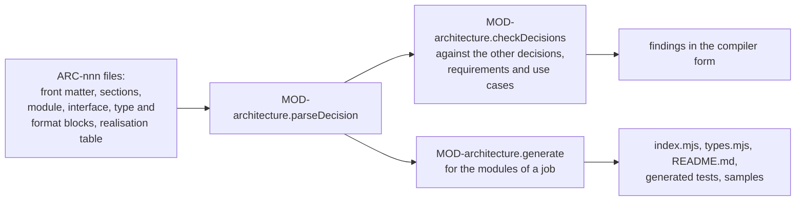

# ARC-020 Conventions for architecture decisions, code and tests

## Context

An architecture is accepted to be implemented. Module skeletons, interface documentation, sample input files and one
failing test per example are generated from it without a model, and its checks run without a model before a person
sees a draft. Both work only when every module, interface, type and use-case mapping stands in a form a program reads,
and when every example states exactly what goes in and what comes out. Prose is read differently by every reader; a
signature line without types cannot be checked.

The decision must stay a document at the same time: the reviewer reads its context, decision, alternatives and
consequences, and the review page shows the modules and interfaces it designs.

## Decision

1. **One file per decision.** `docs/architecture/ARC-<nnn>-<slug>.md`. Front matter: `id`, `title`, `forced_by` — the
   requirement names and use cases that force the decision —, and `keeps` — the requirements the decision keeps across
   its modules (point 8). Body sections, in this order: `## Context`, `## Decision`, `## Alternatives`,
   `## Consequences`, and, where the decision has them, `## Modules`, `## Types` and `## Realisation`. No other
   section, no history and no edit stamp.
2. **Blocks a program reads.** A module, an interface, a type and a file format each stand in a fenced code block whose
   info string names its kind — `json module`, `json interface`, `json type`, `json format` — and whose content is one
   JSON object of the shape `ModuleSpec`, `InterfaceSpec`, `TypeSpec` or `FormatSpec` below. Text around a block is for
   people; a program reads only the front matter, the blocks, the realisation table and the names of point 7.
3. **A module** is designed in exactly one decision. Its block names its identifier `MOD-<slug>`, its folder, its layer
   (ARC-003), one sentence of responsibility, the requirements it realises, the types and file formats it owns, and the
   modules whose interfaces it uses. A module has at least one interface. Its code is every file in its folder; a code
   file names no module. In Agent M the folder is `src/<slug>/`.
4. **An interface** belongs to one module, stands in the decision that designs it, and is named `MOD-<slug>.<name>`.
   Its block states a one-sentence summary, its parameters in order with their types, its result type — `void` when it
   returns nothing —, whether it is asynchronous, the refusals it can return, each with a code and when it happens, and
   at least one example. An interface refuses by returning a `Refusal` (ARC-003) with one of its codes; it throws only
   on a programming error. An example gives a value for every parameter that is not optional, and either the result —
   `null` for `void` — or the code of the refusal. A parameter whose type is a port (ARC-003) is given in an example as
   the port's fake.
5. **A type** is a JSON Schema in this subset: `$id`, `description`, `type` (`string`, `integer`, `number`, `boolean`,
   `null`, `object`, `array`), `properties`, `required`, `additionalProperties` (a boolean or a schema), `items`, `enum`,
   `const`, `pattern`, `minLength`, `minItems`, `minimum`, `maximum`, `exclusiveMaximum`, `anyOf`, `$ref` (the `$id` of
   another type), `x-port` (the kind of port a type fakes) and `examples` — at least one sample. A type is named by
   `$id` and defined once: in the decision that designs the module owning it, and named under that module's `owns`.
   Everywhere else it is only named. A type reference (`TypeRef`) is a type's `$id`, one of `string`, `integer`,
   `number`, `boolean`, `any`, or `void` for a result, and may end in `[]` for a list of it.
6. **A file format** names its `$id`, the path pattern of its files, its syntax, the type of what the syntax reads from
   it, and at least one sample file text; a module owns it as it owns a type. The syntaxes form a closed set, each read
   the same way everywhere:
   - `json` — the text parsed as JSON;
   - `key-value-lines` — one `key: value` per non-empty line, read as an object of strings;
   - `markdown-front-matter` — an opening `---` block of `key: value` lines, a key followed by `  - item` lines being a
     list, closed by `---`; read as `{ "fields": {…}, "body": "…" }`, the body being the rest of the text;
   - `markdown-table` — the first table, read as a list of objects keyed by its header cells;
   - `text` — the text as one string.
7. **Names.** A program finds every name a decision states: in the front matter, in the fields of the blocks, in the
   realisation table, and in the text outside the JSON blocks — every `ARC-<nnn>`, `UC-<nnn>`, `MOD-<slug>` and
   `MOD-<slug>.<name>`, and every text in backticks written in capitals with at least one space, which is the name of a
   requirement. Each resolves against the product's decisions and its accepted requirements and use cases.
8. **Every requirement has its place**: under `realises` of the module whose interfaces keep it, or under `keeps` of the
   decision when no single module keeps it.
9. **Realisation** is a table `| Step | Interfaces |`. A step is `UC-<nnn> <number>` as the use case numbers it — `4`,
   `5.1`, `3a`. Its row names every interface that carries the step out, in the order they run, separated by `, `,
   whichever decision states them; a step that only a person or an outside system carries out names `—` followed by the
   reason. A step stands in one decision's table only, and only once every interface it needs is designed.
10. **What is generated** for a module, without a model and the same bytes each time:
    - `<folder>index.mjs` — one exported function per interface, `async` where the interface is, with a comment of its
      summary, parameters and result, and a body that returns the refusal `not-implemented`, a code no interface
      declares;
    - `<folder>types.mjs`, when the module owns types or formats — their blocks as one exported array `types`, for the
      code that checks values against them;
    - `<folder>README.md` — the module's responsibility, a table of its interfaces with their refusals, and the types it
      owns;
    - `tests/<slug>.generated.test.mjs` — the lines `Module:`, `Guards:` and `Level: unit`, and one test per example:
      the result compared with `deepStrictEqual`, `undefined` for `void`, or the refusal by its code. An argument whose
      type is a port is made from the example's data by the fakes of ARC-003 decision 2, which the file defines when an
      interface of the module takes a port;
    - `tests/samples/<TypeId>-<n>.json` for every sample of a type the module owns, and
      `tests/samples/<FormatId>-<n>.<ext>` for every sample file of a format it owns, `<ext>` being `json`, `md` or
      `txt` after its syntax.

    `<slug>` is the module's identifier without `MOD-`. The examples of `MOD-architecture.generate` give the exact text.
11. **Tests** carry, among their first 20 lines, comment lines `Module: MOD-<slug>` — the module they exercise —,
    `Guards: <NAME>[; <NAME> …]` — the requirements or `UC-<nnn>` they guard — and
    `Level: unit|component|system|release|user`.
12. **A removed decision, module or type** leaves the working tree; the version history keeps it, and its identifier is
    never given to anything else.



## Alternatives

- **Module files in prose, one per module** — the form this decision replaces: a list of names and one line per
  function; nobody can implement from it, and nothing can be generated or checked against it.
- **Types owned by the decision rather than by a module** — a decision that designs two modules would leave open which
  folder the types are generated into.
- **TypeScript declarations for types and interfaces** — checking a sample against a declaration needs the TypeScript
  compiler, which runs neither in the browser nor without a build step (ARC-002). The JSON Schema subset is checked in a
  few dozen lines in every runtime, and job answers are already checked against JSON Schema (ARC-007).
- **Separate data files beside the decision** (`docs/architecture/*.json`) — a module's design would stand apart from
  the decision that motivates it; the reviewer reads both together.
- **OpenAPI** — describes HTTP interfaces, not the functions of in-process modules.
- **YAML blocks** — a YAML reader is a library (ARC-002); JSON is native in every runtime.
- **A full JSON Schema validator** — more than the subset needs, and a library in every runtime.

## Consequences

- The checks without a model read only front matter, blocks, realisation tables and names; they run in the browser, in
  CI and in the bridge.
- A decision with modules is long: every interface carries its examples. The review page renders the blocks as tables;
  the file stays the single place the design is written.
- A use-case step whose interfaces are designed in a decision not yet written stays uncarried, a warning, until that
  decision exists.
- Moving the existing code into module folders under `src/` is an implementation job.
- A test with a `Module:` line naming a module that no decision designs is a gap of the module view, not an error.

## Modules

### MOD-architecture

Reads architecture decisions, checks them without a model, computes which use-case steps and requirements they cover,
and generates skeletons, documentation, samples and tests from them.

```json module
{
  "id": "MOD-architecture",
  "folder": "src/architecture/",
  "layer": "kernel",
  "responsibility": "Reads architecture decisions, checks them without a model, computes what they cover, and generates skeletons, documentation, samples and tests from them.",
  "realises": [
                "ONE ARCHITECTURE DECISION, ONE FILE",
                "AN ARCHITECTURE DECISION STATES CONTEXT, DECISION, ALTERNATIVES AND CONSEQUENCES",
                "A MODULE STATES ITS RESPONSIBILITY AND ITS INTERFACES",
                "AN INTERFACE STATES ITS TYPES",
                "A TYPE IS DEFINED ONCE, IN MACHINE-READABLE FORM",
                "EVERY TYPE HAS A SAMPLE",
                "EVERY INTERFACE HAS AN EXAMPLE",
                "EVERY NAME IN AN ARCHITECTURE RESOLVES",
                "MODULES DEPEND ON EACH OTHER WITHOUT A CYCLE",
                "EVERY USE-CASE STEP IS CARRIED BY AN INTERFACE",
                "EVERY REQUIREMENT HAS ITS PLACE IN THE ARCHITECTURE",
                "SKELETONS, DOCUMENTATION, SAMPLES AND TESTS ARE GENERATED FROM THE ARCHITECTURE"
              ],
  "owns": [
            "DecisionDoc",
            "Block",
            "Mention",
            "ModuleSpec",
            "TypeRef",
            "ParamSpec",
            "RefusalSpec",
            "ExampleSpec",
            "InterfaceSpec",
            "TypeSpec",
            "FormatSpec",
            "RealisationRow",
            "CheckContext",
            "Coverage",
            "GeneratedFile",
            "ConformanceProblem",
            "DecisionFileContent",
            "ArchitectureDecisionFile"
          ],
  "uses": ["MOD-contracts"]
}
```

```json interface
{
  "id": "MOD-architecture.parseDecision",
  "summary": "Reads one architecture decision file into its front matter, sections, blocks, realisation rows and the names its text states, each with its line.",
  "params": [{ "name": "path", "type": "string" }, { "name": "text", "type": "string" }],
  "result": "DecisionDoc",
  "async": false,
  "refusals": [
                { "code": "not-a-decision", "when": "the path is not docs/architecture/ARC-<nnn>-<slug>.md" },
                {
                  "code": "no-front-matter",
                  "when": "the text does not begin with a front-matter block that names id and title"
                }
              ],
  "examples": [
                {
                  "name": "a decision without modules",
                  "input": {
                             "path": "docs/architecture/ARC-901-a-static-site.md",
                             "text": "---\nid: ARC-901\ntitle: A static site\nforced_by:\n  - NO SERVER\nkeeps:\n  - NO SERVER\n---\n# ARC-901 A static site\n\n## Context\n\nNo server (`NO SERVER`).\n\n## Decision\n\nStatic files.\n\n## Alternatives\n\nA server.\n\n## Consequences\n\nNothing to operate.\n"
                           },
                  "result": {
                              "path": "docs/architecture/ARC-901-a-static-site.md",
                              "id": "ARC-901",
                              "title": "A static site",
                              "forcedBy": ["NO SERVER"],
                              "keeps": ["NO SERVER"],
                              "sections": ["Context", "Decision", "Alternatives", "Consequences"],
                              "modules": [],
                              "interfaces": [],
                              "types": [],
                              "formats": [],
                              "realisation": [],
                              "mentions": [{ "line": 9, "name": "ARC-901" }, { "line": 13, "name": "NO SERVER" }]
                            }
                },
                {
                  "name": "a module file is no decision",
                  "input": { "path": "docs/architecture/MOD-old.md", "text": "---\nid: MOD-old\n---\n" },
                  "refused": "not-a-decision"
                }
              ]
}
```

```json interface
{
  "id": "MOD-architecture.conforms",
  "summary": "The problems of a value against a type reference, under the schema subset of this decision; an empty list when it conforms.",
  "params": [
              { "name": "value", "type": "any" },
              { "name": "type", "type": "string" },
              { "name": "types", "type": "TypeSpec[]" }
            ],
  "result": "ConformanceProblem[]",
  "async": false,
  "refusals": [
                {
                  "code": "unknown-type",
                  "when": "the type reference names no type among the types given and no primitive"
                }
              ],
  "examples": [
                {
                  "name": "a generated file without its text",
                  "input": {
                             "value": { "path": "src/x/index.mjs" },
                             "type": "GeneratedFile",
                             "types": [
                                        {
                                          "$id": "GeneratedFile",
                                          "type": "object",
                                          "required": ["path", "text"],
                                          "additionalProperties": false,
                                          "properties": { "path": { "type": "string" }, "text": { "type": "string" } },
                                          "examples": [{ "path": "src/x/index.mjs", "text": "" }]
                                        }
                                      ]
                           },
                  "result": [{ "at": "/text", "problem": "required" }]
                },
                {
                  "name": "a list of integers conforms",
                  "input": { "value": [1, 2], "type": "integer[]", "types": [] },
                  "result": []
                },
                {
                  "name": "an unknown type",
                  "input": { "value": 1, "type": "Nothing", "types": [] },
                  "refused": "unknown-type"
                }
              ]
}
```

```json interface
{
  "id": "MOD-architecture.checkDecisions",
  "summary": "Every finding of the checks without a model on the decisions given, whose names resolve against them and the existing decisions: errors for form, ownership, types, samples, examples, names, realisation rows and cycles; warnings for uncarried steps and unplaced requirements.",
  "params": [
              { "name": "decisions", "type": "DecisionDoc[]" },
              { "name": "existing", "type": "DecisionDoc[]" },
              { "name": "context", "type": "CheckContext" }
            ],
  "result": "Finding[]",
  "async": false,
  "refusals": [],
  "examples": [
                {
                  "name": "a parameter without a type, a requirement without a place",
                  "input": {
                             "decisions": [
                                            {
                                              "path": "docs/architecture/ARC-902-doubling.md",
                                              "id": "ARC-902",
                                              "title": "Doubling",
                                              "forcedBy": ["R ONE"],
                                              "keeps": [],
                                              "sections": [
                                                            "Context",
                                                            "Decision",
                                                            "Alternatives",
                                                            "Consequences",
                                                            "Modules",
                                                            "Types",
                                                            "Realisation"
                                                          ],
                                              "modules": [
                                                           {
                                                             "line": 20,
                                                             "value": {
                                                                        "id": "MOD-x",
                                                                        "folder": "src/x/",
                                                                        "layer": "kernel",
                                                                        "responsibility": "Doubles.",
                                                                        "realises": ["R ONE"],
                                                                        "owns": [],
                                                                        "uses": []
                                                                      }
                                                           }
                                                         ],
                                              "interfaces": [
                                                              {
                                                                "line": 25,
                                                                "value": {
                                                                           "id": "MOD-x.double",
                                                                           "summary": "Doubles a number.",
                                                                           "params": [{ "name": "n" }],
                                                                           "result": "integer",
                                                                           "async": false,
                                                                           "refusals": [],
                                                                           "examples": [
                                                                                         {
                                                                                           "name": "two",
                                                                                           "input": { "n": 2 },
                                                                                           "result": 4
                                                                                         }
                                                                                       ]
                                                                         }
                                                              }
                                                            ],
                                              "types": [],
                                              "formats": [],
                                              "realisation": [
                                                               {
                                                                 "line": 40,
                                                                 "step": "UC-901 1",
                                                                 "interfaces": ["MOD-x.double"],
                                                                 "reason": ""
                                                               }
                                                             ],
                                              "mentions": []
                                            }
                                          ],
                             "existing": [],
                             "context": {
                                          "requirements": ["R ONE", "R TWO"],
                                          "useCases": [{ "id": "UC-901", "steps": ["1"] }]
                                        }
                           },
                  "result": [
                              {
                                "artifact": "ARC-902",
                                "line": 25,
                                "kind": "error",
                                "what": "parameter n of MOD-x.double has no type",
                                "rule": "AN INTERFACE STATES ITS TYPES",
                                "fix": "give the parameter a type: a type's $id or a primitive, optionally followed by []"
                              },
                              {
                                "artifact": "R TWO",
                                "line": 0,
                                "kind": "warning",
                                "what": "R TWO has no place in the architecture",
                                "rule": "EVERY REQUIREMENT HAS ITS PLACE IN THE ARCHITECTURE",
                                "fix": "name it under realises of the module that keeps it, or under keeps of the decision it forces"
                              }
                            ]
                },
                {
                  "name": "a complete decision has no finding",
                  "input": {
                             "decisions": [
                                            {
                                              "path": "docs/architecture/ARC-903-doubling.md",
                                              "id": "ARC-903",
                                              "title": "Doubling",
                                              "forcedBy": ["R ONE"],
                                              "keeps": [],
                                              "sections": [
                                                            "Context",
                                                            "Decision",
                                                            "Alternatives",
                                                            "Consequences",
                                                            "Modules",
                                                            "Types",
                                                            "Realisation"
                                                          ],
                                              "modules": [
                                                           {
                                                             "line": 20,
                                                             "value": {
                                                                        "id": "MOD-x",
                                                                        "folder": "src/x/",
                                                                        "layer": "kernel",
                                                                        "responsibility": "Doubles.",
                                                                        "realises": ["R ONE"],
                                                                        "owns": [],
                                                                        "uses": []
                                                                      }
                                                           }
                                                         ],
                                              "interfaces": [
                                                              {
                                                                "line": 25,
                                                                "value": {
                                                                           "id": "MOD-x.double",
                                                                           "summary": "Doubles a number.",
                                                                           "params": [
                                                                                       {
                                                                                         "name": "n",
                                                                                         "type": "integer"
                                                                                       }
                                                                                     ],
                                                                           "result": "integer",
                                                                           "async": false,
                                                                           "refusals": [],
                                                                           "examples": [
                                                                                         {
                                                                                           "name": "two",
                                                                                           "input": { "n": 2 },
                                                                                           "result": 4
                                                                                         }
                                                                                       ]
                                                                         }
                                                              }
                                                            ],
                                              "types": [],
                                              "formats": [],
                                              "realisation": [
                                                               {
                                                                 "line": 40,
                                                                 "step": "UC-901 1",
                                                                 "interfaces": ["MOD-x.double"],
                                                                 "reason": ""
                                                               }
                                                             ],
                                              "mentions": []
                                            }
                                          ],
                             "existing": [],
                             "context": {
                                          "requirements": ["R ONE"],
                                          "useCases": [{ "id": "UC-901", "steps": ["1"] }]
                                        }
                           },
                  "result": []
                },
                {
                  "name": "the text names a decision that does not exist",
                  "input": {
                             "decisions": [
                                            {
                                              "path": "docs/architecture/ARC-903-doubling.md",
                                              "id": "ARC-903",
                                              "title": "Doubling",
                                              "forcedBy": ["R ONE"],
                                              "keeps": [],
                                              "sections": [
                                                            "Context",
                                                            "Decision",
                                                            "Alternatives",
                                                            "Consequences",
                                                            "Modules",
                                                            "Types",
                                                            "Realisation"
                                                          ],
                                              "modules": [
                                                           {
                                                             "line": 20,
                                                             "value": {
                                                                        "id": "MOD-x",
                                                                        "folder": "src/x/",
                                                                        "layer": "kernel",
                                                                        "responsibility": "Doubles.",
                                                                        "realises": ["R ONE"],
                                                                        "owns": [],
                                                                        "uses": []
                                                                      }
                                                           }
                                                         ],
                                              "interfaces": [
                                                              {
                                                                "line": 25,
                                                                "value": {
                                                                           "id": "MOD-x.double",
                                                                           "summary": "Doubles a number.",
                                                                           "params": [
                                                                                       {
                                                                                         "name": "n",
                                                                                         "type": "integer"
                                                                                       }
                                                                                     ],
                                                                           "result": "integer",
                                                                           "async": false,
                                                                           "refusals": [],
                                                                           "examples": [
                                                                                         {
                                                                                           "name": "two",
                                                                                           "input": { "n": 2 },
                                                                                           "result": 4
                                                                                         }
                                                                                       ]
                                                                         }
                                                              }
                                                            ],
                                              "types": [],
                                              "formats": [],
                                              "realisation": [
                                                               {
                                                                 "line": 40,
                                                                 "step": "UC-901 1",
                                                                 "interfaces": ["MOD-x.double"],
                                                                 "reason": ""
                                                               }
                                                             ],
                                              "mentions": [
                                                            { "line": 12, "name": "ARC-999" },
                                                            { "line": 13, "name": "UC-901" }
                                                          ]
                                            }
                                          ],
                             "existing": [],
                             "context": {
                                          "requirements": ["R ONE"],
                                          "useCases": [{ "id": "UC-901", "steps": ["1"] }]
                                        }
                           },
                  "result": [
                              {
                                "artifact": "ARC-903",
                                "line": 12,
                                "kind": "error",
                                "what": "ARC-999 names no decision",
                                "rule": "EVERY NAME IN AN ARCHITECTURE RESOLVES",
                                "fix": "name an existing decision, or remove the name"
                              }
                            ]
                },
                {
                  "name": "a candidate uses a module of an existing decision",
                  "input": {
                             "decisions": [
                                            {
                                              "path": "docs/architecture/ARC-905-tripling.md",
                                              "id": "ARC-905",
                                              "title": "Tripling",
                                              "forcedBy": ["R TWO"],
                                              "keeps": [],
                                              "sections": [
                                                            "Context",
                                                            "Decision",
                                                            "Alternatives",
                                                            "Consequences",
                                                            "Modules",
                                                            "Types",
                                                            "Realisation"
                                                          ],
                                              "modules": [
                                                           {
                                                             "line": 20,
                                                             "value": {
                                                                        "id": "MOD-y",
                                                                        "folder": "src/y/",
                                                                        "layer": "kernel",
                                                                        "responsibility": "Triples.",
                                                                        "realises": ["R TWO"],
                                                                        "owns": [],
                                                                        "uses": ["MOD-x"]
                                                                      }
                                                           }
                                                         ],
                                              "interfaces": [
                                                              {
                                                                "line": 25,
                                                                "value": {
                                                                           "id": "MOD-y.triple",
                                                                           "summary": "Triples a number.",
                                                                           "params": [
                                                                                       {
                                                                                         "name": "n",
                                                                                         "type": "integer"
                                                                                       }
                                                                                     ],
                                                                           "result": "integer",
                                                                           "async": false,
                                                                           "refusals": [],
                                                                           "examples": [
                                                                                         {
                                                                                           "name": "two",
                                                                                           "input": { "n": 2 },
                                                                                           "result": 6
                                                                                         }
                                                                                       ]
                                                                         }
                                                              }
                                                            ],
                                              "types": [],
                                              "formats": [],
                                              "realisation": [],
                                              "mentions": []
                                            }
                                          ],
                             "existing": [
                                           {
                                             "path": "docs/architecture/ARC-903-doubling.md",
                                             "id": "ARC-903",
                                             "title": "Doubling",
                                             "forcedBy": ["R ONE"],
                                             "keeps": [],
                                             "sections": [
                                                           "Context",
                                                           "Decision",
                                                           "Alternatives",
                                                           "Consequences",
                                                           "Modules",
                                                           "Types",
                                                           "Realisation"
                                                         ],
                                             "modules": [
                                                          {
                                                            "line": 20,
                                                            "value": {
                                                                       "id": "MOD-x",
                                                                       "folder": "src/x/",
                                                                       "layer": "kernel",
                                                                       "responsibility": "Doubles.",
                                                                       "realises": ["R ONE"],
                                                                       "owns": [],
                                                                       "uses": []
                                                                     }
                                                          }
                                                        ],
                                             "interfaces": [
                                                             {
                                                               "line": 25,
                                                               "value": {
                                                                          "id": "MOD-x.double",
                                                                          "summary": "Doubles a number.",
                                                                          "params": [
                                                                                      {
                                                                                        "name": "n",
                                                                                        "type": "integer"
                                                                                      }
                                                                                    ],
                                                                          "result": "integer",
                                                                          "async": false,
                                                                          "refusals": [],
                                                                          "examples": [
                                                                                        {
                                                                                          "name": "two",
                                                                                          "input": { "n": 2 },
                                                                                          "result": 4
                                                                                        }
                                                                                      ]
                                                                        }
                                                             }
                                                           ],
                                             "types": [],
                                             "formats": [],
                                             "realisation": [
                                                              {
                                                                "line": 40,
                                                                "step": "UC-901 1",
                                                                "interfaces": ["MOD-x.double"],
                                                                "reason": ""
                                                              }
                                                            ],
                                             "mentions": []
                                           }
                                         ],
                             "context": {
                                          "requirements": ["R ONE", "R TWO"],
                                          "useCases": [{ "id": "UC-901", "steps": ["1"] }]
                                        }
                           },
                  "result": []
                }
              ]
}
```

```json interface
{
  "id": "MOD-architecture.coverage",
  "summary": "Which use-case steps the decisions carry and by which interfaces, and which requirements they place and where.",
  "params": [{ "name": "decisions", "type": "DecisionDoc[]" }, { "name": "context", "type": "CheckContext" }],
  "result": "Coverage",
  "async": false,
  "refusals": [],
  "examples": [
                {
                  "name": "one step carried, one requirement placed",
                  "input": {
                             "decisions": [
                                            {
                                              "path": "docs/architecture/ARC-903-doubling.md",
                                              "id": "ARC-903",
                                              "title": "Doubling",
                                              "forcedBy": ["R ONE"],
                                              "keeps": [],
                                              "sections": [
                                                            "Context",
                                                            "Decision",
                                                            "Alternatives",
                                                            "Consequences",
                                                            "Modules",
                                                            "Types",
                                                            "Realisation"
                                                          ],
                                              "modules": [
                                                           {
                                                             "line": 20,
                                                             "value": {
                                                                        "id": "MOD-x",
                                                                        "folder": "src/x/",
                                                                        "layer": "kernel",
                                                                        "responsibility": "Doubles.",
                                                                        "realises": ["R ONE"],
                                                                        "owns": [],
                                                                        "uses": []
                                                                      }
                                                           }
                                                         ],
                                              "interfaces": [
                                                              {
                                                                "line": 25,
                                                                "value": {
                                                                           "id": "MOD-x.double",
                                                                           "summary": "Doubles a number.",
                                                                           "params": [
                                                                                       {
                                                                                         "name": "n",
                                                                                         "type": "integer"
                                                                                       }
                                                                                     ],
                                                                           "result": "integer",
                                                                           "async": false,
                                                                           "refusals": [],
                                                                           "examples": [
                                                                                         {
                                                                                           "name": "two",
                                                                                           "input": { "n": 2 },
                                                                                           "result": 4
                                                                                         }
                                                                                       ]
                                                                         }
                                                              }
                                                            ],
                                              "types": [],
                                              "formats": [],
                                              "realisation": [
                                                               {
                                                                 "line": 40,
                                                                 "step": "UC-901 1",
                                                                 "interfaces": ["MOD-x.double"],
                                                                 "reason": ""
                                                               }
                                                             ],
                                              "mentions": []
                                            }
                                          ],
                             "context": {
                                          "requirements": ["R ONE", "R TWO"],
                                          "useCases": [{ "id": "UC-901", "steps": ["1", "2", "2a"] }]
                                        }
                           },
                  "result": {
                              "carried": [{ "step": "UC-901 1", "interfaces": ["MOD-x.double"] }],
                              "uncarried": ["UC-901 2", "UC-901 2a"],
                              "placed": [{ "requirement": "R ONE", "by": "MOD-x" }],
                              "unplaced": ["R TWO"]
                            }
                }
              ]
}
```

```json interface
{
  "id": "MOD-architecture.generate",
  "summary": "The skeleton, types, interface documentation, generated tests and sample files of the modules named, from the decisions that design them, the same bytes each time.",
  "params": [{ "name": "decisions", "type": "DecisionDoc[]" }, { "name": "modules", "type": "string[]" }],
  "result": "GeneratedFile[]",
  "async": false,
  "refusals": [{ "code": "unknown-module", "when": "a module named is designed by none of the decisions" }],
  "examples": [
                {
                  "name": "one module with one interface and one example",
                  "input": {
                             "decisions": [
                                            {
                                              "path": "docs/architecture/ARC-903-doubling.md",
                                              "id": "ARC-903",
                                              "title": "Doubling",
                                              "forcedBy": ["R ONE"],
                                              "keeps": [],
                                              "sections": [
                                                            "Context",
                                                            "Decision",
                                                            "Alternatives",
                                                            "Consequences",
                                                            "Modules",
                                                            "Types",
                                                            "Realisation"
                                                          ],
                                              "modules": [
                                                           {
                                                             "line": 20,
                                                             "value": {
                                                                        "id": "MOD-x",
                                                                        "folder": "src/x/",
                                                                        "layer": "kernel",
                                                                        "responsibility": "Doubles.",
                                                                        "realises": ["R ONE"],
                                                                        "owns": [],
                                                                        "uses": []
                                                                      }
                                                           }
                                                         ],
                                              "interfaces": [
                                                              {
                                                                "line": 25,
                                                                "value": {
                                                                           "id": "MOD-x.double",
                                                                           "summary": "Doubles a number.",
                                                                           "params": [
                                                                                       {
                                                                                         "name": "n",
                                                                                         "type": "integer"
                                                                                       }
                                                                                     ],
                                                                           "result": "integer",
                                                                           "async": false,
                                                                           "refusals": [],
                                                                           "examples": [
                                                                                         {
                                                                                           "name": "two",
                                                                                           "input": { "n": 2 },
                                                                                           "result": 4
                                                                                         }
                                                                                       ]
                                                                         }
                                                              }
                                                            ],
                                              "types": [],
                                              "formats": [],
                                              "realisation": [
                                                               {
                                                                 "line": 40,
                                                                 "step": "UC-901 1",
                                                                 "interfaces": ["MOD-x.double"],
                                                                 "reason": ""
                                                               }
                                                             ],
                                              "mentions": []
                                            }
                                          ],
                             "modules": ["MOD-x"]
                           },
                  "result": [
                              {
                                "path": "src/x/README.md",
                                "text": "# MOD-x\n\nDoubles.\n\n| Interface | Parameters | Result | Refusals |\n|---|---|---|---|\n| `double` | `n: integer` | `integer` | — |\n"
                              },
                              {
                                "path": "src/x/index.mjs",
                                "text": "// MOD-x: generated from ARC-903. Replace each body; keep each signature.\n\n/**\n * Doubles a number.\n * @param {integer} n\n * @returns {integer}\n */\nexport function double(n) {\n  return { refused: \"not-implemented\", reason: \"MOD-x.double\" };\n}\n"
                              },
                              {
                                "path": "tests/x.generated.test.mjs",
                                "text": "// Module: MOD-x\n// Guards: R ONE\n// Level: unit\n// Generated from ARC-903, one test per example.\nimport { test } from \"node:test\";\nimport assert from \"node:assert/strict\";\nimport * as m from \"../src/x/index.mjs\";\n\ntest(\"MOD-x.double — two\", async () => {\n  assert.deepStrictEqual(await m.double(2), 4);\n});\n"
                              }
                            ]
                },
                {
                  "name": "a module that owns types and takes a port",
                  "input": {
                             "decisions": [
                                            {
                                              "path": "docs/architecture/ARC-904-line-counting.md",
                                              "id": "ARC-904",
                                              "title": "Line counting",
                                              "forcedBy": ["R ONE"],
                                              "keeps": [],
                                              "sections": [
                                                            "Context",
                                                            "Decision",
                                                            "Alternatives",
                                                            "Consequences",
                                                            "Modules",
                                                            "Types",
                                                            "Realisation"
                                                          ],
                                              "modules": [
                                                           {
                                                             "line": 20,
                                                             "value": {
                                                                        "id": "MOD-lines",
                                                                        "folder": "src/lines/",
                                                                        "layer": "feature",
                                                                        "responsibility": "Counts the lines of a file.",
                                                                        "realises": ["R ONE"],
                                                                        "owns": ["Files", "LineCount"],
                                                                        "uses": []
                                                                      }
                                                           }
                                                         ],
                                              "interfaces": [
                                                              {
                                                                "line": 25,
                                                                "value": {
                                                                           "id": "MOD-lines.countLines",
                                                                           "summary": "The number of lines of a file, read through a read port.",
                                                                           "params": [
                                                                                       {
                                                                                         "name": "files",
                                                                                         "type": "Files"
                                                                                       },
                                                                                       {
                                                                                         "name": "path",
                                                                                         "type": "string"
                                                                                       }
                                                                                     ],
                                                                           "result": "LineCount",
                                                                           "async": true,
                                                                           "refusals": [
                                                                                         {
                                                                                           "code": "no-file",
                                                                                           "when": "the file does not exist"
                                                                                         }
                                                                                       ],
                                                                           "examples": [
                                                                                         {
                                                                                           "name": "two lines",
                                                                                           "input": {
                                                                                                      "files": {
                                                                                                                 "a.txt": "x\ny\n"
                                                                                                               },
                                                                                                      "path": "a.txt"
                                                                                                    },
                                                                                           "result": { "lines": 2 }
                                                                                         },
                                                                                         {
                                                                                           "name": "a missing file",
                                                                                           "input": {
                                                                                                      "files": {},
                                                                                                      "path": "b.txt"
                                                                                                    },
                                                                                           "refused": "no-file"
                                                                                         }
                                                                                       ]
                                                                         }
                                                              }
                                                            ],
                                              "types": [
                                                         {
                                                           "line": 60,
                                                           "value": {
                                                                      "$id": "Files",
                                                                      "description": "The fake of a read port: a map from path to text.",
                                                                      "x-port": "read",
                                                                      "type": "object",
                                                                      "additionalProperties": { "type": "string" },
                                                                      "examples": [{ "a.txt": "x\ny\n" }]
                                                                    }
                                                         },
                                                         {
                                                           "line": 70,
                                                           "value": {
                                                                      "$id": "LineCount",
                                                                      "description": "How many lines a file has.",
                                                                      "type": "object",
                                                                      "required": ["lines"],
                                                                      "additionalProperties": false,
                                                                      "properties": {
                                                                                      "lines": {
                                                                                                 "type": "integer",
                                                                                                 "minimum": 0
                                                                                               }
                                                                                    },
                                                                      "examples": [{ "lines": 2 }]
                                                                    }
                                                         }
                                                       ],
                                              "formats": [],
                                              "realisation": [],
                                              "mentions": []
                                            }
                                          ],
                             "modules": ["MOD-lines"]
                           },
                  "result": [
                              {
                                "path": "src/lines/README.md",
                                "text": "# MOD-lines\n\nCounts the lines of a file.\n\n| Interface | Parameters | Result | Refusals |\n|---|---|---|---|\n| `countLines` | `files: Files`, `path: string` | `LineCount` | `no-file` — the file does not exist |\n\nOwns `Files`, `LineCount`, defined in `types.mjs`.\n"
                              },
                              {
                                "path": "src/lines/index.mjs",
                                "text": "// MOD-lines: generated from ARC-904. Replace each body; keep each signature.\n\n/**\n * The number of lines of a file, read through a read port.\n * @param {Files} files\n * @param {string} path\n * @returns {Promise<LineCount>}\n */\nexport async function countLines(files, path) {\n  return { refused: \"not-implemented\", reason: \"MOD-lines.countLines\" };\n}\n"
                              },
                              {
                                "path": "src/lines/types.mjs",
                                "text": "// MOD-lines: the types it owns, generated from ARC-904.\nexport const types = [\n  {\n    \"$id\": \"Files\",\n    \"description\": \"The fake of a read port: a map from path to text.\",\n    \"x-port\": \"read\",\n    \"type\": \"object\",\n    \"additionalProperties\": {\n      \"type\": \"string\"\n    },\n    \"examples\": [\n      {\n        \"a.txt\": \"x\\ny\\n\"\n      }\n    ]\n  },\n  {\n    \"$id\": \"LineCount\",\n    \"description\": \"How many lines a file has.\",\n    \"type\": \"object\",\n    \"required\": [\n      \"lines\"\n    ],\n    \"additionalProperties\": false,\n    \"properties\": {\n      \"lines\": {\n        \"type\": \"integer\",\n        \"minimum\": 0\n      }\n    },\n    \"examples\": [\n      {\n        \"lines\": 2\n      }\n    ]\n  }\n];\n"
                              },
                              {
                                "path": "tests/lines.generated.test.mjs",
                                "text": "// Module: MOD-lines\n// Guards: R ONE\n// Level: unit\n// Generated from ARC-904, one test per example.\nimport { test } from \"node:test\";\nimport assert from \"node:assert/strict\";\nimport * as m from \"../src/lines/index.mjs\";\n\n// The fakes of ARC-003 decision 2, made from the data an example gives.\nconst fake = {\n  read: (files) => async (path) => (Object.hasOwn(files, path) ? files[path] : null),\n  fetch: (exchanges) => async (request) => {\n    const hit = exchanges.find((e) => e.request.method === request.method && e.request.url === request.url\n      && (!(\"body\" in e.request) || JSON.stringify(e.request.body) === JSON.stringify(request.body)));\n    return hit ? hit.response : { refused: \"no-recorded-exchange\", reason: `${request.method} ${request.url}` };\n  },\n  clock: (iso) => () => iso,\n  random: (numbers) => { let i = 0; return () => numbers[i++ % numbers.length]; },\n};\n\ntest(\"MOD-lines.countLines — two lines\", async () => {\n  assert.deepStrictEqual(await m.countLines(fake.read({\"a.txt\":\"x\\ny\\n\"}), \"a.txt\"), {\"lines\":2});\n});\n\ntest(\"MOD-lines.countLines — a missing file\", async () => {\n  assert.strictEqual((await m.countLines(fake.read({}), \"b.txt\")).refused, \"no-file\");\n});\n"
                              },
                              { "path": "tests/samples/Files-1.json", "text": "{\n  \"a.txt\": \"x\\ny\\n\"\n}\n" },
                              { "path": "tests/samples/LineCount-1.json", "text": "{\n  \"lines\": 2\n}\n" }
                            ]
                },
                {
                  "name": "a module no decision designs",
                  "input": {
                             "decisions": [
                                            {
                                              "path": "docs/architecture/ARC-903-doubling.md",
                                              "id": "ARC-903",
                                              "title": "Doubling",
                                              "forcedBy": ["R ONE"],
                                              "keeps": [],
                                              "sections": [
                                                            "Context",
                                                            "Decision",
                                                            "Alternatives",
                                                            "Consequences",
                                                            "Modules",
                                                            "Types",
                                                            "Realisation"
                                                          ],
                                              "modules": [
                                                           {
                                                             "line": 20,
                                                             "value": {
                                                                        "id": "MOD-x",
                                                                        "folder": "src/x/",
                                                                        "layer": "kernel",
                                                                        "responsibility": "Doubles.",
                                                                        "realises": ["R ONE"],
                                                                        "owns": [],
                                                                        "uses": []
                                                                      }
                                                           }
                                                         ],
                                              "interfaces": [
                                                              {
                                                                "line": 25,
                                                                "value": {
                                                                           "id": "MOD-x.double",
                                                                           "summary": "Doubles a number.",
                                                                           "params": [
                                                                                       {
                                                                                         "name": "n",
                                                                                         "type": "integer"
                                                                                       }
                                                                                     ],
                                                                           "result": "integer",
                                                                           "async": false,
                                                                           "refusals": [],
                                                                           "examples": [
                                                                                         {
                                                                                           "name": "two",
                                                                                           "input": { "n": 2 },
                                                                                           "result": 4
                                                                                         }
                                                                                       ]
                                                                         }
                                                              }
                                                            ],
                                              "types": [],
                                              "formats": [],
                                              "realisation": [
                                                               {
                                                                 "line": 40,
                                                                 "step": "UC-901 1",
                                                                 "interfaces": ["MOD-x.double"],
                                                                 "reason": ""
                                                               }
                                                             ],
                                              "mentions": []
                                            }
                                          ],
                             "modules": ["MOD-z"]
                           },
                  "refused": "unknown-module"
                }
              ]
}
```

## Types

```json type
{
  "$id": "DecisionDoc",
  "description": "An architecture decision as parseDecision reads it: its path, front matter, sections, blocks with their lines and raw JSON values, realisation rows, and the names its text states.",
  "type": "object",
  "required": [
                "path",
                "id",
                "title",
                "forcedBy",
                "keeps",
                "sections",
                "modules",
                "interfaces",
                "types",
                "formats",
                "realisation",
                "mentions"
              ],
  "additionalProperties": false,
  "properties": {
                  "path": {
                            "type": "string",
                            "pattern": "^docs/architecture/ARC-[0-9]{3}-[a-z0-9]+(-[a-z0-9]+)*\\.md$"
                          },
                  "id": { "type": "string", "minLength": 1 },
                  "title": { "type": "string", "minLength": 1 },
                  "forcedBy": { "type": "array", "items": { "type": "string" } },
                  "keeps": { "type": "array", "items": { "type": "string" } },
                  "sections": { "type": "array", "items": { "type": "string" } },
                  "modules": { "type": "array", "items": { "$ref": "Block" } },
                  "interfaces": { "type": "array", "items": { "$ref": "Block" } },
                  "types": { "type": "array", "items": { "$ref": "Block" } },
                  "formats": { "type": "array", "items": { "$ref": "Block" } },
                  "realisation": { "type": "array", "items": { "$ref": "RealisationRow" } },
                  "mentions": { "type": "array", "items": { "$ref": "Mention" } }
                },
  "examples": [
                {
                  "path": "docs/architecture/ARC-901-a-static-site.md",
                  "id": "ARC-901",
                  "title": "A static site",
                  "forcedBy": ["NO SERVER"],
                  "keeps": ["NO SERVER"],
                  "sections": ["Context", "Decision", "Alternatives", "Consequences"],
                  "modules": [],
                  "interfaces": [],
                  "types": [],
                  "formats": [],
                  "realisation": [],
                  "mentions": [{ "line": 9, "name": "ARC-901" }, { "line": 13, "name": "NO SERVER" }]
                }
              ]
}
```

```json type
{
  "$id": "Block",
  "description": "One fenced block of a decision: the line its fence opens on, and its JSON value.",
  "type": "object",
  "required": ["line", "value"],
  "additionalProperties": false,
  "properties": { "line": { "type": "integer", "minimum": 1 }, "value": {} },
  "examples": [{ "line": 20, "value": { "id": "MOD-x" } }]
}
```

```json type
{
  "$id": "Mention",
  "description": "A name the text of a decision states outside its JSON blocks, with its line.",
  "type": "object",
  "required": ["line", "name"],
  "additionalProperties": false,
  "properties": { "line": { "type": "integer", "minimum": 1 }, "name": { "type": "string", "minLength": 1 } },
  "examples": [{ "line": 9, "name": "ARC-901" }, { "line": 13, "name": "NO SERVER" }]
}
```

```json type
{
  "$id": "ModuleSpec",
  "description": "The block of a module.",
  "type": "object",
  "required": ["id", "folder", "layer", "responsibility", "realises", "owns", "uses"],
  "additionalProperties": false,
  "properties": {
                  "id": { "type": "string", "pattern": "^MOD-[a-z0-9]+(-[a-z0-9]+)*$" },
                  "folder": { "type": "string", "pattern": "^([A-Za-z0-9._-]+/)+$" },
                  "layer": { "type": "string", "enum": ["kernel", "feature", "adapter", "shell"] },
                  "responsibility": { "type": "string", "minLength": 1 },
                  "realises": {
                                "type": "array",
                                "items": { "type": "string", "pattern": "^[A-Z0-9][A-Z0-9 ,'’/-]*$" }
                              },
                  "owns": { "type": "array", "items": { "type": "string", "pattern": "^[A-Z][A-Za-z0-9]*$" } },
                  "uses": {
                            "type": "array",
                            "items": { "type": "string", "pattern": "^MOD-[a-z0-9]+(-[a-z0-9]+)*$" }
                          }
                },
  "examples": [
                {
                  "id": "MOD-x",
                  "folder": "src/x/",
                  "layer": "kernel",
                  "responsibility": "Doubles.",
                  "realises": ["R ONE"],
                  "owns": [],
                  "uses": []
                },
                {
                  "id": "MOD-lines",
                  "folder": "src/lines/",
                  "layer": "feature",
                  "responsibility": "Counts the lines of a file.",
                  "realises": ["R ONE"],
                  "owns": ["Files", "LineCount"],
                  "uses": []
                }
              ]
}
```

```json type
{
  "$id": "TypeRef",
  "description": "A reference to a type: a type's $id or a primitive, optionally a list of it; void only as a result.",
  "type": "string",
  "pattern": "^([A-Z][A-Za-z0-9]*|string|integer|number|boolean|any|void)(\\[\\])?$",
  "examples": ["Finding[]", "string", "void"]
}
```

```json type
{
  "$id": "ParamSpec",
  "description": "One parameter of an interface; an optional one may be left out of an example.",
  "type": "object",
  "required": ["name", "type"],
  "additionalProperties": false,
  "properties": {
                  "name": { "type": "string", "pattern": "^[a-z][A-Za-z0-9]*$" },
                  "type": { "$ref": "TypeRef" },
                  "optional": { "type": "boolean" }
                },
  "examples": [{ "name": "path", "type": "string" }]
}
```

```json type
{
  "$id": "RefusalSpec",
  "description": "One refusal an interface can return.",
  "type": "object",
  "required": ["code", "when"],
  "additionalProperties": false,
  "properties": {
                  "code": { "type": "string", "pattern": "^[a-z]+(-[a-z]+)*$" },
                  "when": { "type": "string", "minLength": 1 }
                },
  "examples": [{ "code": "no-file", "when": "the file does not exist" }]
}
```

```json type
{
  "$id": "ExampleSpec",
  "description": "One example of an interface: a value per parameter, and the result — null for void — or the code of the refusal.",
  "type": "object",
  "required": ["name", "input"],
  "additionalProperties": false,
  "properties": {
                  "name": { "type": "string", "minLength": 1 },
                  "input": { "type": "object" },
                  "result": {},
                  "refused": { "type": "string", "pattern": "^[a-z]+(-[a-z]+)*$" }
                },
  "anyOf": [{ "required": ["result"] }, { "required": ["refused"] }],
  "examples": [{ "name": "two", "input": { "n": 2 }, "result": 4 }]
}
```

```json type
{
  "$id": "InterfaceSpec",
  "description": "The block of an interface.",
  "type": "object",
  "required": ["id", "summary", "params", "result", "async", "refusals", "examples"],
  "additionalProperties": false,
  "properties": {
                  "id": { "type": "string", "pattern": "^MOD-[a-z0-9]+(-[a-z0-9]+)*\\.[a-z][A-Za-z0-9]*$" },
                  "summary": { "type": "string", "minLength": 1 },
                  "params": { "type": "array", "items": { "$ref": "ParamSpec" } },
                  "result": { "$ref": "TypeRef" },
                  "async": { "type": "boolean" },
                  "refusals": { "type": "array", "items": { "$ref": "RefusalSpec" } },
                  "examples": { "type": "array", "minItems": 1, "items": { "$ref": "ExampleSpec" } }
                },
  "examples": [
                {
                  "id": "MOD-x.double",
                  "summary": "Doubles a number.",
                  "params": [{ "name": "n", "type": "integer" }],
                  "result": "integer",
                  "async": false,
                  "refusals": [],
                  "examples": [{ "name": "two", "input": { "n": 2 }, "result": 4 }]
                }
              ]
}
```

```json type
{
  "$id": "TypeSpec",
  "description": "The block of a type: a JSON Schema of the subset of this decision, named by $id, with at least one sample.",
  "type": "object",
  "required": ["$id", "examples"],
  "additionalProperties": true,
  "properties": {
                  "$id": { "type": "string", "pattern": "^[A-Z][A-Za-z0-9]*$" },
                  "examples": { "type": "array", "minItems": 1 }
                },
  "examples": [
                {
                  "$id": "LineCount",
                  "description": "How many lines a file has.",
                  "type": "object",
                  "required": ["lines"],
                  "additionalProperties": false,
                  "properties": { "lines": { "type": "integer", "minimum": 0 } },
                  "examples": [{ "lines": 2 }]
                }
              ]
}
```

```json type
{
  "$id": "FormatSpec",
  "description": "The block of a file format: where its files lie, how they are read, what reading gives, and sample files.",
  "type": "object",
  "required": ["$id", "path", "syntax", "content", "examples"],
  "additionalProperties": false,
  "properties": {
                  "$id": { "type": "string", "pattern": "^[A-Z][A-Za-z0-9]*$" },
                  "description": { "type": "string" },
                  "path": { "type": "string", "minLength": 1 },
                  "syntax": {
                              "type": "string",
                              "enum": ["json", "key-value-lines", "markdown-front-matter", "markdown-table", "text"]
                            },
                  "content": { "$ref": "TypeRef" },
                  "examples": { "type": "array", "minItems": 1, "items": { "type": "string" } }
                },
  "examples": [
                {
                  "$id": "PairFile",
                  "path": "docs/pairs/{name}.txt",
                  "syntax": "key-value-lines",
                  "content": "Pair",
                  "examples": ["left: a\nright: b\n"]
                }
              ]
}
```

```json type
{
  "$id": "RealisationRow",
  "description": "One row of a decision's realisation table, with its line.",
  "type": "object",
  "required": ["line", "step", "interfaces", "reason"],
  "additionalProperties": false,
  "properties": {
                  "line": { "type": "integer", "minimum": 1 },
                  "step": { "type": "string", "pattern": "^UC-[0-9]{3} [0-9]+(\\.[0-9]+)*[a-z]?$" },
                  "interfaces": { "type": "array", "items": { "type": "string" } },
                  "reason": { "type": "string" }
                },
  "examples": [
                {
                  "line": 40,
                  "step": "UC-022 6.1",
                  "interfaces": ["MOD-architecture.parseDecision", "MOD-architecture.checkDecisions"],
                  "reason": ""
                },
                {
                  "line": 41,
                  "step": "UC-022 4a",
                  "interfaces": [],
                  "reason": "the author does not press Run; nothing is called"
                }
              ]
}
```

```json type
{
  "$id": "CheckContext",
  "description": "What the checks compare the decisions with: the names of the accepted requirements and the steps of the accepted use cases.",
  "type": "object",
  "required": ["requirements", "useCases"],
  "additionalProperties": false,
  "properties": {
                  "requirements": { "type": "array", "items": { "type": "string" } },
                  "useCases": {
                                "type": "array",
                                "items": {
                                           "type": "object",
                                           "required": ["id", "steps"],
                                           "additionalProperties": false,
                                           "properties": {
                                                           "id": { "type": "string", "pattern": "^UC-[0-9]{3}$" },
                                                           "steps": {
                                                                      "type": "array",
                                                                      "items": {
                                                                                 "type": "string",
                                                                                 "pattern": "^[0-9]+(\\.[0-9]+)*[a-z]?$"
                                                                               }
                                                                    }
                                                         }
                                         }
                              }
                },
  "examples": [{ "requirements": ["R ONE"], "useCases": [{ "id": "UC-901", "steps": ["1", "2", "2a"] }] }]
}
```

```json type
{
  "$id": "Coverage",
  "description": "The steps the decisions carry and those they do not; the requirements they place and those they do not.",
  "type": "object",
  "required": ["carried", "uncarried", "placed", "unplaced"],
  "additionalProperties": false,
  "properties": {
                  "carried": {
                               "type": "array",
                               "items": {
                                          "type": "object",
                                          "required": ["step", "interfaces"],
                                          "additionalProperties": false,
                                          "properties": {
                                                          "step": { "type": "string" },
                                                          "interfaces": {
                                                                          "type": "array",
                                                                          "items": { "type": "string" }
                                                                        }
                                                        }
                                        }
                             },
                  "uncarried": { "type": "array", "items": { "type": "string" } },
                  "placed": {
                              "type": "array",
                              "items": {
                                         "type": "object",
                                         "required": ["requirement", "by"],
                                         "additionalProperties": false,
                                         "properties": {
                                                         "requirement": { "type": "string" },
                                                         "by": { "type": "string" }
                                                       }
                                       }
                            },
                  "unplaced": { "type": "array", "items": { "type": "string" } }
                },
  "examples": [
                {
                  "carried": [{ "step": "UC-901 1", "interfaces": ["MOD-x.double"] }],
                  "uncarried": ["UC-901 2"],
                  "placed": [{ "requirement": "R ONE", "by": "MOD-x" }],
                  "unplaced": []
                }
              ]
}
```

```json type
{
  "$id": "GeneratedFile",
  "description": "One file generate writes: its path and its exact text.",
  "type": "object",
  "required": ["path", "text"],
  "additionalProperties": false,
  "properties": { "path": { "type": "string", "minLength": 1 }, "text": { "type": "string" } },
  "examples": [{ "path": "src/x/README.md", "text": "# MOD-x\n" }]
}
```

```json type
{
  "$id": "ConformanceProblem",
  "description": "Where a value does not conform to its type, as a JSON pointer, and which rule of the subset it breaks.",
  "type": "object",
  "required": ["at", "problem"],
  "additionalProperties": false,
  "properties": {
                  "at": { "type": "string" },
                  "problem": {
                               "type": "string",
                               "enum": [
                                         "required",
                                         "type",
                                         "pattern",
                                         "enum",
                                         "const",
                                         "additional",
                                         "min-items",
                                         "min-length",
                                         "minimum",
                                         "maximum",
                                         "any-of"
                                       ]
                             }
                },
  "examples": [{ "at": "/text", "problem": "required" }]
}
```

```json type
{
  "$id": "DecisionFileContent",
  "description": "What the markdown-front-matter syntax reads from a decision file.",
  "type": "object",
  "required": ["fields", "body"],
  "additionalProperties": false,
  "properties": {
                  "fields": {
                              "type": "object",
                              "required": ["id", "title", "forced_by"],
                              "additionalProperties": false,
                              "properties": {
                                              "id": { "type": "string", "pattern": "^ARC-[0-9]{3}$" },
                                              "title": { "type": "string", "minLength": 1 },
                                              "forced_by": { "type": "array", "items": { "type": "string" } },
                                              "keeps": { "type": "array", "items": { "type": "string" } }
                                            }
                            },
                  "body": { "type": "string" }
                },
  "examples": [
                {
                  "fields": {
                              "id": "ARC-901",
                              "title": "A static site",
                              "forced_by": ["NO SERVER"],
                              "keeps": ["NO SERVER"]
                            },
                  "body": "# ARC-901 A static site\n"
                }
              ]
}
```

```json format
{
  "$id": "ArchitectureDecisionFile",
  "description": "An architecture decision: front matter, then the sections of ARC-020 decision 1.",
  "path": "docs/architecture/ARC-{nnn}-{slug}.md",
  "syntax": "markdown-front-matter",
  "content": "DecisionFileContent",
  "examples": [
                "---\nid: ARC-901\ntitle: A static site\nforced_by:\n  - NO SERVER\nkeeps:\n  - NO SERVER\n---\n# ARC-901 A static site\n\n## Context\n\nNo server (`NO SERVER`).\n\n## Decision\n\nStatic files.\n\n## Alternatives\n\nA server.\n\n## Consequences\n\nNothing to operate.\n"
              ]
}
```

## Realisation

| Step | Interfaces |
|---|---|
| UC-022 6.1 | MOD-architecture.parseDecision, MOD-architecture.checkDecisions |
