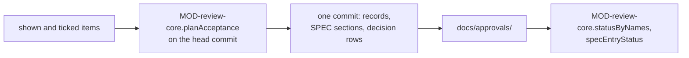

# ARC-021 Acceptance is an approval record that names the exact text

## Context

Everything Agent M generates is a proposal until a person accepts it, and a person accepts exactly the text they read —
by a commit under their own account (`ACCEPTANCE IS A COMMIT BY THE ACCEPTING PERSON`). Nothing about acceptance may be
stored as a status that could drift from the text. A SPEC is never edited directly: a change waits in a queue beside the
text it would replace, and is written byte for byte when it is accepted. Without a token, GitHub's own pages commit the
record, and the instance's workflow writes the SPEC.

## Decision

1. **The approval record** is a file of key-value lines in `docs/approvals/`, written once:
   - for a use case or an architecture decision, `<ID>-<first 12 hex of the blob>.md` with `kind` (`use-case` or
     `architecture-decision`), `file` and `blob` — the git blob SHA of the text the reviewer saw;
   - for a SPEC change, `spec-<queue folder>-<nn>-<first 12 hex of the proposal's blob>.md` with `kind: spec`, `queue`,
     `entry`, `proposal`, `blob` (of the proposal), `target`, `anchor` and `section` (the blob SHA of the section it
     replaces, as shown).
2. **Status is derived.** A reviewed file is *accepted* when a record of its kind names its path and its current blob,
   *changed* when records name its path but none its current blob, and *open* otherwise. A SPEC entry is *open*,
   *approved* (a record names its proposal and section as they are), *stale* (records name another proposal or section),
   *applied* (its decision row is written and the SPEC holds its text) or *superseded* (its decision row is written and
   the SPEC no longer holds its text). The names of the records in the tree decide first; where what a record says
   decides — a file that is opened, the last accepted text, an acceptance — the record itself is read.
3. **The last accepted text** of an identifier is the blob the most recently committed of its records names, matched by
   identifier, so that a renamed file still finds it; the text read must hash to that blob.
4. **A change queue** is a folder `docs/spec-freigaben/<date>[<letter>]_<name>/` holding `index.md` — the target file and
   one row per entry with its anchor and end anchor —, one file `<nn>-<slug>.md` per entry holding the complete section
   as proposed, its rationale `<nn>-<slug>.begruendung.md`, and `entscheidungen.md`, the decisions, append-only. A target
   written as `products/<product>/<path>`, as the process repository's own approval tool writes it, names `<path>`.
5. **One commit per click.** What a reviewer accepts is what they were shown and ticked: one record per file; for a SPEC
   entry, also its section replaced by the proposal byte for byte and its decision row. Everything is checked on the
   commit it is written on: an item whose text changed after it was shown is left out and named. Entries of one queue
   are written in the order of its index; an entry whose anchor another entry creates goes only with or after that entry.
   An architecture decision is accepted only when every requirement it names stands in the SPEC and every use case it
   names is accepted, and a changed one only after its impact list was shown.
6. **A person's SPEC edit is a proposal.** It goes into the person's newest queue of the day that has no decided entry,
   `docs/spec-freigaben/<date>[<letter>]_edits-<account>`, or into a new one: the complete edited section, its rationale
   with the impact list, and its index row. A second edit of the same section replaces that entry. `SPEC.md` is not
   touched. A renamed requirement leaves the section under its old name and enters it under the new one.
7. **The history of a requirement** is every change of its text between the versions of the SPEC at the commits that
   touched it, each with commit, date and person; nothing is stored for it.
8. **The workflow writes what the dashboard would.** For a SPEC record committed without the dashboard, the instance's
   workflow applies the same checks and writes the same bytes, record by record.



## Alternatives

- **A status field in each file** — drifts from the text; every edit would have to reset it.
- **Pull requests as the acceptance** — a merged pull request says that a change was merged, not which text a person
  read; the record names the blob.
- **Writing an accepted SPEC change in a second commit after the record** — between the two commits the SPEC and the
  record disagree; one commit holds both.
- **Labelling the SPEC section as accepted inside `SPEC.md`** — the SPEC would carry history (`A DOCUMENT HOLDS NO HISTORY`).
- **A Python tool for the workflow beside the dashboard's code** — two implementations of one rule; the workflow runs the
  same module (ARC-003).

## Consequences

- An acceptance is one commit; its author and time are the who and when of the decision.
- A record of a file that is later removed stays meaningful in the version history; it is removed with the file.
- Reading the status of many files costs no request per file: the names in the tree decide until a file is opened.

## Modules

### MOD-review-core

```json module
{
  "id": "MOD-review-core",
  "folder": "src/review-core/",
  "layer": "kernel",
  "responsibility": "Decides from the approval records which text of a reviewed file or a SPEC change is accepted, and computes the files of the one commit that accepts, applies or proposes a change.",
  "realises": [
    "STATUS IS DERIVED FROM THE RECORDS",
    "AN APPROVAL NAMES THE EXACT TEXT",
    "A GENERATED ARTIFACT IS A PROPOSAL",
    "A RECORD IS EVIDENCE, NOT A PROPOSAL",
    "A SPECIFICATION CHANGE IS APPROVED BEFORE IT IS WRITTEN",
    "THE APPROVED TEXT IS TAKEN VERBATIM",
    "NO PROPOSAL WITHOUT THE CURRENT TEXT BESIDE IT",
    "AN ACCEPTED SPEC CHANGE IS WRITTEN WITH ITS APPROVAL",
    "WITHOUT A TOKEN, THE INSTANCE'S WORKFLOW WRITES THE CHANGE",
    "A STALE APPROVAL IS NOT APPLIED",
    "SEVERAL FILES ARE ACCEPTED IN ONE CLICK",
    "A QUEUE IS ACCEPTED IN ITS ORDER",
    "A SPEC EDIT IS SAVED AS A PROPOSAL",
    "A PERSON'S EDITS COLLECT IN ONE OPEN QUEUE",
    "A RENAMED REQUIREMENT IS WITHDRAWN AND ADDED",
    "A CHANGED FILE IS SHOWN AGAINST ITS LAST ACCEPTED TEXT",
    "A REQUIREMENT SHOWS ITS HISTORY",
    "ARCHITECTURE RESTS ON ACCEPTED ARTIFACTS",
    "AN ARCHITECTURE CHANGE IS NOT ACCEPTED WITHOUT AN IMPACT LIST"
  ],
  "owns": [
    "FileRecord",
    "SpecRecord",
    "ApprovalRecord",
    "RecordAt",
    "NamedRecord",
    "NamedSpecRecord",
    "RecordIndex",
    "StatusResult",
    "LastAccepted",
    "DiffLine",
    "QueueEntry",
    "QueueIndex",
    "QueueDecision",
    "SpecEntryState",
    "EntryText",
    "EntrySection",
    "UseCaseStatus",
    "FileItem",
    "SpecItem",
    "ReviewItem",
    "ReviewSession",
    "NeedsFinding",
    "OpenName",
    "ReviewPageFile",
    "BlockedFile",
    "ReviewPageResult",
    "Prerequisites",
    "LeftOut",
    "AcceptancePlan",
    "QueueFiles",
    "SpecEdit",
    "SpecEditPlan",
    "SpecVersion",
    "HistoryEntry",
    "RefusedRecord",
    "ApplyResult",
    "ApprovalRecordFile",
    "QueueIndexFile",
    "QueueEntryFile",
    "QueueRationaleFile",
    "QueueDecisionsFile"
  ],
  "uses": ["MOD-artifacts", "MOD-contracts"]
}
```

```json interface
{
  "id": "MOD-review-core.blobSha",
  "summary": "The git blob SHA of a text: SHA-1 over `blob <length>\\0` and the text's UTF-8 bytes.",
  "params": [{ "name": "text", "type": "string" }],
  "result": "string",
  "async": true,
  "refusals": [],
  "examples": [
    { "name": "a line", "input": { "text": "hello\n" }, "result": "ce013625030ba8dba906f756967f9e9ca394464a" }
  ]
}
```

```json interface
{
  "id": "MOD-review-core.recordText",
  "summary": "The text of an approval record: its keys in their fixed order, one `key: value` line each.",
  "params": [{ "name": "record", "type": "ApprovalRecord" }],
  "result": "string",
  "async": false,
  "refusals": [],
  "examples": [
    {
      "name": "a use case's record",
      "input": {
        "record": {
          "kind": "use-case",
          "file": "docs/use-cases/UC-901-accept.md",
          "blob": "b08553c213b3729ef60b402fb1fbf2f90c399977"
        }
      },
      "result": "kind: use-case\nfile: docs/use-cases/UC-901-accept.md\nblob: b08553c213b3729ef60b402fb1fbf2f90c399977\n"
    }
  ]
}
```

```json interface
{
  "id": "MOD-review-core.parseRecord",
  "summary": "The approval record a text holds.",
  "params": [{ "name": "text", "type": "string" }],
  "result": "ApprovalRecord",
  "async": false,
  "refusals": [
    { "code": "not-a-record", "when": "a key is missing, the file is no reviewed file, or the blob is no SHA" }
  ],
  "examples": [
    {
      "name": "a SPEC entry's record",
      "input": {
        "text": "kind: spec\nqueue: docs/spec-freigaben/2026-10-03_rules\nentry: 01\nproposal: docs/spec-freigaben/2026-10-03_rules/01-rules.md\nblob: c04f737076d3d7544f831c2fb9c13238951f4b99\ntarget: SPEC.md\nanchor: ## 0. Rules\nsection: 3ad31f6fc0a2e73fb51d67b46a26f468938f036a\n"
      },
      "result": {
        "kind": "spec",
        "queue": "docs/spec-freigaben/2026-10-03_rules",
        "entry": "01",
        "proposal": "docs/spec-freigaben/2026-10-03_rules/01-rules.md",
        "blob": "c04f737076d3d7544f831c2fb9c13238951f4b99",
        "target": "SPEC.md",
        "anchor": "## 0. Rules",
        "section": "3ad31f6fc0a2e73fb51d67b46a26f468938f036a"
      }
    },
    { "name": "a record without file and blob", "input": { "text": "kind: use-case\n" }, "refused": "not-a-record" }
  ]
}
```

```json interface
{
  "id": "MOD-review-core.approvalPath",
  "summary": "Where the record of an identifier and a blob is written: docs/approvals/<ID>-<first 12 hex>.md.",
  "params": [{ "name": "id", "type": "string" }, { "name": "blob", "type": "string" }],
  "result": "string",
  "async": false,
  "refusals": [],
  "examples": [
    {
      "name": "a use case",
      "input": { "id": "UC-901", "blob": "b08553c213b3729ef60b402fb1fbf2f90c399977" },
      "result": "docs/approvals/UC-901-b08553c213b3.md"
    }
  ]
}
```

```json interface
{
  "id": "MOD-review-core.specRecordId",
  "summary": "The identifier under which a SPEC entry's records are named: spec-<queue folder>-<nn>.",
  "params": [{ "name": "queue", "type": "string" }, { "name": "entry", "type": "integer" }],
  "result": "string",
  "async": false,
  "refusals": [],
  "examples": [
    {
      "name": "entry 1",
      "input": { "queue": "docs/spec-freigaben/2026-10-03_rules", "entry": 1 },
      "result": "spec-2026-10-03_rules-01"
    }
  ]
}
```

```json interface
{
  "id": "MOD-review-core.reviewedStatus",
  "summary": "The status of a reviewed file from the records of its kind that name its path: accepted, changed or open.",
  "params": [
    { "name": "path", "type": "string" },
    { "name": "blob", "type": "string" },
    { "name": "records", "type": "ApprovalRecord[]" }
  ],
  "result": "string",
  "async": false,
  "refusals": [],
  "examples": [
    {
      "name": "changed since accepted",
      "input": {
        "path": "docs/use-cases/UC-901-accept.md",
        "blob": "b08553c213b3729ef60b402fb1fbf2f90c399977",
        "records": [
          {
            "kind": "use-case",
            "file": "docs/use-cases/UC-901-accept.md",
            "blob": "442ed53c45c6033c3de224e33790c5a225f58a59"
          }
        ]
      },
      "result": "changed"
    },
    {
      "name": "accepted",
      "input": {
        "path": "docs/use-cases/UC-901-accept.md",
        "blob": "b08553c213b3729ef60b402fb1fbf2f90c399977",
        "records": [
          {
            "kind": "use-case",
            "file": "docs/use-cases/UC-901-accept.md",
            "blob": "442ed53c45c6033c3de224e33790c5a225f58a59"
          },
          {
            "kind": "use-case",
            "file": "docs/use-cases/UC-901-accept.md",
            "blob": "b08553c213b3729ef60b402fb1fbf2f90c399977"
          }
        ]
      },
      "result": "accepted"
    }
  ]
}
```

```json interface
{
  "id": "MOD-review-core.recordIndex",
  "summary": "The records the paths of a tree name: by identifier, by SPEC entry, and those whose name follows neither form.",
  "params": [{ "name": "paths", "type": "string[]" }],
  "result": "RecordIndex",
  "async": false,
  "refusals": [],
  "examples": [
    {
      "name": "a file's record, an entry's record, a README",
      "input": {
        "paths": [
          "docs/approvals/UC-901-b08553c213b3.md",
          "docs/approvals/spec-2026-10-03_rules-01-c04f737076d3.md",
          "docs/approvals/README.md",
          "docs/approvals/note.md"
        ]
      },
      "result": {
        "byId": [{ "id": "UC-901", "path": "docs/approvals/UC-901-b08553c213b3.md", "hex": "b08553c213b3" }],
        "spec": [
          {
            "queue": "2026-10-03_rules",
            "nr": 1,
            "path": "docs/approvals/spec-2026-10-03_rules-01-c04f737076d3.md",
            "hex": "c04f737076d3"
          }
        ],
        "unknown": ["docs/approvals/note.md"]
      }
    }
  ]
}
```

```json interface
{
  "id": "MOD-review-core.statusByNames",
  "summary": "The status of a reviewed file from the names of the records first, and from their content where a name cannot decide or the file is opened (verify).",
  "params": [
    { "name": "index", "type": "RecordIndex" },
    { "name": "path", "type": "string" },
    { "name": "blob", "type": "string" },
    { "name": "ids", "type": "string[]" },
    { "name": "records", "type": "ReadPort" },
    { "name": "verify", "type": "boolean" }
  ],
  "result": "StatusResult",
  "async": true,
  "refusals": [],
  "examples": [
    {
      "name": "accepted by name",
      "input": {
        "index": {
          "byId": [{ "id": "UC-901", "path": "docs/approvals/UC-901-b08553c213b3.md", "hex": "b08553c213b3" }],
          "spec": [],
          "unknown": []
        },
        "path": "docs/use-cases/UC-901-accept.md",
        "blob": "b08553c213b3729ef60b402fb1fbf2f90c399977",
        "ids": [],
        "records": {},
        "verify": false
      },
      "result": { "status": "accepted", "record": "docs/approvals/UC-901-b08553c213b3.md", "byName": true }
    },
    {
      "name": "verified from the record",
      "input": {
        "index": {
          "byId": [{ "id": "UC-901", "path": "docs/approvals/UC-901-b08553c213b3.md", "hex": "b08553c213b3" }],
          "spec": [],
          "unknown": []
        },
        "path": "docs/use-cases/UC-901-accept.md",
        "blob": "b08553c213b3729ef60b402fb1fbf2f90c399977",
        "ids": [],
        "records": {
          "docs/approvals/UC-901-b08553c213b3.md": "kind: use-case\nfile: docs/use-cases/UC-901-accept.md\nblob: b08553c213b3729ef60b402fb1fbf2f90c399977\n"
        },
        "verify": true
      },
      "result": { "status": "accepted", "record": "docs/approvals/UC-901-b08553c213b3.md", "byName": false }
    }
  ]
}
```

```json interface
{
  "id": "MOD-review-core.lastAccepted",
  "summary": "The text the most recently committed record of an identifier names, read by its blob and checked against it.",
  "params": [
    { "name": "records", "type": "RecordAt[]" },
    { "name": "id", "type": "string" },
    { "name": "committedAt", "type": "ReadPort" },
    { "name": "blobs", "type": "ReadPort" }
  ],
  "result": "LastAccepted",
  "async": true,
  "refusals": [
    { "code": "no-record", "when": "no record names the identifier" },
    { "code": "no-date", "when": "the commit date of one of its records cannot be read" },
    { "code": "same-time", "when": "its two newest records were committed at the same time" },
    { "code": "wrong-text", "when": "the text read does not hash to the blob the record names" }
  ],
  "examples": [
    {
      "name": "the newer of two records",
      "input": {
        "records": [
          {
            "path": "docs/approvals/UC-901-442ed53c45c6.md",
            "record": {
              "kind": "use-case",
              "file": "docs/use-cases/UC-901-accept.md",
              "blob": "442ed53c45c6033c3de224e33790c5a225f58a59"
            }
          },
          {
            "path": "docs/approvals/UC-901-b08553c213b3.md",
            "record": {
              "kind": "use-case",
              "file": "docs/use-cases/UC-901-accept.md",
              "blob": "b08553c213b3729ef60b402fb1fbf2f90c399977"
            }
          }
        ],
        "id": "UC-901",
        "committedAt": {
          "docs/approvals/UC-901-442ed53c45c6.md": "2026-10-01T10:00:00Z",
          "docs/approvals/UC-901-b08553c213b3.md": "2026-10-02T10:00:00Z"
        },
        "blobs": {
          "b08553c213b3729ef60b402fb1fbf2f90c399977": "---\nid: UC-901\ntitle: Accept a use case\narea: review\nactors:\n  - Reviewer\nrealises:\n  - ONE CLICK\n---\n# UC-901 Accept a use case\n\n## Actors\n\n- **Reviewer** — reads and accepts.\n\n## Precondition\n\n- The use case exists.\n\n## Main flow\n\n1. The reviewer opens the use case.\n2. The reviewer presses **Accept**:\n   1. the record is written;\n   2. the status turns accepted.\n\n```mermaid\nsequenceDiagram\n    actor R as Reviewer\n    R->>R: Accept\n```\n\n## Alternative flows\n\n- **2a. No token is stored.** GitHub's page opens.\n\n## Postcondition\n\n- A record names the text.\n"
        }
      },
      "result": {
        "path": "docs/approvals/UC-901-b08553c213b3.md",
        "record": {
          "kind": "use-case",
          "file": "docs/use-cases/UC-901-accept.md",
          "blob": "b08553c213b3729ef60b402fb1fbf2f90c399977"
        },
        "text": "---\nid: UC-901\ntitle: Accept a use case\narea: review\nactors:\n  - Reviewer\nrealises:\n  - ONE CLICK\n---\n# UC-901 Accept a use case\n\n## Actors\n\n- **Reviewer** — reads and accepts.\n\n## Precondition\n\n- The use case exists.\n\n## Main flow\n\n1. The reviewer opens the use case.\n2. The reviewer presses **Accept**:\n   1. the record is written;\n   2. the status turns accepted.\n\n```mermaid\nsequenceDiagram\n    actor R as Reviewer\n    R->>R: Accept\n```\n\n## Alternative flows\n\n- **2a. No token is stored.** GitHub's page opens.\n\n## Postcondition\n\n- A record names the text.\n",
        "committedAt": "2026-10-02T10:00:00Z",
        "count": 2
      }
    },
    {
      "name": "no record",
      "input": { "records": [], "id": "UC-902", "committedAt": {}, "blobs": {} },
      "refused": "no-record"
    }
  ]
}
```

```json interface
{
  "id": "MOD-review-core.lineDiff",
  "summary": "The lines two texts share and those only one has, by longest common subsequence.",
  "params": [{ "name": "a", "type": "string" }, { "name": "b", "type": "string" }],
  "result": "DiffLine[]",
  "async": false,
  "refusals": [],
  "examples": [
    {
      "name": "one line changed",
      "input": { "a": "one\ntwo\n", "b": "one\nthree\n" },
      "result": [{ "mark": " ", "line": "one" }, { "mark": "-", "line": "two" }, { "mark": "+", "line": "three" }]
    }
  ]
}
```

```json interface
{
  "id": "MOD-review-core.parseQueueIndex",
  "summary": "The target and the entries of a queue's index.md; a target written as products/<product>/<path> names <path>.",
  "params": [{ "name": "text", "type": "string" }],
  "result": "QueueIndex",
  "async": false,
  "refusals": [],
  "examples": [
    {
      "name": "one entry",
      "input": {
        "text": "# SPEC approvals — queue 2026-10-03_rules\n\n**Zieldatei aller Einträge:** `SPEC.md`\n\n| Nr | Datei | Anker (Überschrift, wortgetreu) | bis (exklusiv) | Commits |\n|---|---|---|---|---|\n| 01 | `SPEC.md` | ## 0. Rules | — | — |\n"
      },
      "result": {
        "target": "SPEC.md",
        "entries": [{ "nr": 1, "file": "SPEC.md", "anchor": "## 0. Rules", "bis": "" }]
      }
    },
    {
      "name": "a target of the process repository",
      "input": {
        "text": "# SPEC approvals — queue 2026-10-03_rules\n\n**Zieldatei aller Einträge:** `products/agent-m/SPEC.md`\n\n| Nr | Datei | Anker (Überschrift, wortgetreu) | bis (exklusiv) | Commits |\n|---|---|---|---|---|\n| 01 | `SPEC.md` | ## 0. Rules | — | — |\n"
      },
      "result": {
        "target": "SPEC.md",
        "entries": [{ "nr": 1, "file": "SPEC.md", "anchor": "## 0. Rules", "bis": "" }]
      }
    }
  ]
}
```

```json interface
{
  "id": "MOD-review-core.parseDecisions",
  "summary": "The decisions written into a queue's entscheidungen.md, one per row.",
  "params": [{ "name": "text", "type": "string" }],
  "result": "QueueDecision[]",
  "async": false,
  "refusals": [],
  "examples": [
    {
      "name": "one decision",
      "input": {
        "text": "# Decisions — queue 2026-10-03_rules\n\nAppend-only.\n| 2026-10-03 14:08 UTC | 1 | uebernommen | approval:spec-2026-10-03_rules-01-c04f737076d3.md |\n"
      },
      "result": [
        {
          "when": "2026-10-03 14:08 UTC",
          "nr": 1,
          "decision": "uebernommen",
          "ref": "approval:spec-2026-10-03_rules-01-c04f737076d3.md"
        }
      ]
    }
  ]
}
```

```json interface
{
  "id": "MOD-review-core.decisionRow",
  "summary": "The row an acceptance appends to a queue's entscheidungen.md.",
  "params": [
    { "name": "nr", "type": "integer" },
    { "name": "recordName", "type": "string" },
    { "name": "at", "type": "string" }
  ],
  "result": "string",
  "async": false,
  "refusals": [],
  "examples": [
    {
      "name": "entry 1",
      "input": { "nr": 1, "recordName": "spec-2026-10-03_rules-01-c04f737076d3.md", "at": "2026-10-03T14:08:00Z" },
      "result": "| 2026-10-03 14:08 UTC | 1 | uebernommen | approval:spec-2026-10-03_rules-01-c04f737076d3.md |\n"
    }
  ]
}
```

```json interface
{
  "id": "MOD-review-core.specEntryStatus",
  "summary": "The status of a SPEC entry: open, approved, stale, applied or superseded.",
  "params": [{ "name": "entry", "type": "SpecEntryState" }],
  "result": "string",
  "async": true,
  "refusals": [],
  "examples": [
    {
      "name": "approved, not yet applied",
      "input": {
        "entry": {
          "queue": "docs/spec-freigaben/2026-10-03_rules",
          "nr": 1,
          "anchor": "## 0. Rules",
          "bis": "",
          "proposalPath": "docs/spec-freigaben/2026-10-03_rules/01-rules.md",
          "proposalText": "## 0. Rules\n\n**NO SERVER** *(PO A. Maier)*\nThe product runs no server of its own.\n*Check:* `tests/test_no_backend.py`\n\n**ONE CLICK** *(PO A. Maier)*\nA decision takes one click.\n*Check:* no automatic check; at review.\n",
          "proposalBlob": "c04f737076d3d7544f831c2fb9c13238951f4b99",
          "sectionBlob": "3ad31f6fc0a2e73fb51d67b46a26f468938f036a",
          "specText": "# P — Specification\n\n## 0. Rules\n\n**NO SERVER** *(PO A. Maier)*\nThe product runs no server.\n*Check:* `tests/test_no_backend.py`\n\n**ONE CLICK** *(PO A. Maier)*\nA decision takes one click.\n*Check:* no automatic check; at review.\n",
          "decisions": [],
          "records": [
            {
              "kind": "spec",
              "queue": "docs/spec-freigaben/2026-10-03_rules",
              "entry": "01",
              "proposal": "docs/spec-freigaben/2026-10-03_rules/01-rules.md",
              "blob": "c04f737076d3d7544f831c2fb9c13238951f4b99",
              "target": "SPEC.md",
              "anchor": "## 0. Rules",
              "section": "3ad31f6fc0a2e73fb51d67b46a26f468938f036a"
            }
          ]
        }
      },
      "result": "approved"
    }
  ]
}
```

```json interface
{
  "id": "MOD-review-core.sectionForEntry",
  "summary": "The SPEC section an entry replaces — where an earlier entry of its queue creates the entry's heading, after that entry — and the entries it needs; for an applied entry, the text it wrote.",
  "params": [
    { "name": "specText", "type": "string" },
    { "name": "entries", "type": "EntryText[]" },
    { "name": "nr", "type": "integer" },
    { "name": "accepted", "type": "boolean" }
  ],
  "result": "EntrySection",
  "async": false,
  "refusals": [
    { "code": "no-entry", "when": "the queue has no entry of that number" },
    { "code": "anchor-not-unique", "when": "neither the SPEC nor an entry of the queue holds the anchor once" },
    { "code": "end-not-unique", "when": "the end line does not stand once after the anchor" }
  ],
  "examples": [
    {
      "name": "a heading another entry creates",
      "input": {
        "specText": "# P — Specification\n\n## 0. Rules\n\n**NO SERVER** *(PO A. Maier)*\nThe product runs no server.\n*Check:* `tests/test_no_backend.py`\n\n**ONE CLICK** *(PO A. Maier)*\nA decision takes one click.\n*Check:* no automatic check; at review.\n",
        "nr": 2,
        "accepted": false,
        "entries": [
          {
            "nr": 1,
            "anchor": "## 0. Rules",
            "bis": "",
            "proposalText": "## 0. Rules\n\n**NO SERVER** *(PO A. Maier)*\nThe product runs no server.\n*Check:* `tests/test_no_backend.py`\n\n**ONE CLICK** *(PO A. Maier)*\nA decision takes one click.\n*Check:* no automatic check; at review.\n\n## 1. Cookies\n\n**NO COOKIE** *(PO A. Maier)*\nNo cookie.\n*Check:* `tests/test_no_cookie.py`\n"
          },
          {
            "nr": 2,
            "anchor": "## 1. Cookies",
            "bis": "",
            "proposalText": "## 1. Cookies\n\n**NO COOKIE** *(PO A. Maier)*\nThe product sets no cookie.\n*Check:* `tests/test_no_cookie.py`\n"
          }
        ]
      },
      "result": {
        "current": "## 1. Cookies\n\n**NO COOKIE** *(PO A. Maier)*\nNo cookie.\n*Check:* `tests/test_no_cookie.py`\n",
        "needs": [1]
      }
    }
  ]
}
```

```json interface
{
  "id": "MOD-review-core.showItem",
  "summary": "The session after an item was shown to the reviewer; a tick on it stays only while the item shown is the same.",
  "params": [{ "name": "session", "type": "ReviewSession" }, { "name": "item", "type": "ReviewItem" }],
  "result": "ReviewSession",
  "async": false,
  "refusals": [],
  "examples": [
    {
      "name": "a use case shown",
      "input": {
        "session": { "shown": [], "ticked": [] },
        "item": {
          "kind": "use-case",
          "id": "UC-901",
          "path": "docs/use-cases/UC-901-accept.md",
          "blob": "b08553c213b3729ef60b402fb1fbf2f90c399977",
          "changed": false,
          "impactShown": false,
          "requirements": [],
          "requires": []
        }
      },
      "result": {
        "shown": [
          {
            "kind": "use-case",
            "id": "UC-901",
            "path": "docs/use-cases/UC-901-accept.md",
            "blob": "b08553c213b3729ef60b402fb1fbf2f90c399977",
            "changed": false,
            "impactShown": false,
            "requirements": [],
            "requires": []
          }
        ],
        "ticked": []
      }
    }
  ]
}
```

```json interface
{
  "id": "MOD-review-core.tickItem",
  "summary": "The session after an item shown was ticked or unticked.",
  "params": [
    { "name": "session", "type": "ReviewSession" },
    { "name": "key", "type": "string" },
    { "name": "on", "type": "boolean" }
  ],
  "result": "ReviewSession",
  "async": false,
  "refusals": [{ "code": "not-shown", "when": "the item was not shown to the reviewer" }],
  "examples": [
    {
      "name": "ticked",
      "input": {
        "session": {
          "shown": [
            {
              "kind": "use-case",
              "id": "UC-901",
              "path": "docs/use-cases/UC-901-accept.md",
              "blob": "b08553c213b3729ef60b402fb1fbf2f90c399977",
              "changed": false,
              "impactShown": false,
              "requirements": [],
              "requires": []
            }
          ],
          "ticked": []
        },
        "key": "file:docs/use-cases/UC-901-accept.md",
        "on": true
      },
      "result": {
        "shown": [
          {
            "kind": "use-case",
            "id": "UC-901",
            "path": "docs/use-cases/UC-901-accept.md",
            "blob": "b08553c213b3729ef60b402fb1fbf2f90c399977",
            "changed": false,
            "impactShown": false,
            "requirements": [],
            "requires": []
          }
        ],
        "ticked": ["file:docs/use-cases/UC-901-accept.md"]
      }
    },
    {
      "name": "never shown",
      "input": {
        "session": {
          "shown": [
            {
              "kind": "use-case",
              "id": "UC-901",
              "path": "docs/use-cases/UC-901-accept.md",
              "blob": "b08553c213b3729ef60b402fb1fbf2f90c399977",
              "changed": false,
              "impactShown": false,
              "requirements": [],
              "requires": []
            }
          ],
          "ticked": []
        },
        "key": "file:docs/use-cases/UC-902-x.md",
        "on": true
      },
      "refused": "not-shown"
    }
  ]
}
```

```json interface
{
  "id": "MOD-review-core.missingNeeds",
  "summary": "The ticked SPEC entries whose heading an entry of their queue creates that is not ticked with them.",
  "params": [{ "name": "items", "type": "ReviewItem[]" }],
  "result": "NeedsFinding[]",
  "async": false,
  "refusals": [],
  "examples": [
    {
      "name": "entry 2 without entry 1",
      "input": {
        "items": [
          {
            "kind": "spec",
            "queue": "docs/spec-freigaben/2026-10-03_rules",
            "nr": 2,
            "anchor": "## 0. Rules",
            "bis": "",
            "proposalPath": "docs/spec-freigaben/2026-10-03_rules/01-rules.md",
            "proposalBlob": "c04f737076d3d7544f831c2fb9c13238951f4b99",
            "targetPath": "SPEC.md",
            "sectionBlob": "3ad31f6fc0a2e73fb51d67b46a26f468938f036a",
            "needs": [1]
          }
        ]
      },
      "result": [{ "item": "2026-10-03_rules 02", "missing": [1] }]
    }
  ]
}
```

```json interface
{
  "id": "MOD-review-core.reviewPage",
  "summary": "Of the files shown on a review page, those Accept all accepts, and those it leaves out: a file that names something not accepted, a changed decision whose impact list could not be shown, and a file the page could not show as it must — each with what is open or the problem.",
  "params": [{ "name": "files", "type": "ReviewPageFile[]" }],
  "result": "ReviewPageResult",
  "async": false,
  "refusals": [],
  "examples": [
    {
      "name": "one acceptable, one resting on an open use case",
      "input": {
        "files": [
          {
            "item": {
              "kind": "use-case",
              "id": "UC-901",
              "path": "docs/use-cases/UC-901-accept.md",
              "blob": "b08553c213b3729ef60b402fb1fbf2f90c399977",
              "changed": false,
              "impactShown": false,
              "requirements": [],
              "requires": []
            },
            "status": "open",
            "open": [],
            "problem": ""
          },
          {
            "item": {
              "kind": "architecture-decision",
              "id": "ARC-901",
              "path": "docs/architecture/ARC-901-site.md",
              "blob": "3ad31f6fc0a2e73fb51d67b46a26f468938f036a",
              "changed": false,
              "impactShown": false,
              "requirements": ["NO SERVER"],
              "requires": []
            },
            "status": "open",
            "open": [{ "name": "UC-901", "reason": "not-accepted" }],
            "problem": ""
          },
          {
            "item": {
              "kind": "architecture-decision",
              "id": "ARC-902",
              "path": "docs/architecture/ARC-902-triple.md",
              "blob": "c04f737076d3d7544f831c2fb9c13238951f4b99",
              "changed": true,
              "impactShown": false,
              "requirements": [],
              "requires": []
            },
            "status": "changed",
            "open": [],
            "problem": ""
          }
        ]
      },
      "result": {
        "items": [
          {
            "kind": "use-case",
            "id": "UC-901",
            "path": "docs/use-cases/UC-901-accept.md",
            "blob": "b08553c213b3729ef60b402fb1fbf2f90c399977",
            "changed": false,
            "impactShown": false,
            "requirements": [],
            "requires": []
          }
        ],
        "blocked": [
          { "label": "ARC-901", "open": [{ "name": "UC-901", "reason": "not-accepted" }], "problem": "" },
          { "label": "ARC-902", "open": [], "problem": "its impact list could not be shown" }
        ]
      }
    }
  ]
}
```

```json interface
{
  "id": "MOD-review-core.architecturePrerequisites",
  "summary": "What a decision names that is not accepted — a requirement not in the SPEC, a use case not accepted — and the accepted use cases it rests on.",
  "params": [
    { "name": "decision", "type": "DecisionDoc" },
    { "name": "requirements", "type": "string[]" },
    { "name": "useCases", "type": "UseCaseStatus[]" }
  ],
  "result": "Prerequisites",
  "async": false,
  "refusals": [],
  "examples": [
    {
      "name": "a requirement not in the SPEC",
      "input": {
        "decision": {
          "path": "docs/architecture/ARC-901-site.md",
          "id": "ARC-901",
          "title": "A static site",
          "forcedBy": ["NO SERVER"],
          "keeps": ["ONE CLICK"],
          "sections": ["Context", "Decision", "Alternatives", "Consequences", "Modules"],
          "modules": [
            {
              "line": 29,
              "value": {
                "id": "MOD-x",
                "folder": "src/x/",
                "layer": "kernel",
                "responsibility": "Doubles.",
                "realises": ["NO SERVER"],
                "owns": [],
                "uses": []
              }
            }
          ],
          "interfaces": [
            {
              "line": 33,
              "value": {
                "id": "MOD-x.double",
                "summary": "Doubles.",
                "params": [{ "name": "n", "type": "integer" }],
                "result": "integer",
                "async": false,
                "refusals": [],
                "examples": [{ "name": "two", "input": { "n": 2 }, "result": 4 }]
              }
            }
          ],
          "types": [],
          "formats": [],
          "realisation": [],
          "mentions": [{ "line": 9, "name": "ARC-901" }]
        },
        "requirements": ["NO SERVER"],
        "useCases": []
      },
      "result": { "open": [{ "name": "ONE CLICK", "reason": "not-in-spec" }], "restsOn": [] }
    }
  ]
}
```

```json interface
{
  "id": "MOD-review-core.planAcceptance",
  "summary": "The files of one acceptance commit, checked on the commit it is written on: one record per item, a SPEC entry's section and decision row; left out and named are every item whose text changed after it was shown, a changed decision whose impact list was not shown, and a decision whose requirements are not in the SPEC or whose use cases lost their approval there.",
  "params": [
    { "name": "items", "type": "ReviewItem[]" },
    { "name": "files", "type": "ReadPort" },
    { "name": "at", "type": "string" }
  ],
  "result": "AcceptancePlan",
  "async": true,
  "refusals": [],
  "examples": [
    {
      "name": "a use case and a SPEC entry",
      "input": {
        "items": [
          {
            "kind": "use-case",
            "id": "UC-901",
            "path": "docs/use-cases/UC-901-accept.md",
            "blob": "b08553c213b3729ef60b402fb1fbf2f90c399977",
            "changed": false,
            "impactShown": false,
            "requirements": [],
            "requires": []
          },
          {
            "kind": "spec",
            "queue": "docs/spec-freigaben/2026-10-03_rules",
            "nr": 1,
            "anchor": "## 0. Rules",
            "bis": "",
            "proposalPath": "docs/spec-freigaben/2026-10-03_rules/01-rules.md",
            "proposalBlob": "c04f737076d3d7544f831c2fb9c13238951f4b99",
            "targetPath": "SPEC.md",
            "sectionBlob": "3ad31f6fc0a2e73fb51d67b46a26f468938f036a",
            "needs": []
          }
        ],
        "files": {
          "SPEC.md": "# P — Specification\n\n## 0. Rules\n\n**NO SERVER** *(PO A. Maier)*\nThe product runs no server.\n*Check:* `tests/test_no_backend.py`\n\n**ONE CLICK** *(PO A. Maier)*\nA decision takes one click.\n*Check:* no automatic check; at review.\n",
          "docs/use-cases/UC-901-accept.md": "---\nid: UC-901\ntitle: Accept a use case\narea: review\nactors:\n  - Reviewer\nrealises:\n  - ONE CLICK\n---\n# UC-901 Accept a use case\n\n## Actors\n\n- **Reviewer** — reads and accepts.\n\n## Precondition\n\n- The use case exists.\n\n## Main flow\n\n1. The reviewer opens the use case.\n2. The reviewer presses **Accept**:\n   1. the record is written;\n   2. the status turns accepted.\n\n```mermaid\nsequenceDiagram\n    actor R as Reviewer\n    R->>R: Accept\n```\n\n## Alternative flows\n\n- **2a. No token is stored.** GitHub's page opens.\n\n## Postcondition\n\n- A record names the text.\n",
          "docs/spec-freigaben/2026-10-03_rules/index.md": "# SPEC approvals — queue 2026-10-03_rules\n\n**Zieldatei aller Einträge:** `SPEC.md`\n\n| Nr | Datei | Anker (Überschrift, wortgetreu) | bis (exklusiv) | Commits |\n|---|---|---|---|---|\n| 01 | `SPEC.md` | ## 0. Rules | — | — |\n",
          "docs/spec-freigaben/2026-10-03_rules/01-rules.md": "## 0. Rules\n\n**NO SERVER** *(PO A. Maier)*\nThe product runs no server of its own.\n*Check:* `tests/test_no_backend.py`\n\n**ONE CLICK** *(PO A. Maier)*\nA decision takes one click.\n*Check:* no automatic check; at review.\n",
          "docs/spec-freigaben/2026-10-03_rules/entscheidungen.md": "# Decisions — queue 2026-10-03_rules\n\nAppend-only.\n"
        },
        "at": "2026-10-03T14:08:00Z"
      },
      "result": {
        "files": [
          {
            "path": "docs/approvals/UC-901-b08553c213b3.md",
            "text": "kind: use-case\nfile: docs/use-cases/UC-901-accept.md\nblob: b08553c213b3729ef60b402fb1fbf2f90c399977\n"
          },
          {
            "path": "SPEC.md",
            "text": "# P — Specification\n\n## 0. Rules\n\n**NO SERVER** *(PO A. Maier)*\nThe product runs no server of its own.\n*Check:* `tests/test_no_backend.py`\n\n**ONE CLICK** *(PO A. Maier)*\nA decision takes one click.\n*Check:* no automatic check; at review.\n"
          },
          {
            "path": "docs/approvals/spec-2026-10-03_rules-01-c04f737076d3.md",
            "text": "kind: spec\nqueue: docs/spec-freigaben/2026-10-03_rules\nentry: 01\nproposal: docs/spec-freigaben/2026-10-03_rules/01-rules.md\nblob: c04f737076d3d7544f831c2fb9c13238951f4b99\ntarget: SPEC.md\nanchor: ## 0. Rules\nsection: 3ad31f6fc0a2e73fb51d67b46a26f468938f036a\n"
          },
          {
            "path": "docs/spec-freigaben/2026-10-03_rules/entscheidungen.md",
            "text": "# Decisions — queue 2026-10-03_rules\n\nAppend-only.\n| 2026-10-03 14:08 UTC | 1 | uebernommen | approval:spec-2026-10-03_rules-01-c04f737076d3.md |\n"
          }
        ],
        "accepted": ["UC-901", "2026-10-03_rules 01"],
        "leftOut": []
      }
    },
    {
      "name": "a use case changed after it was shown",
      "input": {
        "items": [
          {
            "kind": "use-case",
            "id": "UC-901",
            "path": "docs/use-cases/UC-901-accept.md",
            "blob": "b08553c213b3729ef60b402fb1fbf2f90c399977",
            "changed": false,
            "impactShown": false,
            "requirements": [],
            "requires": []
          }
        ],
        "files": {
          "SPEC.md": "# P — Specification\n\n## 0. Rules\n\n**NO SERVER** *(PO A. Maier)*\nThe product runs no server.\n*Check:* `tests/test_no_backend.py`\n\n**ONE CLICK** *(PO A. Maier)*\nA decision takes one click.\n*Check:* no automatic check; at review.\n",
          "docs/use-cases/UC-901-accept.md": "---\nid: UC-901\ntitle: Accept a use case\narea: review\nactors:\n  - Reviewer\nrealises:\n  - ONE CLICK\n---\n# UC-901 Accept a use case\n\n## Actors\n\n- **Reviewer** — reads and accepts.\n\n## Precondition\n\n- The use case exists.\n\n## Main flow\n\n1. The reviewer opens the use case.\n2. The reviewer clicks **Accept**:\n   1. the record is written;\n   2. the status turns accepted.\n\n```mermaid\nsequenceDiagram\n    actor R as Reviewer\n    R->>R: Accept\n```\n\n## Alternative flows\n\n- **2a. No token is stored.** GitHub's page opens.\n\n## Postcondition\n\n- A record names the text.\n",
          "docs/spec-freigaben/2026-10-03_rules/index.md": "# SPEC approvals — queue 2026-10-03_rules\n\n**Zieldatei aller Einträge:** `SPEC.md`\n\n| Nr | Datei | Anker (Überschrift, wortgetreu) | bis (exklusiv) | Commits |\n|---|---|---|---|---|\n| 01 | `SPEC.md` | ## 0. Rules | — | — |\n",
          "docs/spec-freigaben/2026-10-03_rules/01-rules.md": "## 0. Rules\n\n**NO SERVER** *(PO A. Maier)*\nThe product runs no server of its own.\n*Check:* `tests/test_no_backend.py`\n\n**ONE CLICK** *(PO A. Maier)*\nA decision takes one click.\n*Check:* no automatic check; at review.\n",
          "docs/spec-freigaben/2026-10-03_rules/entscheidungen.md": "# Decisions — queue 2026-10-03_rules\n\nAppend-only.\n"
        },
        "at": "2026-10-03T14:08:00Z"
      },
      "result": {
        "files": [],
        "accepted": [],
        "leftOut": [{ "label": "UC-901", "reason": "the file changed after it was shown" }]
      }
    },
    {
      "name": "a changed decision whose impact list was not shown",
      "input": {
        "items": [
          {
            "kind": "architecture-decision",
            "id": "ARC-901",
            "path": "docs/architecture/ARC-901-site.md",
            "blob": "b97388ad19c9dcd3bd9c5fa94ddde031035c9e85",
            "changed": true,
            "impactShown": false,
            "requirements": ["NO SERVER"],
            "requires": []
          }
        ],
        "files": {
          "SPEC.md": "# P — Specification\n\n## 0. Rules\n\n**NO SERVER** *(PO A. Maier)*\nThe product runs no server.\n*Check:* `tests/test_no_backend.py`\n\n**ONE CLICK** *(PO A. Maier)*\nA decision takes one click.\n*Check:* no automatic check; at review.\n",
          "docs/use-cases/UC-901-accept.md": "---\nid: UC-901\ntitle: Accept a use case\narea: review\nactors:\n  - Reviewer\nrealises:\n  - ONE CLICK\n---\n# UC-901 Accept a use case\n\n## Actors\n\n- **Reviewer** — reads and accepts.\n\n## Precondition\n\n- The use case exists.\n\n## Main flow\n\n1. The reviewer opens the use case.\n2. The reviewer presses **Accept**:\n   1. the record is written;\n   2. the status turns accepted.\n\n```mermaid\nsequenceDiagram\n    actor R as Reviewer\n    R->>R: Accept\n```\n\n## Alternative flows\n\n- **2a. No token is stored.** GitHub's page opens.\n\n## Postcondition\n\n- A record names the text.\n",
          "docs/spec-freigaben/2026-10-03_rules/index.md": "# SPEC approvals — queue 2026-10-03_rules\n\n**Zieldatei aller Einträge:** `SPEC.md`\n\n| Nr | Datei | Anker (Überschrift, wortgetreu) | bis (exklusiv) | Commits |\n|---|---|---|---|---|\n| 01 | `SPEC.md` | ## 0. Rules | — | — |\n",
          "docs/spec-freigaben/2026-10-03_rules/01-rules.md": "## 0. Rules\n\n**NO SERVER** *(PO A. Maier)*\nThe product runs no server of its own.\n*Check:* `tests/test_no_backend.py`\n\n**ONE CLICK** *(PO A. Maier)*\nA decision takes one click.\n*Check:* no automatic check; at review.\n",
          "docs/spec-freigaben/2026-10-03_rules/entscheidungen.md": "# Decisions — queue 2026-10-03_rules\n\nAppend-only.\n",
          "docs/architecture/ARC-901-site.md": "---\nid: ARC-901\ntitle: A static site\nforced_by:\n  - NO SERVER\nkeeps:\n  - ONE CLICK\n---\n# ARC-901 A static site\n\n## Context\n\nC.\n\n## Decision\n\nD.\n\n## Alternatives\n\nA.\n\n## Consequences\n\nE.\n\n## Modules\n\n```json module\n{\"id\":\"MOD-x\",\"folder\":\"src/x/\",\"layer\":\"kernel\",\"responsibility\":\"Doubles.\",\"realises\":[\"NO SERVER\"],\"owns\":[],\"uses\":[]}\n```\n\n```json interface\n{\"id\":\"MOD-x.double\",\"summary\":\"Doubles.\",\"params\":[{\"name\":\"n\",\"type\":\"integer\"}],\"result\":\"integer\",\"async\":false,\"refusals\":[],\"examples\":[{\"name\":\"two\",\"input\":{\"n\":2},\"result\":4}]}\n```\n"
        },
        "at": "2026-10-03T14:08:00Z"
      },
      "result": {
        "files": [],
        "accepted": [],
        "leftOut": [{ "label": "ARC-901", "reason": "its impact list was not shown" }]
      }
    }
  ]
}
```

```json interface
{
  "id": "MOD-review-core.proposeSpecEdit",
  "summary": "The files of a person's SPEC edit: an entry in their newest queue of the day without a decided entry, or in a new queue; a second edit of the same section replaces its entry.",
  "params": [{ "name": "edit", "type": "SpecEdit" }],
  "result": "SpecEditPlan",
  "async": true,
  "refusals": [],
  "examples": [
    {
      "name": "the first edit of the day",
      "input": {
        "edit": {
          "account": "akmaier",
          "date": "2026-10-03",
          "target": "SPEC.md",
          "anchor": "## 0. Rules",
          "bis": "",
          "edited": "## 0. Rules\n\n**NO SERVER** *(PO A. Maier)*\nThe product runs no server of its own.\n*Check:* `tests/test_no_backend.py`\n\n**ONE CLICK** *(PO A. Maier)*\nA decision takes one click.\n*Check:* no automatic check; at review.\n",
          "why": "The rule names whose server.",
          "impact": ["UC-901"],
          "queues": []
        }
      },
      "result": {
        "queue": "docs/spec-freigaben/2026-10-03_edits-akmaier",
        "entry": 1,
        "files": [
          {
            "path": "docs/spec-freigaben/2026-10-03_edits-akmaier/index.md",
            "text": "# SPEC approvals — queue 2026-10-03_edits-akmaier\n\n**Zieldatei aller Einträge:** `SPEC.md`\n\n| Nr | Datei | Anker (Überschrift, wortgetreu) | bis (exklusiv) | Commits |\n|---|---|---|---|---|\n| 01 | `SPEC.md` | ## 0. Rules | — | — |\n"
          },
          {
            "path": "docs/spec-freigaben/2026-10-03_edits-akmaier/entscheidungen.md",
            "text": "# Decisions — queue 2026-10-03_edits-akmaier\n\nAppend-only.\n"
          },
          {
            "path": "docs/spec-freigaben/2026-10-03_edits-akmaier/01-rules.md",
            "text": "## 0. Rules\n\n**NO SERVER** *(PO A. Maier)*\nThe product runs no server of its own.\n*Check:* `tests/test_no_backend.py`\n\n**ONE CLICK** *(PO A. Maier)*\nA decision takes one click.\n*Check:* no automatic check; at review.\n"
          },
          {
            "path": "docs/spec-freigaben/2026-10-03_edits-akmaier/01-rules.begruendung.md",
            "text": "# 0. Rules\n\nThe rule names whose server.\n\n**Impact list.** UC-901.\n"
          }
        ]
      }
    }
  ]
}
```

```json interface
{
  "id": "MOD-review-core.requirementHistory",
  "summary": "Every change of a requirement's text between the SPEC versions given, newest first, with commit, date and person.",
  "params": [{ "name": "name", "type": "string" }, { "name": "versions", "type": "SpecVersion[]" }],
  "result": "HistoryEntry[]",
  "async": false,
  "refusals": [],
  "examples": [
    {
      "name": "added, then changed",
      "input": {
        "name": "NO SERVER",
        "versions": [
          {
            "commit": "c200000000000000000000000000000000000000",
            "date": "2026-10-03T14:08:00Z",
            "author": "akmaier",
            "text": "## 0. Rules\n\n**NO SERVER** *(PO A. Maier)*\nThe product runs no server of its own.\n*Check:* `tests/test_no_backend.py`\n\n**ONE CLICK** *(PO A. Maier)*\nA decision takes one click.\n*Check:* no automatic check; at review.\n"
          },
          {
            "commit": "c100000000000000000000000000000000000000",
            "date": "2026-10-01T09:00:00Z",
            "author": "akmaier",
            "text": "## 0. Rules\n\n**NO SERVER** *(PO A. Maier)*\nThe product runs no server.\n*Check:* `tests/test_no_backend.py`\n\n**ONE CLICK** *(PO A. Maier)*\nA decision takes one click.\n*Check:* no automatic check; at review.\n"
          },
          {
            "commit": "c000000000000000000000000000000000000000",
            "date": "2026-09-30T09:00:00Z",
            "author": "akmaier",
            "text": "## 0. Rules\n"
          }
        ]
      },
      "result": [
        {
          "commit": "c200000000000000000000000000000000000000",
          "date": "2026-10-03T14:08:00Z",
          "person": "akmaier",
          "before": "The product runs no server.\n*Check:* `tests/test_no_backend.py`",
          "after": "The product runs no server of its own.\n*Check:* `tests/test_no_backend.py`"
        },
        {
          "commit": "c100000000000000000000000000000000000000",
          "date": "2026-10-01T09:00:00Z",
          "person": "akmaier",
          "before": "",
          "after": "The product runs no server.\n*Check:* `tests/test_no_backend.py`"
        }
      ]
    }
  ]
}
```

```json interface
{
  "id": "MOD-review-core.applyRecorded",
  "summary": "For every SPEC record not yet written into its queue's decisions, the same checks and bytes as an acceptance commit: the section replaced and the decision row appended; every record that fails is named with why.",
  "params": [
    { "name": "recordNames", "type": "string[]" },
    { "name": "files", "type": "ReadPort" },
    { "name": "at", "type": "string" }
  ],
  "result": "ApplyResult",
  "async": true,
  "refusals": [],
  "examples": [
    {
      "name": "one record applied",
      "input": {
        "recordNames": ["spec-2026-10-03_rules-01-c04f737076d3.md", "README.md"],
        "files": {
          "SPEC.md": "# P — Specification\n\n## 0. Rules\n\n**NO SERVER** *(PO A. Maier)*\nThe product runs no server.\n*Check:* `tests/test_no_backend.py`\n\n**ONE CLICK** *(PO A. Maier)*\nA decision takes one click.\n*Check:* no automatic check; at review.\n",
          "docs/use-cases/UC-901-accept.md": "---\nid: UC-901\ntitle: Accept a use case\narea: review\nactors:\n  - Reviewer\nrealises:\n  - ONE CLICK\n---\n# UC-901 Accept a use case\n\n## Actors\n\n- **Reviewer** — reads and accepts.\n\n## Precondition\n\n- The use case exists.\n\n## Main flow\n\n1. The reviewer opens the use case.\n2. The reviewer presses **Accept**:\n   1. the record is written;\n   2. the status turns accepted.\n\n```mermaid\nsequenceDiagram\n    actor R as Reviewer\n    R->>R: Accept\n```\n\n## Alternative flows\n\n- **2a. No token is stored.** GitHub's page opens.\n\n## Postcondition\n\n- A record names the text.\n",
          "docs/spec-freigaben/2026-10-03_rules/index.md": "# SPEC approvals — queue 2026-10-03_rules\n\n**Zieldatei aller Einträge:** `SPEC.md`\n\n| Nr | Datei | Anker (Überschrift, wortgetreu) | bis (exklusiv) | Commits |\n|---|---|---|---|---|\n| 01 | `SPEC.md` | ## 0. Rules | — | — |\n",
          "docs/spec-freigaben/2026-10-03_rules/01-rules.md": "## 0. Rules\n\n**NO SERVER** *(PO A. Maier)*\nThe product runs no server of its own.\n*Check:* `tests/test_no_backend.py`\n\n**ONE CLICK** *(PO A. Maier)*\nA decision takes one click.\n*Check:* no automatic check; at review.\n",
          "docs/spec-freigaben/2026-10-03_rules/entscheidungen.md": "# Decisions — queue 2026-10-03_rules\n\nAppend-only.\n",
          "docs/approvals/spec-2026-10-03_rules-01-c04f737076d3.md": "kind: spec\nqueue: docs/spec-freigaben/2026-10-03_rules\nentry: 01\nproposal: docs/spec-freigaben/2026-10-03_rules/01-rules.md\nblob: c04f737076d3d7544f831c2fb9c13238951f4b99\ntarget: SPEC.md\nanchor: ## 0. Rules\nsection: 3ad31f6fc0a2e73fb51d67b46a26f468938f036a\n"
        },
        "at": "2026-10-03T14:08:00Z"
      },
      "result": {
        "files": [
          {
            "path": "SPEC.md",
            "text": "# P — Specification\n\n## 0. Rules\n\n**NO SERVER** *(PO A. Maier)*\nThe product runs no server of its own.\n*Check:* `tests/test_no_backend.py`\n\n**ONE CLICK** *(PO A. Maier)*\nA decision takes one click.\n*Check:* no automatic check; at review.\n"
          },
          {
            "path": "docs/spec-freigaben/2026-10-03_rules/entscheidungen.md",
            "text": "# Decisions — queue 2026-10-03_rules\n\nAppend-only.\n| 2026-10-03 14:08 UTC | 1 | uebernommen | approval:spec-2026-10-03_rules-01-c04f737076d3.md |\n"
          }
        ],
        "applied": ["spec-2026-10-03_rules-01-c04f737076d3.md"],
        "refused": []
      }
    }
  ]
}
```

## Types

```json type
{
  "$id": "FileRecord",
  "description": "The approval record of a use case or an architecture decision: its kind, its path, and the blob SHA of the text accepted.",
  "type": "object",
  "required": ["kind", "file", "blob"],
  "additionalProperties": false,
  "properties": {
    "kind": { "type": "string", "enum": ["use-case", "architecture-decision"] },
    "file": { "type": "string" },
    "blob": { "type": "string", "pattern": "^[0-9a-f]{40}$" }
  },
  "examples": [
    {
      "kind": "use-case",
      "file": "docs/use-cases/UC-901-accept.md",
      "blob": "b08553c213b3729ef60b402fb1fbf2f90c399977"
    }
  ]
}
```

```json type
{
  "$id": "SpecRecord",
  "description": "The approval record of a SPEC entry: its queue, its entry number, its proposal and that proposal's blob, the target, the anchor, and the blob of the section it replaces as shown.",
  "type": "object",
  "required": ["kind", "queue", "entry", "proposal", "blob", "target", "anchor", "section"],
  "additionalProperties": false,
  "properties": {
    "kind": { "const": "spec" },
    "queue": { "type": "string" },
    "entry": { "type": "string", "pattern": "^[0-9]{2,}$" },
    "proposal": { "type": "string" },
    "blob": { "type": "string", "pattern": "^[0-9a-f]{40}$" },
    "target": { "type": "string" },
    "anchor": { "type": "string" },
    "section": { "type": "string", "pattern": "^[0-9a-f]{40}$" }
  },
  "examples": [
    {
      "kind": "spec",
      "queue": "docs/spec-freigaben/2026-10-03_rules",
      "entry": "01",
      "proposal": "docs/spec-freigaben/2026-10-03_rules/01-rules.md",
      "blob": "c04f737076d3d7544f831c2fb9c13238951f4b99",
      "target": "SPEC.md",
      "anchor": "## 0. Rules",
      "section": "3ad31f6fc0a2e73fb51d67b46a26f468938f036a"
    }
  ]
}
```

```json type
{
  "$id": "ApprovalRecord",
  "description": "An approval record of either kind.",
  "anyOf": [{ "$ref": "FileRecord" }, { "$ref": "SpecRecord" }],
  "examples": [
    {
      "kind": "use-case",
      "file": "docs/use-cases/UC-901-accept.md",
      "blob": "b08553c213b3729ef60b402fb1fbf2f90c399977"
    }
  ]
}
```

```json type
{
  "$id": "RecordAt",
  "description": "An approval record and the path of its file.",
  "type": "object",
  "required": ["path", "record"],
  "additionalProperties": false,
  "properties": { "path": { "type": "string" }, "record": { "$ref": "FileRecord" } },
  "examples": [
    {
      "path": "docs/approvals/UC-901-b08553c213b3.md",
      "record": {
        "kind": "use-case",
        "file": "docs/use-cases/UC-901-accept.md",
        "blob": "b08553c213b3729ef60b402fb1fbf2f90c399977"
      }
    }
  ]
}
```

```json type
{
  "$id": "NamedRecord",
  "description": "A record of a reviewed file as its name tells it: the identifier and the first 12 hex of the blob.",
  "type": "object",
  "required": ["id", "path", "hex"],
  "additionalProperties": false,
  "properties": {
    "id": { "type": "string" },
    "path": { "type": "string" },
    "hex": { "type": "string", "pattern": "^[0-9a-f]{12}$" }
  },
  "examples": [{ "id": "UC-901", "path": "docs/approvals/UC-901-b08553c213b3.md", "hex": "b08553c213b3" }]
}
```

```json type
{
  "$id": "NamedSpecRecord",
  "description": "A record of a SPEC entry as its name tells it.",
  "type": "object",
  "required": ["queue", "nr", "path", "hex"],
  "additionalProperties": false,
  "properties": {
    "queue": { "type": "string" },
    "nr": { "type": "integer", "minimum": 1 },
    "path": { "type": "string" },
    "hex": { "type": "string", "pattern": "^[0-9a-f]{12}$" }
  },
  "examples": [
    {
      "queue": "2026-10-03_rules",
      "nr": 1,
      "path": "docs/approvals/spec-2026-10-03_rules-01-c04f737076d3.md",
      "hex": "c04f737076d3"
    }
  ]
}
```

```json type
{
  "$id": "RecordIndex",
  "description": "The records a tree names.",
  "type": "object",
  "required": ["byId", "spec", "unknown"],
  "additionalProperties": false,
  "properties": {
    "byId": { "type": "array", "items": { "$ref": "NamedRecord" } },
    "spec": { "type": "array", "items": { "$ref": "NamedSpecRecord" } },
    "unknown": { "type": "array", "items": { "type": "string" } }
  },
  "examples": [{ "byId": [], "spec": [], "unknown": [] }]
}
```

```json type
{
  "$id": "StatusResult",
  "description": "A reviewed file's status, the path of the record naming its current text (empty when none), and whether the names alone decided.",
  "type": "object",
  "required": ["status", "record", "byName"],
  "additionalProperties": false,
  "properties": {
    "status": { "type": "string", "enum": ["open", "accepted", "changed"] },
    "record": { "type": "string" },
    "byName": { "type": "boolean" }
  },
  "examples": [{ "status": "open", "record": "", "byName": true }]
}
```

```json type
{
  "$id": "LastAccepted",
  "description": "The last accepted text of an identifier, its record, when that was committed (empty when it is the only record), and how many records the identifier has.",
  "type": "object",
  "required": ["path", "record", "text", "committedAt", "count"],
  "additionalProperties": false,
  "properties": {
    "path": { "type": "string" },
    "record": { "$ref": "FileRecord" },
    "text": { "type": "string" },
    "committedAt": { "type": "string" },
    "count": { "type": "integer", "minimum": 1 }
  },
  "examples": [
    {
      "path": "docs/approvals/UC-901-b08553c213b3.md",
      "record": {
        "kind": "use-case",
        "file": "docs/use-cases/UC-901-accept.md",
        "blob": "b08553c213b3729ef60b402fb1fbf2f90c399977"
      },
      "text": "---\nid: UC-901\ntitle: Accept a use case\narea: review\nactors:\n  - Reviewer\nrealises:\n  - ONE CLICK\n---\n# UC-901 Accept a use case\n\n## Actors\n\n- **Reviewer** — reads and accepts.\n\n## Precondition\n\n- The use case exists.\n\n## Main flow\n\n1. The reviewer opens the use case.\n2. The reviewer presses **Accept**:\n   1. the record is written;\n   2. the status turns accepted.\n\n```mermaid\nsequenceDiagram\n    actor R as Reviewer\n    R->>R: Accept\n```\n\n## Alternative flows\n\n- **2a. No token is stored.** GitHub's page opens.\n\n## Postcondition\n\n- A record names the text.\n",
      "committedAt": "",
      "count": 1
    }
  ]
}
```

```json type
{
  "$id": "DiffLine",
  "description": "A line of a difference: kept (\" \"), added (\"+\") or removed (\"-\").",
  "type": "object",
  "required": ["mark", "line"],
  "additionalProperties": false,
  "properties": { "mark": { "type": "string", "enum": [" ", "+", "-"] }, "line": { "type": "string" } },
  "examples": [{ "mark": "+", "line": "three" }]
}
```

```json type
{
  "$id": "QueueEntry",
  "description": "A row of a queue's index: the entry number, its target file, its anchor and its end anchor (empty when none).",
  "type": "object",
  "required": ["nr", "file", "anchor", "bis"],
  "additionalProperties": false,
  "properties": {
    "nr": { "type": "integer", "minimum": 1 },
    "file": { "type": "string" },
    "anchor": { "type": "string" },
    "bis": { "type": "string" }
  },
  "examples": [{ "nr": 1, "file": "SPEC.md", "anchor": "## 0. Rules", "bis": "" }]
}
```

```json type
{
  "$id": "QueueIndex",
  "description": "A queue's target and entries.",
  "type": "object",
  "required": ["target", "entries"],
  "additionalProperties": false,
  "properties": { "target": { "type": "string" }, "entries": { "type": "array", "items": { "$ref": "QueueEntry" } } },
  "examples": [{ "target": "SPEC.md", "entries": [] }]
}
```

```json type
{
  "$id": "QueueDecision",
  "description": "A decision written into a queue: when, the entry, the decision and the record it refers to.",
  "type": "object",
  "required": ["when", "nr", "decision", "ref"],
  "additionalProperties": false,
  "properties": {
    "when": { "type": "string" },
    "nr": { "type": "integer", "minimum": 1 },
    "decision": { "type": "string" },
    "ref": { "type": "string" }
  },
  "examples": [
    {
      "when": "2026-10-03 14:08 UTC",
      "nr": 1,
      "decision": "uebernommen",
      "ref": "approval:spec-2026-10-03_rules-01-c04f737076d3.md"
    }
  ]
}
```

```json type
{
  "$id": "SpecEntryState",
  "description": "What the status of a SPEC entry is derived from.",
  "type": "object",
  "required": [
    "queue",
    "nr",
    "anchor",
    "bis",
    "proposalPath",
    "proposalText",
    "proposalBlob",
    "sectionBlob",
    "specText",
    "decisions",
    "records"
  ],
  "additionalProperties": false,
  "properties": {
    "queue": { "type": "string" },
    "nr": { "type": "integer", "minimum": 1 },
    "anchor": { "type": "string" },
    "bis": { "type": "string" },
    "proposalPath": { "type": "string" },
    "proposalText": { "type": "string" },
    "proposalBlob": { "type": "string" },
    "sectionBlob": { "type": "string" },
    "specText": { "type": "string" },
    "decisions": { "type": "array", "items": { "$ref": "QueueDecision" } },
    "records": { "type": "array", "items": { "$ref": "ApprovalRecord" } }
  },
  "examples": [
    {
      "queue": "docs/spec-freigaben/2026-10-03_rules",
      "nr": 1,
      "anchor": "## 0. Rules",
      "bis": "",
      "proposalPath": "docs/spec-freigaben/2026-10-03_rules/01-rules.md",
      "proposalText": "## 0. Rules\n\n**NO SERVER** *(PO A. Maier)*\nThe product runs no server of its own.\n*Check:* `tests/test_no_backend.py`\n\n**ONE CLICK** *(PO A. Maier)*\nA decision takes one click.\n*Check:* no automatic check; at review.\n",
      "proposalBlob": "c04f737076d3d7544f831c2fb9c13238951f4b99",
      "sectionBlob": "3ad31f6fc0a2e73fb51d67b46a26f468938f036a",
      "specText": "# P — Specification\n\n## 0. Rules\n\n**NO SERVER** *(PO A. Maier)*\nThe product runs no server.\n*Check:* `tests/test_no_backend.py`\n\n**ONE CLICK** *(PO A. Maier)*\nA decision takes one click.\n*Check:* no automatic check; at review.\n",
      "decisions": [],
      "records": []
    }
  ]
}
```

```json type
{
  "$id": "EntryText",
  "description": "An entry of a queue with its anchors and its proposal's text.",
  "type": "object",
  "required": ["nr", "anchor", "bis", "proposalText"],
  "additionalProperties": false,
  "properties": {
    "nr": { "type": "integer", "minimum": 1 },
    "anchor": { "type": "string" },
    "bis": { "type": "string" },
    "proposalText": { "type": "string" }
  },
  "examples": [
    {
      "nr": 1,
      "anchor": "## 0. Rules",
      "bis": "",
      "proposalText": "## 0. Rules\n\n**NO SERVER** *(PO A. Maier)*\nThe product runs no server of its own.\n*Check:* `tests/test_no_backend.py`\n\n**ONE CLICK** *(PO A. Maier)*\nA decision takes one click.\n*Check:* no automatic check; at review.\n"
    }
  ]
}
```

```json type
{
  "$id": "EntrySection",
  "description": "The section an entry replaces, and the entries of its queue it needs first.",
  "type": "object",
  "required": ["current", "needs"],
  "additionalProperties": false,
  "properties": { "current": { "type": "string" }, "needs": { "type": "array", "items": { "type": "integer" } } },
  "examples": [
    {
      "current": "## 0. Rules\n\n**NO SERVER** *(PO A. Maier)*\nThe product runs no server.\n*Check:* `tests/test_no_backend.py`\n\n**ONE CLICK** *(PO A. Maier)*\nA decision takes one click.\n*Check:* no automatic check; at review.\n",
      "needs": []
    }
  ]
}
```

```json type
{
  "$id": "UseCaseStatus",
  "description": "A use case as the page derived it: identifier, path, blob, status, and the record accepting its text (empty when none).",
  "type": "object",
  "required": ["id", "path", "blob", "status", "record"],
  "additionalProperties": false,
  "properties": {
    "id": { "type": "string" },
    "path": { "type": "string" },
    "blob": { "type": "string" },
    "status": { "type": "string", "enum": ["open", "accepted", "changed"] },
    "record": { "type": "string" }
  },
  "examples": [
    {
      "id": "UC-901",
      "path": "docs/use-cases/UC-901-accept.md",
      "blob": "b08553c213b3729ef60b402fb1fbf2f90c399977",
      "status": "accepted",
      "record": "docs/approvals/UC-901-b08553c213b3.md"
    }
  ]
}
```

```json type
{
  "$id": "FileItem",
  "description": "A use case or a decision as shown: the blob of the text shown, for a decision whether it is a change and its impact list was shown, the requirements it names, and the accepted use cases it rests on.",
  "type": "object",
  "required": ["kind", "id", "path", "blob", "changed", "impactShown", "requirements", "requires"],
  "additionalProperties": false,
  "properties": {
    "kind": { "type": "string", "enum": ["use-case", "architecture-decision"] },
    "id": { "type": "string" },
    "path": { "type": "string" },
    "blob": { "type": "string" },
    "changed": { "type": "boolean" },
    "impactShown": { "type": "boolean" },
    "requirements": { "type": "array", "items": { "type": "string" } },
    "requires": { "type": "array", "items": { "$ref": "UseCaseStatus" } }
  },
  "examples": [
    {
      "kind": "use-case",
      "id": "UC-901",
      "path": "docs/use-cases/UC-901-accept.md",
      "blob": "b08553c213b3729ef60b402fb1fbf2f90c399977",
      "changed": false,
      "impactShown": false,
      "requirements": [],
      "requires": []
    }
  ]
}
```

```json type
{
  "$id": "SpecItem",
  "description": "A SPEC entry as shown: its queue and number, its anchors, its proposal and blob, its target, the blob of the section shown, and the entries it needs.",
  "type": "object",
  "required": [
    "kind",
    "queue",
    "nr",
    "anchor",
    "bis",
    "proposalPath",
    "proposalBlob",
    "targetPath",
    "sectionBlob",
    "needs"
  ],
  "additionalProperties": false,
  "properties": {
    "kind": { "const": "spec" },
    "queue": { "type": "string" },
    "nr": { "type": "integer", "minimum": 1 },
    "anchor": { "type": "string" },
    "bis": { "type": "string" },
    "proposalPath": { "type": "string" },
    "proposalBlob": { "type": "string" },
    "targetPath": { "type": "string" },
    "sectionBlob": { "type": "string" },
    "needs": { "type": "array", "items": { "type": "integer" } }
  },
  "examples": [
    {
      "kind": "spec",
      "queue": "docs/spec-freigaben/2026-10-03_rules",
      "nr": 1,
      "anchor": "## 0. Rules",
      "bis": "",
      "proposalPath": "docs/spec-freigaben/2026-10-03_rules/01-rules.md",
      "proposalBlob": "c04f737076d3d7544f831c2fb9c13238951f4b99",
      "targetPath": "SPEC.md",
      "sectionBlob": "3ad31f6fc0a2e73fb51d67b46a26f468938f036a",
      "needs": []
    }
  ]
}
```

```json type
{
  "$id": "ReviewItem",
  "description": "An item a reviewer was shown.",
  "anyOf": [{ "$ref": "FileItem" }, { "$ref": "SpecItem" }],
  "examples": [
    {
      "kind": "use-case",
      "id": "UC-901",
      "path": "docs/use-cases/UC-901-accept.md",
      "blob": "b08553c213b3729ef60b402fb1fbf2f90c399977",
      "changed": false,
      "impactShown": false,
      "requirements": [],
      "requires": []
    }
  ]
}
```

```json type
{
  "$id": "ReviewSession",
  "description": "The items shown to a reviewer, and the keys of those ticked (file:<path> or spec:<queue>:<nr>).",
  "type": "object",
  "required": ["shown", "ticked"],
  "additionalProperties": false,
  "properties": {
    "shown": { "type": "array", "items": { "$ref": "ReviewItem" } },
    "ticked": { "type": "array", "items": { "type": "string" } }
  },
  "examples": [{ "shown": [], "ticked": [] }]
}
```

```json type
{
  "$id": "NeedsFinding",
  "description": "A ticked entry and the entries of its queue it needs that are not ticked.",
  "type": "object",
  "required": ["item", "missing"],
  "additionalProperties": false,
  "properties": { "item": { "type": "string" }, "missing": { "type": "array", "items": { "type": "integer" } } },
  "examples": [{ "item": "2026-10-03_rules 02", "missing": [1] }]
}
```

```json type
{
  "$id": "OpenName",
  "description": "A name a decision states that is not accepted, and why.",
  "type": "object",
  "required": ["name", "reason"],
  "additionalProperties": false,
  "properties": {
    "name": { "type": "string" },
    "reason": {
      "type": "string",
      "enum": ["not-in-spec", "no-such-use-case", "not-accepted", "changed-since-accepted"]
    }
  },
  "examples": [{ "name": "UC-901", "reason": "not-accepted" }]
}
```

```json type
{
  "$id": "ReviewPageFile",
  "description": "A file on a review page: the item, its status, what it names that is open, and a problem the page met in showing it (empty when none).",
  "type": "object",
  "required": ["item", "status", "open", "problem"],
  "additionalProperties": false,
  "properties": {
    "item": { "$ref": "ReviewItem" },
    "status": { "type": "string" },
    "open": { "type": "array", "items": { "$ref": "OpenName" } },
    "problem": { "type": "string" }
  },
  "examples": [
    {
      "item": {
        "kind": "use-case",
        "id": "UC-901",
        "path": "docs/use-cases/UC-901-accept.md",
        "blob": "b08553c213b3729ef60b402fb1fbf2f90c399977",
        "changed": false,
        "impactShown": false,
        "requirements": [],
        "requires": []
      },
      "status": "open",
      "open": [],
      "problem": ""
    }
  ]
}
```

```json type
{
  "$id": "BlockedFile",
  "description": "A file a review page shows but does not accept, with what is open or the problem.",
  "type": "object",
  "required": ["label", "open", "problem"],
  "additionalProperties": false,
  "properties": {
    "label": { "type": "string" },
    "open": { "type": "array", "items": { "$ref": "OpenName" } },
    "problem": { "type": "string" }
  },
  "examples": [{ "label": "ARC-901", "open": [], "problem": "its impact list could not be shown" }]
}
```

```json type
{
  "$id": "ReviewPageResult",
  "description": "The items Accept all accepts, and the files it leaves out.",
  "type": "object",
  "required": ["items", "blocked"],
  "additionalProperties": false,
  "properties": {
    "items": { "type": "array", "items": { "$ref": "ReviewItem" } },
    "blocked": { "type": "array", "items": { "$ref": "BlockedFile" } }
  },
  "examples": [{ "items": [], "blocked": [] }]
}
```

```json type
{
  "$id": "Prerequisites",
  "description": "What a decision names that is not accepted, and the accepted use cases it rests on.",
  "type": "object",
  "required": ["open", "restsOn"],
  "additionalProperties": false,
  "properties": {
    "open": { "type": "array", "items": { "$ref": "OpenName" } },
    "restsOn": { "type": "array", "items": { "$ref": "UseCaseStatus" } }
  },
  "examples": [{ "open": [], "restsOn": [] }]
}
```

```json type
{
  "$id": "LeftOut",
  "description": "An item an acceptance leaves out, and why.",
  "type": "object",
  "required": ["label", "reason"],
  "additionalProperties": false,
  "properties": { "label": { "type": "string" }, "reason": { "type": "string" } },
  "examples": [{ "label": "UC-901", "reason": "the file changed after it was shown" }]
}
```

```json type
{
  "$id": "AcceptancePlan",
  "description": "The files of one acceptance commit, the items it accepts, and those it leaves out.",
  "type": "object",
  "required": ["files", "accepted", "leftOut"],
  "additionalProperties": false,
  "properties": {
    "files": { "type": "array", "items": { "$ref": "FileText" } },
    "accepted": { "type": "array", "items": { "type": "string" } },
    "leftOut": { "type": "array", "items": { "$ref": "LeftOut" } }
  },
  "examples": [{ "files": [], "accepted": [], "leftOut": [] }]
}
```

```json type
{
  "$id": "QueueFiles",
  "description": "An existing queue: its folder, and the texts of its index.md and entscheidungen.md.",
  "type": "object",
  "required": ["folder", "index", "decisions"],
  "additionalProperties": false,
  "properties": { "folder": { "type": "string" }, "index": { "type": "string" }, "decisions": { "type": "string" } },
  "examples": [
    {
      "folder": "docs/spec-freigaben/2026-10-03_rules",
      "index": "# SPEC approvals — queue 2026-10-03_rules\n\n**Zieldatei aller Einträge:** `SPEC.md`\n\n| Nr | Datei | Anker (Überschrift, wortgetreu) | bis (exklusiv) | Commits |\n|---|---|---|---|---|\n| 01 | `SPEC.md` | ## 0. Rules | — | — |\n",
      "decisions": "# Decisions — queue 2026-10-03_rules\n\nAppend-only.\n"
    }
  ]
}
```

```json type
{
  "$id": "SpecEdit",
  "description": "A person's SPEC edit: their account, the day, the target, the anchors of the section, the section as edited, the rationale, the impact list, and the existing queues.",
  "type": "object",
  "required": ["account", "date", "target", "anchor", "bis", "edited", "why", "impact", "queues"],
  "additionalProperties": false,
  "properties": {
    "account": { "type": "string", "minLength": 1 },
    "date": { "type": "string", "pattern": "^[0-9]{4}-[0-9]{2}-[0-9]{2}$" },
    "target": { "type": "string" },
    "anchor": { "type": "string", "minLength": 1 },
    "bis": { "type": "string" },
    "edited": { "type": "string" },
    "why": { "type": "string" },
    "impact": { "type": "array", "items": { "type": "string" } },
    "queues": { "type": "array", "items": { "$ref": "QueueFiles" } }
  },
  "examples": [
    {
      "account": "akmaier",
      "date": "2026-10-03",
      "target": "SPEC.md",
      "anchor": "## 0. Rules",
      "bis": "",
      "edited": "## 0. Rules\n\n**NO SERVER** *(PO A. Maier)*\nThe product runs no server of its own.\n*Check:* `tests/test_no_backend.py`\n\n**ONE CLICK** *(PO A. Maier)*\nA decision takes one click.\n*Check:* no automatic check; at review.\n",
      "why": "The rule names whose server.",
      "impact": [],
      "queues": []
    }
  ]
}
```

```json type
{
  "$id": "SpecEditPlan",
  "description": "The queue and entry a SPEC edit goes into, and the files of its commit.",
  "type": "object",
  "required": ["queue", "entry", "files"],
  "additionalProperties": false,
  "properties": {
    "queue": { "type": "string" },
    "entry": { "type": "integer", "minimum": 1 },
    "files": { "type": "array", "items": { "$ref": "FileText" } }
  },
  "examples": [{ "queue": "docs/spec-freigaben/2026-10-03_edits-akmaier", "entry": 1, "files": [] }]
}
```

```json type
{
  "$id": "SpecVersion",
  "description": "The SPEC at a commit that touched it: the commit, its date, its author, and the text.",
  "type": "object",
  "required": ["commit", "date", "author", "text"],
  "additionalProperties": false,
  "properties": {
    "commit": { "type": "string", "pattern": "^[0-9a-f]{40}$" },
    "date": { "type": "string" },
    "author": { "type": "string" },
    "text": { "type": "string" }
  },
  "examples": [
    {
      "commit": "c100000000000000000000000000000000000000",
      "date": "2026-10-01T09:00:00Z",
      "author": "akmaier",
      "text": "## 0. Rules\n\n**NO SERVER** *(PO A. Maier)*\nThe product runs no server.\n*Check:* `tests/test_no_backend.py`\n\n**ONE CLICK** *(PO A. Maier)*\nA decision takes one click.\n*Check:* no automatic check; at review.\n"
    }
  ]
}
```

```json type
{
  "$id": "HistoryEntry",
  "description": "A change of a requirement's text: the commit, its date and person, and the rule with its check before and after (empty where it did not exist).",
  "type": "object",
  "required": ["commit", "date", "person", "before", "after"],
  "additionalProperties": false,
  "properties": {
    "commit": { "type": "string" },
    "date": { "type": "string" },
    "person": { "type": "string" },
    "before": { "type": "string" },
    "after": { "type": "string" }
  },
  "examples": [
    {
      "commit": "c100000000000000000000000000000000000000",
      "date": "2026-10-01T09:00:00Z",
      "person": "akmaier",
      "before": "",
      "after": "The product runs no server.\n*Check:* `tests/test_no_backend.py`"
    }
  ]
}
```

```json type
{
  "$id": "RefusedRecord",
  "description": "A SPEC record the workflow did not apply, and why.",
  "type": "object",
  "required": ["record", "reason"],
  "additionalProperties": false,
  "properties": { "record": { "type": "string" }, "reason": { "type": "string" } },
  "examples": [
    { "record": "spec-2026-10-03_rules-01-c04f737076d3.md", "reason": "the proposal changed after it was approved" }
  ]
}
```

```json type
{
  "$id": "ApplyResult",
  "description": "The files the workflow commits, the records it applied, and those it refused.",
  "type": "object",
  "required": ["files", "applied", "refused"],
  "additionalProperties": false,
  "properties": {
    "files": { "type": "array", "items": { "$ref": "FileText" } },
    "applied": { "type": "array", "items": { "type": "string" } },
    "refused": { "type": "array", "items": { "$ref": "RefusedRecord" } }
  },
  "examples": [{ "files": [], "applied": [], "refused": [] }]
}
```

```json format
{
  "$id": "ApprovalRecordFile",
  "description": "An approval record, written once by the accepting person's commit.",
  "path": "docs/approvals/{name}.md",
  "syntax": "key-value-lines",
  "content": "ApprovalRecord",
  "examples": [
    "kind: use-case\nfile: docs/use-cases/UC-901-accept.md\nblob: b08553c213b3729ef60b402fb1fbf2f90c399977\n",
    "kind: spec\nqueue: docs/spec-freigaben/2026-10-03_rules\nentry: 01\nproposal: docs/spec-freigaben/2026-10-03_rules/01-rules.md\nblob: c04f737076d3d7544f831c2fb9c13238951f4b99\ntarget: SPEC.md\nanchor: ## 0. Rules\nsection: 3ad31f6fc0a2e73fb51d67b46a26f468938f036a\n"
  ]
}
```

```json format
{
  "$id": "QueueIndexFile",
  "description": "The index of a change queue: the target, and one row per entry with its anchor and end anchor; read by MOD-review-core.parseQueueIndex.",
  "path": "docs/spec-freigaben/{queue}/index.md",
  "syntax": "text",
  "content": "string",
  "examples": [
    "# SPEC approvals — queue 2026-10-03_rules\n\n**Zieldatei aller Einträge:** `SPEC.md`\n\n| Nr | Datei | Anker (Überschrift, wortgetreu) | bis (exklusiv) | Commits |\n|---|---|---|---|---|\n| 01 | `SPEC.md` | ## 0. Rules | — | — |\n"
  ]
}
```

```json format
{
  "$id": "QueueEntryFile",
  "description": "An entry of a change queue: the complete section as proposed.",
  "path": "docs/spec-freigaben/{queue}/{nn}-{slug}.md",
  "syntax": "text",
  "content": "string",
  "examples": [
    "## 0. Rules\n\n**NO SERVER** *(PO A. Maier)*\nThe product runs no server of its own.\n*Check:* `tests/test_no_backend.py`\n\n**ONE CLICK** *(PO A. Maier)*\nA decision takes one click.\n*Check:* no automatic check; at review.\n"
  ]
}
```

```json format
{
  "$id": "QueueRationaleFile",
  "description": "The rationale of an entry, with its impact list.",
  "path": "docs/spec-freigaben/{queue}/{nn}-{slug}.begruendung.md",
  "syntax": "text",
  "content": "string",
  "examples": ["# 0. Rules\n\nThe rule names whose server.\n\n**Impact list.** UC-901.\n"]
}
```

```json format
{
  "$id": "QueueDecisionsFile",
  "description": "The decisions of a queue, one row per accepted entry, append-only; read by MOD-review-core.parseDecisions.",
  "path": "docs/spec-freigaben/{queue}/entscheidungen.md",
  "syntax": "text",
  "content": "string",
  "examples": ["# Decisions — queue 2026-10-03_rules\n\nAppend-only.\n"]
}
```
