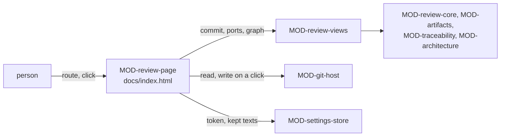

# ARC-022 The review page

## Context

Documents are reviewed and edited on the page under `docs/` of the instance's Pages site (ARC-001) — the instance's own
and every product's, all in one layout (ARC-006). A person reads a use case, an architecture decision or an entry of a
change queue, sees what changed since it was accepted and what it touches, accepts it with one click, edits it, arranges
the hierarchy of a kind of artifact, browses the specification at any release, and looks at the modules and their gaps.

The rules the page applies are designed elsewhere and are pure: the formats and the link graph in ARC-006, the records
and the acceptance commit in ARC-021. The git servers are reached through ARC-004, the browser's storage through ARC-005,
and a write needs an authority (ARC-003). What is missing is the page that puts them together: what it reads, what it
computes for each view, and when it writes.

## Decision

1. **Two modules.** `MOD-review-views`, a feature, computes what the page shows from one commit of a repository — its
   tree, read ports over its files, over earlier texts by blob and over the times of commits, and its link graph — and
   reads nothing itself. `MOD-review-page`, the shell of `docs/index.html`, routes, makes those ports from the git adapter
   and the browser store, reads one commit, turns a trusted click into the authority of a write, offers GitHub's own pages
   without a token, and holds every text and all HTML of the page.
2. **One commit at a time.** `MOD-review-page.route` reads from the page's address and fragment which repository is
   shown — the instance's, derived from the Pages address `https://<owner>.github.io/<repo>/docs/`, or a product's by
   its address —, the view, the item, the version — current or a release tag — and the version compared with.
   `MOD-review-page.open` reads that repository once, at the default branch or the tag. Every view is computed from that
   commit; its link graph is built once, from `MOD-review-views.traceInput`. Where the server lists the commit's tree
   only in part (`truncated`, ARC-004), `MOD-review-page.open` gives the files listed with that mark, and the page says
   so above every view: "The server lists only part of this repository's files. What this page shows may be incomplete,
   and nothing is written here."
3. **Ports over the commit.** The page's read port gives a file's text at the commit: the text kept in the browser by
   its blob SHA, or the one read from the server and then kept (ARC-005); without a token, GitHub's raw host by path,
   checked against the blob. A second port reads earlier texts by blob, a third the time of a record's commit, which the
   last accepted text of an identifier needs when it has several records (ARC-021).
4. **Status from the records; differences from the last record of an identifier.** A list derives the status of each
   file from the names of the records first; a file opened is verified against their content (ARC-021). A file whose
   identifier has a record, but whose text no record names, is changed since acceptance — also when it was renamed — and
   is shown as its difference to the text the identifier's last record names.
5. **Writes: one commit on a click, planned on the head.** Every write starts with a click the browser marks as trusted
   (`MOD-review-page.clickAuthority`). The page then reads the branch's head, plans every file on it, and writes one
   commit on that head (ARC-004):
   - `MOD-review-page.accept` — the records of the items shown, and for SPEC entries their sections and decision rows in
     the order of their queue (ARC-021); an item that changed since it was shown is left out and named;
   - `MOD-review-page.commitFile` — a person's own text: an edited use case, decision or queue entry, a group file;
     refused when the identifier it was opened with changed, or when the file at the head is no longer the blob it was
     opened at;
   - `MOD-review-page.saveSpecEdit` — a SPEC edit as an entry of the person's queue of the day, never `SPEC.md`;
     refused when the section changed meanwhile.

   `MOD-review-page.readHead` gives the head with every file the server lists and, where it lists the tree only in part,
   the mark (`truncated`), as `MOD-git-host.readSnapshot` does. Each of these writes refuses a head so marked
   (`too-large`), and no SPEC edit is planned on one (`MOD-review-page.specEditPlan`), since a file the head does not list
   could be written over or taken for missing; the page names that refusal in the notice's words (decision 2). A
   refused save keeps the editor's text as typed, shown beside the newer version (`MOD-review-views.keptEdit`).
6. **Without a token, GitHub's own pages.** Accepting opens GitHub's new-file page with the record prefilled
   (`MOD-review-page.acceptLink`). Saving puts each file's text on the clipboard and opens GitHub's editor at its path —
   or its new-file page with no value for a new file — after comparing it with the head
   (`MOD-review-page.fallbackLinks`); no reviewed text travels in a link. A head marked truncated gives no links
   (`too-large`): a file it does not list would be offered as new. A GitLab product without its project token is only
   read.
7. **The person is the token's account.** A SPEC edit is filed under the account the token acts as (ARC-004); without a
   token, under the owner of the instance's Pages site, the only account the page knows.
8. **What the views compute.** The lists of a kind with their groups; a file with its difference, prerequisites and
   impact list; an entry beside the section it replaces, with its rationale, the requirements it adds, changes or
   removes, everything naming those, and the other open entries replacing the same section; the review page of a kind
   with what *Accept all* accepts; the editor's text, its marks and its impact list; the requirement tree with statuses
   and counts, narrowed by a filter; one requirement with its traces, open proposals and history; two versions compared; a hierarchy and its
   pending changes; the modules with their rows, gaps, diagram and the next step each gap offers.
9. **Texts in the shell.** Every sentence the page shows — labels, statuses in words, the folded *What is this?* of every
   step that asks something of the person, the notices before a write — is written by `MOD-review-page`; the views return
   data (ARC-003). Markdown and Mermaid are rendered with the vendored libraries of ARC-002.



## Alternatives

- **One shell that computes its views in its event handlers** — nothing it shows could be tested without a browser, and
  every rule of a view would live beside the HTML that shows it.
- **Views that read through `fetch` themselves** — a feature would build requests, the adapter's work (ARC-003), and its
  examples would need recorded exchanges where a map of files suffices.
- **A link graph per view** — the graph reads every code file and test; built once per commit, a view costs only the
  files it shows.
- **A status or a graph stored in the repository** — `STATUS IS DERIVED FROM THE RECORDS` and
  `THE TRACEABILITY MATRIX IS DERIVED`.
- **One page per product** — `A MANAGED PRODUCT NEEDS NO PAGES SITE`; the instance's page reads every product through
  its server's API.

## Consequences

- Every view is a function of one commit; after a write, the page opens the new head and computes its views again.
- A repository whose tree the server lists only in part — on GitHub beyond 100 000 entries or 7 MB (ARC-004) — is shown
  with that notice, and none of the page's writes is made on it. `MOD-review-page.open` and `MOD-review-page.readHead`
  give the other pages that read through them the files listed with the mark; what each does with it, ARC-004 names.
- Opening a repository takes four requests, and each file not yet kept one more. Without a token, GitHub allows sixty
  requests an hour for a network, so texts come from its raw host, which does not count them.
- Removing a decision or a module's file (UC-023 1a, 1b) and accepting such a removal on the architecture's review page
  (UC-023 5) are not designed here: the one write path writes files and removes none, and no record yet names a removal.
- The sources of a requirement (UC-020 steps 2 and 5) come with the source library; the instance's workflow that writes
  a section approved without the dashboard (UC-006 4c) with the CI entry; and the steps that hand work to a participant —
  a change by prompt, a proposed arrangement, a described architecture change, *Implement* (UC-020 6, UC-021 1b,
  UC-023 2, 2a, 6) — with the jobs. Until then those steps are uncarried.
- Without a token on GitHub, a SPEC edit is prepared for GitHub's pages file by file; the person creates or edits each
  there, and the queue holds the edit once every file is committed.

## Modules

### MOD-review-views

```json module
{
  "id": "MOD-review-views",
  "folder": "src/review-views/",
  "layer": "feature",
  "responsibility": "Computes what the review page shows from one commit of a repository — the lists, a file or an entry shown, the review page, the editor's text and marks, the specification browser, the arrangement of a hierarchy, the modules — with the kernel modules, through read ports.",
  "realises": ["A CHANGED FILE IS SHOWN AGAINST ITS LAST ACCEPTED TEXT", "A REQUIREMENT IS NOT CHANGED WITHOUT AN IMPACT LIST", "THE BROWSER SHOWS ANY RELEASED VERSION", "OPEN PROPOSALS ARE SHOWN IN THE BROWSER", "A REQUIREMENT SHOWS ITS HISTORY", "AN ARCHITECTURE CHANGE IS NOT ACCEPTED WITHOUT AN IMPACT LIST"],
  "owns": ["ReviewKind", "ReviewRow", "FileView", "FileShown", "EntryView", "EntryShown", "ReviewAll", "EditTarget", "EditorOpened", "NewRequirement", "EditConflict", "SpecNode", "SpecTree", "SpecFilter", "HistoryRow", "RequirementShown", "CoverageChange", "VersionComparison", "GroupKind", "Arrangement", "Arranged", "GapOffer", "ModulesShown"],
  "uses": ["MOD-contracts", "MOD-artifacts", "MOD-architecture", "MOD-traceability", "MOD-review-core"]
}
```

```json interface
{
  "id": "MOD-review-views.reviewList",
  "summary": "The reviewed files of one kind at a commit — use cases, architecture decisions, or the entries of the change queues — each with its title, its status derived from the records, the record accepting its text, and its place in the hierarchy of its kind.",
  "params": [
    { "name": "snapshot", "type": "Snapshot" },
    { "name": "kind", "type": "ReviewKind" },
    { "name": "files", "type": "ReadPort" }
  ],
  "result": "ReviewRow[]",
  "async": true,
  "refusals": [],
  "examples": [
    {
      "name": "the use cases: accepted, changed and open, two of them in groups",
      "input": {
        "snapshot": {
          "commit": "c100000000000000000000000000000000000000",
          "tree": [
            { "path": "docs/approvals/ARC-001-42485189f621.md", "blob": "a730719e4a9cd327a60b4b336ee4587b480e43e7" },
            { "path": "docs/approvals/UC-001-b9debf11cce6.md", "blob": "4880f13a598169f9a5338e1b0cf3968885da2805" },
            { "path": "docs/approvals/UC-002-340895773e21.md", "blob": "c1bdc8edbcac92bc50f9329573ed989319c69061" },
            { "path": "docs/groups/use-cases.md", "blob": "3306ac5e392de59f6d556f19b4c298c1997ea8cc" },
            { "path": "docs/use-cases/UC-001-accept-a-chapter.md", "blob": "b9debf11cce66dfe31249380461a6f7fb3fb10ea" },
            { "path": "docs/use-cases/UC-002-write-a-chapter.md", "blob": "1c630e7fb251f2ec88103812f9041c9edafc3c2a" },
            { "path": "docs/use-cases/UC-003-export-a-chapter.md", "blob": "159ddc97b31591f90ccce7aac8bb7e310aeac8af" }
          ]
        },
        "kind": "use-case",
        "files": { "docs/approvals/UC-002-340895773e21.md": "kind: use-case\nfile: docs/use-cases/UC-002-write-a-chapter.md\nblob: 340895773e21fb8811ffcba10eee2955886876ff\n", "docs/groups/use-cases.md": "# Use cases — groups\n\nThe hierarchy of the use cases.\n\n- Review\n  - UC-001\n- Writing\n  - UC-002\n", "docs/use-cases/UC-001-accept-a-chapter.md": "---\nid: UC-001\ntitle: Accept a chapter\narea: writing\nactors:\n  - Author\nrealises:\n  - ONE CLICK\n  - EVERY TEXT IS REVIEWED\n---\n# UC-001 Accept a chapter\n\n## Actors\n\n- **Author** — writes.\n\n## Precondition\n\n- The repository exists.\n\n## Main flow\n\n1. The author opens the chapter.\n2. The author presses **Accept**.\n\n## Alternative flows\n\n- **1a. No token.** GitHub's page opens.\n\n## Postcondition\n\n- The chapter is saved.\n", "docs/use-cases/UC-002-write-a-chapter.md": "---\nid: UC-002\ntitle: Write a chapter\narea: writing\nactors:\n  - Author\nrealises:\n  - NO SERVER\n---\n# UC-002 Write a chapter\n\n## Actors\n\n- **Author** — writes.\n\n## Precondition\n\n- The repository exists.\n\n## Main flow\n\n1. The author writes the chapter in the editor.\n2. The author saves it.\n\n## Alternative flows\n\n- **1a. No token.** GitHub's page opens.\n\n## Postcondition\n\n- The chapter is saved.\n", "docs/use-cases/UC-003-export-a-chapter.md": "---\nid: UC-003\ntitle: Export a chapter\narea: writing\nactors:\n  - Author\nrealises:\n  - A CHAPTER IS EXPORTED\n---\n# UC-003 Export a chapter\n\n## Actors\n\n- **Author** — writes.\n\n## Precondition\n\n- The repository exists.\n\n## Main flow\n\n1. The author presses **Export**.\n\n## Alternative flows\n\n- **1a. No token.** GitHub's page opens.\n\n## Postcondition\n\n- The chapter is saved.\n" }
      },
      "result": [
        {
          "key": "file:docs/use-cases/UC-001-accept-a-chapter.md",
          "id": "UC-001",
          "path": "docs/use-cases/UC-001-accept-a-chapter.md",
          "title": "Accept a chapter",
          "status": "accepted",
          "record": "docs/approvals/UC-001-b9debf11cce6.md",
          "group": ["Review"]
        },
        {
          "key": "file:docs/use-cases/UC-002-write-a-chapter.md",
          "id": "UC-002",
          "path": "docs/use-cases/UC-002-write-a-chapter.md",
          "title": "Write a chapter",
          "status": "changed",
          "record": "",
          "group": ["Writing"]
        },
        {
          "key": "file:docs/use-cases/UC-003-export-a-chapter.md",
          "id": "UC-003",
          "path": "docs/use-cases/UC-003-export-a-chapter.md",
          "title": "Export a chapter",
          "status": "open",
          "record": "",
          "group": []
        }
      ]
    },
    {
      "name": "the entries of the change queues",
      "input": {
        "snapshot": {
          "commit": "c100000000000000000000000000000000000000",
          "tree": [
            { "path": "SPEC.md", "blob": "94bea49343a82e2f1148dc91f52fb2d200a054ab" },
            { "path": "docs/approvals/ARC-001-42485189f621.md", "blob": "a730719e4a9cd327a60b4b336ee4587b480e43e7" },
            { "path": "docs/approvals/UC-001-b9debf11cce6.md", "blob": "4880f13a598169f9a5338e1b0cf3968885da2805" },
            { "path": "docs/approvals/UC-002-340895773e21.md", "blob": "c1bdc8edbcac92bc50f9329573ed989319c69061" },
            { "path": "docs/spec-freigaben/2026-10-03_writing/01-writing.md", "blob": "0c262bc9099af066ff9a572409e212de4d17e943" },
            { "path": "docs/spec-freigaben/2026-10-03_writing/entscheidungen.md", "blob": "fe7ef9a0c1a6aee7108374eb4a392e3bb048faf5" },
            { "path": "docs/spec-freigaben/2026-10-03_writing/index.md", "blob": "91fb86d64e97a198e3ead61f3d061b5e3b24b46d" }
          ]
        },
        "kind": "spec-entry",
        "files": { "SPEC.md": "# Thesis — Specification\n\n## 1. Writing\n\n**ONE CLICK** *(PO A. Maier)*\nA decision takes one click.\n*Check:* no automatic check; at review.\n\n**NO SERVER** *(PO A. Maier)*\nThe product runs no server of its own.\n*Check:* `tests/test_no_server.py`\n\n## 2. Review\n\n**EVERY TEXT IS REVIEWED** *(PO A. Maier)*\nA document binds only once it is accepted.\n*Check:* `tests/pages.test.mjs`\n", "docs/spec-freigaben/2026-10-03_writing/01-writing.md": "## 1. Writing\n\n**ONE CLICK** *(PO A. Maier)*\nA decision takes one click once its inputs are complete.\n*Check:* no automatic check; at review.\n\n**NO SERVER** *(PO A. Maier)*\nThe product runs no server of its own.\n*Check:* `tests/test_no_server.py`\n\n**A CHAPTER IS EXPORTED** *(PO A. Maier)*\nEvery accepted chapter can be exported as PDF.\n*Check:* `tests/export.test.mjs`\n", "docs/spec-freigaben/2026-10-03_writing/entscheidungen.md": "# Decisions — queue 2026-10-03_writing\n\nAppend-only.\n", "docs/spec-freigaben/2026-10-03_writing/index.md": "# SPEC approvals — queue 2026-10-03_writing\n\n**Zieldatei aller Einträge:** `SPEC.md`\n\n| Nr | Datei | Anker (Überschrift, wortgetreu) | bis (exklusiv) | Commits |\n|---|---|---|---|---|\n| 01 | `SPEC.md` | ## 1. Writing | — | — |\n" }
      },
      "result": [
        {
          "key": "spec:docs/spec-freigaben/2026-10-03_writing:1",
          "id": "2026-10-03_writing 01",
          "path": "docs/spec-freigaben/2026-10-03_writing/01-writing.md",
          "title": "## 1. Writing",
          "status": "open",
          "record": "",
          "group": ["2026-10-03_writing"]
        }
      ]
    }
  ]
}
```

```json interface
{
  "id": "MOD-review-views.showFile",
  "summary": "A use case or an architecture decision as the page shows it: its text and status; changed since acceptance, the difference to the text its identifier's last record names, also after a rename; for a decision, what it names that is not accepted, the use cases it rests on, and, changed, its impact list; and the session with the file shown.",
  "params": [
    { "name": "snapshot", "type": "Snapshot" },
    { "name": "path", "type": "string" },
    { "name": "session", "type": "ReviewSession" },
    { "name": "files", "type": "ReadPort" },
    { "name": "blobs", "type": "ReadPort" },
    { "name": "committedAt", "type": "ReadPort" },
    { "name": "graph", "type": "LinkGraph" }
  ],
  "result": "FileShown",
  "async": true,
  "refusals": [
    { "code": "no-file", "when": "the commit has no file at the path" },
    { "code": "not-reviewed", "when": "the file is neither a use case nor an architecture decision" }
  ],
  "examples": [
    {
      "name": "a use case changed since it was accepted",
      "input": {
        "snapshot": {
          "commit": "c100000000000000000000000000000000000000",
          "tree": [
            { "path": "SPEC.md", "blob": "94bea49343a82e2f1148dc91f52fb2d200a054ab" },
            { "path": "docs/approvals/ARC-001-42485189f621.md", "blob": "a730719e4a9cd327a60b4b336ee4587b480e43e7" },
            { "path": "docs/approvals/UC-001-b9debf11cce6.md", "blob": "4880f13a598169f9a5338e1b0cf3968885da2805" },
            { "path": "docs/approvals/UC-002-340895773e21.md", "blob": "c1bdc8edbcac92bc50f9329573ed989319c69061" },
            { "path": "docs/use-cases/UC-002-write-a-chapter.md", "blob": "1c630e7fb251f2ec88103812f9041c9edafc3c2a" }
          ]
        },
        "path": "docs/use-cases/UC-002-write-a-chapter.md",
        "session": { "shown": [], "ticked": [] },
        "files": { "SPEC.md": "# Thesis — Specification\n\n## 1. Writing\n\n**ONE CLICK** *(PO A. Maier)*\nA decision takes one click.\n*Check:* no automatic check; at review.\n\n**NO SERVER** *(PO A. Maier)*\nThe product runs no server of its own.\n*Check:* `tests/test_no_server.py`\n\n## 2. Review\n\n**EVERY TEXT IS REVIEWED** *(PO A. Maier)*\nA document binds only once it is accepted.\n*Check:* `tests/pages.test.mjs`\n", "docs/approvals/UC-002-340895773e21.md": "kind: use-case\nfile: docs/use-cases/UC-002-write-a-chapter.md\nblob: 340895773e21fb8811ffcba10eee2955886876ff\n", "docs/use-cases/UC-002-write-a-chapter.md": "---\nid: UC-002\ntitle: Write a chapter\narea: writing\nactors:\n  - Author\nrealises:\n  - NO SERVER\n---\n# UC-002 Write a chapter\n\n## Actors\n\n- **Author** — writes.\n\n## Precondition\n\n- The repository exists.\n\n## Main flow\n\n1. The author writes the chapter in the editor.\n2. The author saves it.\n\n## Alternative flows\n\n- **1a. No token.** GitHub's page opens.\n\n## Postcondition\n\n- The chapter is saved.\n" },
        "blobs": { "340895773e21fb8811ffcba10eee2955886876ff": "---\nid: UC-002\ntitle: Write a chapter\narea: writing\nactors:\n  - Author\nrealises:\n  - NO SERVER\n---\n# UC-002 Write a chapter\n\n## Actors\n\n- **Author** — writes.\n\n## Precondition\n\n- The repository exists.\n\n## Main flow\n\n1. The author writes the chapter.\n2. The author saves it.\n\n## Alternative flows\n\n- **1a. No token.** GitHub's page opens.\n\n## Postcondition\n\n- The chapter is saved.\n" },
        "committedAt": {},
        "graph": { "nodes": [], "edges": [], "modules": [], "unknown": [] }
      },
      "result": {
        "session": {
          "shown": [
            {
              "kind": "use-case",
              "id": "UC-002",
              "path": "docs/use-cases/UC-002-write-a-chapter.md",
              "blob": "1c630e7fb251f2ec88103812f9041c9edafc3c2a",
              "changed": true,
              "impactShown": false,
              "requirements": ["NO SERVER"],
              "requires": []
            }
          ],
          "ticked": []
        },
        "view": {
          "item": {
            "kind": "use-case",
            "id": "UC-002",
            "path": "docs/use-cases/UC-002-write-a-chapter.md",
            "blob": "1c630e7fb251f2ec88103812f9041c9edafc3c2a",
            "changed": true,
            "impactShown": false,
            "requirements": ["NO SERVER"],
            "requires": []
          },
          "text": "---\nid: UC-002\ntitle: Write a chapter\narea: writing\nactors:\n  - Author\nrealises:\n  - NO SERVER\n---\n# UC-002 Write a chapter\n\n## Actors\n\n- **Author** — writes.\n\n## Precondition\n\n- The repository exists.\n\n## Main flow\n\n1. The author writes the chapter in the editor.\n2. The author saves it.\n\n## Alternative flows\n\n- **1a. No token.** GitHub's page opens.\n\n## Postcondition\n\n- The chapter is saved.\n",
          "status": "changed",
          "record": "",
          "diff": [
            { "mark": " ", "line": "---" },
            { "mark": " ", "line": "id: UC-002" },
            { "mark": " ", "line": "title: Write a chapter" },
            { "mark": " ", "line": "area: writing" },
            { "mark": " ", "line": "actors:" },
            { "mark": " ", "line": "  - Author" },
            { "mark": " ", "line": "realises:" },
            { "mark": " ", "line": "  - NO SERVER" },
            { "mark": " ", "line": "---" },
            { "mark": " ", "line": "# UC-002 Write a chapter" },
            { "mark": " ", "line": "" },
            { "mark": " ", "line": "## Actors" },
            { "mark": " ", "line": "" },
            { "mark": " ", "line": "- **Author** — writes." },
            { "mark": " ", "line": "" },
            { "mark": " ", "line": "## Precondition" },
            { "mark": " ", "line": "" },
            { "mark": " ", "line": "- The repository exists." },
            { "mark": " ", "line": "" },
            { "mark": " ", "line": "## Main flow" },
            { "mark": " ", "line": "" },
            { "mark": "-", "line": "1. The author writes the chapter." },
            { "mark": "+", "line": "1. The author writes the chapter in the editor." },
            { "mark": " ", "line": "2. The author saves it." },
            { "mark": " ", "line": "" },
            { "mark": " ", "line": "## Alternative flows" },
            { "mark": " ", "line": "" },
            { "mark": " ", "line": "- **1a. No token.** GitHub's page opens." },
            { "mark": " ", "line": "" },
            { "mark": " ", "line": "## Postcondition" },
            { "mark": " ", "line": "" },
            { "mark": " ", "line": "- The chapter is saved." }
          ],
          "accepted": "docs/approvals/UC-002-340895773e21.md",
          "open": [],
          "prerequisites": { "open": [], "restsOn": [] },
          "impact": null,
          "problem": ""
        }
      }
    },
    {
      "name": "a changed decision with its impact list",
      "input": {
        "snapshot": {
          "commit": "c100000000000000000000000000000000000000",
          "tree": [
            { "path": "SPEC.md", "blob": "94bea49343a82e2f1148dc91f52fb2d200a054ab" },
            { "path": "docs/approvals/ARC-001-42485189f621.md", "blob": "a730719e4a9cd327a60b4b336ee4587b480e43e7" },
            { "path": "docs/approvals/UC-001-b9debf11cce6.md", "blob": "4880f13a598169f9a5338e1b0cf3968885da2805" },
            { "path": "docs/approvals/UC-002-340895773e21.md", "blob": "c1bdc8edbcac92bc50f9329573ed989319c69061" },
            { "path": "docs/architecture/ARC-001-static-pages.md", "blob": "07677c2c633221b6b139237cf96a2344bcaf138a" },
            { "path": "docs/architecture/ARC-002-export.md", "blob": "0123fc84d43802d6e5a0a1c664efdaea63743db6" },
            { "path": "docs/groups/requirements.md", "blob": "b7484692e6f4c0138d738411a830ef2a533392f0" },
            { "path": "docs/groups/use-cases.md", "blob": "3306ac5e392de59f6d556f19b4c298c1997ea8cc" },
            { "path": "docs/spec-freigaben/2026-10-03_writing/01-writing.begruendung.md", "blob": "3396500018033b3d7f3c7ada69734599bdb8af2f" },
            { "path": "docs/spec-freigaben/2026-10-03_writing/01-writing.md", "blob": "0c262bc9099af066ff9a572409e212de4d17e943" },
            { "path": "docs/spec-freigaben/2026-10-03_writing/entscheidungen.md", "blob": "fe7ef9a0c1a6aee7108374eb4a392e3bb048faf5" },
            { "path": "docs/spec-freigaben/2026-10-03_writing/index.md", "blob": "91fb86d64e97a198e3ead61f3d061b5e3b24b46d" },
            { "path": "docs/use-cases/UC-001-accept-a-chapter.md", "blob": "b9debf11cce66dfe31249380461a6f7fb3fb10ea" },
            { "path": "docs/use-cases/UC-002-write-a-chapter.md", "blob": "1c630e7fb251f2ec88103812f9041c9edafc3c2a" },
            { "path": "docs/use-cases/UC-003-export-a-chapter.md", "blob": "159ddc97b31591f90ccce7aac8bb7e310aeac8af" },
            { "path": "src/pages/index.mjs", "blob": "003c2920ae59a0be65d173c5a52364326dec0f28" },
            { "path": "tests/pages.test.mjs", "blob": "d34f4b944b0af3769f1423d9d4e4ed9fd257a784" }
          ]
        },
        "path": "docs/architecture/ARC-001-static-pages.md",
        "session": { "shown": [], "ticked": [] },
        "files": { "SPEC.md": "# Thesis — Specification\n\n## 1. Writing\n\n**ONE CLICK** *(PO A. Maier)*\nA decision takes one click.\n*Check:* no automatic check; at review.\n\n**NO SERVER** *(PO A. Maier)*\nThe product runs no server of its own.\n*Check:* `tests/test_no_server.py`\n\n## 2. Review\n\n**EVERY TEXT IS REVIEWED** *(PO A. Maier)*\nA document binds only once it is accepted.\n*Check:* `tests/pages.test.mjs`\n", "docs/approvals/ARC-001-42485189f621.md": "kind: architecture-decision\nfile: docs/architecture/ARC-001-static-pages.md\nblob: 42485189f621eaa4498f5b0d033a2b4803c8a18d\n", "docs/approvals/UC-001-b9debf11cce6.md": "kind: use-case\nfile: docs/use-cases/UC-001-accept-a-chapter.md\nblob: b9debf11cce66dfe31249380461a6f7fb3fb10ea\n", "docs/architecture/ARC-001-static-pages.md": "---\nid: ARC-001\ntitle: Static pages\nforced_by:\n  - NO SERVER\n  - UC-001\n---\n# ARC-001 Static pages\n\n## Context\n\nThe thesis is reviewed in the browser.\n\n## Decision\n\n1. Static pages.\n\n## Alternatives\n\n- None.\n\n## Consequences\n\n- None.\n\n## Modules\n\n```json module\n{\"id\":\"MOD-pages\",\"folder\":\"src/pages/\",\"layer\":\"shell\",\"responsibility\":\"Shows chapters.\",\"realises\":[\"NO SERVER\",\"EVERY TEXT IS REVIEWED\"],\"owns\":[],\"uses\":[]}\n```\n\n```json interface\n{\"id\":\"MOD-pages.show\",\"summary\":\"A chapter at a version.\",\"params\":[{\"name\":\"path\",\"type\":\"string\"},{\"name\":\"version\",\"type\":\"string\"}],\"result\":\"string\",\"async\":false,\"refusals\":[],\"examples\":[{\"name\":\"one\",\"input\":{\"path\":\"a.md\",\"version\":\"v1\"},\"result\":\"a.md\"}]}\n```\n" },
        "blobs": { "42485189f621eaa4498f5b0d033a2b4803c8a18d": "---\nid: ARC-001\ntitle: Static pages\nforced_by:\n  - NO SERVER\n  - UC-001\n---\n# ARC-001 Static pages\n\n## Context\n\nThe thesis is reviewed in the browser.\n\n## Decision\n\n1. Static pages.\n\n## Alternatives\n\n- None.\n\n## Consequences\n\n- None.\n\n## Modules\n\n```json module\n{\"id\":\"MOD-pages\",\"folder\":\"src/pages/\",\"layer\":\"shell\",\"responsibility\":\"Shows chapters.\",\"realises\":[\"NO SERVER\",\"EVERY TEXT IS REVIEWED\"],\"owns\":[],\"uses\":[]}\n```\n\n```json interface\n{\"id\":\"MOD-pages.show\",\"summary\":\"A chapter.\",\"params\":[{\"name\":\"path\",\"type\":\"string\"}],\"result\":\"string\",\"async\":false,\"refusals\":[],\"examples\":[{\"name\":\"one\",\"input\":{\"path\":\"a.md\"},\"result\":\"a.md\"}]}\n```\n" },
        "committedAt": {},
        "graph": {
          "nodes": [
            { "id": "A CHAPTER IS EXPORTED", "kind": "requirement", "path": "docs/spec-freigaben/2026-10-03_writing/01-writing.md", "status": "proposed" },
            { "id": "ARC-001", "kind": "architecture-decision", "path": "docs/architecture/ARC-001-static-pages.md", "status": "changed" },
            { "id": "ARC-002", "kind": "architecture-decision", "path": "docs/architecture/ARC-002-export.md", "status": "open" },
            { "id": "EVERY TEXT IS REVIEWED", "kind": "requirement", "path": "SPEC.md", "status": "accepted" },
            { "id": "MOD-export", "kind": "module", "path": "docs/architecture/ARC-002-export.md", "status": "open" },
            { "id": "MOD-pages", "kind": "module", "path": "docs/architecture/ARC-001-static-pages.md", "status": "changed" },
            { "id": "NO SERVER", "kind": "requirement", "path": "SPEC.md", "status": "accepted" },
            { "id": "ONE CLICK", "kind": "requirement", "path": "SPEC.md", "status": "accepted" },
            { "id": "UC-001", "kind": "use-case", "path": "docs/use-cases/UC-001-accept-a-chapter.md", "status": "accepted" },
            { "id": "UC-002", "kind": "use-case", "path": "docs/use-cases/UC-002-write-a-chapter.md", "status": "changed" },
            { "id": "UC-003", "kind": "use-case", "path": "docs/use-cases/UC-003-export-a-chapter.md", "status": "open" },
            { "id": "docs/spec-freigaben/2026-10-03_writing/01-writing.md", "kind": "proposal", "path": "docs/spec-freigaben/2026-10-03_writing/01-writing.md", "status": "open" },
            { "id": "src/pages/index.mjs", "kind": "code", "path": "src/pages/index.mjs", "status": "" },
            { "id": "tests/pages.test.mjs", "kind": "test", "path": "tests/pages.test.mjs", "status": "" }
          ],
          "edges": [
            { "from": "docs/spec-freigaben/2026-10-03_writing/01-writing.md", "to": "ONE CLICK", "via": "proposes", "change": "change" },
            { "from": "docs/spec-freigaben/2026-10-03_writing/01-writing.md", "to": "A CHAPTER IS EXPORTED", "via": "proposes", "change": "add" },
            { "from": "ARC-001", "to": "NO SERVER", "via": "forced_by" },
            { "from": "ARC-001", "to": "UC-001", "via": "forced_by" },
            { "from": "ARC-001", "to": "MOD-pages", "via": "designs" },
            { "from": "MOD-pages", "to": "NO SERVER", "via": "realises" },
            { "from": "MOD-pages", "to": "EVERY TEXT IS REVIEWED", "via": "realises" },
            { "from": "ARC-002", "to": "EVERY TEXT IS REVIEWED", "via": "forced_by" },
            { "from": "ARC-002", "to": "UC-003", "via": "forced_by" },
            { "from": "ARC-002", "to": "MOD-export", "via": "designs" },
            { "from": "MOD-export", "to": "EVERY TEXT IS REVIEWED", "via": "realises" },
            { "from": "MOD-export", "to": "MOD-pages", "via": "uses" },
            { "from": "UC-001", "to": "ONE CLICK", "via": "realises" },
            { "from": "UC-001", "to": "EVERY TEXT IS REVIEWED", "via": "realises" },
            { "from": "UC-002", "to": "NO SERVER", "via": "realises" },
            { "from": "UC-003", "to": "A CHAPTER IS EXPORTED", "via": "realises" },
            { "from": "src/pages/index.mjs", "to": "MOD-pages", "via": "in" },
            { "from": "tests/pages.test.mjs", "to": "MOD-pages", "via": "exercises" },
            { "from": "tests/pages.test.mjs", "to": "EVERY TEXT IS REVIEWED", "via": "guards" }
          ],
          "modules": [{ "id": "MOD-export", "folder": "src/export/" }, { "id": "MOD-pages", "folder": "src/pages/" }],
          "unknown": []
        }
      },
      "result": {
        "session": {
          "shown": [
            {
              "kind": "architecture-decision",
              "id": "ARC-001",
              "path": "docs/architecture/ARC-001-static-pages.md",
              "blob": "07677c2c633221b6b139237cf96a2344bcaf138a",
              "changed": true,
              "impactShown": true,
              "requirements": ["EVERY TEXT IS REVIEWED", "NO SERVER"],
              "requires": [
                { "id": "UC-001", "path": "docs/use-cases/UC-001-accept-a-chapter.md", "blob": "b9debf11cce66dfe31249380461a6f7fb3fb10ea", "status": "accepted", "record": "docs/approvals/UC-001-b9debf11cce6.md" }
              ]
            }
          ],
          "ticked": []
        },
        "view": {
          "item": {
            "kind": "architecture-decision",
            "id": "ARC-001",
            "path": "docs/architecture/ARC-001-static-pages.md",
            "blob": "07677c2c633221b6b139237cf96a2344bcaf138a",
            "changed": true,
            "impactShown": true,
            "requirements": ["EVERY TEXT IS REVIEWED", "NO SERVER"],
            "requires": [
              { "id": "UC-001", "path": "docs/use-cases/UC-001-accept-a-chapter.md", "blob": "b9debf11cce66dfe31249380461a6f7fb3fb10ea", "status": "accepted", "record": "docs/approvals/UC-001-b9debf11cce6.md" }
            ]
          },
          "text": "---\nid: ARC-001\ntitle: Static pages\nforced_by:\n  - NO SERVER\n  - UC-001\n---\n# ARC-001 Static pages\n\n## Context\n\nThe thesis is reviewed in the browser.\n\n## Decision\n\n1. Static pages.\n\n## Alternatives\n\n- None.\n\n## Consequences\n\n- None.\n\n## Modules\n\n```json module\n{\"id\":\"MOD-pages\",\"folder\":\"src/pages/\",\"layer\":\"shell\",\"responsibility\":\"Shows chapters.\",\"realises\":[\"NO SERVER\",\"EVERY TEXT IS REVIEWED\"],\"owns\":[],\"uses\":[]}\n```\n\n```json interface\n{\"id\":\"MOD-pages.show\",\"summary\":\"A chapter at a version.\",\"params\":[{\"name\":\"path\",\"type\":\"string\"},{\"name\":\"version\",\"type\":\"string\"}],\"result\":\"string\",\"async\":false,\"refusals\":[],\"examples\":[{\"name\":\"one\",\"input\":{\"path\":\"a.md\",\"version\":\"v1\"},\"result\":\"a.md\"}]}\n```\n",
          "status": "changed",
          "record": "",
          "diff": [
            { "mark": " ", "line": "---" },
            { "mark": " ", "line": "id: ARC-001" },
            { "mark": " ", "line": "title: Static pages" },
            { "mark": " ", "line": "forced_by:" },
            { "mark": " ", "line": "  - NO SERVER" },
            { "mark": " ", "line": "  - UC-001" },
            { "mark": " ", "line": "---" },
            { "mark": " ", "line": "# ARC-001 Static pages" },
            { "mark": " ", "line": "" },
            { "mark": " ", "line": "## Context" },
            { "mark": " ", "line": "" },
            { "mark": " ", "line": "The thesis is reviewed in the browser." },
            { "mark": " ", "line": "" },
            { "mark": " ", "line": "## Decision" },
            { "mark": " ", "line": "" },
            { "mark": " ", "line": "1. Static pages." },
            { "mark": " ", "line": "" },
            { "mark": " ", "line": "## Alternatives" },
            { "mark": " ", "line": "" },
            { "mark": " ", "line": "- None." },
            { "mark": " ", "line": "" },
            { "mark": " ", "line": "## Consequences" },
            { "mark": " ", "line": "" },
            { "mark": " ", "line": "- None." },
            { "mark": " ", "line": "" },
            { "mark": " ", "line": "## Modules" },
            { "mark": " ", "line": "" },
            { "mark": " ", "line": "```json module" },
            { "mark": " ", "line": "{\"id\":\"MOD-pages\",\"folder\":\"src/pages/\",\"layer\":\"shell\",\"responsibility\":\"Shows chapters.\",\"realises\":[\"NO SERVER\",\"EVERY TEXT IS REVIEWED\"],\"owns\":[],\"uses\":[]}" },
            { "mark": " ", "line": "```" },
            { "mark": " ", "line": "" },
            { "mark": " ", "line": "```json interface" },
            { "mark": "-", "line": "{\"id\":\"MOD-pages.show\",\"summary\":\"A chapter.\",\"params\":[{\"name\":\"path\",\"type\":\"string\"}],\"result\":\"string\",\"async\":false,\"refusals\":[],\"examples\":[{\"name\":\"one\",\"input\":{\"path\":\"a.md\"},\"result\":\"a.md\"}]}" },
            { "mark": "+", "line": "{\"id\":\"MOD-pages.show\",\"summary\":\"A chapter at a version.\",\"params\":[{\"name\":\"path\",\"type\":\"string\"},{\"name\":\"version\",\"type\":\"string\"}],\"result\":\"string\",\"async\":false,\"refusals\":[],\"examples\":[{\"name\":\"one\",\"input\":{\"path\":\"a.md\",\"version\":\"v1\"},\"result\":\"a.md\"}]}" },
            { "mark": " ", "line": "```" }
          ],
          "accepted": "docs/approvals/ARC-001-42485189f621.md",
          "open": [],
          "prerequisites": {
            "open": [],
            "restsOn": [
              { "id": "UC-001", "path": "docs/use-cases/UC-001-accept-a-chapter.md", "blob": "b9debf11cce66dfe31249380461a6f7fb3fb10ea", "status": "accepted", "record": "docs/approvals/UC-001-b9debf11cce6.md" }
            ]
          },
          "impact": {
            "decision": "ARC-001",
            "removedInterfaces": [],
            "alteredInterfaces": ["MOD-pages.show"],
            "affected": [
              {
                "module": "MOD-export",
                "reasons": ["uses MOD-pages, whose interfaces the change alters"],
                "breaks": false,
                "code": [],
                "tests": [],
                "guards": []
              },
              {
                "module": "MOD-pages",
                "reasons": ["designed by ARC-001"],
                "breaks": false,
                "code": ["src/pages/index.mjs"],
                "tests": ["tests/pages.test.mjs"],
                "guards": ["EVERY TEXT IS REVIEWED"]
              }
            ],
            "names": { "kept": ["EVERY TEXT IS REVIEWED", "NO SERVER", "UC-001"], "added": [], "removed": [] }
          },
          "problem": ""
        }
      }
    },
    {
      "name": "a path the commit does not have",
      "input": {
        "snapshot": {
          "commit": "c100000000000000000000000000000000000000",
          "tree": [
            { "path": "docs/approvals/ARC-001-42485189f621.md", "blob": "a730719e4a9cd327a60b4b336ee4587b480e43e7" },
            { "path": "docs/approvals/UC-001-b9debf11cce6.md", "blob": "4880f13a598169f9a5338e1b0cf3968885da2805" },
            { "path": "docs/approvals/UC-002-340895773e21.md", "blob": "c1bdc8edbcac92bc50f9329573ed989319c69061" }
          ]
        },
        "path": "docs/use-cases/UC-009-none.md",
        "session": { "shown": [], "ticked": [] },
        "files": {},
        "blobs": {},
        "committedAt": {},
        "graph": { "nodes": [], "edges": [], "modules": [], "unknown": [] }
      },
      "refused": "no-file"
    }
  ]
}
```

```json interface
{
  "id": "MOD-review-views.showEntry",
  "summary": "An entry of a change queue as the page shows it: the section it replaces — after the entries it needs where its heading comes from them —, the proposal, their difference, the rationale, the requirements it adds, changes or removes with every artifact naming those it changes or removes, the other open entries replacing the same section, its status, and the session with the entry shown.",
  "params": [
    { "name": "snapshot", "type": "Snapshot" },
    { "name": "queue", "type": "string" },
    { "name": "nr", "type": "integer" },
    { "name": "session", "type": "ReviewSession" },
    { "name": "files", "type": "ReadPort" },
    { "name": "graph", "type": "LinkGraph" }
  ],
  "result": "EntryShown",
  "async": true,
  "refusals": [
    { "code": "no-entry", "when": "the queue's index has no entry of the number" },
    { "code": "no-proposal", "when": "the entry has no proposal file in its queue" }
  ],
  "examples": [
    {
      "name": "an entry beside the section it replaces",
      "input": {
        "snapshot": {
          "commit": "c100000000000000000000000000000000000000",
          "tree": [
            { "path": "SPEC.md", "blob": "94bea49343a82e2f1148dc91f52fb2d200a054ab" },
            { "path": "docs/approvals/ARC-001-42485189f621.md", "blob": "a730719e4a9cd327a60b4b336ee4587b480e43e7" },
            { "path": "docs/approvals/UC-001-b9debf11cce6.md", "blob": "4880f13a598169f9a5338e1b0cf3968885da2805" },
            { "path": "docs/approvals/UC-002-340895773e21.md", "blob": "c1bdc8edbcac92bc50f9329573ed989319c69061" },
            { "path": "docs/spec-freigaben/2026-10-03_writing/01-writing.begruendung.md", "blob": "3396500018033b3d7f3c7ada69734599bdb8af2f" },
            { "path": "docs/spec-freigaben/2026-10-03_writing/01-writing.md", "blob": "0c262bc9099af066ff9a572409e212de4d17e943" },
            { "path": "docs/spec-freigaben/2026-10-03_writing/entscheidungen.md", "blob": "fe7ef9a0c1a6aee7108374eb4a392e3bb048faf5" },
            { "path": "docs/spec-freigaben/2026-10-03_writing/index.md", "blob": "91fb86d64e97a198e3ead61f3d061b5e3b24b46d" }
          ]
        },
        "queue": "docs/spec-freigaben/2026-10-03_writing",
        "nr": 1,
        "session": { "shown": [], "ticked": [] },
        "files": { "SPEC.md": "# Thesis — Specification\n\n## 1. Writing\n\n**ONE CLICK** *(PO A. Maier)*\nA decision takes one click.\n*Check:* no automatic check; at review.\n\n**NO SERVER** *(PO A. Maier)*\nThe product runs no server of its own.\n*Check:* `tests/test_no_server.py`\n\n## 2. Review\n\n**EVERY TEXT IS REVIEWED** *(PO A. Maier)*\nA document binds only once it is accepted.\n*Check:* `tests/pages.test.mjs`\n", "docs/spec-freigaben/2026-10-03_writing/01-writing.begruendung.md": "# 1. Writing\n\nThe rule names when the click counts, and export becomes a requirement.\n\n**Impact list.** UC-001.\n", "docs/spec-freigaben/2026-10-03_writing/01-writing.md": "## 1. Writing\n\n**ONE CLICK** *(PO A. Maier)*\nA decision takes one click once its inputs are complete.\n*Check:* no automatic check; at review.\n\n**NO SERVER** *(PO A. Maier)*\nThe product runs no server of its own.\n*Check:* `tests/test_no_server.py`\n\n**A CHAPTER IS EXPORTED** *(PO A. Maier)*\nEvery accepted chapter can be exported as PDF.\n*Check:* `tests/export.test.mjs`\n", "docs/spec-freigaben/2026-10-03_writing/entscheidungen.md": "# Decisions — queue 2026-10-03_writing\n\nAppend-only.\n", "docs/spec-freigaben/2026-10-03_writing/index.md": "# SPEC approvals — queue 2026-10-03_writing\n\n**Zieldatei aller Einträge:** `SPEC.md`\n\n| Nr | Datei | Anker (Überschrift, wortgetreu) | bis (exklusiv) | Commits |\n|---|---|---|---|---|\n| 01 | `SPEC.md` | ## 1. Writing | — | — |\n" },
        "graph": {
          "nodes": [
            { "id": "A CHAPTER IS EXPORTED", "kind": "requirement", "path": "docs/spec-freigaben/2026-10-03_writing/01-writing.md", "status": "proposed" },
            { "id": "ARC-001", "kind": "architecture-decision", "path": "docs/architecture/ARC-001-static-pages.md", "status": "changed" },
            { "id": "ARC-002", "kind": "architecture-decision", "path": "docs/architecture/ARC-002-export.md", "status": "open" },
            { "id": "EVERY TEXT IS REVIEWED", "kind": "requirement", "path": "SPEC.md", "status": "accepted" },
            { "id": "MOD-export", "kind": "module", "path": "docs/architecture/ARC-002-export.md", "status": "open" },
            { "id": "MOD-pages", "kind": "module", "path": "docs/architecture/ARC-001-static-pages.md", "status": "changed" },
            { "id": "NO SERVER", "kind": "requirement", "path": "SPEC.md", "status": "accepted" },
            { "id": "ONE CLICK", "kind": "requirement", "path": "SPEC.md", "status": "accepted" },
            { "id": "UC-001", "kind": "use-case", "path": "docs/use-cases/UC-001-accept-a-chapter.md", "status": "accepted" },
            { "id": "UC-002", "kind": "use-case", "path": "docs/use-cases/UC-002-write-a-chapter.md", "status": "changed" },
            { "id": "UC-003", "kind": "use-case", "path": "docs/use-cases/UC-003-export-a-chapter.md", "status": "open" },
            { "id": "docs/spec-freigaben/2026-10-03_writing/01-writing.md", "kind": "proposal", "path": "docs/spec-freigaben/2026-10-03_writing/01-writing.md", "status": "open" },
            { "id": "src/pages/index.mjs", "kind": "code", "path": "src/pages/index.mjs", "status": "" },
            { "id": "tests/pages.test.mjs", "kind": "test", "path": "tests/pages.test.mjs", "status": "" }
          ],
          "edges": [
            { "from": "docs/spec-freigaben/2026-10-03_writing/01-writing.md", "to": "ONE CLICK", "via": "proposes", "change": "change" },
            { "from": "docs/spec-freigaben/2026-10-03_writing/01-writing.md", "to": "A CHAPTER IS EXPORTED", "via": "proposes", "change": "add" },
            { "from": "ARC-001", "to": "NO SERVER", "via": "forced_by" },
            { "from": "ARC-001", "to": "UC-001", "via": "forced_by" },
            { "from": "ARC-001", "to": "MOD-pages", "via": "designs" },
            { "from": "MOD-pages", "to": "NO SERVER", "via": "realises" },
            { "from": "MOD-pages", "to": "EVERY TEXT IS REVIEWED", "via": "realises" },
            { "from": "ARC-002", "to": "EVERY TEXT IS REVIEWED", "via": "forced_by" },
            { "from": "ARC-002", "to": "UC-003", "via": "forced_by" },
            { "from": "ARC-002", "to": "MOD-export", "via": "designs" },
            { "from": "MOD-export", "to": "EVERY TEXT IS REVIEWED", "via": "realises" },
            { "from": "MOD-export", "to": "MOD-pages", "via": "uses" },
            { "from": "UC-001", "to": "ONE CLICK", "via": "realises" },
            { "from": "UC-001", "to": "EVERY TEXT IS REVIEWED", "via": "realises" },
            { "from": "UC-002", "to": "NO SERVER", "via": "realises" },
            { "from": "UC-003", "to": "A CHAPTER IS EXPORTED", "via": "realises" },
            { "from": "src/pages/index.mjs", "to": "MOD-pages", "via": "in" },
            { "from": "tests/pages.test.mjs", "to": "MOD-pages", "via": "exercises" },
            { "from": "tests/pages.test.mjs", "to": "EVERY TEXT IS REVIEWED", "via": "guards" }
          ],
          "modules": [{ "id": "MOD-export", "folder": "src/export/" }, { "id": "MOD-pages", "folder": "src/pages/" }],
          "unknown": []
        }
      },
      "result": {
        "session": {
          "shown": [
            {
              "kind": "spec",
              "queue": "docs/spec-freigaben/2026-10-03_writing",
              "nr": 1,
              "anchor": "## 1. Writing",
              "bis": "",
              "proposalPath": "docs/spec-freigaben/2026-10-03_writing/01-writing.md",
              "proposalBlob": "0c262bc9099af066ff9a572409e212de4d17e943",
              "targetPath": "SPEC.md",
              "sectionBlob": "110555c78424b4615aad957f738cd8448376dc48",
              "needs": []
            }
          ],
          "ticked": []
        },
        "view": {
          "item": {
            "kind": "spec",
            "queue": "docs/spec-freigaben/2026-10-03_writing",
            "nr": 1,
            "anchor": "## 1. Writing",
            "bis": "",
            "proposalPath": "docs/spec-freigaben/2026-10-03_writing/01-writing.md",
            "proposalBlob": "0c262bc9099af066ff9a572409e212de4d17e943",
            "targetPath": "SPEC.md",
            "sectionBlob": "110555c78424b4615aad957f738cd8448376dc48",
            "needs": []
          },
          "current": "## 1. Writing\n\n**ONE CLICK** *(PO A. Maier)*\nA decision takes one click.\n*Check:* no automatic check; at review.\n\n**NO SERVER** *(PO A. Maier)*\nThe product runs no server of its own.\n*Check:* `tests/test_no_server.py`\n",
          "proposal": "## 1. Writing\n\n**ONE CLICK** *(PO A. Maier)*\nA decision takes one click once its inputs are complete.\n*Check:* no automatic check; at review.\n\n**NO SERVER** *(PO A. Maier)*\nThe product runs no server of its own.\n*Check:* `tests/test_no_server.py`\n\n**A CHAPTER IS EXPORTED** *(PO A. Maier)*\nEvery accepted chapter can be exported as PDF.\n*Check:* `tests/export.test.mjs`\n",
          "diff": [
            { "mark": " ", "line": "## 1. Writing" },
            { "mark": " ", "line": "" },
            { "mark": " ", "line": "**ONE CLICK** *(PO A. Maier)*" },
            { "mark": "-", "line": "A decision takes one click." },
            { "mark": "+", "line": "A decision takes one click once its inputs are complete." },
            { "mark": " ", "line": "*Check:* no automatic check; at review." },
            { "mark": " ", "line": "" },
            { "mark": " ", "line": "**NO SERVER** *(PO A. Maier)*" },
            { "mark": " ", "line": "The product runs no server of its own." },
            { "mark": " ", "line": "*Check:* `tests/test_no_server.py`" },
            { "mark": "+", "line": "" },
            { "mark": "+", "line": "**A CHAPTER IS EXPORTED** *(PO A. Maier)*" },
            { "mark": "+", "line": "Every accepted chapter can be exported as PDF." },
            { "mark": "+", "line": "*Check:* `tests/export.test.mjs`" }
          ],
          "why": "# 1. Writing\n\nThe rule names when the click counts, and export becomes a requirement.\n\n**Impact list.** UC-001.\n",
          "status": "open",
          "changes": [
            { "name": "ONE CLICK", "change": "changed" },
            { "name": "A CHAPTER IS EXPORTED", "change": "added" }
          ],
          "impact": [
            { "id": "UC-001", "kind": "use-case", "path": "docs/use-cases/UC-001-accept-a-chapter.md", "via": "realises" }
          ],
          "others": [],
          "problem": ""
        }
      }
    },
    {
      "name": "an entry the queue does not have",
      "input": {
        "snapshot": {
          "commit": "c100000000000000000000000000000000000000",
          "tree": [
            { "path": "SPEC.md", "blob": "94bea49343a82e2f1148dc91f52fb2d200a054ab" },
            { "path": "docs/approvals/ARC-001-42485189f621.md", "blob": "a730719e4a9cd327a60b4b336ee4587b480e43e7" },
            { "path": "docs/approvals/UC-001-b9debf11cce6.md", "blob": "4880f13a598169f9a5338e1b0cf3968885da2805" },
            { "path": "docs/approvals/UC-002-340895773e21.md", "blob": "c1bdc8edbcac92bc50f9329573ed989319c69061" },
            { "path": "docs/spec-freigaben/2026-10-03_writing/01-writing.md", "blob": "0c262bc9099af066ff9a572409e212de4d17e943" },
            { "path": "docs/spec-freigaben/2026-10-03_writing/entscheidungen.md", "blob": "fe7ef9a0c1a6aee7108374eb4a392e3bb048faf5" },
            { "path": "docs/spec-freigaben/2026-10-03_writing/index.md", "blob": "91fb86d64e97a198e3ead61f3d061b5e3b24b46d" }
          ]
        },
        "queue": "docs/spec-freigaben/2026-10-03_writing",
        "nr": 2,
        "session": { "shown": [], "ticked": [] },
        "files": { "SPEC.md": "# Thesis — Specification\n\n## 1. Writing\n\n**ONE CLICK** *(PO A. Maier)*\nA decision takes one click.\n*Check:* no automatic check; at review.\n\n**NO SERVER** *(PO A. Maier)*\nThe product runs no server of its own.\n*Check:* `tests/test_no_server.py`\n\n## 2. Review\n\n**EVERY TEXT IS REVIEWED** *(PO A. Maier)*\nA document binds only once it is accepted.\n*Check:* `tests/pages.test.mjs`\n", "docs/spec-freigaben/2026-10-03_writing/01-writing.md": "## 1. Writing\n\n**ONE CLICK** *(PO A. Maier)*\nA decision takes one click once its inputs are complete.\n*Check:* no automatic check; at review.\n\n**NO SERVER** *(PO A. Maier)*\nThe product runs no server of its own.\n*Check:* `tests/test_no_server.py`\n\n**A CHAPTER IS EXPORTED** *(PO A. Maier)*\nEvery accepted chapter can be exported as PDF.\n*Check:* `tests/export.test.mjs`\n", "docs/spec-freigaben/2026-10-03_writing/entscheidungen.md": "# Decisions — queue 2026-10-03_writing\n\nAppend-only.\n", "docs/spec-freigaben/2026-10-03_writing/index.md": "# SPEC approvals — queue 2026-10-03_writing\n\n**Zieldatei aller Einträge:** `SPEC.md`\n\n| Nr | Datei | Anker (Überschrift, wortgetreu) | bis (exklusiv) | Commits |\n|---|---|---|---|---|\n| 01 | `SPEC.md` | ## 1. Writing | — | — |\n" },
        "graph": { "nodes": [], "edges": [], "modules": [], "unknown": [] }
      },
      "refused": "no-entry"
    }
  ]
}
```

```json interface
{
  "id": "MOD-review-views.reviewAll",
  "summary": "The review page of one kind: every open or changed file shown — a changed one with its difference, a new one in full —, the session with all of them shown, and which of them Accept all accepts and which it leaves out, with why.",
  "params": [
    { "name": "snapshot", "type": "Snapshot" },
    { "name": "kind", "type": "ReviewKind" },
    { "name": "session", "type": "ReviewSession" },
    { "name": "files", "type": "ReadPort" },
    { "name": "blobs", "type": "ReadPort" },
    { "name": "committedAt", "type": "ReadPort" },
    { "name": "graph", "type": "LinkGraph" }
  ],
  "result": "ReviewAll",
  "async": true,
  "refusals": [],
  "examples": [
    {
      "name": "the use cases: one counted, one naming a requirement not in the SPEC",
      "input": {
        "snapshot": {
          "commit": "c100000000000000000000000000000000000000",
          "tree": [
            { "path": "SPEC.md", "blob": "94bea49343a82e2f1148dc91f52fb2d200a054ab" },
            { "path": "docs/approvals/ARC-001-42485189f621.md", "blob": "a730719e4a9cd327a60b4b336ee4587b480e43e7" },
            { "path": "docs/approvals/UC-001-b9debf11cce6.md", "blob": "4880f13a598169f9a5338e1b0cf3968885da2805" },
            { "path": "docs/approvals/UC-002-340895773e21.md", "blob": "c1bdc8edbcac92bc50f9329573ed989319c69061" },
            { "path": "docs/use-cases/UC-002-write-a-chapter.md", "blob": "1c630e7fb251f2ec88103812f9041c9edafc3c2a" },
            { "path": "docs/use-cases/UC-003-export-a-chapter.md", "blob": "159ddc97b31591f90ccce7aac8bb7e310aeac8af" }
          ]
        },
        "kind": "use-case",
        "session": { "shown": [], "ticked": [] },
        "files": { "SPEC.md": "# Thesis — Specification\n\n## 1. Writing\n\n**ONE CLICK** *(PO A. Maier)*\nA decision takes one click.\n*Check:* no automatic check; at review.\n\n**NO SERVER** *(PO A. Maier)*\nThe product runs no server of its own.\n*Check:* `tests/test_no_server.py`\n\n## 2. Review\n\n**EVERY TEXT IS REVIEWED** *(PO A. Maier)*\nA document binds only once it is accepted.\n*Check:* `tests/pages.test.mjs`\n", "docs/approvals/UC-002-340895773e21.md": "kind: use-case\nfile: docs/use-cases/UC-002-write-a-chapter.md\nblob: 340895773e21fb8811ffcba10eee2955886876ff\n", "docs/use-cases/UC-002-write-a-chapter.md": "---\nid: UC-002\ntitle: Write a chapter\narea: writing\nactors:\n  - Author\nrealises:\n  - NO SERVER\n---\n# UC-002 Write a chapter\n\n## Actors\n\n- **Author** — writes.\n\n## Precondition\n\n- The repository exists.\n\n## Main flow\n\n1. The author writes the chapter in the editor.\n2. The author saves it.\n\n## Alternative flows\n\n- **1a. No token.** GitHub's page opens.\n\n## Postcondition\n\n- The chapter is saved.\n", "docs/use-cases/UC-003-export-a-chapter.md": "---\nid: UC-003\ntitle: Export a chapter\narea: writing\nactors:\n  - Author\nrealises:\n  - A CHAPTER IS EXPORTED\n---\n# UC-003 Export a chapter\n\n## Actors\n\n- **Author** — writes.\n\n## Precondition\n\n- The repository exists.\n\n## Main flow\n\n1. The author presses **Export**.\n\n## Alternative flows\n\n- **1a. No token.** GitHub's page opens.\n\n## Postcondition\n\n- The chapter is saved.\n" },
        "blobs": { "340895773e21fb8811ffcba10eee2955886876ff": "---\nid: UC-002\ntitle: Write a chapter\narea: writing\nactors:\n  - Author\nrealises:\n  - NO SERVER\n---\n# UC-002 Write a chapter\n\n## Actors\n\n- **Author** — writes.\n\n## Precondition\n\n- The repository exists.\n\n## Main flow\n\n1. The author writes the chapter.\n2. The author saves it.\n\n## Alternative flows\n\n- **1a. No token.** GitHub's page opens.\n\n## Postcondition\n\n- The chapter is saved.\n" },
        "committedAt": {},
        "graph": { "nodes": [], "edges": [], "modules": [], "unknown": [] }
      },
      "result": {
        "session": {
          "shown": [
            {
              "kind": "use-case",
              "id": "UC-002",
              "path": "docs/use-cases/UC-002-write-a-chapter.md",
              "blob": "1c630e7fb251f2ec88103812f9041c9edafc3c2a",
              "changed": true,
              "impactShown": false,
              "requirements": ["NO SERVER"],
              "requires": []
            },
            {
              "kind": "use-case",
              "id": "UC-003",
              "path": "docs/use-cases/UC-003-export-a-chapter.md",
              "blob": "159ddc97b31591f90ccce7aac8bb7e310aeac8af",
              "changed": false,
              "impactShown": false,
              "requirements": ["A CHAPTER IS EXPORTED"],
              "requires": []
            }
          ],
          "ticked": []
        },
        "views": [
          {
            "item": {
              "kind": "use-case",
              "id": "UC-002",
              "path": "docs/use-cases/UC-002-write-a-chapter.md",
              "blob": "1c630e7fb251f2ec88103812f9041c9edafc3c2a",
              "changed": true,
              "impactShown": false,
              "requirements": ["NO SERVER"],
              "requires": []
            },
            "text": "---\nid: UC-002\ntitle: Write a chapter\narea: writing\nactors:\n  - Author\nrealises:\n  - NO SERVER\n---\n# UC-002 Write a chapter\n\n## Actors\n\n- **Author** — writes.\n\n## Precondition\n\n- The repository exists.\n\n## Main flow\n\n1. The author writes the chapter in the editor.\n2. The author saves it.\n\n## Alternative flows\n\n- **1a. No token.** GitHub's page opens.\n\n## Postcondition\n\n- The chapter is saved.\n",
            "status": "changed",
            "record": "",
            "diff": [
              { "mark": " ", "line": "---" },
              { "mark": " ", "line": "id: UC-002" },
              { "mark": " ", "line": "title: Write a chapter" },
              { "mark": " ", "line": "area: writing" },
              { "mark": " ", "line": "actors:" },
              { "mark": " ", "line": "  - Author" },
              { "mark": " ", "line": "realises:" },
              { "mark": " ", "line": "  - NO SERVER" },
              { "mark": " ", "line": "---" },
              { "mark": " ", "line": "# UC-002 Write a chapter" },
              { "mark": " ", "line": "" },
              { "mark": " ", "line": "## Actors" },
              { "mark": " ", "line": "" },
              { "mark": " ", "line": "- **Author** — writes." },
              { "mark": " ", "line": "" },
              { "mark": " ", "line": "## Precondition" },
              { "mark": " ", "line": "" },
              { "mark": " ", "line": "- The repository exists." },
              { "mark": " ", "line": "" },
              { "mark": " ", "line": "## Main flow" },
              { "mark": " ", "line": "" },
              { "mark": "-", "line": "1. The author writes the chapter." },
              { "mark": "+", "line": "1. The author writes the chapter in the editor." },
              { "mark": " ", "line": "2. The author saves it." },
              { "mark": " ", "line": "" },
              { "mark": " ", "line": "## Alternative flows" },
              { "mark": " ", "line": "" },
              { "mark": " ", "line": "- **1a. No token.** GitHub's page opens." },
              { "mark": " ", "line": "" },
              { "mark": " ", "line": "## Postcondition" },
              { "mark": " ", "line": "" },
              { "mark": " ", "line": "- The chapter is saved." }
            ],
            "accepted": "docs/approvals/UC-002-340895773e21.md",
            "open": [],
            "prerequisites": { "open": [], "restsOn": [] },
            "impact": null,
            "problem": ""
          },
          {
            "item": {
              "kind": "use-case",
              "id": "UC-003",
              "path": "docs/use-cases/UC-003-export-a-chapter.md",
              "blob": "159ddc97b31591f90ccce7aac8bb7e310aeac8af",
              "changed": false,
              "impactShown": false,
              "requirements": ["A CHAPTER IS EXPORTED"],
              "requires": []
            },
            "text": "---\nid: UC-003\ntitle: Export a chapter\narea: writing\nactors:\n  - Author\nrealises:\n  - A CHAPTER IS EXPORTED\n---\n# UC-003 Export a chapter\n\n## Actors\n\n- **Author** — writes.\n\n## Precondition\n\n- The repository exists.\n\n## Main flow\n\n1. The author presses **Export**.\n\n## Alternative flows\n\n- **1a. No token.** GitHub's page opens.\n\n## Postcondition\n\n- The chapter is saved.\n",
            "status": "open",
            "record": "",
            "diff": [],
            "accepted": "",
            "open": [{ "name": "A CHAPTER IS EXPORTED", "reason": "not-in-spec" }],
            "prerequisites": { "open": [], "restsOn": [] },
            "impact": null,
            "problem": ""
          }
        ],
        "result": {
          "items": [
            {
              "kind": "use-case",
              "id": "UC-002",
              "path": "docs/use-cases/UC-002-write-a-chapter.md",
              "blob": "1c630e7fb251f2ec88103812f9041c9edafc3c2a",
              "changed": true,
              "impactShown": false,
              "requirements": ["NO SERVER"],
              "requires": []
            }
          ],
          "blocked": [
            {
              "label": "UC-003",
              "open": [{ "name": "A CHAPTER IS EXPORTED", "reason": "not-in-spec" }],
              "problem": ""
            }
          ]
        }
      }
    },
    {
      "name": "the decisions: one resting on a use case not accepted",
      "input": {
        "snapshot": {
          "commit": "c100000000000000000000000000000000000000",
          "tree": [
            { "path": "SPEC.md", "blob": "94bea49343a82e2f1148dc91f52fb2d200a054ab" },
            { "path": "docs/approvals/ARC-001-42485189f621.md", "blob": "a730719e4a9cd327a60b4b336ee4587b480e43e7" },
            { "path": "docs/approvals/UC-001-b9debf11cce6.md", "blob": "4880f13a598169f9a5338e1b0cf3968885da2805" },
            { "path": "docs/approvals/UC-002-340895773e21.md", "blob": "c1bdc8edbcac92bc50f9329573ed989319c69061" },
            { "path": "docs/architecture/ARC-001-static-pages.md", "blob": "07677c2c633221b6b139237cf96a2344bcaf138a" },
            { "path": "docs/architecture/ARC-002-export.md", "blob": "0123fc84d43802d6e5a0a1c664efdaea63743db6" },
            { "path": "docs/groups/requirements.md", "blob": "b7484692e6f4c0138d738411a830ef2a533392f0" },
            { "path": "docs/groups/use-cases.md", "blob": "3306ac5e392de59f6d556f19b4c298c1997ea8cc" },
            { "path": "docs/spec-freigaben/2026-10-03_writing/01-writing.begruendung.md", "blob": "3396500018033b3d7f3c7ada69734599bdb8af2f" },
            { "path": "docs/spec-freigaben/2026-10-03_writing/01-writing.md", "blob": "0c262bc9099af066ff9a572409e212de4d17e943" },
            { "path": "docs/spec-freigaben/2026-10-03_writing/entscheidungen.md", "blob": "fe7ef9a0c1a6aee7108374eb4a392e3bb048faf5" },
            { "path": "docs/spec-freigaben/2026-10-03_writing/index.md", "blob": "91fb86d64e97a198e3ead61f3d061b5e3b24b46d" },
            { "path": "docs/use-cases/UC-001-accept-a-chapter.md", "blob": "b9debf11cce66dfe31249380461a6f7fb3fb10ea" },
            { "path": "docs/use-cases/UC-002-write-a-chapter.md", "blob": "1c630e7fb251f2ec88103812f9041c9edafc3c2a" },
            { "path": "docs/use-cases/UC-003-export-a-chapter.md", "blob": "159ddc97b31591f90ccce7aac8bb7e310aeac8af" },
            { "path": "src/pages/index.mjs", "blob": "003c2920ae59a0be65d173c5a52364326dec0f28" },
            { "path": "tests/pages.test.mjs", "blob": "d34f4b944b0af3769f1423d9d4e4ed9fd257a784" }
          ]
        },
        "kind": "architecture-decision",
        "session": { "shown": [], "ticked": [] },
        "files": { "SPEC.md": "# Thesis — Specification\n\n## 1. Writing\n\n**ONE CLICK** *(PO A. Maier)*\nA decision takes one click.\n*Check:* no automatic check; at review.\n\n**NO SERVER** *(PO A. Maier)*\nThe product runs no server of its own.\n*Check:* `tests/test_no_server.py`\n\n## 2. Review\n\n**EVERY TEXT IS REVIEWED** *(PO A. Maier)*\nA document binds only once it is accepted.\n*Check:* `tests/pages.test.mjs`\n", "docs/approvals/ARC-001-42485189f621.md": "kind: architecture-decision\nfile: docs/architecture/ARC-001-static-pages.md\nblob: 42485189f621eaa4498f5b0d033a2b4803c8a18d\n", "docs/approvals/UC-001-b9debf11cce6.md": "kind: use-case\nfile: docs/use-cases/UC-001-accept-a-chapter.md\nblob: b9debf11cce66dfe31249380461a6f7fb3fb10ea\n", "docs/architecture/ARC-001-static-pages.md": "---\nid: ARC-001\ntitle: Static pages\nforced_by:\n  - NO SERVER\n  - UC-001\n---\n# ARC-001 Static pages\n\n## Context\n\nThe thesis is reviewed in the browser.\n\n## Decision\n\n1. Static pages.\n\n## Alternatives\n\n- None.\n\n## Consequences\n\n- None.\n\n## Modules\n\n```json module\n{\"id\":\"MOD-pages\",\"folder\":\"src/pages/\",\"layer\":\"shell\",\"responsibility\":\"Shows chapters.\",\"realises\":[\"NO SERVER\",\"EVERY TEXT IS REVIEWED\"],\"owns\":[],\"uses\":[]}\n```\n\n```json interface\n{\"id\":\"MOD-pages.show\",\"summary\":\"A chapter at a version.\",\"params\":[{\"name\":\"path\",\"type\":\"string\"},{\"name\":\"version\",\"type\":\"string\"}],\"result\":\"string\",\"async\":false,\"refusals\":[],\"examples\":[{\"name\":\"one\",\"input\":{\"path\":\"a.md\",\"version\":\"v1\"},\"result\":\"a.md\"}]}\n```\n", "docs/architecture/ARC-002-export.md": "---\nid: ARC-002\ntitle: Export\nforced_by:\n  - EVERY TEXT IS REVIEWED\n  - UC-003\n---\n# ARC-002 Export\n\n## Context\n\nThe thesis is reviewed in the browser.\n\n## Decision\n\n1. Export.\n\n## Alternatives\n\n- None.\n\n## Consequences\n\n- None.\n\n## Modules\n\n```json module\n{\"id\":\"MOD-export\",\"folder\":\"src/export/\",\"layer\":\"feature\",\"responsibility\":\"Exports chapters.\",\"realises\":[\"EVERY TEXT IS REVIEWED\"],\"owns\":[],\"uses\":[\"MOD-pages\"]}\n```\n\n```json interface\n{\"id\":\"MOD-export.run\",\"summary\":\"Exports a chapter.\",\"params\":[{\"name\":\"path\",\"type\":\"string\"}],\"result\":\"string\",\"async\":false,\"refusals\":[],\"examples\":[{\"name\":\"one\",\"input\":{\"path\":\"a.md\"},\"result\":\"a.pdf\"}]}\n```\n" },
        "blobs": { "42485189f621eaa4498f5b0d033a2b4803c8a18d": "---\nid: ARC-001\ntitle: Static pages\nforced_by:\n  - NO SERVER\n  - UC-001\n---\n# ARC-001 Static pages\n\n## Context\n\nThe thesis is reviewed in the browser.\n\n## Decision\n\n1. Static pages.\n\n## Alternatives\n\n- None.\n\n## Consequences\n\n- None.\n\n## Modules\n\n```json module\n{\"id\":\"MOD-pages\",\"folder\":\"src/pages/\",\"layer\":\"shell\",\"responsibility\":\"Shows chapters.\",\"realises\":[\"NO SERVER\",\"EVERY TEXT IS REVIEWED\"],\"owns\":[],\"uses\":[]}\n```\n\n```json interface\n{\"id\":\"MOD-pages.show\",\"summary\":\"A chapter.\",\"params\":[{\"name\":\"path\",\"type\":\"string\"}],\"result\":\"string\",\"async\":false,\"refusals\":[],\"examples\":[{\"name\":\"one\",\"input\":{\"path\":\"a.md\"},\"result\":\"a.md\"}]}\n```\n" },
        "committedAt": {},
        "graph": {
          "nodes": [
            { "id": "A CHAPTER IS EXPORTED", "kind": "requirement", "path": "docs/spec-freigaben/2026-10-03_writing/01-writing.md", "status": "proposed" },
            { "id": "ARC-001", "kind": "architecture-decision", "path": "docs/architecture/ARC-001-static-pages.md", "status": "changed" },
            { "id": "ARC-002", "kind": "architecture-decision", "path": "docs/architecture/ARC-002-export.md", "status": "open" },
            { "id": "EVERY TEXT IS REVIEWED", "kind": "requirement", "path": "SPEC.md", "status": "accepted" },
            { "id": "MOD-export", "kind": "module", "path": "docs/architecture/ARC-002-export.md", "status": "open" },
            { "id": "MOD-pages", "kind": "module", "path": "docs/architecture/ARC-001-static-pages.md", "status": "changed" },
            { "id": "NO SERVER", "kind": "requirement", "path": "SPEC.md", "status": "accepted" },
            { "id": "ONE CLICK", "kind": "requirement", "path": "SPEC.md", "status": "accepted" },
            { "id": "UC-001", "kind": "use-case", "path": "docs/use-cases/UC-001-accept-a-chapter.md", "status": "accepted" },
            { "id": "UC-002", "kind": "use-case", "path": "docs/use-cases/UC-002-write-a-chapter.md", "status": "changed" },
            { "id": "UC-003", "kind": "use-case", "path": "docs/use-cases/UC-003-export-a-chapter.md", "status": "open" },
            { "id": "docs/spec-freigaben/2026-10-03_writing/01-writing.md", "kind": "proposal", "path": "docs/spec-freigaben/2026-10-03_writing/01-writing.md", "status": "open" },
            { "id": "src/pages/index.mjs", "kind": "code", "path": "src/pages/index.mjs", "status": "" },
            { "id": "tests/pages.test.mjs", "kind": "test", "path": "tests/pages.test.mjs", "status": "" }
          ],
          "edges": [
            { "from": "docs/spec-freigaben/2026-10-03_writing/01-writing.md", "to": "ONE CLICK", "via": "proposes", "change": "change" },
            { "from": "docs/spec-freigaben/2026-10-03_writing/01-writing.md", "to": "A CHAPTER IS EXPORTED", "via": "proposes", "change": "add" },
            { "from": "ARC-001", "to": "NO SERVER", "via": "forced_by" },
            { "from": "ARC-001", "to": "UC-001", "via": "forced_by" },
            { "from": "ARC-001", "to": "MOD-pages", "via": "designs" },
            { "from": "MOD-pages", "to": "NO SERVER", "via": "realises" },
            { "from": "MOD-pages", "to": "EVERY TEXT IS REVIEWED", "via": "realises" },
            { "from": "ARC-002", "to": "EVERY TEXT IS REVIEWED", "via": "forced_by" },
            { "from": "ARC-002", "to": "UC-003", "via": "forced_by" },
            { "from": "ARC-002", "to": "MOD-export", "via": "designs" },
            { "from": "MOD-export", "to": "EVERY TEXT IS REVIEWED", "via": "realises" },
            { "from": "MOD-export", "to": "MOD-pages", "via": "uses" },
            { "from": "UC-001", "to": "ONE CLICK", "via": "realises" },
            { "from": "UC-001", "to": "EVERY TEXT IS REVIEWED", "via": "realises" },
            { "from": "UC-002", "to": "NO SERVER", "via": "realises" },
            { "from": "UC-003", "to": "A CHAPTER IS EXPORTED", "via": "realises" },
            { "from": "src/pages/index.mjs", "to": "MOD-pages", "via": "in" },
            { "from": "tests/pages.test.mjs", "to": "MOD-pages", "via": "exercises" },
            { "from": "tests/pages.test.mjs", "to": "EVERY TEXT IS REVIEWED", "via": "guards" }
          ],
          "modules": [{ "id": "MOD-export", "folder": "src/export/" }, { "id": "MOD-pages", "folder": "src/pages/" }],
          "unknown": []
        }
      },
      "result": {
        "session": {
          "shown": [
            {
              "kind": "architecture-decision",
              "id": "ARC-001",
              "path": "docs/architecture/ARC-001-static-pages.md",
              "blob": "07677c2c633221b6b139237cf96a2344bcaf138a",
              "changed": true,
              "impactShown": true,
              "requirements": ["EVERY TEXT IS REVIEWED", "NO SERVER"],
              "requires": [
                { "id": "UC-001", "path": "docs/use-cases/UC-001-accept-a-chapter.md", "blob": "b9debf11cce66dfe31249380461a6f7fb3fb10ea", "status": "accepted", "record": "docs/approvals/UC-001-b9debf11cce6.md" }
              ]
            },
            {
              "kind": "architecture-decision",
              "id": "ARC-002",
              "path": "docs/architecture/ARC-002-export.md",
              "blob": "0123fc84d43802d6e5a0a1c664efdaea63743db6",
              "changed": false,
              "impactShown": false,
              "requirements": ["EVERY TEXT IS REVIEWED"],
              "requires": []
            }
          ],
          "ticked": []
        },
        "views": [
          {
            "item": {
              "kind": "architecture-decision",
              "id": "ARC-001",
              "path": "docs/architecture/ARC-001-static-pages.md",
              "blob": "07677c2c633221b6b139237cf96a2344bcaf138a",
              "changed": true,
              "impactShown": true,
              "requirements": ["EVERY TEXT IS REVIEWED", "NO SERVER"],
              "requires": [
                { "id": "UC-001", "path": "docs/use-cases/UC-001-accept-a-chapter.md", "blob": "b9debf11cce66dfe31249380461a6f7fb3fb10ea", "status": "accepted", "record": "docs/approvals/UC-001-b9debf11cce6.md" }
              ]
            },
            "text": "---\nid: ARC-001\ntitle: Static pages\nforced_by:\n  - NO SERVER\n  - UC-001\n---\n# ARC-001 Static pages\n\n## Context\n\nThe thesis is reviewed in the browser.\n\n## Decision\n\n1. Static pages.\n\n## Alternatives\n\n- None.\n\n## Consequences\n\n- None.\n\n## Modules\n\n```json module\n{\"id\":\"MOD-pages\",\"folder\":\"src/pages/\",\"layer\":\"shell\",\"responsibility\":\"Shows chapters.\",\"realises\":[\"NO SERVER\",\"EVERY TEXT IS REVIEWED\"],\"owns\":[],\"uses\":[]}\n```\n\n```json interface\n{\"id\":\"MOD-pages.show\",\"summary\":\"A chapter at a version.\",\"params\":[{\"name\":\"path\",\"type\":\"string\"},{\"name\":\"version\",\"type\":\"string\"}],\"result\":\"string\",\"async\":false,\"refusals\":[],\"examples\":[{\"name\":\"one\",\"input\":{\"path\":\"a.md\",\"version\":\"v1\"},\"result\":\"a.md\"}]}\n```\n",
            "status": "changed",
            "record": "",
            "diff": [
              { "mark": " ", "line": "---" },
              { "mark": " ", "line": "id: ARC-001" },
              { "mark": " ", "line": "title: Static pages" },
              { "mark": " ", "line": "forced_by:" },
              { "mark": " ", "line": "  - NO SERVER" },
              { "mark": " ", "line": "  - UC-001" },
              { "mark": " ", "line": "---" },
              { "mark": " ", "line": "# ARC-001 Static pages" },
              { "mark": " ", "line": "" },
              { "mark": " ", "line": "## Context" },
              { "mark": " ", "line": "" },
              { "mark": " ", "line": "The thesis is reviewed in the browser." },
              { "mark": " ", "line": "" },
              { "mark": " ", "line": "## Decision" },
              { "mark": " ", "line": "" },
              { "mark": " ", "line": "1. Static pages." },
              { "mark": " ", "line": "" },
              { "mark": " ", "line": "## Alternatives" },
              { "mark": " ", "line": "" },
              { "mark": " ", "line": "- None." },
              { "mark": " ", "line": "" },
              { "mark": " ", "line": "## Consequences" },
              { "mark": " ", "line": "" },
              { "mark": " ", "line": "- None." },
              { "mark": " ", "line": "" },
              { "mark": " ", "line": "## Modules" },
              { "mark": " ", "line": "" },
              { "mark": " ", "line": "```json module" },
              { "mark": " ", "line": "{\"id\":\"MOD-pages\",\"folder\":\"src/pages/\",\"layer\":\"shell\",\"responsibility\":\"Shows chapters.\",\"realises\":[\"NO SERVER\",\"EVERY TEXT IS REVIEWED\"],\"owns\":[],\"uses\":[]}" },
              { "mark": " ", "line": "```" },
              { "mark": " ", "line": "" },
              { "mark": " ", "line": "```json interface" },
              { "mark": "-", "line": "{\"id\":\"MOD-pages.show\",\"summary\":\"A chapter.\",\"params\":[{\"name\":\"path\",\"type\":\"string\"}],\"result\":\"string\",\"async\":false,\"refusals\":[],\"examples\":[{\"name\":\"one\",\"input\":{\"path\":\"a.md\"},\"result\":\"a.md\"}]}" },
              { "mark": "+", "line": "{\"id\":\"MOD-pages.show\",\"summary\":\"A chapter at a version.\",\"params\":[{\"name\":\"path\",\"type\":\"string\"},{\"name\":\"version\",\"type\":\"string\"}],\"result\":\"string\",\"async\":false,\"refusals\":[],\"examples\":[{\"name\":\"one\",\"input\":{\"path\":\"a.md\",\"version\":\"v1\"},\"result\":\"a.md\"}]}" },
              { "mark": " ", "line": "```" }
            ],
            "accepted": "docs/approvals/ARC-001-42485189f621.md",
            "open": [],
            "prerequisites": {
              "open": [],
              "restsOn": [
                { "id": "UC-001", "path": "docs/use-cases/UC-001-accept-a-chapter.md", "blob": "b9debf11cce66dfe31249380461a6f7fb3fb10ea", "status": "accepted", "record": "docs/approvals/UC-001-b9debf11cce6.md" }
              ]
            },
            "impact": {
              "decision": "ARC-001",
              "removedInterfaces": [],
              "alteredInterfaces": ["MOD-pages.show"],
              "affected": [
                {
                  "module": "MOD-export",
                  "reasons": ["uses MOD-pages, whose interfaces the change alters"],
                  "breaks": false,
                  "code": [],
                  "tests": [],
                  "guards": []
                },
                {
                  "module": "MOD-pages",
                  "reasons": ["designed by ARC-001"],
                  "breaks": false,
                  "code": ["src/pages/index.mjs"],
                  "tests": ["tests/pages.test.mjs"],
                  "guards": ["EVERY TEXT IS REVIEWED"]
                }
              ],
              "names": { "kept": ["EVERY TEXT IS REVIEWED", "NO SERVER", "UC-001"], "added": [], "removed": [] }
            },
            "problem": ""
          },
          {
            "item": {
              "kind": "architecture-decision",
              "id": "ARC-002",
              "path": "docs/architecture/ARC-002-export.md",
              "blob": "0123fc84d43802d6e5a0a1c664efdaea63743db6",
              "changed": false,
              "impactShown": false,
              "requirements": ["EVERY TEXT IS REVIEWED"],
              "requires": []
            },
            "text": "---\nid: ARC-002\ntitle: Export\nforced_by:\n  - EVERY TEXT IS REVIEWED\n  - UC-003\n---\n# ARC-002 Export\n\n## Context\n\nThe thesis is reviewed in the browser.\n\n## Decision\n\n1. Export.\n\n## Alternatives\n\n- None.\n\n## Consequences\n\n- None.\n\n## Modules\n\n```json module\n{\"id\":\"MOD-export\",\"folder\":\"src/export/\",\"layer\":\"feature\",\"responsibility\":\"Exports chapters.\",\"realises\":[\"EVERY TEXT IS REVIEWED\"],\"owns\":[],\"uses\":[\"MOD-pages\"]}\n```\n\n```json interface\n{\"id\":\"MOD-export.run\",\"summary\":\"Exports a chapter.\",\"params\":[{\"name\":\"path\",\"type\":\"string\"}],\"result\":\"string\",\"async\":false,\"refusals\":[],\"examples\":[{\"name\":\"one\",\"input\":{\"path\":\"a.md\"},\"result\":\"a.pdf\"}]}\n```\n",
            "status": "open",
            "record": "",
            "diff": [],
            "accepted": "",
            "open": [{ "name": "UC-003", "reason": "not-accepted" }],
            "prerequisites": { "open": [{ "name": "UC-003", "reason": "not-accepted" }], "restsOn": [] },
            "impact": null,
            "problem": ""
          }
        ],
        "result": {
          "items": [
            {
              "kind": "architecture-decision",
              "id": "ARC-001",
              "path": "docs/architecture/ARC-001-static-pages.md",
              "blob": "07677c2c633221b6b139237cf96a2344bcaf138a",
              "changed": true,
              "impactShown": true,
              "requirements": ["EVERY TEXT IS REVIEWED", "NO SERVER"],
              "requires": [
                { "id": "UC-001", "path": "docs/use-cases/UC-001-accept-a-chapter.md", "blob": "b9debf11cce66dfe31249380461a6f7fb3fb10ea", "status": "accepted", "record": "docs/approvals/UC-001-b9debf11cce6.md" }
              ]
            }
          ],
          "blocked": [{ "label": "ARC-002", "open": [{ "name": "UC-003", "reason": "not-accepted" }], "problem": "" }]
        }
      }
    }
  ]
}
```

```json interface
{
  "id": "MOD-review-views.traceInput",
  "summary": "What the link graph of a commit is built from: the texts of SPEC.md, the queue entries and their indexes, the use cases, the decisions, the code and the tests; every path; and the statuses derived for the reviewed files and the entries.",
  "params": [{ "name": "snapshot", "type": "Snapshot" }, { "name": "files", "type": "ReadPort" }],
  "result": "TraceInput",
  "async": true,
  "refusals": [],
  "examples": [
    {
      "name": "the fixture's commit",
      "input": {
        "snapshot": {
          "commit": "c100000000000000000000000000000000000000",
          "tree": [
            { "path": "SPEC.md", "blob": "94bea49343a82e2f1148dc91f52fb2d200a054ab" },
            { "path": "docs/approvals/ARC-001-42485189f621.md", "blob": "a730719e4a9cd327a60b4b336ee4587b480e43e7" },
            { "path": "docs/approvals/UC-001-b9debf11cce6.md", "blob": "4880f13a598169f9a5338e1b0cf3968885da2805" },
            { "path": "docs/approvals/UC-002-340895773e21.md", "blob": "c1bdc8edbcac92bc50f9329573ed989319c69061" },
            { "path": "docs/architecture/ARC-001-static-pages.md", "blob": "07677c2c633221b6b139237cf96a2344bcaf138a" },
            { "path": "docs/architecture/ARC-002-export.md", "blob": "0123fc84d43802d6e5a0a1c664efdaea63743db6" },
            { "path": "docs/groups/requirements.md", "blob": "b7484692e6f4c0138d738411a830ef2a533392f0" },
            { "path": "docs/groups/use-cases.md", "blob": "3306ac5e392de59f6d556f19b4c298c1997ea8cc" },
            { "path": "docs/spec-freigaben/2026-10-03_writing/01-writing.begruendung.md", "blob": "3396500018033b3d7f3c7ada69734599bdb8af2f" },
            { "path": "docs/spec-freigaben/2026-10-03_writing/01-writing.md", "blob": "0c262bc9099af066ff9a572409e212de4d17e943" },
            { "path": "docs/spec-freigaben/2026-10-03_writing/entscheidungen.md", "blob": "fe7ef9a0c1a6aee7108374eb4a392e3bb048faf5" },
            { "path": "docs/spec-freigaben/2026-10-03_writing/index.md", "blob": "91fb86d64e97a198e3ead61f3d061b5e3b24b46d" },
            { "path": "docs/use-cases/UC-001-accept-a-chapter.md", "blob": "b9debf11cce66dfe31249380461a6f7fb3fb10ea" },
            { "path": "docs/use-cases/UC-002-write-a-chapter.md", "blob": "1c630e7fb251f2ec88103812f9041c9edafc3c2a" },
            { "path": "docs/use-cases/UC-003-export-a-chapter.md", "blob": "159ddc97b31591f90ccce7aac8bb7e310aeac8af" },
            { "path": "src/pages/index.mjs", "blob": "003c2920ae59a0be65d173c5a52364326dec0f28" },
            { "path": "tests/pages.test.mjs", "blob": "d34f4b944b0af3769f1423d9d4e4ed9fd257a784" }
          ]
        },
        "files": { "SPEC.md": "# Thesis — Specification\n\n## 1. Writing\n\n**ONE CLICK** *(PO A. Maier)*\nA decision takes one click.\n*Check:* no automatic check; at review.\n\n**NO SERVER** *(PO A. Maier)*\nThe product runs no server of its own.\n*Check:* `tests/test_no_server.py`\n\n## 2. Review\n\n**EVERY TEXT IS REVIEWED** *(PO A. Maier)*\nA document binds only once it is accepted.\n*Check:* `tests/pages.test.mjs`\n", "docs/approvals/ARC-001-42485189f621.md": "kind: architecture-decision\nfile: docs/architecture/ARC-001-static-pages.md\nblob: 42485189f621eaa4498f5b0d033a2b4803c8a18d\n", "docs/approvals/UC-002-340895773e21.md": "kind: use-case\nfile: docs/use-cases/UC-002-write-a-chapter.md\nblob: 340895773e21fb8811ffcba10eee2955886876ff\n", "docs/architecture/ARC-001-static-pages.md": "---\nid: ARC-001\ntitle: Static pages\nforced_by:\n  - NO SERVER\n  - UC-001\n---\n# ARC-001 Static pages\n\n## Context\n\nThe thesis is reviewed in the browser.\n\n## Decision\n\n1. Static pages.\n\n## Alternatives\n\n- None.\n\n## Consequences\n\n- None.\n\n## Modules\n\n```json module\n{\"id\":\"MOD-pages\",\"folder\":\"src/pages/\",\"layer\":\"shell\",\"responsibility\":\"Shows chapters.\",\"realises\":[\"NO SERVER\",\"EVERY TEXT IS REVIEWED\"],\"owns\":[],\"uses\":[]}\n```\n\n```json interface\n{\"id\":\"MOD-pages.show\",\"summary\":\"A chapter at a version.\",\"params\":[{\"name\":\"path\",\"type\":\"string\"},{\"name\":\"version\",\"type\":\"string\"}],\"result\":\"string\",\"async\":false,\"refusals\":[],\"examples\":[{\"name\":\"one\",\"input\":{\"path\":\"a.md\",\"version\":\"v1\"},\"result\":\"a.md\"}]}\n```\n", "docs/architecture/ARC-002-export.md": "---\nid: ARC-002\ntitle: Export\nforced_by:\n  - EVERY TEXT IS REVIEWED\n  - UC-003\n---\n# ARC-002 Export\n\n## Context\n\nThe thesis is reviewed in the browser.\n\n## Decision\n\n1. Export.\n\n## Alternatives\n\n- None.\n\n## Consequences\n\n- None.\n\n## Modules\n\n```json module\n{\"id\":\"MOD-export\",\"folder\":\"src/export/\",\"layer\":\"feature\",\"responsibility\":\"Exports chapters.\",\"realises\":[\"EVERY TEXT IS REVIEWED\"],\"owns\":[],\"uses\":[\"MOD-pages\"]}\n```\n\n```json interface\n{\"id\":\"MOD-export.run\",\"summary\":\"Exports a chapter.\",\"params\":[{\"name\":\"path\",\"type\":\"string\"}],\"result\":\"string\",\"async\":false,\"refusals\":[],\"examples\":[{\"name\":\"one\",\"input\":{\"path\":\"a.md\"},\"result\":\"a.pdf\"}]}\n```\n", "docs/spec-freigaben/2026-10-03_writing/01-writing.md": "## 1. Writing\n\n**ONE CLICK** *(PO A. Maier)*\nA decision takes one click once its inputs are complete.\n*Check:* no automatic check; at review.\n\n**NO SERVER** *(PO A. Maier)*\nThe product runs no server of its own.\n*Check:* `tests/test_no_server.py`\n\n**A CHAPTER IS EXPORTED** *(PO A. Maier)*\nEvery accepted chapter can be exported as PDF.\n*Check:* `tests/export.test.mjs`\n", "docs/spec-freigaben/2026-10-03_writing/entscheidungen.md": "# Decisions — queue 2026-10-03_writing\n\nAppend-only.\n", "docs/spec-freigaben/2026-10-03_writing/index.md": "# SPEC approvals — queue 2026-10-03_writing\n\n**Zieldatei aller Einträge:** `SPEC.md`\n\n| Nr | Datei | Anker (Überschrift, wortgetreu) | bis (exklusiv) | Commits |\n|---|---|---|---|---|\n| 01 | `SPEC.md` | ## 1. Writing | — | — |\n", "docs/use-cases/UC-001-accept-a-chapter.md": "---\nid: UC-001\ntitle: Accept a chapter\narea: writing\nactors:\n  - Author\nrealises:\n  - ONE CLICK\n  - EVERY TEXT IS REVIEWED\n---\n# UC-001 Accept a chapter\n\n## Actors\n\n- **Author** — writes.\n\n## Precondition\n\n- The repository exists.\n\n## Main flow\n\n1. The author opens the chapter.\n2. The author presses **Accept**.\n\n## Alternative flows\n\n- **1a. No token.** GitHub's page opens.\n\n## Postcondition\n\n- The chapter is saved.\n", "docs/use-cases/UC-002-write-a-chapter.md": "---\nid: UC-002\ntitle: Write a chapter\narea: writing\nactors:\n  - Author\nrealises:\n  - NO SERVER\n---\n# UC-002 Write a chapter\n\n## Actors\n\n- **Author** — writes.\n\n## Precondition\n\n- The repository exists.\n\n## Main flow\n\n1. The author writes the chapter in the editor.\n2. The author saves it.\n\n## Alternative flows\n\n- **1a. No token.** GitHub's page opens.\n\n## Postcondition\n\n- The chapter is saved.\n", "docs/use-cases/UC-003-export-a-chapter.md": "---\nid: UC-003\ntitle: Export a chapter\narea: writing\nactors:\n  - Author\nrealises:\n  - A CHAPTER IS EXPORTED\n---\n# UC-003 Export a chapter\n\n## Actors\n\n- **Author** — writes.\n\n## Precondition\n\n- The repository exists.\n\n## Main flow\n\n1. The author presses **Export**.\n\n## Alternative flows\n\n- **1a. No token.** GitHub's page opens.\n\n## Postcondition\n\n- The chapter is saved.\n", "src/pages/index.mjs": "export function show(path) {\n  return path;\n}\n", "tests/pages.test.mjs": "// Module: MOD-pages\n// Guards: EVERY TEXT IS REVIEWED\n// Level: unit\nimport { show } from \"../src/pages/index.mjs\";\n" }
      },
      "result": {
        "files": [
          { "path": "SPEC.md", "text": "# Thesis — Specification\n\n## 1. Writing\n\n**ONE CLICK** *(PO A. Maier)*\nA decision takes one click.\n*Check:* no automatic check; at review.\n\n**NO SERVER** *(PO A. Maier)*\nThe product runs no server of its own.\n*Check:* `tests/test_no_server.py`\n\n## 2. Review\n\n**EVERY TEXT IS REVIEWED** *(PO A. Maier)*\nA document binds only once it is accepted.\n*Check:* `tests/pages.test.mjs`\n" },
          { "path": "docs/architecture/ARC-001-static-pages.md", "text": "---\nid: ARC-001\ntitle: Static pages\nforced_by:\n  - NO SERVER\n  - UC-001\n---\n# ARC-001 Static pages\n\n## Context\n\nThe thesis is reviewed in the browser.\n\n## Decision\n\n1. Static pages.\n\n## Alternatives\n\n- None.\n\n## Consequences\n\n- None.\n\n## Modules\n\n```json module\n{\"id\":\"MOD-pages\",\"folder\":\"src/pages/\",\"layer\":\"shell\",\"responsibility\":\"Shows chapters.\",\"realises\":[\"NO SERVER\",\"EVERY TEXT IS REVIEWED\"],\"owns\":[],\"uses\":[]}\n```\n\n```json interface\n{\"id\":\"MOD-pages.show\",\"summary\":\"A chapter at a version.\",\"params\":[{\"name\":\"path\",\"type\":\"string\"},{\"name\":\"version\",\"type\":\"string\"}],\"result\":\"string\",\"async\":false,\"refusals\":[],\"examples\":[{\"name\":\"one\",\"input\":{\"path\":\"a.md\",\"version\":\"v1\"},\"result\":\"a.md\"}]}\n```\n" },
          { "path": "docs/architecture/ARC-002-export.md", "text": "---\nid: ARC-002\ntitle: Export\nforced_by:\n  - EVERY TEXT IS REVIEWED\n  - UC-003\n---\n# ARC-002 Export\n\n## Context\n\nThe thesis is reviewed in the browser.\n\n## Decision\n\n1. Export.\n\n## Alternatives\n\n- None.\n\n## Consequences\n\n- None.\n\n## Modules\n\n```json module\n{\"id\":\"MOD-export\",\"folder\":\"src/export/\",\"layer\":\"feature\",\"responsibility\":\"Exports chapters.\",\"realises\":[\"EVERY TEXT IS REVIEWED\"],\"owns\":[],\"uses\":[\"MOD-pages\"]}\n```\n\n```json interface\n{\"id\":\"MOD-export.run\",\"summary\":\"Exports a chapter.\",\"params\":[{\"name\":\"path\",\"type\":\"string\"}],\"result\":\"string\",\"async\":false,\"refusals\":[],\"examples\":[{\"name\":\"one\",\"input\":{\"path\":\"a.md\"},\"result\":\"a.pdf\"}]}\n```\n" },
          { "path": "docs/spec-freigaben/2026-10-03_writing/01-writing.md", "text": "## 1. Writing\n\n**ONE CLICK** *(PO A. Maier)*\nA decision takes one click once its inputs are complete.\n*Check:* no automatic check; at review.\n\n**NO SERVER** *(PO A. Maier)*\nThe product runs no server of its own.\n*Check:* `tests/test_no_server.py`\n\n**A CHAPTER IS EXPORTED** *(PO A. Maier)*\nEvery accepted chapter can be exported as PDF.\n*Check:* `tests/export.test.mjs`\n" },
          { "path": "docs/spec-freigaben/2026-10-03_writing/index.md", "text": "# SPEC approvals — queue 2026-10-03_writing\n\n**Zieldatei aller Einträge:** `SPEC.md`\n\n| Nr | Datei | Anker (Überschrift, wortgetreu) | bis (exklusiv) | Commits |\n|---|---|---|---|---|\n| 01 | `SPEC.md` | ## 1. Writing | — | — |\n" },
          { "path": "docs/use-cases/UC-001-accept-a-chapter.md", "text": "---\nid: UC-001\ntitle: Accept a chapter\narea: writing\nactors:\n  - Author\nrealises:\n  - ONE CLICK\n  - EVERY TEXT IS REVIEWED\n---\n# UC-001 Accept a chapter\n\n## Actors\n\n- **Author** — writes.\n\n## Precondition\n\n- The repository exists.\n\n## Main flow\n\n1. The author opens the chapter.\n2. The author presses **Accept**.\n\n## Alternative flows\n\n- **1a. No token.** GitHub's page opens.\n\n## Postcondition\n\n- The chapter is saved.\n" },
          { "path": "docs/use-cases/UC-002-write-a-chapter.md", "text": "---\nid: UC-002\ntitle: Write a chapter\narea: writing\nactors:\n  - Author\nrealises:\n  - NO SERVER\n---\n# UC-002 Write a chapter\n\n## Actors\n\n- **Author** — writes.\n\n## Precondition\n\n- The repository exists.\n\n## Main flow\n\n1. The author writes the chapter in the editor.\n2. The author saves it.\n\n## Alternative flows\n\n- **1a. No token.** GitHub's page opens.\n\n## Postcondition\n\n- The chapter is saved.\n" },
          { "path": "docs/use-cases/UC-003-export-a-chapter.md", "text": "---\nid: UC-003\ntitle: Export a chapter\narea: writing\nactors:\n  - Author\nrealises:\n  - A CHAPTER IS EXPORTED\n---\n# UC-003 Export a chapter\n\n## Actors\n\n- **Author** — writes.\n\n## Precondition\n\n- The repository exists.\n\n## Main flow\n\n1. The author presses **Export**.\n\n## Alternative flows\n\n- **1a. No token.** GitHub's page opens.\n\n## Postcondition\n\n- The chapter is saved.\n" },
          { "path": "src/pages/index.mjs", "text": "export function show(path) {\n  return path;\n}\n" },
          { "path": "tests/pages.test.mjs", "text": "// Module: MOD-pages\n// Guards: EVERY TEXT IS REVIEWED\n// Level: unit\nimport { show } from \"../src/pages/index.mjs\";\n" }
        ],
        "paths": ["SPEC.md", "docs/approvals/ARC-001-42485189f621.md", "docs/approvals/UC-001-b9debf11cce6.md", "docs/approvals/UC-002-340895773e21.md", "docs/architecture/ARC-001-static-pages.md", "docs/architecture/ARC-002-export.md", "docs/groups/requirements.md", "docs/groups/use-cases.md", "docs/spec-freigaben/2026-10-03_writing/01-writing.begruendung.md", "docs/spec-freigaben/2026-10-03_writing/01-writing.md", "docs/spec-freigaben/2026-10-03_writing/entscheidungen.md", "docs/spec-freigaben/2026-10-03_writing/index.md", "docs/use-cases/UC-001-accept-a-chapter.md", "docs/use-cases/UC-002-write-a-chapter.md", "docs/use-cases/UC-003-export-a-chapter.md", "src/pages/index.mjs", "tests/pages.test.mjs"],
        "status": [
          { "key": "ARC-001", "status": "changed" },
          { "key": "ARC-002", "status": "open" },
          { "key": "UC-001", "status": "accepted" },
          { "key": "UC-002", "status": "changed" },
          { "key": "UC-003", "status": "open" },
          { "key": "docs/spec-freigaben/2026-10-03_writing/01-writing.md", "status": "open" }
        ]
      }
    }
  ]
}
```

```json interface
{
  "id": "MOD-review-views.openEditor",
  "summary": "What the editor opens and the blob SHA it notes: a reviewed file whole, or, for a requirement and for a new one in a section, the SPEC section that holds it.",
  "params": [
    { "name": "snapshot", "type": "Snapshot" },
    { "name": "target", "type": "EditTarget" },
    { "name": "files", "type": "ReadPort" }
  ],
  "result": "EditorOpened",
  "async": true,
  "refusals": [
    { "code": "no-file", "when": "the commit has no file at the path" },
    { "code": "no-requirement", "when": "SPEC.md has no requirement of the name" },
    { "code": "no-section", "when": "SPEC.md has no section of the heading" }
  ],
  "examples": [
    {
      "name": "a requirement: the section that holds it",
      "input": {
        "snapshot": {
          "commit": "c100000000000000000000000000000000000000",
          "tree": [
            { "path": "SPEC.md", "blob": "94bea49343a82e2f1148dc91f52fb2d200a054ab" },
            { "path": "docs/approvals/ARC-001-42485189f621.md", "blob": "a730719e4a9cd327a60b4b336ee4587b480e43e7" },
            { "path": "docs/approvals/UC-001-b9debf11cce6.md", "blob": "4880f13a598169f9a5338e1b0cf3968885da2805" },
            { "path": "docs/approvals/UC-002-340895773e21.md", "blob": "c1bdc8edbcac92bc50f9329573ed989319c69061" }
          ]
        },
        "target": { "path": "", "name": "ONE CLICK", "section": "" },
        "files": { "SPEC.md": "# Thesis — Specification\n\n## 1. Writing\n\n**ONE CLICK** *(PO A. Maier)*\nA decision takes one click.\n*Check:* no automatic check; at review.\n\n**NO SERVER** *(PO A. Maier)*\nThe product runs no server of its own.\n*Check:* `tests/test_no_server.py`\n\n## 2. Review\n\n**EVERY TEXT IS REVIEWED** *(PO A. Maier)*\nA document binds only once it is accepted.\n*Check:* `tests/pages.test.mjs`\n" }
      },
      "result": { "target": "requirement", "path": "SPEC.md", "id": "ONE CLICK", "text": "## 1. Writing\n\n**ONE CLICK** *(PO A. Maier)*\nA decision takes one click.\n*Check:* no automatic check; at review.\n\n**NO SERVER** *(PO A. Maier)*\nThe product runs no server of its own.\n*Check:* `tests/test_no_server.py`\n", "blob": "110555c78424b4615aad957f738cd8448376dc48", "anchor": "## 1. Writing", "bis": "" }
    },
    {
      "name": "a use case",
      "input": {
        "snapshot": {
          "commit": "c100000000000000000000000000000000000000",
          "tree": [
            { "path": "docs/approvals/ARC-001-42485189f621.md", "blob": "a730719e4a9cd327a60b4b336ee4587b480e43e7" },
            { "path": "docs/approvals/UC-001-b9debf11cce6.md", "blob": "4880f13a598169f9a5338e1b0cf3968885da2805" },
            { "path": "docs/approvals/UC-002-340895773e21.md", "blob": "c1bdc8edbcac92bc50f9329573ed989319c69061" },
            { "path": "docs/use-cases/UC-002-write-a-chapter.md", "blob": "1c630e7fb251f2ec88103812f9041c9edafc3c2a" }
          ]
        },
        "target": { "path": "docs/use-cases/UC-002-write-a-chapter.md", "name": "", "section": "" },
        "files": { "docs/use-cases/UC-002-write-a-chapter.md": "---\nid: UC-002\ntitle: Write a chapter\narea: writing\nactors:\n  - Author\nrealises:\n  - NO SERVER\n---\n# UC-002 Write a chapter\n\n## Actors\n\n- **Author** — writes.\n\n## Precondition\n\n- The repository exists.\n\n## Main flow\n\n1. The author writes the chapter in the editor.\n2. The author saves it.\n\n## Alternative flows\n\n- **1a. No token.** GitHub's page opens.\n\n## Postcondition\n\n- The chapter is saved.\n" }
      },
      "result": { "target": "file", "path": "docs/use-cases/UC-002-write-a-chapter.md", "id": "UC-002", "text": "---\nid: UC-002\ntitle: Write a chapter\narea: writing\nactors:\n  - Author\nrealises:\n  - NO SERVER\n---\n# UC-002 Write a chapter\n\n## Actors\n\n- **Author** — writes.\n\n## Precondition\n\n- The repository exists.\n\n## Main flow\n\n1. The author writes the chapter in the editor.\n2. The author saves it.\n\n## Alternative flows\n\n- **1a. No token.** GitHub's page opens.\n\n## Postcondition\n\n- The chapter is saved.\n", "blob": "1c630e7fb251f2ec88103812f9041c9edafc3c2a", "anchor": "", "bis": "" }
    },
    {
      "name": "a new requirement in a section",
      "input": {
        "snapshot": {
          "commit": "c100000000000000000000000000000000000000",
          "tree": [
            { "path": "SPEC.md", "blob": "94bea49343a82e2f1148dc91f52fb2d200a054ab" },
            { "path": "docs/approvals/ARC-001-42485189f621.md", "blob": "a730719e4a9cd327a60b4b336ee4587b480e43e7" },
            { "path": "docs/approvals/UC-001-b9debf11cce6.md", "blob": "4880f13a598169f9a5338e1b0cf3968885da2805" },
            { "path": "docs/approvals/UC-002-340895773e21.md", "blob": "c1bdc8edbcac92bc50f9329573ed989319c69061" }
          ]
        },
        "target": { "path": "", "name": "", "section": "2. Review" },
        "files": { "SPEC.md": "# Thesis — Specification\n\n## 1. Writing\n\n**ONE CLICK** *(PO A. Maier)*\nA decision takes one click.\n*Check:* no automatic check; at review.\n\n**NO SERVER** *(PO A. Maier)*\nThe product runs no server of its own.\n*Check:* `tests/test_no_server.py`\n\n## 2. Review\n\n**EVERY TEXT IS REVIEWED** *(PO A. Maier)*\nA document binds only once it is accepted.\n*Check:* `tests/pages.test.mjs`\n" }
      },
      "result": { "target": "new-requirement", "path": "SPEC.md", "id": "", "text": "## 2. Review\n\n**EVERY TEXT IS REVIEWED** *(PO A. Maier)*\nA document binds only once it is accepted.\n*Check:* `tests/pages.test.mjs`\n", "blob": "cdcc32c528c3a1ba77e6611755076e4bd4a3f634", "anchor": "## 2. Review", "bis": "" }
    },
    {
      "name": "a requirement the SPEC does not have",
      "input": {
        "snapshot": {
          "commit": "c100000000000000000000000000000000000000",
          "tree": [
            { "path": "SPEC.md", "blob": "94bea49343a82e2f1148dc91f52fb2d200a054ab" },
            { "path": "docs/approvals/ARC-001-42485189f621.md", "blob": "a730719e4a9cd327a60b4b336ee4587b480e43e7" },
            { "path": "docs/approvals/UC-001-b9debf11cce6.md", "blob": "4880f13a598169f9a5338e1b0cf3968885da2805" },
            { "path": "docs/approvals/UC-002-340895773e21.md", "blob": "c1bdc8edbcac92bc50f9329573ed989319c69061" }
          ]
        },
        "target": { "path": "", "name": "NO CLICK", "section": "" },
        "files": { "SPEC.md": "# Thesis — Specification\n\n## 1. Writing\n\n**ONE CLICK** *(PO A. Maier)*\nA decision takes one click.\n*Check:* no automatic check; at review.\n\n**NO SERVER** *(PO A. Maier)*\nThe product runs no server of its own.\n*Check:* `tests/test_no_server.py`\n\n## 2. Review\n\n**EVERY TEXT IS REVIEWED** *(PO A. Maier)*\nA document binds only once it is accepted.\n*Check:* `tests/pages.test.mjs`\n" }
      },
      "refused": "no-requirement"
    }
  ]
}
```

```json interface
{
  "id": "MOD-review-views.addRequirement",
  "summary": "A SPEC section with a new requirement written after its last line, in the form of the SPEC.",
  "params": [{ "name": "section", "type": "string" }, { "name": "requirement", "type": "NewRequirement" }],
  "result": "string",
  "async": false,
  "refusals": [],
  "examples": [
    {
      "name": "a requirement added to section 2",
      "input": {
        "section": "## 2. Review\n\n**EVERY TEXT IS REVIEWED** *(PO A. Maier)*\nA document binds only once it is accepted.\n*Check:* `tests/pages.test.mjs`\n",
        "requirement": { "name": "A REVIEW NAMES ITS COMMIT", "source": "PO A. Maier", "rule": "Every review page names the commit it shows.", "check": "`tests/pages.test.mjs`" }
      },
      "result": "## 2. Review\n\n**EVERY TEXT IS REVIEWED** *(PO A. Maier)*\nA document binds only once it is accepted.\n*Check:* `tests/pages.test.mjs`\n\n**A REVIEW NAMES ITS COMMIT** *(PO A. Maier)*\nEvery review page names the commit it shows.\n*Check:* `tests/pages.test.mjs`\n"
    }
  ]
}
```

```json interface
{
  "id": "MOD-review-views.editMarks",
  "summary": "The marks of an edited text, which block nothing: for a SPEC section, a requirement without one of its four fields or with a conjunction in its rule; for a use case, a missing part; and a changed identifier, which blocks saving.",
  "params": [
    { "name": "opened", "type": "EditorOpened" },
    { "name": "edited", "type": "string" },
    { "name": "requirements", "type": "string[]" }
  ],
  "result": "Finding[]",
  "async": false,
  "refusals": [],
  "examples": [
    {
      "name": "a rule that gained an and",
      "input": {
        "opened": { "target": "requirement", "path": "SPEC.md", "id": "ONE CLICK", "text": "## 1. Writing\n\n**ONE CLICK** *(PO A. Maier)*\nA decision takes one click.\n*Check:* no automatic check; at review.\n\n**NO SERVER** *(PO A. Maier)*\nThe product runs no server of its own.\n*Check:* `tests/test_no_server.py`\n", "blob": "110555c78424b4615aad957f738cd8448376dc48", "anchor": "## 1. Writing", "bis": "" },
        "edited": "## 1. Writing\n\n**ONE CLICK** *(PO A. Maier)*\nA decision takes one click and one look.\n*Check:* no automatic check; at review.\n\n**NO SERVER** *(PO A. Maier)*\nThe product runs no server of its own.\n*Check:* `tests/test_no_server.py`\n",
        "requirements": []
      },
      "result": [
        { "artifact": "ONE CLICK", "line": 3, "kind": "person", "what": "the rule contains \"and\"", "rule": "ONE STATEMENT PER REQUIREMENT", "fix": "decide whether it states one thing; if not, split it into two requirements" }
      ]
    },
    {
      "name": "a use case whose identifier was changed",
      "input": {
        "opened": { "target": "file", "path": "docs/use-cases/UC-002-write-a-chapter.md", "id": "UC-002", "text": "---\nid: UC-002\ntitle: Write a chapter\narea: writing\nactors:\n  - Author\nrealises:\n  - NO SERVER\n---\n# UC-002 Write a chapter\n\n## Actors\n\n- **Author** — writes.\n\n## Precondition\n\n- The repository exists.\n\n## Main flow\n\n1. The author writes the chapter in the editor.\n2. The author saves it.\n\n## Alternative flows\n\n- **1a. No token.** GitHub's page opens.\n\n## Postcondition\n\n- The chapter is saved.\n", "blob": "1c630e7fb251f2ec88103812f9041c9edafc3c2a", "anchor": "", "bis": "" },
        "edited": "---\nid: UC-012\ntitle: Write a chapter\narea: writing\nactors:\n  - Author\nrealises:\n  - NO SERVER\n---\n# UC-002 Write a chapter\n\n## Actors\n\n- **Author** — writes.\n\n## Precondition\n\n- The repository exists.\n\n## Main flow\n\n1. The author writes the chapter in the editor.\n2. The author saves it.\n\n## Alternative flows\n\n- **1a. No token.** GitHub's page opens.\n\n## Postcondition\n\n- The chapter is saved.\n",
        "requirements": ["ONE CLICK", "NO SERVER", "EVERY TEXT IS REVIEWED"]
      },
      "result": [
        { "artifact": "UC-002", "line": 2, "kind": "error", "what": "the file was opened as UC-002, but its text carries the identifier UC-012", "rule": "AN EDITED FILE KEEPS ITS IDENTIFIER", "fix": "put back id: UC-002; a new identifier is a new file" },
        { "artifact": "UC-002", "line": 2, "kind": "error", "what": "the id UC-012 is not the file's UC-002", "rule": "ONE USE CASE, ONE FILE", "fix": "set id: UC-002, the identifier the file name gives" },
        { "artifact": "UC-002", "line": 1, "kind": "error", "what": "no Mermaid diagram", "rule": "DIAGRAMS ARE MERMAID IN MARKDOWN", "fix": "draw the use case as a fenced ```mermaid block in this file" }
      ]
    }
  ]
}
```

```json interface
{
  "id": "MOD-review-views.editImpact",
  "summary": "For an edited SPEC section, every artifact that names a requirement the edit changes or removes — a renamed one under its old name; none for a file.",
  "params": [
    { "name": "opened", "type": "EditorOpened" },
    { "name": "edited", "type": "string" },
    { "name": "graph", "type": "LinkGraph" }
  ],
  "result": "ImpactEntry[]",
  "async": false,
  "refusals": [],
  "examples": [
    {
      "name": "a renamed requirement: what still names the old name",
      "input": {
        "opened": { "target": "requirement", "path": "SPEC.md", "id": "ONE CLICK", "text": "## 1. Writing\n\n**ONE CLICK** *(PO A. Maier)*\nA decision takes one click.\n*Check:* no automatic check; at review.\n\n**NO SERVER** *(PO A. Maier)*\nThe product runs no server of its own.\n*Check:* `tests/test_no_server.py`\n", "blob": "110555c78424b4615aad957f738cd8448376dc48", "anchor": "## 1. Writing", "bis": "" },
        "edited": "## 1. Writing\n\n**A SINGLE CLICK** *(PO A. Maier)*\nA decision takes one click.\n*Check:* no automatic check; at review.\n\n**NO SERVER** *(PO A. Maier)*\nThe product runs no server of its own.\n*Check:* `tests/test_no_server.py`\n",
        "graph": {
          "nodes": [
            { "id": "A CHAPTER IS EXPORTED", "kind": "requirement", "path": "docs/spec-freigaben/2026-10-03_writing/01-writing.md", "status": "proposed" },
            { "id": "ARC-001", "kind": "architecture-decision", "path": "docs/architecture/ARC-001-static-pages.md", "status": "changed" },
            { "id": "ARC-002", "kind": "architecture-decision", "path": "docs/architecture/ARC-002-export.md", "status": "open" },
            { "id": "EVERY TEXT IS REVIEWED", "kind": "requirement", "path": "SPEC.md", "status": "accepted" },
            { "id": "MOD-export", "kind": "module", "path": "docs/architecture/ARC-002-export.md", "status": "open" },
            { "id": "MOD-pages", "kind": "module", "path": "docs/architecture/ARC-001-static-pages.md", "status": "changed" },
            { "id": "NO SERVER", "kind": "requirement", "path": "SPEC.md", "status": "accepted" },
            { "id": "ONE CLICK", "kind": "requirement", "path": "SPEC.md", "status": "accepted" },
            { "id": "UC-001", "kind": "use-case", "path": "docs/use-cases/UC-001-accept-a-chapter.md", "status": "accepted" },
            { "id": "UC-002", "kind": "use-case", "path": "docs/use-cases/UC-002-write-a-chapter.md", "status": "changed" },
            { "id": "UC-003", "kind": "use-case", "path": "docs/use-cases/UC-003-export-a-chapter.md", "status": "open" },
            { "id": "docs/spec-freigaben/2026-10-03_writing/01-writing.md", "kind": "proposal", "path": "docs/spec-freigaben/2026-10-03_writing/01-writing.md", "status": "open" },
            { "id": "src/pages/index.mjs", "kind": "code", "path": "src/pages/index.mjs", "status": "" },
            { "id": "tests/pages.test.mjs", "kind": "test", "path": "tests/pages.test.mjs", "status": "" }
          ],
          "edges": [
            { "from": "docs/spec-freigaben/2026-10-03_writing/01-writing.md", "to": "ONE CLICK", "via": "proposes", "change": "change" },
            { "from": "docs/spec-freigaben/2026-10-03_writing/01-writing.md", "to": "A CHAPTER IS EXPORTED", "via": "proposes", "change": "add" },
            { "from": "ARC-001", "to": "NO SERVER", "via": "forced_by" },
            { "from": "ARC-001", "to": "UC-001", "via": "forced_by" },
            { "from": "ARC-001", "to": "MOD-pages", "via": "designs" },
            { "from": "MOD-pages", "to": "NO SERVER", "via": "realises" },
            { "from": "MOD-pages", "to": "EVERY TEXT IS REVIEWED", "via": "realises" },
            { "from": "ARC-002", "to": "EVERY TEXT IS REVIEWED", "via": "forced_by" },
            { "from": "ARC-002", "to": "UC-003", "via": "forced_by" },
            { "from": "ARC-002", "to": "MOD-export", "via": "designs" },
            { "from": "MOD-export", "to": "EVERY TEXT IS REVIEWED", "via": "realises" },
            { "from": "MOD-export", "to": "MOD-pages", "via": "uses" },
            { "from": "UC-001", "to": "ONE CLICK", "via": "realises" },
            { "from": "UC-001", "to": "EVERY TEXT IS REVIEWED", "via": "realises" },
            { "from": "UC-002", "to": "NO SERVER", "via": "realises" },
            { "from": "UC-003", "to": "A CHAPTER IS EXPORTED", "via": "realises" },
            { "from": "src/pages/index.mjs", "to": "MOD-pages", "via": "in" },
            { "from": "tests/pages.test.mjs", "to": "MOD-pages", "via": "exercises" },
            { "from": "tests/pages.test.mjs", "to": "EVERY TEXT IS REVIEWED", "via": "guards" }
          ],
          "modules": [{ "id": "MOD-export", "folder": "src/export/" }, { "id": "MOD-pages", "folder": "src/pages/" }],
          "unknown": []
        }
      },
      "result": [
        { "id": "UC-001", "kind": "use-case", "path": "docs/use-cases/UC-001-accept-a-chapter.md", "via": "realises" }
      ]
    }
  ]
}
```

```json interface
{
  "id": "MOD-review-views.keptEdit",
  "summary": "A refused save: the edited text kept as typed, the newer version, and the difference between the version opened and the newer one.",
  "params": [
    { "name": "opened", "type": "string" },
    { "name": "newer", "type": "string" },
    { "name": "edited", "type": "string" }
  ],
  "result": "EditConflict",
  "async": false,
  "refusals": [],
  "examples": [
    {
      "name": "a step changed meanwhile",
      "input": { "opened": "1. The author writes.\n2. The author saves.\n", "newer": "1. The author writes.\n2. The author saves it.\n", "edited": "1. The author writes the chapter.\n2. The author saves.\n" },
      "result": {
        "edited": "1. The author writes the chapter.\n2. The author saves.\n",
        "newer": "1. The author writes.\n2. The author saves it.\n",
        "diff": [
          { "mark": " ", "line": "1. The author writes." },
          { "mark": "-", "line": "2. The author saves." },
          { "mark": "+", "line": "2. The author saves it." }
        ]
      }
    }
  ]
}
```

```json interface
{
  "id": "MOD-review-views.specTree",
  "summary": "The requirements as their hierarchy: the groups of docs/groups/requirements.md with how many requirements each holds and how many no use case realises, each requirement once with its status — in SPEC, change proposed, removal proposed, proposed — and whether a use case realises it; on the current version with what the open entries propose.",
  "params": [
    { "name": "snapshot", "type": "Snapshot" },
    { "name": "files", "type": "ReadPort" },
    { "name": "current", "type": "boolean" },
    { "name": "graph", "type": "LinkGraph" }
  ],
  "result": "SpecTree",
  "async": true,
  "refusals": [],
  "examples": [
    {
      "name": "the current version, with what an open entry proposes",
      "input": {
        "snapshot": {
          "commit": "c100000000000000000000000000000000000000",
          "tree": [
            { "path": "SPEC.md", "blob": "94bea49343a82e2f1148dc91f52fb2d200a054ab" },
            { "path": "docs/approvals/ARC-001-42485189f621.md", "blob": "a730719e4a9cd327a60b4b336ee4587b480e43e7" },
            { "path": "docs/approvals/UC-001-b9debf11cce6.md", "blob": "4880f13a598169f9a5338e1b0cf3968885da2805" },
            { "path": "docs/approvals/UC-002-340895773e21.md", "blob": "c1bdc8edbcac92bc50f9329573ed989319c69061" },
            { "path": "docs/groups/requirements.md", "blob": "b7484692e6f4c0138d738411a830ef2a533392f0" },
            { "path": "docs/spec-freigaben/2026-10-03_writing/01-writing.md", "blob": "0c262bc9099af066ff9a572409e212de4d17e943" },
            { "path": "docs/spec-freigaben/2026-10-03_writing/entscheidungen.md", "blob": "fe7ef9a0c1a6aee7108374eb4a392e3bb048faf5" },
            { "path": "docs/spec-freigaben/2026-10-03_writing/index.md", "blob": "91fb86d64e97a198e3ead61f3d061b5e3b24b46d" }
          ]
        },
        "files": { "SPEC.md": "# Thesis — Specification\n\n## 1. Writing\n\n**ONE CLICK** *(PO A. Maier)*\nA decision takes one click.\n*Check:* no automatic check; at review.\n\n**NO SERVER** *(PO A. Maier)*\nThe product runs no server of its own.\n*Check:* `tests/test_no_server.py`\n\n## 2. Review\n\n**EVERY TEXT IS REVIEWED** *(PO A. Maier)*\nA document binds only once it is accepted.\n*Check:* `tests/pages.test.mjs`\n", "docs/groups/requirements.md": "# Requirements — groups\n\nThe hierarchy of the requirements.\n\n- Writing\n  - ONE CLICK\n  - NO SERVER\n", "docs/spec-freigaben/2026-10-03_writing/01-writing.md": "## 1. Writing\n\n**ONE CLICK** *(PO A. Maier)*\nA decision takes one click once its inputs are complete.\n*Check:* no automatic check; at review.\n\n**NO SERVER** *(PO A. Maier)*\nThe product runs no server of its own.\n*Check:* `tests/test_no_server.py`\n\n**A CHAPTER IS EXPORTED** *(PO A. Maier)*\nEvery accepted chapter can be exported as PDF.\n*Check:* `tests/export.test.mjs`\n", "docs/spec-freigaben/2026-10-03_writing/entscheidungen.md": "# Decisions — queue 2026-10-03_writing\n\nAppend-only.\n", "docs/spec-freigaben/2026-10-03_writing/index.md": "# SPEC approvals — queue 2026-10-03_writing\n\n**Zieldatei aller Einträge:** `SPEC.md`\n\n| Nr | Datei | Anker (Überschrift, wortgetreu) | bis (exklusiv) | Commits |\n|---|---|---|---|---|\n| 01 | `SPEC.md` | ## 1. Writing | — | — |\n" },
        "current": true,
        "graph": {
          "nodes": [
            { "id": "A CHAPTER IS EXPORTED", "kind": "requirement", "path": "docs/spec-freigaben/2026-10-03_writing/01-writing.md", "status": "proposed" },
            { "id": "ARC-001", "kind": "architecture-decision", "path": "docs/architecture/ARC-001-static-pages.md", "status": "changed" },
            { "id": "ARC-002", "kind": "architecture-decision", "path": "docs/architecture/ARC-002-export.md", "status": "open" },
            { "id": "EVERY TEXT IS REVIEWED", "kind": "requirement", "path": "SPEC.md", "status": "accepted" },
            { "id": "MOD-export", "kind": "module", "path": "docs/architecture/ARC-002-export.md", "status": "open" },
            { "id": "MOD-pages", "kind": "module", "path": "docs/architecture/ARC-001-static-pages.md", "status": "changed" },
            { "id": "NO SERVER", "kind": "requirement", "path": "SPEC.md", "status": "accepted" },
            { "id": "ONE CLICK", "kind": "requirement", "path": "SPEC.md", "status": "accepted" },
            { "id": "UC-001", "kind": "use-case", "path": "docs/use-cases/UC-001-accept-a-chapter.md", "status": "accepted" },
            { "id": "UC-002", "kind": "use-case", "path": "docs/use-cases/UC-002-write-a-chapter.md", "status": "changed" },
            { "id": "UC-003", "kind": "use-case", "path": "docs/use-cases/UC-003-export-a-chapter.md", "status": "open" },
            { "id": "docs/spec-freigaben/2026-10-03_writing/01-writing.md", "kind": "proposal", "path": "docs/spec-freigaben/2026-10-03_writing/01-writing.md", "status": "open" },
            { "id": "src/pages/index.mjs", "kind": "code", "path": "src/pages/index.mjs", "status": "" },
            { "id": "tests/pages.test.mjs", "kind": "test", "path": "tests/pages.test.mjs", "status": "" }
          ],
          "edges": [
            { "from": "docs/spec-freigaben/2026-10-03_writing/01-writing.md", "to": "ONE CLICK", "via": "proposes", "change": "change" },
            { "from": "docs/spec-freigaben/2026-10-03_writing/01-writing.md", "to": "A CHAPTER IS EXPORTED", "via": "proposes", "change": "add" },
            { "from": "ARC-001", "to": "NO SERVER", "via": "forced_by" },
            { "from": "ARC-001", "to": "UC-001", "via": "forced_by" },
            { "from": "ARC-001", "to": "MOD-pages", "via": "designs" },
            { "from": "MOD-pages", "to": "NO SERVER", "via": "realises" },
            { "from": "MOD-pages", "to": "EVERY TEXT IS REVIEWED", "via": "realises" },
            { "from": "ARC-002", "to": "EVERY TEXT IS REVIEWED", "via": "forced_by" },
            { "from": "ARC-002", "to": "UC-003", "via": "forced_by" },
            { "from": "ARC-002", "to": "MOD-export", "via": "designs" },
            { "from": "MOD-export", "to": "EVERY TEXT IS REVIEWED", "via": "realises" },
            { "from": "MOD-export", "to": "MOD-pages", "via": "uses" },
            { "from": "UC-001", "to": "ONE CLICK", "via": "realises" },
            { "from": "UC-001", "to": "EVERY TEXT IS REVIEWED", "via": "realises" },
            { "from": "UC-002", "to": "NO SERVER", "via": "realises" },
            { "from": "UC-003", "to": "A CHAPTER IS EXPORTED", "via": "realises" },
            { "from": "src/pages/index.mjs", "to": "MOD-pages", "via": "in" },
            { "from": "tests/pages.test.mjs", "to": "MOD-pages", "via": "exercises" },
            { "from": "tests/pages.test.mjs", "to": "EVERY TEXT IS REVIEWED", "via": "guards" }
          ],
          "modules": [{ "id": "MOD-export", "folder": "src/export/" }, { "id": "MOD-pages", "folder": "src/pages/" }],
          "unknown": []
        }
      },
      "result": {
        "nodes": [
          {
            "title": "Writing",
            "held": 2,
            "unrealised": 0,
            "children": [
              {
                "name": "ONE CLICK",
                "status": "change-proposed",
                "realised": true,
                "proposals": [
                  { "entry": "docs/spec-freigaben/2026-10-03_writing/01-writing.md", "change": "change", "status": "open" }
                ]
              },
              { "name": "NO SERVER", "status": "in-spec", "realised": true, "proposals": [] }
            ]
          },
          {
            "name": "EVERY TEXT IS REVIEWED",
            "status": "in-spec",
            "realised": true,
            "proposals": [],
            "notYetPlaced": true
          },
          {
            "name": "A CHAPTER IS EXPORTED",
            "status": "proposed",
            "realised": true,
            "proposals": [
              { "entry": "docs/spec-freigaben/2026-10-03_writing/01-writing.md", "change": "add", "status": "open" }
            ],
            "notYetPlaced": true
          }
        ],
        "problems": []
      }
    },
    {
      "name": "a released version: the SPEC alone",
      "input": {
        "snapshot": {
          "commit": "c100000000000000000000000000000000000000",
          "tree": [
            { "path": "SPEC.md", "blob": "94bea49343a82e2f1148dc91f52fb2d200a054ab" },
            { "path": "docs/approvals/ARC-001-42485189f621.md", "blob": "a730719e4a9cd327a60b4b336ee4587b480e43e7" },
            { "path": "docs/approvals/UC-001-b9debf11cce6.md", "blob": "4880f13a598169f9a5338e1b0cf3968885da2805" },
            { "path": "docs/approvals/UC-002-340895773e21.md", "blob": "c1bdc8edbcac92bc50f9329573ed989319c69061" },
            { "path": "docs/groups/requirements.md", "blob": "b7484692e6f4c0138d738411a830ef2a533392f0" }
          ]
        },
        "files": { "SPEC.md": "# Thesis — Specification\n\n## 1. Writing\n\n**ONE CLICK** *(PO A. Maier)*\nA decision takes one click.\n*Check:* no automatic check; at review.\n\n**NO SERVER** *(PO A. Maier)*\nThe product runs no server of its own.\n*Check:* `tests/test_no_server.py`\n\n## 2. Review\n\n**EVERY TEXT IS REVIEWED** *(PO A. Maier)*\nA document binds only once it is accepted.\n*Check:* `tests/pages.test.mjs`\n", "docs/groups/requirements.md": "# Requirements — groups\n\nThe hierarchy of the requirements.\n\n- Writing\n  - ONE CLICK\n  - NO SERVER\n" },
        "current": false,
        "graph": {
          "nodes": [
            { "id": "A CHAPTER IS EXPORTED", "kind": "requirement", "path": "docs/spec-freigaben/2026-10-03_writing/01-writing.md", "status": "proposed" },
            { "id": "ARC-001", "kind": "architecture-decision", "path": "docs/architecture/ARC-001-static-pages.md", "status": "changed" },
            { "id": "ARC-002", "kind": "architecture-decision", "path": "docs/architecture/ARC-002-export.md", "status": "open" },
            { "id": "EVERY TEXT IS REVIEWED", "kind": "requirement", "path": "SPEC.md", "status": "accepted" },
            { "id": "MOD-export", "kind": "module", "path": "docs/architecture/ARC-002-export.md", "status": "open" },
            { "id": "MOD-pages", "kind": "module", "path": "docs/architecture/ARC-001-static-pages.md", "status": "changed" },
            { "id": "NO SERVER", "kind": "requirement", "path": "SPEC.md", "status": "accepted" },
            { "id": "ONE CLICK", "kind": "requirement", "path": "SPEC.md", "status": "accepted" },
            { "id": "UC-001", "kind": "use-case", "path": "docs/use-cases/UC-001-accept-a-chapter.md", "status": "accepted" },
            { "id": "UC-002", "kind": "use-case", "path": "docs/use-cases/UC-002-write-a-chapter.md", "status": "changed" },
            { "id": "UC-003", "kind": "use-case", "path": "docs/use-cases/UC-003-export-a-chapter.md", "status": "open" },
            { "id": "docs/spec-freigaben/2026-10-03_writing/01-writing.md", "kind": "proposal", "path": "docs/spec-freigaben/2026-10-03_writing/01-writing.md", "status": "open" },
            { "id": "src/pages/index.mjs", "kind": "code", "path": "src/pages/index.mjs", "status": "" },
            { "id": "tests/pages.test.mjs", "kind": "test", "path": "tests/pages.test.mjs", "status": "" }
          ],
          "edges": [
            { "from": "docs/spec-freigaben/2026-10-03_writing/01-writing.md", "to": "ONE CLICK", "via": "proposes", "change": "change" },
            { "from": "docs/spec-freigaben/2026-10-03_writing/01-writing.md", "to": "A CHAPTER IS EXPORTED", "via": "proposes", "change": "add" },
            { "from": "ARC-001", "to": "NO SERVER", "via": "forced_by" },
            { "from": "ARC-001", "to": "UC-001", "via": "forced_by" },
            { "from": "ARC-001", "to": "MOD-pages", "via": "designs" },
            { "from": "MOD-pages", "to": "NO SERVER", "via": "realises" },
            { "from": "MOD-pages", "to": "EVERY TEXT IS REVIEWED", "via": "realises" },
            { "from": "ARC-002", "to": "EVERY TEXT IS REVIEWED", "via": "forced_by" },
            { "from": "ARC-002", "to": "UC-003", "via": "forced_by" },
            { "from": "ARC-002", "to": "MOD-export", "via": "designs" },
            { "from": "MOD-export", "to": "EVERY TEXT IS REVIEWED", "via": "realises" },
            { "from": "MOD-export", "to": "MOD-pages", "via": "uses" },
            { "from": "UC-001", "to": "ONE CLICK", "via": "realises" },
            { "from": "UC-001", "to": "EVERY TEXT IS REVIEWED", "via": "realises" },
            { "from": "UC-002", "to": "NO SERVER", "via": "realises" },
            { "from": "UC-003", "to": "A CHAPTER IS EXPORTED", "via": "realises" },
            { "from": "src/pages/index.mjs", "to": "MOD-pages", "via": "in" },
            { "from": "tests/pages.test.mjs", "to": "MOD-pages", "via": "exercises" },
            { "from": "tests/pages.test.mjs", "to": "EVERY TEXT IS REVIEWED", "via": "guards" }
          ],
          "modules": [{ "id": "MOD-export", "folder": "src/export/" }, { "id": "MOD-pages", "folder": "src/pages/" }],
          "unknown": []
        }
      },
      "result": {
        "nodes": [
          {
            "title": "Writing",
            "held": 2,
            "unrealised": 0,
            "children": [
              { "name": "ONE CLICK", "status": "in-spec", "realised": true, "proposals": [] },
              { "name": "NO SERVER", "status": "in-spec", "realised": true, "proposals": [] }
            ]
          },
          {
            "name": "EVERY TEXT IS REVIEWED",
            "status": "in-spec",
            "realised": true,
            "proposals": [],
            "notYetPlaced": true
          }
        ],
        "problems": []
      }
    }
  ]
}
```

```json interface
{
  "id": "MOD-review-views.filterTree",
  "summary": "The requirement tree narrowed to the requirements whose name or rule holds a text and that have one of the statuses, a source holding a text, and the realisation asked for; a group stays while it holds one, with its counts over what it still holds.",
  "params": [
    { "name": "tree", "type": "SpecTree" },
    { "name": "requirements", "type": "Requirement[]" },
    { "name": "filter", "type": "SpecFilter" }
  ],
  "result": "SpecTree",
  "async": false,
  "refusals": [],
  "examples": [
    {
      "name": "what the open entries would add or change",
      "input": {
        "tree": {
          "nodes": [
            {
              "title": "Writing",
              "held": 2,
              "unrealised": 0,
              "children": [
                {
                  "name": "ONE CLICK",
                  "status": "change-proposed",
                  "realised": true,
                  "proposals": [
                    { "entry": "docs/spec-freigaben/2026-10-03_writing/01-writing.md", "change": "change", "status": "open" }
                  ]
                },
                { "name": "NO SERVER", "status": "in-spec", "realised": true, "proposals": [] }
              ]
            },
            {
              "name": "EVERY TEXT IS REVIEWED",
              "status": "in-spec",
              "realised": true,
              "proposals": [],
              "notYetPlaced": true
            },
            {
              "name": "A CHAPTER IS EXPORTED",
              "status": "proposed",
              "realised": true,
              "proposals": [
                { "entry": "docs/spec-freigaben/2026-10-03_writing/01-writing.md", "change": "add", "status": "open" }
              ],
              "notYetPlaced": true
            }
          ],
          "problems": []
        },
        "requirements": [
          { "name": "ONE CLICK", "source": "PO A. Maier", "rule": "A decision takes one click.", "check": "no automatic check; at review.", "section": "1. Writing", "line": 5 },
          { "name": "NO SERVER", "source": "PO A. Maier", "rule": "The product runs no server of its own.", "check": "`tests/test_no_server.py`", "section": "1. Writing", "line": 9 },
          { "name": "EVERY TEXT IS REVIEWED", "source": "PO A. Maier", "rule": "A document binds only once it is accepted.", "check": "`tests/pages.test.mjs`", "section": "2. Review", "line": 15 },
          { "name": "A CHAPTER IS EXPORTED", "source": "PO A. Maier", "rule": "Every accepted chapter can be exported as PDF.", "check": "`tests/export.test.mjs`", "section": "1. Writing", "line": 11 }
        ],
        "filter": { "text": "", "statuses": ["change-proposed", "proposed"], "source": "", "realised": "any" }
      },
      "result": {
        "nodes": [
          {
            "title": "Writing",
            "held": 1,
            "unrealised": 0,
            "children": [
              {
                "name": "ONE CLICK",
                "status": "change-proposed",
                "realised": true,
                "proposals": [
                  { "entry": "docs/spec-freigaben/2026-10-03_writing/01-writing.md", "change": "change", "status": "open" }
                ]
              }
            ]
          },
          {
            "name": "A CHAPTER IS EXPORTED",
            "status": "proposed",
            "realised": true,
            "proposals": [
              { "entry": "docs/spec-freigaben/2026-10-03_writing/01-writing.md", "change": "add", "status": "open" }
            ],
            "notYetPlaced": true
          }
        ],
        "problems": []
      }
    },
    {
      "name": "a word of a rule, among the requirements in the SPEC",
      "input": {
        "tree": {
          "nodes": [
            {
              "title": "Writing",
              "held": 2,
              "unrealised": 0,
              "children": [
                {
                  "name": "ONE CLICK",
                  "status": "change-proposed",
                  "realised": true,
                  "proposals": [
                    { "entry": "docs/spec-freigaben/2026-10-03_writing/01-writing.md", "change": "change", "status": "open" }
                  ]
                },
                { "name": "NO SERVER", "status": "in-spec", "realised": true, "proposals": [] }
              ]
            },
            {
              "name": "EVERY TEXT IS REVIEWED",
              "status": "in-spec",
              "realised": true,
              "proposals": [],
              "notYetPlaced": true
            },
            {
              "name": "A CHAPTER IS EXPORTED",
              "status": "proposed",
              "realised": true,
              "proposals": [
                { "entry": "docs/spec-freigaben/2026-10-03_writing/01-writing.md", "change": "add", "status": "open" }
              ],
              "notYetPlaced": true
            }
          ],
          "problems": []
        },
        "requirements": [
          { "name": "ONE CLICK", "source": "PO A. Maier", "rule": "A decision takes one click.", "check": "no automatic check; at review.", "section": "1. Writing", "line": 5 },
          { "name": "NO SERVER", "source": "PO A. Maier", "rule": "The product runs no server of its own.", "check": "`tests/test_no_server.py`", "section": "1. Writing", "line": 9 },
          { "name": "EVERY TEXT IS REVIEWED", "source": "PO A. Maier", "rule": "A document binds only once it is accepted.", "check": "`tests/pages.test.mjs`", "section": "2. Review", "line": 15 },
          { "name": "A CHAPTER IS EXPORTED", "source": "PO A. Maier", "rule": "Every accepted chapter can be exported as PDF.", "check": "`tests/export.test.mjs`", "section": "1. Writing", "line": 11 }
        ],
        "filter": { "text": "server", "statuses": ["in-spec"], "source": "", "realised": "any" }
      },
      "result": {
        "nodes": [
          {
            "title": "Writing",
            "held": 1,
            "unrealised": 0,
            "children": [{ "name": "NO SERVER", "status": "in-spec", "realised": true, "proposals": [] }]
          }
        ],
        "problems": []
      }
    }
  ]
}
```

```json interface
{
  "id": "MOD-review-views.requirementView",
  "summary": "One requirement: its four fields, the use cases, decisions, modules and tests naming it, the open entries touching it and whether more than one does, and every change of its text in the versions given, each with the record that accepted it or none.",
  "params": [
    { "name": "snapshot", "type": "Snapshot" },
    { "name": "name", "type": "string" },
    { "name": "files", "type": "ReadPort" },
    { "name": "versions", "type": "SpecVersion[]" },
    { "name": "graph", "type": "LinkGraph" }
  ],
  "result": "RequirementShown",
  "async": true,
  "refusals": [
    { "code": "no-requirement", "when": "neither SPEC.md nor an open entry has a requirement of the name" }
  ],
  "examples": [
    {
      "name": "a requirement with its traces, an open proposal and its history",
      "input": {
        "snapshot": {
          "commit": "c100000000000000000000000000000000000000",
          "tree": [
            { "path": "SPEC.md", "blob": "94bea49343a82e2f1148dc91f52fb2d200a054ab" },
            { "path": "docs/approvals/ARC-001-42485189f621.md", "blob": "a730719e4a9cd327a60b4b336ee4587b480e43e7" },
            { "path": "docs/approvals/UC-001-b9debf11cce6.md", "blob": "4880f13a598169f9a5338e1b0cf3968885da2805" },
            { "path": "docs/approvals/UC-002-340895773e21.md", "blob": "c1bdc8edbcac92bc50f9329573ed989319c69061" },
            { "path": "docs/spec-freigaben/2026-10-03_writing/01-writing.md", "blob": "0c262bc9099af066ff9a572409e212de4d17e943" },
            { "path": "docs/spec-freigaben/2026-10-03_writing/entscheidungen.md", "blob": "fe7ef9a0c1a6aee7108374eb4a392e3bb048faf5" },
            { "path": "docs/spec-freigaben/2026-10-03_writing/index.md", "blob": "91fb86d64e97a198e3ead61f3d061b5e3b24b46d" }
          ]
        },
        "name": "ONE CLICK",
        "files": { "SPEC.md": "# Thesis — Specification\n\n## 1. Writing\n\n**ONE CLICK** *(PO A. Maier)*\nA decision takes one click.\n*Check:* no automatic check; at review.\n\n**NO SERVER** *(PO A. Maier)*\nThe product runs no server of its own.\n*Check:* `tests/test_no_server.py`\n\n## 2. Review\n\n**EVERY TEXT IS REVIEWED** *(PO A. Maier)*\nA document binds only once it is accepted.\n*Check:* `tests/pages.test.mjs`\n", "docs/spec-freigaben/2026-10-03_writing/01-writing.md": "## 1. Writing\n\n**ONE CLICK** *(PO A. Maier)*\nA decision takes one click once its inputs are complete.\n*Check:* no automatic check; at review.\n\n**NO SERVER** *(PO A. Maier)*\nThe product runs no server of its own.\n*Check:* `tests/test_no_server.py`\n\n**A CHAPTER IS EXPORTED** *(PO A. Maier)*\nEvery accepted chapter can be exported as PDF.\n*Check:* `tests/export.test.mjs`\n", "docs/spec-freigaben/2026-10-03_writing/entscheidungen.md": "# Decisions — queue 2026-10-03_writing\n\nAppend-only.\n", "docs/spec-freigaben/2026-10-03_writing/index.md": "# SPEC approvals — queue 2026-10-03_writing\n\n**Zieldatei aller Einträge:** `SPEC.md`\n\n| Nr | Datei | Anker (Überschrift, wortgetreu) | bis (exklusiv) | Commits |\n|---|---|---|---|---|\n| 01 | `SPEC.md` | ## 1. Writing | — | — |\n" },
        "versions": [
          { "commit": "c100000000000000000000000000000000000000", "date": "2026-10-02T10:00:00Z", "author": "alice", "text": "# Thesis — Specification\n\n## 1. Writing\n\n**ONE CLICK** *(PO A. Maier)*\nA decision takes one click.\n*Check:* no automatic check; at review.\n\n**NO SERVER** *(PO A. Maier)*\nThe product runs no server of its own.\n*Check:* `tests/test_no_server.py`\n\n## 2. Review\n\n**EVERY TEXT IS REVIEWED** *(PO A. Maier)*\nA document binds only once it is accepted.\n*Check:* `tests/pages.test.mjs`\n" },
          { "commit": "a100000000000000000000000000000000000000", "date": "2026-09-01T10:00:00Z", "author": "alice", "text": "# Thesis — Specification\n\n## 1. Writing\n\n**ONE CLICK** *(PO A. Maier)*\nA decision takes one click or two.\n*Check:* no automatic check; at review.\n\n**NO SERVER** *(PO A. Maier)*\nThe product runs no server of its own.\n*Check:* `tests/test_no_server.py`\n\n## 2. Review\n\n**EVERY TEXT IS REVIEWED** *(PO A. Maier)*\nA document binds only once it is accepted.\n*Check:* `tests/pages.test.mjs`\n" }
        ],
        "graph": {
          "nodes": [
            { "id": "A CHAPTER IS EXPORTED", "kind": "requirement", "path": "docs/spec-freigaben/2026-10-03_writing/01-writing.md", "status": "proposed" },
            { "id": "ARC-001", "kind": "architecture-decision", "path": "docs/architecture/ARC-001-static-pages.md", "status": "changed" },
            { "id": "ARC-002", "kind": "architecture-decision", "path": "docs/architecture/ARC-002-export.md", "status": "open" },
            { "id": "EVERY TEXT IS REVIEWED", "kind": "requirement", "path": "SPEC.md", "status": "accepted" },
            { "id": "MOD-export", "kind": "module", "path": "docs/architecture/ARC-002-export.md", "status": "open" },
            { "id": "MOD-pages", "kind": "module", "path": "docs/architecture/ARC-001-static-pages.md", "status": "changed" },
            { "id": "NO SERVER", "kind": "requirement", "path": "SPEC.md", "status": "accepted" },
            { "id": "ONE CLICK", "kind": "requirement", "path": "SPEC.md", "status": "accepted" },
            { "id": "UC-001", "kind": "use-case", "path": "docs/use-cases/UC-001-accept-a-chapter.md", "status": "accepted" },
            { "id": "UC-002", "kind": "use-case", "path": "docs/use-cases/UC-002-write-a-chapter.md", "status": "changed" },
            { "id": "UC-003", "kind": "use-case", "path": "docs/use-cases/UC-003-export-a-chapter.md", "status": "open" },
            { "id": "docs/spec-freigaben/2026-10-03_writing/01-writing.md", "kind": "proposal", "path": "docs/spec-freigaben/2026-10-03_writing/01-writing.md", "status": "open" },
            { "id": "src/pages/index.mjs", "kind": "code", "path": "src/pages/index.mjs", "status": "" },
            { "id": "tests/pages.test.mjs", "kind": "test", "path": "tests/pages.test.mjs", "status": "" }
          ],
          "edges": [
            { "from": "docs/spec-freigaben/2026-10-03_writing/01-writing.md", "to": "ONE CLICK", "via": "proposes", "change": "change" },
            { "from": "docs/spec-freigaben/2026-10-03_writing/01-writing.md", "to": "A CHAPTER IS EXPORTED", "via": "proposes", "change": "add" },
            { "from": "ARC-001", "to": "NO SERVER", "via": "forced_by" },
            { "from": "ARC-001", "to": "UC-001", "via": "forced_by" },
            { "from": "ARC-001", "to": "MOD-pages", "via": "designs" },
            { "from": "MOD-pages", "to": "NO SERVER", "via": "realises" },
            { "from": "MOD-pages", "to": "EVERY TEXT IS REVIEWED", "via": "realises" },
            { "from": "ARC-002", "to": "EVERY TEXT IS REVIEWED", "via": "forced_by" },
            { "from": "ARC-002", "to": "UC-003", "via": "forced_by" },
            { "from": "ARC-002", "to": "MOD-export", "via": "designs" },
            { "from": "MOD-export", "to": "EVERY TEXT IS REVIEWED", "via": "realises" },
            { "from": "MOD-export", "to": "MOD-pages", "via": "uses" },
            { "from": "UC-001", "to": "ONE CLICK", "via": "realises" },
            { "from": "UC-001", "to": "EVERY TEXT IS REVIEWED", "via": "realises" },
            { "from": "UC-002", "to": "NO SERVER", "via": "realises" },
            { "from": "UC-003", "to": "A CHAPTER IS EXPORTED", "via": "realises" },
            { "from": "src/pages/index.mjs", "to": "MOD-pages", "via": "in" },
            { "from": "tests/pages.test.mjs", "to": "MOD-pages", "via": "exercises" },
            { "from": "tests/pages.test.mjs", "to": "EVERY TEXT IS REVIEWED", "via": "guards" }
          ],
          "modules": [{ "id": "MOD-export", "folder": "src/export/" }, { "id": "MOD-pages", "folder": "src/pages/" }],
          "unknown": []
        }
      },
      "result": {
        "requirement": { "name": "ONE CLICK", "source": "PO A. Maier", "rule": "A decision takes one click.", "check": "no automatic check; at review.", "section": "1. Writing", "line": 5 },
        "inSpec": true,
        "trace": {
          "useCases": ["UC-001"],
          "decisions": [],
          "modules": [],
          "tests": [],
          "proposals": [
            { "entry": "docs/spec-freigaben/2026-10-03_writing/01-writing.md", "change": "change", "status": "open" }
          ]
        },
        "concurrent": false,
        "history": [
          { "commit": "c100000000000000000000000000000000000000", "date": "2026-10-02T10:00:00Z", "person": "alice", "before": "A decision takes one click or two.\n*Check:* no automatic check; at review.", "after": "A decision takes one click.\n*Check:* no automatic check; at review.", "record": "" },
          { "commit": "a100000000000000000000000000000000000000", "date": "2026-09-01T10:00:00Z", "person": "alice", "before": "", "after": "A decision takes one click or two.\n*Check:* no automatic check; at review.", "record": "" }
        ]
      }
    },
    {
      "name": "a name no requirement has",
      "input": {
        "snapshot": {
          "commit": "c100000000000000000000000000000000000000",
          "tree": [
            { "path": "SPEC.md", "blob": "94bea49343a82e2f1148dc91f52fb2d200a054ab" },
            { "path": "docs/approvals/ARC-001-42485189f621.md", "blob": "a730719e4a9cd327a60b4b336ee4587b480e43e7" },
            { "path": "docs/approvals/UC-001-b9debf11cce6.md", "blob": "4880f13a598169f9a5338e1b0cf3968885da2805" },
            { "path": "docs/approvals/UC-002-340895773e21.md", "blob": "c1bdc8edbcac92bc50f9329573ed989319c69061" },
            { "path": "docs/spec-freigaben/2026-10-03_writing/01-writing.md", "blob": "0c262bc9099af066ff9a572409e212de4d17e943" },
            { "path": "docs/spec-freigaben/2026-10-03_writing/entscheidungen.md", "blob": "fe7ef9a0c1a6aee7108374eb4a392e3bb048faf5" },
            { "path": "docs/spec-freigaben/2026-10-03_writing/index.md", "blob": "91fb86d64e97a198e3ead61f3d061b5e3b24b46d" }
          ]
        },
        "name": "NO CLICK",
        "files": { "SPEC.md": "# Thesis — Specification\n\n## 1. Writing\n\n**ONE CLICK** *(PO A. Maier)*\nA decision takes one click.\n*Check:* no automatic check; at review.\n\n**NO SERVER** *(PO A. Maier)*\nThe product runs no server of its own.\n*Check:* `tests/test_no_server.py`\n\n## 2. Review\n\n**EVERY TEXT IS REVIEWED** *(PO A. Maier)*\nA document binds only once it is accepted.\n*Check:* `tests/pages.test.mjs`\n", "docs/spec-freigaben/2026-10-03_writing/01-writing.md": "## 1. Writing\n\n**ONE CLICK** *(PO A. Maier)*\nA decision takes one click once its inputs are complete.\n*Check:* no automatic check; at review.\n\n**NO SERVER** *(PO A. Maier)*\nThe product runs no server of its own.\n*Check:* `tests/test_no_server.py`\n\n**A CHAPTER IS EXPORTED** *(PO A. Maier)*\nEvery accepted chapter can be exported as PDF.\n*Check:* `tests/export.test.mjs`\n", "docs/spec-freigaben/2026-10-03_writing/entscheidungen.md": "# Decisions — queue 2026-10-03_writing\n\nAppend-only.\n", "docs/spec-freigaben/2026-10-03_writing/index.md": "# SPEC approvals — queue 2026-10-03_writing\n\n**Zieldatei aller Einträge:** `SPEC.md`\n\n| Nr | Datei | Anker (Überschrift, wortgetreu) | bis (exklusiv) | Commits |\n|---|---|---|---|---|\n| 01 | `SPEC.md` | ## 1. Writing | — | — |\n" },
        "versions": [],
        "graph": { "nodes": [], "edges": [], "modules": [], "unknown": [] }
      },
      "refused": "no-requirement"
    }
  ]
}
```

```json interface
{
  "id": "MOD-review-views.compareVersions",
  "summary": "Two versions compared: the requirements added, changed and removed, and every requirement of both that gained or lost a realising use case, a realising module or a guarding test between them.",
  "params": [{ "name": "older", "type": "TraceInput" }, { "name": "newer", "type": "TraceInput" }],
  "result": "VersionComparison",
  "async": false,
  "refusals": [],
  "examples": [
    {
      "name": "a rule changed, two requirements realised by a use case since",
      "input": {
        "older": {
          "files": [
            { "path": "SPEC.md", "text": "# Thesis — Specification\n\n## 1. Writing\n\n**ONE CLICK** *(PO A. Maier)*\nA decision takes one click or two.\n*Check:* no automatic check; at review.\n\n**NO SERVER** *(PO A. Maier)*\nThe product runs no server of its own.\n*Check:* `tests/test_no_server.py`\n\n## 2. Review\n\n**EVERY TEXT IS REVIEWED** *(PO A. Maier)*\nA document binds only once it is accepted.\n*Check:* `tests/pages.test.mjs`\n" }
          ],
          "paths": ["SPEC.md"],
          "status": []
        },
        "newer": {
          "files": [
            { "path": "SPEC.md", "text": "# Thesis — Specification\n\n## 1. Writing\n\n**ONE CLICK** *(PO A. Maier)*\nA decision takes one click.\n*Check:* no automatic check; at review.\n\n**NO SERVER** *(PO A. Maier)*\nThe product runs no server of its own.\n*Check:* `tests/test_no_server.py`\n\n## 2. Review\n\n**EVERY TEXT IS REVIEWED** *(PO A. Maier)*\nA document binds only once it is accepted.\n*Check:* `tests/pages.test.mjs`\n" },
            { "path": "docs/use-cases/UC-001-accept-a-chapter.md", "text": "---\nid: UC-001\ntitle: Accept a chapter\narea: writing\nactors:\n  - Author\nrealises:\n  - ONE CLICK\n  - EVERY TEXT IS REVIEWED\n---\n# UC-001 Accept a chapter\n\n## Actors\n\n- **Author** — writes.\n\n## Precondition\n\n- The repository exists.\n\n## Main flow\n\n1. The author opens the chapter.\n2. The author presses **Accept**.\n\n## Alternative flows\n\n- **1a. No token.** GitHub's page opens.\n\n## Postcondition\n\n- The chapter is saved.\n" }
          ],
          "paths": ["SPEC.md", "docs/use-cases/UC-001-accept-a-chapter.md"],
          "status": [{ "key": "UC-001", "status": "accepted" }]
        }
      },
      "result": {
        "changes": [{ "name": "ONE CLICK", "change": "changed" }],
        "gained": [{ "name": "EVERY TEXT IS REVIEWED", "by": "use-case" }, { "name": "ONE CLICK", "by": "use-case" }],
        "lost": []
      }
    }
  ]
}
```

```json interface
{
  "id": "MOD-review-views.arrangement",
  "summary": "The hierarchy of one kind of artifact over its items: the group file's path, its blob SHA or empty when there is none, its heading, and the tree — every item in one place, an item no group names at the top level.",
  "params": [
    { "name": "snapshot", "type": "Snapshot" },
    { "name": "kind", "type": "GroupKind" },
    { "name": "files", "type": "ReadPort" }
  ],
  "result": "Arrangement",
  "async": true,
  "refusals": [],
  "examples": [
    {
      "name": "the use cases: two groups and one not yet placed",
      "input": {
        "snapshot": {
          "commit": "c100000000000000000000000000000000000000",
          "tree": [
            { "path": "SPEC.md", "blob": "94bea49343a82e2f1148dc91f52fb2d200a054ab" },
            { "path": "docs/approvals/ARC-001-42485189f621.md", "blob": "a730719e4a9cd327a60b4b336ee4587b480e43e7" },
            { "path": "docs/approvals/UC-001-b9debf11cce6.md", "blob": "4880f13a598169f9a5338e1b0cf3968885da2805" },
            { "path": "docs/approvals/UC-002-340895773e21.md", "blob": "c1bdc8edbcac92bc50f9329573ed989319c69061" },
            { "path": "docs/architecture/ARC-001-static-pages.md", "blob": "07677c2c633221b6b139237cf96a2344bcaf138a" },
            { "path": "docs/architecture/ARC-002-export.md", "blob": "0123fc84d43802d6e5a0a1c664efdaea63743db6" },
            { "path": "docs/groups/requirements.md", "blob": "b7484692e6f4c0138d738411a830ef2a533392f0" },
            { "path": "docs/groups/use-cases.md", "blob": "3306ac5e392de59f6d556f19b4c298c1997ea8cc" },
            { "path": "docs/spec-freigaben/2026-10-03_writing/01-writing.begruendung.md", "blob": "3396500018033b3d7f3c7ada69734599bdb8af2f" },
            { "path": "docs/spec-freigaben/2026-10-03_writing/01-writing.md", "blob": "0c262bc9099af066ff9a572409e212de4d17e943" },
            { "path": "docs/spec-freigaben/2026-10-03_writing/entscheidungen.md", "blob": "fe7ef9a0c1a6aee7108374eb4a392e3bb048faf5" },
            { "path": "docs/spec-freigaben/2026-10-03_writing/index.md", "blob": "91fb86d64e97a198e3ead61f3d061b5e3b24b46d" },
            { "path": "docs/use-cases/UC-001-accept-a-chapter.md", "blob": "b9debf11cce66dfe31249380461a6f7fb3fb10ea" },
            { "path": "docs/use-cases/UC-002-write-a-chapter.md", "blob": "1c630e7fb251f2ec88103812f9041c9edafc3c2a" },
            { "path": "docs/use-cases/UC-003-export-a-chapter.md", "blob": "159ddc97b31591f90ccce7aac8bb7e310aeac8af" },
            { "path": "src/pages/index.mjs", "blob": "003c2920ae59a0be65d173c5a52364326dec0f28" },
            { "path": "tests/pages.test.mjs", "blob": "d34f4b944b0af3769f1423d9d4e4ed9fd257a784" }
          ]
        },
        "kind": "use-cases",
        "files": { "docs/groups/use-cases.md": "# Use cases — groups\n\nThe hierarchy of the use cases.\n\n- Review\n  - UC-001\n- Writing\n  - UC-002\n" }
      },
      "result": {
        "kind": "use-cases",
        "path": "docs/groups/use-cases.md",
        "blob": "3306ac5e392de59f6d556f19b4c298c1997ea8cc",
        "heading": "Use cases — groups",
        "tree": {
          "heading": "Use cases — groups",
          "intro": "The hierarchy of the use cases.",
          "kind": "use-case",
          "children": [
            { "title": "Review", "line": 5, "children": [{ "id": "UC-001", "line": 6 }] },
            { "title": "Writing", "line": 7, "children": [{ "id": "UC-002", "line": 8 }] },
            { "id": "UC-003", "line": 0, "notYetPlaced": true }
          ],
          "problems": []
        }
      }
    },
    {
      "name": "the decisions, without a group file yet",
      "input": {
        "snapshot": {
          "commit": "c100000000000000000000000000000000000000",
          "tree": [
            { "path": "SPEC.md", "blob": "94bea49343a82e2f1148dc91f52fb2d200a054ab" },
            { "path": "docs/approvals/ARC-001-42485189f621.md", "blob": "a730719e4a9cd327a60b4b336ee4587b480e43e7" },
            { "path": "docs/approvals/UC-001-b9debf11cce6.md", "blob": "4880f13a598169f9a5338e1b0cf3968885da2805" },
            { "path": "docs/approvals/UC-002-340895773e21.md", "blob": "c1bdc8edbcac92bc50f9329573ed989319c69061" },
            { "path": "docs/architecture/ARC-001-static-pages.md", "blob": "07677c2c633221b6b139237cf96a2344bcaf138a" },
            { "path": "docs/architecture/ARC-002-export.md", "blob": "0123fc84d43802d6e5a0a1c664efdaea63743db6" },
            { "path": "docs/groups/requirements.md", "blob": "b7484692e6f4c0138d738411a830ef2a533392f0" },
            { "path": "docs/groups/use-cases.md", "blob": "3306ac5e392de59f6d556f19b4c298c1997ea8cc" },
            { "path": "docs/spec-freigaben/2026-10-03_writing/01-writing.begruendung.md", "blob": "3396500018033b3d7f3c7ada69734599bdb8af2f" },
            { "path": "docs/spec-freigaben/2026-10-03_writing/01-writing.md", "blob": "0c262bc9099af066ff9a572409e212de4d17e943" },
            { "path": "docs/spec-freigaben/2026-10-03_writing/entscheidungen.md", "blob": "fe7ef9a0c1a6aee7108374eb4a392e3bb048faf5" },
            { "path": "docs/spec-freigaben/2026-10-03_writing/index.md", "blob": "91fb86d64e97a198e3ead61f3d061b5e3b24b46d" },
            { "path": "docs/use-cases/UC-001-accept-a-chapter.md", "blob": "b9debf11cce66dfe31249380461a6f7fb3fb10ea" },
            { "path": "docs/use-cases/UC-002-write-a-chapter.md", "blob": "1c630e7fb251f2ec88103812f9041c9edafc3c2a" },
            { "path": "docs/use-cases/UC-003-export-a-chapter.md", "blob": "159ddc97b31591f90ccce7aac8bb7e310aeac8af" },
            { "path": "src/pages/index.mjs", "blob": "003c2920ae59a0be65d173c5a52364326dec0f28" },
            { "path": "tests/pages.test.mjs", "blob": "d34f4b944b0af3769f1423d9d4e4ed9fd257a784" }
          ]
        },
        "kind": "architecture",
        "files": {}
      },
      "result": {
        "kind": "architecture",
        "path": "docs/groups/architecture.md",
        "blob": "",
        "heading": "Architecture decisions — groups",
        "tree": {
          "heading": "",
          "intro": "",
          "kind": "architecture-decision",
          "children": [
            { "id": "ARC-001", "line": 0, "notYetPlaced": true },
            { "id": "ARC-002", "line": 0, "notYetPlaced": true }
          ],
          "problems": []
        }
      }
    }
  ]
}
```

```json interface
{
  "id": "MOD-review-views.arrange",
  "summary": "The hierarchy after the person's pending changes, those refused with why, whether it can be saved — no item in two places —, and the group file's new text.",
  "params": [{ "name": "current", "type": "Arrangement" }, { "name": "moves", "type": "GroupMove[]" }],
  "result": "Arranged",
  "async": false,
  "refusals": [],
  "examples": [
    {
      "name": "UC-003 placed under Writing",
      "input": {
        "current": {
          "kind": "use-cases",
          "path": "docs/groups/use-cases.md",
          "blob": "3306ac5e392de59f6d556f19b4c298c1997ea8cc",
          "heading": "Use cases — groups",
          "tree": {
            "heading": "Use cases — groups",
            "intro": "The hierarchy of the use cases.",
            "kind": "use-case",
            "children": [
              { "title": "Review", "line": 5, "children": [{ "id": "UC-001", "line": 6 }] },
              { "title": "Writing", "line": 7, "children": [{ "id": "UC-002", "line": 8 }] },
              { "id": "UC-003", "line": 0, "notYetPlaced": true }
            ],
            "problems": []
          }
        },
        "moves": [{ "op": "move", "item": "UC-003", "to": ["Writing"] }]
      },
      "result": {
        "tree": {
          "heading": "Use cases — groups",
          "intro": "The hierarchy of the use cases.",
          "kind": "use-case",
          "children": [
            { "title": "Review", "line": 5, "children": [{ "id": "UC-001", "line": 6 }] },
            {
              "title": "Writing",
              "line": 7,
              "children": [{ "id": "UC-002", "line": 8 }, { "id": "UC-003", "line": 0 }]
            }
          ],
          "problems": []
        },
        "refused": [],
        "savable": true,
        "text": "# Use cases — groups\n\nThe hierarchy of the use cases.\n\n- Review\n  - UC-001\n- Writing\n  - UC-002\n  - UC-003\n"
      }
    },
    {
      "name": "a group that is not empty is not deleted",
      "input": {
        "current": {
          "kind": "use-cases",
          "path": "docs/groups/use-cases.md",
          "blob": "3306ac5e392de59f6d556f19b4c298c1997ea8cc",
          "heading": "Use cases — groups",
          "tree": {
            "heading": "Use cases — groups",
            "intro": "The hierarchy of the use cases.",
            "kind": "use-case",
            "children": [
              { "title": "Review", "line": 5, "children": [{ "id": "UC-001", "line": 6 }] },
              { "title": "Writing", "line": 7, "children": [{ "id": "UC-002", "line": 8 }] },
              { "id": "UC-003", "line": 0, "notYetPlaced": true }
            ],
            "problems": []
          }
        },
        "moves": [{ "op": "delete", "group": ["Review"] }]
      },
      "result": {
        "tree": {
          "heading": "Use cases — groups",
          "intro": "The hierarchy of the use cases.",
          "kind": "use-case",
          "children": [
            { "title": "Review", "line": 5, "children": [{ "id": "UC-001", "line": 6 }] },
            { "title": "Writing", "line": 7, "children": [{ "id": "UC-002", "line": 8 }] },
            { "id": "UC-003", "line": 0, "notYetPlaced": true }
          ],
          "problems": []
        },
        "refused": [
          {
            "move": { "op": "delete", "group": ["Review"] },
            "reason": "the group \"Review\" is not empty; move what it holds out first"
          }
        ],
        "savable": true,
        "text": "# Use cases — groups\n\nThe hierarchy of the use cases.\n\n- Review\n  - UC-001\n- Writing\n  - UC-002\n"
      }
    }
  ]
}
```

```json interface
{
  "id": "MOD-review-views.modulesView",
  "summary": "The modules of a commit: one row per module, every gap of UC-025, the component diagram with the modules that have a gap marked, and the next step each gap offers.",
  "params": [{ "name": "graph", "type": "LinkGraph" }],
  "result": "ModulesShown",
  "async": false,
  "refusals": [],
  "examples": [
    {
      "name": "two modules, one without code or tests",
      "input": {
        "graph": {
          "nodes": [
            { "id": "A CHAPTER IS EXPORTED", "kind": "requirement", "path": "docs/spec-freigaben/2026-10-03_writing/01-writing.md", "status": "proposed" },
            { "id": "ARC-001", "kind": "architecture-decision", "path": "docs/architecture/ARC-001-static-pages.md", "status": "changed" },
            { "id": "ARC-002", "kind": "architecture-decision", "path": "docs/architecture/ARC-002-export.md", "status": "open" },
            { "id": "EVERY TEXT IS REVIEWED", "kind": "requirement", "path": "SPEC.md", "status": "accepted" },
            { "id": "MOD-export", "kind": "module", "path": "docs/architecture/ARC-002-export.md", "status": "open" },
            { "id": "MOD-pages", "kind": "module", "path": "docs/architecture/ARC-001-static-pages.md", "status": "changed" },
            { "id": "NO SERVER", "kind": "requirement", "path": "SPEC.md", "status": "accepted" },
            { "id": "ONE CLICK", "kind": "requirement", "path": "SPEC.md", "status": "accepted" },
            { "id": "UC-001", "kind": "use-case", "path": "docs/use-cases/UC-001-accept-a-chapter.md", "status": "accepted" },
            { "id": "UC-002", "kind": "use-case", "path": "docs/use-cases/UC-002-write-a-chapter.md", "status": "changed" },
            { "id": "UC-003", "kind": "use-case", "path": "docs/use-cases/UC-003-export-a-chapter.md", "status": "open" },
            { "id": "docs/spec-freigaben/2026-10-03_writing/01-writing.md", "kind": "proposal", "path": "docs/spec-freigaben/2026-10-03_writing/01-writing.md", "status": "open" },
            { "id": "src/pages/index.mjs", "kind": "code", "path": "src/pages/index.mjs", "status": "" },
            { "id": "tests/pages.test.mjs", "kind": "test", "path": "tests/pages.test.mjs", "status": "" }
          ],
          "edges": [
            { "from": "docs/spec-freigaben/2026-10-03_writing/01-writing.md", "to": "ONE CLICK", "via": "proposes", "change": "change" },
            { "from": "docs/spec-freigaben/2026-10-03_writing/01-writing.md", "to": "A CHAPTER IS EXPORTED", "via": "proposes", "change": "add" },
            { "from": "ARC-001", "to": "NO SERVER", "via": "forced_by" },
            { "from": "ARC-001", "to": "UC-001", "via": "forced_by" },
            { "from": "ARC-001", "to": "MOD-pages", "via": "designs" },
            { "from": "MOD-pages", "to": "NO SERVER", "via": "realises" },
            { "from": "MOD-pages", "to": "EVERY TEXT IS REVIEWED", "via": "realises" },
            { "from": "ARC-002", "to": "EVERY TEXT IS REVIEWED", "via": "forced_by" },
            { "from": "ARC-002", "to": "UC-003", "via": "forced_by" },
            { "from": "ARC-002", "to": "MOD-export", "via": "designs" },
            { "from": "MOD-export", "to": "EVERY TEXT IS REVIEWED", "via": "realises" },
            { "from": "MOD-export", "to": "MOD-pages", "via": "uses" },
            { "from": "UC-001", "to": "ONE CLICK", "via": "realises" },
            { "from": "UC-001", "to": "EVERY TEXT IS REVIEWED", "via": "realises" },
            { "from": "UC-002", "to": "NO SERVER", "via": "realises" },
            { "from": "UC-003", "to": "A CHAPTER IS EXPORTED", "via": "realises" },
            { "from": "src/pages/index.mjs", "to": "MOD-pages", "via": "in" },
            { "from": "tests/pages.test.mjs", "to": "MOD-pages", "via": "exercises" },
            { "from": "tests/pages.test.mjs", "to": "EVERY TEXT IS REVIEWED", "via": "guards" }
          ],
          "modules": [{ "id": "MOD-export", "folder": "src/export/" }, { "id": "MOD-pages", "folder": "src/pages/" }],
          "unknown": []
        }
      },
      "result": {
        "view": {
          "rows": [
            {
              "module": "MOD-export",
              "decision": "ARC-002",
              "realises": ["EVERY TEXT IS REVIEWED"],
              "code": [],
              "tests": [],
              "status": [
                { "key": "ARC-002", "status": "open" },
                { "key": "EVERY TEXT IS REVIEWED", "status": "accepted" }
              ],
              "guards": []
            },
            {
              "module": "MOD-pages",
              "decision": "ARC-001",
              "realises": ["NO SERVER", "EVERY TEXT IS REVIEWED"],
              "code": ["src/pages/index.mjs"],
              "tests": ["tests/pages.test.mjs"],
              "status": [
                { "key": "ARC-001", "status": "changed" },
                { "key": "NO SERVER", "status": "accepted" },
                { "key": "EVERY TEXT IS REVIEWED", "status": "accepted" }
              ],
              "guards": ["EVERY TEXT IS REVIEWED"]
            }
          ],
          "gaps": [
            { "kind": "module-without-code", "artifact": "MOD-export", "names": [] },
            { "kind": "module-without-test", "artifact": "MOD-export", "names": [] },
            { "kind": "requirement-without-module", "artifact": "ONE CLICK", "names": [] }
          ]
        },
        "diagram": "flowchart LR\n  MOD_export[\"MOD-export\"]\n  MOD_pages[\"MOD-pages\"]\n  MOD_export --> MOD_pages\n  classDef gap stroke:#b42318\n  class MOD_export gap\n",
        "offers": [
          { "artifact": "MOD-export", "gap": "module-without-code", "next": "implement" },
          { "artifact": "MOD-export", "gap": "module-without-test", "next": "implement" },
          { "artifact": "ONE CLICK", "gap": "requirement-without-module", "next": "derive-architecture" }
        ]
      }
    }
  ]
}
```

### MOD-review-page

```json module
{
  "id": "MOD-review-page",
  "folder": "src/review-page/",
  "layer": "shell",
  "responsibility": "The page under docs/ on which a person reviews, accepts, edits and arranges the documents of one repository and browses its specification and modules: it routes, makes the page's ports, reads one commit, turns a trusted click into the authority of a write, offers GitHub's own pages without a token, and holds every text the page shows.",
  "realises": ["DOCUMENTS ARE REVIEWED AND EDITED UNDER DOCS", "AN INSTANCE IS A FORK OF AGENT M", "THE DASHBOARD WRITES ONLY ON A PERSON'S CLICK", "ONE CLICK PER DECISION", "EDITS ARE PREPARED ON THE DASHBOARD", "A SAVE IS REFUSED WHEN THE TEXT CHANGED MEANWHILE", "A REFUSED SAVE KEEPS THE EDIT", "AN EDITED FILE KEEPS ITS IDENTIFIER", "A SPEC EDIT IS SAVED AS A PROPOSAL", "A PERSON'S EDITS COLLECT IN ONE OPEN QUEUE", "A RENAMED REQUIREMENT IS WITHDRAWN AND ADDED", "A REGROUPING IS COMMITTED DIRECTLY", "A PERSON'S OWN INPUT IS COMMITTED DIRECTLY", "SEVERAL FILES ARE ACCEPTED IN ONE CLICK", "A QUEUE IS ACCEPTED IN ITS ORDER", "EVERY STEP EXPLAINS ITSELF"],
  "owns": ["Route", "Opened", "ClickEvent", "AcceptOutcome", "AcceptLink", "OpenedFile", "SectionEdit", "SpecEditPlanned", "SpecSaved", "FileEdit", "FileLink"],
  "uses": ["MOD-contracts", "MOD-git-host", "MOD-settings-store", "MOD-review-core", "MOD-artifacts", "MOD-traceability", "MOD-review-views"]
}
```

```json interface
{
  "id": "MOD-review-page.route",
  "summary": "What the page shows, from its address and the fragment: the instance's repository — derived from the Pages address — or a product's, the view, the item, the version and the version compared with.",
  "params": [{ "name": "hash", "type": "string" }, { "name": "pagesAddress", "type": "string" }],
  "result": "Route",
  "async": false,
  "refusals": [
    { "code": "not-a-pages-address", "when": "the page is not the docs/ page of a GitHub Pages site" },
    { "code": "unknown-view", "when": "the fragment names no view" },
    { "code": "not-a-version", "when": "a version is neither current nor a release tag" }
  ],
  "examples": [
    {
      "name": "the instance's use cases",
      "input": { "hash": "", "pagesAddress": "https://alice.github.io/agent-m/docs/" },
      "result": { "instance": "https://github.com/alice/agent-m", "repository": "https://github.com/alice/agent-m", "view": "use-cases", "item": "", "version": "current", "compare": "", "arrange": false }
    },
    {
      "name": "a product's specification at a release, compared with the current one",
      "input": { "hash": "#specification?product=https%3A%2F%2Fgithub.com%2Falice%2Fthesis&version=v2026.10.0&compare=current", "pagesAddress": "https://alice.github.io/agent-m/docs/" },
      "result": { "instance": "https://github.com/alice/agent-m", "repository": "https://github.com/alice/thesis", "view": "specification", "item": "", "version": "v2026.10.0", "compare": "current", "arrange": false }
    },
    {
      "name": "an entry of a product's queue",
      "input": { "hash": "#spec-changes/docs%2Fspec-freigaben%2F2026-10-03_writing%2F01-writing.md?product=https%3A%2F%2Fgithub.com%2Falice%2Fthesis", "pagesAddress": "https://alice.github.io/agent-m/docs/" },
      "result": { "instance": "https://github.com/alice/agent-m", "repository": "https://github.com/alice/thesis", "view": "spec-changes", "item": "docs/spec-freigaben/2026-10-03_writing/01-writing.md", "version": "current", "compare": "", "arrange": false }
    },
    {
      "name": "a page outside a Pages site",
      "input": { "hash": "", "pagesAddress": "http://localhost:8000/docs/" },
      "refused": "not-a-pages-address"
    }
  ]
}
```

```json interface
{
  "id": "MOD-review-page.open",
  "summary": "The repository a route names, read at one commit: the product, its default branch, the ref read — the default branch or a release tag —, every file of that commit the server lists, with its blob — marked truncated where it lists the tree only in part —, and the account the stored token acts as, empty without one.",
  "params": [
    { "name": "where", "type": "Route" },
    { "name": "settings", "type": "Settings" },
    { "name": "fetch", "type": "FetchPort" }
  ],
  "result": "Opened",
  "async": true,
  "refusals": [
    { "code": "not-an-address", "when": "the repository is no web address" },
    { "code": "not-a-repository", "when": "the address names no repository" },
    { "code": "token-refused", "when": "the server refuses the token" },
    { "code": "rate-limited-account", "when": "the account's rate limit is used up" },
    { "code": "rate-limited-network", "when": "the network's rate limit for requests without a token is used up" },
    { "code": "no-access", "when": "the token lacks the permission or the repository" },
    { "code": "not-found", "when": "the server knows no such repository, commit or file" },
    { "code": "server-error", "when": "the server answers with another error" },
    { "code": "unreachable", "when": "no answer arrives" }
  ],
  "examples": [
    {
      "name": "a GitHub product with its token",
      "input": {
        "where": { "instance": "https://github.com/alice/agent-m", "repository": "https://github.com/alice/thesis", "view": "specification", "item": "", "version": "v2026.10.0", "compare": "current", "arrange": false },
        "settings": {
          "github": { "token": "github_pat_example", "expires": "2026-12-31", "tested": null },
          "gitlab": [],
          "products": [],
          "endpoints": [],
          "bridge": null,
          "mailbox": null,
          "notAnIssue": [],
          "jumpHost": null,
          "sessions": [],
          "resourceKeys": []
        },
        "fetch": [
          {
            "request": { "method": "GET", "url": "https://api.github.com/repos/alice/thesis" },
            "response": {
              "status": 200,
              "body": { "visibility": "private", "private": true, "default_branch": "main" }
            }
          },
          {
            "request": { "method": "GET", "url": "https://api.github.com/repos/alice/thesis/commits/v2026.10.0" },
            "response": { "status": 200, "body": { "sha": "c100000000000000000000000000000000000000" } }
          },
          {
            "request": { "method": "GET", "url": "https://api.github.com/repos/alice/thesis/git/trees/c100000000000000000000000000000000000000?recursive=1" },
            "response": {
              "status": 200,
              "body": {
                "tree": [
                  { "path": "SPEC.md", "type": "blob", "sha": "94bea49343a82e2f1148dc91f52fb2d200a054ab" },
                  { "path": "docs/use-cases/UC-002-write-a-chapter.md", "type": "blob", "sha": "1c630e7fb251f2ec88103812f9041c9edafc3c2a" }
                ]
              }
            }
          },
          {
            "request": { "method": "GET", "url": "https://api.github.com/user" },
            "response": { "status": 200, "body": { "login": "alice" } }
          }
        ]
      },
      "result": {
        "product": { "kind": "github", "address": "https://github.com/alice/thesis", "host": "github.com", "server": "https://github.com", "repo": "alice/thesis" },
        "branch": "main",
        "ref": "v2026.10.0",
        "snapshot": {
          "commit": "c100000000000000000000000000000000000000",
          "tree": [
            { "path": "SPEC.md", "blob": "94bea49343a82e2f1148dc91f52fb2d200a054ab" },
            { "path": "docs/use-cases/UC-002-write-a-chapter.md", "blob": "1c630e7fb251f2ec88103812f9041c9edafc3c2a" }
          ]
        },
        "account": "alice"
      }
    },
    {
      "name": "a repository the server lists only in part",
      "input": {
        "where": { "instance": "https://github.com/alice/agent-m", "repository": "https://github.com/alice/thesis", "view": "specification", "item": "", "version": "v2026.10.0", "compare": "current", "arrange": false },
        "settings": {
          "github": { "token": "github_pat_example", "expires": "2026-12-31", "tested": null },
          "gitlab": [],
          "products": [],
          "endpoints": [],
          "bridge": null,
          "mailbox": null,
          "notAnIssue": [],
          "jumpHost": null,
          "sessions": [],
          "resourceKeys": []
        },
        "fetch": [
          {
            "request": { "method": "GET", "url": "https://api.github.com/repos/alice/thesis" },
            "response": {
              "status": 200,
              "body": { "visibility": "private", "private": true, "default_branch": "main" }
            }
          },
          {
            "request": { "method": "GET", "url": "https://api.github.com/repos/alice/thesis/commits/v2026.10.0" },
            "response": { "status": 200, "body": { "sha": "c100000000000000000000000000000000000000" } }
          },
          {
            "request": { "method": "GET", "url": "https://api.github.com/repos/alice/thesis/git/trees/c100000000000000000000000000000000000000?recursive=1" },
            "response": {
              "status": 200,
              "body": {
                "tree": [{ "path": "SPEC.md", "type": "blob", "sha": "94bea49343a82e2f1148dc91f52fb2d200a054ab" }],
                "truncated": true
              }
            }
          },
          {
            "request": { "method": "GET", "url": "https://api.github.com/user" },
            "response": { "status": 200, "body": { "login": "alice" } }
          }
        ]
      },
      "result": {
        "product": { "kind": "github", "address": "https://github.com/alice/thesis", "host": "github.com", "server": "https://github.com", "repo": "alice/thesis" },
        "branch": "main",
        "ref": "v2026.10.0",
        "snapshot": {
          "commit": "c100000000000000000000000000000000000000",
          "tree": [{ "path": "SPEC.md", "blob": "94bea49343a82e2f1148dc91f52fb2d200a054ab" }],
          "truncated": true
        },
        "account": "alice"
      }
    },
    {
      "name": "a token GitHub refuses",
      "input": {
        "where": { "instance": "https://github.com/alice/agent-m", "repository": "https://github.com/alice/thesis", "view": "specification", "item": "", "version": "v2026.10.0", "compare": "current", "arrange": false },
        "settings": {
          "github": { "token": "github_pat_example", "expires": "2026-12-31", "tested": null },
          "gitlab": [],
          "products": [],
          "endpoints": [],
          "bridge": null,
          "mailbox": null,
          "notAnIssue": [],
          "jumpHost": null,
          "sessions": [],
          "resourceKeys": []
        },
        "fetch": [
          {
            "request": { "method": "GET", "url": "https://api.github.com/repos/alice/thesis" },
            "response": { "status": 401, "body": { "message": "Bad credentials" } }
          }
        ]
      },
      "refused": "token-refused"
    }
  ]
}
```

```json interface
{
  "id": "MOD-review-page.readFileAt",
  "summary": "The page's read port: the text of a path at a commit — kept in the browser by its blob, or read from the server and kept; without a token, from GitHub's raw host, checked against its blob.",
  "params": [
    { "name": "product", "type": "Product" },
    { "name": "snapshot", "type": "Snapshot" },
    { "name": "path", "type": "string" },
    { "name": "token", "type": "string" },
    { "name": "fetch", "type": "FetchPort" },
    { "name": "texts", "type": "StoragePort" }
  ],
  "result": "string",
  "async": true,
  "refusals": [
    { "code": "no-file", "when": "the commit has no file at the path" },
    { "code": "wrong-text", "when": "the text read does not hash to the path's blob" },
    { "code": "token-refused", "when": "the server refuses the token" },
    { "code": "rate-limited-account", "when": "the account's rate limit is used up" },
    { "code": "rate-limited-network", "when": "the network's rate limit for requests without a token is used up" },
    { "code": "no-access", "when": "the token lacks the permission or the repository" },
    { "code": "not-found", "when": "the server knows no such repository, commit or file" },
    { "code": "server-error", "when": "the server answers with another error" },
    { "code": "unreachable", "when": "no answer arrives" }
  ],
  "examples": [
    {
      "name": "a text kept in the browser",
      "input": {
        "product": { "kind": "github", "address": "https://github.com/alice/thesis", "host": "github.com", "server": "https://github.com", "repo": "alice/thesis" },
        "snapshot": {
          "commit": "c100000000000000000000000000000000000000",
          "tree": [
            { "path": "SPEC.md", "blob": "94bea49343a82e2f1148dc91f52fb2d200a054ab" },
            { "path": "docs/approvals/ARC-001-42485189f621.md", "blob": "a730719e4a9cd327a60b4b336ee4587b480e43e7" },
            { "path": "docs/approvals/UC-001-b9debf11cce6.md", "blob": "4880f13a598169f9a5338e1b0cf3968885da2805" },
            { "path": "docs/approvals/UC-002-340895773e21.md", "blob": "c1bdc8edbcac92bc50f9329573ed989319c69061" },
            { "path": "docs/architecture/ARC-001-static-pages.md", "blob": "07677c2c633221b6b139237cf96a2344bcaf138a" },
            { "path": "docs/architecture/ARC-002-export.md", "blob": "0123fc84d43802d6e5a0a1c664efdaea63743db6" },
            { "path": "docs/groups/requirements.md", "blob": "b7484692e6f4c0138d738411a830ef2a533392f0" },
            { "path": "docs/groups/use-cases.md", "blob": "3306ac5e392de59f6d556f19b4c298c1997ea8cc" },
            { "path": "docs/spec-freigaben/2026-10-03_writing/01-writing.begruendung.md", "blob": "3396500018033b3d7f3c7ada69734599bdb8af2f" },
            { "path": "docs/spec-freigaben/2026-10-03_writing/01-writing.md", "blob": "0c262bc9099af066ff9a572409e212de4d17e943" },
            { "path": "docs/spec-freigaben/2026-10-03_writing/entscheidungen.md", "blob": "fe7ef9a0c1a6aee7108374eb4a392e3bb048faf5" },
            { "path": "docs/spec-freigaben/2026-10-03_writing/index.md", "blob": "91fb86d64e97a198e3ead61f3d061b5e3b24b46d" },
            { "path": "docs/use-cases/UC-001-accept-a-chapter.md", "blob": "b9debf11cce66dfe31249380461a6f7fb3fb10ea" },
            { "path": "docs/use-cases/UC-002-write-a-chapter.md", "blob": "1c630e7fb251f2ec88103812f9041c9edafc3c2a" },
            { "path": "docs/use-cases/UC-003-export-a-chapter.md", "blob": "159ddc97b31591f90ccce7aac8bb7e310aeac8af" },
            { "path": "src/pages/index.mjs", "blob": "003c2920ae59a0be65d173c5a52364326dec0f28" },
            { "path": "tests/pages.test.mjs", "blob": "d34f4b944b0af3769f1423d9d4e4ed9fd257a784" }
          ]
        },
        "path": "SPEC.md",
        "token": "github_pat_example",
        "fetch": [],
        "texts": { "94bea49343a82e2f1148dc91f52fb2d200a054ab": "# Thesis — Specification\n\n## 1. Writing\n\n**ONE CLICK** *(PO A. Maier)*\nA decision takes one click.\n*Check:* no automatic check; at review.\n\n**NO SERVER** *(PO A. Maier)*\nThe product runs no server of its own.\n*Check:* `tests/test_no_server.py`\n\n## 2. Review\n\n**EVERY TEXT IS REVIEWED** *(PO A. Maier)*\nA document binds only once it is accepted.\n*Check:* `tests/pages.test.mjs`\n" }
      },
      "result": "# Thesis — Specification\n\n## 1. Writing\n\n**ONE CLICK** *(PO A. Maier)*\nA decision takes one click.\n*Check:* no automatic check; at review.\n\n**NO SERVER** *(PO A. Maier)*\nThe product runs no server of its own.\n*Check:* `tests/test_no_server.py`\n\n## 2. Review\n\n**EVERY TEXT IS REVIEWED** *(PO A. Maier)*\nA document binds only once it is accepted.\n*Check:* `tests/pages.test.mjs`\n"
    },
    {
      "name": "a text read from the server and kept",
      "input": {
        "product": { "kind": "github", "address": "https://github.com/alice/thesis", "host": "github.com", "server": "https://github.com", "repo": "alice/thesis" },
        "snapshot": {
          "commit": "c100000000000000000000000000000000000000",
          "tree": [
            { "path": "SPEC.md", "blob": "94bea49343a82e2f1148dc91f52fb2d200a054ab" },
            { "path": "docs/approvals/ARC-001-42485189f621.md", "blob": "a730719e4a9cd327a60b4b336ee4587b480e43e7" },
            { "path": "docs/approvals/UC-001-b9debf11cce6.md", "blob": "4880f13a598169f9a5338e1b0cf3968885da2805" },
            { "path": "docs/approvals/UC-002-340895773e21.md", "blob": "c1bdc8edbcac92bc50f9329573ed989319c69061" },
            { "path": "docs/architecture/ARC-001-static-pages.md", "blob": "07677c2c633221b6b139237cf96a2344bcaf138a" },
            { "path": "docs/architecture/ARC-002-export.md", "blob": "0123fc84d43802d6e5a0a1c664efdaea63743db6" },
            { "path": "docs/groups/requirements.md", "blob": "b7484692e6f4c0138d738411a830ef2a533392f0" },
            { "path": "docs/groups/use-cases.md", "blob": "3306ac5e392de59f6d556f19b4c298c1997ea8cc" },
            { "path": "docs/spec-freigaben/2026-10-03_writing/01-writing.begruendung.md", "blob": "3396500018033b3d7f3c7ada69734599bdb8af2f" },
            { "path": "docs/spec-freigaben/2026-10-03_writing/01-writing.md", "blob": "0c262bc9099af066ff9a572409e212de4d17e943" },
            { "path": "docs/spec-freigaben/2026-10-03_writing/entscheidungen.md", "blob": "fe7ef9a0c1a6aee7108374eb4a392e3bb048faf5" },
            { "path": "docs/spec-freigaben/2026-10-03_writing/index.md", "blob": "91fb86d64e97a198e3ead61f3d061b5e3b24b46d" },
            { "path": "docs/use-cases/UC-001-accept-a-chapter.md", "blob": "b9debf11cce66dfe31249380461a6f7fb3fb10ea" },
            { "path": "docs/use-cases/UC-002-write-a-chapter.md", "blob": "1c630e7fb251f2ec88103812f9041c9edafc3c2a" },
            { "path": "docs/use-cases/UC-003-export-a-chapter.md", "blob": "159ddc97b31591f90ccce7aac8bb7e310aeac8af" },
            { "path": "src/pages/index.mjs", "blob": "003c2920ae59a0be65d173c5a52364326dec0f28" },
            { "path": "tests/pages.test.mjs", "blob": "d34f4b944b0af3769f1423d9d4e4ed9fd257a784" }
          ]
        },
        "path": "SPEC.md",
        "token": "github_pat_example",
        "fetch": [
          {
            "request": { "method": "GET", "url": "https://api.github.com/repos/alice/thesis/git/blobs/94bea49343a82e2f1148dc91f52fb2d200a054ab" },
            "response": {
              "status": 200,
              "body": { "encoding": "base64", "content": "IyBUaGVzaXMg4oCUIFNwZWNpZmljYXRpb24KCiMjIDEuIFdyaXRpbmcKCioqT05FIENMSUNLKiogKihQTyBBLiBNYWllcikqCkEgZGVjaXNpb24gdGFrZXMgb25lIGNsaWNrLgoqQ2hlY2s6KiBubyBhdXRvbWF0aWMgY2hlY2s7IGF0IHJldmlldy4KCioqTk8gU0VSVkVSKiogKihQTyBBLiBNYWllcikqClRoZSBwcm9kdWN0IHJ1bnMgbm8gc2VydmVyIG9mIGl0cyBvd24uCipDaGVjazoqIGB0ZXN0cy90ZXN0X25vX3NlcnZlci5weWAKCiMjIDIuIFJldmlldwoKKipFVkVSWSBURVhUIElTIFJFVklFV0VEKiogKihQTyBBLiBNYWllcikqCkEgZG9jdW1lbnQgYmluZHMgb25seSBvbmNlIGl0IGlzIGFjY2VwdGVkLgoqQ2hlY2s6KiBgdGVzdHMvcGFnZXMudGVzdC5tanNgCg==" }
            }
          }
        ],
        "texts": {}
      },
      "result": "# Thesis — Specification\n\n## 1. Writing\n\n**ONE CLICK** *(PO A. Maier)*\nA decision takes one click.\n*Check:* no automatic check; at review.\n\n**NO SERVER** *(PO A. Maier)*\nThe product runs no server of its own.\n*Check:* `tests/test_no_server.py`\n\n## 2. Review\n\n**EVERY TEXT IS REVIEWED** *(PO A. Maier)*\nA document binds only once it is accepted.\n*Check:* `tests/pages.test.mjs`\n"
    },
    {
      "name": "without a token, from GitHub's raw host",
      "input": {
        "product": { "kind": "github", "address": "https://github.com/alice/thesis", "host": "github.com", "server": "https://github.com", "repo": "alice/thesis" },
        "snapshot": {
          "commit": "c100000000000000000000000000000000000000",
          "tree": [
            { "path": "SPEC.md", "blob": "94bea49343a82e2f1148dc91f52fb2d200a054ab" },
            { "path": "docs/approvals/ARC-001-42485189f621.md", "blob": "a730719e4a9cd327a60b4b336ee4587b480e43e7" },
            { "path": "docs/approvals/UC-001-b9debf11cce6.md", "blob": "4880f13a598169f9a5338e1b0cf3968885da2805" },
            { "path": "docs/approvals/UC-002-340895773e21.md", "blob": "c1bdc8edbcac92bc50f9329573ed989319c69061" },
            { "path": "docs/architecture/ARC-001-static-pages.md", "blob": "07677c2c633221b6b139237cf96a2344bcaf138a" },
            { "path": "docs/architecture/ARC-002-export.md", "blob": "0123fc84d43802d6e5a0a1c664efdaea63743db6" },
            { "path": "docs/groups/requirements.md", "blob": "b7484692e6f4c0138d738411a830ef2a533392f0" },
            { "path": "docs/groups/use-cases.md", "blob": "3306ac5e392de59f6d556f19b4c298c1997ea8cc" },
            { "path": "docs/spec-freigaben/2026-10-03_writing/01-writing.begruendung.md", "blob": "3396500018033b3d7f3c7ada69734599bdb8af2f" },
            { "path": "docs/spec-freigaben/2026-10-03_writing/01-writing.md", "blob": "0c262bc9099af066ff9a572409e212de4d17e943" },
            { "path": "docs/spec-freigaben/2026-10-03_writing/entscheidungen.md", "blob": "fe7ef9a0c1a6aee7108374eb4a392e3bb048faf5" },
            { "path": "docs/spec-freigaben/2026-10-03_writing/index.md", "blob": "91fb86d64e97a198e3ead61f3d061b5e3b24b46d" },
            { "path": "docs/use-cases/UC-001-accept-a-chapter.md", "blob": "b9debf11cce66dfe31249380461a6f7fb3fb10ea" },
            { "path": "docs/use-cases/UC-002-write-a-chapter.md", "blob": "1c630e7fb251f2ec88103812f9041c9edafc3c2a" },
            { "path": "docs/use-cases/UC-003-export-a-chapter.md", "blob": "159ddc97b31591f90ccce7aac8bb7e310aeac8af" },
            { "path": "src/pages/index.mjs", "blob": "003c2920ae59a0be65d173c5a52364326dec0f28" },
            { "path": "tests/pages.test.mjs", "blob": "d34f4b944b0af3769f1423d9d4e4ed9fd257a784" }
          ]
        },
        "path": "SPEC.md",
        "token": "",
        "fetch": [
          {
            "request": { "method": "GET", "url": "https://raw.githubusercontent.com/alice/thesis/c100000000000000000000000000000000000000/SPEC.md" },
            "response": { "status": 200, "body": "# Thesis — Specification\n\n## 1. Writing\n\n**ONE CLICK** *(PO A. Maier)*\nA decision takes one click.\n*Check:* no automatic check; at review.\n\n**NO SERVER** *(PO A. Maier)*\nThe product runs no server of its own.\n*Check:* `tests/test_no_server.py`\n\n## 2. Review\n\n**EVERY TEXT IS REVIEWED** *(PO A. Maier)*\nA document binds only once it is accepted.\n*Check:* `tests/pages.test.mjs`\n" }
          }
        ],
        "texts": {}
      },
      "result": "# Thesis — Specification\n\n## 1. Writing\n\n**ONE CLICK** *(PO A. Maier)*\nA decision takes one click.\n*Check:* no automatic check; at review.\n\n**NO SERVER** *(PO A. Maier)*\nThe product runs no server of its own.\n*Check:* `tests/test_no_server.py`\n\n## 2. Review\n\n**EVERY TEXT IS REVIEWED** *(PO A. Maier)*\nA document binds only once it is accepted.\n*Check:* `tests/pages.test.mjs`\n"
    },
    {
      "name": "a path the commit does not have",
      "input": {
        "product": { "kind": "github", "address": "https://github.com/alice/thesis", "host": "github.com", "server": "https://github.com", "repo": "alice/thesis" },
        "snapshot": {
          "commit": "c100000000000000000000000000000000000000",
          "tree": [
            { "path": "docs/approvals/ARC-001-42485189f621.md", "blob": "a730719e4a9cd327a60b4b336ee4587b480e43e7" },
            { "path": "docs/approvals/UC-001-b9debf11cce6.md", "blob": "4880f13a598169f9a5338e1b0cf3968885da2805" },
            { "path": "docs/approvals/UC-002-340895773e21.md", "blob": "c1bdc8edbcac92bc50f9329573ed989319c69061" }
          ]
        },
        "path": "README.md",
        "token": "github_pat_example",
        "fetch": [],
        "texts": {}
      },
      "refused": "no-file"
    }
  ]
}
```

```json interface
{
  "id": "MOD-review-page.readBlobAt",
  "summary": "The page's read port by blob: a text kept in the browser, or read from the server by its blob SHA and kept.",
  "params": [
    { "name": "product", "type": "Product" },
    { "name": "blob", "type": "string" },
    { "name": "token", "type": "string" },
    { "name": "fetch", "type": "FetchPort" },
    { "name": "texts", "type": "StoragePort" }
  ],
  "result": "string",
  "async": true,
  "refusals": [
    { "code": "not-a-blob", "when": "the blob is no SHA" },
    { "code": "wrong-text", "when": "the text read does not hash to the blob" },
    { "code": "token-refused", "when": "the server refuses the token" },
    { "code": "rate-limited-account", "when": "the account's rate limit is used up" },
    { "code": "rate-limited-network", "when": "the network's rate limit for requests without a token is used up" },
    { "code": "no-access", "when": "the token lacks the permission or the repository" },
    { "code": "not-found", "when": "the server knows no such repository, commit or file" },
    { "code": "server-error", "when": "the server answers with another error" },
    { "code": "unreachable", "when": "no answer arrives" }
  ],
  "examples": [
    {
      "name": "an earlier text by its blob",
      "input": {
        "product": { "kind": "github", "address": "https://github.com/alice/thesis", "host": "github.com", "server": "https://github.com", "repo": "alice/thesis" },
        "blob": "340895773e21fb8811ffcba10eee2955886876ff",
        "token": "github_pat_example",
        "fetch": [
          {
            "request": { "method": "GET", "url": "https://api.github.com/repos/alice/thesis/git/blobs/340895773e21fb8811ffcba10eee2955886876ff" },
            "response": {
              "status": 200,
              "body": { "encoding": "base64", "content": "LS0tCmlkOiBVQy0wMDIKdGl0bGU6IFdyaXRlIGEgY2hhcHRlcgphcmVhOiB3cml0aW5nCmFjdG9yczoKICAtIEF1dGhvcgpyZWFsaXNlczoKICAtIE5PIFNFUlZFUgotLS0KIyBVQy0wMDIgV3JpdGUgYSBjaGFwdGVyCgojIyBBY3RvcnMKCi0gKipBdXRob3IqKiDigJQgd3JpdGVzLgoKIyMgUHJlY29uZGl0aW9uCgotIFRoZSByZXBvc2l0b3J5IGV4aXN0cy4KCiMjIE1haW4gZmxvdwoKMS4gVGhlIGF1dGhvciB3cml0ZXMgdGhlIGNoYXB0ZXIuCjIuIFRoZSBhdXRob3Igc2F2ZXMgaXQuCgojIyBBbHRlcm5hdGl2ZSBmbG93cwoKLSAqKjFhLiBObyB0b2tlbi4qKiBHaXRIdWIncyBwYWdlIG9wZW5zLgoKIyMgUG9zdGNvbmRpdGlvbgoKLSBUaGUgY2hhcHRlciBpcyBzYXZlZC4K" }
            }
          }
        ],
        "texts": {}
      },
      "result": "---\nid: UC-002\ntitle: Write a chapter\narea: writing\nactors:\n  - Author\nrealises:\n  - NO SERVER\n---\n# UC-002 Write a chapter\n\n## Actors\n\n- **Author** — writes.\n\n## Precondition\n\n- The repository exists.\n\n## Main flow\n\n1. The author writes the chapter.\n2. The author saves it.\n\n## Alternative flows\n\n- **1a. No token.** GitHub's page opens.\n\n## Postcondition\n\n- The chapter is saved.\n"
    }
  ]
}
```

```json interface
{
  "id": "MOD-review-page.committedAt",
  "summary": "The page's read port of commit times: when the newest commit at a commit that touches a path was committed — for an approval record, the commit that added it.",
  "params": [
    { "name": "product", "type": "Product" },
    { "name": "commit", "type": "string" },
    { "name": "path", "type": "string" },
    { "name": "token", "type": "string" },
    { "name": "fetch", "type": "FetchPort" }
  ],
  "result": "string",
  "async": true,
  "refusals": [
    { "code": "no-commit", "when": "no commit touches the path" },
    { "code": "token-refused", "when": "the server refuses the token" },
    { "code": "rate-limited-account", "when": "the account's rate limit is used up" },
    { "code": "rate-limited-network", "when": "the network's rate limit for requests without a token is used up" },
    { "code": "no-access", "when": "the token lacks the permission or the repository" },
    { "code": "not-found", "when": "the server knows no such repository, commit or file" },
    { "code": "server-error", "when": "the server answers with another error" },
    { "code": "unreachable", "when": "no answer arrives" }
  ],
  "examples": [
    {
      "name": "when a record was added",
      "input": {
        "product": { "kind": "github", "address": "https://github.com/alice/thesis", "host": "github.com", "server": "https://github.com", "repo": "alice/thesis" },
        "commit": "c100000000000000000000000000000000000000",
        "path": "docs/approvals/UC-002-340895773e21.md",
        "token": "github_pat_example",
        "fetch": [
          {
            "request": { "method": "GET", "url": "https://api.github.com/repos/alice/thesis/commits?path=docs%2Fapprovals%2FUC-002-340895773e21.md&sha=c100000000000000000000000000000000000000&per_page=1" },
            "response": {
              "status": 200,
              "body": [
                {
                  "sha": "b100000000000000000000000000000000000000",
                  "commit": { "committer": { "date": "2026-09-20T08:00:00Z" }, "author": { "name": "alice" } },
                  "author": { "login": "alice" }
                }
              ]
            }
          }
        ]
      },
      "result": "2026-09-20T08:00:00Z"
    }
  ]
}
```

```json interface
{
  "id": "MOD-review-page.versions",
  "summary": "The versions the specification browser offers: current, then every release tag, newest first.",
  "params": [
    { "name": "product", "type": "Product" },
    { "name": "token", "type": "string" },
    { "name": "fetch", "type": "FetchPort" }
  ],
  "result": "string[]",
  "async": true,
  "refusals": [
    { "code": "token-refused", "when": "the server refuses the token" },
    { "code": "rate-limited-account", "when": "the account's rate limit is used up" },
    { "code": "rate-limited-network", "when": "the network's rate limit for requests without a token is used up" },
    { "code": "no-access", "when": "the token lacks the permission or the repository" },
    { "code": "not-found", "when": "the server knows no such repository, commit or file" },
    { "code": "server-error", "when": "the server answers with another error" },
    { "code": "unreachable", "when": "no answer arrives" }
  ],
  "examples": [
    {
      "name": "current and two releases",
      "input": {
        "product": { "kind": "github", "address": "https://github.com/alice/thesis", "host": "github.com", "server": "https://github.com", "repo": "alice/thesis" },
        "token": "github_pat_example",
        "fetch": [
          {
            "request": { "method": "GET", "url": "https://api.github.com/repos/alice/thesis/tags?per_page=100&page=1" },
            "response": {
              "status": 200,
              "body": [{ "name": "v2026.9.0" }, { "name": "draft" }, { "name": "v2026.10.0" }]
            }
          }
        ]
      },
      "result": ["current", "v2026.10.0", "v2026.9.0"]
    }
  ]
}
```

```json interface
{
  "id": "MOD-review-page.specVersions",
  "summary": "SPEC.md at the newest commits that changed it, at most limit, newest first, each with its date and author.",
  "params": [
    { "name": "product", "type": "Product" },
    { "name": "commit", "type": "string" },
    { "name": "token", "type": "string" },
    { "name": "fetch", "type": "FetchPort" },
    { "name": "limit", "type": "integer" }
  ],
  "result": "SpecVersion[]",
  "async": true,
  "refusals": [
    { "code": "no-file", "when": "a commit has no SPEC.md" },
    { "code": "token-refused", "when": "the server refuses the token" },
    { "code": "rate-limited-account", "when": "the account's rate limit is used up" },
    { "code": "rate-limited-network", "when": "the network's rate limit for requests without a token is used up" },
    { "code": "no-access", "when": "the token lacks the permission or the repository" },
    { "code": "not-found", "when": "the server knows no such repository, commit or file" },
    { "code": "server-error", "when": "the server answers with another error" },
    { "code": "unreachable", "when": "no answer arrives" }
  ],
  "examples": [
    {
      "name": "the two commits that changed SPEC.md",
      "input": {
        "product": { "kind": "github", "address": "https://github.com/alice/thesis", "host": "github.com", "server": "https://github.com", "repo": "alice/thesis" },
        "commit": "c100000000000000000000000000000000000000",
        "token": "github_pat_example",
        "fetch": [
          {
            "request": { "method": "GET", "url": "https://api.github.com/repos/alice/thesis/commits?path=SPEC.md&sha=c100000000000000000000000000000000000000&per_page=10" },
            "response": {
              "status": 200,
              "body": [
                {
                  "sha": "c100000000000000000000000000000000000000",
                  "commit": { "committer": { "date": "2026-10-02T10:00:00Z" }, "author": { "name": "alice" } },
                  "author": { "login": "alice" }
                },
                {
                  "sha": "a100000000000000000000000000000000000000",
                  "commit": { "committer": { "date": "2026-09-01T10:00:00Z" }, "author": { "name": "alice" } },
                  "author": { "login": "alice" }
                }
              ]
            }
          },
          {
            "request": { "method": "GET", "url": "https://api.github.com/repos/alice/thesis/contents/SPEC.md?ref=c100000000000000000000000000000000000000" },
            "response": { "status": 200, "body": "# Thesis — Specification\n\n## 1. Writing\n\n**ONE CLICK** *(PO A. Maier)*\nA decision takes one click.\n*Check:* no automatic check; at review.\n\n**NO SERVER** *(PO A. Maier)*\nThe product runs no server of its own.\n*Check:* `tests/test_no_server.py`\n\n## 2. Review\n\n**EVERY TEXT IS REVIEWED** *(PO A. Maier)*\nA document binds only once it is accepted.\n*Check:* `tests/pages.test.mjs`\n" }
          },
          {
            "request": { "method": "GET", "url": "https://api.github.com/repos/alice/thesis/contents/SPEC.md?ref=a100000000000000000000000000000000000000" },
            "response": { "status": 200, "body": "# Thesis — Specification\n\n## 1. Writing\n\n**ONE CLICK** *(PO A. Maier)*\nA decision takes one click or two.\n*Check:* no automatic check; at review.\n\n**NO SERVER** *(PO A. Maier)*\nThe product runs no server of its own.\n*Check:* `tests/test_no_server.py`\n\n## 2. Review\n\n**EVERY TEXT IS REVIEWED** *(PO A. Maier)*\nA document binds only once it is accepted.\n*Check:* `tests/pages.test.mjs`\n" }
          }
        ],
        "limit": 10
      },
      "result": [
        { "commit": "c100000000000000000000000000000000000000", "date": "2026-10-02T10:00:00Z", "author": "alice", "text": "# Thesis — Specification\n\n## 1. Writing\n\n**ONE CLICK** *(PO A. Maier)*\nA decision takes one click.\n*Check:* no automatic check; at review.\n\n**NO SERVER** *(PO A. Maier)*\nThe product runs no server of its own.\n*Check:* `tests/test_no_server.py`\n\n## 2. Review\n\n**EVERY TEXT IS REVIEWED** *(PO A. Maier)*\nA document binds only once it is accepted.\n*Check:* `tests/pages.test.mjs`\n" },
        { "commit": "a100000000000000000000000000000000000000", "date": "2026-09-01T10:00:00Z", "author": "alice", "text": "# Thesis — Specification\n\n## 1. Writing\n\n**ONE CLICK** *(PO A. Maier)*\nA decision takes one click or two.\n*Check:* no automatic check; at review.\n\n**NO SERVER** *(PO A. Maier)*\nThe product runs no server of its own.\n*Check:* `tests/test_no_server.py`\n\n## 2. Review\n\n**EVERY TEXT IS REVIEWED** *(PO A. Maier)*\nA document binds only once it is accepted.\n*Check:* `tests/pages.test.mjs`\n" }
      ]
    }
  ]
}
```

```json interface
{
  "id": "MOD-review-page.readHead",
  "summary": "The head of a branch read as one commit, with every file of it the server lists — marked truncated where it lists the tree only in part (ARC-004) —: what a write checks against and is planned on.",
  "params": [
    { "name": "product", "type": "Product" },
    { "name": "branch", "type": "string" },
    { "name": "token", "type": "string" },
    { "name": "fetch", "type": "FetchPort" }
  ],
  "result": "Snapshot",
  "async": true,
  "refusals": [
    { "code": "token-refused", "when": "the server refuses the token" },
    { "code": "rate-limited-account", "when": "the account's rate limit is used up" },
    { "code": "rate-limited-network", "when": "the network's rate limit for requests without a token is used up" },
    { "code": "no-access", "when": "the token lacks the permission or the repository" },
    { "code": "not-found", "when": "the server knows no such repository, commit or file" },
    { "code": "server-error", "when": "the server answers with another error" },
    { "code": "unreachable", "when": "no answer arrives" }
  ],
  "examples": [
    {
      "name": "the head of main",
      "input": {
        "product": { "kind": "github", "address": "https://github.com/alice/thesis", "host": "github.com", "server": "https://github.com", "repo": "alice/thesis" },
        "branch": "main",
        "token": "github_pat_example",
        "fetch": [
          {
            "request": { "method": "GET", "url": "https://api.github.com/repos/alice/thesis/git/ref/heads/main" },
            "response": { "status": 200, "body": { "object": { "sha": "c100000000000000000000000000000000000000" } } }
          },
          {
            "request": { "method": "GET", "url": "https://api.github.com/repos/alice/thesis/commits/c100000000000000000000000000000000000000" },
            "response": { "status": 200, "body": { "sha": "c100000000000000000000000000000000000000" } }
          },
          {
            "request": { "method": "GET", "url": "https://api.github.com/repos/alice/thesis/git/trees/c100000000000000000000000000000000000000?recursive=1" },
            "response": {
              "status": 200,
              "body": {
                "tree": [
                  { "path": "SPEC.md", "type": "blob", "sha": "94bea49343a82e2f1148dc91f52fb2d200a054ab" },
                  { "path": "docs/use-cases/UC-002-write-a-chapter.md", "type": "blob", "sha": "1c630e7fb251f2ec88103812f9041c9edafc3c2a" }
                ]
              }
            }
          }
        ]
      },
      "result": {
        "commit": "c100000000000000000000000000000000000000",
        "tree": [
          { "path": "SPEC.md", "blob": "94bea49343a82e2f1148dc91f52fb2d200a054ab" },
          { "path": "docs/use-cases/UC-002-write-a-chapter.md", "blob": "1c630e7fb251f2ec88103812f9041c9edafc3c2a" }
        ]
      }
    },
    {
      "name": "a head the server lists only in part",
      "input": {
        "product": { "kind": "github", "address": "https://github.com/alice/thesis", "host": "github.com", "server": "https://github.com", "repo": "alice/thesis" },
        "branch": "main",
        "token": "github_pat_example",
        "fetch": [
          {
            "request": { "method": "GET", "url": "https://api.github.com/repos/alice/thesis/git/ref/heads/main" },
            "response": { "status": 200, "body": { "object": { "sha": "c100000000000000000000000000000000000000" } } }
          },
          {
            "request": { "method": "GET", "url": "https://api.github.com/repos/alice/thesis/commits/c100000000000000000000000000000000000000" },
            "response": { "status": 200, "body": { "sha": "c100000000000000000000000000000000000000" } }
          },
          {
            "request": { "method": "GET", "url": "https://api.github.com/repos/alice/thesis/git/trees/c100000000000000000000000000000000000000?recursive=1" },
            "response": {
              "status": 200,
              "body": {
                "tree": [{ "path": "SPEC.md", "type": "blob", "sha": "94bea49343a82e2f1148dc91f52fb2d200a054ab" }],
                "truncated": true
              }
            }
          }
        ]
      },
      "result": {
        "commit": "c100000000000000000000000000000000000000",
        "tree": [{ "path": "SPEC.md", "blob": "94bea49343a82e2f1148dc91f52fb2d200a054ab" }],
        "truncated": true
      }
    }
  ]
}
```

```json interface
{
  "id": "MOD-review-page.clickAuthority",
  "summary": "The authority of a write, made only from a click the browser marks as trusted.",
  "params": [{ "name": "event", "type": "ClickEvent" }],
  "result": "Authority",
  "async": false,
  "refusals": [{ "code": "not-trusted", "when": "the event was not made by the person, but by a script" }],
  "examples": [
    { "name": "a person's click", "input": { "event": { "isTrusted": true } }, "result": { "kind": "click" } },
    { "name": "a click made by a script", "input": { "event": { "isTrusted": false } }, "refused": "not-trusted" }
  ]
}
```

```json interface
{
  "id": "MOD-review-page.accept",
  "summary": "One acceptance commit on a click: the head read, the records — and for SPEC entries the sections and decision rows — planned on it for the items shown, and written in one commit; an item that changed since it was shown is left out and named, and nothing is written when none is left.",
  "params": [
    { "name": "product", "type": "Product" },
    { "name": "branch", "type": "string" },
    { "name": "items", "type": "ReviewItem[]" },
    { "name": "token", "type": "string" },
    { "name": "fetch", "type": "FetchPort" },
    { "name": "texts", "type": "StoragePort" },
    { "name": "authority", "type": "Authority" },
    { "name": "at", "type": "string" }
  ],
  "result": "AcceptOutcome",
  "async": true,
  "refusals": [
    { "code": "no-authority", "when": "no authority is given" },
    { "code": "no-token", "when": "no token is stored for the product" },
    { "code": "moved", "when": "the branch moved on after the head read" },
    { "code": "too-large", "when": "the server lists the head's tree only in part: no write is planned on it" },
    { "code": "token-refused", "when": "the server refuses the token" },
    { "code": "rate-limited-account", "when": "the account's rate limit is used up" },
    { "code": "rate-limited-network", "when": "the network's rate limit for requests without a token is used up" },
    { "code": "no-access", "when": "the token lacks the permission or the repository" },
    { "code": "not-found", "when": "the server knows no such repository, commit or file" },
    { "code": "server-error", "when": "the server answers with another error" },
    { "code": "unreachable", "when": "no answer arrives" }
  ],
  "examples": [
    {
      "name": "UC-002 as it was shown",
      "input": {
        "product": { "kind": "github", "address": "https://github.com/alice/thesis", "host": "github.com", "server": "https://github.com", "repo": "alice/thesis" },
        "branch": "main",
        "items": [
          {
            "kind": "use-case",
            "id": "UC-002",
            "path": "docs/use-cases/UC-002-write-a-chapter.md",
            "blob": "1c630e7fb251f2ec88103812f9041c9edafc3c2a",
            "changed": true,
            "impactShown": false,
            "requirements": ["NO SERVER"],
            "requires": []
          }
        ],
        "token": "github_pat_example",
        "fetch": [
          {
            "request": { "method": "GET", "url": "https://api.github.com/repos/alice/thesis/git/ref/heads/main" },
            "response": { "status": 200, "body": { "object": { "sha": "c100000000000000000000000000000000000000" } } }
          },
          {
            "request": { "method": "GET", "url": "https://api.github.com/repos/alice/thesis/commits/c100000000000000000000000000000000000000" },
            "response": { "status": 200, "body": { "sha": "c100000000000000000000000000000000000000" } }
          },
          {
            "request": { "method": "GET", "url": "https://api.github.com/repos/alice/thesis/git/trees/c100000000000000000000000000000000000000?recursive=1" },
            "response": {
              "status": 200,
              "body": {
                "tree": [
                  { "path": "docs/use-cases/UC-002-write-a-chapter.md", "type": "blob", "sha": "1c630e7fb251f2ec88103812f9041c9edafc3c2a" }
                ]
              }
            }
          },
          {
            "request": { "method": "GET", "url": "https://api.github.com/repos/alice/thesis/git/blobs/1c630e7fb251f2ec88103812f9041c9edafc3c2a" },
            "response": {
              "status": 200,
              "body": { "encoding": "base64", "content": "LS0tCmlkOiBVQy0wMDIKdGl0bGU6IFdyaXRlIGEgY2hhcHRlcgphcmVhOiB3cml0aW5nCmFjdG9yczoKICAtIEF1dGhvcgpyZWFsaXNlczoKICAtIE5PIFNFUlZFUgotLS0KIyBVQy0wMDIgV3JpdGUgYSBjaGFwdGVyCgojIyBBY3RvcnMKCi0gKipBdXRob3IqKiDigJQgd3JpdGVzLgoKIyMgUHJlY29uZGl0aW9uCgotIFRoZSByZXBvc2l0b3J5IGV4aXN0cy4KCiMjIE1haW4gZmxvdwoKMS4gVGhlIGF1dGhvciB3cml0ZXMgdGhlIGNoYXB0ZXIgaW4gdGhlIGVkaXRvci4KMi4gVGhlIGF1dGhvciBzYXZlcyBpdC4KCiMjIEFsdGVybmF0aXZlIGZsb3dzCgotICoqMWEuIE5vIHRva2VuLioqIEdpdEh1YidzIHBhZ2Ugb3BlbnMuCgojIyBQb3N0Y29uZGl0aW9uCgotIFRoZSBjaGFwdGVyIGlzIHNhdmVkLgo=" }
            }
          },
          {
            "request": { "method": "GET", "url": "https://api.github.com/repos/alice/thesis/git/commits/c100000000000000000000000000000000000000" },
            "response": { "status": 200, "body": { "tree": { "sha": "f100000000000000000000000000000000000000" } } }
          },
          {
            "request": {
              "method": "POST",
              "url": "https://api.github.com/repos/alice/thesis/git/trees",
              "body": {
                "base_tree": "f100000000000000000000000000000000000000",
                "tree": [
                  { "path": "docs/approvals/UC-002-1c630e7fb251.md", "mode": "100644", "type": "blob", "content": "kind: use-case\nfile: docs/use-cases/UC-002-write-a-chapter.md\nblob: 1c630e7fb251f2ec88103812f9041c9edafc3c2a\n" }
                ]
              }
            },
            "response": { "status": 201, "body": { "sha": "e100000000000000000000000000000000000000" } }
          },
          {
            "request": {
              "method": "POST",
              "url": "https://api.github.com/repos/alice/thesis/git/commits",
              "body": {
                "message": "accept UC-002",
                "tree": "e100000000000000000000000000000000000000",
                "parents": ["c100000000000000000000000000000000000000"]
              }
            },
            "response": {
              "status": 201,
              "body": { "sha": "d100000000000000000000000000000000000000", "html_url": "https://github.com/alice/thesis/commit/d100000000000000000000000000000000000000" }
            }
          },
          {
            "request": {
              "method": "PATCH",
              "url": "https://api.github.com/repos/alice/thesis/git/refs/heads/main",
              "body": { "sha": "d100000000000000000000000000000000000000", "force": false }
            },
            "response": { "status": 200, "body": { "object": { "sha": "d100000000000000000000000000000000000000" } } }
          }
        ],
        "texts": {},
        "authority": { "kind": "click" },
        "at": "2026-10-03T12:00:00.000Z"
      },
      "result": {
        "commit": { "sha": "d100000000000000000000000000000000000000", "url": "https://github.com/alice/thesis/commit/d100000000000000000000000000000000000000" },
        "accepted": ["UC-002"],
        "leftOut": []
      }
    },
    {
      "name": "a file that changed after it was shown",
      "input": {
        "product": { "kind": "github", "address": "https://github.com/alice/thesis", "host": "github.com", "server": "https://github.com", "repo": "alice/thesis" },
        "branch": "main",
        "items": [
          {
            "kind": "use-case",
            "id": "UC-002",
            "path": "docs/use-cases/UC-002-write-a-chapter.md",
            "blob": "340895773e21fb8811ffcba10eee2955886876ff",
            "changed": true,
            "impactShown": false,
            "requirements": ["NO SERVER"],
            "requires": []
          }
        ],
        "token": "github_pat_example",
        "fetch": [
          {
            "request": { "method": "GET", "url": "https://api.github.com/repos/alice/thesis/git/ref/heads/main" },
            "response": { "status": 200, "body": { "object": { "sha": "c100000000000000000000000000000000000000" } } }
          },
          {
            "request": { "method": "GET", "url": "https://api.github.com/repos/alice/thesis/commits/c100000000000000000000000000000000000000" },
            "response": { "status": 200, "body": { "sha": "c100000000000000000000000000000000000000" } }
          },
          {
            "request": { "method": "GET", "url": "https://api.github.com/repos/alice/thesis/git/trees/c100000000000000000000000000000000000000?recursive=1" },
            "response": {
              "status": 200,
              "body": {
                "tree": [
                  { "path": "docs/use-cases/UC-002-write-a-chapter.md", "type": "blob", "sha": "1c630e7fb251f2ec88103812f9041c9edafc3c2a" }
                ]
              }
            }
          },
          {
            "request": { "method": "GET", "url": "https://api.github.com/repos/alice/thesis/git/blobs/1c630e7fb251f2ec88103812f9041c9edafc3c2a" },
            "response": {
              "status": 200,
              "body": { "encoding": "base64", "content": "LS0tCmlkOiBVQy0wMDIKdGl0bGU6IFdyaXRlIGEgY2hhcHRlcgphcmVhOiB3cml0aW5nCmFjdG9yczoKICAtIEF1dGhvcgpyZWFsaXNlczoKICAtIE5PIFNFUlZFUgotLS0KIyBVQy0wMDIgV3JpdGUgYSBjaGFwdGVyCgojIyBBY3RvcnMKCi0gKipBdXRob3IqKiDigJQgd3JpdGVzLgoKIyMgUHJlY29uZGl0aW9uCgotIFRoZSByZXBvc2l0b3J5IGV4aXN0cy4KCiMjIE1haW4gZmxvdwoKMS4gVGhlIGF1dGhvciB3cml0ZXMgdGhlIGNoYXB0ZXIgaW4gdGhlIGVkaXRvci4KMi4gVGhlIGF1dGhvciBzYXZlcyBpdC4KCiMjIEFsdGVybmF0aXZlIGZsb3dzCgotICoqMWEuIE5vIHRva2VuLioqIEdpdEh1YidzIHBhZ2Ugb3BlbnMuCgojIyBQb3N0Y29uZGl0aW9uCgotIFRoZSBjaGFwdGVyIGlzIHNhdmVkLgo=" }
            }
          }
        ],
        "texts": {},
        "authority": { "kind": "click" },
        "at": "2026-10-03T12:00:00.000Z"
      },
      "result": {
        "commit": null,
        "accepted": [],
        "leftOut": [{ "label": "UC-002", "reason": "the file changed after it was shown" }]
      }
    },
    {
      "name": "the branch moved meanwhile",
      "input": {
        "product": { "kind": "github", "address": "https://github.com/alice/thesis", "host": "github.com", "server": "https://github.com", "repo": "alice/thesis" },
        "branch": "main",
        "items": [
          {
            "kind": "use-case",
            "id": "UC-002",
            "path": "docs/use-cases/UC-002-write-a-chapter.md",
            "blob": "1c630e7fb251f2ec88103812f9041c9edafc3c2a",
            "changed": true,
            "impactShown": false,
            "requirements": ["NO SERVER"],
            "requires": []
          }
        ],
        "token": "github_pat_example",
        "fetch": [
          {
            "request": { "method": "GET", "url": "https://api.github.com/repos/alice/thesis/git/ref/heads/main" },
            "response": { "status": 200, "body": { "object": { "sha": "c100000000000000000000000000000000000000" } } }
          },
          {
            "request": { "method": "GET", "url": "https://api.github.com/repos/alice/thesis/commits/c100000000000000000000000000000000000000" },
            "response": { "status": 200, "body": { "sha": "c100000000000000000000000000000000000000" } }
          },
          {
            "request": { "method": "GET", "url": "https://api.github.com/repos/alice/thesis/git/trees/c100000000000000000000000000000000000000?recursive=1" },
            "response": {
              "status": 200,
              "body": {
                "tree": [
                  { "path": "docs/use-cases/UC-002-write-a-chapter.md", "type": "blob", "sha": "1c630e7fb251f2ec88103812f9041c9edafc3c2a" }
                ]
              }
            }
          },
          {
            "request": { "method": "GET", "url": "https://api.github.com/repos/alice/thesis/git/blobs/1c630e7fb251f2ec88103812f9041c9edafc3c2a" },
            "response": {
              "status": 200,
              "body": { "encoding": "base64", "content": "LS0tCmlkOiBVQy0wMDIKdGl0bGU6IFdyaXRlIGEgY2hhcHRlcgphcmVhOiB3cml0aW5nCmFjdG9yczoKICAtIEF1dGhvcgpyZWFsaXNlczoKICAtIE5PIFNFUlZFUgotLS0KIyBVQy0wMDIgV3JpdGUgYSBjaGFwdGVyCgojIyBBY3RvcnMKCi0gKipBdXRob3IqKiDigJQgd3JpdGVzLgoKIyMgUHJlY29uZGl0aW9uCgotIFRoZSByZXBvc2l0b3J5IGV4aXN0cy4KCiMjIE1haW4gZmxvdwoKMS4gVGhlIGF1dGhvciB3cml0ZXMgdGhlIGNoYXB0ZXIgaW4gdGhlIGVkaXRvci4KMi4gVGhlIGF1dGhvciBzYXZlcyBpdC4KCiMjIEFsdGVybmF0aXZlIGZsb3dzCgotICoqMWEuIE5vIHRva2VuLioqIEdpdEh1YidzIHBhZ2Ugb3BlbnMuCgojIyBQb3N0Y29uZGl0aW9uCgotIFRoZSBjaGFwdGVyIGlzIHNhdmVkLgo=" }
            }
          },
          {
            "request": { "method": "GET", "url": "https://api.github.com/repos/alice/thesis/git/commits/c100000000000000000000000000000000000000" },
            "response": { "status": 200, "body": { "tree": { "sha": "f100000000000000000000000000000000000000" } } }
          },
          {
            "request": {
              "method": "POST",
              "url": "https://api.github.com/repos/alice/thesis/git/trees",
              "body": {
                "base_tree": "f100000000000000000000000000000000000000",
                "tree": [
                  { "path": "docs/approvals/UC-002-1c630e7fb251.md", "mode": "100644", "type": "blob", "content": "kind: use-case\nfile: docs/use-cases/UC-002-write-a-chapter.md\nblob: 1c630e7fb251f2ec88103812f9041c9edafc3c2a\n" }
                ]
              }
            },
            "response": { "status": 201, "body": { "sha": "e100000000000000000000000000000000000000" } }
          },
          {
            "request": {
              "method": "POST",
              "url": "https://api.github.com/repos/alice/thesis/git/commits",
              "body": {
                "message": "accept UC-002",
                "tree": "e100000000000000000000000000000000000000",
                "parents": ["c100000000000000000000000000000000000000"]
              }
            },
            "response": {
              "status": 201,
              "body": { "sha": "d100000000000000000000000000000000000000", "html_url": "https://github.com/alice/thesis/commit/d100000000000000000000000000000000000000" }
            }
          },
          {
            "request": {
              "method": "PATCH",
              "url": "https://api.github.com/repos/alice/thesis/git/refs/heads/main",
              "body": { "sha": "d100000000000000000000000000000000000000", "force": false }
            },
            "response": { "status": 422, "body": { "message": "Update is not a fast forward" } }
          }
        ],
        "texts": {},
        "authority": { "kind": "click" },
        "at": "2026-10-03T12:00:00.000Z"
      },
      "refused": "moved"
    },
    {
      "name": "a head the server lists only in part",
      "input": {
        "product": { "kind": "github", "address": "https://github.com/alice/thesis", "host": "github.com", "server": "https://github.com", "repo": "alice/thesis" },
        "branch": "main",
        "items": [
          {
            "kind": "use-case",
            "id": "UC-002",
            "path": "docs/use-cases/UC-002-write-a-chapter.md",
            "blob": "1c630e7fb251f2ec88103812f9041c9edafc3c2a",
            "changed": true,
            "impactShown": false,
            "requirements": ["NO SERVER"],
            "requires": []
          }
        ],
        "token": "github_pat_example",
        "fetch": [
          {
            "request": { "method": "GET", "url": "https://api.github.com/repos/alice/thesis/git/ref/heads/main" },
            "response": { "status": 200, "body": { "object": { "sha": "c100000000000000000000000000000000000000" } } }
          },
          {
            "request": { "method": "GET", "url": "https://api.github.com/repos/alice/thesis/commits/c100000000000000000000000000000000000000" },
            "response": { "status": 200, "body": { "sha": "c100000000000000000000000000000000000000" } }
          },
          {
            "request": { "method": "GET", "url": "https://api.github.com/repos/alice/thesis/git/trees/c100000000000000000000000000000000000000?recursive=1" },
            "response": {
              "status": 200,
              "body": {
                "tree": [
                  { "path": "docs/use-cases/UC-002-write-a-chapter.md", "type": "blob", "sha": "1c630e7fb251f2ec88103812f9041c9edafc3c2a" }
                ],
                "truncated": true
              }
            }
          }
        ],
        "texts": {},
        "authority": { "kind": "click" },
        "at": "2026-10-03T12:00:00.000Z"
      },
      "refused": "too-large"
    }
  ]
}
```

```json interface
{
  "id": "MOD-review-page.acceptLink",
  "summary": "Accepting without a token: the record of an item shown, its path, and GitHub's new-file page with the record prefilled.",
  "params": [
    { "name": "product", "type": "Product" },
    { "name": "ref", "type": "string" },
    { "name": "item", "type": "ReviewItem" }
  ],
  "result": "AcceptLink",
  "async": false,
  "refusals": [
    { "code": "not-github", "when": "the product is not on GitHub: no page can be prefilled" },
    { "code": "too-long", "when": "the record has more than 1 000 characters" }
  ],
  "examples": [
    {
      "name": "a use case",
      "input": {
        "product": { "kind": "github", "address": "https://github.com/alice/thesis", "host": "github.com", "server": "https://github.com", "repo": "alice/thesis" },
        "ref": "main",
        "item": {
          "kind": "use-case",
          "id": "UC-002",
          "path": "docs/use-cases/UC-002-write-a-chapter.md",
          "blob": "1c630e7fb251f2ec88103812f9041c9edafc3c2a",
          "changed": true,
          "impactShown": false,
          "requirements": ["NO SERVER"],
          "requires": []
        }
      },
      "result": { "path": "docs/approvals/UC-002-1c630e7fb251.md", "record": "kind: use-case\nfile: docs/use-cases/UC-002-write-a-chapter.md\nblob: 1c630e7fb251f2ec88103812f9041c9edafc3c2a\n", "url": "https://github.com/alice/thesis/new/main?filename=docs%2Fapprovals%2FUC-002-1c630e7fb251.md&value=kind%3A%20use-case%0Afile%3A%20docs%2Fuse-cases%2FUC-002-write-a-chapter.md%0Ablob%3A%201c630e7fb251f2ec88103812f9041c9edafc3c2a%0A" }
    },
    {
      "name": "an entry of a change queue",
      "input": {
        "product": { "kind": "github", "address": "https://github.com/alice/thesis", "host": "github.com", "server": "https://github.com", "repo": "alice/thesis" },
        "ref": "main",
        "item": {
          "kind": "spec",
          "queue": "docs/spec-freigaben/2026-10-03_writing",
          "nr": 1,
          "anchor": "## 1. Writing",
          "bis": "",
          "proposalPath": "docs/spec-freigaben/2026-10-03_writing/01-writing.md",
          "proposalBlob": "0c262bc9099af066ff9a572409e212de4d17e943",
          "targetPath": "SPEC.md",
          "sectionBlob": "110555c78424b4615aad957f738cd8448376dc48",
          "needs": []
        }
      },
      "result": { "path": "docs/approvals/spec-2026-10-03_writing-01-0c262bc9099a.md", "record": "kind: spec\nqueue: docs/spec-freigaben/2026-10-03_writing\nentry: 01\nproposal: docs/spec-freigaben/2026-10-03_writing/01-writing.md\nblob: 0c262bc9099af066ff9a572409e212de4d17e943\ntarget: SPEC.md\nanchor: ## 1. Writing\nsection: 110555c78424b4615aad957f738cd8448376dc48\n", "url": "https://github.com/alice/thesis/new/main?filename=docs%2Fapprovals%2Fspec-2026-10-03_writing-01-0c262bc9099a.md&value=kind%3A%20spec%0Aqueue%3A%20docs%2Fspec-freigaben%2F2026-10-03_writing%0Aentry%3A%2001%0Aproposal%3A%20docs%2Fspec-freigaben%2F2026-10-03_writing%2F01-writing.md%0Ablob%3A%200c262bc9099af066ff9a572409e212de4d17e943%0Atarget%3A%20SPEC.md%0Aanchor%3A%20%23%23%201.%20Writing%0Asection%3A%20110555c78424b4615aad957f738cd8448376dc48%0A" }
    },
    {
      "name": "a GitLab product",
      "input": {
        "product": { "kind": "gitlab", "address": "https://gitlab.example.org/group/thesis", "host": "gitlab.example.org", "server": "https://gitlab.example.org", "repo": "group/thesis" },
        "ref": "main",
        "item": {
          "kind": "use-case",
          "id": "UC-002",
          "path": "docs/use-cases/UC-002-write-a-chapter.md",
          "blob": "1c630e7fb251f2ec88103812f9041c9edafc3c2a",
          "changed": true,
          "impactShown": false,
          "requirements": ["NO SERVER"],
          "requires": []
        }
      },
      "refused": "not-github"
    }
  ]
}
```

```json interface
{
  "id": "MOD-review-page.commitFile",
  "summary": "A person's own text saved on a click — an edited use case, decision or entry, a group file: refused when it changes the identifier it was opened with, or when the file at the head is no longer the blob it was opened at; otherwise one commit.",
  "params": [
    { "name": "product", "type": "Product" },
    { "name": "branch", "type": "string" },
    { "name": "file", "type": "OpenedFile" },
    { "name": "edited", "type": "string" },
    { "name": "message", "type": "string" },
    { "name": "token", "type": "string" },
    { "name": "fetch", "type": "FetchPort" },
    { "name": "authority", "type": "Authority" }
  ],
  "result": "CommitResult",
  "async": true,
  "refusals": [
    { "code": "identifier-changed", "when": "the edited text carries another identifier than the one opened" },
    { "code": "changed-meanwhile", "when": "the file at the head is not the blob it was opened at" },
    { "code": "no-authority", "when": "no authority is given" },
    { "code": "no-token", "when": "no token is stored for the product" },
    { "code": "moved", "when": "the branch moved on after the head read" },
    { "code": "too-large", "when": "the server lists the head's tree only in part: no write is planned on it" },
    { "code": "token-refused", "when": "the server refuses the token" },
    { "code": "rate-limited-account", "when": "the account's rate limit is used up" },
    { "code": "rate-limited-network", "when": "the network's rate limit for requests without a token is used up" },
    { "code": "no-access", "when": "the token lacks the permission or the repository" },
    { "code": "not-found", "when": "the server knows no such repository, commit or file" },
    { "code": "server-error", "when": "the server answers with another error" },
    { "code": "unreachable", "when": "no answer arrives" }
  ],
  "examples": [
    {
      "name": "an edited use case",
      "input": {
        "product": { "kind": "github", "address": "https://github.com/alice/thesis", "host": "github.com", "server": "https://github.com", "repo": "alice/thesis" },
        "branch": "main",
        "file": { "path": "docs/use-cases/UC-002-write-a-chapter.md", "blob": "1c630e7fb251f2ec88103812f9041c9edafc3c2a", "id": "UC-002" },
        "edited": "---\nid: UC-002\ntitle: Write a chapter\narea: writing\nactors:\n  - Author\nrealises:\n  - NO SERVER\n---\n# UC-002 Write a chapter\n\n## Actors\n\n- **Author** — writes.\n\n## Precondition\n\n- The repository exists.\n\n## Main flow\n\n1. The author writes the chapter in the editor.\n2. The author saves it with one click.\n\n## Alternative flows\n\n- **1a. No token.** GitHub's page opens.\n\n## Postcondition\n\n- The chapter is saved.\n",
        "message": "edit UC-002",
        "token": "github_pat_example",
        "fetch": [
          {
            "request": { "method": "GET", "url": "https://api.github.com/repos/alice/thesis/git/ref/heads/main" },
            "response": { "status": 200, "body": { "object": { "sha": "c100000000000000000000000000000000000000" } } }
          },
          {
            "request": { "method": "GET", "url": "https://api.github.com/repos/alice/thesis/commits/c100000000000000000000000000000000000000" },
            "response": { "status": 200, "body": { "sha": "c100000000000000000000000000000000000000" } }
          },
          {
            "request": { "method": "GET", "url": "https://api.github.com/repos/alice/thesis/git/trees/c100000000000000000000000000000000000000?recursive=1" },
            "response": {
              "status": 200,
              "body": {
                "tree": [
                  { "path": "docs/use-cases/UC-002-write-a-chapter.md", "type": "blob", "sha": "1c630e7fb251f2ec88103812f9041c9edafc3c2a" }
                ]
              }
            }
          },
          {
            "request": { "method": "GET", "url": "https://api.github.com/repos/alice/thesis/git/commits/c100000000000000000000000000000000000000" },
            "response": { "status": 200, "body": { "tree": { "sha": "f100000000000000000000000000000000000000" } } }
          },
          {
            "request": {
              "method": "POST",
              "url": "https://api.github.com/repos/alice/thesis/git/trees",
              "body": {
                "base_tree": "f100000000000000000000000000000000000000",
                "tree": [
                  { "path": "docs/use-cases/UC-002-write-a-chapter.md", "mode": "100644", "type": "blob", "content": "---\nid: UC-002\ntitle: Write a chapter\narea: writing\nactors:\n  - Author\nrealises:\n  - NO SERVER\n---\n# UC-002 Write a chapter\n\n## Actors\n\n- **Author** — writes.\n\n## Precondition\n\n- The repository exists.\n\n## Main flow\n\n1. The author writes the chapter in the editor.\n2. The author saves it with one click.\n\n## Alternative flows\n\n- **1a. No token.** GitHub's page opens.\n\n## Postcondition\n\n- The chapter is saved.\n" }
                ]
              }
            },
            "response": { "status": 201, "body": { "sha": "e100000000000000000000000000000000000000" } }
          },
          {
            "request": {
              "method": "POST",
              "url": "https://api.github.com/repos/alice/thesis/git/commits",
              "body": {
                "message": "edit UC-002",
                "tree": "e100000000000000000000000000000000000000",
                "parents": ["c100000000000000000000000000000000000000"]
              }
            },
            "response": {
              "status": 201,
              "body": { "sha": "d100000000000000000000000000000000000000", "html_url": "https://github.com/alice/thesis/commit/d100000000000000000000000000000000000000" }
            }
          },
          {
            "request": {
              "method": "PATCH",
              "url": "https://api.github.com/repos/alice/thesis/git/refs/heads/main",
              "body": { "sha": "d100000000000000000000000000000000000000", "force": false }
            },
            "response": { "status": 200, "body": { "object": { "sha": "d100000000000000000000000000000000000000" } } }
          }
        ],
        "authority": { "kind": "click" }
      },
      "result": { "sha": "d100000000000000000000000000000000000000", "url": "https://github.com/alice/thesis/commit/d100000000000000000000000000000000000000" }
    },
    {
      "name": "the file changed meanwhile",
      "input": {
        "product": { "kind": "github", "address": "https://github.com/alice/thesis", "host": "github.com", "server": "https://github.com", "repo": "alice/thesis" },
        "branch": "main",
        "file": { "path": "docs/use-cases/UC-002-write-a-chapter.md", "blob": "340895773e21fb8811ffcba10eee2955886876ff", "id": "UC-002" },
        "edited": "---\nid: UC-002\ntitle: Write a chapter\narea: writing\nactors:\n  - Author\nrealises:\n  - NO SERVER\n---\n# UC-002 Write a chapter\n\n## Actors\n\n- **Author** — writes.\n\n## Precondition\n\n- The repository exists.\n\n## Main flow\n\n1. The author writes the chapter in the editor.\n2. The author saves it with one click.\n\n## Alternative flows\n\n- **1a. No token.** GitHub's page opens.\n\n## Postcondition\n\n- The chapter is saved.\n",
        "message": "edit UC-002",
        "token": "github_pat_example",
        "fetch": [
          {
            "request": { "method": "GET", "url": "https://api.github.com/repos/alice/thesis/git/ref/heads/main" },
            "response": { "status": 200, "body": { "object": { "sha": "c100000000000000000000000000000000000000" } } }
          },
          {
            "request": { "method": "GET", "url": "https://api.github.com/repos/alice/thesis/commits/c100000000000000000000000000000000000000" },
            "response": { "status": 200, "body": { "sha": "c100000000000000000000000000000000000000" } }
          },
          {
            "request": { "method": "GET", "url": "https://api.github.com/repos/alice/thesis/git/trees/c100000000000000000000000000000000000000?recursive=1" },
            "response": {
              "status": 200,
              "body": {
                "tree": [
                  { "path": "docs/use-cases/UC-002-write-a-chapter.md", "type": "blob", "sha": "1c630e7fb251f2ec88103812f9041c9edafc3c2a" }
                ]
              }
            }
          }
        ],
        "authority": { "kind": "click" }
      },
      "refused": "changed-meanwhile"
    },
    {
      "name": "an identifier changed in the editor",
      "input": {
        "product": { "kind": "github", "address": "https://github.com/alice/thesis", "host": "github.com", "server": "https://github.com", "repo": "alice/thesis" },
        "branch": "main",
        "file": { "path": "docs/use-cases/UC-002-write-a-chapter.md", "blob": "1c630e7fb251f2ec88103812f9041c9edafc3c2a", "id": "UC-002" },
        "edited": "---\nid: UC-012\ntitle: Write a chapter\narea: writing\nactors:\n  - Author\nrealises:\n  - NO SERVER\n---\n# UC-002 Write a chapter\n\n## Actors\n\n- **Author** — writes.\n\n## Precondition\n\n- The repository exists.\n\n## Main flow\n\n1. The author writes the chapter in the editor.\n2. The author saves it with one click.\n\n## Alternative flows\n\n- **1a. No token.** GitHub's page opens.\n\n## Postcondition\n\n- The chapter is saved.\n",
        "message": "edit UC-002",
        "token": "github_pat_example",
        "fetch": [],
        "authority": { "kind": "click" }
      },
      "refused": "identifier-changed"
    },
    {
      "name": "a head the server lists only in part",
      "input": {
        "product": { "kind": "github", "address": "https://github.com/alice/thesis", "host": "github.com", "server": "https://github.com", "repo": "alice/thesis" },
        "branch": "main",
        "file": { "path": "docs/use-cases/UC-002-write-a-chapter.md", "blob": "1c630e7fb251f2ec88103812f9041c9edafc3c2a", "id": "UC-002" },
        "edited": "---\nid: UC-002\ntitle: Write a chapter\narea: writing\nactors:\n  - Author\nrealises:\n  - NO SERVER\n---\n# UC-002 Write a chapter\n\n## Actors\n\n- **Author** — writes.\n\n## Precondition\n\n- The repository exists.\n\n## Main flow\n\n1. The author writes the chapter in the editor.\n2. The author saves it with one click.\n\n## Alternative flows\n\n- **1a. No token.** GitHub's page opens.\n\n## Postcondition\n\n- The chapter is saved.\n",
        "message": "edit UC-002",
        "token": "github_pat_example",
        "fetch": [
          {
            "request": { "method": "GET", "url": "https://api.github.com/repos/alice/thesis/git/ref/heads/main" },
            "response": { "status": 200, "body": { "object": { "sha": "c100000000000000000000000000000000000000" } } }
          },
          {
            "request": { "method": "GET", "url": "https://api.github.com/repos/alice/thesis/commits/c100000000000000000000000000000000000000" },
            "response": { "status": 200, "body": { "sha": "c100000000000000000000000000000000000000" } }
          },
          {
            "request": { "method": "GET", "url": "https://api.github.com/repos/alice/thesis/git/trees/c100000000000000000000000000000000000000?recursive=1" },
            "response": {
              "status": 200,
              "body": {
                "tree": [
                  { "path": "docs/use-cases/UC-002-write-a-chapter.md", "type": "blob", "sha": "1c630e7fb251f2ec88103812f9041c9edafc3c2a" }
                ],
                "truncated": true
              }
            }
          }
        ],
        "authority": { "kind": "click" }
      },
      "refused": "too-large"
    }
  ]
}
```

```json interface
{
  "id": "MOD-review-page.specEditPlan",
  "summary": "The files of a person's SPEC edit, planned on the head: refused when the section is no longer the blob it was opened at; the entry in the person's newest queue of the day without a decided entry, or in a new one; and the open entries of other queues replacing the same section.",
  "params": [
    { "name": "product", "type": "Product" },
    { "name": "head", "type": "Snapshot" },
    { "name": "edit", "type": "SectionEdit" },
    { "name": "account", "type": "string" },
    { "name": "date", "type": "string" },
    { "name": "token", "type": "string" },
    { "name": "fetch", "type": "FetchPort" },
    { "name": "texts", "type": "StoragePort" }
  ],
  "result": "SpecEditPlanned",
  "async": true,
  "refusals": [
    { "code": "changed-meanwhile", "when": "the section at the head is not the blob it was opened at" },
    { "code": "too-large", "when": "the head is marked truncated: the server lists its tree only in part, and no edit is planned on it" },
    { "code": "token-refused", "when": "the server refuses the token" },
    { "code": "rate-limited-account", "when": "the account's rate limit is used up" },
    { "code": "rate-limited-network", "when": "the network's rate limit for requests without a token is used up" },
    { "code": "no-access", "when": "the token lacks the permission or the repository" },
    { "code": "not-found", "when": "the server knows no such repository, commit or file" },
    { "code": "server-error", "when": "the server answers with another error" },
    { "code": "unreachable", "when": "no answer arrives" }
  ],
  "examples": [
    {
      "name": "a first edit of the day, beside an open entry of another queue",
      "input": {
        "product": { "kind": "github", "address": "https://github.com/alice/thesis", "host": "github.com", "server": "https://github.com", "repo": "alice/thesis" },
        "head": {
          "commit": "c100000000000000000000000000000000000000",
          "tree": [
            { "path": "SPEC.md", "blob": "94bea49343a82e2f1148dc91f52fb2d200a054ab" },
            { "path": "docs/approvals/ARC-001-42485189f621.md", "blob": "a730719e4a9cd327a60b4b336ee4587b480e43e7" },
            { "path": "docs/approvals/UC-001-b9debf11cce6.md", "blob": "4880f13a598169f9a5338e1b0cf3968885da2805" },
            { "path": "docs/approvals/UC-002-340895773e21.md", "blob": "c1bdc8edbcac92bc50f9329573ed989319c69061" },
            { "path": "docs/architecture/ARC-001-static-pages.md", "blob": "07677c2c633221b6b139237cf96a2344bcaf138a" },
            { "path": "docs/architecture/ARC-002-export.md", "blob": "0123fc84d43802d6e5a0a1c664efdaea63743db6" },
            { "path": "docs/groups/requirements.md", "blob": "b7484692e6f4c0138d738411a830ef2a533392f0" },
            { "path": "docs/groups/use-cases.md", "blob": "3306ac5e392de59f6d556f19b4c298c1997ea8cc" },
            { "path": "docs/spec-freigaben/2026-10-03_writing/01-writing.begruendung.md", "blob": "3396500018033b3d7f3c7ada69734599bdb8af2f" },
            { "path": "docs/spec-freigaben/2026-10-03_writing/01-writing.md", "blob": "0c262bc9099af066ff9a572409e212de4d17e943" },
            { "path": "docs/spec-freigaben/2026-10-03_writing/entscheidungen.md", "blob": "fe7ef9a0c1a6aee7108374eb4a392e3bb048faf5" },
            { "path": "docs/spec-freigaben/2026-10-03_writing/index.md", "blob": "91fb86d64e97a198e3ead61f3d061b5e3b24b46d" },
            { "path": "docs/use-cases/UC-001-accept-a-chapter.md", "blob": "b9debf11cce66dfe31249380461a6f7fb3fb10ea" },
            { "path": "docs/use-cases/UC-002-write-a-chapter.md", "blob": "1c630e7fb251f2ec88103812f9041c9edafc3c2a" },
            { "path": "docs/use-cases/UC-003-export-a-chapter.md", "blob": "159ddc97b31591f90ccce7aac8bb7e310aeac8af" },
            { "path": "src/pages/index.mjs", "blob": "003c2920ae59a0be65d173c5a52364326dec0f28" },
            { "path": "tests/pages.test.mjs", "blob": "d34f4b944b0af3769f1423d9d4e4ed9fd257a784" }
          ]
        },
        "edit": {
          "opened": { "target": "requirement", "path": "SPEC.md", "id": "ONE CLICK", "text": "## 1. Writing\n\n**ONE CLICK** *(PO A. Maier)*\nA decision takes one click.\n*Check:* no automatic check; at review.\n\n**NO SERVER** *(PO A. Maier)*\nThe product runs no server of its own.\n*Check:* `tests/test_no_server.py`\n", "blob": "110555c78424b4615aad957f738cd8448376dc48", "anchor": "## 1. Writing", "bis": "" },
          "edited": "## 1. Writing\n\n**ONE CLICK** *(PO A. Maier)*\nA decision takes one click, from any page.\n*Check:* no automatic check; at review.\n\n**NO SERVER** *(PO A. Maier)*\nThe product runs no server of its own.\n*Check:* `tests/test_no_server.py`\n",
          "why": "A decision is taken where it is shown.",
          "impact": ["UC-001"]
        },
        "account": "alice",
        "date": "2026-10-03",
        "token": "github_pat_example",
        "fetch": [
          {
            "request": { "method": "GET", "url": "https://api.github.com/repos/alice/thesis/git/blobs/94bea49343a82e2f1148dc91f52fb2d200a054ab" },
            "response": {
              "status": 200,
              "body": { "encoding": "base64", "content": "IyBUaGVzaXMg4oCUIFNwZWNpZmljYXRpb24KCiMjIDEuIFdyaXRpbmcKCioqT05FIENMSUNLKiogKihQTyBBLiBNYWllcikqCkEgZGVjaXNpb24gdGFrZXMgb25lIGNsaWNrLgoqQ2hlY2s6KiBubyBhdXRvbWF0aWMgY2hlY2s7IGF0IHJldmlldy4KCioqTk8gU0VSVkVSKiogKihQTyBBLiBNYWllcikqClRoZSBwcm9kdWN0IHJ1bnMgbm8gc2VydmVyIG9mIGl0cyBvd24uCipDaGVjazoqIGB0ZXN0cy90ZXN0X25vX3NlcnZlci5weWAKCiMjIDIuIFJldmlldwoKKipFVkVSWSBURVhUIElTIFJFVklFV0VEKiogKihQTyBBLiBNYWllcikqCkEgZG9jdW1lbnQgYmluZHMgb25seSBvbmNlIGl0IGlzIGFjY2VwdGVkLgoqQ2hlY2s6KiBgdGVzdHMvcGFnZXMudGVzdC5tanNgCg==" }
            }
          },
          {
            "request": { "method": "GET", "url": "https://api.github.com/repos/alice/thesis/git/blobs/91fb86d64e97a198e3ead61f3d061b5e3b24b46d" },
            "response": {
              "status": 200,
              "body": { "encoding": "base64", "content": "IyBTUEVDIGFwcHJvdmFscyDigJQgcXVldWUgMjAyNi0xMC0wM193cml0aW5nCgoqKlppZWxkYXRlaSBhbGxlciBFaW50csOkZ2U6KiogYFNQRUMubWRgCgp8IE5yIHwgRGF0ZWkgfCBBbmtlciAow5xiZXJzY2hyaWZ0LCB3b3J0Z2V0cmV1KSB8IGJpcyAoZXhrbHVzaXYpIHwgQ29tbWl0cyB8CnwtLS18LS0tfC0tLXwtLS18LS0tfAp8IDAxIHwgYFNQRUMubWRgIHwgIyMgMS4gV3JpdGluZyB8IOKAlCB8IOKAlCB8Cg==" }
            }
          },
          {
            "request": { "method": "GET", "url": "https://api.github.com/repos/alice/thesis/git/blobs/fe7ef9a0c1a6aee7108374eb4a392e3bb048faf5" },
            "response": {
              "status": 200,
              "body": { "encoding": "base64", "content": "IyBEZWNpc2lvbnMg4oCUIHF1ZXVlIDIwMjYtMTAtMDNfd3JpdGluZwoKQXBwZW5kLW9ubHkuCg==" }
            }
          }
        ],
        "texts": {}
      },
      "result": {
        "plan": {
          "queue": "docs/spec-freigaben/2026-10-03_edits-alice",
          "entry": 1,
          "files": [
            { "path": "docs/spec-freigaben/2026-10-03_edits-alice/index.md", "text": "# SPEC approvals — queue 2026-10-03_edits-alice\n\n**Zieldatei aller Einträge:** `SPEC.md`\n\n| Nr | Datei | Anker (Überschrift, wortgetreu) | bis (exklusiv) | Commits |\n|---|---|---|---|---|\n| 01 | `SPEC.md` | ## 1. Writing | — | — |\n" },
            { "path": "docs/spec-freigaben/2026-10-03_edits-alice/entscheidungen.md", "text": "# Decisions — queue 2026-10-03_edits-alice\n\nAppend-only.\n" },
            { "path": "docs/spec-freigaben/2026-10-03_edits-alice/01-writing.md", "text": "## 1. Writing\n\n**ONE CLICK** *(PO A. Maier)*\nA decision takes one click, from any page.\n*Check:* no automatic check; at review.\n\n**NO SERVER** *(PO A. Maier)*\nThe product runs no server of its own.\n*Check:* `tests/test_no_server.py`\n" },
            { "path": "docs/spec-freigaben/2026-10-03_edits-alice/01-writing.begruendung.md", "text": "# 1. Writing\n\nA decision is taken where it is shown.\n\n**Impact list.** UC-001.\n" }
          ]
        },
        "others": ["2026-10-03_writing 01"]
      }
    },
    {
      "name": "a head the server lists only in part",
      "input": {
        "product": { "kind": "github", "address": "https://github.com/alice/thesis", "host": "github.com", "server": "https://github.com", "repo": "alice/thesis" },
        "head": {
          "commit": "c100000000000000000000000000000000000000",
          "tree": [
            { "path": "SPEC.md", "blob": "94bea49343a82e2f1148dc91f52fb2d200a054ab" },
            { "path": "docs/approvals/ARC-001-42485189f621.md", "blob": "a730719e4a9cd327a60b4b336ee4587b480e43e7" },
            { "path": "docs/approvals/UC-001-b9debf11cce6.md", "blob": "4880f13a598169f9a5338e1b0cf3968885da2805" },
            { "path": "docs/approvals/UC-002-340895773e21.md", "blob": "c1bdc8edbcac92bc50f9329573ed989319c69061" },
            { "path": "docs/architecture/ARC-001-static-pages.md", "blob": "07677c2c633221b6b139237cf96a2344bcaf138a" },
            { "path": "docs/architecture/ARC-002-export.md", "blob": "0123fc84d43802d6e5a0a1c664efdaea63743db6" },
            { "path": "docs/groups/requirements.md", "blob": "b7484692e6f4c0138d738411a830ef2a533392f0" },
            { "path": "docs/groups/use-cases.md", "blob": "3306ac5e392de59f6d556f19b4c298c1997ea8cc" },
            { "path": "docs/spec-freigaben/2026-10-03_writing/01-writing.begruendung.md", "blob": "3396500018033b3d7f3c7ada69734599bdb8af2f" },
            { "path": "docs/spec-freigaben/2026-10-03_writing/01-writing.md", "blob": "0c262bc9099af066ff9a572409e212de4d17e943" },
            { "path": "docs/spec-freigaben/2026-10-03_writing/entscheidungen.md", "blob": "fe7ef9a0c1a6aee7108374eb4a392e3bb048faf5" },
            { "path": "docs/spec-freigaben/2026-10-03_writing/index.md", "blob": "91fb86d64e97a198e3ead61f3d061b5e3b24b46d" },
            { "path": "docs/use-cases/UC-001-accept-a-chapter.md", "blob": "b9debf11cce66dfe31249380461a6f7fb3fb10ea" },
            { "path": "docs/use-cases/UC-002-write-a-chapter.md", "blob": "1c630e7fb251f2ec88103812f9041c9edafc3c2a" },
            { "path": "docs/use-cases/UC-003-export-a-chapter.md", "blob": "159ddc97b31591f90ccce7aac8bb7e310aeac8af" },
            { "path": "src/pages/index.mjs", "blob": "003c2920ae59a0be65d173c5a52364326dec0f28" },
            { "path": "tests/pages.test.mjs", "blob": "d34f4b944b0af3769f1423d9d4e4ed9fd257a784" }
          ],
          "truncated": true
        },
        "edit": {
          "opened": { "target": "requirement", "path": "SPEC.md", "id": "ONE CLICK", "text": "## 1. Writing\n\n**ONE CLICK** *(PO A. Maier)*\nA decision takes one click.\n*Check:* no automatic check; at review.\n\n**NO SERVER** *(PO A. Maier)*\nThe product runs no server of its own.\n*Check:* `tests/test_no_server.py`\n", "blob": "110555c78424b4615aad957f738cd8448376dc48", "anchor": "## 1. Writing", "bis": "" },
          "edited": "## 1. Writing\n\n**ONE CLICK** *(PO A. Maier)*\nA decision takes one click, from any page.\n*Check:* no automatic check; at review.\n\n**NO SERVER** *(PO A. Maier)*\nThe product runs no server of its own.\n*Check:* `tests/test_no_server.py`\n",
          "why": "A decision is taken where it is shown.",
          "impact": ["UC-001"]
        },
        "account": "alice",
        "date": "2026-10-03",
        "token": "github_pat_example",
        "fetch": [],
        "texts": {}
      },
      "refused": "too-large"
    }
  ]
}
```

```json interface
{
  "id": "MOD-review-page.saveSpecEdit",
  "summary": "A person's SPEC edit saved on a click as an entry of their queue, in one commit planned on the head; SPEC.md is not written.",
  "params": [
    { "name": "product", "type": "Product" },
    { "name": "branch", "type": "string" },
    { "name": "edit", "type": "SectionEdit" },
    { "name": "account", "type": "string" },
    { "name": "date", "type": "string" },
    { "name": "token", "type": "string" },
    { "name": "fetch", "type": "FetchPort" },
    { "name": "texts", "type": "StoragePort" },
    { "name": "authority", "type": "Authority" }
  ],
  "result": "SpecSaved",
  "async": true,
  "refusals": [
    { "code": "changed-meanwhile", "when": "the section at the head is not the blob it was opened at" },
    { "code": "no-authority", "when": "no authority is given" },
    { "code": "no-token", "when": "no token is stored for the product" },
    { "code": "moved", "when": "the branch moved on after the head read" },
    { "code": "too-large", "when": "the server lists the head's tree only in part: no write is planned on it" },
    { "code": "token-refused", "when": "the server refuses the token" },
    { "code": "rate-limited-account", "when": "the account's rate limit is used up" },
    { "code": "rate-limited-network", "when": "the network's rate limit for requests without a token is used up" },
    { "code": "no-access", "when": "the token lacks the permission or the repository" },
    { "code": "not-found", "when": "the server knows no such repository, commit or file" },
    { "code": "server-error", "when": "the server answers with another error" },
    { "code": "unreachable", "when": "no answer arrives" }
  ],
  "examples": [
    {
      "name": "the edit written as an entry",
      "input": {
        "product": { "kind": "github", "address": "https://github.com/alice/thesis", "host": "github.com", "server": "https://github.com", "repo": "alice/thesis" },
        "branch": "main",
        "edit": {
          "opened": { "target": "requirement", "path": "SPEC.md", "id": "ONE CLICK", "text": "## 1. Writing\n\n**ONE CLICK** *(PO A. Maier)*\nA decision takes one click.\n*Check:* no automatic check; at review.\n\n**NO SERVER** *(PO A. Maier)*\nThe product runs no server of its own.\n*Check:* `tests/test_no_server.py`\n", "blob": "110555c78424b4615aad957f738cd8448376dc48", "anchor": "## 1. Writing", "bis": "" },
          "edited": "## 1. Writing\n\n**ONE CLICK** *(PO A. Maier)*\nA decision takes one click, from any page.\n*Check:* no automatic check; at review.\n\n**NO SERVER** *(PO A. Maier)*\nThe product runs no server of its own.\n*Check:* `tests/test_no_server.py`\n",
          "why": "A decision is taken where it is shown.",
          "impact": ["UC-001"]
        },
        "account": "alice",
        "date": "2026-10-03",
        "token": "github_pat_example",
        "fetch": [
          {
            "request": { "method": "GET", "url": "https://api.github.com/repos/alice/thesis/git/ref/heads/main" },
            "response": { "status": 200, "body": { "object": { "sha": "c100000000000000000000000000000000000000" } } }
          },
          {
            "request": { "method": "GET", "url": "https://api.github.com/repos/alice/thesis/commits/c100000000000000000000000000000000000000" },
            "response": { "status": 200, "body": { "sha": "c100000000000000000000000000000000000000" } }
          },
          {
            "request": { "method": "GET", "url": "https://api.github.com/repos/alice/thesis/git/trees/c100000000000000000000000000000000000000?recursive=1" },
            "response": {
              "status": 200,
              "body": {
                "tree": [
                  { "path": "SPEC.md", "type": "blob", "sha": "94bea49343a82e2f1148dc91f52fb2d200a054ab" },
                  { "path": "docs/spec-freigaben/2026-10-03_writing/entscheidungen.md", "type": "blob", "sha": "fe7ef9a0c1a6aee7108374eb4a392e3bb048faf5" },
                  { "path": "docs/spec-freigaben/2026-10-03_writing/index.md", "type": "blob", "sha": "91fb86d64e97a198e3ead61f3d061b5e3b24b46d" }
                ]
              }
            }
          },
          {
            "request": { "method": "GET", "url": "https://api.github.com/repos/alice/thesis/git/blobs/94bea49343a82e2f1148dc91f52fb2d200a054ab" },
            "response": {
              "status": 200,
              "body": { "encoding": "base64", "content": "IyBUaGVzaXMg4oCUIFNwZWNpZmljYXRpb24KCiMjIDEuIFdyaXRpbmcKCioqT05FIENMSUNLKiogKihQTyBBLiBNYWllcikqCkEgZGVjaXNpb24gdGFrZXMgb25lIGNsaWNrLgoqQ2hlY2s6KiBubyBhdXRvbWF0aWMgY2hlY2s7IGF0IHJldmlldy4KCioqTk8gU0VSVkVSKiogKihQTyBBLiBNYWllcikqClRoZSBwcm9kdWN0IHJ1bnMgbm8gc2VydmVyIG9mIGl0cyBvd24uCipDaGVjazoqIGB0ZXN0cy90ZXN0X25vX3NlcnZlci5weWAKCiMjIDIuIFJldmlldwoKKipFVkVSWSBURVhUIElTIFJFVklFV0VEKiogKihQTyBBLiBNYWllcikqCkEgZG9jdW1lbnQgYmluZHMgb25seSBvbmNlIGl0IGlzIGFjY2VwdGVkLgoqQ2hlY2s6KiBgdGVzdHMvcGFnZXMudGVzdC5tanNgCg==" }
            }
          },
          {
            "request": { "method": "GET", "url": "https://api.github.com/repos/alice/thesis/git/blobs/91fb86d64e97a198e3ead61f3d061b5e3b24b46d" },
            "response": {
              "status": 200,
              "body": { "encoding": "base64", "content": "IyBTUEVDIGFwcHJvdmFscyDigJQgcXVldWUgMjAyNi0xMC0wM193cml0aW5nCgoqKlppZWxkYXRlaSBhbGxlciBFaW50csOkZ2U6KiogYFNQRUMubWRgCgp8IE5yIHwgRGF0ZWkgfCBBbmtlciAow5xiZXJzY2hyaWZ0LCB3b3J0Z2V0cmV1KSB8IGJpcyAoZXhrbHVzaXYpIHwgQ29tbWl0cyB8CnwtLS18LS0tfC0tLXwtLS18LS0tfAp8IDAxIHwgYFNQRUMubWRgIHwgIyMgMS4gV3JpdGluZyB8IOKAlCB8IOKAlCB8Cg==" }
            }
          },
          {
            "request": { "method": "GET", "url": "https://api.github.com/repos/alice/thesis/git/blobs/fe7ef9a0c1a6aee7108374eb4a392e3bb048faf5" },
            "response": {
              "status": 200,
              "body": { "encoding": "base64", "content": "IyBEZWNpc2lvbnMg4oCUIHF1ZXVlIDIwMjYtMTAtMDNfd3JpdGluZwoKQXBwZW5kLW9ubHkuCg==" }
            }
          },
          {
            "request": { "method": "GET", "url": "https://api.github.com/repos/alice/thesis/git/commits/c100000000000000000000000000000000000000" },
            "response": { "status": 200, "body": { "tree": { "sha": "f100000000000000000000000000000000000000" } } }
          },
          {
            "request": {
              "method": "POST",
              "url": "https://api.github.com/repos/alice/thesis/git/trees",
              "body": {
                "base_tree": "f100000000000000000000000000000000000000",
                "tree": [
                  { "path": "docs/spec-freigaben/2026-10-03_edits-alice/index.md", "mode": "100644", "type": "blob", "content": "# SPEC approvals — queue 2026-10-03_edits-alice\n\n**Zieldatei aller Einträge:** `SPEC.md`\n\n| Nr | Datei | Anker (Überschrift, wortgetreu) | bis (exklusiv) | Commits |\n|---|---|---|---|---|\n| 01 | `SPEC.md` | ## 1. Writing | — | — |\n" },
                  { "path": "docs/spec-freigaben/2026-10-03_edits-alice/entscheidungen.md", "mode": "100644", "type": "blob", "content": "# Decisions — queue 2026-10-03_edits-alice\n\nAppend-only.\n" },
                  { "path": "docs/spec-freigaben/2026-10-03_edits-alice/01-writing.md", "mode": "100644", "type": "blob", "content": "## 1. Writing\n\n**ONE CLICK** *(PO A. Maier)*\nA decision takes one click, from any page.\n*Check:* no automatic check; at review.\n\n**NO SERVER** *(PO A. Maier)*\nThe product runs no server of its own.\n*Check:* `tests/test_no_server.py`\n" },
                  { "path": "docs/spec-freigaben/2026-10-03_edits-alice/01-writing.begruendung.md", "mode": "100644", "type": "blob", "content": "# 1. Writing\n\nA decision is taken where it is shown.\n\n**Impact list.** UC-001.\n" }
                ]
              }
            },
            "response": { "status": 201, "body": { "sha": "e100000000000000000000000000000000000000" } }
          },
          {
            "request": {
              "method": "POST",
              "url": "https://api.github.com/repos/alice/thesis/git/commits",
              "body": {
                "message": "propose 1. Writing",
                "tree": "e100000000000000000000000000000000000000",
                "parents": ["c100000000000000000000000000000000000000"]
              }
            },
            "response": {
              "status": 201,
              "body": { "sha": "d100000000000000000000000000000000000000", "html_url": "https://github.com/alice/thesis/commit/d100000000000000000000000000000000000000" }
            }
          },
          {
            "request": {
              "method": "PATCH",
              "url": "https://api.github.com/repos/alice/thesis/git/refs/heads/main",
              "body": { "sha": "d100000000000000000000000000000000000000", "force": false }
            },
            "response": { "status": 200, "body": { "object": { "sha": "d100000000000000000000000000000000000000" } } }
          }
        ],
        "texts": {},
        "authority": { "kind": "click" }
      },
      "result": {
        "commit": { "sha": "d100000000000000000000000000000000000000", "url": "https://github.com/alice/thesis/commit/d100000000000000000000000000000000000000" },
        "queue": "docs/spec-freigaben/2026-10-03_edits-alice",
        "entry": 1,
        "others": ["2026-10-03_writing 01"]
      }
    },
    {
      "name": "the section changed meanwhile",
      "input": {
        "product": { "kind": "github", "address": "https://github.com/alice/thesis", "host": "github.com", "server": "https://github.com", "repo": "alice/thesis" },
        "branch": "main",
        "edit": {
          "opened": { "target": "requirement", "path": "SPEC.md", "id": "ONE CLICK", "text": "## 1. Writing\n\n**ONE CLICK** *(PO A. Maier)*\nA decision takes one click.\n*Check:* no automatic check; at review.\n\n**NO SERVER** *(PO A. Maier)*\nThe product runs no server of its own.\n*Check:* `tests/test_no_server.py`\n", "blob": "1c630e7fb251f2ec88103812f9041c9edafc3c2a", "anchor": "## 1. Writing", "bis": "" },
          "edited": "## 1. Writing\n\n**ONE CLICK** *(PO A. Maier)*\nA decision takes one click, from any page.\n*Check:* no automatic check; at review.\n\n**NO SERVER** *(PO A. Maier)*\nThe product runs no server of its own.\n*Check:* `tests/test_no_server.py`\n",
          "why": "A decision is taken where it is shown.",
          "impact": []
        },
        "account": "alice",
        "date": "2026-10-03",
        "token": "github_pat_example",
        "fetch": [
          {
            "request": { "method": "GET", "url": "https://api.github.com/repos/alice/thesis/git/ref/heads/main" },
            "response": { "status": 200, "body": { "object": { "sha": "c100000000000000000000000000000000000000" } } }
          },
          {
            "request": { "method": "GET", "url": "https://api.github.com/repos/alice/thesis/commits/c100000000000000000000000000000000000000" },
            "response": { "status": 200, "body": { "sha": "c100000000000000000000000000000000000000" } }
          },
          {
            "request": { "method": "GET", "url": "https://api.github.com/repos/alice/thesis/git/trees/c100000000000000000000000000000000000000?recursive=1" },
            "response": {
              "status": 200,
              "body": {
                "tree": [{ "path": "SPEC.md", "type": "blob", "sha": "94bea49343a82e2f1148dc91f52fb2d200a054ab" }]
              }
            }
          },
          {
            "request": { "method": "GET", "url": "https://api.github.com/repos/alice/thesis/git/blobs/94bea49343a82e2f1148dc91f52fb2d200a054ab" },
            "response": {
              "status": 200,
              "body": { "encoding": "base64", "content": "IyBUaGVzaXMg4oCUIFNwZWNpZmljYXRpb24KCiMjIDEuIFdyaXRpbmcKCioqT05FIENMSUNLKiogKihQTyBBLiBNYWllcikqCkEgZGVjaXNpb24gdGFrZXMgb25lIGNsaWNrLgoqQ2hlY2s6KiBubyBhdXRvbWF0aWMgY2hlY2s7IGF0IHJldmlldy4KCioqTk8gU0VSVkVSKiogKihQTyBBLiBNYWllcikqClRoZSBwcm9kdWN0IHJ1bnMgbm8gc2VydmVyIG9mIGl0cyBvd24uCipDaGVjazoqIGB0ZXN0cy90ZXN0X25vX3NlcnZlci5weWAKCiMjIDIuIFJldmlldwoKKipFVkVSWSBURVhUIElTIFJFVklFV0VEKiogKihQTyBBLiBNYWllcikqCkEgZG9jdW1lbnQgYmluZHMgb25seSBvbmNlIGl0IGlzIGFjY2VwdGVkLgoqQ2hlY2s6KiBgdGVzdHMvcGFnZXMudGVzdC5tanNgCg==" }
            }
          }
        ],
        "texts": {},
        "authority": { "kind": "click" }
      },
      "refused": "changed-meanwhile"
    },
    {
      "name": "a head the server lists only in part",
      "input": {
        "product": { "kind": "github", "address": "https://github.com/alice/thesis", "host": "github.com", "server": "https://github.com", "repo": "alice/thesis" },
        "branch": "main",
        "edit": {
          "opened": { "target": "requirement", "path": "SPEC.md", "id": "ONE CLICK", "text": "## 1. Writing\n\n**ONE CLICK** *(PO A. Maier)*\nA decision takes one click.\n*Check:* no automatic check; at review.\n\n**NO SERVER** *(PO A. Maier)*\nThe product runs no server of its own.\n*Check:* `tests/test_no_server.py`\n", "blob": "110555c78424b4615aad957f738cd8448376dc48", "anchor": "## 1. Writing", "bis": "" },
          "edited": "## 1. Writing\n\n**ONE CLICK** *(PO A. Maier)*\nA decision takes one click, from any page.\n*Check:* no automatic check; at review.\n\n**NO SERVER** *(PO A. Maier)*\nThe product runs no server of its own.\n*Check:* `tests/test_no_server.py`\n",
          "why": "A decision is taken where it is shown.",
          "impact": ["UC-001"]
        },
        "account": "alice",
        "date": "2026-10-03",
        "token": "github_pat_example",
        "fetch": [
          {
            "request": { "method": "GET", "url": "https://api.github.com/repos/alice/thesis/git/ref/heads/main" },
            "response": { "status": 200, "body": { "object": { "sha": "c100000000000000000000000000000000000000" } } }
          },
          {
            "request": { "method": "GET", "url": "https://api.github.com/repos/alice/thesis/commits/c100000000000000000000000000000000000000" },
            "response": { "status": 200, "body": { "sha": "c100000000000000000000000000000000000000" } }
          },
          {
            "request": { "method": "GET", "url": "https://api.github.com/repos/alice/thesis/git/trees/c100000000000000000000000000000000000000?recursive=1" },
            "response": {
              "status": 200,
              "body": {
                "tree": [{ "path": "SPEC.md", "type": "blob", "sha": "94bea49343a82e2f1148dc91f52fb2d200a054ab" }],
                "truncated": true
              }
            }
          }
        ],
        "texts": {},
        "authority": { "kind": "click" }
      },
      "refused": "too-large"
    }
  ]
}
```

```json interface
{
  "id": "MOD-review-page.fallbackLinks",
  "summary": "Saving without a token: for each file of a save, GitHub's editor at its path or, for a new file, GitHub's new-file page with no value, the text to paste there, and whether the file at the head changed since it was opened.",
  "params": [
    { "name": "product", "type": "Product" },
    { "name": "branch", "type": "string" },
    { "name": "head", "type": "Snapshot" },
    { "name": "edits", "type": "FileEdit[]" }
  ],
  "result": "FileLink[]",
  "async": false,
  "refusals": [
    { "code": "too-large", "when": "the head is marked truncated: a file the server does not list would be offered as new" },
    { "code": "not-github", "when": "the product is not on GitHub: without a token there is no saving" }
  ],
  "examples": [
    {
      "name": "an edited use case and a new group file",
      "input": {
        "product": { "kind": "github", "address": "https://github.com/alice/thesis", "host": "github.com", "server": "https://github.com", "repo": "alice/thesis" },
        "branch": "main",
        "head": {
          "commit": "c100000000000000000000000000000000000000",
          "tree": [
            { "path": "SPEC.md", "blob": "94bea49343a82e2f1148dc91f52fb2d200a054ab" },
            { "path": "docs/approvals/ARC-001-42485189f621.md", "blob": "a730719e4a9cd327a60b4b336ee4587b480e43e7" },
            { "path": "docs/approvals/UC-001-b9debf11cce6.md", "blob": "4880f13a598169f9a5338e1b0cf3968885da2805" },
            { "path": "docs/approvals/UC-002-340895773e21.md", "blob": "c1bdc8edbcac92bc50f9329573ed989319c69061" },
            { "path": "docs/architecture/ARC-001-static-pages.md", "blob": "07677c2c633221b6b139237cf96a2344bcaf138a" },
            { "path": "docs/architecture/ARC-002-export.md", "blob": "0123fc84d43802d6e5a0a1c664efdaea63743db6" },
            { "path": "docs/groups/requirements.md", "blob": "b7484692e6f4c0138d738411a830ef2a533392f0" },
            { "path": "docs/groups/use-cases.md", "blob": "3306ac5e392de59f6d556f19b4c298c1997ea8cc" },
            { "path": "docs/spec-freigaben/2026-10-03_writing/01-writing.begruendung.md", "blob": "3396500018033b3d7f3c7ada69734599bdb8af2f" },
            { "path": "docs/spec-freigaben/2026-10-03_writing/01-writing.md", "blob": "0c262bc9099af066ff9a572409e212de4d17e943" },
            { "path": "docs/spec-freigaben/2026-10-03_writing/entscheidungen.md", "blob": "fe7ef9a0c1a6aee7108374eb4a392e3bb048faf5" },
            { "path": "docs/spec-freigaben/2026-10-03_writing/index.md", "blob": "91fb86d64e97a198e3ead61f3d061b5e3b24b46d" },
            { "path": "docs/use-cases/UC-001-accept-a-chapter.md", "blob": "b9debf11cce66dfe31249380461a6f7fb3fb10ea" },
            { "path": "docs/use-cases/UC-002-write-a-chapter.md", "blob": "1c630e7fb251f2ec88103812f9041c9edafc3c2a" },
            { "path": "docs/use-cases/UC-003-export-a-chapter.md", "blob": "159ddc97b31591f90ccce7aac8bb7e310aeac8af" },
            { "path": "src/pages/index.mjs", "blob": "003c2920ae59a0be65d173c5a52364326dec0f28" },
            { "path": "tests/pages.test.mjs", "blob": "d34f4b944b0af3769f1423d9d4e4ed9fd257a784" }
          ]
        },
        "edits": [
          { "path": "docs/use-cases/UC-002-write-a-chapter.md", "blob": "1c630e7fb251f2ec88103812f9041c9edafc3c2a", "text": "---\nid: UC-002\ntitle: Write a chapter\narea: writing\nactors:\n  - Author\nrealises:\n  - NO SERVER\n---\n# UC-002 Write a chapter\n\n## Actors\n\n- **Author** — writes.\n\n## Precondition\n\n- The repository exists.\n\n## Main flow\n\n1. The author writes the chapter in the editor.\n2. The author saves it with one click.\n\n## Alternative flows\n\n- **1a. No token.** GitHub's page opens.\n\n## Postcondition\n\n- The chapter is saved.\n" },
          { "path": "docs/groups/architecture.md", "blob": "", "text": "# Architecture decisions — groups\n\n- Pages\n  - ARC-001\n" }
        ]
      },
      "result": [
        { "path": "docs/use-cases/UC-002-write-a-chapter.md", "url": "https://github.com/alice/thesis/edit/main/docs/use-cases/UC-002-write-a-chapter.md", "text": "---\nid: UC-002\ntitle: Write a chapter\narea: writing\nactors:\n  - Author\nrealises:\n  - NO SERVER\n---\n# UC-002 Write a chapter\n\n## Actors\n\n- **Author** — writes.\n\n## Precondition\n\n- The repository exists.\n\n## Main flow\n\n1. The author writes the chapter in the editor.\n2. The author saves it with one click.\n\n## Alternative flows\n\n- **1a. No token.** GitHub's page opens.\n\n## Postcondition\n\n- The chapter is saved.\n", "changed": false },
        { "path": "docs/groups/architecture.md", "url": "https://github.com/alice/thesis/new/main?filename=docs%2Fgroups%2Farchitecture.md&value=", "text": "# Architecture decisions — groups\n\n- Pages\n  - ARC-001\n", "changed": false }
      ]
    },
    {
      "name": "a GitLab product",
      "input": {
        "product": { "kind": "gitlab", "address": "https://gitlab.example.org/group/thesis", "host": "gitlab.example.org", "server": "https://gitlab.example.org", "repo": "group/thesis" },
        "branch": "main",
        "head": {
          "commit": "c100000000000000000000000000000000000000",
          "tree": [
            { "path": "docs/approvals/ARC-001-42485189f621.md", "blob": "a730719e4a9cd327a60b4b336ee4587b480e43e7" },
            { "path": "docs/approvals/UC-001-b9debf11cce6.md", "blob": "4880f13a598169f9a5338e1b0cf3968885da2805" },
            { "path": "docs/approvals/UC-002-340895773e21.md", "blob": "c1bdc8edbcac92bc50f9329573ed989319c69061" }
          ]
        },
        "edits": [
          { "path": "docs/use-cases/UC-002-write-a-chapter.md", "blob": "1c630e7fb251f2ec88103812f9041c9edafc3c2a", "text": "---\nid: UC-002\ntitle: Write a chapter\narea: writing\nactors:\n  - Author\nrealises:\n  - NO SERVER\n---\n# UC-002 Write a chapter\n\n## Actors\n\n- **Author** — writes.\n\n## Precondition\n\n- The repository exists.\n\n## Main flow\n\n1. The author writes the chapter in the editor.\n2. The author saves it with one click.\n\n## Alternative flows\n\n- **1a. No token.** GitHub's page opens.\n\n## Postcondition\n\n- The chapter is saved.\n" }
        ]
      },
      "refused": "not-github"
    },
    {
      "name": "a head the server lists only in part",
      "input": {
        "product": { "kind": "github", "address": "https://github.com/alice/thesis", "host": "github.com", "server": "https://github.com", "repo": "alice/thesis" },
        "branch": "main",
        "head": {
          "commit": "c100000000000000000000000000000000000000",
          "tree": [
            { "path": "SPEC.md", "blob": "94bea49343a82e2f1148dc91f52fb2d200a054ab" },
            { "path": "docs/approvals/ARC-001-42485189f621.md", "blob": "a730719e4a9cd327a60b4b336ee4587b480e43e7" },
            { "path": "docs/approvals/UC-001-b9debf11cce6.md", "blob": "4880f13a598169f9a5338e1b0cf3968885da2805" },
            { "path": "docs/approvals/UC-002-340895773e21.md", "blob": "c1bdc8edbcac92bc50f9329573ed989319c69061" },
            { "path": "docs/architecture/ARC-001-static-pages.md", "blob": "07677c2c633221b6b139237cf96a2344bcaf138a" },
            { "path": "docs/architecture/ARC-002-export.md", "blob": "0123fc84d43802d6e5a0a1c664efdaea63743db6" },
            { "path": "docs/groups/requirements.md", "blob": "b7484692e6f4c0138d738411a830ef2a533392f0" },
            { "path": "docs/groups/use-cases.md", "blob": "3306ac5e392de59f6d556f19b4c298c1997ea8cc" },
            { "path": "docs/spec-freigaben/2026-10-03_writing/01-writing.begruendung.md", "blob": "3396500018033b3d7f3c7ada69734599bdb8af2f" },
            { "path": "docs/spec-freigaben/2026-10-03_writing/01-writing.md", "blob": "0c262bc9099af066ff9a572409e212de4d17e943" },
            { "path": "docs/spec-freigaben/2026-10-03_writing/entscheidungen.md", "blob": "fe7ef9a0c1a6aee7108374eb4a392e3bb048faf5" },
            { "path": "docs/spec-freigaben/2026-10-03_writing/index.md", "blob": "91fb86d64e97a198e3ead61f3d061b5e3b24b46d" },
            { "path": "docs/use-cases/UC-001-accept-a-chapter.md", "blob": "b9debf11cce66dfe31249380461a6f7fb3fb10ea" },
            { "path": "docs/use-cases/UC-002-write-a-chapter.md", "blob": "1c630e7fb251f2ec88103812f9041c9edafc3c2a" },
            { "path": "docs/use-cases/UC-003-export-a-chapter.md", "blob": "159ddc97b31591f90ccce7aac8bb7e310aeac8af" },
            { "path": "src/pages/index.mjs", "blob": "003c2920ae59a0be65d173c5a52364326dec0f28" },
            { "path": "tests/pages.test.mjs", "blob": "d34f4b944b0af3769f1423d9d4e4ed9fd257a784" }
          ],
          "truncated": true
        },
        "edits": [
          { "path": "docs/use-cases/UC-002-write-a-chapter.md", "blob": "1c630e7fb251f2ec88103812f9041c9edafc3c2a", "text": "---\nid: UC-002\ntitle: Write a chapter\narea: writing\nactors:\n  - Author\nrealises:\n  - NO SERVER\n---\n# UC-002 Write a chapter\n\n## Actors\n\n- **Author** — writes.\n\n## Precondition\n\n- The repository exists.\n\n## Main flow\n\n1. The author writes the chapter in the editor.\n2. The author saves it with one click.\n\n## Alternative flows\n\n- **1a. No token.** GitHub's page opens.\n\n## Postcondition\n\n- The chapter is saved.\n" }
        ]
      },
      "refused": "too-large"
    }
  ]
}
```

```json interface
{
  "id": "MOD-review-page.unsaved",
  "summary": "Whether leaving the editor would discard a change: the text differs from the one opened.",
  "params": [{ "name": "opened", "type": "string" }, { "name": "edited", "type": "string" }],
  "result": "boolean",
  "async": false,
  "refusals": [],
  "examples": [
    {
      "name": "a changed text",
      "input": { "opened": "1. The author writes.\n", "edited": "1. The author writes the chapter.\n" },
      "result": true
    },
    {
      "name": "the text as opened",
      "input": { "opened": "1. The author writes.\n", "edited": "1. The author writes.\n" },
      "result": false
    }
  ]
}
```

## Types

```json type
{
  "$id": "ReviewKind",
  "description": "What a review list holds.",
  "type": "string",
  "enum": ["use-case", "architecture-decision", "spec-entry"],
  "examples": ["use-case"]
}
```

```json type
{
  "$id": "ReviewRow",
  "description": "A reviewed file in a list: its key for ticking, identifier, path, title, status, the record accepting its text or empty, and the titles of the groups it stands in.",
  "type": "object",
  "required": ["key", "id", "path", "title", "status", "record", "group"],
  "additionalProperties": false,
  "properties": {
    "key": { "type": "string" },
    "id": { "type": "string" },
    "path": { "type": "string" },
    "title": { "type": "string" },
    "status": {
      "type": "string",
      "enum": ["open", "accepted", "changed", "approved", "stale", "applied", "superseded"]
    },
    "record": { "type": "string" },
    "group": { "type": "array", "items": { "type": "string" } }
  },
  "examples": [
    {
      "key": "file:docs/use-cases/UC-001-accept-a-chapter.md",
      "id": "UC-001",
      "path": "docs/use-cases/UC-001-accept-a-chapter.md",
      "title": "Accept a chapter",
      "status": "accepted",
      "record": "docs/approvals/UC-001-b9debf11cce6.md",
      "group": ["Review"]
    }
  ]
}
```

```json type
{
  "$id": "FileView",
  "description": "A reviewed file as the page shows it: the item for accepting it, its text, status and record, the difference to its last accepted text with that record's path, what it names that is not accepted, a decision's prerequisites and impact list, and a problem met in showing it.",
  "type": "object",
  "required": ["item", "text", "status", "record", "diff", "accepted", "open", "prerequisites", "impact", "problem"],
  "additionalProperties": false,
  "properties": {
    "item": { "$ref": "FileItem" },
    "text": { "type": "string" },
    "status": { "type": "string", "enum": ["open", "accepted", "changed"] },
    "record": { "type": "string" },
    "diff": { "type": "array", "items": { "$ref": "DiffLine" } },
    "accepted": { "type": "string" },
    "open": { "type": "array", "items": { "$ref": "OpenName" } },
    "prerequisites": { "$ref": "Prerequisites" },
    "impact": { "anyOf": [{ "$ref": "ArchitectureImpact" }, { "type": "null" }] },
    "problem": { "type": "string" }
  },
  "examples": [
    {
      "item": {
        "kind": "use-case",
        "id": "UC-002",
        "path": "docs/use-cases/UC-002-write-a-chapter.md",
        "blob": "1c630e7fb251f2ec88103812f9041c9edafc3c2a",
        "changed": true,
        "impactShown": false,
        "requirements": ["NO SERVER"],
        "requires": []
      },
      "text": "---\nid: UC-002\ntitle: Write a chapter\narea: writing\nactors:\n  - Author\nrealises:\n  - NO SERVER\n---\n# UC-002 Write a chapter\n\n## Actors\n\n- **Author** — writes.\n\n## Precondition\n\n- The repository exists.\n\n## Main flow\n\n1. The author writes the chapter in the editor.\n2. The author saves it.\n\n## Alternative flows\n\n- **1a. No token.** GitHub's page opens.\n\n## Postcondition\n\n- The chapter is saved.\n",
      "status": "changed",
      "record": "",
      "diff": [
        { "mark": " ", "line": "---" },
        { "mark": " ", "line": "id: UC-002" },
        { "mark": " ", "line": "title: Write a chapter" },
        { "mark": " ", "line": "area: writing" },
        { "mark": " ", "line": "actors:" },
        { "mark": " ", "line": "  - Author" },
        { "mark": " ", "line": "realises:" },
        { "mark": " ", "line": "  - NO SERVER" },
        { "mark": " ", "line": "---" },
        { "mark": " ", "line": "# UC-002 Write a chapter" },
        { "mark": " ", "line": "" },
        { "mark": " ", "line": "## Actors" },
        { "mark": " ", "line": "" },
        { "mark": " ", "line": "- **Author** — writes." },
        { "mark": " ", "line": "" },
        { "mark": " ", "line": "## Precondition" },
        { "mark": " ", "line": "" },
        { "mark": " ", "line": "- The repository exists." },
        { "mark": " ", "line": "" },
        { "mark": " ", "line": "## Main flow" },
        { "mark": " ", "line": "" },
        { "mark": "-", "line": "1. The author writes the chapter." },
        { "mark": "+", "line": "1. The author writes the chapter in the editor." },
        { "mark": " ", "line": "2. The author saves it." },
        { "mark": " ", "line": "" },
        { "mark": " ", "line": "## Alternative flows" },
        { "mark": " ", "line": "" },
        { "mark": " ", "line": "- **1a. No token.** GitHub's page opens." },
        { "mark": " ", "line": "" },
        { "mark": " ", "line": "## Postcondition" },
        { "mark": " ", "line": "" },
        { "mark": " ", "line": "- The chapter is saved." }
      ],
      "accepted": "docs/approvals/UC-002-340895773e21.md",
      "open": [],
      "prerequisites": { "open": [], "restsOn": [] },
      "impact": null,
      "problem": ""
    }
  ]
}
```

```json type
{
  "$id": "FileShown",
  "description": "A file shown, and the session after showing it.",
  "type": "object",
  "required": ["session", "view"],
  "additionalProperties": false,
  "properties": { "session": { "$ref": "ReviewSession" }, "view": { "$ref": "FileView" } },
  "examples": [
    {
      "session": {
        "shown": [
          {
            "kind": "use-case",
            "id": "UC-002",
            "path": "docs/use-cases/UC-002-write-a-chapter.md",
            "blob": "1c630e7fb251f2ec88103812f9041c9edafc3c2a",
            "changed": true,
            "impactShown": false,
            "requirements": ["NO SERVER"],
            "requires": []
          }
        ],
        "ticked": []
      },
      "view": {
        "item": {
          "kind": "use-case",
          "id": "UC-002",
          "path": "docs/use-cases/UC-002-write-a-chapter.md",
          "blob": "1c630e7fb251f2ec88103812f9041c9edafc3c2a",
          "changed": true,
          "impactShown": false,
          "requirements": ["NO SERVER"],
          "requires": []
        },
        "text": "---\nid: UC-002\ntitle: Write a chapter\narea: writing\nactors:\n  - Author\nrealises:\n  - NO SERVER\n---\n# UC-002 Write a chapter\n\n## Actors\n\n- **Author** — writes.\n\n## Precondition\n\n- The repository exists.\n\n## Main flow\n\n1. The author writes the chapter in the editor.\n2. The author saves it.\n\n## Alternative flows\n\n- **1a. No token.** GitHub's page opens.\n\n## Postcondition\n\n- The chapter is saved.\n",
        "status": "changed",
        "record": "",
        "diff": [
          { "mark": " ", "line": "---" },
          { "mark": " ", "line": "id: UC-002" },
          { "mark": " ", "line": "title: Write a chapter" },
          { "mark": " ", "line": "area: writing" },
          { "mark": " ", "line": "actors:" },
          { "mark": " ", "line": "  - Author" },
          { "mark": " ", "line": "realises:" },
          { "mark": " ", "line": "  - NO SERVER" },
          { "mark": " ", "line": "---" },
          { "mark": " ", "line": "# UC-002 Write a chapter" },
          { "mark": " ", "line": "" },
          { "mark": " ", "line": "## Actors" },
          { "mark": " ", "line": "" },
          { "mark": " ", "line": "- **Author** — writes." },
          { "mark": " ", "line": "" },
          { "mark": " ", "line": "## Precondition" },
          { "mark": " ", "line": "" },
          { "mark": " ", "line": "- The repository exists." },
          { "mark": " ", "line": "" },
          { "mark": " ", "line": "## Main flow" },
          { "mark": " ", "line": "" },
          { "mark": "-", "line": "1. The author writes the chapter." },
          { "mark": "+", "line": "1. The author writes the chapter in the editor." },
          { "mark": " ", "line": "2. The author saves it." },
          { "mark": " ", "line": "" },
          { "mark": " ", "line": "## Alternative flows" },
          { "mark": " ", "line": "" },
          { "mark": " ", "line": "- **1a. No token.** GitHub's page opens." },
          { "mark": " ", "line": "" },
          { "mark": " ", "line": "## Postcondition" },
          { "mark": " ", "line": "" },
          { "mark": " ", "line": "- The chapter is saved." }
        ],
        "accepted": "docs/approvals/UC-002-340895773e21.md",
        "open": [],
        "prerequisites": { "open": [], "restsOn": [] },
        "impact": null,
        "problem": ""
      }
    }
  ]
}
```

```json type
{
  "$id": "EntryView",
  "description": "An entry of a change queue as the page shows it.",
  "type": "object",
  "required": ["item", "current", "proposal", "diff", "why", "status", "changes", "impact", "others", "problem"],
  "additionalProperties": false,
  "properties": {
    "item": { "$ref": "SpecItem" },
    "current": { "type": "string" },
    "proposal": { "type": "string" },
    "diff": { "type": "array", "items": { "$ref": "DiffLine" } },
    "why": { "type": "string" },
    "status": { "type": "string", "enum": ["open", "approved", "stale", "applied", "superseded"] },
    "changes": { "type": "array", "items": { "$ref": "SpecChange" } },
    "impact": { "type": "array", "items": { "$ref": "ImpactEntry" } },
    "others": { "type": "array", "items": { "type": "string" } },
    "problem": { "type": "string" }
  },
  "examples": [
    {
      "item": {
        "kind": "spec",
        "queue": "docs/spec-freigaben/2026-10-03_writing",
        "nr": 1,
        "anchor": "## 1. Writing",
        "bis": "",
        "proposalPath": "docs/spec-freigaben/2026-10-03_writing/01-writing.md",
        "proposalBlob": "0c262bc9099af066ff9a572409e212de4d17e943",
        "targetPath": "SPEC.md",
        "sectionBlob": "110555c78424b4615aad957f738cd8448376dc48",
        "needs": []
      },
      "current": "## 1. Writing\n\n**ONE CLICK** *(PO A. Maier)*\nA decision takes one click.\n*Check:* no automatic check; at review.\n\n**NO SERVER** *(PO A. Maier)*\nThe product runs no server of its own.\n*Check:* `tests/test_no_server.py`\n",
      "proposal": "## 1. Writing\n\n**ONE CLICK** *(PO A. Maier)*\nA decision takes one click once its inputs are complete.\n*Check:* no automatic check; at review.\n\n**NO SERVER** *(PO A. Maier)*\nThe product runs no server of its own.\n*Check:* `tests/test_no_server.py`\n\n**A CHAPTER IS EXPORTED** *(PO A. Maier)*\nEvery accepted chapter can be exported as PDF.\n*Check:* `tests/export.test.mjs`\n",
      "diff": [
        { "mark": " ", "line": "## 1. Writing" },
        { "mark": " ", "line": "" },
        { "mark": " ", "line": "**ONE CLICK** *(PO A. Maier)*" },
        { "mark": "-", "line": "A decision takes one click." },
        { "mark": "+", "line": "A decision takes one click once its inputs are complete." },
        { "mark": " ", "line": "*Check:* no automatic check; at review." },
        { "mark": " ", "line": "" },
        { "mark": " ", "line": "**NO SERVER** *(PO A. Maier)*" },
        { "mark": " ", "line": "The product runs no server of its own." },
        { "mark": " ", "line": "*Check:* `tests/test_no_server.py`" },
        { "mark": "+", "line": "" },
        { "mark": "+", "line": "**A CHAPTER IS EXPORTED** *(PO A. Maier)*" },
        { "mark": "+", "line": "Every accepted chapter can be exported as PDF." },
        { "mark": "+", "line": "*Check:* `tests/export.test.mjs`" }
      ],
      "why": "# 1. Writing\n\nThe rule names when the click counts, and export becomes a requirement.\n\n**Impact list.** UC-001.\n",
      "status": "open",
      "changes": [
        { "name": "ONE CLICK", "change": "changed" },
        { "name": "A CHAPTER IS EXPORTED", "change": "added" }
      ],
      "impact": [
        { "id": "UC-001", "kind": "use-case", "path": "docs/use-cases/UC-001-accept-a-chapter.md", "via": "realises" }
      ],
      "others": [],
      "problem": ""
    }
  ]
}
```

```json type
{
  "$id": "EntryShown",
  "description": "An entry shown, and the session after showing it.",
  "type": "object",
  "required": ["session", "view"],
  "additionalProperties": false,
  "properties": { "session": { "$ref": "ReviewSession" }, "view": { "$ref": "EntryView" } },
  "examples": [
    {
      "session": {
        "shown": [
          {
            "kind": "spec",
            "queue": "docs/spec-freigaben/2026-10-03_writing",
            "nr": 1,
            "anchor": "## 1. Writing",
            "bis": "",
            "proposalPath": "docs/spec-freigaben/2026-10-03_writing/01-writing.md",
            "proposalBlob": "0c262bc9099af066ff9a572409e212de4d17e943",
            "targetPath": "SPEC.md",
            "sectionBlob": "110555c78424b4615aad957f738cd8448376dc48",
            "needs": []
          }
        ],
        "ticked": []
      },
      "view": {
        "item": {
          "kind": "spec",
          "queue": "docs/spec-freigaben/2026-10-03_writing",
          "nr": 1,
          "anchor": "## 1. Writing",
          "bis": "",
          "proposalPath": "docs/spec-freigaben/2026-10-03_writing/01-writing.md",
          "proposalBlob": "0c262bc9099af066ff9a572409e212de4d17e943",
          "targetPath": "SPEC.md",
          "sectionBlob": "110555c78424b4615aad957f738cd8448376dc48",
          "needs": []
        },
        "current": "## 1. Writing\n\n**ONE CLICK** *(PO A. Maier)*\nA decision takes one click.\n*Check:* no automatic check; at review.\n\n**NO SERVER** *(PO A. Maier)*\nThe product runs no server of its own.\n*Check:* `tests/test_no_server.py`\n",
        "proposal": "## 1. Writing\n\n**ONE CLICK** *(PO A. Maier)*\nA decision takes one click once its inputs are complete.\n*Check:* no automatic check; at review.\n\n**NO SERVER** *(PO A. Maier)*\nThe product runs no server of its own.\n*Check:* `tests/test_no_server.py`\n\n**A CHAPTER IS EXPORTED** *(PO A. Maier)*\nEvery accepted chapter can be exported as PDF.\n*Check:* `tests/export.test.mjs`\n",
        "diff": [
          { "mark": " ", "line": "## 1. Writing" },
          { "mark": " ", "line": "" },
          { "mark": " ", "line": "**ONE CLICK** *(PO A. Maier)*" },
          { "mark": "-", "line": "A decision takes one click." },
          { "mark": "+", "line": "A decision takes one click once its inputs are complete." },
          { "mark": " ", "line": "*Check:* no automatic check; at review." },
          { "mark": " ", "line": "" },
          { "mark": " ", "line": "**NO SERVER** *(PO A. Maier)*" },
          { "mark": " ", "line": "The product runs no server of its own." },
          { "mark": " ", "line": "*Check:* `tests/test_no_server.py`" },
          { "mark": "+", "line": "" },
          { "mark": "+", "line": "**A CHAPTER IS EXPORTED** *(PO A. Maier)*" },
          { "mark": "+", "line": "Every accepted chapter can be exported as PDF." },
          { "mark": "+", "line": "*Check:* `tests/export.test.mjs`" }
        ],
        "why": "# 1. Writing\n\nThe rule names when the click counts, and export becomes a requirement.\n\n**Impact list.** UC-001.\n",
        "status": "open",
        "changes": [
          { "name": "ONE CLICK", "change": "changed" },
          { "name": "A CHAPTER IS EXPORTED", "change": "added" }
        ],
        "impact": [
          { "id": "UC-001", "kind": "use-case", "path": "docs/use-cases/UC-001-accept-a-chapter.md", "via": "realises" }
        ],
        "others": [],
        "problem": ""
      }
    }
  ]
}
```

```json type
{
  "$id": "ReviewAll",
  "description": "A review page: the session with every file shown, the files, and what Accept all accepts and leaves out.",
  "type": "object",
  "required": ["session", "views", "result"],
  "additionalProperties": false,
  "properties": {
    "session": { "$ref": "ReviewSession" },
    "views": { "type": "array", "items": { "$ref": "FileView" } },
    "result": { "$ref": "ReviewPageResult" }
  },
  "examples": [
    {
      "session": {
        "shown": [
          {
            "kind": "architecture-decision",
            "id": "ARC-001",
            "path": "docs/architecture/ARC-001-static-pages.md",
            "blob": "07677c2c633221b6b139237cf96a2344bcaf138a",
            "changed": true,
            "impactShown": true,
            "requirements": ["EVERY TEXT IS REVIEWED", "NO SERVER"],
            "requires": [
              { "id": "UC-001", "path": "docs/use-cases/UC-001-accept-a-chapter.md", "blob": "b9debf11cce66dfe31249380461a6f7fb3fb10ea", "status": "accepted", "record": "docs/approvals/UC-001-b9debf11cce6.md" }
            ]
          },
          {
            "kind": "architecture-decision",
            "id": "ARC-002",
            "path": "docs/architecture/ARC-002-export.md",
            "blob": "0123fc84d43802d6e5a0a1c664efdaea63743db6",
            "changed": false,
            "impactShown": false,
            "requirements": ["EVERY TEXT IS REVIEWED"],
            "requires": []
          }
        ],
        "ticked": []
      },
      "views": [
        {
          "item": {
            "kind": "architecture-decision",
            "id": "ARC-001",
            "path": "docs/architecture/ARC-001-static-pages.md",
            "blob": "07677c2c633221b6b139237cf96a2344bcaf138a",
            "changed": true,
            "impactShown": true,
            "requirements": ["EVERY TEXT IS REVIEWED", "NO SERVER"],
            "requires": [
              { "id": "UC-001", "path": "docs/use-cases/UC-001-accept-a-chapter.md", "blob": "b9debf11cce66dfe31249380461a6f7fb3fb10ea", "status": "accepted", "record": "docs/approvals/UC-001-b9debf11cce6.md" }
            ]
          },
          "text": "---\nid: ARC-001\ntitle: Static pages\nforced_by:\n  - NO SERVER\n  - UC-001\n---\n# ARC-001 Static pages\n\n## Context\n\nThe thesis is reviewed in the browser.\n\n## Decision\n\n1. Static pages.\n\n## Alternatives\n\n- None.\n\n## Consequences\n\n- None.\n\n## Modules\n\n```json module\n{\"id\":\"MOD-pages\",\"folder\":\"src/pages/\",\"layer\":\"shell\",\"responsibility\":\"Shows chapters.\",\"realises\":[\"NO SERVER\",\"EVERY TEXT IS REVIEWED\"],\"owns\":[],\"uses\":[]}\n```\n\n```json interface\n{\"id\":\"MOD-pages.show\",\"summary\":\"A chapter at a version.\",\"params\":[{\"name\":\"path\",\"type\":\"string\"},{\"name\":\"version\",\"type\":\"string\"}],\"result\":\"string\",\"async\":false,\"refusals\":[],\"examples\":[{\"name\":\"one\",\"input\":{\"path\":\"a.md\",\"version\":\"v1\"},\"result\":\"a.md\"}]}\n```\n",
          "status": "changed",
          "record": "",
          "diff": [
            { "mark": " ", "line": "---" },
            { "mark": " ", "line": "id: ARC-001" },
            { "mark": " ", "line": "title: Static pages" },
            { "mark": " ", "line": "forced_by:" },
            { "mark": " ", "line": "  - NO SERVER" },
            { "mark": " ", "line": "  - UC-001" },
            { "mark": " ", "line": "---" },
            { "mark": " ", "line": "# ARC-001 Static pages" },
            { "mark": " ", "line": "" },
            { "mark": " ", "line": "## Context" },
            { "mark": " ", "line": "" },
            { "mark": " ", "line": "The thesis is reviewed in the browser." },
            { "mark": " ", "line": "" },
            { "mark": " ", "line": "## Decision" },
            { "mark": " ", "line": "" },
            { "mark": " ", "line": "1. Static pages." },
            { "mark": " ", "line": "" },
            { "mark": " ", "line": "## Alternatives" },
            { "mark": " ", "line": "" },
            { "mark": " ", "line": "- None." },
            { "mark": " ", "line": "" },
            { "mark": " ", "line": "## Consequences" },
            { "mark": " ", "line": "" },
            { "mark": " ", "line": "- None." },
            { "mark": " ", "line": "" },
            { "mark": " ", "line": "## Modules" },
            { "mark": " ", "line": "" },
            { "mark": " ", "line": "```json module" },
            { "mark": " ", "line": "{\"id\":\"MOD-pages\",\"folder\":\"src/pages/\",\"layer\":\"shell\",\"responsibility\":\"Shows chapters.\",\"realises\":[\"NO SERVER\",\"EVERY TEXT IS REVIEWED\"],\"owns\":[],\"uses\":[]}" },
            { "mark": " ", "line": "```" },
            { "mark": " ", "line": "" },
            { "mark": " ", "line": "```json interface" },
            { "mark": "-", "line": "{\"id\":\"MOD-pages.show\",\"summary\":\"A chapter.\",\"params\":[{\"name\":\"path\",\"type\":\"string\"}],\"result\":\"string\",\"async\":false,\"refusals\":[],\"examples\":[{\"name\":\"one\",\"input\":{\"path\":\"a.md\"},\"result\":\"a.md\"}]}" },
            { "mark": "+", "line": "{\"id\":\"MOD-pages.show\",\"summary\":\"A chapter at a version.\",\"params\":[{\"name\":\"path\",\"type\":\"string\"},{\"name\":\"version\",\"type\":\"string\"}],\"result\":\"string\",\"async\":false,\"refusals\":[],\"examples\":[{\"name\":\"one\",\"input\":{\"path\":\"a.md\",\"version\":\"v1\"},\"result\":\"a.md\"}]}" },
            { "mark": " ", "line": "```" }
          ],
          "accepted": "docs/approvals/ARC-001-42485189f621.md",
          "open": [],
          "prerequisites": {
            "open": [],
            "restsOn": [
              { "id": "UC-001", "path": "docs/use-cases/UC-001-accept-a-chapter.md", "blob": "b9debf11cce66dfe31249380461a6f7fb3fb10ea", "status": "accepted", "record": "docs/approvals/UC-001-b9debf11cce6.md" }
            ]
          },
          "impact": {
            "decision": "ARC-001",
            "removedInterfaces": [],
            "alteredInterfaces": ["MOD-pages.show"],
            "affected": [
              {
                "module": "MOD-export",
                "reasons": ["uses MOD-pages, whose interfaces the change alters"],
                "breaks": false,
                "code": [],
                "tests": [],
                "guards": []
              },
              {
                "module": "MOD-pages",
                "reasons": ["designed by ARC-001"],
                "breaks": false,
                "code": ["src/pages/index.mjs"],
                "tests": ["tests/pages.test.mjs"],
                "guards": ["EVERY TEXT IS REVIEWED"]
              }
            ],
            "names": { "kept": ["EVERY TEXT IS REVIEWED", "NO SERVER", "UC-001"], "added": [], "removed": [] }
          },
          "problem": ""
        },
        {
          "item": {
            "kind": "architecture-decision",
            "id": "ARC-002",
            "path": "docs/architecture/ARC-002-export.md",
            "blob": "0123fc84d43802d6e5a0a1c664efdaea63743db6",
            "changed": false,
            "impactShown": false,
            "requirements": ["EVERY TEXT IS REVIEWED"],
            "requires": []
          },
          "text": "---\nid: ARC-002\ntitle: Export\nforced_by:\n  - EVERY TEXT IS REVIEWED\n  - UC-003\n---\n# ARC-002 Export\n\n## Context\n\nThe thesis is reviewed in the browser.\n\n## Decision\n\n1. Export.\n\n## Alternatives\n\n- None.\n\n## Consequences\n\n- None.\n\n## Modules\n\n```json module\n{\"id\":\"MOD-export\",\"folder\":\"src/export/\",\"layer\":\"feature\",\"responsibility\":\"Exports chapters.\",\"realises\":[\"EVERY TEXT IS REVIEWED\"],\"owns\":[],\"uses\":[\"MOD-pages\"]}\n```\n\n```json interface\n{\"id\":\"MOD-export.run\",\"summary\":\"Exports a chapter.\",\"params\":[{\"name\":\"path\",\"type\":\"string\"}],\"result\":\"string\",\"async\":false,\"refusals\":[],\"examples\":[{\"name\":\"one\",\"input\":{\"path\":\"a.md\"},\"result\":\"a.pdf\"}]}\n```\n",
          "status": "open",
          "record": "",
          "diff": [],
          "accepted": "",
          "open": [{ "name": "UC-003", "reason": "not-accepted" }],
          "prerequisites": { "open": [{ "name": "UC-003", "reason": "not-accepted" }], "restsOn": [] },
          "impact": null,
          "problem": ""
        }
      ],
      "result": {
        "items": [
          {
            "kind": "architecture-decision",
            "id": "ARC-001",
            "path": "docs/architecture/ARC-001-static-pages.md",
            "blob": "07677c2c633221b6b139237cf96a2344bcaf138a",
            "changed": true,
            "impactShown": true,
            "requirements": ["EVERY TEXT IS REVIEWED", "NO SERVER"],
            "requires": [
              { "id": "UC-001", "path": "docs/use-cases/UC-001-accept-a-chapter.md", "blob": "b9debf11cce66dfe31249380461a6f7fb3fb10ea", "status": "accepted", "record": "docs/approvals/UC-001-b9debf11cce6.md" }
            ]
          }
        ],
        "blocked": [{ "label": "ARC-002", "open": [{ "name": "UC-003", "reason": "not-accepted" }], "problem": "" }]
      }
    }
  ]
}
```

```json type
{
  "$id": "EditTarget",
  "description": "What the editor opens: a file by its path, a requirement by its name, or a new requirement in the section of a heading; the other two empty.",
  "type": "object",
  "required": ["path", "name", "section"],
  "additionalProperties": false,
  "properties": { "path": { "type": "string" }, "name": { "type": "string" }, "section": { "type": "string" } },
  "examples": [{ "path": "", "name": "ONE CLICK", "section": "" }]
}
```

```json type
{
  "$id": "EditorOpened",
  "description": "What the editor opened: a file, a requirement or a new one; its path, the identifier it carries, the text, the blob SHA noted, and for a SPEC section its anchor and end anchor.",
  "type": "object",
  "required": ["target", "path", "id", "text", "blob", "anchor", "bis"],
  "additionalProperties": false,
  "properties": {
    "target": { "type": "string", "enum": ["file", "requirement", "new-requirement"] },
    "path": { "type": "string" },
    "id": { "type": "string" },
    "text": { "type": "string" },
    "blob": { "type": "string", "pattern": "^[0-9a-f]{40}$" },
    "anchor": { "type": "string" },
    "bis": { "type": "string" }
  },
  "examples": [
    { "target": "requirement", "path": "SPEC.md", "id": "ONE CLICK", "text": "## 1. Writing\n\n**ONE CLICK** *(PO A. Maier)*\nA decision takes one click.\n*Check:* no automatic check; at review.\n\n**NO SERVER** *(PO A. Maier)*\nThe product runs no server of its own.\n*Check:* `tests/test_no_server.py`\n", "blob": "110555c78424b4615aad957f738cd8448376dc48", "anchor": "## 1. Writing", "bis": "" }
  ]
}
```

```json type
{
  "$id": "NewRequirement",
  "description": "The four fields of a new requirement.",
  "type": "object",
  "required": ["name", "source", "rule", "check"],
  "additionalProperties": false,
  "properties": {
    "name": { "type": "string", "pattern": "^[A-Z0-9][A-Z0-9 ,'’/-]*$" },
    "source": { "type": "string" },
    "rule": { "type": "string" },
    "check": { "type": "string" }
  },
  "examples": [
    { "name": "A REVIEW NAMES ITS COMMIT", "source": "PO A. Maier", "rule": "Every review page names the commit it shows.", "check": "`tests/pages.test.mjs`" }
  ]
}
```

```json type
{
  "$id": "EditConflict",
  "description": "A refused save: the text as typed, the newer version, and what changed between the version opened and the newer one.",
  "type": "object",
  "required": ["edited", "newer", "diff"],
  "additionalProperties": false,
  "properties": {
    "edited": { "type": "string" },
    "newer": { "type": "string" },
    "diff": { "type": "array", "items": { "$ref": "DiffLine" } }
  },
  "examples": [
    {
      "edited": "1. The author writes the chapter.\n2. The author saves.\n",
      "newer": "1. The author writes.\n2. The author saves it.\n",
      "diff": [
        { "mark": " ", "line": "1. The author writes." },
        { "mark": "-", "line": "2. The author saves." },
        { "mark": "+", "line": "2. The author saves it." }
      ]
    }
  ]
}
```

```json type
{
  "$id": "SpecNode",
  "description": "A group of the requirement tree with how many requirements it holds and how many no use case realises, or a requirement with its status, whether a use case realises it, the open entries that would add, change or remove it with their status, and whether no group names it yet.",
  "anyOf": [
    {
      "type": "object",
      "required": ["title", "held", "unrealised", "children"],
      "additionalProperties": false,
      "properties": {
        "title": { "type": "string" },
        "held": { "type": "integer", "minimum": 0 },
        "unrealised": { "type": "integer", "minimum": 0 },
        "children": { "type": "array", "items": { "$ref": "SpecNode" } }
      }
    },
    {
      "type": "object",
      "required": ["name", "status", "realised", "proposals"],
      "additionalProperties": false,
      "properties": {
        "name": { "type": "string" },
        "status": {
          "type": "string",
          "enum": ["in-spec", "change-proposed", "removal-proposed", "proposed", "unknown"]
        },
        "realised": { "type": "boolean" },
        "proposals": { "type": "array", "items": { "$ref": "ProposalTrace" } },
        "notYetPlaced": { "type": "boolean" }
      }
    }
  ],
  "examples": [
    {
      "title": "Writing",
      "held": 2,
      "unrealised": 0,
      "children": [
        {
          "name": "ONE CLICK",
          "status": "change-proposed",
          "realised": true,
          "proposals": [
            { "entry": "docs/spec-freigaben/2026-10-03_writing/01-writing.md", "change": "change", "status": "open" }
          ]
        },
        { "name": "NO SERVER", "status": "in-spec", "realised": true, "proposals": [] }
      ]
    }
  ]
}
```

```json type
{
  "$id": "SpecTree",
  "description": "The requirement tree and the problems of its group file.",
  "type": "object",
  "required": ["nodes", "problems"],
  "additionalProperties": false,
  "properties": {
    "nodes": { "type": "array", "items": { "$ref": "SpecNode" } },
    "problems": { "type": "array", "items": { "$ref": "Finding" } }
  },
  "examples": [
    {
      "nodes": [
        {
          "title": "Writing",
          "held": 2,
          "unrealised": 0,
          "children": [
            { "name": "ONE CLICK", "status": "in-spec", "realised": true, "proposals": [] },
            { "name": "NO SERVER", "status": "in-spec", "realised": true, "proposals": [] }
          ]
        },
        {
          "name": "EVERY TEXT IS REVIEWED",
          "status": "in-spec",
          "realised": true,
          "proposals": [],
          "notYetPlaced": true
        }
      ],
      "problems": []
    }
  ]
}
```

```json type
{
  "$id": "SpecFilter",
  "description": "What the requirement tree is narrowed to: a text in the name or rule, the statuses kept (none for every one), a text in the source, and whether the requirements are realised by a use case, not, or either.",
  "type": "object",
  "required": ["text", "statuses", "source", "realised"],
  "additionalProperties": false,
  "properties": {
    "text": { "type": "string" },
    "statuses": {
      "type": "array",
      "items": { "type": "string", "enum": ["in-spec", "change-proposed", "removal-proposed", "proposed"] }
    },
    "source": { "type": "string" },
    "realised": { "type": "string", "enum": ["any", "yes", "no"] }
  },
  "examples": [{ "text": "server", "statuses": ["in-spec"], "source": "", "realised": "any" }]
}
```

```json type
{
  "$id": "HistoryRow",
  "description": "A change of a requirement's text, and the approval record that accepted it, empty when none did.",
  "type": "object",
  "required": ["commit", "date", "person", "before", "after", "record"],
  "additionalProperties": false,
  "properties": {
    "commit": { "type": "string" },
    "date": { "type": "string" },
    "person": { "type": "string" },
    "before": { "type": "string" },
    "after": { "type": "string" },
    "record": { "type": "string" }
  },
  "examples": [
    { "commit": "c100000000000000000000000000000000000000", "date": "2026-10-02T10:00:00Z", "person": "alice", "before": "A decision takes one click or two.\n*Check:* no automatic check; at review.", "after": "A decision takes one click.\n*Check:* no automatic check; at review.", "record": "" }
  ]
}
```

```json type
{
  "$id": "RequirementShown",
  "description": "A requirement as the browser shows it.",
  "type": "object",
  "required": ["requirement", "inSpec", "trace", "concurrent", "history"],
  "additionalProperties": false,
  "properties": {
    "requirement": { "$ref": "Requirement" },
    "inSpec": { "type": "boolean" },
    "trace": { "$ref": "Trace" },
    "concurrent": { "type": "boolean" },
    "history": { "type": "array", "items": { "$ref": "HistoryRow" } }
  },
  "examples": [
    {
      "requirement": { "name": "ONE CLICK", "source": "PO A. Maier", "rule": "A decision takes one click.", "check": "no automatic check; at review.", "section": "1. Writing", "line": 5 },
      "inSpec": true,
      "trace": {
        "useCases": ["UC-001"],
        "decisions": [],
        "modules": [],
        "tests": [],
        "proposals": [
          { "entry": "docs/spec-freigaben/2026-10-03_writing/01-writing.md", "change": "change", "status": "open" }
        ]
      },
      "concurrent": false,
      "history": [
        { "commit": "c100000000000000000000000000000000000000", "date": "2026-10-02T10:00:00Z", "person": "alice", "before": "A decision takes one click or two.\n*Check:* no automatic check; at review.", "after": "A decision takes one click.\n*Check:* no automatic check; at review.", "record": "" },
        { "commit": "a100000000000000000000000000000000000000", "date": "2026-09-01T10:00:00Z", "person": "alice", "before": "", "after": "A decision takes one click or two.\n*Check:* no automatic check; at review.", "record": "" }
      ]
    }
  ]
}
```

```json type
{
  "$id": "CoverageChange",
  "description": "A requirement of both versions that gained or lost its coverage between them: by a use case realising it, a module realising it, or a test guarding it.",
  "type": "object",
  "required": ["name", "by"],
  "additionalProperties": false,
  "properties": { "name": { "type": "string" }, "by": { "type": "string", "enum": ["use-case", "module", "test"] } },
  "examples": [{ "name": "ONE CLICK", "by": "use-case" }]
}
```

```json type
{
  "$id": "VersionComparison",
  "description": "Two versions compared: the requirements added, changed and removed, and the coverage gained and lost.",
  "type": "object",
  "required": ["changes", "gained", "lost"],
  "additionalProperties": false,
  "properties": {
    "changes": { "type": "array", "items": { "$ref": "SpecChange" } },
    "gained": { "type": "array", "items": { "$ref": "CoverageChange" } },
    "lost": { "type": "array", "items": { "$ref": "CoverageChange" } }
  },
  "examples": [
    {
      "changes": [{ "name": "ONE CLICK", "change": "changed" }],
      "gained": [{ "name": "EVERY TEXT IS REVIEWED", "by": "use-case" }, { "name": "ONE CLICK", "by": "use-case" }],
      "lost": []
    }
  ]
}
```

```json type
{
  "$id": "GroupKind",
  "description": "A kind of artifact with a hierarchy of its own, named as its group file docs/groups/<kind>.md.",
  "type": "string",
  "enum": ["requirements", "use-cases", "architecture", "modules", "tests"],
  "examples": ["use-cases"]
}
```

```json type
{
  "$id": "Arrangement",
  "description": "The hierarchy of one kind as read: its group file's path and blob — empty when there is none —, its heading, and the tree.",
  "type": "object",
  "required": ["kind", "path", "blob", "heading", "tree"],
  "additionalProperties": false,
  "properties": {
    "kind": { "$ref": "GroupKind" },
    "path": { "type": "string" },
    "blob": { "type": "string" },
    "heading": { "type": "string" },
    "tree": { "$ref": "GroupTree" }
  },
  "examples": [
    {
      "kind": "architecture",
      "path": "docs/groups/architecture.md",
      "blob": "",
      "heading": "Architecture decisions — groups",
      "tree": {
        "heading": "",
        "intro": "",
        "kind": "architecture-decision",
        "children": [
          { "id": "ARC-001", "line": 0, "notYetPlaced": true },
          { "id": "ARC-002", "line": 0, "notYetPlaced": true }
        ],
        "problems": []
      }
    }
  ]
}
```

```json type
{
  "$id": "Arranged",
  "description": "The hierarchy after pending changes, the changes refused, whether it can be saved, and the group file's new text, empty while it cannot.",
  "type": "object",
  "required": ["tree", "refused", "savable", "text"],
  "additionalProperties": false,
  "properties": {
    "tree": { "$ref": "GroupTree" },
    "refused": { "type": "array", "items": { "$ref": "RefusedMove" } },
    "savable": { "type": "boolean" },
    "text": { "type": "string" }
  },
  "examples": [
    {
      "tree": {
        "heading": "Use cases — groups",
        "intro": "The hierarchy of the use cases.",
        "kind": "use-case",
        "children": [
          { "title": "Review", "line": 5, "children": [{ "id": "UC-001", "line": 6 }] },
          { "title": "Writing", "line": 7, "children": [{ "id": "UC-002", "line": 8 }] },
          { "id": "UC-003", "line": 0, "notYetPlaced": true }
        ],
        "problems": []
      },
      "refused": [
        {
          "move": { "op": "delete", "group": ["Review"] },
          "reason": "the group \"Review\" is not empty; move what it holds out first"
        }
      ],
      "savable": true,
      "text": "# Use cases — groups\n\nThe hierarchy of the use cases.\n\n- Review\n  - UC-001\n- Writing\n  - UC-002\n"
    }
  ]
}
```

```json type
{
  "$id": "GapOffer",
  "description": "The next step a gap offers: deriving the architecture for a requirement without a module, implementing for a module without code or tests.",
  "type": "object",
  "required": ["artifact", "gap", "next"],
  "additionalProperties": false,
  "properties": {
    "artifact": { "type": "string" },
    "gap": { "type": "string" },
    "next": { "type": "string", "enum": ["derive-architecture", "implement"] }
  },
  "examples": [{ "artifact": "MOD-export", "gap": "module-without-code", "next": "implement" }]
}
```

```json type
{
  "$id": "ModulesShown",
  "description": "The module view, the component diagram as Mermaid, and the next steps the gaps offer.",
  "type": "object",
  "required": ["view", "diagram", "offers"],
  "additionalProperties": false,
  "properties": {
    "view": { "$ref": "ModuleView" },
    "diagram": { "type": "string" },
    "offers": { "type": "array", "items": { "$ref": "GapOffer" } }
  },
  "examples": [
    {
      "view": {
        "rows": [
          {
            "module": "MOD-export",
            "decision": "ARC-002",
            "realises": ["EVERY TEXT IS REVIEWED"],
            "code": [],
            "tests": [],
            "status": [
              { "key": "ARC-002", "status": "open" },
              { "key": "EVERY TEXT IS REVIEWED", "status": "accepted" }
            ],
            "guards": []
          },
          {
            "module": "MOD-pages",
            "decision": "ARC-001",
            "realises": ["NO SERVER", "EVERY TEXT IS REVIEWED"],
            "code": ["src/pages/index.mjs"],
            "tests": ["tests/pages.test.mjs"],
            "status": [
              { "key": "ARC-001", "status": "changed" },
              { "key": "NO SERVER", "status": "accepted" },
              { "key": "EVERY TEXT IS REVIEWED", "status": "accepted" }
            ],
            "guards": ["EVERY TEXT IS REVIEWED"]
          }
        ],
        "gaps": [
          { "kind": "module-without-code", "artifact": "MOD-export", "names": [] },
          { "kind": "module-without-test", "artifact": "MOD-export", "names": [] },
          { "kind": "requirement-without-module", "artifact": "ONE CLICK", "names": [] }
        ]
      },
      "diagram": "flowchart LR\n  MOD_export[\"MOD-export\"]\n  MOD_pages[\"MOD-pages\"]\n  MOD_export --> MOD_pages\n  classDef gap stroke:#b42318\n  class MOD_export gap\n",
      "offers": [
        { "artifact": "MOD-export", "gap": "module-without-code", "next": "implement" },
        { "artifact": "MOD-export", "gap": "module-without-test", "next": "implement" },
        { "artifact": "ONE CLICK", "gap": "requirement-without-module", "next": "derive-architecture" }
      ]
    }
  ]
}
```

```json type
{
  "$id": "Route",
  "description": "What the page shows: the instance's repository, the repository shown, the view, the item, the version — current or a release tag —, the version compared with or empty, and whether the list is being arranged.",
  "type": "object",
  "required": ["instance", "repository", "view", "item", "version", "compare", "arrange"],
  "additionalProperties": false,
  "properties": {
    "instance": { "type": "string", "pattern": "^https://github\\.com/" },
    "repository": { "type": "string", "pattern": "^https://" },
    "view": {
      "type": "string",
      "enum": ["use-cases", "architecture", "spec-changes", "specification", "gaps", "modules"]
    },
    "item": { "type": "string" },
    "version": { "type": "string" },
    "compare": { "type": "string" },
    "arrange": { "type": "boolean" }
  },
  "examples": [
    { "instance": "https://github.com/alice/agent-m", "repository": "https://github.com/alice/thesis", "view": "specification", "item": "", "version": "v2026.10.0", "compare": "current", "arrange": false }
  ]
}
```

```json type
{
  "$id": "Opened",
  "description": "A repository read at one commit: the product, its default branch, the ref read, the commit with every file the server lists — marked truncated where it lists the tree only in part —, and the account the token acts as, empty without one.",
  "type": "object",
  "required": ["product", "branch", "ref", "snapshot", "account"],
  "additionalProperties": false,
  "properties": {
    "product": { "$ref": "Product" },
    "branch": { "type": "string" },
    "ref": { "type": "string" },
    "snapshot": { "$ref": "Snapshot" },
    "account": { "type": "string" }
  },
  "examples": [
    {
      "product": { "kind": "github", "address": "https://github.com/alice/thesis", "host": "github.com", "server": "https://github.com", "repo": "alice/thesis" },
      "branch": "main",
      "ref": "v2026.10.0",
      "snapshot": {
        "commit": "c100000000000000000000000000000000000000",
        "tree": [
          { "path": "SPEC.md", "blob": "94bea49343a82e2f1148dc91f52fb2d200a054ab" },
          { "path": "docs/use-cases/UC-002-write-a-chapter.md", "blob": "1c630e7fb251f2ec88103812f9041c9edafc3c2a" }
        ]
      },
      "account": "alice"
    }
  ]
}
```

```json type
{
  "$id": "ClickEvent",
  "description": "A click as the browser reports it: whether a person made it.",
  "type": "object",
  "required": ["isTrusted"],
  "additionalProperties": false,
  "properties": { "isTrusted": { "type": "boolean" } },
  "examples": [{ "isTrusted": true }]
}
```

```json type
{
  "$id": "AcceptOutcome",
  "description": "An acceptance: its commit, or null when every item was left out; the items accepted; those left out, with why.",
  "type": "object",
  "required": ["commit", "accepted", "leftOut"],
  "additionalProperties": false,
  "properties": {
    "commit": { "anyOf": [{ "$ref": "CommitResult" }, { "type": "null" }] },
    "accepted": { "type": "array", "items": { "type": "string" } },
    "leftOut": { "type": "array", "items": { "$ref": "LeftOut" } }
  },
  "examples": [
    {
      "commit": { "sha": "d100000000000000000000000000000000000000", "url": "https://github.com/alice/thesis/commit/d100000000000000000000000000000000000000" },
      "accepted": ["UC-002"],
      "leftOut": []
    },
    {
      "commit": null,
      "accepted": [],
      "leftOut": [{ "label": "UC-002", "reason": "the file changed after it was shown" }]
    }
  ]
}
```

```json type
{
  "$id": "AcceptLink",
  "description": "Accepting on GitHub's own page: where the record goes, its text, and the page with it prefilled.",
  "type": "object",
  "required": ["path", "record", "url"],
  "additionalProperties": false,
  "properties": {
    "path": { "type": "string" },
    "record": { "type": "string" },
    "url": { "type": "string", "pattern": "^https://github\\.com/" }
  },
  "examples": [
    { "path": "docs/approvals/UC-002-1c630e7fb251.md", "record": "kind: use-case\nfile: docs/use-cases/UC-002-write-a-chapter.md\nblob: 1c630e7fb251f2ec88103812f9041c9edafc3c2a\n", "url": "https://github.com/alice/thesis/new/main?filename=docs%2Fapprovals%2FUC-002-1c630e7fb251.md&value=kind%3A%20use-case%0Afile%3A%20docs%2Fuse-cases%2FUC-002-write-a-chapter.md%0Ablob%3A%201c630e7fb251f2ec88103812f9041c9edafc3c2a%0A" }
  ]
}
```

```json type
{
  "$id": "OpenedFile",
  "description": "A file as the editor opened it: its path, its blob SHA then — empty for a file that does not exist yet —, and the identifier it carried, empty for a file without one.",
  "type": "object",
  "required": ["path", "blob", "id"],
  "additionalProperties": false,
  "properties": { "path": { "type": "string" }, "blob": { "type": "string" }, "id": { "type": "string" } },
  "examples": [
    { "path": "docs/use-cases/UC-002-write-a-chapter.md", "blob": "1c630e7fb251f2ec88103812f9041c9edafc3c2a", "id": "UC-002" }
  ]
}
```

```json type
{
  "$id": "SectionEdit",
  "description": "A person's edit of a SPEC section: what the editor opened, the section as edited, the rationale, and the impact list.",
  "type": "object",
  "required": ["opened", "edited", "why", "impact"],
  "additionalProperties": false,
  "properties": {
    "opened": { "$ref": "EditorOpened" },
    "edited": { "type": "string" },
    "why": { "type": "string" },
    "impact": { "type": "array", "items": { "type": "string" } }
  },
  "examples": [
    {
      "opened": { "target": "requirement", "path": "SPEC.md", "id": "ONE CLICK", "text": "## 1. Writing\n\n**ONE CLICK** *(PO A. Maier)*\nA decision takes one click.\n*Check:* no automatic check; at review.\n\n**NO SERVER** *(PO A. Maier)*\nThe product runs no server of its own.\n*Check:* `tests/test_no_server.py`\n", "blob": "110555c78424b4615aad957f738cd8448376dc48", "anchor": "## 1. Writing", "bis": "" },
      "edited": "## 1. Writing\n\n**ONE CLICK** *(PO A. Maier)*\nA decision takes one click, from any page.\n*Check:* no automatic check; at review.\n\n**NO SERVER** *(PO A. Maier)*\nThe product runs no server of its own.\n*Check:* `tests/test_no_server.py`\n",
      "why": "A decision is taken where it is shown.",
      "impact": ["UC-001"]
    }
  ]
}
```

```json type
{
  "$id": "SpecEditPlanned",
  "description": "The files of a SPEC edit and the open entries of other queues replacing the same section.",
  "type": "object",
  "required": ["plan", "others"],
  "additionalProperties": false,
  "properties": { "plan": { "$ref": "SpecEditPlan" }, "others": { "type": "array", "items": { "type": "string" } } },
  "examples": [
    {
      "plan": {
        "queue": "docs/spec-freigaben/2026-10-03_edits-alice",
        "entry": 1,
        "files": [
          { "path": "docs/spec-freigaben/2026-10-03_edits-alice/index.md", "text": "# SPEC approvals — queue 2026-10-03_edits-alice\n\n**Zieldatei aller Einträge:** `SPEC.md`\n\n| Nr | Datei | Anker (Überschrift, wortgetreu) | bis (exklusiv) | Commits |\n|---|---|---|---|---|\n| 01 | `SPEC.md` | ## 1. Writing | — | — |\n" },
          { "path": "docs/spec-freigaben/2026-10-03_edits-alice/entscheidungen.md", "text": "# Decisions — queue 2026-10-03_edits-alice\n\nAppend-only.\n" },
          { "path": "docs/spec-freigaben/2026-10-03_edits-alice/01-writing.md", "text": "## 1. Writing\n\n**ONE CLICK** *(PO A. Maier)*\nA decision takes one click, from any page.\n*Check:* no automatic check; at review.\n\n**NO SERVER** *(PO A. Maier)*\nThe product runs no server of its own.\n*Check:* `tests/test_no_server.py`\n" },
          { "path": "docs/spec-freigaben/2026-10-03_edits-alice/01-writing.begruendung.md", "text": "# 1. Writing\n\nA decision is taken where it is shown.\n\n**Impact list.** UC-001.\n" }
        ]
      },
      "others": ["2026-10-03_writing 01"]
    }
  ]
}
```

```json type
{
  "$id": "SpecSaved",
  "description": "A SPEC edit saved: its commit, its queue and entry, and the open entries of other queues replacing the same section.",
  "type": "object",
  "required": ["commit", "queue", "entry", "others"],
  "additionalProperties": false,
  "properties": {
    "commit": { "$ref": "CommitResult" },
    "queue": { "type": "string" },
    "entry": { "type": "integer", "minimum": 1 },
    "others": { "type": "array", "items": { "type": "string" } }
  },
  "examples": [
    {
      "commit": { "sha": "d100000000000000000000000000000000000000", "url": "https://github.com/alice/thesis/commit/d100000000000000000000000000000000000000" },
      "queue": "docs/spec-freigaben/2026-10-03_edits-alice",
      "entry": 1,
      "others": ["2026-10-03_writing 01"]
    }
  ]
}
```

```json type
{
  "$id": "FileEdit",
  "description": "A file of a save without a token: its path, the blob it was opened at — empty for a new file —, and its text.",
  "type": "object",
  "required": ["path", "blob", "text"],
  "additionalProperties": false,
  "properties": { "path": { "type": "string" }, "blob": { "type": "string" }, "text": { "type": "string" } },
  "examples": [
    { "path": "docs/use-cases/UC-002-write-a-chapter.md", "blob": "1c630e7fb251f2ec88103812f9041c9edafc3c2a", "text": "---\nid: UC-002\ntitle: Write a chapter\narea: writing\nactors:\n  - Author\nrealises:\n  - NO SERVER\n---\n# UC-002 Write a chapter\n\n## Actors\n\n- **Author** — writes.\n\n## Precondition\n\n- The repository exists.\n\n## Main flow\n\n1. The author writes the chapter in the editor.\n2. The author saves it with one click.\n\n## Alternative flows\n\n- **1a. No token.** GitHub's page opens.\n\n## Postcondition\n\n- The chapter is saved.\n" }
  ]
}
```

```json type
{
  "$id": "FileLink",
  "description": "GitHub's page for one file of a save, the text to paste there, and whether the file changed at the head since it was opened.",
  "type": "object",
  "required": ["path", "url", "text", "changed"],
  "additionalProperties": false,
  "properties": {
    "path": { "type": "string" },
    "url": { "type": "string", "pattern": "^https://github\\.com/" },
    "text": { "type": "string" },
    "changed": { "type": "boolean" }
  },
  "examples": [
    { "path": "docs/use-cases/UC-002-write-a-chapter.md", "url": "https://github.com/alice/thesis/edit/main/docs/use-cases/UC-002-write-a-chapter.md", "text": "---\nid: UC-002\ntitle: Write a chapter\narea: writing\nactors:\n  - Author\nrealises:\n  - NO SERVER\n---\n# UC-002 Write a chapter\n\n## Actors\n\n- **Author** — writes.\n\n## Precondition\n\n- The repository exists.\n\n## Main flow\n\n1. The author writes the chapter in the editor.\n2. The author saves it with one click.\n\n## Alternative flows\n\n- **1a. No token.** GitHub's page opens.\n\n## Postcondition\n\n- The chapter is saved.\n", "changed": false }
  ]
}
```

## Realisation

| Step | Interfaces |
|---|---|
| UC-006 1 | MOD-review-page.route, MOD-review-page.open, MOD-review-views.reviewList |
| UC-006 2 | MOD-review-views.traceInput, MOD-traceability.linkGraph, MOD-review-views.showEntry |
| UC-006 3 | — the reviewer judges each rule; whether it is one checkable statement of a target is decided at review (`A RULE IS CHECKABLE`, `NO STATE IN THE SPECIFICATION`) |
| UC-006 4 | MOD-review-page.clickAuthority |
| UC-006 5 | MOD-review-page.accept, MOD-review-page.readHead, MOD-git-host.branchHead, MOD-git-host.readSnapshot, MOD-review-core.planAcceptance |
| UC-006 6 | MOD-review-page.accept, MOD-review-core.planAcceptance, MOD-git-host.writeFiles |
| UC-006 7 | MOD-review-page.open, MOD-review-views.showEntry |
| UC-006 3a | MOD-review-views.openEditor, MOD-review-page.clickAuthority, MOD-review-page.commitFile, MOD-review-page.open, MOD-review-views.showEntry |
| UC-006 4b | MOD-review-page.acceptLink, MOD-git-host.newFileUrl, MOD-review-page.readHead, MOD-review-page.fallbackLinks, MOD-git-host.editUrl |
| UC-006 3b | MOD-review-views.showEntry, MOD-traceability.requirementImpact |
| UC-006 5a | MOD-review-page.accept, MOD-review-core.planAcceptance, MOD-review-page.open, MOD-review-views.showEntry |
| UC-006 4d | MOD-review-core.tickItem, MOD-review-core.missingNeeds, MOD-review-page.clickAuthority, MOD-review-page.accept, MOD-review-core.planAcceptance, MOD-git-host.writeFiles |
| UC-006 4a | — the reviewer accepts nothing: no record is written, and the entry stays open as MOD-review-views.showEntry derives it |
| UC-008 1 | MOD-settings-store.loadEntries, MOD-settings-store.readSettings, MOD-review-page.route, MOD-review-page.open, MOD-review-views.reviewList |
| UC-008 2 | MOD-review-views.showFile |
| UC-008 3 | MOD-review-page.clickAuthority |
| UC-008 4 | MOD-review-page.accept, MOD-review-page.readHead, MOD-review-core.planAcceptance, MOD-git-host.writeFiles |
| UC-008 5 | MOD-review-page.open, MOD-review-views.reviewList |
| UC-008 1a | MOD-settings-store.tokenFor, MOD-review-page.open |
| UC-008 3a | MOD-review-views.openEditor, MOD-review-views.editMarks, MOD-review-page.clickAuthority, MOD-review-page.commitFile, MOD-review-page.open, MOD-review-views.showFile |
| UC-008 3b | MOD-review-page.acceptLink, MOD-git-host.newFileUrl, MOD-review-page.readHead, MOD-review-page.fallbackLinks, MOD-git-host.editUrl |
| UC-008 3c | MOD-settings-store.tokenFor, MOD-review-page.acceptLink |
| UC-008 4a | MOD-review-page.accept, MOD-git-host.writeFiles, MOD-review-page.acceptLink |
| UC-008 3d | MOD-review-core.tickItem, MOD-review-page.clickAuthority, MOD-review-page.accept, MOD-review-core.planAcceptance, MOD-git-host.writeFiles |
| UC-008 3e | MOD-review-views.reviewAll, MOD-review-core.reviewPage, MOD-review-page.clickAuthority, MOD-review-page.accept, MOD-review-core.planAcceptance, MOD-git-host.writeFiles |
| UC-008 2a | MOD-review-views.showFile, MOD-review-core.lastAccepted, MOD-review-page.committedAt, MOD-review-page.readBlobAt, MOD-review-core.lineDiff |
| UC-008 5a | MOD-review-views.reviewList, MOD-review-core.statusByNames |
| UC-018 1 | — the author opens a requirement or a use case and presses Edit, which opens the editor of step 2 |
| UC-018 2 | MOD-review-views.openEditor |
| UC-018 3 | MOD-review-views.editMarks, MOD-artifacts.checkSpec, MOD-artifacts.checkUseCase |
| UC-018 4 | MOD-review-views.editImpact, MOD-traceability.requirementImpact |
| UC-018 5 | MOD-review-page.clickAuthority, MOD-review-page.commitFile, MOD-review-page.saveSpecEdit, MOD-review-page.readHead, MOD-review-page.specEditPlan |
| UC-018 6 | MOD-review-page.commitFile, MOD-review-page.saveSpecEdit, MOD-review-core.proposeSpecEdit, MOD-git-host.writeFiles |
| UC-018 7 | MOD-review-page.open, MOD-review-views.showEntry |
| UC-018 1a | MOD-review-views.openEditor, MOD-review-page.commitFile |
| UC-018 3a | MOD-review-views.editImpact, MOD-artifacts.specChanges, MOD-review-page.saveSpecEdit |
| UC-018 3b | MOD-review-views.editMarks, MOD-artifacts.identifierKept |
| UC-018 3c | MOD-review-views.editMarks, MOD-review-page.commitFile, MOD-review-page.saveSpecEdit |
| UC-018 3d | MOD-review-views.openEditor, MOD-review-views.addRequirement, MOD-review-page.saveSpecEdit |
| UC-018 3e | MOD-review-views.arrangement |
| UC-018 4a | MOD-review-page.readHead, MOD-review-page.specEditPlan, MOD-review-page.fallbackLinks, MOD-git-host.editUrl, MOD-git-host.newFileUrl |
| UC-018 4b | MOD-settings-store.tokenFor, MOD-review-page.fallbackLinks |
| UC-018 5a | MOD-review-page.commitFile, MOD-review-page.saveSpecEdit, MOD-review-page.readHead, MOD-review-page.readFileAt, MOD-review-views.keptEdit |
| UC-018 6a | MOD-review-page.saveSpecEdit, MOD-review-page.specEditPlan |
| UC-018 6b | MOD-review-page.commitFile, MOD-git-host.writeFiles, MOD-review-page.fallbackLinks |
| UC-018 7a | MOD-review-page.unsaved |
| UC-020 1 | MOD-review-page.route, MOD-review-page.versions, MOD-git-host.releaseTags |
| UC-020 3 | MOD-review-page.open, MOD-review-views.traceInput, MOD-traceability.linkGraph, MOD-review-views.specTree |
| UC-020 4 | MOD-review-views.filterTree |
| UC-020 7 | MOD-review-views.traceInput, MOD-traceability.linkGraph, MOD-traceability.coverageGaps |
| UC-020 1a | MOD-review-page.route, MOD-review-page.open, MOD-review-views.specTree |
| UC-020 1b | MOD-review-page.open, MOD-review-views.traceInput, MOD-review-views.compareVersions, MOD-review-core.lineDiff |
| UC-020 1c | MOD-review-page.versions |
| UC-020 2a | MOD-review-page.open |
| UC-020 2b | MOD-review-views.requirementView |
| UC-020 3a | MOD-review-views.specTree, MOD-traceability.coverageGaps |
| UC-020 5a | MOD-review-views.requirementView, MOD-traceability.coverageGaps |
| UC-020 7a | MOD-review-views.traceInput, MOD-traceability.linkGraph, MOD-traceability.coverageGaps |
| UC-020 7b | MOD-review-views.traceInput, MOD-traceability.linkGraph, MOD-traceability.coverageGaps |
| UC-020 5b | MOD-review-views.traceInput, MOD-traceability.linkGraph, MOD-traceability.coverageGaps |
| UC-020 5c | MOD-review-views.requirementView |
| UC-020 5d | MOD-review-page.specVersions, MOD-review-views.requirementView, MOD-review-core.requirementHistory |
| UC-021 1 | MOD-review-views.arrangement, MOD-artifacts.parseGroupFile, MOD-artifacts.arrangeGroups |
| UC-021 2 | MOD-review-views.arrange, MOD-artifacts.moveInGroups |
| UC-021 3 | MOD-review-views.arrange |
| UC-021 4 | MOD-review-page.clickAuthority |
| UC-021 5 | MOD-review-page.commitFile, MOD-review-page.readHead, MOD-git-host.writeFiles |
| UC-021 6 | MOD-review-page.open, MOD-review-views.arrangement |
| UC-021 1a | MOD-review-views.arrangement, MOD-review-page.commitFile |
| UC-021 2a | MOD-review-views.arrange, MOD-artifacts.moveInGroups |
| UC-021 2b | MOD-review-views.arrange, MOD-artifacts.moveInGroups |
| UC-021 2c | MOD-review-views.arrange |
| UC-021 3a | MOD-review-views.arrangement, MOD-review-views.arrange, MOD-artifacts.moveInGroups |
| UC-021 3b | MOD-review-views.arrangement, MOD-artifacts.arrangeGroups |
| UC-021 3c | MOD-review-views.arrangement, MOD-review-views.arrange |
| UC-021 5a | MOD-review-page.commitFile, MOD-review-page.open, MOD-review-views.arrangement, MOD-review-views.arrange |
| UC-021 5b | MOD-review-views.arrangement, MOD-artifacts.arrangeGroups |
| UC-021 5c | MOD-review-page.readHead, MOD-review-page.fallbackLinks, MOD-git-host.editUrl, MOD-git-host.newFileUrl |
| UC-023 1 | MOD-review-views.showFile, MOD-review-views.openEditor |
| UC-023 3 | MOD-review-page.clickAuthority, MOD-review-page.commitFile, MOD-git-host.writeFiles |
| UC-023 4 | MOD-review-views.showFile, MOD-review-core.lastAccepted, MOD-review-core.lineDiff, MOD-traceability.architectureImpact |
| UC-023 4a | MOD-review-views.showFile, MOD-traceability.architectureImpact |
| UC-023 4b | MOD-review-views.showFile, MOD-review-core.architecturePrerequisites |
| UC-023 4c | MOD-review-views.showFile, MOD-traceability.architectureImpact |
| UC-023 5a | MOD-review-views.openEditor, MOD-review-page.commitFile, MOD-review-page.open, MOD-review-views.showFile |
| UC-025 1 | MOD-review-page.route |
| UC-025 2 | MOD-review-page.open, MOD-review-views.traceInput, MOD-traceability.linkGraph |
| UC-025 3 | MOD-review-views.modulesView, MOD-traceability.moduleRows |
| UC-025 4 | MOD-review-views.modulesView, MOD-traceability.moduleRows |
| UC-025 5 | MOD-review-views.modulesView, MOD-traceability.componentDiagram |
| UC-025 6 | MOD-review-views.modulesView, MOD-review-page.route |
| UC-025 2a | MOD-review-page.open |
| UC-025 2b | MOD-review-views.modulesView, MOD-traceability.moduleRows |
| UC-025 3a | MOD-review-views.modulesView, MOD-traceability.moduleRows |
| UC-025 4a | MOD-review-views.modulesView |
| UC-025 4b | MOD-review-views.modulesView, MOD-traceability.moduleRows |
| UC-025 5a | MOD-review-views.modulesView, MOD-traceability.componentDiagram |
