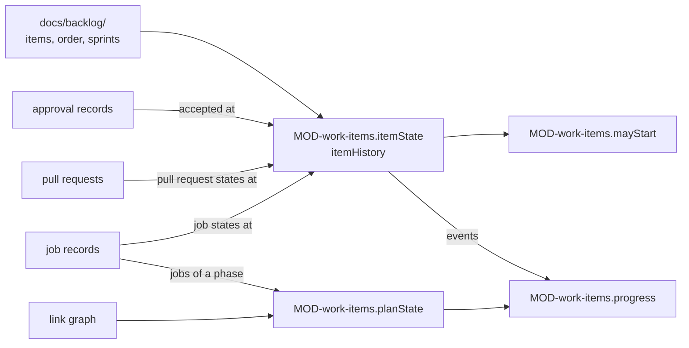

# ARC-023 The backlog, sprints and progress

## Context

A product whose model pulls its work from a backlog keeps the backlog in its own repository: items that name what
they realise, an order, and in Scrum the sprints with their selection (UC-032). An issue becomes an item that names
it as its origin (UC-033). A sprint ends with the review of its increment and a retrospective, by a person or by an
agent the Product Owner assigned (UC-041). A product whose model plans its work has no backlog: its plan is every
accepted requirement in every phase. Whether an item is ready, in progress, blocked or done, how far the plan has
come, how a sprint burns down and how work flows are shown on the process dashboard in the model's own measure
(UC-035) — and nothing of it is stored.

The facts these states come from lie elsewhere: the acceptance of a requirement or use case in its approval record
(ARC-021), a job's states in its record (ARC-010), a pull request's states at the repository's host (ARC-004), and what
traces to a requirement in the link graph of the commit (ARC-006). The workflow, its phases, its kinds of artifact and
its flow control come from the product's declaration (ARC-019).

## Decision

1. **The backlog is files under `docs/backlog/` of the product repository.** An item is
   `docs/backlog/ITM-<nnn>-<slug>.md`: front matter `id`, `title`, `kind` — `implementation`, `refactoring` or
   `measurement` —, `realises`, `modules`, `depends_on` and `origin`; then its title, the register line,
   `## Outcome`, `## Acceptance criteria`, and any other section, which is kept as it stands. The order is
   `docs/backlog/order.md`, one item per numbered line under `## Order`; an item it does not list is appended by its
   identifier, and the sections after the order are kept. A sprint is `docs/backlog/sprints/sprint-<nn>.md`, its close
   `docs/backlog/sprints/sprint-<nn>-close.md`. No file holds a state; an item names its origins by identifier or
   address and holds no date of a change. A new item gets the identifier one above the highest ever given, those only
   the version history holds included.
2. **What an item realises is checked against the product** (`MOD-work-items.itemProblems`): an item that realises
   nothing, names what is neither a requirement of the SPEC, a use case nor a name an open queue entry adds, or names no
   origin is an error; a name an open proposal changes or removes, and an item restating another, are warnings. A bug's
   item realises the requirement the code violates; a change's item the names its queue entries add or change, and it
   waits for their acceptance (`MOD-work-items.itemFromIssue`). A bug's item enters the order at the top, a change's at
   the bottom, unless the Product Owner places it elsewhere.
3. **An item's state is derived from dated facts** (`MOD-work-items.itemState`): when each name it realises was
   accepted, when the proposals that change those names were opened and decided, every state its jobs entered, the
   rejections of its jobs at gates, and every state its pull requests entered. The first rule that applies gives the
   state: *done* once a pull request of it is merged or its last job is done; *in progress* while its last job is queued
   or running; *blocked* while that job waits at a gate; *in progress* while a pull request opened after its last job
   ended — or, without any job, a pull request — is open; *waiting for acceptance* while a name it realises is not accepted or an open proposal changes it; *ready* when
   its last job ended at a rejected gate — the rejection is the reason — or a name it realises was accepted after that
   job ended; *blocked* when that job failed or ended without a record; *ready* otherwise. An item counts against the
   WIP limit while it is in progress or waits at a gate. The same rules applied at each fact's time give the item's
   history (`MOD-work-items.itemHistory`), from which burn-down and cumulative flow are drawn.
4. **An implementation job starts only where `MOD-work-items.mayStart` holds**: in work pulled from a backlog it
   implements one item; every name the item realises is accepted; the item is not in progress, done or waiting at a gate
   — a failed item may start again —; where the model works in sprints, the item is selected for the running sprint;
   and fewer items count against the WIP limit than the limit. The run engine and the dashboard ask the same function.
5. **A sprint is planned, runs and ends by its file.** `MOD-work-items.planSprint` gives the next identifier, refuses an
   item waiting for acceptance or done, sets the end of the time box to the start plus the model's length less one day,
   and fills the declaration's branch pattern for a sprint (`sprint/<nn>`). The running sprint is the one started, not
   ended and inside its time box (`MOD-work-items.currentSprint`). A new selection for the running sprint is a new
   Start sprint decision: it names what it adds and removes, adds only selectable items, and keeps every done item
   (`MOD-work-items.replanSprint`). A sprint has ended when its end is recorded, its time
   box is over, or — without a time box — every selected item is done (`MOD-work-items.sprintEnded`); a close assigned
   to an agent starts by itself once a sprint has ended and has no close record.
6. **Closing a sprint writes its record once** (`MOD-work-items.sprintClose`): the review of the increment — the goal,
   the done items, the stakeholders or that none took part, the sources of the feedback, and the feedback —, the
   unfinished items and where each goes with its reason, the sprint's numbers (`MOD-work-items.sprintNumbers`, from the
   job and test records), and the retrospective; the sprint file with its end; and one new item per feedback that asks
   for one, naming the close record as its origin. A close without a retrospective entry, with an undecided item, or —
   by an agent — without the sources of its feedback or the reasons for its decisions is refused. What an agent's
   retrospective recommends for the model, the Definition of Done or a participant is returned as a proposal for a
   person and never written; a person's entries name where the change is made (UC-031, UC-002, UC-017). The next
   sprint's planning selects what the record sends into it (`MOD-work-items.carriedOver`).
7. **The plan of planned work** is every accepted requirement in every phase of the workflow
   (`MOD-work-items.derivePlan`). An entry's state (`MOD-work-items.planState`) comes from what its phase produces,
   traced to its requirement in the link graph: a phase producing kinds of artifact is done when each kind is complete
   for the requirement — an accepted use case realising it, an accepted decision naming it or designing a module that
   realises it, every module realising it with code and tests, a test guarding it —, and in progress when one is begun
   or a job of the phase works on it. A phase producing no kind of artifact is done when a job of the phase working on
   the requirement is done, or when the gate leaving the phase is passed and every earlier phase is done for it.
8. **Progress is computed in the measure the model names** (`MOD-work-items.progress`): plan entries per phase that are
   done, in progress and open; the selected items not done at the end of each day of the running sprint, or of the last
   one when none runs; or the items in each state at the end of each day, from the first event or from the day the
   declared model took effect, whichever is later.



## Alternatives

- **A state field in each item file** — `PROGRESS AND JOB STATE ARE DERIVED, NOT STORED`; a stored state would drift
  from the records it repeats.
- **The issue tracker's boards as the backlog** — `THE BACKLOG LIVES IN THE PRODUCT REPOSITORY`; a board is not
  versioned with the code, and its items name no requirement.
- **One file holding every item** — parallel teams would change the same file, and an item would have no path of its
  own to link to.
- **Story points and velocity** — not one of the three measures the SPEC names; the burn-down counts items.
- **Plan entries from job records alone** — a requirement or decision accepted without a job would never count; from
  artifacts alone, a phase that produces none, such as validation, could never be done.

## Consequences

- The dashboard's backlog, progress and job views, the run engine and the closing agent read the same states; none of
  them keeps its own.
- An item that waits for acceptance becomes ready by itself on the commit that accepts its last name.
- No use-case step is realised here. The steps of UC-032, UC-033, UC-035 and UC-041 are actions on the dashboard's
  pages; they are realised where those pages are designed, by the page's interfaces together with these.
- Agent M's own backlog files are read in this format; their further sections stay as notes, and the dates their
  origins and notes name are removed when the backlog is rebuilt from the architecture.

## Modules

### MOD-work-items

```json module
{
  "id": "MOD-work-items",
  "folder": "src/work-items/",
  "layer": "kernel",
  "responsibility": "Reads and writes a product's backlog — items, their order, sprints with their planning and close —, derives the plan of a planned workflow and the state of its entries, each item's state and history, whether a job may start, and the progress in the model's own measure; it stores nothing.",
  "realises": ["A PLAN COVERS THE WHOLE SPECIFICATION", "AGILE IMPLEMENTATION STARTS FROM THE BACKLOG", "THE BACKLOG LIVES IN THE PRODUCT REPOSITORY", "A BACKLOG ITEM NAMES WHAT IT REALISES", "NOTHING IS IMPLEMENTED BEFORE IT IS ACCEPTED", "NO JOB STARTS ABOVE THE WORK-IN-PROGRESS LIMIT", "A TIME BOX WORKS ONLY ON WHAT WAS SELECTED FOR IT", "PROGRESS AND JOB STATE ARE DERIVED, NOT STORED", "PROGRESS IS SHOWN IN THE MODEL'S OWN MEASURE", "A SPRINT ENDS WITH A REVIEW OF ITS INCREMENT", "A SPRINT ENDS WITH A RETROSPECTIVE", "CLOSING A SPRINT CAN BE ASSIGNED TO A PARTICIPANT", "AN AGENT'S REVIEW NAMES WHERE ITS FEEDBACK CAME FROM", "AN AGENT'S RETROSPECTIVE CHANGES NO PROCESS BY ITSELF", "EVERY ARTIFACT NAMES ITS ORIGIN", "THE NAME IS THE ID AND IT SURVIVES"],
  "owns": ["BacklogItem", "IssueFacts", "BacklogOrder", "Sprint", "SprintOrNone", "SprintPlan", "SprintReplanned", "SprintEnd", "PlanEntry", "PlanEntryState", "PhaseJob", "PlanFacts", "DatedName", "JobEvent", "PullRequestEvent", "ProposalPeriod", "Rejection", "ItemFacts", "ItemState", "ItemEvent", "StartQuestion", "StartCheck", "ProgressFacts", "PhaseProgress", "BurndownDay", "StateCounts", "FlowDay", "Progress", "SprintJob", "CostSum", "SprintNumbers", "Feedback", "SprintReview", "ItemDecision", "RetrospectiveEntry", "SprintCloseInput", "Closer", "ProcessProposal", "SprintClosed", "ItemFileContent", "SprintFileContent", "BacklogItemFile", "BacklogOrderFile", "SprintFile", "SprintCloseFile"],
  "uses": ["MOD-contracts", "MOD-traceability"]
}
```

```json interface
{
  "id": "MOD-work-items.parseItem",
  "summary": "A backlog item as its file holds it: identifier, title, kind, what it realises, its modules, the items it depends on, its origins, its outcome, its acceptance criteria, and its other sections as notes.",
  "params": [{ "name": "path", "type": "string" }, { "name": "text", "type": "string" }],
  "result": "BacklogItem",
  "async": false,
  "refusals": [
    { "code": "not-an-item", "when": "the path is not docs/backlog/ITM-<nnn>-<slug>.md" },
    { "code": "no-front-matter", "when": "the text does not begin with a front matter" },
    { "code": "id-mismatch", "when": "the front matter names another identifier than the path" }
  ],
  "examples": [
    {
      "name": "an item from an issue",
      "input": { "path": "docs/backlog/ITM-014-export-a-chapter-as-pdf.md", "text": "---\nid: ITM-014\ntitle: Export a chapter as PDF\nkind: implementation\nrealises:\n  - A CHAPTER IS EXPORTED\n  - UC-003\nmodules:\n  - MOD-export\ndepends_on:\n  - ITM-009\norigin:\n  - https://github.com/alice/thesis/issues/57\n---\n\n# ITM-014 Export a chapter as PDF\n\n**REGISTER**\n\n## Outcome\n\nThe author presses Export on a chapter and receives a PDF of it.\n\n## Acceptance criteria\n\n- The PDF holds the chapter's text and figures.\n" },
      "result": {
        "id": "ITM-014",
        "path": "docs/backlog/ITM-014-export-a-chapter-as-pdf.md",
        "title": "Export a chapter as PDF",
        "kind": "implementation",
        "realises": ["A CHAPTER IS EXPORTED", "UC-003"],
        "modules": ["MOD-export"],
        "dependsOn": ["ITM-009"],
        "origins": ["https://github.com/alice/thesis/issues/57"],
        "outcome": "The author presses Export on a chapter and receives a PDF of it.",
        "criteria": ["The PDF holds the chapter's text and figures."],
        "notes": ""
      }
    },
    {
      "name": "a file outside the backlog",
      "input": { "path": "docs/notes/ITM-014.md", "text": "---\nid: ITM-014\ntitle: Export a chapter as PDF\nkind: implementation\nrealises:\n  - A CHAPTER IS EXPORTED\n  - UC-003\nmodules:\n  - MOD-export\ndepends_on:\n  - ITM-009\norigin:\n  - https://github.com/alice/thesis/issues/57\n---\n\n# ITM-014 Export a chapter as PDF\n\n**REGISTER**\n\n## Outcome\n\nThe author presses Export on a chapter and receives a PDF of it.\n\n## Acceptance criteria\n\n- The PDF holds the chapter's text and figures.\n" },
      "refused": "not-an-item"
    },
    {
      "name": "a front matter naming another item",
      "input": { "path": "docs/backlog/ITM-015-export-a-chapter-as-pdf.md", "text": "---\nid: ITM-014\ntitle: Export a chapter as PDF\nkind: implementation\nrealises:\n  - A CHAPTER IS EXPORTED\n  - UC-003\nmodules:\n  - MOD-export\ndepends_on:\n  - ITM-009\norigin:\n  - https://github.com/alice/thesis/issues/57\n---\n\n# ITM-014 Export a chapter as PDF\n\n**REGISTER**\n\n## Outcome\n\nThe author presses Export on a chapter and receives a PDF of it.\n\n## Acceptance criteria\n\n- The PDF holds the chapter's text and figures.\n" },
      "refused": "id-mismatch"
    }
  ]
}
```

```json interface
{
  "id": "MOD-work-items.formatItem",
  "summary": "The canonical text of a backlog item: its front matter, its title, the register line, its outcome and acceptance criteria, then its notes.",
  "params": [{ "name": "item", "type": "BacklogItem" }],
  "result": "string",
  "async": false,
  "refusals": [],
  "examples": [
    {
      "name": "the item as read",
      "input": {
        "item": {
          "id": "ITM-014",
          "path": "docs/backlog/ITM-014-export-a-chapter-as-pdf.md",
          "title": "Export a chapter as PDF",
          "kind": "implementation",
          "realises": ["A CHAPTER IS EXPORTED", "UC-003"],
          "modules": ["MOD-export"],
          "dependsOn": ["ITM-009"],
          "origins": ["https://github.com/alice/thesis/issues/57"],
          "outcome": "The author presses Export on a chapter and receives a PDF of it.",
          "criteria": ["The PDF holds the chapter's text and figures."],
          "notes": ""
        }
      },
      "result": "---\nid: ITM-014\ntitle: Export a chapter as PDF\nkind: implementation\nrealises:\n  - A CHAPTER IS EXPORTED\n  - UC-003\nmodules:\n  - MOD-export\ndepends_on:\n  - ITM-009\norigin:\n  - https://github.com/alice/thesis/issues/57\n---\n\n# ITM-014 Export a chapter as PDF\n\n**REGISTER**\n\n## Outcome\n\nThe author presses Export on a chapter and receives a PDF of it.\n\n## Acceptance criteria\n\n- The PDF holds the chapter's text and figures.\n"
    }
  ]
}
```

```json interface
{
  "id": "MOD-work-items.itemPath",
  "summary": "Where an item's file lies: docs/backlog/<identifier>-<its title in lower case, words joined by hyphens, at most 60 characters>.md.",
  "params": [{ "name": "item", "type": "BacklogItem" }],
  "result": "string",
  "async": false,
  "refusals": [],
  "examples": [
    {
      "name": "an item",
      "input": {
        "item": {
          "id": "ITM-015",
          "path": "docs/backlog/ITM-015-write-a-chapter-in-the-editor.md",
          "title": "Write a chapter in the editor",
          "kind": "implementation",
          "realises": ["NO SERVER", "UC-002"],
          "modules": ["MOD-pages"],
          "dependsOn": [],
          "origins": ["UC-002"],
          "outcome": "Write a chapter in the editor.",
          "criteria": [],
          "notes": ""
        }
      },
      "result": "docs/backlog/ITM-015-write-a-chapter-in-the-editor.md"
    }
  ]
}
```

```json interface
{
  "id": "MOD-work-items.nextItemId",
  "summary": "The identifier a new item gets: one above the highest ever given, the identifiers the version history holds included, so that none is given twice.",
  "params": [{ "name": "ids", "type": "string[]" }],
  "result": "string",
  "async": false,
  "refusals": [],
  "examples": [
    {
      "name": "after an identifier only the version history holds",
      "input": { "ids": ["ITM-014", "ITM-016", "ITM-015", "ITM-020"] },
      "result": "ITM-021"
    }
  ]
}
```

```json interface
{
  "id": "MOD-work-items.itemProblems",
  "summary": "Every finding on an item: an error when it realises nothing, names what is neither a requirement, a use case nor a name an open proposal adds, or names no origin; a warning when an open proposal changes or removes what it realises, or when it restates another item.",
  "params": [
    { "name": "item", "type": "BacklogItem" },
    { "name": "known", "type": "string[]" },
    { "name": "changing", "type": "string[]" },
    { "name": "items", "type": "BacklogItem[]" }
  ],
  "result": "Finding[]",
  "async": false,
  "refusals": [],
  "examples": [
    {
      "name": "an unknown name, a changing one and a restated item",
      "input": {
        "item": {
          "id": "ITM-017",
          "path": "",
          "title": "Write a chapter in the editor",
          "kind": "implementation",
          "realises": ["NO SERVR", "ONE CLICK"],
          "modules": ["MOD-pages"],
          "dependsOn": [],
          "origins": ["UC-002"],
          "outcome": "Write a chapter in the editor.",
          "criteria": [],
          "notes": ""
        },
        "known": ["ONE CLICK", "NO SERVER", "EVERY TEXT IS REVIEWED", "A CHAPTER IS EXPORTED", "UC-001", "UC-002", "UC-003"],
        "changing": ["ONE CLICK"],
        "items": [
          {
            "id": "ITM-014",
            "path": "docs/backlog/ITM-014-export-a-chapter-as-pdf.md",
            "title": "Export a chapter as PDF",
            "kind": "implementation",
            "realises": ["A CHAPTER IS EXPORTED", "UC-003"],
            "modules": ["MOD-export"],
            "dependsOn": ["ITM-009"],
            "origins": ["https://github.com/alice/thesis/issues/57"],
            "outcome": "The author presses Export on a chapter and receives a PDF of it.",
            "criteria": ["The PDF holds the chapter's text and figures."],
            "notes": ""
          },
          {
            "id": "ITM-015",
            "path": "docs/backlog/ITM-015-write-a-chapter-in-the-editor.md",
            "title": "Write a chapter in the editor",
            "kind": "implementation",
            "realises": ["NO SERVER", "UC-002"],
            "modules": ["MOD-pages"],
            "dependsOn": [],
            "origins": ["UC-002"],
            "outcome": "Write a chapter in the editor.",
            "criteria": [],
            "notes": ""
          }
        ]
      },
      "result": [
        { "artifact": "ITM-017", "line": 1, "kind": "error", "what": "NO SERVR is no requirement, use case or open proposal of the product", "rule": "A BACKLOG ITEM NAMES WHAT IT REALISES", "fix": "name a requirement exactly, a use case by its identifier, or a name an open proposal adds" },
        { "artifact": "ITM-017", "line": 1, "kind": "warning", "what": "an open proposal changes or removes ONE CLICK", "rule": "A BACKLOG ITEM NAMES WHAT IT REALISES", "fix": "once it is decided, point the item at what replaces ONE CLICK, or remove the item" },
        { "artifact": "ITM-017", "line": 1, "kind": "warning", "what": "the item restates ITM-015", "rule": "EVERY ARTIFACT HAS AN IDENTIFIER", "fix": "add the origin to ITM-015 instead, or say what this item adds" }
      ]
    },
    {
      "name": "an item without what it realises and without origin",
      "input": {
        "item": {
          "id": "ITM-016",
          "path": "docs/backlog/ITM-016-accept-a-chapter-with-one-click.md",
          "title": "Accept a chapter with one click",
          "kind": "implementation",
          "realises": [],
          "modules": ["MOD-pages"],
          "dependsOn": [],
          "origins": [],
          "outcome": "Accept a chapter with one click.",
          "criteria": [],
          "notes": ""
        },
        "known": [],
        "changing": [],
        "items": []
      },
      "result": [
        { "artifact": "docs/backlog/ITM-016-accept-a-chapter-with-one-click.md", "line": 1, "kind": "error", "what": "the item realises nothing", "rule": "A BACKLOG ITEM NAMES WHAT IT REALISES", "fix": "name at least one requirement or use case it realises" },
        { "artifact": "docs/backlog/ITM-016-accept-a-chapter-with-one-click.md", "line": 1, "kind": "error", "what": "the item names no origin", "rule": "EVERY ARTIFACT NAMES ITS ORIGIN", "fix": "name where it came from: an issue's address, a requirement, a use case, a sprint's close record" }
      ]
    }
  ]
}
```

```json interface
{
  "id": "MOD-work-items.itemFromIssue",
  "summary": "A draft item for a classified issue: its title and outcome from the issue, its address as the origin, and what it realises — the requirement a bug violates, the names a change's queue entries add or change.",
  "params": [{ "name": "issue", "type": "IssueFacts" }],
  "result": "BacklogItem",
  "async": false,
  "refusals": [],
  "examples": [
    {
      "name": "a bug",
      "input": {
        "issue": {
          "url": "https://github.com/alice/thesis/issues/58",
          "title": "Export loses figures",
          "body": "The PDF has no figures.\n",
          "classification": "bug",
          "requirements": ["A CHAPTER IS EXPORTED"]
        }
      },
      "result": {
        "id": "",
        "path": "",
        "title": "Export loses figures",
        "kind": "implementation",
        "realises": ["A CHAPTER IS EXPORTED"],
        "modules": [],
        "dependsOn": [],
        "origins": ["https://github.com/alice/thesis/issues/58"],
        "outcome": "The PDF has no figures.",
        "criteria": [],
        "notes": ""
      }
    }
  ]
}
```

```json interface
{
  "id": "MOD-work-items.uncovered",
  "summary": "The names no item realises yet, in the order given.",
  "params": [{ "name": "names", "type": "string[]" }, { "name": "items", "type": "BacklogItem[]" }],
  "result": "string[]",
  "async": false,
  "refusals": [],
  "examples": [
    {
      "name": "two items, five names",
      "input": {
        "names": ["ONE CLICK", "NO SERVER", "A CHAPTER IS EXPORTED", "UC-001", "UC-003"],
        "items": [
          {
            "id": "ITM-014",
            "path": "docs/backlog/ITM-014-export-a-chapter-as-pdf.md",
            "title": "Export a chapter as PDF",
            "kind": "implementation",
            "realises": ["A CHAPTER IS EXPORTED", "UC-003"],
            "modules": ["MOD-export"],
            "dependsOn": ["ITM-009"],
            "origins": ["https://github.com/alice/thesis/issues/57"],
            "outcome": "The author presses Export on a chapter and receives a PDF of it.",
            "criteria": ["The PDF holds the chapter's text and figures."],
            "notes": ""
          },
          {
            "id": "ITM-015",
            "path": "docs/backlog/ITM-015-write-a-chapter-in-the-editor.md",
            "title": "Write a chapter in the editor",
            "kind": "implementation",
            "realises": ["NO SERVER", "UC-002"],
            "modules": ["MOD-pages"],
            "dependsOn": [],
            "origins": ["UC-002"],
            "outcome": "Write a chapter in the editor.",
            "criteria": [],
            "notes": ""
          }
        ]
      },
      "result": ["ONE CLICK", "UC-001"]
    }
  ]
}
```

```json interface
{
  "id": "MOD-work-items.backlogOrder",
  "summary": "The backlog in its order: the items its order file lists, in that order, then the items it does not list, by identifier; the names it lists that are no item; its title, introduction and the sections after the order, kept.",
  "params": [{ "name": "text", "type": "string" }, { "name": "ids", "type": "string[]" }],
  "result": "BacklogOrder",
  "async": false,
  "refusals": [],
  "examples": [
    {
      "name": "one item unplaced, one name no item",
      "input": {
        "text": "# Backlog order\n\n**REGISTER**\n\nThe order in which the items are worked on.\n\n## Order\n\n1. ITM-015\n2. ITM-009\n3. ITM-014\n\n## Conventions\n\n- A bug's item enters at the top.\n",
        "ids": ["ITM-014", "ITM-015", "ITM-016"]
      },
      "result": {
        "title": "Backlog order",
        "intro": "**REGISTER**\n\nThe order in which the items are worked on.",
        "order": ["ITM-015", "ITM-014", "ITM-016"],
        "unplaced": ["ITM-016"],
        "unknown": ["ITM-009"],
        "notes": "## Conventions\n\n- A bug's item enters at the top."
      }
    }
  ]
}
```

```json interface
{
  "id": "MOD-work-items.formatOrder",
  "summary": "The canonical text of the order file.",
  "params": [{ "name": "backlog", "type": "BacklogOrder" }],
  "result": "string",
  "async": false,
  "refusals": [],
  "examples": [
    {
      "name": "the order as read",
      "input": {
        "backlog": {
          "title": "Backlog order",
          "intro": "**REGISTER**\n\nThe order in which the items are worked on.",
          "order": ["ITM-015", "ITM-014", "ITM-016"],
          "unplaced": ["ITM-016"],
          "unknown": ["ITM-009"],
          "notes": "## Conventions\n\n- A bug's item enters at the top."
        }
      },
      "result": "# Backlog order\n\n**REGISTER**\n\nThe order in which the items are worked on.\n\n## Order\n\n1. ITM-015\n2. ITM-014\n3. ITM-016\n\n## Conventions\n\n- A bug's item enters at the top.\n"
    }
  ]
}
```

```json interface
{
  "id": "MOD-work-items.parseSprint",
  "summary": "A sprint as its file holds it: its goal, its start, its end — empty while it runs —, the end of its time box — empty without one —, its selection, who closes it, and its branch — empty without one.",
  "params": [{ "name": "path", "type": "string" }, { "name": "text", "type": "string" }],
  "result": "Sprint",
  "async": false,
  "refusals": [
    { "code": "not-a-sprint", "when": "the path is not docs/backlog/sprints/sprint-<nn>.md, or its front matter names another sprint" },
    { "code": "bad-date", "when": "a start, end or end of the time box is neither empty nor a date YYYY-MM-DD" }
  ],
  "examples": [
    {
      "name": "a running sprint",
      "input": { "path": "docs/backlog/sprints/sprint-04.md", "text": "---\nid: sprint-04\ngoal: The author exports and writes chapters\nstart: 2026-10-05\nend:\ntime_box_end: 2026-10-18\nselection:\n  - ITM-014\n  - ITM-015\ncloser: cli-dev\nbranch: sprint/04\n---\n\n# sprint-04\n\n**REGISTER**\n\nThe author exports and writes chapters\n" },
      "result": {
        "id": "sprint-04",
        "path": "docs/backlog/sprints/sprint-04.md",
        "goal": "The author exports and writes chapters",
        "start": "2026-10-05",
        "end": "",
        "timeBoxEnd": "2026-10-18",
        "selection": ["ITM-014", "ITM-015"],
        "closer": "cli-dev",
        "branch": "sprint/04"
      }
    },
    {
      "name": "a close record",
      "input": { "path": "docs/backlog/sprints/sprint-04-close.md", "text": "# Close of sprint-04\n" },
      "refused": "not-a-sprint"
    },
    {
      "name": "a start that is no date",
      "input": { "path": "docs/backlog/sprints/sprint-04.md", "text": "---\nid: sprint-04\ngoal: The author exports and writes chapters\nstart: Monday\nend:\ntime_box_end: 2026-10-18\nselection:\n  - ITM-014\n  - ITM-015\ncloser: cli-dev\nbranch: sprint/04\n---\n\n# sprint-04\n\n**REGISTER**\n\nThe author exports and writes chapters\n" },
      "refused": "bad-date"
    }
  ]
}
```

```json interface
{
  "id": "MOD-work-items.formatSprint",
  "summary": "The canonical text of a sprint file.",
  "params": [{ "name": "sprint", "type": "Sprint" }],
  "result": "string",
  "async": false,
  "refusals": [],
  "examples": [
    {
      "name": "the sprint as read",
      "input": {
        "sprint": {
          "id": "sprint-04",
          "path": "docs/backlog/sprints/sprint-04.md",
          "goal": "The author exports and writes chapters",
          "start": "2026-10-05",
          "end": "",
          "timeBoxEnd": "2026-10-18",
          "selection": ["ITM-014", "ITM-015"],
          "closer": "cli-dev",
          "branch": "sprint/04"
        }
      },
      "result": "---\nid: sprint-04\ngoal: The author exports and writes chapters\nstart: 2026-10-05\nend:\ntime_box_end: 2026-10-18\nselection:\n  - ITM-014\n  - ITM-015\ncloser: cli-dev\nbranch: sprint/04\n---\n\n# sprint-04\n\n**REGISTER**\n\nThe author exports and writes chapters\n"
    }
  ]
}
```

```json interface
{
  "id": "MOD-work-items.planSprint",
  "summary": "A new sprint: the next identifier, the goal, the start, the end of the time box the model's length gives — the start plus its length, less one day —, the selection, who closes it, and the branch the declaration's pattern gives.",
  "params": [{ "name": "plan", "type": "SprintPlan" }],
  "result": "Sprint",
  "async": false,
  "refusals": [
    { "code": "no-goal", "when": "the goal is empty" },
    { "code": "no-selection", "when": "nothing is selected" },
    { "code": "not-selectable", "when": "a selected item waits for acceptance, is done, or is no item of the backlog" },
    { "code": "bad-time-box", "when": "the model's time box is not a number of days or weeks" }
  ],
  "examples": [
    {
      "name": "a two-week sprint with a branch of its own",
      "input": {
        "plan": {
          "ids": ["sprint-02", "sprint-03"],
          "goal": "The author exports and writes chapters",
          "start": "2026-10-05",
          "timeBox": "2 weeks",
          "selection": ["ITM-014", "ITM-015"],
          "states": [
            { "item": "ITM-015", "state": "ready", "reasons": [], "inWip": false },
            { "item": "ITM-014", "state": "ready", "reasons": [], "inWip": false }
          ],
          "closer": "cli-dev",
          "branchPattern": "sprint/<nn>"
        }
      },
      "result": {
        "id": "sprint-04",
        "path": "docs/backlog/sprints/sprint-04.md",
        "goal": "The author exports and writes chapters",
        "start": "2026-10-05",
        "end": "",
        "timeBoxEnd": "2026-10-18",
        "selection": ["ITM-014", "ITM-015"],
        "closer": "cli-dev",
        "branch": "sprint/04"
      }
    },
    {
      "name": "an item waiting for acceptance",
      "input": {
        "plan": {
          "ids": [],
          "goal": "Export",
          "start": "2026-10-05",
          "timeBox": "",
          "selection": ["ITM-014"],
          "states": [
            {
              "item": "ITM-014",
              "state": "waiting-for-acceptance",
              "reasons": ["A CHAPTER IS EXPORTED is not accepted"],
              "inWip": false
            }
          ],
          "closer": "alice",
          "branchPattern": ""
        }
      },
      "refused": "not-selectable"
    }
  ]
}
```

```json interface
{
  "id": "MOD-work-items.replanSprint",
  "summary": "A new selection for the running sprint, a new Start sprint decision: the sprint with it, and what it adds and removes; an added item must be neither waiting for acceptance nor done, and a done item stays, since it belongs to the increment.",
  "params": [
    { "name": "sprint", "type": "Sprint" },
    { "name": "selection", "type": "string[]" },
    { "name": "states", "type": "ItemState[]" }
  ],
  "result": "SprintReplanned",
  "async": false,
  "refusals": [
    { "code": "no-selection", "when": "nothing is selected" },
    { "code": "not-selectable", "when": "an added item waits for acceptance, is done, or is no item of the backlog" },
    { "code": "not-removable", "when": "a done item would leave the selection" }
  ],
  "examples": [
    {
      "name": "one item in, one out",
      "input": {
        "sprint": {
          "id": "sprint-04",
          "path": "docs/backlog/sprints/sprint-04.md",
          "goal": "The author exports and writes chapters",
          "start": "2026-10-05",
          "end": "",
          "timeBoxEnd": "2026-10-18",
          "selection": ["ITM-014", "ITM-015"],
          "closer": "cli-dev",
          "branch": "sprint/04"
        },
        "selection": ["ITM-014", "ITM-016"],
        "states": [
          { "item": "ITM-016", "state": "ready", "reasons": [], "inWip": false },
          { "item": "ITM-014", "state": "in-progress", "reasons": [], "inWip": true },
          { "item": "ITM-015", "state": "ready", "reasons": [], "inWip": false }
        ]
      },
      "result": {
        "sprint": {
          "id": "sprint-04",
          "path": "docs/backlog/sprints/sprint-04.md",
          "goal": "The author exports and writes chapters",
          "start": "2026-10-05",
          "end": "",
          "timeBoxEnd": "2026-10-18",
          "selection": ["ITM-014", "ITM-016"],
          "closer": "cli-dev",
          "branch": "sprint/04"
        },
        "added": ["ITM-016"],
        "removed": ["ITM-015"]
      }
    },
    {
      "name": "a done item taken out",
      "input": {
        "sprint": {
          "id": "sprint-04",
          "path": "docs/backlog/sprints/sprint-04.md",
          "goal": "The author exports and writes chapters",
          "start": "2026-10-05",
          "end": "",
          "timeBoxEnd": "2026-10-18",
          "selection": ["ITM-014", "ITM-015"],
          "closer": "cli-dev",
          "branch": "sprint/04"
        },
        "selection": ["ITM-014"],
        "states": [{ "item": "ITM-015", "state": "done", "reasons": [], "inWip": false }]
      },
      "refused": "not-removable"
    }
  ]
}
```

```json interface
{
  "id": "MOD-work-items.currentSprint",
  "summary": "The sprint that runs on a day: started, not ended and not past the end of its time box; the latest started where two would; null when none does.",
  "params": [{ "name": "sprints", "type": "Sprint[]" }, { "name": "today", "type": "string" }],
  "result": "SprintOrNone",
  "async": false,
  "refusals": [],
  "examples": [
    {
      "name": "the running one of two",
      "input": {
        "sprints": [
          {
            "id": "sprint-03",
            "path": "docs/backlog/sprints/sprint-03.md",
            "goal": "The author reviews chapters",
            "start": "2026-09-21",
            "end": "2026-10-02",
            "timeBoxEnd": "2026-10-04",
            "selection": ["ITM-010", "ITM-011"],
            "closer": "alice",
            "branch": "sprint/03"
          },
          {
            "id": "sprint-04",
            "path": "docs/backlog/sprints/sprint-04.md",
            "goal": "The author exports and writes chapters",
            "start": "2026-10-05",
            "end": "",
            "timeBoxEnd": "2026-10-18",
            "selection": ["ITM-014", "ITM-015"],
            "closer": "cli-dev",
            "branch": "sprint/04"
          }
        ],
        "today": "2026-10-08"
      },
      "result": {
        "id": "sprint-04",
        "path": "docs/backlog/sprints/sprint-04.md",
        "goal": "The author exports and writes chapters",
        "start": "2026-10-05",
        "end": "",
        "timeBoxEnd": "2026-10-18",
        "selection": ["ITM-014", "ITM-015"],
        "closer": "cli-dev",
        "branch": "sprint/04"
      }
    },
    {
      "name": "after its time box",
      "input": {
        "sprints": [
          {
            "id": "sprint-03",
            "path": "docs/backlog/sprints/sprint-03.md",
            "goal": "The author reviews chapters",
            "start": "2026-09-21",
            "end": "2026-10-02",
            "timeBoxEnd": "2026-10-04",
            "selection": ["ITM-010", "ITM-011"],
            "closer": "alice",
            "branch": "sprint/03"
          },
          {
            "id": "sprint-04",
            "path": "docs/backlog/sprints/sprint-04.md",
            "goal": "The author exports and writes chapters",
            "start": "2026-10-05",
            "end": "",
            "timeBoxEnd": "2026-10-18",
            "selection": ["ITM-014", "ITM-015"],
            "closer": "cli-dev",
            "branch": "sprint/04"
          }
        ],
        "today": "2026-10-20"
      },
      "result": null
    }
  ]
}
```

```json interface
{
  "id": "MOD-work-items.sprintEnded",
  "summary": "Whether a sprint has ended, and why: its end is recorded, its time box is over, or — without a time box — every selected item is done.",
  "params": [
    { "name": "sprint", "type": "Sprint" },
    { "name": "today", "type": "string" },
    { "name": "done", "type": "string[]" }
  ],
  "result": "SprintEnd",
  "async": false,
  "refusals": [],
  "examples": [
    {
      "name": "without a time box, every item done",
      "input": {
        "sprint": {
          "id": "sprint-04",
          "path": "docs/backlog/sprints/sprint-04.md",
          "goal": "The author exports and writes chapters",
          "start": "2026-10-05",
          "end": "",
          "timeBoxEnd": "",
          "selection": ["ITM-014", "ITM-015"],
          "closer": "cli-dev",
          "branch": "sprint/04"
        },
        "today": "2026-10-09",
        "done": ["ITM-014", "ITM-015"]
      },
      "result": { "ended": true, "reason": "every selected item is done" }
    },
    {
      "name": "inside its time box",
      "input": {
        "sprint": {
          "id": "sprint-04",
          "path": "docs/backlog/sprints/sprint-04.md",
          "goal": "The author exports and writes chapters",
          "start": "2026-10-05",
          "end": "",
          "timeBoxEnd": "2026-10-18",
          "selection": ["ITM-014", "ITM-015"],
          "closer": "cli-dev",
          "branch": "sprint/04"
        },
        "today": "2026-10-09",
        "done": ["ITM-014", "ITM-015"]
      },
      "result": { "ended": false, "reason": "" }
    }
  ]
}
```

```json interface
{
  "id": "MOD-work-items.derivePlan",
  "summary": "The plan of planned work: every accepted requirement in every phase of the workflow, requirement by requirement in the order of the phases; none for pulled work.",
  "params": [
    { "name": "kind", "type": "string" },
    { "name": "phases", "type": "string[]" },
    { "name": "requirements", "type": "string[]" }
  ],
  "result": "PlanEntry[]",
  "async": false,
  "refusals": [],
  "examples": [
    {
      "name": "two requirements, six phases",
      "input": {
        "kind": "planned",
        "phases": ["Requirements", "Design", "Implementation", "Testing", "Validation", "Deployment"],
        "requirements": ["ONE CLICK", "NO SERVER"]
      },
      "result": [
        { "requirement": "ONE CLICK", "phase": "Requirements" },
        { "requirement": "ONE CLICK", "phase": "Design" },
        { "requirement": "ONE CLICK", "phase": "Implementation" },
        { "requirement": "ONE CLICK", "phase": "Testing" },
        { "requirement": "ONE CLICK", "phase": "Validation" },
        { "requirement": "ONE CLICK", "phase": "Deployment" },
        { "requirement": "NO SERVER", "phase": "Requirements" },
        { "requirement": "NO SERVER", "phase": "Design" },
        { "requirement": "NO SERVER", "phase": "Implementation" },
        { "requirement": "NO SERVER", "phase": "Testing" },
        { "requirement": "NO SERVER", "phase": "Validation" },
        { "requirement": "NO SERVER", "phase": "Deployment" }
      ]
    },
    {
      "name": "one more requirement accepted",
      "input": {
        "kind": "planned",
        "phases": ["Requirements", "Design", "Implementation", "Testing", "Validation", "Deployment"],
        "requirements": ["ONE CLICK", "NO SERVER", "EVERY TEXT IS REVIEWED"]
      },
      "result": [
        { "requirement": "ONE CLICK", "phase": "Requirements" },
        { "requirement": "ONE CLICK", "phase": "Design" },
        { "requirement": "ONE CLICK", "phase": "Implementation" },
        { "requirement": "ONE CLICK", "phase": "Testing" },
        { "requirement": "ONE CLICK", "phase": "Validation" },
        { "requirement": "ONE CLICK", "phase": "Deployment" },
        { "requirement": "NO SERVER", "phase": "Requirements" },
        { "requirement": "NO SERVER", "phase": "Design" },
        { "requirement": "NO SERVER", "phase": "Implementation" },
        { "requirement": "NO SERVER", "phase": "Testing" },
        { "requirement": "NO SERVER", "phase": "Validation" },
        { "requirement": "NO SERVER", "phase": "Deployment" },
        { "requirement": "EVERY TEXT IS REVIEWED", "phase": "Requirements" },
        { "requirement": "EVERY TEXT IS REVIEWED", "phase": "Design" },
        { "requirement": "EVERY TEXT IS REVIEWED", "phase": "Implementation" },
        { "requirement": "EVERY TEXT IS REVIEWED", "phase": "Testing" },
        { "requirement": "EVERY TEXT IS REVIEWED", "phase": "Validation" },
        { "requirement": "EVERY TEXT IS REVIEWED", "phase": "Deployment" }
      ]
    },
    {
      "name": "pulled work",
      "input": {
        "kind": "pulled",
        "phases": ["Requirements", "Design", "Implementation", "Testing", "Validation", "Deployment"],
        "requirements": ["ONE CLICK", "NO SERVER", "EVERY TEXT IS REVIEWED"]
      },
      "result": []
    }
  ]
}
```

```json interface
{
  "id": "MOD-work-items.planState",
  "summary": "The state of each plan entry. A phase that produces kinds of artifact — requirement, UC, ARC, MOD, TST — is done for a requirement when each is complete for it: an accepted use case realising it, an accepted decision naming it or designing a module that realises it, every module realising it with code and tests, a test guarding it; in progress when one is begun or a job of the phase works on it; open otherwise. Any other phase is done for a requirement when a job of the phase working on it is done, or when the gate leaving the phase is passed and every earlier phase is done for it; in progress while such a job is queued, running or waiting at a gate.",
  "params": [
    { "name": "plan", "type": "PlanEntry[]" },
    { "name": "phases", "type": "WorkflowPhase[]" },
    { "name": "facts", "type": "PlanFacts" }
  ],
  "result": "PlanEntryState[]",
  "async": false,
  "refusals": [],
  "examples": [
    {
      "name": "a V-model product midway",
      "input": {
        "plan": [
          { "requirement": "ONE CLICK", "phase": "Requirements" },
          { "requirement": "ONE CLICK", "phase": "Design" },
          { "requirement": "ONE CLICK", "phase": "Implementation" },
          { "requirement": "ONE CLICK", "phase": "Testing" },
          { "requirement": "ONE CLICK", "phase": "Validation" },
          { "requirement": "ONE CLICK", "phase": "Deployment" },
          { "requirement": "NO SERVER", "phase": "Requirements" },
          { "requirement": "NO SERVER", "phase": "Design" },
          { "requirement": "NO SERVER", "phase": "Implementation" },
          { "requirement": "NO SERVER", "phase": "Testing" },
          { "requirement": "NO SERVER", "phase": "Validation" },
          { "requirement": "NO SERVER", "phase": "Deployment" },
          { "requirement": "EVERY TEXT IS REVIEWED", "phase": "Requirements" },
          { "requirement": "EVERY TEXT IS REVIEWED", "phase": "Design" },
          { "requirement": "EVERY TEXT IS REVIEWED", "phase": "Implementation" },
          { "requirement": "EVERY TEXT IS REVIEWED", "phase": "Testing" },
          { "requirement": "EVERY TEXT IS REVIEWED", "phase": "Validation" },
          { "requirement": "EVERY TEXT IS REVIEWED", "phase": "Deployment" }
        ],
        "phases": [
          {
            "name": "Requirements",
            "role": "Analyst",
            "produces": "requirements, UC",
            "kinds": ["UC", "requirement"],
            "line": 14,
            "practice": ""
          },
          { "name": "Design", "role": "Architect", "produces": "ARC", "kinds": ["ARC"], "line": 15, "practice": "" },
          {
            "name": "Implementation",
            "role": "Developers",
            "produces": "MOD",
            "kinds": ["MOD"],
            "line": 16,
            "practice": ""
          },
          { "name": "Testing", "role": "Tester", "produces": "TST", "kinds": ["TST"], "line": 17, "practice": "" },
          {
            "name": "Validation",
            "role": "Analyst",
            "produces": "the validation of the requirements",
            "kinds": [],
            "line": 18,
            "practice": ""
          },
          {
            "name": "Deployment",
            "role": "Operator",
            "produces": "the deployed release",
            "kinds": [],
            "line": 14,
            "practice": "devops"
          }
        ],
        "facts": {
          "graph": {
            "nodes": [
              { "id": "ARC-001", "kind": "architecture-decision", "path": "docs/architecture/ARC-001-static-pages.md", "status": "accepted" },
              { "id": "ARC-002", "kind": "architecture-decision", "path": "docs/architecture/ARC-002-export.md", "status": "open" },
              { "id": "EVERY TEXT IS REVIEWED", "kind": "requirement", "path": "SPEC.md", "status": "accepted" },
              { "id": "MOD-export", "kind": "module", "path": "docs/architecture/ARC-002-export.md", "status": "open" },
              { "id": "MOD-pages", "kind": "module", "path": "docs/architecture/ARC-001-static-pages.md", "status": "accepted" },
              { "id": "NO SERVER", "kind": "requirement", "path": "SPEC.md", "status": "accepted" },
              { "id": "ONE CLICK", "kind": "requirement", "path": "SPEC.md", "status": "accepted" },
              { "id": "UC-001", "kind": "use-case", "path": "docs/use-cases/UC-001-accept-a-chapter.md", "status": "accepted" },
              { "id": "UC-002", "kind": "use-case", "path": "docs/use-cases/UC-002-write-a-chapter.md", "status": "accepted" },
              { "id": "src/pages/index.mjs", "kind": "code", "path": "src/pages/index.mjs", "status": "" },
              { "id": "tests/pages.test.mjs", "kind": "test", "path": "tests/pages.test.mjs", "status": "" }
            ],
            "edges": [
              { "from": "ARC-001", "to": "NO SERVER", "via": "forced_by" },
              { "from": "ARC-001", "to": "UC-001", "via": "forced_by" },
              { "from": "ARC-001", "to": "MOD-pages", "via": "designs" },
              { "from": "MOD-pages", "to": "NO SERVER", "via": "realises" },
              { "from": "MOD-pages", "to": "EVERY TEXT IS REVIEWED", "via": "realises" },
              { "from": "ARC-002", "to": "EVERY TEXT IS REVIEWED", "via": "forced_by" },
              { "from": "ARC-002", "to": "UC-003", "via": "forced_by" },
              { "from": "ARC-002", "to": "MOD-export", "via": "designs" },
              { "from": "MOD-export", "to": "EVERY TEXT IS REVIEWED", "via": "realises" },
              { "from": "MOD-export", "to": "MOD-pages", "via": "uses" },
              { "from": "UC-001", "to": "ONE CLICK", "via": "realises" },
              { "from": "UC-001", "to": "EVERY TEXT IS REVIEWED", "via": "realises" },
              { "from": "UC-002", "to": "NO SERVER", "via": "realises" },
              { "from": "src/pages/index.mjs", "to": "MOD-pages", "via": "in" },
              { "from": "tests/pages.test.mjs", "to": "MOD-pages", "via": "exercises" },
              { "from": "tests/pages.test.mjs", "to": "EVERY TEXT IS REVIEWED", "via": "guards" },
              { "from": "tests/pages.test.mjs", "to": "NO SERVER", "via": "guards" }
            ],
            "modules": [
              { "id": "MOD-export", "folder": "src/export/" },
              { "id": "MOD-pages", "folder": "src/pages/" }
            ],
            "unknown": [{ "name": "UC-003", "from": ["ARC-002"] }]
          },
          "jobs": [
            { "id": "JOB-20261008-0900-e5f6", "phase": "Validation", "modules": ["MOD-pages"], "state": "running" }
          ],
          "gatesPassed": []
        }
      },
      "result": [
        { "requirement": "ONE CLICK", "phase": "Requirements", "state": "done" },
        { "requirement": "ONE CLICK", "phase": "Design", "state": "open" },
        { "requirement": "ONE CLICK", "phase": "Implementation", "state": "open" },
        { "requirement": "ONE CLICK", "phase": "Testing", "state": "open" },
        { "requirement": "ONE CLICK", "phase": "Validation", "state": "open" },
        { "requirement": "ONE CLICK", "phase": "Deployment", "state": "open" },
        { "requirement": "NO SERVER", "phase": "Requirements", "state": "done" },
        { "requirement": "NO SERVER", "phase": "Design", "state": "done" },
        { "requirement": "NO SERVER", "phase": "Implementation", "state": "done" },
        { "requirement": "NO SERVER", "phase": "Testing", "state": "done" },
        { "requirement": "NO SERVER", "phase": "Validation", "state": "in-progress" },
        { "requirement": "NO SERVER", "phase": "Deployment", "state": "open" },
        { "requirement": "EVERY TEXT IS REVIEWED", "phase": "Requirements", "state": "done" },
        { "requirement": "EVERY TEXT IS REVIEWED", "phase": "Design", "state": "done" },
        { "requirement": "EVERY TEXT IS REVIEWED", "phase": "Implementation", "state": "in-progress" },
        { "requirement": "EVERY TEXT IS REVIEWED", "phase": "Testing", "state": "done" },
        { "requirement": "EVERY TEXT IS REVIEWED", "phase": "Validation", "state": "in-progress" },
        { "requirement": "EVERY TEXT IS REVIEWED", "phase": "Deployment", "state": "open" }
      ]
    },
    {
      "name": "after the gate that leaves Validation",
      "input": {
        "plan": [
          { "requirement": "ONE CLICK", "phase": "Requirements" },
          { "requirement": "ONE CLICK", "phase": "Design" },
          { "requirement": "ONE CLICK", "phase": "Implementation" },
          { "requirement": "ONE CLICK", "phase": "Testing" },
          { "requirement": "ONE CLICK", "phase": "Validation" },
          { "requirement": "ONE CLICK", "phase": "Deployment" },
          { "requirement": "NO SERVER", "phase": "Requirements" },
          { "requirement": "NO SERVER", "phase": "Design" },
          { "requirement": "NO SERVER", "phase": "Implementation" },
          { "requirement": "NO SERVER", "phase": "Testing" },
          { "requirement": "NO SERVER", "phase": "Validation" },
          { "requirement": "NO SERVER", "phase": "Deployment" },
          { "requirement": "EVERY TEXT IS REVIEWED", "phase": "Requirements" },
          { "requirement": "EVERY TEXT IS REVIEWED", "phase": "Design" },
          { "requirement": "EVERY TEXT IS REVIEWED", "phase": "Implementation" },
          { "requirement": "EVERY TEXT IS REVIEWED", "phase": "Testing" },
          { "requirement": "EVERY TEXT IS REVIEWED", "phase": "Validation" },
          { "requirement": "EVERY TEXT IS REVIEWED", "phase": "Deployment" }
        ],
        "phases": [
          {
            "name": "Requirements",
            "role": "Analyst",
            "produces": "requirements, UC",
            "kinds": ["UC", "requirement"],
            "line": 14,
            "practice": ""
          },
          { "name": "Design", "role": "Architect", "produces": "ARC", "kinds": ["ARC"], "line": 15, "practice": "" },
          {
            "name": "Implementation",
            "role": "Developers",
            "produces": "MOD",
            "kinds": ["MOD"],
            "line": 16,
            "practice": ""
          },
          { "name": "Testing", "role": "Tester", "produces": "TST", "kinds": ["TST"], "line": 17, "practice": "" },
          {
            "name": "Validation",
            "role": "Analyst",
            "produces": "the validation of the requirements",
            "kinds": [],
            "line": 18,
            "practice": ""
          },
          {
            "name": "Deployment",
            "role": "Operator",
            "produces": "the deployed release",
            "kinds": [],
            "line": 14,
            "practice": "devops"
          }
        ],
        "facts": {
          "graph": {
            "nodes": [
              { "id": "ARC-001", "kind": "architecture-decision", "path": "docs/architecture/ARC-001-static-pages.md", "status": "accepted" },
              { "id": "ARC-002", "kind": "architecture-decision", "path": "docs/architecture/ARC-002-export.md", "status": "open" },
              { "id": "EVERY TEXT IS REVIEWED", "kind": "requirement", "path": "SPEC.md", "status": "accepted" },
              { "id": "MOD-export", "kind": "module", "path": "docs/architecture/ARC-002-export.md", "status": "open" },
              { "id": "MOD-pages", "kind": "module", "path": "docs/architecture/ARC-001-static-pages.md", "status": "accepted" },
              { "id": "NO SERVER", "kind": "requirement", "path": "SPEC.md", "status": "accepted" },
              { "id": "ONE CLICK", "kind": "requirement", "path": "SPEC.md", "status": "accepted" },
              { "id": "UC-001", "kind": "use-case", "path": "docs/use-cases/UC-001-accept-a-chapter.md", "status": "accepted" },
              { "id": "UC-002", "kind": "use-case", "path": "docs/use-cases/UC-002-write-a-chapter.md", "status": "accepted" },
              { "id": "src/pages/index.mjs", "kind": "code", "path": "src/pages/index.mjs", "status": "" },
              { "id": "tests/pages.test.mjs", "kind": "test", "path": "tests/pages.test.mjs", "status": "" }
            ],
            "edges": [
              { "from": "ARC-001", "to": "NO SERVER", "via": "forced_by" },
              { "from": "ARC-001", "to": "UC-001", "via": "forced_by" },
              { "from": "ARC-001", "to": "MOD-pages", "via": "designs" },
              { "from": "MOD-pages", "to": "NO SERVER", "via": "realises" },
              { "from": "MOD-pages", "to": "EVERY TEXT IS REVIEWED", "via": "realises" },
              { "from": "ARC-002", "to": "EVERY TEXT IS REVIEWED", "via": "forced_by" },
              { "from": "ARC-002", "to": "UC-003", "via": "forced_by" },
              { "from": "ARC-002", "to": "MOD-export", "via": "designs" },
              { "from": "MOD-export", "to": "EVERY TEXT IS REVIEWED", "via": "realises" },
              { "from": "MOD-export", "to": "MOD-pages", "via": "uses" },
              { "from": "UC-001", "to": "ONE CLICK", "via": "realises" },
              { "from": "UC-001", "to": "EVERY TEXT IS REVIEWED", "via": "realises" },
              { "from": "UC-002", "to": "NO SERVER", "via": "realises" },
              { "from": "src/pages/index.mjs", "to": "MOD-pages", "via": "in" },
              { "from": "tests/pages.test.mjs", "to": "MOD-pages", "via": "exercises" },
              { "from": "tests/pages.test.mjs", "to": "EVERY TEXT IS REVIEWED", "via": "guards" },
              { "from": "tests/pages.test.mjs", "to": "NO SERVER", "via": "guards" }
            ],
            "modules": [
              { "id": "MOD-export", "folder": "src/export/" },
              { "id": "MOD-pages", "folder": "src/pages/" }
            ],
            "unknown": [{ "name": "UC-003", "from": ["ARC-002"] }]
          },
          "jobs": [],
          "gatesPassed": ["Validation → Deployment"]
        }
      },
      "result": [
        { "requirement": "ONE CLICK", "phase": "Requirements", "state": "done" },
        { "requirement": "ONE CLICK", "phase": "Design", "state": "open" },
        { "requirement": "ONE CLICK", "phase": "Implementation", "state": "open" },
        { "requirement": "ONE CLICK", "phase": "Testing", "state": "open" },
        { "requirement": "ONE CLICK", "phase": "Validation", "state": "open" },
        { "requirement": "ONE CLICK", "phase": "Deployment", "state": "open" },
        { "requirement": "NO SERVER", "phase": "Requirements", "state": "done" },
        { "requirement": "NO SERVER", "phase": "Design", "state": "done" },
        { "requirement": "NO SERVER", "phase": "Implementation", "state": "done" },
        { "requirement": "NO SERVER", "phase": "Testing", "state": "done" },
        { "requirement": "NO SERVER", "phase": "Validation", "state": "done" },
        { "requirement": "NO SERVER", "phase": "Deployment", "state": "open" },
        { "requirement": "EVERY TEXT IS REVIEWED", "phase": "Requirements", "state": "done" },
        { "requirement": "EVERY TEXT IS REVIEWED", "phase": "Design", "state": "done" },
        { "requirement": "EVERY TEXT IS REVIEWED", "phase": "Implementation", "state": "in-progress" },
        { "requirement": "EVERY TEXT IS REVIEWED", "phase": "Testing", "state": "done" },
        { "requirement": "EVERY TEXT IS REVIEWED", "phase": "Validation", "state": "open" },
        { "requirement": "EVERY TEXT IS REVIEWED", "phase": "Deployment", "state": "open" }
      ]
    }
  ]
}
```

```json interface
{
  "id": "MOD-work-items.itemState",
  "summary": "An item's state from its facts, the first that applies: done when a pull request of it is merged or its last job is done; in progress while its last job is queued or running; blocked while that job waits at a gate; in progress while a pull request opened after its last job ended — or, without any job, a pull request — is open; waiting for acceptance while a name it realises is not accepted or an open proposal changes it; ready when its last job ended at a rejected gate — with the rejection as reason — or a name it realises was accepted after that job ended; blocked when that job failed or ended without a record; ready otherwise. With the reasons, and whether it counts against the WIP limit: in progress, or waiting at a gate.",
  "params": [{ "name": "item", "type": "BacklogItem" }, { "name": "facts", "type": "ItemFacts" }],
  "result": "ItemState",
  "async": false,
  "refusals": [],
  "examples": [
    {
      "name": "a change waiting for acceptance",
      "input": {
        "item": {
          "id": "ITM-014",
          "path": "docs/backlog/ITM-014-export-a-chapter-as-pdf.md",
          "title": "Export a chapter as PDF",
          "kind": "implementation",
          "realises": ["A CHAPTER IS EXPORTED", "UC-003"],
          "modules": ["MOD-export"],
          "dependsOn": ["ITM-009"],
          "origins": ["https://github.com/alice/thesis/issues/57"],
          "outcome": "The author presses Export on a chapter and receives a PDF of it.",
          "criteria": ["The PDF holds the chapter's text and figures."],
          "notes": ""
        },
        "facts": {
          "added": "2026-10-05T08:00:00Z",
          "accepted": [{ "name": "UC-003", "at": "2026-10-01T10:00:00Z" }],
          "jobs": [],
          "pullRequests": [],
          "proposals": [],
          "rejections": []
        }
      },
      "result": {
        "item": "ITM-014",
        "state": "waiting-for-acceptance",
        "reasons": ["A CHAPTER IS EXPORTED is not accepted"],
        "inWip": false
      }
    },
    {
      "name": "waiting at the review gate",
      "input": {
        "item": {
          "id": "ITM-014",
          "path": "docs/backlog/ITM-014-export-a-chapter-as-pdf.md",
          "title": "Export a chapter as PDF",
          "kind": "implementation",
          "realises": ["A CHAPTER IS EXPORTED", "UC-003"],
          "modules": ["MOD-export"],
          "dependsOn": ["ITM-009"],
          "origins": ["https://github.com/alice/thesis/issues/57"],
          "outcome": "The author presses Export on a chapter and receives a PDF of it.",
          "criteria": ["The PDF holds the chapter's text and figures."],
          "notes": ""
        },
        "facts": {
          "added": "2026-10-05T08:00:00Z",
          "accepted": [
            { "name": "UC-003", "at": "2026-10-01T10:00:00Z" },
            { "name": "A CHAPTER IS EXPORTED", "at": "2026-10-06T09:00:00Z" }
          ],
          "jobs": [
            { "id": "JOB-20261006-1000-a1b2", "state": "queued", "at": "2026-10-06T10:00:00Z" },
            { "id": "JOB-20261006-1000-a1b2", "state": "running", "at": "2026-10-06T10:01:00Z" },
            { "id": "JOB-20261006-1000-a1b2", "state": "failed", "at": "2026-10-06T12:00:00Z" },
            { "id": "JOB-20261007-0900-c3d4", "state": "queued", "at": "2026-10-07T09:00:00Z" },
            { "id": "JOB-20261007-0900-c3d4", "state": "running", "at": "2026-10-07T09:01:00Z" },
            { "id": "JOB-20261007-0900-c3d4", "state": "waiting-at-gate", "at": "2026-10-07T11:00:00Z" }
          ],
          "pullRequests": [{ "number": 61, "state": "open", "at": "2026-10-07T10:30:00Z" }],
          "proposals": [],
          "rejections": []
        }
      },
      "result": {
        "item": "ITM-014",
        "state": "blocked",
        "reasons": ["JOB-20261007-0900-c3d4 waits at a gate"],
        "inWip": true
      }
    },
    {
      "name": "rejected at the gate",
      "input": {
        "item": {
          "id": "ITM-014",
          "path": "docs/backlog/ITM-014-export-a-chapter-as-pdf.md",
          "title": "Export a chapter as PDF",
          "kind": "implementation",
          "realises": ["A CHAPTER IS EXPORTED", "UC-003"],
          "modules": ["MOD-export"],
          "dependsOn": ["ITM-009"],
          "origins": ["https://github.com/alice/thesis/issues/57"],
          "outcome": "The author presses Export on a chapter and receives a PDF of it.",
          "criteria": ["The PDF holds the chapter's text and figures."],
          "notes": ""
        },
        "facts": {
          "added": "2026-10-05T08:00:00Z",
          "accepted": [
            { "name": "UC-003", "at": "2026-10-01T10:00:00Z" },
            { "name": "A CHAPTER IS EXPORTED", "at": "2026-10-06T09:00:00Z" }
          ],
          "jobs": [
            { "id": "JOB-20261006-1000-a1b2", "state": "queued", "at": "2026-10-06T10:00:00Z" },
            { "id": "JOB-20261006-1000-a1b2", "state": "running", "at": "2026-10-06T10:01:00Z" },
            { "id": "JOB-20261006-1000-a1b2", "state": "failed", "at": "2026-10-06T12:00:00Z" },
            { "id": "JOB-20261007-0900-c3d4", "state": "queued", "at": "2026-10-07T09:00:00Z" },
            { "id": "JOB-20261007-0900-c3d4", "state": "running", "at": "2026-10-07T09:01:00Z" },
            { "id": "JOB-20261007-0900-c3d4", "state": "waiting-at-gate", "at": "2026-10-07T11:00:00Z" },
            { "id": "JOB-20261007-0900-c3d4", "state": "failed", "at": "2026-10-07T16:00:00Z" }
          ],
          "pullRequests": [{ "number": 61, "state": "open", "at": "2026-10-07T10:30:00Z" }],
          "proposals": [],
          "rejections": [
            { "job": "JOB-20261007-0900-c3d4", "gate": "Development → Sprint review", "reason": "the PDF loses the figures", "at": "2026-10-07T15:55:00Z" }
          ]
        }
      },
      "result": {
        "item": "ITM-014",
        "state": "ready",
        "reasons": ["Development → Sprint review rejected it: the PDF loses the figures"],
        "inWip": false
      }
    },
    {
      "name": "an open proposal changes what it realises",
      "input": {
        "item": {
          "id": "ITM-014",
          "path": "docs/backlog/ITM-014-export-a-chapter-as-pdf.md",
          "title": "Export a chapter as PDF",
          "kind": "implementation",
          "realises": ["A CHAPTER IS EXPORTED", "UC-003"],
          "modules": ["MOD-export"],
          "dependsOn": ["ITM-009"],
          "origins": ["https://github.com/alice/thesis/issues/57"],
          "outcome": "The author presses Export on a chapter and receives a PDF of it.",
          "criteria": ["The PDF holds the chapter's text and figures."],
          "notes": ""
        },
        "facts": {
          "added": "2026-10-05T08:00:00Z",
          "accepted": [
            { "name": "UC-003", "at": "2026-10-01T10:00:00Z" },
            { "name": "A CHAPTER IS EXPORTED", "at": "2026-10-06T09:00:00Z" }
          ],
          "jobs": [
            { "id": "JOB-20261006-1000-a1b2", "state": "queued", "at": "2026-10-06T10:00:00Z" },
            { "id": "JOB-20261006-1000-a1b2", "state": "running", "at": "2026-10-06T10:01:00Z" },
            { "id": "JOB-20261006-1000-a1b2", "state": "failed", "at": "2026-10-06T12:00:00Z" }
          ],
          "pullRequests": [],
          "proposals": [{ "name": "A CHAPTER IS EXPORTED", "opened": "2026-10-06T13:00:00Z", "closed": "" }],
          "rejections": []
        }
      },
      "result": {
        "item": "ITM-014",
        "state": "waiting-for-acceptance",
        "reasons": ["an open proposal changes A CHAPTER IS EXPORTED"],
        "inWip": false
      }
    }
  ]
}
```

```json interface
{
  "id": "MOD-work-items.itemHistory",
  "summary": "The states an item went through: its state when it was added, and each later change, at the time of the fact that caused it.",
  "params": [{ "name": "item", "type": "BacklogItem" }, { "name": "facts", "type": "ItemFacts" }],
  "result": "ItemEvent[]",
  "async": false,
  "refusals": [],
  "examples": [
    {
      "name": "accepted, failed once, waited at the gate, merged",
      "input": {
        "item": {
          "id": "ITM-014",
          "path": "docs/backlog/ITM-014-export-a-chapter-as-pdf.md",
          "title": "Export a chapter as PDF",
          "kind": "implementation",
          "realises": ["A CHAPTER IS EXPORTED", "UC-003"],
          "modules": ["MOD-export"],
          "dependsOn": ["ITM-009"],
          "origins": ["https://github.com/alice/thesis/issues/57"],
          "outcome": "The author presses Export on a chapter and receives a PDF of it.",
          "criteria": ["The PDF holds the chapter's text and figures."],
          "notes": ""
        },
        "facts": {
          "added": "2026-10-05T08:00:00Z",
          "accepted": [
            { "name": "UC-003", "at": "2026-10-01T10:00:00Z" },
            { "name": "A CHAPTER IS EXPORTED", "at": "2026-10-06T09:00:00Z" }
          ],
          "jobs": [
            { "id": "JOB-20261006-1000-a1b2", "state": "queued", "at": "2026-10-06T10:00:00Z" },
            { "id": "JOB-20261006-1000-a1b2", "state": "running", "at": "2026-10-06T10:01:00Z" },
            { "id": "JOB-20261006-1000-a1b2", "state": "failed", "at": "2026-10-06T12:00:00Z" },
            { "id": "JOB-20261007-0900-c3d4", "state": "queued", "at": "2026-10-07T09:00:00Z" },
            { "id": "JOB-20261007-0900-c3d4", "state": "running", "at": "2026-10-07T09:01:00Z" },
            { "id": "JOB-20261007-0900-c3d4", "state": "waiting-at-gate", "at": "2026-10-07T11:00:00Z" },
            { "id": "JOB-20261007-0900-c3d4", "state": "done", "at": "2026-10-08T15:00:00Z" }
          ],
          "pullRequests": [
            { "number": 61, "state": "open", "at": "2026-10-07T10:30:00Z" },
            { "number": 61, "state": "merged", "at": "2026-10-08T15:00:00Z" }
          ],
          "proposals": [],
          "rejections": []
        }
      },
      "result": [
        { "item": "ITM-014", "state": "waiting-for-acceptance", "at": "2026-10-05T08:00:00Z" },
        { "item": "ITM-014", "state": "ready", "at": "2026-10-06T09:00:00Z" },
        { "item": "ITM-014", "state": "in-progress", "at": "2026-10-06T10:00:00Z" },
        { "item": "ITM-014", "state": "blocked", "at": "2026-10-06T12:00:00Z" },
        { "item": "ITM-014", "state": "in-progress", "at": "2026-10-07T09:00:00Z" },
        { "item": "ITM-014", "state": "blocked", "at": "2026-10-07T11:00:00Z" },
        { "item": "ITM-014", "state": "done", "at": "2026-10-08T15:00:00Z" }
      ]
    }
  ]
}
```

```json interface
{
  "id": "MOD-work-items.mayStart",
  "summary": "Whether an implementation job may start, and each reason it may not: work pulled from a backlog starts one only for an item; the item's names are accepted, it is not in progress, done or waiting at a gate; where the work runs in sprints it is selected for the running sprint; and fewer items count against the WIP limit than it allows.",
  "params": [{ "name": "question", "type": "StartQuestion" }],
  "result": "StartCheck",
  "async": false,
  "refusals": [],
  "examples": [
    {
      "name": "a ready item of the sprint below the limit",
      "input": {
        "question": {
          "item": {
            "id": "ITM-015",
            "path": "docs/backlog/ITM-015-write-a-chapter-in-the-editor.md",
            "title": "Write a chapter in the editor",
            "kind": "implementation",
            "realises": ["NO SERVER", "UC-002"],
            "modules": ["MOD-pages"],
            "dependsOn": [],
            "origins": ["UC-002"],
            "outcome": "Write a chapter in the editor.",
            "criteria": [],
            "notes": ""
          },
          "facts": {
            "added": "2026-10-05T08:00:00Z",
            "accepted": [
              { "name": "NO SERVER", "at": "2026-09-01T10:00:00Z" },
              { "name": "UC-002", "at": "2026-09-01T10:00:00Z" },
              { "name": "ONE CLICK", "at": "2026-09-01T10:00:00Z" },
              { "name": "UC-001", "at": "2026-09-01T10:00:00Z" }
            ],
            "jobs": [],
            "pullRequests": [],
            "proposals": [],
            "rejections": []
          },
          "sprint": {
            "id": "sprint-04",
            "path": "docs/backlog/sprints/sprint-04.md",
            "goal": "The author exports and writes chapters",
            "start": "2026-10-05",
            "end": "",
            "timeBoxEnd": "2026-10-18",
            "selection": ["ITM-014", "ITM-015"],
            "closer": "cli-dev",
            "branch": "sprint/04"
          },
          "sprints": true,
          "inProgress": 2,
          "wipLimit": 3,
          "kind": "pulled"
        }
      },
      "result": { "ok": true, "reasons": [] }
    },
    {
      "name": "an item outside the sprint at the limit",
      "input": {
        "question": {
          "item": {
            "id": "ITM-016",
            "path": "docs/backlog/ITM-016-accept-a-chapter-with-one-click.md",
            "title": "Accept a chapter with one click",
            "kind": "implementation",
            "realises": ["ONE CLICK", "UC-001"],
            "modules": ["MOD-pages"],
            "dependsOn": [],
            "origins": ["UC-001"],
            "outcome": "Accept a chapter with one click.",
            "criteria": [],
            "notes": ""
          },
          "facts": {
            "added": "2026-10-05T08:00:00Z",
            "accepted": [
              { "name": "NO SERVER", "at": "2026-09-01T10:00:00Z" },
              { "name": "UC-002", "at": "2026-09-01T10:00:00Z" },
              { "name": "ONE CLICK", "at": "2026-09-01T10:00:00Z" },
              { "name": "UC-001", "at": "2026-09-01T10:00:00Z" }
            ],
            "jobs": [],
            "pullRequests": [],
            "proposals": [],
            "rejections": []
          },
          "sprint": {
            "id": "sprint-04",
            "path": "docs/backlog/sprints/sprint-04.md",
            "goal": "The author exports and writes chapters",
            "start": "2026-10-05",
            "end": "",
            "timeBoxEnd": "2026-10-18",
            "selection": ["ITM-014", "ITM-015"],
            "closer": "cli-dev",
            "branch": "sprint/04"
          },
          "sprints": true,
          "inProgress": 3,
          "wipLimit": 3,
          "kind": "pulled"
        }
      },
      "result": {
        "ok": false,
        "reasons": ["ITM-016 is not selected for sprint-04", "3 items are in progress; the WIP limit is 3"]
      }
    },
    {
      "name": "an item naming an open proposal",
      "input": {
        "question": {
          "item": {
            "id": "ITM-014",
            "path": "docs/backlog/ITM-014-export-a-chapter-as-pdf.md",
            "title": "Export a chapter as PDF",
            "kind": "implementation",
            "realises": ["A CHAPTER IS EXPORTED", "UC-003"],
            "modules": ["MOD-export"],
            "dependsOn": ["ITM-009"],
            "origins": ["https://github.com/alice/thesis/issues/57"],
            "outcome": "The author presses Export on a chapter and receives a PDF of it.",
            "criteria": ["The PDF holds the chapter's text and figures."],
            "notes": ""
          },
          "facts": {
            "added": "2026-10-05T08:00:00Z",
            "accepted": [{ "name": "UC-003", "at": "2026-10-01T10:00:00Z" }],
            "jobs": [],
            "pullRequests": [],
            "proposals": [],
            "rejections": []
          },
          "sprint": {
            "id": "sprint-04",
            "path": "docs/backlog/sprints/sprint-04.md",
            "goal": "The author exports and writes chapters",
            "start": "2026-10-05",
            "end": "",
            "timeBoxEnd": "2026-10-18",
            "selection": ["ITM-014", "ITM-015"],
            "closer": "cli-dev",
            "branch": "sprint/04"
          },
          "sprints": true,
          "inProgress": 0,
          "wipLimit": null,
          "kind": "pulled"
        }
      },
      "result": { "ok": false, "reasons": ["A CHAPTER IS EXPORTED is not accepted"] }
    },
    {
      "name": "no item in pulled work",
      "input": {
        "question": { "item": null, "facts": null, "sprint": null, "sprints": false, "inProgress": 0, "wipLimit": 3, "kind": "pulled" }
      },
      "result": {
        "ok": false,
        "reasons": ["work pulled from a backlog starts an implementation job only for one of its items"]
      }
    }
  ]
}
```

```json interface
{
  "id": "MOD-work-items.progress",
  "summary": "The progress in the measure the model names: the plan entries per phase that are done, in progress and open; the selected items not done at the end of each day of the running sprint — or of the last one when none runs; or the items in each state at the end of each day from the first event, or from the day the declared model took effect.",
  "params": [
    { "name": "measure", "type": "string" },
    { "name": "phases", "type": "string[]" },
    { "name": "facts", "type": "ProgressFacts" }
  ],
  "result": "Progress",
  "async": false,
  "refusals": [],
  "examples": [
    {
      "name": "a V-model product",
      "input": {
        "measure": "plan entries per phase",
        "phases": ["Requirements", "Design", "Implementation", "Testing", "Validation", "Deployment"],
        "facts": {
          "plan": [
            { "requirement": "ONE CLICK", "phase": "Requirements", "state": "done" },
            { "requirement": "ONE CLICK", "phase": "Design", "state": "open" },
            { "requirement": "ONE CLICK", "phase": "Implementation", "state": "open" },
            { "requirement": "ONE CLICK", "phase": "Testing", "state": "open" },
            { "requirement": "ONE CLICK", "phase": "Validation", "state": "open" },
            { "requirement": "ONE CLICK", "phase": "Deployment", "state": "open" },
            { "requirement": "NO SERVER", "phase": "Requirements", "state": "done" },
            { "requirement": "NO SERVER", "phase": "Design", "state": "done" },
            { "requirement": "NO SERVER", "phase": "Implementation", "state": "done" },
            { "requirement": "NO SERVER", "phase": "Testing", "state": "done" },
            { "requirement": "NO SERVER", "phase": "Validation", "state": "in-progress" },
            { "requirement": "NO SERVER", "phase": "Deployment", "state": "open" },
            { "requirement": "EVERY TEXT IS REVIEWED", "phase": "Requirements", "state": "done" },
            { "requirement": "EVERY TEXT IS REVIEWED", "phase": "Design", "state": "done" },
            { "requirement": "EVERY TEXT IS REVIEWED", "phase": "Implementation", "state": "in-progress" },
            { "requirement": "EVERY TEXT IS REVIEWED", "phase": "Testing", "state": "done" },
            { "requirement": "EVERY TEXT IS REVIEWED", "phase": "Validation", "state": "in-progress" },
            { "requirement": "EVERY TEXT IS REVIEWED", "phase": "Deployment", "state": "open" }
          ],
          "sprints": [],
          "events": [],
          "today": "2026-10-09",
          "since": ""
        }
      },
      "result": {
        "measure": "plan entries per phase",
        "sprint": "",
        "phases": [
          { "phase": "Requirements", "done": 3, "inProgress": 0, "open": 0 },
          { "phase": "Design", "done": 2, "inProgress": 0, "open": 1 },
          { "phase": "Implementation", "done": 1, "inProgress": 1, "open": 1 },
          { "phase": "Testing", "done": 2, "inProgress": 0, "open": 1 },
          { "phase": "Validation", "done": 0, "inProgress": 2, "open": 1 },
          { "phase": "Deployment", "done": 0, "inProgress": 0, "open": 3 }
        ],
        "burndown": [],
        "flow": []
      }
    },
    {
      "name": "a sprint's burn-down",
      "input": {
        "measure": "remaining items per time box",
        "phases": [],
        "facts": {
          "plan": [],
          "sprints": [
            {
              "id": "sprint-03",
              "path": "docs/backlog/sprints/sprint-03.md",
              "goal": "The author reviews chapters",
              "start": "2026-09-21",
              "end": "2026-10-02",
              "timeBoxEnd": "2026-10-04",
              "selection": ["ITM-010", "ITM-011"],
              "closer": "alice",
              "branch": "sprint/03"
            },
            {
              "id": "sprint-04",
              "path": "docs/backlog/sprints/sprint-04.md",
              "goal": "The author exports and writes chapters",
              "start": "2026-10-05",
              "end": "",
              "timeBoxEnd": "2026-10-18",
              "selection": ["ITM-014", "ITM-015"],
              "closer": "cli-dev",
              "branch": "sprint/04"
            }
          ],
          "events": [
            { "item": "ITM-014", "state": "waiting-for-acceptance", "at": "2026-10-05T08:00:00Z" },
            { "item": "ITM-014", "state": "ready", "at": "2026-10-06T09:00:00Z" },
            { "item": "ITM-014", "state": "in-progress", "at": "2026-10-06T10:00:00Z" },
            { "item": "ITM-014", "state": "done", "at": "2026-10-08T15:00:00Z" },
            { "item": "ITM-015", "state": "ready", "at": "2026-10-05T08:00:00Z" },
            { "item": "ITM-015", "state": "in-progress", "at": "2026-10-07T10:00:00Z" },
            { "item": "ITM-016", "state": "ready", "at": "2026-10-07T12:00:00Z" }
          ],
          "today": "2026-10-09",
          "since": ""
        }
      },
      "result": {
        "measure": "remaining items per time box",
        "sprint": "sprint-04",
        "phases": [],
        "burndown": [
          { "date": "2026-10-05", "remaining": 2 },
          { "date": "2026-10-06", "remaining": 2 },
          { "date": "2026-10-07", "remaining": 2 },
          { "date": "2026-10-08", "remaining": 1 },
          { "date": "2026-10-09", "remaining": 1 }
        ],
        "flow": []
      }
    },
    {
      "name": "cumulative flow",
      "input": {
        "measure": "items per state over time",
        "phases": [],
        "facts": {
          "plan": [],
          "sprints": [],
          "events": [
            { "item": "ITM-014", "state": "waiting-for-acceptance", "at": "2026-10-05T08:00:00Z" },
            { "item": "ITM-014", "state": "ready", "at": "2026-10-06T09:00:00Z" },
            { "item": "ITM-014", "state": "in-progress", "at": "2026-10-06T10:00:00Z" },
            { "item": "ITM-014", "state": "done", "at": "2026-10-08T15:00:00Z" },
            { "item": "ITM-015", "state": "ready", "at": "2026-10-05T08:00:00Z" },
            { "item": "ITM-015", "state": "in-progress", "at": "2026-10-07T10:00:00Z" },
            { "item": "ITM-016", "state": "ready", "at": "2026-10-07T12:00:00Z" }
          ],
          "today": "2026-10-09",
          "since": ""
        }
      },
      "result": {
        "measure": "items per state over time",
        "sprint": "",
        "phases": [],
        "burndown": [],
        "flow": [
          {
            "date": "2026-10-05",
            "counts": { "waiting-for-acceptance": 1, "ready": 1, "in-progress": 0, "blocked": 0, "done": 0 }
          },
          {
            "date": "2026-10-06",
            "counts": { "waiting-for-acceptance": 0, "ready": 1, "in-progress": 1, "blocked": 0, "done": 0 }
          },
          {
            "date": "2026-10-07",
            "counts": { "waiting-for-acceptance": 0, "ready": 1, "in-progress": 2, "blocked": 0, "done": 0 }
          },
          {
            "date": "2026-10-08",
            "counts": { "waiting-for-acceptance": 0, "ready": 1, "in-progress": 1, "blocked": 0, "done": 1 }
          },
          {
            "date": "2026-10-09",
            "counts": { "waiting-for-acceptance": 0, "ready": 1, "in-progress": 1, "blocked": 0, "done": 1 }
          }
        ]
      }
    }
  ]
}
```

```json interface
{
  "id": "MOD-work-items.sprintNumbers",
  "summary": "A sprint's numbers for its retrospective: its jobs, those failed or ended without a record, those retried, the correction rounds, the minutes waited at gates, the flaky tests, and the cost the runtimes reported with the number of jobs whose cost is unknown.",
  "params": [{ "name": "jobs", "type": "SprintJob[]" }, { "name": "flaky", "type": "string[]" }],
  "result": "SprintNumbers",
  "async": false,
  "refusals": [],
  "examples": [
    {
      "name": "three jobs, one cost unknown",
      "input": {
        "jobs": [
          { "id": "JOB-20261006-1000-a1b2", "item": "ITM-014", "state": "failed", "rounds": 3, "waitedMinutes": 0, "cost": 1.2 },
          { "id": "JOB-20261007-0900-c3d4", "item": "ITM-014", "state": "done", "rounds": 1, "waitedMinutes": 95, "cost": 0.85 },
          { "id": "JOB-20261007-1000-d4e5", "item": "ITM-015", "state": "running", "rounds": 0, "waitedMinutes": 0, "cost": null }
        ],
        "flaky": ["tests/export.test.mjs"]
      },
      "result": {
        "jobs": 3,
        "failed": 1,
        "retried": 1,
        "rounds": 4,
        "waitedMinutes": 95,
        "flaky": ["tests/export.test.mjs"],
        "cost": { "known": 2.05, "unknownJobs": 1 }
      }
    }
  ]
}
```

```json interface
{
  "id": "MOD-work-items.sprintClose",
  "summary": "The files of a sprint's close: its record — the review of the increment, the unfinished items and where they go, the numbers and the retrospective —, the sprint with its end, and a new item for each feedback that asks for one; for a closer that is not a person, the changes its retrospective recommends to the model, the Definition of Done or a participant, as proposals and never as files.",
  "params": [
    { "name": "sprint", "type": "Sprint" },
    { "name": "close", "type": "SprintCloseInput" },
    { "name": "closer", "type": "Closer" },
    { "name": "ids", "type": "string[]" }
  ],
  "result": "SprintClosed",
  "async": false,
  "refusals": [
    { "code": "no-retrospective", "when": "the retrospective has no entry" },
    { "code": "no-sources", "when": "a closer that is not a person names no source of its review's feedback" },
    { "code": "undecided", "when": "a selected item is neither done nor decided" },
    { "code": "no-reason", "when": "a closer that is not a person decides an unfinished item without a reason" },
    { "code": "realises-nothing", "when": "a feedback asking for a new item names nothing it realises" },
    { "code": "no-item", "when": "a feedback changing an item names no item" }
  ],
  "examples": [
    {
      "name": "closed by an agent",
      "input": {
        "sprint": {
          "id": "sprint-04",
          "path": "docs/backlog/sprints/sprint-04.md",
          "goal": "The author exports and writes chapters",
          "start": "2026-10-05",
          "end": "",
          "timeBoxEnd": "2026-10-18",
          "selection": ["ITM-014", "ITM-015"],
          "closer": "cli-dev",
          "branch": "sprint/04"
        },
        "close": {
          "date": "2026-10-16",
          "done": ["ITM-015"],
          "decisions": [{ "item": "ITM-014", "to": "next-sprint", "reason": "it is ready and fits the next sprint" }],
          "review": {
            "stakeholders": [],
            "sources": ["https://github.com/alice/thesis/issues/61", "JOB-20261012-0930-7f3a"],
            "feedback": [
              {
                "kind": "new-item",
                "text": "Export a whole thesis as one PDF",
                "realises": ["A CHAPTER IS EXPORTED"],
                "item": ""
              },
              {
                "kind": "change-item",
                "text": "the PDF names the chapter in its title",
                "realises": [],
                "item": "ITM-014"
              },
              { "kind": "noted", "text": "the export is slow", "realises": [], "item": "" }
            ]
          },
          "retrospective": [
            { "text": "Release tests start on the first day of the sprint", "goes": "model", "target": "scrum" },
            { "text": "pair on every export item", "goes": "team", "target": "" }
          ],
          "numbers": {
            "jobs": 3,
            "failed": 1,
            "retried": 1,
            "rounds": 4,
            "waitedMinutes": 95,
            "flaky": ["tests/export.test.mjs"],
            "cost": { "known": 2.05, "unknownJobs": 1 }
          }
        },
        "closer": { "name": "cli-dev", "type": "CLI agent" },
        "ids": ["ITM-009", "ITM-014", "ITM-015", "ITM-016"]
      },
      "result": {
        "files": [
          { "path": "docs/backlog/sprints/sprint-04-close.md", "text": "# Close of sprint-04\n\n**REGISTER**\n\nClosed by cli-dev (CLI agent).\n\n## Review of the increment\n\nGoal: The author exports and writes chapters\n\nDone: ITM-015.\n\nStakeholders: none took part.\n\nFeedback from: https://github.com/alice/thesis/issues/61, JOB-20261012-0930-7f3a.\n\n- new backlog item ITM-017: Export a whole thesis as one PDF\n- change to ITM-014: the PDF names the chapter in its title\n- noted: the export is slow\n\n## Unfinished items\n\n- ITM-014: into the next sprint — it is ready and fits the next sprint\n\n## Retrospective\n\nNumbers: 3 jobs, 1 failed, 1 retried, 4 correction rounds, 95 minutes waiting at gates; flaky tests: tests/export.test.mjs; cost 2.05, unknown for 1 job.\n\n- Release tests start on the first day of the sprint — process model scrum, proposed\n- pair on every export item — team agreement\n" },
          { "path": "docs/backlog/sprints/sprint-04.md", "text": "---\nid: sprint-04\ngoal: The author exports and writes chapters\nstart: 2026-10-05\nend: 2026-10-16\ntime_box_end: 2026-10-18\nselection:\n  - ITM-014\n  - ITM-015\ncloser: cli-dev\nbranch: sprint/04\n---\n\n# sprint-04\n\n**REGISTER**\n\nThe author exports and writes chapters\n" },
          { "path": "docs/backlog/ITM-017-export-a-whole-thesis-as-one-pdf.md", "text": "---\nid: ITM-017\ntitle: Export a whole thesis as one PDF\nkind: implementation\nrealises:\n  - A CHAPTER IS EXPORTED\norigin:\n  - docs/backlog/sprints/sprint-04-close.md\n---\n\n# ITM-017 Export a whole thesis as one PDF\n\n**REGISTER**\n\n## Outcome\n\nExport a whole thesis as one PDF\n" }
        ],
        "proposals": [
          { "goes": "model", "target": "scrum", "change": "Release tests start on the first day of the sprint" }
        ]
      }
    },
    {
      "name": "closed by the Product Owner with a stakeholder",
      "input": {
        "sprint": {
          "id": "sprint-04",
          "path": "docs/backlog/sprints/sprint-04.md",
          "goal": "The author exports and writes chapters",
          "start": "2026-10-05",
          "end": "",
          "timeBoxEnd": "2026-10-18",
          "selection": ["ITM-014", "ITM-015"],
          "closer": "cli-dev",
          "branch": "sprint/04"
        },
        "close": {
          "date": "2026-10-16",
          "done": ["ITM-015"],
          "decisions": [{ "item": "ITM-014", "to": "backlog", "reason": "" }],
          "review": { "stakeholders": ["bob, the supervisor"], "sources": [], "feedback": [] },
          "retrospective": [
            { "text": "Accept the figures before the text", "goes": "definition-of-done", "target": "" }
          ],
          "numbers": {
            "jobs": 3,
            "failed": 1,
            "retried": 1,
            "rounds": 4,
            "waitedMinutes": 95,
            "flaky": ["tests/export.test.mjs"],
            "cost": { "known": 2.05, "unknownJobs": 1 }
          }
        },
        "closer": { "name": "alice", "type": "person" },
        "ids": ["ITM-009", "ITM-014", "ITM-015", "ITM-016"]
      },
      "result": {
        "files": [
          { "path": "docs/backlog/sprints/sprint-04-close.md", "text": "# Close of sprint-04\n\n**REGISTER**\n\nClosed by alice.\n\n## Review of the increment\n\nGoal: The author exports and writes chapters\n\nDone: ITM-015.\n\nStakeholders: bob, the supervisor.\n\n## Unfinished items\n\n- ITM-014: back to the backlog\n\n## Retrospective\n\nNumbers: 3 jobs, 1 failed, 1 retried, 4 correction rounds, 95 minutes waiting at gates; flaky tests: tests/export.test.mjs; cost 2.05, unknown for 1 job.\n\n- Accept the figures before the text — Definition of Done\n" },
          { "path": "docs/backlog/sprints/sprint-04.md", "text": "---\nid: sprint-04\ngoal: The author exports and writes chapters\nstart: 2026-10-05\nend: 2026-10-16\ntime_box_end: 2026-10-18\nselection:\n  - ITM-014\n  - ITM-015\ncloser: cli-dev\nbranch: sprint/04\n---\n\n# sprint-04\n\n**REGISTER**\n\nThe author exports and writes chapters\n" }
        ],
        "proposals": []
      }
    },
    {
      "name": "no retrospective",
      "input": {
        "sprint": {
          "id": "sprint-04",
          "path": "docs/backlog/sprints/sprint-04.md",
          "goal": "The author exports and writes chapters",
          "start": "2026-10-05",
          "end": "",
          "timeBoxEnd": "2026-10-18",
          "selection": ["ITM-014", "ITM-015"],
          "closer": "cli-dev",
          "branch": "sprint/04"
        },
        "close": {
          "date": "2026-10-16",
          "done": ["ITM-015"],
          "decisions": [{ "item": "ITM-014", "to": "backlog", "reason": "" }],
          "review": { "stakeholders": ["bob, the supervisor"], "sources": [], "feedback": [] },
          "retrospective": [],
          "numbers": {
            "jobs": 3,
            "failed": 1,
            "retried": 1,
            "rounds": 4,
            "waitedMinutes": 95,
            "flaky": ["tests/export.test.mjs"],
            "cost": { "known": 2.05, "unknownJobs": 1 }
          }
        },
        "closer": { "name": "alice", "type": "person" },
        "ids": ["ITM-009", "ITM-014", "ITM-015", "ITM-016"]
      },
      "refused": "no-retrospective"
    },
    {
      "name": "an agent's review without its sources",
      "input": {
        "sprint": {
          "id": "sprint-04",
          "path": "docs/backlog/sprints/sprint-04.md",
          "goal": "The author exports and writes chapters",
          "start": "2026-10-05",
          "end": "",
          "timeBoxEnd": "2026-10-18",
          "selection": ["ITM-014", "ITM-015"],
          "closer": "cli-dev",
          "branch": "sprint/04"
        },
        "close": {
          "date": "2026-10-16",
          "done": ["ITM-015"],
          "decisions": [{ "item": "ITM-014", "to": "next-sprint", "reason": "it is ready and fits the next sprint" }],
          "review": {
            "stakeholders": [],
            "sources": [],
            "feedback": [
              {
                "kind": "new-item",
                "text": "Export a whole thesis as one PDF",
                "realises": ["A CHAPTER IS EXPORTED"],
                "item": ""
              },
              {
                "kind": "change-item",
                "text": "the PDF names the chapter in its title",
                "realises": [],
                "item": "ITM-014"
              },
              { "kind": "noted", "text": "the export is slow", "realises": [], "item": "" }
            ]
          },
          "retrospective": [
            { "text": "Release tests start on the first day of the sprint", "goes": "model", "target": "scrum" },
            { "text": "pair on every export item", "goes": "team", "target": "" }
          ],
          "numbers": {
            "jobs": 3,
            "failed": 1,
            "retried": 1,
            "rounds": 4,
            "waitedMinutes": 95,
            "flaky": ["tests/export.test.mjs"],
            "cost": { "known": 2.05, "unknownJobs": 1 }
          }
        },
        "closer": { "name": "cli-dev", "type": "CLI agent" },
        "ids": ["ITM-009", "ITM-014", "ITM-015", "ITM-016"]
      },
      "refused": "no-sources"
    }
  ]
}
```

```json interface
{
  "id": "MOD-work-items.carriedOver",
  "summary": "The items a close record sends into the next sprint, for its planning to select.",
  "params": [{ "name": "text", "type": "string" }],
  "result": "string[]",
  "async": false,
  "refusals": [],
  "examples": [
    {
      "name": "one item",
      "input": { "text": "# Close of sprint-04\n\n**REGISTER**\n\nClosed by cli-dev (CLI agent).\n\n## Review of the increment\n\nGoal: The author exports and writes chapters\n\nDone: ITM-015.\n\nStakeholders: none took part.\n\nFeedback from: https://github.com/alice/thesis/issues/61, JOB-20261012-0930-7f3a.\n\n- new backlog item ITM-017: Export a whole thesis as one PDF\n- change to ITM-014: the PDF names the chapter in its title\n- noted: the export is slow\n\n## Unfinished items\n\n- ITM-014: into the next sprint — it is ready and fits the next sprint\n\n## Retrospective\n\nNumbers: 3 jobs, 1 failed, 1 retried, 4 correction rounds, 95 minutes waiting at gates; flaky tests: tests/export.test.mjs; cost 2.05, unknown for 1 job.\n\n- Release tests start on the first day of the sprint — process model scrum, proposed\n- pair on every export item — team agreement\n" },
      "result": ["ITM-014"]
    }
  ]
}
```

## Types

```json type
{
  "$id": "BacklogItem",
  "description": "A backlog item: its identifier — empty for a draft —, its path — empty until it is written —, its title, its kind — implementation, refactoring or measurement —, the requirements and use cases it realises, its modules, the items it depends on, its origins, its outcome, its acceptance criteria, and its other sections as notes.",
  "type": "object",
  "required": ["id", "path", "title", "kind", "realises", "modules", "dependsOn", "origins", "outcome", "criteria", "notes"],
  "additionalProperties": false,
  "properties": {
    "id": { "type": "string", "pattern": "^(ITM-[0-9]{3,})?$" },
    "path": { "type": "string" },
    "title": { "type": "string" },
    "kind": { "type": "string" },
    "realises": { "type": "array", "items": { "type": "string" } },
    "modules": { "type": "array", "items": { "type": "string" } },
    "dependsOn": { "type": "array", "items": { "type": "string" } },
    "origins": { "type": "array", "items": { "type": "string" } },
    "outcome": { "type": "string" },
    "criteria": { "type": "array", "items": { "type": "string" } },
    "notes": { "type": "string" }
  },
  "examples": [
    {
      "id": "ITM-015",
      "path": "docs/backlog/ITM-015-write-a-chapter-in-the-editor.md",
      "title": "Write a chapter in the editor",
      "kind": "implementation",
      "realises": ["NO SERVER", "UC-002"],
      "modules": ["MOD-pages"],
      "dependsOn": [],
      "origins": ["UC-002"],
      "outcome": "Write a chapter in the editor.",
      "criteria": [],
      "notes": ""
    }
  ]
}
```

```json type
{
  "$id": "IssueFacts",
  "description": "What a draft item takes from a classified issue: its address, title and description, its classification, and the names it realises — the requirement a bug violates, the names a change's queue entries add or change.",
  "type": "object",
  "required": ["url", "title", "body", "classification", "requirements"],
  "additionalProperties": false,
  "properties": {
    "url": { "type": "string", "pattern": "^https://" },
    "title": { "type": "string" },
    "body": { "type": "string" },
    "classification": { "type": "string", "enum": ["bug", "change"] },
    "requirements": { "type": "array", "items": { "type": "string" } }
  },
  "examples": [
    {
      "url": "https://github.com/alice/thesis/issues/58",
      "title": "Export loses figures",
      "body": "The PDF has no figures.\n",
      "classification": "bug",
      "requirements": ["A CHAPTER IS EXPORTED"]
    }
  ]
}
```

```json type
{
  "$id": "BacklogOrder",
  "description": "The order file read: its title and introduction, the backlog in its order, the items it does not list, the names it lists that are no item, and the sections after the order as notes.",
  "type": "object",
  "required": ["title", "intro", "order", "unplaced", "unknown", "notes"],
  "additionalProperties": false,
  "properties": {
    "title": { "type": "string" },
    "intro": { "type": "string" },
    "order": { "type": "array", "items": { "type": "string" } },
    "unplaced": { "type": "array", "items": { "type": "string" } },
    "unknown": { "type": "array", "items": { "type": "string" } },
    "notes": { "type": "string" }
  },
  "examples": [
    {
      "title": "Backlog order",
      "intro": "**REGISTER**\n\nThe order in which the items are worked on.",
      "order": ["ITM-015", "ITM-014", "ITM-016"],
      "unplaced": ["ITM-016"],
      "unknown": ["ITM-009"],
      "notes": "## Conventions\n\n- A bug's item enters at the top."
    }
  ]
}
```

```json type
{
  "$id": "Sprint",
  "description": "A sprint: its identifier, path, goal, start, end — empty while it runs —, the end of its time box — empty without one —, the selected items, who closes it, and its branch — empty without one.",
  "type": "object",
  "required": ["id", "path", "goal", "start", "end", "timeBoxEnd", "selection", "closer", "branch"],
  "additionalProperties": false,
  "properties": {
    "id": { "type": "string", "pattern": "^sprint-[0-9]{2,}$" },
    "path": { "type": "string" },
    "goal": { "type": "string" },
    "start": { "type": "string", "pattern": "^([0-9]{4}-[0-9]{2}-[0-9]{2})?$" },
    "end": { "type": "string", "pattern": "^([0-9]{4}-[0-9]{2}-[0-9]{2})?$" },
    "timeBoxEnd": { "type": "string", "pattern": "^([0-9]{4}-[0-9]{2}-[0-9]{2})?$" },
    "selection": { "type": "array", "items": { "type": "string" } },
    "closer": { "type": "string" },
    "branch": { "type": "string" }
  },
  "examples": [
    {
      "id": "sprint-04",
      "path": "docs/backlog/sprints/sprint-04.md",
      "goal": "The author exports and writes chapters",
      "start": "2026-10-05",
      "end": "",
      "timeBoxEnd": "2026-10-18",
      "selection": ["ITM-014", "ITM-015"],
      "closer": "cli-dev",
      "branch": "sprint/04"
    }
  ]
}
```

```json type
{
  "$id": "SprintOrNone",
  "description": "A sprint, or null.",
  "anyOf": [{ "$ref": "Sprint" }, { "type": "null" }],
  "examples": [
    {
      "id": "sprint-04",
      "path": "docs/backlog/sprints/sprint-04.md",
      "goal": "The author exports and writes chapters",
      "start": "2026-10-05",
      "end": "",
      "timeBoxEnd": "2026-10-18",
      "selection": ["ITM-014", "ITM-015"],
      "closer": "cli-dev",
      "branch": "sprint/04"
    },
    null
  ]
}
```

```json type
{
  "$id": "SprintPlan",
  "description": "What planning a sprint decides: the identifiers of the sprints so far, the goal, the start, the model's time box — empty without one —, the selection with the state of each selected item, who closes it, and the declaration's branch pattern for a sprint — empty without one.",
  "type": "object",
  "required": ["ids", "goal", "start", "timeBox", "selection", "states", "closer", "branchPattern"],
  "additionalProperties": false,
  "properties": {
    "ids": { "type": "array", "items": { "type": "string" } },
    "goal": { "type": "string" },
    "start": { "type": "string", "pattern": "^[0-9]{4}-[0-9]{2}-[0-9]{2}$" },
    "timeBox": { "type": "string" },
    "selection": { "type": "array", "items": { "type": "string" } },
    "states": { "type": "array", "items": { "$ref": "ItemState" } },
    "closer": { "type": "string" },
    "branchPattern": { "type": "string" }
  },
  "examples": [
    {
      "ids": ["sprint-02", "sprint-03"],
      "goal": "The author exports and writes chapters",
      "start": "2026-10-05",
      "timeBox": "2 weeks",
      "selection": ["ITM-014", "ITM-015"],
      "states": [
        { "item": "ITM-015", "state": "ready", "reasons": [], "inWip": false },
        { "item": "ITM-014", "state": "ready", "reasons": [], "inWip": false }
      ],
      "closer": "cli-dev",
      "branchPattern": "sprint/<nn>"
    }
  ]
}
```

```json type
{
  "$id": "SprintReplanned",
  "description": "The running sprint with its new selection, and the items the selection adds and removes.",
  "type": "object",
  "required": ["sprint", "added", "removed"],
  "additionalProperties": false,
  "properties": {
    "sprint": { "$ref": "Sprint" },
    "added": { "type": "array", "items": { "type": "string" } },
    "removed": { "type": "array", "items": { "type": "string" } }
  },
  "examples": [
    {
      "sprint": {
        "id": "sprint-04",
        "path": "docs/backlog/sprints/sprint-04.md",
        "goal": "The author exports and writes chapters",
        "start": "2026-10-05",
        "end": "",
        "timeBoxEnd": "2026-10-18",
        "selection": ["ITM-014", "ITM-016"],
        "closer": "cli-dev",
        "branch": "sprint/04"
      },
      "added": ["ITM-016"],
      "removed": ["ITM-015"]
    }
  ]
}
```

```json type
{
  "$id": "SprintEnd",
  "description": "Whether a sprint has ended, and why.",
  "type": "object",
  "required": ["ended", "reason"],
  "additionalProperties": false,
  "properties": { "ended": { "type": "boolean" }, "reason": { "type": "string" } },
  "examples": [{ "ended": true, "reason": "every selected item is done" }]
}
```

```json type
{
  "$id": "PlanEntry",
  "description": "A requirement in a phase of a planned workflow.",
  "type": "object",
  "required": ["requirement", "phase"],
  "additionalProperties": false,
  "properties": { "requirement": { "type": "string" }, "phase": { "type": "string" } },
  "examples": [{ "requirement": "ONE CLICK", "phase": "Design" }]
}
```

```json type
{
  "$id": "PlanEntryState",
  "description": "A plan entry and its state.",
  "type": "object",
  "required": ["requirement", "phase", "state"],
  "additionalProperties": false,
  "properties": {
    "requirement": { "type": "string" },
    "phase": { "type": "string" },
    "state": { "type": "string", "enum": ["open", "in-progress", "done"] }
  },
  "examples": [{ "requirement": "ONE CLICK", "phase": "Requirements", "state": "done" }]
}
```

```json type
{
  "$id": "PhaseJob",
  "description": "A job as the plan reads it from its record: its identifier, the phase it belongs to, the modules it works on, and its state.",
  "type": "object",
  "required": ["id", "phase", "modules", "state"],
  "additionalProperties": false,
  "properties": {
    "id": { "type": "string", "pattern": "^JOB-" },
    "phase": { "type": "string" },
    "modules": { "type": "array", "items": { "type": "string" } },
    "state": {
      "type": "string",
      "enum": ["queued", "running", "waiting-at-gate", "done", "failed", "cancelled", "ended-without-record"]
    }
  },
  "examples": [
    { "id": "JOB-20261008-0900-e5f6", "phase": "Validation", "modules": ["MOD-pages"], "state": "running" }
  ]
}
```

```json type
{
  "$id": "PlanFacts",
  "description": "What the state of plan entries is derived from: the link graph of the product's commit, the jobs of its phases, and the gates passed for the product on its current text, each as From → To.",
  "type": "object",
  "required": ["graph", "jobs", "gatesPassed"],
  "additionalProperties": false,
  "properties": {
    "graph": { "$ref": "LinkGraph" },
    "jobs": { "type": "array", "items": { "$ref": "PhaseJob" } },
    "gatesPassed": { "type": "array", "items": { "type": "string", "pattern": "^.+ → .+$" } }
  },
  "examples": [
    {
      "graph": {
        "nodes": [
          { "id": "ARC-001", "kind": "architecture-decision", "path": "docs/architecture/ARC-001-static-pages.md", "status": "accepted" },
          { "id": "ARC-002", "kind": "architecture-decision", "path": "docs/architecture/ARC-002-export.md", "status": "open" },
          { "id": "EVERY TEXT IS REVIEWED", "kind": "requirement", "path": "SPEC.md", "status": "accepted" },
          { "id": "MOD-export", "kind": "module", "path": "docs/architecture/ARC-002-export.md", "status": "open" },
          { "id": "MOD-pages", "kind": "module", "path": "docs/architecture/ARC-001-static-pages.md", "status": "accepted" },
          { "id": "NO SERVER", "kind": "requirement", "path": "SPEC.md", "status": "accepted" },
          { "id": "ONE CLICK", "kind": "requirement", "path": "SPEC.md", "status": "accepted" },
          { "id": "UC-001", "kind": "use-case", "path": "docs/use-cases/UC-001-accept-a-chapter.md", "status": "accepted" },
          { "id": "UC-002", "kind": "use-case", "path": "docs/use-cases/UC-002-write-a-chapter.md", "status": "accepted" },
          { "id": "src/pages/index.mjs", "kind": "code", "path": "src/pages/index.mjs", "status": "" },
          { "id": "tests/pages.test.mjs", "kind": "test", "path": "tests/pages.test.mjs", "status": "" }
        ],
        "edges": [
          { "from": "ARC-001", "to": "NO SERVER", "via": "forced_by" },
          { "from": "ARC-001", "to": "UC-001", "via": "forced_by" },
          { "from": "ARC-001", "to": "MOD-pages", "via": "designs" },
          { "from": "MOD-pages", "to": "NO SERVER", "via": "realises" },
          { "from": "MOD-pages", "to": "EVERY TEXT IS REVIEWED", "via": "realises" },
          { "from": "ARC-002", "to": "EVERY TEXT IS REVIEWED", "via": "forced_by" },
          { "from": "ARC-002", "to": "UC-003", "via": "forced_by" },
          { "from": "ARC-002", "to": "MOD-export", "via": "designs" },
          { "from": "MOD-export", "to": "EVERY TEXT IS REVIEWED", "via": "realises" },
          { "from": "MOD-export", "to": "MOD-pages", "via": "uses" },
          { "from": "UC-001", "to": "ONE CLICK", "via": "realises" },
          { "from": "UC-001", "to": "EVERY TEXT IS REVIEWED", "via": "realises" },
          { "from": "UC-002", "to": "NO SERVER", "via": "realises" },
          { "from": "src/pages/index.mjs", "to": "MOD-pages", "via": "in" },
          { "from": "tests/pages.test.mjs", "to": "MOD-pages", "via": "exercises" },
          { "from": "tests/pages.test.mjs", "to": "EVERY TEXT IS REVIEWED", "via": "guards" },
          { "from": "tests/pages.test.mjs", "to": "NO SERVER", "via": "guards" }
        ],
        "modules": [{ "id": "MOD-export", "folder": "src/export/" }, { "id": "MOD-pages", "folder": "src/pages/" }],
        "unknown": [{ "name": "UC-003", "from": ["ARC-002"] }]
      },
      "jobs": [],
      "gatesPassed": ["Validation → Deployment"]
    }
  ]
}
```

```json type
{
  "$id": "DatedName",
  "description": "A requirement or use case and when it was accepted.",
  "type": "object",
  "required": ["name", "at"],
  "additionalProperties": false,
  "properties": {
    "name": { "type": "string" },
    "at": { "type": "string", "pattern": "^[0-9]{4}-[0-9]{2}-[0-9]{2}T[0-9]{2}:[0-9]{2}:[0-9]{2}Z$" }
  },
  "examples": [{ "name": "A CHAPTER IS EXPORTED", "at": "2026-10-06T09:00:00Z" }]
}
```

```json type
{
  "$id": "JobEvent",
  "description": "A job of an item entering a state, and when.",
  "type": "object",
  "required": ["id", "state", "at"],
  "additionalProperties": false,
  "properties": {
    "id": { "type": "string", "pattern": "^JOB-" },
    "state": {
      "type": "string",
      "enum": ["queued", "running", "waiting-at-gate", "done", "failed", "cancelled", "ended-without-record"]
    },
    "at": { "type": "string", "pattern": "^[0-9]{4}-[0-9]{2}-[0-9]{2}T[0-9]{2}:[0-9]{2}:[0-9]{2}Z$" }
  },
  "examples": [{ "id": "JOB-20261006-1000-a1b2", "state": "queued", "at": "2026-10-06T10:00:00Z" }]
}
```

```json type
{
  "$id": "PullRequestEvent",
  "description": "A pull request of an item entering a state — open, merged or closed —, and when.",
  "type": "object",
  "required": ["number", "state", "at"],
  "additionalProperties": false,
  "properties": {
    "number": { "type": "integer", "minimum": 1 },
    "state": { "type": "string", "enum": ["open", "merged", "closed"] },
    "at": { "type": "string", "pattern": "^[0-9]{4}-[0-9]{2}-[0-9]{2}T[0-9]{2}:[0-9]{2}:[0-9]{2}Z$" }
  },
  "examples": [{ "number": 61, "state": "open", "at": "2026-10-07T10:30:00Z" }]
}
```

```json type
{
  "$id": "ProposalPeriod",
  "description": "A name an open queue entry changes or removes, when the entry was opened, and when it was decided — empty while it is open.",
  "type": "object",
  "required": ["name", "opened", "closed"],
  "additionalProperties": false,
  "properties": {
    "name": { "type": "string" },
    "opened": { "type": "string", "pattern": "^[0-9]{4}-[0-9]{2}-[0-9]{2}T[0-9]{2}:[0-9]{2}:[0-9]{2}Z$" },
    "closed": { "type": "string", "pattern": "^([0-9]{4}-[0-9]{2}-[0-9]{2}T[0-9]{2}:[0-9]{2}:[0-9]{2}Z)?$" }
  },
  "examples": [{ "name": "A CHAPTER IS EXPORTED", "opened": "2026-10-06T13:00:00Z", "closed": "" }]
}
```

```json type
{
  "$id": "Rejection",
  "description": "A gate record rejecting a job's work: the job, the gate, the reason, and when.",
  "type": "object",
  "required": ["job", "gate", "reason", "at"],
  "additionalProperties": false,
  "properties": {
    "job": { "type": "string", "pattern": "^JOB-" },
    "gate": { "type": "string", "pattern": "^.+ → .+$" },
    "reason": { "type": "string" },
    "at": { "type": "string", "pattern": "^[0-9]{4}-[0-9]{2}-[0-9]{2}T[0-9]{2}:[0-9]{2}:[0-9]{2}Z$" }
  },
  "examples": [
    { "job": "JOB-20261007-0900-c3d4", "gate": "Development → Sprint review", "reason": "the PDF loses the figures", "at": "2026-10-07T15:55:00Z" }
  ]
}
```

```json type
{
  "$id": "ItemFacts",
  "description": "What an item's state is derived from: when its file entered the default branch, when each name it realises was accepted, the open periods of the proposals that change those names, every state its jobs entered, the rejections of its jobs at gates, and every state its pull requests entered.",
  "type": "object",
  "required": ["added", "accepted", "proposals", "jobs", "rejections", "pullRequests"],
  "additionalProperties": false,
  "properties": {
    "added": { "type": "string", "pattern": "^[0-9]{4}-[0-9]{2}-[0-9]{2}T[0-9]{2}:[0-9]{2}:[0-9]{2}Z$" },
    "accepted": { "type": "array", "items": { "$ref": "DatedName" } },
    "proposals": { "type": "array", "items": { "$ref": "ProposalPeriod" } },
    "jobs": { "type": "array", "items": { "$ref": "JobEvent" } },
    "rejections": { "type": "array", "items": { "$ref": "Rejection" } },
    "pullRequests": { "type": "array", "items": { "$ref": "PullRequestEvent" } }
  },
  "examples": [
    {
      "added": "2026-10-05T08:00:00Z",
      "accepted": [{ "name": "UC-003", "at": "2026-10-01T10:00:00Z" }],
      "jobs": [],
      "pullRequests": [],
      "proposals": [],
      "rejections": []
    }
  ]
}
```

```json type
{
  "$id": "ItemState",
  "description": "An item's derived state, the reasons, and whether it counts against the WIP limit.",
  "type": "object",
  "required": ["item", "state", "reasons", "inWip"],
  "additionalProperties": false,
  "properties": {
    "item": { "type": "string" },
    "state": { "type": "string", "enum": ["waiting-for-acceptance", "ready", "in-progress", "blocked", "done"] },
    "reasons": { "type": "array", "items": { "type": "string" } },
    "inWip": { "type": "boolean" }
  },
  "examples": [
    { "item": "ITM-014", "state": "blocked", "reasons": ["JOB-20261007-0900-c3d4 waits at a gate"], "inWip": true }
  ]
}
```

```json type
{
  "$id": "ItemEvent",
  "description": "An item reaching a state, and when.",
  "type": "object",
  "required": ["item", "state", "at"],
  "additionalProperties": false,
  "properties": {
    "item": { "type": "string" },
    "state": { "type": "string", "enum": ["waiting-for-acceptance", "ready", "in-progress", "blocked", "done"] },
    "at": { "type": "string", "pattern": "^[0-9]{4}-[0-9]{2}-[0-9]{2}T[0-9]{2}:[0-9]{2}:[0-9]{2}Z$" }
  },
  "examples": [{ "item": "ITM-014", "state": "waiting-for-acceptance", "at": "2026-10-05T08:00:00Z" }]
}
```

```json type
{
  "$id": "StartQuestion",
  "description": "What decides whether an implementation job may start: its item and the item's facts — both null for a job without an item —, the running sprint or null, whether the work runs in sprints, how many items count against the WIP limit, the limit or null, and whether the work is planned or pulled.",
  "type": "object",
  "required": ["item", "facts", "sprint", "sprints", "inProgress", "wipLimit", "kind"],
  "additionalProperties": false,
  "properties": {
    "item": { "anyOf": [{ "$ref": "BacklogItem" }, { "type": "null" }] },
    "facts": { "anyOf": [{ "$ref": "ItemFacts" }, { "type": "null" }] },
    "sprint": { "$ref": "SprintOrNone" },
    "sprints": { "type": "boolean" },
    "inProgress": { "type": "integer", "minimum": 0 },
    "wipLimit": { "anyOf": [{ "type": "integer", "minimum": 1 }, { "type": "null" }] },
    "kind": { "type": "string", "enum": ["planned", "pulled"] }
  },
  "examples": [
    {
      "item": {
        "id": "ITM-015",
        "path": "docs/backlog/ITM-015-write-a-chapter-in-the-editor.md",
        "title": "Write a chapter in the editor",
        "kind": "implementation",
        "realises": ["NO SERVER", "UC-002"],
        "modules": ["MOD-pages"],
        "dependsOn": [],
        "origins": ["UC-002"],
        "outcome": "Write a chapter in the editor.",
        "criteria": [],
        "notes": ""
      },
      "facts": {
        "added": "2026-10-05T08:00:00Z",
        "accepted": [
          { "name": "NO SERVER", "at": "2026-09-01T10:00:00Z" },
          { "name": "UC-002", "at": "2026-09-01T10:00:00Z" },
          { "name": "ONE CLICK", "at": "2026-09-01T10:00:00Z" },
          { "name": "UC-001", "at": "2026-09-01T10:00:00Z" }
        ],
        "jobs": [],
        "pullRequests": [],
        "proposals": [],
        "rejections": []
      },
      "sprint": {
        "id": "sprint-04",
        "path": "docs/backlog/sprints/sprint-04.md",
        "goal": "The author exports and writes chapters",
        "start": "2026-10-05",
        "end": "",
        "timeBoxEnd": "2026-10-18",
        "selection": ["ITM-014", "ITM-015"],
        "closer": "cli-dev",
        "branch": "sprint/04"
      },
      "sprints": true,
      "inProgress": 2,
      "wipLimit": 3,
      "kind": "pulled"
    }
  ]
}
```

```json type
{
  "$id": "StartCheck",
  "description": "Whether a job may start, and each reason it may not.",
  "type": "object",
  "required": ["ok", "reasons"],
  "additionalProperties": false,
  "properties": { "ok": { "type": "boolean" }, "reasons": { "type": "array", "items": { "type": "string" } } },
  "examples": [
    {
      "ok": false,
      "reasons": ["ITM-016 is not selected for sprint-04", "3 items are in progress; the WIP limit is 3"]
    }
  ]
}
```

```json type
{
  "$id": "ProgressFacts",
  "description": "What progress is derived from: the plan entries with their states, the product's sprints, its items' events, the day, and the day its declared model took effect — empty when it always held.",
  "type": "object",
  "required": ["plan", "sprints", "events", "today", "since"],
  "additionalProperties": false,
  "properties": {
    "plan": { "type": "array", "items": { "$ref": "PlanEntryState" } },
    "sprints": { "type": "array", "items": { "$ref": "Sprint" } },
    "events": { "type": "array", "items": { "$ref": "ItemEvent" } },
    "today": { "type": "string", "pattern": "^[0-9]{4}-[0-9]{2}-[0-9]{2}$" },
    "since": { "type": "string", "pattern": "^([0-9]{4}-[0-9]{2}-[0-9]{2})?$" }
  },
  "examples": [
    {
      "plan": [],
      "sprints": [],
      "events": [
        { "item": "ITM-014", "state": "waiting-for-acceptance", "at": "2026-10-05T08:00:00Z" },
        { "item": "ITM-014", "state": "ready", "at": "2026-10-06T09:00:00Z" }
      ],
      "today": "2026-10-09",
      "since": ""
    }
  ]
}
```

```json type
{
  "$id": "PhaseProgress",
  "description": "A phase of a plan: its entries done, in progress and open.",
  "type": "object",
  "required": ["phase", "done", "inProgress", "open"],
  "additionalProperties": false,
  "properties": {
    "phase": { "type": "string" },
    "done": { "type": "integer", "minimum": 0 },
    "inProgress": { "type": "integer", "minimum": 0 },
    "open": { "type": "integer", "minimum": 0 }
  },
  "examples": [{ "phase": "Requirements", "done": 3, "inProgress": 0, "open": 0 }]
}
```

```json type
{
  "$id": "BurndownDay",
  "description": "The selected items not done at the end of a day.",
  "type": "object",
  "required": ["date", "remaining"],
  "additionalProperties": false,
  "properties": {
    "date": { "type": "string", "pattern": "^[0-9]{4}-[0-9]{2}-[0-9]{2}$" },
    "remaining": { "type": "integer", "minimum": 0 }
  },
  "examples": [{ "date": "2026-10-05", "remaining": 2 }]
}
```

```json type
{
  "$id": "StateCounts",
  "description": "How many items are in each state.",
  "type": "object",
  "required": ["waiting-for-acceptance", "ready", "in-progress", "blocked", "done"],
  "additionalProperties": false,
  "properties": {
    "waiting-for-acceptance": { "type": "integer", "minimum": 0 },
    "ready": { "type": "integer", "minimum": 0 },
    "in-progress": { "type": "integer", "minimum": 0 },
    "blocked": { "type": "integer", "minimum": 0 },
    "done": { "type": "integer", "minimum": 0 }
  },
  "examples": [{ "waiting-for-acceptance": 1, "ready": 1, "in-progress": 0, "blocked": 0, "done": 0 }]
}
```

```json type
{
  "$id": "FlowDay",
  "description": "The items in each state at the end of a day.",
  "type": "object",
  "required": ["date", "counts"],
  "additionalProperties": false,
  "properties": {
    "date": { "type": "string", "pattern": "^[0-9]{4}-[0-9]{2}-[0-9]{2}$" },
    "counts": { "$ref": "StateCounts" }
  },
  "examples": [
    {
      "date": "2026-10-05",
      "counts": { "waiting-for-acceptance": 1, "ready": 1, "in-progress": 0, "blocked": 0, "done": 0 }
    }
  ]
}
```

```json type
{
  "$id": "Progress",
  "description": "Progress in one measure, with the sprint a burn-down is of; the lists of the other measures are empty.",
  "type": "object",
  "required": ["measure", "sprint", "phases", "burndown", "flow"],
  "additionalProperties": false,
  "properties": {
    "measure": { "type": "string" },
    "sprint": { "type": "string" },
    "phases": { "type": "array", "items": { "$ref": "PhaseProgress" } },
    "burndown": { "type": "array", "items": { "$ref": "BurndownDay" } },
    "flow": { "type": "array", "items": { "$ref": "FlowDay" } }
  },
  "examples": [
    {
      "measure": "remaining items per time box",
      "sprint": "sprint-04",
      "phases": [],
      "burndown": [
        { "date": "2026-10-05", "remaining": 2 },
        { "date": "2026-10-06", "remaining": 2 },
        { "date": "2026-10-07", "remaining": 2 },
        { "date": "2026-10-08", "remaining": 1 },
        { "date": "2026-10-09", "remaining": 1 }
      ],
      "flow": []
    }
  ]
}
```

```json type
{
  "$id": "SprintJob",
  "description": "A job of a sprint as its record gives it: its identifier, its item, its state, its correction rounds, the minutes it waited at gates, and its cost as the runtime reported it — null when it reported none.",
  "type": "object",
  "required": ["id", "item", "state", "rounds", "waitedMinutes", "cost"],
  "additionalProperties": false,
  "properties": {
    "id": { "type": "string", "pattern": "^JOB-" },
    "item": { "type": "string" },
    "state": {
      "type": "string",
      "enum": ["queued", "running", "waiting-at-gate", "done", "failed", "cancelled", "ended-without-record"]
    },
    "rounds": { "type": "integer", "minimum": 0 },
    "waitedMinutes": { "type": "integer", "minimum": 0 },
    "cost": { "anyOf": [{ "type": "number", "minimum": 0 }, { "type": "null" }] }
  },
  "examples": [
    { "id": "JOB-20261007-1000-d4e5", "item": "ITM-015", "state": "running", "rounds": 0, "waitedMinutes": 0, "cost": null }
  ]
}
```

```json type
{
  "$id": "CostSum",
  "description": "The cost the runtimes reported, and how many jobs reported none.",
  "type": "object",
  "required": ["known", "unknownJobs"],
  "additionalProperties": false,
  "properties": { "known": { "type": "number", "minimum": 0 }, "unknownJobs": { "type": "integer", "minimum": 0 } },
  "examples": [{ "known": 2.05, "unknownJobs": 1 }]
}
```

```json type
{
  "$id": "SprintNumbers",
  "description": "A sprint's numbers for its retrospective.",
  "type": "object",
  "required": ["jobs", "failed", "retried", "rounds", "waitedMinutes", "flaky", "cost"],
  "additionalProperties": false,
  "properties": {
    "jobs": { "type": "integer", "minimum": 0 },
    "failed": { "type": "integer", "minimum": 0 },
    "retried": { "type": "integer", "minimum": 0 },
    "rounds": { "type": "integer", "minimum": 0 },
    "waitedMinutes": { "type": "integer", "minimum": 0 },
    "flaky": { "type": "array", "items": { "type": "string" } },
    "cost": { "$ref": "CostSum" }
  },
  "examples": [
    {
      "jobs": 3,
      "failed": 1,
      "retried": 1,
      "rounds": 4,
      "waitedMinutes": 95,
      "flaky": ["tests/export.test.mjs"],
      "cost": { "known": 2.05, "unknownJobs": 1 }
    }
  ]
}
```

```json type
{
  "$id": "Feedback",
  "description": "A point of the review: a new backlog item with what it realises, a change to an existing item, or noted.",
  "type": "object",
  "required": ["kind", "text", "realises", "item"],
  "additionalProperties": false,
  "properties": {
    "kind": { "type": "string", "enum": ["new-item", "change-item", "noted"] },
    "text": { "type": "string", "minLength": 1 },
    "realises": { "type": "array", "items": { "type": "string" } },
    "item": { "type": "string" }
  },
  "examples": [
    {
      "kind": "new-item",
      "text": "Export a whole thesis as one PDF",
      "realises": ["A CHAPTER IS EXPORTED"],
      "item": ""
    }
  ]
}
```

```json type
{
  "$id": "SprintReview",
  "description": "The review of an increment: the stakeholders who took part, the sources of its feedback, and the feedback.",
  "type": "object",
  "required": ["stakeholders", "sources", "feedback"],
  "additionalProperties": false,
  "properties": {
    "stakeholders": { "type": "array", "items": { "type": "string" } },
    "sources": { "type": "array", "items": { "type": "string" } },
    "feedback": { "type": "array", "items": { "$ref": "Feedback" } }
  },
  "examples": [
    {
      "stakeholders": [],
      "sources": ["https://github.com/alice/thesis/issues/61", "JOB-20261012-0930-7f3a"],
      "feedback": [
        {
          "kind": "new-item",
          "text": "Export a whole thesis as one PDF",
          "realises": ["A CHAPTER IS EXPORTED"],
          "item": ""
        },
        { "kind": "change-item", "text": "the PDF names the chapter in its title", "realises": [], "item": "ITM-014" },
        { "kind": "noted", "text": "the export is slow", "realises": [], "item": "" }
      ]
    }
  ]
}
```

```json type
{
  "$id": "ItemDecision",
  "description": "Where an unfinished item goes — back to the backlog, or into the next sprint —, and why.",
  "type": "object",
  "required": ["item", "to", "reason"],
  "additionalProperties": false,
  "properties": {
    "item": { "type": "string" },
    "to": { "type": "string", "enum": ["backlog", "next-sprint"] },
    "reason": { "type": "string" }
  },
  "examples": [{ "item": "ITM-014", "to": "next-sprint", "reason": "it is ready and fits the next sprint" }]
}
```

```json type
{
  "$id": "RetrospectiveEntry",
  "description": "A change the team will make, and where it goes: the process model, the Definition of Done, a participant's instructions, or the team's agreement only; the model's or participant's name as its target.",
  "type": "object",
  "required": ["text", "goes", "target"],
  "additionalProperties": false,
  "properties": {
    "text": { "type": "string", "minLength": 1 },
    "goes": { "type": "string", "enum": ["model", "definition-of-done", "participant", "team"] },
    "target": { "type": "string" }
  },
  "examples": [{ "text": "Release tests start on the first day of the sprint", "goes": "model", "target": "scrum" }]
}
```

```json type
{
  "$id": "SprintCloseInput",
  "description": "What closes a sprint: the day, the done items, the decisions on the others, the review, the retrospective, and the sprint's numbers.",
  "type": "object",
  "required": ["date", "done", "decisions", "review", "retrospective", "numbers"],
  "additionalProperties": false,
  "properties": {
    "date": { "type": "string", "pattern": "^[0-9]{4}-[0-9]{2}-[0-9]{2}$" },
    "done": { "type": "array", "items": { "type": "string" } },
    "decisions": { "type": "array", "items": { "$ref": "ItemDecision" } },
    "review": { "$ref": "SprintReview" },
    "retrospective": { "type": "array", "items": { "$ref": "RetrospectiveEntry" } },
    "numbers": { "$ref": "SprintNumbers" }
  },
  "examples": [
    {
      "date": "2026-10-16",
      "done": ["ITM-015"],
      "decisions": [{ "item": "ITM-014", "to": "next-sprint", "reason": "it is ready and fits the next sprint" }],
      "review": {
        "stakeholders": [],
        "sources": ["https://github.com/alice/thesis/issues/61", "JOB-20261012-0930-7f3a"],
        "feedback": [
          {
            "kind": "new-item",
            "text": "Export a whole thesis as one PDF",
            "realises": ["A CHAPTER IS EXPORTED"],
            "item": ""
          },
          {
            "kind": "change-item",
            "text": "the PDF names the chapter in its title",
            "realises": [],
            "item": "ITM-014"
          },
          { "kind": "noted", "text": "the export is slow", "realises": [], "item": "" }
        ]
      },
      "retrospective": [
        { "text": "Release tests start on the first day of the sprint", "goes": "model", "target": "scrum" },
        { "text": "pair on every export item", "goes": "team", "target": "" }
      ],
      "numbers": {
        "jobs": 3,
        "failed": 1,
        "retried": 1,
        "rounds": 4,
        "waitedMinutes": 95,
        "flaky": ["tests/export.test.mjs"],
        "cost": { "known": 2.05, "unknownJobs": 1 }
      }
    }
  ]
}
```

```json type
{
  "$id": "Closer",
  "description": "Who closes a sprint: a participant by name, and its type.",
  "type": "object",
  "required": ["name", "type"],
  "additionalProperties": false,
  "properties": {
    "name": { "type": "string", "minLength": 1 },
    "type": { "type": "string", "enum": ["person", "model endpoint", "CI agent", "CLI agent", "sandboxed agent"] }
  },
  "examples": [{ "name": "cli-dev", "type": "CLI agent" }]
}
```

```json type
{
  "$id": "ProcessProposal",
  "description": "A change an agent's retrospective recommends, for a person to accept: where it goes, what it concerns, and the change.",
  "type": "object",
  "required": ["goes", "target", "change"],
  "additionalProperties": false,
  "properties": {
    "goes": { "type": "string", "enum": ["model", "definition-of-done", "participant"] },
    "target": { "type": "string" },
    "change": { "type": "string" }
  },
  "examples": [{ "goes": "model", "target": "scrum", "change": "Release tests start on the first day of the sprint" }]
}
```

```json type
{
  "$id": "SprintClosed",
  "description": "The files of a sprint's close, and the proposals it leaves for a person.",
  "type": "object",
  "required": ["files", "proposals"],
  "additionalProperties": false,
  "properties": {
    "files": { "type": "array", "items": { "$ref": "FileText" } },
    "proposals": { "type": "array", "items": { "$ref": "ProcessProposal" } }
  },
  "examples": [
    {
      "files": [
        { "path": "docs/backlog/sprints/sprint-04-close.md", "text": "# Close of sprint-04\n\n**REGISTER**\n\nClosed by alice.\n\n## Review of the increment\n\nGoal: The author exports and writes chapters\n\nDone: ITM-015.\n\nStakeholders: bob, the supervisor.\n\n## Unfinished items\n\n- ITM-014: back to the backlog\n\n## Retrospective\n\nNumbers: 3 jobs, 1 failed, 1 retried, 4 correction rounds, 95 minutes waiting at gates; flaky tests: tests/export.test.mjs; cost 2.05, unknown for 1 job.\n\n- Accept the figures before the text — Definition of Done\n" },
        { "path": "docs/backlog/sprints/sprint-04.md", "text": "---\nid: sprint-04\ngoal: The author exports and writes chapters\nstart: 2026-10-05\nend: 2026-10-16\ntime_box_end: 2026-10-18\nselection:\n  - ITM-014\n  - ITM-015\ncloser: cli-dev\nbranch: sprint/04\n---\n\n# sprint-04\n\n**REGISTER**\n\nThe author exports and writes chapters\n" }
      ],
      "proposals": []
    }
  ]
}
```

```json type
{
  "$id": "ItemFileContent",
  "description": "What the markdown-front-matter syntax reads from a backlog item.",
  "type": "object",
  "required": ["fields", "body"],
  "additionalProperties": false,
  "properties": {
    "fields": {
      "type": "object",
      "required": ["id", "title", "realises", "origin"],
      "additionalProperties": { "anyOf": [{ "type": "string" }, { "type": "array", "items": { "type": "string" } }] },
      "properties": {
        "id": { "type": "string", "pattern": "^ITM-[0-9]{3,}$" },
        "title": { "type": "string", "minLength": 1 },
        "realises": { "type": "array", "items": { "type": "string" }, "minItems": 1 },
        "origin": { "type": "array", "items": { "type": "string" }, "minItems": 1 }
      }
    },
    "body": { "type": "string" }
  },
  "examples": [
    {
      "fields": {
        "id": "ITM-014",
        "title": "Export a chapter as PDF",
        "realises": ["A CHAPTER IS EXPORTED"],
        "origin": ["https://github.com/alice/thesis/issues/57"]
      },
      "body": "# ITM-014 Export a chapter as PDF\n"
    }
  ]
}
```

```json type
{
  "$id": "SprintFileContent",
  "description": "What the markdown-front-matter syntax reads from a sprint file.",
  "type": "object",
  "required": ["fields", "body"],
  "additionalProperties": false,
  "properties": {
    "fields": {
      "type": "object",
      "required": ["id", "goal", "start", "selection", "closer"],
      "additionalProperties": { "anyOf": [{ "type": "string" }, { "type": "array", "items": { "type": "string" } }] },
      "properties": {
        "id": { "type": "string", "pattern": "^sprint-[0-9]{2,}$" },
        "goal": { "type": "string", "minLength": 1 },
        "start": { "type": "string", "pattern": "^[0-9]{4}-[0-9]{2}-[0-9]{2}$" },
        "selection": { "type": "array", "items": { "type": "string" }, "minItems": 1 },
        "closer": { "type": "string", "minLength": 1 }
      }
    },
    "body": { "type": "string" }
  },
  "examples": [
    {
      "fields": {
        "id": "sprint-04",
        "goal": "The author exports and writes chapters",
        "start": "2026-10-05",
        "selection": ["ITM-014"],
        "closer": "cli-dev"
      },
      "body": "# sprint-04\n"
    }
  ]
}
```

```json format
{
  "$id": "BacklogItemFile",
  "description": "A backlog item of a product.",
  "path": "docs/backlog/{id}-{slug}.md",
  "syntax": "markdown-front-matter",
  "content": "ItemFileContent",
  "examples": ["---\nid: ITM-014\ntitle: Export a chapter as PDF\nkind: implementation\nrealises:\n  - A CHAPTER IS EXPORTED\n  - UC-003\nmodules:\n  - MOD-export\ndepends_on:\n  - ITM-009\norigin:\n  - https://github.com/alice/thesis/issues/57\n---\n\n# ITM-014 Export a chapter as PDF\n\n**REGISTER**\n\n## Outcome\n\nThe author presses Export on a chapter and receives a PDF of it.\n\n## Acceptance criteria\n\n- The PDF holds the chapter's text and figures.\n"]
}
```

```json format
{
  "$id": "BacklogOrderFile",
  "description": "The order of a product's backlog: one item per numbered line under ## Order.",
  "path": "docs/backlog/order.md",
  "syntax": "text",
  "content": "string",
  "examples": ["# Backlog order\n\n**REGISTER**\n\nThe order in which the items are worked on.\n\n## Order\n\n1. ITM-015\n2. ITM-009\n3. ITM-014\n\n## Conventions\n\n- A bug's item enters at the top.\n"]
}
```

```json format
{
  "$id": "SprintFile",
  "description": "A sprint as its planning made it, with its end once it ended.",
  "path": "docs/backlog/sprints/{id}.md",
  "syntax": "markdown-front-matter",
  "content": "SprintFileContent",
  "examples": ["---\nid: sprint-04\ngoal: The author exports and writes chapters\nstart: 2026-10-05\nend:\ntime_box_end: 2026-10-18\nselection:\n  - ITM-014\n  - ITM-015\ncloser: cli-dev\nbranch: sprint/04\n---\n\n# sprint-04\n\n**REGISTER**\n\nThe author exports and writes chapters\n"]
}
```

```json format
{
  "$id": "SprintCloseFile",
  "description": "A sprint's close — the review of its increment, the unfinished items and the retrospective —, written once as evidence.",
  "path": "docs/backlog/sprints/{id}-close.md",
  "syntax": "text",
  "content": "string",
  "examples": ["# Close of sprint-04\n\n**REGISTER**\n\nClosed by cli-dev (CLI agent).\n\n## Review of the increment\n\nGoal: The author exports and writes chapters\n\nDone: ITM-015.\n\nStakeholders: none took part.\n\nFeedback from: https://github.com/alice/thesis/issues/61, JOB-20261012-0930-7f3a.\n\n- new backlog item ITM-017: Export a whole thesis as one PDF\n- change to ITM-014: the PDF names the chapter in its title\n- noted: the export is slow\n\n## Unfinished items\n\n- ITM-014: into the next sprint — it is ready and fits the next sprint\n\n## Retrospective\n\nNumbers: 3 jobs, 1 failed, 1 retried, 4 correction rounds, 95 minutes waiting at gates; flaky tests: tests/export.test.mjs; cost 2.05, unknown for 1 job.\n\n- Release tests start on the first day of the sprint — process model scrum, proposed\n- pair on every export item — team agreement\n"]
}
```
