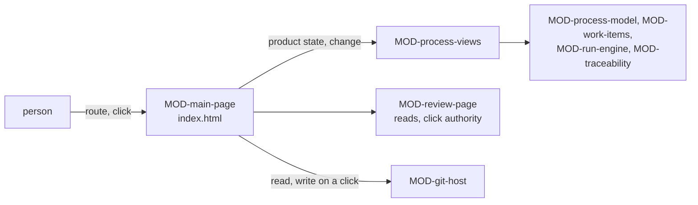

# ARC-024 The main page

## Context

The page at the root of the instance's Pages site (ARC-001) shows what goes on in the instance: each product's backlog
and progress in the measure of its process model, the gates passed and pending, what is blocked, who works on what,
every job of every product, the panel of a run before it starts, and the review of a sprint's increment (UC-032, UC-034,
UC-035, UC-036, UC-041, UC-043). Documents are reviewed on the other page, under `docs/` (ARC-022).

The rules the page applies are designed elsewhere and are pure: the process model, the workflow and the gate records in
ARC-019, the backlog, sprints, item states and progress in ARC-023, the job records, job states and the plan of a run in
ARC-010, the link graph in ARC-006. The git servers are reached through ARC-004, a file's text is read and kept as the
review page reads it (ARC-022), and a write needs an authority (ARC-003). What is missing is the page that puts them
together: what it reads of a product, what it computes for each view, and what it writes on a click.

## Decision

1. **Two modules.** `MOD-process-views`, a feature, computes what the main page shows of a product — from one commit
   through read ports, and from what the server reports, given as data — and the files of every write; it reads nothing
   itself. `MOD-main-page`, the shell of the root `index.html`, routes, reads each product, turns a trusted click into
   the authority of a write (`MOD-review-page.clickAuthority`), plans and writes the commit, and holds every text and
   all HTML of the page.
2. **Route.** `MOD-main-page.route` reads the instance from the root of its Pages site,
   `https://<owner>.github.io/<repo>/`, and from the fragment the view — the overview, a product's progress, backlog,
   run or sprint close, or every job —, the product by its address, an item, a sprint, and a commit to read instead of
   the default branch's head. The overview shows a line per product of the instance (`MOD-process-views.summaryOf`) and
   the list of every job.
3. **A product is read at one commit** (`MOD-main-page.readProduct`): its files through the review page's read port, the
   model from the instance at the version the product declares and the participants at the instance's head; when each
   item and approval record entered the repository from one scan of the history of `docs/backlog/` and `docs/approvals/`
   (`MOD-git-host.pathHistory`), any other file's time from the oldest commit touching it; when the declared model took
   effect, and the commit that declared the one before, from the history of `docs/process.md`; the commit each gate the
   product passes is decided on — the newest commit that changed a path of what it checks (ARC-019 decision 6) —; its
   pull requests, and the CI checks on those commits and on the heads of the open pull requests. A job's live state is
   an input of the views: a job whose runtime was not asked shows its last recorded state (ARC-010 decision 7); while a
   job CI runs is queued, running or waiting at a gate, the page asks the runs of the job workflow, each named by its
   job (`MOD-job-runner.liveOf`, ARC-029).
4. **What the views compute.** The backlog with each item's state, column on the board, problems and selectability, the
   uncovered names, the sprint with its end and close, what planning the next sprint starts from, and the WIP limit
   (`MOD-process-views.backlogView`); the progress page — the progress in the model's measure, the gates in order, what
   is blocked and why, and who works on what (`MOD-process-views.progressPage`) — and its line on the overview, the
   latest figures of the measure with what is blocked and what waits (`MOD-process-views.summaryOf`); what lies behind a
   point of the chart with its trace (`MOD-process-views.behind`); one job list over every product
   (`MOD-process-views.jobsView`); the start panel of items (`MOD-process-views.startPanel`) and the panel of a run
   (`MOD-process-views.runPanel`), each naming the participant, where it processes data and what is sent; the review of
   a sprint's increment (`MOD-process-views.closeView`). The rules come from the kernel: an item may start where
   `MOD-work-items.mayStart` holds, a gate is passed where `MOD-process-model.gateDecision` says so.
5. **Gates in order.** A gate a job passes (ARC-019 decision 6) is shown once per job that reached it, on the head of
   the job's pull request: for an item's job the pull request whose head branch is `item/<identifier>` or begins with
   `item/<identifier>-`, for another job the one its record's results name; a done job met every gate leaving its phase.
   A gate the product passes is shown once, on the commit it is decided on; the first of them not passed is pending, the
   later ones are not reached.
6. **Writes: one commit on a click, planned on the head** (`MOD-main-page.commitChange`). The page reads the default
   branch's head, the backlog and records at it and the account its token acts as, plans the files
   (`MOD-process-views.planChange`) and writes them in one commit on that head (ARC-004): new items with the order, a
   new order, a sprint started or its selection changed, a sprint's end, a person's gate decision under their account —
   never on their own work, never without holding the deciding role, a rejection with its reason —, a cancel, and the
   start records of jobs, of a run with its first jobs, or of a retry naming the job it retries — an agent's job with
   who merges its pull request where the author chose it (UC-034 8). A new item gets its identifier from
   `MOD-work-items.nextItemId` over every identifier the files and the version history of `docs/backlog/` hold, a new
   job from `MOD-run-engine.newJobId` with a draw of the random port. On the same click the jobs of CI agents it starts
   or retries, or whose gate the person decided, are dispatched (`MOD-main-page.runOnCi`), and a cancel cancels the
   job's run (`MOD-main-page.cancelOnCi`) (ARC-029); a job on a self-hosted runner of a repository that is not private
   is not started, and its record ends as failed with the reason
   (`A SELF-HOSTED RUNNER SERVES AGENT M ONLY FROM A PRIVATE REPOSITORY`).
7. **A sprint's increment enters the default branch through a pull request** (`MOD-main-page.mergeIncrement`): a click
   opens the pull request from the sprint's branch, and a later click merges it at its head once every check on it is
   green (ARC-004 decision 10); until then the page names the checks it waits for.
8. **Texts in the shell.** Every sentence the page shows — labels, states in words, the folded *What is this?* of every
   chart, panel and state, the notices before a write — is written by `MOD-main-page`; the views return data (ARC-003).



## Alternatives

- **The process views on the review page** — the review page shows one repository at one commit; the main page reads
  every product of the instance, and `THE MAIN PAGE SHOWS WHAT GOES ON IN THE INSTANCE` puts it at the root.
- **One time request per file** — a request per item and record; one scan of a folder's history costs a request per
  commit touching it, and gives the identifiers it once held as well.
- **Views that ask the runtimes** — a feature sends no request (ARC-003); the runtimes are reached by adapters designed
  with them, and their reports enter the views as data.
- **A stored board, burn-down or job list** — `PROGRESS AND JOB STATE ARE DERIVED, NOT STORED`.
- **Merging a sprint's branch by a commit of the page** — code reaches the default branch only through a pull request
  with green CI.

## Consequences

- Every view is a function of one commit and what the server reported; after a write, the page reads the head again and
  computes its views anew.
- Reading a product takes a request per commit touching `docs/backlog/` or `docs/approvals/`, one per other file whose
  time a view needs, one per path a gate of the product checks, and one per commit whose checks it shows; texts already
  kept are not read again.
- The job runtimes name an item's branch `item/<identifier>` and record their pull request among their results, so that
  the page finds the text a job's gate is decided on.
- The steps that hand work to a participant or that a runtime carries out are not realised here: drafting items (UC-032
  2, 3, 3a); an agent as Product Owner or closer (UC-032 1c, UC-041 1a); starting and carrying out jobs and runs (UC-034
  1a, 4, 5, 6, 7, 8, 4a, 5a, 5b, 6a, 6b, 7a, 8a; UC-043 1c, 5, 6, 7, 8, 6a, 6b, 6c, 6d); a cancel or a retry (UC-036 6,
  7, 6a, 7a); the job continuing or ending after a person's gate decision, whose record `MOD-process-views.planChange`
  and `MOD-main-page.commitChange` already write (UC-036 5); and the running jobs, their live states and logs, read from
  the runtimes (UC-035 1, 1b; UC-036 1, 1a, 1b, 1c, 4, 4a, 4b) — the rest of what UC-035 1 reads is
  `MOD-main-page.readProduct`. They are realised with the job runtimes, by their interfaces together with these: ARC-029
  designs the runtime of CI, which `MOD-main-page.runOnCi` and `MOD-main-page.cancelOnCi` start, continue and stop, and
  names what each of these steps still needs.
- An item whose sources permit their content only in places no holder of the role uses (UC-034 3a) is named once the
  source library gives the restrictions of an item's sources; `MOD-process-views.startPanel` already takes them as
  input. Removing an item (UC-032 1a) waits for a write path that removes files; the difference of a gate passed on an
  earlier text (UC-035 3a) for a comparison of two commits; a sprint's numbers, its close record and the failing tests
  of a red merge (UC-041 4, 5, 6, 3a, 5a, 5b, 6a, 7a) for the test records.
- The overview's state when the instance has no product yet (UC-014 9) is realised with the instance's set-up.

## Modules

### MOD-process-views

```json module
{
  "id": "MOD-process-views",
  "folder": "src/process-views/",
  "layer": "feature",
  "responsibility": "Computes what the main page shows of a product from one commit through read ports and from what its server and runtimes report, given as data — its process, backlog, records and acceptance, an item's facts, the backlog and board, the progress page with its gates, blocked items and who works on what, what lies behind a point of a chart, the job list over every product, the start panel of items, the panel of a run and the review of a sprint's increment — and the files of every write the page makes, planned on the head.",
  "realises": ["PROGRESS AND JOB STATE ARE DERIVED, NOT STORED", "PROGRESS IS SHOWN IN THE MODEL'S OWN MEASURE", "ONE DASHBOARD SHOWS EVERY JOB"],
  "owns": ["ProductProcess", "WorkflowOrNone", "CloseRef", "Backlog", "DatedGate", "Records", "Acceptance", "LiveJob", "ProductState", "BacklogRow", "SprintStatus", "SprintStatusOrNone", "SprintPlanning", "SprintPlanningOrNone", "WipStatus", "BacklogView", "ProgressOrNone", "ProgressView", "GateRow", "BlockedRow", "WorkJob", "ParticipantWork", "ProgressPage", "PlanTotals", "PlanTotalsOrNone", "StateCountsOrNone", "ProductSummary", "ChartPoint", "BehindItem", "Behind", "JobSource", "JobFilter", "Sends", "SendsOrNone", "StartGate", "StartRow", "StartPanel", "RunCandidate", "RoleCandidates", "RunPlanOrNone", "RefusalOrNone", "RunPanel", "DoneRow", "NotDoneRow", "CloseView", "JobStart", "ItemsChange", "OrderChange", "SprintChange", "ReplanChange", "EndChange", "GateChange", "CancelChange", "JobsChange", "RunChange", "RetryChange", "PageChange", "HeadFacts", "PlannedCommit"],
  "uses": ["MOD-contracts", "MOD-artifacts", "MOD-review-core", "MOD-traceability", "MOD-process-model", "MOD-work-items", "MOD-run-engine"]
}
```

```json interface
{
  "id": "MOD-process-views.processOf",
  "summary": "A product's process from its commit: whether it declares one, the model's name, who closes a sprint by default, the workflow derived from the model at the version the declaration names — read from the instance with keys <commit>:<path> —, with its practices and the gates and artifacts its requirements add, the instance's participants, the names of its requirements, and every problem of the combination.",
  "params": [
    { "name": "files", "type": "ReadPort" },
    { "name": "models", "type": "ReadPort" },
    { "name": "instance", "type": "ReadPort" }
  ],
  "result": "ProductProcess",
  "async": true,
  "refusals": [],
  "examples": [
    {
      "name": "a product developed in Scrum",
      "input": {
        "files": { "SPEC.md": "# Thesis — Specification\n\n## 1. Writing\n\n**ONE CLICK** *(PO A. Maier)*\nA decision takes one click.\n*Check:* no automatic check; at review.\n\n**NO SERVER** *(PO A. Maier)*\nThe product runs no server of its own.\n*Check:* `tests/test_no_server.py`\n\n## 2. Review\n\n**EVERY TEXT IS REVIEWED** *(PO A. Maier)*\nA document binds only once it is accepted.\n*Check:* `tests/pages.test.mjs`\n", "docs/process.md": "---\nmodel: scrum\nmodel_file: docs/process-models/scrum.md\nmodel_version: a900000000000000000000000000000000000000\nsprint_close: alice\n---\n# How the thesis tool is developed\n\n## Roles\n\n| Role | Participants |\n|---|---|\n| Product Owner | alice |\n| Developers | cli-dev, ci-dev |\n\n## Branches\n\n| Phase or time box | Branch |\n|---|---|\n| Sprint | `sprint/<nn>` |\n" },
        "models": { "a900000000000000000000000000000000000000:docs/process-models/scrum.md": "---\nname: scrum\nkind: pulled\nmeasure: remaining items per time box\n---\n# Scrum\n\n## Phases\n\n| Name | Role | Produces |\n|---|---|---|\n| Sprint planning | Product Owner | ITM |\n| Development | Developers | MOD, TST |\n| Sprint review | Product Owner | the review of the increment |\n\n## Transitions\n\n| From | To | Kind |\n|---|---|---|\n| Sprint planning | Development | sequence |\n| Development | Sprint review | sequence |\n| Sprint review | Sprint planning | sequence |\n\n## Gates\n\n| Between | Artifacts | Condition | Decider |\n|---|---|---|---|\n| Sprint planning → Development | ITM | the sprint's items are ready | Product Owner |\n| Development → Sprint review | MOD | CI is green | Product Owner |\n\n## Roles\n\n| Name | Filled by | Capabilities |\n|---|---|---|\n| Product Owner | person | read the repository, write to the repository |\n| Developers | agent | read the repository, write to the repository, run code and tests |\n\n## Flow control\n\n| Kind | Value |\n|---|---|\n| WIP limit | none |\n| Time box | 2 weeks |\n| Sprints | yes |\n" },
        "instance": { "docs/participants.md": "# Participants of this instance\n\n| Name | Type | Model | Context | Price | Capabilities | Processing place | Route |\n|---|---|---|---|---|---|---|---|\n| alice | person | — | — | — | draft text, read the repository, write to the repository | — | the GitHub account `alice` |\n| hub-writer | model endpoint | llama-3.3-70b | — | — | draft text | NHR@FAU, Erlangen | the endpoint hub of this browser |\n| gw-writer | model endpoint | gateway-model | 32000 | 0.2 / 0.6 EUR per million tokens | draft text | a gateway in Frankfurt, Germany | the endpoint gw of this browser |\n| ci-dev | CI agent | claude-opus-5-5 | — | — | read the repository, write to the repository, run code and tests | GitHub's machines, a provider in the USA | the workflow agent-m-job |\n| cli-dev | CLI agent | claude-opus-5-5 | — | — | draft text, read the repository, write to the repository, run code and tests, use tools | this machine | the bridge on the Mac of `alice` |\n\nEvery participant that works with a language model names its model.\n" }
      },
      "result": {
        "declared": true,
        "model": "scrum",
        "sprintClose": "alice",
        "workflow": {
          "model": "scrum",
          "kind": "pulled",
          "measure": "remaining items per time box",
          "flow": { "wipLimit": null, "timeBox": "2 weeks", "sprints": true, "line": 38 },
          "phases": [
            {
              "name": "Sprint planning",
              "role": "Product Owner",
              "produces": "ITM",
              "kinds": ["ITM"],
              "line": 12,
              "practice": ""
            },
            {
              "name": "Development",
              "role": "Developers",
              "produces": "MOD, TST",
              "kinds": ["MOD", "TST"],
              "line": 13,
              "practice": ""
            },
            {
              "name": "Sprint review",
              "role": "Product Owner",
              "produces": "the review of the increment",
              "kinds": [],
              "line": 14,
              "practice": ""
            }
          ],
          "transitions": [
            { "from": "Sprint planning", "to": "Development", "kind": "sequence", "line": 20 },
            { "from": "Development", "to": "Sprint review", "kind": "sequence", "line": 21 },
            { "from": "Sprint review", "to": "Sprint planning", "kind": "sequence", "line": 22 }
          ],
          "pairs": [],
          "gates": [
            {
              "between": "Sprint planning → Development",
              "from": "Sprint planning",
              "to": "Development",
              "artifacts": "ITM",
              "kinds": ["ITM"],
              "condition": "the sprint's items are ready",
              "decider": { "role": "Product Owner" },
              "line": 28,
              "practice": "",
              "requirement": "",
              "source": "",
              "holders": ["alice"]
            },
            {
              "between": "Development → Sprint review",
              "from": "Development",
              "to": "Sprint review",
              "artifacts": "MOD",
              "kinds": ["MOD"],
              "condition": "CI is green",
              "decider": { "role": "Product Owner" },
              "line": 29,
              "practice": "",
              "requirement": "",
              "source": "",
              "holders": ["alice"]
            }
          ],
          "roles": [
            {
              "name": "Product Owner",
              "filledBy": "person",
              "capabilities": ["read the repository", "write to the repository"],
              "line": 35,
              "holders": ["alice"]
            },
            {
              "name": "Developers",
              "filledBy": "agent",
              "capabilities": ["read the repository", "write to the repository", "run code and tests"],
              "line": 36,
              "holders": ["cli-dev", "ci-dev"]
            }
          ],
          "branches": [{ "phase": "Sprint", "branch": "sprint/<nn>", "line": 20 }],
          "artifactsAdded": [],
          "problems": []
        },
        "participants": [
          {
            "name": "alice",
            "type": "person",
            "model": "",
            "context": null,
            "price": null,
            "capabilities": ["draft text", "read the repository", "write to the repository"],
            "place": "",
            "route": "the GitHub account `alice`",
            "line": 5
          },
          {
            "name": "hub-writer",
            "type": "model endpoint",
            "model": "llama-3.3-70b",
            "context": null,
            "price": null,
            "capabilities": ["draft text"],
            "place": "NHR@FAU, Erlangen",
            "route": "the endpoint hub of this browser",
            "line": 6
          },
          {
            "name": "gw-writer",
            "type": "model endpoint",
            "model": "gateway-model",
            "context": 32000,
            "price": { "currency": "EUR", "input": 0.2, "output": 0.6 },
            "capabilities": ["draft text"],
            "place": "a gateway in Frankfurt, Germany",
            "route": "the endpoint gw of this browser",
            "line": 7
          },
          {
            "name": "ci-dev",
            "type": "CI agent",
            "model": "claude-opus-5-5",
            "context": null,
            "price": null,
            "capabilities": ["read the repository", "write to the repository", "run code and tests"],
            "place": "GitHub's machines, a provider in the USA",
            "route": "the workflow agent-m-job",
            "line": 8
          },
          {
            "name": "cli-dev",
            "type": "CLI agent",
            "model": "claude-opus-5-5",
            "context": null,
            "price": null,
            "capabilities": ["draft text", "read the repository", "write to the repository", "run code and tests", "use tools"],
            "place": "this machine",
            "route": "the bridge on the Mac of `alice`",
            "line": 9
          }
        ],
        "requirements": ["ONE CLICK", "NO SERVER", "EVERY TEXT IS REVIEWED"],
        "problems": []
      }
    },
    {
      "name": "a model the instance does not hold at the declared version",
      "input": {
        "files": { "SPEC.md": "# Thesis — Specification\n\n## 1. Writing\n\n**ONE CLICK** *(PO A. Maier)*\nA decision takes one click.\n*Check:* no automatic check; at review.\n\n**NO SERVER** *(PO A. Maier)*\nThe product runs no server of its own.\n*Check:* `tests/test_no_server.py`\n\n## 2. Review\n\n**EVERY TEXT IS REVIEWED** *(PO A. Maier)*\nA document binds only once it is accepted.\n*Check:* `tests/pages.test.mjs`\n", "docs/process.md": "---\nmodel: scrum\nmodel_file: docs/process-models/scrum.md\nmodel_version: a900000000000000000000000000000000000000\nsprint_close: alice\n---\n# How the thesis tool is developed\n\n## Roles\n\n| Role | Participants |\n|---|---|\n| Product Owner | alice |\n| Developers | cli-dev, ci-dev |\n\n## Branches\n\n| Phase or time box | Branch |\n|---|---|\n| Sprint | `sprint/<nn>` |\n" },
        "models": {},
        "instance": { "docs/participants.md": "# Participants of this instance\n\n| Name | Type | Model | Context | Price | Capabilities | Processing place | Route |\n|---|---|---|---|---|---|---|---|\n| alice | person | — | — | — | draft text, read the repository, write to the repository | — | the GitHub account `alice` |\n| hub-writer | model endpoint | llama-3.3-70b | — | — | draft text | NHR@FAU, Erlangen | the endpoint hub of this browser |\n| gw-writer | model endpoint | gateway-model | 32000 | 0.2 / 0.6 EUR per million tokens | draft text | a gateway in Frankfurt, Germany | the endpoint gw of this browser |\n| ci-dev | CI agent | claude-opus-5-5 | — | — | read the repository, write to the repository, run code and tests | GitHub's machines, a provider in the USA | the workflow agent-m-job |\n| cli-dev | CLI agent | claude-opus-5-5 | — | — | draft text, read the repository, write to the repository, run code and tests, use tools | this machine | the bridge on the Mac of `alice` |\n\nEvery participant that works with a language model names its model.\n" }
      },
      "result": {
        "declared": true,
        "model": "scrum",
        "sprintClose": "alice",
        "workflow": null,
        "participants": [
          {
            "name": "alice",
            "type": "person",
            "model": "",
            "context": null,
            "price": null,
            "capabilities": ["draft text", "read the repository", "write to the repository"],
            "place": "",
            "route": "the GitHub account `alice`",
            "line": 5
          },
          {
            "name": "hub-writer",
            "type": "model endpoint",
            "model": "llama-3.3-70b",
            "context": null,
            "price": null,
            "capabilities": ["draft text"],
            "place": "NHR@FAU, Erlangen",
            "route": "the endpoint hub of this browser",
            "line": 6
          },
          {
            "name": "gw-writer",
            "type": "model endpoint",
            "model": "gateway-model",
            "context": 32000,
            "price": { "currency": "EUR", "input": 0.2, "output": 0.6 },
            "capabilities": ["draft text"],
            "place": "a gateway in Frankfurt, Germany",
            "route": "the endpoint gw of this browser",
            "line": 7
          },
          {
            "name": "ci-dev",
            "type": "CI agent",
            "model": "claude-opus-5-5",
            "context": null,
            "price": null,
            "capabilities": ["read the repository", "write to the repository", "run code and tests"],
            "place": "GitHub's machines, a provider in the USA",
            "route": "the workflow agent-m-job",
            "line": 8
          },
          {
            "name": "cli-dev",
            "type": "CLI agent",
            "model": "claude-opus-5-5",
            "context": null,
            "price": null,
            "capabilities": ["draft text", "read the repository", "write to the repository", "run code and tests", "use tools"],
            "place": "this machine",
            "route": "the bridge on the Mac of `alice`",
            "line": 9
          }
        ],
        "requirements": ["ONE CLICK", "NO SERVER", "EVERY TEXT IS REVIEWED"],
        "problems": [
          { "artifact": "docs/process.md", "line": 1, "kind": "error", "what": "docs/process-models/scrum.md does not exist at a90000000000 of the instance", "rule": "THE PROCESS MODEL IS DECLARED PER PRODUCT", "fix": "declare a model file the instance holds at that version" }
        ]
      }
    },
    {
      "name": "a product that declares no process",
      "input": {
        "files": { "SPEC.md": "# Notes — Specification\n\n## 1. Writing\n\n**ONE CLICK** *(PO A. Maier)*\nA decision takes one click.\n*Check:* no automatic check; at review.\n\n**NO SERVER** *(PO A. Maier)*\nThe product runs no server of its own.\n*Check:* `tests/test_no_server.py`\n" },
        "models": {},
        "instance": {}
      },
      "result": {
        "declared": false,
        "model": "",
        "sprintClose": "",
        "workflow": null,
        "participants": [],
        "requirements": ["ONE CLICK", "NO SERVER"],
        "problems": []
      }
    }
  ]
}
```

```json interface
{
  "id": "MOD-process-views.backlogOf",
  "summary": "A product's backlog at its commit: the items, the order with the items it does not list and the names it lists that are no item, the sprints, the closes with the items each sends into the next sprint, when each item entered the repository, and every file that is not read as an item or a sprint.",
  "params": [
    { "name": "snapshot", "type": "Snapshot" },
    { "name": "files", "type": "ReadPort" },
    { "name": "enteredAt", "type": "ReadPort" }
  ],
  "result": "Backlog",
  "async": true,
  "refusals": [],
  "examples": [
    {
      "name": "five items, two sprints and a close",
      "input": {
        "snapshot": {
          "commit": "c100000000000000000000000000000000000000",
          "tree": [
            { "path": "docs/backlog/ITM-014-export-a-chapter-as-pdf.md", "blob": "172abdc87455157302b5b713727409c61c87869e" },
            { "path": "docs/backlog/ITM-015-write-a-chapter-in-the-editor.md", "blob": "844960f398767c8251b57c460f29dfa7379e5983" },
            { "path": "docs/backlog/ITM-016-accept-a-chapter-with-one-click.md", "blob": "a45bbd0f47ac0943b110ae17bb930c360fe56a23" },
            { "path": "docs/backlog/ITM-017-review-a-chapter-s-text.md", "blob": "1657489a18d4fb2e2407fc3b0eaac3961c33c937" },
            { "path": "docs/backlog/ITM-018-show-the-list-of-chapters.md", "blob": "c7a265d6b4ba793784e14f2ca30ad4455d0d8fe9" },
            { "path": "docs/backlog/order.md", "blob": "e8e6b48798b851bed5171e9054d8ca1cc561cf75" },
            { "path": "docs/backlog/sprints/sprint-03-close.md", "blob": "d2c0f16eeb3b96a4bfbe7a7dfa5ed0524501504a" },
            { "path": "docs/backlog/sprints/sprint-03.md", "blob": "571035f8efa551349bb86808e4d4127dfa6670d8" },
            { "path": "docs/backlog/sprints/sprint-04.md", "blob": "aaee5dc49279a77b2bbc2de3604393f3b8117ab4" }
          ]
        },
        "files": { "docs/backlog/ITM-014-export-a-chapter-as-pdf.md": "---\nid: ITM-014\ntitle: Export a chapter as PDF\nkind: implementation\nrealises:\n  - A CHAPTER IS EXPORTED\n  - UC-003\nmodules:\n  - MOD-export\norigin:\n  - https://github.com/alice/thesis/issues/57\n---\n\n# ITM-014 Export a chapter as PDF\n\n**REGISTER**\n\n## Outcome\n\nExport a chapter as PDF.\n\n## Acceptance criteria\n\n- Export a chapter as PDF works in the browser.\n", "docs/backlog/ITM-015-write-a-chapter-in-the-editor.md": "---\nid: ITM-015\ntitle: Write a chapter in the editor\nkind: implementation\nrealises:\n  - NO SERVER\nmodules:\n  - MOD-pages\norigin:\n  - UC-002\n---\n\n# ITM-015 Write a chapter in the editor\n\n**REGISTER**\n\n## Outcome\n\nWrite a chapter in the editor.\n\n## Acceptance criteria\n\n- Write a chapter in the editor works in the browser.\n", "docs/backlog/ITM-016-accept-a-chapter-with-one-click.md": "---\nid: ITM-016\ntitle: Accept a chapter with one click\nkind: implementation\nrealises:\n  - ONE CLICK\n  - UC-001\nmodules:\n  - MOD-pages\norigin:\n  - UC-001\n---\n\n# ITM-016 Accept a chapter with one click\n\n**REGISTER**\n\n## Outcome\n\nAccept a chapter with one click.\n\n## Acceptance criteria\n\n- Accept a chapter with one click works in the browser.\n", "docs/backlog/ITM-017-review-a-chapter-s-text.md": "---\nid: ITM-017\ntitle: Review a chapter's text\nkind: implementation\nrealises:\n  - EVERY TEXT IS REVIEWED\nmodules:\n  - MOD-pages\norigin:\n  - UC-001\n---\n\n# ITM-017 Review a chapter's text\n\n**REGISTER**\n\n## Outcome\n\nReview a chapter's text.\n\n## Acceptance criteria\n\n- Review a chapter's text works in the browser.\n", "docs/backlog/ITM-018-show-the-list-of-chapters.md": "---\nid: ITM-018\ntitle: Show the list of chapters\nkind: implementation\nrealises:\n  - NO SERVER\n  - UC-001\nmodules:\n  - MOD-pages\ndepends_on:\n  - ITM-016\norigin:\n  - UC-001\n---\n\n# ITM-018 Show the list of chapters\n\n**REGISTER**\n\n## Outcome\n\nShow the list of chapters.\n\n## Acceptance criteria\n\n- Show the list of chapters works in the browser.\n", "docs/backlog/order.md": "# Backlog order\n\nThe order in which the items are worked on.\n\n## Order\n\n1. ITM-016\n2. ITM-015\n3. ITM-017\n4. ITM-009\n5. ITM-014\n", "docs/backlog/sprints/sprint-03-close.md": "# Close of sprint-03\n\n**REGISTER**\n\nClosed by alice.\n\n## Review of the increment\n\nGoal: The author reviews chapters\n\nDone: nothing; the increment is empty.\n\nStakeholders: bob, the supervisor.\n\n## Unfinished items\n\n- ITM-015: into the next sprint — the editor is half done\n\n## Retrospective\n\nNumbers: 0 jobs, 0 failed, 0 retried, 0 correction rounds, 0 minutes waiting at gates; flaky tests: none; cost 0.00.\n\n- Accept the figures before the text — Definition of Done\n", "docs/backlog/sprints/sprint-03.md": "---\nid: sprint-03\ngoal: The author reviews chapters\nstart: 2026-09-21\nend: 2026-10-02\ntime_box_end: 2026-10-04\nselection:\n  - ITM-015\ncloser: alice\nbranch: sprint/03\n---\n\n# sprint-03\n\n**REGISTER**\n\nThe author reviews chapters\n", "docs/backlog/sprints/sprint-04.md": "---\nid: sprint-04\ngoal: The author writes, accepts and reviews chapters\nstart: 2026-10-05\nend:\ntime_box_end: 2026-10-18\nselection:\n  - ITM-015\n  - ITM-016\n  - ITM-017\ncloser: alice\nbranch: sprint/04\n---\n\n# sprint-04\n\n**REGISTER**\n\nThe author writes, accepts and reviews chapters\n" },
        "enteredAt": { "docs/backlog/ITM-014-export-a-chapter-as-pdf.md": "2026-10-01T08:00:00Z", "docs/backlog/ITM-015-write-a-chapter-in-the-editor.md": "2026-09-20T08:00:00Z", "docs/backlog/ITM-016-accept-a-chapter-with-one-click.md": "2026-10-03T08:00:00Z", "docs/backlog/ITM-017-review-a-chapter-s-text.md": "2026-10-03T08:05:00Z", "docs/backlog/ITM-018-show-the-list-of-chapters.md": "2026-10-08T16:00:00Z" }
      },
      "result": {
        "items": [
          {
            "id": "ITM-014",
            "path": "docs/backlog/ITM-014-export-a-chapter-as-pdf.md",
            "title": "Export a chapter as PDF",
            "kind": "implementation",
            "realises": ["A CHAPTER IS EXPORTED", "UC-003"],
            "modules": ["MOD-export"],
            "dependsOn": [],
            "origins": ["https://github.com/alice/thesis/issues/57"],
            "outcome": "Export a chapter as PDF.",
            "criteria": ["Export a chapter as PDF works in the browser."],
            "notes": ""
          },
          {
            "id": "ITM-015",
            "path": "docs/backlog/ITM-015-write-a-chapter-in-the-editor.md",
            "title": "Write a chapter in the editor",
            "kind": "implementation",
            "realises": ["NO SERVER"],
            "modules": ["MOD-pages"],
            "dependsOn": [],
            "origins": ["UC-002"],
            "outcome": "Write a chapter in the editor.",
            "criteria": ["Write a chapter in the editor works in the browser."],
            "notes": ""
          },
          {
            "id": "ITM-016",
            "path": "docs/backlog/ITM-016-accept-a-chapter-with-one-click.md",
            "title": "Accept a chapter with one click",
            "kind": "implementation",
            "realises": ["ONE CLICK", "UC-001"],
            "modules": ["MOD-pages"],
            "dependsOn": [],
            "origins": ["UC-001"],
            "outcome": "Accept a chapter with one click.",
            "criteria": ["Accept a chapter with one click works in the browser."],
            "notes": ""
          },
          {
            "id": "ITM-017",
            "path": "docs/backlog/ITM-017-review-a-chapter-s-text.md",
            "title": "Review a chapter's text",
            "kind": "implementation",
            "realises": ["EVERY TEXT IS REVIEWED"],
            "modules": ["MOD-pages"],
            "dependsOn": [],
            "origins": ["UC-001"],
            "outcome": "Review a chapter's text.",
            "criteria": ["Review a chapter's text works in the browser."],
            "notes": ""
          },
          {
            "id": "ITM-018",
            "path": "docs/backlog/ITM-018-show-the-list-of-chapters.md",
            "title": "Show the list of chapters",
            "kind": "implementation",
            "realises": ["NO SERVER", "UC-001"],
            "modules": ["MOD-pages"],
            "dependsOn": ["ITM-016"],
            "origins": ["UC-001"],
            "outcome": "Show the list of chapters.",
            "criteria": ["Show the list of chapters works in the browser."],
            "notes": ""
          }
        ],
        "order": {
          "title": "Backlog order",
          "intro": "The order in which the items are worked on.",
          "order": ["ITM-016", "ITM-015", "ITM-017", "ITM-014", "ITM-018"],
          "unplaced": ["ITM-018"],
          "unknown": ["ITM-009"],
          "notes": ""
        },
        "sprints": [
          {
            "id": "sprint-03",
            "path": "docs/backlog/sprints/sprint-03.md",
            "goal": "The author reviews chapters",
            "start": "2026-09-21",
            "end": "2026-10-02",
            "timeBoxEnd": "2026-10-04",
            "selection": ["ITM-015"],
            "closer": "alice",
            "branch": "sprint/03"
          },
          {
            "id": "sprint-04",
            "path": "docs/backlog/sprints/sprint-04.md",
            "goal": "The author writes, accepts and reviews chapters",
            "start": "2026-10-05",
            "end": "",
            "timeBoxEnd": "2026-10-18",
            "selection": ["ITM-015", "ITM-016", "ITM-017"],
            "closer": "alice",
            "branch": "sprint/04"
          }
        ],
        "closes": [
          { "sprint": "sprint-03", "path": "docs/backlog/sprints/sprint-03-close.md", "carried": ["ITM-015"] }
        ],
        "added": [
          { "name": "ITM-014", "at": "2026-10-01T08:00:00Z" },
          { "name": "ITM-015", "at": "2026-09-20T08:00:00Z" },
          { "name": "ITM-016", "at": "2026-10-03T08:00:00Z" },
          { "name": "ITM-017", "at": "2026-10-03T08:05:00Z" },
          { "name": "ITM-018", "at": "2026-10-08T16:00:00Z" }
        ],
        "problems": []
      }
    }
  ]
}
```

```json interface
{
  "id": "MOD-process-views.recordsOf",
  "summary": "A product's records at its commit: its jobs, its gate records with when each entered the repository, its cancels, and every record that does not read.",
  "params": [
    { "name": "snapshot", "type": "Snapshot" },
    { "name": "files", "type": "ReadPort" },
    { "name": "enteredAt", "type": "ReadPort" }
  ],
  "result": "Records",
  "async": true,
  "refusals": [],
  "examples": [
    {
      "name": "three jobs and two gate records",
      "input": {
        "snapshot": {
          "commit": "c100000000000000000000000000000000000000",
          "tree": [
            { "path": "docs/jobs/JOB-20261006-1000-a1b2.md", "blob": "5645b3c3ab3961ecd31cdfb7c119f7d78f06e26e" },
            { "path": "docs/jobs/JOB-20261008-0900-b2c3.md", "blob": "7d55ba19d730fc21d8a35fdd9edc5e27af80df5e" },
            { "path": "docs/jobs/JOB-20261008-1300-c3d4.md", "blob": "099feb2d86f44aef00be8343d5134504d112021c" },
            { "path": "docs/jobs/gates/JOB-20261006-1000-a1b2-development-sprint-review-600000000000.md", "blob": "3da7a8c26f570de8bfffae29568327ea341449e4" },
            { "path": "docs/jobs/gates/thesis-sprint-planning-development-e50000000000.md", "blob": "aa6c20d566d81c3f0e1a0d72f78cbe769f1fa8c7" }
          ]
        },
        "files": { "docs/jobs/JOB-20261006-1000-a1b2.md": "---\nid: JOB-20261006-1000-a1b2\nkind: implement\nphase: Development\nrole: Developers\nparticipant: cli-dev\nruntime: bridge\nrun:\nslot:\nitem: ITM-016\nmodules:\n  - MOD-pages\ninputs: []\nretry_of:\nagent_m: 2026.10.1\nmodel: claude-opus-5-5\nlog:\n---\n\n# JOB-20261006-1000-a1b2\n\n**REGISTER**\n\n## States\n\n| At | State | Note |\n|---|---|---|\n| 2026-10-06T10:00:00Z | queued | — |\n| 2026-10-06T10:01:00Z | running | — |\n| 2026-10-07T11:00:00Z | waiting-at-gate | Development → Sprint review |\n| 2026-10-07T15:00:00Z | done | — |\n\n## Results\n\n- https://github.com/alice/thesis/pull/60\n\n## Cost\n\n| Rounds | Cost | Input tokens | Output tokens | Minutes |\n|---|---|---|---|---|\n| 1 | — | 182000 | 12000 | — |\n", "docs/jobs/JOB-20261008-0900-b2c3.md": "---\nid: JOB-20261008-0900-b2c3\nkind: implement\nphase: Development\nrole: Developers\nparticipant: cli-dev\nruntime: bridge\nrun:\nslot:\nitem: ITM-015\nmodules:\n  - MOD-pages\ninputs: []\nretry_of:\nagent_m: 2026.10.1\nmodel: claude-opus-5-5\nlog:\n---\n\n# JOB-20261008-0900-b2c3\n\n**REGISTER**\n\n## States\n\n| At | State | Note |\n|---|---|---|\n| 2026-10-08T09:00:00Z | queued | — |\n| 2026-10-08T09:01:00Z | running | — |\n| 2026-10-08T11:00:00Z | waiting-at-gate | Development → Sprint review |\n", "docs/jobs/JOB-20261008-1300-c3d4.md": "---\nid: JOB-20261008-1300-c3d4\nkind: implement\nphase: Development\nrole: Developers\nparticipant: ci-dev\nruntime: ci\nrun:\nslot:\nitem: ITM-017\nmodules:\n  - MOD-pages\ninputs: []\nretry_of:\nagent_m: 2026.10.1\nmodel: claude-opus-5-5\nlog:\n---\n\n# JOB-20261008-1300-c3d4\n\n**REGISTER**\n\n## States\n\n| At | State | Note |\n|---|---|---|\n| 2026-10-08T13:00:00Z | queued | — |\n| 2026-10-08T13:02:00Z | running | — |\n| 2026-10-08T15:30:00Z | failed | CI stayed red after 5 correction rounds |\n\n## Cost\n\n| Rounds | Cost | Input tokens | Output tokens | Minutes |\n|---|---|---|---|---|\n| 5 | — | — | — | 26 |\n", "docs/jobs/gates/JOB-20261006-1000-a1b2-development-sprint-review-600000000000.md": "gate: Development → Sprint review\nsubject: JOB-20261006-1000-a1b2\non: 6000000000000000000000000000000000000000\ndecider: alice\ndecision: passed\nreason: the click accepts the chapter\n", "docs/jobs/gates/thesis-sprint-planning-development-e50000000000.md": "gate: Sprint planning → Development\nsubject: thesis\non: e500000000000000000000000000000000000000\ndecider: alice\ndecision: passed\nreason: the sprint's items are ready\n" },
        "enteredAt": { "docs/jobs/gates/JOB-20261006-1000-a1b2-development-sprint-review-600000000000.md": "2026-10-07T14:00:00Z", "docs/jobs/gates/thesis-sprint-planning-development-e50000000000.md": "2026-10-05T09:00:00Z" }
      },
      "result": {
        "jobs": [
          {
            "id": "JOB-20261006-1000-a1b2",
            "path": "docs/jobs/JOB-20261006-1000-a1b2.md",
            "kind": "implement",
            "phase": "Development",
            "role": "Developers",
            "participant": "cli-dev",
            "runtime": "bridge",
            "run": "",
            "slot": "",
            "item": "ITM-016",
            "modules": ["MOD-pages"],
            "inputs": [],
            "retryOf": "",
            "agentM": "2026.10.1",
            "model": "claude-opus-5-5",
            "log": "",
            "selection": [],
            "limits": null,
            "assignments": [],
            "states": [
              { "at": "2026-10-06T10:00:00Z", "state": "queued", "note": "" },
              { "at": "2026-10-06T10:01:00Z", "state": "running", "note": "" },
              { "at": "2026-10-07T11:00:00Z", "state": "waiting-at-gate", "note": "Development → Sprint review" },
              { "at": "2026-10-07T15:00:00Z", "state": "done", "note": "" }
            ],
            "results": ["https://github.com/alice/thesis/pull/60"],
            "rounds": 1,
            "cost": null,
            "usage": { "inputTokens": 182000, "outputTokens": 12000, "minutes": null },
            "jobs": []
          },
          {
            "id": "JOB-20261008-0900-b2c3",
            "path": "docs/jobs/JOB-20261008-0900-b2c3.md",
            "kind": "implement",
            "phase": "Development",
            "role": "Developers",
            "participant": "cli-dev",
            "runtime": "bridge",
            "run": "",
            "slot": "",
            "item": "ITM-015",
            "modules": ["MOD-pages"],
            "inputs": [],
            "retryOf": "",
            "agentM": "2026.10.1",
            "model": "claude-opus-5-5",
            "log": "",
            "selection": [],
            "limits": null,
            "assignments": [],
            "states": [
              { "at": "2026-10-08T09:00:00Z", "state": "queued", "note": "" },
              { "at": "2026-10-08T09:01:00Z", "state": "running", "note": "" },
              { "at": "2026-10-08T11:00:00Z", "state": "waiting-at-gate", "note": "Development → Sprint review" }
            ],
            "results": [],
            "rounds": 0,
            "cost": null,
            "usage": null,
            "jobs": []
          },
          {
            "id": "JOB-20261008-1300-c3d4",
            "path": "docs/jobs/JOB-20261008-1300-c3d4.md",
            "kind": "implement",
            "phase": "Development",
            "role": "Developers",
            "participant": "ci-dev",
            "runtime": "ci",
            "run": "",
            "slot": "",
            "item": "ITM-017",
            "modules": ["MOD-pages"],
            "inputs": [],
            "retryOf": "",
            "agentM": "2026.10.1",
            "model": "claude-opus-5-5",
            "log": "",
            "selection": [],
            "limits": null,
            "assignments": [],
            "states": [
              { "at": "2026-10-08T13:00:00Z", "state": "queued", "note": "" },
              { "at": "2026-10-08T13:02:00Z", "state": "running", "note": "" },
              { "at": "2026-10-08T15:30:00Z", "state": "failed", "note": "CI stayed red after 5 correction rounds" }
            ],
            "results": [],
            "rounds": 5,
            "cost": null,
            "usage": { "inputTokens": null, "outputTokens": null, "minutes": 26 },
            "jobs": []
          }
        ],
        "gates": [
          {
            "record": { "path": "docs/jobs/gates/JOB-20261006-1000-a1b2-development-sprint-review-600000000000.md", "from": "Development", "to": "Sprint review", "subject": "JOB-20261006-1000-a1b2", "on": "6000000000000000000000000000000000000000", "decider": "alice", "decision": "passed", "reason": "the click accepts the chapter" },
            "at": "2026-10-07T14:00:00Z"
          },
          {
            "record": { "path": "docs/jobs/gates/thesis-sprint-planning-development-e50000000000.md", "from": "Sprint planning", "to": "Development", "subject": "thesis", "on": "e500000000000000000000000000000000000000", "decider": "alice", "decision": "passed", "reason": "the sprint's items are ready" },
            "at": "2026-10-05T09:00:00Z"
          }
        ],
        "cancels": [],
        "problems": []
      }
    }
  ]
}
```

```json interface
{
  "id": "MOD-process-views.acceptanceOf",
  "summary": "What is accepted, since when, and what is proposed: each requirement of the SPEC since the decision row that took over the last queue entry naming it — or since always —, each use case since its approval record entered the repository; an open queue entry's changed and removed names from when its file entered, and the names it adds.",
  "params": [
    { "name": "snapshot", "type": "Snapshot" },
    { "name": "files", "type": "ReadPort" },
    { "name": "enteredAt", "type": "ReadPort" }
  ],
  "result": "Acceptance",
  "async": true,
  "refusals": [],
  "examples": [
    {
      "name": "an open entry changing one requirement and adding another",
      "input": {
        "snapshot": {
          "commit": "c100000000000000000000000000000000000000",
          "tree": [
            { "path": ".github/workflows/tests.yml", "blob": "5b7d29fea7568abd641e9ad798a7eb38e857a6f1" },
            { "path": "SPEC.md", "blob": "94bea49343a82e2f1148dc91f52fb2d200a054ab" },
            { "path": "docs/approvals/ARC-001-42485189f621.md", "blob": "a730719e4a9cd327a60b4b336ee4587b480e43e7" },
            { "path": "docs/approvals/UC-001-b9debf11cce6.md", "blob": "4880f13a598169f9a5338e1b0cf3968885da2805" },
            { "path": "docs/approvals/UC-002-340895773e21.md", "blob": "c1bdc8edbcac92bc50f9329573ed989319c69061" },
            { "path": "docs/architecture/ARC-001-static-pages.md", "blob": "07677c2c633221b6b139237cf96a2344bcaf138a" },
            { "path": "docs/architecture/ARC-002-export.md", "blob": "0123fc84d43802d6e5a0a1c664efdaea63743db6" },
            { "path": "docs/backlog/ITM-014-export-a-chapter-as-pdf.md", "blob": "172abdc87455157302b5b713727409c61c87869e" },
            { "path": "docs/backlog/ITM-015-write-a-chapter-in-the-editor.md", "blob": "844960f398767c8251b57c460f29dfa7379e5983" },
            { "path": "docs/backlog/ITM-016-accept-a-chapter-with-one-click.md", "blob": "a45bbd0f47ac0943b110ae17bb930c360fe56a23" },
            { "path": "docs/backlog/ITM-017-review-a-chapter-s-text.md", "blob": "1657489a18d4fb2e2407fc3b0eaac3961c33c937" },
            { "path": "docs/backlog/ITM-018-show-the-list-of-chapters.md", "blob": "c7a265d6b4ba793784e14f2ca30ad4455d0d8fe9" },
            { "path": "docs/backlog/order.md", "blob": "e8e6b48798b851bed5171e9054d8ca1cc561cf75" },
            { "path": "docs/backlog/sprints/sprint-03-close.md", "blob": "d2c0f16eeb3b96a4bfbe7a7dfa5ed0524501504a" },
            { "path": "docs/backlog/sprints/sprint-03.md", "blob": "571035f8efa551349bb86808e4d4127dfa6670d8" },
            { "path": "docs/backlog/sprints/sprint-04.md", "blob": "aaee5dc49279a77b2bbc2de3604393f3b8117ab4" },
            { "path": "docs/groups/requirements.md", "blob": "b7484692e6f4c0138d738411a830ef2a533392f0" },
            { "path": "docs/groups/use-cases.md", "blob": "3306ac5e392de59f6d556f19b4c298c1997ea8cc" },
            { "path": "docs/jobs/JOB-20261006-1000-a1b2.md", "blob": "5645b3c3ab3961ecd31cdfb7c119f7d78f06e26e" },
            { "path": "docs/jobs/JOB-20261008-0900-b2c3.md", "blob": "7d55ba19d730fc21d8a35fdd9edc5e27af80df5e" },
            { "path": "docs/jobs/JOB-20261008-1300-c3d4.md", "blob": "099feb2d86f44aef00be8343d5134504d112021c" },
            { "path": "docs/jobs/gates/JOB-20261006-1000-a1b2-development-sprint-review-600000000000.md", "blob": "3da7a8c26f570de8bfffae29568327ea341449e4" },
            { "path": "docs/jobs/gates/thesis-sprint-planning-development-e50000000000.md", "blob": "aa6c20d566d81c3f0e1a0d72f78cbe769f1fa8c7" },
            { "path": "docs/process.md", "blob": "1f23b5829774f9d58652b9ae33e9bcf83c517d39" },
            { "path": "docs/spec-freigaben/2026-10-03_writing/01-writing.begruendung.md", "blob": "3396500018033b3d7f3c7ada69734599bdb8af2f" },
            { "path": "docs/spec-freigaben/2026-10-03_writing/01-writing.md", "blob": "0c262bc9099af066ff9a572409e212de4d17e943" },
            { "path": "docs/spec-freigaben/2026-10-03_writing/entscheidungen.md", "blob": "fe7ef9a0c1a6aee7108374eb4a392e3bb048faf5" },
            { "path": "docs/spec-freigaben/2026-10-03_writing/index.md", "blob": "91fb86d64e97a198e3ead61f3d061b5e3b24b46d" },
            { "path": "docs/use-cases/UC-001-accept-a-chapter.md", "blob": "b9debf11cce66dfe31249380461a6f7fb3fb10ea" },
            { "path": "docs/use-cases/UC-002-write-a-chapter.md", "blob": "1c630e7fb251f2ec88103812f9041c9edafc3c2a" },
            { "path": "docs/use-cases/UC-003-export-a-chapter.md", "blob": "159ddc97b31591f90ccce7aac8bb7e310aeac8af" },
            { "path": "src/pages/index.mjs", "blob": "003c2920ae59a0be65d173c5a52364326dec0f28" },
            { "path": "tests/pages.test.mjs", "blob": "d34f4b944b0af3769f1423d9d4e4ed9fd257a784" }
          ]
        },
        "files": { "SPEC.md": "# Thesis — Specification\n\n## 1. Writing\n\n**ONE CLICK** *(PO A. Maier)*\nA decision takes one click.\n*Check:* no automatic check; at review.\n\n**NO SERVER** *(PO A. Maier)*\nThe product runs no server of its own.\n*Check:* `tests/test_no_server.py`\n\n## 2. Review\n\n**EVERY TEXT IS REVIEWED** *(PO A. Maier)*\nA document binds only once it is accepted.\n*Check:* `tests/pages.test.mjs`\n", "docs/approvals/ARC-001-42485189f621.md": "kind: architecture-decision\nfile: docs/architecture/ARC-001-static-pages.md\nblob: 42485189f621eaa4498f5b0d033a2b4803c8a18d\n", "docs/approvals/UC-001-b9debf11cce6.md": "kind: use-case\nfile: docs/use-cases/UC-001-accept-a-chapter.md\nblob: b9debf11cce66dfe31249380461a6f7fb3fb10ea\n", "docs/approvals/UC-002-340895773e21.md": "kind: use-case\nfile: docs/use-cases/UC-002-write-a-chapter.md\nblob: 340895773e21fb8811ffcba10eee2955886876ff\n", "docs/spec-freigaben/2026-10-03_writing/01-writing.md": "## 1. Writing\n\n**ONE CLICK** *(PO A. Maier)*\nA decision takes one click once its inputs are complete.\n*Check:* no automatic check; at review.\n\n**NO SERVER** *(PO A. Maier)*\nThe product runs no server of its own.\n*Check:* `tests/test_no_server.py`\n\n**A CHAPTER IS EXPORTED** *(PO A. Maier)*\nEvery accepted chapter can be exported as PDF.\n*Check:* `tests/export.test.mjs`\n", "docs/spec-freigaben/2026-10-03_writing/entscheidungen.md": "# Decisions — queue 2026-10-03_writing\n\nAppend-only.\n", "docs/spec-freigaben/2026-10-03_writing/index.md": "# SPEC approvals — queue 2026-10-03_writing\n\n**Zieldatei aller Einträge:** `SPEC.md`\n\n| Nr | Datei | Anker (Überschrift, wortgetreu) | bis (exklusiv) | Commits |\n|---|---|---|---|---|\n| 01 | `SPEC.md` | ## 1. Writing | — | — |\n" },
        "enteredAt": { "SPEC.md": "2026-09-01T09:00:00Z", "docs/approvals/UC-001-b9debf11cce6.md": "2026-09-01T10:00:00Z", "docs/spec-freigaben/2026-10-03_writing/01-writing.md": "2026-10-03T12:00:00Z" }
      },
      "result": {
        "accepted": [
          { "name": "EVERY TEXT IS REVIEWED", "at": "2026-09-01T09:00:00Z" },
          { "name": "NO SERVER", "at": "2026-09-01T09:00:00Z" },
          { "name": "ONE CLICK", "at": "2026-09-01T09:00:00Z" },
          { "name": "UC-001", "at": "2026-09-01T10:00:00Z" }
        ],
        "proposals": [{ "name": "ONE CLICK", "opened": "2026-10-03T12:00:00Z", "closed": "" }],
        "proposed": ["A CHAPTER IS EXPORTED"]
      }
    }
  ]
}
```

```json interface
{
  "id": "MOD-process-views.itemFactsOf",
  "summary": "The dated facts an item's state is derived from: when it was added, when each name it realises was accepted, the open proposals changing them, every state its jobs entered — with ended without record or cancelled at now where the runtime says so —, the rejections of its jobs at gates, and every state of its pull requests, those whose head branch is item/<identifier> or begins with item/<identifier>-.",
  "params": [
    { "name": "item", "type": "BacklogItem" },
    { "name": "added", "type": "string" },
    { "name": "acceptance", "type": "Acceptance" },
    { "name": "records", "type": "Records" },
    { "name": "pullRequests", "type": "PullRequest[]" },
    { "name": "live", "type": "LiveJob[]" },
    { "name": "now", "type": "string" }
  ],
  "result": "ItemFacts",
  "async": false,
  "refusals": [],
  "examples": [
    {
      "name": "an item whose job waits at a gate",
      "input": {
        "item": {
          "id": "ITM-015",
          "path": "docs/backlog/ITM-015-write-a-chapter-in-the-editor.md",
          "title": "Write a chapter in the editor",
          "kind": "implementation",
          "realises": ["NO SERVER"],
          "modules": ["MOD-pages"],
          "dependsOn": [],
          "origins": ["UC-002"],
          "outcome": "Write a chapter in the editor.",
          "criteria": ["Write a chapter in the editor works in the browser."],
          "notes": ""
        },
        "added": "2026-09-20T08:00:00Z",
        "acceptance": {
          "accepted": [
            { "name": "EVERY TEXT IS REVIEWED", "at": "2026-09-01T09:00:00Z" },
            { "name": "NO SERVER", "at": "2026-09-01T09:00:00Z" },
            { "name": "ONE CLICK", "at": "2026-09-01T09:00:00Z" },
            { "name": "UC-001", "at": "2026-09-01T10:00:00Z" }
          ],
          "proposals": [{ "name": "ONE CLICK", "opened": "2026-10-03T12:00:00Z", "closed": "" }],
          "proposed": ["A CHAPTER IS EXPORTED"]
        },
        "records": {
          "jobs": [
            {
              "id": "JOB-20261008-0900-b2c3",
              "path": "docs/jobs/JOB-20261008-0900-b2c3.md",
              "kind": "implement",
              "phase": "Development",
              "role": "Developers",
              "participant": "cli-dev",
              "runtime": "bridge",
              "run": "",
              "slot": "",
              "item": "ITM-015",
              "modules": ["MOD-pages"],
              "inputs": [],
              "retryOf": "",
              "agentM": "2026.10.1",
              "model": "claude-opus-5-5",
              "log": "",
              "selection": [],
              "limits": null,
              "assignments": [],
              "states": [
                { "at": "2026-10-08T09:00:00Z", "state": "queued", "note": "" },
                { "at": "2026-10-08T09:01:00Z", "state": "running", "note": "" },
                { "at": "2026-10-08T11:00:00Z", "state": "waiting-at-gate", "note": "Development → Sprint review" }
              ],
              "results": [],
              "rounds": 0,
              "cost": null,
              "usage": null,
              "jobs": []
            }
          ],
          "gates": [],
          "cancels": [],
          "problems": []
        },
        "pullRequests": [
          { "number": 61, "title": "ITM-015: write a chapter in the editor", "state": "open", "head": "item/ITM-015", "base": "sprint/04", "headSha": "6100000000000000000000000000000000000000", "created": "2026-10-08T10:30:00Z", "merged": "", "closed": "", "draft": false, "url": "https://github.com/alice/thesis/pull/61" }
        ],
        "live": [],
        "now": "2026-10-09T08:00:00Z"
      },
      "result": {
        "added": "2026-09-20T08:00:00Z",
        "accepted": [{ "name": "NO SERVER", "at": "2026-09-01T09:00:00Z" }],
        "proposals": [],
        "jobs": [
          { "id": "JOB-20261008-0900-b2c3", "state": "queued", "at": "2026-10-08T09:00:00Z" },
          { "id": "JOB-20261008-0900-b2c3", "state": "running", "at": "2026-10-08T09:01:00Z" },
          { "id": "JOB-20261008-0900-b2c3", "state": "waiting-at-gate", "at": "2026-10-08T11:00:00Z" }
        ],
        "rejections": [],
        "pullRequests": [{ "number": 61, "state": "open", "at": "2026-10-08T10:30:00Z" }]
      }
    },
    {
      "name": "a job its runtime no longer knows",
      "input": {
        "item": {
          "id": "ITM-015",
          "path": "docs/backlog/ITM-015-write-a-chapter-in-the-editor.md",
          "title": "Write a chapter in the editor",
          "kind": "implementation",
          "realises": ["NO SERVER"],
          "modules": ["MOD-pages"],
          "dependsOn": [],
          "origins": ["UC-002"],
          "outcome": "Write a chapter in the editor.",
          "criteria": ["Write a chapter in the editor works in the browser."],
          "notes": ""
        },
        "added": "2026-09-20T08:00:00Z",
        "acceptance": {
          "accepted": [
            { "name": "EVERY TEXT IS REVIEWED", "at": "2026-09-01T09:00:00Z" },
            { "name": "NO SERVER", "at": "2026-09-01T09:00:00Z" },
            { "name": "ONE CLICK", "at": "2026-09-01T09:00:00Z" },
            { "name": "UC-001", "at": "2026-09-01T10:00:00Z" }
          ],
          "proposals": [{ "name": "ONE CLICK", "opened": "2026-10-03T12:00:00Z", "closed": "" }],
          "proposed": ["A CHAPTER IS EXPORTED"]
        },
        "records": {
          "jobs": [
            {
              "id": "JOB-20261008-0900-b2c3",
              "path": "docs/jobs/JOB-20261008-0900-b2c3.md",
              "kind": "implement",
              "phase": "Development",
              "role": "Developers",
              "participant": "cli-dev",
              "runtime": "bridge",
              "run": "",
              "slot": "",
              "item": "ITM-015",
              "modules": ["MOD-pages"],
              "inputs": [],
              "retryOf": "",
              "agentM": "2026.10.1",
              "model": "claude-opus-5-5",
              "log": "",
              "selection": [],
              "limits": null,
              "assignments": [],
              "states": [
                { "at": "2026-10-08T09:00:00Z", "state": "queued", "note": "" },
                { "at": "2026-10-08T09:01:00Z", "state": "running", "note": "" },
                { "at": "2026-10-08T11:00:00Z", "state": "waiting-at-gate", "note": "Development → Sprint review" }
              ],
              "results": [],
              "rounds": 0,
              "cost": null,
              "usage": null,
              "jobs": []
            }
          ],
          "gates": [],
          "cancels": [],
          "problems": []
        },
        "pullRequests": [],
        "live": [{ "job": "JOB-20261008-0900-b2c3", "live": { "reachable": true, "state": "" } }],
        "now": "2026-10-09T08:00:00Z"
      },
      "result": {
        "added": "2026-09-20T08:00:00Z",
        "accepted": [{ "name": "NO SERVER", "at": "2026-09-01T09:00:00Z" }],
        "proposals": [],
        "jobs": [
          { "id": "JOB-20261008-0900-b2c3", "state": "queued", "at": "2026-10-08T09:00:00Z" },
          { "id": "JOB-20261008-0900-b2c3", "state": "running", "at": "2026-10-08T09:01:00Z" },
          { "id": "JOB-20261008-0900-b2c3", "state": "waiting-at-gate", "at": "2026-10-08T11:00:00Z" },
          { "id": "JOB-20261008-0900-b2c3", "state": "ended-without-record", "at": "2026-10-09T08:00:00Z" }
        ],
        "rejections": [],
        "pullRequests": []
      }
    }
  ]
}
```

```json interface
{
  "id": "MOD-process-views.backlogView",
  "summary": "The backlog of a product that pulls its work: the items in their order, each with what it realises, its origins, its derived state and reasons, whether it counts against the WIP limit, its column on the board, whether a sprint may select it and its problems; the columns; the accepted names no item realises; the names the order lists that are no item; the running or last sprint with whether it ended, is closed, and offers or starts its close; what planning the next sprint starts from; and the WIP limit with the items in progress and those waiting for review. A planned product has no backlog.",
  "params": [{ "name": "state", "type": "ProductState" }],
  "result": "BacklogView",
  "async": false,
  "refusals": [],
  "examples": [
    {
      "name": "a Scrum product in its fourth sprint",
      "input": {
        "state": {
          "product": "https://github.com/alice/thesis",
          "branch": "main",
          "commit": "c100000000000000000000000000000000000000",
          "process": {
            "declared": true,
            "model": "scrum",
            "sprintClose": "alice",
            "workflow": {
              "model": "scrum",
              "kind": "pulled",
              "measure": "remaining items per time box",
              "flow": { "wipLimit": null, "timeBox": "2 weeks", "sprints": true, "line": 38 },
              "phases": [
                {
                  "name": "Development",
                  "role": "Developers",
                  "produces": "MOD, TST",
                  "kinds": ["MOD", "TST"],
                  "line": 13,
                  "practice": ""
                }
              ],
              "transitions": [],
              "pairs": [],
              "gates": [],
              "roles": [],
              "branches": [{ "phase": "Sprint", "branch": "sprint/<nn>", "line": 20 }],
              "artifactsAdded": [],
              "problems": []
            },
            "participants": [],
            "requirements": ["ONE CLICK", "NO SERVER", "EVERY TEXT IS REVIEWED"],
            "problems": []
          },
          "backlog": {
            "items": [
              {
                "id": "ITM-014",
                "path": "docs/backlog/ITM-014-export-a-chapter-as-pdf.md",
                "title": "Export a chapter as PDF",
                "kind": "implementation",
                "realises": ["A CHAPTER IS EXPORTED", "UC-003"],
                "modules": ["MOD-export"],
                "dependsOn": [],
                "origins": ["https://github.com/alice/thesis/issues/57"],
                "outcome": "Export a chapter as PDF.",
                "criteria": ["Export a chapter as PDF works in the browser."],
                "notes": ""
              },
              {
                "id": "ITM-015",
                "path": "docs/backlog/ITM-015-write-a-chapter-in-the-editor.md",
                "title": "Write a chapter in the editor",
                "kind": "implementation",
                "realises": ["NO SERVER"],
                "modules": ["MOD-pages"],
                "dependsOn": [],
                "origins": ["UC-002"],
                "outcome": "Write a chapter in the editor.",
                "criteria": ["Write a chapter in the editor works in the browser."],
                "notes": ""
              },
              {
                "id": "ITM-016",
                "path": "docs/backlog/ITM-016-accept-a-chapter-with-one-click.md",
                "title": "Accept a chapter with one click",
                "kind": "implementation",
                "realises": ["ONE CLICK", "UC-001"],
                "modules": ["MOD-pages"],
                "dependsOn": [],
                "origins": ["UC-001"],
                "outcome": "Accept a chapter with one click.",
                "criteria": ["Accept a chapter with one click works in the browser."],
                "notes": ""
              },
              {
                "id": "ITM-017",
                "path": "docs/backlog/ITM-017-review-a-chapter-s-text.md",
                "title": "Review a chapter's text",
                "kind": "implementation",
                "realises": ["EVERY TEXT IS REVIEWED"],
                "modules": ["MOD-pages"],
                "dependsOn": [],
                "origins": ["UC-001"],
                "outcome": "Review a chapter's text.",
                "criteria": ["Review a chapter's text works in the browser."],
                "notes": ""
              },
              {
                "id": "ITM-018",
                "path": "docs/backlog/ITM-018-show-the-list-of-chapters.md",
                "title": "Show the list of chapters",
                "kind": "implementation",
                "realises": ["NO SERVER", "UC-001"],
                "modules": ["MOD-pages"],
                "dependsOn": ["ITM-016"],
                "origins": ["UC-001"],
                "outcome": "Show the list of chapters.",
                "criteria": ["Show the list of chapters works in the browser."],
                "notes": ""
              }
            ],
            "order": {
              "title": "Backlog order",
              "intro": "The order in which the items are worked on.",
              "order": ["ITM-016", "ITM-015", "ITM-017", "ITM-014", "ITM-018"],
              "unplaced": ["ITM-018"],
              "unknown": ["ITM-009"],
              "notes": ""
            },
            "sprints": [
              {
                "id": "sprint-04",
                "path": "docs/backlog/sprints/sprint-04.md",
                "goal": "The author writes, accepts and reviews chapters",
                "start": "2026-10-05",
                "end": "",
                "timeBoxEnd": "2026-10-18",
                "selection": ["ITM-015", "ITM-016", "ITM-017"],
                "closer": "alice",
                "branch": "sprint/04"
              }
            ],
            "closes": [
              { "sprint": "sprint-03", "path": "docs/backlog/sprints/sprint-03-close.md", "carried": ["ITM-015"] }
            ],
            "added": [],
            "problems": []
          },
          "records": {
            "jobs": [
              {
                "id": "JOB-20261006-1000-a1b2",
                "path": "docs/jobs/JOB-20261006-1000-a1b2.md",
                "kind": "implement",
                "phase": "Development",
                "role": "Developers",
                "participant": "cli-dev",
                "runtime": "bridge",
                "run": "",
                "slot": "",
                "item": "ITM-016",
                "modules": ["MOD-pages"],
                "inputs": [],
                "retryOf": "",
                "agentM": "2026.10.1",
                "model": "claude-opus-5-5",
                "log": "",
                "selection": [],
                "limits": null,
                "assignments": [],
                "states": [
                  { "at": "2026-10-06T10:00:00Z", "state": "queued", "note": "" },
                  { "at": "2026-10-06T10:01:00Z", "state": "running", "note": "" },
                  { "at": "2026-10-07T11:00:00Z", "state": "waiting-at-gate", "note": "Development → Sprint review" },
                  { "at": "2026-10-07T15:00:00Z", "state": "done", "note": "" }
                ],
                "results": ["https://github.com/alice/thesis/pull/60"],
                "rounds": 1,
                "cost": null,
                "usage": { "inputTokens": 182000, "outputTokens": 12000, "minutes": null },
                "jobs": []
              },
              {
                "id": "JOB-20261008-0900-b2c3",
                "path": "docs/jobs/JOB-20261008-0900-b2c3.md",
                "kind": "implement",
                "phase": "Development",
                "role": "Developers",
                "participant": "cli-dev",
                "runtime": "bridge",
                "run": "",
                "slot": "",
                "item": "ITM-015",
                "modules": ["MOD-pages"],
                "inputs": [],
                "retryOf": "",
                "agentM": "2026.10.1",
                "model": "claude-opus-5-5",
                "log": "",
                "selection": [],
                "limits": null,
                "assignments": [],
                "states": [
                  { "at": "2026-10-08T09:00:00Z", "state": "queued", "note": "" },
                  { "at": "2026-10-08T09:01:00Z", "state": "running", "note": "" },
                  { "at": "2026-10-08T11:00:00Z", "state": "waiting-at-gate", "note": "Development → Sprint review" }
                ],
                "results": [],
                "rounds": 0,
                "cost": null,
                "usage": null,
                "jobs": []
              },
              {
                "id": "JOB-20261008-1300-c3d4",
                "path": "docs/jobs/JOB-20261008-1300-c3d4.md",
                "kind": "implement",
                "phase": "Development",
                "role": "Developers",
                "participant": "ci-dev",
                "runtime": "ci",
                "run": "",
                "slot": "",
                "item": "ITM-017",
                "modules": ["MOD-pages"],
                "inputs": [],
                "retryOf": "",
                "agentM": "2026.10.1",
                "model": "claude-opus-5-5",
                "log": "",
                "selection": [],
                "limits": null,
                "assignments": [],
                "states": [
                  { "at": "2026-10-08T13:00:00Z", "state": "queued", "note": "" },
                  { "at": "2026-10-08T13:02:00Z", "state": "running", "note": "" },
                  { "at": "2026-10-08T15:30:00Z", "state": "failed", "note": "CI stayed red after 5 correction rounds" }
                ],
                "results": [],
                "rounds": 5,
                "cost": null,
                "usage": { "inputTokens": null, "outputTokens": null, "minutes": 26 },
                "jobs": []
              }
            ],
            "gates": [],
            "cancels": [],
            "problems": []
          },
          "acceptance": {
            "accepted": [
              { "name": "EVERY TEXT IS REVIEWED", "at": "2026-09-01T09:00:00Z" },
              { "name": "NO SERVER", "at": "2026-09-01T09:00:00Z" },
              { "name": "UC-001", "at": "2026-09-01T10:00:00Z" }
            ],
            "proposals": [{ "name": "ONE CLICK", "opened": "2026-10-03T12:00:00Z", "closed": "" }],
            "proposed": ["A CHAPTER IS EXPORTED"]
          },
          "pullRequests": [],
          "checks": [],
          "texts": [],
          "live": [],
          "ci": true,
          "today": "2026-10-09",
          "now": "2026-10-09T08:00:00Z",
          "since": "2026-09-01T10:00:00Z",
          "before": ""
        }
      },
      "result": {
        "kind": "backlog",
        "columns": ["Backlog", "Development", "Done"],
        "items": [
          {
            "id": "ITM-016",
            "title": "Accept a chapter with one click",
            "path": "docs/backlog/ITM-016-accept-a-chapter-with-one-click.md",
            "realises": ["ONE CLICK", "UC-001"],
            "origins": ["UC-001"],
            "state": "done",
            "reasons": [],
            "inWip": false,
            "column": "Done",
            "selectable": false,
            "problems": [
              { "artifact": "docs/backlog/ITM-016-accept-a-chapter-with-one-click.md", "line": 1, "kind": "warning", "what": "an open proposal changes or removes ONE CLICK", "rule": "A BACKLOG ITEM NAMES WHAT IT REALISES", "fix": "once it is decided, point the item at what replaces ONE CLICK, or remove the item" }
            ]
          },
          {
            "id": "ITM-015",
            "title": "Write a chapter in the editor",
            "path": "docs/backlog/ITM-015-write-a-chapter-in-the-editor.md",
            "realises": ["NO SERVER"],
            "origins": ["UC-002"],
            "state": "blocked",
            "reasons": ["JOB-20261008-0900-b2c3 waits at a gate"],
            "inWip": true,
            "column": "Development",
            "selectable": true,
            "problems": []
          },
          {
            "id": "ITM-017",
            "title": "Review a chapter's text",
            "path": "docs/backlog/ITM-017-review-a-chapter-s-text.md",
            "realises": ["EVERY TEXT IS REVIEWED"],
            "origins": ["UC-001"],
            "state": "blocked",
            "reasons": ["JOB-20261008-1300-c3d4 failed"],
            "inWip": false,
            "column": "Backlog",
            "selectable": true,
            "problems": []
          },
          {
            "id": "ITM-014",
            "title": "Export a chapter as PDF",
            "path": "docs/backlog/ITM-014-export-a-chapter-as-pdf.md",
            "realises": ["A CHAPTER IS EXPORTED", "UC-003"],
            "origins": ["https://github.com/alice/thesis/issues/57"],
            "state": "waiting-for-acceptance",
            "reasons": ["A CHAPTER IS EXPORTED is not accepted", "UC-003 is not accepted"],
            "inWip": false,
            "column": "Backlog",
            "selectable": false,
            "problems": [
              { "artifact": "docs/backlog/ITM-014-export-a-chapter-as-pdf.md", "line": 1, "kind": "error", "what": "UC-003 is no requirement, use case or open proposal of the product", "rule": "A BACKLOG ITEM NAMES WHAT IT REALISES", "fix": "name a requirement exactly, a use case by its identifier, or a name an open proposal adds" }
            ]
          },
          {
            "id": "ITM-018",
            "title": "Show the list of chapters",
            "path": "docs/backlog/ITM-018-show-the-list-of-chapters.md",
            "realises": ["NO SERVER", "UC-001"],
            "origins": ["UC-001"],
            "state": "ready",
            "reasons": [],
            "inWip": false,
            "column": "Backlog",
            "selectable": true,
            "problems": []
          }
        ],
        "uncovered": [],
        "unknown": ["ITM-009"],
        "sprint": {
          "sprint": {
            "id": "sprint-04",
            "path": "docs/backlog/sprints/sprint-04.md",
            "goal": "The author writes, accepts and reviews chapters",
            "start": "2026-10-05",
            "end": "",
            "timeBoxEnd": "2026-10-18",
            "selection": ["ITM-015", "ITM-016", "ITM-017"],
            "closer": "alice",
            "branch": "sprint/04"
          },
          "running": true,
          "ended": { "ended": false, "reason": "" },
          "closed": false,
          "closer": { "name": "alice", "type": "person" },
          "closeOffered": false,
          "closeDue": false
        },
        "planning": {
          "timeBox": "2 weeks",
          "branchPattern": "sprint/<nn>",
          "closer": "alice",
          "carried": ["ITM-015"]
        },
        "wip": { "limit": null, "inProgress": ["ITM-015"], "review": ["ITM-015"], "full": false }
      }
    },
    {
      "name": "Kanban at its WIP limit",
      "input": {
        "state": {
          "product": "https://github.com/alice/thesis",
          "branch": "main",
          "commit": "c100000000000000000000000000000000000000",
          "process": {
            "declared": true,
            "model": "kanban",
            "sprintClose": "alice",
            "workflow": {
              "model": "kanban",
              "kind": "pulled",
              "measure": "items per state over time",
              "flow": { "wipLimit": 1, "timeBox": "", "sprints": false, "line": 38 },
              "phases": [
                {
                  "name": "Development",
                  "role": "Developers",
                  "produces": "MOD, TST",
                  "kinds": ["MOD", "TST"],
                  "line": 13,
                  "practice": ""
                }
              ],
              "transitions": [],
              "pairs": [],
              "gates": [],
              "roles": [],
              "branches": [],
              "artifactsAdded": [],
              "problems": []
            },
            "participants": [],
            "requirements": ["ONE CLICK", "NO SERVER", "EVERY TEXT IS REVIEWED"],
            "problems": []
          },
          "backlog": {
            "items": [
              {
                "id": "ITM-014",
                "path": "docs/backlog/ITM-014-export-a-chapter-as-pdf.md",
                "title": "Export a chapter as PDF",
                "kind": "implementation",
                "realises": ["A CHAPTER IS EXPORTED", "UC-003"],
                "modules": ["MOD-export"],
                "dependsOn": [],
                "origins": ["https://github.com/alice/thesis/issues/57"],
                "outcome": "Export a chapter as PDF.",
                "criteria": ["Export a chapter as PDF works in the browser."],
                "notes": ""
              },
              {
                "id": "ITM-015",
                "path": "docs/backlog/ITM-015-write-a-chapter-in-the-editor.md",
                "title": "Write a chapter in the editor",
                "kind": "implementation",
                "realises": ["NO SERVER"],
                "modules": ["MOD-pages"],
                "dependsOn": [],
                "origins": ["UC-002"],
                "outcome": "Write a chapter in the editor.",
                "criteria": ["Write a chapter in the editor works in the browser."],
                "notes": ""
              },
              {
                "id": "ITM-016",
                "path": "docs/backlog/ITM-016-accept-a-chapter-with-one-click.md",
                "title": "Accept a chapter with one click",
                "kind": "implementation",
                "realises": ["ONE CLICK", "UC-001"],
                "modules": ["MOD-pages"],
                "dependsOn": [],
                "origins": ["UC-001"],
                "outcome": "Accept a chapter with one click.",
                "criteria": ["Accept a chapter with one click works in the browser."],
                "notes": ""
              },
              {
                "id": "ITM-017",
                "path": "docs/backlog/ITM-017-review-a-chapter-s-text.md",
                "title": "Review a chapter's text",
                "kind": "implementation",
                "realises": ["EVERY TEXT IS REVIEWED"],
                "modules": ["MOD-pages"],
                "dependsOn": [],
                "origins": ["UC-001"],
                "outcome": "Review a chapter's text.",
                "criteria": ["Review a chapter's text works in the browser."],
                "notes": ""
              },
              {
                "id": "ITM-018",
                "path": "docs/backlog/ITM-018-show-the-list-of-chapters.md",
                "title": "Show the list of chapters",
                "kind": "implementation",
                "realises": ["NO SERVER", "UC-001"],
                "modules": ["MOD-pages"],
                "dependsOn": ["ITM-016"],
                "origins": ["UC-001"],
                "outcome": "Show the list of chapters.",
                "criteria": ["Show the list of chapters works in the browser."],
                "notes": ""
              }
            ],
            "order": {
              "title": "Backlog order",
              "intro": "The order in which the items are worked on.",
              "order": ["ITM-016", "ITM-015", "ITM-017", "ITM-014", "ITM-018"],
              "unplaced": ["ITM-018"],
              "unknown": ["ITM-009"],
              "notes": ""
            },
            "sprints": [],
            "closes": [],
            "added": [],
            "problems": []
          },
          "records": {
            "jobs": [
              {
                "id": "JOB-20261006-1000-a1b2",
                "path": "docs/jobs/JOB-20261006-1000-a1b2.md",
                "kind": "implement",
                "phase": "Development",
                "role": "Developers",
                "participant": "cli-dev",
                "runtime": "bridge",
                "run": "",
                "slot": "",
                "item": "ITM-016",
                "modules": ["MOD-pages"],
                "inputs": [],
                "retryOf": "",
                "agentM": "2026.10.1",
                "model": "claude-opus-5-5",
                "log": "",
                "selection": [],
                "limits": null,
                "assignments": [],
                "states": [
                  { "at": "2026-10-06T10:00:00Z", "state": "queued", "note": "" },
                  { "at": "2026-10-06T10:01:00Z", "state": "running", "note": "" },
                  { "at": "2026-10-07T11:00:00Z", "state": "waiting-at-gate", "note": "Development → Sprint review" },
                  { "at": "2026-10-07T15:00:00Z", "state": "done", "note": "" }
                ],
                "results": ["https://github.com/alice/thesis/pull/60"],
                "rounds": 1,
                "cost": null,
                "usage": { "inputTokens": 182000, "outputTokens": 12000, "minutes": null },
                "jobs": []
              },
              {
                "id": "JOB-20261008-0900-b2c3",
                "path": "docs/jobs/JOB-20261008-0900-b2c3.md",
                "kind": "implement",
                "phase": "Development",
                "role": "Developers",
                "participant": "cli-dev",
                "runtime": "bridge",
                "run": "",
                "slot": "",
                "item": "ITM-015",
                "modules": ["MOD-pages"],
                "inputs": [],
                "retryOf": "",
                "agentM": "2026.10.1",
                "model": "claude-opus-5-5",
                "log": "",
                "selection": [],
                "limits": null,
                "assignments": [],
                "states": [
                  { "at": "2026-10-08T09:00:00Z", "state": "queued", "note": "" },
                  { "at": "2026-10-08T09:01:00Z", "state": "running", "note": "" },
                  { "at": "2026-10-08T11:00:00Z", "state": "waiting-at-gate", "note": "Development → Sprint review" }
                ],
                "results": [],
                "rounds": 0,
                "cost": null,
                "usage": null,
                "jobs": []
              },
              {
                "id": "JOB-20261008-1300-c3d4",
                "path": "docs/jobs/JOB-20261008-1300-c3d4.md",
                "kind": "implement",
                "phase": "Development",
                "role": "Developers",
                "participant": "ci-dev",
                "runtime": "ci",
                "run": "",
                "slot": "",
                "item": "ITM-017",
                "modules": ["MOD-pages"],
                "inputs": [],
                "retryOf": "",
                "agentM": "2026.10.1",
                "model": "claude-opus-5-5",
                "log": "",
                "selection": [],
                "limits": null,
                "assignments": [],
                "states": [
                  { "at": "2026-10-08T13:00:00Z", "state": "queued", "note": "" },
                  { "at": "2026-10-08T13:02:00Z", "state": "running", "note": "" },
                  { "at": "2026-10-08T15:30:00Z", "state": "failed", "note": "CI stayed red after 5 correction rounds" }
                ],
                "results": [],
                "rounds": 5,
                "cost": null,
                "usage": { "inputTokens": null, "outputTokens": null, "minutes": 26 },
                "jobs": []
              }
            ],
            "gates": [],
            "cancels": [],
            "problems": []
          },
          "acceptance": {
            "accepted": [
              { "name": "EVERY TEXT IS REVIEWED", "at": "2026-09-01T09:00:00Z" },
              { "name": "NO SERVER", "at": "2026-09-01T09:00:00Z" },
              { "name": "UC-001", "at": "2026-09-01T10:00:00Z" }
            ],
            "proposals": [{ "name": "ONE CLICK", "opened": "2026-10-03T12:00:00Z", "closed": "" }],
            "proposed": ["A CHAPTER IS EXPORTED"]
          },
          "pullRequests": [],
          "checks": [],
          "texts": [],
          "live": [],
          "ci": true,
          "today": "2026-10-09",
          "now": "2026-10-09T08:00:00Z",
          "since": "2026-10-06T08:00:00Z",
          "before": "e300000000000000000000000000000000000000"
        }
      },
      "result": {
        "kind": "backlog",
        "columns": ["Backlog", "Development", "Done"],
        "items": [
          {
            "id": "ITM-016",
            "title": "Accept a chapter with one click",
            "path": "docs/backlog/ITM-016-accept-a-chapter-with-one-click.md",
            "realises": ["ONE CLICK", "UC-001"],
            "origins": ["UC-001"],
            "state": "done",
            "reasons": [],
            "inWip": false,
            "column": "Done",
            "selectable": false,
            "problems": [
              { "artifact": "docs/backlog/ITM-016-accept-a-chapter-with-one-click.md", "line": 1, "kind": "warning", "what": "an open proposal changes or removes ONE CLICK", "rule": "A BACKLOG ITEM NAMES WHAT IT REALISES", "fix": "once it is decided, point the item at what replaces ONE CLICK, or remove the item" }
            ]
          },
          {
            "id": "ITM-015",
            "title": "Write a chapter in the editor",
            "path": "docs/backlog/ITM-015-write-a-chapter-in-the-editor.md",
            "realises": ["NO SERVER"],
            "origins": ["UC-002"],
            "state": "blocked",
            "reasons": ["JOB-20261008-0900-b2c3 waits at a gate"],
            "inWip": true,
            "column": "Development",
            "selectable": true,
            "problems": []
          },
          {
            "id": "ITM-017",
            "title": "Review a chapter's text",
            "path": "docs/backlog/ITM-017-review-a-chapter-s-text.md",
            "realises": ["EVERY TEXT IS REVIEWED"],
            "origins": ["UC-001"],
            "state": "blocked",
            "reasons": ["JOB-20261008-1300-c3d4 failed"],
            "inWip": false,
            "column": "Backlog",
            "selectable": true,
            "problems": []
          },
          {
            "id": "ITM-014",
            "title": "Export a chapter as PDF",
            "path": "docs/backlog/ITM-014-export-a-chapter-as-pdf.md",
            "realises": ["A CHAPTER IS EXPORTED", "UC-003"],
            "origins": ["https://github.com/alice/thesis/issues/57"],
            "state": "waiting-for-acceptance",
            "reasons": ["A CHAPTER IS EXPORTED is not accepted", "UC-003 is not accepted"],
            "inWip": false,
            "column": "Backlog",
            "selectable": false,
            "problems": [
              { "artifact": "docs/backlog/ITM-014-export-a-chapter-as-pdf.md", "line": 1, "kind": "error", "what": "UC-003 is no requirement, use case or open proposal of the product", "rule": "A BACKLOG ITEM NAMES WHAT IT REALISES", "fix": "name a requirement exactly, a use case by its identifier, or a name an open proposal adds" }
            ]
          },
          {
            "id": "ITM-018",
            "title": "Show the list of chapters",
            "path": "docs/backlog/ITM-018-show-the-list-of-chapters.md",
            "realises": ["NO SERVER", "UC-001"],
            "origins": ["UC-001"],
            "state": "ready",
            "reasons": [],
            "inWip": false,
            "column": "Backlog",
            "selectable": true,
            "problems": []
          }
        ],
        "uncovered": [],
        "unknown": ["ITM-009"],
        "sprint": null,
        "planning": null,
        "wip": { "limit": 1, "inProgress": ["ITM-015"], "review": ["ITM-015"], "full": true }
      }
    },
    {
      "name": "a planned product",
      "input": {
        "state": {
          "product": "https://github.com/alice/thesis",
          "branch": "main",
          "commit": "c600000000000000000000000000000000000000",
          "process": {
            "declared": true,
            "model": "v-model",
            "sprintClose": "",
            "workflow": {
              "model": "v-model",
              "kind": "planned",
              "measure": "plan entries per phase",
              "flow": { "wipLimit": null, "timeBox": "", "sprints": null, "line": 0 },
              "phases": [],
              "transitions": [],
              "pairs": [],
              "gates": [],
              "roles": [],
              "branches": [],
              "artifactsAdded": [],
              "problems": []
            },
            "participants": [],
            "requirements": [],
            "problems": []
          },
          "backlog": {
            "items": [],
            "order": { "title": "", "intro": "", "order": [], "unplaced": [], "unknown": [], "notes": "" },
            "sprints": [],
            "closes": [],
            "added": [],
            "problems": []
          },
          "records": { "jobs": [], "gates": [], "cancels": [], "problems": [] },
          "acceptance": { "accepted": [], "proposals": [], "proposed": [] },
          "pullRequests": [],
          "checks": [],
          "texts": [],
          "live": [],
          "ci": true,
          "today": "2026-10-09",
          "now": "2026-10-09T08:00:00Z",
          "since": "2026-09-01T10:00:00Z",
          "before": ""
        }
      },
      "result": {
        "kind": "plan",
        "columns": [],
        "items": [],
        "uncovered": [],
        "unknown": [],
        "sprint": null,
        "planning": null,
        "wip": { "limit": null, "inProgress": [], "review": [], "full": false }
      }
    }
  ]
}
```

```json interface
{
  "id": "MOD-process-views.progressPage",
  "summary": "The progress page of a product: the progress in the measure its model names — with the plan entries of planned work, and notes when the plan has nothing to fill it yet, no sprint runs, or the declared model changed —; the workflow's gates in order, a gate of the product once on the commit it is decided on, a gate jobs meet once per job that reached it on the head of its pull request — passed with who, when and on which text, passed on an earlier text, refused, waiting with who may decide, or not reached —; what is blocked and why; and who works on what.",
  "params": [{ "name": "state", "type": "ProductState" }, { "name": "graph", "type": "LinkGraph" }],
  "result": "ProgressPage",
  "async": false,
  "refusals": [],
  "examples": [
    {
      "name": "a sprint's burn-down",
      "input": {
        "state": {
          "product": "https://github.com/alice/thesis",
          "branch": "main",
          "commit": "c100000000000000000000000000000000000000",
          "process": {
            "declared": true,
            "model": "scrum",
            "sprintClose": "alice",
            "workflow": {
              "model": "scrum",
              "kind": "pulled",
              "measure": "remaining items per time box",
              "flow": { "wipLimit": null, "timeBox": "2 weeks", "sprints": true, "line": 38 },
              "phases": [
                {
                  "name": "Development",
                  "role": "Developers",
                  "produces": "MOD, TST",
                  "kinds": ["MOD", "TST"],
                  "line": 13,
                  "practice": ""
                }
              ],
              "transitions": [],
              "pairs": [],
              "gates": [
                {
                  "between": "Sprint planning → Development",
                  "from": "Sprint planning",
                  "to": "Development",
                  "artifacts": "ITM",
                  "kinds": ["ITM"],
                  "condition": "the sprint's items are ready",
                  "decider": { "role": "Product Owner" },
                  "line": 28,
                  "practice": "",
                  "requirement": "",
                  "source": "",
                  "holders": ["alice"]
                },
                {
                  "between": "Development → Sprint review",
                  "from": "Development",
                  "to": "Sprint review",
                  "artifacts": "MOD",
                  "kinds": ["MOD"],
                  "condition": "CI is green",
                  "decider": { "role": "Product Owner" },
                  "line": 29,
                  "practice": "",
                  "requirement": "",
                  "source": "",
                  "holders": ["alice"]
                }
              ],
              "roles": [
                {
                  "name": "Product Owner",
                  "filledBy": "person",
                  "capabilities": ["read the repository", "write to the repository"],
                  "line": 35,
                  "holders": ["alice"]
                },
                {
                  "name": "Developers",
                  "filledBy": "agent",
                  "capabilities": ["read the repository", "write to the repository", "run code and tests"],
                  "line": 36,
                  "holders": ["cli-dev", "ci-dev"]
                }
              ],
              "branches": [],
              "artifactsAdded": [],
              "problems": []
            },
            "participants": [
              {
                "name": "ci-dev",
                "type": "CI agent",
                "model": "claude-opus-5-5",
                "context": null,
                "price": null,
                "capabilities": ["read the repository", "write to the repository", "run code and tests"],
                "place": "GitHub's machines, a provider in the USA",
                "route": "the workflow agent-m-job",
                "line": 8
              },
              {
                "name": "cli-dev",
                "type": "CLI agent",
                "model": "claude-opus-5-5",
                "context": null,
                "price": null,
                "capabilities": ["draft text", "read the repository", "write to the repository", "run code and tests", "use tools"],
                "place": "this machine",
                "route": "the bridge on the Mac of `alice`",
                "line": 9
              }
            ],
            "requirements": [],
            "problems": []
          },
          "backlog": {
            "items": [
              {
                "id": "ITM-014",
                "path": "docs/backlog/ITM-014-export-a-chapter-as-pdf.md",
                "title": "Export a chapter as PDF",
                "kind": "implementation",
                "realises": ["A CHAPTER IS EXPORTED", "UC-003"],
                "modules": ["MOD-export"],
                "dependsOn": [],
                "origins": ["https://github.com/alice/thesis/issues/57"],
                "outcome": "Export a chapter as PDF.",
                "criteria": ["Export a chapter as PDF works in the browser."],
                "notes": ""
              },
              {
                "id": "ITM-015",
                "path": "docs/backlog/ITM-015-write-a-chapter-in-the-editor.md",
                "title": "Write a chapter in the editor",
                "kind": "implementation",
                "realises": ["NO SERVER"],
                "modules": ["MOD-pages"],
                "dependsOn": [],
                "origins": ["UC-002"],
                "outcome": "Write a chapter in the editor.",
                "criteria": ["Write a chapter in the editor works in the browser."],
                "notes": ""
              },
              {
                "id": "ITM-016",
                "path": "docs/backlog/ITM-016-accept-a-chapter-with-one-click.md",
                "title": "Accept a chapter with one click",
                "kind": "implementation",
                "realises": ["ONE CLICK", "UC-001"],
                "modules": ["MOD-pages"],
                "dependsOn": [],
                "origins": ["UC-001"],
                "outcome": "Accept a chapter with one click.",
                "criteria": ["Accept a chapter with one click works in the browser."],
                "notes": ""
              },
              {
                "id": "ITM-017",
                "path": "docs/backlog/ITM-017-review-a-chapter-s-text.md",
                "title": "Review a chapter's text",
                "kind": "implementation",
                "realises": ["EVERY TEXT IS REVIEWED"],
                "modules": ["MOD-pages"],
                "dependsOn": [],
                "origins": ["UC-001"],
                "outcome": "Review a chapter's text.",
                "criteria": ["Review a chapter's text works in the browser."],
                "notes": ""
              }
            ],
            "order": {
              "title": "Backlog order",
              "intro": "The order in which the items are worked on.",
              "order": ["ITM-016", "ITM-015", "ITM-017", "ITM-014", "ITM-018"],
              "unplaced": ["ITM-018"],
              "unknown": ["ITM-009"],
              "notes": ""
            },
            "sprints": [
              {
                "id": "sprint-04",
                "path": "docs/backlog/sprints/sprint-04.md",
                "goal": "The author writes, accepts and reviews chapters",
                "start": "2026-10-05",
                "end": "",
                "timeBoxEnd": "2026-10-18",
                "selection": ["ITM-015", "ITM-016", "ITM-017"],
                "closer": "alice",
                "branch": "sprint/04"
              }
            ],
            "closes": [],
            "added": [],
            "problems": []
          },
          "records": {
            "jobs": [
              {
                "id": "JOB-20261006-1000-a1b2",
                "path": "docs/jobs/JOB-20261006-1000-a1b2.md",
                "kind": "implement",
                "phase": "Development",
                "role": "Developers",
                "participant": "cli-dev",
                "runtime": "bridge",
                "run": "",
                "slot": "",
                "item": "ITM-016",
                "modules": ["MOD-pages"],
                "inputs": [],
                "retryOf": "",
                "agentM": "2026.10.1",
                "model": "claude-opus-5-5",
                "log": "",
                "selection": [],
                "limits": null,
                "assignments": [],
                "states": [
                  { "at": "2026-10-06T10:00:00Z", "state": "queued", "note": "" },
                  { "at": "2026-10-06T10:01:00Z", "state": "running", "note": "" },
                  { "at": "2026-10-07T11:00:00Z", "state": "waiting-at-gate", "note": "Development → Sprint review" },
                  { "at": "2026-10-07T15:00:00Z", "state": "done", "note": "" }
                ],
                "results": ["https://github.com/alice/thesis/pull/60"],
                "rounds": 1,
                "cost": null,
                "usage": { "inputTokens": 182000, "outputTokens": 12000, "minutes": null },
                "jobs": []
              },
              {
                "id": "JOB-20261008-0900-b2c3",
                "path": "docs/jobs/JOB-20261008-0900-b2c3.md",
                "kind": "implement",
                "phase": "Development",
                "role": "Developers",
                "participant": "cli-dev",
                "runtime": "bridge",
                "run": "",
                "slot": "",
                "item": "ITM-015",
                "modules": ["MOD-pages"],
                "inputs": [],
                "retryOf": "",
                "agentM": "2026.10.1",
                "model": "claude-opus-5-5",
                "log": "",
                "selection": [],
                "limits": null,
                "assignments": [],
                "states": [
                  { "at": "2026-10-08T09:00:00Z", "state": "queued", "note": "" },
                  { "at": "2026-10-08T09:01:00Z", "state": "running", "note": "" },
                  { "at": "2026-10-08T11:00:00Z", "state": "waiting-at-gate", "note": "Development → Sprint review" }
                ],
                "results": [],
                "rounds": 0,
                "cost": null,
                "usage": null,
                "jobs": []
              },
              {
                "id": "JOB-20261008-1300-c3d4",
                "path": "docs/jobs/JOB-20261008-1300-c3d4.md",
                "kind": "implement",
                "phase": "Development",
                "role": "Developers",
                "participant": "ci-dev",
                "runtime": "ci",
                "run": "",
                "slot": "",
                "item": "ITM-017",
                "modules": ["MOD-pages"],
                "inputs": [],
                "retryOf": "",
                "agentM": "2026.10.1",
                "model": "claude-opus-5-5",
                "log": "",
                "selection": [],
                "limits": null,
                "assignments": [],
                "states": [
                  { "at": "2026-10-08T13:00:00Z", "state": "queued", "note": "" },
                  { "at": "2026-10-08T13:02:00Z", "state": "running", "note": "" },
                  { "at": "2026-10-08T15:30:00Z", "state": "failed", "note": "CI stayed red after 5 correction rounds" }
                ],
                "results": [],
                "rounds": 5,
                "cost": null,
                "usage": { "inputTokens": null, "outputTokens": null, "minutes": 26 },
                "jobs": []
              }
            ],
            "gates": [
              {
                "record": { "path": "docs/jobs/gates/JOB-20261006-1000-a1b2-development-sprint-review-600000000000.md", "from": "Development", "to": "Sprint review", "subject": "JOB-20261006-1000-a1b2", "on": "6000000000000000000000000000000000000000", "decider": "alice", "decision": "passed", "reason": "the click accepts the chapter" },
                "at": "2026-10-07T14:00:00Z"
              },
              {
                "record": { "path": "docs/jobs/gates/thesis-sprint-planning-development-e50000000000.md", "from": "Sprint planning", "to": "Development", "subject": "thesis", "on": "e500000000000000000000000000000000000000", "decider": "alice", "decision": "passed", "reason": "the sprint's items are ready" },
                "at": "2026-10-05T09:00:00Z"
              }
            ],
            "cancels": [],
            "problems": []
          },
          "acceptance": {
            "accepted": [
              { "name": "EVERY TEXT IS REVIEWED", "at": "2026-09-01T09:00:00Z" },
              { "name": "ONE CLICK", "at": "2026-09-01T09:00:00Z" }
            ],
            "proposals": [],
            "proposed": []
          },
          "pullRequests": [
            { "number": 61, "title": "ITM-015: write a chapter in the editor", "state": "open", "head": "item/ITM-015", "base": "sprint/04", "headSha": "6100000000000000000000000000000000000000", "created": "2026-10-08T10:30:00Z", "merged": "", "closed": "", "draft": false, "url": "https://github.com/alice/thesis/pull/61" },
            { "number": 60, "title": "ITM-016: accept a chapter with one click", "state": "merged", "head": "item/ITM-016", "base": "sprint/04", "headSha": "6000000000000000000000000000000000000000", "created": "2026-10-06T12:00:00Z", "merged": "2026-10-07T15:00:00Z", "closed": "2026-10-07T15:00:00Z", "draft": false, "url": "https://github.com/alice/thesis/pull/60" }
          ],
          "checks": [],
          "texts": [{ "gate": "Sprint planning → Development", "on": "e500000000000000000000000000000000000000" }],
          "live": [],
          "ci": true,
          "today": "2026-10-09",
          "now": "2026-10-09T08:00:00Z",
          "since": "2026-09-01T10:00:00Z",
          "before": ""
        },
        "graph": { "nodes": [], "edges": [], "modules": [], "unknown": [] }
      },
      "result": {
        "progress": {
          "measure": "remaining items per time box",
          "kind": "pulled",
          "progress": {
            "measure": "remaining items per time box",
            "sprint": "sprint-04",
            "phases": [],
            "burndown": [
              { "date": "2026-10-05", "remaining": 3 },
              { "date": "2026-10-06", "remaining": 3 },
              { "date": "2026-10-07", "remaining": 2 },
              { "date": "2026-10-08", "remaining": 2 },
              { "date": "2026-10-09", "remaining": 2 }
            ],
            "flow": []
          },
          "plan": [],
          "notes": [],
          "since": "2026-09-01T10:00:00Z",
          "before": ""
        },
        "gates": [
          {
            "gate": "Sprint planning → Development",
            "practice": "",
            "requirement": "",
            "source": "",
            "decider": "Product Owner",
            "holders": ["alice"],
            "subject": "thesis",
            "state": "passed",
            "by": "alice",
            "at": "2026-10-05T09:00:00Z",
            "record": "docs/jobs/gates/thesis-sprint-planning-development-e50000000000.md",
            "on": "e500000000000000000000000000000000000000",
            "needs": []
          },
          {
            "gate": "Development → Sprint review",
            "practice": "",
            "requirement": "",
            "source": "",
            "decider": "Product Owner",
            "holders": ["alice"],
            "subject": "JOB-20261006-1000-a1b2",
            "state": "passed",
            "by": "alice",
            "at": "2026-10-07T14:00:00Z",
            "record": "docs/jobs/gates/JOB-20261006-1000-a1b2-development-sprint-review-600000000000.md",
            "on": "6000000000000000000000000000000000000000",
            "needs": []
          },
          {
            "gate": "Development → Sprint review",
            "practice": "",
            "requirement": "",
            "source": "",
            "decider": "Product Owner",
            "holders": ["alice"],
            "subject": "JOB-20261008-0900-b2c3",
            "state": "waiting",
            "by": "",
            "at": "",
            "record": "",
            "on": "6100000000000000000000000000000000000000",
            "needs": ["alice"]
          }
        ],
        "blocked": [
          {
            "subject": "ITM-015",
            "reason": "waiting-at-gate",
            "job": "JOB-20261008-0900-b2c3",
            "detail": "bridge was not asked; this is the state last recorded",
            "deciders": []
          },
          {
            "subject": "ITM-017",
            "reason": "failed",
            "job": "JOB-20261008-1300-c3d4",
            "detail": "CI stayed red after 5 correction rounds",
            "deciders": []
          },
          {
            "subject": "ITM-014",
            "reason": "not-accepted",
            "job": "",
            "detail": "A CHAPTER IS EXPORTED is not accepted; UC-003 is not accepted",
            "deciders": []
          }
        ],
        "work": [
          { "participant": "alice", "type": "person", "roles": ["Product Owner"], "jobs": [] },
          { "participant": "ci-dev", "type": "CI agent", "roles": ["Developers"], "jobs": [] },
          {
            "participant": "cli-dev",
            "type": "CLI agent",
            "roles": ["Developers"],
            "jobs": [{ "id": "JOB-20261008-0900-b2c3", "worksOn": "ITM-015", "state": "waiting-at-gate" }]
          }
        ]
      }
    },
    {
      "name": "cumulative flow since the model changed",
      "input": {
        "state": {
          "product": "https://github.com/alice/thesis",
          "branch": "main",
          "commit": "c100000000000000000000000000000000000000",
          "process": {
            "declared": true,
            "model": "kanban",
            "sprintClose": "alice",
            "workflow": {
              "model": "kanban",
              "kind": "pulled",
              "measure": "items per state over time",
              "flow": { "wipLimit": 1, "timeBox": "", "sprints": false, "line": 38 },
              "phases": [
                {
                  "name": "Development",
                  "role": "Developers",
                  "produces": "MOD, TST",
                  "kinds": ["MOD", "TST"],
                  "line": 13,
                  "practice": ""
                }
              ],
              "transitions": [],
              "pairs": [],
              "gates": [
                {
                  "between": "Sprint planning → Development",
                  "from": "Sprint planning",
                  "to": "Development",
                  "artifacts": "ITM",
                  "kinds": ["ITM"],
                  "condition": "the sprint's items are ready",
                  "decider": { "role": "Product Owner" },
                  "line": 28,
                  "practice": "",
                  "requirement": "",
                  "source": "",
                  "holders": ["alice"]
                },
                {
                  "between": "Development → Sprint review",
                  "from": "Development",
                  "to": "Sprint review",
                  "artifacts": "MOD",
                  "kinds": ["MOD"],
                  "condition": "CI is green",
                  "decider": { "role": "Product Owner" },
                  "line": 29,
                  "practice": "",
                  "requirement": "",
                  "source": "",
                  "holders": ["alice"]
                }
              ],
              "roles": [
                {
                  "name": "Product Owner",
                  "filledBy": "person",
                  "capabilities": ["read the repository", "write to the repository"],
                  "line": 35,
                  "holders": ["alice"]
                },
                {
                  "name": "Developers",
                  "filledBy": "agent",
                  "capabilities": ["read the repository", "write to the repository", "run code and tests"],
                  "line": 36,
                  "holders": ["cli-dev", "ci-dev"]
                }
              ],
              "branches": [],
              "artifactsAdded": [],
              "problems": []
            },
            "participants": [
              {
                "name": "ci-dev",
                "type": "CI agent",
                "model": "claude-opus-5-5",
                "context": null,
                "price": null,
                "capabilities": ["read the repository", "write to the repository", "run code and tests"],
                "place": "GitHub's machines, a provider in the USA",
                "route": "the workflow agent-m-job",
                "line": 8
              },
              {
                "name": "cli-dev",
                "type": "CLI agent",
                "model": "claude-opus-5-5",
                "context": null,
                "price": null,
                "capabilities": ["draft text", "read the repository", "write to the repository", "run code and tests", "use tools"],
                "place": "this machine",
                "route": "the bridge on the Mac of `alice`",
                "line": 9
              }
            ],
            "requirements": [],
            "problems": []
          },
          "backlog": {
            "items": [
              {
                "id": "ITM-014",
                "path": "docs/backlog/ITM-014-export-a-chapter-as-pdf.md",
                "title": "Export a chapter as PDF",
                "kind": "implementation",
                "realises": ["A CHAPTER IS EXPORTED", "UC-003"],
                "modules": ["MOD-export"],
                "dependsOn": [],
                "origins": ["https://github.com/alice/thesis/issues/57"],
                "outcome": "Export a chapter as PDF.",
                "criteria": ["Export a chapter as PDF works in the browser."],
                "notes": ""
              },
              {
                "id": "ITM-015",
                "path": "docs/backlog/ITM-015-write-a-chapter-in-the-editor.md",
                "title": "Write a chapter in the editor",
                "kind": "implementation",
                "realises": ["NO SERVER"],
                "modules": ["MOD-pages"],
                "dependsOn": [],
                "origins": ["UC-002"],
                "outcome": "Write a chapter in the editor.",
                "criteria": ["Write a chapter in the editor works in the browser."],
                "notes": ""
              },
              {
                "id": "ITM-016",
                "path": "docs/backlog/ITM-016-accept-a-chapter-with-one-click.md",
                "title": "Accept a chapter with one click",
                "kind": "implementation",
                "realises": ["ONE CLICK", "UC-001"],
                "modules": ["MOD-pages"],
                "dependsOn": [],
                "origins": ["UC-001"],
                "outcome": "Accept a chapter with one click.",
                "criteria": ["Accept a chapter with one click works in the browser."],
                "notes": ""
              },
              {
                "id": "ITM-017",
                "path": "docs/backlog/ITM-017-review-a-chapter-s-text.md",
                "title": "Review a chapter's text",
                "kind": "implementation",
                "realises": ["EVERY TEXT IS REVIEWED"],
                "modules": ["MOD-pages"],
                "dependsOn": [],
                "origins": ["UC-001"],
                "outcome": "Review a chapter's text.",
                "criteria": ["Review a chapter's text works in the browser."],
                "notes": ""
              },
              {
                "id": "ITM-018",
                "path": "docs/backlog/ITM-018-show-the-list-of-chapters.md",
                "title": "Show the list of chapters",
                "kind": "implementation",
                "realises": ["NO SERVER", "UC-001"],
                "modules": ["MOD-pages"],
                "dependsOn": ["ITM-016"],
                "origins": ["UC-001"],
                "outcome": "Show the list of chapters.",
                "criteria": ["Show the list of chapters works in the browser."],
                "notes": ""
              }
            ],
            "order": {
              "title": "Backlog order",
              "intro": "The order in which the items are worked on.",
              "order": ["ITM-016", "ITM-015", "ITM-017", "ITM-014", "ITM-018"],
              "unplaced": ["ITM-018"],
              "unknown": ["ITM-009"],
              "notes": ""
            },
            "sprints": [],
            "closes": [],
            "added": [{ "name": "ITM-018", "at": "2026-10-08T16:00:00Z" }],
            "problems": []
          },
          "records": {
            "jobs": [
              {
                "id": "JOB-20261006-1000-a1b2",
                "path": "docs/jobs/JOB-20261006-1000-a1b2.md",
                "kind": "implement",
                "phase": "Development",
                "role": "Developers",
                "participant": "cli-dev",
                "runtime": "bridge",
                "run": "",
                "slot": "",
                "item": "ITM-016",
                "modules": ["MOD-pages"],
                "inputs": [],
                "retryOf": "",
                "agentM": "2026.10.1",
                "model": "claude-opus-5-5",
                "log": "",
                "selection": [],
                "limits": null,
                "assignments": [],
                "states": [
                  { "at": "2026-10-06T10:00:00Z", "state": "queued", "note": "" },
                  { "at": "2026-10-06T10:01:00Z", "state": "running", "note": "" },
                  { "at": "2026-10-07T11:00:00Z", "state": "waiting-at-gate", "note": "Development → Sprint review" },
                  { "at": "2026-10-07T15:00:00Z", "state": "done", "note": "" }
                ],
                "results": ["https://github.com/alice/thesis/pull/60"],
                "rounds": 1,
                "cost": null,
                "usage": { "inputTokens": 182000, "outputTokens": 12000, "minutes": null },
                "jobs": []
              },
              {
                "id": "JOB-20261008-0900-b2c3",
                "path": "docs/jobs/JOB-20261008-0900-b2c3.md",
                "kind": "implement",
                "phase": "Development",
                "role": "Developers",
                "participant": "cli-dev",
                "runtime": "bridge",
                "run": "",
                "slot": "",
                "item": "ITM-015",
                "modules": ["MOD-pages"],
                "inputs": [],
                "retryOf": "",
                "agentM": "2026.10.1",
                "model": "claude-opus-5-5",
                "log": "",
                "selection": [],
                "limits": null,
                "assignments": [],
                "states": [
                  { "at": "2026-10-08T09:00:00Z", "state": "queued", "note": "" },
                  { "at": "2026-10-08T09:01:00Z", "state": "running", "note": "" },
                  { "at": "2026-10-08T11:00:00Z", "state": "waiting-at-gate", "note": "Development → Sprint review" }
                ],
                "results": [],
                "rounds": 0,
                "cost": null,
                "usage": null,
                "jobs": []
              },
              {
                "id": "JOB-20261008-1300-c3d4",
                "path": "docs/jobs/JOB-20261008-1300-c3d4.md",
                "kind": "implement",
                "phase": "Development",
                "role": "Developers",
                "participant": "ci-dev",
                "runtime": "ci",
                "run": "",
                "slot": "",
                "item": "ITM-017",
                "modules": ["MOD-pages"],
                "inputs": [],
                "retryOf": "",
                "agentM": "2026.10.1",
                "model": "claude-opus-5-5",
                "log": "",
                "selection": [],
                "limits": null,
                "assignments": [],
                "states": [
                  { "at": "2026-10-08T13:00:00Z", "state": "queued", "note": "" },
                  { "at": "2026-10-08T13:02:00Z", "state": "running", "note": "" },
                  { "at": "2026-10-08T15:30:00Z", "state": "failed", "note": "CI stayed red after 5 correction rounds" }
                ],
                "results": [],
                "rounds": 5,
                "cost": null,
                "usage": { "inputTokens": null, "outputTokens": null, "minutes": 26 },
                "jobs": []
              }
            ],
            "gates": [
              {
                "record": { "path": "docs/jobs/gates/JOB-20261006-1000-a1b2-development-sprint-review-600000000000.md", "from": "Development", "to": "Sprint review", "subject": "JOB-20261006-1000-a1b2", "on": "6000000000000000000000000000000000000000", "decider": "alice", "decision": "passed", "reason": "the click accepts the chapter" },
                "at": "2026-10-07T14:00:00Z"
              },
              {
                "record": { "path": "docs/jobs/gates/thesis-sprint-planning-development-e50000000000.md", "from": "Sprint planning", "to": "Development", "subject": "thesis", "on": "e500000000000000000000000000000000000000", "decider": "alice", "decision": "passed", "reason": "the sprint's items are ready" },
                "at": "2026-10-05T09:00:00Z"
              }
            ],
            "cancels": [],
            "problems": []
          },
          "acceptance": {
            "accepted": [
              { "name": "EVERY TEXT IS REVIEWED", "at": "2026-09-01T09:00:00Z" },
              { "name": "NO SERVER", "at": "2026-09-01T09:00:00Z" },
              { "name": "UC-001", "at": "2026-09-01T10:00:00Z" }
            ],
            "proposals": [],
            "proposed": []
          },
          "pullRequests": [
            { "number": 61, "title": "ITM-015: write a chapter in the editor", "state": "open", "head": "item/ITM-015", "base": "sprint/04", "headSha": "6100000000000000000000000000000000000000", "created": "2026-10-08T10:30:00Z", "merged": "", "closed": "", "draft": false, "url": "https://github.com/alice/thesis/pull/61" },
            { "number": 60, "title": "ITM-016: accept a chapter with one click", "state": "merged", "head": "item/ITM-016", "base": "sprint/04", "headSha": "6000000000000000000000000000000000000000", "created": "2026-10-06T12:00:00Z", "merged": "2026-10-07T15:00:00Z", "closed": "2026-10-07T15:00:00Z", "draft": false, "url": "https://github.com/alice/thesis/pull/60" }
          ],
          "checks": [],
          "texts": [{ "gate": "Sprint planning → Development", "on": "e500000000000000000000000000000000000000" }],
          "live": [],
          "ci": true,
          "today": "2026-10-09",
          "now": "2026-10-09T08:00:00Z",
          "since": "2026-10-06T08:00:00Z",
          "before": "e300000000000000000000000000000000000000"
        },
        "graph": { "nodes": [], "edges": [], "modules": [], "unknown": [] }
      },
      "result": {
        "progress": {
          "measure": "items per state over time",
          "kind": "pulled",
          "progress": {
            "measure": "items per state over time",
            "sprint": "",
            "phases": [],
            "burndown": [],
            "flow": [
              {
                "date": "2026-10-06",
                "counts": { "waiting-for-acceptance": 1, "ready": 2, "in-progress": 1, "blocked": 0, "done": 0 }
              },
              {
                "date": "2026-10-07",
                "counts": { "waiting-for-acceptance": 1, "ready": 2, "in-progress": 0, "blocked": 0, "done": 1 }
              },
              {
                "date": "2026-10-08",
                "counts": { "waiting-for-acceptance": 1, "ready": 1, "in-progress": 0, "blocked": 2, "done": 1 }
              },
              {
                "date": "2026-10-09",
                "counts": { "waiting-for-acceptance": 1, "ready": 1, "in-progress": 0, "blocked": 2, "done": 1 }
              }
            ]
          },
          "plan": [],
          "notes": ["model-changed"],
          "since": "2026-10-06T08:00:00Z",
          "before": "e300000000000000000000000000000000000000"
        },
        "gates": [
          {
            "gate": "Sprint planning → Development",
            "practice": "",
            "requirement": "",
            "source": "",
            "decider": "Product Owner",
            "holders": ["alice"],
            "subject": "thesis",
            "state": "passed",
            "by": "alice",
            "at": "2026-10-05T09:00:00Z",
            "record": "docs/jobs/gates/thesis-sprint-planning-development-e50000000000.md",
            "on": "e500000000000000000000000000000000000000",
            "needs": []
          },
          {
            "gate": "Development → Sprint review",
            "practice": "",
            "requirement": "",
            "source": "",
            "decider": "Product Owner",
            "holders": ["alice"],
            "subject": "JOB-20261006-1000-a1b2",
            "state": "passed",
            "by": "alice",
            "at": "2026-10-07T14:00:00Z",
            "record": "docs/jobs/gates/JOB-20261006-1000-a1b2-development-sprint-review-600000000000.md",
            "on": "6000000000000000000000000000000000000000",
            "needs": []
          },
          {
            "gate": "Development → Sprint review",
            "practice": "",
            "requirement": "",
            "source": "",
            "decider": "Product Owner",
            "holders": ["alice"],
            "subject": "JOB-20261008-0900-b2c3",
            "state": "waiting",
            "by": "",
            "at": "",
            "record": "",
            "on": "6100000000000000000000000000000000000000",
            "needs": ["alice"]
          }
        ],
        "blocked": [
          {
            "subject": "ITM-015",
            "reason": "waiting-at-gate",
            "job": "JOB-20261008-0900-b2c3",
            "detail": "bridge was not asked; this is the state last recorded",
            "deciders": []
          },
          {
            "subject": "ITM-017",
            "reason": "failed",
            "job": "JOB-20261008-1300-c3d4",
            "detail": "CI stayed red after 5 correction rounds",
            "deciders": []
          },
          {
            "subject": "ITM-014",
            "reason": "not-accepted",
            "job": "",
            "detail": "A CHAPTER IS EXPORTED is not accepted; UC-003 is not accepted",
            "deciders": []
          },
          {
            "subject": "ITM-018",
            "reason": "wip-limit",
            "job": "",
            "detail": "1 items are in progress; the WIP limit is 1",
            "deciders": []
          }
        ],
        "work": [
          { "participant": "alice", "type": "person", "roles": ["Product Owner"], "jobs": [] },
          { "participant": "ci-dev", "type": "CI agent", "roles": ["Developers"], "jobs": [] },
          {
            "participant": "cli-dev",
            "type": "CLI agent",
            "roles": ["Developers"],
            "jobs": [{ "id": "JOB-20261008-0900-b2c3", "worksOn": "ITM-015", "state": "waiting-at-gate" }]
          }
        ]
      }
    },
    {
      "name": "a V-model's plan",
      "input": {
        "state": {
          "product": "https://github.com/alice/thesis",
          "branch": "main",
          "commit": "c600000000000000000000000000000000000000",
          "process": {
            "declared": true,
            "model": "v-model",
            "sprintClose": "",
            "workflow": {
              "model": "v-model",
              "kind": "planned",
              "measure": "plan entries per phase",
              "flow": { "wipLimit": null, "timeBox": "", "sprints": null, "line": 0 },
              "phases": [
                {
                  "name": "Requirements",
                  "role": "Analyst",
                  "produces": "requirements, UC",
                  "kinds": ["UC", "requirement"],
                  "line": 14,
                  "practice": ""
                },
                {
                  "name": "Design",
                  "role": "Architect",
                  "produces": "ARC",
                  "kinds": ["ARC"],
                  "line": 15,
                  "practice": ""
                },
                {
                  "name": "Implementation",
                  "role": "Developers",
                  "produces": "MOD",
                  "kinds": ["MOD"],
                  "line": 16,
                  "practice": ""
                },
                {
                  "name": "Testing",
                  "role": "Tester",
                  "produces": "TST",
                  "kinds": ["TST"],
                  "line": 17,
                  "practice": ""
                },
                {
                  "name": "Validation",
                  "role": "Analyst",
                  "produces": "the validation of the requirements",
                  "kinds": [],
                  "line": 18,
                  "practice": ""
                },
                {
                  "name": "Deployment",
                  "role": "Operator",
                  "produces": "the deployed release",
                  "kinds": [],
                  "line": 14,
                  "practice": "devops"
                }
              ],
              "transitions": [],
              "pairs": [],
              "gates": [
                {
                  "between": "Design → Implementation",
                  "from": "Design",
                  "to": "Implementation",
                  "artifacts": "ARC",
                  "kinds": ["ARC"],
                  "condition": "every requirement has an ARC, and the design is accepted",
                  "decider": { "role": "Architect" },
                  "line": 41,
                  "practice": "",
                  "requirement": "",
                  "source": "",
                  "holders": ["alice"]
                },
                {
                  "between": "Implementation → Testing",
                  "from": "Implementation",
                  "to": "Testing",
                  "artifacts": "MOD",
                  "kinds": ["MOD"],
                  "condition": "CI is green",
                  "decider": { "check": "tests" },
                  "line": 42,
                  "practice": "",
                  "requirement": "",
                  "source": "",
                  "holders": []
                },
                {
                  "between": "Validation → Deployment",
                  "from": "Validation",
                  "to": "Deployment",
                  "artifacts": "TST",
                  "kinds": ["TST"],
                  "condition": "the deployment check is green",
                  "decider": { "check": "deploy" },
                  "line": 31,
                  "practice": "devops",
                  "requirement": "",
                  "source": "",
                  "holders": []
                },
                {
                  "between": "Testing → Validation",
                  "from": "Testing",
                  "to": "Validation",
                  "artifacts": "TST",
                  "kinds": ["TST"],
                  "condition": "every unit's verification is recorded",
                  "decider": { "role": "Tester" },
                  "line": 41,
                  "practice": "",
                  "requirement": "UNIT VERIFICATION IS DOCUMENTED",
                  "source": "IEC 62304, 5.5.5",
                  "holders": ["ci-dev"]
                }
              ],
              "roles": [
                {
                  "name": "Analyst",
                  "filledBy": "either",
                  "capabilities": ["draft text", "read the repository"],
                  "line": 48,
                  "holders": ["alice"]
                },
                {
                  "name": "Architect",
                  "filledBy": "person",
                  "capabilities": ["read the repository"],
                  "line": 49,
                  "holders": ["alice"]
                },
                {
                  "name": "Developers",
                  "filledBy": "agent",
                  "capabilities": ["read the repository", "write to the repository", "run code and tests"],
                  "line": 50,
                  "holders": ["cli-dev"]
                },
                {
                  "name": "Tester",
                  "filledBy": "either",
                  "capabilities": ["read the repository", "run code and tests"],
                  "line": 51,
                  "holders": ["ci-dev"]
                },
                {
                  "name": "Operator",
                  "filledBy": "agent",
                  "capabilities": ["read the repository", "run code and tests"],
                  "line": 37,
                  "holders": ["ci-dev"]
                }
              ],
              "branches": [],
              "artifactsAdded": [],
              "problems": []
            },
            "participants": [
              {
                "name": "ci-dev",
                "type": "CI agent",
                "model": "claude-opus-5-5",
                "context": null,
                "price": null,
                "capabilities": ["read the repository", "write to the repository", "run code and tests"],
                "place": "GitHub's machines, a provider in the USA",
                "route": "the workflow agent-m-job",
                "line": 8
              },
              {
                "name": "cli-dev",
                "type": "CLI agent",
                "model": "claude-opus-5-5",
                "context": null,
                "price": null,
                "capabilities": ["draft text", "read the repository", "write to the repository", "run code and tests", "use tools"],
                "place": "this machine",
                "route": "the bridge on the Mac of `alice`",
                "line": 9
              }
            ],
            "requirements": ["ONE CLICK", "NO SERVER", "EVERY TEXT IS REVIEWED", "UNIT VERIFICATION IS DOCUMENTED"],
            "problems": []
          },
          "backlog": {
            "items": [],
            "order": { "title": "", "intro": "", "order": [], "unplaced": [], "unknown": [], "notes": "" },
            "sprints": [],
            "closes": [],
            "added": [],
            "problems": []
          },
          "records": {
            "jobs": [],
            "gates": [
              {
                "record": { "path": "docs/jobs/gates/thesis-design-implementation-ea0000000000.md", "from": "Design", "to": "Implementation", "subject": "thesis", "on": "ea00000000000000000000000000000000000000", "decider": "alice", "decision": "passed", "reason": "every requirement has a decision" },
                "at": "2026-10-04T10:00:00Z"
              }
            ],
            "cancels": [],
            "problems": []
          },
          "acceptance": {
            "accepted": [
              { "name": "EVERY TEXT IS REVIEWED", "at": "2026-09-01T09:00:00Z" },
              { "name": "NO SERVER", "at": "2026-09-01T09:00:00Z" },
              { "name": "ONE CLICK", "at": "2026-09-01T09:00:00Z" },
              { "name": "UNIT VERIFICATION IS DOCUMENTED", "at": "2026-09-01T09:00:00Z" }
            ],
            "proposals": [],
            "proposed": []
          },
          "pullRequests": [],
          "checks": [],
          "texts": [
            { "gate": "Design → Implementation", "on": "ea00000000000000000000000000000000000000" },
            { "gate": "Validation → Deployment", "on": "eb00000000000000000000000000000000000000" }
          ],
          "live": [],
          "ci": true,
          "today": "2026-10-09",
          "now": "2026-10-09T08:00:00Z",
          "since": "2026-09-01T10:00:00Z",
          "before": ""
        },
        "graph": {
          "nodes": [
            { "id": "ARC-001", "kind": "architecture-decision", "path": "docs/architecture/ARC-001-static-pages.md", "status": "accepted" },
            { "id": "MOD-export", "kind": "module", "path": "docs/architecture/ARC-002-export.md", "status": "accepted" },
            { "id": "MOD-pages", "kind": "module", "path": "docs/architecture/ARC-001-static-pages.md", "status": "accepted" },
            { "id": "UC-001", "kind": "use-case", "path": "docs/use-cases/UC-001-accept-a-chapter.md", "status": "accepted" },
            { "id": "src/pages/index.mjs", "kind": "code", "path": "src/pages/index.mjs", "status": "" },
            { "id": "tests/pages.test.mjs", "kind": "test", "path": "tests/pages.test.mjs", "status": "" }
          ],
          "edges": [
            { "from": "ARC-001", "to": "MOD-pages", "via": "designs" },
            { "from": "MOD-pages", "to": "NO SERVER", "via": "realises" },
            { "from": "MOD-pages", "to": "EVERY TEXT IS REVIEWED", "via": "realises" },
            { "from": "MOD-export", "to": "EVERY TEXT IS REVIEWED", "via": "realises" },
            { "from": "UC-001", "to": "ONE CLICK", "via": "realises" },
            { "from": "UC-001", "to": "EVERY TEXT IS REVIEWED", "via": "realises" },
            { "from": "src/pages/index.mjs", "to": "MOD-pages", "via": "in" },
            { "from": "tests/pages.test.mjs", "to": "MOD-pages", "via": "exercises" },
            { "from": "tests/pages.test.mjs", "to": "EVERY TEXT IS REVIEWED", "via": "guards" }
          ],
          "modules": [],
          "unknown": []
        }
      },
      "result": {
        "progress": {
          "measure": "plan entries per phase",
          "kind": "planned",
          "progress": {
            "measure": "plan entries per phase",
            "sprint": "",
            "phases": [
              { "phase": "Requirements", "done": 2, "inProgress": 2, "open": 0 },
              { "phase": "Design", "done": 2, "inProgress": 0, "open": 2 },
              { "phase": "Implementation", "done": 1, "inProgress": 1, "open": 2 },
              { "phase": "Testing", "done": 1, "inProgress": 0, "open": 3 },
              { "phase": "Validation", "done": 0, "inProgress": 0, "open": 4 },
              { "phase": "Deployment", "done": 0, "inProgress": 0, "open": 4 }
            ],
            "burndown": [],
            "flow": []
          },
          "plan": [
            { "requirement": "ONE CLICK", "phase": "Requirements", "state": "done" },
            { "requirement": "ONE CLICK", "phase": "Design", "state": "open" },
            { "requirement": "ONE CLICK", "phase": "Implementation", "state": "open" },
            { "requirement": "ONE CLICK", "phase": "Testing", "state": "open" },
            { "requirement": "ONE CLICK", "phase": "Validation", "state": "open" },
            { "requirement": "ONE CLICK", "phase": "Deployment", "state": "open" },
            { "requirement": "NO SERVER", "phase": "Requirements", "state": "in-progress" },
            { "requirement": "NO SERVER", "phase": "Design", "state": "done" },
            { "requirement": "NO SERVER", "phase": "Implementation", "state": "done" },
            { "requirement": "NO SERVER", "phase": "Testing", "state": "open" },
            { "requirement": "NO SERVER", "phase": "Validation", "state": "open" },
            { "requirement": "NO SERVER", "phase": "Deployment", "state": "open" },
            { "requirement": "EVERY TEXT IS REVIEWED", "phase": "Requirements", "state": "done" },
            { "requirement": "EVERY TEXT IS REVIEWED", "phase": "Design", "state": "done" },
            { "requirement": "EVERY TEXT IS REVIEWED", "phase": "Implementation", "state": "in-progress" },
            { "requirement": "EVERY TEXT IS REVIEWED", "phase": "Testing", "state": "done" },
            { "requirement": "EVERY TEXT IS REVIEWED", "phase": "Validation", "state": "open" },
            { "requirement": "EVERY TEXT IS REVIEWED", "phase": "Deployment", "state": "open" },
            { "requirement": "UNIT VERIFICATION IS DOCUMENTED", "phase": "Requirements", "state": "in-progress" },
            { "requirement": "UNIT VERIFICATION IS DOCUMENTED", "phase": "Design", "state": "open" },
            { "requirement": "UNIT VERIFICATION IS DOCUMENTED", "phase": "Implementation", "state": "open" },
            { "requirement": "UNIT VERIFICATION IS DOCUMENTED", "phase": "Testing", "state": "open" },
            { "requirement": "UNIT VERIFICATION IS DOCUMENTED", "phase": "Validation", "state": "open" },
            { "requirement": "UNIT VERIFICATION IS DOCUMENTED", "phase": "Deployment", "state": "open" }
          ],
          "notes": [],
          "since": "2026-09-01T10:00:00Z",
          "before": ""
        },
        "gates": [
          {
            "gate": "Design → Implementation",
            "practice": "",
            "requirement": "",
            "source": "",
            "decider": "Architect",
            "holders": ["alice"],
            "subject": "thesis",
            "state": "passed",
            "by": "alice",
            "at": "2026-10-04T10:00:00Z",
            "record": "docs/jobs/gates/thesis-design-implementation-ea0000000000.md",
            "on": "ea00000000000000000000000000000000000000",
            "needs": []
          },
          {
            "gate": "Implementation → Testing",
            "practice": "",
            "requirement": "",
            "source": "",
            "decider": "CI check tests",
            "holders": [],
            "subject": "",
            "state": "not-reached",
            "by": "",
            "at": "",
            "record": "",
            "on": "",
            "needs": []
          },
          {
            "gate": "Validation → Deployment",
            "practice": "devops",
            "requirement": "",
            "source": "",
            "decider": "CI check deploy",
            "holders": [],
            "subject": "thesis",
            "state": "waiting",
            "by": "",
            "at": "",
            "record": "",
            "on": "eb00000000000000000000000000000000000000",
            "needs": ["CI check deploy"]
          },
          {
            "gate": "Testing → Validation",
            "practice": "",
            "requirement": "UNIT VERIFICATION IS DOCUMENTED",
            "source": "IEC 62304, 5.5.5",
            "decider": "Tester",
            "holders": ["ci-dev"],
            "subject": "",
            "state": "not-reached",
            "by": "",
            "at": "",
            "record": "",
            "on": "",
            "needs": []
          }
        ],
        "blocked": [],
        "work": [
          { "participant": "alice", "type": "person", "roles": ["Analyst", "Architect"], "jobs": [] },
          { "participant": "ci-dev", "type": "CI agent", "roles": ["Tester", "Operator"], "jobs": [] },
          { "participant": "cli-dev", "type": "CLI agent", "roles": ["Developers"], "jobs": [] }
        ]
      }
    }
  ]
}
```

```json interface
{
  "id": "MOD-process-views.summaryOf",
  "summary": "A product's line on the overview of the main page, from its progress page: the latest figures of its measure — the sprint and its items not done on the last day, the items in each state on the last day, or the plan entries done, in progress and open —, how many items or plan entries are blocked, how many gates wait for a decision, and the notes of its progress.",
  "params": [{ "name": "product", "type": "string" }, { "name": "page", "type": "ProgressPage" }],
  "result": "ProductSummary",
  "async": false,
  "refusals": [],
  "examples": [
    {
      "name": "a product in a sprint",
      "input": {
        "product": "https://github.com/alice/thesis",
        "page": {
          "progress": {
            "measure": "remaining items per time box",
            "kind": "pulled",
            "progress": {
              "measure": "remaining items per time box",
              "sprint": "sprint-04",
              "phases": [],
              "burndown": [
                { "date": "2026-10-05", "remaining": 3 },
                { "date": "2026-10-06", "remaining": 3 },
                { "date": "2026-10-07", "remaining": 2 },
                { "date": "2026-10-08", "remaining": 2 },
                { "date": "2026-10-09", "remaining": 2 }
              ],
              "flow": []
            },
            "plan": [],
            "notes": [],
            "since": "2026-09-01T10:00:00Z",
            "before": ""
          },
          "gates": [
            {
              "gate": "Development → Sprint review",
              "practice": "",
              "requirement": "",
              "source": "",
              "decider": "Product Owner",
              "holders": ["alice"],
              "subject": "JOB-20261008-0900-b2c3",
              "state": "waiting",
              "by": "",
              "at": "",
              "record": "",
              "on": "6100000000000000000000000000000000000000",
              "needs": ["alice"]
            }
          ],
          "blocked": [
            {
              "subject": "ITM-015",
              "reason": "waiting-at-gate",
              "job": "JOB-20261008-0900-b2c3",
              "detail": "bridge was not asked; this is the state last recorded",
              "deciders": []
            },
            {
              "subject": "ITM-017",
              "reason": "failed",
              "job": "JOB-20261008-1300-c3d4",
              "detail": "CI stayed red after 5 correction rounds",
              "deciders": []
            },
            {
              "subject": "ITM-014",
              "reason": "not-accepted",
              "job": "",
              "detail": "A CHAPTER IS EXPORTED is not accepted; UC-003 is not accepted",
              "deciders": []
            }
          ],
          "work": []
        }
      },
      "result": {
        "product": "https://github.com/alice/thesis",
        "measure": "remaining items per time box",
        "sprint": "sprint-04",
        "remaining": 2,
        "counts": null,
        "plan": null,
        "blocked": 3,
        "waiting": 1,
        "notes": []
      }
    },
    {
      "name": "a planned product",
      "input": {
        "product": "https://github.com/alice/thesis",
        "page": {
          "progress": {
            "measure": "plan entries per phase",
            "kind": "planned",
            "progress": {
              "measure": "plan entries per phase",
              "sprint": "",
              "phases": [
                { "phase": "Requirements", "done": 2, "inProgress": 2, "open": 0 },
                { "phase": "Design", "done": 2, "inProgress": 0, "open": 2 },
                { "phase": "Implementation", "done": 1, "inProgress": 1, "open": 2 },
                { "phase": "Testing", "done": 1, "inProgress": 0, "open": 3 },
                { "phase": "Validation", "done": 0, "inProgress": 0, "open": 4 },
                { "phase": "Deployment", "done": 0, "inProgress": 0, "open": 4 }
              ],
              "burndown": [],
              "flow": []
            },
            "plan": [],
            "notes": [],
            "since": "2026-09-01T10:00:00Z",
            "before": ""
          },
          "gates": [
            {
              "gate": "Validation → Deployment",
              "practice": "devops",
              "requirement": "",
              "source": "",
              "decider": "CI check deploy",
              "holders": [],
              "subject": "thesis",
              "state": "waiting",
              "by": "",
              "at": "",
              "record": "",
              "on": "eb00000000000000000000000000000000000000",
              "needs": ["CI check deploy"]
            }
          ],
          "blocked": [],
          "work": []
        }
      },
      "result": {
        "product": "https://github.com/alice/thesis",
        "measure": "plan entries per phase",
        "sprint": "",
        "remaining": null,
        "counts": null,
        "plan": { "done": 6, "inProgress": 3, "open": 15 },
        "blocked": 0,
        "waiting": 1,
        "notes": []
      }
    }
  ]
}
```

```json interface
{
  "id": "MOD-process-views.behind",
  "summary": "What lies behind a cell, a card or a point of the chart: each requirement or use case — of a plan entry, or realised by the items behind the point — with what traces to it and the items realising it with their pull requests; the items of a day of a burn-down are the sprint's not done that day, of a band of cumulative flow those in its state.",
  "params": [
    { "name": "state", "type": "ProductState" },
    { "name": "graph", "type": "LinkGraph" },
    { "name": "point", "type": "ChartPoint" }
  ],
  "result": "Behind[]",
  "async": false,
  "refusals": [],
  "examples": [
    {
      "name": "a card",
      "input": {
        "state": {
          "product": "https://github.com/alice/thesis",
          "branch": "main",
          "commit": "c100000000000000000000000000000000000000",
          "process": {
            "declared": true,
            "model": "scrum",
            "sprintClose": "alice",
            "workflow": {
              "model": "scrum",
              "kind": "pulled",
              "measure": "remaining items per time box",
              "flow": { "wipLimit": null, "timeBox": "2 weeks", "sprints": true, "line": 38 },
              "phases": [],
              "transitions": [],
              "pairs": [],
              "gates": [],
              "roles": [],
              "branches": [],
              "artifactsAdded": [],
              "problems": []
            },
            "participants": [],
            "requirements": [],
            "problems": []
          },
          "backlog": {
            "items": [
              {
                "id": "ITM-016",
                "path": "docs/backlog/ITM-016-accept-a-chapter-with-one-click.md",
                "title": "Accept a chapter with one click",
                "kind": "implementation",
                "realises": ["ONE CLICK", "UC-001"],
                "modules": ["MOD-pages"],
                "dependsOn": [],
                "origins": ["UC-001"],
                "outcome": "Accept a chapter with one click.",
                "criteria": ["Accept a chapter with one click works in the browser."],
                "notes": ""
              },
              {
                "id": "ITM-018",
                "path": "docs/backlog/ITM-018-show-the-list-of-chapters.md",
                "title": "Show the list of chapters",
                "kind": "implementation",
                "realises": ["NO SERVER", "UC-001"],
                "modules": ["MOD-pages"],
                "dependsOn": ["ITM-016"],
                "origins": ["UC-001"],
                "outcome": "Show the list of chapters.",
                "criteria": ["Show the list of chapters works in the browser."],
                "notes": ""
              }
            ],
            "order": { "title": "", "intro": "", "order": [], "unplaced": [], "unknown": [], "notes": "" },
            "sprints": [],
            "closes": [],
            "added": [],
            "problems": []
          },
          "records": { "jobs": [], "gates": [], "cancels": [], "problems": [] },
          "acceptance": { "accepted": [], "proposals": [], "proposed": [] },
          "pullRequests": [
            { "number": 60, "title": "ITM-016: accept a chapter with one click", "state": "merged", "head": "item/ITM-016", "base": "sprint/04", "headSha": "6000000000000000000000000000000000000000", "created": "2026-10-06T12:00:00Z", "merged": "2026-10-07T15:00:00Z", "closed": "2026-10-07T15:00:00Z", "draft": false, "url": "https://github.com/alice/thesis/pull/60" }
          ],
          "checks": [],
          "texts": [],
          "live": [],
          "ci": true,
          "today": "2026-10-09",
          "now": "2026-10-09T08:00:00Z",
          "since": "2026-09-01T10:00:00Z",
          "before": ""
        },
        "graph": {
          "nodes": [
            { "id": "ARC-001", "kind": "architecture-decision", "path": "docs/architecture/ARC-001-static-pages.md", "status": "changed" },
            { "id": "UC-001", "kind": "use-case", "path": "docs/use-cases/UC-001-accept-a-chapter.md", "status": "accepted" },
            { "id": "docs/spec-freigaben/2026-10-03_writing/01-writing.md", "kind": "proposal", "path": "docs/spec-freigaben/2026-10-03_writing/01-writing.md", "status": "open" }
          ],
          "edges": [
            { "from": "docs/spec-freigaben/2026-10-03_writing/01-writing.md", "to": "ONE CLICK", "via": "proposes", "change": "change" },
            { "from": "ARC-001", "to": "UC-001", "via": "forced_by" },
            { "from": "UC-001", "to": "ONE CLICK", "via": "realises" }
          ],
          "modules": [],
          "unknown": []
        },
        "point": { "requirement": "", "item": "ITM-016", "date": "", "state": "" }
      },
      "result": [
        {
          "name": "ONE CLICK",
          "trace": {
            "useCases": ["UC-001"],
            "decisions": [],
            "modules": [],
            "tests": [],
            "proposals": [
              { "entry": "docs/spec-freigaben/2026-10-03_writing/01-writing.md", "change": "change", "status": "open" }
            ]
          },
          "items": [{ "id": "ITM-016", "pullRequests": [60] }]
        },
        {
          "name": "UC-001",
          "trace": { "useCases": [], "decisions": ["ARC-001"], "modules": [], "tests": [], "proposals": [] },
          "items": [{ "id": "ITM-016", "pullRequests": [60] }, { "id": "ITM-018", "pullRequests": [] }]
        }
      ]
    },
    {
      "name": "a day of the burn-down",
      "input": {
        "state": {
          "product": "https://github.com/alice/thesis",
          "branch": "main",
          "commit": "c100000000000000000000000000000000000000",
          "process": {
            "declared": true,
            "model": "scrum",
            "sprintClose": "alice",
            "workflow": {
              "model": "scrum",
              "kind": "pulled",
              "measure": "remaining items per time box",
              "flow": { "wipLimit": null, "timeBox": "2 weeks", "sprints": true, "line": 38 },
              "phases": [],
              "transitions": [],
              "pairs": [],
              "gates": [],
              "roles": [],
              "branches": [],
              "artifactsAdded": [],
              "problems": []
            },
            "participants": [],
            "requirements": [],
            "problems": []
          },
          "backlog": {
            "items": [
              {
                "id": "ITM-015",
                "path": "docs/backlog/ITM-015-write-a-chapter-in-the-editor.md",
                "title": "Write a chapter in the editor",
                "kind": "implementation",
                "realises": ["NO SERVER"],
                "modules": ["MOD-pages"],
                "dependsOn": [],
                "origins": ["UC-002"],
                "outcome": "Write a chapter in the editor.",
                "criteria": ["Write a chapter in the editor works in the browser."],
                "notes": ""
              },
              {
                "id": "ITM-016",
                "path": "docs/backlog/ITM-016-accept-a-chapter-with-one-click.md",
                "title": "Accept a chapter with one click",
                "kind": "implementation",
                "realises": ["ONE CLICK", "UC-001"],
                "modules": ["MOD-pages"],
                "dependsOn": [],
                "origins": ["UC-001"],
                "outcome": "Accept a chapter with one click.",
                "criteria": ["Accept a chapter with one click works in the browser."],
                "notes": ""
              },
              {
                "id": "ITM-017",
                "path": "docs/backlog/ITM-017-review-a-chapter-s-text.md",
                "title": "Review a chapter's text",
                "kind": "implementation",
                "realises": ["EVERY TEXT IS REVIEWED"],
                "modules": ["MOD-pages"],
                "dependsOn": [],
                "origins": ["UC-001"],
                "outcome": "Review a chapter's text.",
                "criteria": ["Review a chapter's text works in the browser."],
                "notes": ""
              },
              {
                "id": "ITM-018",
                "path": "docs/backlog/ITM-018-show-the-list-of-chapters.md",
                "title": "Show the list of chapters",
                "kind": "implementation",
                "realises": ["NO SERVER", "UC-001"],
                "modules": ["MOD-pages"],
                "dependsOn": ["ITM-016"],
                "origins": ["UC-001"],
                "outcome": "Show the list of chapters.",
                "criteria": ["Show the list of chapters works in the browser."],
                "notes": ""
              }
            ],
            "order": { "title": "", "intro": "", "order": [], "unplaced": [], "unknown": [], "notes": "" },
            "sprints": [
              {
                "id": "sprint-04",
                "path": "docs/backlog/sprints/sprint-04.md",
                "goal": "The author writes, accepts and reviews chapters",
                "start": "2026-10-05",
                "end": "",
                "timeBoxEnd": "2026-10-18",
                "selection": ["ITM-015", "ITM-016", "ITM-017"],
                "closer": "alice",
                "branch": "sprint/04"
              }
            ],
            "closes": [],
            "added": [],
            "problems": []
          },
          "records": { "jobs": [], "gates": [], "cancels": [], "problems": [] },
          "acceptance": { "accepted": [], "proposals": [], "proposed": [] },
          "pullRequests": [
            { "number": 61, "title": "ITM-015: write a chapter in the editor", "state": "open", "head": "item/ITM-015", "base": "sprint/04", "headSha": "6100000000000000000000000000000000000000", "created": "2026-10-08T10:30:00Z", "merged": "", "closed": "", "draft": false, "url": "https://github.com/alice/thesis/pull/61" },
            { "number": 60, "title": "ITM-016: accept a chapter with one click", "state": "merged", "head": "item/ITM-016", "base": "sprint/04", "headSha": "6000000000000000000000000000000000000000", "created": "2026-10-06T12:00:00Z", "merged": "2026-10-07T15:00:00Z", "closed": "2026-10-07T15:00:00Z", "draft": false, "url": "https://github.com/alice/thesis/pull/60" }
          ],
          "checks": [],
          "texts": [],
          "live": [],
          "ci": true,
          "today": "2026-10-09",
          "now": "2026-10-09T08:00:00Z",
          "since": "2026-09-01T10:00:00Z",
          "before": ""
        },
        "graph": {
          "nodes": [
            { "id": "ARC-001", "kind": "architecture-decision", "path": "docs/architecture/ARC-001-static-pages.md", "status": "changed" },
            { "id": "ARC-002", "kind": "architecture-decision", "path": "docs/architecture/ARC-002-export.md", "status": "open" },
            { "id": "MOD-export", "kind": "module", "path": "docs/architecture/ARC-002-export.md", "status": "open" },
            { "id": "MOD-pages", "kind": "module", "path": "docs/architecture/ARC-001-static-pages.md", "status": "changed" },
            { "id": "UC-001", "kind": "use-case", "path": "docs/use-cases/UC-001-accept-a-chapter.md", "status": "accepted" },
            { "id": "UC-002", "kind": "use-case", "path": "docs/use-cases/UC-002-write-a-chapter.md", "status": "changed" },
            { "id": "docs/spec-freigaben/2026-10-03_writing/01-writing.md", "kind": "proposal", "path": "docs/spec-freigaben/2026-10-03_writing/01-writing.md", "status": "open" },
            { "id": "tests/pages.test.mjs", "kind": "test", "path": "tests/pages.test.mjs", "status": "" }
          ],
          "edges": [
            { "from": "docs/spec-freigaben/2026-10-03_writing/01-writing.md", "to": "ONE CLICK", "via": "proposes", "change": "change" },
            { "from": "ARC-001", "to": "NO SERVER", "via": "forced_by" },
            { "from": "ARC-001", "to": "UC-001", "via": "forced_by" },
            { "from": "MOD-pages", "to": "NO SERVER", "via": "realises" },
            { "from": "MOD-pages", "to": "EVERY TEXT IS REVIEWED", "via": "realises" },
            { "from": "ARC-002", "to": "EVERY TEXT IS REVIEWED", "via": "forced_by" },
            { "from": "MOD-export", "to": "EVERY TEXT IS REVIEWED", "via": "realises" },
            { "from": "UC-001", "to": "ONE CLICK", "via": "realises" },
            { "from": "UC-001", "to": "EVERY TEXT IS REVIEWED", "via": "realises" },
            { "from": "UC-002", "to": "NO SERVER", "via": "realises" },
            { "from": "tests/pages.test.mjs", "to": "EVERY TEXT IS REVIEWED", "via": "guards" }
          ],
          "modules": [],
          "unknown": []
        },
        "point": { "requirement": "", "item": "", "date": "2026-10-06", "state": "" }
      },
      "result": [
        {
          "name": "NO SERVER",
          "trace": {
            "useCases": ["UC-002"],
            "decisions": ["ARC-001"],
            "modules": ["MOD-pages"],
            "tests": [],
            "proposals": []
          },
          "items": [{ "id": "ITM-015", "pullRequests": [61] }, { "id": "ITM-018", "pullRequests": [] }]
        },
        {
          "name": "ONE CLICK",
          "trace": {
            "useCases": ["UC-001"],
            "decisions": [],
            "modules": [],
            "tests": [],
            "proposals": [
              { "entry": "docs/spec-freigaben/2026-10-03_writing/01-writing.md", "change": "change", "status": "open" }
            ]
          },
          "items": [{ "id": "ITM-016", "pullRequests": [60] }]
        },
        {
          "name": "UC-001",
          "trace": { "useCases": [], "decisions": ["ARC-001"], "modules": [], "tests": [], "proposals": [] },
          "items": [{ "id": "ITM-016", "pullRequests": [60] }, { "id": "ITM-018", "pullRequests": [] }]
        },
        {
          "name": "EVERY TEXT IS REVIEWED",
          "trace": {
            "useCases": ["UC-001"],
            "decisions": ["ARC-002"],
            "modules": ["MOD-export", "MOD-pages"],
            "tests": ["tests/pages.test.mjs"],
            "proposals": []
          },
          "items": [{ "id": "ITM-017", "pullRequests": [] }]
        }
      ]
    }
  ]
}
```

```json interface
{
  "id": "MOD-process-views.jobsView",
  "summary": "One list of every job of the products given: each job's state from its record, its cancel and what its runtime reports, its cost as reported or at the participant's declared price, in the order of MOD-run-engine.jobList, narrowed to a product, a state, a participant or a runtime where the filter names one.",
  "params": [
    { "name": "sources", "type": "JobSource[]" },
    { "name": "now", "type": "string" },
    { "name": "filter", "type": "JobFilter" }
  ],
  "result": "JobRow[]",
  "async": false,
  "refusals": [],
  "examples": [
    {
      "name": "two products",
      "input": {
        "sources": [
          {
            "product": "https://github.com/alice/thesis",
            "records": {
              "jobs": [
                {
                  "id": "JOB-20261006-1000-a1b2",
                  "path": "docs/jobs/JOB-20261006-1000-a1b2.md",
                  "kind": "implement",
                  "phase": "Development",
                  "role": "Developers",
                  "participant": "cli-dev",
                  "runtime": "bridge",
                  "run": "",
                  "slot": "",
                  "item": "ITM-016",
                  "modules": ["MOD-pages"],
                  "inputs": [],
                  "retryOf": "",
                  "agentM": "2026.10.1",
                  "model": "claude-opus-5-5",
                  "log": "",
                  "selection": [],
                  "limits": null,
                  "assignments": [],
                  "states": [
                    { "at": "2026-10-06T10:00:00Z", "state": "queued", "note": "" },
                    { "at": "2026-10-06T10:01:00Z", "state": "running", "note": "" },
                    { "at": "2026-10-07T11:00:00Z", "state": "waiting-at-gate", "note": "Development → Sprint review" },
                    { "at": "2026-10-07T15:00:00Z", "state": "done", "note": "" }
                  ],
                  "results": ["https://github.com/alice/thesis/pull/60"],
                  "rounds": 1,
                  "cost": null,
                  "usage": { "inputTokens": 182000, "outputTokens": 12000, "minutes": null },
                  "jobs": []
                },
                {
                  "id": "JOB-20261008-0900-b2c3",
                  "path": "docs/jobs/JOB-20261008-0900-b2c3.md",
                  "kind": "implement",
                  "phase": "Development",
                  "role": "Developers",
                  "participant": "cli-dev",
                  "runtime": "bridge",
                  "run": "",
                  "slot": "",
                  "item": "ITM-015",
                  "modules": ["MOD-pages"],
                  "inputs": [],
                  "retryOf": "",
                  "agentM": "2026.10.1",
                  "model": "claude-opus-5-5",
                  "log": "",
                  "selection": [],
                  "limits": null,
                  "assignments": [],
                  "states": [
                    { "at": "2026-10-08T09:00:00Z", "state": "queued", "note": "" },
                    { "at": "2026-10-08T09:01:00Z", "state": "running", "note": "" },
                    { "at": "2026-10-08T11:00:00Z", "state": "waiting-at-gate", "note": "Development → Sprint review" }
                  ],
                  "results": [],
                  "rounds": 0,
                  "cost": null,
                  "usage": null,
                  "jobs": []
                },
                {
                  "id": "JOB-20261008-1300-c3d4",
                  "path": "docs/jobs/JOB-20261008-1300-c3d4.md",
                  "kind": "implement",
                  "phase": "Development",
                  "role": "Developers",
                  "participant": "ci-dev",
                  "runtime": "ci",
                  "run": "",
                  "slot": "",
                  "item": "ITM-017",
                  "modules": ["MOD-pages"],
                  "inputs": [],
                  "retryOf": "",
                  "agentM": "2026.10.1",
                  "model": "claude-opus-5-5",
                  "log": "",
                  "selection": [],
                  "limits": null,
                  "assignments": [],
                  "states": [
                    { "at": "2026-10-08T13:00:00Z", "state": "queued", "note": "" },
                    { "at": "2026-10-08T13:02:00Z", "state": "running", "note": "" },
                    { "at": "2026-10-08T15:30:00Z", "state": "failed", "note": "CI stayed red after 5 correction rounds" }
                  ],
                  "results": [],
                  "rounds": 5,
                  "cost": null,
                  "usage": { "inputTokens": null, "outputTokens": null, "minutes": 26 },
                  "jobs": []
                }
              ],
              "gates": [
                {
                  "record": { "path": "docs/jobs/gates/JOB-20261006-1000-a1b2-development-sprint-review-600000000000.md", "from": "Development", "to": "Sprint review", "subject": "JOB-20261006-1000-a1b2", "on": "6000000000000000000000000000000000000000", "decider": "alice", "decision": "passed", "reason": "the click accepts the chapter" },
                  "at": "2026-10-07T14:00:00Z"
                },
                {
                  "record": { "path": "docs/jobs/gates/thesis-sprint-planning-development-e50000000000.md", "from": "Sprint planning", "to": "Development", "subject": "thesis", "on": "e500000000000000000000000000000000000000", "decider": "alice", "decision": "passed", "reason": "the sprint's items are ready" },
                  "at": "2026-10-05T09:00:00Z"
                }
              ],
              "cancels": [],
              "problems": []
            },
            "participants": [
              {
                "name": "alice",
                "type": "person",
                "model": "",
                "context": null,
                "price": null,
                "capabilities": ["draft text", "read the repository", "write to the repository"],
                "place": "",
                "route": "the GitHub account `alice`",
                "line": 5
              },
              {
                "name": "hub-writer",
                "type": "model endpoint",
                "model": "llama-3.3-70b",
                "context": null,
                "price": null,
                "capabilities": ["draft text"],
                "place": "NHR@FAU, Erlangen",
                "route": "the endpoint hub of this browser",
                "line": 6
              },
              {
                "name": "gw-writer",
                "type": "model endpoint",
                "model": "gateway-model",
                "context": 32000,
                "price": { "currency": "EUR", "input": 0.2, "output": 0.6 },
                "capabilities": ["draft text"],
                "place": "a gateway in Frankfurt, Germany",
                "route": "the endpoint gw of this browser",
                "line": 7
              },
              {
                "name": "ci-dev",
                "type": "CI agent",
                "model": "claude-opus-5-5",
                "context": null,
                "price": null,
                "capabilities": ["read the repository", "write to the repository", "run code and tests"],
                "place": "GitHub's machines, a provider in the USA",
                "route": "the workflow agent-m-job",
                "line": 8
              },
              {
                "name": "cli-dev",
                "type": "CLI agent",
                "model": "claude-opus-5-5",
                "context": null,
                "price": null,
                "capabilities": ["draft text", "read the repository", "write to the repository", "run code and tests", "use tools"],
                "place": "this machine",
                "route": "the bridge on the Mac of `alice`",
                "line": 9
              }
            ],
            "live": []
          },
          {
            "product": "https://github.com/alice/notes",
            "records": {
              "jobs": [
                {
                  "id": "JOB-20261008-0900-b2c3",
                  "path": "docs/jobs/JOB-20261008-0900-b2c3.md",
                  "kind": "implement",
                  "phase": "Development",
                  "role": "Developers",
                  "participant": "cli-dev",
                  "runtime": "bridge",
                  "run": "",
                  "slot": "",
                  "item": "ITM-001",
                  "modules": [],
                  "inputs": [],
                  "retryOf": "",
                  "agentM": "2026.10.1",
                  "model": "claude-opus-5-5",
                  "log": "",
                  "selection": [],
                  "limits": null,
                  "assignments": [],
                  "states": [
                    { "at": "2026-10-08T09:00:00Z", "state": "queued", "note": "" },
                    { "at": "2026-10-08T09:01:00Z", "state": "running", "note": "" },
                    { "at": "2026-10-08T11:00:00Z", "state": "waiting-at-gate", "note": "Development → Sprint review" }
                  ],
                  "results": [],
                  "rounds": 0,
                  "cost": null,
                  "usage": null,
                  "jobs": []
                }
              ],
              "gates": [],
              "cancels": [],
              "problems": []
            },
            "participants": [
              {
                "name": "alice",
                "type": "person",
                "model": "",
                "context": null,
                "price": null,
                "capabilities": ["draft text", "read the repository", "write to the repository"],
                "place": "",
                "route": "the GitHub account `alice`",
                "line": 5
              },
              {
                "name": "hub-writer",
                "type": "model endpoint",
                "model": "llama-3.3-70b",
                "context": null,
                "price": null,
                "capabilities": ["draft text"],
                "place": "NHR@FAU, Erlangen",
                "route": "the endpoint hub of this browser",
                "line": 6
              },
              {
                "name": "gw-writer",
                "type": "model endpoint",
                "model": "gateway-model",
                "context": 32000,
                "price": { "currency": "EUR", "input": 0.2, "output": 0.6 },
                "capabilities": ["draft text"],
                "place": "a gateway in Frankfurt, Germany",
                "route": "the endpoint gw of this browser",
                "line": 7
              },
              {
                "name": "ci-dev",
                "type": "CI agent",
                "model": "claude-opus-5-5",
                "context": null,
                "price": null,
                "capabilities": ["read the repository", "write to the repository", "run code and tests"],
                "place": "GitHub's machines, a provider in the USA",
                "route": "the workflow agent-m-job",
                "line": 8
              },
              {
                "name": "cli-dev",
                "type": "CLI agent",
                "model": "claude-opus-5-5",
                "context": null,
                "price": null,
                "capabilities": ["draft text", "read the repository", "write to the repository", "run code and tests", "use tools"],
                "place": "this machine",
                "route": "the bridge on the Mac of `alice`",
                "line": 9
              }
            ],
            "live": []
          }
        ],
        "now": "2026-10-09T08:00:00Z",
        "filter": { "product": "", "state": "", "participant": "", "runtime": "" }
      },
      "result": [
        { "product": "https://github.com/alice/thesis", "id": "JOB-20261008-0900-b2c3", "worksOn": "ITM-015", "kind": "implement", "participant": "cli-dev", "runtime": "bridge", "state": "waiting-at-gate", "note": "bridge was not asked; this is the state last recorded", "started": "2026-10-08T09:00:00Z", "elapsedMinutes": 1380, "cost": "unknown", "log": "" },
        { "product": "https://github.com/alice/notes", "id": "JOB-20261008-0900-b2c3", "worksOn": "ITM-001", "kind": "implement", "participant": "cli-dev", "runtime": "bridge", "state": "waiting-at-gate", "note": "bridge was not asked; this is the state last recorded", "started": "2026-10-08T09:00:00Z", "elapsedMinutes": 1380, "cost": "unknown", "log": "" },
        { "product": "https://github.com/alice/thesis", "id": "JOB-20261008-1300-c3d4", "worksOn": "ITM-017", "kind": "implement", "participant": "ci-dev", "runtime": "ci", "state": "failed", "note": "CI stayed red after 5 correction rounds", "started": "2026-10-08T13:00:00Z", "elapsedMinutes": 150, "cost": "26 min, price unknown", "log": "" },
        { "product": "https://github.com/alice/thesis", "id": "JOB-20261006-1000-a1b2", "worksOn": "ITM-016", "kind": "implement", "participant": "cli-dev", "runtime": "bridge", "state": "done", "note": "", "started": "2026-10-06T10:00:00Z", "elapsedMinutes": 1740, "cost": "194 k tokens, price unknown", "log": "" }
      ]
    },
    {
      "name": "the jobs waiting at a gate",
      "input": {
        "sources": [
          {
            "product": "https://github.com/alice/thesis",
            "records": {
              "jobs": [
                {
                  "id": "JOB-20261006-1000-a1b2",
                  "path": "docs/jobs/JOB-20261006-1000-a1b2.md",
                  "kind": "implement",
                  "phase": "Development",
                  "role": "Developers",
                  "participant": "cli-dev",
                  "runtime": "bridge",
                  "run": "",
                  "slot": "",
                  "item": "ITM-016",
                  "modules": ["MOD-pages"],
                  "inputs": [],
                  "retryOf": "",
                  "agentM": "2026.10.1",
                  "model": "claude-opus-5-5",
                  "log": "",
                  "selection": [],
                  "limits": null,
                  "assignments": [],
                  "states": [
                    { "at": "2026-10-06T10:00:00Z", "state": "queued", "note": "" },
                    { "at": "2026-10-06T10:01:00Z", "state": "running", "note": "" },
                    { "at": "2026-10-07T11:00:00Z", "state": "waiting-at-gate", "note": "Development → Sprint review" },
                    { "at": "2026-10-07T15:00:00Z", "state": "done", "note": "" }
                  ],
                  "results": ["https://github.com/alice/thesis/pull/60"],
                  "rounds": 1,
                  "cost": null,
                  "usage": { "inputTokens": 182000, "outputTokens": 12000, "minutes": null },
                  "jobs": []
                },
                {
                  "id": "JOB-20261008-0900-b2c3",
                  "path": "docs/jobs/JOB-20261008-0900-b2c3.md",
                  "kind": "implement",
                  "phase": "Development",
                  "role": "Developers",
                  "participant": "cli-dev",
                  "runtime": "bridge",
                  "run": "",
                  "slot": "",
                  "item": "ITM-015",
                  "modules": ["MOD-pages"],
                  "inputs": [],
                  "retryOf": "",
                  "agentM": "2026.10.1",
                  "model": "claude-opus-5-5",
                  "log": "",
                  "selection": [],
                  "limits": null,
                  "assignments": [],
                  "states": [
                    { "at": "2026-10-08T09:00:00Z", "state": "queued", "note": "" },
                    { "at": "2026-10-08T09:01:00Z", "state": "running", "note": "" },
                    { "at": "2026-10-08T11:00:00Z", "state": "waiting-at-gate", "note": "Development → Sprint review" }
                  ],
                  "results": [],
                  "rounds": 0,
                  "cost": null,
                  "usage": null,
                  "jobs": []
                },
                {
                  "id": "JOB-20261008-1300-c3d4",
                  "path": "docs/jobs/JOB-20261008-1300-c3d4.md",
                  "kind": "implement",
                  "phase": "Development",
                  "role": "Developers",
                  "participant": "ci-dev",
                  "runtime": "ci",
                  "run": "",
                  "slot": "",
                  "item": "ITM-017",
                  "modules": ["MOD-pages"],
                  "inputs": [],
                  "retryOf": "",
                  "agentM": "2026.10.1",
                  "model": "claude-opus-5-5",
                  "log": "",
                  "selection": [],
                  "limits": null,
                  "assignments": [],
                  "states": [
                    { "at": "2026-10-08T13:00:00Z", "state": "queued", "note": "" },
                    { "at": "2026-10-08T13:02:00Z", "state": "running", "note": "" },
                    { "at": "2026-10-08T15:30:00Z", "state": "failed", "note": "CI stayed red after 5 correction rounds" }
                  ],
                  "results": [],
                  "rounds": 5,
                  "cost": null,
                  "usage": { "inputTokens": null, "outputTokens": null, "minutes": 26 },
                  "jobs": []
                }
              ],
              "gates": [
                {
                  "record": { "path": "docs/jobs/gates/JOB-20261006-1000-a1b2-development-sprint-review-600000000000.md", "from": "Development", "to": "Sprint review", "subject": "JOB-20261006-1000-a1b2", "on": "6000000000000000000000000000000000000000", "decider": "alice", "decision": "passed", "reason": "the click accepts the chapter" },
                  "at": "2026-10-07T14:00:00Z"
                },
                {
                  "record": { "path": "docs/jobs/gates/thesis-sprint-planning-development-e50000000000.md", "from": "Sprint planning", "to": "Development", "subject": "thesis", "on": "e500000000000000000000000000000000000000", "decider": "alice", "decision": "passed", "reason": "the sprint's items are ready" },
                  "at": "2026-10-05T09:00:00Z"
                }
              ],
              "cancels": [],
              "problems": []
            },
            "participants": [
              {
                "name": "alice",
                "type": "person",
                "model": "",
                "context": null,
                "price": null,
                "capabilities": ["draft text", "read the repository", "write to the repository"],
                "place": "",
                "route": "the GitHub account `alice`",
                "line": 5
              },
              {
                "name": "hub-writer",
                "type": "model endpoint",
                "model": "llama-3.3-70b",
                "context": null,
                "price": null,
                "capabilities": ["draft text"],
                "place": "NHR@FAU, Erlangen",
                "route": "the endpoint hub of this browser",
                "line": 6
              },
              {
                "name": "gw-writer",
                "type": "model endpoint",
                "model": "gateway-model",
                "context": 32000,
                "price": { "currency": "EUR", "input": 0.2, "output": 0.6 },
                "capabilities": ["draft text"],
                "place": "a gateway in Frankfurt, Germany",
                "route": "the endpoint gw of this browser",
                "line": 7
              },
              {
                "name": "ci-dev",
                "type": "CI agent",
                "model": "claude-opus-5-5",
                "context": null,
                "price": null,
                "capabilities": ["read the repository", "write to the repository", "run code and tests"],
                "place": "GitHub's machines, a provider in the USA",
                "route": "the workflow agent-m-job",
                "line": 8
              },
              {
                "name": "cli-dev",
                "type": "CLI agent",
                "model": "claude-opus-5-5",
                "context": null,
                "price": null,
                "capabilities": ["draft text", "read the repository", "write to the repository", "run code and tests", "use tools"],
                "place": "this machine",
                "route": "the bridge on the Mac of `alice`",
                "line": 9
              }
            ],
            "live": []
          },
          {
            "product": "https://github.com/alice/notes",
            "records": {
              "jobs": [
                {
                  "id": "JOB-20261008-0900-b2c3",
                  "path": "docs/jobs/JOB-20261008-0900-b2c3.md",
                  "kind": "implement",
                  "phase": "Development",
                  "role": "Developers",
                  "participant": "cli-dev",
                  "runtime": "bridge",
                  "run": "",
                  "slot": "",
                  "item": "ITM-001",
                  "modules": [],
                  "inputs": [],
                  "retryOf": "",
                  "agentM": "2026.10.1",
                  "model": "claude-opus-5-5",
                  "log": "",
                  "selection": [],
                  "limits": null,
                  "assignments": [],
                  "states": [
                    { "at": "2026-10-08T09:00:00Z", "state": "queued", "note": "" },
                    { "at": "2026-10-08T09:01:00Z", "state": "running", "note": "" },
                    { "at": "2026-10-08T11:00:00Z", "state": "waiting-at-gate", "note": "Development → Sprint review" }
                  ],
                  "results": [],
                  "rounds": 0,
                  "cost": null,
                  "usage": null,
                  "jobs": []
                }
              ],
              "gates": [],
              "cancels": [],
              "problems": []
            },
            "participants": [
              {
                "name": "alice",
                "type": "person",
                "model": "",
                "context": null,
                "price": null,
                "capabilities": ["draft text", "read the repository", "write to the repository"],
                "place": "",
                "route": "the GitHub account `alice`",
                "line": 5
              },
              {
                "name": "hub-writer",
                "type": "model endpoint",
                "model": "llama-3.3-70b",
                "context": null,
                "price": null,
                "capabilities": ["draft text"],
                "place": "NHR@FAU, Erlangen",
                "route": "the endpoint hub of this browser",
                "line": 6
              },
              {
                "name": "gw-writer",
                "type": "model endpoint",
                "model": "gateway-model",
                "context": 32000,
                "price": { "currency": "EUR", "input": 0.2, "output": 0.6 },
                "capabilities": ["draft text"],
                "place": "a gateway in Frankfurt, Germany",
                "route": "the endpoint gw of this browser",
                "line": 7
              },
              {
                "name": "ci-dev",
                "type": "CI agent",
                "model": "claude-opus-5-5",
                "context": null,
                "price": null,
                "capabilities": ["read the repository", "write to the repository", "run code and tests"],
                "place": "GitHub's machines, a provider in the USA",
                "route": "the workflow agent-m-job",
                "line": 8
              },
              {
                "name": "cli-dev",
                "type": "CLI agent",
                "model": "claude-opus-5-5",
                "context": null,
                "price": null,
                "capabilities": ["draft text", "read the repository", "write to the repository", "run code and tests", "use tools"],
                "place": "this machine",
                "route": "the bridge on the Mac of `alice`",
                "line": 9
              }
            ],
            "live": []
          }
        ],
        "now": "2026-10-09T08:00:00Z",
        "filter": { "product": "", "state": "waiting-at-gate", "participant": "", "runtime": "" }
      },
      "result": [
        { "product": "https://github.com/alice/thesis", "id": "JOB-20261008-0900-b2c3", "worksOn": "ITM-015", "kind": "implement", "participant": "cli-dev", "runtime": "bridge", "state": "waiting-at-gate", "note": "bridge was not asked; this is the state last recorded", "started": "2026-10-08T09:00:00Z", "elapsedMinutes": 1380, "cost": "unknown", "log": "" },
        { "product": "https://github.com/alice/notes", "id": "JOB-20261008-0900-b2c3", "worksOn": "ITM-001", "kind": "implement", "participant": "cli-dev", "runtime": "bridge", "state": "waiting-at-gate", "note": "bridge was not asked; this is the state last recorded", "started": "2026-10-08T09:00:00Z", "elapsedMinutes": 1380, "cost": "unknown", "log": "" }
      ]
    }
  ]
}
```

```json interface
{
  "id": "MOD-process-views.startPanel",
  "summary": "What starting implementation jobs for items would do: per item — the selection, or every ready item of the running sprint —, whether it may start and each reason it may not, the holder of the implementing role proposed for it — the fitting holder with the fewest jobs not ended —, where that holder processes data, what is sent — the item, the names it realises, the tests guarding them, the requirements that add gates or artifacts —, the holders with what each lacks, and the gates the job will meet.",
  "params": [
    { "name": "state", "type": "ProductState" },
    { "name": "graph", "type": "LinkGraph" },
    { "name": "selection", "type": "string[]" },
    { "name": "restrictions", "type": "Restriction[]" }
  ],
  "result": "StartPanel",
  "async": false,
  "refusals": [],
  "examples": [
    {
      "name": "three items of the backlog",
      "input": {
        "state": {
          "product": "https://github.com/alice/thesis",
          "branch": "main",
          "commit": "c100000000000000000000000000000000000000",
          "process": {
            "declared": true,
            "model": "scrum",
            "sprintClose": "alice",
            "workflow": {
              "model": "scrum",
              "kind": "pulled",
              "measure": "remaining items per time box",
              "flow": { "wipLimit": null, "timeBox": "2 weeks", "sprints": true, "line": 38 },
              "phases": [
                {
                  "name": "Development",
                  "role": "Developers",
                  "produces": "MOD, TST",
                  "kinds": ["MOD", "TST"],
                  "line": 13,
                  "practice": ""
                }
              ],
              "transitions": [],
              "pairs": [],
              "gates": [
                {
                  "between": "Development → Sprint review",
                  "from": "Development",
                  "to": "Sprint review",
                  "artifacts": "MOD",
                  "kinds": ["MOD"],
                  "condition": "CI is green",
                  "decider": { "role": "Product Owner" },
                  "line": 29,
                  "practice": "",
                  "requirement": "",
                  "source": "",
                  "holders": ["alice"]
                }
              ],
              "roles": [
                {
                  "name": "Developers",
                  "filledBy": "agent",
                  "capabilities": ["read the repository", "write to the repository", "run code and tests"],
                  "line": 36,
                  "holders": ["cli-dev", "ci-dev"]
                }
              ],
              "branches": [],
              "artifactsAdded": [],
              "problems": []
            },
            "participants": [
              {
                "name": "ci-dev",
                "type": "CI agent",
                "model": "claude-opus-5-5",
                "context": null,
                "price": null,
                "capabilities": ["read the repository", "write to the repository", "run code and tests"],
                "place": "GitHub's machines, a provider in the USA",
                "route": "the workflow agent-m-job",
                "line": 8
              },
              {
                "name": "cli-dev",
                "type": "CLI agent",
                "model": "claude-opus-5-5",
                "context": null,
                "price": null,
                "capabilities": ["draft text", "read the repository", "write to the repository", "run code and tests", "use tools"],
                "place": "this machine",
                "route": "the bridge on the Mac of `alice`",
                "line": 9
              }
            ],
            "requirements": [],
            "problems": []
          },
          "backlog": {
            "items": [
              {
                "id": "ITM-015",
                "path": "docs/backlog/ITM-015-write-a-chapter-in-the-editor.md",
                "title": "Write a chapter in the editor",
                "kind": "implementation",
                "realises": ["NO SERVER"],
                "modules": ["MOD-pages"],
                "dependsOn": [],
                "origins": ["UC-002"],
                "outcome": "Write a chapter in the editor.",
                "criteria": ["Write a chapter in the editor works in the browser."],
                "notes": ""
              },
              {
                "id": "ITM-017",
                "path": "docs/backlog/ITM-017-review-a-chapter-s-text.md",
                "title": "Review a chapter's text",
                "kind": "implementation",
                "realises": ["EVERY TEXT IS REVIEWED"],
                "modules": ["MOD-pages"],
                "dependsOn": [],
                "origins": ["UC-001"],
                "outcome": "Review a chapter's text.",
                "criteria": ["Review a chapter's text works in the browser."],
                "notes": ""
              },
              {
                "id": "ITM-018",
                "path": "docs/backlog/ITM-018-show-the-list-of-chapters.md",
                "title": "Show the list of chapters",
                "kind": "implementation",
                "realises": ["NO SERVER", "UC-001"],
                "modules": ["MOD-pages"],
                "dependsOn": ["ITM-016"],
                "origins": ["UC-001"],
                "outcome": "Show the list of chapters.",
                "criteria": ["Show the list of chapters works in the browser."],
                "notes": ""
              }
            ],
            "order": { "title": "", "intro": "", "order": [], "unplaced": [], "unknown": [], "notes": "" },
            "sprints": [
              {
                "id": "sprint-04",
                "path": "docs/backlog/sprints/sprint-04.md",
                "goal": "The author writes, accepts and reviews chapters",
                "start": "2026-10-05",
                "end": "",
                "timeBoxEnd": "2026-10-18",
                "selection": ["ITM-015", "ITM-016", "ITM-017"],
                "closer": "alice",
                "branch": "sprint/04"
              }
            ],
            "closes": [],
            "added": [],
            "problems": []
          },
          "records": {
            "jobs": [
              {
                "id": "JOB-20261008-0900-b2c3",
                "path": "docs/jobs/JOB-20261008-0900-b2c3.md",
                "kind": "implement",
                "phase": "Development",
                "role": "Developers",
                "participant": "cli-dev",
                "runtime": "bridge",
                "run": "",
                "slot": "",
                "item": "ITM-015",
                "modules": ["MOD-pages"],
                "inputs": [],
                "retryOf": "",
                "agentM": "2026.10.1",
                "model": "claude-opus-5-5",
                "log": "",
                "selection": [],
                "limits": null,
                "assignments": [],
                "states": [
                  { "at": "2026-10-08T09:00:00Z", "state": "queued", "note": "" },
                  { "at": "2026-10-08T09:01:00Z", "state": "running", "note": "" },
                  { "at": "2026-10-08T11:00:00Z", "state": "waiting-at-gate", "note": "Development → Sprint review" }
                ],
                "results": [],
                "rounds": 0,
                "cost": null,
                "usage": null,
                "jobs": []
              }
            ],
            "gates": [],
            "cancels": [],
            "problems": []
          },
          "acceptance": {
            "accepted": [
              { "name": "EVERY TEXT IS REVIEWED", "at": "2026-09-01T09:00:00Z" },
              { "name": "NO SERVER", "at": "2026-09-01T09:00:00Z" },
              { "name": "UC-001", "at": "2026-09-01T10:00:00Z" }
            ],
            "proposals": [],
            "proposed": []
          },
          "pullRequests": [],
          "checks": [],
          "texts": [],
          "live": [],
          "ci": true,
          "today": "2026-10-09",
          "now": "2026-10-09T08:00:00Z",
          "since": "2026-09-01T10:00:00Z",
          "before": ""
        },
        "graph": {
          "nodes": [{ "id": "tests/pages.test.mjs", "kind": "test", "path": "tests/pages.test.mjs", "status": "" }],
          "edges": [{ "from": "tests/pages.test.mjs", "to": "EVERY TEXT IS REVIEWED", "via": "guards" }],
          "modules": [],
          "unknown": []
        },
        "selection": ["ITM-015", "ITM-017", "ITM-018"],
        "restrictions": []
      },
      "result": {
        "role": "Developers",
        "rows": [
          {
            "item": "ITM-015",
            "ok": false,
            "reasons": ["ITM-015 waits at a gate"],
            "participant": "ci-dev",
            "place": "GitHub's machines, a provider in the USA",
            "holders": [
              { "participant": "ci-dev", "ok": true, "missing": [], "allowed": true, "placeWarnings": [] },
              { "participant": "cli-dev", "ok": true, "missing": [], "allowed": true, "placeWarnings": [] }
            ],
            "sends": {
              "files": ["docs/backlog/ITM-015-write-a-chapter-in-the-editor.md"],
              "names": ["NO SERVER"],
              "tests": [],
              "processRequirements": []
            },
            "gates": [{ "gate": "Development → Sprint review", "decider": "Product Owner", "holders": ["alice"] }]
          },
          {
            "item": "ITM-017",
            "ok": true,
            "reasons": [],
            "participant": "ci-dev",
            "place": "GitHub's machines, a provider in the USA",
            "holders": [
              { "participant": "ci-dev", "ok": true, "missing": [], "allowed": true, "placeWarnings": [] },
              { "participant": "cli-dev", "ok": true, "missing": [], "allowed": true, "placeWarnings": [] }
            ],
            "sends": {
              "files": ["docs/backlog/ITM-017-review-a-chapter-s-text.md"],
              "names": ["EVERY TEXT IS REVIEWED"],
              "tests": ["tests/pages.test.mjs"],
              "processRequirements": []
            },
            "gates": [{ "gate": "Development → Sprint review", "decider": "Product Owner", "holders": ["alice"] }]
          },
          {
            "item": "ITM-018",
            "ok": false,
            "reasons": ["ITM-018 is not selected for sprint-04"],
            "participant": "ci-dev",
            "place": "GitHub's machines, a provider in the USA",
            "holders": [
              { "participant": "ci-dev", "ok": true, "missing": [], "allowed": true, "placeWarnings": [] },
              { "participant": "cli-dev", "ok": true, "missing": [], "allowed": true, "placeWarnings": [] }
            ],
            "sends": {
              "files": ["docs/backlog/ITM-018-show-the-list-of-chapters.md"],
              "names": ["NO SERVER", "UC-001"],
              "tests": [],
              "processRequirements": []
            },
            "gates": [{ "gate": "Development → Sprint review", "decider": "Product Owner", "holders": ["alice"] }]
          }
        ],
        "startable": ["ITM-017"]
      }
    },
    {
      "name": "an item above the WIP limit",
      "input": {
        "state": {
          "product": "https://github.com/alice/thesis",
          "branch": "main",
          "commit": "c100000000000000000000000000000000000000",
          "process": {
            "declared": true,
            "model": "kanban",
            "sprintClose": "alice",
            "workflow": {
              "model": "kanban",
              "kind": "pulled",
              "measure": "items per state over time",
              "flow": { "wipLimit": 1, "timeBox": "", "sprints": false, "line": 38 },
              "phases": [
                {
                  "name": "Development",
                  "role": "Developers",
                  "produces": "MOD, TST",
                  "kinds": ["MOD", "TST"],
                  "line": 13,
                  "practice": ""
                }
              ],
              "transitions": [],
              "pairs": [],
              "gates": [
                {
                  "between": "Development → Sprint review",
                  "from": "Development",
                  "to": "Sprint review",
                  "artifacts": "MOD",
                  "kinds": ["MOD"],
                  "condition": "CI is green",
                  "decider": { "role": "Product Owner" },
                  "line": 29,
                  "practice": "",
                  "requirement": "",
                  "source": "",
                  "holders": ["alice"]
                }
              ],
              "roles": [
                {
                  "name": "Developers",
                  "filledBy": "agent",
                  "capabilities": ["read the repository", "write to the repository", "run code and tests"],
                  "line": 36,
                  "holders": ["cli-dev", "ci-dev"]
                }
              ],
              "branches": [],
              "artifactsAdded": [],
              "problems": []
            },
            "participants": [
              {
                "name": "ci-dev",
                "type": "CI agent",
                "model": "claude-opus-5-5",
                "context": null,
                "price": null,
                "capabilities": ["read the repository", "write to the repository", "run code and tests"],
                "place": "GitHub's machines, a provider in the USA",
                "route": "the workflow agent-m-job",
                "line": 8
              },
              {
                "name": "cli-dev",
                "type": "CLI agent",
                "model": "claude-opus-5-5",
                "context": null,
                "price": null,
                "capabilities": ["draft text", "read the repository", "write to the repository", "run code and tests", "use tools"],
                "place": "this machine",
                "route": "the bridge on the Mac of `alice`",
                "line": 9
              }
            ],
            "requirements": [],
            "problems": []
          },
          "backlog": {
            "items": [
              {
                "id": "ITM-015",
                "path": "docs/backlog/ITM-015-write-a-chapter-in-the-editor.md",
                "title": "Write a chapter in the editor",
                "kind": "implementation",
                "realises": ["NO SERVER"],
                "modules": ["MOD-pages"],
                "dependsOn": [],
                "origins": ["UC-002"],
                "outcome": "Write a chapter in the editor.",
                "criteria": ["Write a chapter in the editor works in the browser."],
                "notes": ""
              },
              {
                "id": "ITM-018",
                "path": "docs/backlog/ITM-018-show-the-list-of-chapters.md",
                "title": "Show the list of chapters",
                "kind": "implementation",
                "realises": ["NO SERVER", "UC-001"],
                "modules": ["MOD-pages"],
                "dependsOn": ["ITM-016"],
                "origins": ["UC-001"],
                "outcome": "Show the list of chapters.",
                "criteria": ["Show the list of chapters works in the browser."],
                "notes": ""
              }
            ],
            "order": {
              "title": "Backlog order",
              "intro": "The order in which the items are worked on.",
              "order": ["ITM-016", "ITM-015", "ITM-017", "ITM-014", "ITM-018"],
              "unplaced": ["ITM-018"],
              "unknown": ["ITM-009"],
              "notes": ""
            },
            "sprints": [],
            "closes": [],
            "added": [],
            "problems": []
          },
          "records": { "jobs": [], "gates": [], "cancels": [], "problems": [] },
          "acceptance": {
            "accepted": [
              { "name": "NO SERVER", "at": "2026-09-01T09:00:00Z" },
              { "name": "UC-001", "at": "2026-09-01T10:00:00Z" }
            ],
            "proposals": [],
            "proposed": []
          },
          "pullRequests": [
            { "number": 61, "title": "ITM-015: write a chapter in the editor", "state": "open", "head": "item/ITM-015", "base": "sprint/04", "headSha": "6100000000000000000000000000000000000000", "created": "2026-10-08T10:30:00Z", "merged": "", "closed": "", "draft": false, "url": "https://github.com/alice/thesis/pull/61" }
          ],
          "checks": [],
          "texts": [],
          "live": [],
          "ci": true,
          "today": "2026-10-09",
          "now": "2026-10-09T08:00:00Z",
          "since": "2026-10-06T08:00:00Z",
          "before": "e300000000000000000000000000000000000000"
        },
        "graph": { "nodes": [], "edges": [], "modules": [], "unknown": [] },
        "selection": ["ITM-018"],
        "restrictions": []
      },
      "result": {
        "role": "Developers",
        "rows": [
          {
            "item": "ITM-018",
            "ok": false,
            "reasons": ["1 item is in progress; the WIP limit is 1"],
            "participant": "ci-dev",
            "place": "GitHub's machines, a provider in the USA",
            "holders": [
              { "participant": "ci-dev", "ok": true, "missing": [], "allowed": true, "placeWarnings": [] },
              { "participant": "cli-dev", "ok": true, "missing": [], "allowed": true, "placeWarnings": [] }
            ],
            "sends": {
              "files": ["docs/backlog/ITM-018-show-the-list-of-chapters.md"],
              "names": ["NO SERVER", "UC-001"],
              "tests": [],
              "processRequirements": []
            },
            "gates": [{ "gate": "Development → Sprint review", "decider": "Product Owner", "holders": ["alice"] }]
          }
        ],
        "startable": []
      }
    }
  ]
}
```

```json interface
{
  "id": "MOD-process-views.runPanel",
  "summary": "The panel of a run before it starts: the candidates — accepted modules with their state, no code, gaps or complete, or the items of a backlog —, what is selected — the selection given, or the modules without code, or the startable items within the WIP limit —, the modules in the waves of their interfaces, the component diagram, the limits — given, or the WIP limit or 3 jobs at once, no cost limit and 5 rounds —, the plan from the workflow and what it sends; or why it cannot start.",
  "params": [
    { "name": "state", "type": "ProductState" },
    { "name": "graph", "type": "LinkGraph" },
    { "name": "selection", "type": "string[]", "optional": true },
    { "name": "limits", "type": "LimitsOrNone" },
    { "name": "assignments", "type": "JobAssignment[]" }
  ],
  "result": "RunPanel",
  "async": false,
  "refusals": [],
  "examples": [
    {
      "name": "the modules without code",
      "input": {
        "state": {
          "product": "https://github.com/alice/thesis",
          "branch": "main",
          "commit": "c600000000000000000000000000000000000000",
          "process": {
            "declared": true,
            "model": "v-model",
            "sprintClose": "",
            "workflow": {
              "model": "v-model",
              "kind": "planned",
              "measure": "plan entries per phase",
              "flow": { "wipLimit": null, "timeBox": "", "sprints": null, "line": 0 },
              "phases": [
                {
                  "name": "Implementation",
                  "role": "Developers",
                  "produces": "MOD",
                  "kinds": ["MOD"],
                  "line": 16,
                  "practice": ""
                },
                {
                  "name": "Testing",
                  "role": "Tester",
                  "produces": "TST",
                  "kinds": ["TST"],
                  "line": 17,
                  "practice": ""
                }
              ],
              "transitions": [],
              "pairs": [],
              "gates": [
                {
                  "between": "Design → Implementation",
                  "from": "Design",
                  "to": "Implementation",
                  "artifacts": "ARC",
                  "kinds": ["ARC"],
                  "condition": "every requirement has an ARC, and the design is accepted",
                  "decider": { "role": "Architect" },
                  "line": 41,
                  "practice": "",
                  "requirement": "",
                  "source": "",
                  "holders": ["alice"]
                },
                {
                  "between": "Implementation → Testing",
                  "from": "Implementation",
                  "to": "Testing",
                  "artifacts": "MOD",
                  "kinds": ["MOD"],
                  "condition": "CI is green",
                  "decider": { "check": "tests" },
                  "line": 42,
                  "practice": "",
                  "requirement": "",
                  "source": "",
                  "holders": []
                },
                {
                  "between": "Testing → Validation",
                  "from": "Testing",
                  "to": "Validation",
                  "artifacts": "TST",
                  "kinds": ["TST"],
                  "condition": "every unit's verification is recorded",
                  "decider": { "role": "Tester" },
                  "line": 41,
                  "practice": "",
                  "requirement": "UNIT VERIFICATION IS DOCUMENTED",
                  "source": "IEC 62304, 5.5.5",
                  "holders": ["ci-dev"]
                }
              ],
              "roles": [
                {
                  "name": "Developers",
                  "filledBy": "agent",
                  "capabilities": ["read the repository", "write to the repository", "run code and tests"],
                  "line": 50,
                  "holders": ["cli-dev"]
                },
                {
                  "name": "Tester",
                  "filledBy": "either",
                  "capabilities": ["read the repository", "run code and tests"],
                  "line": 51,
                  "holders": ["ci-dev"]
                }
              ],
              "branches": [],
              "artifactsAdded": [],
              "problems": []
            },
            "participants": [],
            "requirements": [],
            "problems": []
          },
          "backlog": {
            "items": [],
            "order": { "title": "", "intro": "", "order": [], "unplaced": [], "unknown": [], "notes": "" },
            "sprints": [],
            "closes": [],
            "added": [],
            "problems": []
          },
          "records": { "jobs": [], "gates": [], "cancels": [], "problems": [] },
          "acceptance": { "accepted": [], "proposals": [], "proposed": [] },
          "pullRequests": [],
          "checks": [],
          "texts": [],
          "live": [],
          "ci": true,
          "today": "2026-10-09",
          "now": "2026-10-09T08:00:00Z",
          "since": "2026-09-01T10:00:00Z",
          "before": ""
        },
        "graph": {
          "nodes": [
            { "id": "ARC-001", "kind": "architecture-decision", "path": "docs/architecture/ARC-001-static-pages.md", "status": "accepted" },
            { "id": "ARC-002", "kind": "architecture-decision", "path": "docs/architecture/ARC-002-export.md", "status": "accepted" },
            { "id": "EVERY TEXT IS REVIEWED", "kind": "requirement", "path": "SPEC.md", "status": "accepted" },
            { "id": "MOD-export", "kind": "module", "path": "docs/architecture/ARC-002-export.md", "status": "accepted" },
            { "id": "MOD-pages", "kind": "module", "path": "docs/architecture/ARC-001-static-pages.md", "status": "accepted" },
            { "id": "NO SERVER", "kind": "requirement", "path": "SPEC.md", "status": "accepted" },
            { "id": "src/pages/index.mjs", "kind": "code", "path": "src/pages/index.mjs", "status": "" },
            { "id": "tests/pages.test.mjs", "kind": "test", "path": "tests/pages.test.mjs", "status": "" }
          ],
          "edges": [
            { "from": "MOD-export", "to": "EVERY TEXT IS REVIEWED", "via": "realises" },
            { "from": "MOD-export", "to": "MOD-pages", "via": "uses" },
            { "from": "src/pages/index.mjs", "to": "MOD-pages", "via": "in" },
            { "from": "tests/pages.test.mjs", "to": "MOD-pages", "via": "exercises" },
            { "from": "tests/pages.test.mjs", "to": "EVERY TEXT IS REVIEWED", "via": "guards" }
          ],
          "modules": [],
          "unknown": []
        },
        "limits": null,
        "assignments": []
      },
      "result": {
        "kind": "modules",
        "candidates": [
          { "id": "MOD-export", "state": "no-code", "selectable": true, "reasons": [] },
          { "id": "MOD-pages", "state": "complete", "selectable": true, "reasons": [] }
        ],
        "selection": ["MOD-export"],
        "waves": [["MOD-export"]],
        "diagram": "flowchart LR\n  MOD_export[\"MOD-export\"]\n  MOD_pages[\"MOD-pages\"]\n  MOD_export --> MOD_pages\n  classDef gap stroke:#b42318\n  class MOD_export gap\n",
        "limits": { "jobsAtOnce": 3, "cost": null, "rounds": 5 },
        "plan": {
          "product": "thesis",
          "kind": "planned",
          "slots": [
            {
              "key": "Implementation/MOD-export",
              "kind": "implement",
              "phase": "Implementation",
              "role": "Developers",
              "participant": "cli-dev",
              "unit": "MOD-export",
              "item": "",
              "modules": ["MOD-export"],
              "after": [],
              "gates": ["Design → Implementation"],
              "meets": ["Implementation → Testing"]
            },
            {
              "key": "Testing/selection",
              "kind": "test-battery",
              "phase": "Testing",
              "role": "Tester",
              "participant": "ci-dev",
              "unit": "selection",
              "item": "",
              "modules": ["MOD-export"],
              "after": ["Implementation/MOD-export"],
              "gates": [],
              "meets": ["Testing → Validation"]
            }
          ],
          "gates": [
            {
              "between": "Design → Implementation",
              "from": "Design",
              "to": "Implementation",
              "artifacts": "ARC",
              "kinds": ["ARC"],
              "condition": "every requirement has an ARC, and the design is accepted",
              "decider": { "role": "Architect" },
              "line": 41,
              "practice": "",
              "requirement": "",
              "source": "",
              "holders": ["alice"]
            },
            {
              "between": "Implementation → Testing",
              "from": "Implementation",
              "to": "Testing",
              "artifacts": "MOD",
              "kinds": ["MOD"],
              "condition": "CI is green",
              "decider": { "check": "tests" },
              "line": 42,
              "practice": "",
              "requirement": "",
              "source": "",
              "holders": []
            },
            {
              "between": "Testing → Validation",
              "from": "Testing",
              "to": "Validation",
              "artifacts": "TST",
              "kinds": ["TST"],
              "condition": "every unit's verification is recorded",
              "decider": { "role": "Tester" },
              "line": 41,
              "practice": "",
              "requirement": "UNIT VERIFICATION IS DOCUMENTED",
              "source": "IEC 62304, 5.5.5",
              "holders": ["ci-dev"]
            }
          ],
          "limits": { "jobsAtOnce": 3, "cost": null, "rounds": 5 }
        },
        "refusal": null,
        "sends": {
          "files": [],
          "names": ["EVERY TEXT IS REVIEWED"],
          "tests": ["tests/pages.test.mjs"],
          "processRequirements": ["UNIT VERIFICATION IS DOCUMENTED"]
        },
        "unheld": []
      }
    },
    {
      "name": "a role nobody holds",
      "input": {
        "state": {
          "product": "https://github.com/alice/thesis",
          "branch": "main",
          "commit": "c600000000000000000000000000000000000000",
          "process": {
            "declared": true,
            "model": "v-model",
            "sprintClose": "",
            "workflow": {
              "model": "v-model",
              "kind": "planned",
              "measure": "plan entries per phase",
              "flow": { "wipLimit": null, "timeBox": "", "sprints": null, "line": 0 },
              "phases": [
                {
                  "name": "Implementation",
                  "role": "Developers",
                  "produces": "MOD",
                  "kinds": ["MOD"],
                  "line": 16,
                  "practice": ""
                },
                {
                  "name": "Testing",
                  "role": "Tester",
                  "produces": "TST",
                  "kinds": ["TST"],
                  "line": 17,
                  "practice": ""
                }
              ],
              "transitions": [],
              "pairs": [],
              "gates": [],
              "roles": [
                {
                  "name": "Developers",
                  "filledBy": "agent",
                  "capabilities": ["read the repository", "write to the repository", "run code and tests"],
                  "line": 50,
                  "holders": ["cli-dev"]
                },
                {
                  "name": "Tester",
                  "filledBy": "either",
                  "capabilities": ["read the repository", "run code and tests"],
                  "line": 51,
                  "holders": []
                }
              ],
              "branches": [],
              "artifactsAdded": [],
              "problems": []
            },
            "participants": [
              {
                "name": "alice",
                "type": "person",
                "model": "",
                "context": null,
                "price": null,
                "capabilities": ["draft text", "read the repository", "write to the repository"],
                "place": "",
                "route": "the GitHub account `alice`",
                "line": 5
              },
              {
                "name": "hub-writer",
                "type": "model endpoint",
                "model": "llama-3.3-70b",
                "context": null,
                "price": null,
                "capabilities": ["draft text"],
                "place": "NHR@FAU, Erlangen",
                "route": "the endpoint hub of this browser",
                "line": 6
              },
              {
                "name": "gw-writer",
                "type": "model endpoint",
                "model": "gateway-model",
                "context": 32000,
                "price": { "currency": "EUR", "input": 0.2, "output": 0.6 },
                "capabilities": ["draft text"],
                "place": "a gateway in Frankfurt, Germany",
                "route": "the endpoint gw of this browser",
                "line": 7
              },
              {
                "name": "ci-dev",
                "type": "CI agent",
                "model": "claude-opus-5-5",
                "context": null,
                "price": null,
                "capabilities": ["read the repository", "write to the repository", "run code and tests"],
                "place": "GitHub's machines, a provider in the USA",
                "route": "the workflow agent-m-job",
                "line": 8
              },
              {
                "name": "cli-dev",
                "type": "CLI agent",
                "model": "claude-opus-5-5",
                "context": null,
                "price": null,
                "capabilities": ["draft text", "read the repository", "write to the repository", "run code and tests", "use tools"],
                "place": "this machine",
                "route": "the bridge on the Mac of `alice`",
                "line": 9
              }
            ],
            "requirements": [],
            "problems": []
          },
          "backlog": {
            "items": [],
            "order": { "title": "", "intro": "", "order": [], "unplaced": [], "unknown": [], "notes": "" },
            "sprints": [],
            "closes": [],
            "added": [],
            "problems": []
          },
          "records": { "jobs": [], "gates": [], "cancels": [], "problems": [] },
          "acceptance": { "accepted": [], "proposals": [], "proposed": [] },
          "pullRequests": [],
          "checks": [],
          "texts": [],
          "live": [],
          "ci": true,
          "today": "2026-10-09",
          "now": "2026-10-09T08:00:00Z",
          "since": "2026-09-01T10:00:00Z",
          "before": ""
        },
        "graph": {
          "nodes": [
            { "id": "ARC-001", "kind": "architecture-decision", "path": "docs/architecture/ARC-001-static-pages.md", "status": "accepted" },
            { "id": "ARC-002", "kind": "architecture-decision", "path": "docs/architecture/ARC-002-export.md", "status": "accepted" },
            { "id": "EVERY TEXT IS REVIEWED", "kind": "requirement", "path": "SPEC.md", "status": "accepted" },
            { "id": "MOD-export", "kind": "module", "path": "docs/architecture/ARC-002-export.md", "status": "accepted" },
            { "id": "MOD-pages", "kind": "module", "path": "docs/architecture/ARC-001-static-pages.md", "status": "accepted" },
            { "id": "NO SERVER", "kind": "requirement", "path": "SPEC.md", "status": "accepted" },
            { "id": "src/pages/index.mjs", "kind": "code", "path": "src/pages/index.mjs", "status": "" },
            { "id": "tests/pages.test.mjs", "kind": "test", "path": "tests/pages.test.mjs", "status": "" }
          ],
          "edges": [
            { "from": "MOD-export", "to": "MOD-pages", "via": "uses" },
            { "from": "src/pages/index.mjs", "to": "MOD-pages", "via": "in" },
            { "from": "tests/pages.test.mjs", "to": "MOD-pages", "via": "exercises" }
          ],
          "modules": [],
          "unknown": []
        },
        "limits": null,
        "assignments": []
      },
      "result": {
        "kind": "modules",
        "candidates": [
          { "id": "MOD-export", "state": "no-code", "selectable": true, "reasons": [] },
          { "id": "MOD-pages", "state": "complete", "selectable": true, "reasons": [] }
        ],
        "selection": ["MOD-export"],
        "waves": [["MOD-export"]],
        "diagram": "flowchart LR\n  MOD_export[\"MOD-export\"]\n  MOD_pages[\"MOD-pages\"]\n  MOD_export --> MOD_pages\n  classDef gap stroke:#b42318\n  class MOD_export gap\n",
        "limits": { "jobsAtOnce": 3, "cost": null, "rounds": 5 },
        "plan": null,
        "refusal": { "refused": "no-other-holder", "reason": "no holder of Tester besides cli-dev" },
        "sends": null,
        "unheld": [
          {
            "role": "Tester",
            "candidates": [
              {
                "participant": "alice",
                "ok": false,
                "missing": ["run code and tests"],
                "allowed": true,
                "placeWarnings": []
              },
              {
                "participant": "hub-writer",
                "ok": false,
                "missing": ["read the repository", "run code and tests"],
                "allowed": true,
                "placeWarnings": []
              },
              {
                "participant": "gw-writer",
                "ok": false,
                "missing": ["read the repository", "run code and tests"],
                "allowed": true,
                "placeWarnings": []
              },
              { "participant": "ci-dev", "ok": true, "missing": [], "allowed": true, "placeWarnings": [] },
              { "participant": "cli-dev", "ok": true, "missing": [], "allowed": true, "placeWarnings": [] }
            ]
          }
        ]
      }
    },
    {
      "name": "modules that use each other",
      "input": {
        "state": {
          "product": "https://github.com/alice/thesis",
          "branch": "main",
          "commit": "c600000000000000000000000000000000000000",
          "process": {
            "declared": true,
            "model": "v-model",
            "sprintClose": "",
            "workflow": {
              "model": "v-model",
              "kind": "planned",
              "measure": "plan entries per phase",
              "flow": { "wipLimit": null, "timeBox": "", "sprints": null, "line": 0 },
              "phases": [],
              "transitions": [],
              "pairs": [],
              "gates": [],
              "roles": [],
              "branches": [],
              "artifactsAdded": [],
              "problems": []
            },
            "participants": [],
            "requirements": [],
            "problems": []
          },
          "backlog": {
            "items": [],
            "order": { "title": "", "intro": "", "order": [], "unplaced": [], "unknown": [], "notes": "" },
            "sprints": [],
            "closes": [],
            "added": [],
            "problems": []
          },
          "records": { "jobs": [], "gates": [], "cancels": [], "problems": [] },
          "acceptance": { "accepted": [], "proposals": [], "proposed": [] },
          "pullRequests": [],
          "checks": [],
          "texts": [],
          "live": [],
          "ci": true,
          "today": "2026-10-09",
          "now": "2026-10-09T08:00:00Z",
          "since": "2026-09-01T10:00:00Z",
          "before": ""
        },
        "graph": {
          "nodes": [
            { "id": "ARC-001", "kind": "architecture-decision", "path": "docs/architecture/ARC-001-static-pages.md", "status": "accepted" },
            { "id": "ARC-002", "kind": "architecture-decision", "path": "docs/architecture/ARC-002-export.md", "status": "accepted" },
            { "id": "EVERY TEXT IS REVIEWED", "kind": "requirement", "path": "SPEC.md", "status": "accepted" },
            { "id": "MOD-export", "kind": "module", "path": "docs/architecture/ARC-002-export.md", "status": "accepted" },
            { "id": "MOD-pages", "kind": "module", "path": "docs/architecture/ARC-001-static-pages.md", "status": "accepted" },
            { "id": "NO SERVER", "kind": "requirement", "path": "SPEC.md", "status": "accepted" },
            { "id": "src/pages/index.mjs", "kind": "code", "path": "src/pages/index.mjs", "status": "" },
            { "id": "tests/pages.test.mjs", "kind": "test", "path": "tests/pages.test.mjs", "status": "" }
          ],
          "edges": [
            { "from": "MOD-export", "to": "MOD-pages", "via": "uses" },
            { "from": "src/pages/index.mjs", "to": "MOD-pages", "via": "in" },
            { "from": "tests/pages.test.mjs", "to": "MOD-pages", "via": "exercises" },
            { "from": "MOD-pages", "to": "MOD-export", "via": "uses" }
          ],
          "modules": [],
          "unknown": []
        },
        "selection": ["MOD-export", "MOD-pages"],
        "limits": null,
        "assignments": []
      },
      "result": {
        "kind": "modules",
        "candidates": [
          { "id": "MOD-export", "state": "no-code", "selectable": true, "reasons": [] },
          { "id": "MOD-pages", "state": "complete", "selectable": true, "reasons": [] }
        ],
        "selection": ["MOD-export", "MOD-pages"],
        "waves": [],
        "diagram": "flowchart LR\n  MOD_export[\"MOD-export\"]\n  MOD_pages[\"MOD-pages\"]\n  MOD_export --> MOD_pages\n  MOD_pages --> MOD_export\n  classDef gap stroke:#b42318\n  class MOD_export,MOD_pages gap\n",
        "limits": { "jobsAtOnce": 3, "cost": null, "rounds": 5 },
        "plan": null,
        "refusal": { "refused": "cycle", "reason": "the interfaces of MOD-export, MOD-pages use each other in a cycle" },
        "sends": null,
        "unheld": []
      }
    },
    {
      "name": "the startable items of the sprint",
      "input": {
        "state": {
          "product": "https://github.com/alice/thesis",
          "branch": "main",
          "commit": "c100000000000000000000000000000000000000",
          "process": {
            "declared": true,
            "model": "scrum",
            "sprintClose": "alice",
            "workflow": {
              "model": "scrum",
              "kind": "pulled",
              "measure": "remaining items per time box",
              "flow": { "wipLimit": null, "timeBox": "2 weeks", "sprints": true, "line": 38 },
              "phases": [
                {
                  "name": "Development",
                  "role": "Developers",
                  "produces": "MOD, TST",
                  "kinds": ["MOD", "TST"],
                  "line": 13,
                  "practice": ""
                }
              ],
              "transitions": [],
              "pairs": [],
              "gates": [
                {
                  "between": "Sprint planning → Development",
                  "from": "Sprint planning",
                  "to": "Development",
                  "artifacts": "ITM",
                  "kinds": ["ITM"],
                  "condition": "the sprint's items are ready",
                  "decider": { "role": "Product Owner" },
                  "line": 28,
                  "practice": "",
                  "requirement": "",
                  "source": "",
                  "holders": ["alice"]
                },
                {
                  "between": "Development → Sprint review",
                  "from": "Development",
                  "to": "Sprint review",
                  "artifacts": "MOD",
                  "kinds": ["MOD"],
                  "condition": "CI is green",
                  "decider": { "role": "Product Owner" },
                  "line": 29,
                  "practice": "",
                  "requirement": "",
                  "source": "",
                  "holders": ["alice"]
                }
              ],
              "roles": [
                {
                  "name": "Developers",
                  "filledBy": "agent",
                  "capabilities": ["read the repository", "write to the repository", "run code and tests"],
                  "line": 36,
                  "holders": ["cli-dev", "ci-dev"]
                }
              ],
              "branches": [],
              "artifactsAdded": [],
              "problems": []
            },
            "participants": [],
            "requirements": [],
            "problems": []
          },
          "backlog": {
            "items": [
              {
                "id": "ITM-014",
                "path": "docs/backlog/ITM-014-export-a-chapter-as-pdf.md",
                "title": "Export a chapter as PDF",
                "kind": "implementation",
                "realises": ["A CHAPTER IS EXPORTED", "UC-003"],
                "modules": ["MOD-export"],
                "dependsOn": [],
                "origins": ["https://github.com/alice/thesis/issues/57"],
                "outcome": "Export a chapter as PDF.",
                "criteria": ["Export a chapter as PDF works in the browser."],
                "notes": ""
              },
              {
                "id": "ITM-015",
                "path": "docs/backlog/ITM-015-write-a-chapter-in-the-editor.md",
                "title": "Write a chapter in the editor",
                "kind": "implementation",
                "realises": ["NO SERVER"],
                "modules": ["MOD-pages"],
                "dependsOn": [],
                "origins": ["UC-002"],
                "outcome": "Write a chapter in the editor.",
                "criteria": ["Write a chapter in the editor works in the browser."],
                "notes": ""
              },
              {
                "id": "ITM-017",
                "path": "docs/backlog/ITM-017-review-a-chapter-s-text.md",
                "title": "Review a chapter's text",
                "kind": "implementation",
                "realises": ["EVERY TEXT IS REVIEWED"],
                "modules": ["MOD-pages"],
                "dependsOn": [],
                "origins": ["UC-001"],
                "outcome": "Review a chapter's text.",
                "criteria": ["Review a chapter's text works in the browser."],
                "notes": ""
              },
              {
                "id": "ITM-018",
                "path": "docs/backlog/ITM-018-show-the-list-of-chapters.md",
                "title": "Show the list of chapters",
                "kind": "implementation",
                "realises": ["NO SERVER", "UC-001"],
                "modules": ["MOD-pages"],
                "dependsOn": ["ITM-016"],
                "origins": ["UC-001"],
                "outcome": "Show the list of chapters.",
                "criteria": ["Show the list of chapters works in the browser."],
                "notes": ""
              }
            ],
            "order": {
              "title": "Backlog order",
              "intro": "The order in which the items are worked on.",
              "order": ["ITM-016", "ITM-015", "ITM-017", "ITM-014", "ITM-018"],
              "unplaced": ["ITM-018"],
              "unknown": ["ITM-009"],
              "notes": ""
            },
            "sprints": [
              {
                "id": "sprint-04",
                "path": "docs/backlog/sprints/sprint-04.md",
                "goal": "The author writes, accepts and reviews chapters",
                "start": "2026-10-05",
                "end": "",
                "timeBoxEnd": "2026-10-18",
                "selection": ["ITM-015", "ITM-016", "ITM-017"],
                "closer": "alice",
                "branch": "sprint/04"
              }
            ],
            "closes": [],
            "added": [],
            "problems": []
          },
          "records": {
            "jobs": [
              {
                "id": "JOB-20261008-0900-b2c3",
                "path": "docs/jobs/JOB-20261008-0900-b2c3.md",
                "kind": "implement",
                "phase": "Development",
                "role": "Developers",
                "participant": "cli-dev",
                "runtime": "bridge",
                "run": "",
                "slot": "",
                "item": "ITM-015",
                "modules": ["MOD-pages"],
                "inputs": [],
                "retryOf": "",
                "agentM": "2026.10.1",
                "model": "claude-opus-5-5",
                "log": "",
                "selection": [],
                "limits": null,
                "assignments": [],
                "states": [
                  { "at": "2026-10-08T09:00:00Z", "state": "queued", "note": "" },
                  { "at": "2026-10-08T09:01:00Z", "state": "running", "note": "" },
                  { "at": "2026-10-08T11:00:00Z", "state": "waiting-at-gate", "note": "Development → Sprint review" }
                ],
                "results": [],
                "rounds": 0,
                "cost": null,
                "usage": null,
                "jobs": []
              },
              {
                "id": "JOB-20261008-1300-c3d4",
                "path": "docs/jobs/JOB-20261008-1300-c3d4.md",
                "kind": "implement",
                "phase": "Development",
                "role": "Developers",
                "participant": "ci-dev",
                "runtime": "ci",
                "run": "",
                "slot": "",
                "item": "ITM-017",
                "modules": ["MOD-pages"],
                "inputs": [],
                "retryOf": "",
                "agentM": "2026.10.1",
                "model": "claude-opus-5-5",
                "log": "",
                "selection": [],
                "limits": null,
                "assignments": [],
                "states": [
                  { "at": "2026-10-08T13:00:00Z", "state": "queued", "note": "" },
                  { "at": "2026-10-08T13:02:00Z", "state": "running", "note": "" },
                  { "at": "2026-10-08T15:30:00Z", "state": "failed", "note": "CI stayed red after 5 correction rounds" }
                ],
                "results": [],
                "rounds": 5,
                "cost": null,
                "usage": { "inputTokens": null, "outputTokens": null, "minutes": 26 },
                "jobs": []
              }
            ],
            "gates": [],
            "cancels": [],
            "problems": []
          },
          "acceptance": {
            "accepted": [
              { "name": "EVERY TEXT IS REVIEWED", "at": "2026-09-01T09:00:00Z" },
              { "name": "NO SERVER", "at": "2026-09-01T09:00:00Z" },
              { "name": "UC-001", "at": "2026-09-01T10:00:00Z" }
            ],
            "proposals": [],
            "proposed": []
          },
          "pullRequests": [],
          "checks": [],
          "texts": [],
          "live": [],
          "ci": true,
          "today": "2026-10-09",
          "now": "2026-10-09T08:00:00Z",
          "since": "2026-09-01T10:00:00Z",
          "before": ""
        },
        "graph": {
          "nodes": [{ "id": "tests/pages.test.mjs", "kind": "test", "path": "tests/pages.test.mjs", "status": "" }],
          "edges": [{ "from": "tests/pages.test.mjs", "to": "EVERY TEXT IS REVIEWED", "via": "guards" }],
          "modules": [],
          "unknown": []
        },
        "limits": { "jobsAtOnce": 2, "cost": { "amount": 10, "currency": "EUR" }, "rounds": 3 },
        "assignments": [{ "role": "Developers", "participant": "ci-dev" }]
      },
      "result": {
        "kind": "items",
        "candidates": [
          { "id": "ITM-015", "state": "blocked", "selectable": false, "reasons": ["ITM-015 waits at a gate"] },
          { "id": "ITM-017", "state": "blocked", "selectable": true, "reasons": [] },
          {
            "id": "ITM-014",
            "state": "waiting-for-acceptance",
            "selectable": false,
            "reasons": ["A CHAPTER IS EXPORTED is not accepted", "UC-003 is not accepted", "ITM-014 is not selected for sprint-04"]
          },
          {
            "id": "ITM-018",
            "state": "ready",
            "selectable": false,
            "reasons": ["ITM-018 is not selected for sprint-04"]
          }
        ],
        "selection": ["ITM-017"],
        "waves": [],
        "diagram": "",
        "limits": { "jobsAtOnce": 2, "cost": { "amount": 10, "currency": "EUR" }, "rounds": 3 },
        "plan": {
          "product": "thesis",
          "kind": "pulled",
          "slots": [
            {
              "key": "Development/ITM-017",
              "kind": "implement",
              "phase": "Development",
              "role": "Developers",
              "participant": "ci-dev",
              "unit": "ITM-017",
              "item": "ITM-017",
              "modules": ["MOD-pages"],
              "after": [],
              "gates": ["Sprint planning → Development"],
              "meets": ["Development → Sprint review"]
            }
          ],
          "gates": [
            {
              "between": "Sprint planning → Development",
              "from": "Sprint planning",
              "to": "Development",
              "artifacts": "ITM",
              "kinds": ["ITM"],
              "condition": "the sprint's items are ready",
              "decider": { "role": "Product Owner" },
              "line": 28,
              "practice": "",
              "requirement": "",
              "source": "",
              "holders": ["alice"]
            },
            {
              "between": "Development → Sprint review",
              "from": "Development",
              "to": "Sprint review",
              "artifacts": "MOD",
              "kinds": ["MOD"],
              "condition": "CI is green",
              "decider": { "role": "Product Owner" },
              "line": 29,
              "practice": "",
              "requirement": "",
              "source": "",
              "holders": ["alice"]
            }
          ],
          "limits": { "jobsAtOnce": 2, "cost": { "amount": 10, "currency": "EUR" }, "rounds": 3 }
        },
        "refusal": null,
        "sends": {
          "files": [],
          "names": ["EVERY TEXT IS REVIEWED"],
          "tests": ["tests/pages.test.mjs"],
          "processRequirements": []
        },
        "unheld": []
      }
    }
  ]
}
```

```json interface
{
  "id": "MOD-process-views.closeView",
  "summary": "The review of a sprint's increment: its goal and selection, the items done — with their merged pull requests, what they realise and the tests guarding it —, the items not done with their state and reasons, the increment, and whether the sprint is closed.",
  "params": [
    { "name": "state", "type": "ProductState" },
    { "name": "graph", "type": "LinkGraph" },
    { "name": "sprint", "type": "string" }
  ],
  "result": "CloseView",
  "async": false,
  "refusals": [{ "code": "no-sprint", "when": "the product has no sprint of that identifier" }],
  "examples": [
    {
      "name": "the fourth sprint",
      "input": {
        "state": {
          "product": "https://github.com/alice/thesis",
          "branch": "main",
          "commit": "c100000000000000000000000000000000000000",
          "process": {
            "declared": true,
            "model": "scrum",
            "sprintClose": "alice",
            "workflow": {
              "model": "scrum",
              "kind": "pulled",
              "measure": "remaining items per time box",
              "flow": { "wipLimit": null, "timeBox": "2 weeks", "sprints": true, "line": 38 },
              "phases": [],
              "transitions": [],
              "pairs": [],
              "gates": [],
              "roles": [],
              "branches": [],
              "artifactsAdded": [],
              "problems": []
            },
            "participants": [],
            "requirements": [],
            "problems": []
          },
          "backlog": {
            "items": [
              {
                "id": "ITM-015",
                "path": "docs/backlog/ITM-015-write-a-chapter-in-the-editor.md",
                "title": "Write a chapter in the editor",
                "kind": "implementation",
                "realises": ["NO SERVER"],
                "modules": ["MOD-pages"],
                "dependsOn": [],
                "origins": ["UC-002"],
                "outcome": "Write a chapter in the editor.",
                "criteria": ["Write a chapter in the editor works in the browser."],
                "notes": ""
              },
              {
                "id": "ITM-016",
                "path": "docs/backlog/ITM-016-accept-a-chapter-with-one-click.md",
                "title": "Accept a chapter with one click",
                "kind": "implementation",
                "realises": ["ONE CLICK", "UC-001"],
                "modules": ["MOD-pages"],
                "dependsOn": [],
                "origins": ["UC-001"],
                "outcome": "Accept a chapter with one click.",
                "criteria": ["Accept a chapter with one click works in the browser."],
                "notes": ""
              },
              {
                "id": "ITM-017",
                "path": "docs/backlog/ITM-017-review-a-chapter-s-text.md",
                "title": "Review a chapter's text",
                "kind": "implementation",
                "realises": ["EVERY TEXT IS REVIEWED"],
                "modules": ["MOD-pages"],
                "dependsOn": [],
                "origins": ["UC-001"],
                "outcome": "Review a chapter's text.",
                "criteria": ["Review a chapter's text works in the browser."],
                "notes": ""
              }
            ],
            "order": { "title": "", "intro": "", "order": [], "unplaced": [], "unknown": [], "notes": "" },
            "sprints": [
              {
                "id": "sprint-04",
                "path": "docs/backlog/sprints/sprint-04.md",
                "goal": "The author writes, accepts and reviews chapters",
                "start": "2026-10-05",
                "end": "",
                "timeBoxEnd": "2026-10-18",
                "selection": ["ITM-015", "ITM-016", "ITM-017"],
                "closer": "alice",
                "branch": "sprint/04"
              }
            ],
            "closes": [],
            "added": [],
            "problems": []
          },
          "records": {
            "jobs": [
              {
                "id": "JOB-20261008-0900-b2c3",
                "path": "docs/jobs/JOB-20261008-0900-b2c3.md",
                "kind": "implement",
                "phase": "Development",
                "role": "Developers",
                "participant": "cli-dev",
                "runtime": "bridge",
                "run": "",
                "slot": "",
                "item": "ITM-015",
                "modules": ["MOD-pages"],
                "inputs": [],
                "retryOf": "",
                "agentM": "2026.10.1",
                "model": "claude-opus-5-5",
                "log": "",
                "selection": [],
                "limits": null,
                "assignments": [],
                "states": [
                  { "at": "2026-10-08T09:00:00Z", "state": "queued", "note": "" },
                  { "at": "2026-10-08T09:01:00Z", "state": "running", "note": "" },
                  { "at": "2026-10-08T11:00:00Z", "state": "waiting-at-gate", "note": "Development → Sprint review" }
                ],
                "results": [],
                "rounds": 0,
                "cost": null,
                "usage": null,
                "jobs": []
              },
              {
                "id": "JOB-20261008-1300-c3d4",
                "path": "docs/jobs/JOB-20261008-1300-c3d4.md",
                "kind": "implement",
                "phase": "Development",
                "role": "Developers",
                "participant": "ci-dev",
                "runtime": "ci",
                "run": "",
                "slot": "",
                "item": "ITM-017",
                "modules": ["MOD-pages"],
                "inputs": [],
                "retryOf": "",
                "agentM": "2026.10.1",
                "model": "claude-opus-5-5",
                "log": "",
                "selection": [],
                "limits": null,
                "assignments": [],
                "states": [
                  { "at": "2026-10-08T13:00:00Z", "state": "queued", "note": "" },
                  { "at": "2026-10-08T13:02:00Z", "state": "running", "note": "" },
                  { "at": "2026-10-08T15:30:00Z", "state": "failed", "note": "CI stayed red after 5 correction rounds" }
                ],
                "results": [],
                "rounds": 5,
                "cost": null,
                "usage": { "inputTokens": null, "outputTokens": null, "minutes": 26 },
                "jobs": []
              }
            ],
            "gates": [],
            "cancels": [],
            "problems": []
          },
          "acceptance": {
            "accepted": [{ "name": "EVERY TEXT IS REVIEWED", "at": "2026-09-01T09:00:00Z" }],
            "proposals": [],
            "proposed": []
          },
          "pullRequests": [
            { "number": 60, "title": "ITM-016: accept a chapter with one click", "state": "merged", "head": "item/ITM-016", "base": "sprint/04", "headSha": "6000000000000000000000000000000000000000", "created": "2026-10-06T12:00:00Z", "merged": "2026-10-07T15:00:00Z", "closed": "2026-10-07T15:00:00Z", "draft": false, "url": "https://github.com/alice/thesis/pull/60" }
          ],
          "checks": [],
          "texts": [],
          "live": [],
          "ci": true,
          "today": "2026-10-09",
          "now": "2026-10-09T08:00:00Z",
          "since": "2026-09-01T10:00:00Z",
          "before": ""
        },
        "graph": { "nodes": [], "edges": [], "modules": [], "unknown": [] },
        "sprint": "sprint-04"
      },
      "result": {
        "sprint": "sprint-04",
        "goal": "The author writes, accepts and reviews chapters",
        "selection": ["ITM-015", "ITM-016", "ITM-017"],
        "branch": "sprint/04",
        "done": [
          {
            "item": "ITM-016",
            "title": "Accept a chapter with one click",
            "pullRequests": [60],
            "realises": ["ONE CLICK", "UC-001"],
            "tests": []
          }
        ],
        "notDone": [
          {
            "item": "ITM-015",
            "title": "Write a chapter in the editor",
            "state": "blocked",
            "reasons": ["JOB-20261008-0900-b2c3 waits at a gate"]
          },
          {
            "item": "ITM-017",
            "title": "Review a chapter's text",
            "state": "blocked",
            "reasons": ["JOB-20261008-1300-c3d4 failed"]
          }
        ],
        "increment": ["ITM-016"],
        "closed": false
      }
    },
    {
      "name": "a sprint the product does not have",
      "input": {
        "state": {
          "product": "https://github.com/alice/thesis",
          "branch": "main",
          "commit": "c100000000000000000000000000000000000000",
          "process": {
            "declared": true,
            "model": "scrum",
            "sprintClose": "alice",
            "workflow": {
              "model": "scrum",
              "kind": "pulled",
              "measure": "remaining items per time box",
              "flow": { "wipLimit": null, "timeBox": "2 weeks", "sprints": true, "line": 38 },
              "phases": [],
              "transitions": [],
              "pairs": [],
              "gates": [],
              "roles": [],
              "branches": [],
              "artifactsAdded": [],
              "problems": []
            },
            "participants": [],
            "requirements": [],
            "problems": []
          },
          "backlog": {
            "items": [],
            "order": { "title": "", "intro": "", "order": [], "unplaced": [], "unknown": [], "notes": "" },
            "sprints": [],
            "closes": [],
            "added": [],
            "problems": []
          },
          "records": { "jobs": [], "gates": [], "cancels": [], "problems": [] },
          "acceptance": { "accepted": [], "proposals": [], "proposed": [] },
          "pullRequests": [],
          "checks": [],
          "texts": [],
          "live": [],
          "ci": true,
          "today": "2026-10-09",
          "now": "2026-10-09T08:00:00Z",
          "since": "2026-09-01T10:00:00Z",
          "before": ""
        },
        "graph": { "nodes": [], "edges": [], "modules": [], "unknown": [] },
        "sprint": "sprint-09"
      },
      "refused": "no-sprint"
    }
  ]
}
```

```json interface
{
  "id": "MOD-process-views.planChange",
  "summary": "The files and the message of one write of the page, planned on the head read: new items appended to the order, each with the identifier MOD-work-items.nextItemId gives over every one the files and the version history hold; a new order of the same items; a sprint started or its selection changed; a sprint's end; a person's gate decision — never on their own work, never by one who does not hold the deciding role —; a cancel; the start records of jobs, of a run and its first jobs, or of a retry naming the job it retries, each with an identifier from MOD-run-engine.newJobId.",
  "params": [{ "name": "change", "type": "PageChange" }, { "name": "head", "type": "HeadFacts" }],
  "result": "PlannedCommit",
  "async": false,
  "refusals": [
    { "code": "no-items", "when": "the change adds no item" },
    { "code": "item-error", "when": "an item realises nothing or names no origin" },
    { "code": "backlog-changed", "when": "the head holds other items than the order given" },
    { "code": "sprint-running", "when": "a sprint runs on the day a new one would start" },
    { "code": "no-goal", "when": "a new sprint has no goal" },
    { "code": "no-selection", "when": "a sprint selects nothing" },
    { "code": "not-selectable", "when": "a selected item waits for acceptance or is done" },
    { "code": "not-removable", "when": "a changed selection removes a done item" },
    { "code": "bad-time-box", "when": "the model's time box is no number of days or weeks" },
    { "code": "no-sprint", "when": "the head has no such sprint" },
    { "code": "ended", "when": "the sprint or the job has ended" },
    { "code": "not-a-holder", "when": "the person deciding a gate does not hold its deciding role" },
    { "code": "own-work", "when": "the person deciding a gate did the work it checks" },
    { "code": "no-reason", "when": "a rejection states no reason" },
    { "code": "decided", "when": "the gate is decided for that subject on that text" },
    { "code": "no-job", "when": "the job has no record" },
    { "code": "cancelled", "when": "the job is cancelled" },
    { "code": "no-jobs", "when": "the change starts no job" },
    { "code": "no-identifier", "when": "the random draws give no free identifier" },
    { "code": "not-ended", "when": "a retried job has not failed, been cancelled or ended without a record" },
    { "code": "unknown-change", "when": "the change is of no kind the page makes" }
  ],
  "examples": [
    {
      "name": "an item after one the history holds",
      "input": {
        "change": {
          "kind": "items",
          "items": [
            {
              "id": "",
              "path": "",
              "title": "Delete a note",
              "kind": "implementation",
              "realises": ["NO SERVER"],
              "modules": [],
              "dependsOn": [],
              "origins": ["https://github.com/alice/notes/issues/3"],
              "outcome": "The author deletes a note.",
              "criteria": ["A deleted note is gone from the list."],
              "notes": ""
            }
          ]
        },
        "head": {
          "backlog": {
            "items": [],
            "order": {
              "title": "Backlog order",
              "intro": "**REGISTER**",
              "order": ["ITM-001"],
              "unplaced": [],
              "unknown": [],
              "notes": ""
            },
            "sprints": [],
            "closes": [],
            "added": [],
            "problems": []
          },
          "records": { "jobs": [], "gates": [], "cancels": [], "problems": [] },
          "history": [
            { "path": "docs/backlog/ITM-002-share-a-note.md", "added": "2026-10-02T09:00:00Z", "removed": "2026-10-04T09:00:00Z" }
          ],
          "account": "alice",
          "now": "2026-10-09T09:30:00Z",
          "draws": []
        }
      },
      "result": {
        "files": [
          { "path": "docs/backlog/ITM-003-delete-a-note.md", "text": "---\nid: ITM-003\ntitle: Delete a note\nkind: implementation\nrealises:\n  - NO SERVER\norigin:\n  - https://github.com/alice/notes/issues/3\n---\n\n# ITM-003 Delete a note\n\n**REGISTER**\n\n## Outcome\n\nThe author deletes a note.\n\n## Acceptance criteria\n\n- A deleted note is gone from the list.\n" },
          { "path": "docs/backlog/order.md", "text": "# Backlog order\n\n**REGISTER**\n\n## Order\n\n1. ITM-001\n2. ITM-003\n" }
        ],
        "message": "backlog: ITM-003 added"
      }
    },
    {
      "name": "an item that realises nothing",
      "input": {
        "change": {
          "kind": "items",
          "items": [
            {
              "id": "",
              "path": "",
              "title": "Delete a note",
              "kind": "implementation",
              "realises": [],
              "modules": [],
              "dependsOn": [],
              "origins": ["https://github.com/alice/notes/issues/3"],
              "outcome": "The author deletes a note.",
              "criteria": ["A deleted note is gone from the list."],
              "notes": ""
            }
          ]
        },
        "head": {
          "backlog": {
            "items": [],
            "order": { "title": "", "intro": "", "order": [], "unplaced": [], "unknown": [], "notes": "" },
            "sprints": [],
            "closes": [],
            "added": [],
            "problems": []
          },
          "records": { "jobs": [], "gates": [], "cancels": [], "problems": [] },
          "history": [],
          "account": "alice",
          "now": "2026-10-09T09:30:00Z",
          "draws": []
        }
      },
      "refused": "item-error"
    },
    {
      "name": "a new order",
      "input": {
        "change": { "kind": "order", "order": ["ITM-018", "ITM-016", "ITM-015", "ITM-017", "ITM-014"] },
        "head": {
          "backlog": {
            "items": [],
            "order": {
              "title": "Backlog order",
              "intro": "The order in which the items are worked on.",
              "order": ["ITM-016", "ITM-015", "ITM-017", "ITM-014", "ITM-018"],
              "unplaced": ["ITM-018"],
              "unknown": ["ITM-009"],
              "notes": ""
            },
            "sprints": [],
            "closes": [],
            "added": [],
            "problems": []
          },
          "records": { "jobs": [], "gates": [], "cancels": [], "problems": [] },
          "history": [],
          "account": "alice",
          "now": "2026-10-09T09:30:00Z",
          "draws": ["7f3a", "0b1c", "9e2d"]
        }
      },
      "result": {
        "files": [
          { "path": "docs/backlog/order.md", "text": "# Backlog order\n\nThe order in which the items are worked on.\n\n## Order\n\n1. ITM-018\n2. ITM-016\n3. ITM-015\n4. ITM-017\n5. ITM-014\n" }
        ],
        "message": "backlog: order saved"
      }
    },
    {
      "name": "an order missing an item",
      "input": {
        "change": { "kind": "order", "order": ["ITM-018", "ITM-016"] },
        "head": {
          "backlog": {
            "items": [],
            "order": { "title": "", "intro": "", "order": [], "unplaced": [], "unknown": [], "notes": "" },
            "sprints": [],
            "closes": [],
            "added": [],
            "problems": []
          },
          "records": { "jobs": [], "gates": [], "cancels": [], "problems": [] },
          "history": [],
          "account": "alice",
          "now": "2026-10-09T09:30:00Z",
          "draws": ["7f3a", "0b1c", "9e2d"]
        }
      },
      "refused": "backlog-changed"
    },
    {
      "name": "the next sprint",
      "input": {
        "change": {
          "kind": "sprint",
          "goal": "The author finds chapters",
          "start": "2026-10-19",
          "timeBox": "2 weeks",
          "selection": ["ITM-018"],
          "states": [
            {
              "item": "ITM-014",
              "state": "waiting-for-acceptance",
              "reasons": ["A CHAPTER IS EXPORTED is not accepted", "UC-003 is not accepted"],
              "inWip": false
            },
            {
              "item": "ITM-015",
              "state": "blocked",
              "reasons": ["JOB-20261008-0900-b2c3 waits at a gate"],
              "inWip": true
            },
            { "item": "ITM-016", "state": "done", "reasons": [], "inWip": false },
            { "item": "ITM-017", "state": "blocked", "reasons": ["JOB-20261008-1300-c3d4 failed"], "inWip": false },
            { "item": "ITM-018", "state": "ready", "reasons": [], "inWip": false }
          ],
          "closer": "alice",
          "branchPattern": "sprint/<nn>"
        },
        "head": {
          "backlog": {
            "items": [],
            "order": {
              "title": "Backlog order",
              "intro": "The order in which the items are worked on.",
              "order": ["ITM-016", "ITM-015", "ITM-017", "ITM-014", "ITM-018"],
              "unplaced": ["ITM-018"],
              "unknown": ["ITM-009"],
              "notes": ""
            },
            "sprints": [
              {
                "id": "sprint-04",
                "path": "docs/backlog/sprints/sprint-04.md",
                "goal": "The author writes, accepts and reviews chapters",
                "start": "2026-10-05",
                "end": "",
                "timeBoxEnd": "2026-10-18",
                "selection": ["ITM-015", "ITM-016", "ITM-017"],
                "closer": "alice",
                "branch": "sprint/04"
              }
            ],
            "closes": [],
            "added": [],
            "problems": []
          },
          "records": { "jobs": [], "gates": [], "cancels": [], "problems": [] },
          "history": [],
          "account": "alice",
          "now": "2026-10-09T09:30:00Z",
          "draws": ["7f3a", "0b1c", "9e2d"]
        }
      },
      "result": {
        "files": [
          { "path": "docs/backlog/sprints/sprint-05.md", "text": "---\nid: sprint-05\ngoal: The author finds chapters\nstart: 2026-10-19\nend:\ntime_box_end: 2026-11-01\nselection:\n  - ITM-018\ncloser: alice\nbranch: sprint/05\n---\n\n# sprint-05\n\n**REGISTER**\n\nThe author finds chapters\n" }
        ],
        "message": "sprint-05 started: ITM-018"
      }
    },
    {
      "name": "a sprint while another runs",
      "input": {
        "change": {
          "kind": "sprint",
          "goal": "The author finds chapters",
          "start": "2026-10-10",
          "timeBox": "2 weeks",
          "selection": ["ITM-018"],
          "states": [
            {
              "item": "ITM-014",
              "state": "waiting-for-acceptance",
              "reasons": ["A CHAPTER IS EXPORTED is not accepted", "UC-003 is not accepted"],
              "inWip": false
            },
            {
              "item": "ITM-015",
              "state": "blocked",
              "reasons": ["JOB-20261008-0900-b2c3 waits at a gate"],
              "inWip": true
            },
            { "item": "ITM-016", "state": "done", "reasons": [], "inWip": false },
            { "item": "ITM-017", "state": "blocked", "reasons": ["JOB-20261008-1300-c3d4 failed"], "inWip": false },
            { "item": "ITM-018", "state": "ready", "reasons": [], "inWip": false }
          ],
          "closer": "alice",
          "branchPattern": "sprint/<nn>"
        },
        "head": {
          "backlog": {
            "items": [],
            "order": {
              "title": "Backlog order",
              "intro": "The order in which the items are worked on.",
              "order": ["ITM-016", "ITM-015", "ITM-017", "ITM-014", "ITM-018"],
              "unplaced": ["ITM-018"],
              "unknown": ["ITM-009"],
              "notes": ""
            },
            "sprints": [
              {
                "id": "sprint-04",
                "path": "docs/backlog/sprints/sprint-04.md",
                "goal": "The author writes, accepts and reviews chapters",
                "start": "2026-10-05",
                "end": "",
                "timeBoxEnd": "2026-10-18",
                "selection": ["ITM-015", "ITM-016", "ITM-017"],
                "closer": "alice",
                "branch": "sprint/04"
              }
            ],
            "closes": [],
            "added": [],
            "problems": []
          },
          "records": { "jobs": [], "gates": [], "cancels": [], "problems": [] },
          "history": [],
          "account": "alice",
          "now": "2026-10-09T09:30:00Z",
          "draws": ["7f3a", "0b1c", "9e2d"]
        }
      },
      "refused": "sprint-running"
    },
    {
      "name": "a changed selection",
      "input": {
        "change": {
          "kind": "replan",
          "sprint": "sprint-04",
          "selection": ["ITM-015", "ITM-016", "ITM-018"],
          "states": [
            {
              "item": "ITM-014",
              "state": "waiting-for-acceptance",
              "reasons": ["A CHAPTER IS EXPORTED is not accepted", "UC-003 is not accepted"],
              "inWip": false
            },
            {
              "item": "ITM-015",
              "state": "blocked",
              "reasons": ["JOB-20261008-0900-b2c3 waits at a gate"],
              "inWip": true
            },
            { "item": "ITM-016", "state": "done", "reasons": [], "inWip": false },
            { "item": "ITM-017", "state": "blocked", "reasons": ["JOB-20261008-1300-c3d4 failed"], "inWip": false },
            { "item": "ITM-018", "state": "ready", "reasons": [], "inWip": false }
          ]
        },
        "head": {
          "backlog": {
            "items": [],
            "order": {
              "title": "Backlog order",
              "intro": "The order in which the items are worked on.",
              "order": ["ITM-016", "ITM-015", "ITM-017", "ITM-014", "ITM-018"],
              "unplaced": ["ITM-018"],
              "unknown": ["ITM-009"],
              "notes": ""
            },
            "sprints": [
              {
                "id": "sprint-04",
                "path": "docs/backlog/sprints/sprint-04.md",
                "goal": "The author writes, accepts and reviews chapters",
                "start": "2026-10-05",
                "end": "",
                "timeBoxEnd": "2026-10-18",
                "selection": ["ITM-015", "ITM-016", "ITM-017"],
                "closer": "alice",
                "branch": "sprint/04"
              }
            ],
            "closes": [],
            "added": [],
            "problems": []
          },
          "records": { "jobs": [], "gates": [], "cancels": [], "problems": [] },
          "history": [],
          "account": "alice",
          "now": "2026-10-09T09:30:00Z",
          "draws": ["7f3a", "0b1c", "9e2d"]
        }
      },
      "result": {
        "files": [
          { "path": "docs/backlog/sprints/sprint-04.md", "text": "---\nid: sprint-04\ngoal: The author writes, accepts and reviews chapters\nstart: 2026-10-05\nend:\ntime_box_end: 2026-10-18\nselection:\n  - ITM-015\n  - ITM-016\n  - ITM-018\ncloser: alice\nbranch: sprint/04\n---\n\n# sprint-04\n\n**REGISTER**\n\nThe author writes, accepts and reviews chapters\n" }
        ],
        "message": "sprint-04 selection changed: adds ITM-018; removes ITM-017"
      }
    },
    {
      "name": "the end of a sprint",
      "input": {
        "change": { "kind": "end", "sprint": "sprint-04", "date": "2026-10-09" },
        "head": {
          "backlog": {
            "items": [],
            "order": {
              "title": "Backlog order",
              "intro": "The order in which the items are worked on.",
              "order": ["ITM-016", "ITM-015", "ITM-017", "ITM-014", "ITM-018"],
              "unplaced": ["ITM-018"],
              "unknown": ["ITM-009"],
              "notes": ""
            },
            "sprints": [
              {
                "id": "sprint-04",
                "path": "docs/backlog/sprints/sprint-04.md",
                "goal": "The author writes, accepts and reviews chapters",
                "start": "2026-10-05",
                "end": "",
                "timeBoxEnd": "2026-10-18",
                "selection": ["ITM-015", "ITM-016", "ITM-017"],
                "closer": "alice",
                "branch": "sprint/04"
              }
            ],
            "closes": [],
            "added": [],
            "problems": []
          },
          "records": { "jobs": [], "gates": [], "cancels": [], "problems": [] },
          "history": [],
          "account": "alice",
          "now": "2026-10-09T09:30:00Z",
          "draws": ["7f3a", "0b1c", "9e2d"]
        }
      },
      "result": {
        "files": [
          { "path": "docs/backlog/sprints/sprint-04.md", "text": "---\nid: sprint-04\ngoal: The author writes, accepts and reviews chapters\nstart: 2026-10-05\nend: 2026-10-09\ntime_box_end: 2026-10-18\nselection:\n  - ITM-015\n  - ITM-016\n  - ITM-017\ncloser: alice\nbranch: sprint/04\n---\n\n# sprint-04\n\n**REGISTER**\n\nThe author writes, accepts and reviews chapters\n" }
        ],
        "message": "sprint-04 ended on 2026-10-09"
      }
    },
    {
      "name": "the Product Owner passes a gate",
      "input": {
        "change": {
          "kind": "gate",
          "gate": {
            "between": "Development → Sprint review",
            "from": "Development",
            "to": "Sprint review",
            "artifacts": "MOD",
            "kinds": ["MOD"],
            "condition": "CI is green",
            "decider": { "role": "Product Owner" },
            "line": 29,
            "practice": "",
            "requirement": "",
            "source": "",
            "holders": ["alice"]
          },
          "subject": "JOB-20261008-0900-b2c3",
          "on": "6100000000000000000000000000000000000000",
          "decision": "passed",
          "reason": "the editor saves every chapter",
          "worker": "cli-dev"
        },
        "head": {
          "backlog": {
            "items": [],
            "order": { "title": "", "intro": "", "order": [], "unplaced": [], "unknown": [], "notes": "" },
            "sprints": [],
            "closes": [],
            "added": [],
            "problems": []
          },
          "records": { "jobs": [], "gates": [], "cancels": [], "problems": [] },
          "history": [],
          "account": "alice",
          "now": "2026-10-09T09:30:00Z",
          "draws": ["7f3a", "0b1c", "9e2d"]
        }
      },
      "result": {
        "files": [
          { "path": "docs/jobs/gates/JOB-20261008-0900-b2c3-development-sprint-review-610000000000.md", "text": "gate: Development → Sprint review\nsubject: JOB-20261008-0900-b2c3\non: 6100000000000000000000000000000000000000\ndecider: alice\ndecision: passed\nreason: the editor saves every chapter\n" }
        ],
        "message": "gate Development → Sprint review passed for JOB-20261008-0900-b2c3"
      }
    },
    {
      "name": "the developer passes their own work",
      "input": {
        "change": {
          "kind": "gate",
          "gate": {
            "between": "Development → Sprint review",
            "from": "Development",
            "to": "Sprint review",
            "artifacts": "MOD",
            "kinds": ["MOD"],
            "condition": "CI is green",
            "decider": { "role": "Product Owner" },
            "line": 29,
            "practice": "",
            "requirement": "",
            "source": "",
            "holders": ["alice", "cli-dev"]
          },
          "subject": "JOB-20261008-0900-b2c3",
          "on": "6100000000000000000000000000000000000000",
          "decision": "passed",
          "reason": "done",
          "worker": "cli-dev"
        },
        "head": {
          "backlog": {
            "items": [],
            "order": { "title": "", "intro": "", "order": [], "unplaced": [], "unknown": [], "notes": "" },
            "sprints": [],
            "closes": [],
            "added": [],
            "problems": []
          },
          "records": { "jobs": [], "gates": [], "cancels": [], "problems": [] },
          "history": [],
          "account": "cli-dev",
          "now": "2026-10-09T09:30:00Z",
          "draws": ["7f3a", "0b1c", "9e2d"]
        }
      },
      "refused": "own-work"
    },
    {
      "name": "a rejection without its reason",
      "input": {
        "change": {
          "kind": "gate",
          "gate": {
            "between": "Development → Sprint review",
            "from": "Development",
            "to": "Sprint review",
            "artifacts": "MOD",
            "kinds": ["MOD"],
            "condition": "CI is green",
            "decider": { "role": "Product Owner" },
            "line": 29,
            "practice": "",
            "requirement": "",
            "source": "",
            "holders": ["alice"]
          },
          "subject": "JOB-20261008-0900-b2c3",
          "on": "6100000000000000000000000000000000000000",
          "decision": "refused",
          "reason": " ",
          "worker": "cli-dev"
        },
        "head": {
          "backlog": {
            "items": [],
            "order": { "title": "", "intro": "", "order": [], "unplaced": [], "unknown": [], "notes": "" },
            "sprints": [],
            "closes": [],
            "added": [],
            "problems": []
          },
          "records": { "jobs": [], "gates": [], "cancels": [], "problems": [] },
          "history": [],
          "account": "alice",
          "now": "2026-10-09T09:30:00Z",
          "draws": ["7f3a", "0b1c", "9e2d"]
        }
      },
      "refused": "no-reason"
    },
    {
      "name": "a cancel",
      "input": {
        "change": { "kind": "cancel", "job": "JOB-20261008-0900-b2c3" },
        "head": {
          "backlog": {
            "items": [],
            "order": { "title": "", "intro": "", "order": [], "unplaced": [], "unknown": [], "notes": "" },
            "sprints": [],
            "closes": [],
            "added": [],
            "problems": []
          },
          "records": {
            "jobs": [
              {
                "id": "JOB-20261008-0900-b2c3",
                "path": "docs/jobs/JOB-20261008-0900-b2c3.md",
                "kind": "implement",
                "phase": "Development",
                "role": "Developers",
                "participant": "cli-dev",
                "runtime": "bridge",
                "run": "",
                "slot": "",
                "item": "ITM-015",
                "modules": ["MOD-pages"],
                "inputs": [],
                "retryOf": "",
                "agentM": "2026.10.1",
                "model": "claude-opus-5-5",
                "log": "",
                "selection": [],
                "limits": null,
                "assignments": [],
                "states": [
                  { "at": "2026-10-08T09:00:00Z", "state": "queued", "note": "" },
                  { "at": "2026-10-08T09:01:00Z", "state": "running", "note": "" },
                  { "at": "2026-10-08T11:00:00Z", "state": "waiting-at-gate", "note": "Development → Sprint review" }
                ],
                "results": [],
                "rounds": 0,
                "cost": null,
                "usage": null,
                "jobs": []
              }
            ],
            "gates": [],
            "cancels": [],
            "problems": []
          },
          "history": [],
          "account": "alice",
          "now": "2026-10-09T09:30:00Z",
          "draws": ["7f3a", "0b1c", "9e2d"]
        }
      },
      "result": {
        "files": [
          { "path": "docs/jobs/cancels/JOB-20261008-0900-b2c3.md", "text": "job: JOB-20261008-0900-b2c3\nby: alice\nat: 2026-10-09T09:30:00Z\n" }
        ],
        "message": "JOB-20261008-0900-b2c3 cancelled"
      }
    },
    {
      "name": "a cancel of an ended job",
      "input": {
        "change": { "kind": "cancel", "job": "JOB-20261008-1300-c3d4" },
        "head": {
          "backlog": {
            "items": [],
            "order": { "title": "", "intro": "", "order": [], "unplaced": [], "unknown": [], "notes": "" },
            "sprints": [],
            "closes": [],
            "added": [],
            "problems": []
          },
          "records": {
            "jobs": [
              {
                "id": "JOB-20261008-1300-c3d4",
                "path": "docs/jobs/JOB-20261008-1300-c3d4.md",
                "kind": "implement",
                "phase": "Development",
                "role": "Developers",
                "participant": "ci-dev",
                "runtime": "ci",
                "run": "",
                "slot": "",
                "item": "ITM-017",
                "modules": ["MOD-pages"],
                "inputs": [],
                "retryOf": "",
                "agentM": "2026.10.1",
                "model": "claude-opus-5-5",
                "log": "",
                "selection": [],
                "limits": null,
                "assignments": [],
                "states": [
                  { "at": "2026-10-08T13:00:00Z", "state": "queued", "note": "" },
                  { "at": "2026-10-08T13:02:00Z", "state": "running", "note": "" },
                  { "at": "2026-10-08T15:30:00Z", "state": "failed", "note": "CI stayed red after 5 correction rounds" }
                ],
                "results": [],
                "rounds": 5,
                "cost": null,
                "usage": { "inputTokens": null, "outputTokens": null, "minutes": 26 },
                "jobs": []
              }
            ],
            "gates": [],
            "cancels": [],
            "problems": []
          },
          "history": [],
          "account": "alice",
          "now": "2026-10-09T09:30:00Z",
          "draws": ["7f3a", "0b1c", "9e2d"]
        }
      },
      "refused": "ended"
    },
    {
      "name": "a job for an item",
      "input": {
        "change": {
          "kind": "jobs",
          "jobs": [
            {
              "kind": "implement",
              "phase": "Development",
              "role": "Developers",
              "participant": "ci-dev",
              "runtime": "ci",
              "run": "",
              "slot": "",
              "item": "ITM-018",
              "modules": ["MOD-pages"],
              "inputs": ["docs/backlog/ITM-018-show-the-list-of-chapters.md"],
              "retryOf": "",
              "agentM": "2026.10.1",
              "model": "claude-opus-5-5"
            }
          ]
        },
        "head": {
          "backlog": {
            "items": [],
            "order": { "title": "", "intro": "", "order": [], "unplaced": [], "unknown": [], "notes": "" },
            "sprints": [],
            "closes": [],
            "added": [],
            "problems": []
          },
          "records": { "jobs": [], "gates": [], "cancels": [], "problems": [] },
          "history": [],
          "account": "alice",
          "now": "2026-10-09T09:30:00Z",
          "draws": ["7f3a", "0b1c", "9e2d"]
        }
      },
      "result": {
        "files": [
          { "path": "docs/jobs/JOB-20261009-0930-7f3a.md", "text": "---\nid: JOB-20261009-0930-7f3a\nkind: implement\nphase: Development\nrole: Developers\nparticipant: ci-dev\nruntime: ci\nrun:\nslot:\nitem: ITM-018\nmodules:\n  - MOD-pages\ninputs:\n  - docs/backlog/ITM-018-show-the-list-of-chapters.md\nretry_of:\nagent_m: 2026.10.1\nmodel: claude-opus-5-5\nlog:\n---\n\n# JOB-20261009-0930-7f3a\n\n**REGISTER**\n\n## States\n\n| At | State | Note |\n|---|---|---|\n| 2026-10-09T09:30:00Z | queued | — |\n" }
        ],
        "message": "jobs started: JOB-20261009-0930-7f3a"
      }
    },
    {
      "name": "a run and its first job",
      "input": {
        "change": {
          "kind": "run",
          "selection": ["ITM-017"],
          "limits": { "jobsAtOnce": 2, "cost": null, "rounds": 5 },
          "assignments": [{ "role": "Developers", "participant": "cli-dev" }],
          "agentM": "2026.10.1",
          "start": [
            {
              "kind": "implement",
              "phase": "Development",
              "role": "Developers",
              "participant": "cli-dev",
              "runtime": "bridge",
              "run": "",
              "slot": "Development/ITM-017",
              "item": "ITM-017",
              "modules": ["MOD-pages"],
              "inputs": ["docs/backlog/ITM-017-review-a-chapter-s-text.md"],
              "retryOf": "",
              "agentM": "2026.10.1",
              "model": "claude-opus-5-5"
            }
          ]
        },
        "head": {
          "backlog": {
            "items": [],
            "order": { "title": "", "intro": "", "order": [], "unplaced": [], "unknown": [], "notes": "" },
            "sprints": [],
            "closes": [],
            "added": [],
            "problems": []
          },
          "records": { "jobs": [], "gates": [], "cancels": [], "problems": [] },
          "history": [],
          "account": "alice",
          "now": "2026-10-09T09:30:00Z",
          "draws": ["7f3a", "0b1c", "9e2d"]
        }
      },
      "result": {
        "files": [
          { "path": "docs/jobs/JOB-20261009-0930-7f3a.md", "text": "---\nid: JOB-20261009-0930-7f3a\nkind: run\nphase:\nrole:\nparticipant: alice\nruntime: browser\nrun:\nslot:\nitem:\nmodules: []\ninputs: []\nretry_of:\nagent_m: 2026.10.1\nmodel:\nlog:\n---\n\n# JOB-20261009-0930-7f3a\n\n**REGISTER**\n\n## Selection\n\n- ITM-017\n\n## Limits\n\n| Jobs at once | Cost | Rounds |\n|---|---|---|\n| 2 | — | 5 |\n\n## Assignments\n\n| Role | Participant |\n|---|---|\n| Developers | cli-dev |\n\n## States\n\n| At | State | Note |\n|---|---|---|\n| 2026-10-09T09:30:00Z | queued | — |\n\n## Jobs\n\n- JOB-20261009-0930-0b1c\n" },
          { "path": "docs/jobs/JOB-20261009-0930-0b1c.md", "text": "---\nid: JOB-20261009-0930-0b1c\nkind: implement\nphase: Development\nrole: Developers\nparticipant: cli-dev\nruntime: bridge\nrun: JOB-20261009-0930-7f3a\nslot: Development/ITM-017\nitem: ITM-017\nmodules:\n  - MOD-pages\ninputs:\n  - docs/backlog/ITM-017-review-a-chapter-s-text.md\nretry_of:\nagent_m: 2026.10.1\nmodel: claude-opus-5-5\nlog:\n---\n\n# JOB-20261009-0930-0b1c\n\n**REGISTER**\n\n## States\n\n| At | State | Note |\n|---|---|---|\n| 2026-10-09T09:30:00Z | queued | — |\n" }
        ],
        "message": "run JOB-20261009-0930-7f3a started: ITM-017"
      }
    },
    {
      "name": "a retry with another holder",
      "input": {
        "change": { "kind": "retry", "job": "JOB-20261008-1300-c3d4", "participant": "cli-dev", "runtime": "bridge", "model": "claude-opus-5-5", "agentM": "2026.10.1", "endedWithoutRecord": false },
        "head": {
          "backlog": {
            "items": [],
            "order": { "title": "", "intro": "", "order": [], "unplaced": [], "unknown": [], "notes": "" },
            "sprints": [],
            "closes": [],
            "added": [],
            "problems": []
          },
          "records": {
            "jobs": [
              {
                "id": "JOB-20261008-1300-c3d4",
                "path": "docs/jobs/JOB-20261008-1300-c3d4.md",
                "kind": "implement",
                "phase": "Development",
                "role": "Developers",
                "participant": "ci-dev",
                "runtime": "ci",
                "run": "",
                "slot": "",
                "item": "ITM-017",
                "modules": ["MOD-pages"],
                "inputs": [],
                "retryOf": "",
                "agentM": "2026.10.1",
                "model": "claude-opus-5-5",
                "log": "",
                "selection": [],
                "limits": null,
                "assignments": [],
                "states": [
                  { "at": "2026-10-08T13:00:00Z", "state": "queued", "note": "" },
                  { "at": "2026-10-08T13:02:00Z", "state": "running", "note": "" },
                  { "at": "2026-10-08T15:30:00Z", "state": "failed", "note": "CI stayed red after 5 correction rounds" }
                ],
                "results": [],
                "rounds": 5,
                "cost": null,
                "usage": { "inputTokens": null, "outputTokens": null, "minutes": 26 },
                "jobs": []
              }
            ],
            "gates": [],
            "cancels": [],
            "problems": []
          },
          "history": [],
          "account": "alice",
          "now": "2026-10-09T09:30:00Z",
          "draws": ["7f3a", "0b1c", "9e2d"]
        }
      },
      "result": {
        "files": [
          { "path": "docs/jobs/JOB-20261009-0930-7f3a.md", "text": "---\nid: JOB-20261009-0930-7f3a\nkind: implement\nphase: Development\nrole: Developers\nparticipant: cli-dev\nruntime: bridge\nrun:\nslot:\nitem: ITM-017\nmodules:\n  - MOD-pages\ninputs: []\nretry_of: JOB-20261008-1300-c3d4\nagent_m: 2026.10.1\nmodel: claude-opus-5-5\nlog:\n---\n\n# JOB-20261009-0930-7f3a\n\n**REGISTER**\n\n## States\n\n| At | State | Note |\n|---|---|---|\n| 2026-10-09T09:30:00Z | queued | — |\n" }
        ],
        "message": "JOB-20261009-0930-7f3a retries JOB-20261008-1300-c3d4"
      }
    },
    {
      "name": "a retry of a job still waiting",
      "input": {
        "change": { "kind": "retry", "job": "JOB-20261008-0900-b2c3", "participant": "cli-dev", "runtime": "bridge", "model": "claude-opus-5-5", "agentM": "2026.10.1", "endedWithoutRecord": false },
        "head": {
          "backlog": {
            "items": [],
            "order": { "title": "", "intro": "", "order": [], "unplaced": [], "unknown": [], "notes": "" },
            "sprints": [],
            "closes": [],
            "added": [],
            "problems": []
          },
          "records": {
            "jobs": [
              {
                "id": "JOB-20261008-0900-b2c3",
                "path": "docs/jobs/JOB-20261008-0900-b2c3.md",
                "kind": "implement",
                "phase": "Development",
                "role": "Developers",
                "participant": "cli-dev",
                "runtime": "bridge",
                "run": "",
                "slot": "",
                "item": "ITM-015",
                "modules": ["MOD-pages"],
                "inputs": [],
                "retryOf": "",
                "agentM": "2026.10.1",
                "model": "claude-opus-5-5",
                "log": "",
                "selection": [],
                "limits": null,
                "assignments": [],
                "states": [
                  { "at": "2026-10-08T09:00:00Z", "state": "queued", "note": "" },
                  { "at": "2026-10-08T09:01:00Z", "state": "running", "note": "" },
                  { "at": "2026-10-08T11:00:00Z", "state": "waiting-at-gate", "note": "Development → Sprint review" }
                ],
                "results": [],
                "rounds": 0,
                "cost": null,
                "usage": null,
                "jobs": []
              }
            ],
            "gates": [],
            "cancels": [],
            "problems": []
          },
          "history": [],
          "account": "alice",
          "now": "2026-10-09T09:30:00Z",
          "draws": ["7f3a", "0b1c", "9e2d"]
        }
      },
      "refused": "not-ended"
    }
  ]
}
```

### MOD-main-page

```json module
{
  "id": "MOD-main-page",
  "folder": "src/main-page/",
  "layer": "shell",
  "responsibility": "The page at the root of the instance's Pages site that shows what goes on in the instance: it routes, reads each product at one commit with what its server reports, turns a trusted click into one commit planned on the head, merges a sprint's increment through a pull request, and holds every text the page shows.",
  "realises": ["THE MAIN PAGE SHOWS WHAT GOES ON IN THE INSTANCE"],
  "owns": ["MainRoute", "ProductRead", "MergeOutcome", "CiDispatched", "CiCancelled"],
  "uses": ["MOD-contracts", "MOD-git-host", "MOD-settings-store", "MOD-review-page", "MOD-review-views", "MOD-traceability", "MOD-process-model", "MOD-process-views", "MOD-run-engine", "MOD-job-runner"]
}
```

```json interface
{
  "id": "MOD-main-page.route",
  "summary": "What the main page shows, from its address and the fragment: the instance — derived from the root of its Pages site —, the view — the overview of every product, a product's progress, backlog, run or sprint close, or every job —, the product, an item and a sprint.",
  "params": [{ "name": "hash", "type": "string" }, { "name": "pagesAddress", "type": "string" }],
  "result": "MainRoute",
  "async": false,
  "refusals": [
    { "code": "not-a-pages-address", "when": "the page is not the root of a GitHub Pages site" },
    { "code": "unknown-view", "when": "the fragment names no view" },
    { "code": "no-product", "when": "a view of one product names none" },
    { "code": "not-a-commit", "when": "the commit named is no commit SHA" }
  ],
  "examples": [
    {
      "name": "the overview",
      "input": { "hash": "", "pagesAddress": "https://alice.github.io/agent-m/" },
      "result": { "instance": "https://github.com/alice/agent-m", "view": "overview", "product": "", "item": "", "sprint": "", "at": "" }
    },
    {
      "name": "a product's backlog",
      "input": { "hash": "#backlog?product=https%3A%2F%2Fgithub.com%2Falice%2Fthesis&item=ITM-015", "pagesAddress": "https://alice.github.io/agent-m/" },
      "result": { "instance": "https://github.com/alice/agent-m", "view": "backlog", "product": "https://github.com/alice/thesis", "item": "ITM-015", "sprint": "", "at": "" }
    },
    {
      "name": "a product's progress at an earlier commit",
      "input": { "hash": "#progress?product=https%3A%2F%2Fgithub.com%2Falice%2Fthesis&at=e300000000000000000000000000000000000000", "pagesAddress": "https://alice.github.io/agent-m/" },
      "result": { "instance": "https://github.com/alice/agent-m", "view": "progress", "product": "https://github.com/alice/thesis", "item": "", "sprint": "", "at": "e300000000000000000000000000000000000000" }
    },
    {
      "name": "a product's view without the product",
      "input": { "hash": "#progress", "pagesAddress": "https://alice.github.io/agent-m/" },
      "refused": "no-product"
    },
    {
      "name": "the review page's address",
      "input": { "hash": "", "pagesAddress": "https://alice.github.io/agent-m/docs/" },
      "refused": "not-a-pages-address"
    }
  ]
}
```

```json interface
{
  "id": "MOD-main-page.readProduct",
  "summary": "A product as the main page shows it, read at the head of its default branch: its process with the model read from the instance, its backlog, records and acceptance with when each file entered the repository — from one scan of the history of docs/backlog/ and docs/approvals/, otherwise the oldest of the commits touching it —, the link graph, when the declared model took effect and the commit that declared the one before, the commit each gate of the product is decided on, its pull requests, and the checks on those commits and on the heads of the open pull requests.",
  "params": [
    { "name": "address", "type": "string" },
    { "name": "ref", "type": "string" },
    { "name": "instance", "type": "string" },
    { "name": "settings", "type": "Settings" },
    { "name": "fetch", "type": "FetchPort" },
    { "name": "texts", "type": "StoragePort" },
    { "name": "clock", "type": "ClockPort" }
  ],
  "result": "ProductRead",
  "async": true,
  "refusals": [
    { "code": "not-an-address", "when": "the product or the instance is no web address" },
    { "code": "token-refused", "when": "the server refuses the token" },
    { "code": "rate-limited-account", "when": "the account's rate limit is used up" },
    { "code": "rate-limited-network", "when": "the network's rate limit for requests without a token is used up" },
    { "code": "no-access", "when": "the token lacks the permission or the repository" },
    { "code": "not-found", "when": "the server knows no such repository" },
    { "code": "server-error", "when": "the server answers with another error" },
    { "code": "unreachable", "when": "no answer arrives" }
  ],
  "examples": [
    {
      "name": "a product of the instance",
      "input": {
        "address": "https://github.com/alice/notes",
        "ref": "",
        "instance": "https://github.com/alice/agent-m",
        "settings": {
          "github": { "token": "github_pat_example", "expires": "2026-12-31", "tested": null },
          "gitlab": [],
          "products": [],
          "endpoints": [],
          "bridge": null,
          "mailbox": null,
          "notAnIssue": [],
          "jumpHost": null,
          "sessions": [],
          "resourceKeys": []
        },
        "fetch": [
          {
            "request": { "method": "GET", "url": "https://api.github.com/repos/alice/notes" },
            "response": {
              "status": 200,
              "body": { "visibility": "private", "private": true, "default_branch": "main" }
            }
          },
          {
            "request": { "method": "GET", "url": "https://api.github.com/repos/alice/notes/commits/main" },
            "response": { "status": 200, "body": { "sha": "d700000000000000000000000000000000000000" } }
          },
          {
            "request": { "method": "GET", "url": "https://api.github.com/repos/alice/notes/git/trees/d700000000000000000000000000000000000000?recursive=1" },
            "response": {
              "status": 200,
              "body": {
                "tree": [
                  { "path": "SPEC.md", "type": "blob", "sha": "fff94463cd4955ed56f1e4700570c7dbbab3b739" },
                  { "path": "docs/backlog/ITM-001-write-a-note.md", "type": "blob", "sha": "7c7715641ec5f7af328286a92582701674b52df0" },
                  { "path": "docs/backlog/order.md", "type": "blob", "sha": "f80644f331a32e9223f6c1eceda157e4f308ea53" },
                  { "path": "docs/backlog/sprints/sprint-01.md", "type": "blob", "sha": "f112431d82688c9f546edb5ac9cc9f2a777432ed" },
                  { "path": "docs/jobs/JOB-20261008-0900-b2c3.md", "type": "blob", "sha": "a82a9fc1be805bfd86104fb135c200e7183fc1d2" },
                  { "path": "docs/process.md", "type": "blob", "sha": "1f23b5829774f9d58652b9ae33e9bcf83c517d39" }
                ]
              }
            }
          },
          {
            "request": { "method": "GET", "url": "https://api.github.com/user" },
            "response": { "status": 200, "body": { "login": "alice" } }
          },
          {
            "request": { "method": "GET", "url": "https://api.github.com/repos/alice/agent-m" },
            "response": {
              "status": 200,
              "body": { "visibility": "public", "private": false, "default_branch": "main" }
            }
          },
          {
            "request": { "method": "GET", "url": "https://api.github.com/repos/alice/agent-m/contents/docs/process-models/scrum.md?ref=a900000000000000000000000000000000000000" },
            "response": { "status": 200, "body": "---\nname: scrum\nkind: pulled\nmeasure: remaining items per time box\n---\n# Scrum\n\n## Phases\n\n| Name | Role | Produces |\n|---|---|---|\n| Sprint planning | Product Owner | ITM |\n| Development | Developers | MOD, TST |\n| Sprint review | Product Owner | the review of the increment |\n\n## Transitions\n\n| From | To | Kind |\n|---|---|---|\n| Sprint planning | Development | sequence |\n| Development | Sprint review | sequence |\n| Sprint review | Sprint planning | sequence |\n\n## Gates\n\n| Between | Artifacts | Condition | Decider |\n|---|---|---|---|\n| Sprint planning → Development | ITM | the sprint's items are ready | Product Owner |\n| Development → Sprint review | MOD | CI is green | Product Owner |\n\n## Roles\n\n| Name | Filled by | Capabilities |\n|---|---|---|\n| Product Owner | person | read the repository, write to the repository |\n| Developers | agent | read the repository, write to the repository, run code and tests |\n\n## Flow control\n\n| Kind | Value |\n|---|---|\n| WIP limit | none |\n| Time box | 2 weeks |\n| Sprints | yes |\n" }
          },
          {
            "request": { "method": "GET", "url": "https://api.github.com/repos/alice/agent-m/contents/docs/participants.md?ref=main" },
            "response": { "status": 200, "body": "# Participants of this instance\n\n| Name | Type | Model | Context | Price | Capabilities | Processing place | Route |\n|---|---|---|---|---|---|---|---|\n| alice | person | — | — | — | draft text, read the repository, write to the repository | — | the GitHub account `alice` |\n| hub-writer | model endpoint | llama-3.3-70b | — | — | draft text | NHR@FAU, Erlangen | the endpoint hub of this browser |\n| gw-writer | model endpoint | gateway-model | 32000 | 0.2 / 0.6 EUR per million tokens | draft text | a gateway in Frankfurt, Germany | the endpoint gw of this browser |\n| ci-dev | CI agent | claude-opus-5-5 | — | — | read the repository, write to the repository, run code and tests | GitHub's machines, a provider in the USA | the workflow agent-m-job |\n| cli-dev | CLI agent | claude-opus-5-5 | — | — | draft text, read the repository, write to the repository, run code and tests, use tools | this machine | the bridge on the Mac of `alice` |\n\nEvery participant that works with a language model names its model.\n" }
          },
          {
            "request": { "method": "GET", "url": "https://api.github.com/repos/alice/notes/commits?path=docs%2Fbacklog&sha=d700000000000000000000000000000000000000&per_page=100&page=1" },
            "response": {
              "status": 200,
              "body": [
                {
                  "sha": "d600000000000000000000000000000000000000",
                  "commit": { "committer": { "date": "2026-10-04T09:00:00Z" }, "author": { "name": "alice" } },
                  "author": { "login": "alice" }
                },
                {
                  "sha": "d500000000000000000000000000000000000000",
                  "commit": { "committer": { "date": "2026-10-02T09:00:00Z" }, "author": { "name": "alice" } },
                  "author": { "login": "alice" }
                }
              ]
            }
          },
          {
            "request": { "method": "GET", "url": "https://api.github.com/repos/alice/notes/commits/d500000000000000000000000000000000000000" },
            "response": {
              "status": 200,
              "body": {
                "sha": "d500000000000000000000000000000000000000",
                "files": [
                  { "filename": "docs/backlog/ITM-001-write-a-note.md", "status": "added" },
                  { "filename": "docs/backlog/ITM-002-share-a-note.md", "status": "added" },
                  { "filename": "docs/backlog/order.md", "status": "added" }
                ]
              }
            }
          },
          {
            "request": { "method": "GET", "url": "https://api.github.com/repos/alice/notes/commits/d600000000000000000000000000000000000000" },
            "response": {
              "status": 200,
              "body": {
                "sha": "d600000000000000000000000000000000000000",
                "files": [
                  { "filename": "docs/backlog/ITM-002-share-a-note.md", "status": "removed" },
                  { "filename": "docs/backlog/order.md", "status": "modified" }
                ]
              }
            }
          },
          {
            "request": { "method": "GET", "url": "https://api.github.com/repos/alice/notes/commits?path=SPEC.md&sha=d700000000000000000000000000000000000000&per_page=100" },
            "response": {
              "status": 200,
              "body": [
                {
                  "sha": "d400000000000000000000000000000000000000",
                  "commit": { "committer": { "date": "2026-09-20T08:00:00Z" }, "author": { "name": "alice" } },
                  "author": { "login": "alice" }
                }
              ]
            }
          },
          {
            "request": { "method": "GET", "url": "https://api.github.com/repos/alice/notes/commits?path=docs%2Fprocess.md&sha=d700000000000000000000000000000000000000&per_page=100" },
            "response": {
              "status": 200,
              "body": [
                {
                  "sha": "d400000000000000000000000000000000000000",
                  "commit": { "committer": { "date": "2026-09-20T08:00:00Z" }, "author": { "name": "alice" } },
                  "author": { "login": "alice" }
                }
              ]
            }
          },
          {
            "request": { "method": "GET", "url": "https://api.github.com/repos/alice/notes/contents/docs/process.md?ref=d400000000000000000000000000000000000000" },
            "response": { "status": 200, "body": "---\nmodel: scrum\nmodel_file: docs/process-models/scrum.md\nmodel_version: a900000000000000000000000000000000000000\nsprint_close: alice\n---\n# How the thesis tool is developed\n\n## Roles\n\n| Role | Participants |\n|---|---|\n| Product Owner | alice |\n| Developers | cli-dev, ci-dev |\n\n## Branches\n\n| Phase or time box | Branch |\n|---|---|\n| Sprint | `sprint/<nn>` |\n" }
          },
          {
            "request": { "method": "GET", "url": "https://api.github.com/repos/alice/notes/commits?path=docs%2Fbacklog&sha=d700000000000000000000000000000000000000&per_page=1" },
            "response": {
              "status": 200,
              "body": [
                {
                  "sha": "d600000000000000000000000000000000000000",
                  "commit": { "committer": { "date": "2026-10-04T09:00:00Z" }, "author": { "name": "alice" } },
                  "author": { "login": "alice" }
                }
              ]
            }
          },
          {
            "request": { "method": "GET", "url": "https://api.github.com/repos/alice/notes/pulls?state=all&per_page=100&page=1" },
            "response": {
              "status": 200,
              "body": [
                {
                  "number": 3,
                  "title": "ITM-001: write a note",
                  "state": "open",
                  "draft": false,
                  "head": { "ref": "item/ITM-001", "sha": "f300000000000000000000000000000000000000" },
                  "base": { "ref": "sprint/01" },
                  "created_at": "2026-10-08T10:00:00Z",
                  "merged_at": null,
                  "closed_at": null,
                  "html_url": "https://github.com/alice/notes/pull/3"
                }
              ]
            }
          },
          {
            "request": { "method": "GET", "url": "https://api.github.com/repos/alice/notes/actions/runs?head_sha=d600000000000000000000000000000000000000&per_page=100" },
            "response": { "status": 200, "body": { "workflow_runs": [] } }
          },
          {
            "request": { "method": "GET", "url": "https://api.github.com/repos/alice/notes/actions/runs?head_sha=f300000000000000000000000000000000000000&per_page=100" },
            "response": {
              "status": 200,
              "body": {
                "workflow_runs": [
                  { "name": "tests", "status": "in_progress", "conclusion": null, "head_sha": "f300000000000000000000000000000000000000" }
                ]
              }
            }
          }
        ],
        "texts": { "fff94463cd4955ed56f1e4700570c7dbbab3b739": "# Notes — Specification\n\n## 1. Writing\n\n**ONE CLICK** *(PO A. Maier)*\nA decision takes one click.\n*Check:* no automatic check; at review.\n\n**NO SERVER** *(PO A. Maier)*\nThe product runs no server of its own.\n*Check:* `tests/test_no_server.py`\n", "1f23b5829774f9d58652b9ae33e9bcf83c517d39": "---\nmodel: scrum\nmodel_file: docs/process-models/scrum.md\nmodel_version: a900000000000000000000000000000000000000\nsprint_close: alice\n---\n# How the thesis tool is developed\n\n## Roles\n\n| Role | Participants |\n|---|---|\n| Product Owner | alice |\n| Developers | cli-dev, ci-dev |\n\n## Branches\n\n| Phase or time box | Branch |\n|---|---|\n| Sprint | `sprint/<nn>` |\n", "7c7715641ec5f7af328286a92582701674b52df0": "---\nid: ITM-001\ntitle: Write a note\nkind: implementation\nrealises:\n  - NO SERVER\norigin:\n  - https://github.com/alice/notes/issues/1\n---\n\n# ITM-001 Write a note\n\n**REGISTER**\n\n## Outcome\n\nThe author writes a note.\n", "f80644f331a32e9223f6c1eceda157e4f308ea53": "# Backlog order\n\n## Order\n\n1. ITM-001\n", "f112431d82688c9f546edb5ac9cc9f2a777432ed": "---\nid: sprint-01\ngoal: The author writes notes\nstart: 2026-10-05\nend:\ntime_box_end: 2026-10-18\nselection:\n  - ITM-001\ncloser: alice\nbranch: sprint/01\n---\n\n# sprint-01\n\n**REGISTER**\n\nThe author writes notes\n", "a82a9fc1be805bfd86104fb135c200e7183fc1d2": "---\nid: JOB-20261008-0900-b2c3\nkind: implement\nphase: Development\nrole: Developers\nparticipant: cli-dev\nruntime: bridge\nrun:\nslot:\nitem: ITM-001\nmodules: []\ninputs: []\nretry_of:\nagent_m: 2026.10.1\nmodel: claude-opus-5-5\nlog:\n---\n\n# JOB-20261008-0900-b2c3\n\n**REGISTER**\n\n## States\n\n| At | State | Note |\n|---|---|---|\n| 2026-10-08T09:00:00Z | queued | — |\n| 2026-10-08T09:01:00Z | running | — |\n| 2026-10-08T11:00:00Z | waiting-at-gate | Development → Sprint review |\n" },
        "clock": "2026-10-09T08:00:00Z"
      },
      "result": {
        "state": {
          "product": "https://github.com/alice/notes",
          "branch": "main",
          "commit": "d700000000000000000000000000000000000000",
          "process": {
            "declared": true,
            "model": "scrum",
            "sprintClose": "alice",
            "workflow": {
              "model": "scrum",
              "kind": "pulled",
              "measure": "remaining items per time box",
              "flow": { "wipLimit": null, "timeBox": "2 weeks", "sprints": true, "line": 38 },
              "phases": [
                {
                  "name": "Sprint planning",
                  "role": "Product Owner",
                  "produces": "ITM",
                  "kinds": ["ITM"],
                  "line": 12,
                  "practice": ""
                },
                {
                  "name": "Development",
                  "role": "Developers",
                  "produces": "MOD, TST",
                  "kinds": ["MOD", "TST"],
                  "line": 13,
                  "practice": ""
                },
                {
                  "name": "Sprint review",
                  "role": "Product Owner",
                  "produces": "the review of the increment",
                  "kinds": [],
                  "line": 14,
                  "practice": ""
                }
              ],
              "transitions": [
                { "from": "Sprint planning", "to": "Development", "kind": "sequence", "line": 20 },
                { "from": "Development", "to": "Sprint review", "kind": "sequence", "line": 21 },
                { "from": "Sprint review", "to": "Sprint planning", "kind": "sequence", "line": 22 }
              ],
              "pairs": [],
              "gates": [
                {
                  "between": "Sprint planning → Development",
                  "from": "Sprint planning",
                  "to": "Development",
                  "artifacts": "ITM",
                  "kinds": ["ITM"],
                  "condition": "the sprint's items are ready",
                  "decider": { "role": "Product Owner" },
                  "line": 28,
                  "practice": "",
                  "requirement": "",
                  "source": "",
                  "holders": ["alice"]
                },
                {
                  "between": "Development → Sprint review",
                  "from": "Development",
                  "to": "Sprint review",
                  "artifacts": "MOD",
                  "kinds": ["MOD"],
                  "condition": "CI is green",
                  "decider": { "role": "Product Owner" },
                  "line": 29,
                  "practice": "",
                  "requirement": "",
                  "source": "",
                  "holders": ["alice"]
                }
              ],
              "roles": [
                {
                  "name": "Product Owner",
                  "filledBy": "person",
                  "capabilities": ["read the repository", "write to the repository"],
                  "line": 35,
                  "holders": ["alice"]
                },
                {
                  "name": "Developers",
                  "filledBy": "agent",
                  "capabilities": ["read the repository", "write to the repository", "run code and tests"],
                  "line": 36,
                  "holders": ["cli-dev", "ci-dev"]
                }
              ],
              "branches": [{ "phase": "Sprint", "branch": "sprint/<nn>", "line": 20 }],
              "artifactsAdded": [],
              "problems": []
            },
            "participants": [
              {
                "name": "alice",
                "type": "person",
                "model": "",
                "context": null,
                "price": null,
                "capabilities": ["draft text", "read the repository", "write to the repository"],
                "place": "",
                "route": "the GitHub account `alice`",
                "line": 5
              },
              {
                "name": "hub-writer",
                "type": "model endpoint",
                "model": "llama-3.3-70b",
                "context": null,
                "price": null,
                "capabilities": ["draft text"],
                "place": "NHR@FAU, Erlangen",
                "route": "the endpoint hub of this browser",
                "line": 6
              },
              {
                "name": "gw-writer",
                "type": "model endpoint",
                "model": "gateway-model",
                "context": 32000,
                "price": { "currency": "EUR", "input": 0.2, "output": 0.6 },
                "capabilities": ["draft text"],
                "place": "a gateway in Frankfurt, Germany",
                "route": "the endpoint gw of this browser",
                "line": 7
              },
              {
                "name": "ci-dev",
                "type": "CI agent",
                "model": "claude-opus-5-5",
                "context": null,
                "price": null,
                "capabilities": ["read the repository", "write to the repository", "run code and tests"],
                "place": "GitHub's machines, a provider in the USA",
                "route": "the workflow agent-m-job",
                "line": 8
              },
              {
                "name": "cli-dev",
                "type": "CLI agent",
                "model": "claude-opus-5-5",
                "context": null,
                "price": null,
                "capabilities": ["draft text", "read the repository", "write to the repository", "run code and tests", "use tools"],
                "place": "this machine",
                "route": "the bridge on the Mac of `alice`",
                "line": 9
              }
            ],
            "requirements": ["ONE CLICK", "NO SERVER"],
            "problems": []
          },
          "backlog": {
            "items": [
              {
                "id": "ITM-001",
                "path": "docs/backlog/ITM-001-write-a-note.md",
                "title": "Write a note",
                "kind": "implementation",
                "realises": ["NO SERVER"],
                "modules": [],
                "dependsOn": [],
                "origins": ["https://github.com/alice/notes/issues/1"],
                "outcome": "The author writes a note.",
                "criteria": [],
                "notes": ""
              }
            ],
            "order": {
              "title": "Backlog order",
              "intro": "**REGISTER**",
              "order": ["ITM-001"],
              "unplaced": [],
              "unknown": [],
              "notes": ""
            },
            "sprints": [
              {
                "id": "sprint-01",
                "path": "docs/backlog/sprints/sprint-01.md",
                "goal": "The author writes notes",
                "start": "2026-10-05",
                "end": "",
                "timeBoxEnd": "2026-10-18",
                "selection": ["ITM-001"],
                "closer": "alice",
                "branch": "sprint/01"
              }
            ],
            "closes": [],
            "added": [{ "name": "ITM-001", "at": "2026-10-02T09:00:00Z" }],
            "problems": []
          },
          "records": {
            "jobs": [
              {
                "id": "JOB-20261008-0900-b2c3",
                "path": "docs/jobs/JOB-20261008-0900-b2c3.md",
                "kind": "implement",
                "phase": "Development",
                "role": "Developers",
                "participant": "cli-dev",
                "runtime": "bridge",
                "run": "",
                "slot": "",
                "item": "ITM-001",
                "modules": [],
                "inputs": [],
                "retryOf": "",
                "agentM": "2026.10.1",
                "model": "claude-opus-5-5",
                "log": "",
                "selection": [],
                "limits": null,
                "assignments": [],
                "states": [
                  { "at": "2026-10-08T09:00:00Z", "state": "queued", "note": "" },
                  { "at": "2026-10-08T09:01:00Z", "state": "running", "note": "" },
                  { "at": "2026-10-08T11:00:00Z", "state": "waiting-at-gate", "note": "Development → Sprint review" }
                ],
                "results": [],
                "rounds": 0,
                "cost": null,
                "usage": null,
                "jobs": []
              }
            ],
            "gates": [],
            "cancels": [],
            "problems": []
          },
          "acceptance": {
            "accepted": [
              { "name": "NO SERVER", "at": "2026-09-20T08:00:00Z" },
              { "name": "ONE CLICK", "at": "2026-09-20T08:00:00Z" }
            ],
            "proposals": [],
            "proposed": []
          },
          "pullRequests": [
            { "number": 3, "title": "ITM-001: write a note", "state": "open", "head": "item/ITM-001", "base": "sprint/01", "headSha": "f300000000000000000000000000000000000000", "created": "2026-10-08T10:00:00Z", "merged": "", "closed": "", "draft": false, "url": "https://github.com/alice/notes/pull/3" }
          ],
          "checks": [{ "name": "tests", "on": "f300000000000000000000000000000000000000", "conclusion": "pending" }],
          "texts": [{ "gate": "Sprint planning → Development", "on": "d600000000000000000000000000000000000000" }],
          "live": [],
          "ci": false,
          "today": "2026-10-09",
          "now": "2026-10-09T08:00:00Z",
          "since": "2026-09-20T08:00:00Z",
          "before": ""
        },
        "graph": {
          "nodes": [
            { "id": "NO SERVER", "kind": "requirement", "path": "SPEC.md", "status": "accepted" },
            { "id": "ONE CLICK", "kind": "requirement", "path": "SPEC.md", "status": "accepted" }
          ],
          "edges": [],
          "modules": [],
          "unknown": []
        }
      }
    },
    {
      "name": "a token the server refuses",
      "input": {
        "address": "https://github.com/alice/notes",
        "ref": "",
        "instance": "https://github.com/alice/agent-m",
        "settings": {
          "github": { "token": "github_pat_example", "expires": "2026-12-31", "tested": null },
          "gitlab": [],
          "products": [],
          "endpoints": [],
          "bridge": null,
          "mailbox": null,
          "notAnIssue": [],
          "jumpHost": null,
          "sessions": [],
          "resourceKeys": []
        },
        "fetch": [
          {
            "request": { "method": "GET", "url": "https://api.github.com/repos/alice/notes" },
            "response": { "status": 401, "body": { "message": "Bad credentials" } }
          }
        ],
        "texts": { "fff94463cd4955ed56f1e4700570c7dbbab3b739": "# Notes — Specification\n\n## 1. Writing\n\n**ONE CLICK** *(PO A. Maier)*\nA decision takes one click.\n*Check:* no automatic check; at review.\n\n**NO SERVER** *(PO A. Maier)*\nThe product runs no server of its own.\n*Check:* `tests/test_no_server.py`\n", "1f23b5829774f9d58652b9ae33e9bcf83c517d39": "---\nmodel: scrum\nmodel_file: docs/process-models/scrum.md\nmodel_version: a900000000000000000000000000000000000000\nsprint_close: alice\n---\n# How the thesis tool is developed\n\n## Roles\n\n| Role | Participants |\n|---|---|\n| Product Owner | alice |\n| Developers | cli-dev, ci-dev |\n\n## Branches\n\n| Phase or time box | Branch |\n|---|---|\n| Sprint | `sprint/<nn>` |\n", "7c7715641ec5f7af328286a92582701674b52df0": "---\nid: ITM-001\ntitle: Write a note\nkind: implementation\nrealises:\n  - NO SERVER\norigin:\n  - https://github.com/alice/notes/issues/1\n---\n\n# ITM-001 Write a note\n\n**REGISTER**\n\n## Outcome\n\nThe author writes a note.\n", "f80644f331a32e9223f6c1eceda157e4f308ea53": "# Backlog order\n\n## Order\n\n1. ITM-001\n", "f112431d82688c9f546edb5ac9cc9f2a777432ed": "---\nid: sprint-01\ngoal: The author writes notes\nstart: 2026-10-05\nend:\ntime_box_end: 2026-10-18\nselection:\n  - ITM-001\ncloser: alice\nbranch: sprint/01\n---\n\n# sprint-01\n\n**REGISTER**\n\nThe author writes notes\n", "a82a9fc1be805bfd86104fb135c200e7183fc1d2": "---\nid: JOB-20261008-0900-b2c3\nkind: implement\nphase: Development\nrole: Developers\nparticipant: cli-dev\nruntime: bridge\nrun:\nslot:\nitem: ITM-001\nmodules: []\ninputs: []\nretry_of:\nagent_m: 2026.10.1\nmodel: claude-opus-5-5\nlog:\n---\n\n# JOB-20261008-0900-b2c3\n\n**REGISTER**\n\n## States\n\n| At | State | Note |\n|---|---|---|\n| 2026-10-08T09:00:00Z | queued | — |\n| 2026-10-08T09:01:00Z | running | — |\n| 2026-10-08T11:00:00Z | waiting-at-gate | Development → Sprint review |\n" },
        "clock": "2026-10-09T08:00:00Z"
      },
      "refused": "token-refused"
    }
  ]
}
```

```json interface
{
  "id": "MOD-main-page.commitChange",
  "summary": "One write of the page on a click: the default branch's head read, the backlog and records at it — with the version history of docs/backlog/ for new items — and the token's account, the files planned on them (MOD-process-views.planChange), and written in one commit on that head.",
  "params": [
    { "name": "address", "type": "string" },
    { "name": "change", "type": "PageChange" },
    { "name": "settings", "type": "Settings" },
    { "name": "fetch", "type": "FetchPort" },
    { "name": "texts", "type": "StoragePort" },
    { "name": "authority", "type": "Authority" },
    { "name": "clock", "type": "ClockPort" },
    { "name": "random", "type": "RandomPort" }
  ],
  "result": "CommitResult",
  "async": true,
  "refusals": [
    { "code": "no-authority", "when": "no click authorises the write" },
    { "code": "no-token", "when": "no token is stored for the product" },
    { "code": "moved", "when": "the branch moved on after the head read" },
    { "code": "not-an-address", "when": "the product is no web address" },
    { "code": "token-refused", "when": "the server refuses the token" },
    { "code": "no-access", "when": "the token lacks the permission or the repository" },
    { "code": "server-error", "when": "the server answers with another error" },
    { "code": "unreachable", "when": "no answer arrives" },
    { "code": "item-error", "when": "MOD-process-views.planChange refuses the change, by its code" }
  ],
  "examples": [
    {
      "name": "an item added",
      "input": {
        "address": "https://github.com/alice/notes",
        "change": {
          "kind": "items",
          "items": [
            {
              "id": "",
              "path": "",
              "title": "Delete a note",
              "kind": "implementation",
              "realises": ["NO SERVER"],
              "modules": [],
              "dependsOn": [],
              "origins": ["https://github.com/alice/notes/issues/3"],
              "outcome": "The author deletes a note.",
              "criteria": ["A deleted note is gone from the list."],
              "notes": ""
            }
          ]
        },
        "settings": {
          "github": { "token": "github_pat_example", "expires": "2026-12-31", "tested": null },
          "gitlab": [],
          "products": [],
          "endpoints": [],
          "bridge": null,
          "mailbox": null,
          "notAnIssue": [],
          "jumpHost": null,
          "sessions": [],
          "resourceKeys": []
        },
        "fetch": [
          {
            "request": { "method": "GET", "url": "https://api.github.com/repos/alice/notes" },
            "response": {
              "status": 200,
              "body": { "visibility": "private", "private": true, "default_branch": "main" }
            }
          },
          {
            "request": { "method": "GET", "url": "https://api.github.com/repos/alice/notes/git/ref/heads/main" },
            "response": { "status": 200, "body": { "object": { "sha": "d700000000000000000000000000000000000000" } } }
          },
          {
            "request": { "method": "GET", "url": "https://api.github.com/repos/alice/notes/commits/d700000000000000000000000000000000000000" },
            "response": { "status": 200, "body": { "sha": "d700000000000000000000000000000000000000" } }
          },
          {
            "request": { "method": "GET", "url": "https://api.github.com/repos/alice/notes/git/trees/d700000000000000000000000000000000000000?recursive=1" },
            "response": {
              "status": 200,
              "body": {
                "tree": [
                  { "path": "SPEC.md", "type": "blob", "sha": "fff94463cd4955ed56f1e4700570c7dbbab3b739" },
                  { "path": "docs/backlog/ITM-001-write-a-note.md", "type": "blob", "sha": "7c7715641ec5f7af328286a92582701674b52df0" },
                  { "path": "docs/backlog/order.md", "type": "blob", "sha": "f80644f331a32e9223f6c1eceda157e4f308ea53" },
                  { "path": "docs/backlog/sprints/sprint-01.md", "type": "blob", "sha": "f112431d82688c9f546edb5ac9cc9f2a777432ed" },
                  { "path": "docs/jobs/JOB-20261008-0900-b2c3.md", "type": "blob", "sha": "a82a9fc1be805bfd86104fb135c200e7183fc1d2" },
                  { "path": "docs/process.md", "type": "blob", "sha": "1f23b5829774f9d58652b9ae33e9bcf83c517d39" }
                ]
              }
            }
          },
          {
            "request": { "method": "GET", "url": "https://api.github.com/repos/alice/notes/commits?path=docs%2Fbacklog&sha=d700000000000000000000000000000000000000&per_page=100&page=1" },
            "response": {
              "status": 200,
              "body": [
                {
                  "sha": "d600000000000000000000000000000000000000",
                  "commit": { "committer": { "date": "2026-10-04T09:00:00Z" }, "author": { "name": "alice" } },
                  "author": { "login": "alice" }
                },
                {
                  "sha": "d500000000000000000000000000000000000000",
                  "commit": { "committer": { "date": "2026-10-02T09:00:00Z" }, "author": { "name": "alice" } },
                  "author": { "login": "alice" }
                }
              ]
            }
          },
          {
            "request": { "method": "GET", "url": "https://api.github.com/repos/alice/notes/commits/d500000000000000000000000000000000000000" },
            "response": {
              "status": 200,
              "body": {
                "sha": "d500000000000000000000000000000000000000",
                "files": [
                  { "filename": "docs/backlog/ITM-001-write-a-note.md", "status": "added" },
                  { "filename": "docs/backlog/ITM-002-share-a-note.md", "status": "added" },
                  { "filename": "docs/backlog/order.md", "status": "added" }
                ]
              }
            }
          },
          {
            "request": { "method": "GET", "url": "https://api.github.com/repos/alice/notes/commits/d600000000000000000000000000000000000000" },
            "response": {
              "status": 200,
              "body": {
                "sha": "d600000000000000000000000000000000000000",
                "files": [
                  { "filename": "docs/backlog/ITM-002-share-a-note.md", "status": "removed" },
                  { "filename": "docs/backlog/order.md", "status": "modified" }
                ]
              }
            }
          },
          {
            "request": { "method": "GET", "url": "https://api.github.com/user" },
            "response": { "status": 200, "body": { "login": "alice" } }
          },
          {
            "request": { "method": "GET", "url": "https://api.github.com/repos/alice/notes/git/commits/d700000000000000000000000000000000000000" },
            "response": { "status": 200, "body": { "tree": { "sha": "da00000000000000000000000000000000000000" } } }
          },
          {
            "request": {
              "method": "POST",
              "url": "https://api.github.com/repos/alice/notes/git/trees",
              "body": {
                "base_tree": "da00000000000000000000000000000000000000",
                "tree": [
                  { "path": "docs/backlog/ITM-003-delete-a-note.md", "mode": "100644", "type": "blob", "content": "---\nid: ITM-003\ntitle: Delete a note\nkind: implementation\nrealises:\n  - NO SERVER\norigin:\n  - https://github.com/alice/notes/issues/3\n---\n\n# ITM-003 Delete a note\n\n**REGISTER**\n\n## Outcome\n\nThe author deletes a note.\n\n## Acceptance criteria\n\n- A deleted note is gone from the list.\n" },
                  { "path": "docs/backlog/order.md", "mode": "100644", "type": "blob", "content": "# Backlog order\n\n**REGISTER**\n\n## Order\n\n1. ITM-001\n2. ITM-003\n" }
                ]
              }
            },
            "response": { "status": 201, "body": { "sha": "d900000000000000000000000000000000000000" } }
          },
          {
            "request": {
              "method": "POST",
              "url": "https://api.github.com/repos/alice/notes/git/commits",
              "body": {
                "message": "backlog: ITM-003 added",
                "tree": "d900000000000000000000000000000000000000",
                "parents": ["d700000000000000000000000000000000000000"]
              }
            },
            "response": {
              "status": 201,
              "body": { "sha": "d800000000000000000000000000000000000000", "html_url": "https://github.com/alice/notes/commit/d800000000000000000000000000000000000000" }
            }
          },
          {
            "request": {
              "method": "PATCH",
              "url": "https://api.github.com/repos/alice/notes/git/refs/heads/main",
              "body": { "sha": "d800000000000000000000000000000000000000", "force": false }
            },
            "response": { "status": 200, "body": { "object": { "sha": "d800000000000000000000000000000000000000" } } }
          }
        ],
        "texts": { "fff94463cd4955ed56f1e4700570c7dbbab3b739": "# Notes — Specification\n\n## 1. Writing\n\n**ONE CLICK** *(PO A. Maier)*\nA decision takes one click.\n*Check:* no automatic check; at review.\n\n**NO SERVER** *(PO A. Maier)*\nThe product runs no server of its own.\n*Check:* `tests/test_no_server.py`\n", "1f23b5829774f9d58652b9ae33e9bcf83c517d39": "---\nmodel: scrum\nmodel_file: docs/process-models/scrum.md\nmodel_version: a900000000000000000000000000000000000000\nsprint_close: alice\n---\n# How the thesis tool is developed\n\n## Roles\n\n| Role | Participants |\n|---|---|\n| Product Owner | alice |\n| Developers | cli-dev, ci-dev |\n\n## Branches\n\n| Phase or time box | Branch |\n|---|---|\n| Sprint | `sprint/<nn>` |\n", "7c7715641ec5f7af328286a92582701674b52df0": "---\nid: ITM-001\ntitle: Write a note\nkind: implementation\nrealises:\n  - NO SERVER\norigin:\n  - https://github.com/alice/notes/issues/1\n---\n\n# ITM-001 Write a note\n\n**REGISTER**\n\n## Outcome\n\nThe author writes a note.\n", "f80644f331a32e9223f6c1eceda157e4f308ea53": "# Backlog order\n\n## Order\n\n1. ITM-001\n", "f112431d82688c9f546edb5ac9cc9f2a777432ed": "---\nid: sprint-01\ngoal: The author writes notes\nstart: 2026-10-05\nend:\ntime_box_end: 2026-10-18\nselection:\n  - ITM-001\ncloser: alice\nbranch: sprint/01\n---\n\n# sprint-01\n\n**REGISTER**\n\nThe author writes notes\n", "a82a9fc1be805bfd86104fb135c200e7183fc1d2": "---\nid: JOB-20261008-0900-b2c3\nkind: implement\nphase: Development\nrole: Developers\nparticipant: cli-dev\nruntime: bridge\nrun:\nslot:\nitem: ITM-001\nmodules: []\ninputs: []\nretry_of:\nagent_m: 2026.10.1\nmodel: claude-opus-5-5\nlog:\n---\n\n# JOB-20261008-0900-b2c3\n\n**REGISTER**\n\n## States\n\n| At | State | Note |\n|---|---|---|\n| 2026-10-08T09:00:00Z | queued | — |\n| 2026-10-08T09:01:00Z | running | — |\n| 2026-10-08T11:00:00Z | waiting-at-gate | Development → Sprint review |\n" },
        "authority": { "kind": "click" },
        "clock": "2026-10-09T09:30:00Z",
        "random": [0.5]
      },
      "result": { "sha": "d800000000000000000000000000000000000000", "url": "https://github.com/alice/notes/commit/d800000000000000000000000000000000000000" }
    },
    {
      "name": "the branch moved meanwhile",
      "input": {
        "address": "https://github.com/alice/notes",
        "change": {
          "kind": "items",
          "items": [
            {
              "id": "",
              "path": "",
              "title": "Delete a note",
              "kind": "implementation",
              "realises": ["NO SERVER"],
              "modules": [],
              "dependsOn": [],
              "origins": ["https://github.com/alice/notes/issues/3"],
              "outcome": "The author deletes a note.",
              "criteria": ["A deleted note is gone from the list."],
              "notes": ""
            }
          ]
        },
        "settings": {
          "github": { "token": "github_pat_example", "expires": "2026-12-31", "tested": null },
          "gitlab": [],
          "products": [],
          "endpoints": [],
          "bridge": null,
          "mailbox": null,
          "notAnIssue": [],
          "jumpHost": null,
          "sessions": [],
          "resourceKeys": []
        },
        "fetch": [
          {
            "request": { "method": "GET", "url": "https://api.github.com/repos/alice/notes" },
            "response": {
              "status": 200,
              "body": { "visibility": "private", "private": true, "default_branch": "main" }
            }
          },
          {
            "request": { "method": "GET", "url": "https://api.github.com/repos/alice/notes/git/ref/heads/main" },
            "response": { "status": 200, "body": { "object": { "sha": "d700000000000000000000000000000000000000" } } }
          },
          {
            "request": { "method": "GET", "url": "https://api.github.com/repos/alice/notes/commits/d700000000000000000000000000000000000000" },
            "response": { "status": 200, "body": { "sha": "d700000000000000000000000000000000000000" } }
          },
          {
            "request": { "method": "GET", "url": "https://api.github.com/repos/alice/notes/git/trees/d700000000000000000000000000000000000000?recursive=1" },
            "response": {
              "status": 200,
              "body": {
                "tree": [
                  { "path": "SPEC.md", "type": "blob", "sha": "fff94463cd4955ed56f1e4700570c7dbbab3b739" },
                  { "path": "docs/backlog/ITM-001-write-a-note.md", "type": "blob", "sha": "7c7715641ec5f7af328286a92582701674b52df0" },
                  { "path": "docs/backlog/order.md", "type": "blob", "sha": "f80644f331a32e9223f6c1eceda157e4f308ea53" },
                  { "path": "docs/backlog/sprints/sprint-01.md", "type": "blob", "sha": "f112431d82688c9f546edb5ac9cc9f2a777432ed" },
                  { "path": "docs/jobs/JOB-20261008-0900-b2c3.md", "type": "blob", "sha": "a82a9fc1be805bfd86104fb135c200e7183fc1d2" },
                  { "path": "docs/process.md", "type": "blob", "sha": "1f23b5829774f9d58652b9ae33e9bcf83c517d39" }
                ]
              }
            }
          },
          {
            "request": { "method": "GET", "url": "https://api.github.com/repos/alice/notes/commits?path=docs%2Fbacklog&sha=d700000000000000000000000000000000000000&per_page=100&page=1" },
            "response": {
              "status": 200,
              "body": [
                {
                  "sha": "d600000000000000000000000000000000000000",
                  "commit": { "committer": { "date": "2026-10-04T09:00:00Z" }, "author": { "name": "alice" } },
                  "author": { "login": "alice" }
                },
                {
                  "sha": "d500000000000000000000000000000000000000",
                  "commit": { "committer": { "date": "2026-10-02T09:00:00Z" }, "author": { "name": "alice" } },
                  "author": { "login": "alice" }
                }
              ]
            }
          },
          {
            "request": { "method": "GET", "url": "https://api.github.com/repos/alice/notes/commits/d500000000000000000000000000000000000000" },
            "response": {
              "status": 200,
              "body": {
                "sha": "d500000000000000000000000000000000000000",
                "files": [
                  { "filename": "docs/backlog/ITM-001-write-a-note.md", "status": "added" },
                  { "filename": "docs/backlog/ITM-002-share-a-note.md", "status": "added" },
                  { "filename": "docs/backlog/order.md", "status": "added" }
                ]
              }
            }
          },
          {
            "request": { "method": "GET", "url": "https://api.github.com/repos/alice/notes/commits/d600000000000000000000000000000000000000" },
            "response": {
              "status": 200,
              "body": {
                "sha": "d600000000000000000000000000000000000000",
                "files": [
                  { "filename": "docs/backlog/ITM-002-share-a-note.md", "status": "removed" },
                  { "filename": "docs/backlog/order.md", "status": "modified" }
                ]
              }
            }
          },
          {
            "request": { "method": "GET", "url": "https://api.github.com/user" },
            "response": { "status": 200, "body": { "login": "alice" } }
          },
          {
            "request": { "method": "GET", "url": "https://api.github.com/repos/alice/notes/git/commits/d700000000000000000000000000000000000000" },
            "response": { "status": 200, "body": { "tree": { "sha": "da00000000000000000000000000000000000000" } } }
          },
          {
            "request": {
              "method": "POST",
              "url": "https://api.github.com/repos/alice/notes/git/trees",
              "body": {
                "base_tree": "da00000000000000000000000000000000000000",
                "tree": [
                  { "path": "docs/backlog/ITM-003-delete-a-note.md", "mode": "100644", "type": "blob", "content": "---\nid: ITM-003\ntitle: Delete a note\nkind: implementation\nrealises:\n  - NO SERVER\norigin:\n  - https://github.com/alice/notes/issues/3\n---\n\n# ITM-003 Delete a note\n\n**REGISTER**\n\n## Outcome\n\nThe author deletes a note.\n\n## Acceptance criteria\n\n- A deleted note is gone from the list.\n" },
                  { "path": "docs/backlog/order.md", "mode": "100644", "type": "blob", "content": "# Backlog order\n\n**REGISTER**\n\n## Order\n\n1. ITM-001\n2. ITM-003\n" }
                ]
              }
            },
            "response": { "status": 201, "body": { "sha": "d900000000000000000000000000000000000000" } }
          },
          {
            "request": {
              "method": "POST",
              "url": "https://api.github.com/repos/alice/notes/git/commits",
              "body": {
                "message": "backlog: ITM-003 added",
                "tree": "d900000000000000000000000000000000000000",
                "parents": ["d700000000000000000000000000000000000000"]
              }
            },
            "response": {
              "status": 201,
              "body": { "sha": "d800000000000000000000000000000000000000", "html_url": "https://github.com/alice/notes/commit/d800000000000000000000000000000000000000" }
            }
          },
          {
            "request": {
              "method": "PATCH",
              "url": "https://api.github.com/repos/alice/notes/git/refs/heads/main",
              "body": { "sha": "d800000000000000000000000000000000000000", "force": false }
            },
            "response": { "status": 422, "body": { "message": "Update is not a fast forward" } }
          }
        ],
        "texts": { "fff94463cd4955ed56f1e4700570c7dbbab3b739": "# Notes — Specification\n\n## 1. Writing\n\n**ONE CLICK** *(PO A. Maier)*\nA decision takes one click.\n*Check:* no automatic check; at review.\n\n**NO SERVER** *(PO A. Maier)*\nThe product runs no server of its own.\n*Check:* `tests/test_no_server.py`\n", "1f23b5829774f9d58652b9ae33e9bcf83c517d39": "---\nmodel: scrum\nmodel_file: docs/process-models/scrum.md\nmodel_version: a900000000000000000000000000000000000000\nsprint_close: alice\n---\n# How the thesis tool is developed\n\n## Roles\n\n| Role | Participants |\n|---|---|\n| Product Owner | alice |\n| Developers | cli-dev, ci-dev |\n\n## Branches\n\n| Phase or time box | Branch |\n|---|---|\n| Sprint | `sprint/<nn>` |\n", "7c7715641ec5f7af328286a92582701674b52df0": "---\nid: ITM-001\ntitle: Write a note\nkind: implementation\nrealises:\n  - NO SERVER\norigin:\n  - https://github.com/alice/notes/issues/1\n---\n\n# ITM-001 Write a note\n\n**REGISTER**\n\n## Outcome\n\nThe author writes a note.\n", "f80644f331a32e9223f6c1eceda157e4f308ea53": "# Backlog order\n\n## Order\n\n1. ITM-001\n", "f112431d82688c9f546edb5ac9cc9f2a777432ed": "---\nid: sprint-01\ngoal: The author writes notes\nstart: 2026-10-05\nend:\ntime_box_end: 2026-10-18\nselection:\n  - ITM-001\ncloser: alice\nbranch: sprint/01\n---\n\n# sprint-01\n\n**REGISTER**\n\nThe author writes notes\n", "a82a9fc1be805bfd86104fb135c200e7183fc1d2": "---\nid: JOB-20261008-0900-b2c3\nkind: implement\nphase: Development\nrole: Developers\nparticipant: cli-dev\nruntime: bridge\nrun:\nslot:\nitem: ITM-001\nmodules: []\ninputs: []\nretry_of:\nagent_m: 2026.10.1\nmodel: claude-opus-5-5\nlog:\n---\n\n# JOB-20261008-0900-b2c3\n\n**REGISTER**\n\n## States\n\n| At | State | Note |\n|---|---|---|\n| 2026-10-08T09:00:00Z | queued | — |\n| 2026-10-08T09:01:00Z | running | — |\n| 2026-10-08T11:00:00Z | waiting-at-gate | Development → Sprint review |\n" },
        "authority": { "kind": "click" },
        "clock": "2026-10-09T09:30:00Z",
        "random": [0.5]
      },
      "refused": "moved"
    },
    {
      "name": "a product without a stored token",
      "input": {
        "address": "https://github.com/alice/notes",
        "change": {
          "kind": "items",
          "items": [
            {
              "id": "",
              "path": "",
              "title": "Delete a note",
              "kind": "implementation",
              "realises": ["NO SERVER"],
              "modules": [],
              "dependsOn": [],
              "origins": ["https://github.com/alice/notes/issues/3"],
              "outcome": "The author deletes a note.",
              "criteria": ["A deleted note is gone from the list."],
              "notes": ""
            }
          ]
        },
        "settings": {
          "github": null,
          "gitlab": [],
          "products": [],
          "endpoints": [],
          "bridge": null,
          "mailbox": null,
          "notAnIssue": [],
          "jumpHost": null,
          "sessions": [],
          "resourceKeys": []
        },
        "fetch": [],
        "texts": { "fff94463cd4955ed56f1e4700570c7dbbab3b739": "# Notes — Specification\n\n## 1. Writing\n\n**ONE CLICK** *(PO A. Maier)*\nA decision takes one click.\n*Check:* no automatic check; at review.\n\n**NO SERVER** *(PO A. Maier)*\nThe product runs no server of its own.\n*Check:* `tests/test_no_server.py`\n", "1f23b5829774f9d58652b9ae33e9bcf83c517d39": "---\nmodel: scrum\nmodel_file: docs/process-models/scrum.md\nmodel_version: a900000000000000000000000000000000000000\nsprint_close: alice\n---\n# How the thesis tool is developed\n\n## Roles\n\n| Role | Participants |\n|---|---|\n| Product Owner | alice |\n| Developers | cli-dev, ci-dev |\n\n## Branches\n\n| Phase or time box | Branch |\n|---|---|\n| Sprint | `sprint/<nn>` |\n", "7c7715641ec5f7af328286a92582701674b52df0": "---\nid: ITM-001\ntitle: Write a note\nkind: implementation\nrealises:\n  - NO SERVER\norigin:\n  - https://github.com/alice/notes/issues/1\n---\n\n# ITM-001 Write a note\n\n**REGISTER**\n\n## Outcome\n\nThe author writes a note.\n", "f80644f331a32e9223f6c1eceda157e4f308ea53": "# Backlog order\n\n## Order\n\n1. ITM-001\n", "f112431d82688c9f546edb5ac9cc9f2a777432ed": "---\nid: sprint-01\ngoal: The author writes notes\nstart: 2026-10-05\nend:\ntime_box_end: 2026-10-18\nselection:\n  - ITM-001\ncloser: alice\nbranch: sprint/01\n---\n\n# sprint-01\n\n**REGISTER**\n\nThe author writes notes\n", "a82a9fc1be805bfd86104fb135c200e7183fc1d2": "---\nid: JOB-20261008-0900-b2c3\nkind: implement\nphase: Development\nrole: Developers\nparticipant: cli-dev\nruntime: bridge\nrun:\nslot:\nitem: ITM-001\nmodules: []\ninputs: []\nretry_of:\nagent_m: 2026.10.1\nmodel: claude-opus-5-5\nlog:\n---\n\n# JOB-20261008-0900-b2c3\n\n**REGISTER**\n\n## States\n\n| At | State | Note |\n|---|---|---|\n| 2026-10-08T09:00:00Z | queued | — |\n| 2026-10-08T09:01:00Z | running | — |\n| 2026-10-08T11:00:00Z | waiting-at-gate | Development → Sprint review |\n" },
        "authority": { "kind": "click" },
        "clock": "2026-10-09T09:30:00Z",
        "random": [0.5]
      },
      "refused": "no-token"
    }
  ]
}
```

```json interface
{
  "id": "MOD-main-page.mergeIncrement",
  "summary": "A sprint's increment into the default branch on a click: the pull request from the sprint's branch opened when none is open; merged at its head once every check on it is green and one ran; otherwise the checks it waits for.",
  "params": [
    { "name": "address", "type": "string" },
    { "name": "sprint", "type": "Sprint" },
    { "name": "settings", "type": "Settings" },
    { "name": "fetch", "type": "FetchPort" },
    { "name": "authority", "type": "Authority" }
  ],
  "result": "MergeOutcome",
  "async": true,
  "refusals": [
    { "code": "no-authority", "when": "no click authorises the merge" },
    { "code": "no-branch", "when": "the sprint has no branch of its own" },
    { "code": "no-token", "when": "no token is stored for the product" },
    { "code": "not-green", "when": "the server refuses the merge because a check turned red" },
    { "code": "moved", "when": "the pull request has commits after the head read" },
    { "code": "token-refused", "when": "the server refuses the token" },
    { "code": "no-access", "when": "the token lacks the permission or the repository" },
    { "code": "server-error", "when": "the server answers with another error" },
    { "code": "unreachable", "when": "no answer arrives" }
  ],
  "examples": [
    {
      "name": "the pull request opened",
      "input": {
        "address": "https://github.com/alice/notes",
        "sprint": {
          "id": "sprint-01",
          "path": "docs/backlog/sprints/sprint-01.md",
          "goal": "The author writes notes",
          "start": "2026-10-05",
          "end": "",
          "timeBoxEnd": "2026-10-18",
          "selection": ["ITM-001"],
          "closer": "alice",
          "branch": "sprint/01"
        },
        "settings": {
          "github": { "token": "github_pat_example", "expires": "2026-12-31", "tested": null },
          "gitlab": [],
          "products": [],
          "endpoints": [],
          "bridge": null,
          "mailbox": null,
          "notAnIssue": [],
          "jumpHost": null,
          "sessions": [],
          "resourceKeys": []
        },
        "fetch": [
          {
            "request": { "method": "GET", "url": "https://api.github.com/repos/alice/notes" },
            "response": {
              "status": 200,
              "body": { "visibility": "private", "private": true, "default_branch": "main" }
            }
          },
          {
            "request": { "method": "GET", "url": "https://api.github.com/repos/alice/notes/pulls?state=all&per_page=100&page=1&base=main" },
            "response": { "status": 200, "body": [] }
          },
          {
            "request": {
              "method": "POST",
              "url": "https://api.github.com/repos/alice/notes/pulls",
              "body": { "title": "sprint-01: The author writes notes", "head": "sprint/01", "base": "main", "body": "The increment of sprint-01: ITM-001." }
            },
            "response": {
              "status": 201,
              "body": {
                "number": 4,
                "title": "sprint-01: The author writes notes",
                "state": "open",
                "draft": false,
                "head": { "ref": "sprint/01", "sha": "f400000000000000000000000000000000000000" },
                "base": { "ref": "main" },
                "created_at": "2026-10-19T09:00:00Z",
                "merged_at": null,
                "closed_at": null,
                "html_url": "https://github.com/alice/notes/pull/4"
              }
            }
          }
        ],
        "authority": { "kind": "click" }
      },
      "result": { "state": "opened", "pullRequest": 4, "url": "https://github.com/alice/notes/pull/4", "checks": [] }
    },
    {
      "name": "a check still running",
      "input": {
        "address": "https://github.com/alice/notes",
        "sprint": {
          "id": "sprint-01",
          "path": "docs/backlog/sprints/sprint-01.md",
          "goal": "The author writes notes",
          "start": "2026-10-05",
          "end": "",
          "timeBoxEnd": "2026-10-18",
          "selection": ["ITM-001"],
          "closer": "alice",
          "branch": "sprint/01"
        },
        "settings": {
          "github": { "token": "github_pat_example", "expires": "2026-12-31", "tested": null },
          "gitlab": [],
          "products": [],
          "endpoints": [],
          "bridge": null,
          "mailbox": null,
          "notAnIssue": [],
          "jumpHost": null,
          "sessions": [],
          "resourceKeys": []
        },
        "fetch": [
          {
            "request": { "method": "GET", "url": "https://api.github.com/repos/alice/notes" },
            "response": {
              "status": 200,
              "body": { "visibility": "private", "private": true, "default_branch": "main" }
            }
          },
          {
            "request": { "method": "GET", "url": "https://api.github.com/repos/alice/notes/pulls?state=all&per_page=100&page=1&base=main" },
            "response": {
              "status": 200,
              "body": [
                {
                  "number": 4,
                  "title": "sprint-01: The author writes notes",
                  "state": "open",
                  "draft": false,
                  "head": { "ref": "sprint/01", "sha": "f400000000000000000000000000000000000000" },
                  "base": { "ref": "main" },
                  "created_at": "2026-10-08T10:00:00Z",
                  "merged_at": null,
                  "closed_at": null,
                  "html_url": "https://github.com/alice/notes/pull/4"
                }
              ]
            }
          },
          {
            "request": { "method": "GET", "url": "https://api.github.com/repos/alice/notes/actions/runs?head_sha=f400000000000000000000000000000000000000&per_page=100" },
            "response": {
              "status": 200,
              "body": {
                "workflow_runs": [
                  { "name": "tests", "status": "in_progress", "conclusion": null, "head_sha": "f400000000000000000000000000000000000000" }
                ]
              }
            }
          }
        ],
        "authority": { "kind": "click" }
      },
      "result": {
        "state": "waiting",
        "pullRequest": 4,
        "url": "https://github.com/alice/notes/pull/4",
        "checks": [{ "name": "tests", "on": "f400000000000000000000000000000000000000", "conclusion": "pending" }]
      }
    },
    {
      "name": "merged on green",
      "input": {
        "address": "https://github.com/alice/notes",
        "sprint": {
          "id": "sprint-01",
          "path": "docs/backlog/sprints/sprint-01.md",
          "goal": "The author writes notes",
          "start": "2026-10-05",
          "end": "",
          "timeBoxEnd": "2026-10-18",
          "selection": ["ITM-001"],
          "closer": "alice",
          "branch": "sprint/01"
        },
        "settings": {
          "github": { "token": "github_pat_example", "expires": "2026-12-31", "tested": null },
          "gitlab": [],
          "products": [],
          "endpoints": [],
          "bridge": null,
          "mailbox": null,
          "notAnIssue": [],
          "jumpHost": null,
          "sessions": [],
          "resourceKeys": []
        },
        "fetch": [
          {
            "request": { "method": "GET", "url": "https://api.github.com/repos/alice/notes" },
            "response": {
              "status": 200,
              "body": { "visibility": "private", "private": true, "default_branch": "main" }
            }
          },
          {
            "request": { "method": "GET", "url": "https://api.github.com/repos/alice/notes/pulls?state=all&per_page=100&page=1&base=main" },
            "response": {
              "status": 200,
              "body": [
                {
                  "number": 4,
                  "title": "sprint-01: The author writes notes",
                  "state": "open",
                  "draft": false,
                  "head": { "ref": "sprint/01", "sha": "f400000000000000000000000000000000000000" },
                  "base": { "ref": "main" },
                  "created_at": "2026-10-08T10:00:00Z",
                  "merged_at": null,
                  "closed_at": null,
                  "html_url": "https://github.com/alice/notes/pull/4"
                }
              ]
            }
          },
          {
            "request": { "method": "GET", "url": "https://api.github.com/repos/alice/notes/actions/runs?head_sha=f400000000000000000000000000000000000000&per_page=100" },
            "response": {
              "status": 200,
              "body": {
                "workflow_runs": [
                  { "name": "tests", "status": "completed", "conclusion": "success", "head_sha": "f400000000000000000000000000000000000000" }
                ]
              }
            }
          },
          {
            "request": { "method": "GET", "url": "https://api.github.com/repos/alice/notes/actions/runs?head_sha=f400000000000000000000000000000000000000&per_page=100" },
            "response": {
              "status": 200,
              "body": {
                "workflow_runs": [
                  { "name": "tests", "status": "completed", "conclusion": "success", "head_sha": "f400000000000000000000000000000000000000" }
                ]
              }
            }
          },
          {
            "request": {
              "method": "PUT",
              "url": "https://api.github.com/repos/alice/notes/pulls/4/merge",
              "body": { "sha": "f400000000000000000000000000000000000000", "merge_method": "merge" }
            },
            "response": {
              "status": 200,
              "body": { "sha": "fe00000000000000000000000000000000000000", "merged": true }
            }
          }
        ],
        "authority": { "kind": "click" }
      },
      "result": {
        "state": "merged",
        "pullRequest": 4,
        "url": "https://github.com/alice/notes/pull/4",
        "checks": [{ "name": "tests", "on": "f400000000000000000000000000000000000000", "conclusion": "success" }]
      }
    },
    {
      "name": "a sprint without a branch",
      "input": {
        "address": "https://github.com/alice/notes",
        "sprint": {
          "id": "sprint-01",
          "path": "docs/backlog/sprints/sprint-01.md",
          "goal": "The author writes notes",
          "start": "2026-10-05",
          "end": "",
          "timeBoxEnd": "2026-10-18",
          "selection": ["ITM-001"],
          "closer": "alice",
          "branch": ""
        },
        "settings": {
          "github": { "token": "github_pat_example", "expires": "2026-12-31", "tested": null },
          "gitlab": [],
          "products": [],
          "endpoints": [],
          "bridge": null,
          "mailbox": null,
          "notAnIssue": [],
          "jumpHost": null,
          "sessions": [],
          "resourceKeys": []
        },
        "fetch": [],
        "authority": { "kind": "click" }
      },
      "refused": "no-branch"
    }
  ]
}
```

```json interface
{
  "id": "MOD-main-page.runOnCi",
  "summary": "The jobs of CI agents a click names — started, retried, or continued once a person decided their gate — dispatched after the click's records are committed: the job workflow of the product run for each job queued or waiting at a gate with no run of it going (MOD-job-runner.dispatchPlan); a job on a self-hosted runner of a repository that is not private is not started, and its record ends as failed with the reason. GitHub products; a GitLab product's job pipeline is designed with the layout of its CI files.",
  "params": [
    { "name": "address", "type": "string" },
    { "name": "instance", "type": "string" },
    { "name": "jobs", "type": "string[]" },
    { "name": "settings", "type": "Settings" },
    { "name": "fetch", "type": "FetchPort" },
    { "name": "texts", "type": "StoragePort" },
    { "name": "authority", "type": "Authority", "optional": true },
    { "name": "clock", "type": "ClockPort" }
  ],
  "result": "CiDispatched",
  "async": true,
  "refusals": [
    { "code": "no-authority", "when": "no click authorises the start" },
    { "code": "not-on-github", "when": "the product is on GitLab" },
    { "code": "no-token", "when": "no token is stored for the product" },
    { "code": "moved", "when": "the default branch moved on while a refused job's record was written" },
    { "code": "token-refused", "when": "the server refuses the token" },
    { "code": "no-access", "when": "the token lacks the permission or the repository" },
    { "code": "server-error", "when": "the server answers with another error" },
    { "code": "unreachable", "when": "no answer arrives" }
  ],
  "examples": [
    {
      "name": "two jobs of a private repository",
      "input": {
        "address": "https://github.com/alice/thesis",
        "instance": "https://github.com/alice/agent-m",
        "jobs": ["JOB-20261012-0800-9a9a", "JOB-20261012-0900-6c6c"],
        "settings": {
          "github": { "token": "github_pat_example", "expires": "2026-12-31", "tested": null },
          "gitlab": [],
          "products": [],
          "endpoints": [],
          "bridge": null,
          "mailbox": null,
          "notAnIssue": [],
          "jumpHost": null,
          "sessions": [],
          "resourceKeys": []
        },
        "fetch": [
          {
            "request": { "method": "GET", "url": "https://api.github.com/repos/alice/thesis" },
            "response": { "status": 200, "body": { "visibility": "private", "default_branch": "main" } }
          },
          {
            "request": { "method": "GET", "url": "https://api.github.com/repos/alice/thesis/git/ref/heads/main" },
            "response": { "status": 200, "body": { "object": { "sha": "c100000000000000000000000000000000000000" } } }
          },
          {
            "request": { "method": "GET", "url": "https://api.github.com/repos/alice/thesis/commits/c100000000000000000000000000000000000000" },
            "response": { "status": 200, "body": { "sha": "c100000000000000000000000000000000000000" } }
          },
          {
            "request": { "method": "GET", "url": "https://api.github.com/repos/alice/thesis/git/trees/c100000000000000000000000000000000000000?recursive=1" },
            "response": {
              "status": 200,
              "body": {
                "tree": [
                  { "path": "docs/jobs/JOB-20261012-0800-9a9a.md", "type": "blob", "sha": "5007b2d1417916b7f111b4a968bc13efacdb6f10" },
                  { "path": "docs/jobs/JOB-20261012-0900-6c6c.md", "type": "blob", "sha": "e993d0ce77c7f6f897acb735361fa25e3429f48b" }
                ]
              }
            }
          },
          {
            "request": { "method": "GET", "url": "https://api.github.com/repos/alice/thesis/git/blobs/5007b2d1417916b7f111b4a968bc13efacdb6f10" },
            "response": {
              "status": 200,
              "body": { "encoding": "base64", "content": "LS0tCmlkOiBKT0ItMjAyNjEwMTItMDgwMC05YTlhCmtpbmQ6IGltcGxlbWVudC1pdGVtCnBoYXNlOiBEb2luZwpyb2xlOiBEZXZlbG9wZXJzCnBhcnRpY2lwYW50OiBjaS1kZXYKcnVudGltZTogY2kKcnVuOgpzbG90OgppdGVtOiBJVE0tMDE0Cm1vZHVsZXM6CiAgLSBNT0QtZXhwb3J0CmlucHV0czogW10KcmV0cnlfb2Y6CmFnZW50X206IDIwMjYuMTAuMQptb2RlbDogY2xhdWRlLW9wdXMtNS01CmxvZzoKLS0tCgojIEpPQi0yMDI2MTAxMi0wODAwLTlhOWEKCioqUkVHSVNURVIqKgoKIyMgU3RhdGVzCgp8IEF0IHwgU3RhdGUgfCBOb3RlIHwKfC0tLXwtLS18LS0tfAp8IDIwMjYtMTAtMTJUMDg6MDA6MDBaIHwgcXVldWVkIHwg4oCUIHwK" }
            }
          },
          {
            "request": { "method": "GET", "url": "https://api.github.com/repos/alice/thesis/git/blobs/e993d0ce77c7f6f897acb735361fa25e3429f48b" },
            "response": {
              "status": 200,
              "body": { "encoding": "base64", "content": "LS0tCmlkOiBKT0ItMjAyNjEwMTItMDkwMC02YzZjCmtpbmQ6IGltcGxlbWVudC1pdGVtCnBoYXNlOiBEb2luZwpyb2xlOiBEZXZlbG9wZXJzCnBhcnRpY2lwYW50OiBncHUtZGV2CnJ1bnRpbWU6IGNpCnJ1bjoKc2xvdDoKaXRlbTogSVRNLTAxNgptb2R1bGVzOgogIC0gTU9ELWV4cG9ydAppbnB1dHM6IFtdCnJldHJ5X29mOgphZ2VudF9tOiAyMDI2LjEwLjEKbW9kZWw6IGNvZGV4LW1vZGVsCmxvZzoKLS0tCgojIEpPQi0yMDI2MTAxMi0wOTAwLTZjNmMKCioqUkVHSVNURVIqKgoKIyMgU3RhdGVzCgp8IEF0IHwgU3RhdGUgfCBOb3RlIHwKfC0tLXwtLS18LS0tfAp8IDIwMjYtMTAtMTJUMDg6MDA6MDBaIHwgcXVldWVkIHwg4oCUIHwK" }
            }
          },
          {
            "request": { "method": "GET", "url": "https://api.github.com/repos/alice/thesis/actions/workflows/agent-m-job.yml/runs?per_page=100" },
            "response": { "status": 200, "body": { "workflow_runs": [] } }
          },
          {
            "request": { "method": "GET", "url": "https://api.github.com/repos/alice/agent-m" },
            "response": { "status": 200, "body": { "visibility": "public", "default_branch": "main" } }
          },
          {
            "request": { "method": "GET", "url": "https://api.github.com/repos/alice/agent-m/contents/docs/participants.md?ref=main" },
            "response": { "status": 200, "body": "# Participants of this instance\n\n| Name | Type | Model | Context | Price | Capabilities | Processing place | Route |\n|---|---|---|---|---|---|---|---|\n| alice | person | — | — | — | draft text, read the repository, write to the repository | — | the GitHub account `alice` |\n| ci-dev | CI agent | claude-opus-5-5 | 200000 | — | read the repository, write to the repository, run code and tests | GitHub's machines, a provider in the USA | the workflow agent-m-job: claude on GitHub's machines |\n| gpu-dev | CI agent | codex-model | — | — | read the repository, write to the repository, run code and tests | the lab's GPU server, Erlangen | the workflow agent-m-job: codex on the runner gpu-1 |\n| cli-dev | CLI agent | claude-opus-5-5 | — | — | read the repository, write to the repository, run code and tests | this machine | the bridge on the Mac of `alice` |\n" }
          },
          {
            "request": {
              "method": "POST",
              "url": "https://api.github.com/repos/alice/thesis/actions/workflows/agent-m-job.yml/dispatches",
              "body": {
                "ref": "main",
                "inputs": { "AGENT_M_JOB": "JOB-20261012-0800-9a9a", "AGENT_M_PARTICIPANT": "ci-dev" }
              }
            },
            "response": { "status": 204, "body": null }
          },
          {
            "request": {
              "method": "POST",
              "url": "https://api.github.com/repos/alice/thesis/actions/workflows/agent-m-job.yml/dispatches",
              "body": {
                "ref": "main",
                "inputs": { "AGENT_M_JOB": "JOB-20261012-0900-6c6c", "AGENT_M_PARTICIPANT": "gpu-dev" }
              }
            },
            "response": { "status": 204, "body": null }
          }
        ],
        "texts": {},
        "authority": { "kind": "click" },
        "clock": "2026-10-12T08:00:30Z"
      },
      "result": { "dispatched": ["JOB-20261012-0800-9a9a", "JOB-20261012-0900-6c6c"], "refused": [] }
    },
    {
      "name": "the self-hosted runner of a public repository",
      "input": {
        "address": "https://github.com/alice/thesis",
        "instance": "https://github.com/alice/agent-m",
        "jobs": ["JOB-20261012-0800-9a9a", "JOB-20261012-0900-6c6c"],
        "settings": {
          "github": { "token": "github_pat_example", "expires": "2026-12-31", "tested": null },
          "gitlab": [],
          "products": [],
          "endpoints": [],
          "bridge": null,
          "mailbox": null,
          "notAnIssue": [],
          "jumpHost": null,
          "sessions": [],
          "resourceKeys": []
        },
        "fetch": [
          {
            "request": { "method": "GET", "url": "https://api.github.com/repos/alice/thesis" },
            "response": { "status": 200, "body": { "visibility": "public", "default_branch": "main" } }
          },
          {
            "request": { "method": "GET", "url": "https://api.github.com/repos/alice/thesis/git/ref/heads/main" },
            "response": { "status": 200, "body": { "object": { "sha": "c100000000000000000000000000000000000000" } } }
          },
          {
            "request": { "method": "GET", "url": "https://api.github.com/repos/alice/thesis/commits/c100000000000000000000000000000000000000" },
            "response": { "status": 200, "body": { "sha": "c100000000000000000000000000000000000000" } }
          },
          {
            "request": { "method": "GET", "url": "https://api.github.com/repos/alice/thesis/git/trees/c100000000000000000000000000000000000000?recursive=1" },
            "response": {
              "status": 200,
              "body": {
                "tree": [
                  { "path": "docs/jobs/JOB-20261012-0800-9a9a.md", "type": "blob", "sha": "5007b2d1417916b7f111b4a968bc13efacdb6f10" },
                  { "path": "docs/jobs/JOB-20261012-0900-6c6c.md", "type": "blob", "sha": "e993d0ce77c7f6f897acb735361fa25e3429f48b" }
                ]
              }
            }
          },
          {
            "request": { "method": "GET", "url": "https://api.github.com/repos/alice/thesis/git/blobs/5007b2d1417916b7f111b4a968bc13efacdb6f10" },
            "response": {
              "status": 200,
              "body": { "encoding": "base64", "content": "LS0tCmlkOiBKT0ItMjAyNjEwMTItMDgwMC05YTlhCmtpbmQ6IGltcGxlbWVudC1pdGVtCnBoYXNlOiBEb2luZwpyb2xlOiBEZXZlbG9wZXJzCnBhcnRpY2lwYW50OiBjaS1kZXYKcnVudGltZTogY2kKcnVuOgpzbG90OgppdGVtOiBJVE0tMDE0Cm1vZHVsZXM6CiAgLSBNT0QtZXhwb3J0CmlucHV0czogW10KcmV0cnlfb2Y6CmFnZW50X206IDIwMjYuMTAuMQptb2RlbDogY2xhdWRlLW9wdXMtNS01CmxvZzoKLS0tCgojIEpPQi0yMDI2MTAxMi0wODAwLTlhOWEKCioqUkVHSVNURVIqKgoKIyMgU3RhdGVzCgp8IEF0IHwgU3RhdGUgfCBOb3RlIHwKfC0tLXwtLS18LS0tfAp8IDIwMjYtMTAtMTJUMDg6MDA6MDBaIHwgcXVldWVkIHwg4oCUIHwK" }
            }
          },
          {
            "request": { "method": "GET", "url": "https://api.github.com/repos/alice/thesis/git/blobs/e993d0ce77c7f6f897acb735361fa25e3429f48b" },
            "response": {
              "status": 200,
              "body": { "encoding": "base64", "content": "LS0tCmlkOiBKT0ItMjAyNjEwMTItMDkwMC02YzZjCmtpbmQ6IGltcGxlbWVudC1pdGVtCnBoYXNlOiBEb2luZwpyb2xlOiBEZXZlbG9wZXJzCnBhcnRpY2lwYW50OiBncHUtZGV2CnJ1bnRpbWU6IGNpCnJ1bjoKc2xvdDoKaXRlbTogSVRNLTAxNgptb2R1bGVzOgogIC0gTU9ELWV4cG9ydAppbnB1dHM6IFtdCnJldHJ5X29mOgphZ2VudF9tOiAyMDI2LjEwLjEKbW9kZWw6IGNvZGV4LW1vZGVsCmxvZzoKLS0tCgojIEpPQi0yMDI2MTAxMi0wOTAwLTZjNmMKCioqUkVHSVNURVIqKgoKIyMgU3RhdGVzCgp8IEF0IHwgU3RhdGUgfCBOb3RlIHwKfC0tLXwtLS18LS0tfAp8IDIwMjYtMTAtMTJUMDg6MDA6MDBaIHwgcXVldWVkIHwg4oCUIHwK" }
            }
          },
          {
            "request": { "method": "GET", "url": "https://api.github.com/repos/alice/thesis/actions/workflows/agent-m-job.yml/runs?per_page=100" },
            "response": { "status": 200, "body": { "workflow_runs": [] } }
          },
          {
            "request": { "method": "GET", "url": "https://api.github.com/repos/alice/agent-m" },
            "response": { "status": 200, "body": { "visibility": "public", "default_branch": "main" } }
          },
          {
            "request": { "method": "GET", "url": "https://api.github.com/repos/alice/agent-m/contents/docs/participants.md?ref=main" },
            "response": { "status": 200, "body": "# Participants of this instance\n\n| Name | Type | Model | Context | Price | Capabilities | Processing place | Route |\n|---|---|---|---|---|---|---|---|\n| alice | person | — | — | — | draft text, read the repository, write to the repository | — | the GitHub account `alice` |\n| ci-dev | CI agent | claude-opus-5-5 | 200000 | — | read the repository, write to the repository, run code and tests | GitHub's machines, a provider in the USA | the workflow agent-m-job: claude on GitHub's machines |\n| gpu-dev | CI agent | codex-model | — | — | read the repository, write to the repository, run code and tests | the lab's GPU server, Erlangen | the workflow agent-m-job: codex on the runner gpu-1 |\n| cli-dev | CLI agent | claude-opus-5-5 | — | — | read the repository, write to the repository, run code and tests | this machine | the bridge on the Mac of `alice` |\n" }
          },
          {
            "request": {
              "method": "POST",
              "url": "https://api.github.com/repos/alice/thesis/actions/workflows/agent-m-job.yml/dispatches",
              "body": {
                "ref": "main",
                "inputs": { "AGENT_M_JOB": "JOB-20261012-0800-9a9a", "AGENT_M_PARTICIPANT": "ci-dev" }
              }
            },
            "response": { "status": 204, "body": null }
          },
          {
            "request": { "method": "GET", "url": "https://api.github.com/repos/alice/thesis/git/commits/c100000000000000000000000000000000000000" },
            "response": {
              "status": 200,
              "body": {
                "sha": "c100000000000000000000000000000000000000",
                "tree": { "sha": "b900000000000000000000000000000000000000" }
              }
            }
          },
          {
            "request": {
              "method": "POST",
              "url": "https://api.github.com/repos/alice/thesis/git/trees",
              "body": {
                "base_tree": "b900000000000000000000000000000000000000",
                "tree": [
                  { "path": "docs/jobs/JOB-20261012-0900-6c6c.md", "mode": "100644", "type": "blob", "content": "---\nid: JOB-20261012-0900-6c6c\nkind: implement-item\nphase: Doing\nrole: Developers\nparticipant: gpu-dev\nruntime: ci\nrun:\nslot:\nitem: ITM-016\nmodules:\n  - MOD-export\ninputs: []\nretry_of:\nagent_m: 2026.10.1\nmodel: codex-model\nlog:\n---\n\n# JOB-20261012-0900-6c6c\n\n**REGISTER**\n\n## States\n\n| At | State | Note |\n|---|---|---|\n| 2026-10-12T08:00:00Z | queued | — |\n| 2026-10-12T08:00:30Z | failed | gpu-dev runs on the self-hosted runner gpu-1, which serves Agent M only from a private repository |\n\n## Cost\n\n| Rounds | Cost | Input tokens | Output tokens | Minutes |\n|---|---|---|---|---|\n| 0 | — | — | — | — |\n" }
                ]
              }
            },
            "response": { "status": 201, "body": { "sha": "c900000000000000000000000000000000000000" } }
          },
          {
            "request": {
              "method": "POST",
              "url": "https://api.github.com/repos/alice/thesis/git/commits",
              "body": {
                "message": "jobs refused: JOB-20261012-0900-6c6c",
                "tree": "c900000000000000000000000000000000000000",
                "parents": ["c100000000000000000000000000000000000000"]
              }
            },
            "response": {
              "status": 201,
              "body": { "sha": "e900000000000000000000000000000000000000", "html_url": "https://github.com/alice/thesis/commit/e900000000000000000000000000000000000000" }
            }
          },
          {
            "request": {
              "method": "PATCH",
              "url": "https://api.github.com/repos/alice/thesis/git/refs/heads/main",
              "body": { "sha": "e900000000000000000000000000000000000000", "force": false }
            },
            "response": { "status": 200, "body": { "object": { "sha": "e900000000000000000000000000000000000000" } } }
          }
        ],
        "texts": {},
        "authority": { "kind": "click" },
        "clock": "2026-10-12T08:00:30Z"
      },
      "result": {
        "dispatched": ["JOB-20261012-0800-9a9a"],
        "refused": [
          { "job": "JOB-20261012-0900-6c6c", "reason": "gpu-dev runs on the self-hosted runner gpu-1, which serves Agent M only from a private repository" }
        ]
      }
    },
    {
      "name": "no click",
      "input": {
        "address": "https://github.com/alice/thesis",
        "instance": "https://github.com/alice/agent-m",
        "jobs": ["JOB-20261012-0800-9a9a"],
        "settings": {
          "github": { "token": "github_pat_example", "expires": "2026-12-31", "tested": null },
          "gitlab": [],
          "products": [],
          "endpoints": [],
          "bridge": null,
          "mailbox": null,
          "notAnIssue": [],
          "jumpHost": null,
          "sessions": [],
          "resourceKeys": []
        },
        "fetch": [],
        "texts": {},
        "clock": "2026-10-12T08:00:30Z"
      },
      "refused": "no-authority"
    }
  ]
}
```

```json interface
{
  "id": "MOD-main-page.cancelOnCi",
  "summary": "The runs of the job workflow still going for a job, cancelled at the server after the click that cancels it committed its cancel record; the job shows as cancelling until its run is (MOD-run-engine.jobState). GitHub products.",
  "params": [
    { "name": "address", "type": "string" },
    { "name": "job", "type": "string" },
    { "name": "settings", "type": "Settings" },
    { "name": "fetch", "type": "FetchPort" },
    { "name": "authority", "type": "Authority", "optional": true }
  ],
  "result": "CiCancelled",
  "async": true,
  "refusals": [
    { "code": "no-authority", "when": "no click authorises the cancel" },
    { "code": "not-on-github", "when": "the product is on GitLab" },
    { "code": "no-token", "when": "no token is stored for the product" },
    { "code": "token-refused", "when": "the server refuses the token" },
    { "code": "no-access", "when": "the token lacks the permission or the repository" },
    { "code": "server-error", "when": "the server answers with another error" },
    { "code": "unreachable", "when": "no answer arrives" }
  ],
  "examples": [
    {
      "name": "ITM-014's running job",
      "input": {
        "address": "https://github.com/alice/thesis",
        "job": "JOB-20261012-0800-9a9a",
        "settings": {
          "github": { "token": "github_pat_example", "expires": "2026-12-31", "tested": null },
          "gitlab": [],
          "products": [],
          "endpoints": [],
          "bridge": null,
          "mailbox": null,
          "notAnIssue": [],
          "jumpHost": null,
          "sessions": [],
          "resourceKeys": []
        },
        "fetch": [
          {
            "request": { "method": "GET", "url": "https://api.github.com/repos/alice/thesis/actions/workflows/agent-m-job.yml/runs?per_page=100" },
            "response": {
              "status": 200,
              "body": {
                "workflow_runs": [
                  { "id": 4811, "display_title": "agent-m job JOB-20261012-0800-9a9a", "status": "in_progress", "conclusion": null, "created_at": "2026-10-12T09:41:00Z", "html_url": "https://github.com/alice/thesis/actions/runs/4811" },
                  { "id": 4790, "display_title": "agent-m job JOB-20261012-0800-9a9a", "status": "completed", "conclusion": "success", "created_at": "2026-10-12T08:03:00Z", "html_url": "https://github.com/alice/thesis/actions/runs/4790" }
                ]
              }
            }
          },
          {
            "request": { "method": "POST", "url": "https://api.github.com/repos/alice/thesis/actions/runs/4811/cancel" },
            "response": { "status": 202, "body": {} }
          }
        ],
        "authority": { "kind": "click" }
      },
      "result": { "job": "JOB-20261012-0800-9a9a", "cancelled": [4811] }
    }
  ]
}
```

## Types

```json type
{
  "$id": "ProductProcess",
  "description": "A product's process: whether it declares one, the model's name, who closes a sprint by default, the workflow — none without a model —, the instance's participants, the names of its requirements, and every problem.",
  "type": "object",
  "required": ["declared", "model", "sprintClose", "workflow", "participants", "requirements", "problems"],
  "additionalProperties": false,
  "properties": {
    "declared": { "type": "boolean" },
    "model": { "type": "string" },
    "sprintClose": { "type": "string" },
    "workflow": { "$ref": "WorkflowOrNone" },
    "participants": { "type": "array", "items": { "$ref": "Participant" } },
    "requirements": { "type": "array", "items": { "type": "string" } },
    "problems": { "type": "array", "items": { "$ref": "Finding" } }
  },
  "examples": [
    {
      "declared": false,
      "model": "",
      "sprintClose": "",
      "workflow": null,
      "participants": [],
      "requirements": ["ONE CLICK", "NO SERVER"],
      "problems": []
    }
  ]
}
```

```json type
{
  "$id": "WorkflowOrNone",
  "description": "A workflow, or null where none can be derived.",
  "anyOf": [{ "$ref": "Workflow" }, { "type": "null" }],
  "examples": [null]
}
```

```json type
{
  "$id": "CloseRef",
  "description": "A sprint's close record, and the items it sends into the next sprint.",
  "type": "object",
  "required": ["sprint", "path", "carried"],
  "additionalProperties": false,
  "properties": {
    "sprint": { "type": "string", "pattern": "^sprint-[0-9]{2,}$" },
    "path": { "type": "string" },
    "carried": { "type": "array", "items": { "type": "string" } }
  },
  "examples": [{ "sprint": "sprint-03", "path": "docs/backlog/sprints/sprint-03-close.md", "carried": ["ITM-015"] }]
}
```

```json type
{
  "$id": "Backlog",
  "description": "A product's backlog at one commit: items, order, sprints, closes, when each item entered the repository, and the files not read.",
  "type": "object",
  "required": ["items", "order", "sprints", "closes", "added", "problems"],
  "additionalProperties": false,
  "properties": {
    "items": { "type": "array", "items": { "$ref": "BacklogItem" } },
    "order": { "$ref": "BacklogOrder" },
    "sprints": { "type": "array", "items": { "$ref": "Sprint" } },
    "closes": { "type": "array", "items": { "$ref": "CloseRef" } },
    "added": { "type": "array", "items": { "$ref": "DatedName" } },
    "problems": { "type": "array", "items": { "$ref": "Finding" } }
  },
  "examples": [
    {
      "items": [],
      "order": { "title": "", "intro": "", "order": [], "unplaced": [], "unknown": [], "notes": "" },
      "sprints": [],
      "closes": [],
      "added": [],
      "problems": []
    }
  ]
}
```

```json type
{
  "$id": "DatedGate",
  "description": "A gate record, and when it entered the repository.",
  "type": "object",
  "required": ["record", "at"],
  "additionalProperties": false,
  "properties": { "record": { "$ref": "GateRecord" }, "at": { "type": "string" } },
  "examples": [
    {
      "record": { "path": "docs/jobs/gates/JOB-20261006-1000-a1b2-development-sprint-review-600000000000.md", "from": "Development", "to": "Sprint review", "subject": "JOB-20261006-1000-a1b2", "on": "6000000000000000000000000000000000000000", "decider": "alice", "decision": "passed", "reason": "the click accepts the chapter" },
      "at": "2026-10-07T14:00:00Z"
    }
  ]
}
```

```json type
{
  "$id": "Records",
  "description": "A product's records at one commit: jobs, gate records with their times, cancels, and the records not read.",
  "type": "object",
  "required": ["jobs", "gates", "cancels", "problems"],
  "additionalProperties": false,
  "properties": {
    "jobs": { "type": "array", "items": { "$ref": "JobRecord" } },
    "gates": { "type": "array", "items": { "$ref": "DatedGate" } },
    "cancels": { "type": "array", "items": { "$ref": "CancelRecord" } },
    "problems": { "type": "array", "items": { "$ref": "Finding" } }
  },
  "examples": [{ "jobs": [], "gates": [], "cancels": [], "problems": [] }]
}
```

```json type
{
  "$id": "Acceptance",
  "description": "Each accepted requirement and use case with when it was accepted — empty for since always —, the names open queue entries change or remove with when each was opened, and the names they add.",
  "type": "object",
  "required": ["accepted", "proposals", "proposed"],
  "additionalProperties": false,
  "properties": {
    "accepted": { "type": "array", "items": { "$ref": "DatedName" } },
    "proposals": { "type": "array", "items": { "$ref": "ProposalPeriod" } },
    "proposed": { "type": "array", "items": { "type": "string" } }
  },
  "examples": [
    {
      "accepted": [
        { "name": "EVERY TEXT IS REVIEWED", "at": "2026-09-01T09:00:00Z" },
        { "name": "NO SERVER", "at": "2026-09-01T09:00:00Z" },
        { "name": "ONE CLICK", "at": "2026-09-01T09:00:00Z" },
        { "name": "UC-001", "at": "2026-09-01T10:00:00Z" }
      ],
      "proposals": [{ "name": "ONE CLICK", "opened": "2026-10-03T12:00:00Z", "closed": "" }],
      "proposed": ["A CHAPTER IS EXPORTED"]
    }
  ]
}
```

```json type
{
  "$id": "LiveJob",
  "description": "What a job's runtime reports of it now.",
  "type": "object",
  "required": ["job", "live"],
  "additionalProperties": false,
  "properties": {
    "job": { "type": "string", "pattern": "^JOB-[0-9]{8}-[0-9]{4}-[0-9a-f]{4}$" },
    "live": { "$ref": "LiveState" }
  },
  "examples": [{ "job": "JOB-20261008-0900-b2c3", "live": { "reachable": true, "state": "" } }]
}
```

```json type
{
  "$id": "ProductState",
  "description": "What the views of a product are computed from: its address, default branch and the commit read, its process, backlog, records and acceptance, its pull requests, the CI checks read, the commit each gate of the product is decided on, what the runtimes report of its jobs, whether it has a CI configuration, the day and the time, when its declared model took effect, and the commit that declared the model before — empty while it had no other.",
  "type": "object",
  "required": ["product", "branch", "commit", "process", "backlog", "records", "acceptance", "pullRequests", "checks", "texts", "live", "ci", "today", "now", "since", "before"],
  "additionalProperties": false,
  "properties": {
    "product": { "type": "string" },
    "branch": { "type": "string" },
    "commit": { "type": "string", "pattern": "^[0-9a-f]{40}$" },
    "process": { "$ref": "ProductProcess" },
    "backlog": { "$ref": "Backlog" },
    "records": { "$ref": "Records" },
    "acceptance": { "$ref": "Acceptance" },
    "pullRequests": { "type": "array", "items": { "$ref": "PullRequest" } },
    "checks": { "type": "array", "items": { "$ref": "CheckResult" } },
    "texts": { "type": "array", "items": { "$ref": "GateText" } },
    "live": { "type": "array", "items": { "$ref": "LiveJob" } },
    "ci": { "type": "boolean" },
    "today": { "type": "string", "pattern": "^[0-9]{4}-[0-9]{2}-[0-9]{2}$" },
    "now": { "type": "string", "pattern": "^[0-9]{4}-[0-9]{2}-[0-9]{2}T[0-9]{2}:[0-9]{2}:[0-9]{2}Z$" },
    "since": { "type": "string" },
    "before": { "type": "string", "pattern": "^([0-9a-f]{40})?$" }
  },
  "examples": [
    {
      "product": "https://github.com/alice/notes",
      "branch": "main",
      "commit": "d700000000000000000000000000000000000000",
      "process": {
        "declared": false,
        "model": "",
        "sprintClose": "",
        "workflow": null,
        "participants": [],
        "requirements": ["ONE CLICK", "NO SERVER"],
        "problems": []
      },
      "backlog": {
        "items": [],
        "order": { "title": "", "intro": "", "order": [], "unplaced": [], "unknown": [], "notes": "" },
        "sprints": [],
        "closes": [],
        "added": [],
        "problems": []
      },
      "records": { "jobs": [], "gates": [], "cancels": [], "problems": [] },
      "acceptance": { "accepted": [], "proposals": [], "proposed": [] },
      "pullRequests": [],
      "checks": [],
      "texts": [],
      "live": [],
      "ci": false,
      "today": "2026-10-09",
      "now": "2026-10-09T08:00:00Z",
      "since": "",
      "before": ""
    }
  ]
}
```

```json type
{
  "$id": "BacklogRow",
  "description": "An item as the backlog shows it: what it realises, its origins, its state with the reasons, whether it counts against the WIP limit, its column on the board, whether a sprint may select it, and its problems.",
  "type": "object",
  "required": ["id", "title", "path", "realises", "origins", "state", "reasons", "inWip", "column", "selectable", "problems"],
  "additionalProperties": false,
  "properties": {
    "id": { "type": "string" },
    "title": { "type": "string" },
    "path": { "type": "string" },
    "realises": { "type": "array", "items": { "type": "string" } },
    "origins": { "type": "array", "items": { "type": "string" } },
    "state": { "type": "string", "enum": ["waiting-for-acceptance", "ready", "in-progress", "blocked", "done"] },
    "reasons": { "type": "array", "items": { "type": "string" } },
    "inWip": { "type": "boolean" },
    "column": { "type": "string" },
    "selectable": { "type": "boolean" },
    "problems": { "type": "array", "items": { "$ref": "Finding" } }
  },
  "examples": [
    {
      "id": "ITM-016",
      "title": "Accept a chapter with one click",
      "path": "docs/backlog/ITM-016-accept-a-chapter-with-one-click.md",
      "realises": ["ONE CLICK", "UC-001"],
      "origins": ["UC-001"],
      "state": "done",
      "reasons": [],
      "inWip": false,
      "column": "Done",
      "selectable": false,
      "problems": [
        { "artifact": "docs/backlog/ITM-016-accept-a-chapter-with-one-click.md", "line": 1, "kind": "warning", "what": "an open proposal changes or removes ONE CLICK", "rule": "A BACKLOG ITEM NAMES WHAT IT REALISES", "fix": "once it is decided, point the item at what replaces ONE CLICK, or remove the item" }
      ]
    }
  ]
}
```

```json type
{
  "$id": "SprintStatus",
  "description": "The running or last sprint: whether it runs, whether and why it ended, whether it is closed, who closes it, whether the page offers its close to a person, and whether its close starts by itself.",
  "type": "object",
  "required": ["sprint", "running", "ended", "closed", "closer", "closeOffered", "closeDue"],
  "additionalProperties": false,
  "properties": {
    "sprint": { "$ref": "Sprint" },
    "running": { "type": "boolean" },
    "ended": { "$ref": "SprintEnd" },
    "closed": { "type": "boolean" },
    "closer": { "$ref": "Closer" },
    "closeOffered": { "type": "boolean" },
    "closeDue": { "type": "boolean" }
  },
  "examples": [
    {
      "sprint": {
        "id": "sprint-04",
        "path": "docs/backlog/sprints/sprint-04.md",
        "goal": "The author writes, accepts and reviews chapters",
        "start": "2026-10-05",
        "end": "",
        "timeBoxEnd": "2026-10-18",
        "selection": ["ITM-015", "ITM-016", "ITM-017"],
        "closer": "alice",
        "branch": "sprint/04"
      },
      "running": true,
      "ended": { "ended": false, "reason": "" },
      "closed": false,
      "closer": { "name": "alice", "type": "person" },
      "closeOffered": false,
      "closeDue": false
    }
  ]
}
```

```json type
{
  "$id": "SprintStatusOrNone",
  "description": "A sprint's status, or null without sprints.",
  "anyOf": [{ "$ref": "SprintStatus" }, { "type": "null" }],
  "examples": [null]
}
```

```json type
{
  "$id": "SprintPlanning",
  "description": "What planning the next sprint starts from: the model's time box, the declared branch of a sprint, the declared closer, and the items the last close sends into it.",
  "type": "object",
  "required": ["timeBox", "branchPattern", "closer", "carried"],
  "additionalProperties": false,
  "properties": {
    "timeBox": { "type": "string" },
    "branchPattern": { "type": "string" },
    "closer": { "type": "string" },
    "carried": { "type": "array", "items": { "type": "string" } }
  },
  "examples": [{ "timeBox": "2 weeks", "branchPattern": "sprint/<nn>", "closer": "alice", "carried": ["ITM-015"] }]
}
```

```json type
{
  "$id": "SprintPlanningOrNone",
  "description": "What planning a sprint starts from, or null for work without sprints.",
  "anyOf": [{ "$ref": "SprintPlanning" }, { "type": "null" }],
  "examples": [null]
}
```

```json type
{
  "$id": "WipStatus",
  "description": "The WIP limit — null for none —, the items counting against it, those of them waiting at a gate, and whether it is reached.",
  "type": "object",
  "required": ["limit", "inProgress", "review", "full"],
  "additionalProperties": false,
  "properties": {
    "limit": { "anyOf": [{ "type": "integer", "minimum": 1 }, { "type": "null" }] },
    "inProgress": { "type": "array", "items": { "type": "string" } },
    "review": { "type": "array", "items": { "type": "string" } },
    "full": { "type": "boolean" }
  },
  "examples": [{ "limit": 1, "inProgress": ["ITM-015"], "review": ["ITM-015"], "full": true }]
}
```

```json type
{
  "$id": "BacklogView",
  "description": "The backlog of a product that pulls its work, or none for a planned product or one without a model.",
  "type": "object",
  "required": ["kind", "columns", "items", "uncovered", "unknown", "sprint", "planning", "wip"],
  "additionalProperties": false,
  "properties": {
    "kind": { "type": "string", "enum": ["none", "plan", "backlog"] },
    "columns": { "type": "array", "items": { "type": "string" } },
    "items": { "type": "array", "items": { "$ref": "BacklogRow" } },
    "uncovered": { "type": "array", "items": { "type": "string" } },
    "unknown": { "type": "array", "items": { "type": "string" } },
    "sprint": { "$ref": "SprintStatusOrNone" },
    "planning": { "$ref": "SprintPlanningOrNone" },
    "wip": { "$ref": "WipStatus" }
  },
  "examples": [
    {
      "kind": "plan",
      "columns": [],
      "items": [],
      "uncovered": [],
      "unknown": [],
      "sprint": null,
      "planning": null,
      "wip": { "limit": null, "inProgress": [], "review": [], "full": false }
    }
  ]
}
```

```json type
{
  "$id": "ProgressOrNone",
  "description": "Progress in one measure, or null without a model.",
  "anyOf": [{ "$ref": "Progress" }, { "type": "null" }],
  "examples": [null]
}
```

```json type
{
  "$id": "ProgressView",
  "description": "The progress in the model's measure, the plan entries of planned work, the notes — no model, a plan with nothing to fill it yet, no running sprint, a changed model —, when the declared model took effect and the commit before it.",
  "type": "object",
  "required": ["measure", "kind", "progress", "plan", "notes", "since", "before"],
  "additionalProperties": false,
  "properties": {
    "measure": { "type": "string" },
    "kind": { "type": "string" },
    "progress": { "$ref": "ProgressOrNone" },
    "plan": { "type": "array", "items": { "$ref": "PlanEntryState" } },
    "notes": {
      "type": "array",
      "items": { "type": "string", "enum": ["no-model", "plan-fills-itself", "no-running-sprint", "model-changed"] }
    },
    "since": { "type": "string" },
    "before": { "type": "string" }
  },
  "examples": [
    {
      "measure": "items per state over time",
      "kind": "pulled",
      "progress": {
        "measure": "items per state over time",
        "sprint": "",
        "phases": [],
        "burndown": [],
        "flow": [
          {
            "date": "2026-10-06",
            "counts": { "waiting-for-acceptance": 1, "ready": 2, "in-progress": 1, "blocked": 0, "done": 0 }
          },
          {
            "date": "2026-10-07",
            "counts": { "waiting-for-acceptance": 1, "ready": 2, "in-progress": 0, "blocked": 0, "done": 1 }
          },
          {
            "date": "2026-10-08",
            "counts": { "waiting-for-acceptance": 1, "ready": 1, "in-progress": 0, "blocked": 2, "done": 1 }
          },
          {
            "date": "2026-10-09",
            "counts": { "waiting-for-acceptance": 1, "ready": 1, "in-progress": 0, "blocked": 2, "done": 1 }
          }
        ]
      },
      "plan": [],
      "notes": ["model-changed"],
      "since": "2026-10-06T08:00:00Z",
      "before": "e300000000000000000000000000000000000000"
    }
  ]
}
```

```json type
{
  "$id": "GateRow",
  "description": "A gate of the workflow for what passes it — the product, or a job —: the practice or the requirement and its source that add it, its decider and the holders of the deciding role, its state, who decided, when and the record, the text decided on, and who may decide while it waits.",
  "type": "object",
  "required": ["gate", "practice", "requirement", "source", "decider", "holders", "subject", "state", "by", "at", "record", "on", "needs"],
  "additionalProperties": false,
  "properties": {
    "gate": { "type": "string" },
    "practice": { "type": "string" },
    "requirement": { "type": "string" },
    "source": { "type": "string" },
    "decider": { "type": "string" },
    "holders": { "type": "array", "items": { "type": "string" } },
    "subject": { "type": "string" },
    "state": { "type": "string", "enum": ["passed", "passed-earlier", "refused", "waiting", "not-reached"] },
    "by": { "type": "string" },
    "at": { "type": "string" },
    "record": { "type": "string" },
    "on": { "type": "string" },
    "needs": { "type": "array", "items": { "type": "string" } }
  },
  "examples": [
    {
      "gate": "Sprint planning → Development",
      "practice": "",
      "requirement": "",
      "source": "",
      "decider": "Product Owner",
      "holders": ["alice"],
      "subject": "thesis",
      "state": "passed",
      "by": "alice",
      "at": "2026-10-05T09:00:00Z",
      "record": "docs/jobs/gates/thesis-sprint-planning-development-e50000000000.md",
      "on": "e500000000000000000000000000000000000000",
      "needs": []
    }
  ]
}
```

```json type
{
  "$id": "BlockedRow",
  "description": "An item or a plan entry that cannot move, and why: its job failed or ended without a record, waits at a gate with who may decide, a name it realises is not accepted, or the WIP limit is reached.",
  "type": "object",
  "required": ["subject", "reason", "job", "detail", "deciders"],
  "additionalProperties": false,
  "properties": {
    "subject": { "type": "string" },
    "reason": {
      "type": "string",
      "enum": ["failed", "ended-without-record", "waiting-at-gate", "not-accepted", "wip-limit"]
    },
    "job": { "type": "string" },
    "detail": { "type": "string" },
    "deciders": { "type": "array", "items": { "type": "string" } }
  },
  "examples": [
    {
      "subject": "ITM-015",
      "reason": "waiting-at-gate",
      "job": "JOB-20261008-0900-b2c3",
      "detail": "bridge was not asked; this is the state last recorded",
      "deciders": []
    }
  ]
}
```

```json type
{
  "$id": "WorkJob",
  "description": "A job not ended, what it works on, and its state.",
  "type": "object",
  "required": ["id", "worksOn", "state"],
  "additionalProperties": false,
  "properties": { "id": { "type": "string" }, "worksOn": { "type": "string" }, "state": { "type": "string" } },
  "examples": [{ "id": "JOB-20261008-0900-b2c3", "worksOn": "ITM-015", "state": "waiting-at-gate" }]
}
```

```json type
{
  "$id": "ParticipantWork",
  "description": "A participant of the product's roles, its type, its roles, and its jobs not ended.",
  "type": "object",
  "required": ["participant", "type", "roles", "jobs"],
  "additionalProperties": false,
  "properties": {
    "participant": { "type": "string" },
    "type": { "type": "string" },
    "roles": { "type": "array", "items": { "type": "string" } },
    "jobs": { "type": "array", "items": { "$ref": "WorkJob" } }
  },
  "examples": [{ "participant": "alice", "type": "person", "roles": ["Product Owner"], "jobs": [] }]
}
```

```json type
{
  "$id": "ProgressPage",
  "description": "The progress page of a product: the progress, the gates in order, what is blocked, and who works on what.",
  "type": "object",
  "required": ["progress", "gates", "blocked", "work"],
  "additionalProperties": false,
  "properties": {
    "progress": { "$ref": "ProgressView" },
    "gates": { "type": "array", "items": { "$ref": "GateRow" } },
    "blocked": { "type": "array", "items": { "$ref": "BlockedRow" } },
    "work": { "type": "array", "items": { "$ref": "ParticipantWork" } }
  },
  "examples": [
    {
      "progress": {
        "measure": "items per state over time",
        "kind": "pulled",
        "progress": {
          "measure": "items per state over time",
          "sprint": "",
          "phases": [],
          "burndown": [],
          "flow": [
            {
              "date": "2026-10-06",
              "counts": { "waiting-for-acceptance": 1, "ready": 2, "in-progress": 1, "blocked": 0, "done": 0 }
            },
            {
              "date": "2026-10-07",
              "counts": { "waiting-for-acceptance": 1, "ready": 2, "in-progress": 0, "blocked": 0, "done": 1 }
            },
            {
              "date": "2026-10-08",
              "counts": { "waiting-for-acceptance": 1, "ready": 1, "in-progress": 0, "blocked": 2, "done": 1 }
            },
            {
              "date": "2026-10-09",
              "counts": { "waiting-for-acceptance": 1, "ready": 1, "in-progress": 0, "blocked": 2, "done": 1 }
            }
          ]
        },
        "plan": [],
        "notes": ["model-changed"],
        "since": "2026-10-06T08:00:00Z",
        "before": "e300000000000000000000000000000000000000"
      },
      "gates": [],
      "blocked": [],
      "work": []
    }
  ]
}
```

```json type
{
  "$id": "PlanTotals",
  "description": "The plan entries of every phase that are done, in progress and open.",
  "type": "object",
  "required": ["done", "inProgress", "open"],
  "additionalProperties": false,
  "properties": {
    "done": { "type": "integer", "minimum": 0 },
    "inProgress": { "type": "integer", "minimum": 0 },
    "open": { "type": "integer", "minimum": 0 }
  },
  "examples": [{ "done": 6, "inProgress": 3, "open": 15 }]
}
```

```json type
{
  "$id": "PlanTotalsOrNone",
  "description": "Plan totals, or null for work pulled from a backlog.",
  "anyOf": [{ "$ref": "PlanTotals" }, { "type": "null" }],
  "examples": [null]
}
```

```json type
{
  "$id": "StateCountsOrNone",
  "description": "How many items are in each state, or null where the measure counts no states.",
  "anyOf": [{ "$ref": "StateCounts" }, { "type": "null" }],
  "examples": [null]
}
```

```json type
{
  "$id": "ProductSummary",
  "description": "A product's line on the overview: its measure, the sprint and its items not done on the last day — null outside a burn-down —, the items in each state on the last day, the plan totals, how many items or plan entries are blocked, how many gates wait for a decision, and the notes of its progress.",
  "type": "object",
  "required": ["product", "measure", "sprint", "remaining", "counts", "plan", "blocked", "waiting", "notes"],
  "additionalProperties": false,
  "properties": {
    "product": { "type": "string" },
    "measure": { "type": "string" },
    "sprint": { "type": "string" },
    "remaining": { "anyOf": [{ "type": "integer", "minimum": 0 }, { "type": "null" }] },
    "counts": { "$ref": "StateCountsOrNone" },
    "plan": { "$ref": "PlanTotalsOrNone" },
    "blocked": { "type": "integer", "minimum": 0 },
    "waiting": { "type": "integer", "minimum": 0 },
    "notes": { "type": "array", "items": { "type": "string" } }
  },
  "examples": [
    {
      "product": "https://github.com/alice/thesis",
      "measure": "remaining items per time box",
      "sprint": "sprint-04",
      "remaining": 2,
      "counts": null,
      "plan": null,
      "blocked": 3,
      "waiting": 1,
      "notes": []
    }
  ]
}
```

```json type
{
  "$id": "ChartPoint",
  "description": "What a person clicked: a plan entry's requirement, an item's card, a day of a burn-down, or a day and a state of cumulative flow; each part empty where it does not apply.",
  "type": "object",
  "required": ["requirement", "item", "date", "state"],
  "additionalProperties": false,
  "properties": {
    "requirement": { "type": "string" },
    "item": { "type": "string" },
    "date": { "type": "string", "pattern": "^([0-9]{4}-[0-9]{2}-[0-9]{2})?$" },
    "state": { "type": "string" }
  },
  "examples": [{ "requirement": "", "item": "", "date": "2026-10-06", "state": "" }]
}
```

```json type
{
  "$id": "BehindItem",
  "description": "An item realising a name, and its pull requests.",
  "type": "object",
  "required": ["id", "pullRequests"],
  "additionalProperties": false,
  "properties": {
    "id": { "type": "string" },
    "pullRequests": { "type": "array", "items": { "type": "integer", "minimum": 1 } }
  },
  "examples": [{ "id": "ITM-016", "pullRequests": [60] }]
}
```

```json type
{
  "$id": "Behind",
  "description": "A requirement or use case behind a point of a chart: what traces to it, and the items realising it.",
  "type": "object",
  "required": ["name", "trace", "items"],
  "additionalProperties": false,
  "properties": {
    "name": { "type": "string" },
    "trace": { "$ref": "Trace" },
    "items": { "type": "array", "items": { "$ref": "BehindItem" } }
  },
  "examples": [
    {
      "name": "ONE CLICK",
      "trace": {
        "useCases": ["UC-001"],
        "decisions": [],
        "modules": [],
        "tests": [],
        "proposals": [
          { "entry": "docs/spec-freigaben/2026-10-03_writing/01-writing.md", "change": "change", "status": "open" }
        ]
      },
      "items": [{ "id": "ITM-016", "pullRequests": [60] }]
    }
  ]
}
```

```json type
{
  "$id": "JobSource",
  "description": "The jobs of one product: its records, the instance's participants with their prices, and what the runtimes report.",
  "type": "object",
  "required": ["product", "records", "participants", "live"],
  "additionalProperties": false,
  "properties": {
    "product": { "type": "string" },
    "records": { "$ref": "Records" },
    "participants": { "type": "array", "items": { "$ref": "Participant" } },
    "live": { "type": "array", "items": { "$ref": "LiveJob" } }
  },
  "examples": [
    {
      "product": "https://github.com/alice/notes",
      "records": {
        "jobs": [
          {
            "id": "JOB-20261008-0900-b2c3",
            "path": "docs/jobs/JOB-20261008-0900-b2c3.md",
            "kind": "implement",
            "phase": "Development",
            "role": "Developers",
            "participant": "cli-dev",
            "runtime": "bridge",
            "run": "",
            "slot": "",
            "item": "ITM-001",
            "modules": [],
            "inputs": [],
            "retryOf": "",
            "agentM": "2026.10.1",
            "model": "claude-opus-5-5",
            "log": "",
            "selection": [],
            "limits": null,
            "assignments": [],
            "states": [
              { "at": "2026-10-08T09:00:00Z", "state": "queued", "note": "" },
              { "at": "2026-10-08T09:01:00Z", "state": "running", "note": "" },
              { "at": "2026-10-08T11:00:00Z", "state": "waiting-at-gate", "note": "Development → Sprint review" }
            ],
            "results": [],
            "rounds": 0,
            "cost": null,
            "usage": null,
            "jobs": []
          }
        ],
        "gates": [],
        "cancels": [],
        "problems": []
      },
      "participants": [
        {
          "name": "alice",
          "type": "person",
          "model": "",
          "context": null,
          "price": null,
          "capabilities": ["draft text", "read the repository", "write to the repository"],
          "place": "",
          "route": "the GitHub account `alice`",
          "line": 5
        },
        {
          "name": "hub-writer",
          "type": "model endpoint",
          "model": "llama-3.3-70b",
          "context": null,
          "price": null,
          "capabilities": ["draft text"],
          "place": "NHR@FAU, Erlangen",
          "route": "the endpoint hub of this browser",
          "line": 6
        },
        {
          "name": "gw-writer",
          "type": "model endpoint",
          "model": "gateway-model",
          "context": 32000,
          "price": { "currency": "EUR", "input": 0.2, "output": 0.6 },
          "capabilities": ["draft text"],
          "place": "a gateway in Frankfurt, Germany",
          "route": "the endpoint gw of this browser",
          "line": 7
        },
        {
          "name": "ci-dev",
          "type": "CI agent",
          "model": "claude-opus-5-5",
          "context": null,
          "price": null,
          "capabilities": ["read the repository", "write to the repository", "run code and tests"],
          "place": "GitHub's machines, a provider in the USA",
          "route": "the workflow agent-m-job",
          "line": 8
        },
        {
          "name": "cli-dev",
          "type": "CLI agent",
          "model": "claude-opus-5-5",
          "context": null,
          "price": null,
          "capabilities": ["draft text", "read the repository", "write to the repository", "run code and tests", "use tools"],
          "place": "this machine",
          "route": "the bridge on the Mac of `alice`",
          "line": 9
        }
      ],
      "live": []
    }
  ]
}
```

```json type
{
  "$id": "JobFilter",
  "description": "What the job list is narrowed to — each empty for all: a product, a state, a participant, a runtime.",
  "type": "object",
  "required": ["product", "state", "participant", "runtime"],
  "additionalProperties": false,
  "properties": {
    "product": { "type": "string" },
    "state": { "type": "string" },
    "participant": { "type": "string" },
    "runtime": { "type": "string" }
  },
  "examples": [{ "product": "", "state": "waiting-at-gate", "participant": "", "runtime": "" }]
}
```

```json type
{
  "$id": "Sends",
  "description": "What a job is sent: the files, the names it realises, the tests guarding them, and the requirements that add gates or artifacts to the workflow.",
  "type": "object",
  "required": ["files", "names", "tests", "processRequirements"],
  "additionalProperties": false,
  "properties": {
    "files": { "type": "array", "items": { "type": "string" } },
    "names": { "type": "array", "items": { "type": "string" } },
    "tests": { "type": "array", "items": { "type": "string" } },
    "processRequirements": { "type": "array", "items": { "type": "string" } }
  },
  "examples": [
    {
      "files": ["docs/backlog/ITM-015-write-a-chapter-in-the-editor.md"],
      "names": ["NO SERVER"],
      "tests": [],
      "processRequirements": []
    }
  ]
}
```

```json type
{
  "$id": "SendsOrNone",
  "description": "What a job is sent, or null where nothing can start.",
  "anyOf": [{ "$ref": "Sends" }, { "type": "null" }],
  "examples": [null]
}
```

```json type
{
  "$id": "StartGate",
  "description": "A gate a job will meet, its decider and the holders of the deciding role.",
  "type": "object",
  "required": ["gate", "decider", "holders"],
  "additionalProperties": false,
  "properties": {
    "gate": { "type": "string" },
    "decider": { "type": "string" },
    "holders": { "type": "array", "items": { "type": "string" } }
  },
  "examples": [{ "gate": "Development → Sprint review", "decider": "Product Owner", "holders": ["alice"] }]
}
```

```json type
{
  "$id": "StartRow",
  "description": "An item of the start panel: whether its job may start and why not, the participant proposed and where it processes data, every holder with what it lacks, what is sent, and the gates the job will meet.",
  "type": "object",
  "required": ["item", "ok", "reasons", "participant", "place", "holders", "sends", "gates"],
  "additionalProperties": false,
  "properties": {
    "item": { "type": "string" },
    "ok": { "type": "boolean" },
    "reasons": { "type": "array", "items": { "type": "string" } },
    "participant": { "type": "string" },
    "place": { "type": "string" },
    "holders": { "type": "array", "items": { "$ref": "Assignability" } },
    "sends": { "$ref": "SendsOrNone" },
    "gates": { "type": "array", "items": { "$ref": "StartGate" } }
  },
  "examples": [
    {
      "item": "ITM-018",
      "ok": false,
      "reasons": ["1 item is in progress; the WIP limit is 1"],
      "participant": "ci-dev",
      "place": "GitHub's machines, a provider in the USA",
      "holders": [
        { "participant": "ci-dev", "ok": true, "missing": [], "allowed": true, "placeWarnings": [] },
        { "participant": "cli-dev", "ok": true, "missing": [], "allowed": true, "placeWarnings": [] }
      ],
      "sends": {
        "files": ["docs/backlog/ITM-018-show-the-list-of-chapters.md"],
        "names": ["NO SERVER", "UC-001"],
        "tests": [],
        "processRequirements": []
      },
      "gates": [{ "gate": "Development → Sprint review", "decider": "Product Owner", "holders": ["alice"] }]
    }
  ]
}
```

```json type
{
  "$id": "StartPanel",
  "description": "The implementing role, a row per item, and the items whose jobs may start.",
  "type": "object",
  "required": ["role", "rows", "startable"],
  "additionalProperties": false,
  "properties": {
    "role": { "type": "string" },
    "rows": { "type": "array", "items": { "$ref": "StartRow" } },
    "startable": { "type": "array", "items": { "type": "string" } }
  },
  "examples": [{ "role": "Developers", "rows": [], "startable": [] }]
}
```

```json type
{
  "$id": "RunCandidate",
  "description": "A module or item a run may select: its state, whether it may be selected, and why not.",
  "type": "object",
  "required": ["id", "state", "selectable", "reasons"],
  "additionalProperties": false,
  "properties": {
    "id": { "type": "string" },
    "state": { "type": "string" },
    "selectable": { "type": "boolean" },
    "reasons": { "type": "array", "items": { "type": "string" } }
  },
  "examples": [{ "id": "MOD-export", "state": "no-code", "selectable": true, "reasons": [] }]
}
```

```json type
{
  "$id": "RoleCandidates",
  "description": "A role a run needs that nobody holds, and each participant of the instance with what it lacks for it.",
  "type": "object",
  "required": ["role", "candidates"],
  "additionalProperties": false,
  "properties": {
    "role": { "type": "string" },
    "candidates": { "type": "array", "items": { "$ref": "Assignability" } }
  },
  "examples": [
    {
      "role": "Tester",
      "candidates": [
        {
          "participant": "alice",
          "ok": false,
          "missing": ["run code and tests"],
          "allowed": true,
          "placeWarnings": []
        },
        {
          "participant": "hub-writer",
          "ok": false,
          "missing": ["read the repository", "run code and tests"],
          "allowed": true,
          "placeWarnings": []
        },
        {
          "participant": "gw-writer",
          "ok": false,
          "missing": ["read the repository", "run code and tests"],
          "allowed": true,
          "placeWarnings": []
        },
        { "participant": "ci-dev", "ok": true, "missing": [], "allowed": true, "placeWarnings": [] },
        { "participant": "cli-dev", "ok": true, "missing": [], "allowed": true, "placeWarnings": [] }
      ]
    }
  ]
}
```

```json type
{
  "$id": "RunPlanOrNone",
  "description": "A run's plan, or null where it cannot start.",
  "anyOf": [{ "$ref": "RunPlan" }, { "type": "null" }],
  "examples": [null]
}
```

```json type
{
  "$id": "RefusalOrNone",
  "description": "A refusal, or null.",
  "anyOf": [{ "$ref": "Refusal" }, { "type": "null" }],
  "examples": [null]
}
```

```json type
{
  "$id": "RunPanel",
  "description": "The panel of a run before it starts: modules or items, the candidates, the selection, the modules in waves, the component diagram — empty for items —, the limits, the plan or the refusal, what is sent, and the roles nobody holds.",
  "type": "object",
  "required": ["kind", "candidates", "selection", "waves", "diagram", "limits", "plan", "refusal", "sends", "unheld"],
  "additionalProperties": false,
  "properties": {
    "kind": { "type": "string", "enum": ["", "modules", "items"] },
    "candidates": { "type": "array", "items": { "$ref": "RunCandidate" } },
    "selection": { "type": "array", "items": { "type": "string" } },
    "waves": { "type": "array", "items": { "type": "array", "items": { "type": "string" } } },
    "diagram": { "type": "string" },
    "limits": { "$ref": "LimitsOrNone" },
    "plan": { "$ref": "RunPlanOrNone" },
    "refusal": { "$ref": "RefusalOrNone" },
    "sends": { "$ref": "SendsOrNone" },
    "unheld": { "type": "array", "items": { "$ref": "RoleCandidates" } }
  },
  "examples": [
    {
      "kind": "modules",
      "candidates": [
        { "id": "MOD-export", "state": "no-code", "selectable": true, "reasons": [] },
        { "id": "MOD-pages", "state": "complete", "selectable": true, "reasons": [] }
      ],
      "selection": ["MOD-export", "MOD-pages"],
      "waves": [],
      "diagram": "flowchart LR\n  MOD_export[\"MOD-export\"]\n  MOD_pages[\"MOD-pages\"]\n  MOD_export --> MOD_pages\n  MOD_pages --> MOD_export\n  classDef gap stroke:#b42318\n  class MOD_export,MOD_pages gap\n",
      "limits": { "jobsAtOnce": 3, "cost": null, "rounds": 5 },
      "plan": null,
      "refusal": { "refused": "cycle", "reason": "the interfaces of MOD-export, MOD-pages use each other in a cycle" },
      "sends": null,
      "unheld": []
    }
  ]
}
```

```json type
{
  "$id": "DoneRow",
  "description": "An item of the increment: its merged pull requests, what it realises, and the tests guarding that.",
  "type": "object",
  "required": ["item", "title", "pullRequests", "realises", "tests"],
  "additionalProperties": false,
  "properties": {
    "item": { "type": "string" },
    "title": { "type": "string" },
    "pullRequests": { "type": "array", "items": { "type": "integer", "minimum": 1 } },
    "realises": { "type": "array", "items": { "type": "string" } },
    "tests": { "type": "array", "items": { "type": "string" } }
  },
  "examples": [
    {
      "item": "ITM-016",
      "title": "Accept a chapter with one click",
      "pullRequests": [60],
      "realises": ["ONE CLICK", "UC-001"],
      "tests": []
    }
  ]
}
```

```json type
{
  "$id": "NotDoneRow",
  "description": "A selected item that is not done, its state and the reasons.",
  "type": "object",
  "required": ["item", "title", "state", "reasons"],
  "additionalProperties": false,
  "properties": {
    "item": { "type": "string" },
    "title": { "type": "string" },
    "state": { "type": "string" },
    "reasons": { "type": "array", "items": { "type": "string" } }
  },
  "examples": [
    {
      "item": "ITM-015",
      "title": "Write a chapter in the editor",
      "state": "blocked",
      "reasons": ["JOB-20261008-0900-b2c3 waits at a gate"]
    }
  ]
}
```

```json type
{
  "$id": "CloseView",
  "description": "The review of a sprint's increment: its goal, selection and branch, the items done and not done, the increment, and whether it is closed.",
  "type": "object",
  "required": ["sprint", "goal", "selection", "branch", "done", "notDone", "increment", "closed"],
  "additionalProperties": false,
  "properties": {
    "sprint": { "type": "string" },
    "goal": { "type": "string" },
    "selection": { "type": "array", "items": { "type": "string" } },
    "branch": { "type": "string" },
    "done": { "type": "array", "items": { "$ref": "DoneRow" } },
    "notDone": { "type": "array", "items": { "$ref": "NotDoneRow" } },
    "increment": { "type": "array", "items": { "type": "string" } },
    "closed": { "type": "boolean" }
  },
  "examples": [
    {
      "sprint": "sprint-04",
      "goal": "The author writes, accepts and reviews chapters",
      "selection": ["ITM-015", "ITM-016", "ITM-017"],
      "branch": "sprint/04",
      "done": [
        {
          "item": "ITM-016",
          "title": "Accept a chapter with one click",
          "pullRequests": [60],
          "realises": ["ONE CLICK", "UC-001"],
          "tests": []
        }
      ],
      "notDone": [
        {
          "item": "ITM-015",
          "title": "Write a chapter in the editor",
          "state": "blocked",
          "reasons": ["JOB-20261008-0900-b2c3 waits at a gate"]
        },
        {
          "item": "ITM-017",
          "title": "Review a chapter's text",
          "state": "blocked",
          "reasons": ["JOB-20261008-1300-c3d4 failed"]
        }
      ],
      "increment": ["ITM-016"],
      "closed": false
    }
  ]
}
```

```json type
{
  "$id": "JobStart",
  "description": "A job to record at its start: its kind, phase and role, its participant and runtime, the run and slot — empty outside a run —, its item, modules and inputs, the job it retries, the Agent M version and the model, and for an agent's job where the author chose it who merges its pull request — the agent (participant) or a person.",
  "type": "object",
  "required": ["kind", "phase", "role", "participant", "runtime", "run", "slot", "item", "modules", "inputs", "retryOf", "agentM", "model"],
  "additionalProperties": false,
  "properties": {
    "kind": { "type": "string" },
    "phase": { "type": "string" },
    "role": { "type": "string" },
    "participant": { "type": "string" },
    "runtime": { "type": "string", "enum": ["browser", "ci", "bridge"] },
    "run": { "type": "string" },
    "slot": { "type": "string" },
    "item": { "type": "string" },
    "modules": { "type": "array", "items": { "type": "string" } },
    "inputs": { "type": "array", "items": { "type": "string" } },
    "retryOf": { "type": "string" },
    "agentM": { "type": "string" },
    "model": { "type": "string" },
    "mergeBy": { "type": "string", "enum": ["participant", "person"] }
  },
  "examples": [
    {
      "kind": "implement",
      "phase": "Development",
      "role": "Developers",
      "participant": "ci-dev",
      "runtime": "ci",
      "run": "",
      "slot": "",
      "item": "ITM-018",
      "modules": ["MOD-pages"],
      "inputs": ["docs/backlog/ITM-018-show-the-list-of-chapters.md"],
      "retryOf": "",
      "agentM": "2026.10.1",
      "model": "claude-opus-5-5"
    },
    {
      "kind": "implement",
      "phase": "Development",
      "role": "Developers",
      "participant": "ci-dev",
      "runtime": "ci",
      "run": "",
      "slot": "",
      "item": "ITM-018",
      "modules": ["MOD-pages"],
      "inputs": ["docs/backlog/ITM-018-show-the-list-of-chapters.md"],
      "retryOf": "",
      "agentM": "2026.10.1",
      "model": "claude-opus-5-5",
      "mergeBy": "person"
    }
  ]
}
```

```json type
{
  "$id": "ItemsChange",
  "description": "New items for the backlog, appended to the order.",
  "type": "object",
  "required": ["kind", "items"],
  "additionalProperties": false,
  "properties": { "kind": { "const": "items" }, "items": { "type": "array", "items": { "$ref": "BacklogItem" } } },
  "examples": [
    {
      "kind": "items",
      "items": [
        {
          "id": "",
          "path": "",
          "title": "Delete a note",
          "kind": "implementation",
          "realises": ["NO SERVER"],
          "modules": [],
          "dependsOn": [],
          "origins": ["https://github.com/alice/notes/issues/3"],
          "outcome": "The author deletes a note.",
          "criteria": ["A deleted note is gone from the list."],
          "notes": ""
        }
      ]
    }
  ]
}
```

```json type
{
  "$id": "OrderChange",
  "description": "A new order of the backlog's items.",
  "type": "object",
  "required": ["kind", "order"],
  "additionalProperties": false,
  "properties": { "kind": { "const": "order" }, "order": { "type": "array", "items": { "type": "string" } } },
  "examples": [{ "kind": "order", "order": ["ITM-016", "ITM-015"] }]
}
```

```json type
{
  "$id": "SprintChange",
  "description": "A sprint started: its goal, start, the model's time box, the selection with the states shown, who closes it, and the declared branch pattern.",
  "type": "object",
  "required": ["kind", "goal", "start", "timeBox", "selection", "states", "closer", "branchPattern"],
  "additionalProperties": false,
  "properties": {
    "kind": { "const": "sprint" },
    "goal": { "type": "string" },
    "start": { "type": "string", "pattern": "^[0-9]{4}-[0-9]{2}-[0-9]{2}$" },
    "timeBox": { "type": "string" },
    "selection": { "type": "array", "items": { "type": "string" } },
    "states": { "type": "array", "items": { "$ref": "ItemState" } },
    "closer": { "type": "string" },
    "branchPattern": { "type": "string" }
  },
  "examples": [
    {
      "kind": "sprint",
      "goal": "The author finds chapters",
      "start": "2026-10-19",
      "timeBox": "2 weeks",
      "selection": ["ITM-018"],
      "states": [
        {
          "item": "ITM-014",
          "state": "waiting-for-acceptance",
          "reasons": ["A CHAPTER IS EXPORTED is not accepted", "UC-003 is not accepted"],
          "inWip": false
        },
        {
          "item": "ITM-015",
          "state": "blocked",
          "reasons": ["JOB-20261008-0900-b2c3 waits at a gate"],
          "inWip": true
        },
        { "item": "ITM-016", "state": "done", "reasons": [], "inWip": false },
        { "item": "ITM-017", "state": "blocked", "reasons": ["JOB-20261008-1300-c3d4 failed"], "inWip": false },
        { "item": "ITM-018", "state": "ready", "reasons": [], "inWip": false }
      ],
      "closer": "alice",
      "branchPattern": "sprint/<nn>"
    }
  ]
}
```

```json type
{
  "$id": "ReplanChange",
  "description": "A new selection for the running sprint, with the states shown.",
  "type": "object",
  "required": ["kind", "sprint", "selection", "states"],
  "additionalProperties": false,
  "properties": {
    "kind": { "const": "replan" },
    "sprint": { "type": "string" },
    "selection": { "type": "array", "items": { "type": "string" } },
    "states": { "type": "array", "items": { "$ref": "ItemState" } }
  },
  "examples": [
    {
      "kind": "replan",
      "sprint": "sprint-04",
      "selection": ["ITM-015", "ITM-016", "ITM-018"],
      "states": [
        {
          "item": "ITM-014",
          "state": "waiting-for-acceptance",
          "reasons": ["A CHAPTER IS EXPORTED is not accepted", "UC-003 is not accepted"],
          "inWip": false
        },
        {
          "item": "ITM-015",
          "state": "blocked",
          "reasons": ["JOB-20261008-0900-b2c3 waits at a gate"],
          "inWip": true
        },
        { "item": "ITM-016", "state": "done", "reasons": [], "inWip": false },
        { "item": "ITM-017", "state": "blocked", "reasons": ["JOB-20261008-1300-c3d4 failed"], "inWip": false },
        { "item": "ITM-018", "state": "ready", "reasons": [], "inWip": false }
      ]
    }
  ]
}
```

```json type
{
  "$id": "EndChange",
  "description": "A sprint's end, recorded on a day.",
  "type": "object",
  "required": ["kind", "sprint", "date"],
  "additionalProperties": false,
  "properties": {
    "kind": { "const": "end" },
    "sprint": { "type": "string" },
    "date": { "type": "string", "pattern": "^[0-9]{4}-[0-9]{2}-[0-9]{2}$" }
  },
  "examples": [{ "kind": "end", "sprint": "sprint-04", "date": "2026-10-09" }]
}
```

```json type
{
  "$id": "GateChange",
  "description": "A person's decision on a gate: the gate, what passes it, the text decided on, passed or refused, why, and whose work it checks.",
  "type": "object",
  "required": ["kind", "gate", "subject", "on", "decision", "reason", "worker"],
  "additionalProperties": false,
  "properties": {
    "kind": { "const": "gate" },
    "gate": { "$ref": "WorkflowGate" },
    "subject": { "type": "string" },
    "on": { "type": "string", "pattern": "^[0-9a-f]{40}$" },
    "decision": { "type": "string", "enum": ["passed", "refused"] },
    "reason": { "type": "string" },
    "worker": { "type": "string" }
  },
  "examples": [
    {
      "kind": "gate",
      "gate": {
        "between": "Development → Sprint review",
        "from": "Development",
        "to": "Sprint review",
        "artifacts": "MOD",
        "kinds": ["MOD"],
        "condition": "CI is green",
        "decider": { "role": "Product Owner" },
        "line": 29,
        "practice": "",
        "requirement": "",
        "source": "",
        "holders": ["alice"]
      },
      "subject": "JOB-20261008-0900-b2c3",
      "on": "6100000000000000000000000000000000000000",
      "decision": "passed",
      "reason": "the editor saves every chapter",
      "worker": "cli-dev"
    }
  ]
}
```

```json type
{
  "$id": "CancelChange",
  "description": "A person's cancel of a job.",
  "type": "object",
  "required": ["kind", "job"],
  "additionalProperties": false,
  "properties": {
    "kind": { "const": "cancel" },
    "job": { "type": "string", "pattern": "^JOB-[0-9]{8}-[0-9]{4}-[0-9a-f]{4}$" }
  },
  "examples": [{ "kind": "cancel", "job": "JOB-20261008-0900-b2c3" }]
}
```

```json type
{
  "$id": "JobsChange",
  "description": "Jobs to record at their start.",
  "type": "object",
  "required": ["kind", "jobs"],
  "additionalProperties": false,
  "properties": { "kind": { "const": "jobs" }, "jobs": { "type": "array", "items": { "$ref": "JobStart" } } },
  "examples": [
    {
      "kind": "jobs",
      "jobs": [
        {
          "kind": "implement",
          "phase": "Development",
          "role": "Developers",
          "participant": "ci-dev",
          "runtime": "ci",
          "run": "",
          "slot": "",
          "item": "ITM-018",
          "modules": ["MOD-pages"],
          "inputs": ["docs/backlog/ITM-018-show-the-list-of-chapters.md"],
          "retryOf": "",
          "agentM": "2026.10.1",
          "model": "claude-opus-5-5"
        }
      ]
    }
  ]
}
```

```json type
{
  "$id": "RunChange",
  "description": "A run to record at its start: its selection, limits and assignments, the Agent M version, and the jobs it starts first.",
  "type": "object",
  "required": ["kind", "selection", "limits", "assignments", "agentM", "start"],
  "additionalProperties": false,
  "properties": {
    "kind": { "const": "run" },
    "selection": { "type": "array", "items": { "type": "string" } },
    "limits": { "$ref": "Limits" },
    "assignments": { "type": "array", "items": { "$ref": "JobAssignment" } },
    "agentM": { "type": "string" },
    "start": { "type": "array", "items": { "$ref": "JobStart" } }
  },
  "examples": [
    {
      "kind": "run",
      "selection": ["ITM-017"],
      "limits": { "jobsAtOnce": 2, "cost": null, "rounds": 5 },
      "assignments": [{ "role": "Developers", "participant": "cli-dev" }],
      "agentM": "2026.10.1",
      "start": [
        {
          "kind": "implement",
          "phase": "Development",
          "role": "Developers",
          "participant": "cli-dev",
          "runtime": "bridge",
          "run": "",
          "slot": "Development/ITM-017",
          "item": "ITM-017",
          "modules": ["MOD-pages"],
          "inputs": ["docs/backlog/ITM-017-review-a-chapter-s-text.md"],
          "retryOf": "",
          "agentM": "2026.10.1",
          "model": "claude-opus-5-5"
        }
      ]
    }
  ]
}
```

```json type
{
  "$id": "RetryChange",
  "description": "A retry of a job by a holder of its role: the job, the participant with its runtime and model, the Agent M version, and whether the job ended without a record.",
  "type": "object",
  "required": ["kind", "job", "participant", "runtime", "model", "agentM", "endedWithoutRecord"],
  "additionalProperties": false,
  "properties": {
    "kind": { "const": "retry" },
    "job": { "type": "string", "pattern": "^JOB-[0-9]{8}-[0-9]{4}-[0-9a-f]{4}$" },
    "participant": { "type": "string" },
    "runtime": { "type": "string", "enum": ["browser", "ci", "bridge"] },
    "model": { "type": "string" },
    "agentM": { "type": "string" },
    "endedWithoutRecord": { "type": "boolean" }
  },
  "examples": [
    { "kind": "retry", "job": "JOB-20261008-1300-c3d4", "participant": "cli-dev", "runtime": "bridge", "model": "claude-opus-5-5", "agentM": "2026.10.1", "endedWithoutRecord": false }
  ]
}
```

```json type
{
  "$id": "PageChange",
  "description": "One write the page makes on a click.",
  "anyOf": [
    { "$ref": "ItemsChange" },
    { "$ref": "OrderChange" },
    { "$ref": "SprintChange" },
    { "$ref": "ReplanChange" },
    { "$ref": "EndChange" },
    { "$ref": "GateChange" },
    { "$ref": "CancelChange" },
    { "$ref": "JobsChange" },
    { "$ref": "RunChange" },
    { "$ref": "RetryChange" }
  ],
  "examples": [{ "kind": "order", "order": ["ITM-016", "ITM-015"] }]
}
```

```json type
{
  "$id": "HeadFacts",
  "description": "What a write is planned on: the backlog and records at the head, the version history of docs/backlog/, the account the token acts as, the time, and random hex draws for new job identifiers.",
  "type": "object",
  "required": ["backlog", "records", "history", "account", "now", "draws"],
  "additionalProperties": false,
  "properties": {
    "backlog": { "$ref": "Backlog" },
    "records": { "$ref": "Records" },
    "history": { "type": "array", "items": { "$ref": "PathHistory" } },
    "account": { "type": "string" },
    "now": { "type": "string", "pattern": "^[0-9]{4}-[0-9]{2}-[0-9]{2}T[0-9]{2}:[0-9]{2}:[0-9]{2}Z$" },
    "draws": { "type": "array", "items": { "type": "string", "pattern": "^[0-9a-f]{4,}$" } }
  },
  "examples": [
    {
      "backlog": {
        "items": [],
        "order": { "title": "", "intro": "", "order": [], "unplaced": [], "unknown": [], "notes": "" },
        "sprints": [],
        "closes": [],
        "added": [],
        "problems": []
      },
      "records": { "jobs": [], "gates": [], "cancels": [], "problems": [] },
      "history": [
        { "path": "docs/backlog/ITM-001-write-a-note.md", "added": "2026-10-02T09:00:00Z", "removed": "" },
        { "path": "docs/backlog/ITM-002-share-a-note.md", "added": "2026-10-02T09:00:00Z", "removed": "2026-10-04T09:00:00Z" }
      ],
      "account": "alice",
      "now": "2026-10-09T09:30:00Z",
      "draws": []
    }
  ]
}
```

```json type
{
  "$id": "PlannedCommit",
  "description": "The files of one write and its commit message.",
  "type": "object",
  "required": ["files", "message"],
  "additionalProperties": false,
  "properties": { "files": { "type": "array", "items": { "$ref": "FileText" } }, "message": { "type": "string" } },
  "examples": [
    {
      "files": [
        { "path": "docs/backlog/sprints/sprint-04.md", "text": "---\nid: sprint-04\ngoal: The author writes, accepts and reviews chapters\nstart: 2026-10-05\nend: 2026-10-09\ntime_box_end: 2026-10-18\nselection:\n  - ITM-015\n  - ITM-016\n  - ITM-017\ncloser: alice\nbranch: sprint/04\n---\n\n# sprint-04\n\n**REGISTER**\n\nThe author writes, accepts and reviews chapters\n" }
      ],
      "message": "sprint-04 ended on 2026-10-09"
    }
  ]
}
```

```json type
{
  "$id": "MainRoute",
  "description": "What the main page shows: the instance, the view, the product, an item, a sprint, and a commit read instead of the default branch's head — each empty where not given.",
  "type": "object",
  "required": ["instance", "view", "product", "item", "sprint", "at"],
  "additionalProperties": false,
  "properties": {
    "instance": { "type": "string" },
    "view": { "type": "string", "enum": ["overview", "progress", "backlog", "jobs", "run", "close"] },
    "product": { "type": "string" },
    "item": { "type": "string" },
    "sprint": { "type": "string" },
    "at": { "type": "string", "pattern": "^([0-9a-f]{40})?$" }
  },
  "examples": [
    { "instance": "https://github.com/alice/agent-m", "view": "backlog", "product": "https://github.com/alice/thesis", "item": "ITM-015", "sprint": "", "at": "" }
  ]
}
```

```json type
{
  "$id": "ProductRead",
  "description": "A product as read for the main page: its state and the link graph of its commit.",
  "type": "object",
  "required": ["state", "graph"],
  "additionalProperties": false,
  "properties": { "state": { "$ref": "ProductState" }, "graph": { "$ref": "LinkGraph" } },
  "examples": [
    {
      "state": {
        "product": "https://github.com/alice/notes",
        "branch": "main",
        "commit": "d700000000000000000000000000000000000000",
        "process": {
          "declared": false,
          "model": "",
          "sprintClose": "",
          "workflow": null,
          "participants": [],
          "requirements": ["ONE CLICK", "NO SERVER"],
          "problems": []
        },
        "backlog": {
          "items": [],
          "order": { "title": "", "intro": "", "order": [], "unplaced": [], "unknown": [], "notes": "" },
          "sprints": [],
          "closes": [],
          "added": [],
          "problems": []
        },
        "records": { "jobs": [], "gates": [], "cancels": [], "problems": [] },
        "acceptance": { "accepted": [], "proposals": [], "proposed": [] },
        "pullRequests": [],
        "checks": [],
        "texts": [],
        "live": [],
        "ci": false,
        "today": "2026-10-09",
        "now": "2026-10-09T08:00:00Z",
        "since": "",
        "before": ""
      },
      "graph": { "nodes": [], "edges": [], "modules": [], "unknown": [] }
    }
  ]
}
```

```json type
{
  "$id": "MergeOutcome",
  "description": "What Merge increment did: opened the pull request, waits for its checks, or merged it; the pull request, its page, and the checks on its head.",
  "type": "object",
  "required": ["state", "pullRequest", "url", "checks"],
  "additionalProperties": false,
  "properties": {
    "state": { "type": "string", "enum": ["opened", "waiting", "merged"] },
    "pullRequest": { "type": "integer", "minimum": 1 },
    "url": { "type": "string" },
    "checks": { "type": "array", "items": { "$ref": "CheckResult" } }
  },
  "examples": [
    {
      "state": "waiting",
      "pullRequest": 4,
      "url": "https://github.com/alice/notes/pull/4",
      "checks": [{ "name": "tests", "on": "f400000000000000000000000000000000000000", "conclusion": "pending" }]
    }
  ]
}
```

```json type
{
  "$id": "CiDispatched",
  "description": "What a click started in CI: the jobs whose workflow run was dispatched, and those refused with the reason, each recorded as failed.",
  "type": "object",
  "required": ["dispatched", "refused"],
  "additionalProperties": false,
  "properties": {
    "dispatched": { "type": "array", "items": { "type": "string" } },
    "refused": { "type": "array", "items": { "$ref": "JobRefusal" } }
  },
  "examples": [
    {
      "dispatched": ["JOB-20261012-0800-9a9a"],
      "refused": [
        { "job": "JOB-20261012-0900-6c6c", "reason": "gpu-dev runs on the self-hosted runner gpu-1, which serves Agent M only from a private repository" }
      ]
    }
  ]
}
```

```json type
{
  "$id": "CiCancelled",
  "description": "The runs of a job's workflow cancelled at the server.",
  "type": "object",
  "required": ["job", "cancelled"],
  "additionalProperties": false,
  "properties": {
    "job": { "type": "string", "pattern": "^JOB-[0-9]{8}-[0-9]{4}-[0-9a-f]{4}$" },
    "cancelled": { "type": "array", "items": { "type": "integer", "minimum": 1 } }
  },
  "examples": [{ "job": "JOB-20261012-0800-9a9a", "cancelled": [4811] }]
}
```

## Realisation

| Step | Interfaces |
|---|---|
| UC-032 1 | MOD-main-page.route, MOD-main-page.readProduct, MOD-process-views.backlogOf, MOD-process-views.acceptanceOf, MOD-process-views.backlogView, MOD-process-views.itemFactsOf, MOD-work-items.itemState, MOD-work-items.uncovered |
| UC-032 4 | MOD-review-page.clickAuthority, MOD-main-page.commitChange, MOD-git-host.pathHistory, MOD-process-views.planChange, MOD-work-items.nextItemId, MOD-work-items.formatItem, MOD-work-items.formatOrder, MOD-git-host.writeFiles |
| UC-032 5 | MOD-review-page.clickAuthority, MOD-main-page.commitChange, MOD-process-views.planChange, MOD-work-items.formatOrder, MOD-git-host.writeFiles |
| UC-032 6 | MOD-process-views.backlogView, MOD-review-page.clickAuthority, MOD-main-page.commitChange, MOD-process-views.planChange, MOD-work-items.planSprint, MOD-work-items.formatSprint, MOD-git-host.writeFiles, MOD-work-items.mayStart |
| UC-032 7 | MOD-process-views.backlogView, MOD-work-items.mayStart |
| UC-032 2a | MOD-review-page.clickAuthority, MOD-main-page.commitChange, MOD-process-views.planChange, MOD-git-host.writeFiles |
| UC-032 6a | MOD-process-views.planChange, MOD-process-views.backlogView, MOD-review-page.clickAuthority, MOD-main-page.commitChange, MOD-work-items.replanSprint, MOD-git-host.writeFiles |
| UC-032 6b | MOD-work-items.sprintEnded, MOD-process-views.backlogView, MOD-review-page.clickAuthority, MOD-main-page.commitChange, MOD-process-views.planChange, MOD-git-host.writeFiles |
| UC-032 7a | MOD-process-views.backlogView, MOD-process-views.startPanel, MOD-work-items.mayStart |
| UC-032 1b | MOD-process-views.backlogView, MOD-main-page.route |
| UC-034 1 | MOD-main-page.route, MOD-main-page.readProduct, MOD-process-views.backlogView, MOD-process-views.startPanel |
| UC-034 2 | MOD-process-views.startPanel, MOD-work-items.mayStart |
| UC-034 3 | MOD-process-views.startPanel, MOD-process-model.assignable, MOD-traceability.tracesTo, MOD-review-page.clickAuthority |
| UC-034 2a | MOD-process-views.startPanel, MOD-work-items.mayStart |
| UC-034 7b | MOD-process-model.gateDecision, MOD-process-views.progressPage |
| UC-035 2 | MOD-process-views.progressPage, MOD-work-items.derivePlan, MOD-work-items.planState, MOD-process-views.itemFactsOf, MOD-work-items.itemHistory, MOD-work-items.progress |
| UC-035 3 | MOD-main-page.readProduct, MOD-process-model.gatePaths, MOD-git-host.commitsTouching, MOD-process-views.progressPage, MOD-process-model.gateDecision |
| UC-035 4 | MOD-process-views.progressPage, MOD-run-engine.jobState, MOD-process-views.itemFactsOf, MOD-work-items.itemState |
| UC-035 5 | MOD-process-views.progressPage, MOD-main-page.route |
| UC-035 6 | MOD-process-views.behind, MOD-traceability.tracesTo |
| UC-035 1a | MOD-settings-store.tokenFor, MOD-main-page.readProduct |
| UC-035 2a | MOD-process-views.progressPage, MOD-work-items.derivePlan |
| UC-035 2b | MOD-process-views.progressPage, MOD-work-items.progress, MOD-main-page.route |
| UC-035 2c | MOD-main-page.readProduct, MOD-git-host.commitsTouching, MOD-git-host.readFile, MOD-process-views.progressPage, MOD-main-page.route |
| UC-036 2 | MOD-main-page.readProduct, MOD-process-views.jobsView, MOD-run-engine.jobState, MOD-run-engine.jobCost, MOD-run-engine.jobList |
| UC-036 3 | MOD-process-views.jobsView |
| UC-036 5a | MOD-process-views.progressPage, MOD-process-views.planChange |
| UC-036 5b | MOD-process-model.gateDecision, MOD-process-views.progressPage |
| UC-041 1 | MOD-process-views.backlogView, MOD-work-items.sprintEnded, MOD-main-page.route |
| UC-041 2 | MOD-process-views.closeView, MOD-traceability.tracesTo |
| UC-041 3 | — the Product Owner walks the stakeholders through the increment the page shows, outside the page |
| UC-041 7 | MOD-process-views.closeView, MOD-review-page.clickAuthority, MOD-main-page.mergeIncrement, MOD-git-host.pullRequests, MOD-git-host.openPullRequest, MOD-git-host.checks, MOD-git-host.mergePullRequest |
| UC-041 2a | MOD-process-views.closeView |
| UC-041 7b | — the Product Owner leaves the sprint's branch unmerged; the page writes nothing |
| UC-043 1 | MOD-main-page.route, MOD-main-page.readProduct, MOD-process-views.runPanel, MOD-traceability.moduleRows, MOD-run-engine.moduleOrder, MOD-traceability.componentDiagram |
| UC-043 2 | MOD-process-views.runPanel |
| UC-043 3 | MOD-process-views.runPanel, MOD-run-engine.runPlan, MOD-traceability.tracesTo |
| UC-043 4 | MOD-process-views.runPanel |
| UC-043 1a | MOD-process-views.runPanel, MOD-work-items.mayStart |
| UC-043 1b | MOD-process-views.runPanel, MOD-review-page.route |
| UC-043 3a | MOD-process-views.runPanel, MOD-run-engine.moduleOrder |
| UC-043 3b | MOD-process-views.runPanel, MOD-run-engine.runPlan, MOD-process-model.assignable |
