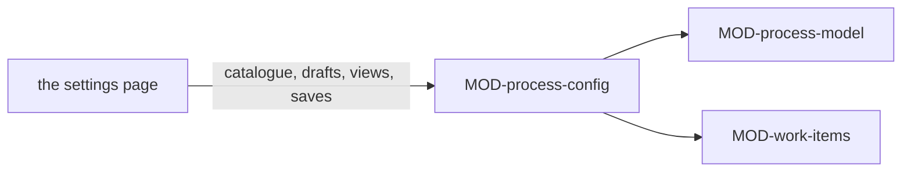

# ARC-025 How products are developed

## Context

How a product is developed is data: the process models and practices of the shipped catalogue and of the instance, a
product's declaration, and the instance's participants (ARC-019). The author edits them on pages (UC-031, UC-002,
UC-017): a model with its errors shown as they type and its diagram beside the form, a declaration that shows at once the
roles and who may hold them, the workflow and the Definition of Done it gives, and a participant with its presets. A
page that computed these itself could not be tested without a browser; the rules they follow are those of
`MOD-process-model` and, for a planned model's plan, `MOD-work-items`.

## Decision

1. **One feature.** `MOD-process-config` computes what the configuration pages show and the file each save writes; it
   reads only through ports and writes nothing. The page that shows it and commits its files is the settings page.
2. **The catalogue** (`MOD-process-config.catalogueOf`) is every model and practice at the instance's head: the shipped
   ones under `src/process-model/catalogue/`, the instance's own under `docs/process-models/`, each with what it is for,
   the errors of its definition, and the products declaring it with the version each declared.
3. **A model is edited as data.** Adapting copies a model under a new name that records where it came from; a new one
   starts empty with its kind of work (`MOD-process-config.startModel`). Each change gives the model's canonical text,
   its errors beside their lines and its diagram as Mermaid (`MOD-process-config.modelDraft`,
   `MOD-process-config.modelDiagram`); a planned model shows the plan it gives a product
   (`MOD-process-config.planPreview`). It is saved only without an error, as `docs/process-models/<name>.md`, never
   under the name of a shipped model, and never over a file that changed since it was opened.
4. **A declaration shows what it gives** (`MOD-process-config.declarationView`): the models grouped by kind of work with
   what each is for; for the model chosen, every role with each participant, what it lacks and whether its type and
   place allow it, and the capabilities no participant has; the workflow with what the practices and the product's
   process requirements add; the practices that fit; the Definition of Done; what the model changes against the one
   declared before; and every problem — a model with an error, a role that needs a person and has none, a holder that
   is no participant or lacks a capability. It is saved only without one.
5. **A participant** starts from the presets of its type — the place *this machine* for a CLI agent, except behind a
   remote session (`MOD-process-config.participantPreset`) —, and its route is written from its form in words the job
   runtimes read back (`MOD-process-config.participantOf`): "the GitHub account `alice`", or "the GitLab account `carla`
   on gitlab.example.org"; "the endpoint hub of this browser", or for a model server a bridge calls "the bridge on this
   computer: the endpoint box" and "the bridge of the session gpu-box: the endpoint gpu-box-llm"; "the workflow
   agent-m-job: claude on GitHub's machines", or "… on the runner gpu-1" (ARC-029 decision 2); "the bridge on this
   computer: claude" (ARC-029 decision 10), or "the bridge of the session gpu-box: claude" (ARC-013 decision 8). A CLI
   or sandboxed agent the bridge reported missing or not logged in is not written
   (`THE BRIDGE FINDS THE INSTALLED AGENTS`) — where the bridge did not answer, the agent the author names is written,
   and saved untested (UC-017 6a) —, and a CI agent on a self-hosted runner only while the instance's repository is
   private. The agents a bridge reports ready and the register does not hold on it yet are offered as the forms of CLI
   agents, each named after its CLI — and the session it runs behind —, unique in the register, and added once its model
   is named — and behind a remote session its processing place, which the page cannot tell —
   (`MOD-process-config.bridgeOffer`; UC-044 5). A change shows the roles it holds in the products' declarations that it
   may no longer hold (`MOD-process-config.participantUse`), and the sources whose content may not go where it processes
   data (`MOD-process-config.sourcesBarred`) — it may be saved, and is never given their content. It is saved into the
   register — a new one at its end, a changed one in its row — only where the register reads without an error
   afterwards, a CI agent on a self-hosted runner only while the instance's repository is private, and a CLI or
   sandboxed agent only after its test through the bridge worked or where the author chose to save it untested
   (UC-017 6a).
6. **A save is a planned file** (`MOD-process-config.planConfig`): the page writes it as one commit on the head it read
   (ARC-004), and a file that changed since it was opened is refused, never overwritten.



## Alternatives

- **The rules in the page** — the errors, the roles a participant may hold and the files a save writes could then be
  tested only in a browser.
- **A model edited as raw Markdown** — the author would see the errors only after saving, and the form could not place
  each error beside the part it concerns.
- **Editing a shipped model in place** — the shipped catalogue follows the book (`AGENT M CARRIES THE BOOK'S
  CATALOGUE`); an instance adapts it under a name of its own.
- **A route a person types** — the job runtimes read a route back; one written from the form's fields is one they read.
- **A participant's model taken from the bridge** — not possible: the bridge's greeting names an agent's CLI and its
  version, and no model (ARC-011 decision 8); the author names the model the agent is configured to use (UC-017 3).

## Consequences

- No use-case step is realised here. The steps of UC-002, UC-017 and UC-031 are actions on the settings page; they are
  realised where it is designed, by its interfaces together with these.
- A product keeps the version of the model it declared; a newer version reaches it only when its declaration is saved
  again, and the page then shows what the newer one changes.
- Starting no job on a self-hosted runner of a public repository is the CI runtime's part of
  `A SELF-HOSTED RUNNER SERVES AGENT M ONLY FROM A PRIVATE REPOSITORY`; here the participant is refused.
- A route written here is read by the job runtimes: a CI agent's by `MOD-job-runner.ciAgentOf`, an agent's on the bridge
  of this computer by `MOD-job-runner.bridgeAgentOf` (ARC-029). An agent behind a remote session is configured and tested,
  and its jobs wait for the runtimes to read its route (ARC-013's consequences).
- The form's own texts, its notes and its test are the settings page's (ARC-026 decision 12).

## Modules

### MOD-process-config

```json module
{
  "id": "MOD-process-config",
  "folder": "src/process-config/",
  "layer": "feature",
  "responsibility": "Computes what the pages configuring how products are developed show, and the files their saves write: the catalogue of an instance's models and practices with the products declaring each, a model being edited with its errors, diagram and plan preview, a product's declaration being edited with the roles, workflow and Definition of Done it gives and what keeps it from being saved, a participant's presets, its route written from its form, the agents a bridge offers as participants and the roles it holds; it reads only through ports and writes nothing.",
  "realises": ["A MODEL DEFINITION IS VALIDATED BEFORE IT IS USED", "A ROLE NAMES THE CAPABILITIES IT NEEDS"],
  "owns": ["ProductDeclaration", "ModelUse", "CatalogueEntry", "Catalogue", "ProcessModelOrNone", "ModelDraft", "PlanPreview", "DeclarationInput", "ModelChoice", "ModelGroup", "RoleRow", "PracticeChoice", "ModelChangeOrNone", "DeclarationView", "ParticipantPreset", "ProductRole", "ParticipantUse", "ParticipantForm", "ModelSave", "DeclarationSave", "ParticipantSave", "ConfigChange", "ConfigHead"],
  "uses": ["MOD-contracts", "MOD-process-model", "MOD-work-items"]
}
```

```json interface
{
  "id": "MOD-process-config.catalogueOf",
  "summary": "The catalogue at the instance's head: every model and practice of the shipped catalogue under src/process-model/catalogue/ and of the instance's own under docs/process-models/, each with its kind, measure, what it is for, the model it was adapted from, the errors of its definition, and the products declaring it with the version each declared — shipped first, then by name.",
  "params": [
    { "name": "snapshot", "type": "Snapshot" },
    { "name": "instance", "type": "ReadPort" },
    { "name": "declarations", "type": "ProductDeclaration[]" }
  ],
  "result": "Catalogue",
  "async": true,
  "refusals": [],
  "examples": [
    {
      "name": "three shipped definitions and one of the instance",
      "input": {
        "snapshot": {
          "commit": "a900000000000000000000000000000000000000",
          "tree": [
            { "path": "docs/process-models/scrum.md", "blob": "3cf5eb32eb2b19fb8d78144763f87ae102efdbbd" },
            { "path": "src/process-model/catalogue/devops.md", "blob": "39aa49976758648c9a46b24c8a1c2a8c49053e2e" },
            { "path": "src/process-model/catalogue/kanban.md", "blob": "f05591dcf5cff8213c42f8f75ec82b41ada9dc0b" },
            { "path": "src/process-model/catalogue/v-model.md", "blob": "856921837cdfd759b62ae92008161c6c6064a51f" }
          ]
        },
        "instance": { "docs/process-models/scrum.md": "---\nname: scrum\nkind: pulled\nmeasure: remaining items per time box\n---\n# Scrum\n\n## Phases\n\n| Name | Role | Produces |\n|---|---|---|\n| Sprint planning | Product Owner | ITM |\n| Development | Developers | MOD, TST |\n| Sprint review | Product Owner | the review of the increment |\n\n## Transitions\n\n| From | To | Kind |\n|---|---|---|\n| Sprint planning | Development | sequence |\n| Development | Sprint review | sequence |\n| Sprint review | Sprint planning | sequence |\n\n## Gates\n\n| Between | Artifacts | Condition | Decider |\n|---|---|---|---|\n| Sprint planning → Development | ITM | the sprint's items are ready | Product Owner |\n| Development → Sprint review | MOD | CI is green | Product Owner |\n\n## Roles\n\n| Name | Filled by | Capabilities |\n|---|---|---|\n| Product Owner | person | read the repository, write to the repository |\n| Developers | agent | read the repository, write to the repository, run code and tests |\n\n## Flow control\n\n| Kind | Value |\n|---|---|\n| WIP limit | none |\n| Time box | 2 weeks |\n| Sprints | yes |\n", "src/process-model/catalogue/devops.md": "---\nname: devops\nkind: practice\nfits: v-model, pulled\n---\n# DevOps\n\nA release is deployed after validation, once its deployment check is green.\n\n## Phases\n\n| Name | Role | Produces |\n|---|---|---|\n| Deployment | Operator | the deployed release |\n\n## Transitions\n\n| From | To | Kind |\n|---|---|---|\n| Validation | Deployment | sequence |\n\n## Verification pairs\n\n| Phase | Checked by |\n|---|---|\n\n## Gates\n\n| Between | Artifacts | Condition | Decider |\n|---|---|---|---|\n| Validation → Deployment | TST | the deployment check is green | CI check `deploy` |\n\n## Roles\n\n| Name | Filled by | Capabilities |\n|---|---|---|\n| Operator | agent | read the repository, run code and tests |\n", "src/process-model/catalogue/kanban.md": "---\nname: kanban\nkind: pulled\nmeasure: items per state over time\nmanages: work that arrives unpredictably and must flow without long waits\naccepts: no fixed delivery date for a set of items\nsuits: maintaining a product that receives issues every week\nchapter: Vibe Coding, ch. 7 §4\n---\n# Kanban\n\nWork is pulled from the backlog as capacity frees up.\n\n## Phases\n\n| Name | Role | Produces |\n|---|---|---|\n| Backlog | Product Owner | ITM |\n| Doing | Developers | MOD, TST |\n| Done | Product Owner | the merged item |\n\n## Transitions\n\n| From | To | Kind |\n|---|---|---|\n| Backlog | Doing | sequence |\n| Doing | Done | sequence |\n\n## Verification pairs\n\n| Phase | Checked by |\n|---|---|\n\n## Gates\n\n| Between | Artifacts | Condition | Decider |\n|---|---|---|---|\n| Doing → Done | MOD | CI is green | CI check `tests` |\n\n## Roles\n\n| Name | Filled by | Capabilities |\n|---|---|---|\n| Product Owner | person | read the repository, write to the repository |\n| Developers | agent | read the repository, write to the repository, run code and tests |\n\n## Flow control\n\n| Kind | Value |\n|---|---|\n| WIP limit | 3 |\n| Time box | none |\n| Sprints | no |\n", "src/process-model/catalogue/v-model.md": "---\nname: v-model\nkind: planned\nmeasure: plan entries per phase\n---\n# V-model\n\nEvery accepted requirement passes every phase; each later phase checks an earlier one.\n\n## Phases\n\n| Name | Role | Produces |\n|---|---|---|\n| Requirements | Analyst | requirements, UC |\n| Design | Architect | ARC |\n| Implementation | Developers | MOD |\n| Testing | Tester | TST |\n| Validation | Analyst | the validation of the requirements |\n\n## Transitions\n\n| From | To | Kind |\n|---|---|---|\n| Requirements | Design | sequence |\n| Design | Implementation | sequence |\n| Implementation | Testing | sequence |\n| Testing | Implementation | back |\n| Testing | Validation | sequence |\n\n## Verification pairs\n\n| Phase | Checked by |\n|---|---|\n| Design | Testing |\n| Requirements | Validation |\n\n## Gates\n\n| Between | Artifacts | Condition | Decider |\n|---|---|---|---|\n| Design → Implementation | ARC | every requirement has an ARC, and the design is accepted | Architect |\n| Implementation → Testing | MOD | CI is green | CI check `tests` |\n\n## Roles\n\n| Name | Filled by | Capabilities |\n|---|---|---|\n| Analyst | either | draft text, read the repository |\n| Architect | person | read the repository |\n| Developers | agent | read the repository, write to the repository, run code and tests |\n| Tester | either | read the repository, run code and tests |\n" },
        "declarations": [
          { "product": "https://github.com/alice/thesis", "model": "v-model", "modelFile": "src/process-model/catalogue/v-model.md", "modelVersion": "5a00000000000000000000000000000000000000" },
          { "product": "https://github.com/alice/notes", "model": "scrum", "modelFile": "docs/process-models/scrum.md", "modelVersion": "a900000000000000000000000000000000000000" }
        ]
      },
      "result": {
        "models": [
          {
            "name": "kanban",
            "file": "src/process-model/catalogue/kanban.md",
            "blob": "f05591dcf5cff8213c42f8f75ec82b41ada9dc0b",
            "shipped": true,
            "kind": "pulled",
            "measure": "items per state over time",
            "fits": [],
            "about": { "manages": "work that arrives unpredictably and must flow without long waits", "accepts": "no fixed delivery date for a set of items", "suits": "maintaining a product that receives issues every week", "chapter": "Vibe Coding, ch. 7 §4" },
            "adaptedFrom": "",
            "title": "Kanban",
            "findings": [],
            "usedBy": []
          },
          {
            "name": "v-model",
            "file": "src/process-model/catalogue/v-model.md",
            "blob": "856921837cdfd759b62ae92008161c6c6064a51f",
            "shipped": true,
            "kind": "planned",
            "measure": "plan entries per phase",
            "fits": [],
            "about": { "manages": "", "accepts": "", "suits": "", "chapter": "" },
            "adaptedFrom": "",
            "title": "V-model",
            "findings": [],
            "usedBy": [
              { "product": "https://github.com/alice/thesis", "version": "5a00000000000000000000000000000000000000" }
            ]
          },
          {
            "name": "scrum",
            "file": "docs/process-models/scrum.md",
            "blob": "3cf5eb32eb2b19fb8d78144763f87ae102efdbbd",
            "shipped": false,
            "kind": "pulled",
            "measure": "remaining items per time box",
            "fits": [],
            "about": { "manages": "", "accepts": "", "suits": "", "chapter": "" },
            "adaptedFrom": "",
            "title": "Scrum",
            "findings": [],
            "usedBy": [
              { "product": "https://github.com/alice/notes", "version": "a900000000000000000000000000000000000000" }
            ]
          }
        ],
        "practices": [
          {
            "name": "devops",
            "file": "src/process-model/catalogue/devops.md",
            "blob": "39aa49976758648c9a46b24c8a1c2a8c49053e2e",
            "shipped": true,
            "kind": "practice",
            "measure": "",
            "fits": ["v-model", "pulled"],
            "about": { "manages": "", "accepts": "", "suits": "", "chapter": "" },
            "adaptedFrom": "",
            "title": "DevOps",
            "findings": [],
            "usedBy": []
          }
        ]
      }
    }
  ]
}
```

```json interface
{
  "id": "MOD-process-config.startModel",
  "summary": "A model to edit: a copy of the one adapted, under a new name, recording the model it was adapted from; or, from none, an empty model of a kind of work with the measure that kind presets.",
  "params": [
    { "name": "from", "type": "ProcessModelOrNone" },
    { "name": "name", "type": "string" },
    { "name": "kind", "type": "string" }
  ],
  "result": "ProcessModel",
  "async": false,
  "refusals": [
    { "code": "not-a-name", "when": "the name is no lower-case words joined by hyphens" },
    { "code": "not-a-kind", "when": "a new model's kind of work is neither planned nor pulled" }
  ],
  "examples": [
    {
      "name": "the V-model adapted",
      "input": {
        "from": {
          "name": "v-model",
          "kind": "planned",
          "adaptedFrom": "",
          "measure": "plan entries per phase",
          "fits": [],
          "about": { "manages": "", "accepts": "", "suits": "", "chapter": "" },
          "title": "V-model",
          "intro": "Every accepted requirement passes every phase; each later phase checks an earlier one.",
          "phases": [
            {
              "name": "Requirements",
              "role": "Analyst",
              "produces": "requirements, UC",
              "kinds": ["UC", "requirement"],
              "line": 14
            },
            { "name": "Design", "role": "Architect", "produces": "ARC", "kinds": ["ARC"], "line": 15 },
            { "name": "Implementation", "role": "Developers", "produces": "MOD", "kinds": ["MOD"], "line": 16 },
            { "name": "Testing", "role": "Tester", "produces": "TST", "kinds": ["TST"], "line": 17 },
            {
              "name": "Validation",
              "role": "Analyst",
              "produces": "the validation of the requirements",
              "kinds": [],
              "line": 18
            }
          ],
          "transitions": [
            { "from": "Requirements", "to": "Design", "kind": "sequence", "line": 24 },
            { "from": "Design", "to": "Implementation", "kind": "sequence", "line": 25 },
            { "from": "Implementation", "to": "Testing", "kind": "sequence", "line": 26 },
            { "from": "Testing", "to": "Implementation", "kind": "back", "line": 27 },
            { "from": "Testing", "to": "Validation", "kind": "sequence", "line": 28 }
          ],
          "pairs": [
            { "phase": "Design", "checkedBy": "Testing", "line": 34 },
            { "phase": "Requirements", "checkedBy": "Validation", "line": 35 }
          ],
          "gates": [
            {
              "between": "Design → Implementation",
              "from": "Design",
              "to": "Implementation",
              "artifacts": "ARC",
              "kinds": ["ARC"],
              "condition": "every requirement has an ARC, and the design is accepted",
              "decider": { "role": "Architect" },
              "line": 41
            },
            {
              "between": "Implementation → Testing",
              "from": "Implementation",
              "to": "Testing",
              "artifacts": "MOD",
              "kinds": ["MOD"],
              "condition": "CI is green",
              "decider": { "check": "tests" },
              "line": 42
            }
          ],
          "roles": [
            {
              "name": "Analyst",
              "filledBy": "either",
              "capabilities": ["draft text", "read the repository"],
              "line": 48
            },
            { "name": "Architect", "filledBy": "person", "capabilities": ["read the repository"], "line": 49 },
            {
              "name": "Developers",
              "filledBy": "agent",
              "capabilities": ["read the repository", "write to the repository", "run code and tests"],
              "line": 50
            },
            {
              "name": "Tester",
              "filledBy": "either",
              "capabilities": ["read the repository", "run code and tests"],
              "line": 51
            }
          ],
          "flow": { "wipLimit": null, "timeBox": "", "sprints": null, "line": 0 },
          "lines": { "kind": 3, "measure": 4 },
          "problems": []
        },
        "name": "v-model-security",
        "kind": ""
      },
      "result": {
        "name": "v-model-security",
        "kind": "planned",
        "adaptedFrom": "v-model",
        "measure": "plan entries per phase",
        "fits": [],
        "about": { "manages": "", "accepts": "", "suits": "", "chapter": "" },
        "title": "V-model — v-model-security",
        "intro": "Every accepted requirement passes every phase; each later phase checks an earlier one.",
        "phases": [
          {
            "name": "Requirements",
            "role": "Analyst",
            "produces": "requirements, UC",
            "kinds": ["UC", "requirement"],
            "line": 14
          },
          { "name": "Design", "role": "Architect", "produces": "ARC", "kinds": ["ARC"], "line": 15 },
          { "name": "Implementation", "role": "Developers", "produces": "MOD", "kinds": ["MOD"], "line": 16 },
          { "name": "Testing", "role": "Tester", "produces": "TST", "kinds": ["TST"], "line": 17 },
          {
            "name": "Validation",
            "role": "Analyst",
            "produces": "the validation of the requirements",
            "kinds": [],
            "line": 18
          }
        ],
        "transitions": [
          { "from": "Requirements", "to": "Design", "kind": "sequence", "line": 24 },
          { "from": "Design", "to": "Implementation", "kind": "sequence", "line": 25 },
          { "from": "Implementation", "to": "Testing", "kind": "sequence", "line": 26 },
          { "from": "Testing", "to": "Implementation", "kind": "back", "line": 27 },
          { "from": "Testing", "to": "Validation", "kind": "sequence", "line": 28 }
        ],
        "pairs": [
          { "phase": "Design", "checkedBy": "Testing", "line": 34 },
          { "phase": "Requirements", "checkedBy": "Validation", "line": 35 }
        ],
        "gates": [
          {
            "between": "Design → Implementation",
            "from": "Design",
            "to": "Implementation",
            "artifacts": "ARC",
            "kinds": ["ARC"],
            "condition": "every requirement has an ARC, and the design is accepted",
            "decider": { "role": "Architect" },
            "line": 41
          },
          {
            "between": "Implementation → Testing",
            "from": "Implementation",
            "to": "Testing",
            "artifacts": "MOD",
            "kinds": ["MOD"],
            "condition": "CI is green",
            "decider": { "check": "tests" },
            "line": 42
          }
        ],
        "roles": [
          {
            "name": "Analyst",
            "filledBy": "either",
            "capabilities": ["draft text", "read the repository"],
            "line": 48
          },
          { "name": "Architect", "filledBy": "person", "capabilities": ["read the repository"], "line": 49 },
          {
            "name": "Developers",
            "filledBy": "agent",
            "capabilities": ["read the repository", "write to the repository", "run code and tests"],
            "line": 50
          },
          {
            "name": "Tester",
            "filledBy": "either",
            "capabilities": ["read the repository", "run code and tests"],
            "line": 51
          }
        ],
        "flow": { "wipLimit": null, "timeBox": "", "sprints": null, "line": 0 },
        "lines": { "kind": 3, "measure": 4 },
        "problems": []
      }
    },
    {
      "name": "a new model of pulled work",
      "input": { "from": null, "name": "team-flow", "kind": "pulled" },
      "result": {
        "name": "team-flow",
        "kind": "pulled",
        "adaptedFrom": "",
        "measure": "items per state over time",
        "fits": [],
        "about": { "manages": "", "accepts": "", "suits": "", "chapter": "" },
        "title": "team-flow",
        "intro": "",
        "phases": [],
        "transitions": [],
        "pairs": [],
        "gates": [],
        "roles": [],
        "flow": { "wipLimit": null, "timeBox": "", "sprints": null, "line": 0 },
        "lines": { "kind": 1, "measure": 1 },
        "problems": []
      }
    },
    {
      "name": "a name with spaces",
      "input": {
        "from": {
          "name": "v-model",
          "kind": "planned",
          "adaptedFrom": "",
          "measure": "plan entries per phase",
          "fits": [],
          "about": { "manages": "", "accepts": "", "suits": "", "chapter": "" },
          "title": "V-model",
          "intro": "Every accepted requirement passes every phase; each later phase checks an earlier one.",
          "phases": [
            {
              "name": "Requirements",
              "role": "Analyst",
              "produces": "requirements, UC",
              "kinds": ["UC", "requirement"],
              "line": 14
            },
            { "name": "Design", "role": "Architect", "produces": "ARC", "kinds": ["ARC"], "line": 15 },
            { "name": "Implementation", "role": "Developers", "produces": "MOD", "kinds": ["MOD"], "line": 16 },
            { "name": "Testing", "role": "Tester", "produces": "TST", "kinds": ["TST"], "line": 17 },
            {
              "name": "Validation",
              "role": "Analyst",
              "produces": "the validation of the requirements",
              "kinds": [],
              "line": 18
            }
          ],
          "transitions": [
            { "from": "Requirements", "to": "Design", "kind": "sequence", "line": 24 },
            { "from": "Design", "to": "Implementation", "kind": "sequence", "line": 25 },
            { "from": "Implementation", "to": "Testing", "kind": "sequence", "line": 26 },
            { "from": "Testing", "to": "Implementation", "kind": "back", "line": 27 },
            { "from": "Testing", "to": "Validation", "kind": "sequence", "line": 28 }
          ],
          "pairs": [
            { "phase": "Design", "checkedBy": "Testing", "line": 34 },
            { "phase": "Requirements", "checkedBy": "Validation", "line": 35 }
          ],
          "gates": [
            {
              "between": "Design → Implementation",
              "from": "Design",
              "to": "Implementation",
              "artifacts": "ARC",
              "kinds": ["ARC"],
              "condition": "every requirement has an ARC, and the design is accepted",
              "decider": { "role": "Architect" },
              "line": 41
            },
            {
              "between": "Implementation → Testing",
              "from": "Implementation",
              "to": "Testing",
              "artifacts": "MOD",
              "kinds": ["MOD"],
              "condition": "CI is green",
              "decider": { "check": "tests" },
              "line": 42
            }
          ],
          "roles": [
            {
              "name": "Analyst",
              "filledBy": "either",
              "capabilities": ["draft text", "read the repository"],
              "line": 48
            },
            { "name": "Architect", "filledBy": "person", "capabilities": ["read the repository"], "line": 49 },
            {
              "name": "Developers",
              "filledBy": "agent",
              "capabilities": ["read the repository", "write to the repository", "run code and tests"],
              "line": 50
            },
            {
              "name": "Tester",
              "filledBy": "either",
              "capabilities": ["read the repository", "run code and tests"],
              "line": 51
            }
          ],
          "flow": { "wipLimit": null, "timeBox": "", "sprints": null, "line": 0 },
          "lines": { "kind": 3, "measure": 4 },
          "problems": []
        },
        "name": "V model 2",
        "kind": ""
      },
      "refused": "not-a-name"
    }
  ]
}
```

```json interface
{
  "id": "MOD-process-config.modelDiagram",
  "summary": "The diagram of a model as Mermaid: a node per phase with its role, an arrow per transition — dotted for an alternative or a return, a return labelled back —, the gate on its arrow with its decider, and each verification pair as a dotted line.",
  "params": [{ "name": "model", "type": "ProcessModel" }],
  "result": "string",
  "async": false,
  "refusals": [],
  "examples": [
    {
      "name": "the V-model",
      "input": {
        "model": {
          "name": "v-model",
          "kind": "planned",
          "adaptedFrom": "",
          "measure": "plan entries per phase",
          "fits": [],
          "about": { "manages": "", "accepts": "", "suits": "", "chapter": "" },
          "title": "V-model",
          "intro": "Every accepted requirement passes every phase; each later phase checks an earlier one.",
          "phases": [
            {
              "name": "Requirements",
              "role": "Analyst",
              "produces": "requirements, UC",
              "kinds": ["UC", "requirement"],
              "line": 14
            },
            { "name": "Design", "role": "Architect", "produces": "ARC", "kinds": ["ARC"], "line": 15 },
            { "name": "Implementation", "role": "Developers", "produces": "MOD", "kinds": ["MOD"], "line": 16 },
            { "name": "Testing", "role": "Tester", "produces": "TST", "kinds": ["TST"], "line": 17 },
            {
              "name": "Validation",
              "role": "Analyst",
              "produces": "the validation of the requirements",
              "kinds": [],
              "line": 18
            }
          ],
          "transitions": [
            { "from": "Requirements", "to": "Design", "kind": "sequence", "line": 24 },
            { "from": "Design", "to": "Implementation", "kind": "sequence", "line": 25 },
            { "from": "Implementation", "to": "Testing", "kind": "sequence", "line": 26 },
            { "from": "Testing", "to": "Implementation", "kind": "back", "line": 27 },
            { "from": "Testing", "to": "Validation", "kind": "sequence", "line": 28 }
          ],
          "pairs": [
            { "phase": "Design", "checkedBy": "Testing", "line": 34 },
            { "phase": "Requirements", "checkedBy": "Validation", "line": 35 }
          ],
          "gates": [
            {
              "between": "Design → Implementation",
              "from": "Design",
              "to": "Implementation",
              "artifacts": "ARC",
              "kinds": ["ARC"],
              "condition": "every requirement has an ARC, and the design is accepted",
              "decider": { "role": "Architect" },
              "line": 41
            },
            {
              "between": "Implementation → Testing",
              "from": "Implementation",
              "to": "Testing",
              "artifacts": "MOD",
              "kinds": ["MOD"],
              "condition": "CI is green",
              "decider": { "check": "tests" },
              "line": 42
            }
          ],
          "roles": [
            {
              "name": "Analyst",
              "filledBy": "either",
              "capabilities": ["draft text", "read the repository"],
              "line": 48
            },
            { "name": "Architect", "filledBy": "person", "capabilities": ["read the repository"], "line": 49 },
            {
              "name": "Developers",
              "filledBy": "agent",
              "capabilities": ["read the repository", "write to the repository", "run code and tests"],
              "line": 50
            },
            {
              "name": "Tester",
              "filledBy": "either",
              "capabilities": ["read the repository", "run code and tests"],
              "line": 51
            }
          ],
          "flow": { "wipLimit": null, "timeBox": "", "sprints": null, "line": 0 },
          "lines": { "kind": 3, "measure": 4 },
          "problems": []
        }
      },
      "result": "flowchart LR\n  phase_Requirements[\"Requirements<br/>Analyst\"]\n  phase_Design[\"Design<br/>Architect\"]\n  phase_Implementation[\"Implementation<br/>Developers\"]\n  phase_Testing[\"Testing<br/>Tester\"]\n  phase_Validation[\"Validation<br/>Analyst\"]\n  phase_Requirements --> phase_Design\n  phase_Design -->|\"gate · Architect\"| phase_Implementation\n  phase_Implementation -->|\"gate · CI check tests\"| phase_Testing\n  phase_Testing -.->|\"back\"| phase_Implementation\n  phase_Testing --> phase_Validation\n  phase_Testing -. \"checks\" .- phase_Design\n  phase_Validation -. \"checks\" .- phase_Requirements\n"
    }
  ]
}
```

```json interface
{
  "id": "MOD-process-config.modelDraft",
  "summary": "What the editor shows of a model as it stands: its canonical text, every error of that text beside its line, its diagram, and whether it may be saved — only without an error.",
  "params": [{ "name": "model", "type": "ProcessModel" }],
  "result": "ModelDraft",
  "async": false,
  "refusals": [],
  "examples": [
    {
      "name": "the V-model with a security review",
      "input": {
        "model": {
          "name": "v-model-security",
          "kind": "planned",
          "adaptedFrom": "v-model",
          "measure": "plan entries per phase",
          "fits": [],
          "about": { "manages": "", "accepts": "", "suits": "", "chapter": "" },
          "title": "V-model — v-model-security",
          "intro": "Every accepted requirement passes every phase; each later phase checks an earlier one.",
          "phases": [
            {
              "name": "Requirements",
              "role": "Analyst",
              "produces": "requirements, UC",
              "kinds": ["UC", "requirement"],
              "line": 14
            },
            { "name": "Design", "role": "Architect", "produces": "ARC", "kinds": ["ARC"], "line": 15 },
            { "name": "Implementation", "role": "Developers", "produces": "MOD", "kinds": ["MOD"], "line": 16 },
            { "name": "Testing", "role": "Tester", "produces": "TST", "kinds": ["TST"], "line": 17 },
            {
              "name": "Validation",
              "role": "Analyst",
              "produces": "the validation of the requirements",
              "kinds": [],
              "line": 18
            }
          ],
          "transitions": [
            { "from": "Requirements", "to": "Design", "kind": "sequence", "line": 24 },
            { "from": "Design", "to": "Implementation", "kind": "sequence", "line": 25 },
            { "from": "Implementation", "to": "Testing", "kind": "sequence", "line": 26 },
            { "from": "Testing", "to": "Implementation", "kind": "back", "line": 27 },
            { "from": "Testing", "to": "Validation", "kind": "sequence", "line": 28 }
          ],
          "pairs": [
            { "phase": "Design", "checkedBy": "Testing", "line": 34 },
            { "phase": "Requirements", "checkedBy": "Validation", "line": 35 }
          ],
          "gates": [
            {
              "between": "Design → Implementation",
              "from": "Design",
              "to": "Implementation",
              "artifacts": "ARC",
              "kinds": ["ARC"],
              "condition": "every requirement has an ARC, and the design is accepted",
              "decider": { "role": "Architect" },
              "line": 41
            },
            {
              "between": "Implementation → Testing",
              "from": "Implementation",
              "to": "Testing",
              "artifacts": "MOD",
              "kinds": ["MOD"],
              "condition": "CI is green",
              "decider": { "check": "tests" },
              "line": 42
            },
            {
              "between": "Implementation → Testing",
              "from": "Implementation",
              "to": "Testing",
              "artifacts": "ARC",
              "kinds": ["ARC"],
              "condition": "a person has accepted the threat model",
              "decider": { "role": "Security reviewer" },
              "line": 0
            }
          ],
          "roles": [
            {
              "name": "Analyst",
              "filledBy": "either",
              "capabilities": ["draft text", "read the repository"],
              "line": 48
            },
            { "name": "Architect", "filledBy": "person", "capabilities": ["read the repository"], "line": 49 },
            {
              "name": "Developers",
              "filledBy": "agent",
              "capabilities": ["read the repository", "write to the repository", "run code and tests"],
              "line": 50
            },
            {
              "name": "Tester",
              "filledBy": "either",
              "capabilities": ["read the repository", "run code and tests"],
              "line": 51
            },
            { "name": "Security reviewer", "filledBy": "either", "capabilities": ["read the repository"], "line": 0 }
          ],
          "flow": { "wipLimit": null, "timeBox": "", "sprints": null, "line": 0 },
          "lines": { "kind": 3, "measure": 4 },
          "problems": []
        }
      },
      "result": {
        "text": "---\nname: v-model-security\nkind: planned\nadapted_from: v-model\nmeasure: plan entries per phase\n---\n\n# V-model — v-model-security\n\nEvery accepted requirement passes every phase; each later phase checks an earlier one.\n\n## Phases\n\n| Name | Role | Produces |\n|---|---|---|\n| Requirements | Analyst | requirements, UC |\n| Design | Architect | ARC |\n| Implementation | Developers | MOD |\n| Testing | Tester | TST |\n| Validation | Analyst | the validation of the requirements |\n\n## Transitions\n\n| From | To | Kind |\n|---|---|---|\n| Requirements | Design | sequence |\n| Design | Implementation | sequence |\n| Implementation | Testing | sequence |\n| Testing | Implementation | back |\n| Testing | Validation | sequence |\n\n## Verification pairs\n\n| Phase | Checked by |\n|---|---|\n| Design | Testing |\n| Requirements | Validation |\n\n## Gates\n\n| Between | Artifacts | Condition | Decider |\n|---|---|---|---|\n| Design → Implementation | ARC | every requirement has an ARC, and the design is accepted | Architect |\n| Implementation → Testing | MOD | CI is green | CI check `tests` |\n| Implementation → Testing | ARC | a person has accepted the threat model | Security reviewer |\n\n## Roles\n\n| Name | Filled by | Capabilities |\n|---|---|---|\n| Analyst | either | draft text, read the repository |\n| Architect | person | read the repository |\n| Developers | agent | read the repository, write to the repository, run code and tests |\n| Tester | either | read the repository, run code and tests |\n| Security reviewer | either | read the repository |\n",
        "findings": [],
        "diagram": "flowchart LR\n  phase_Requirements[\"Requirements<br/>Analyst\"]\n  phase_Design[\"Design<br/>Architect\"]\n  phase_Implementation[\"Implementation<br/>Developers\"]\n  phase_Testing[\"Testing<br/>Tester\"]\n  phase_Validation[\"Validation<br/>Analyst\"]\n  phase_Requirements --> phase_Design\n  phase_Design -->|\"gate · Architect\"| phase_Implementation\n  phase_Implementation -->|\"gate · CI check tests\"| phase_Testing\n  phase_Testing -.->|\"back\"| phase_Implementation\n  phase_Testing --> phase_Validation\n  phase_Testing -. \"checks\" .- phase_Design\n  phase_Validation -. \"checks\" .- phase_Requirements\n",
        "savable": true
      }
    },
    {
      "name": "a gate without its decider's role",
      "input": {
        "model": {
          "name": "v-model-security",
          "kind": "planned",
          "adaptedFrom": "v-model",
          "measure": "plan entries per phase",
          "fits": [],
          "about": { "manages": "", "accepts": "", "suits": "", "chapter": "" },
          "title": "V-model — v-model-security",
          "intro": "Every accepted requirement passes every phase; each later phase checks an earlier one.",
          "phases": [
            {
              "name": "Requirements",
              "role": "Analyst",
              "produces": "requirements, UC",
              "kinds": ["UC", "requirement"],
              "line": 14
            },
            { "name": "Design", "role": "Architect", "produces": "ARC", "kinds": ["ARC"], "line": 15 },
            { "name": "Implementation", "role": "Developers", "produces": "MOD", "kinds": ["MOD"], "line": 16 },
            { "name": "Testing", "role": "Tester", "produces": "TST", "kinds": ["TST"], "line": 17 },
            {
              "name": "Validation",
              "role": "Analyst",
              "produces": "the validation of the requirements",
              "kinds": [],
              "line": 18
            }
          ],
          "transitions": [
            { "from": "Requirements", "to": "Design", "kind": "sequence", "line": 24 },
            { "from": "Design", "to": "Implementation", "kind": "sequence", "line": 25 },
            { "from": "Implementation", "to": "Testing", "kind": "sequence", "line": 26 },
            { "from": "Testing", "to": "Implementation", "kind": "back", "line": 27 },
            { "from": "Testing", "to": "Validation", "kind": "sequence", "line": 28 }
          ],
          "pairs": [
            { "phase": "Design", "checkedBy": "Testing", "line": 34 },
            { "phase": "Requirements", "checkedBy": "Validation", "line": 35 }
          ],
          "gates": [
            {
              "between": "Design → Implementation",
              "from": "Design",
              "to": "Implementation",
              "artifacts": "ARC",
              "kinds": ["ARC"],
              "condition": "every requirement has an ARC, and the design is accepted",
              "decider": { "role": "Architect" },
              "line": 41
            },
            {
              "between": "Implementation → Testing",
              "from": "Implementation",
              "to": "Testing",
              "artifacts": "MOD",
              "kinds": ["MOD"],
              "condition": "CI is green",
              "decider": { "check": "tests" },
              "line": 42
            },
            {
              "between": "Implementation → Testing",
              "from": "Implementation",
              "to": "Testing",
              "artifacts": "ARC",
              "kinds": ["ARC"],
              "condition": "a person has accepted the threat model",
              "decider": { "role": "Security reviewer" },
              "line": 0
            }
          ],
          "roles": [
            {
              "name": "Analyst",
              "filledBy": "either",
              "capabilities": ["draft text", "read the repository"],
              "line": 48
            },
            { "name": "Architect", "filledBy": "person", "capabilities": ["read the repository"], "line": 49 },
            {
              "name": "Developers",
              "filledBy": "agent",
              "capabilities": ["read the repository", "write to the repository", "run code and tests"],
              "line": 50
            },
            {
              "name": "Tester",
              "filledBy": "either",
              "capabilities": ["read the repository", "run code and tests"],
              "line": 51
            }
          ],
          "flow": { "wipLimit": null, "timeBox": "", "sprints": null, "line": 0 },
          "lines": { "kind": 3, "measure": 4 },
          "problems": []
        }
      },
      "result": {
        "text": "---\nname: v-model-security\nkind: planned\nadapted_from: v-model\nmeasure: plan entries per phase\n---\n\n# V-model — v-model-security\n\nEvery accepted requirement passes every phase; each later phase checks an earlier one.\n\n## Phases\n\n| Name | Role | Produces |\n|---|---|---|\n| Requirements | Analyst | requirements, UC |\n| Design | Architect | ARC |\n| Implementation | Developers | MOD |\n| Testing | Tester | TST |\n| Validation | Analyst | the validation of the requirements |\n\n## Transitions\n\n| From | To | Kind |\n|---|---|---|\n| Requirements | Design | sequence |\n| Design | Implementation | sequence |\n| Implementation | Testing | sequence |\n| Testing | Implementation | back |\n| Testing | Validation | sequence |\n\n## Verification pairs\n\n| Phase | Checked by |\n|---|---|\n| Design | Testing |\n| Requirements | Validation |\n\n## Gates\n\n| Between | Artifacts | Condition | Decider |\n|---|---|---|---|\n| Design → Implementation | ARC | every requirement has an ARC, and the design is accepted | Architect |\n| Implementation → Testing | MOD | CI is green | CI check `tests` |\n| Implementation → Testing | ARC | a person has accepted the threat model | Security reviewer |\n\n## Roles\n\n| Name | Filled by | Capabilities |\n|---|---|---|\n| Analyst | either | draft text, read the repository |\n| Architect | person | read the repository |\n| Developers | agent | read the repository, write to the repository, run code and tests |\n| Tester | either | read the repository, run code and tests |\n",
        "findings": [
          { "artifact": "v-model-security", "line": 45, "kind": "error", "what": "the gate Implementation → Testing is decided by \"Security reviewer\", which is no role of the model and no CI check", "rule": "A GATE NAMES WHO DECIDES IT", "fix": "name a role defined under ## Roles, or CI check `<name>`" }
        ],
        "diagram": "flowchart LR\n  phase_Requirements[\"Requirements<br/>Analyst\"]\n  phase_Design[\"Design<br/>Architect\"]\n  phase_Implementation[\"Implementation<br/>Developers\"]\n  phase_Testing[\"Testing<br/>Tester\"]\n  phase_Validation[\"Validation<br/>Analyst\"]\n  phase_Requirements --> phase_Design\n  phase_Design -->|\"gate · Architect\"| phase_Implementation\n  phase_Implementation -->|\"gate · CI check tests\"| phase_Testing\n  phase_Testing -.->|\"back\"| phase_Implementation\n  phase_Testing --> phase_Validation\n  phase_Testing -. \"checks\" .- phase_Design\n  phase_Validation -. \"checks\" .- phase_Requirements\n",
        "savable": false
      }
    }
  ]
}
```

```json interface
{
  "id": "MOD-process-config.planPreview",
  "summary": "The plan a planned model gives a product: how many accepted requirements, how many phases, how many plan entries — every requirement in every phase —, and whether the plan is still empty.",
  "params": [{ "name": "model", "type": "ProcessModel" }, { "name": "requirements", "type": "string[]" }],
  "result": "PlanPreview",
  "async": false,
  "refusals": [{ "code": "not-planned", "when": "the model pulls its work from a backlog" }],
  "examples": [
    {
      "name": "three requirements in the V-model",
      "input": {
        "model": {
          "name": "v-model",
          "kind": "planned",
          "adaptedFrom": "",
          "measure": "plan entries per phase",
          "fits": [],
          "about": { "manages": "", "accepts": "", "suits": "", "chapter": "" },
          "title": "V-model",
          "intro": "Every accepted requirement passes every phase; each later phase checks an earlier one.",
          "phases": [
            {
              "name": "Requirements",
              "role": "Analyst",
              "produces": "requirements, UC",
              "kinds": ["UC", "requirement"],
              "line": 14
            },
            { "name": "Design", "role": "Architect", "produces": "ARC", "kinds": ["ARC"], "line": 15 },
            { "name": "Implementation", "role": "Developers", "produces": "MOD", "kinds": ["MOD"], "line": 16 },
            { "name": "Testing", "role": "Tester", "produces": "TST", "kinds": ["TST"], "line": 17 },
            {
              "name": "Validation",
              "role": "Analyst",
              "produces": "the validation of the requirements",
              "kinds": [],
              "line": 18
            }
          ],
          "transitions": [
            { "from": "Requirements", "to": "Design", "kind": "sequence", "line": 24 },
            { "from": "Design", "to": "Implementation", "kind": "sequence", "line": 25 },
            { "from": "Implementation", "to": "Testing", "kind": "sequence", "line": 26 },
            { "from": "Testing", "to": "Implementation", "kind": "back", "line": 27 },
            { "from": "Testing", "to": "Validation", "kind": "sequence", "line": 28 }
          ],
          "pairs": [
            { "phase": "Design", "checkedBy": "Testing", "line": 34 },
            { "phase": "Requirements", "checkedBy": "Validation", "line": 35 }
          ],
          "gates": [
            {
              "between": "Design → Implementation",
              "from": "Design",
              "to": "Implementation",
              "artifacts": "ARC",
              "kinds": ["ARC"],
              "condition": "every requirement has an ARC, and the design is accepted",
              "decider": { "role": "Architect" },
              "line": 41
            },
            {
              "between": "Implementation → Testing",
              "from": "Implementation",
              "to": "Testing",
              "artifacts": "MOD",
              "kinds": ["MOD"],
              "condition": "CI is green",
              "decider": { "check": "tests" },
              "line": 42
            }
          ],
          "roles": [
            {
              "name": "Analyst",
              "filledBy": "either",
              "capabilities": ["draft text", "read the repository"],
              "line": 48
            },
            { "name": "Architect", "filledBy": "person", "capabilities": ["read the repository"], "line": 49 },
            {
              "name": "Developers",
              "filledBy": "agent",
              "capabilities": ["read the repository", "write to the repository", "run code and tests"],
              "line": 50
            },
            {
              "name": "Tester",
              "filledBy": "either",
              "capabilities": ["read the repository", "run code and tests"],
              "line": 51
            }
          ],
          "flow": { "wipLimit": null, "timeBox": "", "sprints": null, "line": 0 },
          "lines": { "kind": 3, "measure": 4 },
          "problems": []
        },
        "requirements": ["ONE CLICK", "NO SERVER", "EVERY TEXT IS REVIEWED"]
      },
      "result": { "requirements": 3, "phases": 5, "entries": 15, "empty": false }
    },
    {
      "name": "no accepted requirement yet",
      "input": {
        "model": {
          "name": "v-model",
          "kind": "planned",
          "adaptedFrom": "",
          "measure": "plan entries per phase",
          "fits": [],
          "about": { "manages": "", "accepts": "", "suits": "", "chapter": "" },
          "title": "V-model",
          "intro": "Every accepted requirement passes every phase; each later phase checks an earlier one.",
          "phases": [
            {
              "name": "Requirements",
              "role": "Analyst",
              "produces": "requirements, UC",
              "kinds": ["UC", "requirement"],
              "line": 14
            },
            { "name": "Design", "role": "Architect", "produces": "ARC", "kinds": ["ARC"], "line": 15 },
            { "name": "Implementation", "role": "Developers", "produces": "MOD", "kinds": ["MOD"], "line": 16 },
            { "name": "Testing", "role": "Tester", "produces": "TST", "kinds": ["TST"], "line": 17 },
            {
              "name": "Validation",
              "role": "Analyst",
              "produces": "the validation of the requirements",
              "kinds": [],
              "line": 18
            }
          ],
          "transitions": [
            { "from": "Requirements", "to": "Design", "kind": "sequence", "line": 24 },
            { "from": "Design", "to": "Implementation", "kind": "sequence", "line": 25 },
            { "from": "Implementation", "to": "Testing", "kind": "sequence", "line": 26 },
            { "from": "Testing", "to": "Implementation", "kind": "back", "line": 27 },
            { "from": "Testing", "to": "Validation", "kind": "sequence", "line": 28 }
          ],
          "pairs": [
            { "phase": "Design", "checkedBy": "Testing", "line": 34 },
            { "phase": "Requirements", "checkedBy": "Validation", "line": 35 }
          ],
          "gates": [
            {
              "between": "Design → Implementation",
              "from": "Design",
              "to": "Implementation",
              "artifacts": "ARC",
              "kinds": ["ARC"],
              "condition": "every requirement has an ARC, and the design is accepted",
              "decider": { "role": "Architect" },
              "line": 41
            },
            {
              "between": "Implementation → Testing",
              "from": "Implementation",
              "to": "Testing",
              "artifacts": "MOD",
              "kinds": ["MOD"],
              "condition": "CI is green",
              "decider": { "check": "tests" },
              "line": 42
            }
          ],
          "roles": [
            {
              "name": "Analyst",
              "filledBy": "either",
              "capabilities": ["draft text", "read the repository"],
              "line": 48
            },
            { "name": "Architect", "filledBy": "person", "capabilities": ["read the repository"], "line": 49 },
            {
              "name": "Developers",
              "filledBy": "agent",
              "capabilities": ["read the repository", "write to the repository", "run code and tests"],
              "line": 50
            },
            {
              "name": "Tester",
              "filledBy": "either",
              "capabilities": ["read the repository", "run code and tests"],
              "line": 51
            }
          ],
          "flow": { "wipLimit": null, "timeBox": "", "sprints": null, "line": 0 },
          "lines": { "kind": 3, "measure": 4 },
          "problems": []
        },
        "requirements": []
      },
      "result": { "requirements": 0, "phases": 5, "entries": 0, "empty": true }
    },
    {
      "name": "a model of pulled work",
      "input": {
        "model": {
          "name": "scrum",
          "kind": "pulled",
          "adaptedFrom": "",
          "measure": "remaining items per time box",
          "fits": [],
          "about": { "manages": "", "accepts": "", "suits": "", "chapter": "" },
          "title": "Scrum",
          "intro": "",
          "phases": [
            { "name": "Sprint planning", "role": "Product Owner", "produces": "ITM", "kinds": ["ITM"], "line": 12 },
            {
              "name": "Development",
              "role": "Developers",
              "produces": "MOD, TST",
              "kinds": ["MOD", "TST"],
              "line": 13
            },
            {
              "name": "Sprint review",
              "role": "Product Owner",
              "produces": "the review of the increment",
              "kinds": [],
              "line": 14
            }
          ],
          "transitions": [
            { "from": "Sprint planning", "to": "Development", "kind": "sequence", "line": 20 },
            { "from": "Development", "to": "Sprint review", "kind": "sequence", "line": 21 },
            { "from": "Sprint review", "to": "Sprint planning", "kind": "sequence", "line": 22 }
          ],
          "pairs": [],
          "gates": [
            {
              "between": "Sprint planning → Development",
              "from": "Sprint planning",
              "to": "Development",
              "artifacts": "ITM",
              "kinds": ["ITM"],
              "condition": "the sprint's items are ready",
              "decider": { "role": "Product Owner" },
              "line": 28
            },
            {
              "between": "Development → Sprint review",
              "from": "Development",
              "to": "Sprint review",
              "artifacts": "MOD",
              "kinds": ["MOD"],
              "condition": "CI is green",
              "decider": { "role": "Product Owner" },
              "line": 29
            }
          ],
          "roles": [
            {
              "name": "Product Owner",
              "filledBy": "person",
              "capabilities": ["read the repository", "write to the repository"],
              "line": 35
            },
            {
              "name": "Developers",
              "filledBy": "agent",
              "capabilities": ["read the repository", "write to the repository", "run code and tests"],
              "line": 36
            }
          ],
          "flow": { "wipLimit": null, "timeBox": "2 weeks", "sprints": true, "line": 38 },
          "lines": { "kind": 3, "measure": 4 },
          "problems": []
        },
        "requirements": ["ONE CLICK"]
      },
      "refused": "not-planned"
    }
  ]
}
```

```json interface
{
  "id": "MOD-process-config.declarationView",
  "summary": "What the page of a product's declaration shows: the models grouped by kind of work, each with what it is for, whether it is valid and how many products declare it; and for the model chosen the roles — every participant with what it lacks and whether its type and place allow it, the holders, and the capabilities no participant has —, the workflow with what the practices and the requirements add, the practices that fit, the Definition of Done, what the model changes against the one declared before, and every problem that keeps the declaration from being saved.",
  "params": [{ "name": "input", "type": "DeclarationInput" }],
  "result": "DeclarationView",
  "async": false,
  "refusals": [],
  "examples": [
    {
      "name": "the V-model with DevOps",
      "input": {
        "input": {
          "draft": {
            "model": "v-model",
            "modelFile": "src/process-model/catalogue/v-model.md",
            "modelVersion": "5a00000000000000000000000000000000000000",
            "sprintClose": "",
            "title": "How the thesis tool is developed",
            "intro": "The declaration of this product's process (UC-002).",
            "roles": [
              { "role": "Analyst", "participants": ["alice"], "line": 14 },
              { "role": "Architect", "participants": ["alice"], "line": 15 },
              { "role": "Developers", "participants": ["cli-dev"], "line": 16 },
              { "role": "Tester", "participants": ["ci-dev"], "line": 17 },
              { "role": "Operator", "participants": ["ci-dev"], "line": 18 }
            ],
            "practices": ["devops"],
            "branches": [{ "phase": "Implementation", "branch": "implementation", "line": 28 }],
            "done": [
              { "kind": "ci-check", "name": "lint", "text": "the linter passes", "line": 34 },
              { "kind": "person", "name": "", "text": "a second developer has read the change", "line": 35 }
            ],
            "gatesAdded": [
              {
                "requirement": "UNIT VERIFICATION IS DOCUMENTED",
                "between": "Testing → Validation",
                "from": "Testing",
                "to": "Validation",
                "artifacts": "TST",
                "kinds": ["TST"],
                "condition": "every unit's verification is recorded",
                "decider": { "role": "Tester" },
                "line": 41
              }
            ],
            "artifactsAdded": [
              {
                "requirement": "UNIT VERIFICATION IS DOCUMENTED",
                "phase": "Testing",
                "artifacts": "the unit verification report",
                "kinds": [],
                "line": 47
              }
            ],
            "notes": "## Releases\n\nA release is cut from `main` once Validation is passed.",
            "problems": []
          },
          "model": {
            "name": "v-model",
            "kind": "planned",
            "adaptedFrom": "",
            "measure": "plan entries per phase",
            "fits": [],
            "about": { "manages": "", "accepts": "", "suits": "", "chapter": "" },
            "title": "V-model",
            "intro": "Every accepted requirement passes every phase; each later phase checks an earlier one.",
            "phases": [
              {
                "name": "Requirements",
                "role": "Analyst",
                "produces": "requirements, UC",
                "kinds": ["UC", "requirement"],
                "line": 14
              },
              { "name": "Design", "role": "Architect", "produces": "ARC", "kinds": ["ARC"], "line": 15 },
              { "name": "Implementation", "role": "Developers", "produces": "MOD", "kinds": ["MOD"], "line": 16 },
              { "name": "Testing", "role": "Tester", "produces": "TST", "kinds": ["TST"], "line": 17 },
              {
                "name": "Validation",
                "role": "Analyst",
                "produces": "the validation of the requirements",
                "kinds": [],
                "line": 18
              }
            ],
            "transitions": [
              { "from": "Requirements", "to": "Design", "kind": "sequence", "line": 24 },
              { "from": "Design", "to": "Implementation", "kind": "sequence", "line": 25 },
              { "from": "Implementation", "to": "Testing", "kind": "sequence", "line": 26 },
              { "from": "Testing", "to": "Implementation", "kind": "back", "line": 27 },
              { "from": "Testing", "to": "Validation", "kind": "sequence", "line": 28 }
            ],
            "pairs": [
              { "phase": "Design", "checkedBy": "Testing", "line": 34 },
              { "phase": "Requirements", "checkedBy": "Validation", "line": 35 }
            ],
            "gates": [
              {
                "between": "Design → Implementation",
                "from": "Design",
                "to": "Implementation",
                "artifacts": "ARC",
                "kinds": ["ARC"],
                "condition": "every requirement has an ARC, and the design is accepted",
                "decider": { "role": "Architect" },
                "line": 41
              },
              {
                "between": "Implementation → Testing",
                "from": "Implementation",
                "to": "Testing",
                "artifacts": "MOD",
                "kinds": ["MOD"],
                "condition": "CI is green",
                "decider": { "check": "tests" },
                "line": 42
              }
            ],
            "roles": [
              {
                "name": "Analyst",
                "filledBy": "either",
                "capabilities": ["draft text", "read the repository"],
                "line": 48
              },
              { "name": "Architect", "filledBy": "person", "capabilities": ["read the repository"], "line": 49 },
              {
                "name": "Developers",
                "filledBy": "agent",
                "capabilities": ["read the repository", "write to the repository", "run code and tests"],
                "line": 50
              },
              {
                "name": "Tester",
                "filledBy": "either",
                "capabilities": ["read the repository", "run code and tests"],
                "line": 51
              }
            ],
            "flow": { "wipLimit": null, "timeBox": "", "sprints": null, "line": 0 },
            "lines": { "kind": 3, "measure": 4 },
            "problems": []
          },
          "declared": null,
          "practices": [
            {
              "name": "devops",
              "kind": "practice",
              "adaptedFrom": "",
              "measure": "",
              "fits": ["v-model", "pulled"],
              "about": { "manages": "", "accepts": "", "suits": "", "chapter": "" },
              "title": "DevOps",
              "intro": "A release is deployed after validation, once its deployment check is green.",
              "phases": [
                {
                  "name": "Deployment",
                  "role": "Operator",
                  "produces": "the deployed release",
                  "kinds": [],
                  "line": 14
                }
              ],
              "transitions": [{ "from": "Validation", "to": "Deployment", "kind": "sequence", "line": 20 }],
              "pairs": [],
              "gates": [
                {
                  "between": "Validation → Deployment",
                  "from": "Validation",
                  "to": "Deployment",
                  "artifacts": "TST",
                  "kinds": ["TST"],
                  "condition": "the deployment check is green",
                  "decider": { "check": "deploy" },
                  "line": 31
                }
              ],
              "roles": [
                {
                  "name": "Operator",
                  "filledBy": "agent",
                  "capabilities": ["read the repository", "run code and tests"],
                  "line": 37
                }
              ],
              "flow": { "wipLimit": null, "timeBox": "", "sprints": null, "line": 0 },
              "lines": { "kind": 3, "measure": 1 },
              "problems": []
            }
          ],
          "catalogue": {
            "models": [
              {
                "name": "kanban",
                "file": "src/process-model/catalogue/kanban.md",
                "blob": "f05591dcf5cff8213c42f8f75ec82b41ada9dc0b",
                "shipped": true,
                "kind": "pulled",
                "measure": "items per state over time",
                "fits": [],
                "about": { "manages": "work that arrives unpredictably and must flow without long waits", "accepts": "no fixed delivery date for a set of items", "suits": "maintaining a product that receives issues every week", "chapter": "Vibe Coding, ch. 7 §4" },
                "adaptedFrom": "",
                "title": "Kanban",
                "findings": [],
                "usedBy": []
              },
              {
                "name": "v-model",
                "file": "src/process-model/catalogue/v-model.md",
                "blob": "856921837cdfd759b62ae92008161c6c6064a51f",
                "shipped": true,
                "kind": "planned",
                "measure": "plan entries per phase",
                "fits": [],
                "about": { "manages": "", "accepts": "", "suits": "", "chapter": "" },
                "adaptedFrom": "",
                "title": "V-model",
                "findings": [],
                "usedBy": [
                  { "product": "https://github.com/alice/thesis", "version": "5a00000000000000000000000000000000000000" }
                ]
              },
              {
                "name": "scrum",
                "file": "docs/process-models/scrum.md",
                "blob": "3cf5eb32eb2b19fb8d78144763f87ae102efdbbd",
                "shipped": false,
                "kind": "pulled",
                "measure": "remaining items per time box",
                "fits": [],
                "about": { "manages": "", "accepts": "", "suits": "", "chapter": "" },
                "adaptedFrom": "",
                "title": "Scrum",
                "findings": [],
                "usedBy": [
                  { "product": "https://github.com/alice/notes", "version": "a900000000000000000000000000000000000000" }
                ]
              }
            ],
            "practices": [
              {
                "name": "devops",
                "file": "src/process-model/catalogue/devops.md",
                "blob": "39aa49976758648c9a46b24c8a1c2a8c49053e2e",
                "shipped": true,
                "kind": "practice",
                "measure": "",
                "fits": ["v-model", "pulled"],
                "about": { "manages": "", "accepts": "", "suits": "", "chapter": "" },
                "adaptedFrom": "",
                "title": "DevOps",
                "findings": [],
                "usedBy": []
              }
            ]
          },
          "participants": [
            {
              "name": "alice",
              "type": "person",
              "model": "",
              "context": null,
              "price": null,
              "capabilities": ["draft text", "read the repository", "write to the repository"],
              "place": "",
              "route": "the GitHub account `alice`",
              "line": 5
            },
            {
              "name": "hub-writer",
              "type": "model endpoint",
              "model": "llama-3.3-70b",
              "context": null,
              "price": null,
              "capabilities": ["draft text"],
              "place": "NHR@FAU, Erlangen",
              "route": "the endpoint hub of this browser",
              "line": 6
            },
            {
              "name": "gw-writer",
              "type": "model endpoint",
              "model": "gateway-model",
              "context": 32000,
              "price": { "currency": "EUR", "input": 0.2, "output": 0.6 },
              "capabilities": ["draft text"],
              "place": "a gateway in Frankfurt, Germany",
              "route": "the endpoint gw of this browser",
              "line": 7
            },
            {
              "name": "ci-dev",
              "type": "CI agent",
              "model": "claude-opus-5-5",
              "context": null,
              "price": null,
              "capabilities": ["read the repository", "write to the repository", "run code and tests"],
              "place": "GitHub's machines, a provider in the USA",
              "route": "the workflow agent-m-job",
              "line": 8
            },
            {
              "name": "cli-dev",
              "type": "CLI agent",
              "model": "claude-opus-5-5",
              "context": null,
              "price": null,
              "capabilities": ["draft text", "read the repository", "write to the repository", "run code and tests", "use tools"],
              "place": "this machine",
              "route": "the bridge on the Mac of `alice`",
              "line": 9
            }
          ],
          "requirements": [
            { "name": "UNIT VERIFICATION IS DOCUMENTED", "source": "IEC 62304, 5.5.5", "rule": "Every software unit's verification is documented.", "check": "`tests/test_unit_records.py`", "section": "3. Process", "line": 12 }
          ],
          "restrictions": []
        }
      },
      "result": {
        "groups": [
          {
            "kind": "planned",
            "models": [
              {
                "name": "v-model",
                "file": "src/process-model/catalogue/v-model.md",
                "shipped": true,
                "about": { "manages": "", "accepts": "", "suits": "", "chapter": "" },
                "valid": true,
                "usedBy": 1
              }
            ]
          },
          {
            "kind": "pulled",
            "models": [
              {
                "name": "kanban",
                "file": "src/process-model/catalogue/kanban.md",
                "shipped": true,
                "about": { "manages": "work that arrives unpredictably and must flow without long waits", "accepts": "no fixed delivery date for a set of items", "suits": "maintaining a product that receives issues every week", "chapter": "Vibe Coding, ch. 7 §4" },
                "valid": true,
                "usedBy": 0
              },
              {
                "name": "scrum",
                "file": "docs/process-models/scrum.md",
                "shipped": false,
                "about": { "manages": "", "accepts": "", "suits": "", "chapter": "" },
                "valid": true,
                "usedBy": 1
              }
            ]
          }
        ],
        "workflow": {
          "model": "v-model",
          "kind": "planned",
          "measure": "plan entries per phase",
          "flow": { "wipLimit": null, "timeBox": "", "sprints": null, "line": 0 },
          "phases": [
            {
              "name": "Requirements",
              "role": "Analyst",
              "produces": "requirements, UC",
              "kinds": ["UC", "requirement"],
              "line": 14,
              "practice": ""
            },
            { "name": "Design", "role": "Architect", "produces": "ARC", "kinds": ["ARC"], "line": 15, "practice": "" },
            {
              "name": "Implementation",
              "role": "Developers",
              "produces": "MOD",
              "kinds": ["MOD"],
              "line": 16,
              "practice": ""
            },
            { "name": "Testing", "role": "Tester", "produces": "TST", "kinds": ["TST"], "line": 17, "practice": "" },
            {
              "name": "Validation",
              "role": "Analyst",
              "produces": "the validation of the requirements",
              "kinds": [],
              "line": 18,
              "practice": ""
            },
            {
              "name": "Deployment",
              "role": "Operator",
              "produces": "the deployed release",
              "kinds": [],
              "line": 14,
              "practice": "devops"
            }
          ],
          "transitions": [
            { "from": "Requirements", "to": "Design", "kind": "sequence", "line": 24 },
            { "from": "Design", "to": "Implementation", "kind": "sequence", "line": 25 },
            { "from": "Implementation", "to": "Testing", "kind": "sequence", "line": 26 },
            { "from": "Testing", "to": "Implementation", "kind": "back", "line": 27 },
            { "from": "Testing", "to": "Validation", "kind": "sequence", "line": 28 },
            { "from": "Validation", "to": "Deployment", "kind": "sequence", "line": 20 }
          ],
          "pairs": [
            { "phase": "Design", "checkedBy": "Testing", "line": 34 },
            { "phase": "Requirements", "checkedBy": "Validation", "line": 35 }
          ],
          "gates": [
            {
              "between": "Design → Implementation",
              "from": "Design",
              "to": "Implementation",
              "artifacts": "ARC",
              "kinds": ["ARC"],
              "condition": "every requirement has an ARC, and the design is accepted",
              "decider": { "role": "Architect" },
              "line": 41,
              "practice": "",
              "requirement": "",
              "source": "",
              "holders": ["alice"]
            },
            {
              "between": "Implementation → Testing",
              "from": "Implementation",
              "to": "Testing",
              "artifacts": "MOD",
              "kinds": ["MOD"],
              "condition": "CI is green",
              "decider": { "check": "tests" },
              "line": 42,
              "practice": "",
              "requirement": "",
              "source": "",
              "holders": []
            },
            {
              "between": "Validation → Deployment",
              "from": "Validation",
              "to": "Deployment",
              "artifacts": "TST",
              "kinds": ["TST"],
              "condition": "the deployment check is green",
              "decider": { "check": "deploy" },
              "line": 31,
              "practice": "devops",
              "requirement": "",
              "source": "",
              "holders": []
            },
            {
              "between": "Testing → Validation",
              "from": "Testing",
              "to": "Validation",
              "artifacts": "TST",
              "kinds": ["TST"],
              "condition": "every unit's verification is recorded",
              "decider": { "role": "Tester" },
              "line": 41,
              "practice": "",
              "requirement": "UNIT VERIFICATION IS DOCUMENTED",
              "source": "IEC 62304, 5.5.5",
              "holders": ["ci-dev"]
            }
          ],
          "roles": [
            {
              "name": "Analyst",
              "filledBy": "either",
              "capabilities": ["draft text", "read the repository"],
              "line": 48,
              "holders": ["alice"]
            },
            {
              "name": "Architect",
              "filledBy": "person",
              "capabilities": ["read the repository"],
              "line": 49,
              "holders": ["alice"]
            },
            {
              "name": "Developers",
              "filledBy": "agent",
              "capabilities": ["read the repository", "write to the repository", "run code and tests"],
              "line": 50,
              "holders": ["cli-dev"]
            },
            {
              "name": "Tester",
              "filledBy": "either",
              "capabilities": ["read the repository", "run code and tests"],
              "line": 51,
              "holders": ["ci-dev"]
            },
            {
              "name": "Operator",
              "filledBy": "agent",
              "capabilities": ["read the repository", "run code and tests"],
              "line": 37,
              "holders": ["ci-dev"]
            }
          ],
          "branches": [{ "phase": "Implementation", "branch": "implementation", "line": 28 }],
          "artifactsAdded": [
            { "requirement": "UNIT VERIFICATION IS DOCUMENTED", "source": "IEC 62304, 5.5.5", "phase": "Testing", "artifacts": "the unit verification report" }
          ],
          "problems": []
        },
        "roles": [
          {
            "role": "Analyst",
            "filledBy": "either",
            "capabilities": ["draft text", "read the repository"],
            "holders": ["alice"],
            "candidates": [
              { "participant": "alice", "ok": true, "missing": [], "allowed": true, "placeWarnings": [] },
              {
                "participant": "hub-writer",
                "ok": false,
                "missing": ["read the repository"],
                "allowed": true,
                "placeWarnings": []
              },
              {
                "participant": "gw-writer",
                "ok": false,
                "missing": ["read the repository"],
                "allowed": true,
                "placeWarnings": []
              },
              {
                "participant": "ci-dev",
                "ok": false,
                "missing": ["draft text"],
                "allowed": true,
                "placeWarnings": []
              },
              { "participant": "cli-dev", "ok": true, "missing": [], "allowed": true, "placeWarnings": [] }
            ],
            "missing": []
          },
          {
            "role": "Architect",
            "filledBy": "person",
            "capabilities": ["read the repository"],
            "holders": ["alice"],
            "candidates": [
              { "participant": "alice", "ok": true, "missing": [], "allowed": true, "placeWarnings": [] },
              {
                "participant": "hub-writer",
                "ok": false,
                "missing": ["read the repository"],
                "allowed": false,
                "placeWarnings": []
              },
              {
                "participant": "gw-writer",
                "ok": false,
                "missing": ["read the repository"],
                "allowed": false,
                "placeWarnings": []
              },
              { "participant": "ci-dev", "ok": false, "missing": [], "allowed": false, "placeWarnings": [] },
              { "participant": "cli-dev", "ok": false, "missing": [], "allowed": false, "placeWarnings": [] }
            ],
            "missing": []
          },
          {
            "role": "Developers",
            "filledBy": "agent",
            "capabilities": ["read the repository", "write to the repository", "run code and tests"],
            "holders": ["cli-dev"],
            "candidates": [
              {
                "participant": "alice",
                "ok": false,
                "missing": ["run code and tests"],
                "allowed": false,
                "placeWarnings": []
              },
              {
                "participant": "hub-writer",
                "ok": false,
                "missing": ["read the repository", "write to the repository", "run code and tests"],
                "allowed": true,
                "placeWarnings": []
              },
              {
                "participant": "gw-writer",
                "ok": false,
                "missing": ["read the repository", "write to the repository", "run code and tests"],
                "allowed": true,
                "placeWarnings": []
              },
              { "participant": "ci-dev", "ok": true, "missing": [], "allowed": true, "placeWarnings": [] },
              { "participant": "cli-dev", "ok": true, "missing": [], "allowed": true, "placeWarnings": [] }
            ],
            "missing": []
          },
          {
            "role": "Tester",
            "filledBy": "either",
            "capabilities": ["read the repository", "run code and tests"],
            "holders": ["ci-dev"],
            "candidates": [
              {
                "participant": "alice",
                "ok": false,
                "missing": ["run code and tests"],
                "allowed": true,
                "placeWarnings": []
              },
              {
                "participant": "hub-writer",
                "ok": false,
                "missing": ["read the repository", "run code and tests"],
                "allowed": true,
                "placeWarnings": []
              },
              {
                "participant": "gw-writer",
                "ok": false,
                "missing": ["read the repository", "run code and tests"],
                "allowed": true,
                "placeWarnings": []
              },
              { "participant": "ci-dev", "ok": true, "missing": [], "allowed": true, "placeWarnings": [] },
              { "participant": "cli-dev", "ok": true, "missing": [], "allowed": true, "placeWarnings": [] }
            ],
            "missing": []
          },
          {
            "role": "Operator",
            "filledBy": "agent",
            "capabilities": ["read the repository", "run code and tests"],
            "holders": ["ci-dev"],
            "candidates": [
              {
                "participant": "alice",
                "ok": false,
                "missing": ["run code and tests"],
                "allowed": false,
                "placeWarnings": []
              },
              {
                "participant": "hub-writer",
                "ok": false,
                "missing": ["read the repository", "run code and tests"],
                "allowed": true,
                "placeWarnings": []
              },
              {
                "participant": "gw-writer",
                "ok": false,
                "missing": ["read the repository", "run code and tests"],
                "allowed": true,
                "placeWarnings": []
              },
              { "participant": "ci-dev", "ok": true, "missing": [], "allowed": true, "placeWarnings": [] },
              { "participant": "cli-dev", "ok": true, "missing": [], "allowed": true, "placeWarnings": [] }
            ],
            "missing": []
          }
        ],
        "practices": [
          {
            "name": "devops",
            "file": "src/process-model/catalogue/devops.md",
            "about": { "manages": "", "accepts": "", "suits": "", "chapter": "" },
            "chosen": true
          }
        ],
        "done": [
          { "kind": "job-rule", "name": "ci-green", "text": "the pull request's CI run is green" },
          { "kind": "job-rule", "name": "tests-first", "text": "the job's first commit holds only failing tests — for a refactoring job, CI is green on every commit and no expected result changed" },
          { "kind": "job-rule", "name": "own-modules", "text": "the pull request changes only the job's modules" },
          { "kind": "job-rule", "name": "gates-recorded", "text": "every gate the workflow places before the merge is recorded" },
          { "kind": "ci-check", "name": "lint", "text": "the linter passes" },
          { "kind": "person", "name": "", "text": "a second developer has read the change" }
        ],
        "changes": null,
        "problems": [],
        "savable": true
      }
    },
    {
      "name": "a role that needs a person and has none",
      "input": {
        "input": {
          "draft": {
            "model": "v-model",
            "modelFile": "src/process-model/catalogue/v-model.md",
            "modelVersion": "5a00000000000000000000000000000000000000",
            "sprintClose": "",
            "title": "How the thesis tool is developed",
            "intro": "The declaration of this product's process (UC-002).",
            "roles": [
              { "role": "Analyst", "participants": ["alice"], "line": 14 },
              { "role": "Developers", "participants": ["cli-dev"], "line": 16 },
              { "role": "Tester", "participants": ["ci-dev"], "line": 17 },
              { "role": "Operator", "participants": ["ci-dev"], "line": 18 }
            ],
            "practices": ["devops"],
            "branches": [{ "phase": "Implementation", "branch": "implementation", "line": 28 }],
            "done": [
              { "kind": "ci-check", "name": "lint", "text": "the linter passes", "line": 34 },
              { "kind": "person", "name": "", "text": "a second developer has read the change", "line": 35 }
            ],
            "gatesAdded": [
              {
                "requirement": "UNIT VERIFICATION IS DOCUMENTED",
                "between": "Testing → Validation",
                "from": "Testing",
                "to": "Validation",
                "artifacts": "TST",
                "kinds": ["TST"],
                "condition": "every unit's verification is recorded",
                "decider": { "role": "Tester" },
                "line": 41
              }
            ],
            "artifactsAdded": [
              {
                "requirement": "UNIT VERIFICATION IS DOCUMENTED",
                "phase": "Testing",
                "artifacts": "the unit verification report",
                "kinds": [],
                "line": 47
              }
            ],
            "notes": "## Releases\n\nA release is cut from `main` once Validation is passed.",
            "problems": []
          },
          "model": {
            "name": "v-model",
            "kind": "planned",
            "adaptedFrom": "",
            "measure": "plan entries per phase",
            "fits": [],
            "about": { "manages": "", "accepts": "", "suits": "", "chapter": "" },
            "title": "V-model",
            "intro": "Every accepted requirement passes every phase; each later phase checks an earlier one.",
            "phases": [
              {
                "name": "Requirements",
                "role": "Analyst",
                "produces": "requirements, UC",
                "kinds": ["UC", "requirement"],
                "line": 14
              },
              { "name": "Design", "role": "Architect", "produces": "ARC", "kinds": ["ARC"], "line": 15 },
              { "name": "Implementation", "role": "Developers", "produces": "MOD", "kinds": ["MOD"], "line": 16 },
              { "name": "Testing", "role": "Tester", "produces": "TST", "kinds": ["TST"], "line": 17 },
              {
                "name": "Validation",
                "role": "Analyst",
                "produces": "the validation of the requirements",
                "kinds": [],
                "line": 18
              }
            ],
            "transitions": [
              { "from": "Requirements", "to": "Design", "kind": "sequence", "line": 24 },
              { "from": "Design", "to": "Implementation", "kind": "sequence", "line": 25 },
              { "from": "Implementation", "to": "Testing", "kind": "sequence", "line": 26 },
              { "from": "Testing", "to": "Implementation", "kind": "back", "line": 27 },
              { "from": "Testing", "to": "Validation", "kind": "sequence", "line": 28 }
            ],
            "pairs": [
              { "phase": "Design", "checkedBy": "Testing", "line": 34 },
              { "phase": "Requirements", "checkedBy": "Validation", "line": 35 }
            ],
            "gates": [
              {
                "between": "Design → Implementation",
                "from": "Design",
                "to": "Implementation",
                "artifacts": "ARC",
                "kinds": ["ARC"],
                "condition": "every requirement has an ARC, and the design is accepted",
                "decider": { "role": "Architect" },
                "line": 41
              },
              {
                "between": "Implementation → Testing",
                "from": "Implementation",
                "to": "Testing",
                "artifacts": "MOD",
                "kinds": ["MOD"],
                "condition": "CI is green",
                "decider": { "check": "tests" },
                "line": 42
              }
            ],
            "roles": [
              {
                "name": "Analyst",
                "filledBy": "either",
                "capabilities": ["draft text", "read the repository"],
                "line": 48
              },
              { "name": "Architect", "filledBy": "person", "capabilities": ["read the repository"], "line": 49 },
              {
                "name": "Developers",
                "filledBy": "agent",
                "capabilities": ["read the repository", "write to the repository", "run code and tests"],
                "line": 50
              },
              {
                "name": "Tester",
                "filledBy": "either",
                "capabilities": ["read the repository", "run code and tests"],
                "line": 51
              }
            ],
            "flow": { "wipLimit": null, "timeBox": "", "sprints": null, "line": 0 },
            "lines": { "kind": 3, "measure": 4 },
            "problems": []
          },
          "declared": null,
          "practices": [
            {
              "name": "devops",
              "kind": "practice",
              "adaptedFrom": "",
              "measure": "",
              "fits": ["v-model", "pulled"],
              "about": { "manages": "", "accepts": "", "suits": "", "chapter": "" },
              "title": "DevOps",
              "intro": "A release is deployed after validation, once its deployment check is green.",
              "phases": [
                {
                  "name": "Deployment",
                  "role": "Operator",
                  "produces": "the deployed release",
                  "kinds": [],
                  "line": 14
                }
              ],
              "transitions": [{ "from": "Validation", "to": "Deployment", "kind": "sequence", "line": 20 }],
              "pairs": [],
              "gates": [
                {
                  "between": "Validation → Deployment",
                  "from": "Validation",
                  "to": "Deployment",
                  "artifacts": "TST",
                  "kinds": ["TST"],
                  "condition": "the deployment check is green",
                  "decider": { "check": "deploy" },
                  "line": 31
                }
              ],
              "roles": [
                {
                  "name": "Operator",
                  "filledBy": "agent",
                  "capabilities": ["read the repository", "run code and tests"],
                  "line": 37
                }
              ],
              "flow": { "wipLimit": null, "timeBox": "", "sprints": null, "line": 0 },
              "lines": { "kind": 3, "measure": 1 },
              "problems": []
            }
          ],
          "catalogue": {
            "models": [
              {
                "name": "kanban",
                "file": "src/process-model/catalogue/kanban.md",
                "blob": "f05591dcf5cff8213c42f8f75ec82b41ada9dc0b",
                "shipped": true,
                "kind": "pulled",
                "measure": "items per state over time",
                "fits": [],
                "about": { "manages": "work that arrives unpredictably and must flow without long waits", "accepts": "no fixed delivery date for a set of items", "suits": "maintaining a product that receives issues every week", "chapter": "Vibe Coding, ch. 7 §4" },
                "adaptedFrom": "",
                "title": "Kanban",
                "findings": [],
                "usedBy": []
              },
              {
                "name": "v-model",
                "file": "src/process-model/catalogue/v-model.md",
                "blob": "856921837cdfd759b62ae92008161c6c6064a51f",
                "shipped": true,
                "kind": "planned",
                "measure": "plan entries per phase",
                "fits": [],
                "about": { "manages": "", "accepts": "", "suits": "", "chapter": "" },
                "adaptedFrom": "",
                "title": "V-model",
                "findings": [],
                "usedBy": [
                  { "product": "https://github.com/alice/thesis", "version": "5a00000000000000000000000000000000000000" }
                ]
              },
              {
                "name": "scrum",
                "file": "docs/process-models/scrum.md",
                "blob": "3cf5eb32eb2b19fb8d78144763f87ae102efdbbd",
                "shipped": false,
                "kind": "pulled",
                "measure": "remaining items per time box",
                "fits": [],
                "about": { "manages": "", "accepts": "", "suits": "", "chapter": "" },
                "adaptedFrom": "",
                "title": "Scrum",
                "findings": [],
                "usedBy": [
                  { "product": "https://github.com/alice/notes", "version": "a900000000000000000000000000000000000000" }
                ]
              }
            ],
            "practices": [
              {
                "name": "devops",
                "file": "src/process-model/catalogue/devops.md",
                "blob": "39aa49976758648c9a46b24c8a1c2a8c49053e2e",
                "shipped": true,
                "kind": "practice",
                "measure": "",
                "fits": ["v-model", "pulled"],
                "about": { "manages": "", "accepts": "", "suits": "", "chapter": "" },
                "adaptedFrom": "",
                "title": "DevOps",
                "findings": [],
                "usedBy": []
              }
            ]
          },
          "participants": [
            {
              "name": "alice",
              "type": "person",
              "model": "",
              "context": null,
              "price": null,
              "capabilities": ["draft text", "read the repository", "write to the repository"],
              "place": "",
              "route": "the GitHub account `alice`",
              "line": 5
            },
            {
              "name": "hub-writer",
              "type": "model endpoint",
              "model": "llama-3.3-70b",
              "context": null,
              "price": null,
              "capabilities": ["draft text"],
              "place": "NHR@FAU, Erlangen",
              "route": "the endpoint hub of this browser",
              "line": 6
            },
            {
              "name": "gw-writer",
              "type": "model endpoint",
              "model": "gateway-model",
              "context": 32000,
              "price": { "currency": "EUR", "input": 0.2, "output": 0.6 },
              "capabilities": ["draft text"],
              "place": "a gateway in Frankfurt, Germany",
              "route": "the endpoint gw of this browser",
              "line": 7
            },
            {
              "name": "ci-dev",
              "type": "CI agent",
              "model": "claude-opus-5-5",
              "context": null,
              "price": null,
              "capabilities": ["read the repository", "write to the repository", "run code and tests"],
              "place": "GitHub's machines, a provider in the USA",
              "route": "the workflow agent-m-job",
              "line": 8
            },
            {
              "name": "cli-dev",
              "type": "CLI agent",
              "model": "claude-opus-5-5",
              "context": null,
              "price": null,
              "capabilities": ["draft text", "read the repository", "write to the repository", "run code and tests", "use tools"],
              "place": "this machine",
              "route": "the bridge on the Mac of `alice`",
              "line": 9
            }
          ],
          "requirements": [
            { "name": "UNIT VERIFICATION IS DOCUMENTED", "source": "IEC 62304, 5.5.5", "rule": "Every software unit's verification is documented.", "check": "`tests/test_unit_records.py`", "section": "3. Process", "line": 12 }
          ],
          "restrictions": []
        }
      },
      "result": {
        "groups": [
          {
            "kind": "planned",
            "models": [
              {
                "name": "v-model",
                "file": "src/process-model/catalogue/v-model.md",
                "shipped": true,
                "about": { "manages": "", "accepts": "", "suits": "", "chapter": "" },
                "valid": true,
                "usedBy": 1
              }
            ]
          },
          {
            "kind": "pulled",
            "models": [
              {
                "name": "kanban",
                "file": "src/process-model/catalogue/kanban.md",
                "shipped": true,
                "about": { "manages": "work that arrives unpredictably and must flow without long waits", "accepts": "no fixed delivery date for a set of items", "suits": "maintaining a product that receives issues every week", "chapter": "Vibe Coding, ch. 7 §4" },
                "valid": true,
                "usedBy": 0
              },
              {
                "name": "scrum",
                "file": "docs/process-models/scrum.md",
                "shipped": false,
                "about": { "manages": "", "accepts": "", "suits": "", "chapter": "" },
                "valid": true,
                "usedBy": 1
              }
            ]
          }
        ],
        "workflow": {
          "model": "v-model",
          "kind": "planned",
          "measure": "plan entries per phase",
          "flow": { "wipLimit": null, "timeBox": "", "sprints": null, "line": 0 },
          "phases": [
            {
              "name": "Requirements",
              "role": "Analyst",
              "produces": "requirements, UC",
              "kinds": ["UC", "requirement"],
              "line": 14,
              "practice": ""
            },
            { "name": "Design", "role": "Architect", "produces": "ARC", "kinds": ["ARC"], "line": 15, "practice": "" },
            {
              "name": "Implementation",
              "role": "Developers",
              "produces": "MOD",
              "kinds": ["MOD"],
              "line": 16,
              "practice": ""
            },
            { "name": "Testing", "role": "Tester", "produces": "TST", "kinds": ["TST"], "line": 17, "practice": "" },
            {
              "name": "Validation",
              "role": "Analyst",
              "produces": "the validation of the requirements",
              "kinds": [],
              "line": 18,
              "practice": ""
            },
            {
              "name": "Deployment",
              "role": "Operator",
              "produces": "the deployed release",
              "kinds": [],
              "line": 14,
              "practice": "devops"
            }
          ],
          "transitions": [
            { "from": "Requirements", "to": "Design", "kind": "sequence", "line": 24 },
            { "from": "Design", "to": "Implementation", "kind": "sequence", "line": 25 },
            { "from": "Implementation", "to": "Testing", "kind": "sequence", "line": 26 },
            { "from": "Testing", "to": "Implementation", "kind": "back", "line": 27 },
            { "from": "Testing", "to": "Validation", "kind": "sequence", "line": 28 },
            { "from": "Validation", "to": "Deployment", "kind": "sequence", "line": 20 }
          ],
          "pairs": [
            { "phase": "Design", "checkedBy": "Testing", "line": 34 },
            { "phase": "Requirements", "checkedBy": "Validation", "line": 35 }
          ],
          "gates": [
            {
              "between": "Design → Implementation",
              "from": "Design",
              "to": "Implementation",
              "artifacts": "ARC",
              "kinds": ["ARC"],
              "condition": "every requirement has an ARC, and the design is accepted",
              "decider": { "role": "Architect" },
              "line": 41,
              "practice": "",
              "requirement": "",
              "source": "",
              "holders": []
            },
            {
              "between": "Implementation → Testing",
              "from": "Implementation",
              "to": "Testing",
              "artifacts": "MOD",
              "kinds": ["MOD"],
              "condition": "CI is green",
              "decider": { "check": "tests" },
              "line": 42,
              "practice": "",
              "requirement": "",
              "source": "",
              "holders": []
            },
            {
              "between": "Validation → Deployment",
              "from": "Validation",
              "to": "Deployment",
              "artifacts": "TST",
              "kinds": ["TST"],
              "condition": "the deployment check is green",
              "decider": { "check": "deploy" },
              "line": 31,
              "practice": "devops",
              "requirement": "",
              "source": "",
              "holders": []
            },
            {
              "between": "Testing → Validation",
              "from": "Testing",
              "to": "Validation",
              "artifacts": "TST",
              "kinds": ["TST"],
              "condition": "every unit's verification is recorded",
              "decider": { "role": "Tester" },
              "line": 41,
              "practice": "",
              "requirement": "UNIT VERIFICATION IS DOCUMENTED",
              "source": "IEC 62304, 5.5.5",
              "holders": ["ci-dev"]
            }
          ],
          "roles": [
            {
              "name": "Analyst",
              "filledBy": "either",
              "capabilities": ["draft text", "read the repository"],
              "line": 48,
              "holders": ["alice"]
            },
            {
              "name": "Architect",
              "filledBy": "person",
              "capabilities": ["read the repository"],
              "line": 49,
              "holders": []
            },
            {
              "name": "Developers",
              "filledBy": "agent",
              "capabilities": ["read the repository", "write to the repository", "run code and tests"],
              "line": 50,
              "holders": ["cli-dev"]
            },
            {
              "name": "Tester",
              "filledBy": "either",
              "capabilities": ["read the repository", "run code and tests"],
              "line": 51,
              "holders": ["ci-dev"]
            },
            {
              "name": "Operator",
              "filledBy": "agent",
              "capabilities": ["read the repository", "run code and tests"],
              "line": 37,
              "holders": ["ci-dev"]
            }
          ],
          "branches": [{ "phase": "Implementation", "branch": "implementation", "line": 28 }],
          "artifactsAdded": [
            { "requirement": "UNIT VERIFICATION IS DOCUMENTED", "source": "IEC 62304, 5.5.5", "phase": "Testing", "artifacts": "the unit verification report" }
          ],
          "problems": []
        },
        "roles": [
          {
            "role": "Analyst",
            "filledBy": "either",
            "capabilities": ["draft text", "read the repository"],
            "holders": ["alice"],
            "candidates": [
              { "participant": "alice", "ok": true, "missing": [], "allowed": true, "placeWarnings": [] },
              {
                "participant": "hub-writer",
                "ok": false,
                "missing": ["read the repository"],
                "allowed": true,
                "placeWarnings": []
              },
              {
                "participant": "gw-writer",
                "ok": false,
                "missing": ["read the repository"],
                "allowed": true,
                "placeWarnings": []
              },
              {
                "participant": "ci-dev",
                "ok": false,
                "missing": ["draft text"],
                "allowed": true,
                "placeWarnings": []
              },
              { "participant": "cli-dev", "ok": true, "missing": [], "allowed": true, "placeWarnings": [] }
            ],
            "missing": []
          },
          {
            "role": "Architect",
            "filledBy": "person",
            "capabilities": ["read the repository"],
            "holders": [],
            "candidates": [
              { "participant": "alice", "ok": true, "missing": [], "allowed": true, "placeWarnings": [] },
              {
                "participant": "hub-writer",
                "ok": false,
                "missing": ["read the repository"],
                "allowed": false,
                "placeWarnings": []
              },
              {
                "participant": "gw-writer",
                "ok": false,
                "missing": ["read the repository"],
                "allowed": false,
                "placeWarnings": []
              },
              { "participant": "ci-dev", "ok": false, "missing": [], "allowed": false, "placeWarnings": [] },
              { "participant": "cli-dev", "ok": false, "missing": [], "allowed": false, "placeWarnings": [] }
            ],
            "missing": []
          },
          {
            "role": "Developers",
            "filledBy": "agent",
            "capabilities": ["read the repository", "write to the repository", "run code and tests"],
            "holders": ["cli-dev"],
            "candidates": [
              {
                "participant": "alice",
                "ok": false,
                "missing": ["run code and tests"],
                "allowed": false,
                "placeWarnings": []
              },
              {
                "participant": "hub-writer",
                "ok": false,
                "missing": ["read the repository", "write to the repository", "run code and tests"],
                "allowed": true,
                "placeWarnings": []
              },
              {
                "participant": "gw-writer",
                "ok": false,
                "missing": ["read the repository", "write to the repository", "run code and tests"],
                "allowed": true,
                "placeWarnings": []
              },
              { "participant": "ci-dev", "ok": true, "missing": [], "allowed": true, "placeWarnings": [] },
              { "participant": "cli-dev", "ok": true, "missing": [], "allowed": true, "placeWarnings": [] }
            ],
            "missing": []
          },
          {
            "role": "Tester",
            "filledBy": "either",
            "capabilities": ["read the repository", "run code and tests"],
            "holders": ["ci-dev"],
            "candidates": [
              {
                "participant": "alice",
                "ok": false,
                "missing": ["run code and tests"],
                "allowed": true,
                "placeWarnings": []
              },
              {
                "participant": "hub-writer",
                "ok": false,
                "missing": ["read the repository", "run code and tests"],
                "allowed": true,
                "placeWarnings": []
              },
              {
                "participant": "gw-writer",
                "ok": false,
                "missing": ["read the repository", "run code and tests"],
                "allowed": true,
                "placeWarnings": []
              },
              { "participant": "ci-dev", "ok": true, "missing": [], "allowed": true, "placeWarnings": [] },
              { "participant": "cli-dev", "ok": true, "missing": [], "allowed": true, "placeWarnings": [] }
            ],
            "missing": []
          },
          {
            "role": "Operator",
            "filledBy": "agent",
            "capabilities": ["read the repository", "run code and tests"],
            "holders": ["ci-dev"],
            "candidates": [
              {
                "participant": "alice",
                "ok": false,
                "missing": ["run code and tests"],
                "allowed": false,
                "placeWarnings": []
              },
              {
                "participant": "hub-writer",
                "ok": false,
                "missing": ["read the repository", "run code and tests"],
                "allowed": true,
                "placeWarnings": []
              },
              {
                "participant": "gw-writer",
                "ok": false,
                "missing": ["read the repository", "run code and tests"],
                "allowed": true,
                "placeWarnings": []
              },
              { "participant": "ci-dev", "ok": true, "missing": [], "allowed": true, "placeWarnings": [] },
              { "participant": "cli-dev", "ok": true, "missing": [], "allowed": true, "placeWarnings": [] }
            ],
            "missing": []
          }
        ],
        "practices": [
          {
            "name": "devops",
            "file": "src/process-model/catalogue/devops.md",
            "about": { "manages": "", "accepts": "", "suits": "", "chapter": "" },
            "chosen": true
          }
        ],
        "done": [
          { "kind": "job-rule", "name": "ci-green", "text": "the pull request's CI run is green" },
          { "kind": "job-rule", "name": "tests-first", "text": "the job's first commit holds only failing tests — for a refactoring job, CI is green on every commit and no expected result changed" },
          { "kind": "job-rule", "name": "own-modules", "text": "the pull request changes only the job's modules" },
          { "kind": "job-rule", "name": "gates-recorded", "text": "every gate the workflow places before the merge is recorded" },
          { "kind": "ci-check", "name": "lint", "text": "the linter passes" },
          { "kind": "person", "name": "", "text": "a second developer has read the change" }
        ],
        "changes": null,
        "problems": [
          { "artifact": "docs/process.md", "line": 1, "kind": "error", "what": "the role Architect needs a person and no person holds it", "rule": "A PROCESS MODEL ORGANISES PEOPLE AND AGENTS", "fix": "assign a person of the participants to Architect" }
        ],
        "savable": false
      }
    },
    {
      "name": "a product moving from Scrum to the V-model",
      "input": {
        "input": {
          "draft": {
            "model": "v-model",
            "modelFile": "src/process-model/catalogue/v-model.md",
            "modelVersion": "5a00000000000000000000000000000000000000",
            "sprintClose": "",
            "title": "How the thesis tool is developed",
            "intro": "The declaration of this product's process (UC-002).",
            "roles": [
              { "role": "Analyst", "participants": ["alice"], "line": 14 },
              { "role": "Architect", "participants": ["alice"], "line": 15 },
              { "role": "Developers", "participants": ["cli-dev"], "line": 16 },
              { "role": "Tester", "participants": ["ci-dev"], "line": 17 },
              { "role": "Operator", "participants": ["ci-dev"], "line": 18 }
            ],
            "practices": ["devops"],
            "branches": [{ "phase": "Implementation", "branch": "implementation", "line": 28 }],
            "done": [
              { "kind": "ci-check", "name": "lint", "text": "the linter passes", "line": 34 },
              { "kind": "person", "name": "", "text": "a second developer has read the change", "line": 35 }
            ],
            "gatesAdded": [
              {
                "requirement": "UNIT VERIFICATION IS DOCUMENTED",
                "between": "Testing → Validation",
                "from": "Testing",
                "to": "Validation",
                "artifacts": "TST",
                "kinds": ["TST"],
                "condition": "every unit's verification is recorded",
                "decider": { "role": "Tester" },
                "line": 41
              }
            ],
            "artifactsAdded": [
              {
                "requirement": "UNIT VERIFICATION IS DOCUMENTED",
                "phase": "Testing",
                "artifacts": "the unit verification report",
                "kinds": [],
                "line": 47
              }
            ],
            "notes": "## Releases\n\nA release is cut from `main` once Validation is passed.",
            "problems": []
          },
          "model": {
            "name": "v-model",
            "kind": "planned",
            "adaptedFrom": "",
            "measure": "plan entries per phase",
            "fits": [],
            "about": { "manages": "", "accepts": "", "suits": "", "chapter": "" },
            "title": "V-model",
            "intro": "Every accepted requirement passes every phase; each later phase checks an earlier one.",
            "phases": [
              {
                "name": "Requirements",
                "role": "Analyst",
                "produces": "requirements, UC",
                "kinds": ["UC", "requirement"],
                "line": 14
              },
              { "name": "Design", "role": "Architect", "produces": "ARC", "kinds": ["ARC"], "line": 15 },
              { "name": "Implementation", "role": "Developers", "produces": "MOD", "kinds": ["MOD"], "line": 16 },
              { "name": "Testing", "role": "Tester", "produces": "TST", "kinds": ["TST"], "line": 17 },
              {
                "name": "Validation",
                "role": "Analyst",
                "produces": "the validation of the requirements",
                "kinds": [],
                "line": 18
              }
            ],
            "transitions": [
              { "from": "Requirements", "to": "Design", "kind": "sequence", "line": 24 },
              { "from": "Design", "to": "Implementation", "kind": "sequence", "line": 25 },
              { "from": "Implementation", "to": "Testing", "kind": "sequence", "line": 26 },
              { "from": "Testing", "to": "Implementation", "kind": "back", "line": 27 },
              { "from": "Testing", "to": "Validation", "kind": "sequence", "line": 28 }
            ],
            "pairs": [
              { "phase": "Design", "checkedBy": "Testing", "line": 34 },
              { "phase": "Requirements", "checkedBy": "Validation", "line": 35 }
            ],
            "gates": [
              {
                "between": "Design → Implementation",
                "from": "Design",
                "to": "Implementation",
                "artifacts": "ARC",
                "kinds": ["ARC"],
                "condition": "every requirement has an ARC, and the design is accepted",
                "decider": { "role": "Architect" },
                "line": 41
              },
              {
                "between": "Implementation → Testing",
                "from": "Implementation",
                "to": "Testing",
                "artifacts": "MOD",
                "kinds": ["MOD"],
                "condition": "CI is green",
                "decider": { "check": "tests" },
                "line": 42
              }
            ],
            "roles": [
              {
                "name": "Analyst",
                "filledBy": "either",
                "capabilities": ["draft text", "read the repository"],
                "line": 48
              },
              { "name": "Architect", "filledBy": "person", "capabilities": ["read the repository"], "line": 49 },
              {
                "name": "Developers",
                "filledBy": "agent",
                "capabilities": ["read the repository", "write to the repository", "run code and tests"],
                "line": 50
              },
              {
                "name": "Tester",
                "filledBy": "either",
                "capabilities": ["read the repository", "run code and tests"],
                "line": 51
              }
            ],
            "flow": { "wipLimit": null, "timeBox": "", "sprints": null, "line": 0 },
            "lines": { "kind": 3, "measure": 4 },
            "problems": []
          },
          "declared": {
            "name": "scrum",
            "kind": "pulled",
            "adaptedFrom": "",
            "measure": "remaining items per time box",
            "fits": [],
            "about": { "manages": "", "accepts": "", "suits": "", "chapter": "" },
            "title": "Scrum",
            "intro": "",
            "phases": [
              { "name": "Sprint planning", "role": "Product Owner", "produces": "ITM", "kinds": ["ITM"], "line": 12 },
              {
                "name": "Development",
                "role": "Developers",
                "produces": "MOD, TST",
                "kinds": ["MOD", "TST"],
                "line": 13
              },
              {
                "name": "Sprint review",
                "role": "Product Owner",
                "produces": "the review of the increment",
                "kinds": [],
                "line": 14
              }
            ],
            "transitions": [
              { "from": "Sprint planning", "to": "Development", "kind": "sequence", "line": 20 },
              { "from": "Development", "to": "Sprint review", "kind": "sequence", "line": 21 },
              { "from": "Sprint review", "to": "Sprint planning", "kind": "sequence", "line": 22 }
            ],
            "pairs": [],
            "gates": [
              {
                "between": "Sprint planning → Development",
                "from": "Sprint planning",
                "to": "Development",
                "artifacts": "ITM",
                "kinds": ["ITM"],
                "condition": "the sprint's items are ready",
                "decider": { "role": "Product Owner" },
                "line": 28
              },
              {
                "between": "Development → Sprint review",
                "from": "Development",
                "to": "Sprint review",
                "artifacts": "MOD",
                "kinds": ["MOD"],
                "condition": "CI is green",
                "decider": { "role": "Product Owner" },
                "line": 29
              }
            ],
            "roles": [
              {
                "name": "Product Owner",
                "filledBy": "person",
                "capabilities": ["read the repository", "write to the repository"],
                "line": 35
              },
              {
                "name": "Developers",
                "filledBy": "agent",
                "capabilities": ["read the repository", "write to the repository", "run code and tests"],
                "line": 36
              }
            ],
            "flow": { "wipLimit": null, "timeBox": "2 weeks", "sprints": true, "line": 38 },
            "lines": { "kind": 3, "measure": 4 },
            "problems": []
          },
          "practices": [
            {
              "name": "devops",
              "kind": "practice",
              "adaptedFrom": "",
              "measure": "",
              "fits": ["v-model", "pulled"],
              "about": { "manages": "", "accepts": "", "suits": "", "chapter": "" },
              "title": "DevOps",
              "intro": "A release is deployed after validation, once its deployment check is green.",
              "phases": [
                {
                  "name": "Deployment",
                  "role": "Operator",
                  "produces": "the deployed release",
                  "kinds": [],
                  "line": 14
                }
              ],
              "transitions": [{ "from": "Validation", "to": "Deployment", "kind": "sequence", "line": 20 }],
              "pairs": [],
              "gates": [
                {
                  "between": "Validation → Deployment",
                  "from": "Validation",
                  "to": "Deployment",
                  "artifacts": "TST",
                  "kinds": ["TST"],
                  "condition": "the deployment check is green",
                  "decider": { "check": "deploy" },
                  "line": 31
                }
              ],
              "roles": [
                {
                  "name": "Operator",
                  "filledBy": "agent",
                  "capabilities": ["read the repository", "run code and tests"],
                  "line": 37
                }
              ],
              "flow": { "wipLimit": null, "timeBox": "", "sprints": null, "line": 0 },
              "lines": { "kind": 3, "measure": 1 },
              "problems": []
            }
          ],
          "catalogue": {
            "models": [
              {
                "name": "kanban",
                "file": "src/process-model/catalogue/kanban.md",
                "blob": "f05591dcf5cff8213c42f8f75ec82b41ada9dc0b",
                "shipped": true,
                "kind": "pulled",
                "measure": "items per state over time",
                "fits": [],
                "about": { "manages": "work that arrives unpredictably and must flow without long waits", "accepts": "no fixed delivery date for a set of items", "suits": "maintaining a product that receives issues every week", "chapter": "Vibe Coding, ch. 7 §4" },
                "adaptedFrom": "",
                "title": "Kanban",
                "findings": [],
                "usedBy": []
              },
              {
                "name": "v-model",
                "file": "src/process-model/catalogue/v-model.md",
                "blob": "856921837cdfd759b62ae92008161c6c6064a51f",
                "shipped": true,
                "kind": "planned",
                "measure": "plan entries per phase",
                "fits": [],
                "about": { "manages": "", "accepts": "", "suits": "", "chapter": "" },
                "adaptedFrom": "",
                "title": "V-model",
                "findings": [],
                "usedBy": [
                  { "product": "https://github.com/alice/thesis", "version": "5a00000000000000000000000000000000000000" }
                ]
              },
              {
                "name": "scrum",
                "file": "docs/process-models/scrum.md",
                "blob": "3cf5eb32eb2b19fb8d78144763f87ae102efdbbd",
                "shipped": false,
                "kind": "pulled",
                "measure": "remaining items per time box",
                "fits": [],
                "about": { "manages": "", "accepts": "", "suits": "", "chapter": "" },
                "adaptedFrom": "",
                "title": "Scrum",
                "findings": [],
                "usedBy": [
                  { "product": "https://github.com/alice/notes", "version": "a900000000000000000000000000000000000000" }
                ]
              }
            ],
            "practices": [
              {
                "name": "devops",
                "file": "src/process-model/catalogue/devops.md",
                "blob": "39aa49976758648c9a46b24c8a1c2a8c49053e2e",
                "shipped": true,
                "kind": "practice",
                "measure": "",
                "fits": ["v-model", "pulled"],
                "about": { "manages": "", "accepts": "", "suits": "", "chapter": "" },
                "adaptedFrom": "",
                "title": "DevOps",
                "findings": [],
                "usedBy": []
              }
            ]
          },
          "participants": [
            {
              "name": "alice",
              "type": "person",
              "model": "",
              "context": null,
              "price": null,
              "capabilities": ["draft text", "read the repository", "write to the repository"],
              "place": "",
              "route": "the GitHub account `alice`",
              "line": 5
            },
            {
              "name": "hub-writer",
              "type": "model endpoint",
              "model": "llama-3.3-70b",
              "context": null,
              "price": null,
              "capabilities": ["draft text"],
              "place": "NHR@FAU, Erlangen",
              "route": "the endpoint hub of this browser",
              "line": 6
            },
            {
              "name": "gw-writer",
              "type": "model endpoint",
              "model": "gateway-model",
              "context": 32000,
              "price": { "currency": "EUR", "input": 0.2, "output": 0.6 },
              "capabilities": ["draft text"],
              "place": "a gateway in Frankfurt, Germany",
              "route": "the endpoint gw of this browser",
              "line": 7
            },
            {
              "name": "ci-dev",
              "type": "CI agent",
              "model": "claude-opus-5-5",
              "context": null,
              "price": null,
              "capabilities": ["read the repository", "write to the repository", "run code and tests"],
              "place": "GitHub's machines, a provider in the USA",
              "route": "the workflow agent-m-job",
              "line": 8
            },
            {
              "name": "cli-dev",
              "type": "CLI agent",
              "model": "claude-opus-5-5",
              "context": null,
              "price": null,
              "capabilities": ["draft text", "read the repository", "write to the repository", "run code and tests", "use tools"],
              "place": "this machine",
              "route": "the bridge on the Mac of `alice`",
              "line": 9
            }
          ],
          "requirements": [
            { "name": "UNIT VERIFICATION IS DOCUMENTED", "source": "IEC 62304, 5.5.5", "rule": "Every software unit's verification is documented.", "check": "`tests/test_unit_records.py`", "section": "3. Process", "line": 12 }
          ],
          "restrictions": []
        }
      },
      "result": {
        "groups": [
          {
            "kind": "planned",
            "models": [
              {
                "name": "v-model",
                "file": "src/process-model/catalogue/v-model.md",
                "shipped": true,
                "about": { "manages": "", "accepts": "", "suits": "", "chapter": "" },
                "valid": true,
                "usedBy": 1
              }
            ]
          },
          {
            "kind": "pulled",
            "models": [
              {
                "name": "kanban",
                "file": "src/process-model/catalogue/kanban.md",
                "shipped": true,
                "about": { "manages": "work that arrives unpredictably and must flow without long waits", "accepts": "no fixed delivery date for a set of items", "suits": "maintaining a product that receives issues every week", "chapter": "Vibe Coding, ch. 7 §4" },
                "valid": true,
                "usedBy": 0
              },
              {
                "name": "scrum",
                "file": "docs/process-models/scrum.md",
                "shipped": false,
                "about": { "manages": "", "accepts": "", "suits": "", "chapter": "" },
                "valid": true,
                "usedBy": 1
              }
            ]
          }
        ],
        "workflow": {
          "model": "v-model",
          "kind": "planned",
          "measure": "plan entries per phase",
          "flow": { "wipLimit": null, "timeBox": "", "sprints": null, "line": 0 },
          "phases": [
            {
              "name": "Requirements",
              "role": "Analyst",
              "produces": "requirements, UC",
              "kinds": ["UC", "requirement"],
              "line": 14,
              "practice": ""
            },
            { "name": "Design", "role": "Architect", "produces": "ARC", "kinds": ["ARC"], "line": 15, "practice": "" },
            {
              "name": "Implementation",
              "role": "Developers",
              "produces": "MOD",
              "kinds": ["MOD"],
              "line": 16,
              "practice": ""
            },
            { "name": "Testing", "role": "Tester", "produces": "TST", "kinds": ["TST"], "line": 17, "practice": "" },
            {
              "name": "Validation",
              "role": "Analyst",
              "produces": "the validation of the requirements",
              "kinds": [],
              "line": 18,
              "practice": ""
            },
            {
              "name": "Deployment",
              "role": "Operator",
              "produces": "the deployed release",
              "kinds": [],
              "line": 14,
              "practice": "devops"
            }
          ],
          "transitions": [
            { "from": "Requirements", "to": "Design", "kind": "sequence", "line": 24 },
            { "from": "Design", "to": "Implementation", "kind": "sequence", "line": 25 },
            { "from": "Implementation", "to": "Testing", "kind": "sequence", "line": 26 },
            { "from": "Testing", "to": "Implementation", "kind": "back", "line": 27 },
            { "from": "Testing", "to": "Validation", "kind": "sequence", "line": 28 },
            { "from": "Validation", "to": "Deployment", "kind": "sequence", "line": 20 }
          ],
          "pairs": [
            { "phase": "Design", "checkedBy": "Testing", "line": 34 },
            { "phase": "Requirements", "checkedBy": "Validation", "line": 35 }
          ],
          "gates": [
            {
              "between": "Design → Implementation",
              "from": "Design",
              "to": "Implementation",
              "artifacts": "ARC",
              "kinds": ["ARC"],
              "condition": "every requirement has an ARC, and the design is accepted",
              "decider": { "role": "Architect" },
              "line": 41,
              "practice": "",
              "requirement": "",
              "source": "",
              "holders": ["alice"]
            },
            {
              "between": "Implementation → Testing",
              "from": "Implementation",
              "to": "Testing",
              "artifacts": "MOD",
              "kinds": ["MOD"],
              "condition": "CI is green",
              "decider": { "check": "tests" },
              "line": 42,
              "practice": "",
              "requirement": "",
              "source": "",
              "holders": []
            },
            {
              "between": "Validation → Deployment",
              "from": "Validation",
              "to": "Deployment",
              "artifacts": "TST",
              "kinds": ["TST"],
              "condition": "the deployment check is green",
              "decider": { "check": "deploy" },
              "line": 31,
              "practice": "devops",
              "requirement": "",
              "source": "",
              "holders": []
            },
            {
              "between": "Testing → Validation",
              "from": "Testing",
              "to": "Validation",
              "artifacts": "TST",
              "kinds": ["TST"],
              "condition": "every unit's verification is recorded",
              "decider": { "role": "Tester" },
              "line": 41,
              "practice": "",
              "requirement": "UNIT VERIFICATION IS DOCUMENTED",
              "source": "IEC 62304, 5.5.5",
              "holders": ["ci-dev"]
            }
          ],
          "roles": [
            {
              "name": "Analyst",
              "filledBy": "either",
              "capabilities": ["draft text", "read the repository"],
              "line": 48,
              "holders": ["alice"]
            },
            {
              "name": "Architect",
              "filledBy": "person",
              "capabilities": ["read the repository"],
              "line": 49,
              "holders": ["alice"]
            },
            {
              "name": "Developers",
              "filledBy": "agent",
              "capabilities": ["read the repository", "write to the repository", "run code and tests"],
              "line": 50,
              "holders": ["cli-dev"]
            },
            {
              "name": "Tester",
              "filledBy": "either",
              "capabilities": ["read the repository", "run code and tests"],
              "line": 51,
              "holders": ["ci-dev"]
            },
            {
              "name": "Operator",
              "filledBy": "agent",
              "capabilities": ["read the repository", "run code and tests"],
              "line": 37,
              "holders": ["ci-dev"]
            }
          ],
          "branches": [{ "phase": "Implementation", "branch": "implementation", "line": 28 }],
          "artifactsAdded": [
            { "requirement": "UNIT VERIFICATION IS DOCUMENTED", "source": "IEC 62304, 5.5.5", "phase": "Testing", "artifacts": "the unit verification report" }
          ],
          "problems": []
        },
        "roles": [
          {
            "role": "Analyst",
            "filledBy": "either",
            "capabilities": ["draft text", "read the repository"],
            "holders": ["alice"],
            "candidates": [
              { "participant": "alice", "ok": true, "missing": [], "allowed": true, "placeWarnings": [] },
              {
                "participant": "hub-writer",
                "ok": false,
                "missing": ["read the repository"],
                "allowed": true,
                "placeWarnings": []
              },
              {
                "participant": "gw-writer",
                "ok": false,
                "missing": ["read the repository"],
                "allowed": true,
                "placeWarnings": []
              },
              {
                "participant": "ci-dev",
                "ok": false,
                "missing": ["draft text"],
                "allowed": true,
                "placeWarnings": []
              },
              { "participant": "cli-dev", "ok": true, "missing": [], "allowed": true, "placeWarnings": [] }
            ],
            "missing": []
          },
          {
            "role": "Architect",
            "filledBy": "person",
            "capabilities": ["read the repository"],
            "holders": ["alice"],
            "candidates": [
              { "participant": "alice", "ok": true, "missing": [], "allowed": true, "placeWarnings": [] },
              {
                "participant": "hub-writer",
                "ok": false,
                "missing": ["read the repository"],
                "allowed": false,
                "placeWarnings": []
              },
              {
                "participant": "gw-writer",
                "ok": false,
                "missing": ["read the repository"],
                "allowed": false,
                "placeWarnings": []
              },
              { "participant": "ci-dev", "ok": false, "missing": [], "allowed": false, "placeWarnings": [] },
              { "participant": "cli-dev", "ok": false, "missing": [], "allowed": false, "placeWarnings": [] }
            ],
            "missing": []
          },
          {
            "role": "Developers",
            "filledBy": "agent",
            "capabilities": ["read the repository", "write to the repository", "run code and tests"],
            "holders": ["cli-dev"],
            "candidates": [
              {
                "participant": "alice",
                "ok": false,
                "missing": ["run code and tests"],
                "allowed": false,
                "placeWarnings": []
              },
              {
                "participant": "hub-writer",
                "ok": false,
                "missing": ["read the repository", "write to the repository", "run code and tests"],
                "allowed": true,
                "placeWarnings": []
              },
              {
                "participant": "gw-writer",
                "ok": false,
                "missing": ["read the repository", "write to the repository", "run code and tests"],
                "allowed": true,
                "placeWarnings": []
              },
              { "participant": "ci-dev", "ok": true, "missing": [], "allowed": true, "placeWarnings": [] },
              { "participant": "cli-dev", "ok": true, "missing": [], "allowed": true, "placeWarnings": [] }
            ],
            "missing": []
          },
          {
            "role": "Tester",
            "filledBy": "either",
            "capabilities": ["read the repository", "run code and tests"],
            "holders": ["ci-dev"],
            "candidates": [
              {
                "participant": "alice",
                "ok": false,
                "missing": ["run code and tests"],
                "allowed": true,
                "placeWarnings": []
              },
              {
                "participant": "hub-writer",
                "ok": false,
                "missing": ["read the repository", "run code and tests"],
                "allowed": true,
                "placeWarnings": []
              },
              {
                "participant": "gw-writer",
                "ok": false,
                "missing": ["read the repository", "run code and tests"],
                "allowed": true,
                "placeWarnings": []
              },
              { "participant": "ci-dev", "ok": true, "missing": [], "allowed": true, "placeWarnings": [] },
              { "participant": "cli-dev", "ok": true, "missing": [], "allowed": true, "placeWarnings": [] }
            ],
            "missing": []
          },
          {
            "role": "Operator",
            "filledBy": "agent",
            "capabilities": ["read the repository", "run code and tests"],
            "holders": ["ci-dev"],
            "candidates": [
              {
                "participant": "alice",
                "ok": false,
                "missing": ["run code and tests"],
                "allowed": false,
                "placeWarnings": []
              },
              {
                "participant": "hub-writer",
                "ok": false,
                "missing": ["read the repository", "run code and tests"],
                "allowed": true,
                "placeWarnings": []
              },
              {
                "participant": "gw-writer",
                "ok": false,
                "missing": ["read the repository", "run code and tests"],
                "allowed": true,
                "placeWarnings": []
              },
              { "participant": "ci-dev", "ok": true, "missing": [], "allowed": true, "placeWarnings": [] },
              { "participant": "cli-dev", "ok": true, "missing": [], "allowed": true, "placeWarnings": [] }
            ],
            "missing": []
          }
        ],
        "practices": [
          {
            "name": "devops",
            "file": "src/process-model/catalogue/devops.md",
            "about": { "manages": "", "accepts": "", "suits": "", "chapter": "" },
            "chosen": true
          }
        ],
        "done": [
          { "kind": "job-rule", "name": "ci-green", "text": "the pull request's CI run is green" },
          { "kind": "job-rule", "name": "tests-first", "text": "the job's first commit holds only failing tests — for a refactoring job, CI is green on every commit and no expected result changed" },
          { "kind": "job-rule", "name": "own-modules", "text": "the pull request changes only the job's modules" },
          { "kind": "job-rule", "name": "gates-recorded", "text": "every gate the workflow places before the merge is recorded" },
          { "kind": "ci-check", "name": "lint", "text": "the linter passes" },
          { "kind": "person", "name": "", "text": "a second developer has read the change" }
        ],
        "changes": {
          "phasesAdded": ["Requirements", "Design", "Implementation", "Testing", "Validation"],
          "phasesRemoved": ["Sprint planning", "Development", "Sprint review"],
          "gatesAdded": ["Design → Implementation", "Implementation → Testing"],
          "gatesRemoved": ["Sprint planning → Development", "Development → Sprint review"],
          "rolesAdded": ["Analyst", "Architect", "Tester"],
          "rolesRemoved": ["Product Owner"],
          "invalidAssignments": [],
          "artifactsNoLongerRequired": ["ITM"]
        },
        "problems": [],
        "savable": true
      }
    },
    {
      "name": "a holder that lacks a capability",
      "input": {
        "input": {
          "draft": {
            "model": "v-model",
            "modelFile": "src/process-model/catalogue/v-model.md",
            "modelVersion": "5a00000000000000000000000000000000000000",
            "sprintClose": "",
            "title": "How the thesis tool is developed",
            "intro": "The declaration of this product's process (UC-002).",
            "roles": [
              { "role": "Analyst", "participants": ["alice"], "line": 14 },
              { "role": "Architect", "participants": ["alice"], "line": 15 },
              { "role": "Developers", "participants": ["hub-writer"], "line": 16 },
              { "role": "Tester", "participants": ["ci-dev"], "line": 17 },
              { "role": "Operator", "participants": ["ci-dev"], "line": 18 }
            ],
            "practices": ["devops"],
            "branches": [{ "phase": "Implementation", "branch": "implementation", "line": 28 }],
            "done": [
              { "kind": "ci-check", "name": "lint", "text": "the linter passes", "line": 34 },
              { "kind": "person", "name": "", "text": "a second developer has read the change", "line": 35 }
            ],
            "gatesAdded": [
              {
                "requirement": "UNIT VERIFICATION IS DOCUMENTED",
                "between": "Testing → Validation",
                "from": "Testing",
                "to": "Validation",
                "artifacts": "TST",
                "kinds": ["TST"],
                "condition": "every unit's verification is recorded",
                "decider": { "role": "Tester" },
                "line": 41
              }
            ],
            "artifactsAdded": [
              {
                "requirement": "UNIT VERIFICATION IS DOCUMENTED",
                "phase": "Testing",
                "artifacts": "the unit verification report",
                "kinds": [],
                "line": 47
              }
            ],
            "notes": "## Releases\n\nA release is cut from `main` once Validation is passed.",
            "problems": []
          },
          "model": {
            "name": "v-model",
            "kind": "planned",
            "adaptedFrom": "",
            "measure": "plan entries per phase",
            "fits": [],
            "about": { "manages": "", "accepts": "", "suits": "", "chapter": "" },
            "title": "V-model",
            "intro": "Every accepted requirement passes every phase; each later phase checks an earlier one.",
            "phases": [
              {
                "name": "Requirements",
                "role": "Analyst",
                "produces": "requirements, UC",
                "kinds": ["UC", "requirement"],
                "line": 14
              },
              { "name": "Design", "role": "Architect", "produces": "ARC", "kinds": ["ARC"], "line": 15 },
              { "name": "Implementation", "role": "Developers", "produces": "MOD", "kinds": ["MOD"], "line": 16 },
              { "name": "Testing", "role": "Tester", "produces": "TST", "kinds": ["TST"], "line": 17 },
              {
                "name": "Validation",
                "role": "Analyst",
                "produces": "the validation of the requirements",
                "kinds": [],
                "line": 18
              }
            ],
            "transitions": [
              { "from": "Requirements", "to": "Design", "kind": "sequence", "line": 24 },
              { "from": "Design", "to": "Implementation", "kind": "sequence", "line": 25 },
              { "from": "Implementation", "to": "Testing", "kind": "sequence", "line": 26 },
              { "from": "Testing", "to": "Implementation", "kind": "back", "line": 27 },
              { "from": "Testing", "to": "Validation", "kind": "sequence", "line": 28 }
            ],
            "pairs": [
              { "phase": "Design", "checkedBy": "Testing", "line": 34 },
              { "phase": "Requirements", "checkedBy": "Validation", "line": 35 }
            ],
            "gates": [
              {
                "between": "Design → Implementation",
                "from": "Design",
                "to": "Implementation",
                "artifacts": "ARC",
                "kinds": ["ARC"],
                "condition": "every requirement has an ARC, and the design is accepted",
                "decider": { "role": "Architect" },
                "line": 41
              },
              {
                "between": "Implementation → Testing",
                "from": "Implementation",
                "to": "Testing",
                "artifacts": "MOD",
                "kinds": ["MOD"],
                "condition": "CI is green",
                "decider": { "check": "tests" },
                "line": 42
              }
            ],
            "roles": [
              {
                "name": "Analyst",
                "filledBy": "either",
                "capabilities": ["draft text", "read the repository"],
                "line": 48
              },
              { "name": "Architect", "filledBy": "person", "capabilities": ["read the repository"], "line": 49 },
              {
                "name": "Developers",
                "filledBy": "agent",
                "capabilities": ["read the repository", "write to the repository", "run code and tests"],
                "line": 50
              },
              {
                "name": "Tester",
                "filledBy": "either",
                "capabilities": ["read the repository", "run code and tests"],
                "line": 51
              }
            ],
            "flow": { "wipLimit": null, "timeBox": "", "sprints": null, "line": 0 },
            "lines": { "kind": 3, "measure": 4 },
            "problems": []
          },
          "declared": null,
          "practices": [
            {
              "name": "devops",
              "kind": "practice",
              "adaptedFrom": "",
              "measure": "",
              "fits": ["v-model", "pulled"],
              "about": { "manages": "", "accepts": "", "suits": "", "chapter": "" },
              "title": "DevOps",
              "intro": "A release is deployed after validation, once its deployment check is green.",
              "phases": [
                {
                  "name": "Deployment",
                  "role": "Operator",
                  "produces": "the deployed release",
                  "kinds": [],
                  "line": 14
                }
              ],
              "transitions": [{ "from": "Validation", "to": "Deployment", "kind": "sequence", "line": 20 }],
              "pairs": [],
              "gates": [
                {
                  "between": "Validation → Deployment",
                  "from": "Validation",
                  "to": "Deployment",
                  "artifacts": "TST",
                  "kinds": ["TST"],
                  "condition": "the deployment check is green",
                  "decider": { "check": "deploy" },
                  "line": 31
                }
              ],
              "roles": [
                {
                  "name": "Operator",
                  "filledBy": "agent",
                  "capabilities": ["read the repository", "run code and tests"],
                  "line": 37
                }
              ],
              "flow": { "wipLimit": null, "timeBox": "", "sprints": null, "line": 0 },
              "lines": { "kind": 3, "measure": 1 },
              "problems": []
            }
          ],
          "catalogue": {
            "models": [
              {
                "name": "kanban",
                "file": "src/process-model/catalogue/kanban.md",
                "blob": "f05591dcf5cff8213c42f8f75ec82b41ada9dc0b",
                "shipped": true,
                "kind": "pulled",
                "measure": "items per state over time",
                "fits": [],
                "about": { "manages": "work that arrives unpredictably and must flow without long waits", "accepts": "no fixed delivery date for a set of items", "suits": "maintaining a product that receives issues every week", "chapter": "Vibe Coding, ch. 7 §4" },
                "adaptedFrom": "",
                "title": "Kanban",
                "findings": [],
                "usedBy": []
              },
              {
                "name": "v-model",
                "file": "src/process-model/catalogue/v-model.md",
                "blob": "856921837cdfd759b62ae92008161c6c6064a51f",
                "shipped": true,
                "kind": "planned",
                "measure": "plan entries per phase",
                "fits": [],
                "about": { "manages": "", "accepts": "", "suits": "", "chapter": "" },
                "adaptedFrom": "",
                "title": "V-model",
                "findings": [],
                "usedBy": [
                  { "product": "https://github.com/alice/thesis", "version": "5a00000000000000000000000000000000000000" }
                ]
              },
              {
                "name": "scrum",
                "file": "docs/process-models/scrum.md",
                "blob": "3cf5eb32eb2b19fb8d78144763f87ae102efdbbd",
                "shipped": false,
                "kind": "pulled",
                "measure": "remaining items per time box",
                "fits": [],
                "about": { "manages": "", "accepts": "", "suits": "", "chapter": "" },
                "adaptedFrom": "",
                "title": "Scrum",
                "findings": [],
                "usedBy": [
                  { "product": "https://github.com/alice/notes", "version": "a900000000000000000000000000000000000000" }
                ]
              }
            ],
            "practices": [
              {
                "name": "devops",
                "file": "src/process-model/catalogue/devops.md",
                "blob": "39aa49976758648c9a46b24c8a1c2a8c49053e2e",
                "shipped": true,
                "kind": "practice",
                "measure": "",
                "fits": ["v-model", "pulled"],
                "about": { "manages": "", "accepts": "", "suits": "", "chapter": "" },
                "adaptedFrom": "",
                "title": "DevOps",
                "findings": [],
                "usedBy": []
              }
            ]
          },
          "participants": [
            {
              "name": "alice",
              "type": "person",
              "model": "",
              "context": null,
              "price": null,
              "capabilities": ["draft text", "read the repository", "write to the repository"],
              "place": "",
              "route": "the GitHub account `alice`",
              "line": 5
            },
            {
              "name": "hub-writer",
              "type": "model endpoint",
              "model": "llama-3.3-70b",
              "context": null,
              "price": null,
              "capabilities": ["draft text"],
              "place": "NHR@FAU, Erlangen",
              "route": "the endpoint hub of this browser",
              "line": 6
            },
            {
              "name": "gw-writer",
              "type": "model endpoint",
              "model": "gateway-model",
              "context": 32000,
              "price": { "currency": "EUR", "input": 0.2, "output": 0.6 },
              "capabilities": ["draft text"],
              "place": "a gateway in Frankfurt, Germany",
              "route": "the endpoint gw of this browser",
              "line": 7
            },
            {
              "name": "ci-dev",
              "type": "CI agent",
              "model": "claude-opus-5-5",
              "context": null,
              "price": null,
              "capabilities": ["read the repository", "write to the repository", "run code and tests"],
              "place": "GitHub's machines, a provider in the USA",
              "route": "the workflow agent-m-job",
              "line": 8
            },
            {
              "name": "cli-dev",
              "type": "CLI agent",
              "model": "claude-opus-5-5",
              "context": null,
              "price": null,
              "capabilities": ["draft text", "read the repository", "write to the repository", "run code and tests", "use tools"],
              "place": "this machine",
              "route": "the bridge on the Mac of `alice`",
              "line": 9
            }
          ],
          "requirements": [
            { "name": "UNIT VERIFICATION IS DOCUMENTED", "source": "IEC 62304, 5.5.5", "rule": "Every software unit's verification is documented.", "check": "`tests/test_unit_records.py`", "section": "3. Process", "line": 12 }
          ],
          "restrictions": []
        }
      },
      "result": {
        "groups": [
          {
            "kind": "planned",
            "models": [
              {
                "name": "v-model",
                "file": "src/process-model/catalogue/v-model.md",
                "shipped": true,
                "about": { "manages": "", "accepts": "", "suits": "", "chapter": "" },
                "valid": true,
                "usedBy": 1
              }
            ]
          },
          {
            "kind": "pulled",
            "models": [
              {
                "name": "kanban",
                "file": "src/process-model/catalogue/kanban.md",
                "shipped": true,
                "about": { "manages": "work that arrives unpredictably and must flow without long waits", "accepts": "no fixed delivery date for a set of items", "suits": "maintaining a product that receives issues every week", "chapter": "Vibe Coding, ch. 7 §4" },
                "valid": true,
                "usedBy": 0
              },
              {
                "name": "scrum",
                "file": "docs/process-models/scrum.md",
                "shipped": false,
                "about": { "manages": "", "accepts": "", "suits": "", "chapter": "" },
                "valid": true,
                "usedBy": 1
              }
            ]
          }
        ],
        "workflow": {
          "model": "v-model",
          "kind": "planned",
          "measure": "plan entries per phase",
          "flow": { "wipLimit": null, "timeBox": "", "sprints": null, "line": 0 },
          "phases": [
            {
              "name": "Requirements",
              "role": "Analyst",
              "produces": "requirements, UC",
              "kinds": ["UC", "requirement"],
              "line": 14,
              "practice": ""
            },
            { "name": "Design", "role": "Architect", "produces": "ARC", "kinds": ["ARC"], "line": 15, "practice": "" },
            {
              "name": "Implementation",
              "role": "Developers",
              "produces": "MOD",
              "kinds": ["MOD"],
              "line": 16,
              "practice": ""
            },
            { "name": "Testing", "role": "Tester", "produces": "TST", "kinds": ["TST"], "line": 17, "practice": "" },
            {
              "name": "Validation",
              "role": "Analyst",
              "produces": "the validation of the requirements",
              "kinds": [],
              "line": 18,
              "practice": ""
            },
            {
              "name": "Deployment",
              "role": "Operator",
              "produces": "the deployed release",
              "kinds": [],
              "line": 14,
              "practice": "devops"
            }
          ],
          "transitions": [
            { "from": "Requirements", "to": "Design", "kind": "sequence", "line": 24 },
            { "from": "Design", "to": "Implementation", "kind": "sequence", "line": 25 },
            { "from": "Implementation", "to": "Testing", "kind": "sequence", "line": 26 },
            { "from": "Testing", "to": "Implementation", "kind": "back", "line": 27 },
            { "from": "Testing", "to": "Validation", "kind": "sequence", "line": 28 },
            { "from": "Validation", "to": "Deployment", "kind": "sequence", "line": 20 }
          ],
          "pairs": [
            { "phase": "Design", "checkedBy": "Testing", "line": 34 },
            { "phase": "Requirements", "checkedBy": "Validation", "line": 35 }
          ],
          "gates": [
            {
              "between": "Design → Implementation",
              "from": "Design",
              "to": "Implementation",
              "artifacts": "ARC",
              "kinds": ["ARC"],
              "condition": "every requirement has an ARC, and the design is accepted",
              "decider": { "role": "Architect" },
              "line": 41,
              "practice": "",
              "requirement": "",
              "source": "",
              "holders": ["alice"]
            },
            {
              "between": "Implementation → Testing",
              "from": "Implementation",
              "to": "Testing",
              "artifacts": "MOD",
              "kinds": ["MOD"],
              "condition": "CI is green",
              "decider": { "check": "tests" },
              "line": 42,
              "practice": "",
              "requirement": "",
              "source": "",
              "holders": []
            },
            {
              "between": "Validation → Deployment",
              "from": "Validation",
              "to": "Deployment",
              "artifacts": "TST",
              "kinds": ["TST"],
              "condition": "the deployment check is green",
              "decider": { "check": "deploy" },
              "line": 31,
              "practice": "devops",
              "requirement": "",
              "source": "",
              "holders": []
            },
            {
              "between": "Testing → Validation",
              "from": "Testing",
              "to": "Validation",
              "artifacts": "TST",
              "kinds": ["TST"],
              "condition": "every unit's verification is recorded",
              "decider": { "role": "Tester" },
              "line": 41,
              "practice": "",
              "requirement": "UNIT VERIFICATION IS DOCUMENTED",
              "source": "IEC 62304, 5.5.5",
              "holders": ["ci-dev"]
            }
          ],
          "roles": [
            {
              "name": "Analyst",
              "filledBy": "either",
              "capabilities": ["draft text", "read the repository"],
              "line": 48,
              "holders": ["alice"]
            },
            {
              "name": "Architect",
              "filledBy": "person",
              "capabilities": ["read the repository"],
              "line": 49,
              "holders": ["alice"]
            },
            {
              "name": "Developers",
              "filledBy": "agent",
              "capabilities": ["read the repository", "write to the repository", "run code and tests"],
              "line": 50,
              "holders": ["hub-writer"]
            },
            {
              "name": "Tester",
              "filledBy": "either",
              "capabilities": ["read the repository", "run code and tests"],
              "line": 51,
              "holders": ["ci-dev"]
            },
            {
              "name": "Operator",
              "filledBy": "agent",
              "capabilities": ["read the repository", "run code and tests"],
              "line": 37,
              "holders": ["ci-dev"]
            }
          ],
          "branches": [{ "phase": "Implementation", "branch": "implementation", "line": 28 }],
          "artifactsAdded": [
            { "requirement": "UNIT VERIFICATION IS DOCUMENTED", "source": "IEC 62304, 5.5.5", "phase": "Testing", "artifacts": "the unit verification report" }
          ],
          "problems": []
        },
        "roles": [
          {
            "role": "Analyst",
            "filledBy": "either",
            "capabilities": ["draft text", "read the repository"],
            "holders": ["alice"],
            "candidates": [
              { "participant": "alice", "ok": true, "missing": [], "allowed": true, "placeWarnings": [] },
              {
                "participant": "hub-writer",
                "ok": false,
                "missing": ["read the repository"],
                "allowed": true,
                "placeWarnings": []
              },
              {
                "participant": "gw-writer",
                "ok": false,
                "missing": ["read the repository"],
                "allowed": true,
                "placeWarnings": []
              },
              {
                "participant": "ci-dev",
                "ok": false,
                "missing": ["draft text"],
                "allowed": true,
                "placeWarnings": []
              },
              { "participant": "cli-dev", "ok": true, "missing": [], "allowed": true, "placeWarnings": [] }
            ],
            "missing": []
          },
          {
            "role": "Architect",
            "filledBy": "person",
            "capabilities": ["read the repository"],
            "holders": ["alice"],
            "candidates": [
              { "participant": "alice", "ok": true, "missing": [], "allowed": true, "placeWarnings": [] },
              {
                "participant": "hub-writer",
                "ok": false,
                "missing": ["read the repository"],
                "allowed": false,
                "placeWarnings": []
              },
              {
                "participant": "gw-writer",
                "ok": false,
                "missing": ["read the repository"],
                "allowed": false,
                "placeWarnings": []
              },
              { "participant": "ci-dev", "ok": false, "missing": [], "allowed": false, "placeWarnings": [] },
              { "participant": "cli-dev", "ok": false, "missing": [], "allowed": false, "placeWarnings": [] }
            ],
            "missing": []
          },
          {
            "role": "Developers",
            "filledBy": "agent",
            "capabilities": ["read the repository", "write to the repository", "run code and tests"],
            "holders": ["hub-writer"],
            "candidates": [
              {
                "participant": "alice",
                "ok": false,
                "missing": ["run code and tests"],
                "allowed": false,
                "placeWarnings": []
              },
              {
                "participant": "hub-writer",
                "ok": false,
                "missing": ["read the repository", "write to the repository", "run code and tests"],
                "allowed": true,
                "placeWarnings": []
              },
              {
                "participant": "gw-writer",
                "ok": false,
                "missing": ["read the repository", "write to the repository", "run code and tests"],
                "allowed": true,
                "placeWarnings": []
              },
              { "participant": "ci-dev", "ok": true, "missing": [], "allowed": true, "placeWarnings": [] },
              { "participant": "cli-dev", "ok": true, "missing": [], "allowed": true, "placeWarnings": [] }
            ],
            "missing": []
          },
          {
            "role": "Tester",
            "filledBy": "either",
            "capabilities": ["read the repository", "run code and tests"],
            "holders": ["ci-dev"],
            "candidates": [
              {
                "participant": "alice",
                "ok": false,
                "missing": ["run code and tests"],
                "allowed": true,
                "placeWarnings": []
              },
              {
                "participant": "hub-writer",
                "ok": false,
                "missing": ["read the repository", "run code and tests"],
                "allowed": true,
                "placeWarnings": []
              },
              {
                "participant": "gw-writer",
                "ok": false,
                "missing": ["read the repository", "run code and tests"],
                "allowed": true,
                "placeWarnings": []
              },
              { "participant": "ci-dev", "ok": true, "missing": [], "allowed": true, "placeWarnings": [] },
              { "participant": "cli-dev", "ok": true, "missing": [], "allowed": true, "placeWarnings": [] }
            ],
            "missing": []
          },
          {
            "role": "Operator",
            "filledBy": "agent",
            "capabilities": ["read the repository", "run code and tests"],
            "holders": ["ci-dev"],
            "candidates": [
              {
                "participant": "alice",
                "ok": false,
                "missing": ["run code and tests"],
                "allowed": false,
                "placeWarnings": []
              },
              {
                "participant": "hub-writer",
                "ok": false,
                "missing": ["read the repository", "run code and tests"],
                "allowed": true,
                "placeWarnings": []
              },
              {
                "participant": "gw-writer",
                "ok": false,
                "missing": ["read the repository", "run code and tests"],
                "allowed": true,
                "placeWarnings": []
              },
              { "participant": "ci-dev", "ok": true, "missing": [], "allowed": true, "placeWarnings": [] },
              { "participant": "cli-dev", "ok": true, "missing": [], "allowed": true, "placeWarnings": [] }
            ],
            "missing": []
          }
        ],
        "practices": [
          {
            "name": "devops",
            "file": "src/process-model/catalogue/devops.md",
            "about": { "manages": "", "accepts": "", "suits": "", "chapter": "" },
            "chosen": true
          }
        ],
        "done": [
          { "kind": "job-rule", "name": "ci-green", "text": "the pull request's CI run is green" },
          { "kind": "job-rule", "name": "tests-first", "text": "the job's first commit holds only failing tests — for a refactoring job, CI is green on every commit and no expected result changed" },
          { "kind": "job-rule", "name": "own-modules", "text": "the pull request changes only the job's modules" },
          { "kind": "job-rule", "name": "gates-recorded", "text": "every gate the workflow places before the merge is recorded" },
          { "kind": "ci-check", "name": "lint", "text": "the linter passes" },
          { "kind": "person", "name": "", "text": "a second developer has read the change" }
        ],
        "changes": null,
        "problems": [
          { "artifact": "docs/process.md", "line": 1, "kind": "error", "what": "hub-writer may not hold Developers: lacks read the repository, lacks write to the repository, lacks run code and tests", "rule": "A ROLE NAMES THE CAPABILITIES IT NEEDS", "fix": "assign a participant that has every capability Developers needs" }
        ],
        "savable": false
      }
    },
    {
      "name": "no model chosen yet",
      "input": {
        "input": {
          "draft": {
            "model": "v-model",
            "modelFile": "src/process-model/catalogue/v-model.md",
            "modelVersion": "5a00000000000000000000000000000000000000",
            "sprintClose": "",
            "title": "How the thesis tool is developed",
            "intro": "The declaration of this product's process (UC-002).",
            "roles": [
              { "role": "Analyst", "participants": ["alice"], "line": 14 },
              { "role": "Architect", "participants": ["alice"], "line": 15 },
              { "role": "Developers", "participants": ["cli-dev"], "line": 16 },
              { "role": "Tester", "participants": ["ci-dev"], "line": 17 },
              { "role": "Operator", "participants": ["ci-dev"], "line": 18 }
            ],
            "practices": ["devops"],
            "branches": [{ "phase": "Implementation", "branch": "implementation", "line": 28 }],
            "done": [
              { "kind": "ci-check", "name": "lint", "text": "the linter passes", "line": 34 },
              { "kind": "person", "name": "", "text": "a second developer has read the change", "line": 35 }
            ],
            "gatesAdded": [
              {
                "requirement": "UNIT VERIFICATION IS DOCUMENTED",
                "between": "Testing → Validation",
                "from": "Testing",
                "to": "Validation",
                "artifacts": "TST",
                "kinds": ["TST"],
                "condition": "every unit's verification is recorded",
                "decider": { "role": "Tester" },
                "line": 41
              }
            ],
            "artifactsAdded": [
              {
                "requirement": "UNIT VERIFICATION IS DOCUMENTED",
                "phase": "Testing",
                "artifacts": "the unit verification report",
                "kinds": [],
                "line": 47
              }
            ],
            "notes": "## Releases\n\nA release is cut from `main` once Validation is passed.",
            "problems": []
          },
          "model": null,
          "declared": null,
          "practices": [],
          "catalogue": {
            "models": [
              {
                "name": "kanban",
                "file": "src/process-model/catalogue/kanban.md",
                "blob": "f05591dcf5cff8213c42f8f75ec82b41ada9dc0b",
                "shipped": true,
                "kind": "pulled",
                "measure": "items per state over time",
                "fits": [],
                "about": { "manages": "work that arrives unpredictably and must flow without long waits", "accepts": "no fixed delivery date for a set of items", "suits": "maintaining a product that receives issues every week", "chapter": "Vibe Coding, ch. 7 §4" },
                "adaptedFrom": "",
                "title": "Kanban",
                "findings": [],
                "usedBy": []
              },
              {
                "name": "v-model",
                "file": "src/process-model/catalogue/v-model.md",
                "blob": "856921837cdfd759b62ae92008161c6c6064a51f",
                "shipped": true,
                "kind": "planned",
                "measure": "plan entries per phase",
                "fits": [],
                "about": { "manages": "", "accepts": "", "suits": "", "chapter": "" },
                "adaptedFrom": "",
                "title": "V-model",
                "findings": [],
                "usedBy": [
                  { "product": "https://github.com/alice/thesis", "version": "5a00000000000000000000000000000000000000" }
                ]
              },
              {
                "name": "scrum",
                "file": "docs/process-models/scrum.md",
                "blob": "3cf5eb32eb2b19fb8d78144763f87ae102efdbbd",
                "shipped": false,
                "kind": "pulled",
                "measure": "remaining items per time box",
                "fits": [],
                "about": { "manages": "", "accepts": "", "suits": "", "chapter": "" },
                "adaptedFrom": "",
                "title": "Scrum",
                "findings": [],
                "usedBy": [
                  { "product": "https://github.com/alice/notes", "version": "a900000000000000000000000000000000000000" }
                ]
              }
            ],
            "practices": []
          },
          "participants": [],
          "requirements": [],
          "restrictions": []
        }
      },
      "result": {
        "groups": [
          {
            "kind": "planned",
            "models": [
              {
                "name": "v-model",
                "file": "src/process-model/catalogue/v-model.md",
                "shipped": true,
                "about": { "manages": "", "accepts": "", "suits": "", "chapter": "" },
                "valid": true,
                "usedBy": 1
              }
            ]
          },
          {
            "kind": "pulled",
            "models": [
              {
                "name": "kanban",
                "file": "src/process-model/catalogue/kanban.md",
                "shipped": true,
                "about": { "manages": "work that arrives unpredictably and must flow without long waits", "accepts": "no fixed delivery date for a set of items", "suits": "maintaining a product that receives issues every week", "chapter": "Vibe Coding, ch. 7 §4" },
                "valid": true,
                "usedBy": 0
              },
              {
                "name": "scrum",
                "file": "docs/process-models/scrum.md",
                "shipped": false,
                "about": { "manages": "", "accepts": "", "suits": "", "chapter": "" },
                "valid": true,
                "usedBy": 1
              }
            ]
          }
        ],
        "workflow": null,
        "roles": [],
        "practices": [],
        "done": [
          { "kind": "job-rule", "name": "ci-green", "text": "the pull request's CI run is green" },
          { "kind": "job-rule", "name": "tests-first", "text": "the job's first commit holds only failing tests — for a refactoring job, CI is green on every commit and no expected result changed" },
          { "kind": "job-rule", "name": "own-modules", "text": "the pull request changes only the job's modules" },
          { "kind": "job-rule", "name": "gates-recorded", "text": "every gate the workflow places before the merge is recorded" },
          { "kind": "ci-check", "name": "lint", "text": "the linter passes" },
          { "kind": "person", "name": "", "text": "a second developer has read the change" }
        ],
        "changes": null,
        "problems": [],
        "savable": false
      }
    },
    {
      "name": "a holder whose place a linked source does not permit",
      "input": {
        "input": {
          "draft": {
            "model": "v-model",
            "modelFile": "src/process-model/catalogue/v-model.md",
            "modelVersion": "5a00000000000000000000000000000000000000",
            "sprintClose": "",
            "title": "How the thesis tool is developed",
            "intro": "The declaration of this product's process (UC-002).",
            "roles": [
              { "role": "Analyst", "participants": ["alice"], "line": 14 },
              { "role": "Architect", "participants": ["alice"], "line": 15 },
              { "role": "Developers", "participants": ["cli-dev"], "line": 16 },
              { "role": "Tester", "participants": ["ci-dev"], "line": 17 },
              { "role": "Operator", "participants": ["ci-dev"], "line": 18 }
            ],
            "practices": ["devops"],
            "branches": [{ "phase": "Implementation", "branch": "implementation", "line": 28 }],
            "done": [
              { "kind": "ci-check", "name": "lint", "text": "the linter passes", "line": 34 },
              { "kind": "person", "name": "", "text": "a second developer has read the change", "line": 35 }
            ],
            "gatesAdded": [
              {
                "requirement": "UNIT VERIFICATION IS DOCUMENTED",
                "between": "Testing → Validation",
                "from": "Testing",
                "to": "Validation",
                "artifacts": "TST",
                "kinds": ["TST"],
                "condition": "every unit's verification is recorded",
                "decider": { "role": "Tester" },
                "line": 41
              }
            ],
            "artifactsAdded": [
              {
                "requirement": "UNIT VERIFICATION IS DOCUMENTED",
                "phase": "Testing",
                "artifacts": "the unit verification report",
                "kinds": [],
                "line": 47
              }
            ],
            "notes": "## Releases\n\nA release is cut from `main` once Validation is passed.",
            "problems": []
          },
          "model": {
            "name": "v-model",
            "kind": "planned",
            "adaptedFrom": "",
            "measure": "plan entries per phase",
            "fits": [],
            "about": { "manages": "", "accepts": "", "suits": "", "chapter": "" },
            "title": "V-model",
            "intro": "Every accepted requirement passes every phase; each later phase checks an earlier one.",
            "phases": [
              {
                "name": "Requirements",
                "role": "Analyst",
                "produces": "requirements, UC",
                "kinds": ["UC", "requirement"],
                "line": 14
              },
              { "name": "Design", "role": "Architect", "produces": "ARC", "kinds": ["ARC"], "line": 15 },
              { "name": "Implementation", "role": "Developers", "produces": "MOD", "kinds": ["MOD"], "line": 16 },
              { "name": "Testing", "role": "Tester", "produces": "TST", "kinds": ["TST"], "line": 17 },
              {
                "name": "Validation",
                "role": "Analyst",
                "produces": "the validation of the requirements",
                "kinds": [],
                "line": 18
              }
            ],
            "transitions": [
              { "from": "Requirements", "to": "Design", "kind": "sequence", "line": 24 },
              { "from": "Design", "to": "Implementation", "kind": "sequence", "line": 25 },
              { "from": "Implementation", "to": "Testing", "kind": "sequence", "line": 26 },
              { "from": "Testing", "to": "Implementation", "kind": "back", "line": 27 },
              { "from": "Testing", "to": "Validation", "kind": "sequence", "line": 28 }
            ],
            "pairs": [
              { "phase": "Design", "checkedBy": "Testing", "line": 34 },
              { "phase": "Requirements", "checkedBy": "Validation", "line": 35 }
            ],
            "gates": [
              {
                "between": "Design → Implementation",
                "from": "Design",
                "to": "Implementation",
                "artifacts": "ARC",
                "kinds": ["ARC"],
                "condition": "every requirement has an ARC, and the design is accepted",
                "decider": { "role": "Architect" },
                "line": 41
              },
              {
                "between": "Implementation → Testing",
                "from": "Implementation",
                "to": "Testing",
                "artifacts": "MOD",
                "kinds": ["MOD"],
                "condition": "CI is green",
                "decider": { "check": "tests" },
                "line": 42
              }
            ],
            "roles": [
              {
                "name": "Analyst",
                "filledBy": "either",
                "capabilities": ["draft text", "read the repository"],
                "line": 48
              },
              { "name": "Architect", "filledBy": "person", "capabilities": ["read the repository"], "line": 49 },
              {
                "name": "Developers",
                "filledBy": "agent",
                "capabilities": ["read the repository", "write to the repository", "run code and tests"],
                "line": 50
              },
              {
                "name": "Tester",
                "filledBy": "either",
                "capabilities": ["read the repository", "run code and tests"],
                "line": 51
              }
            ],
            "flow": { "wipLimit": null, "timeBox": "", "sprints": null, "line": 0 },
            "lines": { "kind": 3, "measure": 4 },
            "problems": []
          },
          "declared": null,
          "practices": [
            {
              "name": "devops",
              "kind": "practice",
              "adaptedFrom": "",
              "measure": "",
              "fits": ["v-model", "pulled"],
              "about": { "manages": "", "accepts": "", "suits": "", "chapter": "" },
              "title": "DevOps",
              "intro": "A release is deployed after validation, once its deployment check is green.",
              "phases": [
                {
                  "name": "Deployment",
                  "role": "Operator",
                  "produces": "the deployed release",
                  "kinds": [],
                  "line": 14
                }
              ],
              "transitions": [{ "from": "Validation", "to": "Deployment", "kind": "sequence", "line": 20 }],
              "pairs": [],
              "gates": [
                {
                  "between": "Validation → Deployment",
                  "from": "Validation",
                  "to": "Deployment",
                  "artifacts": "TST",
                  "kinds": ["TST"],
                  "condition": "the deployment check is green",
                  "decider": { "check": "deploy" },
                  "line": 31
                }
              ],
              "roles": [
                {
                  "name": "Operator",
                  "filledBy": "agent",
                  "capabilities": ["read the repository", "run code and tests"],
                  "line": 37
                }
              ],
              "flow": { "wipLimit": null, "timeBox": "", "sprints": null, "line": 0 },
              "lines": { "kind": 3, "measure": 1 },
              "problems": []
            }
          ],
          "catalogue": {
            "models": [
              {
                "name": "kanban",
                "file": "src/process-model/catalogue/kanban.md",
                "blob": "f05591dcf5cff8213c42f8f75ec82b41ada9dc0b",
                "shipped": true,
                "kind": "pulled",
                "measure": "items per state over time",
                "fits": [],
                "about": { "manages": "work that arrives unpredictably and must flow without long waits", "accepts": "no fixed delivery date for a set of items", "suits": "maintaining a product that receives issues every week", "chapter": "Vibe Coding, ch. 7 §4" },
                "adaptedFrom": "",
                "title": "Kanban",
                "findings": [],
                "usedBy": []
              },
              {
                "name": "v-model",
                "file": "src/process-model/catalogue/v-model.md",
                "blob": "856921837cdfd759b62ae92008161c6c6064a51f",
                "shipped": true,
                "kind": "planned",
                "measure": "plan entries per phase",
                "fits": [],
                "about": { "manages": "", "accepts": "", "suits": "", "chapter": "" },
                "adaptedFrom": "",
                "title": "V-model",
                "findings": [],
                "usedBy": [
                  { "product": "https://github.com/alice/thesis", "version": "5a00000000000000000000000000000000000000" }
                ]
              },
              {
                "name": "scrum",
                "file": "docs/process-models/scrum.md",
                "blob": "3cf5eb32eb2b19fb8d78144763f87ae102efdbbd",
                "shipped": false,
                "kind": "pulled",
                "measure": "remaining items per time box",
                "fits": [],
                "about": { "manages": "", "accepts": "", "suits": "", "chapter": "" },
                "adaptedFrom": "",
                "title": "Scrum",
                "findings": [],
                "usedBy": [
                  { "product": "https://github.com/alice/notes", "version": "a900000000000000000000000000000000000000" }
                ]
              }
            ],
            "practices": [
              {
                "name": "devops",
                "file": "src/process-model/catalogue/devops.md",
                "blob": "39aa49976758648c9a46b24c8a1c2a8c49053e2e",
                "shipped": true,
                "kind": "practice",
                "measure": "",
                "fits": ["v-model", "pulled"],
                "about": { "manages": "", "accepts": "", "suits": "", "chapter": "" },
                "adaptedFrom": "",
                "title": "DevOps",
                "findings": [],
                "usedBy": []
              }
            ]
          },
          "participants": [
            {
              "name": "alice",
              "type": "person",
              "model": "",
              "context": null,
              "price": null,
              "capabilities": ["draft text", "read the repository", "write to the repository"],
              "place": "",
              "route": "the GitHub account `alice`",
              "line": 5
            },
            {
              "name": "hub-writer",
              "type": "model endpoint",
              "model": "llama-3.3-70b",
              "context": null,
              "price": null,
              "capabilities": ["draft text"],
              "place": "NHR@FAU, Erlangen",
              "route": "the endpoint hub of this browser",
              "line": 6
            },
            {
              "name": "gw-writer",
              "type": "model endpoint",
              "model": "gateway-model",
              "context": 32000,
              "price": { "currency": "EUR", "input": 0.2, "output": 0.6 },
              "capabilities": ["draft text"],
              "place": "a gateway in Frankfurt, Germany",
              "route": "the endpoint gw of this browser",
              "line": 7
            },
            {
              "name": "ci-dev",
              "type": "CI agent",
              "model": "claude-opus-5-5",
              "context": null,
              "price": null,
              "capabilities": ["read the repository", "write to the repository", "run code and tests"],
              "place": "GitHub's machines, a provider in the USA",
              "route": "the workflow agent-m-job",
              "line": 8
            },
            {
              "name": "cli-dev",
              "type": "CLI agent",
              "model": "claude-opus-5-5",
              "context": null,
              "price": null,
              "capabilities": ["draft text", "read the repository", "write to the repository", "run code and tests", "use tools"],
              "place": "this machine",
              "route": "the bridge on the Mac of `alice`",
              "line": 9
            }
          ],
          "requirements": [
            { "name": "UNIT VERIFICATION IS DOCUMENTED", "source": "IEC 62304, 5.5.5", "rule": "Every software unit's verification is documented.", "check": "`tests/test_unit_records.py`", "section": "3. Process", "line": 12 }
          ],
          "restrictions": [{ "source": "SRC-iec-62304", "permitted": ["this machine", "NHR@FAU, Erlangen"] }]
        }
      },
      "result": {
        "groups": [
          {
            "kind": "planned",
            "models": [
              {
                "name": "v-model",
                "file": "src/process-model/catalogue/v-model.md",
                "shipped": true,
                "about": { "manages": "", "accepts": "", "suits": "", "chapter": "" },
                "valid": true,
                "usedBy": 1
              }
            ]
          },
          {
            "kind": "pulled",
            "models": [
              {
                "name": "kanban",
                "file": "src/process-model/catalogue/kanban.md",
                "shipped": true,
                "about": { "manages": "work that arrives unpredictably and must flow without long waits", "accepts": "no fixed delivery date for a set of items", "suits": "maintaining a product that receives issues every week", "chapter": "Vibe Coding, ch. 7 §4" },
                "valid": true,
                "usedBy": 0
              },
              {
                "name": "scrum",
                "file": "docs/process-models/scrum.md",
                "shipped": false,
                "about": { "manages": "", "accepts": "", "suits": "", "chapter": "" },
                "valid": true,
                "usedBy": 1
              }
            ]
          }
        ],
        "workflow": {
          "model": "v-model",
          "kind": "planned",
          "measure": "plan entries per phase",
          "flow": { "wipLimit": null, "timeBox": "", "sprints": null, "line": 0 },
          "phases": [
            {
              "name": "Requirements",
              "role": "Analyst",
              "produces": "requirements, UC",
              "kinds": ["UC", "requirement"],
              "line": 14,
              "practice": ""
            },
            { "name": "Design", "role": "Architect", "produces": "ARC", "kinds": ["ARC"], "line": 15, "practice": "" },
            {
              "name": "Implementation",
              "role": "Developers",
              "produces": "MOD",
              "kinds": ["MOD"],
              "line": 16,
              "practice": ""
            },
            { "name": "Testing", "role": "Tester", "produces": "TST", "kinds": ["TST"], "line": 17, "practice": "" },
            {
              "name": "Validation",
              "role": "Analyst",
              "produces": "the validation of the requirements",
              "kinds": [],
              "line": 18,
              "practice": ""
            },
            {
              "name": "Deployment",
              "role": "Operator",
              "produces": "the deployed release",
              "kinds": [],
              "line": 14,
              "practice": "devops"
            }
          ],
          "transitions": [
            { "from": "Requirements", "to": "Design", "kind": "sequence", "line": 24 },
            { "from": "Design", "to": "Implementation", "kind": "sequence", "line": 25 },
            { "from": "Implementation", "to": "Testing", "kind": "sequence", "line": 26 },
            { "from": "Testing", "to": "Implementation", "kind": "back", "line": 27 },
            { "from": "Testing", "to": "Validation", "kind": "sequence", "line": 28 },
            { "from": "Validation", "to": "Deployment", "kind": "sequence", "line": 20 }
          ],
          "pairs": [
            { "phase": "Design", "checkedBy": "Testing", "line": 34 },
            { "phase": "Requirements", "checkedBy": "Validation", "line": 35 }
          ],
          "gates": [
            {
              "between": "Design → Implementation",
              "from": "Design",
              "to": "Implementation",
              "artifacts": "ARC",
              "kinds": ["ARC"],
              "condition": "every requirement has an ARC, and the design is accepted",
              "decider": { "role": "Architect" },
              "line": 41,
              "practice": "",
              "requirement": "",
              "source": "",
              "holders": ["alice"]
            },
            {
              "between": "Implementation → Testing",
              "from": "Implementation",
              "to": "Testing",
              "artifacts": "MOD",
              "kinds": ["MOD"],
              "condition": "CI is green",
              "decider": { "check": "tests" },
              "line": 42,
              "practice": "",
              "requirement": "",
              "source": "",
              "holders": []
            },
            {
              "between": "Validation → Deployment",
              "from": "Validation",
              "to": "Deployment",
              "artifacts": "TST",
              "kinds": ["TST"],
              "condition": "the deployment check is green",
              "decider": { "check": "deploy" },
              "line": 31,
              "practice": "devops",
              "requirement": "",
              "source": "",
              "holders": []
            },
            {
              "between": "Testing → Validation",
              "from": "Testing",
              "to": "Validation",
              "artifacts": "TST",
              "kinds": ["TST"],
              "condition": "every unit's verification is recorded",
              "decider": { "role": "Tester" },
              "line": 41,
              "practice": "",
              "requirement": "UNIT VERIFICATION IS DOCUMENTED",
              "source": "IEC 62304, 5.5.5",
              "holders": ["ci-dev"]
            }
          ],
          "roles": [
            {
              "name": "Analyst",
              "filledBy": "either",
              "capabilities": ["draft text", "read the repository"],
              "line": 48,
              "holders": ["alice"]
            },
            {
              "name": "Architect",
              "filledBy": "person",
              "capabilities": ["read the repository"],
              "line": 49,
              "holders": ["alice"]
            },
            {
              "name": "Developers",
              "filledBy": "agent",
              "capabilities": ["read the repository", "write to the repository", "run code and tests"],
              "line": 50,
              "holders": ["cli-dev"]
            },
            {
              "name": "Tester",
              "filledBy": "either",
              "capabilities": ["read the repository", "run code and tests"],
              "line": 51,
              "holders": ["ci-dev"]
            },
            {
              "name": "Operator",
              "filledBy": "agent",
              "capabilities": ["read the repository", "run code and tests"],
              "line": 37,
              "holders": ["ci-dev"]
            }
          ],
          "branches": [{ "phase": "Implementation", "branch": "implementation", "line": 28 }],
          "artifactsAdded": [
            { "requirement": "UNIT VERIFICATION IS DOCUMENTED", "source": "IEC 62304, 5.5.5", "phase": "Testing", "artifacts": "the unit verification report" }
          ],
          "problems": []
        },
        "roles": [
          {
            "role": "Analyst",
            "filledBy": "either",
            "capabilities": ["draft text", "read the repository"],
            "holders": ["alice"],
            "candidates": [
              { "participant": "alice", "ok": true, "missing": [], "allowed": true, "placeWarnings": [] },
              {
                "participant": "hub-writer",
                "ok": false,
                "missing": ["read the repository"],
                "allowed": true,
                "placeWarnings": []
              },
              {
                "participant": "gw-writer",
                "ok": false,
                "missing": ["read the repository"],
                "allowed": true,
                "placeWarnings": ["SRC-iec-62304"]
              },
              {
                "participant": "ci-dev",
                "ok": false,
                "missing": ["draft text"],
                "allowed": true,
                "placeWarnings": ["SRC-iec-62304"]
              },
              { "participant": "cli-dev", "ok": true, "missing": [], "allowed": true, "placeWarnings": [] }
            ],
            "missing": []
          },
          {
            "role": "Architect",
            "filledBy": "person",
            "capabilities": ["read the repository"],
            "holders": ["alice"],
            "candidates": [
              { "participant": "alice", "ok": true, "missing": [], "allowed": true, "placeWarnings": [] },
              {
                "participant": "hub-writer",
                "ok": false,
                "missing": ["read the repository"],
                "allowed": false,
                "placeWarnings": []
              },
              {
                "participant": "gw-writer",
                "ok": false,
                "missing": ["read the repository"],
                "allowed": false,
                "placeWarnings": ["SRC-iec-62304"]
              },
              {
                "participant": "ci-dev",
                "ok": false,
                "missing": [],
                "allowed": false,
                "placeWarnings": ["SRC-iec-62304"]
              },
              { "participant": "cli-dev", "ok": false, "missing": [], "allowed": false, "placeWarnings": [] }
            ],
            "missing": []
          },
          {
            "role": "Developers",
            "filledBy": "agent",
            "capabilities": ["read the repository", "write to the repository", "run code and tests"],
            "holders": ["cli-dev"],
            "candidates": [
              {
                "participant": "alice",
                "ok": false,
                "missing": ["run code and tests"],
                "allowed": false,
                "placeWarnings": []
              },
              {
                "participant": "hub-writer",
                "ok": false,
                "missing": ["read the repository", "write to the repository", "run code and tests"],
                "allowed": true,
                "placeWarnings": []
              },
              {
                "participant": "gw-writer",
                "ok": false,
                "missing": ["read the repository", "write to the repository", "run code and tests"],
                "allowed": true,
                "placeWarnings": ["SRC-iec-62304"]
              },
              {
                "participant": "ci-dev",
                "ok": true,
                "missing": [],
                "allowed": true,
                "placeWarnings": ["SRC-iec-62304"]
              },
              { "participant": "cli-dev", "ok": true, "missing": [], "allowed": true, "placeWarnings": [] }
            ],
            "missing": []
          },
          {
            "role": "Tester",
            "filledBy": "either",
            "capabilities": ["read the repository", "run code and tests"],
            "holders": ["ci-dev"],
            "candidates": [
              {
                "participant": "alice",
                "ok": false,
                "missing": ["run code and tests"],
                "allowed": true,
                "placeWarnings": []
              },
              {
                "participant": "hub-writer",
                "ok": false,
                "missing": ["read the repository", "run code and tests"],
                "allowed": true,
                "placeWarnings": []
              },
              {
                "participant": "gw-writer",
                "ok": false,
                "missing": ["read the repository", "run code and tests"],
                "allowed": true,
                "placeWarnings": ["SRC-iec-62304"]
              },
              {
                "participant": "ci-dev",
                "ok": true,
                "missing": [],
                "allowed": true,
                "placeWarnings": ["SRC-iec-62304"]
              },
              { "participant": "cli-dev", "ok": true, "missing": [], "allowed": true, "placeWarnings": [] }
            ],
            "missing": []
          },
          {
            "role": "Operator",
            "filledBy": "agent",
            "capabilities": ["read the repository", "run code and tests"],
            "holders": ["ci-dev"],
            "candidates": [
              {
                "participant": "alice",
                "ok": false,
                "missing": ["run code and tests"],
                "allowed": false,
                "placeWarnings": []
              },
              {
                "participant": "hub-writer",
                "ok": false,
                "missing": ["read the repository", "run code and tests"],
                "allowed": true,
                "placeWarnings": []
              },
              {
                "participant": "gw-writer",
                "ok": false,
                "missing": ["read the repository", "run code and tests"],
                "allowed": true,
                "placeWarnings": ["SRC-iec-62304"]
              },
              {
                "participant": "ci-dev",
                "ok": true,
                "missing": [],
                "allowed": true,
                "placeWarnings": ["SRC-iec-62304"]
              },
              { "participant": "cli-dev", "ok": true, "missing": [], "allowed": true, "placeWarnings": [] }
            ],
            "missing": []
          }
        ],
        "practices": [
          {
            "name": "devops",
            "file": "src/process-model/catalogue/devops.md",
            "about": { "manages": "", "accepts": "", "suits": "", "chapter": "" },
            "chosen": true
          }
        ],
        "done": [
          { "kind": "job-rule", "name": "ci-green", "text": "the pull request's CI run is green" },
          { "kind": "job-rule", "name": "tests-first", "text": "the job's first commit holds only failing tests — for a refactoring job, CI is green on every commit and no expected result changed" },
          { "kind": "job-rule", "name": "own-modules", "text": "the pull request changes only the job's modules" },
          { "kind": "job-rule", "name": "gates-recorded", "text": "every gate the workflow places before the merge is recorded" },
          { "kind": "ci-check", "name": "lint", "text": "the linter passes" },
          { "kind": "person", "name": "", "text": "a second developer has read the change" }
        ],
        "changes": null,
        "problems": [],
        "savable": true
      }
    }
  ]
}
```

```json interface
{
  "id": "MOD-process-config.participantPreset",
  "summary": "The capabilities preset for a type of participant, and the place it processes data where its type tells: this machine for a CLI agent on the bridge of this computer, or where no bridge is named yet; none for one behind a remote session, whose machine the page cannot tell.",
  "params": [{ "name": "type", "type": "string" }, { "name": "bridge", "type": "string", "optional": true }],
  "result": "ParticipantPreset",
  "async": false,
  "refusals": [{ "code": "not-a-type", "when": "the type is none of the five" }],
  "examples": [
    {
      "name": "a CLI agent",
      "input": { "type": "CLI agent" },
      "result": {
        "type": "CLI agent",
        "capabilities": ["draft text", "read the repository", "write to the repository", "run code and tests", "use tools"],
        "place": "this machine"
      }
    },
    {
      "name": "a CLI agent behind a remote session",
      "input": { "type": "CLI agent", "bridge": "session:gpu-box" },
      "result": {
        "type": "CLI agent",
        "capabilities": ["draft text", "read the repository", "write to the repository", "run code and tests", "use tools"],
        "place": ""
      }
    },
    { "name": "a type of none of the five", "input": { "type": "robot" }, "refused": "not-a-type" }
  ]
}
```

```json interface
{
  "id": "MOD-process-config.participantOf",
  "summary": "A participant from its form: the route written from the type's own part in words the job runtimes read back — the GitHub account `<account>`, or the GitLab account `<account>` on <server>; the endpoint <name> of this browser, or the bridge that calls it; the workflow agent-m-job: <cli> on GitHub's machines, or on the runner <label>; the bridge on this computer: <cli>, or the bridge of the session <name>: <cli> —; a CLI or sandboxed agent not where the bridge reported its CLI missing or not logged in — of a bridge that did not answer, the agent the author names —, and a CI agent on a self-hosted runner only while the instance's repository is private; the model, context, price, capabilities and place as the form gives them.",
  "params": [
    { "name": "form", "type": "ParticipantForm" },
    { "name": "found", "type": "AgentFound[]" },
    { "name": "visibility", "type": "string" }
  ],
  "result": "Participant",
  "async": false,
  "refusals": [
    { "code": "not-a-type", "when": "the type is none of the five" },
    { "code": "not-a-name", "when": "the name is empty, or holds | or a line break" },
    { "code": "no-account", "when": "a person names no account, or one that is no login name" },
    { "code": "no-endpoint", "when": "a model endpoint names no endpoint of this browser" },
    { "code": "no-bridge", "when": "an agent, or an endpoint a bridge calls, names neither the bridge on this computer nor a remote session" },
    { "code": "unknown-cli", "when": "a CI agent's CLI is neither claude nor codex, or an agent's on a bridge none of claude, codex and opencode" },
    { "code": "not-a-label", "when": "a self-hosted runner's label is no label" },
    { "code": "not-ready", "when": "the bridge reported the agent's CLI not installed, or not logged in" },
    { "code": "public-repository", "when": "a CI agent on a self-hosted runner, while the instance's repository is not private" }
  ],
  "examples": [
    {
      "name": "a person on GitHub",
      "input": {
        "form": {
          "name": "bob",
          "type": "person",
          "account": "bob",
          "server": "github.com",
          "endpoint": "",
          "cli": "",
          "runner": "",
          "bridge": "",
          "model": "",
          "context": null,
          "price": null,
          "capabilities": ["draft text", "read the repository", "write to the repository"],
          "place": ""
        },
        "found": [],
        "visibility": "private"
      },
      "result": {
        "name": "bob",
        "type": "person",
        "model": "",
        "context": null,
        "price": null,
        "capabilities": ["draft text", "read the repository", "write to the repository"],
        "place": "",
        "route": "the GitHub account `bob`",
        "line": 0
      }
    },
    {
      "name": "a person on a GitLab server",
      "input": {
        "form": {
          "name": "carla",
          "type": "person",
          "account": "carla",
          "server": "gitlab.example.org",
          "endpoint": "",
          "cli": "",
          "runner": "",
          "bridge": "",
          "model": "",
          "context": null,
          "price": null,
          "capabilities": ["draft text", "read the repository", "write to the repository"],
          "place": ""
        },
        "found": [],
        "visibility": "private"
      },
      "result": {
        "name": "carla",
        "type": "person",
        "model": "",
        "context": null,
        "price": null,
        "capabilities": ["draft text", "read the repository", "write to the repository"],
        "place": "",
        "route": "the GitLab account `carla` on gitlab.example.org",
        "line": 0
      }
    },
    {
      "name": "a model endpoint of this browser",
      "input": {
        "form": {
          "name": "hub-writer",
          "type": "model endpoint",
          "account": "",
          "server": "",
          "endpoint": "hub",
          "cli": "",
          "runner": "",
          "bridge": "",
          "model": "llama-3.3-70b",
          "context": null,
          "price": null,
          "capabilities": ["draft text"],
          "place": "NHR@FAU, Erlangen"
        },
        "found": [],
        "visibility": "private"
      },
      "result": {
        "name": "hub-writer",
        "type": "model endpoint",
        "model": "llama-3.3-70b",
        "context": null,
        "price": null,
        "capabilities": ["draft text"],
        "place": "NHR@FAU, Erlangen",
        "route": "the endpoint hub of this browser",
        "line": 0
      }
    },
    {
      "name": "a model server through a remote session's bridge",
      "input": {
        "form": {
          "name": "gpu-box-llm",
          "type": "model endpoint",
          "account": "",
          "server": "",
          "endpoint": "gpu-box-llm",
          "cli": "",
          "runner": "",
          "bridge": "session:gpu-box",
          "model": "qwen2.5:7b",
          "context": null,
          "price": null,
          "capabilities": ["draft text"],
          "place": "the lab's GPU box, Erlangen"
        },
        "found": [],
        "visibility": "private"
      },
      "result": {
        "name": "gpu-box-llm",
        "type": "model endpoint",
        "model": "qwen2.5:7b",
        "context": null,
        "price": null,
        "capabilities": ["draft text"],
        "place": "the lab's GPU box, Erlangen",
        "route": "the bridge of the session gpu-box: the endpoint gpu-box-llm",
        "line": 0
      }
    },
    {
      "name": "Claude Code on GitHub's machines",
      "input": {
        "form": {
          "name": "ci-dev",
          "type": "CI agent",
          "account": "",
          "server": "",
          "endpoint": "",
          "cli": "claude",
          "runner": "",
          "bridge": "",
          "model": "claude-opus-5-5",
          "context": 200000,
          "price": null,
          "capabilities": ["read the repository", "write to the repository", "run code and tests"],
          "place": "GitHub's machines, a provider in the USA"
        },
        "found": [],
        "visibility": "private"
      },
      "result": {
        "name": "ci-dev",
        "type": "CI agent",
        "model": "claude-opus-5-5",
        "context": 200000,
        "price": null,
        "capabilities": ["read the repository", "write to the repository", "run code and tests"],
        "place": "GitHub's machines, a provider in the USA",
        "route": "the workflow agent-m-job: claude on GitHub's machines",
        "line": 0
      }
    },
    {
      "name": "Codex on a self-hosted runner",
      "input": {
        "form": {
          "name": "gpu-dev",
          "type": "CI agent",
          "account": "",
          "server": "",
          "endpoint": "",
          "cli": "codex",
          "runner": "gpu-1",
          "bridge": "",
          "model": "codex-model",
          "context": null,
          "price": null,
          "capabilities": ["read the repository", "write to the repository", "run code and tests"],
          "place": "the lab's GPU server, Erlangen"
        },
        "found": [],
        "visibility": "private"
      },
      "result": {
        "name": "gpu-dev",
        "type": "CI agent",
        "model": "codex-model",
        "context": null,
        "price": null,
        "capabilities": ["read the repository", "write to the repository", "run code and tests"],
        "place": "the lab's GPU server, Erlangen",
        "route": "the workflow agent-m-job: codex on the runner gpu-1",
        "line": 0
      }
    },
    {
      "name": "a self-hosted runner for a public instance",
      "input": {
        "form": {
          "name": "gpu-dev",
          "type": "CI agent",
          "account": "",
          "server": "",
          "endpoint": "",
          "cli": "codex",
          "runner": "gpu-1",
          "bridge": "",
          "model": "codex-model",
          "context": null,
          "price": null,
          "capabilities": ["read the repository", "write to the repository", "run code and tests"],
          "place": "the lab's GPU server, Erlangen"
        },
        "found": [],
        "visibility": "public"
      },
      "refused": "public-repository"
    },
    {
      "name": "Claude Code, ready on the bridge on this computer",
      "input": {
        "form": {
          "name": "claude",
          "type": "CLI agent",
          "account": "",
          "server": "",
          "endpoint": "",
          "cli": "claude",
          "runner": "",
          "bridge": "this computer",
          "model": "claude-opus-5-5",
          "context": 200000,
          "price": null,
          "capabilities": ["draft text", "read the repository", "write to the repository", "run code and tests", "use tools"],
          "place": "this machine"
        },
        "found": [
          { "agent": "claude", "version": "2.1.290", "state": "ready", "loginStep": "", "install": "" },
          { "agent": "codex", "version": "0.48.0", "state": "not-logged-in", "loginStep": "codex login", "install": "" },
          { "agent": "opencode", "version": "", "state": "missing", "loginStep": "", "install": "https://opencode.ai/docs/#install" }
        ],
        "visibility": "private"
      },
      "result": {
        "name": "claude",
        "type": "CLI agent",
        "model": "claude-opus-5-5",
        "context": 200000,
        "price": null,
        "capabilities": ["draft text", "read the repository", "write to the repository", "run code and tests", "use tools"],
        "place": "this machine",
        "route": "the bridge on this computer: claude",
        "line": 0
      }
    },
    {
      "name": "a sandboxed agent behind a remote session",
      "input": {
        "form": {
          "name": "box-dev",
          "type": "sandboxed agent",
          "account": "",
          "server": "",
          "endpoint": "",
          "cli": "claude",
          "runner": "",
          "bridge": "session:gpu-box",
          "model": "claude-opus-5-5",
          "context": null,
          "price": null,
          "capabilities": ["draft text", "read the repository", "write to the repository", "run code and tests", "use tools"],
          "place": "a container on the lab's GPU box, Erlangen"
        },
        "found": [
          { "agent": "claude", "version": "2.1.290", "state": "ready", "loginStep": "", "install": "" },
          { "agent": "codex", "version": "", "state": "missing", "loginStep": "", "install": "https://learn.chatgpt.com/docs/codex/cli" },
          { "agent": "opencode", "version": "", "state": "missing", "loginStep": "", "install": "https://opencode.ai/docs/#install" }
        ],
        "visibility": "private"
      },
      "result": {
        "name": "box-dev",
        "type": "sandboxed agent",
        "model": "claude-opus-5-5",
        "context": null,
        "price": null,
        "capabilities": ["draft text", "read the repository", "write to the repository", "run code and tests", "use tools"],
        "place": "a container on the lab's GPU box, Erlangen",
        "route": "the bridge of the session gpu-box: claude",
        "line": 0
      }
    },
    {
      "name": "Codex, not logged in on that bridge",
      "input": {
        "form": {
          "name": "codex",
          "type": "CLI agent",
          "account": "",
          "server": "",
          "endpoint": "",
          "cli": "codex",
          "runner": "",
          "bridge": "this computer",
          "model": "codex-model",
          "context": 200000,
          "price": null,
          "capabilities": ["draft text", "read the repository", "write to the repository", "run code and tests", "use tools"],
          "place": "this machine"
        },
        "found": [
          { "agent": "claude", "version": "2.1.290", "state": "ready", "loginStep": "", "install": "" },
          { "agent": "codex", "version": "0.48.0", "state": "not-logged-in", "loginStep": "codex login", "install": "" },
          { "agent": "opencode", "version": "", "state": "missing", "loginStep": "", "install": "https://opencode.ai/docs/#install" }
        ],
        "visibility": "private"
      },
      "refused": "not-ready"
    },
    {
      "name": "an agent the author names on a bridge that did not answer",
      "input": {
        "form": {
          "name": "box-dev",
          "type": "sandboxed agent",
          "account": "",
          "server": "",
          "endpoint": "",
          "cli": "claude",
          "runner": "",
          "bridge": "session:gpu-box",
          "model": "claude-opus-5-5",
          "context": null,
          "price": null,
          "capabilities": ["draft text", "read the repository", "write to the repository", "run code and tests", "use tools"],
          "place": "a container on the lab's GPU box, Erlangen"
        },
        "found": [],
        "visibility": "private"
      },
      "result": {
        "name": "box-dev",
        "type": "sandboxed agent",
        "model": "claude-opus-5-5",
        "context": null,
        "price": null,
        "capabilities": ["draft text", "read the repository", "write to the repository", "run code and tests", "use tools"],
        "place": "a container on the lab's GPU box, Erlangen",
        "route": "the bridge of the session gpu-box: claude",
        "line": 0
      }
    },
    {
      "name": "a person without an account",
      "input": {
        "form": {
          "name": "bob",
          "type": "person",
          "account": "",
          "server": "github.com",
          "endpoint": "",
          "cli": "",
          "runner": "",
          "bridge": "",
          "model": "",
          "context": null,
          "price": null,
          "capabilities": ["draft text", "read the repository", "write to the repository"],
          "place": ""
        },
        "found": [],
        "visibility": "private"
      },
      "refused": "no-account"
    },
    {
      "name": "an agent on no bridge",
      "input": {
        "form": {
          "name": "claude",
          "type": "CLI agent",
          "account": "",
          "server": "",
          "endpoint": "",
          "cli": "claude",
          "runner": "",
          "bridge": "",
          "model": "claude-opus-5-5",
          "context": 200000,
          "price": null,
          "capabilities": ["draft text", "read the repository", "write to the repository", "run code and tests", "use tools"],
          "place": "this machine"
        },
        "found": [
          { "agent": "claude", "version": "2.1.290", "state": "ready", "loginStep": "", "install": "" },
          { "agent": "codex", "version": "0.48.0", "state": "not-logged-in", "loginStep": "codex login", "install": "" },
          { "agent": "opencode", "version": "", "state": "missing", "loginStep": "", "install": "https://opencode.ai/docs/#install" }
        ],
        "visibility": "private"
      },
      "refused": "no-bridge"
    }
  ]
}
```

```json interface
{
  "id": "MOD-process-config.bridgeOffer",
  "summary": "The agents a bridge offers as participants, each added in one click once its model is named — and, behind a remote session, where it processes data, which the page cannot tell —: every agent the bridge reported ready that the register does not hold on that bridge yet, as the form of a CLI agent named after its CLI — and after the session it runs behind —, unique in the register, with the capabilities and place its type presets there: this machine on the bridge of this computer, none behind a remote session.",
  "params": [
    { "name": "found", "type": "AgentFound[]" },
    { "name": "bridge", "type": "string" },
    { "name": "register", "type": "ParticipantRegister" }
  ],
  "result": "ParticipantForm[]",
  "async": false,
  "refusals": [
    { "code": "no-bridge", "when": "the bridge is neither the one on this computer nor a remote session's" }
  ],
  "examples": [
    {
      "name": "the bridge on this computer, Claude Code ready",
      "input": {
        "found": [
          { "agent": "claude", "version": "2.1.290", "state": "ready", "loginStep": "", "install": "" },
          { "agent": "codex", "version": "0.48.0", "state": "not-logged-in", "loginStep": "codex login", "install": "" },
          { "agent": "opencode", "version": "", "state": "missing", "loginStep": "", "install": "https://opencode.ai/docs/#install" }
        ],
        "bridge": "this computer",
        "register": {
          "participants": [
            {
              "name": "alice",
              "type": "person",
              "model": "",
              "context": null,
              "price": null,
              "capabilities": ["draft text", "read the repository", "write to the repository"],
              "place": "",
              "route": "the GitHub account `alice`",
              "line": 5
            },
            {
              "name": "hub-writer",
              "type": "model endpoint",
              "model": "llama-3.3-70b",
              "context": null,
              "price": null,
              "capabilities": ["draft text"],
              "place": "NHR@FAU, Erlangen",
              "route": "the endpoint hub of this browser",
              "line": 6
            },
            {
              "name": "gw-writer",
              "type": "model endpoint",
              "model": "gateway-model",
              "context": 32000,
              "price": { "currency": "EUR", "input": 0.2, "output": 0.6 },
              "capabilities": ["draft text"],
              "place": "a gateway in Frankfurt, Germany",
              "route": "the endpoint gw of this browser",
              "line": 7
            },
            {
              "name": "ci-dev",
              "type": "CI agent",
              "model": "claude-opus-5-5",
              "context": null,
              "price": null,
              "capabilities": ["read the repository", "write to the repository", "run code and tests"],
              "place": "GitHub's machines, a provider in the USA",
              "route": "the workflow agent-m-job",
              "line": 8
            },
            {
              "name": "cli-dev",
              "type": "CLI agent",
              "model": "claude-opus-5-5",
              "context": null,
              "price": null,
              "capabilities": ["draft text", "read the repository", "write to the repository", "run code and tests", "use tools"],
              "place": "this machine",
              "route": "the bridge on the Mac of `alice`",
              "line": 9
            }
          ],
          "problems": [],
          "before": "# Participants of this instance",
          "after": "Every participant that works with a language model names its model."
        }
      },
      "result": [
        {
          "name": "claude",
          "type": "CLI agent",
          "account": "",
          "server": "",
          "endpoint": "",
          "cli": "claude",
          "runner": "",
          "bridge": "this computer",
          "model": "",
          "context": null,
          "price": null,
          "capabilities": ["draft text", "read the repository", "write to the repository", "run code and tests", "use tools"],
          "place": "this machine"
        }
      ]
    },
    {
      "name": "the GPU box's bridge",
      "input": {
        "found": [
          { "agent": "claude", "version": "2.1.290", "state": "ready", "loginStep": "", "install": "" },
          { "agent": "codex", "version": "", "state": "missing", "loginStep": "", "install": "https://learn.chatgpt.com/docs/codex/cli" },
          { "agent": "opencode", "version": "", "state": "missing", "loginStep": "", "install": "https://opencode.ai/docs/#install" }
        ],
        "bridge": "session:gpu-box",
        "register": {
          "participants": [
            {
              "name": "alice",
              "type": "person",
              "model": "",
              "context": null,
              "price": null,
              "capabilities": ["draft text", "read the repository", "write to the repository"],
              "place": "",
              "route": "the GitHub account `alice`",
              "line": 5
            },
            {
              "name": "hub-writer",
              "type": "model endpoint",
              "model": "llama-3.3-70b",
              "context": null,
              "price": null,
              "capabilities": ["draft text"],
              "place": "NHR@FAU, Erlangen",
              "route": "the endpoint hub of this browser",
              "line": 6
            },
            {
              "name": "gw-writer",
              "type": "model endpoint",
              "model": "gateway-model",
              "context": 32000,
              "price": { "currency": "EUR", "input": 0.2, "output": 0.6 },
              "capabilities": ["draft text"],
              "place": "a gateway in Frankfurt, Germany",
              "route": "the endpoint gw of this browser",
              "line": 7
            },
            {
              "name": "ci-dev",
              "type": "CI agent",
              "model": "claude-opus-5-5",
              "context": null,
              "price": null,
              "capabilities": ["read the repository", "write to the repository", "run code and tests"],
              "place": "GitHub's machines, a provider in the USA",
              "route": "the workflow agent-m-job",
              "line": 8
            },
            {
              "name": "cli-dev",
              "type": "CLI agent",
              "model": "claude-opus-5-5",
              "context": null,
              "price": null,
              "capabilities": ["draft text", "read the repository", "write to the repository", "run code and tests", "use tools"],
              "place": "this machine",
              "route": "the bridge on the Mac of `alice`",
              "line": 9
            }
          ],
          "problems": [],
          "before": "# Participants of this instance",
          "after": "Every participant that works with a language model names its model."
        }
      },
      "result": [
        {
          "name": "claude-gpu-box",
          "type": "CLI agent",
          "account": "",
          "server": "",
          "endpoint": "",
          "cli": "claude",
          "runner": "",
          "bridge": "session:gpu-box",
          "model": "",
          "context": null,
          "price": null,
          "capabilities": ["draft text", "read the repository", "write to the repository", "run code and tests", "use tools"],
          "place": ""
        }
      ]
    },
    {
      "name": "Claude Code a participant already",
      "input": {
        "found": [
          { "agent": "claude", "version": "2.1.290", "state": "ready", "loginStep": "", "install": "" },
          { "agent": "codex", "version": "0.48.0", "state": "not-logged-in", "loginStep": "codex login", "install": "" },
          { "agent": "opencode", "version": "", "state": "missing", "loginStep": "", "install": "https://opencode.ai/docs/#install" }
        ],
        "bridge": "this computer",
        "register": {
          "participants": [
            {
              "name": "alice",
              "type": "person",
              "model": "",
              "context": null,
              "price": null,
              "capabilities": ["draft text", "read the repository", "write to the repository"],
              "place": "",
              "route": "the GitHub account `alice`",
              "line": 5
            },
            {
              "name": "hub-writer",
              "type": "model endpoint",
              "model": "llama-3.3-70b",
              "context": null,
              "price": null,
              "capabilities": ["draft text"],
              "place": "NHR@FAU, Erlangen",
              "route": "the endpoint hub of this browser",
              "line": 6
            },
            {
              "name": "gw-writer",
              "type": "model endpoint",
              "model": "gateway-model",
              "context": 32000,
              "price": { "currency": "EUR", "input": 0.2, "output": 0.6 },
              "capabilities": ["draft text"],
              "place": "a gateway in Frankfurt, Germany",
              "route": "the endpoint gw of this browser",
              "line": 7
            },
            {
              "name": "ci-dev",
              "type": "CI agent",
              "model": "claude-opus-5-5",
              "context": null,
              "price": null,
              "capabilities": ["read the repository", "write to the repository", "run code and tests"],
              "place": "GitHub's machines, a provider in the USA",
              "route": "the workflow agent-m-job",
              "line": 8
            },
            {
              "name": "cli-dev",
              "type": "CLI agent",
              "model": "claude-opus-5-5",
              "context": null,
              "price": null,
              "capabilities": ["draft text", "read the repository", "write to the repository", "run code and tests", "use tools"],
              "place": "this machine",
              "route": "the bridge on the Mac of `alice`",
              "line": 9
            },
            {
              "name": "claude",
              "type": "CLI agent",
              "model": "claude-opus-5-5",
              "context": 200000,
              "price": null,
              "capabilities": ["draft text", "read the repository", "write to the repository", "run code and tests", "use tools"],
              "place": "this machine",
              "route": "the bridge on this computer: claude",
              "line": 0
            }
          ],
          "problems": [],
          "before": "# Participants of this instance",
          "after": "Every participant that works with a language model names its model."
        }
      },
      "result": []
    },
    {
      "name": "no bridge named",
      "input": {
        "found": [
          { "agent": "claude", "version": "2.1.290", "state": "ready", "loginStep": "", "install": "" },
          { "agent": "codex", "version": "0.48.0", "state": "not-logged-in", "loginStep": "codex login", "install": "" },
          { "agent": "opencode", "version": "", "state": "missing", "loginStep": "", "install": "https://opencode.ai/docs/#install" }
        ],
        "bridge": "",
        "register": {
          "participants": [
            {
              "name": "alice",
              "type": "person",
              "model": "",
              "context": null,
              "price": null,
              "capabilities": ["draft text", "read the repository", "write to the repository"],
              "place": "",
              "route": "the GitHub account `alice`",
              "line": 5
            },
            {
              "name": "hub-writer",
              "type": "model endpoint",
              "model": "llama-3.3-70b",
              "context": null,
              "price": null,
              "capabilities": ["draft text"],
              "place": "NHR@FAU, Erlangen",
              "route": "the endpoint hub of this browser",
              "line": 6
            },
            {
              "name": "gw-writer",
              "type": "model endpoint",
              "model": "gateway-model",
              "context": 32000,
              "price": { "currency": "EUR", "input": 0.2, "output": 0.6 },
              "capabilities": ["draft text"],
              "place": "a gateway in Frankfurt, Germany",
              "route": "the endpoint gw of this browser",
              "line": 7
            },
            {
              "name": "ci-dev",
              "type": "CI agent",
              "model": "claude-opus-5-5",
              "context": null,
              "price": null,
              "capabilities": ["read the repository", "write to the repository", "run code and tests"],
              "place": "GitHub's machines, a provider in the USA",
              "route": "the workflow agent-m-job",
              "line": 8
            },
            {
              "name": "cli-dev",
              "type": "CLI agent",
              "model": "claude-opus-5-5",
              "context": null,
              "price": null,
              "capabilities": ["draft text", "read the repository", "write to the repository", "run code and tests", "use tools"],
              "place": "this machine",
              "route": "the bridge on the Mac of `alice`",
              "line": 9
            }
          ],
          "problems": [],
          "before": "# Participants of this instance",
          "after": "Every participant that works with a language model names its model."
        }
      },
      "refused": "no-bridge"
    }
  ]
}
```

```json interface
{
  "id": "MOD-process-config.sourcesBarred",
  "summary": "The sources whose content may not go where a participant processes data — none for a person —: the participant may be saved, and is never given their content.",
  "params": [{ "name": "participant", "type": "Participant" }, { "name": "restrictions", "type": "Restriction[]" }],
  "result": "string[]",
  "async": false,
  "refusals": [],
  "examples": [
    {
      "name": "a CLI agent and a standard read only at the university",
      "input": {
        "participant": {
          "name": "cli-dev",
          "type": "CLI agent",
          "model": "claude-opus-5-5",
          "context": null,
          "price": null,
          "capabilities": ["draft text", "read the repository", "write to the repository", "run code and tests", "use tools"],
          "place": "this machine",
          "route": "the bridge on the Mac of `alice`",
          "line": 9
        },
        "restrictions": [
          { "source": "SRC-iec-62304", "permitted": ["NHR@FAU, Erlangen"] },
          { "source": "SRC-thesis-notes", "permitted": ["this machine", "NHR@FAU, Erlangen"] }
        ]
      },
      "result": ["SRC-iec-62304"]
    }
  ]
}
```

```json interface
{
  "id": "MOD-process-config.participantUse",
  "summary": "The roles a participant holds in the products' declarations, and for each whether the participant as edited may still hold it, with the capabilities it then lacks.",
  "params": [{ "name": "participant", "type": "Participant" }, { "name": "assignments", "type": "ProductRole[]" }],
  "result": "ParticipantUse[]",
  "async": false,
  "refusals": [],
  "examples": [
    {
      "name": "a capability removed that a role needs",
      "input": {
        "participant": {
          "name": "cli-dev",
          "type": "CLI agent",
          "model": "claude-opus-5-5",
          "context": null,
          "price": null,
          "capabilities": ["draft text", "read the repository", "write to the repository", "use tools"],
          "place": "this machine",
          "route": "the bridge on the Mac of `alice`",
          "line": 9
        },
        "assignments": [
          {
            "product": "https://github.com/alice/thesis",
            "role": {
              "name": "Developers",
              "filledBy": "agent",
              "capabilities": ["read the repository", "write to the repository", "run code and tests"],
              "line": 50
            },
            "holders": ["cli-dev"]
          }
        ]
      },
      "result": [
        {
          "product": "https://github.com/alice/thesis",
          "role": "Developers",
          "ok": false,
          "missing": ["run code and tests"]
        }
      ]
    }
  ]
}
```

```json interface
{
  "id": "MOD-process-config.planConfig",
  "summary": "The file and the message of one save, planned on the head read: a model as its canonical text under docs/process-models/ — only without an error, never under a name of the shipped catalogue —; a product's declaration — only where its view lets it be saved —; the participant register with a participant added at its end or changed in its row — only where the register reads without an error afterwards, a CI agent on a self-hosted runner only for a private repository, and a CLI or sandboxed agent only after its test through the bridge worked or by the author's choice to save it untested —; each refused when its file changed since it was opened.",
  "params": [{ "name": "change", "type": "ConfigChange" }, { "name": "head", "type": "ConfigHead" }],
  "result": "PlannedCommit",
  "async": false,
  "refusals": [
    { "code": "not-a-name", "when": "a model's name is no lower-case words joined by hyphens" },
    { "code": "shipped", "when": "a model has the name of one of the shipped catalogue" },
    { "code": "invalid-model", "when": "a model has an error" },
    { "code": "not-savable", "when": "the declaration's view names an error, or no model is chosen" },
    { "code": "changed-meanwhile", "when": "the file changed since it was opened" },
    { "code": "public-repository", "when": "a CI agent on a self-hosted runner is added while the instance's repository is not private" },
    { "code": "no-participant", "when": "the participant to change is not in the register" },
    { "code": "name-taken", "when": "another participant has the name" },
    { "code": "participant-error", "when": "the register with the participant names an error" },
    { "code": "not-tested", "when": "a CLI or sandboxed agent is saved neither after its test through the bridge worked nor by the author's choice to save it untested" },
    { "code": "unknown-change", "when": "the change is of no kind the configuration saves" }
  ],
  "examples": [
    {
      "name": "an adapted model",
      "input": {
        "change": {
          "kind": "model",
          "model": {
            "name": "v-model-security",
            "kind": "planned",
            "adaptedFrom": "v-model",
            "measure": "plan entries per phase",
            "fits": [],
            "about": { "manages": "", "accepts": "", "suits": "", "chapter": "" },
            "title": "V-model — v-model-security",
            "intro": "Every accepted requirement passes every phase; each later phase checks an earlier one.",
            "phases": [
              {
                "name": "Requirements",
                "role": "Analyst",
                "produces": "requirements, UC",
                "kinds": ["UC", "requirement"],
                "line": 14
              },
              { "name": "Design", "role": "Architect", "produces": "ARC", "kinds": ["ARC"], "line": 15 },
              { "name": "Implementation", "role": "Developers", "produces": "MOD", "kinds": ["MOD"], "line": 16 },
              { "name": "Testing", "role": "Tester", "produces": "TST", "kinds": ["TST"], "line": 17 },
              {
                "name": "Validation",
                "role": "Analyst",
                "produces": "the validation of the requirements",
                "kinds": [],
                "line": 18
              }
            ],
            "transitions": [
              { "from": "Requirements", "to": "Design", "kind": "sequence", "line": 24 },
              { "from": "Design", "to": "Implementation", "kind": "sequence", "line": 25 },
              { "from": "Implementation", "to": "Testing", "kind": "sequence", "line": 26 },
              { "from": "Testing", "to": "Implementation", "kind": "back", "line": 27 },
              { "from": "Testing", "to": "Validation", "kind": "sequence", "line": 28 }
            ],
            "pairs": [
              { "phase": "Design", "checkedBy": "Testing", "line": 34 },
              { "phase": "Requirements", "checkedBy": "Validation", "line": 35 }
            ],
            "gates": [
              {
                "between": "Design → Implementation",
                "from": "Design",
                "to": "Implementation",
                "artifacts": "ARC",
                "kinds": ["ARC"],
                "condition": "every requirement has an ARC, and the design is accepted",
                "decider": { "role": "Architect" },
                "line": 41
              },
              {
                "between": "Implementation → Testing",
                "from": "Implementation",
                "to": "Testing",
                "artifacts": "MOD",
                "kinds": ["MOD"],
                "condition": "CI is green",
                "decider": { "check": "tests" },
                "line": 42
              },
              {
                "between": "Implementation → Testing",
                "from": "Implementation",
                "to": "Testing",
                "artifacts": "ARC",
                "kinds": ["ARC"],
                "condition": "a person has accepted the threat model",
                "decider": { "role": "Security reviewer" },
                "line": 0
              }
            ],
            "roles": [
              {
                "name": "Analyst",
                "filledBy": "either",
                "capabilities": ["draft text", "read the repository"],
                "line": 48
              },
              { "name": "Architect", "filledBy": "person", "capabilities": ["read the repository"], "line": 49 },
              {
                "name": "Developers",
                "filledBy": "agent",
                "capabilities": ["read the repository", "write to the repository", "run code and tests"],
                "line": 50
              },
              {
                "name": "Tester",
                "filledBy": "either",
                "capabilities": ["read the repository", "run code and tests"],
                "line": 51
              },
              {
                "name": "Security reviewer",
                "filledBy": "either",
                "capabilities": ["read the repository"],
                "line": 0
              }
            ],
            "flow": { "wipLimit": null, "timeBox": "", "sprints": null, "line": 0 },
            "lines": { "kind": 3, "measure": 4 },
            "problems": []
          },
          "openedBlob": ""
        },
        "head": {
          "tree": [],
          "register": "# Participants of this instance\n\n| Name | Type | Model | Context | Price | Capabilities | Processing place | Route |\n|---|---|---|---|---|---|---|---|\n| alice | person | — | — | — | draft text, read the repository, write to the repository | — | the GitHub account `alice` |\n| hub-writer | model endpoint | llama-3.3-70b | — | — | draft text | NHR@FAU, Erlangen | the endpoint hub of this browser |\n| gw-writer | model endpoint | gateway-model | 32000 | 0.2 / 0.6 EUR per million tokens | draft text | a gateway in Frankfurt, Germany | the endpoint gw of this browser |\n| ci-dev | CI agent | claude-opus-5-5 | — | — | read the repository, write to the repository, run code and tests | GitHub's machines, a provider in the USA | the workflow agent-m-job |\n| cli-dev | CLI agent | claude-opus-5-5 | — | — | draft text, read the repository, write to the repository, run code and tests, use tools | this machine | the bridge on the Mac of `alice` |\n\nEvery participant that works with a language model names its model.\n",
          "visibility": "private"
        }
      },
      "result": {
        "files": [
          { "path": "docs/process-models/v-model-security.md", "text": "---\nname: v-model-security\nkind: planned\nadapted_from: v-model\nmeasure: plan entries per phase\n---\n\n# V-model — v-model-security\n\nEvery accepted requirement passes every phase; each later phase checks an earlier one.\n\n## Phases\n\n| Name | Role | Produces |\n|---|---|---|\n| Requirements | Analyst | requirements, UC |\n| Design | Architect | ARC |\n| Implementation | Developers | MOD |\n| Testing | Tester | TST |\n| Validation | Analyst | the validation of the requirements |\n\n## Transitions\n\n| From | To | Kind |\n|---|---|---|\n| Requirements | Design | sequence |\n| Design | Implementation | sequence |\n| Implementation | Testing | sequence |\n| Testing | Implementation | back |\n| Testing | Validation | sequence |\n\n## Verification pairs\n\n| Phase | Checked by |\n|---|---|\n| Design | Testing |\n| Requirements | Validation |\n\n## Gates\n\n| Between | Artifacts | Condition | Decider |\n|---|---|---|---|\n| Design → Implementation | ARC | every requirement has an ARC, and the design is accepted | Architect |\n| Implementation → Testing | MOD | CI is green | CI check `tests` |\n| Implementation → Testing | ARC | a person has accepted the threat model | Security reviewer |\n\n## Roles\n\n| Name | Filled by | Capabilities |\n|---|---|---|\n| Analyst | either | draft text, read the repository |\n| Architect | person | read the repository |\n| Developers | agent | read the repository, write to the repository, run code and tests |\n| Tester | either | read the repository, run code and tests |\n| Security reviewer | either | read the repository |\n" }
        ],
        "message": "process model v-model-security saved"
      }
    },
    {
      "name": "a model with an error",
      "input": {
        "change": {
          "kind": "model",
          "model": {
            "name": "v-model-security",
            "kind": "planned",
            "adaptedFrom": "v-model",
            "measure": "plan entries per phase",
            "fits": [],
            "about": { "manages": "", "accepts": "", "suits": "", "chapter": "" },
            "title": "V-model — v-model-security",
            "intro": "Every accepted requirement passes every phase; each later phase checks an earlier one.",
            "phases": [
              {
                "name": "Requirements",
                "role": "Analyst",
                "produces": "requirements, UC",
                "kinds": ["UC", "requirement"],
                "line": 14
              },
              { "name": "Design", "role": "Architect", "produces": "ARC", "kinds": ["ARC"], "line": 15 },
              { "name": "Implementation", "role": "Developers", "produces": "MOD", "kinds": ["MOD"], "line": 16 },
              { "name": "Testing", "role": "Tester", "produces": "TST", "kinds": ["TST"], "line": 17 },
              {
                "name": "Validation",
                "role": "Analyst",
                "produces": "the validation of the requirements",
                "kinds": [],
                "line": 18
              }
            ],
            "transitions": [
              { "from": "Requirements", "to": "Design", "kind": "sequence", "line": 24 },
              { "from": "Design", "to": "Implementation", "kind": "sequence", "line": 25 },
              { "from": "Implementation", "to": "Testing", "kind": "sequence", "line": 26 },
              { "from": "Testing", "to": "Implementation", "kind": "back", "line": 27 },
              { "from": "Testing", "to": "Validation", "kind": "sequence", "line": 28 }
            ],
            "pairs": [
              { "phase": "Design", "checkedBy": "Testing", "line": 34 },
              { "phase": "Requirements", "checkedBy": "Validation", "line": 35 }
            ],
            "gates": [
              {
                "between": "Design → Implementation",
                "from": "Design",
                "to": "Implementation",
                "artifacts": "ARC",
                "kinds": ["ARC"],
                "condition": "every requirement has an ARC, and the design is accepted",
                "decider": { "role": "Architect" },
                "line": 41
              },
              {
                "between": "Implementation → Testing",
                "from": "Implementation",
                "to": "Testing",
                "artifacts": "MOD",
                "kinds": ["MOD"],
                "condition": "CI is green",
                "decider": { "check": "tests" },
                "line": 42
              },
              {
                "between": "Implementation → Testing",
                "from": "Implementation",
                "to": "Testing",
                "artifacts": "ARC",
                "kinds": ["ARC"],
                "condition": "a person has accepted the threat model",
                "decider": { "role": "Security reviewer" },
                "line": 0
              }
            ],
            "roles": [
              {
                "name": "Analyst",
                "filledBy": "either",
                "capabilities": ["draft text", "read the repository"],
                "line": 48
              },
              { "name": "Architect", "filledBy": "person", "capabilities": ["read the repository"], "line": 49 },
              {
                "name": "Developers",
                "filledBy": "agent",
                "capabilities": ["read the repository", "write to the repository", "run code and tests"],
                "line": 50
              },
              {
                "name": "Tester",
                "filledBy": "either",
                "capabilities": ["read the repository", "run code and tests"],
                "line": 51
              }
            ],
            "flow": { "wipLimit": null, "timeBox": "", "sprints": null, "line": 0 },
            "lines": { "kind": 3, "measure": 4 },
            "problems": []
          },
          "openedBlob": ""
        },
        "head": {
          "tree": [],
          "register": "# Participants of this instance\n\n| Name | Type | Model | Context | Price | Capabilities | Processing place | Route |\n|---|---|---|---|---|---|---|---|\n| alice | person | — | — | — | draft text, read the repository, write to the repository | — | the GitHub account `alice` |\n| hub-writer | model endpoint | llama-3.3-70b | — | — | draft text | NHR@FAU, Erlangen | the endpoint hub of this browser |\n| gw-writer | model endpoint | gateway-model | 32000 | 0.2 / 0.6 EUR per million tokens | draft text | a gateway in Frankfurt, Germany | the endpoint gw of this browser |\n| ci-dev | CI agent | claude-opus-5-5 | — | — | read the repository, write to the repository, run code and tests | GitHub's machines, a provider in the USA | the workflow agent-m-job |\n| cli-dev | CLI agent | claude-opus-5-5 | — | — | draft text, read the repository, write to the repository, run code and tests, use tools | this machine | the bridge on the Mac of `alice` |\n\nEvery participant that works with a language model names its model.\n",
          "visibility": "private"
        }
      },
      "refused": "invalid-model"
    },
    {
      "name": "a model of the shipped catalogue",
      "input": {
        "change": {
          "kind": "model",
          "model": {
            "name": "v-model",
            "kind": "planned",
            "adaptedFrom": "",
            "measure": "plan entries per phase",
            "fits": [],
            "about": { "manages": "", "accepts": "", "suits": "", "chapter": "" },
            "title": "V-model",
            "intro": "Every accepted requirement passes every phase; each later phase checks an earlier one.",
            "phases": [
              {
                "name": "Requirements",
                "role": "Analyst",
                "produces": "requirements, UC",
                "kinds": ["UC", "requirement"],
                "line": 14
              },
              { "name": "Design", "role": "Architect", "produces": "ARC", "kinds": ["ARC"], "line": 15 },
              { "name": "Implementation", "role": "Developers", "produces": "MOD", "kinds": ["MOD"], "line": 16 },
              { "name": "Testing", "role": "Tester", "produces": "TST", "kinds": ["TST"], "line": 17 },
              {
                "name": "Validation",
                "role": "Analyst",
                "produces": "the validation of the requirements",
                "kinds": [],
                "line": 18
              }
            ],
            "transitions": [
              { "from": "Requirements", "to": "Design", "kind": "sequence", "line": 24 },
              { "from": "Design", "to": "Implementation", "kind": "sequence", "line": 25 },
              { "from": "Implementation", "to": "Testing", "kind": "sequence", "line": 26 },
              { "from": "Testing", "to": "Implementation", "kind": "back", "line": 27 },
              { "from": "Testing", "to": "Validation", "kind": "sequence", "line": 28 }
            ],
            "pairs": [
              { "phase": "Design", "checkedBy": "Testing", "line": 34 },
              { "phase": "Requirements", "checkedBy": "Validation", "line": 35 }
            ],
            "gates": [
              {
                "between": "Design → Implementation",
                "from": "Design",
                "to": "Implementation",
                "artifacts": "ARC",
                "kinds": ["ARC"],
                "condition": "every requirement has an ARC, and the design is accepted",
                "decider": { "role": "Architect" },
                "line": 41
              },
              {
                "between": "Implementation → Testing",
                "from": "Implementation",
                "to": "Testing",
                "artifacts": "MOD",
                "kinds": ["MOD"],
                "condition": "CI is green",
                "decider": { "check": "tests" },
                "line": 42
              }
            ],
            "roles": [
              {
                "name": "Analyst",
                "filledBy": "either",
                "capabilities": ["draft text", "read the repository"],
                "line": 48
              },
              { "name": "Architect", "filledBy": "person", "capabilities": ["read the repository"], "line": 49 },
              {
                "name": "Developers",
                "filledBy": "agent",
                "capabilities": ["read the repository", "write to the repository", "run code and tests"],
                "line": 50
              },
              {
                "name": "Tester",
                "filledBy": "either",
                "capabilities": ["read the repository", "run code and tests"],
                "line": 51
              }
            ],
            "flow": { "wipLimit": null, "timeBox": "", "sprints": null, "line": 0 },
            "lines": { "kind": 3, "measure": 4 },
            "problems": []
          },
          "openedBlob": ""
        },
        "head": {
          "tree": [
            { "path": "src/process-model/catalogue/v-model.md", "blob": "856921837cdfd759b62ae92008161c6c6064a51f" }
          ],
          "register": "# Participants of this instance\n\n| Name | Type | Model | Context | Price | Capabilities | Processing place | Route |\n|---|---|---|---|---|---|---|---|\n| alice | person | — | — | — | draft text, read the repository, write to the repository | — | the GitHub account `alice` |\n| hub-writer | model endpoint | llama-3.3-70b | — | — | draft text | NHR@FAU, Erlangen | the endpoint hub of this browser |\n| gw-writer | model endpoint | gateway-model | 32000 | 0.2 / 0.6 EUR per million tokens | draft text | a gateway in Frankfurt, Germany | the endpoint gw of this browser |\n| ci-dev | CI agent | claude-opus-5-5 | — | — | read the repository, write to the repository, run code and tests | GitHub's machines, a provider in the USA | the workflow agent-m-job |\n| cli-dev | CLI agent | claude-opus-5-5 | — | — | draft text, read the repository, write to the repository, run code and tests, use tools | this machine | the bridge on the Mac of `alice` |\n\nEvery participant that works with a language model names its model.\n",
          "visibility": "private"
        }
      },
      "refused": "shipped"
    },
    {
      "name": "a model changed meanwhile",
      "input": {
        "change": {
          "kind": "model",
          "model": {
            "name": "scrum",
            "kind": "pulled",
            "adaptedFrom": "",
            "measure": "remaining items per time box",
            "fits": [],
            "about": { "manages": "", "accepts": "", "suits": "", "chapter": "" },
            "title": "Scrum",
            "intro": "",
            "phases": [
              { "name": "Sprint planning", "role": "Product Owner", "produces": "ITM", "kinds": ["ITM"], "line": 12 },
              {
                "name": "Development",
                "role": "Developers",
                "produces": "MOD, TST",
                "kinds": ["MOD", "TST"],
                "line": 13
              },
              {
                "name": "Sprint review",
                "role": "Product Owner",
                "produces": "the review of the increment",
                "kinds": [],
                "line": 14
              }
            ],
            "transitions": [
              { "from": "Sprint planning", "to": "Development", "kind": "sequence", "line": 20 },
              { "from": "Development", "to": "Sprint review", "kind": "sequence", "line": 21 },
              { "from": "Sprint review", "to": "Sprint planning", "kind": "sequence", "line": 22 }
            ],
            "pairs": [],
            "gates": [
              {
                "between": "Sprint planning → Development",
                "from": "Sprint planning",
                "to": "Development",
                "artifacts": "ITM",
                "kinds": ["ITM"],
                "condition": "the sprint's items are ready",
                "decider": { "role": "Product Owner" },
                "line": 28
              },
              {
                "between": "Development → Sprint review",
                "from": "Development",
                "to": "Sprint review",
                "artifacts": "MOD",
                "kinds": ["MOD"],
                "condition": "CI is green",
                "decider": { "role": "Product Owner" },
                "line": 29
              }
            ],
            "roles": [
              {
                "name": "Product Owner",
                "filledBy": "person",
                "capabilities": ["read the repository", "write to the repository"],
                "line": 35
              },
              {
                "name": "Developers",
                "filledBy": "agent",
                "capabilities": ["read the repository", "write to the repository", "run code and tests"],
                "line": 36
              }
            ],
            "flow": { "wipLimit": null, "timeBox": "2 weeks", "sprints": true, "line": 38 },
            "lines": { "kind": 3, "measure": 4 },
            "problems": []
          },
          "openedBlob": "0f00000000000000000000000000000000000000"
        },
        "head": {
          "tree": [],
          "register": "# Participants of this instance\n\n| Name | Type | Model | Context | Price | Capabilities | Processing place | Route |\n|---|---|---|---|---|---|---|---|\n| alice | person | — | — | — | draft text, read the repository, write to the repository | — | the GitHub account `alice` |\n| hub-writer | model endpoint | llama-3.3-70b | — | — | draft text | NHR@FAU, Erlangen | the endpoint hub of this browser |\n| gw-writer | model endpoint | gateway-model | 32000 | 0.2 / 0.6 EUR per million tokens | draft text | a gateway in Frankfurt, Germany | the endpoint gw of this browser |\n| ci-dev | CI agent | claude-opus-5-5 | — | — | read the repository, write to the repository, run code and tests | GitHub's machines, a provider in the USA | the workflow agent-m-job |\n| cli-dev | CLI agent | claude-opus-5-5 | — | — | draft text, read the repository, write to the repository, run code and tests, use tools | this machine | the bridge on the Mac of `alice` |\n\nEvery participant that works with a language model names its model.\n",
          "visibility": "private"
        }
      },
      "refused": "changed-meanwhile"
    },
    {
      "name": "a product's declaration",
      "input": {
        "change": {
          "kind": "declaration",
          "input": {
            "draft": {
              "model": "v-model",
              "modelFile": "src/process-model/catalogue/v-model.md",
              "modelVersion": "5a00000000000000000000000000000000000000",
              "sprintClose": "",
              "title": "How the thesis tool is developed",
              "intro": "The declaration of this product's process (UC-002).",
              "roles": [
                { "role": "Analyst", "participants": ["alice"], "line": 14 },
                { "role": "Architect", "participants": ["alice"], "line": 15 },
                { "role": "Developers", "participants": ["cli-dev"], "line": 16 },
                { "role": "Tester", "participants": ["ci-dev"], "line": 17 },
                { "role": "Operator", "participants": ["ci-dev"], "line": 18 }
              ],
              "practices": ["devops"],
              "branches": [{ "phase": "Implementation", "branch": "implementation", "line": 28 }],
              "done": [
                { "kind": "ci-check", "name": "lint", "text": "the linter passes", "line": 34 },
                { "kind": "person", "name": "", "text": "a second developer has read the change", "line": 35 }
              ],
              "gatesAdded": [
                {
                  "requirement": "UNIT VERIFICATION IS DOCUMENTED",
                  "between": "Testing → Validation",
                  "from": "Testing",
                  "to": "Validation",
                  "artifacts": "TST",
                  "kinds": ["TST"],
                  "condition": "every unit's verification is recorded",
                  "decider": { "role": "Tester" },
                  "line": 41
                }
              ],
              "artifactsAdded": [
                {
                  "requirement": "UNIT VERIFICATION IS DOCUMENTED",
                  "phase": "Testing",
                  "artifacts": "the unit verification report",
                  "kinds": [],
                  "line": 47
                }
              ],
              "notes": "## Releases\n\nA release is cut from `main` once Validation is passed.",
              "problems": []
            },
            "model": {
              "name": "v-model",
              "kind": "planned",
              "adaptedFrom": "",
              "measure": "plan entries per phase",
              "fits": [],
              "about": { "manages": "", "accepts": "", "suits": "", "chapter": "" },
              "title": "V-model",
              "intro": "Every accepted requirement passes every phase; each later phase checks an earlier one.",
              "phases": [
                {
                  "name": "Requirements",
                  "role": "Analyst",
                  "produces": "requirements, UC",
                  "kinds": ["UC", "requirement"],
                  "line": 14
                },
                { "name": "Design", "role": "Architect", "produces": "ARC", "kinds": ["ARC"], "line": 15 },
                { "name": "Implementation", "role": "Developers", "produces": "MOD", "kinds": ["MOD"], "line": 16 },
                { "name": "Testing", "role": "Tester", "produces": "TST", "kinds": ["TST"], "line": 17 },
                {
                  "name": "Validation",
                  "role": "Analyst",
                  "produces": "the validation of the requirements",
                  "kinds": [],
                  "line": 18
                }
              ],
              "transitions": [
                { "from": "Requirements", "to": "Design", "kind": "sequence", "line": 24 },
                { "from": "Design", "to": "Implementation", "kind": "sequence", "line": 25 },
                { "from": "Implementation", "to": "Testing", "kind": "sequence", "line": 26 },
                { "from": "Testing", "to": "Implementation", "kind": "back", "line": 27 },
                { "from": "Testing", "to": "Validation", "kind": "sequence", "line": 28 }
              ],
              "pairs": [
                { "phase": "Design", "checkedBy": "Testing", "line": 34 },
                { "phase": "Requirements", "checkedBy": "Validation", "line": 35 }
              ],
              "gates": [
                {
                  "between": "Design → Implementation",
                  "from": "Design",
                  "to": "Implementation",
                  "artifacts": "ARC",
                  "kinds": ["ARC"],
                  "condition": "every requirement has an ARC, and the design is accepted",
                  "decider": { "role": "Architect" },
                  "line": 41
                },
                {
                  "between": "Implementation → Testing",
                  "from": "Implementation",
                  "to": "Testing",
                  "artifacts": "MOD",
                  "kinds": ["MOD"],
                  "condition": "CI is green",
                  "decider": { "check": "tests" },
                  "line": 42
                }
              ],
              "roles": [
                {
                  "name": "Analyst",
                  "filledBy": "either",
                  "capabilities": ["draft text", "read the repository"],
                  "line": 48
                },
                { "name": "Architect", "filledBy": "person", "capabilities": ["read the repository"], "line": 49 },
                {
                  "name": "Developers",
                  "filledBy": "agent",
                  "capabilities": ["read the repository", "write to the repository", "run code and tests"],
                  "line": 50
                },
                {
                  "name": "Tester",
                  "filledBy": "either",
                  "capabilities": ["read the repository", "run code and tests"],
                  "line": 51
                }
              ],
              "flow": { "wipLimit": null, "timeBox": "", "sprints": null, "line": 0 },
              "lines": { "kind": 3, "measure": 4 },
              "problems": []
            },
            "declared": null,
            "practices": [
              {
                "name": "devops",
                "kind": "practice",
                "adaptedFrom": "",
                "measure": "",
                "fits": ["v-model", "pulled"],
                "about": { "manages": "", "accepts": "", "suits": "", "chapter": "" },
                "title": "DevOps",
                "intro": "A release is deployed after validation, once its deployment check is green.",
                "phases": [
                  {
                    "name": "Deployment",
                    "role": "Operator",
                    "produces": "the deployed release",
                    "kinds": [],
                    "line": 14
                  }
                ],
                "transitions": [{ "from": "Validation", "to": "Deployment", "kind": "sequence", "line": 20 }],
                "pairs": [],
                "gates": [
                  {
                    "between": "Validation → Deployment",
                    "from": "Validation",
                    "to": "Deployment",
                    "artifacts": "TST",
                    "kinds": ["TST"],
                    "condition": "the deployment check is green",
                    "decider": { "check": "deploy" },
                    "line": 31
                  }
                ],
                "roles": [
                  {
                    "name": "Operator",
                    "filledBy": "agent",
                    "capabilities": ["read the repository", "run code and tests"],
                    "line": 37
                  }
                ],
                "flow": { "wipLimit": null, "timeBox": "", "sprints": null, "line": 0 },
                "lines": { "kind": 3, "measure": 1 },
                "problems": []
              }
            ],
            "catalogue": { "models": [], "practices": [] },
            "participants": [
              {
                "name": "alice",
                "type": "person",
                "model": "",
                "context": null,
                "price": null,
                "capabilities": ["draft text", "read the repository", "write to the repository"],
                "place": "",
                "route": "the GitHub account `alice`",
                "line": 5
              },
              {
                "name": "ci-dev",
                "type": "CI agent",
                "model": "claude-opus-5-5",
                "context": null,
                "price": null,
                "capabilities": ["read the repository", "write to the repository", "run code and tests"],
                "place": "GitHub's machines, a provider in the USA",
                "route": "the workflow agent-m-job",
                "line": 8
              },
              {
                "name": "cli-dev",
                "type": "CLI agent",
                "model": "claude-opus-5-5",
                "context": null,
                "price": null,
                "capabilities": ["draft text", "read the repository", "write to the repository", "run code and tests", "use tools"],
                "place": "this machine",
                "route": "the bridge on the Mac of `alice`",
                "line": 9
              }
            ],
            "requirements": [
              { "name": "UNIT VERIFICATION IS DOCUMENTED", "source": "IEC 62304, 5.5.5", "rule": "Every software unit's verification is documented.", "check": "`tests/test_unit_records.py`", "section": "3. Process", "line": 12 }
            ],
            "restrictions": []
          },
          "openedBlob": "713016a3e80decab142e6ea9ad768bcc71fce1fb"
        },
        "head": {
          "tree": [{ "path": "docs/process.md", "blob": "713016a3e80decab142e6ea9ad768bcc71fce1fb" }],
          "register": "",
          "visibility": "private"
        }
      },
      "result": {
        "files": [
          { "path": "docs/process.md", "text": "---\nmodel: v-model\nmodel_file: src/process-model/catalogue/v-model.md\nmodel_version: 5a00000000000000000000000000000000000000\n---\n\n# How the thesis tool is developed\n\nThe declaration of this product's process (UC-002).\n\n## Roles\n\n| Role | Participants |\n|---|---|\n| Analyst | alice |\n| Architect | alice |\n| Developers | cli-dev |\n| Tester | ci-dev |\n| Operator | ci-dev |\n\n## Practices\n\n- devops\n\n## Branches\n\n| Phase or time box | Branch |\n|---|---|\n| Implementation | `implementation` |\n\n## Definition of Done\n\nThe job rules hold for every pull request, and these conditions besides:\n\n- CI check `lint` — the linter passes\n- a second developer has read the change\n\n## Gates added by requirements\n\n| Requirement | Between | Artifacts | Condition | Decider |\n|---|---|---|---|---|\n| UNIT VERIFICATION IS DOCUMENTED | Testing → Validation | TST | every unit's verification is recorded | Tester |\n\n## Artifacts added by requirements\n\n| Requirement | Phase | Artifacts |\n|---|---|---|\n| UNIT VERIFICATION IS DOCUMENTED | Testing | the unit verification report |\n\n## Releases\n\nA release is cut from `main` once Validation is passed.\n" }
        ],
        "message": "the product declares v-model"
      }
    },
    {
      "name": "a declaration without its Architect",
      "input": {
        "change": {
          "kind": "declaration",
          "input": {
            "draft": {
              "model": "v-model",
              "modelFile": "src/process-model/catalogue/v-model.md",
              "modelVersion": "5a00000000000000000000000000000000000000",
              "sprintClose": "",
              "title": "How the thesis tool is developed",
              "intro": "The declaration of this product's process (UC-002).",
              "roles": [
                { "role": "Analyst", "participants": ["alice"], "line": 14 },
                { "role": "Developers", "participants": ["cli-dev"], "line": 16 },
                { "role": "Tester", "participants": ["ci-dev"], "line": 17 },
                { "role": "Operator", "participants": ["ci-dev"], "line": 18 }
              ],
              "practices": ["devops"],
              "branches": [{ "phase": "Implementation", "branch": "implementation", "line": 28 }],
              "done": [
                { "kind": "ci-check", "name": "lint", "text": "the linter passes", "line": 34 },
                { "kind": "person", "name": "", "text": "a second developer has read the change", "line": 35 }
              ],
              "gatesAdded": [
                {
                  "requirement": "UNIT VERIFICATION IS DOCUMENTED",
                  "between": "Testing → Validation",
                  "from": "Testing",
                  "to": "Validation",
                  "artifacts": "TST",
                  "kinds": ["TST"],
                  "condition": "every unit's verification is recorded",
                  "decider": { "role": "Tester" },
                  "line": 41
                }
              ],
              "artifactsAdded": [
                {
                  "requirement": "UNIT VERIFICATION IS DOCUMENTED",
                  "phase": "Testing",
                  "artifacts": "the unit verification report",
                  "kinds": [],
                  "line": 47
                }
              ],
              "notes": "## Releases\n\nA release is cut from `main` once Validation is passed.",
              "problems": []
            },
            "model": {
              "name": "v-model",
              "kind": "planned",
              "adaptedFrom": "",
              "measure": "plan entries per phase",
              "fits": [],
              "about": { "manages": "", "accepts": "", "suits": "", "chapter": "" },
              "title": "V-model",
              "intro": "Every accepted requirement passes every phase; each later phase checks an earlier one.",
              "phases": [
                {
                  "name": "Requirements",
                  "role": "Analyst",
                  "produces": "requirements, UC",
                  "kinds": ["UC", "requirement"],
                  "line": 14
                },
                { "name": "Design", "role": "Architect", "produces": "ARC", "kinds": ["ARC"], "line": 15 },
                { "name": "Implementation", "role": "Developers", "produces": "MOD", "kinds": ["MOD"], "line": 16 },
                { "name": "Testing", "role": "Tester", "produces": "TST", "kinds": ["TST"], "line": 17 },
                {
                  "name": "Validation",
                  "role": "Analyst",
                  "produces": "the validation of the requirements",
                  "kinds": [],
                  "line": 18
                }
              ],
              "transitions": [
                { "from": "Requirements", "to": "Design", "kind": "sequence", "line": 24 },
                { "from": "Design", "to": "Implementation", "kind": "sequence", "line": 25 },
                { "from": "Implementation", "to": "Testing", "kind": "sequence", "line": 26 },
                { "from": "Testing", "to": "Implementation", "kind": "back", "line": 27 },
                { "from": "Testing", "to": "Validation", "kind": "sequence", "line": 28 }
              ],
              "pairs": [
                { "phase": "Design", "checkedBy": "Testing", "line": 34 },
                { "phase": "Requirements", "checkedBy": "Validation", "line": 35 }
              ],
              "gates": [
                {
                  "between": "Design → Implementation",
                  "from": "Design",
                  "to": "Implementation",
                  "artifacts": "ARC",
                  "kinds": ["ARC"],
                  "condition": "every requirement has an ARC, and the design is accepted",
                  "decider": { "role": "Architect" },
                  "line": 41
                },
                {
                  "between": "Implementation → Testing",
                  "from": "Implementation",
                  "to": "Testing",
                  "artifacts": "MOD",
                  "kinds": ["MOD"],
                  "condition": "CI is green",
                  "decider": { "check": "tests" },
                  "line": 42
                }
              ],
              "roles": [
                {
                  "name": "Analyst",
                  "filledBy": "either",
                  "capabilities": ["draft text", "read the repository"],
                  "line": 48
                },
                { "name": "Architect", "filledBy": "person", "capabilities": ["read the repository"], "line": 49 },
                {
                  "name": "Developers",
                  "filledBy": "agent",
                  "capabilities": ["read the repository", "write to the repository", "run code and tests"],
                  "line": 50
                },
                {
                  "name": "Tester",
                  "filledBy": "either",
                  "capabilities": ["read the repository", "run code and tests"],
                  "line": 51
                }
              ],
              "flow": { "wipLimit": null, "timeBox": "", "sprints": null, "line": 0 },
              "lines": { "kind": 3, "measure": 4 },
              "problems": []
            },
            "declared": null,
            "practices": [
              {
                "name": "devops",
                "kind": "practice",
                "adaptedFrom": "",
                "measure": "",
                "fits": ["v-model", "pulled"],
                "about": { "manages": "", "accepts": "", "suits": "", "chapter": "" },
                "title": "DevOps",
                "intro": "A release is deployed after validation, once its deployment check is green.",
                "phases": [
                  {
                    "name": "Deployment",
                    "role": "Operator",
                    "produces": "the deployed release",
                    "kinds": [],
                    "line": 14
                  }
                ],
                "transitions": [{ "from": "Validation", "to": "Deployment", "kind": "sequence", "line": 20 }],
                "pairs": [],
                "gates": [
                  {
                    "between": "Validation → Deployment",
                    "from": "Validation",
                    "to": "Deployment",
                    "artifacts": "TST",
                    "kinds": ["TST"],
                    "condition": "the deployment check is green",
                    "decider": { "check": "deploy" },
                    "line": 31
                  }
                ],
                "roles": [
                  {
                    "name": "Operator",
                    "filledBy": "agent",
                    "capabilities": ["read the repository", "run code and tests"],
                    "line": 37
                  }
                ],
                "flow": { "wipLimit": null, "timeBox": "", "sprints": null, "line": 0 },
                "lines": { "kind": 3, "measure": 1 },
                "problems": []
              }
            ],
            "catalogue": { "models": [], "practices": [] },
            "participants": [],
            "requirements": [],
            "restrictions": []
          },
          "openedBlob": "713016a3e80decab142e6ea9ad768bcc71fce1fb"
        },
        "head": { "tree": [], "register": "", "visibility": "private" }
      },
      "refused": "not-savable"
    },
    {
      "name": "a CI agent on a self-hosted runner",
      "input": {
        "change": {
          "kind": "participant",
          "participant": {
            "name": "gpu-runner",
            "type": "CI agent",
            "model": "claude-opus-5-5",
            "context": 200000,
            "price": null,
            "capabilities": ["read the repository", "write to the repository", "run code and tests"],
            "place": "a self-hosted runner on lab-pc-3, Erlangen",
            "route": "the workflow agent-m-job: claude on the runner gpu-1",
            "line": 0
          },
          "replaces": "",
          "openedBlob": "ed9f1cd7e5f305b45281308b4127da5e44589dda",
          "selfHosted": true,
          "tested": ""
        },
        "head": {
          "tree": [{ "path": "docs/participants.md", "blob": "ed9f1cd7e5f305b45281308b4127da5e44589dda" }],
          "register": "# Participants of this instance\n\n| Name | Type | Model | Context | Price | Capabilities | Processing place | Route |\n|---|---|---|---|---|---|---|---|\n| alice | person | — | — | — | draft text, read the repository, write to the repository | — | the GitHub account `alice` |\n| hub-writer | model endpoint | llama-3.3-70b | — | — | draft text | NHR@FAU, Erlangen | the endpoint hub of this browser |\n| gw-writer | model endpoint | gateway-model | 32000 | 0.2 / 0.6 EUR per million tokens | draft text | a gateway in Frankfurt, Germany | the endpoint gw of this browser |\n| ci-dev | CI agent | claude-opus-5-5 | — | — | read the repository, write to the repository, run code and tests | GitHub's machines, a provider in the USA | the workflow agent-m-job |\n| cli-dev | CLI agent | claude-opus-5-5 | — | — | draft text, read the repository, write to the repository, run code and tests, use tools | this machine | the bridge on the Mac of `alice` |\n\nEvery participant that works with a language model names its model.\n",
          "visibility": "private"
        }
      },
      "result": {
        "files": [
          { "path": "docs/participants.md", "text": "# Participants of this instance\n\n| Name | Type | Model | Context | Price | Capabilities | Processing place | Route |\n|---|---|---|---|---|---|---|---|\n| alice | person | — | — | — | draft text, read the repository, write to the repository | — | the GitHub account `alice` |\n| hub-writer | model endpoint | llama-3.3-70b | — | — | draft text | NHR@FAU, Erlangen | the endpoint hub of this browser |\n| gw-writer | model endpoint | gateway-model | 32000 | 0.2 / 0.6 EUR per million tokens | draft text | a gateway in Frankfurt, Germany | the endpoint gw of this browser |\n| ci-dev | CI agent | claude-opus-5-5 | — | — | read the repository, write to the repository, run code and tests | GitHub's machines, a provider in the USA | the workflow agent-m-job |\n| cli-dev | CLI agent | claude-opus-5-5 | — | — | draft text, read the repository, write to the repository, run code and tests, use tools | this machine | the bridge on the Mac of `alice` |\n| gpu-runner | CI agent | claude-opus-5-5 | 200000 | — | read the repository, write to the repository, run code and tests | a self-hosted runner on lab-pc-3, Erlangen | the workflow agent-m-job: claude on the runner gpu-1 |\n\nEvery participant that works with a language model names its model.\n" }
        ],
        "message": "participant gpu-runner added"
      }
    },
    {
      "name": "the runner for a public repository",
      "input": {
        "change": {
          "kind": "participant",
          "participant": {
            "name": "gpu-runner",
            "type": "CI agent",
            "model": "claude-opus-5-5",
            "context": 200000,
            "price": null,
            "capabilities": ["read the repository", "write to the repository", "run code and tests"],
            "place": "a self-hosted runner on lab-pc-3, Erlangen",
            "route": "the workflow agent-m-job: claude on the runner gpu-1",
            "line": 0
          },
          "replaces": "",
          "openedBlob": "ed9f1cd7e5f305b45281308b4127da5e44589dda",
          "selfHosted": true,
          "tested": ""
        },
        "head": {
          "tree": [{ "path": "docs/participants.md", "blob": "ed9f1cd7e5f305b45281308b4127da5e44589dda" }],
          "register": "# Participants of this instance\n\n| Name | Type | Model | Context | Price | Capabilities | Processing place | Route |\n|---|---|---|---|---|---|---|---|\n| alice | person | — | — | — | draft text, read the repository, write to the repository | — | the GitHub account `alice` |\n| hub-writer | model endpoint | llama-3.3-70b | — | — | draft text | NHR@FAU, Erlangen | the endpoint hub of this browser |\n| gw-writer | model endpoint | gateway-model | 32000 | 0.2 / 0.6 EUR per million tokens | draft text | a gateway in Frankfurt, Germany | the endpoint gw of this browser |\n| ci-dev | CI agent | claude-opus-5-5 | — | — | read the repository, write to the repository, run code and tests | GitHub's machines, a provider in the USA | the workflow agent-m-job |\n| cli-dev | CLI agent | claude-opus-5-5 | — | — | draft text, read the repository, write to the repository, run code and tests, use tools | this machine | the bridge on the Mac of `alice` |\n\nEvery participant that works with a language model names its model.\n",
          "visibility": "public"
        }
      },
      "refused": "public-repository"
    },
    {
      "name": "a participant without its model",
      "input": {
        "change": {
          "kind": "participant",
          "participant": {
            "name": "gpu-runner",
            "type": "CI agent",
            "model": "",
            "context": 200000,
            "price": null,
            "capabilities": ["read the repository", "write to the repository", "run code and tests"],
            "place": "a self-hosted runner on lab-pc-3, Erlangen",
            "route": "the workflow agent-m-job: claude on the runner gpu-1",
            "line": 0
          },
          "replaces": "",
          "openedBlob": "ed9f1cd7e5f305b45281308b4127da5e44589dda",
          "selfHosted": false,
          "tested": ""
        },
        "head": {
          "tree": [{ "path": "docs/participants.md", "blob": "ed9f1cd7e5f305b45281308b4127da5e44589dda" }],
          "register": "# Participants of this instance\n\n| Name | Type | Model | Context | Price | Capabilities | Processing place | Route |\n|---|---|---|---|---|---|---|---|\n| alice | person | — | — | — | draft text, read the repository, write to the repository | — | the GitHub account `alice` |\n| hub-writer | model endpoint | llama-3.3-70b | — | — | draft text | NHR@FAU, Erlangen | the endpoint hub of this browser |\n| gw-writer | model endpoint | gateway-model | 32000 | 0.2 / 0.6 EUR per million tokens | draft text | a gateway in Frankfurt, Germany | the endpoint gw of this browser |\n| ci-dev | CI agent | claude-opus-5-5 | — | — | read the repository, write to the repository, run code and tests | GitHub's machines, a provider in the USA | the workflow agent-m-job |\n| cli-dev | CLI agent | claude-opus-5-5 | — | — | draft text, read the repository, write to the repository, run code and tests, use tools | this machine | the bridge on the Mac of `alice` |\n\nEvery participant that works with a language model names its model.\n",
          "visibility": "private"
        }
      },
      "refused": "participant-error"
    },
    {
      "name": "a participant's capabilities changed, after its test",
      "input": {
        "change": {
          "kind": "participant",
          "participant": {
            "name": "cli-dev",
            "type": "CLI agent",
            "model": "claude-opus-5-5",
            "context": null,
            "price": null,
            "capabilities": ["draft text", "read the repository", "write to the repository", "run code and tests"],
            "place": "this machine",
            "route": "the bridge on the Mac of `alice`",
            "line": 9
          },
          "replaces": "cli-dev",
          "openedBlob": "ed9f1cd7e5f305b45281308b4127da5e44589dda",
          "selfHosted": false,
          "tested": "works"
        },
        "head": {
          "tree": [{ "path": "docs/participants.md", "blob": "ed9f1cd7e5f305b45281308b4127da5e44589dda" }],
          "register": "# Participants of this instance\n\n| Name | Type | Model | Context | Price | Capabilities | Processing place | Route |\n|---|---|---|---|---|---|---|---|\n| alice | person | — | — | — | draft text, read the repository, write to the repository | — | the GitHub account `alice` |\n| hub-writer | model endpoint | llama-3.3-70b | — | — | draft text | NHR@FAU, Erlangen | the endpoint hub of this browser |\n| gw-writer | model endpoint | gateway-model | 32000 | 0.2 / 0.6 EUR per million tokens | draft text | a gateway in Frankfurt, Germany | the endpoint gw of this browser |\n| ci-dev | CI agent | claude-opus-5-5 | — | — | read the repository, write to the repository, run code and tests | GitHub's machines, a provider in the USA | the workflow agent-m-job |\n| cli-dev | CLI agent | claude-opus-5-5 | — | — | draft text, read the repository, write to the repository, run code and tests, use tools | this machine | the bridge on the Mac of `alice` |\n\nEvery participant that works with a language model names its model.\n",
          "visibility": "private"
        }
      },
      "result": {
        "files": [
          { "path": "docs/participants.md", "text": "# Participants of this instance\n\n| Name | Type | Model | Context | Price | Capabilities | Processing place | Route |\n|---|---|---|---|---|---|---|---|\n| alice | person | — | — | — | draft text, read the repository, write to the repository | — | the GitHub account `alice` |\n| hub-writer | model endpoint | llama-3.3-70b | — | — | draft text | NHR@FAU, Erlangen | the endpoint hub of this browser |\n| gw-writer | model endpoint | gateway-model | 32000 | 0.2 / 0.6 EUR per million tokens | draft text | a gateway in Frankfurt, Germany | the endpoint gw of this browser |\n| ci-dev | CI agent | claude-opus-5-5 | — | — | read the repository, write to the repository, run code and tests | GitHub's machines, a provider in the USA | the workflow agent-m-job |\n| cli-dev | CLI agent | claude-opus-5-5 | — | — | draft text, read the repository, write to the repository, run code and tests | this machine | the bridge on the Mac of `alice` |\n\nEvery participant that works with a language model names its model.\n" }
        ],
        "message": "participant cli-dev changed"
      }
    },
    {
      "name": "an agent on the bridge, its test passed",
      "input": {
        "change": {
          "kind": "participant",
          "participant": {
            "name": "claude",
            "type": "CLI agent",
            "model": "claude-opus-5-5",
            "context": 200000,
            "price": null,
            "capabilities": ["draft text", "read the repository", "write to the repository", "run code and tests", "use tools"],
            "place": "this machine",
            "route": "the bridge on this computer: claude",
            "line": 0
          },
          "replaces": "",
          "openedBlob": "ed9f1cd7e5f305b45281308b4127da5e44589dda",
          "selfHosted": false,
          "tested": "works"
        },
        "head": {
          "tree": [{ "path": "docs/participants.md", "blob": "ed9f1cd7e5f305b45281308b4127da5e44589dda" }],
          "register": "# Participants of this instance\n\n| Name | Type | Model | Context | Price | Capabilities | Processing place | Route |\n|---|---|---|---|---|---|---|---|\n| alice | person | — | — | — | draft text, read the repository, write to the repository | — | the GitHub account `alice` |\n| hub-writer | model endpoint | llama-3.3-70b | — | — | draft text | NHR@FAU, Erlangen | the endpoint hub of this browser |\n| gw-writer | model endpoint | gateway-model | 32000 | 0.2 / 0.6 EUR per million tokens | draft text | a gateway in Frankfurt, Germany | the endpoint gw of this browser |\n| ci-dev | CI agent | claude-opus-5-5 | — | — | read the repository, write to the repository, run code and tests | GitHub's machines, a provider in the USA | the workflow agent-m-job |\n| cli-dev | CLI agent | claude-opus-5-5 | — | — | draft text, read the repository, write to the repository, run code and tests, use tools | this machine | the bridge on the Mac of `alice` |\n\nEvery participant that works with a language model names its model.\n",
          "visibility": "private"
        }
      },
      "result": {
        "files": [
          { "path": "docs/participants.md", "text": "# Participants of this instance\n\n| Name | Type | Model | Context | Price | Capabilities | Processing place | Route |\n|---|---|---|---|---|---|---|---|\n| alice | person | — | — | — | draft text, read the repository, write to the repository | — | the GitHub account `alice` |\n| hub-writer | model endpoint | llama-3.3-70b | — | — | draft text | NHR@FAU, Erlangen | the endpoint hub of this browser |\n| gw-writer | model endpoint | gateway-model | 32000 | 0.2 / 0.6 EUR per million tokens | draft text | a gateway in Frankfurt, Germany | the endpoint gw of this browser |\n| ci-dev | CI agent | claude-opus-5-5 | — | — | read the repository, write to the repository, run code and tests | GitHub's machines, a provider in the USA | the workflow agent-m-job |\n| cli-dev | CLI agent | claude-opus-5-5 | — | — | draft text, read the repository, write to the repository, run code and tests, use tools | this machine | the bridge on the Mac of `alice` |\n| claude | CLI agent | claude-opus-5-5 | 200000 | — | draft text, read the repository, write to the repository, run code and tests, use tools | this machine | the bridge on this computer: claude |\n\nEvery participant that works with a language model names its model.\n" }
        ],
        "message": "participant claude added"
      }
    },
    {
      "name": "an agent its bridge did not answer for, saved untested",
      "input": {
        "change": {
          "kind": "participant",
          "participant": {
            "name": "box-dev",
            "type": "sandboxed agent",
            "model": "claude-opus-5-5",
            "context": null,
            "price": null,
            "capabilities": ["draft text", "read the repository", "write to the repository", "run code and tests", "use tools"],
            "place": "a container on the lab's GPU box, Erlangen",
            "route": "the bridge of the session gpu-box: claude",
            "line": 0
          },
          "replaces": "",
          "openedBlob": "ed9f1cd7e5f305b45281308b4127da5e44589dda",
          "selfHosted": false,
          "tested": "untested"
        },
        "head": {
          "tree": [{ "path": "docs/participants.md", "blob": "ed9f1cd7e5f305b45281308b4127da5e44589dda" }],
          "register": "# Participants of this instance\n\n| Name | Type | Model | Context | Price | Capabilities | Processing place | Route |\n|---|---|---|---|---|---|---|---|\n| alice | person | — | — | — | draft text, read the repository, write to the repository | — | the GitHub account `alice` |\n| hub-writer | model endpoint | llama-3.3-70b | — | — | draft text | NHR@FAU, Erlangen | the endpoint hub of this browser |\n| gw-writer | model endpoint | gateway-model | 32000 | 0.2 / 0.6 EUR per million tokens | draft text | a gateway in Frankfurt, Germany | the endpoint gw of this browser |\n| ci-dev | CI agent | claude-opus-5-5 | — | — | read the repository, write to the repository, run code and tests | GitHub's machines, a provider in the USA | the workflow agent-m-job |\n| cli-dev | CLI agent | claude-opus-5-5 | — | — | draft text, read the repository, write to the repository, run code and tests, use tools | this machine | the bridge on the Mac of `alice` |\n\nEvery participant that works with a language model names its model.\n",
          "visibility": "private"
        }
      },
      "result": {
        "files": [
          { "path": "docs/participants.md", "text": "# Participants of this instance\n\n| Name | Type | Model | Context | Price | Capabilities | Processing place | Route |\n|---|---|---|---|---|---|---|---|\n| alice | person | — | — | — | draft text, read the repository, write to the repository | — | the GitHub account `alice` |\n| hub-writer | model endpoint | llama-3.3-70b | — | — | draft text | NHR@FAU, Erlangen | the endpoint hub of this browser |\n| gw-writer | model endpoint | gateway-model | 32000 | 0.2 / 0.6 EUR per million tokens | draft text | a gateway in Frankfurt, Germany | the endpoint gw of this browser |\n| ci-dev | CI agent | claude-opus-5-5 | — | — | read the repository, write to the repository, run code and tests | GitHub's machines, a provider in the USA | the workflow agent-m-job |\n| cli-dev | CLI agent | claude-opus-5-5 | — | — | draft text, read the repository, write to the repository, run code and tests, use tools | this machine | the bridge on the Mac of `alice` |\n| box-dev | sandboxed agent | claude-opus-5-5 | — | — | draft text, read the repository, write to the repository, run code and tests, use tools | a container on the lab's GPU box, Erlangen | the bridge of the session gpu-box: claude |\n\nEvery participant that works with a language model names its model.\n" }
        ],
        "message": "participant box-dev added"
      }
    },
    {
      "name": "an agent neither tested nor saved untested",
      "input": {
        "change": {
          "kind": "participant",
          "participant": {
            "name": "claude",
            "type": "CLI agent",
            "model": "claude-opus-5-5",
            "context": 200000,
            "price": null,
            "capabilities": ["draft text", "read the repository", "write to the repository", "run code and tests", "use tools"],
            "place": "this machine",
            "route": "the bridge on this computer: claude",
            "line": 0
          },
          "replaces": "",
          "openedBlob": "ed9f1cd7e5f305b45281308b4127da5e44589dda",
          "selfHosted": false,
          "tested": ""
        },
        "head": {
          "tree": [{ "path": "docs/participants.md", "blob": "ed9f1cd7e5f305b45281308b4127da5e44589dda" }],
          "register": "# Participants of this instance\n\n| Name | Type | Model | Context | Price | Capabilities | Processing place | Route |\n|---|---|---|---|---|---|---|---|\n| alice | person | — | — | — | draft text, read the repository, write to the repository | — | the GitHub account `alice` |\n| hub-writer | model endpoint | llama-3.3-70b | — | — | draft text | NHR@FAU, Erlangen | the endpoint hub of this browser |\n| gw-writer | model endpoint | gateway-model | 32000 | 0.2 / 0.6 EUR per million tokens | draft text | a gateway in Frankfurt, Germany | the endpoint gw of this browser |\n| ci-dev | CI agent | claude-opus-5-5 | — | — | read the repository, write to the repository, run code and tests | GitHub's machines, a provider in the USA | the workflow agent-m-job |\n| cli-dev | CLI agent | claude-opus-5-5 | — | — | draft text, read the repository, write to the repository, run code and tests, use tools | this machine | the bridge on the Mac of `alice` |\n\nEvery participant that works with a language model names its model.\n",
          "visibility": "private"
        }
      },
      "refused": "not-tested"
    }
  ]
}
```

## Types

```json type
{
  "$id": "ProductDeclaration",
  "description": "Which model a product declares: the product's address, the model's name, its file in the instance and the commit of the instance that holds the version declared.",
  "type": "object",
  "required": ["product", "model", "modelFile", "modelVersion"],
  "additionalProperties": false,
  "properties": {
    "product": { "type": "string" },
    "model": { "type": "string" },
    "modelFile": { "type": "string" },
    "modelVersion": { "type": "string" }
  },
  "examples": [
    { "product": "https://github.com/alice/thesis", "model": "v-model", "modelFile": "src/process-model/catalogue/v-model.md", "modelVersion": "5a00000000000000000000000000000000000000" }
  ]
}
```

```json type
{
  "$id": "ModelUse",
  "description": "A product declaring a model, and the version it declared.",
  "type": "object",
  "required": ["product", "version"],
  "additionalProperties": false,
  "properties": { "product": { "type": "string" }, "version": { "type": "string" } },
  "examples": [
    { "product": "https://github.com/alice/thesis", "version": "5a00000000000000000000000000000000000000" }
  ]
}
```

```json type
{
  "$id": "CatalogueEntry",
  "description": "A model or practice of the catalogue: its name, file and blob, whether it is shipped, its kind, measure and the models a practice fits, what it is for, the model it was adapted from, its title, the errors of its definition, and the products declaring it.",
  "type": "object",
  "required": ["name", "file", "blob", "shipped", "kind", "measure", "fits", "about", "adaptedFrom", "title", "findings", "usedBy"],
  "additionalProperties": false,
  "properties": {
    "name": { "type": "string" },
    "file": { "type": "string" },
    "blob": { "type": "string" },
    "shipped": { "type": "boolean" },
    "kind": { "type": "string" },
    "measure": { "type": "string" },
    "fits": { "type": "array", "items": { "type": "string" } },
    "about": { "$ref": "ModelAbout" },
    "adaptedFrom": { "type": "string" },
    "title": { "type": "string" },
    "findings": { "type": "array", "items": { "$ref": "Finding" } },
    "usedBy": { "type": "array", "items": { "$ref": "ModelUse" } }
  },
  "examples": [
    {
      "name": "kanban",
      "file": "src/process-model/catalogue/kanban.md",
      "blob": "f05591dcf5cff8213c42f8f75ec82b41ada9dc0b",
      "shipped": true,
      "kind": "pulled",
      "measure": "items per state over time",
      "fits": [],
      "about": { "manages": "work that arrives unpredictably and must flow without long waits", "accepts": "no fixed delivery date for a set of items", "suits": "maintaining a product that receives issues every week", "chapter": "Vibe Coding, ch. 7 §4" },
      "adaptedFrom": "",
      "title": "Kanban",
      "findings": [],
      "usedBy": []
    }
  ]
}
```

```json type
{
  "$id": "Catalogue",
  "description": "The models and the practices of an instance, shipped first, then by name.",
  "type": "object",
  "required": ["models", "practices"],
  "additionalProperties": false,
  "properties": {
    "models": { "type": "array", "items": { "$ref": "CatalogueEntry" } },
    "practices": { "type": "array", "items": { "$ref": "CatalogueEntry" } }
  },
  "examples": [{ "models": [], "practices": [] }]
}
```

```json type
{
  "$id": "ProcessModelOrNone",
  "description": "A process model, or null where none is given.",
  "anyOf": [{ "$ref": "ProcessModel" }, { "type": "null" }],
  "examples": [null]
}
```

```json type
{
  "$id": "ModelDraft",
  "description": "A model as the editor shows it: its canonical text, every error of that text, its diagram as Mermaid, and whether it may be saved.",
  "type": "object",
  "required": ["text", "findings", "diagram", "savable"],
  "additionalProperties": false,
  "properties": {
    "text": { "type": "string" },
    "findings": { "type": "array", "items": { "$ref": "Finding" } },
    "diagram": { "type": "string" },
    "savable": { "type": "boolean" }
  },
  "examples": [
    {
      "text": "---\nname: v-model-security\nkind: planned\nadapted_from: v-model\nmeasure: plan entries per phase\n---\n\n# V-model — v-model-security\n\nEvery accepted requirement passes every phase; each later phase checks an earlier one.\n\n## Phases\n\n| Name | Role | Produces |\n|---|---|---|\n| Requirements | Analyst | requirements, UC |\n| Design | Architect | ARC |\n| Implementation | Developers | MOD |\n| Testing | Tester | TST |\n| Validation | Analyst | the validation of the requirements |\n\n## Transitions\n\n| From | To | Kind |\n|---|---|---|\n| Requirements | Design | sequence |\n| Design | Implementation | sequence |\n| Implementation | Testing | sequence |\n| Testing | Implementation | back |\n| Testing | Validation | sequence |\n\n## Verification pairs\n\n| Phase | Checked by |\n|---|---|\n| Design | Testing |\n| Requirements | Validation |\n\n## Gates\n\n| Between | Artifacts | Condition | Decider |\n|---|---|---|---|\n| Design → Implementation | ARC | every requirement has an ARC, and the design is accepted | Architect |\n| Implementation → Testing | MOD | CI is green | CI check `tests` |\n| Implementation → Testing | ARC | a person has accepted the threat model | Security reviewer |\n\n## Roles\n\n| Name | Filled by | Capabilities |\n|---|---|---|\n| Analyst | either | draft text, read the repository |\n| Architect | person | read the repository |\n| Developers | agent | read the repository, write to the repository, run code and tests |\n| Tester | either | read the repository, run code and tests |\n",
      "findings": [
        { "artifact": "v-model-security", "line": 45, "kind": "error", "what": "the gate Implementation → Testing is decided by \"Security reviewer\", which is no role of the model and no CI check", "rule": "A GATE NAMES WHO DECIDES IT", "fix": "name a role defined under ## Roles, or CI check `<name>`" }
      ],
      "diagram": "flowchart LR\n  phase_Requirements[\"Requirements<br/>Analyst\"]\n  phase_Design[\"Design<br/>Architect\"]\n  phase_Implementation[\"Implementation<br/>Developers\"]\n  phase_Testing[\"Testing<br/>Tester\"]\n  phase_Validation[\"Validation<br/>Analyst\"]\n  phase_Requirements --> phase_Design\n  phase_Design -->|\"gate · Architect\"| phase_Implementation\n  phase_Implementation -->|\"gate · CI check tests\"| phase_Testing\n  phase_Testing -.->|\"back\"| phase_Implementation\n  phase_Testing --> phase_Validation\n  phase_Testing -. \"checks\" .- phase_Design\n  phase_Validation -. \"checks\" .- phase_Requirements\n",
      "savable": false
    }
  ]
}
```

```json type
{
  "$id": "PlanPreview",
  "description": "The plan a planned model gives a product: the accepted requirements, the phases, the plan entries, and whether it is still empty.",
  "type": "object",
  "required": ["requirements", "phases", "entries", "empty"],
  "additionalProperties": false,
  "properties": {
    "requirements": { "type": "integer", "minimum": 0 },
    "phases": { "type": "integer", "minimum": 0 },
    "entries": { "type": "integer", "minimum": 0 },
    "empty": { "type": "boolean" }
  },
  "examples": [{ "requirements": 3, "phases": 5, "entries": 15, "empty": false }]
}
```

```json type
{
  "$id": "DeclarationInput",
  "description": "What a declaration's view is computed from: the declaration as edited, the model chosen and the one declared before — each null where there is none —, the practices chosen, the catalogue, the instance's participants, the product's requirements, and the restrictions of the sources it links.",
  "type": "object",
  "required": ["draft", "model", "declared", "practices", "catalogue", "participants", "requirements", "restrictions"],
  "additionalProperties": false,
  "properties": {
    "draft": { "$ref": "Declaration" },
    "model": { "$ref": "ProcessModelOrNone" },
    "declared": { "$ref": "ProcessModelOrNone" },
    "practices": { "type": "array", "items": { "$ref": "ProcessModel" } },
    "catalogue": { "$ref": "Catalogue" },
    "participants": { "type": "array", "items": { "$ref": "Participant" } },
    "requirements": { "type": "array", "items": { "$ref": "Requirement" } },
    "restrictions": { "type": "array", "items": { "$ref": "Restriction" } }
  },
  "examples": [
    {
      "draft": {
        "model": "v-model",
        "modelFile": "src/process-model/catalogue/v-model.md",
        "modelVersion": "5a00000000000000000000000000000000000000",
        "sprintClose": "",
        "title": "How the thesis tool is developed",
        "intro": "The declaration of this product's process (UC-002).",
        "roles": [
          { "role": "Analyst", "participants": ["alice"], "line": 14 },
          { "role": "Architect", "participants": ["alice"], "line": 15 },
          { "role": "Developers", "participants": ["cli-dev"], "line": 16 },
          { "role": "Tester", "participants": ["ci-dev"], "line": 17 },
          { "role": "Operator", "participants": ["ci-dev"], "line": 18 }
        ],
        "practices": ["devops"],
        "branches": [{ "phase": "Implementation", "branch": "implementation", "line": 28 }],
        "done": [
          { "kind": "ci-check", "name": "lint", "text": "the linter passes", "line": 34 },
          { "kind": "person", "name": "", "text": "a second developer has read the change", "line": 35 }
        ],
        "gatesAdded": [
          {
            "requirement": "UNIT VERIFICATION IS DOCUMENTED",
            "between": "Testing → Validation",
            "from": "Testing",
            "to": "Validation",
            "artifacts": "TST",
            "kinds": ["TST"],
            "condition": "every unit's verification is recorded",
            "decider": { "role": "Tester" },
            "line": 41
          }
        ],
        "artifactsAdded": [
          {
            "requirement": "UNIT VERIFICATION IS DOCUMENTED",
            "phase": "Testing",
            "artifacts": "the unit verification report",
            "kinds": [],
            "line": 47
          }
        ],
        "notes": "## Releases\n\nA release is cut from `main` once Validation is passed.",
        "problems": []
      },
      "model": null,
      "declared": null,
      "practices": [],
      "catalogue": {
        "models": [
          {
            "name": "kanban",
            "file": "src/process-model/catalogue/kanban.md",
            "blob": "f05591dcf5cff8213c42f8f75ec82b41ada9dc0b",
            "shipped": true,
            "kind": "pulled",
            "measure": "items per state over time",
            "fits": [],
            "about": { "manages": "work that arrives unpredictably and must flow without long waits", "accepts": "no fixed delivery date for a set of items", "suits": "maintaining a product that receives issues every week", "chapter": "Vibe Coding, ch. 7 §4" },
            "adaptedFrom": "",
            "title": "Kanban",
            "findings": [],
            "usedBy": []
          },
          {
            "name": "v-model",
            "file": "src/process-model/catalogue/v-model.md",
            "blob": "856921837cdfd759b62ae92008161c6c6064a51f",
            "shipped": true,
            "kind": "planned",
            "measure": "plan entries per phase",
            "fits": [],
            "about": { "manages": "", "accepts": "", "suits": "", "chapter": "" },
            "adaptedFrom": "",
            "title": "V-model",
            "findings": [],
            "usedBy": [
              { "product": "https://github.com/alice/thesis", "version": "5a00000000000000000000000000000000000000" }
            ]
          },
          {
            "name": "scrum",
            "file": "docs/process-models/scrum.md",
            "blob": "3cf5eb32eb2b19fb8d78144763f87ae102efdbbd",
            "shipped": false,
            "kind": "pulled",
            "measure": "remaining items per time box",
            "fits": [],
            "about": { "manages": "", "accepts": "", "suits": "", "chapter": "" },
            "adaptedFrom": "",
            "title": "Scrum",
            "findings": [],
            "usedBy": [
              { "product": "https://github.com/alice/notes", "version": "a900000000000000000000000000000000000000" }
            ]
          }
        ],
        "practices": []
      },
      "participants": [],
      "requirements": [],
      "restrictions": []
    }
  ]
}
```

```json type
{
  "$id": "ModelChoice",
  "description": "A model as the declaration page offers it: its name and file, whether it is shipped, what it is for, whether it is valid, and how many products declare it.",
  "type": "object",
  "required": ["name", "file", "shipped", "about", "valid", "usedBy"],
  "additionalProperties": false,
  "properties": {
    "name": { "type": "string" },
    "file": { "type": "string" },
    "shipped": { "type": "boolean" },
    "about": { "$ref": "ModelAbout" },
    "valid": { "type": "boolean" },
    "usedBy": { "type": "integer", "minimum": 0 }
  },
  "examples": [
    {
      "name": "kanban",
      "file": "src/process-model/catalogue/kanban.md",
      "shipped": true,
      "about": { "manages": "work that arrives unpredictably and must flow without long waits", "accepts": "no fixed delivery date for a set of items", "suits": "maintaining a product that receives issues every week", "chapter": "Vibe Coding, ch. 7 §4" },
      "valid": true,
      "usedBy": 0
    }
  ]
}
```

```json type
{
  "$id": "ModelGroup",
  "description": "The models of one kind of work.",
  "type": "object",
  "required": ["kind", "models"],
  "additionalProperties": false,
  "properties": {
    "kind": { "type": "string", "enum": ["planned", "pulled"] },
    "models": { "type": "array", "items": { "$ref": "ModelChoice" } }
  },
  "examples": [{ "kind": "planned", "models": [] }]
}
```

```json type
{
  "$id": "RoleRow",
  "description": "A role of the chosen model: who may fill it and the capabilities it needs, its holders, every participant with whether it may hold it, and the capabilities no participant has.",
  "type": "object",
  "required": ["role", "filledBy", "capabilities", "holders", "candidates", "missing"],
  "additionalProperties": false,
  "properties": {
    "role": { "type": "string" },
    "filledBy": { "type": "string" },
    "capabilities": { "type": "array", "items": { "type": "string" } },
    "holders": { "type": "array", "items": { "type": "string" } },
    "candidates": { "type": "array", "items": { "$ref": "Assignability" } },
    "missing": { "type": "array", "items": { "type": "string" } }
  },
  "examples": [
    {
      "role": "Analyst",
      "filledBy": "either",
      "capabilities": ["draft text", "read the repository"],
      "holders": ["alice"],
      "candidates": [
        { "participant": "alice", "ok": true, "missing": [], "allowed": true, "placeWarnings": [] },
        {
          "participant": "hub-writer",
          "ok": false,
          "missing": ["read the repository"],
          "allowed": true,
          "placeWarnings": []
        },
        {
          "participant": "gw-writer",
          "ok": false,
          "missing": ["read the repository"],
          "allowed": true,
          "placeWarnings": []
        },
        { "participant": "ci-dev", "ok": false, "missing": ["draft text"], "allowed": true, "placeWarnings": [] },
        { "participant": "cli-dev", "ok": true, "missing": [], "allowed": true, "placeWarnings": [] }
      ],
      "missing": []
    }
  ]
}
```

```json type
{
  "$id": "PracticeChoice",
  "description": "A practice that fits the chosen model, what it is for, and whether the declaration chooses it.",
  "type": "object",
  "required": ["name", "file", "about", "chosen"],
  "additionalProperties": false,
  "properties": {
    "name": { "type": "string" },
    "file": { "type": "string" },
    "about": { "$ref": "ModelAbout" },
    "chosen": { "type": "boolean" }
  },
  "examples": [
    {
      "name": "devops",
      "file": "src/process-model/catalogue/devops.md",
      "about": { "manages": "", "accepts": "", "suits": "", "chapter": "" },
      "chosen": true
    }
  ]
}
```

```json type
{
  "$id": "ModelChangeOrNone",
  "description": "What a newly chosen model changes against the one declared before, or null where the model stays.",
  "anyOf": [{ "$ref": "ModelChange" }, { "type": "null" }],
  "examples": [null]
}
```

```json type
{
  "$id": "DeclarationView",
  "description": "The declaration page: the models grouped by kind, and for the model chosen the workflow, the roles, the practices that fit, the Definition of Done, the changes against the model declared before, every problem, and whether it may be saved.",
  "type": "object",
  "required": ["groups", "workflow", "roles", "practices", "done", "changes", "problems", "savable"],
  "additionalProperties": false,
  "properties": {
    "groups": { "type": "array", "items": { "$ref": "ModelGroup" } },
    "workflow": { "$ref": "WorkflowOrNone" },
    "roles": { "type": "array", "items": { "$ref": "RoleRow" } },
    "practices": { "type": "array", "items": { "$ref": "PracticeChoice" } },
    "done": { "type": "array", "items": { "$ref": "DoneCondition" } },
    "changes": { "$ref": "ModelChangeOrNone" },
    "problems": { "type": "array", "items": { "$ref": "Finding" } },
    "savable": { "type": "boolean" }
  },
  "examples": [
    {
      "groups": [
        {
          "kind": "planned",
          "models": [
            {
              "name": "v-model",
              "file": "src/process-model/catalogue/v-model.md",
              "shipped": true,
              "about": { "manages": "", "accepts": "", "suits": "", "chapter": "" },
              "valid": true,
              "usedBy": 1
            }
          ]
        },
        {
          "kind": "pulled",
          "models": [
            {
              "name": "kanban",
              "file": "src/process-model/catalogue/kanban.md",
              "shipped": true,
              "about": { "manages": "work that arrives unpredictably and must flow without long waits", "accepts": "no fixed delivery date for a set of items", "suits": "maintaining a product that receives issues every week", "chapter": "Vibe Coding, ch. 7 §4" },
              "valid": true,
              "usedBy": 0
            },
            {
              "name": "scrum",
              "file": "docs/process-models/scrum.md",
              "shipped": false,
              "about": { "manages": "", "accepts": "", "suits": "", "chapter": "" },
              "valid": true,
              "usedBy": 1
            }
          ]
        }
      ],
      "workflow": null,
      "roles": [],
      "practices": [],
      "done": [
        { "kind": "job-rule", "name": "ci-green", "text": "the pull request's CI run is green" },
        { "kind": "job-rule", "name": "tests-first", "text": "the job's first commit holds only failing tests — for a refactoring job, CI is green on every commit and no expected result changed" },
        { "kind": "job-rule", "name": "own-modules", "text": "the pull request changes only the job's modules" },
        { "kind": "job-rule", "name": "gates-recorded", "text": "every gate the workflow places before the merge is recorded" },
        { "kind": "ci-check", "name": "lint", "text": "the linter passes" },
        { "kind": "person", "name": "", "text": "a second developer has read the change" }
      ],
      "changes": null,
      "problems": [],
      "savable": false
    }
  ]
}
```

```json type
{
  "$id": "ParticipantPreset",
  "description": "What a type of participant is preset with: its capabilities, and where it processes data — empty where the type does not tell.",
  "type": "object",
  "required": ["type", "capabilities", "place"],
  "additionalProperties": false,
  "properties": {
    "type": { "type": "string", "enum": ["person", "model endpoint", "CI agent", "CLI agent", "sandboxed agent"] },
    "capabilities": { "type": "array", "items": { "type": "string" } },
    "place": { "type": "string" }
  },
  "examples": [
    {
      "type": "CLI agent",
      "capabilities": ["draft text", "read the repository", "write to the repository", "run code and tests", "use tools"],
      "place": "this machine"
    }
  ]
}
```

```json type
{
  "$id": "ProductRole",
  "description": "A role of a product's workflow and the participants holding it.",
  "type": "object",
  "required": ["product", "role", "holders"],
  "additionalProperties": false,
  "properties": {
    "product": { "type": "string" },
    "role": { "$ref": "ModelRole" },
    "holders": { "type": "array", "items": { "type": "string" } }
  },
  "examples": [
    {
      "product": "https://github.com/alice/thesis",
      "role": {
        "name": "Developers",
        "filledBy": "agent",
        "capabilities": ["read the repository", "write to the repository", "run code and tests"],
        "line": 50
      },
      "holders": ["cli-dev"]
    }
  ]
}
```

```json type
{
  "$id": "ParticipantUse",
  "description": "A role a participant holds in a product, whether it may still hold it, and the capabilities it lacks.",
  "type": "object",
  "required": ["product", "role", "ok", "missing"],
  "additionalProperties": false,
  "properties": {
    "product": { "type": "string" },
    "role": { "type": "string" },
    "ok": { "type": "boolean" },
    "missing": { "type": "array", "items": { "type": "string" } }
  },
  "examples": [
    {
      "product": "https://github.com/alice/thesis",
      "role": "Developers",
      "ok": false,
      "missing": ["run code and tests"]
    }
  ]
}
```

```json type
{
  "$id": "ParticipantForm",
  "description": "A participant as its form holds it: its name and type; the type's own part, each field empty where the type has none — a person's account and the server it is on, github.com or a GitLab server; a model endpoint of this browser by its name; a CI agent's CLI and the label of its self-hosted runner, empty for GitHub's machines; the bridge an agent, or an endpoint a bridge calls, is reached through — this computer, or session:<name> of a remote session —; an agent's CLI —; the model, the tokens its context holds and its price per million tokens — each null where not declared —, the capabilities and the processing place.",
  "type": "object",
  "required": ["name", "type", "account", "server", "endpoint", "cli", "runner", "bridge", "model", "context", "price", "capabilities", "place"],
  "additionalProperties": false,
  "properties": {
    "name": { "type": "string" },
    "type": { "type": "string" },
    "account": { "type": "string" },
    "server": { "type": "string" },
    "endpoint": { "type": "string" },
    "cli": { "type": "string" },
    "runner": { "type": "string" },
    "bridge": { "type": "string", "pattern": "^(|this computer|session:[A-Za-z0-9][A-Za-z0-9._-]*)$" },
    "model": { "type": "string" },
    "context": { "anyOf": [{ "type": "integer", "minimum": 1 }, { "type": "null" }] },
    "price": { "$ref": "PriceOrNone" },
    "capabilities": { "type": "array", "items": { "type": "string" } },
    "place": { "type": "string" }
  },
  "examples": [
    {
      "name": "claude",
      "type": "CLI agent",
      "account": "",
      "server": "",
      "endpoint": "",
      "cli": "claude",
      "runner": "",
      "bridge": "this computer",
      "model": "claude-opus-5-5",
      "context": 200000,
      "price": null,
      "capabilities": ["draft text", "read the repository", "write to the repository", "run code and tests", "use tools"],
      "place": "this machine"
    },
    {
      "name": "gpu-dev",
      "type": "CI agent",
      "account": "",
      "server": "",
      "endpoint": "",
      "cli": "codex",
      "runner": "gpu-1",
      "bridge": "",
      "model": "codex-model",
      "context": null,
      "price": null,
      "capabilities": ["read the repository", "write to the repository", "run code and tests"],
      "place": "the lab's GPU server, Erlangen"
    }
  ]
}
```

```json type
{
  "$id": "ModelSave",
  "description": "A model to save, and the blob its file had when it was opened — empty for a new one.",
  "type": "object",
  "required": ["kind", "model", "openedBlob"],
  "additionalProperties": false,
  "properties": {
    "kind": { "const": "model" },
    "model": { "$ref": "ProcessModel" },
    "openedBlob": { "type": "string" }
  },
  "examples": [
    {
      "kind": "model",
      "model": {
        "name": "v-model-security",
        "kind": "planned",
        "adaptedFrom": "v-model",
        "measure": "plan entries per phase",
        "fits": [],
        "about": { "manages": "", "accepts": "", "suits": "", "chapter": "" },
        "title": "V-model — v-model-security",
        "intro": "Every accepted requirement passes every phase; each later phase checks an earlier one.",
        "phases": [
          {
            "name": "Requirements",
            "role": "Analyst",
            "produces": "requirements, UC",
            "kinds": ["UC", "requirement"],
            "line": 14
          },
          { "name": "Design", "role": "Architect", "produces": "ARC", "kinds": ["ARC"], "line": 15 },
          { "name": "Implementation", "role": "Developers", "produces": "MOD", "kinds": ["MOD"], "line": 16 },
          { "name": "Testing", "role": "Tester", "produces": "TST", "kinds": ["TST"], "line": 17 },
          {
            "name": "Validation",
            "role": "Analyst",
            "produces": "the validation of the requirements",
            "kinds": [],
            "line": 18
          }
        ],
        "transitions": [
          { "from": "Requirements", "to": "Design", "kind": "sequence", "line": 24 },
          { "from": "Design", "to": "Implementation", "kind": "sequence", "line": 25 },
          { "from": "Implementation", "to": "Testing", "kind": "sequence", "line": 26 },
          { "from": "Testing", "to": "Implementation", "kind": "back", "line": 27 },
          { "from": "Testing", "to": "Validation", "kind": "sequence", "line": 28 }
        ],
        "pairs": [
          { "phase": "Design", "checkedBy": "Testing", "line": 34 },
          { "phase": "Requirements", "checkedBy": "Validation", "line": 35 }
        ],
        "gates": [
          {
            "between": "Design → Implementation",
            "from": "Design",
            "to": "Implementation",
            "artifacts": "ARC",
            "kinds": ["ARC"],
            "condition": "every requirement has an ARC, and the design is accepted",
            "decider": { "role": "Architect" },
            "line": 41
          },
          {
            "between": "Implementation → Testing",
            "from": "Implementation",
            "to": "Testing",
            "artifacts": "MOD",
            "kinds": ["MOD"],
            "condition": "CI is green",
            "decider": { "check": "tests" },
            "line": 42
          },
          {
            "between": "Implementation → Testing",
            "from": "Implementation",
            "to": "Testing",
            "artifacts": "ARC",
            "kinds": ["ARC"],
            "condition": "a person has accepted the threat model",
            "decider": { "role": "Security reviewer" },
            "line": 0
          }
        ],
        "roles": [
          {
            "name": "Analyst",
            "filledBy": "either",
            "capabilities": ["draft text", "read the repository"],
            "line": 48
          },
          { "name": "Architect", "filledBy": "person", "capabilities": ["read the repository"], "line": 49 },
          {
            "name": "Developers",
            "filledBy": "agent",
            "capabilities": ["read the repository", "write to the repository", "run code and tests"],
            "line": 50
          },
          {
            "name": "Tester",
            "filledBy": "either",
            "capabilities": ["read the repository", "run code and tests"],
            "line": 51
          },
          { "name": "Security reviewer", "filledBy": "either", "capabilities": ["read the repository"], "line": 0 }
        ],
        "flow": { "wipLimit": null, "timeBox": "", "sprints": null, "line": 0 },
        "lines": { "kind": 3, "measure": 4 },
        "problems": []
      },
      "openedBlob": ""
    }
  ]
}
```

```json type
{
  "$id": "DeclarationSave",
  "description": "A product's declaration to save, with what its view is computed from, and the blob docs/process.md had when it was opened.",
  "type": "object",
  "required": ["kind", "input", "openedBlob"],
  "additionalProperties": false,
  "properties": {
    "kind": { "const": "declaration" },
    "input": { "$ref": "DeclarationInput" },
    "openedBlob": { "type": "string" }
  },
  "examples": [
    {
      "kind": "declaration",
      "input": {
        "draft": {
          "model": "v-model",
          "modelFile": "src/process-model/catalogue/v-model.md",
          "modelVersion": "5a00000000000000000000000000000000000000",
          "sprintClose": "",
          "title": "How the thesis tool is developed",
          "intro": "The declaration of this product's process (UC-002).",
          "roles": [
            { "role": "Analyst", "participants": ["alice"], "line": 14 },
            { "role": "Developers", "participants": ["cli-dev"], "line": 16 },
            { "role": "Tester", "participants": ["ci-dev"], "line": 17 },
            { "role": "Operator", "participants": ["ci-dev"], "line": 18 }
          ],
          "practices": ["devops"],
          "branches": [{ "phase": "Implementation", "branch": "implementation", "line": 28 }],
          "done": [
            { "kind": "ci-check", "name": "lint", "text": "the linter passes", "line": 34 },
            { "kind": "person", "name": "", "text": "a second developer has read the change", "line": 35 }
          ],
          "gatesAdded": [
            {
              "requirement": "UNIT VERIFICATION IS DOCUMENTED",
              "between": "Testing → Validation",
              "from": "Testing",
              "to": "Validation",
              "artifacts": "TST",
              "kinds": ["TST"],
              "condition": "every unit's verification is recorded",
              "decider": { "role": "Tester" },
              "line": 41
            }
          ],
          "artifactsAdded": [
            {
              "requirement": "UNIT VERIFICATION IS DOCUMENTED",
              "phase": "Testing",
              "artifacts": "the unit verification report",
              "kinds": [],
              "line": 47
            }
          ],
          "notes": "## Releases\n\nA release is cut from `main` once Validation is passed.",
          "problems": []
        },
        "model": {
          "name": "v-model",
          "kind": "planned",
          "adaptedFrom": "",
          "measure": "plan entries per phase",
          "fits": [],
          "about": { "manages": "", "accepts": "", "suits": "", "chapter": "" },
          "title": "V-model",
          "intro": "Every accepted requirement passes every phase; each later phase checks an earlier one.",
          "phases": [
            {
              "name": "Requirements",
              "role": "Analyst",
              "produces": "requirements, UC",
              "kinds": ["UC", "requirement"],
              "line": 14
            },
            { "name": "Design", "role": "Architect", "produces": "ARC", "kinds": ["ARC"], "line": 15 },
            { "name": "Implementation", "role": "Developers", "produces": "MOD", "kinds": ["MOD"], "line": 16 },
            { "name": "Testing", "role": "Tester", "produces": "TST", "kinds": ["TST"], "line": 17 },
            {
              "name": "Validation",
              "role": "Analyst",
              "produces": "the validation of the requirements",
              "kinds": [],
              "line": 18
            }
          ],
          "transitions": [
            { "from": "Requirements", "to": "Design", "kind": "sequence", "line": 24 },
            { "from": "Design", "to": "Implementation", "kind": "sequence", "line": 25 },
            { "from": "Implementation", "to": "Testing", "kind": "sequence", "line": 26 },
            { "from": "Testing", "to": "Implementation", "kind": "back", "line": 27 },
            { "from": "Testing", "to": "Validation", "kind": "sequence", "line": 28 }
          ],
          "pairs": [
            { "phase": "Design", "checkedBy": "Testing", "line": 34 },
            { "phase": "Requirements", "checkedBy": "Validation", "line": 35 }
          ],
          "gates": [
            {
              "between": "Design → Implementation",
              "from": "Design",
              "to": "Implementation",
              "artifacts": "ARC",
              "kinds": ["ARC"],
              "condition": "every requirement has an ARC, and the design is accepted",
              "decider": { "role": "Architect" },
              "line": 41
            },
            {
              "between": "Implementation → Testing",
              "from": "Implementation",
              "to": "Testing",
              "artifacts": "MOD",
              "kinds": ["MOD"],
              "condition": "CI is green",
              "decider": { "check": "tests" },
              "line": 42
            }
          ],
          "roles": [
            {
              "name": "Analyst",
              "filledBy": "either",
              "capabilities": ["draft text", "read the repository"],
              "line": 48
            },
            { "name": "Architect", "filledBy": "person", "capabilities": ["read the repository"], "line": 49 },
            {
              "name": "Developers",
              "filledBy": "agent",
              "capabilities": ["read the repository", "write to the repository", "run code and tests"],
              "line": 50
            },
            {
              "name": "Tester",
              "filledBy": "either",
              "capabilities": ["read the repository", "run code and tests"],
              "line": 51
            }
          ],
          "flow": { "wipLimit": null, "timeBox": "", "sprints": null, "line": 0 },
          "lines": { "kind": 3, "measure": 4 },
          "problems": []
        },
        "declared": null,
        "practices": [
          {
            "name": "devops",
            "kind": "practice",
            "adaptedFrom": "",
            "measure": "",
            "fits": ["v-model", "pulled"],
            "about": { "manages": "", "accepts": "", "suits": "", "chapter": "" },
            "title": "DevOps",
            "intro": "A release is deployed after validation, once its deployment check is green.",
            "phases": [
              {
                "name": "Deployment",
                "role": "Operator",
                "produces": "the deployed release",
                "kinds": [],
                "line": 14
              }
            ],
            "transitions": [{ "from": "Validation", "to": "Deployment", "kind": "sequence", "line": 20 }],
            "pairs": [],
            "gates": [
              {
                "between": "Validation → Deployment",
                "from": "Validation",
                "to": "Deployment",
                "artifacts": "TST",
                "kinds": ["TST"],
                "condition": "the deployment check is green",
                "decider": { "check": "deploy" },
                "line": 31
              }
            ],
            "roles": [
              {
                "name": "Operator",
                "filledBy": "agent",
                "capabilities": ["read the repository", "run code and tests"],
                "line": 37
              }
            ],
            "flow": { "wipLimit": null, "timeBox": "", "sprints": null, "line": 0 },
            "lines": { "kind": 3, "measure": 1 },
            "problems": []
          }
        ],
        "catalogue": { "models": [], "practices": [] },
        "participants": [],
        "requirements": [],
        "restrictions": []
      },
      "openedBlob": "713016a3e80decab142e6ea9ad768bcc71fce1fb"
    }
  ]
}
```

```json type
{
  "$id": "ParticipantSave",
  "description": "A participant to add — or to put in the row of the one it replaces —, the blob docs/participants.md had when it was opened, whether it is a CI agent on a self-hosted runner, and its test: works after its test through the bridge worked, untested where the author chose to save it so, empty for a participant without such a test.",
  "type": "object",
  "required": ["kind", "participant", "replaces", "openedBlob", "selfHosted", "tested"],
  "additionalProperties": false,
  "properties": {
    "kind": { "const": "participant" },
    "participant": { "$ref": "Participant" },
    "replaces": { "type": "string" },
    "openedBlob": { "type": "string" },
    "selfHosted": { "type": "boolean" },
    "tested": { "type": "string", "enum": ["", "works", "untested"] }
  },
  "examples": [
    {
      "kind": "participant",
      "participant": {
        "name": "gpu-runner",
        "type": "CI agent",
        "model": "claude-opus-5-5",
        "context": 200000,
        "price": null,
        "capabilities": ["read the repository", "write to the repository", "run code and tests"],
        "place": "a self-hosted runner on lab-pc-3, Erlangen",
        "route": "the workflow agent-m-job: claude on the runner gpu-1",
        "line": 0
      },
      "replaces": "",
      "openedBlob": "ed9f1cd7e5f305b45281308b4127da5e44589dda",
      "selfHosted": true,
      "tested": ""
    },
    {
      "kind": "participant",
      "participant": {
        "name": "box-dev",
        "type": "sandboxed agent",
        "model": "claude-opus-5-5",
        "context": null,
        "price": null,
        "capabilities": ["draft text", "read the repository", "write to the repository", "run code and tests", "use tools"],
        "place": "a container on the lab's GPU box, Erlangen",
        "route": "the bridge of the session gpu-box: claude",
        "line": 0
      },
      "replaces": "",
      "openedBlob": "ed9f1cd7e5f305b45281308b4127da5e44589dda",
      "selfHosted": false,
      "tested": "untested"
    }
  ]
}
```

```json type
{
  "$id": "ConfigChange",
  "description": "One save of the configuration.",
  "anyOf": [{ "$ref": "ModelSave" }, { "$ref": "DeclarationSave" }, { "$ref": "ParticipantSave" }],
  "examples": [
    {
      "kind": "model",
      "model": {
        "name": "v-model-security",
        "kind": "planned",
        "adaptedFrom": "v-model",
        "measure": "plan entries per phase",
        "fits": [],
        "about": { "manages": "", "accepts": "", "suits": "", "chapter": "" },
        "title": "V-model — v-model-security",
        "intro": "Every accepted requirement passes every phase; each later phase checks an earlier one.",
        "phases": [
          {
            "name": "Requirements",
            "role": "Analyst",
            "produces": "requirements, UC",
            "kinds": ["UC", "requirement"],
            "line": 14
          },
          { "name": "Design", "role": "Architect", "produces": "ARC", "kinds": ["ARC"], "line": 15 },
          { "name": "Implementation", "role": "Developers", "produces": "MOD", "kinds": ["MOD"], "line": 16 },
          { "name": "Testing", "role": "Tester", "produces": "TST", "kinds": ["TST"], "line": 17 },
          {
            "name": "Validation",
            "role": "Analyst",
            "produces": "the validation of the requirements",
            "kinds": [],
            "line": 18
          }
        ],
        "transitions": [
          { "from": "Requirements", "to": "Design", "kind": "sequence", "line": 24 },
          { "from": "Design", "to": "Implementation", "kind": "sequence", "line": 25 },
          { "from": "Implementation", "to": "Testing", "kind": "sequence", "line": 26 },
          { "from": "Testing", "to": "Implementation", "kind": "back", "line": 27 },
          { "from": "Testing", "to": "Validation", "kind": "sequence", "line": 28 }
        ],
        "pairs": [
          { "phase": "Design", "checkedBy": "Testing", "line": 34 },
          { "phase": "Requirements", "checkedBy": "Validation", "line": 35 }
        ],
        "gates": [
          {
            "between": "Design → Implementation",
            "from": "Design",
            "to": "Implementation",
            "artifacts": "ARC",
            "kinds": ["ARC"],
            "condition": "every requirement has an ARC, and the design is accepted",
            "decider": { "role": "Architect" },
            "line": 41
          },
          {
            "between": "Implementation → Testing",
            "from": "Implementation",
            "to": "Testing",
            "artifacts": "MOD",
            "kinds": ["MOD"],
            "condition": "CI is green",
            "decider": { "check": "tests" },
            "line": 42
          },
          {
            "between": "Implementation → Testing",
            "from": "Implementation",
            "to": "Testing",
            "artifacts": "ARC",
            "kinds": ["ARC"],
            "condition": "a person has accepted the threat model",
            "decider": { "role": "Security reviewer" },
            "line": 0
          }
        ],
        "roles": [
          {
            "name": "Analyst",
            "filledBy": "either",
            "capabilities": ["draft text", "read the repository"],
            "line": 48
          },
          { "name": "Architect", "filledBy": "person", "capabilities": ["read the repository"], "line": 49 },
          {
            "name": "Developers",
            "filledBy": "agent",
            "capabilities": ["read the repository", "write to the repository", "run code and tests"],
            "line": 50
          },
          {
            "name": "Tester",
            "filledBy": "either",
            "capabilities": ["read the repository", "run code and tests"],
            "line": 51
          },
          { "name": "Security reviewer", "filledBy": "either", "capabilities": ["read the repository"], "line": 0 }
        ],
        "flow": { "wipLimit": null, "timeBox": "", "sprints": null, "line": 0 },
        "lines": { "kind": 3, "measure": 4 },
        "problems": []
      },
      "openedBlob": ""
    }
  ]
}
```

```json type
{
  "$id": "ConfigHead",
  "description": "What a save is planned on: the tree at the head of the repository written, the participant register's text there — empty where the save is no participant's —, and the repository's visibility.",
  "type": "object",
  "required": ["tree", "register", "visibility"],
  "additionalProperties": false,
  "properties": {
    "tree": { "type": "array", "items": { "$ref": "TreeEntry" } },
    "register": { "type": "string" },
    "visibility": { "type": "string", "enum": ["public", "private", "internal"] }
  },
  "examples": [{ "tree": [], "register": "", "visibility": "private" }]
}
```
