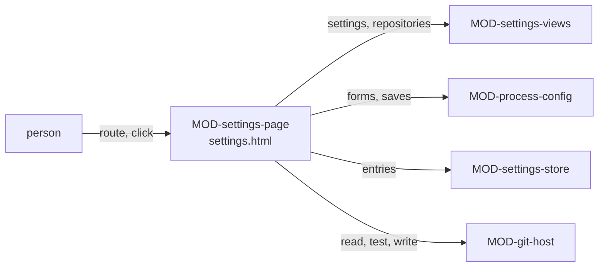

# ARC-026 The settings page

## Context

Every setting Agent M uses is reached from one page (UC-042): what this browser keeps — tokens, products, endpoints, the
bridge, the mailbox, the jump host and its sessions, resource keys (ARC-005) —, and what the instance and each product keep
in their repositories — the participants and the process models, a product's declaration (ARC-025). The forms of the use
cases that first set a setting up — an endpoint (UC-003), a process model (UC-031), a product's process (UC-002), a
participant (UC-017) — open on this page. The browser's settings are read and changed by `MOD-settings-store`, the
repositories by `MOD-git-host`; what the configuration pages compute and save is `MOD-process-config`'s.

## Decision

1. **Two modules.** `MOD-settings-views`, a feature, computes the lines of the page from the settings and from what the
   repositories keep. `MOD-settings-page`, the shell of `settings.html` at the root of the Pages site — the gear on every
   page opens it —, routes, reads the repositories, tests a setting, saves the configuration, keeps and clears the
   browser's settings through `MOD-settings-store`, and holds every text and all HTML of the page.
2. **Route** (`MOD-settings-page.route`): the instance from the page's address, and from the fragment the view — the
   settings, the process models or one of them, a product's declaration, the participants or one of them, an endpoint —
   with the product and the name of what is edited.
3. **One line per setting** (`MOD-settings-views.settingsPage`): each setting this browser keeps, and each kind it keeps
   none of, with its state — works since its last test, expires within fourteen days, expired, refused at its last use,
   untested, set where it has no test, not set —, whether it holds a secret, and a summary that holds none; the tokens to
   warn of on every page; a line per setting the instance keeps and, per product, whether the token may write to it.
   A line that holds a secret shows it in a password field, hidden until **Show**.
4. **The repositories are read at their heads** (`MOD-settings-page.readConfig`): the instance's visibility, its
   participant register and the catalogue with the products declaring each model; each product's declaration with the
   blob it was read at, the model it declares read at the version it declares, and the requirements of its SPEC — or why
   the product could not be read, so that its section is shown read-only instead of stopping the page. A model is read
   in full where it is edited, adapted or chosen — at the instance's head — and where a declaration is shown — at the
   version declared (`MOD-settings-page.readModel`).
5. **A browser setting is tested with itself alone** (`MOD-settings-page.testSetting`): a token asks its own server
   which account it acts as, and a refused one gives the page where it is renewed (ARC-004); an endpoint the browser
   calls answers the short test request, or the test names why not and what works instead (ARC-009); the bridge on this
   computer greets with its version, the origin it is paired with and the agents it found, or the test names its refusal
   and what works instead (ARC-012); a remote session's bridge greets the same way through the session's route — its
   forward, or the jump host's HTTPS address with the web server's login (`MOD-bridge-tunnel.sessionRoute`, ARC-013) —, or
   the test names its refusal and what works instead: where no answer arrives over HTTPS, first *the certificate of the
   jump host's HTTPS address: one the browsers trust, issued for its name, such as Let's Encrypt's or the institution's
   own; a self-signed one does not work*, then *the web server's configuration this page shows, in place on the jump
   host*, then *the reverse tunnel on the machine behind NAT, or its bridge*; where the web server refuses its login,
   *the web server's login as the password file on the jump host holds it*; where nothing answers through a forward, *the forward on this computer: the command this page shows, or a bridge here
   that opens it*, then *the reverse tunnel on the machine behind NAT, or its bridge*, then *the session's route over HTTPS
   through the jump host*; a mailbox's reading or sending
   is tested on its route without changing anything in the mailbox, or stays untested where the bridge that tests it
   does not answer (`MOD-mailbox.testMailbox`, ARC-014). A test's result is kept with the setting
   (`MOD-settings-store.recordTest`). **+ Remote session** gives a session its port and its bridge token
   (`MOD-bridge-tunnel.newSession`, `MOD-bridge-server.newToken`); the jump host's line shows its tunnel commands, its
   service files and its web-server configuration (`MOD-bridge-tunnel.tunnelCommands`, `MOD-bridge-tunnel.serviceFiles`,
   `MOD-bridge-tunnel.webServerConfig`), and its own test answers `no-test`: it is tested through its sessions. The
   bridge's form presets the address of a bridge on this computer (`MOD-bridge-server.defaultAddress`), so that pairing is
   the token pasted and **Pair**. Storing a value and **Clear** change the entries through the store and write them at
   once (ARC-005). **Clear** asks for one confirmation that says what no longer works in this browser without the
   setting — a text the page holds for each kind of setting, chosen by the line's `setting`, as for an export (decision
   7); for the bridge: mail on the IMAP route, local agents and compute resources (UC-042 2a); for the mailbox: reading
   mail for issues and sending replies, while issues and their mail identifiers stay (UC-042 2b). After the clear the page
   reads the entries again and shows the line as not set. Under the bridge's line, *Get the Agent M Bridge* offers the
   bridge's files for this browser (ARC-017 decision 7): the page reads the latest release (`MOD-git-host.latestRelease`)
   and shows what `MOD-bridge-feed.downloadFor` offers, in HTML of its own.
6. **A repository setting is saved as one commit on a click** (`MOD-settings-page.saveConfig`): the head read, the file
   planned on it by `MOD-process-config.planConfig` with the repository's visibility, and written in one commit on that
   head; a product's settings are saved in the product's repository, never only in the browser.
7. **Export and import** are those of ARC-005: before an export is saved the page names every token, key and password it
   holds (`MOD-settings-store.secretsHeld`), each with what it grants — a text the page holds for each kind of setting;
   an import keeps what the browser has and lists what it added and what it did not (`MOD-settings-store.mergeImport`).
   The browser section's folded **What is this?** says that every Pages site of the same owner reads this browser's
   settings.



## Alternatives

- **Each setting on the page of the use case that set it up** — `EVERY SETTING IS REACHED FROM ONE PAGE`; the forms open
  on this page instead.
- **A test that sends every stored credential at once** — a token goes only to the server that issued it; each test sends
  one setting alone.
- **The settings page as a view of the main page** — the main page reads every product to show what goes on; the
  settings page reads what is configured, and is reached from every page.

## Consequences

- After a save the page reads the repository again; after a change of the browser's settings it reads the entries again.
- The test of the resource keys is offered where their adapter is designed; until then their lines show their state and
  **Clear**, and a test answers `no-test`, as the jump host's does.
- Not realised here: the steps that need those tests or settings not designed yet — UC-042 1, 2, 3, 4, 5, 4a, 5a
  (pseudonymisation, collaborators, sources, resources and the test schedule), UC-003 2a (a
  model server through the bridge), UC-017 3, 3b, 5a, 6, 6a (a participant on the bridge and its test, which come with
  the bridge as a job runtime, and the sources' places),
  UC-002 4c (the sources' places), and UC-031 4a (keeping an unfinished model in the browser, for which the store has no
  key).

## Modules

### MOD-settings-views

```json module
{
  "id": "MOD-settings-views",
  "folder": "src/settings-views/",
  "layer": "feature",
  "responsibility": "Computes what the settings page shows: a line per setting this browser keeps, and per kind it keeps none of, with its state and whether it holds a secret; the tokens to warn of on every page; and a line per setting the instance and each product keep in their repositories.",
  "realises": ["EVERY SETTING IS REACHED FROM ONE PAGE"],
  "owns": ["SettingLine", "ConfigLine", "ProductSettings", "SettingsPage", "RegisterRead", "InstanceConfig", "DeclarationOrNone", "ProductConfig", "SettingsConfig"],
  "uses": ["MOD-contracts", "MOD-settings-store"]
}
```

```json interface
{
  "id": "MOD-settings-views.settingsPage",
  "summary": "What the settings page shows: one line per setting this browser keeps — each GitHub and GitLab token, product, endpoint, the bridge, the mailbox, the mails marked not an issue, the jump host, each remote session and resource key — and one per kind it keeps none of, each with its state — works since its last test, expires within fourteen days, expired, refused at its last use, untested, set where it has no test, or not set —, whether it holds a secret, and a summary without the secret; the tokens to warn of on every page; a line per setting the instance keeps — its participants and process models — and, for each product, whether the token may write to it and its process.",
  "params": [
    { "name": "settings", "type": "Settings" },
    { "name": "today", "type": "string" },
    { "name": "instance", "type": "InstanceConfig" },
    { "name": "products", "type": "ProductConfig[]" }
  ],
  "result": "SettingsPage",
  "async": false,
  "refusals": [],
  "examples": [
    {
      "name": "a browser with tokens, products and an endpoint",
      "input": {
        "settings": {
          "github": { "token": "github_pat_example", "expires": "2026-10-19", "tested": { "ok": "2026-10-02" } },
          "gitlab": [
            {
              "address": "https://gitlab.example.org/group/lab",
              "token": "glpat-example",
              "expires": "2026-12-31",
              "tested": { "refused": true }
            }
          ],
          "products": ["https://github.com/alice/notes", "https://gitlab.example.org/group/lab"],
          "endpoints": [
            {
              "name": "hub",
              "url": "https://hub.nhr.fau.de/api/llmgw/v1",
              "model": "llama-3.3-70b",
              "key": "hub-key-example",
              "via": "browser",
              "tested": { "ok": "2026-10-08" }
            }
          ],
          "bridge": null,
          "mailbox": null,
          "notAnIssue": [],
          "jumpHost": null,
          "sessions": [],
          "resourceKeys": []
        },
        "today": "2026-10-09",
        "instance": {
          "address": "https://github.com/alice/agent-m",
          "head": "a900000000000000000000000000000000000000",
          "visibility": "private",
          "register": {
            "participants": [
              {
                "name": "alice",
                "type": "person",
                "model": "",
                "context": null,
                "price": null,
                "capabilities": ["draft text", "read the repository", "write to the repository"],
                "place": "",
                "route": "the GitHub account `alice`",
                "line": 5
              },
              {
                "name": "hub-writer",
                "type": "model endpoint",
                "model": "llama-3.3-70b",
                "context": null,
                "price": null,
                "capabilities": ["draft text"],
                "place": "NHR@FAU, Erlangen",
                "route": "the endpoint hub of this browser",
                "line": 6
              },
              {
                "name": "gw-writer",
                "type": "model endpoint",
                "model": "gateway-model",
                "context": 32000,
                "price": { "currency": "EUR", "input": 0.2, "output": 0.6 },
                "capabilities": ["draft text"],
                "place": "a gateway in Frankfurt, Germany",
                "route": "the endpoint gw of this browser",
                "line": 7
              },
              {
                "name": "ci-dev",
                "type": "CI agent",
                "model": "claude-opus-5-5",
                "context": null,
                "price": null,
                "capabilities": ["read the repository", "write to the repository", "run code and tests"],
                "place": "GitHub's machines, a provider in the USA",
                "route": "the workflow agent-m-job",
                "line": 8
              },
              {
                "name": "cli-dev",
                "type": "CLI agent",
                "model": "claude-opus-5-5",
                "context": null,
                "price": null,
                "capabilities": ["draft text", "read the repository", "write to the repository", "run code and tests", "use tools"],
                "place": "this machine",
                "route": "the bridge on the Mac of `alice`",
                "line": 9
              }
            ],
            "problems": [],
            "before": "# Participants of this instance",
            "after": "Every participant that works with a language model names its model.",
            "text": "# Participants of this instance\n\n| Name | Type | Model | Context | Price | Capabilities | Processing place | Route |\n|---|---|---|---|---|---|---|---|\n| alice | person | — | — | — | draft text, read the repository, write to the repository | — | the GitHub account `alice` |\n| hub-writer | model endpoint | llama-3.3-70b | — | — | draft text | NHR@FAU, Erlangen | the endpoint hub of this browser |\n| gw-writer | model endpoint | gateway-model | 32000 | 0.2 / 0.6 EUR per million tokens | draft text | a gateway in Frankfurt, Germany | the endpoint gw of this browser |\n| ci-dev | CI agent | claude-opus-5-5 | — | — | read the repository, write to the repository, run code and tests | GitHub's machines, a provider in the USA | the workflow agent-m-job |\n| cli-dev | CLI agent | claude-opus-5-5 | — | — | draft text, read the repository, write to the repository, run code and tests, use tools | this machine | the bridge on the Mac of `alice` |\n\nEvery participant that works with a language model names its model.\n",
            "blob": "ed9f1cd7e5f305b45281308b4127da5e44589dda"
          },
          "catalogue": {
            "models": [
              {
                "name": "kanban",
                "file": "src/process-model/catalogue/kanban.md",
                "blob": "f05591dcf5cff8213c42f8f75ec82b41ada9dc0b",
                "shipped": true,
                "kind": "pulled",
                "measure": "items per state over time",
                "fits": [],
                "about": { "manages": "work that arrives unpredictably and must flow without long waits", "accepts": "no fixed delivery date for a set of items", "suits": "maintaining a product that receives issues every week", "chapter": "Vibe Coding, ch. 7 §4" },
                "adaptedFrom": "",
                "title": "Kanban",
                "findings": [],
                "usedBy": []
              },
              {
                "name": "v-model",
                "file": "src/process-model/catalogue/v-model.md",
                "blob": "856921837cdfd759b62ae92008161c6c6064a51f",
                "shipped": true,
                "kind": "planned",
                "measure": "plan entries per phase",
                "fits": [],
                "about": { "manages": "", "accepts": "", "suits": "", "chapter": "" },
                "adaptedFrom": "",
                "title": "V-model",
                "findings": [],
                "usedBy": []
              },
              {
                "name": "scrum",
                "file": "docs/process-models/scrum.md",
                "blob": "3cf5eb32eb2b19fb8d78144763f87ae102efdbbd",
                "shipped": false,
                "kind": "pulled",
                "measure": "remaining items per time box",
                "fits": [],
                "about": { "manages": "", "accepts": "", "suits": "", "chapter": "" },
                "adaptedFrom": "",
                "title": "Scrum",
                "findings": [],
                "usedBy": [
                  { "product": "https://github.com/alice/notes", "version": "a900000000000000000000000000000000000000" }
                ]
              }
            ],
            "practices": [
              {
                "name": "devops",
                "file": "src/process-model/catalogue/devops.md",
                "blob": "39aa49976758648c9a46b24c8a1c2a8c49053e2e",
                "shipped": true,
                "kind": "practice",
                "measure": "",
                "fits": ["v-model", "pulled"],
                "about": { "manages": "", "accepts": "", "suits": "", "chapter": "" },
                "adaptedFrom": "",
                "title": "DevOps",
                "findings": [],
                "usedBy": []
              }
            ]
          }
        },
        "products": [
          {
            "address": "https://github.com/alice/notes",
            "head": "d700000000000000000000000000000000000000",
            "writable": true,
            "declaration": {
              "model": "scrum",
              "modelFile": "docs/process-models/scrum.md",
              "modelVersion": "a900000000000000000000000000000000000000",
              "sprintClose": "alice",
              "title": "How the thesis tool is developed",
              "intro": "",
              "roles": [
                { "role": "Product Owner", "participants": ["alice"], "line": 13 },
                { "role": "Developers", "participants": ["cli-dev", "ci-dev"], "line": 14 }
              ],
              "practices": [],
              "branches": [{ "phase": "Sprint", "branch": "sprint/<nn>", "line": 20 }],
              "done": [],
              "gatesAdded": [],
              "artifactsAdded": [],
              "notes": "",
              "problems": []
            },
            "declarationBlob": "1f23b5829774f9d58652b9ae33e9bcf83c517d39",
            "model": {
              "name": "scrum",
              "kind": "pulled",
              "adaptedFrom": "",
              "measure": "remaining items per time box",
              "fits": [],
              "about": { "manages": "", "accepts": "", "suits": "", "chapter": "" },
              "title": "Scrum",
              "intro": "",
              "phases": [
                {
                  "name": "Sprint planning",
                  "role": "Product Owner",
                  "produces": "ITM",
                  "kinds": ["ITM"],
                  "line": 12
                },
                {
                  "name": "Development",
                  "role": "Developers",
                  "produces": "MOD, TST",
                  "kinds": ["MOD", "TST"],
                  "line": 13
                },
                {
                  "name": "Sprint review",
                  "role": "Product Owner",
                  "produces": "the review of the increment",
                  "kinds": [],
                  "line": 14
                }
              ],
              "transitions": [
                { "from": "Sprint planning", "to": "Development", "kind": "sequence", "line": 20 },
                { "from": "Development", "to": "Sprint review", "kind": "sequence", "line": 21 },
                { "from": "Sprint review", "to": "Sprint planning", "kind": "sequence", "line": 22 }
              ],
              "pairs": [],
              "gates": [
                {
                  "between": "Sprint planning → Development",
                  "from": "Sprint planning",
                  "to": "Development",
                  "artifacts": "ITM",
                  "kinds": ["ITM"],
                  "condition": "the sprint's items are ready",
                  "decider": { "role": "Product Owner" },
                  "line": 28
                },
                {
                  "between": "Development → Sprint review",
                  "from": "Development",
                  "to": "Sprint review",
                  "artifacts": "MOD",
                  "kinds": ["MOD"],
                  "condition": "CI is green",
                  "decider": { "role": "Product Owner" },
                  "line": 29
                }
              ],
              "roles": [
                {
                  "name": "Product Owner",
                  "filledBy": "person",
                  "capabilities": ["read the repository", "write to the repository"],
                  "line": 35
                },
                {
                  "name": "Developers",
                  "filledBy": "agent",
                  "capabilities": ["read the repository", "write to the repository", "run code and tests"],
                  "line": 36
                }
              ],
              "flow": { "wipLimit": null, "timeBox": "2 weeks", "sprints": true, "line": 38 },
              "lines": { "kind": 3, "measure": 4 },
              "problems": []
            },
            "requirements": [
              { "name": "ONE CLICK", "source": "PO A. Maier", "rule": "A decision takes one click.", "check": "no automatic check; at review.", "section": "1. Writing", "line": 5 },
              { "name": "NO SERVER", "source": "PO A. Maier", "rule": "The product runs no server of its own.", "check": "`tests/test_no_server.py`", "section": "1. Writing", "line": 9 }
            ],
            "problem": null
          },
          {
            "address": "https://gitlab.example.org/group/lab",
            "head": "",
            "writable": false,
            "declaration": null,
            "declarationBlob": "",
            "model": null,
            "requirements": [],
            "problem": { "refused": "token-refused", "reason": "gitlab.example.org refused the token" }
          }
        ]
      },
      "result": {
        "browser": [
          { "setting": "github-token", "item": "", "state": "expires", "tested": "2026-10-02", "expires": "2026-10-19", "secret": true, "summary": "" },
          { "setting": "gitlab-token", "item": "https://gitlab.example.org/group/lab", "state": "refused", "tested": "", "expires": "2026-12-31", "secret": true, "summary": "" },
          { "setting": "product", "item": "https://github.com/alice/notes", "state": "set", "tested": "", "expires": "", "secret": false, "summary": "https://github.com/alice/notes" },
          { "setting": "product", "item": "https://gitlab.example.org/group/lab", "state": "set", "tested": "", "expires": "", "secret": false, "summary": "https://gitlab.example.org/group/lab" },
          { "setting": "endpoint", "item": "hub", "state": "works", "tested": "2026-10-08", "expires": "", "secret": true, "summary": "https://hub.nhr.fau.de/api/llmgw/v1 · llama-3.3-70b" },
          { "setting": "bridge", "item": "", "state": "not-set", "tested": "", "expires": "", "secret": true, "summary": "" },
          { "setting": "mailbox", "item": "", "state": "not-set", "tested": "", "expires": "", "secret": true, "summary": "" },
          { "setting": "not-an-issue", "item": "", "state": "not-set", "tested": "", "expires": "", "secret": false, "summary": "" },
          { "setting": "jump-host", "item": "", "state": "not-set", "tested": "", "expires": "", "secret": true, "summary": "" },
          { "setting": "session", "item": "", "state": "not-set", "tested": "", "expires": "", "secret": true, "summary": "" },
          { "setting": "resource-key", "item": "", "state": "not-set", "tested": "", "expires": "", "secret": true, "summary": "" }
        ],
        "warnings": [{ "ref": { "setting": "github-token", "item": "" }, "expires": "2026-10-19", "days": 10 }],
        "instance": [
          { "setting": "participants", "summary": "5 participants", "problems": 0 },
          { "setting": "process-models", "summary": "1 of the instance, 2 shipped, 1 practices", "problems": 0 }
        ],
        "products": [
          {
            "product": "https://github.com/alice/notes",
            "writable": true,
            "lines": [
              { "setting": "process", "summary": "scrum at a90000000000; 2 roles assigned; 0 practices; 0 conditions added to the Definition of Done", "problems": 0 }
            ]
          },
          {
            "product": "https://gitlab.example.org/group/lab",
            "writable": false,
            "lines": [{ "setting": "process", "summary": "gitlab.example.org refused the token", "problems": 1 }]
          }
        ]
      }
    },
    {
      "name": "a browser that keeps nothing yet",
      "input": {
        "settings": {
          "github": null,
          "gitlab": [],
          "products": [],
          "endpoints": [],
          "bridge": null,
          "mailbox": null,
          "notAnIssue": [],
          "jumpHost": null,
          "sessions": [],
          "resourceKeys": []
        },
        "today": "2026-10-09",
        "instance": {
          "address": "https://github.com/alice/agent-m",
          "head": "a900000000000000000000000000000000000000",
          "visibility": "private",
          "register": { "participants": [], "problems": [], "before": "", "after": "", "text": "", "blob": "" },
          "catalogue": { "models": [], "practices": [] }
        },
        "products": []
      },
      "result": {
        "browser": [
          { "setting": "github-token", "item": "", "state": "not-set", "tested": "", "expires": "", "secret": true, "summary": "" },
          { "setting": "gitlab-token", "item": "", "state": "not-set", "tested": "", "expires": "", "secret": true, "summary": "" },
          { "setting": "product", "item": "", "state": "not-set", "tested": "", "expires": "", "secret": false, "summary": "" },
          { "setting": "endpoint", "item": "", "state": "not-set", "tested": "", "expires": "", "secret": true, "summary": "" },
          { "setting": "bridge", "item": "", "state": "not-set", "tested": "", "expires": "", "secret": true, "summary": "" },
          { "setting": "mailbox", "item": "", "state": "not-set", "tested": "", "expires": "", "secret": true, "summary": "" },
          { "setting": "not-an-issue", "item": "", "state": "not-set", "tested": "", "expires": "", "secret": false, "summary": "" },
          { "setting": "jump-host", "item": "", "state": "not-set", "tested": "", "expires": "", "secret": true, "summary": "" },
          { "setting": "session", "item": "", "state": "not-set", "tested": "", "expires": "", "secret": true, "summary": "" },
          { "setting": "resource-key", "item": "", "state": "not-set", "tested": "", "expires": "", "secret": true, "summary": "" }
        ],
        "warnings": [],
        "instance": [
          { "setting": "participants", "summary": "0 participants", "problems": 0 },
          { "setting": "process-models", "summary": "0 of the instance, 0 shipped, 0 practices", "problems": 0 }
        ],
        "products": []
      }
    }
  ]
}
```

### MOD-settings-page

```json module
{
  "id": "MOD-settings-page",
  "folder": "src/settings-page/",
  "layer": "shell",
  "responsibility": "The page settings.html at the root of the instance's Pages site, where every setting is reached: it routes, reads what the instance and its products keep, tests a setting of this browser with that setting alone, saves the configuration as one commit on a click, keeps and clears the browser's settings through the settings store, and holds every text the page shows.",
  "realises": ["A PRODUCT'S SETTINGS LIVE IN ITS REPOSITORY"],
  "owns": ["SettingsRoute", "SettingTest"],
  "uses": ["MOD-contracts", "MOD-git-host", "MOD-settings-store", "MOD-review-page", "MOD-participants", "MOD-process-model", "MOD-process-config", "MOD-artifacts", "MOD-settings-views", "MOD-bridge-feed", "MOD-bridge-tunnel", "MOD-mailbox"]
}
```

```json interface
{
  "id": "MOD-settings-page.route",
  "summary": "What the settings page shows, from its address and the fragment: the instance — derived from the page settings.html at the root of its Pages site —, the view — the settings, the process models or one of them, a product's declaration, the participants or one of them, an endpoint —, the product and the name of the model, participant or endpoint.",
  "params": [{ "name": "hash", "type": "string" }, { "name": "pagesAddress", "type": "string" }],
  "result": "SettingsRoute",
  "async": false,
  "refusals": [
    { "code": "not-a-pages-address", "when": "the page is not settings.html at the root of a GitHub Pages site" },
    { "code": "unknown-view", "when": "the fragment names no view" },
    { "code": "no-product", "when": "a declaration's view names no product" }
  ],
  "examples": [
    {
      "name": "the settings",
      "input": { "hash": "", "pagesAddress": "https://alice.github.io/agent-m/settings.html" },
      "result": { "instance": "https://github.com/alice/agent-m", "view": "settings", "product": "", "name": "" }
    },
    {
      "name": "a product's declaration",
      "input": { "hash": "#declaration?product=https%3A%2F%2Fgithub.com%2Falice%2Fnotes", "pagesAddress": "https://alice.github.io/agent-m/settings.html" },
      "result": { "instance": "https://github.com/alice/agent-m", "view": "declaration", "product": "https://github.com/alice/notes", "name": "" }
    },
    {
      "name": "a declaration without its product",
      "input": { "hash": "#declaration", "pagesAddress": "https://alice.github.io/agent-m/settings.html" },
      "refused": "no-product"
    },
    {
      "name": "the main page's address",
      "input": { "hash": "", "pagesAddress": "https://alice.github.io/agent-m/" },
      "refused": "not-a-pages-address"
    }
  ]
}
```

```json interface
{
  "id": "MOD-settings-page.readConfig",
  "summary": "What the instance and the products keep in their repositories, each read at the head of its default branch: the instance's visibility, its participant register with its text and blob, and the catalogue with the products declaring each model; for each product its head, whether a token may write to it, its declaration with the blob of docs/process.md, the model it declares read at the version it declares, the requirements of its SPEC — or why it could not be read.",
  "params": [
    { "name": "instance", "type": "string" },
    { "name": "products", "type": "string[]" },
    { "name": "settings", "type": "Settings" },
    { "name": "fetch", "type": "FetchPort" },
    { "name": "texts", "type": "StoragePort" }
  ],
  "result": "SettingsConfig",
  "async": true,
  "refusals": [
    { "code": "not-an-address", "when": "the instance's address is no web address" },
    { "code": "token-refused", "when": "the server refuses the token" },
    { "code": "rate-limited-account", "when": "the account's rate limit is used up" },
    { "code": "rate-limited-network", "when": "the network's rate limit for requests without a token is used up" },
    { "code": "no-access", "when": "the token lacks the permission or the repository" },
    { "code": "not-found", "when": "the server knows no such repository" },
    { "code": "server-error", "when": "the server answers with another error" },
    { "code": "unreachable", "when": "no answer arrives" }
  ],
  "examples": [
    {
      "name": "the instance and two products, one of them refused",
      "input": {
        "instance": "https://github.com/alice/agent-m",
        "products": ["https://github.com/alice/notes", "https://gitlab.example.org/group/lab"],
        "settings": {
          "github": { "token": "github_pat_example", "expires": "2026-10-19", "tested": { "ok": "2026-10-02" } },
          "gitlab": [
            {
              "address": "https://gitlab.example.org/group/lab",
              "token": "glpat-example",
              "expires": "2026-12-31",
              "tested": { "refused": true }
            }
          ],
          "products": ["https://github.com/alice/notes", "https://gitlab.example.org/group/lab"],
          "endpoints": [
            {
              "name": "hub",
              "url": "https://hub.nhr.fau.de/api/llmgw/v1",
              "model": "llama-3.3-70b",
              "key": "hub-key-example",
              "via": "browser",
              "tested": { "ok": "2026-10-08" }
            }
          ],
          "bridge": null,
          "mailbox": null,
          "notAnIssue": [],
          "jumpHost": null,
          "sessions": [],
          "resourceKeys": []
        },
        "fetch": [
          {
            "request": { "method": "GET", "url": "https://api.github.com/repos/alice/agent-m" },
            "response": {
              "status": 200,
              "body": { "visibility": "private", "private": true, "default_branch": "main" }
            }
          },
          {
            "request": { "method": "GET", "url": "https://api.github.com/repos/alice/agent-m/commits/main" },
            "response": { "status": 200, "body": { "sha": "a900000000000000000000000000000000000000" } }
          },
          {
            "request": { "method": "GET", "url": "https://api.github.com/repos/alice/agent-m/git/trees/a900000000000000000000000000000000000000?recursive=1" },
            "response": {
              "status": 200,
              "body": {
                "tree": [
                  { "path": "docs/participants.md", "type": "blob", "sha": "ed9f1cd7e5f305b45281308b4127da5e44589dda" },
                  { "path": "docs/process-models/scrum.md", "type": "blob", "sha": "3cf5eb32eb2b19fb8d78144763f87ae102efdbbd" },
                  { "path": "src/process-model/catalogue/devops.md", "type": "blob", "sha": "39aa49976758648c9a46b24c8a1c2a8c49053e2e" },
                  { "path": "src/process-model/catalogue/kanban.md", "type": "blob", "sha": "f05591dcf5cff8213c42f8f75ec82b41ada9dc0b" },
                  { "path": "src/process-model/catalogue/v-model.md", "type": "blob", "sha": "856921837cdfd759b62ae92008161c6c6064a51f" }
                ]
              }
            }
          },
          {
            "request": { "method": "GET", "url": "https://api.github.com/user" },
            "response": { "status": 200, "body": { "login": "alice" } }
          },
          {
            "request": { "method": "GET", "url": "https://api.github.com/repos/alice/agent-m" },
            "response": {
              "status": 200,
              "body": { "visibility": "private", "private": true, "default_branch": "main" }
            }
          },
          {
            "request": { "method": "GET", "url": "https://api.github.com/repos/alice/notes" },
            "response": {
              "status": 200,
              "body": { "visibility": "private", "private": true, "default_branch": "main" }
            }
          },
          {
            "request": { "method": "GET", "url": "https://api.github.com/repos/alice/notes/commits/main" },
            "response": { "status": 200, "body": { "sha": "d700000000000000000000000000000000000000" } }
          },
          {
            "request": { "method": "GET", "url": "https://api.github.com/repos/alice/notes/git/trees/d700000000000000000000000000000000000000?recursive=1" },
            "response": {
              "status": 200,
              "body": {
                "tree": [
                  { "path": "SPEC.md", "type": "blob", "sha": "fff94463cd4955ed56f1e4700570c7dbbab3b739" },
                  { "path": "docs/backlog/ITM-001-write-a-note.md", "type": "blob", "sha": "7c7715641ec5f7af328286a92582701674b52df0" },
                  { "path": "docs/backlog/order.md", "type": "blob", "sha": "f80644f331a32e9223f6c1eceda157e4f308ea53" },
                  { "path": "docs/backlog/sprints/sprint-01.md", "type": "blob", "sha": "f112431d82688c9f546edb5ac9cc9f2a777432ed" },
                  { "path": "docs/jobs/JOB-20261008-0900-b2c3.md", "type": "blob", "sha": "a82a9fc1be805bfd86104fb135c200e7183fc1d2" },
                  { "path": "docs/process.md", "type": "blob", "sha": "1f23b5829774f9d58652b9ae33e9bcf83c517d39" }
                ]
              }
            }
          },
          {
            "request": { "method": "GET", "url": "https://api.github.com/user" },
            "response": { "status": 200, "body": { "login": "alice" } }
          },
          {
            "request": { "method": "GET", "url": "https://api.github.com/repos/alice/agent-m/contents/docs/process-models/scrum.md?ref=a900000000000000000000000000000000000000" },
            "response": { "status": 200, "body": "---\nname: scrum\nkind: pulled\nmeasure: remaining items per time box\n---\n# Scrum\n\n## Phases\n\n| Name | Role | Produces |\n|---|---|---|\n| Sprint planning | Product Owner | ITM |\n| Development | Developers | MOD, TST |\n| Sprint review | Product Owner | the review of the increment |\n\n## Transitions\n\n| From | To | Kind |\n|---|---|---|\n| Sprint planning | Development | sequence |\n| Development | Sprint review | sequence |\n| Sprint review | Sprint planning | sequence |\n\n## Gates\n\n| Between | Artifacts | Condition | Decider |\n|---|---|---|---|\n| Sprint planning → Development | ITM | the sprint's items are ready | Product Owner |\n| Development → Sprint review | MOD | CI is green | Product Owner |\n\n## Roles\n\n| Name | Filled by | Capabilities |\n|---|---|---|\n| Product Owner | person | read the repository, write to the repository |\n| Developers | agent | read the repository, write to the repository, run code and tests |\n\n## Flow control\n\n| Kind | Value |\n|---|---|\n| WIP limit | none |\n| Time box | 2 weeks |\n| Sprints | yes |\n" }
          },
          {
            "request": { "method": "GET", "url": "https://gitlab.example.org/api/v4/projects/group%2Flab" },
            "response": { "status": 401, "body": { "message": "401 Unauthorized" } }
          }
        ],
        "texts": { "1f23b5829774f9d58652b9ae33e9bcf83c517d39": "---\nmodel: scrum\nmodel_file: docs/process-models/scrum.md\nmodel_version: a900000000000000000000000000000000000000\nsprint_close: alice\n---\n# How the thesis tool is developed\n\n## Roles\n\n| Role | Participants |\n|---|---|\n| Product Owner | alice |\n| Developers | cli-dev, ci-dev |\n\n## Branches\n\n| Phase or time box | Branch |\n|---|---|\n| Sprint | `sprint/<nn>` |\n", "39aa49976758648c9a46b24c8a1c2a8c49053e2e": "---\nname: devops\nkind: practice\nfits: v-model, pulled\n---\n# DevOps\n\nA release is deployed after validation, once its deployment check is green.\n\n## Phases\n\n| Name | Role | Produces |\n|---|---|---|\n| Deployment | Operator | the deployed release |\n\n## Transitions\n\n| From | To | Kind |\n|---|---|---|\n| Validation | Deployment | sequence |\n\n## Verification pairs\n\n| Phase | Checked by |\n|---|---|\n\n## Gates\n\n| Between | Artifacts | Condition | Decider |\n|---|---|---|---|\n| Validation → Deployment | TST | the deployment check is green | CI check `deploy` |\n\n## Roles\n\n| Name | Filled by | Capabilities |\n|---|---|---|\n| Operator | agent | read the repository, run code and tests |\n", "3cf5eb32eb2b19fb8d78144763f87ae102efdbbd": "---\nname: scrum\nkind: pulled\nmeasure: remaining items per time box\n---\n# Scrum\n\n## Phases\n\n| Name | Role | Produces |\n|---|---|---|\n| Sprint planning | Product Owner | ITM |\n| Development | Developers | MOD, TST |\n| Sprint review | Product Owner | the review of the increment |\n\n## Transitions\n\n| From | To | Kind |\n|---|---|---|\n| Sprint planning | Development | sequence |\n| Development | Sprint review | sequence |\n| Sprint review | Sprint planning | sequence |\n\n## Gates\n\n| Between | Artifacts | Condition | Decider |\n|---|---|---|---|\n| Sprint planning → Development | ITM | the sprint's items are ready | Product Owner |\n| Development → Sprint review | MOD | CI is green | Product Owner |\n\n## Roles\n\n| Name | Filled by | Capabilities |\n|---|---|---|\n| Product Owner | person | read the repository, write to the repository |\n| Developers | agent | read the repository, write to the repository, run code and tests |\n\n## Flow control\n\n| Kind | Value |\n|---|---|\n| WIP limit | none |\n| Time box | 2 weeks |\n| Sprints | yes |\n", "856921837cdfd759b62ae92008161c6c6064a51f": "---\nname: v-model\nkind: planned\nmeasure: plan entries per phase\n---\n# V-model\n\nEvery accepted requirement passes every phase; each later phase checks an earlier one.\n\n## Phases\n\n| Name | Role | Produces |\n|---|---|---|\n| Requirements | Analyst | requirements, UC |\n| Design | Architect | ARC |\n| Implementation | Developers | MOD |\n| Testing | Tester | TST |\n| Validation | Analyst | the validation of the requirements |\n\n## Transitions\n\n| From | To | Kind |\n|---|---|---|\n| Requirements | Design | sequence |\n| Design | Implementation | sequence |\n| Implementation | Testing | sequence |\n| Testing | Implementation | back |\n| Testing | Validation | sequence |\n\n## Verification pairs\n\n| Phase | Checked by |\n|---|---|\n| Design | Testing |\n| Requirements | Validation |\n\n## Gates\n\n| Between | Artifacts | Condition | Decider |\n|---|---|---|---|\n| Design → Implementation | ARC | every requirement has an ARC, and the design is accepted | Architect |\n| Implementation → Testing | MOD | CI is green | CI check `tests` |\n\n## Roles\n\n| Name | Filled by | Capabilities |\n|---|---|---|\n| Analyst | either | draft text, read the repository |\n| Architect | person | read the repository |\n| Developers | agent | read the repository, write to the repository, run code and tests |\n| Tester | either | read the repository, run code and tests |\n", "ed9f1cd7e5f305b45281308b4127da5e44589dda": "# Participants of this instance\n\n| Name | Type | Model | Context | Price | Capabilities | Processing place | Route |\n|---|---|---|---|---|---|---|---|\n| alice | person | — | — | — | draft text, read the repository, write to the repository | — | the GitHub account `alice` |\n| hub-writer | model endpoint | llama-3.3-70b | — | — | draft text | NHR@FAU, Erlangen | the endpoint hub of this browser |\n| gw-writer | model endpoint | gateway-model | 32000 | 0.2 / 0.6 EUR per million tokens | draft text | a gateway in Frankfurt, Germany | the endpoint gw of this browser |\n| ci-dev | CI agent | claude-opus-5-5 | — | — | read the repository, write to the repository, run code and tests | GitHub's machines, a provider in the USA | the workflow agent-m-job |\n| cli-dev | CLI agent | claude-opus-5-5 | — | — | draft text, read the repository, write to the repository, run code and tests, use tools | this machine | the bridge on the Mac of `alice` |\n\nEvery participant that works with a language model names its model.\n", "f05591dcf5cff8213c42f8f75ec82b41ada9dc0b": "---\nname: kanban\nkind: pulled\nmeasure: items per state over time\nmanages: work that arrives unpredictably and must flow without long waits\naccepts: no fixed delivery date for a set of items\nsuits: maintaining a product that receives issues every week\nchapter: Vibe Coding, ch. 7 §4\n---\n# Kanban\n\nWork is pulled from the backlog as capacity frees up.\n\n## Phases\n\n| Name | Role | Produces |\n|---|---|---|\n| Backlog | Product Owner | ITM |\n| Doing | Developers | MOD, TST |\n| Done | Product Owner | the merged item |\n\n## Transitions\n\n| From | To | Kind |\n|---|---|---|\n| Backlog | Doing | sequence |\n| Doing | Done | sequence |\n\n## Verification pairs\n\n| Phase | Checked by |\n|---|---|\n\n## Gates\n\n| Between | Artifacts | Condition | Decider |\n|---|---|---|---|\n| Doing → Done | MOD | CI is green | CI check `tests` |\n\n## Roles\n\n| Name | Filled by | Capabilities |\n|---|---|---|\n| Product Owner | person | read the repository, write to the repository |\n| Developers | agent | read the repository, write to the repository, run code and tests |\n\n## Flow control\n\n| Kind | Value |\n|---|---|\n| WIP limit | 3 |\n| Time box | none |\n| Sprints | no |\n", "fff94463cd4955ed56f1e4700570c7dbbab3b739": "# Notes — Specification\n\n## 1. Writing\n\n**ONE CLICK** *(PO A. Maier)*\nA decision takes one click.\n*Check:* no automatic check; at review.\n\n**NO SERVER** *(PO A. Maier)*\nThe product runs no server of its own.\n*Check:* `tests/test_no_server.py`\n" }
      },
      "result": {
        "instance": {
          "address": "https://github.com/alice/agent-m",
          "head": "a900000000000000000000000000000000000000",
          "visibility": "private",
          "register": {
            "participants": [
              {
                "name": "alice",
                "type": "person",
                "model": "",
                "context": null,
                "price": null,
                "capabilities": ["draft text", "read the repository", "write to the repository"],
                "place": "",
                "route": "the GitHub account `alice`",
                "line": 5
              },
              {
                "name": "hub-writer",
                "type": "model endpoint",
                "model": "llama-3.3-70b",
                "context": null,
                "price": null,
                "capabilities": ["draft text"],
                "place": "NHR@FAU, Erlangen",
                "route": "the endpoint hub of this browser",
                "line": 6
              },
              {
                "name": "gw-writer",
                "type": "model endpoint",
                "model": "gateway-model",
                "context": 32000,
                "price": { "currency": "EUR", "input": 0.2, "output": 0.6 },
                "capabilities": ["draft text"],
                "place": "a gateway in Frankfurt, Germany",
                "route": "the endpoint gw of this browser",
                "line": 7
              },
              {
                "name": "ci-dev",
                "type": "CI agent",
                "model": "claude-opus-5-5",
                "context": null,
                "price": null,
                "capabilities": ["read the repository", "write to the repository", "run code and tests"],
                "place": "GitHub's machines, a provider in the USA",
                "route": "the workflow agent-m-job",
                "line": 8
              },
              {
                "name": "cli-dev",
                "type": "CLI agent",
                "model": "claude-opus-5-5",
                "context": null,
                "price": null,
                "capabilities": ["draft text", "read the repository", "write to the repository", "run code and tests", "use tools"],
                "place": "this machine",
                "route": "the bridge on the Mac of `alice`",
                "line": 9
              }
            ],
            "problems": [],
            "before": "# Participants of this instance",
            "after": "Every participant that works with a language model names its model.",
            "text": "# Participants of this instance\n\n| Name | Type | Model | Context | Price | Capabilities | Processing place | Route |\n|---|---|---|---|---|---|---|---|\n| alice | person | — | — | — | draft text, read the repository, write to the repository | — | the GitHub account `alice` |\n| hub-writer | model endpoint | llama-3.3-70b | — | — | draft text | NHR@FAU, Erlangen | the endpoint hub of this browser |\n| gw-writer | model endpoint | gateway-model | 32000 | 0.2 / 0.6 EUR per million tokens | draft text | a gateway in Frankfurt, Germany | the endpoint gw of this browser |\n| ci-dev | CI agent | claude-opus-5-5 | — | — | read the repository, write to the repository, run code and tests | GitHub's machines, a provider in the USA | the workflow agent-m-job |\n| cli-dev | CLI agent | claude-opus-5-5 | — | — | draft text, read the repository, write to the repository, run code and tests, use tools | this machine | the bridge on the Mac of `alice` |\n\nEvery participant that works with a language model names its model.\n",
            "blob": "ed9f1cd7e5f305b45281308b4127da5e44589dda"
          },
          "catalogue": {
            "models": [
              {
                "name": "kanban",
                "file": "src/process-model/catalogue/kanban.md",
                "blob": "f05591dcf5cff8213c42f8f75ec82b41ada9dc0b",
                "shipped": true,
                "kind": "pulled",
                "measure": "items per state over time",
                "fits": [],
                "about": { "manages": "work that arrives unpredictably and must flow without long waits", "accepts": "no fixed delivery date for a set of items", "suits": "maintaining a product that receives issues every week", "chapter": "Vibe Coding, ch. 7 §4" },
                "adaptedFrom": "",
                "title": "Kanban",
                "findings": [],
                "usedBy": []
              },
              {
                "name": "v-model",
                "file": "src/process-model/catalogue/v-model.md",
                "blob": "856921837cdfd759b62ae92008161c6c6064a51f",
                "shipped": true,
                "kind": "planned",
                "measure": "plan entries per phase",
                "fits": [],
                "about": { "manages": "", "accepts": "", "suits": "", "chapter": "" },
                "adaptedFrom": "",
                "title": "V-model",
                "findings": [],
                "usedBy": []
              },
              {
                "name": "scrum",
                "file": "docs/process-models/scrum.md",
                "blob": "3cf5eb32eb2b19fb8d78144763f87ae102efdbbd",
                "shipped": false,
                "kind": "pulled",
                "measure": "remaining items per time box",
                "fits": [],
                "about": { "manages": "", "accepts": "", "suits": "", "chapter": "" },
                "adaptedFrom": "",
                "title": "Scrum",
                "findings": [],
                "usedBy": [
                  { "product": "https://github.com/alice/notes", "version": "a900000000000000000000000000000000000000" }
                ]
              }
            ],
            "practices": [
              {
                "name": "devops",
                "file": "src/process-model/catalogue/devops.md",
                "blob": "39aa49976758648c9a46b24c8a1c2a8c49053e2e",
                "shipped": true,
                "kind": "practice",
                "measure": "",
                "fits": ["v-model", "pulled"],
                "about": { "manages": "", "accepts": "", "suits": "", "chapter": "" },
                "adaptedFrom": "",
                "title": "DevOps",
                "findings": [],
                "usedBy": []
              }
            ]
          }
        },
        "products": [
          {
            "address": "https://github.com/alice/notes",
            "head": "d700000000000000000000000000000000000000",
            "writable": true,
            "declaration": {
              "model": "scrum",
              "modelFile": "docs/process-models/scrum.md",
              "modelVersion": "a900000000000000000000000000000000000000",
              "sprintClose": "alice",
              "title": "How the thesis tool is developed",
              "intro": "",
              "roles": [
                { "role": "Product Owner", "participants": ["alice"], "line": 13 },
                { "role": "Developers", "participants": ["cli-dev", "ci-dev"], "line": 14 }
              ],
              "practices": [],
              "branches": [{ "phase": "Sprint", "branch": "sprint/<nn>", "line": 20 }],
              "done": [],
              "gatesAdded": [],
              "artifactsAdded": [],
              "notes": "",
              "problems": []
            },
            "declarationBlob": "1f23b5829774f9d58652b9ae33e9bcf83c517d39",
            "model": {
              "name": "scrum",
              "kind": "pulled",
              "adaptedFrom": "",
              "measure": "remaining items per time box",
              "fits": [],
              "about": { "manages": "", "accepts": "", "suits": "", "chapter": "" },
              "title": "Scrum",
              "intro": "",
              "phases": [
                {
                  "name": "Sprint planning",
                  "role": "Product Owner",
                  "produces": "ITM",
                  "kinds": ["ITM"],
                  "line": 12
                },
                {
                  "name": "Development",
                  "role": "Developers",
                  "produces": "MOD, TST",
                  "kinds": ["MOD", "TST"],
                  "line": 13
                },
                {
                  "name": "Sprint review",
                  "role": "Product Owner",
                  "produces": "the review of the increment",
                  "kinds": [],
                  "line": 14
                }
              ],
              "transitions": [
                { "from": "Sprint planning", "to": "Development", "kind": "sequence", "line": 20 },
                { "from": "Development", "to": "Sprint review", "kind": "sequence", "line": 21 },
                { "from": "Sprint review", "to": "Sprint planning", "kind": "sequence", "line": 22 }
              ],
              "pairs": [],
              "gates": [
                {
                  "between": "Sprint planning → Development",
                  "from": "Sprint planning",
                  "to": "Development",
                  "artifacts": "ITM",
                  "kinds": ["ITM"],
                  "condition": "the sprint's items are ready",
                  "decider": { "role": "Product Owner" },
                  "line": 28
                },
                {
                  "between": "Development → Sprint review",
                  "from": "Development",
                  "to": "Sprint review",
                  "artifacts": "MOD",
                  "kinds": ["MOD"],
                  "condition": "CI is green",
                  "decider": { "role": "Product Owner" },
                  "line": 29
                }
              ],
              "roles": [
                {
                  "name": "Product Owner",
                  "filledBy": "person",
                  "capabilities": ["read the repository", "write to the repository"],
                  "line": 35
                },
                {
                  "name": "Developers",
                  "filledBy": "agent",
                  "capabilities": ["read the repository", "write to the repository", "run code and tests"],
                  "line": 36
                }
              ],
              "flow": { "wipLimit": null, "timeBox": "2 weeks", "sprints": true, "line": 38 },
              "lines": { "kind": 3, "measure": 4 },
              "problems": []
            },
            "requirements": [
              { "name": "ONE CLICK", "source": "PO A. Maier", "rule": "A decision takes one click.", "check": "no automatic check; at review.", "section": "1. Writing", "line": 5 },
              { "name": "NO SERVER", "source": "PO A. Maier", "rule": "The product runs no server of its own.", "check": "`tests/test_no_server.py`", "section": "1. Writing", "line": 9 }
            ],
            "problem": null
          },
          {
            "address": "https://gitlab.example.org/group/lab",
            "head": "",
            "writable": false,
            "declaration": null,
            "declarationBlob": "",
            "model": null,
            "requirements": [],
            "problem": { "refused": "token-refused", "reason": "gitlab.example.org refused the token" }
          }
        ]
      }
    },
    {
      "name": "a token the instance's server refuses",
      "input": {
        "instance": "https://github.com/alice/agent-m",
        "products": [],
        "settings": {
          "github": { "token": "github_pat_example", "expires": "2026-10-19", "tested": { "ok": "2026-10-02" } },
          "gitlab": [
            {
              "address": "https://gitlab.example.org/group/lab",
              "token": "glpat-example",
              "expires": "2026-12-31",
              "tested": { "refused": true }
            }
          ],
          "products": ["https://github.com/alice/notes", "https://gitlab.example.org/group/lab"],
          "endpoints": [
            {
              "name": "hub",
              "url": "https://hub.nhr.fau.de/api/llmgw/v1",
              "model": "llama-3.3-70b",
              "key": "hub-key-example",
              "via": "browser",
              "tested": { "ok": "2026-10-08" }
            }
          ],
          "bridge": null,
          "mailbox": null,
          "notAnIssue": [],
          "jumpHost": null,
          "sessions": [],
          "resourceKeys": []
        },
        "fetch": [
          {
            "request": { "method": "GET", "url": "https://api.github.com/repos/alice/agent-m" },
            "response": { "status": 401, "body": { "message": "Bad credentials" } }
          }
        ],
        "texts": {}
      },
      "refused": "token-refused"
    }
  ]
}
```

```json interface
{
  "id": "MOD-settings-page.readModel",
  "summary": "A model or practice of the instance read in full at a version — the instance's head where it is edited or chosen, the commit a product declared where its declaration is shown.",
  "params": [
    { "name": "instance", "type": "string" },
    { "name": "file", "type": "string" },
    { "name": "version", "type": "string" },
    { "name": "settings", "type": "Settings" },
    { "name": "fetch", "type": "FetchPort" }
  ],
  "result": "ProcessModel",
  "async": true,
  "refusals": [
    { "code": "no-model", "when": "the file does not exist at that version" },
    { "code": "not-an-address", "when": "the instance's address is no web address" },
    { "code": "token-refused", "when": "the server refuses the token" },
    { "code": "rate-limited-account", "when": "the account's rate limit is used up" },
    { "code": "rate-limited-network", "when": "the network's rate limit for requests without a token is used up" },
    { "code": "no-access", "when": "the token lacks the permission or the repository" },
    { "code": "server-error", "when": "the server answers with another error" },
    { "code": "unreachable", "when": "no answer arrives" }
  ],
  "examples": [
    {
      "name": "the model a product declares",
      "input": {
        "instance": "https://github.com/alice/agent-m",
        "file": "docs/process-models/scrum.md",
        "version": "a900000000000000000000000000000000000000",
        "settings": {
          "github": { "token": "github_pat_example", "expires": "2026-10-19", "tested": { "ok": "2026-10-02" } },
          "gitlab": [
            {
              "address": "https://gitlab.example.org/group/lab",
              "token": "glpat-example",
              "expires": "2026-12-31",
              "tested": { "refused": true }
            }
          ],
          "products": ["https://github.com/alice/notes", "https://gitlab.example.org/group/lab"],
          "endpoints": [
            {
              "name": "hub",
              "url": "https://hub.nhr.fau.de/api/llmgw/v1",
              "model": "llama-3.3-70b",
              "key": "hub-key-example",
              "via": "browser",
              "tested": { "ok": "2026-10-08" }
            }
          ],
          "bridge": null,
          "mailbox": null,
          "notAnIssue": [],
          "jumpHost": null,
          "sessions": [],
          "resourceKeys": []
        },
        "fetch": [
          {
            "request": { "method": "GET", "url": "https://api.github.com/repos/alice/agent-m/contents/docs/process-models/scrum.md?ref=a900000000000000000000000000000000000000" },
            "response": { "status": 200, "body": "---\nname: scrum\nkind: pulled\nmeasure: remaining items per time box\n---\n# Scrum\n\n## Phases\n\n| Name | Role | Produces |\n|---|---|---|\n| Sprint planning | Product Owner | ITM |\n| Development | Developers | MOD, TST |\n| Sprint review | Product Owner | the review of the increment |\n\n## Transitions\n\n| From | To | Kind |\n|---|---|---|\n| Sprint planning | Development | sequence |\n| Development | Sprint review | sequence |\n| Sprint review | Sprint planning | sequence |\n\n## Gates\n\n| Between | Artifacts | Condition | Decider |\n|---|---|---|---|\n| Sprint planning → Development | ITM | the sprint's items are ready | Product Owner |\n| Development → Sprint review | MOD | CI is green | Product Owner |\n\n## Roles\n\n| Name | Filled by | Capabilities |\n|---|---|---|\n| Product Owner | person | read the repository, write to the repository |\n| Developers | agent | read the repository, write to the repository, run code and tests |\n\n## Flow control\n\n| Kind | Value |\n|---|---|\n| WIP limit | none |\n| Time box | 2 weeks |\n| Sprints | yes |\n" }
          }
        ]
      },
      "result": {
        "name": "scrum",
        "kind": "pulled",
        "adaptedFrom": "",
        "measure": "remaining items per time box",
        "fits": [],
        "about": { "manages": "", "accepts": "", "suits": "", "chapter": "" },
        "title": "Scrum",
        "intro": "",
        "phases": [
          { "name": "Sprint planning", "role": "Product Owner", "produces": "ITM", "kinds": ["ITM"], "line": 12 },
          { "name": "Development", "role": "Developers", "produces": "MOD, TST", "kinds": ["MOD", "TST"], "line": 13 },
          {
            "name": "Sprint review",
            "role": "Product Owner",
            "produces": "the review of the increment",
            "kinds": [],
            "line": 14
          }
        ],
        "transitions": [
          { "from": "Sprint planning", "to": "Development", "kind": "sequence", "line": 20 },
          { "from": "Development", "to": "Sprint review", "kind": "sequence", "line": 21 },
          { "from": "Sprint review", "to": "Sprint planning", "kind": "sequence", "line": 22 }
        ],
        "pairs": [],
        "gates": [
          {
            "between": "Sprint planning → Development",
            "from": "Sprint planning",
            "to": "Development",
            "artifacts": "ITM",
            "kinds": ["ITM"],
            "condition": "the sprint's items are ready",
            "decider": { "role": "Product Owner" },
            "line": 28
          },
          {
            "between": "Development → Sprint review",
            "from": "Development",
            "to": "Sprint review",
            "artifacts": "MOD",
            "kinds": ["MOD"],
            "condition": "CI is green",
            "decider": { "role": "Product Owner" },
            "line": 29
          }
        ],
        "roles": [
          {
            "name": "Product Owner",
            "filledBy": "person",
            "capabilities": ["read the repository", "write to the repository"],
            "line": 35
          },
          {
            "name": "Developers",
            "filledBy": "agent",
            "capabilities": ["read the repository", "write to the repository", "run code and tests"],
            "line": 36
          }
        ],
        "flow": { "wipLimit": null, "timeBox": "2 weeks", "sprints": true, "line": 38 },
        "lines": { "kind": 3, "measure": 4 },
        "problems": []
      }
    },
    {
      "name": "a model the version does not hold",
      "input": {
        "instance": "https://github.com/alice/agent-m",
        "file": "docs/process-models/kanban-review.md",
        "version": "a900000000000000000000000000000000000000",
        "settings": {
          "github": { "token": "github_pat_example", "expires": "2026-10-19", "tested": { "ok": "2026-10-02" } },
          "gitlab": [
            {
              "address": "https://gitlab.example.org/group/lab",
              "token": "glpat-example",
              "expires": "2026-12-31",
              "tested": { "refused": true }
            }
          ],
          "products": ["https://github.com/alice/notes", "https://gitlab.example.org/group/lab"],
          "endpoints": [
            {
              "name": "hub",
              "url": "https://hub.nhr.fau.de/api/llmgw/v1",
              "model": "llama-3.3-70b",
              "key": "hub-key-example",
              "via": "browser",
              "tested": { "ok": "2026-10-08" }
            }
          ],
          "bridge": null,
          "mailbox": null,
          "notAnIssue": [],
          "jumpHost": null,
          "sessions": [],
          "resourceKeys": []
        },
        "fetch": [
          {
            "request": { "method": "GET", "url": "https://api.github.com/repos/alice/agent-m/contents/docs/process-models/kanban-review.md?ref=a900000000000000000000000000000000000000" },
            "response": { "status": 404, "body": { "message": "Not Found" } }
          }
        ]
      },
      "refused": "no-model"
    }
  ]
}
```

```json interface
{
  "id": "MOD-settings-page.testSetting",
  "summary": "The test of a setting this browser keeps, one harmless request with that setting alone: a token asks its own server which account it acts as, and a refused one gives the page where it is renewed; an endpoint the browser calls answers the short test request, or the test names why not and what works instead; the bridge on this computer greets with its version, the origin it is paired with and the agents it found, or the test names its refusal and what works instead; and so does a remote session's bridge through the session's route, its forward or the jump host's HTTPS address; a mailbox's reading or sending is tested on its route without changing anything in the mailbox, or stays untested where the bridge that tests it does not answer.",
  "params": [
    { "name": "ref", "type": "SettingRef" },
    { "name": "settings", "type": "Settings" },
    { "name": "instance", "type": "string" },
    { "name": "fetch", "type": "FetchPort" }
  ],
  "result": "SettingTest",
  "async": true,
  "refusals": [
    { "code": "not-set", "when": "the setting is not stored" },
    { "code": "no-test", "when": "the setting has no test on this page" },
    { "code": "untested", "when": "the bridge that tests the mailbox does not answer, or none is paired" },
    { "code": "unknown-part", "when": "the part of a mailbox test is neither read nor send" },
    { "code": "not-an-address", "when": "the instance's address is no web address" },
    { "code": "rate-limited-account", "when": "the account's rate limit is used up" },
    { "code": "rate-limited-network", "when": "the network's rate limit for requests without a token is used up" },
    { "code": "no-access", "when": "the token lacks the permission or the repository" },
    { "code": "not-found", "when": "the server knows no such repository" },
    { "code": "server-error", "when": "the server answers with another error" },
    { "code": "unreachable", "when": "no answer arrives" }
  ],
  "examples": [
    {
      "name": "the GitHub token",
      "input": {
        "ref": { "setting": "github-token", "item": "" },
        "settings": {
          "github": { "token": "github_pat_example", "expires": "2026-10-19", "tested": { "ok": "2026-10-02" } },
          "gitlab": [
            {
              "address": "https://gitlab.example.org/group/lab",
              "token": "glpat-example",
              "expires": "2026-12-31",
              "tested": { "refused": true }
            }
          ],
          "products": ["https://github.com/alice/notes", "https://gitlab.example.org/group/lab"],
          "endpoints": [
            {
              "name": "hub",
              "url": "https://hub.nhr.fau.de/api/llmgw/v1",
              "model": "llama-3.3-70b",
              "key": "hub-key-example",
              "via": "browser",
              "tested": { "ok": "2026-10-08" }
            }
          ],
          "bridge": null,
          "mailbox": null,
          "notAnIssue": [],
          "jumpHost": null,
          "sessions": [],
          "resourceKeys": []
        },
        "instance": "https://github.com/alice/agent-m",
        "fetch": [
          {
            "request": { "method": "GET", "url": "https://api.github.com/user" },
            "response": { "status": 200, "body": { "login": "alice" } }
          }
        ]
      },
      "result": { "result": "works", "reason": "acts as alice", "alternatives": [], "renew": "" }
    },
    {
      "name": "a refused GitLab token",
      "input": {
        "ref": { "setting": "gitlab-token", "item": "https://gitlab.example.org/group/lab" },
        "settings": {
          "github": { "token": "github_pat_example", "expires": "2026-10-19", "tested": { "ok": "2026-10-02" } },
          "gitlab": [
            {
              "address": "https://gitlab.example.org/group/lab",
              "token": "glpat-example",
              "expires": "2026-12-31",
              "tested": { "refused": true }
            }
          ],
          "products": ["https://github.com/alice/notes", "https://gitlab.example.org/group/lab"],
          "endpoints": [
            {
              "name": "hub",
              "url": "https://hub.nhr.fau.de/api/llmgw/v1",
              "model": "llama-3.3-70b",
              "key": "hub-key-example",
              "via": "browser",
              "tested": { "ok": "2026-10-08" }
            }
          ],
          "bridge": null,
          "mailbox": null,
          "notAnIssue": [],
          "jumpHost": null,
          "sessions": [],
          "resourceKeys": []
        },
        "instance": "https://github.com/alice/agent-m",
        "fetch": [
          {
            "request": { "method": "GET", "url": "https://gitlab.example.org/api/v4/user" },
            "response": { "status": 401, "body": { "message": "401 Unauthorized" } }
          }
        ]
      },
      "result": {
        "result": "refused",
        "reason": "gitlab.example.org refused the token",
        "alternatives": [],
        "renew": "https://gitlab.example.org/group/lab/-/settings/access_tokens"
      }
    },
    {
      "name": "an endpoint",
      "input": {
        "ref": { "setting": "endpoint", "item": "hub" },
        "settings": {
          "github": { "token": "github_pat_example", "expires": "2026-10-19", "tested": { "ok": "2026-10-02" } },
          "gitlab": [
            {
              "address": "https://gitlab.example.org/group/lab",
              "token": "glpat-example",
              "expires": "2026-12-31",
              "tested": { "refused": true }
            }
          ],
          "products": ["https://github.com/alice/notes", "https://gitlab.example.org/group/lab"],
          "endpoints": [
            {
              "name": "hub",
              "url": "https://hub.nhr.fau.de/api/llmgw/v1",
              "model": "llama-3.3-70b",
              "key": "hub-key-example",
              "via": "browser",
              "tested": { "ok": "2026-10-08" }
            }
          ],
          "bridge": null,
          "mailbox": null,
          "notAnIssue": [],
          "jumpHost": null,
          "sessions": [],
          "resourceKeys": []
        },
        "instance": "https://github.com/alice/agent-m",
        "fetch": [
          {
            "request": {
              "method": "POST",
              "url": "https://hub.nhr.fau.de/api/llmgw/v1/chat/completions",
              "body": {
                "model": "llama-3.3-70b",
                "max_tokens": 16,
                "messages": [{ "role": "user", "content": "Answer with the single word OK." }]
              }
            },
            "response": {
              "status": 200,
              "body": {
                "choices": [{ "message": { "role": "assistant", "content": "OK" } }],
                "usage": { "prompt_tokens": 14, "completion_tokens": 1 }
              }
            }
          }
        ]
      },
      "result": { "result": "works", "reason": "", "alternatives": [], "renew": "" }
    },
    {
      "name": "an endpoint not stored",
      "input": {
        "ref": { "setting": "endpoint", "item": "claude" },
        "settings": {
          "github": { "token": "github_pat_example", "expires": "2026-10-19", "tested": { "ok": "2026-10-02" } },
          "gitlab": [
            {
              "address": "https://gitlab.example.org/group/lab",
              "token": "glpat-example",
              "expires": "2026-12-31",
              "tested": { "refused": true }
            }
          ],
          "products": ["https://github.com/alice/notes", "https://gitlab.example.org/group/lab"],
          "endpoints": [
            {
              "name": "hub",
              "url": "https://hub.nhr.fau.de/api/llmgw/v1",
              "model": "llama-3.3-70b",
              "key": "hub-key-example",
              "via": "browser",
              "tested": { "ok": "2026-10-08" }
            }
          ],
          "bridge": null,
          "mailbox": null,
          "notAnIssue": [],
          "jumpHost": null,
          "sessions": [],
          "resourceKeys": []
        },
        "instance": "https://github.com/alice/agent-m",
        "fetch": []
      },
      "refused": "not-set"
    },
    {
      "name": "the bridge on this computer",
      "input": {
        "ref": { "setting": "bridge", "item": "" },
        "settings": {
          "github": { "token": "github_pat_example", "expires": "2026-10-19", "tested": { "ok": "2026-10-02" } },
          "gitlab": [
            {
              "address": "https://gitlab.example.org/group/lab",
              "token": "glpat-example",
              "expires": "2026-12-31",
              "tested": { "refused": true }
            }
          ],
          "products": ["https://github.com/alice/notes", "https://gitlab.example.org/group/lab"],
          "endpoints": [
            {
              "name": "hub",
              "url": "https://hub.nhr.fau.de/api/llmgw/v1",
              "model": "llama-3.3-70b",
              "key": "hub-key-example",
              "via": "browser",
              "tested": { "ok": "2026-10-08" }
            }
          ],
          "bridge": { "address": "http://127.0.0.1:47321", "token": "025eeb8c2eba7014a34adc1e80f83ab04fc70c99f0286bde45871cfd59a833cf", "tested": null },
          "mailbox": null,
          "notAnIssue": [],
          "jumpHost": null,
          "sessions": [],
          "resourceKeys": []
        },
        "instance": "https://github.com/alice/agent-m",
        "fetch": [
          {
            "request": { "method": "GET", "url": "http://127.0.0.1:47321/hello" },
            "response": {
              "status": 200,
              "headers": { "access-control-allow-origin": "https://alice.github.io" },
              "body": {
                "protocol": 1,
                "version": "2026.10.1",
                "pairedOrigin": "https://alice.github.io",
                "shell": { "mode": "tray", "reason": "" },
                "agents": [
                  { "agent": "claude", "version": "2.1.290", "state": "ready", "loginStep": "", "install": "" },
                  { "agent": "codex", "version": "0.48.0", "state": "not-logged-in", "loginStep": "codex login", "install": "" },
                  { "agent": "opencode", "version": "", "state": "missing", "loginStep": "", "install": "https://opencode.ai/docs/#install" }
                ]
              }
            }
          }
        ]
      },
      "result": {
        "result": "works",
        "reason": "Agent M Bridge 2026.10.1, paired with https://alice.github.io; claude 2.1.290, ready; codex 0.48.0, not logged in; opencode not installed",
        "alternatives": [],
        "renew": ""
      }
    },
    {
      "name": "a token the bridge no longer holds",
      "input": {
        "ref": { "setting": "bridge", "item": "" },
        "settings": {
          "github": { "token": "github_pat_example", "expires": "2026-10-19", "tested": { "ok": "2026-10-02" } },
          "gitlab": [
            {
              "address": "https://gitlab.example.org/group/lab",
              "token": "glpat-example",
              "expires": "2026-12-31",
              "tested": { "refused": true }
            }
          ],
          "products": ["https://github.com/alice/notes", "https://gitlab.example.org/group/lab"],
          "endpoints": [
            {
              "name": "hub",
              "url": "https://hub.nhr.fau.de/api/llmgw/v1",
              "model": "llama-3.3-70b",
              "key": "hub-key-example",
              "via": "browser",
              "tested": { "ok": "2026-10-08" }
            }
          ],
          "bridge": { "address": "http://127.0.0.1:47321", "token": "025eeb8c2eba7014a34adc1e80f83ab04fc70c99f0286bde45871cfd59a833cf", "tested": null },
          "mailbox": null,
          "notAnIssue": [],
          "jumpHost": null,
          "sessions": [],
          "resourceKeys": []
        },
        "instance": "https://github.com/alice/agent-m",
        "fetch": [
          {
            "request": { "method": "GET", "url": "http://127.0.0.1:47321/hello" },
            "response": {
              "status": 401,
              "headers": { "access-control-allow-origin": "https://alice.github.io" },
              "body": ""
            }
          }
        ]
      },
      "result": {
        "result": "refused",
        "reason": "the bridge refuses the token; pair it again with the token its window shows",
        "alternatives": ["Pair anew in the bridge's window, and paste its new token here"],
        "renew": ""
      }
    },
    {
      "name": "no bridge answers",
      "input": {
        "ref": { "setting": "bridge", "item": "" },
        "settings": {
          "github": { "token": "github_pat_example", "expires": "2026-10-19", "tested": { "ok": "2026-10-02" } },
          "gitlab": [
            {
              "address": "https://gitlab.example.org/group/lab",
              "token": "glpat-example",
              "expires": "2026-12-31",
              "tested": { "refused": true }
            }
          ],
          "products": ["https://github.com/alice/notes", "https://gitlab.example.org/group/lab"],
          "endpoints": [
            {
              "name": "hub",
              "url": "https://hub.nhr.fau.de/api/llmgw/v1",
              "model": "llama-3.3-70b",
              "key": "hub-key-example",
              "via": "browser",
              "tested": { "ok": "2026-10-08" }
            }
          ],
          "bridge": { "address": "http://127.0.0.1:47321", "token": "025eeb8c2eba7014a34adc1e80f83ab04fc70c99f0286bde45871cfd59a833cf", "tested": null },
          "mailbox": null,
          "notAnIssue": [],
          "jumpHost": null,
          "sessions": [],
          "resourceKeys": []
        },
        "instance": "https://github.com/alice/agent-m",
        "fetch": []
      },
      "result": {
        "result": "refused",
        "reason": "no answer from http://127.0.0.1:47321/hello: the bridge does not run there, or this browser blocks the call",
        "alternatives": ["start the bridge on this computer", "the bridge reached over HTTPS through the jump host", "a CI agent, which needs no bridge"],
        "renew": ""
      }
    },
    {
      "name": "a bridge of another protocol",
      "input": {
        "ref": { "setting": "bridge", "item": "" },
        "settings": {
          "github": { "token": "github_pat_example", "expires": "2026-10-19", "tested": { "ok": "2026-10-02" } },
          "gitlab": [
            {
              "address": "https://gitlab.example.org/group/lab",
              "token": "glpat-example",
              "expires": "2026-12-31",
              "tested": { "refused": true }
            }
          ],
          "products": ["https://github.com/alice/notes", "https://gitlab.example.org/group/lab"],
          "endpoints": [
            {
              "name": "hub",
              "url": "https://hub.nhr.fau.de/api/llmgw/v1",
              "model": "llama-3.3-70b",
              "key": "hub-key-example",
              "via": "browser",
              "tested": { "ok": "2026-10-08" }
            }
          ],
          "bridge": { "address": "http://127.0.0.1:47321", "token": "025eeb8c2eba7014a34adc1e80f83ab04fc70c99f0286bde45871cfd59a833cf", "tested": null },
          "mailbox": null,
          "notAnIssue": [],
          "jumpHost": null,
          "sessions": [],
          "resourceKeys": []
        },
        "instance": "https://github.com/alice/agent-m",
        "fetch": [
          {
            "request": { "method": "GET", "url": "http://127.0.0.1:47321/hello" },
            "response": {
              "status": 200,
              "headers": { "access-control-allow-origin": "https://alice.github.io" },
              "body": {
                "protocol": 2,
                "version": "2026.10.1",
                "pairedOrigin": "https://alice.github.io",
                "shell": { "mode": "tray", "reason": "" },
                "agents": [
                  { "agent": "claude", "version": "2.1.290", "state": "ready", "loginStep": "", "install": "" },
                  { "agent": "codex", "version": "0.48.0", "state": "not-logged-in", "loginStep": "codex login", "install": "" },
                  { "agent": "opencode", "version": "", "state": "missing", "loginStep": "", "install": "https://opencode.ai/docs/#install" }
                ]
              }
            }
          }
        ]
      },
      "result": {
        "result": "refused",
        "reason": "the bridge speaks protocol 2; this dashboard speaks 1",
        "alternatives": ["the bridge's release for this dashboard"],
        "renew": ""
      }
    },
    {
      "name": "no bridge paired",
      "input": {
        "ref": { "setting": "bridge", "item": "" },
        "settings": {
          "github": { "token": "github_pat_example", "expires": "2026-10-19", "tested": { "ok": "2026-10-02" } },
          "gitlab": [
            {
              "address": "https://gitlab.example.org/group/lab",
              "token": "glpat-example",
              "expires": "2026-12-31",
              "tested": { "refused": true }
            }
          ],
          "products": ["https://github.com/alice/notes", "https://gitlab.example.org/group/lab"],
          "endpoints": [
            {
              "name": "hub",
              "url": "https://hub.nhr.fau.de/api/llmgw/v1",
              "model": "llama-3.3-70b",
              "key": "hub-key-example",
              "via": "browser",
              "tested": { "ok": "2026-10-08" }
            }
          ],
          "bridge": null,
          "mailbox": null,
          "notAnIssue": [],
          "jumpHost": null,
          "sessions": [],
          "resourceKeys": []
        },
        "instance": "https://github.com/alice/agent-m",
        "fetch": []
      },
      "refused": "not-set"
    },
    {
      "name": "a remote session through its forward",
      "input": {
        "ref": { "setting": "session", "item": "gpu-box" },
        "settings": {
          "github": { "token": "github_pat_example", "expires": "2026-10-19", "tested": { "ok": "2026-10-02" } },
          "gitlab": [
            {
              "address": "https://gitlab.example.org/group/lab",
              "token": "glpat-example",
              "expires": "2026-12-31",
              "tested": { "refused": true }
            }
          ],
          "products": ["https://github.com/alice/notes", "https://gitlab.example.org/group/lab"],
          "endpoints": [
            {
              "name": "hub",
              "url": "https://hub.nhr.fau.de/api/llmgw/v1",
              "model": "llama-3.3-70b",
              "key": "hub-key-example",
              "via": "browser",
              "tested": { "ok": "2026-10-08" }
            }
          ],
          "bridge": null,
          "mailbox": null,
          "notAnIssue": [],
          "jumpHost": {
            "host": "jump.example.org",
            "user": "alice",
            "portFrom": 20001,
            "portTo": 20010,
            "reverseKey": "~/.ssh/id_ed25519",
            "forwardKey": "~/.ssh/id_ed25519",
            "https": "https://jump.example.org/agent-m",
            "login": { "user": "alice", "password": "web-example" },
            "tested": null
          },
          "sessions": [
            { "name": "gpu-box", "port": 20001, "bridgePort": 47321, "route": "forward", "token": "51ae3adc7d0ac063f3992b6ecf478a009e175ce84078ba2e94d76b4ca8f8821e", "tested": null },
            { "name": "lab-pc", "port": 20002, "bridgePort": 47321, "route": "https", "token": "94f07d1ec04c02a635dc6eb0118acc42e1599e2b82bafd70d719ae8feb3ac561", "tested": null }
          ],
          "resourceKeys": []
        },
        "instance": "https://github.com/alice/agent-m",
        "fetch": [
          {
            "request": { "method": "GET", "url": "http://localhost:20001/hello" },
            "response": {
              "status": 200,
              "headers": { "access-control-allow-origin": "https://alice.github.io" },
              "body": {
                "protocol": 1,
                "version": "2026.10.1",
                "pairedOrigin": "https://alice.github.io",
                "shell": { "mode": "headless", "reason": "no desktop session; the bridge's settings come from an export, its state is read through GET /hello" },
                "agents": [
                  { "agent": "claude", "version": "2.1.290", "state": "ready", "loginStep": "", "install": "" },
                  { "agent": "codex", "version": "", "state": "missing", "loginStep": "", "install": "https://learn.chatgpt.com/docs/codex/cli" },
                  { "agent": "opencode", "version": "", "state": "missing", "loginStep": "", "install": "https://opencode.ai/docs/#install" }
                ]
              }
            }
          }
        ]
      },
      "result": {
        "result": "works",
        "reason": "Agent M Bridge 2026.10.1 of the session gpu-box, paired with https://alice.github.io",
        "alternatives": [],
        "renew": ""
      }
    },
    {
      "name": "a remote session over HTTPS",
      "input": {
        "ref": { "setting": "session", "item": "lab-pc" },
        "settings": {
          "github": { "token": "github_pat_example", "expires": "2026-10-19", "tested": { "ok": "2026-10-02" } },
          "gitlab": [
            {
              "address": "https://gitlab.example.org/group/lab",
              "token": "glpat-example",
              "expires": "2026-12-31",
              "tested": { "refused": true }
            }
          ],
          "products": ["https://github.com/alice/notes", "https://gitlab.example.org/group/lab"],
          "endpoints": [
            {
              "name": "hub",
              "url": "https://hub.nhr.fau.de/api/llmgw/v1",
              "model": "llama-3.3-70b",
              "key": "hub-key-example",
              "via": "browser",
              "tested": { "ok": "2026-10-08" }
            }
          ],
          "bridge": null,
          "mailbox": null,
          "notAnIssue": [],
          "jumpHost": {
            "host": "jump.example.org",
            "user": "alice",
            "portFrom": 20001,
            "portTo": 20010,
            "reverseKey": "~/.ssh/id_ed25519",
            "forwardKey": "~/.ssh/id_ed25519",
            "https": "https://jump.example.org/agent-m",
            "login": { "user": "alice", "password": "web-example" },
            "tested": null
          },
          "sessions": [
            { "name": "gpu-box", "port": 20001, "bridgePort": 47321, "route": "forward", "token": "51ae3adc7d0ac063f3992b6ecf478a009e175ce84078ba2e94d76b4ca8f8821e", "tested": null },
            { "name": "lab-pc", "port": 20002, "bridgePort": 47321, "route": "https", "token": "94f07d1ec04c02a635dc6eb0118acc42e1599e2b82bafd70d719ae8feb3ac561", "tested": null }
          ],
          "resourceKeys": []
        },
        "instance": "https://github.com/alice/agent-m",
        "fetch": [
          {
            "request": { "method": "GET", "url": "https://jump.example.org/agent-m/20002/hello" },
            "response": {
              "status": 200,
              "headers": { "access-control-allow-origin": "https://alice.github.io" },
              "body": {
                "protocol": 1,
                "version": "2026.10.1",
                "pairedOrigin": "https://alice.github.io",
                "shell": { "mode": "headless", "reason": "no desktop session; the bridge's settings come from an export, its state is read through GET /hello" },
                "agents": [
                  { "agent": "claude", "version": "2.1.290", "state": "ready", "loginStep": "", "install": "" },
                  { "agent": "codex", "version": "", "state": "missing", "loginStep": "", "install": "https://learn.chatgpt.com/docs/codex/cli" },
                  { "agent": "opencode", "version": "", "state": "missing", "loginStep": "", "install": "https://opencode.ai/docs/#install" }
                ]
              }
            }
          }
        ]
      },
      "result": {
        "result": "works",
        "reason": "Agent M Bridge 2026.10.1 of the session lab-pc, paired with https://alice.github.io",
        "alternatives": [],
        "renew": ""
      }
    },
    {
      "name": "no answer through the forward",
      "input": {
        "ref": { "setting": "session", "item": "gpu-box" },
        "settings": {
          "github": { "token": "github_pat_example", "expires": "2026-10-19", "tested": { "ok": "2026-10-02" } },
          "gitlab": [
            {
              "address": "https://gitlab.example.org/group/lab",
              "token": "glpat-example",
              "expires": "2026-12-31",
              "tested": { "refused": true }
            }
          ],
          "products": ["https://github.com/alice/notes", "https://gitlab.example.org/group/lab"],
          "endpoints": [
            {
              "name": "hub",
              "url": "https://hub.nhr.fau.de/api/llmgw/v1",
              "model": "llama-3.3-70b",
              "key": "hub-key-example",
              "via": "browser",
              "tested": { "ok": "2026-10-08" }
            }
          ],
          "bridge": null,
          "mailbox": null,
          "notAnIssue": [],
          "jumpHost": {
            "host": "jump.example.org",
            "user": "alice",
            "portFrom": 20001,
            "portTo": 20010,
            "reverseKey": "~/.ssh/id_ed25519",
            "forwardKey": "~/.ssh/id_ed25519",
            "https": "https://jump.example.org/agent-m",
            "login": { "user": "alice", "password": "web-example" },
            "tested": null
          },
          "sessions": [
            { "name": "gpu-box", "port": 20001, "bridgePort": 47321, "route": "forward", "token": "51ae3adc7d0ac063f3992b6ecf478a009e175ce84078ba2e94d76b4ca8f8821e", "tested": null },
            { "name": "lab-pc", "port": 20002, "bridgePort": 47321, "route": "https", "token": "94f07d1ec04c02a635dc6eb0118acc42e1599e2b82bafd70d719ae8feb3ac561", "tested": null }
          ],
          "resourceKeys": []
        },
        "instance": "https://github.com/alice/agent-m",
        "fetch": []
      },
      "result": {
        "result": "refused",
        "reason": "no answer from http://localhost:20001/hello: the bridge does not run there, or this browser blocks the call",
        "alternatives": ["the forward on this computer: the command this page shows, or a bridge here that opens it", "the reverse tunnel on the machine behind NAT, or its bridge", "the session's route over HTTPS through the jump host"],
        "renew": ""
      }
    },
    {
      "name": "the web server refuses its login",
      "input": {
        "ref": { "setting": "session", "item": "lab-pc" },
        "settings": {
          "github": { "token": "github_pat_example", "expires": "2026-10-19", "tested": { "ok": "2026-10-02" } },
          "gitlab": [
            {
              "address": "https://gitlab.example.org/group/lab",
              "token": "glpat-example",
              "expires": "2026-12-31",
              "tested": { "refused": true }
            }
          ],
          "products": ["https://github.com/alice/notes", "https://gitlab.example.org/group/lab"],
          "endpoints": [
            {
              "name": "hub",
              "url": "https://hub.nhr.fau.de/api/llmgw/v1",
              "model": "llama-3.3-70b",
              "key": "hub-key-example",
              "via": "browser",
              "tested": { "ok": "2026-10-08" }
            }
          ],
          "bridge": null,
          "mailbox": null,
          "notAnIssue": [],
          "jumpHost": {
            "host": "jump.example.org",
            "user": "alice",
            "portFrom": 20001,
            "portTo": 20010,
            "reverseKey": "~/.ssh/id_ed25519",
            "forwardKey": "~/.ssh/id_ed25519",
            "https": "https://jump.example.org/agent-m",
            "login": { "user": "alice", "password": "web-example" },
            "tested": null
          },
          "sessions": [
            { "name": "gpu-box", "port": 20001, "bridgePort": 47321, "route": "forward", "token": "51ae3adc7d0ac063f3992b6ecf478a009e175ce84078ba2e94d76b4ca8f8821e", "tested": null },
            { "name": "lab-pc", "port": 20002, "bridgePort": 47321, "route": "https", "token": "94f07d1ec04c02a635dc6eb0118acc42e1599e2b82bafd70d719ae8feb3ac561", "tested": null }
          ],
          "resourceKeys": []
        },
        "instance": "https://github.com/alice/agent-m",
        "fetch": [
          {
            "request": { "method": "GET", "url": "https://jump.example.org/agent-m/20002/hello" },
            "response": { "status": 401, "headers": { "www-authenticate": "Basic realm=\"Agent M\"" }, "body": "" }
          }
        ]
      },
      "result": {
        "result": "refused",
        "reason": "the jump host's web server refuses its login",
        "alternatives": ["the web server's login as the password file on the jump host holds it"],
        "renew": ""
      }
    },
    {
      "name": "no answer over HTTPS",
      "input": {
        "ref": { "setting": "session", "item": "lab-pc" },
        "settings": {
          "github": { "token": "github_pat_example", "expires": "2026-10-19", "tested": { "ok": "2026-10-02" } },
          "gitlab": [
            {
              "address": "https://gitlab.example.org/group/lab",
              "token": "glpat-example",
              "expires": "2026-12-31",
              "tested": { "refused": true }
            }
          ],
          "products": ["https://github.com/alice/notes", "https://gitlab.example.org/group/lab"],
          "endpoints": [
            {
              "name": "hub",
              "url": "https://hub.nhr.fau.de/api/llmgw/v1",
              "model": "llama-3.3-70b",
              "key": "hub-key-example",
              "via": "browser",
              "tested": { "ok": "2026-10-08" }
            }
          ],
          "bridge": null,
          "mailbox": null,
          "notAnIssue": [],
          "jumpHost": {
            "host": "jump.example.org",
            "user": "alice",
            "portFrom": 20001,
            "portTo": 20010,
            "reverseKey": "~/.ssh/id_ed25519",
            "forwardKey": "~/.ssh/id_ed25519",
            "https": "https://jump.example.org/agent-m",
            "login": { "user": "alice", "password": "web-example" },
            "tested": null
          },
          "sessions": [
            { "name": "gpu-box", "port": 20001, "bridgePort": 47321, "route": "forward", "token": "51ae3adc7d0ac063f3992b6ecf478a009e175ce84078ba2e94d76b4ca8f8821e", "tested": null },
            { "name": "lab-pc", "port": 20002, "bridgePort": 47321, "route": "https", "token": "94f07d1ec04c02a635dc6eb0118acc42e1599e2b82bafd70d719ae8feb3ac561", "tested": null }
          ],
          "resourceKeys": []
        },
        "instance": "https://github.com/alice/agent-m",
        "fetch": []
      },
      "result": {
        "result": "refused",
        "reason": "no answer from https://jump.example.org/agent-m/20002/hello: the bridge does not run there, or this browser blocks the call",
        "alternatives": ["the certificate of the jump host's HTTPS address: one the browsers trust, issued for its name, such as Let's Encrypt's or the institution's own; a self-signed one does not work", "the web server's configuration this page shows, in place on the jump host", "the reverse tunnel on the machine behind NAT, or its bridge"],
        "renew": ""
      }
    },
    {
      "name": "reading the mailbox on the web API",
      "input": {
        "ref": { "setting": "mailbox", "item": "read" },
        "settings": {
          "github": { "token": "github_pat_example", "expires": "2026-10-19", "tested": { "ok": "2026-10-02" } },
          "gitlab": [
            {
              "address": "https://gitlab.example.org/group/lab",
              "token": "glpat-example",
              "expires": "2026-12-31",
              "tested": { "refused": true }
            }
          ],
          "products": ["https://github.com/alice/notes", "https://gitlab.example.org/group/lab"],
          "endpoints": [
            {
              "name": "hub",
              "url": "https://hub.nhr.fau.de/api/llmgw/v1",
              "model": "llama-3.3-70b",
              "key": "hub-key-example",
              "via": "browser",
              "tested": { "ok": "2026-10-08" }
            }
          ],
          "bridge": null,
          "mailbox": {
            "address": "reports@example.org",
            "route": "graph",
            "folders": ["INBOX", "Reports"],
            "places": [],
            "signIn": { "clientId": "6a1f3c2e-8d4b-4f71-9b0e-2c5d7e9f1a33", "token": "eyJ0eXAi.access-example", "refreshToken": "0.AXwA-refresh-example", "expires": "2026-10-11T15:59:59Z" },
            "login": null,
            "tested": { "read": null, "send": null }
          },
          "notAnIssue": [],
          "jumpHost": null,
          "sessions": [],
          "resourceKeys": []
        },
        "instance": "https://github.com/alice/agent-m",
        "fetch": [
          {
            "request": { "method": "GET", "url": "https://graph.microsoft.com/v1.0/me/mailFolders/inbox?$select=id,displayName,totalItemCount" },
            "response": {
              "status": 200,
              "body": { "id": "AAMkAGI2-inbox", "displayName": "Inbox", "totalItemCount": 1234 }
            }
          },
          {
            "request": { "method": "GET", "url": "https://graph.microsoft.com/v1.0/me/mailFolders?$select=id,displayName,totalItemCount&$top=100" },
            "response": {
              "status": 200,
              "body": {
                "value": [
                  { "id": "AAMkAGI2-inbox", "displayName": "Inbox", "totalItemCount": 1234 },
                  { "id": "AAMkAGI2-reports", "displayName": "Reports", "totalItemCount": 56 },
                  { "id": "AAMkAGI2-drafts", "displayName": "Drafts", "totalItemCount": 3 }
                ]
              }
            }
          },
          {
            "request": { "method": "GET", "url": "https://graph.microsoft.com/v1.0/me/mailFolders/drafts?$select=displayName" },
            "response": { "status": 200, "body": { "displayName": "Drafts" } }
          },
          {
            "request": { "method": "GET", "url": "https://graph.microsoft.com/v1.0/me/mailFolders/sentitems?$select=displayName" },
            "response": { "status": 200, "body": { "displayName": "Sent Items" } }
          }
        ]
      },
      "result": {
        "result": "works",
        "reason": "every named folder read, nothing changed; INBOX: 1234, Reports: 56; Drafts: Drafts; Sent: Sent Items",
        "alternatives": [],
        "renew": ""
      }
    },
    {
      "name": "sending through the bridge to a server without encryption",
      "input": {
        "ref": { "setting": "mailbox", "item": "send" },
        "settings": {
          "github": { "token": "github_pat_example", "expires": "2026-10-19", "tested": { "ok": "2026-10-02" } },
          "gitlab": [
            {
              "address": "https://gitlab.example.org/group/lab",
              "token": "glpat-example",
              "expires": "2026-12-31",
              "tested": { "refused": true }
            }
          ],
          "products": ["https://github.com/alice/notes", "https://gitlab.example.org/group/lab"],
          "endpoints": [
            {
              "name": "hub",
              "url": "https://hub.nhr.fau.de/api/llmgw/v1",
              "model": "llama-3.3-70b",
              "key": "hub-key-example",
              "via": "browser",
              "tested": { "ok": "2026-10-08" }
            }
          ],
          "bridge": { "address": "http://127.0.0.1:47321", "token": "025eeb8c2eba7014a34adc1e80f83ab04fc70c99f0286bde45871cfd59a833cf", "tested": null },
          "mailbox": {
            "address": "reports@uni.example",
            "route": "imap",
            "folders": ["INBOX", "Reports"],
            "places": [],
            "signIn": null,
            "login": {
              "imap": { "host": "imap.uni.example", "port": 993, "security": "tls" },
              "smtp": { "host": "smtp.uni.example", "port": 587, "security": "starttls" },
              "user": "reports@uni.example",
              "password": "app-password-example"
            },
            "tested": { "read": null, "send": null }
          },
          "notAnIssue": [],
          "jumpHost": null,
          "sessions": [],
          "resourceKeys": []
        },
        "instance": "https://github.com/alice/agent-m",
        "fetch": [
          {
            "request": {
              "method": "POST",
              "url": "http://127.0.0.1:47321/mail/test",
              "body": {
                "part": "send",
                "imap": { "host": "imap.uni.example", "port": 993, "security": "tls" },
                "smtp": { "host": "smtp.uni.example", "port": 587, "security": "starttls" },
                "user": "reports@uni.example",
                "password": "app-password-example",
                "folders": ["INBOX", "Reports"]
              }
            },
            "response": {
              "status": 200,
              "headers": { "access-control-allow-origin": "https://alice.github.io" },
              "body": {
                "part": "send",
                "result": "refused",
                "reason": "smtp.uni.example:587 offers no encryption; the bridge sent no login, the password would travel in clear text",
                "folders": [],
                "drafts": "",
                "sent": "",
                "encryption": "STARTTLS"
              }
            }
          }
        ]
      },
      "result": {
        "result": "refused",
        "reason": "smtp.uni.example:587 offers no encryption; the bridge sent no login, the password would travel in clear text",
        "alternatives": ["the port and encryption the provider lists for its server"],
        "renew": ""
      }
    },
    {
      "name": "the mailbox when the bridge does not answer",
      "input": {
        "ref": { "setting": "mailbox", "item": "read" },
        "settings": {
          "github": { "token": "github_pat_example", "expires": "2026-10-19", "tested": { "ok": "2026-10-02" } },
          "gitlab": [
            {
              "address": "https://gitlab.example.org/group/lab",
              "token": "glpat-example",
              "expires": "2026-12-31",
              "tested": { "refused": true }
            }
          ],
          "products": ["https://github.com/alice/notes", "https://gitlab.example.org/group/lab"],
          "endpoints": [
            {
              "name": "hub",
              "url": "https://hub.nhr.fau.de/api/llmgw/v1",
              "model": "llama-3.3-70b",
              "key": "hub-key-example",
              "via": "browser",
              "tested": { "ok": "2026-10-08" }
            }
          ],
          "bridge": { "address": "http://127.0.0.1:47321", "token": "025eeb8c2eba7014a34adc1e80f83ab04fc70c99f0286bde45871cfd59a833cf", "tested": null },
          "mailbox": {
            "address": "reports@uni.example",
            "route": "imap",
            "folders": ["INBOX", "Reports"],
            "places": [],
            "signIn": null,
            "login": {
              "imap": { "host": "imap.uni.example", "port": 993, "security": "tls" },
              "smtp": { "host": "smtp.uni.example", "port": 587, "security": "starttls" },
              "user": "reports@uni.example",
              "password": "app-password-example"
            },
            "tested": { "read": null, "send": null }
          },
          "notAnIssue": [],
          "jumpHost": null,
          "sessions": [],
          "resourceKeys": []
        },
        "instance": "https://github.com/alice/agent-m",
        "fetch": []
      },
      "refused": "untested"
    },
    {
      "name": "no mailbox connected",
      "input": {
        "ref": { "setting": "mailbox", "item": "read" },
        "settings": {
          "github": { "token": "github_pat_example", "expires": "2026-10-19", "tested": { "ok": "2026-10-02" } },
          "gitlab": [
            {
              "address": "https://gitlab.example.org/group/lab",
              "token": "glpat-example",
              "expires": "2026-12-31",
              "tested": { "refused": true }
            }
          ],
          "products": ["https://github.com/alice/notes", "https://gitlab.example.org/group/lab"],
          "endpoints": [
            {
              "name": "hub",
              "url": "https://hub.nhr.fau.de/api/llmgw/v1",
              "model": "llama-3.3-70b",
              "key": "hub-key-example",
              "via": "browser",
              "tested": { "ok": "2026-10-08" }
            }
          ],
          "bridge": null,
          "mailbox": null,
          "notAnIssue": [],
          "jumpHost": null,
          "sessions": [],
          "resourceKeys": []
        },
        "instance": "https://github.com/alice/agent-m",
        "fetch": []
      },
      "refused": "not-set"
    },
    {
      "name": "the jump host",
      "input": {
        "ref": { "setting": "jump-host", "item": "" },
        "settings": {
          "github": { "token": "github_pat_example", "expires": "2026-10-19", "tested": { "ok": "2026-10-02" } },
          "gitlab": [
            {
              "address": "https://gitlab.example.org/group/lab",
              "token": "glpat-example",
              "expires": "2026-12-31",
              "tested": { "refused": true }
            }
          ],
          "products": ["https://github.com/alice/notes", "https://gitlab.example.org/group/lab"],
          "endpoints": [
            {
              "name": "hub",
              "url": "https://hub.nhr.fau.de/api/llmgw/v1",
              "model": "llama-3.3-70b",
              "key": "hub-key-example",
              "via": "browser",
              "tested": { "ok": "2026-10-08" }
            }
          ],
          "bridge": null,
          "mailbox": null,
          "notAnIssue": [],
          "jumpHost": null,
          "sessions": [],
          "resourceKeys": []
        },
        "instance": "https://github.com/alice/agent-m",
        "fetch": []
      },
      "refused": "no-test"
    }
  ]
}
```

```json interface
{
  "id": "MOD-settings-page.saveConfig",
  "summary": "One save of the configuration on a click: the default branch's head read with the participant register there where a participant is saved, the file planned on it (MOD-process-config.planConfig) with the repository's visibility, and written in one commit on that head.",
  "params": [
    { "name": "target", "type": "string" },
    { "name": "change", "type": "ConfigChange" },
    { "name": "settings", "type": "Settings" },
    { "name": "fetch", "type": "FetchPort" },
    { "name": "texts", "type": "StoragePort" },
    { "name": "authority", "type": "Authority" }
  ],
  "result": "CommitResult",
  "async": true,
  "refusals": [
    { "code": "no-authority", "when": "no click authorises the save" },
    { "code": "no-token", "when": "no token is stored for the repository" },
    { "code": "moved", "when": "the branch moved on after the head read" },
    { "code": "public-repository", "when": "MOD-process-config.planConfig refuses the change — by its code, such as public-repository" },
    { "code": "token-refused", "when": "the server refuses the token" },
    { "code": "rate-limited-account", "when": "the account's rate limit is used up" },
    { "code": "rate-limited-network", "when": "the network's rate limit for requests without a token is used up" },
    { "code": "no-access", "when": "the token lacks the permission or the repository" },
    { "code": "not-found", "when": "the server knows no such repository" },
    { "code": "server-error", "when": "the server answers with another error" },
    { "code": "unreachable", "when": "no answer arrives" }
  ],
  "examples": [
    {
      "name": "a CI agent on a self-hosted runner",
      "input": {
        "target": "https://github.com/alice/agent-m",
        "change": {
          "kind": "participant",
          "participant": {
            "name": "gpu-runner",
            "type": "CI agent",
            "model": "claude-opus-5-5",
            "context": 200000,
            "price": null,
            "capabilities": ["read the repository", "write to the repository", "run code and tests"],
            "place": "a self-hosted runner on lab-pc-3, Erlangen",
            "route": "the workflow agent-m-job on the self-hosted runner gpu-1",
            "line": 0
          },
          "replaces": "",
          "openedBlob": "ed9f1cd7e5f305b45281308b4127da5e44589dda",
          "selfHosted": true
        },
        "settings": {
          "github": { "token": "github_pat_example", "expires": "2026-10-19", "tested": { "ok": "2026-10-02" } },
          "gitlab": [
            {
              "address": "https://gitlab.example.org/group/lab",
              "token": "glpat-example",
              "expires": "2026-12-31",
              "tested": { "refused": true }
            }
          ],
          "products": ["https://github.com/alice/notes", "https://gitlab.example.org/group/lab"],
          "endpoints": [
            {
              "name": "hub",
              "url": "https://hub.nhr.fau.de/api/llmgw/v1",
              "model": "llama-3.3-70b",
              "key": "hub-key-example",
              "via": "browser",
              "tested": { "ok": "2026-10-08" }
            }
          ],
          "bridge": null,
          "mailbox": null,
          "notAnIssue": [],
          "jumpHost": null,
          "sessions": [],
          "resourceKeys": []
        },
        "fetch": [
          {
            "request": { "method": "GET", "url": "https://api.github.com/repos/alice/agent-m" },
            "response": {
              "status": 200,
              "body": { "visibility": "private", "private": true, "default_branch": "main" }
            }
          },
          {
            "request": { "method": "GET", "url": "https://api.github.com/repos/alice/agent-m/git/ref/heads/main" },
            "response": { "status": 200, "body": { "object": { "sha": "a900000000000000000000000000000000000000" } } }
          },
          {
            "request": { "method": "GET", "url": "https://api.github.com/repos/alice/agent-m/commits/a900000000000000000000000000000000000000" },
            "response": { "status": 200, "body": { "sha": "a900000000000000000000000000000000000000" } }
          },
          {
            "request": { "method": "GET", "url": "https://api.github.com/repos/alice/agent-m/git/trees/a900000000000000000000000000000000000000?recursive=1" },
            "response": {
              "status": 200,
              "body": {
                "tree": [
                  { "path": "docs/participants.md", "type": "blob", "sha": "ed9f1cd7e5f305b45281308b4127da5e44589dda" },
                  { "path": "docs/process-models/scrum.md", "type": "blob", "sha": "3cf5eb32eb2b19fb8d78144763f87ae102efdbbd" },
                  { "path": "src/process-model/catalogue/devops.md", "type": "blob", "sha": "39aa49976758648c9a46b24c8a1c2a8c49053e2e" },
                  { "path": "src/process-model/catalogue/kanban.md", "type": "blob", "sha": "f05591dcf5cff8213c42f8f75ec82b41ada9dc0b" },
                  { "path": "src/process-model/catalogue/v-model.md", "type": "blob", "sha": "856921837cdfd759b62ae92008161c6c6064a51f" }
                ]
              }
            }
          },
          {
            "request": { "method": "GET", "url": "https://api.github.com/repos/alice/agent-m/git/commits/a900000000000000000000000000000000000000" },
            "response": { "status": 200, "body": { "tree": { "sha": "db00000000000000000000000000000000000000" } } }
          },
          {
            "request": {
              "method": "POST",
              "url": "https://api.github.com/repos/alice/agent-m/git/trees",
              "body": {
                "base_tree": "db00000000000000000000000000000000000000",
                "tree": [
                  { "path": "docs/participants.md", "mode": "100644", "type": "blob", "content": "# Participants of this instance\n\n| Name | Type | Model | Context | Price | Capabilities | Processing place | Route |\n|---|---|---|---|---|---|---|---|\n| alice | person | — | — | — | draft text, read the repository, write to the repository | — | the GitHub account `alice` |\n| hub-writer | model endpoint | llama-3.3-70b | — | — | draft text | NHR@FAU, Erlangen | the endpoint hub of this browser |\n| gw-writer | model endpoint | gateway-model | 32000 | 0.2 / 0.6 EUR per million tokens | draft text | a gateway in Frankfurt, Germany | the endpoint gw of this browser |\n| ci-dev | CI agent | claude-opus-5-5 | — | — | read the repository, write to the repository, run code and tests | GitHub's machines, a provider in the USA | the workflow agent-m-job |\n| cli-dev | CLI agent | claude-opus-5-5 | — | — | draft text, read the repository, write to the repository, run code and tests, use tools | this machine | the bridge on the Mac of `alice` |\n| gpu-runner | CI agent | claude-opus-5-5 | 200000 | — | read the repository, write to the repository, run code and tests | a self-hosted runner on lab-pc-3, Erlangen | the workflow agent-m-job on the self-hosted runner gpu-1 |\n\nEvery participant that works with a language model names its model.\n" }
                ]
              }
            },
            "response": { "status": 201, "body": { "sha": "dc00000000000000000000000000000000000000" } }
          },
          {
            "request": {
              "method": "POST",
              "url": "https://api.github.com/repos/alice/agent-m/git/commits",
              "body": {
                "message": "participant gpu-runner added",
                "tree": "dc00000000000000000000000000000000000000",
                "parents": ["a900000000000000000000000000000000000000"]
              }
            },
            "response": {
              "status": 201,
              "body": { "sha": "dd00000000000000000000000000000000000000", "html_url": "https://github.com/alice/agent-m/commit/dd00000000000000000000000000000000000000" }
            }
          },
          {
            "request": {
              "method": "PATCH",
              "url": "https://api.github.com/repos/alice/agent-m/git/refs/heads/main",
              "body": { "sha": "dd00000000000000000000000000000000000000", "force": false }
            },
            "response": { "status": 200, "body": { "object": { "sha": "dd00000000000000000000000000000000000000" } } }
          }
        ],
        "texts": { "ed9f1cd7e5f305b45281308b4127da5e44589dda": "# Participants of this instance\n\n| Name | Type | Model | Context | Price | Capabilities | Processing place | Route |\n|---|---|---|---|---|---|---|---|\n| alice | person | — | — | — | draft text, read the repository, write to the repository | — | the GitHub account `alice` |\n| hub-writer | model endpoint | llama-3.3-70b | — | — | draft text | NHR@FAU, Erlangen | the endpoint hub of this browser |\n| gw-writer | model endpoint | gateway-model | 32000 | 0.2 / 0.6 EUR per million tokens | draft text | a gateway in Frankfurt, Germany | the endpoint gw of this browser |\n| ci-dev | CI agent | claude-opus-5-5 | — | — | read the repository, write to the repository, run code and tests | GitHub's machines, a provider in the USA | the workflow agent-m-job |\n| cli-dev | CLI agent | claude-opus-5-5 | — | — | draft text, read the repository, write to the repository, run code and tests, use tools | this machine | the bridge on the Mac of `alice` |\n\nEvery participant that works with a language model names its model.\n" },
        "authority": { "kind": "click" }
      },
      "result": { "sha": "dd00000000000000000000000000000000000000", "url": "https://github.com/alice/agent-m/commit/dd00000000000000000000000000000000000000" }
    },
    {
      "name": "the runner for a public instance",
      "input": {
        "target": "https://github.com/alice/agent-m",
        "change": {
          "kind": "participant",
          "participant": {
            "name": "gpu-runner",
            "type": "CI agent",
            "model": "claude-opus-5-5",
            "context": 200000,
            "price": null,
            "capabilities": ["read the repository", "write to the repository", "run code and tests"],
            "place": "a self-hosted runner on lab-pc-3, Erlangen",
            "route": "the workflow agent-m-job on the self-hosted runner gpu-1",
            "line": 0
          },
          "replaces": "",
          "openedBlob": "ed9f1cd7e5f305b45281308b4127da5e44589dda",
          "selfHosted": true
        },
        "settings": {
          "github": { "token": "github_pat_example", "expires": "2026-10-19", "tested": { "ok": "2026-10-02" } },
          "gitlab": [
            {
              "address": "https://gitlab.example.org/group/lab",
              "token": "glpat-example",
              "expires": "2026-12-31",
              "tested": { "refused": true }
            }
          ],
          "products": ["https://github.com/alice/notes", "https://gitlab.example.org/group/lab"],
          "endpoints": [
            {
              "name": "hub",
              "url": "https://hub.nhr.fau.de/api/llmgw/v1",
              "model": "llama-3.3-70b",
              "key": "hub-key-example",
              "via": "browser",
              "tested": { "ok": "2026-10-08" }
            }
          ],
          "bridge": null,
          "mailbox": null,
          "notAnIssue": [],
          "jumpHost": null,
          "sessions": [],
          "resourceKeys": []
        },
        "fetch": [
          {
            "request": { "method": "GET", "url": "https://api.github.com/repos/alice/agent-m" },
            "response": {
              "status": 200,
              "body": { "visibility": "public", "private": false, "default_branch": "main" }
            }
          },
          {
            "request": { "method": "GET", "url": "https://api.github.com/repos/alice/agent-m/git/ref/heads/main" },
            "response": { "status": 200, "body": { "object": { "sha": "a900000000000000000000000000000000000000" } } }
          },
          {
            "request": { "method": "GET", "url": "https://api.github.com/repos/alice/agent-m/commits/a900000000000000000000000000000000000000" },
            "response": { "status": 200, "body": { "sha": "a900000000000000000000000000000000000000" } }
          },
          {
            "request": { "method": "GET", "url": "https://api.github.com/repos/alice/agent-m/git/trees/a900000000000000000000000000000000000000?recursive=1" },
            "response": {
              "status": 200,
              "body": {
                "tree": [
                  { "path": "docs/participants.md", "type": "blob", "sha": "ed9f1cd7e5f305b45281308b4127da5e44589dda" },
                  { "path": "docs/process-models/scrum.md", "type": "blob", "sha": "3cf5eb32eb2b19fb8d78144763f87ae102efdbbd" },
                  { "path": "src/process-model/catalogue/devops.md", "type": "blob", "sha": "39aa49976758648c9a46b24c8a1c2a8c49053e2e" },
                  { "path": "src/process-model/catalogue/kanban.md", "type": "blob", "sha": "f05591dcf5cff8213c42f8f75ec82b41ada9dc0b" },
                  { "path": "src/process-model/catalogue/v-model.md", "type": "blob", "sha": "856921837cdfd759b62ae92008161c6c6064a51f" }
                ]
              }
            }
          }
        ],
        "texts": { "ed9f1cd7e5f305b45281308b4127da5e44589dda": "# Participants of this instance\n\n| Name | Type | Model | Context | Price | Capabilities | Processing place | Route |\n|---|---|---|---|---|---|---|---|\n| alice | person | — | — | — | draft text, read the repository, write to the repository | — | the GitHub account `alice` |\n| hub-writer | model endpoint | llama-3.3-70b | — | — | draft text | NHR@FAU, Erlangen | the endpoint hub of this browser |\n| gw-writer | model endpoint | gateway-model | 32000 | 0.2 / 0.6 EUR per million tokens | draft text | a gateway in Frankfurt, Germany | the endpoint gw of this browser |\n| ci-dev | CI agent | claude-opus-5-5 | — | — | read the repository, write to the repository, run code and tests | GitHub's machines, a provider in the USA | the workflow agent-m-job |\n| cli-dev | CLI agent | claude-opus-5-5 | — | — | draft text, read the repository, write to the repository, run code and tests, use tools | this machine | the bridge on the Mac of `alice` |\n\nEvery participant that works with a language model names its model.\n" },
        "authority": { "kind": "click" }
      },
      "refused": "public-repository"
    },
    {
      "name": "a browser without a token",
      "input": {
        "target": "https://github.com/alice/agent-m",
        "change": {
          "kind": "participant",
          "participant": {
            "name": "gpu-runner",
            "type": "CI agent",
            "model": "claude-opus-5-5",
            "context": 200000,
            "price": null,
            "capabilities": ["read the repository", "write to the repository", "run code and tests"],
            "place": "a self-hosted runner on lab-pc-3, Erlangen",
            "route": "the workflow agent-m-job on the self-hosted runner gpu-1",
            "line": 0
          },
          "replaces": "",
          "openedBlob": "ed9f1cd7e5f305b45281308b4127da5e44589dda",
          "selfHosted": true
        },
        "settings": {
          "github": null,
          "gitlab": [],
          "products": [],
          "endpoints": [],
          "bridge": null,
          "mailbox": null,
          "notAnIssue": [],
          "jumpHost": null,
          "sessions": [],
          "resourceKeys": []
        },
        "fetch": [],
        "texts": {},
        "authority": { "kind": "click" }
      },
      "refused": "no-token"
    }
  ]
}
```

## Types

```json type
{
  "$id": "SettingLine",
  "description": "A setting of this browser as the page shows it: the setting and the entry where it has several, its state — works since its last test, expires within fourteen days, expired, refused at its last use, untested, set where it has no test, or not set —, the day of its last successful test and its expiry date, whether it holds a secret, and a summary that holds none.",
  "type": "object",
  "required": ["setting", "item", "state", "tested", "expires", "secret", "summary"],
  "additionalProperties": false,
  "properties": {
    "setting": { "$ref": "SettingName" },
    "item": { "type": "string" },
    "state": { "type": "string", "enum": ["works", "expires", "expired", "refused", "untested", "set", "not-set"] },
    "tested": { "type": "string" },
    "expires": { "type": "string" },
    "secret": { "type": "boolean" },
    "summary": { "type": "string" }
  },
  "examples": [
    { "setting": "github-token", "item": "", "state": "expires", "tested": "2026-10-02", "expires": "2026-10-19", "secret": true, "summary": "" }
  ]
}
```

```json type
{
  "$id": "ConfigLine",
  "description": "A setting a repository keeps, summarised, with how many problems it has.",
  "type": "object",
  "required": ["setting", "summary", "problems"],
  "additionalProperties": false,
  "properties": {
    "setting": { "type": "string" },
    "summary": { "type": "string" },
    "problems": { "type": "integer", "minimum": 0 }
  },
  "examples": [{ "setting": "participants", "summary": "5 participants", "problems": 0 }]
}
```

```json type
{
  "$id": "ProductSettings",
  "description": "A product's section: whether the token may write to it, and the settings it keeps.",
  "type": "object",
  "required": ["product", "writable", "lines"],
  "additionalProperties": false,
  "properties": {
    "product": { "type": "string" },
    "writable": { "type": "boolean" },
    "lines": { "type": "array", "items": { "$ref": "ConfigLine" } }
  },
  "examples": [
    {
      "product": "https://github.com/alice/notes",
      "writable": true,
      "lines": [
        { "setting": "process", "summary": "scrum at a90000000000; 2 roles assigned; 0 practices; 0 conditions added to the Definition of Done", "problems": 0 }
      ]
    }
  ]
}
```

```json type
{
  "$id": "SettingsPage",
  "description": "The settings page: the lines of this browser, the tokens to warn of, the instance's lines, and a section per product.",
  "type": "object",
  "required": ["browser", "warnings", "instance", "products"],
  "additionalProperties": false,
  "properties": {
    "browser": { "type": "array", "items": { "$ref": "SettingLine" } },
    "warnings": { "type": "array", "items": { "$ref": "ExpiryWarning" } },
    "instance": { "type": "array", "items": { "$ref": "ConfigLine" } },
    "products": { "type": "array", "items": { "$ref": "ProductSettings" } }
  },
  "examples": [
    {
      "browser": [
        { "setting": "github-token", "item": "", "state": "not-set", "tested": "", "expires": "", "secret": true, "summary": "" },
        { "setting": "gitlab-token", "item": "", "state": "not-set", "tested": "", "expires": "", "secret": true, "summary": "" },
        { "setting": "product", "item": "", "state": "not-set", "tested": "", "expires": "", "secret": false, "summary": "" },
        { "setting": "endpoint", "item": "", "state": "not-set", "tested": "", "expires": "", "secret": true, "summary": "" },
        { "setting": "bridge", "item": "", "state": "not-set", "tested": "", "expires": "", "secret": true, "summary": "" },
        { "setting": "mailbox", "item": "", "state": "not-set", "tested": "", "expires": "", "secret": true, "summary": "" },
        { "setting": "not-an-issue", "item": "", "state": "not-set", "tested": "", "expires": "", "secret": false, "summary": "" },
        { "setting": "jump-host", "item": "", "state": "not-set", "tested": "", "expires": "", "secret": true, "summary": "" },
        { "setting": "session", "item": "", "state": "not-set", "tested": "", "expires": "", "secret": true, "summary": "" },
        { "setting": "resource-key", "item": "", "state": "not-set", "tested": "", "expires": "", "secret": true, "summary": "" }
      ],
      "warnings": [],
      "instance": [
        { "setting": "participants", "summary": "0 participants", "problems": 0 },
        { "setting": "process-models", "summary": "0 of the instance, 0 shipped, 0 practices", "problems": 0 }
      ],
      "products": []
    }
  ]
}
```

```json type
{
  "$id": "RegisterRead",
  "description": "The participant register as read: its participants, problems and the text around its table, its whole text, and its blob — empty without the file.",
  "type": "object",
  "required": ["participants", "problems", "before", "after", "text", "blob"],
  "additionalProperties": false,
  "properties": {
    "participants": { "type": "array", "items": { "$ref": "Participant" } },
    "problems": { "type": "array", "items": { "$ref": "Finding" } },
    "before": { "type": "string" },
    "after": { "type": "string" },
    "text": { "type": "string" },
    "blob": { "type": "string" }
  },
  "examples": [{ "participants": [], "problems": [], "before": "", "after": "", "text": "", "blob": "" }]
}
```

```json type
{
  "$id": "InstanceConfig",
  "description": "What the instance keeps for the settings page: its address, head and visibility, its participant register, and the catalogue.",
  "type": "object",
  "required": ["address", "head", "visibility", "register", "catalogue"],
  "additionalProperties": false,
  "properties": {
    "address": { "type": "string" },
    "head": { "type": "string" },
    "visibility": { "type": "string" },
    "register": { "$ref": "RegisterRead" },
    "catalogue": { "$ref": "Catalogue" }
  },
  "examples": [
    {
      "address": "https://github.com/alice/agent-m",
      "head": "a900000000000000000000000000000000000000",
      "visibility": "private",
      "register": { "participants": [], "problems": [], "before": "", "after": "", "text": "", "blob": "" },
      "catalogue": { "models": [], "practices": [] }
    }
  ]
}
```

```json type
{
  "$id": "DeclarationOrNone",
  "description": "A product's declaration, or null where it declares none.",
  "anyOf": [{ "$ref": "Declaration" }, { "type": "null" }],
  "examples": [null]
}
```

```json type
{
  "$id": "ProductConfig",
  "description": "What a product keeps for the settings page: its address and head, whether a token may write to it, its declaration with the blob of docs/process.md, the model it declares at the version it declares — null without one —, the requirements of its SPEC, and why it could not be read — null where it could.",
  "type": "object",
  "required": ["address", "head", "writable", "declaration", "declarationBlob", "model", "requirements", "problem"],
  "additionalProperties": false,
  "properties": {
    "address": { "type": "string" },
    "head": { "type": "string" },
    "writable": { "type": "boolean" },
    "declaration": { "$ref": "DeclarationOrNone" },
    "declarationBlob": { "type": "string" },
    "model": { "$ref": "ProcessModelOrNone" },
    "requirements": { "type": "array", "items": { "$ref": "Requirement" } },
    "problem": { "$ref": "RefusalOrNone" }
  },
  "examples": [
    {
      "address": "https://gitlab.example.org/group/lab",
      "head": "",
      "writable": false,
      "declaration": null,
      "declarationBlob": "",
      "model": null,
      "requirements": [],
      "problem": { "refused": "token-refused", "reason": "gitlab.example.org refused the token" }
    }
  ]
}
```

```json type
{
  "$id": "SettingsConfig",
  "description": "What the instance and the products keep in their repositories.",
  "type": "object",
  "required": ["instance", "products"],
  "additionalProperties": false,
  "properties": {
    "instance": { "$ref": "InstanceConfig" },
    "products": { "type": "array", "items": { "$ref": "ProductConfig" } }
  },
  "examples": [
    {
      "instance": {
        "address": "https://github.com/alice/agent-m",
        "head": "a900000000000000000000000000000000000000",
        "visibility": "private",
        "register": { "participants": [], "problems": [], "before": "", "after": "", "text": "", "blob": "" },
        "catalogue": { "models": [], "practices": [] }
      },
      "products": []
    }
  ]
}
```

```json type
{
  "$id": "SettingsRoute",
  "description": "What the settings page shows: the instance, the view, the product, and the name of the model, participant or endpoint — each empty where not given.",
  "type": "object",
  "required": ["instance", "view", "product", "name"],
  "additionalProperties": false,
  "properties": {
    "instance": { "type": "string" },
    "view": {
      "type": "string",
      "enum": ["settings", "models", "model", "declaration", "participants", "participant", "endpoint"]
    },
    "product": { "type": "string" },
    "name": { "type": "string" }
  },
  "examples": [
    { "instance": "https://github.com/alice/agent-m", "view": "declaration", "product": "https://github.com/alice/notes", "name": "" }
  ]
}
```

```json type
{
  "$id": "SettingTest",
  "description": "What a test found: the setting works or was refused, why, the routes that would work instead, and where a refused token is renewed — empty where none.",
  "type": "object",
  "required": ["result", "reason", "alternatives", "renew"],
  "additionalProperties": false,
  "properties": {
    "result": { "type": "string", "enum": ["works", "refused"] },
    "reason": { "type": "string" },
    "alternatives": { "type": "array", "items": { "type": "string" } },
    "renew": { "type": "string" }
  },
  "examples": [
    {
      "result": "refused",
      "reason": "gitlab.example.org refused the token",
      "alternatives": [],
      "renew": "https://gitlab.example.org/group/lab/-/settings/access_tokens"
    }
  ]
}
```

## Realisation

| Step | Interfaces |
|---|---|
| UC-003 1 | MOD-settings-page.route |
| UC-003 2 | — the author types the endpoint's address, its model and its key into the page |
| UC-003 3 | MOD-settings-store.storeEndpoint, MOD-settings-store.saveEntries |
| UC-003 4 | MOD-settings-page.testSetting, MOD-participants.testEndpoint, MOD-settings-store.recordTest, MOD-settings-store.saveEntries |
| UC-003 5 | MOD-settings-store.readSettings, MOD-settings-views.settingsPage |
| UC-003 4a | MOD-settings-page.testSetting, MOD-participants.testEndpoint, MOD-settings-store.recordTest, MOD-settings-store.saveEntries |
| UC-003 4b | MOD-settings-page.testSetting, MOD-participants.readAnswer, MOD-settings-store.recordTest, MOD-settings-store.saveEntries |
| UC-003 2b | MOD-settings-store.clearSetting, MOD-settings-store.saveEntries, MOD-settings-store.readSettings, MOD-settings-views.settingsPage |
| UC-031 1 | MOD-settings-page.route, MOD-settings-page.readConfig, MOD-process-config.catalogueOf |
| UC-031 2 | MOD-settings-page.readModel, MOD-process-config.startModel, MOD-process-config.modelDraft, MOD-process-config.modelDiagram |
| UC-031 3 | MOD-process-config.modelDraft |
| UC-031 4 | MOD-process-config.modelDraft, MOD-process-model.validateModel |
| UC-031 5 | MOD-settings-page.readConfig, MOD-process-config.planPreview |
| UC-031 6 | MOD-review-page.clickAuthority, MOD-settings-page.saveConfig, MOD-process-config.planConfig, MOD-git-host.writeFiles |
| UC-031 7 | MOD-settings-page.readConfig, MOD-process-config.catalogueOf, MOD-process-config.declarationView |
| UC-031 2a | MOD-process-config.startModel, MOD-process-config.modelDraft |
| UC-031 2b | MOD-process-config.catalogueOf, MOD-settings-page.readModel, MOD-process-config.startModel, MOD-process-config.planConfig |
| UC-031 5a | MOD-process-config.planPreview |
| UC-031 6a | MOD-settings-page.readConfig, MOD-process-config.catalogueOf, MOD-settings-page.readModel, MOD-process-config.declarationView, MOD-process-model.modelChanges |
| UC-031 6b | MOD-settings-page.saveConfig, MOD-process-config.planConfig, MOD-review-page.readFileAt |
| UC-002 1 | MOD-settings-page.route, MOD-settings-page.readConfig |
| UC-002 2 | MOD-process-config.declarationView |
| UC-002 3 | MOD-settings-page.readModel, MOD-process-config.declarationView |
| UC-002 4 | MOD-settings-page.readModel, MOD-process-config.declarationView, MOD-process-model.assignable |
| UC-002 5 | MOD-process-config.declarationView, MOD-process-model.deriveWorkflow |
| UC-002 6 | MOD-settings-page.readModel, MOD-process-config.declarationView |
| UC-002 7 | MOD-process-config.declarationView, MOD-process-model.deriveWorkflow |
| UC-002 8 | MOD-process-config.declarationView, MOD-process-model.definitionOfDone |
| UC-002 9 | MOD-review-page.clickAuthority, MOD-settings-page.saveConfig, MOD-process-config.planConfig, MOD-process-model.formatDeclaration, MOD-git-host.writeFiles |
| UC-002 3a | MOD-settings-page.route, MOD-process-config.startModel, MOD-settings-page.saveConfig, MOD-process-config.planConfig |
| UC-002 3b | MOD-settings-page.readConfig, MOD-settings-page.readModel, MOD-process-config.declarationView, MOD-process-model.modelChanges |
| UC-002 4a | MOD-process-config.declarationView, MOD-process-config.planConfig |
| UC-002 4b | MOD-process-config.declarationView, MOD-settings-page.route |
| UC-002 7a | MOD-process-config.declarationView |
| UC-002 7b | MOD-process-config.declarationView, MOD-process-model.deriveWorkflow |
| UC-017 1 | MOD-settings-page.route, MOD-settings-page.readConfig |
| UC-017 2 | MOD-process-config.participantPreset |
| UC-017 4 | MOD-process-config.participantPreset |
| UC-017 5 | MOD-process-config.participantPreset |
| UC-017 7 | MOD-review-page.clickAuthority, MOD-settings-page.saveConfig, MOD-process-config.planConfig, MOD-process-model.formatParticipants, MOD-git-host.writeFiles |
| UC-017 3a | MOD-settings-store.storeEndpoint, MOD-settings-store.saveEntries, MOD-settings-page.testSetting, MOD-participants.testEndpoint |
| UC-017 7a | MOD-settings-page.readConfig, MOD-settings-page.readModel, MOD-process-config.participantUse |
| UC-042 6 | MOD-settings-store.secretsHeld, MOD-settings-store.exportSettings, MOD-settings-store.importSettings, MOD-settings-store.mergeImport, MOD-settings-store.clearEverything, MOD-settings-store.saveEntries |
| UC-042 1a | MOD-settings-views.settingsPage, MOD-settings-store.expiryWarnings, MOD-git-host.tokenPageUrl |
| UC-042 1b | MOD-settings-page.testSetting, MOD-settings-store.recordTest, MOD-settings-views.settingsPage |
| UC-042 2a | MOD-settings-views.settingsPage, MOD-settings-store.clearSetting, MOD-settings-store.saveEntries, MOD-settings-store.readSettings, MOD-settings-views.settingsPage |
| UC-042 2b | MOD-settings-views.settingsPage, MOD-settings-store.clearSetting, MOD-settings-store.saveEntries, MOD-settings-store.readSettings, MOD-settings-views.settingsPage |
| UC-042 3a | MOD-settings-page.readConfig, MOD-settings-views.settingsPage |
| UC-042 6a | MOD-settings-store.importSettings, MOD-settings-store.mergeImport, MOD-settings-store.saveEntries |
