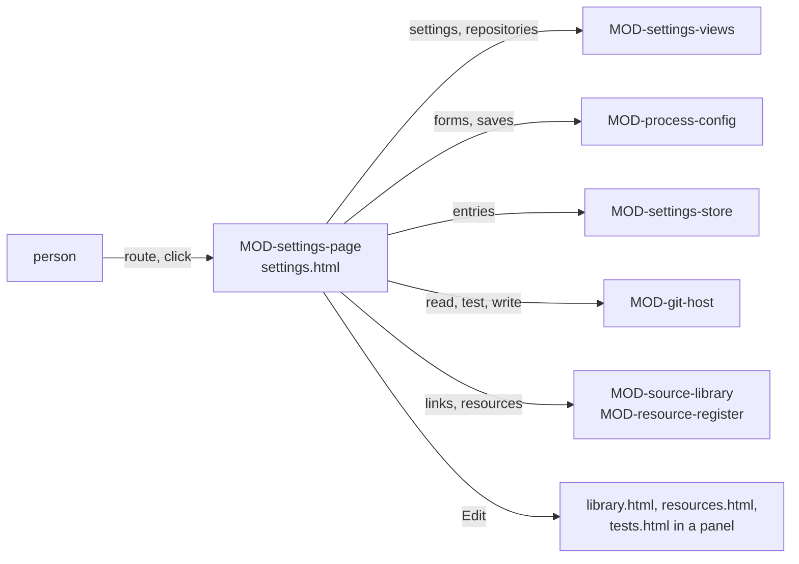

# ARC-026 The settings page

## Context

Every setting Agent M uses is reached from one page (UC-042): what this browser keeps — tokens, products, endpoints, the
bridge, the mailbox, the jump host and its sessions, resource keys (ARC-005) —, and what the instance and each product keep
in their repositories: the instance's participants, process models, sources and resources; a product's process with its
roles and Definition of Done (ARC-025), its test schedule, its linked sources, its resources, its pseudonymisation and the
people who agreed to be named (ARC-006 decision 2). The forms of the use cases that first set a setting up open from this
page: an endpoint (UC-003), a process model (UC-031), a product's process (UC-002) and a participant (UC-017) on this page;
a source (UC-004) and a product's linked sources (UC-015) on the library page (ARC-032); a test schedule (UC-027) on the
tests page (ARC-028); resources (UC-040) on the resources page (ARC-034). The browser's settings are read and changed by
`MOD-settings-store`, the repositories by `MOD-git-host`; what the configuration pages compute and save is
`MOD-process-config`'s.

Facts this decision rests on:

- "The HTTP **`X-Frame-Options`** response header can be used to indicate whether a browser should be allowed to render
  the document in a `<frame>`, `<iframe>`, `<embed>` or `<object>`"; set in a `<meta>` element it "has no effect"
  (`https://developer.mozilla.org/en-US/docs/Web/HTTP/Reference/Headers/X-Frame-Options`).
- `docs/measurements/2026-10-04_pages-frames.md` records the headers GitHub Pages sent with the files that were
  requested. The files of the instance's own site that were requested — its root, `SPEC.html`, `PLAN.html` and the review
  page under `docs/` — came with neither `X-Frame-Options` nor `Content-Security-Policy`.

## Decision

1. **Two modules.** `MOD-settings-views`, a feature, computes the lines of the page from the settings and from what the
   repositories keep. `MOD-settings-page`, the shell of `settings.html` at the root of the Pages site — the gear on every
   page opens it —, routes, reads the repositories, tests a setting, opens a repository setting's form in place, saves the
   configuration, a product's pseudonymisation and its collaborators, finds the files that still name a person, keeps and
   clears the browser's settings through `MOD-settings-store`, and holds every text and all HTML of the page.
2. **Route** (`MOD-settings-page.route`): the instance from the page's address, and from the fragment the view — the
   settings, the process models or one of them, a product's declaration, its pseudonymisation or its collaborators, the
   participants or one of them, an endpoint — with the product and the name of what is edited. A new participant's form may be opened with its type and address
   filled in: the link a resource that also works on the product gives (ARC-034, UC-040 2a); the type is one the form
   takes (`MOD-process-config.participantPreset`).
3. **One line per setting** (`MOD-settings-views.settingsPage`): each setting this browser keeps, and each kind it keeps
   none of, with its state — works since its last test, expires within fourteen days, expired, refused at its last use,
   untested, set where it has no test, not set —, whether it holds a secret, and a summary that holds none; the tokens to
   warn of on every page; a line per setting the instance keeps and, per product, whether the token may write to it.
   A line that holds a secret shows it in a password field, hidden until **Show**. The instance's section links its own
   resources as *Instance resources*, the page of ARC-034 for the instance's list (UC-040 1b). The instance's section has a
   line for its participants, its process models, its sources and its resources; a product's section a line for its
   process — model, roles and Definition of Done —, its test schedule, its linked sources, its resources, its
   pseudonymisation and its collaborators; each line a summary, its problems and **Edit** (decision 10). The summaries
   read: *<n> participants*; *<n> of the instance, <n> shipped, <n> practices*; *<n> sources*, or *no source registered*;
   *<n> resources*, or *no resource declared*; *<model> at <commit>; <n> roles assigned; <n> practices; <n> conditions
   added to the Definition of Done*, or *no process model declared*; *the schedule saved in docs/tests/schedule.md*, or
   *no schedule saved: the book's default*; *<n> sources linked*, or *no source linked*; *on*, *off*, or *on, the
   default*; *<n> people agreed to be named*, or *nobody agreed to be named yet* — with *1 source*, *1 resource*, *1 source
   linked* and *1 person agreed to be named* for one. A product that could not be read shows why, in one line without
   **Edit**.
4. **The repositories are read at their heads** (`MOD-settings-page.readConfig`): the instance's visibility, its
   participant register and the catalogue with the products declaring each model; each product's declaration with the
   blob it was read at, the model it declares read at the version it declares, and the requirements of its SPEC — or why
   the product could not be read, so that its section is shown read-only instead of stopping the page. A model is read
   in full where it is edited, adapted or chosen — at the instance's head — and where a declaration is shown — at the
   version declared (`MOD-settings-page.readModel`). With them the page reads what the lines of decision 3 summarise: the
   instance's sources — one file each under `docs/sources/` — and its `docs/resources.md` with the errors of its check;
   for each product its visibility, whether `docs/tests/schedule.md` exists, its `docs/sources.md`
   (`MOD-source-library.parseLinks`), its `docs/resources.md` with the errors of its check against its collaborators
   (`MOD-resource-register.parseResources`, `MOD-resource-register.checkResources`), its `docs/settings.md` (decision 9)
   and its `docs/collaborators.md` (decision 8), each with its blob.
5. **A browser setting is tested with itself alone** (`MOD-settings-page.testSetting`): a token asks its own server
   which account it acts as, and a refused one gives the page where it is renewed (ARC-004); an endpoint the browser
   calls answers the short test request, or the test names why not and what works instead (ARC-009); the bridge on this
   computer greets with its version, the origin it is paired with and the agents it found, or the test names its refusal
   and what works instead (ARC-012); a remote session's bridge greets the same way through the session's route — its
   forward, or the jump host's HTTPS address with the web server's login (`MOD-bridge-tunnel.sessionRoute`, ARC-013) —, or
   the test names its refusal and what works instead: where no answer arrives over HTTPS, first *the certificate of the
   jump host's HTTPS address: one the browsers trust, issued for its name, such as Let's Encrypt's or the institution's
   own; a self-signed one does not work*, then *the web server's configuration this page shows, in place on the jump
   host*, then *the reverse tunnel on the machine behind NAT, or its bridge*; where the web server refuses its login,
   *the web server's login as the password file on the jump host holds it*; where nothing answers through a forward, *the forward on this computer: the command this page shows, or a bridge here
   that opens it*, then *the reverse tunnel on the machine behind NAT, or its bridge*, then *the session's route over HTTPS
   through the jump host*; a mailbox's reading or sending
   is tested on its route without changing anything in the mailbox, or stays untested where the bridge that tests it
   does not answer (`MOD-mailbox.testMailbox`, ARC-014). A test's result is kept with the setting
   (`MOD-settings-store.recordTest`). **+ Remote session** gives a session its port and its bridge token
   (`MOD-bridge-tunnel.newSession`, `MOD-bridge-server.newToken`); the jump host's line shows its tunnel commands, its
   service files and its web-server configuration (`MOD-bridge-tunnel.tunnelCommands`, `MOD-bridge-tunnel.serviceFiles`,
   `MOD-bridge-tunnel.webServerConfig`), and its own test answers `no-test`: it is tested through its sessions. The
   bridge's form presets the address of a bridge on this computer (`MOD-bridge-server.defaultAddress`), so that pairing is
   the token pasted and **Pair**. Storing a value and **Clear** change the entries through the store and write them at
   once (ARC-005). **Clear** asks for one confirmation that says what no longer works in this browser without the
   setting — a text the page holds for each kind of setting, chosen by the line's `setting`, as for an export (decision
   7); for the bridge: mail on the IMAP route, local agents and compute resources (UC-042 2a); for the mailbox: reading
   mail for issues and sending replies, while issues and their mail identifiers stay (UC-042 2b). After the clear the page
   reads the entries again and shows the line as not set. Under the bridge's line, *Get the Agent M Bridge* offers the
   bridge's files for this browser (ARC-017 decision 7): the page reads the latest release (`MOD-git-host.latestRelease`)
   and shows what `MOD-bridge-feed.downloadFor` offers, in HTML of its own.
6. **A repository setting is saved as one commit on a click** (`MOD-settings-page.saveConfig`): the head read, the file
   planned on it by `MOD-process-config.planConfig` with the repository's visibility, and written in one commit on that
   head; a product's settings are saved in the product's repository, never only in the browser.
7. **Export and import** are those of ARC-005: before an export is saved the page names every token, key and password it
   holds (`MOD-settings-store.secretsHeld`), each with what it grants — a text the page holds for each kind of setting;
   an import keeps what the browser has and lists what it added and what it did not (`MOD-settings-store.mergeImport`).
   The browser section's folded **What is this?** says that every Pages site of the same owner reads this browser's
   settings.
8. **The people who consented to be named** (`CollaboratorsFile`, `MOD-settings-views.parseCollaborators`): a repository's
   `docs/collaborators.md`, a heading and one row per person who agreed to be named in it — the name, and the account
   they have on its server. A resource's maintainer named as a collaborator is checked against it (ARC-034); no other name
   a repository holds is checked against it yet (consequences). A product's collaborators are kept in the view
   `#collaborators?product=<address>`: **+ Collaborator** takes a name, an account and the tick *This person has agreed to be
   named in this repository*; without the tick, without an account of the form `@name`, or with a name the list holds
   already, nothing is added (`MOD-settings-views.withCollaborator`). **Save** writes the list
   (`MOD-settings-views.formatCollaborators`) as one commit of `docs/collaborators.md` on a click, on the head read, where
   the file is still the version the page opened (`MOD-settings-page.saveCollaborators`); the commit's author and time
   record who added the person, and when (UC-042 5). The list holds only who has agreed now: a person who withdrew is taken
   off it, not marked, and who added a person and when stays in the commit (`A DOCUMENT HOLDS NO HISTORY`); a list that
   holds a withdrawal note or the date of a change is not written (`MOD-artifacts.historyIn`, ARC-006). **Remove** takes a
   person off the list with one click (`MOD-settings-views.withoutCollaborator`, `MOD-settings-page.saveCollaborators`) and
   then lists the files of the default branch that still name them, each with its lines, for the person to change
   (`MOD-settings-page.filesNaming`, `MOD-settings-views.namedIn`): every file at the head read as text — one that is no
   text passed over —, `docs/collaborators.md` left out, the name found in any case and not as part of a longer word
   (UC-042 5a).
9. **Pseudonymisation** (`ProductSettingsFile`, `MOD-settings-views.parseProductSettings`,
   `MOD-settings-views.formatProductSettings`): a product's `docs/settings.md` holds, between `---` lines,
   `pseudonymisation: on` or `pseudonymisation: off`, and a text below. A product without the file, or without the
   field, is on — the default —; a file that does not read so counts as on, and its line names the problem. The view
   `#pseudonymisation?product=<address>` shows on or off and offers the other. Before switching off, the page states what
   follows (`MOD-settings-views.pseudonymisationNotice`; `SWITCHING PSEUDONYMISATION OFF STATES WHAT FOLLOWS`) — the
   sentences of decision 11, the third only where the product's server reports the repository as public (decision 4) —,
   and **Save** writes only with the tick *I have read this*: without it `MOD-settings-page.savePseudonymisation` refuses
   `not-acknowledged` (UC-042 4). Switching back on is saved without a tick and states that data written meanwhile stays
   in the repository's history (UC-042 4a). Each save is one commit of `docs/settings.md` on a click, on the head read,
   where the file is still the version the page opened, the text below its fields kept. The file holds only the setting
   as it is now, and a switch stays in the version history (`A DOCUMENT HOLDS NO HISTORY`): a text that holds a withdrawal
   note or the date of a change is not written (`MOD-artifacts.historyIn`).
10. **Edit opens the setting's form in place** (UC-042 3). A line's address names the page and the view that own its
    form. On this page: `#participants`, `#models`, `#declaration?product=<address>`, `#pseudonymisation?product=<address>`
    and `#collaborators?product=<address>` (`MOD-settings-page.route`), which **Edit** opens here. On another page of the
    Pages site: `library.html#library` and `library.html#product?product=<address>` (`MOD-library-page.route`, ARC-032),
    `resources.html#resources` — with `?product=<address>` for a product — (`MOD-resources-page.route`, ARC-034) and
    `tests.html#schedule?product=<address>` (`MOD-tests-page.route`, ARC-028), which **Edit** opens in a panel of this
    page: that page in an inline frame. These pages are files of the instance's Pages site, as `settings.html` is, so the
    form, its texts and its save stay its own page's. Saving is that form's own one click under the person's account:
    `MOD-settings-page.saveConfig` for a participant, a process model and a product's process;
    `MOD-library-page.saveSource` and `MOD-library-page.saveLinks`; `MOD-resources-page.saveResources`;
    `MOD-tests-page.saveSchedule`; and decisions 8 and 9. When the person closes the panel, the page reads the
    repositories again.
11. **The texts of the instance's and the products' sections** (`EVERY STEP EXPLAINS ITSELF`). Each line folds out *What
    is this?*: participants — "The people and agents that work on the instance's products, with what each may do and
    where it processes data. Kept in docs/participants.md of the instance; whoever can read the instance's repository
    reads it."; process models — "The models a product's process is chosen from, and the practices that adapt them. Kept
    under docs/process-models/ of the instance; whoever can read the instance's repository reads them."; sources — "The
    rules products must meet — laws, norms, guidelines —, each with its versions. Kept under docs/sources/ of the
    instance; whoever can read the instance's repository reads them, while a restricted source's content stays where its
    entry says."; the instance's resources — "What the instance's own jobs use: clusters, runners, endpoints. Kept in
    docs/resources.md of the instance; whoever can read the instance's repository reads it."; a product's process — "The
    process model the product follows, who holds each role, and its Definition of Done. Kept in docs/process.md of the
    product; whoever can read the product's repository reads it."; test schedule — "When which tests run: on every
    commit, on a pull request, nightly, for a release. Kept in docs/tests/schedule.md of the product, with the CI
    configuration made from it; whoever can read the product's repository reads it."; linked sources — "The sources this
    product must meet, each at the version it uses. Kept in docs/sources.md of the product; whoever can read the product's
    repository reads it."; resources — "What this product is built with, tested on or calls at runtime. Kept in
    docs/resources.md of the product, where a credential is named and never written; whoever can read the product's
    repository reads it."; pseudonymisation — "Whether report data from mails — logs, error messages, attached files — is
    rewritten without persons before it enters this product's issues and repository. Kept in docs/settings.md of the
    product; on unless switched off; whoever can read the product's repository reads it."; collaborators — "The people who
    agreed to be named in this repository; anyone else is named by their account. Kept in docs/collaborators.md of the
    product; whoever can read the product's repository reads the names." Before switching pseudonymisation off: "Report
    data from mails — logs, error messages, the text of screenshots and attached files — will then enter this product's
    issues and repository unchanged, with every name, address and number it holds." — "This is advisable only on a
    protected data space that is not public." — and, for a public repository, "The server reports this repository as
    public: the data will be published." — with the tick "I have read this". Switching it back on: "Data written while
    pseudonymisation was off stays in the repository's history; removing it needs a rewrite of that history." **+
    Collaborator** asks for *Name* and *Account (@name)* and the tick "This person has agreed to be named in this
    repository". After **Remove**: "These files on the default branch still name <name>: <file, lines>. Change them where
    the name should go. Earlier commits keep the name in the repository's history." — or, where none does, "No file on the
    default branch names <name>. Earlier commits keep the name in the repository's history." A panel of decision 10 carries
    the link "Open this page on its own", to the same address.



## Alternatives

- **Each setting on the page of the use case that set it up** — `EVERY SETTING IS REACHED FROM ONE PAGE`; the forms open
  on this page instead.
- **A test that sends every stored credential at once** — a token goes only to the server that issued it; each test sends
  one setting alone.
- **The settings page as a view of the main page** — the main page reads every product to show what goes on; the
  settings page reads what is configured, and is reached from every page.

## Consequences

- After a save the page reads the repository again; after a change of the browser's settings it reads the entries again.
- A form in a panel is its page in an inline frame of the same Pages site, and it reads and saves as when it is opened on
  its own. The measurement covers only the files it requested (context). The pages the panel opens were not measured —
  `library.html`, not served yet, answered 404, and `resources.html` and `tests.html` were not requested —, nor was how a
  browser shows a page in a frame. A page that does not show in the panel is opened on its own from the same address, by
  the panel's link *Open this page on its own* (decision 11).
- `A DOCUMENT HOLDS NO HISTORY` is kept across the decisions (ARC-020). The saves of decisions 8 and 9 write no text in
  which the history check of a product's settings files (`MOD-artifacts.historyIn`, ARC-006) finds a withdrawal note or
  the date of a change.
- The test of a resource key reads, with that key alone, a resource that names it — a repository on its server, a model or
  a dataset on the Hub, an endpoint through the bridge (ARC-034) —; this page reads the lists that name the keys
  (decision 4), and the test waits for the check through the bridge, ARC-034's second part. Until then a resource key's
  line shows its state and **Clear**, and its test answers `no-test`, as the jump host's does.
- **Kept in part, not placed** (`A PERSON IS NAMED BY ACCOUNT OR WITH CONSENT`): the people a repository lists as
  consenting are read here (`MOD-settings-views.parseCollaborators`), and a resource's maintainer is checked against them
  (`MOD-resource-register.checkResources`, ARC-034). A name in any other artifact — above all one a participant
  generates — is checked against them by no design yet; that check belongs among the checks a drafting job's output must
  pass in its correction loop (ARC-007, ARC-031), and the decision that designs it places the rule. The list itself is
  kept on this page (decision 8).
- **Kept in part, not placed** (`PSEUDONYMISATION IS ON UNLESS A PRODUCT SWITCHES IT OFF`): the setting reads on wherever
  the product does not switch it off — without `docs/settings.md`, without its field, or with a file that does not read
  as settings (`MOD-settings-views.parseProductSettings`) — and is switched only by a person's click
  (`MOD-settings-page.savePseudonymisation`). The rewriting of report data that honours it (UC-038 6b) is left with the
  participant jobs over a mail's content (ARC-014), and the decision that designs it places the rule.
- Finding the files that still name a person reads every file of the head once — a file read before is taken from the
  kept texts (ARC-005 decision 9) —; a repository of many files costs as many requests.
- Not realised here: the steps that need those tests or settings not designed yet — UC-042 1 and 2, which wait for the
  test of a resource key: step 1 shows the line of a resource key with a state — works or refused — that only that test
  gives, and step 2's **Test** of it sends nothing yet; it comes with the check through the bridge, ARC-034's second part.
  UC-003 2a (a model server through the bridge), UC-017 3, 3b, 5a, 6, 6a (a participant on the bridge and its test, which
  come with the bridge as a job runtime, and the sources' places), UC-002 4c (the sources' places), and UC-031 4a
  (keeping an unfinished model in the browser, for which the store has no key).

## Modules

### MOD-settings-views

```json module
{
  "id": "MOD-settings-views",
  "folder": "src/settings-views/",
  "layer": "feature",
  "responsibility": "Computes what the settings page shows: a line per setting this browser keeps, and per kind it keeps none of, with its state and whether it holds a secret; the tokens to warn of on every page; a line per setting the instance and each product keep in their repositories, with the form its Edit opens; a product's docs/settings.md and what the page states before its pseudonymisation is switched; and the people a repository lists as consenting to be named, a person added or removed, and the lines of a text that name a person.",
  "realises": ["EVERY SETTING IS REACHED FROM ONE PAGE"],
  "owns": ["Collaborator", "CollaboratorRow", "SettingLine", "ConfigLine", "SettingCount", "PseudonymisationRead", "CollaboratorsRead", "ProductSettingsRead", "PseudonymisationNotice", "ProductSettingsContent", "ProductSettings", "SettingsPage", "RegisterRead", "InstanceConfig", "DeclarationOrNone", "ProductConfig", "SettingsConfig", "CollaboratorsFile", "ProductSettingsFile"],
  "uses": ["MOD-contracts", "MOD-settings-store"]
}
```

```json interface
{
  "id": "MOD-settings-views.settingsPage",
  "summary": "What the settings page shows: one line per setting this browser keeps — each GitHub and GitLab token, product, endpoint, the bridge, the mailbox, the mails marked not an issue, the jump host, each remote session and resource key — and one per kind it keeps none of, each with its state — works since its last test, expires within fourteen days, expired, refused at its last use, untested, set where it has no test, or not set —, whether it holds a secret, and a summary without the secret; the tokens to warn of on every page; a line per setting the instance keeps — its participants, process models, sources and resources — and, for each product, whether the token may write to it and a line per setting it keeps — its process, test schedule, linked sources, resources, pseudonymisation and collaborators —, each with a summary, its problems and the form its Edit opens: the page and its view.",
  "params": [
    { "name": "settings", "type": "Settings" },
    { "name": "today", "type": "string" },
    { "name": "instance", "type": "InstanceConfig" },
    { "name": "products", "type": "ProductConfig[]" }
  ],
  "result": "SettingsPage",
  "async": false,
  "refusals": [],
  "examples": [
    {
      "name": "a browser with tokens, products and an endpoint",
      "input": {
        "settings": {
          "github": { "token": "github_pat_example", "expires": "2026-10-19", "tested": { "ok": "2026-10-02" } },
          "gitlab": [
            {
              "address": "https://gitlab.example.org/group/lab",
              "token": "glpat-example",
              "expires": "2026-12-31",
              "tested": { "refused": true }
            }
          ],
          "products": ["https://github.com/alice/notes", "https://gitlab.example.org/group/lab"],
          "endpoints": [
            {
              "name": "hub",
              "url": "https://hub.nhr.fau.de/api/llmgw/v1",
              "model": "llama-3.3-70b",
              "key": "hub-key-example",
              "via": "browser",
              "tested": { "ok": "2026-10-08" }
            }
          ],
          "bridge": null,
          "mailbox": null,
          "notAnIssue": [],
          "jumpHost": null,
          "sessions": [],
          "resourceKeys": []
        },
        "today": "2026-10-09",
        "instance": {
          "address": "https://github.com/alice/agent-m",
          "head": "a900000000000000000000000000000000000000",
          "visibility": "private",
          "register": {
            "participants": [
              {
                "name": "alice",
                "type": "person",
                "model": "",
                "context": null,
                "price": null,
                "capabilities": ["draft text", "read the repository", "write to the repository"],
                "place": "",
                "route": "the GitHub account `alice`",
                "line": 5
              },
              {
                "name": "hub-writer",
                "type": "model endpoint",
                "model": "llama-3.3-70b",
                "context": null,
                "price": null,
                "capabilities": ["draft text"],
                "place": "NHR@FAU, Erlangen",
                "route": "the endpoint hub of this browser",
                "line": 6
              },
              {
                "name": "gw-writer",
                "type": "model endpoint",
                "model": "gateway-model",
                "context": 32000,
                "price": { "currency": "EUR", "input": 0.2, "output": 0.6 },
                "capabilities": ["draft text"],
                "place": "a gateway in Frankfurt, Germany",
                "route": "the endpoint gw of this browser",
                "line": 7
              },
              {
                "name": "ci-dev",
                "type": "CI agent",
                "model": "claude-opus-5-5",
                "context": null,
                "price": null,
                "capabilities": ["read the repository", "write to the repository", "run code and tests"],
                "place": "GitHub's machines, a provider in the USA",
                "route": "the workflow agent-m-job",
                "line": 8
              },
              {
                "name": "cli-dev",
                "type": "CLI agent",
                "model": "claude-opus-5-5",
                "context": null,
                "price": null,
                "capabilities": ["draft text", "read the repository", "write to the repository", "run code and tests", "use tools"],
                "place": "this machine",
                "route": "the bridge on the Mac of `alice`",
                "line": 9
              }
            ],
            "problems": [],
            "before": "# Participants of this instance",
            "after": "Every participant that works with a language model names its model.",
            "text": "# Participants of this instance\n\n| Name | Type | Model | Context | Price | Capabilities | Processing place | Route |\n|---|---|---|---|---|---|---|---|\n| alice | person | — | — | — | draft text, read the repository, write to the repository | — | the GitHub account `alice` |\n| hub-writer | model endpoint | llama-3.3-70b | — | — | draft text | NHR@FAU, Erlangen | the endpoint hub of this browser |\n| gw-writer | model endpoint | gateway-model | 32000 | 0.2 / 0.6 EUR per million tokens | draft text | a gateway in Frankfurt, Germany | the endpoint gw of this browser |\n| ci-dev | CI agent | claude-opus-5-5 | — | — | read the repository, write to the repository, run code and tests | GitHub's machines, a provider in the USA | the workflow agent-m-job |\n| cli-dev | CLI agent | claude-opus-5-5 | — | — | draft text, read the repository, write to the repository, run code and tests, use tools | this machine | the bridge on the Mac of `alice` |\n\nEvery participant that works with a language model names its model.\n",
            "blob": "ed9f1cd7e5f305b45281308b4127da5e44589dda"
          },
          "catalogue": {
            "models": [
              {
                "name": "kanban",
                "file": "src/process-model/catalogue/kanban.md",
                "blob": "f05591dcf5cff8213c42f8f75ec82b41ada9dc0b",
                "shipped": true,
                "kind": "pulled",
                "measure": "items per state over time",
                "fits": [],
                "about": { "manages": "work that arrives unpredictably and must flow without long waits", "accepts": "no fixed delivery date for a set of items", "suits": "maintaining a product that receives issues every week", "chapter": "Vibe Coding, ch. 7 §4" },
                "adaptedFrom": "",
                "title": "Kanban",
                "findings": [],
                "usedBy": []
              },
              {
                "name": "v-model",
                "file": "src/process-model/catalogue/v-model.md",
                "blob": "856921837cdfd759b62ae92008161c6c6064a51f",
                "shipped": true,
                "kind": "planned",
                "measure": "plan entries per phase",
                "fits": [],
                "about": { "manages": "", "accepts": "", "suits": "", "chapter": "" },
                "adaptedFrom": "",
                "title": "V-model",
                "findings": [],
                "usedBy": []
              },
              {
                "name": "scrum",
                "file": "docs/process-models/scrum.md",
                "blob": "3cf5eb32eb2b19fb8d78144763f87ae102efdbbd",
                "shipped": false,
                "kind": "pulled",
                "measure": "remaining items per time box",
                "fits": [],
                "about": { "manages": "", "accepts": "", "suits": "", "chapter": "" },
                "adaptedFrom": "",
                "title": "Scrum",
                "findings": [],
                "usedBy": [
                  { "product": "https://github.com/alice/notes", "version": "a900000000000000000000000000000000000000" }
                ]
              }
            ],
            "practices": [
              {
                "name": "devops",
                "file": "src/process-model/catalogue/devops.md",
                "blob": "39aa49976758648c9a46b24c8a1c2a8c49053e2e",
                "shipped": true,
                "kind": "practice",
                "measure": "",
                "fits": ["v-model", "pulled"],
                "about": { "manages": "", "accepts": "", "suits": "", "chapter": "" },
                "adaptedFrom": "",
                "title": "DevOps",
                "findings": [],
                "usedBy": []
              }
            ]
          },
          "sources": { "count": 2, "problems": 0 },
          "resources": { "count": 1, "problems": 0 }
        },
        "products": [
          {
            "address": "https://github.com/alice/notes",
            "head": "d700000000000000000000000000000000000000",
            "writable": true,
            "visibility": "private",
            "declaration": {
              "model": "scrum",
              "modelFile": "docs/process-models/scrum.md",
              "modelVersion": "a900000000000000000000000000000000000000",
              "sprintClose": "alice",
              "title": "How the thesis tool is developed",
              "intro": "",
              "roles": [
                { "role": "Product Owner", "participants": ["alice"], "line": 13 },
                { "role": "Developers", "participants": ["cli-dev", "ci-dev"], "line": 14 }
              ],
              "practices": [],
              "branches": [{ "phase": "Sprint", "branch": "sprint/<nn>", "line": 20 }],
              "done": [],
              "gatesAdded": [],
              "artifactsAdded": [],
              "notes": "",
              "problems": []
            },
            "declarationBlob": "1f23b5829774f9d58652b9ae33e9bcf83c517d39",
            "model": {
              "name": "scrum",
              "kind": "pulled",
              "adaptedFrom": "",
              "measure": "remaining items per time box",
              "fits": [],
              "about": { "manages": "", "accepts": "", "suits": "", "chapter": "" },
              "title": "Scrum",
              "intro": "",
              "phases": [
                {
                  "name": "Sprint planning",
                  "role": "Product Owner",
                  "produces": "ITM",
                  "kinds": ["ITM"],
                  "line": 12
                },
                {
                  "name": "Development",
                  "role": "Developers",
                  "produces": "MOD, TST",
                  "kinds": ["MOD", "TST"],
                  "line": 13
                },
                {
                  "name": "Sprint review",
                  "role": "Product Owner",
                  "produces": "the review of the increment",
                  "kinds": [],
                  "line": 14
                }
              ],
              "transitions": [
                { "from": "Sprint planning", "to": "Development", "kind": "sequence", "line": 20 },
                { "from": "Development", "to": "Sprint review", "kind": "sequence", "line": 21 },
                { "from": "Sprint review", "to": "Sprint planning", "kind": "sequence", "line": 22 }
              ],
              "pairs": [],
              "gates": [
                {
                  "between": "Sprint planning → Development",
                  "from": "Sprint planning",
                  "to": "Development",
                  "artifacts": "ITM",
                  "kinds": ["ITM"],
                  "condition": "the sprint's items are ready",
                  "decider": { "role": "Product Owner" },
                  "line": 28
                },
                {
                  "between": "Development → Sprint review",
                  "from": "Development",
                  "to": "Sprint review",
                  "artifacts": "MOD",
                  "kinds": ["MOD"],
                  "condition": "CI is green",
                  "decider": { "role": "Product Owner" },
                  "line": 29
                }
              ],
              "roles": [
                {
                  "name": "Product Owner",
                  "filledBy": "person",
                  "capabilities": ["read the repository", "write to the repository"],
                  "line": 35
                },
                {
                  "name": "Developers",
                  "filledBy": "agent",
                  "capabilities": ["read the repository", "write to the repository", "run code and tests"],
                  "line": 36
                }
              ],
              "flow": { "wipLimit": null, "timeBox": "2 weeks", "sprints": true, "line": 38 },
              "lines": { "kind": 3, "measure": 4 },
              "problems": []
            },
            "requirements": [
              { "name": "ONE CLICK", "source": "PO A. Maier", "rule": "A decision takes one click.", "check": "no automatic check; at review.", "section": "1. Writing", "line": 5 },
              { "name": "NO SERVER", "source": "PO A. Maier", "rule": "The product runs no server of its own.", "check": "`tests/test_no_server.py`", "section": "1. Writing", "line": 9 }
            ],
            "schedule": true,
            "links": { "count": 2, "problems": 0 },
            "resources": { "count": 2, "problems": 1 },
            "pseudonymisation": { "value": "on", "set": false, "blob": "", "problem": "" },
            "collaborators": {
              "people": [
                { "name": "Bob Example", "account": "@bob" },
                { "name": "Carla Muster", "account": "@carla" }
              ],
              "blob": "9155ce091497d00913361ab80b4eb450df163a4c",
              "problem": ""
            },
            "problem": null
          },
          {
            "address": "https://gitlab.example.org/group/lab",
            "head": "",
            "writable": false,
            "visibility": "",
            "declaration": null,
            "declarationBlob": "",
            "model": null,
            "requirements": [],
            "schedule": false,
            "links": { "count": 0, "problems": 0 },
            "resources": { "count": 0, "problems": 0 },
            "pseudonymisation": { "value": "on", "set": false, "blob": "", "problem": "" },
            "collaborators": { "people": [], "blob": "", "problem": "" },
            "problem": { "refused": "token-refused", "reason": "gitlab.example.org refused the token" }
          }
        ]
      },
      "result": {
        "browser": [
          { "setting": "github-token", "item": "", "state": "expires", "tested": "2026-10-02", "expires": "2026-10-19", "secret": true, "summary": "" },
          { "setting": "gitlab-token", "item": "https://gitlab.example.org/group/lab", "state": "refused", "tested": "", "expires": "2026-12-31", "secret": true, "summary": "" },
          { "setting": "product", "item": "https://github.com/alice/notes", "state": "set", "tested": "", "expires": "", "secret": false, "summary": "https://github.com/alice/notes" },
          { "setting": "product", "item": "https://gitlab.example.org/group/lab", "state": "set", "tested": "", "expires": "", "secret": false, "summary": "https://gitlab.example.org/group/lab" },
          { "setting": "endpoint", "item": "hub", "state": "works", "tested": "2026-10-08", "expires": "", "secret": true, "summary": "https://hub.nhr.fau.de/api/llmgw/v1 · llama-3.3-70b" },
          { "setting": "bridge", "item": "", "state": "not-set", "tested": "", "expires": "", "secret": true, "summary": "" },
          { "setting": "mailbox", "item": "", "state": "not-set", "tested": "", "expires": "", "secret": true, "summary": "" },
          { "setting": "not-an-issue", "item": "", "state": "not-set", "tested": "", "expires": "", "secret": false, "summary": "" },
          { "setting": "jump-host", "item": "", "state": "not-set", "tested": "", "expires": "", "secret": true, "summary": "" },
          { "setting": "session", "item": "", "state": "not-set", "tested": "", "expires": "", "secret": true, "summary": "" },
          { "setting": "resource-key", "item": "", "state": "not-set", "tested": "", "expires": "", "secret": true, "summary": "" }
        ],
        "warnings": [{ "ref": { "setting": "github-token", "item": "" }, "expires": "2026-10-19", "days": 10 }],
        "instance": [
          { "setting": "participants", "summary": "5 participants", "problems": 0, "edit": "settings.html#participants" },
          { "setting": "process-models", "summary": "1 of the instance, 2 shipped, 1 practices", "problems": 0, "edit": "settings.html#models" },
          { "setting": "sources", "summary": "2 sources", "problems": 0, "edit": "library.html#library" },
          { "setting": "resources", "summary": "1 resource", "problems": 0, "edit": "resources.html#resources" }
        ],
        "products": [
          {
            "product": "https://github.com/alice/notes",
            "writable": true,
            "lines": [
              { "setting": "process", "summary": "scrum at a90000000000; 2 roles assigned; 0 practices; 0 conditions added to the Definition of Done", "problems": 0, "edit": "settings.html#declaration?product=https%3A%2F%2Fgithub.com%2Falice%2Fnotes" },
              { "setting": "schedule", "summary": "the schedule saved in docs/tests/schedule.md", "problems": 0, "edit": "tests.html#schedule?product=https%3A%2F%2Fgithub.com%2Falice%2Fnotes" },
              { "setting": "sources", "summary": "2 sources linked", "problems": 0, "edit": "library.html#product?product=https%3A%2F%2Fgithub.com%2Falice%2Fnotes" },
              { "setting": "resources", "summary": "2 resources", "problems": 1, "edit": "resources.html#resources?product=https%3A%2F%2Fgithub.com%2Falice%2Fnotes" },
              { "setting": "pseudonymisation", "summary": "on, the default", "problems": 0, "edit": "settings.html#pseudonymisation?product=https%3A%2F%2Fgithub.com%2Falice%2Fnotes" },
              { "setting": "collaborators", "summary": "2 people agreed to be named", "problems": 0, "edit": "settings.html#collaborators?product=https%3A%2F%2Fgithub.com%2Falice%2Fnotes" }
            ]
          },
          {
            "product": "https://gitlab.example.org/group/lab",
            "writable": false,
            "lines": [
              { "setting": "process", "summary": "gitlab.example.org refused the token", "problems": 1, "edit": "" }
            ]
          }
        ]
      }
    },
    {
      "name": "a browser that keeps nothing yet",
      "input": {
        "settings": {
          "github": null,
          "gitlab": [],
          "products": [],
          "endpoints": [],
          "bridge": null,
          "mailbox": null,
          "notAnIssue": [],
          "jumpHost": null,
          "sessions": [],
          "resourceKeys": []
        },
        "today": "2026-10-09",
        "instance": {
          "address": "https://github.com/alice/agent-m",
          "head": "a900000000000000000000000000000000000000",
          "visibility": "private",
          "register": { "participants": [], "problems": [], "before": "", "after": "", "text": "", "blob": "" },
          "catalogue": { "models": [], "practices": [] },
          "sources": { "count": 0, "problems": 0 },
          "resources": { "count": 0, "problems": 0 }
        },
        "products": []
      },
      "result": {
        "browser": [
          { "setting": "github-token", "item": "", "state": "not-set", "tested": "", "expires": "", "secret": true, "summary": "" },
          { "setting": "gitlab-token", "item": "", "state": "not-set", "tested": "", "expires": "", "secret": true, "summary": "" },
          { "setting": "product", "item": "", "state": "not-set", "tested": "", "expires": "", "secret": false, "summary": "" },
          { "setting": "endpoint", "item": "", "state": "not-set", "tested": "", "expires": "", "secret": true, "summary": "" },
          { "setting": "bridge", "item": "", "state": "not-set", "tested": "", "expires": "", "secret": true, "summary": "" },
          { "setting": "mailbox", "item": "", "state": "not-set", "tested": "", "expires": "", "secret": true, "summary": "" },
          { "setting": "not-an-issue", "item": "", "state": "not-set", "tested": "", "expires": "", "secret": false, "summary": "" },
          { "setting": "jump-host", "item": "", "state": "not-set", "tested": "", "expires": "", "secret": true, "summary": "" },
          { "setting": "session", "item": "", "state": "not-set", "tested": "", "expires": "", "secret": true, "summary": "" },
          { "setting": "resource-key", "item": "", "state": "not-set", "tested": "", "expires": "", "secret": true, "summary": "" }
        ],
        "warnings": [],
        "instance": [
          { "setting": "participants", "summary": "0 participants", "problems": 0, "edit": "settings.html#participants" },
          { "setting": "process-models", "summary": "0 of the instance, 0 shipped, 0 practices", "problems": 0, "edit": "settings.html#models" },
          { "setting": "sources", "summary": "no source registered", "problems": 0, "edit": "library.html#library" },
          { "setting": "resources", "summary": "no resource declared", "problems": 0, "edit": "resources.html#resources" }
        ],
        "products": []
      }
    }
  ]
}
```

```json interface
{
  "id": "MOD-settings-views.parseCollaborators",
  "summary": "The people a repository's docs/collaborators.md lists as consenting to be named in it, each with the account they have on its server; an empty list where the file has no table yet.",
  "params": [{ "name": "text", "type": "string" }],
  "result": "Collaborator[]",
  "async": false,
  "refusals": [{ "code": "not-collaborators", "when": "the text does not begin with a heading" }],
  "examples": [
    {
      "name": "two people who consented",
      "input": { "text": "# Collaborators\n\nThe people who agreed to be named in this repository (UC-042), each with the account they have on its server.\n\n| Name | Account |\n|---|---|\n| Bob Example | @bob |\n| Carla Muster | @carla |\n" },
      "result": [{ "name": "Bob Example", "account": "@bob" }, { "name": "Carla Muster", "account": "@carla" }]
    },
    { "name": "a file without its table yet", "input": { "text": "# Collaborators\n" }, "result": [] },
    {
      "name": "a text without its heading",
      "input": { "text": "| Name | Account |\n" },
      "refused": "not-collaborators"
    }
  ]
}
```

```json interface
{
  "id": "MOD-settings-views.formatCollaborators",
  "summary": "The text of docs/collaborators.md: a heading, a sentence of what the list is, and one row per person with their account.",
  "params": [{ "name": "collaborators", "type": "Collaborator[]" }],
  "result": "string",
  "async": false,
  "refusals": [],
  "examples": [
    {
      "name": "two people",
      "input": {
        "collaborators": [
          { "name": "Bob Example", "account": "@bob" },
          { "name": "Carla Muster", "account": "@carla" }
        ]
      },
      "result": "# Collaborators\n\nThe people who agreed to be named in this repository (UC-042), each with the account they have on its server.\n\n| Name | Account |\n|---|---|\n| Bob Example | @bob |\n| Carla Muster | @carla |\n"
    }
  ]
}
```

```json interface
{
  "id": "MOD-settings-views.withCollaborator",
  "summary": "The list with a person added who agreed to be named: only with the tick that they agreed, a name and an account in the form @name, and a name the list does not hold yet.",
  "params": [
    { "name": "collaborators", "type": "Collaborator[]" },
    { "name": "person", "type": "Collaborator" },
    { "name": "agreed", "type": "boolean" }
  ],
  "result": "Collaborator[]",
  "async": false,
  "refusals": [
    { "code": "not-agreed", "when": "the tick that the person agreed to be named is not set" },
    { "code": "incomplete", "when": "the name or the account is empty, or the name holds | or a line break" },
    { "code": "not-an-account", "when": "the account is not of the form @name" },
    { "code": "already-listed", "when": "the list holds the name already, in any case" }
  ],
  "examples": [
    {
      "name": "a person who agreed",
      "input": {
        "collaborators": [
          { "name": "Bob Example", "account": "@bob" },
          { "name": "Carla Muster", "account": "@carla" }
        ],
        "person": { "name": "Dana Okafor", "account": "@dokafor" },
        "agreed": true
      },
      "result": [
        { "name": "Bob Example", "account": "@bob" },
        { "name": "Carla Muster", "account": "@carla" },
        { "name": "Dana Okafor", "account": "@dokafor" }
      ]
    },
    {
      "name": "the tick not set",
      "input": {
        "collaborators": [
          { "name": "Bob Example", "account": "@bob" },
          { "name": "Carla Muster", "account": "@carla" }
        ],
        "person": { "name": "Dana Okafor", "account": "@dokafor" },
        "agreed": false
      },
      "refused": "not-agreed"
    },
    {
      "name": "no account",
      "input": {
        "collaborators": [
          { "name": "Bob Example", "account": "@bob" },
          { "name": "Carla Muster", "account": "@carla" }
        ],
        "person": { "name": "Dana Okafor", "account": "" },
        "agreed": true
      },
      "refused": "incomplete"
    },
    {
      "name": "an address instead of an account",
      "input": {
        "collaborators": [
          { "name": "Bob Example", "account": "@bob" },
          { "name": "Carla Muster", "account": "@carla" }
        ],
        "person": { "name": "Dana Okafor", "account": "dana@example.org" },
        "agreed": true
      },
      "refused": "not-an-account"
    },
    {
      "name": "a person listed already",
      "input": {
        "collaborators": [
          { "name": "Bob Example", "account": "@bob" },
          { "name": "Carla Muster", "account": "@carla" }
        ],
        "person": { "name": "bob example", "account": "@bob" },
        "agreed": true
      },
      "refused": "already-listed"
    }
  ]
}
```

```json interface
{
  "id": "MOD-settings-views.withoutCollaborator",
  "summary": "The list without a person who withdrew their agreement.",
  "params": [{ "name": "collaborators", "type": "Collaborator[]" }, { "name": "name", "type": "string" }],
  "result": "Collaborator[]",
  "async": false,
  "refusals": [{ "code": "not-listed", "when": "the list does not hold the name" }],
  "examples": [
    {
      "name": "Bob Example withdraws",
      "input": {
        "collaborators": [
          { "name": "Bob Example", "account": "@bob" },
          { "name": "Carla Muster", "account": "@carla" }
        ],
        "name": "Bob Example"
      },
      "result": [{ "name": "Carla Muster", "account": "@carla" }]
    },
    {
      "name": "a person not listed",
      "input": {
        "collaborators": [
          { "name": "Bob Example", "account": "@bob" },
          { "name": "Carla Muster", "account": "@carla" }
        ],
        "name": "Dana Okafor"
      },
      "refused": "not-listed"
    }
  ]
}
```

```json interface
{
  "id": "MOD-settings-views.namedIn",
  "summary": "The lines of a text, numbered from 1, on which a person's name stands — its letters in any case, not as part of a longer word.",
  "params": [{ "name": "text", "type": "string" }, { "name": "name", "type": "string" }],
  "result": "integer[]",
  "async": false,
  "refusals": [],
  "examples": [
    {
      "name": "a backlog item that names a reporter twice on one line",
      "input": { "text": "# ITM-002 Search the titles too\n\nReported by Bob Example; Bob Example also wrote the first draft.\n\nThe search finds a word in a note's title.\n", "name": "Bob Example" },
      "result": [3]
    },
    {
      "name": "a longer name and another case",
      "input": { "text": "Bob Examples wrote this.\nthanks to bob example\n", "name": "Bob Example" },
      "result": [2]
    },
    { "name": "a text that names nobody", "input": { "text": "# notes\n", "name": "Bob Example" }, "result": [] }
  ]
}
```

```json interface
{
  "id": "MOD-settings-views.parseProductSettings",
  "summary": "A product's docs/settings.md: whether pseudonymisation is on or off — on where the file is missing, given as the empty text, or names no pseudonymisation —, whether the file sets it, and the text below its fields.",
  "params": [{ "name": "text", "type": "string" }],
  "result": "ProductSettingsRead",
  "async": false,
  "refusals": [
    { "code": "not-settings", "when": "the text does not begin with fields between --- lines, names a field other than pseudonymisation, or sets it to neither on nor off" }
  ],
  "examples": [
    {
      "name": "a product without the file",
      "input": { "text": "" },
      "result": { "pseudonymisation": "on", "set": false, "body": "\n# Settings\n\nThe settings that govern how this product is developed and that no other file keeps (UC-042).\n" }
    },
    {
      "name": "switched off",
      "input": { "text": "---\npseudonymisation: off\n---\n\n# Settings\n\nKept off: the data stay in the lab's private repository.\n" },
      "result": { "pseudonymisation": "off", "set": true, "body": "\n# Settings\n\nKept off: the data stay in the lab's private repository.\n" }
    },
    {
      "name": "a field the file does not know",
      "input": { "text": "---\npseudonymization: off\n---\n" },
      "refused": "not-settings"
    },
    {
      "name": "neither on nor off",
      "input": { "text": "---\npseudonymisation: partly\n---\n" },
      "refused": "not-settings"
    },
    {
      "name": "no fields between --- lines",
      "input": { "text": "# Settings\n\npseudonymisation: off\n" },
      "refused": "not-settings"
    }
  ]
}
```

```json interface
{
  "id": "MOD-settings-views.formatProductSettings",
  "summary": "The text of docs/settings.md with pseudonymisation on or off: its field between --- lines, and the text below — the file's own, else a heading and a sentence of what the file is.",
  "params": [{ "name": "pseudonymisation", "type": "string" }, { "name": "body", "type": "string" }],
  "result": "string",
  "async": false,
  "refusals": [],
  "examples": [
    {
      "name": "switched back on, the text below kept",
      "input": { "pseudonymisation": "on", "body": "\n# Settings\n\nKept off: the data stay in the lab's private repository.\n" },
      "result": "---\npseudonymisation: on\n---\n\n# Settings\n\nKept off: the data stay in the lab's private repository.\n"
    },
    {
      "name": "a new file, switched off",
      "input": { "pseudonymisation": "off", "body": "" },
      "result": "---\npseudonymisation: off\n---\n\n# Settings\n\nThe settings that govern how this product is developed and that no other file keeps (UC-042).\n"
    }
  ]
}
```

```json interface
{
  "id": "MOD-settings-views.pseudonymisationNotice",
  "summary": "What the page states before pseudonymisation is switched: switching off — that report data then enters the product's issues and repository unchanged, that this is advisable only on a protected, non-public data space, and for a repository its server reports as public that the data will be published —, with the tick I have read this; switching on — no tick — that data written meanwhile stays in the repository's history.",
  "params": [{ "name": "next", "type": "string" }, { "name": "visibility", "type": "string" }],
  "result": "PseudonymisationNotice",
  "async": false,
  "refusals": [{ "code": "not-a-setting", "when": "the setting is neither on nor off" }],
  "examples": [
    {
      "name": "switching off a private repository",
      "input": { "next": "off", "visibility": "private" },
      "result": { "next": "off", "statements": ["unchanged", "protected-only"], "acknowledge": true }
    },
    {
      "name": "switching off a public repository",
      "input": { "next": "off", "visibility": "public" },
      "result": { "next": "off", "statements": ["unchanged", "protected-only", "published"], "acknowledge": true }
    },
    {
      "name": "switching back on",
      "input": { "next": "on", "visibility": "public" },
      "result": { "next": "on", "statements": ["history"], "acknowledge": false }
    },
    {
      "name": "neither on nor off",
      "input": { "next": "partly", "visibility": "private" },
      "refused": "not-a-setting"
    }
  ]
}
```

### MOD-settings-page

```json module
{
  "id": "MOD-settings-page",
  "folder": "src/settings-page/",
  "layer": "shell",
  "responsibility": "The page settings.html at the root of the instance's Pages site, where every setting is reached: it routes, reads what the instance and its products keep, tests a setting of this browser with that setting alone, opens the form of a repository's setting in place, saves the configuration, a product's pseudonymisation and its collaborators as one commit on a click, finds the files that still name a person, keeps and clears the browser's settings through the settings store, and holds every text the page shows.",
  "realises": ["A PRODUCT'S SETTINGS LIVE IN ITS REPOSITORY", "SWITCHING PSEUDONYMISATION OFF STATES WHAT FOLLOWS"],
  "owns": ["SettingsRoute", "SettingTest", "NamingFile"],
  "uses": ["MOD-contracts", "MOD-git-host", "MOD-settings-store", "MOD-review-page", "MOD-participants", "MOD-process-model", "MOD-process-config", "MOD-artifacts", "MOD-settings-views", "MOD-source-library", "MOD-resource-register", "MOD-bridge-feed", "MOD-bridge-tunnel", "MOD-mailbox"]
}
```

```json interface
{
  "id": "MOD-settings-page.route",
  "summary": "What the settings page shows, from its address and the fragment: the instance — derived from the page settings.html at the root of its Pages site —, the view — the settings, the process models or one of them, a product's declaration, its pseudonymisation or its collaborators, the participants or one of them, an endpoint —, the product and the name of the model, participant or endpoint, and for a new participant's form the type and the address it is opened with.",
  "params": [{ "name": "hash", "type": "string" }, { "name": "pagesAddress", "type": "string" }],
  "result": "SettingsRoute",
  "async": false,
  "refusals": [
    { "code": "not-a-pages-address", "when": "the page is not settings.html at the root of a GitHub Pages site" },
    { "code": "unknown-view", "when": "the fragment names no view" },
    { "code": "no-product", "when": "a product's declaration, pseudonymisation or collaborators are shown, and the fragment names no product" }
  ],
  "examples": [
    {
      "name": "the settings",
      "input": { "hash": "", "pagesAddress": "https://alice.github.io/agent-m/settings.html" },
      "result": { "instance": "https://github.com/alice/agent-m", "view": "settings", "product": "", "name": "", "type": "", "address": "" }
    },
    {
      "name": "a product's declaration",
      "input": { "hash": "#declaration?product=https%3A%2F%2Fgithub.com%2Falice%2Fnotes", "pagesAddress": "https://alice.github.io/agent-m/settings.html" },
      "result": { "instance": "https://github.com/alice/agent-m", "view": "declaration", "product": "https://github.com/alice/notes", "name": "", "type": "", "address": "" }
    },
    {
      "name": "a new participant from a resource that also works on the product",
      "input": { "hash": "#participant?type=model%20endpoint&address=http%3A%2F%2Fgpu01%3A8000%2Fv1", "pagesAddress": "https://alice.github.io/agent-m/settings.html" },
      "result": { "instance": "https://github.com/alice/agent-m", "view": "participant", "product": "", "name": "", "type": "model endpoint", "address": "http://gpu01:8000/v1" }
    },
    {
      "name": "a declaration without its product",
      "input": { "hash": "#declaration", "pagesAddress": "https://alice.github.io/agent-m/settings.html" },
      "refused": "no-product"
    },
    {
      "name": "the main page's address",
      "input": { "hash": "", "pagesAddress": "https://alice.github.io/agent-m/" },
      "refused": "not-a-pages-address"
    },
    {
      "name": "a product's pseudonymisation",
      "input": { "hash": "#pseudonymisation?product=https%3A%2F%2Fgithub.com%2Falice%2Fnotes", "pagesAddress": "https://alice.github.io/agent-m/settings.html" },
      "result": { "instance": "https://github.com/alice/agent-m", "view": "pseudonymisation", "product": "https://github.com/alice/notes", "name": "", "type": "", "address": "" }
    },
    {
      "name": "a product's collaborators",
      "input": { "hash": "#collaborators?product=https%3A%2F%2Fgithub.com%2Falice%2Fnotes", "pagesAddress": "https://alice.github.io/agent-m/settings.html" },
      "result": { "instance": "https://github.com/alice/agent-m", "view": "collaborators", "product": "https://github.com/alice/notes", "name": "", "type": "", "address": "" }
    },
    {
      "name": "collaborators without their product",
      "input": { "hash": "#collaborators", "pagesAddress": "https://alice.github.io/agent-m/settings.html" },
      "refused": "no-product"
    }
  ]
}
```

```json interface
{
  "id": "MOD-settings-page.readConfig",
  "summary": "What the instance and the products keep in their repositories, each read at the head of its default branch: the instance's visibility, its participant register with its text and blob, the catalogue with the products declaring each model, how many sources it registers and how many resources it declares; for each product its head, whether a token may write to it, its visibility, its declaration with the blob of docs/process.md, the model it declares read at the version it declares, the requirements of its SPEC, whether a test schedule is saved, how many sources it links and resources it declares, its pseudonymisation and the people who agreed to be named, each with its blob — or why it could not be read.",
  "params": [
    { "name": "instance", "type": "string" },
    { "name": "products", "type": "string[]" },
    { "name": "settings", "type": "Settings" },
    { "name": "fetch", "type": "FetchPort" },
    { "name": "texts", "type": "StoragePort" }
  ],
  "result": "SettingsConfig",
  "async": true,
  "refusals": [
    { "code": "not-an-address", "when": "the instance's address is no web address" },
    { "code": "token-refused", "when": "the server refuses the token" },
    { "code": "rate-limited-account", "when": "the account's rate limit is used up" },
    { "code": "rate-limited-network", "when": "the network's rate limit for requests without a token is used up" },
    { "code": "no-access", "when": "the token lacks the permission or the repository" },
    { "code": "not-found", "when": "the server knows no such repository" },
    { "code": "server-error", "when": "the server answers with another error" },
    { "code": "unreachable", "when": "no answer arrives" }
  ],
  "examples": [
    {
      "name": "the instance and two products, one of them refused",
      "input": {
        "instance": "https://github.com/alice/agent-m",
        "products": ["https://github.com/alice/notes", "https://gitlab.example.org/group/lab"],
        "settings": {
          "github": { "token": "github_pat_example", "expires": "2026-10-19", "tested": { "ok": "2026-10-02" } },
          "gitlab": [
            {
              "address": "https://gitlab.example.org/group/lab",
              "token": "glpat-example",
              "expires": "2026-12-31",
              "tested": { "refused": true }
            }
          ],
          "products": ["https://github.com/alice/notes", "https://gitlab.example.org/group/lab"],
          "endpoints": [
            {
              "name": "hub",
              "url": "https://hub.nhr.fau.de/api/llmgw/v1",
              "model": "llama-3.3-70b",
              "key": "hub-key-example",
              "via": "browser",
              "tested": { "ok": "2026-10-08" }
            }
          ],
          "bridge": null,
          "mailbox": null,
          "notAnIssue": [],
          "jumpHost": null,
          "sessions": [],
          "resourceKeys": []
        },
        "fetch": [
          {
            "request": { "method": "GET", "url": "https://api.github.com/repos/alice/agent-m" },
            "response": {
              "status": 200,
              "body": { "visibility": "private", "private": true, "default_branch": "main" }
            }
          },
          {
            "request": { "method": "GET", "url": "https://api.github.com/repos/alice/agent-m/commits/main" },
            "response": { "status": 200, "body": { "sha": "a900000000000000000000000000000000000000" } }
          },
          {
            "request": { "method": "GET", "url": "https://api.github.com/repos/alice/agent-m/git/trees/a900000000000000000000000000000000000000?recursive=1" },
            "response": {
              "status": 200,
              "body": {
                "tree": [
                  { "path": "docs/participants.md", "type": "blob", "sha": "ed9f1cd7e5f305b45281308b4127da5e44589dda" },
                  { "path": "docs/process-models/scrum.md", "type": "blob", "sha": "3cf5eb32eb2b19fb8d78144763f87ae102efdbbd" },
                  { "path": "docs/resources.md", "type": "blob", "sha": "aabf3b8ef80783e035447b59bfcac2ba6d42bd13" },
                  { "path": "docs/sources/SRC-iec-62304.md", "type": "blob", "sha": "562b5705aac046546510b5f9a80f90b3799acdf7" },
                  { "path": "docs/sources/SRC-thesis-guide.md", "type": "blob", "sha": "c9ca55f748bdc67e21163340ed579ab044c3fdd9" },
                  { "path": "src/process-model/catalogue/devops.md", "type": "blob", "sha": "39aa49976758648c9a46b24c8a1c2a8c49053e2e" },
                  { "path": "src/process-model/catalogue/kanban.md", "type": "blob", "sha": "f05591dcf5cff8213c42f8f75ec82b41ada9dc0b" },
                  { "path": "src/process-model/catalogue/v-model.md", "type": "blob", "sha": "856921837cdfd759b62ae92008161c6c6064a51f" }
                ]
              }
            }
          },
          {
            "request": { "method": "GET", "url": "https://api.github.com/user" },
            "response": { "status": 200, "body": { "login": "alice" } }
          },
          {
            "request": { "method": "GET", "url": "https://api.github.com/repos/alice/agent-m" },
            "response": {
              "status": 200,
              "body": { "visibility": "private", "private": true, "default_branch": "main" }
            }
          },
          {
            "request": { "method": "GET", "url": "https://api.github.com/repos/alice/notes" },
            "response": {
              "status": 200,
              "body": { "visibility": "private", "private": true, "default_branch": "main" }
            }
          },
          {
            "request": { "method": "GET", "url": "https://api.github.com/repos/alice/notes/commits/main" },
            "response": { "status": 200, "body": { "sha": "d700000000000000000000000000000000000000" } }
          },
          {
            "request": { "method": "GET", "url": "https://api.github.com/repos/alice/notes/git/trees/d700000000000000000000000000000000000000?recursive=1" },
            "response": {
              "status": 200,
              "body": {
                "tree": [
                  { "path": "README.md", "type": "blob", "sha": "ac675acaa3c28bd2c639eecbd42e1027e7d20209" },
                  { "path": "SPEC.md", "type": "blob", "sha": "fff94463cd4955ed56f1e4700570c7dbbab3b739" },
                  { "path": "docs/backlog/ITM-001-write-a-note.md", "type": "blob", "sha": "7c7715641ec5f7af328286a92582701674b52df0" },
                  { "path": "docs/backlog/ITM-002-search-the-titles-too.md", "type": "blob", "sha": "34d3c62bd3adb6a650cd985521e43f01b1c84f24" },
                  { "path": "docs/backlog/order.md", "type": "blob", "sha": "f80644f331a32e9223f6c1eceda157e4f308ea53" },
                  { "path": "docs/backlog/sprints/sprint-01.md", "type": "blob", "sha": "f112431d82688c9f546edb5ac9cc9f2a777432ed" },
                  { "path": "docs/collaborators.md", "type": "blob", "sha": "9155ce091497d00913361ab80b4eb450df163a4c" },
                  { "path": "docs/jobs/JOB-20261008-0900-b2c3.md", "type": "blob", "sha": "a82a9fc1be805bfd86104fb135c200e7183fc1d2" },
                  { "path": "docs/logo.png", "type": "blob", "sha": "1e5ee13ce586998cf8c264449d1e2faa0f56c19c" },
                  { "path": "docs/process.md", "type": "blob", "sha": "1f23b5829774f9d58652b9ae33e9bcf83c517d39" },
                  { "path": "docs/resources.md", "type": "blob", "sha": "5cc214fdd33f6a93860ea257f5d26f0f00f2d139" },
                  { "path": "docs/sources.md", "type": "blob", "sha": "c5d9667de09becf75567ee9c19b1bed43c7f2621" },
                  { "path": "docs/tests/schedule.md", "type": "blob", "sha": "c3f21fd692acb92abf5abc7e188b9d59280092c9" }
                ]
              }
            }
          },
          {
            "request": { "method": "GET", "url": "https://api.github.com/user" },
            "response": { "status": 200, "body": { "login": "alice" } }
          },
          {
            "request": { "method": "GET", "url": "https://api.github.com/repos/alice/notes" },
            "response": {
              "status": 200,
              "body": { "visibility": "private", "private": true, "default_branch": "main" }
            }
          },
          {
            "request": { "method": "GET", "url": "https://api.github.com/repos/alice/agent-m/contents/docs/process-models/scrum.md?ref=a900000000000000000000000000000000000000" },
            "response": { "status": 200, "body": "---\nname: scrum\nkind: pulled\nmeasure: remaining items per time box\n---\n# Scrum\n\n## Phases\n\n| Name | Role | Produces |\n|---|---|---|\n| Sprint planning | Product Owner | ITM |\n| Development | Developers | MOD, TST |\n| Sprint review | Product Owner | the review of the increment |\n\n## Transitions\n\n| From | To | Kind |\n|---|---|---|\n| Sprint planning | Development | sequence |\n| Development | Sprint review | sequence |\n| Sprint review | Sprint planning | sequence |\n\n## Gates\n\n| Between | Artifacts | Condition | Decider |\n|---|---|---|---|\n| Sprint planning → Development | ITM | the sprint's items are ready | Product Owner |\n| Development → Sprint review | MOD | CI is green | Product Owner |\n\n## Roles\n\n| Name | Filled by | Capabilities |\n|---|---|---|\n| Product Owner | person | read the repository, write to the repository |\n| Developers | agent | read the repository, write to the repository, run code and tests |\n\n## Flow control\n\n| Kind | Value |\n|---|---|\n| WIP limit | none |\n| Time box | 2 weeks |\n| Sprints | yes |\n" }
          },
          {
            "request": { "method": "GET", "url": "https://gitlab.example.org/api/v4/projects/group%2Flab" },
            "response": { "status": 401, "body": { "message": "401 Unauthorized" } }
          }
        ],
        "texts": { "1f23b5829774f9d58652b9ae33e9bcf83c517d39": "---\nmodel: scrum\nmodel_file: docs/process-models/scrum.md\nmodel_version: a900000000000000000000000000000000000000\nsprint_close: alice\n---\n# How the thesis tool is developed\n\n## Roles\n\n| Role | Participants |\n|---|---|\n| Product Owner | alice |\n| Developers | cli-dev, ci-dev |\n\n## Branches\n\n| Phase or time box | Branch |\n|---|---|\n| Sprint | `sprint/<nn>` |\n", "39aa49976758648c9a46b24c8a1c2a8c49053e2e": "---\nname: devops\nkind: practice\nfits: v-model, pulled\n---\n# DevOps\n\nA release is deployed after validation, once its deployment check is green.\n\n## Phases\n\n| Name | Role | Produces |\n|---|---|---|\n| Deployment | Operator | the deployed release |\n\n## Transitions\n\n| From | To | Kind |\n|---|---|---|\n| Validation | Deployment | sequence |\n\n## Verification pairs\n\n| Phase | Checked by |\n|---|---|\n\n## Gates\n\n| Between | Artifacts | Condition | Decider |\n|---|---|---|---|\n| Validation → Deployment | TST | the deployment check is green | CI check `deploy` |\n\n## Roles\n\n| Name | Filled by | Capabilities |\n|---|---|---|\n| Operator | agent | read the repository, run code and tests |\n", "3cf5eb32eb2b19fb8d78144763f87ae102efdbbd": "---\nname: scrum\nkind: pulled\nmeasure: remaining items per time box\n---\n# Scrum\n\n## Phases\n\n| Name | Role | Produces |\n|---|---|---|\n| Sprint planning | Product Owner | ITM |\n| Development | Developers | MOD, TST |\n| Sprint review | Product Owner | the review of the increment |\n\n## Transitions\n\n| From | To | Kind |\n|---|---|---|\n| Sprint planning | Development | sequence |\n| Development | Sprint review | sequence |\n| Sprint review | Sprint planning | sequence |\n\n## Gates\n\n| Between | Artifacts | Condition | Decider |\n|---|---|---|---|\n| Sprint planning → Development | ITM | the sprint's items are ready | Product Owner |\n| Development → Sprint review | MOD | CI is green | Product Owner |\n\n## Roles\n\n| Name | Filled by | Capabilities |\n|---|---|---|\n| Product Owner | person | read the repository, write to the repository |\n| Developers | agent | read the repository, write to the repository, run code and tests |\n\n## Flow control\n\n| Kind | Value |\n|---|---|\n| WIP limit | none |\n| Time box | 2 weeks |\n| Sprints | yes |\n", "5cc214fdd33f6a93860ea257f5d26f0f00f2d139": "# Resources\n\nOne section per resource this repository is built with, tested on or calls at runtime (UC-040). A credential is named\nwhere it is held, never written here.\n\n## gpt2\n\n- kind: model\n- system: —\n- address: https://huggingface.co/openai-community/gpt2\n- pin: 607a30d783dfa663caf39e06633721c8d4cfcd7e\n- licence: mit\n- redistribution: yes\n- maintainer: @openai-community\n- route: browser\n- place: —\n- secret: —\n\n## whisper-finetuned\n\n- kind: model\n- system: —\n- address: smb://lab-share/models/whisper-finetuned\n- pin: —\n- licence: unknown\n- redistribution: unknown\n- maintainer: collaborator: Bob Example\n- route: runner:gpu\n- place: —\n- secret: —\n", "856921837cdfd759b62ae92008161c6c6064a51f": "---\nname: v-model\nkind: planned\nmeasure: plan entries per phase\n---\n# V-model\n\nEvery accepted requirement passes every phase; each later phase checks an earlier one.\n\n## Phases\n\n| Name | Role | Produces |\n|---|---|---|\n| Requirements | Analyst | requirements, UC |\n| Design | Architect | ARC |\n| Implementation | Developers | MOD |\n| Testing | Tester | TST |\n| Validation | Analyst | the validation of the requirements |\n\n## Transitions\n\n| From | To | Kind |\n|---|---|---|\n| Requirements | Design | sequence |\n| Design | Implementation | sequence |\n| Implementation | Testing | sequence |\n| Testing | Implementation | back |\n| Testing | Validation | sequence |\n\n## Verification pairs\n\n| Phase | Checked by |\n|---|---|\n| Design | Testing |\n| Requirements | Validation |\n\n## Gates\n\n| Between | Artifacts | Condition | Decider |\n|---|---|---|---|\n| Design → Implementation | ARC | every requirement has an ARC, and the design is accepted | Architect |\n| Implementation → Testing | MOD | CI is green | CI check `tests` |\n\n## Roles\n\n| Name | Filled by | Capabilities |\n|---|---|---|\n| Analyst | either | draft text, read the repository |\n| Architect | person | read the repository |\n| Developers | agent | read the repository, write to the repository, run code and tests |\n| Tester | either | read the repository, run code and tests |\n", "9155ce091497d00913361ab80b4eb450df163a4c": "# Collaborators\n\nThe people who agreed to be named in this repository (UC-042), each with the account they have on its server.\n\n| Name | Account |\n|---|---|\n| Bob Example | @bob |\n| Carla Muster | @carla |\n", "aabf3b8ef80783e035447b59bfcac2ba6d42bd13": "# Resources\n\nOne section per resource this repository is built with, tested on or calls at runtime (UC-040). A credential is named\nwhere it is held, never written here.\n\n## lab-llm\n\n- kind: endpoint\n- system: —\n- address: http://localhost:11434/v1\n- pin: qwen2.5:7b\n- licence: —\n- redistribution: —\n- maintainer: —\n- route: bridge\n- place: this machine\n- secret: —\n", "c5d9667de09becf75567ee9c19b1bed43c7f2621": "# Requirement sources\n\n| Source | Version | SHA-256 | Part | Look at again |\n|---|---|---|---|---|\n| SRC-iec-62304 | 1 | 7caaaaaaaaaaaaaaaaaaaaaaaaaaaaaaaaaaaaaaaaaaaaaaaaaaaaaaaaaaaaaa | safety class B | — |\n| SRC-thesis-guide | 1 | 08bbbbbbbbbbbbbbbbbbbbbbbbbbbbbbbbbbbbbbbbbbbbbbbbbbbbbbbbbbbbbb | — | — |\n", "ed9f1cd7e5f305b45281308b4127da5e44589dda": "# Participants of this instance\n\n| Name | Type | Model | Context | Price | Capabilities | Processing place | Route |\n|---|---|---|---|---|---|---|---|\n| alice | person | — | — | — | draft text, read the repository, write to the repository | — | the GitHub account `alice` |\n| hub-writer | model endpoint | llama-3.3-70b | — | — | draft text | NHR@FAU, Erlangen | the endpoint hub of this browser |\n| gw-writer | model endpoint | gateway-model | 32000 | 0.2 / 0.6 EUR per million tokens | draft text | a gateway in Frankfurt, Germany | the endpoint gw of this browser |\n| ci-dev | CI agent | claude-opus-5-5 | — | — | read the repository, write to the repository, run code and tests | GitHub's machines, a provider in the USA | the workflow agent-m-job |\n| cli-dev | CLI agent | claude-opus-5-5 | — | — | draft text, read the repository, write to the repository, run code and tests, use tools | this machine | the bridge on the Mac of `alice` |\n\nEvery participant that works with a language model names its model.\n", "f05591dcf5cff8213c42f8f75ec82b41ada9dc0b": "---\nname: kanban\nkind: pulled\nmeasure: items per state over time\nmanages: work that arrives unpredictably and must flow without long waits\naccepts: no fixed delivery date for a set of items\nsuits: maintaining a product that receives issues every week\nchapter: Vibe Coding, ch. 7 §4\n---\n# Kanban\n\nWork is pulled from the backlog as capacity frees up.\n\n## Phases\n\n| Name | Role | Produces |\n|---|---|---|\n| Backlog | Product Owner | ITM |\n| Doing | Developers | MOD, TST |\n| Done | Product Owner | the merged item |\n\n## Transitions\n\n| From | To | Kind |\n|---|---|---|\n| Backlog | Doing | sequence |\n| Doing | Done | sequence |\n\n## Verification pairs\n\n| Phase | Checked by |\n|---|---|\n\n## Gates\n\n| Between | Artifacts | Condition | Decider |\n|---|---|---|---|\n| Doing → Done | MOD | CI is green | CI check `tests` |\n\n## Roles\n\n| Name | Filled by | Capabilities |\n|---|---|---|\n| Product Owner | person | read the repository, write to the repository |\n| Developers | agent | read the repository, write to the repository, run code and tests |\n\n## Flow control\n\n| Kind | Value |\n|---|---|\n| WIP limit | 3 |\n| Time box | none |\n| Sprints | no |\n", "fff94463cd4955ed56f1e4700570c7dbbab3b739": "# Notes — Specification\n\n## 1. Writing\n\n**ONE CLICK** *(PO A. Maier)*\nA decision takes one click.\n*Check:* no automatic check; at review.\n\n**NO SERVER** *(PO A. Maier)*\nThe product runs no server of its own.\n*Check:* `tests/test_no_server.py`\n" }
      },
      "result": {
        "instance": {
          "address": "https://github.com/alice/agent-m",
          "head": "a900000000000000000000000000000000000000",
          "visibility": "private",
          "register": {
            "participants": [
              {
                "name": "alice",
                "type": "person",
                "model": "",
                "context": null,
                "price": null,
                "capabilities": ["draft text", "read the repository", "write to the repository"],
                "place": "",
                "route": "the GitHub account `alice`",
                "line": 5
              },
              {
                "name": "hub-writer",
                "type": "model endpoint",
                "model": "llama-3.3-70b",
                "context": null,
                "price": null,
                "capabilities": ["draft text"],
                "place": "NHR@FAU, Erlangen",
                "route": "the endpoint hub of this browser",
                "line": 6
              },
              {
                "name": "gw-writer",
                "type": "model endpoint",
                "model": "gateway-model",
                "context": 32000,
                "price": { "currency": "EUR", "input": 0.2, "output": 0.6 },
                "capabilities": ["draft text"],
                "place": "a gateway in Frankfurt, Germany",
                "route": "the endpoint gw of this browser",
                "line": 7
              },
              {
                "name": "ci-dev",
                "type": "CI agent",
                "model": "claude-opus-5-5",
                "context": null,
                "price": null,
                "capabilities": ["read the repository", "write to the repository", "run code and tests"],
                "place": "GitHub's machines, a provider in the USA",
                "route": "the workflow agent-m-job",
                "line": 8
              },
              {
                "name": "cli-dev",
                "type": "CLI agent",
                "model": "claude-opus-5-5",
                "context": null,
                "price": null,
                "capabilities": ["draft text", "read the repository", "write to the repository", "run code and tests", "use tools"],
                "place": "this machine",
                "route": "the bridge on the Mac of `alice`",
                "line": 9
              }
            ],
            "problems": [],
            "before": "# Participants of this instance",
            "after": "Every participant that works with a language model names its model.",
            "text": "# Participants of this instance\n\n| Name | Type | Model | Context | Price | Capabilities | Processing place | Route |\n|---|---|---|---|---|---|---|---|\n| alice | person | — | — | — | draft text, read the repository, write to the repository | — | the GitHub account `alice` |\n| hub-writer | model endpoint | llama-3.3-70b | — | — | draft text | NHR@FAU, Erlangen | the endpoint hub of this browser |\n| gw-writer | model endpoint | gateway-model | 32000 | 0.2 / 0.6 EUR per million tokens | draft text | a gateway in Frankfurt, Germany | the endpoint gw of this browser |\n| ci-dev | CI agent | claude-opus-5-5 | — | — | read the repository, write to the repository, run code and tests | GitHub's machines, a provider in the USA | the workflow agent-m-job |\n| cli-dev | CLI agent | claude-opus-5-5 | — | — | draft text, read the repository, write to the repository, run code and tests, use tools | this machine | the bridge on the Mac of `alice` |\n\nEvery participant that works with a language model names its model.\n",
            "blob": "ed9f1cd7e5f305b45281308b4127da5e44589dda"
          },
          "catalogue": {
            "models": [
              {
                "name": "kanban",
                "file": "src/process-model/catalogue/kanban.md",
                "blob": "f05591dcf5cff8213c42f8f75ec82b41ada9dc0b",
                "shipped": true,
                "kind": "pulled",
                "measure": "items per state over time",
                "fits": [],
                "about": { "manages": "work that arrives unpredictably and must flow without long waits", "accepts": "no fixed delivery date for a set of items", "suits": "maintaining a product that receives issues every week", "chapter": "Vibe Coding, ch. 7 §4" },
                "adaptedFrom": "",
                "title": "Kanban",
                "findings": [],
                "usedBy": []
              },
              {
                "name": "v-model",
                "file": "src/process-model/catalogue/v-model.md",
                "blob": "856921837cdfd759b62ae92008161c6c6064a51f",
                "shipped": true,
                "kind": "planned",
                "measure": "plan entries per phase",
                "fits": [],
                "about": { "manages": "", "accepts": "", "suits": "", "chapter": "" },
                "adaptedFrom": "",
                "title": "V-model",
                "findings": [],
                "usedBy": []
              },
              {
                "name": "scrum",
                "file": "docs/process-models/scrum.md",
                "blob": "3cf5eb32eb2b19fb8d78144763f87ae102efdbbd",
                "shipped": false,
                "kind": "pulled",
                "measure": "remaining items per time box",
                "fits": [],
                "about": { "manages": "", "accepts": "", "suits": "", "chapter": "" },
                "adaptedFrom": "",
                "title": "Scrum",
                "findings": [],
                "usedBy": [
                  { "product": "https://github.com/alice/notes", "version": "a900000000000000000000000000000000000000" }
                ]
              }
            ],
            "practices": [
              {
                "name": "devops",
                "file": "src/process-model/catalogue/devops.md",
                "blob": "39aa49976758648c9a46b24c8a1c2a8c49053e2e",
                "shipped": true,
                "kind": "practice",
                "measure": "",
                "fits": ["v-model", "pulled"],
                "about": { "manages": "", "accepts": "", "suits": "", "chapter": "" },
                "adaptedFrom": "",
                "title": "DevOps",
                "findings": [],
                "usedBy": []
              }
            ]
          },
          "sources": { "count": 2, "problems": 0 },
          "resources": { "count": 1, "problems": 0 }
        },
        "products": [
          {
            "address": "https://github.com/alice/notes",
            "head": "d700000000000000000000000000000000000000",
            "writable": true,
            "visibility": "private",
            "declaration": {
              "model": "scrum",
              "modelFile": "docs/process-models/scrum.md",
              "modelVersion": "a900000000000000000000000000000000000000",
              "sprintClose": "alice",
              "title": "How the thesis tool is developed",
              "intro": "",
              "roles": [
                { "role": "Product Owner", "participants": ["alice"], "line": 13 },
                { "role": "Developers", "participants": ["cli-dev", "ci-dev"], "line": 14 }
              ],
              "practices": [],
              "branches": [{ "phase": "Sprint", "branch": "sprint/<nn>", "line": 20 }],
              "done": [],
              "gatesAdded": [],
              "artifactsAdded": [],
              "notes": "",
              "problems": []
            },
            "declarationBlob": "1f23b5829774f9d58652b9ae33e9bcf83c517d39",
            "model": {
              "name": "scrum",
              "kind": "pulled",
              "adaptedFrom": "",
              "measure": "remaining items per time box",
              "fits": [],
              "about": { "manages": "", "accepts": "", "suits": "", "chapter": "" },
              "title": "Scrum",
              "intro": "",
              "phases": [
                {
                  "name": "Sprint planning",
                  "role": "Product Owner",
                  "produces": "ITM",
                  "kinds": ["ITM"],
                  "line": 12
                },
                {
                  "name": "Development",
                  "role": "Developers",
                  "produces": "MOD, TST",
                  "kinds": ["MOD", "TST"],
                  "line": 13
                },
                {
                  "name": "Sprint review",
                  "role": "Product Owner",
                  "produces": "the review of the increment",
                  "kinds": [],
                  "line": 14
                }
              ],
              "transitions": [
                { "from": "Sprint planning", "to": "Development", "kind": "sequence", "line": 20 },
                { "from": "Development", "to": "Sprint review", "kind": "sequence", "line": 21 },
                { "from": "Sprint review", "to": "Sprint planning", "kind": "sequence", "line": 22 }
              ],
              "pairs": [],
              "gates": [
                {
                  "between": "Sprint planning → Development",
                  "from": "Sprint planning",
                  "to": "Development",
                  "artifacts": "ITM",
                  "kinds": ["ITM"],
                  "condition": "the sprint's items are ready",
                  "decider": { "role": "Product Owner" },
                  "line": 28
                },
                {
                  "between": "Development → Sprint review",
                  "from": "Development",
                  "to": "Sprint review",
                  "artifacts": "MOD",
                  "kinds": ["MOD"],
                  "condition": "CI is green",
                  "decider": { "role": "Product Owner" },
                  "line": 29
                }
              ],
              "roles": [
                {
                  "name": "Product Owner",
                  "filledBy": "person",
                  "capabilities": ["read the repository", "write to the repository"],
                  "line": 35
                },
                {
                  "name": "Developers",
                  "filledBy": "agent",
                  "capabilities": ["read the repository", "write to the repository", "run code and tests"],
                  "line": 36
                }
              ],
              "flow": { "wipLimit": null, "timeBox": "2 weeks", "sprints": true, "line": 38 },
              "lines": { "kind": 3, "measure": 4 },
              "problems": []
            },
            "requirements": [
              { "name": "ONE CLICK", "source": "PO A. Maier", "rule": "A decision takes one click.", "check": "no automatic check; at review.", "section": "1. Writing", "line": 5 },
              { "name": "NO SERVER", "source": "PO A. Maier", "rule": "The product runs no server of its own.", "check": "`tests/test_no_server.py`", "section": "1. Writing", "line": 9 }
            ],
            "schedule": true,
            "links": { "count": 2, "problems": 0 },
            "resources": { "count": 2, "problems": 1 },
            "pseudonymisation": { "value": "on", "set": false, "blob": "", "problem": "" },
            "collaborators": {
              "people": [
                { "name": "Bob Example", "account": "@bob" },
                { "name": "Carla Muster", "account": "@carla" }
              ],
              "blob": "9155ce091497d00913361ab80b4eb450df163a4c",
              "problem": ""
            },
            "problem": null
          },
          {
            "address": "https://gitlab.example.org/group/lab",
            "head": "",
            "writable": false,
            "visibility": "",
            "declaration": null,
            "declarationBlob": "",
            "model": null,
            "requirements": [],
            "schedule": false,
            "links": { "count": 0, "problems": 0 },
            "resources": { "count": 0, "problems": 0 },
            "pseudonymisation": { "value": "on", "set": false, "blob": "", "problem": "" },
            "collaborators": { "people": [], "blob": "", "problem": "" },
            "problem": { "refused": "token-refused", "reason": "gitlab.example.org refused the token" }
          }
        ]
      }
    },
    {
      "name": "a token the instance's server refuses",
      "input": {
        "instance": "https://github.com/alice/agent-m",
        "products": [],
        "settings": {
          "github": { "token": "github_pat_example", "expires": "2026-10-19", "tested": { "ok": "2026-10-02" } },
          "gitlab": [
            {
              "address": "https://gitlab.example.org/group/lab",
              "token": "glpat-example",
              "expires": "2026-12-31",
              "tested": { "refused": true }
            }
          ],
          "products": ["https://github.com/alice/notes", "https://gitlab.example.org/group/lab"],
          "endpoints": [
            {
              "name": "hub",
              "url": "https://hub.nhr.fau.de/api/llmgw/v1",
              "model": "llama-3.3-70b",
              "key": "hub-key-example",
              "via": "browser",
              "tested": { "ok": "2026-10-08" }
            }
          ],
          "bridge": null,
          "mailbox": null,
          "notAnIssue": [],
          "jumpHost": null,
          "sessions": [],
          "resourceKeys": []
        },
        "fetch": [
          {
            "request": { "method": "GET", "url": "https://api.github.com/repos/alice/agent-m" },
            "response": { "status": 401, "body": { "message": "Bad credentials" } }
          }
        ],
        "texts": {}
      },
      "refused": "token-refused"
    },
    {
      "name": "a public product that switched pseudonymisation off",
      "input": {
        "instance": "https://github.com/alice/agent-m",
        "products": ["https://github.com/alice/plain"],
        "settings": {
          "github": { "token": "github_pat_example", "expires": "2026-10-19", "tested": { "ok": "2026-10-02" } },
          "gitlab": [
            {
              "address": "https://gitlab.example.org/group/lab",
              "token": "glpat-example",
              "expires": "2026-12-31",
              "tested": { "refused": true }
            }
          ],
          "products": ["https://github.com/alice/notes", "https://gitlab.example.org/group/lab"],
          "endpoints": [
            {
              "name": "hub",
              "url": "https://hub.nhr.fau.de/api/llmgw/v1",
              "model": "llama-3.3-70b",
              "key": "hub-key-example",
              "via": "browser",
              "tested": { "ok": "2026-10-08" }
            }
          ],
          "bridge": null,
          "mailbox": null,
          "notAnIssue": [],
          "jumpHost": null,
          "sessions": [],
          "resourceKeys": []
        },
        "fetch": [
          {
            "request": { "method": "GET", "url": "https://api.github.com/repos/alice/agent-m" },
            "response": {
              "status": 200,
              "body": { "visibility": "private", "private": true, "default_branch": "main" }
            }
          },
          {
            "request": { "method": "GET", "url": "https://api.github.com/repos/alice/agent-m/commits/main" },
            "response": { "status": 200, "body": { "sha": "a900000000000000000000000000000000000000" } }
          },
          {
            "request": { "method": "GET", "url": "https://api.github.com/repos/alice/agent-m/git/trees/a900000000000000000000000000000000000000?recursive=1" },
            "response": {
              "status": 200,
              "body": {
                "tree": [
                  { "path": "docs/participants.md", "type": "blob", "sha": "ed9f1cd7e5f305b45281308b4127da5e44589dda" },
                  { "path": "docs/process-models/scrum.md", "type": "blob", "sha": "3cf5eb32eb2b19fb8d78144763f87ae102efdbbd" },
                  { "path": "docs/resources.md", "type": "blob", "sha": "aabf3b8ef80783e035447b59bfcac2ba6d42bd13" },
                  { "path": "docs/sources/SRC-iec-62304.md", "type": "blob", "sha": "562b5705aac046546510b5f9a80f90b3799acdf7" },
                  { "path": "docs/sources/SRC-thesis-guide.md", "type": "blob", "sha": "c9ca55f748bdc67e21163340ed579ab044c3fdd9" },
                  { "path": "src/process-model/catalogue/devops.md", "type": "blob", "sha": "39aa49976758648c9a46b24c8a1c2a8c49053e2e" },
                  { "path": "src/process-model/catalogue/kanban.md", "type": "blob", "sha": "f05591dcf5cff8213c42f8f75ec82b41ada9dc0b" },
                  { "path": "src/process-model/catalogue/v-model.md", "type": "blob", "sha": "856921837cdfd759b62ae92008161c6c6064a51f" }
                ]
              }
            }
          },
          {
            "request": { "method": "GET", "url": "https://api.github.com/user" },
            "response": { "status": 200, "body": { "login": "alice" } }
          },
          {
            "request": { "method": "GET", "url": "https://api.github.com/repos/alice/agent-m" },
            "response": {
              "status": 200,
              "body": { "visibility": "private", "private": true, "default_branch": "main" }
            }
          },
          {
            "request": { "method": "GET", "url": "https://api.github.com/repos/alice/plain" },
            "response": {
              "status": 200,
              "body": { "visibility": "public", "private": false, "default_branch": "main" }
            }
          },
          {
            "request": { "method": "GET", "url": "https://api.github.com/repos/alice/plain/commits/main" },
            "response": { "status": 200, "body": { "sha": "c400000000000000000000000000000000000000" } }
          },
          {
            "request": { "method": "GET", "url": "https://api.github.com/repos/alice/plain/git/trees/c400000000000000000000000000000000000000?recursive=1" },
            "response": {
              "status": 200,
              "body": {
                "tree": [
                  { "path": "SPEC.md", "type": "blob", "sha": "21c97253b3b8a7c443ef3fc1ef28edb69ff665c4" },
                  { "path": "docs/settings.md", "type": "blob", "sha": "7c0d3deb87cdc087ab8a9a492dfe450860fc4e8d" }
                ]
              }
            }
          },
          {
            "request": { "method": "GET", "url": "https://api.github.com/user" },
            "response": { "status": 200, "body": { "login": "alice" } }
          },
          {
            "request": { "method": "GET", "url": "https://api.github.com/repos/alice/plain" },
            "response": {
              "status": 200,
              "body": { "visibility": "public", "private": false, "default_branch": "main" }
            }
          }
        ],
        "texts": { "21c97253b3b8a7c443ef3fc1ef28edb69ff665c4": "# plain — Specification\n", "39aa49976758648c9a46b24c8a1c2a8c49053e2e": "---\nname: devops\nkind: practice\nfits: v-model, pulled\n---\n# DevOps\n\nA release is deployed after validation, once its deployment check is green.\n\n## Phases\n\n| Name | Role | Produces |\n|---|---|---|\n| Deployment | Operator | the deployed release |\n\n## Transitions\n\n| From | To | Kind |\n|---|---|---|\n| Validation | Deployment | sequence |\n\n## Verification pairs\n\n| Phase | Checked by |\n|---|---|\n\n## Gates\n\n| Between | Artifacts | Condition | Decider |\n|---|---|---|---|\n| Validation → Deployment | TST | the deployment check is green | CI check `deploy` |\n\n## Roles\n\n| Name | Filled by | Capabilities |\n|---|---|---|\n| Operator | agent | read the repository, run code and tests |\n", "3cf5eb32eb2b19fb8d78144763f87ae102efdbbd": "---\nname: scrum\nkind: pulled\nmeasure: remaining items per time box\n---\n# Scrum\n\n## Phases\n\n| Name | Role | Produces |\n|---|---|---|\n| Sprint planning | Product Owner | ITM |\n| Development | Developers | MOD, TST |\n| Sprint review | Product Owner | the review of the increment |\n\n## Transitions\n\n| From | To | Kind |\n|---|---|---|\n| Sprint planning | Development | sequence |\n| Development | Sprint review | sequence |\n| Sprint review | Sprint planning | sequence |\n\n## Gates\n\n| Between | Artifacts | Condition | Decider |\n|---|---|---|---|\n| Sprint planning → Development | ITM | the sprint's items are ready | Product Owner |\n| Development → Sprint review | MOD | CI is green | Product Owner |\n\n## Roles\n\n| Name | Filled by | Capabilities |\n|---|---|---|\n| Product Owner | person | read the repository, write to the repository |\n| Developers | agent | read the repository, write to the repository, run code and tests |\n\n## Flow control\n\n| Kind | Value |\n|---|---|\n| WIP limit | none |\n| Time box | 2 weeks |\n| Sprints | yes |\n", "7c0d3deb87cdc087ab8a9a492dfe450860fc4e8d": "---\npseudonymisation: off\n---\n\n# Settings\n\nKept off: the data stay in the lab's private repository.\n", "856921837cdfd759b62ae92008161c6c6064a51f": "---\nname: v-model\nkind: planned\nmeasure: plan entries per phase\n---\n# V-model\n\nEvery accepted requirement passes every phase; each later phase checks an earlier one.\n\n## Phases\n\n| Name | Role | Produces |\n|---|---|---|\n| Requirements | Analyst | requirements, UC |\n| Design | Architect | ARC |\n| Implementation | Developers | MOD |\n| Testing | Tester | TST |\n| Validation | Analyst | the validation of the requirements |\n\n## Transitions\n\n| From | To | Kind |\n|---|---|---|\n| Requirements | Design | sequence |\n| Design | Implementation | sequence |\n| Implementation | Testing | sequence |\n| Testing | Implementation | back |\n| Testing | Validation | sequence |\n\n## Verification pairs\n\n| Phase | Checked by |\n|---|---|\n| Design | Testing |\n| Requirements | Validation |\n\n## Gates\n\n| Between | Artifacts | Condition | Decider |\n|---|---|---|---|\n| Design → Implementation | ARC | every requirement has an ARC, and the design is accepted | Architect |\n| Implementation → Testing | MOD | CI is green | CI check `tests` |\n\n## Roles\n\n| Name | Filled by | Capabilities |\n|---|---|---|\n| Analyst | either | draft text, read the repository |\n| Architect | person | read the repository |\n| Developers | agent | read the repository, write to the repository, run code and tests |\n| Tester | either | read the repository, run code and tests |\n", "aabf3b8ef80783e035447b59bfcac2ba6d42bd13": "# Resources\n\nOne section per resource this repository is built with, tested on or calls at runtime (UC-040). A credential is named\nwhere it is held, never written here.\n\n## lab-llm\n\n- kind: endpoint\n- system: —\n- address: http://localhost:11434/v1\n- pin: qwen2.5:7b\n- licence: —\n- redistribution: —\n- maintainer: —\n- route: bridge\n- place: this machine\n- secret: —\n", "ed9f1cd7e5f305b45281308b4127da5e44589dda": "# Participants of this instance\n\n| Name | Type | Model | Context | Price | Capabilities | Processing place | Route |\n|---|---|---|---|---|---|---|---|\n| alice | person | — | — | — | draft text, read the repository, write to the repository | — | the GitHub account `alice` |\n| hub-writer | model endpoint | llama-3.3-70b | — | — | draft text | NHR@FAU, Erlangen | the endpoint hub of this browser |\n| gw-writer | model endpoint | gateway-model | 32000 | 0.2 / 0.6 EUR per million tokens | draft text | a gateway in Frankfurt, Germany | the endpoint gw of this browser |\n| ci-dev | CI agent | claude-opus-5-5 | — | — | read the repository, write to the repository, run code and tests | GitHub's machines, a provider in the USA | the workflow agent-m-job |\n| cli-dev | CLI agent | claude-opus-5-5 | — | — | draft text, read the repository, write to the repository, run code and tests, use tools | this machine | the bridge on the Mac of `alice` |\n\nEvery participant that works with a language model names its model.\n", "f05591dcf5cff8213c42f8f75ec82b41ada9dc0b": "---\nname: kanban\nkind: pulled\nmeasure: items per state over time\nmanages: work that arrives unpredictably and must flow without long waits\naccepts: no fixed delivery date for a set of items\nsuits: maintaining a product that receives issues every week\nchapter: Vibe Coding, ch. 7 §4\n---\n# Kanban\n\nWork is pulled from the backlog as capacity frees up.\n\n## Phases\n\n| Name | Role | Produces |\n|---|---|---|\n| Backlog | Product Owner | ITM |\n| Doing | Developers | MOD, TST |\n| Done | Product Owner | the merged item |\n\n## Transitions\n\n| From | To | Kind |\n|---|---|---|\n| Backlog | Doing | sequence |\n| Doing | Done | sequence |\n\n## Verification pairs\n\n| Phase | Checked by |\n|---|---|\n\n## Gates\n\n| Between | Artifacts | Condition | Decider |\n|---|---|---|---|\n| Doing → Done | MOD | CI is green | CI check `tests` |\n\n## Roles\n\n| Name | Filled by | Capabilities |\n|---|---|---|\n| Product Owner | person | read the repository, write to the repository |\n| Developers | agent | read the repository, write to the repository, run code and tests |\n\n## Flow control\n\n| Kind | Value |\n|---|---|\n| WIP limit | 3 |\n| Time box | none |\n| Sprints | no |\n" }
      },
      "result": {
        "instance": {
          "address": "https://github.com/alice/agent-m",
          "head": "a900000000000000000000000000000000000000",
          "visibility": "private",
          "register": {
            "participants": [
              {
                "name": "alice",
                "type": "person",
                "model": "",
                "context": null,
                "price": null,
                "capabilities": ["draft text", "read the repository", "write to the repository"],
                "place": "",
                "route": "the GitHub account `alice`",
                "line": 5
              },
              {
                "name": "hub-writer",
                "type": "model endpoint",
                "model": "llama-3.3-70b",
                "context": null,
                "price": null,
                "capabilities": ["draft text"],
                "place": "NHR@FAU, Erlangen",
                "route": "the endpoint hub of this browser",
                "line": 6
              },
              {
                "name": "gw-writer",
                "type": "model endpoint",
                "model": "gateway-model",
                "context": 32000,
                "price": { "currency": "EUR", "input": 0.2, "output": 0.6 },
                "capabilities": ["draft text"],
                "place": "a gateway in Frankfurt, Germany",
                "route": "the endpoint gw of this browser",
                "line": 7
              },
              {
                "name": "ci-dev",
                "type": "CI agent",
                "model": "claude-opus-5-5",
                "context": null,
                "price": null,
                "capabilities": ["read the repository", "write to the repository", "run code and tests"],
                "place": "GitHub's machines, a provider in the USA",
                "route": "the workflow agent-m-job",
                "line": 8
              },
              {
                "name": "cli-dev",
                "type": "CLI agent",
                "model": "claude-opus-5-5",
                "context": null,
                "price": null,
                "capabilities": ["draft text", "read the repository", "write to the repository", "run code and tests", "use tools"],
                "place": "this machine",
                "route": "the bridge on the Mac of `alice`",
                "line": 9
              }
            ],
            "problems": [],
            "before": "# Participants of this instance",
            "after": "Every participant that works with a language model names its model.",
            "text": "# Participants of this instance\n\n| Name | Type | Model | Context | Price | Capabilities | Processing place | Route |\n|---|---|---|---|---|---|---|---|\n| alice | person | — | — | — | draft text, read the repository, write to the repository | — | the GitHub account `alice` |\n| hub-writer | model endpoint | llama-3.3-70b | — | — | draft text | NHR@FAU, Erlangen | the endpoint hub of this browser |\n| gw-writer | model endpoint | gateway-model | 32000 | 0.2 / 0.6 EUR per million tokens | draft text | a gateway in Frankfurt, Germany | the endpoint gw of this browser |\n| ci-dev | CI agent | claude-opus-5-5 | — | — | read the repository, write to the repository, run code and tests | GitHub's machines, a provider in the USA | the workflow agent-m-job |\n| cli-dev | CLI agent | claude-opus-5-5 | — | — | draft text, read the repository, write to the repository, run code and tests, use tools | this machine | the bridge on the Mac of `alice` |\n\nEvery participant that works with a language model names its model.\n",
            "blob": "ed9f1cd7e5f305b45281308b4127da5e44589dda"
          },
          "catalogue": {
            "models": [
              {
                "name": "kanban",
                "file": "src/process-model/catalogue/kanban.md",
                "blob": "f05591dcf5cff8213c42f8f75ec82b41ada9dc0b",
                "shipped": true,
                "kind": "pulled",
                "measure": "items per state over time",
                "fits": [],
                "about": { "manages": "work that arrives unpredictably and must flow without long waits", "accepts": "no fixed delivery date for a set of items", "suits": "maintaining a product that receives issues every week", "chapter": "Vibe Coding, ch. 7 §4" },
                "adaptedFrom": "",
                "title": "Kanban",
                "findings": [],
                "usedBy": []
              },
              {
                "name": "v-model",
                "file": "src/process-model/catalogue/v-model.md",
                "blob": "856921837cdfd759b62ae92008161c6c6064a51f",
                "shipped": true,
                "kind": "planned",
                "measure": "plan entries per phase",
                "fits": [],
                "about": { "manages": "", "accepts": "", "suits": "", "chapter": "" },
                "adaptedFrom": "",
                "title": "V-model",
                "findings": [],
                "usedBy": []
              },
              {
                "name": "scrum",
                "file": "docs/process-models/scrum.md",
                "blob": "3cf5eb32eb2b19fb8d78144763f87ae102efdbbd",
                "shipped": false,
                "kind": "pulled",
                "measure": "remaining items per time box",
                "fits": [],
                "about": { "manages": "", "accepts": "", "suits": "", "chapter": "" },
                "adaptedFrom": "",
                "title": "Scrum",
                "findings": [],
                "usedBy": []
              }
            ],
            "practices": [
              {
                "name": "devops",
                "file": "src/process-model/catalogue/devops.md",
                "blob": "39aa49976758648c9a46b24c8a1c2a8c49053e2e",
                "shipped": true,
                "kind": "practice",
                "measure": "",
                "fits": ["v-model", "pulled"],
                "about": { "manages": "", "accepts": "", "suits": "", "chapter": "" },
                "adaptedFrom": "",
                "title": "DevOps",
                "findings": [],
                "usedBy": []
              }
            ]
          },
          "sources": { "count": 2, "problems": 0 },
          "resources": { "count": 1, "problems": 0 }
        },
        "products": [
          {
            "address": "https://github.com/alice/plain",
            "head": "c400000000000000000000000000000000000000",
            "writable": true,
            "visibility": "public",
            "declaration": null,
            "declarationBlob": "",
            "model": null,
            "requirements": [],
            "schedule": false,
            "links": { "count": 0, "problems": 0 },
            "resources": { "count": 0, "problems": 0 },
            "pseudonymisation": { "value": "off", "set": true, "blob": "7c0d3deb87cdc087ab8a9a492dfe450860fc4e8d", "problem": "" },
            "collaborators": { "people": [], "blob": "", "problem": "" },
            "problem": null
          }
        ]
      }
    }
  ]
}
```

```json interface
{
  "id": "MOD-settings-page.readModel",
  "summary": "A model or practice of the instance read in full at a version — the instance's head where it is edited or chosen, the commit a product declared where its declaration is shown.",
  "params": [
    { "name": "instance", "type": "string" },
    { "name": "file", "type": "string" },
    { "name": "version", "type": "string" },
    { "name": "settings", "type": "Settings" },
    { "name": "fetch", "type": "FetchPort" }
  ],
  "result": "ProcessModel",
  "async": true,
  "refusals": [
    { "code": "no-model", "when": "the file does not exist at that version" },
    { "code": "not-an-address", "when": "the instance's address is no web address" },
    { "code": "token-refused", "when": "the server refuses the token" },
    { "code": "rate-limited-account", "when": "the account's rate limit is used up" },
    { "code": "rate-limited-network", "when": "the network's rate limit for requests without a token is used up" },
    { "code": "no-access", "when": "the token lacks the permission or the repository" },
    { "code": "server-error", "when": "the server answers with another error" },
    { "code": "unreachable", "when": "no answer arrives" }
  ],
  "examples": [
    {
      "name": "the model a product declares",
      "input": {
        "instance": "https://github.com/alice/agent-m",
        "file": "docs/process-models/scrum.md",
        "version": "a900000000000000000000000000000000000000",
        "settings": {
          "github": { "token": "github_pat_example", "expires": "2026-10-19", "tested": { "ok": "2026-10-02" } },
          "gitlab": [
            {
              "address": "https://gitlab.example.org/group/lab",
              "token": "glpat-example",
              "expires": "2026-12-31",
              "tested": { "refused": true }
            }
          ],
          "products": ["https://github.com/alice/notes", "https://gitlab.example.org/group/lab"],
          "endpoints": [
            {
              "name": "hub",
              "url": "https://hub.nhr.fau.de/api/llmgw/v1",
              "model": "llama-3.3-70b",
              "key": "hub-key-example",
              "via": "browser",
              "tested": { "ok": "2026-10-08" }
            }
          ],
          "bridge": null,
          "mailbox": null,
          "notAnIssue": [],
          "jumpHost": null,
          "sessions": [],
          "resourceKeys": []
        },
        "fetch": [
          {
            "request": { "method": "GET", "url": "https://api.github.com/repos/alice/agent-m/contents/docs/process-models/scrum.md?ref=a900000000000000000000000000000000000000" },
            "response": { "status": 200, "body": "---\nname: scrum\nkind: pulled\nmeasure: remaining items per time box\n---\n# Scrum\n\n## Phases\n\n| Name | Role | Produces |\n|---|---|---|\n| Sprint planning | Product Owner | ITM |\n| Development | Developers | MOD, TST |\n| Sprint review | Product Owner | the review of the increment |\n\n## Transitions\n\n| From | To | Kind |\n|---|---|---|\n| Sprint planning | Development | sequence |\n| Development | Sprint review | sequence |\n| Sprint review | Sprint planning | sequence |\n\n## Gates\n\n| Between | Artifacts | Condition | Decider |\n|---|---|---|---|\n| Sprint planning → Development | ITM | the sprint's items are ready | Product Owner |\n| Development → Sprint review | MOD | CI is green | Product Owner |\n\n## Roles\n\n| Name | Filled by | Capabilities |\n|---|---|---|\n| Product Owner | person | read the repository, write to the repository |\n| Developers | agent | read the repository, write to the repository, run code and tests |\n\n## Flow control\n\n| Kind | Value |\n|---|---|\n| WIP limit | none |\n| Time box | 2 weeks |\n| Sprints | yes |\n" }
          }
        ]
      },
      "result": {
        "name": "scrum",
        "kind": "pulled",
        "adaptedFrom": "",
        "measure": "remaining items per time box",
        "fits": [],
        "about": { "manages": "", "accepts": "", "suits": "", "chapter": "" },
        "title": "Scrum",
        "intro": "",
        "phases": [
          { "name": "Sprint planning", "role": "Product Owner", "produces": "ITM", "kinds": ["ITM"], "line": 12 },
          { "name": "Development", "role": "Developers", "produces": "MOD, TST", "kinds": ["MOD", "TST"], "line": 13 },
          {
            "name": "Sprint review",
            "role": "Product Owner",
            "produces": "the review of the increment",
            "kinds": [],
            "line": 14
          }
        ],
        "transitions": [
          { "from": "Sprint planning", "to": "Development", "kind": "sequence", "line": 20 },
          { "from": "Development", "to": "Sprint review", "kind": "sequence", "line": 21 },
          { "from": "Sprint review", "to": "Sprint planning", "kind": "sequence", "line": 22 }
        ],
        "pairs": [],
        "gates": [
          {
            "between": "Sprint planning → Development",
            "from": "Sprint planning",
            "to": "Development",
            "artifacts": "ITM",
            "kinds": ["ITM"],
            "condition": "the sprint's items are ready",
            "decider": { "role": "Product Owner" },
            "line": 28
          },
          {
            "between": "Development → Sprint review",
            "from": "Development",
            "to": "Sprint review",
            "artifacts": "MOD",
            "kinds": ["MOD"],
            "condition": "CI is green",
            "decider": { "role": "Product Owner" },
            "line": 29
          }
        ],
        "roles": [
          {
            "name": "Product Owner",
            "filledBy": "person",
            "capabilities": ["read the repository", "write to the repository"],
            "line": 35
          },
          {
            "name": "Developers",
            "filledBy": "agent",
            "capabilities": ["read the repository", "write to the repository", "run code and tests"],
            "line": 36
          }
        ],
        "flow": { "wipLimit": null, "timeBox": "2 weeks", "sprints": true, "line": 38 },
        "lines": { "kind": 3, "measure": 4 },
        "problems": []
      }
    },
    {
      "name": "a model the version does not hold",
      "input": {
        "instance": "https://github.com/alice/agent-m",
        "file": "docs/process-models/kanban-review.md",
        "version": "a900000000000000000000000000000000000000",
        "settings": {
          "github": { "token": "github_pat_example", "expires": "2026-10-19", "tested": { "ok": "2026-10-02" } },
          "gitlab": [
            {
              "address": "https://gitlab.example.org/group/lab",
              "token": "glpat-example",
              "expires": "2026-12-31",
              "tested": { "refused": true }
            }
          ],
          "products": ["https://github.com/alice/notes", "https://gitlab.example.org/group/lab"],
          "endpoints": [
            {
              "name": "hub",
              "url": "https://hub.nhr.fau.de/api/llmgw/v1",
              "model": "llama-3.3-70b",
              "key": "hub-key-example",
              "via": "browser",
              "tested": { "ok": "2026-10-08" }
            }
          ],
          "bridge": null,
          "mailbox": null,
          "notAnIssue": [],
          "jumpHost": null,
          "sessions": [],
          "resourceKeys": []
        },
        "fetch": [
          {
            "request": { "method": "GET", "url": "https://api.github.com/repos/alice/agent-m/contents/docs/process-models/kanban-review.md?ref=a900000000000000000000000000000000000000" },
            "response": { "status": 404, "body": { "message": "Not Found" } }
          }
        ]
      },
      "refused": "no-model"
    }
  ]
}
```

```json interface
{
  "id": "MOD-settings-page.testSetting",
  "summary": "The test of a setting this browser keeps, one harmless request with that setting alone: a token asks its own server which account it acts as, and a refused one gives the page where it is renewed; an endpoint the browser calls answers the short test request, or the test names why not and what works instead; the bridge on this computer greets with its version, the origin it is paired with and the agents it found, or the test names its refusal and what works instead; and so does a remote session's bridge through the session's route, its forward or the jump host's HTTPS address; a mailbox's reading or sending is tested on its route without changing anything in the mailbox, or stays untested where the bridge that tests it does not answer.",
  "params": [
    { "name": "ref", "type": "SettingRef" },
    { "name": "settings", "type": "Settings" },
    { "name": "instance", "type": "string" },
    { "name": "fetch", "type": "FetchPort" }
  ],
  "result": "SettingTest",
  "async": true,
  "refusals": [
    { "code": "not-set", "when": "the setting is not stored" },
    { "code": "no-test", "when": "the setting has no test on this page" },
    { "code": "untested", "when": "the bridge that tests the mailbox does not answer, or none is paired" },
    { "code": "unknown-part", "when": "the part of a mailbox test is neither read nor send" },
    { "code": "not-an-address", "when": "the instance's address is no web address" },
    { "code": "rate-limited-account", "when": "the account's rate limit is used up" },
    { "code": "rate-limited-network", "when": "the network's rate limit for requests without a token is used up" },
    { "code": "no-access", "when": "the token lacks the permission or the repository" },
    { "code": "not-found", "when": "the server knows no such repository" },
    { "code": "server-error", "when": "the server answers with another error" },
    { "code": "unreachable", "when": "no answer arrives" }
  ],
  "examples": [
    {
      "name": "the GitHub token",
      "input": {
        "ref": { "setting": "github-token", "item": "" },
        "settings": {
          "github": { "token": "github_pat_example", "expires": "2026-10-19", "tested": { "ok": "2026-10-02" } },
          "gitlab": [
            {
              "address": "https://gitlab.example.org/group/lab",
              "token": "glpat-example",
              "expires": "2026-12-31",
              "tested": { "refused": true }
            }
          ],
          "products": ["https://github.com/alice/notes", "https://gitlab.example.org/group/lab"],
          "endpoints": [
            {
              "name": "hub",
              "url": "https://hub.nhr.fau.de/api/llmgw/v1",
              "model": "llama-3.3-70b",
              "key": "hub-key-example",
              "via": "browser",
              "tested": { "ok": "2026-10-08" }
            }
          ],
          "bridge": null,
          "mailbox": null,
          "notAnIssue": [],
          "jumpHost": null,
          "sessions": [],
          "resourceKeys": []
        },
        "instance": "https://github.com/alice/agent-m",
        "fetch": [
          {
            "request": { "method": "GET", "url": "https://api.github.com/user" },
            "response": { "status": 200, "body": { "login": "alice" } }
          }
        ]
      },
      "result": { "result": "works", "reason": "acts as alice", "alternatives": [], "renew": "" }
    },
    {
      "name": "a refused GitLab token",
      "input": {
        "ref": { "setting": "gitlab-token", "item": "https://gitlab.example.org/group/lab" },
        "settings": {
          "github": { "token": "github_pat_example", "expires": "2026-10-19", "tested": { "ok": "2026-10-02" } },
          "gitlab": [
            {
              "address": "https://gitlab.example.org/group/lab",
              "token": "glpat-example",
              "expires": "2026-12-31",
              "tested": { "refused": true }
            }
          ],
          "products": ["https://github.com/alice/notes", "https://gitlab.example.org/group/lab"],
          "endpoints": [
            {
              "name": "hub",
              "url": "https://hub.nhr.fau.de/api/llmgw/v1",
              "model": "llama-3.3-70b",
              "key": "hub-key-example",
              "via": "browser",
              "tested": { "ok": "2026-10-08" }
            }
          ],
          "bridge": null,
          "mailbox": null,
          "notAnIssue": [],
          "jumpHost": null,
          "sessions": [],
          "resourceKeys": []
        },
        "instance": "https://github.com/alice/agent-m",
        "fetch": [
          {
            "request": { "method": "GET", "url": "https://gitlab.example.org/api/v4/user" },
            "response": { "status": 401, "body": { "message": "401 Unauthorized" } }
          }
        ]
      },
      "result": {
        "result": "refused",
        "reason": "gitlab.example.org refused the token",
        "alternatives": [],
        "renew": "https://gitlab.example.org/group/lab/-/settings/access_tokens"
      }
    },
    {
      "name": "an endpoint",
      "input": {
        "ref": { "setting": "endpoint", "item": "hub" },
        "settings": {
          "github": { "token": "github_pat_example", "expires": "2026-10-19", "tested": { "ok": "2026-10-02" } },
          "gitlab": [
            {
              "address": "https://gitlab.example.org/group/lab",
              "token": "glpat-example",
              "expires": "2026-12-31",
              "tested": { "refused": true }
            }
          ],
          "products": ["https://github.com/alice/notes", "https://gitlab.example.org/group/lab"],
          "endpoints": [
            {
              "name": "hub",
              "url": "https://hub.nhr.fau.de/api/llmgw/v1",
              "model": "llama-3.3-70b",
              "key": "hub-key-example",
              "via": "browser",
              "tested": { "ok": "2026-10-08" }
            }
          ],
          "bridge": null,
          "mailbox": null,
          "notAnIssue": [],
          "jumpHost": null,
          "sessions": [],
          "resourceKeys": []
        },
        "instance": "https://github.com/alice/agent-m",
        "fetch": [
          {
            "request": {
              "method": "POST",
              "url": "https://hub.nhr.fau.de/api/llmgw/v1/chat/completions",
              "body": {
                "model": "llama-3.3-70b",
                "max_tokens": 16,
                "messages": [{ "role": "user", "content": "Answer with the single word OK." }]
              }
            },
            "response": {
              "status": 200,
              "body": {
                "choices": [{ "message": { "role": "assistant", "content": "OK" } }],
                "usage": { "prompt_tokens": 14, "completion_tokens": 1 }
              }
            }
          }
        ]
      },
      "result": { "result": "works", "reason": "", "alternatives": [], "renew": "" }
    },
    {
      "name": "an endpoint not stored",
      "input": {
        "ref": { "setting": "endpoint", "item": "claude" },
        "settings": {
          "github": { "token": "github_pat_example", "expires": "2026-10-19", "tested": { "ok": "2026-10-02" } },
          "gitlab": [
            {
              "address": "https://gitlab.example.org/group/lab",
              "token": "glpat-example",
              "expires": "2026-12-31",
              "tested": { "refused": true }
            }
          ],
          "products": ["https://github.com/alice/notes", "https://gitlab.example.org/group/lab"],
          "endpoints": [
            {
              "name": "hub",
              "url": "https://hub.nhr.fau.de/api/llmgw/v1",
              "model": "llama-3.3-70b",
              "key": "hub-key-example",
              "via": "browser",
              "tested": { "ok": "2026-10-08" }
            }
          ],
          "bridge": null,
          "mailbox": null,
          "notAnIssue": [],
          "jumpHost": null,
          "sessions": [],
          "resourceKeys": []
        },
        "instance": "https://github.com/alice/agent-m",
        "fetch": []
      },
      "refused": "not-set"
    },
    {
      "name": "the bridge on this computer",
      "input": {
        "ref": { "setting": "bridge", "item": "" },
        "settings": {
          "github": { "token": "github_pat_example", "expires": "2026-10-19", "tested": { "ok": "2026-10-02" } },
          "gitlab": [
            {
              "address": "https://gitlab.example.org/group/lab",
              "token": "glpat-example",
              "expires": "2026-12-31",
              "tested": { "refused": true }
            }
          ],
          "products": ["https://github.com/alice/notes", "https://gitlab.example.org/group/lab"],
          "endpoints": [
            {
              "name": "hub",
              "url": "https://hub.nhr.fau.de/api/llmgw/v1",
              "model": "llama-3.3-70b",
              "key": "hub-key-example",
              "via": "browser",
              "tested": { "ok": "2026-10-08" }
            }
          ],
          "bridge": { "address": "http://127.0.0.1:47321", "token": "025eeb8c2eba7014a34adc1e80f83ab04fc70c99f0286bde45871cfd59a833cf", "tested": null },
          "mailbox": null,
          "notAnIssue": [],
          "jumpHost": null,
          "sessions": [],
          "resourceKeys": []
        },
        "instance": "https://github.com/alice/agent-m",
        "fetch": [
          {
            "request": { "method": "GET", "url": "http://127.0.0.1:47321/hello" },
            "response": {
              "status": 200,
              "headers": { "access-control-allow-origin": "https://alice.github.io" },
              "body": {
                "protocol": 1,
                "version": "2026.10.1",
                "pairedOrigin": "https://alice.github.io",
                "shell": { "mode": "tray", "reason": "" },
                "agents": [
                  { "agent": "claude", "version": "2.1.290", "state": "ready", "loginStep": "", "install": "" },
                  { "agent": "codex", "version": "0.48.0", "state": "not-logged-in", "loginStep": "codex login", "install": "" },
                  { "agent": "opencode", "version": "", "state": "missing", "loginStep": "", "install": "https://opencode.ai/docs/#install" }
                ]
              }
            }
          }
        ]
      },
      "result": {
        "result": "works",
        "reason": "Agent M Bridge 2026.10.1, paired with https://alice.github.io; claude 2.1.290, ready; codex 0.48.0, not logged in; opencode not installed",
        "alternatives": [],
        "renew": ""
      }
    },
    {
      "name": "a token the bridge no longer holds",
      "input": {
        "ref": { "setting": "bridge", "item": "" },
        "settings": {
          "github": { "token": "github_pat_example", "expires": "2026-10-19", "tested": { "ok": "2026-10-02" } },
          "gitlab": [
            {
              "address": "https://gitlab.example.org/group/lab",
              "token": "glpat-example",
              "expires": "2026-12-31",
              "tested": { "refused": true }
            }
          ],
          "products": ["https://github.com/alice/notes", "https://gitlab.example.org/group/lab"],
          "endpoints": [
            {
              "name": "hub",
              "url": "https://hub.nhr.fau.de/api/llmgw/v1",
              "model": "llama-3.3-70b",
              "key": "hub-key-example",
              "via": "browser",
              "tested": { "ok": "2026-10-08" }
            }
          ],
          "bridge": { "address": "http://127.0.0.1:47321", "token": "025eeb8c2eba7014a34adc1e80f83ab04fc70c99f0286bde45871cfd59a833cf", "tested": null },
          "mailbox": null,
          "notAnIssue": [],
          "jumpHost": null,
          "sessions": [],
          "resourceKeys": []
        },
        "instance": "https://github.com/alice/agent-m",
        "fetch": [
          {
            "request": { "method": "GET", "url": "http://127.0.0.1:47321/hello" },
            "response": {
              "status": 401,
              "headers": { "access-control-allow-origin": "https://alice.github.io" },
              "body": ""
            }
          }
        ]
      },
      "result": {
        "result": "refused",
        "reason": "the bridge refuses the token; pair it again with the token its window shows",
        "alternatives": ["Pair anew in the bridge's window, and paste its new token here"],
        "renew": ""
      }
    },
    {
      "name": "no bridge answers",
      "input": {
        "ref": { "setting": "bridge", "item": "" },
        "settings": {
          "github": { "token": "github_pat_example", "expires": "2026-10-19", "tested": { "ok": "2026-10-02" } },
          "gitlab": [
            {
              "address": "https://gitlab.example.org/group/lab",
              "token": "glpat-example",
              "expires": "2026-12-31",
              "tested": { "refused": true }
            }
          ],
          "products": ["https://github.com/alice/notes", "https://gitlab.example.org/group/lab"],
          "endpoints": [
            {
              "name": "hub",
              "url": "https://hub.nhr.fau.de/api/llmgw/v1",
              "model": "llama-3.3-70b",
              "key": "hub-key-example",
              "via": "browser",
              "tested": { "ok": "2026-10-08" }
            }
          ],
          "bridge": { "address": "http://127.0.0.1:47321", "token": "025eeb8c2eba7014a34adc1e80f83ab04fc70c99f0286bde45871cfd59a833cf", "tested": null },
          "mailbox": null,
          "notAnIssue": [],
          "jumpHost": null,
          "sessions": [],
          "resourceKeys": []
        },
        "instance": "https://github.com/alice/agent-m",
        "fetch": []
      },
      "result": {
        "result": "refused",
        "reason": "no answer from http://127.0.0.1:47321/hello: the bridge does not run there, or this browser blocks the call",
        "alternatives": ["start the bridge on this computer", "the bridge reached over HTTPS through the jump host", "a CI agent, which needs no bridge"],
        "renew": ""
      }
    },
    {
      "name": "a bridge of another protocol",
      "input": {
        "ref": { "setting": "bridge", "item": "" },
        "settings": {
          "github": { "token": "github_pat_example", "expires": "2026-10-19", "tested": { "ok": "2026-10-02" } },
          "gitlab": [
            {
              "address": "https://gitlab.example.org/group/lab",
              "token": "glpat-example",
              "expires": "2026-12-31",
              "tested": { "refused": true }
            }
          ],
          "products": ["https://github.com/alice/notes", "https://gitlab.example.org/group/lab"],
          "endpoints": [
            {
              "name": "hub",
              "url": "https://hub.nhr.fau.de/api/llmgw/v1",
              "model": "llama-3.3-70b",
              "key": "hub-key-example",
              "via": "browser",
              "tested": { "ok": "2026-10-08" }
            }
          ],
          "bridge": { "address": "http://127.0.0.1:47321", "token": "025eeb8c2eba7014a34adc1e80f83ab04fc70c99f0286bde45871cfd59a833cf", "tested": null },
          "mailbox": null,
          "notAnIssue": [],
          "jumpHost": null,
          "sessions": [],
          "resourceKeys": []
        },
        "instance": "https://github.com/alice/agent-m",
        "fetch": [
          {
            "request": { "method": "GET", "url": "http://127.0.0.1:47321/hello" },
            "response": {
              "status": 200,
              "headers": { "access-control-allow-origin": "https://alice.github.io" },
              "body": {
                "protocol": 2,
                "version": "2026.10.1",
                "pairedOrigin": "https://alice.github.io",
                "shell": { "mode": "tray", "reason": "" },
                "agents": [
                  { "agent": "claude", "version": "2.1.290", "state": "ready", "loginStep": "", "install": "" },
                  { "agent": "codex", "version": "0.48.0", "state": "not-logged-in", "loginStep": "codex login", "install": "" },
                  { "agent": "opencode", "version": "", "state": "missing", "loginStep": "", "install": "https://opencode.ai/docs/#install" }
                ]
              }
            }
          }
        ]
      },
      "result": {
        "result": "refused",
        "reason": "the bridge speaks protocol 2; this dashboard speaks 1",
        "alternatives": ["the bridge's release for this dashboard"],
        "renew": ""
      }
    },
    {
      "name": "no bridge paired",
      "input": {
        "ref": { "setting": "bridge", "item": "" },
        "settings": {
          "github": { "token": "github_pat_example", "expires": "2026-10-19", "tested": { "ok": "2026-10-02" } },
          "gitlab": [
            {
              "address": "https://gitlab.example.org/group/lab",
              "token": "glpat-example",
              "expires": "2026-12-31",
              "tested": { "refused": true }
            }
          ],
          "products": ["https://github.com/alice/notes", "https://gitlab.example.org/group/lab"],
          "endpoints": [
            {
              "name": "hub",
              "url": "https://hub.nhr.fau.de/api/llmgw/v1",
              "model": "llama-3.3-70b",
              "key": "hub-key-example",
              "via": "browser",
              "tested": { "ok": "2026-10-08" }
            }
          ],
          "bridge": null,
          "mailbox": null,
          "notAnIssue": [],
          "jumpHost": null,
          "sessions": [],
          "resourceKeys": []
        },
        "instance": "https://github.com/alice/agent-m",
        "fetch": []
      },
      "refused": "not-set"
    },
    {
      "name": "a remote session through its forward",
      "input": {
        "ref": { "setting": "session", "item": "gpu-box" },
        "settings": {
          "github": { "token": "github_pat_example", "expires": "2026-10-19", "tested": { "ok": "2026-10-02" } },
          "gitlab": [
            {
              "address": "https://gitlab.example.org/group/lab",
              "token": "glpat-example",
              "expires": "2026-12-31",
              "tested": { "refused": true }
            }
          ],
          "products": ["https://github.com/alice/notes", "https://gitlab.example.org/group/lab"],
          "endpoints": [
            {
              "name": "hub",
              "url": "https://hub.nhr.fau.de/api/llmgw/v1",
              "model": "llama-3.3-70b",
              "key": "hub-key-example",
              "via": "browser",
              "tested": { "ok": "2026-10-08" }
            }
          ],
          "bridge": null,
          "mailbox": null,
          "notAnIssue": [],
          "jumpHost": {
            "host": "jump.example.org",
            "user": "alice",
            "portFrom": 20001,
            "portTo": 20010,
            "reverseKey": "~/.ssh/id_ed25519",
            "forwardKey": "~/.ssh/id_ed25519",
            "https": "https://jump.example.org/agent-m",
            "login": { "user": "alice", "password": "web-example" },
            "tested": null
          },
          "sessions": [
            { "name": "gpu-box", "port": 20001, "bridgePort": 47321, "route": "forward", "token": "51ae3adc7d0ac063f3992b6ecf478a009e175ce84078ba2e94d76b4ca8f8821e", "tested": null },
            { "name": "lab-pc", "port": 20002, "bridgePort": 47321, "route": "https", "token": "94f07d1ec04c02a635dc6eb0118acc42e1599e2b82bafd70d719ae8feb3ac561", "tested": null }
          ],
          "resourceKeys": []
        },
        "instance": "https://github.com/alice/agent-m",
        "fetch": [
          {
            "request": { "method": "GET", "url": "http://localhost:20001/hello" },
            "response": {
              "status": 200,
              "headers": { "access-control-allow-origin": "https://alice.github.io" },
              "body": {
                "protocol": 1,
                "version": "2026.10.1",
                "pairedOrigin": "https://alice.github.io",
                "shell": { "mode": "headless", "reason": "no desktop session; the bridge's settings come from an export, its state is read through GET /hello" },
                "agents": [
                  { "agent": "claude", "version": "2.1.290", "state": "ready", "loginStep": "", "install": "" },
                  { "agent": "codex", "version": "", "state": "missing", "loginStep": "", "install": "https://learn.chatgpt.com/docs/codex/cli" },
                  { "agent": "opencode", "version": "", "state": "missing", "loginStep": "", "install": "https://opencode.ai/docs/#install" }
                ]
              }
            }
          }
        ]
      },
      "result": {
        "result": "works",
        "reason": "Agent M Bridge 2026.10.1 of the session gpu-box, paired with https://alice.github.io",
        "alternatives": [],
        "renew": ""
      }
    },
    {
      "name": "a remote session over HTTPS",
      "input": {
        "ref": { "setting": "session", "item": "lab-pc" },
        "settings": {
          "github": { "token": "github_pat_example", "expires": "2026-10-19", "tested": { "ok": "2026-10-02" } },
          "gitlab": [
            {
              "address": "https://gitlab.example.org/group/lab",
              "token": "glpat-example",
              "expires": "2026-12-31",
              "tested": { "refused": true }
            }
          ],
          "products": ["https://github.com/alice/notes", "https://gitlab.example.org/group/lab"],
          "endpoints": [
            {
              "name": "hub",
              "url": "https://hub.nhr.fau.de/api/llmgw/v1",
              "model": "llama-3.3-70b",
              "key": "hub-key-example",
              "via": "browser",
              "tested": { "ok": "2026-10-08" }
            }
          ],
          "bridge": null,
          "mailbox": null,
          "notAnIssue": [],
          "jumpHost": {
            "host": "jump.example.org",
            "user": "alice",
            "portFrom": 20001,
            "portTo": 20010,
            "reverseKey": "~/.ssh/id_ed25519",
            "forwardKey": "~/.ssh/id_ed25519",
            "https": "https://jump.example.org/agent-m",
            "login": { "user": "alice", "password": "web-example" },
            "tested": null
          },
          "sessions": [
            { "name": "gpu-box", "port": 20001, "bridgePort": 47321, "route": "forward", "token": "51ae3adc7d0ac063f3992b6ecf478a009e175ce84078ba2e94d76b4ca8f8821e", "tested": null },
            { "name": "lab-pc", "port": 20002, "bridgePort": 47321, "route": "https", "token": "94f07d1ec04c02a635dc6eb0118acc42e1599e2b82bafd70d719ae8feb3ac561", "tested": null }
          ],
          "resourceKeys": []
        },
        "instance": "https://github.com/alice/agent-m",
        "fetch": [
          {
            "request": { "method": "GET", "url": "https://jump.example.org/agent-m/20002/hello" },
            "response": {
              "status": 200,
              "headers": { "access-control-allow-origin": "https://alice.github.io" },
              "body": {
                "protocol": 1,
                "version": "2026.10.1",
                "pairedOrigin": "https://alice.github.io",
                "shell": { "mode": "headless", "reason": "no desktop session; the bridge's settings come from an export, its state is read through GET /hello" },
                "agents": [
                  { "agent": "claude", "version": "2.1.290", "state": "ready", "loginStep": "", "install": "" },
                  { "agent": "codex", "version": "", "state": "missing", "loginStep": "", "install": "https://learn.chatgpt.com/docs/codex/cli" },
                  { "agent": "opencode", "version": "", "state": "missing", "loginStep": "", "install": "https://opencode.ai/docs/#install" }
                ]
              }
            }
          }
        ]
      },
      "result": {
        "result": "works",
        "reason": "Agent M Bridge 2026.10.1 of the session lab-pc, paired with https://alice.github.io",
        "alternatives": [],
        "renew": ""
      }
    },
    {
      "name": "no answer through the forward",
      "input": {
        "ref": { "setting": "session", "item": "gpu-box" },
        "settings": {
          "github": { "token": "github_pat_example", "expires": "2026-10-19", "tested": { "ok": "2026-10-02" } },
          "gitlab": [
            {
              "address": "https://gitlab.example.org/group/lab",
              "token": "glpat-example",
              "expires": "2026-12-31",
              "tested": { "refused": true }
            }
          ],
          "products": ["https://github.com/alice/notes", "https://gitlab.example.org/group/lab"],
          "endpoints": [
            {
              "name": "hub",
              "url": "https://hub.nhr.fau.de/api/llmgw/v1",
              "model": "llama-3.3-70b",
              "key": "hub-key-example",
              "via": "browser",
              "tested": { "ok": "2026-10-08" }
            }
          ],
          "bridge": null,
          "mailbox": null,
          "notAnIssue": [],
          "jumpHost": {
            "host": "jump.example.org",
            "user": "alice",
            "portFrom": 20001,
            "portTo": 20010,
            "reverseKey": "~/.ssh/id_ed25519",
            "forwardKey": "~/.ssh/id_ed25519",
            "https": "https://jump.example.org/agent-m",
            "login": { "user": "alice", "password": "web-example" },
            "tested": null
          },
          "sessions": [
            { "name": "gpu-box", "port": 20001, "bridgePort": 47321, "route": "forward", "token": "51ae3adc7d0ac063f3992b6ecf478a009e175ce84078ba2e94d76b4ca8f8821e", "tested": null },
            { "name": "lab-pc", "port": 20002, "bridgePort": 47321, "route": "https", "token": "94f07d1ec04c02a635dc6eb0118acc42e1599e2b82bafd70d719ae8feb3ac561", "tested": null }
          ],
          "resourceKeys": []
        },
        "instance": "https://github.com/alice/agent-m",
        "fetch": []
      },
      "result": {
        "result": "refused",
        "reason": "no answer from http://localhost:20001/hello: the bridge does not run there, or this browser blocks the call",
        "alternatives": ["the forward on this computer: the command this page shows, or a bridge here that opens it", "the reverse tunnel on the machine behind NAT, or its bridge", "the session's route over HTTPS through the jump host"],
        "renew": ""
      }
    },
    {
      "name": "the web server refuses its login",
      "input": {
        "ref": { "setting": "session", "item": "lab-pc" },
        "settings": {
          "github": { "token": "github_pat_example", "expires": "2026-10-19", "tested": { "ok": "2026-10-02" } },
          "gitlab": [
            {
              "address": "https://gitlab.example.org/group/lab",
              "token": "glpat-example",
              "expires": "2026-12-31",
              "tested": { "refused": true }
            }
          ],
          "products": ["https://github.com/alice/notes", "https://gitlab.example.org/group/lab"],
          "endpoints": [
            {
              "name": "hub",
              "url": "https://hub.nhr.fau.de/api/llmgw/v1",
              "model": "llama-3.3-70b",
              "key": "hub-key-example",
              "via": "browser",
              "tested": { "ok": "2026-10-08" }
            }
          ],
          "bridge": null,
          "mailbox": null,
          "notAnIssue": [],
          "jumpHost": {
            "host": "jump.example.org",
            "user": "alice",
            "portFrom": 20001,
            "portTo": 20010,
            "reverseKey": "~/.ssh/id_ed25519",
            "forwardKey": "~/.ssh/id_ed25519",
            "https": "https://jump.example.org/agent-m",
            "login": { "user": "alice", "password": "web-example" },
            "tested": null
          },
          "sessions": [
            { "name": "gpu-box", "port": 20001, "bridgePort": 47321, "route": "forward", "token": "51ae3adc7d0ac063f3992b6ecf478a009e175ce84078ba2e94d76b4ca8f8821e", "tested": null },
            { "name": "lab-pc", "port": 20002, "bridgePort": 47321, "route": "https", "token": "94f07d1ec04c02a635dc6eb0118acc42e1599e2b82bafd70d719ae8feb3ac561", "tested": null }
          ],
          "resourceKeys": []
        },
        "instance": "https://github.com/alice/agent-m",
        "fetch": [
          {
            "request": { "method": "GET", "url": "https://jump.example.org/agent-m/20002/hello" },
            "response": { "status": 401, "headers": { "www-authenticate": "Basic realm=\"Agent M\"" }, "body": "" }
          }
        ]
      },
      "result": {
        "result": "refused",
        "reason": "the jump host's web server refuses its login",
        "alternatives": ["the web server's login as the password file on the jump host holds it"],
        "renew": ""
      }
    },
    {
      "name": "no answer over HTTPS",
      "input": {
        "ref": { "setting": "session", "item": "lab-pc" },
        "settings": {
          "github": { "token": "github_pat_example", "expires": "2026-10-19", "tested": { "ok": "2026-10-02" } },
          "gitlab": [
            {
              "address": "https://gitlab.example.org/group/lab",
              "token": "glpat-example",
              "expires": "2026-12-31",
              "tested": { "refused": true }
            }
          ],
          "products": ["https://github.com/alice/notes", "https://gitlab.example.org/group/lab"],
          "endpoints": [
            {
              "name": "hub",
              "url": "https://hub.nhr.fau.de/api/llmgw/v1",
              "model": "llama-3.3-70b",
              "key": "hub-key-example",
              "via": "browser",
              "tested": { "ok": "2026-10-08" }
            }
          ],
          "bridge": null,
          "mailbox": null,
          "notAnIssue": [],
          "jumpHost": {
            "host": "jump.example.org",
            "user": "alice",
            "portFrom": 20001,
            "portTo": 20010,
            "reverseKey": "~/.ssh/id_ed25519",
            "forwardKey": "~/.ssh/id_ed25519",
            "https": "https://jump.example.org/agent-m",
            "login": { "user": "alice", "password": "web-example" },
            "tested": null
          },
          "sessions": [
            { "name": "gpu-box", "port": 20001, "bridgePort": 47321, "route": "forward", "token": "51ae3adc7d0ac063f3992b6ecf478a009e175ce84078ba2e94d76b4ca8f8821e", "tested": null },
            { "name": "lab-pc", "port": 20002, "bridgePort": 47321, "route": "https", "token": "94f07d1ec04c02a635dc6eb0118acc42e1599e2b82bafd70d719ae8feb3ac561", "tested": null }
          ],
          "resourceKeys": []
        },
        "instance": "https://github.com/alice/agent-m",
        "fetch": []
      },
      "result": {
        "result": "refused",
        "reason": "no answer from https://jump.example.org/agent-m/20002/hello: the bridge does not run there, or this browser blocks the call",
        "alternatives": ["the certificate of the jump host's HTTPS address: one the browsers trust, issued for its name, such as Let's Encrypt's or the institution's own; a self-signed one does not work", "the web server's configuration this page shows, in place on the jump host", "the reverse tunnel on the machine behind NAT, or its bridge"],
        "renew": ""
      }
    },
    {
      "name": "reading the mailbox on the web API",
      "input": {
        "ref": { "setting": "mailbox", "item": "read" },
        "settings": {
          "github": { "token": "github_pat_example", "expires": "2026-10-19", "tested": { "ok": "2026-10-02" } },
          "gitlab": [
            {
              "address": "https://gitlab.example.org/group/lab",
              "token": "glpat-example",
              "expires": "2026-12-31",
              "tested": { "refused": true }
            }
          ],
          "products": ["https://github.com/alice/notes", "https://gitlab.example.org/group/lab"],
          "endpoints": [
            {
              "name": "hub",
              "url": "https://hub.nhr.fau.de/api/llmgw/v1",
              "model": "llama-3.3-70b",
              "key": "hub-key-example",
              "via": "browser",
              "tested": { "ok": "2026-10-08" }
            }
          ],
          "bridge": null,
          "mailbox": {
            "address": "reports@example.org",
            "route": "graph",
            "folders": ["INBOX", "Reports"],
            "places": [],
            "signIn": { "clientId": "6a1f3c2e-8d4b-4f71-9b0e-2c5d7e9f1a33", "token": "eyJ0eXAi.access-example", "refreshToken": "0.AXwA-refresh-example", "expires": "2026-10-11T15:59:59Z" },
            "login": null,
            "tested": { "read": null, "send": null }
          },
          "notAnIssue": [],
          "jumpHost": null,
          "sessions": [],
          "resourceKeys": []
        },
        "instance": "https://github.com/alice/agent-m",
        "fetch": [
          {
            "request": { "method": "GET", "url": "https://graph.microsoft.com/v1.0/me/mailFolders/inbox?$select=id,displayName,totalItemCount" },
            "response": {
              "status": 200,
              "body": { "id": "AAMkAGI2-inbox", "displayName": "Inbox", "totalItemCount": 1234 }
            }
          },
          {
            "request": { "method": "GET", "url": "https://graph.microsoft.com/v1.0/me/mailFolders?$select=id,displayName,totalItemCount&$top=100" },
            "response": {
              "status": 200,
              "body": {
                "value": [
                  { "id": "AAMkAGI2-inbox", "displayName": "Inbox", "totalItemCount": 1234 },
                  { "id": "AAMkAGI2-reports", "displayName": "Reports", "totalItemCount": 56 },
                  { "id": "AAMkAGI2-drafts", "displayName": "Drafts", "totalItemCount": 3 }
                ]
              }
            }
          },
          {
            "request": { "method": "GET", "url": "https://graph.microsoft.com/v1.0/me/mailFolders/drafts?$select=displayName" },
            "response": { "status": 200, "body": { "displayName": "Drafts" } }
          },
          {
            "request": { "method": "GET", "url": "https://graph.microsoft.com/v1.0/me/mailFolders/sentitems?$select=displayName" },
            "response": { "status": 200, "body": { "displayName": "Sent Items" } }
          }
        ]
      },
      "result": {
        "result": "works",
        "reason": "every named folder read, nothing changed; INBOX: 1234, Reports: 56; Drafts: Drafts; Sent: Sent Items",
        "alternatives": [],
        "renew": ""
      }
    },
    {
      "name": "sending through the bridge to a server without encryption",
      "input": {
        "ref": { "setting": "mailbox", "item": "send" },
        "settings": {
          "github": { "token": "github_pat_example", "expires": "2026-10-19", "tested": { "ok": "2026-10-02" } },
          "gitlab": [
            {
              "address": "https://gitlab.example.org/group/lab",
              "token": "glpat-example",
              "expires": "2026-12-31",
              "tested": { "refused": true }
            }
          ],
          "products": ["https://github.com/alice/notes", "https://gitlab.example.org/group/lab"],
          "endpoints": [
            {
              "name": "hub",
              "url": "https://hub.nhr.fau.de/api/llmgw/v1",
              "model": "llama-3.3-70b",
              "key": "hub-key-example",
              "via": "browser",
              "tested": { "ok": "2026-10-08" }
            }
          ],
          "bridge": { "address": "http://127.0.0.1:47321", "token": "025eeb8c2eba7014a34adc1e80f83ab04fc70c99f0286bde45871cfd59a833cf", "tested": null },
          "mailbox": {
            "address": "reports@uni.example",
            "route": "imap",
            "folders": ["INBOX", "Reports"],
            "places": [],
            "signIn": null,
            "login": {
              "imap": { "host": "imap.uni.example", "port": 993, "security": "tls" },
              "smtp": { "host": "smtp.uni.example", "port": 587, "security": "starttls" },
              "user": "reports@uni.example",
              "password": "app-password-example"
            },
            "tested": { "read": null, "send": null }
          },
          "notAnIssue": [],
          "jumpHost": null,
          "sessions": [],
          "resourceKeys": []
        },
        "instance": "https://github.com/alice/agent-m",
        "fetch": [
          {
            "request": {
              "method": "POST",
              "url": "http://127.0.0.1:47321/mail/test",
              "body": {
                "part": "send",
                "imap": { "host": "imap.uni.example", "port": 993, "security": "tls" },
                "smtp": { "host": "smtp.uni.example", "port": 587, "security": "starttls" },
                "user": "reports@uni.example",
                "password": "app-password-example",
                "folders": ["INBOX", "Reports"]
              }
            },
            "response": {
              "status": 200,
              "headers": { "access-control-allow-origin": "https://alice.github.io" },
              "body": {
                "part": "send",
                "result": "refused",
                "reason": "smtp.uni.example:587 offers no encryption; the bridge sent no login, the password would travel in clear text",
                "folders": [],
                "drafts": "",
                "sent": "",
                "encryption": "STARTTLS"
              }
            }
          }
        ]
      },
      "result": {
        "result": "refused",
        "reason": "smtp.uni.example:587 offers no encryption; the bridge sent no login, the password would travel in clear text",
        "alternatives": ["the port and encryption the provider lists for its server"],
        "renew": ""
      }
    },
    {
      "name": "the mailbox when the bridge does not answer",
      "input": {
        "ref": { "setting": "mailbox", "item": "read" },
        "settings": {
          "github": { "token": "github_pat_example", "expires": "2026-10-19", "tested": { "ok": "2026-10-02" } },
          "gitlab": [
            {
              "address": "https://gitlab.example.org/group/lab",
              "token": "glpat-example",
              "expires": "2026-12-31",
              "tested": { "refused": true }
            }
          ],
          "products": ["https://github.com/alice/notes", "https://gitlab.example.org/group/lab"],
          "endpoints": [
            {
              "name": "hub",
              "url": "https://hub.nhr.fau.de/api/llmgw/v1",
              "model": "llama-3.3-70b",
              "key": "hub-key-example",
              "via": "browser",
              "tested": { "ok": "2026-10-08" }
            }
          ],
          "bridge": { "address": "http://127.0.0.1:47321", "token": "025eeb8c2eba7014a34adc1e80f83ab04fc70c99f0286bde45871cfd59a833cf", "tested": null },
          "mailbox": {
            "address": "reports@uni.example",
            "route": "imap",
            "folders": ["INBOX", "Reports"],
            "places": [],
            "signIn": null,
            "login": {
              "imap": { "host": "imap.uni.example", "port": 993, "security": "tls" },
              "smtp": { "host": "smtp.uni.example", "port": 587, "security": "starttls" },
              "user": "reports@uni.example",
              "password": "app-password-example"
            },
            "tested": { "read": null, "send": null }
          },
          "notAnIssue": [],
          "jumpHost": null,
          "sessions": [],
          "resourceKeys": []
        },
        "instance": "https://github.com/alice/agent-m",
        "fetch": []
      },
      "refused": "untested"
    },
    {
      "name": "no mailbox connected",
      "input": {
        "ref": { "setting": "mailbox", "item": "read" },
        "settings": {
          "github": { "token": "github_pat_example", "expires": "2026-10-19", "tested": { "ok": "2026-10-02" } },
          "gitlab": [
            {
              "address": "https://gitlab.example.org/group/lab",
              "token": "glpat-example",
              "expires": "2026-12-31",
              "tested": { "refused": true }
            }
          ],
          "products": ["https://github.com/alice/notes", "https://gitlab.example.org/group/lab"],
          "endpoints": [
            {
              "name": "hub",
              "url": "https://hub.nhr.fau.de/api/llmgw/v1",
              "model": "llama-3.3-70b",
              "key": "hub-key-example",
              "via": "browser",
              "tested": { "ok": "2026-10-08" }
            }
          ],
          "bridge": null,
          "mailbox": null,
          "notAnIssue": [],
          "jumpHost": null,
          "sessions": [],
          "resourceKeys": []
        },
        "instance": "https://github.com/alice/agent-m",
        "fetch": []
      },
      "refused": "not-set"
    },
    {
      "name": "the jump host",
      "input": {
        "ref": { "setting": "jump-host", "item": "" },
        "settings": {
          "github": { "token": "github_pat_example", "expires": "2026-10-19", "tested": { "ok": "2026-10-02" } },
          "gitlab": [
            {
              "address": "https://gitlab.example.org/group/lab",
              "token": "glpat-example",
              "expires": "2026-12-31",
              "tested": { "refused": true }
            }
          ],
          "products": ["https://github.com/alice/notes", "https://gitlab.example.org/group/lab"],
          "endpoints": [
            {
              "name": "hub",
              "url": "https://hub.nhr.fau.de/api/llmgw/v1",
              "model": "llama-3.3-70b",
              "key": "hub-key-example",
              "via": "browser",
              "tested": { "ok": "2026-10-08" }
            }
          ],
          "bridge": null,
          "mailbox": null,
          "notAnIssue": [],
          "jumpHost": null,
          "sessions": [],
          "resourceKeys": []
        },
        "instance": "https://github.com/alice/agent-m",
        "fetch": []
      },
      "refused": "no-test"
    }
  ]
}
```

```json interface
{
  "id": "MOD-settings-page.saveConfig",
  "summary": "One save of the configuration on a click: the default branch's head read with the participant register there where a participant is saved, the file planned on it (MOD-process-config.planConfig) with the repository's visibility, and written in one commit on that head.",
  "params": [
    { "name": "target", "type": "string" },
    { "name": "change", "type": "ConfigChange" },
    { "name": "settings", "type": "Settings" },
    { "name": "fetch", "type": "FetchPort" },
    { "name": "texts", "type": "StoragePort" },
    { "name": "authority", "type": "Authority" }
  ],
  "result": "CommitResult",
  "async": true,
  "refusals": [
    { "code": "no-authority", "when": "no click authorises the save" },
    { "code": "no-token", "when": "no token is stored for the repository" },
    { "code": "moved", "when": "the branch moved on after the head read" },
    { "code": "public-repository", "when": "MOD-process-config.planConfig refuses the change — by its code, such as public-repository" },
    { "code": "token-refused", "when": "the server refuses the token" },
    { "code": "rate-limited-account", "when": "the account's rate limit is used up" },
    { "code": "rate-limited-network", "when": "the network's rate limit for requests without a token is used up" },
    { "code": "no-access", "when": "the token lacks the permission or the repository" },
    { "code": "not-found", "when": "the server knows no such repository" },
    { "code": "server-error", "when": "the server answers with another error" },
    { "code": "unreachable", "when": "no answer arrives" }
  ],
  "examples": [
    {
      "name": "a CI agent on a self-hosted runner",
      "input": {
        "target": "https://github.com/alice/agent-m",
        "change": {
          "kind": "participant",
          "participant": {
            "name": "gpu-runner",
            "type": "CI agent",
            "model": "claude-opus-5-5",
            "context": 200000,
            "price": null,
            "capabilities": ["read the repository", "write to the repository", "run code and tests"],
            "place": "a self-hosted runner on lab-pc-3, Erlangen",
            "route": "the workflow agent-m-job on the self-hosted runner gpu-1",
            "line": 0
          },
          "replaces": "",
          "openedBlob": "ed9f1cd7e5f305b45281308b4127da5e44589dda",
          "selfHosted": true
        },
        "settings": {
          "github": { "token": "github_pat_example", "expires": "2026-10-19", "tested": { "ok": "2026-10-02" } },
          "gitlab": [
            {
              "address": "https://gitlab.example.org/group/lab",
              "token": "glpat-example",
              "expires": "2026-12-31",
              "tested": { "refused": true }
            }
          ],
          "products": ["https://github.com/alice/notes", "https://gitlab.example.org/group/lab"],
          "endpoints": [
            {
              "name": "hub",
              "url": "https://hub.nhr.fau.de/api/llmgw/v1",
              "model": "llama-3.3-70b",
              "key": "hub-key-example",
              "via": "browser",
              "tested": { "ok": "2026-10-08" }
            }
          ],
          "bridge": null,
          "mailbox": null,
          "notAnIssue": [],
          "jumpHost": null,
          "sessions": [],
          "resourceKeys": []
        },
        "fetch": [
          {
            "request": { "method": "GET", "url": "https://api.github.com/repos/alice/agent-m" },
            "response": {
              "status": 200,
              "body": { "visibility": "private", "private": true, "default_branch": "main" }
            }
          },
          {
            "request": { "method": "GET", "url": "https://api.github.com/repos/alice/agent-m/git/ref/heads/main" },
            "response": { "status": 200, "body": { "object": { "sha": "a900000000000000000000000000000000000000" } } }
          },
          {
            "request": { "method": "GET", "url": "https://api.github.com/repos/alice/agent-m/commits/a900000000000000000000000000000000000000" },
            "response": { "status": 200, "body": { "sha": "a900000000000000000000000000000000000000" } }
          },
          {
            "request": { "method": "GET", "url": "https://api.github.com/repos/alice/agent-m/git/trees/a900000000000000000000000000000000000000?recursive=1" },
            "response": {
              "status": 200,
              "body": {
                "tree": [
                  { "path": "docs/participants.md", "type": "blob", "sha": "ed9f1cd7e5f305b45281308b4127da5e44589dda" },
                  { "path": "docs/process-models/scrum.md", "type": "blob", "sha": "3cf5eb32eb2b19fb8d78144763f87ae102efdbbd" },
                  { "path": "docs/resources.md", "type": "blob", "sha": "aabf3b8ef80783e035447b59bfcac2ba6d42bd13" },
                  { "path": "docs/sources/SRC-iec-62304.md", "type": "blob", "sha": "562b5705aac046546510b5f9a80f90b3799acdf7" },
                  { "path": "docs/sources/SRC-thesis-guide.md", "type": "blob", "sha": "c9ca55f748bdc67e21163340ed579ab044c3fdd9" },
                  { "path": "src/process-model/catalogue/devops.md", "type": "blob", "sha": "39aa49976758648c9a46b24c8a1c2a8c49053e2e" },
                  { "path": "src/process-model/catalogue/kanban.md", "type": "blob", "sha": "f05591dcf5cff8213c42f8f75ec82b41ada9dc0b" },
                  { "path": "src/process-model/catalogue/v-model.md", "type": "blob", "sha": "856921837cdfd759b62ae92008161c6c6064a51f" }
                ]
              }
            }
          },
          {
            "request": { "method": "GET", "url": "https://api.github.com/repos/alice/agent-m/git/commits/a900000000000000000000000000000000000000" },
            "response": { "status": 200, "body": { "tree": { "sha": "db00000000000000000000000000000000000000" } } }
          },
          {
            "request": {
              "method": "POST",
              "url": "https://api.github.com/repos/alice/agent-m/git/trees",
              "body": {
                "base_tree": "db00000000000000000000000000000000000000",
                "tree": [
                  { "path": "docs/participants.md", "mode": "100644", "type": "blob", "content": "# Participants of this instance\n\n| Name | Type | Model | Context | Price | Capabilities | Processing place | Route |\n|---|---|---|---|---|---|---|---|\n| alice | person | — | — | — | draft text, read the repository, write to the repository | — | the GitHub account `alice` |\n| hub-writer | model endpoint | llama-3.3-70b | — | — | draft text | NHR@FAU, Erlangen | the endpoint hub of this browser |\n| gw-writer | model endpoint | gateway-model | 32000 | 0.2 / 0.6 EUR per million tokens | draft text | a gateway in Frankfurt, Germany | the endpoint gw of this browser |\n| ci-dev | CI agent | claude-opus-5-5 | — | — | read the repository, write to the repository, run code and tests | GitHub's machines, a provider in the USA | the workflow agent-m-job |\n| cli-dev | CLI agent | claude-opus-5-5 | — | — | draft text, read the repository, write to the repository, run code and tests, use tools | this machine | the bridge on the Mac of `alice` |\n| gpu-runner | CI agent | claude-opus-5-5 | 200000 | — | read the repository, write to the repository, run code and tests | a self-hosted runner on lab-pc-3, Erlangen | the workflow agent-m-job on the self-hosted runner gpu-1 |\n\nEvery participant that works with a language model names its model.\n" }
                ]
              }
            },
            "response": { "status": 201, "body": { "sha": "dc00000000000000000000000000000000000000" } }
          },
          {
            "request": {
              "method": "POST",
              "url": "https://api.github.com/repos/alice/agent-m/git/commits",
              "body": {
                "message": "participant gpu-runner added",
                "tree": "dc00000000000000000000000000000000000000",
                "parents": ["a900000000000000000000000000000000000000"]
              }
            },
            "response": {
              "status": 201,
              "body": { "sha": "dd00000000000000000000000000000000000000", "html_url": "https://github.com/alice/agent-m/commit/dd00000000000000000000000000000000000000" }
            }
          },
          {
            "request": {
              "method": "PATCH",
              "url": "https://api.github.com/repos/alice/agent-m/git/refs/heads/main",
              "body": { "sha": "dd00000000000000000000000000000000000000", "force": false }
            },
            "response": { "status": 200, "body": { "object": { "sha": "dd00000000000000000000000000000000000000" } } }
          }
        ],
        "texts": { "ed9f1cd7e5f305b45281308b4127da5e44589dda": "# Participants of this instance\n\n| Name | Type | Model | Context | Price | Capabilities | Processing place | Route |\n|---|---|---|---|---|---|---|---|\n| alice | person | — | — | — | draft text, read the repository, write to the repository | — | the GitHub account `alice` |\n| hub-writer | model endpoint | llama-3.3-70b | — | — | draft text | NHR@FAU, Erlangen | the endpoint hub of this browser |\n| gw-writer | model endpoint | gateway-model | 32000 | 0.2 / 0.6 EUR per million tokens | draft text | a gateway in Frankfurt, Germany | the endpoint gw of this browser |\n| ci-dev | CI agent | claude-opus-5-5 | — | — | read the repository, write to the repository, run code and tests | GitHub's machines, a provider in the USA | the workflow agent-m-job |\n| cli-dev | CLI agent | claude-opus-5-5 | — | — | draft text, read the repository, write to the repository, run code and tests, use tools | this machine | the bridge on the Mac of `alice` |\n\nEvery participant that works with a language model names its model.\n" },
        "authority": { "kind": "click" }
      },
      "result": { "sha": "dd00000000000000000000000000000000000000", "url": "https://github.com/alice/agent-m/commit/dd00000000000000000000000000000000000000" }
    },
    {
      "name": "the runner for a public instance",
      "input": {
        "target": "https://github.com/alice/agent-m",
        "change": {
          "kind": "participant",
          "participant": {
            "name": "gpu-runner",
            "type": "CI agent",
            "model": "claude-opus-5-5",
            "context": 200000,
            "price": null,
            "capabilities": ["read the repository", "write to the repository", "run code and tests"],
            "place": "a self-hosted runner on lab-pc-3, Erlangen",
            "route": "the workflow agent-m-job on the self-hosted runner gpu-1",
            "line": 0
          },
          "replaces": "",
          "openedBlob": "ed9f1cd7e5f305b45281308b4127da5e44589dda",
          "selfHosted": true
        },
        "settings": {
          "github": { "token": "github_pat_example", "expires": "2026-10-19", "tested": { "ok": "2026-10-02" } },
          "gitlab": [
            {
              "address": "https://gitlab.example.org/group/lab",
              "token": "glpat-example",
              "expires": "2026-12-31",
              "tested": { "refused": true }
            }
          ],
          "products": ["https://github.com/alice/notes", "https://gitlab.example.org/group/lab"],
          "endpoints": [
            {
              "name": "hub",
              "url": "https://hub.nhr.fau.de/api/llmgw/v1",
              "model": "llama-3.3-70b",
              "key": "hub-key-example",
              "via": "browser",
              "tested": { "ok": "2026-10-08" }
            }
          ],
          "bridge": null,
          "mailbox": null,
          "notAnIssue": [],
          "jumpHost": null,
          "sessions": [],
          "resourceKeys": []
        },
        "fetch": [
          {
            "request": { "method": "GET", "url": "https://api.github.com/repos/alice/agent-m" },
            "response": {
              "status": 200,
              "body": { "visibility": "public", "private": false, "default_branch": "main" }
            }
          },
          {
            "request": { "method": "GET", "url": "https://api.github.com/repos/alice/agent-m/git/ref/heads/main" },
            "response": { "status": 200, "body": { "object": { "sha": "a900000000000000000000000000000000000000" } } }
          },
          {
            "request": { "method": "GET", "url": "https://api.github.com/repos/alice/agent-m/commits/a900000000000000000000000000000000000000" },
            "response": { "status": 200, "body": { "sha": "a900000000000000000000000000000000000000" } }
          },
          {
            "request": { "method": "GET", "url": "https://api.github.com/repos/alice/agent-m/git/trees/a900000000000000000000000000000000000000?recursive=1" },
            "response": {
              "status": 200,
              "body": {
                "tree": [
                  { "path": "docs/participants.md", "type": "blob", "sha": "ed9f1cd7e5f305b45281308b4127da5e44589dda" },
                  { "path": "docs/process-models/scrum.md", "type": "blob", "sha": "3cf5eb32eb2b19fb8d78144763f87ae102efdbbd" },
                  { "path": "docs/resources.md", "type": "blob", "sha": "aabf3b8ef80783e035447b59bfcac2ba6d42bd13" },
                  { "path": "docs/sources/SRC-iec-62304.md", "type": "blob", "sha": "562b5705aac046546510b5f9a80f90b3799acdf7" },
                  { "path": "docs/sources/SRC-thesis-guide.md", "type": "blob", "sha": "c9ca55f748bdc67e21163340ed579ab044c3fdd9" },
                  { "path": "src/process-model/catalogue/devops.md", "type": "blob", "sha": "39aa49976758648c9a46b24c8a1c2a8c49053e2e" },
                  { "path": "src/process-model/catalogue/kanban.md", "type": "blob", "sha": "f05591dcf5cff8213c42f8f75ec82b41ada9dc0b" },
                  { "path": "src/process-model/catalogue/v-model.md", "type": "blob", "sha": "856921837cdfd759b62ae92008161c6c6064a51f" }
                ]
              }
            }
          }
        ],
        "texts": { "ed9f1cd7e5f305b45281308b4127da5e44589dda": "# Participants of this instance\n\n| Name | Type | Model | Context | Price | Capabilities | Processing place | Route |\n|---|---|---|---|---|---|---|---|\n| alice | person | — | — | — | draft text, read the repository, write to the repository | — | the GitHub account `alice` |\n| hub-writer | model endpoint | llama-3.3-70b | — | — | draft text | NHR@FAU, Erlangen | the endpoint hub of this browser |\n| gw-writer | model endpoint | gateway-model | 32000 | 0.2 / 0.6 EUR per million tokens | draft text | a gateway in Frankfurt, Germany | the endpoint gw of this browser |\n| ci-dev | CI agent | claude-opus-5-5 | — | — | read the repository, write to the repository, run code and tests | GitHub's machines, a provider in the USA | the workflow agent-m-job |\n| cli-dev | CLI agent | claude-opus-5-5 | — | — | draft text, read the repository, write to the repository, run code and tests, use tools | this machine | the bridge on the Mac of `alice` |\n\nEvery participant that works with a language model names its model.\n" },
        "authority": { "kind": "click" }
      },
      "refused": "public-repository"
    },
    {
      "name": "a browser without a token",
      "input": {
        "target": "https://github.com/alice/agent-m",
        "change": {
          "kind": "participant",
          "participant": {
            "name": "gpu-runner",
            "type": "CI agent",
            "model": "claude-opus-5-5",
            "context": 200000,
            "price": null,
            "capabilities": ["read the repository", "write to the repository", "run code and tests"],
            "place": "a self-hosted runner on lab-pc-3, Erlangen",
            "route": "the workflow agent-m-job on the self-hosted runner gpu-1",
            "line": 0
          },
          "replaces": "",
          "openedBlob": "ed9f1cd7e5f305b45281308b4127da5e44589dda",
          "selfHosted": true
        },
        "settings": {
          "github": null,
          "gitlab": [],
          "products": [],
          "endpoints": [],
          "bridge": null,
          "mailbox": null,
          "notAnIssue": [],
          "jumpHost": null,
          "sessions": [],
          "resourceKeys": []
        },
        "fetch": [],
        "texts": {},
        "authority": { "kind": "click" }
      },
      "refused": "no-token"
    }
  ]
}
```

```json interface
{
  "id": "MOD-settings-page.savePseudonymisation",
  "summary": "A product's pseudonymisation written to its docs/settings.md on a click: switched off only with the notice acknowledged, as one commit on the head read where the file is still the version the page opened, the text below its fields kept; a setting the file holds already is not written again, nor a text that holds history.",
  "params": [
    { "name": "target", "type": "string" },
    { "name": "next", "type": "string" },
    { "name": "acknowledged", "type": "boolean" },
    { "name": "openedBlob", "type": "string" },
    { "name": "settings", "type": "Settings" },
    { "name": "fetch", "type": "FetchPort" },
    { "name": "texts", "type": "StoragePort" },
    { "name": "authority", "type": "Authority", "optional": true }
  ],
  "result": "CommitResult",
  "async": true,
  "refusals": [
    { "code": "no-authority", "when": "no click authorises the save" },
    { "code": "not-a-setting", "when": "the setting is neither on nor off" },
    { "code": "not-acknowledged", "when": "switching off without the tick I have read this" },
    { "code": "no-token", "when": "no token is stored for the repository" },
    { "code": "moved", "when": "docs/settings.md changed after the page read it, or the branch moved on after the head read" },
    { "code": "unchanged", "when": "docs/settings.md sets pseudonymisation so already" },
    { "code": "holds-history", "when": "the text to be written holds a withdrawal note or the date of a change (MOD-artifacts.historyIn)" },
    { "code": "not-https", "when": "the address does not use https" },
    { "code": "credential-in-address", "when": "the address carries a user name or a token" },
    { "code": "not-a-repository", "when": "the address names no repository" },
    { "code": "wrong-text", "when": "the text read for docs/settings.md does not hash to its blob" },
    { "code": "token-refused", "when": "the server refuses the token" },
    { "code": "rate-limited-account", "when": "the account's rate limit is used up" },
    { "code": "rate-limited-network", "when": "the network's rate limit for requests without a token is used up" },
    { "code": "no-access", "when": "the token lacks the permission or the repository" },
    { "code": "not-found", "when": "the server knows no such repository" },
    { "code": "server-error", "when": "the server answers with another error" },
    { "code": "unreachable", "when": "no answer arrives" }
  ],
  "examples": [
    {
      "name": "switched off with the notice acknowledged",
      "input": {
        "target": "https://github.com/alice/notes",
        "next": "off",
        "acknowledged": true,
        "openedBlob": "",
        "settings": {
          "github": { "token": "github_pat_example", "expires": "2026-10-19", "tested": { "ok": "2026-10-02" } },
          "gitlab": [
            {
              "address": "https://gitlab.example.org/group/lab",
              "token": "glpat-example",
              "expires": "2026-12-31",
              "tested": { "refused": true }
            }
          ],
          "products": ["https://github.com/alice/notes", "https://gitlab.example.org/group/lab"],
          "endpoints": [
            {
              "name": "hub",
              "url": "https://hub.nhr.fau.de/api/llmgw/v1",
              "model": "llama-3.3-70b",
              "key": "hub-key-example",
              "via": "browser",
              "tested": { "ok": "2026-10-08" }
            }
          ],
          "bridge": null,
          "mailbox": null,
          "notAnIssue": [],
          "jumpHost": null,
          "sessions": [],
          "resourceKeys": []
        },
        "fetch": [
          {
            "request": { "method": "GET", "url": "https://api.github.com/repos/alice/notes" },
            "response": {
              "status": 200,
              "body": { "visibility": "private", "private": true, "default_branch": "main" }
            }
          },
          {
            "request": { "method": "GET", "url": "https://api.github.com/repos/alice/notes/git/ref/heads/main" },
            "response": { "status": 200, "body": { "object": { "sha": "d700000000000000000000000000000000000000" } } }
          },
          {
            "request": { "method": "GET", "url": "https://api.github.com/repos/alice/notes/commits/d700000000000000000000000000000000000000" },
            "response": { "status": 200, "body": { "sha": "d700000000000000000000000000000000000000" } }
          },
          {
            "request": { "method": "GET", "url": "https://api.github.com/repos/alice/notes/git/trees/d700000000000000000000000000000000000000?recursive=1" },
            "response": {
              "status": 200,
              "body": {
                "tree": [
                  { "path": "README.md", "type": "blob", "sha": "ac675acaa3c28bd2c639eecbd42e1027e7d20209" },
                  { "path": "SPEC.md", "type": "blob", "sha": "fff94463cd4955ed56f1e4700570c7dbbab3b739" },
                  { "path": "docs/backlog/ITM-001-write-a-note.md", "type": "blob", "sha": "7c7715641ec5f7af328286a92582701674b52df0" },
                  { "path": "docs/backlog/ITM-002-search-the-titles-too.md", "type": "blob", "sha": "34d3c62bd3adb6a650cd985521e43f01b1c84f24" },
                  { "path": "docs/backlog/order.md", "type": "blob", "sha": "f80644f331a32e9223f6c1eceda157e4f308ea53" },
                  { "path": "docs/backlog/sprints/sprint-01.md", "type": "blob", "sha": "f112431d82688c9f546edb5ac9cc9f2a777432ed" },
                  { "path": "docs/collaborators.md", "type": "blob", "sha": "9155ce091497d00913361ab80b4eb450df163a4c" },
                  { "path": "docs/jobs/JOB-20261008-0900-b2c3.md", "type": "blob", "sha": "a82a9fc1be805bfd86104fb135c200e7183fc1d2" },
                  { "path": "docs/logo.png", "type": "blob", "sha": "1e5ee13ce586998cf8c264449d1e2faa0f56c19c" },
                  { "path": "docs/process.md", "type": "blob", "sha": "1f23b5829774f9d58652b9ae33e9bcf83c517d39" },
                  { "path": "docs/resources.md", "type": "blob", "sha": "5cc214fdd33f6a93860ea257f5d26f0f00f2d139" },
                  { "path": "docs/sources.md", "type": "blob", "sha": "c5d9667de09becf75567ee9c19b1bed43c7f2621" },
                  { "path": "docs/tests/schedule.md", "type": "blob", "sha": "c3f21fd692acb92abf5abc7e188b9d59280092c9" }
                ]
              }
            }
          },
          {
            "request": { "method": "GET", "url": "https://api.github.com/repos/alice/notes/git/commits/d700000000000000000000000000000000000000" },
            "response": { "status": 200, "body": { "tree": { "sha": "db00000000000000000000000000000000000000" } } }
          },
          {
            "request": {
              "method": "POST",
              "url": "https://api.github.com/repos/alice/notes/git/trees",
              "body": {
                "base_tree": "db00000000000000000000000000000000000000",
                "tree": [
                  { "path": "docs/settings.md", "mode": "100644", "type": "blob", "content": "---\npseudonymisation: off\n---\n\n# Settings\n\nThe settings that govern how this product is developed and that no other file keeps (UC-042).\n" }
                ]
              }
            },
            "response": { "status": 201, "body": { "sha": "dc00000000000000000000000000000000000000" } }
          },
          {
            "request": {
              "method": "POST",
              "url": "https://api.github.com/repos/alice/notes/git/commits",
              "body": {
                "message": "docs: pseudonymisation off",
                "tree": "dc00000000000000000000000000000000000000",
                "parents": ["d700000000000000000000000000000000000000"]
              }
            },
            "response": {
              "status": 201,
              "body": { "sha": "dd00000000000000000000000000000000000000", "html_url": "https://github.com/alice/notes/commit/dd00000000000000000000000000000000000000" }
            }
          },
          {
            "request": {
              "method": "PATCH",
              "url": "https://api.github.com/repos/alice/notes/git/refs/heads/main",
              "body": { "sha": "dd00000000000000000000000000000000000000", "force": false }
            },
            "response": { "status": 200, "body": { "object": { "sha": "dd00000000000000000000000000000000000000" } } }
          }
        ],
        "texts": {},
        "authority": { "kind": "click" }
      },
      "result": { "sha": "dd00000000000000000000000000000000000000", "url": "https://github.com/alice/notes/commit/dd00000000000000000000000000000000000000" }
    },
    {
      "name": "switched back on",
      "input": {
        "target": "https://github.com/alice/plain",
        "next": "on",
        "acknowledged": false,
        "openedBlob": "7c0d3deb87cdc087ab8a9a492dfe450860fc4e8d",
        "settings": {
          "github": { "token": "github_pat_example", "expires": "2026-10-19", "tested": { "ok": "2026-10-02" } },
          "gitlab": [
            {
              "address": "https://gitlab.example.org/group/lab",
              "token": "glpat-example",
              "expires": "2026-12-31",
              "tested": { "refused": true }
            }
          ],
          "products": ["https://github.com/alice/notes", "https://gitlab.example.org/group/lab"],
          "endpoints": [
            {
              "name": "hub",
              "url": "https://hub.nhr.fau.de/api/llmgw/v1",
              "model": "llama-3.3-70b",
              "key": "hub-key-example",
              "via": "browser",
              "tested": { "ok": "2026-10-08" }
            }
          ],
          "bridge": null,
          "mailbox": null,
          "notAnIssue": [],
          "jumpHost": null,
          "sessions": [],
          "resourceKeys": []
        },
        "fetch": [
          {
            "request": { "method": "GET", "url": "https://api.github.com/repos/alice/plain" },
            "response": {
              "status": 200,
              "body": { "visibility": "public", "private": false, "default_branch": "main" }
            }
          },
          {
            "request": { "method": "GET", "url": "https://api.github.com/repos/alice/plain/git/ref/heads/main" },
            "response": { "status": 200, "body": { "object": { "sha": "c400000000000000000000000000000000000000" } } }
          },
          {
            "request": { "method": "GET", "url": "https://api.github.com/repos/alice/plain/commits/c400000000000000000000000000000000000000" },
            "response": { "status": 200, "body": { "sha": "c400000000000000000000000000000000000000" } }
          },
          {
            "request": { "method": "GET", "url": "https://api.github.com/repos/alice/plain/git/trees/c400000000000000000000000000000000000000?recursive=1" },
            "response": {
              "status": 200,
              "body": {
                "tree": [
                  { "path": "SPEC.md", "type": "blob", "sha": "21c97253b3b8a7c443ef3fc1ef28edb69ff665c4" },
                  { "path": "docs/settings.md", "type": "blob", "sha": "7c0d3deb87cdc087ab8a9a492dfe450860fc4e8d" }
                ]
              }
            }
          },
          {
            "request": { "method": "GET", "url": "https://api.github.com/repos/alice/plain/git/commits/c400000000000000000000000000000000000000" },
            "response": { "status": 200, "body": { "tree": { "sha": "db00000000000000000000000000000000000000" } } }
          },
          {
            "request": {
              "method": "POST",
              "url": "https://api.github.com/repos/alice/plain/git/trees",
              "body": {
                "base_tree": "db00000000000000000000000000000000000000",
                "tree": [
                  { "path": "docs/settings.md", "mode": "100644", "type": "blob", "content": "---\npseudonymisation: on\n---\n\n# Settings\n\nKept off: the data stay in the lab's private repository.\n" }
                ]
              }
            },
            "response": { "status": 201, "body": { "sha": "dc00000000000000000000000000000000000000" } }
          },
          {
            "request": {
              "method": "POST",
              "url": "https://api.github.com/repos/alice/plain/git/commits",
              "body": {
                "message": "docs: pseudonymisation on",
                "tree": "dc00000000000000000000000000000000000000",
                "parents": ["c400000000000000000000000000000000000000"]
              }
            },
            "response": {
              "status": 201,
              "body": { "sha": "dd00000000000000000000000000000000000000", "html_url": "https://github.com/alice/plain/commit/dd00000000000000000000000000000000000000" }
            }
          },
          {
            "request": {
              "method": "PATCH",
              "url": "https://api.github.com/repos/alice/plain/git/refs/heads/main",
              "body": { "sha": "dd00000000000000000000000000000000000000", "force": false }
            },
            "response": { "status": 200, "body": { "object": { "sha": "dd00000000000000000000000000000000000000" } } }
          }
        ],
        "texts": { "7c0d3deb87cdc087ab8a9a492dfe450860fc4e8d": "---\npseudonymisation: off\n---\n\n# Settings\n\nKept off: the data stay in the lab's private repository.\n" },
        "authority": { "kind": "click" }
      },
      "result": { "sha": "dd00000000000000000000000000000000000000", "url": "https://github.com/alice/plain/commit/dd00000000000000000000000000000000000000" }
    },
    {
      "name": "switched off without the tick",
      "input": {
        "target": "https://github.com/alice/notes",
        "next": "off",
        "acknowledged": false,
        "openedBlob": "",
        "settings": {
          "github": { "token": "github_pat_example", "expires": "2026-10-19", "tested": { "ok": "2026-10-02" } },
          "gitlab": [
            {
              "address": "https://gitlab.example.org/group/lab",
              "token": "glpat-example",
              "expires": "2026-12-31",
              "tested": { "refused": true }
            }
          ],
          "products": ["https://github.com/alice/notes", "https://gitlab.example.org/group/lab"],
          "endpoints": [
            {
              "name": "hub",
              "url": "https://hub.nhr.fau.de/api/llmgw/v1",
              "model": "llama-3.3-70b",
              "key": "hub-key-example",
              "via": "browser",
              "tested": { "ok": "2026-10-08" }
            }
          ],
          "bridge": null,
          "mailbox": null,
          "notAnIssue": [],
          "jumpHost": null,
          "sessions": [],
          "resourceKeys": []
        },
        "fetch": [],
        "texts": {},
        "authority": { "kind": "click" }
      },
      "refused": "not-acknowledged"
    },
    {
      "name": "off already",
      "input": {
        "target": "https://github.com/alice/plain",
        "next": "off",
        "acknowledged": true,
        "openedBlob": "7c0d3deb87cdc087ab8a9a492dfe450860fc4e8d",
        "settings": {
          "github": { "token": "github_pat_example", "expires": "2026-10-19", "tested": { "ok": "2026-10-02" } },
          "gitlab": [
            {
              "address": "https://gitlab.example.org/group/lab",
              "token": "glpat-example",
              "expires": "2026-12-31",
              "tested": { "refused": true }
            }
          ],
          "products": ["https://github.com/alice/notes", "https://gitlab.example.org/group/lab"],
          "endpoints": [
            {
              "name": "hub",
              "url": "https://hub.nhr.fau.de/api/llmgw/v1",
              "model": "llama-3.3-70b",
              "key": "hub-key-example",
              "via": "browser",
              "tested": { "ok": "2026-10-08" }
            }
          ],
          "bridge": null,
          "mailbox": null,
          "notAnIssue": [],
          "jumpHost": null,
          "sessions": [],
          "resourceKeys": []
        },
        "fetch": [
          {
            "request": { "method": "GET", "url": "https://api.github.com/repos/alice/plain" },
            "response": {
              "status": 200,
              "body": { "visibility": "public", "private": false, "default_branch": "main" }
            }
          },
          {
            "request": { "method": "GET", "url": "https://api.github.com/repos/alice/plain/git/ref/heads/main" },
            "response": { "status": 200, "body": { "object": { "sha": "c400000000000000000000000000000000000000" } } }
          },
          {
            "request": { "method": "GET", "url": "https://api.github.com/repos/alice/plain/commits/c400000000000000000000000000000000000000" },
            "response": { "status": 200, "body": { "sha": "c400000000000000000000000000000000000000" } }
          },
          {
            "request": { "method": "GET", "url": "https://api.github.com/repos/alice/plain/git/trees/c400000000000000000000000000000000000000?recursive=1" },
            "response": {
              "status": 200,
              "body": {
                "tree": [
                  { "path": "SPEC.md", "type": "blob", "sha": "21c97253b3b8a7c443ef3fc1ef28edb69ff665c4" },
                  { "path": "docs/settings.md", "type": "blob", "sha": "7c0d3deb87cdc087ab8a9a492dfe450860fc4e8d" }
                ]
              }
            }
          }
        ],
        "texts": { "7c0d3deb87cdc087ab8a9a492dfe450860fc4e8d": "---\npseudonymisation: off\n---\n\n# Settings\n\nKept off: the data stay in the lab's private repository.\n" },
        "authority": { "kind": "click" }
      },
      "refused": "unchanged"
    },
    {
      "name": "the file changed after the page read it",
      "input": {
        "target": "https://github.com/alice/plain",
        "next": "on",
        "acknowledged": false,
        "openedBlob": "ee00000000000000000000000000000000000000",
        "settings": {
          "github": { "token": "github_pat_example", "expires": "2026-10-19", "tested": { "ok": "2026-10-02" } },
          "gitlab": [
            {
              "address": "https://gitlab.example.org/group/lab",
              "token": "glpat-example",
              "expires": "2026-12-31",
              "tested": { "refused": true }
            }
          ],
          "products": ["https://github.com/alice/notes", "https://gitlab.example.org/group/lab"],
          "endpoints": [
            {
              "name": "hub",
              "url": "https://hub.nhr.fau.de/api/llmgw/v1",
              "model": "llama-3.3-70b",
              "key": "hub-key-example",
              "via": "browser",
              "tested": { "ok": "2026-10-08" }
            }
          ],
          "bridge": null,
          "mailbox": null,
          "notAnIssue": [],
          "jumpHost": null,
          "sessions": [],
          "resourceKeys": []
        },
        "fetch": [
          {
            "request": { "method": "GET", "url": "https://api.github.com/repos/alice/plain" },
            "response": {
              "status": 200,
              "body": { "visibility": "public", "private": false, "default_branch": "main" }
            }
          },
          {
            "request": { "method": "GET", "url": "https://api.github.com/repos/alice/plain/git/ref/heads/main" },
            "response": { "status": 200, "body": { "object": { "sha": "c400000000000000000000000000000000000000" } } }
          },
          {
            "request": { "method": "GET", "url": "https://api.github.com/repos/alice/plain/commits/c400000000000000000000000000000000000000" },
            "response": { "status": 200, "body": { "sha": "c400000000000000000000000000000000000000" } }
          },
          {
            "request": { "method": "GET", "url": "https://api.github.com/repos/alice/plain/git/trees/c400000000000000000000000000000000000000?recursive=1" },
            "response": {
              "status": 200,
              "body": {
                "tree": [
                  { "path": "SPEC.md", "type": "blob", "sha": "21c97253b3b8a7c443ef3fc1ef28edb69ff665c4" },
                  { "path": "docs/settings.md", "type": "blob", "sha": "7c0d3deb87cdc087ab8a9a492dfe450860fc4e8d" }
                ]
              }
            }
          }
        ],
        "texts": {},
        "authority": { "kind": "click" }
      },
      "refused": "moved"
    },
    {
      "name": "no click",
      "input": {
        "target": "https://github.com/alice/notes",
        "next": "off",
        "acknowledged": true,
        "openedBlob": "",
        "settings": {
          "github": { "token": "github_pat_example", "expires": "2026-10-19", "tested": { "ok": "2026-10-02" } },
          "gitlab": [
            {
              "address": "https://gitlab.example.org/group/lab",
              "token": "glpat-example",
              "expires": "2026-12-31",
              "tested": { "refused": true }
            }
          ],
          "products": ["https://github.com/alice/notes", "https://gitlab.example.org/group/lab"],
          "endpoints": [
            {
              "name": "hub",
              "url": "https://hub.nhr.fau.de/api/llmgw/v1",
              "model": "llama-3.3-70b",
              "key": "hub-key-example",
              "via": "browser",
              "tested": { "ok": "2026-10-08" }
            }
          ],
          "bridge": null,
          "mailbox": null,
          "notAnIssue": [],
          "jumpHost": null,
          "sessions": [],
          "resourceKeys": []
        },
        "fetch": [],
        "texts": {}
      },
      "refused": "no-authority"
    },
    {
      "name": "a file whose text holds the date of a switch",
      "input": {
        "target": "https://github.com/alice/dated",
        "next": "on",
        "acknowledged": false,
        "openedBlob": "4814ab521cbc6fdf953011aa7239375cf723f593",
        "settings": {
          "github": { "token": "github_pat_example", "expires": "2026-10-19", "tested": { "ok": "2026-10-02" } },
          "gitlab": [
            {
              "address": "https://gitlab.example.org/group/lab",
              "token": "glpat-example",
              "expires": "2026-12-31",
              "tested": { "refused": true }
            }
          ],
          "products": ["https://github.com/alice/notes", "https://gitlab.example.org/group/lab"],
          "endpoints": [
            {
              "name": "hub",
              "url": "https://hub.nhr.fau.de/api/llmgw/v1",
              "model": "llama-3.3-70b",
              "key": "hub-key-example",
              "via": "browser",
              "tested": { "ok": "2026-10-08" }
            }
          ],
          "bridge": null,
          "mailbox": null,
          "notAnIssue": [],
          "jumpHost": null,
          "sessions": [],
          "resourceKeys": []
        },
        "fetch": [
          {
            "request": { "method": "GET", "url": "https://api.github.com/repos/alice/dated" },
            "response": {
              "status": 200,
              "body": { "visibility": "private", "private": true, "default_branch": "main" }
            }
          },
          {
            "request": { "method": "GET", "url": "https://api.github.com/repos/alice/dated/git/ref/heads/main" },
            "response": { "status": 200, "body": { "object": { "sha": "c600000000000000000000000000000000000000" } } }
          },
          {
            "request": { "method": "GET", "url": "https://api.github.com/repos/alice/dated/commits/c600000000000000000000000000000000000000" },
            "response": { "status": 200, "body": { "sha": "c600000000000000000000000000000000000000" } }
          },
          {
            "request": { "method": "GET", "url": "https://api.github.com/repos/alice/dated/git/trees/c600000000000000000000000000000000000000?recursive=1" },
            "response": {
              "status": 200,
              "body": {
                "tree": [
                  { "path": "docs/settings.md", "type": "blob", "sha": "4814ab521cbc6fdf953011aa7239375cf723f593" }
                ]
              }
            }
          }
        ],
        "texts": { "4814ab521cbc6fdf953011aa7239375cf723f593": "---\npseudonymisation: off\n---\n\n# Settings\n\nSwitched off on 2026-09-28 by alice.\n" },
        "authority": { "kind": "click" }
      },
      "refused": "holds-history"
    }
  ]
}
```

```json interface
{
  "id": "MOD-settings-page.saveCollaborators",
  "summary": "A repository's docs/collaborators.md written as the page's list on a click: one commit on the head read where the file is still the version the page opened, and no list that holds history; the commit's author and time record who added or removed a person, and when.",
  "params": [
    { "name": "target", "type": "string" },
    { "name": "text", "type": "string" },
    { "name": "openedBlob", "type": "string" },
    { "name": "settings", "type": "Settings" },
    { "name": "fetch", "type": "FetchPort" },
    { "name": "authority", "type": "Authority", "optional": true }
  ],
  "result": "CommitResult",
  "async": true,
  "refusals": [
    { "code": "no-authority", "when": "no click authorises the save" },
    { "code": "not-collaborators", "when": "the text does not begin with a heading" },
    { "code": "holds-history", "when": "the list holds a withdrawal note or the date of a change (MOD-artifacts.historyIn)" },
    { "code": "no-token", "when": "no token is stored for the repository" },
    { "code": "moved", "when": "docs/collaborators.md changed after the page read it, or the branch moved on after the head read" },
    { "code": "not-https", "when": "the address does not use https" },
    { "code": "credential-in-address", "when": "the address carries a user name or a token" },
    { "code": "not-a-repository", "when": "the address names no repository" },
    { "code": "token-refused", "when": "the server refuses the token" },
    { "code": "rate-limited-account", "when": "the account's rate limit is used up" },
    { "code": "rate-limited-network", "when": "the network's rate limit for requests without a token is used up" },
    { "code": "no-access", "when": "the token lacks the permission or the repository" },
    { "code": "not-found", "when": "the server knows no such repository" },
    { "code": "server-error", "when": "the server answers with another error" },
    { "code": "unreachable", "when": "no answer arrives" }
  ],
  "examples": [
    {
      "name": "a person who agreed added",
      "input": {
        "target": "https://github.com/alice/notes",
        "text": "# Collaborators\n\nThe people who agreed to be named in this repository (UC-042), each with the account they have on its server.\n\n| Name | Account |\n|---|---|\n| Bob Example | @bob |\n| Carla Muster | @carla |\n| Dana Okafor | @dokafor |\n",
        "openedBlob": "9155ce091497d00913361ab80b4eb450df163a4c",
        "settings": {
          "github": { "token": "github_pat_example", "expires": "2026-10-19", "tested": { "ok": "2026-10-02" } },
          "gitlab": [
            {
              "address": "https://gitlab.example.org/group/lab",
              "token": "glpat-example",
              "expires": "2026-12-31",
              "tested": { "refused": true }
            }
          ],
          "products": ["https://github.com/alice/notes", "https://gitlab.example.org/group/lab"],
          "endpoints": [
            {
              "name": "hub",
              "url": "https://hub.nhr.fau.de/api/llmgw/v1",
              "model": "llama-3.3-70b",
              "key": "hub-key-example",
              "via": "browser",
              "tested": { "ok": "2026-10-08" }
            }
          ],
          "bridge": null,
          "mailbox": null,
          "notAnIssue": [],
          "jumpHost": null,
          "sessions": [],
          "resourceKeys": []
        },
        "fetch": [
          {
            "request": { "method": "GET", "url": "https://api.github.com/repos/alice/notes" },
            "response": {
              "status": 200,
              "body": { "visibility": "private", "private": true, "default_branch": "main" }
            }
          },
          {
            "request": { "method": "GET", "url": "https://api.github.com/repos/alice/notes/git/ref/heads/main" },
            "response": { "status": 200, "body": { "object": { "sha": "d700000000000000000000000000000000000000" } } }
          },
          {
            "request": { "method": "GET", "url": "https://api.github.com/repos/alice/notes/commits/d700000000000000000000000000000000000000" },
            "response": { "status": 200, "body": { "sha": "d700000000000000000000000000000000000000" } }
          },
          {
            "request": { "method": "GET", "url": "https://api.github.com/repos/alice/notes/git/trees/d700000000000000000000000000000000000000?recursive=1" },
            "response": {
              "status": 200,
              "body": {
                "tree": [
                  { "path": "README.md", "type": "blob", "sha": "ac675acaa3c28bd2c639eecbd42e1027e7d20209" },
                  { "path": "SPEC.md", "type": "blob", "sha": "fff94463cd4955ed56f1e4700570c7dbbab3b739" },
                  { "path": "docs/backlog/ITM-001-write-a-note.md", "type": "blob", "sha": "7c7715641ec5f7af328286a92582701674b52df0" },
                  { "path": "docs/backlog/ITM-002-search-the-titles-too.md", "type": "blob", "sha": "34d3c62bd3adb6a650cd985521e43f01b1c84f24" },
                  { "path": "docs/backlog/order.md", "type": "blob", "sha": "f80644f331a32e9223f6c1eceda157e4f308ea53" },
                  { "path": "docs/backlog/sprints/sprint-01.md", "type": "blob", "sha": "f112431d82688c9f546edb5ac9cc9f2a777432ed" },
                  { "path": "docs/collaborators.md", "type": "blob", "sha": "9155ce091497d00913361ab80b4eb450df163a4c" },
                  { "path": "docs/jobs/JOB-20261008-0900-b2c3.md", "type": "blob", "sha": "a82a9fc1be805bfd86104fb135c200e7183fc1d2" },
                  { "path": "docs/logo.png", "type": "blob", "sha": "1e5ee13ce586998cf8c264449d1e2faa0f56c19c" },
                  { "path": "docs/process.md", "type": "blob", "sha": "1f23b5829774f9d58652b9ae33e9bcf83c517d39" },
                  { "path": "docs/resources.md", "type": "blob", "sha": "5cc214fdd33f6a93860ea257f5d26f0f00f2d139" },
                  { "path": "docs/sources.md", "type": "blob", "sha": "c5d9667de09becf75567ee9c19b1bed43c7f2621" },
                  { "path": "docs/tests/schedule.md", "type": "blob", "sha": "c3f21fd692acb92abf5abc7e188b9d59280092c9" }
                ]
              }
            }
          },
          {
            "request": { "method": "GET", "url": "https://api.github.com/repos/alice/notes/git/commits/d700000000000000000000000000000000000000" },
            "response": { "status": 200, "body": { "tree": { "sha": "db00000000000000000000000000000000000000" } } }
          },
          {
            "request": {
              "method": "POST",
              "url": "https://api.github.com/repos/alice/notes/git/trees",
              "body": {
                "base_tree": "db00000000000000000000000000000000000000",
                "tree": [
                  { "path": "docs/collaborators.md", "mode": "100644", "type": "blob", "content": "# Collaborators\n\nThe people who agreed to be named in this repository (UC-042), each with the account they have on its server.\n\n| Name | Account |\n|---|---|\n| Bob Example | @bob |\n| Carla Muster | @carla |\n| Dana Okafor | @dokafor |\n" }
                ]
              }
            },
            "response": { "status": 201, "body": { "sha": "dc00000000000000000000000000000000000000" } }
          },
          {
            "request": {
              "method": "POST",
              "url": "https://api.github.com/repos/alice/notes/git/commits",
              "body": {
                "message": "docs: the collaborators",
                "tree": "dc00000000000000000000000000000000000000",
                "parents": ["d700000000000000000000000000000000000000"]
              }
            },
            "response": {
              "status": 201,
              "body": { "sha": "dd00000000000000000000000000000000000000", "html_url": "https://github.com/alice/notes/commit/dd00000000000000000000000000000000000000" }
            }
          },
          {
            "request": {
              "method": "PATCH",
              "url": "https://api.github.com/repos/alice/notes/git/refs/heads/main",
              "body": { "sha": "dd00000000000000000000000000000000000000", "force": false }
            },
            "response": { "status": 200, "body": { "object": { "sha": "dd00000000000000000000000000000000000000" } } }
          }
        ],
        "authority": { "kind": "click" }
      },
      "result": { "sha": "dd00000000000000000000000000000000000000", "url": "https://github.com/alice/notes/commit/dd00000000000000000000000000000000000000" }
    },
    {
      "name": "a person who withdrew removed",
      "input": {
        "target": "https://github.com/alice/notes",
        "text": "# Collaborators\n\nThe people who agreed to be named in this repository (UC-042), each with the account they have on its server.\n\n| Name | Account |\n|---|---|\n| Carla Muster | @carla |\n",
        "openedBlob": "9155ce091497d00913361ab80b4eb450df163a4c",
        "settings": {
          "github": { "token": "github_pat_example", "expires": "2026-10-19", "tested": { "ok": "2026-10-02" } },
          "gitlab": [
            {
              "address": "https://gitlab.example.org/group/lab",
              "token": "glpat-example",
              "expires": "2026-12-31",
              "tested": { "refused": true }
            }
          ],
          "products": ["https://github.com/alice/notes", "https://gitlab.example.org/group/lab"],
          "endpoints": [
            {
              "name": "hub",
              "url": "https://hub.nhr.fau.de/api/llmgw/v1",
              "model": "llama-3.3-70b",
              "key": "hub-key-example",
              "via": "browser",
              "tested": { "ok": "2026-10-08" }
            }
          ],
          "bridge": null,
          "mailbox": null,
          "notAnIssue": [],
          "jumpHost": null,
          "sessions": [],
          "resourceKeys": []
        },
        "fetch": [
          {
            "request": { "method": "GET", "url": "https://api.github.com/repos/alice/notes" },
            "response": {
              "status": 200,
              "body": { "visibility": "private", "private": true, "default_branch": "main" }
            }
          },
          {
            "request": { "method": "GET", "url": "https://api.github.com/repos/alice/notes/git/ref/heads/main" },
            "response": { "status": 200, "body": { "object": { "sha": "d700000000000000000000000000000000000000" } } }
          },
          {
            "request": { "method": "GET", "url": "https://api.github.com/repos/alice/notes/commits/d700000000000000000000000000000000000000" },
            "response": { "status": 200, "body": { "sha": "d700000000000000000000000000000000000000" } }
          },
          {
            "request": { "method": "GET", "url": "https://api.github.com/repos/alice/notes/git/trees/d700000000000000000000000000000000000000?recursive=1" },
            "response": {
              "status": 200,
              "body": {
                "tree": [
                  { "path": "README.md", "type": "blob", "sha": "ac675acaa3c28bd2c639eecbd42e1027e7d20209" },
                  { "path": "SPEC.md", "type": "blob", "sha": "fff94463cd4955ed56f1e4700570c7dbbab3b739" },
                  { "path": "docs/backlog/ITM-001-write-a-note.md", "type": "blob", "sha": "7c7715641ec5f7af328286a92582701674b52df0" },
                  { "path": "docs/backlog/ITM-002-search-the-titles-too.md", "type": "blob", "sha": "34d3c62bd3adb6a650cd985521e43f01b1c84f24" },
                  { "path": "docs/backlog/order.md", "type": "blob", "sha": "f80644f331a32e9223f6c1eceda157e4f308ea53" },
                  { "path": "docs/backlog/sprints/sprint-01.md", "type": "blob", "sha": "f112431d82688c9f546edb5ac9cc9f2a777432ed" },
                  { "path": "docs/collaborators.md", "type": "blob", "sha": "9155ce091497d00913361ab80b4eb450df163a4c" },
                  { "path": "docs/jobs/JOB-20261008-0900-b2c3.md", "type": "blob", "sha": "a82a9fc1be805bfd86104fb135c200e7183fc1d2" },
                  { "path": "docs/logo.png", "type": "blob", "sha": "1e5ee13ce586998cf8c264449d1e2faa0f56c19c" },
                  { "path": "docs/process.md", "type": "blob", "sha": "1f23b5829774f9d58652b9ae33e9bcf83c517d39" },
                  { "path": "docs/resources.md", "type": "blob", "sha": "5cc214fdd33f6a93860ea257f5d26f0f00f2d139" },
                  { "path": "docs/sources.md", "type": "blob", "sha": "c5d9667de09becf75567ee9c19b1bed43c7f2621" },
                  { "path": "docs/tests/schedule.md", "type": "blob", "sha": "c3f21fd692acb92abf5abc7e188b9d59280092c9" }
                ]
              }
            }
          },
          {
            "request": { "method": "GET", "url": "https://api.github.com/repos/alice/notes/git/commits/d700000000000000000000000000000000000000" },
            "response": { "status": 200, "body": { "tree": { "sha": "db00000000000000000000000000000000000000" } } }
          },
          {
            "request": {
              "method": "POST",
              "url": "https://api.github.com/repos/alice/notes/git/trees",
              "body": {
                "base_tree": "db00000000000000000000000000000000000000",
                "tree": [
                  { "path": "docs/collaborators.md", "mode": "100644", "type": "blob", "content": "# Collaborators\n\nThe people who agreed to be named in this repository (UC-042), each with the account they have on its server.\n\n| Name | Account |\n|---|---|\n| Carla Muster | @carla |\n" }
                ]
              }
            },
            "response": { "status": 201, "body": { "sha": "dc00000000000000000000000000000000000000" } }
          },
          {
            "request": {
              "method": "POST",
              "url": "https://api.github.com/repos/alice/notes/git/commits",
              "body": {
                "message": "docs: the collaborators",
                "tree": "dc00000000000000000000000000000000000000",
                "parents": ["d700000000000000000000000000000000000000"]
              }
            },
            "response": {
              "status": 201,
              "body": { "sha": "dd00000000000000000000000000000000000000", "html_url": "https://github.com/alice/notes/commit/dd00000000000000000000000000000000000000" }
            }
          },
          {
            "request": {
              "method": "PATCH",
              "url": "https://api.github.com/repos/alice/notes/git/refs/heads/main",
              "body": { "sha": "dd00000000000000000000000000000000000000", "force": false }
            },
            "response": { "status": 200, "body": { "object": { "sha": "dd00000000000000000000000000000000000000" } } }
          }
        ],
        "authority": { "kind": "click" }
      },
      "result": { "sha": "dd00000000000000000000000000000000000000", "url": "https://github.com/alice/notes/commit/dd00000000000000000000000000000000000000" }
    },
    {
      "name": "a text that is no list",
      "input": {
        "target": "https://github.com/alice/notes",
        "text": "| Name | Account |\n",
        "openedBlob": "9155ce091497d00913361ab80b4eb450df163a4c",
        "settings": {
          "github": { "token": "github_pat_example", "expires": "2026-10-19", "tested": { "ok": "2026-10-02" } },
          "gitlab": [
            {
              "address": "https://gitlab.example.org/group/lab",
              "token": "glpat-example",
              "expires": "2026-12-31",
              "tested": { "refused": true }
            }
          ],
          "products": ["https://github.com/alice/notes", "https://gitlab.example.org/group/lab"],
          "endpoints": [
            {
              "name": "hub",
              "url": "https://hub.nhr.fau.de/api/llmgw/v1",
              "model": "llama-3.3-70b",
              "key": "hub-key-example",
              "via": "browser",
              "tested": { "ok": "2026-10-08" }
            }
          ],
          "bridge": null,
          "mailbox": null,
          "notAnIssue": [],
          "jumpHost": null,
          "sessions": [],
          "resourceKeys": []
        },
        "fetch": [],
        "authority": { "kind": "click" }
      },
      "refused": "not-collaborators"
    },
    {
      "name": "the list changed after the page read it",
      "input": {
        "target": "https://github.com/alice/notes",
        "text": "# Collaborators\n\nThe people who agreed to be named in this repository (UC-042), each with the account they have on its server.\n\n| Name | Account |\n|---|---|\n| Bob Example | @bob |\n| Carla Muster | @carla |\n| Dana Okafor | @dokafor |\n",
        "openedBlob": "ee00000000000000000000000000000000000000",
        "settings": {
          "github": { "token": "github_pat_example", "expires": "2026-10-19", "tested": { "ok": "2026-10-02" } },
          "gitlab": [
            {
              "address": "https://gitlab.example.org/group/lab",
              "token": "glpat-example",
              "expires": "2026-12-31",
              "tested": { "refused": true }
            }
          ],
          "products": ["https://github.com/alice/notes", "https://gitlab.example.org/group/lab"],
          "endpoints": [
            {
              "name": "hub",
              "url": "https://hub.nhr.fau.de/api/llmgw/v1",
              "model": "llama-3.3-70b",
              "key": "hub-key-example",
              "via": "browser",
              "tested": { "ok": "2026-10-08" }
            }
          ],
          "bridge": null,
          "mailbox": null,
          "notAnIssue": [],
          "jumpHost": null,
          "sessions": [],
          "resourceKeys": []
        },
        "fetch": [
          {
            "request": { "method": "GET", "url": "https://api.github.com/repos/alice/notes" },
            "response": {
              "status": 200,
              "body": { "visibility": "private", "private": true, "default_branch": "main" }
            }
          },
          {
            "request": { "method": "GET", "url": "https://api.github.com/repos/alice/notes/git/ref/heads/main" },
            "response": { "status": 200, "body": { "object": { "sha": "d700000000000000000000000000000000000000" } } }
          },
          {
            "request": { "method": "GET", "url": "https://api.github.com/repos/alice/notes/commits/d700000000000000000000000000000000000000" },
            "response": { "status": 200, "body": { "sha": "d700000000000000000000000000000000000000" } }
          },
          {
            "request": { "method": "GET", "url": "https://api.github.com/repos/alice/notes/git/trees/d700000000000000000000000000000000000000?recursive=1" },
            "response": {
              "status": 200,
              "body": {
                "tree": [
                  { "path": "README.md", "type": "blob", "sha": "ac675acaa3c28bd2c639eecbd42e1027e7d20209" },
                  { "path": "SPEC.md", "type": "blob", "sha": "fff94463cd4955ed56f1e4700570c7dbbab3b739" },
                  { "path": "docs/backlog/ITM-001-write-a-note.md", "type": "blob", "sha": "7c7715641ec5f7af328286a92582701674b52df0" },
                  { "path": "docs/backlog/ITM-002-search-the-titles-too.md", "type": "blob", "sha": "34d3c62bd3adb6a650cd985521e43f01b1c84f24" },
                  { "path": "docs/backlog/order.md", "type": "blob", "sha": "f80644f331a32e9223f6c1eceda157e4f308ea53" },
                  { "path": "docs/backlog/sprints/sprint-01.md", "type": "blob", "sha": "f112431d82688c9f546edb5ac9cc9f2a777432ed" },
                  { "path": "docs/collaborators.md", "type": "blob", "sha": "9155ce091497d00913361ab80b4eb450df163a4c" },
                  { "path": "docs/jobs/JOB-20261008-0900-b2c3.md", "type": "blob", "sha": "a82a9fc1be805bfd86104fb135c200e7183fc1d2" },
                  { "path": "docs/logo.png", "type": "blob", "sha": "1e5ee13ce586998cf8c264449d1e2faa0f56c19c" },
                  { "path": "docs/process.md", "type": "blob", "sha": "1f23b5829774f9d58652b9ae33e9bcf83c517d39" },
                  { "path": "docs/resources.md", "type": "blob", "sha": "5cc214fdd33f6a93860ea257f5d26f0f00f2d139" },
                  { "path": "docs/sources.md", "type": "blob", "sha": "c5d9667de09becf75567ee9c19b1bed43c7f2621" },
                  { "path": "docs/tests/schedule.md", "type": "blob", "sha": "c3f21fd692acb92abf5abc7e188b9d59280092c9" }
                ]
              }
            }
          }
        ],
        "authority": { "kind": "click" }
      },
      "refused": "moved"
    },
    {
      "name": "a list that marks a person withdrawn",
      "input": {
        "target": "https://github.com/alice/notes",
        "text": "# Collaborators\n\nThe people who agreed to be named in this repository (UC-042), each with the account they have on its server.\n\n| Name | Account |\n|---|---|\n| ~~Bob Example~~ | @bob |\n| Carla Muster | @carla |\n",
        "openedBlob": "9155ce091497d00913361ab80b4eb450df163a4c",
        "settings": {
          "github": { "token": "github_pat_example", "expires": "2026-10-19", "tested": { "ok": "2026-10-02" } },
          "gitlab": [
            {
              "address": "https://gitlab.example.org/group/lab",
              "token": "glpat-example",
              "expires": "2026-12-31",
              "tested": { "refused": true }
            }
          ],
          "products": ["https://github.com/alice/notes", "https://gitlab.example.org/group/lab"],
          "endpoints": [
            {
              "name": "hub",
              "url": "https://hub.nhr.fau.de/api/llmgw/v1",
              "model": "llama-3.3-70b",
              "key": "hub-key-example",
              "via": "browser",
              "tested": { "ok": "2026-10-08" }
            }
          ],
          "bridge": null,
          "mailbox": null,
          "notAnIssue": [],
          "jumpHost": null,
          "sessions": [],
          "resourceKeys": []
        },
        "fetch": [],
        "authority": { "kind": "click" }
      },
      "refused": "holds-history"
    }
  ]
}
```

```json interface
{
  "id": "MOD-settings-page.filesNaming",
  "summary": "The files of a repository's default branch that name a person, each with the lines the name stands on: every file at the head read as text — one that is no text passed over —, docs/collaborators.md left out.",
  "params": [
    { "name": "target", "type": "string" },
    { "name": "name", "type": "string" },
    { "name": "settings", "type": "Settings" },
    { "name": "fetch", "type": "FetchPort" },
    { "name": "texts", "type": "StoragePort" }
  ],
  "result": "NamingFile[]",
  "async": true,
  "refusals": [
    { "code": "not-https", "when": "the address does not use https" },
    { "code": "credential-in-address", "when": "the address carries a user name or a token" },
    { "code": "not-a-repository", "when": "the address names no repository" },
    { "code": "not-an-address", "when": "the instance's address is no web address" },
    { "code": "token-refused", "when": "the server refuses the token" },
    { "code": "rate-limited-account", "when": "the account's rate limit is used up" },
    { "code": "rate-limited-network", "when": "the network's rate limit for requests without a token is used up" },
    { "code": "no-access", "when": "the token lacks the permission or the repository" },
    { "code": "not-found", "when": "the server knows no such repository" },
    { "code": "server-error", "when": "the server answers with another error" },
    { "code": "unreachable", "when": "no answer arrives" }
  ],
  "examples": [
    {
      "name": "the files that still name Bob Example",
      "input": {
        "target": "https://github.com/alice/notes",
        "name": "Bob Example",
        "settings": {
          "github": { "token": "github_pat_example", "expires": "2026-10-19", "tested": { "ok": "2026-10-02" } },
          "gitlab": [
            {
              "address": "https://gitlab.example.org/group/lab",
              "token": "glpat-example",
              "expires": "2026-12-31",
              "tested": { "refused": true }
            }
          ],
          "products": ["https://github.com/alice/notes", "https://gitlab.example.org/group/lab"],
          "endpoints": [
            {
              "name": "hub",
              "url": "https://hub.nhr.fau.de/api/llmgw/v1",
              "model": "llama-3.3-70b",
              "key": "hub-key-example",
              "via": "browser",
              "tested": { "ok": "2026-10-08" }
            }
          ],
          "bridge": null,
          "mailbox": null,
          "notAnIssue": [],
          "jumpHost": null,
          "sessions": [],
          "resourceKeys": []
        },
        "fetch": [
          {
            "request": { "method": "GET", "url": "https://api.github.com/repos/alice/notes" },
            "response": {
              "status": 200,
              "body": { "visibility": "private", "private": true, "default_branch": "main" }
            }
          },
          {
            "request": { "method": "GET", "url": "https://api.github.com/repos/alice/notes/commits/main" },
            "response": { "status": 200, "body": { "sha": "d700000000000000000000000000000000000000" } }
          },
          {
            "request": { "method": "GET", "url": "https://api.github.com/repos/alice/notes/git/trees/d700000000000000000000000000000000000000?recursive=1" },
            "response": {
              "status": 200,
              "body": {
                "tree": [
                  { "path": "README.md", "type": "blob", "sha": "ac675acaa3c28bd2c639eecbd42e1027e7d20209" },
                  { "path": "SPEC.md", "type": "blob", "sha": "fff94463cd4955ed56f1e4700570c7dbbab3b739" },
                  { "path": "docs/backlog/ITM-001-write-a-note.md", "type": "blob", "sha": "7c7715641ec5f7af328286a92582701674b52df0" },
                  { "path": "docs/backlog/ITM-002-search-the-titles-too.md", "type": "blob", "sha": "34d3c62bd3adb6a650cd985521e43f01b1c84f24" },
                  { "path": "docs/backlog/order.md", "type": "blob", "sha": "f80644f331a32e9223f6c1eceda157e4f308ea53" },
                  { "path": "docs/backlog/sprints/sprint-01.md", "type": "blob", "sha": "f112431d82688c9f546edb5ac9cc9f2a777432ed" },
                  { "path": "docs/collaborators.md", "type": "blob", "sha": "9155ce091497d00913361ab80b4eb450df163a4c" },
                  { "path": "docs/jobs/JOB-20261008-0900-b2c3.md", "type": "blob", "sha": "a82a9fc1be805bfd86104fb135c200e7183fc1d2" },
                  { "path": "docs/logo.png", "type": "blob", "sha": "1e5ee13ce586998cf8c264449d1e2faa0f56c19c" },
                  { "path": "docs/process.md", "type": "blob", "sha": "1f23b5829774f9d58652b9ae33e9bcf83c517d39" },
                  { "path": "docs/resources.md", "type": "blob", "sha": "5cc214fdd33f6a93860ea257f5d26f0f00f2d139" },
                  { "path": "docs/sources.md", "type": "blob", "sha": "c5d9667de09becf75567ee9c19b1bed43c7f2621" },
                  { "path": "docs/tests/schedule.md", "type": "blob", "sha": "c3f21fd692acb92abf5abc7e188b9d59280092c9" }
                ]
              }
            }
          },
          {
            "request": { "method": "GET", "url": "https://api.github.com/user" },
            "response": { "status": 200, "body": { "login": "alice" } }
          },
          {
            "request": { "method": "GET", "url": "https://api.github.com/repos/alice/notes/git/blobs/1e5ee13ce586998cf8c264449d1e2faa0f56c19c" },
            "response": { "status": 200, "body": { "encoding": "base64", "content": "iVBORw0KGgoAAAANSUhEUv/+/Q==" } }
          }
        ],
        "texts": { "1f23b5829774f9d58652b9ae33e9bcf83c517d39": "---\nmodel: scrum\nmodel_file: docs/process-models/scrum.md\nmodel_version: a900000000000000000000000000000000000000\nsprint_close: alice\n---\n# How the thesis tool is developed\n\n## Roles\n\n| Role | Participants |\n|---|---|\n| Product Owner | alice |\n| Developers | cli-dev, ci-dev |\n\n## Branches\n\n| Phase or time box | Branch |\n|---|---|\n| Sprint | `sprint/<nn>` |\n", "34d3c62bd3adb6a650cd985521e43f01b1c84f24": "# ITM-002 Search the titles too\n\nReported by Bob Example; Bob Example also wrote the first draft.\n\nThe search finds a word in a note's title.\n", "5cc214fdd33f6a93860ea257f5d26f0f00f2d139": "# Resources\n\nOne section per resource this repository is built with, tested on or calls at runtime (UC-040). A credential is named\nwhere it is held, never written here.\n\n## gpt2\n\n- kind: model\n- system: —\n- address: https://huggingface.co/openai-community/gpt2\n- pin: 607a30d783dfa663caf39e06633721c8d4cfcd7e\n- licence: mit\n- redistribution: yes\n- maintainer: @openai-community\n- route: browser\n- place: —\n- secret: —\n\n## whisper-finetuned\n\n- kind: model\n- system: —\n- address: smb://lab-share/models/whisper-finetuned\n- pin: —\n- licence: unknown\n- redistribution: unknown\n- maintainer: collaborator: Bob Example\n- route: runner:gpu\n- place: —\n- secret: —\n", "7c7715641ec5f7af328286a92582701674b52df0": "---\nid: ITM-001\ntitle: Write a note\nkind: implementation\nrealises:\n  - NO SERVER\norigin:\n  - https://github.com/alice/notes/issues/1\n---\n\n# ITM-001 Write a note\n\n**REGISTER**\n\n## Outcome\n\nThe author writes a note.\n", "a82a9fc1be805bfd86104fb135c200e7183fc1d2": "---\nid: JOB-20261008-0900-b2c3\nkind: implement\nphase: Development\nrole: Developers\nparticipant: cli-dev\nruntime: bridge\nrun:\nslot:\nitem: ITM-001\nmodules: []\ninputs: []\nretry_of:\nagent_m: 2026.10.1\nmodel: claude-opus-5-5\nlog:\n---\n\n# JOB-20261008-0900-b2c3\n\n**REGISTER**\n\n## States\n\n| At | State | Note |\n|---|---|---|\n| 2026-10-08T09:00:00Z | queued | — |\n| 2026-10-08T09:01:00Z | running | — |\n| 2026-10-08T11:00:00Z | waiting-at-gate | Development → Sprint review |\n", "ac675acaa3c28bd2c639eecbd42e1027e7d20209": "# notes\n\nNotes, searched by their words.\n", "c3f21fd692acb92abf5abc7e188b9d59280092c9": "# Test schedule\n\nThe book's default.\n", "c5d9667de09becf75567ee9c19b1bed43c7f2621": "# Requirement sources\n\n| Source | Version | SHA-256 | Part | Look at again |\n|---|---|---|---|---|\n| SRC-iec-62304 | 1 | 7caaaaaaaaaaaaaaaaaaaaaaaaaaaaaaaaaaaaaaaaaaaaaaaaaaaaaaaaaaaaaa | safety class B | — |\n| SRC-thesis-guide | 1 | 08bbbbbbbbbbbbbbbbbbbbbbbbbbbbbbbbbbbbbbbbbbbbbbbbbbbbbbbbbbbbbb | — | — |\n", "f112431d82688c9f546edb5ac9cc9f2a777432ed": "---\nid: sprint-01\ngoal: The author writes notes\nstart: 2026-10-05\nend:\ntime_box_end: 2026-10-18\nselection:\n  - ITM-001\ncloser: alice\nbranch: sprint/01\n---\n\n# sprint-01\n\n**REGISTER**\n\nThe author writes notes\n", "f80644f331a32e9223f6c1eceda157e4f308ea53": "# Backlog order\n\n## Order\n\n1. ITM-001\n", "fff94463cd4955ed56f1e4700570c7dbbab3b739": "# Notes — Specification\n\n## 1. Writing\n\n**ONE CLICK** *(PO A. Maier)*\nA decision takes one click.\n*Check:* no automatic check; at review.\n\n**NO SERVER** *(PO A. Maier)*\nThe product runs no server of its own.\n*Check:* `tests/test_no_server.py`\n" }
      },
      "result": [
        { "path": "docs/backlog/ITM-002-search-the-titles-too.md", "lines": [3] },
        { "path": "docs/resources.md", "lines": [27] }
      ]
    },
    {
      "name": "a name no file holds",
      "input": {
        "target": "https://github.com/alice/notes",
        "name": "Erika Mustermann",
        "settings": {
          "github": { "token": "github_pat_example", "expires": "2026-10-19", "tested": { "ok": "2026-10-02" } },
          "gitlab": [
            {
              "address": "https://gitlab.example.org/group/lab",
              "token": "glpat-example",
              "expires": "2026-12-31",
              "tested": { "refused": true }
            }
          ],
          "products": ["https://github.com/alice/notes", "https://gitlab.example.org/group/lab"],
          "endpoints": [
            {
              "name": "hub",
              "url": "https://hub.nhr.fau.de/api/llmgw/v1",
              "model": "llama-3.3-70b",
              "key": "hub-key-example",
              "via": "browser",
              "tested": { "ok": "2026-10-08" }
            }
          ],
          "bridge": null,
          "mailbox": null,
          "notAnIssue": [],
          "jumpHost": null,
          "sessions": [],
          "resourceKeys": []
        },
        "fetch": [
          {
            "request": { "method": "GET", "url": "https://api.github.com/repos/alice/notes" },
            "response": {
              "status": 200,
              "body": { "visibility": "private", "private": true, "default_branch": "main" }
            }
          },
          {
            "request": { "method": "GET", "url": "https://api.github.com/repos/alice/notes/commits/main" },
            "response": { "status": 200, "body": { "sha": "d700000000000000000000000000000000000000" } }
          },
          {
            "request": { "method": "GET", "url": "https://api.github.com/repos/alice/notes/git/trees/d700000000000000000000000000000000000000?recursive=1" },
            "response": {
              "status": 200,
              "body": {
                "tree": [
                  { "path": "README.md", "type": "blob", "sha": "ac675acaa3c28bd2c639eecbd42e1027e7d20209" },
                  { "path": "SPEC.md", "type": "blob", "sha": "fff94463cd4955ed56f1e4700570c7dbbab3b739" },
                  { "path": "docs/backlog/ITM-001-write-a-note.md", "type": "blob", "sha": "7c7715641ec5f7af328286a92582701674b52df0" },
                  { "path": "docs/backlog/ITM-002-search-the-titles-too.md", "type": "blob", "sha": "34d3c62bd3adb6a650cd985521e43f01b1c84f24" },
                  { "path": "docs/backlog/order.md", "type": "blob", "sha": "f80644f331a32e9223f6c1eceda157e4f308ea53" },
                  { "path": "docs/backlog/sprints/sprint-01.md", "type": "blob", "sha": "f112431d82688c9f546edb5ac9cc9f2a777432ed" },
                  { "path": "docs/collaborators.md", "type": "blob", "sha": "9155ce091497d00913361ab80b4eb450df163a4c" },
                  { "path": "docs/jobs/JOB-20261008-0900-b2c3.md", "type": "blob", "sha": "a82a9fc1be805bfd86104fb135c200e7183fc1d2" },
                  { "path": "docs/logo.png", "type": "blob", "sha": "1e5ee13ce586998cf8c264449d1e2faa0f56c19c" },
                  { "path": "docs/process.md", "type": "blob", "sha": "1f23b5829774f9d58652b9ae33e9bcf83c517d39" },
                  { "path": "docs/resources.md", "type": "blob", "sha": "5cc214fdd33f6a93860ea257f5d26f0f00f2d139" },
                  { "path": "docs/sources.md", "type": "blob", "sha": "c5d9667de09becf75567ee9c19b1bed43c7f2621" },
                  { "path": "docs/tests/schedule.md", "type": "blob", "sha": "c3f21fd692acb92abf5abc7e188b9d59280092c9" }
                ]
              }
            }
          },
          {
            "request": { "method": "GET", "url": "https://api.github.com/user" },
            "response": { "status": 200, "body": { "login": "alice" } }
          },
          {
            "request": { "method": "GET", "url": "https://api.github.com/repos/alice/notes/git/blobs/1e5ee13ce586998cf8c264449d1e2faa0f56c19c" },
            "response": { "status": 200, "body": { "encoding": "base64", "content": "iVBORw0KGgoAAAANSUhEUv/+/Q==" } }
          }
        ],
        "texts": { "1f23b5829774f9d58652b9ae33e9bcf83c517d39": "---\nmodel: scrum\nmodel_file: docs/process-models/scrum.md\nmodel_version: a900000000000000000000000000000000000000\nsprint_close: alice\n---\n# How the thesis tool is developed\n\n## Roles\n\n| Role | Participants |\n|---|---|\n| Product Owner | alice |\n| Developers | cli-dev, ci-dev |\n\n## Branches\n\n| Phase or time box | Branch |\n|---|---|\n| Sprint | `sprint/<nn>` |\n", "34d3c62bd3adb6a650cd985521e43f01b1c84f24": "# ITM-002 Search the titles too\n\nReported by Bob Example; Bob Example also wrote the first draft.\n\nThe search finds a word in a note's title.\n", "5cc214fdd33f6a93860ea257f5d26f0f00f2d139": "# Resources\n\nOne section per resource this repository is built with, tested on or calls at runtime (UC-040). A credential is named\nwhere it is held, never written here.\n\n## gpt2\n\n- kind: model\n- system: —\n- address: https://huggingface.co/openai-community/gpt2\n- pin: 607a30d783dfa663caf39e06633721c8d4cfcd7e\n- licence: mit\n- redistribution: yes\n- maintainer: @openai-community\n- route: browser\n- place: —\n- secret: —\n\n## whisper-finetuned\n\n- kind: model\n- system: —\n- address: smb://lab-share/models/whisper-finetuned\n- pin: —\n- licence: unknown\n- redistribution: unknown\n- maintainer: collaborator: Bob Example\n- route: runner:gpu\n- place: —\n- secret: —\n", "7c7715641ec5f7af328286a92582701674b52df0": "---\nid: ITM-001\ntitle: Write a note\nkind: implementation\nrealises:\n  - NO SERVER\norigin:\n  - https://github.com/alice/notes/issues/1\n---\n\n# ITM-001 Write a note\n\n**REGISTER**\n\n## Outcome\n\nThe author writes a note.\n", "a82a9fc1be805bfd86104fb135c200e7183fc1d2": "---\nid: JOB-20261008-0900-b2c3\nkind: implement\nphase: Development\nrole: Developers\nparticipant: cli-dev\nruntime: bridge\nrun:\nslot:\nitem: ITM-001\nmodules: []\ninputs: []\nretry_of:\nagent_m: 2026.10.1\nmodel: claude-opus-5-5\nlog:\n---\n\n# JOB-20261008-0900-b2c3\n\n**REGISTER**\n\n## States\n\n| At | State | Note |\n|---|---|---|\n| 2026-10-08T09:00:00Z | queued | — |\n| 2026-10-08T09:01:00Z | running | — |\n| 2026-10-08T11:00:00Z | waiting-at-gate | Development → Sprint review |\n", "ac675acaa3c28bd2c639eecbd42e1027e7d20209": "# notes\n\nNotes, searched by their words.\n", "c3f21fd692acb92abf5abc7e188b9d59280092c9": "# Test schedule\n\nThe book's default.\n", "c5d9667de09becf75567ee9c19b1bed43c7f2621": "# Requirement sources\n\n| Source | Version | SHA-256 | Part | Look at again |\n|---|---|---|---|---|\n| SRC-iec-62304 | 1 | 7caaaaaaaaaaaaaaaaaaaaaaaaaaaaaaaaaaaaaaaaaaaaaaaaaaaaaaaaaaaaaa | safety class B | — |\n| SRC-thesis-guide | 1 | 08bbbbbbbbbbbbbbbbbbbbbbbbbbbbbbbbbbbbbbbbbbbbbbbbbbbbbbbbbbbbbb | — | — |\n", "f112431d82688c9f546edb5ac9cc9f2a777432ed": "---\nid: sprint-01\ngoal: The author writes notes\nstart: 2026-10-05\nend:\ntime_box_end: 2026-10-18\nselection:\n  - ITM-001\ncloser: alice\nbranch: sprint/01\n---\n\n# sprint-01\n\n**REGISTER**\n\nThe author writes notes\n", "f80644f331a32e9223f6c1eceda157e4f308ea53": "# Backlog order\n\n## Order\n\n1. ITM-001\n", "fff94463cd4955ed56f1e4700570c7dbbab3b739": "# Notes — Specification\n\n## 1. Writing\n\n**ONE CLICK** *(PO A. Maier)*\nA decision takes one click.\n*Check:* no automatic check; at review.\n\n**NO SERVER** *(PO A. Maier)*\nThe product runs no server of its own.\n*Check:* `tests/test_no_server.py`\n" }
      },
      "result": []
    },
    {
      "name": "a token the server refuses",
      "input": {
        "target": "https://github.com/alice/notes",
        "name": "Bob Example",
        "settings": {
          "github": { "token": "github_pat_example", "expires": "2026-10-19", "tested": { "ok": "2026-10-02" } },
          "gitlab": [
            {
              "address": "https://gitlab.example.org/group/lab",
              "token": "glpat-example",
              "expires": "2026-12-31",
              "tested": { "refused": true }
            }
          ],
          "products": ["https://github.com/alice/notes", "https://gitlab.example.org/group/lab"],
          "endpoints": [
            {
              "name": "hub",
              "url": "https://hub.nhr.fau.de/api/llmgw/v1",
              "model": "llama-3.3-70b",
              "key": "hub-key-example",
              "via": "browser",
              "tested": { "ok": "2026-10-08" }
            }
          ],
          "bridge": null,
          "mailbox": null,
          "notAnIssue": [],
          "jumpHost": null,
          "sessions": [],
          "resourceKeys": []
        },
        "fetch": [
          {
            "request": { "method": "GET", "url": "https://api.github.com/repos/alice/notes" },
            "response": { "status": 401, "body": { "message": "Bad credentials" } }
          }
        ],
        "texts": {}
      },
      "refused": "token-refused"
    }
  ]
}
```

## Types

```json type
{
  "$id": "Collaborator",
  "description": "A person a repository lists as consenting to be named in it: the name, and the account they have on its server — empty where none is given.",
  "type": "object",
  "required": ["name", "account"],
  "additionalProperties": false,
  "properties": { "name": { "type": "string", "minLength": 1 }, "account": { "type": "string" } },
  "examples": [{ "name": "Bob Example", "account": "@bob" }]
}
```

```json type
{
  "$id": "CollaboratorRow",
  "description": "A row of docs/collaborators.md as the table names its columns.",
  "type": "object",
  "required": ["Name", "Account"],
  "additionalProperties": false,
  "properties": { "Name": { "type": "string", "minLength": 1 }, "Account": { "type": "string" } },
  "examples": [{ "Name": "Bob Example", "Account": "@bob" }]
}
```

```json type
{
  "$id": "SettingLine",
  "description": "A setting of this browser as the page shows it: the setting and the entry where it has several, its state — works since its last test, expires within fourteen days, expired, refused at its last use, untested, set where it has no test, or not set —, the day of its last successful test and its expiry date, whether it holds a secret, and a summary that holds none.",
  "type": "object",
  "required": ["setting", "item", "state", "tested", "expires", "secret", "summary"],
  "additionalProperties": false,
  "properties": {
    "setting": { "$ref": "SettingName" },
    "item": { "type": "string" },
    "state": { "type": "string", "enum": ["works", "expires", "expired", "refused", "untested", "set", "not-set"] },
    "tested": { "type": "string" },
    "expires": { "type": "string" },
    "secret": { "type": "boolean" },
    "summary": { "type": "string" }
  },
  "examples": [
    { "setting": "github-token", "item": "", "state": "expires", "tested": "2026-10-02", "expires": "2026-10-19", "secret": true, "summary": "" }
  ]
}
```

```json type
{
  "$id": "ConfigLine",
  "description": "A setting a repository keeps, summarised, with how many problems it has and the form its Edit opens — a page of the Pages site and its view, empty where the repository could not be read.",
  "type": "object",
  "required": ["setting", "summary", "problems", "edit"],
  "additionalProperties": false,
  "properties": {
    "setting": { "type": "string" },
    "summary": { "type": "string" },
    "problems": { "type": "integer", "minimum": 0 },
    "edit": { "type": "string" }
  },
  "examples": [
    { "setting": "participants", "summary": "5 participants", "problems": 0, "edit": "settings.html#participants" },
    { "setting": "pseudonymisation", "summary": "on, the default", "problems": 0, "edit": "settings.html#pseudonymisation?product=https%3A%2F%2Fgithub.com%2Falice%2Fnotes" }
  ]
}
```

```json type
{
  "$id": "SettingCount",
  "description": "How many entries a repository's list holds, and how many problems it has.",
  "type": "object",
  "required": ["count", "problems"],
  "additionalProperties": false,
  "properties": { "count": { "type": "integer", "minimum": 0 }, "problems": { "type": "integer", "minimum": 0 } },
  "examples": [{ "count": 2, "problems": 0 }]
}
```

```json type
{
  "$id": "PseudonymisationRead",
  "description": "A product's pseudonymisation as its docs/settings.md sets it: on or off, whether the file sets it, the file's blob — empty without the file —, and why the file does not read as settings — empty where it does.",
  "type": "object",
  "required": ["value", "set", "blob", "problem"],
  "additionalProperties": false,
  "properties": {
    "value": { "type": "string", "enum": ["on", "off"] },
    "set": { "type": "boolean" },
    "blob": { "type": "string" },
    "problem": { "type": "string" }
  },
  "examples": [{ "value": "on", "set": false, "blob": "", "problem": "" }]
}
```

```json type
{
  "$id": "CollaboratorsRead",
  "description": "The people a repository's docs/collaborators.md lists as consenting to be named, the file's blob — empty without the file —, and why it does not read as the list — empty where it does.",
  "type": "object",
  "required": ["people", "blob", "problem"],
  "additionalProperties": false,
  "properties": {
    "people": { "type": "array", "items": { "$ref": "Collaborator" } },
    "blob": { "type": "string" },
    "problem": { "type": "string" }
  },
  "examples": [{ "people": [], "blob": "", "problem": "" }]
}
```

```json type
{
  "$id": "ProductSettingsRead",
  "description": "A product's docs/settings.md as read: pseudonymisation on or off, whether the file sets it, and the text below its fields.",
  "type": "object",
  "required": ["pseudonymisation", "set", "body"],
  "additionalProperties": false,
  "properties": {
    "pseudonymisation": { "type": "string", "enum": ["on", "off"] },
    "set": { "type": "boolean" },
    "body": { "type": "string" }
  },
  "examples": [
    { "pseudonymisation": "off", "set": true, "body": "\n# Settings\n\nKept off: the data stay in the lab's private repository.\n" }
  ]
}
```

```json type
{
  "$id": "PseudonymisationNotice",
  "description": "What the page states before pseudonymisation is switched: the setting it switches to, the statements by their codes — unchanged, protected-only, published, history —, and whether the tick I have read this is needed.",
  "type": "object",
  "required": ["next", "statements", "acknowledge"],
  "additionalProperties": false,
  "properties": {
    "next": { "type": "string", "enum": ["on", "off"] },
    "statements": {
      "type": "array",
      "items": { "type": "string", "enum": ["unchanged", "protected-only", "published", "history"] }
    },
    "acknowledge": { "type": "boolean" }
  },
  "examples": [
    { "next": "off", "statements": ["unchanged", "protected-only", "published"], "acknowledge": true },
    { "next": "on", "statements": ["history"], "acknowledge": false }
  ]
}
```

```json type
{
  "$id": "ProductSettingsContent",
  "description": "What the markdown-front-matter syntax reads from docs/settings.md.",
  "type": "object",
  "required": ["fields", "body"],
  "additionalProperties": false,
  "properties": {
    "fields": {
      "type": "object",
      "required": [],
      "additionalProperties": false,
      "properties": { "pseudonymisation": { "type": "string", "enum": ["on", "off"] } }
    },
    "body": { "type": "string" }
  },
  "examples": [
    {
      "fields": { "pseudonymisation": "off" },
      "body": "\n# Settings\n\nKept off: the data stay in the lab's private repository.\n"
    }
  ]
}
```

```json type
{
  "$id": "ProductSettings",
  "description": "A product's section: whether the token may write to it, and the settings it keeps.",
  "type": "object",
  "required": ["product", "writable", "lines"],
  "additionalProperties": false,
  "properties": {
    "product": { "type": "string" },
    "writable": { "type": "boolean" },
    "lines": { "type": "array", "items": { "$ref": "ConfigLine" } }
  },
  "examples": [
    {
      "product": "https://github.com/alice/notes",
      "writable": true,
      "lines": [
        { "setting": "process", "summary": "scrum at a90000000000; 2 roles assigned; 0 practices; 0 conditions added to the Definition of Done", "problems": 0, "edit": "settings.html#declaration?product=https%3A%2F%2Fgithub.com%2Falice%2Fnotes" },
        { "setting": "schedule", "summary": "the schedule saved in docs/tests/schedule.md", "problems": 0, "edit": "tests.html#schedule?product=https%3A%2F%2Fgithub.com%2Falice%2Fnotes" },
        { "setting": "sources", "summary": "2 sources linked", "problems": 0, "edit": "library.html#product?product=https%3A%2F%2Fgithub.com%2Falice%2Fnotes" },
        { "setting": "resources", "summary": "2 resources", "problems": 1, "edit": "resources.html#resources?product=https%3A%2F%2Fgithub.com%2Falice%2Fnotes" },
        { "setting": "pseudonymisation", "summary": "on, the default", "problems": 0, "edit": "settings.html#pseudonymisation?product=https%3A%2F%2Fgithub.com%2Falice%2Fnotes" },
        { "setting": "collaborators", "summary": "2 people agreed to be named", "problems": 0, "edit": "settings.html#collaborators?product=https%3A%2F%2Fgithub.com%2Falice%2Fnotes" }
      ]
    }
  ]
}
```

```json type
{
  "$id": "SettingsPage",
  "description": "The settings page: the lines of this browser, the tokens to warn of, the instance's lines, and a section per product.",
  "type": "object",
  "required": ["browser", "warnings", "instance", "products"],
  "additionalProperties": false,
  "properties": {
    "browser": { "type": "array", "items": { "$ref": "SettingLine" } },
    "warnings": { "type": "array", "items": { "$ref": "ExpiryWarning" } },
    "instance": { "type": "array", "items": { "$ref": "ConfigLine" } },
    "products": { "type": "array", "items": { "$ref": "ProductSettings" } }
  },
  "examples": [
    {
      "browser": [
        { "setting": "github-token", "item": "", "state": "not-set", "tested": "", "expires": "", "secret": true, "summary": "" },
        { "setting": "gitlab-token", "item": "", "state": "not-set", "tested": "", "expires": "", "secret": true, "summary": "" },
        { "setting": "product", "item": "", "state": "not-set", "tested": "", "expires": "", "secret": false, "summary": "" },
        { "setting": "endpoint", "item": "", "state": "not-set", "tested": "", "expires": "", "secret": true, "summary": "" },
        { "setting": "bridge", "item": "", "state": "not-set", "tested": "", "expires": "", "secret": true, "summary": "" },
        { "setting": "mailbox", "item": "", "state": "not-set", "tested": "", "expires": "", "secret": true, "summary": "" },
        { "setting": "not-an-issue", "item": "", "state": "not-set", "tested": "", "expires": "", "secret": false, "summary": "" },
        { "setting": "jump-host", "item": "", "state": "not-set", "tested": "", "expires": "", "secret": true, "summary": "" },
        { "setting": "session", "item": "", "state": "not-set", "tested": "", "expires": "", "secret": true, "summary": "" },
        { "setting": "resource-key", "item": "", "state": "not-set", "tested": "", "expires": "", "secret": true, "summary": "" }
      ],
      "warnings": [],
      "instance": [
        { "setting": "participants", "summary": "0 participants", "problems": 0, "edit": "settings.html#participants" },
        { "setting": "process-models", "summary": "0 of the instance, 0 shipped, 0 practices", "problems": 0, "edit": "settings.html#models" },
        { "setting": "sources", "summary": "no source registered", "problems": 0, "edit": "library.html#library" },
        { "setting": "resources", "summary": "no resource declared", "problems": 0, "edit": "resources.html#resources" }
      ],
      "products": []
    }
  ]
}
```

```json type
{
  "$id": "RegisterRead",
  "description": "The participant register as read: its participants, problems and the text around its table, its whole text, and its blob — empty without the file.",
  "type": "object",
  "required": ["participants", "problems", "before", "after", "text", "blob"],
  "additionalProperties": false,
  "properties": {
    "participants": { "type": "array", "items": { "$ref": "Participant" } },
    "problems": { "type": "array", "items": { "$ref": "Finding" } },
    "before": { "type": "string" },
    "after": { "type": "string" },
    "text": { "type": "string" },
    "blob": { "type": "string" }
  },
  "examples": [{ "participants": [], "problems": [], "before": "", "after": "", "text": "", "blob": "" }]
}
```

```json type
{
  "$id": "InstanceConfig",
  "description": "What the instance keeps for the settings page: its address, head and visibility, its participant register, the catalogue, and how many sources it registers and resources it declares.",
  "type": "object",
  "required": ["address", "head", "visibility", "register", "catalogue", "sources", "resources"],
  "additionalProperties": false,
  "properties": {
    "address": { "type": "string" },
    "head": { "type": "string" },
    "visibility": { "type": "string" },
    "register": { "$ref": "RegisterRead" },
    "catalogue": { "$ref": "Catalogue" },
    "sources": { "$ref": "SettingCount" },
    "resources": { "$ref": "SettingCount" }
  },
  "examples": [
    {
      "address": "https://github.com/alice/agent-m",
      "head": "a900000000000000000000000000000000000000",
      "visibility": "private",
      "register": { "participants": [], "problems": [], "before": "", "after": "", "text": "", "blob": "" },
      "catalogue": { "models": [], "practices": [] },
      "sources": { "count": 0, "problems": 0 },
      "resources": { "count": 0, "problems": 0 }
    }
  ]
}
```

```json type
{
  "$id": "DeclarationOrNone",
  "description": "A product's declaration, or null where it declares none.",
  "anyOf": [{ "$ref": "Declaration" }, { "type": "null" }],
  "examples": [null]
}
```

```json type
{
  "$id": "ProductConfig",
  "description": "What a product keeps for the settings page: its address and head, whether a token may write to it, its visibility — empty where its server does not say —, its declaration with the blob of docs/process.md, the model it declares at the version it declares — null without one —, the requirements of its SPEC, whether a test schedule is saved, how many sources it links and resources it declares, its pseudonymisation, the people who agreed to be named, and why it could not be read — null where it could.",
  "type": "object",
  "required": ["address", "head", "writable", "visibility", "declaration", "declarationBlob", "model", "requirements", "schedule", "links", "resources", "pseudonymisation", "collaborators", "problem"],
  "additionalProperties": false,
  "properties": {
    "address": { "type": "string" },
    "head": { "type": "string" },
    "writable": { "type": "boolean" },
    "visibility": { "type": "string" },
    "declaration": { "$ref": "DeclarationOrNone" },
    "declarationBlob": { "type": "string" },
    "model": { "$ref": "ProcessModelOrNone" },
    "requirements": { "type": "array", "items": { "$ref": "Requirement" } },
    "schedule": { "type": "boolean" },
    "links": { "$ref": "SettingCount" },
    "resources": { "$ref": "SettingCount" },
    "pseudonymisation": { "$ref": "PseudonymisationRead" },
    "collaborators": { "$ref": "CollaboratorsRead" },
    "problem": { "$ref": "RefusalOrNone" }
  },
  "examples": [
    {
      "address": "https://gitlab.example.org/group/lab",
      "head": "",
      "writable": false,
      "visibility": "",
      "declaration": null,
      "declarationBlob": "",
      "model": null,
      "requirements": [],
      "schedule": false,
      "links": { "count": 0, "problems": 0 },
      "resources": { "count": 0, "problems": 0 },
      "pseudonymisation": { "value": "on", "set": false, "blob": "", "problem": "" },
      "collaborators": { "people": [], "blob": "", "problem": "" },
      "problem": { "refused": "token-refused", "reason": "gitlab.example.org refused the token" }
    }
  ]
}
```

```json type
{
  "$id": "SettingsConfig",
  "description": "What the instance and the products keep in their repositories.",
  "type": "object",
  "required": ["instance", "products"],
  "additionalProperties": false,
  "properties": {
    "instance": { "$ref": "InstanceConfig" },
    "products": { "type": "array", "items": { "$ref": "ProductConfig" } }
  },
  "examples": [
    {
      "instance": {
        "address": "https://github.com/alice/agent-m",
        "head": "a900000000000000000000000000000000000000",
        "visibility": "private",
        "register": { "participants": [], "problems": [], "before": "", "after": "", "text": "", "blob": "" },
        "catalogue": { "models": [], "practices": [] },
        "sources": { "count": 0, "problems": 0 },
        "resources": { "count": 0, "problems": 0 }
      },
      "products": []
    }
  ]
}
```

```json type
{
  "$id": "SettingsRoute",
  "description": "What the settings page shows: the instance, the view, the product, the name of the model, participant or endpoint, and the type and address a new participant's form is opened with — each empty where not given.",
  "type": "object",
  "required": ["instance", "view", "product", "name", "type", "address"],
  "additionalProperties": false,
  "properties": {
    "instance": { "type": "string" },
    "view": {
      "type": "string",
      "enum": ["settings", "models", "model", "declaration", "participants", "participant", "endpoint", "pseudonymisation", "collaborators"]
    },
    "product": { "type": "string" },
    "name": { "type": "string" },
    "type": { "type": "string" },
    "address": { "type": "string" }
  },
  "examples": [
    { "instance": "https://github.com/alice/agent-m", "view": "declaration", "product": "https://github.com/alice/notes", "name": "", "type": "", "address": "" },
    { "instance": "https://github.com/alice/agent-m", "view": "participant", "product": "", "name": "", "type": "model endpoint", "address": "http://gpu01:8000/v1" },
    { "instance": "https://github.com/alice/agent-m", "view": "collaborators", "product": "https://github.com/alice/notes", "name": "", "type": "", "address": "" }
  ]
}
```

```json type
{
  "$id": "SettingTest",
  "description": "What a test found: the setting works or was refused, why, the routes that would work instead, and where a refused token is renewed — empty where none.",
  "type": "object",
  "required": ["result", "reason", "alternatives", "renew"],
  "additionalProperties": false,
  "properties": {
    "result": { "type": "string", "enum": ["works", "refused"] },
    "reason": { "type": "string" },
    "alternatives": { "type": "array", "items": { "type": "string" } },
    "renew": { "type": "string" }
  },
  "examples": [
    {
      "result": "refused",
      "reason": "gitlab.example.org refused the token",
      "alternatives": [],
      "renew": "https://gitlab.example.org/group/lab/-/settings/access_tokens"
    }
  ]
}
```

```json type
{
  "$id": "NamingFile",
  "description": "A file of the default branch that names a person, with the lines, numbered from 1, the name stands on.",
  "type": "object",
  "required": ["path", "lines"],
  "additionalProperties": false,
  "properties": {
    "path": { "type": "string", "minLength": 1 },
    "lines": { "type": "array", "items": { "type": "integer", "minimum": 1 } }
  },
  "examples": [{ "path": "docs/backlog/ITM-002-search-the-titles-too.md", "lines": [3] }]
}
```

```json format
{
  "$id": "CollaboratorsFile",
  "description": "The people who agreed to be named in a repository, one row each with the account they have on its server.",
  "path": "docs/collaborators.md",
  "syntax": "markdown-table",
  "content": "CollaboratorRow[]",
  "examples": ["# Collaborators\n\nThe people who agreed to be named in this repository (UC-042), each with the account they have on its server.\n\n| Name | Account |\n|---|---|\n| Bob Example | @bob |\n| Carla Muster | @carla |\n"]
}
```

```json format
{
  "$id": "ProductSettingsFile",
  "description": "A product's settings that no other file keeps — whether report data from mails is rewritten without persons —, as fields between --- lines and a text below them.",
  "path": "docs/settings.md",
  "syntax": "markdown-front-matter",
  "content": "ProductSettingsContent",
  "examples": ["---\npseudonymisation: off\n---\n\n# Settings\n\nKept off: the data stay in the lab's private repository.\n"]
}
```

## Realisation

| Step | Interfaces |
|---|---|
| UC-003 1 | MOD-settings-page.route |
| UC-003 2 | — the author types the endpoint's address, its model and its key into the page |
| UC-003 3 | MOD-settings-store.storeEndpoint, MOD-settings-store.saveEntries |
| UC-003 4 | MOD-settings-page.testSetting, MOD-participants.testEndpoint, MOD-settings-store.recordTest, MOD-settings-store.saveEntries |
| UC-003 5 | MOD-settings-store.readSettings, MOD-settings-views.settingsPage |
| UC-003 4a | MOD-settings-page.testSetting, MOD-participants.testEndpoint, MOD-settings-store.recordTest, MOD-settings-store.saveEntries |
| UC-003 4b | MOD-settings-page.testSetting, MOD-participants.readAnswer, MOD-settings-store.recordTest, MOD-settings-store.saveEntries |
| UC-003 2b | MOD-settings-store.clearSetting, MOD-settings-store.saveEntries, MOD-settings-store.readSettings, MOD-settings-views.settingsPage |
| UC-031 1 | MOD-settings-page.route, MOD-settings-page.readConfig, MOD-process-config.catalogueOf |
| UC-031 2 | MOD-settings-page.readModel, MOD-process-config.startModel, MOD-process-config.modelDraft, MOD-process-config.modelDiagram |
| UC-031 3 | MOD-process-config.modelDraft |
| UC-031 4 | MOD-process-config.modelDraft, MOD-process-model.validateModel |
| UC-031 5 | MOD-settings-page.readConfig, MOD-process-config.planPreview |
| UC-031 6 | MOD-review-page.clickAuthority, MOD-settings-page.saveConfig, MOD-process-config.planConfig, MOD-git-host.writeFiles |
| UC-031 7 | MOD-settings-page.readConfig, MOD-process-config.catalogueOf, MOD-process-config.declarationView |
| UC-031 2a | MOD-process-config.startModel, MOD-process-config.modelDraft |
| UC-031 2b | MOD-process-config.catalogueOf, MOD-settings-page.readModel, MOD-process-config.startModel, MOD-process-config.planConfig |
| UC-031 5a | MOD-process-config.planPreview |
| UC-031 6a | MOD-settings-page.readConfig, MOD-process-config.catalogueOf, MOD-settings-page.readModel, MOD-process-config.declarationView, MOD-process-model.modelChanges |
| UC-031 6b | MOD-settings-page.saveConfig, MOD-process-config.planConfig, MOD-review-page.readFileAt |
| UC-002 1 | MOD-settings-page.route, MOD-settings-page.readConfig |
| UC-002 2 | MOD-process-config.declarationView |
| UC-002 3 | MOD-settings-page.readModel, MOD-process-config.declarationView |
| UC-002 4 | MOD-settings-page.readModel, MOD-process-config.declarationView, MOD-process-model.assignable |
| UC-002 5 | MOD-process-config.declarationView, MOD-process-model.deriveWorkflow |
| UC-002 6 | MOD-settings-page.readModel, MOD-process-config.declarationView |
| UC-002 7 | MOD-process-config.declarationView, MOD-process-model.deriveWorkflow |
| UC-002 8 | MOD-process-config.declarationView, MOD-process-model.definitionOfDone |
| UC-002 9 | MOD-review-page.clickAuthority, MOD-settings-page.saveConfig, MOD-process-config.planConfig, MOD-process-model.formatDeclaration, MOD-git-host.writeFiles |
| UC-002 3a | MOD-settings-page.route, MOD-process-config.startModel, MOD-settings-page.saveConfig, MOD-process-config.planConfig |
| UC-002 3b | MOD-settings-page.readConfig, MOD-settings-page.readModel, MOD-process-config.declarationView, MOD-process-model.modelChanges |
| UC-002 4a | MOD-process-config.declarationView, MOD-process-config.planConfig |
| UC-002 4b | MOD-process-config.declarationView, MOD-settings-page.route |
| UC-002 7a | MOD-process-config.declarationView |
| UC-002 7b | MOD-process-config.declarationView, MOD-process-model.deriveWorkflow |
| UC-017 1 | MOD-settings-page.route, MOD-settings-page.readConfig |
| UC-017 2 | MOD-process-config.participantPreset |
| UC-017 4 | MOD-process-config.participantPreset |
| UC-017 5 | MOD-process-config.participantPreset |
| UC-017 7 | MOD-review-page.clickAuthority, MOD-settings-page.saveConfig, MOD-process-config.planConfig, MOD-process-model.formatParticipants, MOD-git-host.writeFiles |
| UC-017 3a | MOD-settings-store.storeEndpoint, MOD-settings-store.saveEntries, MOD-settings-page.testSetting, MOD-participants.testEndpoint |
| UC-017 7a | MOD-settings-page.readConfig, MOD-settings-page.readModel, MOD-process-config.participantUse |
| UC-042 6 | MOD-settings-store.secretsHeld, MOD-settings-store.exportSettings, MOD-settings-store.importSettings, MOD-settings-store.mergeImport, MOD-settings-store.clearEverything, MOD-settings-store.saveEntries |
| UC-042 1a | MOD-settings-views.settingsPage, MOD-settings-store.expiryWarnings, MOD-git-host.tokenPageUrl |
| UC-042 1b | MOD-settings-page.testSetting, MOD-settings-store.recordTest, MOD-settings-views.settingsPage |
| UC-042 2a | MOD-settings-views.settingsPage, MOD-settings-store.clearSetting, MOD-settings-store.saveEntries, MOD-settings-store.readSettings, MOD-settings-views.settingsPage |
| UC-042 2b | MOD-settings-views.settingsPage, MOD-settings-store.clearSetting, MOD-settings-store.saveEntries, MOD-settings-store.readSettings, MOD-settings-views.settingsPage |
| UC-042 3 | MOD-settings-page.readConfig, MOD-resource-register.parseResources, MOD-resource-register.checkResources, MOD-settings-views.parseProductSettings, MOD-settings-views.parseCollaborators, MOD-source-library.parseLinks, MOD-settings-views.settingsPage, MOD-settings-page.route, MOD-library-page.route, MOD-resources-page.route, MOD-tests-page.route, MOD-review-page.clickAuthority, MOD-settings-page.saveConfig, MOD-library-page.saveSource, MOD-library-page.saveLinks, MOD-resources-page.saveResources, MOD-tests-page.saveSchedule, MOD-settings-page.savePseudonymisation, MOD-settings-page.saveCollaborators |
| UC-042 4 | MOD-settings-page.route, MOD-settings-page.readConfig, MOD-settings-views.parseProductSettings, MOD-settings-views.pseudonymisationNotice, MOD-review-page.clickAuthority, MOD-settings-page.savePseudonymisation, MOD-settings-views.formatProductSettings, MOD-artifacts.historyIn, MOD-git-host.writeFiles |
| UC-042 5 | MOD-settings-page.route, MOD-settings-page.readConfig, MOD-settings-views.parseCollaborators, MOD-settings-views.withCollaborator, MOD-settings-views.formatCollaborators, MOD-review-page.clickAuthority, MOD-settings-page.saveCollaborators, MOD-artifacts.historyIn, MOD-git-host.writeFiles |
| UC-042 3a | MOD-settings-page.readConfig, MOD-settings-views.settingsPage |
| UC-042 4a | MOD-settings-views.pseudonymisationNotice, MOD-review-page.clickAuthority, MOD-settings-page.savePseudonymisation, MOD-settings-views.parseProductSettings, MOD-settings-views.formatProductSettings, MOD-artifacts.historyIn, MOD-git-host.writeFiles |
| UC-042 5a | MOD-settings-views.withoutCollaborator, MOD-settings-views.formatCollaborators, MOD-review-page.clickAuthority, MOD-settings-page.saveCollaborators, MOD-artifacts.historyIn, MOD-git-host.writeFiles, MOD-settings-page.filesNaming, MOD-settings-views.namedIn |
| UC-042 6a | MOD-settings-store.importSettings, MOD-settings-store.mergeImport, MOD-settings-store.saveEntries |
