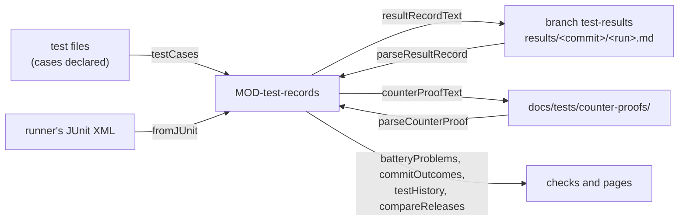

# ARC-027 Tests and their evidence

## Context

A product's tests are artifacts: each names the module it exercises, what it guards and its level (ARC-020 decision 11),
and each case states its precondition, input and expected result before it runs
(`A TEST STATES ITS EXPECTED RESULT BEFORE IT RUNS`). What the tests showed is evidence: that a new test failed on a
fault planted in what it guards (`A NEW TEST IS SHOWN TO FAIL ON A PLANTED FAULT`), and, for every run, the commit, the
levels, the participant, the date and each test's outcome (`EVERY TEST RUN LEAVES A RESULT RECORD`), kept on the branch
`test-results` of the product repository, which only grows (ARC-006). The pages of UC-028, UC-029 and UC-030 show a
commit's outcomes — failed apart from flaky, model-dependent tests as rates against the last release —, a test's
history, and what changed between two releases; UC-026 checks a generated battery without a model. A runner reports in
JUnit XML, the format the CI step reads (ARC-015 decision 4). A release (UC-013) rests on that evidence: it is tagged
only after every test ran on its candidate, and only once a person accepted the report of that run, with the reason of
every test that did not pass.

## Decision

1. **One module.** `MOD-test-records`, a feature, reads and writes the declarations of the tests and the records of
   their evidence, and computes what the pages show; it reads nothing itself — the CI step, the job that writes tests
   and the pages read the files and pass their texts.
2. **A case is declared in the comment above its code** (`MOD-test-records.testCases`): below the lines `Module:`,
   `Guards:` and `Level:` of the file (`MOD-traceability.testHeader`), each case is a block of comment lines — `//` or
   `#` — whose first line begins with its identifier `TST-<nnn>` and its title, followed by
   - `Given:` its precondition, `When:` its input, `Then:` its expected result;
   - `Extends: TST-<nnn>` for a case that extends another test, for example by a boundary value it lacks;
   - `Runs: <n>` for a model-dependent case: the number of runs, fixed before the first run;
   - `Paid: <service>[, <service> …]` for a case that calls a paid service for real;
   - `Awaiting: implementation` for a case whose behaviour is not implemented yet (UC-026 8a).

   A case guards what its file guards. The name the code gives the test begins with the same identifier, so that a
   runner's report names it; a model-dependent case runs once per run, each run named by the identifier. The declaration
   is part of the test's code, as its header lines are. A user test has no code: it is a Markdown file under
   `tests/user/` — the header lines, then each case a heading `TST-<nnn> <title>` followed by the same lines, the
   instruction a person carries out (`ARTIFACTS ARE MARKDOWN`). For example:

   ```js
   // Module: MOD-test-records
   // Guards: A TEST THAT FLIPS ON THE SAME COMMIT IS FLAKY
   // Level: unit
   import { test } from "node:test";

   // TST-101 a test with both outcomes on one commit is flaky
   // Given: two result records of one commit, a deterministic test passed in one and failed in the other
   // When: the outcomes of the commit are computed
   // Then: the test is flaky, not passed
   test("TST-101 a test with both outcomes on one commit is flaky", () => { /* … */ });
   ```
3. **A battery is checked without a model** (`MOD-test-records.batteryProblems`): a file without exactly one of the five
   levels, without the module it exercises or without what it guards; a case whose identifier is not `TST-<nnn>` or is
   given twice; a case without its precondition, input or expected result; a model-dependent case judged on fewer than
   two runs; an extension of a test no file declares; a new case with the guarded identifier, input and expected result
   of an existing one (UC-026 6); a new case, other than a user test or one awaiting its implementation, without a
   counter-proof on which it failed; and a release case written by the participant that implemented what it guards, both
   as their jobs recorded. Each finding is in the form of ARC-003. A case that reaches a paid service declares it on its
   `Paid:` line, and the schedule's row of tests that call a paid service or a model — which UC-027 lets no one tick for
   every commit or pull request — decides where it runs; a case that reaches one without declaring it is not visible to
   a check without a model, and fails where it runs (Consequences).
4. **A counter-proof lies beside the test it proves** (`MOD-test-records.counterProofText`,
   `MOD-test-records.parseCounterProof`): `docs/tests/counter-proofs/TST-<nnn>.md`, written by the participant that
   wrote the test and committed in the same pull request (UC-026 8.3, 8.4): front matter naming the test, the commit the
   fault was planted on, the file, the outcome, the participant and when; then the fault in a sentence, the planted
   change as a diff, and the test's output on it. It is a record (ARC-006): added once, never changed.
5. **A result record per run, on the branch `test-results`** (`MOD-test-records.resultRecordText`,
   `MOD-test-records.parseResultRecord`): `results/<commit>/<run>.md`, the run's name unique among the commit's records
   — the server's run number and attempt, or the job's identifier. Front matter names the commit, the levels run, the
   occasion, the participant, the page of its log, when, whether the working tree had uncommitted changes, and the run's
   own outcome with a note: `not-run` when the tests could not start — a secret missing (UC-027 4a) —, `failed` or
   `passed` as the runner ended. A table gives each test's outcome — `passed`, `failed`, `skipped`, or `rate` for a
   model-dependent test — with its runs, its passing runs and a note; below it, the log excerpt of each test that
   failed, so that what failed stays readable when the server has deleted its logs (UC-028 2a). A run of a working tree
   with uncommitted changes is recorded and marked (UC-028 6a). A key without a value is left out of the front matter.
6. **From a runner's JUnit XML** (`MOD-test-records.fromJUnit`): every `testcase` is counted under the `TST-` identifier
   its name carries, at the level of the file that declares the case; the runs of a model-dependent case give its rate;
   the first failure's message is the note and its text, cut to 20 lines, the excerpt; a testcase whose name carries no
   identifier is named apart, for the run's note.
7. **The outcomes of one commit** (`MOD-test-records.commitOutcomes`) count the records of that commit without
   uncommitted changes. A deterministic test is `failed` when a record failed it and none passed it, `flaky` when one
   passed it and another failed it (`A TEST THAT FLIPS ON THE SAME COMMIT IS FLAKY`), `skipped` when every record
   skipped it, and `not-run` without a record. A model-dependent test is a rate over all its runs on the commit, beside
   the rate of the last release, and worse when its rate is lower (UC-028 7a). Each test carries the evidence of each
   record — the participant, when, the page of the log, the note and the excerpt —, and each level the runs recorded for
   it; a level with none is not run on this commit. The records with uncommitted changes are listed apart, and the tests
   the records name that no file declares are named.
8. **History, comparison and identifiers.** A test's history (`MOD-test-records.testHistory`) gives one mark per commit
   with the commit's release tags; two releases are compared (`MOD-test-records.compareReleases`) by the tests added,
   removed, changed in what they guard or expect, and changed in outcome; a new test's identifier
   (`MOD-test-records.nextTestId`) is one above the highest ever given, those only the version history holds included.

9. **The release** is planned here and written by the page that offers it (UC-013). The next version
   (`MOD-test-records.nextVersion`) follows the product's own tags (`MOD-git-host.releaseTags`); a candidate gets the
   tag `vYYYY.MINOR.PATCH-rc.N` (`MOD-test-records.candidateTag`), counted on from the version's candidates so far
   (`MOD-git-host.candidateTags`), which the page sets on the head of the default branch (`MOD-git-host.createTag`); the
   candidate runs every test at every level (ARC-015). The release test report (`MOD-test-records.releaseReport`),
   `docs/tests/releases/v<version>.md`, is refused while a test has not run on the candidate; it names the tests that
   failed, flipped or got worse first, and a rate with its 95 % interval (`MOD-test-records.rateInterval`) beside the
   last release's. Its acceptance is one commit (`MOD-test-records.planRelease`): the report as shown, its approval
   record (ARC-021) with the reason of each such test, and the changelog's dated entry with the release's known
   limitations; refused for a report that changed since it was shown and for a test whose reason is missing. After the
   commit the page sets the tag `vYYYY.MINOR.PATCH` on the candidate's commit — the one that was tested — through
   `MOD-git-host.createTag`, which never moves a tag; a tag that failed after the commit is set again from the accepted
   report, which names that commit. A report is read back for the audit (`MOD-test-records.parseReleaseReport`).



## Alternatives

- **A description file per test beside the code** — two places for one test drift apart; the declaration above the code
  is changed where the test is changed.
- **The test's name as its only declaration** — a name holds no precondition, input and expected result.
- **The counter-proof as a result record** — a result record is a run on a commit, and the planted fault is never
  committed; the counter-proof belongs beside the test and comes in its pull request.
- **The runner's JUnit XML kept as the record** — it names neither the commit, the participant nor the levels, every
  runner writes it differently, and a person entering the outcomes of user tests writes none.
- **A model-dependent test passed or failed by a threshold on each run** —
  `A MODEL-DEPENDENT TEST IS MEASURED AS A RATE` compares the rate with the last release's.

## Consequences

- The CI step of ARC-015 builds the run from the runner's report and commits its record, adding a file to `test-results`
  and never changing one; a runner without JUnit XML gives a record with the run's own outcome and a note naming what is
  missing. The schedule's row of tests that call a paid service or a model (UC-027) decides when a case declaring
  `Paid:` or `Runs:` runs, never on every commit or pull request.
- ARC-015 hands the key of a paid service only to the jobs of the occasions that row ticks: a case that reaches a paid
  service without declaring it finds no key in a run of every commit or pull request, and its call fails that run
  (`COMMIT TESTS CALL NO PAID SERVICE`).
- Who wrote a test and who implemented what it guards are read from the job records (ARC-010); the cases new in a change
  are those its base commit does not declare.
- The page that offers the release, starts its candidate's run and accepts its report is designed with the tests pages;
  so are the steps of UC-013 it carries. A release whose run is red is accepted only with every reason given; the
  reasons stand in the approval record and in the changelog, and the audit (UC-030) reads them there.
- Agent M's own tests are a product's tests: a test file whose cases carry their identifiers only in the names of the
  tests gives the finding that no case carries one, until its cases are declared.
- No step of UC-026, UC-028, UC-029 or UC-030 is realised here: each needs a page or a job not designed yet — the tests
  pages, the CI step, the job that writes tests. Where a test was removed (UC-029 5a), the pages read the history of its
  file through `MOD-git-host.pathHistory`.

## Modules

### MOD-test-records

```json module
{
  "id": "MOD-test-records",
  "folder": "src/test-records/",
  "layer": "feature",
  "responsibility": "Reads and writes a product's tests as artifacts and the evidence of what they showed, and plans its releases on them: the cases a test file declares, the checks a battery passes without a model, the counter-proof of a new test, the result record of a run, the outcomes a runner's JUnit report gives, the outcomes of a commit with flaky tests apart and model-dependent tests as rates, a test's history, what changed between two releases, the identifier a new test gets, the next version and candidate, the release test report, and the one commit and tag that accept it; it reads nothing itself.",
  "realises": ["EVERY TEST HAS ONE LEVEL", "A TEST STATES ITS EXPECTED RESULT BEFORE IT RUNS", "A NEW TEST IS SHOWN TO FAIL ON A PLANTED FAULT", "A MODEL-DEPENDENT TEST IS MEASURED AS A RATE", "RELEASE TESTS ARE NOT WRITTEN BY THE IMPLEMENTER", "A TEST THAT FLIPS ON THE SAME COMMIT IS FLAKY", "EVERY ARTIFACT HAS AN IDENTIFIER", "EVERY ARTIFACT NAMES ITS ORIGIN", "CALENDAR VERSIONS", "EVERY PRODUCT HAS ITS OWN VERSION LINE", "A RELEASE IS TAGGED AND LOGGED", "A RELEASE RUNS EVERY TEST AT EVERY LEVEL", "ACCEPTING THE RELEASE TEST REPORT RELEASES", "A RED RELEASE IS ACCEPTED ONLY WITH ITS LIMITATIONS RECORDED"],
  "owns": ["TestCase", "TestFile", "TestAuthor", "Implementer", "CounterProofInput", "CounterProof", "BatteryInput", "TestOutcome", "ResultRun", "ResultRecord", "JUnitRead", "PreviousRate", "CommitInput", "RunRate", "RunRateOrNone", "Evidence", "RunNote", "TestRow", "LevelRow", "CommitOutcomes", "CommitRef", "HistoryMark", "OutcomeOf", "ReleaseSide", "OutcomeChange", "ReleaseComparison", "Interval", "Candidate", "ReleaseInput", "ReleaseReportRow", "ReleaseReport", "ReleaseAcceptance", "ReleaseTag", "ReleasePlan", "ReleaseReportContent", "ResultRecordContent", "CounterProofContent", "ResultRecordFile", "ReleaseTestReportFile", "ChangelogFile", "CounterProofFile"],
  "uses": ["MOD-contracts", "MOD-artifacts", "MOD-traceability", "MOD-review-core"]
}
```

```json interface
{
  "id": "MOD-test-records.testCases",
  "summary": "The cases a test file declares, with its module, what it guards and its level: each case a comment line beginning with its TST- identifier and title — in a user test, a Markdown file, a heading —, followed by the lines Given: — its precondition —, When: — its input —, Then: — its expected result —, and Extends: for one that extends another test, Runs: for a model-dependent one, Paid: for one that calls a paid service, Awaiting: implementation for one whose behaviour is not implemented yet.",
  "params": [{ "name": "path", "type": "string" }, { "name": "text", "type": "string" }],
  "result": "TestFile",
  "async": false,
  "refusals": [],
  "examples": [
    {
      "name": "three cases of a system test",
      "input": { "path": "tests/export.test.mjs", "text": "// The export of a chapter.\n//\n// Module: MOD-export\n// Guards: A CHAPTER IS EXPORTED; UC-003\n// Level: system\nimport { test } from \"node:test\";\n\n// TST-014 the PDF keeps the figures\n// Given: a chapter with two figures\n// When: the author exports it as PDF\n// Then: the PDF holds both figures\ntest(\"TST-014 the PDF keeps the figures\", () => {});\n\n// TST-015 the PDF names the chapter\n// Given: a chapter titled Methods\n// When: the author exports it as PDF\n// Then: the PDF's title is Methods\ntest(\"TST-015 the PDF names the chapter\", () => {});\n\n// TST-016 the summary of an export reads as the chapter\n// Given: a chapter of four pages\n// When: the model summarises the exported PDF\n// Then: the summary names the chapter's three findings\n// Runs: 20\n// Paid: hub\ntest(\"TST-016 the summary of an export reads as the chapter\", () => {});\n" },
      "result": {
        "path": "tests/export.test.mjs",
        "module": "MOD-export",
        "guards": ["A CHAPTER IS EXPORTED", "UC-003"],
        "level": "system",
        "levels": ["system"],
        "cases": [
          {
            "id": "TST-014",
            "title": "the PDF keeps the figures",
            "given": "a chapter with two figures",
            "when": "the author exports it as PDF",
            "then": "the PDF holds both figures",
            "extends": "",
            "runs": null,
            "paid": [],
            "awaiting": false,
            "line": 8
          },
          {
            "id": "TST-015",
            "title": "the PDF names the chapter",
            "given": "a chapter titled Methods",
            "when": "the author exports it as PDF",
            "then": "the PDF's title is Methods",
            "extends": "",
            "runs": null,
            "paid": [],
            "awaiting": false,
            "line": 14
          },
          {
            "id": "TST-016",
            "title": "the summary of an export reads as the chapter",
            "given": "a chapter of four pages",
            "when": "the model summarises the exported PDF",
            "then": "the summary names the chapter's three findings",
            "extends": "",
            "runs": 20,
            "paid": ["hub"],
            "awaiting": false,
            "line": 20
          }
        ]
      }
    },
    {
      "name": "a user test in Markdown",
      "input": { "path": "tests/user/export.md", "text": "# Acceptance of the export\n\nModule: MOD-export\nGuards: A CHAPTER IS EXPORTED\nLevel: user\n\n## TST-030 a supervisor reads the exported chapter\n\nGiven: an accepted chapter with two figures, exported as PDF\nWhen: the supervisor opens the PDF on their own computer\nThen: the chapter's title and both figures are shown\n" },
      "result": {
        "path": "tests/user/export.md",
        "module": "MOD-export",
        "guards": ["A CHAPTER IS EXPORTED"],
        "level": "user",
        "levels": ["user"],
        "cases": [
          {
            "id": "TST-030",
            "title": "a supervisor reads the exported chapter",
            "given": "an accepted chapter with two figures, exported as PDF",
            "when": "the supervisor opens the PDF on their own computer",
            "then": "the chapter's title and both figures are shown",
            "extends": "",
            "runs": null,
            "paid": [],
            "awaiting": false,
            "line": 7
          }
        ]
      }
    },
    {
      "name": "a file without its header and its cases",
      "input": { "path": "tests/helpers.test.mjs", "text": "import { test } from \"node:test\";\ntest(\"a helper\", () => {});\n" },
      "result": {
        "path": "tests/helpers.test.mjs",
        "module": "",
        "guards": [],
        "level": "",
        "levels": [],
        "cases": []
      }
    }
  ]
}
```

```json interface
{
  "id": "MOD-test-records.batteryProblems",
  "summary": "Every finding of a test battery without a model: a file without exactly one of the five levels, without the module it exercises or without what it guards, a case whose identifier is not TST-<nnn> or is given twice, a case without its precondition, input or expected result, a model-dependent case judged on fewer than two runs, an extension of a test no file declares, a new case that repeats an existing one guarding the same, a new automated case without a counter-proof on which it failed, and a release case written by the participant that implemented what it guards.",
  "params": [{ "name": "input", "type": "BatteryInput" }],
  "result": "Finding[]",
  "async": false,
  "refusals": [],
  "examples": [
    {
      "name": "new cases with six findings, and a release test by the implementer",
      "input": {
        "input": {
          "files": [
            {
              "path": "tests/export.test.mjs",
              "module": "MOD-export",
              "guards": ["A CHAPTER IS EXPORTED", "UC-003"],
              "level": "system",
              "levels": ["system"],
              "cases": [
                {
                  "id": "TST-014",
                  "title": "the PDF keeps the figures",
                  "given": "a chapter with two figures",
                  "when": "the author exports it as PDF",
                  "then": "the PDF holds both figures",
                  "extends": "",
                  "runs": null,
                  "paid": [],
                  "awaiting": false,
                  "line": 8
                },
                {
                  "id": "TST-015",
                  "title": "the PDF names the chapter",
                  "given": "a chapter titled Methods",
                  "when": "the author exports it as PDF",
                  "then": "the PDF's title is Methods",
                  "extends": "",
                  "runs": null,
                  "paid": [],
                  "awaiting": false,
                  "line": 14
                },
                {
                  "id": "TST-016",
                  "title": "the summary of an export reads as the chapter",
                  "given": "a chapter of four pages",
                  "when": "the model summarises the exported PDF",
                  "then": "the summary names the chapter's three findings",
                  "extends": "",
                  "runs": 20,
                  "paid": ["hub"],
                  "awaiting": false,
                  "line": 20
                }
              ]
            },
            {
              "path": "tests/export-figures.test.mjs",
              "module": "MOD-export",
              "guards": ["A CHAPTER IS EXPORTED"],
              "level": "system",
              "levels": ["system"],
              "cases": [
                {
                  "id": "TST-022",
                  "title": "the PDF keeps every figure",
                  "given": "a chapter with two figures",
                  "when": "the author exports it as PDF",
                  "then": "the PDF holds both figures",
                  "extends": "",
                  "runs": null,
                  "paid": [],
                  "awaiting": false,
                  "line": 6
                },
                {
                  "id": "TST-023",
                  "title": "a figure keeps its caption",
                  "given": "a chapter with a captioned figure",
                  "when": "the author exports it as PDF",
                  "then": "",
                  "extends": "TST-099",
                  "runs": null,
                  "paid": [],
                  "awaiting": false,
                  "line": 12
                },
                {
                  "id": "TST-024",
                  "title": "the export lists its figures",
                  "given": "a chapter with two figures",
                  "when": "the model lists the figures of the exported PDF",
                  "then": "the list names both figures",
                  "extends": "",
                  "runs": 1,
                  "paid": [],
                  "awaiting": false,
                  "line": 18
                }
              ]
            },
            {
              "path": "tests/release-export.test.mjs",
              "module": "MOD-export",
              "guards": ["A CHAPTER IS EXPORTED"],
              "level": "release",
              "levels": ["release"],
              "cases": [
                {
                  "id": "TST-021",
                  "title": "an accepted chapter can be exported",
                  "given": "an accepted chapter",
                  "when": "the release candidate exports it",
                  "then": "a PDF arrives",
                  "extends": "",
                  "runs": null,
                  "paid": [],
                  "awaiting": false,
                  "line": 5
                }
              ]
            }
          ],
          "proofs": [
            { "path": "docs/tests/counter-proofs/TST-023.md", "test": "TST-023", "commit": "c100000000000000000000000000000000000000", "file": "src/export/figures.mjs", "outcome": "passed", "participant": "cli-dev", "at": "2026-10-08T14:00:00Z", "fault": "The captions are left out.", "diff": "-  caption(figure);\n+  // caption(figure);", "output": "ok" },
            { "path": "docs/tests/counter-proofs/TST-024.md", "test": "TST-024", "commit": "c100000000000000000000000000000000000000", "file": "src/export/index.mjs", "outcome": "failed", "participant": "cli-dev", "at": "2026-10-08T14:00:00Z", "fault": "The figures are left out of the PDF.", "diff": "--- a/src/export/index.mjs\n+++ b/src/export/index.mjs\n@@ -40 +40 @@\n-  pdf.add(chapter.figures);\n+  pdf.add([]);", "output": "AssertionError: expected 2 figures, got 0\n    at tests/export.test.mjs:12:3" }
          ],
          "isNew": ["TST-022", "TST-023", "TST-024"],
          "authors": [{ "test": "TST-021", "participant": "cli-dev" }],
          "implementers": [{ "guards": "A CHAPTER IS EXPORTED", "participant": "cli-dev" }]
        }
      },
      "result": [
        { "artifact": "tests/export-figures.test.mjs", "line": 6, "kind": "error", "what": "TST-022 repeats TST-014: the same guarded identifier, input and expected result", "rule": "UC-026 6", "fix": "drop it, or name what it adds and the test it extends" },
        { "artifact": "tests/export-figures.test.mjs", "line": 6, "kind": "error", "what": "TST-022 is new and has no counter-proof", "rule": "A NEW TEST IS SHOWN TO FAIL ON A PLANTED FAULT", "fix": "plant a fault in what it guards, record its failing run, and remove the fault" },
        { "artifact": "tests/export-figures.test.mjs", "line": 12, "kind": "error", "what": "TST-023 states no expected result", "rule": "A TEST STATES ITS EXPECTED RESULT BEFORE IT RUNS", "fix": "write the Then: line" },
        { "artifact": "tests/export-figures.test.mjs", "line": 12, "kind": "error", "what": "TST-023 extends TST-099, which no test declares", "rule": "EVERY ARTIFACT NAMES ITS ORIGIN", "fix": "name a test the battery declares on its Extends: line" },
        { "artifact": "tests/export-figures.test.mjs", "line": 12, "kind": "error", "what": "TST-023 stayed green on the fault planted in src/export/figures.mjs", "rule": "A NEW TEST IS SHOWN TO FAIL ON A PLANTED FAULT", "fix": "sharpen the test until it fails on the fault, or drop it" },
        { "artifact": "tests/export-figures.test.mjs", "line": 18, "kind": "error", "what": "TST-024 is judged on a single run", "rule": "A MODEL-DEPENDENT TEST IS MEASURED AS A RATE", "fix": "fix its number of runs, at least two, on a Runs: line" },
        { "artifact": "tests/release-export.test.mjs", "line": 5, "kind": "error", "what": "TST-021 is a release test written by cli-dev, who implemented what it guards", "rule": "RELEASE TESTS ARE NOT WRITTEN BY THE IMPLEMENTER", "fix": "have it written by a participant other than the implementer" }
      ]
    },
    {
      "name": "a file without module, guards and cases, and with two levels",
      "input": {
        "input": {
          "files": [
            {
              "path": "tests/helpers.test.mjs",
              "module": "",
              "guards": [],
              "level": "unit",
              "levels": ["unit", "system"],
              "cases": []
            }
          ],
          "proofs": [],
          "isNew": [],
          "authors": [],
          "implementers": []
        }
      },
      "result": [
        { "artifact": "tests/helpers.test.mjs", "line": 1, "kind": "error", "what": "the test declares 2 levels: unit, system", "rule": "EVERY TEST HAS ONE LEVEL", "fix": "keep the one Level: line of the level it tests at" },
        { "artifact": "tests/helpers.test.mjs", "line": 1, "kind": "error", "what": "the test names no module it exercises", "rule": "EVERY ARTIFACT NAMES ITS ORIGIN", "fix": "name it on a Module: line among the first 20 lines" },
        { "artifact": "tests/helpers.test.mjs", "line": 1, "kind": "error", "what": "the test guards nothing", "rule": "EVERY ARTIFACT NAMES ITS ORIGIN", "fix": "name the requirements or use cases it guards on a Guards: line" },
        { "artifact": "tests/helpers.test.mjs", "line": 1, "kind": "error", "what": "no case carries a TST- identifier", "rule": "EVERY ARTIFACT HAS AN IDENTIFIER", "fix": "name each case TST-<nnn> and its title in the comment above it" }
      ]
    },
    {
      "name": "a battery that passes",
      "input": {
        "input": {
          "files": [
            {
              "path": "tests/export.test.mjs",
              "module": "MOD-export",
              "guards": ["A CHAPTER IS EXPORTED", "UC-003"],
              "level": "system",
              "levels": ["system"],
              "cases": [
                {
                  "id": "TST-014",
                  "title": "the PDF keeps the figures",
                  "given": "a chapter with two figures",
                  "when": "the author exports it as PDF",
                  "then": "the PDF holds both figures",
                  "extends": "",
                  "runs": null,
                  "paid": [],
                  "awaiting": false,
                  "line": 8
                },
                {
                  "id": "TST-015",
                  "title": "the PDF names the chapter",
                  "given": "a chapter titled Methods",
                  "when": "the author exports it as PDF",
                  "then": "the PDF's title is Methods",
                  "extends": "",
                  "runs": null,
                  "paid": [],
                  "awaiting": false,
                  "line": 14
                },
                {
                  "id": "TST-016",
                  "title": "the summary of an export reads as the chapter",
                  "given": "a chapter of four pages",
                  "when": "the model summarises the exported PDF",
                  "then": "the summary names the chapter's three findings",
                  "extends": "",
                  "runs": 20,
                  "paid": ["hub"],
                  "awaiting": false,
                  "line": 20
                }
              ]
            },
            {
              "path": "tests/release-export.test.mjs",
              "module": "MOD-export",
              "guards": ["A CHAPTER IS EXPORTED"],
              "level": "release",
              "levels": ["release"],
              "cases": [
                {
                  "id": "TST-021",
                  "title": "an accepted chapter can be exported",
                  "given": "an accepted chapter",
                  "when": "the release candidate exports it",
                  "then": "a PDF arrives",
                  "extends": "",
                  "runs": null,
                  "paid": [],
                  "awaiting": false,
                  "line": 5
                }
              ]
            }
          ],
          "proofs": [
            { "path": "docs/tests/counter-proofs/TST-014.md", "test": "TST-014", "commit": "c100000000000000000000000000000000000000", "file": "src/export/index.mjs", "outcome": "failed", "participant": "cli-dev", "at": "2026-10-08T14:00:00Z", "fault": "The figures are left out of the PDF.", "diff": "--- a/src/export/index.mjs\n+++ b/src/export/index.mjs\n@@ -40 +40 @@\n-  pdf.add(chapter.figures);\n+  pdf.add([]);", "output": "AssertionError: expected 2 figures, got 0\n    at tests/export.test.mjs:12:3" }
          ],
          "isNew": ["TST-014"],
          "authors": [{ "test": "TST-021", "participant": "ci-tester" }],
          "implementers": [{ "guards": "A CHAPTER IS EXPORTED", "participant": "cli-dev" }]
        }
      },
      "result": []
    }
  ]
}
```

```json interface
{
  "id": "MOD-test-records.counterProofText",
  "summary": "The record that a new test failed on a fault planted in what it guards, and where it lies: docs/tests/counter-proofs/<TST>.md — front matter naming the test, the commit the fault was planted on, the file, the outcome, the participant and when; the fault in a sentence, the planted change as a diff, and the test's output on it.",
  "params": [{ "name": "proof", "type": "CounterProofInput" }],
  "result": "FileText",
  "async": false,
  "refusals": [],
  "examples": [
    {
      "name": "the counter-proof of TST-014",
      "input": {
        "proof": { "test": "TST-014", "commit": "c100000000000000000000000000000000000000", "file": "src/export/index.mjs", "fault": "The figures are left out of the PDF.", "diff": "--- a/src/export/index.mjs\n+++ b/src/export/index.mjs\n@@ -40 +40 @@\n-  pdf.add(chapter.figures);\n+  pdf.add([]);\n", "outcome": "failed", "output": "AssertionError: expected 2 figures, got 0\n    at tests/export.test.mjs:12:3", "participant": "cli-dev", "at": "2026-10-08T14:00:00Z" }
      },
      "result": { "path": "docs/tests/counter-proofs/TST-014.md", "text": "---\ntest: TST-014\ncommit: c100000000000000000000000000000000000000\nfile: src/export/index.mjs\noutcome: failed\nparticipant: cli-dev\nat: 2026-10-08T14:00:00Z\n---\n\n# Counter-proof of TST-014\n\nThe figures are left out of the PDF.\n\n~~~diff\n--- a/src/export/index.mjs\n+++ b/src/export/index.mjs\n@@ -40 +40 @@\n-  pdf.add(chapter.figures);\n+  pdf.add([]);\n~~~\n\n~~~text\nAssertionError: expected 2 figures, got 0\n    at tests/export.test.mjs:12:3\n~~~\n" }
    }
  ]
}
```

```json interface
{
  "id": "MOD-test-records.parseCounterProof",
  "summary": "A counter-proof as its file holds it.",
  "params": [{ "name": "path", "type": "string" }, { "name": "text", "type": "string" }],
  "result": "CounterProof",
  "async": false,
  "refusals": [
    { "code": "not-a-counter-proof", "when": "the path is not docs/tests/counter-proofs/TST-<nnn>.md, or the front matter names another test, no 40-hex commit, no file, or an outcome of neither failed nor passed" }
  ],
  "examples": [
    {
      "name": "the counter-proof of TST-014",
      "input": { "path": "docs/tests/counter-proofs/TST-014.md", "text": "---\ntest: TST-014\ncommit: c100000000000000000000000000000000000000\nfile: src/export/index.mjs\noutcome: failed\nparticipant: cli-dev\nat: 2026-10-08T14:00:00Z\n---\n\n# Counter-proof of TST-014\n\nThe figures are left out of the PDF.\n\n~~~diff\n--- a/src/export/index.mjs\n+++ b/src/export/index.mjs\n@@ -40 +40 @@\n-  pdf.add(chapter.figures);\n+  pdf.add([]);\n~~~\n\n~~~text\nAssertionError: expected 2 figures, got 0\n    at tests/export.test.mjs:12:3\n~~~\n" },
      "result": { "path": "docs/tests/counter-proofs/TST-014.md", "test": "TST-014", "commit": "c100000000000000000000000000000000000000", "file": "src/export/index.mjs", "outcome": "failed", "participant": "cli-dev", "at": "2026-10-08T14:00:00Z", "fault": "The figures are left out of the PDF.", "diff": "--- a/src/export/index.mjs\n+++ b/src/export/index.mjs\n@@ -40 +40 @@\n-  pdf.add(chapter.figures);\n+  pdf.add([]);", "output": "AssertionError: expected 2 figures, got 0\n    at tests/export.test.mjs:12:3" }
    },
    {
      "name": "a record named after another test",
      "input": { "path": "docs/tests/counter-proofs/TST-015.md", "text": "---\ntest: TST-014\ncommit: c100000000000000000000000000000000000000\nfile: src/export/index.mjs\noutcome: failed\nparticipant: cli-dev\nat: 2026-10-08T14:00:00Z\n---\n\n# Counter-proof of TST-014\n\nThe figures are left out of the PDF.\n\n~~~diff\n--- a/src/export/index.mjs\n+++ b/src/export/index.mjs\n@@ -40 +40 @@\n-  pdf.add(chapter.figures);\n+  pdf.add([]);\n~~~\n\n~~~text\nAssertionError: expected 2 figures, got 0\n    at tests/export.test.mjs:12:3\n~~~\n" },
      "refused": "not-a-counter-proof"
    }
  ]
}
```

```json interface
{
  "id": "MOD-test-records.resultRecordText",
  "summary": "The record of a run on the branch test-results and where it lies, results/<commit>/<run>.md: the commit, the levels run and the occasion, the participant that ran it and the page of its log, when, whether the working tree had uncommitted changes, the run's own outcome — passed, failed, or not run — with a note, each test's outcome — passed, failed, skipped, or for a model-dependent test a rate — with its runs, its passing runs and a note, and the log excerpt of each test that failed.",
  "params": [{ "name": "run", "type": "ResultRun" }],
  "result": "FileText",
  "async": false,
  "refusals": [],
  "examples": [
    {
      "name": "a run on every commit with a failure and a rate",
      "input": {
        "run": {
          "commit": "c100000000000000000000000000000000000000",
          "run": "gh-4711-1",
          "levels": ["unit", "component", "system"],
          "occasion": "every commit",
          "participant": "GitHub Actions, runner ubuntu-latest",
          "log": "https://github.com/alice/thesis/actions/runs/4711",
          "at": "2026-10-09T08:00:00Z",
          "uncommitted": false,
          "outcome": "failed",
          "note": "",
          "outcomes": [
            { "test": "TST-014", "level": "system", "outcome": "passed", "runs": 1, "passed": 1, "note": "", "excerpt": "" },
            { "test": "TST-015", "level": "system", "outcome": "failed", "runs": 1, "passed": 0, "note": "expected \"Methods\", got \"chapter-2\"", "excerpt": "AssertionError: expected \"Methods\", got \"chapter-2\"\n    at tests/export.test.mjs:18:3" },
            { "test": "TST-016", "level": "system", "outcome": "rate", "runs": 20, "passed": 17, "note": "the summary names two findings", "excerpt": "" }
          ]
        }
      },
      "result": { "path": "results/c100000000000000000000000000000000000000/gh-4711-1.md", "text": "---\ncommit: c100000000000000000000000000000000000000\nlevels:\n  - unit\n  - component\n  - system\noccasion: every commit\nparticipant: GitHub Actions, runner ubuntu-latest\nlog: https://github.com/alice/thesis/actions/runs/4711\nat: 2026-10-09T08:00:00Z\nuncommitted: no\noutcome: failed\n---\n\n# Run gh-4711-1\n\n| Test | Level | Outcome | Runs | Passed | Note |\n|---|---|---|---|---|---|\n| TST-014 | system | passed | 1 | 1 |  |\n| TST-015 | system | failed | 1 | 0 | expected \"Methods\", got \"chapter-2\" |\n| TST-016 | system | rate | 20 | 17 | the summary names two findings |\n\n## TST-015\n\n~~~text\nAssertionError: expected \"Methods\", got \"chapter-2\"\n    at tests/export.test.mjs:18:3\n~~~\n" }
    },
    {
      "name": "a nightly run without its secret",
      "input": {
        "run": {
          "commit": "c200000000000000000000000000000000000000",
          "run": "gh-4720-1",
          "levels": ["system"],
          "occasion": "nightly",
          "participant": "GitHub Actions, runner ubuntu-latest",
          "log": "https://github.com/alice/thesis/actions/runs/4720",
          "at": "2026-10-10T02:00:00Z",
          "uncommitted": false,
          "outcome": "not-run",
          "note": "the secret AGENT_M_HUB_KEY is missing",
          "outcomes": []
        }
      },
      "result": { "path": "results/c200000000000000000000000000000000000000/gh-4720-1.md", "text": "---\ncommit: c200000000000000000000000000000000000000\nlevels:\n  - system\noccasion: nightly\nparticipant: GitHub Actions, runner ubuntu-latest\nlog: https://github.com/alice/thesis/actions/runs/4720\nat: 2026-10-10T02:00:00Z\nuncommitted: no\noutcome: not-run\nnote: the secret AGENT_M_HUB_KEY is missing\n---\n\n# Run gh-4720-1\n\n| Test | Level | Outcome | Runs | Passed | Note |\n|---|---|---|---|---|---|\n" }
    }
  ]
}
```

```json interface
{
  "id": "MOD-test-records.parseResultRecord",
  "summary": "A result record as its file holds it.",
  "params": [{ "name": "path", "type": "string" }, { "name": "text", "type": "string" }],
  "result": "ResultRecord",
  "async": false,
  "refusals": [
    { "code": "not-a-record", "when": "the path is not results/<commit>/<run>.md, or the text has no front matter or names another commit" },
    { "code": "unknown-outcome", "when": "the run's outcome is none of passed, failed and not-run, or a test's none of passed, failed, skipped and rate" }
  ],
  "examples": [
    {
      "name": "a run on every commit with a failure and a rate",
      "input": { "path": "results/c100000000000000000000000000000000000000/gh-4711-1.md", "text": "---\ncommit: c100000000000000000000000000000000000000\nlevels:\n  - unit\n  - component\n  - system\noccasion: every commit\nparticipant: GitHub Actions, runner ubuntu-latest\nlog: https://github.com/alice/thesis/actions/runs/4711\nat: 2026-10-09T08:00:00Z\nuncommitted: no\noutcome: failed\n---\n\n# Run gh-4711-1\n\n| Test | Level | Outcome | Runs | Passed | Note |\n|---|---|---|---|---|---|\n| TST-014 | system | passed | 1 | 1 |  |\n| TST-015 | system | failed | 1 | 0 | expected \"Methods\", got \"chapter-2\" |\n| TST-016 | system | rate | 20 | 17 | the summary names two findings |\n\n## TST-015\n\n~~~text\nAssertionError: expected \"Methods\", got \"chapter-2\"\n    at tests/export.test.mjs:18:3\n~~~\n" },
      "result": {
        "path": "results/c100000000000000000000000000000000000000/gh-4711-1.md",
        "commit": "c100000000000000000000000000000000000000",
        "run": "gh-4711-1",
        "levels": ["unit", "component", "system"],
        "occasion": "every commit",
        "participant": "GitHub Actions, runner ubuntu-latest",
        "log": "https://github.com/alice/thesis/actions/runs/4711",
        "at": "2026-10-09T08:00:00Z",
        "uncommitted": false,
        "outcome": "failed",
        "note": "",
        "outcomes": [
          { "test": "TST-014", "level": "system", "outcome": "passed", "runs": 1, "passed": 1, "note": "", "excerpt": "" },
          { "test": "TST-015", "level": "system", "outcome": "failed", "runs": 1, "passed": 0, "note": "expected \"Methods\", got \"chapter-2\"", "excerpt": "AssertionError: expected \"Methods\", got \"chapter-2\"\n    at tests/export.test.mjs:18:3" },
          { "test": "TST-016", "level": "system", "outcome": "rate", "runs": 20, "passed": 17, "note": "the summary names two findings", "excerpt": "" }
        ]
      }
    },
    {
      "name": "a record under no commit",
      "input": { "path": "results/latest.md", "text": "---\ncommit: c200000000000000000000000000000000000000\nlevels:\n  - system\noccasion: nightly\nparticipant: GitHub Actions, runner ubuntu-latest\nlog: https://github.com/alice/thesis/actions/runs/4720\nat: 2026-10-10T02:00:00Z\nuncommitted: no\noutcome: not-run\nnote: the secret AGENT_M_HUB_KEY is missing\n---\n\n# Run gh-4720-1\n\n| Test | Level | Outcome | Runs | Passed | Note |\n|---|---|---|---|---|---|\n" },
      "refused": "not-a-record"
    },
    {
      "name": "an outcome of none of the four",
      "input": { "path": "results/c100000000000000000000000000000000000000/gh-4712-1.md", "text": "---\ncommit: c100000000000000000000000000000000000000\nlevels:\n  - system\noccasion: on demand\nparticipant: GitHub Actions, runner ubuntu-latest\nlog: https://github.com/alice/thesis/actions/runs/4712\nat: 2026-10-09T09:30:00Z\nuncommitted: no\noutcome: failed\n---\n\n# Run gh-4712-1\n\n| Test | Level | Outcome | Runs | Passed | Note |\n|---|---|---|---|---|---|\n| TST-014 | system | green | 1 | 0 | the second figure is missing |\n\n## TST-014\n\n~~~text\nAssertionError: expected 2 figures, got 1\n    at tests/export.test.mjs:12:3\n~~~\n" },
      "refused": "unknown-outcome"
    }
  ]
}
```

```json interface
{
  "id": "MOD-test-records.fromJUnit",
  "summary": "The outcomes of a run from its JUnit XML: each testcase counted under the TST- identifier its name carries, at the level of the file declaring it; a model-dependent case — the report names it once per run — as a rate of its passing runs; the first failure's message as the note and its text, cut to 20 lines, as the excerpt; the names of testcases without an identifier, apart.",
  "params": [{ "name": "xml", "type": "string" }, { "name": "files", "type": "TestFile[]" }],
  "result": "JUnitRead",
  "async": false,
  "refusals": [],
  "examples": [
    {
      "name": "a run with a failure and a rate",
      "input": {
        "xml": "<?xml version=\"1.0\" encoding=\"utf-8\"?>\n<testsuites>\n  <testsuite name=\"tests/export.test.mjs\" tests=\"23\" failures=\"4\">\n    <testcase classname=\"tests/export.test.mjs\" name=\"TST-014 the PDF keeps the figures\" time=\"0.01\"></testcase>\n    <testcase classname=\"tests/export.test.mjs\" name=\"TST-015 the PDF names the chapter\" time=\"0.01\"><failure message=\"expected &quot;Methods&quot;, got &quot;chapter-2&quot;\" type=\"AssertionError\">AssertionError: expected &quot;Methods&quot;, got &quot;chapter-2&quot;\n    at tests/export.test.mjs:18:3</failure></testcase>\n    <testcase classname=\"tests/export.test.mjs\" name=\"TST-016 the summary of an export reads as the chapter #1\" time=\"0.01\"><failure message=\"the summary names two findings\"/></testcase>\n    <testcase classname=\"tests/export.test.mjs\" name=\"TST-016 the summary of an export reads as the chapter #2\" time=\"0.01\"><failure message=\"the summary names two findings\"/></testcase>\n    <testcase classname=\"tests/export.test.mjs\" name=\"TST-016 the summary of an export reads as the chapter #3\" time=\"0.01\"><failure message=\"the summary names two findings\"/></testcase>\n    <testcase classname=\"tests/export.test.mjs\" name=\"TST-016 the summary of an export reads as the chapter #4\" time=\"0.01\"></testcase>\n    <testcase classname=\"tests/export.test.mjs\" name=\"TST-016 the summary of an export reads as the chapter #5\" time=\"0.01\"></testcase>\n    <testcase classname=\"tests/export.test.mjs\" name=\"TST-016 the summary of an export reads as the chapter #6\" time=\"0.01\"></testcase>\n    <testcase classname=\"tests/export.test.mjs\" name=\"TST-016 the summary of an export reads as the chapter #7\" time=\"0.01\"></testcase>\n    <testcase classname=\"tests/export.test.mjs\" name=\"TST-016 the summary of an export reads as the chapter #8\" time=\"0.01\"></testcase>\n    <testcase classname=\"tests/export.test.mjs\" name=\"TST-016 the summary of an export reads as the chapter #9\" time=\"0.01\"></testcase>\n    <testcase classname=\"tests/export.test.mjs\" name=\"TST-016 the summary of an export reads as the chapter #10\" time=\"0.01\"></testcase>\n    <testcase classname=\"tests/export.test.mjs\" name=\"TST-016 the summary of an export reads as the chapter #11\" time=\"0.01\"></testcase>\n    <testcase classname=\"tests/export.test.mjs\" name=\"TST-016 the summary of an export reads as the chapter #12\" time=\"0.01\"></testcase>\n    <testcase classname=\"tests/export.test.mjs\" name=\"TST-016 the summary of an export reads as the chapter #13\" time=\"0.01\"></testcase>\n    <testcase classname=\"tests/export.test.mjs\" name=\"TST-016 the summary of an export reads as the chapter #14\" time=\"0.01\"></testcase>\n    <testcase classname=\"tests/export.test.mjs\" name=\"TST-016 the summary of an export reads as the chapter #15\" time=\"0.01\"></testcase>\n    <testcase classname=\"tests/export.test.mjs\" name=\"TST-016 the summary of an export reads as the chapter #16\" time=\"0.01\"></testcase>\n    <testcase classname=\"tests/export.test.mjs\" name=\"TST-016 the summary of an export reads as the chapter #17\" time=\"0.01\"></testcase>\n    <testcase classname=\"tests/export.test.mjs\" name=\"TST-016 the summary of an export reads as the chapter #18\" time=\"0.01\"></testcase>\n    <testcase classname=\"tests/export.test.mjs\" name=\"TST-016 the summary of an export reads as the chapter #19\" time=\"0.01\"></testcase>\n    <testcase classname=\"tests/export.test.mjs\" name=\"TST-016 the summary of an export reads as the chapter #20\" time=\"0.01\"></testcase>\n    <testcase classname=\"tests/helpers.test.mjs\" name=\"a helper without an identifier\"/>\n  </testsuite>\n</testsuites>\n",
        "files": [
          {
            "path": "tests/export.test.mjs",
            "module": "MOD-export",
            "guards": ["A CHAPTER IS EXPORTED", "UC-003"],
            "level": "system",
            "levels": ["system"],
            "cases": [
              {
                "id": "TST-014",
                "title": "the PDF keeps the figures",
                "given": "a chapter with two figures",
                "when": "the author exports it as PDF",
                "then": "the PDF holds both figures",
                "extends": "",
                "runs": null,
                "paid": [],
                "awaiting": false,
                "line": 8
              },
              {
                "id": "TST-015",
                "title": "the PDF names the chapter",
                "given": "a chapter titled Methods",
                "when": "the author exports it as PDF",
                "then": "the PDF's title is Methods",
                "extends": "",
                "runs": null,
                "paid": [],
                "awaiting": false,
                "line": 14
              },
              {
                "id": "TST-016",
                "title": "the summary of an export reads as the chapter",
                "given": "a chapter of four pages",
                "when": "the model summarises the exported PDF",
                "then": "the summary names the chapter's three findings",
                "extends": "",
                "runs": 20,
                "paid": ["hub"],
                "awaiting": false,
                "line": 20
              }
            ]
          },
          {
            "path": "tests/release-export.test.mjs",
            "module": "MOD-export",
            "guards": ["A CHAPTER IS EXPORTED"],
            "level": "release",
            "levels": ["release"],
            "cases": [
              {
                "id": "TST-021",
                "title": "an accepted chapter can be exported",
                "given": "an accepted chapter",
                "when": "the release candidate exports it",
                "then": "a PDF arrives",
                "extends": "",
                "runs": null,
                "paid": [],
                "awaiting": false,
                "line": 5
              }
            ]
          }
        ]
      },
      "result": {
        "outcomes": [
          { "test": "TST-014", "level": "system", "outcome": "passed", "runs": 1, "passed": 1, "note": "", "excerpt": "" },
          { "test": "TST-015", "level": "system", "outcome": "failed", "runs": 1, "passed": 0, "note": "expected \"Methods\", got \"chapter-2\"", "excerpt": "AssertionError: expected \"Methods\", got \"chapter-2\"\n    at tests/export.test.mjs:18:3" },
          { "test": "TST-016", "level": "system", "outcome": "rate", "runs": 20, "passed": 17, "note": "the summary names two findings", "excerpt": "" }
        ],
        "unknown": ["a helper without an identifier"]
      }
    }
  ]
}
```

```json interface
{
  "id": "MOD-test-records.commitOutcomes",
  "summary": "The outcomes of one commit from its result records: per level the runs recorded and its tests passed, failed, flaky, skipped, not run, measured as rates and worse than the last release; per test its title, what it guards and its expected result, passed, failed, flaky — a deterministic test with both outcomes on the commit —, skipped, not run, or a rate over all its runs beside the rate of the last release, with the evidence of each record; the records of a working tree with uncommitted changes apart, counting not; and the tests the records name that no file declares.",
  "params": [{ "name": "input", "type": "CommitInput" }],
  "result": "CommitOutcomes",
  "async": false,
  "refusals": [],
  "examples": [
    {
      "name": "a failure, a flaky test, a worse rate and a run with uncommitted changes",
      "input": {
        "input": {
          "commit": "c100000000000000000000000000000000000000",
          "records": [
            {
              "path": "results/c100000000000000000000000000000000000000/gh-4711-1.md",
              "commit": "c100000000000000000000000000000000000000",
              "run": "gh-4711-1",
              "levels": ["unit", "component", "system"],
              "occasion": "every commit",
              "participant": "GitHub Actions, runner ubuntu-latest",
              "log": "https://github.com/alice/thesis/actions/runs/4711",
              "at": "2026-10-09T08:00:00Z",
              "uncommitted": false,
              "outcome": "failed",
              "note": "",
              "outcomes": [
                { "test": "TST-014", "level": "system", "outcome": "passed", "runs": 1, "passed": 1, "note": "", "excerpt": "" },
                { "test": "TST-015", "level": "system", "outcome": "failed", "runs": 1, "passed": 0, "note": "expected \"Methods\", got \"chapter-2\"", "excerpt": "AssertionError: expected \"Methods\", got \"chapter-2\"\n    at tests/export.test.mjs:18:3" },
                { "test": "TST-016", "level": "system", "outcome": "rate", "runs": 20, "passed": 17, "note": "the summary names two findings", "excerpt": "" }
              ]
            },
            {
              "path": "results/c100000000000000000000000000000000000000/gh-4712-1.md",
              "commit": "c100000000000000000000000000000000000000",
              "run": "gh-4712-1",
              "levels": ["system"],
              "occasion": "on demand",
              "participant": "GitHub Actions, runner ubuntu-latest",
              "log": "https://github.com/alice/thesis/actions/runs/4712",
              "at": "2026-10-09T09:30:00Z",
              "uncommitted": false,
              "outcome": "failed",
              "note": "",
              "outcomes": [
                { "test": "TST-014", "level": "system", "outcome": "failed", "runs": 1, "passed": 0, "note": "the second figure is missing", "excerpt": "AssertionError: expected 2 figures, got 1\n    at tests/export.test.mjs:12:3" }
              ]
            },
            {
              "path": "results/c100000000000000000000000000000000000000/JOB-20261009-1000-c3d4.md",
              "commit": "c100000000000000000000000000000000000000",
              "run": "JOB-20261009-1000-c3d4",
              "levels": ["system"],
              "occasion": "on demand",
              "participant": "cli-dev",
              "log": "",
              "at": "2026-10-09T10:00:00Z",
              "uncommitted": true,
              "outcome": "passed",
              "note": "",
              "outcomes": [
                { "test": "TST-015", "level": "system", "outcome": "passed", "runs": 1, "passed": 1, "note": "", "excerpt": "" }
              ]
            }
          ],
          "files": [
            {
              "path": "tests/export.test.mjs",
              "module": "MOD-export",
              "guards": ["A CHAPTER IS EXPORTED", "UC-003"],
              "level": "system",
              "levels": ["system"],
              "cases": [
                {
                  "id": "TST-014",
                  "title": "the PDF keeps the figures",
                  "given": "a chapter with two figures",
                  "when": "the author exports it as PDF",
                  "then": "the PDF holds both figures",
                  "extends": "",
                  "runs": null,
                  "paid": [],
                  "awaiting": false,
                  "line": 8
                },
                {
                  "id": "TST-015",
                  "title": "the PDF names the chapter",
                  "given": "a chapter titled Methods",
                  "when": "the author exports it as PDF",
                  "then": "the PDF's title is Methods",
                  "extends": "",
                  "runs": null,
                  "paid": [],
                  "awaiting": false,
                  "line": 14
                },
                {
                  "id": "TST-016",
                  "title": "the summary of an export reads as the chapter",
                  "given": "a chapter of four pages",
                  "when": "the model summarises the exported PDF",
                  "then": "the summary names the chapter's three findings",
                  "extends": "",
                  "runs": 20,
                  "paid": ["hub"],
                  "awaiting": false,
                  "line": 20
                }
              ]
            },
            {
              "path": "tests/release-export.test.mjs",
              "module": "MOD-export",
              "guards": ["A CHAPTER IS EXPORTED"],
              "level": "release",
              "levels": ["release"],
              "cases": [
                {
                  "id": "TST-021",
                  "title": "an accepted chapter can be exported",
                  "given": "an accepted chapter",
                  "when": "the release candidate exports it",
                  "then": "a PDF arrives",
                  "extends": "",
                  "runs": null,
                  "paid": [],
                  "awaiting": false,
                  "line": 5
                }
              ]
            }
          ],
          "previous": [{ "test": "TST-016", "runs": 20, "passed": 18 }]
        }
      },
      "result": {
        "commit": "c100000000000000000000000000000000000000",
        "levels": [
          {
            "level": "unit",
            "runs": [
              { "record": "results/c100000000000000000000000000000000000000/gh-4711-1.md", "participant": "GitHub Actions, runner ubuntu-latest", "at": "2026-10-09T08:00:00Z", "log": "https://github.com/alice/thesis/actions/runs/4711", "outcome": "failed", "note": "" }
            ],
            "tests": 0,
            "passed": 0,
            "failed": 0,
            "flaky": 0,
            "skipped": 0,
            "rates": 0,
            "worse": 0,
            "notRun": 0
          },
          {
            "level": "component",
            "runs": [
              { "record": "results/c100000000000000000000000000000000000000/gh-4711-1.md", "participant": "GitHub Actions, runner ubuntu-latest", "at": "2026-10-09T08:00:00Z", "log": "https://github.com/alice/thesis/actions/runs/4711", "outcome": "failed", "note": "" }
            ],
            "tests": 0,
            "passed": 0,
            "failed": 0,
            "flaky": 0,
            "skipped": 0,
            "rates": 0,
            "worse": 0,
            "notRun": 0
          },
          {
            "level": "system",
            "runs": [
              { "record": "results/c100000000000000000000000000000000000000/gh-4711-1.md", "participant": "GitHub Actions, runner ubuntu-latest", "at": "2026-10-09T08:00:00Z", "log": "https://github.com/alice/thesis/actions/runs/4711", "outcome": "failed", "note": "" },
              { "record": "results/c100000000000000000000000000000000000000/gh-4712-1.md", "participant": "GitHub Actions, runner ubuntu-latest", "at": "2026-10-09T09:30:00Z", "log": "https://github.com/alice/thesis/actions/runs/4712", "outcome": "failed", "note": "" }
            ],
            "tests": 3,
            "passed": 0,
            "failed": 1,
            "flaky": 1,
            "skipped": 0,
            "rates": 1,
            "worse": 1,
            "notRun": 0
          },
          {
            "level": "release",
            "runs": [],
            "tests": 1,
            "passed": 0,
            "failed": 0,
            "flaky": 0,
            "skipped": 0,
            "rates": 0,
            "worse": 0,
            "notRun": 1
          },
          {
            "level": "user",
            "runs": [],
            "tests": 0,
            "passed": 0,
            "failed": 0,
            "flaky": 0,
            "skipped": 0,
            "rates": 0,
            "worse": 0,
            "notRun": 0
          }
        ],
        "tests": [
          {
            "test": "TST-014",
            "title": "the PDF keeps the figures",
            "level": "system",
            "guards": ["A CHAPTER IS EXPORTED", "UC-003"],
            "then": "the PDF holds both figures",
            "fixed": 0,
            "outcome": "flaky",
            "runs": 2,
            "passed": 1,
            "previous": null,
            "worse": false,
            "evidence": [
              { "record": "results/c100000000000000000000000000000000000000/gh-4711-1.md", "participant": "GitHub Actions, runner ubuntu-latest", "at": "2026-10-09T08:00:00Z", "log": "https://github.com/alice/thesis/actions/runs/4711", "outcome": "passed", "runs": 1, "passed": 1, "note": "", "excerpt": "" },
              { "record": "results/c100000000000000000000000000000000000000/gh-4712-1.md", "participant": "GitHub Actions, runner ubuntu-latest", "at": "2026-10-09T09:30:00Z", "log": "https://github.com/alice/thesis/actions/runs/4712", "outcome": "failed", "runs": 1, "passed": 0, "note": "the second figure is missing", "excerpt": "AssertionError: expected 2 figures, got 1\n    at tests/export.test.mjs:12:3" }
            ]
          },
          {
            "test": "TST-015",
            "title": "the PDF names the chapter",
            "level": "system",
            "guards": ["A CHAPTER IS EXPORTED", "UC-003"],
            "then": "the PDF's title is Methods",
            "fixed": 0,
            "outcome": "failed",
            "runs": 1,
            "passed": 0,
            "previous": null,
            "worse": false,
            "evidence": [
              { "record": "results/c100000000000000000000000000000000000000/gh-4711-1.md", "participant": "GitHub Actions, runner ubuntu-latest", "at": "2026-10-09T08:00:00Z", "log": "https://github.com/alice/thesis/actions/runs/4711", "outcome": "failed", "runs": 1, "passed": 0, "note": "expected \"Methods\", got \"chapter-2\"", "excerpt": "AssertionError: expected \"Methods\", got \"chapter-2\"\n    at tests/export.test.mjs:18:3" }
            ]
          },
          {
            "test": "TST-016",
            "title": "the summary of an export reads as the chapter",
            "level": "system",
            "guards": ["A CHAPTER IS EXPORTED", "UC-003"],
            "then": "the summary names the chapter's three findings",
            "fixed": 20,
            "outcome": "rate",
            "runs": 20,
            "passed": 17,
            "previous": { "runs": 20, "passed": 18 },
            "worse": true,
            "evidence": [
              { "record": "results/c100000000000000000000000000000000000000/gh-4711-1.md", "participant": "GitHub Actions, runner ubuntu-latest", "at": "2026-10-09T08:00:00Z", "log": "https://github.com/alice/thesis/actions/runs/4711", "outcome": "rate", "runs": 20, "passed": 17, "note": "the summary names two findings", "excerpt": "" }
            ]
          },
          {
            "test": "TST-021",
            "title": "an accepted chapter can be exported",
            "level": "release",
            "guards": ["A CHAPTER IS EXPORTED"],
            "then": "a PDF arrives",
            "fixed": 0,
            "outcome": "not-run",
            "runs": 0,
            "passed": 0,
            "previous": null,
            "worse": false,
            "evidence": []
          }
        ],
        "uncounted": [
          { "record": "results/c100000000000000000000000000000000000000/JOB-20261009-1000-c3d4.md", "participant": "cli-dev", "at": "2026-10-09T10:00:00Z", "log": "", "outcome": "passed", "note": "" }
        ],
        "undeclared": []
      }
    },
    {
      "name": "a nightly run without its secret",
      "input": {
        "input": {
          "commit": "c200000000000000000000000000000000000000",
          "records": [
            {
              "path": "results/c200000000000000000000000000000000000000/gh-4720-1.md",
              "commit": "c200000000000000000000000000000000000000",
              "run": "gh-4720-1",
              "levels": ["system"],
              "occasion": "nightly",
              "participant": "GitHub Actions, runner ubuntu-latest",
              "log": "https://github.com/alice/thesis/actions/runs/4720",
              "at": "2026-10-10T02:00:00Z",
              "uncommitted": false,
              "outcome": "not-run",
              "note": "the secret AGENT_M_HUB_KEY is missing",
              "outcomes": []
            }
          ],
          "files": [
            {
              "path": "tests/export.test.mjs",
              "module": "MOD-export",
              "guards": ["A CHAPTER IS EXPORTED", "UC-003"],
              "level": "system",
              "levels": ["system"],
              "cases": [
                {
                  "id": "TST-014",
                  "title": "the PDF keeps the figures",
                  "given": "a chapter with two figures",
                  "when": "the author exports it as PDF",
                  "then": "the PDF holds both figures",
                  "extends": "",
                  "runs": null,
                  "paid": [],
                  "awaiting": false,
                  "line": 8
                },
                {
                  "id": "TST-015",
                  "title": "the PDF names the chapter",
                  "given": "a chapter titled Methods",
                  "when": "the author exports it as PDF",
                  "then": "the PDF's title is Methods",
                  "extends": "",
                  "runs": null,
                  "paid": [],
                  "awaiting": false,
                  "line": 14
                },
                {
                  "id": "TST-016",
                  "title": "the summary of an export reads as the chapter",
                  "given": "a chapter of four pages",
                  "when": "the model summarises the exported PDF",
                  "then": "the summary names the chapter's three findings",
                  "extends": "",
                  "runs": 20,
                  "paid": ["hub"],
                  "awaiting": false,
                  "line": 20
                }
              ]
            }
          ],
          "previous": [{ "test": "TST-016", "runs": 20, "passed": 18 }]
        }
      },
      "result": {
        "commit": "c200000000000000000000000000000000000000",
        "levels": [
          {
            "level": "unit",
            "runs": [],
            "tests": 0,
            "passed": 0,
            "failed": 0,
            "flaky": 0,
            "skipped": 0,
            "rates": 0,
            "worse": 0,
            "notRun": 0
          },
          {
            "level": "component",
            "runs": [],
            "tests": 0,
            "passed": 0,
            "failed": 0,
            "flaky": 0,
            "skipped": 0,
            "rates": 0,
            "worse": 0,
            "notRun": 0
          },
          {
            "level": "system",
            "runs": [
              { "record": "results/c200000000000000000000000000000000000000/gh-4720-1.md", "participant": "GitHub Actions, runner ubuntu-latest", "at": "2026-10-10T02:00:00Z", "log": "https://github.com/alice/thesis/actions/runs/4720", "outcome": "not-run", "note": "the secret AGENT_M_HUB_KEY is missing" }
            ],
            "tests": 3,
            "passed": 0,
            "failed": 0,
            "flaky": 0,
            "skipped": 0,
            "rates": 0,
            "worse": 0,
            "notRun": 3
          },
          {
            "level": "release",
            "runs": [],
            "tests": 0,
            "passed": 0,
            "failed": 0,
            "flaky": 0,
            "skipped": 0,
            "rates": 0,
            "worse": 0,
            "notRun": 0
          },
          {
            "level": "user",
            "runs": [],
            "tests": 0,
            "passed": 0,
            "failed": 0,
            "flaky": 0,
            "skipped": 0,
            "rates": 0,
            "worse": 0,
            "notRun": 0
          }
        ],
        "tests": [
          {
            "test": "TST-014",
            "title": "the PDF keeps the figures",
            "level": "system",
            "guards": ["A CHAPTER IS EXPORTED", "UC-003"],
            "then": "the PDF holds both figures",
            "fixed": 0,
            "outcome": "not-run",
            "runs": 0,
            "passed": 0,
            "previous": null,
            "worse": false,
            "evidence": []
          },
          {
            "test": "TST-015",
            "title": "the PDF names the chapter",
            "level": "system",
            "guards": ["A CHAPTER IS EXPORTED", "UC-003"],
            "then": "the PDF's title is Methods",
            "fixed": 0,
            "outcome": "not-run",
            "runs": 0,
            "passed": 0,
            "previous": null,
            "worse": false,
            "evidence": []
          },
          {
            "test": "TST-016",
            "title": "the summary of an export reads as the chapter",
            "level": "system",
            "guards": ["A CHAPTER IS EXPORTED", "UC-003"],
            "then": "the summary names the chapter's three findings",
            "fixed": 20,
            "outcome": "not-run",
            "runs": 0,
            "passed": 0,
            "previous": { "runs": 20, "passed": 18 },
            "worse": false,
            "evidence": []
          }
        ],
        "uncounted": [],
        "undeclared": []
      }
    }
  ]
}
```

```json interface
{
  "id": "MOD-test-records.testHistory",
  "summary": "A test across the commits given, newest first: per commit its release tags and the test's outcome there — passed, failed, flaky, skipped, a rate with its runs, or not run.",
  "params": [
    { "name": "test", "type": "string" },
    { "name": "commits", "type": "CommitRef[]" },
    { "name": "records", "type": "ResultRecord[]" }
  ],
  "result": "HistoryMark[]",
  "async": false,
  "refusals": [],
  "examples": [
    {
      "name": "TST-014 over three commits",
      "input": {
        "test": "TST-014",
        "commits": [
          { "commit": "c200000000000000000000000000000000000000", "tags": [] },
          { "commit": "c100000000000000000000000000000000000000", "tags": [] },
          { "commit": "c000000000000000000000000000000000000000", "tags": ["v2026.10.0"] }
        ],
        "records": [
          {
            "path": "results/c000000000000000000000000000000000000000/gh-4650-1.md",
            "commit": "c000000000000000000000000000000000000000",
            "run": "gh-4650-1",
            "levels": ["unit", "component", "system", "release", "user"],
            "occasion": "release candidate",
            "participant": "GitHub Actions, runner ubuntu-latest",
            "log": "https://github.com/alice/thesis/actions/runs/4650",
            "at": "2026-10-02T08:00:00Z",
            "uncommitted": false,
            "outcome": "passed",
            "note": "",
            "outcomes": [
              { "test": "TST-014", "level": "system", "outcome": "passed", "runs": 1, "passed": 1, "note": "", "excerpt": "" },
              { "test": "TST-016", "level": "system", "outcome": "rate", "runs": 20, "passed": 18, "note": "", "excerpt": "" }
            ]
          },
          {
            "path": "results/c100000000000000000000000000000000000000/gh-4711-1.md",
            "commit": "c100000000000000000000000000000000000000",
            "run": "gh-4711-1",
            "levels": ["unit", "component", "system"],
            "occasion": "every commit",
            "participant": "GitHub Actions, runner ubuntu-latest",
            "log": "https://github.com/alice/thesis/actions/runs/4711",
            "at": "2026-10-09T08:00:00Z",
            "uncommitted": false,
            "outcome": "failed",
            "note": "",
            "outcomes": [
              { "test": "TST-014", "level": "system", "outcome": "passed", "runs": 1, "passed": 1, "note": "", "excerpt": "" },
              { "test": "TST-015", "level": "system", "outcome": "failed", "runs": 1, "passed": 0, "note": "expected \"Methods\", got \"chapter-2\"", "excerpt": "AssertionError: expected \"Methods\", got \"chapter-2\"\n    at tests/export.test.mjs:18:3" },
              { "test": "TST-016", "level": "system", "outcome": "rate", "runs": 20, "passed": 17, "note": "the summary names two findings", "excerpt": "" }
            ]
          },
          {
            "path": "results/c100000000000000000000000000000000000000/gh-4712-1.md",
            "commit": "c100000000000000000000000000000000000000",
            "run": "gh-4712-1",
            "levels": ["system"],
            "occasion": "on demand",
            "participant": "GitHub Actions, runner ubuntu-latest",
            "log": "https://github.com/alice/thesis/actions/runs/4712",
            "at": "2026-10-09T09:30:00Z",
            "uncommitted": false,
            "outcome": "failed",
            "note": "",
            "outcomes": [
              { "test": "TST-014", "level": "system", "outcome": "failed", "runs": 1, "passed": 0, "note": "the second figure is missing", "excerpt": "AssertionError: expected 2 figures, got 1\n    at tests/export.test.mjs:12:3" }
            ]
          }
        ]
      },
      "result": [
        {
          "commit": "c200000000000000000000000000000000000000",
          "tags": [],
          "outcome": "not-run",
          "runs": 0,
          "passed": 0
        },
        {
          "commit": "c100000000000000000000000000000000000000",
          "tags": [],
          "outcome": "flaky",
          "runs": 2,
          "passed": 1
        },
        {
          "commit": "c000000000000000000000000000000000000000",
          "tags": ["v2026.10.0"],
          "outcome": "passed",
          "runs": 1,
          "passed": 1
        }
      ]
    }
  ]
}
```

```json interface
{
  "id": "MOD-test-records.compareReleases",
  "summary": "What changed between two releases: the tests added and removed, those whose guarded identifiers or expected result changed, and those whose outcome changed.",
  "params": [{ "name": "before", "type": "ReleaseSide" }, { "name": "after", "type": "ReleaseSide" }],
  "result": "ReleaseComparison",
  "async": false,
  "refusals": [],
  "examples": [
    {
      "name": "a test added, an expected result changed, and two outcomes",
      "input": {
        "before": {
          "files": [
            {
              "path": "tests/export.test.mjs",
              "module": "MOD-export",
              "guards": ["A CHAPTER IS EXPORTED", "UC-003"],
              "level": "system",
              "levels": ["system"],
              "cases": [
                {
                  "id": "TST-014",
                  "title": "the PDF keeps the figures",
                  "given": "a chapter with two figures",
                  "when": "the author exports it as PDF",
                  "then": "the PDF holds both figures",
                  "extends": "",
                  "runs": null,
                  "paid": [],
                  "awaiting": false,
                  "line": 8
                },
                {
                  "id": "TST-015",
                  "title": "the PDF names the chapter",
                  "given": "a chapter titled Methods",
                  "when": "the author exports it as PDF",
                  "then": "the PDF's title is the chapter's",
                  "extends": "",
                  "runs": null,
                  "paid": [],
                  "awaiting": false,
                  "line": 14
                }
              ]
            }
          ],
          "outcomes": [{ "test": "TST-014", "outcome": "passed" }, { "test": "TST-015", "outcome": "not-run" }]
        },
        "after": {
          "files": [
            {
              "path": "tests/export.test.mjs",
              "module": "MOD-export",
              "guards": ["A CHAPTER IS EXPORTED", "UC-003"],
              "level": "system",
              "levels": ["system"],
              "cases": [
                {
                  "id": "TST-014",
                  "title": "the PDF keeps the figures",
                  "given": "a chapter with two figures",
                  "when": "the author exports it as PDF",
                  "then": "the PDF holds both figures",
                  "extends": "",
                  "runs": null,
                  "paid": [],
                  "awaiting": false,
                  "line": 8
                },
                {
                  "id": "TST-015",
                  "title": "the PDF names the chapter",
                  "given": "a chapter titled Methods",
                  "when": "the author exports it as PDF",
                  "then": "the PDF's title is Methods",
                  "extends": "",
                  "runs": null,
                  "paid": [],
                  "awaiting": false,
                  "line": 14
                },
                {
                  "id": "TST-016",
                  "title": "the summary of an export reads as the chapter",
                  "given": "a chapter of four pages",
                  "when": "the model summarises the exported PDF",
                  "then": "the summary names the chapter's three findings",
                  "extends": "",
                  "runs": 20,
                  "paid": ["hub"],
                  "awaiting": false,
                  "line": 20
                }
              ]
            }
          ],
          "outcomes": [
            { "test": "TST-014", "outcome": "flaky" },
            { "test": "TST-015", "outcome": "failed" },
            { "test": "TST-016", "outcome": "rate" }
          ]
        }
      },
      "result": {
        "added": ["TST-016"],
        "removed": [],
        "changed": ["TST-015"],
        "outcomes": [
          { "test": "TST-014", "before": "passed", "after": "flaky" },
          { "test": "TST-015", "before": "not-run", "after": "failed" }
        ]
      }
    }
  ]
}
```

```json interface
{
  "id": "MOD-test-records.nextTestId",
  "summary": "The identifier a new test gets: one above the highest ever given, those only the version history holds included, so that none is given twice.",
  "params": [{ "name": "ids", "type": "string[]" }],
  "result": "string",
  "async": false,
  "refusals": [],
  "examples": [
    {
      "name": "after one only the history holds",
      "input": { "ids": ["TST-014", "TST-015", "TST-016", "TST-021", "TST-024", "TST-025"] },
      "result": "TST-026"
    }
  ]
}
```

```json interface
{
  "id": "MOD-test-records.nextVersion",
  "summary": "The next version YYYY.MINOR.PATCH of the product's own line, from its tags and the date: a minor step raises MINOR and sets PATCH to 0, a patch step raises PATCH; a year without a release yet starts at YYYY.1.0, whatever the step.",
  "params": [
    { "name": "tags", "type": "string[]" },
    { "name": "today", "type": "string" },
    { "name": "step", "type": "string" }
  ],
  "result": "string",
  "async": false,
  "refusals": [
    { "code": "unknown-step", "when": "the step is neither minor nor patch" },
    { "code": "not-a-date", "when": "the date is no YYYY-MM-DD" }
  ],
  "examples": [
    {
      "name": "a minor step",
      "input": {
        "tags": ["v2025.4.0", "v2026.1.0", "v2026.2.0", "v2026.2.1", "v2026.3.0-rc.1", "v2026.3.0-rc.2"],
        "today": "2026-10-09",
        "step": "minor"
      },
      "result": "2026.3.0"
    },
    {
      "name": "a patch step",
      "input": {
        "tags": ["v2025.4.0", "v2026.1.0", "v2026.2.0", "v2026.2.1", "v2026.3.0-rc.1", "v2026.3.0-rc.2"],
        "today": "2026-10-09",
        "step": "patch"
      },
      "result": "2026.2.2"
    },
    {
      "name": "the first release of a year",
      "input": {
        "tags": ["v2025.4.0", "v2026.1.0", "v2026.2.0", "v2026.2.1", "v2026.3.0-rc.1", "v2026.3.0-rc.2"],
        "today": "2027-01-04",
        "step": "patch"
      },
      "result": "2027.1.0"
    },
    {
      "name": "a major step",
      "input": {
        "tags": ["v2025.4.0", "v2026.1.0", "v2026.2.0", "v2026.2.1", "v2026.3.0-rc.1", "v2026.3.0-rc.2"],
        "today": "2026-10-09",
        "step": "major"
      },
      "refused": "unknown-step"
    }
  ]
}
```

```json interface
{
  "id": "MOD-test-records.candidateTag",
  "summary": "The tag of a version's next release candidate, vYYYY.MINOR.PATCH-rc.N, N one above the version's candidates so far; refused once the version is released.",
  "params": [{ "name": "tags", "type": "string[]" }, { "name": "version", "type": "string" }],
  "result": "string",
  "async": false,
  "refusals": [
    { "code": "not-a-version", "when": "the version is no YYYY.MINOR.PATCH" },
    { "code": "released", "when": "the tag of the version is set" }
  ],
  "examples": [
    {
      "name": "a third candidate",
      "input": {
        "tags": ["v2025.4.0", "v2026.1.0", "v2026.2.0", "v2026.2.1", "v2026.3.0-rc.1", "v2026.3.0-rc.2"],
        "version": "2026.3.0"
      },
      "result": "v2026.3.0-rc.3"
    },
    {
      "name": "a released version",
      "input": {
        "tags": ["v2025.4.0", "v2026.1.0", "v2026.2.0", "v2026.2.1", "v2026.3.0-rc.1", "v2026.3.0-rc.2"],
        "version": "2026.2.1"
      },
      "refused": "released"
    }
  ]
}
```

```json interface
{
  "id": "MOD-test-records.rateInterval",
  "summary": "The 95 % Wilson score interval of a rate, in whole percent — the lower bound rounded down, the upper one up —, with which a model-dependent test's rate is shown beside the last release's.",
  "params": [{ "name": "runs", "type": "integer" }, { "name": "passed", "type": "integer" }],
  "result": "Interval",
  "async": false,
  "refusals": [],
  "examples": [
    { "name": "17 of 20", "input": { "runs": 20, "passed": 17 }, "result": { "low": 63, "high": 95 } },
    { "name": "no run", "input": { "runs": 0, "passed": 0 }, "result": { "low": 0, "high": 100 } }
  ]
}
```

```json interface
{
  "id": "MOD-test-records.releaseReport",
  "summary": "The report of a release candidate's complete run and where it lies, docs/tests/releases/v<version>.md: front matter naming the version, the candidate's tag and its commit; the tests that failed, flipped or got worse first; then every test with its level, its outcome — a rate with the last release's and its interval — and what it guards. Refused while a test has not run on the candidate.",
  "params": [{ "name": "input", "type": "ReleaseInput" }],
  "result": "FileText",
  "async": false,
  "refusals": [{ "code": "not-run", "when": "a test has no outcome on the candidate's commit, or was skipped there" }],
  "examples": [
    {
      "name": "a candidate with a failure and a worse rate",
      "input": {
        "input": {
          "version": "2026.3.0",
          "candidate": { "tag": "v2026.3.0-rc.2", "commit": "c100000000000000000000000000000000000000" },
          "outcomes": {
            "commit": "c100000000000000000000000000000000000000",
            "levels": [
              {
                "level": "unit",
                "runs": [
                  { "record": "results/c100000000000000000000000000000000000000/gh-4730-1.md", "participant": "GitHub Actions, runner ubuntu-latest", "at": "2026-10-09T11:00:00Z", "log": "https://github.com/alice/thesis/actions/runs/4730", "outcome": "failed", "note": "" }
                ],
                "tests": 0,
                "passed": 0,
                "failed": 0,
                "flaky": 0,
                "skipped": 0,
                "rates": 0,
                "worse": 0,
                "notRun": 0
              },
              {
                "level": "component",
                "runs": [
                  { "record": "results/c100000000000000000000000000000000000000/gh-4730-1.md", "participant": "GitHub Actions, runner ubuntu-latest", "at": "2026-10-09T11:00:00Z", "log": "https://github.com/alice/thesis/actions/runs/4730", "outcome": "failed", "note": "" }
                ],
                "tests": 0,
                "passed": 0,
                "failed": 0,
                "flaky": 0,
                "skipped": 0,
                "rates": 0,
                "worse": 0,
                "notRun": 0
              },
              {
                "level": "system",
                "runs": [
                  { "record": "results/c100000000000000000000000000000000000000/gh-4730-1.md", "participant": "GitHub Actions, runner ubuntu-latest", "at": "2026-10-09T11:00:00Z", "log": "https://github.com/alice/thesis/actions/runs/4730", "outcome": "failed", "note": "" }
                ],
                "tests": 3,
                "passed": 1,
                "failed": 1,
                "flaky": 0,
                "skipped": 0,
                "rates": 1,
                "worse": 1,
                "notRun": 0
              },
              {
                "level": "release",
                "runs": [
                  { "record": "results/c100000000000000000000000000000000000000/gh-4730-1.md", "participant": "GitHub Actions, runner ubuntu-latest", "at": "2026-10-09T11:00:00Z", "log": "https://github.com/alice/thesis/actions/runs/4730", "outcome": "failed", "note": "" }
                ],
                "tests": 1,
                "passed": 1,
                "failed": 0,
                "flaky": 0,
                "skipped": 0,
                "rates": 0,
                "worse": 0,
                "notRun": 0
              },
              {
                "level": "user",
                "runs": [
                  { "record": "results/c100000000000000000000000000000000000000/gh-4730-1.md", "participant": "GitHub Actions, runner ubuntu-latest", "at": "2026-10-09T11:00:00Z", "log": "https://github.com/alice/thesis/actions/runs/4730", "outcome": "failed", "note": "" }
                ],
                "tests": 0,
                "passed": 0,
                "failed": 0,
                "flaky": 0,
                "skipped": 0,
                "rates": 0,
                "worse": 0,
                "notRun": 0
              }
            ],
            "tests": [
              {
                "test": "TST-014",
                "title": "the PDF keeps the figures",
                "level": "system",
                "guards": ["A CHAPTER IS EXPORTED", "UC-003"],
                "then": "the PDF holds both figures",
                "fixed": 0,
                "outcome": "passed",
                "runs": 1,
                "passed": 1,
                "previous": null,
                "worse": false,
                "evidence": [
                  { "record": "results/c100000000000000000000000000000000000000/gh-4730-1.md", "participant": "GitHub Actions, runner ubuntu-latest", "at": "2026-10-09T11:00:00Z", "log": "https://github.com/alice/thesis/actions/runs/4730", "outcome": "passed", "runs": 1, "passed": 1, "note": "", "excerpt": "" }
                ]
              },
              {
                "test": "TST-015",
                "title": "the PDF names the chapter",
                "level": "system",
                "guards": ["A CHAPTER IS EXPORTED", "UC-003"],
                "then": "the PDF's title is Methods",
                "fixed": 0,
                "outcome": "failed",
                "runs": 1,
                "passed": 0,
                "previous": null,
                "worse": false,
                "evidence": [
                  { "record": "results/c100000000000000000000000000000000000000/gh-4730-1.md", "participant": "GitHub Actions, runner ubuntu-latest", "at": "2026-10-09T11:00:00Z", "log": "https://github.com/alice/thesis/actions/runs/4730", "outcome": "failed", "runs": 1, "passed": 0, "note": "expected \"Methods\", got \"chapter-2\"", "excerpt": "AssertionError: expected \"Methods\", got \"chapter-2\"\n    at tests/export.test.mjs:18:3" }
                ]
              },
              {
                "test": "TST-016",
                "title": "the summary of an export reads as the chapter",
                "level": "system",
                "guards": ["A CHAPTER IS EXPORTED", "UC-003"],
                "then": "the summary names the chapter's three findings",
                "fixed": 20,
                "outcome": "rate",
                "runs": 20,
                "passed": 17,
                "previous": { "runs": 20, "passed": 18 },
                "worse": true,
                "evidence": [
                  { "record": "results/c100000000000000000000000000000000000000/gh-4730-1.md", "participant": "GitHub Actions, runner ubuntu-latest", "at": "2026-10-09T11:00:00Z", "log": "https://github.com/alice/thesis/actions/runs/4730", "outcome": "rate", "runs": 20, "passed": 17, "note": "the summary names two findings", "excerpt": "" }
                ]
              },
              {
                "test": "TST-021",
                "title": "an accepted chapter can be exported",
                "level": "release",
                "guards": ["A CHAPTER IS EXPORTED"],
                "then": "a PDF arrives",
                "fixed": 0,
                "outcome": "passed",
                "runs": 1,
                "passed": 1,
                "previous": null,
                "worse": false,
                "evidence": [
                  { "record": "results/c100000000000000000000000000000000000000/gh-4730-1.md", "participant": "GitHub Actions, runner ubuntu-latest", "at": "2026-10-09T11:00:00Z", "log": "https://github.com/alice/thesis/actions/runs/4730", "outcome": "passed", "runs": 1, "passed": 1, "note": "", "excerpt": "" }
                ]
              }
            ],
            "uncounted": [],
            "undeclared": []
          }
        }
      },
      "result": { "path": "docs/tests/releases/v2026.3.0.md", "text": "---\nversion: 2026.3.0\ncandidate: v2026.3.0-rc.2\ncommit: c100000000000000000000000000000000000000\n---\n\n# Release test report v2026.3.0\n\nEvery test ran on v2026.3.0-rc.2, commit c100000000000000000000000000000000000000.\n\n## Failed, flaky or worse\n\n| Test | Level | Outcome | Guards |\n|---|---|---|---|\n| TST-015 | system | failed | A CHAPTER IS EXPORTED; UC-003 |\n| TST-016 | system | 17 of 20 (last release 18 of 20), 63–95 % | A CHAPTER IS EXPORTED; UC-003 |\n\n## Every test\n\n| Test | Level | Outcome | Guards |\n|---|---|---|---|\n| TST-014 | system | passed | A CHAPTER IS EXPORTED; UC-003 |\n| TST-015 | system | failed | A CHAPTER IS EXPORTED; UC-003 |\n| TST-016 | system | 17 of 20 (last release 18 of 20), 63–95 % | A CHAPTER IS EXPORTED; UC-003 |\n| TST-021 | release | passed | A CHAPTER IS EXPORTED |\n" }
    },
    {
      "name": "a release test that has not run",
      "input": {
        "input": {
          "version": "2026.3.0",
          "candidate": { "tag": "v2026.3.0-rc.2", "commit": "c100000000000000000000000000000000000000" },
          "outcomes": {
            "commit": "c100000000000000000000000000000000000000",
            "levels": [
              {
                "level": "unit",
                "runs": [
                  { "record": "results/c100000000000000000000000000000000000000/gh-4711-1.md", "participant": "GitHub Actions, runner ubuntu-latest", "at": "2026-10-09T08:00:00Z", "log": "https://github.com/alice/thesis/actions/runs/4711", "outcome": "failed", "note": "" }
                ],
                "tests": 0,
                "passed": 0,
                "failed": 0,
                "flaky": 0,
                "skipped": 0,
                "rates": 0,
                "worse": 0,
                "notRun": 0
              },
              {
                "level": "component",
                "runs": [
                  { "record": "results/c100000000000000000000000000000000000000/gh-4711-1.md", "participant": "GitHub Actions, runner ubuntu-latest", "at": "2026-10-09T08:00:00Z", "log": "https://github.com/alice/thesis/actions/runs/4711", "outcome": "failed", "note": "" }
                ],
                "tests": 0,
                "passed": 0,
                "failed": 0,
                "flaky": 0,
                "skipped": 0,
                "rates": 0,
                "worse": 0,
                "notRun": 0
              },
              {
                "level": "system",
                "runs": [
                  { "record": "results/c100000000000000000000000000000000000000/gh-4711-1.md", "participant": "GitHub Actions, runner ubuntu-latest", "at": "2026-10-09T08:00:00Z", "log": "https://github.com/alice/thesis/actions/runs/4711", "outcome": "failed", "note": "" }
                ],
                "tests": 3,
                "passed": 1,
                "failed": 1,
                "flaky": 0,
                "skipped": 0,
                "rates": 1,
                "worse": 0,
                "notRun": 0
              },
              {
                "level": "release",
                "runs": [],
                "tests": 1,
                "passed": 0,
                "failed": 0,
                "flaky": 0,
                "skipped": 0,
                "rates": 0,
                "worse": 0,
                "notRun": 1
              },
              {
                "level": "user",
                "runs": [],
                "tests": 0,
                "passed": 0,
                "failed": 0,
                "flaky": 0,
                "skipped": 0,
                "rates": 0,
                "worse": 0,
                "notRun": 0
              }
            ],
            "tests": [
              {
                "test": "TST-014",
                "title": "the PDF keeps the figures",
                "level": "system",
                "guards": ["A CHAPTER IS EXPORTED", "UC-003"],
                "then": "the PDF holds both figures",
                "fixed": 0,
                "outcome": "passed",
                "runs": 1,
                "passed": 1,
                "previous": null,
                "worse": false,
                "evidence": [
                  { "record": "results/c100000000000000000000000000000000000000/gh-4711-1.md", "participant": "GitHub Actions, runner ubuntu-latest", "at": "2026-10-09T08:00:00Z", "log": "https://github.com/alice/thesis/actions/runs/4711", "outcome": "passed", "runs": 1, "passed": 1, "note": "", "excerpt": "" }
                ]
              },
              {
                "test": "TST-015",
                "title": "the PDF names the chapter",
                "level": "system",
                "guards": ["A CHAPTER IS EXPORTED", "UC-003"],
                "then": "the PDF's title is Methods",
                "fixed": 0,
                "outcome": "failed",
                "runs": 1,
                "passed": 0,
                "previous": null,
                "worse": false,
                "evidence": [
                  { "record": "results/c100000000000000000000000000000000000000/gh-4711-1.md", "participant": "GitHub Actions, runner ubuntu-latest", "at": "2026-10-09T08:00:00Z", "log": "https://github.com/alice/thesis/actions/runs/4711", "outcome": "failed", "runs": 1, "passed": 0, "note": "expected \"Methods\", got \"chapter-2\"", "excerpt": "AssertionError: expected \"Methods\", got \"chapter-2\"\n    at tests/export.test.mjs:18:3" }
                ]
              },
              {
                "test": "TST-016",
                "title": "the summary of an export reads as the chapter",
                "level": "system",
                "guards": ["A CHAPTER IS EXPORTED", "UC-003"],
                "then": "the summary names the chapter's three findings",
                "fixed": 20,
                "outcome": "rate",
                "runs": 20,
                "passed": 17,
                "previous": null,
                "worse": false,
                "evidence": [
                  { "record": "results/c100000000000000000000000000000000000000/gh-4711-1.md", "participant": "GitHub Actions, runner ubuntu-latest", "at": "2026-10-09T08:00:00Z", "log": "https://github.com/alice/thesis/actions/runs/4711", "outcome": "rate", "runs": 20, "passed": 17, "note": "the summary names two findings", "excerpt": "" }
                ]
              },
              {
                "test": "TST-021",
                "title": "an accepted chapter can be exported",
                "level": "release",
                "guards": ["A CHAPTER IS EXPORTED"],
                "then": "a PDF arrives",
                "fixed": 0,
                "outcome": "not-run",
                "runs": 0,
                "passed": 0,
                "previous": null,
                "worse": false,
                "evidence": []
              }
            ],
            "uncounted": [],
            "undeclared": []
          }
        }
      },
      "refused": "not-run"
    }
  ]
}
```

```json interface
{
  "id": "MOD-test-records.parseReleaseReport",
  "summary": "A release test report as its file holds it: the version, the candidate's tag and commit, and every test as the report shows it.",
  "params": [{ "name": "path", "type": "string" }, { "name": "text", "type": "string" }],
  "result": "ReleaseReport",
  "async": false,
  "refusals": [
    { "code": "not-a-report", "when": "the path is not docs/tests/releases/v<version>.md, or the front matter names another version, no candidate tag or no 40-hex commit" }
  ],
  "examples": [
    {
      "name": "the report of 2026.3.0",
      "input": { "path": "docs/tests/releases/v2026.3.0.md", "text": "---\nversion: 2026.3.0\ncandidate: v2026.3.0-rc.2\ncommit: c100000000000000000000000000000000000000\n---\n\n# Release test report v2026.3.0\n\nEvery test ran on v2026.3.0-rc.2, commit c100000000000000000000000000000000000000.\n\n## Failed, flaky or worse\n\n| Test | Level | Outcome | Guards |\n|---|---|---|---|\n| TST-015 | system | failed | A CHAPTER IS EXPORTED; UC-003 |\n| TST-016 | system | 17 of 20 (last release 18 of 20), 63–95 % | A CHAPTER IS EXPORTED; UC-003 |\n\n## Every test\n\n| Test | Level | Outcome | Guards |\n|---|---|---|---|\n| TST-014 | system | passed | A CHAPTER IS EXPORTED; UC-003 |\n| TST-015 | system | failed | A CHAPTER IS EXPORTED; UC-003 |\n| TST-016 | system | 17 of 20 (last release 18 of 20), 63–95 % | A CHAPTER IS EXPORTED; UC-003 |\n| TST-021 | release | passed | A CHAPTER IS EXPORTED |\n" },
      "result": {
        "path": "docs/tests/releases/v2026.3.0.md",
        "version": "2026.3.0",
        "candidate": "v2026.3.0-rc.2",
        "commit": "c100000000000000000000000000000000000000",
        "tests": [
          { "test": "TST-014", "level": "system", "outcome": "passed", "guards": ["A CHAPTER IS EXPORTED", "UC-003"] },
          { "test": "TST-015", "level": "system", "outcome": "failed", "guards": ["A CHAPTER IS EXPORTED", "UC-003"] },
          {
            "test": "TST-016",
            "level": "system",
            "outcome": "17 of 20 (last release 18 of 20), 63–95 %",
            "guards": ["A CHAPTER IS EXPORTED", "UC-003"]
          },
          { "test": "TST-021", "level": "release", "outcome": "passed", "guards": ["A CHAPTER IS EXPORTED"] }
        ]
      }
    },
    {
      "name": "a report named after another version",
      "input": { "path": "docs/tests/releases/v2026.3.1.md", "text": "---\nversion: 2026.3.0\ncandidate: v2026.3.0-rc.2\ncommit: c100000000000000000000000000000000000000\n---\n\n# Release test report v2026.3.0\n\nEvery test ran on v2026.3.0-rc.2, commit c100000000000000000000000000000000000000.\n\n## Failed, flaky or worse\n\n| Test | Level | Outcome | Guards |\n|---|---|---|---|\n| TST-015 | system | failed | A CHAPTER IS EXPORTED; UC-003 |\n| TST-016 | system | 17 of 20 (last release 18 of 20), 63–95 % | A CHAPTER IS EXPORTED; UC-003 |\n\n## Every test\n\n| Test | Level | Outcome | Guards |\n|---|---|---|---|\n| TST-014 | system | passed | A CHAPTER IS EXPORTED; UC-003 |\n| TST-015 | system | failed | A CHAPTER IS EXPORTED; UC-003 |\n| TST-016 | system | 17 of 20 (last release 18 of 20), 63–95 % | A CHAPTER IS EXPORTED; UC-003 |\n| TST-021 | release | passed | A CHAPTER IS EXPORTED |\n" },
      "refused": "not-a-report"
    }
  ]
}
```

```json interface
{
  "id": "MOD-test-records.planRelease",
  "summary": "The one commit that accepts a release test report and releases, and the tag it sets: the report as shown, its approval record with the reason of every test that failed, flipped or got worse, and the changelog with the dated entry and the release's known limitations; the tag vYYYY.MINOR.PATCH on the candidate's commit — the one that was tested. Refused for a version already released, a report that changed since it was shown, a test that has not run, and a test that needs a reason and has none.",
  "params": [{ "name": "input", "type": "ReleaseAcceptance" }],
  "result": "ReleasePlan",
  "async": true,
  "refusals": [
    { "code": "not-a-version", "when": "the version is no YYYY.MINOR.PATCH" },
    { "code": "released", "when": "the tag of the version is set" },
    { "code": "not-a-date", "when": "the date is no YYYY-MM-DD" },
    { "code": "not-run", "when": "a test has not run on the candidate's commit" },
    { "code": "stale-report", "when": "the report the outcomes give differs from the one shown" },
    { "code": "limitation-missing", "when": "a test failed, flipped or got worse and its reason is missing" }
  ],
  "examples": [
    {
      "name": "accepted with two known limitations",
      "input": {
        "input": {
          "version": "2026.3.0",
          "candidate": { "tag": "v2026.3.0-rc.2", "commit": "c100000000000000000000000000000000000000" },
          "tags": ["v2025.4.0", "v2026.1.0", "v2026.2.0", "v2026.2.1", "v2026.3.0-rc.1", "v2026.3.0-rc.2"],
          "outcomes": {
            "commit": "c100000000000000000000000000000000000000",
            "levels": [
              {
                "level": "unit",
                "runs": [
                  { "record": "results/c100000000000000000000000000000000000000/gh-4730-1.md", "participant": "GitHub Actions, runner ubuntu-latest", "at": "2026-10-09T11:00:00Z", "log": "https://github.com/alice/thesis/actions/runs/4730", "outcome": "failed", "note": "" }
                ],
                "tests": 0,
                "passed": 0,
                "failed": 0,
                "flaky": 0,
                "skipped": 0,
                "rates": 0,
                "worse": 0,
                "notRun": 0
              },
              {
                "level": "component",
                "runs": [
                  { "record": "results/c100000000000000000000000000000000000000/gh-4730-1.md", "participant": "GitHub Actions, runner ubuntu-latest", "at": "2026-10-09T11:00:00Z", "log": "https://github.com/alice/thesis/actions/runs/4730", "outcome": "failed", "note": "" }
                ],
                "tests": 0,
                "passed": 0,
                "failed": 0,
                "flaky": 0,
                "skipped": 0,
                "rates": 0,
                "worse": 0,
                "notRun": 0
              },
              {
                "level": "system",
                "runs": [
                  { "record": "results/c100000000000000000000000000000000000000/gh-4730-1.md", "participant": "GitHub Actions, runner ubuntu-latest", "at": "2026-10-09T11:00:00Z", "log": "https://github.com/alice/thesis/actions/runs/4730", "outcome": "failed", "note": "" }
                ],
                "tests": 3,
                "passed": 1,
                "failed": 1,
                "flaky": 0,
                "skipped": 0,
                "rates": 1,
                "worse": 1,
                "notRun": 0
              },
              {
                "level": "release",
                "runs": [
                  { "record": "results/c100000000000000000000000000000000000000/gh-4730-1.md", "participant": "GitHub Actions, runner ubuntu-latest", "at": "2026-10-09T11:00:00Z", "log": "https://github.com/alice/thesis/actions/runs/4730", "outcome": "failed", "note": "" }
                ],
                "tests": 1,
                "passed": 1,
                "failed": 0,
                "flaky": 0,
                "skipped": 0,
                "rates": 0,
                "worse": 0,
                "notRun": 0
              },
              {
                "level": "user",
                "runs": [
                  { "record": "results/c100000000000000000000000000000000000000/gh-4730-1.md", "participant": "GitHub Actions, runner ubuntu-latest", "at": "2026-10-09T11:00:00Z", "log": "https://github.com/alice/thesis/actions/runs/4730", "outcome": "failed", "note": "" }
                ],
                "tests": 0,
                "passed": 0,
                "failed": 0,
                "flaky": 0,
                "skipped": 0,
                "rates": 0,
                "worse": 0,
                "notRun": 0
              }
            ],
            "tests": [
              {
                "test": "TST-014",
                "title": "the PDF keeps the figures",
                "level": "system",
                "guards": ["A CHAPTER IS EXPORTED", "UC-003"],
                "then": "the PDF holds both figures",
                "fixed": 0,
                "outcome": "passed",
                "runs": 1,
                "passed": 1,
                "previous": null,
                "worse": false,
                "evidence": [
                  { "record": "results/c100000000000000000000000000000000000000/gh-4730-1.md", "participant": "GitHub Actions, runner ubuntu-latest", "at": "2026-10-09T11:00:00Z", "log": "https://github.com/alice/thesis/actions/runs/4730", "outcome": "passed", "runs": 1, "passed": 1, "note": "", "excerpt": "" }
                ]
              },
              {
                "test": "TST-015",
                "title": "the PDF names the chapter",
                "level": "system",
                "guards": ["A CHAPTER IS EXPORTED", "UC-003"],
                "then": "the PDF's title is Methods",
                "fixed": 0,
                "outcome": "failed",
                "runs": 1,
                "passed": 0,
                "previous": null,
                "worse": false,
                "evidence": [
                  { "record": "results/c100000000000000000000000000000000000000/gh-4730-1.md", "participant": "GitHub Actions, runner ubuntu-latest", "at": "2026-10-09T11:00:00Z", "log": "https://github.com/alice/thesis/actions/runs/4730", "outcome": "failed", "runs": 1, "passed": 0, "note": "expected \"Methods\", got \"chapter-2\"", "excerpt": "AssertionError: expected \"Methods\", got \"chapter-2\"\n    at tests/export.test.mjs:18:3" }
                ]
              },
              {
                "test": "TST-016",
                "title": "the summary of an export reads as the chapter",
                "level": "system",
                "guards": ["A CHAPTER IS EXPORTED", "UC-003"],
                "then": "the summary names the chapter's three findings",
                "fixed": 20,
                "outcome": "rate",
                "runs": 20,
                "passed": 17,
                "previous": { "runs": 20, "passed": 18 },
                "worse": true,
                "evidence": [
                  { "record": "results/c100000000000000000000000000000000000000/gh-4730-1.md", "participant": "GitHub Actions, runner ubuntu-latest", "at": "2026-10-09T11:00:00Z", "log": "https://github.com/alice/thesis/actions/runs/4730", "outcome": "rate", "runs": 20, "passed": 17, "note": "the summary names two findings", "excerpt": "" }
                ]
              },
              {
                "test": "TST-021",
                "title": "an accepted chapter can be exported",
                "level": "release",
                "guards": ["A CHAPTER IS EXPORTED"],
                "then": "a PDF arrives",
                "fixed": 0,
                "outcome": "passed",
                "runs": 1,
                "passed": 1,
                "previous": null,
                "worse": false,
                "evidence": [
                  { "record": "results/c100000000000000000000000000000000000000/gh-4730-1.md", "participant": "GitHub Actions, runner ubuntu-latest", "at": "2026-10-09T11:00:00Z", "log": "https://github.com/alice/thesis/actions/runs/4730", "outcome": "passed", "runs": 1, "passed": 1, "note": "", "excerpt": "" }
                ]
              }
            ],
            "uncounted": [],
            "undeclared": []
          },
          "report": "---\nversion: 2026.3.0\ncandidate: v2026.3.0-rc.2\ncommit: c100000000000000000000000000000000000000\n---\n\n# Release test report v2026.3.0\n\nEvery test ran on v2026.3.0-rc.2, commit c100000000000000000000000000000000000000.\n\n## Failed, flaky or worse\n\n| Test | Level | Outcome | Guards |\n|---|---|---|---|\n| TST-015 | system | failed | A CHAPTER IS EXPORTED; UC-003 |\n| TST-016 | system | 17 of 20 (last release 18 of 20), 63–95 % | A CHAPTER IS EXPORTED; UC-003 |\n\n## Every test\n\n| Test | Level | Outcome | Guards |\n|---|---|---|---|\n| TST-014 | system | passed | A CHAPTER IS EXPORTED; UC-003 |\n| TST-015 | system | failed | A CHAPTER IS EXPORTED; UC-003 |\n| TST-016 | system | 17 of 20 (last release 18 of 20), 63–95 % | A CHAPTER IS EXPORTED; UC-003 |\n| TST-021 | release | passed | A CHAPTER IS EXPORTED |\n",
          "limitations": [
            { "test": "TST-015", "reason": "the PDF's title is taken from the file name; corrected in 2026.3.1" },
            { "test": "TST-016", "reason": "17 of 20 lies within the interval of the last release's 18 of 20" }
          ],
          "changelog": "# Changelog\n\n## v2026.2.1 — 2026-09-28\n\nAn exported PDF keeps its bookmarks.\n",
          "entry": "A chapter keeps its figures in the PDF.",
          "today": "2026-10-09"
        }
      },
      "result": {
        "files": [
          { "path": "docs/tests/releases/v2026.3.0.md", "text": "---\nversion: 2026.3.0\ncandidate: v2026.3.0-rc.2\ncommit: c100000000000000000000000000000000000000\n---\n\n# Release test report v2026.3.0\n\nEvery test ran on v2026.3.0-rc.2, commit c100000000000000000000000000000000000000.\n\n## Failed, flaky or worse\n\n| Test | Level | Outcome | Guards |\n|---|---|---|---|\n| TST-015 | system | failed | A CHAPTER IS EXPORTED; UC-003 |\n| TST-016 | system | 17 of 20 (last release 18 of 20), 63–95 % | A CHAPTER IS EXPORTED; UC-003 |\n\n## Every test\n\n| Test | Level | Outcome | Guards |\n|---|---|---|---|\n| TST-014 | system | passed | A CHAPTER IS EXPORTED; UC-003 |\n| TST-015 | system | failed | A CHAPTER IS EXPORTED; UC-003 |\n| TST-016 | system | 17 of 20 (last release 18 of 20), 63–95 % | A CHAPTER IS EXPORTED; UC-003 |\n| TST-021 | release | passed | A CHAPTER IS EXPORTED |\n" },
          { "path": "docs/approvals/v2026.3.0-70c226e02328.md", "text": "kind: release-report\nfile: docs/tests/releases/v2026.3.0.md\nblob: 70c226e02328cedc4fdfc04435c7fdcb3b284eb4\nTST-015: the PDF's title is taken from the file name; corrected in 2026.3.1\nTST-016: 17 of 20 lies within the interval of the last release's 18 of 20\n" },
          { "path": "CHANGELOG.md", "text": "# Changelog\n\n## v2026.3.0 — 2026-10-09\n\nA chapter keeps its figures in the PDF.\n\nKnown limitations:\n\n- TST-015: the PDF's title is taken from the file name; corrected in 2026.3.1\n- TST-016: 17 of 20 lies within the interval of the last release's 18 of 20\n\n## v2026.2.1 — 2026-09-28\n\nAn exported PDF keeps its bookmarks.\n" }
        ],
        "message": "release v2026.3.0: the release test report accepted, with 2 known limitations",
        "tag": { "name": "v2026.3.0", "commit": "c100000000000000000000000000000000000000" }
      }
    },
    {
      "name": "a failing test without its reason",
      "input": {
        "input": {
          "version": "2026.3.0",
          "candidate": { "tag": "v2026.3.0-rc.2", "commit": "c100000000000000000000000000000000000000" },
          "tags": ["v2025.4.0", "v2026.1.0", "v2026.2.0", "v2026.2.1", "v2026.3.0-rc.1", "v2026.3.0-rc.2"],
          "outcomes": {
            "commit": "c100000000000000000000000000000000000000",
            "levels": [
              {
                "level": "unit",
                "runs": [
                  { "record": "results/c100000000000000000000000000000000000000/gh-4730-1.md", "participant": "GitHub Actions, runner ubuntu-latest", "at": "2026-10-09T11:00:00Z", "log": "https://github.com/alice/thesis/actions/runs/4730", "outcome": "failed", "note": "" }
                ],
                "tests": 0,
                "passed": 0,
                "failed": 0,
                "flaky": 0,
                "skipped": 0,
                "rates": 0,
                "worse": 0,
                "notRun": 0
              },
              {
                "level": "component",
                "runs": [
                  { "record": "results/c100000000000000000000000000000000000000/gh-4730-1.md", "participant": "GitHub Actions, runner ubuntu-latest", "at": "2026-10-09T11:00:00Z", "log": "https://github.com/alice/thesis/actions/runs/4730", "outcome": "failed", "note": "" }
                ],
                "tests": 0,
                "passed": 0,
                "failed": 0,
                "flaky": 0,
                "skipped": 0,
                "rates": 0,
                "worse": 0,
                "notRun": 0
              },
              {
                "level": "system",
                "runs": [
                  { "record": "results/c100000000000000000000000000000000000000/gh-4730-1.md", "participant": "GitHub Actions, runner ubuntu-latest", "at": "2026-10-09T11:00:00Z", "log": "https://github.com/alice/thesis/actions/runs/4730", "outcome": "failed", "note": "" }
                ],
                "tests": 3,
                "passed": 1,
                "failed": 1,
                "flaky": 0,
                "skipped": 0,
                "rates": 1,
                "worse": 1,
                "notRun": 0
              },
              {
                "level": "release",
                "runs": [
                  { "record": "results/c100000000000000000000000000000000000000/gh-4730-1.md", "participant": "GitHub Actions, runner ubuntu-latest", "at": "2026-10-09T11:00:00Z", "log": "https://github.com/alice/thesis/actions/runs/4730", "outcome": "failed", "note": "" }
                ],
                "tests": 1,
                "passed": 1,
                "failed": 0,
                "flaky": 0,
                "skipped": 0,
                "rates": 0,
                "worse": 0,
                "notRun": 0
              },
              {
                "level": "user",
                "runs": [
                  { "record": "results/c100000000000000000000000000000000000000/gh-4730-1.md", "participant": "GitHub Actions, runner ubuntu-latest", "at": "2026-10-09T11:00:00Z", "log": "https://github.com/alice/thesis/actions/runs/4730", "outcome": "failed", "note": "" }
                ],
                "tests": 0,
                "passed": 0,
                "failed": 0,
                "flaky": 0,
                "skipped": 0,
                "rates": 0,
                "worse": 0,
                "notRun": 0
              }
            ],
            "tests": [
              {
                "test": "TST-014",
                "title": "the PDF keeps the figures",
                "level": "system",
                "guards": ["A CHAPTER IS EXPORTED", "UC-003"],
                "then": "the PDF holds both figures",
                "fixed": 0,
                "outcome": "passed",
                "runs": 1,
                "passed": 1,
                "previous": null,
                "worse": false,
                "evidence": [
                  { "record": "results/c100000000000000000000000000000000000000/gh-4730-1.md", "participant": "GitHub Actions, runner ubuntu-latest", "at": "2026-10-09T11:00:00Z", "log": "https://github.com/alice/thesis/actions/runs/4730", "outcome": "passed", "runs": 1, "passed": 1, "note": "", "excerpt": "" }
                ]
              },
              {
                "test": "TST-015",
                "title": "the PDF names the chapter",
                "level": "system",
                "guards": ["A CHAPTER IS EXPORTED", "UC-003"],
                "then": "the PDF's title is Methods",
                "fixed": 0,
                "outcome": "failed",
                "runs": 1,
                "passed": 0,
                "previous": null,
                "worse": false,
                "evidence": [
                  { "record": "results/c100000000000000000000000000000000000000/gh-4730-1.md", "participant": "GitHub Actions, runner ubuntu-latest", "at": "2026-10-09T11:00:00Z", "log": "https://github.com/alice/thesis/actions/runs/4730", "outcome": "failed", "runs": 1, "passed": 0, "note": "expected \"Methods\", got \"chapter-2\"", "excerpt": "AssertionError: expected \"Methods\", got \"chapter-2\"\n    at tests/export.test.mjs:18:3" }
                ]
              },
              {
                "test": "TST-016",
                "title": "the summary of an export reads as the chapter",
                "level": "system",
                "guards": ["A CHAPTER IS EXPORTED", "UC-003"],
                "then": "the summary names the chapter's three findings",
                "fixed": 20,
                "outcome": "rate",
                "runs": 20,
                "passed": 17,
                "previous": { "runs": 20, "passed": 18 },
                "worse": true,
                "evidence": [
                  { "record": "results/c100000000000000000000000000000000000000/gh-4730-1.md", "participant": "GitHub Actions, runner ubuntu-latest", "at": "2026-10-09T11:00:00Z", "log": "https://github.com/alice/thesis/actions/runs/4730", "outcome": "rate", "runs": 20, "passed": 17, "note": "the summary names two findings", "excerpt": "" }
                ]
              },
              {
                "test": "TST-021",
                "title": "an accepted chapter can be exported",
                "level": "release",
                "guards": ["A CHAPTER IS EXPORTED"],
                "then": "a PDF arrives",
                "fixed": 0,
                "outcome": "passed",
                "runs": 1,
                "passed": 1,
                "previous": null,
                "worse": false,
                "evidence": [
                  { "record": "results/c100000000000000000000000000000000000000/gh-4730-1.md", "participant": "GitHub Actions, runner ubuntu-latest", "at": "2026-10-09T11:00:00Z", "log": "https://github.com/alice/thesis/actions/runs/4730", "outcome": "passed", "runs": 1, "passed": 1, "note": "", "excerpt": "" }
                ]
              }
            ],
            "uncounted": [],
            "undeclared": []
          },
          "report": "---\nversion: 2026.3.0\ncandidate: v2026.3.0-rc.2\ncommit: c100000000000000000000000000000000000000\n---\n\n# Release test report v2026.3.0\n\nEvery test ran on v2026.3.0-rc.2, commit c100000000000000000000000000000000000000.\n\n## Failed, flaky or worse\n\n| Test | Level | Outcome | Guards |\n|---|---|---|---|\n| TST-015 | system | failed | A CHAPTER IS EXPORTED; UC-003 |\n| TST-016 | system | 17 of 20 (last release 18 of 20), 63–95 % | A CHAPTER IS EXPORTED; UC-003 |\n\n## Every test\n\n| Test | Level | Outcome | Guards |\n|---|---|---|---|\n| TST-014 | system | passed | A CHAPTER IS EXPORTED; UC-003 |\n| TST-015 | system | failed | A CHAPTER IS EXPORTED; UC-003 |\n| TST-016 | system | 17 of 20 (last release 18 of 20), 63–95 % | A CHAPTER IS EXPORTED; UC-003 |\n| TST-021 | release | passed | A CHAPTER IS EXPORTED |\n",
          "limitations": [
            { "test": "TST-015", "reason": "the PDF's title is taken from the file name; corrected in 2026.3.1" }
          ],
          "changelog": "# Changelog\n\n## v2026.2.1 — 2026-09-28\n\nAn exported PDF keeps its bookmarks.\n",
          "entry": "A chapter keeps its figures in the PDF.",
          "today": "2026-10-09"
        }
      },
      "refused": "limitation-missing"
    },
    {
      "name": "a run recorded since the report was shown",
      "input": {
        "input": {
          "version": "2026.3.0",
          "candidate": { "tag": "v2026.3.0-rc.2", "commit": "c100000000000000000000000000000000000000" },
          "tags": ["v2025.4.0", "v2026.1.0", "v2026.2.0", "v2026.2.1", "v2026.3.0-rc.1", "v2026.3.0-rc.2"],
          "outcomes": {
            "commit": "c100000000000000000000000000000000000000",
            "levels": [
              {
                "level": "unit",
                "runs": [
                  { "record": "results/c100000000000000000000000000000000000000/gh-4730-1.md", "participant": "GitHub Actions, runner ubuntu-latest", "at": "2026-10-09T11:00:00Z", "log": "https://github.com/alice/thesis/actions/runs/4730", "outcome": "failed", "note": "" }
                ],
                "tests": 0,
                "passed": 0,
                "failed": 0,
                "flaky": 0,
                "skipped": 0,
                "rates": 0,
                "worse": 0,
                "notRun": 0
              },
              {
                "level": "component",
                "runs": [
                  { "record": "results/c100000000000000000000000000000000000000/gh-4730-1.md", "participant": "GitHub Actions, runner ubuntu-latest", "at": "2026-10-09T11:00:00Z", "log": "https://github.com/alice/thesis/actions/runs/4730", "outcome": "failed", "note": "" }
                ],
                "tests": 0,
                "passed": 0,
                "failed": 0,
                "flaky": 0,
                "skipped": 0,
                "rates": 0,
                "worse": 0,
                "notRun": 0
              },
              {
                "level": "system",
                "runs": [
                  { "record": "results/c100000000000000000000000000000000000000/gh-4730-1.md", "participant": "GitHub Actions, runner ubuntu-latest", "at": "2026-10-09T11:00:00Z", "log": "https://github.com/alice/thesis/actions/runs/4730", "outcome": "failed", "note": "" }
                ],
                "tests": 3,
                "passed": 1,
                "failed": 1,
                "flaky": 0,
                "skipped": 0,
                "rates": 1,
                "worse": 1,
                "notRun": 0
              },
              {
                "level": "release",
                "runs": [
                  { "record": "results/c100000000000000000000000000000000000000/gh-4730-1.md", "participant": "GitHub Actions, runner ubuntu-latest", "at": "2026-10-09T11:00:00Z", "log": "https://github.com/alice/thesis/actions/runs/4730", "outcome": "failed", "note": "" }
                ],
                "tests": 1,
                "passed": 1,
                "failed": 0,
                "flaky": 0,
                "skipped": 0,
                "rates": 0,
                "worse": 0,
                "notRun": 0
              },
              {
                "level": "user",
                "runs": [
                  { "record": "results/c100000000000000000000000000000000000000/gh-4730-1.md", "participant": "GitHub Actions, runner ubuntu-latest", "at": "2026-10-09T11:00:00Z", "log": "https://github.com/alice/thesis/actions/runs/4730", "outcome": "failed", "note": "" }
                ],
                "tests": 0,
                "passed": 0,
                "failed": 0,
                "flaky": 0,
                "skipped": 0,
                "rates": 0,
                "worse": 0,
                "notRun": 0
              }
            ],
            "tests": [
              {
                "test": "TST-014",
                "title": "the PDF keeps the figures",
                "level": "system",
                "guards": ["A CHAPTER IS EXPORTED", "UC-003"],
                "then": "the PDF holds both figures",
                "fixed": 0,
                "outcome": "passed",
                "runs": 1,
                "passed": 1,
                "previous": null,
                "worse": false,
                "evidence": [
                  { "record": "results/c100000000000000000000000000000000000000/gh-4730-1.md", "participant": "GitHub Actions, runner ubuntu-latest", "at": "2026-10-09T11:00:00Z", "log": "https://github.com/alice/thesis/actions/runs/4730", "outcome": "passed", "runs": 1, "passed": 1, "note": "", "excerpt": "" }
                ]
              },
              {
                "test": "TST-015",
                "title": "the PDF names the chapter",
                "level": "system",
                "guards": ["A CHAPTER IS EXPORTED", "UC-003"],
                "then": "the PDF's title is Methods",
                "fixed": 0,
                "outcome": "failed",
                "runs": 1,
                "passed": 0,
                "previous": null,
                "worse": false,
                "evidence": [
                  { "record": "results/c100000000000000000000000000000000000000/gh-4730-1.md", "participant": "GitHub Actions, runner ubuntu-latest", "at": "2026-10-09T11:00:00Z", "log": "https://github.com/alice/thesis/actions/runs/4730", "outcome": "failed", "runs": 1, "passed": 0, "note": "expected \"Methods\", got \"chapter-2\"", "excerpt": "AssertionError: expected \"Methods\", got \"chapter-2\"\n    at tests/export.test.mjs:18:3" }
                ]
              },
              {
                "test": "TST-016",
                "title": "the summary of an export reads as the chapter",
                "level": "system",
                "guards": ["A CHAPTER IS EXPORTED", "UC-003"],
                "then": "the summary names the chapter's three findings",
                "fixed": 20,
                "outcome": "rate",
                "runs": 20,
                "passed": 17,
                "previous": { "runs": 20, "passed": 18 },
                "worse": true,
                "evidence": [
                  { "record": "results/c100000000000000000000000000000000000000/gh-4730-1.md", "participant": "GitHub Actions, runner ubuntu-latest", "at": "2026-10-09T11:00:00Z", "log": "https://github.com/alice/thesis/actions/runs/4730", "outcome": "rate", "runs": 20, "passed": 17, "note": "the summary names two findings", "excerpt": "" }
                ]
              },
              {
                "test": "TST-021",
                "title": "an accepted chapter can be exported",
                "level": "release",
                "guards": ["A CHAPTER IS EXPORTED"],
                "then": "a PDF arrives",
                "fixed": 0,
                "outcome": "passed",
                "runs": 1,
                "passed": 1,
                "previous": null,
                "worse": false,
                "evidence": [
                  { "record": "results/c100000000000000000000000000000000000000/gh-4730-1.md", "participant": "GitHub Actions, runner ubuntu-latest", "at": "2026-10-09T11:00:00Z", "log": "https://github.com/alice/thesis/actions/runs/4730", "outcome": "passed", "runs": 1, "passed": 1, "note": "", "excerpt": "" }
                ]
              }
            ],
            "uncounted": [],
            "undeclared": []
          },
          "report": "---\nversion: 2026.3.0\ncandidate: v2026.3.0-rc.2\ncommit: c100000000000000000000000000000000000000\n---\n\n# Release test report v2026.3.0\n\nEvery test ran on v2026.3.0-rc.2, commit c100000000000000000000000000000000000000.\n\n## Failed, flaky or worse\n\n| Test | Level | Outcome | Guards |\n|---|---|---|---|\n| TST-015 | system | failed | A CHAPTER IS EXPORTED; UC-003 |\n| TST-016 | system | 17 of 20 (last release 18 of 20), 63–95 % | A CHAPTER IS EXPORTED; UC-003 |\n\n## Every test\n\n| Test | Level | Outcome | Guards |\n|---|---|---|---|\n| TST-014 | system | flaky | A CHAPTER IS EXPORTED; UC-003 |\n| TST-015 | system | failed | A CHAPTER IS EXPORTED; UC-003 |\n| TST-016 | system | 17 of 20 (last release 18 of 20), 63–95 % | A CHAPTER IS EXPORTED; UC-003 |\n| TST-021 | release | passed | A CHAPTER IS EXPORTED |\n",
          "limitations": [
            { "test": "TST-015", "reason": "the PDF's title is taken from the file name; corrected in 2026.3.1" },
            { "test": "TST-016", "reason": "17 of 20 lies within the interval of the last release's 18 of 20" }
          ],
          "changelog": "# Changelog\n\n## v2026.2.1 — 2026-09-28\n\nAn exported PDF keeps its bookmarks.\n",
          "entry": "A chapter keeps its figures in the PDF.",
          "today": "2026-10-09"
        }
      },
      "refused": "stale-report"
    },
    {
      "name": "a version released before",
      "input": {
        "input": {
          "version": "2026.2.1",
          "candidate": { "tag": "v2026.3.0-rc.2", "commit": "c100000000000000000000000000000000000000" },
          "tags": ["v2025.4.0", "v2026.1.0", "v2026.2.0", "v2026.2.1", "v2026.3.0-rc.1", "v2026.3.0-rc.2"],
          "outcomes": {
            "commit": "c100000000000000000000000000000000000000",
            "levels": [
              {
                "level": "unit",
                "runs": [
                  { "record": "results/c100000000000000000000000000000000000000/gh-4730-1.md", "participant": "GitHub Actions, runner ubuntu-latest", "at": "2026-10-09T11:00:00Z", "log": "https://github.com/alice/thesis/actions/runs/4730", "outcome": "failed", "note": "" }
                ],
                "tests": 0,
                "passed": 0,
                "failed": 0,
                "flaky": 0,
                "skipped": 0,
                "rates": 0,
                "worse": 0,
                "notRun": 0
              },
              {
                "level": "component",
                "runs": [
                  { "record": "results/c100000000000000000000000000000000000000/gh-4730-1.md", "participant": "GitHub Actions, runner ubuntu-latest", "at": "2026-10-09T11:00:00Z", "log": "https://github.com/alice/thesis/actions/runs/4730", "outcome": "failed", "note": "" }
                ],
                "tests": 0,
                "passed": 0,
                "failed": 0,
                "flaky": 0,
                "skipped": 0,
                "rates": 0,
                "worse": 0,
                "notRun": 0
              },
              {
                "level": "system",
                "runs": [
                  { "record": "results/c100000000000000000000000000000000000000/gh-4730-1.md", "participant": "GitHub Actions, runner ubuntu-latest", "at": "2026-10-09T11:00:00Z", "log": "https://github.com/alice/thesis/actions/runs/4730", "outcome": "failed", "note": "" }
                ],
                "tests": 3,
                "passed": 1,
                "failed": 1,
                "flaky": 0,
                "skipped": 0,
                "rates": 1,
                "worse": 1,
                "notRun": 0
              },
              {
                "level": "release",
                "runs": [
                  { "record": "results/c100000000000000000000000000000000000000/gh-4730-1.md", "participant": "GitHub Actions, runner ubuntu-latest", "at": "2026-10-09T11:00:00Z", "log": "https://github.com/alice/thesis/actions/runs/4730", "outcome": "failed", "note": "" }
                ],
                "tests": 1,
                "passed": 1,
                "failed": 0,
                "flaky": 0,
                "skipped": 0,
                "rates": 0,
                "worse": 0,
                "notRun": 0
              },
              {
                "level": "user",
                "runs": [
                  { "record": "results/c100000000000000000000000000000000000000/gh-4730-1.md", "participant": "GitHub Actions, runner ubuntu-latest", "at": "2026-10-09T11:00:00Z", "log": "https://github.com/alice/thesis/actions/runs/4730", "outcome": "failed", "note": "" }
                ],
                "tests": 0,
                "passed": 0,
                "failed": 0,
                "flaky": 0,
                "skipped": 0,
                "rates": 0,
                "worse": 0,
                "notRun": 0
              }
            ],
            "tests": [
              {
                "test": "TST-014",
                "title": "the PDF keeps the figures",
                "level": "system",
                "guards": ["A CHAPTER IS EXPORTED", "UC-003"],
                "then": "the PDF holds both figures",
                "fixed": 0,
                "outcome": "passed",
                "runs": 1,
                "passed": 1,
                "previous": null,
                "worse": false,
                "evidence": [
                  { "record": "results/c100000000000000000000000000000000000000/gh-4730-1.md", "participant": "GitHub Actions, runner ubuntu-latest", "at": "2026-10-09T11:00:00Z", "log": "https://github.com/alice/thesis/actions/runs/4730", "outcome": "passed", "runs": 1, "passed": 1, "note": "", "excerpt": "" }
                ]
              },
              {
                "test": "TST-015",
                "title": "the PDF names the chapter",
                "level": "system",
                "guards": ["A CHAPTER IS EXPORTED", "UC-003"],
                "then": "the PDF's title is Methods",
                "fixed": 0,
                "outcome": "failed",
                "runs": 1,
                "passed": 0,
                "previous": null,
                "worse": false,
                "evidence": [
                  { "record": "results/c100000000000000000000000000000000000000/gh-4730-1.md", "participant": "GitHub Actions, runner ubuntu-latest", "at": "2026-10-09T11:00:00Z", "log": "https://github.com/alice/thesis/actions/runs/4730", "outcome": "failed", "runs": 1, "passed": 0, "note": "expected \"Methods\", got \"chapter-2\"", "excerpt": "AssertionError: expected \"Methods\", got \"chapter-2\"\n    at tests/export.test.mjs:18:3" }
                ]
              },
              {
                "test": "TST-016",
                "title": "the summary of an export reads as the chapter",
                "level": "system",
                "guards": ["A CHAPTER IS EXPORTED", "UC-003"],
                "then": "the summary names the chapter's three findings",
                "fixed": 20,
                "outcome": "rate",
                "runs": 20,
                "passed": 17,
                "previous": { "runs": 20, "passed": 18 },
                "worse": true,
                "evidence": [
                  { "record": "results/c100000000000000000000000000000000000000/gh-4730-1.md", "participant": "GitHub Actions, runner ubuntu-latest", "at": "2026-10-09T11:00:00Z", "log": "https://github.com/alice/thesis/actions/runs/4730", "outcome": "rate", "runs": 20, "passed": 17, "note": "the summary names two findings", "excerpt": "" }
                ]
              },
              {
                "test": "TST-021",
                "title": "an accepted chapter can be exported",
                "level": "release",
                "guards": ["A CHAPTER IS EXPORTED"],
                "then": "a PDF arrives",
                "fixed": 0,
                "outcome": "passed",
                "runs": 1,
                "passed": 1,
                "previous": null,
                "worse": false,
                "evidence": [
                  { "record": "results/c100000000000000000000000000000000000000/gh-4730-1.md", "participant": "GitHub Actions, runner ubuntu-latest", "at": "2026-10-09T11:00:00Z", "log": "https://github.com/alice/thesis/actions/runs/4730", "outcome": "passed", "runs": 1, "passed": 1, "note": "", "excerpt": "" }
                ]
              }
            ],
            "uncounted": [],
            "undeclared": []
          },
          "report": "---\nversion: 2026.3.0\ncandidate: v2026.3.0-rc.2\ncommit: c100000000000000000000000000000000000000\n---\n\n# Release test report v2026.3.0\n\nEvery test ran on v2026.3.0-rc.2, commit c100000000000000000000000000000000000000.\n\n## Failed, flaky or worse\n\n| Test | Level | Outcome | Guards |\n|---|---|---|---|\n| TST-015 | system | failed | A CHAPTER IS EXPORTED; UC-003 |\n| TST-016 | system | 17 of 20 (last release 18 of 20), 63–95 % | A CHAPTER IS EXPORTED; UC-003 |\n\n## Every test\n\n| Test | Level | Outcome | Guards |\n|---|---|---|---|\n| TST-014 | system | passed | A CHAPTER IS EXPORTED; UC-003 |\n| TST-015 | system | failed | A CHAPTER IS EXPORTED; UC-003 |\n| TST-016 | system | 17 of 20 (last release 18 of 20), 63–95 % | A CHAPTER IS EXPORTED; UC-003 |\n| TST-021 | release | passed | A CHAPTER IS EXPORTED |\n",
          "limitations": [
            { "test": "TST-015", "reason": "the PDF's title is taken from the file name; corrected in 2026.3.1" },
            { "test": "TST-016", "reason": "17 of 20 lies within the interval of the last release's 18 of 20" }
          ],
          "changelog": "# Changelog\n\n## v2026.2.1 — 2026-09-28\n\nAn exported PDF keeps its bookmarks.\n",
          "entry": "A chapter keeps its figures in the PDF.",
          "today": "2026-10-09"
        }
      },
      "refused": "released"
    }
  ]
}
```

## Types

```json type
{
  "$id": "TestCase",
  "description": "A case a test file declares: its identifier and title; its precondition, input and expected result; the test it extends — empty for none —; its fixed number of runs — null for a deterministic case, 0 for one whose number is not a positive whole number —; the paid services it calls; whether it awaits its implementation; and its line.",
  "type": "object",
  "required": ["id", "title", "given", "when", "then", "extends", "runs", "paid", "awaiting", "line"],
  "additionalProperties": false,
  "properties": {
    "id": { "type": "string" },
    "title": { "type": "string" },
    "given": { "type": "string" },
    "when": { "type": "string" },
    "then": { "type": "string" },
    "extends": { "type": "string" },
    "runs": { "anyOf": [{ "type": "integer", "minimum": 0 }, { "type": "null" }] },
    "paid": { "type": "array", "items": { "type": "string" } },
    "awaiting": { "type": "boolean" },
    "line": { "type": "integer", "minimum": 1 }
  },
  "examples": [
    {
      "id": "TST-016",
      "title": "the summary of an export reads as the chapter",
      "given": "a chapter of four pages",
      "when": "the model summarises the exported PDF",
      "then": "the summary names the chapter's three findings",
      "extends": "",
      "runs": 20,
      "paid": ["hub"],
      "awaiting": false,
      "line": 20
    }
  ]
}
```

```json type
{
  "$id": "TestFile",
  "description": "A test file: its path, the module it exercises, what it guards, its level — empty where it declares none of the five —, what each Level: line among its first 20 lines names, and its cases.",
  "type": "object",
  "required": ["path", "module", "guards", "level", "levels", "cases"],
  "additionalProperties": false,
  "properties": {
    "path": { "type": "string" },
    "module": { "type": "string" },
    "guards": { "type": "array", "items": { "type": "string" } },
    "level": { "type": "string", "enum": ["", "unit", "component", "system", "release", "user"] },
    "levels": { "type": "array", "items": { "type": "string" } },
    "cases": { "type": "array", "items": { "$ref": "TestCase" } }
  },
  "examples": [
    { "path": "tests/helpers.test.mjs", "module": "", "guards": [], "level": "", "levels": [], "cases": [] }
  ]
}
```

```json type
{
  "$id": "TestAuthor",
  "description": "The participant that wrote a test, as the job that wrote it recorded.",
  "type": "object",
  "required": ["test", "participant"],
  "additionalProperties": false,
  "properties": { "test": { "type": "string" }, "participant": { "type": "string" } },
  "examples": [{ "test": "TST-021", "participant": "ci-tester" }]
}
```

```json type
{
  "$id": "Implementer",
  "description": "The participant that implemented what a requirement, use case or module names, as the implementing job recorded.",
  "type": "object",
  "required": ["guards", "participant"],
  "additionalProperties": false,
  "properties": { "guards": { "type": "string" }, "participant": { "type": "string" } },
  "examples": [{ "guards": "A CHAPTER IS EXPORTED", "participant": "cli-dev" }]
}
```

```json type
{
  "$id": "CounterProofInput",
  "description": "A counter-proof to record: the test, the commit the fault was planted on, the file, the fault in a sentence, the planted change as a diff, the test's outcome and output on it, the participant, and when.",
  "type": "object",
  "required": ["test", "commit", "file", "fault", "diff", "outcome", "output", "participant", "at"],
  "additionalProperties": false,
  "properties": {
    "test": { "type": "string", "pattern": "^TST-[0-9]{3,}$" },
    "commit": { "type": "string", "pattern": "^[0-9a-f]{40}$" },
    "file": { "type": "string", "minLength": 1 },
    "fault": { "type": "string", "minLength": 1 },
    "diff": { "type": "string" },
    "outcome": { "type": "string", "enum": ["failed", "passed"] },
    "output": { "type": "string" },
    "participant": { "type": "string", "minLength": 1 },
    "at": { "type": "string", "minLength": 1 }
  },
  "examples": [
    { "test": "TST-014", "commit": "c100000000000000000000000000000000000000", "file": "src/export/index.mjs", "fault": "The figures are left out of the PDF.", "diff": "--- a/src/export/index.mjs\n+++ b/src/export/index.mjs\n@@ -40 +40 @@\n-  pdf.add(chapter.figures);\n+  pdf.add([]);\n", "outcome": "failed", "output": "AssertionError: expected 2 figures, got 0\n    at tests/export.test.mjs:12:3", "participant": "cli-dev", "at": "2026-10-08T14:00:00Z" }
  ]
}
```

```json type
{
  "$id": "CounterProof",
  "description": "A counter-proof as read, with its path.",
  "type": "object",
  "required": ["path", "test", "commit", "file", "outcome", "participant", "at", "fault", "diff", "output"],
  "additionalProperties": false,
  "properties": {
    "path": { "type": "string" },
    "test": { "type": "string", "pattern": "^TST-[0-9]{3,}$" },
    "commit": { "type": "string", "pattern": "^[0-9a-f]{40}$" },
    "file": { "type": "string" },
    "outcome": { "type": "string", "enum": ["failed", "passed"] },
    "participant": { "type": "string" },
    "at": { "type": "string" },
    "fault": { "type": "string" },
    "diff": { "type": "string" },
    "output": { "type": "string" }
  },
  "examples": [
    { "path": "docs/tests/counter-proofs/TST-023.md", "test": "TST-023", "commit": "c100000000000000000000000000000000000000", "file": "src/export/figures.mjs", "outcome": "passed", "participant": "cli-dev", "at": "2026-10-08T14:00:00Z", "fault": "The captions are left out.", "diff": "-  caption(figure);\n+  // caption(figure);", "output": "ok" }
  ]
}
```

```json type
{
  "$id": "BatteryInput",
  "description": "What a battery is checked on: its test files, the counter-proofs, the cases new in the change, who wrote each test, and who implemented what each guards.",
  "type": "object",
  "required": ["files", "proofs", "isNew", "authors", "implementers"],
  "additionalProperties": false,
  "properties": {
    "files": { "type": "array", "items": { "$ref": "TestFile" } },
    "proofs": { "type": "array", "items": { "$ref": "CounterProof" } },
    "isNew": { "type": "array", "items": { "type": "string" } },
    "authors": { "type": "array", "items": { "$ref": "TestAuthor" } },
    "implementers": { "type": "array", "items": { "$ref": "Implementer" } }
  },
  "examples": [{ "files": [], "proofs": [], "isNew": [], "authors": [], "implementers": [] }]
}
```

```json type
{
  "$id": "TestOutcome",
  "description": "A test's outcome in one run: passed, failed, skipped or a rate; its level; its runs and passing runs; the first failure's message as a note, and its log excerpt.",
  "type": "object",
  "required": ["test", "level", "outcome", "runs", "passed", "note", "excerpt"],
  "additionalProperties": false,
  "properties": {
    "test": { "type": "string" },
    "level": { "type": "string", "enum": ["", "unit", "component", "system", "release", "user"] },
    "outcome": { "type": "string", "enum": ["passed", "failed", "skipped", "rate"] },
    "runs": { "type": "integer", "minimum": 0 },
    "passed": { "type": "integer", "minimum": 0 },
    "note": { "type": "string" },
    "excerpt": { "type": "string" }
  },
  "examples": [
    { "test": "TST-015", "level": "system", "outcome": "failed", "runs": 1, "passed": 0, "note": "expected \"Methods\", got \"chapter-2\"", "excerpt": "AssertionError: expected \"Methods\", got \"chapter-2\"\n    at tests/export.test.mjs:18:3" }
  ]
}
```

```json type
{
  "$id": "ResultRun",
  "description": "A run to record: the commit; the run's name, unique among the commit's records; the levels run and the occasion; the participant and the page of its log — empty where it has none —; when; whether the working tree had uncommitted changes; the run's own outcome and a note on it; and the outcomes of its tests.",
  "type": "object",
  "required": ["commit", "run", "levels", "occasion", "participant", "log", "at", "uncommitted", "outcome", "note", "outcomes"],
  "additionalProperties": false,
  "properties": {
    "commit": { "type": "string", "pattern": "^[0-9a-f]{40}$" },
    "run": { "type": "string", "pattern": "^[A-Za-z0-9._-]+$" },
    "levels": { "type": "array", "items": { "type": "string" } },
    "occasion": {
      "type": "string",
      "enum": ["every commit", "pull request", "nightly", "release candidate", "on demand"]
    },
    "participant": { "type": "string", "minLength": 1 },
    "log": { "type": "string" },
    "at": { "type": "string", "minLength": 1 },
    "uncommitted": { "type": "boolean" },
    "outcome": { "type": "string", "enum": ["passed", "failed", "not-run"] },
    "note": { "type": "string" },
    "outcomes": { "type": "array", "items": { "$ref": "TestOutcome" } }
  },
  "examples": [
    {
      "commit": "c100000000000000000000000000000000000000",
      "run": "JOB-20261009-1000-c3d4",
      "levels": ["system"],
      "occasion": "on demand",
      "participant": "cli-dev",
      "log": "",
      "at": "2026-10-09T10:00:00Z",
      "uncommitted": true,
      "outcome": "passed",
      "note": "",
      "outcomes": [
        { "test": "TST-015", "level": "system", "outcome": "passed", "runs": 1, "passed": 1, "note": "", "excerpt": "" }
      ]
    }
  ]
}
```

```json type
{
  "$id": "ResultRecord",
  "description": "A result record as read, with its path.",
  "type": "object",
  "required": ["path", "commit", "run", "levels", "occasion", "participant", "log", "at", "uncommitted", "outcome", "note", "outcomes"],
  "additionalProperties": false,
  "properties": {
    "path": { "type": "string" },
    "commit": { "type": "string", "pattern": "^[0-9a-f]{40}$" },
    "run": { "type": "string" },
    "levels": { "type": "array", "items": { "type": "string" } },
    "occasion": { "type": "string" },
    "participant": { "type": "string" },
    "log": { "type": "string" },
    "at": { "type": "string" },
    "uncommitted": { "type": "boolean" },
    "outcome": { "type": "string", "enum": ["passed", "failed", "not-run"] },
    "note": { "type": "string" },
    "outcomes": { "type": "array", "items": { "$ref": "TestOutcome" } }
  },
  "examples": [
    {
      "path": "results/c200000000000000000000000000000000000000/gh-4720-1.md",
      "commit": "c200000000000000000000000000000000000000",
      "run": "gh-4720-1",
      "levels": ["system"],
      "occasion": "nightly",
      "participant": "GitHub Actions, runner ubuntu-latest",
      "log": "https://github.com/alice/thesis/actions/runs/4720",
      "at": "2026-10-10T02:00:00Z",
      "uncommitted": false,
      "outcome": "not-run",
      "note": "the secret AGENT_M_HUB_KEY is missing",
      "outcomes": []
    }
  ]
}
```

```json type
{
  "$id": "JUnitRead",
  "description": "The outcomes a JUnit report gives, and the names of its testcases without a TST- identifier.",
  "type": "object",
  "required": ["outcomes", "unknown"],
  "additionalProperties": false,
  "properties": {
    "outcomes": { "type": "array", "items": { "$ref": "TestOutcome" } },
    "unknown": { "type": "array", "items": { "type": "string" } }
  },
  "examples": [{ "outcomes": [], "unknown": ["a helper without an identifier"] }]
}
```

```json type
{
  "$id": "PreviousRate",
  "description": "A model-dependent test's rate at the last release: its runs and passing runs.",
  "type": "object",
  "required": ["test", "runs", "passed"],
  "additionalProperties": false,
  "properties": {
    "test": { "type": "string" },
    "runs": { "type": "integer", "minimum": 0 },
    "passed": { "type": "integer", "minimum": 0 }
  },
  "examples": [{ "test": "TST-016", "runs": 20, "passed": 18 }]
}
```

```json type
{
  "$id": "CommitInput",
  "description": "What a commit's outcomes are computed from: the commit, the result records read, the test files at the commit, and the rates of the last release.",
  "type": "object",
  "required": ["commit", "records", "files", "previous"],
  "additionalProperties": false,
  "properties": {
    "commit": { "type": "string", "pattern": "^[0-9a-f]{40}$" },
    "records": { "type": "array", "items": { "$ref": "ResultRecord" } },
    "files": { "type": "array", "items": { "$ref": "TestFile" } },
    "previous": { "type": "array", "items": { "$ref": "PreviousRate" } }
  },
  "examples": [{ "commit": "c200000000000000000000000000000000000000", "records": [], "files": [], "previous": [] }]
}
```

```json type
{
  "$id": "RunRate",
  "description": "Runs and passing runs.",
  "type": "object",
  "required": ["runs", "passed"],
  "additionalProperties": false,
  "properties": { "runs": { "type": "integer", "minimum": 0 }, "passed": { "type": "integer", "minimum": 0 } },
  "examples": [{ "runs": 20, "passed": 18 }]
}
```

```json type
{
  "$id": "RunRateOrNone",
  "description": "A rate, or null where there is none to compare with.",
  "anyOf": [{ "$ref": "RunRate" }, { "type": "null" }],
  "examples": [null]
}
```

```json type
{
  "$id": "Evidence",
  "description": "What one record says of a test: the record, the participant, when, the page of its log, the outcome, the runs and passing runs, the note and the log excerpt.",
  "type": "object",
  "required": ["record", "participant", "at", "log", "outcome", "runs", "passed", "note", "excerpt"],
  "additionalProperties": false,
  "properties": {
    "record": { "type": "string" },
    "participant": { "type": "string" },
    "at": { "type": "string" },
    "log": { "type": "string" },
    "outcome": { "type": "string", "enum": ["passed", "failed", "skipped", "rate"] },
    "runs": { "type": "integer", "minimum": 0 },
    "passed": { "type": "integer", "minimum": 0 },
    "note": { "type": "string" },
    "excerpt": { "type": "string" }
  },
  "examples": [
    { "record": "results/c100000000000000000000000000000000000000/gh-4712-1.md", "participant": "GitHub Actions, runner ubuntu-latest", "at": "2026-10-09T09:30:00Z", "log": "https://github.com/alice/thesis/actions/runs/4712", "outcome": "failed", "runs": 1, "passed": 0, "note": "the second figure is missing", "excerpt": "AssertionError: expected 2 figures, got 1\n    at tests/export.test.mjs:12:3" }
  ]
}
```

```json type
{
  "$id": "RunNote",
  "description": "A run recorded on a commit: the record, the participant, when, the page of its log, the run's own outcome and its note.",
  "type": "object",
  "required": ["record", "participant", "at", "log", "outcome", "note"],
  "additionalProperties": false,
  "properties": {
    "record": { "type": "string" },
    "participant": { "type": "string" },
    "at": { "type": "string" },
    "log": { "type": "string" },
    "outcome": { "type": "string", "enum": ["passed", "failed", "not-run"] },
    "note": { "type": "string" }
  },
  "examples": [
    { "record": "results/c200000000000000000000000000000000000000/gh-4720-1.md", "participant": "GitHub Actions, runner ubuntu-latest", "at": "2026-10-10T02:00:00Z", "log": "https://github.com/alice/thesis/actions/runs/4720", "outcome": "not-run", "note": "the secret AGENT_M_HUB_KEY is missing" }
  ]
}
```

```json type
{
  "$id": "TestRow",
  "description": "A test on a commit: its title, level, what it guards and its expected result; its fixed number of runs — 0 for a deterministic test —; its outcome; its runs and passing runs; the rate of the last release and whether it is worse; and the evidence of each record.",
  "type": "object",
  "required": ["test", "title", "level", "guards", "then", "fixed", "outcome", "runs", "passed", "previous", "worse", "evidence"],
  "additionalProperties": false,
  "properties": {
    "test": { "type": "string" },
    "title": { "type": "string" },
    "level": { "type": "string", "enum": ["", "unit", "component", "system", "release", "user"] },
    "guards": { "type": "array", "items": { "type": "string" } },
    "then": { "type": "string" },
    "fixed": { "type": "integer", "minimum": 0 },
    "outcome": { "type": "string", "enum": ["passed", "failed", "flaky", "skipped", "not-run", "rate"] },
    "runs": { "type": "integer", "minimum": 0 },
    "passed": { "type": "integer", "minimum": 0 },
    "previous": { "$ref": "RunRateOrNone" },
    "worse": { "type": "boolean" },
    "evidence": { "type": "array", "items": { "$ref": "Evidence" } }
  },
  "examples": [
    {
      "test": "TST-016",
      "title": "the summary of an export reads as the chapter",
      "level": "system",
      "guards": ["A CHAPTER IS EXPORTED", "UC-003"],
      "then": "the summary names the chapter's three findings",
      "fixed": 20,
      "outcome": "rate",
      "runs": 20,
      "passed": 17,
      "previous": { "runs": 20, "passed": 18 },
      "worse": true,
      "evidence": [
        { "record": "results/c100000000000000000000000000000000000000/gh-4711-1.md", "participant": "GitHub Actions, runner ubuntu-latest", "at": "2026-10-09T08:00:00Z", "log": "https://github.com/alice/thesis/actions/runs/4711", "outcome": "rate", "runs": 20, "passed": 17, "note": "the summary names two findings", "excerpt": "" }
      ]
    }
  ]
}
```

```json type
{
  "$id": "LevelRow",
  "description": "A level on a commit: the runs recorded for it, and its tests by outcome.",
  "type": "object",
  "required": ["level", "runs", "tests", "passed", "failed", "flaky", "skipped", "rates", "worse", "notRun"],
  "additionalProperties": false,
  "properties": {
    "level": { "type": "string" },
    "runs": { "type": "array", "items": { "$ref": "RunNote" } },
    "tests": { "type": "integer", "minimum": 0 },
    "passed": { "type": "integer", "minimum": 0 },
    "failed": { "type": "integer", "minimum": 0 },
    "flaky": { "type": "integer", "minimum": 0 },
    "skipped": { "type": "integer", "minimum": 0 },
    "rates": { "type": "integer", "minimum": 0 },
    "worse": { "type": "integer", "minimum": 0 },
    "notRun": { "type": "integer", "minimum": 0 }
  },
  "examples": [
    {
      "level": "system",
      "runs": [
        { "record": "results/c200000000000000000000000000000000000000/gh-4720-1.md", "participant": "GitHub Actions, runner ubuntu-latest", "at": "2026-10-10T02:00:00Z", "log": "https://github.com/alice/thesis/actions/runs/4720", "outcome": "not-run", "note": "the secret AGENT_M_HUB_KEY is missing" }
      ],
      "tests": 3,
      "passed": 0,
      "failed": 0,
      "flaky": 0,
      "skipped": 0,
      "rates": 0,
      "worse": 0,
      "notRun": 3
    }
  ]
}
```

```json type
{
  "$id": "CommitOutcomes",
  "description": "The outcomes of one commit: per level, per test, the runs with uncommitted changes that count not, and the tests the records name that no file declares.",
  "type": "object",
  "required": ["commit", "levels", "tests", "uncounted", "undeclared"],
  "additionalProperties": false,
  "properties": {
    "commit": { "type": "string", "pattern": "^[0-9a-f]{40}$" },
    "levels": { "type": "array", "items": { "$ref": "LevelRow" } },
    "tests": { "type": "array", "items": { "$ref": "TestRow" } },
    "uncounted": { "type": "array", "items": { "$ref": "RunNote" } },
    "undeclared": { "type": "array", "items": { "type": "string" } }
  },
  "examples": [
    {
      "commit": "c200000000000000000000000000000000000000",
      "levels": [
        {
          "level": "unit",
          "runs": [],
          "tests": 0,
          "passed": 0,
          "failed": 0,
          "flaky": 0,
          "skipped": 0,
          "rates": 0,
          "worse": 0,
          "notRun": 0
        },
        {
          "level": "component",
          "runs": [],
          "tests": 0,
          "passed": 0,
          "failed": 0,
          "flaky": 0,
          "skipped": 0,
          "rates": 0,
          "worse": 0,
          "notRun": 0
        },
        {
          "level": "system",
          "runs": [
            { "record": "results/c200000000000000000000000000000000000000/gh-4720-1.md", "participant": "GitHub Actions, runner ubuntu-latest", "at": "2026-10-10T02:00:00Z", "log": "https://github.com/alice/thesis/actions/runs/4720", "outcome": "not-run", "note": "the secret AGENT_M_HUB_KEY is missing" }
          ],
          "tests": 3,
          "passed": 0,
          "failed": 0,
          "flaky": 0,
          "skipped": 0,
          "rates": 0,
          "worse": 0,
          "notRun": 3
        },
        {
          "level": "release",
          "runs": [],
          "tests": 0,
          "passed": 0,
          "failed": 0,
          "flaky": 0,
          "skipped": 0,
          "rates": 0,
          "worse": 0,
          "notRun": 0
        },
        {
          "level": "user",
          "runs": [],
          "tests": 0,
          "passed": 0,
          "failed": 0,
          "flaky": 0,
          "skipped": 0,
          "rates": 0,
          "worse": 0,
          "notRun": 0
        }
      ],
      "tests": [
        {
          "test": "TST-014",
          "title": "the PDF keeps the figures",
          "level": "system",
          "guards": ["A CHAPTER IS EXPORTED", "UC-003"],
          "then": "the PDF holds both figures",
          "fixed": 0,
          "outcome": "not-run",
          "runs": 0,
          "passed": 0,
          "previous": null,
          "worse": false,
          "evidence": []
        },
        {
          "test": "TST-015",
          "title": "the PDF names the chapter",
          "level": "system",
          "guards": ["A CHAPTER IS EXPORTED", "UC-003"],
          "then": "the PDF's title is Methods",
          "fixed": 0,
          "outcome": "not-run",
          "runs": 0,
          "passed": 0,
          "previous": null,
          "worse": false,
          "evidence": []
        },
        {
          "test": "TST-016",
          "title": "the summary of an export reads as the chapter",
          "level": "system",
          "guards": ["A CHAPTER IS EXPORTED", "UC-003"],
          "then": "the summary names the chapter's three findings",
          "fixed": 20,
          "outcome": "not-run",
          "runs": 0,
          "passed": 0,
          "previous": { "runs": 20, "passed": 18 },
          "worse": false,
          "evidence": []
        }
      ],
      "uncounted": [],
      "undeclared": []
    }
  ]
}
```

```json type
{
  "$id": "CommitRef",
  "description": "A commit of the history, and its release tags.",
  "type": "object",
  "required": ["commit", "tags"],
  "additionalProperties": false,
  "properties": {
    "commit": { "type": "string", "pattern": "^[0-9a-f]{40}$" },
    "tags": { "type": "array", "items": { "type": "string" } }
  },
  "examples": [{ "commit": "c000000000000000000000000000000000000000", "tags": ["v2026.10.0"] }]
}
```

```json type
{
  "$id": "HistoryMark",
  "description": "A test's outcome on one commit of its history.",
  "type": "object",
  "required": ["commit", "tags", "outcome", "runs", "passed"],
  "additionalProperties": false,
  "properties": {
    "commit": { "type": "string", "pattern": "^[0-9a-f]{40}$" },
    "tags": { "type": "array", "items": { "type": "string" } },
    "outcome": { "type": "string", "enum": ["passed", "failed", "flaky", "skipped", "not-run", "rate"] },
    "runs": { "type": "integer", "minimum": 0 },
    "passed": { "type": "integer", "minimum": 0 }
  },
  "examples": [
    { "commit": "c100000000000000000000000000000000000000", "tags": [], "outcome": "flaky", "runs": 2, "passed": 1 }
  ]
}
```

```json type
{
  "$id": "OutcomeOf",
  "description": "A test's outcome on a commit.",
  "type": "object",
  "required": ["test", "outcome"],
  "additionalProperties": false,
  "properties": {
    "test": { "type": "string" },
    "outcome": { "type": "string", "enum": ["passed", "failed", "flaky", "skipped", "not-run", "rate"] }
  },
  "examples": [{ "test": "TST-015", "outcome": "failed" }]
}
```

```json type
{
  "$id": "ReleaseSide",
  "description": "A release as compared: its test files and its tests' outcomes.",
  "type": "object",
  "required": ["files", "outcomes"],
  "additionalProperties": false,
  "properties": {
    "files": { "type": "array", "items": { "$ref": "TestFile" } },
    "outcomes": { "type": "array", "items": { "$ref": "OutcomeOf" } }
  },
  "examples": [{ "files": [], "outcomes": [] }]
}
```

```json type
{
  "$id": "OutcomeChange",
  "description": "A test whose outcome changed between two releases.",
  "type": "object",
  "required": ["test", "before", "after"],
  "additionalProperties": false,
  "properties": {
    "test": { "type": "string" },
    "before": { "type": "string", "enum": ["passed", "failed", "flaky", "skipped", "not-run", "rate"] },
    "after": { "type": "string", "enum": ["passed", "failed", "flaky", "skipped", "not-run", "rate"] }
  },
  "examples": [{ "test": "TST-015", "before": "not-run", "after": "failed" }]
}
```

```json type
{
  "$id": "ReleaseComparison",
  "description": "What changed between two releases.",
  "type": "object",
  "required": ["added", "removed", "changed", "outcomes"],
  "additionalProperties": false,
  "properties": {
    "added": { "type": "array", "items": { "type": "string" } },
    "removed": { "type": "array", "items": { "type": "string" } },
    "changed": { "type": "array", "items": { "type": "string" } },
    "outcomes": { "type": "array", "items": { "$ref": "OutcomeChange" } }
  },
  "examples": [
    {
      "added": ["TST-016"],
      "removed": [],
      "changed": ["TST-015"],
      "outcomes": [
        { "test": "TST-014", "before": "passed", "after": "flaky" },
        { "test": "TST-015", "before": "not-run", "after": "failed" }
      ]
    }
  ]
}
```

```json type
{
  "$id": "Interval",
  "description": "A rate's interval in whole percent.",
  "type": "object",
  "required": ["low", "high"],
  "additionalProperties": false,
  "properties": {
    "low": { "type": "integer", "minimum": 0, "maximum": 100 },
    "high": { "type": "integer", "minimum": 0, "maximum": 100 }
  },
  "examples": [{ "low": 63, "high": 95 }]
}
```

```json type
{
  "$id": "Candidate",
  "description": "A release candidate: its tag and the commit it names.",
  "type": "object",
  "required": ["tag", "commit"],
  "additionalProperties": false,
  "properties": {
    "tag": { "type": "string", "pattern": "^v[0-9]{4}\\.[0-9]+\\.[0-9]+-rc\\.[0-9]+$" },
    "commit": { "type": "string", "pattern": "^[0-9a-f]{40}$" }
  },
  "examples": [{ "tag": "v2026.3.0-rc.2", "commit": "c100000000000000000000000000000000000000" }]
}
```

```json type
{
  "$id": "ReleaseInput",
  "description": "What a release test report is composed of: the version, the candidate, and the outcomes of the candidate's commit.",
  "type": "object",
  "required": ["version", "candidate", "outcomes"],
  "additionalProperties": false,
  "properties": {
    "version": { "type": "string", "pattern": "^[0-9]{4}\\.[0-9]+\\.[0-9]+$" },
    "candidate": { "$ref": "Candidate" },
    "outcomes": { "$ref": "CommitOutcomes" }
  },
  "examples": [
    {
      "version": "2026.3.0",
      "candidate": { "tag": "v2026.3.0-rc.2", "commit": "c100000000000000000000000000000000000000" },
      "outcomes": {
        "commit": "c100000000000000000000000000000000000000",
        "levels": [],
        "tests": [],
        "uncounted": [],
        "undeclared": []
      }
    }
  ]
}
```

```json type
{
  "$id": "ReleaseReportRow",
  "description": "A test as a release test report shows it: its level, its outcome or rate, and what it guards.",
  "type": "object",
  "required": ["test", "level", "outcome", "guards"],
  "additionalProperties": false,
  "properties": {
    "test": { "type": "string" },
    "level": { "type": "string" },
    "outcome": { "type": "string" },
    "guards": { "type": "array", "items": { "type": "string" } }
  },
  "examples": [
    { "test": "TST-014", "level": "system", "outcome": "passed", "guards": ["A CHAPTER IS EXPORTED", "UC-003"] }
  ]
}
```

```json type
{
  "$id": "ReleaseReport",
  "description": "A release test report as read, with its path.",
  "type": "object",
  "required": ["path", "version", "candidate", "commit", "tests"],
  "additionalProperties": false,
  "properties": {
    "path": { "type": "string" },
    "version": { "type": "string" },
    "candidate": { "type": "string" },
    "commit": { "type": "string", "pattern": "^[0-9a-f]{40}$" },
    "tests": { "type": "array", "items": { "$ref": "ReleaseReportRow" } }
  },
  "examples": [
    {
      "path": "docs/tests/releases/v2026.3.0.md",
      "version": "2026.3.0",
      "candidate": "v2026.3.0-rc.2",
      "commit": "c100000000000000000000000000000000000000",
      "tests": []
    }
  ]
}
```

```json type
{
  "$id": "ReleaseAcceptance",
  "description": "What a release's acceptance is planned on: the version, the candidate, the product's tags, the outcomes of the candidate's commit, the report as shown, the reasons given for tests that failed, flipped or got worse, the changelog's text — empty where there is none —, the entry the author wrote, and the date.",
  "type": "object",
  "required": ["version", "candidate", "tags", "outcomes", "report", "limitations", "changelog", "entry", "today"],
  "additionalProperties": false,
  "properties": {
    "version": { "type": "string" },
    "candidate": { "$ref": "Candidate" },
    "tags": { "type": "array", "items": { "type": "string" } },
    "outcomes": { "$ref": "CommitOutcomes" },
    "report": { "type": "string" },
    "limitations": { "type": "array", "items": { "$ref": "Limitation" } },
    "changelog": { "type": "string" },
    "entry": { "type": "string", "minLength": 1 },
    "today": { "type": "string" }
  },
  "examples": [
    {
      "version": "2026.3.0",
      "candidate": { "tag": "v2026.3.0-rc.2", "commit": "c100000000000000000000000000000000000000" },
      "tags": ["v2025.4.0", "v2026.1.0", "v2026.2.0", "v2026.2.1", "v2026.3.0-rc.1", "v2026.3.0-rc.2"],
      "outcomes": {
        "commit": "c100000000000000000000000000000000000000",
        "levels": [],
        "tests": [],
        "uncounted": [],
        "undeclared": []
      },
      "report": "",
      "limitations": [],
      "changelog": "",
      "entry": "A chapter keeps its figures in the PDF.",
      "today": "2026-10-09"
    }
  ]
}
```

```json type
{
  "$id": "ReleaseTag",
  "description": "The tag a release sets, and the commit it names.",
  "type": "object",
  "required": ["name", "commit"],
  "additionalProperties": false,
  "properties": { "name": { "type": "string" }, "commit": { "type": "string", "pattern": "^[0-9a-f]{40}$" } },
  "examples": [{ "name": "v2026.3.0", "commit": "c100000000000000000000000000000000000000" }]
}
```

```json type
{
  "$id": "ReleasePlan",
  "description": "The files of the one commit that accepts a release test report, its message, and the tag it sets after.",
  "type": "object",
  "required": ["files", "message", "tag"],
  "additionalProperties": false,
  "properties": {
    "files": { "type": "array", "items": { "$ref": "FileText" } },
    "message": { "type": "string" },
    "tag": { "$ref": "ReleaseTag" }
  },
  "examples": [
    {
      "files": [
        { "path": "docs/tests/releases/v2026.3.0.md", "text": "---\nversion: 2026.3.0\ncandidate: v2026.3.0-rc.2\ncommit: c100000000000000000000000000000000000000\n---\n\n# Release test report v2026.3.0\n\nEvery test ran on v2026.3.0-rc.2, commit c100000000000000000000000000000000000000.\n\n## Failed, flaky or worse\n\n| Test | Level | Outcome | Guards |\n|---|---|---|---|\n| TST-015 | system | failed | A CHAPTER IS EXPORTED; UC-003 |\n| TST-016 | system | 17 of 20 (last release 18 of 20), 63–95 % | A CHAPTER IS EXPORTED; UC-003 |\n\n## Every test\n\n| Test | Level | Outcome | Guards |\n|---|---|---|---|\n| TST-014 | system | passed | A CHAPTER IS EXPORTED; UC-003 |\n| TST-015 | system | failed | A CHAPTER IS EXPORTED; UC-003 |\n| TST-016 | system | 17 of 20 (last release 18 of 20), 63–95 % | A CHAPTER IS EXPORTED; UC-003 |\n| TST-021 | release | passed | A CHAPTER IS EXPORTED |\n" },
        { "path": "docs/approvals/v2026.3.0-70c226e02328.md", "text": "kind: release-report\nfile: docs/tests/releases/v2026.3.0.md\nblob: 70c226e02328cedc4fdfc04435c7fdcb3b284eb4\nTST-015: the PDF's title is taken from the file name; corrected in 2026.3.1\nTST-016: 17 of 20 lies within the interval of the last release's 18 of 20\n" },
        { "path": "CHANGELOG.md", "text": "# Changelog\n\n## v2026.3.0 — 2026-10-09\n\nA chapter keeps its figures in the PDF.\n\nKnown limitations:\n\n- TST-015: the PDF's title is taken from the file name; corrected in 2026.3.1\n- TST-016: 17 of 20 lies within the interval of the last release's 18 of 20\n\n## v2026.2.1 — 2026-09-28\n\nAn exported PDF keeps its bookmarks.\n" }
      ],
      "message": "release v2026.3.0: the release test report accepted, with 2 known limitations",
      "tag": { "name": "v2026.3.0", "commit": "c100000000000000000000000000000000000000" }
    }
  ]
}
```

```json type
{
  "$id": "ReleaseReportContent",
  "description": "What the markdown-front-matter syntax reads from a release test report.",
  "type": "object",
  "required": ["fields", "body"],
  "additionalProperties": false,
  "properties": {
    "fields": {
      "type": "object",
      "required": ["version", "candidate", "commit"],
      "additionalProperties": false,
      "properties": {
        "version": { "type": "string", "pattern": "^[0-9]{4}\\.[0-9]+\\.[0-9]+$" },
        "candidate": { "type": "string" },
        "commit": { "type": "string", "pattern": "^[0-9a-f]{40}$" }
      }
    },
    "body": { "type": "string" }
  },
  "examples": [
    {
      "fields": { "version": "2026.3.0", "candidate": "v2026.3.0-rc.2", "commit": "c100000000000000000000000000000000000000" },
      "body": "\n# Release test report v2026.3.0\n"
    }
  ]
}
```

```json type
{
  "$id": "ResultRecordContent",
  "description": "What the markdown-front-matter syntax reads from a result record.",
  "type": "object",
  "required": ["fields", "body"],
  "additionalProperties": false,
  "properties": {
    "fields": {
      "type": "object",
      "required": ["commit", "levels", "occasion", "participant", "at", "uncommitted", "outcome"],
      "additionalProperties": false,
      "properties": {
        "commit": { "type": "string", "pattern": "^[0-9a-f]{40}$" },
        "levels": { "type": "array", "items": { "type": "string" } },
        "occasion": {
          "type": "string",
          "enum": ["every commit", "pull request", "nightly", "release candidate", "on demand"]
        },
        "participant": { "type": "string", "minLength": 1 },
        "log": { "type": "string", "minLength": 1 },
        "at": { "type": "string", "minLength": 1 },
        "uncommitted": { "type": "string", "enum": ["yes", "no"] },
        "outcome": { "type": "string", "enum": ["passed", "failed", "not-run"] },
        "note": { "type": "string", "minLength": 1 }
      }
    },
    "body": { "type": "string" }
  },
  "examples": [
    {
      "fields": {
        "commit": "c200000000000000000000000000000000000000",
        "levels": ["system"],
        "occasion": "nightly",
        "participant": "GitHub Actions, runner ubuntu-latest",
        "log": "https://github.com/alice/thesis/actions/runs/4720",
        "at": "2026-10-10T02:00:00Z",
        "uncommitted": "no",
        "outcome": "not-run",
        "note": "the secret AGENT_M_HUB_KEY is missing"
      },
      "body": "\n# Run gh-4720-1\n"
    }
  ]
}
```

```json type
{
  "$id": "CounterProofContent",
  "description": "What the markdown-front-matter syntax reads from a counter-proof.",
  "type": "object",
  "required": ["fields", "body"],
  "additionalProperties": false,
  "properties": {
    "fields": {
      "type": "object",
      "required": ["test", "commit", "file", "outcome", "participant", "at"],
      "additionalProperties": false,
      "properties": {
        "test": { "type": "string", "pattern": "^TST-[0-9]{3,}$" },
        "commit": { "type": "string", "pattern": "^[0-9a-f]{40}$" },
        "file": { "type": "string", "minLength": 1 },
        "outcome": { "type": "string", "enum": ["failed", "passed"] },
        "participant": { "type": "string", "minLength": 1 },
        "at": { "type": "string", "minLength": 1 }
      }
    },
    "body": { "type": "string" }
  },
  "examples": [
    {
      "fields": { "test": "TST-014", "commit": "c100000000000000000000000000000000000000", "file": "src/export/index.mjs", "outcome": "failed", "participant": "cli-dev", "at": "2026-10-08T14:00:00Z" },
      "body": "\n# Counter-proof of TST-014\n"
    }
  ]
}
```

```json format
{
  "$id": "ResultRecordFile",
  "description": "The record of one test run, on the branch test-results of the product repository; added once, never changed.",
  "path": "results/{commit}/{run}.md",
  "syntax": "markdown-front-matter",
  "content": "ResultRecordContent",
  "examples": ["---\ncommit: c100000000000000000000000000000000000000\nlevels:\n  - system\noccasion: on demand\nparticipant: GitHub Actions, runner ubuntu-latest\nlog: https://github.com/alice/thesis/actions/runs/4712\nat: 2026-10-09T09:30:00Z\nuncommitted: no\noutcome: failed\n---\n\n# Run gh-4712-1\n\n| Test | Level | Outcome | Runs | Passed | Note |\n|---|---|---|---|---|---|\n| TST-014 | system | failed | 1 | 0 | the second figure is missing |\n\n## TST-014\n\n~~~text\nAssertionError: expected 2 figures, got 1\n    at tests/export.test.mjs:12:3\n~~~\n", "---\ncommit: c200000000000000000000000000000000000000\nlevels:\n  - system\noccasion: nightly\nparticipant: GitHub Actions, runner ubuntu-latest\nlog: https://github.com/alice/thesis/actions/runs/4720\nat: 2026-10-10T02:00:00Z\nuncommitted: no\noutcome: not-run\nnote: the secret AGENT_M_HUB_KEY is missing\n---\n\n# Run gh-4720-1\n\n| Test | Level | Outcome | Runs | Passed | Note |\n|---|---|---|---|---|---|\n"]
}
```

```json format
{
  "$id": "ReleaseTestReportFile",
  "description": "The report of a release candidate's complete run; accepted by an approval record naming its blob (ARC-021).",
  "path": "docs/tests/releases/v{version}.md",
  "syntax": "markdown-front-matter",
  "content": "ReleaseReportContent",
  "examples": ["---\nversion: 2026.3.0\ncandidate: v2026.3.0-rc.2\ncommit: c100000000000000000000000000000000000000\n---\n\n# Release test report v2026.3.0\n\nEvery test ran on v2026.3.0-rc.2, commit c100000000000000000000000000000000000000.\n\n## Failed, flaky or worse\n\n| Test | Level | Outcome | Guards |\n|---|---|---|---|\n| TST-015 | system | failed | A CHAPTER IS EXPORTED; UC-003 |\n| TST-016 | system | 17 of 20 (last release 18 of 20), 63–95 % | A CHAPTER IS EXPORTED; UC-003 |\n\n## Every test\n\n| Test | Level | Outcome | Guards |\n|---|---|---|---|\n| TST-014 | system | passed | A CHAPTER IS EXPORTED; UC-003 |\n| TST-015 | system | failed | A CHAPTER IS EXPORTED; UC-003 |\n| TST-016 | system | 17 of 20 (last release 18 of 20), 63–95 % | A CHAPTER IS EXPORTED; UC-003 |\n| TST-021 | release | passed | A CHAPTER IS EXPORTED |\n"]
}
```

```json format
{
  "$id": "ChangelogFile",
  "description": "The product's changelog at the root of its repository: a dated entry per release, newest first, with the release's known limitations.",
  "path": "CHANGELOG.md",
  "syntax": "text",
  "content": "string",
  "examples": ["# Changelog\n\n## v2026.3.0 — 2026-10-09\n\nA chapter keeps its figures in the PDF.\n\nKnown limitations:\n\n- TST-015: the PDF's title is taken from the file name; corrected in 2026.3.1\n\n## v2026.2.1 — 2026-09-28\n\nAn exported PDF keeps its bookmarks.\n"]
}
```

```json format
{
  "$id": "CounterProofFile",
  "description": "The record that a new test failed on a fault planted in what it guards; added with the test, never changed.",
  "path": "docs/tests/counter-proofs/{test}.md",
  "syntax": "markdown-front-matter",
  "content": "CounterProofContent",
  "examples": ["---\ntest: TST-014\ncommit: c100000000000000000000000000000000000000\nfile: src/export/index.mjs\noutcome: failed\nparticipant: cli-dev\nat: 2026-10-08T14:00:00Z\n---\n\n# Counter-proof of TST-014\n\nThe figures are left out of the PDF.\n\n~~~diff\n--- a/src/export/index.mjs\n+++ b/src/export/index.mjs\n@@ -40 +40 @@\n-  pdf.add(chapter.figures);\n+  pdf.add([]);\n~~~\n\n~~~text\nAssertionError: expected 2 figures, got 0\n    at tests/export.test.mjs:12:3\n~~~\n"]
}
```
