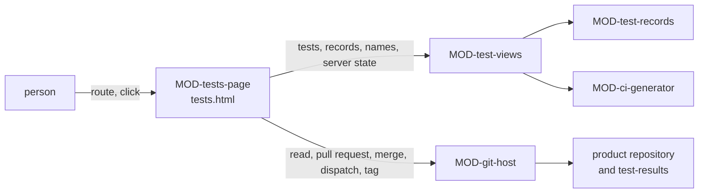

# ARC-028 The tests pages

## Context

A product's tests are shown and run from four places: its schedule and the CI configuration generated from it (UC-027),
the outcomes of one commit and the run of what has not run on it (UC-028), the tests themselves with what each guards
and how its outcomes developed (UC-029), and the release, whose candidate runs every test and whose report a person
accepts (UC-013). What the pages show is in the product repository and on its server: the test files and what their
cases declare, the counter-proofs and release test reports (ARC-027), the schedule and the generated configuration
(ARC-015), the result records on the branch `test-results` (ARC-027), and the pull requests, checks, tags and pipeline
schedules the server reports (ARC-004). The pages are static (ARC-001) and store nothing of their own: every view is
computed again from the repository at each visit (UC-029).

## Decision

1. **Two modules.** `MOD-test-views`, a feature, computes every view of the pages from what was read, given as data or
   through read ports. `MOD-tests-page`, the shell of `tests.html` at the root of the instance's Pages site, routes,
   reads the product and its server through `MOD-git-host`, writes on a person's click
   (`MOD-review-page.clickAuthority`), and holds every text and all HTML of the page — the folded explanations of each
   level, occasion and step included.
2. **Route** (`MOD-tests-page.route`): the fragment names the view — `schedule`, `runs` (the default), `browser`, `test`
   or `release` —, the product by its address, and where the view needs them a commit, a test, a version, and two
   release tags to compare.
3. **What is read at a commit.** The tests — the test files with their cases, the schedule or the book's default, the
   counter-proofs, the release test reports and the CI files — through the review page's read port, which keeps texts by
   blob (`MOD-tests-page.readTests`, `MOD-test-views.testsOf`), with the commit's message and date
   (`MOD-git-host.commitOf`); the names a test may guard — the requirements of `SPEC.md`, the use cases, the modules the
   decisions design (`MOD-tests-page.readNames`, `MOD-test-views.namesOf`); and the result records of the commits asked
   for, read at the head of `test-results` (`MOD-tests-page.readRecords`, `MOD-test-views.recordsOf`). What a reviewer
   picks from — the default branch's newest commits, the pull requests, the release tags with their commits and a
   version's candidates — is read apart (`MOD-tests-page.readRefs`). The outcomes of a commit are those of ARC-027
   (`MOD-test-records.commitOutcomes`).
4. **The schedule page** (`MOD-test-views.scheduleView`) shows per kind of test how many cases it holds, its occasions —
   the release candidate's always ticked, every commit and pull request never for tests that call a paid service or a
   model —, where it runs and the runners it may run on: hosted, or a CLI or sandboxed agent with *run code and tests*.
   It shows the findings of `MOD-ci-generator.scheduleProblems`, the secrets the jobs read by name only
   (`MOD-ci-generator.secretsNeeded`) with the server's page where they are stored (`MOD-git-host.secretsPageUrl`), the
   newest run of each occasion, and the nightly run as late where none was recorded in the 26 hours before now — its
   time plus two hours for the queue and the run. It compares the configuration on the default branch with a fresh
   generation for the version it names: current, generated for another version of Agent M, edited by hand with the lines
   that differ (`MOD-review-core.lineDiff`), missing, or a file Agent M did not generate — told by the generated first
   line. What the server holds of the schedule is read apart (`MOD-tests-page.readScheduleState`): the open pull request
   from `agent-m/test-schedule` with the checks on its head, and on GitLab the project's pipeline schedules, of which
   the one described `agent-m nightly` is compared with the schedule's time.
5. **Save, then merge.** *Save* (`MOD-tests-page.saveSchedule`) plans the change against the default branch's head
   (`MOD-test-views.scheduleChange`): the schedule and the configuration generated from it in one commit on the branch
   `agent-m/test-schedule`, started on that head where it does not exist, and one pull request into the default branch.
   A file at the configuration's path that Agent M did not generate is never written over. *Merge*
   (`MOD-tests-page.mergeSchedule`) merges that pull request once every check on its head passed, was skipped or is
   neutral, and otherwise returns the checks it waits for; on GitLab it then creates or changes the nightly pipeline
   schedule to the time of the schedule merged, where a row runs nightly (`MOD-git-host.savePipelineSchedule`), as
   `MOD-tests-page.saveNightly` does on its own when the page shows the pipeline schedule missing or different.
6. **The runs of a commit** (`MOD-test-views.runsView`): the commit, its outcomes per level and per test, and per level
   that has tests and no run on it the occasions that would run it. The panel that runs more (`MOD-test-views.runPanel`)
   presets the kinds without an outcome, names the paid services the chosen kinds call, the secrets the run reads and
   where each kind runs, and the kinds whose runner names no participant with *run code and tests*; it is refused where
   the product has no configuration generated from its schedule. *Run* (`MOD-tests-page.startRun`) dispatches the
   generated workflow on the default branch with `AGENT_M_OCCASION` *on demand*, `AGENT_M_COMMIT` and `AGENT_M_TESTS` —
   on GitLab a pipeline with these variables —, which checks out the commit named (ARC-015); without a token it names
   the workflow's page, where the person starts it (`MOD-git-host.workflowPageUrl`). The outcomes people enter for user
   tests are recorded as a run under the account the token acts as (`MOD-tests-page.recordUserTests`), never over a
   record that exists.
7. **The browser and one test.** `MOD-test-views.browserView` groups every test by level, or by requirement, use case or
   module with the levels that guard each and a missing level shown empty; applies the filters *failed*, *flaky*,
   *not-run*, *model-dependent*, *paid*, *no-counter-proof* and *guards-nothing*; lists the tests that declare their
   level, origin or identifiers wrongly (`MOD-test-records.batteryProblems`); and names the guarded names the product
   does not hold. `MOD-test-views.testView` shows a test as declared, when its kind runs, the participant that wrote it
   — the one its counter-proof names, as ARC-027 decision 4 has the writer of a test record its counter-proof —, its
   counter-proof, its history — one mark per commit of the default branch's newest, then one per release tag naming an
   older commit (`MOD-git-host.tagCommits`, `MOD-test-records.testHistory`) — and a model-dependent test's rate at each
   release. Two releases are compared with `MOD-test-records.compareReleases` over the tests and outcomes of their
   commits; a test's code is linked with `MOD-git-host.fileUrl`.
8. **The release** (`MOD-test-views.releaseView`): the next version of a minor and of a patch step, the version's
   candidates and the next one's tag, and for a candidate that ran its report — or the tests that have not run on it —
   with the tests that need a reason. *Start release candidate* (`MOD-tests-page.startCandidate`) sets the next
   candidate's tag on the default branch's head and dispatches the run of the release candidate, which runs every kind
   of test (ARC-015). *Accept and release* (`MOD-tests-page.acceptRelease`) reads the candidate's tests, its records and
   the last release's rates again, plans the release against the report shown (`MOD-test-records.planRelease`), writes
   its one commit on the default branch's head, and then sets the release's tag on the candidate's commit — the tested
   one, wherever the default branch moved meanwhile. A tag that fails after the commit is refused naming the commit, and
   `MOD-tests-page.tagRelease` sets it again from the report accepted, which names the candidate's commit.
9. **Secrets are named, never asked for.** The pages name the secrets a product's CI reads and open the page where they
   are stored; no page asks for a secret's value, and no file the pages write holds one — the generated configuration
   names the secrets only (ARC-015).



## Alternatives

- **The views computed in the shell** — not chosen: like the review, main and settings pages (ARC-022, ARC-024,
  ARC-026), the views are pure functions whose examples are their tests, and the shell keeps only reading, writing and
  HTML.
- **The outcomes read from the server's runs and logs** — rejected by `TEST RESULTS ARE KEPT IN THE REPOSITORY`: servers
  delete them after their retention period; the pages read the records on `test-results`.
- **Saving over a CI configuration Agent M did not generate** — rejected: removing the old configuration is the author's
  decision in the pull request (UC-027 1a).
- **Merging the schedule's pull request without its checks** — rejected by
  `CODE ENTERS THE DEFAULT BRANCH THROUGH A PULL REQUEST WITH GREEN CI`.
- **The writer of a test stored a second time, in the test file** — not chosen: the counter-proof names it (ARC-027),
  and a second place could disagree.
- **The release's tag set before its commit** — not chosen: a tag is never moved, so a commit that failed after the tag
  would leave a release without its report; the commit comes first, and a tag that failed is set again.

## Consequences

- After a write the page reads again what it shows; between visits it keeps only the texts kept by blob (ARC-005).
- The token writes the schedule's branch, opens and merges its pull request, sets tags and dispatches runs: *Contents*,
  *Pull requests*, *Actions* and, for the generated workflow file, *Workflows* (`MOD-git-host.requiredPermissions`).
- A test without a counter-proof — a user test, a test awaiting its implementation — shows no writer until the job
  records name who wrote it (ARC-010).
- The nightly run's lateness is read from the records alone. On GitHub, scheduled workflows of a public repository are
  disabled after a period without activity; the page names that possibility and links the workflow's page (UC-027 7a).
- Not realised here:
  - UC-027 1a — reading which triggers of a configuration Agent M did not generate run which tests needs a reader of the
    server's CI syntax, and on GitLab the product's own `.gitlab-ci.yml` is the file ARC-015 generates; where the
    generated pipeline stands beside it is decided with the job runtimes, which add CI files of their own. Until then
    such a file is never written over;
  - UC-027 3b — registering a self-hosted runner on a CLI agent's machine is designed with the bridge, which runs there;
    the token reads no list of a repository's runners;
  - UC-028 6 and 6a — the dispatch of the generated workflow on GitHub and GitLab is `MOD-tests-page.startRun`; the step
    also shows the run's progress, which needs the run named by the commit it tests — the configuration ARC-015
    generates names its runs by the workflow alone —, and runs through the local bridge (ARC-011, ARC-012); both are
    designed with the job runtimes and the bridge;
  - UC-028 2a and UC-029 5b — whether the server still keeps a run's log is not read: what its API answers for a run
    whose logs were deleted is measured first. The outcomes stay readable from the records;
  - UC-029 5a — a removed test in its history needs its declaration at older commits, read through
    `MOD-git-host.pathHistory`; designed with the audit (UC-030), which reads the tests of releases;
  - UC-013 3 — the levels, rates and report of the release panel are `MOD-test-views.releaseView`; the step also shows
    the candidate's run on the job dashboard (UC-036), which needs the run's progress as UC-028 6 does, and every
    requirement with the evidence that guards it, the audit view of UC-030; it is carried once both are designed;
  - UC-013 2a — whether only the implementing participant can run the release tests is read from the job records
    (ARC-010), designed with the job runtimes.

## Modules

### MOD-test-views

```json module
{
  "id": "MOD-test-views",
  "folder": "src/test-views/",
  "layer": "feature",
  "responsibility": "Computes what the tests pages show of a product — its schedule against the CI configuration and the server, the outcomes of a commit and the panel that runs more, its tests grouped and filtered, one test with its history, and its release — from one commit through read ports and from what the server reports, given as data; it reads nothing itself.",
  "realises": ["THE CI CONFIGURATION IS GENERATED FROM THE SCHEDULE", "THE PAGE STATES WHAT IT SENDS WHERE", "THE TRACEABILITY MATRIX IS DERIVED"],
  "owns": ["TestsState", "RecordsRead", "GuardNames", "ScheduleServer", "ScheduleInput", "ScheduleRowView", "OccasionRun", "ConfigurationState", "SchedulePullRequest", "NightlyOnServer", "ScheduleView", "ScheduleChangeInput", "ScheduleChange", "PullHead", "RunChoices", "NotRunLevel", "RunsInput", "RunsView", "TestRunPanelInput", "KindRunner", "TestRunPanel", "BrowserInput", "BrowserRow", "TestGroup", "BrokenGuard", "BrowserView", "TestViewInput", "ReleaseRate", "TestView", "ReleaseInputs", "NextVersions", "ReleaseView"],
  "uses": ["MOD-contracts", "MOD-test-records", "MOD-ci-generator", "MOD-review-core", "MOD-artifacts", "MOD-architecture"]
}
```

```json interface
{
  "id": "MOD-test-views.testsOf",
  "summary": "The tests of a commit read through the read port: its test files — under tests/, named *.test.<ext>, *.spec.<ext> or test_*.py, or Markdown under tests/user/ — with the cases they declare; its schedule, the book's default where it declares none, and why where its file cannot be read; its counter-proofs and release test reports, those that cannot be read named apart; and its CI configuration files.",
  "params": [{ "name": "snapshot", "type": "Snapshot" }, { "name": "files", "type": "ReadPort" }],
  "result": "TestsState",
  "async": true,
  "refusals": [],
  "examples": [
    {
      "name": "the thesis at main's head",
      "input": {
        "snapshot": {
          "commit": "c100000000000000000000000000000000000000",
          "tree": [
            { "path": ".github/workflows/agent-m-tests.yml", "blob": "167f44dfe4e34f38eb00a97d801d05f446f5dfb6" },
            { "path": "README.md", "blob": "38246d7a0e7972d08fd8936ccfef885ab3ccf3d3" },
            { "path": "SPEC.md", "blob": "a1883b352b04a23698a95ed07a05c530e6734728" },
            { "path": "docs/architecture/ARC-002-export.md", "blob": "0123fc84d43802d6e5a0a1c664efdaea63743db6" },
            { "path": "docs/tests/counter-proofs/TST-014.md", "blob": "90e888adf083bb0d0a867e53778372c9b02da594" },
            { "path": "docs/tests/schedule.md", "blob": "9e86c736db54b9471ee46c5826f557870ece7802" },
            { "path": "docs/use-cases/UC-003-export-a-chapter.md", "blob": "159ddc97b31591f90ccce7aac8bb7e310aeac8af" },
            { "path": "tests/export.test.mjs", "blob": "eef2e745eb0f37cff09ce84eea02ee2def8445d0" },
            { "path": "tests/release-export.test.mjs", "blob": "cbc971de30cdcd79a3567b29144af819eda86274" },
            { "path": "tests/user/export.md", "blob": "71d9ecf6534c4d40d6e869a9a1c621b662af4ba5" }
          ]
        },
        "files": { "tests/export.test.mjs": "// The export of a chapter.\n//\n// Module: MOD-export\n// Guards: A CHAPTER IS EXPORTED; UC-003\n// Level: system\nimport { test } from \"node:test\";\n\n// TST-014 the PDF keeps the figures\n// Given: a chapter with two figures\n// When: the author exports it as PDF\n// Then: the PDF holds both figures\ntest(\"TST-014 the PDF keeps the figures\", () => {});\n\n// TST-015 the PDF names the chapter\n// Given: a chapter titled Methods\n// When: the author exports it as PDF\n// Then: the PDF's title is Methods\ntest(\"TST-015 the PDF names the chapter\", () => {});\n\n// TST-016 the summary of an export reads as the chapter\n// Given: a chapter of four pages\n// When: the model summarises the exported PDF\n// Then: the summary names the chapter's three findings\n// Runs: 20\n// Paid: hub\ntest(\"TST-016 the summary of an export reads as the chapter\", () => {});\n", "tests/release-export.test.mjs": "// Module: MOD-export\n// Guards: A CHAPTER IS EXPORTED\n// Level: release\n\n// TST-021 an accepted chapter can be exported\n// Given: an accepted chapter\n// When: the release candidate exports it\n// Then: a PDF arrives\ntest(\"TST-021 an accepted chapter can be exported\", () => {});\n", "tests/user/export.md": "# Acceptance of the export\n\nModule: MOD-export\nGuards: A CHAPTER IS EXPORTED\nLevel: user\n\n## TST-030 a supervisor reads the exported chapter\n\nGiven: an accepted chapter with two figures, exported as PDF\nWhen: the supervisor opens the PDF on their own computer\nThen: the chapter's title and both figures are shown\n", "docs/tests/counter-proofs/TST-014.md": "---\ntest: TST-014\ncommit: c100000000000000000000000000000000000000\nfile: src/export/index.mjs\noutcome: failed\nparticipant: cli-dev\nat: 2026-10-08T14:00:00Z\n---\n\n# Counter-proof of TST-014\n\nThe figures are left out of the PDF.\n\n~~~diff\n-  pdf.add(chapter.figures);\n+  pdf.add([]);\n~~~\n\n~~~text\nAssertionError: expected 2 figures, got 0\n~~~\n", "docs/tests/schedule.md": "---\nnightly: 02:00\n---\n\n# Test schedule\n\n| Tests | every commit | pull request | nightly | release candidate | on demand | Runs on |\n|---|:-:|:-:|:-:|:-:|:-:|---|\n| unit | ✓ | ✓ | ✓ | ✓ | ✓ | hosted |\n| component | ✓ | ✓ | ✓ | ✓ | ✓ | hosted |\n| system (with recorded responses) | ✓ | ✓ | ✓ | ✓ | ✓ | hosted |\n| tests that call a paid service or a model |   |   | ✓ | ✓ | ✓ | cli-dev |\n| release |   |   |   | ✓ | ✓ | hosted |\n| user (manual) |   |   |   | ✓ | ✓ | people |\n", ".github/workflows/agent-m-tests.yml": "# Generated by Agent M from docs/tests/schedule.md; change the schedule, not this file.\nname: agent-m tests\non:\n  push:\n    branches-ignore: [test-results]\n    paths-ignore: [\"docs/jobs/**\"]\n  pull_request:\n    paths-ignore: [\"docs/jobs/**\"]\n  schedule:\n    - cron: \"0 2 * * *\"\n  workflow_dispatch:\n    inputs:\n      AGENT_M_OCCASION:\n        description: release candidate or on demand\n        type: choice\n        options: [\"on demand\", \"release candidate\"]\n        default: \"on demand\"\n      AGENT_M_COMMIT:\n        description: the commit to test, empty for the head of the branch\n        type: string\n        default: \"\"\n      AGENT_M_TESTS:\n        description: the kinds of test to run on demand, separated by spaces, empty for every kind\n        type: string\n        default: \"\"\npermissions:\n  contents: read\njobs:\n  occasion:\n    runs-on: ubuntu-latest\n    outputs:\n      occasion: ${{ steps.o.outputs.occasion }}\n      commit: ${{ steps.o.outputs.commit }}\n      unit: ${{ steps.o.outputs.unit }}\n      component: ${{ steps.o.outputs.component }}\n      system: ${{ steps.o.outputs.system }}\n      paid: ${{ steps.o.outputs.paid }}\n      release: ${{ steps.o.outputs.release }}\n    steps:\n      - id: o\n        env:\n          EVENT: ${{ github.event_name }}\n          HEAD: ${{ github.event.pull_request.head.sha || github.sha }}\n          OCCASION: ${{ inputs.AGENT_M_OCCASION }}\n          COMMIT: ${{ inputs.AGENT_M_COMMIT }}\n          TESTS: ${{ inputs.AGENT_M_TESTS }}\n        run: |\n          case \"$EVENT\" in\n            push) occasion=\"every commit\" ;;\n            pull_request) occasion=\"pull request\" ;;\n            schedule) occasion=\"nightly\" ;;\n            *) occasion=\"$OCCASION\" ;;\n          esac\n          case \"$occasion\" in\n            \"every commit\") runs=\"unit component system\" ;;\n            \"pull request\") runs=\"unit component system\" ;;\n            \"nightly\") runs=\"unit component system paid\" ;;\n            \"release candidate\") runs=\"unit component system paid release\" ;;\n            \"on demand\") runs=\"unit component system paid release\" ;;\n            *) runs=\"\" ;;\n          esac\n          if [ \"$occasion\" = \"on demand\" ] && [ -n \"$TESTS\" ]; then\n            chosen=\"\"\n            for t in $runs; do case \" $TESTS \" in *\" $t \"*) chosen=\"$chosen $t\" ;; esac; done\n            runs=\"${chosen# }\"\n          fi\n          echo \"occasion=$occasion\" >> \"$GITHUB_OUTPUT\"\n          echo \"commit=${COMMIT:-$HEAD}\" >> \"$GITHUB_OUTPUT\"\n          for t in unit component system paid release; do\n            case \" $runs \" in *\" $t \"*) echo \"$t=yes\" ;; *) echo \"$t=no\" ;; esac >> \"$GITHUB_OUTPUT\"\n          done\n  unit:\n    needs: occasion\n    if: needs.occasion.outputs.unit == 'yes'\n    runs-on: ubuntu-latest\n    env:\n      AGENT_M_HOME: ${{ github.workspace }}/agent-m\n      AGENT_M_KIND: unit\n      AGENT_M_OUT: ${{ github.workspace }}/agent-m-out/unit\n      AGENT_M_JUNIT: ${{ github.workspace }}/agent-m-out/unit/junit.xml\n    steps:\n      - run: rm -rf \"$AGENT_M_OUT\" && mkdir -p \"$AGENT_M_OUT\"\n      - uses: actions/checkout@v4\n        with:\n          ref: ${{ needs.occasion.outputs.commit }}\n          path: product\n      - uses: actions/checkout@v4\n        with:\n          repository: alice/agent-m\n          ref: 9f00000000000000000000000000000000000000\n          path: agent-m\n      - uses: actions/setup-node@v4\n        with:\n          node-version: \"22\"\n      - id: tests\n        working-directory: product\n        run: node \"$AGENT_M_HOME/src/ci-entry/main.mjs\" test\n      - if: always()\n        env:\n          OUTCOME: ${{ steps.tests.outcome }}\n        run: |\n          missing=\"$(cat \"$AGENT_M_OUT/missing\" 2>/dev/null)\"\n          mkdir -p \"$AGENT_M_OUT\"\n          {\n            echo \"kind: $AGENT_M_KIND\"\n            echo \"outcome: ${OUTCOME:-skipped}\"\n            echo \"missing: $missing\"\n            echo \"run: gh-${{ github.run_id }}-${{ github.run_attempt }}-unit\"\n            echo \"log: ${{ github.server_url }}/${{ github.repository }}/actions/runs/${{ github.run_id }}\"\n            echo \"participant: GitHub Actions, runner $RUNNER_NAME\"\n          } > \"$AGENT_M_OUT/run.txt\"\n      - if: always()\n        uses: actions/upload-artifact@v4\n        with:\n          name: agent-m-unit\n          path: agent-m-out/unit\n  component:\n    needs: occasion\n    if: needs.occasion.outputs.component == 'yes'\n    runs-on: ubuntu-latest\n    env:\n      AGENT_M_HOME: ${{ github.workspace }}/agent-m\n      AGENT_M_KIND: component\n      AGENT_M_OUT: ${{ github.workspace }}/agent-m-out/component\n      AGENT_M_JUNIT: ${{ github.workspace }}/agent-m-out/component/junit.xml\n    steps:\n      - run: rm -rf \"$AGENT_M_OUT\" && mkdir -p \"$AGENT_M_OUT\"\n      - uses: actions/checkout@v4\n        with:\n          ref: ${{ needs.occasion.outputs.commit }}\n          path: product\n      - uses: actions/checkout@v4\n        with:\n          repository: alice/agent-m\n          ref: 9f00000000000000000000000000000000000000\n          path: agent-m\n      - uses: actions/setup-node@v4\n        with:\n          node-version: \"22\"\n      - id: tests\n        working-directory: product\n        run: node \"$AGENT_M_HOME/src/ci-entry/main.mjs\" test\n      - if: always()\n        env:\n          OUTCOME: ${{ steps.tests.outcome }}\n        run: |\n          missing=\"$(cat \"$AGENT_M_OUT/missing\" 2>/dev/null)\"\n          mkdir -p \"$AGENT_M_OUT\"\n          {\n            echo \"kind: $AGENT_M_KIND\"\n            echo \"outcome: ${OUTCOME:-skipped}\"\n            echo \"missing: $missing\"\n            echo \"run: gh-${{ github.run_id }}-${{ github.run_attempt }}-component\"\n            echo \"log: ${{ github.server_url }}/${{ github.repository }}/actions/runs/${{ github.run_id }}\"\n            echo \"participant: GitHub Actions, runner $RUNNER_NAME\"\n          } > \"$AGENT_M_OUT/run.txt\"\n      - if: always()\n        uses: actions/upload-artifact@v4\n        with:\n          name: agent-m-component\n          path: agent-m-out/component\n  system:\n    needs: occasion\n    if: needs.occasion.outputs.system == 'yes'\n    runs-on: ubuntu-latest\n    env:\n      AGENT_M_HOME: ${{ github.workspace }}/agent-m\n      AGENT_M_KIND: system\n      AGENT_M_OUT: ${{ github.workspace }}/agent-m-out/system\n      AGENT_M_JUNIT: ${{ github.workspace }}/agent-m-out/system/junit.xml\n    steps:\n      - run: rm -rf \"$AGENT_M_OUT\" && mkdir -p \"$AGENT_M_OUT\"\n      - uses: actions/checkout@v4\n        with:\n          ref: ${{ needs.occasion.outputs.commit }}\n          path: product\n      - uses: actions/checkout@v4\n        with:\n          repository: alice/agent-m\n          ref: 9f00000000000000000000000000000000000000\n          path: agent-m\n      - uses: actions/setup-node@v4\n        with:\n          node-version: \"22\"\n      - id: tests\n        working-directory: product\n        run: node \"$AGENT_M_HOME/src/ci-entry/main.mjs\" test\n      - if: always()\n        env:\n          OUTCOME: ${{ steps.tests.outcome }}\n        run: |\n          missing=\"$(cat \"$AGENT_M_OUT/missing\" 2>/dev/null)\"\n          mkdir -p \"$AGENT_M_OUT\"\n          {\n            echo \"kind: $AGENT_M_KIND\"\n            echo \"outcome: ${OUTCOME:-skipped}\"\n            echo \"missing: $missing\"\n            echo \"run: gh-${{ github.run_id }}-${{ github.run_attempt }}-system\"\n            echo \"log: ${{ github.server_url }}/${{ github.repository }}/actions/runs/${{ github.run_id }}\"\n            echo \"participant: GitHub Actions, runner $RUNNER_NAME\"\n          } > \"$AGENT_M_OUT/run.txt\"\n      - if: always()\n        uses: actions/upload-artifact@v4\n        with:\n          name: agent-m-system\n          path: agent-m-out/system\n  paid:\n    needs: occasion\n    if: needs.occasion.outputs.paid == 'yes'\n    runs-on: [self-hosted, cli-dev]\n    env:\n      AGENT_M_HOME: ${{ github.workspace }}/agent-m\n      AGENT_M_KIND: paid\n      AGENT_M_OUT: ${{ github.workspace }}/agent-m-out/paid\n      AGENT_M_JUNIT: ${{ github.workspace }}/agent-m-out/paid/junit.xml\n    steps:\n      - run: rm -rf \"$AGENT_M_OUT\" && mkdir -p \"$AGENT_M_OUT\"\n      - uses: actions/checkout@v4\n        with:\n          ref: ${{ needs.occasion.outputs.commit }}\n          path: product\n      - uses: actions/checkout@v4\n        with:\n          repository: alice/agent-m\n          ref: 9f00000000000000000000000000000000000000\n          path: agent-m\n      - uses: actions/setup-node@v4\n        with:\n          node-version: \"22\"\n      - id: secrets\n        env:\n          AGENT_M_KEY_HUB: ${{ secrets.AGENT_M_KEY_HUB }}\n        run: |\n          missing=\"\"\n          [ -n \"$AGENT_M_KEY_HUB\" ] || missing=\"$missing AGENT_M_KEY_HUB\"\n          missing=\"${missing# }\"\n          echo \"$missing\" > \"$AGENT_M_OUT/missing\"\n          [ -z \"$missing\" ] || { echo \"the secret(s) $missing missing\"; exit 1; }\n      - id: tests\n        if: steps.secrets.outcome == 'success'\n        working-directory: product\n        env:\n          AGENT_M_KEY_HUB: ${{ secrets.AGENT_M_KEY_HUB }}\n        run: node \"$AGENT_M_HOME/src/ci-entry/main.mjs\" test\n      - if: always()\n        env:\n          OUTCOME: ${{ steps.tests.outcome }}\n        run: |\n          missing=\"$(cat \"$AGENT_M_OUT/missing\" 2>/dev/null)\"\n          mkdir -p \"$AGENT_M_OUT\"\n          {\n            echo \"kind: $AGENT_M_KIND\"\n            echo \"outcome: ${OUTCOME:-skipped}\"\n            echo \"missing: $missing\"\n            echo \"run: gh-${{ github.run_id }}-${{ github.run_attempt }}-paid\"\n            echo \"log: ${{ github.server_url }}/${{ github.repository }}/actions/runs/${{ github.run_id }}\"\n            echo \"participant: GitHub Actions, runner $RUNNER_NAME\"\n          } > \"$AGENT_M_OUT/run.txt\"\n      - if: always()\n        uses: actions/upload-artifact@v4\n        with:\n          name: agent-m-paid\n          path: agent-m-out/paid\n  release:\n    needs: occasion\n    if: needs.occasion.outputs.release == 'yes'\n    runs-on: ubuntu-latest\n    env:\n      AGENT_M_HOME: ${{ github.workspace }}/agent-m\n      AGENT_M_KIND: release\n      AGENT_M_OUT: ${{ github.workspace }}/agent-m-out/release\n      AGENT_M_JUNIT: ${{ github.workspace }}/agent-m-out/release/junit.xml\n    steps:\n      - run: rm -rf \"$AGENT_M_OUT\" && mkdir -p \"$AGENT_M_OUT\"\n      - uses: actions/checkout@v4\n        with:\n          ref: ${{ needs.occasion.outputs.commit }}\n          path: product\n      - uses: actions/checkout@v4\n        with:\n          repository: alice/agent-m\n          ref: 9f00000000000000000000000000000000000000\n          path: agent-m\n      - uses: actions/setup-node@v4\n        with:\n          node-version: \"22\"\n      - id: tests\n        working-directory: product\n        run: node \"$AGENT_M_HOME/src/ci-entry/main.mjs\" test\n      - if: always()\n        env:\n          OUTCOME: ${{ steps.tests.outcome }}\n        run: |\n          missing=\"$(cat \"$AGENT_M_OUT/missing\" 2>/dev/null)\"\n          mkdir -p \"$AGENT_M_OUT\"\n          {\n            echo \"kind: $AGENT_M_KIND\"\n            echo \"outcome: ${OUTCOME:-skipped}\"\n            echo \"missing: $missing\"\n            echo \"run: gh-${{ github.run_id }}-${{ github.run_attempt }}-release\"\n            echo \"log: ${{ github.server_url }}/${{ github.repository }}/actions/runs/${{ github.run_id }}\"\n            echo \"participant: GitHub Actions, runner $RUNNER_NAME\"\n          } > \"$AGENT_M_OUT/run.txt\"\n      - if: always()\n        uses: actions/upload-artifact@v4\n        with:\n          name: agent-m-release\n          path: agent-m-out/release\n  results:\n    needs: [occasion, unit, component, system, paid, release]\n    if: always() && needs.occasion.result == 'success'\n    runs-on: ubuntu-latest\n    env:\n      AGENT_M_HOME: ${{ github.workspace }}/agent-m\n      AGENT_M_OUT: ${{ github.workspace }}/agent-m-out\n    steps:\n      - uses: actions/checkout@v4\n        with:\n          ref: ${{ needs.occasion.outputs.commit }}\n          path: product\n      - uses: actions/checkout@v4\n        with:\n          repository: alice/agent-m\n          ref: 9f00000000000000000000000000000000000000\n          path: agent-m\n      - uses: actions/setup-node@v4\n        with:\n          node-version: \"22\"\n      - uses: actions/download-artifact@v4\n        continue-on-error: true\n        with:\n          pattern: agent-m-*\n          path: agent-m-out\n      - working-directory: product\n        env:\n          AGENT_M_TOKEN: ${{ secrets.AGENT_M_TOKEN }}\n          AGENT_M_OCCASION: ${{ needs.occasion.outputs.occasion }}\n          AGENT_M_COMMIT: ${{ needs.occasion.outputs.commit }}\n        run: AGENT_M_NOTES=\"$(ls \"$AGENT_M_OUT\" 2>/dev/null | tr '\\n' ' ')\" node \"$AGENT_M_HOME/src/ci-entry/main.mjs\" results\n" }
      },
      "result": {
        "tests": [
          {
            "path": "tests/export.test.mjs",
            "module": "MOD-export",
            "guards": ["A CHAPTER IS EXPORTED", "UC-003"],
            "level": "system",
            "levels": ["system"],
            "cases": [
              {
                "id": "TST-014",
                "title": "the PDF keeps the figures",
                "given": "a chapter with two figures",
                "when": "the author exports it as PDF",
                "then": "the PDF holds both figures",
                "extends": "",
                "runs": null,
                "paid": [],
                "awaiting": false,
                "line": 8
              },
              {
                "id": "TST-015",
                "title": "the PDF names the chapter",
                "given": "a chapter titled Methods",
                "when": "the author exports it as PDF",
                "then": "the PDF's title is Methods",
                "extends": "",
                "runs": null,
                "paid": [],
                "awaiting": false,
                "line": 14
              },
              {
                "id": "TST-016",
                "title": "the summary of an export reads as the chapter",
                "given": "a chapter of four pages",
                "when": "the model summarises the exported PDF",
                "then": "the summary names the chapter's three findings",
                "extends": "",
                "runs": 20,
                "paid": ["hub"],
                "awaiting": false,
                "line": 20
              }
            ]
          },
          {
            "path": "tests/release-export.test.mjs",
            "module": "MOD-export",
            "guards": ["A CHAPTER IS EXPORTED"],
            "level": "release",
            "levels": ["release"],
            "cases": [
              {
                "id": "TST-021",
                "title": "an accepted chapter can be exported",
                "given": "an accepted chapter",
                "when": "the release candidate exports it",
                "then": "a PDF arrives",
                "extends": "",
                "runs": null,
                "paid": [],
                "awaiting": false,
                "line": 5
              }
            ]
          },
          {
            "path": "tests/user/export.md",
            "module": "MOD-export",
            "guards": ["A CHAPTER IS EXPORTED"],
            "level": "user",
            "levels": ["user"],
            "cases": [
              {
                "id": "TST-030",
                "title": "a supervisor reads the exported chapter",
                "given": "an accepted chapter with two figures, exported as PDF",
                "when": "the supervisor opens the PDF on their own computer",
                "then": "the chapter's title and both figures are shown",
                "extends": "",
                "runs": null,
                "paid": [],
                "awaiting": false,
                "line": 7
              }
            ]
          }
        ],
        "schedule": {
          "declared": true,
          "nightly": "02:00",
          "command": "",
          "rows": [
            {
              "tests": "unit",
              "occasions": ["every commit", "pull request", "nightly", "release candidate", "on demand"],
              "runsOn": "hosted",
              "line": 9
            },
            {
              "tests": "component",
              "occasions": ["every commit", "pull request", "nightly", "release candidate", "on demand"],
              "runsOn": "hosted",
              "line": 10
            },
            {
              "tests": "system",
              "occasions": ["every commit", "pull request", "nightly", "release candidate", "on demand"],
              "runsOn": "hosted",
              "line": 11
            },
            {
              "tests": "paid",
              "occasions": ["nightly", "release candidate", "on demand"],
              "runsOn": "cli-dev",
              "line": 12
            },
            { "tests": "release", "occasions": ["release candidate", "on demand"], "runsOn": "hosted", "line": 13 },
            { "tests": "user", "occasions": ["release candidate", "on demand"], "runsOn": "people", "line": 14 }
          ]
        },
        "scheduleNote": "",
        "proofs": [
          { "path": "docs/tests/counter-proofs/TST-014.md", "test": "TST-014", "commit": "c100000000000000000000000000000000000000", "file": "src/export/index.mjs", "outcome": "failed", "participant": "cli-dev", "at": "2026-10-08T14:00:00Z", "fault": "The figures are left out of the PDF.", "diff": "-  pdf.add(chapter.figures);\n+  pdf.add([]);", "output": "AssertionError: expected 2 figures, got 0" }
        ],
        "reports": [],
        "ci": [
          { "path": ".github/workflows/agent-m-tests.yml", "text": "# Generated by Agent M from docs/tests/schedule.md; change the schedule, not this file.\nname: agent-m tests\non:\n  push:\n    branches-ignore: [test-results]\n    paths-ignore: [\"docs/jobs/**\"]\n  pull_request:\n    paths-ignore: [\"docs/jobs/**\"]\n  schedule:\n    - cron: \"0 2 * * *\"\n  workflow_dispatch:\n    inputs:\n      AGENT_M_OCCASION:\n        description: release candidate or on demand\n        type: choice\n        options: [\"on demand\", \"release candidate\"]\n        default: \"on demand\"\n      AGENT_M_COMMIT:\n        description: the commit to test, empty for the head of the branch\n        type: string\n        default: \"\"\n      AGENT_M_TESTS:\n        description: the kinds of test to run on demand, separated by spaces, empty for every kind\n        type: string\n        default: \"\"\npermissions:\n  contents: read\njobs:\n  occasion:\n    runs-on: ubuntu-latest\n    outputs:\n      occasion: ${{ steps.o.outputs.occasion }}\n      commit: ${{ steps.o.outputs.commit }}\n      unit: ${{ steps.o.outputs.unit }}\n      component: ${{ steps.o.outputs.component }}\n      system: ${{ steps.o.outputs.system }}\n      paid: ${{ steps.o.outputs.paid }}\n      release: ${{ steps.o.outputs.release }}\n    steps:\n      - id: o\n        env:\n          EVENT: ${{ github.event_name }}\n          HEAD: ${{ github.event.pull_request.head.sha || github.sha }}\n          OCCASION: ${{ inputs.AGENT_M_OCCASION }}\n          COMMIT: ${{ inputs.AGENT_M_COMMIT }}\n          TESTS: ${{ inputs.AGENT_M_TESTS }}\n        run: |\n          case \"$EVENT\" in\n            push) occasion=\"every commit\" ;;\n            pull_request) occasion=\"pull request\" ;;\n            schedule) occasion=\"nightly\" ;;\n            *) occasion=\"$OCCASION\" ;;\n          esac\n          case \"$occasion\" in\n            \"every commit\") runs=\"unit component system\" ;;\n            \"pull request\") runs=\"unit component system\" ;;\n            \"nightly\") runs=\"unit component system paid\" ;;\n            \"release candidate\") runs=\"unit component system paid release\" ;;\n            \"on demand\") runs=\"unit component system paid release\" ;;\n            *) runs=\"\" ;;\n          esac\n          if [ \"$occasion\" = \"on demand\" ] && [ -n \"$TESTS\" ]; then\n            chosen=\"\"\n            for t in $runs; do case \" $TESTS \" in *\" $t \"*) chosen=\"$chosen $t\" ;; esac; done\n            runs=\"${chosen# }\"\n          fi\n          echo \"occasion=$occasion\" >> \"$GITHUB_OUTPUT\"\n          echo \"commit=${COMMIT:-$HEAD}\" >> \"$GITHUB_OUTPUT\"\n          for t in unit component system paid release; do\n            case \" $runs \" in *\" $t \"*) echo \"$t=yes\" ;; *) echo \"$t=no\" ;; esac >> \"$GITHUB_OUTPUT\"\n          done\n  unit:\n    needs: occasion\n    if: needs.occasion.outputs.unit == 'yes'\n    runs-on: ubuntu-latest\n    env:\n      AGENT_M_HOME: ${{ github.workspace }}/agent-m\n      AGENT_M_KIND: unit\n      AGENT_M_OUT: ${{ github.workspace }}/agent-m-out/unit\n      AGENT_M_JUNIT: ${{ github.workspace }}/agent-m-out/unit/junit.xml\n    steps:\n      - run: rm -rf \"$AGENT_M_OUT\" && mkdir -p \"$AGENT_M_OUT\"\n      - uses: actions/checkout@v4\n        with:\n          ref: ${{ needs.occasion.outputs.commit }}\n          path: product\n      - uses: actions/checkout@v4\n        with:\n          repository: alice/agent-m\n          ref: 9f00000000000000000000000000000000000000\n          path: agent-m\n      - uses: actions/setup-node@v4\n        with:\n          node-version: \"22\"\n      - id: tests\n        working-directory: product\n        run: node \"$AGENT_M_HOME/src/ci-entry/main.mjs\" test\n      - if: always()\n        env:\n          OUTCOME: ${{ steps.tests.outcome }}\n        run: |\n          missing=\"$(cat \"$AGENT_M_OUT/missing\" 2>/dev/null)\"\n          mkdir -p \"$AGENT_M_OUT\"\n          {\n            echo \"kind: $AGENT_M_KIND\"\n            echo \"outcome: ${OUTCOME:-skipped}\"\n            echo \"missing: $missing\"\n            echo \"run: gh-${{ github.run_id }}-${{ github.run_attempt }}-unit\"\n            echo \"log: ${{ github.server_url }}/${{ github.repository }}/actions/runs/${{ github.run_id }}\"\n            echo \"participant: GitHub Actions, runner $RUNNER_NAME\"\n          } > \"$AGENT_M_OUT/run.txt\"\n      - if: always()\n        uses: actions/upload-artifact@v4\n        with:\n          name: agent-m-unit\n          path: agent-m-out/unit\n  component:\n    needs: occasion\n    if: needs.occasion.outputs.component == 'yes'\n    runs-on: ubuntu-latest\n    env:\n      AGENT_M_HOME: ${{ github.workspace }}/agent-m\n      AGENT_M_KIND: component\n      AGENT_M_OUT: ${{ github.workspace }}/agent-m-out/component\n      AGENT_M_JUNIT: ${{ github.workspace }}/agent-m-out/component/junit.xml\n    steps:\n      - run: rm -rf \"$AGENT_M_OUT\" && mkdir -p \"$AGENT_M_OUT\"\n      - uses: actions/checkout@v4\n        with:\n          ref: ${{ needs.occasion.outputs.commit }}\n          path: product\n      - uses: actions/checkout@v4\n        with:\n          repository: alice/agent-m\n          ref: 9f00000000000000000000000000000000000000\n          path: agent-m\n      - uses: actions/setup-node@v4\n        with:\n          node-version: \"22\"\n      - id: tests\n        working-directory: product\n        run: node \"$AGENT_M_HOME/src/ci-entry/main.mjs\" test\n      - if: always()\n        env:\n          OUTCOME: ${{ steps.tests.outcome }}\n        run: |\n          missing=\"$(cat \"$AGENT_M_OUT/missing\" 2>/dev/null)\"\n          mkdir -p \"$AGENT_M_OUT\"\n          {\n            echo \"kind: $AGENT_M_KIND\"\n            echo \"outcome: ${OUTCOME:-skipped}\"\n            echo \"missing: $missing\"\n            echo \"run: gh-${{ github.run_id }}-${{ github.run_attempt }}-component\"\n            echo \"log: ${{ github.server_url }}/${{ github.repository }}/actions/runs/${{ github.run_id }}\"\n            echo \"participant: GitHub Actions, runner $RUNNER_NAME\"\n          } > \"$AGENT_M_OUT/run.txt\"\n      - if: always()\n        uses: actions/upload-artifact@v4\n        with:\n          name: agent-m-component\n          path: agent-m-out/component\n  system:\n    needs: occasion\n    if: needs.occasion.outputs.system == 'yes'\n    runs-on: ubuntu-latest\n    env:\n      AGENT_M_HOME: ${{ github.workspace }}/agent-m\n      AGENT_M_KIND: system\n      AGENT_M_OUT: ${{ github.workspace }}/agent-m-out/system\n      AGENT_M_JUNIT: ${{ github.workspace }}/agent-m-out/system/junit.xml\n    steps:\n      - run: rm -rf \"$AGENT_M_OUT\" && mkdir -p \"$AGENT_M_OUT\"\n      - uses: actions/checkout@v4\n        with:\n          ref: ${{ needs.occasion.outputs.commit }}\n          path: product\n      - uses: actions/checkout@v4\n        with:\n          repository: alice/agent-m\n          ref: 9f00000000000000000000000000000000000000\n          path: agent-m\n      - uses: actions/setup-node@v4\n        with:\n          node-version: \"22\"\n      - id: tests\n        working-directory: product\n        run: node \"$AGENT_M_HOME/src/ci-entry/main.mjs\" test\n      - if: always()\n        env:\n          OUTCOME: ${{ steps.tests.outcome }}\n        run: |\n          missing=\"$(cat \"$AGENT_M_OUT/missing\" 2>/dev/null)\"\n          mkdir -p \"$AGENT_M_OUT\"\n          {\n            echo \"kind: $AGENT_M_KIND\"\n            echo \"outcome: ${OUTCOME:-skipped}\"\n            echo \"missing: $missing\"\n            echo \"run: gh-${{ github.run_id }}-${{ github.run_attempt }}-system\"\n            echo \"log: ${{ github.server_url }}/${{ github.repository }}/actions/runs/${{ github.run_id }}\"\n            echo \"participant: GitHub Actions, runner $RUNNER_NAME\"\n          } > \"$AGENT_M_OUT/run.txt\"\n      - if: always()\n        uses: actions/upload-artifact@v4\n        with:\n          name: agent-m-system\n          path: agent-m-out/system\n  paid:\n    needs: occasion\n    if: needs.occasion.outputs.paid == 'yes'\n    runs-on: [self-hosted, cli-dev]\n    env:\n      AGENT_M_HOME: ${{ github.workspace }}/agent-m\n      AGENT_M_KIND: paid\n      AGENT_M_OUT: ${{ github.workspace }}/agent-m-out/paid\n      AGENT_M_JUNIT: ${{ github.workspace }}/agent-m-out/paid/junit.xml\n    steps:\n      - run: rm -rf \"$AGENT_M_OUT\" && mkdir -p \"$AGENT_M_OUT\"\n      - uses: actions/checkout@v4\n        with:\n          ref: ${{ needs.occasion.outputs.commit }}\n          path: product\n      - uses: actions/checkout@v4\n        with:\n          repository: alice/agent-m\n          ref: 9f00000000000000000000000000000000000000\n          path: agent-m\n      - uses: actions/setup-node@v4\n        with:\n          node-version: \"22\"\n      - id: secrets\n        env:\n          AGENT_M_KEY_HUB: ${{ secrets.AGENT_M_KEY_HUB }}\n        run: |\n          missing=\"\"\n          [ -n \"$AGENT_M_KEY_HUB\" ] || missing=\"$missing AGENT_M_KEY_HUB\"\n          missing=\"${missing# }\"\n          echo \"$missing\" > \"$AGENT_M_OUT/missing\"\n          [ -z \"$missing\" ] || { echo \"the secret(s) $missing missing\"; exit 1; }\n      - id: tests\n        if: steps.secrets.outcome == 'success'\n        working-directory: product\n        env:\n          AGENT_M_KEY_HUB: ${{ secrets.AGENT_M_KEY_HUB }}\n        run: node \"$AGENT_M_HOME/src/ci-entry/main.mjs\" test\n      - if: always()\n        env:\n          OUTCOME: ${{ steps.tests.outcome }}\n        run: |\n          missing=\"$(cat \"$AGENT_M_OUT/missing\" 2>/dev/null)\"\n          mkdir -p \"$AGENT_M_OUT\"\n          {\n            echo \"kind: $AGENT_M_KIND\"\n            echo \"outcome: ${OUTCOME:-skipped}\"\n            echo \"missing: $missing\"\n            echo \"run: gh-${{ github.run_id }}-${{ github.run_attempt }}-paid\"\n            echo \"log: ${{ github.server_url }}/${{ github.repository }}/actions/runs/${{ github.run_id }}\"\n            echo \"participant: GitHub Actions, runner $RUNNER_NAME\"\n          } > \"$AGENT_M_OUT/run.txt\"\n      - if: always()\n        uses: actions/upload-artifact@v4\n        with:\n          name: agent-m-paid\n          path: agent-m-out/paid\n  release:\n    needs: occasion\n    if: needs.occasion.outputs.release == 'yes'\n    runs-on: ubuntu-latest\n    env:\n      AGENT_M_HOME: ${{ github.workspace }}/agent-m\n      AGENT_M_KIND: release\n      AGENT_M_OUT: ${{ github.workspace }}/agent-m-out/release\n      AGENT_M_JUNIT: ${{ github.workspace }}/agent-m-out/release/junit.xml\n    steps:\n      - run: rm -rf \"$AGENT_M_OUT\" && mkdir -p \"$AGENT_M_OUT\"\n      - uses: actions/checkout@v4\n        with:\n          ref: ${{ needs.occasion.outputs.commit }}\n          path: product\n      - uses: actions/checkout@v4\n        with:\n          repository: alice/agent-m\n          ref: 9f00000000000000000000000000000000000000\n          path: agent-m\n      - uses: actions/setup-node@v4\n        with:\n          node-version: \"22\"\n      - id: tests\n        working-directory: product\n        run: node \"$AGENT_M_HOME/src/ci-entry/main.mjs\" test\n      - if: always()\n        env:\n          OUTCOME: ${{ steps.tests.outcome }}\n        run: |\n          missing=\"$(cat \"$AGENT_M_OUT/missing\" 2>/dev/null)\"\n          mkdir -p \"$AGENT_M_OUT\"\n          {\n            echo \"kind: $AGENT_M_KIND\"\n            echo \"outcome: ${OUTCOME:-skipped}\"\n            echo \"missing: $missing\"\n            echo \"run: gh-${{ github.run_id }}-${{ github.run_attempt }}-release\"\n            echo \"log: ${{ github.server_url }}/${{ github.repository }}/actions/runs/${{ github.run_id }}\"\n            echo \"participant: GitHub Actions, runner $RUNNER_NAME\"\n          } > \"$AGENT_M_OUT/run.txt\"\n      - if: always()\n        uses: actions/upload-artifact@v4\n        with:\n          name: agent-m-release\n          path: agent-m-out/release\n  results:\n    needs: [occasion, unit, component, system, paid, release]\n    if: always() && needs.occasion.result == 'success'\n    runs-on: ubuntu-latest\n    env:\n      AGENT_M_HOME: ${{ github.workspace }}/agent-m\n      AGENT_M_OUT: ${{ github.workspace }}/agent-m-out\n    steps:\n      - uses: actions/checkout@v4\n        with:\n          ref: ${{ needs.occasion.outputs.commit }}\n          path: product\n      - uses: actions/checkout@v4\n        with:\n          repository: alice/agent-m\n          ref: 9f00000000000000000000000000000000000000\n          path: agent-m\n      - uses: actions/setup-node@v4\n        with:\n          node-version: \"22\"\n      - uses: actions/download-artifact@v4\n        continue-on-error: true\n        with:\n          pattern: agent-m-*\n          path: agent-m-out\n      - working-directory: product\n        env:\n          AGENT_M_TOKEN: ${{ secrets.AGENT_M_TOKEN }}\n          AGENT_M_OCCASION: ${{ needs.occasion.outputs.occasion }}\n          AGENT_M_COMMIT: ${{ needs.occasion.outputs.commit }}\n        run: AGENT_M_NOTES=\"$(ls \"$AGENT_M_OUT\" 2>/dev/null | tr '\\n' ' ')\" node \"$AGENT_M_HOME/src/ci-entry/main.mjs\" results\n" }
        ],
        "unreadable": []
      }
    }
  ]
}
```

```json interface
{
  "id": "MOD-test-views.recordsOf",
  "summary": "The result records the branch test-results holds of the commits given, read from its tree; a file that is no record is named apart.",
  "params": [
    { "name": "tree", "type": "TreeEntry[]" },
    { "name": "files", "type": "ReadPort" },
    { "name": "commits", "type": "string[]" }
  ],
  "result": "RecordsRead",
  "async": true,
  "refusals": [],
  "examples": [
    {
      "name": "the records of main's head",
      "input": {
        "tree": [
          { "path": "results/c000000000000000000000000000000000000000/gh-4650-1-paid.md", "blob": "e11fcd468676f86465cda04a1029fe5b2c7bb508" },
          { "path": "results/c100000000000000000000000000000000000000/gh-4690-1-paid.md", "blob": "cd259edf4e13988a39f717d95694872e091bc68d" },
          { "path": "results/c100000000000000000000000000000000000000/gh-4711-1-system.md", "blob": "c39bcdffb4be041a2742230262f5dce6d6fc3c53" },
          { "path": "results/c100000000000000000000000000000000000000/gh-4712-1-system.md", "blob": "903f5915d5aa21a374ed78a60d1bb6bd4e83b7b1" }
        ],
        "files": { "results/c100000000000000000000000000000000000000/gh-4711-1-system.md": "---\ncommit: c100000000000000000000000000000000000000\nlevels:\n  - system\noccasion: every commit\nparticipant: GitHub Actions, runner GitHub Actions 7\nlog: https://github.com/alice/thesis/actions/runs/4711\nat: 2026-10-09T08:04:00Z\nuncommitted: no\noutcome: failed\n---\n\n# Run gh-4711-1-system\n\n| Test | Level | Outcome | Runs | Passed | Note |\n|---|---|---|---|---|---|\n| TST-014 | system | passed | 1 | 1 |  |\n| TST-015 | system | failed | 1 | 0 | expected \"Methods\", got \"chapter-2\" |\n\n## TST-015\n\n~~~text\nAssertionError: expected \"Methods\", got \"chapter-2\"\n    at tests/export.test.mjs:18:3\n~~~\n", "results/c100000000000000000000000000000000000000/gh-4712-1-system.md": "---\ncommit: c100000000000000000000000000000000000000\nlevels:\n  - system\noccasion: on demand\nparticipant: GitHub Actions, runner GitHub Actions 7\nlog: https://github.com/alice/thesis/actions/runs/4712\nat: 2026-10-09T09:30:00Z\nuncommitted: no\noutcome: failed\n---\n\n# Run gh-4712-1-system\n\n| Test | Level | Outcome | Runs | Passed | Note |\n|---|---|---|---|---|---|\n| TST-014 | system | failed | 1 | 0 | the second figure is missing |\n\n## TST-014\n\n~~~text\nAssertionError: expected 2 figures, got 1\n~~~\n", "results/c100000000000000000000000000000000000000/gh-4690-1-paid.md": "---\ncommit: c100000000000000000000000000000000000000\nlevels:\n  - system\noccasion: nightly\nparticipant: GitHub Actions, runner cli-dev\nlog: https://github.com/alice/thesis/actions/runs/4690\nat: 2026-10-09T02:06:00Z\nuncommitted: no\noutcome: failed\n---\n\n# Run gh-4690-1-paid\n\n| Test | Level | Outcome | Runs | Passed | Note |\n|---|---|---|---|---|---|\n| TST-016 | system | rate | 20 | 17 | the summary names two findings |\n", "results/c000000000000000000000000000000000000000/gh-4650-1-paid.md": "---\ncommit: c000000000000000000000000000000000000000\nlevels:\n  - system\noccasion: release candidate\nparticipant: GitHub Actions, runner GitHub Actions 7\nlog: https://github.com/alice/thesis/actions/runs/4650\nat: 2026-10-02T08:00:00Z\nuncommitted: no\noutcome: failed\n---\n\n# Run gh-4650-1-paid\n\n| Test | Level | Outcome | Runs | Passed | Note |\n|---|---|---|---|---|---|\n| TST-016 | system | rate | 20 | 18 |  |\n" },
        "commits": ["c100000000000000000000000000000000000000"]
      },
      "result": {
        "records": [
          {
            "path": "results/c100000000000000000000000000000000000000/gh-4690-1-paid.md",
            "commit": "c100000000000000000000000000000000000000",
            "run": "gh-4690-1-paid",
            "levels": ["system"],
            "occasion": "nightly",
            "participant": "GitHub Actions, runner cli-dev",
            "log": "https://github.com/alice/thesis/actions/runs/4690",
            "at": "2026-10-09T02:06:00Z",
            "uncommitted": false,
            "outcome": "failed",
            "note": "",
            "outcomes": [
              { "test": "TST-016", "level": "system", "outcome": "rate", "runs": 20, "passed": 17, "note": "the summary names two findings", "excerpt": "" }
            ]
          },
          {
            "path": "results/c100000000000000000000000000000000000000/gh-4711-1-system.md",
            "commit": "c100000000000000000000000000000000000000",
            "run": "gh-4711-1-system",
            "levels": ["system"],
            "occasion": "every commit",
            "participant": "GitHub Actions, runner GitHub Actions 7",
            "log": "https://github.com/alice/thesis/actions/runs/4711",
            "at": "2026-10-09T08:04:00Z",
            "uncommitted": false,
            "outcome": "failed",
            "note": "",
            "outcomes": [
              { "test": "TST-014", "level": "system", "outcome": "passed", "runs": 1, "passed": 1, "note": "", "excerpt": "" },
              { "test": "TST-015", "level": "system", "outcome": "failed", "runs": 1, "passed": 0, "note": "expected \"Methods\", got \"chapter-2\"", "excerpt": "AssertionError: expected \"Methods\", got \"chapter-2\"\n    at tests/export.test.mjs:18:3" }
            ]
          },
          {
            "path": "results/c100000000000000000000000000000000000000/gh-4712-1-system.md",
            "commit": "c100000000000000000000000000000000000000",
            "run": "gh-4712-1-system",
            "levels": ["system"],
            "occasion": "on demand",
            "participant": "GitHub Actions, runner GitHub Actions 7",
            "log": "https://github.com/alice/thesis/actions/runs/4712",
            "at": "2026-10-09T09:30:00Z",
            "uncommitted": false,
            "outcome": "failed",
            "note": "",
            "outcomes": [
              { "test": "TST-014", "level": "system", "outcome": "failed", "runs": 1, "passed": 0, "note": "the second figure is missing", "excerpt": "AssertionError: expected 2 figures, got 1" }
            ]
          }
        ],
        "unreadable": []
      }
    }
  ]
}
```

```json interface
{
  "id": "MOD-test-views.namesOf",
  "summary": "The names a test may guard that the product holds at a commit, read through the read port: the requirements of SPEC.md, the use cases under docs/use-cases/ by the identifiers their files are named with, and the modules the decisions under docs/architecture/ design.",
  "params": [{ "name": "snapshot", "type": "Snapshot" }, { "name": "files", "type": "ReadPort" }],
  "result": "GuardNames",
  "async": true,
  "refusals": [],
  "examples": [
    {
      "name": "the thesis at main's head",
      "input": {
        "snapshot": {
          "commit": "c100000000000000000000000000000000000000",
          "tree": [
            { "path": ".github/workflows/agent-m-tests.yml", "blob": "167f44dfe4e34f38eb00a97d801d05f446f5dfb6" },
            { "path": "README.md", "blob": "38246d7a0e7972d08fd8936ccfef885ab3ccf3d3" },
            { "path": "SPEC.md", "blob": "a1883b352b04a23698a95ed07a05c530e6734728" },
            { "path": "docs/architecture/ARC-002-export.md", "blob": "0123fc84d43802d6e5a0a1c664efdaea63743db6" },
            { "path": "docs/tests/counter-proofs/TST-014.md", "blob": "90e888adf083bb0d0a867e53778372c9b02da594" },
            { "path": "docs/tests/schedule.md", "blob": "9e86c736db54b9471ee46c5826f557870ece7802" },
            { "path": "docs/use-cases/UC-003-export-a-chapter.md", "blob": "159ddc97b31591f90ccce7aac8bb7e310aeac8af" },
            { "path": "tests/export.test.mjs", "blob": "eef2e745eb0f37cff09ce84eea02ee2def8445d0" },
            { "path": "tests/release-export.test.mjs", "blob": "cbc971de30cdcd79a3567b29144af819eda86274" },
            { "path": "tests/user/export.md", "blob": "71d9ecf6534c4d40d6e869a9a1c621b662af4ba5" }
          ]
        },
        "files": { "SPEC.md": "# Thesis — Specification\n\n## 1. Writing\n\n**ONE CLICK** *(PO A. Maier)*\nA decision takes one click.\n*Check:* no automatic check; at review.\n\n**NO SERVER** *(PO A. Maier)*\nThe product runs no server of its own.\n*Check:* `tests/test_no_server.py`\n\n## 2. Review\n\n**EVERY TEXT IS REVIEWED** *(PO A. Maier)*\nA document binds only once it is accepted.\n*Check:* `tests/pages.test.mjs`\n\n## 3. Export\n\n**A CHAPTER IS EXPORTED** *(PO A. Maier)*\nA chapter is exported as a PDF with its figures.\n*Check:* `tests/export.test.mjs`\n", "docs/architecture/ARC-002-export.md": "---\nid: ARC-002\ntitle: Export\nforced_by:\n  - EVERY TEXT IS REVIEWED\n  - UC-003\n---\n# ARC-002 Export\n\n## Context\n\nThe thesis is reviewed in the browser.\n\n## Decision\n\n1. Export.\n\n## Alternatives\n\n- None.\n\n## Consequences\n\n- None.\n\n## Modules\n\n```json module\n{\"id\":\"MOD-export\",\"folder\":\"src/export/\",\"layer\":\"feature\",\"responsibility\":\"Exports chapters.\",\"realises\":[\"EVERY TEXT IS REVIEWED\"],\"owns\":[],\"uses\":[\"MOD-pages\"]}\n```\n\n```json interface\n{\"id\":\"MOD-export.run\",\"summary\":\"Exports a chapter.\",\"params\":[{\"name\":\"path\",\"type\":\"string\"}],\"result\":\"string\",\"async\":false,\"refusals\":[],\"examples\":[{\"name\":\"one\",\"input\":{\"path\":\"a.md\"},\"result\":\"a.pdf\"}]}\n```\n" }
      },
      "result": {
        "requirements": ["A CHAPTER IS EXPORTED", "EVERY TEXT IS REVIEWED", "NO SERVER", "ONE CLICK"],
        "useCases": ["UC-003"],
        "modules": ["MOD-export"]
      }
    }
  ]
}
```

```json interface
{
  "id": "MOD-test-views.scheduleView",
  "summary": "The schedule page (UC-027): per kind of test how many cases it holds, the occasions it runs on — the release candidate's always, every commit and pull request never for tests that call a paid service or a model —, where it runs and the runners it may run on; whether the schedule is the book's default; its findings; the secrets the jobs read; the newest run of each occasion, when the nightly one was last due and whether it is late; the CI configuration against a fresh generation — current, generated for another version of Agent M, edited by hand with the lines that differ, missing, or a file Agent M did not generate — and the CI files beside it that Agent M did not generate; the open pull request of the schedule with the checks on its head and whether they are green; and on GitLab the project's nightly pipeline schedule against the schedule's time — current, at another time or inactive, missing, or not needed where no row runs nightly.",
  "params": [{ "name": "input", "type": "ScheduleInput" }],
  "result": "ScheduleView",
  "async": false,
  "refusals": [],
  "examples": [
    {
      "name": "a configuration of an older Agent M, and a late nightly run",
      "input": {
        "input": {
          "state": {
            "tests": [
              {
                "path": "tests/export.test.mjs",
                "module": "MOD-export",
                "guards": ["A CHAPTER IS EXPORTED", "UC-003"],
                "level": "system",
                "levels": ["system"],
                "cases": [
                  {
                    "id": "TST-014",
                    "title": "the PDF keeps the figures",
                    "given": "a chapter with two figures",
                    "when": "the author exports it as PDF",
                    "then": "the PDF holds both figures",
                    "extends": "",
                    "runs": null,
                    "paid": [],
                    "awaiting": false,
                    "line": 8
                  },
                  {
                    "id": "TST-015",
                    "title": "the PDF names the chapter",
                    "given": "a chapter titled Methods",
                    "when": "the author exports it as PDF",
                    "then": "the PDF's title is Methods",
                    "extends": "",
                    "runs": null,
                    "paid": [],
                    "awaiting": false,
                    "line": 14
                  },
                  {
                    "id": "TST-016",
                    "title": "the summary of an export reads as the chapter",
                    "given": "a chapter of four pages",
                    "when": "the model summarises the exported PDF",
                    "then": "the summary names the chapter's three findings",
                    "extends": "",
                    "runs": 20,
                    "paid": ["hub"],
                    "awaiting": false,
                    "line": 20
                  }
                ]
              },
              {
                "path": "tests/release-export.test.mjs",
                "module": "MOD-export",
                "guards": ["A CHAPTER IS EXPORTED"],
                "level": "release",
                "levels": ["release"],
                "cases": [
                  {
                    "id": "TST-021",
                    "title": "an accepted chapter can be exported",
                    "given": "an accepted chapter",
                    "when": "the release candidate exports it",
                    "then": "a PDF arrives",
                    "extends": "",
                    "runs": null,
                    "paid": [],
                    "awaiting": false,
                    "line": 5
                  }
                ]
              },
              {
                "path": "tests/user/export.md",
                "module": "MOD-export",
                "guards": ["A CHAPTER IS EXPORTED"],
                "level": "user",
                "levels": ["user"],
                "cases": [
                  {
                    "id": "TST-030",
                    "title": "a supervisor reads the exported chapter",
                    "given": "an accepted chapter with two figures, exported as PDF",
                    "when": "the supervisor opens the PDF on their own computer",
                    "then": "the chapter's title and both figures are shown",
                    "extends": "",
                    "runs": null,
                    "paid": [],
                    "awaiting": false,
                    "line": 7
                  }
                ]
              }
            ],
            "schedule": {
              "declared": true,
              "nightly": "02:00",
              "command": "",
              "rows": [
                {
                  "tests": "unit",
                  "occasions": ["every commit", "pull request", "nightly", "release candidate", "on demand"],
                  "runsOn": "hosted",
                  "line": 9
                },
                {
                  "tests": "component",
                  "occasions": ["every commit", "pull request", "nightly", "release candidate", "on demand"],
                  "runsOn": "hosted",
                  "line": 10
                },
                {
                  "tests": "system",
                  "occasions": ["every commit", "pull request", "nightly", "release candidate", "on demand"],
                  "runsOn": "hosted",
                  "line": 11
                },
                {
                  "tests": "paid",
                  "occasions": ["nightly", "release candidate", "on demand"],
                  "runsOn": "cli-dev",
                  "line": 12
                },
                {
                  "tests": "release",
                  "occasions": ["release candidate", "on demand"],
                  "runsOn": "hosted",
                  "line": 13
                },
                { "tests": "user", "occasions": ["release candidate", "on demand"], "runsOn": "people", "line": 14 }
              ]
            },
            "scheduleNote": "",
            "proofs": [
              { "path": "docs/tests/counter-proofs/TST-014.md", "test": "TST-014", "commit": "c100000000000000000000000000000000000000", "file": "src/export/index.mjs", "outcome": "failed", "participant": "cli-dev", "at": "2026-10-08T14:00:00Z", "fault": "The figures are left out of the PDF.", "diff": "-  pdf.add(chapter.figures);\n+  pdf.add([]);", "output": "AssertionError: expected 2 figures, got 0" }
            ],
            "reports": [],
            "ci": [
              { "path": ".github/workflows/agent-m-tests.yml", "text": "# Generated by Agent M from docs/tests/schedule.md; change the schedule, not this file.\nname: agent-m tests\non:\n  push:\n    branches-ignore: [test-results]\n    paths-ignore: [\"docs/jobs/**\"]\n  pull_request:\n    paths-ignore: [\"docs/jobs/**\"]\n  schedule:\n    - cron: \"0 2 * * *\"\n  workflow_dispatch:\n    inputs:\n      AGENT_M_OCCASION:\n        description: release candidate or on demand\n        type: choice\n        options: [\"on demand\", \"release candidate\"]\n        default: \"on demand\"\n      AGENT_M_COMMIT:\n        description: the commit to test, empty for the head of the branch\n        type: string\n        default: \"\"\n      AGENT_M_TESTS:\n        description: the kinds of test to run on demand, separated by spaces, empty for every kind\n        type: string\n        default: \"\"\npermissions:\n  contents: read\njobs:\n  occasion:\n    runs-on: ubuntu-latest\n    outputs:\n      occasion: ${{ steps.o.outputs.occasion }}\n      commit: ${{ steps.o.outputs.commit }}\n      unit: ${{ steps.o.outputs.unit }}\n      component: ${{ steps.o.outputs.component }}\n      system: ${{ steps.o.outputs.system }}\n      paid: ${{ steps.o.outputs.paid }}\n      release: ${{ steps.o.outputs.release }}\n    steps:\n      - id: o\n        env:\n          EVENT: ${{ github.event_name }}\n          HEAD: ${{ github.event.pull_request.head.sha || github.sha }}\n          OCCASION: ${{ inputs.AGENT_M_OCCASION }}\n          COMMIT: ${{ inputs.AGENT_M_COMMIT }}\n          TESTS: ${{ inputs.AGENT_M_TESTS }}\n        run: |\n          case \"$EVENT\" in\n            push) occasion=\"every commit\" ;;\n            pull_request) occasion=\"pull request\" ;;\n            schedule) occasion=\"nightly\" ;;\n            *) occasion=\"$OCCASION\" ;;\n          esac\n          case \"$occasion\" in\n            \"every commit\") runs=\"unit component system\" ;;\n            \"pull request\") runs=\"unit component system\" ;;\n            \"nightly\") runs=\"unit component system paid\" ;;\n            \"release candidate\") runs=\"unit component system paid release\" ;;\n            \"on demand\") runs=\"unit component system paid release\" ;;\n            *) runs=\"\" ;;\n          esac\n          if [ \"$occasion\" = \"on demand\" ] && [ -n \"$TESTS\" ]; then\n            chosen=\"\"\n            for t in $runs; do case \" $TESTS \" in *\" $t \"*) chosen=\"$chosen $t\" ;; esac; done\n            runs=\"${chosen# }\"\n          fi\n          echo \"occasion=$occasion\" >> \"$GITHUB_OUTPUT\"\n          echo \"commit=${COMMIT:-$HEAD}\" >> \"$GITHUB_OUTPUT\"\n          for t in unit component system paid release; do\n            case \" $runs \" in *\" $t \"*) echo \"$t=yes\" ;; *) echo \"$t=no\" ;; esac >> \"$GITHUB_OUTPUT\"\n          done\n  unit:\n    needs: occasion\n    if: needs.occasion.outputs.unit == 'yes'\n    runs-on: ubuntu-latest\n    env:\n      AGENT_M_HOME: ${{ github.workspace }}/agent-m\n      AGENT_M_KIND: unit\n      AGENT_M_OUT: ${{ github.workspace }}/agent-m-out/unit\n      AGENT_M_JUNIT: ${{ github.workspace }}/agent-m-out/unit/junit.xml\n    steps:\n      - run: rm -rf \"$AGENT_M_OUT\" && mkdir -p \"$AGENT_M_OUT\"\n      - uses: actions/checkout@v4\n        with:\n          ref: ${{ needs.occasion.outputs.commit }}\n          path: product\n      - uses: actions/checkout@v4\n        with:\n          repository: alice/agent-m\n          ref: 9f00000000000000000000000000000000000000\n          path: agent-m\n      - uses: actions/setup-node@v4\n        with:\n          node-version: \"22\"\n      - id: tests\n        working-directory: product\n        run: node \"$AGENT_M_HOME/src/ci-entry/main.mjs\" test\n      - if: always()\n        env:\n          OUTCOME: ${{ steps.tests.outcome }}\n        run: |\n          missing=\"$(cat \"$AGENT_M_OUT/missing\" 2>/dev/null)\"\n          mkdir -p \"$AGENT_M_OUT\"\n          {\n            echo \"kind: $AGENT_M_KIND\"\n            echo \"outcome: ${OUTCOME:-skipped}\"\n            echo \"missing: $missing\"\n            echo \"run: gh-${{ github.run_id }}-${{ github.run_attempt }}-unit\"\n            echo \"log: ${{ github.server_url }}/${{ github.repository }}/actions/runs/${{ github.run_id }}\"\n            echo \"participant: GitHub Actions, runner $RUNNER_NAME\"\n          } > \"$AGENT_M_OUT/run.txt\"\n      - if: always()\n        uses: actions/upload-artifact@v4\n        with:\n          name: agent-m-unit\n          path: agent-m-out/unit\n  component:\n    needs: occasion\n    if: needs.occasion.outputs.component == 'yes'\n    runs-on: ubuntu-latest\n    env:\n      AGENT_M_HOME: ${{ github.workspace }}/agent-m\n      AGENT_M_KIND: component\n      AGENT_M_OUT: ${{ github.workspace }}/agent-m-out/component\n      AGENT_M_JUNIT: ${{ github.workspace }}/agent-m-out/component/junit.xml\n    steps:\n      - run: rm -rf \"$AGENT_M_OUT\" && mkdir -p \"$AGENT_M_OUT\"\n      - uses: actions/checkout@v4\n        with:\n          ref: ${{ needs.occasion.outputs.commit }}\n          path: product\n      - uses: actions/checkout@v4\n        with:\n          repository: alice/agent-m\n          ref: 9f00000000000000000000000000000000000000\n          path: agent-m\n      - uses: actions/setup-node@v4\n        with:\n          node-version: \"22\"\n      - id: tests\n        working-directory: product\n        run: node \"$AGENT_M_HOME/src/ci-entry/main.mjs\" test\n      - if: always()\n        env:\n          OUTCOME: ${{ steps.tests.outcome }}\n        run: |\n          missing=\"$(cat \"$AGENT_M_OUT/missing\" 2>/dev/null)\"\n          mkdir -p \"$AGENT_M_OUT\"\n          {\n            echo \"kind: $AGENT_M_KIND\"\n            echo \"outcome: ${OUTCOME:-skipped}\"\n            echo \"missing: $missing\"\n            echo \"run: gh-${{ github.run_id }}-${{ github.run_attempt }}-component\"\n            echo \"log: ${{ github.server_url }}/${{ github.repository }}/actions/runs/${{ github.run_id }}\"\n            echo \"participant: GitHub Actions, runner $RUNNER_NAME\"\n          } > \"$AGENT_M_OUT/run.txt\"\n      - if: always()\n        uses: actions/upload-artifact@v4\n        with:\n          name: agent-m-component\n          path: agent-m-out/component\n  system:\n    needs: occasion\n    if: needs.occasion.outputs.system == 'yes'\n    runs-on: ubuntu-latest\n    env:\n      AGENT_M_HOME: ${{ github.workspace }}/agent-m\n      AGENT_M_KIND: system\n      AGENT_M_OUT: ${{ github.workspace }}/agent-m-out/system\n      AGENT_M_JUNIT: ${{ github.workspace }}/agent-m-out/system/junit.xml\n    steps:\n      - run: rm -rf \"$AGENT_M_OUT\" && mkdir -p \"$AGENT_M_OUT\"\n      - uses: actions/checkout@v4\n        with:\n          ref: ${{ needs.occasion.outputs.commit }}\n          path: product\n      - uses: actions/checkout@v4\n        with:\n          repository: alice/agent-m\n          ref: 9f00000000000000000000000000000000000000\n          path: agent-m\n      - uses: actions/setup-node@v4\n        with:\n          node-version: \"22\"\n      - id: tests\n        working-directory: product\n        run: node \"$AGENT_M_HOME/src/ci-entry/main.mjs\" test\n      - if: always()\n        env:\n          OUTCOME: ${{ steps.tests.outcome }}\n        run: |\n          missing=\"$(cat \"$AGENT_M_OUT/missing\" 2>/dev/null)\"\n          mkdir -p \"$AGENT_M_OUT\"\n          {\n            echo \"kind: $AGENT_M_KIND\"\n            echo \"outcome: ${OUTCOME:-skipped}\"\n            echo \"missing: $missing\"\n            echo \"run: gh-${{ github.run_id }}-${{ github.run_attempt }}-system\"\n            echo \"log: ${{ github.server_url }}/${{ github.repository }}/actions/runs/${{ github.run_id }}\"\n            echo \"participant: GitHub Actions, runner $RUNNER_NAME\"\n          } > \"$AGENT_M_OUT/run.txt\"\n      - if: always()\n        uses: actions/upload-artifact@v4\n        with:\n          name: agent-m-system\n          path: agent-m-out/system\n  paid:\n    needs: occasion\n    if: needs.occasion.outputs.paid == 'yes'\n    runs-on: [self-hosted, cli-dev]\n    env:\n      AGENT_M_HOME: ${{ github.workspace }}/agent-m\n      AGENT_M_KIND: paid\n      AGENT_M_OUT: ${{ github.workspace }}/agent-m-out/paid\n      AGENT_M_JUNIT: ${{ github.workspace }}/agent-m-out/paid/junit.xml\n    steps:\n      - run: rm -rf \"$AGENT_M_OUT\" && mkdir -p \"$AGENT_M_OUT\"\n      - uses: actions/checkout@v4\n        with:\n          ref: ${{ needs.occasion.outputs.commit }}\n          path: product\n      - uses: actions/checkout@v4\n        with:\n          repository: alice/agent-m\n          ref: 9f00000000000000000000000000000000000000\n          path: agent-m\n      - uses: actions/setup-node@v4\n        with:\n          node-version: \"22\"\n      - id: secrets\n        env:\n          AGENT_M_KEY_HUB: ${{ secrets.AGENT_M_KEY_HUB }}\n        run: |\n          missing=\"\"\n          [ -n \"$AGENT_M_KEY_HUB\" ] || missing=\"$missing AGENT_M_KEY_HUB\"\n          missing=\"${missing# }\"\n          echo \"$missing\" > \"$AGENT_M_OUT/missing\"\n          [ -z \"$missing\" ] || { echo \"the secret(s) $missing missing\"; exit 1; }\n      - id: tests\n        if: steps.secrets.outcome == 'success'\n        working-directory: product\n        env:\n          AGENT_M_KEY_HUB: ${{ secrets.AGENT_M_KEY_HUB }}\n        run: node \"$AGENT_M_HOME/src/ci-entry/main.mjs\" test\n      - if: always()\n        env:\n          OUTCOME: ${{ steps.tests.outcome }}\n        run: |\n          missing=\"$(cat \"$AGENT_M_OUT/missing\" 2>/dev/null)\"\n          mkdir -p \"$AGENT_M_OUT\"\n          {\n            echo \"kind: $AGENT_M_KIND\"\n            echo \"outcome: ${OUTCOME:-skipped}\"\n            echo \"missing: $missing\"\n            echo \"run: gh-${{ github.run_id }}-${{ github.run_attempt }}-paid\"\n            echo \"log: ${{ github.server_url }}/${{ github.repository }}/actions/runs/${{ github.run_id }}\"\n            echo \"participant: GitHub Actions, runner $RUNNER_NAME\"\n          } > \"$AGENT_M_OUT/run.txt\"\n      - if: always()\n        uses: actions/upload-artifact@v4\n        with:\n          name: agent-m-paid\n          path: agent-m-out/paid\n  release:\n    needs: occasion\n    if: needs.occasion.outputs.release == 'yes'\n    runs-on: ubuntu-latest\n    env:\n      AGENT_M_HOME: ${{ github.workspace }}/agent-m\n      AGENT_M_KIND: release\n      AGENT_M_OUT: ${{ github.workspace }}/agent-m-out/release\n      AGENT_M_JUNIT: ${{ github.workspace }}/agent-m-out/release/junit.xml\n    steps:\n      - run: rm -rf \"$AGENT_M_OUT\" && mkdir -p \"$AGENT_M_OUT\"\n      - uses: actions/checkout@v4\n        with:\n          ref: ${{ needs.occasion.outputs.commit }}\n          path: product\n      - uses: actions/checkout@v4\n        with:\n          repository: alice/agent-m\n          ref: 9f00000000000000000000000000000000000000\n          path: agent-m\n      - uses: actions/setup-node@v4\n        with:\n          node-version: \"22\"\n      - id: tests\n        working-directory: product\n        run: node \"$AGENT_M_HOME/src/ci-entry/main.mjs\" test\n      - if: always()\n        env:\n          OUTCOME: ${{ steps.tests.outcome }}\n        run: |\n          missing=\"$(cat \"$AGENT_M_OUT/missing\" 2>/dev/null)\"\n          mkdir -p \"$AGENT_M_OUT\"\n          {\n            echo \"kind: $AGENT_M_KIND\"\n            echo \"outcome: ${OUTCOME:-skipped}\"\n            echo \"missing: $missing\"\n            echo \"run: gh-${{ github.run_id }}-${{ github.run_attempt }}-release\"\n            echo \"log: ${{ github.server_url }}/${{ github.repository }}/actions/runs/${{ github.run_id }}\"\n            echo \"participant: GitHub Actions, runner $RUNNER_NAME\"\n          } > \"$AGENT_M_OUT/run.txt\"\n      - if: always()\n        uses: actions/upload-artifact@v4\n        with:\n          name: agent-m-release\n          path: agent-m-out/release\n  results:\n    needs: [occasion, unit, component, system, paid, release]\n    if: always() && needs.occasion.result == 'success'\n    runs-on: ubuntu-latest\n    env:\n      AGENT_M_HOME: ${{ github.workspace }}/agent-m\n      AGENT_M_OUT: ${{ github.workspace }}/agent-m-out\n    steps:\n      - uses: actions/checkout@v4\n        with:\n          ref: ${{ needs.occasion.outputs.commit }}\n          path: product\n      - uses: actions/checkout@v4\n        with:\n          repository: alice/agent-m\n          ref: 9f00000000000000000000000000000000000000\n          path: agent-m\n      - uses: actions/setup-node@v4\n        with:\n          node-version: \"22\"\n      - uses: actions/download-artifact@v4\n        continue-on-error: true\n        with:\n          pattern: agent-m-*\n          path: agent-m-out\n      - working-directory: product\n        env:\n          AGENT_M_TOKEN: ${{ secrets.AGENT_M_TOKEN }}\n          AGENT_M_OCCASION: ${{ needs.occasion.outputs.occasion }}\n          AGENT_M_COMMIT: ${{ needs.occasion.outputs.commit }}\n        run: AGENT_M_NOTES=\"$(ls \"$AGENT_M_OUT\" 2>/dev/null | tr '\\n' ' ')\" node \"$AGENT_M_HOME/src/ci-entry/main.mjs\" results\n" }
            ],
            "unreadable": []
          },
          "product": { "kind": "github", "address": "https://github.com/alice/thesis", "host": "github.com", "server": "https://github.com", "repo": "alice/thesis" },
          "setup": {
            "instance": "https://github.com/alice/agent-m",
            "version": "a100000000000000000000000000000000000000",
            "paidSecrets": ["AGENT_M_KEY_HUB"]
          },
          "participants": [
            {
              "name": "alice",
              "type": "person",
              "model": "",
              "context": null,
              "price": null,
              "capabilities": ["draft text", "read the repository", "write to the repository"],
              "place": "",
              "route": "the GitHub account `alice`",
              "line": 5
            },
            {
              "name": "cli-dev",
              "type": "CLI agent",
              "model": "claude-opus-5-5",
              "context": null,
              "price": null,
              "capabilities": ["draft text", "read the repository", "write to the repository", "run code and tests", "use tools"],
              "place": "this machine",
              "route": "the bridge on the Mac of `alice`",
              "line": 9
            }
          ],
          "records": [
            {
              "path": "results/c100000000000000000000000000000000000000/gh-4711-1-system.md",
              "commit": "c100000000000000000000000000000000000000",
              "run": "gh-4711-1-system",
              "levels": ["system"],
              "occasion": "every commit",
              "participant": "GitHub Actions, runner GitHub Actions 7",
              "log": "https://github.com/alice/thesis/actions/runs/4711",
              "at": "2026-10-09T08:04:00Z",
              "uncommitted": false,
              "outcome": "failed",
              "note": "",
              "outcomes": [
                { "test": "TST-014", "level": "system", "outcome": "passed", "runs": 1, "passed": 1, "note": "", "excerpt": "" },
                { "test": "TST-015", "level": "system", "outcome": "failed", "runs": 1, "passed": 0, "note": "expected \"Methods\", got \"chapter-2\"", "excerpt": "AssertionError: expected \"Methods\", got \"chapter-2\"\n    at tests/export.test.mjs:18:3" }
              ]
            },
            {
              "path": "results/c100000000000000000000000000000000000000/gh-4712-1-system.md",
              "commit": "c100000000000000000000000000000000000000",
              "run": "gh-4712-1-system",
              "levels": ["system"],
              "occasion": "on demand",
              "participant": "GitHub Actions, runner GitHub Actions 7",
              "log": "https://github.com/alice/thesis/actions/runs/4712",
              "at": "2026-10-09T09:30:00Z",
              "uncommitted": false,
              "outcome": "failed",
              "note": "",
              "outcomes": [
                { "test": "TST-014", "level": "system", "outcome": "failed", "runs": 1, "passed": 0, "note": "the second figure is missing", "excerpt": "AssertionError: expected 2 figures, got 1" }
              ]
            },
            {
              "path": "results/c100000000000000000000000000000000000000/gh-4690-1-paid.md",
              "commit": "c100000000000000000000000000000000000000",
              "run": "gh-4690-1-paid",
              "levels": ["system"],
              "occasion": "nightly",
              "participant": "GitHub Actions, runner cli-dev",
              "log": "https://github.com/alice/thesis/actions/runs/4690",
              "at": "2026-10-09T02:06:00Z",
              "uncommitted": false,
              "outcome": "failed",
              "note": "",
              "outcomes": [
                { "test": "TST-016", "level": "system", "outcome": "rate", "runs": 20, "passed": 17, "note": "the summary names two findings", "excerpt": "" }
              ]
            },
            {
              "path": "results/c000000000000000000000000000000000000000/gh-4650-1-paid.md",
              "commit": "c000000000000000000000000000000000000000",
              "run": "gh-4650-1-paid",
              "levels": ["system"],
              "occasion": "release candidate",
              "participant": "GitHub Actions, runner GitHub Actions 7",
              "log": "https://github.com/alice/thesis/actions/runs/4650",
              "at": "2026-10-02T08:00:00Z",
              "uncommitted": false,
              "outcome": "failed",
              "note": "",
              "outcomes": [
                { "test": "TST-016", "level": "system", "outcome": "rate", "runs": 20, "passed": 18, "note": "", "excerpt": "" }
              ]
            }
          ],
          "now": "2026-10-10T09:00:00Z",
          "server": { "pullRequest": null, "checks": [], "pipelineSchedules": [] }
        }
      },
      "result": {
        "declared": true,
        "note": "",
        "nightly": "02:00",
        "command": "",
        "rows": [
          {
            "tests": "unit",
            "count": 0,
            "occasions": ["every commit", "pull request", "nightly", "release candidate", "on demand"],
            "runsOn": "hosted",
            "locked": ["release candidate"],
            "runners": ["hosted", "cli-dev"]
          },
          {
            "tests": "component",
            "count": 0,
            "occasions": ["every commit", "pull request", "nightly", "release candidate", "on demand"],
            "runsOn": "hosted",
            "locked": ["release candidate"],
            "runners": ["hosted", "cli-dev"]
          },
          {
            "tests": "system",
            "count": 2,
            "occasions": ["every commit", "pull request", "nightly", "release candidate", "on demand"],
            "runsOn": "hosted",
            "locked": ["release candidate"],
            "runners": ["hosted", "cli-dev"]
          },
          {
            "tests": "paid",
            "count": 1,
            "occasions": ["nightly", "release candidate", "on demand"],
            "runsOn": "cli-dev",
            "locked": ["every commit", "pull request", "release candidate"],
            "runners": ["hosted", "cli-dev"]
          },
          {
            "tests": "release",
            "count": 1,
            "occasions": ["release candidate", "on demand"],
            "runsOn": "hosted",
            "locked": ["release candidate"],
            "runners": ["hosted", "cli-dev"]
          },
          {
            "tests": "user",
            "count": 1,
            "occasions": ["release candidate", "on demand"],
            "runsOn": "people",
            "locked": ["release candidate"],
            "runners": ["people"]
          }
        ],
        "problems": [],
        "secrets": [
          { "name": "AGENT_M_TOKEN", "holds": "the person's Agent M token", "jobs": ["results"], "scope": "" },
          {
            "name": "AGENT_M_KEY_HUB",
            "holds": "the key of a paid service the tests call",
            "jobs": ["paid"],
            "scope": ""
          }
        ],
        "newest": [
          { "occasion": "every commit", "at": "2026-10-09T08:04:00Z", "record": "results/c100000000000000000000000000000000000000/gh-4711-1-system.md" },
          { "occasion": "pull request", "at": "", "record": "" },
          { "occasion": "nightly", "at": "2026-10-09T02:06:00Z", "record": "results/c100000000000000000000000000000000000000/gh-4690-1-paid.md" },
          { "occasion": "release candidate", "at": "2026-10-02T08:00:00Z", "record": "results/c000000000000000000000000000000000000000/gh-4650-1-paid.md" },
          { "occasion": "on demand", "at": "2026-10-09T09:30:00Z", "record": "results/c100000000000000000000000000000000000000/gh-4712-1-system.md" }
        ],
        "nightlyDue": "2026-10-10T02:00:00Z",
        "nightlyLate": true,
        "configuration": { "path": ".github/workflows/agent-m-tests.yml", "state": "older", "lines": [] },
        "others": [],
        "pullRequest": null,
        "nightlyOnServer": null
      }
    },
    {
      "name": "a GitLab product before its merge request is merged, its nightly pipeline at another time",
      "input": {
        "input": {
          "state": {
            "tests": [
              {
                "path": "tests/export.test.mjs",
                "module": "MOD-export",
                "guards": ["A CHAPTER IS EXPORTED", "UC-003"],
                "level": "system",
                "levels": ["system"],
                "cases": [
                  {
                    "id": "TST-014",
                    "title": "the PDF keeps the figures",
                    "given": "a chapter with two figures",
                    "when": "the author exports it as PDF",
                    "then": "the PDF holds both figures",
                    "extends": "",
                    "runs": null,
                    "paid": [],
                    "awaiting": false,
                    "line": 8
                  },
                  {
                    "id": "TST-015",
                    "title": "the PDF names the chapter",
                    "given": "a chapter titled Methods",
                    "when": "the author exports it as PDF",
                    "then": "the PDF's title is Methods",
                    "extends": "",
                    "runs": null,
                    "paid": [],
                    "awaiting": false,
                    "line": 14
                  },
                  {
                    "id": "TST-016",
                    "title": "the summary of an export reads as the chapter",
                    "given": "a chapter of four pages",
                    "when": "the model summarises the exported PDF",
                    "then": "the summary names the chapter's three findings",
                    "extends": "",
                    "runs": 20,
                    "paid": ["hub"],
                    "awaiting": false,
                    "line": 20
                  }
                ]
              },
              {
                "path": "tests/release-export.test.mjs",
                "module": "MOD-export",
                "guards": ["A CHAPTER IS EXPORTED"],
                "level": "release",
                "levels": ["release"],
                "cases": [
                  {
                    "id": "TST-021",
                    "title": "an accepted chapter can be exported",
                    "given": "an accepted chapter",
                    "when": "the release candidate exports it",
                    "then": "a PDF arrives",
                    "extends": "",
                    "runs": null,
                    "paid": [],
                    "awaiting": false,
                    "line": 5
                  }
                ]
              },
              {
                "path": "tests/user/export.md",
                "module": "MOD-export",
                "guards": ["A CHAPTER IS EXPORTED"],
                "level": "user",
                "levels": ["user"],
                "cases": [
                  {
                    "id": "TST-030",
                    "title": "a supervisor reads the exported chapter",
                    "given": "an accepted chapter with two figures, exported as PDF",
                    "when": "the supervisor opens the PDF on their own computer",
                    "then": "the chapter's title and both figures are shown",
                    "extends": "",
                    "runs": null,
                    "paid": [],
                    "awaiting": false,
                    "line": 7
                  }
                ]
              }
            ],
            "schedule": {
              "declared": true,
              "nightly": "02:00",
              "command": "",
              "rows": [
                {
                  "tests": "unit",
                  "occasions": ["every commit", "pull request", "nightly", "release candidate", "on demand"],
                  "runsOn": "hosted",
                  "line": 9
                },
                {
                  "tests": "component",
                  "occasions": ["every commit", "pull request", "nightly", "release candidate", "on demand"],
                  "runsOn": "hosted",
                  "line": 10
                },
                {
                  "tests": "system",
                  "occasions": ["every commit", "pull request", "nightly", "release candidate", "on demand"],
                  "runsOn": "hosted",
                  "line": 11
                },
                {
                  "tests": "paid",
                  "occasions": ["nightly", "release candidate", "on demand"],
                  "runsOn": "cli-dev",
                  "line": 12
                },
                {
                  "tests": "release",
                  "occasions": ["release candidate", "on demand"],
                  "runsOn": "hosted",
                  "line": 13
                },
                { "tests": "user", "occasions": ["release candidate", "on demand"], "runsOn": "people", "line": 14 }
              ]
            },
            "scheduleNote": "",
            "proofs": [
              { "path": "docs/tests/counter-proofs/TST-014.md", "test": "TST-014", "commit": "c100000000000000000000000000000000000000", "file": "src/export/index.mjs", "outcome": "failed", "participant": "cli-dev", "at": "2026-10-08T14:00:00Z", "fault": "The figures are left out of the PDF.", "diff": "-  pdf.add(chapter.figures);\n+  pdf.add([]);", "output": "AssertionError: expected 2 figures, got 0" }
            ],
            "reports": [],
            "ci": [],
            "unreadable": []
          },
          "product": { "kind": "gitlab", "address": "https://gitlab.example.org/group/tools/thesis", "host": "gitlab.example.org", "server": "https://gitlab.example.org", "repo": "group/tools/thesis" },
          "setup": {
            "instance": "https://github.com/alice/agent-m",
            "version": "a100000000000000000000000000000000000000",
            "paidSecrets": ["AGENT_M_KEY_HUB"]
          },
          "participants": [
            {
              "name": "alice",
              "type": "person",
              "model": "",
              "context": null,
              "price": null,
              "capabilities": ["draft text", "read the repository", "write to the repository"],
              "place": "",
              "route": "the GitHub account `alice`",
              "line": 5
            },
            {
              "name": "cli-dev",
              "type": "CLI agent",
              "model": "claude-opus-5-5",
              "context": null,
              "price": null,
              "capabilities": ["draft text", "read the repository", "write to the repository", "run code and tests", "use tools"],
              "place": "this machine",
              "route": "the bridge on the Mac of `alice`",
              "line": 9
            }
          ],
          "records": [],
          "now": "2026-10-10T09:00:00Z",
          "server": {
            "pullRequest": { "number": 9, "title": "The test schedule and the CI configuration generated from it", "state": "open", "head": "agent-m/test-schedule", "base": "main", "headSha": "b200000000000000000000000000000000000000", "created": "2026-10-10T09:00:00Z", "merged": "", "closed": "", "draft": false, "url": "https://gitlab.example.org/group/tools/thesis/-/merge_requests/9" },
            "checks": [
              { "name": "unit", "on": "b200000000000000000000000000000000000000", "conclusion": "success" },
              { "name": "system", "on": "b200000000000000000000000000000000000000", "conclusion": "success" },
              { "name": "agent-m-results", "on": "b200000000000000000000000000000000000000", "conclusion": "success" }
            ],
            "pipelineSchedules": [
              { "id": 14, "description": "agent-m nightly", "ref": "main", "cron": "0 3 * * *", "timezone": "UTC", "active": true }
            ]
          }
        }
      },
      "result": {
        "declared": true,
        "note": "",
        "nightly": "02:00",
        "command": "",
        "rows": [
          {
            "tests": "unit",
            "count": 0,
            "occasions": ["every commit", "pull request", "nightly", "release candidate", "on demand"],
            "runsOn": "hosted",
            "locked": ["release candidate"],
            "runners": ["hosted", "cli-dev"]
          },
          {
            "tests": "component",
            "count": 0,
            "occasions": ["every commit", "pull request", "nightly", "release candidate", "on demand"],
            "runsOn": "hosted",
            "locked": ["release candidate"],
            "runners": ["hosted", "cli-dev"]
          },
          {
            "tests": "system",
            "count": 2,
            "occasions": ["every commit", "pull request", "nightly", "release candidate", "on demand"],
            "runsOn": "hosted",
            "locked": ["release candidate"],
            "runners": ["hosted", "cli-dev"]
          },
          {
            "tests": "paid",
            "count": 1,
            "occasions": ["nightly", "release candidate", "on demand"],
            "runsOn": "cli-dev",
            "locked": ["every commit", "pull request", "release candidate"],
            "runners": ["hosted", "cli-dev"]
          },
          {
            "tests": "release",
            "count": 1,
            "occasions": ["release candidate", "on demand"],
            "runsOn": "hosted",
            "locked": ["release candidate"],
            "runners": ["hosted", "cli-dev"]
          },
          {
            "tests": "user",
            "count": 1,
            "occasions": ["release candidate", "on demand"],
            "runsOn": "people",
            "locked": ["release candidate"],
            "runners": ["people"]
          }
        ],
        "problems": [],
        "secrets": [
          {
            "name": "AGENT_M_TOKEN",
            "holds": "the product's project access token",
            "jobs": ["results"],
            "scope": "agent-m-results"
          },
          {
            "name": "AGENT_M_KEY_HUB",
            "holds": "the key of a paid service the tests call",
            "jobs": ["paid"],
            "scope": "agent-m-paid"
          }
        ],
        "newest": [
          { "occasion": "every commit", "at": "", "record": "" },
          { "occasion": "pull request", "at": "", "record": "" },
          { "occasion": "nightly", "at": "", "record": "" },
          { "occasion": "release candidate", "at": "", "record": "" },
          { "occasion": "on demand", "at": "", "record": "" }
        ],
        "nightlyDue": "2026-10-10T02:00:00Z",
        "nightlyLate": true,
        "configuration": { "path": ".gitlab-ci.yml", "state": "missing", "lines": [] },
        "others": [],
        "pullRequest": {
          "number": 9,
          "url": "https://gitlab.example.org/group/tools/thesis/-/merge_requests/9",
          "headSha": "b200000000000000000000000000000000000000",
          "checks": [
            { "name": "unit", "on": "b200000000000000000000000000000000000000", "conclusion": "success" },
            { "name": "system", "on": "b200000000000000000000000000000000000000", "conclusion": "success" },
            { "name": "agent-m-results", "on": "b200000000000000000000000000000000000000", "conclusion": "success" }
          ],
          "green": true
        },
        "nightlyOnServer": {
          "state": "differs",
          "cron": "0 2 * * *",
          "schedule": { "id": 14, "description": "agent-m nightly", "ref": "main", "cron": "0 3 * * *", "timezone": "UTC", "active": true }
        }
      }
    }
  ]
}
```

```json interface
{
  "id": "MOD-test-views.scheduleChange",
  "summary": "The pull request a saved schedule opens (UC-027 5): the schedule and the configuration generated from it, together, on the branch agent-m/test-schedule, with its title and description; refused while the schedule has an error, and where the default branch, read through the read port, holds at the configuration's path a file Agent M did not generate, which is never written over.",
  "params": [{ "name": "input", "type": "ScheduleChangeInput" }, { "name": "files", "type": "ReadPort" }],
  "result": "ScheduleChange",
  "async": true,
  "refusals": [
    { "code": "schedule-has-errors", "when": "scheduleProblems names an error" },
    { "code": "not-a-secret-name", "when": "a secret's name has other signs than capitals, digits and underscores" },
    { "code": "foreign-configuration", "when": "the default branch holds at the configuration's path a file Agent M did not generate" }
  ],
  "examples": [
    {
      "name": "the thesis's schedule over a configuration of an older Agent M",
      "input": {
        "input": {
          "schedule": {
            "declared": true,
            "nightly": "02:00",
            "command": "",
            "rows": [
              {
                "tests": "unit",
                "occasions": ["every commit", "pull request", "nightly", "release candidate", "on demand"],
                "runsOn": "hosted",
                "line": 0
              },
              {
                "tests": "component",
                "occasions": ["every commit", "pull request", "nightly", "release candidate", "on demand"],
                "runsOn": "hosted",
                "line": 0
              },
              {
                "tests": "system",
                "occasions": ["every commit", "pull request", "nightly", "release candidate", "on demand"],
                "runsOn": "hosted",
                "line": 0
              },
              {
                "tests": "paid",
                "occasions": ["nightly", "release candidate", "on demand"],
                "runsOn": "cli-dev",
                "line": 0
              },
              { "tests": "release", "occasions": ["release candidate", "on demand"], "runsOn": "hosted", "line": 0 },
              { "tests": "user", "occasions": ["release candidate", "on demand"], "runsOn": "people", "line": 0 }
            ]
          },
          "product": { "kind": "github", "address": "https://github.com/alice/thesis", "host": "github.com", "server": "https://github.com", "repo": "alice/thesis" },
          "setup": {
            "instance": "https://github.com/alice/agent-m",
            "version": "a100000000000000000000000000000000000000",
            "paidSecrets": ["AGENT_M_KEY_HUB"]
          },
          "participants": [
            {
              "name": "alice",
              "type": "person",
              "model": "",
              "context": null,
              "price": null,
              "capabilities": ["draft text", "read the repository", "write to the repository"],
              "place": "",
              "route": "the GitHub account `alice`",
              "line": 5
            },
            {
              "name": "cli-dev",
              "type": "CLI agent",
              "model": "claude-opus-5-5",
              "context": null,
              "price": null,
              "capabilities": ["draft text", "read the repository", "write to the repository", "run code and tests", "use tools"],
              "place": "this machine",
              "route": "the bridge on the Mac of `alice`",
              "line": 9
            }
          ]
        },
        "files": { ".github/workflows/agent-m-tests.yml": "# Generated by Agent M from docs/tests/schedule.md; change the schedule, not this file.\nname: agent-m tests\non:\n  push:\n    branches-ignore: [test-results]\n    paths-ignore: [\"docs/jobs/**\"]\n  pull_request:\n    paths-ignore: [\"docs/jobs/**\"]\n  schedule:\n    - cron: \"0 2 * * *\"\n  workflow_dispatch:\n    inputs:\n      AGENT_M_OCCASION:\n        description: release candidate or on demand\n        type: choice\n        options: [\"on demand\", \"release candidate\"]\n        default: \"on demand\"\n      AGENT_M_COMMIT:\n        description: the commit to test, empty for the head of the branch\n        type: string\n        default: \"\"\n      AGENT_M_TESTS:\n        description: the kinds of test to run on demand, separated by spaces, empty for every kind\n        type: string\n        default: \"\"\npermissions:\n  contents: read\njobs:\n  occasion:\n    runs-on: ubuntu-latest\n    outputs:\n      occasion: ${{ steps.o.outputs.occasion }}\n      commit: ${{ steps.o.outputs.commit }}\n      unit: ${{ steps.o.outputs.unit }}\n      component: ${{ steps.o.outputs.component }}\n      system: ${{ steps.o.outputs.system }}\n      paid: ${{ steps.o.outputs.paid }}\n      release: ${{ steps.o.outputs.release }}\n    steps:\n      - id: o\n        env:\n          EVENT: ${{ github.event_name }}\n          HEAD: ${{ github.event.pull_request.head.sha || github.sha }}\n          OCCASION: ${{ inputs.AGENT_M_OCCASION }}\n          COMMIT: ${{ inputs.AGENT_M_COMMIT }}\n          TESTS: ${{ inputs.AGENT_M_TESTS }}\n        run: |\n          case \"$EVENT\" in\n            push) occasion=\"every commit\" ;;\n            pull_request) occasion=\"pull request\" ;;\n            schedule) occasion=\"nightly\" ;;\n            *) occasion=\"$OCCASION\" ;;\n          esac\n          case \"$occasion\" in\n            \"every commit\") runs=\"unit component system\" ;;\n            \"pull request\") runs=\"unit component system\" ;;\n            \"nightly\") runs=\"unit component system paid\" ;;\n            \"release candidate\") runs=\"unit component system paid release\" ;;\n            \"on demand\") runs=\"unit component system paid release\" ;;\n            *) runs=\"\" ;;\n          esac\n          if [ \"$occasion\" = \"on demand\" ] && [ -n \"$TESTS\" ]; then\n            chosen=\"\"\n            for t in $runs; do case \" $TESTS \" in *\" $t \"*) chosen=\"$chosen $t\" ;; esac; done\n            runs=\"${chosen# }\"\n          fi\n          echo \"occasion=$occasion\" >> \"$GITHUB_OUTPUT\"\n          echo \"commit=${COMMIT:-$HEAD}\" >> \"$GITHUB_OUTPUT\"\n          for t in unit component system paid release; do\n            case \" $runs \" in *\" $t \"*) echo \"$t=yes\" ;; *) echo \"$t=no\" ;; esac >> \"$GITHUB_OUTPUT\"\n          done\n  unit:\n    needs: occasion\n    if: needs.occasion.outputs.unit == 'yes'\n    runs-on: ubuntu-latest\n    env:\n      AGENT_M_HOME: ${{ github.workspace }}/agent-m\n      AGENT_M_KIND: unit\n      AGENT_M_OUT: ${{ github.workspace }}/agent-m-out/unit\n      AGENT_M_JUNIT: ${{ github.workspace }}/agent-m-out/unit/junit.xml\n    steps:\n      - run: rm -rf \"$AGENT_M_OUT\" && mkdir -p \"$AGENT_M_OUT\"\n      - uses: actions/checkout@v4\n        with:\n          ref: ${{ needs.occasion.outputs.commit }}\n          path: product\n      - uses: actions/checkout@v4\n        with:\n          repository: alice/agent-m\n          ref: 9f00000000000000000000000000000000000000\n          path: agent-m\n      - uses: actions/setup-node@v4\n        with:\n          node-version: \"22\"\n      - id: tests\n        working-directory: product\n        run: node \"$AGENT_M_HOME/src/ci-entry/main.mjs\" test\n      - if: always()\n        env:\n          OUTCOME: ${{ steps.tests.outcome }}\n        run: |\n          missing=\"$(cat \"$AGENT_M_OUT/missing\" 2>/dev/null)\"\n          mkdir -p \"$AGENT_M_OUT\"\n          {\n            echo \"kind: $AGENT_M_KIND\"\n            echo \"outcome: ${OUTCOME:-skipped}\"\n            echo \"missing: $missing\"\n            echo \"run: gh-${{ github.run_id }}-${{ github.run_attempt }}-unit\"\n            echo \"log: ${{ github.server_url }}/${{ github.repository }}/actions/runs/${{ github.run_id }}\"\n            echo \"participant: GitHub Actions, runner $RUNNER_NAME\"\n          } > \"$AGENT_M_OUT/run.txt\"\n      - if: always()\n        uses: actions/upload-artifact@v4\n        with:\n          name: agent-m-unit\n          path: agent-m-out/unit\n  component:\n    needs: occasion\n    if: needs.occasion.outputs.component == 'yes'\n    runs-on: ubuntu-latest\n    env:\n      AGENT_M_HOME: ${{ github.workspace }}/agent-m\n      AGENT_M_KIND: component\n      AGENT_M_OUT: ${{ github.workspace }}/agent-m-out/component\n      AGENT_M_JUNIT: ${{ github.workspace }}/agent-m-out/component/junit.xml\n    steps:\n      - run: rm -rf \"$AGENT_M_OUT\" && mkdir -p \"$AGENT_M_OUT\"\n      - uses: actions/checkout@v4\n        with:\n          ref: ${{ needs.occasion.outputs.commit }}\n          path: product\n      - uses: actions/checkout@v4\n        with:\n          repository: alice/agent-m\n          ref: 9f00000000000000000000000000000000000000\n          path: agent-m\n      - uses: actions/setup-node@v4\n        with:\n          node-version: \"22\"\n      - id: tests\n        working-directory: product\n        run: node \"$AGENT_M_HOME/src/ci-entry/main.mjs\" test\n      - if: always()\n        env:\n          OUTCOME: ${{ steps.tests.outcome }}\n        run: |\n          missing=\"$(cat \"$AGENT_M_OUT/missing\" 2>/dev/null)\"\n          mkdir -p \"$AGENT_M_OUT\"\n          {\n            echo \"kind: $AGENT_M_KIND\"\n            echo \"outcome: ${OUTCOME:-skipped}\"\n            echo \"missing: $missing\"\n            echo \"run: gh-${{ github.run_id }}-${{ github.run_attempt }}-component\"\n            echo \"log: ${{ github.server_url }}/${{ github.repository }}/actions/runs/${{ github.run_id }}\"\n            echo \"participant: GitHub Actions, runner $RUNNER_NAME\"\n          } > \"$AGENT_M_OUT/run.txt\"\n      - if: always()\n        uses: actions/upload-artifact@v4\n        with:\n          name: agent-m-component\n          path: agent-m-out/component\n  system:\n    needs: occasion\n    if: needs.occasion.outputs.system == 'yes'\n    runs-on: ubuntu-latest\n    env:\n      AGENT_M_HOME: ${{ github.workspace }}/agent-m\n      AGENT_M_KIND: system\n      AGENT_M_OUT: ${{ github.workspace }}/agent-m-out/system\n      AGENT_M_JUNIT: ${{ github.workspace }}/agent-m-out/system/junit.xml\n    steps:\n      - run: rm -rf \"$AGENT_M_OUT\" && mkdir -p \"$AGENT_M_OUT\"\n      - uses: actions/checkout@v4\n        with:\n          ref: ${{ needs.occasion.outputs.commit }}\n          path: product\n      - uses: actions/checkout@v4\n        with:\n          repository: alice/agent-m\n          ref: 9f00000000000000000000000000000000000000\n          path: agent-m\n      - uses: actions/setup-node@v4\n        with:\n          node-version: \"22\"\n      - id: tests\n        working-directory: product\n        run: node \"$AGENT_M_HOME/src/ci-entry/main.mjs\" test\n      - if: always()\n        env:\n          OUTCOME: ${{ steps.tests.outcome }}\n        run: |\n          missing=\"$(cat \"$AGENT_M_OUT/missing\" 2>/dev/null)\"\n          mkdir -p \"$AGENT_M_OUT\"\n          {\n            echo \"kind: $AGENT_M_KIND\"\n            echo \"outcome: ${OUTCOME:-skipped}\"\n            echo \"missing: $missing\"\n            echo \"run: gh-${{ github.run_id }}-${{ github.run_attempt }}-system\"\n            echo \"log: ${{ github.server_url }}/${{ github.repository }}/actions/runs/${{ github.run_id }}\"\n            echo \"participant: GitHub Actions, runner $RUNNER_NAME\"\n          } > \"$AGENT_M_OUT/run.txt\"\n      - if: always()\n        uses: actions/upload-artifact@v4\n        with:\n          name: agent-m-system\n          path: agent-m-out/system\n  paid:\n    needs: occasion\n    if: needs.occasion.outputs.paid == 'yes'\n    runs-on: [self-hosted, cli-dev]\n    env:\n      AGENT_M_HOME: ${{ github.workspace }}/agent-m\n      AGENT_M_KIND: paid\n      AGENT_M_OUT: ${{ github.workspace }}/agent-m-out/paid\n      AGENT_M_JUNIT: ${{ github.workspace }}/agent-m-out/paid/junit.xml\n    steps:\n      - run: rm -rf \"$AGENT_M_OUT\" && mkdir -p \"$AGENT_M_OUT\"\n      - uses: actions/checkout@v4\n        with:\n          ref: ${{ needs.occasion.outputs.commit }}\n          path: product\n      - uses: actions/checkout@v4\n        with:\n          repository: alice/agent-m\n          ref: 9f00000000000000000000000000000000000000\n          path: agent-m\n      - uses: actions/setup-node@v4\n        with:\n          node-version: \"22\"\n      - id: secrets\n        env:\n          AGENT_M_KEY_HUB: ${{ secrets.AGENT_M_KEY_HUB }}\n        run: |\n          missing=\"\"\n          [ -n \"$AGENT_M_KEY_HUB\" ] || missing=\"$missing AGENT_M_KEY_HUB\"\n          missing=\"${missing# }\"\n          echo \"$missing\" > \"$AGENT_M_OUT/missing\"\n          [ -z \"$missing\" ] || { echo \"the secret(s) $missing missing\"; exit 1; }\n      - id: tests\n        if: steps.secrets.outcome == 'success'\n        working-directory: product\n        env:\n          AGENT_M_KEY_HUB: ${{ secrets.AGENT_M_KEY_HUB }}\n        run: node \"$AGENT_M_HOME/src/ci-entry/main.mjs\" test\n      - if: always()\n        env:\n          OUTCOME: ${{ steps.tests.outcome }}\n        run: |\n          missing=\"$(cat \"$AGENT_M_OUT/missing\" 2>/dev/null)\"\n          mkdir -p \"$AGENT_M_OUT\"\n          {\n            echo \"kind: $AGENT_M_KIND\"\n            echo \"outcome: ${OUTCOME:-skipped}\"\n            echo \"missing: $missing\"\n            echo \"run: gh-${{ github.run_id }}-${{ github.run_attempt }}-paid\"\n            echo \"log: ${{ github.server_url }}/${{ github.repository }}/actions/runs/${{ github.run_id }}\"\n            echo \"participant: GitHub Actions, runner $RUNNER_NAME\"\n          } > \"$AGENT_M_OUT/run.txt\"\n      - if: always()\n        uses: actions/upload-artifact@v4\n        with:\n          name: agent-m-paid\n          path: agent-m-out/paid\n  release:\n    needs: occasion\n    if: needs.occasion.outputs.release == 'yes'\n    runs-on: ubuntu-latest\n    env:\n      AGENT_M_HOME: ${{ github.workspace }}/agent-m\n      AGENT_M_KIND: release\n      AGENT_M_OUT: ${{ github.workspace }}/agent-m-out/release\n      AGENT_M_JUNIT: ${{ github.workspace }}/agent-m-out/release/junit.xml\n    steps:\n      - run: rm -rf \"$AGENT_M_OUT\" && mkdir -p \"$AGENT_M_OUT\"\n      - uses: actions/checkout@v4\n        with:\n          ref: ${{ needs.occasion.outputs.commit }}\n          path: product\n      - uses: actions/checkout@v4\n        with:\n          repository: alice/agent-m\n          ref: 9f00000000000000000000000000000000000000\n          path: agent-m\n      - uses: actions/setup-node@v4\n        with:\n          node-version: \"22\"\n      - id: tests\n        working-directory: product\n        run: node \"$AGENT_M_HOME/src/ci-entry/main.mjs\" test\n      - if: always()\n        env:\n          OUTCOME: ${{ steps.tests.outcome }}\n        run: |\n          missing=\"$(cat \"$AGENT_M_OUT/missing\" 2>/dev/null)\"\n          mkdir -p \"$AGENT_M_OUT\"\n          {\n            echo \"kind: $AGENT_M_KIND\"\n            echo \"outcome: ${OUTCOME:-skipped}\"\n            echo \"missing: $missing\"\n            echo \"run: gh-${{ github.run_id }}-${{ github.run_attempt }}-release\"\n            echo \"log: ${{ github.server_url }}/${{ github.repository }}/actions/runs/${{ github.run_id }}\"\n            echo \"participant: GitHub Actions, runner $RUNNER_NAME\"\n          } > \"$AGENT_M_OUT/run.txt\"\n      - if: always()\n        uses: actions/upload-artifact@v4\n        with:\n          name: agent-m-release\n          path: agent-m-out/release\n  results:\n    needs: [occasion, unit, component, system, paid, release]\n    if: always() && needs.occasion.result == 'success'\n    runs-on: ubuntu-latest\n    env:\n      AGENT_M_HOME: ${{ github.workspace }}/agent-m\n      AGENT_M_OUT: ${{ github.workspace }}/agent-m-out\n    steps:\n      - uses: actions/checkout@v4\n        with:\n          ref: ${{ needs.occasion.outputs.commit }}\n          path: product\n      - uses: actions/checkout@v4\n        with:\n          repository: alice/agent-m\n          ref: 9f00000000000000000000000000000000000000\n          path: agent-m\n      - uses: actions/setup-node@v4\n        with:\n          node-version: \"22\"\n      - uses: actions/download-artifact@v4\n        continue-on-error: true\n        with:\n          pattern: agent-m-*\n          path: agent-m-out\n      - working-directory: product\n        env:\n          AGENT_M_TOKEN: ${{ secrets.AGENT_M_TOKEN }}\n          AGENT_M_OCCASION: ${{ needs.occasion.outputs.occasion }}\n          AGENT_M_COMMIT: ${{ needs.occasion.outputs.commit }}\n        run: AGENT_M_NOTES=\"$(ls \"$AGENT_M_OUT\" 2>/dev/null | tr '\\n' ' ')\" node \"$AGENT_M_HOME/src/ci-entry/main.mjs\" results\n" }
      },
      "result": {
        "branch": "agent-m/test-schedule",
        "files": [
          { "path": "docs/tests/schedule.md", "text": "---\nnightly: 02:00\n---\n\n# Test schedule\n\n| Tests | every commit | pull request | nightly | release candidate | on demand | Runs on |\n|---|:-:|:-:|:-:|:-:|:-:|---|\n| unit | ✓ | ✓ | ✓ | ✓ | ✓ | hosted |\n| component | ✓ | ✓ | ✓ | ✓ | ✓ | hosted |\n| system (with recorded responses) | ✓ | ✓ | ✓ | ✓ | ✓ | hosted |\n| tests that call a paid service or a model |   |   | ✓ | ✓ | ✓ | cli-dev |\n| release |   |   |   | ✓ | ✓ | hosted |\n| user (manual) |   |   |   | ✓ | ✓ | people |\n" },
          { "path": ".github/workflows/agent-m-tests.yml", "text": "# Generated by Agent M from docs/tests/schedule.md; change the schedule, not this file.\nname: agent-m tests\non:\n  push:\n    branches-ignore: [test-results]\n    paths-ignore: [\"docs/jobs/**\"]\n  pull_request:\n    paths-ignore: [\"docs/jobs/**\"]\n  schedule:\n    - cron: \"0 2 * * *\"\n  workflow_dispatch:\n    inputs:\n      AGENT_M_OCCASION:\n        description: release candidate or on demand\n        type: choice\n        options: [\"on demand\", \"release candidate\"]\n        default: \"on demand\"\n      AGENT_M_COMMIT:\n        description: the commit to test, empty for the head of the branch\n        type: string\n        default: \"\"\n      AGENT_M_TESTS:\n        description: the kinds of test to run on demand, separated by spaces, empty for every kind\n        type: string\n        default: \"\"\npermissions:\n  contents: read\njobs:\n  occasion:\n    runs-on: ubuntu-latest\n    outputs:\n      occasion: ${{ steps.o.outputs.occasion }}\n      commit: ${{ steps.o.outputs.commit }}\n      unit: ${{ steps.o.outputs.unit }}\n      component: ${{ steps.o.outputs.component }}\n      system: ${{ steps.o.outputs.system }}\n      paid: ${{ steps.o.outputs.paid }}\n      release: ${{ steps.o.outputs.release }}\n    steps:\n      - id: o\n        env:\n          EVENT: ${{ github.event_name }}\n          HEAD: ${{ github.event.pull_request.head.sha || github.sha }}\n          OCCASION: ${{ inputs.AGENT_M_OCCASION }}\n          COMMIT: ${{ inputs.AGENT_M_COMMIT }}\n          TESTS: ${{ inputs.AGENT_M_TESTS }}\n        run: |\n          case \"$EVENT\" in\n            push) occasion=\"every commit\" ;;\n            pull_request) occasion=\"pull request\" ;;\n            schedule) occasion=\"nightly\" ;;\n            *) occasion=\"$OCCASION\" ;;\n          esac\n          case \"$occasion\" in\n            \"every commit\") runs=\"unit component system\" ;;\n            \"pull request\") runs=\"unit component system\" ;;\n            \"nightly\") runs=\"unit component system paid\" ;;\n            \"release candidate\") runs=\"unit component system paid release\" ;;\n            \"on demand\") runs=\"unit component system paid release\" ;;\n            *) runs=\"\" ;;\n          esac\n          if [ \"$occasion\" = \"on demand\" ] && [ -n \"$TESTS\" ]; then\n            chosen=\"\"\n            for t in $runs; do case \" $TESTS \" in *\" $t \"*) chosen=\"$chosen $t\" ;; esac; done\n            runs=\"${chosen# }\"\n          fi\n          echo \"occasion=$occasion\" >> \"$GITHUB_OUTPUT\"\n          echo \"commit=${COMMIT:-$HEAD}\" >> \"$GITHUB_OUTPUT\"\n          for t in unit component system paid release; do\n            case \" $runs \" in *\" $t \"*) echo \"$t=yes\" ;; *) echo \"$t=no\" ;; esac >> \"$GITHUB_OUTPUT\"\n          done\n  unit:\n    needs: occasion\n    if: needs.occasion.outputs.unit == 'yes'\n    runs-on: ubuntu-latest\n    env:\n      AGENT_M_HOME: ${{ github.workspace }}/agent-m\n      AGENT_M_KIND: unit\n      AGENT_M_OUT: ${{ github.workspace }}/agent-m-out/unit\n      AGENT_M_JUNIT: ${{ github.workspace }}/agent-m-out/unit/junit.xml\n    steps:\n      - run: rm -rf \"$AGENT_M_OUT\" && mkdir -p \"$AGENT_M_OUT\"\n      - uses: actions/checkout@v4\n        with:\n          ref: ${{ needs.occasion.outputs.commit }}\n          path: product\n      - uses: actions/checkout@v4\n        with:\n          repository: alice/agent-m\n          ref: a100000000000000000000000000000000000000\n          path: agent-m\n      - uses: actions/setup-node@v4\n        with:\n          node-version: \"22\"\n      - id: tests\n        working-directory: product\n        run: node \"$AGENT_M_HOME/src/ci-entry/main.mjs\" test\n      - if: always()\n        env:\n          OUTCOME: ${{ steps.tests.outcome }}\n        run: |\n          missing=\"$(cat \"$AGENT_M_OUT/missing\" 2>/dev/null)\"\n          mkdir -p \"$AGENT_M_OUT\"\n          {\n            echo \"kind: $AGENT_M_KIND\"\n            echo \"outcome: ${OUTCOME:-skipped}\"\n            echo \"missing: $missing\"\n            echo \"run: gh-${{ github.run_id }}-${{ github.run_attempt }}-unit\"\n            echo \"log: ${{ github.server_url }}/${{ github.repository }}/actions/runs/${{ github.run_id }}\"\n            echo \"participant: GitHub Actions, runner $RUNNER_NAME\"\n          } > \"$AGENT_M_OUT/run.txt\"\n      - if: always()\n        uses: actions/upload-artifact@v4\n        with:\n          name: agent-m-unit\n          path: agent-m-out/unit\n  component:\n    needs: occasion\n    if: needs.occasion.outputs.component == 'yes'\n    runs-on: ubuntu-latest\n    env:\n      AGENT_M_HOME: ${{ github.workspace }}/agent-m\n      AGENT_M_KIND: component\n      AGENT_M_OUT: ${{ github.workspace }}/agent-m-out/component\n      AGENT_M_JUNIT: ${{ github.workspace }}/agent-m-out/component/junit.xml\n    steps:\n      - run: rm -rf \"$AGENT_M_OUT\" && mkdir -p \"$AGENT_M_OUT\"\n      - uses: actions/checkout@v4\n        with:\n          ref: ${{ needs.occasion.outputs.commit }}\n          path: product\n      - uses: actions/checkout@v4\n        with:\n          repository: alice/agent-m\n          ref: a100000000000000000000000000000000000000\n          path: agent-m\n      - uses: actions/setup-node@v4\n        with:\n          node-version: \"22\"\n      - id: tests\n        working-directory: product\n        run: node \"$AGENT_M_HOME/src/ci-entry/main.mjs\" test\n      - if: always()\n        env:\n          OUTCOME: ${{ steps.tests.outcome }}\n        run: |\n          missing=\"$(cat \"$AGENT_M_OUT/missing\" 2>/dev/null)\"\n          mkdir -p \"$AGENT_M_OUT\"\n          {\n            echo \"kind: $AGENT_M_KIND\"\n            echo \"outcome: ${OUTCOME:-skipped}\"\n            echo \"missing: $missing\"\n            echo \"run: gh-${{ github.run_id }}-${{ github.run_attempt }}-component\"\n            echo \"log: ${{ github.server_url }}/${{ github.repository }}/actions/runs/${{ github.run_id }}\"\n            echo \"participant: GitHub Actions, runner $RUNNER_NAME\"\n          } > \"$AGENT_M_OUT/run.txt\"\n      - if: always()\n        uses: actions/upload-artifact@v4\n        with:\n          name: agent-m-component\n          path: agent-m-out/component\n  system:\n    needs: occasion\n    if: needs.occasion.outputs.system == 'yes'\n    runs-on: ubuntu-latest\n    env:\n      AGENT_M_HOME: ${{ github.workspace }}/agent-m\n      AGENT_M_KIND: system\n      AGENT_M_OUT: ${{ github.workspace }}/agent-m-out/system\n      AGENT_M_JUNIT: ${{ github.workspace }}/agent-m-out/system/junit.xml\n    steps:\n      - run: rm -rf \"$AGENT_M_OUT\" && mkdir -p \"$AGENT_M_OUT\"\n      - uses: actions/checkout@v4\n        with:\n          ref: ${{ needs.occasion.outputs.commit }}\n          path: product\n      - uses: actions/checkout@v4\n        with:\n          repository: alice/agent-m\n          ref: a100000000000000000000000000000000000000\n          path: agent-m\n      - uses: actions/setup-node@v4\n        with:\n          node-version: \"22\"\n      - id: tests\n        working-directory: product\n        run: node \"$AGENT_M_HOME/src/ci-entry/main.mjs\" test\n      - if: always()\n        env:\n          OUTCOME: ${{ steps.tests.outcome }}\n        run: |\n          missing=\"$(cat \"$AGENT_M_OUT/missing\" 2>/dev/null)\"\n          mkdir -p \"$AGENT_M_OUT\"\n          {\n            echo \"kind: $AGENT_M_KIND\"\n            echo \"outcome: ${OUTCOME:-skipped}\"\n            echo \"missing: $missing\"\n            echo \"run: gh-${{ github.run_id }}-${{ github.run_attempt }}-system\"\n            echo \"log: ${{ github.server_url }}/${{ github.repository }}/actions/runs/${{ github.run_id }}\"\n            echo \"participant: GitHub Actions, runner $RUNNER_NAME\"\n          } > \"$AGENT_M_OUT/run.txt\"\n      - if: always()\n        uses: actions/upload-artifact@v4\n        with:\n          name: agent-m-system\n          path: agent-m-out/system\n  paid:\n    needs: occasion\n    if: needs.occasion.outputs.paid == 'yes'\n    runs-on: [self-hosted, cli-dev]\n    env:\n      AGENT_M_HOME: ${{ github.workspace }}/agent-m\n      AGENT_M_KIND: paid\n      AGENT_M_OUT: ${{ github.workspace }}/agent-m-out/paid\n      AGENT_M_JUNIT: ${{ github.workspace }}/agent-m-out/paid/junit.xml\n    steps:\n      - run: rm -rf \"$AGENT_M_OUT\" && mkdir -p \"$AGENT_M_OUT\"\n      - uses: actions/checkout@v4\n        with:\n          ref: ${{ needs.occasion.outputs.commit }}\n          path: product\n      - uses: actions/checkout@v4\n        with:\n          repository: alice/agent-m\n          ref: a100000000000000000000000000000000000000\n          path: agent-m\n      - uses: actions/setup-node@v4\n        with:\n          node-version: \"22\"\n      - id: secrets\n        env:\n          AGENT_M_KEY_HUB: ${{ secrets.AGENT_M_KEY_HUB }}\n        run: |\n          missing=\"\"\n          [ -n \"$AGENT_M_KEY_HUB\" ] || missing=\"$missing AGENT_M_KEY_HUB\"\n          missing=\"${missing# }\"\n          echo \"$missing\" > \"$AGENT_M_OUT/missing\"\n          [ -z \"$missing\" ] || { echo \"the secret(s) $missing missing\"; exit 1; }\n      - id: tests\n        if: steps.secrets.outcome == 'success'\n        working-directory: product\n        env:\n          AGENT_M_KEY_HUB: ${{ secrets.AGENT_M_KEY_HUB }}\n        run: node \"$AGENT_M_HOME/src/ci-entry/main.mjs\" test\n      - if: always()\n        env:\n          OUTCOME: ${{ steps.tests.outcome }}\n        run: |\n          missing=\"$(cat \"$AGENT_M_OUT/missing\" 2>/dev/null)\"\n          mkdir -p \"$AGENT_M_OUT\"\n          {\n            echo \"kind: $AGENT_M_KIND\"\n            echo \"outcome: ${OUTCOME:-skipped}\"\n            echo \"missing: $missing\"\n            echo \"run: gh-${{ github.run_id }}-${{ github.run_attempt }}-paid\"\n            echo \"log: ${{ github.server_url }}/${{ github.repository }}/actions/runs/${{ github.run_id }}\"\n            echo \"participant: GitHub Actions, runner $RUNNER_NAME\"\n          } > \"$AGENT_M_OUT/run.txt\"\n      - if: always()\n        uses: actions/upload-artifact@v4\n        with:\n          name: agent-m-paid\n          path: agent-m-out/paid\n  release:\n    needs: occasion\n    if: needs.occasion.outputs.release == 'yes'\n    runs-on: ubuntu-latest\n    env:\n      AGENT_M_HOME: ${{ github.workspace }}/agent-m\n      AGENT_M_KIND: release\n      AGENT_M_OUT: ${{ github.workspace }}/agent-m-out/release\n      AGENT_M_JUNIT: ${{ github.workspace }}/agent-m-out/release/junit.xml\n    steps:\n      - run: rm -rf \"$AGENT_M_OUT\" && mkdir -p \"$AGENT_M_OUT\"\n      - uses: actions/checkout@v4\n        with:\n          ref: ${{ needs.occasion.outputs.commit }}\n          path: product\n      - uses: actions/checkout@v4\n        with:\n          repository: alice/agent-m\n          ref: a100000000000000000000000000000000000000\n          path: agent-m\n      - uses: actions/setup-node@v4\n        with:\n          node-version: \"22\"\n      - id: tests\n        working-directory: product\n        run: node \"$AGENT_M_HOME/src/ci-entry/main.mjs\" test\n      - if: always()\n        env:\n          OUTCOME: ${{ steps.tests.outcome }}\n        run: |\n          missing=\"$(cat \"$AGENT_M_OUT/missing\" 2>/dev/null)\"\n          mkdir -p \"$AGENT_M_OUT\"\n          {\n            echo \"kind: $AGENT_M_KIND\"\n            echo \"outcome: ${OUTCOME:-skipped}\"\n            echo \"missing: $missing\"\n            echo \"run: gh-${{ github.run_id }}-${{ github.run_attempt }}-release\"\n            echo \"log: ${{ github.server_url }}/${{ github.repository }}/actions/runs/${{ github.run_id }}\"\n            echo \"participant: GitHub Actions, runner $RUNNER_NAME\"\n          } > \"$AGENT_M_OUT/run.txt\"\n      - if: always()\n        uses: actions/upload-artifact@v4\n        with:\n          name: agent-m-release\n          path: agent-m-out/release\n  results:\n    needs: [occasion, unit, component, system, paid, release]\n    if: always() && needs.occasion.result == 'success'\n    runs-on: ubuntu-latest\n    env:\n      AGENT_M_HOME: ${{ github.workspace }}/agent-m\n      AGENT_M_OUT: ${{ github.workspace }}/agent-m-out\n    steps:\n      - uses: actions/checkout@v4\n        with:\n          ref: ${{ needs.occasion.outputs.commit }}\n          path: product\n      - uses: actions/checkout@v4\n        with:\n          repository: alice/agent-m\n          ref: a100000000000000000000000000000000000000\n          path: agent-m\n      - uses: actions/setup-node@v4\n        with:\n          node-version: \"22\"\n      - uses: actions/download-artifact@v4\n        continue-on-error: true\n        with:\n          pattern: agent-m-*\n          path: agent-m-out\n      - working-directory: product\n        env:\n          AGENT_M_TOKEN: ${{ secrets.AGENT_M_TOKEN }}\n          AGENT_M_OCCASION: ${{ needs.occasion.outputs.occasion }}\n          AGENT_M_COMMIT: ${{ needs.occasion.outputs.commit }}\n        run: AGENT_M_NOTES=\"$(ls \"$AGENT_M_OUT\" 2>/dev/null | tr '\\n' ' ')\" node \"$AGENT_M_HOME/src/ci-entry/main.mjs\" results\n" }
        ],
        "title": "The test schedule and the CI configuration generated from it",
        "body": "Generated by Agent M at a10000000000 from docs/tests/schedule.md. Merge once CI is green."
      }
    },
    {
      "name": "paid tests on every commit",
      "input": {
        "input": {
          "schedule": {
            "declared": true,
            "nightly": "02:00",
            "command": "",
            "rows": [
              {
                "tests": "unit",
                "occasions": ["every commit", "pull request", "nightly", "release candidate", "on demand"],
                "runsOn": "hosted",
                "line": 0
              },
              {
                "tests": "component",
                "occasions": ["every commit", "pull request", "nightly", "release candidate", "on demand"],
                "runsOn": "hosted",
                "line": 0
              },
              {
                "tests": "system",
                "occasions": ["every commit", "pull request", "nightly", "release candidate", "on demand"],
                "runsOn": "hosted",
                "line": 0
              },
              {
                "tests": "paid",
                "occasions": ["every commit", "nightly", "release candidate", "on demand"],
                "runsOn": "cli-dev",
                "line": 0
              },
              { "tests": "release", "occasions": ["release candidate", "on demand"], "runsOn": "hosted", "line": 0 },
              { "tests": "user", "occasions": ["release candidate", "on demand"], "runsOn": "people", "line": 0 }
            ]
          },
          "product": { "kind": "github", "address": "https://github.com/alice/thesis", "host": "github.com", "server": "https://github.com", "repo": "alice/thesis" },
          "setup": {
            "instance": "https://github.com/alice/agent-m",
            "version": "a100000000000000000000000000000000000000",
            "paidSecrets": ["AGENT_M_KEY_HUB"]
          },
          "participants": [
            {
              "name": "alice",
              "type": "person",
              "model": "",
              "context": null,
              "price": null,
              "capabilities": ["draft text", "read the repository", "write to the repository"],
              "place": "",
              "route": "the GitHub account `alice`",
              "line": 5
            },
            {
              "name": "cli-dev",
              "type": "CLI agent",
              "model": "claude-opus-5-5",
              "context": null,
              "price": null,
              "capabilities": ["draft text", "read the repository", "write to the repository", "run code and tests", "use tools"],
              "place": "this machine",
              "route": "the bridge on the Mac of `alice`",
              "line": 9
            }
          ]
        },
        "files": {}
      },
      "refused": "schedule-has-errors"
    },
    {
      "name": "a GitLab product's own pipeline",
      "input": {
        "input": {
          "schedule": {
            "declared": true,
            "nightly": "02:00",
            "command": "",
            "rows": [
              {
                "tests": "unit",
                "occasions": ["every commit", "pull request", "nightly", "release candidate", "on demand"],
                "runsOn": "hosted",
                "line": 0
              },
              {
                "tests": "component",
                "occasions": ["every commit", "pull request", "nightly", "release candidate", "on demand"],
                "runsOn": "hosted",
                "line": 0
              },
              {
                "tests": "system",
                "occasions": ["every commit", "pull request", "nightly", "release candidate", "on demand"],
                "runsOn": "hosted",
                "line": 0
              },
              {
                "tests": "paid",
                "occasions": ["nightly", "release candidate", "on demand"],
                "runsOn": "cli-dev",
                "line": 0
              },
              { "tests": "release", "occasions": ["release candidate", "on demand"], "runsOn": "hosted", "line": 0 },
              { "tests": "user", "occasions": ["release candidate", "on demand"], "runsOn": "people", "line": 0 }
            ]
          },
          "product": { "kind": "gitlab", "address": "https://gitlab.example.org/group/tools/thesis", "host": "gitlab.example.org", "server": "https://gitlab.example.org", "repo": "group/tools/thesis" },
          "setup": {
            "instance": "https://github.com/alice/agent-m",
            "version": "a100000000000000000000000000000000000000",
            "paidSecrets": ["AGENT_M_KEY_HUB"]
          },
          "participants": [
            {
              "name": "alice",
              "type": "person",
              "model": "",
              "context": null,
              "price": null,
              "capabilities": ["draft text", "read the repository", "write to the repository"],
              "place": "",
              "route": "the GitHub account `alice`",
              "line": 5
            },
            {
              "name": "cli-dev",
              "type": "CLI agent",
              "model": "claude-opus-5-5",
              "context": null,
              "price": null,
              "capabilities": ["draft text", "read the repository", "write to the repository", "run code and tests", "use tools"],
              "place": "this machine",
              "route": "the bridge on the Mac of `alice`",
              "line": 9
            }
          ]
        },
        "files": { ".gitlab-ci.yml": "stages:\n  - test\n\ntest:\n  script: npm test\n" }
      },
      "refused": "foreign-configuration"
    }
  ]
}
```

```json interface
{
  "id": "MOD-test-views.runsView",
  "summary": "The runs page (UC-028): the commits to choose from — the default branch's newest, the open pull requests' heads, the release tags —, the commit shown, its outcomes per level and per test, and per level that has tests and no run on the commit the occasions that would run it.",
  "params": [{ "name": "input", "type": "RunsInput" }],
  "result": "RunsView",
  "async": false,
  "refusals": [],
  "examples": [
    {
      "name": "main's head",
      "input": {
        "input": {
          "commit": { "sha": "c100000000000000000000000000000000000000", "title": "ITM-014: export a chapter as PDF", "date": "2026-10-09T07:58:00Z", "author": "alice" },
          "commits": [
            { "sha": "c100000000000000000000000000000000000000", "title": "ITM-014: export a chapter as PDF", "date": "2026-10-09T07:58:00Z", "author": "alice" },
            { "sha": "c000000000000000000000000000000000000000", "title": "release v2026.2.1", "date": "2026-10-02T07:30:00Z", "author": "alice" }
          ],
          "pullRequests": [
            { "number": 71, "title": "ITM-016: summarise a chapter", "state": "open", "head": "item/ITM-016", "base": "main", "headSha": "d400000000000000000000000000000000000000", "created": "2026-10-09T10:00:00Z", "merged": "", "closed": "", "draft": false, "url": "https://github.com/alice/thesis/pull/71" }
          ],
          "tags": [
            { "name": "v2026.2.1", "commit": "c000000000000000000000000000000000000000" },
            { "name": "v2026.2.0", "commit": "bd00000000000000000000000000000000000000" }
          ],
          "tests": [
            {
              "path": "tests/export.test.mjs",
              "module": "MOD-export",
              "guards": ["A CHAPTER IS EXPORTED", "UC-003"],
              "level": "system",
              "levels": ["system"],
              "cases": [
                {
                  "id": "TST-014",
                  "title": "the PDF keeps the figures",
                  "given": "a chapter with two figures",
                  "when": "the author exports it as PDF",
                  "then": "the PDF holds both figures",
                  "extends": "",
                  "runs": null,
                  "paid": [],
                  "awaiting": false,
                  "line": 8
                },
                {
                  "id": "TST-015",
                  "title": "the PDF names the chapter",
                  "given": "a chapter titled Methods",
                  "when": "the author exports it as PDF",
                  "then": "the PDF's title is Methods",
                  "extends": "",
                  "runs": null,
                  "paid": [],
                  "awaiting": false,
                  "line": 14
                },
                {
                  "id": "TST-016",
                  "title": "the summary of an export reads as the chapter",
                  "given": "a chapter of four pages",
                  "when": "the model summarises the exported PDF",
                  "then": "the summary names the chapter's three findings",
                  "extends": "",
                  "runs": 20,
                  "paid": ["hub"],
                  "awaiting": false,
                  "line": 20
                }
              ]
            },
            {
              "path": "tests/release-export.test.mjs",
              "module": "MOD-export",
              "guards": ["A CHAPTER IS EXPORTED"],
              "level": "release",
              "levels": ["release"],
              "cases": [
                {
                  "id": "TST-021",
                  "title": "an accepted chapter can be exported",
                  "given": "an accepted chapter",
                  "when": "the release candidate exports it",
                  "then": "a PDF arrives",
                  "extends": "",
                  "runs": null,
                  "paid": [],
                  "awaiting": false,
                  "line": 5
                }
              ]
            },
            {
              "path": "tests/user/export.md",
              "module": "MOD-export",
              "guards": ["A CHAPTER IS EXPORTED"],
              "level": "user",
              "levels": ["user"],
              "cases": [
                {
                  "id": "TST-030",
                  "title": "a supervisor reads the exported chapter",
                  "given": "an accepted chapter with two figures, exported as PDF",
                  "when": "the supervisor opens the PDF on their own computer",
                  "then": "the chapter's title and both figures are shown",
                  "extends": "",
                  "runs": null,
                  "paid": [],
                  "awaiting": false,
                  "line": 7
                }
              ]
            }
          ],
          "records": [
            {
              "path": "results/c100000000000000000000000000000000000000/gh-4711-1-system.md",
              "commit": "c100000000000000000000000000000000000000",
              "run": "gh-4711-1-system",
              "levels": ["system"],
              "occasion": "every commit",
              "participant": "GitHub Actions, runner GitHub Actions 7",
              "log": "https://github.com/alice/thesis/actions/runs/4711",
              "at": "2026-10-09T08:04:00Z",
              "uncommitted": false,
              "outcome": "failed",
              "note": "",
              "outcomes": [
                { "test": "TST-014", "level": "system", "outcome": "passed", "runs": 1, "passed": 1, "note": "", "excerpt": "" },
                { "test": "TST-015", "level": "system", "outcome": "failed", "runs": 1, "passed": 0, "note": "expected \"Methods\", got \"chapter-2\"", "excerpt": "AssertionError: expected \"Methods\", got \"chapter-2\"\n    at tests/export.test.mjs:18:3" }
              ]
            },
            {
              "path": "results/c100000000000000000000000000000000000000/gh-4712-1-system.md",
              "commit": "c100000000000000000000000000000000000000",
              "run": "gh-4712-1-system",
              "levels": ["system"],
              "occasion": "on demand",
              "participant": "GitHub Actions, runner GitHub Actions 7",
              "log": "https://github.com/alice/thesis/actions/runs/4712",
              "at": "2026-10-09T09:30:00Z",
              "uncommitted": false,
              "outcome": "failed",
              "note": "",
              "outcomes": [
                { "test": "TST-014", "level": "system", "outcome": "failed", "runs": 1, "passed": 0, "note": "the second figure is missing", "excerpt": "AssertionError: expected 2 figures, got 1" }
              ]
            },
            {
              "path": "results/c100000000000000000000000000000000000000/gh-4690-1-paid.md",
              "commit": "c100000000000000000000000000000000000000",
              "run": "gh-4690-1-paid",
              "levels": ["system"],
              "occasion": "nightly",
              "participant": "GitHub Actions, runner cli-dev",
              "log": "https://github.com/alice/thesis/actions/runs/4690",
              "at": "2026-10-09T02:06:00Z",
              "uncommitted": false,
              "outcome": "failed",
              "note": "",
              "outcomes": [
                { "test": "TST-016", "level": "system", "outcome": "rate", "runs": 20, "passed": 17, "note": "the summary names two findings", "excerpt": "" }
              ]
            }
          ],
          "previous": [{ "test": "TST-016", "runs": 20, "passed": 18 }],
          "schedule": {
            "declared": true,
            "nightly": "02:00",
            "command": "",
            "rows": [
              {
                "tests": "unit",
                "occasions": ["every commit", "pull request", "nightly", "release candidate", "on demand"],
                "runsOn": "hosted",
                "line": 0
              },
              {
                "tests": "component",
                "occasions": ["every commit", "pull request", "nightly", "release candidate", "on demand"],
                "runsOn": "hosted",
                "line": 0
              },
              {
                "tests": "system",
                "occasions": ["every commit", "pull request", "nightly", "release candidate", "on demand"],
                "runsOn": "hosted",
                "line": 0
              },
              {
                "tests": "paid",
                "occasions": ["nightly", "release candidate", "on demand"],
                "runsOn": "cli-dev",
                "line": 0
              },
              { "tests": "release", "occasions": ["release candidate", "on demand"], "runsOn": "hosted", "line": 0 },
              { "tests": "user", "occasions": ["release candidate", "on demand"], "runsOn": "people", "line": 0 }
            ]
          }
        }
      },
      "result": {
        "commit": { "sha": "c100000000000000000000000000000000000000", "title": "ITM-014: export a chapter as PDF", "date": "2026-10-09T07:58:00Z", "author": "alice" },
        "choices": {
          "commits": [
            { "sha": "c100000000000000000000000000000000000000", "title": "ITM-014: export a chapter as PDF", "date": "2026-10-09T07:58:00Z", "author": "alice" },
            { "sha": "c000000000000000000000000000000000000000", "title": "release v2026.2.1", "date": "2026-10-02T07:30:00Z", "author": "alice" }
          ],
          "pullRequests": [
            { "number": 71, "title": "ITM-016: summarise a chapter", "head": "d400000000000000000000000000000000000000" }
          ],
          "tags": [
            { "name": "v2026.2.1", "commit": "c000000000000000000000000000000000000000" },
            { "name": "v2026.2.0", "commit": "bd00000000000000000000000000000000000000" }
          ]
        },
        "outcomes": {
          "commit": "c100000000000000000000000000000000000000",
          "levels": [
            {
              "level": "unit",
              "runs": [],
              "tests": 0,
              "passed": 0,
              "failed": 0,
              "flaky": 0,
              "skipped": 0,
              "rates": 0,
              "worse": 0,
              "notRun": 0
            },
            {
              "level": "component",
              "runs": [],
              "tests": 0,
              "passed": 0,
              "failed": 0,
              "flaky": 0,
              "skipped": 0,
              "rates": 0,
              "worse": 0,
              "notRun": 0
            },
            {
              "level": "system",
              "runs": [
                { "record": "results/c100000000000000000000000000000000000000/gh-4711-1-system.md", "participant": "GitHub Actions, runner GitHub Actions 7", "at": "2026-10-09T08:04:00Z", "log": "https://github.com/alice/thesis/actions/runs/4711", "outcome": "failed", "note": "" },
                { "record": "results/c100000000000000000000000000000000000000/gh-4712-1-system.md", "participant": "GitHub Actions, runner GitHub Actions 7", "at": "2026-10-09T09:30:00Z", "log": "https://github.com/alice/thesis/actions/runs/4712", "outcome": "failed", "note": "" },
                { "record": "results/c100000000000000000000000000000000000000/gh-4690-1-paid.md", "participant": "GitHub Actions, runner cli-dev", "at": "2026-10-09T02:06:00Z", "log": "https://github.com/alice/thesis/actions/runs/4690", "outcome": "failed", "note": "" }
              ],
              "tests": 3,
              "passed": 0,
              "failed": 1,
              "flaky": 1,
              "skipped": 0,
              "rates": 1,
              "worse": 1,
              "notRun": 0
            },
            {
              "level": "release",
              "runs": [],
              "tests": 1,
              "passed": 0,
              "failed": 0,
              "flaky": 0,
              "skipped": 0,
              "rates": 0,
              "worse": 0,
              "notRun": 1
            },
            {
              "level": "user",
              "runs": [],
              "tests": 1,
              "passed": 0,
              "failed": 0,
              "flaky": 0,
              "skipped": 0,
              "rates": 0,
              "worse": 0,
              "notRun": 1
            }
          ],
          "tests": [
            {
              "test": "TST-014",
              "title": "the PDF keeps the figures",
              "level": "system",
              "guards": ["A CHAPTER IS EXPORTED", "UC-003"],
              "then": "the PDF holds both figures",
              "fixed": 0,
              "outcome": "flaky",
              "runs": 2,
              "passed": 1,
              "previous": null,
              "worse": false,
              "evidence": [
                { "record": "results/c100000000000000000000000000000000000000/gh-4711-1-system.md", "participant": "GitHub Actions, runner GitHub Actions 7", "at": "2026-10-09T08:04:00Z", "log": "https://github.com/alice/thesis/actions/runs/4711", "outcome": "passed", "runs": 1, "passed": 1, "note": "", "excerpt": "" },
                { "record": "results/c100000000000000000000000000000000000000/gh-4712-1-system.md", "participant": "GitHub Actions, runner GitHub Actions 7", "at": "2026-10-09T09:30:00Z", "log": "https://github.com/alice/thesis/actions/runs/4712", "outcome": "failed", "runs": 1, "passed": 0, "note": "the second figure is missing", "excerpt": "AssertionError: expected 2 figures, got 1" }
              ]
            },
            {
              "test": "TST-015",
              "title": "the PDF names the chapter",
              "level": "system",
              "guards": ["A CHAPTER IS EXPORTED", "UC-003"],
              "then": "the PDF's title is Methods",
              "fixed": 0,
              "outcome": "failed",
              "runs": 1,
              "passed": 0,
              "previous": null,
              "worse": false,
              "evidence": [
                { "record": "results/c100000000000000000000000000000000000000/gh-4711-1-system.md", "participant": "GitHub Actions, runner GitHub Actions 7", "at": "2026-10-09T08:04:00Z", "log": "https://github.com/alice/thesis/actions/runs/4711", "outcome": "failed", "runs": 1, "passed": 0, "note": "expected \"Methods\", got \"chapter-2\"", "excerpt": "AssertionError: expected \"Methods\", got \"chapter-2\"\n    at tests/export.test.mjs:18:3" }
              ]
            },
            {
              "test": "TST-016",
              "title": "the summary of an export reads as the chapter",
              "level": "system",
              "guards": ["A CHAPTER IS EXPORTED", "UC-003"],
              "then": "the summary names the chapter's three findings",
              "fixed": 20,
              "outcome": "rate",
              "runs": 20,
              "passed": 17,
              "previous": { "runs": 20, "passed": 18 },
              "worse": true,
              "evidence": [
                { "record": "results/c100000000000000000000000000000000000000/gh-4690-1-paid.md", "participant": "GitHub Actions, runner cli-dev", "at": "2026-10-09T02:06:00Z", "log": "https://github.com/alice/thesis/actions/runs/4690", "outcome": "rate", "runs": 20, "passed": 17, "note": "the summary names two findings", "excerpt": "" }
              ]
            },
            {
              "test": "TST-021",
              "title": "an accepted chapter can be exported",
              "level": "release",
              "guards": ["A CHAPTER IS EXPORTED"],
              "then": "a PDF arrives",
              "fixed": 0,
              "outcome": "not-run",
              "runs": 0,
              "passed": 0,
              "previous": null,
              "worse": false,
              "evidence": []
            },
            {
              "test": "TST-030",
              "title": "a supervisor reads the exported chapter",
              "level": "user",
              "guards": ["A CHAPTER IS EXPORTED"],
              "then": "the chapter's title and both figures are shown",
              "fixed": 0,
              "outcome": "not-run",
              "runs": 0,
              "passed": 0,
              "previous": null,
              "worse": false,
              "evidence": []
            }
          ],
          "uncounted": [],
          "undeclared": []
        },
        "notRun": [
          { "level": "release", "occasions": ["release candidate", "on demand"] },
          { "level": "user", "occasions": ["release candidate", "on demand"] }
        ]
      }
    }
  ]
}
```

```json interface
{
  "id": "MOD-test-views.runPanel",
  "summary": "The panel that runs the tests of a commit (UC-028 5): the kinds of test the product has, those without an outcome on the commit preset, the kinds chosen — the preset where none is —, the paid services they call and the secrets the run reads, where each kind runs and the kinds whose runner names no participant with run code and tests, and the inputs of the dispatch; refused where the product has no CI configuration generated from its schedule, which no participant then runs.",
  "params": [{ "name": "input", "type": "TestRunPanelInput" }],
  "result": "TestRunPanel",
  "async": false,
  "refusals": [{ "code": "no-runner", "when": "the product has no CI configuration generated from its schedule" }],
  "examples": [
    {
      "name": "the release tests not run yet",
      "input": {
        "input": {
          "outcomes": {
            "commit": "c100000000000000000000000000000000000000",
            "levels": [
              {
                "level": "unit",
                "runs": [],
                "tests": 0,
                "passed": 0,
                "failed": 0,
                "flaky": 0,
                "skipped": 0,
                "rates": 0,
                "worse": 0,
                "notRun": 0
              },
              {
                "level": "component",
                "runs": [],
                "tests": 0,
                "passed": 0,
                "failed": 0,
                "flaky": 0,
                "skipped": 0,
                "rates": 0,
                "worse": 0,
                "notRun": 0
              },
              {
                "level": "system",
                "runs": [
                  { "record": "results/c100000000000000000000000000000000000000/gh-4711-1-system.md", "participant": "GitHub Actions, runner GitHub Actions 7", "at": "2026-10-09T08:04:00Z", "log": "https://github.com/alice/thesis/actions/runs/4711", "outcome": "failed", "note": "" },
                  { "record": "results/c100000000000000000000000000000000000000/gh-4712-1-system.md", "participant": "GitHub Actions, runner GitHub Actions 7", "at": "2026-10-09T09:30:00Z", "log": "https://github.com/alice/thesis/actions/runs/4712", "outcome": "failed", "note": "" },
                  { "record": "results/c100000000000000000000000000000000000000/gh-4690-1-paid.md", "participant": "GitHub Actions, runner cli-dev", "at": "2026-10-09T02:06:00Z", "log": "https://github.com/alice/thesis/actions/runs/4690", "outcome": "failed", "note": "" }
                ],
                "tests": 3,
                "passed": 0,
                "failed": 1,
                "flaky": 1,
                "skipped": 0,
                "rates": 1,
                "worse": 1,
                "notRun": 0
              },
              {
                "level": "release",
                "runs": [],
                "tests": 1,
                "passed": 0,
                "failed": 0,
                "flaky": 0,
                "skipped": 0,
                "rates": 0,
                "worse": 0,
                "notRun": 1
              },
              {
                "level": "user",
                "runs": [],
                "tests": 1,
                "passed": 0,
                "failed": 0,
                "flaky": 0,
                "skipped": 0,
                "rates": 0,
                "worse": 0,
                "notRun": 1
              }
            ],
            "tests": [
              {
                "test": "TST-014",
                "title": "the PDF keeps the figures",
                "level": "system",
                "guards": ["A CHAPTER IS EXPORTED", "UC-003"],
                "then": "the PDF holds both figures",
                "fixed": 0,
                "outcome": "flaky",
                "runs": 2,
                "passed": 1,
                "previous": null,
                "worse": false,
                "evidence": [
                  { "record": "results/c100000000000000000000000000000000000000/gh-4711-1-system.md", "participant": "GitHub Actions, runner GitHub Actions 7", "at": "2026-10-09T08:04:00Z", "log": "https://github.com/alice/thesis/actions/runs/4711", "outcome": "passed", "runs": 1, "passed": 1, "note": "", "excerpt": "" },
                  { "record": "results/c100000000000000000000000000000000000000/gh-4712-1-system.md", "participant": "GitHub Actions, runner GitHub Actions 7", "at": "2026-10-09T09:30:00Z", "log": "https://github.com/alice/thesis/actions/runs/4712", "outcome": "failed", "runs": 1, "passed": 0, "note": "the second figure is missing", "excerpt": "AssertionError: expected 2 figures, got 1" }
                ]
              },
              {
                "test": "TST-015",
                "title": "the PDF names the chapter",
                "level": "system",
                "guards": ["A CHAPTER IS EXPORTED", "UC-003"],
                "then": "the PDF's title is Methods",
                "fixed": 0,
                "outcome": "failed",
                "runs": 1,
                "passed": 0,
                "previous": null,
                "worse": false,
                "evidence": [
                  { "record": "results/c100000000000000000000000000000000000000/gh-4711-1-system.md", "participant": "GitHub Actions, runner GitHub Actions 7", "at": "2026-10-09T08:04:00Z", "log": "https://github.com/alice/thesis/actions/runs/4711", "outcome": "failed", "runs": 1, "passed": 0, "note": "expected \"Methods\", got \"chapter-2\"", "excerpt": "AssertionError: expected \"Methods\", got \"chapter-2\"\n    at tests/export.test.mjs:18:3" }
                ]
              },
              {
                "test": "TST-016",
                "title": "the summary of an export reads as the chapter",
                "level": "system",
                "guards": ["A CHAPTER IS EXPORTED", "UC-003"],
                "then": "the summary names the chapter's three findings",
                "fixed": 20,
                "outcome": "rate",
                "runs": 20,
                "passed": 17,
                "previous": { "runs": 20, "passed": 18 },
                "worse": true,
                "evidence": [
                  { "record": "results/c100000000000000000000000000000000000000/gh-4690-1-paid.md", "participant": "GitHub Actions, runner cli-dev", "at": "2026-10-09T02:06:00Z", "log": "https://github.com/alice/thesis/actions/runs/4690", "outcome": "rate", "runs": 20, "passed": 17, "note": "the summary names two findings", "excerpt": "" }
                ]
              },
              {
                "test": "TST-021",
                "title": "an accepted chapter can be exported",
                "level": "release",
                "guards": ["A CHAPTER IS EXPORTED"],
                "then": "a PDF arrives",
                "fixed": 0,
                "outcome": "not-run",
                "runs": 0,
                "passed": 0,
                "previous": null,
                "worse": false,
                "evidence": []
              },
              {
                "test": "TST-030",
                "title": "a supervisor reads the exported chapter",
                "level": "user",
                "guards": ["A CHAPTER IS EXPORTED"],
                "then": "the chapter's title and both figures are shown",
                "fixed": 0,
                "outcome": "not-run",
                "runs": 0,
                "passed": 0,
                "previous": null,
                "worse": false,
                "evidence": []
              }
            ],
            "uncounted": [],
            "undeclared": []
          },
          "tests": [
            {
              "path": "tests/export.test.mjs",
              "module": "MOD-export",
              "guards": ["A CHAPTER IS EXPORTED", "UC-003"],
              "level": "system",
              "levels": ["system"],
              "cases": [
                {
                  "id": "TST-014",
                  "title": "the PDF keeps the figures",
                  "given": "a chapter with two figures",
                  "when": "the author exports it as PDF",
                  "then": "the PDF holds both figures",
                  "extends": "",
                  "runs": null,
                  "paid": [],
                  "awaiting": false,
                  "line": 8
                },
                {
                  "id": "TST-015",
                  "title": "the PDF names the chapter",
                  "given": "a chapter titled Methods",
                  "when": "the author exports it as PDF",
                  "then": "the PDF's title is Methods",
                  "extends": "",
                  "runs": null,
                  "paid": [],
                  "awaiting": false,
                  "line": 14
                },
                {
                  "id": "TST-016",
                  "title": "the summary of an export reads as the chapter",
                  "given": "a chapter of four pages",
                  "when": "the model summarises the exported PDF",
                  "then": "the summary names the chapter's three findings",
                  "extends": "",
                  "runs": 20,
                  "paid": ["hub"],
                  "awaiting": false,
                  "line": 20
                }
              ]
            },
            {
              "path": "tests/release-export.test.mjs",
              "module": "MOD-export",
              "guards": ["A CHAPTER IS EXPORTED"],
              "level": "release",
              "levels": ["release"],
              "cases": [
                {
                  "id": "TST-021",
                  "title": "an accepted chapter can be exported",
                  "given": "an accepted chapter",
                  "when": "the release candidate exports it",
                  "then": "a PDF arrives",
                  "extends": "",
                  "runs": null,
                  "paid": [],
                  "awaiting": false,
                  "line": 5
                }
              ]
            },
            {
              "path": "tests/user/export.md",
              "module": "MOD-export",
              "guards": ["A CHAPTER IS EXPORTED"],
              "level": "user",
              "levels": ["user"],
              "cases": [
                {
                  "id": "TST-030",
                  "title": "a supervisor reads the exported chapter",
                  "given": "an accepted chapter with two figures, exported as PDF",
                  "when": "the supervisor opens the PDF on their own computer",
                  "then": "the chapter's title and both figures are shown",
                  "extends": "",
                  "runs": null,
                  "paid": [],
                  "awaiting": false,
                  "line": 7
                }
              ]
            }
          ],
          "schedule": {
            "declared": true,
            "nightly": "02:00",
            "command": "",
            "rows": [
              {
                "tests": "unit",
                "occasions": ["every commit", "pull request", "nightly", "release candidate", "on demand"],
                "runsOn": "hosted",
                "line": 0
              },
              {
                "tests": "component",
                "occasions": ["every commit", "pull request", "nightly", "release candidate", "on demand"],
                "runsOn": "hosted",
                "line": 0
              },
              {
                "tests": "system",
                "occasions": ["every commit", "pull request", "nightly", "release candidate", "on demand"],
                "runsOn": "hosted",
                "line": 0
              },
              {
                "tests": "paid",
                "occasions": ["nightly", "release candidate", "on demand"],
                "runsOn": "cli-dev",
                "line": 0
              },
              { "tests": "release", "occasions": ["release candidate", "on demand"], "runsOn": "hosted", "line": 0 },
              { "tests": "user", "occasions": ["release candidate", "on demand"], "runsOn": "people", "line": 0 }
            ]
          },
          "setup": {
            "instance": "https://github.com/alice/agent-m",
            "version": "a100000000000000000000000000000000000000",
            "paidSecrets": ["AGENT_M_KEY_HUB"]
          },
          "participants": [
            {
              "name": "alice",
              "type": "person",
              "model": "",
              "context": null,
              "price": null,
              "capabilities": ["draft text", "read the repository", "write to the repository"],
              "place": "",
              "route": "the GitHub account `alice`",
              "line": 5
            },
            {
              "name": "cli-dev",
              "type": "CLI agent",
              "model": "claude-opus-5-5",
              "context": null,
              "price": null,
              "capabilities": ["draft text", "read the repository", "write to the repository", "run code and tests", "use tools"],
              "place": "this machine",
              "route": "the bridge on the Mac of `alice`",
              "line": 9
            }
          ],
          "configured": true,
          "chosen": []
        }
      },
      "result": {
        "kinds": ["system", "paid", "release"],
        "preset": ["release"],
        "chosen": ["release"],
        "paid": [],
        "secrets": ["AGENT_M_TOKEN"],
        "where": [{ "tests": "release", "runsOn": "hosted" }],
        "blocked": [],
        "inputs": { "AGENT_M_OCCASION": "on demand", "AGENT_M_COMMIT": "c100000000000000000000000000000000000000", "AGENT_M_TESTS": "release" }
      }
    },
    {
      "name": "the paid tests chosen, their runner's participant no longer running code",
      "input": {
        "input": {
          "outcomes": {
            "commit": "c100000000000000000000000000000000000000",
            "levels": [
              {
                "level": "unit",
                "runs": [],
                "tests": 0,
                "passed": 0,
                "failed": 0,
                "flaky": 0,
                "skipped": 0,
                "rates": 0,
                "worse": 0,
                "notRun": 0
              },
              {
                "level": "component",
                "runs": [],
                "tests": 0,
                "passed": 0,
                "failed": 0,
                "flaky": 0,
                "skipped": 0,
                "rates": 0,
                "worse": 0,
                "notRun": 0
              },
              {
                "level": "system",
                "runs": [
                  { "record": "results/c100000000000000000000000000000000000000/gh-4711-1-system.md", "participant": "GitHub Actions, runner GitHub Actions 7", "at": "2026-10-09T08:04:00Z", "log": "https://github.com/alice/thesis/actions/runs/4711", "outcome": "failed", "note": "" },
                  { "record": "results/c100000000000000000000000000000000000000/gh-4712-1-system.md", "participant": "GitHub Actions, runner GitHub Actions 7", "at": "2026-10-09T09:30:00Z", "log": "https://github.com/alice/thesis/actions/runs/4712", "outcome": "failed", "note": "" },
                  { "record": "results/c100000000000000000000000000000000000000/gh-4690-1-paid.md", "participant": "GitHub Actions, runner cli-dev", "at": "2026-10-09T02:06:00Z", "log": "https://github.com/alice/thesis/actions/runs/4690", "outcome": "failed", "note": "" }
                ],
                "tests": 3,
                "passed": 0,
                "failed": 1,
                "flaky": 1,
                "skipped": 0,
                "rates": 1,
                "worse": 1,
                "notRun": 0
              },
              {
                "level": "release",
                "runs": [],
                "tests": 1,
                "passed": 0,
                "failed": 0,
                "flaky": 0,
                "skipped": 0,
                "rates": 0,
                "worse": 0,
                "notRun": 1
              },
              {
                "level": "user",
                "runs": [],
                "tests": 1,
                "passed": 0,
                "failed": 0,
                "flaky": 0,
                "skipped": 0,
                "rates": 0,
                "worse": 0,
                "notRun": 1
              }
            ],
            "tests": [
              {
                "test": "TST-014",
                "title": "the PDF keeps the figures",
                "level": "system",
                "guards": ["A CHAPTER IS EXPORTED", "UC-003"],
                "then": "the PDF holds both figures",
                "fixed": 0,
                "outcome": "flaky",
                "runs": 2,
                "passed": 1,
                "previous": null,
                "worse": false,
                "evidence": [
                  { "record": "results/c100000000000000000000000000000000000000/gh-4711-1-system.md", "participant": "GitHub Actions, runner GitHub Actions 7", "at": "2026-10-09T08:04:00Z", "log": "https://github.com/alice/thesis/actions/runs/4711", "outcome": "passed", "runs": 1, "passed": 1, "note": "", "excerpt": "" },
                  { "record": "results/c100000000000000000000000000000000000000/gh-4712-1-system.md", "participant": "GitHub Actions, runner GitHub Actions 7", "at": "2026-10-09T09:30:00Z", "log": "https://github.com/alice/thesis/actions/runs/4712", "outcome": "failed", "runs": 1, "passed": 0, "note": "the second figure is missing", "excerpt": "AssertionError: expected 2 figures, got 1" }
                ]
              },
              {
                "test": "TST-015",
                "title": "the PDF names the chapter",
                "level": "system",
                "guards": ["A CHAPTER IS EXPORTED", "UC-003"],
                "then": "the PDF's title is Methods",
                "fixed": 0,
                "outcome": "failed",
                "runs": 1,
                "passed": 0,
                "previous": null,
                "worse": false,
                "evidence": [
                  { "record": "results/c100000000000000000000000000000000000000/gh-4711-1-system.md", "participant": "GitHub Actions, runner GitHub Actions 7", "at": "2026-10-09T08:04:00Z", "log": "https://github.com/alice/thesis/actions/runs/4711", "outcome": "failed", "runs": 1, "passed": 0, "note": "expected \"Methods\", got \"chapter-2\"", "excerpt": "AssertionError: expected \"Methods\", got \"chapter-2\"\n    at tests/export.test.mjs:18:3" }
                ]
              },
              {
                "test": "TST-016",
                "title": "the summary of an export reads as the chapter",
                "level": "system",
                "guards": ["A CHAPTER IS EXPORTED", "UC-003"],
                "then": "the summary names the chapter's three findings",
                "fixed": 20,
                "outcome": "rate",
                "runs": 20,
                "passed": 17,
                "previous": { "runs": 20, "passed": 18 },
                "worse": true,
                "evidence": [
                  { "record": "results/c100000000000000000000000000000000000000/gh-4690-1-paid.md", "participant": "GitHub Actions, runner cli-dev", "at": "2026-10-09T02:06:00Z", "log": "https://github.com/alice/thesis/actions/runs/4690", "outcome": "rate", "runs": 20, "passed": 17, "note": "the summary names two findings", "excerpt": "" }
                ]
              },
              {
                "test": "TST-021",
                "title": "an accepted chapter can be exported",
                "level": "release",
                "guards": ["A CHAPTER IS EXPORTED"],
                "then": "a PDF arrives",
                "fixed": 0,
                "outcome": "not-run",
                "runs": 0,
                "passed": 0,
                "previous": null,
                "worse": false,
                "evidence": []
              },
              {
                "test": "TST-030",
                "title": "a supervisor reads the exported chapter",
                "level": "user",
                "guards": ["A CHAPTER IS EXPORTED"],
                "then": "the chapter's title and both figures are shown",
                "fixed": 0,
                "outcome": "not-run",
                "runs": 0,
                "passed": 0,
                "previous": null,
                "worse": false,
                "evidence": []
              }
            ],
            "uncounted": [],
            "undeclared": []
          },
          "tests": [
            {
              "path": "tests/export.test.mjs",
              "module": "MOD-export",
              "guards": ["A CHAPTER IS EXPORTED", "UC-003"],
              "level": "system",
              "levels": ["system"],
              "cases": [
                {
                  "id": "TST-014",
                  "title": "the PDF keeps the figures",
                  "given": "a chapter with two figures",
                  "when": "the author exports it as PDF",
                  "then": "the PDF holds both figures",
                  "extends": "",
                  "runs": null,
                  "paid": [],
                  "awaiting": false,
                  "line": 8
                },
                {
                  "id": "TST-015",
                  "title": "the PDF names the chapter",
                  "given": "a chapter titled Methods",
                  "when": "the author exports it as PDF",
                  "then": "the PDF's title is Methods",
                  "extends": "",
                  "runs": null,
                  "paid": [],
                  "awaiting": false,
                  "line": 14
                },
                {
                  "id": "TST-016",
                  "title": "the summary of an export reads as the chapter",
                  "given": "a chapter of four pages",
                  "when": "the model summarises the exported PDF",
                  "then": "the summary names the chapter's three findings",
                  "extends": "",
                  "runs": 20,
                  "paid": ["hub"],
                  "awaiting": false,
                  "line": 20
                }
              ]
            },
            {
              "path": "tests/release-export.test.mjs",
              "module": "MOD-export",
              "guards": ["A CHAPTER IS EXPORTED"],
              "level": "release",
              "levels": ["release"],
              "cases": [
                {
                  "id": "TST-021",
                  "title": "an accepted chapter can be exported",
                  "given": "an accepted chapter",
                  "when": "the release candidate exports it",
                  "then": "a PDF arrives",
                  "extends": "",
                  "runs": null,
                  "paid": [],
                  "awaiting": false,
                  "line": 5
                }
              ]
            },
            {
              "path": "tests/user/export.md",
              "module": "MOD-export",
              "guards": ["A CHAPTER IS EXPORTED"],
              "level": "user",
              "levels": ["user"],
              "cases": [
                {
                  "id": "TST-030",
                  "title": "a supervisor reads the exported chapter",
                  "given": "an accepted chapter with two figures, exported as PDF",
                  "when": "the supervisor opens the PDF on their own computer",
                  "then": "the chapter's title and both figures are shown",
                  "extends": "",
                  "runs": null,
                  "paid": [],
                  "awaiting": false,
                  "line": 7
                }
              ]
            }
          ],
          "schedule": {
            "declared": true,
            "nightly": "02:00",
            "command": "",
            "rows": [
              {
                "tests": "unit",
                "occasions": ["every commit", "pull request", "nightly", "release candidate", "on demand"],
                "runsOn": "hosted",
                "line": 0
              },
              {
                "tests": "component",
                "occasions": ["every commit", "pull request", "nightly", "release candidate", "on demand"],
                "runsOn": "hosted",
                "line": 0
              },
              {
                "tests": "system",
                "occasions": ["every commit", "pull request", "nightly", "release candidate", "on demand"],
                "runsOn": "hosted",
                "line": 0
              },
              {
                "tests": "paid",
                "occasions": ["nightly", "release candidate", "on demand"],
                "runsOn": "cli-dev",
                "line": 0
              },
              { "tests": "release", "occasions": ["release candidate", "on demand"], "runsOn": "hosted", "line": 0 },
              { "tests": "user", "occasions": ["release candidate", "on demand"], "runsOn": "people", "line": 0 }
            ]
          },
          "setup": {
            "instance": "https://github.com/alice/agent-m",
            "version": "a100000000000000000000000000000000000000",
            "paidSecrets": ["AGENT_M_KEY_HUB"]
          },
          "participants": [
            {
              "name": "alice",
              "type": "person",
              "model": "",
              "context": null,
              "price": null,
              "capabilities": ["draft text", "read the repository", "write to the repository"],
              "place": "",
              "route": "the GitHub account `alice`",
              "line": 5
            },
            {
              "name": "cli-dev",
              "type": "CLI agent",
              "model": "claude-opus-5-5",
              "context": null,
              "price": null,
              "capabilities": ["draft text", "read the repository", "write to the repository", "use tools"],
              "place": "this machine",
              "route": "the bridge on the Mac of `alice`",
              "line": 9
            }
          ],
          "configured": true,
          "chosen": ["paid"]
        }
      },
      "result": {
        "kinds": ["system", "paid", "release"],
        "preset": ["release"],
        "chosen": ["paid"],
        "paid": ["hub"],
        "secrets": ["AGENT_M_TOKEN", "AGENT_M_KEY_HUB"],
        "where": [{ "tests": "paid", "runsOn": "cli-dev" }],
        "blocked": [{ "tests": "paid", "runsOn": "cli-dev" }],
        "inputs": { "AGENT_M_OCCASION": "on demand", "AGENT_M_COMMIT": "c100000000000000000000000000000000000000", "AGENT_M_TESTS": "paid" }
      }
    },
    {
      "name": "no configuration",
      "input": {
        "input": {
          "outcomes": {
            "commit": "c100000000000000000000000000000000000000",
            "levels": [],
            "tests": [],
            "uncounted": [],
            "undeclared": []
          },
          "tests": [],
          "schedule": {
            "declared": true,
            "nightly": "02:00",
            "command": "",
            "rows": [
              {
                "tests": "unit",
                "occasions": ["every commit", "pull request", "nightly", "release candidate", "on demand"],
                "runsOn": "hosted",
                "line": 0
              },
              {
                "tests": "component",
                "occasions": ["every commit", "pull request", "nightly", "release candidate", "on demand"],
                "runsOn": "hosted",
                "line": 0
              },
              {
                "tests": "system",
                "occasions": ["every commit", "pull request", "nightly", "release candidate", "on demand"],
                "runsOn": "hosted",
                "line": 0
              },
              {
                "tests": "paid",
                "occasions": ["nightly", "release candidate", "on demand"],
                "runsOn": "cli-dev",
                "line": 0
              },
              { "tests": "release", "occasions": ["release candidate", "on demand"], "runsOn": "hosted", "line": 0 },
              { "tests": "user", "occasions": ["release candidate", "on demand"], "runsOn": "people", "line": 0 }
            ]
          },
          "setup": {
            "instance": "https://github.com/alice/agent-m",
            "version": "a100000000000000000000000000000000000000",
            "paidSecrets": ["AGENT_M_KEY_HUB"]
          },
          "participants": [
            {
              "name": "alice",
              "type": "person",
              "model": "",
              "context": null,
              "price": null,
              "capabilities": ["draft text", "read the repository", "write to the repository"],
              "place": "",
              "route": "the GitHub account `alice`",
              "line": 5
            },
            {
              "name": "cli-dev",
              "type": "CLI agent",
              "model": "claude-opus-5-5",
              "context": null,
              "price": null,
              "capabilities": ["draft text", "read the repository", "write to the repository", "run code and tests", "use tools"],
              "place": "this machine",
              "route": "the bridge on the Mac of `alice`",
              "line": 9
            }
          ],
          "configured": false,
          "chosen": []
        }
      },
      "refused": "no-runner"
    }
  ]
}
```

```json interface
{
  "id": "MOD-test-views.browserView",
  "summary": "The browser (UC-029): every test as a row — its outcome on the commit given, model-dependent or not, the paid services it calls, whether a counter-proof shows it failing —, grouped by level, or by requirement, use case or module with the levels that guard each, a missing level shown empty; the filters failed, flaky, not-run, model-dependent, paid, no-counter-proof and guards-nothing applied; the tests that declare their level, origin or identifiers wrongly; and the guarded names that name nothing the product holds.",
  "params": [{ "name": "input", "type": "BrowserInput" }],
  "result": "BrowserView",
  "async": false,
  "refusals": [
    { "code": "unknown-filter", "when": "a filter is none of the seven" },
    { "code": "unknown-grouping", "when": "the grouping is none of level, requirement, use-case and module" }
  ],
  "examples": [
    {
      "name": "by level, failed ones",
      "input": {
        "input": {
          "tests": [
            {
              "path": "tests/export.test.mjs",
              "module": "MOD-export",
              "guards": ["A CHAPTER IS EXPORTED", "UC-003"],
              "level": "system",
              "levels": ["system"],
              "cases": [
                {
                  "id": "TST-014",
                  "title": "the PDF keeps the figures",
                  "given": "a chapter with two figures",
                  "when": "the author exports it as PDF",
                  "then": "the PDF holds both figures",
                  "extends": "",
                  "runs": null,
                  "paid": [],
                  "awaiting": false,
                  "line": 8
                },
                {
                  "id": "TST-015",
                  "title": "the PDF names the chapter",
                  "given": "a chapter titled Methods",
                  "when": "the author exports it as PDF",
                  "then": "the PDF's title is Methods",
                  "extends": "",
                  "runs": null,
                  "paid": [],
                  "awaiting": false,
                  "line": 14
                },
                {
                  "id": "TST-016",
                  "title": "the summary of an export reads as the chapter",
                  "given": "a chapter of four pages",
                  "when": "the model summarises the exported PDF",
                  "then": "the summary names the chapter's three findings",
                  "extends": "",
                  "runs": 20,
                  "paid": ["hub"],
                  "awaiting": false,
                  "line": 20
                }
              ]
            },
            {
              "path": "tests/release-export.test.mjs",
              "module": "MOD-export",
              "guards": ["A CHAPTER IS EXPORTED"],
              "level": "release",
              "levels": ["release"],
              "cases": [
                {
                  "id": "TST-021",
                  "title": "an accepted chapter can be exported",
                  "given": "an accepted chapter",
                  "when": "the release candidate exports it",
                  "then": "a PDF arrives",
                  "extends": "",
                  "runs": null,
                  "paid": [],
                  "awaiting": false,
                  "line": 5
                }
              ]
            },
            {
              "path": "tests/user/export.md",
              "module": "MOD-export",
              "guards": ["A CHAPTER IS EXPORTED"],
              "level": "user",
              "levels": ["user"],
              "cases": [
                {
                  "id": "TST-030",
                  "title": "a supervisor reads the exported chapter",
                  "given": "an accepted chapter with two figures, exported as PDF",
                  "when": "the supervisor opens the PDF on their own computer",
                  "then": "the chapter's title and both figures are shown",
                  "extends": "",
                  "runs": null,
                  "paid": [],
                  "awaiting": false,
                  "line": 7
                }
              ]
            }
          ],
          "outcomes": {
            "commit": "c100000000000000000000000000000000000000",
            "levels": [
              {
                "level": "unit",
                "runs": [],
                "tests": 0,
                "passed": 0,
                "failed": 0,
                "flaky": 0,
                "skipped": 0,
                "rates": 0,
                "worse": 0,
                "notRun": 0
              },
              {
                "level": "component",
                "runs": [],
                "tests": 0,
                "passed": 0,
                "failed": 0,
                "flaky": 0,
                "skipped": 0,
                "rates": 0,
                "worse": 0,
                "notRun": 0
              },
              {
                "level": "system",
                "runs": [
                  { "record": "results/c100000000000000000000000000000000000000/gh-4711-1-system.md", "participant": "GitHub Actions, runner GitHub Actions 7", "at": "2026-10-09T08:04:00Z", "log": "https://github.com/alice/thesis/actions/runs/4711", "outcome": "failed", "note": "" },
                  { "record": "results/c100000000000000000000000000000000000000/gh-4712-1-system.md", "participant": "GitHub Actions, runner GitHub Actions 7", "at": "2026-10-09T09:30:00Z", "log": "https://github.com/alice/thesis/actions/runs/4712", "outcome": "failed", "note": "" },
                  { "record": "results/c100000000000000000000000000000000000000/gh-4690-1-paid.md", "participant": "GitHub Actions, runner cli-dev", "at": "2026-10-09T02:06:00Z", "log": "https://github.com/alice/thesis/actions/runs/4690", "outcome": "failed", "note": "" }
                ],
                "tests": 3,
                "passed": 0,
                "failed": 1,
                "flaky": 1,
                "skipped": 0,
                "rates": 1,
                "worse": 1,
                "notRun": 0
              },
              {
                "level": "release",
                "runs": [],
                "tests": 1,
                "passed": 0,
                "failed": 0,
                "flaky": 0,
                "skipped": 0,
                "rates": 0,
                "worse": 0,
                "notRun": 1
              },
              {
                "level": "user",
                "runs": [],
                "tests": 1,
                "passed": 0,
                "failed": 0,
                "flaky": 0,
                "skipped": 0,
                "rates": 0,
                "worse": 0,
                "notRun": 1
              }
            ],
            "tests": [
              {
                "test": "TST-014",
                "title": "the PDF keeps the figures",
                "level": "system",
                "guards": ["A CHAPTER IS EXPORTED", "UC-003"],
                "then": "the PDF holds both figures",
                "fixed": 0,
                "outcome": "flaky",
                "runs": 2,
                "passed": 1,
                "previous": null,
                "worse": false,
                "evidence": [
                  { "record": "results/c100000000000000000000000000000000000000/gh-4711-1-system.md", "participant": "GitHub Actions, runner GitHub Actions 7", "at": "2026-10-09T08:04:00Z", "log": "https://github.com/alice/thesis/actions/runs/4711", "outcome": "passed", "runs": 1, "passed": 1, "note": "", "excerpt": "" },
                  { "record": "results/c100000000000000000000000000000000000000/gh-4712-1-system.md", "participant": "GitHub Actions, runner GitHub Actions 7", "at": "2026-10-09T09:30:00Z", "log": "https://github.com/alice/thesis/actions/runs/4712", "outcome": "failed", "runs": 1, "passed": 0, "note": "the second figure is missing", "excerpt": "AssertionError: expected 2 figures, got 1" }
                ]
              },
              {
                "test": "TST-015",
                "title": "the PDF names the chapter",
                "level": "system",
                "guards": ["A CHAPTER IS EXPORTED", "UC-003"],
                "then": "the PDF's title is Methods",
                "fixed": 0,
                "outcome": "failed",
                "runs": 1,
                "passed": 0,
                "previous": null,
                "worse": false,
                "evidence": [
                  { "record": "results/c100000000000000000000000000000000000000/gh-4711-1-system.md", "participant": "GitHub Actions, runner GitHub Actions 7", "at": "2026-10-09T08:04:00Z", "log": "https://github.com/alice/thesis/actions/runs/4711", "outcome": "failed", "runs": 1, "passed": 0, "note": "expected \"Methods\", got \"chapter-2\"", "excerpt": "AssertionError: expected \"Methods\", got \"chapter-2\"\n    at tests/export.test.mjs:18:3" }
                ]
              },
              {
                "test": "TST-016",
                "title": "the summary of an export reads as the chapter",
                "level": "system",
                "guards": ["A CHAPTER IS EXPORTED", "UC-003"],
                "then": "the summary names the chapter's three findings",
                "fixed": 20,
                "outcome": "rate",
                "runs": 20,
                "passed": 17,
                "previous": { "runs": 20, "passed": 18 },
                "worse": true,
                "evidence": [
                  { "record": "results/c100000000000000000000000000000000000000/gh-4690-1-paid.md", "participant": "GitHub Actions, runner cli-dev", "at": "2026-10-09T02:06:00Z", "log": "https://github.com/alice/thesis/actions/runs/4690", "outcome": "rate", "runs": 20, "passed": 17, "note": "the summary names two findings", "excerpt": "" }
                ]
              },
              {
                "test": "TST-021",
                "title": "an accepted chapter can be exported",
                "level": "release",
                "guards": ["A CHAPTER IS EXPORTED"],
                "then": "a PDF arrives",
                "fixed": 0,
                "outcome": "not-run",
                "runs": 0,
                "passed": 0,
                "previous": null,
                "worse": false,
                "evidence": []
              },
              {
                "test": "TST-030",
                "title": "a supervisor reads the exported chapter",
                "level": "user",
                "guards": ["A CHAPTER IS EXPORTED"],
                "then": "the chapter's title and both figures are shown",
                "fixed": 0,
                "outcome": "not-run",
                "runs": 0,
                "passed": 0,
                "previous": null,
                "worse": false,
                "evidence": []
              }
            ],
            "uncounted": [],
            "undeclared": []
          },
          "proofs": [
            { "path": "docs/tests/counter-proofs/TST-014.md", "test": "TST-014", "commit": "c100000000000000000000000000000000000000", "file": "src/export/index.mjs", "outcome": "failed", "participant": "cli-dev", "at": "2026-10-08T14:00:00Z", "fault": "The figures are left out of the PDF.", "diff": "-  pdf.add(chapter.figures);\n+  pdf.add([]);", "output": "AssertionError: expected 2 figures, got 0" }
          ],
          "grouping": "level",
          "filters": ["failed"],
          "names": {
            "requirements": ["A CHAPTER IS EXPORTED", "EVERY TEXT IS REVIEWED", "NO SERVER", "ONE CLICK"],
            "useCases": ["UC-003"],
            "modules": ["MOD-export"]
          }
        }
      },
      "result": {
        "grouping": "level",
        "filters": ["failed"],
        "groups": [
          { "name": "unit", "levels": ["unit"], "tests": [] },
          { "name": "component", "levels": ["component"], "tests": [] },
          {
            "name": "system",
            "levels": ["system"],
            "tests": [
              {
                "test": "TST-015",
                "title": "the PDF names the chapter",
                "file": "tests/export.test.mjs",
                "level": "system",
                "guards": ["A CHAPTER IS EXPORTED", "UC-003"],
                "outcome": "failed",
                "runs": 1,
                "passed": 0,
                "modelDependent": false,
                "paid": [],
                "proof": false
              }
            ]
          },
          { "name": "release", "levels": ["release"], "tests": [] },
          { "name": "user", "levels": ["user"], "tests": [] }
        ],
        "incomplete": [],
        "broken": []
      }
    },
    {
      "name": "by requirement",
      "input": {
        "input": {
          "tests": [
            {
              "path": "tests/export.test.mjs",
              "module": "MOD-export",
              "guards": ["A CHAPTER IS EXPORTED", "UC-003"],
              "level": "system",
              "levels": ["system"],
              "cases": [
                {
                  "id": "TST-014",
                  "title": "the PDF keeps the figures",
                  "given": "a chapter with two figures",
                  "when": "the author exports it as PDF",
                  "then": "the PDF holds both figures",
                  "extends": "",
                  "runs": null,
                  "paid": [],
                  "awaiting": false,
                  "line": 8
                },
                {
                  "id": "TST-015",
                  "title": "the PDF names the chapter",
                  "given": "a chapter titled Methods",
                  "when": "the author exports it as PDF",
                  "then": "the PDF's title is Methods",
                  "extends": "",
                  "runs": null,
                  "paid": [],
                  "awaiting": false,
                  "line": 14
                },
                {
                  "id": "TST-016",
                  "title": "the summary of an export reads as the chapter",
                  "given": "a chapter of four pages",
                  "when": "the model summarises the exported PDF",
                  "then": "the summary names the chapter's three findings",
                  "extends": "",
                  "runs": 20,
                  "paid": ["hub"],
                  "awaiting": false,
                  "line": 20
                }
              ]
            },
            {
              "path": "tests/release-export.test.mjs",
              "module": "MOD-export",
              "guards": ["A CHAPTER IS EXPORTED"],
              "level": "release",
              "levels": ["release"],
              "cases": [
                {
                  "id": "TST-021",
                  "title": "an accepted chapter can be exported",
                  "given": "an accepted chapter",
                  "when": "the release candidate exports it",
                  "then": "a PDF arrives",
                  "extends": "",
                  "runs": null,
                  "paid": [],
                  "awaiting": false,
                  "line": 5
                }
              ]
            },
            {
              "path": "tests/user/export.md",
              "module": "MOD-export",
              "guards": ["A CHAPTER IS EXPORTED"],
              "level": "user",
              "levels": ["user"],
              "cases": [
                {
                  "id": "TST-030",
                  "title": "a supervisor reads the exported chapter",
                  "given": "an accepted chapter with two figures, exported as PDF",
                  "when": "the supervisor opens the PDF on their own computer",
                  "then": "the chapter's title and both figures are shown",
                  "extends": "",
                  "runs": null,
                  "paid": [],
                  "awaiting": false,
                  "line": 7
                }
              ]
            }
          ],
          "outcomes": {
            "commit": "c100000000000000000000000000000000000000",
            "levels": [
              {
                "level": "unit",
                "runs": [],
                "tests": 0,
                "passed": 0,
                "failed": 0,
                "flaky": 0,
                "skipped": 0,
                "rates": 0,
                "worse": 0,
                "notRun": 0
              },
              {
                "level": "component",
                "runs": [],
                "tests": 0,
                "passed": 0,
                "failed": 0,
                "flaky": 0,
                "skipped": 0,
                "rates": 0,
                "worse": 0,
                "notRun": 0
              },
              {
                "level": "system",
                "runs": [
                  { "record": "results/c100000000000000000000000000000000000000/gh-4711-1-system.md", "participant": "GitHub Actions, runner GitHub Actions 7", "at": "2026-10-09T08:04:00Z", "log": "https://github.com/alice/thesis/actions/runs/4711", "outcome": "failed", "note": "" },
                  { "record": "results/c100000000000000000000000000000000000000/gh-4712-1-system.md", "participant": "GitHub Actions, runner GitHub Actions 7", "at": "2026-10-09T09:30:00Z", "log": "https://github.com/alice/thesis/actions/runs/4712", "outcome": "failed", "note": "" },
                  { "record": "results/c100000000000000000000000000000000000000/gh-4690-1-paid.md", "participant": "GitHub Actions, runner cli-dev", "at": "2026-10-09T02:06:00Z", "log": "https://github.com/alice/thesis/actions/runs/4690", "outcome": "failed", "note": "" }
                ],
                "tests": 3,
                "passed": 0,
                "failed": 1,
                "flaky": 1,
                "skipped": 0,
                "rates": 1,
                "worse": 1,
                "notRun": 0
              },
              {
                "level": "release",
                "runs": [],
                "tests": 1,
                "passed": 0,
                "failed": 0,
                "flaky": 0,
                "skipped": 0,
                "rates": 0,
                "worse": 0,
                "notRun": 1
              },
              {
                "level": "user",
                "runs": [],
                "tests": 1,
                "passed": 0,
                "failed": 0,
                "flaky": 0,
                "skipped": 0,
                "rates": 0,
                "worse": 0,
                "notRun": 1
              }
            ],
            "tests": [
              {
                "test": "TST-014",
                "title": "the PDF keeps the figures",
                "level": "system",
                "guards": ["A CHAPTER IS EXPORTED", "UC-003"],
                "then": "the PDF holds both figures",
                "fixed": 0,
                "outcome": "flaky",
                "runs": 2,
                "passed": 1,
                "previous": null,
                "worse": false,
                "evidence": [
                  { "record": "results/c100000000000000000000000000000000000000/gh-4711-1-system.md", "participant": "GitHub Actions, runner GitHub Actions 7", "at": "2026-10-09T08:04:00Z", "log": "https://github.com/alice/thesis/actions/runs/4711", "outcome": "passed", "runs": 1, "passed": 1, "note": "", "excerpt": "" },
                  { "record": "results/c100000000000000000000000000000000000000/gh-4712-1-system.md", "participant": "GitHub Actions, runner GitHub Actions 7", "at": "2026-10-09T09:30:00Z", "log": "https://github.com/alice/thesis/actions/runs/4712", "outcome": "failed", "runs": 1, "passed": 0, "note": "the second figure is missing", "excerpt": "AssertionError: expected 2 figures, got 1" }
                ]
              },
              {
                "test": "TST-015",
                "title": "the PDF names the chapter",
                "level": "system",
                "guards": ["A CHAPTER IS EXPORTED", "UC-003"],
                "then": "the PDF's title is Methods",
                "fixed": 0,
                "outcome": "failed",
                "runs": 1,
                "passed": 0,
                "previous": null,
                "worse": false,
                "evidence": [
                  { "record": "results/c100000000000000000000000000000000000000/gh-4711-1-system.md", "participant": "GitHub Actions, runner GitHub Actions 7", "at": "2026-10-09T08:04:00Z", "log": "https://github.com/alice/thesis/actions/runs/4711", "outcome": "failed", "runs": 1, "passed": 0, "note": "expected \"Methods\", got \"chapter-2\"", "excerpt": "AssertionError: expected \"Methods\", got \"chapter-2\"\n    at tests/export.test.mjs:18:3" }
                ]
              },
              {
                "test": "TST-016",
                "title": "the summary of an export reads as the chapter",
                "level": "system",
                "guards": ["A CHAPTER IS EXPORTED", "UC-003"],
                "then": "the summary names the chapter's three findings",
                "fixed": 20,
                "outcome": "rate",
                "runs": 20,
                "passed": 17,
                "previous": { "runs": 20, "passed": 18 },
                "worse": true,
                "evidence": [
                  { "record": "results/c100000000000000000000000000000000000000/gh-4690-1-paid.md", "participant": "GitHub Actions, runner cli-dev", "at": "2026-10-09T02:06:00Z", "log": "https://github.com/alice/thesis/actions/runs/4690", "outcome": "rate", "runs": 20, "passed": 17, "note": "the summary names two findings", "excerpt": "" }
                ]
              },
              {
                "test": "TST-021",
                "title": "an accepted chapter can be exported",
                "level": "release",
                "guards": ["A CHAPTER IS EXPORTED"],
                "then": "a PDF arrives",
                "fixed": 0,
                "outcome": "not-run",
                "runs": 0,
                "passed": 0,
                "previous": null,
                "worse": false,
                "evidence": []
              },
              {
                "test": "TST-030",
                "title": "a supervisor reads the exported chapter",
                "level": "user",
                "guards": ["A CHAPTER IS EXPORTED"],
                "then": "the chapter's title and both figures are shown",
                "fixed": 0,
                "outcome": "not-run",
                "runs": 0,
                "passed": 0,
                "previous": null,
                "worse": false,
                "evidence": []
              }
            ],
            "uncounted": [],
            "undeclared": []
          },
          "proofs": [
            { "path": "docs/tests/counter-proofs/TST-014.md", "test": "TST-014", "commit": "c100000000000000000000000000000000000000", "file": "src/export/index.mjs", "outcome": "failed", "participant": "cli-dev", "at": "2026-10-08T14:00:00Z", "fault": "The figures are left out of the PDF.", "diff": "-  pdf.add(chapter.figures);\n+  pdf.add([]);", "output": "AssertionError: expected 2 figures, got 0" }
          ],
          "grouping": "requirement",
          "filters": [],
          "names": {
            "requirements": ["A CHAPTER IS EXPORTED", "EVERY TEXT IS REVIEWED", "NO SERVER", "ONE CLICK"],
            "useCases": ["UC-003"],
            "modules": ["MOD-export"]
          }
        }
      },
      "result": {
        "grouping": "requirement",
        "filters": [],
        "groups": [
          {
            "name": "A CHAPTER IS EXPORTED",
            "levels": ["system", "release", "user"],
            "tests": [
              {
                "test": "TST-014",
                "title": "the PDF keeps the figures",
                "file": "tests/export.test.mjs",
                "level": "system",
                "guards": ["A CHAPTER IS EXPORTED", "UC-003"],
                "outcome": "flaky",
                "runs": 2,
                "passed": 1,
                "modelDependent": false,
                "paid": [],
                "proof": true
              },
              {
                "test": "TST-015",
                "title": "the PDF names the chapter",
                "file": "tests/export.test.mjs",
                "level": "system",
                "guards": ["A CHAPTER IS EXPORTED", "UC-003"],
                "outcome": "failed",
                "runs": 1,
                "passed": 0,
                "modelDependent": false,
                "paid": [],
                "proof": false
              },
              {
                "test": "TST-016",
                "title": "the summary of an export reads as the chapter",
                "file": "tests/export.test.mjs",
                "level": "system",
                "guards": ["A CHAPTER IS EXPORTED", "UC-003"],
                "outcome": "rate",
                "runs": 20,
                "passed": 17,
                "modelDependent": true,
                "paid": ["hub"],
                "proof": false
              },
              {
                "test": "TST-021",
                "title": "an accepted chapter can be exported",
                "file": "tests/release-export.test.mjs",
                "level": "release",
                "guards": ["A CHAPTER IS EXPORTED"],
                "outcome": "not-run",
                "runs": 0,
                "passed": 0,
                "modelDependent": false,
                "paid": [],
                "proof": false
              },
              {
                "test": "TST-030",
                "title": "a supervisor reads the exported chapter",
                "file": "tests/user/export.md",
                "level": "user",
                "guards": ["A CHAPTER IS EXPORTED"],
                "outcome": "not-run",
                "runs": 0,
                "passed": 0,
                "modelDependent": false,
                "paid": [],
                "proof": false
              }
            ]
          },
          { "name": "EVERY TEXT IS REVIEWED", "levels": [], "tests": [] },
          { "name": "NO SERVER", "levels": [], "tests": [] },
          { "name": "ONE CLICK", "levels": [], "tests": [] }
        ],
        "incomplete": [],
        "broken": []
      }
    },
    {
      "name": "a guarded use case the product does not hold",
      "input": {
        "input": {
          "tests": [
            {
              "path": "tests/export.test.mjs",
              "module": "MOD-export",
              "guards": ["A CHAPTER IS EXPORTED", "UC-003"],
              "level": "system",
              "levels": ["system"],
              "cases": [
                {
                  "id": "TST-014",
                  "title": "the PDF keeps the figures",
                  "given": "a chapter with two figures",
                  "when": "the author exports it as PDF",
                  "then": "the PDF holds both figures",
                  "extends": "",
                  "runs": null,
                  "paid": [],
                  "awaiting": false,
                  "line": 8
                },
                {
                  "id": "TST-015",
                  "title": "the PDF names the chapter",
                  "given": "a chapter titled Methods",
                  "when": "the author exports it as PDF",
                  "then": "the PDF's title is Methods",
                  "extends": "",
                  "runs": null,
                  "paid": [],
                  "awaiting": false,
                  "line": 14
                },
                {
                  "id": "TST-016",
                  "title": "the summary of an export reads as the chapter",
                  "given": "a chapter of four pages",
                  "when": "the model summarises the exported PDF",
                  "then": "the summary names the chapter's three findings",
                  "extends": "",
                  "runs": 20,
                  "paid": ["hub"],
                  "awaiting": false,
                  "line": 20
                }
              ]
            },
            {
              "path": "tests/release-export.test.mjs",
              "module": "MOD-export",
              "guards": ["A CHAPTER IS EXPORTED"],
              "level": "release",
              "levels": ["release"],
              "cases": [
                {
                  "id": "TST-021",
                  "title": "an accepted chapter can be exported",
                  "given": "an accepted chapter",
                  "when": "the release candidate exports it",
                  "then": "a PDF arrives",
                  "extends": "",
                  "runs": null,
                  "paid": [],
                  "awaiting": false,
                  "line": 5
                }
              ]
            },
            {
              "path": "tests/user/export.md",
              "module": "MOD-export",
              "guards": ["A CHAPTER IS EXPORTED"],
              "level": "user",
              "levels": ["user"],
              "cases": [
                {
                  "id": "TST-030",
                  "title": "a supervisor reads the exported chapter",
                  "given": "an accepted chapter with two figures, exported as PDF",
                  "when": "the supervisor opens the PDF on their own computer",
                  "then": "the chapter's title and both figures are shown",
                  "extends": "",
                  "runs": null,
                  "paid": [],
                  "awaiting": false,
                  "line": 7
                }
              ]
            }
          ],
          "outcomes": {
            "commit": "c100000000000000000000000000000000000000",
            "levels": [
              {
                "level": "unit",
                "runs": [],
                "tests": 0,
                "passed": 0,
                "failed": 0,
                "flaky": 0,
                "skipped": 0,
                "rates": 0,
                "worse": 0,
                "notRun": 0
              },
              {
                "level": "component",
                "runs": [],
                "tests": 0,
                "passed": 0,
                "failed": 0,
                "flaky": 0,
                "skipped": 0,
                "rates": 0,
                "worse": 0,
                "notRun": 0
              },
              {
                "level": "system",
                "runs": [
                  { "record": "results/c100000000000000000000000000000000000000/gh-4711-1-system.md", "participant": "GitHub Actions, runner GitHub Actions 7", "at": "2026-10-09T08:04:00Z", "log": "https://github.com/alice/thesis/actions/runs/4711", "outcome": "failed", "note": "" },
                  { "record": "results/c100000000000000000000000000000000000000/gh-4712-1-system.md", "participant": "GitHub Actions, runner GitHub Actions 7", "at": "2026-10-09T09:30:00Z", "log": "https://github.com/alice/thesis/actions/runs/4712", "outcome": "failed", "note": "" },
                  { "record": "results/c100000000000000000000000000000000000000/gh-4690-1-paid.md", "participant": "GitHub Actions, runner cli-dev", "at": "2026-10-09T02:06:00Z", "log": "https://github.com/alice/thesis/actions/runs/4690", "outcome": "failed", "note": "" }
                ],
                "tests": 3,
                "passed": 0,
                "failed": 1,
                "flaky": 1,
                "skipped": 0,
                "rates": 1,
                "worse": 1,
                "notRun": 0
              },
              {
                "level": "release",
                "runs": [],
                "tests": 1,
                "passed": 0,
                "failed": 0,
                "flaky": 0,
                "skipped": 0,
                "rates": 0,
                "worse": 0,
                "notRun": 1
              },
              {
                "level": "user",
                "runs": [],
                "tests": 1,
                "passed": 0,
                "failed": 0,
                "flaky": 0,
                "skipped": 0,
                "rates": 0,
                "worse": 0,
                "notRun": 1
              }
            ],
            "tests": [
              {
                "test": "TST-014",
                "title": "the PDF keeps the figures",
                "level": "system",
                "guards": ["A CHAPTER IS EXPORTED", "UC-003"],
                "then": "the PDF holds both figures",
                "fixed": 0,
                "outcome": "flaky",
                "runs": 2,
                "passed": 1,
                "previous": null,
                "worse": false,
                "evidence": [
                  { "record": "results/c100000000000000000000000000000000000000/gh-4711-1-system.md", "participant": "GitHub Actions, runner GitHub Actions 7", "at": "2026-10-09T08:04:00Z", "log": "https://github.com/alice/thesis/actions/runs/4711", "outcome": "passed", "runs": 1, "passed": 1, "note": "", "excerpt": "" },
                  { "record": "results/c100000000000000000000000000000000000000/gh-4712-1-system.md", "participant": "GitHub Actions, runner GitHub Actions 7", "at": "2026-10-09T09:30:00Z", "log": "https://github.com/alice/thesis/actions/runs/4712", "outcome": "failed", "runs": 1, "passed": 0, "note": "the second figure is missing", "excerpt": "AssertionError: expected 2 figures, got 1" }
                ]
              },
              {
                "test": "TST-015",
                "title": "the PDF names the chapter",
                "level": "system",
                "guards": ["A CHAPTER IS EXPORTED", "UC-003"],
                "then": "the PDF's title is Methods",
                "fixed": 0,
                "outcome": "failed",
                "runs": 1,
                "passed": 0,
                "previous": null,
                "worse": false,
                "evidence": [
                  { "record": "results/c100000000000000000000000000000000000000/gh-4711-1-system.md", "participant": "GitHub Actions, runner GitHub Actions 7", "at": "2026-10-09T08:04:00Z", "log": "https://github.com/alice/thesis/actions/runs/4711", "outcome": "failed", "runs": 1, "passed": 0, "note": "expected \"Methods\", got \"chapter-2\"", "excerpt": "AssertionError: expected \"Methods\", got \"chapter-2\"\n    at tests/export.test.mjs:18:3" }
                ]
              },
              {
                "test": "TST-016",
                "title": "the summary of an export reads as the chapter",
                "level": "system",
                "guards": ["A CHAPTER IS EXPORTED", "UC-003"],
                "then": "the summary names the chapter's three findings",
                "fixed": 20,
                "outcome": "rate",
                "runs": 20,
                "passed": 17,
                "previous": { "runs": 20, "passed": 18 },
                "worse": true,
                "evidence": [
                  { "record": "results/c100000000000000000000000000000000000000/gh-4690-1-paid.md", "participant": "GitHub Actions, runner cli-dev", "at": "2026-10-09T02:06:00Z", "log": "https://github.com/alice/thesis/actions/runs/4690", "outcome": "rate", "runs": 20, "passed": 17, "note": "the summary names two findings", "excerpt": "" }
                ]
              },
              {
                "test": "TST-021",
                "title": "an accepted chapter can be exported",
                "level": "release",
                "guards": ["A CHAPTER IS EXPORTED"],
                "then": "a PDF arrives",
                "fixed": 0,
                "outcome": "not-run",
                "runs": 0,
                "passed": 0,
                "previous": null,
                "worse": false,
                "evidence": []
              },
              {
                "test": "TST-030",
                "title": "a supervisor reads the exported chapter",
                "level": "user",
                "guards": ["A CHAPTER IS EXPORTED"],
                "then": "the chapter's title and both figures are shown",
                "fixed": 0,
                "outcome": "not-run",
                "runs": 0,
                "passed": 0,
                "previous": null,
                "worse": false,
                "evidence": []
              }
            ],
            "uncounted": [],
            "undeclared": []
          },
          "proofs": [
            { "path": "docs/tests/counter-proofs/TST-014.md", "test": "TST-014", "commit": "c100000000000000000000000000000000000000", "file": "src/export/index.mjs", "outcome": "failed", "participant": "cli-dev", "at": "2026-10-08T14:00:00Z", "fault": "The figures are left out of the PDF.", "diff": "-  pdf.add(chapter.figures);\n+  pdf.add([]);", "output": "AssertionError: expected 2 figures, got 0" }
          ],
          "grouping": "use-case",
          "filters": [],
          "names": {
            "requirements": ["A CHAPTER IS EXPORTED", "EVERY TEXT IS REVIEWED", "NO SERVER", "ONE CLICK"],
            "useCases": [],
            "modules": ["MOD-export"]
          }
        }
      },
      "result": {
        "grouping": "use-case",
        "filters": [],
        "groups": [],
        "incomplete": [],
        "broken": [{ "file": "tests/export.test.mjs", "name": "UC-003" }]
      }
    },
    {
      "name": "a filter of no kind",
      "input": {
        "input": {
          "tests": [],
          "outcomes": {
            "commit": "c100000000000000000000000000000000000000",
            "levels": [],
            "tests": [],
            "uncounted": [],
            "undeclared": []
          },
          "proofs": [],
          "grouping": "level",
          "filters": ["green"],
          "names": {
            "requirements": ["A CHAPTER IS EXPORTED", "EVERY TEXT IS REVIEWED", "NO SERVER", "ONE CLICK"],
            "useCases": ["UC-003"],
            "modules": ["MOD-export"]
          }
        }
      },
      "refused": "unknown-filter"
    }
  ]
}
```

```json interface
{
  "id": "MOD-test-views.testView",
  "summary": "One test (UC-029 4–5): its case as declared, its file, level and what it guards, the occasions its kind runs on, the participant its counter-proof names as having written it, its counter-proof, its history — one mark per commit of the default branch given, newest first, with the release tags naming it, then one per release tag naming an older commit —, and for a model-dependent test its rate at each release.",
  "params": [{ "name": "input", "type": "TestViewInput" }],
  "result": "TestView",
  "async": false,
  "refusals": [{ "code": "no-test", "when": "no file declares the test" }],
  "examples": [
    {
      "name": "a model-dependent test",
      "input": {
        "input": {
          "test": "TST-016",
          "tests": [
            {
              "path": "tests/export.test.mjs",
              "module": "MOD-export",
              "guards": ["A CHAPTER IS EXPORTED", "UC-003"],
              "level": "system",
              "levels": ["system"],
              "cases": [
                {
                  "id": "TST-014",
                  "title": "the PDF keeps the figures",
                  "given": "a chapter with two figures",
                  "when": "the author exports it as PDF",
                  "then": "the PDF holds both figures",
                  "extends": "",
                  "runs": null,
                  "paid": [],
                  "awaiting": false,
                  "line": 8
                },
                {
                  "id": "TST-015",
                  "title": "the PDF names the chapter",
                  "given": "a chapter titled Methods",
                  "when": "the author exports it as PDF",
                  "then": "the PDF's title is Methods",
                  "extends": "",
                  "runs": null,
                  "paid": [],
                  "awaiting": false,
                  "line": 14
                },
                {
                  "id": "TST-016",
                  "title": "the summary of an export reads as the chapter",
                  "given": "a chapter of four pages",
                  "when": "the model summarises the exported PDF",
                  "then": "the summary names the chapter's three findings",
                  "extends": "",
                  "runs": 20,
                  "paid": ["hub"],
                  "awaiting": false,
                  "line": 20
                }
              ]
            },
            {
              "path": "tests/release-export.test.mjs",
              "module": "MOD-export",
              "guards": ["A CHAPTER IS EXPORTED"],
              "level": "release",
              "levels": ["release"],
              "cases": [
                {
                  "id": "TST-021",
                  "title": "an accepted chapter can be exported",
                  "given": "an accepted chapter",
                  "when": "the release candidate exports it",
                  "then": "a PDF arrives",
                  "extends": "",
                  "runs": null,
                  "paid": [],
                  "awaiting": false,
                  "line": 5
                }
              ]
            },
            {
              "path": "tests/user/export.md",
              "module": "MOD-export",
              "guards": ["A CHAPTER IS EXPORTED"],
              "level": "user",
              "levels": ["user"],
              "cases": [
                {
                  "id": "TST-030",
                  "title": "a supervisor reads the exported chapter",
                  "given": "an accepted chapter with two figures, exported as PDF",
                  "when": "the supervisor opens the PDF on their own computer",
                  "then": "the chapter's title and both figures are shown",
                  "extends": "",
                  "runs": null,
                  "paid": [],
                  "awaiting": false,
                  "line": 7
                }
              ]
            }
          ],
          "proofs": [
            { "path": "docs/tests/counter-proofs/TST-014.md", "test": "TST-014", "commit": "c100000000000000000000000000000000000000", "file": "src/export/index.mjs", "outcome": "failed", "participant": "cli-dev", "at": "2026-10-08T14:00:00Z", "fault": "The figures are left out of the PDF.", "diff": "-  pdf.add(chapter.figures);\n+  pdf.add([]);", "output": "AssertionError: expected 2 figures, got 0" }
          ],
          "schedule": {
            "declared": true,
            "nightly": "02:00",
            "command": "",
            "rows": [
              {
                "tests": "unit",
                "occasions": ["every commit", "pull request", "nightly", "release candidate", "on demand"],
                "runsOn": "hosted",
                "line": 0
              },
              {
                "tests": "component",
                "occasions": ["every commit", "pull request", "nightly", "release candidate", "on demand"],
                "runsOn": "hosted",
                "line": 0
              },
              {
                "tests": "system",
                "occasions": ["every commit", "pull request", "nightly", "release candidate", "on demand"],
                "runsOn": "hosted",
                "line": 0
              },
              {
                "tests": "paid",
                "occasions": ["nightly", "release candidate", "on demand"],
                "runsOn": "cli-dev",
                "line": 0
              },
              { "tests": "release", "occasions": ["release candidate", "on demand"], "runsOn": "hosted", "line": 0 },
              { "tests": "user", "occasions": ["release candidate", "on demand"], "runsOn": "people", "line": 0 }
            ]
          },
          "commits": [
            { "sha": "c100000000000000000000000000000000000000", "title": "ITM-014: export a chapter as PDF", "date": "2026-10-09T07:58:00Z", "author": "alice" }
          ],
          "tags": [
            { "name": "v2026.2.1", "commit": "c000000000000000000000000000000000000000" },
            { "name": "v2026.2.0", "commit": "bd00000000000000000000000000000000000000" }
          ],
          "records": [
            {
              "path": "results/c100000000000000000000000000000000000000/gh-4711-1-system.md",
              "commit": "c100000000000000000000000000000000000000",
              "run": "gh-4711-1-system",
              "levels": ["system"],
              "occasion": "every commit",
              "participant": "GitHub Actions, runner GitHub Actions 7",
              "log": "https://github.com/alice/thesis/actions/runs/4711",
              "at": "2026-10-09T08:04:00Z",
              "uncommitted": false,
              "outcome": "failed",
              "note": "",
              "outcomes": [
                { "test": "TST-014", "level": "system", "outcome": "passed", "runs": 1, "passed": 1, "note": "", "excerpt": "" },
                { "test": "TST-015", "level": "system", "outcome": "failed", "runs": 1, "passed": 0, "note": "expected \"Methods\", got \"chapter-2\"", "excerpt": "AssertionError: expected \"Methods\", got \"chapter-2\"\n    at tests/export.test.mjs:18:3" }
              ]
            },
            {
              "path": "results/c100000000000000000000000000000000000000/gh-4712-1-system.md",
              "commit": "c100000000000000000000000000000000000000",
              "run": "gh-4712-1-system",
              "levels": ["system"],
              "occasion": "on demand",
              "participant": "GitHub Actions, runner GitHub Actions 7",
              "log": "https://github.com/alice/thesis/actions/runs/4712",
              "at": "2026-10-09T09:30:00Z",
              "uncommitted": false,
              "outcome": "failed",
              "note": "",
              "outcomes": [
                { "test": "TST-014", "level": "system", "outcome": "failed", "runs": 1, "passed": 0, "note": "the second figure is missing", "excerpt": "AssertionError: expected 2 figures, got 1" }
              ]
            },
            {
              "path": "results/c100000000000000000000000000000000000000/gh-4690-1-paid.md",
              "commit": "c100000000000000000000000000000000000000",
              "run": "gh-4690-1-paid",
              "levels": ["system"],
              "occasion": "nightly",
              "participant": "GitHub Actions, runner cli-dev",
              "log": "https://github.com/alice/thesis/actions/runs/4690",
              "at": "2026-10-09T02:06:00Z",
              "uncommitted": false,
              "outcome": "failed",
              "note": "",
              "outcomes": [
                { "test": "TST-016", "level": "system", "outcome": "rate", "runs": 20, "passed": 17, "note": "the summary names two findings", "excerpt": "" }
              ]
            },
            {
              "path": "results/c000000000000000000000000000000000000000/gh-4650-1-paid.md",
              "commit": "c000000000000000000000000000000000000000",
              "run": "gh-4650-1-paid",
              "levels": ["system"],
              "occasion": "release candidate",
              "participant": "GitHub Actions, runner GitHub Actions 7",
              "log": "https://github.com/alice/thesis/actions/runs/4650",
              "at": "2026-10-02T08:00:00Z",
              "uncommitted": false,
              "outcome": "failed",
              "note": "",
              "outcomes": [
                { "test": "TST-016", "level": "system", "outcome": "rate", "runs": 20, "passed": 18, "note": "", "excerpt": "" }
              ]
            }
          ]
        }
      },
      "result": {
        "test": {
          "id": "TST-016",
          "title": "the summary of an export reads as the chapter",
          "given": "a chapter of four pages",
          "when": "the model summarises the exported PDF",
          "then": "the summary names the chapter's three findings",
          "extends": "",
          "runs": 20,
          "paid": ["hub"],
          "awaiting": false,
          "line": 20
        },
        "file": "tests/export.test.mjs",
        "level": "system",
        "guards": ["A CHAPTER IS EXPORTED", "UC-003"],
        "occasions": ["nightly", "release candidate", "on demand"],
        "author": "",
        "proof": null,
        "history": [
          {
            "commit": "c100000000000000000000000000000000000000",
            "tags": [],
            "outcome": "rate",
            "runs": 20,
            "passed": 17
          },
          {
            "commit": "c000000000000000000000000000000000000000",
            "tags": ["v2026.2.1"],
            "outcome": "rate",
            "runs": 20,
            "passed": 18
          },
          {
            "commit": "bd00000000000000000000000000000000000000",
            "tags": ["v2026.2.0"],
            "outcome": "not-run",
            "runs": 0,
            "passed": 0
          }
        ],
        "rates": [{ "tag": "v2026.2.1", "runs": 20, "passed": 18 }]
      }
    },
    {
      "name": "a test with its counter-proof",
      "input": {
        "input": {
          "test": "TST-014",
          "tests": [
            {
              "path": "tests/export.test.mjs",
              "module": "MOD-export",
              "guards": ["A CHAPTER IS EXPORTED", "UC-003"],
              "level": "system",
              "levels": ["system"],
              "cases": [
                {
                  "id": "TST-014",
                  "title": "the PDF keeps the figures",
                  "given": "a chapter with two figures",
                  "when": "the author exports it as PDF",
                  "then": "the PDF holds both figures",
                  "extends": "",
                  "runs": null,
                  "paid": [],
                  "awaiting": false,
                  "line": 8
                },
                {
                  "id": "TST-015",
                  "title": "the PDF names the chapter",
                  "given": "a chapter titled Methods",
                  "when": "the author exports it as PDF",
                  "then": "the PDF's title is Methods",
                  "extends": "",
                  "runs": null,
                  "paid": [],
                  "awaiting": false,
                  "line": 14
                },
                {
                  "id": "TST-016",
                  "title": "the summary of an export reads as the chapter",
                  "given": "a chapter of four pages",
                  "when": "the model summarises the exported PDF",
                  "then": "the summary names the chapter's three findings",
                  "extends": "",
                  "runs": 20,
                  "paid": ["hub"],
                  "awaiting": false,
                  "line": 20
                }
              ]
            },
            {
              "path": "tests/release-export.test.mjs",
              "module": "MOD-export",
              "guards": ["A CHAPTER IS EXPORTED"],
              "level": "release",
              "levels": ["release"],
              "cases": [
                {
                  "id": "TST-021",
                  "title": "an accepted chapter can be exported",
                  "given": "an accepted chapter",
                  "when": "the release candidate exports it",
                  "then": "a PDF arrives",
                  "extends": "",
                  "runs": null,
                  "paid": [],
                  "awaiting": false,
                  "line": 5
                }
              ]
            },
            {
              "path": "tests/user/export.md",
              "module": "MOD-export",
              "guards": ["A CHAPTER IS EXPORTED"],
              "level": "user",
              "levels": ["user"],
              "cases": [
                {
                  "id": "TST-030",
                  "title": "a supervisor reads the exported chapter",
                  "given": "an accepted chapter with two figures, exported as PDF",
                  "when": "the supervisor opens the PDF on their own computer",
                  "then": "the chapter's title and both figures are shown",
                  "extends": "",
                  "runs": null,
                  "paid": [],
                  "awaiting": false,
                  "line": 7
                }
              ]
            }
          ],
          "proofs": [
            { "path": "docs/tests/counter-proofs/TST-014.md", "test": "TST-014", "commit": "c100000000000000000000000000000000000000", "file": "src/export/index.mjs", "outcome": "failed", "participant": "cli-dev", "at": "2026-10-08T14:00:00Z", "fault": "The figures are left out of the PDF.", "diff": "-  pdf.add(chapter.figures);\n+  pdf.add([]);", "output": "AssertionError: expected 2 figures, got 0" }
          ],
          "schedule": {
            "declared": true,
            "nightly": "02:00",
            "command": "",
            "rows": [
              {
                "tests": "unit",
                "occasions": ["every commit", "pull request", "nightly", "release candidate", "on demand"],
                "runsOn": "hosted",
                "line": 0
              },
              {
                "tests": "component",
                "occasions": ["every commit", "pull request", "nightly", "release candidate", "on demand"],
                "runsOn": "hosted",
                "line": 0
              },
              {
                "tests": "system",
                "occasions": ["every commit", "pull request", "nightly", "release candidate", "on demand"],
                "runsOn": "hosted",
                "line": 0
              },
              {
                "tests": "paid",
                "occasions": ["nightly", "release candidate", "on demand"],
                "runsOn": "cli-dev",
                "line": 0
              },
              { "tests": "release", "occasions": ["release candidate", "on demand"], "runsOn": "hosted", "line": 0 },
              { "tests": "user", "occasions": ["release candidate", "on demand"], "runsOn": "people", "line": 0 }
            ]
          },
          "commits": [
            { "sha": "c100000000000000000000000000000000000000", "title": "ITM-014: export a chapter as PDF", "date": "2026-10-09T07:58:00Z", "author": "alice" },
            { "sha": "c000000000000000000000000000000000000000", "title": "release v2026.2.1", "date": "2026-10-02T07:30:00Z", "author": "alice" }
          ],
          "tags": [
            { "name": "v2026.2.1", "commit": "c000000000000000000000000000000000000000" },
            { "name": "v2026.2.0", "commit": "bd00000000000000000000000000000000000000" }
          ],
          "records": [
            {
              "path": "results/c100000000000000000000000000000000000000/gh-4711-1-system.md",
              "commit": "c100000000000000000000000000000000000000",
              "run": "gh-4711-1-system",
              "levels": ["system"],
              "occasion": "every commit",
              "participant": "GitHub Actions, runner GitHub Actions 7",
              "log": "https://github.com/alice/thesis/actions/runs/4711",
              "at": "2026-10-09T08:04:00Z",
              "uncommitted": false,
              "outcome": "failed",
              "note": "",
              "outcomes": [
                { "test": "TST-014", "level": "system", "outcome": "passed", "runs": 1, "passed": 1, "note": "", "excerpt": "" },
                { "test": "TST-015", "level": "system", "outcome": "failed", "runs": 1, "passed": 0, "note": "expected \"Methods\", got \"chapter-2\"", "excerpt": "AssertionError: expected \"Methods\", got \"chapter-2\"\n    at tests/export.test.mjs:18:3" }
              ]
            },
            {
              "path": "results/c100000000000000000000000000000000000000/gh-4712-1-system.md",
              "commit": "c100000000000000000000000000000000000000",
              "run": "gh-4712-1-system",
              "levels": ["system"],
              "occasion": "on demand",
              "participant": "GitHub Actions, runner GitHub Actions 7",
              "log": "https://github.com/alice/thesis/actions/runs/4712",
              "at": "2026-10-09T09:30:00Z",
              "uncommitted": false,
              "outcome": "failed",
              "note": "",
              "outcomes": [
                { "test": "TST-014", "level": "system", "outcome": "failed", "runs": 1, "passed": 0, "note": "the second figure is missing", "excerpt": "AssertionError: expected 2 figures, got 1" }
              ]
            },
            {
              "path": "results/c100000000000000000000000000000000000000/gh-4690-1-paid.md",
              "commit": "c100000000000000000000000000000000000000",
              "run": "gh-4690-1-paid",
              "levels": ["system"],
              "occasion": "nightly",
              "participant": "GitHub Actions, runner cli-dev",
              "log": "https://github.com/alice/thesis/actions/runs/4690",
              "at": "2026-10-09T02:06:00Z",
              "uncommitted": false,
              "outcome": "failed",
              "note": "",
              "outcomes": [
                { "test": "TST-016", "level": "system", "outcome": "rate", "runs": 20, "passed": 17, "note": "the summary names two findings", "excerpt": "" }
              ]
            },
            {
              "path": "results/c000000000000000000000000000000000000000/gh-4650-1-paid.md",
              "commit": "c000000000000000000000000000000000000000",
              "run": "gh-4650-1-paid",
              "levels": ["system"],
              "occasion": "release candidate",
              "participant": "GitHub Actions, runner GitHub Actions 7",
              "log": "https://github.com/alice/thesis/actions/runs/4650",
              "at": "2026-10-02T08:00:00Z",
              "uncommitted": false,
              "outcome": "failed",
              "note": "",
              "outcomes": [
                { "test": "TST-016", "level": "system", "outcome": "rate", "runs": 20, "passed": 18, "note": "", "excerpt": "" }
              ]
            }
          ]
        }
      },
      "result": {
        "test": {
          "id": "TST-014",
          "title": "the PDF keeps the figures",
          "given": "a chapter with two figures",
          "when": "the author exports it as PDF",
          "then": "the PDF holds both figures",
          "extends": "",
          "runs": null,
          "paid": [],
          "awaiting": false,
          "line": 8
        },
        "file": "tests/export.test.mjs",
        "level": "system",
        "guards": ["A CHAPTER IS EXPORTED", "UC-003"],
        "occasions": ["every commit", "pull request", "nightly", "release candidate", "on demand"],
        "author": "cli-dev",
        "proof": { "path": "docs/tests/counter-proofs/TST-014.md", "test": "TST-014", "commit": "c100000000000000000000000000000000000000", "file": "src/export/index.mjs", "outcome": "failed", "participant": "cli-dev", "at": "2026-10-08T14:00:00Z", "fault": "The figures are left out of the PDF.", "diff": "-  pdf.add(chapter.figures);\n+  pdf.add([]);", "output": "AssertionError: expected 2 figures, got 0" },
        "history": [
          {
            "commit": "c100000000000000000000000000000000000000",
            "tags": [],
            "outcome": "flaky",
            "runs": 2,
            "passed": 1
          },
          {
            "commit": "c000000000000000000000000000000000000000",
            "tags": ["v2026.2.1"],
            "outcome": "not-run",
            "runs": 0,
            "passed": 0
          },
          {
            "commit": "bd00000000000000000000000000000000000000",
            "tags": ["v2026.2.0"],
            "outcome": "not-run",
            "runs": 0,
            "passed": 0
          }
        ],
        "rates": []
      }
    },
    {
      "name": "a test no file declares",
      "input": {
        "input": {
          "test": "TST-099",
          "tests": [
            {
              "path": "tests/export.test.mjs",
              "module": "MOD-export",
              "guards": ["A CHAPTER IS EXPORTED", "UC-003"],
              "level": "system",
              "levels": ["system"],
              "cases": [
                {
                  "id": "TST-014",
                  "title": "the PDF keeps the figures",
                  "given": "a chapter with two figures",
                  "when": "the author exports it as PDF",
                  "then": "the PDF holds both figures",
                  "extends": "",
                  "runs": null,
                  "paid": [],
                  "awaiting": false,
                  "line": 8
                },
                {
                  "id": "TST-015",
                  "title": "the PDF names the chapter",
                  "given": "a chapter titled Methods",
                  "when": "the author exports it as PDF",
                  "then": "the PDF's title is Methods",
                  "extends": "",
                  "runs": null,
                  "paid": [],
                  "awaiting": false,
                  "line": 14
                },
                {
                  "id": "TST-016",
                  "title": "the summary of an export reads as the chapter",
                  "given": "a chapter of four pages",
                  "when": "the model summarises the exported PDF",
                  "then": "the summary names the chapter's three findings",
                  "extends": "",
                  "runs": 20,
                  "paid": ["hub"],
                  "awaiting": false,
                  "line": 20
                }
              ]
            },
            {
              "path": "tests/release-export.test.mjs",
              "module": "MOD-export",
              "guards": ["A CHAPTER IS EXPORTED"],
              "level": "release",
              "levels": ["release"],
              "cases": [
                {
                  "id": "TST-021",
                  "title": "an accepted chapter can be exported",
                  "given": "an accepted chapter",
                  "when": "the release candidate exports it",
                  "then": "a PDF arrives",
                  "extends": "",
                  "runs": null,
                  "paid": [],
                  "awaiting": false,
                  "line": 5
                }
              ]
            },
            {
              "path": "tests/user/export.md",
              "module": "MOD-export",
              "guards": ["A CHAPTER IS EXPORTED"],
              "level": "user",
              "levels": ["user"],
              "cases": [
                {
                  "id": "TST-030",
                  "title": "a supervisor reads the exported chapter",
                  "given": "an accepted chapter with two figures, exported as PDF",
                  "when": "the supervisor opens the PDF on their own computer",
                  "then": "the chapter's title and both figures are shown",
                  "extends": "",
                  "runs": null,
                  "paid": [],
                  "awaiting": false,
                  "line": 7
                }
              ]
            }
          ],
          "proofs": [],
          "schedule": {
            "declared": true,
            "nightly": "02:00",
            "command": "",
            "rows": [
              {
                "tests": "unit",
                "occasions": ["every commit", "pull request", "nightly", "release candidate", "on demand"],
                "runsOn": "hosted",
                "line": 0
              },
              {
                "tests": "component",
                "occasions": ["every commit", "pull request", "nightly", "release candidate", "on demand"],
                "runsOn": "hosted",
                "line": 0
              },
              {
                "tests": "system",
                "occasions": ["every commit", "pull request", "nightly", "release candidate", "on demand"],
                "runsOn": "hosted",
                "line": 0
              },
              {
                "tests": "paid",
                "occasions": ["nightly", "release candidate", "on demand"],
                "runsOn": "cli-dev",
                "line": 0
              },
              { "tests": "release", "occasions": ["release candidate", "on demand"], "runsOn": "hosted", "line": 0 },
              { "tests": "user", "occasions": ["release candidate", "on demand"], "runsOn": "people", "line": 0 }
            ]
          },
          "commits": [],
          "tags": [],
          "records": []
        }
      },
      "refused": "no-test"
    }
  ]
}
```

```json interface
{
  "id": "MOD-test-views.releaseView",
  "summary": "The release panel (UC-013): the next version of a minor and of a patch step, the version shown, whether it is released, its candidates so far and the next one's tag, and for a candidate that ran its report — or the tests that have not run on it — with the tests that need a reason before it is accepted.",
  "params": [{ "name": "input", "type": "ReleaseInputs" }],
  "result": "ReleaseView",
  "async": false,
  "refusals": [{ "code": "not-a-date", "when": "the date is no YYYY-MM-DD" }],
  "examples": [
    {
      "name": "a candidate that ran with a failure and a worse rate",
      "input": {
        "input": {
          "tags": ["v2026.2.1", "v2026.2.0", "v2026.3.0-rc.1"],
          "today": "2026-10-10",
          "version": "2026.3.0",
          "candidate": { "tag": "v2026.3.0-rc.1", "commit": "c100000000000000000000000000000000000000" },
          "outcomes": {
            "commit": "c100000000000000000000000000000000000000",
            "levels": [
              {
                "level": "unit",
                "runs": [
                  { "record": "results/c100000000000000000000000000000000000000/gh-4730-1-release.md", "participant": "GitHub Actions, runner GitHub Actions 7", "at": "2026-10-10T07:00:00Z", "log": "https://github.com/alice/thesis/actions/runs/4730", "outcome": "failed", "note": "" }
                ],
                "tests": 0,
                "passed": 0,
                "failed": 0,
                "flaky": 0,
                "skipped": 0,
                "rates": 0,
                "worse": 0,
                "notRun": 0
              },
              {
                "level": "component",
                "runs": [
                  { "record": "results/c100000000000000000000000000000000000000/gh-4730-1-release.md", "participant": "GitHub Actions, runner GitHub Actions 7", "at": "2026-10-10T07:00:00Z", "log": "https://github.com/alice/thesis/actions/runs/4730", "outcome": "failed", "note": "" }
                ],
                "tests": 0,
                "passed": 0,
                "failed": 0,
                "flaky": 0,
                "skipped": 0,
                "rates": 0,
                "worse": 0,
                "notRun": 0
              },
              {
                "level": "system",
                "runs": [
                  { "record": "results/c100000000000000000000000000000000000000/gh-4730-1-release.md", "participant": "GitHub Actions, runner GitHub Actions 7", "at": "2026-10-10T07:00:00Z", "log": "https://github.com/alice/thesis/actions/runs/4730", "outcome": "failed", "note": "" }
                ],
                "tests": 3,
                "passed": 1,
                "failed": 1,
                "flaky": 0,
                "skipped": 0,
                "rates": 1,
                "worse": 1,
                "notRun": 0
              },
              {
                "level": "release",
                "runs": [
                  { "record": "results/c100000000000000000000000000000000000000/gh-4730-1-release.md", "participant": "GitHub Actions, runner GitHub Actions 7", "at": "2026-10-10T07:00:00Z", "log": "https://github.com/alice/thesis/actions/runs/4730", "outcome": "failed", "note": "" }
                ],
                "tests": 1,
                "passed": 1,
                "failed": 0,
                "flaky": 0,
                "skipped": 0,
                "rates": 0,
                "worse": 0,
                "notRun": 0
              },
              {
                "level": "user",
                "runs": [
                  { "record": "results/c100000000000000000000000000000000000000/gh-4730-1-release.md", "participant": "GitHub Actions, runner GitHub Actions 7", "at": "2026-10-10T07:00:00Z", "log": "https://github.com/alice/thesis/actions/runs/4730", "outcome": "failed", "note": "" }
                ],
                "tests": 1,
                "passed": 1,
                "failed": 0,
                "flaky": 0,
                "skipped": 0,
                "rates": 0,
                "worse": 0,
                "notRun": 0
              }
            ],
            "tests": [
              {
                "test": "TST-014",
                "title": "the PDF keeps the figures",
                "level": "system",
                "guards": ["A CHAPTER IS EXPORTED", "UC-003"],
                "then": "the PDF holds both figures",
                "fixed": 0,
                "outcome": "passed",
                "runs": 1,
                "passed": 1,
                "previous": null,
                "worse": false,
                "evidence": [
                  { "record": "results/c100000000000000000000000000000000000000/gh-4730-1-release.md", "participant": "GitHub Actions, runner GitHub Actions 7", "at": "2026-10-10T07:00:00Z", "log": "https://github.com/alice/thesis/actions/runs/4730", "outcome": "passed", "runs": 1, "passed": 1, "note": "", "excerpt": "" }
                ]
              },
              {
                "test": "TST-015",
                "title": "the PDF names the chapter",
                "level": "system",
                "guards": ["A CHAPTER IS EXPORTED", "UC-003"],
                "then": "the PDF's title is Methods",
                "fixed": 0,
                "outcome": "failed",
                "runs": 1,
                "passed": 0,
                "previous": null,
                "worse": false,
                "evidence": [
                  { "record": "results/c100000000000000000000000000000000000000/gh-4730-1-release.md", "participant": "GitHub Actions, runner GitHub Actions 7", "at": "2026-10-10T07:00:00Z", "log": "https://github.com/alice/thesis/actions/runs/4730", "outcome": "failed", "runs": 1, "passed": 0, "note": "expected \"Methods\", got \"chapter-2\"", "excerpt": "AssertionError: expected \"Methods\", got \"chapter-2\"\n    at tests/export.test.mjs:18:3" }
                ]
              },
              {
                "test": "TST-016",
                "title": "the summary of an export reads as the chapter",
                "level": "system",
                "guards": ["A CHAPTER IS EXPORTED", "UC-003"],
                "then": "the summary names the chapter's three findings",
                "fixed": 20,
                "outcome": "rate",
                "runs": 20,
                "passed": 17,
                "previous": { "runs": 20, "passed": 18 },
                "worse": true,
                "evidence": [
                  { "record": "results/c100000000000000000000000000000000000000/gh-4730-1-release.md", "participant": "GitHub Actions, runner GitHub Actions 7", "at": "2026-10-10T07:00:00Z", "log": "https://github.com/alice/thesis/actions/runs/4730", "outcome": "rate", "runs": 20, "passed": 17, "note": "the summary names two findings", "excerpt": "" }
                ]
              },
              {
                "test": "TST-021",
                "title": "an accepted chapter can be exported",
                "level": "release",
                "guards": ["A CHAPTER IS EXPORTED"],
                "then": "a PDF arrives",
                "fixed": 0,
                "outcome": "passed",
                "runs": 1,
                "passed": 1,
                "previous": null,
                "worse": false,
                "evidence": [
                  { "record": "results/c100000000000000000000000000000000000000/gh-4730-1-release.md", "participant": "GitHub Actions, runner GitHub Actions 7", "at": "2026-10-10T07:00:00Z", "log": "https://github.com/alice/thesis/actions/runs/4730", "outcome": "passed", "runs": 1, "passed": 1, "note": "", "excerpt": "" }
                ]
              },
              {
                "test": "TST-030",
                "title": "a supervisor reads the exported chapter",
                "level": "user",
                "guards": ["A CHAPTER IS EXPORTED"],
                "then": "the chapter's title and both figures are shown",
                "fixed": 0,
                "outcome": "passed",
                "runs": 1,
                "passed": 1,
                "previous": null,
                "worse": false,
                "evidence": [
                  { "record": "results/c100000000000000000000000000000000000000/gh-4730-1-release.md", "participant": "GitHub Actions, runner GitHub Actions 7", "at": "2026-10-10T07:00:00Z", "log": "https://github.com/alice/thesis/actions/runs/4730", "outcome": "passed", "runs": 1, "passed": 1, "note": "", "excerpt": "" }
                ]
              }
            ],
            "uncounted": [],
            "undeclared": []
          }
        }
      },
      "result": {
        "versions": { "minor": "2026.3.0", "patch": "2026.2.2" },
        "version": "2026.3.0",
        "released": false,
        "candidates": ["v2026.3.0-rc.1"],
        "next": "v2026.3.0-rc.2",
        "candidate": { "tag": "v2026.3.0-rc.1", "commit": "c100000000000000000000000000000000000000" },
        "report": { "path": "docs/tests/releases/v2026.3.0.md", "text": "---\nversion: 2026.3.0\ncandidate: v2026.3.0-rc.1\ncommit: c100000000000000000000000000000000000000\n---\n\n# Release test report v2026.3.0\n\nEvery test ran on v2026.3.0-rc.1, commit c100000000000000000000000000000000000000.\n\n## Failed, flaky or worse\n\n| Test | Level | Outcome | Guards |\n|---|---|---|---|\n| TST-015 | system | failed | A CHAPTER IS EXPORTED; UC-003 |\n| TST-016 | system | 17 of 20 (last release 18 of 20), 63–95 % | A CHAPTER IS EXPORTED; UC-003 |\n\n## Every test\n\n| Test | Level | Outcome | Guards |\n|---|---|---|---|\n| TST-014 | system | passed | A CHAPTER IS EXPORTED; UC-003 |\n| TST-015 | system | failed | A CHAPTER IS EXPORTED; UC-003 |\n| TST-016 | system | 17 of 20 (last release 18 of 20), 63–95 % | A CHAPTER IS EXPORTED; UC-003 |\n| TST-021 | release | passed | A CHAPTER IS EXPORTED |\n| TST-030 | user | passed | A CHAPTER IS EXPORTED |\n" },
        "missing": [],
        "needs": ["TST-015", "TST-016"]
      }
    },
    {
      "name": "a candidate whose user test has not run",
      "input": {
        "input": {
          "tags": ["v2026.2.1", "v2026.2.0", "v2026.3.0-rc.1"],
          "today": "2026-10-10",
          "version": "",
          "candidate": { "tag": "v2026.3.0-rc.1", "commit": "c100000000000000000000000000000000000000" },
          "outcomes": {
            "commit": "c100000000000000000000000000000000000000",
            "levels": [
              {
                "level": "unit",
                "runs": [],
                "tests": 0,
                "passed": 0,
                "failed": 0,
                "flaky": 0,
                "skipped": 0,
                "rates": 0,
                "worse": 0,
                "notRun": 0
              },
              {
                "level": "component",
                "runs": [],
                "tests": 0,
                "passed": 0,
                "failed": 0,
                "flaky": 0,
                "skipped": 0,
                "rates": 0,
                "worse": 0,
                "notRun": 0
              },
              {
                "level": "system",
                "runs": [
                  { "record": "results/c100000000000000000000000000000000000000/gh-4711-1-system.md", "participant": "GitHub Actions, runner GitHub Actions 7", "at": "2026-10-09T08:04:00Z", "log": "https://github.com/alice/thesis/actions/runs/4711", "outcome": "failed", "note": "" },
                  { "record": "results/c100000000000000000000000000000000000000/gh-4712-1-system.md", "participant": "GitHub Actions, runner GitHub Actions 7", "at": "2026-10-09T09:30:00Z", "log": "https://github.com/alice/thesis/actions/runs/4712", "outcome": "failed", "note": "" },
                  { "record": "results/c100000000000000000000000000000000000000/gh-4690-1-paid.md", "participant": "GitHub Actions, runner cli-dev", "at": "2026-10-09T02:06:00Z", "log": "https://github.com/alice/thesis/actions/runs/4690", "outcome": "failed", "note": "" }
                ],
                "tests": 3,
                "passed": 0,
                "failed": 1,
                "flaky": 1,
                "skipped": 0,
                "rates": 1,
                "worse": 1,
                "notRun": 0
              },
              {
                "level": "release",
                "runs": [],
                "tests": 1,
                "passed": 0,
                "failed": 0,
                "flaky": 0,
                "skipped": 0,
                "rates": 0,
                "worse": 0,
                "notRun": 1
              },
              {
                "level": "user",
                "runs": [],
                "tests": 1,
                "passed": 0,
                "failed": 0,
                "flaky": 0,
                "skipped": 0,
                "rates": 0,
                "worse": 0,
                "notRun": 1
              }
            ],
            "tests": [
              {
                "test": "TST-014",
                "title": "the PDF keeps the figures",
                "level": "system",
                "guards": ["A CHAPTER IS EXPORTED", "UC-003"],
                "then": "the PDF holds both figures",
                "fixed": 0,
                "outcome": "flaky",
                "runs": 2,
                "passed": 1,
                "previous": null,
                "worse": false,
                "evidence": [
                  { "record": "results/c100000000000000000000000000000000000000/gh-4711-1-system.md", "participant": "GitHub Actions, runner GitHub Actions 7", "at": "2026-10-09T08:04:00Z", "log": "https://github.com/alice/thesis/actions/runs/4711", "outcome": "passed", "runs": 1, "passed": 1, "note": "", "excerpt": "" },
                  { "record": "results/c100000000000000000000000000000000000000/gh-4712-1-system.md", "participant": "GitHub Actions, runner GitHub Actions 7", "at": "2026-10-09T09:30:00Z", "log": "https://github.com/alice/thesis/actions/runs/4712", "outcome": "failed", "runs": 1, "passed": 0, "note": "the second figure is missing", "excerpt": "AssertionError: expected 2 figures, got 1" }
                ]
              },
              {
                "test": "TST-015",
                "title": "the PDF names the chapter",
                "level": "system",
                "guards": ["A CHAPTER IS EXPORTED", "UC-003"],
                "then": "the PDF's title is Methods",
                "fixed": 0,
                "outcome": "failed",
                "runs": 1,
                "passed": 0,
                "previous": null,
                "worse": false,
                "evidence": [
                  { "record": "results/c100000000000000000000000000000000000000/gh-4711-1-system.md", "participant": "GitHub Actions, runner GitHub Actions 7", "at": "2026-10-09T08:04:00Z", "log": "https://github.com/alice/thesis/actions/runs/4711", "outcome": "failed", "runs": 1, "passed": 0, "note": "expected \"Methods\", got \"chapter-2\"", "excerpt": "AssertionError: expected \"Methods\", got \"chapter-2\"\n    at tests/export.test.mjs:18:3" }
                ]
              },
              {
                "test": "TST-016",
                "title": "the summary of an export reads as the chapter",
                "level": "system",
                "guards": ["A CHAPTER IS EXPORTED", "UC-003"],
                "then": "the summary names the chapter's three findings",
                "fixed": 20,
                "outcome": "rate",
                "runs": 20,
                "passed": 17,
                "previous": { "runs": 20, "passed": 18 },
                "worse": true,
                "evidence": [
                  { "record": "results/c100000000000000000000000000000000000000/gh-4690-1-paid.md", "participant": "GitHub Actions, runner cli-dev", "at": "2026-10-09T02:06:00Z", "log": "https://github.com/alice/thesis/actions/runs/4690", "outcome": "rate", "runs": 20, "passed": 17, "note": "the summary names two findings", "excerpt": "" }
                ]
              },
              {
                "test": "TST-021",
                "title": "an accepted chapter can be exported",
                "level": "release",
                "guards": ["A CHAPTER IS EXPORTED"],
                "then": "a PDF arrives",
                "fixed": 0,
                "outcome": "not-run",
                "runs": 0,
                "passed": 0,
                "previous": null,
                "worse": false,
                "evidence": []
              },
              {
                "test": "TST-030",
                "title": "a supervisor reads the exported chapter",
                "level": "user",
                "guards": ["A CHAPTER IS EXPORTED"],
                "then": "the chapter's title and both figures are shown",
                "fixed": 0,
                "outcome": "not-run",
                "runs": 0,
                "passed": 0,
                "previous": null,
                "worse": false,
                "evidence": []
              }
            ],
            "uncounted": [],
            "undeclared": []
          }
        }
      },
      "result": {
        "versions": { "minor": "2026.3.0", "patch": "2026.2.2" },
        "version": "2026.3.0",
        "released": false,
        "candidates": ["v2026.3.0-rc.1"],
        "next": "v2026.3.0-rc.2",
        "candidate": { "tag": "v2026.3.0-rc.1", "commit": "c100000000000000000000000000000000000000" },
        "report": null,
        "missing": ["TST-021", "TST-030"],
        "needs": []
      }
    }
  ]
}
```

```json interface
{
  "id": "MOD-test-views.paidSecrets",
  "summary": "The CI secrets of the paid services the tests' Paid: lines name: AGENT_M_KEY_ and the name in capitals, every other sign an underscore — the variables the generated job of tests that call a paid service or a model gives the product's tests.",
  "params": [{ "name": "tests", "type": "TestFile[]" }],
  "result": "string[]",
  "async": false,
  "refusals": [],
  "examples": [
    {
      "name": "the thesis's hub",
      "input": {
        "tests": [
          {
            "path": "tests/export.test.mjs",
            "module": "MOD-export",
            "guards": ["A CHAPTER IS EXPORTED", "UC-003"],
            "level": "system",
            "levels": ["system"],
            "cases": [
              {
                "id": "TST-014",
                "title": "the PDF keeps the figures",
                "given": "a chapter with two figures",
                "when": "the author exports it as PDF",
                "then": "the PDF holds both figures",
                "extends": "",
                "runs": null,
                "paid": [],
                "awaiting": false,
                "line": 8
              },
              {
                "id": "TST-015",
                "title": "the PDF names the chapter",
                "given": "a chapter titled Methods",
                "when": "the author exports it as PDF",
                "then": "the PDF's title is Methods",
                "extends": "",
                "runs": null,
                "paid": [],
                "awaiting": false,
                "line": 14
              },
              {
                "id": "TST-016",
                "title": "the summary of an export reads as the chapter",
                "given": "a chapter of four pages",
                "when": "the model summarises the exported PDF",
                "then": "the summary names the chapter's three findings",
                "extends": "",
                "runs": 20,
                "paid": ["hub"],
                "awaiting": false,
                "line": 20
              }
            ]
          },
          {
            "path": "tests/release-export.test.mjs",
            "module": "MOD-export",
            "guards": ["A CHAPTER IS EXPORTED"],
            "level": "release",
            "levels": ["release"],
            "cases": [
              {
                "id": "TST-021",
                "title": "an accepted chapter can be exported",
                "given": "an accepted chapter",
                "when": "the release candidate exports it",
                "then": "a PDF arrives",
                "extends": "",
                "runs": null,
                "paid": [],
                "awaiting": false,
                "line": 5
              }
            ]
          },
          {
            "path": "tests/user/export.md",
            "module": "MOD-export",
            "guards": ["A CHAPTER IS EXPORTED"],
            "level": "user",
            "levels": ["user"],
            "cases": [
              {
                "id": "TST-030",
                "title": "a supervisor reads the exported chapter",
                "given": "an accepted chapter with two figures, exported as PDF",
                "when": "the supervisor opens the PDF on their own computer",
                "then": "the chapter's title and both figures are shown",
                "extends": "",
                "runs": null,
                "paid": [],
                "awaiting": false,
                "line": 7
              }
            ]
          }
        ]
      },
      "result": ["AGENT_M_KEY_HUB"]
    }
  ]
}
```

### MOD-tests-page

```json module
{
  "id": "MOD-tests-page",
  "folder": "src/tests-page/",
  "layer": "shell",
  "responsibility": "The shell of tests.html at the root of the instance's Pages site: routes, reads a product's tests, the names they may guard, its result records, commits, pull requests and tags and what the server holds of its schedule, and writes on a person's click — the schedule's pull request and its merge, a GitLab project's nightly pipeline schedule, a run on a commit, the outcomes of user tests, a release candidate, the release and its tag —; it holds every text and all HTML of the page.",
  "realises": ["THE DASHBOARD WRITES ONLY ON A PERSON'S CLICK", "ONE CLICK PER DECISION", "EVERY STEP EXPLAINS ITSELF", "CODE ENTERS THE DEFAULT BRANCH THROUGH A PULL REQUEST WITH GREEN CI", "A RESULT RECORD IS NEVER REWRITTEN", "ACCEPTING THE RELEASE TEST REPORT RELEASES", "A VERSION IS NOT REWRITTEN", "GITLAB PRODUCTS ARE SUPPORTED"],
  "owns": ["TestsRoute", "TestsRead", "RecordsAt", "TestsSetup", "TestsRefs", "ScheduleMerged", "UserOutcome", "CandidateStarted", "ReleaseShown", "ReleaseDone"],
  "uses": ["MOD-contracts", "MOD-test-views", "MOD-test-records", "MOD-ci-generator", "MOD-git-host", "MOD-settings-store", "MOD-review-page", "MOD-process-model"]
}
```

```json interface
{
  "id": "MOD-tests-page.route",
  "summary": "Where the tests page is and what it shows, from tests.html at the root of the instance's Pages site and its fragment: the view — schedule, runs, browser, test or release —, the product by its address, and where the view needs them a commit, a test, a version, and two release tags to compare.",
  "params": [{ "name": "hash", "type": "string" }, { "name": "pagesAddress", "type": "string" }],
  "result": "TestsRoute",
  "async": false,
  "refusals": [
    { "code": "not-a-pages-address", "when": "the address is not tests.html at the root of a GitHub Pages site" },
    { "code": "unknown-view", "when": "the view is none of the five" },
    { "code": "no-product", "when": "the fragment names no product" },
    { "code": "not-two-releases", "when": "compare names other than two release tags" }
  ],
  "examples": [
    {
      "name": "the runs of a commit",
      "input": { "hash": "#runs?product=https%3A%2F%2Fgithub.com%2Falice%2Fthesis&commit=c100000000000000000000000000000000000000", "pagesAddress": "https://alice.github.io/agent-m/tests.html" },
      "result": {
        "instance": "https://github.com/alice/agent-m",
        "view": "runs",
        "product": "https://github.com/alice/thesis",
        "commit": "c100000000000000000000000000000000000000",
        "test": "",
        "version": "",
        "compare": []
      }
    },
    {
      "name": "two releases compared",
      "input": { "hash": "#browser?product=https%3A%2F%2Fgithub.com%2Falice%2Fthesis&compare=v2026.2.0,v2026.2.1", "pagesAddress": "https://alice.github.io/agent-m/tests.html" },
      "result": {
        "instance": "https://github.com/alice/agent-m",
        "view": "browser",
        "product": "https://github.com/alice/thesis",
        "commit": "",
        "test": "",
        "version": "",
        "compare": ["v2026.2.0", "v2026.2.1"]
      }
    },
    {
      "name": "a view of no kind",
      "input": { "hash": "#audit?product=https%3A%2F%2Fgithub.com%2Falice%2Fthesis", "pagesAddress": "https://alice.github.io/agent-m/tests.html" },
      "refused": "unknown-view"
    }
  ]
}
```

```json interface
{
  "id": "MOD-tests-page.readTests",
  "summary": "A product's tests at a commit — the default branch's head where none is named — as testsOf reads them, through the review page's read port, the default branch, and the commit read with the first line of its message, its date and its author.",
  "params": [
    { "name": "address", "type": "string" },
    { "name": "ref", "type": "string" },
    { "name": "settings", "type": "Settings" },
    { "name": "fetch", "type": "FetchPort" },
    { "name": "texts", "type": "StoragePort" }
  ],
  "result": "TestsRead",
  "async": true,
  "refusals": [
    { "code": "token-refused", "when": "the server refuses the token" },
    { "code": "no-access", "when": "the token lacks the permission or the repository" },
    { "code": "not-found", "when": "the repository is not found" },
    { "code": "server-error", "when": "the server answers with another error" },
    { "code": "unreachable", "when": "no answer arrives" }
  ],
  "examples": [
    {
      "name": "the thesis at main's head",
      "input": {
        "address": "https://github.com/alice/thesis",
        "ref": "",
        "settings": {
          "github": { "token": "github_pat_example", "expires": "2027-01-01", "tested": null },
          "gitlab": [
            { "address": "https://gitlab.example.org/group/tools/thesis", "token": "glpat-example", "expires": "", "tested": null }
          ],
          "products": ["https://github.com/alice/thesis", "https://gitlab.example.org/group/tools/thesis"],
          "endpoints": [],
          "bridge": null,
          "mailbox": null,
          "notAnIssue": [],
          "jumpHost": null,
          "sessions": [],
          "resourceKeys": []
        },
        "fetch": [
          {
            "request": { "method": "GET", "url": "https://api.github.com/repos/alice/thesis" },
            "response": { "status": 200, "body": { "visibility": "private", "default_branch": "main" } }
          },
          {
            "request": { "method": "GET", "url": "https://api.github.com/repos/alice/thesis/commits/main" },
            "response": { "status": 200, "body": { "sha": "c100000000000000000000000000000000000000" } }
          },
          {
            "request": { "method": "GET", "url": "https://api.github.com/repos/alice/thesis/git/trees/c100000000000000000000000000000000000000?recursive=1" },
            "response": {
              "status": 200,
              "body": {
                "tree": [
                  { "path": ".github/workflows/agent-m-tests.yml", "type": "blob", "sha": "167f44dfe4e34f38eb00a97d801d05f446f5dfb6" },
                  { "path": "README.md", "type": "blob", "sha": "38246d7a0e7972d08fd8936ccfef885ab3ccf3d3" },
                  { "path": "SPEC.md", "type": "blob", "sha": "a1883b352b04a23698a95ed07a05c530e6734728" },
                  { "path": "docs/architecture/ARC-002-export.md", "type": "blob", "sha": "0123fc84d43802d6e5a0a1c664efdaea63743db6" },
                  { "path": "docs/tests/counter-proofs/TST-014.md", "type": "blob", "sha": "90e888adf083bb0d0a867e53778372c9b02da594" },
                  { "path": "docs/tests/schedule.md", "type": "blob", "sha": "9e86c736db54b9471ee46c5826f557870ece7802" },
                  { "path": "docs/use-cases/UC-003-export-a-chapter.md", "type": "blob", "sha": "159ddc97b31591f90ccce7aac8bb7e310aeac8af" },
                  { "path": "tests/export.test.mjs", "type": "blob", "sha": "eef2e745eb0f37cff09ce84eea02ee2def8445d0" },
                  { "path": "tests/release-export.test.mjs", "type": "blob", "sha": "cbc971de30cdcd79a3567b29144af819eda86274" },
                  { "path": "tests/user/export.md", "type": "blob", "sha": "71d9ecf6534c4d40d6e869a9a1c621b662af4ba5" }
                ]
              }
            }
          },
          {
            "request": { "method": "GET", "url": "https://api.github.com/user" },
            "response": { "status": 200, "body": { "login": "alice" } }
          },
          {
            "request": { "method": "GET", "url": "https://api.github.com/repos/alice/thesis/commits/c100000000000000000000000000000000000000" },
            "response": {
              "status": 200,
              "body": {
                "sha": "c100000000000000000000000000000000000000",
                "commit": {
                  "message": "ITM-014: export a chapter as PDF\n\nRefs ITM-014.",
                  "committer": { "date": "2026-10-09T07:58:00Z" },
                  "author": { "name": "Alice" }
                },
                "author": { "login": "alice" }
              }
            }
          },
          {
            "request": { "method": "GET", "url": "https://api.github.com/repos/alice/thesis/git/blobs/eef2e745eb0f37cff09ce84eea02ee2def8445d0" },
            "response": {
              "status": 200,
              "body": { "content": "Ly8gVGhlIGV4cG9ydCBvZiBhIGNoYXB0ZXIuCi8vCi8vIE1vZHVsZTogTU9ELWV4cG9ydAovLyBHdWFyZHM6IEEgQ0hBUFRFUiBJUyBFWFBPUlRFRDsgVUMtMDAzCi8vIExldmVsOiBzeXN0ZW0KaW1wb3J0IHsgdGVzdCB9IGZyb20gIm5vZGU6dGVzdCI7CgovLyBUU1QtMDE0IHRoZSBQREYga2VlcHMgdGhlIGZpZ3VyZXMKLy8gR2l2ZW46IGEgY2hhcHRlciB3aXRoIHR3byBmaWd1cmVzCi8vIFdoZW46IHRoZSBhdXRob3IgZXhwb3J0cyBpdCBhcyBQREYKLy8gVGhlbjogdGhlIFBERiBob2xkcyBib3RoIGZpZ3VyZXMKdGVzdCgiVFNULTAxNCB0aGUgUERGIGtlZXBzIHRoZSBmaWd1cmVzIiwgKCkgPT4ge30pOwoKLy8gVFNULTAxNSB0aGUgUERGIG5hbWVzIHRoZSBjaGFwdGVyCi8vIEdpdmVuOiBhIGNoYXB0ZXIgdGl0bGVkIE1ldGhvZHMKLy8gV2hlbjogdGhlIGF1dGhvciBleHBvcnRzIGl0IGFzIFBERgovLyBUaGVuOiB0aGUgUERGJ3MgdGl0bGUgaXMgTWV0aG9kcwp0ZXN0KCJUU1QtMDE1IHRoZSBQREYgbmFtZXMgdGhlIGNoYXB0ZXIiLCAoKSA9PiB7fSk7CgovLyBUU1QtMDE2IHRoZSBzdW1tYXJ5IG9mIGFuIGV4cG9ydCByZWFkcyBhcyB0aGUgY2hhcHRlcgovLyBHaXZlbjogYSBjaGFwdGVyIG9mIGZvdXIgcGFnZXMKLy8gV2hlbjogdGhlIG1vZGVsIHN1bW1hcmlzZXMgdGhlIGV4cG9ydGVkIFBERgovLyBUaGVuOiB0aGUgc3VtbWFyeSBuYW1lcyB0aGUgY2hhcHRlcidzIHRocmVlIGZpbmRpbmdzCi8vIFJ1bnM6IDIwCi8vIFBhaWQ6IGh1Ygp0ZXN0KCJUU1QtMDE2IHRoZSBzdW1tYXJ5IG9mIGFuIGV4cG9ydCByZWFkcyBhcyB0aGUgY2hhcHRlciIsICgpID0+IHt9KTsK", "encoding": "base64" }
            }
          },
          {
            "request": { "method": "GET", "url": "https://api.github.com/repos/alice/thesis/git/blobs/cbc971de30cdcd79a3567b29144af819eda86274" },
            "response": {
              "status": 200,
              "body": { "content": "Ly8gTW9kdWxlOiBNT0QtZXhwb3J0Ci8vIEd1YXJkczogQSBDSEFQVEVSIElTIEVYUE9SVEVECi8vIExldmVsOiByZWxlYXNlCgovLyBUU1QtMDIxIGFuIGFjY2VwdGVkIGNoYXB0ZXIgY2FuIGJlIGV4cG9ydGVkCi8vIEdpdmVuOiBhbiBhY2NlcHRlZCBjaGFwdGVyCi8vIFdoZW46IHRoZSByZWxlYXNlIGNhbmRpZGF0ZSBleHBvcnRzIGl0Ci8vIFRoZW46IGEgUERGIGFycml2ZXMKdGVzdCgiVFNULTAyMSBhbiBhY2NlcHRlZCBjaGFwdGVyIGNhbiBiZSBleHBvcnRlZCIsICgpID0+IHt9KTsK", "encoding": "base64" }
            }
          },
          {
            "request": { "method": "GET", "url": "https://api.github.com/repos/alice/thesis/git/blobs/71d9ecf6534c4d40d6e869a9a1c621b662af4ba5" },
            "response": {
              "status": 200,
              "body": { "content": "IyBBY2NlcHRhbmNlIG9mIHRoZSBleHBvcnQKCk1vZHVsZTogTU9ELWV4cG9ydApHdWFyZHM6IEEgQ0hBUFRFUiBJUyBFWFBPUlRFRApMZXZlbDogdXNlcgoKIyMgVFNULTAzMCBhIHN1cGVydmlzb3IgcmVhZHMgdGhlIGV4cG9ydGVkIGNoYXB0ZXIKCkdpdmVuOiBhbiBhY2NlcHRlZCBjaGFwdGVyIHdpdGggdHdvIGZpZ3VyZXMsIGV4cG9ydGVkIGFzIFBERgpXaGVuOiB0aGUgc3VwZXJ2aXNvciBvcGVucyB0aGUgUERGIG9uIHRoZWlyIG93biBjb21wdXRlcgpUaGVuOiB0aGUgY2hhcHRlcidzIHRpdGxlIGFuZCBib3RoIGZpZ3VyZXMgYXJlIHNob3duCg==", "encoding": "base64" }
            }
          },
          {
            "request": { "method": "GET", "url": "https://api.github.com/repos/alice/thesis/git/blobs/90e888adf083bb0d0a867e53778372c9b02da594" },
            "response": {
              "status": 200,
              "body": { "content": "LS0tCnRlc3Q6IFRTVC0wMTQKY29tbWl0OiBjMTAwMDAwMDAwMDAwMDAwMDAwMDAwMDAwMDAwMDAwMDAwMDAwMDAwCmZpbGU6IHNyYy9leHBvcnQvaW5kZXgubWpzCm91dGNvbWU6IGZhaWxlZApwYXJ0aWNpcGFudDogY2xpLWRldgphdDogMjAyNi0xMC0wOFQxNDowMDowMFoKLS0tCgojIENvdW50ZXItcHJvb2Ygb2YgVFNULTAxNAoKVGhlIGZpZ3VyZXMgYXJlIGxlZnQgb3V0IG9mIHRoZSBQREYuCgp+fn5kaWZmCi0gIHBkZi5hZGQoY2hhcHRlci5maWd1cmVzKTsKKyAgcGRmLmFkZChbXSk7Cn5+fgoKfn5+dGV4dApBc3NlcnRpb25FcnJvcjogZXhwZWN0ZWQgMiBmaWd1cmVzLCBnb3QgMAp+fn4K", "encoding": "base64" }
            }
          },
          {
            "request": { "method": "GET", "url": "https://api.github.com/repos/alice/thesis/git/blobs/9e86c736db54b9471ee46c5826f557870ece7802" },
            "response": {
              "status": 200,
              "body": { "content": "LS0tCm5pZ2h0bHk6IDAyOjAwCi0tLQoKIyBUZXN0IHNjaGVkdWxlCgp8IFRlc3RzIHwgZXZlcnkgY29tbWl0IHwgcHVsbCByZXF1ZXN0IHwgbmlnaHRseSB8IHJlbGVhc2UgY2FuZGlkYXRlIHwgb24gZGVtYW5kIHwgUnVucyBvbiB8CnwtLS18Oi06fDotOnw6LTp8Oi06fDotOnwtLS18CnwgdW5pdCB8IOKckyB8IOKckyB8IOKckyB8IOKckyB8IOKckyB8IGhvc3RlZCB8CnwgY29tcG9uZW50IHwg4pyTIHwg4pyTIHwg4pyTIHwg4pyTIHwg4pyTIHwgaG9zdGVkIHwKfCBzeXN0ZW0gKHdpdGggcmVjb3JkZWQgcmVzcG9uc2VzKSB8IOKckyB8IOKckyB8IOKckyB8IOKckyB8IOKckyB8IGhvc3RlZCB8CnwgdGVzdHMgdGhhdCBjYWxsIGEgcGFpZCBzZXJ2aWNlIG9yIGEgbW9kZWwgfCAgIHwgICB8IOKckyB8IOKckyB8IOKckyB8IGNsaS1kZXYgfAp8IHJlbGVhc2UgfCAgIHwgICB8ICAgfCDinJMgfCDinJMgfCBob3N0ZWQgfAp8IHVzZXIgKG1hbnVhbCkgfCAgIHwgICB8ICAgfCDinJMgfCDinJMgfCBwZW9wbGUgfAo=", "encoding": "base64" }
            }
          },
          {
            "request": { "method": "GET", "url": "https://api.github.com/repos/alice/thesis/git/blobs/167f44dfe4e34f38eb00a97d801d05f446f5dfb6" },
            "response": {
              "status": 200,
              "body": { "content": "IyBHZW5lcmF0ZWQgYnkgQWdlbnQgTSBmcm9tIGRvY3MvdGVzdHMvc2NoZWR1bGUubWQ7IGNoYW5nZSB0aGUgc2NoZWR1bGUsIG5vdCB0aGlzIGZpbGUuCm5hbWU6IGFnZW50LW0gdGVzdHMKb246CiAgcHVzaDoKICAgIGJyYW5jaGVzLWlnbm9yZTogW3Rlc3QtcmVzdWx0c10KICAgIHBhdGhzLWlnbm9yZTogWyJkb2NzL2pvYnMvKioiXQogIHB1bGxfcmVxdWVzdDoKICAgIHBhdGhzLWlnbm9yZTogWyJkb2NzL2pvYnMvKioiXQogIHNjaGVkdWxlOgogICAgLSBjcm9uOiAiMCAyICogKiAqIgogIHdvcmtmbG93X2Rpc3BhdGNoOgogICAgaW5wdXRzOgogICAgICBBR0VOVF9NX09DQ0FTSU9OOgogICAgICAgIGRlc2NyaXB0aW9uOiByZWxlYXNlIGNhbmRpZGF0ZSBvciBvbiBkZW1hbmQKICAgICAgICB0eXBlOiBjaG9pY2UKICAgICAgICBvcHRpb25zOiBbIm9uIGRlbWFuZCIsICJyZWxlYXNlIGNhbmRpZGF0ZSJdCiAgICAgICAgZGVmYXVsdDogIm9uIGRlbWFuZCIKICAgICAgQUdFTlRfTV9DT01NSVQ6CiAgICAgICAgZGVzY3JpcHRpb246IHRoZSBjb21taXQgdG8gdGVzdCwgZW1wdHkgZm9yIHRoZSBoZWFkIG9mIHRoZSBicmFuY2gKICAgICAgICB0eXBlOiBzdHJpbmcKICAgICAgICBkZWZhdWx0OiAiIgogICAgICBBR0VOVF9NX1RFU1RTOgogICAgICAgIGRlc2NyaXB0aW9uOiB0aGUga2luZHMgb2YgdGVzdCB0byBydW4gb24gZGVtYW5kLCBzZXBhcmF0ZWQgYnkgc3BhY2VzLCBlbXB0eSBmb3IgZXZlcnkga2luZAogICAgICAgIHR5cGU6IHN0cmluZwogICAgICAgIGRlZmF1bHQ6ICIiCnBlcm1pc3Npb25zOgogIGNvbnRlbnRzOiByZWFkCmpvYnM6CiAgb2NjYXNpb246CiAgICBydW5zLW9uOiB1YnVudHUtbGF0ZXN0CiAgICBvdXRwdXRzOgogICAgICBvY2Nhc2lvbjogJHt7IHN0ZXBzLm8ub3V0cHV0cy5vY2Nhc2lvbiB9fQogICAgICBjb21taXQ6ICR7eyBzdGVwcy5vLm91dHB1dHMuY29tbWl0IH19CiAgICAgIHVuaXQ6ICR7eyBzdGVwcy5vLm91dHB1dHMudW5pdCB9fQogICAgICBjb21wb25lbnQ6ICR7eyBzdGVwcy5vLm91dHB1dHMuY29tcG9uZW50IH19CiAgICAgIHN5c3RlbTogJHt7IHN0ZXBzLm8ub3V0cHV0cy5zeXN0ZW0gfX0KICAgICAgcGFpZDogJHt7IHN0ZXBzLm8ub3V0cHV0cy5wYWlkIH19CiAgICAgIHJlbGVhc2U6ICR7eyBzdGVwcy5vLm91dHB1dHMucmVsZWFzZSB9fQogICAgc3RlcHM6CiAgICAgIC0gaWQ6IG8KICAgICAgICBlbnY6CiAgICAgICAgICBFVkVOVDogJHt7IGdpdGh1Yi5ldmVudF9uYW1lIH19CiAgICAgICAgICBIRUFEOiAke3sgZ2l0aHViLmV2ZW50LnB1bGxfcmVxdWVzdC5oZWFkLnNoYSB8fCBnaXRodWIuc2hhIH19CiAgICAgICAgICBPQ0NBU0lPTjogJHt7IGlucHV0cy5BR0VOVF9NX09DQ0FTSU9OIH19CiAgICAgICAgICBDT01NSVQ6ICR7eyBpbnB1dHMuQUdFTlRfTV9DT01NSVQgfX0KICAgICAgICAgIFRFU1RTOiAke3sgaW5wdXRzLkFHRU5UX01fVEVTVFMgfX0KICAgICAgICBydW46IHwKICAgICAgICAgIGNhc2UgIiRFVkVOVCIgaW4KICAgICAgICAgICAgcHVzaCkgb2NjYXNpb249ImV2ZXJ5IGNvbW1pdCIgOzsKICAgICAgICAgICAgcHVsbF9yZXF1ZXN0KSBvY2Nhc2lvbj0icHVsbCByZXF1ZXN0IiA7OwogICAgICAgICAgICBzY2hlZHVsZSkgb2NjYXNpb249Im5pZ2h0bHkiIDs7CiAgICAgICAgICAgICopIG9jY2FzaW9uPSIkT0NDQVNJT04iIDs7CiAgICAgICAgICBlc2FjCiAgICAgICAgICBjYXNlICIkb2NjYXNpb24iIGluCiAgICAgICAgICAgICJldmVyeSBjb21taXQiKSBydW5zPSJ1bml0IGNvbXBvbmVudCBzeXN0ZW0iIDs7CiAgICAgICAgICAgICJwdWxsIHJlcXVlc3QiKSBydW5zPSJ1bml0IGNvbXBvbmVudCBzeXN0ZW0iIDs7CiAgICAgICAgICAgICJuaWdodGx5IikgcnVucz0idW5pdCBjb21wb25lbnQgc3lzdGVtIHBhaWQiIDs7CiAgICAgICAgICAgICJyZWxlYXNlIGNhbmRpZGF0ZSIpIHJ1bnM9InVuaXQgY29tcG9uZW50IHN5c3RlbSBwYWlkIHJlbGVhc2UiIDs7CiAgICAgICAgICAgICJvbiBkZW1hbmQiKSBydW5zPSJ1bml0IGNvbXBvbmVudCBzeXN0ZW0gcGFpZCByZWxlYXNlIiA7OwogICAgICAgICAgICAqKSBydW5zPSIiIDs7CiAgICAgICAgICBlc2FjCiAgICAgICAgICBpZiBbICIkb2NjYXNpb24iID0gIm9uIGRlbWFuZCIgXSAmJiBbIC1uICIkVEVTVFMiIF07IHRoZW4KICAgICAgICAgICAgY2hvc2VuPSIiCiAgICAgICAgICAgIGZvciB0IGluICRydW5zOyBkbyBjYXNlICIgJFRFU1RTICIgaW4gKiIgJHQgIiopIGNob3Nlbj0iJGNob3NlbiAkdCIgOzsgZXNhYzsgZG9uZQogICAgICAgICAgICBydW5zPSIke2Nob3NlbiMgfSIKICAgICAgICAgIGZpCiAgICAgICAgICBlY2hvICJvY2Nhc2lvbj0kb2NjYXNpb24iID4+ICIkR0lUSFVCX09VVFBVVCIKICAgICAgICAgIGVjaG8gImNvbW1pdD0ke0NPTU1JVDotJEhFQUR9IiA+PiAiJEdJVEhVQl9PVVRQVVQiCiAgICAgICAgICBmb3IgdCBpbiB1bml0IGNvbXBvbmVudCBzeXN0ZW0gcGFpZCByZWxlYXNlOyBkbwogICAgICAgICAgICBjYXNlICIgJHJ1bnMgIiBpbiAqIiAkdCAiKikgZWNobyAiJHQ9eWVzIiA7OyAqKSBlY2hvICIkdD1ubyIgOzsgZXNhYyA+PiAiJEdJVEhVQl9PVVRQVVQiCiAgICAgICAgICBkb25lCiAgdW5pdDoKICAgIG5lZWRzOiBvY2Nhc2lvbgogICAgaWY6IG5lZWRzLm9jY2FzaW9uLm91dHB1dHMudW5pdCA9PSAneWVzJwogICAgcnVucy1vbjogdWJ1bnR1LWxhdGVzdAogICAgZW52OgogICAgICBBR0VOVF9NX0hPTUU6ICR7eyBnaXRodWIud29ya3NwYWNlIH19L2FnZW50LW0KICAgICAgQUdFTlRfTV9LSU5EOiB1bml0CiAgICAgIEFHRU5UX01fT1VUOiAke3sgZ2l0aHViLndvcmtzcGFjZSB9fS9hZ2VudC1tLW91dC91bml0CiAgICAgIEFHRU5UX01fSlVOSVQ6ICR7eyBnaXRodWIud29ya3NwYWNlIH19L2FnZW50LW0tb3V0L3VuaXQvanVuaXQueG1sCiAgICBzdGVwczoKICAgICAgLSBydW46IHJtIC1yZiAiJEFHRU5UX01fT1VUIiAmJiBta2RpciAtcCAiJEFHRU5UX01fT1VUIgogICAgICAtIHVzZXM6IGFjdGlvbnMvY2hlY2tvdXRAdjQKICAgICAgICB3aXRoOgogICAgICAgICAgcmVmOiAke3sgbmVlZHMub2NjYXNpb24ub3V0cHV0cy5jb21taXQgfX0KICAgICAgICAgIHBhdGg6IHByb2R1Y3QKICAgICAgLSB1c2VzOiBhY3Rpb25zL2NoZWNrb3V0QHY0CiAgICAgICAgd2l0aDoKICAgICAgICAgIHJlcG9zaXRvcnk6IGFsaWNlL2FnZW50LW0KICAgICAgICAgIHJlZjogOWYwMDAwMDAwMDAwMDAwMDAwMDAwMDAwMDAwMDAwMDAwMDAwMDAwMAogICAgICAgICAgcGF0aDogYWdlbnQtbQogICAgICAtIHVzZXM6IGFjdGlvbnMvc2V0dXAtbm9kZUB2NAogICAgICAgIHdpdGg6CiAgICAgICAgICBub2RlLXZlcnNpb246ICIyMiIKICAgICAgLSBpZDogdGVzdHMKICAgICAgICB3b3JraW5nLWRpcmVjdG9yeTogcHJvZHVjdAogICAgICAgIHJ1bjogbm9kZSAiJEFHRU5UX01fSE9NRS9zcmMvY2ktZW50cnkvbWFpbi5tanMiIHRlc3QKICAgICAgLSBpZjogYWx3YXlzKCkKICAgICAgICBlbnY6CiAgICAgICAgICBPVVRDT01FOiAke3sgc3RlcHMudGVzdHMub3V0Y29tZSB9fQogICAgICAgIHJ1bjogfAogICAgICAgICAgbWlzc2luZz0iJChjYXQgIiRBR0VOVF9NX09VVC9taXNzaW5nIiAyPi9kZXYvbnVsbCkiCiAgICAgICAgICBta2RpciAtcCAiJEFHRU5UX01fT1VUIgogICAgICAgICAgewogICAgICAgICAgICBlY2hvICJraW5kOiAkQUdFTlRfTV9LSU5EIgogICAgICAgICAgICBlY2hvICJvdXRjb21lOiAke09VVENPTUU6LXNraXBwZWR9IgogICAgICAgICAgICBlY2hvICJtaXNzaW5nOiAkbWlzc2luZyIKICAgICAgICAgICAgZWNobyAicnVuOiBnaC0ke3sgZ2l0aHViLnJ1bl9pZCB9fS0ke3sgZ2l0aHViLnJ1bl9hdHRlbXB0IH19LXVuaXQiCiAgICAgICAgICAgIGVjaG8gImxvZzogJHt7IGdpdGh1Yi5zZXJ2ZXJfdXJsIH19LyR7eyBnaXRodWIucmVwb3NpdG9yeSB9fS9hY3Rpb25zL3J1bnMvJHt7IGdpdGh1Yi5ydW5faWQgfX0iCiAgICAgICAgICAgIGVjaG8gInBhcnRpY2lwYW50OiBHaXRIdWIgQWN0aW9ucywgcnVubmVyICRSVU5ORVJfTkFNRSIKICAgICAgICAgIH0gPiAiJEFHRU5UX01fT1VUL3J1bi50eHQiCiAgICAgIC0gaWY6IGFsd2F5cygpCiAgICAgICAgdXNlczogYWN0aW9ucy91cGxvYWQtYXJ0aWZhY3RAdjQKICAgICAgICB3aXRoOgogICAgICAgICAgbmFtZTogYWdlbnQtbS11bml0CiAgICAgICAgICBwYXRoOiBhZ2VudC1tLW91dC91bml0CiAgY29tcG9uZW50OgogICAgbmVlZHM6IG9jY2FzaW9uCiAgICBpZjogbmVlZHMub2NjYXNpb24ub3V0cHV0cy5jb21wb25lbnQgPT0gJ3llcycKICAgIHJ1bnMtb246IHVidW50dS1sYXRlc3QKICAgIGVudjoKICAgICAgQUdFTlRfTV9IT01FOiAke3sgZ2l0aHViLndvcmtzcGFjZSB9fS9hZ2VudC1tCiAgICAgIEFHRU5UX01fS0lORDogY29tcG9uZW50CiAgICAgIEFHRU5UX01fT1VUOiAke3sgZ2l0aHViLndvcmtzcGFjZSB9fS9hZ2VudC1tLW91dC9jb21wb25lbnQKICAgICAgQUdFTlRfTV9KVU5JVDogJHt7IGdpdGh1Yi53b3Jrc3BhY2UgfX0vYWdlbnQtbS1vdXQvY29tcG9uZW50L2p1bml0LnhtbAogICAgc3RlcHM6CiAgICAgIC0gcnVuOiBybSAtcmYgIiRBR0VOVF9NX09VVCIgJiYgbWtkaXIgLXAgIiRBR0VOVF9NX09VVCIKICAgICAgLSB1c2VzOiBhY3Rpb25zL2NoZWNrb3V0QHY0CiAgICAgICAgd2l0aDoKICAgICAgICAgIHJlZjogJHt7IG5lZWRzLm9jY2FzaW9uLm91dHB1dHMuY29tbWl0IH19CiAgICAgICAgICBwYXRoOiBwcm9kdWN0CiAgICAgIC0gdXNlczogYWN0aW9ucy9jaGVja291dEB2NAogICAgICAgIHdpdGg6CiAgICAgICAgICByZXBvc2l0b3J5OiBhbGljZS9hZ2VudC1tCiAgICAgICAgICByZWY6IDlmMDAwMDAwMDAwMDAwMDAwMDAwMDAwMDAwMDAwMDAwMDAwMDAwMDAKICAgICAgICAgIHBhdGg6IGFnZW50LW0KICAgICAgLSB1c2VzOiBhY3Rpb25zL3NldHVwLW5vZGVAdjQKICAgICAgICB3aXRoOgogICAgICAgICAgbm9kZS12ZXJzaW9uOiAiMjIiCiAgICAgIC0gaWQ6IHRlc3RzCiAgICAgICAgd29ya2luZy1kaXJlY3Rvcnk6IHByb2R1Y3QKICAgICAgICBydW46IG5vZGUgIiRBR0VOVF9NX0hPTUUvc3JjL2NpLWVudHJ5L21haW4ubWpzIiB0ZXN0CiAgICAgIC0gaWY6IGFsd2F5cygpCiAgICAgICAgZW52OgogICAgICAgICAgT1VUQ09NRTogJHt7IHN0ZXBzLnRlc3RzLm91dGNvbWUgfX0KICAgICAgICBydW46IHwKICAgICAgICAgIG1pc3Npbmc9IiQoY2F0ICIkQUdFTlRfTV9PVVQvbWlzc2luZyIgMj4vZGV2L251bGwpIgogICAgICAgICAgbWtkaXIgLXAgIiRBR0VOVF9NX09VVCIKICAgICAgICAgIHsKICAgICAgICAgICAgZWNobyAia2luZDogJEFHRU5UX01fS0lORCIKICAgICAgICAgICAgZWNobyAib3V0Y29tZTogJHtPVVRDT01FOi1za2lwcGVkfSIKICAgICAgICAgICAgZWNobyAibWlzc2luZzogJG1pc3NpbmciCiAgICAgICAgICAgIGVjaG8gInJ1bjogZ2gtJHt7IGdpdGh1Yi5ydW5faWQgfX0tJHt7IGdpdGh1Yi5ydW5fYXR0ZW1wdCB9fS1jb21wb25lbnQiCiAgICAgICAgICAgIGVjaG8gImxvZzogJHt7IGdpdGh1Yi5zZXJ2ZXJfdXJsIH19LyR7eyBnaXRodWIucmVwb3NpdG9yeSB9fS9hY3Rpb25zL3J1bnMvJHt7IGdpdGh1Yi5ydW5faWQgfX0iCiAgICAgICAgICAgIGVjaG8gInBhcnRpY2lwYW50OiBHaXRIdWIgQWN0aW9ucywgcnVubmVyICRSVU5ORVJfTkFNRSIKICAgICAgICAgIH0gPiAiJEFHRU5UX01fT1VUL3J1bi50eHQiCiAgICAgIC0gaWY6IGFsd2F5cygpCiAgICAgICAgdXNlczogYWN0aW9ucy91cGxvYWQtYXJ0aWZhY3RAdjQKICAgICAgICB3aXRoOgogICAgICAgICAgbmFtZTogYWdlbnQtbS1jb21wb25lbnQKICAgICAgICAgIHBhdGg6IGFnZW50LW0tb3V0L2NvbXBvbmVudAogIHN5c3RlbToKICAgIG5lZWRzOiBvY2Nhc2lvbgogICAgaWY6IG5lZWRzLm9jY2FzaW9uLm91dHB1dHMuc3lzdGVtID09ICd5ZXMnCiAgICBydW5zLW9uOiB1YnVudHUtbGF0ZXN0CiAgICBlbnY6CiAgICAgIEFHRU5UX01fSE9NRTogJHt7IGdpdGh1Yi53b3Jrc3BhY2UgfX0vYWdlbnQtbQogICAgICBBR0VOVF9NX0tJTkQ6IHN5c3RlbQogICAgICBBR0VOVF9NX09VVDogJHt7IGdpdGh1Yi53b3Jrc3BhY2UgfX0vYWdlbnQtbS1vdXQvc3lzdGVtCiAgICAgIEFHRU5UX01fSlVOSVQ6ICR7eyBnaXRodWIud29ya3NwYWNlIH19L2FnZW50LW0tb3V0L3N5c3RlbS9qdW5pdC54bWwKICAgIHN0ZXBzOgogICAgICAtIHJ1bjogcm0gLXJmICIkQUdFTlRfTV9PVVQiICYmIG1rZGlyIC1wICIkQUdFTlRfTV9PVVQiCiAgICAgIC0gdXNlczogYWN0aW9ucy9jaGVja291dEB2NAogICAgICAgIHdpdGg6CiAgICAgICAgICByZWY6ICR7eyBuZWVkcy5vY2Nhc2lvbi5vdXRwdXRzLmNvbW1pdCB9fQogICAgICAgICAgcGF0aDogcHJvZHVjdAogICAgICAtIHVzZXM6IGFjdGlvbnMvY2hlY2tvdXRAdjQKICAgICAgICB3aXRoOgogICAgICAgICAgcmVwb3NpdG9yeTogYWxpY2UvYWdlbnQtbQogICAgICAgICAgcmVmOiA5ZjAwMDAwMDAwMDAwMDAwMDAwMDAwMDAwMDAwMDAwMDAwMDAwMDAwCiAgICAgICAgICBwYXRoOiBhZ2VudC1tCiAgICAgIC0gdXNlczogYWN0aW9ucy9zZXR1cC1ub2RlQHY0CiAgICAgICAgd2l0aDoKICAgICAgICAgIG5vZGUtdmVyc2lvbjogIjIyIgogICAgICAtIGlkOiB0ZXN0cwogICAgICAgIHdvcmtpbmctZGlyZWN0b3J5OiBwcm9kdWN0CiAgICAgICAgcnVuOiBub2RlICIkQUdFTlRfTV9IT01FL3NyYy9jaS1lbnRyeS9tYWluLm1qcyIgdGVzdAogICAgICAtIGlmOiBhbHdheXMoKQogICAgICAgIGVudjoKICAgICAgICAgIE9VVENPTUU6ICR7eyBzdGVwcy50ZXN0cy5vdXRjb21lIH19CiAgICAgICAgcnVuOiB8CiAgICAgICAgICBtaXNzaW5nPSIkKGNhdCAiJEFHRU5UX01fT1VUL21pc3NpbmciIDI+L2Rldi9udWxsKSIKICAgICAgICAgIG1rZGlyIC1wICIkQUdFTlRfTV9PVVQiCiAgICAgICAgICB7CiAgICAgICAgICAgIGVjaG8gImtpbmQ6ICRBR0VOVF9NX0tJTkQiCiAgICAgICAgICAgIGVjaG8gIm91dGNvbWU6ICR7T1VUQ09NRTotc2tpcHBlZH0iCiAgICAgICAgICAgIGVjaG8gIm1pc3Npbmc6ICRtaXNzaW5nIgogICAgICAgICAgICBlY2hvICJydW46IGdoLSR7eyBnaXRodWIucnVuX2lkIH19LSR7eyBnaXRodWIucnVuX2F0dGVtcHQgfX0tc3lzdGVtIgogICAgICAgICAgICBlY2hvICJsb2c6ICR7eyBnaXRodWIuc2VydmVyX3VybCB9fS8ke3sgZ2l0aHViLnJlcG9zaXRvcnkgfX0vYWN0aW9ucy9ydW5zLyR7eyBnaXRodWIucnVuX2lkIH19IgogICAgICAgICAgICBlY2hvICJwYXJ0aWNpcGFudDogR2l0SHViIEFjdGlvbnMsIHJ1bm5lciAkUlVOTkVSX05BTUUiCiAgICAgICAgICB9ID4gIiRBR0VOVF9NX09VVC9ydW4udHh0IgogICAgICAtIGlmOiBhbHdheXMoKQogICAgICAgIHVzZXM6IGFjdGlvbnMvdXBsb2FkLWFydGlmYWN0QHY0CiAgICAgICAgd2l0aDoKICAgICAgICAgIG5hbWU6IGFnZW50LW0tc3lzdGVtCiAgICAgICAgICBwYXRoOiBhZ2VudC1tLW91dC9zeXN0ZW0KICBwYWlkOgogICAgbmVlZHM6IG9jY2FzaW9uCiAgICBpZjogbmVlZHMub2NjYXNpb24ub3V0cHV0cy5wYWlkID09ICd5ZXMnCiAgICBydW5zLW9uOiBbc2VsZi1ob3N0ZWQsIGNsaS1kZXZdCiAgICBlbnY6CiAgICAgIEFHRU5UX01fSE9NRTogJHt7IGdpdGh1Yi53b3Jrc3BhY2UgfX0vYWdlbnQtbQogICAgICBBR0VOVF9NX0tJTkQ6IHBhaWQKICAgICAgQUdFTlRfTV9PVVQ6ICR7eyBnaXRodWIud29ya3NwYWNlIH19L2FnZW50LW0tb3V0L3BhaWQKICAgICAgQUdFTlRfTV9KVU5JVDogJHt7IGdpdGh1Yi53b3Jrc3BhY2UgfX0vYWdlbnQtbS1vdXQvcGFpZC9qdW5pdC54bWwKICAgIHN0ZXBzOgogICAgICAtIHJ1bjogcm0gLXJmICIkQUdFTlRfTV9PVVQiICYmIG1rZGlyIC1wICIkQUdFTlRfTV9PVVQiCiAgICAgIC0gdXNlczogYWN0aW9ucy9jaGVja291dEB2NAogICAgICAgIHdpdGg6CiAgICAgICAgICByZWY6ICR7eyBuZWVkcy5vY2Nhc2lvbi5vdXRwdXRzLmNvbW1pdCB9fQogICAgICAgICAgcGF0aDogcHJvZHVjdAogICAgICAtIHVzZXM6IGFjdGlvbnMvY2hlY2tvdXRAdjQKICAgICAgICB3aXRoOgogICAgICAgICAgcmVwb3NpdG9yeTogYWxpY2UvYWdlbnQtbQogICAgICAgICAgcmVmOiA5ZjAwMDAwMDAwMDAwMDAwMDAwMDAwMDAwMDAwMDAwMDAwMDAwMDAwCiAgICAgICAgICBwYXRoOiBhZ2VudC1tCiAgICAgIC0gdXNlczogYWN0aW9ucy9zZXR1cC1ub2RlQHY0CiAgICAgICAgd2l0aDoKICAgICAgICAgIG5vZGUtdmVyc2lvbjogIjIyIgogICAgICAtIGlkOiBzZWNyZXRzCiAgICAgICAgZW52OgogICAgICAgICAgQUdFTlRfTV9LRVlfSFVCOiAke3sgc2VjcmV0cy5BR0VOVF9NX0tFWV9IVUIgfX0KICAgICAgICBydW46IHwKICAgICAgICAgIG1pc3Npbmc9IiIKICAgICAgICAgIFsgLW4gIiRBR0VOVF9NX0tFWV9IVUIiIF0gfHwgbWlzc2luZz0iJG1pc3NpbmcgQUdFTlRfTV9LRVlfSFVCIgogICAgICAgICAgbWlzc2luZz0iJHttaXNzaW5nIyB9IgogICAgICAgICAgZWNobyAiJG1pc3NpbmciID4gIiRBR0VOVF9NX09VVC9taXNzaW5nIgogICAgICAgICAgWyAteiAiJG1pc3NpbmciIF0gfHwgeyBlY2hvICJ0aGUgc2VjcmV0KHMpICRtaXNzaW5nIG1pc3NpbmciOyBleGl0IDE7IH0KICAgICAgLSBpZDogdGVzdHMKICAgICAgICBpZjogc3RlcHMuc2VjcmV0cy5vdXRjb21lID09ICdzdWNjZXNzJwogICAgICAgIHdvcmtpbmctZGlyZWN0b3J5OiBwcm9kdWN0CiAgICAgICAgZW52OgogICAgICAgICAgQUdFTlRfTV9LRVlfSFVCOiAke3sgc2VjcmV0cy5BR0VOVF9NX0tFWV9IVUIgfX0KICAgICAgICBydW46IG5vZGUgIiRBR0VOVF9NX0hPTUUvc3JjL2NpLWVudHJ5L21haW4ubWpzIiB0ZXN0CiAgICAgIC0gaWY6IGFsd2F5cygpCiAgICAgICAgZW52OgogICAgICAgICAgT1VUQ09NRTogJHt7IHN0ZXBzLnRlc3RzLm91dGNvbWUgfX0KICAgICAgICBydW46IHwKICAgICAgICAgIG1pc3Npbmc9IiQoY2F0ICIkQUdFTlRfTV9PVVQvbWlzc2luZyIgMj4vZGV2L251bGwpIgogICAgICAgICAgbWtkaXIgLXAgIiRBR0VOVF9NX09VVCIKICAgICAgICAgIHsKICAgICAgICAgICAgZWNobyAia2luZDogJEFHRU5UX01fS0lORCIKICAgICAgICAgICAgZWNobyAib3V0Y29tZTogJHtPVVRDT01FOi1za2lwcGVkfSIKICAgICAgICAgICAgZWNobyAibWlzc2luZzogJG1pc3NpbmciCiAgICAgICAgICAgIGVjaG8gInJ1bjogZ2gtJHt7IGdpdGh1Yi5ydW5faWQgfX0tJHt7IGdpdGh1Yi5ydW5fYXR0ZW1wdCB9fS1wYWlkIgogICAgICAgICAgICBlY2hvICJsb2c6ICR7eyBnaXRodWIuc2VydmVyX3VybCB9fS8ke3sgZ2l0aHViLnJlcG9zaXRvcnkgfX0vYWN0aW9ucy9ydW5zLyR7eyBnaXRodWIucnVuX2lkIH19IgogICAgICAgICAgICBlY2hvICJwYXJ0aWNpcGFudDogR2l0SHViIEFjdGlvbnMsIHJ1bm5lciAkUlVOTkVSX05BTUUiCiAgICAgICAgICB9ID4gIiRBR0VOVF9NX09VVC9ydW4udHh0IgogICAgICAtIGlmOiBhbHdheXMoKQogICAgICAgIHVzZXM6IGFjdGlvbnMvdXBsb2FkLWFydGlmYWN0QHY0CiAgICAgICAgd2l0aDoKICAgICAgICAgIG5hbWU6IGFnZW50LW0tcGFpZAogICAgICAgICAgcGF0aDogYWdlbnQtbS1vdXQvcGFpZAogIHJlbGVhc2U6CiAgICBuZWVkczogb2NjYXNpb24KICAgIGlmOiBuZWVkcy5vY2Nhc2lvbi5vdXRwdXRzLnJlbGVhc2UgPT0gJ3llcycKICAgIHJ1bnMtb246IHVidW50dS1sYXRlc3QKICAgIGVudjoKICAgICAgQUdFTlRfTV9IT01FOiAke3sgZ2l0aHViLndvcmtzcGFjZSB9fS9hZ2VudC1tCiAgICAgIEFHRU5UX01fS0lORDogcmVsZWFzZQogICAgICBBR0VOVF9NX09VVDogJHt7IGdpdGh1Yi53b3Jrc3BhY2UgfX0vYWdlbnQtbS1vdXQvcmVsZWFzZQogICAgICBBR0VOVF9NX0pVTklUOiAke3sgZ2l0aHViLndvcmtzcGFjZSB9fS9hZ2VudC1tLW91dC9yZWxlYXNlL2p1bml0LnhtbAogICAgc3RlcHM6CiAgICAgIC0gcnVuOiBybSAtcmYgIiRBR0VOVF9NX09VVCIgJiYgbWtkaXIgLXAgIiRBR0VOVF9NX09VVCIKICAgICAgLSB1c2VzOiBhY3Rpb25zL2NoZWNrb3V0QHY0CiAgICAgICAgd2l0aDoKICAgICAgICAgIHJlZjogJHt7IG5lZWRzLm9jY2FzaW9uLm91dHB1dHMuY29tbWl0IH19CiAgICAgICAgICBwYXRoOiBwcm9kdWN0CiAgICAgIC0gdXNlczogYWN0aW9ucy9jaGVja291dEB2NAogICAgICAgIHdpdGg6CiAgICAgICAgICByZXBvc2l0b3J5OiBhbGljZS9hZ2VudC1tCiAgICAgICAgICByZWY6IDlmMDAwMDAwMDAwMDAwMDAwMDAwMDAwMDAwMDAwMDAwMDAwMDAwMDAKICAgICAgICAgIHBhdGg6IGFnZW50LW0KICAgICAgLSB1c2VzOiBhY3Rpb25zL3NldHVwLW5vZGVAdjQKICAgICAgICB3aXRoOgogICAgICAgICAgbm9kZS12ZXJzaW9uOiAiMjIiCiAgICAgIC0gaWQ6IHRlc3RzCiAgICAgICAgd29ya2luZy1kaXJlY3Rvcnk6IHByb2R1Y3QKICAgICAgICBydW46IG5vZGUgIiRBR0VOVF9NX0hPTUUvc3JjL2NpLWVudHJ5L21haW4ubWpzIiB0ZXN0CiAgICAgIC0gaWY6IGFsd2F5cygpCiAgICAgICAgZW52OgogICAgICAgICAgT1VUQ09NRTogJHt7IHN0ZXBzLnRlc3RzLm91dGNvbWUgfX0KICAgICAgICBydW46IHwKICAgICAgICAgIG1pc3Npbmc9IiQoY2F0ICIkQUdFTlRfTV9PVVQvbWlzc2luZyIgMj4vZGV2L251bGwpIgogICAgICAgICAgbWtkaXIgLXAgIiRBR0VOVF9NX09VVCIKICAgICAgICAgIHsKICAgICAgICAgICAgZWNobyAia2luZDogJEFHRU5UX01fS0lORCIKICAgICAgICAgICAgZWNobyAib3V0Y29tZTogJHtPVVRDT01FOi1za2lwcGVkfSIKICAgICAgICAgICAgZWNobyAibWlzc2luZzogJG1pc3NpbmciCiAgICAgICAgICAgIGVjaG8gInJ1bjogZ2gtJHt7IGdpdGh1Yi5ydW5faWQgfX0tJHt7IGdpdGh1Yi5ydW5fYXR0ZW1wdCB9fS1yZWxlYXNlIgogICAgICAgICAgICBlY2hvICJsb2c6ICR7eyBnaXRodWIuc2VydmVyX3VybCB9fS8ke3sgZ2l0aHViLnJlcG9zaXRvcnkgfX0vYWN0aW9ucy9ydW5zLyR7eyBnaXRodWIucnVuX2lkIH19IgogICAgICAgICAgICBlY2hvICJwYXJ0aWNpcGFudDogR2l0SHViIEFjdGlvbnMsIHJ1bm5lciAkUlVOTkVSX05BTUUiCiAgICAgICAgICB9ID4gIiRBR0VOVF9NX09VVC9ydW4udHh0IgogICAgICAtIGlmOiBhbHdheXMoKQogICAgICAgIHVzZXM6IGFjdGlvbnMvdXBsb2FkLWFydGlmYWN0QHY0CiAgICAgICAgd2l0aDoKICAgICAgICAgIG5hbWU6IGFnZW50LW0tcmVsZWFzZQogICAgICAgICAgcGF0aDogYWdlbnQtbS1vdXQvcmVsZWFzZQogIHJlc3VsdHM6CiAgICBuZWVkczogW29jY2FzaW9uLCB1bml0LCBjb21wb25lbnQsIHN5c3RlbSwgcGFpZCwgcmVsZWFzZV0KICAgIGlmOiBhbHdheXMoKSAmJiBuZWVkcy5vY2Nhc2lvbi5yZXN1bHQgPT0gJ3N1Y2Nlc3MnCiAgICBydW5zLW9uOiB1YnVudHUtbGF0ZXN0CiAgICBlbnY6CiAgICAgIEFHRU5UX01fSE9NRTogJHt7IGdpdGh1Yi53b3Jrc3BhY2UgfX0vYWdlbnQtbQogICAgICBBR0VOVF9NX09VVDogJHt7IGdpdGh1Yi53b3Jrc3BhY2UgfX0vYWdlbnQtbS1vdXQKICAgIHN0ZXBzOgogICAgICAtIHVzZXM6IGFjdGlvbnMvY2hlY2tvdXRAdjQKICAgICAgICB3aXRoOgogICAgICAgICAgcmVmOiAke3sgbmVlZHMub2NjYXNpb24ub3V0cHV0cy5jb21taXQgfX0KICAgICAgICAgIHBhdGg6IHByb2R1Y3QKICAgICAgLSB1c2VzOiBhY3Rpb25zL2NoZWNrb3V0QHY0CiAgICAgICAgd2l0aDoKICAgICAgICAgIHJlcG9zaXRvcnk6IGFsaWNlL2FnZW50LW0KICAgICAgICAgIHJlZjogOWYwMDAwMDAwMDAwMDAwMDAwMDAwMDAwMDAwMDAwMDAwMDAwMDAwMAogICAgICAgICAgcGF0aDogYWdlbnQtbQogICAgICAtIHVzZXM6IGFjdGlvbnMvc2V0dXAtbm9kZUB2NAogICAgICAgIHdpdGg6CiAgICAgICAgICBub2RlLXZlcnNpb246ICIyMiIKICAgICAgLSB1c2VzOiBhY3Rpb25zL2Rvd25sb2FkLWFydGlmYWN0QHY0CiAgICAgICAgY29udGludWUtb24tZXJyb3I6IHRydWUKICAgICAgICB3aXRoOgogICAgICAgICAgcGF0dGVybjogYWdlbnQtbS0qCiAgICAgICAgICBwYXRoOiBhZ2VudC1tLW91dAogICAgICAtIHdvcmtpbmctZGlyZWN0b3J5OiBwcm9kdWN0CiAgICAgICAgZW52OgogICAgICAgICAgQUdFTlRfTV9UT0tFTjogJHt7IHNlY3JldHMuQUdFTlRfTV9UT0tFTiB9fQogICAgICAgICAgQUdFTlRfTV9PQ0NBU0lPTjogJHt7IG5lZWRzLm9jY2FzaW9uLm91dHB1dHMub2NjYXNpb24gfX0KICAgICAgICAgIEFHRU5UX01fQ09NTUlUOiAke3sgbmVlZHMub2NjYXNpb24ub3V0cHV0cy5jb21taXQgfX0KICAgICAgICBydW46IEFHRU5UX01fTk9URVM9IiQobHMgIiRBR0VOVF9NX09VVCIgMj4vZGV2L251bGwgfCB0ciAnXG4nICcgJykiIG5vZGUgIiRBR0VOVF9NX0hPTUUvc3JjL2NpLWVudHJ5L21haW4ubWpzIiByZXN1bHRzCg==", "encoding": "base64" }
            }
          }
        ],
        "texts": {}
      },
      "result": {
        "product": "https://github.com/alice/thesis",
        "branch": "main",
        "commit": { "sha": "c100000000000000000000000000000000000000", "title": "ITM-014: export a chapter as PDF", "date": "2026-10-09T07:58:00Z", "author": "alice" },
        "state": {
          "tests": [
            {
              "path": "tests/export.test.mjs",
              "module": "MOD-export",
              "guards": ["A CHAPTER IS EXPORTED", "UC-003"],
              "level": "system",
              "levels": ["system"],
              "cases": [
                {
                  "id": "TST-014",
                  "title": "the PDF keeps the figures",
                  "given": "a chapter with two figures",
                  "when": "the author exports it as PDF",
                  "then": "the PDF holds both figures",
                  "extends": "",
                  "runs": null,
                  "paid": [],
                  "awaiting": false,
                  "line": 8
                },
                {
                  "id": "TST-015",
                  "title": "the PDF names the chapter",
                  "given": "a chapter titled Methods",
                  "when": "the author exports it as PDF",
                  "then": "the PDF's title is Methods",
                  "extends": "",
                  "runs": null,
                  "paid": [],
                  "awaiting": false,
                  "line": 14
                },
                {
                  "id": "TST-016",
                  "title": "the summary of an export reads as the chapter",
                  "given": "a chapter of four pages",
                  "when": "the model summarises the exported PDF",
                  "then": "the summary names the chapter's three findings",
                  "extends": "",
                  "runs": 20,
                  "paid": ["hub"],
                  "awaiting": false,
                  "line": 20
                }
              ]
            },
            {
              "path": "tests/release-export.test.mjs",
              "module": "MOD-export",
              "guards": ["A CHAPTER IS EXPORTED"],
              "level": "release",
              "levels": ["release"],
              "cases": [
                {
                  "id": "TST-021",
                  "title": "an accepted chapter can be exported",
                  "given": "an accepted chapter",
                  "when": "the release candidate exports it",
                  "then": "a PDF arrives",
                  "extends": "",
                  "runs": null,
                  "paid": [],
                  "awaiting": false,
                  "line": 5
                }
              ]
            },
            {
              "path": "tests/user/export.md",
              "module": "MOD-export",
              "guards": ["A CHAPTER IS EXPORTED"],
              "level": "user",
              "levels": ["user"],
              "cases": [
                {
                  "id": "TST-030",
                  "title": "a supervisor reads the exported chapter",
                  "given": "an accepted chapter with two figures, exported as PDF",
                  "when": "the supervisor opens the PDF on their own computer",
                  "then": "the chapter's title and both figures are shown",
                  "extends": "",
                  "runs": null,
                  "paid": [],
                  "awaiting": false,
                  "line": 7
                }
              ]
            }
          ],
          "schedule": {
            "declared": true,
            "nightly": "02:00",
            "command": "",
            "rows": [
              {
                "tests": "unit",
                "occasions": ["every commit", "pull request", "nightly", "release candidate", "on demand"],
                "runsOn": "hosted",
                "line": 9
              },
              {
                "tests": "component",
                "occasions": ["every commit", "pull request", "nightly", "release candidate", "on demand"],
                "runsOn": "hosted",
                "line": 10
              },
              {
                "tests": "system",
                "occasions": ["every commit", "pull request", "nightly", "release candidate", "on demand"],
                "runsOn": "hosted",
                "line": 11
              },
              {
                "tests": "paid",
                "occasions": ["nightly", "release candidate", "on demand"],
                "runsOn": "cli-dev",
                "line": 12
              },
              { "tests": "release", "occasions": ["release candidate", "on demand"], "runsOn": "hosted", "line": 13 },
              { "tests": "user", "occasions": ["release candidate", "on demand"], "runsOn": "people", "line": 14 }
            ]
          },
          "scheduleNote": "",
          "proofs": [
            { "path": "docs/tests/counter-proofs/TST-014.md", "test": "TST-014", "commit": "c100000000000000000000000000000000000000", "file": "src/export/index.mjs", "outcome": "failed", "participant": "cli-dev", "at": "2026-10-08T14:00:00Z", "fault": "The figures are left out of the PDF.", "diff": "-  pdf.add(chapter.figures);\n+  pdf.add([]);", "output": "AssertionError: expected 2 figures, got 0" }
          ],
          "reports": [],
          "ci": [
            { "path": ".github/workflows/agent-m-tests.yml", "text": "# Generated by Agent M from docs/tests/schedule.md; change the schedule, not this file.\nname: agent-m tests\non:\n  push:\n    branches-ignore: [test-results]\n    paths-ignore: [\"docs/jobs/**\"]\n  pull_request:\n    paths-ignore: [\"docs/jobs/**\"]\n  schedule:\n    - cron: \"0 2 * * *\"\n  workflow_dispatch:\n    inputs:\n      AGENT_M_OCCASION:\n        description: release candidate or on demand\n        type: choice\n        options: [\"on demand\", \"release candidate\"]\n        default: \"on demand\"\n      AGENT_M_COMMIT:\n        description: the commit to test, empty for the head of the branch\n        type: string\n        default: \"\"\n      AGENT_M_TESTS:\n        description: the kinds of test to run on demand, separated by spaces, empty for every kind\n        type: string\n        default: \"\"\npermissions:\n  contents: read\njobs:\n  occasion:\n    runs-on: ubuntu-latest\n    outputs:\n      occasion: ${{ steps.o.outputs.occasion }}\n      commit: ${{ steps.o.outputs.commit }}\n      unit: ${{ steps.o.outputs.unit }}\n      component: ${{ steps.o.outputs.component }}\n      system: ${{ steps.o.outputs.system }}\n      paid: ${{ steps.o.outputs.paid }}\n      release: ${{ steps.o.outputs.release }}\n    steps:\n      - id: o\n        env:\n          EVENT: ${{ github.event_name }}\n          HEAD: ${{ github.event.pull_request.head.sha || github.sha }}\n          OCCASION: ${{ inputs.AGENT_M_OCCASION }}\n          COMMIT: ${{ inputs.AGENT_M_COMMIT }}\n          TESTS: ${{ inputs.AGENT_M_TESTS }}\n        run: |\n          case \"$EVENT\" in\n            push) occasion=\"every commit\" ;;\n            pull_request) occasion=\"pull request\" ;;\n            schedule) occasion=\"nightly\" ;;\n            *) occasion=\"$OCCASION\" ;;\n          esac\n          case \"$occasion\" in\n            \"every commit\") runs=\"unit component system\" ;;\n            \"pull request\") runs=\"unit component system\" ;;\n            \"nightly\") runs=\"unit component system paid\" ;;\n            \"release candidate\") runs=\"unit component system paid release\" ;;\n            \"on demand\") runs=\"unit component system paid release\" ;;\n            *) runs=\"\" ;;\n          esac\n          if [ \"$occasion\" = \"on demand\" ] && [ -n \"$TESTS\" ]; then\n            chosen=\"\"\n            for t in $runs; do case \" $TESTS \" in *\" $t \"*) chosen=\"$chosen $t\" ;; esac; done\n            runs=\"${chosen# }\"\n          fi\n          echo \"occasion=$occasion\" >> \"$GITHUB_OUTPUT\"\n          echo \"commit=${COMMIT:-$HEAD}\" >> \"$GITHUB_OUTPUT\"\n          for t in unit component system paid release; do\n            case \" $runs \" in *\" $t \"*) echo \"$t=yes\" ;; *) echo \"$t=no\" ;; esac >> \"$GITHUB_OUTPUT\"\n          done\n  unit:\n    needs: occasion\n    if: needs.occasion.outputs.unit == 'yes'\n    runs-on: ubuntu-latest\n    env:\n      AGENT_M_HOME: ${{ github.workspace }}/agent-m\n      AGENT_M_KIND: unit\n      AGENT_M_OUT: ${{ github.workspace }}/agent-m-out/unit\n      AGENT_M_JUNIT: ${{ github.workspace }}/agent-m-out/unit/junit.xml\n    steps:\n      - run: rm -rf \"$AGENT_M_OUT\" && mkdir -p \"$AGENT_M_OUT\"\n      - uses: actions/checkout@v4\n        with:\n          ref: ${{ needs.occasion.outputs.commit }}\n          path: product\n      - uses: actions/checkout@v4\n        with:\n          repository: alice/agent-m\n          ref: 9f00000000000000000000000000000000000000\n          path: agent-m\n      - uses: actions/setup-node@v4\n        with:\n          node-version: \"22\"\n      - id: tests\n        working-directory: product\n        run: node \"$AGENT_M_HOME/src/ci-entry/main.mjs\" test\n      - if: always()\n        env:\n          OUTCOME: ${{ steps.tests.outcome }}\n        run: |\n          missing=\"$(cat \"$AGENT_M_OUT/missing\" 2>/dev/null)\"\n          mkdir -p \"$AGENT_M_OUT\"\n          {\n            echo \"kind: $AGENT_M_KIND\"\n            echo \"outcome: ${OUTCOME:-skipped}\"\n            echo \"missing: $missing\"\n            echo \"run: gh-${{ github.run_id }}-${{ github.run_attempt }}-unit\"\n            echo \"log: ${{ github.server_url }}/${{ github.repository }}/actions/runs/${{ github.run_id }}\"\n            echo \"participant: GitHub Actions, runner $RUNNER_NAME\"\n          } > \"$AGENT_M_OUT/run.txt\"\n      - if: always()\n        uses: actions/upload-artifact@v4\n        with:\n          name: agent-m-unit\n          path: agent-m-out/unit\n  component:\n    needs: occasion\n    if: needs.occasion.outputs.component == 'yes'\n    runs-on: ubuntu-latest\n    env:\n      AGENT_M_HOME: ${{ github.workspace }}/agent-m\n      AGENT_M_KIND: component\n      AGENT_M_OUT: ${{ github.workspace }}/agent-m-out/component\n      AGENT_M_JUNIT: ${{ github.workspace }}/agent-m-out/component/junit.xml\n    steps:\n      - run: rm -rf \"$AGENT_M_OUT\" && mkdir -p \"$AGENT_M_OUT\"\n      - uses: actions/checkout@v4\n        with:\n          ref: ${{ needs.occasion.outputs.commit }}\n          path: product\n      - uses: actions/checkout@v4\n        with:\n          repository: alice/agent-m\n          ref: 9f00000000000000000000000000000000000000\n          path: agent-m\n      - uses: actions/setup-node@v4\n        with:\n          node-version: \"22\"\n      - id: tests\n        working-directory: product\n        run: node \"$AGENT_M_HOME/src/ci-entry/main.mjs\" test\n      - if: always()\n        env:\n          OUTCOME: ${{ steps.tests.outcome }}\n        run: |\n          missing=\"$(cat \"$AGENT_M_OUT/missing\" 2>/dev/null)\"\n          mkdir -p \"$AGENT_M_OUT\"\n          {\n            echo \"kind: $AGENT_M_KIND\"\n            echo \"outcome: ${OUTCOME:-skipped}\"\n            echo \"missing: $missing\"\n            echo \"run: gh-${{ github.run_id }}-${{ github.run_attempt }}-component\"\n            echo \"log: ${{ github.server_url }}/${{ github.repository }}/actions/runs/${{ github.run_id }}\"\n            echo \"participant: GitHub Actions, runner $RUNNER_NAME\"\n          } > \"$AGENT_M_OUT/run.txt\"\n      - if: always()\n        uses: actions/upload-artifact@v4\n        with:\n          name: agent-m-component\n          path: agent-m-out/component\n  system:\n    needs: occasion\n    if: needs.occasion.outputs.system == 'yes'\n    runs-on: ubuntu-latest\n    env:\n      AGENT_M_HOME: ${{ github.workspace }}/agent-m\n      AGENT_M_KIND: system\n      AGENT_M_OUT: ${{ github.workspace }}/agent-m-out/system\n      AGENT_M_JUNIT: ${{ github.workspace }}/agent-m-out/system/junit.xml\n    steps:\n      - run: rm -rf \"$AGENT_M_OUT\" && mkdir -p \"$AGENT_M_OUT\"\n      - uses: actions/checkout@v4\n        with:\n          ref: ${{ needs.occasion.outputs.commit }}\n          path: product\n      - uses: actions/checkout@v4\n        with:\n          repository: alice/agent-m\n          ref: 9f00000000000000000000000000000000000000\n          path: agent-m\n      - uses: actions/setup-node@v4\n        with:\n          node-version: \"22\"\n      - id: tests\n        working-directory: product\n        run: node \"$AGENT_M_HOME/src/ci-entry/main.mjs\" test\n      - if: always()\n        env:\n          OUTCOME: ${{ steps.tests.outcome }}\n        run: |\n          missing=\"$(cat \"$AGENT_M_OUT/missing\" 2>/dev/null)\"\n          mkdir -p \"$AGENT_M_OUT\"\n          {\n            echo \"kind: $AGENT_M_KIND\"\n            echo \"outcome: ${OUTCOME:-skipped}\"\n            echo \"missing: $missing\"\n            echo \"run: gh-${{ github.run_id }}-${{ github.run_attempt }}-system\"\n            echo \"log: ${{ github.server_url }}/${{ github.repository }}/actions/runs/${{ github.run_id }}\"\n            echo \"participant: GitHub Actions, runner $RUNNER_NAME\"\n          } > \"$AGENT_M_OUT/run.txt\"\n      - if: always()\n        uses: actions/upload-artifact@v4\n        with:\n          name: agent-m-system\n          path: agent-m-out/system\n  paid:\n    needs: occasion\n    if: needs.occasion.outputs.paid == 'yes'\n    runs-on: [self-hosted, cli-dev]\n    env:\n      AGENT_M_HOME: ${{ github.workspace }}/agent-m\n      AGENT_M_KIND: paid\n      AGENT_M_OUT: ${{ github.workspace }}/agent-m-out/paid\n      AGENT_M_JUNIT: ${{ github.workspace }}/agent-m-out/paid/junit.xml\n    steps:\n      - run: rm -rf \"$AGENT_M_OUT\" && mkdir -p \"$AGENT_M_OUT\"\n      - uses: actions/checkout@v4\n        with:\n          ref: ${{ needs.occasion.outputs.commit }}\n          path: product\n      - uses: actions/checkout@v4\n        with:\n          repository: alice/agent-m\n          ref: 9f00000000000000000000000000000000000000\n          path: agent-m\n      - uses: actions/setup-node@v4\n        with:\n          node-version: \"22\"\n      - id: secrets\n        env:\n          AGENT_M_KEY_HUB: ${{ secrets.AGENT_M_KEY_HUB }}\n        run: |\n          missing=\"\"\n          [ -n \"$AGENT_M_KEY_HUB\" ] || missing=\"$missing AGENT_M_KEY_HUB\"\n          missing=\"${missing# }\"\n          echo \"$missing\" > \"$AGENT_M_OUT/missing\"\n          [ -z \"$missing\" ] || { echo \"the secret(s) $missing missing\"; exit 1; }\n      - id: tests\n        if: steps.secrets.outcome == 'success'\n        working-directory: product\n        env:\n          AGENT_M_KEY_HUB: ${{ secrets.AGENT_M_KEY_HUB }}\n        run: node \"$AGENT_M_HOME/src/ci-entry/main.mjs\" test\n      - if: always()\n        env:\n          OUTCOME: ${{ steps.tests.outcome }}\n        run: |\n          missing=\"$(cat \"$AGENT_M_OUT/missing\" 2>/dev/null)\"\n          mkdir -p \"$AGENT_M_OUT\"\n          {\n            echo \"kind: $AGENT_M_KIND\"\n            echo \"outcome: ${OUTCOME:-skipped}\"\n            echo \"missing: $missing\"\n            echo \"run: gh-${{ github.run_id }}-${{ github.run_attempt }}-paid\"\n            echo \"log: ${{ github.server_url }}/${{ github.repository }}/actions/runs/${{ github.run_id }}\"\n            echo \"participant: GitHub Actions, runner $RUNNER_NAME\"\n          } > \"$AGENT_M_OUT/run.txt\"\n      - if: always()\n        uses: actions/upload-artifact@v4\n        with:\n          name: agent-m-paid\n          path: agent-m-out/paid\n  release:\n    needs: occasion\n    if: needs.occasion.outputs.release == 'yes'\n    runs-on: ubuntu-latest\n    env:\n      AGENT_M_HOME: ${{ github.workspace }}/agent-m\n      AGENT_M_KIND: release\n      AGENT_M_OUT: ${{ github.workspace }}/agent-m-out/release\n      AGENT_M_JUNIT: ${{ github.workspace }}/agent-m-out/release/junit.xml\n    steps:\n      - run: rm -rf \"$AGENT_M_OUT\" && mkdir -p \"$AGENT_M_OUT\"\n      - uses: actions/checkout@v4\n        with:\n          ref: ${{ needs.occasion.outputs.commit }}\n          path: product\n      - uses: actions/checkout@v4\n        with:\n          repository: alice/agent-m\n          ref: 9f00000000000000000000000000000000000000\n          path: agent-m\n      - uses: actions/setup-node@v4\n        with:\n          node-version: \"22\"\n      - id: tests\n        working-directory: product\n        run: node \"$AGENT_M_HOME/src/ci-entry/main.mjs\" test\n      - if: always()\n        env:\n          OUTCOME: ${{ steps.tests.outcome }}\n        run: |\n          missing=\"$(cat \"$AGENT_M_OUT/missing\" 2>/dev/null)\"\n          mkdir -p \"$AGENT_M_OUT\"\n          {\n            echo \"kind: $AGENT_M_KIND\"\n            echo \"outcome: ${OUTCOME:-skipped}\"\n            echo \"missing: $missing\"\n            echo \"run: gh-${{ github.run_id }}-${{ github.run_attempt }}-release\"\n            echo \"log: ${{ github.server_url }}/${{ github.repository }}/actions/runs/${{ github.run_id }}\"\n            echo \"participant: GitHub Actions, runner $RUNNER_NAME\"\n          } > \"$AGENT_M_OUT/run.txt\"\n      - if: always()\n        uses: actions/upload-artifact@v4\n        with:\n          name: agent-m-release\n          path: agent-m-out/release\n  results:\n    needs: [occasion, unit, component, system, paid, release]\n    if: always() && needs.occasion.result == 'success'\n    runs-on: ubuntu-latest\n    env:\n      AGENT_M_HOME: ${{ github.workspace }}/agent-m\n      AGENT_M_OUT: ${{ github.workspace }}/agent-m-out\n    steps:\n      - uses: actions/checkout@v4\n        with:\n          ref: ${{ needs.occasion.outputs.commit }}\n          path: product\n      - uses: actions/checkout@v4\n        with:\n          repository: alice/agent-m\n          ref: 9f00000000000000000000000000000000000000\n          path: agent-m\n      - uses: actions/setup-node@v4\n        with:\n          node-version: \"22\"\n      - uses: actions/download-artifact@v4\n        continue-on-error: true\n        with:\n          pattern: agent-m-*\n          path: agent-m-out\n      - working-directory: product\n        env:\n          AGENT_M_TOKEN: ${{ secrets.AGENT_M_TOKEN }}\n          AGENT_M_OCCASION: ${{ needs.occasion.outputs.occasion }}\n          AGENT_M_COMMIT: ${{ needs.occasion.outputs.commit }}\n        run: AGENT_M_NOTES=\"$(ls \"$AGENT_M_OUT\" 2>/dev/null | tr '\\n' ' ')\" node \"$AGENT_M_HOME/src/ci-entry/main.mjs\" results\n" }
          ],
          "unreadable": []
        }
      }
    }
  ]
}
```

```json interface
{
  "id": "MOD-tests-page.readNames",
  "summary": "The names a test may guard that the product holds at a commit — the default branch's head where none is named — as namesOf reads them, through the review page's read port.",
  "params": [
    { "name": "address", "type": "string" },
    { "name": "ref", "type": "string" },
    { "name": "settings", "type": "Settings" },
    { "name": "fetch", "type": "FetchPort" },
    { "name": "texts", "type": "StoragePort" }
  ],
  "result": "GuardNames",
  "async": true,
  "refusals": [
    { "code": "token-refused", "when": "the server refuses the token" },
    { "code": "no-access", "when": "the token lacks the permission or the repository" },
    { "code": "not-found", "when": "the repository is not found" },
    { "code": "server-error", "when": "the server answers with another error" },
    { "code": "unreachable", "when": "no answer arrives" }
  ],
  "examples": [
    {
      "name": "the thesis at main's head",
      "input": {
        "address": "https://github.com/alice/thesis",
        "ref": "",
        "settings": {
          "github": { "token": "github_pat_example", "expires": "2027-01-01", "tested": null },
          "gitlab": [
            { "address": "https://gitlab.example.org/group/tools/thesis", "token": "glpat-example", "expires": "", "tested": null }
          ],
          "products": ["https://github.com/alice/thesis", "https://gitlab.example.org/group/tools/thesis"],
          "endpoints": [],
          "bridge": null,
          "mailbox": null,
          "notAnIssue": [],
          "jumpHost": null,
          "sessions": [],
          "resourceKeys": []
        },
        "fetch": [
          {
            "request": { "method": "GET", "url": "https://api.github.com/repos/alice/thesis" },
            "response": { "status": 200, "body": { "visibility": "private", "default_branch": "main" } }
          },
          {
            "request": { "method": "GET", "url": "https://api.github.com/repos/alice/thesis/commits/main" },
            "response": { "status": 200, "body": { "sha": "c100000000000000000000000000000000000000" } }
          },
          {
            "request": { "method": "GET", "url": "https://api.github.com/repos/alice/thesis/git/trees/c100000000000000000000000000000000000000?recursive=1" },
            "response": {
              "status": 200,
              "body": {
                "tree": [
                  { "path": ".github/workflows/agent-m-tests.yml", "type": "blob", "sha": "167f44dfe4e34f38eb00a97d801d05f446f5dfb6" },
                  { "path": "README.md", "type": "blob", "sha": "38246d7a0e7972d08fd8936ccfef885ab3ccf3d3" },
                  { "path": "SPEC.md", "type": "blob", "sha": "a1883b352b04a23698a95ed07a05c530e6734728" },
                  { "path": "docs/architecture/ARC-002-export.md", "type": "blob", "sha": "0123fc84d43802d6e5a0a1c664efdaea63743db6" },
                  { "path": "docs/tests/counter-proofs/TST-014.md", "type": "blob", "sha": "90e888adf083bb0d0a867e53778372c9b02da594" },
                  { "path": "docs/tests/schedule.md", "type": "blob", "sha": "9e86c736db54b9471ee46c5826f557870ece7802" },
                  { "path": "docs/use-cases/UC-003-export-a-chapter.md", "type": "blob", "sha": "159ddc97b31591f90ccce7aac8bb7e310aeac8af" },
                  { "path": "tests/export.test.mjs", "type": "blob", "sha": "eef2e745eb0f37cff09ce84eea02ee2def8445d0" },
                  { "path": "tests/release-export.test.mjs", "type": "blob", "sha": "cbc971de30cdcd79a3567b29144af819eda86274" },
                  { "path": "tests/user/export.md", "type": "blob", "sha": "71d9ecf6534c4d40d6e869a9a1c621b662af4ba5" }
                ]
              }
            }
          },
          {
            "request": { "method": "GET", "url": "https://api.github.com/user" },
            "response": { "status": 200, "body": { "login": "alice" } }
          },
          {
            "request": { "method": "GET", "url": "https://api.github.com/repos/alice/thesis/git/blobs/a1883b352b04a23698a95ed07a05c530e6734728" },
            "response": {
              "status": 200,
              "body": { "content": "IyBUaGVzaXMg4oCUIFNwZWNpZmljYXRpb24KCiMjIDEuIFdyaXRpbmcKCioqT05FIENMSUNLKiogKihQTyBBLiBNYWllcikqCkEgZGVjaXNpb24gdGFrZXMgb25lIGNsaWNrLgoqQ2hlY2s6KiBubyBhdXRvbWF0aWMgY2hlY2s7IGF0IHJldmlldy4KCioqTk8gU0VSVkVSKiogKihQTyBBLiBNYWllcikqClRoZSBwcm9kdWN0IHJ1bnMgbm8gc2VydmVyIG9mIGl0cyBvd24uCipDaGVjazoqIGB0ZXN0cy90ZXN0X25vX3NlcnZlci5weWAKCiMjIDIuIFJldmlldwoKKipFVkVSWSBURVhUIElTIFJFVklFV0VEKiogKihQTyBBLiBNYWllcikqCkEgZG9jdW1lbnQgYmluZHMgb25seSBvbmNlIGl0IGlzIGFjY2VwdGVkLgoqQ2hlY2s6KiBgdGVzdHMvcGFnZXMudGVzdC5tanNgCgojIyAzLiBFeHBvcnQKCioqQSBDSEFQVEVSIElTIEVYUE9SVEVEKiogKihQTyBBLiBNYWllcikqCkEgY2hhcHRlciBpcyBleHBvcnRlZCBhcyBhIFBERiB3aXRoIGl0cyBmaWd1cmVzLgoqQ2hlY2s6KiBgdGVzdHMvZXhwb3J0LnRlc3QubWpzYAo=", "encoding": "base64" }
            }
          },
          {
            "request": { "method": "GET", "url": "https://api.github.com/repos/alice/thesis/git/blobs/0123fc84d43802d6e5a0a1c664efdaea63743db6" },
            "response": {
              "status": 200,
              "body": { "content": "LS0tCmlkOiBBUkMtMDAyCnRpdGxlOiBFeHBvcnQKZm9yY2VkX2J5OgogIC0gRVZFUlkgVEVYVCBJUyBSRVZJRVdFRAogIC0gVUMtMDAzCi0tLQojIEFSQy0wMDIgRXhwb3J0CgojIyBDb250ZXh0CgpUaGUgdGhlc2lzIGlzIHJldmlld2VkIGluIHRoZSBicm93c2VyLgoKIyMgRGVjaXNpb24KCjEuIEV4cG9ydC4KCiMjIEFsdGVybmF0aXZlcwoKLSBOb25lLgoKIyMgQ29uc2VxdWVuY2VzCgotIE5vbmUuCgojIyBNb2R1bGVzCgpgYGBqc29uIG1vZHVsZQp7ImlkIjoiTU9ELWV4cG9ydCIsImZvbGRlciI6InNyYy9leHBvcnQvIiwibGF5ZXIiOiJmZWF0dXJlIiwicmVzcG9uc2liaWxpdHkiOiJFeHBvcnRzIGNoYXB0ZXJzLiIsInJlYWxpc2VzIjpbIkVWRVJZIFRFWFQgSVMgUkVWSUVXRUQiXSwib3ducyI6W10sInVzZXMiOlsiTU9ELXBhZ2VzIl19CmBgYAoKYGBganNvbiBpbnRlcmZhY2UKeyJpZCI6Ik1PRC1leHBvcnQucnVuIiwic3VtbWFyeSI6IkV4cG9ydHMgYSBjaGFwdGVyLiIsInBhcmFtcyI6W3sibmFtZSI6InBhdGgiLCJ0eXBlIjoic3RyaW5nIn1dLCJyZXN1bHQiOiJzdHJpbmciLCJhc3luYyI6ZmFsc2UsInJlZnVzYWxzIjpbXSwiZXhhbXBsZXMiOlt7Im5hbWUiOiJvbmUiLCJpbnB1dCI6eyJwYXRoIjoiYS5tZCJ9LCJyZXN1bHQiOiJhLnBkZiJ9XX0KYGBgCg==", "encoding": "base64" }
            }
          }
        ],
        "texts": {}
      },
      "result": {
        "requirements": ["A CHAPTER IS EXPORTED", "EVERY TEXT IS REVIEWED", "NO SERVER", "ONE CLICK"],
        "useCases": ["UC-003"],
        "modules": ["MOD-export"]
      }
    }
  ]
}
```

```json interface
{
  "id": "MOD-tests-page.readRecords",
  "summary": "The result records the branch test-results holds of the commits given, read at its head; a product without the branch has none yet.",
  "params": [
    { "name": "address", "type": "string" },
    { "name": "commits", "type": "string[]" },
    { "name": "settings", "type": "Settings" },
    { "name": "fetch", "type": "FetchPort" },
    { "name": "texts", "type": "StoragePort" }
  ],
  "result": "RecordsAt",
  "async": true,
  "refusals": [
    { "code": "token-refused", "when": "the server refuses the token" },
    { "code": "no-access", "when": "the token lacks the permission or the repository" },
    { "code": "not-found", "when": "the repository is not found" },
    { "code": "server-error", "when": "the server answers with another error" },
    { "code": "unreachable", "when": "no answer arrives" }
  ],
  "examples": [
    {
      "name": "the records of main's head",
      "input": {
        "address": "https://github.com/alice/thesis",
        "commits": ["c100000000000000000000000000000000000000"],
        "settings": {
          "github": { "token": "github_pat_example", "expires": "2027-01-01", "tested": null },
          "gitlab": [
            { "address": "https://gitlab.example.org/group/tools/thesis", "token": "glpat-example", "expires": "", "tested": null }
          ],
          "products": ["https://github.com/alice/thesis", "https://gitlab.example.org/group/tools/thesis"],
          "endpoints": [],
          "bridge": null,
          "mailbox": null,
          "notAnIssue": [],
          "jumpHost": null,
          "sessions": [],
          "resourceKeys": []
        },
        "fetch": [
          {
            "request": { "method": "GET", "url": "https://api.github.com/repos/alice/thesis/git/ref/heads/test-results" },
            "response": { "status": 200, "body": { "object": { "sha": "a700000000000000000000000000000000000000" } } }
          },
          {
            "request": { "method": "GET", "url": "https://api.github.com/repos/alice/thesis/commits/a700000000000000000000000000000000000000" },
            "response": { "status": 200, "body": { "sha": "a700000000000000000000000000000000000000" } }
          },
          {
            "request": { "method": "GET", "url": "https://api.github.com/repos/alice/thesis/git/trees/a700000000000000000000000000000000000000?recursive=1" },
            "response": {
              "status": 200,
              "body": {
                "tree": [
                  { "path": "results/c000000000000000000000000000000000000000/gh-4650-1-paid.md", "type": "blob", "sha": "e11fcd468676f86465cda04a1029fe5b2c7bb508" },
                  { "path": "results/c100000000000000000000000000000000000000/gh-4690-1-paid.md", "type": "blob", "sha": "cd259edf4e13988a39f717d95694872e091bc68d" },
                  { "path": "results/c100000000000000000000000000000000000000/gh-4711-1-system.md", "type": "blob", "sha": "c39bcdffb4be041a2742230262f5dce6d6fc3c53" },
                  { "path": "results/c100000000000000000000000000000000000000/gh-4712-1-system.md", "type": "blob", "sha": "903f5915d5aa21a374ed78a60d1bb6bd4e83b7b1" }
                ]
              }
            }
          },
          {
            "request": { "method": "GET", "url": "https://api.github.com/repos/alice/thesis/git/blobs/c39bcdffb4be041a2742230262f5dce6d6fc3c53" },
            "response": {
              "status": 200,
              "body": { "content": "LS0tCmNvbW1pdDogYzEwMDAwMDAwMDAwMDAwMDAwMDAwMDAwMDAwMDAwMDAwMDAwMDAwMApsZXZlbHM6CiAgLSBzeXN0ZW0Kb2NjYXNpb246IGV2ZXJ5IGNvbW1pdApwYXJ0aWNpcGFudDogR2l0SHViIEFjdGlvbnMsIHJ1bm5lciBHaXRIdWIgQWN0aW9ucyA3CmxvZzogaHR0cHM6Ly9naXRodWIuY29tL2FsaWNlL3RoZXNpcy9hY3Rpb25zL3J1bnMvNDcxMQphdDogMjAyNi0xMC0wOVQwODowNDowMFoKdW5jb21taXR0ZWQ6IG5vCm91dGNvbWU6IGZhaWxlZAotLS0KCiMgUnVuIGdoLTQ3MTEtMS1zeXN0ZW0KCnwgVGVzdCB8IExldmVsIHwgT3V0Y29tZSB8IFJ1bnMgfCBQYXNzZWQgfCBOb3RlIHwKfC0tLXwtLS18LS0tfC0tLXwtLS18LS0tfAp8IFRTVC0wMTQgfCBzeXN0ZW0gfCBwYXNzZWQgfCAxIHwgMSB8ICB8CnwgVFNULTAxNSB8IHN5c3RlbSB8IGZhaWxlZCB8IDEgfCAwIHwgZXhwZWN0ZWQgIk1ldGhvZHMiLCBnb3QgImNoYXB0ZXItMiIgfAoKIyMgVFNULTAxNQoKfn5+dGV4dApBc3NlcnRpb25FcnJvcjogZXhwZWN0ZWQgIk1ldGhvZHMiLCBnb3QgImNoYXB0ZXItMiIKICAgIGF0IHRlc3RzL2V4cG9ydC50ZXN0Lm1qczoxODozCn5+fgo=", "encoding": "base64" }
            }
          },
          {
            "request": { "method": "GET", "url": "https://api.github.com/repos/alice/thesis/git/blobs/903f5915d5aa21a374ed78a60d1bb6bd4e83b7b1" },
            "response": {
              "status": 200,
              "body": { "content": "LS0tCmNvbW1pdDogYzEwMDAwMDAwMDAwMDAwMDAwMDAwMDAwMDAwMDAwMDAwMDAwMDAwMApsZXZlbHM6CiAgLSBzeXN0ZW0Kb2NjYXNpb246IG9uIGRlbWFuZApwYXJ0aWNpcGFudDogR2l0SHViIEFjdGlvbnMsIHJ1bm5lciBHaXRIdWIgQWN0aW9ucyA3CmxvZzogaHR0cHM6Ly9naXRodWIuY29tL2FsaWNlL3RoZXNpcy9hY3Rpb25zL3J1bnMvNDcxMgphdDogMjAyNi0xMC0wOVQwOTozMDowMFoKdW5jb21taXR0ZWQ6IG5vCm91dGNvbWU6IGZhaWxlZAotLS0KCiMgUnVuIGdoLTQ3MTItMS1zeXN0ZW0KCnwgVGVzdCB8IExldmVsIHwgT3V0Y29tZSB8IFJ1bnMgfCBQYXNzZWQgfCBOb3RlIHwKfC0tLXwtLS18LS0tfC0tLXwtLS18LS0tfAp8IFRTVC0wMTQgfCBzeXN0ZW0gfCBmYWlsZWQgfCAxIHwgMCB8IHRoZSBzZWNvbmQgZmlndXJlIGlzIG1pc3NpbmcgfAoKIyMgVFNULTAxNAoKfn5+dGV4dApBc3NlcnRpb25FcnJvcjogZXhwZWN0ZWQgMiBmaWd1cmVzLCBnb3QgMQp+fn4K", "encoding": "base64" }
            }
          },
          {
            "request": { "method": "GET", "url": "https://api.github.com/repos/alice/thesis/git/blobs/cd259edf4e13988a39f717d95694872e091bc68d" },
            "response": {
              "status": 200,
              "body": { "content": "LS0tCmNvbW1pdDogYzEwMDAwMDAwMDAwMDAwMDAwMDAwMDAwMDAwMDAwMDAwMDAwMDAwMApsZXZlbHM6CiAgLSBzeXN0ZW0Kb2NjYXNpb246IG5pZ2h0bHkKcGFydGljaXBhbnQ6IEdpdEh1YiBBY3Rpb25zLCBydW5uZXIgY2xpLWRldgpsb2c6IGh0dHBzOi8vZ2l0aHViLmNvbS9hbGljZS90aGVzaXMvYWN0aW9ucy9ydW5zLzQ2OTAKYXQ6IDIwMjYtMTAtMDlUMDI6MDY6MDBaCnVuY29tbWl0dGVkOiBubwpvdXRjb21lOiBmYWlsZWQKLS0tCgojIFJ1biBnaC00NjkwLTEtcGFpZAoKfCBUZXN0IHwgTGV2ZWwgfCBPdXRjb21lIHwgUnVucyB8IFBhc3NlZCB8IE5vdGUgfAp8LS0tfC0tLXwtLS18LS0tfC0tLXwtLS18CnwgVFNULTAxNiB8IHN5c3RlbSB8IHJhdGUgfCAyMCB8IDE3IHwgdGhlIHN1bW1hcnkgbmFtZXMgdHdvIGZpbmRpbmdzIHwK", "encoding": "base64" }
            }
          }
        ],
        "texts": {}
      },
      "result": {
        "head": "a700000000000000000000000000000000000000",
        "records": [
          {
            "path": "results/c100000000000000000000000000000000000000/gh-4690-1-paid.md",
            "commit": "c100000000000000000000000000000000000000",
            "run": "gh-4690-1-paid",
            "levels": ["system"],
            "occasion": "nightly",
            "participant": "GitHub Actions, runner cli-dev",
            "log": "https://github.com/alice/thesis/actions/runs/4690",
            "at": "2026-10-09T02:06:00Z",
            "uncommitted": false,
            "outcome": "failed",
            "note": "",
            "outcomes": [
              { "test": "TST-016", "level": "system", "outcome": "rate", "runs": 20, "passed": 17, "note": "the summary names two findings", "excerpt": "" }
            ]
          },
          {
            "path": "results/c100000000000000000000000000000000000000/gh-4711-1-system.md",
            "commit": "c100000000000000000000000000000000000000",
            "run": "gh-4711-1-system",
            "levels": ["system"],
            "occasion": "every commit",
            "participant": "GitHub Actions, runner GitHub Actions 7",
            "log": "https://github.com/alice/thesis/actions/runs/4711",
            "at": "2026-10-09T08:04:00Z",
            "uncommitted": false,
            "outcome": "failed",
            "note": "",
            "outcomes": [
              { "test": "TST-014", "level": "system", "outcome": "passed", "runs": 1, "passed": 1, "note": "", "excerpt": "" },
              { "test": "TST-015", "level": "system", "outcome": "failed", "runs": 1, "passed": 0, "note": "expected \"Methods\", got \"chapter-2\"", "excerpt": "AssertionError: expected \"Methods\", got \"chapter-2\"\n    at tests/export.test.mjs:18:3" }
            ]
          },
          {
            "path": "results/c100000000000000000000000000000000000000/gh-4712-1-system.md",
            "commit": "c100000000000000000000000000000000000000",
            "run": "gh-4712-1-system",
            "levels": ["system"],
            "occasion": "on demand",
            "participant": "GitHub Actions, runner GitHub Actions 7",
            "log": "https://github.com/alice/thesis/actions/runs/4712",
            "at": "2026-10-09T09:30:00Z",
            "uncommitted": false,
            "outcome": "failed",
            "note": "",
            "outcomes": [
              { "test": "TST-014", "level": "system", "outcome": "failed", "runs": 1, "passed": 0, "note": "the second figure is missing", "excerpt": "AssertionError: expected 2 figures, got 1" }
            ]
          }
        ],
        "unreadable": []
      }
    },
    {
      "name": "no test-results yet",
      "input": {
        "address": "https://github.com/alice/thesis",
        "commits": ["c100000000000000000000000000000000000000"],
        "settings": {
          "github": { "token": "github_pat_example", "expires": "2027-01-01", "tested": null },
          "gitlab": [
            { "address": "https://gitlab.example.org/group/tools/thesis", "token": "glpat-example", "expires": "", "tested": null }
          ],
          "products": ["https://github.com/alice/thesis", "https://gitlab.example.org/group/tools/thesis"],
          "endpoints": [],
          "bridge": null,
          "mailbox": null,
          "notAnIssue": [],
          "jumpHost": null,
          "sessions": [],
          "resourceKeys": []
        },
        "fetch": [
          {
            "request": { "method": "GET", "url": "https://api.github.com/repos/alice/thesis/git/ref/heads/test-results" },
            "response": { "status": 404, "body": { "message": "Not Found" } }
          }
        ],
        "texts": {}
      },
      "result": { "head": "", "records": [], "unreadable": [] }
    }
  ]
}
```

```json interface
{
  "id": "MOD-tests-page.readSetup",
  "summary": "What the configuration is generated with: the instance's repository, the commit its default branch is at — the version the jobs run Agent M at —, and its participants.",
  "params": [
    { "name": "instance", "type": "string" },
    { "name": "settings", "type": "Settings" },
    { "name": "fetch", "type": "FetchPort" }
  ],
  "result": "TestsSetup",
  "async": true,
  "refusals": [
    { "code": "token-refused", "when": "the server refuses the token" },
    { "code": "no-access", "when": "the token lacks the permission or the repository" },
    { "code": "not-found", "when": "the repository is not found" },
    { "code": "server-error", "when": "the server answers with another error" },
    { "code": "unreachable", "when": "no answer arrives" }
  ],
  "examples": [
    {
      "name": "the instance alice/agent-m",
      "input": {
        "instance": "https://github.com/alice/agent-m",
        "settings": {
          "github": { "token": "github_pat_example", "expires": "2027-01-01", "tested": null },
          "gitlab": [
            { "address": "https://gitlab.example.org/group/tools/thesis", "token": "glpat-example", "expires": "", "tested": null }
          ],
          "products": ["https://github.com/alice/thesis", "https://gitlab.example.org/group/tools/thesis"],
          "endpoints": [],
          "bridge": null,
          "mailbox": null,
          "notAnIssue": [],
          "jumpHost": null,
          "sessions": [],
          "resourceKeys": []
        },
        "fetch": [
          {
            "request": { "method": "GET", "url": "https://api.github.com/repos/alice/agent-m" },
            "response": { "status": 200, "body": { "visibility": "private", "default_branch": "main" } }
          },
          {
            "request": { "method": "GET", "url": "https://api.github.com/repos/alice/agent-m/git/ref/heads/main" },
            "response": { "status": 200, "body": { "object": { "sha": "a900000000000000000000000000000000000000" } } }
          },
          {
            "request": { "method": "GET", "url": "https://api.github.com/repos/alice/agent-m/contents/docs/participants.md?ref=a900000000000000000000000000000000000000" },
            "response": { "status": 200, "body": "# Participants of this instance\n\n| Name | Type | Model | Context | Price | Capabilities | Processing place | Route |\n|---|---|---|---|---|---|---|---|\n| alice | person | — | — | — | draft text, read the repository, write to the repository | — | the GitHub account `alice` |\n| hub-writer | model endpoint | llama-3.3-70b | — | — | draft text | NHR@FAU, Erlangen | the endpoint hub of this browser |\n| gw-writer | model endpoint | gateway-model | 32000 | 0.2 / 0.6 EUR per million tokens | draft text | a gateway in Frankfurt, Germany | the endpoint gw of this browser |\n| ci-dev | CI agent | claude-opus-5-5 | — | — | read the repository, write to the repository, run code and tests | GitHub's machines, a provider in the USA | the workflow agent-m-job |\n| cli-dev | CLI agent | claude-opus-5-5 | — | — | draft text, read the repository, write to the repository, run code and tests, use tools | this machine | the bridge on the Mac of `alice` |\n\nEvery participant that works with a language model names its model.\n" }
          }
        ]
      },
      "result": {
        "instance": "https://github.com/alice/agent-m",
        "version": "a900000000000000000000000000000000000000",
        "participants": [
          {
            "name": "alice",
            "type": "person",
            "model": "",
            "context": null,
            "price": null,
            "capabilities": ["draft text", "read the repository", "write to the repository"],
            "place": "",
            "route": "the GitHub account `alice`",
            "line": 5
          },
          {
            "name": "hub-writer",
            "type": "model endpoint",
            "model": "llama-3.3-70b",
            "context": null,
            "price": null,
            "capabilities": ["draft text"],
            "place": "NHR@FAU, Erlangen",
            "route": "the endpoint hub of this browser",
            "line": 6
          },
          {
            "name": "gw-writer",
            "type": "model endpoint",
            "model": "gateway-model",
            "context": 32000,
            "price": { "currency": "EUR", "input": 0.2, "output": 0.6 },
            "capabilities": ["draft text"],
            "place": "a gateway in Frankfurt, Germany",
            "route": "the endpoint gw of this browser",
            "line": 7
          },
          {
            "name": "ci-dev",
            "type": "CI agent",
            "model": "claude-opus-5-5",
            "context": null,
            "price": null,
            "capabilities": ["read the repository", "write to the repository", "run code and tests"],
            "place": "GitHub's machines, a provider in the USA",
            "route": "the workflow agent-m-job",
            "line": 8
          },
          {
            "name": "cli-dev",
            "type": "CLI agent",
            "model": "claude-opus-5-5",
            "context": null,
            "price": null,
            "capabilities": ["draft text", "read the repository", "write to the repository", "run code and tests", "use tools"],
            "place": "this machine",
            "route": "the bridge on the Mac of `alice`",
            "line": 9
          }
        ]
      }
    }
  ]
}
```

```json interface
{
  "id": "MOD-tests-page.readRefs",
  "summary": "What a reviewer picks from: the default branch's newest commits, at most limit, the pull requests into it, the release tags with the commit each names, and the candidates of a version.",
  "params": [
    { "name": "address", "type": "string" },
    { "name": "version", "type": "string" },
    { "name": "limit", "type": "integer" },
    { "name": "settings", "type": "Settings" },
    { "name": "fetch", "type": "FetchPort" }
  ],
  "result": "TestsRefs",
  "async": true,
  "refusals": [
    { "code": "token-refused", "when": "the server refuses the token" },
    { "code": "no-access", "when": "the token lacks the permission or the repository" },
    { "code": "not-found", "when": "the repository is not found" },
    { "code": "server-error", "when": "the server answers with another error" },
    { "code": "unreachable", "when": "no answer arrives" }
  ],
  "examples": [
    {
      "name": "the thesis",
      "input": {
        "address": "https://github.com/alice/thesis",
        "version": "2026.3.0",
        "limit": 2,
        "settings": {
          "github": { "token": "github_pat_example", "expires": "2027-01-01", "tested": null },
          "gitlab": [
            { "address": "https://gitlab.example.org/group/tools/thesis", "token": "glpat-example", "expires": "", "tested": null }
          ],
          "products": ["https://github.com/alice/thesis", "https://gitlab.example.org/group/tools/thesis"],
          "endpoints": [],
          "bridge": null,
          "mailbox": null,
          "notAnIssue": [],
          "jumpHost": null,
          "sessions": [],
          "resourceKeys": []
        },
        "fetch": [
          {
            "request": { "method": "GET", "url": "https://api.github.com/repos/alice/thesis" },
            "response": { "status": 200, "body": { "visibility": "private", "default_branch": "main" } }
          },
          {
            "request": { "method": "GET", "url": "https://api.github.com/repos/alice/thesis/commits?sha=main&per_page=2" },
            "response": {
              "status": 200,
              "body": [
                {
                  "sha": "c100000000000000000000000000000000000000",
                  "commit": {
                    "message": "ITM-014: export a chapter as PDF\n\nRefs ITM-014.",
                    "committer": { "date": "2026-10-09T07:58:00Z" },
                    "author": { "name": "Alice" }
                  },
                  "author": { "login": "alice" }
                },
                {
                  "sha": "c000000000000000000000000000000000000000",
                  "commit": {
                    "message": "release v2026.2.1\n\nRefs ITM-014.",
                    "committer": { "date": "2026-10-02T07:30:00Z" },
                    "author": { "name": "Alice" }
                  },
                  "author": { "login": "alice" }
                }
              ]
            }
          },
          {
            "request": { "method": "GET", "url": "https://api.github.com/repos/alice/thesis/pulls?state=all&per_page=100&page=1&base=main" },
            "response": {
              "status": 200,
              "body": [
                {
                  "number": 71,
                  "title": "ITM-016: summarise a chapter",
                  "state": "open",
                  "draft": false,
                  "head": { "ref": "item/ITM-016", "sha": "d400000000000000000000000000000000000000" },
                  "base": { "ref": "main" },
                  "created_at": "2026-10-09T10:00:00Z",
                  "merged_at": null,
                  "closed_at": null,
                  "html_url": "https://github.com/alice/thesis/pull/71"
                }
              ]
            }
          },
          {
            "request": { "method": "GET", "url": "https://api.github.com/repos/alice/thesis/tags?per_page=100&page=1" },
            "response": {
              "status": 200,
              "body": [
                { "name": "v2026.2.1", "commit": { "sha": "c000000000000000000000000000000000000000" } },
                { "name": "v2026.2.0", "commit": { "sha": "bd00000000000000000000000000000000000000" } }
              ]
            }
          },
          {
            "request": { "method": "GET", "url": "https://api.github.com/repos/alice/thesis/git/matching-refs/tags/v2026.3.0-rc." },
            "response": {
              "status": 200,
              "body": [
                {
                  "ref": "refs/tags/v2026.3.0-rc.1",
                  "object": { "sha": "c100000000000000000000000000000000000000", "type": "commit" }
                }
              ]
            }
          }
        ]
      },
      "result": {
        "branch": "main",
        "commits": [
          { "sha": "c100000000000000000000000000000000000000", "title": "ITM-014: export a chapter as PDF", "date": "2026-10-09T07:58:00Z", "author": "alice" },
          { "sha": "c000000000000000000000000000000000000000", "title": "release v2026.2.1", "date": "2026-10-02T07:30:00Z", "author": "alice" }
        ],
        "pullRequests": [
          { "number": 71, "title": "ITM-016: summarise a chapter", "state": "open", "head": "item/ITM-016", "base": "main", "headSha": "d400000000000000000000000000000000000000", "created": "2026-10-09T10:00:00Z", "merged": "", "closed": "", "draft": false, "url": "https://github.com/alice/thesis/pull/71" }
        ],
        "tags": [
          { "name": "v2026.2.1", "commit": "c000000000000000000000000000000000000000" },
          { "name": "v2026.2.0", "commit": "bd00000000000000000000000000000000000000" }
        ],
        "candidates": ["v2026.3.0-rc.1"]
      }
    }
  ]
}
```

```json interface
{
  "id": "MOD-tests-page.readScheduleState",
  "summary": "What the schedule page reads of the server beside the files: the open pull request from agent-m/test-schedule into the default branch with the checks on its head, and a GitLab project's pipeline schedules.",
  "params": [
    { "name": "address", "type": "string" },
    { "name": "settings", "type": "Settings" },
    { "name": "fetch", "type": "FetchPort" }
  ],
  "result": "ScheduleServer",
  "async": true,
  "refusals": [
    { "code": "token-refused", "when": "the server refuses the token" },
    { "code": "no-access", "when": "the token lacks the permission or the repository" },
    { "code": "not-found", "when": "the repository is not found" },
    { "code": "server-error", "when": "the server answers with another error" },
    { "code": "unreachable", "when": "no answer arrives" }
  ],
  "examples": [
    {
      "name": "a GitLab product's merge request and nightly pipeline",
      "input": {
        "address": "https://gitlab.example.org/group/tools/thesis",
        "settings": {
          "github": { "token": "github_pat_example", "expires": "2027-01-01", "tested": null },
          "gitlab": [
            { "address": "https://gitlab.example.org/group/tools/thesis", "token": "glpat-example", "expires": "", "tested": null }
          ],
          "products": ["https://github.com/alice/thesis", "https://gitlab.example.org/group/tools/thesis"],
          "endpoints": [],
          "bridge": null,
          "mailbox": null,
          "notAnIssue": [],
          "jumpHost": null,
          "sessions": [],
          "resourceKeys": []
        },
        "fetch": [
          {
            "request": { "method": "GET", "url": "https://gitlab.example.org/api/v4/projects/group%2Ftools%2Fthesis" },
            "response": {
              "status": 200,
              "body": {
                "visibility": "private",
                "default_branch": "main",
                "permissions": { "project_access": { "access_level": 40 } }
              }
            }
          },
          {
            "request": { "method": "GET", "url": "https://gitlab.example.org/api/v4/projects/group%2Ftools%2Fthesis/merge_requests?state=all&per_page=100&page=1&target_branch=main" },
            "response": {
              "status": 200,
              "body": [
                { "iid": 9, "title": "The test schedule and the CI configuration generated from it", "state": "opened", "source_branch": "agent-m/test-schedule", "target_branch": "main", "sha": "b200000000000000000000000000000000000000", "created_at": "2026-10-10T09:00:00Z", "merged_at": null, "closed_at": null, "draft": false, "web_url": "https://gitlab.example.org/group/tools/thesis/-/merge_requests/9" }
              ]
            }
          },
          {
            "request": { "method": "GET", "url": "https://gitlab.example.org/api/v4/projects/group%2Ftools%2Fthesis/repository/commits/b200000000000000000000000000000000000000/statuses?per_page=100" },
            "response": {
              "status": 200,
              "body": [
                { "name": "unit", "status": "success" },
                { "name": "system", "status": "success" },
                { "name": "agent-m-results", "status": "success" }
              ]
            }
          },
          {
            "request": { "method": "GET", "url": "https://gitlab.example.org/api/v4/projects/group%2Ftools%2Fthesis/pipeline_schedules?per_page=100" },
            "response": {
              "status": 200,
              "body": [
                { "id": 14, "description": "agent-m nightly", "ref": "main", "cron": "0 3 * * *", "cron_timezone": "UTC", "active": true }
              ]
            }
          }
        ]
      },
      "result": {
        "pullRequest": { "number": 9, "title": "The test schedule and the CI configuration generated from it", "state": "open", "head": "agent-m/test-schedule", "base": "main", "headSha": "b200000000000000000000000000000000000000", "created": "2026-10-10T09:00:00Z", "merged": "", "closed": "", "draft": false, "url": "https://gitlab.example.org/group/tools/thesis/-/merge_requests/9" },
        "checks": [
          { "name": "unit", "on": "b200000000000000000000000000000000000000", "conclusion": "success" },
          { "name": "system", "on": "b200000000000000000000000000000000000000", "conclusion": "success" },
          { "name": "agent-m-results", "on": "b200000000000000000000000000000000000000", "conclusion": "success" }
        ],
        "pipelineSchedules": [
          { "id": 14, "description": "agent-m nightly", "ref": "main", "cron": "0 3 * * *", "timezone": "UTC", "active": true }
        ]
      }
    }
  ]
}
```

```json interface
{
  "id": "MOD-tests-page.saveSchedule",
  "summary": "The schedule and the configuration generated from it in one pull request from agent-m/test-schedule (UC-027 5), on an authority, planned by scheduleChange against the default branch's head: the branch started on that head where it does not exist, the files written on its head, and the pull request opened where none is open.",
  "params": [
    { "name": "address", "type": "string" },
    { "name": "schedule", "type": "Schedule" },
    { "name": "setup", "type": "CiSetup" },
    { "name": "participants", "type": "Participant[]" },
    { "name": "settings", "type": "Settings" },
    { "name": "fetch", "type": "FetchPort" },
    { "name": "authority", "type": "Authority", "optional": true }
  ],
  "result": "PullRequest",
  "async": true,
  "refusals": [
    { "code": "no-authority", "when": "no person's click is given" },
    { "code": "no-token", "when": "no token for the product is stored" },
    { "code": "schedule-has-errors", "when": "the schedule has an error" },
    { "code": "foreign-configuration", "when": "the default branch holds at the configuration's path a file Agent M did not generate" },
    { "code": "token-refused", "when": "the server refuses the token" },
    { "code": "no-access", "when": "the token lacks the permission or the repository" },
    { "code": "not-found", "when": "the repository is not found" },
    { "code": "server-error", "when": "the server answers with another error" },
    { "code": "unreachable", "when": "no answer arrives" }
  ],
  "examples": [
    {
      "name": "the configuration brought to the instance's version",
      "input": {
        "address": "https://github.com/alice/thesis",
        "schedule": {
          "declared": true,
          "nightly": "02:00",
          "command": "",
          "rows": [
            {
              "tests": "unit",
              "occasions": ["every commit", "pull request", "nightly", "release candidate", "on demand"],
              "runsOn": "hosted",
              "line": 0
            },
            {
              "tests": "component",
              "occasions": ["every commit", "pull request", "nightly", "release candidate", "on demand"],
              "runsOn": "hosted",
              "line": 0
            },
            {
              "tests": "system",
              "occasions": ["every commit", "pull request", "nightly", "release candidate", "on demand"],
              "runsOn": "hosted",
              "line": 0
            },
            {
              "tests": "paid",
              "occasions": ["nightly", "release candidate", "on demand"],
              "runsOn": "cli-dev",
              "line": 0
            },
            { "tests": "release", "occasions": ["release candidate", "on demand"], "runsOn": "hosted", "line": 0 },
            { "tests": "user", "occasions": ["release candidate", "on demand"], "runsOn": "people", "line": 0 }
          ]
        },
        "setup": {
          "instance": "https://github.com/alice/agent-m",
          "version": "a100000000000000000000000000000000000000",
          "paidSecrets": ["AGENT_M_KEY_HUB"]
        },
        "participants": [
          {
            "name": "alice",
            "type": "person",
            "model": "",
            "context": null,
            "price": null,
            "capabilities": ["draft text", "read the repository", "write to the repository"],
            "place": "",
            "route": "the GitHub account `alice`",
            "line": 5
          },
          {
            "name": "cli-dev",
            "type": "CLI agent",
            "model": "claude-opus-5-5",
            "context": null,
            "price": null,
            "capabilities": ["draft text", "read the repository", "write to the repository", "run code and tests", "use tools"],
            "place": "this machine",
            "route": "the bridge on the Mac of `alice`",
            "line": 9
          }
        ],
        "settings": {
          "github": { "token": "github_pat_example", "expires": "2027-01-01", "tested": null },
          "gitlab": [
            { "address": "https://gitlab.example.org/group/tools/thesis", "token": "glpat-example", "expires": "", "tested": null }
          ],
          "products": ["https://github.com/alice/thesis", "https://gitlab.example.org/group/tools/thesis"],
          "endpoints": [],
          "bridge": null,
          "mailbox": null,
          "notAnIssue": [],
          "jumpHost": null,
          "sessions": [],
          "resourceKeys": []
        },
        "fetch": [
          {
            "request": { "method": "GET", "url": "https://api.github.com/repos/alice/thesis" },
            "response": { "status": 200, "body": { "visibility": "private", "default_branch": "main" } }
          },
          {
            "request": { "method": "GET", "url": "https://api.github.com/repos/alice/thesis/git/ref/heads/main" },
            "response": { "status": 200, "body": { "object": { "sha": "c100000000000000000000000000000000000000" } } }
          },
          {
            "request": { "method": "GET", "url": "https://api.github.com/repos/alice/thesis/contents/.github/workflows/agent-m-tests.yml?ref=c100000000000000000000000000000000000000" },
            "response": { "status": 200, "body": "# Generated by Agent M from docs/tests/schedule.md; change the schedule, not this file.\nname: agent-m tests\non:\n  push:\n    branches-ignore: [test-results]\n    paths-ignore: [\"docs/jobs/**\"]\n  pull_request:\n    paths-ignore: [\"docs/jobs/**\"]\n  schedule:\n    - cron: \"0 2 * * *\"\n  workflow_dispatch:\n    inputs:\n      AGENT_M_OCCASION:\n        description: release candidate or on demand\n        type: choice\n        options: [\"on demand\", \"release candidate\"]\n        default: \"on demand\"\n      AGENT_M_COMMIT:\n        description: the commit to test, empty for the head of the branch\n        type: string\n        default: \"\"\n      AGENT_M_TESTS:\n        description: the kinds of test to run on demand, separated by spaces, empty for every kind\n        type: string\n        default: \"\"\npermissions:\n  contents: read\njobs:\n  occasion:\n    runs-on: ubuntu-latest\n    outputs:\n      occasion: ${{ steps.o.outputs.occasion }}\n      commit: ${{ steps.o.outputs.commit }}\n      unit: ${{ steps.o.outputs.unit }}\n      component: ${{ steps.o.outputs.component }}\n      system: ${{ steps.o.outputs.system }}\n      paid: ${{ steps.o.outputs.paid }}\n      release: ${{ steps.o.outputs.release }}\n    steps:\n      - id: o\n        env:\n          EVENT: ${{ github.event_name }}\n          HEAD: ${{ github.event.pull_request.head.sha || github.sha }}\n          OCCASION: ${{ inputs.AGENT_M_OCCASION }}\n          COMMIT: ${{ inputs.AGENT_M_COMMIT }}\n          TESTS: ${{ inputs.AGENT_M_TESTS }}\n        run: |\n          case \"$EVENT\" in\n            push) occasion=\"every commit\" ;;\n            pull_request) occasion=\"pull request\" ;;\n            schedule) occasion=\"nightly\" ;;\n            *) occasion=\"$OCCASION\" ;;\n          esac\n          case \"$occasion\" in\n            \"every commit\") runs=\"unit component system\" ;;\n            \"pull request\") runs=\"unit component system\" ;;\n            \"nightly\") runs=\"unit component system paid\" ;;\n            \"release candidate\") runs=\"unit component system paid release\" ;;\n            \"on demand\") runs=\"unit component system paid release\" ;;\n            *) runs=\"\" ;;\n          esac\n          if [ \"$occasion\" = \"on demand\" ] && [ -n \"$TESTS\" ]; then\n            chosen=\"\"\n            for t in $runs; do case \" $TESTS \" in *\" $t \"*) chosen=\"$chosen $t\" ;; esac; done\n            runs=\"${chosen# }\"\n          fi\n          echo \"occasion=$occasion\" >> \"$GITHUB_OUTPUT\"\n          echo \"commit=${COMMIT:-$HEAD}\" >> \"$GITHUB_OUTPUT\"\n          for t in unit component system paid release; do\n            case \" $runs \" in *\" $t \"*) echo \"$t=yes\" ;; *) echo \"$t=no\" ;; esac >> \"$GITHUB_OUTPUT\"\n          done\n  unit:\n    needs: occasion\n    if: needs.occasion.outputs.unit == 'yes'\n    runs-on: ubuntu-latest\n    env:\n      AGENT_M_HOME: ${{ github.workspace }}/agent-m\n      AGENT_M_KIND: unit\n      AGENT_M_OUT: ${{ github.workspace }}/agent-m-out/unit\n      AGENT_M_JUNIT: ${{ github.workspace }}/agent-m-out/unit/junit.xml\n    steps:\n      - run: rm -rf \"$AGENT_M_OUT\" && mkdir -p \"$AGENT_M_OUT\"\n      - uses: actions/checkout@v4\n        with:\n          ref: ${{ needs.occasion.outputs.commit }}\n          path: product\n      - uses: actions/checkout@v4\n        with:\n          repository: alice/agent-m\n          ref: 9f00000000000000000000000000000000000000\n          path: agent-m\n      - uses: actions/setup-node@v4\n        with:\n          node-version: \"22\"\n      - id: tests\n        working-directory: product\n        run: node \"$AGENT_M_HOME/src/ci-entry/main.mjs\" test\n      - if: always()\n        env:\n          OUTCOME: ${{ steps.tests.outcome }}\n        run: |\n          missing=\"$(cat \"$AGENT_M_OUT/missing\" 2>/dev/null)\"\n          mkdir -p \"$AGENT_M_OUT\"\n          {\n            echo \"kind: $AGENT_M_KIND\"\n            echo \"outcome: ${OUTCOME:-skipped}\"\n            echo \"missing: $missing\"\n            echo \"run: gh-${{ github.run_id }}-${{ github.run_attempt }}-unit\"\n            echo \"log: ${{ github.server_url }}/${{ github.repository }}/actions/runs/${{ github.run_id }}\"\n            echo \"participant: GitHub Actions, runner $RUNNER_NAME\"\n          } > \"$AGENT_M_OUT/run.txt\"\n      - if: always()\n        uses: actions/upload-artifact@v4\n        with:\n          name: agent-m-unit\n          path: agent-m-out/unit\n  component:\n    needs: occasion\n    if: needs.occasion.outputs.component == 'yes'\n    runs-on: ubuntu-latest\n    env:\n      AGENT_M_HOME: ${{ github.workspace }}/agent-m\n      AGENT_M_KIND: component\n      AGENT_M_OUT: ${{ github.workspace }}/agent-m-out/component\n      AGENT_M_JUNIT: ${{ github.workspace }}/agent-m-out/component/junit.xml\n    steps:\n      - run: rm -rf \"$AGENT_M_OUT\" && mkdir -p \"$AGENT_M_OUT\"\n      - uses: actions/checkout@v4\n        with:\n          ref: ${{ needs.occasion.outputs.commit }}\n          path: product\n      - uses: actions/checkout@v4\n        with:\n          repository: alice/agent-m\n          ref: 9f00000000000000000000000000000000000000\n          path: agent-m\n      - uses: actions/setup-node@v4\n        with:\n          node-version: \"22\"\n      - id: tests\n        working-directory: product\n        run: node \"$AGENT_M_HOME/src/ci-entry/main.mjs\" test\n      - if: always()\n        env:\n          OUTCOME: ${{ steps.tests.outcome }}\n        run: |\n          missing=\"$(cat \"$AGENT_M_OUT/missing\" 2>/dev/null)\"\n          mkdir -p \"$AGENT_M_OUT\"\n          {\n            echo \"kind: $AGENT_M_KIND\"\n            echo \"outcome: ${OUTCOME:-skipped}\"\n            echo \"missing: $missing\"\n            echo \"run: gh-${{ github.run_id }}-${{ github.run_attempt }}-component\"\n            echo \"log: ${{ github.server_url }}/${{ github.repository }}/actions/runs/${{ github.run_id }}\"\n            echo \"participant: GitHub Actions, runner $RUNNER_NAME\"\n          } > \"$AGENT_M_OUT/run.txt\"\n      - if: always()\n        uses: actions/upload-artifact@v4\n        with:\n          name: agent-m-component\n          path: agent-m-out/component\n  system:\n    needs: occasion\n    if: needs.occasion.outputs.system == 'yes'\n    runs-on: ubuntu-latest\n    env:\n      AGENT_M_HOME: ${{ github.workspace }}/agent-m\n      AGENT_M_KIND: system\n      AGENT_M_OUT: ${{ github.workspace }}/agent-m-out/system\n      AGENT_M_JUNIT: ${{ github.workspace }}/agent-m-out/system/junit.xml\n    steps:\n      - run: rm -rf \"$AGENT_M_OUT\" && mkdir -p \"$AGENT_M_OUT\"\n      - uses: actions/checkout@v4\n        with:\n          ref: ${{ needs.occasion.outputs.commit }}\n          path: product\n      - uses: actions/checkout@v4\n        with:\n          repository: alice/agent-m\n          ref: 9f00000000000000000000000000000000000000\n          path: agent-m\n      - uses: actions/setup-node@v4\n        with:\n          node-version: \"22\"\n      - id: tests\n        working-directory: product\n        run: node \"$AGENT_M_HOME/src/ci-entry/main.mjs\" test\n      - if: always()\n        env:\n          OUTCOME: ${{ steps.tests.outcome }}\n        run: |\n          missing=\"$(cat \"$AGENT_M_OUT/missing\" 2>/dev/null)\"\n          mkdir -p \"$AGENT_M_OUT\"\n          {\n            echo \"kind: $AGENT_M_KIND\"\n            echo \"outcome: ${OUTCOME:-skipped}\"\n            echo \"missing: $missing\"\n            echo \"run: gh-${{ github.run_id }}-${{ github.run_attempt }}-system\"\n            echo \"log: ${{ github.server_url }}/${{ github.repository }}/actions/runs/${{ github.run_id }}\"\n            echo \"participant: GitHub Actions, runner $RUNNER_NAME\"\n          } > \"$AGENT_M_OUT/run.txt\"\n      - if: always()\n        uses: actions/upload-artifact@v4\n        with:\n          name: agent-m-system\n          path: agent-m-out/system\n  paid:\n    needs: occasion\n    if: needs.occasion.outputs.paid == 'yes'\n    runs-on: [self-hosted, cli-dev]\n    env:\n      AGENT_M_HOME: ${{ github.workspace }}/agent-m\n      AGENT_M_KIND: paid\n      AGENT_M_OUT: ${{ github.workspace }}/agent-m-out/paid\n      AGENT_M_JUNIT: ${{ github.workspace }}/agent-m-out/paid/junit.xml\n    steps:\n      - run: rm -rf \"$AGENT_M_OUT\" && mkdir -p \"$AGENT_M_OUT\"\n      - uses: actions/checkout@v4\n        with:\n          ref: ${{ needs.occasion.outputs.commit }}\n          path: product\n      - uses: actions/checkout@v4\n        with:\n          repository: alice/agent-m\n          ref: 9f00000000000000000000000000000000000000\n          path: agent-m\n      - uses: actions/setup-node@v4\n        with:\n          node-version: \"22\"\n      - id: secrets\n        env:\n          AGENT_M_KEY_HUB: ${{ secrets.AGENT_M_KEY_HUB }}\n        run: |\n          missing=\"\"\n          [ -n \"$AGENT_M_KEY_HUB\" ] || missing=\"$missing AGENT_M_KEY_HUB\"\n          missing=\"${missing# }\"\n          echo \"$missing\" > \"$AGENT_M_OUT/missing\"\n          [ -z \"$missing\" ] || { echo \"the secret(s) $missing missing\"; exit 1; }\n      - id: tests\n        if: steps.secrets.outcome == 'success'\n        working-directory: product\n        env:\n          AGENT_M_KEY_HUB: ${{ secrets.AGENT_M_KEY_HUB }}\n        run: node \"$AGENT_M_HOME/src/ci-entry/main.mjs\" test\n      - if: always()\n        env:\n          OUTCOME: ${{ steps.tests.outcome }}\n        run: |\n          missing=\"$(cat \"$AGENT_M_OUT/missing\" 2>/dev/null)\"\n          mkdir -p \"$AGENT_M_OUT\"\n          {\n            echo \"kind: $AGENT_M_KIND\"\n            echo \"outcome: ${OUTCOME:-skipped}\"\n            echo \"missing: $missing\"\n            echo \"run: gh-${{ github.run_id }}-${{ github.run_attempt }}-paid\"\n            echo \"log: ${{ github.server_url }}/${{ github.repository }}/actions/runs/${{ github.run_id }}\"\n            echo \"participant: GitHub Actions, runner $RUNNER_NAME\"\n          } > \"$AGENT_M_OUT/run.txt\"\n      - if: always()\n        uses: actions/upload-artifact@v4\n        with:\n          name: agent-m-paid\n          path: agent-m-out/paid\n  release:\n    needs: occasion\n    if: needs.occasion.outputs.release == 'yes'\n    runs-on: ubuntu-latest\n    env:\n      AGENT_M_HOME: ${{ github.workspace }}/agent-m\n      AGENT_M_KIND: release\n      AGENT_M_OUT: ${{ github.workspace }}/agent-m-out/release\n      AGENT_M_JUNIT: ${{ github.workspace }}/agent-m-out/release/junit.xml\n    steps:\n      - run: rm -rf \"$AGENT_M_OUT\" && mkdir -p \"$AGENT_M_OUT\"\n      - uses: actions/checkout@v4\n        with:\n          ref: ${{ needs.occasion.outputs.commit }}\n          path: product\n      - uses: actions/checkout@v4\n        with:\n          repository: alice/agent-m\n          ref: 9f00000000000000000000000000000000000000\n          path: agent-m\n      - uses: actions/setup-node@v4\n        with:\n          node-version: \"22\"\n      - id: tests\n        working-directory: product\n        run: node \"$AGENT_M_HOME/src/ci-entry/main.mjs\" test\n      - if: always()\n        env:\n          OUTCOME: ${{ steps.tests.outcome }}\n        run: |\n          missing=\"$(cat \"$AGENT_M_OUT/missing\" 2>/dev/null)\"\n          mkdir -p \"$AGENT_M_OUT\"\n          {\n            echo \"kind: $AGENT_M_KIND\"\n            echo \"outcome: ${OUTCOME:-skipped}\"\n            echo \"missing: $missing\"\n            echo \"run: gh-${{ github.run_id }}-${{ github.run_attempt }}-release\"\n            echo \"log: ${{ github.server_url }}/${{ github.repository }}/actions/runs/${{ github.run_id }}\"\n            echo \"participant: GitHub Actions, runner $RUNNER_NAME\"\n          } > \"$AGENT_M_OUT/run.txt\"\n      - if: always()\n        uses: actions/upload-artifact@v4\n        with:\n          name: agent-m-release\n          path: agent-m-out/release\n  results:\n    needs: [occasion, unit, component, system, paid, release]\n    if: always() && needs.occasion.result == 'success'\n    runs-on: ubuntu-latest\n    env:\n      AGENT_M_HOME: ${{ github.workspace }}/agent-m\n      AGENT_M_OUT: ${{ github.workspace }}/agent-m-out\n    steps:\n      - uses: actions/checkout@v4\n        with:\n          ref: ${{ needs.occasion.outputs.commit }}\n          path: product\n      - uses: actions/checkout@v4\n        with:\n          repository: alice/agent-m\n          ref: 9f00000000000000000000000000000000000000\n          path: agent-m\n      - uses: actions/setup-node@v4\n        with:\n          node-version: \"22\"\n      - uses: actions/download-artifact@v4\n        continue-on-error: true\n        with:\n          pattern: agent-m-*\n          path: agent-m-out\n      - working-directory: product\n        env:\n          AGENT_M_TOKEN: ${{ secrets.AGENT_M_TOKEN }}\n          AGENT_M_OCCASION: ${{ needs.occasion.outputs.occasion }}\n          AGENT_M_COMMIT: ${{ needs.occasion.outputs.commit }}\n        run: AGENT_M_NOTES=\"$(ls \"$AGENT_M_OUT\" 2>/dev/null | tr '\\n' ' ')\" node \"$AGENT_M_HOME/src/ci-entry/main.mjs\" results\n" }
          },
          {
            "request": { "method": "GET", "url": "https://api.github.com/repos/alice/thesis/git/ref/heads/agent-m/test-schedule" },
            "response": { "status": 404, "body": { "message": "Not Found" } }
          },
          {
            "request": { "method": "GET", "url": "https://api.github.com/repos/alice/thesis/git/commits/c100000000000000000000000000000000000000" },
            "response": {
              "status": 200,
              "body": {
                "sha": "c100000000000000000000000000000000000000",
                "tree": { "sha": "d300000000000000000000000000000000000000" }
              }
            }
          },
          {
            "request": {
              "method": "POST",
              "url": "https://api.github.com/repos/alice/thesis/git/refs",
              "body": { "ref": "refs/heads/agent-m/test-schedule", "sha": "c100000000000000000000000000000000000000" }
            },
            "response": {
              "status": 201,
              "body": {
                "ref": "refs/heads/agent-m/test-schedule",
                "object": { "sha": "c100000000000000000000000000000000000000" }
              }
            }
          },
          {
            "request": {
              "method": "POST",
              "url": "https://api.github.com/repos/alice/thesis/git/trees",
              "body": {
                "base_tree": "d300000000000000000000000000000000000000",
                "tree": [
                  { "path": "docs/tests/schedule.md", "mode": "100644", "type": "blob", "content": "---\nnightly: 02:00\n---\n\n# Test schedule\n\n| Tests | every commit | pull request | nightly | release candidate | on demand | Runs on |\n|---|:-:|:-:|:-:|:-:|:-:|---|\n| unit | ✓ | ✓ | ✓ | ✓ | ✓ | hosted |\n| component | ✓ | ✓ | ✓ | ✓ | ✓ | hosted |\n| system (with recorded responses) | ✓ | ✓ | ✓ | ✓ | ✓ | hosted |\n| tests that call a paid service or a model |   |   | ✓ | ✓ | ✓ | cli-dev |\n| release |   |   |   | ✓ | ✓ | hosted |\n| user (manual) |   |   |   | ✓ | ✓ | people |\n" },
                  { "path": ".github/workflows/agent-m-tests.yml", "mode": "100644", "type": "blob", "content": "# Generated by Agent M from docs/tests/schedule.md; change the schedule, not this file.\nname: agent-m tests\non:\n  push:\n    branches-ignore: [test-results]\n    paths-ignore: [\"docs/jobs/**\"]\n  pull_request:\n    paths-ignore: [\"docs/jobs/**\"]\n  schedule:\n    - cron: \"0 2 * * *\"\n  workflow_dispatch:\n    inputs:\n      AGENT_M_OCCASION:\n        description: release candidate or on demand\n        type: choice\n        options: [\"on demand\", \"release candidate\"]\n        default: \"on demand\"\n      AGENT_M_COMMIT:\n        description: the commit to test, empty for the head of the branch\n        type: string\n        default: \"\"\n      AGENT_M_TESTS:\n        description: the kinds of test to run on demand, separated by spaces, empty for every kind\n        type: string\n        default: \"\"\npermissions:\n  contents: read\njobs:\n  occasion:\n    runs-on: ubuntu-latest\n    outputs:\n      occasion: ${{ steps.o.outputs.occasion }}\n      commit: ${{ steps.o.outputs.commit }}\n      unit: ${{ steps.o.outputs.unit }}\n      component: ${{ steps.o.outputs.component }}\n      system: ${{ steps.o.outputs.system }}\n      paid: ${{ steps.o.outputs.paid }}\n      release: ${{ steps.o.outputs.release }}\n    steps:\n      - id: o\n        env:\n          EVENT: ${{ github.event_name }}\n          HEAD: ${{ github.event.pull_request.head.sha || github.sha }}\n          OCCASION: ${{ inputs.AGENT_M_OCCASION }}\n          COMMIT: ${{ inputs.AGENT_M_COMMIT }}\n          TESTS: ${{ inputs.AGENT_M_TESTS }}\n        run: |\n          case \"$EVENT\" in\n            push) occasion=\"every commit\" ;;\n            pull_request) occasion=\"pull request\" ;;\n            schedule) occasion=\"nightly\" ;;\n            *) occasion=\"$OCCASION\" ;;\n          esac\n          case \"$occasion\" in\n            \"every commit\") runs=\"unit component system\" ;;\n            \"pull request\") runs=\"unit component system\" ;;\n            \"nightly\") runs=\"unit component system paid\" ;;\n            \"release candidate\") runs=\"unit component system paid release\" ;;\n            \"on demand\") runs=\"unit component system paid release\" ;;\n            *) runs=\"\" ;;\n          esac\n          if [ \"$occasion\" = \"on demand\" ] && [ -n \"$TESTS\" ]; then\n            chosen=\"\"\n            for t in $runs; do case \" $TESTS \" in *\" $t \"*) chosen=\"$chosen $t\" ;; esac; done\n            runs=\"${chosen# }\"\n          fi\n          echo \"occasion=$occasion\" >> \"$GITHUB_OUTPUT\"\n          echo \"commit=${COMMIT:-$HEAD}\" >> \"$GITHUB_OUTPUT\"\n          for t in unit component system paid release; do\n            case \" $runs \" in *\" $t \"*) echo \"$t=yes\" ;; *) echo \"$t=no\" ;; esac >> \"$GITHUB_OUTPUT\"\n          done\n  unit:\n    needs: occasion\n    if: needs.occasion.outputs.unit == 'yes'\n    runs-on: ubuntu-latest\n    env:\n      AGENT_M_HOME: ${{ github.workspace }}/agent-m\n      AGENT_M_KIND: unit\n      AGENT_M_OUT: ${{ github.workspace }}/agent-m-out/unit\n      AGENT_M_JUNIT: ${{ github.workspace }}/agent-m-out/unit/junit.xml\n    steps:\n      - run: rm -rf \"$AGENT_M_OUT\" && mkdir -p \"$AGENT_M_OUT\"\n      - uses: actions/checkout@v4\n        with:\n          ref: ${{ needs.occasion.outputs.commit }}\n          path: product\n      - uses: actions/checkout@v4\n        with:\n          repository: alice/agent-m\n          ref: a100000000000000000000000000000000000000\n          path: agent-m\n      - uses: actions/setup-node@v4\n        with:\n          node-version: \"22\"\n      - id: tests\n        working-directory: product\n        run: node \"$AGENT_M_HOME/src/ci-entry/main.mjs\" test\n      - if: always()\n        env:\n          OUTCOME: ${{ steps.tests.outcome }}\n        run: |\n          missing=\"$(cat \"$AGENT_M_OUT/missing\" 2>/dev/null)\"\n          mkdir -p \"$AGENT_M_OUT\"\n          {\n            echo \"kind: $AGENT_M_KIND\"\n            echo \"outcome: ${OUTCOME:-skipped}\"\n            echo \"missing: $missing\"\n            echo \"run: gh-${{ github.run_id }}-${{ github.run_attempt }}-unit\"\n            echo \"log: ${{ github.server_url }}/${{ github.repository }}/actions/runs/${{ github.run_id }}\"\n            echo \"participant: GitHub Actions, runner $RUNNER_NAME\"\n          } > \"$AGENT_M_OUT/run.txt\"\n      - if: always()\n        uses: actions/upload-artifact@v4\n        with:\n          name: agent-m-unit\n          path: agent-m-out/unit\n  component:\n    needs: occasion\n    if: needs.occasion.outputs.component == 'yes'\n    runs-on: ubuntu-latest\n    env:\n      AGENT_M_HOME: ${{ github.workspace }}/agent-m\n      AGENT_M_KIND: component\n      AGENT_M_OUT: ${{ github.workspace }}/agent-m-out/component\n      AGENT_M_JUNIT: ${{ github.workspace }}/agent-m-out/component/junit.xml\n    steps:\n      - run: rm -rf \"$AGENT_M_OUT\" && mkdir -p \"$AGENT_M_OUT\"\n      - uses: actions/checkout@v4\n        with:\n          ref: ${{ needs.occasion.outputs.commit }}\n          path: product\n      - uses: actions/checkout@v4\n        with:\n          repository: alice/agent-m\n          ref: a100000000000000000000000000000000000000\n          path: agent-m\n      - uses: actions/setup-node@v4\n        with:\n          node-version: \"22\"\n      - id: tests\n        working-directory: product\n        run: node \"$AGENT_M_HOME/src/ci-entry/main.mjs\" test\n      - if: always()\n        env:\n          OUTCOME: ${{ steps.tests.outcome }}\n        run: |\n          missing=\"$(cat \"$AGENT_M_OUT/missing\" 2>/dev/null)\"\n          mkdir -p \"$AGENT_M_OUT\"\n          {\n            echo \"kind: $AGENT_M_KIND\"\n            echo \"outcome: ${OUTCOME:-skipped}\"\n            echo \"missing: $missing\"\n            echo \"run: gh-${{ github.run_id }}-${{ github.run_attempt }}-component\"\n            echo \"log: ${{ github.server_url }}/${{ github.repository }}/actions/runs/${{ github.run_id }}\"\n            echo \"participant: GitHub Actions, runner $RUNNER_NAME\"\n          } > \"$AGENT_M_OUT/run.txt\"\n      - if: always()\n        uses: actions/upload-artifact@v4\n        with:\n          name: agent-m-component\n          path: agent-m-out/component\n  system:\n    needs: occasion\n    if: needs.occasion.outputs.system == 'yes'\n    runs-on: ubuntu-latest\n    env:\n      AGENT_M_HOME: ${{ github.workspace }}/agent-m\n      AGENT_M_KIND: system\n      AGENT_M_OUT: ${{ github.workspace }}/agent-m-out/system\n      AGENT_M_JUNIT: ${{ github.workspace }}/agent-m-out/system/junit.xml\n    steps:\n      - run: rm -rf \"$AGENT_M_OUT\" && mkdir -p \"$AGENT_M_OUT\"\n      - uses: actions/checkout@v4\n        with:\n          ref: ${{ needs.occasion.outputs.commit }}\n          path: product\n      - uses: actions/checkout@v4\n        with:\n          repository: alice/agent-m\n          ref: a100000000000000000000000000000000000000\n          path: agent-m\n      - uses: actions/setup-node@v4\n        with:\n          node-version: \"22\"\n      - id: tests\n        working-directory: product\n        run: node \"$AGENT_M_HOME/src/ci-entry/main.mjs\" test\n      - if: always()\n        env:\n          OUTCOME: ${{ steps.tests.outcome }}\n        run: |\n          missing=\"$(cat \"$AGENT_M_OUT/missing\" 2>/dev/null)\"\n          mkdir -p \"$AGENT_M_OUT\"\n          {\n            echo \"kind: $AGENT_M_KIND\"\n            echo \"outcome: ${OUTCOME:-skipped}\"\n            echo \"missing: $missing\"\n            echo \"run: gh-${{ github.run_id }}-${{ github.run_attempt }}-system\"\n            echo \"log: ${{ github.server_url }}/${{ github.repository }}/actions/runs/${{ github.run_id }}\"\n            echo \"participant: GitHub Actions, runner $RUNNER_NAME\"\n          } > \"$AGENT_M_OUT/run.txt\"\n      - if: always()\n        uses: actions/upload-artifact@v4\n        with:\n          name: agent-m-system\n          path: agent-m-out/system\n  paid:\n    needs: occasion\n    if: needs.occasion.outputs.paid == 'yes'\n    runs-on: [self-hosted, cli-dev]\n    env:\n      AGENT_M_HOME: ${{ github.workspace }}/agent-m\n      AGENT_M_KIND: paid\n      AGENT_M_OUT: ${{ github.workspace }}/agent-m-out/paid\n      AGENT_M_JUNIT: ${{ github.workspace }}/agent-m-out/paid/junit.xml\n    steps:\n      - run: rm -rf \"$AGENT_M_OUT\" && mkdir -p \"$AGENT_M_OUT\"\n      - uses: actions/checkout@v4\n        with:\n          ref: ${{ needs.occasion.outputs.commit }}\n          path: product\n      - uses: actions/checkout@v4\n        with:\n          repository: alice/agent-m\n          ref: a100000000000000000000000000000000000000\n          path: agent-m\n      - uses: actions/setup-node@v4\n        with:\n          node-version: \"22\"\n      - id: secrets\n        env:\n          AGENT_M_KEY_HUB: ${{ secrets.AGENT_M_KEY_HUB }}\n        run: |\n          missing=\"\"\n          [ -n \"$AGENT_M_KEY_HUB\" ] || missing=\"$missing AGENT_M_KEY_HUB\"\n          missing=\"${missing# }\"\n          echo \"$missing\" > \"$AGENT_M_OUT/missing\"\n          [ -z \"$missing\" ] || { echo \"the secret(s) $missing missing\"; exit 1; }\n      - id: tests\n        if: steps.secrets.outcome == 'success'\n        working-directory: product\n        env:\n          AGENT_M_KEY_HUB: ${{ secrets.AGENT_M_KEY_HUB }}\n        run: node \"$AGENT_M_HOME/src/ci-entry/main.mjs\" test\n      - if: always()\n        env:\n          OUTCOME: ${{ steps.tests.outcome }}\n        run: |\n          missing=\"$(cat \"$AGENT_M_OUT/missing\" 2>/dev/null)\"\n          mkdir -p \"$AGENT_M_OUT\"\n          {\n            echo \"kind: $AGENT_M_KIND\"\n            echo \"outcome: ${OUTCOME:-skipped}\"\n            echo \"missing: $missing\"\n            echo \"run: gh-${{ github.run_id }}-${{ github.run_attempt }}-paid\"\n            echo \"log: ${{ github.server_url }}/${{ github.repository }}/actions/runs/${{ github.run_id }}\"\n            echo \"participant: GitHub Actions, runner $RUNNER_NAME\"\n          } > \"$AGENT_M_OUT/run.txt\"\n      - if: always()\n        uses: actions/upload-artifact@v4\n        with:\n          name: agent-m-paid\n          path: agent-m-out/paid\n  release:\n    needs: occasion\n    if: needs.occasion.outputs.release == 'yes'\n    runs-on: ubuntu-latest\n    env:\n      AGENT_M_HOME: ${{ github.workspace }}/agent-m\n      AGENT_M_KIND: release\n      AGENT_M_OUT: ${{ github.workspace }}/agent-m-out/release\n      AGENT_M_JUNIT: ${{ github.workspace }}/agent-m-out/release/junit.xml\n    steps:\n      - run: rm -rf \"$AGENT_M_OUT\" && mkdir -p \"$AGENT_M_OUT\"\n      - uses: actions/checkout@v4\n        with:\n          ref: ${{ needs.occasion.outputs.commit }}\n          path: product\n      - uses: actions/checkout@v4\n        with:\n          repository: alice/agent-m\n          ref: a100000000000000000000000000000000000000\n          path: agent-m\n      - uses: actions/setup-node@v4\n        with:\n          node-version: \"22\"\n      - id: tests\n        working-directory: product\n        run: node \"$AGENT_M_HOME/src/ci-entry/main.mjs\" test\n      - if: always()\n        env:\n          OUTCOME: ${{ steps.tests.outcome }}\n        run: |\n          missing=\"$(cat \"$AGENT_M_OUT/missing\" 2>/dev/null)\"\n          mkdir -p \"$AGENT_M_OUT\"\n          {\n            echo \"kind: $AGENT_M_KIND\"\n            echo \"outcome: ${OUTCOME:-skipped}\"\n            echo \"missing: $missing\"\n            echo \"run: gh-${{ github.run_id }}-${{ github.run_attempt }}-release\"\n            echo \"log: ${{ github.server_url }}/${{ github.repository }}/actions/runs/${{ github.run_id }}\"\n            echo \"participant: GitHub Actions, runner $RUNNER_NAME\"\n          } > \"$AGENT_M_OUT/run.txt\"\n      - if: always()\n        uses: actions/upload-artifact@v4\n        with:\n          name: agent-m-release\n          path: agent-m-out/release\n  results:\n    needs: [occasion, unit, component, system, paid, release]\n    if: always() && needs.occasion.result == 'success'\n    runs-on: ubuntu-latest\n    env:\n      AGENT_M_HOME: ${{ github.workspace }}/agent-m\n      AGENT_M_OUT: ${{ github.workspace }}/agent-m-out\n    steps:\n      - uses: actions/checkout@v4\n        with:\n          ref: ${{ needs.occasion.outputs.commit }}\n          path: product\n      - uses: actions/checkout@v4\n        with:\n          repository: alice/agent-m\n          ref: a100000000000000000000000000000000000000\n          path: agent-m\n      - uses: actions/setup-node@v4\n        with:\n          node-version: \"22\"\n      - uses: actions/download-artifact@v4\n        continue-on-error: true\n        with:\n          pattern: agent-m-*\n          path: agent-m-out\n      - working-directory: product\n        env:\n          AGENT_M_TOKEN: ${{ secrets.AGENT_M_TOKEN }}\n          AGENT_M_OCCASION: ${{ needs.occasion.outputs.occasion }}\n          AGENT_M_COMMIT: ${{ needs.occasion.outputs.commit }}\n        run: AGENT_M_NOTES=\"$(ls \"$AGENT_M_OUT\" 2>/dev/null | tr '\\n' ' ')\" node \"$AGENT_M_HOME/src/ci-entry/main.mjs\" results\n" }
                ]
              }
            },
            "response": { "status": 201, "body": { "sha": "e400000000000000000000000000000000000000" } }
          },
          {
            "request": {
              "method": "POST",
              "url": "https://api.github.com/repos/alice/thesis/git/commits",
              "body": {
                "message": "ci: the test schedule and the configuration generated from it",
                "tree": "e400000000000000000000000000000000000000",
                "parents": ["c100000000000000000000000000000000000000"]
              }
            },
            "response": {
              "status": 201,
              "body": { "sha": "b200000000000000000000000000000000000000", "html_url": "https://github.com/alice/thesis/commit/b200000000000000000000000000000000000000" }
            }
          },
          {
            "request": {
              "method": "PATCH",
              "url": "https://api.github.com/repos/alice/thesis/git/refs/heads/agent-m/test-schedule",
              "body": { "sha": "b200000000000000000000000000000000000000", "force": false }
            },
            "response": { "status": 200, "body": { "object": { "sha": "b200000000000000000000000000000000000000" } } }
          },
          {
            "request": { "method": "GET", "url": "https://api.github.com/repos/alice/thesis/pulls?state=all&per_page=100&page=1&base=main" },
            "response": { "status": 200, "body": [] }
          },
          {
            "request": {
              "method": "POST",
              "url": "https://api.github.com/repos/alice/thesis/pulls",
              "body": { "title": "The test schedule and the CI configuration generated from it", "head": "agent-m/test-schedule", "base": "main", "body": "Generated by Agent M at a10000000000 from docs/tests/schedule.md. Merge once CI is green." }
            },
            "response": {
              "status": 201,
              "body": {
                "number": 72,
                "title": "The test schedule and the CI configuration generated from it",
                "state": "open",
                "draft": false,
                "head": { "ref": "agent-m/test-schedule", "sha": "b200000000000000000000000000000000000000" },
                "base": { "ref": "main" },
                "created_at": "2026-10-10T09:00:00Z",
                "merged_at": null,
                "closed_at": null,
                "html_url": "https://github.com/alice/thesis/pull/72"
              }
            }
          }
        ],
        "authority": { "kind": "click" }
      },
      "result": { "number": 72, "title": "The test schedule and the CI configuration generated from it", "state": "open", "head": "agent-m/test-schedule", "base": "main", "headSha": "b200000000000000000000000000000000000000", "created": "2026-10-10T09:00:00Z", "merged": "", "closed": "", "draft": false, "url": "https://github.com/alice/thesis/pull/72" }
    },
    {
      "name": "a GitLab product's own pipeline",
      "input": {
        "address": "https://gitlab.example.org/group/tools/thesis",
        "schedule": {
          "declared": true,
          "nightly": "02:00",
          "command": "",
          "rows": [
            {
              "tests": "unit",
              "occasions": ["every commit", "pull request", "nightly", "release candidate", "on demand"],
              "runsOn": "hosted",
              "line": 0
            },
            {
              "tests": "component",
              "occasions": ["every commit", "pull request", "nightly", "release candidate", "on demand"],
              "runsOn": "hosted",
              "line": 0
            },
            {
              "tests": "system",
              "occasions": ["every commit", "pull request", "nightly", "release candidate", "on demand"],
              "runsOn": "hosted",
              "line": 0
            },
            {
              "tests": "paid",
              "occasions": ["nightly", "release candidate", "on demand"],
              "runsOn": "cli-dev",
              "line": 0
            },
            { "tests": "release", "occasions": ["release candidate", "on demand"], "runsOn": "hosted", "line": 0 },
            { "tests": "user", "occasions": ["release candidate", "on demand"], "runsOn": "people", "line": 0 }
          ]
        },
        "setup": {
          "instance": "https://github.com/alice/agent-m",
          "version": "a100000000000000000000000000000000000000",
          "paidSecrets": ["AGENT_M_KEY_HUB"]
        },
        "participants": [
          {
            "name": "alice",
            "type": "person",
            "model": "",
            "context": null,
            "price": null,
            "capabilities": ["draft text", "read the repository", "write to the repository"],
            "place": "",
            "route": "the GitHub account `alice`",
            "line": 5
          },
          {
            "name": "cli-dev",
            "type": "CLI agent",
            "model": "claude-opus-5-5",
            "context": null,
            "price": null,
            "capabilities": ["draft text", "read the repository", "write to the repository", "run code and tests", "use tools"],
            "place": "this machine",
            "route": "the bridge on the Mac of `alice`",
            "line": 9
          }
        ],
        "settings": {
          "github": { "token": "github_pat_example", "expires": "2027-01-01", "tested": null },
          "gitlab": [
            { "address": "https://gitlab.example.org/group/tools/thesis", "token": "glpat-example", "expires": "", "tested": null }
          ],
          "products": ["https://github.com/alice/thesis", "https://gitlab.example.org/group/tools/thesis"],
          "endpoints": [],
          "bridge": null,
          "mailbox": null,
          "notAnIssue": [],
          "jumpHost": null,
          "sessions": [],
          "resourceKeys": []
        },
        "fetch": [
          {
            "request": { "method": "GET", "url": "https://gitlab.example.org/api/v4/projects/group%2Ftools%2Fthesis" },
            "response": {
              "status": 200,
              "body": {
                "visibility": "private",
                "default_branch": "main",
                "permissions": { "project_access": { "access_level": 40 } }
              }
            }
          },
          {
            "request": { "method": "GET", "url": "https://gitlab.example.org/api/v4/projects/group%2Ftools%2Fthesis/repository/branches/main" },
            "response": { "status": 200, "body": { "commit": { "id": "c100000000000000000000000000000000000000" } } }
          },
          {
            "request": { "method": "GET", "url": "https://gitlab.example.org/api/v4/projects/group%2Ftools%2Fthesis/repository/files/.gitlab-ci.yml/raw?ref=c100000000000000000000000000000000000000" },
            "response": { "status": 200, "body": "stages:\n  - test\n\ntest:\n  script: npm test\n" }
          }
        ],
        "authority": { "kind": "click" }
      },
      "refused": "foreign-configuration"
    },
    {
      "name": "no click",
      "input": {
        "address": "https://github.com/alice/thesis",
        "schedule": {
          "declared": true,
          "nightly": "02:00",
          "command": "",
          "rows": [
            {
              "tests": "unit",
              "occasions": ["every commit", "pull request", "nightly", "release candidate", "on demand"],
              "runsOn": "hosted",
              "line": 0
            },
            {
              "tests": "component",
              "occasions": ["every commit", "pull request", "nightly", "release candidate", "on demand"],
              "runsOn": "hosted",
              "line": 0
            },
            {
              "tests": "system",
              "occasions": ["every commit", "pull request", "nightly", "release candidate", "on demand"],
              "runsOn": "hosted",
              "line": 0
            },
            {
              "tests": "paid",
              "occasions": ["nightly", "release candidate", "on demand"],
              "runsOn": "cli-dev",
              "line": 0
            },
            { "tests": "release", "occasions": ["release candidate", "on demand"], "runsOn": "hosted", "line": 0 },
            { "tests": "user", "occasions": ["release candidate", "on demand"], "runsOn": "people", "line": 0 }
          ]
        },
        "setup": {
          "instance": "https://github.com/alice/agent-m",
          "version": "a100000000000000000000000000000000000000",
          "paidSecrets": ["AGENT_M_KEY_HUB"]
        },
        "participants": [
          {
            "name": "alice",
            "type": "person",
            "model": "",
            "context": null,
            "price": null,
            "capabilities": ["draft text", "read the repository", "write to the repository"],
            "place": "",
            "route": "the GitHub account `alice`",
            "line": 5
          },
          {
            "name": "cli-dev",
            "type": "CLI agent",
            "model": "claude-opus-5-5",
            "context": null,
            "price": null,
            "capabilities": ["draft text", "read the repository", "write to the repository", "run code and tests", "use tools"],
            "place": "this machine",
            "route": "the bridge on the Mac of `alice`",
            "line": 9
          }
        ],
        "settings": {
          "github": { "token": "github_pat_example", "expires": "2027-01-01", "tested": null },
          "gitlab": [
            { "address": "https://gitlab.example.org/group/tools/thesis", "token": "glpat-example", "expires": "", "tested": null }
          ],
          "products": ["https://github.com/alice/thesis", "https://gitlab.example.org/group/tools/thesis"],
          "endpoints": [],
          "bridge": null,
          "mailbox": null,
          "notAnIssue": [],
          "jumpHost": null,
          "sessions": [],
          "resourceKeys": []
        },
        "fetch": []
      },
      "refused": "no-authority"
    }
  ]
}
```

```json interface
{
  "id": "MOD-tests-page.mergeSchedule",
  "summary": "The schedule's pull request merged on an authority once every check on its head is green (UC-027 6), or the checks it waits for; on GitLab the nightly pipeline schedule then created or changed to the time of the schedule merged, where a row runs nightly (UC-027 3a).",
  "params": [
    { "name": "address", "type": "string" },
    { "name": "settings", "type": "Settings" },
    { "name": "fetch", "type": "FetchPort" },
    { "name": "authority", "type": "Authority", "optional": true }
  ],
  "result": "ScheduleMerged",
  "async": true,
  "refusals": [
    { "code": "no-authority", "when": "no person's click is given" },
    { "code": "no-token", "when": "no token for the product is stored" },
    { "code": "no-pull-request", "when": "no pull request from agent-m/test-schedule is open" },
    { "code": "not-green", "when": "a check turned red between reading and merging" },
    { "code": "moved", "when": "the pull request has commits after the head read" },
    { "code": "not-a-schedule", "when": "the schedule merged cannot be read" },
    { "code": "no-time", "when": "the schedule merged has no nightly time HH:MM" },
    { "code": "token-refused", "when": "the server refuses the token" },
    { "code": "no-access", "when": "the token lacks the permission or the repository" },
    { "code": "not-found", "when": "the repository is not found" },
    { "code": "server-error", "when": "the server answers with another error" },
    { "code": "unreachable", "when": "no answer arrives" }
  ],
  "examples": [
    {
      "name": "a GitLab product's merge request merged, its nightly pipeline moved to 02:00",
      "input": {
        "address": "https://gitlab.example.org/group/tools/thesis",
        "settings": {
          "github": { "token": "github_pat_example", "expires": "2027-01-01", "tested": null },
          "gitlab": [
            { "address": "https://gitlab.example.org/group/tools/thesis", "token": "glpat-example", "expires": "", "tested": null }
          ],
          "products": ["https://github.com/alice/thesis", "https://gitlab.example.org/group/tools/thesis"],
          "endpoints": [],
          "bridge": null,
          "mailbox": null,
          "notAnIssue": [],
          "jumpHost": null,
          "sessions": [],
          "resourceKeys": []
        },
        "fetch": [
          {
            "request": { "method": "GET", "url": "https://gitlab.example.org/api/v4/projects/group%2Ftools%2Fthesis" },
            "response": {
              "status": 200,
              "body": {
                "visibility": "private",
                "default_branch": "main",
                "permissions": { "project_access": { "access_level": 40 } }
              }
            }
          },
          {
            "request": { "method": "GET", "url": "https://gitlab.example.org/api/v4/projects/group%2Ftools%2Fthesis/merge_requests?state=all&per_page=100&page=1&target_branch=main" },
            "response": {
              "status": 200,
              "body": [
                { "iid": 9, "title": "The test schedule and the CI configuration generated from it", "state": "opened", "source_branch": "agent-m/test-schedule", "target_branch": "main", "sha": "b200000000000000000000000000000000000000", "created_at": "2026-10-10T09:00:00Z", "merged_at": null, "closed_at": null, "draft": false, "web_url": "https://gitlab.example.org/group/tools/thesis/-/merge_requests/9" }
              ]
            }
          },
          {
            "request": { "method": "GET", "url": "https://gitlab.example.org/api/v4/projects/group%2Ftools%2Fthesis/repository/commits/b200000000000000000000000000000000000000/statuses?per_page=100" },
            "response": {
              "status": 200,
              "body": [
                { "name": "unit", "status": "success" },
                { "name": "system", "status": "success" },
                { "name": "agent-m-results", "status": "success" }
              ]
            }
          },
          {
            "request": {
              "method": "PUT",
              "url": "https://gitlab.example.org/api/v4/projects/group%2Ftools%2Fthesis/merge_requests/9/merge",
              "body": { "sha": "b200000000000000000000000000000000000000" }
            },
            "response": {
              "status": 200,
              "body": { "iid": 9, "state": "merged", "merge_commit_sha": "f100000000000000000000000000000000000000" }
            }
          },
          {
            "request": { "method": "GET", "url": "https://gitlab.example.org/api/v4/projects/group%2Ftools%2Fthesis/repository/files/docs%2Ftests%2Fschedule.md/raw?ref=b200000000000000000000000000000000000000" },
            "response": { "status": 200, "body": "---\nnightly: 02:00\n---\n\n# Test schedule\n\n| Tests | every commit | pull request | nightly | release candidate | on demand | Runs on |\n|---|:-:|:-:|:-:|:-:|:-:|---|\n| unit | ✓ | ✓ | ✓ | ✓ | ✓ | hosted |\n| component | ✓ | ✓ | ✓ | ✓ | ✓ | hosted |\n| system (with recorded responses) | ✓ | ✓ | ✓ | ✓ | ✓ | hosted |\n| tests that call a paid service or a model |   |   | ✓ | ✓ | ✓ | cli-dev |\n| release |   |   |   | ✓ | ✓ | hosted |\n| user (manual) |   |   |   | ✓ | ✓ | people |\n" }
          },
          {
            "request": { "method": "GET", "url": "https://gitlab.example.org/api/v4/projects/group%2Ftools%2Fthesis/pipeline_schedules?per_page=100" },
            "response": {
              "status": 200,
              "body": [
                { "id": 14, "description": "agent-m nightly", "ref": "main", "cron": "0 3 * * *", "cron_timezone": "UTC", "active": true }
              ]
            }
          },
          {
            "request": {
              "method": "PUT",
              "url": "https://gitlab.example.org/api/v4/projects/group%2Ftools%2Fthesis/pipeline_schedules/14",
              "body": { "description": "agent-m nightly", "ref": "main", "cron": "0 2 * * *", "cron_timezone": "UTC", "active": true }
            },
            "response": {
              "status": 200,
              "body": { "id": 14, "description": "agent-m nightly", "ref": "main", "cron": "0 2 * * *", "cron_timezone": "UTC", "active": true }
            }
          }
        ],
        "authority": { "kind": "click" }
      },
      "result": {
        "state": "merged",
        "pullRequest": 9,
        "url": "https://gitlab.example.org/group/tools/thesis/-/merge_requests/9",
        "checks": [
          { "name": "unit", "on": "b200000000000000000000000000000000000000", "conclusion": "success" },
          { "name": "system", "on": "b200000000000000000000000000000000000000", "conclusion": "success" },
          { "name": "agent-m-results", "on": "b200000000000000000000000000000000000000", "conclusion": "success" }
        ],
        "nightly": { "id": 14, "description": "agent-m nightly", "ref": "main", "cron": "0 2 * * *", "timezone": "UTC", "active": true }
      }
    },
    {
      "name": "CI still running on the pull request",
      "input": {
        "address": "https://github.com/alice/thesis",
        "settings": {
          "github": { "token": "github_pat_example", "expires": "2027-01-01", "tested": null },
          "gitlab": [
            { "address": "https://gitlab.example.org/group/tools/thesis", "token": "glpat-example", "expires": "", "tested": null }
          ],
          "products": ["https://github.com/alice/thesis", "https://gitlab.example.org/group/tools/thesis"],
          "endpoints": [],
          "bridge": null,
          "mailbox": null,
          "notAnIssue": [],
          "jumpHost": null,
          "sessions": [],
          "resourceKeys": []
        },
        "fetch": [
          {
            "request": { "method": "GET", "url": "https://api.github.com/repos/alice/thesis" },
            "response": { "status": 200, "body": { "visibility": "private", "default_branch": "main" } }
          },
          {
            "request": { "method": "GET", "url": "https://api.github.com/repos/alice/thesis/pulls?state=all&per_page=100&page=1&base=main" },
            "response": {
              "status": 200,
              "body": [
                {
                  "number": 72,
                  "title": "The test schedule and the CI configuration generated from it",
                  "state": "open",
                  "draft": false,
                  "head": { "ref": "agent-m/test-schedule", "sha": "b200000000000000000000000000000000000000" },
                  "base": { "ref": "main" },
                  "created_at": "2026-10-10T09:00:00Z",
                  "merged_at": null,
                  "closed_at": null,
                  "html_url": "https://github.com/alice/thesis/pull/72"
                }
              ]
            }
          },
          {
            "request": { "method": "GET", "url": "https://api.github.com/repos/alice/thesis/actions/runs?head_sha=b200000000000000000000000000000000000000&per_page=100" },
            "response": {
              "status": 200,
              "body": { "workflow_runs": [{ "name": "agent-m tests", "status": "in_progress", "conclusion": null }] }
            }
          }
        ],
        "authority": { "kind": "click" }
      },
      "result": {
        "state": "waiting",
        "pullRequest": 72,
        "url": "https://github.com/alice/thesis/pull/72",
        "checks": [
          { "name": "agent-m tests", "on": "b200000000000000000000000000000000000000", "conclusion": "pending" }
        ],
        "nightly": null
      }
    },
    {
      "name": "no pull request open",
      "input": {
        "address": "https://github.com/alice/thesis",
        "settings": {
          "github": { "token": "github_pat_example", "expires": "2027-01-01", "tested": null },
          "gitlab": [
            { "address": "https://gitlab.example.org/group/tools/thesis", "token": "glpat-example", "expires": "", "tested": null }
          ],
          "products": ["https://github.com/alice/thesis", "https://gitlab.example.org/group/tools/thesis"],
          "endpoints": [],
          "bridge": null,
          "mailbox": null,
          "notAnIssue": [],
          "jumpHost": null,
          "sessions": [],
          "resourceKeys": []
        },
        "fetch": [
          {
            "request": { "method": "GET", "url": "https://api.github.com/repos/alice/thesis" },
            "response": { "status": 200, "body": { "visibility": "private", "default_branch": "main" } }
          },
          {
            "request": { "method": "GET", "url": "https://api.github.com/repos/alice/thesis/pulls?state=all&per_page=100&page=1&base=main" },
            "response": { "status": 200, "body": [] }
          }
        ],
        "authority": { "kind": "click" }
      },
      "refused": "no-pull-request"
    }
  ]
}
```

```json interface
{
  "id": "MOD-tests-page.saveNightly",
  "summary": "A GitLab project's nightly pipeline schedule, created or changed to the schedule's time on the default branch (UC-027 3a), on an authority.",
  "params": [
    { "name": "address", "type": "string" },
    { "name": "schedule", "type": "Schedule" },
    { "name": "settings", "type": "Settings" },
    { "name": "fetch", "type": "FetchPort" },
    { "name": "authority", "type": "Authority", "optional": true }
  ],
  "result": "PipelineSchedule",
  "async": true,
  "refusals": [
    { "code": "no-authority", "when": "no person's click is given" },
    { "code": "no-time", "when": "the schedule's nightly time is no HH:MM" },
    { "code": "not-on-gitlab", "when": "the product is on GitHub" },
    { "code": "token-refused", "when": "the server refuses the token" },
    { "code": "no-access", "when": "the token lacks the permission or the repository" },
    { "code": "not-found", "when": "the repository is not found" },
    { "code": "server-error", "when": "the server answers with another error" },
    { "code": "unreachable", "when": "no answer arrives" }
  ],
  "examples": [
    {
      "name": "the first nightly run of a GitLab product",
      "input": {
        "address": "https://gitlab.example.org/group/tools/thesis",
        "schedule": {
          "declared": true,
          "nightly": "02:00",
          "command": "",
          "rows": [
            {
              "tests": "unit",
              "occasions": ["every commit", "pull request", "nightly", "release candidate", "on demand"],
              "runsOn": "hosted",
              "line": 0
            },
            {
              "tests": "component",
              "occasions": ["every commit", "pull request", "nightly", "release candidate", "on demand"],
              "runsOn": "hosted",
              "line": 0
            },
            {
              "tests": "system",
              "occasions": ["every commit", "pull request", "nightly", "release candidate", "on demand"],
              "runsOn": "hosted",
              "line": 0
            },
            {
              "tests": "paid",
              "occasions": ["nightly", "release candidate", "on demand"],
              "runsOn": "cli-dev",
              "line": 0
            },
            { "tests": "release", "occasions": ["release candidate", "on demand"], "runsOn": "hosted", "line": 0 },
            { "tests": "user", "occasions": ["release candidate", "on demand"], "runsOn": "people", "line": 0 }
          ]
        },
        "settings": {
          "github": { "token": "github_pat_example", "expires": "2027-01-01", "tested": null },
          "gitlab": [
            { "address": "https://gitlab.example.org/group/tools/thesis", "token": "glpat-example", "expires": "", "tested": null }
          ],
          "products": ["https://github.com/alice/thesis", "https://gitlab.example.org/group/tools/thesis"],
          "endpoints": [],
          "bridge": null,
          "mailbox": null,
          "notAnIssue": [],
          "jumpHost": null,
          "sessions": [],
          "resourceKeys": []
        },
        "fetch": [
          {
            "request": { "method": "GET", "url": "https://gitlab.example.org/api/v4/projects/group%2Ftools%2Fthesis" },
            "response": {
              "status": 200,
              "body": {
                "visibility": "private",
                "default_branch": "main",
                "permissions": { "project_access": { "access_level": 40 } }
              }
            }
          },
          {
            "request": { "method": "GET", "url": "https://gitlab.example.org/api/v4/projects/group%2Ftools%2Fthesis/pipeline_schedules?per_page=100" },
            "response": { "status": 200, "body": [] }
          },
          {
            "request": {
              "method": "POST",
              "url": "https://gitlab.example.org/api/v4/projects/group%2Ftools%2Fthesis/pipeline_schedules",
              "body": { "description": "agent-m nightly", "ref": "main", "cron": "0 2 * * *", "cron_timezone": "UTC", "active": true }
            },
            "response": {
              "status": 201,
              "body": { "id": 14, "description": "agent-m nightly", "ref": "refs/heads/main", "cron": "0 2 * * *", "cron_timezone": "UTC", "active": true }
            }
          }
        ],
        "authority": { "kind": "click" }
      },
      "result": { "id": 14, "description": "agent-m nightly", "ref": "main", "cron": "0 2 * * *", "timezone": "UTC", "active": true }
    }
  ]
}
```

```json interface
{
  "id": "MOD-tests-page.startRun",
  "summary": "A run of the kinds given on a commit (UC-028 6), on an authority: the generated workflow dispatched on the default branch, on demand; without a token, refused with the server's page that starts it by hand.",
  "params": [
    { "name": "address", "type": "string" },
    { "name": "commit", "type": "string" },
    { "name": "kinds", "type": "string[]" },
    { "name": "settings", "type": "Settings" },
    { "name": "fetch", "type": "FetchPort" },
    { "name": "authority", "type": "Authority", "optional": true }
  ],
  "result": "Dispatched",
  "async": true,
  "refusals": [
    { "code": "no-authority", "when": "no person's click is given" },
    { "code": "no-token", "when": "no token for the product is stored; the reason names the page that starts the run by hand" },
    { "code": "token-refused", "when": "the server refuses the token" },
    { "code": "no-access", "when": "the token lacks the permission or the repository" },
    { "code": "not-found", "when": "the repository is not found" },
    { "code": "server-error", "when": "the server answers with another error" },
    { "code": "unreachable", "when": "no answer arrives" }
  ],
  "examples": [
    {
      "name": "the paid and the release tests of main's head",
      "input": {
        "address": "https://github.com/alice/thesis",
        "commit": "c100000000000000000000000000000000000000",
        "kinds": ["paid", "release"],
        "settings": {
          "github": { "token": "github_pat_example", "expires": "2027-01-01", "tested": null },
          "gitlab": [
            { "address": "https://gitlab.example.org/group/tools/thesis", "token": "glpat-example", "expires": "", "tested": null }
          ],
          "products": ["https://github.com/alice/thesis", "https://gitlab.example.org/group/tools/thesis"],
          "endpoints": [],
          "bridge": null,
          "mailbox": null,
          "notAnIssue": [],
          "jumpHost": null,
          "sessions": [],
          "resourceKeys": []
        },
        "fetch": [
          {
            "request": { "method": "GET", "url": "https://api.github.com/repos/alice/thesis" },
            "response": { "status": 200, "body": { "visibility": "private", "default_branch": "main" } }
          },
          {
            "request": {
              "method": "POST",
              "url": "https://api.github.com/repos/alice/thesis/actions/workflows/agent-m-tests.yml/dispatches",
              "body": {
                "ref": "main",
                "inputs": { "AGENT_M_OCCASION": "on demand", "AGENT_M_COMMIT": "c100000000000000000000000000000000000000", "AGENT_M_TESTS": "paid release" }
              }
            },
            "response": { "status": 204, "body": null }
          }
        ],
        "authority": { "kind": "click" }
      },
      "result": { "url": "https://github.com/alice/thesis/actions/workflows/agent-m-tests.yml" }
    },
    {
      "name": "no token",
      "input": {
        "address": "https://github.com/alice/thesis",
        "commit": "c100000000000000000000000000000000000000",
        "kinds": ["release"],
        "settings": {
          "github": null,
          "gitlab": [
            { "address": "https://gitlab.example.org/group/tools/thesis", "token": "glpat-example", "expires": "", "tested": null }
          ],
          "products": ["https://github.com/alice/thesis", "https://gitlab.example.org/group/tools/thesis"],
          "endpoints": [],
          "bridge": null,
          "mailbox": null,
          "notAnIssue": [],
          "jumpHost": null,
          "sessions": [],
          "resourceKeys": []
        },
        "fetch": [],
        "authority": { "kind": "click" }
      },
      "refused": "no-token"
    }
  ]
}
```

```json interface
{
  "id": "MOD-tests-page.recordUserTests",
  "summary": "The outcomes people entered for the user tests of a release candidate (UC-028 1a), recorded on an authority as a run on test-results under the account the token acts as — test-results started on the commit where there is none.",
  "params": [
    { "name": "address", "type": "string" },
    { "name": "commit", "type": "string" },
    { "name": "outcomes", "type": "UserOutcome[]" },
    { "name": "settings", "type": "Settings" },
    { "name": "fetch", "type": "FetchPort" },
    { "name": "authority", "type": "Authority", "optional": true },
    { "name": "clock", "type": "ClockPort" }
  ],
  "result": "RecordsWritten",
  "async": true,
  "refusals": [
    { "code": "no-authority", "when": "no person's click is given" },
    { "code": "no-token", "when": "no token for the product is stored" },
    { "code": "token-refused", "when": "the server refuses the token" },
    { "code": "no-access", "when": "the token lacks the permission or the repository" },
    { "code": "not-found", "when": "the repository is not found" },
    { "code": "server-error", "when": "the server answers with another error" },
    { "code": "unreachable", "when": "no answer arrives" }
  ],
  "examples": [
    {
      "name": "a supervisor's reading",
      "input": {
        "address": "https://github.com/alice/thesis",
        "commit": "c100000000000000000000000000000000000000",
        "outcomes": [{ "test": "TST-030", "outcome": "passed", "note": "read on a laptop at the chair" }],
        "settings": {
          "github": { "token": "github_pat_example", "expires": "2027-01-01", "tested": null },
          "gitlab": [
            { "address": "https://gitlab.example.org/group/tools/thesis", "token": "glpat-example", "expires": "", "tested": null }
          ],
          "products": ["https://github.com/alice/thesis", "https://gitlab.example.org/group/tools/thesis"],
          "endpoints": [],
          "bridge": null,
          "mailbox": null,
          "notAnIssue": [],
          "jumpHost": null,
          "sessions": [],
          "resourceKeys": []
        },
        "fetch": [
          {
            "request": { "method": "GET", "url": "https://api.github.com/user" },
            "response": { "status": 200, "body": { "login": "alice" } }
          },
          {
            "request": { "method": "GET", "url": "https://api.github.com/repos/alice/thesis/git/ref/heads/test-results" },
            "response": { "status": 200, "body": { "object": { "sha": "a700000000000000000000000000000000000000" } } }
          },
          {
            "request": { "method": "GET", "url": "https://api.github.com/repos/alice/thesis/contents/results/c100000000000000000000000000000000000000/user-alice-202610100900.md?ref=a700000000000000000000000000000000000000" },
            "response": { "status": 404, "body": { "message": "Not Found" } }
          },
          {
            "request": { "method": "GET", "url": "https://api.github.com/repos/alice/thesis" },
            "response": { "status": 200, "body": { "visibility": "private", "default_branch": "main" } }
          },
          {
            "request": { "method": "GET", "url": "https://api.github.com/repos/alice/thesis/git/commits/a700000000000000000000000000000000000000" },
            "response": {
              "status": 200,
              "body": {
                "sha": "a700000000000000000000000000000000000000",
                "tree": { "sha": "d500000000000000000000000000000000000000" }
              }
            }
          },
          {
            "request": {
              "method": "POST",
              "url": "https://api.github.com/repos/alice/thesis/git/trees",
              "body": {
                "base_tree": "d500000000000000000000000000000000000000",
                "tree": [
                  { "path": "results/c100000000000000000000000000000000000000/user-alice-202610100900.md", "mode": "100644", "type": "blob", "content": "---\ncommit: c100000000000000000000000000000000000000\nlevels:\n  - user\noccasion: release candidate\nparticipant: alice\nat: 2026-10-10T09:00:00Z\nuncommitted: no\noutcome: passed\n---\n\n# Run user-alice-202610100900\n\n| Test | Level | Outcome | Runs | Passed | Note |\n|---|---|---|---|---|---|\n| TST-030 | user | passed | 1 | 1 | read on a laptop at the chair |\n" }
                ]
              }
            },
            "response": { "status": 201, "body": { "sha": "e400000000000000000000000000000000000000" } }
          },
          {
            "request": {
              "method": "POST",
              "url": "https://api.github.com/repos/alice/thesis/git/commits",
              "body": {
                "message": "results: user-alice-202610100900 on c10000000000",
                "tree": "e400000000000000000000000000000000000000",
                "parents": ["a700000000000000000000000000000000000000"]
              }
            },
            "response": {
              "status": 201,
              "body": { "sha": "b200000000000000000000000000000000000000", "html_url": "https://github.com/alice/thesis/commit/b200000000000000000000000000000000000000" }
            }
          },
          {
            "request": {
              "method": "PATCH",
              "url": "https://api.github.com/repos/alice/thesis/git/refs/heads/test-results",
              "body": { "sha": "b200000000000000000000000000000000000000", "force": false }
            },
            "response": { "status": 200, "body": { "object": { "sha": "b200000000000000000000000000000000000000" } } }
          }
        ],
        "authority": { "kind": "click" },
        "clock": "2026-10-10T09:00:00Z"
      },
      "result": {
        "paths": ["results/c100000000000000000000000000000000000000/user-alice-202610100900.md"],
        "commit": "b200000000000000000000000000000000000000",
        "outcomes": [{ "run": "user-alice-202610100900", "outcome": "passed" }]
      }
    }
  ]
}
```

```json interface
{
  "id": "MOD-tests-page.startCandidate",
  "summary": "A release candidate (UC-013 2), on an authority: the next candidate's tag of the version, counted on from its candidates, set on the default branch's head, and the run of every test at every level dispatched on that commit.",
  "params": [
    { "name": "address", "type": "string" },
    { "name": "version", "type": "string" },
    { "name": "settings", "type": "Settings" },
    { "name": "fetch", "type": "FetchPort" },
    { "name": "authority", "type": "Authority", "optional": true }
  ],
  "result": "CandidateStarted",
  "async": true,
  "refusals": [
    { "code": "no-authority", "when": "no person's click is given" },
    { "code": "no-token", "when": "no token for the product is stored" },
    { "code": "released", "when": "the version is released" },
    { "code": "tag-exists", "when": "the candidate's tag names another commit" },
    { "code": "token-refused", "when": "the server refuses the token" },
    { "code": "no-access", "when": "the token lacks the permission or the repository" },
    { "code": "not-found", "when": "the repository is not found" },
    { "code": "server-error", "when": "the server answers with another error" },
    { "code": "unreachable", "when": "no answer arrives" }
  ],
  "examples": [
    {
      "name": "the second candidate of 2026.3.0",
      "input": {
        "address": "https://github.com/alice/thesis",
        "version": "2026.3.0",
        "settings": {
          "github": { "token": "github_pat_example", "expires": "2027-01-01", "tested": null },
          "gitlab": [
            { "address": "https://gitlab.example.org/group/tools/thesis", "token": "glpat-example", "expires": "", "tested": null }
          ],
          "products": ["https://github.com/alice/thesis", "https://gitlab.example.org/group/tools/thesis"],
          "endpoints": [],
          "bridge": null,
          "mailbox": null,
          "notAnIssue": [],
          "jumpHost": null,
          "sessions": [],
          "resourceKeys": []
        },
        "fetch": [
          {
            "request": { "method": "GET", "url": "https://api.github.com/repos/alice/thesis" },
            "response": { "status": 200, "body": { "visibility": "private", "default_branch": "main" } }
          },
          {
            "request": { "method": "GET", "url": "https://api.github.com/repos/alice/thesis/tags?per_page=100&page=1" },
            "response": {
              "status": 200,
              "body": [
                { "name": "v2026.2.1", "commit": { "sha": "c000000000000000000000000000000000000000" } },
                { "name": "v2026.2.0", "commit": { "sha": "bd00000000000000000000000000000000000000" } }
              ]
            }
          },
          {
            "request": { "method": "GET", "url": "https://api.github.com/repos/alice/thesis/git/matching-refs/tags/v2026.3.0-rc." },
            "response": {
              "status": 200,
              "body": [
                {
                  "ref": "refs/tags/v2026.3.0-rc.1",
                  "object": { "sha": "c100000000000000000000000000000000000000", "type": "commit" }
                }
              ]
            }
          },
          {
            "request": { "method": "GET", "url": "https://api.github.com/repos/alice/thesis/git/ref/heads/main" },
            "response": { "status": 200, "body": { "object": { "sha": "c200000000000000000000000000000000000000" } } }
          },
          {
            "request": { "method": "GET", "url": "https://api.github.com/repos/alice/thesis/git/commits/c200000000000000000000000000000000000000" },
            "response": { "status": 200, "body": { "sha": "c200000000000000000000000000000000000000" } }
          },
          {
            "request": { "method": "GET", "url": "https://api.github.com/repos/alice/thesis/git/ref/tags/v2026.3.0-rc.2" },
            "response": { "status": 404, "body": { "message": "Not Found" } }
          },
          {
            "request": {
              "method": "POST",
              "url": "https://api.github.com/repos/alice/thesis/git/refs",
              "body": { "ref": "refs/tags/v2026.3.0-rc.2", "sha": "c200000000000000000000000000000000000000" }
            },
            "response": {
              "status": 201,
              "body": {
                "ref": "refs/tags/v2026.3.0-rc.2",
                "object": { "sha": "c200000000000000000000000000000000000000" }
              }
            }
          },
          {
            "request": {
              "method": "POST",
              "url": "https://api.github.com/repos/alice/thesis/actions/workflows/agent-m-tests.yml/dispatches",
              "body": {
                "ref": "main",
                "inputs": { "AGENT_M_OCCASION": "release candidate", "AGENT_M_COMMIT": "c200000000000000000000000000000000000000", "AGENT_M_TESTS": "" }
              }
            },
            "response": { "status": 204, "body": null }
          }
        ],
        "authority": { "kind": "click" }
      },
      "result": { "tag": "v2026.3.0-rc.2", "commit": "c200000000000000000000000000000000000000", "url": "https://github.com/alice/thesis/actions/workflows/agent-m-tests.yml" }
    }
  ]
}
```

```json interface
{
  "id": "MOD-tests-page.acceptRelease",
  "summary": "The release (UC-013 4), on an authority: the candidate's tests, its records and the last release's rates read again, the report shown planned against them (MOD-test-records.planRelease), written in one commit on the default branch's head, and the release's tag set on the candidate's commit; refused where the candidate's tag names another commit than the one shown, and — naming the commit written — where the tag fails after it.",
  "params": [
    { "name": "address", "type": "string" },
    { "name": "acceptance", "type": "ReleaseShown" },
    { "name": "settings", "type": "Settings" },
    { "name": "fetch", "type": "FetchPort" },
    { "name": "texts", "type": "StoragePort" },
    { "name": "authority", "type": "Authority", "optional": true },
    { "name": "clock", "type": "ClockPort" }
  ],
  "result": "ReleaseDone",
  "async": true,
  "refusals": [
    { "code": "no-authority", "when": "no person's click is given" },
    { "code": "no-token", "when": "no token for the product is stored" },
    { "code": "moved-tag", "when": "the candidate's tag names another commit than the one shown" },
    { "code": "stale-report", "when": "the report the outcomes give differs from the one shown" },
    { "code": "limitation-missing", "when": "a test failed, flipped or got worse and its reason is missing" },
    { "code": "released", "when": "the version is released" },
    { "code": "moved", "when": "the default branch moved on while the commit was written" },
    { "code": "tag-failed", "when": "the commit was written and the tag failed; the reason names the commit" },
    { "code": "token-refused", "when": "the server refuses the token" },
    { "code": "no-access", "when": "the token lacks the permission or the repository" },
    { "code": "not-found", "when": "the repository is not found" },
    { "code": "server-error", "when": "the server answers with another error" },
    { "code": "unreachable", "when": "no answer arrives" }
  ],
  "examples": [
    {
      "name": "2026.3.0 accepted with two known limitations",
      "input": {
        "address": "https://github.com/alice/thesis",
        "acceptance": {
          "version": "2026.3.0",
          "candidate": { "tag": "v2026.3.0-rc.1", "commit": "c100000000000000000000000000000000000000" },
          "report": "---\nversion: 2026.3.0\ncandidate: v2026.3.0-rc.1\ncommit: c100000000000000000000000000000000000000\n---\n\n# Release test report v2026.3.0\n\nEvery test ran on v2026.3.0-rc.1, commit c100000000000000000000000000000000000000.\n\n## Failed, flaky or worse\n\n| Test | Level | Outcome | Guards |\n|---|---|---|---|\n| TST-015 | system | failed | A CHAPTER IS EXPORTED; UC-003 |\n| TST-016 | system | 17 of 20 (last release 18 of 20), 63–95 % | A CHAPTER IS EXPORTED; UC-003 |\n\n## Every test\n\n| Test | Level | Outcome | Guards |\n|---|---|---|---|\n| TST-014 | system | passed | A CHAPTER IS EXPORTED; UC-003 |\n| TST-015 | system | failed | A CHAPTER IS EXPORTED; UC-003 |\n| TST-016 | system | 17 of 20 (last release 18 of 20), 63–95 % | A CHAPTER IS EXPORTED; UC-003 |\n| TST-021 | release | passed | A CHAPTER IS EXPORTED |\n| TST-030 | user | passed | A CHAPTER IS EXPORTED |\n",
          "limitations": [
            { "test": "TST-015", "reason": "the PDF's title is taken from the file name; corrected in 2026.3.1" },
            { "test": "TST-016", "reason": "17 of 20 lies within the interval of the last release's 18 of 20" }
          ],
          "entry": "A chapter keeps its figures in the PDF."
        },
        "settings": {
          "github": { "token": "github_pat_example", "expires": "2027-01-01", "tested": null },
          "gitlab": [
            { "address": "https://gitlab.example.org/group/tools/thesis", "token": "glpat-example", "expires": "", "tested": null }
          ],
          "products": ["https://github.com/alice/thesis", "https://gitlab.example.org/group/tools/thesis"],
          "endpoints": [],
          "bridge": null,
          "mailbox": null,
          "notAnIssue": [],
          "jumpHost": null,
          "sessions": [],
          "resourceKeys": []
        },
        "fetch": [
          {
            "request": { "method": "GET", "url": "https://api.github.com/repos/alice/thesis" },
            "response": { "status": 200, "body": { "visibility": "private", "default_branch": "main" } }
          },
          {
            "request": { "method": "GET", "url": "https://api.github.com/repos/alice/thesis/tags?per_page=100&page=1" },
            "response": {
              "status": 200,
              "body": [
                { "name": "v2026.2.1", "commit": { "sha": "c000000000000000000000000000000000000000" } },
                { "name": "v2026.2.0", "commit": { "sha": "bd00000000000000000000000000000000000000" } }
              ]
            }
          },
          {
            "request": { "method": "GET", "url": "https://api.github.com/repos/alice/thesis/commits/v2026.3.0-rc.1" },
            "response": { "status": 200, "body": { "sha": "c100000000000000000000000000000000000000" } }
          },
          {
            "request": { "method": "GET", "url": "https://api.github.com/repos/alice/thesis/git/trees/c100000000000000000000000000000000000000?recursive=1" },
            "response": {
              "status": 200,
              "body": {
                "tree": [
                  { "path": ".github/workflows/agent-m-tests.yml", "type": "blob", "sha": "167f44dfe4e34f38eb00a97d801d05f446f5dfb6" },
                  { "path": "README.md", "type": "blob", "sha": "38246d7a0e7972d08fd8936ccfef885ab3ccf3d3" },
                  { "path": "SPEC.md", "type": "blob", "sha": "a1883b352b04a23698a95ed07a05c530e6734728" },
                  { "path": "docs/architecture/ARC-002-export.md", "type": "blob", "sha": "0123fc84d43802d6e5a0a1c664efdaea63743db6" },
                  { "path": "docs/tests/counter-proofs/TST-014.md", "type": "blob", "sha": "90e888adf083bb0d0a867e53778372c9b02da594" },
                  { "path": "docs/tests/schedule.md", "type": "blob", "sha": "9e86c736db54b9471ee46c5826f557870ece7802" },
                  { "path": "docs/use-cases/UC-003-export-a-chapter.md", "type": "blob", "sha": "159ddc97b31591f90ccce7aac8bb7e310aeac8af" },
                  { "path": "tests/export.test.mjs", "type": "blob", "sha": "eef2e745eb0f37cff09ce84eea02ee2def8445d0" },
                  { "path": "tests/release-export.test.mjs", "type": "blob", "sha": "cbc971de30cdcd79a3567b29144af819eda86274" },
                  { "path": "tests/user/export.md", "type": "blob", "sha": "71d9ecf6534c4d40d6e869a9a1c621b662af4ba5" }
                ]
              }
            }
          },
          {
            "request": { "method": "GET", "url": "https://api.github.com/repos/alice/thesis/git/blobs/eef2e745eb0f37cff09ce84eea02ee2def8445d0" },
            "response": {
              "status": 200,
              "body": { "content": "Ly8gVGhlIGV4cG9ydCBvZiBhIGNoYXB0ZXIuCi8vCi8vIE1vZHVsZTogTU9ELWV4cG9ydAovLyBHdWFyZHM6IEEgQ0hBUFRFUiBJUyBFWFBPUlRFRDsgVUMtMDAzCi8vIExldmVsOiBzeXN0ZW0KaW1wb3J0IHsgdGVzdCB9IGZyb20gIm5vZGU6dGVzdCI7CgovLyBUU1QtMDE0IHRoZSBQREYga2VlcHMgdGhlIGZpZ3VyZXMKLy8gR2l2ZW46IGEgY2hhcHRlciB3aXRoIHR3byBmaWd1cmVzCi8vIFdoZW46IHRoZSBhdXRob3IgZXhwb3J0cyBpdCBhcyBQREYKLy8gVGhlbjogdGhlIFBERiBob2xkcyBib3RoIGZpZ3VyZXMKdGVzdCgiVFNULTAxNCB0aGUgUERGIGtlZXBzIHRoZSBmaWd1cmVzIiwgKCkgPT4ge30pOwoKLy8gVFNULTAxNSB0aGUgUERGIG5hbWVzIHRoZSBjaGFwdGVyCi8vIEdpdmVuOiBhIGNoYXB0ZXIgdGl0bGVkIE1ldGhvZHMKLy8gV2hlbjogdGhlIGF1dGhvciBleHBvcnRzIGl0IGFzIFBERgovLyBUaGVuOiB0aGUgUERGJ3MgdGl0bGUgaXMgTWV0aG9kcwp0ZXN0KCJUU1QtMDE1IHRoZSBQREYgbmFtZXMgdGhlIGNoYXB0ZXIiLCAoKSA9PiB7fSk7CgovLyBUU1QtMDE2IHRoZSBzdW1tYXJ5IG9mIGFuIGV4cG9ydCByZWFkcyBhcyB0aGUgY2hhcHRlcgovLyBHaXZlbjogYSBjaGFwdGVyIG9mIGZvdXIgcGFnZXMKLy8gV2hlbjogdGhlIG1vZGVsIHN1bW1hcmlzZXMgdGhlIGV4cG9ydGVkIFBERgovLyBUaGVuOiB0aGUgc3VtbWFyeSBuYW1lcyB0aGUgY2hhcHRlcidzIHRocmVlIGZpbmRpbmdzCi8vIFJ1bnM6IDIwCi8vIFBhaWQ6IGh1Ygp0ZXN0KCJUU1QtMDE2IHRoZSBzdW1tYXJ5IG9mIGFuIGV4cG9ydCByZWFkcyBhcyB0aGUgY2hhcHRlciIsICgpID0+IHt9KTsK", "encoding": "base64" }
            }
          },
          {
            "request": { "method": "GET", "url": "https://api.github.com/repos/alice/thesis/git/blobs/cbc971de30cdcd79a3567b29144af819eda86274" },
            "response": {
              "status": 200,
              "body": { "content": "Ly8gTW9kdWxlOiBNT0QtZXhwb3J0Ci8vIEd1YXJkczogQSBDSEFQVEVSIElTIEVYUE9SVEVECi8vIExldmVsOiByZWxlYXNlCgovLyBUU1QtMDIxIGFuIGFjY2VwdGVkIGNoYXB0ZXIgY2FuIGJlIGV4cG9ydGVkCi8vIEdpdmVuOiBhbiBhY2NlcHRlZCBjaGFwdGVyCi8vIFdoZW46IHRoZSByZWxlYXNlIGNhbmRpZGF0ZSBleHBvcnRzIGl0Ci8vIFRoZW46IGEgUERGIGFycml2ZXMKdGVzdCgiVFNULTAyMSBhbiBhY2NlcHRlZCBjaGFwdGVyIGNhbiBiZSBleHBvcnRlZCIsICgpID0+IHt9KTsK", "encoding": "base64" }
            }
          },
          {
            "request": { "method": "GET", "url": "https://api.github.com/repos/alice/thesis/git/blobs/71d9ecf6534c4d40d6e869a9a1c621b662af4ba5" },
            "response": {
              "status": 200,
              "body": { "content": "IyBBY2NlcHRhbmNlIG9mIHRoZSBleHBvcnQKCk1vZHVsZTogTU9ELWV4cG9ydApHdWFyZHM6IEEgQ0hBUFRFUiBJUyBFWFBPUlRFRApMZXZlbDogdXNlcgoKIyMgVFNULTAzMCBhIHN1cGVydmlzb3IgcmVhZHMgdGhlIGV4cG9ydGVkIGNoYXB0ZXIKCkdpdmVuOiBhbiBhY2NlcHRlZCBjaGFwdGVyIHdpdGggdHdvIGZpZ3VyZXMsIGV4cG9ydGVkIGFzIFBERgpXaGVuOiB0aGUgc3VwZXJ2aXNvciBvcGVucyB0aGUgUERGIG9uIHRoZWlyIG93biBjb21wdXRlcgpUaGVuOiB0aGUgY2hhcHRlcidzIHRpdGxlIGFuZCBib3RoIGZpZ3VyZXMgYXJlIHNob3duCg==", "encoding": "base64" }
            }
          },
          {
            "request": { "method": "GET", "url": "https://api.github.com/repos/alice/thesis/git/blobs/90e888adf083bb0d0a867e53778372c9b02da594" },
            "response": {
              "status": 200,
              "body": { "content": "LS0tCnRlc3Q6IFRTVC0wMTQKY29tbWl0OiBjMTAwMDAwMDAwMDAwMDAwMDAwMDAwMDAwMDAwMDAwMDAwMDAwMDAwCmZpbGU6IHNyYy9leHBvcnQvaW5kZXgubWpzCm91dGNvbWU6IGZhaWxlZApwYXJ0aWNpcGFudDogY2xpLWRldgphdDogMjAyNi0xMC0wOFQxNDowMDowMFoKLS0tCgojIENvdW50ZXItcHJvb2Ygb2YgVFNULTAxNAoKVGhlIGZpZ3VyZXMgYXJlIGxlZnQgb3V0IG9mIHRoZSBQREYuCgp+fn5kaWZmCi0gIHBkZi5hZGQoY2hhcHRlci5maWd1cmVzKTsKKyAgcGRmLmFkZChbXSk7Cn5+fgoKfn5+dGV4dApBc3NlcnRpb25FcnJvcjogZXhwZWN0ZWQgMiBmaWd1cmVzLCBnb3QgMAp+fn4K", "encoding": "base64" }
            }
          },
          {
            "request": { "method": "GET", "url": "https://api.github.com/repos/alice/thesis/git/blobs/9e86c736db54b9471ee46c5826f557870ece7802" },
            "response": {
              "status": 200,
              "body": { "content": "LS0tCm5pZ2h0bHk6IDAyOjAwCi0tLQoKIyBUZXN0IHNjaGVkdWxlCgp8IFRlc3RzIHwgZXZlcnkgY29tbWl0IHwgcHVsbCByZXF1ZXN0IHwgbmlnaHRseSB8IHJlbGVhc2UgY2FuZGlkYXRlIHwgb24gZGVtYW5kIHwgUnVucyBvbiB8CnwtLS18Oi06fDotOnw6LTp8Oi06fDotOnwtLS18CnwgdW5pdCB8IOKckyB8IOKckyB8IOKckyB8IOKckyB8IOKckyB8IGhvc3RlZCB8CnwgY29tcG9uZW50IHwg4pyTIHwg4pyTIHwg4pyTIHwg4pyTIHwg4pyTIHwgaG9zdGVkIHwKfCBzeXN0ZW0gKHdpdGggcmVjb3JkZWQgcmVzcG9uc2VzKSB8IOKckyB8IOKckyB8IOKckyB8IOKckyB8IOKckyB8IGhvc3RlZCB8CnwgdGVzdHMgdGhhdCBjYWxsIGEgcGFpZCBzZXJ2aWNlIG9yIGEgbW9kZWwgfCAgIHwgICB8IOKckyB8IOKckyB8IOKckyB8IGNsaS1kZXYgfAp8IHJlbGVhc2UgfCAgIHwgICB8ICAgfCDinJMgfCDinJMgfCBob3N0ZWQgfAp8IHVzZXIgKG1hbnVhbCkgfCAgIHwgICB8ICAgfCDinJMgfCDinJMgfCBwZW9wbGUgfAo=", "encoding": "base64" }
            }
          },
          {
            "request": { "method": "GET", "url": "https://api.github.com/repos/alice/thesis/git/blobs/167f44dfe4e34f38eb00a97d801d05f446f5dfb6" },
            "response": {
              "status": 200,
              "body": { "content": "IyBHZW5lcmF0ZWQgYnkgQWdlbnQgTSBmcm9tIGRvY3MvdGVzdHMvc2NoZWR1bGUubWQ7IGNoYW5nZSB0aGUgc2NoZWR1bGUsIG5vdCB0aGlzIGZpbGUuCm5hbWU6IGFnZW50LW0gdGVzdHMKb246CiAgcHVzaDoKICAgIGJyYW5jaGVzLWlnbm9yZTogW3Rlc3QtcmVzdWx0c10KICAgIHBhdGhzLWlnbm9yZTogWyJkb2NzL2pvYnMvKioiXQogIHB1bGxfcmVxdWVzdDoKICAgIHBhdGhzLWlnbm9yZTogWyJkb2NzL2pvYnMvKioiXQogIHNjaGVkdWxlOgogICAgLSBjcm9uOiAiMCAyICogKiAqIgogIHdvcmtmbG93X2Rpc3BhdGNoOgogICAgaW5wdXRzOgogICAgICBBR0VOVF9NX09DQ0FTSU9OOgogICAgICAgIGRlc2NyaXB0aW9uOiByZWxlYXNlIGNhbmRpZGF0ZSBvciBvbiBkZW1hbmQKICAgICAgICB0eXBlOiBjaG9pY2UKICAgICAgICBvcHRpb25zOiBbIm9uIGRlbWFuZCIsICJyZWxlYXNlIGNhbmRpZGF0ZSJdCiAgICAgICAgZGVmYXVsdDogIm9uIGRlbWFuZCIKICAgICAgQUdFTlRfTV9DT01NSVQ6CiAgICAgICAgZGVzY3JpcHRpb246IHRoZSBjb21taXQgdG8gdGVzdCwgZW1wdHkgZm9yIHRoZSBoZWFkIG9mIHRoZSBicmFuY2gKICAgICAgICB0eXBlOiBzdHJpbmcKICAgICAgICBkZWZhdWx0OiAiIgogICAgICBBR0VOVF9NX1RFU1RTOgogICAgICAgIGRlc2NyaXB0aW9uOiB0aGUga2luZHMgb2YgdGVzdCB0byBydW4gb24gZGVtYW5kLCBzZXBhcmF0ZWQgYnkgc3BhY2VzLCBlbXB0eSBmb3IgZXZlcnkga2luZAogICAgICAgIHR5cGU6IHN0cmluZwogICAgICAgIGRlZmF1bHQ6ICIiCnBlcm1pc3Npb25zOgogIGNvbnRlbnRzOiByZWFkCmpvYnM6CiAgb2NjYXNpb246CiAgICBydW5zLW9uOiB1YnVudHUtbGF0ZXN0CiAgICBvdXRwdXRzOgogICAgICBvY2Nhc2lvbjogJHt7IHN0ZXBzLm8ub3V0cHV0cy5vY2Nhc2lvbiB9fQogICAgICBjb21taXQ6ICR7eyBzdGVwcy5vLm91dHB1dHMuY29tbWl0IH19CiAgICAgIHVuaXQ6ICR7eyBzdGVwcy5vLm91dHB1dHMudW5pdCB9fQogICAgICBjb21wb25lbnQ6ICR7eyBzdGVwcy5vLm91dHB1dHMuY29tcG9uZW50IH19CiAgICAgIHN5c3RlbTogJHt7IHN0ZXBzLm8ub3V0cHV0cy5zeXN0ZW0gfX0KICAgICAgcGFpZDogJHt7IHN0ZXBzLm8ub3V0cHV0cy5wYWlkIH19CiAgICAgIHJlbGVhc2U6ICR7eyBzdGVwcy5vLm91dHB1dHMucmVsZWFzZSB9fQogICAgc3RlcHM6CiAgICAgIC0gaWQ6IG8KICAgICAgICBlbnY6CiAgICAgICAgICBFVkVOVDogJHt7IGdpdGh1Yi5ldmVudF9uYW1lIH19CiAgICAgICAgICBIRUFEOiAke3sgZ2l0aHViLmV2ZW50LnB1bGxfcmVxdWVzdC5oZWFkLnNoYSB8fCBnaXRodWIuc2hhIH19CiAgICAgICAgICBPQ0NBU0lPTjogJHt7IGlucHV0cy5BR0VOVF9NX09DQ0FTSU9OIH19CiAgICAgICAgICBDT01NSVQ6ICR7eyBpbnB1dHMuQUdFTlRfTV9DT01NSVQgfX0KICAgICAgICAgIFRFU1RTOiAke3sgaW5wdXRzLkFHRU5UX01fVEVTVFMgfX0KICAgICAgICBydW46IHwKICAgICAgICAgIGNhc2UgIiRFVkVOVCIgaW4KICAgICAgICAgICAgcHVzaCkgb2NjYXNpb249ImV2ZXJ5IGNvbW1pdCIgOzsKICAgICAgICAgICAgcHVsbF9yZXF1ZXN0KSBvY2Nhc2lvbj0icHVsbCByZXF1ZXN0IiA7OwogICAgICAgICAgICBzY2hlZHVsZSkgb2NjYXNpb249Im5pZ2h0bHkiIDs7CiAgICAgICAgICAgICopIG9jY2FzaW9uPSIkT0NDQVNJT04iIDs7CiAgICAgICAgICBlc2FjCiAgICAgICAgICBjYXNlICIkb2NjYXNpb24iIGluCiAgICAgICAgICAgICJldmVyeSBjb21taXQiKSBydW5zPSJ1bml0IGNvbXBvbmVudCBzeXN0ZW0iIDs7CiAgICAgICAgICAgICJwdWxsIHJlcXVlc3QiKSBydW5zPSJ1bml0IGNvbXBvbmVudCBzeXN0ZW0iIDs7CiAgICAgICAgICAgICJuaWdodGx5IikgcnVucz0idW5pdCBjb21wb25lbnQgc3lzdGVtIHBhaWQiIDs7CiAgICAgICAgICAgICJyZWxlYXNlIGNhbmRpZGF0ZSIpIHJ1bnM9InVuaXQgY29tcG9uZW50IHN5c3RlbSBwYWlkIHJlbGVhc2UiIDs7CiAgICAgICAgICAgICJvbiBkZW1hbmQiKSBydW5zPSJ1bml0IGNvbXBvbmVudCBzeXN0ZW0gcGFpZCByZWxlYXNlIiA7OwogICAgICAgICAgICAqKSBydW5zPSIiIDs7CiAgICAgICAgICBlc2FjCiAgICAgICAgICBpZiBbICIkb2NjYXNpb24iID0gIm9uIGRlbWFuZCIgXSAmJiBbIC1uICIkVEVTVFMiIF07IHRoZW4KICAgICAgICAgICAgY2hvc2VuPSIiCiAgICAgICAgICAgIGZvciB0IGluICRydW5zOyBkbyBjYXNlICIgJFRFU1RTICIgaW4gKiIgJHQgIiopIGNob3Nlbj0iJGNob3NlbiAkdCIgOzsgZXNhYzsgZG9uZQogICAgICAgICAgICBydW5zPSIke2Nob3NlbiMgfSIKICAgICAgICAgIGZpCiAgICAgICAgICBlY2hvICJvY2Nhc2lvbj0kb2NjYXNpb24iID4+ICIkR0lUSFVCX09VVFBVVCIKICAgICAgICAgIGVjaG8gImNvbW1pdD0ke0NPTU1JVDotJEhFQUR9IiA+PiAiJEdJVEhVQl9PVVRQVVQiCiAgICAgICAgICBmb3IgdCBpbiB1bml0IGNvbXBvbmVudCBzeXN0ZW0gcGFpZCByZWxlYXNlOyBkbwogICAgICAgICAgICBjYXNlICIgJHJ1bnMgIiBpbiAqIiAkdCAiKikgZWNobyAiJHQ9eWVzIiA7OyAqKSBlY2hvICIkdD1ubyIgOzsgZXNhYyA+PiAiJEdJVEhVQl9PVVRQVVQiCiAgICAgICAgICBkb25lCiAgdW5pdDoKICAgIG5lZWRzOiBvY2Nhc2lvbgogICAgaWY6IG5lZWRzLm9jY2FzaW9uLm91dHB1dHMudW5pdCA9PSAneWVzJwogICAgcnVucy1vbjogdWJ1bnR1LWxhdGVzdAogICAgZW52OgogICAgICBBR0VOVF9NX0hPTUU6ICR7eyBnaXRodWIud29ya3NwYWNlIH19L2FnZW50LW0KICAgICAgQUdFTlRfTV9LSU5EOiB1bml0CiAgICAgIEFHRU5UX01fT1VUOiAke3sgZ2l0aHViLndvcmtzcGFjZSB9fS9hZ2VudC1tLW91dC91bml0CiAgICAgIEFHRU5UX01fSlVOSVQ6ICR7eyBnaXRodWIud29ya3NwYWNlIH19L2FnZW50LW0tb3V0L3VuaXQvanVuaXQueG1sCiAgICBzdGVwczoKICAgICAgLSBydW46IHJtIC1yZiAiJEFHRU5UX01fT1VUIiAmJiBta2RpciAtcCAiJEFHRU5UX01fT1VUIgogICAgICAtIHVzZXM6IGFjdGlvbnMvY2hlY2tvdXRAdjQKICAgICAgICB3aXRoOgogICAgICAgICAgcmVmOiAke3sgbmVlZHMub2NjYXNpb24ub3V0cHV0cy5jb21taXQgfX0KICAgICAgICAgIHBhdGg6IHByb2R1Y3QKICAgICAgLSB1c2VzOiBhY3Rpb25zL2NoZWNrb3V0QHY0CiAgICAgICAgd2l0aDoKICAgICAgICAgIHJlcG9zaXRvcnk6IGFsaWNlL2FnZW50LW0KICAgICAgICAgIHJlZjogOWYwMDAwMDAwMDAwMDAwMDAwMDAwMDAwMDAwMDAwMDAwMDAwMDAwMAogICAgICAgICAgcGF0aDogYWdlbnQtbQogICAgICAtIHVzZXM6IGFjdGlvbnMvc2V0dXAtbm9kZUB2NAogICAgICAgIHdpdGg6CiAgICAgICAgICBub2RlLXZlcnNpb246ICIyMiIKICAgICAgLSBpZDogdGVzdHMKICAgICAgICB3b3JraW5nLWRpcmVjdG9yeTogcHJvZHVjdAogICAgICAgIHJ1bjogbm9kZSAiJEFHRU5UX01fSE9NRS9zcmMvY2ktZW50cnkvbWFpbi5tanMiIHRlc3QKICAgICAgLSBpZjogYWx3YXlzKCkKICAgICAgICBlbnY6CiAgICAgICAgICBPVVRDT01FOiAke3sgc3RlcHMudGVzdHMub3V0Y29tZSB9fQogICAgICAgIHJ1bjogfAogICAgICAgICAgbWlzc2luZz0iJChjYXQgIiRBR0VOVF9NX09VVC9taXNzaW5nIiAyPi9kZXYvbnVsbCkiCiAgICAgICAgICBta2RpciAtcCAiJEFHRU5UX01fT1VUIgogICAgICAgICAgewogICAgICAgICAgICBlY2hvICJraW5kOiAkQUdFTlRfTV9LSU5EIgogICAgICAgICAgICBlY2hvICJvdXRjb21lOiAke09VVENPTUU6LXNraXBwZWR9IgogICAgICAgICAgICBlY2hvICJtaXNzaW5nOiAkbWlzc2luZyIKICAgICAgICAgICAgZWNobyAicnVuOiBnaC0ke3sgZ2l0aHViLnJ1bl9pZCB9fS0ke3sgZ2l0aHViLnJ1bl9hdHRlbXB0IH19LXVuaXQiCiAgICAgICAgICAgIGVjaG8gImxvZzogJHt7IGdpdGh1Yi5zZXJ2ZXJfdXJsIH19LyR7eyBnaXRodWIucmVwb3NpdG9yeSB9fS9hY3Rpb25zL3J1bnMvJHt7IGdpdGh1Yi5ydW5faWQgfX0iCiAgICAgICAgICAgIGVjaG8gInBhcnRpY2lwYW50OiBHaXRIdWIgQWN0aW9ucywgcnVubmVyICRSVU5ORVJfTkFNRSIKICAgICAgICAgIH0gPiAiJEFHRU5UX01fT1VUL3J1bi50eHQiCiAgICAgIC0gaWY6IGFsd2F5cygpCiAgICAgICAgdXNlczogYWN0aW9ucy91cGxvYWQtYXJ0aWZhY3RAdjQKICAgICAgICB3aXRoOgogICAgICAgICAgbmFtZTogYWdlbnQtbS11bml0CiAgICAgICAgICBwYXRoOiBhZ2VudC1tLW91dC91bml0CiAgY29tcG9uZW50OgogICAgbmVlZHM6IG9jY2FzaW9uCiAgICBpZjogbmVlZHMub2NjYXNpb24ub3V0cHV0cy5jb21wb25lbnQgPT0gJ3llcycKICAgIHJ1bnMtb246IHVidW50dS1sYXRlc3QKICAgIGVudjoKICAgICAgQUdFTlRfTV9IT01FOiAke3sgZ2l0aHViLndvcmtzcGFjZSB9fS9hZ2VudC1tCiAgICAgIEFHRU5UX01fS0lORDogY29tcG9uZW50CiAgICAgIEFHRU5UX01fT1VUOiAke3sgZ2l0aHViLndvcmtzcGFjZSB9fS9hZ2VudC1tLW91dC9jb21wb25lbnQKICAgICAgQUdFTlRfTV9KVU5JVDogJHt7IGdpdGh1Yi53b3Jrc3BhY2UgfX0vYWdlbnQtbS1vdXQvY29tcG9uZW50L2p1bml0LnhtbAogICAgc3RlcHM6CiAgICAgIC0gcnVuOiBybSAtcmYgIiRBR0VOVF9NX09VVCIgJiYgbWtkaXIgLXAgIiRBR0VOVF9NX09VVCIKICAgICAgLSB1c2VzOiBhY3Rpb25zL2NoZWNrb3V0QHY0CiAgICAgICAgd2l0aDoKICAgICAgICAgIHJlZjogJHt7IG5lZWRzLm9jY2FzaW9uLm91dHB1dHMuY29tbWl0IH19CiAgICAgICAgICBwYXRoOiBwcm9kdWN0CiAgICAgIC0gdXNlczogYWN0aW9ucy9jaGVja291dEB2NAogICAgICAgIHdpdGg6CiAgICAgICAgICByZXBvc2l0b3J5OiBhbGljZS9hZ2VudC1tCiAgICAgICAgICByZWY6IDlmMDAwMDAwMDAwMDAwMDAwMDAwMDAwMDAwMDAwMDAwMDAwMDAwMDAKICAgICAgICAgIHBhdGg6IGFnZW50LW0KICAgICAgLSB1c2VzOiBhY3Rpb25zL3NldHVwLW5vZGVAdjQKICAgICAgICB3aXRoOgogICAgICAgICAgbm9kZS12ZXJzaW9uOiAiMjIiCiAgICAgIC0gaWQ6IHRlc3RzCiAgICAgICAgd29ya2luZy1kaXJlY3Rvcnk6IHByb2R1Y3QKICAgICAgICBydW46IG5vZGUgIiRBR0VOVF9NX0hPTUUvc3JjL2NpLWVudHJ5L21haW4ubWpzIiB0ZXN0CiAgICAgIC0gaWY6IGFsd2F5cygpCiAgICAgICAgZW52OgogICAgICAgICAgT1VUQ09NRTogJHt7IHN0ZXBzLnRlc3RzLm91dGNvbWUgfX0KICAgICAgICBydW46IHwKICAgICAgICAgIG1pc3Npbmc9IiQoY2F0ICIkQUdFTlRfTV9PVVQvbWlzc2luZyIgMj4vZGV2L251bGwpIgogICAgICAgICAgbWtkaXIgLXAgIiRBR0VOVF9NX09VVCIKICAgICAgICAgIHsKICAgICAgICAgICAgZWNobyAia2luZDogJEFHRU5UX01fS0lORCIKICAgICAgICAgICAgZWNobyAib3V0Y29tZTogJHtPVVRDT01FOi1za2lwcGVkfSIKICAgICAgICAgICAgZWNobyAibWlzc2luZzogJG1pc3NpbmciCiAgICAgICAgICAgIGVjaG8gInJ1bjogZ2gtJHt7IGdpdGh1Yi5ydW5faWQgfX0tJHt7IGdpdGh1Yi5ydW5fYXR0ZW1wdCB9fS1jb21wb25lbnQiCiAgICAgICAgICAgIGVjaG8gImxvZzogJHt7IGdpdGh1Yi5zZXJ2ZXJfdXJsIH19LyR7eyBnaXRodWIucmVwb3NpdG9yeSB9fS9hY3Rpb25zL3J1bnMvJHt7IGdpdGh1Yi5ydW5faWQgfX0iCiAgICAgICAgICAgIGVjaG8gInBhcnRpY2lwYW50OiBHaXRIdWIgQWN0aW9ucywgcnVubmVyICRSVU5ORVJfTkFNRSIKICAgICAgICAgIH0gPiAiJEFHRU5UX01fT1VUL3J1bi50eHQiCiAgICAgIC0gaWY6IGFsd2F5cygpCiAgICAgICAgdXNlczogYWN0aW9ucy91cGxvYWQtYXJ0aWZhY3RAdjQKICAgICAgICB3aXRoOgogICAgICAgICAgbmFtZTogYWdlbnQtbS1jb21wb25lbnQKICAgICAgICAgIHBhdGg6IGFnZW50LW0tb3V0L2NvbXBvbmVudAogIHN5c3RlbToKICAgIG5lZWRzOiBvY2Nhc2lvbgogICAgaWY6IG5lZWRzLm9jY2FzaW9uLm91dHB1dHMuc3lzdGVtID09ICd5ZXMnCiAgICBydW5zLW9uOiB1YnVudHUtbGF0ZXN0CiAgICBlbnY6CiAgICAgIEFHRU5UX01fSE9NRTogJHt7IGdpdGh1Yi53b3Jrc3BhY2UgfX0vYWdlbnQtbQogICAgICBBR0VOVF9NX0tJTkQ6IHN5c3RlbQogICAgICBBR0VOVF9NX09VVDogJHt7IGdpdGh1Yi53b3Jrc3BhY2UgfX0vYWdlbnQtbS1vdXQvc3lzdGVtCiAgICAgIEFHRU5UX01fSlVOSVQ6ICR7eyBnaXRodWIud29ya3NwYWNlIH19L2FnZW50LW0tb3V0L3N5c3RlbS9qdW5pdC54bWwKICAgIHN0ZXBzOgogICAgICAtIHJ1bjogcm0gLXJmICIkQUdFTlRfTV9PVVQiICYmIG1rZGlyIC1wICIkQUdFTlRfTV9PVVQiCiAgICAgIC0gdXNlczogYWN0aW9ucy9jaGVja291dEB2NAogICAgICAgIHdpdGg6CiAgICAgICAgICByZWY6ICR7eyBuZWVkcy5vY2Nhc2lvbi5vdXRwdXRzLmNvbW1pdCB9fQogICAgICAgICAgcGF0aDogcHJvZHVjdAogICAgICAtIHVzZXM6IGFjdGlvbnMvY2hlY2tvdXRAdjQKICAgICAgICB3aXRoOgogICAgICAgICAgcmVwb3NpdG9yeTogYWxpY2UvYWdlbnQtbQogICAgICAgICAgcmVmOiA5ZjAwMDAwMDAwMDAwMDAwMDAwMDAwMDAwMDAwMDAwMDAwMDAwMDAwCiAgICAgICAgICBwYXRoOiBhZ2VudC1tCiAgICAgIC0gdXNlczogYWN0aW9ucy9zZXR1cC1ub2RlQHY0CiAgICAgICAgd2l0aDoKICAgICAgICAgIG5vZGUtdmVyc2lvbjogIjIyIgogICAgICAtIGlkOiB0ZXN0cwogICAgICAgIHdvcmtpbmctZGlyZWN0b3J5OiBwcm9kdWN0CiAgICAgICAgcnVuOiBub2RlICIkQUdFTlRfTV9IT01FL3NyYy9jaS1lbnRyeS9tYWluLm1qcyIgdGVzdAogICAgICAtIGlmOiBhbHdheXMoKQogICAgICAgIGVudjoKICAgICAgICAgIE9VVENPTUU6ICR7eyBzdGVwcy50ZXN0cy5vdXRjb21lIH19CiAgICAgICAgcnVuOiB8CiAgICAgICAgICBtaXNzaW5nPSIkKGNhdCAiJEFHRU5UX01fT1VUL21pc3NpbmciIDI+L2Rldi9udWxsKSIKICAgICAgICAgIG1rZGlyIC1wICIkQUdFTlRfTV9PVVQiCiAgICAgICAgICB7CiAgICAgICAgICAgIGVjaG8gImtpbmQ6ICRBR0VOVF9NX0tJTkQiCiAgICAgICAgICAgIGVjaG8gIm91dGNvbWU6ICR7T1VUQ09NRTotc2tpcHBlZH0iCiAgICAgICAgICAgIGVjaG8gIm1pc3Npbmc6ICRtaXNzaW5nIgogICAgICAgICAgICBlY2hvICJydW46IGdoLSR7eyBnaXRodWIucnVuX2lkIH19LSR7eyBnaXRodWIucnVuX2F0dGVtcHQgfX0tc3lzdGVtIgogICAgICAgICAgICBlY2hvICJsb2c6ICR7eyBnaXRodWIuc2VydmVyX3VybCB9fS8ke3sgZ2l0aHViLnJlcG9zaXRvcnkgfX0vYWN0aW9ucy9ydW5zLyR7eyBnaXRodWIucnVuX2lkIH19IgogICAgICAgICAgICBlY2hvICJwYXJ0aWNpcGFudDogR2l0SHViIEFjdGlvbnMsIHJ1bm5lciAkUlVOTkVSX05BTUUiCiAgICAgICAgICB9ID4gIiRBR0VOVF9NX09VVC9ydW4udHh0IgogICAgICAtIGlmOiBhbHdheXMoKQogICAgICAgIHVzZXM6IGFjdGlvbnMvdXBsb2FkLWFydGlmYWN0QHY0CiAgICAgICAgd2l0aDoKICAgICAgICAgIG5hbWU6IGFnZW50LW0tc3lzdGVtCiAgICAgICAgICBwYXRoOiBhZ2VudC1tLW91dC9zeXN0ZW0KICBwYWlkOgogICAgbmVlZHM6IG9jY2FzaW9uCiAgICBpZjogbmVlZHMub2NjYXNpb24ub3V0cHV0cy5wYWlkID09ICd5ZXMnCiAgICBydW5zLW9uOiBbc2VsZi1ob3N0ZWQsIGNsaS1kZXZdCiAgICBlbnY6CiAgICAgIEFHRU5UX01fSE9NRTogJHt7IGdpdGh1Yi53b3Jrc3BhY2UgfX0vYWdlbnQtbQogICAgICBBR0VOVF9NX0tJTkQ6IHBhaWQKICAgICAgQUdFTlRfTV9PVVQ6ICR7eyBnaXRodWIud29ya3NwYWNlIH19L2FnZW50LW0tb3V0L3BhaWQKICAgICAgQUdFTlRfTV9KVU5JVDogJHt7IGdpdGh1Yi53b3Jrc3BhY2UgfX0vYWdlbnQtbS1vdXQvcGFpZC9qdW5pdC54bWwKICAgIHN0ZXBzOgogICAgICAtIHJ1bjogcm0gLXJmICIkQUdFTlRfTV9PVVQiICYmIG1rZGlyIC1wICIkQUdFTlRfTV9PVVQiCiAgICAgIC0gdXNlczogYWN0aW9ucy9jaGVja291dEB2NAogICAgICAgIHdpdGg6CiAgICAgICAgICByZWY6ICR7eyBuZWVkcy5vY2Nhc2lvbi5vdXRwdXRzLmNvbW1pdCB9fQogICAgICAgICAgcGF0aDogcHJvZHVjdAogICAgICAtIHVzZXM6IGFjdGlvbnMvY2hlY2tvdXRAdjQKICAgICAgICB3aXRoOgogICAgICAgICAgcmVwb3NpdG9yeTogYWxpY2UvYWdlbnQtbQogICAgICAgICAgcmVmOiA5ZjAwMDAwMDAwMDAwMDAwMDAwMDAwMDAwMDAwMDAwMDAwMDAwMDAwCiAgICAgICAgICBwYXRoOiBhZ2VudC1tCiAgICAgIC0gdXNlczogYWN0aW9ucy9zZXR1cC1ub2RlQHY0CiAgICAgICAgd2l0aDoKICAgICAgICAgIG5vZGUtdmVyc2lvbjogIjIyIgogICAgICAtIGlkOiBzZWNyZXRzCiAgICAgICAgZW52OgogICAgICAgICAgQUdFTlRfTV9LRVlfSFVCOiAke3sgc2VjcmV0cy5BR0VOVF9NX0tFWV9IVUIgfX0KICAgICAgICBydW46IHwKICAgICAgICAgIG1pc3Npbmc9IiIKICAgICAgICAgIFsgLW4gIiRBR0VOVF9NX0tFWV9IVUIiIF0gfHwgbWlzc2luZz0iJG1pc3NpbmcgQUdFTlRfTV9LRVlfSFVCIgogICAgICAgICAgbWlzc2luZz0iJHttaXNzaW5nIyB9IgogICAgICAgICAgZWNobyAiJG1pc3NpbmciID4gIiRBR0VOVF9NX09VVC9taXNzaW5nIgogICAgICAgICAgWyAteiAiJG1pc3NpbmciIF0gfHwgeyBlY2hvICJ0aGUgc2VjcmV0KHMpICRtaXNzaW5nIG1pc3NpbmciOyBleGl0IDE7IH0KICAgICAgLSBpZDogdGVzdHMKICAgICAgICBpZjogc3RlcHMuc2VjcmV0cy5vdXRjb21lID09ICdzdWNjZXNzJwogICAgICAgIHdvcmtpbmctZGlyZWN0b3J5OiBwcm9kdWN0CiAgICAgICAgZW52OgogICAgICAgICAgQUdFTlRfTV9LRVlfSFVCOiAke3sgc2VjcmV0cy5BR0VOVF9NX0tFWV9IVUIgfX0KICAgICAgICBydW46IG5vZGUgIiRBR0VOVF9NX0hPTUUvc3JjL2NpLWVudHJ5L21haW4ubWpzIiB0ZXN0CiAgICAgIC0gaWY6IGFsd2F5cygpCiAgICAgICAgZW52OgogICAgICAgICAgT1VUQ09NRTogJHt7IHN0ZXBzLnRlc3RzLm91dGNvbWUgfX0KICAgICAgICBydW46IHwKICAgICAgICAgIG1pc3Npbmc9IiQoY2F0ICIkQUdFTlRfTV9PVVQvbWlzc2luZyIgMj4vZGV2L251bGwpIgogICAgICAgICAgbWtkaXIgLXAgIiRBR0VOVF9NX09VVCIKICAgICAgICAgIHsKICAgICAgICAgICAgZWNobyAia2luZDogJEFHRU5UX01fS0lORCIKICAgICAgICAgICAgZWNobyAib3V0Y29tZTogJHtPVVRDT01FOi1za2lwcGVkfSIKICAgICAgICAgICAgZWNobyAibWlzc2luZzogJG1pc3NpbmciCiAgICAgICAgICAgIGVjaG8gInJ1bjogZ2gtJHt7IGdpdGh1Yi5ydW5faWQgfX0tJHt7IGdpdGh1Yi5ydW5fYXR0ZW1wdCB9fS1wYWlkIgogICAgICAgICAgICBlY2hvICJsb2c6ICR7eyBnaXRodWIuc2VydmVyX3VybCB9fS8ke3sgZ2l0aHViLnJlcG9zaXRvcnkgfX0vYWN0aW9ucy9ydW5zLyR7eyBnaXRodWIucnVuX2lkIH19IgogICAgICAgICAgICBlY2hvICJwYXJ0aWNpcGFudDogR2l0SHViIEFjdGlvbnMsIHJ1bm5lciAkUlVOTkVSX05BTUUiCiAgICAgICAgICB9ID4gIiRBR0VOVF9NX09VVC9ydW4udHh0IgogICAgICAtIGlmOiBhbHdheXMoKQogICAgICAgIHVzZXM6IGFjdGlvbnMvdXBsb2FkLWFydGlmYWN0QHY0CiAgICAgICAgd2l0aDoKICAgICAgICAgIG5hbWU6IGFnZW50LW0tcGFpZAogICAgICAgICAgcGF0aDogYWdlbnQtbS1vdXQvcGFpZAogIHJlbGVhc2U6CiAgICBuZWVkczogb2NjYXNpb24KICAgIGlmOiBuZWVkcy5vY2Nhc2lvbi5vdXRwdXRzLnJlbGVhc2UgPT0gJ3llcycKICAgIHJ1bnMtb246IHVidW50dS1sYXRlc3QKICAgIGVudjoKICAgICAgQUdFTlRfTV9IT01FOiAke3sgZ2l0aHViLndvcmtzcGFjZSB9fS9hZ2VudC1tCiAgICAgIEFHRU5UX01fS0lORDogcmVsZWFzZQogICAgICBBR0VOVF9NX09VVDogJHt7IGdpdGh1Yi53b3Jrc3BhY2UgfX0vYWdlbnQtbS1vdXQvcmVsZWFzZQogICAgICBBR0VOVF9NX0pVTklUOiAke3sgZ2l0aHViLndvcmtzcGFjZSB9fS9hZ2VudC1tLW91dC9yZWxlYXNlL2p1bml0LnhtbAogICAgc3RlcHM6CiAgICAgIC0gcnVuOiBybSAtcmYgIiRBR0VOVF9NX09VVCIgJiYgbWtkaXIgLXAgIiRBR0VOVF9NX09VVCIKICAgICAgLSB1c2VzOiBhY3Rpb25zL2NoZWNrb3V0QHY0CiAgICAgICAgd2l0aDoKICAgICAgICAgIHJlZjogJHt7IG5lZWRzLm9jY2FzaW9uLm91dHB1dHMuY29tbWl0IH19CiAgICAgICAgICBwYXRoOiBwcm9kdWN0CiAgICAgIC0gdXNlczogYWN0aW9ucy9jaGVja291dEB2NAogICAgICAgIHdpdGg6CiAgICAgICAgICByZXBvc2l0b3J5OiBhbGljZS9hZ2VudC1tCiAgICAgICAgICByZWY6IDlmMDAwMDAwMDAwMDAwMDAwMDAwMDAwMDAwMDAwMDAwMDAwMDAwMDAKICAgICAgICAgIHBhdGg6IGFnZW50LW0KICAgICAgLSB1c2VzOiBhY3Rpb25zL3NldHVwLW5vZGVAdjQKICAgICAgICB3aXRoOgogICAgICAgICAgbm9kZS12ZXJzaW9uOiAiMjIiCiAgICAgIC0gaWQ6IHRlc3RzCiAgICAgICAgd29ya2luZy1kaXJlY3Rvcnk6IHByb2R1Y3QKICAgICAgICBydW46IG5vZGUgIiRBR0VOVF9NX0hPTUUvc3JjL2NpLWVudHJ5L21haW4ubWpzIiB0ZXN0CiAgICAgIC0gaWY6IGFsd2F5cygpCiAgICAgICAgZW52OgogICAgICAgICAgT1VUQ09NRTogJHt7IHN0ZXBzLnRlc3RzLm91dGNvbWUgfX0KICAgICAgICBydW46IHwKICAgICAgICAgIG1pc3Npbmc9IiQoY2F0ICIkQUdFTlRfTV9PVVQvbWlzc2luZyIgMj4vZGV2L251bGwpIgogICAgICAgICAgbWtkaXIgLXAgIiRBR0VOVF9NX09VVCIKICAgICAgICAgIHsKICAgICAgICAgICAgZWNobyAia2luZDogJEFHRU5UX01fS0lORCIKICAgICAgICAgICAgZWNobyAib3V0Y29tZTogJHtPVVRDT01FOi1za2lwcGVkfSIKICAgICAgICAgICAgZWNobyAibWlzc2luZzogJG1pc3NpbmciCiAgICAgICAgICAgIGVjaG8gInJ1bjogZ2gtJHt7IGdpdGh1Yi5ydW5faWQgfX0tJHt7IGdpdGh1Yi5ydW5fYXR0ZW1wdCB9fS1yZWxlYXNlIgogICAgICAgICAgICBlY2hvICJsb2c6ICR7eyBnaXRodWIuc2VydmVyX3VybCB9fS8ke3sgZ2l0aHViLnJlcG9zaXRvcnkgfX0vYWN0aW9ucy9ydW5zLyR7eyBnaXRodWIucnVuX2lkIH19IgogICAgICAgICAgICBlY2hvICJwYXJ0aWNpcGFudDogR2l0SHViIEFjdGlvbnMsIHJ1bm5lciAkUlVOTkVSX05BTUUiCiAgICAgICAgICB9ID4gIiRBR0VOVF9NX09VVC9ydW4udHh0IgogICAgICAtIGlmOiBhbHdheXMoKQogICAgICAgIHVzZXM6IGFjdGlvbnMvdXBsb2FkLWFydGlmYWN0QHY0CiAgICAgICAgd2l0aDoKICAgICAgICAgIG5hbWU6IGFnZW50LW0tcmVsZWFzZQogICAgICAgICAgcGF0aDogYWdlbnQtbS1vdXQvcmVsZWFzZQogIHJlc3VsdHM6CiAgICBuZWVkczogW29jY2FzaW9uLCB1bml0LCBjb21wb25lbnQsIHN5c3RlbSwgcGFpZCwgcmVsZWFzZV0KICAgIGlmOiBhbHdheXMoKSAmJiBuZWVkcy5vY2Nhc2lvbi5yZXN1bHQgPT0gJ3N1Y2Nlc3MnCiAgICBydW5zLW9uOiB1YnVudHUtbGF0ZXN0CiAgICBlbnY6CiAgICAgIEFHRU5UX01fSE9NRTogJHt7IGdpdGh1Yi53b3Jrc3BhY2UgfX0vYWdlbnQtbQogICAgICBBR0VOVF9NX09VVDogJHt7IGdpdGh1Yi53b3Jrc3BhY2UgfX0vYWdlbnQtbS1vdXQKICAgIHN0ZXBzOgogICAgICAtIHVzZXM6IGFjdGlvbnMvY2hlY2tvdXRAdjQKICAgICAgICB3aXRoOgogICAgICAgICAgcmVmOiAke3sgbmVlZHMub2NjYXNpb24ub3V0cHV0cy5jb21taXQgfX0KICAgICAgICAgIHBhdGg6IHByb2R1Y3QKICAgICAgLSB1c2VzOiBhY3Rpb25zL2NoZWNrb3V0QHY0CiAgICAgICAgd2l0aDoKICAgICAgICAgIHJlcG9zaXRvcnk6IGFsaWNlL2FnZW50LW0KICAgICAgICAgIHJlZjogOWYwMDAwMDAwMDAwMDAwMDAwMDAwMDAwMDAwMDAwMDAwMDAwMDAwMAogICAgICAgICAgcGF0aDogYWdlbnQtbQogICAgICAtIHVzZXM6IGFjdGlvbnMvc2V0dXAtbm9kZUB2NAogICAgICAgIHdpdGg6CiAgICAgICAgICBub2RlLXZlcnNpb246ICIyMiIKICAgICAgLSB1c2VzOiBhY3Rpb25zL2Rvd25sb2FkLWFydGlmYWN0QHY0CiAgICAgICAgY29udGludWUtb24tZXJyb3I6IHRydWUKICAgICAgICB3aXRoOgogICAgICAgICAgcGF0dGVybjogYWdlbnQtbS0qCiAgICAgICAgICBwYXRoOiBhZ2VudC1tLW91dAogICAgICAtIHdvcmtpbmctZGlyZWN0b3J5OiBwcm9kdWN0CiAgICAgICAgZW52OgogICAgICAgICAgQUdFTlRfTV9UT0tFTjogJHt7IHNlY3JldHMuQUdFTlRfTV9UT0tFTiB9fQogICAgICAgICAgQUdFTlRfTV9PQ0NBU0lPTjogJHt7IG5lZWRzLm9jY2FzaW9uLm91dHB1dHMub2NjYXNpb24gfX0KICAgICAgICAgIEFHRU5UX01fQ09NTUlUOiAke3sgbmVlZHMub2NjYXNpb24ub3V0cHV0cy5jb21taXQgfX0KICAgICAgICBydW46IEFHRU5UX01fTk9URVM9IiQobHMgIiRBR0VOVF9NX09VVCIgMj4vZGV2L251bGwgfCB0ciAnXG4nICcgJykiIG5vZGUgIiRBR0VOVF9NX0hPTUUvc3JjL2NpLWVudHJ5L21haW4ubWpzIiByZXN1bHRzCg==", "encoding": "base64" }
            }
          },
          {
            "request": { "method": "GET", "url": "https://api.github.com/repos/alice/thesis/commits/v2026.2.1" },
            "response": { "status": 200, "body": { "sha": "c000000000000000000000000000000000000000" } }
          },
          {
            "request": { "method": "GET", "url": "https://api.github.com/repos/alice/thesis/git/trees/c000000000000000000000000000000000000000?recursive=1" },
            "response": {
              "status": 200,
              "body": {
                "tree": [{ "path": "README.md", "type": "blob", "sha": "38246d7a0e7972d08fd8936ccfef885ab3ccf3d3" }]
              }
            }
          },
          {
            "request": { "method": "GET", "url": "https://api.github.com/repos/alice/thesis/git/ref/heads/test-results" },
            "response": { "status": 200, "body": { "object": { "sha": "a700000000000000000000000000000000000000" } } }
          },
          {
            "request": { "method": "GET", "url": "https://api.github.com/repos/alice/thesis/commits/a700000000000000000000000000000000000000" },
            "response": { "status": 200, "body": { "sha": "a700000000000000000000000000000000000000" } }
          },
          {
            "request": { "method": "GET", "url": "https://api.github.com/repos/alice/thesis/git/trees/a700000000000000000000000000000000000000?recursive=1" },
            "response": {
              "status": 200,
              "body": {
                "tree": [
                  { "path": "results/c000000000000000000000000000000000000000/gh-4650-1-paid.md", "type": "blob", "sha": "e11fcd468676f86465cda04a1029fe5b2c7bb508" },
                  { "path": "results/c100000000000000000000000000000000000000/gh-4730-1-release.md", "type": "blob", "sha": "131d740f311a6759ef0411edf5f3e53444251ca8" }
                ]
              }
            }
          },
          {
            "request": { "method": "GET", "url": "https://api.github.com/repos/alice/thesis/git/blobs/131d740f311a6759ef0411edf5f3e53444251ca8" },
            "response": {
              "status": 200,
              "body": { "content": "LS0tCmNvbW1pdDogYzEwMDAwMDAwMDAwMDAwMDAwMDAwMDAwMDAwMDAwMDAwMDAwMDAwMApsZXZlbHM6CiAgLSB1bml0CiAgLSBjb21wb25lbnQKICAtIHN5c3RlbQogIC0gcmVsZWFzZQogIC0gdXNlcgpvY2Nhc2lvbjogcmVsZWFzZSBjYW5kaWRhdGUKcGFydGljaXBhbnQ6IEdpdEh1YiBBY3Rpb25zLCBydW5uZXIgR2l0SHViIEFjdGlvbnMgNwpsb2c6IGh0dHBzOi8vZ2l0aHViLmNvbS9hbGljZS90aGVzaXMvYWN0aW9ucy9ydW5zLzQ3MzAKYXQ6IDIwMjYtMTAtMTBUMDc6MDA6MDBaCnVuY29tbWl0dGVkOiBubwpvdXRjb21lOiBmYWlsZWQKLS0tCgojIFJ1biBnaC00NzMwLTEtcmVsZWFzZQoKfCBUZXN0IHwgTGV2ZWwgfCBPdXRjb21lIHwgUnVucyB8IFBhc3NlZCB8IE5vdGUgfAp8LS0tfC0tLXwtLS18LS0tfC0tLXwtLS18CnwgVFNULTAxNCB8IHN5c3RlbSB8IHBhc3NlZCB8IDEgfCAxIHwgIHwKfCBUU1QtMDE1IHwgc3lzdGVtIHwgZmFpbGVkIHwgMSB8IDAgfCBleHBlY3RlZCAiTWV0aG9kcyIsIGdvdCAiY2hhcHRlci0yIiB8CnwgVFNULTAxNiB8IHN5c3RlbSB8IHJhdGUgfCAyMCB8IDE3IHwgdGhlIHN1bW1hcnkgbmFtZXMgdHdvIGZpbmRpbmdzIHwKfCBUU1QtMDIxIHwgcmVsZWFzZSB8IHBhc3NlZCB8IDEgfCAxIHwgIHwKfCBUU1QtMDMwIHwgdXNlciB8IHBhc3NlZCB8IDEgfCAxIHwgIHwKCiMjIFRTVC0wMTUKCn5+fnRleHQKQXNzZXJ0aW9uRXJyb3I6IGV4cGVjdGVkICJNZXRob2RzIiwgZ290ICJjaGFwdGVyLTIiCiAgICBhdCB0ZXN0cy9leHBvcnQudGVzdC5tanM6MTg6Mwp+fn4K", "encoding": "base64" }
            }
          },
          {
            "request": { "method": "GET", "url": "https://api.github.com/repos/alice/thesis/git/blobs/e11fcd468676f86465cda04a1029fe5b2c7bb508" },
            "response": {
              "status": 200,
              "body": { "content": "LS0tCmNvbW1pdDogYzAwMDAwMDAwMDAwMDAwMDAwMDAwMDAwMDAwMDAwMDAwMDAwMDAwMApsZXZlbHM6CiAgLSBzeXN0ZW0Kb2NjYXNpb246IHJlbGVhc2UgY2FuZGlkYXRlCnBhcnRpY2lwYW50OiBHaXRIdWIgQWN0aW9ucywgcnVubmVyIEdpdEh1YiBBY3Rpb25zIDcKbG9nOiBodHRwczovL2dpdGh1Yi5jb20vYWxpY2UvdGhlc2lzL2FjdGlvbnMvcnVucy80NjUwCmF0OiAyMDI2LTEwLTAyVDA4OjAwOjAwWgp1bmNvbW1pdHRlZDogbm8Kb3V0Y29tZTogZmFpbGVkCi0tLQoKIyBSdW4gZ2gtNDY1MC0xLXBhaWQKCnwgVGVzdCB8IExldmVsIHwgT3V0Y29tZSB8IFJ1bnMgfCBQYXNzZWQgfCBOb3RlIHwKfC0tLXwtLS18LS0tfC0tLXwtLS18LS0tfAp8IFRTVC0wMTYgfCBzeXN0ZW0gfCByYXRlIHwgMjAgfCAxOCB8ICB8Cg==", "encoding": "base64" }
            }
          },
          {
            "request": { "method": "GET", "url": "https://api.github.com/repos/alice/thesis/git/ref/heads/main" },
            "response": { "status": 200, "body": { "object": { "sha": "c200000000000000000000000000000000000000" } } }
          },
          {
            "request": { "method": "GET", "url": "https://api.github.com/repos/alice/thesis/commits/c200000000000000000000000000000000000000" },
            "response": { "status": 200, "body": { "sha": "c200000000000000000000000000000000000000" } }
          },
          {
            "request": { "method": "GET", "url": "https://api.github.com/repos/alice/thesis/git/trees/c200000000000000000000000000000000000000?recursive=1" },
            "response": {
              "status": 200,
              "body": {
                "tree": [
                  { "path": ".github/workflows/agent-m-tests.yml", "type": "blob", "sha": "167f44dfe4e34f38eb00a97d801d05f446f5dfb6" },
                  { "path": "CHANGELOG.md", "type": "blob", "sha": "b9be9243089738da6308bdf6dc2c8dcea1a5baa3" },
                  { "path": "README.md", "type": "blob", "sha": "38246d7a0e7972d08fd8936ccfef885ab3ccf3d3" },
                  { "path": "SPEC.md", "type": "blob", "sha": "a1883b352b04a23698a95ed07a05c530e6734728" },
                  { "path": "docs/architecture/ARC-002-export.md", "type": "blob", "sha": "0123fc84d43802d6e5a0a1c664efdaea63743db6" },
                  { "path": "docs/tests/counter-proofs/TST-014.md", "type": "blob", "sha": "90e888adf083bb0d0a867e53778372c9b02da594" },
                  { "path": "docs/tests/schedule.md", "type": "blob", "sha": "9e86c736db54b9471ee46c5826f557870ece7802" },
                  { "path": "docs/use-cases/UC-003-export-a-chapter.md", "type": "blob", "sha": "159ddc97b31591f90ccce7aac8bb7e310aeac8af" },
                  { "path": "tests/export.test.mjs", "type": "blob", "sha": "eef2e745eb0f37cff09ce84eea02ee2def8445d0" },
                  { "path": "tests/release-export.test.mjs", "type": "blob", "sha": "cbc971de30cdcd79a3567b29144af819eda86274" },
                  { "path": "tests/user/export.md", "type": "blob", "sha": "71d9ecf6534c4d40d6e869a9a1c621b662af4ba5" }
                ]
              }
            }
          },
          {
            "request": { "method": "GET", "url": "https://api.github.com/repos/alice/thesis/git/blobs/b9be9243089738da6308bdf6dc2c8dcea1a5baa3" },
            "response": {
              "status": 200,
              "body": { "content": "IyBDaGFuZ2Vsb2cKCiMjIHYyMDI2LjIuMSDigJQgMjAyNi0xMC0wMgoKQW4gZXhwb3J0ZWQgUERGIGtlZXBzIGl0cyBib29rbWFya3MuCg==", "encoding": "base64" }
            }
          },
          {
            "request": { "method": "GET", "url": "https://api.github.com/repos/alice/thesis/git/commits/c200000000000000000000000000000000000000" },
            "response": {
              "status": 200,
              "body": {
                "sha": "c200000000000000000000000000000000000000",
                "tree": { "sha": "d300000000000000000000000000000000000000" }
              }
            }
          },
          {
            "request": {
              "method": "POST",
              "url": "https://api.github.com/repos/alice/thesis/git/trees",
              "body": {
                "base_tree": "d300000000000000000000000000000000000000",
                "tree": [
                  { "path": "docs/tests/releases/v2026.3.0.md", "mode": "100644", "type": "blob", "content": "---\nversion: 2026.3.0\ncandidate: v2026.3.0-rc.1\ncommit: c100000000000000000000000000000000000000\n---\n\n# Release test report v2026.3.0\n\nEvery test ran on v2026.3.0-rc.1, commit c100000000000000000000000000000000000000.\n\n## Failed, flaky or worse\n\n| Test | Level | Outcome | Guards |\n|---|---|---|---|\n| TST-015 | system | failed | A CHAPTER IS EXPORTED; UC-003 |\n| TST-016 | system | 17 of 20 (last release 18 of 20), 63–95 % | A CHAPTER IS EXPORTED; UC-003 |\n\n## Every test\n\n| Test | Level | Outcome | Guards |\n|---|---|---|---|\n| TST-014 | system | passed | A CHAPTER IS EXPORTED; UC-003 |\n| TST-015 | system | failed | A CHAPTER IS EXPORTED; UC-003 |\n| TST-016 | system | 17 of 20 (last release 18 of 20), 63–95 % | A CHAPTER IS EXPORTED; UC-003 |\n| TST-021 | release | passed | A CHAPTER IS EXPORTED |\n| TST-030 | user | passed | A CHAPTER IS EXPORTED |\n" },
                  { "path": "docs/approvals/v2026.3.0-9653c86b14b1.md", "mode": "100644", "type": "blob", "content": "kind: release-report\nfile: docs/tests/releases/v2026.3.0.md\nblob: 9653c86b14b18d14dcb2ca7b9e74c657527df92a\nTST-015: the PDF's title is taken from the file name; corrected in 2026.3.1\nTST-016: 17 of 20 lies within the interval of the last release's 18 of 20\n" },
                  { "path": "CHANGELOG.md", "mode": "100644", "type": "blob", "content": "# Changelog\n\n## v2026.3.0 — 2026-10-10\n\nA chapter keeps its figures in the PDF.\n\nKnown limitations:\n\n- TST-015: the PDF's title is taken from the file name; corrected in 2026.3.1\n- TST-016: 17 of 20 lies within the interval of the last release's 18 of 20\n\n## v2026.2.1 — 2026-10-02\n\nAn exported PDF keeps its bookmarks.\n" }
                ]
              }
            },
            "response": { "status": 201, "body": { "sha": "e400000000000000000000000000000000000000" } }
          },
          {
            "request": {
              "method": "POST",
              "url": "https://api.github.com/repos/alice/thesis/git/commits",
              "body": {
                "message": "release v2026.3.0: the release test report accepted, with 2 known limitations",
                "tree": "e400000000000000000000000000000000000000",
                "parents": ["c200000000000000000000000000000000000000"]
              }
            },
            "response": {
              "status": 201,
              "body": { "sha": "b200000000000000000000000000000000000000", "html_url": "https://github.com/alice/thesis/commit/b200000000000000000000000000000000000000" }
            }
          },
          {
            "request": {
              "method": "PATCH",
              "url": "https://api.github.com/repos/alice/thesis/git/refs/heads/main",
              "body": { "sha": "b200000000000000000000000000000000000000", "force": false }
            },
            "response": { "status": 200, "body": { "object": { "sha": "b200000000000000000000000000000000000000" } } }
          },
          {
            "request": { "method": "GET", "url": "https://api.github.com/repos/alice/thesis/git/commits/c100000000000000000000000000000000000000" },
            "response": {
              "status": 200,
              "body": {
                "sha": "c100000000000000000000000000000000000000",
                "tree": { "sha": "d600000000000000000000000000000000000000" }
              }
            }
          },
          {
            "request": { "method": "GET", "url": "https://api.github.com/repos/alice/thesis/git/ref/tags/v2026.3.0" },
            "response": { "status": 404, "body": { "message": "Not Found" } }
          },
          {
            "request": {
              "method": "POST",
              "url": "https://api.github.com/repos/alice/thesis/git/refs",
              "body": { "ref": "refs/tags/v2026.3.0", "sha": "c100000000000000000000000000000000000000" }
            },
            "response": {
              "status": 201,
              "body": {
                "ref": "refs/tags/v2026.3.0",
                "object": { "sha": "c100000000000000000000000000000000000000" }
              }
            }
          }
        ],
        "texts": {},
        "authority": { "kind": "click" },
        "clock": "2026-10-10T09:00:00Z"
      },
      "result": { "commit": "b200000000000000000000000000000000000000", "tag": "v2026.3.0" }
    }
  ]
}
```

```json interface
{
  "id": "MOD-tests-page.tagRelease",
  "summary": "The release's tag set again, on an authority, from the report accepted on the default branch, which names the candidate's commit — after it failed once the release was committed; a tag that names that commit already is left as it is.",
  "params": [
    { "name": "address", "type": "string" },
    { "name": "version", "type": "string" },
    { "name": "settings", "type": "Settings" },
    { "name": "fetch", "type": "FetchPort" },
    { "name": "texts", "type": "StoragePort" },
    { "name": "authority", "type": "Authority", "optional": true }
  ],
  "result": "TagSet",
  "async": true,
  "refusals": [
    { "code": "no-authority", "when": "no person's click is given" },
    { "code": "no-token", "when": "no token for the product is stored" },
    { "code": "not-accepted", "when": "no report of the version is on the default branch" },
    { "code": "tag-exists", "when": "the tag names another commit" },
    { "code": "token-refused", "when": "the server refuses the token" },
    { "code": "no-access", "when": "the token lacks the permission or the repository" },
    { "code": "not-found", "when": "the repository is not found" },
    { "code": "server-error", "when": "the server answers with another error" },
    { "code": "unreachable", "when": "no answer arrives" }
  ],
  "examples": [
    {
      "name": "the tag set already",
      "input": {
        "address": "https://github.com/alice/thesis",
        "version": "2026.3.0",
        "settings": {
          "github": { "token": "github_pat_example", "expires": "2027-01-01", "tested": null },
          "gitlab": [
            { "address": "https://gitlab.example.org/group/tools/thesis", "token": "glpat-example", "expires": "", "tested": null }
          ],
          "products": ["https://github.com/alice/thesis", "https://gitlab.example.org/group/tools/thesis"],
          "endpoints": [],
          "bridge": null,
          "mailbox": null,
          "notAnIssue": [],
          "jumpHost": null,
          "sessions": [],
          "resourceKeys": []
        },
        "fetch": [
          {
            "request": { "method": "GET", "url": "https://api.github.com/repos/alice/thesis" },
            "response": { "status": 200, "body": { "visibility": "private", "default_branch": "main" } }
          },
          {
            "request": { "method": "GET", "url": "https://api.github.com/repos/alice/thesis/git/ref/heads/main" },
            "response": { "status": 200, "body": { "object": { "sha": "b200000000000000000000000000000000000000" } } }
          },
          {
            "request": { "method": "GET", "url": "https://api.github.com/repos/alice/thesis/commits/b200000000000000000000000000000000000000" },
            "response": { "status": 200, "body": { "sha": "b200000000000000000000000000000000000000" } }
          },
          {
            "request": { "method": "GET", "url": "https://api.github.com/repos/alice/thesis/git/trees/b200000000000000000000000000000000000000?recursive=1" },
            "response": {
              "status": 200,
              "body": {
                "tree": [
                  { "path": ".github/workflows/agent-m-tests.yml", "type": "blob", "sha": "167f44dfe4e34f38eb00a97d801d05f446f5dfb6" },
                  { "path": "CHANGELOG.md", "type": "blob", "sha": "b9be9243089738da6308bdf6dc2c8dcea1a5baa3" },
                  { "path": "README.md", "type": "blob", "sha": "38246d7a0e7972d08fd8936ccfef885ab3ccf3d3" },
                  { "path": "SPEC.md", "type": "blob", "sha": "a1883b352b04a23698a95ed07a05c530e6734728" },
                  { "path": "docs/architecture/ARC-002-export.md", "type": "blob", "sha": "0123fc84d43802d6e5a0a1c664efdaea63743db6" },
                  { "path": "docs/tests/counter-proofs/TST-014.md", "type": "blob", "sha": "90e888adf083bb0d0a867e53778372c9b02da594" },
                  { "path": "docs/tests/releases/v2026.3.0.md", "type": "blob", "sha": "9653c86b14b18d14dcb2ca7b9e74c657527df92a" },
                  { "path": "docs/tests/schedule.md", "type": "blob", "sha": "9e86c736db54b9471ee46c5826f557870ece7802" },
                  { "path": "docs/use-cases/UC-003-export-a-chapter.md", "type": "blob", "sha": "159ddc97b31591f90ccce7aac8bb7e310aeac8af" },
                  { "path": "tests/export.test.mjs", "type": "blob", "sha": "eef2e745eb0f37cff09ce84eea02ee2def8445d0" },
                  { "path": "tests/release-export.test.mjs", "type": "blob", "sha": "cbc971de30cdcd79a3567b29144af819eda86274" },
                  { "path": "tests/user/export.md", "type": "blob", "sha": "71d9ecf6534c4d40d6e869a9a1c621b662af4ba5" }
                ]
              }
            }
          },
          {
            "request": { "method": "GET", "url": "https://api.github.com/repos/alice/thesis/git/blobs/9653c86b14b18d14dcb2ca7b9e74c657527df92a" },
            "response": {
              "status": 200,
              "body": { "content": "LS0tCnZlcnNpb246IDIwMjYuMy4wCmNhbmRpZGF0ZTogdjIwMjYuMy4wLXJjLjEKY29tbWl0OiBjMTAwMDAwMDAwMDAwMDAwMDAwMDAwMDAwMDAwMDAwMDAwMDAwMDAwCi0tLQoKIyBSZWxlYXNlIHRlc3QgcmVwb3J0IHYyMDI2LjMuMAoKRXZlcnkgdGVzdCByYW4gb24gdjIwMjYuMy4wLXJjLjEsIGNvbW1pdCBjMTAwMDAwMDAwMDAwMDAwMDAwMDAwMDAwMDAwMDAwMDAwMDAwMDAwLgoKIyMgRmFpbGVkLCBmbGFreSBvciB3b3JzZQoKfCBUZXN0IHwgTGV2ZWwgfCBPdXRjb21lIHwgR3VhcmRzIHwKfC0tLXwtLS18LS0tfC0tLXwKfCBUU1QtMDE1IHwgc3lzdGVtIHwgZmFpbGVkIHwgQSBDSEFQVEVSIElTIEVYUE9SVEVEOyBVQy0wMDMgfAp8IFRTVC0wMTYgfCBzeXN0ZW0gfCAxNyBvZiAyMCAobGFzdCByZWxlYXNlIDE4IG9mIDIwKSwgNjPigJM5NSAlIHwgQSBDSEFQVEVSIElTIEVYUE9SVEVEOyBVQy0wMDMgfAoKIyMgRXZlcnkgdGVzdAoKfCBUZXN0IHwgTGV2ZWwgfCBPdXRjb21lIHwgR3VhcmRzIHwKfC0tLXwtLS18LS0tfC0tLXwKfCBUU1QtMDE0IHwgc3lzdGVtIHwgcGFzc2VkIHwgQSBDSEFQVEVSIElTIEVYUE9SVEVEOyBVQy0wMDMgfAp8IFRTVC0wMTUgfCBzeXN0ZW0gfCBmYWlsZWQgfCBBIENIQVBURVIgSVMgRVhQT1JURUQ7IFVDLTAwMyB8CnwgVFNULTAxNiB8IHN5c3RlbSB8IDE3IG9mIDIwIChsYXN0IHJlbGVhc2UgMTggb2YgMjApLCA2M+KAkzk1ICUgfCBBIENIQVBURVIgSVMgRVhQT1JURUQ7IFVDLTAwMyB8CnwgVFNULTAyMSB8IHJlbGVhc2UgfCBwYXNzZWQgfCBBIENIQVBURVIgSVMgRVhQT1JURUQgfAp8IFRTVC0wMzAgfCB1c2VyIHwgcGFzc2VkIHwgQSBDSEFQVEVSIElTIEVYUE9SVEVEIHwK", "encoding": "base64" }
            }
          },
          {
            "request": { "method": "GET", "url": "https://api.github.com/repos/alice/thesis/git/commits/c100000000000000000000000000000000000000" },
            "response": { "status": 200, "body": { "sha": "c100000000000000000000000000000000000000" } }
          },
          {
            "request": { "method": "GET", "url": "https://api.github.com/repos/alice/thesis/git/ref/tags/v2026.3.0" },
            "response": {
              "status": 200,
              "body": {
                "ref": "refs/tags/v2026.3.0",
                "object": { "sha": "c100000000000000000000000000000000000000" }
              }
            }
          }
        ],
        "texts": {},
        "authority": { "kind": "click" }
      },
      "result": { "name": "v2026.3.0", "commit": "c100000000000000000000000000000000000000", "url": "https://github.com/alice/thesis/tree/v2026.3.0" }
    }
  ]
}
```

## Types

```json type
{
  "$id": "TestsState",
  "description": "The tests of a commit: its test files with their cases; its schedule — the book's default where it declares none — and why its file could not be read, empty where it could; its counter-proofs and release test reports; its CI configuration files; and the counter-proofs and reports that could not be read.",
  "type": "object",
  "required": ["tests", "schedule", "scheduleNote", "proofs", "reports", "ci", "unreadable"],
  "additionalProperties": false,
  "properties": {
    "tests": { "type": "array", "items": { "$ref": "TestFile" } },
    "schedule": { "$ref": "Schedule" },
    "scheduleNote": { "type": "string" },
    "proofs": { "type": "array", "items": { "$ref": "CounterProof" } },
    "reports": { "type": "array", "items": { "$ref": "ReleaseReport" } },
    "ci": { "type": "array", "items": { "$ref": "FileText" } },
    "unreadable": { "type": "array", "items": { "type": "string" } }
  },
  "examples": [
    {
      "tests": [
        {
          "path": "tests/release-export.test.mjs",
          "module": "MOD-export",
          "guards": ["A CHAPTER IS EXPORTED"],
          "level": "release",
          "levels": ["release"],
          "cases": [
            {
              "id": "TST-021",
              "title": "an accepted chapter can be exported",
              "given": "an accepted chapter",
              "when": "the release candidate exports it",
              "then": "a PDF arrives",
              "extends": "",
              "runs": null,
              "paid": [],
              "awaiting": false,
              "line": 5
            }
          ]
        }
      ],
      "schedule": {
        "declared": true,
        "nightly": "02:00",
        "command": "",
        "rows": [
          {
            "tests": "unit",
            "occasions": ["every commit", "pull request", "nightly", "release candidate", "on demand"],
            "runsOn": "hosted",
            "line": 9
          },
          {
            "tests": "component",
            "occasions": ["every commit", "pull request", "nightly", "release candidate", "on demand"],
            "runsOn": "hosted",
            "line": 10
          },
          {
            "tests": "system",
            "occasions": ["every commit", "pull request", "nightly", "release candidate", "on demand"],
            "runsOn": "hosted",
            "line": 11
          },
          {
            "tests": "paid",
            "occasions": ["nightly", "release candidate", "on demand"],
            "runsOn": "cli-dev",
            "line": 12
          },
          { "tests": "release", "occasions": ["release candidate", "on demand"], "runsOn": "hosted", "line": 13 },
          { "tests": "user", "occasions": ["release candidate", "on demand"], "runsOn": "people", "line": 14 }
        ]
      },
      "scheduleNote": "",
      "proofs": [
        { "path": "docs/tests/counter-proofs/TST-014.md", "test": "TST-014", "commit": "c100000000000000000000000000000000000000", "file": "src/export/index.mjs", "outcome": "failed", "participant": "cli-dev", "at": "2026-10-08T14:00:00Z", "fault": "The figures are left out of the PDF.", "diff": "-  pdf.add(chapter.figures);\n+  pdf.add([]);", "output": "AssertionError: expected 2 figures, got 0" }
      ],
      "reports": [],
      "ci": [],
      "unreadable": []
    }
  ]
}
```

```json type
{
  "$id": "RecordsRead",
  "description": "The result records of the commits asked for, and the files under their folders that are no record.",
  "type": "object",
  "required": ["records", "unreadable"],
  "additionalProperties": false,
  "properties": {
    "records": { "type": "array", "items": { "$ref": "ResultRecord" } },
    "unreadable": { "type": "array", "items": { "type": "string" } }
  },
  "examples": [
    {
      "records": [
        {
          "path": "results/c100000000000000000000000000000000000000/gh-4690-1-paid.md",
          "commit": "c100000000000000000000000000000000000000",
          "run": "gh-4690-1-paid",
          "levels": ["system"],
          "occasion": "nightly",
          "participant": "GitHub Actions, runner cli-dev",
          "log": "https://github.com/alice/thesis/actions/runs/4690",
          "at": "2026-10-09T02:06:00Z",
          "uncommitted": false,
          "outcome": "failed",
          "note": "",
          "outcomes": [
            { "test": "TST-016", "level": "system", "outcome": "rate", "runs": 20, "passed": 17, "note": "the summary names two findings", "excerpt": "" }
          ]
        }
      ],
      "unreadable": []
    }
  ]
}
```

```json type
{
  "$id": "GuardNames",
  "description": "The names a test may guard that a product holds: its requirements, its use cases and its modules.",
  "type": "object",
  "required": ["requirements", "useCases", "modules"],
  "additionalProperties": false,
  "properties": {
    "requirements": { "type": "array", "items": { "type": "string" } },
    "useCases": { "type": "array", "items": { "type": "string" } },
    "modules": { "type": "array", "items": { "type": "string" } }
  },
  "examples": [
    {
      "requirements": ["A CHAPTER IS EXPORTED", "EVERY TEXT IS REVIEWED", "NO SERVER", "ONE CLICK"],
      "useCases": ["UC-003"],
      "modules": ["MOD-export"]
    }
  ]
}
```

```json type
{
  "$id": "ScheduleServer",
  "description": "What the server holds of a product's schedule: the open pull request from agent-m/test-schedule — null for none —, the checks on its head, and a GitLab project's pipeline schedules — none on GitHub.",
  "type": "object",
  "required": ["pullRequest", "checks", "pipelineSchedules"],
  "additionalProperties": false,
  "properties": {
    "pullRequest": { "anyOf": [{ "$ref": "PullRequest" }, { "type": "null" }] },
    "checks": { "type": "array", "items": { "$ref": "CheckResult" } },
    "pipelineSchedules": { "type": "array", "items": { "$ref": "PipelineSchedule" } }
  },
  "examples": [
    {
      "pullRequest": { "number": 9, "title": "The test schedule and the CI configuration generated from it", "state": "open", "head": "agent-m/test-schedule", "base": "main", "headSha": "b200000000000000000000000000000000000000", "created": "2026-10-10T09:00:00Z", "merged": "", "closed": "", "draft": false, "url": "https://gitlab.example.org/group/tools/thesis/-/merge_requests/9" },
      "checks": [
        { "name": "unit", "on": "b200000000000000000000000000000000000000", "conclusion": "success" },
        { "name": "system", "on": "b200000000000000000000000000000000000000", "conclusion": "success" },
        { "name": "agent-m-results", "on": "b200000000000000000000000000000000000000", "conclusion": "success" }
      ],
      "pipelineSchedules": [
        { "id": 14, "description": "agent-m nightly", "ref": "main", "cron": "0 3 * * *", "timezone": "UTC", "active": true }
      ]
    },
    { "pullRequest": null, "checks": [], "pipelineSchedules": [] }
  ]
}
```

```json type
{
  "$id": "ScheduleInput",
  "description": "What the schedule page is computed from: the tests of the default branch's head, the product, the setup the configuration is generated with, the participants, the result records of the newest commits, the time now, and what the server holds of the schedule.",
  "type": "object",
  "required": ["state", "product", "setup", "participants", "records", "now", "server"],
  "additionalProperties": false,
  "properties": {
    "state": { "$ref": "TestsState" },
    "product": { "$ref": "Product" },
    "setup": { "$ref": "CiSetup" },
    "participants": { "type": "array", "items": { "$ref": "Participant" } },
    "records": { "type": "array", "items": { "$ref": "ResultRecord" } },
    "now": { "type": "string" },
    "server": { "$ref": "ScheduleServer" }
  },
  "examples": [
    {
      "state": {
        "tests": [],
        "schedule": {
          "declared": true,
          "nightly": "02:00",
          "command": "",
          "rows": [
            {
              "tests": "unit",
              "occasions": ["every commit", "pull request", "nightly", "release candidate", "on demand"],
              "runsOn": "hosted",
              "line": 9
            },
            {
              "tests": "component",
              "occasions": ["every commit", "pull request", "nightly", "release candidate", "on demand"],
              "runsOn": "hosted",
              "line": 10
            },
            {
              "tests": "system",
              "occasions": ["every commit", "pull request", "nightly", "release candidate", "on demand"],
              "runsOn": "hosted",
              "line": 11
            },
            {
              "tests": "paid",
              "occasions": ["nightly", "release candidate", "on demand"],
              "runsOn": "cli-dev",
              "line": 12
            },
            { "tests": "release", "occasions": ["release candidate", "on demand"], "runsOn": "hosted", "line": 13 },
            { "tests": "user", "occasions": ["release candidate", "on demand"], "runsOn": "people", "line": 14 }
          ]
        },
        "scheduleNote": "",
        "proofs": [],
        "reports": [],
        "ci": [],
        "unreadable": []
      },
      "product": { "kind": "gitlab", "address": "https://gitlab.example.org/group/tools/thesis", "host": "gitlab.example.org", "server": "https://gitlab.example.org", "repo": "group/tools/thesis" },
      "setup": {
        "instance": "https://github.com/alice/agent-m",
        "version": "a100000000000000000000000000000000000000",
        "paidSecrets": ["AGENT_M_KEY_HUB"]
      },
      "participants": [
        {
          "name": "cli-dev",
          "type": "CLI agent",
          "model": "claude-opus-5-5",
          "context": null,
          "price": null,
          "capabilities": ["draft text", "read the repository", "write to the repository", "run code and tests", "use tools"],
          "place": "this machine",
          "route": "the bridge on the Mac of `alice`",
          "line": 9
        }
      ],
      "records": [],
      "now": "2026-10-10T09:00:00Z",
      "server": {
        "pullRequest": { "number": 9, "title": "The test schedule and the CI configuration generated from it", "state": "open", "head": "agent-m/test-schedule", "base": "main", "headSha": "b200000000000000000000000000000000000000", "created": "2026-10-10T09:00:00Z", "merged": "", "closed": "", "draft": false, "url": "https://gitlab.example.org/group/tools/thesis/-/merge_requests/9" },
        "checks": [
          { "name": "unit", "on": "b200000000000000000000000000000000000000", "conclusion": "success" },
          { "name": "system", "on": "b200000000000000000000000000000000000000", "conclusion": "success" },
          { "name": "agent-m-results", "on": "b200000000000000000000000000000000000000", "conclusion": "success" }
        ],
        "pipelineSchedules": [
          { "id": 14, "description": "agent-m nightly", "ref": "main", "cron": "0 3 * * *", "timezone": "UTC", "active": true }
        ]
      }
    }
  ]
}
```

```json type
{
  "$id": "ScheduleRowView",
  "description": "A kind of test on the schedule page: how many cases it holds, its occasions, where it runs, the occasions that cannot be changed for it, and the runners it may run on.",
  "type": "object",
  "required": ["tests", "count", "occasions", "runsOn", "locked", "runners"],
  "additionalProperties": false,
  "properties": {
    "tests": { "type": "string", "enum": ["unit", "component", "system", "paid", "release", "user"] },
    "count": { "type": "integer", "minimum": 0 },
    "occasions": {
      "type": "array",
      "items": {
        "type": "string",
        "enum": ["every commit", "pull request", "nightly", "release candidate", "on demand"]
      }
    },
    "runsOn": { "type": "string" },
    "locked": {
      "type": "array",
      "items": {
        "type": "string",
        "enum": ["every commit", "pull request", "nightly", "release candidate", "on demand"]
      }
    },
    "runners": { "type": "array", "items": { "type": "string" } }
  },
  "examples": [
    {
      "tests": "paid",
      "count": 1,
      "occasions": ["nightly", "release candidate", "on demand"],
      "runsOn": "cli-dev",
      "locked": ["every commit", "pull request", "release candidate"],
      "runners": ["hosted", "cli-dev"]
    }
  ]
}
```

```json type
{
  "$id": "OccasionRun",
  "description": "The newest run of an occasion: when it ran and its record — both empty where none ran.",
  "type": "object",
  "required": ["occasion", "at", "record"],
  "additionalProperties": false,
  "properties": {
    "occasion": {
      "type": "string",
      "enum": ["every commit", "pull request", "nightly", "release candidate", "on demand"]
    },
    "at": { "type": "string" },
    "record": { "type": "string" }
  },
  "examples": [
    { "occasion": "every commit", "at": "2026-10-09T08:04:00Z", "record": "results/c100000000000000000000000000000000000000/gh-4711-1-system.md" }
  ]
}
```

```json type
{
  "$id": "ConfigurationState",
  "description": "The CI configuration on the default branch against a fresh generation: its path; current, generated for another version of Agent M, edited by hand, missing, or a file Agent M did not generate; and the lines that differ where it was edited.",
  "type": "object",
  "required": ["path", "state", "lines"],
  "additionalProperties": false,
  "properties": {
    "path": { "type": "string" },
    "state": { "type": "string", "enum": ["current", "older", "edited", "missing", "foreign"] },
    "lines": { "type": "array", "items": { "$ref": "DiffLine" } }
  },
  "examples": [{ "path": ".github/workflows/agent-m-tests.yml", "state": "older", "lines": [] }]
}
```

```json type
{
  "$id": "SchedulePullRequest",
  "description": "The open pull request of the schedule: its number, page and head, the checks on its head, and whether every one passed, was skipped or neutral.",
  "type": "object",
  "required": ["number", "url", "headSha", "checks", "green"],
  "additionalProperties": false,
  "properties": {
    "number": { "type": "integer", "minimum": 1 },
    "url": { "type": "string" },
    "headSha": { "type": "string", "pattern": "^[0-9a-f]{40}$" },
    "checks": { "type": "array", "items": { "$ref": "CheckResult" } },
    "green": { "type": "boolean" }
  },
  "examples": [
    {
      "number": 9,
      "url": "https://gitlab.example.org/group/tools/thesis/-/merge_requests/9",
      "headSha": "b200000000000000000000000000000000000000",
      "checks": [
        { "name": "unit", "on": "b200000000000000000000000000000000000000", "conclusion": "success" },
        { "name": "system", "on": "b200000000000000000000000000000000000000", "conclusion": "success" },
        { "name": "agent-m-results", "on": "b200000000000000000000000000000000000000", "conclusion": "success" }
      ],
      "green": true
    }
  ]
}
```

```json type
{
  "$id": "NightlyOnServer",
  "description": "A GitLab project's nightly pipeline schedule against the schedule: current, at another time or inactive, missing, or not needed where no row runs nightly; the cron line the schedule asks for — empty where not needed —; and the pipeline schedule found — null for none.",
  "type": "object",
  "required": ["state", "cron", "schedule"],
  "additionalProperties": false,
  "properties": {
    "state": { "type": "string", "enum": ["current", "differs", "missing", "not-needed"] },
    "cron": { "type": "string" },
    "schedule": { "anyOf": [{ "$ref": "PipelineSchedule" }, { "type": "null" }] }
  },
  "examples": [
    {
      "state": "differs",
      "cron": "0 2 * * *",
      "schedule": { "id": 14, "description": "agent-m nightly", "ref": "main", "cron": "0 3 * * *", "timezone": "UTC", "active": true }
    }
  ]
}
```

```json type
{
  "$id": "ScheduleView",
  "description": "The schedule page: whether the schedule is declared and why its file could not be read, the nightly time, the command, a row per kind of test, the findings, the secrets the jobs read, the newest run per occasion, when the nightly run was last due and whether it is late, the CI configuration, the other CI files Agent M did not generate, the schedule's open pull request, and on GitLab the nightly pipeline schedule — null on GitHub.",
  "type": "object",
  "required": ["declared", "note", "nightly", "command", "rows", "problems", "secrets", "newest", "nightlyDue", "nightlyLate", "configuration", "others", "pullRequest", "nightlyOnServer"],
  "additionalProperties": false,
  "properties": {
    "declared": { "type": "boolean" },
    "note": { "type": "string" },
    "nightly": { "type": "string" },
    "command": { "type": "string" },
    "rows": { "type": "array", "items": { "$ref": "ScheduleRowView" } },
    "problems": { "type": "array", "items": { "$ref": "Finding" } },
    "secrets": { "type": "array", "items": { "$ref": "SecretNeed" } },
    "newest": { "type": "array", "items": { "$ref": "OccasionRun" } },
    "nightlyDue": { "type": "string" },
    "nightlyLate": { "type": "boolean" },
    "configuration": { "$ref": "ConfigurationState" },
    "others": { "type": "array", "items": { "type": "string" } },
    "pullRequest": { "anyOf": [{ "$ref": "SchedulePullRequest" }, { "type": "null" }] },
    "nightlyOnServer": { "anyOf": [{ "$ref": "NightlyOnServer" }, { "type": "null" }] }
  },
  "examples": [
    {
      "declared": true,
      "note": "",
      "nightly": "02:00",
      "command": "",
      "rows": [
        {
          "tests": "unit",
          "count": 0,
          "occasions": ["every commit", "pull request", "nightly", "release candidate", "on demand"],
          "runsOn": "hosted",
          "locked": ["release candidate"],
          "runners": ["hosted", "cli-dev"]
        },
        {
          "tests": "component",
          "count": 0,
          "occasions": ["every commit", "pull request", "nightly", "release candidate", "on demand"],
          "runsOn": "hosted",
          "locked": ["release candidate"],
          "runners": ["hosted", "cli-dev"]
        },
        {
          "tests": "system",
          "count": 2,
          "occasions": ["every commit", "pull request", "nightly", "release candidate", "on demand"],
          "runsOn": "hosted",
          "locked": ["release candidate"],
          "runners": ["hosted", "cli-dev"]
        },
        {
          "tests": "paid",
          "count": 1,
          "occasions": ["nightly", "release candidate", "on demand"],
          "runsOn": "cli-dev",
          "locked": ["every commit", "pull request", "release candidate"],
          "runners": ["hosted", "cli-dev"]
        },
        {
          "tests": "release",
          "count": 1,
          "occasions": ["release candidate", "on demand"],
          "runsOn": "hosted",
          "locked": ["release candidate"],
          "runners": ["hosted", "cli-dev"]
        },
        {
          "tests": "user",
          "count": 1,
          "occasions": ["release candidate", "on demand"],
          "runsOn": "people",
          "locked": ["release candidate"],
          "runners": ["people"]
        }
      ],
      "problems": [],
      "secrets": [
        {
          "name": "AGENT_M_TOKEN",
          "holds": "the product's project access token",
          "jobs": ["results"],
          "scope": "agent-m-results"
        },
        {
          "name": "AGENT_M_KEY_HUB",
          "holds": "the key of a paid service the tests call",
          "jobs": ["paid"],
          "scope": "agent-m-paid"
        }
      ],
      "newest": [
        { "occasion": "every commit", "at": "", "record": "" },
        { "occasion": "pull request", "at": "", "record": "" },
        { "occasion": "nightly", "at": "", "record": "" },
        { "occasion": "release candidate", "at": "", "record": "" },
        { "occasion": "on demand", "at": "", "record": "" }
      ],
      "nightlyDue": "2026-10-10T02:00:00Z",
      "nightlyLate": true,
      "configuration": { "path": ".gitlab-ci.yml", "state": "missing", "lines": [] },
      "others": [],
      "pullRequest": {
        "number": 9,
        "url": "https://gitlab.example.org/group/tools/thesis/-/merge_requests/9",
        "headSha": "b200000000000000000000000000000000000000",
        "checks": [
          { "name": "unit", "on": "b200000000000000000000000000000000000000", "conclusion": "success" },
          { "name": "system", "on": "b200000000000000000000000000000000000000", "conclusion": "success" },
          { "name": "agent-m-results", "on": "b200000000000000000000000000000000000000", "conclusion": "success" }
        ],
        "green": true
      },
      "nightlyOnServer": {
        "state": "differs",
        "cron": "0 2 * * *",
        "schedule": { "id": 14, "description": "agent-m nightly", "ref": "main", "cron": "0 3 * * *", "timezone": "UTC", "active": true }
      }
    }
  ]
}
```

```json type
{
  "$id": "ScheduleChangeInput",
  "description": "A schedule to save: the schedule, the product, the setup the configuration is generated with, and the participants its runners are checked against.",
  "type": "object",
  "required": ["schedule", "product", "setup", "participants"],
  "additionalProperties": false,
  "properties": {
    "schedule": { "$ref": "Schedule" },
    "product": { "$ref": "Product" },
    "setup": { "$ref": "CiSetup" },
    "participants": { "type": "array", "items": { "$ref": "Participant" } }
  },
  "examples": [
    {
      "schedule": {
        "declared": true,
        "nightly": "02:00",
        "command": "",
        "rows": [
          {
            "tests": "unit",
            "occasions": ["every commit", "pull request", "nightly", "release candidate", "on demand"],
            "runsOn": "hosted",
            "line": 0
          },
          {
            "tests": "component",
            "occasions": ["every commit", "pull request", "nightly", "release candidate", "on demand"],
            "runsOn": "hosted",
            "line": 0
          },
          {
            "tests": "system",
            "occasions": ["every commit", "pull request", "nightly", "release candidate", "on demand"],
            "runsOn": "hosted",
            "line": 0
          },
          {
            "tests": "paid",
            "occasions": ["nightly", "release candidate", "on demand"],
            "runsOn": "cli-dev",
            "line": 0
          },
          { "tests": "release", "occasions": ["release candidate", "on demand"], "runsOn": "hosted", "line": 0 },
          { "tests": "user", "occasions": ["release candidate", "on demand"], "runsOn": "people", "line": 0 }
        ]
      },
      "product": { "kind": "github", "address": "https://github.com/alice/thesis", "host": "github.com", "server": "https://github.com", "repo": "alice/thesis" },
      "setup": {
        "instance": "https://github.com/alice/agent-m",
        "version": "a100000000000000000000000000000000000000",
        "paidSecrets": ["AGENT_M_KEY_HUB"]
      },
      "participants": [
        {
          "name": "cli-dev",
          "type": "CLI agent",
          "model": "claude-opus-5-5",
          "context": null,
          "price": null,
          "capabilities": ["draft text", "read the repository", "write to the repository", "run code and tests", "use tools"],
          "place": "this machine",
          "route": "the bridge on the Mac of `alice`",
          "line": 9
        }
      ]
    }
  ]
}
```

```json type
{
  "$id": "ScheduleChange",
  "description": "The pull request of a saved schedule: its branch, the schedule's and the configuration's files, its title and its description.",
  "type": "object",
  "required": ["branch", "files", "title", "body"],
  "additionalProperties": false,
  "properties": {
    "branch": { "type": "string", "const": "agent-m/test-schedule" },
    "files": { "type": "array", "items": { "$ref": "FileText" }, "minItems": 2 },
    "title": { "type": "string" },
    "body": { "type": "string" }
  },
  "examples": [
    {
      "branch": "agent-m/test-schedule",
      "files": [
        { "path": "docs/tests/schedule.md", "text": "---\nnightly: 02:00\n---\n\n# Test schedule\n\n| Tests | every commit | pull request | nightly | release candidate | on demand | Runs on |\n|---|:-:|:-:|:-:|:-:|:-:|---|\n| unit | ✓ | ✓ | ✓ | ✓ | ✓ | hosted |\n| component | ✓ | ✓ | ✓ | ✓ | ✓ | hosted |\n| system (with recorded responses) | ✓ | ✓ | ✓ | ✓ | ✓ | hosted |\n| tests that call a paid service or a model |   |   | ✓ | ✓ | ✓ | cli-dev |\n| release |   |   |   | ✓ | ✓ | hosted |\n| user (manual) |   |   |   | ✓ | ✓ | people |\n" },
        { "path": ".github/workflows/agent-m-tests.yml", "text": "# Generated by Agent M from docs/tests/schedule.md; change the schedule, not this file.\nname: agent-m tests\non:\n  push:\n    branches-ignore: [test-results]\n    paths-ignore: [\"docs/jobs/**\"]\n  pull_request:\n    paths-ignore: [\"docs/jobs/**\"]\n  schedule:\n    - cron: \"0 2 * * *\"\n  workflow_dispatch:\n    inputs:\n      AGENT_M_OCCASION:\n        description: release candidate or on demand\n        type: choice\n        options: [\"on demand\", \"release candidate\"]\n        default: \"on demand\"\n      AGENT_M_COMMIT:\n        description: the commit to test, empty for the head of the branch\n        type: string\n        default: \"\"\n      AGENT_M_TESTS:\n        description: the kinds of test to run on demand, separated by spaces, empty for every kind\n        type: string\n        default: \"\"\npermissions:\n  contents: read\njobs:\n  occasion:\n    runs-on: ubuntu-latest\n    outputs:\n      occasion: ${{ steps.o.outputs.occasion }}\n      commit: ${{ steps.o.outputs.commit }}\n      unit: ${{ steps.o.outputs.unit }}\n      component: ${{ steps.o.outputs.component }}\n      system: ${{ steps.o.outputs.system }}\n      paid: ${{ steps.o.outputs.paid }}\n      release: ${{ steps.o.outputs.release }}\n    steps:\n      - id: o\n        env:\n          EVENT: ${{ github.event_name }}\n          HEAD: ${{ github.event.pull_request.head.sha || github.sha }}\n          OCCASION: ${{ inputs.AGENT_M_OCCASION }}\n          COMMIT: ${{ inputs.AGENT_M_COMMIT }}\n          TESTS: ${{ inputs.AGENT_M_TESTS }}\n        run: |\n          case \"$EVENT\" in\n            push) occasion=\"every commit\" ;;\n            pull_request) occasion=\"pull request\" ;;\n            schedule) occasion=\"nightly\" ;;\n            *) occasion=\"$OCCASION\" ;;\n          esac\n          case \"$occasion\" in\n            \"every commit\") runs=\"unit component system\" ;;\n            \"pull request\") runs=\"unit component system\" ;;\n            \"nightly\") runs=\"unit component system paid\" ;;\n            \"release candidate\") runs=\"unit component system paid release\" ;;\n            \"on demand\") runs=\"unit component system paid release\" ;;\n            *) runs=\"\" ;;\n          esac\n          if [ \"$occasion\" = \"on demand\" ] && [ -n \"$TESTS\" ]; then\n            chosen=\"\"\n            for t in $runs; do case \" $TESTS \" in *\" $t \"*) chosen=\"$chosen $t\" ;; esac; done\n            runs=\"${chosen# }\"\n          fi\n          echo \"occasion=$occasion\" >> \"$GITHUB_OUTPUT\"\n          echo \"commit=${COMMIT:-$HEAD}\" >> \"$GITHUB_OUTPUT\"\n          for t in unit component system paid release; do\n            case \" $runs \" in *\" $t \"*) echo \"$t=yes\" ;; *) echo \"$t=no\" ;; esac >> \"$GITHUB_OUTPUT\"\n          done\n  unit:\n    needs: occasion\n    if: needs.occasion.outputs.unit == 'yes'\n    runs-on: ubuntu-latest\n    env:\n      AGENT_M_HOME: ${{ github.workspace }}/agent-m\n      AGENT_M_KIND: unit\n      AGENT_M_OUT: ${{ github.workspace }}/agent-m-out/unit\n      AGENT_M_JUNIT: ${{ github.workspace }}/agent-m-out/unit/junit.xml\n    steps:\n      - run: rm -rf \"$AGENT_M_OUT\" && mkdir -p \"$AGENT_M_OUT\"\n      - uses: actions/checkout@v4\n        with:\n          ref: ${{ needs.occasion.outputs.commit }}\n          path: product\n      - uses: actions/checkout@v4\n        with:\n          repository: alice/agent-m\n          ref: a100000000000000000000000000000000000000\n          path: agent-m\n      - uses: actions/setup-node@v4\n        with:\n          node-version: \"22\"\n      - id: tests\n        working-directory: product\n        run: node \"$AGENT_M_HOME/src/ci-entry/main.mjs\" test\n      - if: always()\n        env:\n          OUTCOME: ${{ steps.tests.outcome }}\n        run: |\n          missing=\"$(cat \"$AGENT_M_OUT/missing\" 2>/dev/null)\"\n          mkdir -p \"$AGENT_M_OUT\"\n          {\n            echo \"kind: $AGENT_M_KIND\"\n            echo \"outcome: ${OUTCOME:-skipped}\"\n            echo \"missing: $missing\"\n            echo \"run: gh-${{ github.run_id }}-${{ github.run_attempt }}-unit\"\n            echo \"log: ${{ github.server_url }}/${{ github.repository }}/actions/runs/${{ github.run_id }}\"\n            echo \"participant: GitHub Actions, runner $RUNNER_NAME\"\n          } > \"$AGENT_M_OUT/run.txt\"\n      - if: always()\n        uses: actions/upload-artifact@v4\n        with:\n          name: agent-m-unit\n          path: agent-m-out/unit\n  component:\n    needs: occasion\n    if: needs.occasion.outputs.component == 'yes'\n    runs-on: ubuntu-latest\n    env:\n      AGENT_M_HOME: ${{ github.workspace }}/agent-m\n      AGENT_M_KIND: component\n      AGENT_M_OUT: ${{ github.workspace }}/agent-m-out/component\n      AGENT_M_JUNIT: ${{ github.workspace }}/agent-m-out/component/junit.xml\n    steps:\n      - run: rm -rf \"$AGENT_M_OUT\" && mkdir -p \"$AGENT_M_OUT\"\n      - uses: actions/checkout@v4\n        with:\n          ref: ${{ needs.occasion.outputs.commit }}\n          path: product\n      - uses: actions/checkout@v4\n        with:\n          repository: alice/agent-m\n          ref: a100000000000000000000000000000000000000\n          path: agent-m\n      - uses: actions/setup-node@v4\n        with:\n          node-version: \"22\"\n      - id: tests\n        working-directory: product\n        run: node \"$AGENT_M_HOME/src/ci-entry/main.mjs\" test\n      - if: always()\n        env:\n          OUTCOME: ${{ steps.tests.outcome }}\n        run: |\n          missing=\"$(cat \"$AGENT_M_OUT/missing\" 2>/dev/null)\"\n          mkdir -p \"$AGENT_M_OUT\"\n          {\n            echo \"kind: $AGENT_M_KIND\"\n            echo \"outcome: ${OUTCOME:-skipped}\"\n            echo \"missing: $missing\"\n            echo \"run: gh-${{ github.run_id }}-${{ github.run_attempt }}-component\"\n            echo \"log: ${{ github.server_url }}/${{ github.repository }}/actions/runs/${{ github.run_id }}\"\n            echo \"participant: GitHub Actions, runner $RUNNER_NAME\"\n          } > \"$AGENT_M_OUT/run.txt\"\n      - if: always()\n        uses: actions/upload-artifact@v4\n        with:\n          name: agent-m-component\n          path: agent-m-out/component\n  system:\n    needs: occasion\n    if: needs.occasion.outputs.system == 'yes'\n    runs-on: ubuntu-latest\n    env:\n      AGENT_M_HOME: ${{ github.workspace }}/agent-m\n      AGENT_M_KIND: system\n      AGENT_M_OUT: ${{ github.workspace }}/agent-m-out/system\n      AGENT_M_JUNIT: ${{ github.workspace }}/agent-m-out/system/junit.xml\n    steps:\n      - run: rm -rf \"$AGENT_M_OUT\" && mkdir -p \"$AGENT_M_OUT\"\n      - uses: actions/checkout@v4\n        with:\n          ref: ${{ needs.occasion.outputs.commit }}\n          path: product\n      - uses: actions/checkout@v4\n        with:\n          repository: alice/agent-m\n          ref: a100000000000000000000000000000000000000\n          path: agent-m\n      - uses: actions/setup-node@v4\n        with:\n          node-version: \"22\"\n      - id: tests\n        working-directory: product\n        run: node \"$AGENT_M_HOME/src/ci-entry/main.mjs\" test\n      - if: always()\n        env:\n          OUTCOME: ${{ steps.tests.outcome }}\n        run: |\n          missing=\"$(cat \"$AGENT_M_OUT/missing\" 2>/dev/null)\"\n          mkdir -p \"$AGENT_M_OUT\"\n          {\n            echo \"kind: $AGENT_M_KIND\"\n            echo \"outcome: ${OUTCOME:-skipped}\"\n            echo \"missing: $missing\"\n            echo \"run: gh-${{ github.run_id }}-${{ github.run_attempt }}-system\"\n            echo \"log: ${{ github.server_url }}/${{ github.repository }}/actions/runs/${{ github.run_id }}\"\n            echo \"participant: GitHub Actions, runner $RUNNER_NAME\"\n          } > \"$AGENT_M_OUT/run.txt\"\n      - if: always()\n        uses: actions/upload-artifact@v4\n        with:\n          name: agent-m-system\n          path: agent-m-out/system\n  paid:\n    needs: occasion\n    if: needs.occasion.outputs.paid == 'yes'\n    runs-on: [self-hosted, cli-dev]\n    env:\n      AGENT_M_HOME: ${{ github.workspace }}/agent-m\n      AGENT_M_KIND: paid\n      AGENT_M_OUT: ${{ github.workspace }}/agent-m-out/paid\n      AGENT_M_JUNIT: ${{ github.workspace }}/agent-m-out/paid/junit.xml\n    steps:\n      - run: rm -rf \"$AGENT_M_OUT\" && mkdir -p \"$AGENT_M_OUT\"\n      - uses: actions/checkout@v4\n        with:\n          ref: ${{ needs.occasion.outputs.commit }}\n          path: product\n      - uses: actions/checkout@v4\n        with:\n          repository: alice/agent-m\n          ref: a100000000000000000000000000000000000000\n          path: agent-m\n      - uses: actions/setup-node@v4\n        with:\n          node-version: \"22\"\n      - id: secrets\n        env:\n          AGENT_M_KEY_HUB: ${{ secrets.AGENT_M_KEY_HUB }}\n        run: |\n          missing=\"\"\n          [ -n \"$AGENT_M_KEY_HUB\" ] || missing=\"$missing AGENT_M_KEY_HUB\"\n          missing=\"${missing# }\"\n          echo \"$missing\" > \"$AGENT_M_OUT/missing\"\n          [ -z \"$missing\" ] || { echo \"the secret(s) $missing missing\"; exit 1; }\n      - id: tests\n        if: steps.secrets.outcome == 'success'\n        working-directory: product\n        env:\n          AGENT_M_KEY_HUB: ${{ secrets.AGENT_M_KEY_HUB }}\n        run: node \"$AGENT_M_HOME/src/ci-entry/main.mjs\" test\n      - if: always()\n        env:\n          OUTCOME: ${{ steps.tests.outcome }}\n        run: |\n          missing=\"$(cat \"$AGENT_M_OUT/missing\" 2>/dev/null)\"\n          mkdir -p \"$AGENT_M_OUT\"\n          {\n            echo \"kind: $AGENT_M_KIND\"\n            echo \"outcome: ${OUTCOME:-skipped}\"\n            echo \"missing: $missing\"\n            echo \"run: gh-${{ github.run_id }}-${{ github.run_attempt }}-paid\"\n            echo \"log: ${{ github.server_url }}/${{ github.repository }}/actions/runs/${{ github.run_id }}\"\n            echo \"participant: GitHub Actions, runner $RUNNER_NAME\"\n          } > \"$AGENT_M_OUT/run.txt\"\n      - if: always()\n        uses: actions/upload-artifact@v4\n        with:\n          name: agent-m-paid\n          path: agent-m-out/paid\n  release:\n    needs: occasion\n    if: needs.occasion.outputs.release == 'yes'\n    runs-on: ubuntu-latest\n    env:\n      AGENT_M_HOME: ${{ github.workspace }}/agent-m\n      AGENT_M_KIND: release\n      AGENT_M_OUT: ${{ github.workspace }}/agent-m-out/release\n      AGENT_M_JUNIT: ${{ github.workspace }}/agent-m-out/release/junit.xml\n    steps:\n      - run: rm -rf \"$AGENT_M_OUT\" && mkdir -p \"$AGENT_M_OUT\"\n      - uses: actions/checkout@v4\n        with:\n          ref: ${{ needs.occasion.outputs.commit }}\n          path: product\n      - uses: actions/checkout@v4\n        with:\n          repository: alice/agent-m\n          ref: a100000000000000000000000000000000000000\n          path: agent-m\n      - uses: actions/setup-node@v4\n        with:\n          node-version: \"22\"\n      - id: tests\n        working-directory: product\n        run: node \"$AGENT_M_HOME/src/ci-entry/main.mjs\" test\n      - if: always()\n        env:\n          OUTCOME: ${{ steps.tests.outcome }}\n        run: |\n          missing=\"$(cat \"$AGENT_M_OUT/missing\" 2>/dev/null)\"\n          mkdir -p \"$AGENT_M_OUT\"\n          {\n            echo \"kind: $AGENT_M_KIND\"\n            echo \"outcome: ${OUTCOME:-skipped}\"\n            echo \"missing: $missing\"\n            echo \"run: gh-${{ github.run_id }}-${{ github.run_attempt }}-release\"\n            echo \"log: ${{ github.server_url }}/${{ github.repository }}/actions/runs/${{ github.run_id }}\"\n            echo \"participant: GitHub Actions, runner $RUNNER_NAME\"\n          } > \"$AGENT_M_OUT/run.txt\"\n      - if: always()\n        uses: actions/upload-artifact@v4\n        with:\n          name: agent-m-release\n          path: agent-m-out/release\n  results:\n    needs: [occasion, unit, component, system, paid, release]\n    if: always() && needs.occasion.result == 'success'\n    runs-on: ubuntu-latest\n    env:\n      AGENT_M_HOME: ${{ github.workspace }}/agent-m\n      AGENT_M_OUT: ${{ github.workspace }}/agent-m-out\n    steps:\n      - uses: actions/checkout@v4\n        with:\n          ref: ${{ needs.occasion.outputs.commit }}\n          path: product\n      - uses: actions/checkout@v4\n        with:\n          repository: alice/agent-m\n          ref: a100000000000000000000000000000000000000\n          path: agent-m\n      - uses: actions/setup-node@v4\n        with:\n          node-version: \"22\"\n      - uses: actions/download-artifact@v4\n        continue-on-error: true\n        with:\n          pattern: agent-m-*\n          path: agent-m-out\n      - working-directory: product\n        env:\n          AGENT_M_TOKEN: ${{ secrets.AGENT_M_TOKEN }}\n          AGENT_M_OCCASION: ${{ needs.occasion.outputs.occasion }}\n          AGENT_M_COMMIT: ${{ needs.occasion.outputs.commit }}\n        run: AGENT_M_NOTES=\"$(ls \"$AGENT_M_OUT\" 2>/dev/null | tr '\\n' ' ')\" node \"$AGENT_M_HOME/src/ci-entry/main.mjs\" results\n" }
      ],
      "title": "The test schedule and the CI configuration generated from it",
      "body": "Generated by Agent M at a10000000000 from docs/tests/schedule.md. Merge once CI is green."
    }
  ]
}
```

```json type
{
  "$id": "PullHead",
  "description": "An open pull request to pick a commit from: its number, title and head.",
  "type": "object",
  "required": ["number", "title", "head"],
  "additionalProperties": false,
  "properties": {
    "number": { "type": "integer", "minimum": 1 },
    "title": { "type": "string" },
    "head": { "type": "string", "pattern": "^[0-9a-f]{40}$" }
  },
  "examples": [
    { "number": 71, "title": "ITM-016: summarise a chapter", "head": "d400000000000000000000000000000000000000" }
  ]
}
```

```json type
{
  "$id": "RunChoices",
  "description": "The commits a reviewer picks from: the default branch's newest, the open pull requests' heads, the release tags.",
  "type": "object",
  "required": ["commits", "pullRequests", "tags"],
  "additionalProperties": false,
  "properties": {
    "commits": { "type": "array", "items": { "$ref": "CommitTitle" } },
    "pullRequests": { "type": "array", "items": { "$ref": "PullHead" } },
    "tags": { "type": "array", "items": { "$ref": "TagCommit" } }
  },
  "examples": [
    {
      "commits": [
        { "sha": "c100000000000000000000000000000000000000", "title": "ITM-014: export a chapter as PDF", "date": "2026-10-09T07:58:00Z", "author": "alice" },
        { "sha": "c000000000000000000000000000000000000000", "title": "release v2026.2.1", "date": "2026-10-02T07:30:00Z", "author": "alice" }
      ],
      "pullRequests": [
        { "number": 71, "title": "ITM-016: summarise a chapter", "head": "d400000000000000000000000000000000000000" }
      ],
      "tags": [
        { "name": "v2026.2.1", "commit": "c000000000000000000000000000000000000000" },
        { "name": "v2026.2.0", "commit": "bd00000000000000000000000000000000000000" }
      ]
    }
  ]
}
```

```json type
{
  "$id": "NotRunLevel",
  "description": "A level that has tests and no run on the commit, with the occasions that would run it.",
  "type": "object",
  "required": ["level", "occasions"],
  "additionalProperties": false,
  "properties": {
    "level": { "type": "string", "enum": ["unit", "component", "system", "release", "user"] },
    "occasions": {
      "type": "array",
      "items": {
        "type": "string",
        "enum": ["every commit", "pull request", "nightly", "release candidate", "on demand"]
      }
    }
  },
  "examples": [{ "level": "release", "occasions": ["release candidate", "on demand"] }]
}
```

```json type
{
  "$id": "RunsInput",
  "description": "What the runs page is computed from: the commit shown, the commits to pick from, the pull requests and release tags, the tests of the commit, the result records, the rates of the last release, and the schedule.",
  "type": "object",
  "required": ["commit", "commits", "pullRequests", "tags", "tests", "records", "previous", "schedule"],
  "additionalProperties": false,
  "properties": {
    "commit": { "$ref": "CommitTitle" },
    "commits": { "type": "array", "items": { "$ref": "CommitTitle" } },
    "pullRequests": { "type": "array", "items": { "$ref": "PullRequest" } },
    "tags": { "type": "array", "items": { "$ref": "TagCommit" } },
    "tests": { "type": "array", "items": { "$ref": "TestFile" } },
    "records": { "type": "array", "items": { "$ref": "ResultRecord" } },
    "previous": { "type": "array", "items": { "$ref": "PreviousRate" } },
    "schedule": { "$ref": "Schedule" }
  },
  "examples": [
    {
      "commit": { "sha": "c100000000000000000000000000000000000000", "title": "ITM-014: export a chapter as PDF", "date": "2026-10-09T07:58:00Z", "author": "alice" },
      "commits": [
        { "sha": "c100000000000000000000000000000000000000", "title": "ITM-014: export a chapter as PDF", "date": "2026-10-09T07:58:00Z", "author": "alice" },
        { "sha": "c000000000000000000000000000000000000000", "title": "release v2026.2.1", "date": "2026-10-02T07:30:00Z", "author": "alice" }
      ],
      "pullRequests": [
        { "number": 71, "title": "ITM-016: summarise a chapter", "state": "open", "head": "item/ITM-016", "base": "main", "headSha": "d400000000000000000000000000000000000000", "created": "2026-10-09T10:00:00Z", "merged": "", "closed": "", "draft": false, "url": "https://github.com/alice/thesis/pull/71" }
      ],
      "tags": [
        { "name": "v2026.2.1", "commit": "c000000000000000000000000000000000000000" },
        { "name": "v2026.2.0", "commit": "bd00000000000000000000000000000000000000" }
      ],
      "tests": [],
      "records": [],
      "previous": [{ "test": "TST-016", "runs": 20, "passed": 18 }],
      "schedule": {
        "declared": true,
        "nightly": "02:00",
        "command": "",
        "rows": [
          {
            "tests": "unit",
            "occasions": ["every commit", "pull request", "nightly", "release candidate", "on demand"],
            "runsOn": "hosted",
            "line": 0
          },
          {
            "tests": "component",
            "occasions": ["every commit", "pull request", "nightly", "release candidate", "on demand"],
            "runsOn": "hosted",
            "line": 0
          },
          {
            "tests": "system",
            "occasions": ["every commit", "pull request", "nightly", "release candidate", "on demand"],
            "runsOn": "hosted",
            "line": 0
          },
          {
            "tests": "paid",
            "occasions": ["nightly", "release candidate", "on demand"],
            "runsOn": "cli-dev",
            "line": 0
          },
          { "tests": "release", "occasions": ["release candidate", "on demand"], "runsOn": "hosted", "line": 0 },
          { "tests": "user", "occasions": ["release candidate", "on demand"], "runsOn": "people", "line": 0 }
        ]
      }
    }
  ]
}
```

```json type
{
  "$id": "RunsView",
  "description": "The runs page: the commit shown, the commits to pick from, the commit's outcomes, and the levels not run on it with the occasions that would run them.",
  "type": "object",
  "required": ["commit", "choices", "outcomes", "notRun"],
  "additionalProperties": false,
  "properties": {
    "commit": { "$ref": "CommitTitle" },
    "choices": { "$ref": "RunChoices" },
    "outcomes": { "$ref": "CommitOutcomes" },
    "notRun": { "type": "array", "items": { "$ref": "NotRunLevel" } }
  },
  "examples": [
    {
      "commit": { "sha": "c100000000000000000000000000000000000000", "title": "ITM-014: export a chapter as PDF", "date": "2026-10-09T07:58:00Z", "author": "alice" },
      "choices": {
        "commits": [
          { "sha": "c100000000000000000000000000000000000000", "title": "ITM-014: export a chapter as PDF", "date": "2026-10-09T07:58:00Z", "author": "alice" },
          { "sha": "c000000000000000000000000000000000000000", "title": "release v2026.2.1", "date": "2026-10-02T07:30:00Z", "author": "alice" }
        ],
        "pullRequests": [
          { "number": 71, "title": "ITM-016: summarise a chapter", "head": "d400000000000000000000000000000000000000" }
        ],
        "tags": [
          { "name": "v2026.2.1", "commit": "c000000000000000000000000000000000000000" },
          { "name": "v2026.2.0", "commit": "bd00000000000000000000000000000000000000" }
        ]
      },
      "outcomes": {
        "commit": "c100000000000000000000000000000000000000",
        "levels": [
          {
            "level": "unit",
            "runs": [],
            "tests": 0,
            "passed": 0,
            "failed": 0,
            "flaky": 0,
            "skipped": 0,
            "rates": 0,
            "worse": 0,
            "notRun": 0
          },
          {
            "level": "component",
            "runs": [],
            "tests": 0,
            "passed": 0,
            "failed": 0,
            "flaky": 0,
            "skipped": 0,
            "rates": 0,
            "worse": 0,
            "notRun": 0
          },
          {
            "level": "system",
            "runs": [
              { "record": "results/c100000000000000000000000000000000000000/gh-4711-1-system.md", "participant": "GitHub Actions, runner GitHub Actions 7", "at": "2026-10-09T08:04:00Z", "log": "https://github.com/alice/thesis/actions/runs/4711", "outcome": "failed", "note": "" },
              { "record": "results/c100000000000000000000000000000000000000/gh-4712-1-system.md", "participant": "GitHub Actions, runner GitHub Actions 7", "at": "2026-10-09T09:30:00Z", "log": "https://github.com/alice/thesis/actions/runs/4712", "outcome": "failed", "note": "" },
              { "record": "results/c100000000000000000000000000000000000000/gh-4690-1-paid.md", "participant": "GitHub Actions, runner cli-dev", "at": "2026-10-09T02:06:00Z", "log": "https://github.com/alice/thesis/actions/runs/4690", "outcome": "failed", "note": "" }
            ],
            "tests": 3,
            "passed": 0,
            "failed": 1,
            "flaky": 1,
            "skipped": 0,
            "rates": 1,
            "worse": 1,
            "notRun": 0
          },
          {
            "level": "release",
            "runs": [],
            "tests": 1,
            "passed": 0,
            "failed": 0,
            "flaky": 0,
            "skipped": 0,
            "rates": 0,
            "worse": 0,
            "notRun": 1
          },
          {
            "level": "user",
            "runs": [],
            "tests": 1,
            "passed": 0,
            "failed": 0,
            "flaky": 0,
            "skipped": 0,
            "rates": 0,
            "worse": 0,
            "notRun": 1
          }
        ],
        "tests": [
          {
            "test": "TST-014",
            "title": "the PDF keeps the figures",
            "level": "system",
            "guards": ["A CHAPTER IS EXPORTED", "UC-003"],
            "then": "the PDF holds both figures",
            "fixed": 0,
            "outcome": "flaky",
            "runs": 2,
            "passed": 1,
            "previous": null,
            "worse": false,
            "evidence": [
              { "record": "results/c100000000000000000000000000000000000000/gh-4711-1-system.md", "participant": "GitHub Actions, runner GitHub Actions 7", "at": "2026-10-09T08:04:00Z", "log": "https://github.com/alice/thesis/actions/runs/4711", "outcome": "passed", "runs": 1, "passed": 1, "note": "", "excerpt": "" },
              { "record": "results/c100000000000000000000000000000000000000/gh-4712-1-system.md", "participant": "GitHub Actions, runner GitHub Actions 7", "at": "2026-10-09T09:30:00Z", "log": "https://github.com/alice/thesis/actions/runs/4712", "outcome": "failed", "runs": 1, "passed": 0, "note": "the second figure is missing", "excerpt": "AssertionError: expected 2 figures, got 1" }
            ]
          },
          {
            "test": "TST-015",
            "title": "the PDF names the chapter",
            "level": "system",
            "guards": ["A CHAPTER IS EXPORTED", "UC-003"],
            "then": "the PDF's title is Methods",
            "fixed": 0,
            "outcome": "failed",
            "runs": 1,
            "passed": 0,
            "previous": null,
            "worse": false,
            "evidence": [
              { "record": "results/c100000000000000000000000000000000000000/gh-4711-1-system.md", "participant": "GitHub Actions, runner GitHub Actions 7", "at": "2026-10-09T08:04:00Z", "log": "https://github.com/alice/thesis/actions/runs/4711", "outcome": "failed", "runs": 1, "passed": 0, "note": "expected \"Methods\", got \"chapter-2\"", "excerpt": "AssertionError: expected \"Methods\", got \"chapter-2\"\n    at tests/export.test.mjs:18:3" }
            ]
          },
          {
            "test": "TST-016",
            "title": "the summary of an export reads as the chapter",
            "level": "system",
            "guards": ["A CHAPTER IS EXPORTED", "UC-003"],
            "then": "the summary names the chapter's three findings",
            "fixed": 20,
            "outcome": "rate",
            "runs": 20,
            "passed": 17,
            "previous": { "runs": 20, "passed": 18 },
            "worse": true,
            "evidence": [
              { "record": "results/c100000000000000000000000000000000000000/gh-4690-1-paid.md", "participant": "GitHub Actions, runner cli-dev", "at": "2026-10-09T02:06:00Z", "log": "https://github.com/alice/thesis/actions/runs/4690", "outcome": "rate", "runs": 20, "passed": 17, "note": "the summary names two findings", "excerpt": "" }
            ]
          },
          {
            "test": "TST-021",
            "title": "an accepted chapter can be exported",
            "level": "release",
            "guards": ["A CHAPTER IS EXPORTED"],
            "then": "a PDF arrives",
            "fixed": 0,
            "outcome": "not-run",
            "runs": 0,
            "passed": 0,
            "previous": null,
            "worse": false,
            "evidence": []
          },
          {
            "test": "TST-030",
            "title": "a supervisor reads the exported chapter",
            "level": "user",
            "guards": ["A CHAPTER IS EXPORTED"],
            "then": "the chapter's title and both figures are shown",
            "fixed": 0,
            "outcome": "not-run",
            "runs": 0,
            "passed": 0,
            "previous": null,
            "worse": false,
            "evidence": []
          }
        ],
        "uncounted": [],
        "undeclared": []
      },
      "notRun": [
        { "level": "release", "occasions": ["release candidate", "on demand"] },
        { "level": "user", "occasions": ["release candidate", "on demand"] }
      ]
    }
  ]
}
```

```json type
{
  "$id": "TestRunPanelInput",
  "description": "What the panel that runs tests is computed from: the commit's outcomes, its tests, the schedule, the setup, the participants, whether the product has a CI configuration generated from its schedule, and the kinds chosen — none for the preset.",
  "type": "object",
  "required": ["outcomes", "tests", "schedule", "setup", "participants", "configured", "chosen"],
  "additionalProperties": false,
  "properties": {
    "outcomes": { "$ref": "CommitOutcomes" },
    "tests": { "type": "array", "items": { "$ref": "TestFile" } },
    "schedule": { "$ref": "Schedule" },
    "setup": { "$ref": "CiSetup" },
    "participants": { "type": "array", "items": { "$ref": "Participant" } },
    "configured": { "type": "boolean" },
    "chosen": {
      "type": "array",
      "items": { "type": "string", "enum": ["unit", "component", "system", "paid", "release"] }
    }
  },
  "examples": [
    {
      "outcomes": {
        "commit": "c100000000000000000000000000000000000000",
        "levels": [],
        "tests": [],
        "uncounted": [],
        "undeclared": []
      },
      "tests": [],
      "schedule": {
        "declared": true,
        "nightly": "02:00",
        "command": "",
        "rows": [
          {
            "tests": "unit",
            "occasions": ["every commit", "pull request", "nightly", "release candidate", "on demand"],
            "runsOn": "hosted",
            "line": 0
          },
          {
            "tests": "component",
            "occasions": ["every commit", "pull request", "nightly", "release candidate", "on demand"],
            "runsOn": "hosted",
            "line": 0
          },
          {
            "tests": "system",
            "occasions": ["every commit", "pull request", "nightly", "release candidate", "on demand"],
            "runsOn": "hosted",
            "line": 0
          },
          {
            "tests": "paid",
            "occasions": ["nightly", "release candidate", "on demand"],
            "runsOn": "cli-dev",
            "line": 0
          },
          { "tests": "release", "occasions": ["release candidate", "on demand"], "runsOn": "hosted", "line": 0 },
          { "tests": "user", "occasions": ["release candidate", "on demand"], "runsOn": "people", "line": 0 }
        ]
      },
      "setup": {
        "instance": "https://github.com/alice/agent-m",
        "version": "a100000000000000000000000000000000000000",
        "paidSecrets": ["AGENT_M_KEY_HUB"]
      },
      "participants": [
        {
          "name": "cli-dev",
          "type": "CLI agent",
          "model": "claude-opus-5-5",
          "context": null,
          "price": null,
          "capabilities": ["draft text", "read the repository", "write to the repository", "run code and tests", "use tools"],
          "place": "this machine",
          "route": "the bridge on the Mac of `alice`",
          "line": 9
        }
      ],
      "configured": true,
      "chosen": ["paid"]
    }
  ]
}
```

```json type
{
  "$id": "KindRunner",
  "description": "Where a kind of test runs: hosted, or the runner of a CLI or sandboxed agent by its name.",
  "type": "object",
  "required": ["tests", "runsOn"],
  "additionalProperties": false,
  "properties": {
    "tests": { "type": "string", "enum": ["unit", "component", "system", "paid", "release"] },
    "runsOn": { "type": "string" }
  },
  "examples": [{ "tests": "paid", "runsOn": "cli-dev" }]
}
```

```json type
{
  "$id": "TestRunPanel",
  "description": "The panel that runs the tests of a commit: the kinds the product has, those preset, those chosen, the paid services they call, the secrets the run reads, where each runs, the kinds whose runner names no participant with run code and tests, and the inputs of the dispatch.",
  "type": "object",
  "required": ["kinds", "preset", "chosen", "paid", "secrets", "where", "blocked", "inputs"],
  "additionalProperties": false,
  "properties": {
    "kinds": {
      "type": "array",
      "items": { "type": "string", "enum": ["unit", "component", "system", "paid", "release"] }
    },
    "preset": {
      "type": "array",
      "items": { "type": "string", "enum": ["unit", "component", "system", "paid", "release"] }
    },
    "chosen": {
      "type": "array",
      "items": { "type": "string", "enum": ["unit", "component", "system", "paid", "release"] }
    },
    "paid": { "type": "array", "items": { "type": "string" } },
    "secrets": { "type": "array", "items": { "type": "string" } },
    "where": { "type": "array", "items": { "$ref": "KindRunner" } },
    "blocked": { "type": "array", "items": { "$ref": "KindRunner" } },
    "inputs": { "$ref": "WorkflowInputs" }
  },
  "examples": [
    {
      "kinds": ["system", "paid", "release"],
      "preset": ["release"],
      "chosen": ["paid"],
      "paid": ["hub"],
      "secrets": ["AGENT_M_TOKEN", "AGENT_M_KEY_HUB"],
      "where": [{ "tests": "paid", "runsOn": "cli-dev" }],
      "blocked": [{ "tests": "paid", "runsOn": "cli-dev" }],
      "inputs": { "AGENT_M_OCCASION": "on demand", "AGENT_M_COMMIT": "c100000000000000000000000000000000000000", "AGENT_M_TESTS": "paid" }
    }
  ]
}
```

```json type
{
  "$id": "BrowserInput",
  "description": "What the browser is computed from: the tests, the outcomes of the commit shown, the counter-proofs, the grouping, the filters, and the names the product holds.",
  "type": "object",
  "required": ["tests", "outcomes", "proofs", "grouping", "filters", "names"],
  "additionalProperties": false,
  "properties": {
    "tests": { "type": "array", "items": { "$ref": "TestFile" } },
    "outcomes": { "$ref": "CommitOutcomes" },
    "proofs": { "type": "array", "items": { "$ref": "CounterProof" } },
    "grouping": { "type": "string", "enum": ["level", "requirement", "use-case", "module"] },
    "filters": { "type": "array", "items": { "type": "string" } },
    "names": { "$ref": "GuardNames" }
  },
  "examples": [
    {
      "tests": [],
      "outcomes": {
        "commit": "c100000000000000000000000000000000000000",
        "levels": [],
        "tests": [],
        "uncounted": [],
        "undeclared": []
      },
      "proofs": [],
      "grouping": "use-case",
      "filters": [],
      "names": {
        "requirements": ["A CHAPTER IS EXPORTED", "EVERY TEXT IS REVIEWED", "NO SERVER", "ONE CLICK"],
        "useCases": [],
        "modules": ["MOD-export"]
      }
    }
  ]
}
```

```json type
{
  "$id": "BrowserRow",
  "description": "A test in the browser: its identifier, title, file, level and what it guards; its outcome, runs and passing runs on the commit shown; whether it is model-dependent; the paid services it calls; and whether a counter-proof shows it failing.",
  "type": "object",
  "required": ["test", "title", "file", "level", "guards", "outcome", "runs", "passed", "modelDependent", "paid", "proof"],
  "additionalProperties": false,
  "properties": {
    "test": { "type": "string" },
    "title": { "type": "string" },
    "file": { "type": "string" },
    "level": { "type": "string", "enum": ["", "unit", "component", "system", "release", "user"] },
    "guards": { "type": "array", "items": { "type": "string" } },
    "outcome": { "type": "string", "enum": ["passed", "failed", "flaky", "skipped", "not-run", "rate"] },
    "runs": { "type": "integer", "minimum": 0 },
    "passed": { "type": "integer", "minimum": 0 },
    "modelDependent": { "type": "boolean" },
    "paid": { "type": "array", "items": { "type": "string" } },
    "proof": { "type": "boolean" }
  },
  "examples": [
    {
      "test": "TST-014",
      "title": "the PDF keeps the figures",
      "file": "tests/export.test.mjs",
      "level": "system",
      "guards": ["A CHAPTER IS EXPORTED", "UC-003"],
      "outcome": "flaky",
      "runs": 2,
      "passed": 1,
      "modelDependent": false,
      "paid": [],
      "proof": true
    }
  ]
}
```

```json type
{
  "$id": "TestGroup",
  "description": "A group of the browser — a level, a requirement, a use case or a module — with the levels that guard it and its tests.",
  "type": "object",
  "required": ["name", "levels", "tests"],
  "additionalProperties": false,
  "properties": {
    "name": { "type": "string" },
    "levels": {
      "type": "array",
      "items": { "type": "string", "enum": ["unit", "component", "system", "release", "user"] }
    },
    "tests": { "type": "array", "items": { "$ref": "BrowserRow" } }
  },
  "examples": [{ "name": "EVERY TEXT IS REVIEWED", "levels": [], "tests": [] }]
}
```

```json type
{
  "$id": "BrokenGuard",
  "description": "A name a test file guards that the product does not hold.",
  "type": "object",
  "required": ["file", "name"],
  "additionalProperties": false,
  "properties": { "file": { "type": "string" }, "name": { "type": "string" } },
  "examples": [{ "file": "tests/export.test.mjs", "name": "UC-003" }]
}
```

```json type
{
  "$id": "BrowserView",
  "description": "The browser: its grouping and filters, its groups, the findings of the tests that declare their level, origin or identifiers wrongly, and the guarded names that name nothing the product holds.",
  "type": "object",
  "required": ["grouping", "filters", "groups", "incomplete", "broken"],
  "additionalProperties": false,
  "properties": {
    "grouping": { "type": "string" },
    "filters": { "type": "array", "items": { "type": "string" } },
    "groups": { "type": "array", "items": { "$ref": "TestGroup" } },
    "incomplete": { "type": "array", "items": { "$ref": "Finding" } },
    "broken": { "type": "array", "items": { "$ref": "BrokenGuard" } }
  },
  "examples": [
    {
      "grouping": "level",
      "filters": ["failed"],
      "groups": [
        { "name": "unit", "levels": ["unit"], "tests": [] },
        { "name": "component", "levels": ["component"], "tests": [] },
        {
          "name": "system",
          "levels": ["system"],
          "tests": [
            {
              "test": "TST-015",
              "title": "the PDF names the chapter",
              "file": "tests/export.test.mjs",
              "level": "system",
              "guards": ["A CHAPTER IS EXPORTED", "UC-003"],
              "outcome": "failed",
              "runs": 1,
              "passed": 0,
              "modelDependent": false,
              "paid": [],
              "proof": false
            }
          ]
        },
        { "name": "release", "levels": ["release"], "tests": [] },
        { "name": "user", "levels": ["user"], "tests": [] }
      ],
      "incomplete": [],
      "broken": []
    }
  ]
}
```

```json type
{
  "$id": "TestViewInput",
  "description": "What one test's view is computed from: the test, the tests, the counter-proofs, the schedule, the default branch's newest commits, the release tags with their commits, and the result records.",
  "type": "object",
  "required": ["test", "tests", "proofs", "schedule", "commits", "tags", "records"],
  "additionalProperties": false,
  "properties": {
    "test": { "type": "string" },
    "tests": { "type": "array", "items": { "$ref": "TestFile" } },
    "proofs": { "type": "array", "items": { "$ref": "CounterProof" } },
    "schedule": { "$ref": "Schedule" },
    "commits": { "type": "array", "items": { "$ref": "CommitTitle" } },
    "tags": { "type": "array", "items": { "$ref": "TagCommit" } },
    "records": { "type": "array", "items": { "$ref": "ResultRecord" } }
  },
  "examples": [
    {
      "test": "TST-016",
      "tests": [],
      "proofs": [],
      "schedule": {
        "declared": true,
        "nightly": "02:00",
        "command": "",
        "rows": [
          {
            "tests": "unit",
            "occasions": ["every commit", "pull request", "nightly", "release candidate", "on demand"],
            "runsOn": "hosted",
            "line": 0
          },
          {
            "tests": "component",
            "occasions": ["every commit", "pull request", "nightly", "release candidate", "on demand"],
            "runsOn": "hosted",
            "line": 0
          },
          {
            "tests": "system",
            "occasions": ["every commit", "pull request", "nightly", "release candidate", "on demand"],
            "runsOn": "hosted",
            "line": 0
          },
          {
            "tests": "paid",
            "occasions": ["nightly", "release candidate", "on demand"],
            "runsOn": "cli-dev",
            "line": 0
          },
          { "tests": "release", "occasions": ["release candidate", "on demand"], "runsOn": "hosted", "line": 0 },
          { "tests": "user", "occasions": ["release candidate", "on demand"], "runsOn": "people", "line": 0 }
        ]
      },
      "commits": [
        { "sha": "c100000000000000000000000000000000000000", "title": "ITM-014: export a chapter as PDF", "date": "2026-10-09T07:58:00Z", "author": "alice" }
      ],
      "tags": [
        { "name": "v2026.2.1", "commit": "c000000000000000000000000000000000000000" },
        { "name": "v2026.2.0", "commit": "bd00000000000000000000000000000000000000" }
      ],
      "records": []
    }
  ]
}
```

```json type
{
  "$id": "ReleaseRate",
  "description": "A model-dependent test's rate at a release.",
  "type": "object",
  "required": ["tag", "runs", "passed"],
  "additionalProperties": false,
  "properties": {
    "tag": { "type": "string" },
    "runs": { "type": "integer", "minimum": 0 },
    "passed": { "type": "integer", "minimum": 0 }
  },
  "examples": [{ "tag": "v2026.2.1", "runs": 20, "passed": 18 }]
}
```

```json type
{
  "$id": "TestView",
  "description": "One test: its case, file, level and what it guards, the occasions its kind runs on, the participant that wrote it — empty where no counter-proof names one —, its counter-proof — null for none —, its history, and its rate at each release.",
  "type": "object",
  "required": ["test", "file", "level", "guards", "occasions", "author", "proof", "history", "rates"],
  "additionalProperties": false,
  "properties": {
    "test": { "$ref": "TestCase" },
    "file": { "type": "string" },
    "level": { "type": "string" },
    "guards": { "type": "array", "items": { "type": "string" } },
    "occasions": {
      "type": "array",
      "items": {
        "type": "string",
        "enum": ["every commit", "pull request", "nightly", "release candidate", "on demand"]
      }
    },
    "author": { "type": "string" },
    "proof": { "anyOf": [{ "$ref": "CounterProof" }, { "type": "null" }] },
    "history": { "type": "array", "items": { "$ref": "HistoryMark" } },
    "rates": { "type": "array", "items": { "$ref": "ReleaseRate" } }
  },
  "examples": [
    {
      "test": {
        "id": "TST-014",
        "title": "the PDF keeps the figures",
        "given": "a chapter with two figures",
        "when": "the author exports it as PDF",
        "then": "the PDF holds both figures",
        "extends": "",
        "runs": null,
        "paid": [],
        "awaiting": false,
        "line": 8
      },
      "file": "tests/export.test.mjs",
      "level": "system",
      "guards": ["A CHAPTER IS EXPORTED", "UC-003"],
      "occasions": ["every commit", "pull request", "nightly", "release candidate", "on demand"],
      "author": "cli-dev",
      "proof": { "path": "docs/tests/counter-proofs/TST-014.md", "test": "TST-014", "commit": "c100000000000000000000000000000000000000", "file": "src/export/index.mjs", "outcome": "failed", "participant": "cli-dev", "at": "2026-10-08T14:00:00Z", "fault": "The figures are left out of the PDF.", "diff": "-  pdf.add(chapter.figures);\n+  pdf.add([]);", "output": "AssertionError: expected 2 figures, got 0" },
      "history": [
        {
          "commit": "c100000000000000000000000000000000000000",
          "tags": [],
          "outcome": "flaky",
          "runs": 2,
          "passed": 1
        },
        {
          "commit": "c000000000000000000000000000000000000000",
          "tags": ["v2026.2.1"],
          "outcome": "not-run",
          "runs": 0,
          "passed": 0
        },
        {
          "commit": "bd00000000000000000000000000000000000000",
          "tags": ["v2026.2.0"],
          "outcome": "not-run",
          "runs": 0,
          "passed": 0
        }
      ],
      "rates": []
    }
  ]
}
```

```json type
{
  "$id": "ReleaseInputs",
  "description": "What the release panel is computed from: the release tags and candidates, today's date, the version chosen — empty for the next minor step —, the candidate shown — null for none —, and its commit's outcomes — null before it ran.",
  "type": "object",
  "required": ["tags", "today", "version", "candidate", "outcomes"],
  "additionalProperties": false,
  "properties": {
    "tags": { "type": "array", "items": { "type": "string" } },
    "today": { "type": "string" },
    "version": { "type": "string" },
    "candidate": { "anyOf": [{ "$ref": "Candidate" }, { "type": "null" }] },
    "outcomes": { "anyOf": [{ "$ref": "CommitOutcomes" }, { "type": "null" }] }
  },
  "examples": [
    {
      "tags": ["v2026.2.1", "v2026.2.0", "v2026.3.0-rc.1"],
      "today": "2026-10-10",
      "version": "",
      "candidate": { "tag": "v2026.3.0-rc.1", "commit": "c100000000000000000000000000000000000000" },
      "outcomes": null
    }
  ]
}
```

```json type
{
  "$id": "NextVersions",
  "description": "The next version of a minor and of a patch step.",
  "type": "object",
  "required": ["minor", "patch"],
  "additionalProperties": false,
  "properties": { "minor": { "type": "string" }, "patch": { "type": "string" } },
  "examples": [{ "minor": "2026.3.0", "patch": "2026.2.2" }]
}
```

```json type
{
  "$id": "ReleaseView",
  "description": "The release panel: the next versions, the version shown, whether it is released, its candidates and the next one's tag, the candidate shown, its report — null while a test has not run on it —, the tests that have not run, and the tests that need a reason before the release is accepted.",
  "type": "object",
  "required": ["versions", "version", "released", "candidates", "next", "candidate", "report", "missing", "needs"],
  "additionalProperties": false,
  "properties": {
    "versions": { "$ref": "NextVersions" },
    "version": { "type": "string" },
    "released": { "type": "boolean" },
    "candidates": { "type": "array", "items": { "type": "string" } },
    "next": { "type": "string" },
    "candidate": { "anyOf": [{ "$ref": "Candidate" }, { "type": "null" }] },
    "report": { "anyOf": [{ "$ref": "FileText" }, { "type": "null" }] },
    "missing": { "type": "array", "items": { "type": "string" } },
    "needs": { "type": "array", "items": { "type": "string" } }
  },
  "examples": [
    {
      "versions": { "minor": "2026.3.0", "patch": "2026.2.2" },
      "version": "2026.3.0",
      "released": false,
      "candidates": ["v2026.3.0-rc.1"],
      "next": "v2026.3.0-rc.2",
      "candidate": { "tag": "v2026.3.0-rc.1", "commit": "c100000000000000000000000000000000000000" },
      "report": null,
      "missing": ["TST-021", "TST-030"],
      "needs": []
    }
  ]
}
```

```json type
{
  "$id": "TestsRoute",
  "description": "What tests.html shows: the instance, the view, the product by its address, and where the view needs them a commit, a test, a version and two release tags to compare — empty where none is named.",
  "type": "object",
  "required": ["instance", "view", "product", "commit", "test", "version", "compare"],
  "additionalProperties": false,
  "properties": {
    "instance": { "type": "string" },
    "view": { "type": "string", "enum": ["schedule", "runs", "browser", "test", "release"] },
    "product": { "type": "string", "minLength": 1 },
    "commit": { "type": "string" },
    "test": { "type": "string" },
    "version": { "type": "string" },
    "compare": { "type": "array", "items": { "type": "string" } }
  },
  "examples": [
    {
      "instance": "https://github.com/alice/agent-m",
      "view": "browser",
      "product": "https://github.com/alice/thesis",
      "commit": "",
      "test": "",
      "version": "",
      "compare": ["v2026.2.0", "v2026.2.1"]
    }
  ]
}
```

```json type
{
  "$id": "TestsRead",
  "description": "A product's tests at a commit: the product's address, its default branch, the commit read, and its tests.",
  "type": "object",
  "required": ["product", "branch", "commit", "state"],
  "additionalProperties": false,
  "properties": {
    "product": { "type": "string" },
    "branch": { "type": "string" },
    "commit": { "$ref": "CommitTitle" },
    "state": { "$ref": "TestsState" }
  },
  "examples": [
    {
      "product": "https://github.com/alice/thesis",
      "branch": "main",
      "commit": { "sha": "c100000000000000000000000000000000000000", "title": "ITM-014: export a chapter as PDF", "date": "2026-10-09T07:58:00Z", "author": "alice" },
      "state": {
        "tests": [],
        "schedule": {
          "declared": true,
          "nightly": "02:00",
          "command": "",
          "rows": [
            {
              "tests": "unit",
              "occasions": ["every commit", "pull request", "nightly", "release candidate", "on demand"],
              "runsOn": "hosted",
              "line": 9
            },
            {
              "tests": "component",
              "occasions": ["every commit", "pull request", "nightly", "release candidate", "on demand"],
              "runsOn": "hosted",
              "line": 10
            },
            {
              "tests": "system",
              "occasions": ["every commit", "pull request", "nightly", "release candidate", "on demand"],
              "runsOn": "hosted",
              "line": 11
            },
            {
              "tests": "paid",
              "occasions": ["nightly", "release candidate", "on demand"],
              "runsOn": "cli-dev",
              "line": 12
            },
            { "tests": "release", "occasions": ["release candidate", "on demand"], "runsOn": "hosted", "line": 13 },
            { "tests": "user", "occasions": ["release candidate", "on demand"], "runsOn": "people", "line": 14 }
          ]
        },
        "scheduleNote": "",
        "proofs": [],
        "reports": [],
        "ci": [],
        "unreadable": []
      }
    }
  ]
}
```

```json type
{
  "$id": "RecordsAt",
  "description": "The result records of the commits asked for, read at the head of test-results — empty where the product has no such branch yet —, and the files that are no record.",
  "type": "object",
  "required": ["head", "records", "unreadable"],
  "additionalProperties": false,
  "properties": {
    "head": { "type": "string" },
    "records": { "type": "array", "items": { "$ref": "ResultRecord" } },
    "unreadable": { "type": "array", "items": { "type": "string" } }
  },
  "examples": [{ "head": "", "records": [], "unreadable": [] }]
}
```

```json type
{
  "$id": "TestsSetup",
  "description": "What a configuration is generated with: the instance, the commit its default branch is at, and its participants.",
  "type": "object",
  "required": ["instance", "version", "participants"],
  "additionalProperties": false,
  "properties": {
    "instance": { "type": "string" },
    "version": { "type": "string", "pattern": "^[0-9a-f]{40}$" },
    "participants": { "type": "array", "items": { "$ref": "Participant" } }
  },
  "examples": [
    {
      "instance": "https://github.com/alice/agent-m",
      "version": "a900000000000000000000000000000000000000",
      "participants": [
        {
          "name": "cli-dev",
          "type": "CLI agent",
          "model": "claude-opus-5-5",
          "context": null,
          "price": null,
          "capabilities": ["draft text", "read the repository", "write to the repository", "run code and tests", "use tools"],
          "place": "this machine",
          "route": "the bridge on the Mac of `alice`",
          "line": 9
        }
      ]
    }
  ]
}
```

```json type
{
  "$id": "TestsRefs",
  "description": "What a reviewer picks from: the default branch, its newest commits, the pull requests into it, the release tags with their commits, and the candidates of a version.",
  "type": "object",
  "required": ["branch", "commits", "pullRequests", "tags", "candidates"],
  "additionalProperties": false,
  "properties": {
    "branch": { "type": "string" },
    "commits": { "type": "array", "items": { "$ref": "CommitTitle" } },
    "pullRequests": { "type": "array", "items": { "$ref": "PullRequest" } },
    "tags": { "type": "array", "items": { "$ref": "TagCommit" } },
    "candidates": { "type": "array", "items": { "type": "string" } }
  },
  "examples": [
    {
      "branch": "main",
      "commits": [
        { "sha": "c100000000000000000000000000000000000000", "title": "ITM-014: export a chapter as PDF", "date": "2026-10-09T07:58:00Z", "author": "alice" },
        { "sha": "c000000000000000000000000000000000000000", "title": "release v2026.2.1", "date": "2026-10-02T07:30:00Z", "author": "alice" }
      ],
      "pullRequests": [
        { "number": 71, "title": "ITM-016: summarise a chapter", "state": "open", "head": "item/ITM-016", "base": "main", "headSha": "d400000000000000000000000000000000000000", "created": "2026-10-09T10:00:00Z", "merged": "", "closed": "", "draft": false, "url": "https://github.com/alice/thesis/pull/71" }
      ],
      "tags": [
        { "name": "v2026.2.1", "commit": "c000000000000000000000000000000000000000" },
        { "name": "v2026.2.0", "commit": "bd00000000000000000000000000000000000000" }
      ],
      "candidates": ["v2026.3.0-rc.1"]
    }
  ]
}
```

```json type
{
  "$id": "ScheduleMerged",
  "description": "What a merge of the schedule's pull request did: merged, or waiting for its checks; the pull request's number and page; the checks on its head; and on GitLab the nightly pipeline schedule saved — null where none was.",
  "type": "object",
  "required": ["state", "pullRequest", "url", "checks", "nightly"],
  "additionalProperties": false,
  "properties": {
    "state": { "type": "string", "enum": ["merged", "waiting"] },
    "pullRequest": { "type": "integer", "minimum": 1 },
    "url": { "type": "string" },
    "checks": { "type": "array", "items": { "$ref": "CheckResult" } },
    "nightly": { "anyOf": [{ "$ref": "PipelineSchedule" }, { "type": "null" }] }
  },
  "examples": [
    {
      "state": "merged",
      "pullRequest": 9,
      "url": "https://gitlab.example.org/group/tools/thesis/-/merge_requests/9",
      "checks": [
        { "name": "unit", "on": "b200000000000000000000000000000000000000", "conclusion": "success" },
        { "name": "system", "on": "b200000000000000000000000000000000000000", "conclusion": "success" },
        { "name": "agent-m-results", "on": "b200000000000000000000000000000000000000", "conclusion": "success" }
      ],
      "nightly": { "id": 14, "description": "agent-m nightly", "ref": "main", "cron": "0 2 * * *", "timezone": "UTC", "active": true }
    }
  ]
}
```

```json type
{
  "$id": "UserOutcome",
  "description": "A person's outcome of a user test on a release candidate, with a note.",
  "type": "object",
  "required": ["test", "outcome", "note"],
  "additionalProperties": false,
  "properties": {
    "test": { "type": "string", "pattern": "^TST-[0-9]{3,}$" },
    "outcome": { "type": "string", "enum": ["passed", "failed"] },
    "note": { "type": "string" }
  },
  "examples": [{ "test": "TST-030", "outcome": "passed", "note": "read on a laptop at the chair" }]
}
```

```json type
{
  "$id": "CandidateStarted",
  "description": "A release candidate started: its tag, its commit, and the page where its run is seen.",
  "type": "object",
  "required": ["tag", "commit", "url"],
  "additionalProperties": false,
  "properties": {
    "tag": { "type": "string", "pattern": "^v[0-9]{4}\\.[0-9]+\\.[0-9]+-rc\\.[0-9]+$" },
    "commit": { "type": "string", "pattern": "^[0-9a-f]{40}$" },
    "url": { "type": "string" }
  },
  "examples": [
    { "tag": "v2026.3.0-rc.2", "commit": "c200000000000000000000000000000000000000", "url": "https://github.com/alice/thesis/actions/workflows/agent-m-tests.yml" }
  ]
}
```

```json type
{
  "$id": "ReleaseShown",
  "description": "A release as the person accepts it: the version, the candidate, the report as shown, the reasons given for the tests that need one, and the changelog's entry.",
  "type": "object",
  "required": ["version", "candidate", "report", "limitations", "entry"],
  "additionalProperties": false,
  "properties": {
    "version": { "type": "string" },
    "candidate": { "$ref": "Candidate" },
    "report": { "type": "string" },
    "limitations": { "type": "array", "items": { "$ref": "Limitation" } },
    "entry": { "type": "string", "minLength": 1 }
  },
  "examples": [
    {
      "version": "2026.3.0",
      "candidate": { "tag": "v2026.3.0-rc.1", "commit": "c100000000000000000000000000000000000000" },
      "report": "---\nversion: 2026.3.0\ncandidate: v2026.3.0-rc.1\ncommit: c100000000000000000000000000000000000000\n---\n\n# Release test report v2026.3.0\n\nEvery test ran on v2026.3.0-rc.1, commit c100000000000000000000000000000000000000.\n\n## Failed, flaky or worse\n\n| Test | Level | Outcome | Guards |\n|---|---|---|---|\n| TST-015 | system | failed | A CHAPTER IS EXPORTED; UC-003 |\n| TST-016 | system | 17 of 20 (last release 18 of 20), 63–95 % | A CHAPTER IS EXPORTED; UC-003 |\n\n## Every test\n\n| Test | Level | Outcome | Guards |\n|---|---|---|---|\n| TST-014 | system | passed | A CHAPTER IS EXPORTED; UC-003 |\n| TST-015 | system | failed | A CHAPTER IS EXPORTED; UC-003 |\n| TST-016 | system | 17 of 20 (last release 18 of 20), 63–95 % | A CHAPTER IS EXPORTED; UC-003 |\n| TST-021 | release | passed | A CHAPTER IS EXPORTED |\n| TST-030 | user | passed | A CHAPTER IS EXPORTED |\n",
      "limitations": [
        { "test": "TST-015", "reason": "the PDF's title is taken from the file name; corrected in 2026.3.1" },
        { "test": "TST-016", "reason": "17 of 20 lies within the interval of the last release's 18 of 20" }
      ],
      "entry": "A chapter keeps its figures in the PDF."
    }
  ]
}
```

```json type
{
  "$id": "ReleaseDone",
  "description": "A release accepted: the commit that holds its report, approval record and changelog entry, and its tag.",
  "type": "object",
  "required": ["commit", "tag"],
  "additionalProperties": false,
  "properties": { "commit": { "type": "string", "pattern": "^[0-9a-f]{40}$" }, "tag": { "type": "string" } },
  "examples": [{ "commit": "b200000000000000000000000000000000000000", "tag": "v2026.3.0" }]
}
```

## Realisation

| Step | Interfaces |
|---|---|
| UC-027 1 | MOD-tests-page.route, MOD-tests-page.readTests, MOD-test-views.testsOf, MOD-ci-generator.parseSchedule, MOD-ci-generator.defaultSchedule, MOD-tests-page.readSetup, MOD-tests-page.readRefs, MOD-tests-page.readRecords, MOD-tests-page.readScheduleState, MOD-test-views.scheduleView |
| UC-027 2 | MOD-test-views.scheduleView, MOD-ci-generator.scheduleProblems |
| UC-027 3 | MOD-test-views.scheduleView, MOD-ci-generator.scheduleProblems |
| UC-027 4 | MOD-test-views.scheduleView, MOD-ci-generator.secretsNeeded, MOD-git-host.secretsPageUrl |
| UC-027 5 | MOD-review-page.clickAuthority, MOD-tests-page.saveSchedule, MOD-test-views.scheduleChange, MOD-ci-generator.scheduleProblems, MOD-ci-generator.testWorkflow, MOD-ci-generator.scheduleText, MOD-git-host.readFile, MOD-git-host.createBranch, MOD-git-host.writeFiles, MOD-git-host.pullRequests, MOD-git-host.openPullRequest |
| UC-027 6 | MOD-tests-page.readScheduleState, MOD-git-host.checks, MOD-test-views.scheduleView, MOD-review-page.clickAuthority, MOD-tests-page.mergeSchedule, MOD-git-host.mergePullRequest |
| UC-027 7 | MOD-ci-generator.testWorkflow, MOD-ci-entry.recordRuns, MOD-tests-page.readRecords, MOD-test-views.scheduleView |
| UC-027 1b | MOD-test-views.scheduleView, MOD-ci-generator.testWorkflow, MOD-review-core.lineDiff, MOD-tests-page.saveSchedule |
| UC-027 3a | MOD-tests-page.mergeSchedule, MOD-git-host.readFile, MOD-ci-generator.parseSchedule, MOD-ci-generator.nightlySchedule, MOD-git-host.savePipelineSchedule, MOD-tests-page.readScheduleState, MOD-git-host.pipelineSchedules, MOD-test-views.scheduleView, MOD-git-host.pipelineSchedulesPageUrl, MOD-tests-page.saveNightly |
| UC-027 4a | MOD-ci-generator.testWorkflow, MOD-ci-entry.recordRuns, MOD-test-records.commitOutcomes, MOD-test-views.runsView |
| UC-027 6a | MOD-tests-page.mergeSchedule, MOD-git-host.checks, MOD-tests-page.readRecords, MOD-test-views.runsView |
| UC-027 7a | MOD-test-views.scheduleView, MOD-git-host.workflowPageUrl |
| UC-028 1 | MOD-tests-page.route, MOD-tests-page.readRefs, MOD-git-host.recentCommits, MOD-git-host.pullRequests, MOD-git-host.tagCommits, MOD-tests-page.readTests, MOD-git-host.commitOf, MOD-test-views.runsView |
| UC-028 2 | MOD-tests-page.readRecords, MOD-test-views.recordsOf, MOD-test-records.parseResultRecord, MOD-test-records.commitOutcomes, MOD-test-views.runsView |
| UC-028 3 | MOD-test-views.runsView, MOD-test-records.commitOutcomes |
| UC-028 4 | MOD-test-views.runsView, MOD-test-records.commitOutcomes |
| UC-028 5 | MOD-test-views.runPanel, MOD-review-page.clickAuthority |
| UC-028 7 | MOD-ci-entry.recordRuns, MOD-tests-page.readRecords, MOD-test-records.commitOutcomes, MOD-test-views.runsView |
| UC-028 1a | MOD-review-page.clickAuthority, MOD-tests-page.startCandidate, MOD-ci-generator.testWorkflow, MOD-test-views.runsView, MOD-tests-page.recordUserTests, MOD-test-records.resultRecordText, MOD-git-host.writeFiles, MOD-test-views.releaseView, MOD-test-records.releaseReport |
| UC-028 1b | MOD-test-views.releaseView, MOD-test-records.releaseReport, MOD-review-page.clickAuthority, MOD-tests-page.acceptRelease, MOD-test-records.planRelease, MOD-git-host.writeFiles, MOD-git-host.createTag |
| UC-028 2b | MOD-settings-store.tokenFor, MOD-tests-page.readRecords, MOD-git-host.treeUrl, MOD-git-host.workflowPageUrl |
| UC-028 5a | MOD-test-views.runPanel |
| UC-028 5b | MOD-tests-page.startRun, MOD-git-host.workflowPageUrl |
| UC-028 7a | MOD-test-records.commitOutcomes, MOD-test-views.runsView |
| UC-028 7b | MOD-ci-entry.recordRuns, MOD-tests-page.recordUserTests, MOD-git-host.readFile, MOD-git-host.writeFiles |
| UC-029 1 | MOD-tests-page.route, MOD-tests-page.readTests, MOD-tests-page.readRecords, MOD-test-records.commitOutcomes, MOD-test-views.browserView |
| UC-029 2 | MOD-tests-page.readNames, MOD-test-views.namesOf, MOD-test-views.browserView |
| UC-029 3 | MOD-test-views.browserView |
| UC-029 4 | MOD-test-views.testView, MOD-git-host.fileUrl |
| UC-029 5 | MOD-tests-page.readRefs, MOD-tests-page.readRecords, MOD-test-views.testView, MOD-test-records.testHistory |
| UC-029 6 | MOD-tests-page.route, MOD-tests-page.readTests, MOD-tests-page.readRecords, MOD-test-records.commitOutcomes, MOD-test-records.compareReleases |
| UC-029 1a | MOD-test-views.browserView, MOD-test-records.batteryProblems |
| UC-029 1b | MOD-settings-store.tokenFor, MOD-tests-page.readTests |
| UC-029 2a | MOD-tests-page.readNames, MOD-test-views.browserView |
| UC-013 1 | MOD-tests-page.route, MOD-tests-page.readRefs, MOD-test-views.releaseView, MOD-test-records.nextVersion |
| UC-013 2 | MOD-review-page.clickAuthority, MOD-tests-page.startCandidate, MOD-git-host.candidateTags, MOD-test-records.candidateTag, MOD-git-host.createTag, MOD-git-host.dispatchWorkflow, MOD-ci-generator.testWorkflow |
| UC-013 4 | MOD-review-page.clickAuthority, MOD-tests-page.acceptRelease, MOD-test-records.planRelease, MOD-git-host.writeFiles, MOD-git-host.createTag |
| UC-013 1a | MOD-test-views.releaseView, MOD-test-records.nextVersion |
| UC-013 3a | MOD-test-views.releaseView, MOD-tests-page.acceptRelease, MOD-test-records.planRelease, MOD-tests-page.startCandidate |
| UC-013 3b | MOD-test-views.releaseView, MOD-test-records.releaseReport, MOD-test-records.rateInterval, MOD-tests-page.acceptRelease, MOD-test-records.planRelease |
| UC-013 4a | MOD-tests-page.acceptRelease, MOD-test-records.planRelease, MOD-git-host.createTag, MOD-tests-page.tagRelease |
| UC-013 4b | MOD-tests-page.acceptRelease, MOD-git-host.createTag |
