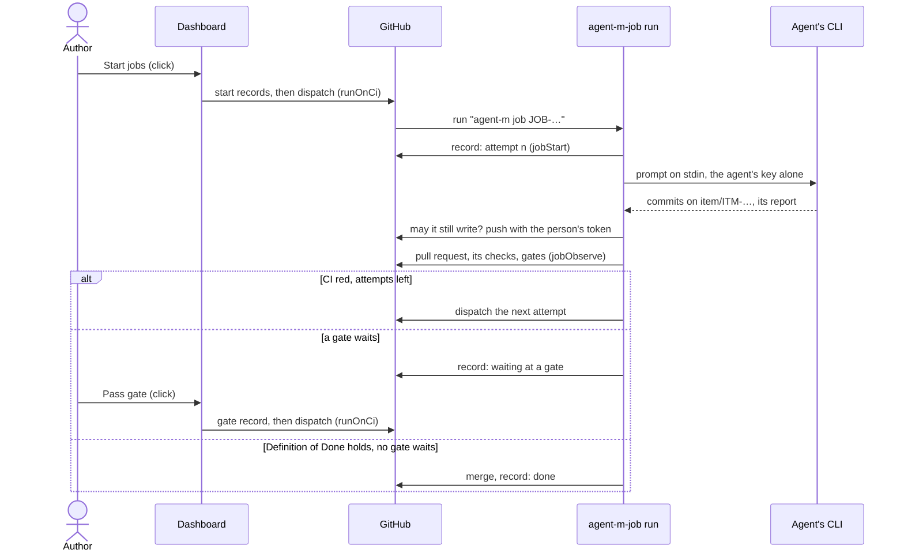

# ARC-029 The job runtimes

## Context

A job runs as pure steps that each runtime performs (ARC-007): a drafting job through the correction loop, an agent's
job — implementing an item or a module (UC-034, UC-024) — from the facts its runtime learns, through
`MOD-job-harness.agentStep`. Its record lies in the product repository and holds every state it enters (ARC-010), whose
consequences leave the executor that carries a job from its start record to its end record — its driver, its correction
loop, its check for a cancel before each commit, the gates it meets before its merge — to the job runtimes. A CI agent
is reached through a workflow of the product (ARC-009); the credentials CI writes with are the person's token and the
agent's key, each in a named CI secret (ARC-015 decision 7). The dashboard records starts, cancels, retries and a
person's gate decisions on a click (ARC-024).

A coding agent's CLI runs without a person in CI. Claude Code runs with `claude -p`, reads the prompt from standard
input — "Non-interactive mode reads stdin", capped at 10 MB —, takes its key from `ANTHROPIC_API_KEY` in its bare mode,
and reports a JSON result that "includes total_cost_usd", which are "client-side estimates"
(`https://code.claude.com/docs/en/headless`, `https://code.claude.com/docs/en/cli-reference`). Codex runs with
`codex exec`: "If you omit the prompt argument, Codex reads the prompt from stdin", `--sandbox workspace-write` allows
its edits, `CODEX_API_KEY` holds the key of a run, and `--json` reports the tokens of each turn
(`https://learn.chatgpt.com/docs/non-interactive-mode`, `https://developers.openai.com/codex/cli/reference`). opencode's
key variables depend on the provider, and whether its JSON reports usage is not documented
(`https://opencode.ai/docs/cli/`).

## Decision

1. **Modules.** `MOD-job-runner`, in the kernel, holds the steps every runtime performs alike: where a participant's job
   runs and with which model (`MOD-job-runner.runtimeOf`) — a CI agent's in CI, a CLI or sandboxed agent's through the
   bridge, a model endpoint's in the browser tab or through the bridge its route names, a person's in none —, which CI
   agent a participant is and the command its CLI runs, what the CLI reported, what an implementation job is given and
   what a later attempt is told, the branches it works on and into, its pull request, the facts of its Definition of
   Done, its next step, which CI jobs a click or the engine dispatches, and the live state of jobs from their runs. The
   CI runtime performs them: the workflows are generated by `MOD-ci-generator`, their steps run in `MOD-ci-entry`
   (ARC-015); the dashboard starts, continues and stops CI jobs on a click (`MOD-main-page.runOnCi`,
   `MOD-main-page.cancelOnCi`, ARC-024). The runtime of the browser tab is designed with the drafting jobs, the bridge's
   with the bridge.
2. **A CI agent names its CLI and runner** in its route: `the workflow agent-m-job: <cli> on GitHub's machines`, or
   `… on the runner <label>` (`MOD-job-runner.ciAgentOf`). Its CLI is `claude` or `codex`; on GitHub's machines its key
   is the CI secret `AGENT_M_AGENT_KEY_<NAME>`, handed to the variable its vendor reads; on a self-hosted runner the CLI
   uses the login it has on that machine and no key is stored.
3. **The job workflow** `.github/workflows/agent-m-job.yml` (`MOD-ci-generator.jobWorkflow`) is dispatched with the job
   and its CI agent and named by the job (`run-name: agent-m job <id>`), so that the dashboard finds the run of each
   job. It has one job per CI agent on that agent's runner. A run starts the job (`MOD-ci-entry.jobStart`): a job that
   ended does nothing, one cancelled before its run ends as cancelled, otherwise its record gains the attempt it starts,
   and the agent's prompt is written. Then the job's branch is started from the branch its work goes into, the agent
   runs its CLI over the prompt on standard input (`MOD-job-runner.agentCommand`) — the only step that holds the agent's
   key —, Agent M asks whether the job may still write (`MOD-ci-entry.mayWrite`) and pushes the agent's commits with the
   person's token as a request header, never in an address, and looks at the pull request until the job's next step is
   decided (`MOD-ci-entry.jobObserve`); where the job belongs to a run, the last step dispatches the engine workflow
   (`MOD-ci-entry.engineDispatch`, ARC-010 decision 5). The agent's step holds no token, Agent M's steps no key, and the
   workflow's own token reads only.
4. **What the agent is given** (`MOD-job-runner.jobInputs`): for an item, the item, the requirements and use cases it
   realises, the tests that guard them and the process requirements of the product's declaration; for a module, the
   decisions that design it and the interfaces of the modules it uses; and the author's instruction. The definition
   tells the agent to commit the tests alone first and to answer with a line beginning `QUESTION:` where the item
   contradicts the specification or leaves a case open, so that the job waits for the author instead of guessing (UC-034
   5b). A later attempt is told the tests that failed on its branch's head, each with what it expects and the excerpts
   of its output from the result records of that commit (`MOD-job-runner.repairPrompt`, ARC-027).
5. **The next step** (`MOD-job-runner.nextStep`, from `MOD-job-harness.agentStep`): a cancel or a CLI that failed before
   committing anything ends the job; the agent's commits are pushed; the pull request is opened with the item, what it
   realises, the issue it came from and the provenance of `MOD-job-harness.commitMessage`
   (`MOD-job-runner.pullRequestOf`); CI is waited for within a wait limit, after which the job fails; a red CI with
   attempts left dispatches the next attempt, up to the rounds of the job's definition; a waiting gate or the agent's
   question ends the run with the job waiting at a gate, and the click that decides the gate dispatches it again; the
   pull request is merged when the Definition of Done holds and no gate waits — by the agent, or by a person where the
   author chose so at the start. Each state is added to the job's record with what the CLI reported it used
   (`MOD-job-runner.agentReport`): Claude Code's cost as it named it, Codex's tokens and no cost.
6. **Branches** (`MOD-job-runner.branchesOf`): a job works on `item/<item>`, or `job/<job>` for a job of no item, and
   its work goes into the branch of the newest sprint that selected its item where that sprint has one, else the branch
   of its phase where the product gives one, else the default branch.
7. **The Definition of Done is checked in CI twice, alike** (`MOD-job-runner.doneFactsOf`,
   `MOD-process-model.doneCheck`): by the job's run before it merges, and by the workflow
   `.github/workflows/agent-m-done.yml`, the check `agent-m done`, on every pull request from a job's branch
   (`MOD-ci-generator.doneWorkflow`, `MOD-ci-entry.doneCheck`), so that a branch protection may require it of every
   merge, a person's too. Its facts come from the pull request's commits in the order of their parents, the files each
   changed and CI's conclusion on each (`MOD-git-host.pullRequestCommits`, `MOD-git-host.commitFiles`,
   `MOD-git-host.checks`). The conditions that say a gate waits are left to the gates of the next step. A condition a
   person confirms is confirmed by the person who merges: where the product declares one, a person merges.
8. **Which CI jobs a click or the engine dispatches** (`MOD-job-runner.dispatchPlan`): of the jobs it names — started,
   retried, or waiting at the gate a person decided —, those of CI agents queued or waiting, not cancelled, and with no
   run of their own going. The job workflow carries out implementation and refactoring jobs only: a job of another kind
   — a CI job or a test battery, of a run or alone — is not started, nor a job on a self-hosted runner of a repository
   that is not private; each is named with the reason, and its record ends as failed. No carried step hands those kinds
   to the job workflow: UC-027's steps open the workflow's pull request from the tests page, and UC-026's jobs are
   designed with that use case.
9. **A job's live state** is read from the runs of the job workflow, each named by its job (`MOD-job-runner.liveOf`):
   queued or running while its newest run has not completed, stopped when that run was cancelled, as its record says
   when it waits for its dispatch or its gate, and otherwise unknown to the runtime — ended without record
   (`MOD-run-engine.jobState`).



## Alternatives

- **The agent pushes and opens its pull request itself** — rejected: Agent M could not check for a cancel before every
  write (`A CANCELLED JOB WRITES NOTHING MORE`), and the agent's step would hold the person's token.
- **The vendors' GitHub Actions for their agents** — not chosen for now: each pushes and comments on its own terms, and
  Agent M's steps would no longer decide every write; Codex's documentation advises its action for handling the key
  (`https://learn.chatgpt.com/docs/non-interactive-mode`), which is why the key's exposure is measured (Consequences).
- **The Definition of Done as a commit status** — rejected: posting one needs a permission that
  `ONE GITHUB TOKEN SERVES EVERY FEATURE` does not list, and check runs need a GitHub App.
- **The Definition of Done as a job of the tests workflow** — rejected: its failure would read as a red test and start a
  repair.
- **Waiting for a person's gate inside the run** — rejected: a gate may wait for days, and a run's time is limited and
  paid for; the run ends, and the click that decides the gate dispatches the job again.
- **The prompt as a command-line argument** — not chosen: a long prompt meets the limit of one argument; standard input
  has none that a prompt reaches.
- **opencode as a CI agent** — not offered: its key variables depend on the provider, and its JSON is not documented to
  report usage (`NO COST IS GUESSED`); through the bridge it runs with the person's own login.

## Consequences

- The job workflow, the engine workflow and the check of the Definition of Done are generated files: they reach the default branch through a
  pull request with green CI, as the tests' workflow does (ARC-015), and are generated again when the instance's CI
  agents change.
- The settings page names the secrets the job workflow reads (`MOD-ci-generator.jobSecrets`) and recommends a branch
  protection that requires the check `agent-m done`.
- **Not realised here — what needs the bridge as well.** UC-034's actors reach a CLI or sandboxed coding agent through
  the bridge, and UC-036's runtimes include it; the bridge performs the same steps of `MOD-job-runner` with the agent's
  own login. The steps a coding agent carries out or that act on its job (UC-034 4, 5, 5.1, 5.2, 5.3, 6, 7, 8, 1a, 4a,
  5a, 5b, 6a, 6b, 7a, 8a), and those that continue, cancel or retry a job at its runtime (UC-036 5, 6, 7, 6a), are
  carried once it is designed.
- **Not realised here — what reads every runtime.** The list of jobs and a job's detail, with their live states, logs
  and usage (UC-035 1, 1b; UC-036 1, 4, 1a, 1b, 1c, 4a, 4b), read the bridge's job list, the jobs of a browser tab,
  designed with the drafting jobs, and a GitLab product's pipelines, designed with its CI files; the log of a CI run
  waits for open measurement 2.
- **Not realised here — what neither runtime has yet:** the job of an agent that decides a gate (UC-034 7, UC-036 5);
  the author's answer to a job's question (UC-034 5a) and an agent's proposal of a specification change (UC-034 5b);
  closing an item's issue with a link (UC-034 8, UC-033 6); rebasing a later push onto the branch its work goes into,
  and stopping on a conflict (UC-034 6b); flagging a commit written after a cancel, and offering its revert (UC-036 6a).
- **Not realised here — what comes with other jobs and with runs.** Items drafted by a participant (UC-032 2, 3, 3a) and
  a job against a model endpoint in GitHub Actions (UC-010) come with the drafting jobs; an agent as Product Owner
  (UC-032 1c) with a job of that kind, whose inputs `MOD-job-runner.jobInputs` does not give. A run over a selection
  (UC-043 5, 6, 8, 6a, 6b, 6c, 6d) has its engine (ARC-010 decisions 5 and 9) and its dashboard (ARC-024): the first
  jobs on the click, the run's view — which carries UC-043 7 —, **Stop run** and **Continue**. It needs the bridge and
  the browser tab as well, whose participants its jobs may go to — the bridge also ends the jobs a stop cancels there,
  takes the steps of a run on a product without its engine workflow, and takes the step after a job that ran there, the
  one that completes the run's record once its last job ended there (UC-043 8) —, and the jobs of the CI configuration
  and the test battery (UC-027, UC-026), which the job workflow does not carry out. The close of a sprint by an agent,
  which starts by itself (UC-041 1a, `MOD-run-engine.closeDue`), comes with its job and with a run of the engine when a
  time box ends, which no dispatch marks; a module's or a test battery's job started alone (UC-043 1c) with their starts
  (UC-024, UC-026).
- A GitLab product's job pipeline, its engine and its check of the Definition of Done are designed with the layout of
  Agent M's CI files beside a product's own `.gitlab-ci.yml` (ARC-028).
- **Open measurement 1 — the key in the agent's commands.** The agent's key is in the environment of the agent's step,
  and the commands the agent runs — the product's tests among them — may inherit it; whether each CLI passes it on is
  not documented in what was read. Measurement: a test that prints the variables it sees, run by each CLI on GitHub's
  machines. Until it is recorded, the settings page says that a CI agent on GitHub's machines runs the product's code
  with its key in reach.
- **Open measurement 2 — logs in the dashboard.** A job's log is downloaded through a redirect that "expires after 1
  minute", and the documentation says nothing about calls from a web page
  (`https://docs.github.com/en/rest/actions/workflow-jobs`); until measured, the dashboard links each run's page.
- Claude Code's cost is its own estimate; the record and the dashboard show it as the CLI reported it, named so.

## Modules

### MOD-job-runner

```json module
{
  "id": "MOD-job-runner",
  "folder": "src/job-runner/",
  "layer": "kernel",
  "responsibility": "The steps of a job that every runtime performs alike: where a participant's job runs, which CI agent a participant is and the command its CLI runs, what the CLI reported it used, what an implementation job is given and what a later attempt is told, the branches it works on and into, its pull request, the facts its Definition of Done is checked on, its next step, which CI jobs a click dispatches, and the live state of jobs from their runs; it reads and writes nothing.",
  "realises": ["A SELF-HOSTED RUNNER SERVES AGENT M ONLY FROM A PRIVATE REPOSITORY", "A CANCELLED JOB WRITES NOTHING MORE", "A PULL REQUEST IS MERGED ONLY WHEN THE DEFINITION OF DONE HOLDS", "AN IMPLEMENTATION JOB BEGINS WITH A FAILING TEST", "A JOB STOPS AT EVERY GATE", "NO COST IS GUESSED", "WORK MERGES INTO THE DEFAULT BRANCH UNLESS A BRANCH IS SET", "PROGRESS AND JOB STATE ARE DERIVED, NOT STORED"],
  "owns": ["CiAgent", "JobRuntime", "AgentFiles", "AgentReport", "JobItem", "RequirementText", "IdText", "JobInputsInput", "PullItem", "PullItemOrNone", "PullRequestText", "JobBranches", "DoneFactsInput", "StepInput", "JobStep", "DispatchInput", "JobDispatch", "JobRefusal", "DispatchPlan"],
  "uses": ["MOD-contracts", "MOD-job-harness"]
}
```

```json interface
{
  "id": "MOD-job-runner.ciAgentOf",
  "summary": "A participant as a CI agent: its route names its CLI — claude or codex — and its runner, GitHub's machines or a self-hosted runner by its label; its key is the CI secret AGENT_M_AGENT_KEY_<NAME>, handed to the CLI in the variable its vendor reads.",
  "params": [{ "name": "participant", "type": "Participant" }],
  "result": "CiAgent",
  "async": false,
  "refusals": [
    { "code": "not-a-ci-agent", "when": "the participant is of another type" },
    { "code": "no-route", "when": "the route is not \"the workflow agent-m-job: <cli> on GitHub's machines\" or \"… on the runner <label>\"" },
    { "code": "unknown-cli", "when": "the CLI is neither claude nor codex" },
    { "code": "no-model", "when": "the participant names no model its CLI can be started with" }
  ],
  "examples": [
    {
      "name": "Claude Code on GitHub's machines",
      "input": {
        "participant": {
          "name": "ci-dev",
          "type": "CI agent",
          "model": "claude-opus-5-5",
          "context": 200000,
          "price": null,
          "capabilities": ["read the repository", "write to the repository", "run code and tests"],
          "place": "GitHub's machines, a provider in the USA",
          "route": "the workflow agent-m-job: claude on GitHub's machines",
          "line": 6
        }
      },
      "result": { "name": "ci-dev", "cli": "claude", "model": "claude-opus-5-5", "runner": "", "secret": "AGENT_M_AGENT_KEY_CI_DEV", "keyVariable": "ANTHROPIC_API_KEY" }
    },
    {
      "name": "Codex on a self-hosted runner",
      "input": {
        "participant": {
          "name": "gpu-dev",
          "type": "CI agent",
          "model": "codex-model",
          "context": null,
          "price": null,
          "capabilities": ["read the repository", "write to the repository", "run code and tests"],
          "place": "the lab's GPU server, Erlangen",
          "route": "the workflow agent-m-job: codex on the runner gpu-1",
          "line": 7
        }
      },
      "result": { "name": "gpu-dev", "cli": "codex", "model": "codex-model", "runner": "gpu-1", "secret": "AGENT_M_AGENT_KEY_GPU_DEV", "keyVariable": "CODEX_API_KEY" }
    },
    {
      "name": "a CLI agent",
      "input": {
        "participant": {
          "name": "cli-dev",
          "type": "CLI agent",
          "model": "claude-opus-5-5",
          "context": null,
          "price": null,
          "capabilities": ["read the repository", "write to the repository", "run code and tests"],
          "place": "this machine",
          "route": "the bridge on the Mac of `alice`",
          "line": 8
        }
      },
      "refused": "not-a-ci-agent"
    },
    {
      "name": "a route naming no CLI",
      "input": {
        "participant": {
          "name": "ci-dev",
          "type": "CI agent",
          "model": "claude-opus-5-5",
          "context": 200000,
          "price": null,
          "capabilities": ["read the repository", "write to the repository", "run code and tests"],
          "place": "GitHub's machines, a provider in the USA",
          "route": "the workflow agent-m-job",
          "line": 6
        }
      },
      "refused": "no-route"
    }
  ]
}
```

```json interface
{
  "id": "MOD-job-runner.runtimeOf",
  "summary": "Where a participant's job runs, and with which model: a CI agent's in CI, a CLI or sandboxed agent's through the bridge, a model endpoint's in the browser tab — or through the bridge where its route is a bridge's; a person's work is no job a runtime carries out.",
  "params": [{ "name": "participant", "type": "Participant" }],
  "result": "JobRuntime",
  "async": false,
  "refusals": [
    { "code": "a-person", "when": "the participant is a person" },
    { "code": "unknown-type", "when": "the participant is of no type a job runs for" }
  ],
  "examples": [
    {
      "name": "a CI agent",
      "input": {
        "participant": {
          "name": "ci-dev",
          "type": "CI agent",
          "model": "claude-opus-5-5",
          "context": 200000,
          "price": null,
          "capabilities": ["read the repository", "write to the repository", "run code and tests"],
          "place": "GitHub's machines, a provider in the USA",
          "route": "the workflow agent-m-job: claude on GitHub's machines",
          "line": 6
        }
      },
      "result": { "runtime": "ci", "model": "claude-opus-5-5" }
    },
    {
      "name": "a CLI agent",
      "input": {
        "participant": {
          "name": "cli-dev",
          "type": "CLI agent",
          "model": "claude-opus-5-5",
          "context": null,
          "price": null,
          "capabilities": ["read the repository", "write to the repository", "run code and tests"],
          "place": "this machine",
          "route": "the bridge on the Mac of `alice`",
          "line": 8
        }
      },
      "result": { "runtime": "bridge", "model": "claude-opus-5-5" }
    },
    {
      "name": "a model endpoint of this browser",
      "input": {
        "participant": {
          "name": "hub-writer",
          "type": "model endpoint",
          "model": "llama-3.3-70b",
          "context": null,
          "price": null,
          "capabilities": ["draft text"],
          "place": "NHR@FAU, Erlangen",
          "route": "the endpoint hub of this browser",
          "line": 6
        }
      },
      "result": { "runtime": "browser", "model": "llama-3.3-70b" }
    },
    {
      "name": "a model server through the bridge",
      "input": {
        "participant": {
          "name": "lab-llm",
          "type": "model endpoint",
          "model": "qwen3-32b",
          "context": null,
          "price": null,
          "capabilities": ["draft text"],
          "place": "the lab's GPU server, Erlangen",
          "route": "the bridge on the lab's GPU server",
          "line": 6
        }
      },
      "result": { "runtime": "bridge", "model": "qwen3-32b" }
    },
    {
      "name": "a person",
      "input": {
        "participant": {
          "name": "alice",
          "type": "person",
          "model": "",
          "context": null,
          "price": null,
          "capabilities": ["draft text", "read the repository", "write to the repository"],
          "place": "",
          "route": "the GitHub account `alice`",
          "line": 5
        }
      },
      "refused": "a-person"
    }
  ]
}
```

```json interface
{
  "id": "MOD-job-runner.agentCommand",
  "summary": "The CLI's non-interactive command over a prompt file, its report written to a file: the prompt goes in on standard input, so that its length meets no limit of one command-line argument; edits and commands are allowed in the working tree, and nothing waits for a permission prompt.",
  "params": [{ "name": "agent", "type": "CiAgent" }, { "name": "files", "type": "AgentFiles" }],
  "result": "string",
  "async": false,
  "refusals": [],
  "examples": [
    {
      "name": "Claude Code",
      "input": {
        "agent": { "name": "ci-dev", "cli": "claude", "model": "claude-opus-5-5", "runner": "", "secret": "AGENT_M_AGENT_KEY_CI_DEV", "keyVariable": "ANTHROPIC_API_KEY" },
        "files": { "prompt": "$AGENT_M_OUT/prompt.md", "report": "$AGENT_M_OUT/report.json" }
      },
      "result": "claude --bare -p \"Carry out the task the input describes.\" --model 'claude-opus-5-5' --permission-mode acceptEdits --allowedTools Bash --permission-prompts none --output-format json < \"$AGENT_M_OUT/prompt.md\" > \"$AGENT_M_OUT/report.json\""
    },
    {
      "name": "Codex",
      "input": {
        "agent": { "name": "gpu-dev", "cli": "codex", "model": "codex-model", "runner": "gpu-1", "secret": "AGENT_M_AGENT_KEY_GPU_DEV", "keyVariable": "CODEX_API_KEY" },
        "files": { "prompt": "$AGENT_M_OUT/prompt.md", "report": "$AGENT_M_OUT/report.json" }
      },
      "result": "codex exec --model 'codex-model' --sandbox workspace-write --json - < \"$AGENT_M_OUT/prompt.md\" > \"$AGENT_M_OUT/report.json\""
    }
  ]
}
```

```json interface
{
  "id": "MOD-job-runner.agentReport",
  "summary": "What the CLI reported it used and whether it failed: Claude Code's JSON result names its cost in US dollars and its tokens; Codex's JSON lines name the tokens of each completed turn and no cost; a report that cannot be read gives no cost and no tokens — no cost is guessed.",
  "params": [{ "name": "cli", "type": "string" }, { "name": "text", "type": "string" }],
  "result": "AgentReport",
  "async": false,
  "refusals": [],
  "examples": [
    {
      "name": "Claude Code's result",
      "input": { "cli": "claude", "text": "{\"type\":\"result\",\"subtype\":\"success\",\"is_error\":false,\"duration_ms\":412000,\"num_turns\":38,\"result\":\"The tests of ITM-014 and the export of the figures are committed.\",\"session_id\":\"6c1f0e2a-41d2-4d8e-9a57-3f8b1c2d0e4f\",\"total_cost_usd\":1.8432,\"usage\":{\"input_tokens\":182344,\"output_tokens\":12850}}" },
      "result": {
        "cost": { "amount": 1.84, "currency": "USD" },
        "usage": { "inputTokens": 182344, "outputTokens": 12850, "minutes": null },
        "failed": false,
        "note": ""
      }
    },
    {
      "name": "Codex's events",
      "input": { "cli": "codex", "text": "{\"type\":\"thread.started\",\"thread_id\":\"0199a213-81c0-7800-8aa1-bbab2a035a53\"}\n{\"type\":\"turn.started\"}\n{\"type\":\"item.completed\",\"item\":{\"id\":\"item_3\",\"type\":\"agent_message\",\"text\":\"The export is implemented; its tests pass.\"}}\n{\"type\":\"turn.completed\",\"usage\":{\"input_tokens\":24763,\"cached_input_tokens\":24448,\"output_tokens\":122}}\n" },
      "result": {
        "cost": null,
        "usage": { "inputTokens": 24763, "outputTokens": 122, "minutes": null },
        "failed": false,
        "note": ""
      }
    },
    {
      "name": "a CLI that wrote no JSON",
      "input": { "cli": "claude", "text": "Error: Invalid API key\n" },
      "result": {
        "cost": null,
        "usage": { "inputTokens": null, "outputTokens": null, "minutes": null },
        "failed": true,
        "note": "the CLI wrote no JSON result"
      }
    }
  ]
}
```

```json interface
{
  "id": "MOD-job-runner.jobInputs",
  "summary": "The inputs of an implementation job, each part with its name as heading: an item's job (UC-034 3) the item, the requirements and use cases it realises, the tests that guard them and the process requirements of the product; a module's job (UC-024) the decisions that design the module and the interfaces of the modules it uses; and the author's instruction.",
  "params": [{ "name": "input", "type": "JobInputsInput" }],
  "result": "PromptInputs",
  "async": false,
  "refusals": [
    { "code": "no-item", "when": "an item's job is given no item" },
    { "code": "missing-text", "when": "a name the item realises has no text" },
    { "code": "no-decision", "when": "a module's job is given no decision" },
    { "code": "unknown-kind", "when": "the kind is neither implement-item nor implement-module" }
  ],
  "examples": [
    {
      "name": "ITM-014",
      "input": {
        "input": {
          "kind": "implement-item",
          "item": {
            "id": "ITM-014",
            "title": "Export a chapter as PDF",
            "realises": ["A CHAPTER IS EXPORTED", "UC-003"],
            "text": "---\nid: ITM-014\ntitle: Export a chapter as PDF\nkind: implementation\nrealises:\n  - A CHAPTER IS EXPORTED\n  - UC-003\nmodules:\n  - MOD-export\norigin:\n  - ISS-007\n---\n\n# ITM-014 Export a chapter as PDF\n\n**REGISTER**\n\n## Outcome\n\nAn accepted chapter is exported as a PDF with its figures.\n\n## Acceptance criteria\n\n- the PDF holds every figure of the chapter\n- the PDF is named after the chapter\n",
            "issue": "ISS-007"
          },
          "texts": { "A CHAPTER IS EXPORTED": "**A CHAPTER IS EXPORTED** *(PO A. Maier)*\nA chapter is exported as a PDF with its figures.\n*Check:* `tests/export.test.mjs`", "UC-003": "---\nid: UC-003\ntitle: Export a chapter\narea: writing\nactors:\n  - Author\nrealises:\n  - A CHAPTER IS EXPORTED\n---\n# UC-003 Export a chapter\n\n## Actors\n\n- **Author** — writes.\n\n## Precondition\n\n- The repository exists.\n\n## Main flow\n\n1. The author presses **Export**.\n\n## Alternative flows\n\n- **1a. No token.** GitHub's page opens.\n\n## Postcondition\n\n- The chapter is saved.\n" },
          "tests": [
            { "path": "tests/export.test.mjs", "text": "// The export of a chapter.\n//\n// Module: MOD-export\n// Guards: A CHAPTER IS EXPORTED; UC-003\n// Level: system\nimport { test } from \"node:test\";\n\n// TST-014 the PDF keeps the figures\n// Given: a chapter with two figures\n// When: the author exports it as PDF\n// Then: the PDF holds both figures\ntest(\"TST-014 the PDF keeps the figures\", () => {});\n\n// TST-015 the PDF names the chapter\n// Given: a chapter titled Methods\n// When: the author exports it as PDF\n// Then: the PDF's title is Methods\ntest(\"TST-015 the PDF names the chapter\", () => {});\n\n// TST-016 the summary of an export reads as the chapter\n// Given: a chapter of four pages\n// When: the model summarises the exported PDF\n// Then: the summary names the chapter's three findings\n// Runs: 20\n// Paid: hub\ntest(\"TST-016 the summary of an export reads as the chapter\", () => {});\n" }
          ],
          "processRequirements": [
            { "name": "UNIT VERIFICATION IS DOCUMENTED", "text": "**UNIT VERIFICATION IS DOCUMENTED** *(IEC 62304, 5.5.5)*\nEvery unit's verification is recorded.\n*Check:* `tests/test_unit_records.py`" }
          ],
          "instruction": "",
          "decisions": [],
          "interfaces": []
        }
      },
      "result": { "item": "### ITM-014\n\n---\nid: ITM-014\ntitle: Export a chapter as PDF\nkind: implementation\nrealises:\n  - A CHAPTER IS EXPORTED\n  - UC-003\nmodules:\n  - MOD-export\norigin:\n  - ISS-007\n---\n\n# ITM-014 Export a chapter as PDF\n\n**REGISTER**\n\n## Outcome\n\nAn accepted chapter is exported as a PDF with its figures.\n\n## Acceptance criteria\n\n- the PDF holds every figure of the chapter\n- the PDF is named after the chapter\n", "realises": "### A CHAPTER IS EXPORTED\n\n**A CHAPTER IS EXPORTED** *(PO A. Maier)*\nA chapter is exported as a PDF with its figures.\n*Check:* `tests/export.test.mjs`\n\n### UC-003\n\n---\nid: UC-003\ntitle: Export a chapter\narea: writing\nactors:\n  - Author\nrealises:\n  - A CHAPTER IS EXPORTED\n---\n# UC-003 Export a chapter\n\n## Actors\n\n- **Author** — writes.\n\n## Precondition\n\n- The repository exists.\n\n## Main flow\n\n1. The author presses **Export**.\n\n## Alternative flows\n\n- **1a. No token.** GitHub's page opens.\n\n## Postcondition\n\n- The chapter is saved.\n", "tests": "### tests/export.test.mjs\n\n// The export of a chapter.\n//\n// Module: MOD-export\n// Guards: A CHAPTER IS EXPORTED; UC-003\n// Level: system\nimport { test } from \"node:test\";\n\n// TST-014 the PDF keeps the figures\n// Given: a chapter with two figures\n// When: the author exports it as PDF\n// Then: the PDF holds both figures\ntest(\"TST-014 the PDF keeps the figures\", () => {});\n\n// TST-015 the PDF names the chapter\n// Given: a chapter titled Methods\n// When: the author exports it as PDF\n// Then: the PDF's title is Methods\ntest(\"TST-015 the PDF names the chapter\", () => {});\n\n// TST-016 the summary of an export reads as the chapter\n// Given: a chapter of four pages\n// When: the model summarises the exported PDF\n// Then: the summary names the chapter's three findings\n// Runs: 20\n// Paid: hub\ntest(\"TST-016 the summary of an export reads as the chapter\", () => {});\n", "process": "### UNIT VERIFICATION IS DOCUMENTED\n\n**UNIT VERIFICATION IS DOCUMENTED** *(IEC 62304, 5.5.5)*\nEvery unit's verification is recorded.\n*Check:* `tests/test_unit_records.py`\n", "instruction": "" }
    },
    {
      "name": "a use case not read",
      "input": {
        "input": {
          "kind": "implement-item",
          "item": {
            "id": "ITM-014",
            "title": "Export a chapter as PDF",
            "realises": ["A CHAPTER IS EXPORTED", "UC-003"],
            "text": "---\nid: ITM-014\ntitle: Export a chapter as PDF\nkind: implementation\nrealises:\n  - A CHAPTER IS EXPORTED\n  - UC-003\nmodules:\n  - MOD-export\norigin:\n  - ISS-007\n---\n\n# ITM-014 Export a chapter as PDF\n\n**REGISTER**\n\n## Outcome\n\nAn accepted chapter is exported as a PDF with its figures.\n\n## Acceptance criteria\n\n- the PDF holds every figure of the chapter\n- the PDF is named after the chapter\n",
            "issue": "ISS-007"
          },
          "texts": { "A CHAPTER IS EXPORTED": "**A CHAPTER IS EXPORTED** *(PO A. Maier)*\nA chapter is exported as a PDF with its figures.\n*Check:* `tests/export.test.mjs`" },
          "tests": [],
          "processRequirements": [],
          "instruction": "",
          "decisions": [],
          "interfaces": []
        }
      },
      "refused": "missing-text"
    }
  ]
}
```

```json interface
{
  "id": "MOD-job-runner.repairPrompt",
  "summary": "The prompt of a later attempt: the task as first given, and the tests that failed or flipped on the pull request's head, each with what it expects and the excerpts of its output from the result records of that commit.",
  "params": [{ "name": "task", "type": "string" }, { "name": "outcomes", "type": "CommitOutcomes" }],
  "result": "string",
  "async": false,
  "refusals": [{ "code": "nothing-failed", "when": "no test failed or flipped on the commit" }],
  "examples": [
    {
      "name": "TST-015 red on the head",
      "input": {
        "task": "Implement ITM-014, test first.\n",
        "outcomes": {
          "commit": "d200000000000000000000000000000000000000",
          "levels": [
            {
              "level": "unit",
              "runs": [],
              "tests": 0,
              "passed": 0,
              "failed": 0,
              "flaky": 0,
              "skipped": 0,
              "rates": 0,
              "worse": 0,
              "notRun": 0
            },
            {
              "level": "component",
              "runs": [],
              "tests": 0,
              "passed": 0,
              "failed": 0,
              "flaky": 0,
              "skipped": 0,
              "rates": 0,
              "worse": 0,
              "notRun": 0
            },
            {
              "level": "system",
              "runs": [
                { "record": "results/d200000000000000000000000000000000000000/gh-4801-1-system.md", "participant": "GitHub Actions, runner GitHub Actions 7", "at": "2026-10-12T09:20:00Z", "log": "https://github.com/alice/thesis/actions/runs/4801", "outcome": "failed", "note": "" }
              ],
              "tests": 3,
              "passed": 1,
              "failed": 1,
              "flaky": 0,
              "skipped": 0,
              "rates": 0,
              "worse": 0,
              "notRun": 1
            },
            {
              "level": "release",
              "runs": [],
              "tests": 0,
              "passed": 0,
              "failed": 0,
              "flaky": 0,
              "skipped": 0,
              "rates": 0,
              "worse": 0,
              "notRun": 0
            },
            {
              "level": "user",
              "runs": [],
              "tests": 0,
              "passed": 0,
              "failed": 0,
              "flaky": 0,
              "skipped": 0,
              "rates": 0,
              "worse": 0,
              "notRun": 0
            }
          ],
          "tests": [
            {
              "test": "TST-014",
              "title": "the PDF keeps the figures",
              "level": "system",
              "guards": ["A CHAPTER IS EXPORTED", "UC-003"],
              "then": "the PDF holds both figures",
              "fixed": 0,
              "outcome": "passed",
              "runs": 1,
              "passed": 1,
              "previous": null,
              "worse": false,
              "evidence": [
                { "record": "results/d200000000000000000000000000000000000000/gh-4801-1-system.md", "participant": "GitHub Actions, runner GitHub Actions 7", "at": "2026-10-12T09:20:00Z", "log": "https://github.com/alice/thesis/actions/runs/4801", "outcome": "passed", "runs": 1, "passed": 1, "note": "", "excerpt": "" }
              ]
            },
            {
              "test": "TST-015",
              "title": "the PDF names the chapter",
              "level": "system",
              "guards": ["A CHAPTER IS EXPORTED", "UC-003"],
              "then": "the PDF's title is Methods",
              "fixed": 0,
              "outcome": "failed",
              "runs": 1,
              "passed": 0,
              "previous": null,
              "worse": false,
              "evidence": [
                { "record": "results/d200000000000000000000000000000000000000/gh-4801-1-system.md", "participant": "GitHub Actions, runner GitHub Actions 7", "at": "2026-10-12T09:20:00Z", "log": "https://github.com/alice/thesis/actions/runs/4801", "outcome": "failed", "runs": 1, "passed": 0, "note": "expected \"Methods\", got \"chapter-2\"", "excerpt": "AssertionError: expected \"Methods\", got \"chapter-2\"\n    at tests/export.test.mjs:18:3" }
              ]
            },
            {
              "test": "TST-016",
              "title": "the summary of an export reads as the chapter",
              "level": "system",
              "guards": ["A CHAPTER IS EXPORTED", "UC-003"],
              "then": "the summary names the chapter's three findings",
              "fixed": 20,
              "outcome": "not-run",
              "runs": 0,
              "passed": 0,
              "previous": null,
              "worse": false,
              "evidence": []
            }
          ],
          "uncounted": [],
          "undeclared": []
        }
      },
      "result": "Implement ITM-014, test first.\n\n## CI failed on your pull request\n\nThese tests failed on d20000000000; make them pass without changing what they expect:\n\n- TST-015 (system): expected the PDF's title is Methods\n  AssertionError: expected \"Methods\", got \"chapter-2\"\n      at tests/export.test.mjs:18:3\n"
    },
    {
      "name": "nothing failed",
      "input": {
        "task": "Implement ITM-014, test first.\n",
        "outcomes": {
          "commit": "d200000000000000000000000000000000000000",
          "levels": [
            {
              "level": "unit",
              "runs": [],
              "tests": 0,
              "passed": 0,
              "failed": 0,
              "flaky": 0,
              "skipped": 0,
              "rates": 0,
              "worse": 0,
              "notRun": 0
            },
            {
              "level": "component",
              "runs": [],
              "tests": 0,
              "passed": 0,
              "failed": 0,
              "flaky": 0,
              "skipped": 0,
              "rates": 0,
              "worse": 0,
              "notRun": 0
            },
            {
              "level": "system",
              "runs": [],
              "tests": 3,
              "passed": 0,
              "failed": 0,
              "flaky": 0,
              "skipped": 0,
              "rates": 0,
              "worse": 0,
              "notRun": 3
            },
            {
              "level": "release",
              "runs": [],
              "tests": 0,
              "passed": 0,
              "failed": 0,
              "flaky": 0,
              "skipped": 0,
              "rates": 0,
              "worse": 0,
              "notRun": 0
            },
            {
              "level": "user",
              "runs": [],
              "tests": 0,
              "passed": 0,
              "failed": 0,
              "flaky": 0,
              "skipped": 0,
              "rates": 0,
              "worse": 0,
              "notRun": 0
            }
          ],
          "tests": [
            {
              "test": "TST-014",
              "title": "the PDF keeps the figures",
              "level": "system",
              "guards": ["A CHAPTER IS EXPORTED", "UC-003"],
              "then": "the PDF holds both figures",
              "fixed": 0,
              "outcome": "not-run",
              "runs": 0,
              "passed": 0,
              "previous": null,
              "worse": false,
              "evidence": []
            },
            {
              "test": "TST-015",
              "title": "the PDF names the chapter",
              "level": "system",
              "guards": ["A CHAPTER IS EXPORTED", "UC-003"],
              "then": "the PDF's title is Methods",
              "fixed": 0,
              "outcome": "not-run",
              "runs": 0,
              "passed": 0,
              "previous": null,
              "worse": false,
              "evidence": []
            },
            {
              "test": "TST-016",
              "title": "the summary of an export reads as the chapter",
              "level": "system",
              "guards": ["A CHAPTER IS EXPORTED", "UC-003"],
              "then": "the summary names the chapter's three findings",
              "fixed": 20,
              "outcome": "not-run",
              "runs": 0,
              "passed": 0,
              "previous": null,
              "worse": false,
              "evidence": []
            }
          ],
          "uncounted": [],
          "undeclared": []
        }
      },
      "refused": "nothing-failed"
    }
  ]
}
```

```json interface
{
  "id": "MOD-job-runner.pullRequestOf",
  "summary": "The pull request of a job: titled by its item — or by the job, its kind and modules —, naming what it realises and the issue an item came from, with its provenance as MOD-job-harness.commitMessage writes it: the job, participant, model, Agent M version and rounds.",
  "params": [
    { "name": "record", "type": "JobRecord" },
    { "name": "item", "type": "PullItemOrNone" },
    { "name": "at", "type": "string" }
  ],
  "result": "PullRequestText",
  "async": false,
  "refusals": [],
  "examples": [
    {
      "name": "ITM-014",
      "input": {
        "record": {
          "id": "JOB-20261012-0800-9a9a",
          "path": "docs/jobs/JOB-20261012-0800-9a9a.md",
          "kind": "implement",
          "phase": "Doing",
          "role": "Developers",
          "participant": "ci-dev",
          "runtime": "ci",
          "run": "",
          "slot": "",
          "item": "ITM-014",
          "modules": ["MOD-export"],
          "inputs": [],
          "retryOf": "",
          "agentM": "2026.10.1",
          "model": "claude-opus-5-5",
          "log": "",
          "selection": [],
          "limits": null,
          "assignments": [],
          "states": [
            { "at": "2026-10-12T08:00:00Z", "state": "queued", "note": "" },
            { "at": "2026-10-12T08:03:00Z", "state": "running", "note": "attempt 1 on ci-dev" }
          ],
          "results": [],
          "rounds": 0,
          "cost": null,
          "usage": null,
          "jobs": []
        },
        "item": {
          "id": "ITM-014",
          "title": "Export a chapter as PDF",
          "realises": ["A CHAPTER IS EXPORTED", "UC-003"],
          "issue": "ISS-007"
        },
        "at": "2026-10-12T09:50:00Z"
      },
      "result": { "title": "ITM-014: Export a chapter as PDF", "body": "Realises: A CHAPTER IS EXPORTED, UC-003\nCloses the issue ISS-007\nStarted: 2026-10-12T09:50:00Z\n\nJob: JOB-20261012-0800-9a9a\nParticipant: ci-dev\nModel: claude-opus-5-5\nAgent-M: 2026.10.1\nRounds: 0\n" }
    }
  ]
}
```

```json interface
{
  "id": "MOD-job-runner.branchesOf",
  "summary": "The job's own branch — item/<item>, or job/<job> — and the branch its work goes into and starts from: the branch of the newest sprint that selected its item, where that sprint has one; else the branch of its phase, where the product gives it one; else the default branch.",
  "params": [
    { "name": "record", "type": "JobRecord" },
    { "name": "branches", "type": "Branch[]" },
    { "name": "sprints", "type": "Sprint[]" },
    { "name": "defaultBranch", "type": "string" }
  ],
  "result": "JobBranches",
  "async": false,
  "refusals": [],
  "examples": [
    {
      "name": "an item of no sprint with a branch",
      "input": {
        "record": {
          "id": "JOB-20261012-0800-9a9a",
          "path": "docs/jobs/JOB-20261012-0800-9a9a.md",
          "kind": "implement",
          "phase": "Doing",
          "role": "Developers",
          "participant": "ci-dev",
          "runtime": "ci",
          "run": "",
          "slot": "",
          "item": "ITM-014",
          "modules": ["MOD-export"],
          "inputs": [],
          "retryOf": "",
          "agentM": "2026.10.1",
          "model": "claude-opus-5-5",
          "log": "",
          "selection": [],
          "limits": null,
          "assignments": [],
          "states": [
            { "at": "2026-10-12T08:00:00Z", "state": "queued", "note": "" },
            { "at": "2026-10-12T08:03:00Z", "state": "running", "note": "attempt 1 on ci-dev" }
          ],
          "results": [],
          "rounds": 0,
          "cost": null,
          "usage": null,
          "jobs": []
        },
        "branches": [],
        "sprints": [],
        "defaultBranch": "main"
      },
      "result": { "branch": "item/ITM-014", "base": "main" }
    },
    {
      "name": "an item of a sprint with its branch",
      "input": {
        "record": {
          "id": "JOB-20261012-0800-9a9a",
          "path": "docs/jobs/JOB-20261012-0800-9a9a.md",
          "kind": "implement",
          "phase": "Doing",
          "role": "Developers",
          "participant": "ci-dev",
          "runtime": "ci",
          "run": "",
          "slot": "",
          "item": "ITM-014",
          "modules": ["MOD-export"],
          "inputs": [],
          "retryOf": "",
          "agentM": "2026.10.1",
          "model": "claude-opus-5-5",
          "log": "",
          "selection": [],
          "limits": null,
          "assignments": [],
          "states": [
            { "at": "2026-10-12T08:00:00Z", "state": "queued", "note": "" },
            { "at": "2026-10-12T08:03:00Z", "state": "running", "note": "attempt 1 on ci-dev" }
          ],
          "results": [],
          "rounds": 0,
          "cost": null,
          "usage": null,
          "jobs": []
        },
        "branches": [{ "phase": "Doing", "branch": "doing", "line": 9 }],
        "sprints": [
          {
            "id": "sprint-03",
            "path": "docs/backlog/sprints/sprint-03.md",
            "goal": "Chapters leave the tool",
            "start": "2026-10-05",
            "end": "",
            "timeBoxEnd": "2026-10-16",
            "selection": ["ITM-014", "ITM-015"],
            "closer": "alice",
            "branch": "sprint/03"
          }
        ],
        "defaultBranch": "main"
      },
      "result": { "branch": "item/ITM-014", "base": "sprint/03" }
    },
    {
      "name": "a module's job in a phase with its branch",
      "input": {
        "record": {
          "id": "JOB-20261012-0800-9a9a",
          "path": "docs/jobs/JOB-20261012-0800-9a9a.md",
          "kind": "implement-module",
          "phase": "Doing",
          "role": "Developers",
          "participant": "ci-dev",
          "runtime": "ci",
          "run": "",
          "slot": "",
          "item": "",
          "modules": ["MOD-export"],
          "inputs": [],
          "retryOf": "",
          "agentM": "2026.10.1",
          "model": "claude-opus-5-5",
          "log": "",
          "selection": [],
          "limits": null,
          "assignments": [],
          "states": [
            { "at": "2026-10-12T08:00:00Z", "state": "queued", "note": "" },
            { "at": "2026-10-12T08:03:00Z", "state": "running", "note": "attempt 1 on ci-dev" }
          ],
          "results": [],
          "rounds": 0,
          "cost": null,
          "usage": null,
          "jobs": []
        },
        "branches": [{ "phase": "Doing", "branch": "doing", "line": 9 }],
        "sprints": [
          {
            "id": "sprint-03",
            "path": "docs/backlog/sprints/sprint-03.md",
            "goal": "Chapters leave the tool",
            "start": "2026-10-05",
            "end": "",
            "timeBoxEnd": "2026-10-16",
            "selection": ["ITM-014", "ITM-015"],
            "closer": "alice",
            "branch": "sprint/03"
          }
        ],
        "defaultBranch": "main"
      },
      "result": { "branch": "job/JOB-20261012-0800-9a9a", "base": "doing" }
    }
  ]
}
```

```json interface
{
  "id": "MOD-job-runner.doneFactsOf",
  "summary": "What MOD-process-model.doneCheck is given for a pull request: CI's conclusion on its head; whether its first commit changed only tests and CI failed on it; for a refactoring, CI on every commit and no expected result changed between the tests before and after; the files outside the job's module folders and tests/; the gates not passed; the checks of its head; and the conditions a person confirmed by merging it.",
  "params": [{ "name": "input", "type": "DoneFactsInput" }],
  "result": "DoneFacts",
  "async": false,
  "refusals": [],
  "examples": [
    {
      "name": "tests first, then the export",
      "input": {
        "input": {
          "commits": [
            {
              "sha": "d100000000000000000000000000000000000000",
              "title": "ITM-014: tests for the export",
              "date": "2026-10-12T09:10:00Z",
              "author": "ci-dev",
              "parents": ["c100000000000000000000000000000000000000"]
            },
            {
              "sha": "d200000000000000000000000000000000000000",
              "title": "ITM-014: the export",
              "date": "2026-10-12T09:40:00Z",
              "author": "ci-dev",
              "parents": ["d100000000000000000000000000000000000000"]
            }
          ],
          "files": {
            "d100000000000000000000000000000000000000": ["tests/export.test.mjs"],
            "d200000000000000000000000000000000000000": ["src/export/index.mjs", "src/export/figures.mjs"]
          },
          "conclusions": { "d100000000000000000000000000000000000000": "failure", "d200000000000000000000000000000000000000": "success" },
          "folders": ["src/export/"],
          "gates": [{ "gate": "Doing → Done", "state": "passed", "deciders": [] }],
          "checks": [
            { "name": "agent-m tests", "on": "d200000000000000000000000000000000000000", "conclusion": "success" }
          ],
          "refactoring": false,
          "before": [],
          "after": [],
          "confirmed": []
        }
      },
      "result": {
        "ciGreen": true,
        "firstCommitOnlyFailingTests": true,
        "refactoring": false,
        "greenEveryCommit": false,
        "expectationsUnchanged": true,
        "filesOutsideModules": [],
        "gatesMissing": [],
        "checks": [
          { "name": "agent-m tests", "on": "d200000000000000000000000000000000000000", "conclusion": "success" }
        ],
        "personConfirmed": []
      }
    },
    {
      "name": "a file outside the job's module, the gate waiting",
      "input": {
        "input": {
          "commits": [
            {
              "sha": "d100000000000000000000000000000000000000",
              "title": "ITM-014: tests for the export",
              "date": "2026-10-12T09:10:00Z",
              "author": "ci-dev",
              "parents": ["c100000000000000000000000000000000000000"]
            },
            {
              "sha": "d200000000000000000000000000000000000000",
              "title": "ITM-014: the export",
              "date": "2026-10-12T09:40:00Z",
              "author": "ci-dev",
              "parents": ["d100000000000000000000000000000000000000"]
            }
          ],
          "files": {
            "d100000000000000000000000000000000000000": ["tests/export.test.mjs"],
            "d200000000000000000000000000000000000000": ["src/export/index.mjs", "src/export/figures.mjs", "src/pages/show.mjs"]
          },
          "conclusions": { "d100000000000000000000000000000000000000": "failure", "d200000000000000000000000000000000000000": "success" },
          "folders": ["src/export/"],
          "gates": [{ "gate": "Doing → Done", "state": "waiting", "deciders": ["alice"] }],
          "checks": [
            { "name": "agent-m tests", "on": "d200000000000000000000000000000000000000", "conclusion": "success" }
          ],
          "refactoring": false,
          "before": [],
          "after": [],
          "confirmed": []
        }
      },
      "result": {
        "ciGreen": true,
        "firstCommitOnlyFailingTests": true,
        "refactoring": false,
        "greenEveryCommit": false,
        "expectationsUnchanged": true,
        "filesOutsideModules": ["src/pages/show.mjs"],
        "gatesMissing": ["Doing → Done"],
        "checks": [
          { "name": "agent-m tests", "on": "d200000000000000000000000000000000000000", "conclusion": "success" }
        ],
        "personConfirmed": []
      }
    }
  ]
}
```

```json interface
{
  "id": "MOD-job-runner.nextStep",
  "summary": "The next step of a job after the agent's turn and after every look at the server, from MOD-job-harness.agentStep: end where it was cancelled or its CLI failed before committing anything, push the agent's commits, open the pull request, wait for its checks within the wait limit, give the agent CI's failure while attempts remain, merge, or record the state the job is in — waiting at a gate, failed, done — and end the run.",
  "params": [{ "name": "input", "type": "StepInput" }],
  "result": "JobStep",
  "async": false,
  "refusals": [],
  "examples": [
    {
      "name": "commits to push",
      "input": {
        "input": {
          "facts": {
            "cancelled": false,
            "question": "",
            "pullRequest": null,
            "refactoring": false,
            "firstCommit": "failure",
            "ci": { "conclusion": "success", "attempts": 1 },
            "attemptLimit": 3,
            "done": { "ok": true, "failed": [] },
            "gates": [{ "gate": "Doing → Done", "state": "passed", "deciders": [] }],
            "mergeBy": "participant"
          },
          "pushed": false,
          "ahead": true,
          "waited": 12,
          "waitLimit": 240,
          "agentFailed": false,
          "agentNote": ""
        }
      },
      "result": { "action": "push", "state": "running", "note": "the agent's commits go to the job's branch" }
    },
    {
      "name": "pushed, no pull request yet",
      "input": {
        "input": {
          "facts": {
            "cancelled": false,
            "question": "",
            "pullRequest": null,
            "refactoring": false,
            "firstCommit": "failure",
            "ci": { "conclusion": "success", "attempts": 1 },
            "attemptLimit": 3,
            "done": { "ok": true, "failed": [] },
            "gates": [{ "gate": "Doing → Done", "state": "passed", "deciders": [] }],
            "mergeBy": "participant"
          },
          "pushed": true,
          "ahead": false,
          "waited": 12,
          "waitLimit": 240,
          "agentFailed": false,
          "agentNote": ""
        }
      },
      "result": { "action": "open", "state": "running", "note": "the pull request names the item, what it realises and the provenance" }
    },
    {
      "name": "CI runs",
      "input": {
        "input": {
          "facts": {
            "cancelled": false,
            "question": "",
            "pullRequest": { "number": 72, "state": "open" },
            "refactoring": false,
            "firstCommit": "failure",
            "ci": { "conclusion": "pending", "attempts": 1 },
            "attemptLimit": 3,
            "done": { "ok": true, "failed": [] },
            "gates": [{ "gate": "Doing → Done", "state": "passed", "deciders": [] }],
            "mergeBy": "participant"
          },
          "pushed": true,
          "ahead": false,
          "waited": 12,
          "waitLimit": 240,
          "agentFailed": false,
          "agentNote": ""
        }
      },
      "result": { "action": "wait", "state": "running", "note": "CI runs" }
    },
    {
      "name": "CI red, attempts left",
      "input": {
        "input": {
          "facts": {
            "cancelled": false,
            "question": "",
            "pullRequest": { "number": 72, "state": "open" },
            "refactoring": false,
            "firstCommit": "failure",
            "ci": { "conclusion": "failure", "attempts": 1 },
            "attemptLimit": 3,
            "done": { "ok": true, "failed": [] },
            "gates": [{ "gate": "Doing → Done", "state": "passed", "deciders": [] }],
            "mergeBy": "participant"
          },
          "pushed": true,
          "ahead": false,
          "waited": 12,
          "waitLimit": 240,
          "agentFailed": false,
          "agentNote": ""
        }
      },
      "result": { "action": "repair", "state": "running", "note": "CI is red; attempt 1 of 3" }
    },
    {
      "name": "CI red on the last attempt",
      "input": {
        "input": {
          "facts": {
            "cancelled": false,
            "question": "",
            "pullRequest": { "number": 72, "state": "open" },
            "refactoring": false,
            "firstCommit": "failure",
            "ci": { "conclusion": "failure", "attempts": 3 },
            "attemptLimit": 3,
            "done": { "ok": true, "failed": [] },
            "gates": [{ "gate": "Doing → Done", "state": "passed", "deciders": [] }],
            "mergeBy": "participant"
          },
          "pushed": true,
          "ahead": false,
          "waited": 12,
          "waitLimit": 240,
          "agentFailed": false,
          "agentNote": ""
        }
      },
      "result": { "action": "end", "state": "failed", "note": "CI stays red after 3 attempts" }
    },
    {
      "name": "the gate waits for a person",
      "input": {
        "input": {
          "facts": {
            "cancelled": false,
            "question": "",
            "pullRequest": { "number": 72, "state": "open" },
            "refactoring": false,
            "firstCommit": "failure",
            "ci": { "conclusion": "success", "attempts": 1 },
            "attemptLimit": 3,
            "done": { "ok": true, "failed": [] },
            "gates": [{ "gate": "Doing → Done", "state": "waiting", "deciders": ["alice"] }],
            "mergeBy": "participant"
          },
          "pushed": true,
          "ahead": false,
          "waited": 12,
          "waitLimit": 240,
          "agentFailed": false,
          "agentNote": ""
        }
      },
      "result": { "action": "end", "state": "waiting-at-gate", "note": "Doing → Done waits for alice" }
    },
    {
      "name": "everything holds",
      "input": {
        "input": {
          "facts": {
            "cancelled": false,
            "question": "",
            "pullRequest": { "number": 72, "state": "open" },
            "refactoring": false,
            "firstCommit": "failure",
            "ci": { "conclusion": "success", "attempts": 1 },
            "attemptLimit": 3,
            "done": { "ok": true, "failed": [] },
            "gates": [{ "gate": "Doing → Done", "state": "passed", "deciders": [] }],
            "mergeBy": "participant"
          },
          "pushed": true,
          "ahead": false,
          "waited": 12,
          "waitLimit": 240,
          "agentFailed": false,
          "agentNote": ""
        }
      },
      "result": { "action": "merge", "state": "running", "note": "the Definition of Done holds and no gate waits" }
    },
    {
      "name": "CI does not finish within the limit",
      "input": {
        "input": {
          "facts": {
            "cancelled": false,
            "question": "",
            "pullRequest": { "number": 72, "state": "open" },
            "refactoring": false,
            "firstCommit": "failure",
            "ci": { "conclusion": "pending", "attempts": 1 },
            "attemptLimit": 3,
            "done": { "ok": true, "failed": [] },
            "gates": [{ "gate": "Doing → Done", "state": "passed", "deciders": [] }],
            "mergeBy": "participant"
          },
          "pushed": true,
          "ahead": false,
          "waited": 241,
          "waitLimit": 240,
          "agentFailed": false,
          "agentNote": ""
        }
      },
      "result": { "action": "end", "state": "failed", "note": "CI did not finish within 240 minutes" }
    },
    {
      "name": "the agent's question",
      "input": {
        "input": {
          "facts": {
            "cancelled": false,
            "question": "Should a chapter without figures be exported with an empty figure list or refused?",
            "pullRequest": null,
            "refactoring": false,
            "firstCommit": "failure",
            "ci": { "conclusion": "success", "attempts": 1 },
            "attemptLimit": 3,
            "done": { "ok": true, "failed": [] },
            "gates": [{ "gate": "Doing → Done", "state": "passed", "deciders": [] }],
            "mergeBy": "participant"
          },
          "pushed": false,
          "ahead": false,
          "waited": 12,
          "waitLimit": 240,
          "agentFailed": false,
          "agentNote": ""
        }
      },
      "result": { "action": "end", "state": "waiting-at-gate", "note": "Should a chapter without figures be exported with an empty figure list or refused?" }
    },
    {
      "name": "the CLI failed before committing",
      "input": {
        "input": {
          "facts": {
            "cancelled": false,
            "question": "",
            "pullRequest": null,
            "refactoring": false,
            "firstCommit": "failure",
            "ci": { "conclusion": "success", "attempts": 1 },
            "attemptLimit": 3,
            "done": { "ok": true, "failed": [] },
            "gates": [{ "gate": "Doing → Done", "state": "passed", "deciders": [] }],
            "mergeBy": "participant"
          },
          "pushed": false,
          "ahead": false,
          "waited": 12,
          "waitLimit": 240,
          "agentFailed": true,
          "agentNote": "Invalid API key"
        }
      },
      "result": { "action": "end", "state": "failed", "note": "Invalid API key" }
    },
    {
      "name": "cancelled",
      "input": {
        "input": {
          "facts": {
            "cancelled": true,
            "question": "",
            "pullRequest": { "number": 72, "state": "open" },
            "refactoring": false,
            "firstCommit": "failure",
            "ci": { "conclusion": "success", "attempts": 1 },
            "attemptLimit": 3,
            "done": { "ok": true, "failed": [] },
            "gates": [{ "gate": "Doing → Done", "state": "passed", "deciders": [] }],
            "mergeBy": "participant"
          },
          "pushed": true,
          "ahead": true,
          "waited": 12,
          "waitLimit": 240,
          "agentFailed": false,
          "agentNote": ""
        }
      },
      "result": { "action": "end", "state": "cancelled", "note": "cancelled by a person; nothing more is written" }
    }
  ]
}
```

```json interface
{
  "id": "MOD-job-runner.dispatchPlan",
  "summary": "Of the jobs a click or the engine names — those it started or retried, or whose gate a person decided —, those of CI agents to dispatch: queued or waiting at a gate, not cancelled, with no run of the job workflow named for them still going; a job of a kind the job workflow does not carry out — it carries out implementation and refactoring jobs —, or of a CI agent on a self-hosted runner of a repository that is not private, is refused and named.",
  "params": [{ "name": "input", "type": "DispatchInput" }],
  "result": "DispatchPlan",
  "async": false,
  "refusals": [],
  "examples": [
    {
      "name": "a public repository",
      "input": {
        "input": {
          "jobs": ["JOB-20261012-0800-9a9a", "JOB-20261012-0700-4a4a", "JOB-20261012-0830-5b5b", "JOB-20261012-0900-6c6c"],
          "records": [
            {
              "id": "JOB-20261012-0800-9a9a",
              "path": "docs/jobs/JOB-20261012-0800-9a9a.md",
              "kind": "implement",
              "phase": "Doing",
              "role": "Developers",
              "participant": "ci-dev",
              "runtime": "ci",
              "run": "",
              "slot": "",
              "item": "ITM-014",
              "modules": ["MOD-export"],
              "inputs": [],
              "retryOf": "",
              "agentM": "2026.10.1",
              "model": "claude-opus-5-5",
              "log": "",
              "selection": [],
              "limits": null,
              "assignments": [],
              "states": [
                { "at": "2026-10-12T08:00:00Z", "state": "queued", "note": "" },
                { "at": "2026-10-12T08:03:00Z", "state": "running", "note": "attempt 1 on ci-dev" }
              ],
              "results": [],
              "rounds": 0,
              "cost": null,
              "usage": null,
              "jobs": []
            },
            {
              "id": "JOB-20261012-0700-4a4a",
              "path": "docs/jobs/JOB-20261012-0700-4a4a.md",
              "kind": "implement",
              "phase": "Doing",
              "role": "Developers",
              "participant": "ci-dev",
              "runtime": "ci",
              "run": "",
              "slot": "",
              "item": "ITM-012",
              "modules": ["MOD-export"],
              "inputs": [],
              "retryOf": "",
              "agentM": "2026.10.1",
              "model": "claude-opus-5-5",
              "log": "",
              "selection": [],
              "limits": null,
              "assignments": [],
              "states": [
                { "at": "2026-10-12T08:00:00Z", "state": "queued", "note": "" },
                { "at": "2026-10-12T07:40:00Z", "state": "waiting-at-gate", "note": "Doing → Done waits for alice" }
              ],
              "results": [],
              "rounds": 0,
              "cost": null,
              "usage": null,
              "jobs": []
            },
            {
              "id": "JOB-20261012-0830-5b5b",
              "path": "docs/jobs/JOB-20261012-0830-5b5b.md",
              "kind": "implement",
              "phase": "Doing",
              "role": "Developers",
              "participant": "ci-dev",
              "runtime": "ci",
              "run": "",
              "slot": "",
              "item": "ITM-015",
              "modules": ["MOD-export"],
              "inputs": [],
              "retryOf": "",
              "agentM": "2026.10.1",
              "model": "claude-opus-5-5",
              "log": "",
              "selection": [],
              "limits": null,
              "assignments": [],
              "states": [
                { "at": "2026-10-12T08:00:00Z", "state": "queued", "note": "" },
                { "at": "2026-10-12T08:03:00Z", "state": "running", "note": "attempt 1 on ci-dev" }
              ],
              "results": [],
              "rounds": 0,
              "cost": null,
              "usage": null,
              "jobs": []
            },
            {
              "id": "JOB-20261012-0900-6c6c",
              "path": "docs/jobs/JOB-20261012-0900-6c6c.md",
              "kind": "implement",
              "phase": "Doing",
              "role": "Developers",
              "participant": "gpu-dev",
              "runtime": "ci",
              "run": "",
              "slot": "",
              "item": "ITM-016",
              "modules": ["MOD-export"],
              "inputs": [],
              "retryOf": "",
              "agentM": "2026.10.1",
              "model": "codex-model",
              "log": "",
              "selection": [],
              "limits": null,
              "assignments": [],
              "states": [{ "at": "2026-10-12T08:00:00Z", "state": "queued", "note": "" }],
              "results": [],
              "rounds": 0,
              "cost": null,
              "usage": null,
              "jobs": []
            }
          ],
          "cancels": [
            { "path": "docs/jobs/cancels/JOB-20261012-0830-5b5b.md", "job": "JOB-20261012-0830-5b5b", "by": "alice", "at": "2026-10-12T08:30:30Z" }
          ],
          "runs": [
            { "id": 4811, "title": "agent-m job JOB-20261012-0800-9a9a", "status": "running", "conclusion": "", "created": "2026-10-12T09:41:00Z", "url": "https://github.com/alice/thesis/actions/runs/4811" },
            { "id": 4790, "title": "agent-m job JOB-20261012-0800-9a9a", "status": "completed", "conclusion": "success", "created": "2026-10-12T08:03:00Z", "url": "https://github.com/alice/thesis/actions/runs/4790" },
            { "id": 4795, "title": "agent-m job JOB-20261012-0830-5b5b", "status": "completed", "conclusion": "cancelled", "created": "2026-10-12T08:31:00Z", "url": "https://github.com/alice/thesis/actions/runs/4795" }
          ],
          "agents": [
            { "name": "ci-dev", "cli": "claude", "model": "claude-opus-5-5", "runner": "", "secret": "AGENT_M_AGENT_KEY_CI_DEV", "keyVariable": "ANTHROPIC_API_KEY" },
            { "name": "gpu-dev", "cli": "codex", "model": "codex-model", "runner": "gpu-1", "secret": "AGENT_M_AGENT_KEY_GPU_DEV", "keyVariable": "CODEX_API_KEY" }
          ],
          "visibility": "public"
        }
      },
      "result": {
        "dispatch": [{ "job": "JOB-20261012-0700-4a4a", "participant": "ci-dev" }],
        "refused": [
          { "job": "JOB-20261012-0900-6c6c", "reason": "gpu-dev runs on the self-hosted runner gpu-1, which serves Agent M only from a private repository" }
        ]
      }
    },
    {
      "name": "a private repository",
      "input": {
        "input": {
          "jobs": ["JOB-20261012-0700-4a4a", "JOB-20261012-0900-6c6c"],
          "records": [
            {
              "id": "JOB-20261012-0800-9a9a",
              "path": "docs/jobs/JOB-20261012-0800-9a9a.md",
              "kind": "implement",
              "phase": "Doing",
              "role": "Developers",
              "participant": "ci-dev",
              "runtime": "ci",
              "run": "",
              "slot": "",
              "item": "ITM-014",
              "modules": ["MOD-export"],
              "inputs": [],
              "retryOf": "",
              "agentM": "2026.10.1",
              "model": "claude-opus-5-5",
              "log": "",
              "selection": [],
              "limits": null,
              "assignments": [],
              "states": [
                { "at": "2026-10-12T08:00:00Z", "state": "queued", "note": "" },
                { "at": "2026-10-12T08:03:00Z", "state": "running", "note": "attempt 1 on ci-dev" }
              ],
              "results": [],
              "rounds": 0,
              "cost": null,
              "usage": null,
              "jobs": []
            },
            {
              "id": "JOB-20261012-0700-4a4a",
              "path": "docs/jobs/JOB-20261012-0700-4a4a.md",
              "kind": "implement",
              "phase": "Doing",
              "role": "Developers",
              "participant": "ci-dev",
              "runtime": "ci",
              "run": "",
              "slot": "",
              "item": "ITM-012",
              "modules": ["MOD-export"],
              "inputs": [],
              "retryOf": "",
              "agentM": "2026.10.1",
              "model": "claude-opus-5-5",
              "log": "",
              "selection": [],
              "limits": null,
              "assignments": [],
              "states": [
                { "at": "2026-10-12T08:00:00Z", "state": "queued", "note": "" },
                { "at": "2026-10-12T07:40:00Z", "state": "waiting-at-gate", "note": "Doing → Done waits for alice" }
              ],
              "results": [],
              "rounds": 0,
              "cost": null,
              "usage": null,
              "jobs": []
            },
            {
              "id": "JOB-20261012-0830-5b5b",
              "path": "docs/jobs/JOB-20261012-0830-5b5b.md",
              "kind": "implement",
              "phase": "Doing",
              "role": "Developers",
              "participant": "ci-dev",
              "runtime": "ci",
              "run": "",
              "slot": "",
              "item": "ITM-015",
              "modules": ["MOD-export"],
              "inputs": [],
              "retryOf": "",
              "agentM": "2026.10.1",
              "model": "claude-opus-5-5",
              "log": "",
              "selection": [],
              "limits": null,
              "assignments": [],
              "states": [
                { "at": "2026-10-12T08:00:00Z", "state": "queued", "note": "" },
                { "at": "2026-10-12T08:03:00Z", "state": "running", "note": "attempt 1 on ci-dev" }
              ],
              "results": [],
              "rounds": 0,
              "cost": null,
              "usage": null,
              "jobs": []
            },
            {
              "id": "JOB-20261012-0900-6c6c",
              "path": "docs/jobs/JOB-20261012-0900-6c6c.md",
              "kind": "implement",
              "phase": "Doing",
              "role": "Developers",
              "participant": "gpu-dev",
              "runtime": "ci",
              "run": "",
              "slot": "",
              "item": "ITM-016",
              "modules": ["MOD-export"],
              "inputs": [],
              "retryOf": "",
              "agentM": "2026.10.1",
              "model": "codex-model",
              "log": "",
              "selection": [],
              "limits": null,
              "assignments": [],
              "states": [{ "at": "2026-10-12T08:00:00Z", "state": "queued", "note": "" }],
              "results": [],
              "rounds": 0,
              "cost": null,
              "usage": null,
              "jobs": []
            }
          ],
          "cancels": [
            { "path": "docs/jobs/cancels/JOB-20261012-0830-5b5b.md", "job": "JOB-20261012-0830-5b5b", "by": "alice", "at": "2026-10-12T08:30:30Z" }
          ],
          "runs": [
            { "id": 4811, "title": "agent-m job JOB-20261012-0800-9a9a", "status": "running", "conclusion": "", "created": "2026-10-12T09:41:00Z", "url": "https://github.com/alice/thesis/actions/runs/4811" },
            { "id": 4790, "title": "agent-m job JOB-20261012-0800-9a9a", "status": "completed", "conclusion": "success", "created": "2026-10-12T08:03:00Z", "url": "https://github.com/alice/thesis/actions/runs/4790" },
            { "id": 4795, "title": "agent-m job JOB-20261012-0830-5b5b", "status": "completed", "conclusion": "cancelled", "created": "2026-10-12T08:31:00Z", "url": "https://github.com/alice/thesis/actions/runs/4795" }
          ],
          "agents": [
            { "name": "ci-dev", "cli": "claude", "model": "claude-opus-5-5", "runner": "", "secret": "AGENT_M_AGENT_KEY_CI_DEV", "keyVariable": "ANTHROPIC_API_KEY" },
            { "name": "gpu-dev", "cli": "codex", "model": "codex-model", "runner": "gpu-1", "secret": "AGENT_M_AGENT_KEY_GPU_DEV", "keyVariable": "CODEX_API_KEY" }
          ],
          "visibility": "private"
        }
      },
      "result": {
        "dispatch": [
          { "job": "JOB-20261012-0700-4a4a", "participant": "ci-dev" },
          { "job": "JOB-20261012-0900-6c6c", "participant": "gpu-dev" }
        ],
        "refused": []
      }
    },
    {
      "name": "a run's CI job",
      "input": {
        "input": {
          "jobs": ["JOB-20261012-1000-7d7d"],
          "records": [
            {
              "id": "JOB-20261012-1000-7d7d",
              "path": "docs/jobs/JOB-20261012-1000-7d7d.md",
              "kind": "configure-ci",
              "phase": "Doing",
              "role": "Developers",
              "participant": "ci-dev",
              "runtime": "ci",
              "run": "JOB-20261012-0950-0c0c",
              "slot": "configure-ci",
              "item": "",
              "modules": [],
              "inputs": [],
              "retryOf": "",
              "agentM": "2026.10.1",
              "model": "claude-opus-5-5",
              "log": "",
              "selection": [],
              "limits": null,
              "assignments": [],
              "states": [{ "at": "2026-10-12T10:00:00Z", "state": "queued", "note": "" }],
              "results": [],
              "rounds": 0,
              "cost": null,
              "usage": null,
              "jobs": []
            }
          ],
          "cancels": [],
          "runs": [],
          "agents": [
            { "name": "ci-dev", "cli": "claude", "model": "claude-opus-5-5", "runner": "", "secret": "AGENT_M_AGENT_KEY_CI_DEV", "keyVariable": "ANTHROPIC_API_KEY" }
          ],
          "visibility": "private"
        }
      },
      "result": {
        "dispatch": [],
        "refused": [
          { "job": "JOB-20261012-1000-7d7d", "reason": "JOB-20261012-1000-7d7d is a configure-ci job; the job workflow carries out implementation and refactoring jobs" }
        ]
      }
    },
    {
      "name": "a test battery started alone",
      "input": {
        "input": {
          "jobs": ["JOB-20261012-1100-8e8e"],
          "records": [
            {
              "id": "JOB-20261012-1100-8e8e",
              "path": "docs/jobs/JOB-20261012-1100-8e8e.md",
              "kind": "test-battery",
              "phase": "Doing",
              "role": "Developers",
              "participant": "ci-dev",
              "runtime": "ci",
              "run": "",
              "slot": "",
              "item": "",
              "modules": ["MOD-export"],
              "inputs": [],
              "retryOf": "",
              "agentM": "2026.10.1",
              "model": "claude-opus-5-5",
              "log": "",
              "selection": [],
              "limits": null,
              "assignments": [],
              "states": [{ "at": "2026-10-12T11:00:00Z", "state": "queued", "note": "" }],
              "results": [],
              "rounds": 0,
              "cost": null,
              "usage": null,
              "jobs": []
            }
          ],
          "cancels": [],
          "runs": [],
          "agents": [
            { "name": "ci-dev", "cli": "claude", "model": "claude-opus-5-5", "runner": "", "secret": "AGENT_M_AGENT_KEY_CI_DEV", "keyVariable": "ANTHROPIC_API_KEY" }
          ],
          "visibility": "private"
        }
      },
      "result": {
        "dispatch": [],
        "refused": [
          { "job": "JOB-20261012-1100-8e8e", "reason": "JOB-20261012-1100-8e8e is a test-battery job; the job workflow carries out implementation and refactoring jobs" }
        ]
      }
    }
  ]
}
```

```json interface
{
  "id": "MOD-job-runner.liveOf",
  "summary": "The live state of the jobs CI runs, from the runs of the job workflow, each named \"agent-m job <id>\": queued or running while its newest run has not completed, stopped where it was cancelled, waiting at a gate where the job's record says so, and otherwise unknown to the runtime.",
  "params": [{ "name": "records", "type": "JobRecord[]" }, { "name": "runs", "type": "WorkflowRun[]" }],
  "result": "LiveJob[]",
  "async": false,
  "refusals": [],
  "examples": [
    {
      "name": "a running, a waiting and a cancelled job",
      "input": {
        "records": [
          {
            "id": "JOB-20261012-0800-9a9a",
            "path": "docs/jobs/JOB-20261012-0800-9a9a.md",
            "kind": "implement",
            "phase": "Doing",
            "role": "Developers",
            "participant": "ci-dev",
            "runtime": "ci",
            "run": "",
            "slot": "",
            "item": "ITM-014",
            "modules": ["MOD-export"],
            "inputs": [],
            "retryOf": "",
            "agentM": "2026.10.1",
            "model": "claude-opus-5-5",
            "log": "",
            "selection": [],
            "limits": null,
            "assignments": [],
            "states": [
              { "at": "2026-10-12T08:00:00Z", "state": "queued", "note": "" },
              { "at": "2026-10-12T08:03:00Z", "state": "running", "note": "attempt 1 on ci-dev" }
            ],
            "results": [],
            "rounds": 0,
            "cost": null,
            "usage": null,
            "jobs": []
          },
          {
            "id": "JOB-20261012-0700-4a4a",
            "path": "docs/jobs/JOB-20261012-0700-4a4a.md",
            "kind": "implement",
            "phase": "Doing",
            "role": "Developers",
            "participant": "ci-dev",
            "runtime": "ci",
            "run": "",
            "slot": "",
            "item": "ITM-012",
            "modules": ["MOD-export"],
            "inputs": [],
            "retryOf": "",
            "agentM": "2026.10.1",
            "model": "claude-opus-5-5",
            "log": "",
            "selection": [],
            "limits": null,
            "assignments": [],
            "states": [
              { "at": "2026-10-12T08:00:00Z", "state": "queued", "note": "" },
              { "at": "2026-10-12T07:40:00Z", "state": "waiting-at-gate", "note": "Doing → Done waits for alice" }
            ],
            "results": [],
            "rounds": 0,
            "cost": null,
            "usage": null,
            "jobs": []
          },
          {
            "id": "JOB-20261012-0830-5b5b",
            "path": "docs/jobs/JOB-20261012-0830-5b5b.md",
            "kind": "implement",
            "phase": "Doing",
            "role": "Developers",
            "participant": "ci-dev",
            "runtime": "ci",
            "run": "",
            "slot": "",
            "item": "ITM-015",
            "modules": ["MOD-export"],
            "inputs": [],
            "retryOf": "",
            "agentM": "2026.10.1",
            "model": "claude-opus-5-5",
            "log": "",
            "selection": [],
            "limits": null,
            "assignments": [],
            "states": [
              { "at": "2026-10-12T08:00:00Z", "state": "queued", "note": "" },
              { "at": "2026-10-12T08:03:00Z", "state": "running", "note": "attempt 1 on ci-dev" }
            ],
            "results": [],
            "rounds": 0,
            "cost": null,
            "usage": null,
            "jobs": []
          },
          {
            "id": "JOB-20261012-0900-6c6c",
            "path": "docs/jobs/JOB-20261012-0900-6c6c.md",
            "kind": "implement",
            "phase": "Doing",
            "role": "Developers",
            "participant": "gpu-dev",
            "runtime": "ci",
            "run": "",
            "slot": "",
            "item": "ITM-016",
            "modules": ["MOD-export"],
            "inputs": [],
            "retryOf": "",
            "agentM": "2026.10.1",
            "model": "codex-model",
            "log": "",
            "selection": [],
            "limits": null,
            "assignments": [],
            "states": [{ "at": "2026-10-12T08:00:00Z", "state": "queued", "note": "" }],
            "results": [],
            "rounds": 0,
            "cost": null,
            "usage": null,
            "jobs": []
          }
        ],
        "runs": [
          { "id": 4811, "title": "agent-m job JOB-20261012-0800-9a9a", "status": "running", "conclusion": "", "created": "2026-10-12T09:41:00Z", "url": "https://github.com/alice/thesis/actions/runs/4811" },
          { "id": 4790, "title": "agent-m job JOB-20261012-0800-9a9a", "status": "completed", "conclusion": "success", "created": "2026-10-12T08:03:00Z", "url": "https://github.com/alice/thesis/actions/runs/4790" },
          { "id": 4795, "title": "agent-m job JOB-20261012-0830-5b5b", "status": "completed", "conclusion": "cancelled", "created": "2026-10-12T08:31:00Z", "url": "https://github.com/alice/thesis/actions/runs/4795" }
        ]
      },
      "result": [
        { "job": "JOB-20261012-0800-9a9a", "live": { "reachable": true, "state": "running" } },
        { "job": "JOB-20261012-0700-4a4a", "live": { "reachable": true, "state": "waiting-at-gate" } },
        { "job": "JOB-20261012-0830-5b5b", "live": { "reachable": true, "state": "stopped" } },
        { "job": "JOB-20261012-0900-6c6c", "live": { "reachable": true, "state": "queued" } }
      ]
    }
  ]
}
```

## Types

```json type
{
  "$id": "CiAgent",
  "description": "A CI agent: its name, its CLI — claude or codex —, its model, the label of its self-hosted runner — empty for GitHub's machines —, the CI secret of its key and the variable its CLI reads the key from.",
  "type": "object",
  "required": ["name", "cli", "model", "runner", "secret", "keyVariable"],
  "additionalProperties": false,
  "properties": {
    "name": { "type": "string", "minLength": 1 },
    "cli": { "type": "string", "enum": ["claude", "codex"] },
    "model": { "type": "string", "minLength": 1 },
    "runner": { "type": "string" },
    "secret": { "type": "string", "pattern": "^AGENT_M_AGENT_KEY_[A-Z0-9_]+$" },
    "keyVariable": { "type": "string", "enum": ["ANTHROPIC_API_KEY", "CODEX_API_KEY"] }
  },
  "examples": [
    { "name": "ci-dev", "cli": "claude", "model": "claude-opus-5-5", "runner": "", "secret": "AGENT_M_AGENT_KEY_CI_DEV", "keyVariable": "ANTHROPIC_API_KEY" },
    { "name": "gpu-dev", "cli": "codex", "model": "codex-model", "runner": "gpu-1", "secret": "AGENT_M_AGENT_KEY_GPU_DEV", "keyVariable": "CODEX_API_KEY" }
  ]
}
```

```json type
{
  "$id": "JobRuntime",
  "description": "Where a participant's job runs — the browser tab, CI or the bridge — and the model it names.",
  "type": "object",
  "required": ["runtime", "model"],
  "additionalProperties": false,
  "properties": {
    "runtime": { "type": "string", "enum": ["browser", "ci", "bridge"] },
    "model": { "type": "string" }
  },
  "examples": [{ "runtime": "ci", "model": "claude-opus-5-5" }, { "runtime": "bridge", "model": "qwen3-32b" }]
}
```

```json type
{
  "$id": "AgentFiles",
  "description": "Where the agent's prompt is read from and its CLI's report written to.",
  "type": "object",
  "required": ["prompt", "report"],
  "additionalProperties": false,
  "properties": { "prompt": { "type": "string", "minLength": 1 }, "report": { "type": "string", "minLength": 1 } },
  "examples": [{ "prompt": "$AGENT_M_OUT/prompt.md", "report": "$AGENT_M_OUT/report.json" }]
}
```

```json type
{
  "$id": "AgentReport",
  "description": "What the CLI reported: the cost it named — null where it named none —, the tokens it used — each null where not reported —, whether it failed, and its message where it did.",
  "type": "object",
  "required": ["cost", "usage", "failed", "note"],
  "additionalProperties": false,
  "properties": {
    "cost": { "$ref": "MoneyOrNone" },
    "usage": { "$ref": "Usage" },
    "failed": { "type": "boolean" },
    "note": { "type": "string" }
  },
  "examples": [
    {
      "cost": { "amount": 1.84, "currency": "USD" },
      "usage": { "inputTokens": 182344, "outputTokens": 12850, "minutes": null },
      "failed": false,
      "note": ""
    },
    {
      "cost": null,
      "usage": { "inputTokens": null, "outputTokens": null, "minutes": null },
      "failed": true,
      "note": "the CLI wrote no JSON result"
    }
  ]
}
```

```json type
{
  "$id": "JobItem",
  "description": "The item an item's job is given: its identifier, title, what it realises, its text, and the issue it came from — empty for none.",
  "type": "object",
  "required": ["id", "title", "realises", "text", "issue"],
  "additionalProperties": false,
  "properties": {
    "id": { "type": "string", "pattern": "^ITM-[0-9]{3,}$" },
    "title": { "type": "string" },
    "realises": { "type": "array", "items": { "type": "string" } },
    "text": { "type": "string" },
    "issue": { "type": "string" }
  },
  "examples": [
    {
      "id": "ITM-014",
      "title": "Export a chapter as PDF",
      "realises": ["A CHAPTER IS EXPORTED", "UC-003"],
      "text": "---\nid: ITM-014\ntitle: Export a chapter as PDF\nkind: implementation\nrealises:\n  - A CHAPTER IS EXPORTED\n  - UC-003\nmodules:\n  - MOD-export\norigin:\n  - ISS-007\n---\n\n# ITM-014 Export a chapter as PDF\n\n**REGISTER**\n\n## Outcome\n\nAn accepted chapter is exported as a PDF with its figures.\n\n## Acceptance criteria\n\n- the PDF holds every figure of the chapter\n- the PDF is named after the chapter\n",
      "issue": "ISS-007"
    }
  ]
}
```

```json type
{
  "$id": "RequirementText",
  "description": "A requirement by its name, with its text.",
  "type": "object",
  "required": ["name", "text"],
  "additionalProperties": false,
  "properties": { "name": { "type": "string", "minLength": 1 }, "text": { "type": "string" } },
  "examples": [
    { "name": "UNIT VERIFICATION IS DOCUMENTED", "text": "**UNIT VERIFICATION IS DOCUMENTED** *(IEC 62304, 5.5.5)*\nEvery unit's verification is recorded.\n*Check:* `tests/test_unit_records.py`" }
  ]
}
```

```json type
{
  "$id": "IdText",
  "description": "A use case, decision or interface by its identifier, with its text.",
  "type": "object",
  "required": ["id", "text"],
  "additionalProperties": false,
  "properties": { "id": { "type": "string", "minLength": 1 }, "text": { "type": "string" } },
  "examples": [{ "id": "ARC-002", "text": "# ARC-002 Export\n" }]
}
```

```json type
{
  "$id": "JobInputsInput",
  "description": "What an implementation job's inputs are made of: its kind, the item — null for a module's job —, the texts of requirements and use cases by name, the tests that guard the item, the process requirements, the author's instruction, and for a module's job the decisions that design it and the interfaces of the modules it uses.",
  "type": "object",
  "required": ["kind", "item", "texts", "tests", "processRequirements", "instruction", "decisions", "interfaces"],
  "additionalProperties": false,
  "properties": {
    "kind": { "type": "string", "enum": ["implement-item", "implement-module"] },
    "item": { "anyOf": [{ "$ref": "JobItem" }, { "type": "null" }] },
    "texts": { "type": "object", "additionalProperties": { "type": "string" } },
    "tests": { "type": "array", "items": { "$ref": "FileText" } },
    "processRequirements": { "type": "array", "items": { "$ref": "RequirementText" } },
    "instruction": { "type": "string" },
    "decisions": { "type": "array", "items": { "$ref": "IdText" } },
    "interfaces": { "type": "array", "items": { "$ref": "IdText" } }
  },
  "examples": [
    {
      "kind": "implement-item",
      "item": {
        "id": "ITM-014",
        "title": "Export a chapter as PDF",
        "realises": ["A CHAPTER IS EXPORTED", "UC-003"],
        "text": "---\nid: ITM-014\ntitle: Export a chapter as PDF\nkind: implementation\nrealises:\n  - A CHAPTER IS EXPORTED\n  - UC-003\nmodules:\n  - MOD-export\norigin:\n  - ISS-007\n---\n\n# ITM-014 Export a chapter as PDF\n\n**REGISTER**\n\n## Outcome\n\nAn accepted chapter is exported as a PDF with its figures.\n\n## Acceptance criteria\n\n- the PDF holds every figure of the chapter\n- the PDF is named after the chapter\n",
        "issue": "ISS-007"
      },
      "texts": {},
      "tests": [],
      "processRequirements": [
        { "name": "UNIT VERIFICATION IS DOCUMENTED", "text": "**UNIT VERIFICATION IS DOCUMENTED** *(IEC 62304, 5.5.5)*\nEvery unit's verification is recorded.\n*Check:* `tests/test_unit_records.py`" }
      ],
      "instruction": "",
      "decisions": [],
      "interfaces": []
    }
  ]
}
```

```json type
{
  "$id": "PullItem",
  "description": "What a job's pull request names of its item: identifier, title, what it realises, and the issue it came from.",
  "type": "object",
  "required": ["id", "title", "realises", "issue"],
  "additionalProperties": false,
  "properties": {
    "id": { "type": "string" },
    "title": { "type": "string" },
    "realises": { "type": "array", "items": { "type": "string" } },
    "issue": { "type": "string" }
  },
  "examples": [
    {
      "id": "ITM-014",
      "title": "Export a chapter as PDF",
      "realises": ["A CHAPTER IS EXPORTED", "UC-003"],
      "issue": "ISS-007"
    }
  ]
}
```

```json type
{
  "$id": "PullItemOrNone",
  "description": "An item, or null for a job of no item.",
  "anyOf": [{ "$ref": "PullItem" }, { "type": "null" }],
  "examples": [null]
}
```

```json type
{
  "$id": "PullRequestText",
  "description": "A pull request's title and description.",
  "type": "object",
  "required": ["title", "body"],
  "additionalProperties": false,
  "properties": { "title": { "type": "string", "minLength": 1 }, "body": { "type": "string" } },
  "examples": [
    { "title": "ITM-014: Export a chapter as PDF", "body": "Realises: A CHAPTER IS EXPORTED, UC-003\nCloses the issue ISS-007\nStarted: 2026-10-12T09:50:00Z\n\nJob: JOB-20261012-0800-9a9a\nParticipant: ci-dev\nModel: claude-opus-5-5\nAgent-M: 2026.10.1\nRounds: 0\n" }
  ]
}
```

```json type
{
  "$id": "JobBranches",
  "description": "The job's own branch and the branch its work goes into.",
  "type": "object",
  "required": ["branch", "base"],
  "additionalProperties": false,
  "properties": {
    "branch": { "type": "string", "pattern": "^(item/ITM-[0-9]{3,}|job/JOB-[0-9]{8}-[0-9]{4}-[0-9a-f]{4})$" },
    "base": { "type": "string", "minLength": 1 }
  },
  "examples": [{ "branch": "item/ITM-014", "base": "sprint/03" }]
}
```

```json type
{
  "$id": "DoneFactsInput",
  "description": "What the facts of a pull request's Definition of Done are drawn from: its commits in the order of their parents, the files each changed and CI's conclusion on each, the folders of the job's modules, the gates leaving its phase, the checks of its head, whether the job is a refactoring with the tests before and after, and the conditions a person confirmed.",
  "type": "object",
  "required": ["commits", "files", "conclusions", "folders", "gates", "checks", "refactoring", "before", "after", "confirmed"],
  "additionalProperties": false,
  "properties": {
    "commits": { "type": "array", "items": { "$ref": "PullRequestCommit" } },
    "files": { "type": "object", "additionalProperties": { "type": "array", "items": { "type": "string" } } },
    "conclusions": {
      "type": "object",
      "additionalProperties": { "type": "string", "enum": ["pending", "success", "failure"] }
    },
    "folders": { "type": "array", "items": { "type": "string" } },
    "gates": { "type": "array", "items": { "$ref": "AgentGate" } },
    "checks": { "type": "array", "items": { "$ref": "CheckResult" } },
    "refactoring": { "type": "boolean" },
    "before": { "type": "array", "items": { "$ref": "TestFile" } },
    "after": { "type": "array", "items": { "$ref": "TestFile" } },
    "confirmed": { "type": "array", "items": { "type": "string" } }
  },
  "examples": [
    {
      "commits": [
        {
          "sha": "d100000000000000000000000000000000000000",
          "title": "ITM-014: tests for the export",
          "date": "2026-10-12T09:10:00Z",
          "author": "ci-dev",
          "parents": ["c100000000000000000000000000000000000000"]
        },
        {
          "sha": "d200000000000000000000000000000000000000",
          "title": "ITM-014: the export",
          "date": "2026-10-12T09:40:00Z",
          "author": "ci-dev",
          "parents": ["d100000000000000000000000000000000000000"]
        }
      ],
      "files": {
        "d100000000000000000000000000000000000000": ["tests/export.test.mjs"],
        "d200000000000000000000000000000000000000": ["src/export/index.mjs", "src/export/figures.mjs"]
      },
      "conclusions": { "d100000000000000000000000000000000000000": "failure", "d200000000000000000000000000000000000000": "success" },
      "folders": ["src/export/"],
      "gates": [{ "gate": "Doing → Done", "state": "passed", "deciders": [] }],
      "checks": [
        { "name": "agent-m tests", "on": "d200000000000000000000000000000000000000", "conclusion": "success" }
      ],
      "refactoring": false,
      "before": [],
      "after": [],
      "confirmed": []
    }
  ]
}
```

```json type
{
  "$id": "StepInput",
  "description": "What a job's next step is decided from: the facts of MOD-job-harness.agentStep, whether the agent's commits were pushed and whether commits wait to be, the minutes waited for CI in this attempt and their limit, and whether the CLI failed with its message.",
  "type": "object",
  "required": ["facts", "pushed", "ahead", "waited", "waitLimit", "agentFailed", "agentNote"],
  "additionalProperties": false,
  "properties": {
    "facts": { "$ref": "AgentFacts" },
    "pushed": { "type": "boolean" },
    "ahead": { "type": "boolean" },
    "waited": { "type": "integer", "minimum": 0 },
    "waitLimit": { "type": "integer", "minimum": 1 },
    "agentFailed": { "type": "boolean" },
    "agentNote": { "type": "string" }
  },
  "examples": [
    {
      "facts": {
        "cancelled": false,
        "question": "",
        "pullRequest": { "number": 72, "state": "open" },
        "refactoring": false,
        "firstCommit": "failure",
        "ci": { "conclusion": "failure", "attempts": 1 },
        "attemptLimit": 3,
        "done": { "ok": true, "failed": [] },
        "gates": [{ "gate": "Doing → Done", "state": "passed", "deciders": [] }],
        "mergeBy": "participant"
      },
      "pushed": true,
      "ahead": false,
      "waited": 12,
      "waitLimit": 240,
      "agentFailed": false,
      "agentNote": ""
    }
  ]
}
```

```json type
{
  "$id": "JobStep",
  "description": "A job's next step — push, open the pull request, wait, repair, merge or end — with the state it is in and a note.",
  "type": "object",
  "required": ["action", "state", "note"],
  "additionalProperties": false,
  "properties": {
    "action": { "type": "string", "enum": ["push", "open", "wait", "repair", "merge", "end"] },
    "state": { "type": "string", "enum": ["running", "waiting-at-gate", "done", "failed", "cancelled"] },
    "note": { "type": "string" }
  },
  "examples": [
    { "action": "repair", "state": "running", "note": "CI is red; attempt 1 of 3" },
    { "action": "end", "state": "waiting-at-gate", "note": "Doing → Done waits for alice" }
  ]
}
```

```json type
{
  "$id": "DispatchInput",
  "description": "What decides which of the jobs a click names are dispatched: the jobs, the product's job records and cancels, the runs of the job workflow, the instance's CI agents and the repository's visibility.",
  "type": "object",
  "required": ["jobs", "records", "cancels", "runs", "agents", "visibility"],
  "additionalProperties": false,
  "properties": {
    "jobs": { "type": "array", "items": { "type": "string", "pattern": "^JOB-[0-9]{8}-[0-9]{4}-[0-9a-f]{4}$" } },
    "records": { "type": "array", "items": { "$ref": "JobRecord" } },
    "cancels": { "type": "array", "items": { "$ref": "CancelRecord" } },
    "runs": { "type": "array", "items": { "$ref": "WorkflowRun" } },
    "agents": { "type": "array", "items": { "$ref": "CiAgent" } },
    "visibility": { "type": "string", "enum": ["public", "private", "internal"] }
  },
  "examples": [
    {
      "jobs": ["JOB-20261012-0900-6c6c"],
      "records": [
        {
          "id": "JOB-20261012-0900-6c6c",
          "path": "docs/jobs/JOB-20261012-0900-6c6c.md",
          "kind": "implement",
          "phase": "Doing",
          "role": "Developers",
          "participant": "gpu-dev",
          "runtime": "ci",
          "run": "",
          "slot": "",
          "item": "ITM-016",
          "modules": ["MOD-export"],
          "inputs": [],
          "retryOf": "",
          "agentM": "2026.10.1",
          "model": "codex-model",
          "log": "",
          "selection": [],
          "limits": null,
          "assignments": [],
          "states": [{ "at": "2026-10-12T08:00:00Z", "state": "queued", "note": "" }],
          "results": [],
          "rounds": 0,
          "cost": null,
          "usage": null,
          "jobs": []
        }
      ],
      "cancels": [],
      "runs": [],
      "agents": [
        { "name": "ci-dev", "cli": "claude", "model": "claude-opus-5-5", "runner": "", "secret": "AGENT_M_AGENT_KEY_CI_DEV", "keyVariable": "ANTHROPIC_API_KEY" },
        { "name": "gpu-dev", "cli": "codex", "model": "codex-model", "runner": "gpu-1", "secret": "AGENT_M_AGENT_KEY_GPU_DEV", "keyVariable": "CODEX_API_KEY" }
      ],
      "visibility": "public"
    }
  ]
}
```

```json type
{
  "$id": "JobDispatch",
  "description": "A job to dispatch, and the CI agent that carries it out.",
  "type": "object",
  "required": ["job", "participant"],
  "additionalProperties": false,
  "properties": {
    "job": { "type": "string", "pattern": "^JOB-[0-9]{8}-[0-9]{4}-[0-9a-f]{4}$" },
    "participant": { "type": "string", "minLength": 1 }
  },
  "examples": [{ "job": "JOB-20261012-0700-4a4a", "participant": "ci-dev" }]
}
```

```json type
{
  "$id": "JobRefusal",
  "description": "A job not started, and why.",
  "type": "object",
  "required": ["job", "reason"],
  "additionalProperties": false,
  "properties": {
    "job": { "type": "string", "pattern": "^JOB-[0-9]{8}-[0-9]{4}-[0-9a-f]{4}$" },
    "reason": { "type": "string", "minLength": 1 }
  },
  "examples": [
    { "job": "JOB-20261012-0900-6c6c", "reason": "gpu-dev runs on the self-hosted runner gpu-1, which serves Agent M only from a private repository" }
  ]
}
```

```json type
{
  "$id": "DispatchPlan",
  "description": "The jobs to dispatch and those refused.",
  "type": "object",
  "required": ["dispatch", "refused"],
  "additionalProperties": false,
  "properties": {
    "dispatch": { "type": "array", "items": { "$ref": "JobDispatch" } },
    "refused": { "type": "array", "items": { "$ref": "JobRefusal" } }
  },
  "examples": [
    {
      "dispatch": [{ "job": "JOB-20261012-0700-4a4a", "participant": "ci-dev" }],
      "refused": [
        { "job": "JOB-20261012-0900-6c6c", "reason": "gpu-dev runs on the self-hosted runner gpu-1, which serves Agent M only from a private repository" }
      ]
    }
  ]
}
```
