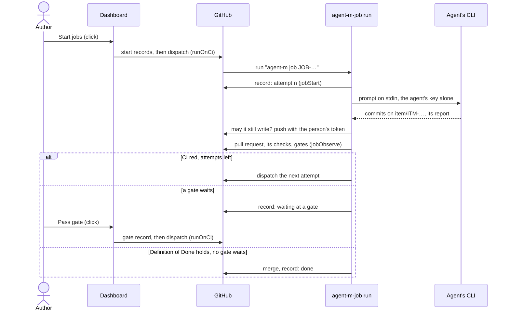

# ARC-029 The job runtimes

## Context

A job runs as pure steps that each runtime performs (ARC-007): a drafting job through the correction loop, an agent's
job — implementing an item or a module (UC-034, UC-024) — from the facts its runtime learns, through
`MOD-job-harness.agentStep`. Its record lies in the product repository and holds every state it enters (ARC-010), whose
consequences leave the executor that carries a job from its start record to its end record — its driver, its correction
loop, its check for a cancel before each commit, the gates it meets before its merge — to the job runtimes. A CI agent
is reached through a workflow of the product (ARC-009); the credentials CI writes with are the person's token and the
agent's key, each in a named CI secret (ARC-015 decision 7). The dashboard records starts, cancels, retries and a
person's gate decisions on a click (ARC-024).

A coding agent's CLI runs without a person in CI. Claude Code runs with `claude -p`, reads the prompt from standard
input — "Non-interactive mode reads stdin", capped at 10 MB —, takes its key from `ANTHROPIC_API_KEY` in its bare mode,
and reports a JSON result that "includes total_cost_usd", which are "client-side estimates"
(`https://code.claude.com/docs/en/headless`, `https://code.claude.com/docs/en/cli-reference`). Codex runs with
`codex exec`: "If you omit the prompt argument, Codex reads the prompt from stdin", `--sandbox workspace-write` allows
its edits, `CODEX_API_KEY` holds the key of a run, and `--json` reports the tokens of each turn
(`https://learn.chatgpt.com/docs/non-interactive-mode`, `https://developers.openai.com/codex/cli/reference`). opencode's
key variables depend on the provider, and whether its JSON reports usage is not documented
(`https://opencode.ai/docs/cli/`).

## Decision

1. **Modules.** `MOD-job-runner`, in the kernel, holds the steps every runtime performs alike: where a participant's job
   runs and with which model (`MOD-job-runner.runtimeOf`) — a CI agent's in CI, a CLI or sandboxed agent's through the
   bridge, a model endpoint's in the browser tab or through the bridge its route names, a person's in none —, which CI
   agent a participant is and the command its CLI runs, what the CLI reported, what an implementation job is given and
   what a later attempt is told, the branches it works on and into, its pull request, the facts of its Definition of
   Done, its next step, which CI jobs a click or the engine dispatches, and the live state of jobs from their runs. The
   CI runtime performs them: the workflows are generated by `MOD-ci-generator`, their steps run in `MOD-ci-entry`
   (ARC-015); the dashboard starts, continues and stops CI jobs on a click (`MOD-main-page.runOnCi`,
   `MOD-main-page.cancelOnCi`, ARC-024). `MOD-job-steps`, a feature, holds the steps every runtime performs alike against
   the product's server (decision 11): CI performs them on the CI secret (`MOD-ci-entry`, ARC-015), the bridge on the git
   login the agent already has (ARC-030). The browser tab takes the steps of a drafting job for a model endpoint the browser
   calls (`MOD-drafting`, ARC-031).
2. **A CI agent names its CLI and runner** in its route: `the workflow agent-m-job: <cli> on GitHub's machines`, or
   `… on the runner <label>` (`MOD-job-runner.ciAgentOf`). Its CLI is `claude` or `codex`; on GitHub's machines its key
   is the CI secret `AGENT_M_AGENT_KEY_<NAME>`, handed to the variable its vendor reads; on a self-hosted runner the CLI
   uses the login it has on that machine and no key is stored.
3. **The job workflow** `.github/workflows/agent-m-job.yml` (`MOD-ci-generator.jobWorkflow`) is dispatched with the job
   and its CI agent and named by the job (`run-name: agent-m job <id>`), so that the dashboard finds the run of each
   job. It has one job per CI agent on that agent's runner. A run starts the job (`MOD-ci-entry.jobStart`): a job that
   ended does nothing, one cancelled before its run ends as cancelled, otherwise its record gains the attempt it starts,
   and the agent's prompt is written. Then the job's branch is started from the branch its work goes into, the agent
   runs its CLI over the prompt on standard input (`MOD-job-runner.agentCommand`) — the only step that holds the agent's
   key —, Agent M asks whether the job may still write (`MOD-ci-entry.mayWrite`) and pushes the agent's commits with the
   person's token as a request header, never in an address — on a branch new to the server, the job's first commit alone
   before the head (decision 11) —, and looks at the pull request until the job's next step is
   decided (`MOD-ci-entry.jobObserve`); where the job belongs to a run, the last step dispatches the engine workflow
   (`MOD-ci-entry.engineDispatch`, ARC-010 decision 5). The agent's step holds no token, Agent M's steps no key, and the
   workflow's own token reads only.
4. **What the agent is given** (`MOD-job-runner.jobInputs`): for an item, the item, the requirements and use cases it
   realises, the tests that guard them and the process requirements of the product's declaration; for a module, the
   decisions that design it and the interfaces of the modules it uses; and the author's instruction. The definition
   tells the agent to commit the tests alone first and to answer with a line beginning `QUESTION:` where the item
   contradicts the specification or leaves a case open, so that the job waits for the author instead of guessing (UC-034
   5b). A later attempt is told the tests that failed on its branch's head, each with what it expects and the excerpts
   of its output from the result records of that commit (`MOD-job-runner.repairPrompt`, ARC-027).
5. **The next step** (`MOD-job-runner.nextStep`, from `MOD-job-harness.agentStep`): a cancel or a CLI that failed before
   committing anything ends the job; the agent's commits are pushed; the pull request is opened with the item, what it
   realises, the issue it came from and the provenance of `MOD-job-harness.commitMessage`
   (`MOD-job-runner.pullRequestOf`); CI is waited for within a wait limit, after which the job fails; a red CI with
   attempts left dispatches the next attempt, up to the rounds of the job's definition; a waiting gate or the agent's
   question ends the run with the job waiting at a gate, and the click that decides the gate dispatches it again; the
   pull request is merged when the Definition of Done holds and no gate waits — by the agent, or by a person where the
   author chose so at the start. Each state is added to the job's record with what the CLI reported it used
   (`MOD-job-runner.agentReport`): Claude Code's cost as it named it, Codex's tokens and no cost.
6. **Branches** (`MOD-job-runner.branchesOf`): a job works on `item/<item>`, or `job/<job>` for a job of no item, and
   its work goes into the branch of the newest sprint that selected its item where that sprint has one, else the branch
   of its phase where the product gives one, else the default branch.
7. **The Definition of Done is checked in CI twice, alike** (`MOD-job-runner.doneFactsOf`,
   `MOD-process-model.doneCheck`): by the job's run before it merges, and by the workflow
   `.github/workflows/agent-m-done.yml`, the check `agent-m done`, on every pull request from a job's branch
   (`MOD-ci-generator.doneWorkflow`, `MOD-ci-entry.doneCheck`), so that a branch protection may require it of every
   merge, a person's too. Its facts come from the pull request's commits in the order of their parents, the files each
   changed and CI's conclusion on each (`MOD-git-host.pullRequestCommits`, `MOD-git-host.commitFiles`,
   `MOD-git-host.checks`). The conditions that say a gate waits are left to the gates of the next step. A condition a
   person confirms is confirmed by the person who merges: where the product declares one, a person merges.
8. **Which CI jobs a click or the engine dispatches** (`MOD-job-runner.dispatchPlan`): of the jobs it names — started,
   retried, or waiting at the gate a person decided —, those of CI agents queued or waiting, not cancelled, and with no
   run of their own going. The job workflow carries out implementation and refactoring jobs, and the derivation of use
   cases, a drafting job whose result is written as open (decision 12; ARC-031): a job of another kind — a CI job or a
   test battery, of a run or alone — is not started, nor a job on a self-hosted runner of a repository that is not
   private; each is named with the reason, and its record ends as failed. No carried step hands those kinds to the job
   workflow: UC-027's steps open the workflow's pull request from the tests page, and UC-026's jobs are designed with
   that use case.
9. **A job's live state** is read from the runs of the job workflow, each named by its job (`MOD-job-runner.liveOf`):
   queued or running while its newest run has not completed, stopped when that run was cancelled, as its record says
   when it waits for its dispatch or its gate, and otherwise unknown to the runtime — ended without record
   (`MOD-run-engine.jobState`).
10. **An agent on the bridge names its CLI** in its route: `the bridge on this computer: <cli>`
   (`MOD-job-runner.bridgeAgentOf`) — the bridge paired in the browser that hands its jobs over; its CLI is `claude`,
   `codex` or `opencode`, run there with the login it has on that machine (`A LOCAL AGENT USES THE PERSON'S OWN LOGIN`,
   ARC-030). A click hands the jobs of such agents to the bridge as it dispatches those of CI agents
   (`MOD-job-runner.bridgePlan`): queued or waiting at a gate, and not cancelled; a job of a kind the job workflow does
   not carry out, of a participant that is no agent on the bridge on this computer, or a drafting job of an agent whose
   CLI's answer is not read (decision 12), is refused with the reason, and its record ends as failed. A sandboxed agent,
   and an agent behind a remote session, are reached through a tunnel; their routes come with the tunnels (ARC-013).
11. **The steps every runtime performs alike** (`MOD-job-steps`) take a context — the product, the job, the token for its
   server, the authority the runtime writes on, the instance — and the product's working tree, Agent M's own files, the
   network and the clock as ports: the start of an attempt (`MOD-job-steps.startStep`), whose participant must be an
   agent of the context's runtime, a CI agent on the CI secret and an agent on the bridge on the agent's login; whether
   the job may still write (`MOD-job-steps.mayWrite`); one look (`MOD-job-steps.observeStep`), which records a red
   attempt's end and returns the next attempt for the runtime to start — CI dispatches the job workflow again, the bridge
   starts it itself —; the check of the Definition of Done (`MOD-job-steps.doneCheck`); and the end of a job its runtime
   stopped (`MOD-job-steps.cancelStep`). Before the first look of a job whose branch is new to the server, its first
   commit — the tests alone — is pushed by itself and then the head: CI runs on the tip of a push — `GITHUB_SHA` is the
   "Tip commit pushed to the ref" (`https://docs.github.com/en/actions/reference/workflows-and-actions/events-that-trigger-workflows`)
   —, and the Definition of Done reads CI's conclusion on that first commit (`AN IMPLEMENTATION JOB BEGINS WITH A FAILING
   TEST`, `MOD-job-runner.doneFactsOf`).
12. **A drafting job in CI and on the bridge, turn by turn** (`MOD-job-steps.draftTurn`). A drafting job whose use cases
    are written as open (ARC-031 decision 2) is taken one turn at a time, the agent's CLI run between two turns: the job
    workflow's start (`MOD-job-steps.startStep`) leaves such a job to its turns, which record its start themselves. In CI
    the job workflow loops in one step: the entry's turn (`MOD-ci-entry.draftTurn`, ARC-015) ends with the exit code 75
    where a turn of the CLI is due — its prompt in `AGENT_M_OUT/prompt.md` — and with 0 where the job ended; between two
    turns the CLI runs with no tool on the agent's key (`MOD-job-runner.draftCommand`), its report in
    `AGENT_M_OUT/report.json`, the job's state kept in `AGENT_M_OUT/draft.json` — the store the turns pass on. Where the
    agent's key is a secret of GitHub's machines and is not set, its value is an empty string ("If a secret has not been
    set, the return value of an expression referencing the secret … will be an empty string",
    `https://docs.github.com/en/actions/how-tos/write-workflows/choose-what-workflows-do/use-secrets`), and the step fails
    naming the secret before its first turn, so nothing is written (UC-010 3a); the generated step is
    `MOD-ci-generator.jobWorkflow`'s (ARC-015). On the bridge, the bridge app runs the same turns, the CLI between them as
    `MOD-bridge-jobs.draftRun` starts it (ARC-030). The turns read what the job sends from the product's working tree, its
    definition and the instance's participants from Agent M's files, and the CLI's answers from the store; the last turn
    writes the use cases and the job's end in one commit on the context's authority, the marks and the findings left in
    its message with the job's provenance (ARC-031 decision 11), or the end alone, its note `no change` and its message
    the subject alone, where nothing differs from the files as they are (UC-010 4a) — the end is the job's record
    (`A JOB IS RECORDED IN ITS PRODUCT REPOSITORY`), no artifact. A round's cost is what the CLI reported, added up
    (`NO COST IS GUESSED`). A drafting job runs with a CLI whose answer the turns read — Claude Code's
    JSON result, Codex's JSON lines (`MOD-job-runner.draftsWith`, `MOD-job-runner.draftAnswer`) —; opencode's JSON events
    are not documented, so a drafting job of an opencode agent is not handed over (decision 10).



## Alternatives

- **The agent pushes and opens its pull request itself** — rejected: Agent M could not check for a cancel before every
  write (`A CANCELLED JOB WRITES NOTHING MORE`), and the agent's step would hold the person's token.
- **The vendors' GitHub Actions for their agents** — not chosen for now: each pushes and comments on its own terms, and
  Agent M's steps would no longer decide every write; Codex's documentation advises its action for handling the key
  (`https://learn.chatgpt.com/docs/non-interactive-mode`), which is why the key's exposure is measured (Consequences).
- **The Definition of Done as a commit status** — rejected: posting one needs a permission that
  `ONE GITHUB TOKEN SERVES EVERY FEATURE` does not list, and check runs need a GitHub App.
- **The Definition of Done as a job of the tests workflow** — rejected: its failure would read as a red test and start a
  repair.
- **Waiting for a person's gate inside the run** — rejected: a gate may wait for days, and a run's time is limited and
  paid for; the run ends, and the click that decides the gate dispatches the job again.
- **The prompt as a command-line argument** — not chosen: a long prompt meets the limit of one argument; standard input
  has none that a prompt reaches.
- **opencode as a CI agent** — not offered: its key variables depend on the provider, and its JSON is not documented to
  report usage (`NO COST IS GUESSED`); through the bridge it runs with the person's own login.

## Consequences

- The job workflow, the engine workflow and the check of the Definition of Done are generated files: they reach the default branch through a
  pull request with green CI, as the tests' workflow does (ARC-015), and are generated again when the instance's CI
  agents change.
- The settings page names the secrets the job workflow reads (`MOD-ci-generator.jobSecrets`) and recommends a branch
  protection that requires the check `agent-m done`.
- **Not realised here — what the runtimes still need.** The steps a coding agent carries out on CI and on the bridge stand
  in ARC-030's table (UC-034 5, 5.1, 5.2, 5.3, 6, 8a). A sandboxed agent, and an agent behind a remote session, are
  handed their jobs through a tunnel, with ARC-013: until then a job's start does not reach every holder of the
  implementing role (UC-034 4), and a plan entry's jobs, which meet steps 3 to 8, wait with them and with the gates of
  UC-034 7 (UC-034 1a); a runner that does not answer is named with what reads every runtime, a bridge that does not answer by ARC-030
  decision 2, and the step stands once both are (UC-034 4a); the last CI
  log of a failed job is linked once logs are read (open measurement 2; UC-034 6a); a retry starts a job on every
  runtime, the browser tab's among them (UC-036 7).
- **Not realised here — what reads every runtime.** The list of jobs and a job's detail, with their live states, logs
  and usage (UC-035 1, 1b; UC-036 1, 4, 1a, 1b, 1c, 4a, 4b), read the bridge's job list, the live jobs of a browser tab,
  which ARC-031 leaves to this, and a GitLab product's pipelines, designed with its CI files; the log of a CI run
  waits for open measurement 2.
- **Not realised here — what neither runtime has yet:** the job of an agent that decides a gate (UC-034 7, UC-036 5);
  the author's answer to a job's question (UC-034 5a) and an agent's proposal of a specification change (UC-034 5b);
  closing an item's issue with a link (UC-034 8, UC-033 6); rebasing a later push onto the branch its work goes into,
  and stopping on a conflict (UC-034 6b); flagging a commit written after a cancel, and offering its revert (UC-036 6a).
- **Not realised here — a job started on GitHub's Actions page** (UC-010 1). The job workflow is dispatched with a job the
  dashboard recorded; a job started on GitHub's own page would need the workflow to write its start record from inputs
  naming its kind and what it covers, which the workflow does not take. UC-010 2 to 5, 3a and 4a stand in this table for
  the derivation of use cases (ARC-031); UC-011 3 to 5 in ARC-030's. No click of the dashboard starts a derivation: its
  view comes with the derivation of use cases on the dashboard (UC-007, ARC-031's consequences), and with it UC-011 2.
- **Not realised here — what comes with other jobs and with runs.** Items drafted by a participant stand in ARC-031's table
  (UC-032 2, 3), and a requirement's coverage by several items comes with the views (UC-032 3a); an agent as Product Owner
  (UC-032 1c) with a job of that kind, whose inputs `MOD-job-runner.jobInputs` does not give. A run over a selection
  (UC-043 5, 6, 8, 6a, 6b, 6c, 6d) has its engine (ARC-010 decisions 5 and 9) and its dashboard (ARC-024): the first
  jobs on the click, the run's view — which carries UC-043 7 —, **Stop run** and **Continue**. It needs the bridge and
  the browser tab as well, whose participants its jobs may go to — the bridge also ends the jobs a stop cancels there,
  takes the steps of a run on a product without its engine workflow, and takes the step after a job that ran there, the
  one that completes the run's record once its last job ended there (UC-043 8) —, and the jobs of the CI configuration
  and the test battery (UC-027, UC-026), which the job workflow does not carry out. The close of a sprint by an agent,
  which starts by itself (UC-041 1a, `MOD-run-engine.closeDue`), comes with its job and with a run of the engine when a
  time box ends, which no dispatch marks; a module's or a test battery's job started alone (UC-043 1c) with their starts
  (UC-024, UC-026).
- A GitLab product's job pipeline, its engine and its check of the Definition of Done are designed with the layout of
  Agent M's CI files beside a product's own `.gitlab-ci.yml` (ARC-028).
- **Open measurement 1 — the key in the agent's commands.** The agent's key is in the environment of the agent's step,
  and the commands the agent runs — the product's tests among them — may inherit it; whether each CLI passes it on is
  not documented in what was read. Measurement: a test that prints the variables it sees, run by each CLI on GitHub's
  machines. Until it is recorded, the settings page says that a CI agent on GitHub's machines runs the product's code
  with its key in reach.
- **Open measurement 2 — logs in the dashboard.** A job's log is downloaded through a redirect that "expires after 1
  minute", and the documentation says nothing about calls from a web page
  (`https://docs.github.com/en/rest/actions/workflow-jobs`); until measured, the dashboard links each run's page.
- Claude Code's cost is its own estimate; the record and the dashboard show it as the CLI reported it, named so.

## Modules

### MOD-job-runner

```json module
{
  "id": "MOD-job-runner",
  "folder": "src/job-runner/",
  "layer": "kernel",
  "responsibility": "The steps of a job that every runtime performs alike: where a participant's job runs, which CI agent a participant is and the command its CLI runs, what the CLI reported it used, what an implementation job is given and what a later attempt is told, the branches it works on and into, its pull request, the facts its Definition of Done is checked on, its next step, which CI jobs a click dispatches, and the live state of jobs from their runs; it reads and writes nothing.",
  "realises": ["A SELF-HOSTED RUNNER SERVES AGENT M ONLY FROM A PRIVATE REPOSITORY", "A CANCELLED JOB WRITES NOTHING MORE", "A PULL REQUEST IS MERGED ONLY WHEN THE DEFINITION OF DONE HOLDS", "AN IMPLEMENTATION JOB BEGINS WITH A FAILING TEST", "A JOB STOPS AT EVERY GATE", "NO COST IS GUESSED", "WORK MERGES INTO THE DEFAULT BRANCH UNLESS A BRANCH IS SET", "PROGRESS AND JOB STATE ARE DERIVED, NOT STORED"],
  "owns": ["CiAgent", "JobRuntime", "AgentFiles", "AgentReport", "DraftCli", "DraftAnswer", "JobItem", "RequirementText", "IdText", "JobInputsInput", "PullItem", "PullItemOrNone", "PullRequestText", "JobBranches", "DoneFactsInput", "StepInput", "JobStep", "DispatchInput", "JobDispatch", "JobRefusal", "DispatchPlan", "BridgeAgent", "BridgePlanInput", "BridgeHand", "BridgePlan"],
  "uses": ["MOD-contracts", "MOD-job-harness"]
}
```

```json interface
{
  "id": "MOD-job-runner.ciAgentOf",
  "summary": "A participant as a CI agent: its route names its CLI — claude or codex — and its runner, GitHub's machines or a self-hosted runner by its label; its key is the CI secret AGENT_M_AGENT_KEY_<NAME>, handed to the CLI in the variable its vendor reads.",
  "params": [{ "name": "participant", "type": "Participant" }],
  "result": "CiAgent",
  "async": false,
  "refusals": [
    { "code": "not-a-ci-agent", "when": "the participant is of another type" },
    { "code": "no-route", "when": "the route is not \"the workflow agent-m-job: <cli> on GitHub's machines\" or \"… on the runner <label>\"" },
    { "code": "unknown-cli", "when": "the CLI is neither claude nor codex" },
    { "code": "no-model", "when": "the participant names no model its CLI can be started with" }
  ],
  "examples": [
    {
      "name": "Claude Code on GitHub's machines",
      "input": {
        "participant": {
          "name": "ci-dev",
          "type": "CI agent",
          "model": "claude-opus-5-5",
          "context": 200000,
          "price": null,
          "capabilities": ["read the repository", "write to the repository", "run code and tests"],
          "place": "GitHub's machines, a provider in the USA",
          "route": "the workflow agent-m-job: claude on GitHub's machines",
          "line": 6
        }
      },
      "result": { "name": "ci-dev", "cli": "claude", "model": "claude-opus-5-5", "runner": "", "secret": "AGENT_M_AGENT_KEY_CI_DEV", "keyVariable": "ANTHROPIC_API_KEY" }
    },
    {
      "name": "Codex on a self-hosted runner",
      "input": {
        "participant": {
          "name": "gpu-dev",
          "type": "CI agent",
          "model": "codex-model",
          "context": null,
          "price": null,
          "capabilities": ["read the repository", "write to the repository", "run code and tests"],
          "place": "the lab's GPU server, Erlangen",
          "route": "the workflow agent-m-job: codex on the runner gpu-1",
          "line": 7
        }
      },
      "result": { "name": "gpu-dev", "cli": "codex", "model": "codex-model", "runner": "gpu-1", "secret": "AGENT_M_AGENT_KEY_GPU_DEV", "keyVariable": "CODEX_API_KEY" }
    },
    {
      "name": "a CLI agent",
      "input": {
        "participant": {
          "name": "cli-dev",
          "type": "CLI agent",
          "model": "claude-opus-5-5",
          "context": null,
          "price": null,
          "capabilities": ["read the repository", "write to the repository", "run code and tests"],
          "place": "this machine",
          "route": "the bridge on the Mac of `alice`",
          "line": 8
        }
      },
      "refused": "not-a-ci-agent"
    },
    {
      "name": "a route naming no CLI",
      "input": {
        "participant": {
          "name": "ci-dev",
          "type": "CI agent",
          "model": "claude-opus-5-5",
          "context": 200000,
          "price": null,
          "capabilities": ["read the repository", "write to the repository", "run code and tests"],
          "place": "GitHub's machines, a provider in the USA",
          "route": "the workflow agent-m-job",
          "line": 6
        }
      },
      "refused": "no-route"
    }
  ]
}
```

```json interface
{
  "id": "MOD-job-runner.runtimeOf",
  "summary": "Where a participant's job runs, and with which model: a CI agent's in CI, a CLI or sandboxed agent's through the bridge, a model endpoint's in the browser tab — or through the bridge where its route is a bridge's; a person's work is no job a runtime carries out.",
  "params": [{ "name": "participant", "type": "Participant" }],
  "result": "JobRuntime",
  "async": false,
  "refusals": [
    { "code": "a-person", "when": "the participant is a person" },
    { "code": "unknown-type", "when": "the participant is of no type a job runs for" }
  ],
  "examples": [
    {
      "name": "a CI agent",
      "input": {
        "participant": {
          "name": "ci-dev",
          "type": "CI agent",
          "model": "claude-opus-5-5",
          "context": 200000,
          "price": null,
          "capabilities": ["read the repository", "write to the repository", "run code and tests"],
          "place": "GitHub's machines, a provider in the USA",
          "route": "the workflow agent-m-job: claude on GitHub's machines",
          "line": 6
        }
      },
      "result": { "runtime": "ci", "model": "claude-opus-5-5" }
    },
    {
      "name": "a CLI agent",
      "input": {
        "participant": {
          "name": "cli-dev",
          "type": "CLI agent",
          "model": "claude-opus-5-5",
          "context": null,
          "price": null,
          "capabilities": ["read the repository", "write to the repository", "run code and tests"],
          "place": "this machine",
          "route": "the bridge on the Mac of `alice`",
          "line": 8
        }
      },
      "result": { "runtime": "bridge", "model": "claude-opus-5-5" }
    },
    {
      "name": "a model endpoint of this browser",
      "input": {
        "participant": {
          "name": "hub-writer",
          "type": "model endpoint",
          "model": "llama-3.3-70b",
          "context": null,
          "price": null,
          "capabilities": ["draft text"],
          "place": "NHR@FAU, Erlangen",
          "route": "the endpoint hub of this browser",
          "line": 6
        }
      },
      "result": { "runtime": "browser", "model": "llama-3.3-70b" }
    },
    {
      "name": "a model server through the bridge",
      "input": {
        "participant": {
          "name": "lab-llm",
          "type": "model endpoint",
          "model": "qwen3-32b",
          "context": null,
          "price": null,
          "capabilities": ["draft text"],
          "place": "the lab's GPU server, Erlangen",
          "route": "the bridge on the lab's GPU server",
          "line": 6
        }
      },
      "result": { "runtime": "bridge", "model": "qwen3-32b" }
    },
    {
      "name": "a person",
      "input": {
        "participant": {
          "name": "alice",
          "type": "person",
          "model": "",
          "context": null,
          "price": null,
          "capabilities": ["draft text", "read the repository", "write to the repository"],
          "place": "",
          "route": "the GitHub account `alice`",
          "line": 5
        }
      },
      "refused": "a-person"
    }
  ]
}
```

```json interface
{
  "id": "MOD-job-runner.agentCommand",
  "summary": "The CLI's non-interactive command over a prompt file, its report written to a file: the prompt goes in on standard input, so that its length meets no limit of one command-line argument; edits and commands are allowed in the working tree, and nothing waits for a permission prompt.",
  "params": [{ "name": "agent", "type": "CiAgent" }, { "name": "files", "type": "AgentFiles" }],
  "result": "string",
  "async": false,
  "refusals": [],
  "examples": [
    {
      "name": "Claude Code",
      "input": {
        "agent": { "name": "ci-dev", "cli": "claude", "model": "claude-opus-5-5", "runner": "", "secret": "AGENT_M_AGENT_KEY_CI_DEV", "keyVariable": "ANTHROPIC_API_KEY" },
        "files": { "prompt": "$AGENT_M_OUT/prompt.md", "report": "$AGENT_M_OUT/report.json" }
      },
      "result": "claude --bare -p \"Carry out the task the input describes.\" --model 'claude-opus-5-5' --permission-mode acceptEdits --allowedTools Bash --permission-prompts none --output-format json < \"$AGENT_M_OUT/prompt.md\" > \"$AGENT_M_OUT/report.json\""
    },
    {
      "name": "Codex",
      "input": {
        "agent": { "name": "gpu-dev", "cli": "codex", "model": "codex-model", "runner": "gpu-1", "secret": "AGENT_M_AGENT_KEY_GPU_DEV", "keyVariable": "CODEX_API_KEY" },
        "files": { "prompt": "$AGENT_M_OUT/prompt.md", "report": "$AGENT_M_OUT/report.json" }
      },
      "result": "codex exec --model 'codex-model' --sandbox workspace-write --json - < \"$AGENT_M_OUT/prompt.md\" > \"$AGENT_M_OUT/report.json\""
    }
  ]
}
```

```json interface
{
  "id": "MOD-job-runner.agentReport",
  "summary": "What the CLI reported it used and whether it failed: Claude Code's JSON result names its cost in US dollars and its tokens; Codex's JSON lines name the tokens of each completed turn and no cost; opencode's JSON events are not documented to report usage, so none is read from them, and whether it failed is told by its exit code; a report that cannot be read gives no cost and no tokens — no cost is guessed.",
  "params": [{ "name": "cli", "type": "string" }, { "name": "text", "type": "string" }],
  "result": "AgentReport",
  "async": false,
  "refusals": [],
  "examples": [
    {
      "name": "Claude Code's result",
      "input": { "cli": "claude", "text": "{\"type\":\"result\",\"subtype\":\"success\",\"is_error\":false,\"duration_ms\":412000,\"num_turns\":38,\"result\":\"The tests of ITM-014 and the export of the figures are committed.\",\"session_id\":\"6c1f0e2a-41d2-4d8e-9a57-3f8b1c2d0e4f\",\"total_cost_usd\":1.8432,\"usage\":{\"input_tokens\":182344,\"output_tokens\":12850}}" },
      "result": {
        "cost": { "amount": 1.84, "currency": "USD" },
        "usage": { "inputTokens": 182344, "outputTokens": 12850, "minutes": null },
        "failed": false,
        "note": ""
      }
    },
    {
      "name": "Codex's events",
      "input": { "cli": "codex", "text": "{\"type\":\"thread.started\",\"thread_id\":\"0199a213-81c0-7800-8aa1-bbab2a035a53\"}\n{\"type\":\"turn.started\"}\n{\"type\":\"item.completed\",\"item\":{\"id\":\"item_3\",\"type\":\"agent_message\",\"text\":\"The export is implemented; its tests pass.\"}}\n{\"type\":\"turn.completed\",\"usage\":{\"input_tokens\":24763,\"cached_input_tokens\":24448,\"output_tokens\":122}}\n" },
      "result": {
        "cost": null,
        "usage": { "inputTokens": 24763, "outputTokens": 122, "minutes": null },
        "failed": false,
        "note": ""
      }
    },
    {
      "name": "a CLI that wrote no JSON",
      "input": { "cli": "claude", "text": "Error: Invalid API key\n" },
      "result": {
        "cost": null,
        "usage": { "inputTokens": null, "outputTokens": null, "minutes": null },
        "failed": true,
        "note": "the CLI wrote no JSON result"
      }
    },
    {
      "name": "opencode's events",
      "input": { "cli": "opencode", "text": "{\"type\":\"text\",\"part\":{\"text\":\"The export is implemented.\"}}\n" },
      "result": {
        "cost": null,
        "usage": { "inputTokens": null, "outputTokens": null, "minutes": null },
        "failed": false,
        "note": ""
      }
    }
  ]
}
```

```json interface
{
  "id": "MOD-job-runner.draftsWith",
  "summary": "Whether a drafting job runs with a CLI: its answer is read from the CLI's report (MOD-job-runner.draftAnswer) — Claude Code's JSON result, Codex's JSON lines —; opencode's JSON events are not documented, so a drafting job does not run with it.",
  "params": [{ "name": "cli", "type": "string" }],
  "result": "DraftCli",
  "async": false,
  "refusals": [{ "code": "no-draft-form", "when": "the CLI is neither claude nor codex" }],
  "examples": [
    { "name": "Claude Code", "input": { "cli": "claude" }, "result": { "cli": "claude" } },
    { "name": "Codex", "input": { "cli": "codex" }, "result": { "cli": "codex" } },
    { "name": "opencode", "input": { "cli": "opencode" }, "refused": "no-draft-form" }
  ]
}
```

```json interface
{
  "id": "MOD-job-runner.draftCommand",
  "summary": "The CLI's non-interactive command for one round of a drafting job in CI: the conversation so far as one prompt on standard input, its report written to a file, and no tool — Claude Code with every tool removed, Codex in the read-only sandbox codex exec runs in by default —, so that the agent answers in text and changes nothing.",
  "params": [{ "name": "agent", "type": "CiAgent" }, { "name": "files", "type": "AgentFiles" }],
  "result": "string",
  "async": false,
  "refusals": [],
  "examples": [
    {
      "name": "Claude Code",
      "input": {
        "agent": { "name": "ci-dev", "cli": "claude", "model": "claude-opus-5-5", "runner": "", "secret": "AGENT_M_AGENT_KEY_CI_DEV", "keyVariable": "ANTHROPIC_API_KEY" },
        "files": { "prompt": "$AGENT_M_OUT/prompt.md", "report": "$AGENT_M_OUT/report.json" }
      },
      "result": "claude --bare -p \"Answer the request the input holds, in the form it asks for.\" --model 'claude-opus-5-5' --disallowedTools '*' --output-format json < \"$AGENT_M_OUT/prompt.md\" > \"$AGENT_M_OUT/report.json\""
    },
    {
      "name": "Codex",
      "input": {
        "agent": { "name": "gpu-dev", "cli": "codex", "model": "codex-model", "runner": "gpu-1", "secret": "AGENT_M_AGENT_KEY_GPU_DEV", "keyVariable": "CODEX_API_KEY" },
        "files": { "prompt": "$AGENT_M_OUT/prompt.md", "report": "$AGENT_M_OUT/report.json" }
      },
      "result": "codex exec --model 'codex-model' --json - < \"$AGENT_M_OUT/prompt.md\" > \"$AGENT_M_OUT/report.json\""
    }
  ]
}
```

```json interface
{
  "id": "MOD-job-runner.draftAnswer",
  "summary": "The answer of one round of a drafting job as the CLI's report holds it, with what it reported it used (MOD-job-runner.agentReport): Claude Code's text result in the field result of its JSON, Codex's last agent message among its JSON lines; a report that holds no answer, or names a failure, is a failed round with the reason.",
  "params": [{ "name": "cli", "type": "string" }, { "name": "report", "type": "string" }],
  "result": "DraftAnswer",
  "async": false,
  "refusals": [{ "code": "no-draft-form", "when": "the CLI is neither claude nor codex (MOD-job-runner.draftsWith)" }],
  "examples": [
    {
      "name": "Claude Code's answer",
      "input": { "cli": "claude", "report": "{\"type\":\"result\",\"subtype\":\"success\",\"is_error\":false,\"result\":\"{\\\"useCases\\\":[{\\\"text\\\":\\\"---\\\\nid: UC-NNN\\\\ntitle: Count the words while writing\\\\narea: writing\\\\nactors:\\\\n  - Author\\\\nrealises:\\\\n  - A CHAPTER SHOWS ITS WORD COUNT\\\\n---\\\\n# UC-NNN Count the words while writing\\\\n\\\\n## Actors\\\\n\\\\n- **Author** — writes a chapter.\\\\n\\\\n## Precondition\\\\n\\\\n- The chapter is open in the editor.\\\\n\\\\n## Main flow\\\\n\\\\n1. The author types in the editor.\\\\n2. The editor shows how many words the chapter has.\\\\n\\\\n## Alternative flows\\\\n\\\\n- **2a. The chapter is empty.** The editor shows 0 words.\\\\n\\\\n## Postcondition\\\\n\\\\n- The author knows the chapter's length.\\\\n\\\\n```mermaid\\\\nsequenceDiagram\\\\n    actor A as Author\\\\n    participant E as Editor\\\\n    A->>E: types\\\\n    E-->>A: word count\\\\n```\\\\n\\\"}],\\\"justifications\\\":[]}\",\"total_cost_usd\":0.24,\"usage\":{\"input_tokens\":3900,\"output_tokens\":450}}" },
      "result": {
        "text": "{\"useCases\":[{\"text\":\"---\\nid: UC-NNN\\ntitle: Count the words while writing\\narea: writing\\nactors:\\n  - Author\\nrealises:\\n  - A CHAPTER SHOWS ITS WORD COUNT\\n---\\n# UC-NNN Count the words while writing\\n\\n## Actors\\n\\n- **Author** — writes a chapter.\\n\\n## Precondition\\n\\n- The chapter is open in the editor.\\n\\n## Main flow\\n\\n1. The author types in the editor.\\n2. The editor shows how many words the chapter has.\\n\\n## Alternative flows\\n\\n- **2a. The chapter is empty.** The editor shows 0 words.\\n\\n## Postcondition\\n\\n- The author knows the chapter's length.\\n\\n```mermaid\\nsequenceDiagram\\n    actor A as Author\\n    participant E as Editor\\n    A->>E: types\\n    E-->>A: word count\\n```\\n\"}],\"justifications\":[]}",
        "failed": false,
        "note": "",
        "cost": { "amount": 0.24, "currency": "USD" },
        "usage": { "inputTokens": 3900, "outputTokens": 450, "minutes": null }
      }
    },
    {
      "name": "Codex's answer",
      "input": { "cli": "codex", "report": "{\"type\":\"thread.started\",\"thread_id\":\"t1\"}\n{\"type\":\"item.completed\",\"item\":{\"id\":\"item_1\",\"type\":\"agent_message\",\"text\":\"{\\\"useCases\\\":[{\\\"text\\\":\\\"---\\\\nid: UC-NNN\\\\ntitle: Count the words while writing\\\\narea: writing\\\\nactors:\\\\n  - Author\\\\nrealises:\\\\n  - A CHAPTER SHOWS ITS WORD COUNT\\\\n---\\\\n# UC-NNN Count the words while writing\\\\n\\\\n## Actors\\\\n\\\\n- **Author** — writes a chapter.\\\\n\\\\n## Precondition\\\\n\\\\n- The chapter is open in the editor.\\\\n\\\\n## Main flow\\\\n\\\\n1. The author types in the editor.\\\\n2. The editor shows how many words the chapter has.\\\\n\\\\n## Alternative flows\\\\n\\\\n- **2a. The chapter is empty.** The editor shows 0 words.\\\\n\\\\n## Postcondition\\\\n\\\\n- The author knows the chapter's length.\\\\n\\\\n```mermaid\\\\nsequenceDiagram\\\\n    actor A as Author\\\\n    participant E as Editor\\\\n    A->>E: types\\\\n    E-->>A: word count\\\\n```\\\\n\\\"}],\\\"justifications\\\":[]}\"}}\n{\"type\":\"turn.completed\",\"usage\":{\"input_tokens\":3900,\"cached_input_tokens\":0,\"output_tokens\":450}}\n" },
      "result": {
        "text": "{\"useCases\":[{\"text\":\"---\\nid: UC-NNN\\ntitle: Count the words while writing\\narea: writing\\nactors:\\n  - Author\\nrealises:\\n  - A CHAPTER SHOWS ITS WORD COUNT\\n---\\n# UC-NNN Count the words while writing\\n\\n## Actors\\n\\n- **Author** — writes a chapter.\\n\\n## Precondition\\n\\n- The chapter is open in the editor.\\n\\n## Main flow\\n\\n1. The author types in the editor.\\n2. The editor shows how many words the chapter has.\\n\\n## Alternative flows\\n\\n- **2a. The chapter is empty.** The editor shows 0 words.\\n\\n## Postcondition\\n\\n- The author knows the chapter's length.\\n\\n```mermaid\\nsequenceDiagram\\n    actor A as Author\\n    participant E as Editor\\n    A->>E: types\\n    E-->>A: word count\\n```\\n\"}],\"justifications\":[]}",
        "failed": false,
        "note": "",
        "cost": null,
        "usage": { "inputTokens": 3900, "outputTokens": 450, "minutes": null }
      }
    },
    {
      "name": "a report that holds no answer",
      "input": { "cli": "claude", "report": "{\"type\":\"result\",\"subtype\":\"success\",\"is_error\":false,\"result\":\"\",\"total_cost_usd\":0.02,\"usage\":{\"input_tokens\":3100,\"output_tokens\":0}}" },
      "result": {
        "text": "",
        "failed": true,
        "note": "the CLI's report holds no answer",
        "cost": { "amount": 0.02, "currency": "USD" },
        "usage": { "inputTokens": 3100, "outputTokens": 0, "minutes": null }
      }
    },
    {
      "name": "a CLI whose answer is not read",
      "input": { "cli": "opencode", "report": "{}" },
      "refused": "no-draft-form"
    }
  ]
}
```

```json interface
{
  "id": "MOD-job-runner.jobInputs",
  "summary": "The inputs of an implementation job, each part with its name as heading: an item's job (UC-034 3) the item, the requirements and use cases it realises, the tests that guard them and the process requirements of the product; a module's job (UC-024) the decisions that design the module and the interfaces of the modules it uses; and the author's instruction.",
  "params": [{ "name": "input", "type": "JobInputsInput" }],
  "result": "PromptInputs",
  "async": false,
  "refusals": [
    { "code": "no-item", "when": "an item's job is given no item" },
    { "code": "missing-text", "when": "a name the item realises has no text" },
    { "code": "no-decision", "when": "a module's job is given no decision" },
    { "code": "unknown-kind", "when": "the kind is neither implement-item nor implement-module" }
  ],
  "examples": [
    {
      "name": "ITM-014",
      "input": {
        "input": {
          "kind": "implement-item",
          "item": {
            "id": "ITM-014",
            "title": "Export a chapter as PDF",
            "realises": ["A CHAPTER IS EXPORTED", "UC-003"],
            "text": "---\nid: ITM-014\ntitle: Export a chapter as PDF\nkind: implementation\nrealises:\n  - A CHAPTER IS EXPORTED\n  - UC-003\nmodules:\n  - MOD-export\norigin:\n  - ISS-007\n---\n\n# ITM-014 Export a chapter as PDF\n\n**REGISTER**\n\n## Outcome\n\nAn accepted chapter is exported as a PDF with its figures.\n\n## Acceptance criteria\n\n- the PDF holds every figure of the chapter\n- the PDF is named after the chapter\n",
            "issue": "ISS-007"
          },
          "texts": { "A CHAPTER IS EXPORTED": "**A CHAPTER IS EXPORTED** *(PO A. Maier)*\nA chapter is exported as a PDF with its figures.\n*Check:* `tests/export.test.mjs`", "UC-003": "---\nid: UC-003\ntitle: Export a chapter\narea: writing\nactors:\n  - Author\nrealises:\n  - A CHAPTER IS EXPORTED\n---\n# UC-003 Export a chapter\n\n## Actors\n\n- **Author** — writes.\n\n## Precondition\n\n- The repository exists.\n\n## Main flow\n\n1. The author presses **Export**.\n\n## Alternative flows\n\n- **1a. No token.** GitHub's page opens.\n\n## Postcondition\n\n- The chapter is saved.\n" },
          "tests": [
            { "path": "tests/export.test.mjs", "text": "// The export of a chapter.\n//\n// Module: MOD-export\n// Guards: A CHAPTER IS EXPORTED; UC-003\n// Level: system\nimport { test } from \"node:test\";\n\n// TST-014 the PDF keeps the figures\n// Given: a chapter with two figures\n// When: the author exports it as PDF\n// Then: the PDF holds both figures\ntest(\"TST-014 the PDF keeps the figures\", () => {});\n\n// TST-015 the PDF names the chapter\n// Given: a chapter titled Methods\n// When: the author exports it as PDF\n// Then: the PDF's title is Methods\ntest(\"TST-015 the PDF names the chapter\", () => {});\n\n// TST-016 the summary of an export reads as the chapter\n// Given: a chapter of four pages\n// When: the model summarises the exported PDF\n// Then: the summary names the chapter's three findings\n// Runs: 20\n// Paid: hub\ntest(\"TST-016 the summary of an export reads as the chapter\", () => {});\n" }
          ],
          "processRequirements": [
            { "name": "UNIT VERIFICATION IS DOCUMENTED", "text": "**UNIT VERIFICATION IS DOCUMENTED** *(IEC 62304, 5.5.5)*\nEvery unit's verification is recorded.\n*Check:* `tests/test_unit_records.py`" }
          ],
          "instruction": "",
          "decisions": [],
          "interfaces": []
        }
      },
      "result": { "item": "### ITM-014\n\n---\nid: ITM-014\ntitle: Export a chapter as PDF\nkind: implementation\nrealises:\n  - A CHAPTER IS EXPORTED\n  - UC-003\nmodules:\n  - MOD-export\norigin:\n  - ISS-007\n---\n\n# ITM-014 Export a chapter as PDF\n\n**REGISTER**\n\n## Outcome\n\nAn accepted chapter is exported as a PDF with its figures.\n\n## Acceptance criteria\n\n- the PDF holds every figure of the chapter\n- the PDF is named after the chapter\n", "realises": "### A CHAPTER IS EXPORTED\n\n**A CHAPTER IS EXPORTED** *(PO A. Maier)*\nA chapter is exported as a PDF with its figures.\n*Check:* `tests/export.test.mjs`\n\n### UC-003\n\n---\nid: UC-003\ntitle: Export a chapter\narea: writing\nactors:\n  - Author\nrealises:\n  - A CHAPTER IS EXPORTED\n---\n# UC-003 Export a chapter\n\n## Actors\n\n- **Author** — writes.\n\n## Precondition\n\n- The repository exists.\n\n## Main flow\n\n1. The author presses **Export**.\n\n## Alternative flows\n\n- **1a. No token.** GitHub's page opens.\n\n## Postcondition\n\n- The chapter is saved.\n", "tests": "### tests/export.test.mjs\n\n// The export of a chapter.\n//\n// Module: MOD-export\n// Guards: A CHAPTER IS EXPORTED; UC-003\n// Level: system\nimport { test } from \"node:test\";\n\n// TST-014 the PDF keeps the figures\n// Given: a chapter with two figures\n// When: the author exports it as PDF\n// Then: the PDF holds both figures\ntest(\"TST-014 the PDF keeps the figures\", () => {});\n\n// TST-015 the PDF names the chapter\n// Given: a chapter titled Methods\n// When: the author exports it as PDF\n// Then: the PDF's title is Methods\ntest(\"TST-015 the PDF names the chapter\", () => {});\n\n// TST-016 the summary of an export reads as the chapter\n// Given: a chapter of four pages\n// When: the model summarises the exported PDF\n// Then: the summary names the chapter's three findings\n// Runs: 20\n// Paid: hub\ntest(\"TST-016 the summary of an export reads as the chapter\", () => {});\n", "process": "### UNIT VERIFICATION IS DOCUMENTED\n\n**UNIT VERIFICATION IS DOCUMENTED** *(IEC 62304, 5.5.5)*\nEvery unit's verification is recorded.\n*Check:* `tests/test_unit_records.py`\n", "instruction": "" }
    },
    {
      "name": "a use case not read",
      "input": {
        "input": {
          "kind": "implement-item",
          "item": {
            "id": "ITM-014",
            "title": "Export a chapter as PDF",
            "realises": ["A CHAPTER IS EXPORTED", "UC-003"],
            "text": "---\nid: ITM-014\ntitle: Export a chapter as PDF\nkind: implementation\nrealises:\n  - A CHAPTER IS EXPORTED\n  - UC-003\nmodules:\n  - MOD-export\norigin:\n  - ISS-007\n---\n\n# ITM-014 Export a chapter as PDF\n\n**REGISTER**\n\n## Outcome\n\nAn accepted chapter is exported as a PDF with its figures.\n\n## Acceptance criteria\n\n- the PDF holds every figure of the chapter\n- the PDF is named after the chapter\n",
            "issue": "ISS-007"
          },
          "texts": { "A CHAPTER IS EXPORTED": "**A CHAPTER IS EXPORTED** *(PO A. Maier)*\nA chapter is exported as a PDF with its figures.\n*Check:* `tests/export.test.mjs`" },
          "tests": [],
          "processRequirements": [],
          "instruction": "",
          "decisions": [],
          "interfaces": []
        }
      },
      "refused": "missing-text"
    }
  ]
}
```

```json interface
{
  "id": "MOD-job-runner.repairPrompt",
  "summary": "The prompt of a later attempt: the task as first given, and the tests that failed or flipped on the pull request's head, each with what it expects and the excerpts of its output from the result records of that commit.",
  "params": [{ "name": "task", "type": "string" }, { "name": "outcomes", "type": "CommitOutcomes" }],
  "result": "string",
  "async": false,
  "refusals": [{ "code": "nothing-failed", "when": "no test failed or flipped on the commit" }],
  "examples": [
    {
      "name": "TST-015 red on the head",
      "input": {
        "task": "Implement ITM-014, test first.\n",
        "outcomes": {
          "commit": "d200000000000000000000000000000000000000",
          "levels": [
            {
              "level": "unit",
              "runs": [],
              "tests": 0,
              "passed": 0,
              "failed": 0,
              "flaky": 0,
              "skipped": 0,
              "rates": 0,
              "worse": 0,
              "notRun": 0
            },
            {
              "level": "component",
              "runs": [],
              "tests": 0,
              "passed": 0,
              "failed": 0,
              "flaky": 0,
              "skipped": 0,
              "rates": 0,
              "worse": 0,
              "notRun": 0
            },
            {
              "level": "system",
              "runs": [
                { "record": "results/d200000000000000000000000000000000000000/gh-4801-1-system.md", "participant": "GitHub Actions, runner GitHub Actions 7", "at": "2026-10-12T09:20:00Z", "log": "https://github.com/alice/thesis/actions/runs/4801", "outcome": "failed", "note": "" }
              ],
              "tests": 3,
              "passed": 1,
              "failed": 1,
              "flaky": 0,
              "skipped": 0,
              "rates": 0,
              "worse": 0,
              "notRun": 1
            },
            {
              "level": "release",
              "runs": [],
              "tests": 0,
              "passed": 0,
              "failed": 0,
              "flaky": 0,
              "skipped": 0,
              "rates": 0,
              "worse": 0,
              "notRun": 0
            },
            {
              "level": "user",
              "runs": [],
              "tests": 0,
              "passed": 0,
              "failed": 0,
              "flaky": 0,
              "skipped": 0,
              "rates": 0,
              "worse": 0,
              "notRun": 0
            }
          ],
          "tests": [
            {
              "test": "TST-014",
              "title": "the PDF keeps the figures",
              "level": "system",
              "guards": ["A CHAPTER IS EXPORTED", "UC-003"],
              "then": "the PDF holds both figures",
              "fixed": 0,
              "outcome": "passed",
              "runs": 1,
              "passed": 1,
              "previous": null,
              "worse": false,
              "evidence": [
                { "record": "results/d200000000000000000000000000000000000000/gh-4801-1-system.md", "participant": "GitHub Actions, runner GitHub Actions 7", "at": "2026-10-12T09:20:00Z", "log": "https://github.com/alice/thesis/actions/runs/4801", "outcome": "passed", "runs": 1, "passed": 1, "note": "", "excerpt": "" }
              ]
            },
            {
              "test": "TST-015",
              "title": "the PDF names the chapter",
              "level": "system",
              "guards": ["A CHAPTER IS EXPORTED", "UC-003"],
              "then": "the PDF's title is Methods",
              "fixed": 0,
              "outcome": "failed",
              "runs": 1,
              "passed": 0,
              "previous": null,
              "worse": false,
              "evidence": [
                { "record": "results/d200000000000000000000000000000000000000/gh-4801-1-system.md", "participant": "GitHub Actions, runner GitHub Actions 7", "at": "2026-10-12T09:20:00Z", "log": "https://github.com/alice/thesis/actions/runs/4801", "outcome": "failed", "runs": 1, "passed": 0, "note": "expected \"Methods\", got \"chapter-2\"", "excerpt": "AssertionError: expected \"Methods\", got \"chapter-2\"\n    at tests/export.test.mjs:18:3" }
              ]
            },
            {
              "test": "TST-016",
              "title": "the summary of an export reads as the chapter",
              "level": "system",
              "guards": ["A CHAPTER IS EXPORTED", "UC-003"],
              "then": "the summary names the chapter's three findings",
              "fixed": 20,
              "outcome": "not-run",
              "runs": 0,
              "passed": 0,
              "previous": null,
              "worse": false,
              "evidence": []
            }
          ],
          "uncounted": [],
          "undeclared": []
        }
      },
      "result": "Implement ITM-014, test first.\n\n## CI failed on your pull request\n\nThese tests failed on d20000000000; make them pass without changing what they expect:\n\n- TST-015 (system): expected the PDF's title is Methods\n  AssertionError: expected \"Methods\", got \"chapter-2\"\n      at tests/export.test.mjs:18:3\n"
    },
    {
      "name": "nothing failed",
      "input": {
        "task": "Implement ITM-014, test first.\n",
        "outcomes": {
          "commit": "d200000000000000000000000000000000000000",
          "levels": [
            {
              "level": "unit",
              "runs": [],
              "tests": 0,
              "passed": 0,
              "failed": 0,
              "flaky": 0,
              "skipped": 0,
              "rates": 0,
              "worse": 0,
              "notRun": 0
            },
            {
              "level": "component",
              "runs": [],
              "tests": 0,
              "passed": 0,
              "failed": 0,
              "flaky": 0,
              "skipped": 0,
              "rates": 0,
              "worse": 0,
              "notRun": 0
            },
            {
              "level": "system",
              "runs": [],
              "tests": 3,
              "passed": 0,
              "failed": 0,
              "flaky": 0,
              "skipped": 0,
              "rates": 0,
              "worse": 0,
              "notRun": 3
            },
            {
              "level": "release",
              "runs": [],
              "tests": 0,
              "passed": 0,
              "failed": 0,
              "flaky": 0,
              "skipped": 0,
              "rates": 0,
              "worse": 0,
              "notRun": 0
            },
            {
              "level": "user",
              "runs": [],
              "tests": 0,
              "passed": 0,
              "failed": 0,
              "flaky": 0,
              "skipped": 0,
              "rates": 0,
              "worse": 0,
              "notRun": 0
            }
          ],
          "tests": [
            {
              "test": "TST-014",
              "title": "the PDF keeps the figures",
              "level": "system",
              "guards": ["A CHAPTER IS EXPORTED", "UC-003"],
              "then": "the PDF holds both figures",
              "fixed": 0,
              "outcome": "not-run",
              "runs": 0,
              "passed": 0,
              "previous": null,
              "worse": false,
              "evidence": []
            },
            {
              "test": "TST-015",
              "title": "the PDF names the chapter",
              "level": "system",
              "guards": ["A CHAPTER IS EXPORTED", "UC-003"],
              "then": "the PDF's title is Methods",
              "fixed": 0,
              "outcome": "not-run",
              "runs": 0,
              "passed": 0,
              "previous": null,
              "worse": false,
              "evidence": []
            },
            {
              "test": "TST-016",
              "title": "the summary of an export reads as the chapter",
              "level": "system",
              "guards": ["A CHAPTER IS EXPORTED", "UC-003"],
              "then": "the summary names the chapter's three findings",
              "fixed": 20,
              "outcome": "not-run",
              "runs": 0,
              "passed": 0,
              "previous": null,
              "worse": false,
              "evidence": []
            }
          ],
          "uncounted": [],
          "undeclared": []
        }
      },
      "refused": "nothing-failed"
    }
  ]
}
```

```json interface
{
  "id": "MOD-job-runner.pullRequestOf",
  "summary": "The pull request of a job: titled by its item — or by the job, its kind and modules —, naming what it realises and the issue an item came from, with its provenance as MOD-job-harness.commitMessage writes it: the job, participant, model, Agent M version and rounds.",
  "params": [
    { "name": "record", "type": "JobRecord" },
    { "name": "item", "type": "PullItemOrNone" },
    { "name": "at", "type": "string" }
  ],
  "result": "PullRequestText",
  "async": false,
  "refusals": [],
  "examples": [
    {
      "name": "ITM-014",
      "input": {
        "record": {
          "id": "JOB-20261012-0800-9a9a",
          "path": "docs/jobs/JOB-20261012-0800-9a9a.md",
          "kind": "implement",
          "phase": "Doing",
          "role": "Developers",
          "participant": "ci-dev",
          "runtime": "ci",
          "run": "",
          "slot": "",
          "item": "ITM-014",
          "modules": ["MOD-export"],
          "inputs": [],
          "retryOf": "",
          "agentM": "2026.10.1",
          "model": "claude-opus-5-5",
          "log": "",
          "selection": [],
          "limits": null,
          "assignments": [],
          "states": [
            { "at": "2026-10-12T08:00:00Z", "state": "queued", "note": "" },
            { "at": "2026-10-12T08:03:00Z", "state": "running", "note": "attempt 1 on ci-dev" }
          ],
          "results": [],
          "rounds": 0,
          "cost": null,
          "usage": null,
          "jobs": []
        },
        "item": {
          "id": "ITM-014",
          "title": "Export a chapter as PDF",
          "realises": ["A CHAPTER IS EXPORTED", "UC-003"],
          "issue": "ISS-007"
        },
        "at": "2026-10-12T09:50:00Z"
      },
      "result": { "title": "ITM-014: Export a chapter as PDF", "body": "Realises: A CHAPTER IS EXPORTED, UC-003\nCloses the issue ISS-007\nStarted: 2026-10-12T09:50:00Z\n\nJob: JOB-20261012-0800-9a9a\nParticipant: ci-dev\nModel: claude-opus-5-5\nAgent-M: 2026.10.1\nRounds: 0\n" }
    }
  ]
}
```

```json interface
{
  "id": "MOD-job-runner.branchesOf",
  "summary": "The job's own branch — item/<item>, or job/<job> — and the branch its work goes into and starts from: the branch of the newest sprint that selected its item, where that sprint has one; else the branch of its phase, where the product gives it one; else the default branch.",
  "params": [
    { "name": "record", "type": "JobRecord" },
    { "name": "branches", "type": "Branch[]" },
    { "name": "sprints", "type": "Sprint[]" },
    { "name": "defaultBranch", "type": "string" }
  ],
  "result": "JobBranches",
  "async": false,
  "refusals": [],
  "examples": [
    {
      "name": "an item of no sprint with a branch",
      "input": {
        "record": {
          "id": "JOB-20261012-0800-9a9a",
          "path": "docs/jobs/JOB-20261012-0800-9a9a.md",
          "kind": "implement",
          "phase": "Doing",
          "role": "Developers",
          "participant": "ci-dev",
          "runtime": "ci",
          "run": "",
          "slot": "",
          "item": "ITM-014",
          "modules": ["MOD-export"],
          "inputs": [],
          "retryOf": "",
          "agentM": "2026.10.1",
          "model": "claude-opus-5-5",
          "log": "",
          "selection": [],
          "limits": null,
          "assignments": [],
          "states": [
            { "at": "2026-10-12T08:00:00Z", "state": "queued", "note": "" },
            { "at": "2026-10-12T08:03:00Z", "state": "running", "note": "attempt 1 on ci-dev" }
          ],
          "results": [],
          "rounds": 0,
          "cost": null,
          "usage": null,
          "jobs": []
        },
        "branches": [],
        "sprints": [],
        "defaultBranch": "main"
      },
      "result": { "branch": "item/ITM-014", "base": "main" }
    },
    {
      "name": "an item of a sprint with its branch",
      "input": {
        "record": {
          "id": "JOB-20261012-0800-9a9a",
          "path": "docs/jobs/JOB-20261012-0800-9a9a.md",
          "kind": "implement",
          "phase": "Doing",
          "role": "Developers",
          "participant": "ci-dev",
          "runtime": "ci",
          "run": "",
          "slot": "",
          "item": "ITM-014",
          "modules": ["MOD-export"],
          "inputs": [],
          "retryOf": "",
          "agentM": "2026.10.1",
          "model": "claude-opus-5-5",
          "log": "",
          "selection": [],
          "limits": null,
          "assignments": [],
          "states": [
            { "at": "2026-10-12T08:00:00Z", "state": "queued", "note": "" },
            { "at": "2026-10-12T08:03:00Z", "state": "running", "note": "attempt 1 on ci-dev" }
          ],
          "results": [],
          "rounds": 0,
          "cost": null,
          "usage": null,
          "jobs": []
        },
        "branches": [{ "phase": "Doing", "branch": "doing", "line": 9 }],
        "sprints": [
          {
            "id": "sprint-03",
            "path": "docs/backlog/sprints/sprint-03.md",
            "goal": "Chapters leave the tool",
            "start": "2026-10-05",
            "end": "",
            "timeBoxEnd": "2026-10-16",
            "selection": ["ITM-014", "ITM-015"],
            "closer": "alice",
            "branch": "sprint/03"
          }
        ],
        "defaultBranch": "main"
      },
      "result": { "branch": "item/ITM-014", "base": "sprint/03" }
    },
    {
      "name": "a module's job in a phase with its branch",
      "input": {
        "record": {
          "id": "JOB-20261012-0800-9a9a",
          "path": "docs/jobs/JOB-20261012-0800-9a9a.md",
          "kind": "implement-module",
          "phase": "Doing",
          "role": "Developers",
          "participant": "ci-dev",
          "runtime": "ci",
          "run": "",
          "slot": "",
          "item": "",
          "modules": ["MOD-export"],
          "inputs": [],
          "retryOf": "",
          "agentM": "2026.10.1",
          "model": "claude-opus-5-5",
          "log": "",
          "selection": [],
          "limits": null,
          "assignments": [],
          "states": [
            { "at": "2026-10-12T08:00:00Z", "state": "queued", "note": "" },
            { "at": "2026-10-12T08:03:00Z", "state": "running", "note": "attempt 1 on ci-dev" }
          ],
          "results": [],
          "rounds": 0,
          "cost": null,
          "usage": null,
          "jobs": []
        },
        "branches": [{ "phase": "Doing", "branch": "doing", "line": 9 }],
        "sprints": [
          {
            "id": "sprint-03",
            "path": "docs/backlog/sprints/sprint-03.md",
            "goal": "Chapters leave the tool",
            "start": "2026-10-05",
            "end": "",
            "timeBoxEnd": "2026-10-16",
            "selection": ["ITM-014", "ITM-015"],
            "closer": "alice",
            "branch": "sprint/03"
          }
        ],
        "defaultBranch": "main"
      },
      "result": { "branch": "job/JOB-20261012-0800-9a9a", "base": "doing" }
    }
  ]
}
```

```json interface
{
  "id": "MOD-job-runner.doneFactsOf",
  "summary": "What MOD-process-model.doneCheck is given for a pull request: CI's conclusion on its head; whether its first commit changed only tests and CI failed on it; for a refactoring, CI on every commit and no expected result changed between the tests before and after; the files outside the job's module folders and tests/; the gates not passed; the checks of its head; and the conditions a person confirmed by merging it.",
  "params": [{ "name": "input", "type": "DoneFactsInput" }],
  "result": "DoneFacts",
  "async": false,
  "refusals": [],
  "examples": [
    {
      "name": "tests first, then the export",
      "input": {
        "input": {
          "commits": [
            {
              "sha": "d100000000000000000000000000000000000000",
              "title": "ITM-014: tests for the export",
              "date": "2026-10-12T09:10:00Z",
              "author": "ci-dev",
              "parents": ["c100000000000000000000000000000000000000"]
            },
            {
              "sha": "d200000000000000000000000000000000000000",
              "title": "ITM-014: the export",
              "date": "2026-10-12T09:40:00Z",
              "author": "ci-dev",
              "parents": ["d100000000000000000000000000000000000000"]
            }
          ],
          "files": {
            "d100000000000000000000000000000000000000": ["tests/export.test.mjs"],
            "d200000000000000000000000000000000000000": ["src/export/index.mjs", "src/export/figures.mjs"]
          },
          "conclusions": { "d100000000000000000000000000000000000000": "failure", "d200000000000000000000000000000000000000": "success" },
          "folders": ["src/export/"],
          "gates": [{ "gate": "Doing → Done", "state": "passed", "deciders": [] }],
          "checks": [
            { "name": "agent-m tests", "on": "d200000000000000000000000000000000000000", "conclusion": "success" }
          ],
          "refactoring": false,
          "before": [],
          "after": [],
          "confirmed": []
        }
      },
      "result": {
        "ciGreen": true,
        "firstCommitOnlyFailingTests": true,
        "refactoring": false,
        "greenEveryCommit": false,
        "expectationsUnchanged": true,
        "filesOutsideModules": [],
        "gatesMissing": [],
        "checks": [
          { "name": "agent-m tests", "on": "d200000000000000000000000000000000000000", "conclusion": "success" }
        ],
        "personConfirmed": []
      }
    },
    {
      "name": "a file outside the job's module, the gate waiting",
      "input": {
        "input": {
          "commits": [
            {
              "sha": "d100000000000000000000000000000000000000",
              "title": "ITM-014: tests for the export",
              "date": "2026-10-12T09:10:00Z",
              "author": "ci-dev",
              "parents": ["c100000000000000000000000000000000000000"]
            },
            {
              "sha": "d200000000000000000000000000000000000000",
              "title": "ITM-014: the export",
              "date": "2026-10-12T09:40:00Z",
              "author": "ci-dev",
              "parents": ["d100000000000000000000000000000000000000"]
            }
          ],
          "files": {
            "d100000000000000000000000000000000000000": ["tests/export.test.mjs"],
            "d200000000000000000000000000000000000000": ["src/export/index.mjs", "src/export/figures.mjs", "src/pages/show.mjs"]
          },
          "conclusions": { "d100000000000000000000000000000000000000": "failure", "d200000000000000000000000000000000000000": "success" },
          "folders": ["src/export/"],
          "gates": [{ "gate": "Doing → Done", "state": "waiting", "deciders": ["alice"] }],
          "checks": [
            { "name": "agent-m tests", "on": "d200000000000000000000000000000000000000", "conclusion": "success" }
          ],
          "refactoring": false,
          "before": [],
          "after": [],
          "confirmed": []
        }
      },
      "result": {
        "ciGreen": true,
        "firstCommitOnlyFailingTests": true,
        "refactoring": false,
        "greenEveryCommit": false,
        "expectationsUnchanged": true,
        "filesOutsideModules": ["src/pages/show.mjs"],
        "gatesMissing": ["Doing → Done"],
        "checks": [
          { "name": "agent-m tests", "on": "d200000000000000000000000000000000000000", "conclusion": "success" }
        ],
        "personConfirmed": []
      }
    }
  ]
}
```

```json interface
{
  "id": "MOD-job-runner.nextStep",
  "summary": "The next step of a job after the agent's turn and after every look at the server, from MOD-job-harness.agentStep: end where it was cancelled or its CLI failed before committing anything, push the agent's commits, open the pull request, wait for its checks within the wait limit, give the agent CI's failure while attempts remain, merge, or record the state the job is in — waiting at a gate, failed, done — and end the run.",
  "params": [{ "name": "input", "type": "StepInput" }],
  "result": "JobStep",
  "async": false,
  "refusals": [],
  "examples": [
    {
      "name": "commits to push",
      "input": {
        "input": {
          "facts": {
            "cancelled": false,
            "question": "",
            "pullRequest": null,
            "refactoring": false,
            "firstCommit": "failure",
            "ci": { "conclusion": "success", "attempts": 1 },
            "attemptLimit": 3,
            "done": { "ok": true, "failed": [] },
            "gates": [{ "gate": "Doing → Done", "state": "passed", "deciders": [] }],
            "mergeBy": "participant"
          },
          "pushed": false,
          "ahead": true,
          "waited": 12,
          "waitLimit": 240,
          "agentFailed": false,
          "agentNote": ""
        }
      },
      "result": { "action": "push", "state": "running", "note": "the agent's commits go to the job's branch" }
    },
    {
      "name": "pushed, no pull request yet",
      "input": {
        "input": {
          "facts": {
            "cancelled": false,
            "question": "",
            "pullRequest": null,
            "refactoring": false,
            "firstCommit": "failure",
            "ci": { "conclusion": "success", "attempts": 1 },
            "attemptLimit": 3,
            "done": { "ok": true, "failed": [] },
            "gates": [{ "gate": "Doing → Done", "state": "passed", "deciders": [] }],
            "mergeBy": "participant"
          },
          "pushed": true,
          "ahead": false,
          "waited": 12,
          "waitLimit": 240,
          "agentFailed": false,
          "agentNote": ""
        }
      },
      "result": { "action": "open", "state": "running", "note": "the pull request names the item, what it realises and the provenance" }
    },
    {
      "name": "CI runs",
      "input": {
        "input": {
          "facts": {
            "cancelled": false,
            "question": "",
            "pullRequest": { "number": 72, "state": "open" },
            "refactoring": false,
            "firstCommit": "failure",
            "ci": { "conclusion": "pending", "attempts": 1 },
            "attemptLimit": 3,
            "done": { "ok": true, "failed": [] },
            "gates": [{ "gate": "Doing → Done", "state": "passed", "deciders": [] }],
            "mergeBy": "participant"
          },
          "pushed": true,
          "ahead": false,
          "waited": 12,
          "waitLimit": 240,
          "agentFailed": false,
          "agentNote": ""
        }
      },
      "result": { "action": "wait", "state": "running", "note": "CI runs" }
    },
    {
      "name": "CI red, attempts left",
      "input": {
        "input": {
          "facts": {
            "cancelled": false,
            "question": "",
            "pullRequest": { "number": 72, "state": "open" },
            "refactoring": false,
            "firstCommit": "failure",
            "ci": { "conclusion": "failure", "attempts": 1 },
            "attemptLimit": 3,
            "done": { "ok": true, "failed": [] },
            "gates": [{ "gate": "Doing → Done", "state": "passed", "deciders": [] }],
            "mergeBy": "participant"
          },
          "pushed": true,
          "ahead": false,
          "waited": 12,
          "waitLimit": 240,
          "agentFailed": false,
          "agentNote": ""
        }
      },
      "result": { "action": "repair", "state": "running", "note": "CI is red; attempt 1 of 3" }
    },
    {
      "name": "CI red on the last attempt",
      "input": {
        "input": {
          "facts": {
            "cancelled": false,
            "question": "",
            "pullRequest": { "number": 72, "state": "open" },
            "refactoring": false,
            "firstCommit": "failure",
            "ci": { "conclusion": "failure", "attempts": 3 },
            "attemptLimit": 3,
            "done": { "ok": true, "failed": [] },
            "gates": [{ "gate": "Doing → Done", "state": "passed", "deciders": [] }],
            "mergeBy": "participant"
          },
          "pushed": true,
          "ahead": false,
          "waited": 12,
          "waitLimit": 240,
          "agentFailed": false,
          "agentNote": ""
        }
      },
      "result": { "action": "end", "state": "failed", "note": "CI stays red after 3 attempts" }
    },
    {
      "name": "the gate waits for a person",
      "input": {
        "input": {
          "facts": {
            "cancelled": false,
            "question": "",
            "pullRequest": { "number": 72, "state": "open" },
            "refactoring": false,
            "firstCommit": "failure",
            "ci": { "conclusion": "success", "attempts": 1 },
            "attemptLimit": 3,
            "done": { "ok": true, "failed": [] },
            "gates": [{ "gate": "Doing → Done", "state": "waiting", "deciders": ["alice"] }],
            "mergeBy": "participant"
          },
          "pushed": true,
          "ahead": false,
          "waited": 12,
          "waitLimit": 240,
          "agentFailed": false,
          "agentNote": ""
        }
      },
      "result": { "action": "end", "state": "waiting-at-gate", "note": "Doing → Done waits for alice" }
    },
    {
      "name": "everything holds",
      "input": {
        "input": {
          "facts": {
            "cancelled": false,
            "question": "",
            "pullRequest": { "number": 72, "state": "open" },
            "refactoring": false,
            "firstCommit": "failure",
            "ci": { "conclusion": "success", "attempts": 1 },
            "attemptLimit": 3,
            "done": { "ok": true, "failed": [] },
            "gates": [{ "gate": "Doing → Done", "state": "passed", "deciders": [] }],
            "mergeBy": "participant"
          },
          "pushed": true,
          "ahead": false,
          "waited": 12,
          "waitLimit": 240,
          "agentFailed": false,
          "agentNote": ""
        }
      },
      "result": { "action": "merge", "state": "running", "note": "the Definition of Done holds and no gate waits" }
    },
    {
      "name": "CI does not finish within the limit",
      "input": {
        "input": {
          "facts": {
            "cancelled": false,
            "question": "",
            "pullRequest": { "number": 72, "state": "open" },
            "refactoring": false,
            "firstCommit": "failure",
            "ci": { "conclusion": "pending", "attempts": 1 },
            "attemptLimit": 3,
            "done": { "ok": true, "failed": [] },
            "gates": [{ "gate": "Doing → Done", "state": "passed", "deciders": [] }],
            "mergeBy": "participant"
          },
          "pushed": true,
          "ahead": false,
          "waited": 241,
          "waitLimit": 240,
          "agentFailed": false,
          "agentNote": ""
        }
      },
      "result": { "action": "end", "state": "failed", "note": "CI did not finish within 240 minutes" }
    },
    {
      "name": "the agent's question",
      "input": {
        "input": {
          "facts": {
            "cancelled": false,
            "question": "Should a chapter without figures be exported with an empty figure list or refused?",
            "pullRequest": null,
            "refactoring": false,
            "firstCommit": "failure",
            "ci": { "conclusion": "success", "attempts": 1 },
            "attemptLimit": 3,
            "done": { "ok": true, "failed": [] },
            "gates": [{ "gate": "Doing → Done", "state": "passed", "deciders": [] }],
            "mergeBy": "participant"
          },
          "pushed": false,
          "ahead": false,
          "waited": 12,
          "waitLimit": 240,
          "agentFailed": false,
          "agentNote": ""
        }
      },
      "result": { "action": "end", "state": "waiting-at-gate", "note": "Should a chapter without figures be exported with an empty figure list or refused?" }
    },
    {
      "name": "the CLI failed before committing",
      "input": {
        "input": {
          "facts": {
            "cancelled": false,
            "question": "",
            "pullRequest": null,
            "refactoring": false,
            "firstCommit": "failure",
            "ci": { "conclusion": "success", "attempts": 1 },
            "attemptLimit": 3,
            "done": { "ok": true, "failed": [] },
            "gates": [{ "gate": "Doing → Done", "state": "passed", "deciders": [] }],
            "mergeBy": "participant"
          },
          "pushed": false,
          "ahead": false,
          "waited": 12,
          "waitLimit": 240,
          "agentFailed": true,
          "agentNote": "Invalid API key"
        }
      },
      "result": { "action": "end", "state": "failed", "note": "Invalid API key" }
    },
    {
      "name": "cancelled",
      "input": {
        "input": {
          "facts": {
            "cancelled": true,
            "question": "",
            "pullRequest": { "number": 72, "state": "open" },
            "refactoring": false,
            "firstCommit": "failure",
            "ci": { "conclusion": "success", "attempts": 1 },
            "attemptLimit": 3,
            "done": { "ok": true, "failed": [] },
            "gates": [{ "gate": "Doing → Done", "state": "passed", "deciders": [] }],
            "mergeBy": "participant"
          },
          "pushed": true,
          "ahead": true,
          "waited": 12,
          "waitLimit": 240,
          "agentFailed": false,
          "agentNote": ""
        }
      },
      "result": { "action": "end", "state": "cancelled", "note": "cancelled by a person; nothing more is written" }
    }
  ]
}
```

```json interface
{
  "id": "MOD-job-runner.dispatchPlan",
  "summary": "Of the jobs a click or the engine names — those it started or retried, or whose gate a person decided —, those of CI agents to dispatch: queued or waiting at a gate, not cancelled, with no run of the job workflow named for them still going; a job of a kind the job workflow does not carry out — it carries out implementation and refactoring jobs and the derivation of use cases —, or of a CI agent on a self-hosted runner of a repository that is not private, is refused and named.",
  "params": [{ "name": "input", "type": "DispatchInput" }],
  "result": "DispatchPlan",
  "async": false,
  "refusals": [],
  "examples": [
    {
      "name": "a public repository",
      "input": {
        "input": {
          "jobs": ["JOB-20261012-0800-9a9a", "JOB-20261012-0700-4a4a", "JOB-20261012-0830-5b5b", "JOB-20261012-0900-6c6c"],
          "records": [
            {
              "id": "JOB-20261012-0800-9a9a",
              "path": "docs/jobs/JOB-20261012-0800-9a9a.md",
              "kind": "implement",
              "phase": "Doing",
              "role": "Developers",
              "participant": "ci-dev",
              "runtime": "ci",
              "run": "",
              "slot": "",
              "item": "ITM-014",
              "modules": ["MOD-export"],
              "inputs": [],
              "retryOf": "",
              "agentM": "2026.10.1",
              "model": "claude-opus-5-5",
              "log": "",
              "selection": [],
              "limits": null,
              "assignments": [],
              "states": [
                { "at": "2026-10-12T08:00:00Z", "state": "queued", "note": "" },
                { "at": "2026-10-12T08:03:00Z", "state": "running", "note": "attempt 1 on ci-dev" }
              ],
              "results": [],
              "rounds": 0,
              "cost": null,
              "usage": null,
              "jobs": []
            },
            {
              "id": "JOB-20261012-0700-4a4a",
              "path": "docs/jobs/JOB-20261012-0700-4a4a.md",
              "kind": "implement",
              "phase": "Doing",
              "role": "Developers",
              "participant": "ci-dev",
              "runtime": "ci",
              "run": "",
              "slot": "",
              "item": "ITM-012",
              "modules": ["MOD-export"],
              "inputs": [],
              "retryOf": "",
              "agentM": "2026.10.1",
              "model": "claude-opus-5-5",
              "log": "",
              "selection": [],
              "limits": null,
              "assignments": [],
              "states": [
                { "at": "2026-10-12T08:00:00Z", "state": "queued", "note": "" },
                { "at": "2026-10-12T07:40:00Z", "state": "waiting-at-gate", "note": "Doing → Done waits for alice" }
              ],
              "results": [],
              "rounds": 0,
              "cost": null,
              "usage": null,
              "jobs": []
            },
            {
              "id": "JOB-20261012-0830-5b5b",
              "path": "docs/jobs/JOB-20261012-0830-5b5b.md",
              "kind": "implement",
              "phase": "Doing",
              "role": "Developers",
              "participant": "ci-dev",
              "runtime": "ci",
              "run": "",
              "slot": "",
              "item": "ITM-015",
              "modules": ["MOD-export"],
              "inputs": [],
              "retryOf": "",
              "agentM": "2026.10.1",
              "model": "claude-opus-5-5",
              "log": "",
              "selection": [],
              "limits": null,
              "assignments": [],
              "states": [
                { "at": "2026-10-12T08:00:00Z", "state": "queued", "note": "" },
                { "at": "2026-10-12T08:03:00Z", "state": "running", "note": "attempt 1 on ci-dev" }
              ],
              "results": [],
              "rounds": 0,
              "cost": null,
              "usage": null,
              "jobs": []
            },
            {
              "id": "JOB-20261012-0900-6c6c",
              "path": "docs/jobs/JOB-20261012-0900-6c6c.md",
              "kind": "implement",
              "phase": "Doing",
              "role": "Developers",
              "participant": "gpu-dev",
              "runtime": "ci",
              "run": "",
              "slot": "",
              "item": "ITM-016",
              "modules": ["MOD-export"],
              "inputs": [],
              "retryOf": "",
              "agentM": "2026.10.1",
              "model": "codex-model",
              "log": "",
              "selection": [],
              "limits": null,
              "assignments": [],
              "states": [{ "at": "2026-10-12T08:00:00Z", "state": "queued", "note": "" }],
              "results": [],
              "rounds": 0,
              "cost": null,
              "usage": null,
              "jobs": []
            }
          ],
          "cancels": [
            { "path": "docs/jobs/cancels/JOB-20261012-0830-5b5b.md", "job": "JOB-20261012-0830-5b5b", "by": "alice", "at": "2026-10-12T08:30:30Z" }
          ],
          "runs": [
            { "id": 4811, "title": "agent-m job JOB-20261012-0800-9a9a", "status": "running", "conclusion": "", "created": "2026-10-12T09:41:00Z", "url": "https://github.com/alice/thesis/actions/runs/4811" },
            { "id": 4790, "title": "agent-m job JOB-20261012-0800-9a9a", "status": "completed", "conclusion": "success", "created": "2026-10-12T08:03:00Z", "url": "https://github.com/alice/thesis/actions/runs/4790" },
            { "id": 4795, "title": "agent-m job JOB-20261012-0830-5b5b", "status": "completed", "conclusion": "cancelled", "created": "2026-10-12T08:31:00Z", "url": "https://github.com/alice/thesis/actions/runs/4795" }
          ],
          "agents": [
            { "name": "ci-dev", "cli": "claude", "model": "claude-opus-5-5", "runner": "", "secret": "AGENT_M_AGENT_KEY_CI_DEV", "keyVariable": "ANTHROPIC_API_KEY" },
            { "name": "gpu-dev", "cli": "codex", "model": "codex-model", "runner": "gpu-1", "secret": "AGENT_M_AGENT_KEY_GPU_DEV", "keyVariable": "CODEX_API_KEY" }
          ],
          "visibility": "public"
        }
      },
      "result": {
        "dispatch": [{ "job": "JOB-20261012-0700-4a4a", "participant": "ci-dev" }],
        "refused": [
          { "job": "JOB-20261012-0900-6c6c", "reason": "gpu-dev runs on the self-hosted runner gpu-1, which serves Agent M only from a private repository" }
        ]
      }
    },
    {
      "name": "a private repository",
      "input": {
        "input": {
          "jobs": ["JOB-20261012-0700-4a4a", "JOB-20261012-0900-6c6c"],
          "records": [
            {
              "id": "JOB-20261012-0800-9a9a",
              "path": "docs/jobs/JOB-20261012-0800-9a9a.md",
              "kind": "implement",
              "phase": "Doing",
              "role": "Developers",
              "participant": "ci-dev",
              "runtime": "ci",
              "run": "",
              "slot": "",
              "item": "ITM-014",
              "modules": ["MOD-export"],
              "inputs": [],
              "retryOf": "",
              "agentM": "2026.10.1",
              "model": "claude-opus-5-5",
              "log": "",
              "selection": [],
              "limits": null,
              "assignments": [],
              "states": [
                { "at": "2026-10-12T08:00:00Z", "state": "queued", "note": "" },
                { "at": "2026-10-12T08:03:00Z", "state": "running", "note": "attempt 1 on ci-dev" }
              ],
              "results": [],
              "rounds": 0,
              "cost": null,
              "usage": null,
              "jobs": []
            },
            {
              "id": "JOB-20261012-0700-4a4a",
              "path": "docs/jobs/JOB-20261012-0700-4a4a.md",
              "kind": "implement",
              "phase": "Doing",
              "role": "Developers",
              "participant": "ci-dev",
              "runtime": "ci",
              "run": "",
              "slot": "",
              "item": "ITM-012",
              "modules": ["MOD-export"],
              "inputs": [],
              "retryOf": "",
              "agentM": "2026.10.1",
              "model": "claude-opus-5-5",
              "log": "",
              "selection": [],
              "limits": null,
              "assignments": [],
              "states": [
                { "at": "2026-10-12T08:00:00Z", "state": "queued", "note": "" },
                { "at": "2026-10-12T07:40:00Z", "state": "waiting-at-gate", "note": "Doing → Done waits for alice" }
              ],
              "results": [],
              "rounds": 0,
              "cost": null,
              "usage": null,
              "jobs": []
            },
            {
              "id": "JOB-20261012-0830-5b5b",
              "path": "docs/jobs/JOB-20261012-0830-5b5b.md",
              "kind": "implement",
              "phase": "Doing",
              "role": "Developers",
              "participant": "ci-dev",
              "runtime": "ci",
              "run": "",
              "slot": "",
              "item": "ITM-015",
              "modules": ["MOD-export"],
              "inputs": [],
              "retryOf": "",
              "agentM": "2026.10.1",
              "model": "claude-opus-5-5",
              "log": "",
              "selection": [],
              "limits": null,
              "assignments": [],
              "states": [
                { "at": "2026-10-12T08:00:00Z", "state": "queued", "note": "" },
                { "at": "2026-10-12T08:03:00Z", "state": "running", "note": "attempt 1 on ci-dev" }
              ],
              "results": [],
              "rounds": 0,
              "cost": null,
              "usage": null,
              "jobs": []
            },
            {
              "id": "JOB-20261012-0900-6c6c",
              "path": "docs/jobs/JOB-20261012-0900-6c6c.md",
              "kind": "implement",
              "phase": "Doing",
              "role": "Developers",
              "participant": "gpu-dev",
              "runtime": "ci",
              "run": "",
              "slot": "",
              "item": "ITM-016",
              "modules": ["MOD-export"],
              "inputs": [],
              "retryOf": "",
              "agentM": "2026.10.1",
              "model": "codex-model",
              "log": "",
              "selection": [],
              "limits": null,
              "assignments": [],
              "states": [{ "at": "2026-10-12T08:00:00Z", "state": "queued", "note": "" }],
              "results": [],
              "rounds": 0,
              "cost": null,
              "usage": null,
              "jobs": []
            }
          ],
          "cancels": [
            { "path": "docs/jobs/cancels/JOB-20261012-0830-5b5b.md", "job": "JOB-20261012-0830-5b5b", "by": "alice", "at": "2026-10-12T08:30:30Z" }
          ],
          "runs": [
            { "id": 4811, "title": "agent-m job JOB-20261012-0800-9a9a", "status": "running", "conclusion": "", "created": "2026-10-12T09:41:00Z", "url": "https://github.com/alice/thesis/actions/runs/4811" },
            { "id": 4790, "title": "agent-m job JOB-20261012-0800-9a9a", "status": "completed", "conclusion": "success", "created": "2026-10-12T08:03:00Z", "url": "https://github.com/alice/thesis/actions/runs/4790" },
            { "id": 4795, "title": "agent-m job JOB-20261012-0830-5b5b", "status": "completed", "conclusion": "cancelled", "created": "2026-10-12T08:31:00Z", "url": "https://github.com/alice/thesis/actions/runs/4795" }
          ],
          "agents": [
            { "name": "ci-dev", "cli": "claude", "model": "claude-opus-5-5", "runner": "", "secret": "AGENT_M_AGENT_KEY_CI_DEV", "keyVariable": "ANTHROPIC_API_KEY" },
            { "name": "gpu-dev", "cli": "codex", "model": "codex-model", "runner": "gpu-1", "secret": "AGENT_M_AGENT_KEY_GPU_DEV", "keyVariable": "CODEX_API_KEY" }
          ],
          "visibility": "private"
        }
      },
      "result": {
        "dispatch": [
          { "job": "JOB-20261012-0700-4a4a", "participant": "ci-dev" },
          { "job": "JOB-20261012-0900-6c6c", "participant": "gpu-dev" }
        ],
        "refused": []
      }
    },
    {
      "name": "a run's CI job",
      "input": {
        "input": {
          "jobs": ["JOB-20261012-1000-7d7d"],
          "records": [
            {
              "id": "JOB-20261012-1000-7d7d",
              "path": "docs/jobs/JOB-20261012-1000-7d7d.md",
              "kind": "configure-ci",
              "phase": "Doing",
              "role": "Developers",
              "participant": "ci-dev",
              "runtime": "ci",
              "run": "JOB-20261012-0950-0c0c",
              "slot": "configure-ci",
              "item": "",
              "modules": [],
              "inputs": [],
              "retryOf": "",
              "agentM": "2026.10.1",
              "model": "claude-opus-5-5",
              "log": "",
              "selection": [],
              "limits": null,
              "assignments": [],
              "states": [{ "at": "2026-10-12T10:00:00Z", "state": "queued", "note": "" }],
              "results": [],
              "rounds": 0,
              "cost": null,
              "usage": null,
              "jobs": []
            }
          ],
          "cancels": [],
          "runs": [],
          "agents": [
            { "name": "ci-dev", "cli": "claude", "model": "claude-opus-5-5", "runner": "", "secret": "AGENT_M_AGENT_KEY_CI_DEV", "keyVariable": "ANTHROPIC_API_KEY" }
          ],
          "visibility": "private"
        }
      },
      "result": {
        "dispatch": [],
        "refused": [
          { "job": "JOB-20261012-1000-7d7d", "reason": "JOB-20261012-1000-7d7d is a configure-ci job; the job workflow carries out implementation and refactoring jobs and the derivation of use cases" }
        ]
      }
    },
    {
      "name": "a test battery started alone",
      "input": {
        "input": {
          "jobs": ["JOB-20261012-1100-8e8e"],
          "records": [
            {
              "id": "JOB-20261012-1100-8e8e",
              "path": "docs/jobs/JOB-20261012-1100-8e8e.md",
              "kind": "test-battery",
              "phase": "Doing",
              "role": "Developers",
              "participant": "ci-dev",
              "runtime": "ci",
              "run": "",
              "slot": "",
              "item": "",
              "modules": ["MOD-export"],
              "inputs": [],
              "retryOf": "",
              "agentM": "2026.10.1",
              "model": "claude-opus-5-5",
              "log": "",
              "selection": [],
              "limits": null,
              "assignments": [],
              "states": [{ "at": "2026-10-12T11:00:00Z", "state": "queued", "note": "" }],
              "results": [],
              "rounds": 0,
              "cost": null,
              "usage": null,
              "jobs": []
            }
          ],
          "cancels": [],
          "runs": [],
          "agents": [
            { "name": "ci-dev", "cli": "claude", "model": "claude-opus-5-5", "runner": "", "secret": "AGENT_M_AGENT_KEY_CI_DEV", "keyVariable": "ANTHROPIC_API_KEY" }
          ],
          "visibility": "private"
        }
      },
      "result": {
        "dispatch": [],
        "refused": [
          { "job": "JOB-20261012-1100-8e8e", "reason": "JOB-20261012-1100-8e8e is a test-battery job; the job workflow carries out implementation and refactoring jobs and the derivation of use cases" }
        ]
      }
    },
    {
      "name": "a derivation of use cases",
      "input": {
        "input": {
          "jobs": ["JOB-20261014-0900-5f5f"],
          "records": [
            {
              "id": "JOB-20261014-0900-5f5f",
              "path": "docs/jobs/JOB-20261014-0900-5f5f.md",
              "kind": "derive-use-cases",
              "phase": "Sprint planning",
              "role": "Product Owner",
              "participant": "ci-dev",
              "runtime": "ci",
              "run": "",
              "slot": "",
              "item": "",
              "modules": [],
              "inputs": ["A CHAPTER SHOWS ITS WORD COUNT"],
              "retryOf": "",
              "agentM": "2026.10.1",
              "model": "claude-opus-5-5",
              "log": "",
              "selection": [],
              "limits": null,
              "assignments": [],
              "states": [{ "at": "2026-10-14T08:58:00Z", "state": "queued", "note": "" }],
              "results": [],
              "rounds": 0,
              "cost": null,
              "usage": null,
              "jobs": []
            }
          ],
          "cancels": [],
          "runs": [],
          "agents": [
            { "name": "ci-dev", "cli": "claude", "model": "claude-opus-5-5", "runner": "", "secret": "AGENT_M_AGENT_KEY_CI_DEV", "keyVariable": "ANTHROPIC_API_KEY" }
          ],
          "visibility": "private"
        }
      },
      "result": { "dispatch": [{ "job": "JOB-20261014-0900-5f5f", "participant": "ci-dev" }], "refused": [] }
    }
  ]
}
```

```json interface
{
  "id": "MOD-job-runner.bridgeAgentOf",
  "summary": "A participant as an agent on the bridge: its route names the bridge and its CLI — \"the bridge on this computer: <cli>\", the bridge paired in the browser that hands its jobs over —, its CLI claude, codex or opencode, run there with the login it has on that machine; a sandboxed agent's route, or an agent's behind a remote session, comes with the tunnels (ARC-013).",
  "params": [{ "name": "participant", "type": "Participant" }],
  "result": "BridgeAgent",
  "async": false,
  "refusals": [
    { "code": "not-a-bridge-agent", "when": "the participant is neither a CLI agent nor a sandboxed agent" },
    { "code": "no-route", "when": "the route is not \"the bridge on this computer: <cli>\"" },
    { "code": "unknown-cli", "when": "the route names another CLI than claude, codex or opencode" },
    { "code": "no-model", "when": "the participant names no model its CLI can be started with" }
  ],
  "examples": [
    {
      "name": "Claude Code on this computer",
      "input": {
        "participant": {
          "name": "cli-dev",
          "type": "CLI agent",
          "model": "claude-opus-5-5",
          "context": null,
          "price": null,
          "capabilities": ["read the repository", "write to the repository", "run code and tests"],
          "place": "this machine",
          "route": "the bridge on this computer: claude",
          "line": 8
        }
      },
      "result": { "name": "cli-dev", "cli": "claude", "model": "claude-opus-5-5", "bridge": "this computer" }
    },
    {
      "name": "opencode on this computer",
      "input": {
        "participant": {
          "name": "oc-dev",
          "type": "CLI agent",
          "model": "anthropic/claude-sonnet-5",
          "context": null,
          "price": null,
          "capabilities": ["read the repository", "write to the repository", "run code and tests"],
          "place": "this machine",
          "route": "the bridge on this computer: opencode",
          "line": 9
        }
      },
      "result": { "name": "oc-dev", "cli": "opencode", "model": "anthropic/claude-sonnet-5", "bridge": "this computer" }
    },
    {
      "name": "a sandboxed agent behind a remote session",
      "input": {
        "participant": {
          "name": "box-dev",
          "type": "sandboxed agent",
          "model": "codex-model",
          "context": null,
          "price": null,
          "capabilities": ["read the repository", "write to the repository", "run code and tests"],
          "place": "the lab's sandbox, Erlangen",
          "route": "the bridge of the session lab-1: codex",
          "line": 10
        }
      },
      "refused": "no-route"
    },
    {
      "name": "a CI agent",
      "input": {
        "participant": {
          "name": "ci-dev",
          "type": "CI agent",
          "model": "claude-opus-5-5",
          "context": 200000,
          "price": null,
          "capabilities": ["read the repository", "write to the repository", "run code and tests"],
          "place": "GitHub's machines, a provider in the USA",
          "route": "the workflow agent-m-job: claude on GitHub's machines",
          "line": 6
        }
      },
      "refused": "not-a-bridge-agent"
    }
  ]
}
```

```json interface
{
  "id": "MOD-job-runner.bridgePlan",
  "summary": "Of the jobs a click names — started, retried, or continued once a person decided their gate —, those of agents on the bridge to hand over: queued or waiting at a gate, and not cancelled; a job of a kind the bridge does not carry out — it carries out what the job workflow does, implementation and refactoring jobs and the derivation of use cases —, of a participant that is no agent on the bridge on this computer, or a drafting job of an agent whose CLI's answer is not read (MOD-job-runner.draftsWith), is not handed over, and is named with the reason.",
  "params": [{ "name": "input", "type": "BridgePlanInput" }],
  "result": "BridgePlan",
  "async": false,
  "refusals": [],
  "examples": [
    {
      "name": "ITM-014's and ITM-015's jobs, a CI configuration job and a sandboxed agent's job",
      "input": {
        "input": {
          "jobs": ["JOB-20261012-0800-3d3d", "JOB-20261012-0801-4e4e", "JOB-20261012-0802-5f5f", "JOB-20261012-0803-6a6a", "JOB-20261012-0804-7b7b"],
          "records": [
            {
              "phase": "Doing",
              "role": "Developers",
              "run": "",
              "slot": "",
              "modules": ["MOD-export"],
              "inputs": [],
              "retryOf": "",
              "agentM": "2026.10.1",
              "log": "",
              "selection": [],
              "limits": null,
              "assignments": [],
              "results": [],
              "rounds": 0,
              "cost": null,
              "usage": null,
              "jobs": [],
              "id": "JOB-20261012-0800-3d3d",
              "path": "docs/jobs/JOB-20261012-0800-3d3d.md",
              "kind": "implement",
              "participant": "cli-dev",
              "runtime": "bridge",
              "item": "ITM-014",
              "model": "claude-opus-5-5",
              "states": [{ "at": "2026-10-12T08:00:00Z", "state": "queued", "note": "" }]
            },
            {
              "phase": "Doing",
              "role": "Developers",
              "run": "",
              "slot": "",
              "modules": ["MOD-export"],
              "inputs": [],
              "retryOf": "",
              "agentM": "2026.10.1",
              "log": "",
              "selection": [],
              "limits": null,
              "assignments": [],
              "results": [],
              "rounds": 0,
              "cost": null,
              "usage": null,
              "jobs": [],
              "id": "JOB-20261012-0801-4e4e",
              "path": "docs/jobs/JOB-20261012-0801-4e4e.md",
              "kind": "implement",
              "participant": "cli-dev",
              "runtime": "bridge",
              "item": "ITM-015",
              "model": "claude-opus-5-5",
              "states": [
                { "at": "2026-10-12T07:00:00Z", "state": "queued", "note": "" },
                { "at": "2026-10-12T07:02:00Z", "state": "running", "note": "attempt 1 on cli-dev" },
                { "at": "2026-10-12T07:40:00Z", "state": "waiting-at-gate", "note": "Doing → Done waits for alice" }
              ]
            },
            {
              "phase": "Doing",
              "role": "Developers",
              "run": "",
              "slot": "",
              "modules": ["MOD-export"],
              "inputs": [],
              "retryOf": "",
              "agentM": "2026.10.1",
              "log": "",
              "selection": [],
              "limits": null,
              "assignments": [],
              "results": [],
              "rounds": 0,
              "cost": null,
              "usage": null,
              "jobs": [],
              "id": "JOB-20261012-0802-5f5f",
              "path": "docs/jobs/JOB-20261012-0802-5f5f.md",
              "kind": "implement",
              "participant": "cli-dev",
              "runtime": "bridge",
              "item": "ITM-016",
              "model": "claude-opus-5-5",
              "states": [
                { "at": "2026-10-12T08:00:00Z", "state": "queued", "note": "" },
                { "at": "2026-10-12T08:01:00Z", "state": "running", "note": "attempt 1 on cli-dev" }
              ]
            },
            {
              "phase": "Doing",
              "role": "Developers",
              "run": "",
              "slot": "",
              "modules": [],
              "inputs": [],
              "retryOf": "",
              "agentM": "2026.10.1",
              "log": "",
              "selection": [],
              "limits": null,
              "assignments": [],
              "results": [],
              "rounds": 0,
              "cost": null,
              "usage": null,
              "jobs": [],
              "id": "JOB-20261012-0803-6a6a",
              "path": "docs/jobs/JOB-20261012-0803-6a6a.md",
              "kind": "configure-ci",
              "participant": "cli-dev",
              "runtime": "bridge",
              "item": "",
              "model": "claude-opus-5-5",
              "states": [{ "at": "2026-10-12T08:00:00Z", "state": "queued", "note": "" }]
            },
            {
              "phase": "Doing",
              "role": "Developers",
              "run": "",
              "slot": "",
              "modules": ["MOD-export"],
              "inputs": [],
              "retryOf": "",
              "agentM": "2026.10.1",
              "log": "",
              "selection": [],
              "limits": null,
              "assignments": [],
              "results": [],
              "rounds": 0,
              "cost": null,
              "usage": null,
              "jobs": [],
              "id": "JOB-20261012-0804-7b7b",
              "path": "docs/jobs/JOB-20261012-0804-7b7b.md",
              "kind": "implement",
              "participant": "box-dev",
              "runtime": "bridge",
              "item": "ITM-017",
              "model": "codex-model",
              "states": [{ "at": "2026-10-12T08:00:00Z", "state": "queued", "note": "" }]
            }
          ],
          "cancels": [
            { "path": "docs/jobs/cancels/JOB-20261012-0802-5f5f.md", "job": "JOB-20261012-0802-5f5f", "by": "alice", "at": "2026-10-12T08:10:00Z" }
          ],
          "agents": [
            { "name": "cli-dev", "cli": "claude", "model": "claude-opus-5-5", "bridge": "this computer" },
            { "name": "oc-dev", "cli": "opencode", "model": "anthropic/claude-sonnet-5", "bridge": "this computer" }
          ]
        }
      },
      "result": {
        "hand": [
          {
            "job": "JOB-20261012-0800-3d3d",
            "kind": "implement",
            "inputs": [],
            "participant": "cli-dev",
            "cli": "claude",
            "model": "claude-opus-5-5"
          },
          {
            "job": "JOB-20261012-0801-4e4e",
            "kind": "implement",
            "inputs": [],
            "participant": "cli-dev",
            "cli": "claude",
            "model": "claude-opus-5-5"
          }
        ],
        "refused": [
          { "job": "JOB-20261012-0803-6a6a", "reason": "JOB-20261012-0803-6a6a is a configure-ci job; the bridge carries out implementation and refactoring jobs and the derivation of use cases" },
          { "job": "JOB-20261012-0804-7b7b", "reason": "box-dev is no agent of the bridge on this computer" }
        ]
      }
    },
    {
      "name": "a CI agent's job",
      "input": {
        "input": {
          "jobs": ["JOB-20261012-0800-9a9a"],
          "records": [
            {
              "id": "JOB-20261012-0800-9a9a",
              "path": "docs/jobs/JOB-20261012-0800-9a9a.md",
              "kind": "implement",
              "phase": "Doing",
              "role": "Developers",
              "participant": "ci-dev",
              "runtime": "ci",
              "run": "",
              "slot": "",
              "item": "ITM-014",
              "modules": ["MOD-export"],
              "inputs": [],
              "retryOf": "",
              "agentM": "2026.10.1",
              "model": "claude-opus-5-5",
              "log": "",
              "selection": [],
              "limits": null,
              "assignments": [],
              "states": [{ "at": "2026-10-12T08:00:00Z", "state": "queued", "note": "" }],
              "results": [],
              "rounds": 0,
              "cost": null,
              "usage": null,
              "jobs": []
            }
          ],
          "cancels": [],
          "agents": [{ "name": "cli-dev", "cli": "claude", "model": "claude-opus-5-5", "bridge": "this computer" }]
        }
      },
      "result": { "hand": [], "refused": [] }
    },
    {
      "name": "derivations of use cases for Claude Code and for opencode",
      "input": {
        "input": {
          "jobs": ["JOB-20261014-0900-5f5f", "JOB-20261014-0905-6a6a"],
          "records": [
            {
              "id": "JOB-20261014-0900-5f5f",
              "path": "docs/jobs/JOB-20261014-0900-5f5f.md",
              "kind": "derive-use-cases",
              "phase": "Sprint planning",
              "role": "Product Owner",
              "participant": "cli-dev",
              "runtime": "bridge",
              "run": "",
              "slot": "",
              "item": "",
              "modules": [],
              "inputs": ["A CHAPTER SHOWS ITS WORD COUNT"],
              "retryOf": "",
              "agentM": "2026.10.1",
              "model": "claude-opus-5-5",
              "log": "",
              "selection": [],
              "limits": null,
              "assignments": [],
              "states": [{ "at": "2026-10-14T08:58:00Z", "state": "queued", "note": "" }],
              "results": [],
              "rounds": 0,
              "cost": null,
              "usage": null,
              "jobs": []
            },
            {
              "id": "JOB-20261014-0905-6a6a",
              "path": "docs/jobs/JOB-20261014-0905-6a6a.md",
              "kind": "derive-use-cases",
              "phase": "Sprint planning",
              "role": "Product Owner",
              "participant": "oc-dev",
              "runtime": "bridge",
              "run": "",
              "slot": "",
              "item": "",
              "modules": [],
              "inputs": ["A CHAPTER SHOWS ITS WORD COUNT"],
              "retryOf": "",
              "agentM": "2026.10.1",
              "model": "anthropic/claude-sonnet-5",
              "log": "",
              "selection": [],
              "limits": null,
              "assignments": [],
              "states": [{ "at": "2026-10-14T08:58:00Z", "state": "queued", "note": "" }],
              "results": [],
              "rounds": 0,
              "cost": null,
              "usage": null,
              "jobs": []
            }
          ],
          "cancels": [],
          "agents": [
            { "name": "cli-dev", "cli": "claude", "model": "claude-opus-5-5", "bridge": "this computer" },
            { "name": "oc-dev", "cli": "opencode", "model": "anthropic/claude-sonnet-5", "bridge": "this computer" }
          ]
        }
      },
      "result": {
        "hand": [
          {
            "job": "JOB-20261014-0900-5f5f",
            "kind": "derive-use-cases",
            "inputs": ["A CHAPTER SHOWS ITS WORD COUNT"],
            "participant": "cli-dev",
            "cli": "claude",
            "model": "claude-opus-5-5"
          }
        ],
        "refused": [
          { "job": "JOB-20261014-0905-6a6a", "reason": "oc-dev runs opencode: opencode reports its answer in no form Agent M reads; a drafting job runs with claude or codex" }
        ]
      }
    }
  ]
}
```

```json interface
{
  "id": "MOD-job-runner.liveOf",
  "summary": "The live state of the jobs CI runs, from the runs of the job workflow, each named \"agent-m job <id>\": queued or running while its newest run has not completed, stopped where it was cancelled, waiting at a gate where the job's record says so, and otherwise unknown to the runtime.",
  "params": [{ "name": "records", "type": "JobRecord[]" }, { "name": "runs", "type": "WorkflowRun[]" }],
  "result": "LiveJob[]",
  "async": false,
  "refusals": [],
  "examples": [
    {
      "name": "a running, a waiting and a cancelled job",
      "input": {
        "records": [
          {
            "id": "JOB-20261012-0800-9a9a",
            "path": "docs/jobs/JOB-20261012-0800-9a9a.md",
            "kind": "implement",
            "phase": "Doing",
            "role": "Developers",
            "participant": "ci-dev",
            "runtime": "ci",
            "run": "",
            "slot": "",
            "item": "ITM-014",
            "modules": ["MOD-export"],
            "inputs": [],
            "retryOf": "",
            "agentM": "2026.10.1",
            "model": "claude-opus-5-5",
            "log": "",
            "selection": [],
            "limits": null,
            "assignments": [],
            "states": [
              { "at": "2026-10-12T08:00:00Z", "state": "queued", "note": "" },
              { "at": "2026-10-12T08:03:00Z", "state": "running", "note": "attempt 1 on ci-dev" }
            ],
            "results": [],
            "rounds": 0,
            "cost": null,
            "usage": null,
            "jobs": []
          },
          {
            "id": "JOB-20261012-0700-4a4a",
            "path": "docs/jobs/JOB-20261012-0700-4a4a.md",
            "kind": "implement",
            "phase": "Doing",
            "role": "Developers",
            "participant": "ci-dev",
            "runtime": "ci",
            "run": "",
            "slot": "",
            "item": "ITM-012",
            "modules": ["MOD-export"],
            "inputs": [],
            "retryOf": "",
            "agentM": "2026.10.1",
            "model": "claude-opus-5-5",
            "log": "",
            "selection": [],
            "limits": null,
            "assignments": [],
            "states": [
              { "at": "2026-10-12T08:00:00Z", "state": "queued", "note": "" },
              { "at": "2026-10-12T07:40:00Z", "state": "waiting-at-gate", "note": "Doing → Done waits for alice" }
            ],
            "results": [],
            "rounds": 0,
            "cost": null,
            "usage": null,
            "jobs": []
          },
          {
            "id": "JOB-20261012-0830-5b5b",
            "path": "docs/jobs/JOB-20261012-0830-5b5b.md",
            "kind": "implement",
            "phase": "Doing",
            "role": "Developers",
            "participant": "ci-dev",
            "runtime": "ci",
            "run": "",
            "slot": "",
            "item": "ITM-015",
            "modules": ["MOD-export"],
            "inputs": [],
            "retryOf": "",
            "agentM": "2026.10.1",
            "model": "claude-opus-5-5",
            "log": "",
            "selection": [],
            "limits": null,
            "assignments": [],
            "states": [
              { "at": "2026-10-12T08:00:00Z", "state": "queued", "note": "" },
              { "at": "2026-10-12T08:03:00Z", "state": "running", "note": "attempt 1 on ci-dev" }
            ],
            "results": [],
            "rounds": 0,
            "cost": null,
            "usage": null,
            "jobs": []
          },
          {
            "id": "JOB-20261012-0900-6c6c",
            "path": "docs/jobs/JOB-20261012-0900-6c6c.md",
            "kind": "implement",
            "phase": "Doing",
            "role": "Developers",
            "participant": "gpu-dev",
            "runtime": "ci",
            "run": "",
            "slot": "",
            "item": "ITM-016",
            "modules": ["MOD-export"],
            "inputs": [],
            "retryOf": "",
            "agentM": "2026.10.1",
            "model": "codex-model",
            "log": "",
            "selection": [],
            "limits": null,
            "assignments": [],
            "states": [{ "at": "2026-10-12T08:00:00Z", "state": "queued", "note": "" }],
            "results": [],
            "rounds": 0,
            "cost": null,
            "usage": null,
            "jobs": []
          }
        ],
        "runs": [
          { "id": 4811, "title": "agent-m job JOB-20261012-0800-9a9a", "status": "running", "conclusion": "", "created": "2026-10-12T09:41:00Z", "url": "https://github.com/alice/thesis/actions/runs/4811" },
          { "id": 4790, "title": "agent-m job JOB-20261012-0800-9a9a", "status": "completed", "conclusion": "success", "created": "2026-10-12T08:03:00Z", "url": "https://github.com/alice/thesis/actions/runs/4790" },
          { "id": 4795, "title": "agent-m job JOB-20261012-0830-5b5b", "status": "completed", "conclusion": "cancelled", "created": "2026-10-12T08:31:00Z", "url": "https://github.com/alice/thesis/actions/runs/4795" }
        ]
      },
      "result": [
        { "job": "JOB-20261012-0800-9a9a", "live": { "reachable": true, "state": "running" } },
        { "job": "JOB-20261012-0700-4a4a", "live": { "reachable": true, "state": "waiting-at-gate" } },
        { "job": "JOB-20261012-0830-5b5b", "live": { "reachable": true, "state": "stopped" } },
        { "job": "JOB-20261012-0900-6c6c", "live": { "reachable": true, "state": "queued" } }
      ]
    }
  ]
}
```

### MOD-job-steps

```json module
{
  "id": "MOD-job-steps",
  "folder": "src/job-steps/",
  "layer": "feature",
  "responsibility": "The steps of an agent's job that every runtime performs alike against the product's server: the start of an attempt with the agent's prompt, whether the job may still write, one look at its pull request and what decides its next step, the check of its Definition of Done, the end of a job its runtime stopped, and a drafting job taken turn by turn; each on the token and the authority its runtime gives, with the product's working tree, Agent M's own files, the network and the clock as ports. CI performs them on the CI secret (MOD-ci-entry, ARC-015), the bridge on the git login the agent already has (MOD-bridge-app, ARC-011, ARC-030).",
  "realises": [],
  "owns": ["JobContext", "JobLook", "NextAttempt", "JobStarted", "DraftTurned", "MayWrite", "JobObserved", "DoneChecked", "JobCancelled"],
  "uses": ["MOD-contracts", "MOD-git-host", "MOD-run-engine", "MOD-process-model", "MOD-work-items", "MOD-job-harness", "MOD-artifacts", "MOD-architecture", "MOD-job-runner", "MOD-test-records", "MOD-test-views", "MOD-process-views", "MOD-drafting"]
}
```

```json interface
{
  "id": "MOD-job-steps.startStep",
  "summary": "The start of an attempt of a job (UC-034 4, 5), naming the run the job belongs to: a job that ended, or was cancelled before it started, does nothing more; a drafting job is left to its turns (MOD-job-steps.draftTurn), its next step draft and nothing written; otherwise its record gains the attempt it starts — on the authority of the context, the CI secret's in CI, the git login the agent already has on the bridge —, and the agent is given the job's prompt — from the item, what it realises, the tests that guard it and the product's process requirements, or on a later attempt with the tests that failed on its branch's head —, with the job's branch and the branch its work goes into. The job's participant must be an agent of the context's runtime.",
  "params": [
    { "name": "context", "type": "JobContext" },
    { "name": "paths", "type": "string[]" },
    { "name": "files", "type": "ReadPort" },
    { "name": "agentM", "type": "ReadPort" },
    { "name": "fetch", "type": "FetchPort" },
    { "name": "clock", "type": "ClockPort" }
  ],
  "result": "JobStarted",
  "async": true,
  "refusals": [
    { "code": "no-runtime", "when": "the context's authority is neither the CI secret's nor the agent's login" },
    { "code": "no-token", "when": "the context holds no token" },
    { "code": "no-job", "when": "the context names no job, or no record of it is on the default branch" },
    { "code": "no-participant", "when": "the job's participant is not in the instance's participants" },
    { "code": "not-a-ci-agent", "when": "in CI, the participant is no CI agent" },
    { "code": "not-a-bridge-agent", "when": "on the bridge, the participant is no agent on the bridge" },
    { "code": "not-a-definition", "when": "the job's definition cannot be read" },
    { "code": "no-item", "when": "the job's item is not in docs/backlog/" },
    { "code": "missing-text", "when": "a name the item realises has no text" },
    { "code": "context-too-small", "when": "the prompt does not fit the participant's context" },
    { "code": "nothing-failed", "when": "a later attempt finds no test failed on the branch's head" },
    { "code": "moved", "when": "the default branch moved on while the record was written" },
    { "code": "token-refused", "when": "the server refuses the token" },
    { "code": "no-access", "when": "the token lacks the permission" },
    { "code": "server-error", "when": "the server answers with another error" },
    { "code": "unreachable", "when": "no answer arrives" }
  ],
  "examples": [
    {
      "name": "the first attempt of ITM-014 in CI",
      "input": {
        "context": {
          "product": "https://github.com/alice/thesis",
          "job": "JOB-20261012-0800-9a9a",
          "token": "github_pat_example",
          "authority": { "kind": "ci-secret" },
          "instance": "https://github.com/alice/agent-m"
        },
        "paths": ["SPEC.md", "docs/architecture/ARC-002-export.md", "docs/backlog/ITM-014-export-a-chapter-as-pdf.md", "docs/process.md", "docs/use-cases/UC-003-export-a-chapter.md", "tests/export.test.mjs"],
        "files": { "SPEC.md": "# Thesis — Specification\n\n## 1. Writing\n\n**ONE CLICK** *(PO A. Maier)*\nA decision takes one click.\n*Check:* no automatic check; at review.\n\n**NO SERVER** *(PO A. Maier)*\nThe product runs no server of its own.\n*Check:* `tests/test_no_server.py`\n\n## 2. Review\n\n**EVERY TEXT IS REVIEWED** *(PO A. Maier)*\nA document binds only once it is accepted.\n*Check:* `tests/pages.test.mjs`\n\n## 3. Export\n\n**A CHAPTER IS EXPORTED** *(PO A. Maier)*\nA chapter is exported as a PDF with its figures.\n*Check:* `tests/export.test.mjs`\n", "docs/process.md": "---\nmodel: kanban\nmodel_file: docs/process-models/kanban.md\nmodel_version: 5a00000000000000000000000000000000000000\n---\n# How the thesis tool is developed\n\n## Roles\n\n| Role | Participants |\n|---|---|\n| Product Owner | alice |\n| Developers | ci-dev, gpu-dev |\n| Reviewer | alice |\n\n## Practices\n\n- none\n", "docs/backlog/ITM-014-export-a-chapter-as-pdf.md": "---\nid: ITM-014\ntitle: Export a chapter as PDF\nkind: implementation\nrealises:\n  - A CHAPTER IS EXPORTED\n  - UC-003\nmodules:\n  - MOD-export\norigin:\n  - ISS-007\n---\n\n# ITM-014 Export a chapter as PDF\n\n**REGISTER**\n\n## Outcome\n\nAn accepted chapter is exported as a PDF with its figures.\n\n## Acceptance criteria\n\n- the PDF holds every figure of the chapter\n- the PDF is named after the chapter\n", "docs/use-cases/UC-003-export-a-chapter.md": "---\nid: UC-003\ntitle: Export a chapter\narea: writing\nactors:\n  - Author\nrealises:\n  - A CHAPTER IS EXPORTED\n---\n# UC-003 Export a chapter\n\n## Actors\n\n- **Author** — writes.\n\n## Precondition\n\n- The repository exists.\n\n## Main flow\n\n1. The author presses **Export**.\n\n## Alternative flows\n\n- **1a. No token.** GitHub's page opens.\n\n## Postcondition\n\n- The chapter is saved.\n", "docs/architecture/ARC-002-export.md": "---\nid: ARC-002\ntitle: Export\nforced_by:\n  - EVERY TEXT IS REVIEWED\n  - UC-003\n---\n# ARC-002 Export\n\n## Context\n\nThe thesis is reviewed in the browser.\n\n## Decision\n\n1. Export.\n\n## Alternatives\n\n- None.\n\n## Consequences\n\n- None.\n\n## Modules\n\n```json module\n{\"id\":\"MOD-export\",\"folder\":\"src/export/\",\"layer\":\"feature\",\"responsibility\":\"Exports chapters.\",\"realises\":[\"EVERY TEXT IS REVIEWED\"],\"owns\":[],\"uses\":[\"MOD-pages\"]}\n```\n\n```json interface\n{\"id\":\"MOD-export.run\",\"summary\":\"Exports a chapter.\",\"params\":[{\"name\":\"path\",\"type\":\"string\"}],\"result\":\"string\",\"async\":false,\"refusals\":[],\"examples\":[{\"name\":\"one\",\"input\":{\"path\":\"a.md\"},\"result\":\"a.pdf\"}]}\n```\n", "tests/export.test.mjs": "// The export of a chapter.\n//\n// Module: MOD-export\n// Guards: A CHAPTER IS EXPORTED; UC-003\n// Level: system\nimport { test } from \"node:test\";\n\n// TST-014 the PDF keeps the figures\n// Given: a chapter with two figures\n// When: the author exports it as PDF\n// Then: the PDF holds both figures\ntest(\"TST-014 the PDF keeps the figures\", () => {});\n\n// TST-015 the PDF names the chapter\n// Given: a chapter titled Methods\n// When: the author exports it as PDF\n// Then: the PDF's title is Methods\ntest(\"TST-015 the PDF names the chapter\", () => {});\n\n// TST-016 the summary of an export reads as the chapter\n// Given: a chapter of four pages\n// When: the model summarises the exported PDF\n// Then: the summary names the chapter's three findings\n// Runs: 20\n// Paid: hub\ntest(\"TST-016 the summary of an export reads as the chapter\", () => {});\n" },
        "agentM": { "docs/participants.md": "# Participants of this instance\n\n| Name | Type | Model | Context | Price | Capabilities | Processing place | Route |\n|---|---|---|---|---|---|---|---|\n| alice | person | — | — | — | draft text, read the repository, write to the repository | — | the GitHub account `alice` |\n| ci-dev | CI agent | claude-opus-5-5 | 200000 | — | read the repository, write to the repository, run code and tests | GitHub's machines, a provider in the USA | the workflow agent-m-job: claude on GitHub's machines |\n| gpu-dev | CI agent | codex-model | — | — | read the repository, write to the repository, run code and tests | the lab's GPU server, Erlangen | the workflow agent-m-job: codex on the runner gpu-1 |\n| cli-dev | CLI agent | claude-opus-5-5 | — | — | read the repository, write to the repository, run code and tests | this machine | the bridge on the Mac of `alice` |\n", "src/job-harness/jobs/implement/job.json": "{\n  \"kind\": \"implement\",\n  \"mode\": \"agent\",\n  \"produces\": [\n    \"MOD\",\n    \"TST\"\n  ],\n  \"capabilities\": [\n    \"read the repository\",\n    \"write to the repository\",\n    \"run code and tests\"\n  ],\n  \"inputs\": [\n    {\n      \"name\": \"item\",\n      \"of\": \"ITM\"\n    },\n    {\n      \"name\": \"realises\",\n      \"of\": \"requirement\"\n    },\n    {\n      \"name\": \"tests\",\n      \"of\": \"TST\"\n    },\n    {\n      \"name\": \"process\",\n      \"of\": \"requirement\"\n    },\n    {\n      \"name\": \"instruction\",\n      \"of\": \"text\"\n    }\n  ],\n  \"output\": {},\n  \"checks\": [],\n  \"rounds\": 3,\n  \"result\": \"pull-request\"\n}\n", "src/job-harness/jobs/implement/prompt.md": "Implement the backlog item below in this repository, test first: commit the tests for its acceptance criteria alone, each\nnaming the requirement it guards, then the implementation until they pass. If the item contradicts the specification or\nleaves a case open, change nothing and answer with one line that begins with QUESTION: and asks it.\n\n{{instruction}}\n\nThe item:\n\n{{item}}\n\nWhat it realises:\n\n{{realises}}\n\nThe tests that guard it now:\n\n{{tests}}\n\nThe process requirements of this product:\n\n{{process}}\n" },
        "fetch": [
          {
            "request": { "method": "GET", "url": "https://api.github.com/repos/alice/thesis" },
            "response": { "status": 200, "body": { "visibility": "private", "default_branch": "main" } }
          },
          {
            "request": { "method": "GET", "url": "https://api.github.com/repos/alice/thesis/git/ref/heads/main" },
            "response": { "status": 200, "body": { "object": { "sha": "c100000000000000000000000000000000000000" } } }
          },
          {
            "request": { "method": "GET", "url": "https://api.github.com/repos/alice/thesis/contents/docs/jobs/JOB-20261012-0800-9a9a.md?ref=c100000000000000000000000000000000000000" },
            "response": { "status": 200, "body": "---\nid: JOB-20261012-0800-9a9a\nkind: implement\nphase: Doing\nrole: Developers\nparticipant: ci-dev\nruntime: ci\nrun:\nslot:\nitem: ITM-014\nmodules:\n  - MOD-export\ninputs: []\nretry_of:\nagent_m: 2026.10.1\nmodel: claude-opus-5-5\nlog:\n---\n\n# JOB-20261012-0800-9a9a\n\n**REGISTER**\n\n## States\n\n| At | State | Note |\n|---|---|---|\n| 2026-10-12T08:00:00Z | queued | — |\n" }
          },
          {
            "request": { "method": "GET", "url": "https://api.github.com/repos/alice/thesis/contents/docs/jobs/cancels/JOB-20261012-0800-9a9a.md?ref=c100000000000000000000000000000000000000" },
            "response": { "status": 404, "body": { "message": "Not Found" } }
          },
          {
            "request": { "method": "GET", "url": "https://raw.githubusercontent.com/alice/agent-m/5a00000000000000000000000000000000000000/docs/process-models/kanban.md" },
            "response": { "status": 200, "body": "---\nname: kanban\nkind: pulled\nmeasure: items per state over time\nmanages: work that arrives unpredictably and must flow without long waits\naccepts: no fixed delivery date for a set of items\nsuits: maintaining a product that receives issues every week\nchapter: Vibe Coding, ch. 7 §4\n---\n# Kanban\n\nWork is pulled from the backlog as capacity frees up.\n\n## Phases\n\n| Name | Role | Produces |\n|---|---|---|\n| Backlog | Product Owner | ITM |\n| Doing | Developers | MOD, TST |\n| Done | Product Owner | the merged item |\n\n## Transitions\n\n| From | To | Kind |\n|---|---|---|\n| Backlog | Doing | sequence |\n| Doing | Done | sequence |\n\n## Verification pairs\n\n| Phase | Checked by |\n|---|---|\n\n## Gates\n\n| Between | Artifacts | Condition | Decider |\n|---|---|---|---|\n| Doing → Done | MOD | a person has read the change | Reviewer |\n\n## Roles\n\n| Name | Filled by | Capabilities |\n|---|---|---|\n| Product Owner | person | read the repository, write to the repository |\n| Developers | agent | read the repository, write to the repository, run code and tests |\n| Reviewer | person | read the repository |\n\n## Flow control\n\n| Kind | Value |\n|---|---|\n| WIP limit | 3 |\n| Time box | none |\n| Sprints | no |\n" }
          },
          {
            "request": { "method": "GET", "url": "https://api.github.com/repos/alice/thesis/git/commits/c100000000000000000000000000000000000000" },
            "response": {
              "status": 200,
              "body": {
                "sha": "c100000000000000000000000000000000000000",
                "tree": { "sha": "b100000000000000000000000000000000000000" }
              }
            }
          },
          {
            "request": {
              "method": "POST",
              "url": "https://api.github.com/repos/alice/thesis/git/trees",
              "body": {
                "base_tree": "b100000000000000000000000000000000000000",
                "tree": [
                  { "path": "docs/jobs/JOB-20261012-0800-9a9a.md", "mode": "100644", "type": "blob", "content": "---\nid: JOB-20261012-0800-9a9a\nkind: implement\nphase: Doing\nrole: Developers\nparticipant: ci-dev\nruntime: ci\nrun:\nslot:\nitem: ITM-014\nmodules:\n  - MOD-export\ninputs: []\nretry_of:\nagent_m: 2026.10.1\nmodel: claude-opus-5-5\nlog:\n---\n\n# JOB-20261012-0800-9a9a\n\n**REGISTER**\n\n## States\n\n| At | State | Note |\n|---|---|---|\n| 2026-10-12T08:00:00Z | queued | — |\n| 2026-10-12T09:50:00Z | running | attempt 1 on ci-dev |\n" }
                ]
              }
            },
            "response": { "status": 201, "body": { "sha": "c100000000000000000000000000000000000000" } }
          },
          {
            "request": {
              "method": "POST",
              "url": "https://api.github.com/repos/alice/thesis/git/commits",
              "body": {
                "message": "JOB-20261012-0800-9a9a: attempt 1",
                "tree": "c100000000000000000000000000000000000000",
                "parents": ["c100000000000000000000000000000000000000"]
              }
            },
            "response": {
              "status": 201,
              "body": { "sha": "e100000000000000000000000000000000000000", "html_url": "https://github.com/alice/thesis/commit/e100000000000000000000000000000000000000" }
            }
          },
          {
            "request": {
              "method": "PATCH",
              "url": "https://api.github.com/repos/alice/thesis/git/refs/heads/main",
              "body": { "sha": "e100000000000000000000000000000000000000", "force": false }
            },
            "response": { "status": 200, "body": { "object": { "sha": "e100000000000000000000000000000000000000" } } }
          }
        ],
        "clock": "2026-10-12T09:50:00Z"
      },
      "result": { "next": "agent", "branch": "item/ITM-014", "base": "main", "prompt": "Implement the backlog item below in this repository, test first: commit the tests for its acceptance criteria alone, each\nnaming the requirement it guards, then the implementation until they pass. If the item contradicts the specification or\nleaves a case open, change nothing and answer with one line that begins with QUESTION: and asks it.\n\n\n\nThe item:\n\n### ITM-014\n\n---\nid: ITM-014\ntitle: Export a chapter as PDF\nkind: implementation\nrealises:\n  - A CHAPTER IS EXPORTED\n  - UC-003\nmodules:\n  - MOD-export\norigin:\n  - ISS-007\n---\n\n# ITM-014 Export a chapter as PDF\n\n**REGISTER**\n\n## Outcome\n\nAn accepted chapter is exported as a PDF with its figures.\n\n## Acceptance criteria\n\n- the PDF holds every figure of the chapter\n- the PDF is named after the chapter\n\n\nWhat it realises:\n\n### A CHAPTER IS EXPORTED\n\n**A CHAPTER IS EXPORTED** *(PO A. Maier)*\nA chapter is exported as a PDF with its figures.\n*Check:* `tests/export.test.mjs`\n\n### UC-003\n\n---\nid: UC-003\ntitle: Export a chapter\narea: writing\nactors:\n  - Author\nrealises:\n  - A CHAPTER IS EXPORTED\n---\n# UC-003 Export a chapter\n\n## Actors\n\n- **Author** — writes.\n\n## Precondition\n\n- The repository exists.\n\n## Main flow\n\n1. The author presses **Export**.\n\n## Alternative flows\n\n- **1a. No token.** GitHub's page opens.\n\n## Postcondition\n\n- The chapter is saved.\n\n\nThe tests that guard it now:\n\n### tests/export.test.mjs\n\n// The export of a chapter.\n//\n// Module: MOD-export\n// Guards: A CHAPTER IS EXPORTED; UC-003\n// Level: system\nimport { test } from \"node:test\";\n\n// TST-014 the PDF keeps the figures\n// Given: a chapter with two figures\n// When: the author exports it as PDF\n// Then: the PDF holds both figures\ntest(\"TST-014 the PDF keeps the figures\", () => {});\n\n// TST-015 the PDF names the chapter\n// Given: a chapter titled Methods\n// When: the author exports it as PDF\n// Then: the PDF's title is Methods\ntest(\"TST-015 the PDF names the chapter\", () => {});\n\n// TST-016 the summary of an export reads as the chapter\n// Given: a chapter of four pages\n// When: the model summarises the exported PDF\n// Then: the summary names the chapter's three findings\n// Runs: 20\n// Paid: hub\ntest(\"TST-016 the summary of an export reads as the chapter\", () => {});\n\n\nThe process requirements of this product:\n\n(none)\n\n", "attempt": 1, "note": "", "run": "" }
    },
    {
      "name": "the first attempt of ITM-014 on the bridge",
      "input": {
        "context": {
          "product": "https://github.com/alice/thesis",
          "job": "JOB-20261012-0800-9a9a",
          "token": "gho_from_git_credential_example",
          "authority": { "kind": "agent-login" },
          "instance": "https://github.com/alice/agent-m"
        },
        "paths": ["SPEC.md", "docs/architecture/ARC-002-export.md", "docs/backlog/ITM-014-export-a-chapter-as-pdf.md", "docs/process.md", "docs/use-cases/UC-003-export-a-chapter.md", "tests/export.test.mjs"],
        "files": { "SPEC.md": "# Thesis — Specification\n\n## 1. Writing\n\n**ONE CLICK** *(PO A. Maier)*\nA decision takes one click.\n*Check:* no automatic check; at review.\n\n**NO SERVER** *(PO A. Maier)*\nThe product runs no server of its own.\n*Check:* `tests/test_no_server.py`\n\n## 2. Review\n\n**EVERY TEXT IS REVIEWED** *(PO A. Maier)*\nA document binds only once it is accepted.\n*Check:* `tests/pages.test.mjs`\n\n## 3. Export\n\n**A CHAPTER IS EXPORTED** *(PO A. Maier)*\nA chapter is exported as a PDF with its figures.\n*Check:* `tests/export.test.mjs`\n", "docs/process.md": "---\nmodel: kanban\nmodel_file: docs/process-models/kanban.md\nmodel_version: 5a00000000000000000000000000000000000000\n---\n# How the thesis tool is developed\n\n## Roles\n\n| Role | Participants |\n|---|---|\n| Product Owner | alice |\n| Developers | ci-dev, gpu-dev |\n| Reviewer | alice |\n\n## Practices\n\n- none\n", "docs/backlog/ITM-014-export-a-chapter-as-pdf.md": "---\nid: ITM-014\ntitle: Export a chapter as PDF\nkind: implementation\nrealises:\n  - A CHAPTER IS EXPORTED\n  - UC-003\nmodules:\n  - MOD-export\norigin:\n  - ISS-007\n---\n\n# ITM-014 Export a chapter as PDF\n\n**REGISTER**\n\n## Outcome\n\nAn accepted chapter is exported as a PDF with its figures.\n\n## Acceptance criteria\n\n- the PDF holds every figure of the chapter\n- the PDF is named after the chapter\n", "docs/use-cases/UC-003-export-a-chapter.md": "---\nid: UC-003\ntitle: Export a chapter\narea: writing\nactors:\n  - Author\nrealises:\n  - A CHAPTER IS EXPORTED\n---\n# UC-003 Export a chapter\n\n## Actors\n\n- **Author** — writes.\n\n## Precondition\n\n- The repository exists.\n\n## Main flow\n\n1. The author presses **Export**.\n\n## Alternative flows\n\n- **1a. No token.** GitHub's page opens.\n\n## Postcondition\n\n- The chapter is saved.\n", "docs/architecture/ARC-002-export.md": "---\nid: ARC-002\ntitle: Export\nforced_by:\n  - EVERY TEXT IS REVIEWED\n  - UC-003\n---\n# ARC-002 Export\n\n## Context\n\nThe thesis is reviewed in the browser.\n\n## Decision\n\n1. Export.\n\n## Alternatives\n\n- None.\n\n## Consequences\n\n- None.\n\n## Modules\n\n```json module\n{\"id\":\"MOD-export\",\"folder\":\"src/export/\",\"layer\":\"feature\",\"responsibility\":\"Exports chapters.\",\"realises\":[\"EVERY TEXT IS REVIEWED\"],\"owns\":[],\"uses\":[\"MOD-pages\"]}\n```\n\n```json interface\n{\"id\":\"MOD-export.run\",\"summary\":\"Exports a chapter.\",\"params\":[{\"name\":\"path\",\"type\":\"string\"}],\"result\":\"string\",\"async\":false,\"refusals\":[],\"examples\":[{\"name\":\"one\",\"input\":{\"path\":\"a.md\"},\"result\":\"a.pdf\"}]}\n```\n", "tests/export.test.mjs": "// The export of a chapter.\n//\n// Module: MOD-export\n// Guards: A CHAPTER IS EXPORTED; UC-003\n// Level: system\nimport { test } from \"node:test\";\n\n// TST-014 the PDF keeps the figures\n// Given: a chapter with two figures\n// When: the author exports it as PDF\n// Then: the PDF holds both figures\ntest(\"TST-014 the PDF keeps the figures\", () => {});\n\n// TST-015 the PDF names the chapter\n// Given: a chapter titled Methods\n// When: the author exports it as PDF\n// Then: the PDF's title is Methods\ntest(\"TST-015 the PDF names the chapter\", () => {});\n\n// TST-016 the summary of an export reads as the chapter\n// Given: a chapter of four pages\n// When: the model summarises the exported PDF\n// Then: the summary names the chapter's three findings\n// Runs: 20\n// Paid: hub\ntest(\"TST-016 the summary of an export reads as the chapter\", () => {});\n" },
        "agentM": { "docs/participants.md": "# Participants of this instance\n\n| Name | Type | Model | Context | Price | Capabilities | Processing place | Route |\n|---|---|---|---|---|---|---|---|\n| alice | person | — | — | — | draft text, read the repository, write to the repository | — | the GitHub account `alice` |\n| ci-dev | CI agent | claude-opus-5-5 | 200000 | — | read the repository, write to the repository, run code and tests | GitHub's machines, a provider in the USA | the workflow agent-m-job: claude on GitHub's machines |\n| gpu-dev | CI agent | codex-model | — | — | read the repository, write to the repository, run code and tests | the lab's GPU server, Erlangen | the workflow agent-m-job: codex on the runner gpu-1 |\n| cli-dev | CLI agent | claude-opus-5-5 | — | — | read the repository, write to the repository, run code and tests | this machine | the bridge on this computer: claude |\n| oc-dev | CLI agent | anthropic/claude-sonnet-5 | — | — | read the repository, write to the repository, run code and tests | this machine | the bridge on this computer: opencode |\n| box-dev | sandboxed agent | codex-model | — | — | read the repository, write to the repository, run code and tests | the lab's sandbox, Erlangen | the bridge of the session lab-1: codex |\n", "src/job-harness/jobs/implement/job.json": "{\n  \"kind\": \"implement\",\n  \"mode\": \"agent\",\n  \"produces\": [\n    \"MOD\",\n    \"TST\"\n  ],\n  \"capabilities\": [\n    \"read the repository\",\n    \"write to the repository\",\n    \"run code and tests\"\n  ],\n  \"inputs\": [\n    {\n      \"name\": \"item\",\n      \"of\": \"ITM\"\n    },\n    {\n      \"name\": \"realises\",\n      \"of\": \"requirement\"\n    },\n    {\n      \"name\": \"tests\",\n      \"of\": \"TST\"\n    },\n    {\n      \"name\": \"process\",\n      \"of\": \"requirement\"\n    },\n    {\n      \"name\": \"instruction\",\n      \"of\": \"text\"\n    }\n  ],\n  \"output\": {},\n  \"checks\": [],\n  \"rounds\": 3,\n  \"result\": \"pull-request\"\n}\n", "src/job-harness/jobs/implement/prompt.md": "Implement the backlog item below in this repository, test first: commit the tests for its acceptance criteria alone, each\nnaming the requirement it guards, then the implementation until they pass. If the item contradicts the specification or\nleaves a case open, change nothing and answer with one line that begins with QUESTION: and asks it.\n\n{{instruction}}\n\nThe item:\n\n{{item}}\n\nWhat it realises:\n\n{{realises}}\n\nThe tests that guard it now:\n\n{{tests}}\n\nThe process requirements of this product:\n\n{{process}}\n" },
        "fetch": [
          {
            "request": { "method": "GET", "url": "https://api.github.com/repos/alice/thesis" },
            "response": { "status": 200, "body": { "visibility": "private", "default_branch": "main" } }
          },
          {
            "request": { "method": "GET", "url": "https://api.github.com/repos/alice/thesis/git/ref/heads/main" },
            "response": { "status": 200, "body": { "object": { "sha": "c100000000000000000000000000000000000000" } } }
          },
          {
            "request": { "method": "GET", "url": "https://api.github.com/repos/alice/thesis/contents/docs/jobs/JOB-20261012-0800-9a9a.md?ref=c100000000000000000000000000000000000000" },
            "response": { "status": 200, "body": "---\nid: JOB-20261012-0800-9a9a\nkind: implement\nphase: Doing\nrole: Developers\nparticipant: cli-dev\nruntime: bridge\nrun:\nslot:\nitem: ITM-014\nmodules:\n  - MOD-export\ninputs: []\nretry_of:\nagent_m: 2026.10.1\nmodel: claude-opus-5-5\nlog:\n---\n\n# JOB-20261012-0800-9a9a\n\n**REGISTER**\n\n## States\n\n| At | State | Note |\n|---|---|---|\n| 2026-10-12T08:00:00Z | queued | — |\n" }
          },
          {
            "request": { "method": "GET", "url": "https://api.github.com/repos/alice/thesis/contents/docs/jobs/cancels/JOB-20261012-0800-9a9a.md?ref=c100000000000000000000000000000000000000" },
            "response": { "status": 404, "body": { "message": "Not Found" } }
          },
          {
            "request": { "method": "GET", "url": "https://raw.githubusercontent.com/alice/agent-m/5a00000000000000000000000000000000000000/docs/process-models/kanban.md" },
            "response": { "status": 200, "body": "---\nname: kanban\nkind: pulled\nmeasure: items per state over time\nmanages: work that arrives unpredictably and must flow without long waits\naccepts: no fixed delivery date for a set of items\nsuits: maintaining a product that receives issues every week\nchapter: Vibe Coding, ch. 7 §4\n---\n# Kanban\n\nWork is pulled from the backlog as capacity frees up.\n\n## Phases\n\n| Name | Role | Produces |\n|---|---|---|\n| Backlog | Product Owner | ITM |\n| Doing | Developers | MOD, TST |\n| Done | Product Owner | the merged item |\n\n## Transitions\n\n| From | To | Kind |\n|---|---|---|\n| Backlog | Doing | sequence |\n| Doing | Done | sequence |\n\n## Verification pairs\n\n| Phase | Checked by |\n|---|---|\n\n## Gates\n\n| Between | Artifacts | Condition | Decider |\n|---|---|---|---|\n| Doing → Done | MOD | a person has read the change | Reviewer |\n\n## Roles\n\n| Name | Filled by | Capabilities |\n|---|---|---|\n| Product Owner | person | read the repository, write to the repository |\n| Developers | agent | read the repository, write to the repository, run code and tests |\n| Reviewer | person | read the repository |\n\n## Flow control\n\n| Kind | Value |\n|---|---|\n| WIP limit | 3 |\n| Time box | none |\n| Sprints | no |\n" }
          },
          {
            "request": { "method": "GET", "url": "https://api.github.com/repos/alice/thesis/git/commits/c100000000000000000000000000000000000000" },
            "response": {
              "status": 200,
              "body": {
                "sha": "c100000000000000000000000000000000000000",
                "tree": { "sha": "b100000000000000000000000000000000000000" }
              }
            }
          },
          {
            "request": {
              "method": "POST",
              "url": "https://api.github.com/repos/alice/thesis/git/trees",
              "body": {
                "base_tree": "b100000000000000000000000000000000000000",
                "tree": [
                  { "path": "docs/jobs/JOB-20261012-0800-9a9a.md", "mode": "100644", "type": "blob", "content": "---\nid: JOB-20261012-0800-9a9a\nkind: implement\nphase: Doing\nrole: Developers\nparticipant: cli-dev\nruntime: bridge\nrun:\nslot:\nitem: ITM-014\nmodules:\n  - MOD-export\ninputs: []\nretry_of:\nagent_m: 2026.10.1\nmodel: claude-opus-5-5\nlog:\n---\n\n# JOB-20261012-0800-9a9a\n\n**REGISTER**\n\n## States\n\n| At | State | Note |\n|---|---|---|\n| 2026-10-12T08:00:00Z | queued | — |\n| 2026-10-12T09:50:00Z | running | attempt 1 on cli-dev |\n" }
                ]
              }
            },
            "response": { "status": 201, "body": { "sha": "c100000000000000000000000000000000000000" } }
          },
          {
            "request": {
              "method": "POST",
              "url": "https://api.github.com/repos/alice/thesis/git/commits",
              "body": {
                "message": "JOB-20261012-0800-9a9a: attempt 1",
                "tree": "c100000000000000000000000000000000000000",
                "parents": ["c100000000000000000000000000000000000000"]
              }
            },
            "response": {
              "status": 201,
              "body": { "sha": "e100000000000000000000000000000000000000", "html_url": "https://github.com/alice/thesis/commit/e100000000000000000000000000000000000000" }
            }
          },
          {
            "request": {
              "method": "PATCH",
              "url": "https://api.github.com/repos/alice/thesis/git/refs/heads/main",
              "body": { "sha": "e100000000000000000000000000000000000000", "force": false }
            },
            "response": { "status": 200, "body": { "object": { "sha": "e100000000000000000000000000000000000000" } } }
          }
        ],
        "clock": "2026-10-12T09:50:00Z"
      },
      "result": { "next": "agent", "branch": "item/ITM-014", "base": "main", "prompt": "Implement the backlog item below in this repository, test first: commit the tests for its acceptance criteria alone, each\nnaming the requirement it guards, then the implementation until they pass. If the item contradicts the specification or\nleaves a case open, change nothing and answer with one line that begins with QUESTION: and asks it.\n\n\n\nThe item:\n\n### ITM-014\n\n---\nid: ITM-014\ntitle: Export a chapter as PDF\nkind: implementation\nrealises:\n  - A CHAPTER IS EXPORTED\n  - UC-003\nmodules:\n  - MOD-export\norigin:\n  - ISS-007\n---\n\n# ITM-014 Export a chapter as PDF\n\n**REGISTER**\n\n## Outcome\n\nAn accepted chapter is exported as a PDF with its figures.\n\n## Acceptance criteria\n\n- the PDF holds every figure of the chapter\n- the PDF is named after the chapter\n\n\nWhat it realises:\n\n### A CHAPTER IS EXPORTED\n\n**A CHAPTER IS EXPORTED** *(PO A. Maier)*\nA chapter is exported as a PDF with its figures.\n*Check:* `tests/export.test.mjs`\n\n### UC-003\n\n---\nid: UC-003\ntitle: Export a chapter\narea: writing\nactors:\n  - Author\nrealises:\n  - A CHAPTER IS EXPORTED\n---\n# UC-003 Export a chapter\n\n## Actors\n\n- **Author** — writes.\n\n## Precondition\n\n- The repository exists.\n\n## Main flow\n\n1. The author presses **Export**.\n\n## Alternative flows\n\n- **1a. No token.** GitHub's page opens.\n\n## Postcondition\n\n- The chapter is saved.\n\n\nThe tests that guard it now:\n\n### tests/export.test.mjs\n\n// The export of a chapter.\n//\n// Module: MOD-export\n// Guards: A CHAPTER IS EXPORTED; UC-003\n// Level: system\nimport { test } from \"node:test\";\n\n// TST-014 the PDF keeps the figures\n// Given: a chapter with two figures\n// When: the author exports it as PDF\n// Then: the PDF holds both figures\ntest(\"TST-014 the PDF keeps the figures\", () => {});\n\n// TST-015 the PDF names the chapter\n// Given: a chapter titled Methods\n// When: the author exports it as PDF\n// Then: the PDF's title is Methods\ntest(\"TST-015 the PDF names the chapter\", () => {});\n\n// TST-016 the summary of an export reads as the chapter\n// Given: a chapter of four pages\n// When: the model summarises the exported PDF\n// Then: the summary names the chapter's three findings\n// Runs: 20\n// Paid: hub\ntest(\"TST-016 the summary of an export reads as the chapter\", () => {});\n\n\nThe process requirements of this product:\n\n(none)\n\n", "attempt": 1, "note": "", "run": "" }
    },
    {
      "name": "cancelled before it started, on the bridge",
      "input": {
        "context": {
          "product": "https://github.com/alice/thesis",
          "job": "JOB-20261012-0800-9a9a",
          "token": "gho_from_git_credential_example",
          "authority": { "kind": "agent-login" },
          "instance": "https://github.com/alice/agent-m"
        },
        "paths": ["SPEC.md", "docs/architecture/ARC-002-export.md", "docs/backlog/ITM-014-export-a-chapter-as-pdf.md", "docs/process.md", "docs/use-cases/UC-003-export-a-chapter.md", "tests/export.test.mjs"],
        "files": { "SPEC.md": "# Thesis — Specification\n\n## 1. Writing\n\n**ONE CLICK** *(PO A. Maier)*\nA decision takes one click.\n*Check:* no automatic check; at review.\n\n**NO SERVER** *(PO A. Maier)*\nThe product runs no server of its own.\n*Check:* `tests/test_no_server.py`\n\n## 2. Review\n\n**EVERY TEXT IS REVIEWED** *(PO A. Maier)*\nA document binds only once it is accepted.\n*Check:* `tests/pages.test.mjs`\n\n## 3. Export\n\n**A CHAPTER IS EXPORTED** *(PO A. Maier)*\nA chapter is exported as a PDF with its figures.\n*Check:* `tests/export.test.mjs`\n", "docs/process.md": "---\nmodel: kanban\nmodel_file: docs/process-models/kanban.md\nmodel_version: 5a00000000000000000000000000000000000000\n---\n# How the thesis tool is developed\n\n## Roles\n\n| Role | Participants |\n|---|---|\n| Product Owner | alice |\n| Developers | ci-dev, gpu-dev |\n| Reviewer | alice |\n\n## Practices\n\n- none\n", "docs/backlog/ITM-014-export-a-chapter-as-pdf.md": "---\nid: ITM-014\ntitle: Export a chapter as PDF\nkind: implementation\nrealises:\n  - A CHAPTER IS EXPORTED\n  - UC-003\nmodules:\n  - MOD-export\norigin:\n  - ISS-007\n---\n\n# ITM-014 Export a chapter as PDF\n\n**REGISTER**\n\n## Outcome\n\nAn accepted chapter is exported as a PDF with its figures.\n\n## Acceptance criteria\n\n- the PDF holds every figure of the chapter\n- the PDF is named after the chapter\n", "docs/use-cases/UC-003-export-a-chapter.md": "---\nid: UC-003\ntitle: Export a chapter\narea: writing\nactors:\n  - Author\nrealises:\n  - A CHAPTER IS EXPORTED\n---\n# UC-003 Export a chapter\n\n## Actors\n\n- **Author** — writes.\n\n## Precondition\n\n- The repository exists.\n\n## Main flow\n\n1. The author presses **Export**.\n\n## Alternative flows\n\n- **1a. No token.** GitHub's page opens.\n\n## Postcondition\n\n- The chapter is saved.\n", "docs/architecture/ARC-002-export.md": "---\nid: ARC-002\ntitle: Export\nforced_by:\n  - EVERY TEXT IS REVIEWED\n  - UC-003\n---\n# ARC-002 Export\n\n## Context\n\nThe thesis is reviewed in the browser.\n\n## Decision\n\n1. Export.\n\n## Alternatives\n\n- None.\n\n## Consequences\n\n- None.\n\n## Modules\n\n```json module\n{\"id\":\"MOD-export\",\"folder\":\"src/export/\",\"layer\":\"feature\",\"responsibility\":\"Exports chapters.\",\"realises\":[\"EVERY TEXT IS REVIEWED\"],\"owns\":[],\"uses\":[\"MOD-pages\"]}\n```\n\n```json interface\n{\"id\":\"MOD-export.run\",\"summary\":\"Exports a chapter.\",\"params\":[{\"name\":\"path\",\"type\":\"string\"}],\"result\":\"string\",\"async\":false,\"refusals\":[],\"examples\":[{\"name\":\"one\",\"input\":{\"path\":\"a.md\"},\"result\":\"a.pdf\"}]}\n```\n", "tests/export.test.mjs": "// The export of a chapter.\n//\n// Module: MOD-export\n// Guards: A CHAPTER IS EXPORTED; UC-003\n// Level: system\nimport { test } from \"node:test\";\n\n// TST-014 the PDF keeps the figures\n// Given: a chapter with two figures\n// When: the author exports it as PDF\n// Then: the PDF holds both figures\ntest(\"TST-014 the PDF keeps the figures\", () => {});\n\n// TST-015 the PDF names the chapter\n// Given: a chapter titled Methods\n// When: the author exports it as PDF\n// Then: the PDF's title is Methods\ntest(\"TST-015 the PDF names the chapter\", () => {});\n\n// TST-016 the summary of an export reads as the chapter\n// Given: a chapter of four pages\n// When: the model summarises the exported PDF\n// Then: the summary names the chapter's three findings\n// Runs: 20\n// Paid: hub\ntest(\"TST-016 the summary of an export reads as the chapter\", () => {});\n" },
        "agentM": { "docs/participants.md": "# Participants of this instance\n\n| Name | Type | Model | Context | Price | Capabilities | Processing place | Route |\n|---|---|---|---|---|---|---|---|\n| alice | person | — | — | — | draft text, read the repository, write to the repository | — | the GitHub account `alice` |\n| ci-dev | CI agent | claude-opus-5-5 | 200000 | — | read the repository, write to the repository, run code and tests | GitHub's machines, a provider in the USA | the workflow agent-m-job: claude on GitHub's machines |\n| gpu-dev | CI agent | codex-model | — | — | read the repository, write to the repository, run code and tests | the lab's GPU server, Erlangen | the workflow agent-m-job: codex on the runner gpu-1 |\n| cli-dev | CLI agent | claude-opus-5-5 | — | — | read the repository, write to the repository, run code and tests | this machine | the bridge on this computer: claude |\n| oc-dev | CLI agent | anthropic/claude-sonnet-5 | — | — | read the repository, write to the repository, run code and tests | this machine | the bridge on this computer: opencode |\n| box-dev | sandboxed agent | codex-model | — | — | read the repository, write to the repository, run code and tests | the lab's sandbox, Erlangen | the bridge of the session lab-1: codex |\n", "src/job-harness/jobs/implement/job.json": "{\n  \"kind\": \"implement\",\n  \"mode\": \"agent\",\n  \"produces\": [\n    \"MOD\",\n    \"TST\"\n  ],\n  \"capabilities\": [\n    \"read the repository\",\n    \"write to the repository\",\n    \"run code and tests\"\n  ],\n  \"inputs\": [\n    {\n      \"name\": \"item\",\n      \"of\": \"ITM\"\n    },\n    {\n      \"name\": \"realises\",\n      \"of\": \"requirement\"\n    },\n    {\n      \"name\": \"tests\",\n      \"of\": \"TST\"\n    },\n    {\n      \"name\": \"process\",\n      \"of\": \"requirement\"\n    },\n    {\n      \"name\": \"instruction\",\n      \"of\": \"text\"\n    }\n  ],\n  \"output\": {},\n  \"checks\": [],\n  \"rounds\": 3,\n  \"result\": \"pull-request\"\n}\n", "src/job-harness/jobs/implement/prompt.md": "Implement the backlog item below in this repository, test first: commit the tests for its acceptance criteria alone, each\nnaming the requirement it guards, then the implementation until they pass. If the item contradicts the specification or\nleaves a case open, change nothing and answer with one line that begins with QUESTION: and asks it.\n\n{{instruction}}\n\nThe item:\n\n{{item}}\n\nWhat it realises:\n\n{{realises}}\n\nThe tests that guard it now:\n\n{{tests}}\n\nThe process requirements of this product:\n\n{{process}}\n" },
        "fetch": [
          {
            "request": { "method": "GET", "url": "https://api.github.com/repos/alice/thesis" },
            "response": { "status": 200, "body": { "visibility": "private", "default_branch": "main" } }
          },
          {
            "request": { "method": "GET", "url": "https://api.github.com/repos/alice/thesis/git/ref/heads/main" },
            "response": { "status": 200, "body": { "object": { "sha": "c100000000000000000000000000000000000000" } } }
          },
          {
            "request": { "method": "GET", "url": "https://api.github.com/repos/alice/thesis/contents/docs/jobs/JOB-20261012-0800-9a9a.md?ref=c100000000000000000000000000000000000000" },
            "response": { "status": 200, "body": "---\nid: JOB-20261012-0800-9a9a\nkind: implement\nphase: Doing\nrole: Developers\nparticipant: cli-dev\nruntime: bridge\nrun:\nslot:\nitem: ITM-014\nmodules:\n  - MOD-export\ninputs: []\nretry_of:\nagent_m: 2026.10.1\nmodel: claude-opus-5-5\nlog:\n---\n\n# JOB-20261012-0800-9a9a\n\n**REGISTER**\n\n## States\n\n| At | State | Note |\n|---|---|---|\n| 2026-10-12T08:00:00Z | queued | — |\n" }
          },
          {
            "request": { "method": "GET", "url": "https://api.github.com/repos/alice/thesis/contents/docs/jobs/cancels/JOB-20261012-0800-9a9a.md?ref=c100000000000000000000000000000000000000" },
            "response": { "status": 200, "body": "job: JOB-20261012-0800-9a9a\nby: alice\nat: 2026-10-12T08:01:00Z\n" }
          },
          {
            "request": { "method": "GET", "url": "https://api.github.com/repos/alice/thesis/git/commits/c100000000000000000000000000000000000000" },
            "response": {
              "status": 200,
              "body": {
                "sha": "c100000000000000000000000000000000000000",
                "tree": { "sha": "b200000000000000000000000000000000000000" }
              }
            }
          },
          {
            "request": {
              "method": "POST",
              "url": "https://api.github.com/repos/alice/thesis/git/trees",
              "body": {
                "base_tree": "b200000000000000000000000000000000000000",
                "tree": [
                  { "path": "docs/jobs/JOB-20261012-0800-9a9a.md", "mode": "100644", "type": "blob", "content": "---\nid: JOB-20261012-0800-9a9a\nkind: implement\nphase: Doing\nrole: Developers\nparticipant: cli-dev\nruntime: bridge\nrun:\nslot:\nitem: ITM-014\nmodules:\n  - MOD-export\ninputs: []\nretry_of:\nagent_m: 2026.10.1\nmodel: claude-opus-5-5\nlog:\n---\n\n# JOB-20261012-0800-9a9a\n\n**REGISTER**\n\n## States\n\n| At | State | Note |\n|---|---|---|\n| 2026-10-12T08:00:00Z | queued | — |\n| 2026-10-12T09:50:00Z | cancelled | cancelled by alice |\n\n## Cost\n\n| Rounds | Cost | Input tokens | Output tokens | Minutes |\n|---|---|---|---|---|\n| 0 | — | — | — | — |\n" }
                ]
              }
            },
            "response": { "status": 201, "body": { "sha": "c200000000000000000000000000000000000000" } }
          },
          {
            "request": {
              "method": "POST",
              "url": "https://api.github.com/repos/alice/thesis/git/commits",
              "body": {
                "message": "JOB-20261012-0800-9a9a: cancelled before its run",
                "tree": "c200000000000000000000000000000000000000",
                "parents": ["c100000000000000000000000000000000000000"]
              }
            },
            "response": {
              "status": 201,
              "body": { "sha": "e200000000000000000000000000000000000000", "html_url": "https://github.com/alice/thesis/commit/e200000000000000000000000000000000000000" }
            }
          },
          {
            "request": {
              "method": "PATCH",
              "url": "https://api.github.com/repos/alice/thesis/git/refs/heads/main",
              "body": { "sha": "e200000000000000000000000000000000000000", "force": false }
            },
            "response": { "status": 200, "body": { "object": { "sha": "e200000000000000000000000000000000000000" } } }
          }
        ],
        "clock": "2026-10-12T09:50:00Z"
      },
      "result": { "next": "stop", "branch": "item/ITM-014", "base": "", "prompt": "", "attempt": 0, "note": "cancelled by alice", "run": "" }
    },
    {
      "name": "a CI agent's job given to the bridge",
      "input": {
        "context": {
          "product": "https://github.com/alice/thesis",
          "job": "JOB-20261012-0800-9a9a",
          "token": "gho_from_git_credential_example",
          "authority": { "kind": "agent-login" },
          "instance": "https://github.com/alice/agent-m"
        },
        "paths": ["SPEC.md", "docs/architecture/ARC-002-export.md", "docs/backlog/ITM-014-export-a-chapter-as-pdf.md", "docs/process.md", "docs/use-cases/UC-003-export-a-chapter.md", "tests/export.test.mjs"],
        "files": { "SPEC.md": "# Thesis — Specification\n\n## 1. Writing\n\n**ONE CLICK** *(PO A. Maier)*\nA decision takes one click.\n*Check:* no automatic check; at review.\n\n**NO SERVER** *(PO A. Maier)*\nThe product runs no server of its own.\n*Check:* `tests/test_no_server.py`\n\n## 2. Review\n\n**EVERY TEXT IS REVIEWED** *(PO A. Maier)*\nA document binds only once it is accepted.\n*Check:* `tests/pages.test.mjs`\n\n## 3. Export\n\n**A CHAPTER IS EXPORTED** *(PO A. Maier)*\nA chapter is exported as a PDF with its figures.\n*Check:* `tests/export.test.mjs`\n", "docs/process.md": "---\nmodel: kanban\nmodel_file: docs/process-models/kanban.md\nmodel_version: 5a00000000000000000000000000000000000000\n---\n# How the thesis tool is developed\n\n## Roles\n\n| Role | Participants |\n|---|---|\n| Product Owner | alice |\n| Developers | ci-dev, gpu-dev |\n| Reviewer | alice |\n\n## Practices\n\n- none\n", "docs/backlog/ITM-014-export-a-chapter-as-pdf.md": "---\nid: ITM-014\ntitle: Export a chapter as PDF\nkind: implementation\nrealises:\n  - A CHAPTER IS EXPORTED\n  - UC-003\nmodules:\n  - MOD-export\norigin:\n  - ISS-007\n---\n\n# ITM-014 Export a chapter as PDF\n\n**REGISTER**\n\n## Outcome\n\nAn accepted chapter is exported as a PDF with its figures.\n\n## Acceptance criteria\n\n- the PDF holds every figure of the chapter\n- the PDF is named after the chapter\n", "docs/use-cases/UC-003-export-a-chapter.md": "---\nid: UC-003\ntitle: Export a chapter\narea: writing\nactors:\n  - Author\nrealises:\n  - A CHAPTER IS EXPORTED\n---\n# UC-003 Export a chapter\n\n## Actors\n\n- **Author** — writes.\n\n## Precondition\n\n- The repository exists.\n\n## Main flow\n\n1. The author presses **Export**.\n\n## Alternative flows\n\n- **1a. No token.** GitHub's page opens.\n\n## Postcondition\n\n- The chapter is saved.\n", "docs/architecture/ARC-002-export.md": "---\nid: ARC-002\ntitle: Export\nforced_by:\n  - EVERY TEXT IS REVIEWED\n  - UC-003\n---\n# ARC-002 Export\n\n## Context\n\nThe thesis is reviewed in the browser.\n\n## Decision\n\n1. Export.\n\n## Alternatives\n\n- None.\n\n## Consequences\n\n- None.\n\n## Modules\n\n```json module\n{\"id\":\"MOD-export\",\"folder\":\"src/export/\",\"layer\":\"feature\",\"responsibility\":\"Exports chapters.\",\"realises\":[\"EVERY TEXT IS REVIEWED\"],\"owns\":[],\"uses\":[\"MOD-pages\"]}\n```\n\n```json interface\n{\"id\":\"MOD-export.run\",\"summary\":\"Exports a chapter.\",\"params\":[{\"name\":\"path\",\"type\":\"string\"}],\"result\":\"string\",\"async\":false,\"refusals\":[],\"examples\":[{\"name\":\"one\",\"input\":{\"path\":\"a.md\"},\"result\":\"a.pdf\"}]}\n```\n", "tests/export.test.mjs": "// The export of a chapter.\n//\n// Module: MOD-export\n// Guards: A CHAPTER IS EXPORTED; UC-003\n// Level: system\nimport { test } from \"node:test\";\n\n// TST-014 the PDF keeps the figures\n// Given: a chapter with two figures\n// When: the author exports it as PDF\n// Then: the PDF holds both figures\ntest(\"TST-014 the PDF keeps the figures\", () => {});\n\n// TST-015 the PDF names the chapter\n// Given: a chapter titled Methods\n// When: the author exports it as PDF\n// Then: the PDF's title is Methods\ntest(\"TST-015 the PDF names the chapter\", () => {});\n\n// TST-016 the summary of an export reads as the chapter\n// Given: a chapter of four pages\n// When: the model summarises the exported PDF\n// Then: the summary names the chapter's three findings\n// Runs: 20\n// Paid: hub\ntest(\"TST-016 the summary of an export reads as the chapter\", () => {});\n" },
        "agentM": { "docs/participants.md": "# Participants of this instance\n\n| Name | Type | Model | Context | Price | Capabilities | Processing place | Route |\n|---|---|---|---|---|---|---|---|\n| alice | person | — | — | — | draft text, read the repository, write to the repository | — | the GitHub account `alice` |\n| ci-dev | CI agent | claude-opus-5-5 | 200000 | — | read the repository, write to the repository, run code and tests | GitHub's machines, a provider in the USA | the workflow agent-m-job: claude on GitHub's machines |\n| gpu-dev | CI agent | codex-model | — | — | read the repository, write to the repository, run code and tests | the lab's GPU server, Erlangen | the workflow agent-m-job: codex on the runner gpu-1 |\n| cli-dev | CLI agent | claude-opus-5-5 | — | — | read the repository, write to the repository, run code and tests | this machine | the bridge on this computer: claude |\n| oc-dev | CLI agent | anthropic/claude-sonnet-5 | — | — | read the repository, write to the repository, run code and tests | this machine | the bridge on this computer: opencode |\n| box-dev | sandboxed agent | codex-model | — | — | read the repository, write to the repository, run code and tests | the lab's sandbox, Erlangen | the bridge of the session lab-1: codex |\n", "src/job-harness/jobs/implement/job.json": "{\n  \"kind\": \"implement\",\n  \"mode\": \"agent\",\n  \"produces\": [\n    \"MOD\",\n    \"TST\"\n  ],\n  \"capabilities\": [\n    \"read the repository\",\n    \"write to the repository\",\n    \"run code and tests\"\n  ],\n  \"inputs\": [\n    {\n      \"name\": \"item\",\n      \"of\": \"ITM\"\n    },\n    {\n      \"name\": \"realises\",\n      \"of\": \"requirement\"\n    },\n    {\n      \"name\": \"tests\",\n      \"of\": \"TST\"\n    },\n    {\n      \"name\": \"process\",\n      \"of\": \"requirement\"\n    },\n    {\n      \"name\": \"instruction\",\n      \"of\": \"text\"\n    }\n  ],\n  \"output\": {},\n  \"checks\": [],\n  \"rounds\": 3,\n  \"result\": \"pull-request\"\n}\n", "src/job-harness/jobs/implement/prompt.md": "Implement the backlog item below in this repository, test first: commit the tests for its acceptance criteria alone, each\nnaming the requirement it guards, then the implementation until they pass. If the item contradicts the specification or\nleaves a case open, change nothing and answer with one line that begins with QUESTION: and asks it.\n\n{{instruction}}\n\nThe item:\n\n{{item}}\n\nWhat it realises:\n\n{{realises}}\n\nThe tests that guard it now:\n\n{{tests}}\n\nThe process requirements of this product:\n\n{{process}}\n" },
        "fetch": [
          {
            "request": { "method": "GET", "url": "https://api.github.com/repos/alice/thesis" },
            "response": { "status": 200, "body": { "visibility": "private", "default_branch": "main" } }
          },
          {
            "request": { "method": "GET", "url": "https://api.github.com/repos/alice/thesis/git/ref/heads/main" },
            "response": { "status": 200, "body": { "object": { "sha": "c100000000000000000000000000000000000000" } } }
          },
          {
            "request": { "method": "GET", "url": "https://api.github.com/repos/alice/thesis/contents/docs/jobs/JOB-20261012-0800-9a9a.md?ref=c100000000000000000000000000000000000000" },
            "response": { "status": 200, "body": "---\nid: JOB-20261012-0800-9a9a\nkind: implement\nphase: Doing\nrole: Developers\nparticipant: ci-dev\nruntime: ci\nrun:\nslot:\nitem: ITM-014\nmodules:\n  - MOD-export\ninputs: []\nretry_of:\nagent_m: 2026.10.1\nmodel: claude-opus-5-5\nlog:\n---\n\n# JOB-20261012-0800-9a9a\n\n**REGISTER**\n\n## States\n\n| At | State | Note |\n|---|---|---|\n| 2026-10-12T08:00:00Z | queued | — |\n" }
          },
          {
            "request": { "method": "GET", "url": "https://api.github.com/repos/alice/thesis/contents/docs/jobs/cancels/JOB-20261012-0800-9a9a.md?ref=c100000000000000000000000000000000000000" },
            "response": { "status": 404, "body": { "message": "Not Found" } }
          }
        ],
        "clock": "2026-10-12T09:50:00Z"
      },
      "refused": "not-a-bridge-agent"
    },
    {
      "name": "an authority of no runtime",
      "input": {
        "context": {
          "product": "https://github.com/alice/thesis",
          "job": "JOB-20261012-0800-9a9a",
          "token": "gho_from_git_credential_example",
          "authority": { "kind": "click" },
          "instance": "https://github.com/alice/agent-m"
        },
        "paths": ["SPEC.md", "docs/architecture/ARC-002-export.md", "docs/backlog/ITM-014-export-a-chapter-as-pdf.md", "docs/process.md", "docs/use-cases/UC-003-export-a-chapter.md", "tests/export.test.mjs"],
        "files": { "SPEC.md": "# Thesis — Specification\n\n## 1. Writing\n\n**ONE CLICK** *(PO A. Maier)*\nA decision takes one click.\n*Check:* no automatic check; at review.\n\n**NO SERVER** *(PO A. Maier)*\nThe product runs no server of its own.\n*Check:* `tests/test_no_server.py`\n\n## 2. Review\n\n**EVERY TEXT IS REVIEWED** *(PO A. Maier)*\nA document binds only once it is accepted.\n*Check:* `tests/pages.test.mjs`\n\n## 3. Export\n\n**A CHAPTER IS EXPORTED** *(PO A. Maier)*\nA chapter is exported as a PDF with its figures.\n*Check:* `tests/export.test.mjs`\n", "docs/process.md": "---\nmodel: kanban\nmodel_file: docs/process-models/kanban.md\nmodel_version: 5a00000000000000000000000000000000000000\n---\n# How the thesis tool is developed\n\n## Roles\n\n| Role | Participants |\n|---|---|\n| Product Owner | alice |\n| Developers | ci-dev, gpu-dev |\n| Reviewer | alice |\n\n## Practices\n\n- none\n", "docs/backlog/ITM-014-export-a-chapter-as-pdf.md": "---\nid: ITM-014\ntitle: Export a chapter as PDF\nkind: implementation\nrealises:\n  - A CHAPTER IS EXPORTED\n  - UC-003\nmodules:\n  - MOD-export\norigin:\n  - ISS-007\n---\n\n# ITM-014 Export a chapter as PDF\n\n**REGISTER**\n\n## Outcome\n\nAn accepted chapter is exported as a PDF with its figures.\n\n## Acceptance criteria\n\n- the PDF holds every figure of the chapter\n- the PDF is named after the chapter\n", "docs/use-cases/UC-003-export-a-chapter.md": "---\nid: UC-003\ntitle: Export a chapter\narea: writing\nactors:\n  - Author\nrealises:\n  - A CHAPTER IS EXPORTED\n---\n# UC-003 Export a chapter\n\n## Actors\n\n- **Author** — writes.\n\n## Precondition\n\n- The repository exists.\n\n## Main flow\n\n1. The author presses **Export**.\n\n## Alternative flows\n\n- **1a. No token.** GitHub's page opens.\n\n## Postcondition\n\n- The chapter is saved.\n", "docs/architecture/ARC-002-export.md": "---\nid: ARC-002\ntitle: Export\nforced_by:\n  - EVERY TEXT IS REVIEWED\n  - UC-003\n---\n# ARC-002 Export\n\n## Context\n\nThe thesis is reviewed in the browser.\n\n## Decision\n\n1. Export.\n\n## Alternatives\n\n- None.\n\n## Consequences\n\n- None.\n\n## Modules\n\n```json module\n{\"id\":\"MOD-export\",\"folder\":\"src/export/\",\"layer\":\"feature\",\"responsibility\":\"Exports chapters.\",\"realises\":[\"EVERY TEXT IS REVIEWED\"],\"owns\":[],\"uses\":[\"MOD-pages\"]}\n```\n\n```json interface\n{\"id\":\"MOD-export.run\",\"summary\":\"Exports a chapter.\",\"params\":[{\"name\":\"path\",\"type\":\"string\"}],\"result\":\"string\",\"async\":false,\"refusals\":[],\"examples\":[{\"name\":\"one\",\"input\":{\"path\":\"a.md\"},\"result\":\"a.pdf\"}]}\n```\n", "tests/export.test.mjs": "// The export of a chapter.\n//\n// Module: MOD-export\n// Guards: A CHAPTER IS EXPORTED; UC-003\n// Level: system\nimport { test } from \"node:test\";\n\n// TST-014 the PDF keeps the figures\n// Given: a chapter with two figures\n// When: the author exports it as PDF\n// Then: the PDF holds both figures\ntest(\"TST-014 the PDF keeps the figures\", () => {});\n\n// TST-015 the PDF names the chapter\n// Given: a chapter titled Methods\n// When: the author exports it as PDF\n// Then: the PDF's title is Methods\ntest(\"TST-015 the PDF names the chapter\", () => {});\n\n// TST-016 the summary of an export reads as the chapter\n// Given: a chapter of four pages\n// When: the model summarises the exported PDF\n// Then: the summary names the chapter's three findings\n// Runs: 20\n// Paid: hub\ntest(\"TST-016 the summary of an export reads as the chapter\", () => {});\n" },
        "agentM": { "docs/participants.md": "# Participants of this instance\n\n| Name | Type | Model | Context | Price | Capabilities | Processing place | Route |\n|---|---|---|---|---|---|---|---|\n| alice | person | — | — | — | draft text, read the repository, write to the repository | — | the GitHub account `alice` |\n| ci-dev | CI agent | claude-opus-5-5 | 200000 | — | read the repository, write to the repository, run code and tests | GitHub's machines, a provider in the USA | the workflow agent-m-job: claude on GitHub's machines |\n| gpu-dev | CI agent | codex-model | — | — | read the repository, write to the repository, run code and tests | the lab's GPU server, Erlangen | the workflow agent-m-job: codex on the runner gpu-1 |\n| cli-dev | CLI agent | claude-opus-5-5 | — | — | read the repository, write to the repository, run code and tests | this machine | the bridge on this computer: claude |\n| oc-dev | CLI agent | anthropic/claude-sonnet-5 | — | — | read the repository, write to the repository, run code and tests | this machine | the bridge on this computer: opencode |\n| box-dev | sandboxed agent | codex-model | — | — | read the repository, write to the repository, run code and tests | the lab's sandbox, Erlangen | the bridge of the session lab-1: codex |\n", "src/job-harness/jobs/implement/job.json": "{\n  \"kind\": \"implement\",\n  \"mode\": \"agent\",\n  \"produces\": [\n    \"MOD\",\n    \"TST\"\n  ],\n  \"capabilities\": [\n    \"read the repository\",\n    \"write to the repository\",\n    \"run code and tests\"\n  ],\n  \"inputs\": [\n    {\n      \"name\": \"item\",\n      \"of\": \"ITM\"\n    },\n    {\n      \"name\": \"realises\",\n      \"of\": \"requirement\"\n    },\n    {\n      \"name\": \"tests\",\n      \"of\": \"TST\"\n    },\n    {\n      \"name\": \"process\",\n      \"of\": \"requirement\"\n    },\n    {\n      \"name\": \"instruction\",\n      \"of\": \"text\"\n    }\n  ],\n  \"output\": {},\n  \"checks\": [],\n  \"rounds\": 3,\n  \"result\": \"pull-request\"\n}\n", "src/job-harness/jobs/implement/prompt.md": "Implement the backlog item below in this repository, test first: commit the tests for its acceptance criteria alone, each\nnaming the requirement it guards, then the implementation until they pass. If the item contradicts the specification or\nleaves a case open, change nothing and answer with one line that begins with QUESTION: and asks it.\n\n{{instruction}}\n\nThe item:\n\n{{item}}\n\nWhat it realises:\n\n{{realises}}\n\nThe tests that guard it now:\n\n{{tests}}\n\nThe process requirements of this product:\n\n{{process}}\n" },
        "fetch": [],
        "clock": "2026-10-12T09:50:00Z"
      },
      "refused": "no-runtime"
    },
    {
      "name": "a drafting job, taken turn by turn",
      "input": {
        "context": {
          "product": "https://github.com/alice/thesis",
          "job": "JOB-20261014-0900-5f5f",
          "token": "github_pat_ci_secret_example",
          "authority": { "kind": "ci-secret" },
          "instance": "https://github.com/alice/agent-m"
        },
        "paths": ["SPEC.md", "docs/use-cases/UC-001-accept-a-chapter.md", "docs/use-cases/UC-002-write-a-chapter.md", "docs/use-cases/UC-003-export-a-chapter.md"],
        "files": { "SPEC.md": "# Thesis — Specification\n\n## 1. Writing\n\n**ONE CLICK** *(PO A. Maier)*\nA decision takes one click.\n*Check:* no automatic check; at review.\n\n**NO SERVER** *(PO A. Maier)*\nThe product runs no server of its own.\n*Check:* `tests/test_no_server.py`\n\n**A CHAPTER SHOWS ITS WORD COUNT** *(PO A. Maier)*\nThe editor shows how many words the chapter being written has.\n*Check:* `tests/pages.test.mjs`\n\n## 2. Review\n\n**EVERY TEXT IS REVIEWED** *(PO A. Maier)*\nA document binds only once it is accepted.\n*Check:* `tests/pages.test.mjs`\n", "docs/use-cases/UC-001-accept-a-chapter.md": "---\nid: UC-001\ntitle: Accept a chapter\narea: writing\nactors:\n  - Author\nrealises:\n  - ONE CLICK\n  - EVERY TEXT IS REVIEWED\n---\n# UC-001 Accept a chapter\n\n## Actors\n\n- **Author** — writes.\n\n## Precondition\n\n- The repository exists.\n\n## Main flow\n\n1. The author opens the chapter.\n2. The author presses **Accept**.\n\n## Alternative flows\n\n- **1a. No token.** GitHub's page opens.\n\n## Postcondition\n\n- The chapter is saved.\n", "docs/use-cases/UC-002-write-a-chapter.md": "---\nid: UC-002\ntitle: Write a chapter\narea: writing\nactors:\n  - Author\nrealises:\n  - NO SERVER\n---\n# UC-002 Write a chapter\n\n## Actors\n\n- **Author** — writes.\n\n## Precondition\n\n- The repository exists.\n\n## Main flow\n\n1. The author writes the chapter in the editor.\n2. The author saves it.\n\n## Alternative flows\n\n- **1a. No token.** GitHub's page opens.\n\n## Postcondition\n\n- The chapter is saved.\n", "docs/use-cases/UC-003-export-a-chapter.md": "---\nid: UC-003\ntitle: Export a chapter\narea: writing\nactors:\n  - Author\nrealises:\n  - A CHAPTER IS EXPORTED\n---\n# UC-003 Export a chapter\n\n## Actors\n\n- **Author** — writes.\n\n## Precondition\n\n- The repository exists.\n\n## Main flow\n\n1. The author presses **Export**.\n\n## Alternative flows\n\n- **1a. No token.** GitHub's page opens.\n\n## Postcondition\n\n- The chapter is saved.\n" },
        "agentM": { "docs/participants.md": "# Participants of this instance\n\n| Name | Type | Model | Context | Price | Capabilities | Processing place | Route |\n|---|---|---|---|---|---|---|---|\n| alice | person | — | — | — | draft text, read the repository, write to the repository | — | the GitHub account `alice` |\n| ci-dev | CI agent | claude-opus-5-5 | 200000 | — | draft text, read the repository, write to the repository, run code and tests | GitHub's machines, a provider in the USA | the workflow agent-m-job: claude on GitHub's machines |\n| tiny-dev | CI agent | claude-haiku-4-5 | 400 | — | draft text | GitHub's machines, a provider in the USA | the workflow agent-m-job: claude on GitHub's machines |\n| cli-dev | CLI agent | claude-opus-5-5 | — | — | draft text, read the repository, write to the repository, run code and tests | this machine | the bridge on this computer: claude |\n", "src/job-harness/jobs/derive-use-cases/job.json": "{\n  \"kind\": \"derive-use-cases\",\n  \"mode\": \"draft\",\n  \"produces\": [\"UC\"],\n  \"capabilities\": [\"draft text\"],\n  \"inputs\": [\n    { \"name\": \"requirements\", \"of\": \"requirement\" },\n    { \"name\": \"useCases\", \"of\": \"UC\", \"all\": true }\n  ],\n  \"output\": {\n    \"type\": \"object\",\n    \"required\": [\"useCases\", \"justifications\"],\n    \"properties\": {\n      \"useCases\": {\n        \"type\": \"array\",\n        \"items\": {\n          \"type\": \"object\",\n          \"required\": [\"text\"],\n          \"properties\": {\n            \"text\": { \"type\": \"string\", \"minLength\": 1 }\n          }\n        }\n      },\n      \"justifications\": { \"type\": \"array\" }\n    }\n  },\n  \"checks\": [\"use-case-drafts\"],\n  \"rounds\": 5,\n  \"result\": \"shown-or-open\"\n}\n", "src/job-harness/jobs/derive-use-cases/prompt.md": "Draft use cases that realise the requirements below.\n\nWrite each use case as one Markdown file, in the form of the product's use cases: a front matter between two lines `---`\nwith `id`, `title`, `area`, `actors` — one per line as `  - <actor>` — and `realises` — each requirement it realises by its\nexact name, one per line as `  - <NAME>` —; then the heading `# <id> <title>`; then the sections `## Actors`,\n`## Precondition`, `## Main flow`, `## Alternative flows` and `## Postcondition`; and a diagram of the flow in a fenced\n```mermaid block. Number the steps of the main flow 1, 2, 3, and an alternative flow by the step it leaves and a letter,\nas 2a.\n\nA new use case has the identifier `UC-NNN`; Agent M gives it its own. Where a use case of the product already has the goal of\none you would draft, change that use case instead: give its whole changed file under its own identifier.\n\nAnswer with JSON only, in this form:\n{\"useCases\": [{\"text\": \"<the whole file>\"}], \"justifications\": []}\nWhere a finding sent back to you is a warning you keep, add to \"justifications\"\n{\"artifact\": \"use case <its number in your list>\", \"line\": <the line the finding names>, \"rule\": \"<the rule it names>\", \"reason\": \"<one line>\"}.\n\nThe requirements to cover:\n\n{{requirements}}\n\nEvery use case of the product:\n\n{{useCases}}\n" },
        "fetch": [
          {
            "request": { "method": "GET", "url": "https://api.github.com/repos/alice/thesis" },
            "response": {
              "status": 200,
              "body": { "visibility": "private", "private": true, "default_branch": "main" }
            }
          },
          {
            "request": { "method": "GET", "url": "https://api.github.com/repos/alice/thesis/git/ref/heads/main" },
            "response": { "status": 200, "body": { "object": { "sha": "d100000000000000000000000000000000000000" } } }
          },
          {
            "request": { "method": "GET", "url": "https://api.github.com/repos/alice/thesis/contents/docs/jobs/JOB-20261014-0900-5f5f.md?ref=d100000000000000000000000000000000000000" },
            "response": { "status": 200, "body": "---\nid: JOB-20261014-0900-5f5f\nkind: derive-use-cases\nphase: Sprint planning\nrole: Product Owner\nparticipant: ci-dev\nruntime: ci\nrun:\nslot:\nitem:\nmodules: []\ninputs:\n  - A CHAPTER SHOWS ITS WORD COUNT\nretry_of:\nagent_m: 2026.10.1\nmodel: claude-opus-5-5\nlog:\n---\n\n# JOB-20261014-0900-5f5f\n\n**REGISTER**\n\n## States\n\n| At | State | Note |\n|---|---|---|\n| 2026-10-14T08:58:00Z | queued | — |\n" }
          },
          {
            "request": { "method": "GET", "url": "https://api.github.com/repos/alice/thesis/contents/docs/jobs/cancels/JOB-20261014-0900-5f5f.md?ref=d100000000000000000000000000000000000000" },
            "response": { "status": 404, "body": { "message": "Not Found" } }
          }
        ],
        "clock": "2026-10-14T09:00:00Z"
      },
      "result": { "next": "draft", "branch": "", "base": "", "prompt": "", "attempt": 0, "note": "", "run": "" }
    }
  ]
}
```

```json interface
{
  "id": "MOD-job-steps.mayWrite",
  "summary": "Whether the job may still write: refused once a person cancelled it (A CANCELLED JOB WRITES NOTHING MORE); the step that pushes the agent's commits asks first, and so does a merge.",
  "params": [{ "name": "context", "type": "JobContext" }, { "name": "fetch", "type": "FetchPort" }],
  "result": "MayWrite",
  "async": true,
  "refusals": [
    { "code": "cancelled", "when": "a cancel record of the job is on the default branch" },
    { "code": "no-job", "when": "no record of the job is on the default branch" },
    { "code": "token-refused", "when": "the server refuses the token" },
    { "code": "no-access", "when": "the token lacks the permission" },
    { "code": "server-error", "when": "the server answers with another error" },
    { "code": "unreachable", "when": "no answer arrives" }
  ],
  "examples": [
    {
      "name": "not cancelled, in CI",
      "input": {
        "context": {
          "product": "https://github.com/alice/thesis",
          "job": "JOB-20261012-0800-9a9a",
          "token": "github_pat_example",
          "authority": { "kind": "ci-secret" },
          "instance": "https://github.com/alice/agent-m"
        },
        "fetch": [
          {
            "request": { "method": "GET", "url": "https://api.github.com/repos/alice/thesis" },
            "response": { "status": 200, "body": { "visibility": "private", "default_branch": "main" } }
          },
          {
            "request": { "method": "GET", "url": "https://api.github.com/repos/alice/thesis/git/ref/heads/main" },
            "response": { "status": 200, "body": { "object": { "sha": "c100000000000000000000000000000000000000" } } }
          },
          {
            "request": { "method": "GET", "url": "https://api.github.com/repos/alice/thesis/contents/docs/jobs/JOB-20261012-0800-9a9a.md?ref=c100000000000000000000000000000000000000" },
            "response": { "status": 200, "body": "---\nid: JOB-20261012-0800-9a9a\nkind: implement\nphase: Doing\nrole: Developers\nparticipant: ci-dev\nruntime: ci\nrun:\nslot:\nitem: ITM-014\nmodules:\n  - MOD-export\ninputs: []\nretry_of:\nagent_m: 2026.10.1\nmodel: claude-opus-5-5\nlog:\n---\n\n# JOB-20261012-0800-9a9a\n\n**REGISTER**\n\n## States\n\n| At | State | Note |\n|---|---|---|\n| 2026-10-12T08:00:00Z | queued | — |\n| 2026-10-12T08:03:00Z | running | attempt 1 on ci-dev |\n" }
          },
          {
            "request": { "method": "GET", "url": "https://api.github.com/repos/alice/thesis/contents/docs/jobs/cancels/JOB-20261012-0800-9a9a.md?ref=c100000000000000000000000000000000000000" },
            "response": { "status": 404, "body": { "message": "Not Found" } }
          }
        ]
      },
      "result": { "job": "JOB-20261012-0800-9a9a", "may": true }
    },
    {
      "name": "cancelled, on the bridge",
      "input": {
        "context": {
          "product": "https://github.com/alice/thesis",
          "job": "JOB-20261012-0800-9a9a",
          "token": "gho_from_git_credential_example",
          "authority": { "kind": "agent-login" },
          "instance": "https://github.com/alice/agent-m"
        },
        "fetch": [
          {
            "request": { "method": "GET", "url": "https://api.github.com/repos/alice/thesis" },
            "response": { "status": 200, "body": { "visibility": "private", "default_branch": "main" } }
          },
          {
            "request": { "method": "GET", "url": "https://api.github.com/repos/alice/thesis/git/ref/heads/main" },
            "response": { "status": 200, "body": { "object": { "sha": "c100000000000000000000000000000000000000" } } }
          },
          {
            "request": { "method": "GET", "url": "https://api.github.com/repos/alice/thesis/contents/docs/jobs/JOB-20261012-0800-9a9a.md?ref=c100000000000000000000000000000000000000" },
            "response": { "status": 200, "body": "---\nid: JOB-20261012-0800-9a9a\nkind: implement\nphase: Doing\nrole: Developers\nparticipant: cli-dev\nruntime: bridge\nrun:\nslot:\nitem: ITM-014\nmodules:\n  - MOD-export\ninputs: []\nretry_of:\nagent_m: 2026.10.1\nmodel: claude-opus-5-5\nlog:\n---\n\n# JOB-20261012-0800-9a9a\n\n**REGISTER**\n\n## States\n\n| At | State | Note |\n|---|---|---|\n| 2026-10-12T08:00:00Z | queued | — |\n| 2026-10-12T08:03:00Z | running | attempt 1 on cli-dev |\n" }
          },
          {
            "request": { "method": "GET", "url": "https://api.github.com/repos/alice/thesis/contents/docs/jobs/cancels/JOB-20261012-0800-9a9a.md?ref=c100000000000000000000000000000000000000" },
            "response": { "status": 200, "body": "job: JOB-20261012-0800-9a9a\nby: alice\nat: 2026-10-12T08:01:00Z\n" }
          }
        ]
      },
      "refused": "cancelled"
    }
  ]
}
```

```json interface
{
  "id": "MOD-job-steps.observeStep",
  "summary": "One look at a job's pull request and what decides its next step (UC-034 5–8): the cancel, the agent's question, the pull request with CI on its first commit and its head and the attempts, the Definition of Done checked from its commits, their files and CI (MOD-job-runner.doneFactsOf, MOD-process-model.doneCheck), and the gates leaving the job's phase on its head; then what MOD-job-runner.nextStep decides is done on the context's authority: the pull request opened, a wait for the next look, the attempt's end recorded with the next attempt — its number, the branch its work goes into and the participant — for the runtime to start, the pull request merged after asking whether the job may still write, or the job's state recorded and its end.",
  "params": [
    { "name": "context", "type": "JobContext" },
    { "name": "look", "type": "JobLook" },
    { "name": "paths", "type": "string[]" },
    { "name": "files", "type": "ReadPort" },
    { "name": "agentM", "type": "ReadPort" },
    { "name": "fetch", "type": "FetchPort" },
    { "name": "clock", "type": "ClockPort" }
  ],
  "result": "JobObserved",
  "async": true,
  "refusals": [
    { "code": "no-runtime", "when": "the context's authority is neither the CI secret's nor the agent's login" },
    { "code": "no-token", "when": "the context holds no token" },
    { "code": "no-job", "when": "no record of the job is on the default branch" },
    { "code": "no-workflow", "when": "the product declares no process model whose workflow can be derived" },
    { "code": "not-green", "when": "a check turned red between the look and the merge" },
    { "code": "moved", "when": "a branch moved on while it was written" },
    { "code": "token-refused", "when": "the server refuses the token" },
    { "code": "no-access", "when": "the token lacks the permission" },
    { "code": "server-error", "when": "the server answers with another error" },
    { "code": "unreachable", "when": "no answer arrives" }
  ],
  "examples": [
    {
      "name": "on the bridge: the agent's commits pushed, the pull request opened",
      "input": {
        "context": {
          "product": "https://github.com/alice/thesis",
          "job": "JOB-20261012-0800-9a9a",
          "token": "gho_from_git_credential_example",
          "authority": { "kind": "agent-login" },
          "instance": "https://github.com/alice/agent-m"
        },
        "look": { "report": "{\"type\":\"result\",\"subtype\":\"success\",\"is_error\":false,\"num_turns\":38,\"result\":\"The tests of ITM-014 and the export of the figures are committed.\",\"total_cost_usd\":2.1137,\"usage\":{\"input_tokens\":201518,\"output_tokens\":14022}}", "agentExit": 0, "pushed": true, "waitLimit": 240 },
        "paths": ["SPEC.md", "docs/architecture/ARC-002-export.md", "docs/backlog/ITM-014-export-a-chapter-as-pdf.md", "docs/process.md", "docs/use-cases/UC-003-export-a-chapter.md", "tests/export.test.mjs"],
        "files": { "SPEC.md": "# Thesis — Specification\n\n## 1. Writing\n\n**ONE CLICK** *(PO A. Maier)*\nA decision takes one click.\n*Check:* no automatic check; at review.\n\n**NO SERVER** *(PO A. Maier)*\nThe product runs no server of its own.\n*Check:* `tests/test_no_server.py`\n\n## 2. Review\n\n**EVERY TEXT IS REVIEWED** *(PO A. Maier)*\nA document binds only once it is accepted.\n*Check:* `tests/pages.test.mjs`\n\n## 3. Export\n\n**A CHAPTER IS EXPORTED** *(PO A. Maier)*\nA chapter is exported as a PDF with its figures.\n*Check:* `tests/export.test.mjs`\n", "docs/process.md": "---\nmodel: kanban\nmodel_file: docs/process-models/kanban.md\nmodel_version: 5a00000000000000000000000000000000000000\n---\n# How the thesis tool is developed\n\n## Roles\n\n| Role | Participants |\n|---|---|\n| Product Owner | alice |\n| Developers | ci-dev, gpu-dev |\n| Reviewer | alice |\n\n## Practices\n\n- none\n", "docs/backlog/ITM-014-export-a-chapter-as-pdf.md": "---\nid: ITM-014\ntitle: Export a chapter as PDF\nkind: implementation\nrealises:\n  - A CHAPTER IS EXPORTED\n  - UC-003\nmodules:\n  - MOD-export\norigin:\n  - ISS-007\n---\n\n# ITM-014 Export a chapter as PDF\n\n**REGISTER**\n\n## Outcome\n\nAn accepted chapter is exported as a PDF with its figures.\n\n## Acceptance criteria\n\n- the PDF holds every figure of the chapter\n- the PDF is named after the chapter\n", "docs/use-cases/UC-003-export-a-chapter.md": "---\nid: UC-003\ntitle: Export a chapter\narea: writing\nactors:\n  - Author\nrealises:\n  - A CHAPTER IS EXPORTED\n---\n# UC-003 Export a chapter\n\n## Actors\n\n- **Author** — writes.\n\n## Precondition\n\n- The repository exists.\n\n## Main flow\n\n1. The author presses **Export**.\n\n## Alternative flows\n\n- **1a. No token.** GitHub's page opens.\n\n## Postcondition\n\n- The chapter is saved.\n", "docs/architecture/ARC-002-export.md": "---\nid: ARC-002\ntitle: Export\nforced_by:\n  - EVERY TEXT IS REVIEWED\n  - UC-003\n---\n# ARC-002 Export\n\n## Context\n\nThe thesis is reviewed in the browser.\n\n## Decision\n\n1. Export.\n\n## Alternatives\n\n- None.\n\n## Consequences\n\n- None.\n\n## Modules\n\n```json module\n{\"id\":\"MOD-export\",\"folder\":\"src/export/\",\"layer\":\"feature\",\"responsibility\":\"Exports chapters.\",\"realises\":[\"EVERY TEXT IS REVIEWED\"],\"owns\":[],\"uses\":[\"MOD-pages\"]}\n```\n\n```json interface\n{\"id\":\"MOD-export.run\",\"summary\":\"Exports a chapter.\",\"params\":[{\"name\":\"path\",\"type\":\"string\"}],\"result\":\"string\",\"async\":false,\"refusals\":[],\"examples\":[{\"name\":\"one\",\"input\":{\"path\":\"a.md\"},\"result\":\"a.pdf\"}]}\n```\n", "tests/export.test.mjs": "// The export of a chapter.\n//\n// Module: MOD-export\n// Guards: A CHAPTER IS EXPORTED; UC-003\n// Level: system\nimport { test } from \"node:test\";\n\n// TST-014 the PDF keeps the figures\n// Given: a chapter with two figures\n// When: the author exports it as PDF\n// Then: the PDF holds both figures\ntest(\"TST-014 the PDF keeps the figures\", () => {});\n\n// TST-015 the PDF names the chapter\n// Given: a chapter titled Methods\n// When: the author exports it as PDF\n// Then: the PDF's title is Methods\ntest(\"TST-015 the PDF names the chapter\", () => {});\n\n// TST-016 the summary of an export reads as the chapter\n// Given: a chapter of four pages\n// When: the model summarises the exported PDF\n// Then: the summary names the chapter's three findings\n// Runs: 20\n// Paid: hub\ntest(\"TST-016 the summary of an export reads as the chapter\", () => {});\n" },
        "agentM": { "docs/participants.md": "# Participants of this instance\n\n| Name | Type | Model | Context | Price | Capabilities | Processing place | Route |\n|---|---|---|---|---|---|---|---|\n| alice | person | — | — | — | draft text, read the repository, write to the repository | — | the GitHub account `alice` |\n| ci-dev | CI agent | claude-opus-5-5 | 200000 | — | read the repository, write to the repository, run code and tests | GitHub's machines, a provider in the USA | the workflow agent-m-job: claude on GitHub's machines |\n| gpu-dev | CI agent | codex-model | — | — | read the repository, write to the repository, run code and tests | the lab's GPU server, Erlangen | the workflow agent-m-job: codex on the runner gpu-1 |\n| cli-dev | CLI agent | claude-opus-5-5 | — | — | read the repository, write to the repository, run code and tests | this machine | the bridge on this computer: claude |\n| oc-dev | CLI agent | anthropic/claude-sonnet-5 | — | — | read the repository, write to the repository, run code and tests | this machine | the bridge on this computer: opencode |\n| box-dev | sandboxed agent | codex-model | — | — | read the repository, write to the repository, run code and tests | the lab's sandbox, Erlangen | the bridge of the session lab-1: codex |\n", "src/job-harness/jobs/implement/job.json": "{\n  \"kind\": \"implement\",\n  \"mode\": \"agent\",\n  \"produces\": [\n    \"MOD\",\n    \"TST\"\n  ],\n  \"capabilities\": [\n    \"read the repository\",\n    \"write to the repository\",\n    \"run code and tests\"\n  ],\n  \"inputs\": [\n    {\n      \"name\": \"item\",\n      \"of\": \"ITM\"\n    },\n    {\n      \"name\": \"realises\",\n      \"of\": \"requirement\"\n    },\n    {\n      \"name\": \"tests\",\n      \"of\": \"TST\"\n    },\n    {\n      \"name\": \"process\",\n      \"of\": \"requirement\"\n    },\n    {\n      \"name\": \"instruction\",\n      \"of\": \"text\"\n    }\n  ],\n  \"output\": {},\n  \"checks\": [],\n  \"rounds\": 3,\n  \"result\": \"pull-request\"\n}\n", "src/job-harness/jobs/implement/prompt.md": "Implement the backlog item below in this repository, test first: commit the tests for its acceptance criteria alone, each\nnaming the requirement it guards, then the implementation until they pass. If the item contradicts the specification or\nleaves a case open, change nothing and answer with one line that begins with QUESTION: and asks it.\n\n{{instruction}}\n\nThe item:\n\n{{item}}\n\nWhat it realises:\n\n{{realises}}\n\nThe tests that guard it now:\n\n{{tests}}\n\nThe process requirements of this product:\n\n{{process}}\n" },
        "fetch": [
          {
            "request": { "method": "GET", "url": "https://api.github.com/repos/alice/thesis" },
            "response": { "status": 200, "body": { "visibility": "private", "default_branch": "main" } }
          },
          {
            "request": { "method": "GET", "url": "https://api.github.com/repos/alice/thesis/git/ref/heads/main" },
            "response": { "status": 200, "body": { "object": { "sha": "c100000000000000000000000000000000000000" } } }
          },
          {
            "request": { "method": "GET", "url": "https://api.github.com/repos/alice/thesis/contents/docs/jobs/JOB-20261012-0800-9a9a.md?ref=c100000000000000000000000000000000000000" },
            "response": { "status": 200, "body": "---\nid: JOB-20261012-0800-9a9a\nkind: implement\nphase: Doing\nrole: Developers\nparticipant: cli-dev\nruntime: bridge\nrun:\nslot:\nitem: ITM-014\nmodules:\n  - MOD-export\ninputs: []\nretry_of:\nagent_m: 2026.10.1\nmodel: claude-opus-5-5\nlog:\n---\n\n# JOB-20261012-0800-9a9a\n\n**REGISTER**\n\n## States\n\n| At | State | Note |\n|---|---|---|\n| 2026-10-12T08:00:00Z | queued | — |\n| 2026-10-12T08:03:00Z | running | attempt 1 on cli-dev |\n" }
          },
          {
            "request": { "method": "GET", "url": "https://api.github.com/repos/alice/thesis/contents/docs/jobs/cancels/JOB-20261012-0800-9a9a.md?ref=c100000000000000000000000000000000000000" },
            "response": { "status": 404, "body": { "message": "Not Found" } }
          },
          {
            "request": { "method": "GET", "url": "https://raw.githubusercontent.com/alice/agent-m/5a00000000000000000000000000000000000000/docs/process-models/kanban.md" },
            "response": { "status": 200, "body": "---\nname: kanban\nkind: pulled\nmeasure: items per state over time\nmanages: work that arrives unpredictably and must flow without long waits\naccepts: no fixed delivery date for a set of items\nsuits: maintaining a product that receives issues every week\nchapter: Vibe Coding, ch. 7 §4\n---\n# Kanban\n\nWork is pulled from the backlog as capacity frees up.\n\n## Phases\n\n| Name | Role | Produces |\n|---|---|---|\n| Backlog | Product Owner | ITM |\n| Doing | Developers | MOD, TST |\n| Done | Product Owner | the merged item |\n\n## Transitions\n\n| From | To | Kind |\n|---|---|---|\n| Backlog | Doing | sequence |\n| Doing | Done | sequence |\n\n## Verification pairs\n\n| Phase | Checked by |\n|---|---|\n\n## Gates\n\n| Between | Artifacts | Condition | Decider |\n|---|---|---|---|\n| Doing → Done | MOD | a person has read the change | Reviewer |\n\n## Roles\n\n| Name | Filled by | Capabilities |\n|---|---|---|\n| Product Owner | person | read the repository, write to the repository |\n| Developers | agent | read the repository, write to the repository, run code and tests |\n| Reviewer | person | read the repository |\n\n## Flow control\n\n| Kind | Value |\n|---|---|\n| WIP limit | 3 |\n| Time box | none |\n| Sprints | no |\n" }
          },
          {
            "request": { "method": "GET", "url": "https://api.github.com/repos/alice/thesis/commits/c100000000000000000000000000000000000000" },
            "response": { "status": 200, "body": { "sha": "c100000000000000000000000000000000000000" } }
          },
          {
            "request": { "method": "GET", "url": "https://api.github.com/repos/alice/thesis/git/trees/c100000000000000000000000000000000000000?recursive=1" },
            "response": {
              "status": 200,
              "body": {
                "tree": [{ "path": "SPEC.md", "type": "blob", "sha": "5100000000000000000000000000000000000000" }]
              }
            }
          },
          {
            "request": { "method": "GET", "url": "https://api.github.com/repos/alice/thesis/pulls?state=all&per_page=100&page=1&base=main" },
            "response": { "status": 200, "body": [] }
          },
          {
            "request": {
              "method": "POST",
              "url": "https://api.github.com/repos/alice/thesis/pulls",
              "body": { "title": "ITM-014: Export a chapter as PDF", "head": "item/ITM-014", "base": "main", "body": "Realises: A CHAPTER IS EXPORTED, UC-003\nCloses the issue ISS-007\nStarted: 2026-10-12T09:50:00Z\n\nJob: JOB-20261012-0800-9a9a\nParticipant: cli-dev\nModel: claude-opus-5-5\nAgent-M: 2026.10.1\nRounds: 0\n" }
            },
            "response": {
              "status": 201,
              "body": {
                "number": 72,
                "title": "ITM-014: Export a chapter as PDF",
                "state": "open",
                "draft": false,
                "head": { "ref": "item/ITM-014", "sha": "d200000000000000000000000000000000000000" },
                "base": { "ref": "main" },
                "created_at": "2026-10-12T09:41:00Z",
                "merged_at": null,
                "closed_at": null,
                "html_url": "https://github.com/alice/thesis/pull/72"
              }
            }
          }
        ],
        "clock": "2026-10-12T09:50:00Z"
      },
      "result": { "action": "wait", "state": "running", "note": "pull request #72 opened", "pullRequest": 72 }
    },
    {
      "name": "in CI: CI red, the next attempt follows",
      "input": {
        "context": {
          "product": "https://github.com/alice/thesis",
          "job": "JOB-20261012-0800-9a9a",
          "token": "github_pat_example",
          "authority": { "kind": "ci-secret" },
          "instance": "https://github.com/alice/agent-m"
        },
        "look": { "report": "{\"type\":\"result\",\"subtype\":\"success\",\"is_error\":false,\"num_turns\":38,\"result\":\"The tests of ITM-014 and the export of the figures are committed.\",\"total_cost_usd\":1.8432,\"usage\":{\"input_tokens\":182344,\"output_tokens\":12850}}", "agentExit": null, "pushed": false, "waitLimit": 240 },
        "paths": ["SPEC.md", "docs/architecture/ARC-002-export.md", "docs/backlog/ITM-014-export-a-chapter-as-pdf.md", "docs/process.md", "docs/use-cases/UC-003-export-a-chapter.md", "tests/export.test.mjs"],
        "files": { "SPEC.md": "# Thesis — Specification\n\n## 1. Writing\n\n**ONE CLICK** *(PO A. Maier)*\nA decision takes one click.\n*Check:* no automatic check; at review.\n\n**NO SERVER** *(PO A. Maier)*\nThe product runs no server of its own.\n*Check:* `tests/test_no_server.py`\n\n## 2. Review\n\n**EVERY TEXT IS REVIEWED** *(PO A. Maier)*\nA document binds only once it is accepted.\n*Check:* `tests/pages.test.mjs`\n\n## 3. Export\n\n**A CHAPTER IS EXPORTED** *(PO A. Maier)*\nA chapter is exported as a PDF with its figures.\n*Check:* `tests/export.test.mjs`\n", "docs/process.md": "---\nmodel: kanban\nmodel_file: docs/process-models/kanban.md\nmodel_version: 5a00000000000000000000000000000000000000\n---\n# How the thesis tool is developed\n\n## Roles\n\n| Role | Participants |\n|---|---|\n| Product Owner | alice |\n| Developers | ci-dev, gpu-dev |\n| Reviewer | alice |\n\n## Practices\n\n- none\n", "docs/backlog/ITM-014-export-a-chapter-as-pdf.md": "---\nid: ITM-014\ntitle: Export a chapter as PDF\nkind: implementation\nrealises:\n  - A CHAPTER IS EXPORTED\n  - UC-003\nmodules:\n  - MOD-export\norigin:\n  - ISS-007\n---\n\n# ITM-014 Export a chapter as PDF\n\n**REGISTER**\n\n## Outcome\n\nAn accepted chapter is exported as a PDF with its figures.\n\n## Acceptance criteria\n\n- the PDF holds every figure of the chapter\n- the PDF is named after the chapter\n", "docs/use-cases/UC-003-export-a-chapter.md": "---\nid: UC-003\ntitle: Export a chapter\narea: writing\nactors:\n  - Author\nrealises:\n  - A CHAPTER IS EXPORTED\n---\n# UC-003 Export a chapter\n\n## Actors\n\n- **Author** — writes.\n\n## Precondition\n\n- The repository exists.\n\n## Main flow\n\n1. The author presses **Export**.\n\n## Alternative flows\n\n- **1a. No token.** GitHub's page opens.\n\n## Postcondition\n\n- The chapter is saved.\n", "docs/architecture/ARC-002-export.md": "---\nid: ARC-002\ntitle: Export\nforced_by:\n  - EVERY TEXT IS REVIEWED\n  - UC-003\n---\n# ARC-002 Export\n\n## Context\n\nThe thesis is reviewed in the browser.\n\n## Decision\n\n1. Export.\n\n## Alternatives\n\n- None.\n\n## Consequences\n\n- None.\n\n## Modules\n\n```json module\n{\"id\":\"MOD-export\",\"folder\":\"src/export/\",\"layer\":\"feature\",\"responsibility\":\"Exports chapters.\",\"realises\":[\"EVERY TEXT IS REVIEWED\"],\"owns\":[],\"uses\":[\"MOD-pages\"]}\n```\n\n```json interface\n{\"id\":\"MOD-export.run\",\"summary\":\"Exports a chapter.\",\"params\":[{\"name\":\"path\",\"type\":\"string\"}],\"result\":\"string\",\"async\":false,\"refusals\":[],\"examples\":[{\"name\":\"one\",\"input\":{\"path\":\"a.md\"},\"result\":\"a.pdf\"}]}\n```\n", "tests/export.test.mjs": "// The export of a chapter.\n//\n// Module: MOD-export\n// Guards: A CHAPTER IS EXPORTED; UC-003\n// Level: system\nimport { test } from \"node:test\";\n\n// TST-014 the PDF keeps the figures\n// Given: a chapter with two figures\n// When: the author exports it as PDF\n// Then: the PDF holds both figures\ntest(\"TST-014 the PDF keeps the figures\", () => {});\n\n// TST-015 the PDF names the chapter\n// Given: a chapter titled Methods\n// When: the author exports it as PDF\n// Then: the PDF's title is Methods\ntest(\"TST-015 the PDF names the chapter\", () => {});\n\n// TST-016 the summary of an export reads as the chapter\n// Given: a chapter of four pages\n// When: the model summarises the exported PDF\n// Then: the summary names the chapter's three findings\n// Runs: 20\n// Paid: hub\ntest(\"TST-016 the summary of an export reads as the chapter\", () => {});\n" },
        "agentM": { "docs/participants.md": "# Participants of this instance\n\n| Name | Type | Model | Context | Price | Capabilities | Processing place | Route |\n|---|---|---|---|---|---|---|---|\n| alice | person | — | — | — | draft text, read the repository, write to the repository | — | the GitHub account `alice` |\n| ci-dev | CI agent | claude-opus-5-5 | 200000 | — | read the repository, write to the repository, run code and tests | GitHub's machines, a provider in the USA | the workflow agent-m-job: claude on GitHub's machines |\n| gpu-dev | CI agent | codex-model | — | — | read the repository, write to the repository, run code and tests | the lab's GPU server, Erlangen | the workflow agent-m-job: codex on the runner gpu-1 |\n| cli-dev | CLI agent | claude-opus-5-5 | — | — | read the repository, write to the repository, run code and tests | this machine | the bridge on the Mac of `alice` |\n", "src/job-harness/jobs/implement/job.json": "{\n  \"kind\": \"implement\",\n  \"mode\": \"agent\",\n  \"produces\": [\n    \"MOD\",\n    \"TST\"\n  ],\n  \"capabilities\": [\n    \"read the repository\",\n    \"write to the repository\",\n    \"run code and tests\"\n  ],\n  \"inputs\": [\n    {\n      \"name\": \"item\",\n      \"of\": \"ITM\"\n    },\n    {\n      \"name\": \"realises\",\n      \"of\": \"requirement\"\n    },\n    {\n      \"name\": \"tests\",\n      \"of\": \"TST\"\n    },\n    {\n      \"name\": \"process\",\n      \"of\": \"requirement\"\n    },\n    {\n      \"name\": \"instruction\",\n      \"of\": \"text\"\n    }\n  ],\n  \"output\": {},\n  \"checks\": [],\n  \"rounds\": 3,\n  \"result\": \"pull-request\"\n}\n", "src/job-harness/jobs/implement/prompt.md": "Implement the backlog item below in this repository, test first: commit the tests for its acceptance criteria alone, each\nnaming the requirement it guards, then the implementation until they pass. If the item contradicts the specification or\nleaves a case open, change nothing and answer with one line that begins with QUESTION: and asks it.\n\n{{instruction}}\n\nThe item:\n\n{{item}}\n\nWhat it realises:\n\n{{realises}}\n\nThe tests that guard it now:\n\n{{tests}}\n\nThe process requirements of this product:\n\n{{process}}\n" },
        "fetch": [
          {
            "request": { "method": "GET", "url": "https://api.github.com/repos/alice/thesis" },
            "response": { "status": 200, "body": { "visibility": "private", "default_branch": "main" } }
          },
          {
            "request": { "method": "GET", "url": "https://api.github.com/repos/alice/thesis/git/ref/heads/main" },
            "response": { "status": 200, "body": { "object": { "sha": "c100000000000000000000000000000000000000" } } }
          },
          {
            "request": { "method": "GET", "url": "https://api.github.com/repos/alice/thesis/contents/docs/jobs/JOB-20261012-0800-9a9a.md?ref=c100000000000000000000000000000000000000" },
            "response": { "status": 200, "body": "---\nid: JOB-20261012-0800-9a9a\nkind: implement\nphase: Doing\nrole: Developers\nparticipant: ci-dev\nruntime: ci\nrun:\nslot:\nitem: ITM-014\nmodules:\n  - MOD-export\ninputs: []\nretry_of:\nagent_m: 2026.10.1\nmodel: claude-opus-5-5\nlog:\n---\n\n# JOB-20261012-0800-9a9a\n\n**REGISTER**\n\n## States\n\n| At | State | Note |\n|---|---|---|\n| 2026-10-12T08:00:00Z | queued | — |\n| 2026-10-12T08:03:00Z | running | attempt 1 on ci-dev |\n" }
          },
          {
            "request": { "method": "GET", "url": "https://api.github.com/repos/alice/thesis/contents/docs/jobs/cancels/JOB-20261012-0800-9a9a.md?ref=c100000000000000000000000000000000000000" },
            "response": { "status": 404, "body": { "message": "Not Found" } }
          },
          {
            "request": { "method": "GET", "url": "https://raw.githubusercontent.com/alice/agent-m/5a00000000000000000000000000000000000000/docs/process-models/kanban.md" },
            "response": { "status": 200, "body": "---\nname: kanban\nkind: pulled\nmeasure: items per state over time\nmanages: work that arrives unpredictably and must flow without long waits\naccepts: no fixed delivery date for a set of items\nsuits: maintaining a product that receives issues every week\nchapter: Vibe Coding, ch. 7 §4\n---\n# Kanban\n\nWork is pulled from the backlog as capacity frees up.\n\n## Phases\n\n| Name | Role | Produces |\n|---|---|---|\n| Backlog | Product Owner | ITM |\n| Doing | Developers | MOD, TST |\n| Done | Product Owner | the merged item |\n\n## Transitions\n\n| From | To | Kind |\n|---|---|---|\n| Backlog | Doing | sequence |\n| Doing | Done | sequence |\n\n## Verification pairs\n\n| Phase | Checked by |\n|---|---|\n\n## Gates\n\n| Between | Artifacts | Condition | Decider |\n|---|---|---|---|\n| Doing → Done | MOD | a person has read the change | Reviewer |\n\n## Roles\n\n| Name | Filled by | Capabilities |\n|---|---|---|\n| Product Owner | person | read the repository, write to the repository |\n| Developers | agent | read the repository, write to the repository, run code and tests |\n| Reviewer | person | read the repository |\n\n## Flow control\n\n| Kind | Value |\n|---|---|\n| WIP limit | 3 |\n| Time box | none |\n| Sprints | no |\n" }
          },
          {
            "request": { "method": "GET", "url": "https://api.github.com/repos/alice/thesis/commits/c100000000000000000000000000000000000000" },
            "response": { "status": 200, "body": { "sha": "c100000000000000000000000000000000000000" } }
          },
          {
            "request": { "method": "GET", "url": "https://api.github.com/repos/alice/thesis/git/trees/c100000000000000000000000000000000000000?recursive=1" },
            "response": {
              "status": 200,
              "body": {
                "tree": [{ "path": "SPEC.md", "type": "blob", "sha": "5100000000000000000000000000000000000000" }]
              }
            }
          },
          {
            "request": { "method": "GET", "url": "https://api.github.com/repos/alice/thesis/pulls?state=all&per_page=100&page=1&base=main" },
            "response": {
              "status": 200,
              "body": [
                {
                  "number": 72,
                  "title": "ITM-014: Export a chapter as PDF",
                  "state": "open",
                  "draft": false,
                  "head": { "ref": "item/ITM-014", "sha": "d200000000000000000000000000000000000000" },
                  "base": { "ref": "main" },
                  "created_at": "2026-10-12T09:41:00Z",
                  "merged_at": null,
                  "closed_at": null,
                  "html_url": "https://github.com/alice/thesis/pull/72"
                }
              ]
            }
          },
          {
            "request": { "method": "GET", "url": "https://api.github.com/repos/alice/thesis/pulls/72/commits?per_page=100&page=1" },
            "response": {
              "status": 200,
              "body": [
                {
                  "sha": "d200000000000000000000000000000000000000",
                  "commit": {
                    "message": "ITM-014: the export",
                    "committer": { "date": "2026-10-12T09:40:00Z" },
                    "author": { "name": "ci-dev" }
                  },
                  "author": null,
                  "parents": [{ "sha": "d100000000000000000000000000000000000000" }]
                },
                {
                  "sha": "d100000000000000000000000000000000000000",
                  "commit": {
                    "message": "ITM-014: tests for the export",
                    "committer": { "date": "2026-10-12T09:10:00Z" },
                    "author": { "name": "ci-dev" }
                  },
                  "author": null,
                  "parents": [{ "sha": "c100000000000000000000000000000000000000" }]
                }
              ]
            }
          },
          {
            "request": { "method": "GET", "url": "https://api.github.com/repos/alice/thesis/commits/d100000000000000000000000000000000000000?per_page=100&page=1" },
            "response": {
              "status": 200,
              "body": {
                "sha": "d100000000000000000000000000000000000000",
                "files": [{ "filename": "tests/export.test.mjs", "status": "modified" }]
              }
            }
          },
          {
            "request": { "method": "GET", "url": "https://api.github.com/repos/alice/thesis/commits/d200000000000000000000000000000000000000?per_page=100&page=1" },
            "response": {
              "status": 200,
              "body": {
                "sha": "d200000000000000000000000000000000000000",
                "files": [
                  { "filename": "src/export/index.mjs", "status": "modified" },
                  { "filename": "src/export/figures.mjs", "status": "added" }
                ]
              }
            }
          },
          {
            "request": { "method": "GET", "url": "https://api.github.com/repos/alice/thesis/actions/runs?head_sha=d100000000000000000000000000000000000000&per_page=100" },
            "response": {
              "status": 200,
              "body": {
                "workflow_runs": [
                  { "name": "agent-m tests", "status": "completed", "conclusion": "failure", "display_title": "agent-m tests", "html_url": "https://github.com/alice/thesis/actions/runs/1" }
                ]
              }
            }
          },
          {
            "request": { "method": "GET", "url": "https://api.github.com/repos/alice/thesis/actions/runs?head_sha=d200000000000000000000000000000000000000&per_page=100" },
            "response": {
              "status": 200,
              "body": {
                "workflow_runs": [
                  { "name": "agent-m tests", "status": "completed", "conclusion": "failure", "display_title": "agent-m tests", "html_url": "https://github.com/alice/thesis/actions/runs/1" }
                ]
              }
            }
          },
          {
            "request": { "method": "GET", "url": "https://api.github.com/repos/alice/thesis/git/commits/c100000000000000000000000000000000000000" },
            "response": {
              "status": 200,
              "body": {
                "sha": "c100000000000000000000000000000000000000",
                "tree": { "sha": "b600000000000000000000000000000000000000" }
              }
            }
          },
          {
            "request": {
              "method": "POST",
              "url": "https://api.github.com/repos/alice/thesis/git/trees",
              "body": {
                "base_tree": "b600000000000000000000000000000000000000",
                "tree": [
                  { "path": "docs/jobs/JOB-20261012-0800-9a9a.md", "mode": "100644", "type": "blob", "content": "---\nid: JOB-20261012-0800-9a9a\nkind: implement\nphase: Doing\nrole: Developers\nparticipant: ci-dev\nruntime: ci\nrun:\nslot:\nitem: ITM-014\nmodules:\n  - MOD-export\ninputs: []\nretry_of:\nagent_m: 2026.10.1\nmodel: claude-opus-5-5\nlog:\n---\n\n# JOB-20261012-0800-9a9a\n\n**REGISTER**\n\n## States\n\n| At | State | Note |\n|---|---|---|\n| 2026-10-12T08:00:00Z | queued | — |\n| 2026-10-12T08:03:00Z | running | attempt 1 on ci-dev |\n| 2026-10-12T09:50:00Z | running | attempt 1 used 182344 input and 12850 output tokens, 1.84 USD as the CLI reported; CI is red, attempt 2 follows |\n" }
                ]
              }
            },
            "response": { "status": 201, "body": { "sha": "c600000000000000000000000000000000000000" } }
          },
          {
            "request": {
              "method": "POST",
              "url": "https://api.github.com/repos/alice/thesis/git/commits",
              "body": {
                "message": "JOB-20261012-0800-9a9a: attempt 1 ends red",
                "tree": "c600000000000000000000000000000000000000",
                "parents": ["c100000000000000000000000000000000000000"]
              }
            },
            "response": {
              "status": 201,
              "body": { "sha": "e600000000000000000000000000000000000000", "html_url": "https://github.com/alice/thesis/commit/e600000000000000000000000000000000000000" }
            }
          },
          {
            "request": {
              "method": "PATCH",
              "url": "https://api.github.com/repos/alice/thesis/git/refs/heads/main",
              "body": { "sha": "e600000000000000000000000000000000000000", "force": false }
            },
            "response": { "status": 200, "body": { "object": { "sha": "e600000000000000000000000000000000000000" } } }
          }
        ],
        "clock": "2026-10-12T09:50:00Z"
      },
      "result": {
        "action": "repair",
        "state": "running",
        "note": "attempt 2 follows",
        "pullRequest": 72,
        "next": { "attempt": 2, "base": "main", "participant": "ci-dev" }
      }
    },
    {
      "name": "on the bridge: green, the gate passed, merged",
      "input": {
        "context": {
          "product": "https://github.com/alice/thesis",
          "job": "JOB-20261012-0800-9a9a",
          "token": "gho_from_git_credential_example",
          "authority": { "kind": "agent-login" },
          "instance": "https://github.com/alice/agent-m"
        },
        "look": { "report": "{\"type\":\"result\",\"subtype\":\"success\",\"is_error\":false,\"num_turns\":38,\"result\":\"The tests of ITM-014 and the export of the figures are committed.\",\"total_cost_usd\":2.1137,\"usage\":{\"input_tokens\":201518,\"output_tokens\":14022}}", "agentExit": 0, "pushed": false, "waitLimit": 240 },
        "paths": ["SPEC.md", "docs/architecture/ARC-002-export.md", "docs/backlog/ITM-014-export-a-chapter-as-pdf.md", "docs/process.md", "docs/use-cases/UC-003-export-a-chapter.md", "tests/export.test.mjs"],
        "files": { "SPEC.md": "# Thesis — Specification\n\n## 1. Writing\n\n**ONE CLICK** *(PO A. Maier)*\nA decision takes one click.\n*Check:* no automatic check; at review.\n\n**NO SERVER** *(PO A. Maier)*\nThe product runs no server of its own.\n*Check:* `tests/test_no_server.py`\n\n## 2. Review\n\n**EVERY TEXT IS REVIEWED** *(PO A. Maier)*\nA document binds only once it is accepted.\n*Check:* `tests/pages.test.mjs`\n\n## 3. Export\n\n**A CHAPTER IS EXPORTED** *(PO A. Maier)*\nA chapter is exported as a PDF with its figures.\n*Check:* `tests/export.test.mjs`\n", "docs/process.md": "---\nmodel: kanban\nmodel_file: docs/process-models/kanban.md\nmodel_version: 5a00000000000000000000000000000000000000\n---\n# How the thesis tool is developed\n\n## Roles\n\n| Role | Participants |\n|---|---|\n| Product Owner | alice |\n| Developers | ci-dev, gpu-dev |\n| Reviewer | alice |\n\n## Practices\n\n- none\n", "docs/backlog/ITM-014-export-a-chapter-as-pdf.md": "---\nid: ITM-014\ntitle: Export a chapter as PDF\nkind: implementation\nrealises:\n  - A CHAPTER IS EXPORTED\n  - UC-003\nmodules:\n  - MOD-export\norigin:\n  - ISS-007\n---\n\n# ITM-014 Export a chapter as PDF\n\n**REGISTER**\n\n## Outcome\n\nAn accepted chapter is exported as a PDF with its figures.\n\n## Acceptance criteria\n\n- the PDF holds every figure of the chapter\n- the PDF is named after the chapter\n", "docs/use-cases/UC-003-export-a-chapter.md": "---\nid: UC-003\ntitle: Export a chapter\narea: writing\nactors:\n  - Author\nrealises:\n  - A CHAPTER IS EXPORTED\n---\n# UC-003 Export a chapter\n\n## Actors\n\n- **Author** — writes.\n\n## Precondition\n\n- The repository exists.\n\n## Main flow\n\n1. The author presses **Export**.\n\n## Alternative flows\n\n- **1a. No token.** GitHub's page opens.\n\n## Postcondition\n\n- The chapter is saved.\n", "docs/architecture/ARC-002-export.md": "---\nid: ARC-002\ntitle: Export\nforced_by:\n  - EVERY TEXT IS REVIEWED\n  - UC-003\n---\n# ARC-002 Export\n\n## Context\n\nThe thesis is reviewed in the browser.\n\n## Decision\n\n1. Export.\n\n## Alternatives\n\n- None.\n\n## Consequences\n\n- None.\n\n## Modules\n\n```json module\n{\"id\":\"MOD-export\",\"folder\":\"src/export/\",\"layer\":\"feature\",\"responsibility\":\"Exports chapters.\",\"realises\":[\"EVERY TEXT IS REVIEWED\"],\"owns\":[],\"uses\":[\"MOD-pages\"]}\n```\n\n```json interface\n{\"id\":\"MOD-export.run\",\"summary\":\"Exports a chapter.\",\"params\":[{\"name\":\"path\",\"type\":\"string\"}],\"result\":\"string\",\"async\":false,\"refusals\":[],\"examples\":[{\"name\":\"one\",\"input\":{\"path\":\"a.md\"},\"result\":\"a.pdf\"}]}\n```\n", "tests/export.test.mjs": "// The export of a chapter.\n//\n// Module: MOD-export\n// Guards: A CHAPTER IS EXPORTED; UC-003\n// Level: system\nimport { test } from \"node:test\";\n\n// TST-014 the PDF keeps the figures\n// Given: a chapter with two figures\n// When: the author exports it as PDF\n// Then: the PDF holds both figures\ntest(\"TST-014 the PDF keeps the figures\", () => {});\n\n// TST-015 the PDF names the chapter\n// Given: a chapter titled Methods\n// When: the author exports it as PDF\n// Then: the PDF's title is Methods\ntest(\"TST-015 the PDF names the chapter\", () => {});\n\n// TST-016 the summary of an export reads as the chapter\n// Given: a chapter of four pages\n// When: the model summarises the exported PDF\n// Then: the summary names the chapter's three findings\n// Runs: 20\n// Paid: hub\ntest(\"TST-016 the summary of an export reads as the chapter\", () => {});\n" },
        "agentM": { "docs/participants.md": "# Participants of this instance\n\n| Name | Type | Model | Context | Price | Capabilities | Processing place | Route |\n|---|---|---|---|---|---|---|---|\n| alice | person | — | — | — | draft text, read the repository, write to the repository | — | the GitHub account `alice` |\n| ci-dev | CI agent | claude-opus-5-5 | 200000 | — | read the repository, write to the repository, run code and tests | GitHub's machines, a provider in the USA | the workflow agent-m-job: claude on GitHub's machines |\n| gpu-dev | CI agent | codex-model | — | — | read the repository, write to the repository, run code and tests | the lab's GPU server, Erlangen | the workflow agent-m-job: codex on the runner gpu-1 |\n| cli-dev | CLI agent | claude-opus-5-5 | — | — | read the repository, write to the repository, run code and tests | this machine | the bridge on this computer: claude |\n| oc-dev | CLI agent | anthropic/claude-sonnet-5 | — | — | read the repository, write to the repository, run code and tests | this machine | the bridge on this computer: opencode |\n| box-dev | sandboxed agent | codex-model | — | — | read the repository, write to the repository, run code and tests | the lab's sandbox, Erlangen | the bridge of the session lab-1: codex |\n", "src/job-harness/jobs/implement/job.json": "{\n  \"kind\": \"implement\",\n  \"mode\": \"agent\",\n  \"produces\": [\n    \"MOD\",\n    \"TST\"\n  ],\n  \"capabilities\": [\n    \"read the repository\",\n    \"write to the repository\",\n    \"run code and tests\"\n  ],\n  \"inputs\": [\n    {\n      \"name\": \"item\",\n      \"of\": \"ITM\"\n    },\n    {\n      \"name\": \"realises\",\n      \"of\": \"requirement\"\n    },\n    {\n      \"name\": \"tests\",\n      \"of\": \"TST\"\n    },\n    {\n      \"name\": \"process\",\n      \"of\": \"requirement\"\n    },\n    {\n      \"name\": \"instruction\",\n      \"of\": \"text\"\n    }\n  ],\n  \"output\": {},\n  \"checks\": [],\n  \"rounds\": 3,\n  \"result\": \"pull-request\"\n}\n", "src/job-harness/jobs/implement/prompt.md": "Implement the backlog item below in this repository, test first: commit the tests for its acceptance criteria alone, each\nnaming the requirement it guards, then the implementation until they pass. If the item contradicts the specification or\nleaves a case open, change nothing and answer with one line that begins with QUESTION: and asks it.\n\n{{instruction}}\n\nThe item:\n\n{{item}}\n\nWhat it realises:\n\n{{realises}}\n\nThe tests that guard it now:\n\n{{tests}}\n\nThe process requirements of this product:\n\n{{process}}\n" },
        "fetch": [
          {
            "request": { "method": "GET", "url": "https://api.github.com/repos/alice/thesis" },
            "response": { "status": 200, "body": { "visibility": "private", "default_branch": "main" } }
          },
          {
            "request": { "method": "GET", "url": "https://api.github.com/repos/alice/thesis/git/ref/heads/main" },
            "response": { "status": 200, "body": { "object": { "sha": "c100000000000000000000000000000000000000" } } }
          },
          {
            "request": { "method": "GET", "url": "https://api.github.com/repos/alice/thesis/contents/docs/jobs/JOB-20261012-0800-9a9a.md?ref=c100000000000000000000000000000000000000" },
            "response": { "status": 200, "body": "---\nid: JOB-20261012-0800-9a9a\nkind: implement\nphase: Doing\nrole: Developers\nparticipant: cli-dev\nruntime: bridge\nrun:\nslot:\nitem: ITM-014\nmodules:\n  - MOD-export\ninputs: []\nretry_of:\nagent_m: 2026.10.1\nmodel: claude-opus-5-5\nlog:\n---\n\n# JOB-20261012-0800-9a9a\n\n**REGISTER**\n\n## States\n\n| At | State | Note |\n|---|---|---|\n| 2026-10-12T08:00:00Z | queued | — |\n| 2026-10-12T08:03:00Z | running | attempt 1 on cli-dev |\n" }
          },
          {
            "request": { "method": "GET", "url": "https://api.github.com/repos/alice/thesis/contents/docs/jobs/cancels/JOB-20261012-0800-9a9a.md?ref=c100000000000000000000000000000000000000" },
            "response": { "status": 404, "body": { "message": "Not Found" } }
          },
          {
            "request": { "method": "GET", "url": "https://raw.githubusercontent.com/alice/agent-m/5a00000000000000000000000000000000000000/docs/process-models/kanban.md" },
            "response": { "status": 200, "body": "---\nname: kanban\nkind: pulled\nmeasure: items per state over time\nmanages: work that arrives unpredictably and must flow without long waits\naccepts: no fixed delivery date for a set of items\nsuits: maintaining a product that receives issues every week\nchapter: Vibe Coding, ch. 7 §4\n---\n# Kanban\n\nWork is pulled from the backlog as capacity frees up.\n\n## Phases\n\n| Name | Role | Produces |\n|---|---|---|\n| Backlog | Product Owner | ITM |\n| Doing | Developers | MOD, TST |\n| Done | Product Owner | the merged item |\n\n## Transitions\n\n| From | To | Kind |\n|---|---|---|\n| Backlog | Doing | sequence |\n| Doing | Done | sequence |\n\n## Verification pairs\n\n| Phase | Checked by |\n|---|---|\n\n## Gates\n\n| Between | Artifacts | Condition | Decider |\n|---|---|---|---|\n| Doing → Done | MOD | a person has read the change | Reviewer |\n\n## Roles\n\n| Name | Filled by | Capabilities |\n|---|---|---|\n| Product Owner | person | read the repository, write to the repository |\n| Developers | agent | read the repository, write to the repository, run code and tests |\n| Reviewer | person | read the repository |\n\n## Flow control\n\n| Kind | Value |\n|---|---|\n| WIP limit | 3 |\n| Time box | none |\n| Sprints | no |\n" }
          },
          {
            "request": { "method": "GET", "url": "https://api.github.com/repos/alice/thesis/commits/c100000000000000000000000000000000000000" },
            "response": { "status": 200, "body": { "sha": "c100000000000000000000000000000000000000" } }
          },
          {
            "request": { "method": "GET", "url": "https://api.github.com/repos/alice/thesis/git/trees/c100000000000000000000000000000000000000?recursive=1" },
            "response": {
              "status": 200,
              "body": {
                "tree": [
                  { "path": "SPEC.md", "type": "blob", "sha": "5100000000000000000000000000000000000000" },
                  { "path": "docs/jobs/gates/ITM-014-doing-done-d20000000000.md", "type": "blob", "sha": "5200000000000000000000000000000000000000" }
                ]
              }
            }
          },
          {
            "request": { "method": "GET", "url": "https://api.github.com/repos/alice/thesis/contents/docs/jobs/gates/ITM-014-doing-done-d20000000000.md?ref=c100000000000000000000000000000000000000" },
            "response": { "status": 200, "body": "gate: Doing → Done\nsubject: ITM-014\non: d200000000000000000000000000000000000000\ndecider: alice\ndecision: passed\nreason: read the export and its tests\n" }
          },
          {
            "request": { "method": "GET", "url": "https://api.github.com/repos/alice/thesis/pulls?state=all&per_page=100&page=1&base=main" },
            "response": {
              "status": 200,
              "body": [
                {
                  "number": 72,
                  "title": "ITM-014: Export a chapter as PDF",
                  "state": "open",
                  "draft": false,
                  "head": { "ref": "item/ITM-014", "sha": "d200000000000000000000000000000000000000" },
                  "base": { "ref": "main" },
                  "created_at": "2026-10-12T09:41:00Z",
                  "merged_at": null,
                  "closed_at": null,
                  "html_url": "https://github.com/alice/thesis/pull/72"
                }
              ]
            }
          },
          {
            "request": { "method": "GET", "url": "https://api.github.com/repos/alice/thesis/pulls/72/commits?per_page=100&page=1" },
            "response": {
              "status": 200,
              "body": [
                {
                  "sha": "d200000000000000000000000000000000000000",
                  "commit": {
                    "message": "ITM-014: the export",
                    "committer": { "date": "2026-10-12T09:40:00Z" },
                    "author": { "name": "Alice" }
                  },
                  "author": null,
                  "parents": [{ "sha": "d100000000000000000000000000000000000000" }]
                },
                {
                  "sha": "d100000000000000000000000000000000000000",
                  "commit": {
                    "message": "ITM-014: tests for the export",
                    "committer": { "date": "2026-10-12T09:10:00Z" },
                    "author": { "name": "Alice" }
                  },
                  "author": null,
                  "parents": [{ "sha": "c100000000000000000000000000000000000000" }]
                }
              ]
            }
          },
          {
            "request": { "method": "GET", "url": "https://api.github.com/repos/alice/thesis/commits/d100000000000000000000000000000000000000?per_page=100&page=1" },
            "response": {
              "status": 200,
              "body": {
                "sha": "d100000000000000000000000000000000000000",
                "files": [{ "filename": "tests/export.test.mjs", "status": "modified" }]
              }
            }
          },
          {
            "request": { "method": "GET", "url": "https://api.github.com/repos/alice/thesis/commits/d200000000000000000000000000000000000000?per_page=100&page=1" },
            "response": {
              "status": 200,
              "body": {
                "sha": "d200000000000000000000000000000000000000",
                "files": [
                  { "filename": "src/export/index.mjs", "status": "modified" },
                  { "filename": "src/export/figures.mjs", "status": "added" }
                ]
              }
            }
          },
          {
            "request": { "method": "GET", "url": "https://api.github.com/repos/alice/thesis/actions/runs?head_sha=d100000000000000000000000000000000000000&per_page=100" },
            "response": {
              "status": 200,
              "body": {
                "workflow_runs": [
                  { "name": "agent-m tests", "status": "completed", "conclusion": "failure", "display_title": "agent-m tests", "html_url": "https://github.com/alice/thesis/actions/runs/1" }
                ]
              }
            }
          },
          {
            "request": { "method": "GET", "url": "https://api.github.com/repos/alice/thesis/actions/runs?head_sha=d200000000000000000000000000000000000000&per_page=100" },
            "response": {
              "status": 200,
              "body": {
                "workflow_runs": [
                  { "name": "agent-m tests", "status": "completed", "conclusion": "success", "display_title": "agent-m tests", "html_url": "https://github.com/alice/thesis/actions/runs/1" }
                ]
              }
            }
          },
          {
            "request": {
              "method": "PUT",
              "url": "https://api.github.com/repos/alice/thesis/pulls/72/merge",
              "body": { "sha": "d200000000000000000000000000000000000000", "merge_method": "merge" }
            },
            "response": {
              "status": 200,
              "body": { "sha": "f100000000000000000000000000000000000000", "merged": true }
            }
          },
          {
            "request": { "method": "GET", "url": "https://api.github.com/repos/alice/thesis/git/commits/f100000000000000000000000000000000000000" },
            "response": {
              "status": 200,
              "body": {
                "sha": "f100000000000000000000000000000000000000",
                "tree": { "sha": "b400000000000000000000000000000000000000" }
              }
            }
          },
          {
            "request": {
              "method": "POST",
              "url": "https://api.github.com/repos/alice/thesis/git/trees",
              "body": {
                "base_tree": "b400000000000000000000000000000000000000",
                "tree": [
                  { "path": "docs/jobs/JOB-20261012-0800-9a9a.md", "mode": "100644", "type": "blob", "content": "---\nid: JOB-20261012-0800-9a9a\nkind: implement\nphase: Doing\nrole: Developers\nparticipant: cli-dev\nruntime: bridge\nrun:\nslot:\nitem: ITM-014\nmodules:\n  - MOD-export\ninputs: []\nretry_of:\nagent_m: 2026.10.1\nmodel: claude-opus-5-5\nlog:\n---\n\n# JOB-20261012-0800-9a9a\n\n**REGISTER**\n\n## States\n\n| At | State | Note |\n|---|---|---|\n| 2026-10-12T08:00:00Z | queued | — |\n| 2026-10-12T08:03:00Z | running | attempt 1 on cli-dev |\n| 2026-10-12T09:50:00Z | done | pull request #72 merged into main; attempt 1 used 201518 input and 14022 output tokens, 2.11 USD as the CLI reported |\n\n## Results\n\n- https://github.com/alice/thesis/pull/72\n- merged as f100000000000000000000000000000000000000\n\n## Cost\n\n| Rounds | Cost | Input tokens | Output tokens | Minutes |\n|---|---|---|---|---|\n| 1 | 2.11 USD | 201518 | 14022 | — |\n" }
                ]
              }
            },
            "response": { "status": 201, "body": { "sha": "c400000000000000000000000000000000000000" } }
          },
          {
            "request": {
              "method": "POST",
              "url": "https://api.github.com/repos/alice/thesis/git/commits",
              "body": {
                "message": "JOB-20261012-0800-9a9a: done",
                "tree": "c400000000000000000000000000000000000000",
                "parents": ["f100000000000000000000000000000000000000"]
              }
            },
            "response": {
              "status": 201,
              "body": { "sha": "e400000000000000000000000000000000000000", "html_url": "https://github.com/alice/thesis/commit/e400000000000000000000000000000000000000" }
            }
          },
          {
            "request": {
              "method": "PATCH",
              "url": "https://api.github.com/repos/alice/thesis/git/refs/heads/main",
              "body": { "sha": "e400000000000000000000000000000000000000", "force": false }
            },
            "response": { "status": 200, "body": { "object": { "sha": "e400000000000000000000000000000000000000" } } }
          }
        ],
        "clock": "2026-10-12T09:50:00Z"
      },
      "result": { "action": "end", "state": "done", "note": "pull request #72 merged into main", "pullRequest": 72 }
    }
  ]
}
```

```json interface
{
  "id": "MOD-job-steps.doneCheck",
  "summary": "The Definition of Done of the open pull request from a job's branch — item/<item> or job/<job> —, as the job's look checks it, so that a check of its own may report it for every merge, a person's too; pending while CI on the head is.",
  "params": [
    { "name": "context", "type": "JobContext" },
    { "name": "branch", "type": "string" },
    { "name": "paths", "type": "string[]" },
    { "name": "files", "type": "ReadPort" },
    { "name": "agentM", "type": "ReadPort" },
    { "name": "fetch", "type": "FetchPort" }
  ],
  "result": "DoneChecked",
  "async": true,
  "refusals": [
    { "code": "no-pull-request", "when": "no pull request from the branch is open" },
    { "code": "not-a-job-branch", "when": "the branch is neither item/<item> nor job/<job>" },
    { "code": "no-job", "when": "no job record names the branch's job or item" },
    { "code": "token-refused", "when": "the server refuses the token" },
    { "code": "no-access", "when": "the token lacks the permission" },
    { "code": "server-error", "when": "the server answers with another error" },
    { "code": "unreachable", "when": "no answer arrives" }
  ],
  "examples": [
    {
      "name": "ITM-014's pull request, CI green and the gate passed",
      "input": {
        "context": {
          "product": "https://github.com/alice/thesis",
          "job": "JOB-20261012-0800-9a9a",
          "token": "github_pat_example",
          "authority": { "kind": "ci-secret" },
          "instance": "https://github.com/alice/agent-m"
        },
        "branch": "item/ITM-014",
        "paths": ["SPEC.md", "docs/architecture/ARC-002-export.md", "docs/backlog/ITM-014-export-a-chapter-as-pdf.md", "docs/jobs/JOB-20261012-0800-9a9a.md", "docs/process.md", "docs/use-cases/UC-003-export-a-chapter.md", "tests/export.test.mjs"],
        "files": { "SPEC.md": "# Thesis — Specification\n\n## 1. Writing\n\n**ONE CLICK** *(PO A. Maier)*\nA decision takes one click.\n*Check:* no automatic check; at review.\n\n**NO SERVER** *(PO A. Maier)*\nThe product runs no server of its own.\n*Check:* `tests/test_no_server.py`\n\n## 2. Review\n\n**EVERY TEXT IS REVIEWED** *(PO A. Maier)*\nA document binds only once it is accepted.\n*Check:* `tests/pages.test.mjs`\n\n## 3. Export\n\n**A CHAPTER IS EXPORTED** *(PO A. Maier)*\nA chapter is exported as a PDF with its figures.\n*Check:* `tests/export.test.mjs`\n", "docs/process.md": "---\nmodel: kanban\nmodel_file: docs/process-models/kanban.md\nmodel_version: 5a00000000000000000000000000000000000000\n---\n# How the thesis tool is developed\n\n## Roles\n\n| Role | Participants |\n|---|---|\n| Product Owner | alice |\n| Developers | ci-dev, gpu-dev |\n| Reviewer | alice |\n\n## Practices\n\n- none\n", "docs/backlog/ITM-014-export-a-chapter-as-pdf.md": "---\nid: ITM-014\ntitle: Export a chapter as PDF\nkind: implementation\nrealises:\n  - A CHAPTER IS EXPORTED\n  - UC-003\nmodules:\n  - MOD-export\norigin:\n  - ISS-007\n---\n\n# ITM-014 Export a chapter as PDF\n\n**REGISTER**\n\n## Outcome\n\nAn accepted chapter is exported as a PDF with its figures.\n\n## Acceptance criteria\n\n- the PDF holds every figure of the chapter\n- the PDF is named after the chapter\n", "docs/use-cases/UC-003-export-a-chapter.md": "---\nid: UC-003\ntitle: Export a chapter\narea: writing\nactors:\n  - Author\nrealises:\n  - A CHAPTER IS EXPORTED\n---\n# UC-003 Export a chapter\n\n## Actors\n\n- **Author** — writes.\n\n## Precondition\n\n- The repository exists.\n\n## Main flow\n\n1. The author presses **Export**.\n\n## Alternative flows\n\n- **1a. No token.** GitHub's page opens.\n\n## Postcondition\n\n- The chapter is saved.\n", "docs/architecture/ARC-002-export.md": "---\nid: ARC-002\ntitle: Export\nforced_by:\n  - EVERY TEXT IS REVIEWED\n  - UC-003\n---\n# ARC-002 Export\n\n## Context\n\nThe thesis is reviewed in the browser.\n\n## Decision\n\n1. Export.\n\n## Alternatives\n\n- None.\n\n## Consequences\n\n- None.\n\n## Modules\n\n```json module\n{\"id\":\"MOD-export\",\"folder\":\"src/export/\",\"layer\":\"feature\",\"responsibility\":\"Exports chapters.\",\"realises\":[\"EVERY TEXT IS REVIEWED\"],\"owns\":[],\"uses\":[\"MOD-pages\"]}\n```\n\n```json interface\n{\"id\":\"MOD-export.run\",\"summary\":\"Exports a chapter.\",\"params\":[{\"name\":\"path\",\"type\":\"string\"}],\"result\":\"string\",\"async\":false,\"refusals\":[],\"examples\":[{\"name\":\"one\",\"input\":{\"path\":\"a.md\"},\"result\":\"a.pdf\"}]}\n```\n", "tests/export.test.mjs": "// The export of a chapter.\n//\n// Module: MOD-export\n// Guards: A CHAPTER IS EXPORTED; UC-003\n// Level: system\nimport { test } from \"node:test\";\n\n// TST-014 the PDF keeps the figures\n// Given: a chapter with two figures\n// When: the author exports it as PDF\n// Then: the PDF holds both figures\ntest(\"TST-014 the PDF keeps the figures\", () => {});\n\n// TST-015 the PDF names the chapter\n// Given: a chapter titled Methods\n// When: the author exports it as PDF\n// Then: the PDF's title is Methods\ntest(\"TST-015 the PDF names the chapter\", () => {});\n\n// TST-016 the summary of an export reads as the chapter\n// Given: a chapter of four pages\n// When: the model summarises the exported PDF\n// Then: the summary names the chapter's three findings\n// Runs: 20\n// Paid: hub\ntest(\"TST-016 the summary of an export reads as the chapter\", () => {});\n", "docs/jobs/JOB-20261012-0800-9a9a.md": "---\nid: JOB-20261012-0800-9a9a\nkind: implement\nphase: Doing\nrole: Developers\nparticipant: ci-dev\nruntime: ci\nrun:\nslot:\nitem: ITM-014\nmodules:\n  - MOD-export\ninputs: []\nretry_of:\nagent_m: 2026.10.1\nmodel: claude-opus-5-5\nlog:\n---\n\n# JOB-20261012-0800-9a9a\n\n**REGISTER**\n\n## States\n\n| At | State | Note |\n|---|---|---|\n| 2026-10-12T08:00:00Z | queued | — |\n| 2026-10-12T08:03:00Z | running | attempt 1 on ci-dev |\n" },
        "agentM": { "docs/participants.md": "# Participants of this instance\n\n| Name | Type | Model | Context | Price | Capabilities | Processing place | Route |\n|---|---|---|---|---|---|---|---|\n| alice | person | — | — | — | draft text, read the repository, write to the repository | — | the GitHub account `alice` |\n| ci-dev | CI agent | claude-opus-5-5 | 200000 | — | read the repository, write to the repository, run code and tests | GitHub's machines, a provider in the USA | the workflow agent-m-job: claude on GitHub's machines |\n| gpu-dev | CI agent | codex-model | — | — | read the repository, write to the repository, run code and tests | the lab's GPU server, Erlangen | the workflow agent-m-job: codex on the runner gpu-1 |\n| cli-dev | CLI agent | claude-opus-5-5 | — | — | read the repository, write to the repository, run code and tests | this machine | the bridge on the Mac of `alice` |\n", "src/job-harness/jobs/implement/job.json": "{\n  \"kind\": \"implement\",\n  \"mode\": \"agent\",\n  \"produces\": [\n    \"MOD\",\n    \"TST\"\n  ],\n  \"capabilities\": [\n    \"read the repository\",\n    \"write to the repository\",\n    \"run code and tests\"\n  ],\n  \"inputs\": [\n    {\n      \"name\": \"item\",\n      \"of\": \"ITM\"\n    },\n    {\n      \"name\": \"realises\",\n      \"of\": \"requirement\"\n    },\n    {\n      \"name\": \"tests\",\n      \"of\": \"TST\"\n    },\n    {\n      \"name\": \"process\",\n      \"of\": \"requirement\"\n    },\n    {\n      \"name\": \"instruction\",\n      \"of\": \"text\"\n    }\n  ],\n  \"output\": {},\n  \"checks\": [],\n  \"rounds\": 3,\n  \"result\": \"pull-request\"\n}\n", "src/job-harness/jobs/implement/prompt.md": "Implement the backlog item below in this repository, test first: commit the tests for its acceptance criteria alone, each\nnaming the requirement it guards, then the implementation until they pass. If the item contradicts the specification or\nleaves a case open, change nothing and answer with one line that begins with QUESTION: and asks it.\n\n{{instruction}}\n\nThe item:\n\n{{item}}\n\nWhat it realises:\n\n{{realises}}\n\nThe tests that guard it now:\n\n{{tests}}\n\nThe process requirements of this product:\n\n{{process}}\n" },
        "fetch": [
          {
            "request": { "method": "GET", "url": "https://api.github.com/repos/alice/thesis" },
            "response": { "status": 200, "body": { "visibility": "private", "default_branch": "main" } }
          },
          {
            "request": { "method": "GET", "url": "https://api.github.com/repos/alice/thesis/pulls?state=all&per_page=100&page=1" },
            "response": {
              "status": 200,
              "body": [
                {
                  "number": 72,
                  "title": "ITM-014: Export a chapter as PDF",
                  "state": "open",
                  "draft": false,
                  "head": { "ref": "item/ITM-014", "sha": "d200000000000000000000000000000000000000" },
                  "base": { "ref": "main" },
                  "created_at": "2026-10-12T09:41:00Z",
                  "merged_at": null,
                  "closed_at": null,
                  "html_url": "https://github.com/alice/thesis/pull/72"
                }
              ]
            }
          },
          {
            "request": { "method": "GET", "url": "https://api.github.com/repos/alice/thesis/git/ref/heads/main" },
            "response": { "status": 200, "body": { "object": { "sha": "c100000000000000000000000000000000000000" } } }
          },
          {
            "request": { "method": "GET", "url": "https://raw.githubusercontent.com/alice/agent-m/5a00000000000000000000000000000000000000/docs/process-models/kanban.md" },
            "response": { "status": 200, "body": "---\nname: kanban\nkind: pulled\nmeasure: items per state over time\nmanages: work that arrives unpredictably and must flow without long waits\naccepts: no fixed delivery date for a set of items\nsuits: maintaining a product that receives issues every week\nchapter: Vibe Coding, ch. 7 §4\n---\n# Kanban\n\nWork is pulled from the backlog as capacity frees up.\n\n## Phases\n\n| Name | Role | Produces |\n|---|---|---|\n| Backlog | Product Owner | ITM |\n| Doing | Developers | MOD, TST |\n| Done | Product Owner | the merged item |\n\n## Transitions\n\n| From | To | Kind |\n|---|---|---|\n| Backlog | Doing | sequence |\n| Doing | Done | sequence |\n\n## Verification pairs\n\n| Phase | Checked by |\n|---|---|\n\n## Gates\n\n| Between | Artifacts | Condition | Decider |\n|---|---|---|---|\n| Doing → Done | MOD | a person has read the change | Reviewer |\n\n## Roles\n\n| Name | Filled by | Capabilities |\n|---|---|---|\n| Product Owner | person | read the repository, write to the repository |\n| Developers | agent | read the repository, write to the repository, run code and tests |\n| Reviewer | person | read the repository |\n\n## Flow control\n\n| Kind | Value |\n|---|---|\n| WIP limit | 3 |\n| Time box | none |\n| Sprints | no |\n" }
          },
          {
            "request": { "method": "GET", "url": "https://api.github.com/repos/alice/thesis/commits/c100000000000000000000000000000000000000" },
            "response": { "status": 200, "body": { "sha": "c100000000000000000000000000000000000000" } }
          },
          {
            "request": { "method": "GET", "url": "https://api.github.com/repos/alice/thesis/git/trees/c100000000000000000000000000000000000000?recursive=1" },
            "response": {
              "status": 200,
              "body": {
                "tree": [
                  { "path": "SPEC.md", "type": "blob", "sha": "5100000000000000000000000000000000000000" },
                  { "path": "docs/jobs/gates/ITM-014-doing-done-d20000000000.md", "type": "blob", "sha": "5200000000000000000000000000000000000000" }
                ]
              }
            }
          },
          {
            "request": { "method": "GET", "url": "https://api.github.com/repos/alice/thesis/contents/docs/jobs/gates/ITM-014-doing-done-d20000000000.md?ref=c100000000000000000000000000000000000000" },
            "response": { "status": 200, "body": "gate: Doing → Done\nsubject: ITM-014\non: d200000000000000000000000000000000000000\ndecider: alice\ndecision: passed\nreason: read the export and its tests\n" }
          },
          {
            "request": { "method": "GET", "url": "https://api.github.com/repos/alice/thesis/pulls/72/commits?per_page=100&page=1" },
            "response": {
              "status": 200,
              "body": [
                {
                  "sha": "d200000000000000000000000000000000000000",
                  "commit": {
                    "message": "ITM-014: the export",
                    "committer": { "date": "2026-10-12T09:40:00Z" },
                    "author": { "name": "ci-dev" }
                  },
                  "author": null,
                  "parents": [{ "sha": "d100000000000000000000000000000000000000" }]
                },
                {
                  "sha": "d100000000000000000000000000000000000000",
                  "commit": {
                    "message": "ITM-014: tests for the export",
                    "committer": { "date": "2026-10-12T09:10:00Z" },
                    "author": { "name": "ci-dev" }
                  },
                  "author": null,
                  "parents": [{ "sha": "c100000000000000000000000000000000000000" }]
                }
              ]
            }
          },
          {
            "request": { "method": "GET", "url": "https://api.github.com/repos/alice/thesis/commits/d100000000000000000000000000000000000000?per_page=100&page=1" },
            "response": {
              "status": 200,
              "body": {
                "sha": "d100000000000000000000000000000000000000",
                "files": [{ "filename": "tests/export.test.mjs", "status": "modified" }]
              }
            }
          },
          {
            "request": { "method": "GET", "url": "https://api.github.com/repos/alice/thesis/commits/d200000000000000000000000000000000000000?per_page=100&page=1" },
            "response": {
              "status": 200,
              "body": {
                "sha": "d200000000000000000000000000000000000000",
                "files": [
                  { "filename": "src/export/index.mjs", "status": "modified" },
                  { "filename": "src/export/figures.mjs", "status": "added" }
                ]
              }
            }
          },
          {
            "request": { "method": "GET", "url": "https://api.github.com/repos/alice/thesis/actions/runs?head_sha=d100000000000000000000000000000000000000&per_page=100" },
            "response": {
              "status": 200,
              "body": {
                "workflow_runs": [
                  { "name": "agent-m tests", "status": "completed", "conclusion": "failure", "display_title": "agent-m tests", "html_url": "https://github.com/alice/thesis/actions/runs/1" }
                ]
              }
            }
          },
          {
            "request": { "method": "GET", "url": "https://api.github.com/repos/alice/thesis/actions/runs?head_sha=d200000000000000000000000000000000000000&per_page=100" },
            "response": {
              "status": 200,
              "body": {
                "workflow_runs": [
                  { "name": "agent-m tests", "status": "completed", "conclusion": "success", "display_title": "agent-m tests", "html_url": "https://github.com/alice/thesis/actions/runs/1" }
                ]
              }
            }
          }
        ]
      },
      "result": { "pending": false, "ok": true, "failed": [] }
    }
  ]
}
```

```json interface
{
  "id": "MOD-job-steps.draftTurn",
  "summary": "One turn of a drafting job whose result is written as open, taken by a runtime that runs the agent's CLI between two turns: a job that ended does nothing; one cancelled meanwhile ends as cancelled and writes nothing more; the first turn reads what the job sends from the working tree (MOD-drafting.useCaseSources), checks that it fits the participant's context and may go to its place, records the job running and gives the prompt; each later turn reads the CLI's answer from the store (MOD-job-runner.draftAnswer), takes the round (MOD-drafting.draftRound) and gives the next prompt (MOD-drafting.cliPrompt), or — once the loop stopped — writes the use cases (MOD-drafting.useCaseFiles) and the job's end in one commit on the context's authority, the marks and the findings left in its message with the job's provenance, or the end alone where nothing differs; a failed round, or rounds that left no readable draft, end the job as failed. The store passes on, between turns, the job's state (draft), the prompt (prompt) and the CLI's report (report).",
  "params": [
    { "name": "context", "type": "JobContext" },
    { "name": "paths", "type": "string[]" },
    { "name": "files", "type": "ReadPort" },
    { "name": "agentM", "type": "ReadPort" },
    { "name": "store", "type": "StoragePort" },
    { "name": "fetch", "type": "FetchPort" },
    { "name": "clock", "type": "ClockPort" }
  ],
  "result": "DraftTurned",
  "async": true,
  "refusals": [
    { "code": "no-runtime", "when": "the context's authority is neither the CI secret's nor the agent's login" },
    { "code": "no-token", "when": "the context holds no token" },
    { "code": "no-job", "when": "the context names no job, or no record of it is on the default branch" },
    { "code": "no-participant", "when": "the job's participant is not in the instance's participants" },
    { "code": "not-a-ci-agent", "when": "in CI, the participant is no CI agent" },
    { "code": "not-a-bridge-agent", "when": "on the bridge, the participant is no agent on the bridge" },
    { "code": "not-a-definition", "when": "the job's definition cannot be read" },
    { "code": "not-written-open", "when": "the job is no drafting job whose use cases are written as open" },
    { "code": "no-draft-form", "when": "the agent's CLI is neither claude nor codex (MOD-job-runner.draftsWith)" },
    { "code": "not-kept", "when": "the store keeps nothing" },
    { "code": "moved", "when": "the default branch moved on while the record or the use cases were written" },
    { "code": "token-refused", "when": "the server refuses the token" },
    { "code": "no-access", "when": "the token lacks the permission" },
    { "code": "server-error", "when": "the server answers with another error" },
    { "code": "unreachable", "when": "no answer arrives" }
  ],
  "examples": [
    {
      "name": "the first turn in CI",
      "input": {
        "context": {
          "product": "https://github.com/alice/thesis",
          "job": "JOB-20261014-0900-5f5f",
          "token": "github_pat_ci_secret_example",
          "authority": { "kind": "ci-secret" },
          "instance": "https://github.com/alice/agent-m"
        },
        "paths": ["SPEC.md", "docs/use-cases/UC-001-accept-a-chapter.md", "docs/use-cases/UC-002-write-a-chapter.md", "docs/use-cases/UC-003-export-a-chapter.md"],
        "files": { "SPEC.md": "# Thesis — Specification\n\n## 1. Writing\n\n**ONE CLICK** *(PO A. Maier)*\nA decision takes one click.\n*Check:* no automatic check; at review.\n\n**NO SERVER** *(PO A. Maier)*\nThe product runs no server of its own.\n*Check:* `tests/test_no_server.py`\n\n**A CHAPTER SHOWS ITS WORD COUNT** *(PO A. Maier)*\nThe editor shows how many words the chapter being written has.\n*Check:* `tests/pages.test.mjs`\n\n## 2. Review\n\n**EVERY TEXT IS REVIEWED** *(PO A. Maier)*\nA document binds only once it is accepted.\n*Check:* `tests/pages.test.mjs`\n", "docs/use-cases/UC-001-accept-a-chapter.md": "---\nid: UC-001\ntitle: Accept a chapter\narea: writing\nactors:\n  - Author\nrealises:\n  - ONE CLICK\n  - EVERY TEXT IS REVIEWED\n---\n# UC-001 Accept a chapter\n\n## Actors\n\n- **Author** — writes.\n\n## Precondition\n\n- The repository exists.\n\n## Main flow\n\n1. The author opens the chapter.\n2. The author presses **Accept**.\n\n## Alternative flows\n\n- **1a. No token.** GitHub's page opens.\n\n## Postcondition\n\n- The chapter is saved.\n", "docs/use-cases/UC-002-write-a-chapter.md": "---\nid: UC-002\ntitle: Write a chapter\narea: writing\nactors:\n  - Author\nrealises:\n  - NO SERVER\n---\n# UC-002 Write a chapter\n\n## Actors\n\n- **Author** — writes.\n\n## Precondition\n\n- The repository exists.\n\n## Main flow\n\n1. The author writes the chapter in the editor.\n2. The author saves it.\n\n## Alternative flows\n\n- **1a. No token.** GitHub's page opens.\n\n## Postcondition\n\n- The chapter is saved.\n", "docs/use-cases/UC-003-export-a-chapter.md": "---\nid: UC-003\ntitle: Export a chapter\narea: writing\nactors:\n  - Author\nrealises:\n  - A CHAPTER IS EXPORTED\n---\n# UC-003 Export a chapter\n\n## Actors\n\n- **Author** — writes.\n\n## Precondition\n\n- The repository exists.\n\n## Main flow\n\n1. The author presses **Export**.\n\n## Alternative flows\n\n- **1a. No token.** GitHub's page opens.\n\n## Postcondition\n\n- The chapter is saved.\n" },
        "agentM": { "docs/participants.md": "# Participants of this instance\n\n| Name | Type | Model | Context | Price | Capabilities | Processing place | Route |\n|---|---|---|---|---|---|---|---|\n| alice | person | — | — | — | draft text, read the repository, write to the repository | — | the GitHub account `alice` |\n| ci-dev | CI agent | claude-opus-5-5 | 200000 | — | draft text, read the repository, write to the repository, run code and tests | GitHub's machines, a provider in the USA | the workflow agent-m-job: claude on GitHub's machines |\n| tiny-dev | CI agent | claude-haiku-4-5 | 400 | — | draft text | GitHub's machines, a provider in the USA | the workflow agent-m-job: claude on GitHub's machines |\n| cli-dev | CLI agent | claude-opus-5-5 | — | — | draft text, read the repository, write to the repository, run code and tests | this machine | the bridge on this computer: claude |\n", "src/job-harness/jobs/derive-use-cases/job.json": "{\n  \"kind\": \"derive-use-cases\",\n  \"mode\": \"draft\",\n  \"produces\": [\"UC\"],\n  \"capabilities\": [\"draft text\"],\n  \"inputs\": [\n    { \"name\": \"requirements\", \"of\": \"requirement\" },\n    { \"name\": \"useCases\", \"of\": \"UC\", \"all\": true }\n  ],\n  \"output\": {\n    \"type\": \"object\",\n    \"required\": [\"useCases\", \"justifications\"],\n    \"properties\": {\n      \"useCases\": {\n        \"type\": \"array\",\n        \"items\": {\n          \"type\": \"object\",\n          \"required\": [\"text\"],\n          \"properties\": {\n            \"text\": { \"type\": \"string\", \"minLength\": 1 }\n          }\n        }\n      },\n      \"justifications\": { \"type\": \"array\" }\n    }\n  },\n  \"checks\": [\"use-case-drafts\"],\n  \"rounds\": 5,\n  \"result\": \"shown-or-open\"\n}\n", "src/job-harness/jobs/derive-use-cases/prompt.md": "Draft use cases that realise the requirements below.\n\nWrite each use case as one Markdown file, in the form of the product's use cases: a front matter between two lines `---`\nwith `id`, `title`, `area`, `actors` — one per line as `  - <actor>` — and `realises` — each requirement it realises by its\nexact name, one per line as `  - <NAME>` —; then the heading `# <id> <title>`; then the sections `## Actors`,\n`## Precondition`, `## Main flow`, `## Alternative flows` and `## Postcondition`; and a diagram of the flow in a fenced\n```mermaid block. Number the steps of the main flow 1, 2, 3, and an alternative flow by the step it leaves and a letter,\nas 2a.\n\nA new use case has the identifier `UC-NNN`; Agent M gives it its own. Where a use case of the product already has the goal of\none you would draft, change that use case instead: give its whole changed file under its own identifier.\n\nAnswer with JSON only, in this form:\n{\"useCases\": [{\"text\": \"<the whole file>\"}], \"justifications\": []}\nWhere a finding sent back to you is a warning you keep, add to \"justifications\"\n{\"artifact\": \"use case <its number in your list>\", \"line\": <the line the finding names>, \"rule\": \"<the rule it names>\", \"reason\": \"<one line>\"}.\n\nThe requirements to cover:\n\n{{requirements}}\n\nEvery use case of the product:\n\n{{useCases}}\n" },
        "store": {},
        "fetch": [
          {
            "request": { "method": "GET", "url": "https://api.github.com/repos/alice/thesis" },
            "response": {
              "status": 200,
              "body": { "visibility": "private", "private": true, "default_branch": "main" }
            }
          },
          {
            "request": { "method": "GET", "url": "https://api.github.com/repos/alice/thesis/git/ref/heads/main" },
            "response": { "status": 200, "body": { "object": { "sha": "d100000000000000000000000000000000000000" } } }
          },
          {
            "request": { "method": "GET", "url": "https://api.github.com/repos/alice/thesis/contents/docs/jobs/JOB-20261014-0900-5f5f.md?ref=d100000000000000000000000000000000000000" },
            "response": { "status": 200, "body": "---\nid: JOB-20261014-0900-5f5f\nkind: derive-use-cases\nphase: Sprint planning\nrole: Product Owner\nparticipant: ci-dev\nruntime: ci\nrun:\nslot:\nitem:\nmodules: []\ninputs:\n  - A CHAPTER SHOWS ITS WORD COUNT\nretry_of:\nagent_m: 2026.10.1\nmodel: claude-opus-5-5\nlog:\n---\n\n# JOB-20261014-0900-5f5f\n\n**REGISTER**\n\n## States\n\n| At | State | Note |\n|---|---|---|\n| 2026-10-14T08:58:00Z | queued | — |\n" }
          },
          {
            "request": { "method": "GET", "url": "https://api.github.com/repos/alice/thesis/contents/docs/jobs/cancels/JOB-20261014-0900-5f5f.md?ref=d100000000000000000000000000000000000000" },
            "response": { "status": 404, "body": { "message": "Not Found" } }
          },
          {
            "request": { "method": "GET", "url": "https://api.github.com/repos/alice/thesis/git/commits/d100000000000000000000000000000000000000" },
            "response": {
              "status": 200,
              "body": {
                "sha": "d100000000000000000000000000000000000000",
                "tree": { "sha": "f100000000000000000000000000000000000000" }
              }
            }
          },
          {
            "request": {
              "method": "POST",
              "url": "https://api.github.com/repos/alice/thesis/git/trees",
              "body": {
                "base_tree": "f100000000000000000000000000000000000000",
                "tree": [
                  { "path": "docs/jobs/JOB-20261014-0900-5f5f.md", "mode": "100644", "type": "blob", "content": "---\nid: JOB-20261014-0900-5f5f\nkind: derive-use-cases\nphase: Sprint planning\nrole: Product Owner\nparticipant: ci-dev\nruntime: ci\nrun:\nslot:\nitem:\nmodules: []\ninputs:\n  - A CHAPTER SHOWS ITS WORD COUNT\nretry_of:\nagent_m: 2026.10.1\nmodel: claude-opus-5-5\nlog:\n---\n\n# JOB-20261014-0900-5f5f\n\n**REGISTER**\n\n## States\n\n| At | State | Note |\n|---|---|---|\n| 2026-10-14T08:58:00Z | queued | — |\n| 2026-10-14T09:00:00Z | running | round 1 on ci-dev |\n" }
                ]
              }
            },
            "response": { "status": 201, "body": { "sha": "f200000000000000000000000000000000000000" } }
          },
          {
            "request": {
              "method": "POST",
              "url": "https://api.github.com/repos/alice/thesis/git/commits",
              "body": {
                "message": "JOB-20261014-0900-5f5f: round 1",
                "tree": "f200000000000000000000000000000000000000",
                "parents": ["d100000000000000000000000000000000000000"]
              }
            },
            "response": {
              "status": 201,
              "body": { "sha": "d200000000000000000000000000000000000000", "html_url": "https://github.com/alice/thesis/commit/d200000000000000000000000000000000000000" }
            }
          },
          {
            "request": {
              "method": "PATCH",
              "url": "https://api.github.com/repos/alice/thesis/git/refs/heads/main",
              "body": { "sha": "d200000000000000000000000000000000000000", "force": false }
            },
            "response": { "status": 200, "body": { "object": { "sha": "d200000000000000000000000000000000000000" } } }
          }
        ],
        "clock": "2026-10-14T09:00:00Z"
      },
      "result": { "next": "turn", "prompt": "Draft use cases that realise the requirements below.\n\nWrite each use case as one Markdown file, in the form of the product's use cases: a front matter between two lines `---`\nwith `id`, `title`, `area`, `actors` — one per line as `  - <actor>` — and `realises` — each requirement it realises by its\nexact name, one per line as `  - <NAME>` —; then the heading `# <id> <title>`; then the sections `## Actors`,\n`## Precondition`, `## Main flow`, `## Alternative flows` and `## Postcondition`; and a diagram of the flow in a fenced\n```mermaid block. Number the steps of the main flow 1, 2, 3, and an alternative flow by the step it leaves and a letter,\nas 2a.\n\nA new use case has the identifier `UC-NNN`; Agent M gives it its own. Where a use case of the product already has the goal of\none you would draft, change that use case instead: give its whole changed file under its own identifier.\n\nAnswer with JSON only, in this form:\n{\"useCases\": [{\"text\": \"<the whole file>\"}], \"justifications\": []}\nWhere a finding sent back to you is a warning you keep, add to \"justifications\"\n{\"artifact\": \"use case <its number in your list>\", \"line\": <the line the finding names>, \"rule\": \"<the rule it names>\", \"reason\": \"<one line>\"}.\n\nThe requirements to cover:\n\n**A CHAPTER SHOWS ITS WORD COUNT**\nThe editor shows how many words the chapter being written has.\n*Check:* `tests/pages.test.mjs`\n\nEvery use case of the product:\n\n---\nid: UC-001\ntitle: Accept a chapter\narea: writing\nactors:\n  - Author\nrealises:\n  - ONE CLICK\n  - EVERY TEXT IS REVIEWED\n---\n# UC-001 Accept a chapter\n\n## Actors\n\n- **Author** — writes.\n\n## Precondition\n\n- The repository exists.\n\n## Main flow\n\n1. The author opens the chapter.\n2. The author presses **Accept**.\n\n## Alternative flows\n\n- **1a. No token.** GitHub's page opens.\n\n## Postcondition\n\n- The chapter is saved.\n\n---\n\n---\nid: UC-002\ntitle: Write a chapter\narea: writing\nactors:\n  - Author\nrealises:\n  - NO SERVER\n---\n# UC-002 Write a chapter\n\n## Actors\n\n- **Author** — writes.\n\n## Precondition\n\n- The repository exists.\n\n## Main flow\n\n1. The author writes the chapter in the editor.\n2. The author saves it.\n\n## Alternative flows\n\n- **1a. No token.** GitHub's page opens.\n\n## Postcondition\n\n- The chapter is saved.\n\n---\n\n---\nid: UC-003\ntitle: Export a chapter\narea: writing\nactors:\n  - Author\nrealises:\n  - A CHAPTER IS EXPORTED\n---\n# UC-003 Export a chapter\n\n## Actors\n\n- **Author** — writes.\n\n## Precondition\n\n- The repository exists.\n\n## Main flow\n\n1. The author presses **Export**.\n\n## Alternative flows\n\n- **1a. No token.** GitHub's page opens.\n\n## Postcondition\n\n- The chapter is saved.\n", "round": 1, "note": "" }
    },
    {
      "name": "a draft sent back",
      "input": {
        "context": {
          "product": "https://github.com/alice/thesis",
          "job": "JOB-20261014-0900-5f5f",
          "token": "github_pat_ci_secret_example",
          "authority": { "kind": "ci-secret" },
          "instance": "https://github.com/alice/agent-m"
        },
        "paths": ["SPEC.md", "docs/use-cases/UC-001-accept-a-chapter.md", "docs/use-cases/UC-002-write-a-chapter.md", "docs/use-cases/UC-003-export-a-chapter.md"],
        "files": { "SPEC.md": "# Thesis — Specification\n\n## 1. Writing\n\n**ONE CLICK** *(PO A. Maier)*\nA decision takes one click.\n*Check:* no automatic check; at review.\n\n**NO SERVER** *(PO A. Maier)*\nThe product runs no server of its own.\n*Check:* `tests/test_no_server.py`\n\n**A CHAPTER SHOWS ITS WORD COUNT** *(PO A. Maier)*\nThe editor shows how many words the chapter being written has.\n*Check:* `tests/pages.test.mjs`\n\n## 2. Review\n\n**EVERY TEXT IS REVIEWED** *(PO A. Maier)*\nA document binds only once it is accepted.\n*Check:* `tests/pages.test.mjs`\n", "docs/use-cases/UC-001-accept-a-chapter.md": "---\nid: UC-001\ntitle: Accept a chapter\narea: writing\nactors:\n  - Author\nrealises:\n  - ONE CLICK\n  - EVERY TEXT IS REVIEWED\n---\n# UC-001 Accept a chapter\n\n## Actors\n\n- **Author** — writes.\n\n## Precondition\n\n- The repository exists.\n\n## Main flow\n\n1. The author opens the chapter.\n2. The author presses **Accept**.\n\n## Alternative flows\n\n- **1a. No token.** GitHub's page opens.\n\n## Postcondition\n\n- The chapter is saved.\n", "docs/use-cases/UC-002-write-a-chapter.md": "---\nid: UC-002\ntitle: Write a chapter\narea: writing\nactors:\n  - Author\nrealises:\n  - NO SERVER\n---\n# UC-002 Write a chapter\n\n## Actors\n\n- **Author** — writes.\n\n## Precondition\n\n- The repository exists.\n\n## Main flow\n\n1. The author writes the chapter in the editor.\n2. The author saves it.\n\n## Alternative flows\n\n- **1a. No token.** GitHub's page opens.\n\n## Postcondition\n\n- The chapter is saved.\n", "docs/use-cases/UC-003-export-a-chapter.md": "---\nid: UC-003\ntitle: Export a chapter\narea: writing\nactors:\n  - Author\nrealises:\n  - A CHAPTER IS EXPORTED\n---\n# UC-003 Export a chapter\n\n## Actors\n\n- **Author** — writes.\n\n## Precondition\n\n- The repository exists.\n\n## Main flow\n\n1. The author presses **Export**.\n\n## Alternative flows\n\n- **1a. No token.** GitHub's page opens.\n\n## Postcondition\n\n- The chapter is saved.\n" },
        "agentM": { "docs/participants.md": "# Participants of this instance\n\n| Name | Type | Model | Context | Price | Capabilities | Processing place | Route |\n|---|---|---|---|---|---|---|---|\n| alice | person | — | — | — | draft text, read the repository, write to the repository | — | the GitHub account `alice` |\n| ci-dev | CI agent | claude-opus-5-5 | 200000 | — | draft text, read the repository, write to the repository, run code and tests | GitHub's machines, a provider in the USA | the workflow agent-m-job: claude on GitHub's machines |\n| tiny-dev | CI agent | claude-haiku-4-5 | 400 | — | draft text | GitHub's machines, a provider in the USA | the workflow agent-m-job: claude on GitHub's machines |\n| cli-dev | CLI agent | claude-opus-5-5 | — | — | draft text, read the repository, write to the repository, run code and tests | this machine | the bridge on this computer: claude |\n", "src/job-harness/jobs/derive-use-cases/job.json": "{\n  \"kind\": \"derive-use-cases\",\n  \"mode\": \"draft\",\n  \"produces\": [\"UC\"],\n  \"capabilities\": [\"draft text\"],\n  \"inputs\": [\n    { \"name\": \"requirements\", \"of\": \"requirement\" },\n    { \"name\": \"useCases\", \"of\": \"UC\", \"all\": true }\n  ],\n  \"output\": {\n    \"type\": \"object\",\n    \"required\": [\"useCases\", \"justifications\"],\n    \"properties\": {\n      \"useCases\": {\n        \"type\": \"array\",\n        \"items\": {\n          \"type\": \"object\",\n          \"required\": [\"text\"],\n          \"properties\": {\n            \"text\": { \"type\": \"string\", \"minLength\": 1 }\n          }\n        }\n      },\n      \"justifications\": { \"type\": \"array\" }\n    }\n  },\n  \"checks\": [\"use-case-drafts\"],\n  \"rounds\": 5,\n  \"result\": \"shown-or-open\"\n}\n", "src/job-harness/jobs/derive-use-cases/prompt.md": "Draft use cases that realise the requirements below.\n\nWrite each use case as one Markdown file, in the form of the product's use cases: a front matter between two lines `---`\nwith `id`, `title`, `area`, `actors` — one per line as `  - <actor>` — and `realises` — each requirement it realises by its\nexact name, one per line as `  - <NAME>` —; then the heading `# <id> <title>`; then the sections `## Actors`,\n`## Precondition`, `## Main flow`, `## Alternative flows` and `## Postcondition`; and a diagram of the flow in a fenced\n```mermaid block. Number the steps of the main flow 1, 2, 3, and an alternative flow by the step it leaves and a letter,\nas 2a.\n\nA new use case has the identifier `UC-NNN`; Agent M gives it its own. Where a use case of the product already has the goal of\none you would draft, change that use case instead: give its whole changed file under its own identifier.\n\nAnswer with JSON only, in this form:\n{\"useCases\": [{\"text\": \"<the whole file>\"}], \"justifications\": []}\nWhere a finding sent back to you is a warning you keep, add to \"justifications\"\n{\"artifact\": \"use case <its number in your list>\", \"line\": <the line the finding names>, \"rule\": \"<the rule it names>\", \"reason\": \"<one line>\"}.\n\nThe requirements to cover:\n\n{{requirements}}\n\nEvery use case of the product:\n\n{{useCases}}\n" },
        "store": { "draft": "{\"loop\":{\"limit\":5,\"rounds\":[]},\"messages\":[{\"role\":\"user\",\"content\":\"Draft use cases that realise the requirements below.\\n\\nWrite each use case as one Markdown file, in the form of the product's use cases: a front matter between two lines `---`\\nwith `id`, `title`, `area`, `actors` — one per line as `  - <actor>` — and `realises` — each requirement it realises by its\\nexact name, one per line as `  - <NAME>` —; then the heading `# <id> <title>`; then the sections `## Actors`,\\n`## Precondition`, `## Main flow`, `## Alternative flows` and `## Postcondition`; and a diagram of the flow in a fenced\\n```mermaid block. Number the steps of the main flow 1, 2, 3, and an alternative flow by the step it leaves and a letter,\\nas 2a.\\n\\nA new use case has the identifier `UC-NNN`; Agent M gives it its own. Where a use case of the product already has the goal of\\none you would draft, change that use case instead: give its whole changed file under its own identifier.\\n\\nAnswer with JSON only, in this form:\\n{\\\"useCases\\\": [{\\\"text\\\": \\\"<the whole file>\\\"}], \\\"justifications\\\": []}\\nWhere a finding sent back to you is a warning you keep, add to \\\"justifications\\\"\\n{\\\"artifact\\\": \\\"use case <its number in your list>\\\", \\\"line\\\": <the line the finding names>, \\\"rule\\\": \\\"<the rule it names>\\\", \\\"reason\\\": \\\"<one line>\\\"}.\\n\\nThe requirements to cover:\\n\\n**A CHAPTER SHOWS ITS WORD COUNT**\\nThe editor shows how many words the chapter being written has.\\n*Check:* `tests/pages.test.mjs`\\n\\nEvery use case of the product:\\n\\n---\\nid: UC-001\\ntitle: Accept a chapter\\narea: writing\\nactors:\\n  - Author\\nrealises:\\n  - ONE CLICK\\n  - EVERY TEXT IS REVIEWED\\n---\\n# UC-001 Accept a chapter\\n\\n## Actors\\n\\n- **Author** — writes.\\n\\n## Precondition\\n\\n- The repository exists.\\n\\n## Main flow\\n\\n1. The author opens the chapter.\\n2. The author presses **Accept**.\\n\\n## Alternative flows\\n\\n- **1a. No token.** GitHub's page opens.\\n\\n## Postcondition\\n\\n- The chapter is saved.\\n\\n---\\n\\n---\\nid: UC-002\\ntitle: Write a chapter\\narea: writing\\nactors:\\n  - Author\\nrealises:\\n  - NO SERVER\\n---\\n# UC-002 Write a chapter\\n\\n## Actors\\n\\n- **Author** — writes.\\n\\n## Precondition\\n\\n- The repository exists.\\n\\n## Main flow\\n\\n1. The author writes the chapter in the editor.\\n2. The author saves it.\\n\\n## Alternative flows\\n\\n- **1a. No token.** GitHub's page opens.\\n\\n## Postcondition\\n\\n- The chapter is saved.\\n\\n---\\n\\n---\\nid: UC-003\\ntitle: Export a chapter\\narea: writing\\nactors:\\n  - Author\\nrealises:\\n  - A CHAPTER IS EXPORTED\\n---\\n# UC-003 Export a chapter\\n\\n## Actors\\n\\n- **Author** — writes.\\n\\n## Precondition\\n\\n- The repository exists.\\n\\n## Main flow\\n\\n1. The author presses **Export**.\\n\\n## Alternative flows\\n\\n- **1a. No token.** GitHub's page opens.\\n\\n## Postcondition\\n\\n- The chapter is saved.\\n\"}],\"draft\":null,\"usage\":null,\"cost\":null,\"cli\":\"claude\",\"model\":\"claude-opus-5-5\"}", "prompt": "Draft use cases that realise the requirements below.\n\nWrite each use case as one Markdown file, in the form of the product's use cases: a front matter between two lines `---`\nwith `id`, `title`, `area`, `actors` — one per line as `  - <actor>` — and `realises` — each requirement it realises by its\nexact name, one per line as `  - <NAME>` —; then the heading `# <id> <title>`; then the sections `## Actors`,\n`## Precondition`, `## Main flow`, `## Alternative flows` and `## Postcondition`; and a diagram of the flow in a fenced\n```mermaid block. Number the steps of the main flow 1, 2, 3, and an alternative flow by the step it leaves and a letter,\nas 2a.\n\nA new use case has the identifier `UC-NNN`; Agent M gives it its own. Where a use case of the product already has the goal of\none you would draft, change that use case instead: give its whole changed file under its own identifier.\n\nAnswer with JSON only, in this form:\n{\"useCases\": [{\"text\": \"<the whole file>\"}], \"justifications\": []}\nWhere a finding sent back to you is a warning you keep, add to \"justifications\"\n{\"artifact\": \"use case <its number in your list>\", \"line\": <the line the finding names>, \"rule\": \"<the rule it names>\", \"reason\": \"<one line>\"}.\n\nThe requirements to cover:\n\n**A CHAPTER SHOWS ITS WORD COUNT**\nThe editor shows how many words the chapter being written has.\n*Check:* `tests/pages.test.mjs`\n\nEvery use case of the product:\n\n---\nid: UC-001\ntitle: Accept a chapter\narea: writing\nactors:\n  - Author\nrealises:\n  - ONE CLICK\n  - EVERY TEXT IS REVIEWED\n---\n# UC-001 Accept a chapter\n\n## Actors\n\n- **Author** — writes.\n\n## Precondition\n\n- The repository exists.\n\n## Main flow\n\n1. The author opens the chapter.\n2. The author presses **Accept**.\n\n## Alternative flows\n\n- **1a. No token.** GitHub's page opens.\n\n## Postcondition\n\n- The chapter is saved.\n\n---\n\n---\nid: UC-002\ntitle: Write a chapter\narea: writing\nactors:\n  - Author\nrealises:\n  - NO SERVER\n---\n# UC-002 Write a chapter\n\n## Actors\n\n- **Author** — writes.\n\n## Precondition\n\n- The repository exists.\n\n## Main flow\n\n1. The author writes the chapter in the editor.\n2. The author saves it.\n\n## Alternative flows\n\n- **1a. No token.** GitHub's page opens.\n\n## Postcondition\n\n- The chapter is saved.\n\n---\n\n---\nid: UC-003\ntitle: Export a chapter\narea: writing\nactors:\n  - Author\nrealises:\n  - A CHAPTER IS EXPORTED\n---\n# UC-003 Export a chapter\n\n## Actors\n\n- **Author** — writes.\n\n## Precondition\n\n- The repository exists.\n\n## Main flow\n\n1. The author presses **Export**.\n\n## Alternative flows\n\n- **1a. No token.** GitHub's page opens.\n\n## Postcondition\n\n- The chapter is saved.\n", "report": "{\"type\":\"result\",\"subtype\":\"success\",\"is_error\":false,\"result\":\"{\\\"useCases\\\":[{\\\"text\\\":\\\"---\\\\nid: UC-NNN\\\\ntitle: Count the words while writing\\\\narea: writing\\\\nactors:\\\\n  - Author\\\\nrealises:\\\\n  - A CHAPTER SHOWS ITS WORD COUNT\\\\n---\\\\n# UC-NNN Count the words while writing\\\\n\\\\n## Actors\\\\n\\\\n- **Author** — writes a chapter.\\\\n\\\\n## Precondition\\\\n\\\\n- The chapter is open in the editor.\\\\n\\\\n## Main flow\\\\n\\\\n1. The author types in the editor.\\\\n2. The editor shows how many words the chapter has.\\\\n\\\\n## Alternative flows\\\\n\\\\n- **2a. The chapter is empty.** The editor shows 0 words.\\\\n\\\\n## Postcondition\\\\n\\\\n- The author knows the chapter's length.\\\\n\\\"}],\\\"justifications\\\":[]}\",\"total_cost_usd\":0.21,\"usage\":{\"input_tokens\":3100,\"output_tokens\":420}}" },
        "fetch": [
          {
            "request": { "method": "GET", "url": "https://api.github.com/repos/alice/thesis" },
            "response": {
              "status": 200,
              "body": { "visibility": "private", "private": true, "default_branch": "main" }
            }
          },
          {
            "request": { "method": "GET", "url": "https://api.github.com/repos/alice/thesis/git/ref/heads/main" },
            "response": { "status": 200, "body": { "object": { "sha": "d100000000000000000000000000000000000000" } } }
          },
          {
            "request": { "method": "GET", "url": "https://api.github.com/repos/alice/thesis/contents/docs/jobs/JOB-20261014-0900-5f5f.md?ref=d100000000000000000000000000000000000000" },
            "response": { "status": 200, "body": "---\nid: JOB-20261014-0900-5f5f\nkind: derive-use-cases\nphase: Sprint planning\nrole: Product Owner\nparticipant: ci-dev\nruntime: ci\nrun:\nslot:\nitem:\nmodules: []\ninputs:\n  - A CHAPTER SHOWS ITS WORD COUNT\nretry_of:\nagent_m: 2026.10.1\nmodel: claude-opus-5-5\nlog:\n---\n\n# JOB-20261014-0900-5f5f\n\n**REGISTER**\n\n## States\n\n| At | State | Note |\n|---|---|---|\n| 2026-10-14T08:58:00Z | queued | — |\n| 2026-10-14T09:00:00Z | running | round 1 on ci-dev |\n" }
          },
          {
            "request": { "method": "GET", "url": "https://api.github.com/repos/alice/thesis/contents/docs/jobs/cancels/JOB-20261014-0900-5f5f.md?ref=d100000000000000000000000000000000000000" },
            "response": { "status": 404, "body": { "message": "Not Found" } }
          }
        ],
        "clock": "2026-10-14T09:00:00Z"
      },
      "result": { "next": "turn", "prompt": "Draft use cases that realise the requirements below.\n\nWrite each use case as one Markdown file, in the form of the product's use cases: a front matter between two lines `---`\nwith `id`, `title`, `area`, `actors` — one per line as `  - <actor>` — and `realises` — each requirement it realises by its\nexact name, one per line as `  - <NAME>` —; then the heading `# <id> <title>`; then the sections `## Actors`,\n`## Precondition`, `## Main flow`, `## Alternative flows` and `## Postcondition`; and a diagram of the flow in a fenced\n```mermaid block. Number the steps of the main flow 1, 2, 3, and an alternative flow by the step it leaves and a letter,\nas 2a.\n\nA new use case has the identifier `UC-NNN`; Agent M gives it its own. Where a use case of the product already has the goal of\none you would draft, change that use case instead: give its whole changed file under its own identifier.\n\nAnswer with JSON only, in this form:\n{\"useCases\": [{\"text\": \"<the whole file>\"}], \"justifications\": []}\nWhere a finding sent back to you is a warning you keep, add to \"justifications\"\n{\"artifact\": \"use case <its number in your list>\", \"line\": <the line the finding names>, \"rule\": \"<the rule it names>\", \"reason\": \"<one line>\"}.\n\nThe requirements to cover:\n\n**A CHAPTER SHOWS ITS WORD COUNT**\nThe editor shows how many words the chapter being written has.\n*Check:* `tests/pages.test.mjs`\n\nEvery use case of the product:\n\n---\nid: UC-001\ntitle: Accept a chapter\narea: writing\nactors:\n  - Author\nrealises:\n  - ONE CLICK\n  - EVERY TEXT IS REVIEWED\n---\n# UC-001 Accept a chapter\n\n## Actors\n\n- **Author** — writes.\n\n## Precondition\n\n- The repository exists.\n\n## Main flow\n\n1. The author opens the chapter.\n2. The author presses **Accept**.\n\n## Alternative flows\n\n- **1a. No token.** GitHub's page opens.\n\n## Postcondition\n\n- The chapter is saved.\n\n---\n\n---\nid: UC-002\ntitle: Write a chapter\narea: writing\nactors:\n  - Author\nrealises:\n  - NO SERVER\n---\n# UC-002 Write a chapter\n\n## Actors\n\n- **Author** — writes.\n\n## Precondition\n\n- The repository exists.\n\n## Main flow\n\n1. The author writes the chapter in the editor.\n2. The author saves it.\n\n## Alternative flows\n\n- **1a. No token.** GitHub's page opens.\n\n## Postcondition\n\n- The chapter is saved.\n\n---\n\n---\nid: UC-003\ntitle: Export a chapter\narea: writing\nactors:\n  - Author\nrealises:\n  - A CHAPTER IS EXPORTED\n---\n# UC-003 Export a chapter\n\n## Actors\n\n- **Author** — writes.\n\n## Precondition\n\n- The repository exists.\n\n## Main flow\n\n1. The author presses **Export**.\n\n## Alternative flows\n\n- **1a. No token.** GitHub's page opens.\n\n## Postcondition\n\n- The chapter is saved.\n\n## Your answer\n\n{\"useCases\":[{\"text\":\"---\\nid: UC-NNN\\ntitle: Count the words while writing\\narea: writing\\nactors:\\n  - Author\\nrealises:\\n  - A CHAPTER SHOWS ITS WORD COUNT\\n---\\n# UC-NNN Count the words while writing\\n\\n## Actors\\n\\n- **Author** — writes a chapter.\\n\\n## Precondition\\n\\n- The chapter is open in the editor.\\n\\n## Main flow\\n\\n1. The author types in the editor.\\n2. The editor shows how many words the chapter has.\\n\\n## Alternative flows\\n\\n- **2a. The chapter is empty.** The editor shows 0 words.\\n\\n## Postcondition\\n\\n- The author knows the chapter's length.\\n\"}],\"justifications\":[]}\n\n## Agent M's findings on it\n\nYour draft has these findings. Fix every error; fix every warning, or justify it in one line.\n\nuse case 1:1: error: no Mermaid diagram [DIAGRAMS ARE MERMAID IN MARKDOWN] — draw the use case as a fenced ```mermaid block in this file\n\nYour draft:\n\n{\"useCases\":[{\"text\":\"---\\nid: UC-NNN\\ntitle: Count the words while writing\\narea: writing\\nactors:\\n  - Author\\nrealises:\\n  - A CHAPTER SHOWS ITS WORD COUNT\\n---\\n# UC-NNN Count the words while writing\\n\\n## Actors\\n\\n- **Author** — writes a chapter.\\n\\n## Precondition\\n\\n- The chapter is open in the editor.\\n\\n## Main flow\\n\\n1. The author types in the editor.\\n2. The editor shows how many words the chapter has.\\n\\n## Alternative flows\\n\\n- **2a. The chapter is empty.** The editor shows 0 words.\\n\\n## Postcondition\\n\\n- The author knows the chapter's length.\\n\"}],\"justifications\":[]}\n", "round": 2, "note": "" }
    },
    {
      "name": "the last turn: the use case written",
      "input": {
        "context": {
          "product": "https://github.com/alice/thesis",
          "job": "JOB-20261014-0900-5f5f",
          "token": "github_pat_ci_secret_example",
          "authority": { "kind": "ci-secret" },
          "instance": "https://github.com/alice/agent-m"
        },
        "paths": ["SPEC.md", "docs/use-cases/UC-001-accept-a-chapter.md", "docs/use-cases/UC-002-write-a-chapter.md", "docs/use-cases/UC-003-export-a-chapter.md"],
        "files": { "SPEC.md": "# Thesis — Specification\n\n## 1. Writing\n\n**ONE CLICK** *(PO A. Maier)*\nA decision takes one click.\n*Check:* no automatic check; at review.\n\n**NO SERVER** *(PO A. Maier)*\nThe product runs no server of its own.\n*Check:* `tests/test_no_server.py`\n\n**A CHAPTER SHOWS ITS WORD COUNT** *(PO A. Maier)*\nThe editor shows how many words the chapter being written has.\n*Check:* `tests/pages.test.mjs`\n\n## 2. Review\n\n**EVERY TEXT IS REVIEWED** *(PO A. Maier)*\nA document binds only once it is accepted.\n*Check:* `tests/pages.test.mjs`\n", "docs/use-cases/UC-001-accept-a-chapter.md": "---\nid: UC-001\ntitle: Accept a chapter\narea: writing\nactors:\n  - Author\nrealises:\n  - ONE CLICK\n  - EVERY TEXT IS REVIEWED\n---\n# UC-001 Accept a chapter\n\n## Actors\n\n- **Author** — writes.\n\n## Precondition\n\n- The repository exists.\n\n## Main flow\n\n1. The author opens the chapter.\n2. The author presses **Accept**.\n\n## Alternative flows\n\n- **1a. No token.** GitHub's page opens.\n\n## Postcondition\n\n- The chapter is saved.\n", "docs/use-cases/UC-002-write-a-chapter.md": "---\nid: UC-002\ntitle: Write a chapter\narea: writing\nactors:\n  - Author\nrealises:\n  - NO SERVER\n---\n# UC-002 Write a chapter\n\n## Actors\n\n- **Author** — writes.\n\n## Precondition\n\n- The repository exists.\n\n## Main flow\n\n1. The author writes the chapter in the editor.\n2. The author saves it.\n\n## Alternative flows\n\n- **1a. No token.** GitHub's page opens.\n\n## Postcondition\n\n- The chapter is saved.\n", "docs/use-cases/UC-003-export-a-chapter.md": "---\nid: UC-003\ntitle: Export a chapter\narea: writing\nactors:\n  - Author\nrealises:\n  - A CHAPTER IS EXPORTED\n---\n# UC-003 Export a chapter\n\n## Actors\n\n- **Author** — writes.\n\n## Precondition\n\n- The repository exists.\n\n## Main flow\n\n1. The author presses **Export**.\n\n## Alternative flows\n\n- **1a. No token.** GitHub's page opens.\n\n## Postcondition\n\n- The chapter is saved.\n" },
        "agentM": { "docs/participants.md": "# Participants of this instance\n\n| Name | Type | Model | Context | Price | Capabilities | Processing place | Route |\n|---|---|---|---|---|---|---|---|\n| alice | person | — | — | — | draft text, read the repository, write to the repository | — | the GitHub account `alice` |\n| ci-dev | CI agent | claude-opus-5-5 | 200000 | — | draft text, read the repository, write to the repository, run code and tests | GitHub's machines, a provider in the USA | the workflow agent-m-job: claude on GitHub's machines |\n| tiny-dev | CI agent | claude-haiku-4-5 | 400 | — | draft text | GitHub's machines, a provider in the USA | the workflow agent-m-job: claude on GitHub's machines |\n| cli-dev | CLI agent | claude-opus-5-5 | — | — | draft text, read the repository, write to the repository, run code and tests | this machine | the bridge on this computer: claude |\n", "src/job-harness/jobs/derive-use-cases/job.json": "{\n  \"kind\": \"derive-use-cases\",\n  \"mode\": \"draft\",\n  \"produces\": [\"UC\"],\n  \"capabilities\": [\"draft text\"],\n  \"inputs\": [\n    { \"name\": \"requirements\", \"of\": \"requirement\" },\n    { \"name\": \"useCases\", \"of\": \"UC\", \"all\": true }\n  ],\n  \"output\": {\n    \"type\": \"object\",\n    \"required\": [\"useCases\", \"justifications\"],\n    \"properties\": {\n      \"useCases\": {\n        \"type\": \"array\",\n        \"items\": {\n          \"type\": \"object\",\n          \"required\": [\"text\"],\n          \"properties\": {\n            \"text\": { \"type\": \"string\", \"minLength\": 1 }\n          }\n        }\n      },\n      \"justifications\": { \"type\": \"array\" }\n    }\n  },\n  \"checks\": [\"use-case-drafts\"],\n  \"rounds\": 5,\n  \"result\": \"shown-or-open\"\n}\n", "src/job-harness/jobs/derive-use-cases/prompt.md": "Draft use cases that realise the requirements below.\n\nWrite each use case as one Markdown file, in the form of the product's use cases: a front matter between two lines `---`\nwith `id`, `title`, `area`, `actors` — one per line as `  - <actor>` — and `realises` — each requirement it realises by its\nexact name, one per line as `  - <NAME>` —; then the heading `# <id> <title>`; then the sections `## Actors`,\n`## Precondition`, `## Main flow`, `## Alternative flows` and `## Postcondition`; and a diagram of the flow in a fenced\n```mermaid block. Number the steps of the main flow 1, 2, 3, and an alternative flow by the step it leaves and a letter,\nas 2a.\n\nA new use case has the identifier `UC-NNN`; Agent M gives it its own. Where a use case of the product already has the goal of\none you would draft, change that use case instead: give its whole changed file under its own identifier.\n\nAnswer with JSON only, in this form:\n{\"useCases\": [{\"text\": \"<the whole file>\"}], \"justifications\": []}\nWhere a finding sent back to you is a warning you keep, add to \"justifications\"\n{\"artifact\": \"use case <its number in your list>\", \"line\": <the line the finding names>, \"rule\": \"<the rule it names>\", \"reason\": \"<one line>\"}.\n\nThe requirements to cover:\n\n{{requirements}}\n\nEvery use case of the product:\n\n{{useCases}}\n" },
        "store": { "draft": "{\"loop\":{\"limit\":5,\"rounds\":[{\"back\":[{\"artifact\":\"use case 1\",\"line\":1,\"kind\":\"error\",\"what\":\"no Mermaid diagram\",\"rule\":\"DIAGRAMS ARE MERMAID IN MARKDOWN\",\"fix\":\"draw the use case as a fenced ```mermaid block in this file\"}],\"person\":[],\"justified\":[]}]},\"messages\":[{\"role\":\"user\",\"content\":\"Draft use cases that realise the requirements below.\\n\\nWrite each use case as one Markdown file, in the form of the product's use cases: a front matter between two lines `---`\\nwith `id`, `title`, `area`, `actors` — one per line as `  - <actor>` — and `realises` — each requirement it realises by its\\nexact name, one per line as `  - <NAME>` —; then the heading `# <id> <title>`; then the sections `## Actors`,\\n`## Precondition`, `## Main flow`, `## Alternative flows` and `## Postcondition`; and a diagram of the flow in a fenced\\n```mermaid block. Number the steps of the main flow 1, 2, 3, and an alternative flow by the step it leaves and a letter,\\nas 2a.\\n\\nA new use case has the identifier `UC-NNN`; Agent M gives it its own. Where a use case of the product already has the goal of\\none you would draft, change that use case instead: give its whole changed file under its own identifier.\\n\\nAnswer with JSON only, in this form:\\n{\\\"useCases\\\": [{\\\"text\\\": \\\"<the whole file>\\\"}], \\\"justifications\\\": []}\\nWhere a finding sent back to you is a warning you keep, add to \\\"justifications\\\"\\n{\\\"artifact\\\": \\\"use case <its number in your list>\\\", \\\"line\\\": <the line the finding names>, \\\"rule\\\": \\\"<the rule it names>\\\", \\\"reason\\\": \\\"<one line>\\\"}.\\n\\nThe requirements to cover:\\n\\n**A CHAPTER SHOWS ITS WORD COUNT**\\nThe editor shows how many words the chapter being written has.\\n*Check:* `tests/pages.test.mjs`\\n\\nEvery use case of the product:\\n\\n---\\nid: UC-001\\ntitle: Accept a chapter\\narea: writing\\nactors:\\n  - Author\\nrealises:\\n  - ONE CLICK\\n  - EVERY TEXT IS REVIEWED\\n---\\n# UC-001 Accept a chapter\\n\\n## Actors\\n\\n- **Author** — writes.\\n\\n## Precondition\\n\\n- The repository exists.\\n\\n## Main flow\\n\\n1. The author opens the chapter.\\n2. The author presses **Accept**.\\n\\n## Alternative flows\\n\\n- **1a. No token.** GitHub's page opens.\\n\\n## Postcondition\\n\\n- The chapter is saved.\\n\\n---\\n\\n---\\nid: UC-002\\ntitle: Write a chapter\\narea: writing\\nactors:\\n  - Author\\nrealises:\\n  - NO SERVER\\n---\\n# UC-002 Write a chapter\\n\\n## Actors\\n\\n- **Author** — writes.\\n\\n## Precondition\\n\\n- The repository exists.\\n\\n## Main flow\\n\\n1. The author writes the chapter in the editor.\\n2. The author saves it.\\n\\n## Alternative flows\\n\\n- **1a. No token.** GitHub's page opens.\\n\\n## Postcondition\\n\\n- The chapter is saved.\\n\\n---\\n\\n---\\nid: UC-003\\ntitle: Export a chapter\\narea: writing\\nactors:\\n  - Author\\nrealises:\\n  - A CHAPTER IS EXPORTED\\n---\\n# UC-003 Export a chapter\\n\\n## Actors\\n\\n- **Author** — writes.\\n\\n## Precondition\\n\\n- The repository exists.\\n\\n## Main flow\\n\\n1. The author presses **Export**.\\n\\n## Alternative flows\\n\\n- **1a. No token.** GitHub's page opens.\\n\\n## Postcondition\\n\\n- The chapter is saved.\\n\"},{\"role\":\"assistant\",\"content\":\"{\\\"useCases\\\":[{\\\"text\\\":\\\"---\\\\nid: UC-NNN\\\\ntitle: Count the words while writing\\\\narea: writing\\\\nactors:\\\\n  - Author\\\\nrealises:\\\\n  - A CHAPTER SHOWS ITS WORD COUNT\\\\n---\\\\n# UC-NNN Count the words while writing\\\\n\\\\n## Actors\\\\n\\\\n- **Author** — writes a chapter.\\\\n\\\\n## Precondition\\\\n\\\\n- The chapter is open in the editor.\\\\n\\\\n## Main flow\\\\n\\\\n1. The author types in the editor.\\\\n2. The editor shows how many words the chapter has.\\\\n\\\\n## Alternative flows\\\\n\\\\n- **2a. The chapter is empty.** The editor shows 0 words.\\\\n\\\\n## Postcondition\\\\n\\\\n- The author knows the chapter's length.\\\\n\\\"}],\\\"justifications\\\":[]}\"},{\"role\":\"user\",\"content\":\"Your draft has these findings. Fix every error; fix every warning, or justify it in one line.\\n\\nuse case 1:1: error: no Mermaid diagram [DIAGRAMS ARE MERMAID IN MARKDOWN] — draw the use case as a fenced ```mermaid block in this file\\n\\nYour draft:\\n\\n{\\\"useCases\\\":[{\\\"text\\\":\\\"---\\\\nid: UC-NNN\\\\ntitle: Count the words while writing\\\\narea: writing\\\\nactors:\\\\n  - Author\\\\nrealises:\\\\n  - A CHAPTER SHOWS ITS WORD COUNT\\\\n---\\\\n# UC-NNN Count the words while writing\\\\n\\\\n## Actors\\\\n\\\\n- **Author** — writes a chapter.\\\\n\\\\n## Precondition\\\\n\\\\n- The chapter is open in the editor.\\\\n\\\\n## Main flow\\\\n\\\\n1. The author types in the editor.\\\\n2. The editor shows how many words the chapter has.\\\\n\\\\n## Alternative flows\\\\n\\\\n- **2a. The chapter is empty.** The editor shows 0 words.\\\\n\\\\n## Postcondition\\\\n\\\\n- The author knows the chapter's length.\\\\n\\\"}],\\\"justifications\\\":[]}\"}],\"draft\":{\"useCases\":[{\"text\":\"---\\nid: UC-NNN\\ntitle: Count the words while writing\\narea: writing\\nactors:\\n  - Author\\nrealises:\\n  - A CHAPTER SHOWS ITS WORD COUNT\\n---\\n# UC-NNN Count the words while writing\\n\\n## Actors\\n\\n- **Author** — writes a chapter.\\n\\n## Precondition\\n\\n- The chapter is open in the editor.\\n\\n## Main flow\\n\\n1. The author types in the editor.\\n2. The editor shows how many words the chapter has.\\n\\n## Alternative flows\\n\\n- **2a. The chapter is empty.** The editor shows 0 words.\\n\\n## Postcondition\\n\\n- The author knows the chapter's length.\\n\"}],\"justifications\":[]},\"usage\":{\"inputTokens\":3100,\"outputTokens\":420,\"minutes\":null},\"cost\":{\"amount\":0.21,\"currency\":\"USD\"},\"cli\":\"claude\",\"model\":\"claude-opus-5-5\"}", "prompt": "Draft use cases that realise the requirements below.\n\nWrite each use case as one Markdown file, in the form of the product's use cases: a front matter between two lines `---`\nwith `id`, `title`, `area`, `actors` — one per line as `  - <actor>` — and `realises` — each requirement it realises by its\nexact name, one per line as `  - <NAME>` —; then the heading `# <id> <title>`; then the sections `## Actors`,\n`## Precondition`, `## Main flow`, `## Alternative flows` and `## Postcondition`; and a diagram of the flow in a fenced\n```mermaid block. Number the steps of the main flow 1, 2, 3, and an alternative flow by the step it leaves and a letter,\nas 2a.\n\nA new use case has the identifier `UC-NNN`; Agent M gives it its own. Where a use case of the product already has the goal of\none you would draft, change that use case instead: give its whole changed file under its own identifier.\n\nAnswer with JSON only, in this form:\n{\"useCases\": [{\"text\": \"<the whole file>\"}], \"justifications\": []}\nWhere a finding sent back to you is a warning you keep, add to \"justifications\"\n{\"artifact\": \"use case <its number in your list>\", \"line\": <the line the finding names>, \"rule\": \"<the rule it names>\", \"reason\": \"<one line>\"}.\n\nThe requirements to cover:\n\n**A CHAPTER SHOWS ITS WORD COUNT**\nThe editor shows how many words the chapter being written has.\n*Check:* `tests/pages.test.mjs`\n\nEvery use case of the product:\n\n---\nid: UC-001\ntitle: Accept a chapter\narea: writing\nactors:\n  - Author\nrealises:\n  - ONE CLICK\n  - EVERY TEXT IS REVIEWED\n---\n# UC-001 Accept a chapter\n\n## Actors\n\n- **Author** — writes.\n\n## Precondition\n\n- The repository exists.\n\n## Main flow\n\n1. The author opens the chapter.\n2. The author presses **Accept**.\n\n## Alternative flows\n\n- **1a. No token.** GitHub's page opens.\n\n## Postcondition\n\n- The chapter is saved.\n\n---\n\n---\nid: UC-002\ntitle: Write a chapter\narea: writing\nactors:\n  - Author\nrealises:\n  - NO SERVER\n---\n# UC-002 Write a chapter\n\n## Actors\n\n- **Author** — writes.\n\n## Precondition\n\n- The repository exists.\n\n## Main flow\n\n1. The author writes the chapter in the editor.\n2. The author saves it.\n\n## Alternative flows\n\n- **1a. No token.** GitHub's page opens.\n\n## Postcondition\n\n- The chapter is saved.\n\n---\n\n---\nid: UC-003\ntitle: Export a chapter\narea: writing\nactors:\n  - Author\nrealises:\n  - A CHAPTER IS EXPORTED\n---\n# UC-003 Export a chapter\n\n## Actors\n\n- **Author** — writes.\n\n## Precondition\n\n- The repository exists.\n\n## Main flow\n\n1. The author presses **Export**.\n\n## Alternative flows\n\n- **1a. No token.** GitHub's page opens.\n\n## Postcondition\n\n- The chapter is saved.\n\n## Your answer\n\n{\"useCases\":[{\"text\":\"---\\nid: UC-NNN\\ntitle: Count the words while writing\\narea: writing\\nactors:\\n  - Author\\nrealises:\\n  - A CHAPTER SHOWS ITS WORD COUNT\\n---\\n# UC-NNN Count the words while writing\\n\\n## Actors\\n\\n- **Author** — writes a chapter.\\n\\n## Precondition\\n\\n- The chapter is open in the editor.\\n\\n## Main flow\\n\\n1. The author types in the editor.\\n2. The editor shows how many words the chapter has.\\n\\n## Alternative flows\\n\\n- **2a. The chapter is empty.** The editor shows 0 words.\\n\\n## Postcondition\\n\\n- The author knows the chapter's length.\\n\"}],\"justifications\":[]}\n\n## Agent M's findings on it\n\nYour draft has these findings. Fix every error; fix every warning, or justify it in one line.\n\nuse case 1:1: error: no Mermaid diagram [DIAGRAMS ARE MERMAID IN MARKDOWN] — draw the use case as a fenced ```mermaid block in this file\n\nYour draft:\n\n{\"useCases\":[{\"text\":\"---\\nid: UC-NNN\\ntitle: Count the words while writing\\narea: writing\\nactors:\\n  - Author\\nrealises:\\n  - A CHAPTER SHOWS ITS WORD COUNT\\n---\\n# UC-NNN Count the words while writing\\n\\n## Actors\\n\\n- **Author** — writes a chapter.\\n\\n## Precondition\\n\\n- The chapter is open in the editor.\\n\\n## Main flow\\n\\n1. The author types in the editor.\\n2. The editor shows how many words the chapter has.\\n\\n## Alternative flows\\n\\n- **2a. The chapter is empty.** The editor shows 0 words.\\n\\n## Postcondition\\n\\n- The author knows the chapter's length.\\n\"}],\"justifications\":[]}\n", "report": "{\"type\":\"result\",\"subtype\":\"success\",\"is_error\":false,\"result\":\"{\\\"useCases\\\":[{\\\"text\\\":\\\"---\\\\nid: UC-NNN\\\\ntitle: Count the words while writing\\\\narea: writing\\\\nactors:\\\\n  - Author\\\\nrealises:\\\\n  - A CHAPTER SHOWS ITS WORD COUNT\\\\n---\\\\n# UC-NNN Count the words while writing\\\\n\\\\n## Actors\\\\n\\\\n- **Author** — writes a chapter.\\\\n\\\\n## Precondition\\\\n\\\\n- The chapter is open in the editor.\\\\n\\\\n## Main flow\\\\n\\\\n1. The author types in the editor.\\\\n2. The editor shows how many words the chapter has.\\\\n\\\\n## Alternative flows\\\\n\\\\n- **2a. The chapter is empty.** The editor shows 0 words.\\\\n\\\\n## Postcondition\\\\n\\\\n- The author knows the chapter's length.\\\\n\\\\n```mermaid\\\\nsequenceDiagram\\\\n    actor A as Author\\\\n    participant E as Editor\\\\n    A->>E: types\\\\n    E-->>A: word count\\\\n```\\\\n\\\"}],\\\"justifications\\\":[]}\",\"total_cost_usd\":0.24,\"usage\":{\"input_tokens\":3900,\"output_tokens\":450}}" },
        "fetch": [
          {
            "request": { "method": "GET", "url": "https://api.github.com/repos/alice/thesis" },
            "response": {
              "status": 200,
              "body": { "visibility": "private", "private": true, "default_branch": "main" }
            }
          },
          {
            "request": { "method": "GET", "url": "https://api.github.com/repos/alice/thesis/git/ref/heads/main" },
            "response": { "status": 200, "body": { "object": { "sha": "d100000000000000000000000000000000000000" } } }
          },
          {
            "request": { "method": "GET", "url": "https://api.github.com/repos/alice/thesis/contents/docs/jobs/JOB-20261014-0900-5f5f.md?ref=d100000000000000000000000000000000000000" },
            "response": { "status": 200, "body": "---\nid: JOB-20261014-0900-5f5f\nkind: derive-use-cases\nphase: Sprint planning\nrole: Product Owner\nparticipant: ci-dev\nruntime: ci\nrun:\nslot:\nitem:\nmodules: []\ninputs:\n  - A CHAPTER SHOWS ITS WORD COUNT\nretry_of:\nagent_m: 2026.10.1\nmodel: claude-opus-5-5\nlog:\n---\n\n# JOB-20261014-0900-5f5f\n\n**REGISTER**\n\n## States\n\n| At | State | Note |\n|---|---|---|\n| 2026-10-14T08:58:00Z | queued | — |\n| 2026-10-14T09:00:00Z | running | round 1 on ci-dev |\n" }
          },
          {
            "request": { "method": "GET", "url": "https://api.github.com/repos/alice/thesis/contents/docs/jobs/cancels/JOB-20261014-0900-5f5f.md?ref=d100000000000000000000000000000000000000" },
            "response": { "status": 404, "body": { "message": "Not Found" } }
          },
          {
            "request": { "method": "GET", "url": "https://api.github.com/repos/alice/thesis/commits?path=docs%2Fuse-cases&sha=d100000000000000000000000000000000000000&per_page=100&page=1" },
            "response": {
              "status": 200,
              "body": [
                {
                  "sha": "a200000000000000000000000000000000000000",
                  "commit": { "committer": { "date": "2026-10-03T10:00:00Z" }, "author": { "name": "alice" } },
                  "author": { "login": "alice" }
                },
                {
                  "sha": "a100000000000000000000000000000000000000",
                  "commit": { "committer": { "date": "2026-10-01T10:00:00Z" }, "author": { "name": "alice" } },
                  "author": { "login": "alice" }
                }
              ]
            }
          },
          {
            "request": { "method": "GET", "url": "https://api.github.com/repos/alice/thesis/commits/a100000000000000000000000000000000000000" },
            "response": {
              "status": 200,
              "body": {
                "sha": "a100000000000000000000000000000000000000",
                "files": [
                  { "filename": "docs/use-cases/UC-001-accept-a-chapter.md", "status": "added" },
                  { "filename": "docs/use-cases/UC-002-write-a-chapter.md", "status": "added" },
                  { "filename": "docs/use-cases/UC-003-export-a-chapter.md", "status": "added" },
                  { "filename": "docs/use-cases/UC-004-print-a-chapter.md", "status": "added" }
                ]
              }
            }
          },
          {
            "request": { "method": "GET", "url": "https://api.github.com/repos/alice/thesis/commits/a200000000000000000000000000000000000000" },
            "response": {
              "status": 200,
              "body": {
                "sha": "a200000000000000000000000000000000000000",
                "files": [{ "filename": "docs/use-cases/UC-004-print-a-chapter.md", "status": "removed" }]
              }
            }
          },
          {
            "request": { "method": "GET", "url": "https://api.github.com/repos/alice/thesis/git/commits/d100000000000000000000000000000000000000" },
            "response": {
              "status": 200,
              "body": {
                "sha": "d100000000000000000000000000000000000000",
                "tree": { "sha": "f100000000000000000000000000000000000000" }
              }
            }
          },
          {
            "request": {
              "method": "POST",
              "url": "https://api.github.com/repos/alice/thesis/git/trees",
              "body": {
                "base_tree": "f100000000000000000000000000000000000000",
                "tree": [
                  { "path": "docs/use-cases/UC-005-count-the-words-while-writing.md", "mode": "100644", "type": "blob", "content": "---\nid: UC-005\ntitle: Count the words while writing\narea: writing\nactors:\n  - Author\nrealises:\n  - A CHAPTER SHOWS ITS WORD COUNT\n---\n# UC-005 Count the words while writing\n\n## Actors\n\n- **Author** — writes a chapter.\n\n## Precondition\n\n- The chapter is open in the editor.\n\n## Main flow\n\n1. The author types in the editor.\n2. The editor shows how many words the chapter has.\n\n## Alternative flows\n\n- **2a. The chapter is empty.** The editor shows 0 words.\n\n## Postcondition\n\n- The author knows the chapter's length.\n\n```mermaid\nsequenceDiagram\n    actor A as Author\n    participant E as Editor\n    A->>E: types\n    E-->>A: word count\n```\n" },
                  { "path": "docs/jobs/JOB-20261014-0900-5f5f.md", "mode": "100644", "type": "blob", "content": "---\nid: JOB-20261014-0900-5f5f\nkind: derive-use-cases\nphase: Sprint planning\nrole: Product Owner\nparticipant: ci-dev\nruntime: ci\nrun:\nslot:\nitem:\nmodules: []\ninputs:\n  - A CHAPTER SHOWS ITS WORD COUNT\nretry_of:\nagent_m: 2026.10.1\nmodel: claude-opus-5-5\nlog:\n---\n\n# JOB-20261014-0900-5f5f\n\n**REGISTER**\n\n## States\n\n| At | State | Note |\n|---|---|---|\n| 2026-10-14T08:58:00Z | queued | — |\n| 2026-10-14T09:00:00Z | running | round 1 on ci-dev |\n| 2026-10-14T09:00:00Z | done | UC-005 written as open |\n\n## Results\n\n- UC-005\n\n## Cost\n\n| Rounds | Cost | Input tokens | Output tokens | Minutes |\n|---|---|---|---|---|\n| 2 | 0.45 USD | 7000 | 870 | — |\n" }
                ]
              }
            },
            "response": { "status": 201, "body": { "sha": "f200000000000000000000000000000000000000" } }
          },
          {
            "request": {
              "method": "POST",
              "url": "https://api.github.com/repos/alice/thesis/git/commits",
              "body": {
                "message": "JOB-20261014-0900-5f5f: done\n\nJob: JOB-20261014-0900-5f5f\nParticipant: ci-dev\nModel: claude-opus-5-5\nAgent-M: 2026.10.1\nRounds: 2\n",
                "tree": "f200000000000000000000000000000000000000",
                "parents": ["d100000000000000000000000000000000000000"]
              }
            },
            "response": {
              "status": 201,
              "body": { "sha": "d200000000000000000000000000000000000000", "html_url": "https://github.com/alice/thesis/commit/d200000000000000000000000000000000000000" }
            }
          },
          {
            "request": {
              "method": "PATCH",
              "url": "https://api.github.com/repos/alice/thesis/git/refs/heads/main",
              "body": { "sha": "d200000000000000000000000000000000000000", "force": false }
            },
            "response": { "status": 200, "body": { "object": { "sha": "d200000000000000000000000000000000000000" } } }
          }
        ],
        "clock": "2026-10-14T09:00:00Z"
      },
      "result": { "next": "stop", "prompt": "", "round": 2, "note": "UC-005 written as open" }
    },
    {
      "name": "the first turn on the bridge",
      "input": {
        "context": {
          "product": "https://github.com/alice/thesis",
          "job": "JOB-20261014-0900-5f5f",
          "token": "gho_from_git_credential_example",
          "authority": { "kind": "agent-login" },
          "instance": "https://github.com/alice/agent-m"
        },
        "paths": ["SPEC.md", "docs/use-cases/UC-001-accept-a-chapter.md", "docs/use-cases/UC-002-write-a-chapter.md", "docs/use-cases/UC-003-export-a-chapter.md"],
        "files": { "SPEC.md": "# Thesis — Specification\n\n## 1. Writing\n\n**ONE CLICK** *(PO A. Maier)*\nA decision takes one click.\n*Check:* no automatic check; at review.\n\n**NO SERVER** *(PO A. Maier)*\nThe product runs no server of its own.\n*Check:* `tests/test_no_server.py`\n\n**A CHAPTER SHOWS ITS WORD COUNT** *(PO A. Maier)*\nThe editor shows how many words the chapter being written has.\n*Check:* `tests/pages.test.mjs`\n\n## 2. Review\n\n**EVERY TEXT IS REVIEWED** *(PO A. Maier)*\nA document binds only once it is accepted.\n*Check:* `tests/pages.test.mjs`\n", "docs/use-cases/UC-001-accept-a-chapter.md": "---\nid: UC-001\ntitle: Accept a chapter\narea: writing\nactors:\n  - Author\nrealises:\n  - ONE CLICK\n  - EVERY TEXT IS REVIEWED\n---\n# UC-001 Accept a chapter\n\n## Actors\n\n- **Author** — writes.\n\n## Precondition\n\n- The repository exists.\n\n## Main flow\n\n1. The author opens the chapter.\n2. The author presses **Accept**.\n\n## Alternative flows\n\n- **1a. No token.** GitHub's page opens.\n\n## Postcondition\n\n- The chapter is saved.\n", "docs/use-cases/UC-002-write-a-chapter.md": "---\nid: UC-002\ntitle: Write a chapter\narea: writing\nactors:\n  - Author\nrealises:\n  - NO SERVER\n---\n# UC-002 Write a chapter\n\n## Actors\n\n- **Author** — writes.\n\n## Precondition\n\n- The repository exists.\n\n## Main flow\n\n1. The author writes the chapter in the editor.\n2. The author saves it.\n\n## Alternative flows\n\n- **1a. No token.** GitHub's page opens.\n\n## Postcondition\n\n- The chapter is saved.\n", "docs/use-cases/UC-003-export-a-chapter.md": "---\nid: UC-003\ntitle: Export a chapter\narea: writing\nactors:\n  - Author\nrealises:\n  - A CHAPTER IS EXPORTED\n---\n# UC-003 Export a chapter\n\n## Actors\n\n- **Author** — writes.\n\n## Precondition\n\n- The repository exists.\n\n## Main flow\n\n1. The author presses **Export**.\n\n## Alternative flows\n\n- **1a. No token.** GitHub's page opens.\n\n## Postcondition\n\n- The chapter is saved.\n" },
        "agentM": { "docs/participants.md": "# Participants of this instance\n\n| Name | Type | Model | Context | Price | Capabilities | Processing place | Route |\n|---|---|---|---|---|---|---|---|\n| alice | person | — | — | — | draft text, read the repository, write to the repository | — | the GitHub account `alice` |\n| ci-dev | CI agent | claude-opus-5-5 | 200000 | — | draft text, read the repository, write to the repository, run code and tests | GitHub's machines, a provider in the USA | the workflow agent-m-job: claude on GitHub's machines |\n| tiny-dev | CI agent | claude-haiku-4-5 | 400 | — | draft text | GitHub's machines, a provider in the USA | the workflow agent-m-job: claude on GitHub's machines |\n| cli-dev | CLI agent | claude-opus-5-5 | — | — | draft text, read the repository, write to the repository, run code and tests | this machine | the bridge on this computer: claude |\n", "src/job-harness/jobs/derive-use-cases/job.json": "{\n  \"kind\": \"derive-use-cases\",\n  \"mode\": \"draft\",\n  \"produces\": [\"UC\"],\n  \"capabilities\": [\"draft text\"],\n  \"inputs\": [\n    { \"name\": \"requirements\", \"of\": \"requirement\" },\n    { \"name\": \"useCases\", \"of\": \"UC\", \"all\": true }\n  ],\n  \"output\": {\n    \"type\": \"object\",\n    \"required\": [\"useCases\", \"justifications\"],\n    \"properties\": {\n      \"useCases\": {\n        \"type\": \"array\",\n        \"items\": {\n          \"type\": \"object\",\n          \"required\": [\"text\"],\n          \"properties\": {\n            \"text\": { \"type\": \"string\", \"minLength\": 1 }\n          }\n        }\n      },\n      \"justifications\": { \"type\": \"array\" }\n    }\n  },\n  \"checks\": [\"use-case-drafts\"],\n  \"rounds\": 5,\n  \"result\": \"shown-or-open\"\n}\n", "src/job-harness/jobs/derive-use-cases/prompt.md": "Draft use cases that realise the requirements below.\n\nWrite each use case as one Markdown file, in the form of the product's use cases: a front matter between two lines `---`\nwith `id`, `title`, `area`, `actors` — one per line as `  - <actor>` — and `realises` — each requirement it realises by its\nexact name, one per line as `  - <NAME>` —; then the heading `# <id> <title>`; then the sections `## Actors`,\n`## Precondition`, `## Main flow`, `## Alternative flows` and `## Postcondition`; and a diagram of the flow in a fenced\n```mermaid block. Number the steps of the main flow 1, 2, 3, and an alternative flow by the step it leaves and a letter,\nas 2a.\n\nA new use case has the identifier `UC-NNN`; Agent M gives it its own. Where a use case of the product already has the goal of\none you would draft, change that use case instead: give its whole changed file under its own identifier.\n\nAnswer with JSON only, in this form:\n{\"useCases\": [{\"text\": \"<the whole file>\"}], \"justifications\": []}\nWhere a finding sent back to you is a warning you keep, add to \"justifications\"\n{\"artifact\": \"use case <its number in your list>\", \"line\": <the line the finding names>, \"rule\": \"<the rule it names>\", \"reason\": \"<one line>\"}.\n\nThe requirements to cover:\n\n{{requirements}}\n\nEvery use case of the product:\n\n{{useCases}}\n" },
        "store": {},
        "fetch": [
          {
            "request": { "method": "GET", "url": "https://api.github.com/repos/alice/thesis" },
            "response": {
              "status": 200,
              "body": { "visibility": "private", "private": true, "default_branch": "main" }
            }
          },
          {
            "request": { "method": "GET", "url": "https://api.github.com/repos/alice/thesis/git/ref/heads/main" },
            "response": { "status": 200, "body": { "object": { "sha": "d100000000000000000000000000000000000000" } } }
          },
          {
            "request": { "method": "GET", "url": "https://api.github.com/repos/alice/thesis/contents/docs/jobs/JOB-20261014-0900-5f5f.md?ref=d100000000000000000000000000000000000000" },
            "response": { "status": 200, "body": "---\nid: JOB-20261014-0900-5f5f\nkind: derive-use-cases\nphase: Sprint planning\nrole: Product Owner\nparticipant: cli-dev\nruntime: bridge\nrun:\nslot:\nitem:\nmodules: []\ninputs:\n  - A CHAPTER SHOWS ITS WORD COUNT\nretry_of:\nagent_m: 2026.10.1\nmodel: claude-opus-5-5\nlog:\n---\n\n# JOB-20261014-0900-5f5f\n\n**REGISTER**\n\n## States\n\n| At | State | Note |\n|---|---|---|\n| 2026-10-14T08:58:00Z | queued | — |\n" }
          },
          {
            "request": { "method": "GET", "url": "https://api.github.com/repos/alice/thesis/contents/docs/jobs/cancels/JOB-20261014-0900-5f5f.md?ref=d100000000000000000000000000000000000000" },
            "response": { "status": 404, "body": { "message": "Not Found" } }
          },
          {
            "request": { "method": "GET", "url": "https://api.github.com/repos/alice/thesis/git/commits/d100000000000000000000000000000000000000" },
            "response": {
              "status": 200,
              "body": {
                "sha": "d100000000000000000000000000000000000000",
                "tree": { "sha": "f100000000000000000000000000000000000000" }
              }
            }
          },
          {
            "request": {
              "method": "POST",
              "url": "https://api.github.com/repos/alice/thesis/git/trees",
              "body": {
                "base_tree": "f100000000000000000000000000000000000000",
                "tree": [
                  { "path": "docs/jobs/JOB-20261014-0900-5f5f.md", "mode": "100644", "type": "blob", "content": "---\nid: JOB-20261014-0900-5f5f\nkind: derive-use-cases\nphase: Sprint planning\nrole: Product Owner\nparticipant: cli-dev\nruntime: bridge\nrun:\nslot:\nitem:\nmodules: []\ninputs:\n  - A CHAPTER SHOWS ITS WORD COUNT\nretry_of:\nagent_m: 2026.10.1\nmodel: claude-opus-5-5\nlog:\n---\n\n# JOB-20261014-0900-5f5f\n\n**REGISTER**\n\n## States\n\n| At | State | Note |\n|---|---|---|\n| 2026-10-14T08:58:00Z | queued | — |\n| 2026-10-14T09:00:00Z | running | round 1 on cli-dev |\n" }
                ]
              }
            },
            "response": { "status": 201, "body": { "sha": "f200000000000000000000000000000000000000" } }
          },
          {
            "request": {
              "method": "POST",
              "url": "https://api.github.com/repos/alice/thesis/git/commits",
              "body": {
                "message": "JOB-20261014-0900-5f5f: round 1",
                "tree": "f200000000000000000000000000000000000000",
                "parents": ["d100000000000000000000000000000000000000"]
              }
            },
            "response": {
              "status": 201,
              "body": { "sha": "d200000000000000000000000000000000000000", "html_url": "https://github.com/alice/thesis/commit/d200000000000000000000000000000000000000" }
            }
          },
          {
            "request": {
              "method": "PATCH",
              "url": "https://api.github.com/repos/alice/thesis/git/refs/heads/main",
              "body": { "sha": "d200000000000000000000000000000000000000", "force": false }
            },
            "response": { "status": 200, "body": { "object": { "sha": "d200000000000000000000000000000000000000" } } }
          }
        ],
        "clock": "2026-10-14T09:00:00Z"
      },
      "result": { "next": "turn", "prompt": "Draft use cases that realise the requirements below.\n\nWrite each use case as one Markdown file, in the form of the product's use cases: a front matter between two lines `---`\nwith `id`, `title`, `area`, `actors` — one per line as `  - <actor>` — and `realises` — each requirement it realises by its\nexact name, one per line as `  - <NAME>` —; then the heading `# <id> <title>`; then the sections `## Actors`,\n`## Precondition`, `## Main flow`, `## Alternative flows` and `## Postcondition`; and a diagram of the flow in a fenced\n```mermaid block. Number the steps of the main flow 1, 2, 3, and an alternative flow by the step it leaves and a letter,\nas 2a.\n\nA new use case has the identifier `UC-NNN`; Agent M gives it its own. Where a use case of the product already has the goal of\none you would draft, change that use case instead: give its whole changed file under its own identifier.\n\nAnswer with JSON only, in this form:\n{\"useCases\": [{\"text\": \"<the whole file>\"}], \"justifications\": []}\nWhere a finding sent back to you is a warning you keep, add to \"justifications\"\n{\"artifact\": \"use case <its number in your list>\", \"line\": <the line the finding names>, \"rule\": \"<the rule it names>\", \"reason\": \"<one line>\"}.\n\nThe requirements to cover:\n\n**A CHAPTER SHOWS ITS WORD COUNT**\nThe editor shows how many words the chapter being written has.\n*Check:* `tests/pages.test.mjs`\n\nEvery use case of the product:\n\n---\nid: UC-001\ntitle: Accept a chapter\narea: writing\nactors:\n  - Author\nrealises:\n  - ONE CLICK\n  - EVERY TEXT IS REVIEWED\n---\n# UC-001 Accept a chapter\n\n## Actors\n\n- **Author** — writes.\n\n## Precondition\n\n- The repository exists.\n\n## Main flow\n\n1. The author opens the chapter.\n2. The author presses **Accept**.\n\n## Alternative flows\n\n- **1a. No token.** GitHub's page opens.\n\n## Postcondition\n\n- The chapter is saved.\n\n---\n\n---\nid: UC-002\ntitle: Write a chapter\narea: writing\nactors:\n  - Author\nrealises:\n  - NO SERVER\n---\n# UC-002 Write a chapter\n\n## Actors\n\n- **Author** — writes.\n\n## Precondition\n\n- The repository exists.\n\n## Main flow\n\n1. The author writes the chapter in the editor.\n2. The author saves it.\n\n## Alternative flows\n\n- **1a. No token.** GitHub's page opens.\n\n## Postcondition\n\n- The chapter is saved.\n\n---\n\n---\nid: UC-003\ntitle: Export a chapter\narea: writing\nactors:\n  - Author\nrealises:\n  - A CHAPTER IS EXPORTED\n---\n# UC-003 Export a chapter\n\n## Actors\n\n- **Author** — writes.\n\n## Precondition\n\n- The repository exists.\n\n## Main flow\n\n1. The author presses **Export**.\n\n## Alternative flows\n\n- **1a. No token.** GitHub's page opens.\n\n## Postcondition\n\n- The chapter is saved.\n", "round": 1, "note": "" }
    },
    {
      "name": "a draft written at once on the bridge",
      "input": {
        "context": {
          "product": "https://github.com/alice/thesis",
          "job": "JOB-20261014-0900-5f5f",
          "token": "gho_from_git_credential_example",
          "authority": { "kind": "agent-login" },
          "instance": "https://github.com/alice/agent-m"
        },
        "paths": ["SPEC.md", "docs/use-cases/UC-001-accept-a-chapter.md", "docs/use-cases/UC-002-write-a-chapter.md", "docs/use-cases/UC-003-export-a-chapter.md"],
        "files": { "SPEC.md": "# Thesis — Specification\n\n## 1. Writing\n\n**ONE CLICK** *(PO A. Maier)*\nA decision takes one click.\n*Check:* no automatic check; at review.\n\n**NO SERVER** *(PO A. Maier)*\nThe product runs no server of its own.\n*Check:* `tests/test_no_server.py`\n\n**A CHAPTER SHOWS ITS WORD COUNT** *(PO A. Maier)*\nThe editor shows how many words the chapter being written has.\n*Check:* `tests/pages.test.mjs`\n\n## 2. Review\n\n**EVERY TEXT IS REVIEWED** *(PO A. Maier)*\nA document binds only once it is accepted.\n*Check:* `tests/pages.test.mjs`\n", "docs/use-cases/UC-001-accept-a-chapter.md": "---\nid: UC-001\ntitle: Accept a chapter\narea: writing\nactors:\n  - Author\nrealises:\n  - ONE CLICK\n  - EVERY TEXT IS REVIEWED\n---\n# UC-001 Accept a chapter\n\n## Actors\n\n- **Author** — writes.\n\n## Precondition\n\n- The repository exists.\n\n## Main flow\n\n1. The author opens the chapter.\n2. The author presses **Accept**.\n\n## Alternative flows\n\n- **1a. No token.** GitHub's page opens.\n\n## Postcondition\n\n- The chapter is saved.\n", "docs/use-cases/UC-002-write-a-chapter.md": "---\nid: UC-002\ntitle: Write a chapter\narea: writing\nactors:\n  - Author\nrealises:\n  - NO SERVER\n---\n# UC-002 Write a chapter\n\n## Actors\n\n- **Author** — writes.\n\n## Precondition\n\n- The repository exists.\n\n## Main flow\n\n1. The author writes the chapter in the editor.\n2. The author saves it.\n\n## Alternative flows\n\n- **1a. No token.** GitHub's page opens.\n\n## Postcondition\n\n- The chapter is saved.\n", "docs/use-cases/UC-003-export-a-chapter.md": "---\nid: UC-003\ntitle: Export a chapter\narea: writing\nactors:\n  - Author\nrealises:\n  - A CHAPTER IS EXPORTED\n---\n# UC-003 Export a chapter\n\n## Actors\n\n- **Author** — writes.\n\n## Precondition\n\n- The repository exists.\n\n## Main flow\n\n1. The author presses **Export**.\n\n## Alternative flows\n\n- **1a. No token.** GitHub's page opens.\n\n## Postcondition\n\n- The chapter is saved.\n" },
        "agentM": { "docs/participants.md": "# Participants of this instance\n\n| Name | Type | Model | Context | Price | Capabilities | Processing place | Route |\n|---|---|---|---|---|---|---|---|\n| alice | person | — | — | — | draft text, read the repository, write to the repository | — | the GitHub account `alice` |\n| ci-dev | CI agent | claude-opus-5-5 | 200000 | — | draft text, read the repository, write to the repository, run code and tests | GitHub's machines, a provider in the USA | the workflow agent-m-job: claude on GitHub's machines |\n| tiny-dev | CI agent | claude-haiku-4-5 | 400 | — | draft text | GitHub's machines, a provider in the USA | the workflow agent-m-job: claude on GitHub's machines |\n| cli-dev | CLI agent | claude-opus-5-5 | — | — | draft text, read the repository, write to the repository, run code and tests | this machine | the bridge on this computer: claude |\n", "src/job-harness/jobs/derive-use-cases/job.json": "{\n  \"kind\": \"derive-use-cases\",\n  \"mode\": \"draft\",\n  \"produces\": [\"UC\"],\n  \"capabilities\": [\"draft text\"],\n  \"inputs\": [\n    { \"name\": \"requirements\", \"of\": \"requirement\" },\n    { \"name\": \"useCases\", \"of\": \"UC\", \"all\": true }\n  ],\n  \"output\": {\n    \"type\": \"object\",\n    \"required\": [\"useCases\", \"justifications\"],\n    \"properties\": {\n      \"useCases\": {\n        \"type\": \"array\",\n        \"items\": {\n          \"type\": \"object\",\n          \"required\": [\"text\"],\n          \"properties\": {\n            \"text\": { \"type\": \"string\", \"minLength\": 1 }\n          }\n        }\n      },\n      \"justifications\": { \"type\": \"array\" }\n    }\n  },\n  \"checks\": [\"use-case-drafts\"],\n  \"rounds\": 5,\n  \"result\": \"shown-or-open\"\n}\n", "src/job-harness/jobs/derive-use-cases/prompt.md": "Draft use cases that realise the requirements below.\n\nWrite each use case as one Markdown file, in the form of the product's use cases: a front matter between two lines `---`\nwith `id`, `title`, `area`, `actors` — one per line as `  - <actor>` — and `realises` — each requirement it realises by its\nexact name, one per line as `  - <NAME>` —; then the heading `# <id> <title>`; then the sections `## Actors`,\n`## Precondition`, `## Main flow`, `## Alternative flows` and `## Postcondition`; and a diagram of the flow in a fenced\n```mermaid block. Number the steps of the main flow 1, 2, 3, and an alternative flow by the step it leaves and a letter,\nas 2a.\n\nA new use case has the identifier `UC-NNN`; Agent M gives it its own. Where a use case of the product already has the goal of\none you would draft, change that use case instead: give its whole changed file under its own identifier.\n\nAnswer with JSON only, in this form:\n{\"useCases\": [{\"text\": \"<the whole file>\"}], \"justifications\": []}\nWhere a finding sent back to you is a warning you keep, add to \"justifications\"\n{\"artifact\": \"use case <its number in your list>\", \"line\": <the line the finding names>, \"rule\": \"<the rule it names>\", \"reason\": \"<one line>\"}.\n\nThe requirements to cover:\n\n{{requirements}}\n\nEvery use case of the product:\n\n{{useCases}}\n" },
        "store": { "draft": "{\"loop\":{\"limit\":5,\"rounds\":[]},\"messages\":[{\"role\":\"user\",\"content\":\"Draft use cases that realise the requirements below.\\n\\nWrite each use case as one Markdown file, in the form of the product's use cases: a front matter between two lines `---`\\nwith `id`, `title`, `area`, `actors` — one per line as `  - <actor>` — and `realises` — each requirement it realises by its\\nexact name, one per line as `  - <NAME>` —; then the heading `# <id> <title>`; then the sections `## Actors`,\\n`## Precondition`, `## Main flow`, `## Alternative flows` and `## Postcondition`; and a diagram of the flow in a fenced\\n```mermaid block. Number the steps of the main flow 1, 2, 3, and an alternative flow by the step it leaves and a letter,\\nas 2a.\\n\\nA new use case has the identifier `UC-NNN`; Agent M gives it its own. Where a use case of the product already has the goal of\\none you would draft, change that use case instead: give its whole changed file under its own identifier.\\n\\nAnswer with JSON only, in this form:\\n{\\\"useCases\\\": [{\\\"text\\\": \\\"<the whole file>\\\"}], \\\"justifications\\\": []}\\nWhere a finding sent back to you is a warning you keep, add to \\\"justifications\\\"\\n{\\\"artifact\\\": \\\"use case <its number in your list>\\\", \\\"line\\\": <the line the finding names>, \\\"rule\\\": \\\"<the rule it names>\\\", \\\"reason\\\": \\\"<one line>\\\"}.\\n\\nThe requirements to cover:\\n\\n**A CHAPTER SHOWS ITS WORD COUNT**\\nThe editor shows how many words the chapter being written has.\\n*Check:* `tests/pages.test.mjs`\\n\\nEvery use case of the product:\\n\\n---\\nid: UC-001\\ntitle: Accept a chapter\\narea: writing\\nactors:\\n  - Author\\nrealises:\\n  - ONE CLICK\\n  - EVERY TEXT IS REVIEWED\\n---\\n# UC-001 Accept a chapter\\n\\n## Actors\\n\\n- **Author** — writes.\\n\\n## Precondition\\n\\n- The repository exists.\\n\\n## Main flow\\n\\n1. The author opens the chapter.\\n2. The author presses **Accept**.\\n\\n## Alternative flows\\n\\n- **1a. No token.** GitHub's page opens.\\n\\n## Postcondition\\n\\n- The chapter is saved.\\n\\n---\\n\\n---\\nid: UC-002\\ntitle: Write a chapter\\narea: writing\\nactors:\\n  - Author\\nrealises:\\n  - NO SERVER\\n---\\n# UC-002 Write a chapter\\n\\n## Actors\\n\\n- **Author** — writes.\\n\\n## Precondition\\n\\n- The repository exists.\\n\\n## Main flow\\n\\n1. The author writes the chapter in the editor.\\n2. The author saves it.\\n\\n## Alternative flows\\n\\n- **1a. No token.** GitHub's page opens.\\n\\n## Postcondition\\n\\n- The chapter is saved.\\n\\n---\\n\\n---\\nid: UC-003\\ntitle: Export a chapter\\narea: writing\\nactors:\\n  - Author\\nrealises:\\n  - A CHAPTER IS EXPORTED\\n---\\n# UC-003 Export a chapter\\n\\n## Actors\\n\\n- **Author** — writes.\\n\\n## Precondition\\n\\n- The repository exists.\\n\\n## Main flow\\n\\n1. The author presses **Export**.\\n\\n## Alternative flows\\n\\n- **1a. No token.** GitHub's page opens.\\n\\n## Postcondition\\n\\n- The chapter is saved.\\n\"}],\"draft\":null,\"usage\":null,\"cost\":null,\"cli\":\"claude\",\"model\":\"claude-opus-5-5\"}", "prompt": "Draft use cases that realise the requirements below.\n\nWrite each use case as one Markdown file, in the form of the product's use cases: a front matter between two lines `---`\nwith `id`, `title`, `area`, `actors` — one per line as `  - <actor>` — and `realises` — each requirement it realises by its\nexact name, one per line as `  - <NAME>` —; then the heading `# <id> <title>`; then the sections `## Actors`,\n`## Precondition`, `## Main flow`, `## Alternative flows` and `## Postcondition`; and a diagram of the flow in a fenced\n```mermaid block. Number the steps of the main flow 1, 2, 3, and an alternative flow by the step it leaves and a letter,\nas 2a.\n\nA new use case has the identifier `UC-NNN`; Agent M gives it its own. Where a use case of the product already has the goal of\none you would draft, change that use case instead: give its whole changed file under its own identifier.\n\nAnswer with JSON only, in this form:\n{\"useCases\": [{\"text\": \"<the whole file>\"}], \"justifications\": []}\nWhere a finding sent back to you is a warning you keep, add to \"justifications\"\n{\"artifact\": \"use case <its number in your list>\", \"line\": <the line the finding names>, \"rule\": \"<the rule it names>\", \"reason\": \"<one line>\"}.\n\nThe requirements to cover:\n\n**A CHAPTER SHOWS ITS WORD COUNT**\nThe editor shows how many words the chapter being written has.\n*Check:* `tests/pages.test.mjs`\n\nEvery use case of the product:\n\n---\nid: UC-001\ntitle: Accept a chapter\narea: writing\nactors:\n  - Author\nrealises:\n  - ONE CLICK\n  - EVERY TEXT IS REVIEWED\n---\n# UC-001 Accept a chapter\n\n## Actors\n\n- **Author** — writes.\n\n## Precondition\n\n- The repository exists.\n\n## Main flow\n\n1. The author opens the chapter.\n2. The author presses **Accept**.\n\n## Alternative flows\n\n- **1a. No token.** GitHub's page opens.\n\n## Postcondition\n\n- The chapter is saved.\n\n---\n\n---\nid: UC-002\ntitle: Write a chapter\narea: writing\nactors:\n  - Author\nrealises:\n  - NO SERVER\n---\n# UC-002 Write a chapter\n\n## Actors\n\n- **Author** — writes.\n\n## Precondition\n\n- The repository exists.\n\n## Main flow\n\n1. The author writes the chapter in the editor.\n2. The author saves it.\n\n## Alternative flows\n\n- **1a. No token.** GitHub's page opens.\n\n## Postcondition\n\n- The chapter is saved.\n\n---\n\n---\nid: UC-003\ntitle: Export a chapter\narea: writing\nactors:\n  - Author\nrealises:\n  - A CHAPTER IS EXPORTED\n---\n# UC-003 Export a chapter\n\n## Actors\n\n- **Author** — writes.\n\n## Precondition\n\n- The repository exists.\n\n## Main flow\n\n1. The author presses **Export**.\n\n## Alternative flows\n\n- **1a. No token.** GitHub's page opens.\n\n## Postcondition\n\n- The chapter is saved.\n", "report": "{\"type\":\"result\",\"subtype\":\"success\",\"is_error\":false,\"result\":\"{\\\"useCases\\\":[{\\\"text\\\":\\\"---\\\\nid: UC-NNN\\\\ntitle: Count the words while writing\\\\narea: writing\\\\nactors:\\\\n  - Author\\\\nrealises:\\\\n  - A CHAPTER SHOWS ITS WORD COUNT\\\\n---\\\\n# UC-NNN Count the words while writing\\\\n\\\\n## Actors\\\\n\\\\n- **Author** — writes a chapter.\\\\n\\\\n## Precondition\\\\n\\\\n- The chapter is open in the editor.\\\\n\\\\n## Main flow\\\\n\\\\n1. The author types in the editor.\\\\n2. The editor shows how many words the chapter has.\\\\n\\\\n## Alternative flows\\\\n\\\\n- **2a. The chapter is empty.** The editor shows 0 words.\\\\n\\\\n## Postcondition\\\\n\\\\n- The author knows the chapter's length.\\\\n\\\\n```mermaid\\\\nsequenceDiagram\\\\n    actor A as Author\\\\n    participant E as Editor\\\\n    A->>E: types\\\\n    E-->>A: word count\\\\n```\\\\n\\\"}],\\\"justifications\\\":[]}\",\"total_cost_usd\":0.24,\"usage\":{\"input_tokens\":3900,\"output_tokens\":450}}" },
        "fetch": [
          {
            "request": { "method": "GET", "url": "https://api.github.com/repos/alice/thesis" },
            "response": {
              "status": 200,
              "body": { "visibility": "private", "private": true, "default_branch": "main" }
            }
          },
          {
            "request": { "method": "GET", "url": "https://api.github.com/repos/alice/thesis/git/ref/heads/main" },
            "response": { "status": 200, "body": { "object": { "sha": "d100000000000000000000000000000000000000" } } }
          },
          {
            "request": { "method": "GET", "url": "https://api.github.com/repos/alice/thesis/contents/docs/jobs/JOB-20261014-0900-5f5f.md?ref=d100000000000000000000000000000000000000" },
            "response": { "status": 200, "body": "---\nid: JOB-20261014-0900-5f5f\nkind: derive-use-cases\nphase: Sprint planning\nrole: Product Owner\nparticipant: cli-dev\nruntime: bridge\nrun:\nslot:\nitem:\nmodules: []\ninputs:\n  - A CHAPTER SHOWS ITS WORD COUNT\nretry_of:\nagent_m: 2026.10.1\nmodel: claude-opus-5-5\nlog:\n---\n\n# JOB-20261014-0900-5f5f\n\n**REGISTER**\n\n## States\n\n| At | State | Note |\n|---|---|---|\n| 2026-10-14T08:58:00Z | queued | — |\n| 2026-10-14T09:00:00Z | running | round 1 on cli-dev |\n" }
          },
          {
            "request": { "method": "GET", "url": "https://api.github.com/repos/alice/thesis/contents/docs/jobs/cancels/JOB-20261014-0900-5f5f.md?ref=d100000000000000000000000000000000000000" },
            "response": { "status": 404, "body": { "message": "Not Found" } }
          },
          {
            "request": { "method": "GET", "url": "https://api.github.com/repos/alice/thesis/commits?path=docs%2Fuse-cases&sha=d100000000000000000000000000000000000000&per_page=100&page=1" },
            "response": {
              "status": 200,
              "body": [
                {
                  "sha": "a200000000000000000000000000000000000000",
                  "commit": { "committer": { "date": "2026-10-03T10:00:00Z" }, "author": { "name": "alice" } },
                  "author": { "login": "alice" }
                },
                {
                  "sha": "a100000000000000000000000000000000000000",
                  "commit": { "committer": { "date": "2026-10-01T10:00:00Z" }, "author": { "name": "alice" } },
                  "author": { "login": "alice" }
                }
              ]
            }
          },
          {
            "request": { "method": "GET", "url": "https://api.github.com/repos/alice/thesis/commits/a100000000000000000000000000000000000000" },
            "response": {
              "status": 200,
              "body": {
                "sha": "a100000000000000000000000000000000000000",
                "files": [
                  { "filename": "docs/use-cases/UC-001-accept-a-chapter.md", "status": "added" },
                  { "filename": "docs/use-cases/UC-002-write-a-chapter.md", "status": "added" },
                  { "filename": "docs/use-cases/UC-003-export-a-chapter.md", "status": "added" },
                  { "filename": "docs/use-cases/UC-004-print-a-chapter.md", "status": "added" }
                ]
              }
            }
          },
          {
            "request": { "method": "GET", "url": "https://api.github.com/repos/alice/thesis/commits/a200000000000000000000000000000000000000" },
            "response": {
              "status": 200,
              "body": {
                "sha": "a200000000000000000000000000000000000000",
                "files": [{ "filename": "docs/use-cases/UC-004-print-a-chapter.md", "status": "removed" }]
              }
            }
          },
          {
            "request": { "method": "GET", "url": "https://api.github.com/repos/alice/thesis/git/commits/d100000000000000000000000000000000000000" },
            "response": {
              "status": 200,
              "body": {
                "sha": "d100000000000000000000000000000000000000",
                "tree": { "sha": "f100000000000000000000000000000000000000" }
              }
            }
          },
          {
            "request": {
              "method": "POST",
              "url": "https://api.github.com/repos/alice/thesis/git/trees",
              "body": {
                "base_tree": "f100000000000000000000000000000000000000",
                "tree": [
                  { "path": "docs/use-cases/UC-005-count-the-words-while-writing.md", "mode": "100644", "type": "blob", "content": "---\nid: UC-005\ntitle: Count the words while writing\narea: writing\nactors:\n  - Author\nrealises:\n  - A CHAPTER SHOWS ITS WORD COUNT\n---\n# UC-005 Count the words while writing\n\n## Actors\n\n- **Author** — writes a chapter.\n\n## Precondition\n\n- The chapter is open in the editor.\n\n## Main flow\n\n1. The author types in the editor.\n2. The editor shows how many words the chapter has.\n\n## Alternative flows\n\n- **2a. The chapter is empty.** The editor shows 0 words.\n\n## Postcondition\n\n- The author knows the chapter's length.\n\n```mermaid\nsequenceDiagram\n    actor A as Author\n    participant E as Editor\n    A->>E: types\n    E-->>A: word count\n```\n" },
                  { "path": "docs/jobs/JOB-20261014-0900-5f5f.md", "mode": "100644", "type": "blob", "content": "---\nid: JOB-20261014-0900-5f5f\nkind: derive-use-cases\nphase: Sprint planning\nrole: Product Owner\nparticipant: cli-dev\nruntime: bridge\nrun:\nslot:\nitem:\nmodules: []\ninputs:\n  - A CHAPTER SHOWS ITS WORD COUNT\nretry_of:\nagent_m: 2026.10.1\nmodel: claude-opus-5-5\nlog:\n---\n\n# JOB-20261014-0900-5f5f\n\n**REGISTER**\n\n## States\n\n| At | State | Note |\n|---|---|---|\n| 2026-10-14T08:58:00Z | queued | — |\n| 2026-10-14T09:00:00Z | running | round 1 on cli-dev |\n| 2026-10-14T09:00:00Z | done | UC-005 written as open |\n\n## Results\n\n- UC-005\n\n## Cost\n\n| Rounds | Cost | Input tokens | Output tokens | Minutes |\n|---|---|---|---|---|\n| 1 | 0.24 USD | 3900 | 450 | — |\n" }
                ]
              }
            },
            "response": { "status": 201, "body": { "sha": "f200000000000000000000000000000000000000" } }
          },
          {
            "request": {
              "method": "POST",
              "url": "https://api.github.com/repos/alice/thesis/git/commits",
              "body": {
                "message": "JOB-20261014-0900-5f5f: done\n\nJob: JOB-20261014-0900-5f5f\nParticipant: cli-dev\nModel: claude-opus-5-5\nAgent-M: 2026.10.1\nRounds: 1\n",
                "tree": "f200000000000000000000000000000000000000",
                "parents": ["d100000000000000000000000000000000000000"]
              }
            },
            "response": {
              "status": 201,
              "body": { "sha": "d200000000000000000000000000000000000000", "html_url": "https://github.com/alice/thesis/commit/d200000000000000000000000000000000000000" }
            }
          },
          {
            "request": {
              "method": "PATCH",
              "url": "https://api.github.com/repos/alice/thesis/git/refs/heads/main",
              "body": { "sha": "d200000000000000000000000000000000000000", "force": false }
            },
            "response": { "status": 200, "body": { "object": { "sha": "d200000000000000000000000000000000000000" } } }
          }
        ],
        "clock": "2026-10-14T09:00:00Z"
      },
      "result": { "next": "stop", "prompt": "", "round": 1, "note": "UC-005 written as open" }
    },
    {
      "name": "cancelled meanwhile",
      "input": {
        "context": {
          "product": "https://github.com/alice/thesis",
          "job": "JOB-20261014-0900-5f5f",
          "token": "github_pat_ci_secret_example",
          "authority": { "kind": "ci-secret" },
          "instance": "https://github.com/alice/agent-m"
        },
        "paths": ["SPEC.md", "docs/use-cases/UC-001-accept-a-chapter.md", "docs/use-cases/UC-002-write-a-chapter.md", "docs/use-cases/UC-003-export-a-chapter.md"],
        "files": { "SPEC.md": "# Thesis — Specification\n\n## 1. Writing\n\n**ONE CLICK** *(PO A. Maier)*\nA decision takes one click.\n*Check:* no automatic check; at review.\n\n**NO SERVER** *(PO A. Maier)*\nThe product runs no server of its own.\n*Check:* `tests/test_no_server.py`\n\n**A CHAPTER SHOWS ITS WORD COUNT** *(PO A. Maier)*\nThe editor shows how many words the chapter being written has.\n*Check:* `tests/pages.test.mjs`\n\n## 2. Review\n\n**EVERY TEXT IS REVIEWED** *(PO A. Maier)*\nA document binds only once it is accepted.\n*Check:* `tests/pages.test.mjs`\n", "docs/use-cases/UC-001-accept-a-chapter.md": "---\nid: UC-001\ntitle: Accept a chapter\narea: writing\nactors:\n  - Author\nrealises:\n  - ONE CLICK\n  - EVERY TEXT IS REVIEWED\n---\n# UC-001 Accept a chapter\n\n## Actors\n\n- **Author** — writes.\n\n## Precondition\n\n- The repository exists.\n\n## Main flow\n\n1. The author opens the chapter.\n2. The author presses **Accept**.\n\n## Alternative flows\n\n- **1a. No token.** GitHub's page opens.\n\n## Postcondition\n\n- The chapter is saved.\n", "docs/use-cases/UC-002-write-a-chapter.md": "---\nid: UC-002\ntitle: Write a chapter\narea: writing\nactors:\n  - Author\nrealises:\n  - NO SERVER\n---\n# UC-002 Write a chapter\n\n## Actors\n\n- **Author** — writes.\n\n## Precondition\n\n- The repository exists.\n\n## Main flow\n\n1. The author writes the chapter in the editor.\n2. The author saves it.\n\n## Alternative flows\n\n- **1a. No token.** GitHub's page opens.\n\n## Postcondition\n\n- The chapter is saved.\n", "docs/use-cases/UC-003-export-a-chapter.md": "---\nid: UC-003\ntitle: Export a chapter\narea: writing\nactors:\n  - Author\nrealises:\n  - A CHAPTER IS EXPORTED\n---\n# UC-003 Export a chapter\n\n## Actors\n\n- **Author** — writes.\n\n## Precondition\n\n- The repository exists.\n\n## Main flow\n\n1. The author presses **Export**.\n\n## Alternative flows\n\n- **1a. No token.** GitHub's page opens.\n\n## Postcondition\n\n- The chapter is saved.\n" },
        "agentM": { "docs/participants.md": "# Participants of this instance\n\n| Name | Type | Model | Context | Price | Capabilities | Processing place | Route |\n|---|---|---|---|---|---|---|---|\n| alice | person | — | — | — | draft text, read the repository, write to the repository | — | the GitHub account `alice` |\n| ci-dev | CI agent | claude-opus-5-5 | 200000 | — | draft text, read the repository, write to the repository, run code and tests | GitHub's machines, a provider in the USA | the workflow agent-m-job: claude on GitHub's machines |\n| tiny-dev | CI agent | claude-haiku-4-5 | 400 | — | draft text | GitHub's machines, a provider in the USA | the workflow agent-m-job: claude on GitHub's machines |\n| cli-dev | CLI agent | claude-opus-5-5 | — | — | draft text, read the repository, write to the repository, run code and tests | this machine | the bridge on this computer: claude |\n", "src/job-harness/jobs/derive-use-cases/job.json": "{\n  \"kind\": \"derive-use-cases\",\n  \"mode\": \"draft\",\n  \"produces\": [\"UC\"],\n  \"capabilities\": [\"draft text\"],\n  \"inputs\": [\n    { \"name\": \"requirements\", \"of\": \"requirement\" },\n    { \"name\": \"useCases\", \"of\": \"UC\", \"all\": true }\n  ],\n  \"output\": {\n    \"type\": \"object\",\n    \"required\": [\"useCases\", \"justifications\"],\n    \"properties\": {\n      \"useCases\": {\n        \"type\": \"array\",\n        \"items\": {\n          \"type\": \"object\",\n          \"required\": [\"text\"],\n          \"properties\": {\n            \"text\": { \"type\": \"string\", \"minLength\": 1 }\n          }\n        }\n      },\n      \"justifications\": { \"type\": \"array\" }\n    }\n  },\n  \"checks\": [\"use-case-drafts\"],\n  \"rounds\": 5,\n  \"result\": \"shown-or-open\"\n}\n", "src/job-harness/jobs/derive-use-cases/prompt.md": "Draft use cases that realise the requirements below.\n\nWrite each use case as one Markdown file, in the form of the product's use cases: a front matter between two lines `---`\nwith `id`, `title`, `area`, `actors` — one per line as `  - <actor>` — and `realises` — each requirement it realises by its\nexact name, one per line as `  - <NAME>` —; then the heading `# <id> <title>`; then the sections `## Actors`,\n`## Precondition`, `## Main flow`, `## Alternative flows` and `## Postcondition`; and a diagram of the flow in a fenced\n```mermaid block. Number the steps of the main flow 1, 2, 3, and an alternative flow by the step it leaves and a letter,\nas 2a.\n\nA new use case has the identifier `UC-NNN`; Agent M gives it its own. Where a use case of the product already has the goal of\none you would draft, change that use case instead: give its whole changed file under its own identifier.\n\nAnswer with JSON only, in this form:\n{\"useCases\": [{\"text\": \"<the whole file>\"}], \"justifications\": []}\nWhere a finding sent back to you is a warning you keep, add to \"justifications\"\n{\"artifact\": \"use case <its number in your list>\", \"line\": <the line the finding names>, \"rule\": \"<the rule it names>\", \"reason\": \"<one line>\"}.\n\nThe requirements to cover:\n\n{{requirements}}\n\nEvery use case of the product:\n\n{{useCases}}\n" },
        "store": { "draft": "{\"loop\":{\"limit\":5,\"rounds\":[]},\"messages\":[{\"role\":\"user\",\"content\":\"Draft use cases that realise the requirements below.\\n\\nWrite each use case as one Markdown file, in the form of the product's use cases: a front matter between two lines `---`\\nwith `id`, `title`, `area`, `actors` — one per line as `  - <actor>` — and `realises` — each requirement it realises by its\\nexact name, one per line as `  - <NAME>` —; then the heading `# <id> <title>`; then the sections `## Actors`,\\n`## Precondition`, `## Main flow`, `## Alternative flows` and `## Postcondition`; and a diagram of the flow in a fenced\\n```mermaid block. Number the steps of the main flow 1, 2, 3, and an alternative flow by the step it leaves and a letter,\\nas 2a.\\n\\nA new use case has the identifier `UC-NNN`; Agent M gives it its own. Where a use case of the product already has the goal of\\none you would draft, change that use case instead: give its whole changed file under its own identifier.\\n\\nAnswer with JSON only, in this form:\\n{\\\"useCases\\\": [{\\\"text\\\": \\\"<the whole file>\\\"}], \\\"justifications\\\": []}\\nWhere a finding sent back to you is a warning you keep, add to \\\"justifications\\\"\\n{\\\"artifact\\\": \\\"use case <its number in your list>\\\", \\\"line\\\": <the line the finding names>, \\\"rule\\\": \\\"<the rule it names>\\\", \\\"reason\\\": \\\"<one line>\\\"}.\\n\\nThe requirements to cover:\\n\\n**A CHAPTER SHOWS ITS WORD COUNT**\\nThe editor shows how many words the chapter being written has.\\n*Check:* `tests/pages.test.mjs`\\n\\nEvery use case of the product:\\n\\n---\\nid: UC-001\\ntitle: Accept a chapter\\narea: writing\\nactors:\\n  - Author\\nrealises:\\n  - ONE CLICK\\n  - EVERY TEXT IS REVIEWED\\n---\\n# UC-001 Accept a chapter\\n\\n## Actors\\n\\n- **Author** — writes.\\n\\n## Precondition\\n\\n- The repository exists.\\n\\n## Main flow\\n\\n1. The author opens the chapter.\\n2. The author presses **Accept**.\\n\\n## Alternative flows\\n\\n- **1a. No token.** GitHub's page opens.\\n\\n## Postcondition\\n\\n- The chapter is saved.\\n\\n---\\n\\n---\\nid: UC-002\\ntitle: Write a chapter\\narea: writing\\nactors:\\n  - Author\\nrealises:\\n  - NO SERVER\\n---\\n# UC-002 Write a chapter\\n\\n## Actors\\n\\n- **Author** — writes.\\n\\n## Precondition\\n\\n- The repository exists.\\n\\n## Main flow\\n\\n1. The author writes the chapter in the editor.\\n2. The author saves it.\\n\\n## Alternative flows\\n\\n- **1a. No token.** GitHub's page opens.\\n\\n## Postcondition\\n\\n- The chapter is saved.\\n\\n---\\n\\n---\\nid: UC-003\\ntitle: Export a chapter\\narea: writing\\nactors:\\n  - Author\\nrealises:\\n  - A CHAPTER IS EXPORTED\\n---\\n# UC-003 Export a chapter\\n\\n## Actors\\n\\n- **Author** — writes.\\n\\n## Precondition\\n\\n- The repository exists.\\n\\n## Main flow\\n\\n1. The author presses **Export**.\\n\\n## Alternative flows\\n\\n- **1a. No token.** GitHub's page opens.\\n\\n## Postcondition\\n\\n- The chapter is saved.\\n\"}],\"draft\":null,\"usage\":null,\"cost\":null,\"cli\":\"claude\",\"model\":\"claude-opus-5-5\"}", "prompt": "Draft use cases that realise the requirements below.\n\nWrite each use case as one Markdown file, in the form of the product's use cases: a front matter between two lines `---`\nwith `id`, `title`, `area`, `actors` — one per line as `  - <actor>` — and `realises` — each requirement it realises by its\nexact name, one per line as `  - <NAME>` —; then the heading `# <id> <title>`; then the sections `## Actors`,\n`## Precondition`, `## Main flow`, `## Alternative flows` and `## Postcondition`; and a diagram of the flow in a fenced\n```mermaid block. Number the steps of the main flow 1, 2, 3, and an alternative flow by the step it leaves and a letter,\nas 2a.\n\nA new use case has the identifier `UC-NNN`; Agent M gives it its own. Where a use case of the product already has the goal of\none you would draft, change that use case instead: give its whole changed file under its own identifier.\n\nAnswer with JSON only, in this form:\n{\"useCases\": [{\"text\": \"<the whole file>\"}], \"justifications\": []}\nWhere a finding sent back to you is a warning you keep, add to \"justifications\"\n{\"artifact\": \"use case <its number in your list>\", \"line\": <the line the finding names>, \"rule\": \"<the rule it names>\", \"reason\": \"<one line>\"}.\n\nThe requirements to cover:\n\n**A CHAPTER SHOWS ITS WORD COUNT**\nThe editor shows how many words the chapter being written has.\n*Check:* `tests/pages.test.mjs`\n\nEvery use case of the product:\n\n---\nid: UC-001\ntitle: Accept a chapter\narea: writing\nactors:\n  - Author\nrealises:\n  - ONE CLICK\n  - EVERY TEXT IS REVIEWED\n---\n# UC-001 Accept a chapter\n\n## Actors\n\n- **Author** — writes.\n\n## Precondition\n\n- The repository exists.\n\n## Main flow\n\n1. The author opens the chapter.\n2. The author presses **Accept**.\n\n## Alternative flows\n\n- **1a. No token.** GitHub's page opens.\n\n## Postcondition\n\n- The chapter is saved.\n\n---\n\n---\nid: UC-002\ntitle: Write a chapter\narea: writing\nactors:\n  - Author\nrealises:\n  - NO SERVER\n---\n# UC-002 Write a chapter\n\n## Actors\n\n- **Author** — writes.\n\n## Precondition\n\n- The repository exists.\n\n## Main flow\n\n1. The author writes the chapter in the editor.\n2. The author saves it.\n\n## Alternative flows\n\n- **1a. No token.** GitHub's page opens.\n\n## Postcondition\n\n- The chapter is saved.\n\n---\n\n---\nid: UC-003\ntitle: Export a chapter\narea: writing\nactors:\n  - Author\nrealises:\n  - A CHAPTER IS EXPORTED\n---\n# UC-003 Export a chapter\n\n## Actors\n\n- **Author** — writes.\n\n## Precondition\n\n- The repository exists.\n\n## Main flow\n\n1. The author presses **Export**.\n\n## Alternative flows\n\n- **1a. No token.** GitHub's page opens.\n\n## Postcondition\n\n- The chapter is saved.\n", "report": "{\"type\":\"result\",\"subtype\":\"success\",\"is_error\":false,\"result\":\"{\\\"useCases\\\":[{\\\"text\\\":\\\"---\\\\nid: UC-NNN\\\\ntitle: Count the words while writing\\\\narea: writing\\\\nactors:\\\\n  - Author\\\\nrealises:\\\\n  - A CHAPTER SHOWS ITS WORD COUNT\\\\n---\\\\n# UC-NNN Count the words while writing\\\\n\\\\n## Actors\\\\n\\\\n- **Author** — writes a chapter.\\\\n\\\\n## Precondition\\\\n\\\\n- The chapter is open in the editor.\\\\n\\\\n## Main flow\\\\n\\\\n1. The author types in the editor.\\\\n2. The editor shows how many words the chapter has.\\\\n\\\\n## Alternative flows\\\\n\\\\n- **2a. The chapter is empty.** The editor shows 0 words.\\\\n\\\\n## Postcondition\\\\n\\\\n- The author knows the chapter's length.\\\\n\\\"}],\\\"justifications\\\":[]}\",\"total_cost_usd\":0.21,\"usage\":{\"input_tokens\":3100,\"output_tokens\":420}}" },
        "fetch": [
          {
            "request": { "method": "GET", "url": "https://api.github.com/repos/alice/thesis" },
            "response": {
              "status": 200,
              "body": { "visibility": "private", "private": true, "default_branch": "main" }
            }
          },
          {
            "request": { "method": "GET", "url": "https://api.github.com/repos/alice/thesis/git/ref/heads/main" },
            "response": { "status": 200, "body": { "object": { "sha": "d100000000000000000000000000000000000000" } } }
          },
          {
            "request": { "method": "GET", "url": "https://api.github.com/repos/alice/thesis/contents/docs/jobs/JOB-20261014-0900-5f5f.md?ref=d100000000000000000000000000000000000000" },
            "response": { "status": 200, "body": "---\nid: JOB-20261014-0900-5f5f\nkind: derive-use-cases\nphase: Sprint planning\nrole: Product Owner\nparticipant: ci-dev\nruntime: ci\nrun:\nslot:\nitem:\nmodules: []\ninputs:\n  - A CHAPTER SHOWS ITS WORD COUNT\nretry_of:\nagent_m: 2026.10.1\nmodel: claude-opus-5-5\nlog:\n---\n\n# JOB-20261014-0900-5f5f\n\n**REGISTER**\n\n## States\n\n| At | State | Note |\n|---|---|---|\n| 2026-10-14T08:58:00Z | queued | — |\n| 2026-10-14T09:00:00Z | running | round 1 on ci-dev |\n" }
          },
          {
            "request": { "method": "GET", "url": "https://api.github.com/repos/alice/thesis/contents/docs/jobs/cancels/JOB-20261014-0900-5f5f.md?ref=d100000000000000000000000000000000000000" },
            "response": { "status": 200, "body": "---\njob: JOB-20261014-0900-5f5f\nby: alice\nat: 2026-10-14T09:01:00Z\n---\n" }
          },
          {
            "request": { "method": "GET", "url": "https://api.github.com/repos/alice/thesis/git/commits/d100000000000000000000000000000000000000" },
            "response": {
              "status": 200,
              "body": {
                "sha": "d100000000000000000000000000000000000000",
                "tree": { "sha": "f100000000000000000000000000000000000000" }
              }
            }
          },
          {
            "request": {
              "method": "POST",
              "url": "https://api.github.com/repos/alice/thesis/git/trees",
              "body": {
                "base_tree": "f100000000000000000000000000000000000000",
                "tree": [
                  { "path": "docs/jobs/JOB-20261014-0900-5f5f.md", "mode": "100644", "type": "blob", "content": "---\nid: JOB-20261014-0900-5f5f\nkind: derive-use-cases\nphase: Sprint planning\nrole: Product Owner\nparticipant: ci-dev\nruntime: ci\nrun:\nslot:\nitem:\nmodules: []\ninputs:\n  - A CHAPTER SHOWS ITS WORD COUNT\nretry_of:\nagent_m: 2026.10.1\nmodel: claude-opus-5-5\nlog:\n---\n\n# JOB-20261014-0900-5f5f\n\n**REGISTER**\n\n## States\n\n| At | State | Note |\n|---|---|---|\n| 2026-10-14T08:58:00Z | queued | — |\n| 2026-10-14T09:00:00Z | running | round 1 on ci-dev |\n| 2026-10-14T09:00:00Z | cancelled | cancelled by alice |\n\n## Cost\n\n| Rounds | Cost | Input tokens | Output tokens | Minutes |\n|---|---|---|---|---|\n| 0 | — | — | — | — |\n" }
                ]
              }
            },
            "response": { "status": 201, "body": { "sha": "f200000000000000000000000000000000000000" } }
          },
          {
            "request": {
              "method": "POST",
              "url": "https://api.github.com/repos/alice/thesis/git/commits",
              "body": {
                "message": "JOB-20261014-0900-5f5f: cancelled",
                "tree": "f200000000000000000000000000000000000000",
                "parents": ["d100000000000000000000000000000000000000"]
              }
            },
            "response": {
              "status": 201,
              "body": { "sha": "d200000000000000000000000000000000000000", "html_url": "https://github.com/alice/thesis/commit/d200000000000000000000000000000000000000" }
            }
          },
          {
            "request": {
              "method": "PATCH",
              "url": "https://api.github.com/repos/alice/thesis/git/refs/heads/main",
              "body": { "sha": "d200000000000000000000000000000000000000", "force": false }
            },
            "response": { "status": 200, "body": { "object": { "sha": "d200000000000000000000000000000000000000" } } }
          }
        ],
        "clock": "2026-10-14T09:00:00Z"
      },
      "result": { "next": "stop", "prompt": "", "round": 0, "note": "cancelled by alice" }
    },
    {
      "name": "a prompt too large for its participant",
      "input": {
        "context": {
          "product": "https://github.com/alice/thesis",
          "job": "JOB-20261014-0900-5f5f",
          "token": "github_pat_ci_secret_example",
          "authority": { "kind": "ci-secret" },
          "instance": "https://github.com/alice/agent-m"
        },
        "paths": ["SPEC.md", "docs/use-cases/UC-001-accept-a-chapter.md", "docs/use-cases/UC-002-write-a-chapter.md", "docs/use-cases/UC-003-export-a-chapter.md"],
        "files": { "SPEC.md": "# Thesis — Specification\n\n## 1. Writing\n\n**ONE CLICK** *(PO A. Maier)*\nA decision takes one click.\n*Check:* no automatic check; at review.\n\n**NO SERVER** *(PO A. Maier)*\nThe product runs no server of its own.\n*Check:* `tests/test_no_server.py`\n\n**A CHAPTER SHOWS ITS WORD COUNT** *(PO A. Maier)*\nThe editor shows how many words the chapter being written has.\n*Check:* `tests/pages.test.mjs`\n\n## 2. Review\n\n**EVERY TEXT IS REVIEWED** *(PO A. Maier)*\nA document binds only once it is accepted.\n*Check:* `tests/pages.test.mjs`\n", "docs/use-cases/UC-001-accept-a-chapter.md": "---\nid: UC-001\ntitle: Accept a chapter\narea: writing\nactors:\n  - Author\nrealises:\n  - ONE CLICK\n  - EVERY TEXT IS REVIEWED\n---\n# UC-001 Accept a chapter\n\n## Actors\n\n- **Author** — writes.\n\n## Precondition\n\n- The repository exists.\n\n## Main flow\n\n1. The author opens the chapter.\n2. The author presses **Accept**.\n\n## Alternative flows\n\n- **1a. No token.** GitHub's page opens.\n\n## Postcondition\n\n- The chapter is saved.\n", "docs/use-cases/UC-002-write-a-chapter.md": "---\nid: UC-002\ntitle: Write a chapter\narea: writing\nactors:\n  - Author\nrealises:\n  - NO SERVER\n---\n# UC-002 Write a chapter\n\n## Actors\n\n- **Author** — writes.\n\n## Precondition\n\n- The repository exists.\n\n## Main flow\n\n1. The author writes the chapter in the editor.\n2. The author saves it.\n\n## Alternative flows\n\n- **1a. No token.** GitHub's page opens.\n\n## Postcondition\n\n- The chapter is saved.\n", "docs/use-cases/UC-003-export-a-chapter.md": "---\nid: UC-003\ntitle: Export a chapter\narea: writing\nactors:\n  - Author\nrealises:\n  - A CHAPTER IS EXPORTED\n---\n# UC-003 Export a chapter\n\n## Actors\n\n- **Author** — writes.\n\n## Precondition\n\n- The repository exists.\n\n## Main flow\n\n1. The author presses **Export**.\n\n## Alternative flows\n\n- **1a. No token.** GitHub's page opens.\n\n## Postcondition\n\n- The chapter is saved.\n" },
        "agentM": { "docs/participants.md": "# Participants of this instance\n\n| Name | Type | Model | Context | Price | Capabilities | Processing place | Route |\n|---|---|---|---|---|---|---|---|\n| alice | person | — | — | — | draft text, read the repository, write to the repository | — | the GitHub account `alice` |\n| ci-dev | CI agent | claude-opus-5-5 | 200000 | — | draft text, read the repository, write to the repository, run code and tests | GitHub's machines, a provider in the USA | the workflow agent-m-job: claude on GitHub's machines |\n| tiny-dev | CI agent | claude-haiku-4-5 | 400 | — | draft text | GitHub's machines, a provider in the USA | the workflow agent-m-job: claude on GitHub's machines |\n| cli-dev | CLI agent | claude-opus-5-5 | — | — | draft text, read the repository, write to the repository, run code and tests | this machine | the bridge on this computer: claude |\n", "src/job-harness/jobs/derive-use-cases/job.json": "{\n  \"kind\": \"derive-use-cases\",\n  \"mode\": \"draft\",\n  \"produces\": [\"UC\"],\n  \"capabilities\": [\"draft text\"],\n  \"inputs\": [\n    { \"name\": \"requirements\", \"of\": \"requirement\" },\n    { \"name\": \"useCases\", \"of\": \"UC\", \"all\": true }\n  ],\n  \"output\": {\n    \"type\": \"object\",\n    \"required\": [\"useCases\", \"justifications\"],\n    \"properties\": {\n      \"useCases\": {\n        \"type\": \"array\",\n        \"items\": {\n          \"type\": \"object\",\n          \"required\": [\"text\"],\n          \"properties\": {\n            \"text\": { \"type\": \"string\", \"minLength\": 1 }\n          }\n        }\n      },\n      \"justifications\": { \"type\": \"array\" }\n    }\n  },\n  \"checks\": [\"use-case-drafts\"],\n  \"rounds\": 5,\n  \"result\": \"shown-or-open\"\n}\n", "src/job-harness/jobs/derive-use-cases/prompt.md": "Draft use cases that realise the requirements below.\n\nWrite each use case as one Markdown file, in the form of the product's use cases: a front matter between two lines `---`\nwith `id`, `title`, `area`, `actors` — one per line as `  - <actor>` — and `realises` — each requirement it realises by its\nexact name, one per line as `  - <NAME>` —; then the heading `# <id> <title>`; then the sections `## Actors`,\n`## Precondition`, `## Main flow`, `## Alternative flows` and `## Postcondition`; and a diagram of the flow in a fenced\n```mermaid block. Number the steps of the main flow 1, 2, 3, and an alternative flow by the step it leaves and a letter,\nas 2a.\n\nA new use case has the identifier `UC-NNN`; Agent M gives it its own. Where a use case of the product already has the goal of\none you would draft, change that use case instead: give its whole changed file under its own identifier.\n\nAnswer with JSON only, in this form:\n{\"useCases\": [{\"text\": \"<the whole file>\"}], \"justifications\": []}\nWhere a finding sent back to you is a warning you keep, add to \"justifications\"\n{\"artifact\": \"use case <its number in your list>\", \"line\": <the line the finding names>, \"rule\": \"<the rule it names>\", \"reason\": \"<one line>\"}.\n\nThe requirements to cover:\n\n{{requirements}}\n\nEvery use case of the product:\n\n{{useCases}}\n" },
        "store": {},
        "fetch": [
          {
            "request": { "method": "GET", "url": "https://api.github.com/repos/alice/thesis" },
            "response": {
              "status": 200,
              "body": { "visibility": "private", "private": true, "default_branch": "main" }
            }
          },
          {
            "request": { "method": "GET", "url": "https://api.github.com/repos/alice/thesis/git/ref/heads/main" },
            "response": { "status": 200, "body": { "object": { "sha": "d100000000000000000000000000000000000000" } } }
          },
          {
            "request": { "method": "GET", "url": "https://api.github.com/repos/alice/thesis/contents/docs/jobs/JOB-20261014-0900-5f5f.md?ref=d100000000000000000000000000000000000000" },
            "response": { "status": 200, "body": "---\nid: JOB-20261014-0900-5f5f\nkind: derive-use-cases\nphase: Sprint planning\nrole: Product Owner\nparticipant: tiny-dev\nruntime: ci\nrun:\nslot:\nitem:\nmodules: []\ninputs:\n  - A CHAPTER SHOWS ITS WORD COUNT\nretry_of:\nagent_m: 2026.10.1\nmodel: claude-haiku-4-5\nlog:\n---\n\n# JOB-20261014-0900-5f5f\n\n**REGISTER**\n\n## States\n\n| At | State | Note |\n|---|---|---|\n| 2026-10-14T08:58:00Z | queued | — |\n" }
          },
          {
            "request": { "method": "GET", "url": "https://api.github.com/repos/alice/thesis/contents/docs/jobs/cancels/JOB-20261014-0900-5f5f.md?ref=d100000000000000000000000000000000000000" },
            "response": { "status": 404, "body": { "message": "Not Found" } }
          },
          {
            "request": { "method": "GET", "url": "https://api.github.com/repos/alice/thesis/git/commits/d100000000000000000000000000000000000000" },
            "response": {
              "status": 200,
              "body": {
                "sha": "d100000000000000000000000000000000000000",
                "tree": { "sha": "f100000000000000000000000000000000000000" }
              }
            }
          },
          {
            "request": {
              "method": "POST",
              "url": "https://api.github.com/repos/alice/thesis/git/trees",
              "body": {
                "base_tree": "f100000000000000000000000000000000000000",
                "tree": [
                  { "path": "docs/jobs/JOB-20261014-0900-5f5f.md", "mode": "100644", "type": "blob", "content": "---\nid: JOB-20261014-0900-5f5f\nkind: derive-use-cases\nphase: Sprint planning\nrole: Product Owner\nparticipant: tiny-dev\nruntime: ci\nrun:\nslot:\nitem:\nmodules: []\ninputs:\n  - A CHAPTER SHOWS ITS WORD COUNT\nretry_of:\nagent_m: 2026.10.1\nmodel: claude-haiku-4-5\nlog:\n---\n\n# JOB-20261014-0900-5f5f\n\n**REGISTER**\n\n## States\n\n| At | State | Note |\n|---|---|---|\n| 2026-10-14T08:58:00Z | queued | — |\n| 2026-10-14T09:00:00Z | failed | the prompt holds about 871 tokens; tiny-dev's model holds 400 |\n\n## Cost\n\n| Rounds | Cost | Input tokens | Output tokens | Minutes |\n|---|---|---|---|---|\n| 0 | — | — | — | — |\n" }
                ]
              }
            },
            "response": { "status": 201, "body": { "sha": "f200000000000000000000000000000000000000" } }
          },
          {
            "request": {
              "method": "POST",
              "url": "https://api.github.com/repos/alice/thesis/git/commits",
              "body": {
                "message": "JOB-20261014-0900-5f5f: failed",
                "tree": "f200000000000000000000000000000000000000",
                "parents": ["d100000000000000000000000000000000000000"]
              }
            },
            "response": {
              "status": 201,
              "body": { "sha": "d200000000000000000000000000000000000000", "html_url": "https://github.com/alice/thesis/commit/d200000000000000000000000000000000000000" }
            }
          },
          {
            "request": {
              "method": "PATCH",
              "url": "https://api.github.com/repos/alice/thesis/git/refs/heads/main",
              "body": { "sha": "d200000000000000000000000000000000000000", "force": false }
            },
            "response": { "status": 200, "body": { "object": { "sha": "d200000000000000000000000000000000000000" } } }
          }
        ],
        "clock": "2026-10-14T09:00:00Z"
      },
      "result": { "next": "stop", "prompt": "", "round": 0, "note": "the prompt holds about 871 tokens; tiny-dev's model holds 400" }
    },
    {
      "name": "a report that holds no answer",
      "input": {
        "context": {
          "product": "https://github.com/alice/thesis",
          "job": "JOB-20261014-0900-5f5f",
          "token": "github_pat_ci_secret_example",
          "authority": { "kind": "ci-secret" },
          "instance": "https://github.com/alice/agent-m"
        },
        "paths": ["SPEC.md", "docs/use-cases/UC-001-accept-a-chapter.md", "docs/use-cases/UC-002-write-a-chapter.md", "docs/use-cases/UC-003-export-a-chapter.md"],
        "files": { "SPEC.md": "# Thesis — Specification\n\n## 1. Writing\n\n**ONE CLICK** *(PO A. Maier)*\nA decision takes one click.\n*Check:* no automatic check; at review.\n\n**NO SERVER** *(PO A. Maier)*\nThe product runs no server of its own.\n*Check:* `tests/test_no_server.py`\n\n**A CHAPTER SHOWS ITS WORD COUNT** *(PO A. Maier)*\nThe editor shows how many words the chapter being written has.\n*Check:* `tests/pages.test.mjs`\n\n## 2. Review\n\n**EVERY TEXT IS REVIEWED** *(PO A. Maier)*\nA document binds only once it is accepted.\n*Check:* `tests/pages.test.mjs`\n", "docs/use-cases/UC-001-accept-a-chapter.md": "---\nid: UC-001\ntitle: Accept a chapter\narea: writing\nactors:\n  - Author\nrealises:\n  - ONE CLICK\n  - EVERY TEXT IS REVIEWED\n---\n# UC-001 Accept a chapter\n\n## Actors\n\n- **Author** — writes.\n\n## Precondition\n\n- The repository exists.\n\n## Main flow\n\n1. The author opens the chapter.\n2. The author presses **Accept**.\n\n## Alternative flows\n\n- **1a. No token.** GitHub's page opens.\n\n## Postcondition\n\n- The chapter is saved.\n", "docs/use-cases/UC-002-write-a-chapter.md": "---\nid: UC-002\ntitle: Write a chapter\narea: writing\nactors:\n  - Author\nrealises:\n  - NO SERVER\n---\n# UC-002 Write a chapter\n\n## Actors\n\n- **Author** — writes.\n\n## Precondition\n\n- The repository exists.\n\n## Main flow\n\n1. The author writes the chapter in the editor.\n2. The author saves it.\n\n## Alternative flows\n\n- **1a. No token.** GitHub's page opens.\n\n## Postcondition\n\n- The chapter is saved.\n", "docs/use-cases/UC-003-export-a-chapter.md": "---\nid: UC-003\ntitle: Export a chapter\narea: writing\nactors:\n  - Author\nrealises:\n  - A CHAPTER IS EXPORTED\n---\n# UC-003 Export a chapter\n\n## Actors\n\n- **Author** — writes.\n\n## Precondition\n\n- The repository exists.\n\n## Main flow\n\n1. The author presses **Export**.\n\n## Alternative flows\n\n- **1a. No token.** GitHub's page opens.\n\n## Postcondition\n\n- The chapter is saved.\n" },
        "agentM": { "docs/participants.md": "# Participants of this instance\n\n| Name | Type | Model | Context | Price | Capabilities | Processing place | Route |\n|---|---|---|---|---|---|---|---|\n| alice | person | — | — | — | draft text, read the repository, write to the repository | — | the GitHub account `alice` |\n| ci-dev | CI agent | claude-opus-5-5 | 200000 | — | draft text, read the repository, write to the repository, run code and tests | GitHub's machines, a provider in the USA | the workflow agent-m-job: claude on GitHub's machines |\n| tiny-dev | CI agent | claude-haiku-4-5 | 400 | — | draft text | GitHub's machines, a provider in the USA | the workflow agent-m-job: claude on GitHub's machines |\n| cli-dev | CLI agent | claude-opus-5-5 | — | — | draft text, read the repository, write to the repository, run code and tests | this machine | the bridge on this computer: claude |\n", "src/job-harness/jobs/derive-use-cases/job.json": "{\n  \"kind\": \"derive-use-cases\",\n  \"mode\": \"draft\",\n  \"produces\": [\"UC\"],\n  \"capabilities\": [\"draft text\"],\n  \"inputs\": [\n    { \"name\": \"requirements\", \"of\": \"requirement\" },\n    { \"name\": \"useCases\", \"of\": \"UC\", \"all\": true }\n  ],\n  \"output\": {\n    \"type\": \"object\",\n    \"required\": [\"useCases\", \"justifications\"],\n    \"properties\": {\n      \"useCases\": {\n        \"type\": \"array\",\n        \"items\": {\n          \"type\": \"object\",\n          \"required\": [\"text\"],\n          \"properties\": {\n            \"text\": { \"type\": \"string\", \"minLength\": 1 }\n          }\n        }\n      },\n      \"justifications\": { \"type\": \"array\" }\n    }\n  },\n  \"checks\": [\"use-case-drafts\"],\n  \"rounds\": 5,\n  \"result\": \"shown-or-open\"\n}\n", "src/job-harness/jobs/derive-use-cases/prompt.md": "Draft use cases that realise the requirements below.\n\nWrite each use case as one Markdown file, in the form of the product's use cases: a front matter between two lines `---`\nwith `id`, `title`, `area`, `actors` — one per line as `  - <actor>` — and `realises` — each requirement it realises by its\nexact name, one per line as `  - <NAME>` —; then the heading `# <id> <title>`; then the sections `## Actors`,\n`## Precondition`, `## Main flow`, `## Alternative flows` and `## Postcondition`; and a diagram of the flow in a fenced\n```mermaid block. Number the steps of the main flow 1, 2, 3, and an alternative flow by the step it leaves and a letter,\nas 2a.\n\nA new use case has the identifier `UC-NNN`; Agent M gives it its own. Where a use case of the product already has the goal of\none you would draft, change that use case instead: give its whole changed file under its own identifier.\n\nAnswer with JSON only, in this form:\n{\"useCases\": [{\"text\": \"<the whole file>\"}], \"justifications\": []}\nWhere a finding sent back to you is a warning you keep, add to \"justifications\"\n{\"artifact\": \"use case <its number in your list>\", \"line\": <the line the finding names>, \"rule\": \"<the rule it names>\", \"reason\": \"<one line>\"}.\n\nThe requirements to cover:\n\n{{requirements}}\n\nEvery use case of the product:\n\n{{useCases}}\n" },
        "store": { "draft": "{\"loop\":{\"limit\":5,\"rounds\":[]},\"messages\":[{\"role\":\"user\",\"content\":\"Draft use cases that realise the requirements below.\\n\\nWrite each use case as one Markdown file, in the form of the product's use cases: a front matter between two lines `---`\\nwith `id`, `title`, `area`, `actors` — one per line as `  - <actor>` — and `realises` — each requirement it realises by its\\nexact name, one per line as `  - <NAME>` —; then the heading `# <id> <title>`; then the sections `## Actors`,\\n`## Precondition`, `## Main flow`, `## Alternative flows` and `## Postcondition`; and a diagram of the flow in a fenced\\n```mermaid block. Number the steps of the main flow 1, 2, 3, and an alternative flow by the step it leaves and a letter,\\nas 2a.\\n\\nA new use case has the identifier `UC-NNN`; Agent M gives it its own. Where a use case of the product already has the goal of\\none you would draft, change that use case instead: give its whole changed file under its own identifier.\\n\\nAnswer with JSON only, in this form:\\n{\\\"useCases\\\": [{\\\"text\\\": \\\"<the whole file>\\\"}], \\\"justifications\\\": []}\\nWhere a finding sent back to you is a warning you keep, add to \\\"justifications\\\"\\n{\\\"artifact\\\": \\\"use case <its number in your list>\\\", \\\"line\\\": <the line the finding names>, \\\"rule\\\": \\\"<the rule it names>\\\", \\\"reason\\\": \\\"<one line>\\\"}.\\n\\nThe requirements to cover:\\n\\n**A CHAPTER SHOWS ITS WORD COUNT**\\nThe editor shows how many words the chapter being written has.\\n*Check:* `tests/pages.test.mjs`\\n\\nEvery use case of the product:\\n\\n---\\nid: UC-001\\ntitle: Accept a chapter\\narea: writing\\nactors:\\n  - Author\\nrealises:\\n  - ONE CLICK\\n  - EVERY TEXT IS REVIEWED\\n---\\n# UC-001 Accept a chapter\\n\\n## Actors\\n\\n- **Author** — writes.\\n\\n## Precondition\\n\\n- The repository exists.\\n\\n## Main flow\\n\\n1. The author opens the chapter.\\n2. The author presses **Accept**.\\n\\n## Alternative flows\\n\\n- **1a. No token.** GitHub's page opens.\\n\\n## Postcondition\\n\\n- The chapter is saved.\\n\\n---\\n\\n---\\nid: UC-002\\ntitle: Write a chapter\\narea: writing\\nactors:\\n  - Author\\nrealises:\\n  - NO SERVER\\n---\\n# UC-002 Write a chapter\\n\\n## Actors\\n\\n- **Author** — writes.\\n\\n## Precondition\\n\\n- The repository exists.\\n\\n## Main flow\\n\\n1. The author writes the chapter in the editor.\\n2. The author saves it.\\n\\n## Alternative flows\\n\\n- **1a. No token.** GitHub's page opens.\\n\\n## Postcondition\\n\\n- The chapter is saved.\\n\\n---\\n\\n---\\nid: UC-003\\ntitle: Export a chapter\\narea: writing\\nactors:\\n  - Author\\nrealises:\\n  - A CHAPTER IS EXPORTED\\n---\\n# UC-003 Export a chapter\\n\\n## Actors\\n\\n- **Author** — writes.\\n\\n## Precondition\\n\\n- The repository exists.\\n\\n## Main flow\\n\\n1. The author presses **Export**.\\n\\n## Alternative flows\\n\\n- **1a. No token.** GitHub's page opens.\\n\\n## Postcondition\\n\\n- The chapter is saved.\\n\"}],\"draft\":null,\"usage\":null,\"cost\":null,\"cli\":\"claude\",\"model\":\"claude-opus-5-5\"}", "prompt": "Draft use cases that realise the requirements below.\n\nWrite each use case as one Markdown file, in the form of the product's use cases: a front matter between two lines `---`\nwith `id`, `title`, `area`, `actors` — one per line as `  - <actor>` — and `realises` — each requirement it realises by its\nexact name, one per line as `  - <NAME>` —; then the heading `# <id> <title>`; then the sections `## Actors`,\n`## Precondition`, `## Main flow`, `## Alternative flows` and `## Postcondition`; and a diagram of the flow in a fenced\n```mermaid block. Number the steps of the main flow 1, 2, 3, and an alternative flow by the step it leaves and a letter,\nas 2a.\n\nA new use case has the identifier `UC-NNN`; Agent M gives it its own. Where a use case of the product already has the goal of\none you would draft, change that use case instead: give its whole changed file under its own identifier.\n\nAnswer with JSON only, in this form:\n{\"useCases\": [{\"text\": \"<the whole file>\"}], \"justifications\": []}\nWhere a finding sent back to you is a warning you keep, add to \"justifications\"\n{\"artifact\": \"use case <its number in your list>\", \"line\": <the line the finding names>, \"rule\": \"<the rule it names>\", \"reason\": \"<one line>\"}.\n\nThe requirements to cover:\n\n**A CHAPTER SHOWS ITS WORD COUNT**\nThe editor shows how many words the chapter being written has.\n*Check:* `tests/pages.test.mjs`\n\nEvery use case of the product:\n\n---\nid: UC-001\ntitle: Accept a chapter\narea: writing\nactors:\n  - Author\nrealises:\n  - ONE CLICK\n  - EVERY TEXT IS REVIEWED\n---\n# UC-001 Accept a chapter\n\n## Actors\n\n- **Author** — writes.\n\n## Precondition\n\n- The repository exists.\n\n## Main flow\n\n1. The author opens the chapter.\n2. The author presses **Accept**.\n\n## Alternative flows\n\n- **1a. No token.** GitHub's page opens.\n\n## Postcondition\n\n- The chapter is saved.\n\n---\n\n---\nid: UC-002\ntitle: Write a chapter\narea: writing\nactors:\n  - Author\nrealises:\n  - NO SERVER\n---\n# UC-002 Write a chapter\n\n## Actors\n\n- **Author** — writes.\n\n## Precondition\n\n- The repository exists.\n\n## Main flow\n\n1. The author writes the chapter in the editor.\n2. The author saves it.\n\n## Alternative flows\n\n- **1a. No token.** GitHub's page opens.\n\n## Postcondition\n\n- The chapter is saved.\n\n---\n\n---\nid: UC-003\ntitle: Export a chapter\narea: writing\nactors:\n  - Author\nrealises:\n  - A CHAPTER IS EXPORTED\n---\n# UC-003 Export a chapter\n\n## Actors\n\n- **Author** — writes.\n\n## Precondition\n\n- The repository exists.\n\n## Main flow\n\n1. The author presses **Export**.\n\n## Alternative flows\n\n- **1a. No token.** GitHub's page opens.\n\n## Postcondition\n\n- The chapter is saved.\n", "report": "{\"type\":\"result\",\"subtype\":\"success\",\"is_error\":false,\"result\":\"\",\"total_cost_usd\":0.02,\"usage\":{\"input_tokens\":3100,\"output_tokens\":0}}" },
        "fetch": [
          {
            "request": { "method": "GET", "url": "https://api.github.com/repos/alice/thesis" },
            "response": {
              "status": 200,
              "body": { "visibility": "private", "private": true, "default_branch": "main" }
            }
          },
          {
            "request": { "method": "GET", "url": "https://api.github.com/repos/alice/thesis/git/ref/heads/main" },
            "response": { "status": 200, "body": { "object": { "sha": "d100000000000000000000000000000000000000" } } }
          },
          {
            "request": { "method": "GET", "url": "https://api.github.com/repos/alice/thesis/contents/docs/jobs/JOB-20261014-0900-5f5f.md?ref=d100000000000000000000000000000000000000" },
            "response": { "status": 200, "body": "---\nid: JOB-20261014-0900-5f5f\nkind: derive-use-cases\nphase: Sprint planning\nrole: Product Owner\nparticipant: ci-dev\nruntime: ci\nrun:\nslot:\nitem:\nmodules: []\ninputs:\n  - A CHAPTER SHOWS ITS WORD COUNT\nretry_of:\nagent_m: 2026.10.1\nmodel: claude-opus-5-5\nlog:\n---\n\n# JOB-20261014-0900-5f5f\n\n**REGISTER**\n\n## States\n\n| At | State | Note |\n|---|---|---|\n| 2026-10-14T08:58:00Z | queued | — |\n| 2026-10-14T09:00:00Z | running | round 1 on ci-dev |\n" }
          },
          {
            "request": { "method": "GET", "url": "https://api.github.com/repos/alice/thesis/contents/docs/jobs/cancels/JOB-20261014-0900-5f5f.md?ref=d100000000000000000000000000000000000000" },
            "response": { "status": 404, "body": { "message": "Not Found" } }
          },
          {
            "request": { "method": "GET", "url": "https://api.github.com/repos/alice/thesis/git/commits/d100000000000000000000000000000000000000" },
            "response": {
              "status": 200,
              "body": {
                "sha": "d100000000000000000000000000000000000000",
                "tree": { "sha": "f100000000000000000000000000000000000000" }
              }
            }
          },
          {
            "request": {
              "method": "POST",
              "url": "https://api.github.com/repos/alice/thesis/git/trees",
              "body": {
                "base_tree": "f100000000000000000000000000000000000000",
                "tree": [
                  { "path": "docs/jobs/JOB-20261014-0900-5f5f.md", "mode": "100644", "type": "blob", "content": "---\nid: JOB-20261014-0900-5f5f\nkind: derive-use-cases\nphase: Sprint planning\nrole: Product Owner\nparticipant: ci-dev\nruntime: ci\nrun:\nslot:\nitem:\nmodules: []\ninputs:\n  - A CHAPTER SHOWS ITS WORD COUNT\nretry_of:\nagent_m: 2026.10.1\nmodel: claude-opus-5-5\nlog:\n---\n\n# JOB-20261014-0900-5f5f\n\n**REGISTER**\n\n## States\n\n| At | State | Note |\n|---|---|---|\n| 2026-10-14T08:58:00Z | queued | — |\n| 2026-10-14T09:00:00Z | running | round 1 on ci-dev |\n| 2026-10-14T09:00:00Z | failed | the CLI's report holds no answer |\n\n## Cost\n\n| Rounds | Cost | Input tokens | Output tokens | Minutes |\n|---|---|---|---|---|\n| 0 | 0.02 USD | 3100 | 0 | — |\n" }
                ]
              }
            },
            "response": { "status": 201, "body": { "sha": "f200000000000000000000000000000000000000" } }
          },
          {
            "request": {
              "method": "POST",
              "url": "https://api.github.com/repos/alice/thesis/git/commits",
              "body": {
                "message": "JOB-20261014-0900-5f5f: failed",
                "tree": "f200000000000000000000000000000000000000",
                "parents": ["d100000000000000000000000000000000000000"]
              }
            },
            "response": {
              "status": 201,
              "body": { "sha": "d200000000000000000000000000000000000000", "html_url": "https://github.com/alice/thesis/commit/d200000000000000000000000000000000000000" }
            }
          },
          {
            "request": {
              "method": "PATCH",
              "url": "https://api.github.com/repos/alice/thesis/git/refs/heads/main",
              "body": { "sha": "d200000000000000000000000000000000000000", "force": false }
            },
            "response": { "status": 200, "body": { "object": { "sha": "d200000000000000000000000000000000000000" } } }
          }
        ],
        "clock": "2026-10-14T09:00:00Z"
      },
      "result": { "next": "stop", "prompt": "", "round": 0, "note": "the CLI's report holds no answer" }
    },
    {
      "name": "a draft that changes nothing: the end alone",
      "input": {
        "context": {
          "product": "https://github.com/alice/thesis",
          "job": "JOB-20261014-0900-5f5f",
          "token": "github_pat_ci_secret_example",
          "authority": { "kind": "ci-secret" },
          "instance": "https://github.com/alice/agent-m"
        },
        "paths": ["SPEC.md", "docs/use-cases/UC-001-accept-a-chapter.md", "docs/use-cases/UC-002-write-a-chapter.md", "docs/use-cases/UC-003-export-a-chapter.md"],
        "files": { "SPEC.md": "# Thesis — Specification\n\n## 1. Writing\n\n**ONE CLICK** *(PO A. Maier)*\nA decision takes one click.\n*Check:* no automatic check; at review.\n\n**NO SERVER** *(PO A. Maier)*\nThe product runs no server of its own.\n*Check:* `tests/test_no_server.py`\n\n**A CHAPTER SHOWS ITS WORD COUNT** *(PO A. Maier)*\nThe editor shows how many words the chapter being written has.\n*Check:* `tests/pages.test.mjs`\n\n## 2. Review\n\n**EVERY TEXT IS REVIEWED** *(PO A. Maier)*\nA document binds only once it is accepted.\n*Check:* `tests/pages.test.mjs`\n", "docs/use-cases/UC-001-accept-a-chapter.md": "---\nid: UC-001\ntitle: Accept a chapter\narea: writing\nactors:\n  - Author\nrealises:\n  - ONE CLICK\n  - EVERY TEXT IS REVIEWED\n---\n# UC-001 Accept a chapter\n\n## Actors\n\n- **Author** — writes.\n\n## Precondition\n\n- The repository exists.\n\n## Main flow\n\n1. The author opens the chapter.\n2. The author presses **Accept**.\n\n## Alternative flows\n\n- **1a. No token.** GitHub's page opens.\n\n## Postcondition\n\n- The chapter is saved.\n", "docs/use-cases/UC-002-write-a-chapter.md": "---\nid: UC-002\ntitle: Write a chapter\narea: writing\nactors:\n  - Author\nrealises:\n  - NO SERVER\n---\n# UC-002 Write a chapter\n\n## Actors\n\n- **Author** — writes.\n\n## Precondition\n\n- The repository exists.\n\n## Main flow\n\n1. The author writes the chapter in the editor.\n2. The author saves it.\n\n## Alternative flows\n\n- **1a. No token.** GitHub's page opens.\n\n## Postcondition\n\n- The chapter is saved.\n", "docs/use-cases/UC-003-export-a-chapter.md": "---\nid: UC-003\ntitle: Export a chapter\narea: writing\nactors:\n  - Author\nrealises:\n  - A CHAPTER IS EXPORTED\n---\n# UC-003 Export a chapter\n\n## Actors\n\n- **Author** — writes.\n\n## Precondition\n\n- The repository exists.\n\n## Main flow\n\n1. The author presses **Export**.\n\n## Alternative flows\n\n- **1a. No token.** GitHub's page opens.\n\n## Postcondition\n\n- The chapter is saved.\n" },
        "agentM": { "docs/participants.md": "# Participants of this instance\n\n| Name | Type | Model | Context | Price | Capabilities | Processing place | Route |\n|---|---|---|---|---|---|---|---|\n| alice | person | — | — | — | draft text, read the repository, write to the repository | — | the GitHub account `alice` |\n| ci-dev | CI agent | claude-opus-5-5 | 200000 | — | draft text, read the repository, write to the repository, run code and tests | GitHub's machines, a provider in the USA | the workflow agent-m-job: claude on GitHub's machines |\n| tiny-dev | CI agent | claude-haiku-4-5 | 400 | — | draft text | GitHub's machines, a provider in the USA | the workflow agent-m-job: claude on GitHub's machines |\n| cli-dev | CLI agent | claude-opus-5-5 | — | — | draft text, read the repository, write to the repository, run code and tests | this machine | the bridge on this computer: claude |\n", "src/job-harness/jobs/derive-use-cases/job.json": "{\n  \"kind\": \"derive-use-cases\",\n  \"mode\": \"draft\",\n  \"produces\": [\"UC\"],\n  \"capabilities\": [\"draft text\"],\n  \"inputs\": [\n    { \"name\": \"requirements\", \"of\": \"requirement\" },\n    { \"name\": \"useCases\", \"of\": \"UC\", \"all\": true }\n  ],\n  \"output\": {\n    \"type\": \"object\",\n    \"required\": [\"useCases\", \"justifications\"],\n    \"properties\": {\n      \"useCases\": {\n        \"type\": \"array\",\n        \"items\": {\n          \"type\": \"object\",\n          \"required\": [\"text\"],\n          \"properties\": {\n            \"text\": { \"type\": \"string\", \"minLength\": 1 }\n          }\n        }\n      },\n      \"justifications\": { \"type\": \"array\" }\n    }\n  },\n  \"checks\": [\"use-case-drafts\"],\n  \"rounds\": 5,\n  \"result\": \"shown-or-open\"\n}\n", "src/job-harness/jobs/derive-use-cases/prompt.md": "Draft use cases that realise the requirements below.\n\nWrite each use case as one Markdown file, in the form of the product's use cases: a front matter between two lines `---`\nwith `id`, `title`, `area`, `actors` — one per line as `  - <actor>` — and `realises` — each requirement it realises by its\nexact name, one per line as `  - <NAME>` —; then the heading `# <id> <title>`; then the sections `## Actors`,\n`## Precondition`, `## Main flow`, `## Alternative flows` and `## Postcondition`; and a diagram of the flow in a fenced\n```mermaid block. Number the steps of the main flow 1, 2, 3, and an alternative flow by the step it leaves and a letter,\nas 2a.\n\nA new use case has the identifier `UC-NNN`; Agent M gives it its own. Where a use case of the product already has the goal of\none you would draft, change that use case instead: give its whole changed file under its own identifier.\n\nAnswer with JSON only, in this form:\n{\"useCases\": [{\"text\": \"<the whole file>\"}], \"justifications\": []}\nWhere a finding sent back to you is a warning you keep, add to \"justifications\"\n{\"artifact\": \"use case <its number in your list>\", \"line\": <the line the finding names>, \"rule\": \"<the rule it names>\", \"reason\": \"<one line>\"}.\n\nThe requirements to cover:\n\n{{requirements}}\n\nEvery use case of the product:\n\n{{useCases}}\n" },
        "store": { "draft": "{\"loop\":{\"limit\":5,\"rounds\":[{\"back\":[{\"artifact\":\"use case 1\",\"line\":1,\"kind\":\"error\",\"what\":\"no Mermaid diagram\",\"rule\":\"DIAGRAMS ARE MERMAID IN MARKDOWN\",\"fix\":\"draw the use case as a fenced ```mermaid block in this file\"}],\"person\":[],\"justified\":[]}]},\"messages\":[{\"role\":\"user\",\"content\":\"Draft use cases that realise the requirements below.\\n\\nWrite each use case as one Markdown file, in the form of the product's use cases: a front matter between two lines `---`\\nwith `id`, `title`, `area`, `actors` — one per line as `  - <actor>` — and `realises` — each requirement it realises by its\\nexact name, one per line as `  - <NAME>` —; then the heading `# <id> <title>`; then the sections `## Actors`,\\n`## Precondition`, `## Main flow`, `## Alternative flows` and `## Postcondition`; and a diagram of the flow in a fenced\\n```mermaid block. Number the steps of the main flow 1, 2, 3, and an alternative flow by the step it leaves and a letter,\\nas 2a.\\n\\nA new use case has the identifier `UC-NNN`; Agent M gives it its own. Where a use case of the product already has the goal of\\none you would draft, change that use case instead: give its whole changed file under its own identifier.\\n\\nAnswer with JSON only, in this form:\\n{\\\"useCases\\\": [{\\\"text\\\": \\\"<the whole file>\\\"}], \\\"justifications\\\": []}\\nWhere a finding sent back to you is a warning you keep, add to \\\"justifications\\\"\\n{\\\"artifact\\\": \\\"use case <its number in your list>\\\", \\\"line\\\": <the line the finding names>, \\\"rule\\\": \\\"<the rule it names>\\\", \\\"reason\\\": \\\"<one line>\\\"}.\\n\\nThe requirements to cover:\\n\\n**A CHAPTER SHOWS ITS WORD COUNT**\\nThe editor shows how many words the chapter being written has.\\n*Check:* `tests/pages.test.mjs`\\n\\nEvery use case of the product:\\n\\n---\\nid: UC-001\\ntitle: Accept a chapter\\narea: writing\\nactors:\\n  - Author\\nrealises:\\n  - ONE CLICK\\n  - EVERY TEXT IS REVIEWED\\n---\\n# UC-001 Accept a chapter\\n\\n## Actors\\n\\n- **Author** — writes.\\n\\n## Precondition\\n\\n- The repository exists.\\n\\n## Main flow\\n\\n1. The author opens the chapter.\\n2. The author presses **Accept**.\\n\\n## Alternative flows\\n\\n- **1a. No token.** GitHub's page opens.\\n\\n## Postcondition\\n\\n- The chapter is saved.\\n\\n---\\n\\n---\\nid: UC-002\\ntitle: Write a chapter\\narea: writing\\nactors:\\n  - Author\\nrealises:\\n  - NO SERVER\\n---\\n# UC-002 Write a chapter\\n\\n## Actors\\n\\n- **Author** — writes.\\n\\n## Precondition\\n\\n- The repository exists.\\n\\n## Main flow\\n\\n1. The author writes the chapter in the editor.\\n2. The author saves it.\\n\\n## Alternative flows\\n\\n- **1a. No token.** GitHub's page opens.\\n\\n## Postcondition\\n\\n- The chapter is saved.\\n\\n---\\n\\n---\\nid: UC-003\\ntitle: Export a chapter\\narea: writing\\nactors:\\n  - Author\\nrealises:\\n  - A CHAPTER IS EXPORTED\\n---\\n# UC-003 Export a chapter\\n\\n## Actors\\n\\n- **Author** — writes.\\n\\n## Precondition\\n\\n- The repository exists.\\n\\n## Main flow\\n\\n1. The author presses **Export**.\\n\\n## Alternative flows\\n\\n- **1a. No token.** GitHub's page opens.\\n\\n## Postcondition\\n\\n- The chapter is saved.\\n\"},{\"role\":\"assistant\",\"content\":\"{\\\"useCases\\\":[{\\\"text\\\":\\\"---\\\\nid: UC-002\\\\ntitle: Write a chapter\\\\narea: writing\\\\nactors:\\\\n  - Author\\\\nrealises:\\\\n  - NO SERVER\\\\n---\\\\n# UC-002 Write a chapter\\\\n\\\\n## Actors\\\\n\\\\n- **Author** — writes.\\\\n\\\\n## Precondition\\\\n\\\\n- The repository exists.\\\\n\\\\n## Main flow\\\\n\\\\n1. The author writes the chapter in the editor.\\\\n2. The author saves it.\\\\n\\\\n## Alternative flows\\\\n\\\\n- **1a. No token.** GitHub's page opens.\\\\n\\\\n## Postcondition\\\\n\\\\n- The chapter is saved.\\\\n\\\"}],\\\"justifications\\\":[]}\"},{\"role\":\"user\",\"content\":\"Your draft has these findings. Fix every error; fix every warning, or justify it in one line.\\n\\nuse case 1:1: error: no Mermaid diagram [DIAGRAMS ARE MERMAID IN MARKDOWN] — draw the use case as a fenced ```mermaid block in this file\\n\\nYour draft:\\n\\n{\\\"useCases\\\":[{\\\"text\\\":\\\"---\\\\nid: UC-002\\\\ntitle: Write a chapter\\\\narea: writing\\\\nactors:\\\\n  - Author\\\\nrealises:\\\\n  - NO SERVER\\\\n---\\\\n# UC-002 Write a chapter\\\\n\\\\n## Actors\\\\n\\\\n- **Author** — writes.\\\\n\\\\n## Precondition\\\\n\\\\n- The repository exists.\\\\n\\\\n## Main flow\\\\n\\\\n1. The author writes the chapter in the editor.\\\\n2. The author saves it.\\\\n\\\\n## Alternative flows\\\\n\\\\n- **1a. No token.** GitHub's page opens.\\\\n\\\\n## Postcondition\\\\n\\\\n- The chapter is saved.\\\\n\\\"}],\\\"justifications\\\":[]}\"}],\"draft\":{\"useCases\":[{\"text\":\"---\\nid: UC-002\\ntitle: Write a chapter\\narea: writing\\nactors:\\n  - Author\\nrealises:\\n  - NO SERVER\\n---\\n# UC-002 Write a chapter\\n\\n## Actors\\n\\n- **Author** — writes.\\n\\n## Precondition\\n\\n- The repository exists.\\n\\n## Main flow\\n\\n1. The author writes the chapter in the editor.\\n2. The author saves it.\\n\\n## Alternative flows\\n\\n- **1a. No token.** GitHub's page opens.\\n\\n## Postcondition\\n\\n- The chapter is saved.\\n\"}],\"justifications\":[]},\"usage\":{\"inputTokens\":3100,\"outputTokens\":380,\"minutes\":null},\"cost\":{\"amount\":0.2,\"currency\":\"USD\"},\"cli\":\"claude\",\"model\":\"claude-opus-5-5\"}", "prompt": "Draft use cases that realise the requirements below.\n\nWrite each use case as one Markdown file, in the form of the product's use cases: a front matter between two lines `---`\nwith `id`, `title`, `area`, `actors` — one per line as `  - <actor>` — and `realises` — each requirement it realises by its\nexact name, one per line as `  - <NAME>` —; then the heading `# <id> <title>`; then the sections `## Actors`,\n`## Precondition`, `## Main flow`, `## Alternative flows` and `## Postcondition`; and a diagram of the flow in a fenced\n```mermaid block. Number the steps of the main flow 1, 2, 3, and an alternative flow by the step it leaves and a letter,\nas 2a.\n\nA new use case has the identifier `UC-NNN`; Agent M gives it its own. Where a use case of the product already has the goal of\none you would draft, change that use case instead: give its whole changed file under its own identifier.\n\nAnswer with JSON only, in this form:\n{\"useCases\": [{\"text\": \"<the whole file>\"}], \"justifications\": []}\nWhere a finding sent back to you is a warning you keep, add to \"justifications\"\n{\"artifact\": \"use case <its number in your list>\", \"line\": <the line the finding names>, \"rule\": \"<the rule it names>\", \"reason\": \"<one line>\"}.\n\nThe requirements to cover:\n\n**A CHAPTER SHOWS ITS WORD COUNT**\nThe editor shows how many words the chapter being written has.\n*Check:* `tests/pages.test.mjs`\n\nEvery use case of the product:\n\n---\nid: UC-001\ntitle: Accept a chapter\narea: writing\nactors:\n  - Author\nrealises:\n  - ONE CLICK\n  - EVERY TEXT IS REVIEWED\n---\n# UC-001 Accept a chapter\n\n## Actors\n\n- **Author** — writes.\n\n## Precondition\n\n- The repository exists.\n\n## Main flow\n\n1. The author opens the chapter.\n2. The author presses **Accept**.\n\n## Alternative flows\n\n- **1a. No token.** GitHub's page opens.\n\n## Postcondition\n\n- The chapter is saved.\n\n---\n\n---\nid: UC-002\ntitle: Write a chapter\narea: writing\nactors:\n  - Author\nrealises:\n  - NO SERVER\n---\n# UC-002 Write a chapter\n\n## Actors\n\n- **Author** — writes.\n\n## Precondition\n\n- The repository exists.\n\n## Main flow\n\n1. The author writes the chapter in the editor.\n2. The author saves it.\n\n## Alternative flows\n\n- **1a. No token.** GitHub's page opens.\n\n## Postcondition\n\n- The chapter is saved.\n\n---\n\n---\nid: UC-003\ntitle: Export a chapter\narea: writing\nactors:\n  - Author\nrealises:\n  - A CHAPTER IS EXPORTED\n---\n# UC-003 Export a chapter\n\n## Actors\n\n- **Author** — writes.\n\n## Precondition\n\n- The repository exists.\n\n## Main flow\n\n1. The author presses **Export**.\n\n## Alternative flows\n\n- **1a. No token.** GitHub's page opens.\n\n## Postcondition\n\n- The chapter is saved.\n\n## Your answer\n\n{\"useCases\":[{\"text\":\"---\\nid: UC-002\\ntitle: Write a chapter\\narea: writing\\nactors:\\n  - Author\\nrealises:\\n  - NO SERVER\\n---\\n# UC-002 Write a chapter\\n\\n## Actors\\n\\n- **Author** — writes.\\n\\n## Precondition\\n\\n- The repository exists.\\n\\n## Main flow\\n\\n1. The author writes the chapter in the editor.\\n2. The author saves it.\\n\\n## Alternative flows\\n\\n- **1a. No token.** GitHub's page opens.\\n\\n## Postcondition\\n\\n- The chapter is saved.\\n\"}],\"justifications\":[]}\n\n## Agent M's findings on it\n\nYour draft has these findings. Fix every error; fix every warning, or justify it in one line.\n\nuse case 1:1: error: no Mermaid diagram [DIAGRAMS ARE MERMAID IN MARKDOWN] — draw the use case as a fenced ```mermaid block in this file\n\nYour draft:\n\n{\"useCases\":[{\"text\":\"---\\nid: UC-002\\ntitle: Write a chapter\\narea: writing\\nactors:\\n  - Author\\nrealises:\\n  - NO SERVER\\n---\\n# UC-002 Write a chapter\\n\\n## Actors\\n\\n- **Author** — writes.\\n\\n## Precondition\\n\\n- The repository exists.\\n\\n## Main flow\\n\\n1. The author writes the chapter in the editor.\\n2. The author saves it.\\n\\n## Alternative flows\\n\\n- **1a. No token.** GitHub's page opens.\\n\\n## Postcondition\\n\\n- The chapter is saved.\\n\"}],\"justifications\":[]}\n", "report": "{\"type\":\"result\",\"subtype\":\"success\",\"is_error\":false,\"result\":\"{\\\"useCases\\\":[{\\\"text\\\":\\\"---\\\\nid: UC-002\\\\ntitle: Write a chapter\\\\narea: writing\\\\nactors:\\\\n  - Author\\\\nrealises:\\\\n  - NO SERVER\\\\n---\\\\n# UC-002 Write a chapter\\\\n\\\\n## Actors\\\\n\\\\n- **Author** — writes.\\\\n\\\\n## Precondition\\\\n\\\\n- The repository exists.\\\\n\\\\n## Main flow\\\\n\\\\n1. The author writes the chapter in the editor.\\\\n2. The author saves it.\\\\n\\\\n## Alternative flows\\\\n\\\\n- **1a. No token.** GitHub's page opens.\\\\n\\\\n## Postcondition\\\\n\\\\n- The chapter is saved.\\\\n\\\"}],\\\"justifications\\\":[]}\",\"total_cost_usd\":0.22,\"usage\":{\"input_tokens\":3600,\"output_tokens\":380}}" },
        "fetch": [
          {
            "request": { "method": "GET", "url": "https://api.github.com/repos/alice/thesis" },
            "response": {
              "status": 200,
              "body": { "visibility": "private", "private": true, "default_branch": "main" }
            }
          },
          {
            "request": { "method": "GET", "url": "https://api.github.com/repos/alice/thesis/git/ref/heads/main" },
            "response": { "status": 200, "body": { "object": { "sha": "d100000000000000000000000000000000000000" } } }
          },
          {
            "request": { "method": "GET", "url": "https://api.github.com/repos/alice/thesis/contents/docs/jobs/JOB-20261014-0900-5f5f.md?ref=d100000000000000000000000000000000000000" },
            "response": { "status": 200, "body": "---\nid: JOB-20261014-0900-5f5f\nkind: derive-use-cases\nphase: Sprint planning\nrole: Product Owner\nparticipant: ci-dev\nruntime: ci\nrun:\nslot:\nitem:\nmodules: []\ninputs:\n  - A CHAPTER SHOWS ITS WORD COUNT\nretry_of:\nagent_m: 2026.10.1\nmodel: claude-opus-5-5\nlog:\n---\n\n# JOB-20261014-0900-5f5f\n\n**REGISTER**\n\n## States\n\n| At | State | Note |\n|---|---|---|\n| 2026-10-14T08:58:00Z | queued | — |\n| 2026-10-14T09:00:00Z | running | round 1 on ci-dev |\n" }
          },
          {
            "request": { "method": "GET", "url": "https://api.github.com/repos/alice/thesis/contents/docs/jobs/cancels/JOB-20261014-0900-5f5f.md?ref=d100000000000000000000000000000000000000" },
            "response": { "status": 404, "body": { "message": "Not Found" } }
          },
          {
            "request": { "method": "GET", "url": "https://api.github.com/repos/alice/thesis/commits?path=docs%2Fuse-cases&sha=d100000000000000000000000000000000000000&per_page=100&page=1" },
            "response": {
              "status": 200,
              "body": [
                {
                  "sha": "a200000000000000000000000000000000000000",
                  "commit": { "committer": { "date": "2026-10-03T10:00:00Z" }, "author": { "name": "alice" } },
                  "author": { "login": "alice" }
                },
                {
                  "sha": "a100000000000000000000000000000000000000",
                  "commit": { "committer": { "date": "2026-10-01T10:00:00Z" }, "author": { "name": "alice" } },
                  "author": { "login": "alice" }
                }
              ]
            }
          },
          {
            "request": { "method": "GET", "url": "https://api.github.com/repos/alice/thesis/commits/a100000000000000000000000000000000000000" },
            "response": {
              "status": 200,
              "body": {
                "sha": "a100000000000000000000000000000000000000",
                "files": [
                  { "filename": "docs/use-cases/UC-001-accept-a-chapter.md", "status": "added" },
                  { "filename": "docs/use-cases/UC-002-write-a-chapter.md", "status": "added" },
                  { "filename": "docs/use-cases/UC-003-export-a-chapter.md", "status": "added" },
                  { "filename": "docs/use-cases/UC-004-print-a-chapter.md", "status": "added" }
                ]
              }
            }
          },
          {
            "request": { "method": "GET", "url": "https://api.github.com/repos/alice/thesis/commits/a200000000000000000000000000000000000000" },
            "response": {
              "status": 200,
              "body": {
                "sha": "a200000000000000000000000000000000000000",
                "files": [{ "filename": "docs/use-cases/UC-004-print-a-chapter.md", "status": "removed" }]
              }
            }
          },
          {
            "request": { "method": "GET", "url": "https://api.github.com/repos/alice/thesis/git/commits/d100000000000000000000000000000000000000" },
            "response": {
              "status": 200,
              "body": {
                "sha": "d100000000000000000000000000000000000000",
                "tree": { "sha": "f100000000000000000000000000000000000000" }
              }
            }
          },
          {
            "request": {
              "method": "POST",
              "url": "https://api.github.com/repos/alice/thesis/git/trees",
              "body": {
                "base_tree": "f100000000000000000000000000000000000000",
                "tree": [
                  { "path": "docs/jobs/JOB-20261014-0900-5f5f.md", "mode": "100644", "type": "blob", "content": "---\nid: JOB-20261014-0900-5f5f\nkind: derive-use-cases\nphase: Sprint planning\nrole: Product Owner\nparticipant: ci-dev\nruntime: ci\nrun:\nslot:\nitem:\nmodules: []\ninputs:\n  - A CHAPTER SHOWS ITS WORD COUNT\nretry_of:\nagent_m: 2026.10.1\nmodel: claude-opus-5-5\nlog:\n---\n\n# JOB-20261014-0900-5f5f\n\n**REGISTER**\n\n## States\n\n| At | State | Note |\n|---|---|---|\n| 2026-10-14T08:58:00Z | queued | — |\n| 2026-10-14T09:00:00Z | running | round 1 on ci-dev |\n| 2026-10-14T09:00:00Z | done | no change |\n\n## Cost\n\n| Rounds | Cost | Input tokens | Output tokens | Minutes |\n|---|---|---|---|---|\n| 2 | 0.42 USD | 6700 | 760 | — |\n" }
                ]
              }
            },
            "response": { "status": 201, "body": { "sha": "f200000000000000000000000000000000000000" } }
          },
          {
            "request": {
              "method": "POST",
              "url": "https://api.github.com/repos/alice/thesis/git/commits",
              "body": {
                "message": "JOB-20261014-0900-5f5f: done",
                "tree": "f200000000000000000000000000000000000000",
                "parents": ["d100000000000000000000000000000000000000"]
              }
            },
            "response": {
              "status": 201,
              "body": { "sha": "d200000000000000000000000000000000000000", "html_url": "https://github.com/alice/thesis/commit/d200000000000000000000000000000000000000" }
            }
          },
          {
            "request": {
              "method": "PATCH",
              "url": "https://api.github.com/repos/alice/thesis/git/refs/heads/main",
              "body": { "sha": "d200000000000000000000000000000000000000", "force": false }
            },
            "response": { "status": 200, "body": { "object": { "sha": "d200000000000000000000000000000000000000" } } }
          }
        ],
        "clock": "2026-10-14T09:00:00Z"
      },
      "result": { "next": "stop", "prompt": "", "round": 2, "note": "no change" }
    }
  ]
}
```

```json interface
{
  "id": "MOD-job-steps.cancelStep",
  "summary": "A job its runtime stopped without a person's cancel — the bridge was quit —: its record ends as cancelled with the reason, on the context's authority, where it has not ended already.",
  "params": [
    { "name": "context", "type": "JobContext" },
    { "name": "note", "type": "string" },
    { "name": "fetch", "type": "FetchPort" },
    { "name": "clock", "type": "ClockPort" }
  ],
  "result": "JobCancelled",
  "async": true,
  "refusals": [
    { "code": "no-runtime", "when": "the context's authority is neither the CI secret's nor the agent's login" },
    { "code": "no-job", "when": "no record of the job is on the default branch" },
    { "code": "moved", "when": "the default branch moved on while the record was written" },
    { "code": "token-refused", "when": "the server refuses the token" },
    { "code": "no-access", "when": "the token lacks the permission" },
    { "code": "server-error", "when": "the server answers with another error" },
    { "code": "unreachable", "when": "no answer arrives" }
  ],
  "examples": [
    {
      "name": "the bridge quit while ITM-014's job ran",
      "input": {
        "context": {
          "product": "https://github.com/alice/thesis",
          "job": "JOB-20261012-0800-9a9a",
          "token": "gho_from_git_credential_example",
          "authority": { "kind": "agent-login" },
          "instance": "https://github.com/alice/agent-m"
        },
        "note": "the bridge was quit",
        "fetch": [
          {
            "request": { "method": "GET", "url": "https://api.github.com/repos/alice/thesis" },
            "response": { "status": 200, "body": { "visibility": "private", "default_branch": "main" } }
          },
          {
            "request": { "method": "GET", "url": "https://api.github.com/repos/alice/thesis/git/ref/heads/main" },
            "response": { "status": 200, "body": { "object": { "sha": "c100000000000000000000000000000000000000" } } }
          },
          {
            "request": { "method": "GET", "url": "https://api.github.com/repos/alice/thesis/contents/docs/jobs/JOB-20261012-0800-9a9a.md?ref=c100000000000000000000000000000000000000" },
            "response": { "status": 200, "body": "---\nid: JOB-20261012-0800-9a9a\nkind: implement\nphase: Doing\nrole: Developers\nparticipant: cli-dev\nruntime: bridge\nrun:\nslot:\nitem: ITM-014\nmodules:\n  - MOD-export\ninputs: []\nretry_of:\nagent_m: 2026.10.1\nmodel: claude-opus-5-5\nlog:\n---\n\n# JOB-20261012-0800-9a9a\n\n**REGISTER**\n\n## States\n\n| At | State | Note |\n|---|---|---|\n| 2026-10-12T08:00:00Z | queued | — |\n| 2026-10-12T08:03:00Z | running | attempt 1 on cli-dev |\n" }
          },
          {
            "request": { "method": "GET", "url": "https://api.github.com/repos/alice/thesis/contents/docs/jobs/cancels/JOB-20261012-0800-9a9a.md?ref=c100000000000000000000000000000000000000" },
            "response": { "status": 404, "body": { "message": "Not Found" } }
          },
          {
            "request": { "method": "GET", "url": "https://api.github.com/repos/alice/thesis/git/commits/c100000000000000000000000000000000000000" },
            "response": {
              "status": 200,
              "body": {
                "sha": "c100000000000000000000000000000000000000",
                "tree": { "sha": "b700000000000000000000000000000000000000" }
              }
            }
          },
          {
            "request": {
              "method": "POST",
              "url": "https://api.github.com/repos/alice/thesis/git/trees",
              "body": {
                "base_tree": "b700000000000000000000000000000000000000",
                "tree": [
                  { "path": "docs/jobs/JOB-20261012-0800-9a9a.md", "mode": "100644", "type": "blob", "content": "---\nid: JOB-20261012-0800-9a9a\nkind: implement\nphase: Doing\nrole: Developers\nparticipant: cli-dev\nruntime: bridge\nrun:\nslot:\nitem: ITM-014\nmodules:\n  - MOD-export\ninputs: []\nretry_of:\nagent_m: 2026.10.1\nmodel: claude-opus-5-5\nlog:\n---\n\n# JOB-20261012-0800-9a9a\n\n**REGISTER**\n\n## States\n\n| At | State | Note |\n|---|---|---|\n| 2026-10-12T08:00:00Z | queued | — |\n| 2026-10-12T08:03:00Z | running | attempt 1 on cli-dev |\n| 2026-10-12T09:05:00Z | cancelled | the bridge was quit |\n\n## Cost\n\n| Rounds | Cost | Input tokens | Output tokens | Minutes |\n|---|---|---|---|---|\n| 0 | — | — | — | — |\n" }
                ]
              }
            },
            "response": { "status": 201, "body": { "sha": "c700000000000000000000000000000000000000" } }
          },
          {
            "request": {
              "method": "POST",
              "url": "https://api.github.com/repos/alice/thesis/git/commits",
              "body": {
                "message": "JOB-20261012-0800-9a9a: cancelled",
                "tree": "c700000000000000000000000000000000000000",
                "parents": ["c100000000000000000000000000000000000000"]
              }
            },
            "response": {
              "status": 201,
              "body": { "sha": "e700000000000000000000000000000000000000", "html_url": "https://github.com/alice/thesis/commit/e700000000000000000000000000000000000000" }
            }
          },
          {
            "request": {
              "method": "PATCH",
              "url": "https://api.github.com/repos/alice/thesis/git/refs/heads/main",
              "body": { "sha": "e700000000000000000000000000000000000000", "force": false }
            },
            "response": { "status": 200, "body": { "object": { "sha": "e700000000000000000000000000000000000000" } } }
          }
        ],
        "clock": "2026-10-12T09:05:00Z"
      },
      "result": { "job": "JOB-20261012-0800-9a9a", "ended": true, "state": "cancelled" }
    },
    {
      "name": "a job that ended",
      "input": {
        "context": {
          "product": "https://github.com/alice/thesis",
          "job": "JOB-20261012-0800-9a9a",
          "token": "gho_from_git_credential_example",
          "authority": { "kind": "agent-login" },
          "instance": "https://github.com/alice/agent-m"
        },
        "note": "the bridge was quit",
        "fetch": [
          {
            "request": { "method": "GET", "url": "https://api.github.com/repos/alice/thesis" },
            "response": { "status": 200, "body": { "visibility": "private", "default_branch": "main" } }
          },
          {
            "request": { "method": "GET", "url": "https://api.github.com/repos/alice/thesis/git/ref/heads/main" },
            "response": { "status": 200, "body": { "object": { "sha": "c100000000000000000000000000000000000000" } } }
          },
          {
            "request": { "method": "GET", "url": "https://api.github.com/repos/alice/thesis/contents/docs/jobs/JOB-20261012-0800-9a9a.md?ref=c100000000000000000000000000000000000000" },
            "response": { "status": 200, "body": "---\nid: JOB-20261012-0800-9a9a\nkind: implement\nphase: Doing\nrole: Developers\nparticipant: cli-dev\nruntime: bridge\nrun:\nslot:\nitem: ITM-014\nmodules:\n  - MOD-export\ninputs: []\nretry_of:\nagent_m: 2026.10.1\nmodel: claude-opus-5-5\nlog:\n---\n\n# JOB-20261012-0800-9a9a\n\n**REGISTER**\n\n## States\n\n| At | State | Note |\n|---|---|---|\n| 2026-10-12T08:00:00Z | queued | — |\n| 2026-10-12T08:03:00Z | running | attempt 1 on cli-dev |\n| 2026-10-12T09:50:00Z | done | pull request #72 merged into main |\n\n## Cost\n\n| Rounds | Cost | Input tokens | Output tokens | Minutes |\n|---|---|---|---|---|\n| 0 | — | — | — | — |\n" }
          },
          {
            "request": { "method": "GET", "url": "https://api.github.com/repos/alice/thesis/contents/docs/jobs/cancels/JOB-20261012-0800-9a9a.md?ref=c100000000000000000000000000000000000000" },
            "response": { "status": 404, "body": { "message": "Not Found" } }
          }
        ],
        "clock": "2026-10-12T09:55:00Z"
      },
      "result": { "job": "JOB-20261012-0800-9a9a", "ended": false, "state": "done" }
    }
  ]
}
```

## Types

```json type
{
  "$id": "CiAgent",
  "description": "A CI agent: its name, its CLI — claude or codex —, its model, the label of its self-hosted runner — empty for GitHub's machines —, the CI secret of its key and the variable its CLI reads the key from.",
  "type": "object",
  "required": ["name", "cli", "model", "runner", "secret", "keyVariable"],
  "additionalProperties": false,
  "properties": {
    "name": { "type": "string", "minLength": 1 },
    "cli": { "type": "string", "enum": ["claude", "codex"] },
    "model": { "type": "string", "minLength": 1 },
    "runner": { "type": "string" },
    "secret": { "type": "string", "pattern": "^AGENT_M_AGENT_KEY_[A-Z0-9_]+$" },
    "keyVariable": { "type": "string", "enum": ["ANTHROPIC_API_KEY", "CODEX_API_KEY"] }
  },
  "examples": [
    { "name": "ci-dev", "cli": "claude", "model": "claude-opus-5-5", "runner": "", "secret": "AGENT_M_AGENT_KEY_CI_DEV", "keyVariable": "ANTHROPIC_API_KEY" },
    { "name": "gpu-dev", "cli": "codex", "model": "codex-model", "runner": "gpu-1", "secret": "AGENT_M_AGENT_KEY_GPU_DEV", "keyVariable": "CODEX_API_KEY" }
  ]
}
```

```json type
{
  "$id": "JobRuntime",
  "description": "Where a participant's job runs — the browser tab, CI or the bridge — and the model it names.",
  "type": "object",
  "required": ["runtime", "model"],
  "additionalProperties": false,
  "properties": {
    "runtime": { "type": "string", "enum": ["browser", "ci", "bridge"] },
    "model": { "type": "string" }
  },
  "examples": [{ "runtime": "ci", "model": "claude-opus-5-5" }, { "runtime": "bridge", "model": "qwen3-32b" }]
}
```

```json type
{
  "$id": "AgentFiles",
  "description": "Where the agent's prompt is read from and its CLI's report written to.",
  "type": "object",
  "required": ["prompt", "report"],
  "additionalProperties": false,
  "properties": { "prompt": { "type": "string", "minLength": 1 }, "report": { "type": "string", "minLength": 1 } },
  "examples": [{ "prompt": "$AGENT_M_OUT/prompt.md", "report": "$AGENT_M_OUT/report.json" }]
}
```

```json type
{
  "$id": "AgentReport",
  "description": "What the CLI reported: the cost it named — null where it named none —, the tokens it used — each null where not reported —, whether it failed, and its message where it did.",
  "type": "object",
  "required": ["cost", "usage", "failed", "note"],
  "additionalProperties": false,
  "properties": {
    "cost": { "$ref": "MoneyOrNone" },
    "usage": { "$ref": "Usage" },
    "failed": { "type": "boolean" },
    "note": { "type": "string" }
  },
  "examples": [
    {
      "cost": { "amount": 1.84, "currency": "USD" },
      "usage": { "inputTokens": 182344, "outputTokens": 12850, "minutes": null },
      "failed": false,
      "note": ""
    },
    {
      "cost": null,
      "usage": { "inputTokens": null, "outputTokens": null, "minutes": null },
      "failed": true,
      "note": "the CLI wrote no JSON result"
    }
  ]
}
```

```json type
{
  "$id": "DraftCli",
  "description": "A CLI a drafting job runs with: claude or codex.",
  "type": "object",
  "required": ["cli"],
  "additionalProperties": false,
  "properties": { "cli": { "type": "string", "enum": ["claude", "codex"] } },
  "examples": [{ "cli": "claude" }, { "cli": "codex" }]
}
```

```json type
{
  "$id": "DraftAnswer",
  "description": "A drafting round's answer as the CLI reported it: its text — empty where it failed —, whether it failed and why, and the cost and tokens it reported.",
  "type": "object",
  "required": ["text", "failed", "note", "cost", "usage"],
  "additionalProperties": false,
  "properties": {
    "text": { "type": "string" },
    "failed": { "type": "boolean" },
    "note": { "type": "string" },
    "cost": { "$ref": "MoneyOrNone" },
    "usage": { "$ref": "Usage" }
  },
  "examples": [
    {
      "text": "{\"useCases\":[{\"text\":\"---\\nid: UC-NNN\\ntitle: Count the words while writing\\narea: writing\\nactors:\\n  - Author\\nrealises:\\n  - A CHAPTER SHOWS ITS WORD COUNT\\n---\\n# UC-NNN Count the words while writing\\n\\n## Actors\\n\\n- **Author** — writes a chapter.\\n\\n## Precondition\\n\\n- The chapter is open in the editor.\\n\\n## Main flow\\n\\n1. The author types in the editor.\\n2. The editor shows how many words the chapter has.\\n\\n## Alternative flows\\n\\n- **2a. The chapter is empty.** The editor shows 0 words.\\n\\n## Postcondition\\n\\n- The author knows the chapter's length.\\n\\n```mermaid\\nsequenceDiagram\\n    actor A as Author\\n    participant E as Editor\\n    A->>E: types\\n    E-->>A: word count\\n```\\n\"}],\"justifications\":[]}",
      "failed": false,
      "note": "",
      "cost": null,
      "usage": { "inputTokens": 3900, "outputTokens": 450, "minutes": null }
    },
    {
      "text": "",
      "failed": true,
      "note": "the CLI's report holds no answer",
      "cost": { "amount": 0.02, "currency": "USD" },
      "usage": { "inputTokens": 3100, "outputTokens": 0, "minutes": null }
    }
  ]
}
```

```json type
{
  "$id": "JobItem",
  "description": "The item an item's job is given: its identifier, title, what it realises, its text, and the issue it came from — empty for none.",
  "type": "object",
  "required": ["id", "title", "realises", "text", "issue"],
  "additionalProperties": false,
  "properties": {
    "id": { "type": "string", "pattern": "^ITM-[0-9]{3,}$" },
    "title": { "type": "string" },
    "realises": { "type": "array", "items": { "type": "string" } },
    "text": { "type": "string" },
    "issue": { "type": "string" }
  },
  "examples": [
    {
      "id": "ITM-014",
      "title": "Export a chapter as PDF",
      "realises": ["A CHAPTER IS EXPORTED", "UC-003"],
      "text": "---\nid: ITM-014\ntitle: Export a chapter as PDF\nkind: implementation\nrealises:\n  - A CHAPTER IS EXPORTED\n  - UC-003\nmodules:\n  - MOD-export\norigin:\n  - ISS-007\n---\n\n# ITM-014 Export a chapter as PDF\n\n**REGISTER**\n\n## Outcome\n\nAn accepted chapter is exported as a PDF with its figures.\n\n## Acceptance criteria\n\n- the PDF holds every figure of the chapter\n- the PDF is named after the chapter\n",
      "issue": "ISS-007"
    }
  ]
}
```

```json type
{
  "$id": "RequirementText",
  "description": "A requirement by its name, with its text.",
  "type": "object",
  "required": ["name", "text"],
  "additionalProperties": false,
  "properties": { "name": { "type": "string", "minLength": 1 }, "text": { "type": "string" } },
  "examples": [
    { "name": "UNIT VERIFICATION IS DOCUMENTED", "text": "**UNIT VERIFICATION IS DOCUMENTED** *(IEC 62304, 5.5.5)*\nEvery unit's verification is recorded.\n*Check:* `tests/test_unit_records.py`" }
  ]
}
```

```json type
{
  "$id": "IdText",
  "description": "A use case, decision or interface by its identifier, with its text.",
  "type": "object",
  "required": ["id", "text"],
  "additionalProperties": false,
  "properties": { "id": { "type": "string", "minLength": 1 }, "text": { "type": "string" } },
  "examples": [{ "id": "ARC-002", "text": "# ARC-002 Export\n" }]
}
```

```json type
{
  "$id": "JobInputsInput",
  "description": "What an implementation job's inputs are made of: its kind, the item — null for a module's job —, the texts of requirements and use cases by name, the tests that guard the item, the process requirements, the author's instruction, and for a module's job the decisions that design it and the interfaces of the modules it uses.",
  "type": "object",
  "required": ["kind", "item", "texts", "tests", "processRequirements", "instruction", "decisions", "interfaces"],
  "additionalProperties": false,
  "properties": {
    "kind": { "type": "string", "enum": ["implement-item", "implement-module"] },
    "item": { "anyOf": [{ "$ref": "JobItem" }, { "type": "null" }] },
    "texts": { "type": "object", "additionalProperties": { "type": "string" } },
    "tests": { "type": "array", "items": { "$ref": "FileText" } },
    "processRequirements": { "type": "array", "items": { "$ref": "RequirementText" } },
    "instruction": { "type": "string" },
    "decisions": { "type": "array", "items": { "$ref": "IdText" } },
    "interfaces": { "type": "array", "items": { "$ref": "IdText" } }
  },
  "examples": [
    {
      "kind": "implement-item",
      "item": {
        "id": "ITM-014",
        "title": "Export a chapter as PDF",
        "realises": ["A CHAPTER IS EXPORTED", "UC-003"],
        "text": "---\nid: ITM-014\ntitle: Export a chapter as PDF\nkind: implementation\nrealises:\n  - A CHAPTER IS EXPORTED\n  - UC-003\nmodules:\n  - MOD-export\norigin:\n  - ISS-007\n---\n\n# ITM-014 Export a chapter as PDF\n\n**REGISTER**\n\n## Outcome\n\nAn accepted chapter is exported as a PDF with its figures.\n\n## Acceptance criteria\n\n- the PDF holds every figure of the chapter\n- the PDF is named after the chapter\n",
        "issue": "ISS-007"
      },
      "texts": {},
      "tests": [],
      "processRequirements": [
        { "name": "UNIT VERIFICATION IS DOCUMENTED", "text": "**UNIT VERIFICATION IS DOCUMENTED** *(IEC 62304, 5.5.5)*\nEvery unit's verification is recorded.\n*Check:* `tests/test_unit_records.py`" }
      ],
      "instruction": "",
      "decisions": [],
      "interfaces": []
    }
  ]
}
```

```json type
{
  "$id": "PullItem",
  "description": "What a job's pull request names of its item: identifier, title, what it realises, and the issue it came from.",
  "type": "object",
  "required": ["id", "title", "realises", "issue"],
  "additionalProperties": false,
  "properties": {
    "id": { "type": "string" },
    "title": { "type": "string" },
    "realises": { "type": "array", "items": { "type": "string" } },
    "issue": { "type": "string" }
  },
  "examples": [
    {
      "id": "ITM-014",
      "title": "Export a chapter as PDF",
      "realises": ["A CHAPTER IS EXPORTED", "UC-003"],
      "issue": "ISS-007"
    }
  ]
}
```

```json type
{
  "$id": "PullItemOrNone",
  "description": "An item, or null for a job of no item.",
  "anyOf": [{ "$ref": "PullItem" }, { "type": "null" }],
  "examples": [null]
}
```

```json type
{
  "$id": "PullRequestText",
  "description": "A pull request's title and description.",
  "type": "object",
  "required": ["title", "body"],
  "additionalProperties": false,
  "properties": { "title": { "type": "string", "minLength": 1 }, "body": { "type": "string" } },
  "examples": [
    { "title": "ITM-014: Export a chapter as PDF", "body": "Realises: A CHAPTER IS EXPORTED, UC-003\nCloses the issue ISS-007\nStarted: 2026-10-12T09:50:00Z\n\nJob: JOB-20261012-0800-9a9a\nParticipant: ci-dev\nModel: claude-opus-5-5\nAgent-M: 2026.10.1\nRounds: 0\n" }
  ]
}
```

```json type
{
  "$id": "JobBranches",
  "description": "The job's own branch and the branch its work goes into.",
  "type": "object",
  "required": ["branch", "base"],
  "additionalProperties": false,
  "properties": {
    "branch": { "type": "string", "pattern": "^(item/ITM-[0-9]{3,}|job/JOB-[0-9]{8}-[0-9]{4}-[0-9a-f]{4})$" },
    "base": { "type": "string", "minLength": 1 }
  },
  "examples": [{ "branch": "item/ITM-014", "base": "sprint/03" }]
}
```

```json type
{
  "$id": "DoneFactsInput",
  "description": "What the facts of a pull request's Definition of Done are drawn from: its commits in the order of their parents, the files each changed and CI's conclusion on each, the folders of the job's modules, the gates leaving its phase, the checks of its head, whether the job is a refactoring with the tests before and after, and the conditions a person confirmed.",
  "type": "object",
  "required": ["commits", "files", "conclusions", "folders", "gates", "checks", "refactoring", "before", "after", "confirmed"],
  "additionalProperties": false,
  "properties": {
    "commits": { "type": "array", "items": { "$ref": "PullRequestCommit" } },
    "files": { "type": "object", "additionalProperties": { "type": "array", "items": { "type": "string" } } },
    "conclusions": {
      "type": "object",
      "additionalProperties": { "type": "string", "enum": ["pending", "success", "failure"] }
    },
    "folders": { "type": "array", "items": { "type": "string" } },
    "gates": { "type": "array", "items": { "$ref": "AgentGate" } },
    "checks": { "type": "array", "items": { "$ref": "CheckResult" } },
    "refactoring": { "type": "boolean" },
    "before": { "type": "array", "items": { "$ref": "TestFile" } },
    "after": { "type": "array", "items": { "$ref": "TestFile" } },
    "confirmed": { "type": "array", "items": { "type": "string" } }
  },
  "examples": [
    {
      "commits": [
        {
          "sha": "d100000000000000000000000000000000000000",
          "title": "ITM-014: tests for the export",
          "date": "2026-10-12T09:10:00Z",
          "author": "ci-dev",
          "parents": ["c100000000000000000000000000000000000000"]
        },
        {
          "sha": "d200000000000000000000000000000000000000",
          "title": "ITM-014: the export",
          "date": "2026-10-12T09:40:00Z",
          "author": "ci-dev",
          "parents": ["d100000000000000000000000000000000000000"]
        }
      ],
      "files": {
        "d100000000000000000000000000000000000000": ["tests/export.test.mjs"],
        "d200000000000000000000000000000000000000": ["src/export/index.mjs", "src/export/figures.mjs"]
      },
      "conclusions": { "d100000000000000000000000000000000000000": "failure", "d200000000000000000000000000000000000000": "success" },
      "folders": ["src/export/"],
      "gates": [{ "gate": "Doing → Done", "state": "passed", "deciders": [] }],
      "checks": [
        { "name": "agent-m tests", "on": "d200000000000000000000000000000000000000", "conclusion": "success" }
      ],
      "refactoring": false,
      "before": [],
      "after": [],
      "confirmed": []
    }
  ]
}
```

```json type
{
  "$id": "StepInput",
  "description": "What a job's next step is decided from: the facts of MOD-job-harness.agentStep, whether the agent's commits were pushed and whether commits wait to be, the minutes waited for CI in this attempt and their limit, and whether the CLI failed with its message.",
  "type": "object",
  "required": ["facts", "pushed", "ahead", "waited", "waitLimit", "agentFailed", "agentNote"],
  "additionalProperties": false,
  "properties": {
    "facts": { "$ref": "AgentFacts" },
    "pushed": { "type": "boolean" },
    "ahead": { "type": "boolean" },
    "waited": { "type": "integer", "minimum": 0 },
    "waitLimit": { "type": "integer", "minimum": 1 },
    "agentFailed": { "type": "boolean" },
    "agentNote": { "type": "string" }
  },
  "examples": [
    {
      "facts": {
        "cancelled": false,
        "question": "",
        "pullRequest": { "number": 72, "state": "open" },
        "refactoring": false,
        "firstCommit": "failure",
        "ci": { "conclusion": "failure", "attempts": 1 },
        "attemptLimit": 3,
        "done": { "ok": true, "failed": [] },
        "gates": [{ "gate": "Doing → Done", "state": "passed", "deciders": [] }],
        "mergeBy": "participant"
      },
      "pushed": true,
      "ahead": false,
      "waited": 12,
      "waitLimit": 240,
      "agentFailed": false,
      "agentNote": ""
    }
  ]
}
```

```json type
{
  "$id": "JobStep",
  "description": "A job's next step — push, open the pull request, wait, repair, merge or end — with the state it is in and a note.",
  "type": "object",
  "required": ["action", "state", "note"],
  "additionalProperties": false,
  "properties": {
    "action": { "type": "string", "enum": ["push", "open", "wait", "repair", "merge", "end"] },
    "state": { "type": "string", "enum": ["running", "waiting-at-gate", "done", "failed", "cancelled"] },
    "note": { "type": "string" }
  },
  "examples": [
    { "action": "repair", "state": "running", "note": "CI is red; attempt 1 of 3" },
    { "action": "end", "state": "waiting-at-gate", "note": "Doing → Done waits for alice" }
  ]
}
```

```json type
{
  "$id": "DispatchInput",
  "description": "What decides which of the jobs a click names are dispatched: the jobs, the product's job records and cancels, the runs of the job workflow, the instance's CI agents and the repository's visibility.",
  "type": "object",
  "required": ["jobs", "records", "cancels", "runs", "agents", "visibility"],
  "additionalProperties": false,
  "properties": {
    "jobs": { "type": "array", "items": { "type": "string", "pattern": "^JOB-[0-9]{8}-[0-9]{4}-[0-9a-f]{4}$" } },
    "records": { "type": "array", "items": { "$ref": "JobRecord" } },
    "cancels": { "type": "array", "items": { "$ref": "CancelRecord" } },
    "runs": { "type": "array", "items": { "$ref": "WorkflowRun" } },
    "agents": { "type": "array", "items": { "$ref": "CiAgent" } },
    "visibility": { "type": "string", "enum": ["public", "private", "internal"] }
  },
  "examples": [
    {
      "jobs": ["JOB-20261012-0900-6c6c"],
      "records": [
        {
          "id": "JOB-20261012-0900-6c6c",
          "path": "docs/jobs/JOB-20261012-0900-6c6c.md",
          "kind": "implement",
          "phase": "Doing",
          "role": "Developers",
          "participant": "gpu-dev",
          "runtime": "ci",
          "run": "",
          "slot": "",
          "item": "ITM-016",
          "modules": ["MOD-export"],
          "inputs": [],
          "retryOf": "",
          "agentM": "2026.10.1",
          "model": "codex-model",
          "log": "",
          "selection": [],
          "limits": null,
          "assignments": [],
          "states": [{ "at": "2026-10-12T08:00:00Z", "state": "queued", "note": "" }],
          "results": [],
          "rounds": 0,
          "cost": null,
          "usage": null,
          "jobs": []
        }
      ],
      "cancels": [],
      "runs": [],
      "agents": [
        { "name": "ci-dev", "cli": "claude", "model": "claude-opus-5-5", "runner": "", "secret": "AGENT_M_AGENT_KEY_CI_DEV", "keyVariable": "ANTHROPIC_API_KEY" },
        { "name": "gpu-dev", "cli": "codex", "model": "codex-model", "runner": "gpu-1", "secret": "AGENT_M_AGENT_KEY_GPU_DEV", "keyVariable": "CODEX_API_KEY" }
      ],
      "visibility": "public"
    }
  ]
}
```

```json type
{
  "$id": "JobDispatch",
  "description": "A job to dispatch, and the CI agent that carries it out.",
  "type": "object",
  "required": ["job", "participant"],
  "additionalProperties": false,
  "properties": {
    "job": { "type": "string", "pattern": "^JOB-[0-9]{8}-[0-9]{4}-[0-9a-f]{4}$" },
    "participant": { "type": "string", "minLength": 1 }
  },
  "examples": [{ "job": "JOB-20261012-0700-4a4a", "participant": "ci-dev" }]
}
```

```json type
{
  "$id": "JobRefusal",
  "description": "A job not started, and why.",
  "type": "object",
  "required": ["job", "reason"],
  "additionalProperties": false,
  "properties": {
    "job": { "type": "string", "pattern": "^JOB-[0-9]{8}-[0-9]{4}-[0-9a-f]{4}$" },
    "reason": { "type": "string", "minLength": 1 }
  },
  "examples": [
    { "job": "JOB-20261012-0900-6c6c", "reason": "gpu-dev runs on the self-hosted runner gpu-1, which serves Agent M only from a private repository" }
  ]
}
```

```json type
{
  "$id": "DispatchPlan",
  "description": "The jobs to dispatch and those refused.",
  "type": "object",
  "required": ["dispatch", "refused"],
  "additionalProperties": false,
  "properties": {
    "dispatch": { "type": "array", "items": { "$ref": "JobDispatch" } },
    "refused": { "type": "array", "items": { "$ref": "JobRefusal" } }
  },
  "examples": [
    {
      "dispatch": [{ "job": "JOB-20261012-0700-4a4a", "participant": "ci-dev" }],
      "refused": [
        { "job": "JOB-20261012-0900-6c6c", "reason": "gpu-dev runs on the self-hosted runner gpu-1, which serves Agent M only from a private repository" }
      ]
    }
  ]
}
```

```json type
{
  "$id": "BridgeAgent",
  "description": "An agent on the bridge: its name, its CLI, its model, and its bridge — the one on this computer, paired in the browser that hands its jobs over.",
  "type": "object",
  "required": ["name", "cli", "model", "bridge"],
  "additionalProperties": false,
  "properties": {
    "name": { "type": "string", "minLength": 1 },
    "cli": { "type": "string", "enum": ["claude", "codex", "opencode"] },
    "model": { "type": "string", "minLength": 1 },
    "bridge": { "type": "string", "enum": ["this computer"] }
  },
  "examples": [
    { "name": "cli-dev", "cli": "claude", "model": "claude-opus-5-5", "bridge": "this computer" },
    { "name": "oc-dev", "cli": "opencode", "model": "anthropic/claude-sonnet-5", "bridge": "this computer" }
  ]
}
```

```json type
{
  "$id": "BridgePlanInput",
  "description": "What decides which of the jobs a click names are handed to the bridge: the jobs, the product's job records and cancels, and the instance's agents on the bridge.",
  "type": "object",
  "required": ["jobs", "records", "cancels", "agents"],
  "additionalProperties": false,
  "properties": {
    "jobs": { "type": "array", "items": { "type": "string", "pattern": "^JOB-[0-9]{8}-[0-9]{4}-[0-9a-f]{4}$" } },
    "records": { "type": "array", "items": { "$ref": "JobRecord" } },
    "cancels": { "type": "array", "items": { "$ref": "CancelRecord" } },
    "agents": { "type": "array", "items": { "$ref": "BridgeAgent" } }
  },
  "examples": [
    {
      "jobs": ["JOB-20261012-0800-9a9a"],
      "records": [
        {
          "id": "JOB-20261012-0800-9a9a",
          "path": "docs/jobs/JOB-20261012-0800-9a9a.md",
          "kind": "implement",
          "phase": "Doing",
          "role": "Developers",
          "participant": "ci-dev",
          "runtime": "ci",
          "run": "",
          "slot": "",
          "item": "ITM-014",
          "modules": ["MOD-export"],
          "inputs": [],
          "retryOf": "",
          "agentM": "2026.10.1",
          "model": "claude-opus-5-5",
          "log": "",
          "selection": [],
          "limits": null,
          "assignments": [],
          "states": [{ "at": "2026-10-12T08:00:00Z", "state": "queued", "note": "" }],
          "results": [],
          "rounds": 0,
          "cost": null,
          "usage": null,
          "jobs": []
        }
      ],
      "cancels": [],
      "agents": [{ "name": "cli-dev", "cli": "claude", "model": "claude-opus-5-5", "bridge": "this computer" }]
    }
  ]
}
```

```json type
{
  "$id": "BridgeHand",
  "description": "A job to hand to the bridge: its identifier, kind and the author's inputs, its participant, and the CLI and model that participant runs.",
  "type": "object",
  "required": ["job", "kind", "inputs", "participant", "cli", "model"],
  "additionalProperties": false,
  "properties": {
    "job": { "type": "string", "pattern": "^JOB-[0-9]{8}-[0-9]{4}-[0-9a-f]{4}$" },
    "kind": { "type": "string", "minLength": 1 },
    "inputs": { "type": "array", "items": { "type": "string" } },
    "participant": { "type": "string", "minLength": 1 },
    "cli": { "type": "string", "enum": ["claude", "codex", "opencode"] },
    "model": { "type": "string", "minLength": 1 }
  },
  "examples": [
    {
      "job": "JOB-20261012-0800-3d3d",
      "kind": "implement",
      "inputs": [],
      "participant": "cli-dev",
      "cli": "claude",
      "model": "claude-opus-5-5"
    }
  ]
}
```

```json type
{
  "$id": "BridgePlan",
  "description": "The jobs to hand to the bridge and those refused.",
  "type": "object",
  "required": ["hand", "refused"],
  "additionalProperties": false,
  "properties": {
    "hand": { "type": "array", "items": { "$ref": "BridgeHand" } },
    "refused": { "type": "array", "items": { "$ref": "JobRefusal" } }
  },
  "examples": [
    {
      "hand": [
        {
          "job": "JOB-20261012-0800-3d3d",
          "kind": "implement",
          "inputs": [],
          "participant": "cli-dev",
          "cli": "claude",
          "model": "claude-opus-5-5"
        },
        {
          "job": "JOB-20261012-0801-4e4e",
          "kind": "implement",
          "inputs": [],
          "participant": "cli-dev",
          "cli": "claude",
          "model": "claude-opus-5-5"
        }
      ],
      "refused": [
        { "job": "JOB-20261012-0803-6a6a", "reason": "JOB-20261012-0803-6a6a is a configure-ci job; the bridge carries out implementation and refactoring jobs and the derivation of use cases" },
        { "job": "JOB-20261012-0804-7b7b", "reason": "box-dev is no agent of the bridge on this computer" }
      ]
    }
  ]
}
```

```json type
{
  "$id": "JobContext",
  "description": "What a job's steps work with at the product's server: the product's address, the job, the token for that server, the authority the steps write on — the CI secret's in CI, the git login the agent already has on the bridge —, and the instance whose files and models the steps read.",
  "type": "object",
  "required": ["product", "job", "token", "authority", "instance"],
  "additionalProperties": false,
  "properties": {
    "product": { "type": "string", "minLength": 1 },
    "job": { "type": "string" },
    "token": { "type": "string" },
    "authority": { "$ref": "Authority" },
    "instance": { "type": "string", "minLength": 1 }
  },
  "examples": [
    {
      "product": "https://github.com/alice/thesis",
      "job": "JOB-20261012-0800-9a9a",
      "token": "gho_from_git_credential_example",
      "authority": { "kind": "agent-login" },
      "instance": "https://github.com/alice/agent-m"
    },
    {
      "product": "https://github.com/alice/thesis",
      "job": "JOB-20261012-0800-9a9a",
      "token": "github_pat_example",
      "authority": { "kind": "ci-secret" },
      "instance": "https://github.com/alice/agent-m"
    }
  ]
}
```

```json type
{
  "$id": "JobLook",
  "description": "What a look is given besides the server: the report the agent's CLI wrote, the code the CLI exited with — null where the runtime does not know it —, whether the agent's commits were pushed in this attempt, and the minutes CI may take before the job fails.",
  "type": "object",
  "required": ["report", "agentExit", "pushed", "waitLimit"],
  "additionalProperties": false,
  "properties": {
    "report": { "type": "string" },
    "agentExit": { "anyOf": [{ "type": "integer" }, { "type": "null" }] },
    "pushed": { "type": "boolean" },
    "waitLimit": { "type": "integer", "minimum": 1 }
  },
  "examples": [
    { "report": "", "agentExit": 0, "pushed": true, "waitLimit": 240 },
    { "report": "", "agentExit": null, "pushed": false, "waitLimit": 240 }
  ]
}
```

```json type
{
  "$id": "NextAttempt",
  "description": "The next attempt of a job after a red CI: its number, the branch its work goes into, and the participant.",
  "type": "object",
  "required": ["attempt", "base", "participant"],
  "additionalProperties": false,
  "properties": {
    "attempt": { "type": "integer", "minimum": 2 },
    "base": { "type": "string", "minLength": 1 },
    "participant": { "type": "string", "minLength": 1 }
  },
  "examples": [{ "attempt": 2, "base": "main", "participant": "ci-dev" }]
}
```

```json type
{
  "$id": "JobStarted",
  "description": "What the start of a job's attempt decided: whether the agent runs or the job stops, the job's branch and the branch its work goes into — empty where it stops —, the agent's prompt, the attempt, a note, and the run the job belongs to — empty for none.",
  "type": "object",
  "required": ["next", "branch", "base", "prompt", "attempt", "note", "run"],
  "additionalProperties": false,
  "properties": {
    "next": { "type": "string", "enum": ["agent", "draft", "stop"] },
    "branch": { "type": "string" },
    "base": { "type": "string" },
    "prompt": { "type": "string" },
    "attempt": { "type": "integer", "minimum": 0 },
    "note": { "type": "string" },
    "run": { "type": "string", "pattern": "^(JOB-[0-9]{8}-[0-9]{4}-[0-9a-f]{4})?$" }
  },
  "examples": [
    { "next": "stop", "branch": "item/ITM-014", "base": "", "prompt": "", "attempt": 0, "note": "cancelled by alice", "run": "" }
  ]
}
```

```json type
{
  "$id": "DraftTurned",
  "description": "What one turn of a drafting job did: a turn of the agent's CLI is due, with its prompt, or the job stopped; the round the prompt is for, or the rounds it took; and a note — what was written, or why it stopped.",
  "type": "object",
  "required": ["next", "prompt", "round", "note"],
  "additionalProperties": false,
  "properties": {
    "next": { "type": "string", "enum": ["turn", "stop"] },
    "prompt": { "type": "string" },
    "round": { "type": "integer", "minimum": 0 },
    "note": { "type": "string" }
  },
  "examples": [
    { "next": "turn", "prompt": "Draft use cases that realise the requirements below.\n", "round": 1, "note": "" },
    { "next": "stop", "prompt": "", "round": 2, "note": "UC-005 written as open" }
  ]
}
```

```json type
{
  "$id": "MayWrite",
  "description": "That a job may still write.",
  "type": "object",
  "required": ["job", "may"],
  "additionalProperties": false,
  "properties": {
    "job": { "type": "string", "pattern": "^JOB-[0-9]{8}-[0-9]{4}-[0-9a-f]{4}$" },
    "may": { "const": true }
  },
  "examples": [{ "job": "JOB-20261012-0800-9a9a", "may": true }]
}
```

```json type
{
  "$id": "JobObserved",
  "description": "What one look at a job's pull request did: wait and look again, repair — the next attempt follows, which the runtime starts —, or end; the job's state, a note, the pull request's number — 0 before there is one —, and for a repair the next attempt.",
  "type": "object",
  "required": ["action", "state", "note", "pullRequest"],
  "additionalProperties": false,
  "properties": {
    "action": { "type": "string", "enum": ["wait", "repair", "end"] },
    "state": { "type": "string", "enum": ["running", "waiting-at-gate", "done", "failed", "cancelled"] },
    "note": { "type": "string" },
    "pullRequest": { "type": "integer", "minimum": 0 },
    "next": { "$ref": "NextAttempt" }
  },
  "examples": [
    { "action": "wait", "state": "running", "note": "pull request #72 opened", "pullRequest": 72 },
    {
      "action": "repair",
      "state": "running",
      "note": "attempt 2 follows",
      "pullRequest": 72,
      "next": { "attempt": 2, "base": "main", "participant": "ci-dev" }
    }
  ]
}
```

```json type
{
  "$id": "DoneChecked",
  "description": "The check of the Definition of Done: whether CI on the head is still pending, whether every condition holds, and those that fail.",
  "type": "object",
  "required": ["pending", "ok", "failed"],
  "additionalProperties": false,
  "properties": {
    "pending": { "type": "boolean" },
    "ok": { "type": "boolean" },
    "failed": { "type": "array", "items": { "type": "string" } }
  },
  "examples": [{ "pending": false, "ok": true, "failed": [] }]
}
```

```json type
{
  "$id": "JobCancelled",
  "description": "What a cancel at the runtime did: whether the job's record ended as cancelled now, and the state it is in — cancelled, or the end it had reached already.",
  "type": "object",
  "required": ["job", "ended", "state"],
  "additionalProperties": false,
  "properties": {
    "job": { "type": "string", "pattern": "^JOB-[0-9]{8}-[0-9]{4}-[0-9a-f]{4}$" },
    "ended": { "type": "boolean" },
    "state": { "type": "string", "enum": ["done", "failed", "cancelled"] }
  },
  "examples": [
    { "job": "JOB-20261012-0800-9a9a", "ended": true, "state": "cancelled" },
    { "job": "JOB-20261012-0800-9a9a", "ended": false, "state": "done" }
  ]
}
```

## Realisation

| Step | Interfaces |
|---|---|
| UC-010 2 | MOD-ci-generator.jobWorkflow, MOD-ci-entry.jobStart, MOD-job-steps.startStep, MOD-ci-entry.draftTurn, MOD-job-steps.draftTurn, MOD-job-harness.parseDefinition, MOD-drafting.useCaseSources, MOD-job-harness.renderPrompt |
| UC-010 3 | MOD-ci-generator.jobWorkflow, MOD-job-runner.draftCommand, MOD-job-runner.draftAnswer, MOD-ci-entry.draftTurn, MOD-job-steps.draftTurn, MOD-drafting.draftRound, MOD-drafting.cliPrompt |
| UC-010 4 | MOD-ci-entry.draftTurn, MOD-job-steps.draftTurn, MOD-git-host.pathHistory, MOD-drafting.useCaseFiles, MOD-job-harness.commitMessage, MOD-run-engine.jobRecordText, MOD-git-host.writeFiles |
| UC-010 5 | MOD-review-page.open, MOD-review-views.reviewList, MOD-review-views.showFile |
| UC-010 3a | MOD-ci-generator.jobWorkflow |
| UC-010 4a | MOD-ci-entry.draftTurn, MOD-job-steps.draftTurn, MOD-drafting.useCaseFiles, MOD-run-engine.jobRecordText, MOD-git-host.writeFiles |
