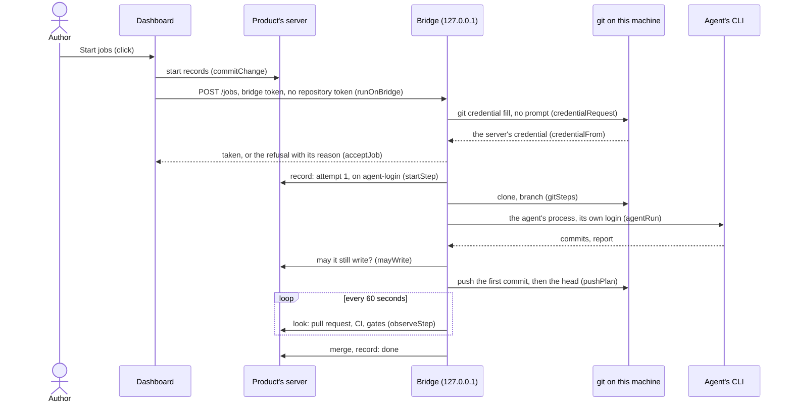

# ARC-030 The bridge as a job runtime

## Context

An agent's job runs as the same steps in every runtime (ARC-029 decision 11). A CLI agent on the person's computer is
reached through the bridge (UC-011): the author's click commits the job's start record, and the site sends the job to the
bridge with the pairing token (UC-011 2); the bridge hands the task to the coding agent's CLI, which works with the login
it has on that machine (`A LOCAL AGENT USES THE PERSON'S OWN LOGIN`). The bridge's protocol — its bind, its token, its
routes, the dashboard's client — is ARC-012's; the bridge app composes the routes `POST /jobs`, `GET /jobs`,
`GET /jobs/<id>`, `GET /jobs/<id>/log` and `DELETE /jobs/<id>` (ARC-011 decision 8). The browser's repository token leaves
the browser only for the server that issued it (`A TOKEN GOES ONLY TO THE SERVER THAT ISSUED IT`), and the bridge has no
store for one (`CONFIGURATION LIVES IN THE BROWSER`). Every write to a repository goes through one function of the git
adapter on an authority, and `agent-login` is the bridge app's: "the commit is made with the git login the agent already
has" (ARC-003 decision 3).

What git and the servers document about the credential git holds:
- `git credential fill` "will attempt to add "username" and "password" attributes to the description by reading config
  files, by contacting any configured credential helpers, or by prompting the user", and prints them; its input is a
  description such as `protocol=https` and `host=…`, ended by a blank line (`https://git-scm.com/docs/git-credential`).
- `GIT_TERMINAL_PROMPT`: "If this Boolean environment variable is set to false, git will not prompt on the terminal (e.g.,
  when asking for HTTP authentication)" (`https://git-scm.com/docs/git`). Git Credential Manager's `GCM_INTERACTIVE`:
  "If interaction is required but has been disabled, an error is returned … To disable interactivity set this to `false`"
  (`https://github.com/git-ecosystem/git-credential-manager/blob/main/docs/environment.md`).
- GitHub: "If you're cloning GitHub repositories using HTTPS, we recommend you use GitHub CLI or Git Credential Manager
  (GCM) to remember your credentials"; with GitHub CLI, "enter `gh auth login`", choose HTTPS "for Git operations" and
  "enter Y" to authenticate Git with the GitHub credentials
  (`https://docs.github.com/en/get-started/git-basics/caching-your-github-credentials-in-git`).
- GitLab: among its "OAuth credential helpers", "Git Credential Manager (GCM) authenticates by default using OAuth", and
  "When 2FA is enabled, you cannot use your password to authenticate with Git over HTTPS or the GitLab API"
  (`https://docs.gitlab.com/user/profile/account/two_factor_authentication/`).

What the CLIs document about running without a person and with their own login:
- Claude Code: in bare mode it "never reads OAuth credentials or the system keychain", so "bare mode doesn't use your
  subscription login"; without it, "a `-p` session runs the hooks in a project's `.claude/settings.json` and connects the
  servers in its `.mcp.json`"; "Non-interactive mode reads stdin" (`https://code.claude.com/docs/en/headless`).
  `--permission-prompts none` is for "when nobody can answer, and Claude Code denies them instead"
  (`https://code.claude.com/docs/en/cli-reference`).
- Codex: `codex exec` "lets you run Codex from scripts"; "Allow edits: `codex exec --sandbox workspace-write`"; with
  `--json`, "stdout becomes a JSON Lines (JSONL) stream" (`https://learn.chatgpt.com/docs/non-interactive-mode`). It
  reads the prompt from standard input where the prompt argument is `-` (ARC-029).
- opencode: `opencode run [message..]` runs it "in non-interactive mode by passing a prompt directly"; `--file` attaches
  "File(s) to attach to message", `--format` "json (raw JSON events)", `--model` takes "provider/model", and `--auto` is to
  "Auto-approve permissions that are not explicitly denied" (`https://opencode.ai/docs/cli/`).

## Decision

1. **Module.** `MOD-bridge-jobs`, a feature, holds the decisions on the jobs the bridge runs: the handover it takes, the
   credential of the product's server and the context of a job's steps, the git commands of an attempt and its pushes, the
   command that runs a job's agent, the job list, a job's log, a cancel, and what quitting ends. The bridge app holds the
   table, the processes and their logs, composes these into the job routes of its table (`MOD-bridge-app.routeTable`,
   ARC-011), and carries each job through the steps every runtime performs (`MOD-job-steps`, ARC-029). The dashboard hands
   a click's jobs over and sends a cancel (`MOD-main-page.runOnBridge`, `MOD-main-page.cancelOnBridge`, ARC-024), planned
   as for CI (`MOD-job-runner.bridgeAgentOf`, `MOD-job-runner.bridgePlan`, ARC-029 decision 10).
2. **The handover** (`MOD-bridge-jobs.acceptJob`). `POST /jobs` with the bridge token carries the product's address, the
   instance's — whose participants and job definitions the steps read from its files, as CI reads them under
   `AGENT_M_HOME`, so that a job runs on the definition of the instance that started it, whatever release the bridge is
   (`ONE DEFINITION, THREE DRIVERS`) —, the job's identifier, its kind, the author's inputs, the participant, and its CLI and model; it
   carries no repository token. The bridge takes a job of a kind the job workflow carries out — implementation and
   refactoring jobs —, for a CLI it found ready (`MOD-local-agents.agentsFound`), and not held already, and only once git
   gave it the credential of the product's server (decision 3); it then holds the job as running. Otherwise it names the
   refusal, and the dashboard shows it with what works instead while the job stays queued (UC-034 4a, UC-011 2a).
3. **The credential of the product's server** (`MOD-bridge-jobs.credentialRequest`, `MOD-bridge-jobs.credentialFrom`) is
   the one git already holds for it on this machine: the bridge runs `git credential fill` with the server's host and the
   repository's path, git and Git Credential Manager kept from prompting, and takes the password git gives as the token of
   the server's API. It asks for each step and keeps the credential for that step only; it never stores, logs or sends it
   anywhere but that server, never asks for a password or token itself, and never calls `git credential approve` or
   `reject`, which would change the person's helper. Where git gives none — it reaches the server only over SSH, or no
   helper holds a login —, the job is refused with the login step the person runs: GitHub CLI or Git Credential Manager for
   GitHub, Git Credential Manager for GitLab. A server that refuses the token is named by the step's own refusal.
4. **The context of a job's steps** (`MOD-bridge-jobs.stepContext`): the product, the job, the credential's token — only
   for the server it was given for — and `agent-login` as the authority of every write: the job's record, its pull request
   and its merge (ARC-003 decision 3).
5. **An attempt on the bridge**, in this order: the start (`MOD-job-steps.startStep`), which records the attempt and gives
   the agent's prompt, or stops the job; the job's trees (`MOD-bridge-jobs.gitSteps`) — the product cloned into the job's
   directory of the bridge's store, or fetched on a later attempt, the instance's files cloned beside it, the job's branch
   taken from the server where it exists there or started from the branch its work goes into —, git asking its own
   credential helper and no credential in an address (`A CREDENTIAL IS NEVER PLACED IN A URL`); the agent's process
   (decision 6) in that tree; then, once the job may still write (`MOD-job-steps.mayWrite`), the pushes
   (`MOD-bridge-jobs.pushPlan`) — on a branch new to the server the job's first commit alone and then the head, as in CI
   (ARC-029 decision 11) —; then a look every 60 seconds (`MOD-job-steps.observeStep`), with the CLI's report and exit code
   and a wait limit of 240 minutes, as the job workflow's, until it ends the attempt: a repair starts the next attempt on
   the bridge, a wait at a gate ends the bridge's part until the click that decides the gate hands the job over again, and
   an end ends the job in the bridge's table.
6. **The agent's command** (`MOD-bridge-jobs.agentRun`): an argument list, never a shell; the CLI's non-interactive mode
   with the participant's model, edits and commands allowed in the job's working tree, no permission prompt waited for,
   its report written to a file; the prompt on standard input, or for opencode, which takes its message as arguments, the
   prompt file attached. No key and no variable is added (`A LOCAL AGENT USES THE PERSON'S OWN LOGIN`): Claude Code runs
   without its bare mode, which reads no login, and so with the hooks and servers the product's own settings name, as in
   an interactive session there. opencode's model is named with its provider, and its report gives no usage
   (`MOD-job-runner.agentReport`).
7. **A handler's refusal** is answered with status `200` and the refusal as its body, so that the dashboard's client
   returns it as the refusal it is (`MOD-bridge-server.callBridge`); a status of 400 or more stays the protocol's own
   (ARC-012 decision 9).
8. **The job list, a job, its log** (`MOD-bridge-jobs.jobsList`, `MOD-bridge-jobs.jobOf`, `MOD-bridge-jobs.logAfter`):
   `GET /jobs` lists the jobs the bridge holds, newest first; `GET /jobs/<id>` one of them; `GET /jobs/<id>/log?after=<n>`
   the log's lines after the cursor, the cursor to ask from next, and whether the process has ended (ARC-012 decision 2).
9. **A cancel** (`MOD-bridge-jobs.cancelJob`, `MOD-main-page.cancelOnBridge`). After the click that cancels a job
   committed its cancel record, the dashboard sends `DELETE /jobs/<id>`; the bridge ends the job's process and holds the
   job as cancelled, and the dashboard ends the job's record as cancelled on the same click. Whatever was pushed before
   stays on the job's branch; nothing is pushed afterwards, since every push asks first whether the job may still write.
   Where the bridge holds no such job, nothing could confirm the cancel, and the record ends as cancelled at once; where
   it cannot be reached, nothing is written and the job shows as cancelling (`MOD-run-engine.jobState`).
10. **Quitting** (`MOD-bridge-jobs.quitPlan`) stops the process of every job the bridge holds as running, holds those jobs
   as cancelled, and ends each one's record as cancelled — the bridge was quit — on the git login
   (`MOD-job-steps.cancelStep`), where it has not ended already. The table lives in the bridge's memory: after a restart
   the bridge holds no job, and a job whose record has not ended is then known to no runtime — the case UC-036 1c shows as
   ended without record.



## Alternatives

- **The repository token sent with the handover** — rejected: `A TOKEN GOES ONLY TO THE SERVER THAT ISSUED IT`.
- **A token of its own for the bridge, pasted into its window** — rejected: the bridge has no store for a repository token
  (`CONFIGURATION LIVES IN THE BROWSER`), and the person would set up a second credential where git already holds one.
- **The bridge prompting for the server's login, or letting git or a helper prompt** — rejected: the bridge never asks for
  a password or token; the person runs the login step the refusal names, once, outside the bridge.
- **The bridge pulls the queued jobs of its agents from the product repositories** instead of a handover — not chosen
  for the jobs a click starts: UC-011 2 has the site send the job, and the bridge would need to know every product and to
  read it; the jobs of a run, which start without a click, are named in the consequences.
- **One push of all the agent's commits** — rejected: CI runs on the tip of a push, and the Definition of Done reads CI on
  the job's first commit (ARC-029 decision 11).
- **A handler's refusal as status 409 or 422** — rejected: `MOD-bridge-server.callBridge` names a status of 400 or more as
  a refusal of the protocol, and a handler's refusal names its own code.
- **Claude Code in bare mode, as in CI** — rejected: bare mode reads no login, and the agent on the bridge has no key.
- **The prompt as a command-line argument** — not chosen, as in ARC-029: a long prompt meets the limit of one argument.

## Consequences

- The bridge's table is not the state of a job: the job's record is (`PROGRESS AND JOB STATE ARE DERIVED, NOT STORED`); the
  table serves the dashboard's live state, the log and the cancel.
- The bridge's writes carry the person's own git login: its commits, its pull requests and its merges are the person's
  on the server, as an agent's in an interactive session there would be.
- Not realised here — a drafting job handed to a CLI session: UC-011's job is any job, and a drafting job's CLI session
  drafts documents that enter the default branch as open (UC-011 4, `A REVIEWED ARTIFACT ENTERS THE DEFAULT BRANCH AS
  OPEN`) through the correction loop of ARC-007, whose runtime comes with the drafting jobs; until then the bridge takes an
  implementation or a refactoring job only, and refuses another with the reason. UC-011 2, 3, 4 and 5 stand once that is
  designed — step 2's handover, `MOD-main-page.runOnBridge`, refuses a drafting job until then —; what they do for an agent's job is designed here and carried in UC-034's rows.
- Not realised here — what other decisions bring: a sandboxed agent, and an agent behind a remote session, with the
  tunnels (ARC-013), and with them the start of a job for every holder of the role (UC-034 4); an agent on the bridge as a
  participant and its test, chosen from the agents the bridge found (UC-017 3, 6, 6a; UC-044 5), with the settings
  page's participants (ARC-026); the bridge's job list and a job's log on the dashboard, and a bridge shown as not
  reachable there once it was quit (UC-036 1, 4, 1a; UC-044 7b), with what reads every runtime (ARC-029); the bridge's
  steps of a run (UC-043), whose next jobs the engine in CI cannot hand to a bridge on loopback.
- `MOD-bridge-app` composes the handlers of `MOD-bridge-jobs` into its route table and carries each job through
  `MOD-job-steps`; its `uses` name both (ARC-011).

## Modules

### MOD-bridge-jobs

```json module
{
  "id": "MOD-bridge-jobs",
  "folder": "src/bridge-jobs/",
  "layer": "feature",
  "responsibility": "The jobs the bridge runs: the handover it takes from the dashboard, the credential git already holds for the product's server and the context of the job's steps on the git login, the git commands of an attempt and its pushes, the command that runs a job's agent on this machine with the agent's own login, the job list, a job's log from a cursor, a cancel, and what quitting ends; the bridge app holds the table, the processes and the logs, composes these into the job routes of its table, and carries each job through the steps every runtime performs (MOD-job-steps).",
  "realises": ["A LOCAL AGENT USES THE PERSON'S OWN LOGIN"],
  "owns": ["BridgeHandover", "BridgeJob", "AgentRunFiles", "AgentRun", "LogSlice", "BridgeCancel", "CredentialRequest", "GitAnswer", "GitCredential", "JobDirs", "GitSteps", "GitCommand", "NewCommits", "QuitPlan"],
  "uses": ["MOD-contracts", "MOD-git-host"]
}
```

```json interface
{
  "id": "MOD-bridge-jobs.credentialRequest",
  "summary": "What the bridge asks git for the credential of a product's server: git's own credential interface, git credential fill, given the protocol, the host and the repository's path on standard input with a blank line after them, git and Git Credential Manager kept from prompting — the bridge never asks for a password or token itself.",
  "params": [{ "name": "address", "type": "string" }],
  "result": "CredentialRequest",
  "async": false,
  "refusals": [{ "code": "not-an-address", "when": "the address is no repository address" }],
  "examples": [
    {
      "name": "the thesis on GitHub",
      "input": { "address": "https://github.com/alice/thesis" },
      "result": {
        "command": ["git", "credential", "fill"],
        "stdin": "protocol=https\nhost=github.com\npath=alice/thesis.git\n\n",
        "env": { "GIT_TERMINAL_PROMPT": "0", "GCM_INTERACTIVE": "false" }
      }
    },
    { "name": "no repository address", "input": { "address": "thesis" }, "refused": "not-an-address" }
  ]
}
```

```json interface
{
  "id": "MOD-bridge-jobs.credentialFrom",
  "summary": "The credential git gave for the product's server: its host, the user name and the password, the token the server's API is called with; never kept, logged or written. Where git gave none — it reaches the server only over SSH, or no helper holds a login —, the job is refused with the login step the person runs for that kind of server.",
  "params": [{ "name": "address", "type": "string" }, { "name": "answer", "type": "GitAnswer" }],
  "result": "GitCredential",
  "async": false,
  "refusals": [
    { "code": "not-an-address", "when": "the address is no repository address" },
    { "code": "no-credential", "when": "git gave no password for the server" },
    { "code": "other-server", "when": "git answered for another host" }
  ],
  "examples": [
    {
      "name": "GitHub CLI's login",
      "input": {
        "address": "https://github.com/alice/thesis",
        "answer": { "exitCode": 0, "stdout": "protocol=https\nhost=github.com\npath=alice/thesis.git\nusername=alice\npassword=gho_from_git_credential_example\n", "stderr": "" }
      },
      "result": { "host": "github.com", "username": "alice", "token": "gho_from_git_credential_example" }
    },
    {
      "name": "git holds no login for github.com",
      "input": {
        "address": "https://github.com/alice/thesis",
        "answer": { "exitCode": 128, "stdout": "", "stderr": "fatal: could not read Username for 'https://github.com': terminal prompts disabled\n" }
      },
      "refused": "no-credential"
    },
    {
      "name": "an answer for another server",
      "input": {
        "address": "https://github.com/alice/thesis",
        "answer": { "exitCode": 0, "stdout": "protocol=https\nhost=gitlab.com\npath=alice/thesis.git\nusername=alice\npassword=gho_from_git_credential_example\n", "stderr": "" }
      },
      "refused": "other-server"
    }
  ]
}
```

```json interface
{
  "id": "MOD-bridge-jobs.stepContext",
  "summary": "What a job's steps work with on the bridge (MOD-job-steps): the product, the job, the credential's token — used only for the server it was given for — and the git login the agent already has as the authority every write is made on.",
  "params": [{ "name": "job", "type": "BridgeJob" }, { "name": "credential", "type": "GitCredential" }],
  "result": "JobContext",
  "async": false,
  "refusals": [
    { "code": "not-an-address", "when": "the job's product is no repository address" },
    { "code": "other-server", "when": "the credential is another server's" }
  ],
  "examples": [
    {
      "name": "ITM-014's job",
      "input": {
        "job": {
          "job": "JOB-20261012-0800-3d3d",
          "product": "https://github.com/alice/thesis",
          "instance": "https://github.com/alice/agent-m",
          "kind": "implement",
          "inputs": [],
          "participant": "cli-dev",
          "cli": "claude",
          "model": "claude-opus-5-5",
          "state": "running",
          "started": "2026-10-12T08:00:30Z",
          "ended": "",
          "note": ""
        },
        "credential": { "host": "github.com", "username": "alice", "token": "gho_from_git_credential_example" }
      },
      "result": {
        "product": "https://github.com/alice/thesis",
        "job": "JOB-20261012-0800-3d3d",
        "token": "gho_from_git_credential_example",
        "authority": { "kind": "agent-login" },
        "instance": "https://github.com/alice/agent-m"
      }
    },
    {
      "name": "a credential of another server",
      "input": {
        "job": {
          "job": "JOB-20261012-0800-3d3d",
          "product": "https://github.com/alice/thesis",
          "instance": "https://github.com/alice/agent-m",
          "kind": "implement",
          "inputs": [],
          "participant": "cli-dev",
          "cli": "claude",
          "model": "claude-opus-5-5",
          "state": "running",
          "started": "2026-10-12T08:00:30Z",
          "ended": "",
          "note": ""
        },
        "credential": { "host": "gitlab.com", "username": "alice", "token": "gho_from_git_credential_example" }
      },
      "refused": "other-server"
    }
  ]
}
```

```json interface
{
  "id": "MOD-bridge-jobs.gitSteps",
  "summary": "The git commands of a job's attempt on the bridge, each an argument list run without a prompt, git asking its own credential helper and no credential in an address: the product cloned into the job's tree — fetched on a later attempt — and the instance's files cloned beside it; the job's branch taken from the server where it exists there, else started from the branch its work goes into; and the commits the agent made since either.",
  "params": [
    { "name": "job", "type": "BridgeJob" },
    { "name": "where", "type": "JobStarted" },
    { "name": "dirs", "type": "JobDirs" }
  ],
  "result": "GitSteps",
  "async": false,
  "refusals": [],
  "examples": [
    {
      "name": "ITM-014's first attempt",
      "input": {
        "job": {
          "job": "JOB-20261012-0800-3d3d",
          "product": "https://github.com/alice/thesis",
          "instance": "https://github.com/alice/agent-m",
          "kind": "implement",
          "inputs": [],
          "participant": "cli-dev",
          "cli": "claude",
          "model": "claude-opus-5-5",
          "state": "running",
          "started": "2026-10-12T08:00:30Z",
          "ended": "",
          "note": ""
        },
        "where": { "next": "agent", "branch": "item/ITM-014", "base": "main", "prompt": "Implement the backlog item below in this repository, test first: …", "attempt": 1, "note": "", "run": "" },
        "dirs": { "tree": "/Users/alice/.agent-m-bridge/jobs/JOB-20261012-0800-3d3d/thesis", "agentM": "/Users/alice/.agent-m-bridge/jobs/JOB-20261012-0800-3d3d/agent-m" }
      },
      "result": {
        "env": { "GIT_TERMINAL_PROMPT": "0", "GCM_INTERACTIVE": "false" },
        "clone": [
          ["git", "clone", "--quiet", "https://github.com/alice/thesis.git", "/Users/alice/.agent-m-bridge/jobs/JOB-20261012-0800-3d3d/thesis"],
          ["git", "clone", "--quiet", "--depth", "1", "https://github.com/alice/agent-m.git", "/Users/alice/.agent-m-bridge/jobs/JOB-20261012-0800-3d3d/agent-m"]
        ],
        "fetch": [
          ["git", "-C", "/Users/alice/.agent-m-bridge/jobs/JOB-20261012-0800-3d3d/thesis", "fetch", "--quiet", "--prune", "origin"],
          ["git", "-C", "/Users/alice/.agent-m-bridge/jobs/JOB-20261012-0800-3d3d/agent-m", "pull", "--quiet", "--ff-only"]
        ],
        "probe": ["git", "-C", "/Users/alice/.agent-m-bridge/jobs/JOB-20261012-0800-3d3d/thesis", "rev-parse", "--verify", "--quiet", "refs/remotes/origin/item/ITM-014"],
        "fromBranch": ["git", "-C", "/Users/alice/.agent-m-bridge/jobs/JOB-20261012-0800-3d3d/thesis", "checkout", "--quiet", "-B", "item/ITM-014", "origin/item/ITM-014"],
        "fromBase": ["git", "-C", "/Users/alice/.agent-m-bridge/jobs/JOB-20261012-0800-3d3d/thesis", "checkout", "--quiet", "-B", "item/ITM-014", "origin/main"],
        "newOnBranch": ["git", "-C", "/Users/alice/.agent-m-bridge/jobs/JOB-20261012-0800-3d3d/thesis", "rev-list", "--reverse", "origin/item/ITM-014..HEAD"],
        "newOnBase": ["git", "-C", "/Users/alice/.agent-m-bridge/jobs/JOB-20261012-0800-3d3d/thesis", "rev-list", "--reverse", "origin/main..HEAD"]
      }
    }
  ]
}
```

```json interface
{
  "id": "MOD-bridge-jobs.pushPlan",
  "summary": "The pushes of an attempt, once the job may still write (MOD-job-steps.mayWrite): none without a new commit; on a branch new to the server, the job's first commit alone and then the head, so that CI runs on the commit that holds only the tests; otherwise the head.",
  "params": [
    { "name": "where", "type": "JobStarted" },
    { "name": "dirs", "type": "JobDirs" },
    { "name": "found", "type": "NewCommits" }
  ],
  "result": "GitCommand[]",
  "async": false,
  "refusals": [],
  "examples": [
    {
      "name": "a branch new to the server",
      "input": {
        "where": { "next": "agent", "branch": "item/ITM-014", "base": "main", "prompt": "Implement the backlog item below in this repository, test first: …", "attempt": 1, "note": "", "run": "" },
        "dirs": { "tree": "/Users/alice/.agent-m-bridge/jobs/JOB-20261012-0800-3d3d/thesis", "agentM": "/Users/alice/.agent-m-bridge/jobs/JOB-20261012-0800-3d3d/agent-m" },
        "found": {
          "branchExists": false,
          "commits": ["d100000000000000000000000000000000000000", "d200000000000000000000000000000000000000"]
        }
      },
      "result": [
        ["git", "-C", "/Users/alice/.agent-m-bridge/jobs/JOB-20261012-0800-3d3d/thesis", "push", "--quiet", "origin", "d100000000000000000000000000000000000000:refs/heads/item/ITM-014"],
        ["git", "-C", "/Users/alice/.agent-m-bridge/jobs/JOB-20261012-0800-3d3d/thesis", "push", "--quiet", "origin", "HEAD:refs/heads/item/ITM-014"]
      ]
    },
    {
      "name": "a later attempt's commit",
      "input": {
        "where": { "next": "agent", "branch": "item/ITM-014", "base": "main", "prompt": "Implement the backlog item below in this repository, test first: …", "attempt": 1, "note": "", "run": "" },
        "dirs": { "tree": "/Users/alice/.agent-m-bridge/jobs/JOB-20261012-0800-3d3d/thesis", "agentM": "/Users/alice/.agent-m-bridge/jobs/JOB-20261012-0800-3d3d/agent-m" },
        "found": { "branchExists": true, "commits": ["d300000000000000000000000000000000000000"] }
      },
      "result": [
        ["git", "-C", "/Users/alice/.agent-m-bridge/jobs/JOB-20261012-0800-3d3d/thesis", "push", "--quiet", "origin", "HEAD:refs/heads/item/ITM-014"]
      ]
    },
    {
      "name": "nothing committed",
      "input": {
        "where": { "next": "agent", "branch": "item/ITM-014", "base": "main", "prompt": "Implement the backlog item below in this repository, test first: …", "attempt": 1, "note": "", "run": "" },
        "dirs": { "tree": "/Users/alice/.agent-m-bridge/jobs/JOB-20261012-0800-3d3d/thesis", "agentM": "/Users/alice/.agent-m-bridge/jobs/JOB-20261012-0800-3d3d/agent-m" },
        "found": { "branchExists": false, "commits": [] }
      },
      "result": []
    }
  ]
}
```

```json interface
{
  "id": "MOD-bridge-jobs.acceptJob",
  "summary": "A handover the dashboard sends with POST /jobs, taken into the bridge's table: the job of a product, of a kind the bridge carries out — implementation and refactoring jobs, as the job workflow —, for an agent the bridge found ready, installed and logged in, and not held already; the job is held as running from the time it was taken.",
  "params": [
    { "name": "handover", "type": "BridgeHandover" },
    { "name": "agents", "type": "AgentFound[]" },
    { "name": "jobs", "type": "BridgeJob[]" },
    { "name": "now", "type": "string" }
  ],
  "result": "BridgeJob",
  "async": false,
  "refusals": [
    { "code": "not-a-job", "when": "the handover names no job identifier" },
    { "code": "not-an-address", "when": "the product's address is no repository address" },
    { "code": "not-carried", "when": "the job is of a kind the bridge does not carry out" },
    { "code": "agent-missing", "when": "the job's CLI is not installed on this machine" },
    { "code": "agent-not-ready", "when": "the job's CLI is installed but not logged in" },
    { "code": "already-held", "when": "the bridge holds the job already" }
  ],
  "examples": [
    {
      "name": "ITM-014's job for Claude Code",
      "input": {
        "handover": {
          "product": "https://github.com/alice/thesis",
          "instance": "https://github.com/alice/agent-m",
          "job": "JOB-20261012-0800-3d3d",
          "kind": "implement",
          "inputs": [],
          "participant": "cli-dev",
          "cli": "claude",
          "model": "claude-opus-5-5"
        },
        "agents": [
          { "agent": "claude", "version": "2.1.290", "state": "ready", "loginStep": "", "install": "" },
          { "agent": "codex", "version": "0.48.0", "state": "not-logged-in", "loginStep": "codex login", "install": "" },
          { "agent": "opencode", "version": "", "state": "missing", "loginStep": "", "install": "https://opencode.ai/docs/#install" }
        ],
        "jobs": [],
        "now": "2026-10-12T08:00:30Z"
      },
      "result": {
        "job": "JOB-20261012-0800-3d3d",
        "product": "https://github.com/alice/thesis",
        "instance": "https://github.com/alice/agent-m",
        "kind": "implement",
        "inputs": [],
        "participant": "cli-dev",
        "cli": "claude",
        "model": "claude-opus-5-5",
        "state": "running",
        "started": "2026-10-12T08:00:30Z",
        "ended": "",
        "note": ""
      }
    },
    {
      "name": "Codex, not logged in",
      "input": {
        "handover": {
          "product": "https://github.com/alice/thesis",
          "instance": "https://github.com/alice/agent-m",
          "job": "JOB-20261012-0800-3d3d",
          "kind": "implement",
          "inputs": [],
          "participant": "cli-dev",
          "cli": "codex",
          "model": "codex-model"
        },
        "agents": [
          { "agent": "claude", "version": "2.1.290", "state": "ready", "loginStep": "", "install": "" },
          { "agent": "codex", "version": "0.48.0", "state": "not-logged-in", "loginStep": "codex login", "install": "" },
          { "agent": "opencode", "version": "", "state": "missing", "loginStep": "", "install": "https://opencode.ai/docs/#install" }
        ],
        "jobs": [],
        "now": "2026-10-12T08:00:30Z"
      },
      "refused": "agent-not-ready"
    },
    {
      "name": "opencode, not installed",
      "input": {
        "handover": {
          "product": "https://github.com/alice/thesis",
          "instance": "https://github.com/alice/agent-m",
          "job": "JOB-20261012-0800-3d3d",
          "kind": "implement",
          "inputs": [],
          "participant": "cli-dev",
          "cli": "opencode",
          "model": "anthropic/claude-sonnet-5"
        },
        "agents": [
          { "agent": "claude", "version": "2.1.290", "state": "ready", "loginStep": "", "install": "" },
          { "agent": "codex", "version": "0.48.0", "state": "not-logged-in", "loginStep": "codex login", "install": "" },
          { "agent": "opencode", "version": "", "state": "missing", "loginStep": "", "install": "https://opencode.ai/docs/#install" }
        ],
        "jobs": [],
        "now": "2026-10-12T08:00:30Z"
      },
      "refused": "agent-missing"
    },
    {
      "name": "a CI configuration job",
      "input": {
        "handover": {
          "product": "https://github.com/alice/thesis",
          "instance": "https://github.com/alice/agent-m",
          "job": "JOB-20261012-0803-6a6a",
          "kind": "configure-ci",
          "inputs": [],
          "participant": "cli-dev",
          "cli": "claude",
          "model": "claude-opus-5-5"
        },
        "agents": [
          { "agent": "claude", "version": "2.1.290", "state": "ready", "loginStep": "", "install": "" },
          { "agent": "codex", "version": "0.48.0", "state": "not-logged-in", "loginStep": "codex login", "install": "" },
          { "agent": "opencode", "version": "", "state": "missing", "loginStep": "", "install": "https://opencode.ai/docs/#install" }
        ],
        "jobs": [],
        "now": "2026-10-12T08:00:30Z"
      },
      "refused": "not-carried"
    },
    {
      "name": "a job the bridge holds already",
      "input": {
        "handover": {
          "product": "https://github.com/alice/thesis",
          "instance": "https://github.com/alice/agent-m",
          "job": "JOB-20261012-0800-3d3d",
          "kind": "implement",
          "inputs": [],
          "participant": "cli-dev",
          "cli": "claude",
          "model": "claude-opus-5-5"
        },
        "agents": [
          { "agent": "claude", "version": "2.1.290", "state": "ready", "loginStep": "", "install": "" },
          { "agent": "codex", "version": "0.48.0", "state": "not-logged-in", "loginStep": "codex login", "install": "" },
          { "agent": "opencode", "version": "", "state": "missing", "loginStep": "", "install": "https://opencode.ai/docs/#install" }
        ],
        "jobs": [
          {
            "job": "JOB-20261012-0800-3d3d",
            "product": "https://github.com/alice/thesis",
            "instance": "https://github.com/alice/agent-m",
            "kind": "implement",
            "inputs": [],
            "participant": "cli-dev",
            "cli": "claude",
            "model": "claude-opus-5-5",
            "state": "running",
            "started": "2026-10-12T08:00:30Z",
            "ended": "",
            "note": ""
          }
        ],
        "now": "2026-10-12T08:00:30Z"
      },
      "refused": "already-held"
    }
  ]
}
```

```json interface
{
  "id": "MOD-bridge-jobs.agentRun",
  "summary": "The process that runs a job's agent on this machine, as an argument list and never through a shell: the CLI's non-interactive mode with the participant's model, edits and commands allowed in the job's working tree and no permission prompt waited for, its report written where the job reads it, the prompt on standard input — opencode, which takes its message as arguments, attaches the prompt file instead. No key and no variable is added: the agent runs with the login it has on this machine, so Claude Code runs without its bare mode, which reads no login.",
  "params": [{ "name": "job", "type": "BridgeJob" }, { "name": "files", "type": "AgentRunFiles" }],
  "result": "AgentRun",
  "async": false,
  "refusals": [
    { "code": "model-form", "when": "opencode's model names no provider" },
    { "code": "unknown-cli", "when": "the job's CLI is none of claude, codex and opencode" }
  ],
  "examples": [
    {
      "name": "Claude Code",
      "input": {
        "job": {
          "job": "JOB-20261012-0800-3d3d",
          "product": "https://github.com/alice/thesis",
          "instance": "https://github.com/alice/agent-m",
          "kind": "implement",
          "inputs": [],
          "participant": "cli-dev",
          "cli": "claude",
          "model": "claude-opus-5-5",
          "state": "running",
          "started": "2026-10-12T08:00:30Z",
          "ended": "",
          "note": ""
        },
        "files": { "tree": "/Users/alice/.agent-m-bridge/jobs/JOB-20261012-0800-3d3d/thesis", "prompt": "/Users/alice/.agent-m-bridge/jobs/JOB-20261012-0800-3d3d/prompt.md", "report": "/Users/alice/.agent-m-bridge/jobs/JOB-20261012-0800-3d3d/report.json" }
      },
      "result": {
        "stdin": "/Users/alice/.agent-m-bridge/jobs/JOB-20261012-0800-3d3d/prompt.md",
        "stdout": "/Users/alice/.agent-m-bridge/jobs/JOB-20261012-0800-3d3d/report.json",
        "cwd": "/Users/alice/.agent-m-bridge/jobs/JOB-20261012-0800-3d3d/thesis",
        "command": ["claude", "-p", "Carry out the task the input describes.", "--model", "claude-opus-5-5", "--permission-mode", "acceptEdits", "--allowedTools", "Bash", "--permission-prompts", "none", "--output-format", "json"]
      }
    },
    {
      "name": "Codex",
      "input": {
        "job": {
          "job": "JOB-20261012-0800-3d3d",
          "product": "https://github.com/alice/thesis",
          "instance": "https://github.com/alice/agent-m",
          "kind": "implement",
          "inputs": [],
          "participant": "cli-dev",
          "cli": "codex",
          "model": "codex-model",
          "state": "running",
          "started": "2026-10-12T08:00:30Z",
          "ended": "",
          "note": ""
        },
        "files": { "tree": "/Users/alice/.agent-m-bridge/jobs/JOB-20261012-0800-3d3d/thesis", "prompt": "/Users/alice/.agent-m-bridge/jobs/JOB-20261012-0800-3d3d/prompt.md", "report": "/Users/alice/.agent-m-bridge/jobs/JOB-20261012-0800-3d3d/report.json" }
      },
      "result": {
        "stdin": "/Users/alice/.agent-m-bridge/jobs/JOB-20261012-0800-3d3d/prompt.md",
        "stdout": "/Users/alice/.agent-m-bridge/jobs/JOB-20261012-0800-3d3d/report.json",
        "cwd": "/Users/alice/.agent-m-bridge/jobs/JOB-20261012-0800-3d3d/thesis",
        "command": ["codex", "exec", "--model", "codex-model", "--sandbox", "workspace-write", "--json", "-"]
      }
    },
    {
      "name": "opencode",
      "input": {
        "job": {
          "job": "JOB-20261012-0805-9d9d",
          "product": "https://github.com/alice/thesis",
          "instance": "https://github.com/alice/agent-m",
          "kind": "implement",
          "inputs": [],
          "participant": "oc-dev",
          "cli": "opencode",
          "model": "anthropic/claude-sonnet-5",
          "state": "running",
          "started": "2026-10-12T08:00:30Z",
          "ended": "",
          "note": ""
        },
        "files": { "tree": "/Users/alice/.agent-m-bridge/jobs/JOB-20261012-0800-3d3d/thesis", "prompt": "/Users/alice/.agent-m-bridge/jobs/JOB-20261012-0800-3d3d/prompt.md", "report": "/Users/alice/.agent-m-bridge/jobs/JOB-20261012-0800-3d3d/report.json" }
      },
      "result": {
        "stdin": "",
        "stdout": "/Users/alice/.agent-m-bridge/jobs/JOB-20261012-0800-3d3d/report.json",
        "cwd": "/Users/alice/.agent-m-bridge/jobs/JOB-20261012-0800-3d3d/thesis",
        "command": ["opencode", "run", "--model", "anthropic/claude-sonnet-5", "--format", "json", "--auto", "--file", "/Users/alice/.agent-m-bridge/jobs/JOB-20261012-0800-3d3d/prompt.md", "Carry out the task the attached file describes."]
      }
    },
    {
      "name": "opencode with a model of no provider",
      "input": {
        "job": {
          "job": "JOB-20261012-0805-9d9d",
          "product": "https://github.com/alice/thesis",
          "instance": "https://github.com/alice/agent-m",
          "kind": "implement",
          "inputs": [],
          "participant": "oc-dev",
          "cli": "opencode",
          "model": "claude-sonnet-5",
          "state": "running",
          "started": "2026-10-12T08:00:30Z",
          "ended": "",
          "note": ""
        },
        "files": { "tree": "/Users/alice/.agent-m-bridge/jobs/JOB-20261012-0800-3d3d/thesis", "prompt": "/Users/alice/.agent-m-bridge/jobs/JOB-20261012-0800-3d3d/prompt.md", "report": "/Users/alice/.agent-m-bridge/jobs/JOB-20261012-0800-3d3d/report.json" }
      },
      "refused": "model-form"
    }
  ]
}
```

```json interface
{
  "id": "MOD-bridge-jobs.jobsList",
  "summary": "The jobs the bridge holds, newest first, for GET /jobs.",
  "params": [{ "name": "jobs", "type": "BridgeJob[]" }],
  "result": "BridgeJob[]",
  "async": false,
  "refusals": [],
  "examples": [
    {
      "name": "two of the thesis and one of the notes",
      "input": {
        "jobs": [
          {
            "job": "JOB-20261011-1500-8c8c",
            "product": "https://github.com/alice/notes",
            "instance": "https://github.com/alice/agent-m",
            "kind": "implement",
            "inputs": [],
            "participant": "cli-dev",
            "cli": "claude",
            "model": "claude-opus-5-5",
            "state": "ended",
            "started": "2026-10-11T15:00:30Z",
            "ended": "2026-10-11T15:41:00Z",
            "note": ""
          },
          {
            "job": "JOB-20261012-0800-3d3d",
            "product": "https://github.com/alice/thesis",
            "instance": "https://github.com/alice/agent-m",
            "kind": "implement",
            "inputs": [],
            "participant": "cli-dev",
            "cli": "claude",
            "model": "claude-opus-5-5",
            "state": "running",
            "started": "2026-10-12T08:00:30Z",
            "ended": "",
            "note": ""
          },
          {
            "job": "JOB-20261012-0802-5f5f",
            "product": "https://github.com/alice/thesis",
            "instance": "https://github.com/alice/agent-m",
            "kind": "implement",
            "inputs": [],
            "participant": "cli-dev",
            "cli": "claude",
            "model": "claude-opus-5-5",
            "state": "running",
            "started": "2026-10-12T08:01:00Z",
            "ended": "",
            "note": ""
          }
        ]
      },
      "result": [
        {
          "job": "JOB-20261012-0802-5f5f",
          "product": "https://github.com/alice/thesis",
          "instance": "https://github.com/alice/agent-m",
          "kind": "implement",
          "inputs": [],
          "participant": "cli-dev",
          "cli": "claude",
          "model": "claude-opus-5-5",
          "state": "running",
          "started": "2026-10-12T08:01:00Z",
          "ended": "",
          "note": ""
        },
        {
          "job": "JOB-20261012-0800-3d3d",
          "product": "https://github.com/alice/thesis",
          "instance": "https://github.com/alice/agent-m",
          "kind": "implement",
          "inputs": [],
          "participant": "cli-dev",
          "cli": "claude",
          "model": "claude-opus-5-5",
          "state": "running",
          "started": "2026-10-12T08:00:30Z",
          "ended": "",
          "note": ""
        },
        {
          "job": "JOB-20261011-1500-8c8c",
          "product": "https://github.com/alice/notes",
          "instance": "https://github.com/alice/agent-m",
          "kind": "implement",
          "inputs": [],
          "participant": "cli-dev",
          "cli": "claude",
          "model": "claude-opus-5-5",
          "state": "ended",
          "started": "2026-10-11T15:00:30Z",
          "ended": "2026-10-11T15:41:00Z",
          "note": ""
        }
      ]
    }
  ]
}
```

```json interface
{
  "id": "MOD-bridge-jobs.jobOf",
  "summary": "One job the bridge holds, for GET /jobs/<id>.",
  "params": [{ "name": "jobs", "type": "BridgeJob[]" }, { "name": "id", "type": "string" }],
  "result": "BridgeJob",
  "async": false,
  "refusals": [{ "code": "unknown-job", "when": "the bridge holds no such job" }],
  "examples": [
    {
      "name": "ITM-014's job",
      "input": {
        "jobs": [
          {
            "job": "JOB-20261011-1500-8c8c",
            "product": "https://github.com/alice/notes",
            "instance": "https://github.com/alice/agent-m",
            "kind": "implement",
            "inputs": [],
            "participant": "cli-dev",
            "cli": "claude",
            "model": "claude-opus-5-5",
            "state": "ended",
            "started": "2026-10-11T15:00:30Z",
            "ended": "2026-10-11T15:41:00Z",
            "note": ""
          },
          {
            "job": "JOB-20261012-0800-3d3d",
            "product": "https://github.com/alice/thesis",
            "instance": "https://github.com/alice/agent-m",
            "kind": "implement",
            "inputs": [],
            "participant": "cli-dev",
            "cli": "claude",
            "model": "claude-opus-5-5",
            "state": "running",
            "started": "2026-10-12T08:00:30Z",
            "ended": "",
            "note": ""
          },
          {
            "job": "JOB-20261012-0802-5f5f",
            "product": "https://github.com/alice/thesis",
            "instance": "https://github.com/alice/agent-m",
            "kind": "implement",
            "inputs": [],
            "participant": "cli-dev",
            "cli": "claude",
            "model": "claude-opus-5-5",
            "state": "running",
            "started": "2026-10-12T08:01:00Z",
            "ended": "",
            "note": ""
          }
        ],
        "id": "JOB-20261012-0800-3d3d"
      },
      "result": {
        "job": "JOB-20261012-0800-3d3d",
        "product": "https://github.com/alice/thesis",
        "instance": "https://github.com/alice/agent-m",
        "kind": "implement",
        "inputs": [],
        "participant": "cli-dev",
        "cli": "claude",
        "model": "claude-opus-5-5",
        "state": "running",
        "started": "2026-10-12T08:00:30Z",
        "ended": "",
        "note": ""
      }
    },
    {
      "name": "a job of another bridge",
      "input": {
        "jobs": [
          {
            "job": "JOB-20261011-1500-8c8c",
            "product": "https://github.com/alice/notes",
            "instance": "https://github.com/alice/agent-m",
            "kind": "implement",
            "inputs": [],
            "participant": "cli-dev",
            "cli": "claude",
            "model": "claude-opus-5-5",
            "state": "ended",
            "started": "2026-10-11T15:00:30Z",
            "ended": "2026-10-11T15:41:00Z",
            "note": ""
          },
          {
            "job": "JOB-20261012-0800-3d3d",
            "product": "https://github.com/alice/thesis",
            "instance": "https://github.com/alice/agent-m",
            "kind": "implement",
            "inputs": [],
            "participant": "cli-dev",
            "cli": "claude",
            "model": "claude-opus-5-5",
            "state": "running",
            "started": "2026-10-12T08:00:30Z",
            "ended": "",
            "note": ""
          },
          {
            "job": "JOB-20261012-0802-5f5f",
            "product": "https://github.com/alice/thesis",
            "instance": "https://github.com/alice/agent-m",
            "kind": "implement",
            "inputs": [],
            "participant": "cli-dev",
            "cli": "claude",
            "model": "claude-opus-5-5",
            "state": "running",
            "started": "2026-10-12T08:01:00Z",
            "ended": "",
            "note": ""
          }
        ],
        "id": "JOB-20261012-0801-4e4e"
      },
      "refused": "unknown-job"
    }
  ]
}
```

```json interface
{
  "id": "MOD-bridge-jobs.logAfter",
  "summary": "A job's log from a cursor, for GET /jobs/<id>/log?after=<n>: the lines after the n-th, the cursor to ask from next, and whether the job's process has ended, so that the dashboard stops asking.",
  "params": [
    { "name": "job", "type": "BridgeJob" },
    { "name": "lines", "type": "string[]" },
    { "name": "after", "type": "integer" }
  ],
  "result": "LogSlice",
  "async": false,
  "refusals": [{ "code": "bad-cursor", "when": "the cursor is negative or past the log's end" }],
  "examples": [
    {
      "name": "from the start",
      "input": {
        "job": {
          "job": "JOB-20261012-0800-3d3d",
          "product": "https://github.com/alice/thesis",
          "instance": "https://github.com/alice/agent-m",
          "kind": "implement",
          "inputs": [],
          "participant": "cli-dev",
          "cli": "claude",
          "model": "claude-opus-5-5",
          "state": "running",
          "started": "2026-10-12T08:00:30Z",
          "ended": "",
          "note": ""
        },
        "lines": ["agent-m: attempt 1 of JOB-20261012-0800-3d3d on cli-dev", "claude: read docs/backlog/ITM-014-export-a-chapter-as-pdf.md", "claude: wrote tests/export.test.mjs", "claude: ran node --test tests/export.test.mjs, 2 failing"],
        "after": 0
      },
      "result": {
        "job": "JOB-20261012-0800-3d3d",
        "lines": ["agent-m: attempt 1 of JOB-20261012-0800-3d3d on cli-dev", "claude: read docs/backlog/ITM-014-export-a-chapter-as-pdf.md", "claude: wrote tests/export.test.mjs", "claude: ran node --test tests/export.test.mjs, 2 failing"],
        "next": 4,
        "ended": false
      }
    },
    {
      "name": "after two lines read",
      "input": {
        "job": {
          "job": "JOB-20261012-0800-3d3d",
          "product": "https://github.com/alice/thesis",
          "instance": "https://github.com/alice/agent-m",
          "kind": "implement",
          "inputs": [],
          "participant": "cli-dev",
          "cli": "claude",
          "model": "claude-opus-5-5",
          "state": "running",
          "started": "2026-10-12T08:00:30Z",
          "ended": "",
          "note": ""
        },
        "lines": ["agent-m: attempt 1 of JOB-20261012-0800-3d3d on cli-dev", "claude: read docs/backlog/ITM-014-export-a-chapter-as-pdf.md", "claude: wrote tests/export.test.mjs", "claude: ran node --test tests/export.test.mjs, 2 failing"],
        "after": 2
      },
      "result": {
        "job": "JOB-20261012-0800-3d3d",
        "lines": ["claude: wrote tests/export.test.mjs", "claude: ran node --test tests/export.test.mjs, 2 failing"],
        "next": 4,
        "ended": false
      }
    },
    {
      "name": "a cursor past the end",
      "input": {
        "job": {
          "job": "JOB-20261012-0800-3d3d",
          "product": "https://github.com/alice/thesis",
          "instance": "https://github.com/alice/agent-m",
          "kind": "implement",
          "inputs": [],
          "participant": "cli-dev",
          "cli": "claude",
          "model": "claude-opus-5-5",
          "state": "running",
          "started": "2026-10-12T08:00:30Z",
          "ended": "",
          "note": ""
        },
        "lines": ["agent-m: attempt 1 of JOB-20261012-0800-3d3d on cli-dev", "claude: read docs/backlog/ITM-014-export-a-chapter-as-pdf.md", "claude: wrote tests/export.test.mjs", "claude: ran node --test tests/export.test.mjs, 2 failing"],
        "after": 9
      },
      "refused": "bad-cursor"
    }
  ]
}
```

```json interface
{
  "id": "MOD-bridge-jobs.cancelJob",
  "summary": "A cancel, DELETE /jobs/<id>: the job's process is stopped — the bridge app ends it — and the job is held as cancelled; a job that ended already is left as it is.",
  "params": [
    { "name": "jobs", "type": "BridgeJob[]" },
    { "name": "id", "type": "string" },
    { "name": "now", "type": "string" }
  ],
  "result": "BridgeCancel",
  "async": false,
  "refusals": [{ "code": "unknown-job", "when": "the bridge holds no such job" }],
  "examples": [
    {
      "name": "ITM-014's running job",
      "input": {
        "jobs": [
          {
            "job": "JOB-20261011-1500-8c8c",
            "product": "https://github.com/alice/notes",
            "instance": "https://github.com/alice/agent-m",
            "kind": "implement",
            "inputs": [],
            "participant": "cli-dev",
            "cli": "claude",
            "model": "claude-opus-5-5",
            "state": "ended",
            "started": "2026-10-11T15:00:30Z",
            "ended": "2026-10-11T15:41:00Z",
            "note": ""
          },
          {
            "job": "JOB-20261012-0800-3d3d",
            "product": "https://github.com/alice/thesis",
            "instance": "https://github.com/alice/agent-m",
            "kind": "implement",
            "inputs": [],
            "participant": "cli-dev",
            "cli": "claude",
            "model": "claude-opus-5-5",
            "state": "running",
            "started": "2026-10-12T08:00:30Z",
            "ended": "",
            "note": ""
          },
          {
            "job": "JOB-20261012-0802-5f5f",
            "product": "https://github.com/alice/thesis",
            "instance": "https://github.com/alice/agent-m",
            "kind": "implement",
            "inputs": [],
            "participant": "cli-dev",
            "cli": "claude",
            "model": "claude-opus-5-5",
            "state": "running",
            "started": "2026-10-12T08:01:00Z",
            "ended": "",
            "note": ""
          }
        ],
        "id": "JOB-20261012-0800-3d3d",
        "now": "2026-10-12T08:10:30Z"
      },
      "result": {
        "job": "JOB-20261012-0800-3d3d",
        "stop": true,
        "entry": {
          "job": "JOB-20261012-0800-3d3d",
          "product": "https://github.com/alice/thesis",
          "instance": "https://github.com/alice/agent-m",
          "kind": "implement",
          "inputs": [],
          "participant": "cli-dev",
          "cli": "claude",
          "model": "claude-opus-5-5",
          "state": "cancelled",
          "started": "2026-10-12T08:00:30Z",
          "ended": "2026-10-12T08:10:30Z",
          "note": "cancelled on the dashboard"
        }
      }
    },
    {
      "name": "a job that ended",
      "input": {
        "jobs": [
          {
            "job": "JOB-20261011-1500-8c8c",
            "product": "https://github.com/alice/notes",
            "instance": "https://github.com/alice/agent-m",
            "kind": "implement",
            "inputs": [],
            "participant": "cli-dev",
            "cli": "claude",
            "model": "claude-opus-5-5",
            "state": "ended",
            "started": "2026-10-11T15:00:30Z",
            "ended": "2026-10-11T15:41:00Z",
            "note": ""
          },
          {
            "job": "JOB-20261012-0800-3d3d",
            "product": "https://github.com/alice/thesis",
            "instance": "https://github.com/alice/agent-m",
            "kind": "implement",
            "inputs": [],
            "participant": "cli-dev",
            "cli": "claude",
            "model": "claude-opus-5-5",
            "state": "running",
            "started": "2026-10-12T08:00:30Z",
            "ended": "",
            "note": ""
          },
          {
            "job": "JOB-20261012-0802-5f5f",
            "product": "https://github.com/alice/thesis",
            "instance": "https://github.com/alice/agent-m",
            "kind": "implement",
            "inputs": [],
            "participant": "cli-dev",
            "cli": "claude",
            "model": "claude-opus-5-5",
            "state": "running",
            "started": "2026-10-12T08:01:00Z",
            "ended": "",
            "note": ""
          }
        ],
        "id": "JOB-20261011-1500-8c8c",
        "now": "2026-10-12T08:10:30Z"
      },
      "result": {
        "job": "JOB-20261011-1500-8c8c",
        "stop": false,
        "entry": {
          "job": "JOB-20261011-1500-8c8c",
          "product": "https://github.com/alice/notes",
          "instance": "https://github.com/alice/agent-m",
          "kind": "implement",
          "inputs": [],
          "participant": "cli-dev",
          "cli": "claude",
          "model": "claude-opus-5-5",
          "state": "ended",
          "started": "2026-10-11T15:00:30Z",
          "ended": "2026-10-11T15:41:00Z",
          "note": ""
        }
      }
    },
    {
      "name": "a job the bridge does not hold",
      "input": {
        "jobs": [
          {
            "job": "JOB-20261011-1500-8c8c",
            "product": "https://github.com/alice/notes",
            "instance": "https://github.com/alice/agent-m",
            "kind": "implement",
            "inputs": [],
            "participant": "cli-dev",
            "cli": "claude",
            "model": "claude-opus-5-5",
            "state": "ended",
            "started": "2026-10-11T15:00:30Z",
            "ended": "2026-10-11T15:41:00Z",
            "note": ""
          },
          {
            "job": "JOB-20261012-0800-3d3d",
            "product": "https://github.com/alice/thesis",
            "instance": "https://github.com/alice/agent-m",
            "kind": "implement",
            "inputs": [],
            "participant": "cli-dev",
            "cli": "claude",
            "model": "claude-opus-5-5",
            "state": "running",
            "started": "2026-10-12T08:00:30Z",
            "ended": "",
            "note": ""
          },
          {
            "job": "JOB-20261012-0802-5f5f",
            "product": "https://github.com/alice/thesis",
            "instance": "https://github.com/alice/agent-m",
            "kind": "implement",
            "inputs": [],
            "participant": "cli-dev",
            "cli": "claude",
            "model": "claude-opus-5-5",
            "state": "running",
            "started": "2026-10-12T08:01:00Z",
            "ended": "",
            "note": ""
          }
        ],
        "id": "JOB-20261012-0801-4e4e",
        "now": "2026-10-12T08:10:30Z"
      },
      "refused": "unknown-job"
    }
  ]
}
```

```json interface
{
  "id": "MOD-bridge-jobs.quitPlan",
  "summary": "What quitting the bridge ends: every job whose process runs is stopped and held as cancelled.",
  "params": [{ "name": "jobs", "type": "BridgeJob[]" }, { "name": "now", "type": "string" }],
  "result": "QuitPlan",
  "async": false,
  "refusals": [],
  "examples": [
    {
      "name": "two jobs running, one ended",
      "input": {
        "jobs": [
          {
            "job": "JOB-20261011-1500-8c8c",
            "product": "https://github.com/alice/notes",
            "instance": "https://github.com/alice/agent-m",
            "kind": "implement",
            "inputs": [],
            "participant": "cli-dev",
            "cli": "claude",
            "model": "claude-opus-5-5",
            "state": "ended",
            "started": "2026-10-11T15:00:30Z",
            "ended": "2026-10-11T15:41:00Z",
            "note": ""
          },
          {
            "job": "JOB-20261012-0800-3d3d",
            "product": "https://github.com/alice/thesis",
            "instance": "https://github.com/alice/agent-m",
            "kind": "implement",
            "inputs": [],
            "participant": "cli-dev",
            "cli": "claude",
            "model": "claude-opus-5-5",
            "state": "running",
            "started": "2026-10-12T08:00:30Z",
            "ended": "",
            "note": ""
          },
          {
            "job": "JOB-20261012-0802-5f5f",
            "product": "https://github.com/alice/thesis",
            "instance": "https://github.com/alice/agent-m",
            "kind": "implement",
            "inputs": [],
            "participant": "cli-dev",
            "cli": "claude",
            "model": "claude-opus-5-5",
            "state": "running",
            "started": "2026-10-12T08:01:00Z",
            "ended": "",
            "note": ""
          }
        ],
        "now": "2026-10-12T09:00:00Z"
      },
      "result": {
        "stop": ["JOB-20261012-0800-3d3d", "JOB-20261012-0802-5f5f"],
        "jobs": [
          {
            "job": "JOB-20261011-1500-8c8c",
            "product": "https://github.com/alice/notes",
            "instance": "https://github.com/alice/agent-m",
            "kind": "implement",
            "inputs": [],
            "participant": "cli-dev",
            "cli": "claude",
            "model": "claude-opus-5-5",
            "state": "ended",
            "started": "2026-10-11T15:00:30Z",
            "ended": "2026-10-11T15:41:00Z",
            "note": ""
          },
          {
            "job": "JOB-20261012-0800-3d3d",
            "product": "https://github.com/alice/thesis",
            "instance": "https://github.com/alice/agent-m",
            "kind": "implement",
            "inputs": [],
            "participant": "cli-dev",
            "cli": "claude",
            "model": "claude-opus-5-5",
            "state": "cancelled",
            "started": "2026-10-12T08:00:30Z",
            "ended": "2026-10-12T09:00:00Z",
            "note": "the bridge was quit"
          },
          {
            "job": "JOB-20261012-0802-5f5f",
            "product": "https://github.com/alice/thesis",
            "instance": "https://github.com/alice/agent-m",
            "kind": "implement",
            "inputs": [],
            "participant": "cli-dev",
            "cli": "claude",
            "model": "claude-opus-5-5",
            "state": "cancelled",
            "started": "2026-10-12T08:01:00Z",
            "ended": "2026-10-12T09:00:00Z",
            "note": "the bridge was quit"
          }
        ]
      }
    }
  ]
}
```

## Types

```json type
{
  "$id": "BridgeHandover",
  "description": "A job as the dashboard hands it to the bridge, POST /jobs: the product's address, the instance's — whose files and job definitions the job's steps read —, the job, its kind, the author's inputs, the participant, and the CLI and model it runs; no token.",
  "type": "object",
  "required": ["product", "instance", "job", "kind", "inputs", "participant", "cli", "model"],
  "additionalProperties": false,
  "properties": {
    "product": { "type": "string", "minLength": 1 },
    "instance": { "type": "string", "minLength": 1 },
    "job": { "type": "string", "minLength": 1 },
    "kind": { "type": "string", "minLength": 1 },
    "inputs": { "type": "array", "items": { "type": "string" } },
    "participant": { "type": "string", "minLength": 1 },
    "cli": { "type": "string", "enum": ["claude", "codex", "opencode"] },
    "model": { "type": "string", "minLength": 1 }
  },
  "examples": [
    {
      "product": "https://github.com/alice/thesis",
      "instance": "https://github.com/alice/agent-m",
      "job": "JOB-20261012-0800-3d3d",
      "kind": "implement",
      "inputs": [],
      "participant": "cli-dev",
      "cli": "claude",
      "model": "claude-opus-5-5"
    }
  ]
}
```

```json type
{
  "$id": "BridgeJob",
  "description": "A job the bridge holds: what it was handed, whether its process runs, was cancelled or ended, when it was taken and when it ended — empty while it runs —, and a note.",
  "type": "object",
  "required": ["job", "product", "instance", "kind", "inputs", "participant", "cli", "model", "state", "started", "ended", "note"],
  "additionalProperties": false,
  "properties": {
    "job": { "type": "string", "pattern": "^JOB-[0-9]{8}-[0-9]{4}-[0-9a-f]{4}$" },
    "product": { "type": "string", "minLength": 1 },
    "instance": { "type": "string", "minLength": 1 },
    "kind": { "type": "string", "minLength": 1 },
    "inputs": { "type": "array", "items": { "type": "string" } },
    "participant": { "type": "string", "minLength": 1 },
    "cli": { "type": "string", "enum": ["claude", "codex", "opencode"] },
    "model": { "type": "string", "minLength": 1 },
    "state": { "type": "string", "enum": ["running", "cancelled", "ended"] },
    "started": { "type": "string", "minLength": 1 },
    "ended": { "type": "string" },
    "note": { "type": "string" }
  },
  "examples": [
    {
      "job": "JOB-20261012-0800-3d3d",
      "product": "https://github.com/alice/thesis",
      "instance": "https://github.com/alice/agent-m",
      "kind": "implement",
      "inputs": [],
      "participant": "cli-dev",
      "cli": "claude",
      "model": "claude-opus-5-5",
      "state": "running",
      "started": "2026-10-12T08:00:30Z",
      "ended": "",
      "note": ""
    },
    {
      "job": "JOB-20261011-1500-8c8c",
      "product": "https://github.com/alice/notes",
      "instance": "https://github.com/alice/agent-m",
      "kind": "implement",
      "inputs": [],
      "participant": "cli-dev",
      "cli": "claude",
      "model": "claude-opus-5-5",
      "state": "ended",
      "started": "2026-10-11T15:00:30Z",
      "ended": "2026-10-11T15:41:00Z",
      "note": ""
    }
  ]
}
```

```json type
{
  "$id": "AgentRunFiles",
  "description": "Where a job's agent runs and what it reads and writes: the job's working tree, its prompt file and its report file.",
  "type": "object",
  "required": ["tree", "prompt", "report"],
  "additionalProperties": false,
  "properties": {
    "tree": { "type": "string", "minLength": 1 },
    "prompt": { "type": "string", "minLength": 1 },
    "report": { "type": "string", "minLength": 1 }
  },
  "examples": [
    { "tree": "/Users/alice/.agent-m-bridge/jobs/JOB-20261012-0800-3d3d/thesis", "prompt": "/Users/alice/.agent-m-bridge/jobs/JOB-20261012-0800-3d3d/prompt.md", "report": "/Users/alice/.agent-m-bridge/jobs/JOB-20261012-0800-3d3d/report.json" }
  ]
}
```

```json type
{
  "$id": "AgentRun",
  "description": "The process of a job's agent: its argument list, the file its standard input reads — empty for none —, the file its standard output is written to, and its working directory.",
  "type": "object",
  "required": ["command", "stdin", "stdout", "cwd"],
  "additionalProperties": false,
  "properties": {
    "command": { "type": "array", "items": { "type": "string", "minLength": 1 } },
    "stdin": { "type": "string" },
    "stdout": { "type": "string", "minLength": 1 },
    "cwd": { "type": "string", "minLength": 1 }
  },
  "examples": [
    {
      "stdin": "/Users/alice/.agent-m-bridge/jobs/JOB-20261012-0800-3d3d/prompt.md",
      "stdout": "/Users/alice/.agent-m-bridge/jobs/JOB-20261012-0800-3d3d/report.json",
      "cwd": "/Users/alice/.agent-m-bridge/jobs/JOB-20261012-0800-3d3d/thesis",
      "command": ["claude", "-p", "Carry out the task the input describes.", "--model", "claude-opus-5-5", "--permission-mode", "acceptEdits", "--allowedTools", "Bash", "--permission-prompts", "none", "--output-format", "json"]
    },
    {
      "stdin": "",
      "stdout": "/Users/alice/.agent-m-bridge/jobs/JOB-20261012-0800-3d3d/report.json",
      "cwd": "/Users/alice/.agent-m-bridge/jobs/JOB-20261012-0800-3d3d/thesis",
      "command": ["opencode", "run", "--model", "anthropic/claude-sonnet-5", "--format", "json", "--auto", "--file", "/Users/alice/.agent-m-bridge/jobs/JOB-20261012-0800-3d3d/prompt.md", "Carry out the task the attached file describes."]
    }
  ]
}
```

```json type
{
  "$id": "LogSlice",
  "description": "Lines of a job's log after a cursor, the cursor to ask from next, and whether the job's process has ended.",
  "type": "object",
  "required": ["job", "lines", "next", "ended"],
  "additionalProperties": false,
  "properties": {
    "job": { "type": "string", "pattern": "^JOB-[0-9]{8}-[0-9]{4}-[0-9a-f]{4}$" },
    "lines": { "type": "array", "items": { "type": "string" } },
    "next": { "type": "integer", "minimum": 0 },
    "ended": { "type": "boolean" }
  },
  "examples": [
    {
      "job": "JOB-20261012-0800-3d3d",
      "lines": ["claude: wrote tests/export.test.mjs", "claude: ran node --test tests/export.test.mjs, 2 failing"],
      "next": 4,
      "ended": false
    }
  ]
}
```

```json type
{
  "$id": "BridgeCancel",
  "description": "What a cancel did: whether the job's process is to be stopped, and the job as the bridge holds it now.",
  "type": "object",
  "required": ["job", "stop", "entry"],
  "additionalProperties": false,
  "properties": {
    "job": { "type": "string", "pattern": "^JOB-[0-9]{8}-[0-9]{4}-[0-9a-f]{4}$" },
    "stop": { "type": "boolean" },
    "entry": { "$ref": "BridgeJob" }
  },
  "examples": [
    {
      "job": "JOB-20261012-0800-3d3d",
      "stop": true,
      "entry": {
        "job": "JOB-20261012-0800-3d3d",
        "product": "https://github.com/alice/thesis",
        "instance": "https://github.com/alice/agent-m",
        "kind": "implement",
        "inputs": [],
        "participant": "cli-dev",
        "cli": "claude",
        "model": "claude-opus-5-5",
        "state": "cancelled",
        "started": "2026-10-12T08:00:30Z",
        "ended": "2026-10-12T08:10:30Z",
        "note": "cancelled on the dashboard"
      }
    }
  ]
}
```

```json type
{
  "$id": "CredentialRequest",
  "description": "The command that asks git for a server's credential, the description it is given on standard input, and the environment that keeps git and Git Credential Manager from prompting.",
  "type": "object",
  "required": ["command", "stdin", "env"],
  "additionalProperties": false,
  "properties": {
    "command": { "type": "array", "items": { "type": "string", "minLength": 1 } },
    "stdin": { "type": "string", "minLength": 1 },
    "env": { "type": "object", "additionalProperties": { "type": "string" } }
  },
  "examples": [
    {
      "command": ["git", "credential", "fill"],
      "stdin": "protocol=https\nhost=github.com\npath=alice/thesis.git\n\n",
      "env": { "GIT_TERMINAL_PROMPT": "0", "GCM_INTERACTIVE": "false" }
    }
  ]
}
```

```json type
{
  "$id": "GitAnswer",
  "description": "What a git command answered: its exit code and what it wrote to standard output and standard error.",
  "type": "object",
  "required": ["exitCode", "stdout", "stderr"],
  "additionalProperties": false,
  "properties": { "exitCode": { "type": "integer" }, "stdout": { "type": "string" }, "stderr": { "type": "string" } },
  "examples": [
    { "exitCode": 0, "stdout": "", "stderr": "" },
    { "exitCode": 128, "stdout": "", "stderr": "fatal: could not read Username for 'https://github.com': terminal prompts disabled\n" }
  ]
}
```

```json type
{
  "$id": "GitCredential",
  "description": "The credential git gave for a server: the server's host, the user name, and the token its API is called with.",
  "type": "object",
  "required": ["host", "username", "token"],
  "additionalProperties": false,
  "properties": {
    "host": { "type": "string", "minLength": 1 },
    "username": { "type": "string" },
    "token": { "type": "string", "minLength": 1 }
  },
  "examples": [{ "host": "github.com", "username": "alice", "token": "gho_example" }]
}
```

```json type
{
  "$id": "JobDirs",
  "description": "Where a job's trees lie in the bridge's directory: the product's clone and the instance's files.",
  "type": "object",
  "required": ["tree", "agentM"],
  "additionalProperties": false,
  "properties": { "tree": { "type": "string", "minLength": 1 }, "agentM": { "type": "string", "minLength": 1 } },
  "examples": [
    { "tree": "/Users/alice/.agent-m-bridge/jobs/JOB-20261012-0800-3d3d/thesis", "agentM": "/Users/alice/.agent-m-bridge/jobs/JOB-20261012-0800-3d3d/agent-m" }
  ]
}
```

```json type
{
  "$id": "GitSteps",
  "description": "The git commands of a job's attempt: the environment they run with, the clones, the fetches of a later attempt, whether the job's branch exists on the server, the job's branch from it or from the branch its work goes into, and the agent's new commits since either.",
  "type": "object",
  "required": ["env", "clone", "fetch", "probe", "fromBranch", "fromBase", "newOnBranch", "newOnBase"],
  "additionalProperties": false,
  "properties": {
    "env": { "type": "object", "additionalProperties": { "type": "string" } },
    "clone": { "type": "array", "items": { "$ref": "GitCommand" } },
    "fetch": { "type": "array", "items": { "$ref": "GitCommand" } },
    "probe": { "$ref": "GitCommand" },
    "fromBranch": { "$ref": "GitCommand" },
    "fromBase": { "$ref": "GitCommand" },
    "newOnBranch": { "$ref": "GitCommand" },
    "newOnBase": { "$ref": "GitCommand" }
  },
  "examples": [
    {
      "env": { "GIT_TERMINAL_PROMPT": "0", "GCM_INTERACTIVE": "false" },
      "clone": [
        ["git", "clone", "--quiet", "https://github.com/alice/thesis.git", "/Users/alice/.agent-m-bridge/jobs/JOB-20261012-0800-3d3d/thesis"],
        ["git", "clone", "--quiet", "--depth", "1", "https://github.com/alice/agent-m.git", "/Users/alice/.agent-m-bridge/jobs/JOB-20261012-0800-3d3d/agent-m"]
      ],
      "fetch": [
        ["git", "-C", "/Users/alice/.agent-m-bridge/jobs/JOB-20261012-0800-3d3d/thesis", "fetch", "--quiet", "--prune", "origin"],
        ["git", "-C", "/Users/alice/.agent-m-bridge/jobs/JOB-20261012-0800-3d3d/agent-m", "pull", "--quiet", "--ff-only"]
      ],
      "probe": ["git", "-C", "/Users/alice/.agent-m-bridge/jobs/JOB-20261012-0800-3d3d/thesis", "rev-parse", "--verify", "--quiet", "refs/remotes/origin/item/ITM-014"],
      "fromBranch": ["git", "-C", "/Users/alice/.agent-m-bridge/jobs/JOB-20261012-0800-3d3d/thesis", "checkout", "--quiet", "-B", "item/ITM-014", "origin/item/ITM-014"],
      "fromBase": ["git", "-C", "/Users/alice/.agent-m-bridge/jobs/JOB-20261012-0800-3d3d/thesis", "checkout", "--quiet", "-B", "item/ITM-014", "origin/main"],
      "newOnBranch": ["git", "-C", "/Users/alice/.agent-m-bridge/jobs/JOB-20261012-0800-3d3d/thesis", "rev-list", "--reverse", "origin/item/ITM-014..HEAD"],
      "newOnBase": ["git", "-C", "/Users/alice/.agent-m-bridge/jobs/JOB-20261012-0800-3d3d/thesis", "rev-list", "--reverse", "origin/main..HEAD"]
    }
  ]
}
```

```json type
{
  "$id": "GitCommand",
  "description": "A git command as the argument list it is run with, never through a shell.",
  "type": "array",
  "minItems": 2,
  "items": { "type": "string", "minLength": 1 },
  "examples": [
    ["git", "-C", "/Users/alice/.agent-m-bridge/jobs/JOB-20261012-0800-3d3d/thesis", "push", "--quiet", "origin", "HEAD:refs/heads/item/ITM-014"]
  ]
}
```

```json type
{
  "$id": "NewCommits",
  "description": "What the git commands found: whether the job's branch exists on the server, and the agent's new commits, oldest first.",
  "type": "object",
  "required": ["branchExists", "commits"],
  "additionalProperties": false,
  "properties": {
    "branchExists": { "type": "boolean" },
    "commits": { "type": "array", "items": { "type": "string", "pattern": "^[0-9a-f]{40}$" } }
  },
  "examples": [
    {
      "branchExists": false,
      "commits": ["d100000000000000000000000000000000000000", "d200000000000000000000000000000000000000"]
    }
  ]
}
```

```json type
{
  "$id": "QuitPlan",
  "description": "What quitting ends: the jobs whose processes are stopped, and every job as the bridge then holds it.",
  "type": "object",
  "required": ["stop", "jobs"],
  "additionalProperties": false,
  "properties": {
    "stop": { "type": "array", "items": { "type": "string", "pattern": "^JOB-[0-9]{8}-[0-9]{4}-[0-9a-f]{4}$" } },
    "jobs": { "type": "array", "items": { "$ref": "BridgeJob" } }
  },
  "examples": [
    {
      "stop": ["JOB-20261012-0800-3d3d", "JOB-20261012-0802-5f5f"],
      "jobs": [
        {
          "job": "JOB-20261011-1500-8c8c",
          "product": "https://github.com/alice/notes",
          "instance": "https://github.com/alice/agent-m",
          "kind": "implement",
          "inputs": [],
          "participant": "cli-dev",
          "cli": "claude",
          "model": "claude-opus-5-5",
          "state": "ended",
          "started": "2026-10-11T15:00:30Z",
          "ended": "2026-10-11T15:41:00Z",
          "note": ""
        },
        {
          "job": "JOB-20261012-0800-3d3d",
          "product": "https://github.com/alice/thesis",
          "instance": "https://github.com/alice/agent-m",
          "kind": "implement",
          "inputs": [],
          "participant": "cli-dev",
          "cli": "claude",
          "model": "claude-opus-5-5",
          "state": "cancelled",
          "started": "2026-10-12T08:00:30Z",
          "ended": "2026-10-12T09:00:00Z",
          "note": "the bridge was quit"
        },
        {
          "job": "JOB-20261012-0802-5f5f",
          "product": "https://github.com/alice/thesis",
          "instance": "https://github.com/alice/agent-m",
          "kind": "implement",
          "inputs": [],
          "participant": "cli-dev",
          "cli": "claude",
          "model": "claude-opus-5-5",
          "state": "cancelled",
          "started": "2026-10-12T08:01:00Z",
          "ended": "2026-10-12T09:00:00Z",
          "note": "the bridge was quit"
        }
      ]
    }
  ]
}
```

## Realisation

| Step | Interfaces |
|---|---|
| UC-011 2a | MOD-main-page.runOnBridge, MOD-bridge-server.callBridge |
| UC-034 5 | MOD-ci-entry.jobStart, MOD-job-steps.startStep, MOD-job-runner.branchesOf, MOD-job-runner.agentCommand, MOD-bridge-jobs.credentialRequest, MOD-bridge-jobs.credentialFrom, MOD-bridge-jobs.stepContext, MOD-bridge-jobs.gitSteps, MOD-bridge-jobs.agentRun |
| UC-034 5.1 | MOD-job-steps.startStep, MOD-job-runner.jobInputs, MOD-job-harness.renderPrompt, MOD-job-runner.agentCommand, MOD-bridge-jobs.agentRun, MOD-ci-generator.jobWorkflow, MOD-bridge-jobs.pushPlan, MOD-ci-entry.recordRuns |
| UC-034 5.2 | MOD-job-runner.agentCommand, MOD-bridge-jobs.agentRun, MOD-job-runner.agentReport |
| UC-034 5.3 | MOD-ci-entry.mayWrite, MOD-job-steps.mayWrite, MOD-ci-generator.jobWorkflow, MOD-bridge-jobs.gitSteps, MOD-bridge-jobs.pushPlan, MOD-ci-entry.jobObserve, MOD-job-steps.observeStep, MOD-job-runner.nextStep, MOD-job-runner.pullRequestOf, MOD-git-host.openPullRequest |
| UC-034 6 | MOD-ci-entry.jobObserve, MOD-job-steps.observeStep, MOD-job-runner.doneFactsOf, MOD-process-model.doneCheck, MOD-job-runner.nextStep, MOD-git-host.dispatchWorkflow, MOD-ci-entry.jobStart, MOD-job-steps.startStep, MOD-job-runner.repairPrompt, MOD-job-runner.agentCommand, MOD-bridge-jobs.agentRun |
| UC-034 8a | MOD-job-runner.branchesOf, MOD-job-steps.observeStep, MOD-job-runner.pullRequestOf, MOD-git-host.openPullRequest, MOD-process-views.closeView, MOD-main-page.mergeIncrement |
| UC-036 6 | MOD-review-page.clickAuthority, MOD-main-page.commitChange, MOD-process-views.planChange, MOD-git-host.writeFiles, MOD-main-page.cancelOnCi, MOD-git-host.cancelRun, MOD-ci-entry.mayWrite, MOD-main-page.cancelOnBridge, MOD-bridge-server.callBridge, MOD-bridge-server.admit, MOD-bridge-server.dispatch, MOD-bridge-jobs.cancelJob, MOD-job-steps.mayWrite, MOD-run-engine.jobState |
