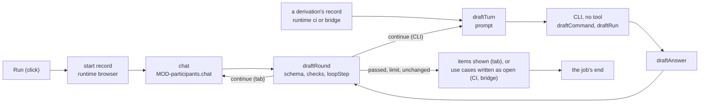

# ARC-031 Drafting jobs

## Context

A job is data — its definition, its prompt, the checks it names — and its correction loop is one pure step (ARC-007). ARC-029
designs where a participant's job runs: a model endpoint's in the browser tab, a CI agent's in CI, a CLI agent's through
the bridge. A drafting job's participant drafts a document the person sees first, or that enters the default branch as open:
the job that proposes backlog items (UC-032 2, 3) drafts what the Product Owner adds by hand (UC-032 4); the job that derives
use cases from requirements (UC-007) drafts use cases, which are written as open and each accepted on its own (UC-008). A CLI
drafts in one answer per run, its report in a file: Claude Code's text result stands in the field `result` of its JSON
(`https://code.claude.com/docs/en/headless`), and "`*` removes every tool" passed to `--disallowedTools`
(`https://code.claude.com/docs/en/cli-reference`); Codex's last agent message stands among its JSON lines, and "By default,
codex exec runs in a read-only sandbox" (`https://learn.chatgpt.com/docs/non-interactive-mode`).

A job goes only to a holder of its role (`A JOB GOES ONLY TO A HOLDER OF ITS ROLE`), the role of the first phase that
produces what the job produces (`MOD-job-harness.roleFor`) — for items, the phase whose role orders the backlog, in Scrum
the Product Owner —, and a role names the capabilities its holder needs (`A ROLE NAMES THE CAPABILITIES IT NEEDS`). So
UC-032's drafting participant is a holder of that role: a model endpoint drafts items where the product's model lets a
participant that drafts text hold it.

## Decision

1. **One module for the steps every runtime takes alike.** `MOD-drafting`, a feature, holds the steps of a drafting job:
   who drafts it and where, what it sends, one round of its loop, the conversation as one prompt for a CLI, the rounds
   against a model endpoint, the draft as the person sees it, the use cases as the files written, and how a job in the tab
   ended. The browser tab takes them for a model endpoint the browser calls, while the page that started the job is open
   (`AGENT M WORKS WITHOUT A LOCAL INSTALLATION`); CI and the bridge take them turn by turn for the agents they run
   (`MOD-job-steps.draftTurn`, ARC-029; ARC-030), from the same definition (`ONE DEFINITION, THREE DRIVERS`).
2. **What a drafting job produces decides where it runs.** Backlog items are shown to the Product Owner, who adds them
   (UC-032 4): a job that drafts them runs in the tab, since an item written by CI would enter the backlog unseen. Use
   cases are written as open with the job's end (`A REVIEWED ARTIFACT ENTERS THE DEFAULT BRANCH AS OPEN`): a job that
   derives them runs in CI and through the bridge, whose last turn writes them (`MOD-job-steps.draftTurn`, ARC-029
   decision 12); the tab's end writes no file.
3. **Who drafts** (`MOD-drafting.drafters`): the holders of the job's role (`MOD-job-harness.roleFor`), each with whether
   it may draft the job — no person, every capability the definition names, the runtime what the job drafts is produced
   in (decision 2, `MOD-job-runner.runtimeOf`), and in CI or on the bridge a CLI whose answer is read
   (`MOD-job-runner.draftsWith`) —, the first that may proposed. Where none may, the run panel says why for each holder,
   and nothing starts.
4. **What proposing items sends** (`MOD-drafting.itemSources`): the accepted requirements and accepted use cases no item
   realises yet (`MOD-work-items.uncovered`) — a requirement with its rule and check, a use case as its file — and every
   item of the backlog as its file, so that a draft restating one is found. The page reads `SPEC.md` and the use cases at
   the commit it read (`MOD-git-host.readFile`), and the job's definition from its own Pages origin (ARC-007 decision 3).
   The product's own SPEC, use cases and items carry no label and may go to any participant; a source's content is no
   input of this job. The definition, `src/job-harness/jobs/propose-items/job.json`:

   ```json
{
  "kind": "propose-items",
  "mode": "draft",
  "produces": ["ITM"],
  "capabilities": ["draft text"],
  "inputs": [
    { "name": "requirements", "of": "requirement" },
    { "name": "useCases", "of": "UC" },
    { "name": "items", "of": "ITM", "all": true }
  ],
  "output": {
    "type": "object",
    "required": ["items", "justifications"],
    "properties": {
      "items": {
        "type": "array",
        "items": {
          "type": "object",
          "required": ["title", "outcome", "realises", "criteria"],
          "properties": {
            "title": { "type": "string", "minLength": 1 },
            "outcome": { "type": "string", "minLength": 1 },
            "realises": { "type": "array", "items": { "type": "string" } },
            "criteria": { "type": "array", "items": { "type": "string" } }
          }
        }
      },
      "justifications": { "type": "array" }
    }
  },
  "checks": ["item-problems"],
  "rounds": 3,
  "result": "shown-or-open"
}
   ```

   and its prompt, `src/job-harness/jobs/propose-items/prompt.md`:

   ```markdown
Propose backlog items for the requirements and use cases below, which no item of the backlog realises yet.

Each item has a title, the outcome it delivers, the requirements and use cases it realises — requirements by their exact
names, use cases by their identifiers —, and, where you draft it from a use case, acceptance criteria taken from that use
case's postcondition. A requirement too large for one item may get several items, each realising it. Do not restate an
item the backlog already has.

Answer with JSON only, in this form:
{"items": [{"title": "…", "outcome": "…", "realises": ["…"], "criteria": ["…"]}], "justifications": []}
Where a finding sent back to you is a warning you keep, add to "justifications"
{"artifact": "draft", "line": <the item's number in your list>, "rule": "<the rule the finding names>", "reason": "<one line>"}.

The requirements no item realises:

{{requirements}}

The use cases no item realises:

{{useCases}}

Every item of the backlog:

{{items}}
   ```

5. **What deriving use cases sends** (`MOD-drafting.useCaseSources`): the requirements the job's record names as its
   inputs, each with its rule and check, and every use case of the product as its file, so that a goal already covered
   becomes a change, not a second use case; a name the SPEC does not hold is refused. The product's own SPEC and use cases
   carry no label. The definition, `src/job-harness/jobs/derive-use-cases/job.json`:

   ```json
{
  "kind": "derive-use-cases",
  "mode": "draft",
  "produces": ["UC"],
  "capabilities": ["draft text"],
  "inputs": [
    { "name": "requirements", "of": "requirement" },
    { "name": "useCases", "of": "UC", "all": true }
  ],
  "output": {
    "type": "object",
    "required": ["useCases", "justifications"],
    "properties": {
      "useCases": {
        "type": "array",
        "items": {
          "type": "object",
          "required": ["text"],
          "properties": {
            "text": { "type": "string", "minLength": 1 }
          }
        }
      },
      "justifications": { "type": "array" }
    }
  },
  "checks": ["use-case-drafts"],
  "rounds": 5,
  "result": "shown-or-open"
}
   ```

   and its prompt, `src/job-harness/jobs/derive-use-cases/prompt.md`:

   ```markdown
Draft use cases that realise the requirements below.

Write each use case as one Markdown file, in the form of the product's use cases: a front matter between two lines `---`
with `id`, `title`, `area`, `actors` — one per line as `  - <actor>` — and `realises` — each requirement it realises by its
exact name, one per line as `  - <NAME>` —; then the heading `# <id> <title>`; then the sections `## Actors`,
`## Precondition`, `## Main flow`, `## Alternative flows` and `## Postcondition`; and a diagram of the flow in a fenced
```mermaid block. Number the steps of the main flow 1, 2, 3, and an alternative flow by the step it leaves and a letter,
as 2a.

A new use case has the identifier `UC-NNN`; Agent M gives it its own. Where a use case of the product already has the goal of
one you would draft, change that use case instead: give its whole changed file under its own identifier.

Answer with JSON only, in this form:
{"useCases": [{"text": "<the whole file>"}], "justifications": []}
Where a finding sent back to you is a warning you keep, add to "justifications"
{"artifact": "use case <its number in your list>", "line": <the line the finding names>, "rule": "<the rule it names>", "reason": "<one line>"}.

The requirements to cover:

{{requirements}}

Every use case of the product:

{{useCases}}
   ```

6. **The run panel** (`MOD-drafting.draftPanel`) shows the prompt's destination, its route and place, each kind of content
   sent with its count and the estimated tokens (`MOD-job-harness.disclosure`, `THE PAGE STATES WHAT IT SENDS WHERE`),
   whether it fits the participant's context (`MOD-job-harness.contextFits`) and may go to its place
   (`MOD-job-harness.mayReceive`), and each reason Run may not start: nothing left to propose, no context size declared, a
   prompt too large, content that may not go there. **Run** commits the job's start record — the job's kind, phase, role,
   participant, the runtime `browser`, its inputs, the Agent M version and the model — before the first round is sent
   (`MOD-main-page.commitChange`, ARC-024).
7. **One round** (`MOD-drafting.draftRound`): the answer is read as JSON — the whole text, or its first fenced block —
   that conforms to the definition's output schema (`MOD-architecture.conforms`); the checks the definition names run on
   it from a fixed table; the justifications the answer carries are read; and the loop takes its step
   (`MOD-job-harness.loopStep`), which makes an answer that cannot be read an error of its own and sends errors and
   unjustified warnings back in the compiler form. A definition naming a check the table lacks is refused before anything
   is sent back. The checks of the table:
   - `item-problems`: `MOD-work-items.itemProblems` on each drafted item, its origins the names it realises, each finding
     named by the item's place in the draft;
   - `use-case-drafts`: `MOD-artifacts.checkUseCase` on each drafted use case as the file it would become — a new one,
     drafted under the placeholder `UC-NNN`, under the next identifier after the product's use cases, Agent M giving it
     its own once the loop ended (decision 11); a change under the identifier of the use case it changes (UC-007 6a) —,
     each finding named by the draft's place in the answer, as `use case 1`; a draft naming any other identifier
     (`THE NAME IS THE ID AND IT SURVIVES`), or a second change of one use case (`ONE USE CASE, ONE FILE`), is an error.
8. **The rounds in the tab** (`MOD-drafting.runRounds`): the prompt is sent as the first message (`MOD-participants.chat`),
   each answer allowed up to 4 096 tokens; while the loop continues, its answer and the message sending it back follow;
   the rounds end when the loop stops — passed, at its limit, or unchanged — or when the endpoint refuses, which is the
   rounds' failure. The last readable draft is kept, and the usage the answers reported is added up — unknown once one
   reported none, never estimated (`NO COST IS GUESSED`).
9. **The rounds through a CLI** (CI and the bridge): each round runs the agent's CLI once with no tool, given the
   conversation so far as one prompt (`MOD-drafting.cliPrompt`) — the job's prompt, then each answer and the message that
   sent it back, under headings of their own —, the same conversation the tab sends as messages
   (`A RUNTIME IS INTERCHANGEABLE`); its answer is read from its report (`MOD-job-runner.draftAnswer`). CI runs the command of
   `MOD-job-runner.draftCommand`, the bridge the process of `MOD-bridge-jobs.draftRun`; `MOD-job-steps.draftTurn` takes
   each turn (ARC-029).
10. **The person sees drafted items** (`MOD-drafting.draftedItems`): each as the backlog item it would become, with the
    findings the last round left on it, and the rounds the draft took with each round's findings
    (`THE ROUNDS ARE COUNTED AND SHOWN`) — the page writes these texts. The person edits or discards items and presses
    **Add to backlog** (UC-032 4): that commit names the job, the participant, the model, the Agent M version and the
    rounds (`MOD-job-harness.commitMessage`, through the items change's provenance, ARC-024), and the items' texts name
    none of them (`AN ARTIFACT RECORDS THE VERSION THAT PRODUCED IT`).
11. **Drafted use cases are written as open** (`MOD-drafting.useCaseFiles`, UC-007 5, 6): a new use case under the next
    identifier no file of `docs/use-cases/` and no path its version history holds (`MOD-git-host.pathHistory`, read at the
    default branch's head right before the write; `THE NAME IS THE ID AND IT SURVIVES`), its file named from its title; a
    change under the file of the use case it changes (UC-007 6a). A name a use case still realises that is no requirement
    is removed, and the use case marked; a use case that realises none is written anyway, and marked (UC-007 4a, 4b). The
    marks and the findings the loop left stand in the commit's message, under its subject and above the job's provenance
    (`MOD-job-harness.commitMessage`), and the job's end names the use cases written; every use case written is open on the
    review page and accepted on its own (UC-008). Where nothing differs from the files as they are, only the job's end is
    written, its note `no change`.
12. **The end of a job in the tab** (`MOD-drafting.jobEnd`): done once a draft is shown — the titles it holds, the rounds,
    the usage and no cost, since an endpoint reports none —; failed where the endpoint refused or no answer could be read,
    with the reason, the rounds taken and the usage reported until then. The tab commits it to the job's record as the end
    of its own job (ARC-024's change `ended`) on the authority the Run click made; where a cancel record names the job by
    then, the end is written as cancelled and nothing else (`A CANCELLED JOB WRITES NOTHING MORE`). A page closed before
    the end leaves the record as started; the job dashboard shows its last recorded state (`MOD-run-engine.jobState`). CI
    and the bridge write a derivation's end with its last turn (decision 11, ARC-029 decision 12).



## Alternatives

- **Any participant that drafts text, chosen by the person** — rejected: a job goes only to a holder of its role; the
  person assigns a drafting participant to the role (UC-002), and the panel names each holder that cannot draft.
- **The rounds in the main page's shell** — rejected: CI and the bridge take the same steps; a feature module serves
  every runtime.
- **Every requirement and use case sent** — rejected: the job proposes items for what no item realises; the items are
  sent so that a draft restating one is found.
- **Items answered as Markdown** — rejected: an item's fields are checked as data; JSON against the definition's schema
  is read alike in every runtime.
- **The end recorded only by Add to backlog** — rejected: the job ends when its draft is shown; adding items is the
  person's own decision, with a commit of its own.
- **Items drafted in CI committed to the backlog** — rejected: an item enters the backlog by the Product Owner's Add (UC-032
  4); an item written by CI would enter it unseen (decision 2).
- **A CLI's rounds as one continued session** (`--continue`, `--resume`) — rejected: the conversation as one prompt per run
  needs no session kept between the job workflow's turns and reads alike on the bridge; and a continued run "reports the
  conversation's whole total, earlier runs' spend included" (`https://code.claude.com/docs/en/headless`), so the costs of
  its rounds would no longer add up.
- **Identifiers chosen by the participant** — rejected: a participant cannot see which identifiers the version history
  holds, and a withdrawn identifier is never reused (`THE NAME IS THE ID AND IT SURVIVES`); a new use case is `UC-NNN` until
  it is written.

## Consequences

- The definitions' files are data under `src/job-harness/jobs/propose-items/` and `src/job-harness/jobs/derive-use-cases/`,
  changed through a pull request with green CI like every definition (ARC-007).
- A product whose item-producing role only persons may hold has no drafter of items, and its panel says so. In Agent M's
  own model the Product Owner needs to read and write the repository, which a model endpoint does not declare, and a job
  that drafts items runs in the tab only (decision 2): Agent M's own items are written by hand (UC-032 2a).
- **Not realised here — UC-032 3a.** Several items for one requirement are drafted like any others; that the requirement
  counts as covered only once all of them are done is a coverage no view shows yet — the backlog view names the
  requirements no item realises (UC-032 1) — and comes with the coverage of a requirement on the backlog and progress
  views (ARC-024).
- **Not realised here — UC-007 on the dashboard and in the tab.** The view that starts a derivation of use cases — the
  author selecting the requirements to cover, by default those no use case realises, and the run panel with **Run**
  (UC-007 1, 2) —, and the derivation in the tab for a model endpoint, whose end writes the use cases as CI's and the
  bridge's last turn does, come with the derivation of use cases on the dashboard; until then no click writes a
  derivation's start record, and UC-007's steps, which a model endpoint takes as well as an agent, stand with them.
- **Not realised here — the other drafting jobs.** Requirements derived from a source (UC-005) and a change by prompt
  (UC-019), which a change to requirements makes subject to the derivation rules
  (`A PROMPTED REQUIREMENT CHANGE FOLLOWS THE DERIVATION RULES`), come with the derivation rules; mails into issues
  (UC-038) with the mail pipeline (ARC-014); an agent as Product Owner (UC-032 1c) with its job. A job started on
  GitHub's Actions page rather than the dashboard (UC-010 1), and a tab job's live state, its cancel and its retry on the
  job dashboard (UC-035, UC-036), are left in ARC-029's consequences.
- **Open measurement 1 — answers in JSON.** Whether the endpoints and CLIs in use answer with JSON when the prompt asks for
  it, per endpoint, CLI and model: a run of each job against each, its rounds recorded. An answer that cannot be read is
  sent back as the loop's own error, and two such rounds end the loop.

## Modules

### MOD-drafting

```json module
{
  "id": "MOD-drafting",
  "folder": "src/drafting/",
  "layer": "feature",
  "responsibility": "The steps every runtime performs alike for a drafting job: which holders of the job's role may draft it, and where, by what it drafts; what proposing backlog items and deriving use cases send; the run panel's prompt and verdict; one round of the correction loop read against the job's definition and its named checks; the conversation as one prompt for a CLI; the rounds against a model endpoint the browser calls; the drafted items as the person sees them; the use cases as the files written; and the end a job in the tab states.",
  "realises": ["THE PAGE STATES WHAT IT SENDS WHERE"],
  "owns": ["Drafter", "Drafters", "UseCaseText", "DraftSources", "DraftPanel", "DraftContext", "UseCaseRef", "UseCaseFiles", "DraftRound", "LoopStepOrNone", "DraftFailure", "DraftFailureOrNone", "DraftRun", "DraftedItem", "JobEnd"],
  "uses": ["MOD-contracts", "MOD-job-harness", "MOD-job-runner", "MOD-work-items", "MOD-participants", "MOD-artifacts", "MOD-architecture"]
}
```

```json interface
{
  "id": "MOD-drafting.drafters",
  "summary": "The holders of the role a drafting job belongs to (MOD-job-harness.roleFor), each with whether it may draft the job — no person, every capability the job's definition names, and the runtime what the job drafts is produced in (MOD-job-runner.runtimeOf): the browser tab for what is shown, CI or the bridge for what is written as open, with a CLI whose answer is read (MOD-job-runner.draftsWith) — and the reason where it may not; the first that may is proposed.",
  "params": [
    { "name": "definition", "type": "JobDefinition" },
    { "name": "workflow", "type": "Workflow" },
    { "name": "participants", "type": "Participant[]" }
  ],
  "result": "Drafters",
  "async": false,
  "refusals": [],
  "examples": [
    {
      "name": "the Product Owner held by a person and a model endpoint",
      "input": {
        "definition": {
          "kind": "propose-items",
          "mode": "draft",
          "produces": ["ITM"],
          "capabilities": ["draft text"],
          "inputs": [
            { "name": "requirements", "of": "requirement", "all": false },
            { "name": "useCases", "of": "UC", "all": false },
            { "name": "items", "of": "ITM", "all": true }
          ],
          "output": {
            "type": "object",
            "required": ["items", "justifications"],
            "properties": {
              "items": {
                "type": "array",
                "items": {
                  "type": "object",
                  "required": ["title", "outcome", "realises", "criteria"],
                  "properties": {
                    "title": { "type": "string", "minLength": 1 },
                    "outcome": { "type": "string", "minLength": 1 },
                    "realises": { "type": "array", "items": { "type": "string" } },
                    "criteria": { "type": "array", "items": { "type": "string" } }
                  }
                }
              },
              "justifications": { "type": "array" }
            }
          },
          "checks": ["item-problems"],
          "rounds": 3,
          "result": "shown-or-open",
          "prompt": "Propose backlog items for the requirements and use cases below, which no item of the backlog realises yet.\n\nEach item has a title, the outcome it delivers, the requirements and use cases it realises — requirements by their exact\nnames, use cases by their identifiers —, and, where you draft it from a use case, acceptance criteria taken from that use\ncase's postcondition. A requirement too large for one item may get several items, each realising it. Do not restate an\nitem the backlog already has.\n\nAnswer with JSON only, in this form:\n{\"items\": [{\"title\": \"…\", \"outcome\": \"…\", \"realises\": [\"…\"], \"criteria\": [\"…\"]}], \"justifications\": []}\nWhere a finding sent back to you is a warning you keep, add to \"justifications\"\n{\"artifact\": \"draft\", \"line\": <the item's number in your list>, \"rule\": \"<the rule the finding names>\", \"reason\": \"<one line>\"}.\n\nThe requirements no item realises:\n\n{{requirements}}\n\nThe use cases no item realises:\n\n{{useCases}}\n\nEvery item of the backlog:\n\n{{items}}\n"
        },
        "workflow": {
          "model": "scrum",
          "kind": "pulled",
          "measure": "remaining items per time box",
          "flow": { "wipLimit": null, "timeBox": "2 weeks", "sprints": true, "line": 38 },
          "phases": [
            {
              "name": "Sprint planning",
              "role": "Product Owner",
              "produces": "ITM",
              "kinds": ["ITM"],
              "line": 12,
              "practice": ""
            },
            {
              "name": "Development",
              "role": "Developers",
              "produces": "MOD, TST",
              "kinds": ["MOD", "TST"],
              "line": 13,
              "practice": ""
            },
            {
              "name": "Sprint review",
              "role": "Product Owner",
              "produces": "the review of the increment",
              "kinds": [],
              "line": 14,
              "practice": ""
            }
          ],
          "transitions": [
            { "from": "Sprint planning", "to": "Development", "kind": "sequence", "line": 20 },
            { "from": "Development", "to": "Sprint review", "kind": "sequence", "line": 21 },
            { "from": "Sprint review", "to": "Sprint planning", "kind": "sequence", "line": 22 }
          ],
          "pairs": [],
          "gates": [
            {
              "between": "Sprint planning → Development",
              "from": "Sprint planning",
              "to": "Development",
              "artifacts": "ITM",
              "kinds": ["ITM"],
              "condition": "the sprint's items are ready",
              "decider": { "role": "Product Owner" },
              "line": 28,
              "practice": "",
              "requirement": "",
              "source": "",
              "holders": ["alice"]
            },
            {
              "between": "Development → Sprint review",
              "from": "Development",
              "to": "Sprint review",
              "artifacts": "MOD",
              "kinds": ["MOD"],
              "condition": "CI is green",
              "decider": { "role": "Product Owner" },
              "line": 29,
              "practice": "",
              "requirement": "",
              "source": "",
              "holders": ["alice"]
            }
          ],
          "roles": [
            {
              "name": "Product Owner",
              "filledBy": "either",
              "capabilities": ["draft text"],
              "line": 35,
              "holders": ["alice", "hub-writer"]
            },
            {
              "name": "Developers",
              "filledBy": "agent",
              "capabilities": ["read the repository", "write to the repository", "run code and tests"],
              "line": 36,
              "holders": ["cli-dev", "ci-dev"]
            }
          ],
          "branches": [{ "phase": "Sprint", "branch": "sprint/<nn>", "line": 20 }],
          "artifactsAdded": [],
          "problems": []
        },
        "participants": [
          {
            "name": "alice",
            "type": "person",
            "model": "",
            "context": null,
            "price": null,
            "capabilities": ["draft text", "read the repository", "write to the repository"],
            "place": "",
            "route": "the GitHub account `alice`",
            "line": 5
          },
          {
            "name": "hub-writer",
            "type": "model endpoint",
            "model": "llama-3.3-70b",
            "context": 32000,
            "price": { "currency": "EUR", "input": 0.4, "output": 0.9 },
            "capabilities": ["draft text"],
            "place": "NHR@FAU, Erlangen",
            "route": "the endpoint hub of this browser",
            "line": 6
          },
          {
            "name": "gw-writer",
            "type": "model endpoint",
            "model": "gateway-model",
            "context": 32000,
            "price": { "currency": "EUR", "input": 0.2, "output": 0.6 },
            "capabilities": ["draft text"],
            "place": "a gateway in Frankfurt, Germany",
            "route": "the endpoint gw of this browser",
            "line": 7
          },
          {
            "name": "ci-dev",
            "type": "CI agent",
            "model": "claude-opus-5-5",
            "context": null,
            "price": null,
            "capabilities": ["read the repository", "write to the repository", "run code and tests"],
            "place": "GitHub's machines, a provider in the USA",
            "route": "the workflow agent-m-job",
            "line": 8
          },
          {
            "name": "cli-dev",
            "type": "CLI agent",
            "model": "claude-opus-5-5",
            "context": null,
            "price": null,
            "capabilities": ["draft text", "read the repository", "write to the repository", "run code and tests", "use tools"],
            "place": "this machine",
            "route": "the bridge on the Mac of `alice`",
            "line": 9
          }
        ]
      },
      "result": {
        "role": "Product Owner",
        "holders": [
          { "participant": "alice", "runtime": "", "ok": false, "reason": "alice is a person; a person's work is no job a runtime carries out" },
          { "participant": "hub-writer", "runtime": "browser", "ok": true, "reason": "" }
        ],
        "proposed": "hub-writer"
      }
    },
    {
      "name": "a role only a person holds",
      "input": {
        "definition": {
          "kind": "propose-items",
          "mode": "draft",
          "produces": ["ITM"],
          "capabilities": ["draft text"],
          "inputs": [
            { "name": "requirements", "of": "requirement", "all": false },
            { "name": "useCases", "of": "UC", "all": false },
            { "name": "items", "of": "ITM", "all": true }
          ],
          "output": {
            "type": "object",
            "required": ["items", "justifications"],
            "properties": {
              "items": {
                "type": "array",
                "items": {
                  "type": "object",
                  "required": ["title", "outcome", "realises", "criteria"],
                  "properties": {
                    "title": { "type": "string", "minLength": 1 },
                    "outcome": { "type": "string", "minLength": 1 },
                    "realises": { "type": "array", "items": { "type": "string" } },
                    "criteria": { "type": "array", "items": { "type": "string" } }
                  }
                }
              },
              "justifications": { "type": "array" }
            }
          },
          "checks": ["item-problems"],
          "rounds": 3,
          "result": "shown-or-open",
          "prompt": "Propose backlog items for the requirements and use cases below, which no item of the backlog realises yet.\n\nEach item has a title, the outcome it delivers, the requirements and use cases it realises — requirements by their exact\nnames, use cases by their identifiers —, and, where you draft it from a use case, acceptance criteria taken from that use\ncase's postcondition. A requirement too large for one item may get several items, each realising it. Do not restate an\nitem the backlog already has.\n\nAnswer with JSON only, in this form:\n{\"items\": [{\"title\": \"…\", \"outcome\": \"…\", \"realises\": [\"…\"], \"criteria\": [\"…\"]}], \"justifications\": []}\nWhere a finding sent back to you is a warning you keep, add to \"justifications\"\n{\"artifact\": \"draft\", \"line\": <the item's number in your list>, \"rule\": \"<the rule the finding names>\", \"reason\": \"<one line>\"}.\n\nThe requirements no item realises:\n\n{{requirements}}\n\nThe use cases no item realises:\n\n{{useCases}}\n\nEvery item of the backlog:\n\n{{items}}\n"
        },
        "workflow": {
          "model": "scrum",
          "kind": "pulled",
          "measure": "remaining items per time box",
          "flow": { "wipLimit": null, "timeBox": "2 weeks", "sprints": true, "line": 38 },
          "phases": [
            {
              "name": "Sprint planning",
              "role": "Product Owner",
              "produces": "ITM",
              "kinds": ["ITM"],
              "line": 12,
              "practice": ""
            },
            {
              "name": "Development",
              "role": "Developers",
              "produces": "MOD, TST",
              "kinds": ["MOD", "TST"],
              "line": 13,
              "practice": ""
            },
            {
              "name": "Sprint review",
              "role": "Product Owner",
              "produces": "the review of the increment",
              "kinds": [],
              "line": 14,
              "practice": ""
            }
          ],
          "transitions": [
            { "from": "Sprint planning", "to": "Development", "kind": "sequence", "line": 20 },
            { "from": "Development", "to": "Sprint review", "kind": "sequence", "line": 21 },
            { "from": "Sprint review", "to": "Sprint planning", "kind": "sequence", "line": 22 }
          ],
          "pairs": [],
          "gates": [
            {
              "between": "Sprint planning → Development",
              "from": "Sprint planning",
              "to": "Development",
              "artifacts": "ITM",
              "kinds": ["ITM"],
              "condition": "the sprint's items are ready",
              "decider": { "role": "Product Owner" },
              "line": 28,
              "practice": "",
              "requirement": "",
              "source": "",
              "holders": ["alice"]
            },
            {
              "between": "Development → Sprint review",
              "from": "Development",
              "to": "Sprint review",
              "artifacts": "MOD",
              "kinds": ["MOD"],
              "condition": "CI is green",
              "decider": { "role": "Product Owner" },
              "line": 29,
              "practice": "",
              "requirement": "",
              "source": "",
              "holders": ["alice"]
            }
          ],
          "roles": [
            {
              "name": "Product Owner",
              "filledBy": "person",
              "capabilities": ["read the repository", "write to the repository"],
              "line": 35,
              "holders": ["alice"]
            },
            {
              "name": "Developers",
              "filledBy": "agent",
              "capabilities": ["read the repository", "write to the repository", "run code and tests"],
              "line": 36,
              "holders": ["cli-dev", "ci-dev"]
            }
          ],
          "branches": [{ "phase": "Sprint", "branch": "sprint/<nn>", "line": 20 }],
          "artifactsAdded": [],
          "problems": []
        },
        "participants": [
          {
            "name": "alice",
            "type": "person",
            "model": "",
            "context": null,
            "price": null,
            "capabilities": ["draft text", "read the repository", "write to the repository"],
            "place": "",
            "route": "the GitHub account `alice`",
            "line": 5
          },
          {
            "name": "hub-writer",
            "type": "model endpoint",
            "model": "llama-3.3-70b",
            "context": 32000,
            "price": { "currency": "EUR", "input": 0.4, "output": 0.9 },
            "capabilities": ["draft text"],
            "place": "NHR@FAU, Erlangen",
            "route": "the endpoint hub of this browser",
            "line": 6
          },
          {
            "name": "gw-writer",
            "type": "model endpoint",
            "model": "gateway-model",
            "context": 32000,
            "price": { "currency": "EUR", "input": 0.2, "output": 0.6 },
            "capabilities": ["draft text"],
            "place": "a gateway in Frankfurt, Germany",
            "route": "the endpoint gw of this browser",
            "line": 7
          },
          {
            "name": "ci-dev",
            "type": "CI agent",
            "model": "claude-opus-5-5",
            "context": null,
            "price": null,
            "capabilities": ["read the repository", "write to the repository", "run code and tests"],
            "place": "GitHub's machines, a provider in the USA",
            "route": "the workflow agent-m-job",
            "line": 8
          },
          {
            "name": "cli-dev",
            "type": "CLI agent",
            "model": "claude-opus-5-5",
            "context": null,
            "price": null,
            "capabilities": ["draft text", "read the repository", "write to the repository", "run code and tests", "use tools"],
            "place": "this machine",
            "route": "the bridge on the Mac of `alice`",
            "line": 9
          }
        ]
      },
      "result": {
        "role": "Product Owner",
        "holders": [
          { "participant": "alice", "runtime": "", "ok": false, "reason": "alice is a person; a person's work is no job a runtime carries out" }
        ],
        "proposed": ""
      }
    },
    {
      "name": "a holder on the bridge, for items",
      "input": {
        "definition": {
          "kind": "propose-items",
          "mode": "draft",
          "produces": ["ITM"],
          "capabilities": ["draft text"],
          "inputs": [
            { "name": "requirements", "of": "requirement", "all": false },
            { "name": "useCases", "of": "UC", "all": false },
            { "name": "items", "of": "ITM", "all": true }
          ],
          "output": {
            "type": "object",
            "required": ["items", "justifications"],
            "properties": {
              "items": {
                "type": "array",
                "items": {
                  "type": "object",
                  "required": ["title", "outcome", "realises", "criteria"],
                  "properties": {
                    "title": { "type": "string", "minLength": 1 },
                    "outcome": { "type": "string", "minLength": 1 },
                    "realises": { "type": "array", "items": { "type": "string" } },
                    "criteria": { "type": "array", "items": { "type": "string" } }
                  }
                }
              },
              "justifications": { "type": "array" }
            }
          },
          "checks": ["item-problems"],
          "rounds": 3,
          "result": "shown-or-open",
          "prompt": "Propose backlog items for the requirements and use cases below, which no item of the backlog realises yet.\n\nEach item has a title, the outcome it delivers, the requirements and use cases it realises — requirements by their exact\nnames, use cases by their identifiers —, and, where you draft it from a use case, acceptance criteria taken from that use\ncase's postcondition. A requirement too large for one item may get several items, each realising it. Do not restate an\nitem the backlog already has.\n\nAnswer with JSON only, in this form:\n{\"items\": [{\"title\": \"…\", \"outcome\": \"…\", \"realises\": [\"…\"], \"criteria\": [\"…\"]}], \"justifications\": []}\nWhere a finding sent back to you is a warning you keep, add to \"justifications\"\n{\"artifact\": \"draft\", \"line\": <the item's number in your list>, \"rule\": \"<the rule the finding names>\", \"reason\": \"<one line>\"}.\n\nThe requirements no item realises:\n\n{{requirements}}\n\nThe use cases no item realises:\n\n{{useCases}}\n\nEvery item of the backlog:\n\n{{items}}\n"
        },
        "workflow": {
          "model": "scrum",
          "kind": "pulled",
          "measure": "remaining items per time box",
          "flow": { "wipLimit": null, "timeBox": "2 weeks", "sprints": true, "line": 38 },
          "phases": [
            {
              "name": "Sprint planning",
              "role": "Product Owner",
              "produces": "ITM",
              "kinds": ["ITM"],
              "line": 12,
              "practice": ""
            },
            {
              "name": "Development",
              "role": "Developers",
              "produces": "MOD, TST",
              "kinds": ["MOD", "TST"],
              "line": 13,
              "practice": ""
            },
            {
              "name": "Sprint review",
              "role": "Product Owner",
              "produces": "the review of the increment",
              "kinds": [],
              "line": 14,
              "practice": ""
            }
          ],
          "transitions": [
            { "from": "Sprint planning", "to": "Development", "kind": "sequence", "line": 20 },
            { "from": "Development", "to": "Sprint review", "kind": "sequence", "line": 21 },
            { "from": "Sprint review", "to": "Sprint planning", "kind": "sequence", "line": 22 }
          ],
          "pairs": [],
          "gates": [
            {
              "between": "Sprint planning → Development",
              "from": "Sprint planning",
              "to": "Development",
              "artifacts": "ITM",
              "kinds": ["ITM"],
              "condition": "the sprint's items are ready",
              "decider": { "role": "Product Owner" },
              "line": 28,
              "practice": "",
              "requirement": "",
              "source": "",
              "holders": ["alice"]
            },
            {
              "between": "Development → Sprint review",
              "from": "Development",
              "to": "Sprint review",
              "artifacts": "MOD",
              "kinds": ["MOD"],
              "condition": "CI is green",
              "decider": { "role": "Product Owner" },
              "line": 29,
              "practice": "",
              "requirement": "",
              "source": "",
              "holders": ["alice"]
            }
          ],
          "roles": [
            {
              "name": "Product Owner",
              "filledBy": "either",
              "capabilities": ["draft text"],
              "line": 35,
              "holders": ["alice", "cli-dev"]
            },
            {
              "name": "Developers",
              "filledBy": "agent",
              "capabilities": ["read the repository", "write to the repository", "run code and tests"],
              "line": 36,
              "holders": ["cli-dev", "ci-dev"]
            }
          ],
          "branches": [{ "phase": "Sprint", "branch": "sprint/<nn>", "line": 20 }],
          "artifactsAdded": [],
          "problems": []
        },
        "participants": [
          {
            "name": "alice",
            "type": "person",
            "model": "",
            "context": null,
            "price": null,
            "capabilities": ["draft text", "read the repository", "write to the repository"],
            "place": "",
            "route": "the GitHub account `alice`",
            "line": 5
          },
          {
            "name": "hub-writer",
            "type": "model endpoint",
            "model": "llama-3.3-70b",
            "context": 32000,
            "price": { "currency": "EUR", "input": 0.4, "output": 0.9 },
            "capabilities": ["draft text"],
            "place": "NHR@FAU, Erlangen",
            "route": "the endpoint hub of this browser",
            "line": 6
          },
          {
            "name": "gw-writer",
            "type": "model endpoint",
            "model": "gateway-model",
            "context": 32000,
            "price": { "currency": "EUR", "input": 0.2, "output": 0.6 },
            "capabilities": ["draft text"],
            "place": "a gateway in Frankfurt, Germany",
            "route": "the endpoint gw of this browser",
            "line": 7
          },
          {
            "name": "ci-dev",
            "type": "CI agent",
            "model": "claude-opus-5-5",
            "context": null,
            "price": null,
            "capabilities": ["read the repository", "write to the repository", "run code and tests"],
            "place": "GitHub's machines, a provider in the USA",
            "route": "the workflow agent-m-job",
            "line": 8
          },
          {
            "name": "cli-dev",
            "type": "CLI agent",
            "model": "claude-opus-5-5",
            "context": null,
            "price": null,
            "capabilities": ["draft text", "read the repository", "write to the repository", "run code and tests", "use tools"],
            "place": "this machine",
            "route": "the bridge on the Mac of `alice`",
            "line": 9
          }
        ]
      },
      "result": {
        "role": "Product Owner",
        "holders": [
          { "participant": "alice", "runtime": "", "ok": false, "reason": "alice is a person; a person's work is no job a runtime carries out" },
          { "participant": "cli-dev", "runtime": "bridge", "ok": false, "reason": "cli-dev runs through the bridge, where a job that drafts ITM does not run: what it drafts is shown in the tab first" }
        ],
        "proposed": ""
      }
    },
    {
      "name": "a holder on the bridge, for use cases",
      "input": {
        "definition": {
          "kind": "derive-use-cases",
          "mode": "draft",
          "produces": ["UC"],
          "capabilities": ["draft text"],
          "inputs": [
            { "name": "requirements", "of": "requirement", "all": false },
            { "name": "useCases", "of": "UC", "all": true }
          ],
          "output": {
            "type": "object",
            "required": ["useCases", "justifications"],
            "properties": {
              "useCases": {
                "type": "array",
                "items": {
                  "type": "object",
                  "required": ["text"],
                  "properties": { "text": { "type": "string", "minLength": 1 } }
                }
              },
              "justifications": { "type": "array" }
            }
          },
          "checks": ["use-case-drafts"],
          "rounds": 5,
          "result": "shown-or-open",
          "prompt": "Draft use cases that realise the requirements below.\n\nWrite each use case as one Markdown file, in the form of the product's use cases: a front matter between two lines `---`\nwith `id`, `title`, `area`, `actors` — one per line as `  - <actor>` — and `realises` — each requirement it realises by its\nexact name, one per line as `  - <NAME>` —; then the heading `# <id> <title>`; then the sections `## Actors`,\n`## Precondition`, `## Main flow`, `## Alternative flows` and `## Postcondition`; and a diagram of the flow in a fenced\n```mermaid block. Number the steps of the main flow 1, 2, 3, and an alternative flow by the step it leaves and a letter,\nas 2a.\n\nA new use case has the identifier `UC-NNN`; Agent M gives it its own. Where a use case of the product already has the goal of\none you would draft, change that use case instead: give its whole changed file under its own identifier.\n\nAnswer with JSON only, in this form:\n{\"useCases\": [{\"text\": \"<the whole file>\"}], \"justifications\": []}\nWhere a finding sent back to you is a warning you keep, add to \"justifications\"\n{\"artifact\": \"use case <its number in your list>\", \"line\": <the line the finding names>, \"rule\": \"<the rule it names>\", \"reason\": \"<one line>\"}.\n\nThe requirements to cover:\n\n{{requirements}}\n\nEvery use case of the product:\n\n{{useCases}}\n"
        },
        "workflow": {
          "model": "scrum",
          "kind": "pulled",
          "measure": "remaining items per time box",
          "flow": { "wipLimit": null, "timeBox": "2 weeks", "sprints": true, "line": 38 },
          "phases": [
            {
              "name": "Sprint planning",
              "role": "Product Owner",
              "produces": "ITM",
              "kinds": ["ITM"],
              "line": 12,
              "practice": ""
            },
            {
              "name": "Development",
              "role": "Developers",
              "produces": "MOD, TST",
              "kinds": ["MOD", "TST"],
              "line": 13,
              "practice": ""
            },
            {
              "name": "Sprint review",
              "role": "Product Owner",
              "produces": "the review of the increment",
              "kinds": [],
              "line": 14,
              "practice": ""
            }
          ],
          "transitions": [
            { "from": "Sprint planning", "to": "Development", "kind": "sequence", "line": 20 },
            { "from": "Development", "to": "Sprint review", "kind": "sequence", "line": 21 },
            { "from": "Sprint review", "to": "Sprint planning", "kind": "sequence", "line": 22 }
          ],
          "pairs": [],
          "gates": [
            {
              "between": "Sprint planning → Development",
              "from": "Sprint planning",
              "to": "Development",
              "artifacts": "ITM",
              "kinds": ["ITM"],
              "condition": "the sprint's items are ready",
              "decider": { "role": "Product Owner" },
              "line": 28,
              "practice": "",
              "requirement": "",
              "source": "",
              "holders": ["alice"]
            },
            {
              "between": "Development → Sprint review",
              "from": "Development",
              "to": "Sprint review",
              "artifacts": "MOD",
              "kinds": ["MOD"],
              "condition": "CI is green",
              "decider": { "role": "Product Owner" },
              "line": 29,
              "practice": "",
              "requirement": "",
              "source": "",
              "holders": ["alice"]
            }
          ],
          "roles": [
            {
              "name": "Product Owner",
              "filledBy": "either",
              "capabilities": ["draft text"],
              "line": 35,
              "holders": ["alice", "cli-dev"]
            },
            {
              "name": "Developers",
              "filledBy": "agent",
              "capabilities": ["read the repository", "write to the repository", "run code and tests"],
              "line": 36,
              "holders": ["cli-dev", "ci-dev"]
            }
          ],
          "branches": [{ "phase": "Sprint", "branch": "sprint/<nn>", "line": 20 }],
          "artifactsAdded": [],
          "problems": []
        },
        "participants": [
          {
            "name": "alice",
            "type": "person",
            "model": "",
            "context": null,
            "price": null,
            "capabilities": ["draft text", "read the repository", "write to the repository"],
            "place": "",
            "route": "the GitHub account `alice`",
            "line": 5
          },
          {
            "name": "hub-writer",
            "type": "model endpoint",
            "model": "llama-3.3-70b",
            "context": 32000,
            "price": { "currency": "EUR", "input": 0.4, "output": 0.9 },
            "capabilities": ["draft text"],
            "place": "NHR@FAU, Erlangen",
            "route": "the endpoint hub of this browser",
            "line": 6
          },
          {
            "name": "gw-writer",
            "type": "model endpoint",
            "model": "gateway-model",
            "context": 32000,
            "price": { "currency": "EUR", "input": 0.2, "output": 0.6 },
            "capabilities": ["draft text"],
            "place": "a gateway in Frankfurt, Germany",
            "route": "the endpoint gw of this browser",
            "line": 7
          },
          {
            "name": "ci-dev",
            "type": "CI agent",
            "model": "claude-opus-5-5",
            "context": null,
            "price": null,
            "capabilities": ["read the repository", "write to the repository", "run code and tests"],
            "place": "GitHub's machines, a provider in the USA",
            "route": "the workflow agent-m-job",
            "line": 8
          },
          {
            "name": "cli-dev",
            "type": "CLI agent",
            "model": "claude-opus-5-5",
            "context": null,
            "price": null,
            "capabilities": ["draft text", "read the repository", "write to the repository", "run code and tests", "use tools"],
            "place": "this machine",
            "route": "the bridge on the Mac of `alice`",
            "line": 9
          }
        ]
      },
      "result": {
        "role": "Product Owner",
        "holders": [
          { "participant": "alice", "runtime": "", "ok": false, "reason": "alice is a person; a person's work is no job a runtime carries out" },
          { "participant": "cli-dev", "runtime": "bridge", "ok": false, "reason": "cli-dev's route \"the bridge on the Mac of `alice`\" is not \"the bridge on this computer: <cli>\"" }
        ],
        "proposed": ""
      }
    },
    {
      "name": "a model endpoint, for use cases",
      "input": {
        "definition": {
          "kind": "derive-use-cases",
          "mode": "draft",
          "produces": ["UC"],
          "capabilities": ["draft text"],
          "inputs": [
            { "name": "requirements", "of": "requirement", "all": false },
            { "name": "useCases", "of": "UC", "all": true }
          ],
          "output": {
            "type": "object",
            "required": ["useCases", "justifications"],
            "properties": {
              "useCases": {
                "type": "array",
                "items": {
                  "type": "object",
                  "required": ["text"],
                  "properties": { "text": { "type": "string", "minLength": 1 } }
                }
              },
              "justifications": { "type": "array" }
            }
          },
          "checks": ["use-case-drafts"],
          "rounds": 5,
          "result": "shown-or-open",
          "prompt": "Draft use cases that realise the requirements below.\n\nWrite each use case as one Markdown file, in the form of the product's use cases: a front matter between two lines `---`\nwith `id`, `title`, `area`, `actors` — one per line as `  - <actor>` — and `realises` — each requirement it realises by its\nexact name, one per line as `  - <NAME>` —; then the heading `# <id> <title>`; then the sections `## Actors`,\n`## Precondition`, `## Main flow`, `## Alternative flows` and `## Postcondition`; and a diagram of the flow in a fenced\n```mermaid block. Number the steps of the main flow 1, 2, 3, and an alternative flow by the step it leaves and a letter,\nas 2a.\n\nA new use case has the identifier `UC-NNN`; Agent M gives it its own. Where a use case of the product already has the goal of\none you would draft, change that use case instead: give its whole changed file under its own identifier.\n\nAnswer with JSON only, in this form:\n{\"useCases\": [{\"text\": \"<the whole file>\"}], \"justifications\": []}\nWhere a finding sent back to you is a warning you keep, add to \"justifications\"\n{\"artifact\": \"use case <its number in your list>\", \"line\": <the line the finding names>, \"rule\": \"<the rule it names>\", \"reason\": \"<one line>\"}.\n\nThe requirements to cover:\n\n{{requirements}}\n\nEvery use case of the product:\n\n{{useCases}}\n"
        },
        "workflow": {
          "model": "scrum",
          "kind": "pulled",
          "measure": "remaining items per time box",
          "flow": { "wipLimit": null, "timeBox": "2 weeks", "sprints": true, "line": 38 },
          "phases": [
            {
              "name": "Sprint planning",
              "role": "Product Owner",
              "produces": "ITM",
              "kinds": ["ITM"],
              "line": 12,
              "practice": ""
            },
            {
              "name": "Development",
              "role": "Developers",
              "produces": "MOD, TST",
              "kinds": ["MOD", "TST"],
              "line": 13,
              "practice": ""
            },
            {
              "name": "Sprint review",
              "role": "Product Owner",
              "produces": "the review of the increment",
              "kinds": [],
              "line": 14,
              "practice": ""
            }
          ],
          "transitions": [
            { "from": "Sprint planning", "to": "Development", "kind": "sequence", "line": 20 },
            { "from": "Development", "to": "Sprint review", "kind": "sequence", "line": 21 },
            { "from": "Sprint review", "to": "Sprint planning", "kind": "sequence", "line": 22 }
          ],
          "pairs": [],
          "gates": [
            {
              "between": "Sprint planning → Development",
              "from": "Sprint planning",
              "to": "Development",
              "artifacts": "ITM",
              "kinds": ["ITM"],
              "condition": "the sprint's items are ready",
              "decider": { "role": "Product Owner" },
              "line": 28,
              "practice": "",
              "requirement": "",
              "source": "",
              "holders": ["alice"]
            },
            {
              "between": "Development → Sprint review",
              "from": "Development",
              "to": "Sprint review",
              "artifacts": "MOD",
              "kinds": ["MOD"],
              "condition": "CI is green",
              "decider": { "role": "Product Owner" },
              "line": 29,
              "practice": "",
              "requirement": "",
              "source": "",
              "holders": ["alice"]
            }
          ],
          "roles": [
            {
              "name": "Product Owner",
              "filledBy": "either",
              "capabilities": ["draft text"],
              "line": 35,
              "holders": ["alice", "hub-writer"]
            },
            {
              "name": "Developers",
              "filledBy": "agent",
              "capabilities": ["read the repository", "write to the repository", "run code and tests"],
              "line": 36,
              "holders": ["cli-dev", "ci-dev"]
            }
          ],
          "branches": [{ "phase": "Sprint", "branch": "sprint/<nn>", "line": 20 }],
          "artifactsAdded": [],
          "problems": []
        },
        "participants": [
          {
            "name": "alice",
            "type": "person",
            "model": "",
            "context": null,
            "price": null,
            "capabilities": ["draft text", "read the repository", "write to the repository"],
            "place": "",
            "route": "the GitHub account `alice`",
            "line": 5
          },
          {
            "name": "hub-writer",
            "type": "model endpoint",
            "model": "llama-3.3-70b",
            "context": 32000,
            "price": { "currency": "EUR", "input": 0.4, "output": 0.9 },
            "capabilities": ["draft text"],
            "place": "NHR@FAU, Erlangen",
            "route": "the endpoint hub of this browser",
            "line": 6
          },
          {
            "name": "gw-writer",
            "type": "model endpoint",
            "model": "gateway-model",
            "context": 32000,
            "price": { "currency": "EUR", "input": 0.2, "output": 0.6 },
            "capabilities": ["draft text"],
            "place": "a gateway in Frankfurt, Germany",
            "route": "the endpoint gw of this browser",
            "line": 7
          },
          {
            "name": "ci-dev",
            "type": "CI agent",
            "model": "claude-opus-5-5",
            "context": null,
            "price": null,
            "capabilities": ["read the repository", "write to the repository", "run code and tests"],
            "place": "GitHub's machines, a provider in the USA",
            "route": "the workflow agent-m-job",
            "line": 8
          },
          {
            "name": "cli-dev",
            "type": "CLI agent",
            "model": "claude-opus-5-5",
            "context": null,
            "price": null,
            "capabilities": ["draft text", "read the repository", "write to the repository", "run code and tests", "use tools"],
            "place": "this machine",
            "route": "the bridge on the Mac of `alice`",
            "line": 9
          }
        ]
      },
      "result": {
        "role": "Product Owner",
        "holders": [
          { "participant": "alice", "runtime": "", "ok": false, "reason": "alice is a person; a person's work is no job a runtime carries out" },
          { "participant": "hub-writer", "runtime": "browser", "ok": false, "reason": "hub-writer drafts in the browser tab, whose end writes no file: a job whose drafts are written as open runs in CI or through the bridge" }
        ],
        "proposed": ""
      }
    }
  ]
}
```

```json interface
{
  "id": "MOD-drafting.useCaseSources",
  "summary": "What the job that derives use cases sends: the requirements its record names as its inputs, each with its rule and check, and every use case of the product as its file, so that a goal already covered becomes a change, not a second use case; how many of each; the names it is asked to cover; and no label, since the product's own SPEC and use cases may go to any participant.",
  "params": [
    { "name": "spec", "type": "string" },
    { "name": "useCases", "type": "UseCaseText[]" },
    { "name": "selection", "type": "string[]" }
  ],
  "result": "DraftSources",
  "async": false,
  "refusals": [
    { "code": "not-a-requirement", "when": "a name to cover is no requirement of the SPEC" },
    { "code": "no-selection", "when": "no requirement is named to cover" }
  ],
  "examples": [
    {
      "name": "the word count",
      "input": {
        "spec": "# Thesis — Specification\n\n## 1. Writing\n\n**ONE CLICK** *(PO A. Maier)*\nA decision takes one click.\n*Check:* no automatic check; at review.\n\n**NO SERVER** *(PO A. Maier)*\nThe product runs no server of its own.\n*Check:* `tests/test_no_server.py`\n\n**A CHAPTER SHOWS ITS WORD COUNT** *(PO A. Maier)*\nThe editor shows how many words the chapter being written has.\n*Check:* `tests/pages.test.mjs`\n\n## 2. Review\n\n**EVERY TEXT IS REVIEWED** *(PO A. Maier)*\nA document binds only once it is accepted.\n*Check:* `tests/pages.test.mjs`\n",
        "useCases": [
          { "id": "UC-001", "path": "docs/use-cases/UC-001-accept-a-chapter.md", "text": "---\nid: UC-001\ntitle: Accept a chapter\narea: writing\nactors:\n  - Author\nrealises:\n  - ONE CLICK\n  - EVERY TEXT IS REVIEWED\n---\n# UC-001 Accept a chapter\n\n## Actors\n\n- **Author** — writes.\n\n## Precondition\n\n- The repository exists.\n\n## Main flow\n\n1. The author opens the chapter.\n2. The author presses **Accept**.\n\n## Alternative flows\n\n- **1a. No token.** GitHub's page opens.\n\n## Postcondition\n\n- The chapter is saved.\n" },
          { "id": "UC-002", "path": "docs/use-cases/UC-002-write-a-chapter.md", "text": "---\nid: UC-002\ntitle: Write a chapter\narea: writing\nactors:\n  - Author\nrealises:\n  - NO SERVER\n---\n# UC-002 Write a chapter\n\n## Actors\n\n- **Author** — writes.\n\n## Precondition\n\n- The repository exists.\n\n## Main flow\n\n1. The author writes the chapter in the editor.\n2. The author saves it.\n\n## Alternative flows\n\n- **1a. No token.** GitHub's page opens.\n\n## Postcondition\n\n- The chapter is saved.\n" },
          { "id": "UC-003", "path": "docs/use-cases/UC-003-export-a-chapter.md", "text": "---\nid: UC-003\ntitle: Export a chapter\narea: writing\nactors:\n  - Author\nrealises:\n  - A CHAPTER IS EXPORTED\n---\n# UC-003 Export a chapter\n\n## Actors\n\n- **Author** — writes.\n\n## Precondition\n\n- The repository exists.\n\n## Main flow\n\n1. The author presses **Export**.\n\n## Alternative flows\n\n- **1a. No token.** GitHub's page opens.\n\n## Postcondition\n\n- The chapter is saved.\n" }
        ],
        "selection": ["A CHAPTER SHOWS ITS WORD COUNT"]
      },
      "result": {
        "inputs": { "requirements": "**A CHAPTER SHOWS ITS WORD COUNT**\nThe editor shows how many words the chapter being written has.\n*Check:* `tests/pages.test.mjs`", "useCases": "---\nid: UC-001\ntitle: Accept a chapter\narea: writing\nactors:\n  - Author\nrealises:\n  - ONE CLICK\n  - EVERY TEXT IS REVIEWED\n---\n# UC-001 Accept a chapter\n\n## Actors\n\n- **Author** — writes.\n\n## Precondition\n\n- The repository exists.\n\n## Main flow\n\n1. The author opens the chapter.\n2. The author presses **Accept**.\n\n## Alternative flows\n\n- **1a. No token.** GitHub's page opens.\n\n## Postcondition\n\n- The chapter is saved.\n\n---\n\n---\nid: UC-002\ntitle: Write a chapter\narea: writing\nactors:\n  - Author\nrealises:\n  - NO SERVER\n---\n# UC-002 Write a chapter\n\n## Actors\n\n- **Author** — writes.\n\n## Precondition\n\n- The repository exists.\n\n## Main flow\n\n1. The author writes the chapter in the editor.\n2. The author saves it.\n\n## Alternative flows\n\n- **1a. No token.** GitHub's page opens.\n\n## Postcondition\n\n- The chapter is saved.\n\n---\n\n---\nid: UC-003\ntitle: Export a chapter\narea: writing\nactors:\n  - Author\nrealises:\n  - A CHAPTER IS EXPORTED\n---\n# UC-003 Export a chapter\n\n## Actors\n\n- **Author** — writes.\n\n## Precondition\n\n- The repository exists.\n\n## Main flow\n\n1. The author presses **Export**.\n\n## Alternative flows\n\n- **1a. No token.** GitHub's page opens.\n\n## Postcondition\n\n- The chapter is saved." },
        "counts": { "requirements": 1, "useCases": 3 },
        "disclosed": [
          { "name": "requirements to cover", "count": 1 },
          { "name": "use cases of the product", "count": 3 }
        ],
        "labels": [],
        "names": ["A CHAPTER SHOWS ITS WORD COUNT"]
      }
    },
    {
      "name": "a name the SPEC does not hold",
      "input": {
        "spec": "# Thesis — Specification\n\n## 1. Writing\n\n**ONE CLICK** *(PO A. Maier)*\nA decision takes one click.\n*Check:* no automatic check; at review.\n\n**NO SERVER** *(PO A. Maier)*\nThe product runs no server of its own.\n*Check:* `tests/test_no_server.py`\n\n**A CHAPTER SHOWS ITS WORD COUNT** *(PO A. Maier)*\nThe editor shows how many words the chapter being written has.\n*Check:* `tests/pages.test.mjs`\n\n## 2. Review\n\n**EVERY TEXT IS REVIEWED** *(PO A. Maier)*\nA document binds only once it is accepted.\n*Check:* `tests/pages.test.mjs`\n",
        "useCases": [
          { "id": "UC-001", "path": "docs/use-cases/UC-001-accept-a-chapter.md", "text": "---\nid: UC-001\ntitle: Accept a chapter\narea: writing\nactors:\n  - Author\nrealises:\n  - ONE CLICK\n  - EVERY TEXT IS REVIEWED\n---\n# UC-001 Accept a chapter\n\n## Actors\n\n- **Author** — writes.\n\n## Precondition\n\n- The repository exists.\n\n## Main flow\n\n1. The author opens the chapter.\n2. The author presses **Accept**.\n\n## Alternative flows\n\n- **1a. No token.** GitHub's page opens.\n\n## Postcondition\n\n- The chapter is saved.\n" },
          { "id": "UC-002", "path": "docs/use-cases/UC-002-write-a-chapter.md", "text": "---\nid: UC-002\ntitle: Write a chapter\narea: writing\nactors:\n  - Author\nrealises:\n  - NO SERVER\n---\n# UC-002 Write a chapter\n\n## Actors\n\n- **Author** — writes.\n\n## Precondition\n\n- The repository exists.\n\n## Main flow\n\n1. The author writes the chapter in the editor.\n2. The author saves it.\n\n## Alternative flows\n\n- **1a. No token.** GitHub's page opens.\n\n## Postcondition\n\n- The chapter is saved.\n" },
          { "id": "UC-003", "path": "docs/use-cases/UC-003-export-a-chapter.md", "text": "---\nid: UC-003\ntitle: Export a chapter\narea: writing\nactors:\n  - Author\nrealises:\n  - A CHAPTER IS EXPORTED\n---\n# UC-003 Export a chapter\n\n## Actors\n\n- **Author** — writes.\n\n## Precondition\n\n- The repository exists.\n\n## Main flow\n\n1. The author presses **Export**.\n\n## Alternative flows\n\n- **1a. No token.** GitHub's page opens.\n\n## Postcondition\n\n- The chapter is saved.\n" }
        ],
        "selection": ["A CHAPTER IS PRINTED"]
      },
      "refused": "not-a-requirement"
    },
    {
      "name": "nothing selected",
      "input": {
        "spec": "# Thesis — Specification\n\n## 1. Writing\n\n**ONE CLICK** *(PO A. Maier)*\nA decision takes one click.\n*Check:* no automatic check; at review.\n\n**NO SERVER** *(PO A. Maier)*\nThe product runs no server of its own.\n*Check:* `tests/test_no_server.py`\n\n**A CHAPTER SHOWS ITS WORD COUNT** *(PO A. Maier)*\nThe editor shows how many words the chapter being written has.\n*Check:* `tests/pages.test.mjs`\n\n## 2. Review\n\n**EVERY TEXT IS REVIEWED** *(PO A. Maier)*\nA document binds only once it is accepted.\n*Check:* `tests/pages.test.mjs`\n",
        "useCases": [
          { "id": "UC-001", "path": "docs/use-cases/UC-001-accept-a-chapter.md", "text": "---\nid: UC-001\ntitle: Accept a chapter\narea: writing\nactors:\n  - Author\nrealises:\n  - ONE CLICK\n  - EVERY TEXT IS REVIEWED\n---\n# UC-001 Accept a chapter\n\n## Actors\n\n- **Author** — writes.\n\n## Precondition\n\n- The repository exists.\n\n## Main flow\n\n1. The author opens the chapter.\n2. The author presses **Accept**.\n\n## Alternative flows\n\n- **1a. No token.** GitHub's page opens.\n\n## Postcondition\n\n- The chapter is saved.\n" },
          { "id": "UC-002", "path": "docs/use-cases/UC-002-write-a-chapter.md", "text": "---\nid: UC-002\ntitle: Write a chapter\narea: writing\nactors:\n  - Author\nrealises:\n  - NO SERVER\n---\n# UC-002 Write a chapter\n\n## Actors\n\n- **Author** — writes.\n\n## Precondition\n\n- The repository exists.\n\n## Main flow\n\n1. The author writes the chapter in the editor.\n2. The author saves it.\n\n## Alternative flows\n\n- **1a. No token.** GitHub's page opens.\n\n## Postcondition\n\n- The chapter is saved.\n" },
          { "id": "UC-003", "path": "docs/use-cases/UC-003-export-a-chapter.md", "text": "---\nid: UC-003\ntitle: Export a chapter\narea: writing\nactors:\n  - Author\nrealises:\n  - A CHAPTER IS EXPORTED\n---\n# UC-003 Export a chapter\n\n## Actors\n\n- **Author** — writes.\n\n## Precondition\n\n- The repository exists.\n\n## Main flow\n\n1. The author presses **Export**.\n\n## Alternative flows\n\n- **1a. No token.** GitHub's page opens.\n\n## Postcondition\n\n- The chapter is saved.\n" }
        ],
        "selection": []
      },
      "refused": "no-selection"
    }
  ]
}
```

```json interface
{
  "id": "MOD-drafting.itemSources",
  "summary": "What the job that proposes backlog items sends: the accepted requirements and accepted use cases no item realises yet, as their texts — a requirement with its rule and check, a use case as its file —, and every item of the backlog as its file; how many of each; the names it is asked to cover; and no label, since the product's own SPEC, use cases and items may go to any participant.",
  "params": [
    { "name": "spec", "type": "string" },
    { "name": "useCases", "type": "UseCaseText[]" },
    { "name": "items", "type": "BacklogItem[]" },
    { "name": "acceptance", "type": "Acceptance" }
  ],
  "result": "DraftSources",
  "async": false,
  "refusals": [],
  "examples": [
    {
      "name": "one requirement and one use case no item realises",
      "input": {
        "spec": "# Thesis — Specification\n\n## 1. Writing\n\n**ONE CLICK** *(PO A. Maier)*\nA decision takes one click.\n*Check:* no automatic check; at review.\n\n**NO SERVER** *(PO A. Maier)*\nThe product runs no server of its own.\n*Check:* `tests/test_no_server.py`\n\n**A CHAPTER SHOWS ITS WORD COUNT** *(PO A. Maier)*\nThe editor shows how many words the chapter being written has.\n*Check:* `tests/pages.test.mjs`\n\n## 2. Review\n\n**EVERY TEXT IS REVIEWED** *(PO A. Maier)*\nA document binds only once it is accepted.\n*Check:* `tests/pages.test.mjs`\n",
        "useCases": [
          { "id": "UC-001", "path": "docs/use-cases/UC-001-accept-a-chapter.md", "text": "---\nid: UC-001\ntitle: Accept a chapter\narea: writing\nactors:\n  - Author\nrealises:\n  - ONE CLICK\n  - EVERY TEXT IS REVIEWED\n---\n# UC-001 Accept a chapter\n\n## Actors\n\n- **Author** — writes.\n\n## Precondition\n\n- The repository exists.\n\n## Main flow\n\n1. The author opens the chapter.\n2. The author presses **Accept**.\n\n## Alternative flows\n\n- **1a. No token.** GitHub's page opens.\n\n## Postcondition\n\n- The chapter is saved.\n" },
          { "id": "UC-002", "path": "docs/use-cases/UC-002-write-a-chapter.md", "text": "---\nid: UC-002\ntitle: Write a chapter\narea: writing\nactors:\n  - Author\nrealises:\n  - NO SERVER\n---\n# UC-002 Write a chapter\n\n## Actors\n\n- **Author** — writes.\n\n## Precondition\n\n- The repository exists.\n\n## Main flow\n\n1. The author writes the chapter in the editor.\n2. The author saves it.\n\n## Alternative flows\n\n- **1a. No token.** GitHub's page opens.\n\n## Postcondition\n\n- The chapter is saved.\n" },
          { "id": "UC-003", "path": "docs/use-cases/UC-003-export-a-chapter.md", "text": "---\nid: UC-003\ntitle: Export a chapter\narea: writing\nactors:\n  - Author\nrealises:\n  - A CHAPTER IS EXPORTED\n---\n# UC-003 Export a chapter\n\n## Actors\n\n- **Author** — writes.\n\n## Precondition\n\n- The repository exists.\n\n## Main flow\n\n1. The author presses **Export**.\n\n## Alternative flows\n\n- **1a. No token.** GitHub's page opens.\n\n## Postcondition\n\n- The chapter is saved.\n" }
        ],
        "items": [
          {
            "id": "ITM-014",
            "path": "docs/backlog/ITM-014-export-a-chapter-as-pdf.md",
            "title": "Export a chapter as PDF",
            "kind": "implementation",
            "realises": ["A CHAPTER IS EXPORTED", "UC-003"],
            "modules": ["MOD-export"],
            "dependsOn": [],
            "origins": ["https://github.com/alice/thesis/issues/57"],
            "outcome": "Export a chapter as PDF.",
            "criteria": ["Export a chapter as PDF works in the browser."],
            "notes": ""
          },
          {
            "id": "ITM-015",
            "path": "docs/backlog/ITM-015-write-a-chapter-in-the-editor.md",
            "title": "Write a chapter in the editor",
            "kind": "implementation",
            "realises": ["NO SERVER"],
            "modules": ["MOD-pages"],
            "dependsOn": [],
            "origins": ["UC-002"],
            "outcome": "Write a chapter in the editor.",
            "criteria": ["Write a chapter in the editor works in the browser."],
            "notes": ""
          },
          {
            "id": "ITM-016",
            "path": "docs/backlog/ITM-016-accept-a-chapter-with-one-click.md",
            "title": "Accept a chapter with one click",
            "kind": "implementation",
            "realises": ["ONE CLICK", "UC-001"],
            "modules": ["MOD-pages"],
            "dependsOn": [],
            "origins": ["UC-001"],
            "outcome": "Accept a chapter with one click.",
            "criteria": ["Accept a chapter with one click works in the browser."],
            "notes": ""
          },
          {
            "id": "ITM-017",
            "path": "docs/backlog/ITM-017-review-a-chapter-s-text.md",
            "title": "Review a chapter's text",
            "kind": "implementation",
            "realises": ["EVERY TEXT IS REVIEWED"],
            "modules": ["MOD-pages"],
            "dependsOn": [],
            "origins": ["UC-001"],
            "outcome": "Review a chapter's text.",
            "criteria": ["Review a chapter's text works in the browser."],
            "notes": ""
          },
          {
            "id": "ITM-018",
            "path": "docs/backlog/ITM-018-show-the-list-of-chapters.md",
            "title": "Show the list of chapters",
            "kind": "implementation",
            "realises": ["NO SERVER", "UC-001"],
            "modules": ["MOD-pages"],
            "dependsOn": ["ITM-016"],
            "origins": ["UC-001"],
            "outcome": "Show the list of chapters.",
            "criteria": ["Show the list of chapters works in the browser."],
            "notes": ""
          }
        ],
        "acceptance": {
          "accepted": [
            { "name": "ONE CLICK", "at": "2026-09-20T10:00:00Z" },
            { "name": "NO SERVER", "at": "2026-09-20T10:00:00Z" },
            { "name": "EVERY TEXT IS REVIEWED", "at": "2026-09-20T10:00:00Z" },
            { "name": "A CHAPTER SHOWS ITS WORD COUNT", "at": "2026-09-20T10:00:00Z" },
            { "name": "UC-001", "at": "2026-09-20T10:00:00Z" },
            { "name": "UC-002", "at": "2026-09-20T10:00:00Z" }
          ],
          "proposals": [],
          "proposed": ["A CHAPTER IS EXPORTED"]
        }
      },
      "result": {
        "inputs": { "requirements": "**A CHAPTER SHOWS ITS WORD COUNT**\nThe editor shows how many words the chapter being written has.\n*Check:* `tests/pages.test.mjs`", "useCases": "---\nid: UC-002\ntitle: Write a chapter\narea: writing\nactors:\n  - Author\nrealises:\n  - NO SERVER\n---\n# UC-002 Write a chapter\n\n## Actors\n\n- **Author** — writes.\n\n## Precondition\n\n- The repository exists.\n\n## Main flow\n\n1. The author writes the chapter in the editor.\n2. The author saves it.\n\n## Alternative flows\n\n- **1a. No token.** GitHub's page opens.\n\n## Postcondition\n\n- The chapter is saved.", "items": "---\nid: ITM-014\ntitle: Export a chapter as PDF\nkind: implementation\nrealises:\n  - A CHAPTER IS EXPORTED\n  - UC-003\nmodules:\n  - MOD-export\norigin:\n  - https://github.com/alice/thesis/issues/57\n---\n\n# ITM-014 Export a chapter as PDF\n\n**REGISTER**\n\n## Outcome\n\nExport a chapter as PDF.\n\n## Acceptance criteria\n\n- Export a chapter as PDF works in the browser.\n\n---\n\n---\nid: ITM-015\ntitle: Write a chapter in the editor\nkind: implementation\nrealises:\n  - NO SERVER\nmodules:\n  - MOD-pages\norigin:\n  - UC-002\n---\n\n# ITM-015 Write a chapter in the editor\n\n**REGISTER**\n\n## Outcome\n\nWrite a chapter in the editor.\n\n## Acceptance criteria\n\n- Write a chapter in the editor works in the browser.\n\n---\n\n---\nid: ITM-016\ntitle: Accept a chapter with one click\nkind: implementation\nrealises:\n  - ONE CLICK\n  - UC-001\nmodules:\n  - MOD-pages\norigin:\n  - UC-001\n---\n\n# ITM-016 Accept a chapter with one click\n\n**REGISTER**\n\n## Outcome\n\nAccept a chapter with one click.\n\n## Acceptance criteria\n\n- Accept a chapter with one click works in the browser.\n\n---\n\n---\nid: ITM-017\ntitle: Review a chapter's text\nkind: implementation\nrealises:\n  - EVERY TEXT IS REVIEWED\nmodules:\n  - MOD-pages\norigin:\n  - UC-001\n---\n\n# ITM-017 Review a chapter's text\n\n**REGISTER**\n\n## Outcome\n\nReview a chapter's text.\n\n## Acceptance criteria\n\n- Review a chapter's text works in the browser.\n\n---\n\n---\nid: ITM-018\ntitle: Show the list of chapters\nkind: implementation\nrealises:\n  - NO SERVER\n  - UC-001\nmodules:\n  - MOD-pages\ndepends_on:\n  - ITM-016\norigin:\n  - UC-001\n---\n\n# ITM-018 Show the list of chapters\n\n**REGISTER**\n\n## Outcome\n\nShow the list of chapters.\n\n## Acceptance criteria\n\n- Show the list of chapters works in the browser." },
        "counts": { "requirements": 1, "useCases": 1, "items": 5 },
        "disclosed": [
          { "name": "requirements no item realises", "count": 1 },
          { "name": "use cases no item realises", "count": 1 },
          { "name": "backlog items", "count": 5 }
        ],
        "labels": [],
        "names": ["A CHAPTER SHOWS ITS WORD COUNT", "UC-002"]
      }
    },
    {
      "name": "everything realised",
      "input": {
        "spec": "# Thesis — Specification\n\n## 1. Writing\n\n**ONE CLICK** *(PO A. Maier)*\nA decision takes one click.\n*Check:* no automatic check; at review.\n\n**NO SERVER** *(PO A. Maier)*\nThe product runs no server of its own.\n*Check:* `tests/test_no_server.py`\n\n**A CHAPTER SHOWS ITS WORD COUNT** *(PO A. Maier)*\nThe editor shows how many words the chapter being written has.\n*Check:* `tests/pages.test.mjs`\n\n## 2. Review\n\n**EVERY TEXT IS REVIEWED** *(PO A. Maier)*\nA document binds only once it is accepted.\n*Check:* `tests/pages.test.mjs`\n",
        "useCases": [
          { "id": "UC-001", "path": "docs/use-cases/UC-001-accept-a-chapter.md", "text": "---\nid: UC-001\ntitle: Accept a chapter\narea: writing\nactors:\n  - Author\nrealises:\n  - ONE CLICK\n  - EVERY TEXT IS REVIEWED\n---\n# UC-001 Accept a chapter\n\n## Actors\n\n- **Author** — writes.\n\n## Precondition\n\n- The repository exists.\n\n## Main flow\n\n1. The author opens the chapter.\n2. The author presses **Accept**.\n\n## Alternative flows\n\n- **1a. No token.** GitHub's page opens.\n\n## Postcondition\n\n- The chapter is saved.\n" },
          { "id": "UC-002", "path": "docs/use-cases/UC-002-write-a-chapter.md", "text": "---\nid: UC-002\ntitle: Write a chapter\narea: writing\nactors:\n  - Author\nrealises:\n  - NO SERVER\n---\n# UC-002 Write a chapter\n\n## Actors\n\n- **Author** — writes.\n\n## Precondition\n\n- The repository exists.\n\n## Main flow\n\n1. The author writes the chapter in the editor.\n2. The author saves it.\n\n## Alternative flows\n\n- **1a. No token.** GitHub's page opens.\n\n## Postcondition\n\n- The chapter is saved.\n" },
          { "id": "UC-003", "path": "docs/use-cases/UC-003-export-a-chapter.md", "text": "---\nid: UC-003\ntitle: Export a chapter\narea: writing\nactors:\n  - Author\nrealises:\n  - A CHAPTER IS EXPORTED\n---\n# UC-003 Export a chapter\n\n## Actors\n\n- **Author** — writes.\n\n## Precondition\n\n- The repository exists.\n\n## Main flow\n\n1. The author presses **Export**.\n\n## Alternative flows\n\n- **1a. No token.** GitHub's page opens.\n\n## Postcondition\n\n- The chapter is saved.\n" }
        ],
        "items": [
          {
            "id": "ITM-014",
            "path": "docs/backlog/ITM-014-export-a-chapter-as-pdf.md",
            "title": "Export a chapter as PDF",
            "kind": "implementation",
            "realises": ["A CHAPTER IS EXPORTED", "UC-003"],
            "modules": ["MOD-export"],
            "dependsOn": [],
            "origins": ["https://github.com/alice/thesis/issues/57"],
            "outcome": "Export a chapter as PDF.",
            "criteria": ["Export a chapter as PDF works in the browser."],
            "notes": ""
          },
          {
            "id": "ITM-015",
            "path": "docs/backlog/ITM-015-write-a-chapter-in-the-editor.md",
            "title": "Write a chapter in the editor",
            "kind": "implementation",
            "realises": ["NO SERVER"],
            "modules": ["MOD-pages"],
            "dependsOn": [],
            "origins": ["UC-002"],
            "outcome": "Write a chapter in the editor.",
            "criteria": ["Write a chapter in the editor works in the browser."],
            "notes": ""
          },
          {
            "id": "ITM-016",
            "path": "docs/backlog/ITM-016-accept-a-chapter-with-one-click.md",
            "title": "Accept a chapter with one click",
            "kind": "implementation",
            "realises": ["ONE CLICK", "UC-001"],
            "modules": ["MOD-pages"],
            "dependsOn": [],
            "origins": ["UC-001"],
            "outcome": "Accept a chapter with one click.",
            "criteria": ["Accept a chapter with one click works in the browser."],
            "notes": ""
          },
          {
            "id": "ITM-017",
            "path": "docs/backlog/ITM-017-review-a-chapter-s-text.md",
            "title": "Review a chapter's text",
            "kind": "implementation",
            "realises": ["EVERY TEXT IS REVIEWED"],
            "modules": ["MOD-pages"],
            "dependsOn": [],
            "origins": ["UC-001"],
            "outcome": "Review a chapter's text.",
            "criteria": ["Review a chapter's text works in the browser."],
            "notes": ""
          },
          {
            "id": "ITM-018",
            "path": "docs/backlog/ITM-018-show-the-list-of-chapters.md",
            "title": "Show the list of chapters",
            "kind": "implementation",
            "realises": ["NO SERVER", "UC-001"],
            "modules": ["MOD-pages"],
            "dependsOn": ["ITM-016"],
            "origins": ["UC-001"],
            "outcome": "Show the list of chapters.",
            "criteria": ["Show the list of chapters works in the browser."],
            "notes": ""
          }
        ],
        "acceptance": {
          "accepted": [
            { "name": "ONE CLICK", "at": "2026-09-20T10:00:00Z" },
            { "name": "NO SERVER", "at": "2026-09-20T10:00:00Z" },
            { "name": "EVERY TEXT IS REVIEWED", "at": "2026-09-20T10:00:00Z" },
            { "name": "UC-001", "at": "2026-09-20T10:00:00Z" }
          ],
          "proposals": [],
          "proposed": ["A CHAPTER IS EXPORTED"]
        }
      },
      "result": {
        "inputs": { "requirements": "", "useCases": "", "items": "---\nid: ITM-014\ntitle: Export a chapter as PDF\nkind: implementation\nrealises:\n  - A CHAPTER IS EXPORTED\n  - UC-003\nmodules:\n  - MOD-export\norigin:\n  - https://github.com/alice/thesis/issues/57\n---\n\n# ITM-014 Export a chapter as PDF\n\n**REGISTER**\n\n## Outcome\n\nExport a chapter as PDF.\n\n## Acceptance criteria\n\n- Export a chapter as PDF works in the browser.\n\n---\n\n---\nid: ITM-015\ntitle: Write a chapter in the editor\nkind: implementation\nrealises:\n  - NO SERVER\nmodules:\n  - MOD-pages\norigin:\n  - UC-002\n---\n\n# ITM-015 Write a chapter in the editor\n\n**REGISTER**\n\n## Outcome\n\nWrite a chapter in the editor.\n\n## Acceptance criteria\n\n- Write a chapter in the editor works in the browser.\n\n---\n\n---\nid: ITM-016\ntitle: Accept a chapter with one click\nkind: implementation\nrealises:\n  - ONE CLICK\n  - UC-001\nmodules:\n  - MOD-pages\norigin:\n  - UC-001\n---\n\n# ITM-016 Accept a chapter with one click\n\n**REGISTER**\n\n## Outcome\n\nAccept a chapter with one click.\n\n## Acceptance criteria\n\n- Accept a chapter with one click works in the browser.\n\n---\n\n---\nid: ITM-017\ntitle: Review a chapter's text\nkind: implementation\nrealises:\n  - EVERY TEXT IS REVIEWED\nmodules:\n  - MOD-pages\norigin:\n  - UC-001\n---\n\n# ITM-017 Review a chapter's text\n\n**REGISTER**\n\n## Outcome\n\nReview a chapter's text.\n\n## Acceptance criteria\n\n- Review a chapter's text works in the browser.\n\n---\n\n---\nid: ITM-018\ntitle: Show the list of chapters\nkind: implementation\nrealises:\n  - NO SERVER\n  - UC-001\nmodules:\n  - MOD-pages\ndepends_on:\n  - ITM-016\norigin:\n  - UC-001\n---\n\n# ITM-018 Show the list of chapters\n\n**REGISTER**\n\n## Outcome\n\nShow the list of chapters.\n\n## Acceptance criteria\n\n- Show the list of chapters works in the browser." },
        "counts": { "requirements": 0, "useCases": 0, "items": 5 },
        "disclosed": [
          { "name": "requirements no item realises", "count": 0 },
          { "name": "use cases no item realises", "count": 0 },
          { "name": "backlog items", "count": 5 }
        ],
        "labels": [],
        "names": []
      }
    }
  ]
}
```

```json interface
{
  "id": "MOD-drafting.draftPanel",
  "summary": "What the run panel shows before Run, and whether Run may start: the prompt with its inputs filled (MOD-job-harness.renderPrompt), what is sent where (MOD-job-harness.disclosure), whether it fits the participant's context (MOD-job-harness.contextFits) and may go to the place the participant processes data (MOD-job-harness.mayReceive), and each reason Run may not start — nothing left to propose, no context size declared, a prompt too large, content that may not go there.",
  "params": [
    { "name": "definition", "type": "JobDefinition" },
    { "name": "participant", "type": "Participant" },
    { "name": "sources", "type": "DraftSources" }
  ],
  "result": "DraftPanel",
  "async": false,
  "refusals": [{ "code": "missing-input", "when": "the sources give no text for an input the prompt names" }],
  "examples": [
    {
      "name": "hub-writer may draft",
      "input": {
        "definition": {
          "kind": "propose-items",
          "mode": "draft",
          "produces": ["ITM"],
          "capabilities": ["draft text"],
          "inputs": [
            { "name": "requirements", "of": "requirement", "all": false },
            { "name": "useCases", "of": "UC", "all": false },
            { "name": "items", "of": "ITM", "all": true }
          ],
          "output": {
            "type": "object",
            "required": ["items", "justifications"],
            "properties": {
              "items": {
                "type": "array",
                "items": {
                  "type": "object",
                  "required": ["title", "outcome", "realises", "criteria"],
                  "properties": {
                    "title": { "type": "string", "minLength": 1 },
                    "outcome": { "type": "string", "minLength": 1 },
                    "realises": { "type": "array", "items": { "type": "string" } },
                    "criteria": { "type": "array", "items": { "type": "string" } }
                  }
                }
              },
              "justifications": { "type": "array" }
            }
          },
          "checks": ["item-problems"],
          "rounds": 3,
          "result": "shown-or-open",
          "prompt": "Propose backlog items for the requirements and use cases below, which no item of the backlog realises yet.\n\nEach item has a title, the outcome it delivers, the requirements and use cases it realises — requirements by their exact\nnames, use cases by their identifiers —, and, where you draft it from a use case, acceptance criteria taken from that use\ncase's postcondition. A requirement too large for one item may get several items, each realising it. Do not restate an\nitem the backlog already has.\n\nAnswer with JSON only, in this form:\n{\"items\": [{\"title\": \"…\", \"outcome\": \"…\", \"realises\": [\"…\"], \"criteria\": [\"…\"]}], \"justifications\": []}\nWhere a finding sent back to you is a warning you keep, add to \"justifications\"\n{\"artifact\": \"draft\", \"line\": <the item's number in your list>, \"rule\": \"<the rule the finding names>\", \"reason\": \"<one line>\"}.\n\nThe requirements no item realises:\n\n{{requirements}}\n\nThe use cases no item realises:\n\n{{useCases}}\n\nEvery item of the backlog:\n\n{{items}}\n"
        },
        "participant": {
          "name": "hub-writer",
          "type": "model endpoint",
          "model": "llama-3.3-70b",
          "context": 32000,
          "price": { "currency": "EUR", "input": 0.4, "output": 0.9 },
          "capabilities": ["draft text"],
          "place": "NHR@FAU, Erlangen",
          "route": "the endpoint hub of this browser",
          "line": 6
        },
        "sources": {
          "inputs": { "requirements": "**A CHAPTER SHOWS ITS WORD COUNT**\nThe editor shows how many words the chapter being written has.\n*Check:* `tests/pages.test.mjs`", "useCases": "---\nid: UC-002\ntitle: Write a chapter\narea: writing\nactors:\n  - Author\nrealises:\n  - NO SERVER\n---\n# UC-002 Write a chapter\n\n## Actors\n\n- **Author** — writes.\n\n## Precondition\n\n- The repository exists.\n\n## Main flow\n\n1. The author writes the chapter in the editor.\n2. The author saves it.\n\n## Alternative flows\n\n- **1a. No token.** GitHub's page opens.\n\n## Postcondition\n\n- The chapter is saved.", "items": "---\nid: ITM-014\ntitle: Export a chapter as PDF\nkind: implementation\nrealises:\n  - A CHAPTER IS EXPORTED\n  - UC-003\nmodules:\n  - MOD-export\norigin:\n  - https://github.com/alice/thesis/issues/57\n---\n\n# ITM-014 Export a chapter as PDF\n\n**REGISTER**\n\n## Outcome\n\nExport a chapter as PDF.\n\n## Acceptance criteria\n\n- Export a chapter as PDF works in the browser.\n\n---\n\n---\nid: ITM-015\ntitle: Write a chapter in the editor\nkind: implementation\nrealises:\n  - NO SERVER\nmodules:\n  - MOD-pages\norigin:\n  - UC-002\n---\n\n# ITM-015 Write a chapter in the editor\n\n**REGISTER**\n\n## Outcome\n\nWrite a chapter in the editor.\n\n## Acceptance criteria\n\n- Write a chapter in the editor works in the browser.\n\n---\n\n---\nid: ITM-016\ntitle: Accept a chapter with one click\nkind: implementation\nrealises:\n  - ONE CLICK\n  - UC-001\nmodules:\n  - MOD-pages\norigin:\n  - UC-001\n---\n\n# ITM-016 Accept a chapter with one click\n\n**REGISTER**\n\n## Outcome\n\nAccept a chapter with one click.\n\n## Acceptance criteria\n\n- Accept a chapter with one click works in the browser.\n\n---\n\n---\nid: ITM-017\ntitle: Review a chapter's text\nkind: implementation\nrealises:\n  - EVERY TEXT IS REVIEWED\nmodules:\n  - MOD-pages\norigin:\n  - UC-001\n---\n\n# ITM-017 Review a chapter's text\n\n**REGISTER**\n\n## Outcome\n\nReview a chapter's text.\n\n## Acceptance criteria\n\n- Review a chapter's text works in the browser.\n\n---\n\n---\nid: ITM-018\ntitle: Show the list of chapters\nkind: implementation\nrealises:\n  - NO SERVER\n  - UC-001\nmodules:\n  - MOD-pages\ndepends_on:\n  - ITM-016\norigin:\n  - UC-001\n---\n\n# ITM-018 Show the list of chapters\n\n**REGISTER**\n\n## Outcome\n\nShow the list of chapters.\n\n## Acceptance criteria\n\n- Show the list of chapters works in the browser." },
          "counts": { "requirements": 1, "useCases": 1, "items": 5 },
          "disclosed": [
            { "name": "requirements no item realises", "count": 1 },
            { "name": "use cases no item realises", "count": 1 },
            { "name": "backlog items", "count": 5 }
          ],
          "labels": [],
          "names": ["A CHAPTER SHOWS ITS WORD COUNT", "UC-002"]
        }
      },
      "result": {
        "prompt": "Propose backlog items for the requirements and use cases below, which no item of the backlog realises yet.\n\nEach item has a title, the outcome it delivers, the requirements and use cases it realises — requirements by their exact\nnames, use cases by their identifiers —, and, where you draft it from a use case, acceptance criteria taken from that use\ncase's postcondition. A requirement too large for one item may get several items, each realising it. Do not restate an\nitem the backlog already has.\n\nAnswer with JSON only, in this form:\n{\"items\": [{\"title\": \"…\", \"outcome\": \"…\", \"realises\": [\"…\"], \"criteria\": [\"…\"]}], \"justifications\": []}\nWhere a finding sent back to you is a warning you keep, add to \"justifications\"\n{\"artifact\": \"draft\", \"line\": <the item's number in your list>, \"rule\": \"<the rule the finding names>\", \"reason\": \"<one line>\"}.\n\nThe requirements no item realises:\n\n**A CHAPTER SHOWS ITS WORD COUNT**\nThe editor shows how many words the chapter being written has.\n*Check:* `tests/pages.test.mjs`\n\nThe use cases no item realises:\n\n---\nid: UC-002\ntitle: Write a chapter\narea: writing\nactors:\n  - Author\nrealises:\n  - NO SERVER\n---\n# UC-002 Write a chapter\n\n## Actors\n\n- **Author** — writes.\n\n## Precondition\n\n- The repository exists.\n\n## Main flow\n\n1. The author writes the chapter in the editor.\n2. The author saves it.\n\n## Alternative flows\n\n- **1a. No token.** GitHub's page opens.\n\n## Postcondition\n\n- The chapter is saved.\n\nEvery item of the backlog:\n\n---\nid: ITM-014\ntitle: Export a chapter as PDF\nkind: implementation\nrealises:\n  - A CHAPTER IS EXPORTED\n  - UC-003\nmodules:\n  - MOD-export\norigin:\n  - https://github.com/alice/thesis/issues/57\n---\n\n# ITM-014 Export a chapter as PDF\n\n**REGISTER**\n\n## Outcome\n\nExport a chapter as PDF.\n\n## Acceptance criteria\n\n- Export a chapter as PDF works in the browser.\n\n---\n\n---\nid: ITM-015\ntitle: Write a chapter in the editor\nkind: implementation\nrealises:\n  - NO SERVER\nmodules:\n  - MOD-pages\norigin:\n  - UC-002\n---\n\n# ITM-015 Write a chapter in the editor\n\n**REGISTER**\n\n## Outcome\n\nWrite a chapter in the editor.\n\n## Acceptance criteria\n\n- Write a chapter in the editor works in the browser.\n\n---\n\n---\nid: ITM-016\ntitle: Accept a chapter with one click\nkind: implementation\nrealises:\n  - ONE CLICK\n  - UC-001\nmodules:\n  - MOD-pages\norigin:\n  - UC-001\n---\n\n# ITM-016 Accept a chapter with one click\n\n**REGISTER**\n\n## Outcome\n\nAccept a chapter with one click.\n\n## Acceptance criteria\n\n- Accept a chapter with one click works in the browser.\n\n---\n\n---\nid: ITM-017\ntitle: Review a chapter's text\nkind: implementation\nrealises:\n  - EVERY TEXT IS REVIEWED\nmodules:\n  - MOD-pages\norigin:\n  - UC-001\n---\n\n# ITM-017 Review a chapter's text\n\n**REGISTER**\n\n## Outcome\n\nReview a chapter's text.\n\n## Acceptance criteria\n\n- Review a chapter's text works in the browser.\n\n---\n\n---\nid: ITM-018\ntitle: Show the list of chapters\nkind: implementation\nrealises:\n  - NO SERVER\n  - UC-001\nmodules:\n  - MOD-pages\ndepends_on:\n  - ITM-016\norigin:\n  - UC-001\n---\n\n# ITM-018 Show the list of chapters\n\n**REGISTER**\n\n## Outcome\n\nShow the list of chapters.\n\n## Acceptance criteria\n\n- Show the list of chapters works in the browser.\n",
        "disclosure": {
          "kind": "propose-items",
          "destination": "hub-writer",
          "route": "the endpoint hub of this browser",
          "place": "NHR@FAU, Erlangen",
          "items": [
            { "name": "requirements no item realises", "count": 1 },
            { "name": "use cases no item realises", "count": 1 },
            { "name": "backlog items", "count": 5 }
          ],
          "tokens": 1058
        },
        "fit": {
          "fits": true,
          "tokens": 1058,
          "limit": 32000,
          "counts": { "requirements": 1, "useCases": 1, "items": 5 }
        },
        "receive": { "ok": true, "refused": [] },
        "ready": true,
        "reasons": []
      }
    },
    {
      "name": "a participant that declares no context size",
      "input": {
        "definition": {
          "kind": "propose-items",
          "mode": "draft",
          "produces": ["ITM"],
          "capabilities": ["draft text"],
          "inputs": [
            { "name": "requirements", "of": "requirement", "all": false },
            { "name": "useCases", "of": "UC", "all": false },
            { "name": "items", "of": "ITM", "all": true }
          ],
          "output": {
            "type": "object",
            "required": ["items", "justifications"],
            "properties": {
              "items": {
                "type": "array",
                "items": {
                  "type": "object",
                  "required": ["title", "outcome", "realises", "criteria"],
                  "properties": {
                    "title": { "type": "string", "minLength": 1 },
                    "outcome": { "type": "string", "minLength": 1 },
                    "realises": { "type": "array", "items": { "type": "string" } },
                    "criteria": { "type": "array", "items": { "type": "string" } }
                  }
                }
              },
              "justifications": { "type": "array" }
            }
          },
          "checks": ["item-problems"],
          "rounds": 3,
          "result": "shown-or-open",
          "prompt": "Propose backlog items for the requirements and use cases below, which no item of the backlog realises yet.\n\nEach item has a title, the outcome it delivers, the requirements and use cases it realises — requirements by their exact\nnames, use cases by their identifiers —, and, where you draft it from a use case, acceptance criteria taken from that use\ncase's postcondition. A requirement too large for one item may get several items, each realising it. Do not restate an\nitem the backlog already has.\n\nAnswer with JSON only, in this form:\n{\"items\": [{\"title\": \"…\", \"outcome\": \"…\", \"realises\": [\"…\"], \"criteria\": [\"…\"]}], \"justifications\": []}\nWhere a finding sent back to you is a warning you keep, add to \"justifications\"\n{\"artifact\": \"draft\", \"line\": <the item's number in your list>, \"rule\": \"<the rule the finding names>\", \"reason\": \"<one line>\"}.\n\nThe requirements no item realises:\n\n{{requirements}}\n\nThe use cases no item realises:\n\n{{useCases}}\n\nEvery item of the backlog:\n\n{{items}}\n"
        },
        "participant": {
          "name": "hub-writer",
          "type": "model endpoint",
          "model": "llama-3.3-70b",
          "context": null,
          "price": { "currency": "EUR", "input": 0.4, "output": 0.9 },
          "capabilities": ["draft text"],
          "place": "NHR@FAU, Erlangen",
          "route": "the endpoint hub of this browser",
          "line": 6
        },
        "sources": {
          "inputs": { "requirements": "**A CHAPTER SHOWS ITS WORD COUNT**\nThe editor shows how many words the chapter being written has.\n*Check:* `tests/pages.test.mjs`", "useCases": "---\nid: UC-002\ntitle: Write a chapter\narea: writing\nactors:\n  - Author\nrealises:\n  - NO SERVER\n---\n# UC-002 Write a chapter\n\n## Actors\n\n- **Author** — writes.\n\n## Precondition\n\n- The repository exists.\n\n## Main flow\n\n1. The author writes the chapter in the editor.\n2. The author saves it.\n\n## Alternative flows\n\n- **1a. No token.** GitHub's page opens.\n\n## Postcondition\n\n- The chapter is saved.", "items": "---\nid: ITM-014\ntitle: Export a chapter as PDF\nkind: implementation\nrealises:\n  - A CHAPTER IS EXPORTED\n  - UC-003\nmodules:\n  - MOD-export\norigin:\n  - https://github.com/alice/thesis/issues/57\n---\n\n# ITM-014 Export a chapter as PDF\n\n**REGISTER**\n\n## Outcome\n\nExport a chapter as PDF.\n\n## Acceptance criteria\n\n- Export a chapter as PDF works in the browser.\n\n---\n\n---\nid: ITM-015\ntitle: Write a chapter in the editor\nkind: implementation\nrealises:\n  - NO SERVER\nmodules:\n  - MOD-pages\norigin:\n  - UC-002\n---\n\n# ITM-015 Write a chapter in the editor\n\n**REGISTER**\n\n## Outcome\n\nWrite a chapter in the editor.\n\n## Acceptance criteria\n\n- Write a chapter in the editor works in the browser.\n\n---\n\n---\nid: ITM-016\ntitle: Accept a chapter with one click\nkind: implementation\nrealises:\n  - ONE CLICK\n  - UC-001\nmodules:\n  - MOD-pages\norigin:\n  - UC-001\n---\n\n# ITM-016 Accept a chapter with one click\n\n**REGISTER**\n\n## Outcome\n\nAccept a chapter with one click.\n\n## Acceptance criteria\n\n- Accept a chapter with one click works in the browser.\n\n---\n\n---\nid: ITM-017\ntitle: Review a chapter's text\nkind: implementation\nrealises:\n  - EVERY TEXT IS REVIEWED\nmodules:\n  - MOD-pages\norigin:\n  - UC-001\n---\n\n# ITM-017 Review a chapter's text\n\n**REGISTER**\n\n## Outcome\n\nReview a chapter's text.\n\n## Acceptance criteria\n\n- Review a chapter's text works in the browser.\n\n---\n\n---\nid: ITM-018\ntitle: Show the list of chapters\nkind: implementation\nrealises:\n  - NO SERVER\n  - UC-001\nmodules:\n  - MOD-pages\ndepends_on:\n  - ITM-016\norigin:\n  - UC-001\n---\n\n# ITM-018 Show the list of chapters\n\n**REGISTER**\n\n## Outcome\n\nShow the list of chapters.\n\n## Acceptance criteria\n\n- Show the list of chapters works in the browser." },
          "counts": { "requirements": 1, "useCases": 1, "items": 5 },
          "disclosed": [
            { "name": "requirements no item realises", "count": 1 },
            { "name": "use cases no item realises", "count": 1 },
            { "name": "backlog items", "count": 5 }
          ],
          "labels": [],
          "names": ["A CHAPTER SHOWS ITS WORD COUNT", "UC-002"]
        }
      },
      "result": {
        "prompt": "Propose backlog items for the requirements and use cases below, which no item of the backlog realises yet.\n\nEach item has a title, the outcome it delivers, the requirements and use cases it realises — requirements by their exact\nnames, use cases by their identifiers —, and, where you draft it from a use case, acceptance criteria taken from that use\ncase's postcondition. A requirement too large for one item may get several items, each realising it. Do not restate an\nitem the backlog already has.\n\nAnswer with JSON only, in this form:\n{\"items\": [{\"title\": \"…\", \"outcome\": \"…\", \"realises\": [\"…\"], \"criteria\": [\"…\"]}], \"justifications\": []}\nWhere a finding sent back to you is a warning you keep, add to \"justifications\"\n{\"artifact\": \"draft\", \"line\": <the item's number in your list>, \"rule\": \"<the rule the finding names>\", \"reason\": \"<one line>\"}.\n\nThe requirements no item realises:\n\n**A CHAPTER SHOWS ITS WORD COUNT**\nThe editor shows how many words the chapter being written has.\n*Check:* `tests/pages.test.mjs`\n\nThe use cases no item realises:\n\n---\nid: UC-002\ntitle: Write a chapter\narea: writing\nactors:\n  - Author\nrealises:\n  - NO SERVER\n---\n# UC-002 Write a chapter\n\n## Actors\n\n- **Author** — writes.\n\n## Precondition\n\n- The repository exists.\n\n## Main flow\n\n1. The author writes the chapter in the editor.\n2. The author saves it.\n\n## Alternative flows\n\n- **1a. No token.** GitHub's page opens.\n\n## Postcondition\n\n- The chapter is saved.\n\nEvery item of the backlog:\n\n---\nid: ITM-014\ntitle: Export a chapter as PDF\nkind: implementation\nrealises:\n  - A CHAPTER IS EXPORTED\n  - UC-003\nmodules:\n  - MOD-export\norigin:\n  - https://github.com/alice/thesis/issues/57\n---\n\n# ITM-014 Export a chapter as PDF\n\n**REGISTER**\n\n## Outcome\n\nExport a chapter as PDF.\n\n## Acceptance criteria\n\n- Export a chapter as PDF works in the browser.\n\n---\n\n---\nid: ITM-015\ntitle: Write a chapter in the editor\nkind: implementation\nrealises:\n  - NO SERVER\nmodules:\n  - MOD-pages\norigin:\n  - UC-002\n---\n\n# ITM-015 Write a chapter in the editor\n\n**REGISTER**\n\n## Outcome\n\nWrite a chapter in the editor.\n\n## Acceptance criteria\n\n- Write a chapter in the editor works in the browser.\n\n---\n\n---\nid: ITM-016\ntitle: Accept a chapter with one click\nkind: implementation\nrealises:\n  - ONE CLICK\n  - UC-001\nmodules:\n  - MOD-pages\norigin:\n  - UC-001\n---\n\n# ITM-016 Accept a chapter with one click\n\n**REGISTER**\n\n## Outcome\n\nAccept a chapter with one click.\n\n## Acceptance criteria\n\n- Accept a chapter with one click works in the browser.\n\n---\n\n---\nid: ITM-017\ntitle: Review a chapter's text\nkind: implementation\nrealises:\n  - EVERY TEXT IS REVIEWED\nmodules:\n  - MOD-pages\norigin:\n  - UC-001\n---\n\n# ITM-017 Review a chapter's text\n\n**REGISTER**\n\n## Outcome\n\nReview a chapter's text.\n\n## Acceptance criteria\n\n- Review a chapter's text works in the browser.\n\n---\n\n---\nid: ITM-018\ntitle: Show the list of chapters\nkind: implementation\nrealises:\n  - NO SERVER\n  - UC-001\nmodules:\n  - MOD-pages\ndepends_on:\n  - ITM-016\norigin:\n  - UC-001\n---\n\n# ITM-018 Show the list of chapters\n\n**REGISTER**\n\n## Outcome\n\nShow the list of chapters.\n\n## Acceptance criteria\n\n- Show the list of chapters works in the browser.\n",
        "disclosure": {
          "kind": "propose-items",
          "destination": "hub-writer",
          "route": "the endpoint hub of this browser",
          "place": "NHR@FAU, Erlangen",
          "items": [
            { "name": "requirements no item realises", "count": 1 },
            { "name": "use cases no item realises", "count": 1 },
            { "name": "backlog items", "count": 5 }
          ],
          "tokens": 1058
        },
        "fit": {
          "fits": false,
          "tokens": 1058,
          "limit": 0,
          "counts": { "requirements": 1, "useCases": 1, "items": 5 }
        },
        "receive": { "ok": true, "refused": [] },
        "ready": false,
        "reasons": ["hub-writer declares no context size, so nothing can be checked to fit"]
      }
    },
    {
      "name": "nothing left to propose",
      "input": {
        "definition": {
          "kind": "propose-items",
          "mode": "draft",
          "produces": ["ITM"],
          "capabilities": ["draft text"],
          "inputs": [
            { "name": "requirements", "of": "requirement", "all": false },
            { "name": "useCases", "of": "UC", "all": false },
            { "name": "items", "of": "ITM", "all": true }
          ],
          "output": {
            "type": "object",
            "required": ["items", "justifications"],
            "properties": {
              "items": {
                "type": "array",
                "items": {
                  "type": "object",
                  "required": ["title", "outcome", "realises", "criteria"],
                  "properties": {
                    "title": { "type": "string", "minLength": 1 },
                    "outcome": { "type": "string", "minLength": 1 },
                    "realises": { "type": "array", "items": { "type": "string" } },
                    "criteria": { "type": "array", "items": { "type": "string" } }
                  }
                }
              },
              "justifications": { "type": "array" }
            }
          },
          "checks": ["item-problems"],
          "rounds": 3,
          "result": "shown-or-open",
          "prompt": "Propose backlog items for the requirements and use cases below, which no item of the backlog realises yet.\n\nEach item has a title, the outcome it delivers, the requirements and use cases it realises — requirements by their exact\nnames, use cases by their identifiers —, and, where you draft it from a use case, acceptance criteria taken from that use\ncase's postcondition. A requirement too large for one item may get several items, each realising it. Do not restate an\nitem the backlog already has.\n\nAnswer with JSON only, in this form:\n{\"items\": [{\"title\": \"…\", \"outcome\": \"…\", \"realises\": [\"…\"], \"criteria\": [\"…\"]}], \"justifications\": []}\nWhere a finding sent back to you is a warning you keep, add to \"justifications\"\n{\"artifact\": \"draft\", \"line\": <the item's number in your list>, \"rule\": \"<the rule the finding names>\", \"reason\": \"<one line>\"}.\n\nThe requirements no item realises:\n\n{{requirements}}\n\nThe use cases no item realises:\n\n{{useCases}}\n\nEvery item of the backlog:\n\n{{items}}\n"
        },
        "participant": {
          "name": "hub-writer",
          "type": "model endpoint",
          "model": "llama-3.3-70b",
          "context": 32000,
          "price": { "currency": "EUR", "input": 0.4, "output": 0.9 },
          "capabilities": ["draft text"],
          "place": "NHR@FAU, Erlangen",
          "route": "the endpoint hub of this browser",
          "line": 6
        },
        "sources": {
          "inputs": { "requirements": "", "useCases": "", "items": "---\nid: ITM-014\ntitle: Export a chapter as PDF\nkind: implementation\nrealises:\n  - A CHAPTER IS EXPORTED\n  - UC-003\nmodules:\n  - MOD-export\norigin:\n  - https://github.com/alice/thesis/issues/57\n---\n\n# ITM-014 Export a chapter as PDF\n\n**REGISTER**\n\n## Outcome\n\nExport a chapter as PDF.\n\n## Acceptance criteria\n\n- Export a chapter as PDF works in the browser.\n\n---\n\n---\nid: ITM-015\ntitle: Write a chapter in the editor\nkind: implementation\nrealises:\n  - NO SERVER\nmodules:\n  - MOD-pages\norigin:\n  - UC-002\n---\n\n# ITM-015 Write a chapter in the editor\n\n**REGISTER**\n\n## Outcome\n\nWrite a chapter in the editor.\n\n## Acceptance criteria\n\n- Write a chapter in the editor works in the browser.\n\n---\n\n---\nid: ITM-016\ntitle: Accept a chapter with one click\nkind: implementation\nrealises:\n  - ONE CLICK\n  - UC-001\nmodules:\n  - MOD-pages\norigin:\n  - UC-001\n---\n\n# ITM-016 Accept a chapter with one click\n\n**REGISTER**\n\n## Outcome\n\nAccept a chapter with one click.\n\n## Acceptance criteria\n\n- Accept a chapter with one click works in the browser.\n\n---\n\n---\nid: ITM-017\ntitle: Review a chapter's text\nkind: implementation\nrealises:\n  - EVERY TEXT IS REVIEWED\nmodules:\n  - MOD-pages\norigin:\n  - UC-001\n---\n\n# ITM-017 Review a chapter's text\n\n**REGISTER**\n\n## Outcome\n\nReview a chapter's text.\n\n## Acceptance criteria\n\n- Review a chapter's text works in the browser.\n\n---\n\n---\nid: ITM-018\ntitle: Show the list of chapters\nkind: implementation\nrealises:\n  - NO SERVER\n  - UC-001\nmodules:\n  - MOD-pages\ndepends_on:\n  - ITM-016\norigin:\n  - UC-001\n---\n\n# ITM-018 Show the list of chapters\n\n**REGISTER**\n\n## Outcome\n\nShow the list of chapters.\n\n## Acceptance criteria\n\n- Show the list of chapters works in the browser." },
          "counts": { "requirements": 0, "useCases": 0, "items": 5 },
          "disclosed": [
            { "name": "requirements no item realises", "count": 0 },
            { "name": "use cases no item realises", "count": 0 },
            { "name": "backlog items", "count": 5 }
          ],
          "labels": [],
          "names": []
        }
      },
      "result": {
        "prompt": "Propose backlog items for the requirements and use cases below, which no item of the backlog realises yet.\n\nEach item has a title, the outcome it delivers, the requirements and use cases it realises — requirements by their exact\nnames, use cases by their identifiers —, and, where you draft it from a use case, acceptance criteria taken from that use\ncase's postcondition. A requirement too large for one item may get several items, each realising it. Do not restate an\nitem the backlog already has.\n\nAnswer with JSON only, in this form:\n{\"items\": [{\"title\": \"…\", \"outcome\": \"…\", \"realises\": [\"…\"], \"criteria\": [\"…\"]}], \"justifications\": []}\nWhere a finding sent back to you is a warning you keep, add to \"justifications\"\n{\"artifact\": \"draft\", \"line\": <the item's number in your list>, \"rule\": \"<the rule the finding names>\", \"reason\": \"<one line>\"}.\n\nThe requirements no item realises:\n\n\n\nThe use cases no item realises:\n\n\n\nEvery item of the backlog:\n\n---\nid: ITM-014\ntitle: Export a chapter as PDF\nkind: implementation\nrealises:\n  - A CHAPTER IS EXPORTED\n  - UC-003\nmodules:\n  - MOD-export\norigin:\n  - https://github.com/alice/thesis/issues/57\n---\n\n# ITM-014 Export a chapter as PDF\n\n**REGISTER**\n\n## Outcome\n\nExport a chapter as PDF.\n\n## Acceptance criteria\n\n- Export a chapter as PDF works in the browser.\n\n---\n\n---\nid: ITM-015\ntitle: Write a chapter in the editor\nkind: implementation\nrealises:\n  - NO SERVER\nmodules:\n  - MOD-pages\norigin:\n  - UC-002\n---\n\n# ITM-015 Write a chapter in the editor\n\n**REGISTER**\n\n## Outcome\n\nWrite a chapter in the editor.\n\n## Acceptance criteria\n\n- Write a chapter in the editor works in the browser.\n\n---\n\n---\nid: ITM-016\ntitle: Accept a chapter with one click\nkind: implementation\nrealises:\n  - ONE CLICK\n  - UC-001\nmodules:\n  - MOD-pages\norigin:\n  - UC-001\n---\n\n# ITM-016 Accept a chapter with one click\n\n**REGISTER**\n\n## Outcome\n\nAccept a chapter with one click.\n\n## Acceptance criteria\n\n- Accept a chapter with one click works in the browser.\n\n---\n\n---\nid: ITM-017\ntitle: Review a chapter's text\nkind: implementation\nrealises:\n  - EVERY TEXT IS REVIEWED\nmodules:\n  - MOD-pages\norigin:\n  - UC-001\n---\n\n# ITM-017 Review a chapter's text\n\n**REGISTER**\n\n## Outcome\n\nReview a chapter's text.\n\n## Acceptance criteria\n\n- Review a chapter's text works in the browser.\n\n---\n\n---\nid: ITM-018\ntitle: Show the list of chapters\nkind: implementation\nrealises:\n  - NO SERVER\n  - UC-001\nmodules:\n  - MOD-pages\ndepends_on:\n  - ITM-016\norigin:\n  - UC-001\n---\n\n# ITM-018 Show the list of chapters\n\n**REGISTER**\n\n## Outcome\n\nShow the list of chapters.\n\n## Acceptance criteria\n\n- Show the list of chapters works in the browser.\n",
        "disclosure": {
          "kind": "propose-items",
          "destination": "hub-writer",
          "route": "the endpoint hub of this browser",
          "place": "NHR@FAU, Erlangen",
          "items": [
            { "name": "requirements no item realises", "count": 0 },
            { "name": "use cases no item realises", "count": 0 },
            { "name": "backlog items", "count": 5 }
          ],
          "tokens": 883
        },
        "fit": {
          "fits": true,
          "tokens": 883,
          "limit": 32000,
          "counts": { "requirements": 0, "useCases": 0, "items": 5 }
        },
        "receive": { "ok": true, "refused": [] },
        "ready": false,
        "reasons": ["every accepted requirement and use case is realised by an item; nothing is left to propose"]
      }
    },
    {
      "name": "an input the prompt needs is missing",
      "input": {
        "definition": {
          "kind": "propose-items",
          "mode": "draft",
          "produces": ["ITM"],
          "capabilities": ["draft text"],
          "inputs": [
            { "name": "requirements", "of": "requirement", "all": false },
            { "name": "useCases", "of": "UC", "all": false },
            { "name": "items", "of": "ITM", "all": true }
          ],
          "output": {
            "type": "object",
            "required": ["items", "justifications"],
            "properties": {
              "items": {
                "type": "array",
                "items": {
                  "type": "object",
                  "required": ["title", "outcome", "realises", "criteria"],
                  "properties": {
                    "title": { "type": "string", "minLength": 1 },
                    "outcome": { "type": "string", "minLength": 1 },
                    "realises": { "type": "array", "items": { "type": "string" } },
                    "criteria": { "type": "array", "items": { "type": "string" } }
                  }
                }
              },
              "justifications": { "type": "array" }
            }
          },
          "checks": ["item-problems"],
          "rounds": 3,
          "result": "shown-or-open",
          "prompt": "Propose backlog items for the requirements and use cases below, which no item of the backlog realises yet.\n\nEach item has a title, the outcome it delivers, the requirements and use cases it realises — requirements by their exact\nnames, use cases by their identifiers —, and, where you draft it from a use case, acceptance criteria taken from that use\ncase's postcondition. A requirement too large for one item may get several items, each realising it. Do not restate an\nitem the backlog already has.\n\nAnswer with JSON only, in this form:\n{\"items\": [{\"title\": \"…\", \"outcome\": \"…\", \"realises\": [\"…\"], \"criteria\": [\"…\"]}], \"justifications\": []}\nWhere a finding sent back to you is a warning you keep, add to \"justifications\"\n{\"artifact\": \"draft\", \"line\": <the item's number in your list>, \"rule\": \"<the rule the finding names>\", \"reason\": \"<one line>\"}.\n\nThe requirements no item realises:\n\n{{requirements}}\n\nThe use cases no item realises:\n\n{{useCases}}\n\nEvery item of the backlog:\n\n{{items}}\n"
        },
        "participant": {
          "name": "hub-writer",
          "type": "model endpoint",
          "model": "llama-3.3-70b",
          "context": 32000,
          "price": { "currency": "EUR", "input": 0.4, "output": 0.9 },
          "capabilities": ["draft text"],
          "place": "NHR@FAU, Erlangen",
          "route": "the endpoint hub of this browser",
          "line": 6
        },
        "sources": {
          "inputs": { "requirements": "**A CHAPTER SHOWS ITS WORD COUNT**\nThe editor shows how many words the chapter being written has.\n*Check:* `tests/pages.test.mjs`", "useCases": "---\nid: UC-002\ntitle: Write a chapter\narea: writing\nactors:\n  - Author\nrealises:\n  - NO SERVER\n---\n# UC-002 Write a chapter\n\n## Actors\n\n- **Author** — writes.\n\n## Precondition\n\n- The repository exists.\n\n## Main flow\n\n1. The author writes the chapter in the editor.\n2. The author saves it.\n\n## Alternative flows\n\n- **1a. No token.** GitHub's page opens.\n\n## Postcondition\n\n- The chapter is saved." },
          "counts": { "requirements": 1, "useCases": 1, "items": 5 },
          "disclosed": [
            { "name": "requirements no item realises", "count": 1 },
            { "name": "use cases no item realises", "count": 1 },
            { "name": "backlog items", "count": 5 }
          ],
          "labels": [],
          "names": ["A CHAPTER SHOWS ITS WORD COUNT", "UC-002"]
        }
      },
      "refused": "missing-input"
    }
  ]
}
```

```json interface
{
  "id": "MOD-drafting.draftRound",
  "summary": "One round of a drafting job's correction loop: the answer read as JSON — the whole text, or its first fenced block — conforming to the definition's output schema (MOD-architecture.conforms); the checks the definition names run on it — for a drafted item, MOD-work-items.itemProblems, each finding named by the item's place in the draft —; the justifications it carries; and the loop's step (MOD-job-harness.loopStep), which makes an answer that cannot be read an error of its own. Refused when the definition names a check no drafting job has.",
  "params": [
    { "name": "definition", "type": "JobDefinition" },
    { "name": "loop", "type": "LoopState" },
    { "name": "answer", "type": "string" },
    { "name": "context", "type": "DraftContext" }
  ],
  "result": "DraftRound",
  "async": false,
  "refusals": [{ "code": "unknown-check", "when": "the definition names a check no drafting job has" }],
  "examples": [
    {
      "name": "an item that realises nothing and restates ITM-015",
      "input": {
        "definition": {
          "kind": "propose-items",
          "mode": "draft",
          "produces": ["ITM"],
          "capabilities": ["draft text"],
          "inputs": [
            { "name": "requirements", "of": "requirement", "all": false },
            { "name": "useCases", "of": "UC", "all": false },
            { "name": "items", "of": "ITM", "all": true }
          ],
          "output": {
            "type": "object",
            "required": ["items", "justifications"],
            "properties": {
              "items": {
                "type": "array",
                "items": {
                  "type": "object",
                  "required": ["title", "outcome", "realises", "criteria"],
                  "properties": {
                    "title": { "type": "string", "minLength": 1 },
                    "outcome": { "type": "string", "minLength": 1 },
                    "realises": { "type": "array", "items": { "type": "string" } },
                    "criteria": { "type": "array", "items": { "type": "string" } }
                  }
                }
              },
              "justifications": { "type": "array" }
            }
          },
          "checks": ["item-problems"],
          "rounds": 3,
          "result": "shown-or-open",
          "prompt": "Propose backlog items for the requirements and use cases below, which no item of the backlog realises yet.\n\nEach item has a title, the outcome it delivers, the requirements and use cases it realises — requirements by their exact\nnames, use cases by their identifiers —, and, where you draft it from a use case, acceptance criteria taken from that use\ncase's postcondition. A requirement too large for one item may get several items, each realising it. Do not restate an\nitem the backlog already has.\n\nAnswer with JSON only, in this form:\n{\"items\": [{\"title\": \"…\", \"outcome\": \"…\", \"realises\": [\"…\"], \"criteria\": [\"…\"]}], \"justifications\": []}\nWhere a finding sent back to you is a warning you keep, add to \"justifications\"\n{\"artifact\": \"draft\", \"line\": <the item's number in your list>, \"rule\": \"<the rule the finding names>\", \"reason\": \"<one line>\"}.\n\nThe requirements no item realises:\n\n{{requirements}}\n\nThe use cases no item realises:\n\n{{useCases}}\n\nEvery item of the backlog:\n\n{{items}}\n"
        },
        "loop": { "limit": 3, "rounds": [] },
        "answer": "{\n  \"items\": [\n    {\n      \"title\": \"Show the word count while writing\",\n      \"outcome\": \"The author sees how many words the chapter has while writing it.\",\n      \"realises\": [\n        \"A CHAPTER SHOWS ITS WORD COUNT\"\n      ],\n      \"criteria\": [\n        \"The count changes as the author types.\"\n      ]\n    },\n    {\n      \"title\": \"Write a chapter in the editor\",\n      \"outcome\": \"The author writes a chapter and it is kept.\",\n      \"criteria\": [\n        \"The chapter is saved as the author writes.\",\n        \"A saved chapter opens again with its text.\"\n      ],\n      \"realises\": []\n    }\n  ],\n  \"justifications\": []\n}",
        "context": {
          "known": ["ONE CLICK", "NO SERVER", "EVERY TEXT IS REVIEWED", "A CHAPTER SHOWS ITS WORD COUNT", "UC-001", "UC-002", "A CHAPTER IS EXPORTED"],
          "changing": [],
          "items": [
            {
              "id": "ITM-014",
              "path": "docs/backlog/ITM-014-export-a-chapter-as-pdf.md",
              "title": "Export a chapter as PDF",
              "kind": "implementation",
              "realises": ["A CHAPTER IS EXPORTED", "UC-003"],
              "modules": ["MOD-export"],
              "dependsOn": [],
              "origins": ["https://github.com/alice/thesis/issues/57"],
              "outcome": "Export a chapter as PDF.",
              "criteria": ["Export a chapter as PDF works in the browser."],
              "notes": ""
            },
            {
              "id": "ITM-015",
              "path": "docs/backlog/ITM-015-write-a-chapter-in-the-editor.md",
              "title": "Write a chapter in the editor",
              "kind": "implementation",
              "realises": ["NO SERVER"],
              "modules": ["MOD-pages"],
              "dependsOn": [],
              "origins": ["UC-002"],
              "outcome": "Write a chapter in the editor.",
              "criteria": ["Write a chapter in the editor works in the browser."],
              "notes": ""
            },
            {
              "id": "ITM-016",
              "path": "docs/backlog/ITM-016-accept-a-chapter-with-one-click.md",
              "title": "Accept a chapter with one click",
              "kind": "implementation",
              "realises": ["ONE CLICK", "UC-001"],
              "modules": ["MOD-pages"],
              "dependsOn": [],
              "origins": ["UC-001"],
              "outcome": "Accept a chapter with one click.",
              "criteria": ["Accept a chapter with one click works in the browser."],
              "notes": ""
            },
            {
              "id": "ITM-017",
              "path": "docs/backlog/ITM-017-review-a-chapter-s-text.md",
              "title": "Review a chapter's text",
              "kind": "implementation",
              "realises": ["EVERY TEXT IS REVIEWED"],
              "modules": ["MOD-pages"],
              "dependsOn": [],
              "origins": ["UC-001"],
              "outcome": "Review a chapter's text.",
              "criteria": ["Review a chapter's text works in the browser."],
              "notes": ""
            },
            {
              "id": "ITM-018",
              "path": "docs/backlog/ITM-018-show-the-list-of-chapters.md",
              "title": "Show the list of chapters",
              "kind": "implementation",
              "realises": ["NO SERVER", "UC-001"],
              "modules": ["MOD-pages"],
              "dependsOn": ["ITM-016"],
              "origins": ["UC-001"],
              "outcome": "Show the list of chapters.",
              "criteria": ["Show the list of chapters works in the browser."],
              "notes": ""
            }
          ],
          "useCases": []
        }
      },
      "result": {
        "step": {
          "loop": {
            "limit": 3,
            "rounds": [
              {
                "back": [
                  { "artifact": "draft", "line": 2, "kind": "error", "what": "the item realises nothing", "rule": "A BACKLOG ITEM NAMES WHAT IT REALISES", "fix": "name at least one requirement or use case it realises" },
                  { "artifact": "draft", "line": 2, "kind": "error", "what": "the item names no origin", "rule": "EVERY ARTIFACT NAMES ITS ORIGIN", "fix": "name where it came from: an issue's address, a requirement, a use case, a sprint's close record" },
                  { "artifact": "draft", "line": 2, "kind": "warning", "what": "the item restates ITM-015", "rule": "EVERY ARTIFACT NAMES ITS ORIGIN", "fix": "add the origin to ITM-015 instead, or say what this item adds" }
                ],
                "person": [],
                "justified": []
              }
            ]
          },
          "outcome": "continue",
          "send": "Your draft has these findings. Fix every error; fix every warning, or justify it in one line.\n\ndraft:2: error: the item realises nothing [A BACKLOG ITEM NAMES WHAT IT REALISES] — name at least one requirement or use case it realises\ndraft:2: error: the item names no origin [EVERY ARTIFACT NAMES ITS ORIGIN] — name where it came from: an issue's address, a requirement, a use case, a sprint's close record\ndraft:2: warning: the item restates ITM-015 [EVERY ARTIFACT NAMES ITS ORIGIN] — add the origin to ITM-015 instead, or say what this item adds\n\nYour draft:\n\n{\n  \"items\": [\n    {\n      \"title\": \"Show the word count while writing\",\n      \"outcome\": \"The author sees how many words the chapter has while writing it.\",\n      \"realises\": [\n        \"A CHAPTER SHOWS ITS WORD COUNT\"\n      ],\n      \"criteria\": [\n        \"The count changes as the author types.\"\n      ]\n    },\n    {\n      \"title\": \"Write a chapter in the editor\",\n      \"outcome\": \"The author writes a chapter and it is kept.\",\n      \"criteria\": [\n        \"The chapter is saved as the author writes.\",\n        \"A saved chapter opens again with its text.\"\n      ],\n      \"realises\": []\n    }\n  ],\n  \"justifications\": []\n}",
          "remaining": [],
          "person": [],
          "justified": []
        },
        "draft": {
          "items": [
            {
              "title": "Show the word count while writing",
              "outcome": "The author sees how many words the chapter has while writing it.",
              "realises": ["A CHAPTER SHOWS ITS WORD COUNT"],
              "criteria": ["The count changes as the author types."]
            },
            {
              "title": "Write a chapter in the editor",
              "outcome": "The author writes a chapter and it is kept.",
              "criteria": ["The chapter is saved as the author writes.", "A saved chapter opens again with its text."],
              "realises": []
            }
          ],
          "justifications": []
        }
      }
    },
    {
      "name": "the corrected draft, its restatement justified",
      "input": {
        "definition": {
          "kind": "propose-items",
          "mode": "draft",
          "produces": ["ITM"],
          "capabilities": ["draft text"],
          "inputs": [
            { "name": "requirements", "of": "requirement", "all": false },
            { "name": "useCases", "of": "UC", "all": false },
            { "name": "items", "of": "ITM", "all": true }
          ],
          "output": {
            "type": "object",
            "required": ["items", "justifications"],
            "properties": {
              "items": {
                "type": "array",
                "items": {
                  "type": "object",
                  "required": ["title", "outcome", "realises", "criteria"],
                  "properties": {
                    "title": { "type": "string", "minLength": 1 },
                    "outcome": { "type": "string", "minLength": 1 },
                    "realises": { "type": "array", "items": { "type": "string" } },
                    "criteria": { "type": "array", "items": { "type": "string" } }
                  }
                }
              },
              "justifications": { "type": "array" }
            }
          },
          "checks": ["item-problems"],
          "rounds": 3,
          "result": "shown-or-open",
          "prompt": "Propose backlog items for the requirements and use cases below, which no item of the backlog realises yet.\n\nEach item has a title, the outcome it delivers, the requirements and use cases it realises — requirements by their exact\nnames, use cases by their identifiers —, and, where you draft it from a use case, acceptance criteria taken from that use\ncase's postcondition. A requirement too large for one item may get several items, each realising it. Do not restate an\nitem the backlog already has.\n\nAnswer with JSON only, in this form:\n{\"items\": [{\"title\": \"…\", \"outcome\": \"…\", \"realises\": [\"…\"], \"criteria\": [\"…\"]}], \"justifications\": []}\nWhere a finding sent back to you is a warning you keep, add to \"justifications\"\n{\"artifact\": \"draft\", \"line\": <the item's number in your list>, \"rule\": \"<the rule the finding names>\", \"reason\": \"<one line>\"}.\n\nThe requirements no item realises:\n\n{{requirements}}\n\nThe use cases no item realises:\n\n{{useCases}}\n\nEvery item of the backlog:\n\n{{items}}\n"
        },
        "loop": {
          "limit": 3,
          "rounds": [
            {
              "back": [
                { "artifact": "draft", "line": 2, "kind": "error", "what": "the item realises nothing", "rule": "A BACKLOG ITEM NAMES WHAT IT REALISES", "fix": "name at least one requirement or use case it realises" },
                { "artifact": "draft", "line": 2, "kind": "error", "what": "the item names no origin", "rule": "EVERY ARTIFACT NAMES ITS ORIGIN", "fix": "name where it came from: an issue's address, a requirement, a use case, a sprint's close record" },
                { "artifact": "draft", "line": 2, "kind": "warning", "what": "the item restates ITM-015", "rule": "EVERY ARTIFACT NAMES ITS ORIGIN", "fix": "add the origin to ITM-015 instead, or say what this item adds" }
              ],
              "person": [],
              "justified": []
            }
          ]
        },
        "answer": "```json\n{\n  \"items\": [\n    {\n      \"title\": \"Show the word count while writing\",\n      \"outcome\": \"The author sees how many words the chapter has while writing it.\",\n      \"realises\": [\n        \"A CHAPTER SHOWS ITS WORD COUNT\"\n      ],\n      \"criteria\": [\n        \"The count changes as the author types.\"\n      ]\n    },\n    {\n      \"title\": \"Write a chapter in the editor\",\n      \"outcome\": \"The author writes a chapter and it is kept.\",\n      \"criteria\": [\n        \"The chapter is saved as the author writes.\",\n        \"A saved chapter opens again with its text.\"\n      ],\n      \"realises\": [\n        \"UC-002\"\n      ]\n    }\n  ],\n  \"justifications\": [\n    {\n      \"artifact\": \"draft\",\n      \"line\": 2,\n      \"rule\": \"EVERY ARTIFACT NAMES ITS ORIGIN\",\n      \"reason\": \"ITM-015 realises NO SERVER only; this item delivers the flow of UC-002\"\n    }\n  ]\n}\n```",
        "context": {
          "known": ["ONE CLICK", "NO SERVER", "EVERY TEXT IS REVIEWED", "A CHAPTER SHOWS ITS WORD COUNT", "UC-001", "UC-002", "A CHAPTER IS EXPORTED"],
          "changing": [],
          "items": [
            {
              "id": "ITM-014",
              "path": "docs/backlog/ITM-014-export-a-chapter-as-pdf.md",
              "title": "Export a chapter as PDF",
              "kind": "implementation",
              "realises": ["A CHAPTER IS EXPORTED", "UC-003"],
              "modules": ["MOD-export"],
              "dependsOn": [],
              "origins": ["https://github.com/alice/thesis/issues/57"],
              "outcome": "Export a chapter as PDF.",
              "criteria": ["Export a chapter as PDF works in the browser."],
              "notes": ""
            },
            {
              "id": "ITM-015",
              "path": "docs/backlog/ITM-015-write-a-chapter-in-the-editor.md",
              "title": "Write a chapter in the editor",
              "kind": "implementation",
              "realises": ["NO SERVER"],
              "modules": ["MOD-pages"],
              "dependsOn": [],
              "origins": ["UC-002"],
              "outcome": "Write a chapter in the editor.",
              "criteria": ["Write a chapter in the editor works in the browser."],
              "notes": ""
            },
            {
              "id": "ITM-016",
              "path": "docs/backlog/ITM-016-accept-a-chapter-with-one-click.md",
              "title": "Accept a chapter with one click",
              "kind": "implementation",
              "realises": ["ONE CLICK", "UC-001"],
              "modules": ["MOD-pages"],
              "dependsOn": [],
              "origins": ["UC-001"],
              "outcome": "Accept a chapter with one click.",
              "criteria": ["Accept a chapter with one click works in the browser."],
              "notes": ""
            },
            {
              "id": "ITM-017",
              "path": "docs/backlog/ITM-017-review-a-chapter-s-text.md",
              "title": "Review a chapter's text",
              "kind": "implementation",
              "realises": ["EVERY TEXT IS REVIEWED"],
              "modules": ["MOD-pages"],
              "dependsOn": [],
              "origins": ["UC-001"],
              "outcome": "Review a chapter's text.",
              "criteria": ["Review a chapter's text works in the browser."],
              "notes": ""
            },
            {
              "id": "ITM-018",
              "path": "docs/backlog/ITM-018-show-the-list-of-chapters.md",
              "title": "Show the list of chapters",
              "kind": "implementation",
              "realises": ["NO SERVER", "UC-001"],
              "modules": ["MOD-pages"],
              "dependsOn": ["ITM-016"],
              "origins": ["UC-001"],
              "outcome": "Show the list of chapters.",
              "criteria": ["Show the list of chapters works in the browser."],
              "notes": ""
            }
          ],
          "useCases": []
        }
      },
      "result": {
        "step": {
          "loop": {
            "limit": 3,
            "rounds": [
              {
                "back": [
                  { "artifact": "draft", "line": 2, "kind": "error", "what": "the item realises nothing", "rule": "A BACKLOG ITEM NAMES WHAT IT REALISES", "fix": "name at least one requirement or use case it realises" },
                  { "artifact": "draft", "line": 2, "kind": "error", "what": "the item names no origin", "rule": "EVERY ARTIFACT NAMES ITS ORIGIN", "fix": "name where it came from: an issue's address, a requirement, a use case, a sprint's close record" },
                  { "artifact": "draft", "line": 2, "kind": "warning", "what": "the item restates ITM-015", "rule": "EVERY ARTIFACT NAMES ITS ORIGIN", "fix": "add the origin to ITM-015 instead, or say what this item adds" }
                ],
                "person": [],
                "justified": []
              },
              {
                "back": [],
                "person": [],
                "justified": [
                  {
                    "finding": { "artifact": "draft", "line": 2, "kind": "warning", "what": "the item restates ITM-015", "rule": "EVERY ARTIFACT NAMES ITS ORIGIN", "fix": "add the origin to ITM-015 instead, or say what this item adds" },
                    "reason": "ITM-015 realises NO SERVER only; this item delivers the flow of UC-002"
                  }
                ]
              }
            ]
          },
          "outcome": "passed",
          "send": "",
          "remaining": [],
          "person": [],
          "justified": [
            {
              "finding": { "artifact": "draft", "line": 2, "kind": "warning", "what": "the item restates ITM-015", "rule": "EVERY ARTIFACT NAMES ITS ORIGIN", "fix": "add the origin to ITM-015 instead, or say what this item adds" },
              "reason": "ITM-015 realises NO SERVER only; this item delivers the flow of UC-002"
            }
          ]
        },
        "draft": {
          "items": [
            {
              "title": "Show the word count while writing",
              "outcome": "The author sees how many words the chapter has while writing it.",
              "realises": ["A CHAPTER SHOWS ITS WORD COUNT"],
              "criteria": ["The count changes as the author types."]
            },
            {
              "title": "Write a chapter in the editor",
              "outcome": "The author writes a chapter and it is kept.",
              "criteria": ["The chapter is saved as the author writes.", "A saved chapter opens again with its text."],
              "realises": ["UC-002"]
            }
          ],
          "justifications": [
            { "artifact": "draft", "line": 2, "rule": "EVERY ARTIFACT NAMES ITS ORIGIN", "reason": "ITM-015 realises NO SERVER only; this item delivers the flow of UC-002" }
          ]
        }
      }
    },
    {
      "name": "prose instead of the answer",
      "input": {
        "definition": {
          "kind": "propose-items",
          "mode": "draft",
          "produces": ["ITM"],
          "capabilities": ["draft text"],
          "inputs": [
            { "name": "requirements", "of": "requirement", "all": false },
            { "name": "useCases", "of": "UC", "all": false },
            { "name": "items", "of": "ITM", "all": true }
          ],
          "output": {
            "type": "object",
            "required": ["items", "justifications"],
            "properties": {
              "items": {
                "type": "array",
                "items": {
                  "type": "object",
                  "required": ["title", "outcome", "realises", "criteria"],
                  "properties": {
                    "title": { "type": "string", "minLength": 1 },
                    "outcome": { "type": "string", "minLength": 1 },
                    "realises": { "type": "array", "items": { "type": "string" } },
                    "criteria": { "type": "array", "items": { "type": "string" } }
                  }
                }
              },
              "justifications": { "type": "array" }
            }
          },
          "checks": ["item-problems"],
          "rounds": 3,
          "result": "shown-or-open",
          "prompt": "Propose backlog items for the requirements and use cases below, which no item of the backlog realises yet.\n\nEach item has a title, the outcome it delivers, the requirements and use cases it realises — requirements by their exact\nnames, use cases by their identifiers —, and, where you draft it from a use case, acceptance criteria taken from that use\ncase's postcondition. A requirement too large for one item may get several items, each realising it. Do not restate an\nitem the backlog already has.\n\nAnswer with JSON only, in this form:\n{\"items\": [{\"title\": \"…\", \"outcome\": \"…\", \"realises\": [\"…\"], \"criteria\": [\"…\"]}], \"justifications\": []}\nWhere a finding sent back to you is a warning you keep, add to \"justifications\"\n{\"artifact\": \"draft\", \"line\": <the item's number in your list>, \"rule\": \"<the rule the finding names>\", \"reason\": \"<one line>\"}.\n\nThe requirements no item realises:\n\n{{requirements}}\n\nThe use cases no item realises:\n\n{{useCases}}\n\nEvery item of the backlog:\n\n{{items}}\n"
        },
        "loop": { "limit": 3, "rounds": [] },
        "answer": "Here are the items you asked for: show the word count, and write a chapter.",
        "context": {
          "known": ["ONE CLICK", "NO SERVER", "EVERY TEXT IS REVIEWED", "A CHAPTER SHOWS ITS WORD COUNT", "UC-001", "UC-002", "A CHAPTER IS EXPORTED"],
          "changing": [],
          "items": [
            {
              "id": "ITM-014",
              "path": "docs/backlog/ITM-014-export-a-chapter-as-pdf.md",
              "title": "Export a chapter as PDF",
              "kind": "implementation",
              "realises": ["A CHAPTER IS EXPORTED", "UC-003"],
              "modules": ["MOD-export"],
              "dependsOn": [],
              "origins": ["https://github.com/alice/thesis/issues/57"],
              "outcome": "Export a chapter as PDF.",
              "criteria": ["Export a chapter as PDF works in the browser."],
              "notes": ""
            },
            {
              "id": "ITM-015",
              "path": "docs/backlog/ITM-015-write-a-chapter-in-the-editor.md",
              "title": "Write a chapter in the editor",
              "kind": "implementation",
              "realises": ["NO SERVER"],
              "modules": ["MOD-pages"],
              "dependsOn": [],
              "origins": ["UC-002"],
              "outcome": "Write a chapter in the editor.",
              "criteria": ["Write a chapter in the editor works in the browser."],
              "notes": ""
            },
            {
              "id": "ITM-016",
              "path": "docs/backlog/ITM-016-accept-a-chapter-with-one-click.md",
              "title": "Accept a chapter with one click",
              "kind": "implementation",
              "realises": ["ONE CLICK", "UC-001"],
              "modules": ["MOD-pages"],
              "dependsOn": [],
              "origins": ["UC-001"],
              "outcome": "Accept a chapter with one click.",
              "criteria": ["Accept a chapter with one click works in the browser."],
              "notes": ""
            },
            {
              "id": "ITM-017",
              "path": "docs/backlog/ITM-017-review-a-chapter-s-text.md",
              "title": "Review a chapter's text",
              "kind": "implementation",
              "realises": ["EVERY TEXT IS REVIEWED"],
              "modules": ["MOD-pages"],
              "dependsOn": [],
              "origins": ["UC-001"],
              "outcome": "Review a chapter's text.",
              "criteria": ["Review a chapter's text works in the browser."],
              "notes": ""
            },
            {
              "id": "ITM-018",
              "path": "docs/backlog/ITM-018-show-the-list-of-chapters.md",
              "title": "Show the list of chapters",
              "kind": "implementation",
              "realises": ["NO SERVER", "UC-001"],
              "modules": ["MOD-pages"],
              "dependsOn": ["ITM-016"],
              "origins": ["UC-001"],
              "outcome": "Show the list of chapters.",
              "criteria": ["Show the list of chapters works in the browser."],
              "notes": ""
            }
          ],
          "useCases": []
        }
      },
      "result": {
        "step": {
          "loop": {
            "limit": 3,
            "rounds": [
              {
                "back": [
                  { "artifact": "draft", "line": 0, "kind": "error", "what": "the answer cannot be read as the artifact", "rule": "A DRAFT THAT FAILS A CHECK GOES BACK TO ITS PARTICIPANT", "fix": "answer with the artifact in the form the job asks for" }
                ],
                "person": [],
                "justified": []
              }
            ]
          },
          "outcome": "continue",
          "send": "Your draft has these findings. Fix every error; fix every warning, or justify it in one line.\n\ndraft:0: error: the answer cannot be read as the artifact [A DRAFT THAT FAILS A CHECK GOES BACK TO ITS PARTICIPANT] — answer with the artifact in the form the job asks for\n\nYour draft:\n\nHere are the items you asked for: show the word count, and write a chapter.",
          "remaining": [],
          "person": [],
          "justified": []
        },
        "draft": null
      }
    },
    {
      "name": "a check no drafting job has",
      "input": {
        "definition": {
          "kind": "propose-items",
          "mode": "draft",
          "produces": ["ITM"],
          "capabilities": ["draft text"],
          "inputs": [
            { "name": "requirements", "of": "requirement", "all": false },
            { "name": "useCases", "of": "UC", "all": false },
            { "name": "items", "of": "ITM", "all": true }
          ],
          "output": {
            "type": "object",
            "required": ["items", "justifications"],
            "properties": {
              "items": {
                "type": "array",
                "items": {
                  "type": "object",
                  "required": ["title", "outcome", "realises", "criteria"],
                  "properties": {
                    "title": { "type": "string", "minLength": 1 },
                    "outcome": { "type": "string", "minLength": 1 },
                    "realises": { "type": "array", "items": { "type": "string" } },
                    "criteria": { "type": "array", "items": { "type": "string" } }
                  }
                }
              },
              "justifications": { "type": "array" }
            }
          },
          "checks": ["item-problems", "use-case-format"],
          "rounds": 3,
          "result": "shown-or-open",
          "prompt": "Propose backlog items for the requirements and use cases below, which no item of the backlog realises yet.\n\nEach item has a title, the outcome it delivers, the requirements and use cases it realises — requirements by their exact\nnames, use cases by their identifiers —, and, where you draft it from a use case, acceptance criteria taken from that use\ncase's postcondition. A requirement too large for one item may get several items, each realising it. Do not restate an\nitem the backlog already has.\n\nAnswer with JSON only, in this form:\n{\"items\": [{\"title\": \"…\", \"outcome\": \"…\", \"realises\": [\"…\"], \"criteria\": [\"…\"]}], \"justifications\": []}\nWhere a finding sent back to you is a warning you keep, add to \"justifications\"\n{\"artifact\": \"draft\", \"line\": <the item's number in your list>, \"rule\": \"<the rule the finding names>\", \"reason\": \"<one line>\"}.\n\nThe requirements no item realises:\n\n{{requirements}}\n\nThe use cases no item realises:\n\n{{useCases}}\n\nEvery item of the backlog:\n\n{{items}}\n"
        },
        "loop": { "limit": 3, "rounds": [] },
        "answer": "{\n  \"items\": [\n    {\n      \"title\": \"Show the word count while writing\",\n      \"outcome\": \"The author sees how many words the chapter has while writing it.\",\n      \"realises\": [\n        \"A CHAPTER SHOWS ITS WORD COUNT\"\n      ],\n      \"criteria\": [\n        \"The count changes as the author types.\"\n      ]\n    },\n    {\n      \"title\": \"Write a chapter in the editor\",\n      \"outcome\": \"The author writes a chapter and it is kept.\",\n      \"criteria\": [\n        \"The chapter is saved as the author writes.\",\n        \"A saved chapter opens again with its text.\"\n      ],\n      \"realises\": []\n    }\n  ],\n  \"justifications\": []\n}",
        "context": {
          "known": ["ONE CLICK", "NO SERVER", "EVERY TEXT IS REVIEWED", "A CHAPTER SHOWS ITS WORD COUNT", "UC-001", "UC-002", "A CHAPTER IS EXPORTED"],
          "changing": [],
          "items": [
            {
              "id": "ITM-014",
              "path": "docs/backlog/ITM-014-export-a-chapter-as-pdf.md",
              "title": "Export a chapter as PDF",
              "kind": "implementation",
              "realises": ["A CHAPTER IS EXPORTED", "UC-003"],
              "modules": ["MOD-export"],
              "dependsOn": [],
              "origins": ["https://github.com/alice/thesis/issues/57"],
              "outcome": "Export a chapter as PDF.",
              "criteria": ["Export a chapter as PDF works in the browser."],
              "notes": ""
            },
            {
              "id": "ITM-015",
              "path": "docs/backlog/ITM-015-write-a-chapter-in-the-editor.md",
              "title": "Write a chapter in the editor",
              "kind": "implementation",
              "realises": ["NO SERVER"],
              "modules": ["MOD-pages"],
              "dependsOn": [],
              "origins": ["UC-002"],
              "outcome": "Write a chapter in the editor.",
              "criteria": ["Write a chapter in the editor works in the browser."],
              "notes": ""
            },
            {
              "id": "ITM-016",
              "path": "docs/backlog/ITM-016-accept-a-chapter-with-one-click.md",
              "title": "Accept a chapter with one click",
              "kind": "implementation",
              "realises": ["ONE CLICK", "UC-001"],
              "modules": ["MOD-pages"],
              "dependsOn": [],
              "origins": ["UC-001"],
              "outcome": "Accept a chapter with one click.",
              "criteria": ["Accept a chapter with one click works in the browser."],
              "notes": ""
            },
            {
              "id": "ITM-017",
              "path": "docs/backlog/ITM-017-review-a-chapter-s-text.md",
              "title": "Review a chapter's text",
              "kind": "implementation",
              "realises": ["EVERY TEXT IS REVIEWED"],
              "modules": ["MOD-pages"],
              "dependsOn": [],
              "origins": ["UC-001"],
              "outcome": "Review a chapter's text.",
              "criteria": ["Review a chapter's text works in the browser."],
              "notes": ""
            },
            {
              "id": "ITM-018",
              "path": "docs/backlog/ITM-018-show-the-list-of-chapters.md",
              "title": "Show the list of chapters",
              "kind": "implementation",
              "realises": ["NO SERVER", "UC-001"],
              "modules": ["MOD-pages"],
              "dependsOn": ["ITM-016"],
              "origins": ["UC-001"],
              "outcome": "Show the list of chapters.",
              "criteria": ["Show the list of chapters works in the browser."],
              "notes": ""
            }
          ],
          "useCases": []
        }
      },
      "refused": "unknown-check"
    },
    {
      "name": "a drafted use case without its diagram",
      "input": {
        "definition": {
          "kind": "derive-use-cases",
          "mode": "draft",
          "produces": ["UC"],
          "capabilities": ["draft text"],
          "inputs": [
            { "name": "requirements", "of": "requirement", "all": false },
            { "name": "useCases", "of": "UC", "all": true }
          ],
          "output": {
            "type": "object",
            "required": ["useCases", "justifications"],
            "properties": {
              "useCases": {
                "type": "array",
                "items": {
                  "type": "object",
                  "required": ["text"],
                  "properties": { "text": { "type": "string", "minLength": 1 } }
                }
              },
              "justifications": { "type": "array" }
            }
          },
          "checks": ["use-case-drafts"],
          "rounds": 5,
          "result": "shown-or-open",
          "prompt": "Draft use cases that realise the requirements below.\n\nWrite each use case as one Markdown file, in the form of the product's use cases: a front matter between two lines `---`\nwith `id`, `title`, `area`, `actors` — one per line as `  - <actor>` — and `realises` — each requirement it realises by its\nexact name, one per line as `  - <NAME>` —; then the heading `# <id> <title>`; then the sections `## Actors`,\n`## Precondition`, `## Main flow`, `## Alternative flows` and `## Postcondition`; and a diagram of the flow in a fenced\n```mermaid block. Number the steps of the main flow 1, 2, 3, and an alternative flow by the step it leaves and a letter,\nas 2a.\n\nA new use case has the identifier `UC-NNN`; Agent M gives it its own. Where a use case of the product already has the goal of\none you would draft, change that use case instead: give its whole changed file under its own identifier.\n\nAnswer with JSON only, in this form:\n{\"useCases\": [{\"text\": \"<the whole file>\"}], \"justifications\": []}\nWhere a finding sent back to you is a warning you keep, add to \"justifications\"\n{\"artifact\": \"use case <its number in your list>\", \"line\": <the line the finding names>, \"rule\": \"<the rule it names>\", \"reason\": \"<one line>\"}.\n\nThe requirements to cover:\n\n{{requirements}}\n\nEvery use case of the product:\n\n{{useCases}}\n"
        },
        "loop": { "limit": 5, "rounds": [] },
        "answer": "{\"useCases\":[{\"text\":\"---\\nid: UC-NNN\\ntitle: Count the words while writing\\narea: writing\\nactors:\\n  - Author\\nrealises:\\n  - A CHAPTER SHOWS ITS WORD COUNT\\n---\\n# UC-NNN Count the words while writing\\n\\n## Actors\\n\\n- **Author** — writes a chapter.\\n\\n## Precondition\\n\\n- The chapter is open in the editor.\\n\\n## Main flow\\n\\n1. The author types in the editor.\\n2. The editor shows how many words the chapter has.\\n\\n## Alternative flows\\n\\n- **2a. The chapter is empty.** The editor shows 0 words.\\n\\n## Postcondition\\n\\n- The author knows the chapter's length.\\n\"}],\"justifications\":[]}",
        "context": {
          "known": ["ONE CLICK", "NO SERVER", "A CHAPTER SHOWS ITS WORD COUNT", "EVERY TEXT IS REVIEWED"],
          "changing": [],
          "items": [],
          "useCases": [
            { "id": "UC-001", "path": "docs/use-cases/UC-001-accept-a-chapter.md" },
            { "id": "UC-002", "path": "docs/use-cases/UC-002-write-a-chapter.md" },
            { "id": "UC-003", "path": "docs/use-cases/UC-003-export-a-chapter.md" }
          ]
        }
      },
      "result": {
        "step": {
          "loop": {
            "limit": 5,
            "rounds": [
              {
                "back": [
                  { "artifact": "use case 1", "line": 1, "kind": "error", "what": "no Mermaid diagram", "rule": "DIAGRAMS ARE MERMAID IN MARKDOWN", "fix": "draw the use case as a fenced ```mermaid block in this file" }
                ],
                "person": [],
                "justified": []
              }
            ]
          },
          "outcome": "continue",
          "send": "Your draft has these findings. Fix every error; fix every warning, or justify it in one line.\n\nuse case 1:1: error: no Mermaid diagram [DIAGRAMS ARE MERMAID IN MARKDOWN] — draw the use case as a fenced ```mermaid block in this file\n\nYour draft:\n\n{\"useCases\":[{\"text\":\"---\\nid: UC-NNN\\ntitle: Count the words while writing\\narea: writing\\nactors:\\n  - Author\\nrealises:\\n  - A CHAPTER SHOWS ITS WORD COUNT\\n---\\n# UC-NNN Count the words while writing\\n\\n## Actors\\n\\n- **Author** — writes a chapter.\\n\\n## Precondition\\n\\n- The chapter is open in the editor.\\n\\n## Main flow\\n\\n1. The author types in the editor.\\n2. The editor shows how many words the chapter has.\\n\\n## Alternative flows\\n\\n- **2a. The chapter is empty.** The editor shows 0 words.\\n\\n## Postcondition\\n\\n- The author knows the chapter's length.\\n\"}],\"justifications\":[]}",
          "remaining": [],
          "person": [],
          "justified": []
        },
        "draft": {
          "useCases": [
            { "text": "---\nid: UC-NNN\ntitle: Count the words while writing\narea: writing\nactors:\n  - Author\nrealises:\n  - A CHAPTER SHOWS ITS WORD COUNT\n---\n# UC-NNN Count the words while writing\n\n## Actors\n\n- **Author** — writes a chapter.\n\n## Precondition\n\n- The chapter is open in the editor.\n\n## Main flow\n\n1. The author types in the editor.\n2. The editor shows how many words the chapter has.\n\n## Alternative flows\n\n- **2a. The chapter is empty.** The editor shows 0 words.\n\n## Postcondition\n\n- The author knows the chapter's length.\n" }
          ],
          "justifications": []
        }
      }
    },
    {
      "name": "a draft that names an identifier of its own",
      "input": {
        "definition": {
          "kind": "derive-use-cases",
          "mode": "draft",
          "produces": ["UC"],
          "capabilities": ["draft text"],
          "inputs": [
            { "name": "requirements", "of": "requirement", "all": false },
            { "name": "useCases", "of": "UC", "all": true }
          ],
          "output": {
            "type": "object",
            "required": ["useCases", "justifications"],
            "properties": {
              "useCases": {
                "type": "array",
                "items": {
                  "type": "object",
                  "required": ["text"],
                  "properties": { "text": { "type": "string", "minLength": 1 } }
                }
              },
              "justifications": { "type": "array" }
            }
          },
          "checks": ["use-case-drafts"],
          "rounds": 5,
          "result": "shown-or-open",
          "prompt": "Draft use cases that realise the requirements below.\n\nWrite each use case as one Markdown file, in the form of the product's use cases: a front matter between two lines `---`\nwith `id`, `title`, `area`, `actors` — one per line as `  - <actor>` — and `realises` — each requirement it realises by its\nexact name, one per line as `  - <NAME>` —; then the heading `# <id> <title>`; then the sections `## Actors`,\n`## Precondition`, `## Main flow`, `## Alternative flows` and `## Postcondition`; and a diagram of the flow in a fenced\n```mermaid block. Number the steps of the main flow 1, 2, 3, and an alternative flow by the step it leaves and a letter,\nas 2a.\n\nA new use case has the identifier `UC-NNN`; Agent M gives it its own. Where a use case of the product already has the goal of\none you would draft, change that use case instead: give its whole changed file under its own identifier.\n\nAnswer with JSON only, in this form:\n{\"useCases\": [{\"text\": \"<the whole file>\"}], \"justifications\": []}\nWhere a finding sent back to you is a warning you keep, add to \"justifications\"\n{\"artifact\": \"use case <its number in your list>\", \"line\": <the line the finding names>, \"rule\": \"<the rule it names>\", \"reason\": \"<one line>\"}.\n\nThe requirements to cover:\n\n{{requirements}}\n\nEvery use case of the product:\n\n{{useCases}}\n"
        },
        "loop": { "limit": 5, "rounds": [] },
        "answer": "{\"useCases\":[{\"text\":\"---\\nid: UC-042\\ntitle: Count the words while writing\\narea: writing\\nactors:\\n  - Author\\nrealises:\\n  - A CHAPTER SHOWS ITS WORD COUNT\\n---\\n# UC-NNN Count the words while writing\\n\\n## Actors\\n\\n- **Author** — writes a chapter.\\n\\n## Precondition\\n\\n- The chapter is open in the editor.\\n\\n## Main flow\\n\\n1. The author types in the editor.\\n2. The editor shows how many words the chapter has.\\n\\n## Alternative flows\\n\\n- **2a. The chapter is empty.** The editor shows 0 words.\\n\\n## Postcondition\\n\\n- The author knows the chapter's length.\\n\\n```mermaid\\nsequenceDiagram\\n    actor A as Author\\n    participant E as Editor\\n    A->>E: types\\n    E-->>A: word count\\n```\\n\"}],\"justifications\":[]}",
        "context": {
          "known": ["ONE CLICK", "NO SERVER", "A CHAPTER SHOWS ITS WORD COUNT", "EVERY TEXT IS REVIEWED"],
          "changing": [],
          "items": [],
          "useCases": [
            { "id": "UC-001", "path": "docs/use-cases/UC-001-accept-a-chapter.md" },
            { "id": "UC-002", "path": "docs/use-cases/UC-002-write-a-chapter.md" },
            { "id": "UC-003", "path": "docs/use-cases/UC-003-export-a-chapter.md" }
          ]
        }
      },
      "result": {
        "step": {
          "loop": {
            "limit": 5,
            "rounds": [
              {
                "back": [
                  { "artifact": "use case 1", "line": 2, "kind": "error", "what": "the draft names UC-042, which is neither UC-NNN for a new use case nor a use case of the product", "rule": "THE NAME IS THE ID AND IT SURVIVES", "fix": "name a new use case UC-NNN, or a change by the identifier of the use case it changes" }
                ],
                "person": [],
                "justified": []
              }
            ]
          },
          "outcome": "continue",
          "send": "Your draft has these findings. Fix every error; fix every warning, or justify it in one line.\n\nuse case 1:2: error: the draft names UC-042, which is neither UC-NNN for a new use case nor a use case of the product [THE NAME IS THE ID AND IT SURVIVES] — name a new use case UC-NNN, or a change by the identifier of the use case it changes\n\nYour draft:\n\n{\"useCases\":[{\"text\":\"---\\nid: UC-042\\ntitle: Count the words while writing\\narea: writing\\nactors:\\n  - Author\\nrealises:\\n  - A CHAPTER SHOWS ITS WORD COUNT\\n---\\n# UC-NNN Count the words while writing\\n\\n## Actors\\n\\n- **Author** — writes a chapter.\\n\\n## Precondition\\n\\n- The chapter is open in the editor.\\n\\n## Main flow\\n\\n1. The author types in the editor.\\n2. The editor shows how many words the chapter has.\\n\\n## Alternative flows\\n\\n- **2a. The chapter is empty.** The editor shows 0 words.\\n\\n## Postcondition\\n\\n- The author knows the chapter's length.\\n\\n```mermaid\\nsequenceDiagram\\n    actor A as Author\\n    participant E as Editor\\n    A->>E: types\\n    E-->>A: word count\\n```\\n\"}],\"justifications\":[]}",
          "remaining": [],
          "person": [],
          "justified": []
        },
        "draft": {
          "useCases": [
            { "text": "---\nid: UC-042\ntitle: Count the words while writing\narea: writing\nactors:\n  - Author\nrealises:\n  - A CHAPTER SHOWS ITS WORD COUNT\n---\n# UC-NNN Count the words while writing\n\n## Actors\n\n- **Author** — writes a chapter.\n\n## Precondition\n\n- The chapter is open in the editor.\n\n## Main flow\n\n1. The author types in the editor.\n2. The editor shows how many words the chapter has.\n\n## Alternative flows\n\n- **2a. The chapter is empty.** The editor shows 0 words.\n\n## Postcondition\n\n- The author knows the chapter's length.\n\n```mermaid\nsequenceDiagram\n    actor A as Author\n    participant E as Editor\n    A->>E: types\n    E-->>A: word count\n```\n" }
          ],
          "justifications": []
        }
      }
    }
  ]
}
```

```json interface
{
  "id": "MOD-drafting.cliPrompt",
  "summary": "The conversation of a drafting job as one prompt for a CLI, which is given each round as one input: the job's prompt, then each answer and the message that sent it back, in order, each under a heading of its own — the same conversation the rounds in the tab send as messages.",
  "params": [{ "name": "messages", "type": "ChatMessage[]" }],
  "result": "string",
  "async": false,
  "refusals": [{ "code": "no-prompt", "when": "the conversation does not begin with the job's prompt" }],
  "examples": [
    {
      "name": "the first round",
      "input": {
        "messages": [
          { "role": "user", "content": "Draft use cases that realise the requirements below.\n\nWrite each use case as one Markdown file, in the form of the product's use cases: a front matter between two lines `---`\nwith `id`, `title`, `area`, `actors` — one per line as `  - <actor>` — and `realises` — each requirement it realises by its\nexact name, one per line as `  - <NAME>` —; then the heading `# <id> <title>`; then the sections `## Actors`,\n`## Precondition`, `## Main flow`, `## Alternative flows` and `## Postcondition`; and a diagram of the flow in a fenced\n```mermaid block. Number the steps of the main flow 1, 2, 3, and an alternative flow by the step it leaves and a letter,\nas 2a.\n\nA new use case has the identifier `UC-NNN`; Agent M gives it its own. Where a use case of the product already has the goal of\none you would draft, change that use case instead: give its whole changed file under its own identifier.\n\nAnswer with JSON only, in this form:\n{\"useCases\": [{\"text\": \"<the whole file>\"}], \"justifications\": []}\nWhere a finding sent back to you is a warning you keep, add to \"justifications\"\n{\"artifact\": \"use case <its number in your list>\", \"line\": <the line the finding names>, \"rule\": \"<the rule it names>\", \"reason\": \"<one line>\"}.\n\nThe requirements to cover:\n\n**A CHAPTER SHOWS ITS WORD COUNT**\nThe editor shows how many words the chapter being written has.\n*Check:* `tests/pages.test.mjs`\n\nEvery use case of the product:\n\n---\nid: UC-001\ntitle: Accept a chapter\narea: writing\nactors:\n  - Author\nrealises:\n  - ONE CLICK\n  - EVERY TEXT IS REVIEWED\n---\n# UC-001 Accept a chapter\n\n## Actors\n\n- **Author** — writes.\n\n## Precondition\n\n- The repository exists.\n\n## Main flow\n\n1. The author opens the chapter.\n2. The author presses **Accept**.\n\n## Alternative flows\n\n- **1a. No token.** GitHub's page opens.\n\n## Postcondition\n\n- The chapter is saved.\n\n---\n\n---\nid: UC-002\ntitle: Write a chapter\narea: writing\nactors:\n  - Author\nrealises:\n  - NO SERVER\n---\n# UC-002 Write a chapter\n\n## Actors\n\n- **Author** — writes.\n\n## Precondition\n\n- The repository exists.\n\n## Main flow\n\n1. The author writes the chapter in the editor.\n2. The author saves it.\n\n## Alternative flows\n\n- **1a. No token.** GitHub's page opens.\n\n## Postcondition\n\n- The chapter is saved.\n\n---\n\n---\nid: UC-003\ntitle: Export a chapter\narea: writing\nactors:\n  - Author\nrealises:\n  - A CHAPTER IS EXPORTED\n---\n# UC-003 Export a chapter\n\n## Actors\n\n- **Author** — writes.\n\n## Precondition\n\n- The repository exists.\n\n## Main flow\n\n1. The author presses **Export**.\n\n## Alternative flows\n\n- **1a. No token.** GitHub's page opens.\n\n## Postcondition\n\n- The chapter is saved.\n" }
        ]
      },
      "result": "Draft use cases that realise the requirements below.\n\nWrite each use case as one Markdown file, in the form of the product's use cases: a front matter between two lines `---`\nwith `id`, `title`, `area`, `actors` — one per line as `  - <actor>` — and `realises` — each requirement it realises by its\nexact name, one per line as `  - <NAME>` —; then the heading `# <id> <title>`; then the sections `## Actors`,\n`## Precondition`, `## Main flow`, `## Alternative flows` and `## Postcondition`; and a diagram of the flow in a fenced\n```mermaid block. Number the steps of the main flow 1, 2, 3, and an alternative flow by the step it leaves and a letter,\nas 2a.\n\nA new use case has the identifier `UC-NNN`; Agent M gives it its own. Where a use case of the product already has the goal of\none you would draft, change that use case instead: give its whole changed file under its own identifier.\n\nAnswer with JSON only, in this form:\n{\"useCases\": [{\"text\": \"<the whole file>\"}], \"justifications\": []}\nWhere a finding sent back to you is a warning you keep, add to \"justifications\"\n{\"artifact\": \"use case <its number in your list>\", \"line\": <the line the finding names>, \"rule\": \"<the rule it names>\", \"reason\": \"<one line>\"}.\n\nThe requirements to cover:\n\n**A CHAPTER SHOWS ITS WORD COUNT**\nThe editor shows how many words the chapter being written has.\n*Check:* `tests/pages.test.mjs`\n\nEvery use case of the product:\n\n---\nid: UC-001\ntitle: Accept a chapter\narea: writing\nactors:\n  - Author\nrealises:\n  - ONE CLICK\n  - EVERY TEXT IS REVIEWED\n---\n# UC-001 Accept a chapter\n\n## Actors\n\n- **Author** — writes.\n\n## Precondition\n\n- The repository exists.\n\n## Main flow\n\n1. The author opens the chapter.\n2. The author presses **Accept**.\n\n## Alternative flows\n\n- **1a. No token.** GitHub's page opens.\n\n## Postcondition\n\n- The chapter is saved.\n\n---\n\n---\nid: UC-002\ntitle: Write a chapter\narea: writing\nactors:\n  - Author\nrealises:\n  - NO SERVER\n---\n# UC-002 Write a chapter\n\n## Actors\n\n- **Author** — writes.\n\n## Precondition\n\n- The repository exists.\n\n## Main flow\n\n1. The author writes the chapter in the editor.\n2. The author saves it.\n\n## Alternative flows\n\n- **1a. No token.** GitHub's page opens.\n\n## Postcondition\n\n- The chapter is saved.\n\n---\n\n---\nid: UC-003\ntitle: Export a chapter\narea: writing\nactors:\n  - Author\nrealises:\n  - A CHAPTER IS EXPORTED\n---\n# UC-003 Export a chapter\n\n## Actors\n\n- **Author** — writes.\n\n## Precondition\n\n- The repository exists.\n\n## Main flow\n\n1. The author presses **Export**.\n\n## Alternative flows\n\n- **1a. No token.** GitHub's page opens.\n\n## Postcondition\n\n- The chapter is saved.\n"
    },
    {
      "name": "the second round, after the findings",
      "input": {
        "messages": [
          { "role": "user", "content": "Draft use cases that realise the requirements below.\n\nWrite each use case as one Markdown file, in the form of the product's use cases: a front matter between two lines `---`\nwith `id`, `title`, `area`, `actors` — one per line as `  - <actor>` — and `realises` — each requirement it realises by its\nexact name, one per line as `  - <NAME>` —; then the heading `# <id> <title>`; then the sections `## Actors`,\n`## Precondition`, `## Main flow`, `## Alternative flows` and `## Postcondition`; and a diagram of the flow in a fenced\n```mermaid block. Number the steps of the main flow 1, 2, 3, and an alternative flow by the step it leaves and a letter,\nas 2a.\n\nA new use case has the identifier `UC-NNN`; Agent M gives it its own. Where a use case of the product already has the goal of\none you would draft, change that use case instead: give its whole changed file under its own identifier.\n\nAnswer with JSON only, in this form:\n{\"useCases\": [{\"text\": \"<the whole file>\"}], \"justifications\": []}\nWhere a finding sent back to you is a warning you keep, add to \"justifications\"\n{\"artifact\": \"use case <its number in your list>\", \"line\": <the line the finding names>, \"rule\": \"<the rule it names>\", \"reason\": \"<one line>\"}.\n\nThe requirements to cover:\n\n**A CHAPTER SHOWS ITS WORD COUNT**\nThe editor shows how many words the chapter being written has.\n*Check:* `tests/pages.test.mjs`\n\nEvery use case of the product:\n\n---\nid: UC-001\ntitle: Accept a chapter\narea: writing\nactors:\n  - Author\nrealises:\n  - ONE CLICK\n  - EVERY TEXT IS REVIEWED\n---\n# UC-001 Accept a chapter\n\n## Actors\n\n- **Author** — writes.\n\n## Precondition\n\n- The repository exists.\n\n## Main flow\n\n1. The author opens the chapter.\n2. The author presses **Accept**.\n\n## Alternative flows\n\n- **1a. No token.** GitHub's page opens.\n\n## Postcondition\n\n- The chapter is saved.\n\n---\n\n---\nid: UC-002\ntitle: Write a chapter\narea: writing\nactors:\n  - Author\nrealises:\n  - NO SERVER\n---\n# UC-002 Write a chapter\n\n## Actors\n\n- **Author** — writes.\n\n## Precondition\n\n- The repository exists.\n\n## Main flow\n\n1. The author writes the chapter in the editor.\n2. The author saves it.\n\n## Alternative flows\n\n- **1a. No token.** GitHub's page opens.\n\n## Postcondition\n\n- The chapter is saved.\n\n---\n\n---\nid: UC-003\ntitle: Export a chapter\narea: writing\nactors:\n  - Author\nrealises:\n  - A CHAPTER IS EXPORTED\n---\n# UC-003 Export a chapter\n\n## Actors\n\n- **Author** — writes.\n\n## Precondition\n\n- The repository exists.\n\n## Main flow\n\n1. The author presses **Export**.\n\n## Alternative flows\n\n- **1a. No token.** GitHub's page opens.\n\n## Postcondition\n\n- The chapter is saved.\n" },
          { "role": "assistant", "content": "{\"useCases\":[{\"text\":\"---\\nid: UC-NNN\\ntitle: Count the words while writing\\narea: writing\\nactors:\\n  - Author\\nrealises:\\n  - A CHAPTER SHOWS ITS WORD COUNT\\n---\\n# UC-NNN Count the words while writing\\n\\n## Actors\\n\\n- **Author** — writes a chapter.\\n\\n## Precondition\\n\\n- The chapter is open in the editor.\\n\\n## Main flow\\n\\n1. The author types in the editor.\\n2. The editor shows how many words the chapter has.\\n\\n## Alternative flows\\n\\n- **2a. The chapter is empty.** The editor shows 0 words.\\n\\n## Postcondition\\n\\n- The author knows the chapter's length.\\n\"}],\"justifications\":[]}" },
          { "role": "user", "content": "Your draft has these findings. Fix every error; fix every warning, or justify it in one line.\n\nuse case 1:1: error: no Mermaid diagram [DIAGRAMS ARE MERMAID IN MARKDOWN] — draw the use case as a fenced ```mermaid block in this file\n\nYour draft:\n\n{\"useCases\":[{\"text\":\"---\\nid: UC-NNN\\ntitle: Count the words while writing\\narea: writing\\nactors:\\n  - Author\\nrealises:\\n  - A CHAPTER SHOWS ITS WORD COUNT\\n---\\n# UC-NNN Count the words while writing\\n\\n## Actors\\n\\n- **Author** — writes a chapter.\\n\\n## Precondition\\n\\n- The chapter is open in the editor.\\n\\n## Main flow\\n\\n1. The author types in the editor.\\n2. The editor shows how many words the chapter has.\\n\\n## Alternative flows\\n\\n- **2a. The chapter is empty.** The editor shows 0 words.\\n\\n## Postcondition\\n\\n- The author knows the chapter's length.\\n\"}],\"justifications\":[]}" }
        ]
      },
      "result": "Draft use cases that realise the requirements below.\n\nWrite each use case as one Markdown file, in the form of the product's use cases: a front matter between two lines `---`\nwith `id`, `title`, `area`, `actors` — one per line as `  - <actor>` — and `realises` — each requirement it realises by its\nexact name, one per line as `  - <NAME>` —; then the heading `# <id> <title>`; then the sections `## Actors`,\n`## Precondition`, `## Main flow`, `## Alternative flows` and `## Postcondition`; and a diagram of the flow in a fenced\n```mermaid block. Number the steps of the main flow 1, 2, 3, and an alternative flow by the step it leaves and a letter,\nas 2a.\n\nA new use case has the identifier `UC-NNN`; Agent M gives it its own. Where a use case of the product already has the goal of\none you would draft, change that use case instead: give its whole changed file under its own identifier.\n\nAnswer with JSON only, in this form:\n{\"useCases\": [{\"text\": \"<the whole file>\"}], \"justifications\": []}\nWhere a finding sent back to you is a warning you keep, add to \"justifications\"\n{\"artifact\": \"use case <its number in your list>\", \"line\": <the line the finding names>, \"rule\": \"<the rule it names>\", \"reason\": \"<one line>\"}.\n\nThe requirements to cover:\n\n**A CHAPTER SHOWS ITS WORD COUNT**\nThe editor shows how many words the chapter being written has.\n*Check:* `tests/pages.test.mjs`\n\nEvery use case of the product:\n\n---\nid: UC-001\ntitle: Accept a chapter\narea: writing\nactors:\n  - Author\nrealises:\n  - ONE CLICK\n  - EVERY TEXT IS REVIEWED\n---\n# UC-001 Accept a chapter\n\n## Actors\n\n- **Author** — writes.\n\n## Precondition\n\n- The repository exists.\n\n## Main flow\n\n1. The author opens the chapter.\n2. The author presses **Accept**.\n\n## Alternative flows\n\n- **1a. No token.** GitHub's page opens.\n\n## Postcondition\n\n- The chapter is saved.\n\n---\n\n---\nid: UC-002\ntitle: Write a chapter\narea: writing\nactors:\n  - Author\nrealises:\n  - NO SERVER\n---\n# UC-002 Write a chapter\n\n## Actors\n\n- **Author** — writes.\n\n## Precondition\n\n- The repository exists.\n\n## Main flow\n\n1. The author writes the chapter in the editor.\n2. The author saves it.\n\n## Alternative flows\n\n- **1a. No token.** GitHub's page opens.\n\n## Postcondition\n\n- The chapter is saved.\n\n---\n\n---\nid: UC-003\ntitle: Export a chapter\narea: writing\nactors:\n  - Author\nrealises:\n  - A CHAPTER IS EXPORTED\n---\n# UC-003 Export a chapter\n\n## Actors\n\n- **Author** — writes.\n\n## Precondition\n\n- The repository exists.\n\n## Main flow\n\n1. The author presses **Export**.\n\n## Alternative flows\n\n- **1a. No token.** GitHub's page opens.\n\n## Postcondition\n\n- The chapter is saved.\n\n## Your answer\n\n{\"useCases\":[{\"text\":\"---\\nid: UC-NNN\\ntitle: Count the words while writing\\narea: writing\\nactors:\\n  - Author\\nrealises:\\n  - A CHAPTER SHOWS ITS WORD COUNT\\n---\\n# UC-NNN Count the words while writing\\n\\n## Actors\\n\\n- **Author** — writes a chapter.\\n\\n## Precondition\\n\\n- The chapter is open in the editor.\\n\\n## Main flow\\n\\n1. The author types in the editor.\\n2. The editor shows how many words the chapter has.\\n\\n## Alternative flows\\n\\n- **2a. The chapter is empty.** The editor shows 0 words.\\n\\n## Postcondition\\n\\n- The author knows the chapter's length.\\n\"}],\"justifications\":[]}\n\n## Agent M's findings on it\n\nYour draft has these findings. Fix every error; fix every warning, or justify it in one line.\n\nuse case 1:1: error: no Mermaid diagram [DIAGRAMS ARE MERMAID IN MARKDOWN] — draw the use case as a fenced ```mermaid block in this file\n\nYour draft:\n\n{\"useCases\":[{\"text\":\"---\\nid: UC-NNN\\ntitle: Count the words while writing\\narea: writing\\nactors:\\n  - Author\\nrealises:\\n  - A CHAPTER SHOWS ITS WORD COUNT\\n---\\n# UC-NNN Count the words while writing\\n\\n## Actors\\n\\n- **Author** — writes a chapter.\\n\\n## Precondition\\n\\n- The chapter is open in the editor.\\n\\n## Main flow\\n\\n1. The author types in the editor.\\n2. The editor shows how many words the chapter has.\\n\\n## Alternative flows\\n\\n- **2a. The chapter is empty.** The editor shows 0 words.\\n\\n## Postcondition\\n\\n- The author knows the chapter's length.\\n\"}],\"justifications\":[]}\n"
    },
    {
      "name": "no prompt first",
      "input": {
        "messages": [
          { "role": "assistant", "content": "{\"useCases\":[{\"text\":\"---\\nid: UC-NNN\\ntitle: Count the words while writing\\narea: writing\\nactors:\\n  - Author\\nrealises:\\n  - A CHAPTER SHOWS ITS WORD COUNT\\n---\\n# UC-NNN Count the words while writing\\n\\n## Actors\\n\\n- **Author** — writes a chapter.\\n\\n## Precondition\\n\\n- The chapter is open in the editor.\\n\\n## Main flow\\n\\n1. The author types in the editor.\\n2. The editor shows how many words the chapter has.\\n\\n## Alternative flows\\n\\n- **2a. The chapter is empty.** The editor shows 0 words.\\n\\n## Postcondition\\n\\n- The author knows the chapter's length.\\n\"}],\"justifications\":[]}" },
          { "role": "user", "content": "Your draft has these findings. Fix every error; fix every warning, or justify it in one line.\n\nuse case 1:1: error: no Mermaid diagram [DIAGRAMS ARE MERMAID IN MARKDOWN] — draw the use case as a fenced ```mermaid block in this file\n\nYour draft:\n\n{\"useCases\":[{\"text\":\"---\\nid: UC-NNN\\ntitle: Count the words while writing\\narea: writing\\nactors:\\n  - Author\\nrealises:\\n  - A CHAPTER SHOWS ITS WORD COUNT\\n---\\n# UC-NNN Count the words while writing\\n\\n## Actors\\n\\n- **Author** — writes a chapter.\\n\\n## Precondition\\n\\n- The chapter is open in the editor.\\n\\n## Main flow\\n\\n1. The author types in the editor.\\n2. The editor shows how many words the chapter has.\\n\\n## Alternative flows\\n\\n- **2a. The chapter is empty.** The editor shows 0 words.\\n\\n## Postcondition\\n\\n- The author knows the chapter's length.\\n\"}],\"justifications\":[]}" }
        ]
      },
      "refused": "no-prompt"
    }
  ]
}
```

```json interface
{
  "id": "MOD-drafting.runRounds",
  "summary": "The rounds of a drafting job against a model endpoint the browser calls (MOD-participants.chat): the prompt first, then, while the loop continues, its answer and the message that sends it back, each answer up to 4 096 tokens; until the loop stops — passed, at its limit, or unchanged — or the endpoint refuses, which ends the rounds with the refusal as their failure. The last readable draft is kept, and the usage the answers reported is added up — unknown once one reported none, never estimated.",
  "params": [
    { "name": "endpoint", "type": "Endpoint" },
    { "name": "definition", "type": "JobDefinition" },
    { "name": "prompt", "type": "string" },
    { "name": "context", "type": "DraftContext" },
    { "name": "limit", "type": "integer" },
    { "name": "fetch", "type": "FetchPort" }
  ],
  "result": "DraftRun",
  "async": true,
  "refusals": [{ "code": "unknown-check", "when": "the definition names a check no drafting job has" }],
  "examples": [
    {
      "name": "sent back once, then passed",
      "input": {
        "endpoint": { "name": "hub", "url": "https://hub.nhr.fau.de/api/llmgw/v1", "model": "llama-3.3-70b", "key": "hub-key-example", "via": "browser", "tested": null },
        "definition": {
          "kind": "propose-items",
          "mode": "draft",
          "produces": ["ITM"],
          "capabilities": ["draft text"],
          "inputs": [
            { "name": "requirements", "of": "requirement", "all": false },
            { "name": "useCases", "of": "UC", "all": false },
            { "name": "items", "of": "ITM", "all": true }
          ],
          "output": {
            "type": "object",
            "required": ["items", "justifications"],
            "properties": {
              "items": {
                "type": "array",
                "items": {
                  "type": "object",
                  "required": ["title", "outcome", "realises", "criteria"],
                  "properties": {
                    "title": { "type": "string", "minLength": 1 },
                    "outcome": { "type": "string", "minLength": 1 },
                    "realises": { "type": "array", "items": { "type": "string" } },
                    "criteria": { "type": "array", "items": { "type": "string" } }
                  }
                }
              },
              "justifications": { "type": "array" }
            }
          },
          "checks": ["item-problems"],
          "rounds": 3,
          "result": "shown-or-open",
          "prompt": "Propose backlog items for the requirements and use cases below, which no item of the backlog realises yet.\n\nEach item has a title, the outcome it delivers, the requirements and use cases it realises — requirements by their exact\nnames, use cases by their identifiers —, and, where you draft it from a use case, acceptance criteria taken from that use\ncase's postcondition. A requirement too large for one item may get several items, each realising it. Do not restate an\nitem the backlog already has.\n\nAnswer with JSON only, in this form:\n{\"items\": [{\"title\": \"…\", \"outcome\": \"…\", \"realises\": [\"…\"], \"criteria\": [\"…\"]}], \"justifications\": []}\nWhere a finding sent back to you is a warning you keep, add to \"justifications\"\n{\"artifact\": \"draft\", \"line\": <the item's number in your list>, \"rule\": \"<the rule the finding names>\", \"reason\": \"<one line>\"}.\n\nThe requirements no item realises:\n\n{{requirements}}\n\nThe use cases no item realises:\n\n{{useCases}}\n\nEvery item of the backlog:\n\n{{items}}\n"
        },
        "prompt": "Propose backlog items for the requirements and use cases below, which no item of the backlog realises yet.\n\nEach item has a title, the outcome it delivers, the requirements and use cases it realises — requirements by their exact\nnames, use cases by their identifiers —, and, where you draft it from a use case, acceptance criteria taken from that use\ncase's postcondition. A requirement too large for one item may get several items, each realising it. Do not restate an\nitem the backlog already has.\n\nAnswer with JSON only, in this form:\n{\"items\": [{\"title\": \"…\", \"outcome\": \"…\", \"realises\": [\"…\"], \"criteria\": [\"…\"]}], \"justifications\": []}\nWhere a finding sent back to you is a warning you keep, add to \"justifications\"\n{\"artifact\": \"draft\", \"line\": <the item's number in your list>, \"rule\": \"<the rule the finding names>\", \"reason\": \"<one line>\"}.\n\nThe requirements no item realises:\n\n**A CHAPTER SHOWS ITS WORD COUNT**\nThe editor shows how many words the chapter being written has.\n*Check:* `tests/pages.test.mjs`\n\nThe use cases no item realises:\n\n---\nid: UC-002\ntitle: Write a chapter\narea: writing\nactors:\n  - Author\nrealises:\n  - NO SERVER\n---\n# UC-002 Write a chapter\n\n## Actors\n\n- **Author** — writes.\n\n## Precondition\n\n- The repository exists.\n\n## Main flow\n\n1. The author writes the chapter in the editor.\n2. The author saves it.\n\n## Alternative flows\n\n- **1a. No token.** GitHub's page opens.\n\n## Postcondition\n\n- The chapter is saved.\n\nEvery item of the backlog:\n\n---\nid: ITM-014\ntitle: Export a chapter as PDF\nkind: implementation\nrealises:\n  - A CHAPTER IS EXPORTED\n  - UC-003\nmodules:\n  - MOD-export\norigin:\n  - https://github.com/alice/thesis/issues/57\n---\n\n# ITM-014 Export a chapter as PDF\n\n**REGISTER**\n\n## Outcome\n\nExport a chapter as PDF.\n\n## Acceptance criteria\n\n- Export a chapter as PDF works in the browser.\n\n---\n\n---\nid: ITM-015\ntitle: Write a chapter in the editor\nkind: implementation\nrealises:\n  - NO SERVER\nmodules:\n  - MOD-pages\norigin:\n  - UC-002\n---\n\n# ITM-015 Write a chapter in the editor\n\n**REGISTER**\n\n## Outcome\n\nWrite a chapter in the editor.\n\n## Acceptance criteria\n\n- Write a chapter in the editor works in the browser.\n\n---\n\n---\nid: ITM-016\ntitle: Accept a chapter with one click\nkind: implementation\nrealises:\n  - ONE CLICK\n  - UC-001\nmodules:\n  - MOD-pages\norigin:\n  - UC-001\n---\n\n# ITM-016 Accept a chapter with one click\n\n**REGISTER**\n\n## Outcome\n\nAccept a chapter with one click.\n\n## Acceptance criteria\n\n- Accept a chapter with one click works in the browser.\n\n---\n\n---\nid: ITM-017\ntitle: Review a chapter's text\nkind: implementation\nrealises:\n  - EVERY TEXT IS REVIEWED\nmodules:\n  - MOD-pages\norigin:\n  - UC-001\n---\n\n# ITM-017 Review a chapter's text\n\n**REGISTER**\n\n## Outcome\n\nReview a chapter's text.\n\n## Acceptance criteria\n\n- Review a chapter's text works in the browser.\n\n---\n\n---\nid: ITM-018\ntitle: Show the list of chapters\nkind: implementation\nrealises:\n  - NO SERVER\n  - UC-001\nmodules:\n  - MOD-pages\ndepends_on:\n  - ITM-016\norigin:\n  - UC-001\n---\n\n# ITM-018 Show the list of chapters\n\n**REGISTER**\n\n## Outcome\n\nShow the list of chapters.\n\n## Acceptance criteria\n\n- Show the list of chapters works in the browser.\n",
        "context": {
          "known": ["ONE CLICK", "NO SERVER", "EVERY TEXT IS REVIEWED", "A CHAPTER SHOWS ITS WORD COUNT", "UC-001", "UC-002", "A CHAPTER IS EXPORTED"],
          "changing": [],
          "items": [
            {
              "id": "ITM-014",
              "path": "docs/backlog/ITM-014-export-a-chapter-as-pdf.md",
              "title": "Export a chapter as PDF",
              "kind": "implementation",
              "realises": ["A CHAPTER IS EXPORTED", "UC-003"],
              "modules": ["MOD-export"],
              "dependsOn": [],
              "origins": ["https://github.com/alice/thesis/issues/57"],
              "outcome": "Export a chapter as PDF.",
              "criteria": ["Export a chapter as PDF works in the browser."],
              "notes": ""
            },
            {
              "id": "ITM-015",
              "path": "docs/backlog/ITM-015-write-a-chapter-in-the-editor.md",
              "title": "Write a chapter in the editor",
              "kind": "implementation",
              "realises": ["NO SERVER"],
              "modules": ["MOD-pages"],
              "dependsOn": [],
              "origins": ["UC-002"],
              "outcome": "Write a chapter in the editor.",
              "criteria": ["Write a chapter in the editor works in the browser."],
              "notes": ""
            },
            {
              "id": "ITM-016",
              "path": "docs/backlog/ITM-016-accept-a-chapter-with-one-click.md",
              "title": "Accept a chapter with one click",
              "kind": "implementation",
              "realises": ["ONE CLICK", "UC-001"],
              "modules": ["MOD-pages"],
              "dependsOn": [],
              "origins": ["UC-001"],
              "outcome": "Accept a chapter with one click.",
              "criteria": ["Accept a chapter with one click works in the browser."],
              "notes": ""
            },
            {
              "id": "ITM-017",
              "path": "docs/backlog/ITM-017-review-a-chapter-s-text.md",
              "title": "Review a chapter's text",
              "kind": "implementation",
              "realises": ["EVERY TEXT IS REVIEWED"],
              "modules": ["MOD-pages"],
              "dependsOn": [],
              "origins": ["UC-001"],
              "outcome": "Review a chapter's text.",
              "criteria": ["Review a chapter's text works in the browser."],
              "notes": ""
            },
            {
              "id": "ITM-018",
              "path": "docs/backlog/ITM-018-show-the-list-of-chapters.md",
              "title": "Show the list of chapters",
              "kind": "implementation",
              "realises": ["NO SERVER", "UC-001"],
              "modules": ["MOD-pages"],
              "dependsOn": ["ITM-016"],
              "origins": ["UC-001"],
              "outcome": "Show the list of chapters.",
              "criteria": ["Show the list of chapters works in the browser."],
              "notes": ""
            }
          ],
          "useCases": []
        },
        "limit": 3,
        "fetch": [
          {
            "request": {
              "method": "POST",
              "url": "https://hub.nhr.fau.de/api/llmgw/v1/chat/completions",
              "body": {
                "model": "llama-3.3-70b",
                "max_tokens": 4096,
                "messages": [
                  { "role": "user", "content": "Propose backlog items for the requirements and use cases below, which no item of the backlog realises yet.\n\nEach item has a title, the outcome it delivers, the requirements and use cases it realises — requirements by their exact\nnames, use cases by their identifiers —, and, where you draft it from a use case, acceptance criteria taken from that use\ncase's postcondition. A requirement too large for one item may get several items, each realising it. Do not restate an\nitem the backlog already has.\n\nAnswer with JSON only, in this form:\n{\"items\": [{\"title\": \"…\", \"outcome\": \"…\", \"realises\": [\"…\"], \"criteria\": [\"…\"]}], \"justifications\": []}\nWhere a finding sent back to you is a warning you keep, add to \"justifications\"\n{\"artifact\": \"draft\", \"line\": <the item's number in your list>, \"rule\": \"<the rule the finding names>\", \"reason\": \"<one line>\"}.\n\nThe requirements no item realises:\n\n**A CHAPTER SHOWS ITS WORD COUNT**\nThe editor shows how many words the chapter being written has.\n*Check:* `tests/pages.test.mjs`\n\nThe use cases no item realises:\n\n---\nid: UC-002\ntitle: Write a chapter\narea: writing\nactors:\n  - Author\nrealises:\n  - NO SERVER\n---\n# UC-002 Write a chapter\n\n## Actors\n\n- **Author** — writes.\n\n## Precondition\n\n- The repository exists.\n\n## Main flow\n\n1. The author writes the chapter in the editor.\n2. The author saves it.\n\n## Alternative flows\n\n- **1a. No token.** GitHub's page opens.\n\n## Postcondition\n\n- The chapter is saved.\n\nEvery item of the backlog:\n\n---\nid: ITM-014\ntitle: Export a chapter as PDF\nkind: implementation\nrealises:\n  - A CHAPTER IS EXPORTED\n  - UC-003\nmodules:\n  - MOD-export\norigin:\n  - https://github.com/alice/thesis/issues/57\n---\n\n# ITM-014 Export a chapter as PDF\n\n**REGISTER**\n\n## Outcome\n\nExport a chapter as PDF.\n\n## Acceptance criteria\n\n- Export a chapter as PDF works in the browser.\n\n---\n\n---\nid: ITM-015\ntitle: Write a chapter in the editor\nkind: implementation\nrealises:\n  - NO SERVER\nmodules:\n  - MOD-pages\norigin:\n  - UC-002\n---\n\n# ITM-015 Write a chapter in the editor\n\n**REGISTER**\n\n## Outcome\n\nWrite a chapter in the editor.\n\n## Acceptance criteria\n\n- Write a chapter in the editor works in the browser.\n\n---\n\n---\nid: ITM-016\ntitle: Accept a chapter with one click\nkind: implementation\nrealises:\n  - ONE CLICK\n  - UC-001\nmodules:\n  - MOD-pages\norigin:\n  - UC-001\n---\n\n# ITM-016 Accept a chapter with one click\n\n**REGISTER**\n\n## Outcome\n\nAccept a chapter with one click.\n\n## Acceptance criteria\n\n- Accept a chapter with one click works in the browser.\n\n---\n\n---\nid: ITM-017\ntitle: Review a chapter's text\nkind: implementation\nrealises:\n  - EVERY TEXT IS REVIEWED\nmodules:\n  - MOD-pages\norigin:\n  - UC-001\n---\n\n# ITM-017 Review a chapter's text\n\n**REGISTER**\n\n## Outcome\n\nReview a chapter's text.\n\n## Acceptance criteria\n\n- Review a chapter's text works in the browser.\n\n---\n\n---\nid: ITM-018\ntitle: Show the list of chapters\nkind: implementation\nrealises:\n  - NO SERVER\n  - UC-001\nmodules:\n  - MOD-pages\ndepends_on:\n  - ITM-016\norigin:\n  - UC-001\n---\n\n# ITM-018 Show the list of chapters\n\n**REGISTER**\n\n## Outcome\n\nShow the list of chapters.\n\n## Acceptance criteria\n\n- Show the list of chapters works in the browser.\n" }
                ]
              }
            },
            "response": {
              "status": 200,
              "body": {
                "choices": [
                  {
                    "message": { "role": "assistant", "content": "{\n  \"items\": [\n    {\n      \"title\": \"Show the word count while writing\",\n      \"outcome\": \"The author sees how many words the chapter has while writing it.\",\n      \"realises\": [\n        \"A CHAPTER SHOWS ITS WORD COUNT\"\n      ],\n      \"criteria\": [\n        \"The count changes as the author types.\"\n      ]\n    },\n    {\n      \"title\": \"Write a chapter in the editor\",\n      \"outcome\": \"The author writes a chapter and it is kept.\",\n      \"criteria\": [\n        \"The chapter is saved as the author writes.\",\n        \"A saved chapter opens again with its text.\"\n      ],\n      \"realises\": []\n    }\n  ],\n  \"justifications\": []\n}" }
                  }
                ],
                "usage": { "prompt_tokens": 2410, "completion_tokens": 190 }
              }
            }
          },
          {
            "request": {
              "method": "POST",
              "url": "https://hub.nhr.fau.de/api/llmgw/v1/chat/completions",
              "body": {
                "model": "llama-3.3-70b",
                "max_tokens": 4096,
                "messages": [
                  { "role": "user", "content": "Propose backlog items for the requirements and use cases below, which no item of the backlog realises yet.\n\nEach item has a title, the outcome it delivers, the requirements and use cases it realises — requirements by their exact\nnames, use cases by their identifiers —, and, where you draft it from a use case, acceptance criteria taken from that use\ncase's postcondition. A requirement too large for one item may get several items, each realising it. Do not restate an\nitem the backlog already has.\n\nAnswer with JSON only, in this form:\n{\"items\": [{\"title\": \"…\", \"outcome\": \"…\", \"realises\": [\"…\"], \"criteria\": [\"…\"]}], \"justifications\": []}\nWhere a finding sent back to you is a warning you keep, add to \"justifications\"\n{\"artifact\": \"draft\", \"line\": <the item's number in your list>, \"rule\": \"<the rule the finding names>\", \"reason\": \"<one line>\"}.\n\nThe requirements no item realises:\n\n**A CHAPTER SHOWS ITS WORD COUNT**\nThe editor shows how many words the chapter being written has.\n*Check:* `tests/pages.test.mjs`\n\nThe use cases no item realises:\n\n---\nid: UC-002\ntitle: Write a chapter\narea: writing\nactors:\n  - Author\nrealises:\n  - NO SERVER\n---\n# UC-002 Write a chapter\n\n## Actors\n\n- **Author** — writes.\n\n## Precondition\n\n- The repository exists.\n\n## Main flow\n\n1. The author writes the chapter in the editor.\n2. The author saves it.\n\n## Alternative flows\n\n- **1a. No token.** GitHub's page opens.\n\n## Postcondition\n\n- The chapter is saved.\n\nEvery item of the backlog:\n\n---\nid: ITM-014\ntitle: Export a chapter as PDF\nkind: implementation\nrealises:\n  - A CHAPTER IS EXPORTED\n  - UC-003\nmodules:\n  - MOD-export\norigin:\n  - https://github.com/alice/thesis/issues/57\n---\n\n# ITM-014 Export a chapter as PDF\n\n**REGISTER**\n\n## Outcome\n\nExport a chapter as PDF.\n\n## Acceptance criteria\n\n- Export a chapter as PDF works in the browser.\n\n---\n\n---\nid: ITM-015\ntitle: Write a chapter in the editor\nkind: implementation\nrealises:\n  - NO SERVER\nmodules:\n  - MOD-pages\norigin:\n  - UC-002\n---\n\n# ITM-015 Write a chapter in the editor\n\n**REGISTER**\n\n## Outcome\n\nWrite a chapter in the editor.\n\n## Acceptance criteria\n\n- Write a chapter in the editor works in the browser.\n\n---\n\n---\nid: ITM-016\ntitle: Accept a chapter with one click\nkind: implementation\nrealises:\n  - ONE CLICK\n  - UC-001\nmodules:\n  - MOD-pages\norigin:\n  - UC-001\n---\n\n# ITM-016 Accept a chapter with one click\n\n**REGISTER**\n\n## Outcome\n\nAccept a chapter with one click.\n\n## Acceptance criteria\n\n- Accept a chapter with one click works in the browser.\n\n---\n\n---\nid: ITM-017\ntitle: Review a chapter's text\nkind: implementation\nrealises:\n  - EVERY TEXT IS REVIEWED\nmodules:\n  - MOD-pages\norigin:\n  - UC-001\n---\n\n# ITM-017 Review a chapter's text\n\n**REGISTER**\n\n## Outcome\n\nReview a chapter's text.\n\n## Acceptance criteria\n\n- Review a chapter's text works in the browser.\n\n---\n\n---\nid: ITM-018\ntitle: Show the list of chapters\nkind: implementation\nrealises:\n  - NO SERVER\n  - UC-001\nmodules:\n  - MOD-pages\ndepends_on:\n  - ITM-016\norigin:\n  - UC-001\n---\n\n# ITM-018 Show the list of chapters\n\n**REGISTER**\n\n## Outcome\n\nShow the list of chapters.\n\n## Acceptance criteria\n\n- Show the list of chapters works in the browser.\n" },
                  { "role": "assistant", "content": "{\n  \"items\": [\n    {\n      \"title\": \"Show the word count while writing\",\n      \"outcome\": \"The author sees how many words the chapter has while writing it.\",\n      \"realises\": [\n        \"A CHAPTER SHOWS ITS WORD COUNT\"\n      ],\n      \"criteria\": [\n        \"The count changes as the author types.\"\n      ]\n    },\n    {\n      \"title\": \"Write a chapter in the editor\",\n      \"outcome\": \"The author writes a chapter and it is kept.\",\n      \"criteria\": [\n        \"The chapter is saved as the author writes.\",\n        \"A saved chapter opens again with its text.\"\n      ],\n      \"realises\": []\n    }\n  ],\n  \"justifications\": []\n}" },
                  { "role": "user", "content": "Your draft has these findings. Fix every error; fix every warning, or justify it in one line.\n\ndraft:2: error: the item realises nothing [A BACKLOG ITEM NAMES WHAT IT REALISES] — name at least one requirement or use case it realises\ndraft:2: error: the item names no origin [EVERY ARTIFACT NAMES ITS ORIGIN] — name where it came from: an issue's address, a requirement, a use case, a sprint's close record\ndraft:2: warning: the item restates ITM-015 [EVERY ARTIFACT NAMES ITS ORIGIN] — add the origin to ITM-015 instead, or say what this item adds\n\nYour draft:\n\n{\n  \"items\": [\n    {\n      \"title\": \"Show the word count while writing\",\n      \"outcome\": \"The author sees how many words the chapter has while writing it.\",\n      \"realises\": [\n        \"A CHAPTER SHOWS ITS WORD COUNT\"\n      ],\n      \"criteria\": [\n        \"The count changes as the author types.\"\n      ]\n    },\n    {\n      \"title\": \"Write a chapter in the editor\",\n      \"outcome\": \"The author writes a chapter and it is kept.\",\n      \"criteria\": [\n        \"The chapter is saved as the author writes.\",\n        \"A saved chapter opens again with its text.\"\n      ],\n      \"realises\": []\n    }\n  ],\n  \"justifications\": []\n}" }
                ]
              }
            },
            "response": {
              "status": 200,
              "body": {
                "choices": [
                  {
                    "message": { "role": "assistant", "content": "```json\n{\n  \"items\": [\n    {\n      \"title\": \"Show the word count while writing\",\n      \"outcome\": \"The author sees how many words the chapter has while writing it.\",\n      \"realises\": [\n        \"A CHAPTER SHOWS ITS WORD COUNT\"\n      ],\n      \"criteria\": [\n        \"The count changes as the author types.\"\n      ]\n    },\n    {\n      \"title\": \"Write a chapter in the editor\",\n      \"outcome\": \"The author writes a chapter and it is kept.\",\n      \"criteria\": [\n        \"The chapter is saved as the author writes.\",\n        \"A saved chapter opens again with its text.\"\n      ],\n      \"realises\": [\n        \"UC-002\"\n      ]\n    }\n  ],\n  \"justifications\": [\n    {\n      \"artifact\": \"draft\",\n      \"line\": 2,\n      \"rule\": \"EVERY ARTIFACT NAMES ITS ORIGIN\",\n      \"reason\": \"ITM-015 realises NO SERVER only; this item delivers the flow of UC-002\"\n    }\n  ]\n}\n```" }
                  }
                ],
                "usage": { "prompt_tokens": 2980, "completion_tokens": 230 }
              }
            }
          }
        ]
      },
      "result": {
        "step": {
          "loop": {
            "limit": 3,
            "rounds": [
              {
                "back": [
                  { "artifact": "draft", "line": 2, "kind": "error", "what": "the item realises nothing", "rule": "A BACKLOG ITEM NAMES WHAT IT REALISES", "fix": "name at least one requirement or use case it realises" },
                  { "artifact": "draft", "line": 2, "kind": "error", "what": "the item names no origin", "rule": "EVERY ARTIFACT NAMES ITS ORIGIN", "fix": "name where it came from: an issue's address, a requirement, a use case, a sprint's close record" },
                  { "artifact": "draft", "line": 2, "kind": "warning", "what": "the item restates ITM-015", "rule": "EVERY ARTIFACT NAMES ITS ORIGIN", "fix": "add the origin to ITM-015 instead, or say what this item adds" }
                ],
                "person": [],
                "justified": []
              },
              {
                "back": [],
                "person": [],
                "justified": [
                  {
                    "finding": { "artifact": "draft", "line": 2, "kind": "warning", "what": "the item restates ITM-015", "rule": "EVERY ARTIFACT NAMES ITS ORIGIN", "fix": "add the origin to ITM-015 instead, or say what this item adds" },
                    "reason": "ITM-015 realises NO SERVER only; this item delivers the flow of UC-002"
                  }
                ]
              }
            ]
          },
          "outcome": "passed",
          "send": "",
          "remaining": [],
          "person": [],
          "justified": [
            {
              "finding": { "artifact": "draft", "line": 2, "kind": "warning", "what": "the item restates ITM-015", "rule": "EVERY ARTIFACT NAMES ITS ORIGIN", "fix": "add the origin to ITM-015 instead, or say what this item adds" },
              "reason": "ITM-015 realises NO SERVER only; this item delivers the flow of UC-002"
            }
          ]
        },
        "draft": {
          "items": [
            {
              "title": "Show the word count while writing",
              "outcome": "The author sees how many words the chapter has while writing it.",
              "realises": ["A CHAPTER SHOWS ITS WORD COUNT"],
              "criteria": ["The count changes as the author types."]
            },
            {
              "title": "Write a chapter in the editor",
              "outcome": "The author writes a chapter and it is kept.",
              "criteria": ["The chapter is saved as the author writes.", "A saved chapter opens again with its text."],
              "realises": ["UC-002"]
            }
          ],
          "justifications": [
            { "artifact": "draft", "line": 2, "rule": "EVERY ARTIFACT NAMES ITS ORIGIN", "reason": "ITM-015 realises NO SERVER only; this item delivers the flow of UC-002" }
          ]
        },
        "usage": { "inputTokens": 5390, "outputTokens": 420, "minutes": null },
        "turns": 2,
        "failure": null
      }
    },
    {
      "name": "the endpoint refuses the key",
      "input": {
        "endpoint": { "name": "hub", "url": "https://hub.nhr.fau.de/api/llmgw/v1", "model": "llama-3.3-70b", "key": "hub-key-example", "via": "browser", "tested": null },
        "definition": {
          "kind": "propose-items",
          "mode": "draft",
          "produces": ["ITM"],
          "capabilities": ["draft text"],
          "inputs": [
            { "name": "requirements", "of": "requirement", "all": false },
            { "name": "useCases", "of": "UC", "all": false },
            { "name": "items", "of": "ITM", "all": true }
          ],
          "output": {
            "type": "object",
            "required": ["items", "justifications"],
            "properties": {
              "items": {
                "type": "array",
                "items": {
                  "type": "object",
                  "required": ["title", "outcome", "realises", "criteria"],
                  "properties": {
                    "title": { "type": "string", "minLength": 1 },
                    "outcome": { "type": "string", "minLength": 1 },
                    "realises": { "type": "array", "items": { "type": "string" } },
                    "criteria": { "type": "array", "items": { "type": "string" } }
                  }
                }
              },
              "justifications": { "type": "array" }
            }
          },
          "checks": ["item-problems"],
          "rounds": 3,
          "result": "shown-or-open",
          "prompt": "Propose backlog items for the requirements and use cases below, which no item of the backlog realises yet.\n\nEach item has a title, the outcome it delivers, the requirements and use cases it realises — requirements by their exact\nnames, use cases by their identifiers —, and, where you draft it from a use case, acceptance criteria taken from that use\ncase's postcondition. A requirement too large for one item may get several items, each realising it. Do not restate an\nitem the backlog already has.\n\nAnswer with JSON only, in this form:\n{\"items\": [{\"title\": \"…\", \"outcome\": \"…\", \"realises\": [\"…\"], \"criteria\": [\"…\"]}], \"justifications\": []}\nWhere a finding sent back to you is a warning you keep, add to \"justifications\"\n{\"artifact\": \"draft\", \"line\": <the item's number in your list>, \"rule\": \"<the rule the finding names>\", \"reason\": \"<one line>\"}.\n\nThe requirements no item realises:\n\n{{requirements}}\n\nThe use cases no item realises:\n\n{{useCases}}\n\nEvery item of the backlog:\n\n{{items}}\n"
        },
        "prompt": "Propose backlog items for the requirements and use cases below, which no item of the backlog realises yet.\n\nEach item has a title, the outcome it delivers, the requirements and use cases it realises — requirements by their exact\nnames, use cases by their identifiers —, and, where you draft it from a use case, acceptance criteria taken from that use\ncase's postcondition. A requirement too large for one item may get several items, each realising it. Do not restate an\nitem the backlog already has.\n\nAnswer with JSON only, in this form:\n{\"items\": [{\"title\": \"…\", \"outcome\": \"…\", \"realises\": [\"…\"], \"criteria\": [\"…\"]}], \"justifications\": []}\nWhere a finding sent back to you is a warning you keep, add to \"justifications\"\n{\"artifact\": \"draft\", \"line\": <the item's number in your list>, \"rule\": \"<the rule the finding names>\", \"reason\": \"<one line>\"}.\n\nThe requirements no item realises:\n\n**A CHAPTER SHOWS ITS WORD COUNT**\nThe editor shows how many words the chapter being written has.\n*Check:* `tests/pages.test.mjs`\n\nThe use cases no item realises:\n\n---\nid: UC-002\ntitle: Write a chapter\narea: writing\nactors:\n  - Author\nrealises:\n  - NO SERVER\n---\n# UC-002 Write a chapter\n\n## Actors\n\n- **Author** — writes.\n\n## Precondition\n\n- The repository exists.\n\n## Main flow\n\n1. The author writes the chapter in the editor.\n2. The author saves it.\n\n## Alternative flows\n\n- **1a. No token.** GitHub's page opens.\n\n## Postcondition\n\n- The chapter is saved.\n\nEvery item of the backlog:\n\n---\nid: ITM-014\ntitle: Export a chapter as PDF\nkind: implementation\nrealises:\n  - A CHAPTER IS EXPORTED\n  - UC-003\nmodules:\n  - MOD-export\norigin:\n  - https://github.com/alice/thesis/issues/57\n---\n\n# ITM-014 Export a chapter as PDF\n\n**REGISTER**\n\n## Outcome\n\nExport a chapter as PDF.\n\n## Acceptance criteria\n\n- Export a chapter as PDF works in the browser.\n\n---\n\n---\nid: ITM-015\ntitle: Write a chapter in the editor\nkind: implementation\nrealises:\n  - NO SERVER\nmodules:\n  - MOD-pages\norigin:\n  - UC-002\n---\n\n# ITM-015 Write a chapter in the editor\n\n**REGISTER**\n\n## Outcome\n\nWrite a chapter in the editor.\n\n## Acceptance criteria\n\n- Write a chapter in the editor works in the browser.\n\n---\n\n---\nid: ITM-016\ntitle: Accept a chapter with one click\nkind: implementation\nrealises:\n  - ONE CLICK\n  - UC-001\nmodules:\n  - MOD-pages\norigin:\n  - UC-001\n---\n\n# ITM-016 Accept a chapter with one click\n\n**REGISTER**\n\n## Outcome\n\nAccept a chapter with one click.\n\n## Acceptance criteria\n\n- Accept a chapter with one click works in the browser.\n\n---\n\n---\nid: ITM-017\ntitle: Review a chapter's text\nkind: implementation\nrealises:\n  - EVERY TEXT IS REVIEWED\nmodules:\n  - MOD-pages\norigin:\n  - UC-001\n---\n\n# ITM-017 Review a chapter's text\n\n**REGISTER**\n\n## Outcome\n\nReview a chapter's text.\n\n## Acceptance criteria\n\n- Review a chapter's text works in the browser.\n\n---\n\n---\nid: ITM-018\ntitle: Show the list of chapters\nkind: implementation\nrealises:\n  - NO SERVER\n  - UC-001\nmodules:\n  - MOD-pages\ndepends_on:\n  - ITM-016\norigin:\n  - UC-001\n---\n\n# ITM-018 Show the list of chapters\n\n**REGISTER**\n\n## Outcome\n\nShow the list of chapters.\n\n## Acceptance criteria\n\n- Show the list of chapters works in the browser.\n",
        "context": {
          "known": ["ONE CLICK", "NO SERVER", "EVERY TEXT IS REVIEWED", "A CHAPTER SHOWS ITS WORD COUNT", "UC-001", "UC-002", "A CHAPTER IS EXPORTED"],
          "changing": [],
          "items": [
            {
              "id": "ITM-014",
              "path": "docs/backlog/ITM-014-export-a-chapter-as-pdf.md",
              "title": "Export a chapter as PDF",
              "kind": "implementation",
              "realises": ["A CHAPTER IS EXPORTED", "UC-003"],
              "modules": ["MOD-export"],
              "dependsOn": [],
              "origins": ["https://github.com/alice/thesis/issues/57"],
              "outcome": "Export a chapter as PDF.",
              "criteria": ["Export a chapter as PDF works in the browser."],
              "notes": ""
            },
            {
              "id": "ITM-015",
              "path": "docs/backlog/ITM-015-write-a-chapter-in-the-editor.md",
              "title": "Write a chapter in the editor",
              "kind": "implementation",
              "realises": ["NO SERVER"],
              "modules": ["MOD-pages"],
              "dependsOn": [],
              "origins": ["UC-002"],
              "outcome": "Write a chapter in the editor.",
              "criteria": ["Write a chapter in the editor works in the browser."],
              "notes": ""
            },
            {
              "id": "ITM-016",
              "path": "docs/backlog/ITM-016-accept-a-chapter-with-one-click.md",
              "title": "Accept a chapter with one click",
              "kind": "implementation",
              "realises": ["ONE CLICK", "UC-001"],
              "modules": ["MOD-pages"],
              "dependsOn": [],
              "origins": ["UC-001"],
              "outcome": "Accept a chapter with one click.",
              "criteria": ["Accept a chapter with one click works in the browser."],
              "notes": ""
            },
            {
              "id": "ITM-017",
              "path": "docs/backlog/ITM-017-review-a-chapter-s-text.md",
              "title": "Review a chapter's text",
              "kind": "implementation",
              "realises": ["EVERY TEXT IS REVIEWED"],
              "modules": ["MOD-pages"],
              "dependsOn": [],
              "origins": ["UC-001"],
              "outcome": "Review a chapter's text.",
              "criteria": ["Review a chapter's text works in the browser."],
              "notes": ""
            },
            {
              "id": "ITM-018",
              "path": "docs/backlog/ITM-018-show-the-list-of-chapters.md",
              "title": "Show the list of chapters",
              "kind": "implementation",
              "realises": ["NO SERVER", "UC-001"],
              "modules": ["MOD-pages"],
              "dependsOn": ["ITM-016"],
              "origins": ["UC-001"],
              "outcome": "Show the list of chapters.",
              "criteria": ["Show the list of chapters works in the browser."],
              "notes": ""
            }
          ],
          "useCases": []
        },
        "limit": 3,
        "fetch": [
          {
            "request": {
              "method": "POST",
              "url": "https://hub.nhr.fau.de/api/llmgw/v1/chat/completions",
              "body": {
                "model": "llama-3.3-70b",
                "max_tokens": 4096,
                "messages": [
                  { "role": "user", "content": "Propose backlog items for the requirements and use cases below, which no item of the backlog realises yet.\n\nEach item has a title, the outcome it delivers, the requirements and use cases it realises — requirements by their exact\nnames, use cases by their identifiers —, and, where you draft it from a use case, acceptance criteria taken from that use\ncase's postcondition. A requirement too large for one item may get several items, each realising it. Do not restate an\nitem the backlog already has.\n\nAnswer with JSON only, in this form:\n{\"items\": [{\"title\": \"…\", \"outcome\": \"…\", \"realises\": [\"…\"], \"criteria\": [\"…\"]}], \"justifications\": []}\nWhere a finding sent back to you is a warning you keep, add to \"justifications\"\n{\"artifact\": \"draft\", \"line\": <the item's number in your list>, \"rule\": \"<the rule the finding names>\", \"reason\": \"<one line>\"}.\n\nThe requirements no item realises:\n\n**A CHAPTER SHOWS ITS WORD COUNT**\nThe editor shows how many words the chapter being written has.\n*Check:* `tests/pages.test.mjs`\n\nThe use cases no item realises:\n\n---\nid: UC-002\ntitle: Write a chapter\narea: writing\nactors:\n  - Author\nrealises:\n  - NO SERVER\n---\n# UC-002 Write a chapter\n\n## Actors\n\n- **Author** — writes.\n\n## Precondition\n\n- The repository exists.\n\n## Main flow\n\n1. The author writes the chapter in the editor.\n2. The author saves it.\n\n## Alternative flows\n\n- **1a. No token.** GitHub's page opens.\n\n## Postcondition\n\n- The chapter is saved.\n\nEvery item of the backlog:\n\n---\nid: ITM-014\ntitle: Export a chapter as PDF\nkind: implementation\nrealises:\n  - A CHAPTER IS EXPORTED\n  - UC-003\nmodules:\n  - MOD-export\norigin:\n  - https://github.com/alice/thesis/issues/57\n---\n\n# ITM-014 Export a chapter as PDF\n\n**REGISTER**\n\n## Outcome\n\nExport a chapter as PDF.\n\n## Acceptance criteria\n\n- Export a chapter as PDF works in the browser.\n\n---\n\n---\nid: ITM-015\ntitle: Write a chapter in the editor\nkind: implementation\nrealises:\n  - NO SERVER\nmodules:\n  - MOD-pages\norigin:\n  - UC-002\n---\n\n# ITM-015 Write a chapter in the editor\n\n**REGISTER**\n\n## Outcome\n\nWrite a chapter in the editor.\n\n## Acceptance criteria\n\n- Write a chapter in the editor works in the browser.\n\n---\n\n---\nid: ITM-016\ntitle: Accept a chapter with one click\nkind: implementation\nrealises:\n  - ONE CLICK\n  - UC-001\nmodules:\n  - MOD-pages\norigin:\n  - UC-001\n---\n\n# ITM-016 Accept a chapter with one click\n\n**REGISTER**\n\n## Outcome\n\nAccept a chapter with one click.\n\n## Acceptance criteria\n\n- Accept a chapter with one click works in the browser.\n\n---\n\n---\nid: ITM-017\ntitle: Review a chapter's text\nkind: implementation\nrealises:\n  - EVERY TEXT IS REVIEWED\nmodules:\n  - MOD-pages\norigin:\n  - UC-001\n---\n\n# ITM-017 Review a chapter's text\n\n**REGISTER**\n\n## Outcome\n\nReview a chapter's text.\n\n## Acceptance criteria\n\n- Review a chapter's text works in the browser.\n\n---\n\n---\nid: ITM-018\ntitle: Show the list of chapters\nkind: implementation\nrealises:\n  - NO SERVER\n  - UC-001\nmodules:\n  - MOD-pages\ndepends_on:\n  - ITM-016\norigin:\n  - UC-001\n---\n\n# ITM-018 Show the list of chapters\n\n**REGISTER**\n\n## Outcome\n\nShow the list of chapters.\n\n## Acceptance criteria\n\n- Show the list of chapters works in the browser.\n" }
                ]
              }
            },
            "response": { "status": 401, "body": { "error": { "message": "invalid api key" } } }
          }
        ]
      },
      "result": {
        "step": null,
        "draft": null,
        "usage": null,
        "turns": 0,
        "failure": { "code": "unauthorised", "reason": "hub refused the key: invalid api key" }
      }
    },
    {
      "name": "prose twice",
      "input": {
        "endpoint": { "name": "hub", "url": "https://hub.nhr.fau.de/api/llmgw/v1", "model": "llama-3.3-70b", "key": "hub-key-example", "via": "browser", "tested": null },
        "definition": {
          "kind": "propose-items",
          "mode": "draft",
          "produces": ["ITM"],
          "capabilities": ["draft text"],
          "inputs": [
            { "name": "requirements", "of": "requirement", "all": false },
            { "name": "useCases", "of": "UC", "all": false },
            { "name": "items", "of": "ITM", "all": true }
          ],
          "output": {
            "type": "object",
            "required": ["items", "justifications"],
            "properties": {
              "items": {
                "type": "array",
                "items": {
                  "type": "object",
                  "required": ["title", "outcome", "realises", "criteria"],
                  "properties": {
                    "title": { "type": "string", "minLength": 1 },
                    "outcome": { "type": "string", "minLength": 1 },
                    "realises": { "type": "array", "items": { "type": "string" } },
                    "criteria": { "type": "array", "items": { "type": "string" } }
                  }
                }
              },
              "justifications": { "type": "array" }
            }
          },
          "checks": ["item-problems"],
          "rounds": 3,
          "result": "shown-or-open",
          "prompt": "Propose backlog items for the requirements and use cases below, which no item of the backlog realises yet.\n\nEach item has a title, the outcome it delivers, the requirements and use cases it realises — requirements by their exact\nnames, use cases by their identifiers —, and, where you draft it from a use case, acceptance criteria taken from that use\ncase's postcondition. A requirement too large for one item may get several items, each realising it. Do not restate an\nitem the backlog already has.\n\nAnswer with JSON only, in this form:\n{\"items\": [{\"title\": \"…\", \"outcome\": \"…\", \"realises\": [\"…\"], \"criteria\": [\"…\"]}], \"justifications\": []}\nWhere a finding sent back to you is a warning you keep, add to \"justifications\"\n{\"artifact\": \"draft\", \"line\": <the item's number in your list>, \"rule\": \"<the rule the finding names>\", \"reason\": \"<one line>\"}.\n\nThe requirements no item realises:\n\n{{requirements}}\n\nThe use cases no item realises:\n\n{{useCases}}\n\nEvery item of the backlog:\n\n{{items}}\n"
        },
        "prompt": "Propose backlog items for the requirements and use cases below, which no item of the backlog realises yet.\n\nEach item has a title, the outcome it delivers, the requirements and use cases it realises — requirements by their exact\nnames, use cases by their identifiers —, and, where you draft it from a use case, acceptance criteria taken from that use\ncase's postcondition. A requirement too large for one item may get several items, each realising it. Do not restate an\nitem the backlog already has.\n\nAnswer with JSON only, in this form:\n{\"items\": [{\"title\": \"…\", \"outcome\": \"…\", \"realises\": [\"…\"], \"criteria\": [\"…\"]}], \"justifications\": []}\nWhere a finding sent back to you is a warning you keep, add to \"justifications\"\n{\"artifact\": \"draft\", \"line\": <the item's number in your list>, \"rule\": \"<the rule the finding names>\", \"reason\": \"<one line>\"}.\n\nThe requirements no item realises:\n\n**A CHAPTER SHOWS ITS WORD COUNT**\nThe editor shows how many words the chapter being written has.\n*Check:* `tests/pages.test.mjs`\n\nThe use cases no item realises:\n\n---\nid: UC-002\ntitle: Write a chapter\narea: writing\nactors:\n  - Author\nrealises:\n  - NO SERVER\n---\n# UC-002 Write a chapter\n\n## Actors\n\n- **Author** — writes.\n\n## Precondition\n\n- The repository exists.\n\n## Main flow\n\n1. The author writes the chapter in the editor.\n2. The author saves it.\n\n## Alternative flows\n\n- **1a. No token.** GitHub's page opens.\n\n## Postcondition\n\n- The chapter is saved.\n\nEvery item of the backlog:\n\n---\nid: ITM-014\ntitle: Export a chapter as PDF\nkind: implementation\nrealises:\n  - A CHAPTER IS EXPORTED\n  - UC-003\nmodules:\n  - MOD-export\norigin:\n  - https://github.com/alice/thesis/issues/57\n---\n\n# ITM-014 Export a chapter as PDF\n\n**REGISTER**\n\n## Outcome\n\nExport a chapter as PDF.\n\n## Acceptance criteria\n\n- Export a chapter as PDF works in the browser.\n\n---\n\n---\nid: ITM-015\ntitle: Write a chapter in the editor\nkind: implementation\nrealises:\n  - NO SERVER\nmodules:\n  - MOD-pages\norigin:\n  - UC-002\n---\n\n# ITM-015 Write a chapter in the editor\n\n**REGISTER**\n\n## Outcome\n\nWrite a chapter in the editor.\n\n## Acceptance criteria\n\n- Write a chapter in the editor works in the browser.\n\n---\n\n---\nid: ITM-016\ntitle: Accept a chapter with one click\nkind: implementation\nrealises:\n  - ONE CLICK\n  - UC-001\nmodules:\n  - MOD-pages\norigin:\n  - UC-001\n---\n\n# ITM-016 Accept a chapter with one click\n\n**REGISTER**\n\n## Outcome\n\nAccept a chapter with one click.\n\n## Acceptance criteria\n\n- Accept a chapter with one click works in the browser.\n\n---\n\n---\nid: ITM-017\ntitle: Review a chapter's text\nkind: implementation\nrealises:\n  - EVERY TEXT IS REVIEWED\nmodules:\n  - MOD-pages\norigin:\n  - UC-001\n---\n\n# ITM-017 Review a chapter's text\n\n**REGISTER**\n\n## Outcome\n\nReview a chapter's text.\n\n## Acceptance criteria\n\n- Review a chapter's text works in the browser.\n\n---\n\n---\nid: ITM-018\ntitle: Show the list of chapters\nkind: implementation\nrealises:\n  - NO SERVER\n  - UC-001\nmodules:\n  - MOD-pages\ndepends_on:\n  - ITM-016\norigin:\n  - UC-001\n---\n\n# ITM-018 Show the list of chapters\n\n**REGISTER**\n\n## Outcome\n\nShow the list of chapters.\n\n## Acceptance criteria\n\n- Show the list of chapters works in the browser.\n",
        "context": {
          "known": ["ONE CLICK", "NO SERVER", "EVERY TEXT IS REVIEWED", "A CHAPTER SHOWS ITS WORD COUNT", "UC-001", "UC-002", "A CHAPTER IS EXPORTED"],
          "changing": [],
          "items": [
            {
              "id": "ITM-014",
              "path": "docs/backlog/ITM-014-export-a-chapter-as-pdf.md",
              "title": "Export a chapter as PDF",
              "kind": "implementation",
              "realises": ["A CHAPTER IS EXPORTED", "UC-003"],
              "modules": ["MOD-export"],
              "dependsOn": [],
              "origins": ["https://github.com/alice/thesis/issues/57"],
              "outcome": "Export a chapter as PDF.",
              "criteria": ["Export a chapter as PDF works in the browser."],
              "notes": ""
            },
            {
              "id": "ITM-015",
              "path": "docs/backlog/ITM-015-write-a-chapter-in-the-editor.md",
              "title": "Write a chapter in the editor",
              "kind": "implementation",
              "realises": ["NO SERVER"],
              "modules": ["MOD-pages"],
              "dependsOn": [],
              "origins": ["UC-002"],
              "outcome": "Write a chapter in the editor.",
              "criteria": ["Write a chapter in the editor works in the browser."],
              "notes": ""
            },
            {
              "id": "ITM-016",
              "path": "docs/backlog/ITM-016-accept-a-chapter-with-one-click.md",
              "title": "Accept a chapter with one click",
              "kind": "implementation",
              "realises": ["ONE CLICK", "UC-001"],
              "modules": ["MOD-pages"],
              "dependsOn": [],
              "origins": ["UC-001"],
              "outcome": "Accept a chapter with one click.",
              "criteria": ["Accept a chapter with one click works in the browser."],
              "notes": ""
            },
            {
              "id": "ITM-017",
              "path": "docs/backlog/ITM-017-review-a-chapter-s-text.md",
              "title": "Review a chapter's text",
              "kind": "implementation",
              "realises": ["EVERY TEXT IS REVIEWED"],
              "modules": ["MOD-pages"],
              "dependsOn": [],
              "origins": ["UC-001"],
              "outcome": "Review a chapter's text.",
              "criteria": ["Review a chapter's text works in the browser."],
              "notes": ""
            },
            {
              "id": "ITM-018",
              "path": "docs/backlog/ITM-018-show-the-list-of-chapters.md",
              "title": "Show the list of chapters",
              "kind": "implementation",
              "realises": ["NO SERVER", "UC-001"],
              "modules": ["MOD-pages"],
              "dependsOn": ["ITM-016"],
              "origins": ["UC-001"],
              "outcome": "Show the list of chapters.",
              "criteria": ["Show the list of chapters works in the browser."],
              "notes": ""
            }
          ],
          "useCases": []
        },
        "limit": 3,
        "fetch": [
          {
            "request": {
              "method": "POST",
              "url": "https://hub.nhr.fau.de/api/llmgw/v1/chat/completions",
              "body": {
                "model": "llama-3.3-70b",
                "max_tokens": 4096,
                "messages": [
                  { "role": "user", "content": "Propose backlog items for the requirements and use cases below, which no item of the backlog realises yet.\n\nEach item has a title, the outcome it delivers, the requirements and use cases it realises — requirements by their exact\nnames, use cases by their identifiers —, and, where you draft it from a use case, acceptance criteria taken from that use\ncase's postcondition. A requirement too large for one item may get several items, each realising it. Do not restate an\nitem the backlog already has.\n\nAnswer with JSON only, in this form:\n{\"items\": [{\"title\": \"…\", \"outcome\": \"…\", \"realises\": [\"…\"], \"criteria\": [\"…\"]}], \"justifications\": []}\nWhere a finding sent back to you is a warning you keep, add to \"justifications\"\n{\"artifact\": \"draft\", \"line\": <the item's number in your list>, \"rule\": \"<the rule the finding names>\", \"reason\": \"<one line>\"}.\n\nThe requirements no item realises:\n\n**A CHAPTER SHOWS ITS WORD COUNT**\nThe editor shows how many words the chapter being written has.\n*Check:* `tests/pages.test.mjs`\n\nThe use cases no item realises:\n\n---\nid: UC-002\ntitle: Write a chapter\narea: writing\nactors:\n  - Author\nrealises:\n  - NO SERVER\n---\n# UC-002 Write a chapter\n\n## Actors\n\n- **Author** — writes.\n\n## Precondition\n\n- The repository exists.\n\n## Main flow\n\n1. The author writes the chapter in the editor.\n2. The author saves it.\n\n## Alternative flows\n\n- **1a. No token.** GitHub's page opens.\n\n## Postcondition\n\n- The chapter is saved.\n\nEvery item of the backlog:\n\n---\nid: ITM-014\ntitle: Export a chapter as PDF\nkind: implementation\nrealises:\n  - A CHAPTER IS EXPORTED\n  - UC-003\nmodules:\n  - MOD-export\norigin:\n  - https://github.com/alice/thesis/issues/57\n---\n\n# ITM-014 Export a chapter as PDF\n\n**REGISTER**\n\n## Outcome\n\nExport a chapter as PDF.\n\n## Acceptance criteria\n\n- Export a chapter as PDF works in the browser.\n\n---\n\n---\nid: ITM-015\ntitle: Write a chapter in the editor\nkind: implementation\nrealises:\n  - NO SERVER\nmodules:\n  - MOD-pages\norigin:\n  - UC-002\n---\n\n# ITM-015 Write a chapter in the editor\n\n**REGISTER**\n\n## Outcome\n\nWrite a chapter in the editor.\n\n## Acceptance criteria\n\n- Write a chapter in the editor works in the browser.\n\n---\n\n---\nid: ITM-016\ntitle: Accept a chapter with one click\nkind: implementation\nrealises:\n  - ONE CLICK\n  - UC-001\nmodules:\n  - MOD-pages\norigin:\n  - UC-001\n---\n\n# ITM-016 Accept a chapter with one click\n\n**REGISTER**\n\n## Outcome\n\nAccept a chapter with one click.\n\n## Acceptance criteria\n\n- Accept a chapter with one click works in the browser.\n\n---\n\n---\nid: ITM-017\ntitle: Review a chapter's text\nkind: implementation\nrealises:\n  - EVERY TEXT IS REVIEWED\nmodules:\n  - MOD-pages\norigin:\n  - UC-001\n---\n\n# ITM-017 Review a chapter's text\n\n**REGISTER**\n\n## Outcome\n\nReview a chapter's text.\n\n## Acceptance criteria\n\n- Review a chapter's text works in the browser.\n\n---\n\n---\nid: ITM-018\ntitle: Show the list of chapters\nkind: implementation\nrealises:\n  - NO SERVER\n  - UC-001\nmodules:\n  - MOD-pages\ndepends_on:\n  - ITM-016\norigin:\n  - UC-001\n---\n\n# ITM-018 Show the list of chapters\n\n**REGISTER**\n\n## Outcome\n\nShow the list of chapters.\n\n## Acceptance criteria\n\n- Show the list of chapters works in the browser.\n" }
                ]
              }
            },
            "response": {
              "status": 200,
              "body": {
                "choices": [
                  {
                    "message": { "role": "assistant", "content": "Here are the items you asked for: show the word count, and write a chapter." }
                  }
                ],
                "usage": { "prompt_tokens": 2410, "completion_tokens": 20 }
              }
            }
          },
          {
            "request": {
              "method": "POST",
              "url": "https://hub.nhr.fau.de/api/llmgw/v1/chat/completions",
              "body": {
                "model": "llama-3.3-70b",
                "max_tokens": 4096,
                "messages": [
                  { "role": "user", "content": "Propose backlog items for the requirements and use cases below, which no item of the backlog realises yet.\n\nEach item has a title, the outcome it delivers, the requirements and use cases it realises — requirements by their exact\nnames, use cases by their identifiers —, and, where you draft it from a use case, acceptance criteria taken from that use\ncase's postcondition. A requirement too large for one item may get several items, each realising it. Do not restate an\nitem the backlog already has.\n\nAnswer with JSON only, in this form:\n{\"items\": [{\"title\": \"…\", \"outcome\": \"…\", \"realises\": [\"…\"], \"criteria\": [\"…\"]}], \"justifications\": []}\nWhere a finding sent back to you is a warning you keep, add to \"justifications\"\n{\"artifact\": \"draft\", \"line\": <the item's number in your list>, \"rule\": \"<the rule the finding names>\", \"reason\": \"<one line>\"}.\n\nThe requirements no item realises:\n\n**A CHAPTER SHOWS ITS WORD COUNT**\nThe editor shows how many words the chapter being written has.\n*Check:* `tests/pages.test.mjs`\n\nThe use cases no item realises:\n\n---\nid: UC-002\ntitle: Write a chapter\narea: writing\nactors:\n  - Author\nrealises:\n  - NO SERVER\n---\n# UC-002 Write a chapter\n\n## Actors\n\n- **Author** — writes.\n\n## Precondition\n\n- The repository exists.\n\n## Main flow\n\n1. The author writes the chapter in the editor.\n2. The author saves it.\n\n## Alternative flows\n\n- **1a. No token.** GitHub's page opens.\n\n## Postcondition\n\n- The chapter is saved.\n\nEvery item of the backlog:\n\n---\nid: ITM-014\ntitle: Export a chapter as PDF\nkind: implementation\nrealises:\n  - A CHAPTER IS EXPORTED\n  - UC-003\nmodules:\n  - MOD-export\norigin:\n  - https://github.com/alice/thesis/issues/57\n---\n\n# ITM-014 Export a chapter as PDF\n\n**REGISTER**\n\n## Outcome\n\nExport a chapter as PDF.\n\n## Acceptance criteria\n\n- Export a chapter as PDF works in the browser.\n\n---\n\n---\nid: ITM-015\ntitle: Write a chapter in the editor\nkind: implementation\nrealises:\n  - NO SERVER\nmodules:\n  - MOD-pages\norigin:\n  - UC-002\n---\n\n# ITM-015 Write a chapter in the editor\n\n**REGISTER**\n\n## Outcome\n\nWrite a chapter in the editor.\n\n## Acceptance criteria\n\n- Write a chapter in the editor works in the browser.\n\n---\n\n---\nid: ITM-016\ntitle: Accept a chapter with one click\nkind: implementation\nrealises:\n  - ONE CLICK\n  - UC-001\nmodules:\n  - MOD-pages\norigin:\n  - UC-001\n---\n\n# ITM-016 Accept a chapter with one click\n\n**REGISTER**\n\n## Outcome\n\nAccept a chapter with one click.\n\n## Acceptance criteria\n\n- Accept a chapter with one click works in the browser.\n\n---\n\n---\nid: ITM-017\ntitle: Review a chapter's text\nkind: implementation\nrealises:\n  - EVERY TEXT IS REVIEWED\nmodules:\n  - MOD-pages\norigin:\n  - UC-001\n---\n\n# ITM-017 Review a chapter's text\n\n**REGISTER**\n\n## Outcome\n\nReview a chapter's text.\n\n## Acceptance criteria\n\n- Review a chapter's text works in the browser.\n\n---\n\n---\nid: ITM-018\ntitle: Show the list of chapters\nkind: implementation\nrealises:\n  - NO SERVER\n  - UC-001\nmodules:\n  - MOD-pages\ndepends_on:\n  - ITM-016\norigin:\n  - UC-001\n---\n\n# ITM-018 Show the list of chapters\n\n**REGISTER**\n\n## Outcome\n\nShow the list of chapters.\n\n## Acceptance criteria\n\n- Show the list of chapters works in the browser.\n" },
                  { "role": "assistant", "content": "Here are the items you asked for: show the word count, and write a chapter." },
                  { "role": "user", "content": "Your draft has these findings. Fix every error; fix every warning, or justify it in one line.\n\ndraft:0: error: the answer cannot be read as the artifact [A DRAFT THAT FAILS A CHECK GOES BACK TO ITS PARTICIPANT] — answer with the artifact in the form the job asks for\n\nYour draft:\n\nHere are the items you asked for: show the word count, and write a chapter." }
                ]
              }
            },
            "response": {
              "status": 200,
              "body": {
                "choices": [
                  {
                    "message": { "role": "assistant", "content": "Here are the items you asked for: show the word count, and write a chapter." }
                  }
                ],
                "usage": { "prompt_tokens": 2460, "completion_tokens": 20 }
              }
            }
          }
        ]
      },
      "result": {
        "step": {
          "loop": {
            "limit": 3,
            "rounds": [
              {
                "back": [
                  { "artifact": "draft", "line": 0, "kind": "error", "what": "the answer cannot be read as the artifact", "rule": "A DRAFT THAT FAILS A CHECK GOES BACK TO ITS PARTICIPANT", "fix": "answer with the artifact in the form the job asks for" }
                ],
                "person": [],
                "justified": []
              },
              {
                "back": [
                  { "artifact": "draft", "line": 0, "kind": "error", "what": "the answer cannot be read as the artifact", "rule": "A DRAFT THAT FAILS A CHECK GOES BACK TO ITS PARTICIPANT", "fix": "answer with the artifact in the form the job asks for" }
                ],
                "person": [],
                "justified": []
              }
            ]
          },
          "outcome": "unchanged",
          "send": "",
          "remaining": [
            { "artifact": "draft", "line": 0, "kind": "error", "what": "the answer cannot be read as the artifact", "rule": "A DRAFT THAT FAILS A CHECK GOES BACK TO ITS PARTICIPANT", "fix": "answer with the artifact in the form the job asks for" }
          ],
          "person": [],
          "justified": []
        },
        "draft": null,
        "usage": { "inputTokens": 4870, "outputTokens": 40, "minutes": null },
        "turns": 2,
        "failure": null
      }
    }
  ]
}
```

```json interface
{
  "id": "MOD-drafting.draftedItems",
  "summary": "The items of a run's draft as the person sees them: each a backlog item with no identifier and no path until it is written, an implementation item of no module whose origins are the names it realises, with the findings the loop's last round left on it — sent back or for a person —, by its place in the draft.",
  "params": [{ "name": "run", "type": "DraftRun" }],
  "result": "DraftedItem[]",
  "async": false,
  "refusals": [],
  "examples": [
    {
      "name": "a draft that passed",
      "input": {
        "run": {
          "step": {
            "loop": {
              "limit": 3,
              "rounds": [
                {
                  "back": [
                    { "artifact": "draft", "line": 2, "kind": "error", "what": "the item realises nothing", "rule": "A BACKLOG ITEM NAMES WHAT IT REALISES", "fix": "name at least one requirement or use case it realises" },
                    { "artifact": "draft", "line": 2, "kind": "error", "what": "the item names no origin", "rule": "EVERY ARTIFACT NAMES ITS ORIGIN", "fix": "name where it came from: an issue's address, a requirement, a use case, a sprint's close record" },
                    { "artifact": "draft", "line": 2, "kind": "warning", "what": "the item restates ITM-015", "rule": "EVERY ARTIFACT NAMES ITS ORIGIN", "fix": "add the origin to ITM-015 instead, or say what this item adds" }
                  ],
                  "person": [],
                  "justified": []
                },
                {
                  "back": [],
                  "person": [],
                  "justified": [
                    {
                      "finding": { "artifact": "draft", "line": 2, "kind": "warning", "what": "the item restates ITM-015", "rule": "EVERY ARTIFACT NAMES ITS ORIGIN", "fix": "add the origin to ITM-015 instead, or say what this item adds" },
                      "reason": "ITM-015 realises NO SERVER only; this item delivers the flow of UC-002"
                    }
                  ]
                }
              ]
            },
            "outcome": "passed",
            "send": "",
            "remaining": [],
            "person": [],
            "justified": [
              {
                "finding": { "artifact": "draft", "line": 2, "kind": "warning", "what": "the item restates ITM-015", "rule": "EVERY ARTIFACT NAMES ITS ORIGIN", "fix": "add the origin to ITM-015 instead, or say what this item adds" },
                "reason": "ITM-015 realises NO SERVER only; this item delivers the flow of UC-002"
              }
            ]
          },
          "draft": {
            "items": [
              {
                "title": "Show the word count while writing",
                "outcome": "The author sees how many words the chapter has while writing it.",
                "realises": ["A CHAPTER SHOWS ITS WORD COUNT"],
                "criteria": ["The count changes as the author types."]
              },
              {
                "title": "Write a chapter in the editor",
                "outcome": "The author writes a chapter and it is kept.",
                "criteria": ["The chapter is saved as the author writes.", "A saved chapter opens again with its text."],
                "realises": ["UC-002"]
              }
            ],
            "justifications": [
              { "artifact": "draft", "line": 2, "rule": "EVERY ARTIFACT NAMES ITS ORIGIN", "reason": "ITM-015 realises NO SERVER only; this item delivers the flow of UC-002" }
            ]
          },
          "usage": { "inputTokens": 5390, "outputTokens": 420, "minutes": null },
          "turns": 2,
          "failure": null
        }
      },
      "result": [
        {
          "item": {
            "id": "",
            "path": "",
            "title": "Show the word count while writing",
            "kind": "implementation",
            "realises": ["A CHAPTER SHOWS ITS WORD COUNT"],
            "modules": [],
            "dependsOn": [],
            "origins": ["A CHAPTER SHOWS ITS WORD COUNT"],
            "outcome": "The author sees how many words the chapter has while writing it.",
            "criteria": ["The count changes as the author types."],
            "notes": ""
          },
          "findings": []
        },
        {
          "item": {
            "id": "",
            "path": "",
            "title": "Write a chapter in the editor",
            "kind": "implementation",
            "realises": ["UC-002"],
            "modules": [],
            "dependsOn": [],
            "origins": ["UC-002"],
            "outcome": "The author writes a chapter and it is kept.",
            "criteria": ["The chapter is saved as the author writes.", "A saved chapter opens again with its text."],
            "notes": ""
          },
          "findings": []
        }
      ]
    },
    {
      "name": "a draft at its limit of one round",
      "input": {
        "run": {
          "step": {
            "loop": {
              "limit": 1,
              "rounds": [
                {
                  "back": [
                    { "artifact": "draft", "line": 2, "kind": "error", "what": "the item realises nothing", "rule": "A BACKLOG ITEM NAMES WHAT IT REALISES", "fix": "name at least one requirement or use case it realises" },
                    { "artifact": "draft", "line": 2, "kind": "error", "what": "the item names no origin", "rule": "EVERY ARTIFACT NAMES ITS ORIGIN", "fix": "name where it came from: an issue's address, a requirement, a use case, a sprint's close record" },
                    { "artifact": "draft", "line": 2, "kind": "warning", "what": "the item restates ITM-015", "rule": "EVERY ARTIFACT NAMES ITS ORIGIN", "fix": "add the origin to ITM-015 instead, or say what this item adds" }
                  ],
                  "person": [],
                  "justified": []
                }
              ]
            },
            "outcome": "limit",
            "send": "",
            "remaining": [
              { "artifact": "draft", "line": 2, "kind": "error", "what": "the item realises nothing", "rule": "A BACKLOG ITEM NAMES WHAT IT REALISES", "fix": "name at least one requirement or use case it realises" },
              { "artifact": "draft", "line": 2, "kind": "error", "what": "the item names no origin", "rule": "EVERY ARTIFACT NAMES ITS ORIGIN", "fix": "name where it came from: an issue's address, a requirement, a use case, a sprint's close record" },
              { "artifact": "draft", "line": 2, "kind": "warning", "what": "the item restates ITM-015", "rule": "EVERY ARTIFACT NAMES ITS ORIGIN", "fix": "add the origin to ITM-015 instead, or say what this item adds" }
            ],
            "person": [],
            "justified": []
          },
          "draft": {
            "items": [
              {
                "title": "Show the word count while writing",
                "outcome": "The author sees how many words the chapter has while writing it.",
                "realises": ["A CHAPTER SHOWS ITS WORD COUNT"],
                "criteria": ["The count changes as the author types."]
              },
              {
                "title": "Write a chapter in the editor",
                "outcome": "The author writes a chapter and it is kept.",
                "criteria": ["The chapter is saved as the author writes.", "A saved chapter opens again with its text."],
                "realises": []
              }
            ],
            "justifications": []
          },
          "usage": { "inputTokens": 2410, "outputTokens": 190, "minutes": null },
          "turns": 1,
          "failure": null
        }
      },
      "result": [
        {
          "item": {
            "id": "",
            "path": "",
            "title": "Show the word count while writing",
            "kind": "implementation",
            "realises": ["A CHAPTER SHOWS ITS WORD COUNT"],
            "modules": [],
            "dependsOn": [],
            "origins": ["A CHAPTER SHOWS ITS WORD COUNT"],
            "outcome": "The author sees how many words the chapter has while writing it.",
            "criteria": ["The count changes as the author types."],
            "notes": ""
          },
          "findings": []
        },
        {
          "item": {
            "id": "",
            "path": "",
            "title": "Write a chapter in the editor",
            "kind": "implementation",
            "realises": [],
            "modules": [],
            "dependsOn": [],
            "origins": [],
            "outcome": "The author writes a chapter and it is kept.",
            "criteria": ["The chapter is saved as the author writes.", "A saved chapter opens again with its text."],
            "notes": ""
          },
          "findings": [
            { "artifact": "draft", "line": 2, "kind": "error", "what": "the item realises nothing", "rule": "A BACKLOG ITEM NAMES WHAT IT REALISES", "fix": "name at least one requirement or use case it realises" },
            { "artifact": "draft", "line": 2, "kind": "error", "what": "the item names no origin", "rule": "EVERY ARTIFACT NAMES ITS ORIGIN", "fix": "name where it came from: an issue's address, a requirement, a use case, a sprint's close record" },
            { "artifact": "draft", "line": 2, "kind": "warning", "what": "the item restates ITM-015", "rule": "EVERY ARTIFACT NAMES ITS ORIGIN", "fix": "add the origin to ITM-015 instead, or say what this item adds" }
          ]
        }
      ]
    },
    {
      "name": "no draft",
      "input": {
        "run": {
          "step": null,
          "draft": null,
          "usage": null,
          "turns": 0,
          "failure": { "code": "unauthorised", "reason": "hub refused the key: invalid api key" }
        }
      },
      "result": []
    }
  ]
}
```

```json interface
{
  "id": "MOD-drafting.useCaseFiles",
  "summary": "The files a derivation of use cases writes once its loop ended (UC-007 5, 6): a new use case under the next identifier no file or the version history holds, named from its title; a change under the file of the use case it changes (UC-007 6a); a name it still realises that is no requirement removed and the use case marked; a use case that realises none written anyway and marked (UC-007 4a, 4b); and whether anything differs from the files as they are.",
  "params": [
    { "name": "draft", "type": "any" },
    { "name": "useCases", "type": "UseCaseText[]" },
    { "name": "held", "type": "string[]" },
    { "name": "known", "type": "string[]" }
  ],
  "result": "UseCaseFiles",
  "async": false,
  "refusals": [{ "code": "no-draft", "when": "the rounds left no readable draft" }],
  "examples": [
    {
      "name": "a new use case after UC-004, which the history holds",
      "input": {
        "draft": {
          "useCases": [
            { "text": "---\nid: UC-NNN\ntitle: Count the words while writing\narea: writing\nactors:\n  - Author\nrealises:\n  - A CHAPTER SHOWS ITS WORD COUNT\n---\n# UC-NNN Count the words while writing\n\n## Actors\n\n- **Author** — writes a chapter.\n\n## Precondition\n\n- The chapter is open in the editor.\n\n## Main flow\n\n1. The author types in the editor.\n2. The editor shows how many words the chapter has.\n\n## Alternative flows\n\n- **2a. The chapter is empty.** The editor shows 0 words.\n\n## Postcondition\n\n- The author knows the chapter's length.\n\n```mermaid\nsequenceDiagram\n    actor A as Author\n    participant E as Editor\n    A->>E: types\n    E-->>A: word count\n```\n" }
          ],
          "justifications": []
        },
        "useCases": [
          { "id": "UC-001", "path": "docs/use-cases/UC-001-accept-a-chapter.md", "text": "---\nid: UC-001\ntitle: Accept a chapter\narea: writing\nactors:\n  - Author\nrealises:\n  - ONE CLICK\n  - EVERY TEXT IS REVIEWED\n---\n# UC-001 Accept a chapter\n\n## Actors\n\n- **Author** — writes.\n\n## Precondition\n\n- The repository exists.\n\n## Main flow\n\n1. The author opens the chapter.\n2. The author presses **Accept**.\n\n## Alternative flows\n\n- **1a. No token.** GitHub's page opens.\n\n## Postcondition\n\n- The chapter is saved.\n" },
          { "id": "UC-002", "path": "docs/use-cases/UC-002-write-a-chapter.md", "text": "---\nid: UC-002\ntitle: Write a chapter\narea: writing\nactors:\n  - Author\nrealises:\n  - NO SERVER\n---\n# UC-002 Write a chapter\n\n## Actors\n\n- **Author** — writes.\n\n## Precondition\n\n- The repository exists.\n\n## Main flow\n\n1. The author writes the chapter in the editor.\n2. The author saves it.\n\n## Alternative flows\n\n- **1a. No token.** GitHub's page opens.\n\n## Postcondition\n\n- The chapter is saved.\n" },
          { "id": "UC-003", "path": "docs/use-cases/UC-003-export-a-chapter.md", "text": "---\nid: UC-003\ntitle: Export a chapter\narea: writing\nactors:\n  - Author\nrealises:\n  - A CHAPTER IS EXPORTED\n---\n# UC-003 Export a chapter\n\n## Actors\n\n- **Author** — writes.\n\n## Precondition\n\n- The repository exists.\n\n## Main flow\n\n1. The author presses **Export**.\n\n## Alternative flows\n\n- **1a. No token.** GitHub's page opens.\n\n## Postcondition\n\n- The chapter is saved.\n" }
        ],
        "held": ["UC-001", "UC-002", "UC-003", "UC-004"],
        "known": ["ONE CLICK", "NO SERVER", "A CHAPTER SHOWS ITS WORD COUNT", "EVERY TEXT IS REVIEWED"]
      },
      "result": {
        "files": [
          { "path": "docs/use-cases/UC-005-count-the-words-while-writing.md", "text": "---\nid: UC-005\ntitle: Count the words while writing\narea: writing\nactors:\n  - Author\nrealises:\n  - A CHAPTER SHOWS ITS WORD COUNT\n---\n# UC-005 Count the words while writing\n\n## Actors\n\n- **Author** — writes a chapter.\n\n## Precondition\n\n- The chapter is open in the editor.\n\n## Main flow\n\n1. The author types in the editor.\n2. The editor shows how many words the chapter has.\n\n## Alternative flows\n\n- **2a. The chapter is empty.** The editor shows 0 words.\n\n## Postcondition\n\n- The author knows the chapter's length.\n\n```mermaid\nsequenceDiagram\n    actor A as Author\n    participant E as Editor\n    A->>E: types\n    E-->>A: word count\n```\n" }
        ],
        "results": ["UC-005"],
        "marks": [],
        "unchanged": false
      }
    },
    {
      "name": "a change of UC-002 keeping a name no requirement has",
      "input": {
        "draft": {
          "useCases": [
            { "text": "---\nid: UC-002\ntitle: Write a chapter\narea: writing\nactors:\n  - Author\nrealises:\n  - NO SERVER\n  - A CHAPTER SHOWS ITS WORD COUNT\n  - WORDS ARE COUNTED LIVE\n---\n# UC-002 Write a chapter\n\n## Actors\n\n- **Author** — writes.\n\n## Precondition\n\n- The repository exists.\n\n## Main flow\n\n1. The author writes the chapter in the editor.\n2. The editor shows how many words the chapter has.\n3. The author saves it.\n\n## Alternative flows\n\n- **1a. No token.** GitHub's page opens.\n\n## Postcondition\n\n- The chapter is saved.\n\n```mermaid\nsequenceDiagram\n    actor A as Author\n    A->>A: writes and saves\n```\n" }
          ],
          "justifications": []
        },
        "useCases": [
          { "id": "UC-001", "path": "docs/use-cases/UC-001-accept-a-chapter.md", "text": "---\nid: UC-001\ntitle: Accept a chapter\narea: writing\nactors:\n  - Author\nrealises:\n  - ONE CLICK\n  - EVERY TEXT IS REVIEWED\n---\n# UC-001 Accept a chapter\n\n## Actors\n\n- **Author** — writes.\n\n## Precondition\n\n- The repository exists.\n\n## Main flow\n\n1. The author opens the chapter.\n2. The author presses **Accept**.\n\n## Alternative flows\n\n- **1a. No token.** GitHub's page opens.\n\n## Postcondition\n\n- The chapter is saved.\n" },
          { "id": "UC-002", "path": "docs/use-cases/UC-002-write-a-chapter.md", "text": "---\nid: UC-002\ntitle: Write a chapter\narea: writing\nactors:\n  - Author\nrealises:\n  - NO SERVER\n---\n# UC-002 Write a chapter\n\n## Actors\n\n- **Author** — writes.\n\n## Precondition\n\n- The repository exists.\n\n## Main flow\n\n1. The author writes the chapter in the editor.\n2. The author saves it.\n\n## Alternative flows\n\n- **1a. No token.** GitHub's page opens.\n\n## Postcondition\n\n- The chapter is saved.\n" },
          { "id": "UC-003", "path": "docs/use-cases/UC-003-export-a-chapter.md", "text": "---\nid: UC-003\ntitle: Export a chapter\narea: writing\nactors:\n  - Author\nrealises:\n  - A CHAPTER IS EXPORTED\n---\n# UC-003 Export a chapter\n\n## Actors\n\n- **Author** — writes.\n\n## Precondition\n\n- The repository exists.\n\n## Main flow\n\n1. The author presses **Export**.\n\n## Alternative flows\n\n- **1a. No token.** GitHub's page opens.\n\n## Postcondition\n\n- The chapter is saved.\n" }
        ],
        "held": ["UC-001", "UC-002", "UC-003", "UC-004"],
        "known": ["ONE CLICK", "NO SERVER", "A CHAPTER SHOWS ITS WORD COUNT", "EVERY TEXT IS REVIEWED"]
      },
      "result": {
        "files": [
          { "path": "docs/use-cases/UC-002-write-a-chapter.md", "text": "---\nid: UC-002\ntitle: Write a chapter\narea: writing\nactors:\n  - Author\nrealises:\n  - NO SERVER\n  - A CHAPTER SHOWS ITS WORD COUNT\n---\n# UC-002 Write a chapter\n\n## Actors\n\n- **Author** — writes.\n\n## Precondition\n\n- The repository exists.\n\n## Main flow\n\n1. The author writes the chapter in the editor.\n2. The editor shows how many words the chapter has.\n3. The author saves it.\n\n## Alternative flows\n\n- **1a. No token.** GitHub's page opens.\n\n## Postcondition\n\n- The chapter is saved.\n\n```mermaid\nsequenceDiagram\n    actor A as Author\n    A->>A: writes and saves\n```\n" }
        ],
        "results": ["UC-002"],
        "marks": ["UC-002: WORDS ARE COUNTED LIVE names no requirement; removed, and the use case marked for review"],
        "unchanged": false
      }
    },
    {
      "name": "a draft that changes nothing",
      "input": {
        "draft": {
          "useCases": [
            { "text": "---\nid: UC-002\ntitle: Write a chapter\narea: writing\nactors:\n  - Author\nrealises:\n  - NO SERVER\n---\n# UC-002 Write a chapter\n\n## Actors\n\n- **Author** — writes.\n\n## Precondition\n\n- The repository exists.\n\n## Main flow\n\n1. The author writes the chapter in the editor.\n2. The author saves it.\n\n## Alternative flows\n\n- **1a. No token.** GitHub's page opens.\n\n## Postcondition\n\n- The chapter is saved.\n" }
          ],
          "justifications": []
        },
        "useCases": [
          { "id": "UC-001", "path": "docs/use-cases/UC-001-accept-a-chapter.md", "text": "---\nid: UC-001\ntitle: Accept a chapter\narea: writing\nactors:\n  - Author\nrealises:\n  - ONE CLICK\n  - EVERY TEXT IS REVIEWED\n---\n# UC-001 Accept a chapter\n\n## Actors\n\n- **Author** — writes.\n\n## Precondition\n\n- The repository exists.\n\n## Main flow\n\n1. The author opens the chapter.\n2. The author presses **Accept**.\n\n## Alternative flows\n\n- **1a. No token.** GitHub's page opens.\n\n## Postcondition\n\n- The chapter is saved.\n" },
          { "id": "UC-002", "path": "docs/use-cases/UC-002-write-a-chapter.md", "text": "---\nid: UC-002\ntitle: Write a chapter\narea: writing\nactors:\n  - Author\nrealises:\n  - NO SERVER\n---\n# UC-002 Write a chapter\n\n## Actors\n\n- **Author** — writes.\n\n## Precondition\n\n- The repository exists.\n\n## Main flow\n\n1. The author writes the chapter in the editor.\n2. The author saves it.\n\n## Alternative flows\n\n- **1a. No token.** GitHub's page opens.\n\n## Postcondition\n\n- The chapter is saved.\n" },
          { "id": "UC-003", "path": "docs/use-cases/UC-003-export-a-chapter.md", "text": "---\nid: UC-003\ntitle: Export a chapter\narea: writing\nactors:\n  - Author\nrealises:\n  - A CHAPTER IS EXPORTED\n---\n# UC-003 Export a chapter\n\n## Actors\n\n- **Author** — writes.\n\n## Precondition\n\n- The repository exists.\n\n## Main flow\n\n1. The author presses **Export**.\n\n## Alternative flows\n\n- **1a. No token.** GitHub's page opens.\n\n## Postcondition\n\n- The chapter is saved.\n" }
        ],
        "held": ["UC-001", "UC-002", "UC-003", "UC-004"],
        "known": ["ONE CLICK", "NO SERVER", "A CHAPTER SHOWS ITS WORD COUNT", "EVERY TEXT IS REVIEWED"]
      },
      "result": {
        "files": [
          { "path": "docs/use-cases/UC-002-write-a-chapter.md", "text": "---\nid: UC-002\ntitle: Write a chapter\narea: writing\nactors:\n  - Author\nrealises:\n  - NO SERVER\n---\n# UC-002 Write a chapter\n\n## Actors\n\n- **Author** — writes.\n\n## Precondition\n\n- The repository exists.\n\n## Main flow\n\n1. The author writes the chapter in the editor.\n2. The author saves it.\n\n## Alternative flows\n\n- **1a. No token.** GitHub's page opens.\n\n## Postcondition\n\n- The chapter is saved.\n" }
        ],
        "results": ["UC-002"],
        "marks": [],
        "unchanged": true
      }
    },
    {
      "name": "no readable draft",
      "input": {
        "draft": null,
        "useCases": [
          { "id": "UC-001", "path": "docs/use-cases/UC-001-accept-a-chapter.md", "text": "---\nid: UC-001\ntitle: Accept a chapter\narea: writing\nactors:\n  - Author\nrealises:\n  - ONE CLICK\n  - EVERY TEXT IS REVIEWED\n---\n# UC-001 Accept a chapter\n\n## Actors\n\n- **Author** — writes.\n\n## Precondition\n\n- The repository exists.\n\n## Main flow\n\n1. The author opens the chapter.\n2. The author presses **Accept**.\n\n## Alternative flows\n\n- **1a. No token.** GitHub's page opens.\n\n## Postcondition\n\n- The chapter is saved.\n" },
          { "id": "UC-002", "path": "docs/use-cases/UC-002-write-a-chapter.md", "text": "---\nid: UC-002\ntitle: Write a chapter\narea: writing\nactors:\n  - Author\nrealises:\n  - NO SERVER\n---\n# UC-002 Write a chapter\n\n## Actors\n\n- **Author** — writes.\n\n## Precondition\n\n- The repository exists.\n\n## Main flow\n\n1. The author writes the chapter in the editor.\n2. The author saves it.\n\n## Alternative flows\n\n- **1a. No token.** GitHub's page opens.\n\n## Postcondition\n\n- The chapter is saved.\n" },
          { "id": "UC-003", "path": "docs/use-cases/UC-003-export-a-chapter.md", "text": "---\nid: UC-003\ntitle: Export a chapter\narea: writing\nactors:\n  - Author\nrealises:\n  - A CHAPTER IS EXPORTED\n---\n# UC-003 Export a chapter\n\n## Actors\n\n- **Author** — writes.\n\n## Precondition\n\n- The repository exists.\n\n## Main flow\n\n1. The author presses **Export**.\n\n## Alternative flows\n\n- **1a. No token.** GitHub's page opens.\n\n## Postcondition\n\n- The chapter is saved.\n" }
        ],
        "held": ["UC-001", "UC-002", "UC-003", "UC-004"],
        "known": ["ONE CLICK", "NO SERVER", "A CHAPTER SHOWS ITS WORD COUNT", "EVERY TEXT IS REVIEWED"]
      },
      "refused": "no-draft"
    }
  ]
}
```

```json interface
{
  "id": "MOD-drafting.jobEnd",
  "summary": "How a drafting job in the browser tab ended, for its record: done once a draft was shown — the titles it holds, the rounds it took, the usage reported and no cost, since an endpoint reports none —; failed where the endpoint refused or no answer could be read in any round, with the reason, the rounds taken and the usage reported until then.",
  "params": [{ "name": "run", "type": "DraftRun" }],
  "result": "JobEnd",
  "async": false,
  "refusals": [],
  "examples": [
    {
      "name": "a draft shown",
      "input": {
        "run": {
          "step": {
            "loop": {
              "limit": 3,
              "rounds": [
                {
                  "back": [
                    { "artifact": "draft", "line": 2, "kind": "error", "what": "the item realises nothing", "rule": "A BACKLOG ITEM NAMES WHAT IT REALISES", "fix": "name at least one requirement or use case it realises" },
                    { "artifact": "draft", "line": 2, "kind": "error", "what": "the item names no origin", "rule": "EVERY ARTIFACT NAMES ITS ORIGIN", "fix": "name where it came from: an issue's address, a requirement, a use case, a sprint's close record" },
                    { "artifact": "draft", "line": 2, "kind": "warning", "what": "the item restates ITM-015", "rule": "EVERY ARTIFACT NAMES ITS ORIGIN", "fix": "add the origin to ITM-015 instead, or say what this item adds" }
                  ],
                  "person": [],
                  "justified": []
                },
                {
                  "back": [],
                  "person": [],
                  "justified": [
                    {
                      "finding": { "artifact": "draft", "line": 2, "kind": "warning", "what": "the item restates ITM-015", "rule": "EVERY ARTIFACT NAMES ITS ORIGIN", "fix": "add the origin to ITM-015 instead, or say what this item adds" },
                      "reason": "ITM-015 realises NO SERVER only; this item delivers the flow of UC-002"
                    }
                  ]
                }
              ]
            },
            "outcome": "passed",
            "send": "",
            "remaining": [],
            "person": [],
            "justified": [
              {
                "finding": { "artifact": "draft", "line": 2, "kind": "warning", "what": "the item restates ITM-015", "rule": "EVERY ARTIFACT NAMES ITS ORIGIN", "fix": "add the origin to ITM-015 instead, or say what this item adds" },
                "reason": "ITM-015 realises NO SERVER only; this item delivers the flow of UC-002"
              }
            ]
          },
          "draft": {
            "items": [
              {
                "title": "Show the word count while writing",
                "outcome": "The author sees how many words the chapter has while writing it.",
                "realises": ["A CHAPTER SHOWS ITS WORD COUNT"],
                "criteria": ["The count changes as the author types."]
              },
              {
                "title": "Write a chapter in the editor",
                "outcome": "The author writes a chapter and it is kept.",
                "criteria": ["The chapter is saved as the author writes.", "A saved chapter opens again with its text."],
                "realises": ["UC-002"]
              }
            ],
            "justifications": [
              { "artifact": "draft", "line": 2, "rule": "EVERY ARTIFACT NAMES ITS ORIGIN", "reason": "ITM-015 realises NO SERVER only; this item delivers the flow of UC-002" }
            ]
          },
          "usage": { "inputTokens": 5390, "outputTokens": 420, "minutes": null },
          "turns": 2,
          "failure": null
        }
      },
      "result": {
        "state": "done",
        "note": "2 items drafted and shown",
        "results": ["Show the word count while writing", "Write a chapter in the editor"],
        "rounds": 2,
        "usage": { "inputTokens": 5390, "outputTokens": 420, "minutes": null },
        "cost": null
      }
    },
    {
      "name": "a draft shown with its findings",
      "input": {
        "run": {
          "step": {
            "loop": {
              "limit": 1,
              "rounds": [
                {
                  "back": [
                    { "artifact": "draft", "line": 2, "kind": "error", "what": "the item realises nothing", "rule": "A BACKLOG ITEM NAMES WHAT IT REALISES", "fix": "name at least one requirement or use case it realises" },
                    { "artifact": "draft", "line": 2, "kind": "error", "what": "the item names no origin", "rule": "EVERY ARTIFACT NAMES ITS ORIGIN", "fix": "name where it came from: an issue's address, a requirement, a use case, a sprint's close record" },
                    { "artifact": "draft", "line": 2, "kind": "warning", "what": "the item restates ITM-015", "rule": "EVERY ARTIFACT NAMES ITS ORIGIN", "fix": "add the origin to ITM-015 instead, or say what this item adds" }
                  ],
                  "person": [],
                  "justified": []
                }
              ]
            },
            "outcome": "limit",
            "send": "",
            "remaining": [
              { "artifact": "draft", "line": 2, "kind": "error", "what": "the item realises nothing", "rule": "A BACKLOG ITEM NAMES WHAT IT REALISES", "fix": "name at least one requirement or use case it realises" },
              { "artifact": "draft", "line": 2, "kind": "error", "what": "the item names no origin", "rule": "EVERY ARTIFACT NAMES ITS ORIGIN", "fix": "name where it came from: an issue's address, a requirement, a use case, a sprint's close record" },
              { "artifact": "draft", "line": 2, "kind": "warning", "what": "the item restates ITM-015", "rule": "EVERY ARTIFACT NAMES ITS ORIGIN", "fix": "add the origin to ITM-015 instead, or say what this item adds" }
            ],
            "person": [],
            "justified": []
          },
          "draft": {
            "items": [
              {
                "title": "Show the word count while writing",
                "outcome": "The author sees how many words the chapter has while writing it.",
                "realises": ["A CHAPTER SHOWS ITS WORD COUNT"],
                "criteria": ["The count changes as the author types."]
              },
              {
                "title": "Write a chapter in the editor",
                "outcome": "The author writes a chapter and it is kept.",
                "criteria": ["The chapter is saved as the author writes.", "A saved chapter opens again with its text."],
                "realises": []
              }
            ],
            "justifications": []
          },
          "usage": { "inputTokens": 2410, "outputTokens": 190, "minutes": null },
          "turns": 1,
          "failure": null
        }
      },
      "result": {
        "state": "done",
        "note": "2 items drafted and shown, 3 findings left",
        "results": ["Show the word count while writing", "Write a chapter in the editor"],
        "rounds": 1,
        "usage": { "inputTokens": 2410, "outputTokens": 190, "minutes": null },
        "cost": null
      }
    },
    {
      "name": "the endpoint refused",
      "input": {
        "run": {
          "step": null,
          "draft": null,
          "usage": null,
          "turns": 0,
          "failure": { "code": "unauthorised", "reason": "hub refused the key: invalid api key" }
        }
      },
      "result": {
        "state": "failed",
        "note": "hub refused the key: invalid api key",
        "results": [],
        "rounds": 0,
        "usage": null,
        "cost": null
      }
    },
    {
      "name": "no answer could be read",
      "input": {
        "run": {
          "step": {
            "loop": {
              "limit": 3,
              "rounds": [
                {
                  "back": [
                    { "artifact": "draft", "line": 0, "kind": "error", "what": "the answer cannot be read as the artifact", "rule": "A DRAFT THAT FAILS A CHECK GOES BACK TO ITS PARTICIPANT", "fix": "answer with the artifact in the form the job asks for" }
                  ],
                  "person": [],
                  "justified": []
                },
                {
                  "back": [
                    { "artifact": "draft", "line": 0, "kind": "error", "what": "the answer cannot be read as the artifact", "rule": "A DRAFT THAT FAILS A CHECK GOES BACK TO ITS PARTICIPANT", "fix": "answer with the artifact in the form the job asks for" }
                  ],
                  "person": [],
                  "justified": []
                }
              ]
            },
            "outcome": "unchanged",
            "send": "",
            "remaining": [
              { "artifact": "draft", "line": 0, "kind": "error", "what": "the answer cannot be read as the artifact", "rule": "A DRAFT THAT FAILS A CHECK GOES BACK TO ITS PARTICIPANT", "fix": "answer with the artifact in the form the job asks for" }
            ],
            "person": [],
            "justified": []
          },
          "draft": null,
          "usage": { "inputTokens": 4870, "outputTokens": 40, "minutes": null },
          "turns": 2,
          "failure": null
        }
      },
      "result": {
        "state": "failed",
        "note": "no answer could be read as the job's answer in 2 rounds",
        "results": [],
        "rounds": 2,
        "usage": { "inputTokens": 4870, "outputTokens": 40, "minutes": null },
        "cost": null
      }
    }
  ]
}
```

## Types

```json type
{
  "$id": "Drafter",
  "description": "A holder of a drafting job's role: the participant, its runtime — empty for a person or a participant the instance does not list —, whether it may draft the job, and why not.",
  "type": "object",
  "required": ["participant", "runtime", "ok", "reason"],
  "additionalProperties": false,
  "properties": {
    "participant": { "type": "string", "minLength": 1 },
    "runtime": { "type": "string", "enum": ["", "browser", "ci", "bridge"] },
    "ok": { "type": "boolean" },
    "reason": { "type": "string" }
  },
  "examples": [
    { "participant": "alice", "runtime": "", "ok": false, "reason": "alice is a person; a person's work is no job a runtime carries out" },
    { "participant": "hub-writer", "runtime": "browser", "ok": true, "reason": "" }
  ]
}
```

```json type
{
  "$id": "Drafters",
  "description": "The role a drafting job belongs to, its holders as drafters, and the one proposed — empty where none may draft.",
  "type": "object",
  "required": ["role", "holders", "proposed"],
  "additionalProperties": false,
  "properties": {
    "role": { "type": "string" },
    "holders": { "type": "array", "items": { "$ref": "Drafter" } },
    "proposed": { "type": "string" }
  },
  "examples": [
    {
      "role": "Product Owner",
      "holders": [
        { "participant": "alice", "runtime": "", "ok": false, "reason": "alice is a person; a person's work is no job a runtime carries out" },
        { "participant": "hub-writer", "runtime": "browser", "ok": true, "reason": "" }
      ],
      "proposed": "hub-writer"
    },
    {
      "role": "Product Owner",
      "holders": [
        { "participant": "alice", "runtime": "", "ok": false, "reason": "alice is a person; a person's work is no job a runtime carries out" }
      ],
      "proposed": ""
    }
  ]
}
```

```json type
{
  "$id": "UseCaseText",
  "description": "A use case of the product as read: its identifier, its path and its text.",
  "type": "object",
  "required": ["id", "path", "text"],
  "additionalProperties": false,
  "properties": {
    "id": { "type": "string", "pattern": "^UC-[0-9]{3}$" },
    "path": { "type": "string", "pattern": "^docs/use-cases/UC-[0-9]{3}-.+\\.md$" },
    "text": { "type": "string", "minLength": 1 }
  },
  "examples": [
    { "id": "UC-002", "path": "docs/use-cases/UC-002-write-a-chapter.md", "text": "---\nid: UC-002\ntitle: Write a chapter\narea: writing\nactors:\n  - Author\nrealises:\n  - NO SERVER\n---\n# UC-002 Write a chapter\n\n## Actors\n\n- **Author** — writes.\n\n## Precondition\n\n- The repository exists.\n\n## Main flow\n\n1. The author writes the chapter in the editor.\n2. The author saves it.\n\n## Alternative flows\n\n- **1a. No token.** GitHub's page opens.\n\n## Postcondition\n\n- The chapter is saved.\n" }
  ]
}
```

```json type
{
  "$id": "DraftSources",
  "description": "What a drafting job sends: the text of each input by its placeholder, how many of each it holds, the kinds of content to disclose with their counts, the labels of the content, and the names it is asked to cover.",
  "type": "object",
  "required": ["inputs", "counts", "disclosed", "labels", "names"],
  "additionalProperties": false,
  "properties": {
    "inputs": { "$ref": "PromptInputs" },
    "counts": { "$ref": "ContextCounts" },
    "disclosed": { "type": "array", "items": { "$ref": "DisclosedItem" } },
    "labels": { "type": "array", "items": { "$ref": "ContentLabel" } },
    "names": { "type": "array", "items": { "type": "string" } }
  },
  "examples": [
    {
      "inputs": { "requirements": "**A CHAPTER SHOWS ITS WORD COUNT**\nThe editor shows how many words the chapter being written has.\n*Check:* `tests/pages.test.mjs`", "useCases": "---\nid: UC-002\ntitle: Write a chapter\narea: writing\nactors:\n  - Author\nrealises:\n  - NO SERVER\n---\n# UC-002 Write a chapter\n\n## Actors\n\n- **Author** — writes.\n\n## Precondition\n\n- The repository exists.\n\n## Main flow\n\n1. The author writes the chapter in the editor.\n2. The author saves it.\n\n## Alternative flows\n\n- **1a. No token.** GitHub's page opens.\n\n## Postcondition\n\n- The chapter is saved.", "items": "---\nid: ITM-014\ntitle: Export a chapter as PDF\nkind: implementation\nrealises:\n  - A CHAPTER IS EXPORTED\n  - UC-003\nmodules:\n  - MOD-export\norigin:\n  - https://github.com/alice/thesis/issues/57\n---\n\n# ITM-014 Export a chapter as PDF\n\n**REGISTER**\n\n## Outcome\n\nExport a chapter as PDF.\n\n## Acceptance criteria\n\n- Export a chapter as PDF works in the browser.\n\n---\n\n---\nid: ITM-015\ntitle: Write a chapter in the editor\nkind: implementation\nrealises:\n  - NO SERVER\nmodules:\n  - MOD-pages\norigin:\n  - UC-002\n---\n\n# ITM-015 Write a chapter in the editor\n\n**REGISTER**\n\n## Outcome\n\nWrite a chapter in the editor.\n\n## Acceptance criteria\n\n- Write a chapter in the editor works in the browser.\n\n---\n\n---\nid: ITM-016\ntitle: Accept a chapter with one click\nkind: implementation\nrealises:\n  - ONE CLICK\n  - UC-001\nmodules:\n  - MOD-pages\norigin:\n  - UC-001\n---\n\n# ITM-016 Accept a chapter with one click\n\n**REGISTER**\n\n## Outcome\n\nAccept a chapter with one click.\n\n## Acceptance criteria\n\n- Accept a chapter with one click works in the browser.\n\n---\n\n---\nid: ITM-017\ntitle: Review a chapter's text\nkind: implementation\nrealises:\n  - EVERY TEXT IS REVIEWED\nmodules:\n  - MOD-pages\norigin:\n  - UC-001\n---\n\n# ITM-017 Review a chapter's text\n\n**REGISTER**\n\n## Outcome\n\nReview a chapter's text.\n\n## Acceptance criteria\n\n- Review a chapter's text works in the browser.\n\n---\n\n---\nid: ITM-018\ntitle: Show the list of chapters\nkind: implementation\nrealises:\n  - NO SERVER\n  - UC-001\nmodules:\n  - MOD-pages\ndepends_on:\n  - ITM-016\norigin:\n  - UC-001\n---\n\n# ITM-018 Show the list of chapters\n\n**REGISTER**\n\n## Outcome\n\nShow the list of chapters.\n\n## Acceptance criteria\n\n- Show the list of chapters works in the browser." },
      "counts": { "requirements": 1, "useCases": 1, "items": 5 },
      "disclosed": [
        { "name": "requirements no item realises", "count": 1 },
        { "name": "use cases no item realises", "count": 1 },
        { "name": "backlog items", "count": 5 }
      ],
      "labels": [],
      "names": ["A CHAPTER SHOWS ITS WORD COUNT", "UC-002"]
    },
    {
      "inputs": { "requirements": "", "useCases": "", "items": "---\nid: ITM-014\ntitle: Export a chapter as PDF\nkind: implementation\nrealises:\n  - A CHAPTER IS EXPORTED\n  - UC-003\nmodules:\n  - MOD-export\norigin:\n  - https://github.com/alice/thesis/issues/57\n---\n\n# ITM-014 Export a chapter as PDF\n\n**REGISTER**\n\n## Outcome\n\nExport a chapter as PDF.\n\n## Acceptance criteria\n\n- Export a chapter as PDF works in the browser.\n\n---\n\n---\nid: ITM-015\ntitle: Write a chapter in the editor\nkind: implementation\nrealises:\n  - NO SERVER\nmodules:\n  - MOD-pages\norigin:\n  - UC-002\n---\n\n# ITM-015 Write a chapter in the editor\n\n**REGISTER**\n\n## Outcome\n\nWrite a chapter in the editor.\n\n## Acceptance criteria\n\n- Write a chapter in the editor works in the browser.\n\n---\n\n---\nid: ITM-016\ntitle: Accept a chapter with one click\nkind: implementation\nrealises:\n  - ONE CLICK\n  - UC-001\nmodules:\n  - MOD-pages\norigin:\n  - UC-001\n---\n\n# ITM-016 Accept a chapter with one click\n\n**REGISTER**\n\n## Outcome\n\nAccept a chapter with one click.\n\n## Acceptance criteria\n\n- Accept a chapter with one click works in the browser.\n\n---\n\n---\nid: ITM-017\ntitle: Review a chapter's text\nkind: implementation\nrealises:\n  - EVERY TEXT IS REVIEWED\nmodules:\n  - MOD-pages\norigin:\n  - UC-001\n---\n\n# ITM-017 Review a chapter's text\n\n**REGISTER**\n\n## Outcome\n\nReview a chapter's text.\n\n## Acceptance criteria\n\n- Review a chapter's text works in the browser.\n\n---\n\n---\nid: ITM-018\ntitle: Show the list of chapters\nkind: implementation\nrealises:\n  - NO SERVER\n  - UC-001\nmodules:\n  - MOD-pages\ndepends_on:\n  - ITM-016\norigin:\n  - UC-001\n---\n\n# ITM-018 Show the list of chapters\n\n**REGISTER**\n\n## Outcome\n\nShow the list of chapters.\n\n## Acceptance criteria\n\n- Show the list of chapters works in the browser." },
      "counts": { "requirements": 0, "useCases": 0, "items": 5 },
      "disclosed": [
        { "name": "requirements no item realises", "count": 0 },
        { "name": "use cases no item realises", "count": 0 },
        { "name": "backlog items", "count": 5 }
      ],
      "labels": [],
      "names": []
    }
  ]
}
```

```json type
{
  "$id": "DraftPanel",
  "description": "The run panel of a drafting job: the prompt, what is sent where, whether it fits and may go there, whether Run may start, and each reason it may not.",
  "type": "object",
  "required": ["prompt", "disclosure", "fit", "receive", "ready", "reasons"],
  "additionalProperties": false,
  "properties": {
    "prompt": { "type": "string", "minLength": 1 },
    "disclosure": { "$ref": "Disclosure" },
    "fit": { "$ref": "ContextFit" },
    "receive": { "$ref": "ReceiveCheck" },
    "ready": { "type": "boolean" },
    "reasons": { "type": "array", "items": { "type": "string" } }
  },
  "examples": [
    {
      "prompt": "Propose backlog items for the requirements and use cases below, which no item of the backlog realises yet.\n\nEach item has a title, the outcome it delivers, the requirements and use cases it realises — requirements by their exact\nnames, use cases by their identifiers —, and, where you draft it from a use case, acceptance criteria taken from that use\ncase's postcondition. A requirement too large for one item may get several items, each realising it. Do not restate an\nitem the backlog already has.\n\nAnswer with JSON only, in this form:\n{\"items\": [{\"title\": \"…\", \"outcome\": \"…\", \"realises\": [\"…\"], \"criteria\": [\"…\"]}], \"justifications\": []}\nWhere a finding sent back to you is a warning you keep, add to \"justifications\"\n{\"artifact\": \"draft\", \"line\": <the item's number in your list>, \"rule\": \"<the rule the finding names>\", \"reason\": \"<one line>\"}.\n\nThe requirements no item realises:\n\n**A CHAPTER SHOWS ITS WORD COUNT**\nThe editor shows how many words the chapter being written has.\n*Check:* `tests/pages.test.mjs`\n\nThe use cases no item realises:\n\n---\nid: UC-002\ntitle: Write a chapter\narea: writing\nactors:\n  - Author\nrealises:\n  - NO SERVER\n---\n# UC-002 Write a chapter\n\n## Actors\n\n- **Author** — writes.\n\n## Precondition\n\n- The repository exists.\n\n## Main flow\n\n1. The author writes the chapter in the editor.\n2. The author saves it.\n\n## Alternative flows\n\n- **1a. No token.** GitHub's page opens.\n\n## Postcondition\n\n- The chapter is saved.\n\nEvery item of the backlog:\n\n---\nid: ITM-014\ntitle: Export a chapter as PDF\nkind: implementation\nrealises:\n  - A CHAPTER IS EXPORTED\n  - UC-003\nmodules:\n  - MOD-export\norigin:\n  - https://github.com/alice/thesis/issues/57\n---\n\n# ITM-014 Export a chapter as PDF\n\n**REGISTER**\n\n## Outcome\n\nExport a chapter as PDF.\n\n## Acceptance criteria\n\n- Export a chapter as PDF works in the browser.\n\n---\n\n---\nid: ITM-015\ntitle: Write a chapter in the editor\nkind: implementation\nrealises:\n  - NO SERVER\nmodules:\n  - MOD-pages\norigin:\n  - UC-002\n---\n\n# ITM-015 Write a chapter in the editor\n\n**REGISTER**\n\n## Outcome\n\nWrite a chapter in the editor.\n\n## Acceptance criteria\n\n- Write a chapter in the editor works in the browser.\n\n---\n\n---\nid: ITM-016\ntitle: Accept a chapter with one click\nkind: implementation\nrealises:\n  - ONE CLICK\n  - UC-001\nmodules:\n  - MOD-pages\norigin:\n  - UC-001\n---\n\n# ITM-016 Accept a chapter with one click\n\n**REGISTER**\n\n## Outcome\n\nAccept a chapter with one click.\n\n## Acceptance criteria\n\n- Accept a chapter with one click works in the browser.\n\n---\n\n---\nid: ITM-017\ntitle: Review a chapter's text\nkind: implementation\nrealises:\n  - EVERY TEXT IS REVIEWED\nmodules:\n  - MOD-pages\norigin:\n  - UC-001\n---\n\n# ITM-017 Review a chapter's text\n\n**REGISTER**\n\n## Outcome\n\nReview a chapter's text.\n\n## Acceptance criteria\n\n- Review a chapter's text works in the browser.\n\n---\n\n---\nid: ITM-018\ntitle: Show the list of chapters\nkind: implementation\nrealises:\n  - NO SERVER\n  - UC-001\nmodules:\n  - MOD-pages\ndepends_on:\n  - ITM-016\norigin:\n  - UC-001\n---\n\n# ITM-018 Show the list of chapters\n\n**REGISTER**\n\n## Outcome\n\nShow the list of chapters.\n\n## Acceptance criteria\n\n- Show the list of chapters works in the browser.\n",
      "disclosure": {
        "kind": "propose-items",
        "destination": "hub-writer",
        "route": "the endpoint hub of this browser",
        "place": "NHR@FAU, Erlangen",
        "items": [
          { "name": "requirements no item realises", "count": 1 },
          { "name": "use cases no item realises", "count": 1 },
          { "name": "backlog items", "count": 5 }
        ],
        "tokens": 1058
      },
      "fit": {
        "fits": true,
        "tokens": 1058,
        "limit": 32000,
        "counts": { "requirements": 1, "useCases": 1, "items": 5 }
      },
      "receive": { "ok": true, "refused": [] },
      "ready": true,
      "reasons": []
    },
    {
      "prompt": "Propose backlog items for the requirements and use cases below, which no item of the backlog realises yet.\n\nEach item has a title, the outcome it delivers, the requirements and use cases it realises — requirements by their exact\nnames, use cases by their identifiers —, and, where you draft it from a use case, acceptance criteria taken from that use\ncase's postcondition. A requirement too large for one item may get several items, each realising it. Do not restate an\nitem the backlog already has.\n\nAnswer with JSON only, in this form:\n{\"items\": [{\"title\": \"…\", \"outcome\": \"…\", \"realises\": [\"…\"], \"criteria\": [\"…\"]}], \"justifications\": []}\nWhere a finding sent back to you is a warning you keep, add to \"justifications\"\n{\"artifact\": \"draft\", \"line\": <the item's number in your list>, \"rule\": \"<the rule the finding names>\", \"reason\": \"<one line>\"}.\n\nThe requirements no item realises:\n\n\n\nThe use cases no item realises:\n\n\n\nEvery item of the backlog:\n\n---\nid: ITM-014\ntitle: Export a chapter as PDF\nkind: implementation\nrealises:\n  - A CHAPTER IS EXPORTED\n  - UC-003\nmodules:\n  - MOD-export\norigin:\n  - https://github.com/alice/thesis/issues/57\n---\n\n# ITM-014 Export a chapter as PDF\n\n**REGISTER**\n\n## Outcome\n\nExport a chapter as PDF.\n\n## Acceptance criteria\n\n- Export a chapter as PDF works in the browser.\n\n---\n\n---\nid: ITM-015\ntitle: Write a chapter in the editor\nkind: implementation\nrealises:\n  - NO SERVER\nmodules:\n  - MOD-pages\norigin:\n  - UC-002\n---\n\n# ITM-015 Write a chapter in the editor\n\n**REGISTER**\n\n## Outcome\n\nWrite a chapter in the editor.\n\n## Acceptance criteria\n\n- Write a chapter in the editor works in the browser.\n\n---\n\n---\nid: ITM-016\ntitle: Accept a chapter with one click\nkind: implementation\nrealises:\n  - ONE CLICK\n  - UC-001\nmodules:\n  - MOD-pages\norigin:\n  - UC-001\n---\n\n# ITM-016 Accept a chapter with one click\n\n**REGISTER**\n\n## Outcome\n\nAccept a chapter with one click.\n\n## Acceptance criteria\n\n- Accept a chapter with one click works in the browser.\n\n---\n\n---\nid: ITM-017\ntitle: Review a chapter's text\nkind: implementation\nrealises:\n  - EVERY TEXT IS REVIEWED\nmodules:\n  - MOD-pages\norigin:\n  - UC-001\n---\n\n# ITM-017 Review a chapter's text\n\n**REGISTER**\n\n## Outcome\n\nReview a chapter's text.\n\n## Acceptance criteria\n\n- Review a chapter's text works in the browser.\n\n---\n\n---\nid: ITM-018\ntitle: Show the list of chapters\nkind: implementation\nrealises:\n  - NO SERVER\n  - UC-001\nmodules:\n  - MOD-pages\ndepends_on:\n  - ITM-016\norigin:\n  - UC-001\n---\n\n# ITM-018 Show the list of chapters\n\n**REGISTER**\n\n## Outcome\n\nShow the list of chapters.\n\n## Acceptance criteria\n\n- Show the list of chapters works in the browser.\n",
      "disclosure": {
        "kind": "propose-items",
        "destination": "hub-writer",
        "route": "the endpoint hub of this browser",
        "place": "NHR@FAU, Erlangen",
        "items": [
          { "name": "requirements no item realises", "count": 0 },
          { "name": "use cases no item realises", "count": 0 },
          { "name": "backlog items", "count": 5 }
        ],
        "tokens": 883
      },
      "fit": {
        "fits": true,
        "tokens": 883,
        "limit": 32000,
        "counts": { "requirements": 0, "useCases": 0, "items": 5 }
      },
      "receive": { "ok": true, "refused": [] },
      "ready": false,
      "reasons": ["every accepted requirement and use case is realised by an item; nothing is left to propose"]
    }
  ]
}
```

```json type
{
  "$id": "DraftContext",
  "description": "What a draft's checks need besides the draft: the names a draft may realise — for an item the accepted ones and those open proposals add, for a use case the requirements of the SPEC —, those open proposals change or remove, the items of the backlog, and the use cases of the product.",
  "type": "object",
  "required": ["known", "changing", "items", "useCases"],
  "additionalProperties": false,
  "properties": {
    "known": { "type": "array", "items": { "type": "string" } },
    "changing": { "type": "array", "items": { "type": "string" } },
    "items": { "type": "array", "items": { "$ref": "BacklogItem" } },
    "useCases": { "type": "array", "items": { "$ref": "UseCaseRef" } }
  },
  "examples": [
    {
      "known": ["ONE CLICK", "NO SERVER", "EVERY TEXT IS REVIEWED", "A CHAPTER SHOWS ITS WORD COUNT", "UC-001", "UC-002", "A CHAPTER IS EXPORTED"],
      "changing": [],
      "items": [
        {
          "id": "ITM-014",
          "path": "docs/backlog/ITM-014-export-a-chapter-as-pdf.md",
          "title": "Export a chapter as PDF",
          "kind": "implementation",
          "realises": ["A CHAPTER IS EXPORTED", "UC-003"],
          "modules": ["MOD-export"],
          "dependsOn": [],
          "origins": ["https://github.com/alice/thesis/issues/57"],
          "outcome": "Export a chapter as PDF.",
          "criteria": ["Export a chapter as PDF works in the browser."],
          "notes": ""
        },
        {
          "id": "ITM-015",
          "path": "docs/backlog/ITM-015-write-a-chapter-in-the-editor.md",
          "title": "Write a chapter in the editor",
          "kind": "implementation",
          "realises": ["NO SERVER"],
          "modules": ["MOD-pages"],
          "dependsOn": [],
          "origins": ["UC-002"],
          "outcome": "Write a chapter in the editor.",
          "criteria": ["Write a chapter in the editor works in the browser."],
          "notes": ""
        },
        {
          "id": "ITM-016",
          "path": "docs/backlog/ITM-016-accept-a-chapter-with-one-click.md",
          "title": "Accept a chapter with one click",
          "kind": "implementation",
          "realises": ["ONE CLICK", "UC-001"],
          "modules": ["MOD-pages"],
          "dependsOn": [],
          "origins": ["UC-001"],
          "outcome": "Accept a chapter with one click.",
          "criteria": ["Accept a chapter with one click works in the browser."],
          "notes": ""
        },
        {
          "id": "ITM-017",
          "path": "docs/backlog/ITM-017-review-a-chapter-s-text.md",
          "title": "Review a chapter's text",
          "kind": "implementation",
          "realises": ["EVERY TEXT IS REVIEWED"],
          "modules": ["MOD-pages"],
          "dependsOn": [],
          "origins": ["UC-001"],
          "outcome": "Review a chapter's text.",
          "criteria": ["Review a chapter's text works in the browser."],
          "notes": ""
        },
        {
          "id": "ITM-018",
          "path": "docs/backlog/ITM-018-show-the-list-of-chapters.md",
          "title": "Show the list of chapters",
          "kind": "implementation",
          "realises": ["NO SERVER", "UC-001"],
          "modules": ["MOD-pages"],
          "dependsOn": ["ITM-016"],
          "origins": ["UC-001"],
          "outcome": "Show the list of chapters.",
          "criteria": ["Show the list of chapters works in the browser."],
          "notes": ""
        }
      ],
      "useCases": []
    },
    {
      "known": ["ONE CLICK", "NO SERVER", "A CHAPTER SHOWS ITS WORD COUNT", "EVERY TEXT IS REVIEWED"],
      "changing": [],
      "items": [],
      "useCases": [
        { "id": "UC-001", "path": "docs/use-cases/UC-001-accept-a-chapter.md" },
        { "id": "UC-002", "path": "docs/use-cases/UC-002-write-a-chapter.md" },
        { "id": "UC-003", "path": "docs/use-cases/UC-003-export-a-chapter.md" }
      ]
    }
  ]
}
```

```json type
{
  "$id": "UseCaseRef",
  "description": "A use case of the product by its identifier and the path of its file.",
  "type": "object",
  "required": ["id", "path"],
  "additionalProperties": false,
  "properties": {
    "id": { "type": "string", "pattern": "^UC-[0-9]{3}$" },
    "path": { "type": "string", "pattern": "^docs/use-cases/UC-[0-9]{3}-.+\\.md$" }
  },
  "examples": [{ "id": "UC-001", "path": "docs/use-cases/UC-001-accept-a-chapter.md" }]
}
```

```json type
{
  "$id": "UseCaseFiles",
  "description": "What a derivation of use cases writes: the files, the identifiers of the use cases written, the marks for review, and whether nothing differs from the files as they are.",
  "type": "object",
  "required": ["files", "results", "marks", "unchanged"],
  "additionalProperties": false,
  "properties": {
    "files": { "type": "array", "items": { "$ref": "FileText" } },
    "results": { "type": "array", "items": { "type": "string" } },
    "marks": { "type": "array", "items": { "type": "string" } },
    "unchanged": { "type": "boolean" }
  },
  "examples": [
    {
      "files": [
        { "path": "docs/use-cases/UC-005-count-the-words-while-writing.md", "text": "---\nid: UC-005\ntitle: Count the words while writing\narea: writing\nactors:\n  - Author\nrealises:\n  - A CHAPTER SHOWS ITS WORD COUNT\n---\n# UC-005 Count the words while writing\n\n## Actors\n\n- **Author** — writes a chapter.\n\n## Precondition\n\n- The chapter is open in the editor.\n\n## Main flow\n\n1. The author types in the editor.\n2. The editor shows how many words the chapter has.\n\n## Alternative flows\n\n- **2a. The chapter is empty.** The editor shows 0 words.\n\n## Postcondition\n\n- The author knows the chapter's length.\n\n```mermaid\nsequenceDiagram\n    actor A as Author\n    participant E as Editor\n    A->>E: types\n    E-->>A: word count\n```\n" }
      ],
      "results": ["UC-005"],
      "marks": [],
      "unchanged": false
    },
    {
      "files": [
        { "path": "docs/use-cases/UC-002-write-a-chapter.md", "text": "---\nid: UC-002\ntitle: Write a chapter\narea: writing\nactors:\n  - Author\nrealises:\n  - NO SERVER\n  - A CHAPTER SHOWS ITS WORD COUNT\n---\n# UC-002 Write a chapter\n\n## Actors\n\n- **Author** — writes.\n\n## Precondition\n\n- The repository exists.\n\n## Main flow\n\n1. The author writes the chapter in the editor.\n2. The editor shows how many words the chapter has.\n3. The author saves it.\n\n## Alternative flows\n\n- **1a. No token.** GitHub's page opens.\n\n## Postcondition\n\n- The chapter is saved.\n\n```mermaid\nsequenceDiagram\n    actor A as Author\n    A->>A: writes and saves\n```\n" }
      ],
      "results": ["UC-002"],
      "marks": ["UC-002: WORDS ARE COUNTED LIVE names no requirement; removed, and the use case marked for review"],
      "unchanged": false
    }
  ]
}
```

```json type
{
  "$id": "DraftRound",
  "description": "One round read: the loop's step, and the draft as read — null where the answer could not be read.",
  "type": "object",
  "required": ["step", "draft"],
  "additionalProperties": false,
  "properties": { "step": { "$ref": "LoopStepResult" }, "draft": {} },
  "examples": [
    {
      "step": {
        "loop": {
          "limit": 3,
          "rounds": [
            {
              "back": [
                { "artifact": "draft", "line": 2, "kind": "error", "what": "the item realises nothing", "rule": "A BACKLOG ITEM NAMES WHAT IT REALISES", "fix": "name at least one requirement or use case it realises" },
                { "artifact": "draft", "line": 2, "kind": "error", "what": "the item names no origin", "rule": "EVERY ARTIFACT NAMES ITS ORIGIN", "fix": "name where it came from: an issue's address, a requirement, a use case, a sprint's close record" },
                { "artifact": "draft", "line": 2, "kind": "warning", "what": "the item restates ITM-015", "rule": "EVERY ARTIFACT NAMES ITS ORIGIN", "fix": "add the origin to ITM-015 instead, or say what this item adds" }
              ],
              "person": [],
              "justified": []
            }
          ]
        },
        "outcome": "continue",
        "send": "Your draft has these findings. Fix every error; fix every warning, or justify it in one line.\n\ndraft:2: error: the item realises nothing [A BACKLOG ITEM NAMES WHAT IT REALISES] — name at least one requirement or use case it realises\ndraft:2: error: the item names no origin [EVERY ARTIFACT NAMES ITS ORIGIN] — name where it came from: an issue's address, a requirement, a use case, a sprint's close record\ndraft:2: warning: the item restates ITM-015 [EVERY ARTIFACT NAMES ITS ORIGIN] — add the origin to ITM-015 instead, or say what this item adds\n\nYour draft:\n\n{\n  \"items\": [\n    {\n      \"title\": \"Show the word count while writing\",\n      \"outcome\": \"The author sees how many words the chapter has while writing it.\",\n      \"realises\": [\n        \"A CHAPTER SHOWS ITS WORD COUNT\"\n      ],\n      \"criteria\": [\n        \"The count changes as the author types.\"\n      ]\n    },\n    {\n      \"title\": \"Write a chapter in the editor\",\n      \"outcome\": \"The author writes a chapter and it is kept.\",\n      \"criteria\": [\n        \"The chapter is saved as the author writes.\",\n        \"A saved chapter opens again with its text.\"\n      ],\n      \"realises\": []\n    }\n  ],\n  \"justifications\": []\n}",
        "remaining": [],
        "person": [],
        "justified": []
      },
      "draft": {
        "items": [
          {
            "title": "Show the word count while writing",
            "outcome": "The author sees how many words the chapter has while writing it.",
            "realises": ["A CHAPTER SHOWS ITS WORD COUNT"],
            "criteria": ["The count changes as the author types."]
          },
          {
            "title": "Write a chapter in the editor",
            "outcome": "The author writes a chapter and it is kept.",
            "criteria": ["The chapter is saved as the author writes.", "A saved chapter opens again with its text."],
            "realises": []
          }
        ],
        "justifications": []
      }
    },
    {
      "step": {
        "loop": {
          "limit": 3,
          "rounds": [
            {
              "back": [
                { "artifact": "draft", "line": 0, "kind": "error", "what": "the answer cannot be read as the artifact", "rule": "A DRAFT THAT FAILS A CHECK GOES BACK TO ITS PARTICIPANT", "fix": "answer with the artifact in the form the job asks for" }
              ],
              "person": [],
              "justified": []
            }
          ]
        },
        "outcome": "continue",
        "send": "Your draft has these findings. Fix every error; fix every warning, or justify it in one line.\n\ndraft:0: error: the answer cannot be read as the artifact [A DRAFT THAT FAILS A CHECK GOES BACK TO ITS PARTICIPANT] — answer with the artifact in the form the job asks for\n\nYour draft:\n\nHere are the items you asked for: show the word count, and write a chapter.",
        "remaining": [],
        "person": [],
        "justified": []
      },
      "draft": null
    }
  ]
}
```

```json type
{
  "$id": "LoopStepOrNone",
  "description": "The loop's last step, or null where no round was read.",
  "anyOf": [{ "$ref": "LoopStepResult" }, { "type": "null" }],
  "examples": [
    null,
    {
      "loop": {
        "limit": 3,
        "rounds": [
          {
            "back": [
              { "artifact": "draft", "line": 2, "kind": "error", "what": "the item realises nothing", "rule": "A BACKLOG ITEM NAMES WHAT IT REALISES", "fix": "name at least one requirement or use case it realises" },
              { "artifact": "draft", "line": 2, "kind": "error", "what": "the item names no origin", "rule": "EVERY ARTIFACT NAMES ITS ORIGIN", "fix": "name where it came from: an issue's address, a requirement, a use case, a sprint's close record" },
              { "artifact": "draft", "line": 2, "kind": "warning", "what": "the item restates ITM-015", "rule": "EVERY ARTIFACT NAMES ITS ORIGIN", "fix": "add the origin to ITM-015 instead, or say what this item adds" }
            ],
            "person": [],
            "justified": []
          },
          {
            "back": [],
            "person": [],
            "justified": [
              {
                "finding": { "artifact": "draft", "line": 2, "kind": "warning", "what": "the item restates ITM-015", "rule": "EVERY ARTIFACT NAMES ITS ORIGIN", "fix": "add the origin to ITM-015 instead, or say what this item adds" },
                "reason": "ITM-015 realises NO SERVER only; this item delivers the flow of UC-002"
              }
            ]
          }
        ]
      },
      "outcome": "passed",
      "send": "",
      "remaining": [],
      "person": [],
      "justified": [
        {
          "finding": { "artifact": "draft", "line": 2, "kind": "warning", "what": "the item restates ITM-015", "rule": "EVERY ARTIFACT NAMES ITS ORIGIN", "fix": "add the origin to ITM-015 instead, or say what this item adds" },
          "reason": "ITM-015 realises NO SERVER only; this item delivers the flow of UC-002"
        }
      ]
    }
  ]
}
```

```json type
{
  "$id": "DraftFailure",
  "description": "Why the rounds ended before the loop stopped: the refusal of the endpoint by its code and reason.",
  "type": "object",
  "required": ["code", "reason"],
  "additionalProperties": false,
  "properties": { "code": { "type": "string", "minLength": 1 }, "reason": { "type": "string", "minLength": 1 } },
  "examples": [{ "code": "unauthorised", "reason": "hub refused the key: invalid api key" }]
}
```

```json type
{
  "$id": "DraftFailureOrNone",
  "description": "A failure, or null where the loop stopped.",
  "anyOf": [{ "$ref": "DraftFailure" }, { "type": "null" }],
  "examples": [null, { "code": "unauthorised", "reason": "hub refused the key: invalid api key" }]
}
```

```json type
{
  "$id": "DraftRun",
  "description": "The rounds of a drafting job as run: the loop's last step, the last readable draft — null where none —, the usage the answers reported, how many rounds were read, and the failure that ended them early, if any.",
  "type": "object",
  "required": ["step", "draft", "usage", "turns", "failure"],
  "additionalProperties": false,
  "properties": {
    "step": { "$ref": "LoopStepOrNone" },
    "draft": {},
    "usage": { "$ref": "UsageOrNone" },
    "turns": { "type": "integer", "minimum": 0 },
    "failure": { "$ref": "DraftFailureOrNone" }
  },
  "examples": [
    {
      "step": {
        "loop": {
          "limit": 3,
          "rounds": [
            {
              "back": [
                { "artifact": "draft", "line": 2, "kind": "error", "what": "the item realises nothing", "rule": "A BACKLOG ITEM NAMES WHAT IT REALISES", "fix": "name at least one requirement or use case it realises" },
                { "artifact": "draft", "line": 2, "kind": "error", "what": "the item names no origin", "rule": "EVERY ARTIFACT NAMES ITS ORIGIN", "fix": "name where it came from: an issue's address, a requirement, a use case, a sprint's close record" },
                { "artifact": "draft", "line": 2, "kind": "warning", "what": "the item restates ITM-015", "rule": "EVERY ARTIFACT NAMES ITS ORIGIN", "fix": "add the origin to ITM-015 instead, or say what this item adds" }
              ],
              "person": [],
              "justified": []
            },
            {
              "back": [],
              "person": [],
              "justified": [
                {
                  "finding": { "artifact": "draft", "line": 2, "kind": "warning", "what": "the item restates ITM-015", "rule": "EVERY ARTIFACT NAMES ITS ORIGIN", "fix": "add the origin to ITM-015 instead, or say what this item adds" },
                  "reason": "ITM-015 realises NO SERVER only; this item delivers the flow of UC-002"
                }
              ]
            }
          ]
        },
        "outcome": "passed",
        "send": "",
        "remaining": [],
        "person": [],
        "justified": [
          {
            "finding": { "artifact": "draft", "line": 2, "kind": "warning", "what": "the item restates ITM-015", "rule": "EVERY ARTIFACT NAMES ITS ORIGIN", "fix": "add the origin to ITM-015 instead, or say what this item adds" },
            "reason": "ITM-015 realises NO SERVER only; this item delivers the flow of UC-002"
          }
        ]
      },
      "draft": {
        "items": [
          {
            "title": "Show the word count while writing",
            "outcome": "The author sees how many words the chapter has while writing it.",
            "realises": ["A CHAPTER SHOWS ITS WORD COUNT"],
            "criteria": ["The count changes as the author types."]
          },
          {
            "title": "Write a chapter in the editor",
            "outcome": "The author writes a chapter and it is kept.",
            "criteria": ["The chapter is saved as the author writes.", "A saved chapter opens again with its text."],
            "realises": ["UC-002"]
          }
        ],
        "justifications": [
          { "artifact": "draft", "line": 2, "rule": "EVERY ARTIFACT NAMES ITS ORIGIN", "reason": "ITM-015 realises NO SERVER only; this item delivers the flow of UC-002" }
        ]
      },
      "usage": { "inputTokens": 5390, "outputTokens": 420, "minutes": null },
      "turns": 2,
      "failure": null
    },
    {
      "step": null,
      "draft": null,
      "usage": null,
      "turns": 0,
      "failure": { "code": "unauthorised", "reason": "hub refused the key: invalid api key" }
    }
  ]
}
```

```json type
{
  "$id": "DraftedItem",
  "description": "A drafted item as the person sees it: the backlog item it would become, and the findings left on it.",
  "type": "object",
  "required": ["item", "findings"],
  "additionalProperties": false,
  "properties": { "item": { "$ref": "BacklogItem" }, "findings": { "type": "array", "items": { "$ref": "Finding" } } },
  "examples": [
    {
      "item": {
        "id": "",
        "path": "",
        "title": "Write a chapter in the editor",
        "kind": "implementation",
        "realises": [],
        "modules": [],
        "dependsOn": [],
        "origins": [],
        "outcome": "The author writes a chapter and it is kept.",
        "criteria": ["The chapter is saved as the author writes.", "A saved chapter opens again with its text."],
        "notes": ""
      },
      "findings": [
        { "artifact": "draft", "line": 2, "kind": "error", "what": "the item realises nothing", "rule": "A BACKLOG ITEM NAMES WHAT IT REALISES", "fix": "name at least one requirement or use case it realises" },
        { "artifact": "draft", "line": 2, "kind": "error", "what": "the item names no origin", "rule": "EVERY ARTIFACT NAMES ITS ORIGIN", "fix": "name where it came from: an issue's address, a requirement, a use case, a sprint's close record" },
        { "artifact": "draft", "line": 2, "kind": "warning", "what": "the item restates ITM-015", "rule": "EVERY ARTIFACT NAMES ITS ORIGIN", "fix": "add the origin to ITM-015 instead, or say what this item adds" }
      ]
    },
    {
      "item": {
        "id": "",
        "path": "",
        "title": "Show the word count while writing",
        "kind": "implementation",
        "realises": ["A CHAPTER SHOWS ITS WORD COUNT"],
        "modules": [],
        "dependsOn": [],
        "origins": ["A CHAPTER SHOWS ITS WORD COUNT"],
        "outcome": "The author sees how many words the chapter has while writing it.",
        "criteria": ["The count changes as the author types."],
        "notes": ""
      },
      "findings": []
    }
  ]
}
```

```json type
{
  "$id": "JobEnd",
  "description": "How a job ended, for its record: done, failed or cancelled, a note — what was shown, or why it failed —, its results, the correction rounds it took, the usage its runtime reported and the cost it reported.",
  "type": "object",
  "required": ["state", "note", "results", "rounds", "usage", "cost"],
  "additionalProperties": false,
  "properties": {
    "state": { "type": "string", "enum": ["done", "failed", "cancelled"] },
    "note": { "type": "string" },
    "results": { "type": "array", "items": { "type": "string" } },
    "rounds": { "type": "integer", "minimum": 0 },
    "usage": { "$ref": "UsageOrNone" },
    "cost": { "$ref": "MoneyOrNone" }
  },
  "examples": [
    {
      "state": "done",
      "note": "2 items drafted and shown",
      "results": ["Show the word count while writing", "Write a chapter in the editor"],
      "rounds": 2,
      "usage": { "inputTokens": 5390, "outputTokens": 420, "minutes": null },
      "cost": null
    },
    {
      "state": "failed",
      "note": "hub refused the key: invalid api key",
      "results": [],
      "rounds": 0,
      "usage": null,
      "cost": null
    }
  ]
}
```

## Realisation

| Step | Interfaces |
|---|---|
| UC-032 2 | MOD-job-harness.parseDefinition, MOD-drafting.drafters, MOD-job-harness.roleFor, MOD-job-runner.runtimeOf, MOD-git-host.readFile, MOD-drafting.itemSources, MOD-work-items.uncovered, MOD-drafting.draftPanel, MOD-job-harness.renderPrompt, MOD-job-harness.contextFits, MOD-job-harness.mayReceive, MOD-job-harness.disclosure, MOD-review-page.clickAuthority, MOD-main-page.commitChange, MOD-process-views.planChange, MOD-run-engine.newJobId, MOD-run-engine.jobRecordText, MOD-git-host.writeFiles |
| UC-032 3 | MOD-drafting.runRounds, MOD-participants.chat, MOD-drafting.draftRound, MOD-architecture.conforms, MOD-work-items.itemProblems, MOD-job-harness.loopStep, MOD-job-harness.backMessage, MOD-drafting.draftedItems, MOD-drafting.jobEnd, MOD-main-page.commitChange, MOD-process-views.planChange, MOD-run-engine.jobRecordText, MOD-git-host.writeFiles |
