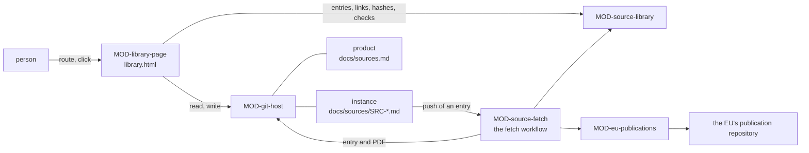

# ARC-032 The source library

## Context

Every requirement names where it comes from (`A REQUIREMENT HAS A REGISTERED SOURCE`); the sources are kept once, in the
instance, and each product names those that apply to it with the exact version it uses (UC-004, UC-015). A source is a
law, a norm, a set of documents or a repository; its content may be republished, or may not leave a place the person
chooses. A new edition is added beside the old ones, and a product moves to it only by its author's decision (UC-016).

The layout of a repository already names the places: `docs/sources/` in the instance, `docs/sources.md` in a product
(ARC-006 decision 2). Three decisions already consume what a source permits: who may hold a role
(`MOD-process-model.assignable`), which sources bar a participant (`MOD-process-config.sourcesBarred`) and the start
panel of an item (`MOD-process-views.startPanel`) each take `Restriction[]` — a source and the processing places it
permits —; a check of a SPEC takes the identifiers of the sources a product links (`MOD-artifacts.checkSpec`). No decision
yet reads the register those come from.

Facts this decision rests on:

- The Publications Office of the EU documents the ELI of EU legislation as "ELI URI template:
  http://data.europa.eu/eli/{typedoc}/{year}/{naturalnumber}/oj", with the example `http://data.europa.eu/eli/dir/2000/60/oj`
  (`https://op.europa.eu/en/web/webguide/uris`). Asked for `https://data.europa.eu/eli/reg/2024/1689/oj`, the server answers
  with a redirect to `https://eur-lex.europa.eu/eli/reg/2024/1689/oj`; asked for
  `https://publications.europa.eu/resource/celex/32024R1689`, with a redirect to a work of the Publications Office's
  repository, `http://publications.europa.eu/resource/cellar/dc8116a1-3fe6-11ef-865a-01aa75ed71a1/rdf/object/full`.
- EUR-Lex addresses name a text by its CELEX number in the query `uri`: the Commission's staff working document
  SWD(2019) 1771 links `https://eur-lex.europa.eu/legal-content/EN/TXT/?uri=CELEX:32011R0305`,
  `https://eur-lex.europa.eu/legal-content/EN/ALL/?uri=CELEX%3A32001L0095` — the colon encoded — and the consolidated
  version `https://eur-lex.europa.eu/legal-content/EN/TXT/?uri=CELEX:02014L0024-20180101`
  (`https://commission.europa.eu/document/download/50b4417d-26a0-4c65-90e9-e7f467268dc2_en?filename=swd_2019_1771_en.pdf`).
  EUR-Lex's own help pages answer an automated reader with `202 Accepted` and no body, so they are not quoted here.
- A browser computes a SHA-256 with `SubtleCrypto.digest()`, "available only in secure contexts (HTTPS)", "available
  across browsers since January 2020", supporting `"SHA-256"` over an `ArrayBuffer` or a typed array
  (`https://developer.mozilla.org/en-US/docs/Web/API/SubtleCrypto/digest`); Node, where the generated tests run, has
  `subtle.digest()` since v15.0.0 with `'SHA-256'` (`https://github.com/nodejs/node/blob/main/doc/api/webcrypto.md`). The dashboard is served over
  HTTPS from GitHub Pages (ARC-001).
- The git adapter commits a file by its text or by its bytes, and lets a source's content under
  `docs/sources/<id>/<version>/` — a PDF, a Word file or a zip archive — reach a default branch beside Markdown
  (`MOD-git-host.writeFiles`; ARC-004 decisions 3, 4 and 10).
- The Publications Office's repository, Cellar, answers by content negotiation: "The dissemination service uses a global
  negotiation system that returns always a "303 - See other" response"; a text's content stream is asked for with
  `GET http://publications.europa.eu/resource/{ps-name}/{ps-id}`, `Accept:{mime-type}` — `application/pdf` among the
  types it lists — and `Accept-Language:{acc-lang}`, "a 3-chars ISO_639-3 language code" for "retrieving the correct
  expression" (CELLAR End user manual, CEM-EUM-8.10.1,
  `https://op.europa.eu/documents/d/cellar/cellar-end-user-manual_eec84490f0b94079960fcf6919271c37-280824-1601-502`).
  Asked so for `https://publications.europa.eu/resource/celex/32024R1689` with `Accept: application/pdf` and
  `Accept-Language: eng`, it redirects to
  `http://publications.europa.eu/resource/cellar/dc8116a1-3fe6-11ef-865a-01aa75ed71a1.0006.01/DOC_1`, which answers
  `200` with the PDF; neither answer names `Access-Control-Allow-Origin`, so no page may read it. That address is the
  resource of the PDF's content stream, and a content stream's identifier is `{work-id}.{expr-id}.{man-id}/{cs-id}`: a
  UUID, "a 4-chars numeric value", "a 2-chars numeric value", and `DOC_x`, "where x is an incremental numeric value that
  identifies the content stream" (the same manual). For a CELEX number it does not hold it answers `404` "Resource
  [system 'celex'] not found."; for the consolidated version `02014L0024-20180101`, `404` with its work "does not hold a
  content datastream of the requested type" — it serves that version as `application/xhtml+xml`. An ELI it does not
  resolve: `…/resource/eli/reg/2024/1689/oj` answers "Resource [system 'eli'] not found."
- Its SPARQL endpoint, `https://publications.europa.eu/webapi/rdf/sparql` (`https://op.europa.eu/en/web/webguide/uris`),
  with the prefix `cdm: <http://publications.europa.eu/ontology/cdm#>`
  (`https://op.europa.eu/documents/d/cellar/cellar_ml_dataset_guide`), gives for the work whose `cdm:resource_legal_eli`
  is `"http://data.europa.eu/eli/reg/2024/1689/oj"^^xsd:anyURI` the `cdm:resource_legal_id_celex` `32024R1689`, and no
  binding for an ELI it does not hold.
- GitHub Actions runs a workflow on a push where it changes a path the workflow's `paths` names — "you can configure a
  workflow to run based on what file paths are changed" —, and on `workflow_dispatch`, which "will only trigger a workflow
  run if the workflow file exists on the default branch"
  (`https://docs.github.com/en/actions/reference/workflows-and-actions/workflow-syntax`,
  `https://docs.github.com/en/actions/reference/workflows-and-actions/events-that-trigger-workflows`). A push made with a
  personal access token starts the workflows a push starts; one made with `GITHUB_TOKEN` does not (ARC-015's
  consequences).

## Decision

1. **One decision, four modules.** `MOD-source-library`, a kernel, holds the formats of the register and of a product's
   links, their checks, a new source and a new version, the hashes and the files of a version's content, an EU legal
   text's identifier from its address, the record of its fetch, the fetch workflow's file, what a save makes public, the
   views the page shows, the passages that changed, a move and its marking, and the restrictions a source sets.
   `MOD-library-page` is the shell of `library.html` at the root of the instance's Pages site: its route, the reading of
   the register and of the products' links, a repository's current commit, the texts of two versions, the saves on a
   click, the fetch workflow's proposal and its dispatch, and every text and all HTML of the page. `MOD-eu-publications`,
   an adapter, speaks to the EU's publication repository. `MOD-source-fetch` is the shell of the fetch workflow in the
   instance's CI (decision 12).
2. **The register entry** (`SourceFile`, `MOD-source-library.parseSource`, `MOD-source-library.formatSource`), one file
   per source, `docs/sources/SRC-<slug>.md` in the instance (`THE INSTANCE KEEPS THE SOURCE REGISTER`). Its front matter
   names the identifier, the name, the kind — one of `organisation`, `person`, `standard`, `regulation`, `document`,
   `system`, `measurement` —, the authority — `normative`, `advisory` or `informational` —, the licence — `republish`,
   `restricted` or `unknown` — with the terms under which its content may be copied, whether the content is `files`, an
   `archive` or a `repository`, the address it comes from — an EU legal text's EUR-Lex or ELI address, a repository's
   address —, the repository that keeps restricted content, the processing places a restricted source permits, the parts
   the source has, and for an EU legal text the language it is fetched in — a three-letter code of ISO 639-3, as the
   repository takes it; the form presets `eng`. Its body is a table of versions, one row per file read: the version's
   number, its identifier or edition, its date, the file, its SHA-256, the content stream — for an EU legal text once
   fetched, the publication repository's identifier of the version fetched (decision 12), else empty —, and a note.
   Nothing of a particular source is part of Agent M's code: the parts a product may name are the entry's own
   (`THE SOURCE MODEL IS GENERIC`).
3. **The check of an entry** (`MOD-source-library.checkSource`), against the entry as committed and the instance's
   address, gives one finding per rule broken, each naming the rule: the file not named by its identifier; a kind
   outside the closed set (`THE SOURCE KIND IS ONE OF A CLOSED SET`); an authority not declared
   (`A SOURCE DECLARES ITS AUTHORITY`); terms not recorded, and as a warning an unknown licence
   (`A SOURCE DECLARES ITS LICENCE`); content that is neither PDF, Word or Markdown files nor one zip archive nor a
   repository (`A SOURCE IS FILES, AN ARCHIVE OR A REPOSITORY`); a repository without its address or a version without
   its commit (`A LIVING SOURCE IS PINNED`); a standard whose designation names no edition
   (`A STANDARD IS REGISTERED BY ITS DESIGNATION`); a version without identifier, date, file or SHA-256, and two
   versions with the same bytes (`A SOURCE VERSION IS FIXED BY IDENTIFIER AND HASH`); a version of an EU legal text that
   holds its file without the content stream it was fetched from, or any other version that names one
   (`AN EU LEGAL TEXT IS FETCHED FROM THE OFFICIAL REPOSITORY`); a committed version changed or removed, or versions not
   numbered in order (`A SOURCE VERSION IS NEVER OVERWRITTEN`); restricted content kept in the instance
   (`RESTRICTED CONTENT STAYS OUT OF THE PUBLIC INSTANCE`); and as a warning a restricted source that permits no
   processing place (`RESTRICTED CONTENT GOES ONLY WHERE ITS SOURCE PERMITS`); an EU legal text that names no language
   to fetch it in (`AN EU LEGAL TEXT IS FETCHED FROM THE OFFICIAL REPOSITORY`). A version of an EU legal text — an entry
   whose address is an EU address — that holds its CELEX number or ELI and no file yet is a warning, its first version
   or a later one added by *+ New version*: it awaits its fetch. Such a version is the one a committed entry may see
   change, and only so: the fetch completes it once with its date, its one file and its content stream, or its note
   records a failed fetch, its identifier unchanged; any other change of a committed version is an error.
4. **A version is fixed by identifier and hash.** A file's SHA-256 is computed where the page runs, from the bytes the
   person selected, which go nowhere (`MOD-source-library.sha256Files`; UC-004 4a). A repository's version is its commit,
   read with the token stored for its server (`MOD-library-page.repositoryCommit`). A new edition is the next version,
   and the versions before stay as they are; one with the bytes of a version the source holds records nothing
   (`MOD-source-library.addVersion`; UC-016 1a). A product's link names a version by its hash: the repository's commit,
   or the SHA-256 of the version's manifest — one line `<sha256>  <name>` per file, sorted by name
   (`MOD-source-library.versionHash`).
5. **Where the content lives** (`MOD-source-library.publicity`). A source whose licence permits republication keeps its
   content in the instance, under `docs/sources/<id>/<version>/`; a restricted one in the repository the person names
   under `location`, public or private, at the same path, or nowhere where only its hashes are recorded (UC-004 4a); an
   unknown licence counts as restricted until one is recorded (UC-004 4b); a repository's content stays in that
   repository. A version's content is committed at that path, each file where the version records it with its SHA-256 —
   Markdown as its text, a PDF, a Word file or a zip archive as its bytes (`MOD-source-library.contentFiles`; ARC-004
   decision 10) —: in the instance in one commit with the entry (`MOD-library-page.saveSource`, which refuses a content
   the public instance may not keep), in the named repository in a commit of its own (`MOD-library-page.saveContent`); a
   file that exists already is refused, so that a version's content is never overwritten. Before a save the page
   states, in these words: "Public in the instance: the register entry, docs/sources/<id>.md." and one of "The content
   is kept in the instance and is public.", "The content is kept in <repository>." or "The content is kept nowhere; only
   its designation and hashes are recorded."
6. **What a restricted source permits** (`MOD-source-library.restrictionsOf`): each source under a restricted or an
   unknown licence, with the processing places its entry permits — the `Restriction[]` the interfaces named in the
   context take, so that a participant elsewhere is named and never given the content.
7. **An EU legal text's identifier** (`MOD-source-library.euAddress`): the CELEX number a EUR-Lex address carries in its
   query `uri` — the colon written plain or as `%3A` —, the one the Publications Office's `resource/celex/<number>`
   names, or the ELI of an address under `data.europa.eu/eli/` or EUR-Lex's `/eli/`, written as
   `http://data.europa.eu/eli/<path>`. The identifier is the one the address names; no CELEX number is made from an ELI
   or the other way round.
8. **A product's links** (`SourceLinksFile`, `MOD-source-library.parseLinks`, `MOD-source-library.formatLinks`):
   `docs/sources.md` of the product, a heading and one row per source — its identifier, the version, the version's hash,
   the part that applies (`A PRODUCT LINKS THE SOURCES THAT APPLY`, `A LINK NAMES THE PART THAT APPLIES`), and the
   requirements to look at again since the product moved to that version (decision 14); a file without that column
   lists none. Its check
   against the register (`MOD-source-library.checkLinks`) names a source not registered, a version the source does not
   have, a hash that is not the version's, and a source linked twice. The form starts from every source of the register,
   ticked where the product links it, its version — else the newest — and the parts its entry names
   (`MOD-source-library.linkChoices`). Before a link is removed, the page names the product's requirements whose source
   names it (`MOD-source-library.sourceRequirements`); they are listed, not deleted (UC-015 2b).
9. **The library as the page shows it** (`MOD-source-library.libraryView`): each source with its kind, authority,
   licence, content and versions — an EU legal text's each *fetched*, *awaiting its fetch* or *fetch failed*, with its
   note —, and each product that links it with the version it links — marked where a newer version exists (UC-016 3,
   4a). A source the form names that the register holds already — the same address, an identifier one of its versions
   names, or the same files — is offered a new version instead (`MOD-source-library.alreadyRegistered`; UC-004 1a).
10. **The page** (`MOD-library-page`). Its route (`MOD-library-page.route`) gives the views `#library`,
    `#source?source=<id>`, `#register` — with `?source=<id>` for a new version — and `#product?product=<address>`. Every
    page of the dashboard links it as *Library*, as every page carries the gear of the settings page (ARC-026 decision
    1), and a product's view links its sources as *Requirement sources*, `#product?product=<address>` (UC-015 1). It
    reads the instance's register at the head of its default branch, each entry with the findings of its check, and each
    product's links and requirements (`MOD-library-page.readLibrary`). Before **Save**, the page shows the findings of
    the check of what the form would save — `MOD-source-library.checkSource` for an entry,
    `MOD-source-library.checkLinks` for a product's links —, and the save checks again against what is committed. It
    saves on a click (`THE DASHBOARD WRITES ONLY ON A PERSON'S CLICK`, `ONE CLICK PER DECISION`): a register entry to
    the instance (`MOD-library-page.saveSource`), checked against the entry as committed, a version's content to the
    repository the entry names (`MOD-library-page.saveContent`), and a product's links to the product
    (`MOD-library-page.saveLinks`), checked against the register read — each one commit on the head read, refused where
    the file changed after the page read it, a content file exists already or the check finds an error
    (`A PERSON'S OWN INPUT IS COMMITTED DIRECTLY`). An EU legal text's view offers **Fetch again** where its fetch
    failed (`MOD-library-page.fetchAgain`), and the library offers **Set up the fetch** while the instance's default
    branch holds no fetch workflow as generated (`MOD-library-page.proposeFetch`; decision 12). Where a repository is
    not reachable with the stored token, the page names the refusal and links the token's page of that repository's
    server to extend it (`MOD-git-host.parseProductAddress`, `MOD-git-host.tokenPageUrl`; UC-004 4c).
11. **The page's texts** (`EVERY STEP EXPLAINS ITSELF`). *+ Register source* asks what the source is, each with one
    sentence and an example: "An EU legal text — paste its EUR-Lex or ELI address, for example
    https://eur-lex.europa.eu/legal-content/EN/TXT/?uri=CELEX:32024R1689"; "A standard — its designation from the cover
    page, for example IEC 62304:2006+AMD1:2015"; "Documents — PDF, Word or Markdown files, or a zip file of them, for
    example a faculty's guideline"; "A repository — its address on GitHub or GitLab, public or private, read at its
    current commit". The common fields fold out an explanation each: the kind — "what the source is; the AI Act is a
    regulation, IEC 62304 a standard"; the authority — "normative: the product must meet it; advisory: it should;
    informational: background"; the licence — "may be republished: the instance, which is public, keeps a copy;
    restricted: the content stays in a repository you name, or with you". A standard's designation folds out: "The
    designation stands on the norm's cover page. Name the edition and every amendment: an amendment changes what the
    norm requires." A standard's licence is preset to *restricted*. A product's sources fold out *What is this?*: "The
    library lists every source the instance knows; this list names the ones this product must meet." — "A source is a
    rule the product must meet; a resource is something it is built with or runs on (UC-040)." — "The version is fixed,
    so that every requirement names what it was derived from; a new version is taken only when you move to it." An EU
    legal text's version reads *fetched*, *awaiting its fetch* — "The instance's fetch workflow downloads the text from
    the EU's publication repository." — or *fetch failed* with the reason its note records and **Fetch again**. **Set up
    the fetch** says: "The fetch workflow reaches the instance through a pull request, as every generated file does. It
    writes with your Agent M token, stored as the secret AGENT_M_TOKEN of the instance's repository." and links that
    page (`MOD-git-host.secretsPageUrl`). **Move to the new version** lists the requirements that came from the source
    and the passages that changed; a requirement marked *source changed* offers **Looked at**.
12. **The fetch workflow** (UC-004 7, 7a, UC-016 2a; `AN EU LEGAL TEXT IS FETCHED FROM THE OFFICIAL REPOSITORY`):
    `MOD-source-fetch` and `MOD-eu-publications`. Its file, `.github/workflows/agent-m-fetch-sources.yml`
    (`MOD-source-library.fetchWorkflow`), runs on a push to the instance's default branch that changes a register entry,
    `docs/sources/*.md`, and on a dispatch; the person's Agent M token, the CI secret `AGENT_M_TOKEN` of ARC-015
    decision 7, reaches only the step that runs `src/source-fetch/main.mjs`, never the checkout
    (`NO SECRET IN THE REPOSITORY`). It reaches the default branch through a pull request the library page opens on a
    click (`MOD-library-page.proposeFetch`), which the author merges once its CI is green, as any other (UC-004 7b;
    `CODE ENTERS THE DEFAULT BRANCH THROUGH A PULL REQUEST WITH GREEN CI`, ARC-015 decision 8). Its entry reads the
    register at the head (`MOD-source-fetch.readPending`): every version of an EU legal text awaiting its fetch — on a
    push not one whose last fetch failed, on a dispatch — **Fetch again** — those too
    (`MOD-source-library.awaitingFetch`), so that a failure records itself once and starts no further run. For each, an
    ELI is turned into its CELEX number (`MOD-eu-publications.celexOfEli`); the PDF is asked for by that number in the
    entry's language (`MOD-eu-publications.textRequest`) and downloaded by the shell, which follows the redirect, since
    the fetch port of ARC-003 carries no bytes; the answer is read: the address the redirect ended at, named as the
    repository's resource of the content stream — a PDF from any other address is refused
    (`MOD-eu-publications.textAnswer`). The version is recorded — the day it was retrieved as its date, its one file
    `<celex>.pdf` with its SHA-256, and the content stream as the repository's version identifier, in a field of its
    own, a failed fetch's note removed (`MOD-source-library.fetchedVersion`) — or its note records the failure
    (`MOD-source-library.fetchFailed`); nothing is guessed. The entry, checked against the entry as committed
    (`MOD-source-library.checkSource`), and the PDF are committed on the head the entry was read at, where none of the
    files it adds exists yet — so that a version's content is never overwritten, as on the page (decision 5) —, on the
    CI secret's authority of ARC-003 (`MOD-source-fetch.recordFetch`, `MOD-git-host.writeFiles`); the PDF where the
    entry keeps its content, in the instance or, in a commit of its own, in the repository it names (decision 5).
13. **The passages that changed** (UC-016 4): where both versions are text, the page reads each version's Markdown files
    where the entry keeps its content (`MOD-library-page.versionTexts`) and shows, file by file, the passages that differ
    — the lines removed and added, each with the line it begins at — and a file found in one version only
    (`MOD-source-library.changedPassages`); a PDF, a Word file or an archive is named as no text.
14. **A move and its marking** (UC-016 5, 6; `A REQUIREMENT IS NOT CHANGED WITHOUT AN IMPACT LIST`). **Move** sets the
    product's link to the new version and its hash and lists, under *Look at again*, the requirements whose source names
    the source (`MOD-source-library.moveLink`), saved as any change of the links (`MOD-library-page.saveLinks`). The
    dashboard marks those requirements *source changed* (`MOD-source-library.sourceChanged`) until **Looked at** takes
    one off the list (`MOD-source-library.lookedAt`), again one commit on a click; the mark is derived from the file,
    never stored elsewhere.



## Alternatives

- **One register file for all sources** — rejected by `THE INSTANCE KEEPS THE SOURCE REGISTER`, one file per source; one file
  per source also lets a check compare an entry with the version committed in one read.
- **One file per version** — rejected: a check of `A SOURCE VERSION IS NEVER OVERWRITTEN` then reads every version's file;
  the versions of one entry are compared in one text.
- **Hashes computed in CI** — rejected: the files would leave the browser, which UC-004 4a forbids; Web Crypto computes
  them where the page runs.
- **A CELEX number made from an ELI, or the reverse** — rejected: the conversion would rest on a structure of identifiers
  this decision has no fetched source for; the identifier is the one the address names, and the fetch asks the
  repository's own record of a work for an ELI's CELEX number (decision 12).
- **The repository's version identifier in the version's note** — rejected: the note is free text, which also holds a
  failed fetch's reason and any remark; in a field of its own the identifier has a pattern the check of an entry holds it
  to (decision 3).
- **The fetch in the browser** — rejected: the repository names no `Access-Control-Allow-Origin`, and
  `AN EU LEGAL TEXT IS FETCHED FROM THE OFFICIAL REPOSITORY` asks for a workflow of the instance.
- **A consolidated text kept as XHTML, or turned into Markdown** — rejected: `A SOURCE IS FILES, AN ARCHIVE OR A
  REPOSITORY` lists PDF, Word and Markdown files, and a text turned into Markdown is not the bytes that were read.
- **The fetch workflow generated by `MOD-ci-generator`** — not chosen: ARC-015 generates a product's CI from its test
  schedule; the fetch workflow is the instance's alone and follows its register, as the bridge's release workflow is its
  module's own (ARC-017).
- **The library as a view of the settings page** — rejected: the settings page keeps settings; the library is the
  instance's register, read and written as files of its own, like the tests pages' views.

## Consequences

- The kernel reads and checks the register and the links, with no request; the page alone reads and writes repositories,
  through the git adapter.
- **A consolidated version held in no PDF.** The repository serves the consolidated version measured as XHTML only; its
  fetch fails with that reason (`MOD-eu-publications.textAnswer`, `no-pdf`), recorded and shown with **Fetch again**,
  as any failed fetch (UC-004 7a). The SPEC's kinds of content — "a set of files (PDF, Word, Markdown), a zip archive of
  such files, or a repository" — name no form such a text could be kept in.
- The instance needs `AGENT_M_TOKEN` among its repository's secrets for the fetch, the token of
  `ONE GITHUB TOKEN SERVES EVERY FEATURE`; the library page names it and links the page where it is stored
  (decision 11). A commit of the fetch, made with that token, starts the workflow again, which then finds nothing to
  fetch.
- **Not realised here — what reads the register elsewhere.** An item whose sources permit their content only where no
  holder of the role works (UC-034 3a), a participant whose place some sources do not permit (UC-017 5a) and a role whose
  holder processes data where a linked source does not permit it (UC-002 4c) need the main page and the settings page to
  read the register and hand `MOD-source-library.restrictionsOf` to the interfaces that take `Restriction[]`; the link to
  the resources' page (UC-015 2c) comes with the resources (UC-040).
- **The rest of the module.** A product's resources (UC-040) and the due diligence of a reused library are designed in
  `MOD-source-library` with later parts of this decision; the label of a source's content for
  `MOD-job-harness.mayReceive` comes with the jobs that send it — a `ContentLabel` with no places allows any place, so a
  restricted source that permits none needs its own form there.

## Modules

### MOD-source-library

```json module
{
  "id": "MOD-source-library",
  "folder": "src/source-library/",
  "layer": "kernel",
  "responsibility": "The instance's register of requirement sources and a product's links to them: the formats of both and their checks, a new source and a new version, the hashes of a version's files, the files of a content kept as Markdown, an EU legal text's identifier from its address, what a register entry makes public, the library as the page shows it, a product's choice of its sources, the requirements that name a source, and the restrictions a restricted source sets.",
  "realises": ["THE INSTANCE KEEPS THE SOURCE REGISTER", "THE SOURCE KIND IS ONE OF A CLOSED SET", "A SOURCE DECLARES ITS AUTHORITY", "A SOURCE DECLARES ITS LICENCE", "A SOURCE IS FILES, AN ARCHIVE OR A REPOSITORY", "A LIVING SOURCE IS PINNED", "A SOURCE VERSION IS FIXED BY IDENTIFIER AND HASH", "A SOURCE VERSION IS NEVER OVERWRITTEN", "A STANDARD IS REGISTERED BY ITS DESIGNATION", "RESTRICTED CONTENT STAYS OUT OF THE PUBLIC INSTANCE", "A PRODUCT LINKS THE SOURCES THAT APPLY", "A LINK NAMES THE PART THAT APPLIES"],
  "owns": ["SourceFileHash", "SourceVersion", "SourceEntry", "NewVersion", "SourceForm", "AlreadyRegistered", "EuAddress", "FileBytes", "Publicity", "SourceLink", "ProductLinks", "LibraryVersion", "LibraryUse", "LibraryRow", "LinkChoice", "SourceFileContent", "SourceLinkRow", "PendingFetch", "FetchedText", "FetchedVersion", "SourceChange", "VersionText", "Passage", "ChangedFile", "SourceFile", "SourceLinksFile"],
  "uses": ["MOD-contracts"]
}
```

```json interface
{
  "id": "MOD-source-library.parseSource",
  "summary": "A register entry, docs/sources/SRC-<slug>.md: its identifier, name, kind, authority, licence and the terms under which its content may be copied, whether its content is files, an archive or a repository, the address it comes from and, for an EU legal text, the language it is fetched in, the repository that keeps restricted content, the processing places it permits, the parts it names, and its versions — each with its identifier or edition, its date, the files read with their SHA-256, and a note.",
  "params": [{ "name": "text", "type": "string" }],
  "result": "SourceEntry",
  "async": false,
  "refusals": [{ "code": "not-a-source", "when": "the text has no front matter naming an id" }],
  "examples": [
    {
      "name": "a bought standard in two editions",
      "input": { "text": "---\nid: SRC-iec-62304\nname: IEC 62304 — Medical device software — Software life cycle processes\nkind: standard\nauthority: normative\nlicence: restricted\nterms: © IEC; copies may not be passed on\ncontent: files\naddress:\nlocation: https://github.com/alice/norms\nplaces:\n  - this machine\n  - NHR@FAU, Erlangen\nparts:\n  - safety class A\n  - safety class B\n  - safety class C\n---\n\n# SRC-iec-62304 IEC 62304 — Medical device software — Software life cycle processes\n\n## Versions\n\n| Version | Identifier | Date | File | SHA-256 | Content stream | Note |\n|---|---|---|---|---|---|---|\n| 1 | IEC 62304:2006 | 2006-05-09 | iec-62304-2006.pdf | 7cae7d990dd0e233bd6324c2a253df5d6cf539d0686ff294d980ba9910cc7506 | — | — |\n| 2 | IEC 62304:2006+AMD1:2015 | 2015-06-25 | iec-62304-2015.pdf | 4f1ebb9b03585db4baa0b2eabbc49297482331feb3568e5fb4c7084bee569ca2 | — | — |\n" },
      "result": {
        "id": "SRC-iec-62304",
        "name": "IEC 62304 — Medical device software — Software life cycle processes",
        "kind": "standard",
        "authority": "normative",
        "licence": "restricted",
        "terms": "© IEC; copies may not be passed on",
        "content": "files",
        "address": "",
        "location": "https://github.com/alice/norms",
        "language": "",
        "places": ["this machine", "NHR@FAU, Erlangen"],
        "parts": ["safety class A", "safety class B", "safety class C"],
        "versions": [
          {
            "version": 1,
            "identifier": "IEC 62304:2006",
            "date": "2006-05-09",
            "files": [
              { "name": "iec-62304-2006.pdf", "sha256": "7cae7d990dd0e233bd6324c2a253df5d6cf539d0686ff294d980ba9910cc7506" }
            ],
            "contentStream": "",
            "note": ""
          },
          {
            "version": 2,
            "identifier": "IEC 62304:2006+AMD1:2015",
            "date": "2015-06-25",
            "files": [
              { "name": "iec-62304-2015.pdf", "sha256": "4f1ebb9b03585db4baa0b2eabbc49297482331feb3568e5fb4c7084bee569ca2" }
            ],
            "contentStream": "",
            "note": ""
          }
        ]
      }
    },
    { "name": "a text with no front matter", "input": { "text": "# Old rules\n" }, "refused": "not-a-source" }
  ]
}
```

```json interface
{
  "id": "MOD-source-library.checkSource",
  "summary": "Every finding on a register entry, against the entry as committed — empty for a new one — and the instance's address: its file not named by its identifier, a kind outside the closed set, an authority not declared, a licence not recorded or not known, content that is neither files, an archive nor a repository, an EU legal text that names no language to fetch it in, a repository without its address or a version without its commit, a standard without its edition, a version without identifier, date, file or SHA-256 — a version of an EU legal text awaiting its fetch, its first or a later one, is a warning —, a version of an EU legal text holding its file without the content stream it was fetched from, or any other version naming one, two versions with the same bytes, a committed version changed or removed — but for a version awaiting its fetch, which the fetch completes once with its date, its file and its content stream or whose note records a failed fetch, its identifier unchanged —, restricted content kept in the instance, and a restricted source that permits no processing place.",
  "params": [
    { "name": "path", "type": "string" },
    { "name": "text", "type": "string" },
    { "name": "earlier", "type": "string" },
    { "name": "instance", "type": "string" }
  ],
  "result": "Finding[]",
  "async": false,
  "refusals": [],
  "examples": [
    {
      "name": "a complete entry as committed",
      "input": { "path": "docs/sources/SRC-iec-62304.md", "text": "---\nid: SRC-iec-62304\nname: IEC 62304 — Medical device software — Software life cycle processes\nkind: standard\nauthority: normative\nlicence: restricted\nterms: © IEC; copies may not be passed on\ncontent: files\naddress:\nlocation: https://github.com/alice/norms\nplaces:\n  - this machine\n  - NHR@FAU, Erlangen\nparts:\n  - safety class A\n  - safety class B\n  - safety class C\n---\n\n# SRC-iec-62304 IEC 62304 — Medical device software — Software life cycle processes\n\n## Versions\n\n| Version | Identifier | Date | File | SHA-256 | Content stream | Note |\n|---|---|---|---|---|---|---|\n| 1 | IEC 62304:2006 | 2006-05-09 | iec-62304-2006.pdf | 7cae7d990dd0e233bd6324c2a253df5d6cf539d0686ff294d980ba9910cc7506 | — | — |\n| 2 | IEC 62304:2006+AMD1:2015 | 2015-06-25 | iec-62304-2015.pdf | 4f1ebb9b03585db4baa0b2eabbc49297482331feb3568e5fb4c7084bee569ca2 | — | — |\n", "earlier": "---\nid: SRC-iec-62304\nname: IEC 62304 — Medical device software — Software life cycle processes\nkind: standard\nauthority: normative\nlicence: restricted\nterms: © IEC; copies may not be passed on\ncontent: files\naddress:\nlocation: https://github.com/alice/norms\nplaces:\n  - this machine\n  - NHR@FAU, Erlangen\nparts:\n  - safety class A\n  - safety class B\n  - safety class C\n---\n\n# SRC-iec-62304 IEC 62304 — Medical device software — Software life cycle processes\n\n## Versions\n\n| Version | Identifier | Date | File | SHA-256 | Content stream | Note |\n|---|---|---|---|---|---|---|\n| 1 | IEC 62304:2006 | 2006-05-09 | iec-62304-2006.pdf | 7cae7d990dd0e233bd6324c2a253df5d6cf539d0686ff294d980ba9910cc7506 | — | — |\n| 2 | IEC 62304:2006+AMD1:2015 | 2015-06-25 | iec-62304-2015.pdf | 4f1ebb9b03585db4baa0b2eabbc49297482331feb3568e5fb4c7084bee569ca2 | — | — |\n", "instance": "https://github.com/alice/agent-m" },
      "result": []
    },
    {
      "name": "an EU legal text awaiting its fetch",
      "input": { "path": "docs/sources/SRC-ai-act.md", "text": "---\nid: SRC-ai-act\nname: Regulation (EU) 2024/1689 — Artificial Intelligence Act\nkind: regulation\nauthority: normative\nlicence: republish\nterms: reuse permitted with acknowledgement of the source\ncontent: files\naddress: https://eur-lex.europa.eu/legal-content/EN/TXT/?uri=CELEX:32024R1689\nlocation:\nlanguage: eng\nplaces:\nparts:\n  - prohibited practice\n  - high-risk AI system\n  - general-purpose AI model\n---\n\n# SRC-ai-act Regulation (EU) 2024/1689 — Artificial Intelligence Act\n\n## Versions\n\n| Version | Identifier | Date | File | SHA-256 | Content stream | Note |\n|---|---|---|---|---|---|---|\n| 1 | 32024R1689 | — | — | — | — | — |\n", "earlier": "", "instance": "https://github.com/alice/agent-m" },
      "result": [
        { "artifact": "SRC-ai-act", "line": 25, "kind": "warning", "what": "version 1 awaits its fetch from the EU's publication repository", "rule": "AN EU LEGAL TEXT IS FETCHED FROM THE OFFICIAL REPOSITORY", "fix": "let the fetch workflow complete the version" }
      ]
    },
    {
      "name": "a later version of an EU legal text awaiting its fetch",
      "input": { "path": "docs/sources/SRC-ai-act.md", "text": "---\nid: SRC-ai-act\nname: Regulation (EU) 2024/1689 — Artificial Intelligence Act\nkind: regulation\nauthority: normative\nlicence: republish\nterms: reuse permitted with acknowledgement of the source\ncontent: files\naddress: https://eur-lex.europa.eu/legal-content/EN/TXT/?uri=CELEX:32024R1689\nlocation:\nlanguage: eng\nplaces:\nparts:\n  - prohibited practice\n  - high-risk AI system\n  - general-purpose AI model\n---\n\n# SRC-ai-act Regulation (EU) 2024/1689 — Artificial Intelligence Act\n\n## Versions\n\n| Version | Identifier | Date | File | SHA-256 | Content stream | Note |\n|---|---|---|---|---|---|---|\n| 1 | 32024R1689 | 2026-09-02 | 32024R1689.pdf | a3203f14799d9a53ea8f7cb3f3635c14b02e8d21d25d5d0c2e81e952559a5c56 | http://publications.europa.eu/resource/cellar/dc8116a1-3fe6-11ef-865a-01aa75ed71a1.0006.01/DOC_1 | — |\n| 2 | 02024R1689-20260801 | — | — | — | — | — |\n", "earlier": "---\nid: SRC-ai-act\nname: Regulation (EU) 2024/1689 — Artificial Intelligence Act\nkind: regulation\nauthority: normative\nlicence: republish\nterms: reuse permitted with acknowledgement of the source\ncontent: files\naddress: https://eur-lex.europa.eu/legal-content/EN/TXT/?uri=CELEX:32024R1689\nlocation:\nlanguage: eng\nplaces:\nparts:\n  - prohibited practice\n  - high-risk AI system\n  - general-purpose AI model\n---\n\n# SRC-ai-act Regulation (EU) 2024/1689 — Artificial Intelligence Act\n\n## Versions\n\n| Version | Identifier | Date | File | SHA-256 | Content stream | Note |\n|---|---|---|---|---|---|---|\n| 1 | 32024R1689 | 2026-09-02 | 32024R1689.pdf | a3203f14799d9a53ea8f7cb3f3635c14b02e8d21d25d5d0c2e81e952559a5c56 | http://publications.europa.eu/resource/cellar/dc8116a1-3fe6-11ef-865a-01aa75ed71a1.0006.01/DOC_1 | — |\n", "instance": "https://github.com/alice/agent-m" },
      "result": [
        { "artifact": "SRC-ai-act", "line": 26, "kind": "warning", "what": "version 2 awaits its fetch from the EU's publication repository", "rule": "AN EU LEGAL TEXT IS FETCHED FROM THE OFFICIAL REPOSITORY", "fix": "let the fetch workflow complete the version" }
      ]
    },
    {
      "name": "an EU legal text completed by its fetch",
      "input": { "path": "docs/sources/SRC-ai-act.md", "text": "---\nid: SRC-ai-act\nname: Regulation (EU) 2024/1689 — Artificial Intelligence Act\nkind: regulation\nauthority: normative\nlicence: republish\nterms: reuse permitted with acknowledgement of the source\ncontent: files\naddress: https://eur-lex.europa.eu/legal-content/EN/TXT/?uri=CELEX:32024R1689\nlocation:\nlanguage: eng\nplaces:\nparts:\n  - prohibited practice\n  - high-risk AI system\n  - general-purpose AI model\n---\n\n# SRC-ai-act Regulation (EU) 2024/1689 — Artificial Intelligence Act\n\n## Versions\n\n| Version | Identifier | Date | File | SHA-256 | Content stream | Note |\n|---|---|---|---|---|---|---|\n| 1 | 32024R1689 | 2026-09-02 | 32024R1689.pdf | a3203f14799d9a53ea8f7cb3f3635c14b02e8d21d25d5d0c2e81e952559a5c56 | http://publications.europa.eu/resource/cellar/dc8116a1-3fe6-11ef-865a-01aa75ed71a1.0006.01/DOC_1 | — |\n", "earlier": "---\nid: SRC-ai-act\nname: Regulation (EU) 2024/1689 — Artificial Intelligence Act\nkind: regulation\nauthority: normative\nlicence: republish\nterms: reuse permitted with acknowledgement of the source\ncontent: files\naddress: https://eur-lex.europa.eu/legal-content/EN/TXT/?uri=CELEX:32024R1689\nlocation:\nlanguage: eng\nplaces:\nparts:\n  - prohibited practice\n  - high-risk AI system\n  - general-purpose AI model\n---\n\n# SRC-ai-act Regulation (EU) 2024/1689 — Artificial Intelligence Act\n\n## Versions\n\n| Version | Identifier | Date | File | SHA-256 | Content stream | Note |\n|---|---|---|---|---|---|---|\n| 1 | 32024R1689 | — | — | — | — | — |\n", "instance": "https://github.com/alice/agent-m" },
      "result": []
    },
    {
      "name": "a fetch that failed, recorded",
      "input": { "path": "docs/sources/SRC-ai-act.md", "text": "---\nid: SRC-ai-act\nname: Regulation (EU) 2024/1689 — Artificial Intelligence Act\nkind: regulation\nauthority: normative\nlicence: republish\nterms: reuse permitted with acknowledgement of the source\ncontent: files\naddress: https://eur-lex.europa.eu/legal-content/EN/TXT/?uri=CELEX:32024R1689\nlocation:\nlanguage: eng\nplaces:\nparts:\n  - prohibited practice\n  - high-risk AI system\n  - general-purpose AI model\n---\n\n# SRC-ai-act Regulation (EU) 2024/1689 — Artificial Intelligence Act\n\n## Versions\n\n| Version | Identifier | Date | File | SHA-256 | Content stream | Note |\n|---|---|---|---|---|---|---|\n| 1 | 32024R1689 | — | — | — | — | fetch failed: the repository holds the text in no PDF |\n", "earlier": "---\nid: SRC-ai-act\nname: Regulation (EU) 2024/1689 — Artificial Intelligence Act\nkind: regulation\nauthority: normative\nlicence: republish\nterms: reuse permitted with acknowledgement of the source\ncontent: files\naddress: https://eur-lex.europa.eu/legal-content/EN/TXT/?uri=CELEX:32024R1689\nlocation:\nlanguage: eng\nplaces:\nparts:\n  - prohibited practice\n  - high-risk AI system\n  - general-purpose AI model\n---\n\n# SRC-ai-act Regulation (EU) 2024/1689 — Artificial Intelligence Act\n\n## Versions\n\n| Version | Identifier | Date | File | SHA-256 | Content stream | Note |\n|---|---|---|---|---|---|---|\n| 1 | 32024R1689 | — | — | — | — | — |\n", "instance": "https://github.com/alice/agent-m" },
      "result": [
        { "artifact": "SRC-ai-act", "line": 25, "kind": "warning", "what": "version 1 awaits its fetch from the EU's publication repository", "rule": "AN EU LEGAL TEXT IS FETCHED FROM THE OFFICIAL REPOSITORY", "fix": "let the fetch workflow complete the version" }
      ]
    },
    {
      "name": "a fetched version without its content stream",
      "input": { "path": "docs/sources/SRC-ai-act.md", "text": "---\nid: SRC-ai-act\nname: Regulation (EU) 2024/1689 — Artificial Intelligence Act\nkind: regulation\nauthority: normative\nlicence: republish\nterms: reuse permitted with acknowledgement of the source\ncontent: files\naddress: https://eur-lex.europa.eu/legal-content/EN/TXT/?uri=CELEX:32024R1689\nlocation:\nlanguage: eng\nplaces:\nparts:\n  - prohibited practice\n  - high-risk AI system\n  - general-purpose AI model\n---\n\n# SRC-ai-act Regulation (EU) 2024/1689 — Artificial Intelligence Act\n\n## Versions\n\n| Version | Identifier | Date | File | SHA-256 | Content stream | Note |\n|---|---|---|---|---|---|---|\n| 1 | 32024R1689 | 2026-09-02 | 32024R1689.pdf | a3203f14799d9a53ea8f7cb3f3635c14b02e8d21d25d5d0c2e81e952559a5c56 | — | — |\n", "earlier": "---\nid: SRC-ai-act\nname: Regulation (EU) 2024/1689 — Artificial Intelligence Act\nkind: regulation\nauthority: normative\nlicence: republish\nterms: reuse permitted with acknowledgement of the source\ncontent: files\naddress: https://eur-lex.europa.eu/legal-content/EN/TXT/?uri=CELEX:32024R1689\nlocation:\nlanguage: eng\nplaces:\nparts:\n  - prohibited practice\n  - high-risk AI system\n  - general-purpose AI model\n---\n\n# SRC-ai-act Regulation (EU) 2024/1689 — Artificial Intelligence Act\n\n## Versions\n\n| Version | Identifier | Date | File | SHA-256 | Content stream | Note |\n|---|---|---|---|---|---|---|\n| 1 | 32024R1689 | — | — | — | — | — |\n", "instance": "https://github.com/alice/agent-m" },
      "result": [
        { "artifact": "SRC-ai-act", "line": 25, "kind": "error", "what": "version 1 names no content stream of the publication repository it was fetched from", "rule": "AN EU LEGAL TEXT IS FETCHED FROM THE OFFICIAL REPOSITORY", "fix": "record the repository's identifier of the version fetched, http://publications.europa.eu/resource/cellar/<work>.<expression>.<manifestation>/DOC_<n>" }
      ]
    },
    {
      "name": "a content stream on a version not fetched",
      "input": { "path": "docs/sources/SRC-thesis-guide.md", "text": "---\nid: SRC-thesis-guide\nname: Thesis writing guide of the faculty\nkind: document\nauthority: advisory\nlicence: republish\nterms: CC BY 4.0\ncontent: files\naddress:\nlocation:\nplaces:\nparts:\n---\n\n# SRC-thesis-guide Thesis writing guide of the faculty\n\n## Versions\n\n| Version | Identifier | Date | File | SHA-256 | Content stream | Note |\n|---|---|---|---|---|---|---|\n| 1 | 2025 edition | 2025-10-01 | thesis-guide-2025.md | 0896c66609e0d5a248025bad128127eedced1ecf4e788f7a6de60e877cca0711 | http://publications.europa.eu/resource/cellar/dc8116a1-3fe6-11ef-865a-01aa75ed71a1.0006.01/DOC_1 | — |\n", "earlier": "", "instance": "https://github.com/alice/agent-m" },
      "result": [
        { "artifact": "SRC-thesis-guide", "line": 21, "kind": "error", "what": "version 1 names a content stream, but holds no text fetched from the publication repository", "rule": "AN EU LEGAL TEXT IS FETCHED FROM THE OFFICIAL REPOSITORY", "fix": "leave the content stream empty; the fetch records it with the text it fetched" }
      ]
    },
    {
      "name": "an EU legal text that names no language",
      "input": { "path": "docs/sources/SRC-ai-act.md", "text": "---\nid: SRC-ai-act\nname: Regulation (EU) 2024/1689 — Artificial Intelligence Act\nkind: regulation\nauthority: normative\nlicence: republish\nterms: reuse permitted with acknowledgement of the source\ncontent: files\naddress: https://eur-lex.europa.eu/legal-content/EN/TXT/?uri=CELEX:32024R1689\nlocation:\nplaces:\nparts:\n  - prohibited practice\n  - high-risk AI system\n  - general-purpose AI model\n---\n\n# SRC-ai-act Regulation (EU) 2024/1689 — Artificial Intelligence Act\n\n## Versions\n\n| Version | Identifier | Date | File | SHA-256 | Content stream | Note |\n|---|---|---|---|---|---|---|\n| 1 | 32024R1689 | — | — | — | — | — |\n", "earlier": "", "instance": "https://github.com/alice/agent-m" },
      "result": [
        { "artifact": "SRC-ai-act", "line": 9, "kind": "error", "what": "the EU legal text names no language to fetch it in", "rule": "AN EU LEGAL TEXT IS FETCHED FROM THE OFFICIAL REPOSITORY", "fix": "write language: and a three-letter code of ISO 639-3, for example eng" },
        { "artifact": "SRC-ai-act", "line": 24, "kind": "warning", "what": "version 1 awaits its fetch from the EU's publication repository", "rule": "AN EU LEGAL TEXT IS FETCHED FROM THE OFFICIAL REPOSITORY", "fix": "let the fetch workflow complete the version" }
      ]
    },
    {
      "name": "a new edition added as version 3",
      "input": { "path": "docs/sources/SRC-iec-62304.md", "text": "---\nid: SRC-iec-62304\nname: IEC 62304 — Medical device software — Software life cycle processes\nkind: standard\nauthority: normative\nlicence: restricted\nterms: © IEC; copies may not be passed on\ncontent: files\naddress:\nlocation: https://github.com/alice/norms\nplaces:\n  - this machine\n  - NHR@FAU, Erlangen\nparts:\n  - safety class A\n  - safety class B\n  - safety class C\n---\n\n# SRC-iec-62304 IEC 62304 — Medical device software — Software life cycle processes\n\n## Versions\n\n| Version | Identifier | Date | File | SHA-256 | Content stream | Note |\n|---|---|---|---|---|---|---|\n| 1 | IEC 62304:2006 | 2006-05-09 | iec-62304-2006.pdf | 7cae7d990dd0e233bd6324c2a253df5d6cf539d0686ff294d980ba9910cc7506 | — | — |\n| 2 | IEC 62304:2006+AMD1:2015 | 2015-06-25 | iec-62304-2015.pdf | 4f1ebb9b03585db4baa0b2eabbc49297482331feb3568e5fb4c7084bee569ca2 | — | — |\n| 3 | IEC 62304:2006+AMD1:2015+AMD2:2026 | 2026-07-01 | iec-62304-2026.pdf | 9d44444444444444444444444444444444444444444444444444444444444444 | — | — |\n", "earlier": "---\nid: SRC-iec-62304\nname: IEC 62304 — Medical device software — Software life cycle processes\nkind: standard\nauthority: normative\nlicence: restricted\nterms: © IEC; copies may not be passed on\ncontent: files\naddress:\nlocation: https://github.com/alice/norms\nplaces:\n  - this machine\n  - NHR@FAU, Erlangen\nparts:\n  - safety class A\n  - safety class B\n  - safety class C\n---\n\n# SRC-iec-62304 IEC 62304 — Medical device software — Software life cycle processes\n\n## Versions\n\n| Version | Identifier | Date | File | SHA-256 | Content stream | Note |\n|---|---|---|---|---|---|---|\n| 1 | IEC 62304:2006 | 2006-05-09 | iec-62304-2006.pdf | 7cae7d990dd0e233bd6324c2a253df5d6cf539d0686ff294d980ba9910cc7506 | — | — |\n| 2 | IEC 62304:2006+AMD1:2015 | 2015-06-25 | iec-62304-2015.pdf | 4f1ebb9b03585db4baa0b2eabbc49297482331feb3568e5fb4c7084bee569ca2 | — | — |\n", "instance": "https://github.com/alice/agent-m" },
      "result": []
    },
    {
      "name": "a committed version changed",
      "input": { "path": "docs/sources/SRC-iec-62304.md", "text": "---\nid: SRC-iec-62304\nname: IEC 62304 — Medical device software — Software life cycle processes\nkind: standard\nauthority: normative\nlicence: restricted\nterms: © IEC; copies may not be passed on\ncontent: files\naddress:\nlocation: https://github.com/alice/norms\nplaces:\n  - this machine\n  - NHR@FAU, Erlangen\nparts:\n  - safety class A\n  - safety class B\n  - safety class C\n---\n\n# SRC-iec-62304 IEC 62304 — Medical device software — Software life cycle processes\n\n## Versions\n\n| Version | Identifier | Date | File | SHA-256 | Content stream | Note |\n|---|---|---|---|---|---|---|\n| 1 | IEC 62304:2006 | 2006-06-01 | iec-62304-2006.pdf | 7cae7d990dd0e233bd6324c2a253df5d6cf539d0686ff294d980ba9910cc7506 | — | — |\n| 2 | IEC 62304:2006+AMD1:2015 | 2015-06-25 | iec-62304-2015.pdf | 4f1ebb9b03585db4baa0b2eabbc49297482331feb3568e5fb4c7084bee569ca2 | — | — |\n", "earlier": "---\nid: SRC-iec-62304\nname: IEC 62304 — Medical device software — Software life cycle processes\nkind: standard\nauthority: normative\nlicence: restricted\nterms: © IEC; copies may not be passed on\ncontent: files\naddress:\nlocation: https://github.com/alice/norms\nplaces:\n  - this machine\n  - NHR@FAU, Erlangen\nparts:\n  - safety class A\n  - safety class B\n  - safety class C\n---\n\n# SRC-iec-62304 IEC 62304 — Medical device software — Software life cycle processes\n\n## Versions\n\n| Version | Identifier | Date | File | SHA-256 | Content stream | Note |\n|---|---|---|---|---|---|---|\n| 1 | IEC 62304:2006 | 2006-05-09 | iec-62304-2006.pdf | 7cae7d990dd0e233bd6324c2a253df5d6cf539d0686ff294d980ba9910cc7506 | — | — |\n| 2 | IEC 62304:2006+AMD1:2015 | 2015-06-25 | iec-62304-2015.pdf | 4f1ebb9b03585db4baa0b2eabbc49297482331feb3568e5fb4c7084bee569ca2 | — | — |\n", "instance": "https://github.com/alice/agent-m" },
      "result": [
        { "artifact": "SRC-iec-62304", "line": 26, "kind": "error", "what": "version 1 differs from the version committed", "rule": "A SOURCE VERSION IS NEVER OVERWRITTEN", "fix": "restore version 1; a new edition is a new version" }
      ]
    },
    {
      "name": "a standard without its edition",
      "input": { "path": "docs/sources/SRC-iec-62304.md", "text": "---\nid: SRC-iec-62304\nname: IEC 62304 — Medical device software — Software life cycle processes\nkind: standard\nauthority: normative\nlicence: restricted\nterms: © IEC; copies may not be passed on\ncontent: files\naddress:\nlocation: https://github.com/alice/norms\nplaces:\n  - this machine\n  - NHR@FAU, Erlangen\nparts:\n  - safety class A\n  - safety class B\n  - safety class C\n---\n\n# SRC-iec-62304 IEC 62304 — Medical device software — Software life cycle processes\n\n## Versions\n\n| Version | Identifier | Date | File | SHA-256 | Content stream | Note |\n|---|---|---|---|---|---|---|\n| 1 | IEC 62304 | 2006-05-09 | iec-62304-2006.pdf | 7cae7d990dd0e233bd6324c2a253df5d6cf539d0686ff294d980ba9910cc7506 | — | — |\n", "earlier": "", "instance": "https://github.com/alice/agent-m" },
      "result": [
        { "artifact": "SRC-iec-62304", "line": 26, "kind": "error", "what": "IEC 62304 names no edition", "rule": "A STANDARD IS REGISTERED BY ITS DESIGNATION", "fix": "write the full designation with edition and amendments, for example IEC 62304:2006+AMD1:2015" }
      ]
    },
    {
      "name": "restricted content kept in the public instance",
      "input": { "path": "docs/sources/SRC-iec-62304.md", "text": "---\nid: SRC-iec-62304\nname: IEC 62304 — Medical device software — Software life cycle processes\nkind: standard\nauthority: normative\nlicence: restricted\nterms: © IEC; copies may not be passed on\ncontent: files\naddress:\nlocation: https://github.com/alice/agent-m\nplaces:\n  - this machine\n  - NHR@FAU, Erlangen\nparts:\n  - safety class A\n  - safety class B\n  - safety class C\n---\n\n# SRC-iec-62304 IEC 62304 — Medical device software — Software life cycle processes\n\n## Versions\n\n| Version | Identifier | Date | File | SHA-256 | Content stream | Note |\n|---|---|---|---|---|---|---|\n| 1 | IEC 62304:2006 | 2006-05-09 | iec-62304-2006.pdf | 7cae7d990dd0e233bd6324c2a253df5d6cf539d0686ff294d980ba9910cc7506 | — | — |\n| 2 | IEC 62304:2006+AMD1:2015 | 2015-06-25 | iec-62304-2015.pdf | 4f1ebb9b03585db4baa0b2eabbc49297482331feb3568e5fb4c7084bee569ca2 | — | — |\n", "earlier": "", "instance": "https://github.com/alice/agent-m" },
      "result": [
        { "artifact": "SRC-iec-62304", "line": 10, "kind": "error", "what": "restricted content would be kept in the public instance", "rule": "RESTRICTED CONTENT STAYS OUT OF THE PUBLIC INSTANCE", "fix": "name a repository of the person's choice under location:, or leave it empty where only the hashes are recorded" }
      ]
    },
    {
      "name": "a kind and an authority outside their sets, no licence, no hash",
      "input": { "path": "docs/sources/old-rules.md", "text": "---\nid: SRC-old-rules\nname: Old rules\nkind: law\nauthority: binding\nlicence: unknown\nterms:\ncontent: files\naddress:\nlocation:\nplaces:\nparts:\n---\n\n# SRC-old-rules Old rules\n\n## Versions\n\n| Version | Identifier | Date | File | SHA-256 | Note |\n|---|---|---|---|---|---|\n| 1 | — | 2020 | rules.txt | — | — |\n", "earlier": "", "instance": "https://github.com/alice/agent-m" },
      "result": [
        { "artifact": "SRC-old-rules", "line": 0, "kind": "error", "what": "the entry is docs/sources/old-rules.md, not docs/sources/SRC-old-rules.md", "rule": "THE INSTANCE KEEPS THE SOURCE REGISTER", "fix": "keep one file per source, named by its identifier" },
        { "artifact": "SRC-old-rules", "line": 4, "kind": "error", "what": "the kind law is none of the closed set", "rule": "THE SOURCE KIND IS ONE OF A CLOSED SET", "fix": "write one of organisation, person, standard, regulation, document, system, measurement" },
        { "artifact": "SRC-old-rules", "line": 5, "kind": "error", "what": "the authority binding is none of normative, advisory, informational", "rule": "A SOURCE DECLARES ITS AUTHORITY", "fix": "declare the authority at the source: normative, advisory or informational" },
        { "artifact": "SRC-old-rules", "line": 6, "kind": "warning", "what": "the licence is not known; the source is treated as restricted", "rule": "A SOURCE DECLARES ITS LICENCE", "fix": "record the licence or terms under which its content may be copied" },
        { "artifact": "SRC-old-rules", "line": 11, "kind": "warning", "what": "the source permits no processing place: its content goes to no participant", "rule": "RESTRICTED CONTENT GOES ONLY WHERE ITS SOURCE PERMITS", "fix": "name under places: where its content may be processed, or leave it so" },
        { "artifact": "SRC-old-rules", "line": 21, "kind": "error", "what": "version 1 names no identifier or edition", "rule": "A SOURCE VERSION IS FIXED BY IDENTIFIER AND HASH", "fix": "write the official identifier or edition" },
        { "artifact": "SRC-old-rules", "line": 21, "kind": "error", "what": "rules.txt of version 1 has no SHA-256", "rule": "A SOURCE VERSION IS FIXED BY IDENTIFIER AND HASH", "fix": "record the SHA-256 of every file read" },
        { "artifact": "SRC-old-rules", "line": 21, "kind": "error", "what": "rules.txt is no PDF, Word or Markdown file", "rule": "A SOURCE IS FILES, AN ARCHIVE OR A REPOSITORY", "fix": "record PDF, Word or Markdown files, or their zip archive" },
        { "artifact": "SRC-old-rules", "line": 21, "kind": "error", "what": "version 1 has no date", "rule": "A SOURCE VERSION IS FIXED BY IDENTIFIER AND HASH", "fix": "write the edition's date as YYYY-MM-DD" }
      ]
    }
  ]
}
```

```json interface
{
  "id": "MOD-source-library.formatSource",
  "summary": "The text of a register entry: its fields as front matter, a heading, and the table of its versions — one row per file read, or one row where a version holds no file.",
  "params": [{ "name": "entry", "type": "SourceEntry" }],
  "result": "string",
  "async": false,
  "refusals": [],
  "examples": [
    {
      "name": "a document in one edition",
      "input": {
        "entry": {
          "id": "SRC-thesis-guide",
          "name": "Thesis writing guide of the faculty",
          "kind": "document",
          "authority": "advisory",
          "licence": "republish",
          "terms": "CC BY 4.0",
          "content": "files",
          "address": "",
          "location": "",
          "places": [],
          "parts": [],
          "versions": [
            {
              "version": 1,
              "identifier": "2025 edition",
              "date": "2025-10-01",
              "files": [
                { "name": "thesis-guide-2025.md", "sha256": "0896c66609e0d5a248025bad128127eedced1ecf4e788f7a6de60e877cca0711" }
              ],
              "contentStream": "",
              "note": ""
            }
          ],
          "language": ""
        }
      },
      "result": "---\nid: SRC-thesis-guide\nname: Thesis writing guide of the faculty\nkind: document\nauthority: advisory\nlicence: republish\nterms: CC BY 4.0\ncontent: files\naddress:\nlocation:\nplaces:\nparts:\n---\n\n# SRC-thesis-guide Thesis writing guide of the faculty\n\n## Versions\n\n| Version | Identifier | Date | File | SHA-256 | Content stream | Note |\n|---|---|---|---|---|---|---|\n| 1 | 2025 edition | 2025-10-01 | thesis-guide-2025.md | 0896c66609e0d5a248025bad128127eedced1ecf4e788f7a6de60e877cca0711 | — | — |\n"
    }
  ]
}
```

```json interface
{
  "id": "MOD-source-library.newSource",
  "summary": "A source as the register form gives it: its identifier made from its name — with a further number where the register holds that identifier already —, an unknown licence where none was chosen, and its first version; for an EU legal text, the language the form names, English preset.",
  "params": [{ "name": "form", "type": "SourceForm" }, { "name": "register", "type": "SourceEntry[]" }],
  "result": "SourceEntry",
  "async": false,
  "refusals": [],
  "examples": [
    {
      "name": "an EU legal text from its EUR-Lex address",
      "input": {
        "form": {
          "name": "Regulation (EU) 2024/1689 — Artificial Intelligence Act",
          "kind": "regulation",
          "authority": "normative",
          "licence": "republish",
          "terms": "reuse permitted with acknowledgement of the source",
          "content": "files",
          "address": "https://eur-lex.europa.eu/legal-content/EN/TXT/?uri=CELEX:32024R1689",
          "location": "",
          "places": [],
          "language": "eng",
          "parts": ["prohibited practice", "high-risk AI system", "general-purpose AI model"],
          "version": { "identifier": "32024R1689", "date": "", "files": [], "note": "" }
        },
        "register": [
          {
            "id": "SRC-iec-62304",
            "name": "IEC 62304 — Medical device software — Software life cycle processes",
            "kind": "standard",
            "authority": "normative",
            "licence": "restricted",
            "terms": "© IEC; copies may not be passed on",
            "content": "files",
            "address": "",
            "location": "https://github.com/alice/norms",
            "places": ["this machine", "NHR@FAU, Erlangen"],
            "parts": ["safety class A", "safety class B", "safety class C"],
            "versions": [
              {
                "version": 1,
                "identifier": "IEC 62304:2006",
                "date": "2006-05-09",
                "files": [
                  { "name": "iec-62304-2006.pdf", "sha256": "7cae7d990dd0e233bd6324c2a253df5d6cf539d0686ff294d980ba9910cc7506" }
                ],
                "contentStream": "",
                "note": ""
              },
              {
                "version": 2,
                "identifier": "IEC 62304:2006+AMD1:2015",
                "date": "2015-06-25",
                "files": [
                  { "name": "iec-62304-2015.pdf", "sha256": "4f1ebb9b03585db4baa0b2eabbc49297482331feb3568e5fb4c7084bee569ca2" }
                ],
                "contentStream": "",
                "note": ""
              }
            ],
            "language": ""
          },
          {
            "id": "SRC-thesis-guide",
            "name": "Thesis writing guide of the faculty",
            "kind": "document",
            "authority": "advisory",
            "licence": "republish",
            "terms": "CC BY 4.0",
            "content": "files",
            "address": "",
            "location": "",
            "places": [],
            "parts": [],
            "versions": [
              {
                "version": 1,
                "identifier": "2025 edition",
                "date": "2025-10-01",
                "files": [
                  { "name": "thesis-guide-2025.md", "sha256": "0896c66609e0d5a248025bad128127eedced1ecf4e788f7a6de60e877cca0711" }
                ],
                "contentStream": "",
                "note": ""
              }
            ],
            "language": ""
          }
        ]
      },
      "result": {
        "id": "SRC-regulation-eu-2024-1689-artificial-intelligence",
        "name": "Regulation (EU) 2024/1689 — Artificial Intelligence Act",
        "kind": "regulation",
        "authority": "normative",
        "licence": "republish",
        "terms": "reuse permitted with acknowledgement of the source",
        "content": "files",
        "address": "https://eur-lex.europa.eu/legal-content/EN/TXT/?uri=CELEX:32024R1689",
        "location": "",
        "places": [],
        "parts": ["prohibited practice", "high-risk AI system", "general-purpose AI model"],
        "language": "eng",
        "versions": [
          { "version": 1, "identifier": "32024R1689", "date": "", "files": [], "contentStream": "", "note": "" }
        ]
      }
    },
    {
      "name": "a printed norm recorded by its designation and hash, its licence not chosen",
      "input": {
        "form": {
          "name": "ISO 14971 — Application of risk management to medical devices",
          "kind": "standard",
          "authority": "normative",
          "licence": "",
          "terms": "",
          "content": "files",
          "address": "",
          "location": "",
          "language": "",
          "places": ["this machine"],
          "parts": [],
          "version": {
            "identifier": "ISO 14971:2019",
            "date": "2019-12-01",
            "files": [
              { "name": "iso-14971-2019.pdf", "sha256": "3faaaaaaaaaaaaaaaaaaaaaaaaaaaaaaaaaaaaaaaaaaaaaaaaaaaaaaaaaaaaaa" }
            ],
            "note": "the printed copy is kept by the quality office"
          }
        },
        "register": [
          {
            "id": "SRC-ai-act",
            "name": "Regulation (EU) 2024/1689 — Artificial Intelligence Act",
            "kind": "regulation",
            "authority": "normative",
            "licence": "republish",
            "terms": "reuse permitted with acknowledgement of the source",
            "content": "files",
            "address": "https://eur-lex.europa.eu/legal-content/EN/TXT/?uri=CELEX:32024R1689",
            "location": "",
            "places": [],
            "parts": ["prohibited practice", "high-risk AI system", "general-purpose AI model"],
            "versions": [
              { "version": 1, "identifier": "32024R1689", "date": "", "files": [], "contentStream": "", "note": "" }
            ],
            "language": "eng"
          },
          {
            "id": "SRC-iec-62304",
            "name": "IEC 62304 — Medical device software — Software life cycle processes",
            "kind": "standard",
            "authority": "normative",
            "licence": "restricted",
            "terms": "© IEC; copies may not be passed on",
            "content": "files",
            "address": "",
            "location": "https://github.com/alice/norms",
            "places": ["this machine", "NHR@FAU, Erlangen"],
            "parts": ["safety class A", "safety class B", "safety class C"],
            "versions": [
              {
                "version": 1,
                "identifier": "IEC 62304:2006",
                "date": "2006-05-09",
                "files": [
                  { "name": "iec-62304-2006.pdf", "sha256": "7cae7d990dd0e233bd6324c2a253df5d6cf539d0686ff294d980ba9910cc7506" }
                ],
                "contentStream": "",
                "note": ""
              },
              {
                "version": 2,
                "identifier": "IEC 62304:2006+AMD1:2015",
                "date": "2015-06-25",
                "files": [
                  { "name": "iec-62304-2015.pdf", "sha256": "4f1ebb9b03585db4baa0b2eabbc49297482331feb3568e5fb4c7084bee569ca2" }
                ],
                "contentStream": "",
                "note": ""
              }
            ],
            "language": ""
          },
          {
            "id": "SRC-lab-tools",
            "name": "lab-tools — the group's measurement scripts",
            "kind": "system",
            "authority": "informational",
            "licence": "restricted",
            "terms": "internal; not to be passed on",
            "content": "repository",
            "address": "https://github.com/alice/lab-tools",
            "location": "",
            "places": ["this machine"],
            "parts": [],
            "versions": [
              {
                "version": 1,
                "identifier": "e4c1b2a39f00d7a1c3b5e6f708192a3b4c5d6e7f",
                "date": "2026-09-20",
                "files": [],
                "contentStream": "",
                "note": ""
              }
            ],
            "language": ""
          },
          {
            "id": "SRC-thesis-guide",
            "name": "Thesis writing guide of the faculty",
            "kind": "document",
            "authority": "advisory",
            "licence": "republish",
            "terms": "CC BY 4.0",
            "content": "files",
            "address": "",
            "location": "",
            "places": [],
            "parts": [],
            "versions": [
              {
                "version": 1,
                "identifier": "2025 edition",
                "date": "2025-10-01",
                "files": [
                  { "name": "thesis-guide-2025.md", "sha256": "0896c66609e0d5a248025bad128127eedced1ecf4e788f7a6de60e877cca0711" }
                ],
                "contentStream": "",
                "note": ""
              }
            ],
            "language": ""
          },
          {
            "id": "SRC-lab-manual",
            "name": "The lab's manual",
            "kind": "document",
            "authority": "normative",
            "licence": "republish",
            "terms": "CC BY 4.0",
            "content": "files",
            "address": "",
            "location": "",
            "places": [],
            "parts": [],
            "language": "",
            "versions": [
              {
                "version": 1,
                "identifier": "edition 1",
                "date": "2025-02-01",
                "files": [
                  { "name": "manual-1.md", "sha256": "28f6228f668549645837bb9c4021680b8270829fa65fbf6cd304b3d2b83583f5" }
                ],
                "contentStream": "",
                "note": ""
              },
              {
                "version": 2,
                "identifier": "edition 2",
                "date": "2026-02-01",
                "files": [
                  { "name": "manual-2.md", "sha256": "2ed5192dd9b941e6f2c67300493c867c1dd21574dbf174f8419fbbb4381850aa" }
                ],
                "contentStream": "",
                "note": ""
              }
            ]
          }
        ]
      },
      "result": {
        "id": "SRC-iso-14971-application-of-risk-management-to-medi",
        "name": "ISO 14971 — Application of risk management to medical devices",
        "kind": "standard",
        "authority": "normative",
        "licence": "unknown",
        "terms": "",
        "content": "files",
        "address": "",
        "location": "",
        "places": ["this machine"],
        "parts": [],
        "language": "",
        "versions": [
          {
            "version": 1,
            "identifier": "ISO 14971:2019",
            "date": "2019-12-01",
            "files": [
              { "name": "iso-14971-2019.pdf", "sha256": "3faaaaaaaaaaaaaaaaaaaaaaaaaaaaaaaaaaaaaaaaaaaaaaaaaaaaaaaaaaaaaa" }
            ],
            "contentStream": "",
            "note": "the printed copy is kept by the quality office"
          }
        ]
      }
    }
  ]
}
```

```json interface
{
  "id": "MOD-source-library.alreadyRegistered",
  "summary": "The source the register holds already for what the form names — the same address, an identifier one of its versions names, or the same files —; empty where none.",
  "params": [{ "name": "register", "type": "SourceEntry[]" }, { "name": "form", "type": "SourceForm" }],
  "result": "AlreadyRegistered",
  "async": false,
  "refusals": [],
  "examples": [
    {
      "name": "the AI Act once more",
      "input": {
        "register": [
          {
            "id": "SRC-ai-act",
            "name": "Regulation (EU) 2024/1689 — Artificial Intelligence Act",
            "kind": "regulation",
            "authority": "normative",
            "licence": "republish",
            "terms": "reuse permitted with acknowledgement of the source",
            "content": "files",
            "address": "https://eur-lex.europa.eu/legal-content/EN/TXT/?uri=CELEX:32024R1689",
            "location": "",
            "places": [],
            "parts": ["prohibited practice", "high-risk AI system", "general-purpose AI model"],
            "versions": [
              { "version": 1, "identifier": "32024R1689", "date": "", "files": [], "contentStream": "", "note": "" }
            ],
            "language": "eng"
          },
          {
            "id": "SRC-iec-62304",
            "name": "IEC 62304 — Medical device software — Software life cycle processes",
            "kind": "standard",
            "authority": "normative",
            "licence": "restricted",
            "terms": "© IEC; copies may not be passed on",
            "content": "files",
            "address": "",
            "location": "https://github.com/alice/norms",
            "places": ["this machine", "NHR@FAU, Erlangen"],
            "parts": ["safety class A", "safety class B", "safety class C"],
            "versions": [
              {
                "version": 1,
                "identifier": "IEC 62304:2006",
                "date": "2006-05-09",
                "files": [
                  { "name": "iec-62304-2006.pdf", "sha256": "7cae7d990dd0e233bd6324c2a253df5d6cf539d0686ff294d980ba9910cc7506" }
                ],
                "contentStream": "",
                "note": ""
              },
              {
                "version": 2,
                "identifier": "IEC 62304:2006+AMD1:2015",
                "date": "2015-06-25",
                "files": [
                  { "name": "iec-62304-2015.pdf", "sha256": "4f1ebb9b03585db4baa0b2eabbc49297482331feb3568e5fb4c7084bee569ca2" }
                ],
                "contentStream": "",
                "note": ""
              }
            ],
            "language": ""
          },
          {
            "id": "SRC-lab-tools",
            "name": "lab-tools — the group's measurement scripts",
            "kind": "system",
            "authority": "informational",
            "licence": "restricted",
            "terms": "internal; not to be passed on",
            "content": "repository",
            "address": "https://github.com/alice/lab-tools",
            "location": "",
            "places": ["this machine"],
            "parts": [],
            "versions": [
              {
                "version": 1,
                "identifier": "e4c1b2a39f00d7a1c3b5e6f708192a3b4c5d6e7f",
                "date": "2026-09-20",
                "files": [],
                "contentStream": "",
                "note": ""
              }
            ],
            "language": ""
          },
          {
            "id": "SRC-thesis-guide",
            "name": "Thesis writing guide of the faculty",
            "kind": "document",
            "authority": "advisory",
            "licence": "republish",
            "terms": "CC BY 4.0",
            "content": "files",
            "address": "",
            "location": "",
            "places": [],
            "parts": [],
            "versions": [
              {
                "version": 1,
                "identifier": "2025 edition",
                "date": "2025-10-01",
                "files": [
                  { "name": "thesis-guide-2025.md", "sha256": "0896c66609e0d5a248025bad128127eedced1ecf4e788f7a6de60e877cca0711" }
                ],
                "contentStream": "",
                "note": ""
              }
            ],
            "language": ""
          },
          {
            "id": "SRC-lab-manual",
            "name": "The lab's manual",
            "kind": "document",
            "authority": "normative",
            "licence": "republish",
            "terms": "CC BY 4.0",
            "content": "files",
            "address": "",
            "location": "",
            "places": [],
            "parts": [],
            "language": "",
            "versions": [
              {
                "version": 1,
                "identifier": "edition 1",
                "date": "2025-02-01",
                "files": [
                  { "name": "manual-1.md", "sha256": "28f6228f668549645837bb9c4021680b8270829fa65fbf6cd304b3d2b83583f5" }
                ],
                "contentStream": "",
                "note": ""
              },
              {
                "version": 2,
                "identifier": "edition 2",
                "date": "2026-02-01",
                "files": [
                  { "name": "manual-2.md", "sha256": "2ed5192dd9b941e6f2c67300493c867c1dd21574dbf174f8419fbbb4381850aa" }
                ],
                "contentStream": "",
                "note": ""
              }
            ]
          }
        ],
        "form": {
          "name": "Regulation (EU) 2024/1689 — Artificial Intelligence Act",
          "kind": "regulation",
          "authority": "normative",
          "licence": "republish",
          "terms": "reuse permitted with acknowledgement of the source",
          "content": "files",
          "address": "https://eur-lex.europa.eu/legal-content/EN/TXT/?uri=CELEX:32024R1689",
          "location": "",
          "places": [],
          "language": "eng",
          "parts": ["prohibited practice", "high-risk AI system", "general-purpose AI model"],
          "version": { "identifier": "32024R1689", "date": "", "files": [], "note": "" }
        }
      },
      "result": { "source": "SRC-ai-act" }
    },
    {
      "name": "a norm the register does not hold",
      "input": {
        "register": [
          {
            "id": "SRC-ai-act",
            "name": "Regulation (EU) 2024/1689 — Artificial Intelligence Act",
            "kind": "regulation",
            "authority": "normative",
            "licence": "republish",
            "terms": "reuse permitted with acknowledgement of the source",
            "content": "files",
            "address": "https://eur-lex.europa.eu/legal-content/EN/TXT/?uri=CELEX:32024R1689",
            "location": "",
            "places": [],
            "parts": ["prohibited practice", "high-risk AI system", "general-purpose AI model"],
            "versions": [
              { "version": 1, "identifier": "32024R1689", "date": "", "files": [], "contentStream": "", "note": "" }
            ],
            "language": "eng"
          },
          {
            "id": "SRC-iec-62304",
            "name": "IEC 62304 — Medical device software — Software life cycle processes",
            "kind": "standard",
            "authority": "normative",
            "licence": "restricted",
            "terms": "© IEC; copies may not be passed on",
            "content": "files",
            "address": "",
            "location": "https://github.com/alice/norms",
            "places": ["this machine", "NHR@FAU, Erlangen"],
            "parts": ["safety class A", "safety class B", "safety class C"],
            "versions": [
              {
                "version": 1,
                "identifier": "IEC 62304:2006",
                "date": "2006-05-09",
                "files": [
                  { "name": "iec-62304-2006.pdf", "sha256": "7cae7d990dd0e233bd6324c2a253df5d6cf539d0686ff294d980ba9910cc7506" }
                ],
                "contentStream": "",
                "note": ""
              },
              {
                "version": 2,
                "identifier": "IEC 62304:2006+AMD1:2015",
                "date": "2015-06-25",
                "files": [
                  { "name": "iec-62304-2015.pdf", "sha256": "4f1ebb9b03585db4baa0b2eabbc49297482331feb3568e5fb4c7084bee569ca2" }
                ],
                "contentStream": "",
                "note": ""
              }
            ],
            "language": ""
          },
          {
            "id": "SRC-lab-tools",
            "name": "lab-tools — the group's measurement scripts",
            "kind": "system",
            "authority": "informational",
            "licence": "restricted",
            "terms": "internal; not to be passed on",
            "content": "repository",
            "address": "https://github.com/alice/lab-tools",
            "location": "",
            "places": ["this machine"],
            "parts": [],
            "versions": [
              {
                "version": 1,
                "identifier": "e4c1b2a39f00d7a1c3b5e6f708192a3b4c5d6e7f",
                "date": "2026-09-20",
                "files": [],
                "contentStream": "",
                "note": ""
              }
            ],
            "language": ""
          },
          {
            "id": "SRC-thesis-guide",
            "name": "Thesis writing guide of the faculty",
            "kind": "document",
            "authority": "advisory",
            "licence": "republish",
            "terms": "CC BY 4.0",
            "content": "files",
            "address": "",
            "location": "",
            "places": [],
            "parts": [],
            "versions": [
              {
                "version": 1,
                "identifier": "2025 edition",
                "date": "2025-10-01",
                "files": [
                  { "name": "thesis-guide-2025.md", "sha256": "0896c66609e0d5a248025bad128127eedced1ecf4e788f7a6de60e877cca0711" }
                ],
                "contentStream": "",
                "note": ""
              }
            ],
            "language": ""
          },
          {
            "id": "SRC-lab-manual",
            "name": "The lab's manual",
            "kind": "document",
            "authority": "normative",
            "licence": "republish",
            "terms": "CC BY 4.0",
            "content": "files",
            "address": "",
            "location": "",
            "places": [],
            "parts": [],
            "language": "",
            "versions": [
              {
                "version": 1,
                "identifier": "edition 1",
                "date": "2025-02-01",
                "files": [
                  { "name": "manual-1.md", "sha256": "28f6228f668549645837bb9c4021680b8270829fa65fbf6cd304b3d2b83583f5" }
                ],
                "contentStream": "",
                "note": ""
              },
              {
                "version": 2,
                "identifier": "edition 2",
                "date": "2026-02-01",
                "files": [
                  { "name": "manual-2.md", "sha256": "2ed5192dd9b941e6f2c67300493c867c1dd21574dbf174f8419fbbb4381850aa" }
                ],
                "contentStream": "",
                "note": ""
              }
            ]
          }
        ],
        "form": {
          "name": "ISO 14971 — Application of risk management to medical devices",
          "kind": "standard",
          "authority": "normative",
          "licence": "",
          "terms": "",
          "content": "files",
          "address": "",
          "location": "",
          "language": "",
          "places": ["this machine"],
          "parts": [],
          "version": {
            "identifier": "ISO 14971:2019",
            "date": "2019-12-01",
            "files": [
              { "name": "iso-14971-2019.pdf", "sha256": "3faaaaaaaaaaaaaaaaaaaaaaaaaaaaaaaaaaaaaaaaaaaaaaaaaaaaaaaaaaaaaa" }
            ],
            "note": "the printed copy is kept by the quality office"
          }
        }
      },
      "result": { "source": "" }
    }
  ]
}
```

```json interface
{
  "id": "MOD-source-library.addVersion",
  "summary": "A new edition added as the next version, the versions before unchanged; one with the bytes of a version the source holds — the same files, or the same commit — records nothing.",
  "params": [{ "name": "entry", "type": "SourceEntry" }, { "name": "version", "type": "NewVersion" }],
  "result": "SourceEntry",
  "async": false,
  "refusals": [{ "code": "same-bytes", "when": "a version of the source holds the same bytes" }],
  "examples": [
    {
      "name": "the second amendment",
      "input": {
        "entry": {
          "id": "SRC-iec-62304",
          "name": "IEC 62304 — Medical device software — Software life cycle processes",
          "kind": "standard",
          "authority": "normative",
          "licence": "restricted",
          "terms": "© IEC; copies may not be passed on",
          "content": "files",
          "address": "",
          "location": "https://github.com/alice/norms",
          "places": ["this machine", "NHR@FAU, Erlangen"],
          "parts": ["safety class A", "safety class B", "safety class C"],
          "versions": [
            {
              "version": 1,
              "identifier": "IEC 62304:2006",
              "date": "2006-05-09",
              "files": [
                { "name": "iec-62304-2006.pdf", "sha256": "7cae7d990dd0e233bd6324c2a253df5d6cf539d0686ff294d980ba9910cc7506" }
              ],
              "contentStream": "",
              "note": ""
            },
            {
              "version": 2,
              "identifier": "IEC 62304:2006+AMD1:2015",
              "date": "2015-06-25",
              "files": [
                { "name": "iec-62304-2015.pdf", "sha256": "4f1ebb9b03585db4baa0b2eabbc49297482331feb3568e5fb4c7084bee569ca2" }
              ],
              "contentStream": "",
              "note": ""
            }
          ],
          "language": ""
        },
        "version": {
          "identifier": "IEC 62304:2006+AMD1:2015+AMD2:2026",
          "date": "2026-07-01",
          "files": [
            { "name": "iec-62304-2026.pdf", "sha256": "9d44444444444444444444444444444444444444444444444444444444444444" }
          ],
          "note": ""
        }
      },
      "result": {
        "id": "SRC-iec-62304",
        "name": "IEC 62304 — Medical device software — Software life cycle processes",
        "kind": "standard",
        "authority": "normative",
        "licence": "restricted",
        "terms": "© IEC; copies may not be passed on",
        "content": "files",
        "address": "",
        "location": "https://github.com/alice/norms",
        "places": ["this machine", "NHR@FAU, Erlangen"],
        "parts": ["safety class A", "safety class B", "safety class C"],
        "versions": [
          {
            "version": 1,
            "identifier": "IEC 62304:2006",
            "date": "2006-05-09",
            "files": [
              { "name": "iec-62304-2006.pdf", "sha256": "7cae7d990dd0e233bd6324c2a253df5d6cf539d0686ff294d980ba9910cc7506" }
            ],
            "contentStream": "",
            "note": ""
          },
          {
            "version": 2,
            "identifier": "IEC 62304:2006+AMD1:2015",
            "date": "2015-06-25",
            "files": [
              { "name": "iec-62304-2015.pdf", "sha256": "4f1ebb9b03585db4baa0b2eabbc49297482331feb3568e5fb4c7084bee569ca2" }
            ],
            "contentStream": "",
            "note": ""
          },
          {
            "version": 3,
            "identifier": "IEC 62304:2006+AMD1:2015+AMD2:2026",
            "date": "2026-07-01",
            "files": [
              { "name": "iec-62304-2026.pdf", "sha256": "9d44444444444444444444444444444444444444444444444444444444444444" }
            ],
            "contentStream": "",
            "note": ""
          }
        ],
        "language": ""
      }
    },
    {
      "name": "a consolidated version of an EU legal text, to be fetched",
      "input": {
        "entry": {
          "id": "SRC-ai-act",
          "name": "Regulation (EU) 2024/1689 — Artificial Intelligence Act",
          "kind": "regulation",
          "authority": "normative",
          "licence": "republish",
          "terms": "reuse permitted with acknowledgement of the source",
          "content": "files",
          "address": "https://eur-lex.europa.eu/legal-content/EN/TXT/?uri=CELEX:32024R1689",
          "location": "",
          "places": [],
          "parts": ["prohibited practice", "high-risk AI system", "general-purpose AI model"],
          "versions": [
            {
              "version": 1,
              "identifier": "32024R1689",
              "date": "2026-09-02",
              "files": [
                { "name": "32024R1689.pdf", "sha256": "a3203f14799d9a53ea8f7cb3f3635c14b02e8d21d25d5d0c2e81e952559a5c56" }
              ],
              "contentStream": "http://publications.europa.eu/resource/cellar/dc8116a1-3fe6-11ef-865a-01aa75ed71a1.0006.01/DOC_1",
              "note": ""
            }
          ],
          "language": "eng"
        },
        "version": { "identifier": "02024R1689-20260801", "date": "", "files": [], "note": "" }
      },
      "result": {
        "id": "SRC-ai-act",
        "name": "Regulation (EU) 2024/1689 — Artificial Intelligence Act",
        "kind": "regulation",
        "authority": "normative",
        "licence": "republish",
        "terms": "reuse permitted with acknowledgement of the source",
        "content": "files",
        "address": "https://eur-lex.europa.eu/legal-content/EN/TXT/?uri=CELEX:32024R1689",
        "location": "",
        "places": [],
        "parts": ["prohibited practice", "high-risk AI system", "general-purpose AI model"],
        "versions": [
          {
            "version": 1,
            "identifier": "32024R1689",
            "date": "2026-09-02",
            "files": [
              { "name": "32024R1689.pdf", "sha256": "a3203f14799d9a53ea8f7cb3f3635c14b02e8d21d25d5d0c2e81e952559a5c56" }
            ],
            "contentStream": "http://publications.europa.eu/resource/cellar/dc8116a1-3fe6-11ef-865a-01aa75ed71a1.0006.01/DOC_1",
            "note": ""
          },
          {
            "version": 2,
            "identifier": "02024R1689-20260801",
            "date": "",
            "files": [],
            "contentStream": "",
            "note": ""
          }
        ],
        "language": "eng"
      }
    },
    {
      "name": "the edition of 2015 once more",
      "input": {
        "entry": {
          "id": "SRC-iec-62304",
          "name": "IEC 62304 — Medical device software — Software life cycle processes",
          "kind": "standard",
          "authority": "normative",
          "licence": "restricted",
          "terms": "© IEC; copies may not be passed on",
          "content": "files",
          "address": "",
          "location": "https://github.com/alice/norms",
          "places": ["this machine", "NHR@FAU, Erlangen"],
          "parts": ["safety class A", "safety class B", "safety class C"],
          "versions": [
            {
              "version": 1,
              "identifier": "IEC 62304:2006",
              "date": "2006-05-09",
              "files": [
                { "name": "iec-62304-2006.pdf", "sha256": "7cae7d990dd0e233bd6324c2a253df5d6cf539d0686ff294d980ba9910cc7506" }
              ],
              "contentStream": "",
              "note": ""
            },
            {
              "version": 2,
              "identifier": "IEC 62304:2006+AMD1:2015",
              "date": "2015-06-25",
              "files": [
                { "name": "iec-62304-2015.pdf", "sha256": "4f1ebb9b03585db4baa0b2eabbc49297482331feb3568e5fb4c7084bee569ca2" }
              ],
              "contentStream": "",
              "note": ""
            }
          ],
          "language": ""
        },
        "version": {
          "identifier": "IEC 62304:2006+AMD1:2015 (copy)",
          "date": "2015-06-25",
          "files": [
            { "name": "iec-62304-2015-copy.pdf", "sha256": "4f1ebb9b03585db4baa0b2eabbc49297482331feb3568e5fb4c7084bee569ca2" }
          ],
          "note": ""
        }
      },
      "refused": "same-bytes"
    }
  ]
}
```

```json interface
{
  "id": "MOD-source-library.euAddress",
  "summary": "An EU legal text's identifier from its address: the CELEX number of a EUR-Lex address (?uri=CELEX:<number>, the colon also written %3A) or of the Publications Office's resource/celex/<number>, or the ELI of an address under data.europa.eu/eli/ or EUR-Lex's /eli/, written as http://data.europa.eu/eli/<path>.",
  "params": [{ "name": "address", "type": "string" }],
  "result": "EuAddress",
  "async": false,
  "refusals": [{ "code": "not-an-eu-address", "when": "the address names neither a CELEX number nor an ELI" }],
  "examples": [
    {
      "name": "a EUR-Lex text",
      "input": { "address": "https://eur-lex.europa.eu/legal-content/EN/TXT/?uri=CELEX:32024R1689" },
      "result": { "scheme": "celex", "identifier": "32024R1689" }
    },
    {
      "name": "a EUR-Lex address with the colon encoded",
      "input": { "address": "https://eur-lex.europa.eu/legal-content/EN/ALL/?uri=CELEX%3A32001L0095" },
      "result": { "scheme": "celex", "identifier": "32001L0095" }
    },
    {
      "name": "a consolidated version",
      "input": { "address": "https://eur-lex.europa.eu/legal-content/EN/TXT/?uri=CELEX:02014L0024-20180101" },
      "result": { "scheme": "celex", "identifier": "02014L0024-20180101" }
    },
    {
      "name": "an ELI",
      "input": { "address": "http://data.europa.eu/eli/reg/2024/1689/oj" },
      "result": { "scheme": "eli", "identifier": "http://data.europa.eu/eli/reg/2024/1689/oj" }
    },
    {
      "name": "EUR-Lex's form of an ELI",
      "input": { "address": "https://eur-lex.europa.eu/eli/reg/2024/1689/oj" },
      "result": { "scheme": "eli", "identifier": "http://data.europa.eu/eli/reg/2024/1689/oj" }
    },
    {
      "name": "the Publications Office's resource",
      "input": { "address": "https://publications.europa.eu/resource/celex/32024R1689" },
      "result": { "scheme": "celex", "identifier": "32024R1689" }
    },
    {
      "name": "an address of another site",
      "input": { "address": "https://www.iec.ch/standards" },
      "refused": "not-an-eu-address"
    }
  ]
}
```

```json interface
{
  "id": "MOD-source-library.sha256Files",
  "summary": "The SHA-256 of each file the person selected, computed where the page runs from the file's bytes; the files go nowhere.",
  "params": [{ "name": "files", "type": "FileBytes[]" }],
  "result": "SourceFileHash[]",
  "async": true,
  "refusals": [],
  "examples": [
    {
      "name": "a bought norm and a guide",
      "input": {
        "files": [
          { "name": "iec-62304-2006.pdf", "base64": "JVBERi0xLjQgSUVDIDYyMzA0IGVkaXRpb24gMSwgYXMgYm91Z2h0" },
          { "name": "thesis-guide-2025.md", "base64": "IyBXcml0aW5nIGEgdGhlc2lzCgpDaXRlIGV2ZXJ5IHNvdXJjZSB5b3UgdXNlLgo=" }
        ]
      },
      "result": [
        { "name": "iec-62304-2006.pdf", "sha256": "7cae7d990dd0e233bd6324c2a253df5d6cf539d0686ff294d980ba9910cc7506" },
        { "name": "thesis-guide-2025.md", "sha256": "0896c66609e0d5a248025bad128127eedced1ecf4e788f7a6de60e877cca0711" }
      ]
    }
  ]
}
```

```json interface
{
  "id": "MOD-source-library.versionHash",
  "summary": "The hash a product's link names for a version: a repository's commit, or the SHA-256 of the version's manifest — one line \"<sha256>  <name>\" per file, sorted by name.",
  "params": [{ "name": "entry", "type": "SourceEntry" }, { "name": "version", "type": "integer" }],
  "result": "string",
  "async": true,
  "refusals": [
    { "code": "no-version", "when": "the source has no such version" },
    { "code": "no-file", "when": "the version records no file yet" }
  ],
  "examples": [
    {
      "name": "a version of one file",
      "input": {
        "entry": {
          "id": "SRC-iec-62304",
          "name": "IEC 62304 — Medical device software — Software life cycle processes",
          "kind": "standard",
          "authority": "normative",
          "licence": "restricted",
          "terms": "© IEC; copies may not be passed on",
          "content": "files",
          "address": "",
          "location": "https://github.com/alice/norms",
          "places": ["this machine", "NHR@FAU, Erlangen"],
          "parts": ["safety class A", "safety class B", "safety class C"],
          "versions": [
            {
              "version": 1,
              "identifier": "IEC 62304:2006",
              "date": "2006-05-09",
              "files": [
                { "name": "iec-62304-2006.pdf", "sha256": "7cae7d990dd0e233bd6324c2a253df5d6cf539d0686ff294d980ba9910cc7506" }
              ],
              "contentStream": "",
              "note": ""
            },
            {
              "version": 2,
              "identifier": "IEC 62304:2006+AMD1:2015",
              "date": "2015-06-25",
              "files": [
                { "name": "iec-62304-2015.pdf", "sha256": "4f1ebb9b03585db4baa0b2eabbc49297482331feb3568e5fb4c7084bee569ca2" }
              ],
              "contentStream": "",
              "note": ""
            }
          ],
          "language": ""
        },
        "version": 1
      },
      "result": "b03dd7e2b5d44af707e26f6434790382f49545ea5abff6df828e3296df3ce302"
    },
    {
      "name": "a repository's version",
      "input": {
        "entry": {
          "id": "SRC-lab-tools",
          "name": "lab-tools — the group's measurement scripts",
          "kind": "system",
          "authority": "informational",
          "licence": "restricted",
          "terms": "internal; not to be passed on",
          "content": "repository",
          "address": "https://github.com/alice/lab-tools",
          "location": "",
          "places": ["this machine"],
          "parts": [],
          "versions": [
            {
              "version": 1,
              "identifier": "e4c1b2a39f00d7a1c3b5e6f708192a3b4c5d6e7f",
              "date": "2026-09-20",
              "files": [],
              "contentStream": "",
              "note": ""
            }
          ],
          "language": ""
        },
        "version": 1
      },
      "result": "e4c1b2a39f00d7a1c3b5e6f708192a3b4c5d6e7f"
    },
    {
      "name": "an EU legal text not fetched yet",
      "input": {
        "entry": {
          "id": "SRC-ai-act",
          "name": "Regulation (EU) 2024/1689 — Artificial Intelligence Act",
          "kind": "regulation",
          "authority": "normative",
          "licence": "republish",
          "terms": "reuse permitted with acknowledgement of the source",
          "content": "files",
          "address": "https://eur-lex.europa.eu/legal-content/EN/TXT/?uri=CELEX:32024R1689",
          "location": "",
          "places": [],
          "parts": ["prohibited practice", "high-risk AI system", "general-purpose AI model"],
          "versions": [
            { "version": 1, "identifier": "32024R1689", "date": "", "files": [], "contentStream": "", "note": "" }
          ],
          "language": "eng"
        },
        "version": 1
      },
      "refused": "no-file"
    },
    {
      "name": "a version the source does not have",
      "input": {
        "entry": {
          "id": "SRC-iec-62304",
          "name": "IEC 62304 — Medical device software — Software life cycle processes",
          "kind": "standard",
          "authority": "normative",
          "licence": "restricted",
          "terms": "© IEC; copies may not be passed on",
          "content": "files",
          "address": "",
          "location": "https://github.com/alice/norms",
          "places": ["this machine", "NHR@FAU, Erlangen"],
          "parts": ["safety class A", "safety class B", "safety class C"],
          "versions": [
            {
              "version": 1,
              "identifier": "IEC 62304:2006",
              "date": "2006-05-09",
              "files": [
                { "name": "iec-62304-2006.pdf", "sha256": "7cae7d990dd0e233bd6324c2a253df5d6cf539d0686ff294d980ba9910cc7506" }
              ],
              "contentStream": "",
              "note": ""
            },
            {
              "version": 2,
              "identifier": "IEC 62304:2006+AMD1:2015",
              "date": "2015-06-25",
              "files": [
                { "name": "iec-62304-2015.pdf", "sha256": "4f1ebb9b03585db4baa0b2eabbc49297482331feb3568e5fb4c7084bee569ca2" }
              ],
              "contentStream": "",
              "note": ""
            }
          ],
          "language": ""
        },
        "version": 9
      },
      "refused": "no-version"
    }
  ]
}
```

```json interface
{
  "id": "MOD-source-library.contentFiles",
  "summary": "The content of a version as the files to commit: each file the person selected, where the version records it with that SHA-256, at docs/sources/<id>/<version>/<name> — a Markdown file as its UTF-8 text, a PDF, a Word file or a zip archive as its bytes, base64-encoded —; a file of another kind is no content a source may have.",
  "params": [
    { "name": "entry", "type": "SourceEntry" },
    { "name": "version", "type": "integer" },
    { "name": "files", "type": "FileBytes[]" }
  ],
  "result": "FileWrite[]",
  "async": true,
  "refusals": [
    { "code": "no-version", "when": "the source has no such version" },
    { "code": "not-a-content-file", "when": "a file is of no kind the source's content may be: PDF, Word or Markdown files, or a zip archive" },
    { "code": "not-recorded", "when": "the version records no such file with that SHA-256" },
    { "code": "not-text", "when": "a Markdown file is no UTF-8 text" }
  ],
  "examples": [
    {
      "name": "the style guide as Markdown",
      "input": {
        "entry": {
          "id": "SRC-lab-style",
          "name": "The group's style guide for reports",
          "kind": "document",
          "authority": "advisory",
          "licence": "republish",
          "terms": "CC BY 4.0",
          "content": "files",
          "address": "",
          "location": "",
          "places": [],
          "parts": [],
          "versions": [
            {
              "version": 1,
              "identifier": "2026 edition",
              "date": "2026-03-02",
              "files": [
                { "name": "lab-style.md", "sha256": "7d084e9bd20494f842082ca9a506980c017e278b10a4deda9b98e6c7bd7aebf9" }
              ],
              "contentStream": "",
              "note": ""
            }
          ],
          "language": ""
        },
        "version": 1,
        "files": [
          { "name": "lab-style.md", "base64": "IyBTdHlsZSBvZiB0aGUgZ3JvdXAncyByZXBvcnRzCgpXcml0ZSBpbiB0aGUgYWN0aXZlIHZvaWNlLgo=" }
        ]
      },
      "result": [
        { "path": "docs/sources/SRC-lab-style/1/lab-style.md", "text": "# Style of the group's reports\n\nWrite in the active voice.\n" }
      ]
    },
    {
      "name": "a bought norm's PDF, as bytes",
      "input": {
        "entry": {
          "id": "SRC-iec-62304",
          "name": "IEC 62304 — Medical device software — Software life cycle processes",
          "kind": "standard",
          "authority": "normative",
          "licence": "restricted",
          "terms": "© IEC; copies may not be passed on",
          "content": "files",
          "address": "",
          "location": "https://github.com/alice/norms",
          "places": ["this machine", "NHR@FAU, Erlangen"],
          "parts": ["safety class A", "safety class B", "safety class C"],
          "versions": [
            {
              "version": 1,
              "identifier": "IEC 62304:2006",
              "date": "2006-05-09",
              "files": [
                { "name": "iec-62304-2006.pdf", "sha256": "7cae7d990dd0e233bd6324c2a253df5d6cf539d0686ff294d980ba9910cc7506" }
              ],
              "contentStream": "",
              "note": ""
            },
            {
              "version": 2,
              "identifier": "IEC 62304:2006+AMD1:2015",
              "date": "2015-06-25",
              "files": [
                { "name": "iec-62304-2015.pdf", "sha256": "4f1ebb9b03585db4baa0b2eabbc49297482331feb3568e5fb4c7084bee569ca2" }
              ],
              "contentStream": "",
              "note": ""
            }
          ],
          "language": ""
        },
        "version": 1,
        "files": [{ "name": "iec-62304-2006.pdf", "base64": "JVBERi0xLjQgSUVDIDYyMzA0IGVkaXRpb24gMSwgYXMgYm91Z2h0" }]
      },
      "result": [
        { "path": "docs/sources/SRC-iec-62304/1/iec-62304-2006.pdf", "base64": "JVBERi0xLjQgSUVDIDYyMzA0IGVkaXRpb24gMSwgYXMgYm91Z2h0" }
      ]
    },
    {
      "name": "a web page",
      "input": {
        "entry": {
          "id": "SRC-lab-style",
          "name": "The group's style guide for reports",
          "kind": "document",
          "authority": "advisory",
          "licence": "republish",
          "terms": "CC BY 4.0",
          "content": "files",
          "address": "",
          "location": "",
          "places": [],
          "parts": [],
          "versions": [
            {
              "version": 1,
              "identifier": "2026 edition",
              "date": "2026-03-02",
              "files": [
                { "name": "lab-style.md", "sha256": "7d084e9bd20494f842082ca9a506980c017e278b10a4deda9b98e6c7bd7aebf9" }
              ],
              "contentStream": "",
              "note": ""
            }
          ],
          "language": ""
        },
        "version": 1,
        "files": [{ "name": "lab-style.html", "base64": "PGh0bWw+PC9odG1sPg==" }]
      },
      "refused": "not-a-content-file"
    },
    {
      "name": "a file the version does not record",
      "input": {
        "entry": {
          "id": "SRC-lab-style",
          "name": "The group's style guide for reports",
          "kind": "document",
          "authority": "advisory",
          "licence": "republish",
          "terms": "CC BY 4.0",
          "content": "files",
          "address": "",
          "location": "",
          "places": [],
          "parts": [],
          "versions": [
            {
              "version": 1,
              "identifier": "2026 edition",
              "date": "2026-03-02",
              "files": [
                { "name": "lab-style.md", "sha256": "7d084e9bd20494f842082ca9a506980c017e278b10a4deda9b98e6c7bd7aebf9" }
              ],
              "contentStream": "",
              "note": ""
            }
          ],
          "language": ""
        },
        "version": 1,
        "files": [{ "name": "lab-style.md", "base64": "IyBBbm90aGVyIHRleHQK" }]
      },
      "refused": "not-recorded"
    },
    {
      "name": "a version the source does not have",
      "input": {
        "entry": {
          "id": "SRC-lab-style",
          "name": "The group's style guide for reports",
          "kind": "document",
          "authority": "advisory",
          "licence": "republish",
          "terms": "CC BY 4.0",
          "content": "files",
          "address": "",
          "location": "",
          "places": [],
          "parts": [],
          "versions": [
            {
              "version": 1,
              "identifier": "2026 edition",
              "date": "2026-03-02",
              "files": [
                { "name": "lab-style.md", "sha256": "7d084e9bd20494f842082ca9a506980c017e278b10a4deda9b98e6c7bd7aebf9" }
              ],
              "contentStream": "",
              "note": ""
            }
          ],
          "language": ""
        },
        "version": 2,
        "files": [
          { "name": "lab-style.md", "base64": "IyBTdHlsZSBvZiB0aGUgZ3JvdXAncyByZXBvcnRzCgpXcml0ZSBpbiB0aGUgYWN0aXZlIHZvaWNlLgo=" }
        ]
      },
      "refused": "no-version"
    }
  ]
}
```

```json interface
{
  "id": "MOD-source-library.publicity",
  "summary": "What becomes public before a save: the register entry, in the instance; the content in the instance only where its licence permits republication, else in the repository the entry names — or nowhere, where only its hashes are recorded —; a repository's content stays where it is.",
  "params": [{ "name": "entry", "type": "SourceEntry" }, { "name": "instance", "type": "string" }],
  "result": "Publicity",
  "async": false,
  "refusals": [],
  "examples": [
    {
      "name": "a bought norm",
      "input": {
        "entry": {
          "id": "SRC-iec-62304",
          "name": "IEC 62304 — Medical device software — Software life cycle processes",
          "kind": "standard",
          "authority": "normative",
          "licence": "restricted",
          "terms": "© IEC; copies may not be passed on",
          "content": "files",
          "address": "",
          "location": "https://github.com/alice/norms",
          "places": ["this machine", "NHR@FAU, Erlangen"],
          "parts": ["safety class A", "safety class B", "safety class C"],
          "versions": [
            {
              "version": 1,
              "identifier": "IEC 62304:2006",
              "date": "2006-05-09",
              "files": [
                { "name": "iec-62304-2006.pdf", "sha256": "7cae7d990dd0e233bd6324c2a253df5d6cf539d0686ff294d980ba9910cc7506" }
              ],
              "contentStream": "",
              "note": ""
            },
            {
              "version": 2,
              "identifier": "IEC 62304:2006+AMD1:2015",
              "date": "2015-06-25",
              "files": [
                { "name": "iec-62304-2015.pdf", "sha256": "4f1ebb9b03585db4baa0b2eabbc49297482331feb3568e5fb4c7084bee569ca2" }
              ],
              "contentStream": "",
              "note": ""
            }
          ],
          "language": ""
        },
        "instance": "https://github.com/alice/agent-m"
      },
      "result": { "entry": "docs/sources/SRC-iec-62304.md", "content": "https://github.com/alice/norms", "inInstance": false }
    },
    {
      "name": "a guide that may be republished",
      "input": {
        "entry": {
          "id": "SRC-thesis-guide",
          "name": "Thesis writing guide of the faculty",
          "kind": "document",
          "authority": "advisory",
          "licence": "republish",
          "terms": "CC BY 4.0",
          "content": "files",
          "address": "",
          "location": "",
          "places": [],
          "parts": [],
          "versions": [
            {
              "version": 1,
              "identifier": "2025 edition",
              "date": "2025-10-01",
              "files": [
                { "name": "thesis-guide-2025.md", "sha256": "0896c66609e0d5a248025bad128127eedced1ecf4e788f7a6de60e877cca0711" }
              ],
              "contentStream": "",
              "note": ""
            }
          ],
          "language": ""
        },
        "instance": "https://github.com/alice/agent-m"
      },
      "result": { "entry": "docs/sources/SRC-thesis-guide.md", "content": "docs/sources/SRC-thesis-guide/", "inInstance": true }
    },
    {
      "name": "a repository",
      "input": {
        "entry": {
          "id": "SRC-lab-tools",
          "name": "lab-tools — the group's measurement scripts",
          "kind": "system",
          "authority": "informational",
          "licence": "restricted",
          "terms": "internal; not to be passed on",
          "content": "repository",
          "address": "https://github.com/alice/lab-tools",
          "location": "",
          "places": ["this machine"],
          "parts": [],
          "versions": [
            {
              "version": 1,
              "identifier": "e4c1b2a39f00d7a1c3b5e6f708192a3b4c5d6e7f",
              "date": "2026-09-20",
              "files": [],
              "contentStream": "",
              "note": ""
            }
          ],
          "language": ""
        },
        "instance": "https://github.com/alice/agent-m"
      },
      "result": { "entry": "docs/sources/SRC-lab-tools.md", "content": "https://github.com/alice/lab-tools", "inInstance": false }
    }
  ]
}
```

```json interface
{
  "id": "MOD-source-library.parseLinks",
  "summary": "A product's links, docs/sources.md: one row per source with its identifier, the version linked, the version's hash, the part that applies, and the requirements to look at again since the product moved to that version — none where the column is missing.",
  "params": [{ "name": "text", "type": "string" }],
  "result": "SourceLink[]",
  "async": false,
  "refusals": [],
  "examples": [
    {
      "name": "two sources",
      "input": { "text": "# Requirement sources\n\n| Source | Version | SHA-256 | Part | Look at again |\n|---|---|---|---|---|\n| SRC-iec-62304 | 1 | b03dd7e2b5d44af707e26f6434790382f49545ea5abff6df828e3296df3ce302 | safety class B | — |\n| SRC-thesis-guide | 1 | c11ba317fad6c64b4b5f0e4d8084cb3613d988d1527f630ddbeb54d4ea9e4f6c | — | — |\n" },
      "result": [
        {
          "source": "SRC-iec-62304",
          "version": 1,
          "sha256": "b03dd7e2b5d44af707e26f6434790382f49545ea5abff6df828e3296df3ce302",
          "part": "safety class B",
          "lookAgain": []
        },
        {
          "source": "SRC-thesis-guide",
          "version": 1,
          "sha256": "c11ba317fad6c64b4b5f0e4d8084cb3613d988d1527f630ddbeb54d4ea9e4f6c",
          "part": "",
          "lookAgain": []
        }
      ]
    }
  ]
}
```

```json interface
{
  "id": "MOD-source-library.checkLinks",
  "summary": "Every finding on a product's links against the instance's register: a source not registered, a version the source does not have or without a hash yet, a hash that is not the version's, and a source linked twice.",
  "params": [
    { "name": "path", "type": "string" },
    { "name": "text", "type": "string" },
    { "name": "register", "type": "SourceEntry[]" }
  ],
  "result": "Finding[]",
  "async": true,
  "refusals": [],
  "examples": [
    {
      "name": "the links as committed",
      "input": {
        "path": "docs/sources.md",
        "text": "# Requirement sources\n\n| Source | Version | SHA-256 | Part | Look at again |\n|---|---|---|---|---|\n| SRC-iec-62304 | 1 | b03dd7e2b5d44af707e26f6434790382f49545ea5abff6df828e3296df3ce302 | safety class B | — |\n| SRC-thesis-guide | 1 | c11ba317fad6c64b4b5f0e4d8084cb3613d988d1527f630ddbeb54d4ea9e4f6c | — | — |\n",
        "register": [
          {
            "id": "SRC-ai-act",
            "name": "Regulation (EU) 2024/1689 — Artificial Intelligence Act",
            "kind": "regulation",
            "authority": "normative",
            "licence": "republish",
            "terms": "reuse permitted with acknowledgement of the source",
            "content": "files",
            "address": "https://eur-lex.europa.eu/legal-content/EN/TXT/?uri=CELEX:32024R1689",
            "location": "",
            "places": [],
            "parts": ["prohibited practice", "high-risk AI system", "general-purpose AI model"],
            "versions": [
              { "version": 1, "identifier": "32024R1689", "date": "", "files": [], "contentStream": "", "note": "" }
            ],
            "language": "eng"
          },
          {
            "id": "SRC-iec-62304",
            "name": "IEC 62304 — Medical device software — Software life cycle processes",
            "kind": "standard",
            "authority": "normative",
            "licence": "restricted",
            "terms": "© IEC; copies may not be passed on",
            "content": "files",
            "address": "",
            "location": "https://github.com/alice/norms",
            "places": ["this machine", "NHR@FAU, Erlangen"],
            "parts": ["safety class A", "safety class B", "safety class C"],
            "versions": [
              {
                "version": 1,
                "identifier": "IEC 62304:2006",
                "date": "2006-05-09",
                "files": [
                  { "name": "iec-62304-2006.pdf", "sha256": "7cae7d990dd0e233bd6324c2a253df5d6cf539d0686ff294d980ba9910cc7506" }
                ],
                "contentStream": "",
                "note": ""
              },
              {
                "version": 2,
                "identifier": "IEC 62304:2006+AMD1:2015",
                "date": "2015-06-25",
                "files": [
                  { "name": "iec-62304-2015.pdf", "sha256": "4f1ebb9b03585db4baa0b2eabbc49297482331feb3568e5fb4c7084bee569ca2" }
                ],
                "contentStream": "",
                "note": ""
              }
            ],
            "language": ""
          },
          {
            "id": "SRC-lab-tools",
            "name": "lab-tools — the group's measurement scripts",
            "kind": "system",
            "authority": "informational",
            "licence": "restricted",
            "terms": "internal; not to be passed on",
            "content": "repository",
            "address": "https://github.com/alice/lab-tools",
            "location": "",
            "places": ["this machine"],
            "parts": [],
            "versions": [
              {
                "version": 1,
                "identifier": "e4c1b2a39f00d7a1c3b5e6f708192a3b4c5d6e7f",
                "date": "2026-09-20",
                "files": [],
                "contentStream": "",
                "note": ""
              }
            ],
            "language": ""
          },
          {
            "id": "SRC-thesis-guide",
            "name": "Thesis writing guide of the faculty",
            "kind": "document",
            "authority": "advisory",
            "licence": "republish",
            "terms": "CC BY 4.0",
            "content": "files",
            "address": "",
            "location": "",
            "places": [],
            "parts": [],
            "versions": [
              {
                "version": 1,
                "identifier": "2025 edition",
                "date": "2025-10-01",
                "files": [
                  { "name": "thesis-guide-2025.md", "sha256": "0896c66609e0d5a248025bad128127eedced1ecf4e788f7a6de60e877cca0711" }
                ],
                "contentStream": "",
                "note": ""
              }
            ],
            "language": ""
          },
          {
            "id": "SRC-lab-manual",
            "name": "The lab's manual",
            "kind": "document",
            "authority": "normative",
            "licence": "republish",
            "terms": "CC BY 4.0",
            "content": "files",
            "address": "",
            "location": "",
            "places": [],
            "parts": [],
            "language": "",
            "versions": [
              {
                "version": 1,
                "identifier": "edition 1",
                "date": "2025-02-01",
                "files": [
                  { "name": "manual-1.md", "sha256": "28f6228f668549645837bb9c4021680b8270829fa65fbf6cd304b3d2b83583f5" }
                ],
                "contentStream": "",
                "note": ""
              },
              {
                "version": 2,
                "identifier": "edition 2",
                "date": "2026-02-01",
                "files": [
                  { "name": "manual-2.md", "sha256": "2ed5192dd9b941e6f2c67300493c867c1dd21574dbf174f8419fbbb4381850aa" }
                ],
                "contentStream": "",
                "note": ""
              }
            ]
          }
        ]
      },
      "result": []
    },
    {
      "name": "a wrong hash, an unknown source, a missing version",
      "input": {
        "path": "docs/sources.md",
        "text": "# Requirement sources\n\n| Source | Version | SHA-256 | Part |\n|---|---|---|---|\n| SRC-iec-62304 | 1 | 0000000000000000000000000000000000000000000000000000000000000000 | safety class B |\n| SRC-gdpr | 1 | — | — |\n| SRC-thesis-guide | 3 | — | — |\n",
        "register": [
          {
            "id": "SRC-ai-act",
            "name": "Regulation (EU) 2024/1689 — Artificial Intelligence Act",
            "kind": "regulation",
            "authority": "normative",
            "licence": "republish",
            "terms": "reuse permitted with acknowledgement of the source",
            "content": "files",
            "address": "https://eur-lex.europa.eu/legal-content/EN/TXT/?uri=CELEX:32024R1689",
            "location": "",
            "places": [],
            "parts": ["prohibited practice", "high-risk AI system", "general-purpose AI model"],
            "versions": [
              { "version": 1, "identifier": "32024R1689", "date": "", "files": [], "contentStream": "", "note": "" }
            ],
            "language": "eng"
          },
          {
            "id": "SRC-iec-62304",
            "name": "IEC 62304 — Medical device software — Software life cycle processes",
            "kind": "standard",
            "authority": "normative",
            "licence": "restricted",
            "terms": "© IEC; copies may not be passed on",
            "content": "files",
            "address": "",
            "location": "https://github.com/alice/norms",
            "places": ["this machine", "NHR@FAU, Erlangen"],
            "parts": ["safety class A", "safety class B", "safety class C"],
            "versions": [
              {
                "version": 1,
                "identifier": "IEC 62304:2006",
                "date": "2006-05-09",
                "files": [
                  { "name": "iec-62304-2006.pdf", "sha256": "7cae7d990dd0e233bd6324c2a253df5d6cf539d0686ff294d980ba9910cc7506" }
                ],
                "contentStream": "",
                "note": ""
              },
              {
                "version": 2,
                "identifier": "IEC 62304:2006+AMD1:2015",
                "date": "2015-06-25",
                "files": [
                  { "name": "iec-62304-2015.pdf", "sha256": "4f1ebb9b03585db4baa0b2eabbc49297482331feb3568e5fb4c7084bee569ca2" }
                ],
                "contentStream": "",
                "note": ""
              }
            ],
            "language": ""
          },
          {
            "id": "SRC-lab-tools",
            "name": "lab-tools — the group's measurement scripts",
            "kind": "system",
            "authority": "informational",
            "licence": "restricted",
            "terms": "internal; not to be passed on",
            "content": "repository",
            "address": "https://github.com/alice/lab-tools",
            "location": "",
            "places": ["this machine"],
            "parts": [],
            "versions": [
              {
                "version": 1,
                "identifier": "e4c1b2a39f00d7a1c3b5e6f708192a3b4c5d6e7f",
                "date": "2026-09-20",
                "files": [],
                "contentStream": "",
                "note": ""
              }
            ],
            "language": ""
          },
          {
            "id": "SRC-thesis-guide",
            "name": "Thesis writing guide of the faculty",
            "kind": "document",
            "authority": "advisory",
            "licence": "republish",
            "terms": "CC BY 4.0",
            "content": "files",
            "address": "",
            "location": "",
            "places": [],
            "parts": [],
            "versions": [
              {
                "version": 1,
                "identifier": "2025 edition",
                "date": "2025-10-01",
                "files": [
                  { "name": "thesis-guide-2025.md", "sha256": "0896c66609e0d5a248025bad128127eedced1ecf4e788f7a6de60e877cca0711" }
                ],
                "contentStream": "",
                "note": ""
              }
            ],
            "language": ""
          },
          {
            "id": "SRC-lab-manual",
            "name": "The lab's manual",
            "kind": "document",
            "authority": "normative",
            "licence": "republish",
            "terms": "CC BY 4.0",
            "content": "files",
            "address": "",
            "location": "",
            "places": [],
            "parts": [],
            "language": "",
            "versions": [
              {
                "version": 1,
                "identifier": "edition 1",
                "date": "2025-02-01",
                "files": [
                  { "name": "manual-1.md", "sha256": "28f6228f668549645837bb9c4021680b8270829fa65fbf6cd304b3d2b83583f5" }
                ],
                "contentStream": "",
                "note": ""
              },
              {
                "version": 2,
                "identifier": "edition 2",
                "date": "2026-02-01",
                "files": [
                  { "name": "manual-2.md", "sha256": "2ed5192dd9b941e6f2c67300493c867c1dd21574dbf174f8419fbbb4381850aa" }
                ],
                "contentStream": "",
                "note": ""
              }
            ]
          }
        ]
      },
      "result": [
        { "artifact": "docs/sources.md", "line": 5, "kind": "error", "what": "the hash is not that of version 1 of SRC-iec-62304", "rule": "A SOURCE VERSION IS FIXED BY IDENTIFIER AND HASH", "fix": "write b03dd7e2b5d44af707e26f6434790382f49545ea5abff6df828e3296df3ce302" },
        { "artifact": "docs/sources.md", "line": 6, "kind": "error", "what": "SRC-gdpr is not in the instance's register", "rule": "A PRODUCT LINKS THE SOURCES THAT APPLY", "fix": "register the source first (UC-004), or remove the line" },
        { "artifact": "docs/sources.md", "line": 7, "kind": "error", "what": "SRC-thesis-guide has no version 3 with a hash", "rule": "A PRODUCT LINKS THE SOURCES THAT APPLY", "fix": "link one of the versions 1" }
      ]
    }
  ]
}
```

```json interface
{
  "id": "MOD-source-library.formatLinks",
  "summary": "The text of a product's links: a heading and one row per source, with the requirements to look at again.",
  "params": [{ "name": "links", "type": "SourceLink[]" }],
  "result": "string",
  "async": false,
  "refusals": [],
  "examples": [
    {
      "name": "two sources",
      "input": {
        "links": [
          {
            "source": "SRC-iec-62304",
            "version": 1,
            "sha256": "b03dd7e2b5d44af707e26f6434790382f49545ea5abff6df828e3296df3ce302",
            "part": "safety class B",
            "lookAgain": []
          },
          {
            "source": "SRC-thesis-guide",
            "version": 1,
            "sha256": "c11ba317fad6c64b4b5f0e4d8084cb3613d988d1527f630ddbeb54d4ea9e4f6c",
            "part": "",
            "lookAgain": []
          }
        ]
      },
      "result": "# Requirement sources\n\n| Source | Version | SHA-256 | Part | Look at again |\n|---|---|---|---|---|\n| SRC-iec-62304 | 1 | b03dd7e2b5d44af707e26f6434790382f49545ea5abff6df828e3296df3ce302 | safety class B | — |\n| SRC-thesis-guide | 1 | c11ba317fad6c64b4b5f0e4d8084cb3613d988d1527f630ddbeb54d4ea9e4f6c | — | — |\n"
    }
  ]
}
```

```json interface
{
  "id": "MOD-source-library.libraryView",
  "summary": "The library as the page shows it: each source with its kind, authority, licence, content and versions — an EU legal text's each fetched, awaiting its fetch, or its fetch failed, with its note —, and each product that links it with the version it links — marked where a newer version exists.",
  "params": [{ "name": "register", "type": "SourceEntry[]" }, { "name": "products", "type": "ProductLinks[]" }],
  "result": "LibraryRow[]",
  "async": false,
  "refusals": [],
  "examples": [
    {
      "name": "four sources, one product",
      "input": {
        "register": [
          {
            "id": "SRC-ai-act",
            "name": "Regulation (EU) 2024/1689 — Artificial Intelligence Act",
            "kind": "regulation",
            "authority": "normative",
            "licence": "republish",
            "terms": "reuse permitted with acknowledgement of the source",
            "content": "files",
            "address": "https://eur-lex.europa.eu/legal-content/EN/TXT/?uri=CELEX:32024R1689",
            "location": "",
            "places": [],
            "parts": ["prohibited practice", "high-risk AI system", "general-purpose AI model"],
            "versions": [
              { "version": 1, "identifier": "32024R1689", "date": "", "files": [], "contentStream": "", "note": "" }
            ],
            "language": "eng"
          },
          {
            "id": "SRC-iec-62304",
            "name": "IEC 62304 — Medical device software — Software life cycle processes",
            "kind": "standard",
            "authority": "normative",
            "licence": "restricted",
            "terms": "© IEC; copies may not be passed on",
            "content": "files",
            "address": "",
            "location": "https://github.com/alice/norms",
            "places": ["this machine", "NHR@FAU, Erlangen"],
            "parts": ["safety class A", "safety class B", "safety class C"],
            "versions": [
              {
                "version": 1,
                "identifier": "IEC 62304:2006",
                "date": "2006-05-09",
                "files": [
                  { "name": "iec-62304-2006.pdf", "sha256": "7cae7d990dd0e233bd6324c2a253df5d6cf539d0686ff294d980ba9910cc7506" }
                ],
                "contentStream": "",
                "note": ""
              },
              {
                "version": 2,
                "identifier": "IEC 62304:2006+AMD1:2015",
                "date": "2015-06-25",
                "files": [
                  { "name": "iec-62304-2015.pdf", "sha256": "4f1ebb9b03585db4baa0b2eabbc49297482331feb3568e5fb4c7084bee569ca2" }
                ],
                "contentStream": "",
                "note": ""
              }
            ],
            "language": ""
          },
          {
            "id": "SRC-lab-tools",
            "name": "lab-tools — the group's measurement scripts",
            "kind": "system",
            "authority": "informational",
            "licence": "restricted",
            "terms": "internal; not to be passed on",
            "content": "repository",
            "address": "https://github.com/alice/lab-tools",
            "location": "",
            "places": ["this machine"],
            "parts": [],
            "versions": [
              {
                "version": 1,
                "identifier": "e4c1b2a39f00d7a1c3b5e6f708192a3b4c5d6e7f",
                "date": "2026-09-20",
                "files": [],
                "contentStream": "",
                "note": ""
              }
            ],
            "language": ""
          },
          {
            "id": "SRC-thesis-guide",
            "name": "Thesis writing guide of the faculty",
            "kind": "document",
            "authority": "advisory",
            "licence": "republish",
            "terms": "CC BY 4.0",
            "content": "files",
            "address": "",
            "location": "",
            "places": [],
            "parts": [],
            "versions": [
              {
                "version": 1,
                "identifier": "2025 edition",
                "date": "2025-10-01",
                "files": [
                  { "name": "thesis-guide-2025.md", "sha256": "0896c66609e0d5a248025bad128127eedced1ecf4e788f7a6de60e877cca0711" }
                ],
                "contentStream": "",
                "note": ""
              }
            ],
            "language": ""
          },
          {
            "id": "SRC-lab-manual",
            "name": "The lab's manual",
            "kind": "document",
            "authority": "normative",
            "licence": "republish",
            "terms": "CC BY 4.0",
            "content": "files",
            "address": "",
            "location": "",
            "places": [],
            "parts": [],
            "language": "",
            "versions": [
              {
                "version": 1,
                "identifier": "edition 1",
                "date": "2025-02-01",
                "files": [
                  { "name": "manual-1.md", "sha256": "28f6228f668549645837bb9c4021680b8270829fa65fbf6cd304b3d2b83583f5" }
                ],
                "contentStream": "",
                "note": ""
              },
              {
                "version": 2,
                "identifier": "edition 2",
                "date": "2026-02-01",
                "files": [
                  { "name": "manual-2.md", "sha256": "2ed5192dd9b941e6f2c67300493c867c1dd21574dbf174f8419fbbb4381850aa" }
                ],
                "contentStream": "",
                "note": ""
              }
            ]
          }
        ],
        "products": [
          {
            "product": "https://github.com/alice/notes",
            "links": [
              {
                "source": "SRC-iec-62304",
                "version": 1,
                "sha256": "b03dd7e2b5d44af707e26f6434790382f49545ea5abff6df828e3296df3ce302",
                "part": "safety class B",
                "lookAgain": []
              },
              {
                "source": "SRC-thesis-guide",
                "version": 1,
                "sha256": "c11ba317fad6c64b4b5f0e4d8084cb3613d988d1527f630ddbeb54d4ea9e4f6c",
                "part": "",
                "lookAgain": []
              }
            ]
          }
        ]
      },
      "result": [
        {
          "source": "SRC-ai-act",
          "name": "Regulation (EU) 2024/1689 — Artificial Intelligence Act",
          "kind": "regulation",
          "authority": "normative",
          "licence": "republish",
          "content": "files",
          "versions": [
            { "version": 1, "identifier": "32024R1689", "date": "", "state": "awaiting its fetch", "note": "" }
          ],
          "products": []
        },
        {
          "source": "SRC-iec-62304",
          "name": "IEC 62304 — Medical device software — Software life cycle processes",
          "kind": "standard",
          "authority": "normative",
          "licence": "restricted",
          "content": "files",
          "versions": [
            { "version": 1, "identifier": "IEC 62304:2006", "date": "2006-05-09", "state": "", "note": "" },
            { "version": 2, "identifier": "IEC 62304:2006+AMD1:2015", "date": "2015-06-25", "state": "", "note": "" }
          ],
          "products": [{ "product": "https://github.com/alice/notes", "version": 1, "older": true }]
        },
        {
          "source": "SRC-lab-manual",
          "name": "The lab's manual",
          "kind": "document",
          "authority": "normative",
          "licence": "republish",
          "content": "files",
          "versions": [
            { "version": 1, "identifier": "edition 1", "date": "2025-02-01", "state": "", "note": "" },
            { "version": 2, "identifier": "edition 2", "date": "2026-02-01", "state": "", "note": "" }
          ],
          "products": []
        },
        {
          "source": "SRC-lab-tools",
          "name": "lab-tools — the group's measurement scripts",
          "kind": "system",
          "authority": "informational",
          "licence": "restricted",
          "content": "repository",
          "versions": [
            { "version": 1, "identifier": "e4c1b2a39f00d7a1c3b5e6f708192a3b4c5d6e7f", "date": "2026-09-20", "state": "", "note": "" }
          ],
          "products": []
        },
        {
          "source": "SRC-thesis-guide",
          "name": "Thesis writing guide of the faculty",
          "kind": "document",
          "authority": "advisory",
          "licence": "republish",
          "content": "files",
          "versions": [{ "version": 1, "identifier": "2025 edition", "date": "2025-10-01", "state": "", "note": "" }],
          "products": [{ "product": "https://github.com/alice/notes", "version": 1, "older": false }]
        }
      ]
    }
  ]
}
```

```json interface
{
  "id": "MOD-source-library.linkChoices",
  "summary": "What a product's form of its sources starts from: each source of the register, ticked where the product links it, with the version it links — else the newest —, its versions, the part it names, and the parts the source's entry names to choose from.",
  "params": [{ "name": "register", "type": "SourceEntry[]" }, { "name": "links", "type": "SourceLink[]" }],
  "result": "LinkChoice[]",
  "async": false,
  "refusals": [],
  "examples": [
    {
      "name": "the product's two links",
      "input": {
        "register": [
          {
            "id": "SRC-ai-act",
            "name": "Regulation (EU) 2024/1689 — Artificial Intelligence Act",
            "kind": "regulation",
            "authority": "normative",
            "licence": "republish",
            "terms": "reuse permitted with acknowledgement of the source",
            "content": "files",
            "address": "https://eur-lex.europa.eu/legal-content/EN/TXT/?uri=CELEX:32024R1689",
            "location": "",
            "places": [],
            "parts": ["prohibited practice", "high-risk AI system", "general-purpose AI model"],
            "versions": [
              { "version": 1, "identifier": "32024R1689", "date": "", "files": [], "contentStream": "", "note": "" }
            ],
            "language": "eng"
          },
          {
            "id": "SRC-iec-62304",
            "name": "IEC 62304 — Medical device software — Software life cycle processes",
            "kind": "standard",
            "authority": "normative",
            "licence": "restricted",
            "terms": "© IEC; copies may not be passed on",
            "content": "files",
            "address": "",
            "location": "https://github.com/alice/norms",
            "places": ["this machine", "NHR@FAU, Erlangen"],
            "parts": ["safety class A", "safety class B", "safety class C"],
            "versions": [
              {
                "version": 1,
                "identifier": "IEC 62304:2006",
                "date": "2006-05-09",
                "files": [
                  { "name": "iec-62304-2006.pdf", "sha256": "7cae7d990dd0e233bd6324c2a253df5d6cf539d0686ff294d980ba9910cc7506" }
                ],
                "contentStream": "",
                "note": ""
              },
              {
                "version": 2,
                "identifier": "IEC 62304:2006+AMD1:2015",
                "date": "2015-06-25",
                "files": [
                  { "name": "iec-62304-2015.pdf", "sha256": "4f1ebb9b03585db4baa0b2eabbc49297482331feb3568e5fb4c7084bee569ca2" }
                ],
                "contentStream": "",
                "note": ""
              }
            ],
            "language": ""
          },
          {
            "id": "SRC-lab-tools",
            "name": "lab-tools — the group's measurement scripts",
            "kind": "system",
            "authority": "informational",
            "licence": "restricted",
            "terms": "internal; not to be passed on",
            "content": "repository",
            "address": "https://github.com/alice/lab-tools",
            "location": "",
            "places": ["this machine"],
            "parts": [],
            "versions": [
              {
                "version": 1,
                "identifier": "e4c1b2a39f00d7a1c3b5e6f708192a3b4c5d6e7f",
                "date": "2026-09-20",
                "files": [],
                "contentStream": "",
                "note": ""
              }
            ],
            "language": ""
          },
          {
            "id": "SRC-thesis-guide",
            "name": "Thesis writing guide of the faculty",
            "kind": "document",
            "authority": "advisory",
            "licence": "republish",
            "terms": "CC BY 4.0",
            "content": "files",
            "address": "",
            "location": "",
            "places": [],
            "parts": [],
            "versions": [
              {
                "version": 1,
                "identifier": "2025 edition",
                "date": "2025-10-01",
                "files": [
                  { "name": "thesis-guide-2025.md", "sha256": "0896c66609e0d5a248025bad128127eedced1ecf4e788f7a6de60e877cca0711" }
                ],
                "contentStream": "",
                "note": ""
              }
            ],
            "language": ""
          },
          {
            "id": "SRC-lab-manual",
            "name": "The lab's manual",
            "kind": "document",
            "authority": "normative",
            "licence": "republish",
            "terms": "CC BY 4.0",
            "content": "files",
            "address": "",
            "location": "",
            "places": [],
            "parts": [],
            "language": "",
            "versions": [
              {
                "version": 1,
                "identifier": "edition 1",
                "date": "2025-02-01",
                "files": [
                  { "name": "manual-1.md", "sha256": "28f6228f668549645837bb9c4021680b8270829fa65fbf6cd304b3d2b83583f5" }
                ],
                "contentStream": "",
                "note": ""
              },
              {
                "version": 2,
                "identifier": "edition 2",
                "date": "2026-02-01",
                "files": [
                  { "name": "manual-2.md", "sha256": "2ed5192dd9b941e6f2c67300493c867c1dd21574dbf174f8419fbbb4381850aa" }
                ],
                "contentStream": "",
                "note": ""
              }
            ]
          }
        ],
        "links": [
          {
            "source": "SRC-iec-62304",
            "version": 1,
            "sha256": "b03dd7e2b5d44af707e26f6434790382f49545ea5abff6df828e3296df3ce302",
            "part": "safety class B",
            "lookAgain": []
          },
          {
            "source": "SRC-thesis-guide",
            "version": 1,
            "sha256": "c11ba317fad6c64b4b5f0e4d8084cb3613d988d1527f630ddbeb54d4ea9e4f6c",
            "part": "",
            "lookAgain": []
          }
        ]
      },
      "result": [
        {
          "source": "SRC-ai-act",
          "name": "Regulation (EU) 2024/1689 — Artificial Intelligence Act",
          "kind": "regulation",
          "authority": "normative",
          "licence": "republish",
          "linked": false,
          "version": 1,
          "versions": [1],
          "part": "",
          "parts": ["prohibited practice", "high-risk AI system", "general-purpose AI model"]
        },
        {
          "source": "SRC-iec-62304",
          "name": "IEC 62304 — Medical device software — Software life cycle processes",
          "kind": "standard",
          "authority": "normative",
          "licence": "restricted",
          "linked": true,
          "version": 1,
          "versions": [1, 2],
          "part": "safety class B",
          "parts": ["safety class A", "safety class B", "safety class C"]
        },
        {
          "source": "SRC-lab-manual",
          "name": "The lab's manual",
          "kind": "document",
          "authority": "normative",
          "licence": "republish",
          "linked": false,
          "version": 2,
          "versions": [1, 2],
          "part": "",
          "parts": []
        },
        {
          "source": "SRC-lab-tools",
          "name": "lab-tools — the group's measurement scripts",
          "kind": "system",
          "authority": "informational",
          "licence": "restricted",
          "linked": false,
          "version": 1,
          "versions": [1],
          "part": "",
          "parts": []
        },
        {
          "source": "SRC-thesis-guide",
          "name": "Thesis writing guide of the faculty",
          "kind": "document",
          "authority": "advisory",
          "licence": "republish",
          "linked": true,
          "version": 1,
          "versions": [1],
          "part": "",
          "parts": []
        }
      ]
    }
  ]
}
```

```json interface
{
  "id": "MOD-source-library.sourceRequirements",
  "summary": "The requirements of a product that name a source in their source, by their names.",
  "params": [{ "name": "requirements", "type": "Requirement[]" }, { "name": "source", "type": "string" }],
  "result": "string[]",
  "async": false,
  "refusals": [],
  "examples": [
    {
      "name": "the norm",
      "input": {
        "requirements": [
          { "name": "TRACEABLE CHANGES", "source": "SRC-iec-62304, 5.1.1", "rule": "Every change to the software names the item it realises.", "check": "`tests/test_trace.py`", "section": "1. Rules", "line": 5 },
          { "name": "CITATION STYLE", "source": "SRC-thesis-guide", "rule": "Every chapter cites in one style.", "check": "no automatic check; at review.", "section": "1. Rules", "line": 9 },
          { "name": "CHAPTER EXPORT", "source": "PO A. Maier", "rule": "A chapter is exported as PDF.", "check": "`tests/test_export.py`", "section": "1. Rules", "line": 13 }
        ],
        "source": "SRC-iec-62304"
      },
      "result": ["TRACEABLE CHANGES"]
    },
    {
      "name": "a source no requirement names",
      "input": {
        "requirements": [
          { "name": "TRACEABLE CHANGES", "source": "SRC-iec-62304, 5.1.1", "rule": "Every change to the software names the item it realises.", "check": "`tests/test_trace.py`", "section": "1. Rules", "line": 5 },
          { "name": "CITATION STYLE", "source": "SRC-thesis-guide", "rule": "Every chapter cites in one style.", "check": "no automatic check; at review.", "section": "1. Rules", "line": 9 },
          { "name": "CHAPTER EXPORT", "source": "PO A. Maier", "rule": "A chapter is exported as PDF.", "check": "`tests/test_export.py`", "section": "1. Rules", "line": 13 }
        ],
        "source": "SRC-ai-act"
      },
      "result": []
    }
  ]
}
```

```json interface
{
  "id": "MOD-source-library.restrictionsOf",
  "summary": "The sources whose content may go only where they permit — those under a restricted or an unknown licence —, each with the processing places its entry permits.",
  "params": [{ "name": "register", "type": "SourceEntry[]" }],
  "result": "Restriction[]",
  "async": false,
  "refusals": [],
  "examples": [
    {
      "name": "the register",
      "input": {
        "register": [
          {
            "id": "SRC-ai-act",
            "name": "Regulation (EU) 2024/1689 — Artificial Intelligence Act",
            "kind": "regulation",
            "authority": "normative",
            "licence": "republish",
            "terms": "reuse permitted with acknowledgement of the source",
            "content": "files",
            "address": "https://eur-lex.europa.eu/legal-content/EN/TXT/?uri=CELEX:32024R1689",
            "location": "",
            "places": [],
            "parts": ["prohibited practice", "high-risk AI system", "general-purpose AI model"],
            "versions": [
              { "version": 1, "identifier": "32024R1689", "date": "", "files": [], "contentStream": "", "note": "" }
            ],
            "language": "eng"
          },
          {
            "id": "SRC-iec-62304",
            "name": "IEC 62304 — Medical device software — Software life cycle processes",
            "kind": "standard",
            "authority": "normative",
            "licence": "restricted",
            "terms": "© IEC; copies may not be passed on",
            "content": "files",
            "address": "",
            "location": "https://github.com/alice/norms",
            "places": ["this machine", "NHR@FAU, Erlangen"],
            "parts": ["safety class A", "safety class B", "safety class C"],
            "versions": [
              {
                "version": 1,
                "identifier": "IEC 62304:2006",
                "date": "2006-05-09",
                "files": [
                  { "name": "iec-62304-2006.pdf", "sha256": "7cae7d990dd0e233bd6324c2a253df5d6cf539d0686ff294d980ba9910cc7506" }
                ],
                "contentStream": "",
                "note": ""
              },
              {
                "version": 2,
                "identifier": "IEC 62304:2006+AMD1:2015",
                "date": "2015-06-25",
                "files": [
                  { "name": "iec-62304-2015.pdf", "sha256": "4f1ebb9b03585db4baa0b2eabbc49297482331feb3568e5fb4c7084bee569ca2" }
                ],
                "contentStream": "",
                "note": ""
              }
            ],
            "language": ""
          },
          {
            "id": "SRC-lab-tools",
            "name": "lab-tools — the group's measurement scripts",
            "kind": "system",
            "authority": "informational",
            "licence": "restricted",
            "terms": "internal; not to be passed on",
            "content": "repository",
            "address": "https://github.com/alice/lab-tools",
            "location": "",
            "places": ["this machine"],
            "parts": [],
            "versions": [
              {
                "version": 1,
                "identifier": "e4c1b2a39f00d7a1c3b5e6f708192a3b4c5d6e7f",
                "date": "2026-09-20",
                "files": [],
                "contentStream": "",
                "note": ""
              }
            ],
            "language": ""
          },
          {
            "id": "SRC-thesis-guide",
            "name": "Thesis writing guide of the faculty",
            "kind": "document",
            "authority": "advisory",
            "licence": "republish",
            "terms": "CC BY 4.0",
            "content": "files",
            "address": "",
            "location": "",
            "places": [],
            "parts": [],
            "versions": [
              {
                "version": 1,
                "identifier": "2025 edition",
                "date": "2025-10-01",
                "files": [
                  { "name": "thesis-guide-2025.md", "sha256": "0896c66609e0d5a248025bad128127eedced1ecf4e788f7a6de60e877cca0711" }
                ],
                "contentStream": "",
                "note": ""
              }
            ],
            "language": ""
          },
          {
            "id": "SRC-lab-manual",
            "name": "The lab's manual",
            "kind": "document",
            "authority": "normative",
            "licence": "republish",
            "terms": "CC BY 4.0",
            "content": "files",
            "address": "",
            "location": "",
            "places": [],
            "parts": [],
            "language": "",
            "versions": [
              {
                "version": 1,
                "identifier": "edition 1",
                "date": "2025-02-01",
                "files": [
                  { "name": "manual-1.md", "sha256": "28f6228f668549645837bb9c4021680b8270829fa65fbf6cd304b3d2b83583f5" }
                ],
                "contentStream": "",
                "note": ""
              },
              {
                "version": 2,
                "identifier": "edition 2",
                "date": "2026-02-01",
                "files": [
                  { "name": "manual-2.md", "sha256": "2ed5192dd9b941e6f2c67300493c867c1dd21574dbf174f8419fbbb4381850aa" }
                ],
                "contentStream": "",
                "note": ""
              }
            ]
          }
        ]
      },
      "result": [
        { "source": "SRC-iec-62304", "permitted": ["this machine", "NHR@FAU, Erlangen"] },
        { "source": "SRC-lab-tools", "permitted": ["this machine"] }
      ]
    }
  ]
}
```

```json interface
{
  "id": "MOD-source-library.awaitingFetch",
  "summary": "The versions of EU legal texts still to fetch, each with the identifier and the language it is fetched by: every version of an entry whose address is an EU address that holds no file yet — after a failed fetch only when asked again.",
  "params": [{ "name": "register", "type": "SourceEntry[]" }, { "name": "again", "type": "boolean" }],
  "result": "PendingFetch[]",
  "async": false,
  "refusals": [],
  "examples": [
    {
      "name": "a push after a text was registered",
      "input": {
        "register": [
          {
            "id": "SRC-ai-act",
            "name": "Regulation (EU) 2024/1689 — Artificial Intelligence Act",
            "kind": "regulation",
            "authority": "normative",
            "licence": "republish",
            "terms": "reuse permitted with acknowledgement of the source",
            "content": "files",
            "address": "https://eur-lex.europa.eu/legal-content/EN/TXT/?uri=CELEX:32024R1689",
            "location": "",
            "places": [],
            "parts": ["prohibited practice", "high-risk AI system", "general-purpose AI model"],
            "versions": [
              { "version": 1, "identifier": "32024R1689", "date": "", "files": [], "contentStream": "", "note": "" }
            ],
            "language": "eng"
          },
          {
            "id": "SRC-iec-62304",
            "name": "IEC 62304 — Medical device software — Software life cycle processes",
            "kind": "standard",
            "authority": "normative",
            "licence": "restricted",
            "terms": "© IEC; copies may not be passed on",
            "content": "files",
            "address": "",
            "location": "https://github.com/alice/norms",
            "places": ["this machine", "NHR@FAU, Erlangen"],
            "parts": ["safety class A", "safety class B", "safety class C"],
            "versions": [
              {
                "version": 1,
                "identifier": "IEC 62304:2006",
                "date": "2006-05-09",
                "files": [
                  { "name": "iec-62304-2006.pdf", "sha256": "7cae7d990dd0e233bd6324c2a253df5d6cf539d0686ff294d980ba9910cc7506" }
                ],
                "contentStream": "",
                "note": ""
              },
              {
                "version": 2,
                "identifier": "IEC 62304:2006+AMD1:2015",
                "date": "2015-06-25",
                "files": [
                  { "name": "iec-62304-2015.pdf", "sha256": "4f1ebb9b03585db4baa0b2eabbc49297482331feb3568e5fb4c7084bee569ca2" }
                ],
                "contentStream": "",
                "note": ""
              }
            ],
            "language": ""
          },
          {
            "id": "SRC-lab-tools",
            "name": "lab-tools — the group's measurement scripts",
            "kind": "system",
            "authority": "informational",
            "licence": "restricted",
            "terms": "internal; not to be passed on",
            "content": "repository",
            "address": "https://github.com/alice/lab-tools",
            "location": "",
            "places": ["this machine"],
            "parts": [],
            "versions": [
              {
                "version": 1,
                "identifier": "e4c1b2a39f00d7a1c3b5e6f708192a3b4c5d6e7f",
                "date": "2026-09-20",
                "files": [],
                "contentStream": "",
                "note": ""
              }
            ],
            "language": ""
          },
          {
            "id": "SRC-thesis-guide",
            "name": "Thesis writing guide of the faculty",
            "kind": "document",
            "authority": "advisory",
            "licence": "republish",
            "terms": "CC BY 4.0",
            "content": "files",
            "address": "",
            "location": "",
            "places": [],
            "parts": [],
            "versions": [
              {
                "version": 1,
                "identifier": "2025 edition",
                "date": "2025-10-01",
                "files": [
                  { "name": "thesis-guide-2025.md", "sha256": "0896c66609e0d5a248025bad128127eedced1ecf4e788f7a6de60e877cca0711" }
                ],
                "contentStream": "",
                "note": ""
              }
            ],
            "language": ""
          },
          {
            "id": "SRC-lab-manual",
            "name": "The lab's manual",
            "kind": "document",
            "authority": "normative",
            "licence": "republish",
            "terms": "CC BY 4.0",
            "content": "files",
            "address": "",
            "location": "",
            "places": [],
            "parts": [],
            "language": "",
            "versions": [
              {
                "version": 1,
                "identifier": "edition 1",
                "date": "2025-02-01",
                "files": [
                  { "name": "manual-1.md", "sha256": "28f6228f668549645837bb9c4021680b8270829fa65fbf6cd304b3d2b83583f5" }
                ],
                "contentStream": "",
                "note": ""
              },
              {
                "version": 2,
                "identifier": "edition 2",
                "date": "2026-02-01",
                "files": [
                  { "name": "manual-2.md", "sha256": "2ed5192dd9b941e6f2c67300493c867c1dd21574dbf174f8419fbbb4381850aa" }
                ],
                "contentStream": "",
                "note": ""
              }
            ]
          }
        ],
        "again": false
      },
      "result": [{ "source": "SRC-ai-act", "version": 1, "identifier": "32024R1689", "language": "eng" }]
    },
    {
      "name": "a push after a failed fetch",
      "input": {
        "register": [
          {
            "id": "SRC-ai-act",
            "name": "Regulation (EU) 2024/1689 — Artificial Intelligence Act",
            "kind": "regulation",
            "authority": "normative",
            "licence": "republish",
            "terms": "reuse permitted with acknowledgement of the source",
            "content": "files",
            "address": "https://eur-lex.europa.eu/legal-content/EN/TXT/?uri=CELEX:32024R1689",
            "location": "",
            "places": [],
            "parts": ["prohibited practice", "high-risk AI system", "general-purpose AI model"],
            "versions": [
              {
                "version": 1,
                "identifier": "32024R1689",
                "date": "",
                "files": [],
                "contentStream": "",
                "note": "fetch failed: the repository holds the text in no PDF"
              }
            ],
            "language": "eng"
          },
          {
            "id": "SRC-iec-62304",
            "name": "IEC 62304 — Medical device software — Software life cycle processes",
            "kind": "standard",
            "authority": "normative",
            "licence": "restricted",
            "terms": "© IEC; copies may not be passed on",
            "content": "files",
            "address": "",
            "location": "https://github.com/alice/norms",
            "places": ["this machine", "NHR@FAU, Erlangen"],
            "parts": ["safety class A", "safety class B", "safety class C"],
            "versions": [
              {
                "version": 1,
                "identifier": "IEC 62304:2006",
                "date": "2006-05-09",
                "files": [
                  { "name": "iec-62304-2006.pdf", "sha256": "7cae7d990dd0e233bd6324c2a253df5d6cf539d0686ff294d980ba9910cc7506" }
                ],
                "contentStream": "",
                "note": ""
              },
              {
                "version": 2,
                "identifier": "IEC 62304:2006+AMD1:2015",
                "date": "2015-06-25",
                "files": [
                  { "name": "iec-62304-2015.pdf", "sha256": "4f1ebb9b03585db4baa0b2eabbc49297482331feb3568e5fb4c7084bee569ca2" }
                ],
                "contentStream": "",
                "note": ""
              }
            ],
            "language": ""
          }
        ],
        "again": false
      },
      "result": []
    },
    {
      "name": "Fetch again after a failed fetch",
      "input": {
        "register": [
          {
            "id": "SRC-ai-act",
            "name": "Regulation (EU) 2024/1689 — Artificial Intelligence Act",
            "kind": "regulation",
            "authority": "normative",
            "licence": "republish",
            "terms": "reuse permitted with acknowledgement of the source",
            "content": "files",
            "address": "https://eur-lex.europa.eu/legal-content/EN/TXT/?uri=CELEX:32024R1689",
            "location": "",
            "places": [],
            "parts": ["prohibited practice", "high-risk AI system", "general-purpose AI model"],
            "versions": [
              {
                "version": 1,
                "identifier": "32024R1689",
                "date": "",
                "files": [],
                "contentStream": "",
                "note": "fetch failed: the repository holds the text in no PDF"
              }
            ],
            "language": "eng"
          },
          {
            "id": "SRC-iec-62304",
            "name": "IEC 62304 — Medical device software — Software life cycle processes",
            "kind": "standard",
            "authority": "normative",
            "licence": "restricted",
            "terms": "© IEC; copies may not be passed on",
            "content": "files",
            "address": "",
            "location": "https://github.com/alice/norms",
            "places": ["this machine", "NHR@FAU, Erlangen"],
            "parts": ["safety class A", "safety class B", "safety class C"],
            "versions": [
              {
                "version": 1,
                "identifier": "IEC 62304:2006",
                "date": "2006-05-09",
                "files": [
                  { "name": "iec-62304-2006.pdf", "sha256": "7cae7d990dd0e233bd6324c2a253df5d6cf539d0686ff294d980ba9910cc7506" }
                ],
                "contentStream": "",
                "note": ""
              },
              {
                "version": 2,
                "identifier": "IEC 62304:2006+AMD1:2015",
                "date": "2015-06-25",
                "files": [
                  { "name": "iec-62304-2015.pdf", "sha256": "4f1ebb9b03585db4baa0b2eabbc49297482331feb3568e5fb4c7084bee569ca2" }
                ],
                "contentStream": "",
                "note": ""
              }
            ],
            "language": ""
          }
        ],
        "again": true
      },
      "result": [{ "source": "SRC-ai-act", "version": 1, "identifier": "32024R1689", "language": "eng" }]
    }
  ]
}
```

```json interface
{
  "id": "MOD-source-library.fetchedVersion",
  "summary": "A fetched text recorded: the version's date the day it was retrieved, its one file — the PDF the repository served, named by the CELEX number it was asked by — with its SHA-256, and the repository's identifier of the version fetched — the content stream it came from — in a field of its own, a note of a failed fetch removed and any other note kept; and that content stream, and the file, as bytes, to commit where the entry keeps its content — the instance, or the repository it names.",
  "params": [
    { "name": "entry", "type": "SourceEntry" },
    { "name": "version", "type": "integer" },
    { "name": "fetched", "type": "FetchedText" },
    { "name": "instance", "type": "string" }
  ],
  "result": "FetchedVersion",
  "async": true,
  "refusals": [
    { "code": "no-version", "when": "the source has no such version" },
    { "code": "not-awaiting", "when": "the version awaits no fetch" }
  ],
  "examples": [
    {
      "name": "the AI Act as served",
      "input": {
        "entry": {
          "id": "SRC-ai-act",
          "name": "Regulation (EU) 2024/1689 — Artificial Intelligence Act",
          "kind": "regulation",
          "authority": "normative",
          "licence": "republish",
          "terms": "reuse permitted with acknowledgement of the source",
          "content": "files",
          "address": "https://eur-lex.europa.eu/legal-content/EN/TXT/?uri=CELEX:32024R1689",
          "location": "",
          "places": [],
          "parts": ["prohibited practice", "high-risk AI system", "general-purpose AI model"],
          "versions": [
            { "version": 1, "identifier": "32024R1689", "date": "", "files": [], "contentStream": "", "note": "" }
          ],
          "language": "eng"
        },
        "version": 1,
        "fetched": { "celex": "32024R1689", "contentStream": "http://publications.europa.eu/resource/cellar/dc8116a1-3fe6-11ef-865a-01aa75ed71a1.0006.01/DOC_1", "base64": "JVBERi0xLjcgUmVndWxhdGlvbiAoRVUpIDIwMjQvMTY4OSwgYXMgc2VydmVk", "date": "2026-09-02" },
        "instance": "https://github.com/alice/agent-m"
      },
      "result": {
        "entry": {
          "id": "SRC-ai-act",
          "name": "Regulation (EU) 2024/1689 — Artificial Intelligence Act",
          "kind": "regulation",
          "authority": "normative",
          "licence": "republish",
          "terms": "reuse permitted with acknowledgement of the source",
          "content": "files",
          "address": "https://eur-lex.europa.eu/legal-content/EN/TXT/?uri=CELEX:32024R1689",
          "location": "",
          "places": [],
          "parts": ["prohibited practice", "high-risk AI system", "general-purpose AI model"],
          "versions": [
            {
              "version": 1,
              "identifier": "32024R1689",
              "date": "2026-09-02",
              "files": [
                { "name": "32024R1689.pdf", "sha256": "a3203f14799d9a53ea8f7cb3f3635c14b02e8d21d25d5d0c2e81e952559a5c56" }
              ],
              "contentStream": "http://publications.europa.eu/resource/cellar/dc8116a1-3fe6-11ef-865a-01aa75ed71a1.0006.01/DOC_1",
              "note": ""
            }
          ],
          "language": "eng"
        },
        "contentStream": "http://publications.europa.eu/resource/cellar/dc8116a1-3fe6-11ef-865a-01aa75ed71a1.0006.01/DOC_1",
        "content": [
          { "path": "docs/sources/SRC-ai-act/1/32024R1689.pdf", "base64": "JVBERi0xLjcgUmVndWxhdGlvbiAoRVUpIDIwMjQvMTY4OSwgYXMgc2VydmVk" }
        ],
        "keptIn": "https://github.com/alice/agent-m"
      }
    },
    {
      "name": "the AI Act after a failed fetch",
      "input": {
        "entry": {
          "id": "SRC-ai-act",
          "name": "Regulation (EU) 2024/1689 — Artificial Intelligence Act",
          "kind": "regulation",
          "authority": "normative",
          "licence": "republish",
          "terms": "reuse permitted with acknowledgement of the source",
          "content": "files",
          "address": "https://eur-lex.europa.eu/legal-content/EN/TXT/?uri=CELEX:32024R1689",
          "location": "",
          "places": [],
          "parts": ["prohibited practice", "high-risk AI system", "general-purpose AI model"],
          "versions": [
            {
              "version": 1,
              "identifier": "32024R1689",
              "date": "",
              "files": [],
              "contentStream": "",
              "note": "fetch failed: the repository holds the text in no PDF"
            }
          ],
          "language": "eng"
        },
        "version": 1,
        "fetched": { "celex": "32024R1689", "contentStream": "http://publications.europa.eu/resource/cellar/dc8116a1-3fe6-11ef-865a-01aa75ed71a1.0006.01/DOC_1", "base64": "JVBERi0xLjcgUmVndWxhdGlvbiAoRVUpIDIwMjQvMTY4OSwgYXMgc2VydmVk", "date": "2026-09-02" },
        "instance": "https://github.com/alice/agent-m"
      },
      "result": {
        "entry": {
          "id": "SRC-ai-act",
          "name": "Regulation (EU) 2024/1689 — Artificial Intelligence Act",
          "kind": "regulation",
          "authority": "normative",
          "licence": "republish",
          "terms": "reuse permitted with acknowledgement of the source",
          "content": "files",
          "address": "https://eur-lex.europa.eu/legal-content/EN/TXT/?uri=CELEX:32024R1689",
          "location": "",
          "places": [],
          "parts": ["prohibited practice", "high-risk AI system", "general-purpose AI model"],
          "versions": [
            {
              "version": 1,
              "identifier": "32024R1689",
              "date": "2026-09-02",
              "files": [
                { "name": "32024R1689.pdf", "sha256": "a3203f14799d9a53ea8f7cb3f3635c14b02e8d21d25d5d0c2e81e952559a5c56" }
              ],
              "contentStream": "http://publications.europa.eu/resource/cellar/dc8116a1-3fe6-11ef-865a-01aa75ed71a1.0006.01/DOC_1",
              "note": ""
            }
          ],
          "language": "eng"
        },
        "contentStream": "http://publications.europa.eu/resource/cellar/dc8116a1-3fe6-11ef-865a-01aa75ed71a1.0006.01/DOC_1",
        "content": [
          { "path": "docs/sources/SRC-ai-act/1/32024R1689.pdf", "base64": "JVBERi0xLjcgUmVndWxhdGlvbiAoRVUpIDIwMjQvMTY4OSwgYXMgc2VydmVk" }
        ],
        "keptIn": "https://github.com/alice/agent-m"
      }
    },
    {
      "name": "a version fetched already",
      "input": {
        "entry": {
          "id": "SRC-ai-act",
          "name": "Regulation (EU) 2024/1689 — Artificial Intelligence Act",
          "kind": "regulation",
          "authority": "normative",
          "licence": "republish",
          "terms": "reuse permitted with acknowledgement of the source",
          "content": "files",
          "address": "https://eur-lex.europa.eu/legal-content/EN/TXT/?uri=CELEX:32024R1689",
          "location": "",
          "places": [],
          "parts": ["prohibited practice", "high-risk AI system", "general-purpose AI model"],
          "versions": [
            {
              "version": 1,
              "identifier": "32024R1689",
              "date": "2026-09-02",
              "files": [
                { "name": "32024R1689.pdf", "sha256": "a3203f14799d9a53ea8f7cb3f3635c14b02e8d21d25d5d0c2e81e952559a5c56" }
              ],
              "contentStream": "http://publications.europa.eu/resource/cellar/dc8116a1-3fe6-11ef-865a-01aa75ed71a1.0006.01/DOC_1",
              "note": ""
            }
          ],
          "language": "eng"
        },
        "version": 1,
        "fetched": { "celex": "32024R1689", "contentStream": "http://publications.europa.eu/resource/cellar/dc8116a1-3fe6-11ef-865a-01aa75ed71a1.0006.01/DOC_1", "base64": "JVBERi0xLjcgUmVndWxhdGlvbiAoRVUpIDIwMjQvMTY4OSwgYXMgc2VydmVk", "date": "2026-09-02" },
        "instance": "https://github.com/alice/agent-m"
      },
      "refused": "not-awaiting"
    },
    {
      "name": "a version the source does not have",
      "input": {
        "entry": {
          "id": "SRC-ai-act",
          "name": "Regulation (EU) 2024/1689 — Artificial Intelligence Act",
          "kind": "regulation",
          "authority": "normative",
          "licence": "republish",
          "terms": "reuse permitted with acknowledgement of the source",
          "content": "files",
          "address": "https://eur-lex.europa.eu/legal-content/EN/TXT/?uri=CELEX:32024R1689",
          "location": "",
          "places": [],
          "parts": ["prohibited practice", "high-risk AI system", "general-purpose AI model"],
          "versions": [
            { "version": 1, "identifier": "32024R1689", "date": "", "files": [], "contentStream": "", "note": "" }
          ],
          "language": "eng"
        },
        "version": 2,
        "fetched": { "celex": "32024R1689", "contentStream": "http://publications.europa.eu/resource/cellar/dc8116a1-3fe6-11ef-865a-01aa75ed71a1.0006.01/DOC_1", "base64": "JVBERi0xLjcgUmVndWxhdGlvbiAoRVUpIDIwMjQvMTY4OSwgYXMgc2VydmVk", "date": "2026-09-02" },
        "instance": "https://github.com/alice/agent-m"
      },
      "refused": "no-version"
    }
  ]
}
```

```json interface
{
  "id": "MOD-source-library.fetchFailed",
  "summary": "A fetch that failed, recorded in the version's note — fetch failed: and the reason —, its date and files left empty: nothing is guessed.",
  "params": [
    { "name": "entry", "type": "SourceEntry" },
    { "name": "version", "type": "integer" },
    { "name": "reason", "type": "string" }
  ],
  "result": "SourceEntry",
  "async": false,
  "refusals": [
    { "code": "no-version", "when": "the source has no such version" },
    { "code": "not-awaiting", "when": "the version awaits no fetch" }
  ],
  "examples": [
    {
      "name": "no PDF of the text",
      "input": {
        "entry": {
          "id": "SRC-ai-act",
          "name": "Regulation (EU) 2024/1689 — Artificial Intelligence Act",
          "kind": "regulation",
          "authority": "normative",
          "licence": "republish",
          "terms": "reuse permitted with acknowledgement of the source",
          "content": "files",
          "address": "https://eur-lex.europa.eu/legal-content/EN/TXT/?uri=CELEX:32024R1689",
          "location": "",
          "places": [],
          "parts": ["prohibited practice", "high-risk AI system", "general-purpose AI model"],
          "versions": [
            { "version": 1, "identifier": "32024R1689", "date": "", "files": [], "contentStream": "", "note": "" }
          ],
          "language": "eng"
        },
        "version": 1,
        "reason": "the repository holds the text in no PDF"
      },
      "result": {
        "id": "SRC-ai-act",
        "name": "Regulation (EU) 2024/1689 — Artificial Intelligence Act",
        "kind": "regulation",
        "authority": "normative",
        "licence": "republish",
        "terms": "reuse permitted with acknowledgement of the source",
        "content": "files",
        "address": "https://eur-lex.europa.eu/legal-content/EN/TXT/?uri=CELEX:32024R1689",
        "location": "",
        "places": [],
        "parts": ["prohibited practice", "high-risk AI system", "general-purpose AI model"],
        "versions": [
          {
            "version": 1,
            "identifier": "32024R1689",
            "date": "",
            "files": [],
            "contentStream": "",
            "note": "fetch failed: the repository holds the text in no PDF"
          }
        ],
        "language": "eng"
      }
    },
    {
      "name": "a version fetched already",
      "input": {
        "entry": {
          "id": "SRC-ai-act",
          "name": "Regulation (EU) 2024/1689 — Artificial Intelligence Act",
          "kind": "regulation",
          "authority": "normative",
          "licence": "republish",
          "terms": "reuse permitted with acknowledgement of the source",
          "content": "files",
          "address": "https://eur-lex.europa.eu/legal-content/EN/TXT/?uri=CELEX:32024R1689",
          "location": "",
          "places": [],
          "parts": ["prohibited practice", "high-risk AI system", "general-purpose AI model"],
          "versions": [
            {
              "version": 1,
              "identifier": "32024R1689",
              "date": "2026-09-02",
              "files": [
                { "name": "32024R1689.pdf", "sha256": "a3203f14799d9a53ea8f7cb3f3635c14b02e8d21d25d5d0c2e81e952559a5c56" }
              ],
              "contentStream": "http://publications.europa.eu/resource/cellar/dc8116a1-3fe6-11ef-865a-01aa75ed71a1.0006.01/DOC_1",
              "note": ""
            }
          ],
          "language": "eng"
        },
        "version": 1,
        "reason": "x"
      },
      "refused": "not-awaiting"
    }
  ]
}
```

```json interface
{
  "id": "MOD-source-library.fetchWorkflow",
  "summary": "The fetch workflow of the instance, .github/workflows/agent-m-fetch-sources.yml: run on a push to the default branch that changes a register entry, and on a dispatch — Fetch again —; the person's Agent M token, a CI secret, reaches only the step that runs the fetch.",
  "params": [{ "name": "branch", "type": "string" }],
  "result": "FileText",
  "async": false,
  "refusals": [{ "code": "not-a-branch", "when": "the text is no branch's name" }],
  "examples": [
    {
      "name": "on main",
      "input": { "branch": "main" },
      "result": { "path": ".github/workflows/agent-m-fetch-sources.yml", "text": "# Generated by Agent M; it fetches the EU legal texts of the instance's register from the EU's publication repository.\nname: agent-m fetch sources\nrun-name: agent-m fetch sources\non:\n  push:\n    branches: [\"main\"]\n    paths: [\"docs/sources/*.md\"]\n  workflow_dispatch:\npermissions:\n  contents: read\njobs:\n  fetch:\n    runs-on: ubuntu-latest\n    timeout-minutes: 30\n    steps:\n      - uses: actions/checkout@v4\n        with:\n          persist-credentials: false\n      - uses: actions/setup-node@v4\n        with:\n          node-version: \"22\"\n      - env:\n          AGENT_M_TOKEN: ${{ secrets.AGENT_M_TOKEN }}\n          AGENT_M_INSTANCE: ${{ github.server_url }}/${{ github.repository }}\n          AGENT_M_AGAIN: ${{ github.event_name == 'workflow_dispatch' }}\n        run: node \"src/source-fetch/main.mjs\"\n" }
    },
    { "name": "no branch's name", "input": { "branch": "main branch" }, "refused": "not-a-branch" }
  ]
}
```

```json interface
{
  "id": "MOD-source-library.moveLink",
  "summary": "A product moved to another version of a source: its link names that version and the version's hash, and the requirements whose source names the source are listed to be looked at again, beside those listed already.",
  "params": [
    { "name": "links", "type": "SourceLink[]" },
    { "name": "register", "type": "SourceEntry[]" },
    { "name": "source", "type": "string" },
    { "name": "version", "type": "integer" },
    { "name": "requirements", "type": "Requirement[]" }
  ],
  "result": "SourceLink[]",
  "async": true,
  "refusals": [
    { "code": "not-linked", "when": "the product does not link the source" },
    { "code": "same-version", "when": "the product links that version already" },
    { "code": "no-version", "when": "the source has no such version" },
    { "code": "no-file", "when": "the version records no file yet" }
  ],
  "examples": [
    {
      "name": "the norm's edition of 2015",
      "input": {
        "links": [
          {
            "source": "SRC-iec-62304",
            "version": 1,
            "sha256": "b03dd7e2b5d44af707e26f6434790382f49545ea5abff6df828e3296df3ce302",
            "part": "safety class B",
            "lookAgain": []
          },
          {
            "source": "SRC-thesis-guide",
            "version": 1,
            "sha256": "c11ba317fad6c64b4b5f0e4d8084cb3613d988d1527f630ddbeb54d4ea9e4f6c",
            "part": "",
            "lookAgain": []
          }
        ],
        "register": [
          {
            "id": "SRC-ai-act",
            "name": "Regulation (EU) 2024/1689 — Artificial Intelligence Act",
            "kind": "regulation",
            "authority": "normative",
            "licence": "republish",
            "terms": "reuse permitted with acknowledgement of the source",
            "content": "files",
            "address": "https://eur-lex.europa.eu/legal-content/EN/TXT/?uri=CELEX:32024R1689",
            "location": "",
            "places": [],
            "parts": ["prohibited practice", "high-risk AI system", "general-purpose AI model"],
            "versions": [
              { "version": 1, "identifier": "32024R1689", "date": "", "files": [], "contentStream": "", "note": "" }
            ],
            "language": "eng"
          },
          {
            "id": "SRC-iec-62304",
            "name": "IEC 62304 — Medical device software — Software life cycle processes",
            "kind": "standard",
            "authority": "normative",
            "licence": "restricted",
            "terms": "© IEC; copies may not be passed on",
            "content": "files",
            "address": "",
            "location": "https://github.com/alice/norms",
            "places": ["this machine", "NHR@FAU, Erlangen"],
            "parts": ["safety class A", "safety class B", "safety class C"],
            "versions": [
              {
                "version": 1,
                "identifier": "IEC 62304:2006",
                "date": "2006-05-09",
                "files": [
                  { "name": "iec-62304-2006.pdf", "sha256": "7cae7d990dd0e233bd6324c2a253df5d6cf539d0686ff294d980ba9910cc7506" }
                ],
                "contentStream": "",
                "note": ""
              },
              {
                "version": 2,
                "identifier": "IEC 62304:2006+AMD1:2015",
                "date": "2015-06-25",
                "files": [
                  { "name": "iec-62304-2015.pdf", "sha256": "4f1ebb9b03585db4baa0b2eabbc49297482331feb3568e5fb4c7084bee569ca2" }
                ],
                "contentStream": "",
                "note": ""
              }
            ],
            "language": ""
          },
          {
            "id": "SRC-lab-tools",
            "name": "lab-tools — the group's measurement scripts",
            "kind": "system",
            "authority": "informational",
            "licence": "restricted",
            "terms": "internal; not to be passed on",
            "content": "repository",
            "address": "https://github.com/alice/lab-tools",
            "location": "",
            "places": ["this machine"],
            "parts": [],
            "versions": [
              {
                "version": 1,
                "identifier": "e4c1b2a39f00d7a1c3b5e6f708192a3b4c5d6e7f",
                "date": "2026-09-20",
                "files": [],
                "contentStream": "",
                "note": ""
              }
            ],
            "language": ""
          },
          {
            "id": "SRC-thesis-guide",
            "name": "Thesis writing guide of the faculty",
            "kind": "document",
            "authority": "advisory",
            "licence": "republish",
            "terms": "CC BY 4.0",
            "content": "files",
            "address": "",
            "location": "",
            "places": [],
            "parts": [],
            "versions": [
              {
                "version": 1,
                "identifier": "2025 edition",
                "date": "2025-10-01",
                "files": [
                  { "name": "thesis-guide-2025.md", "sha256": "0896c66609e0d5a248025bad128127eedced1ecf4e788f7a6de60e877cca0711" }
                ],
                "contentStream": "",
                "note": ""
              }
            ],
            "language": ""
          },
          {
            "id": "SRC-lab-manual",
            "name": "The lab's manual",
            "kind": "document",
            "authority": "normative",
            "licence": "republish",
            "terms": "CC BY 4.0",
            "content": "files",
            "address": "",
            "location": "",
            "places": [],
            "parts": [],
            "language": "",
            "versions": [
              {
                "version": 1,
                "identifier": "edition 1",
                "date": "2025-02-01",
                "files": [
                  { "name": "manual-1.md", "sha256": "28f6228f668549645837bb9c4021680b8270829fa65fbf6cd304b3d2b83583f5" }
                ],
                "contentStream": "",
                "note": ""
              },
              {
                "version": 2,
                "identifier": "edition 2",
                "date": "2026-02-01",
                "files": [
                  { "name": "manual-2.md", "sha256": "2ed5192dd9b941e6f2c67300493c867c1dd21574dbf174f8419fbbb4381850aa" }
                ],
                "contentStream": "",
                "note": ""
              }
            ]
          }
        ],
        "source": "SRC-iec-62304",
        "version": 2,
        "requirements": [
          { "name": "TRACEABLE CHANGES", "source": "SRC-iec-62304, 5.1.1", "rule": "Every change to the software names the item it realises.", "check": "`tests/test_trace.py`", "section": "1. Rules", "line": 5 },
          { "name": "CITATION STYLE", "source": "SRC-thesis-guide", "rule": "Every chapter cites in one style.", "check": "no automatic check; at review.", "section": "1. Rules", "line": 9 },
          { "name": "CHAPTER EXPORT", "source": "PO A. Maier", "rule": "A chapter is exported as PDF.", "check": "`tests/test_export.py`", "section": "1. Rules", "line": 13 }
        ]
      },
      "result": [
        {
          "source": "SRC-iec-62304",
          "version": 2,
          "sha256": "a8a847caf389bcb49eaa400e56cce9143c088832756ebb1edd9cbffe779d2eb5",
          "part": "safety class B",
          "lookAgain": ["TRACEABLE CHANGES"]
        },
        {
          "source": "SRC-thesis-guide",
          "version": 1,
          "sha256": "c11ba317fad6c64b4b5f0e4d8084cb3613d988d1527f630ddbeb54d4ea9e4f6c",
          "part": "",
          "lookAgain": []
        }
      ]
    },
    {
      "name": "the version it links",
      "input": {
        "links": [
          {
            "source": "SRC-iec-62304",
            "version": 1,
            "sha256": "b03dd7e2b5d44af707e26f6434790382f49545ea5abff6df828e3296df3ce302",
            "part": "safety class B",
            "lookAgain": []
          },
          {
            "source": "SRC-thesis-guide",
            "version": 1,
            "sha256": "c11ba317fad6c64b4b5f0e4d8084cb3613d988d1527f630ddbeb54d4ea9e4f6c",
            "part": "",
            "lookAgain": []
          }
        ],
        "register": [
          {
            "id": "SRC-ai-act",
            "name": "Regulation (EU) 2024/1689 — Artificial Intelligence Act",
            "kind": "regulation",
            "authority": "normative",
            "licence": "republish",
            "terms": "reuse permitted with acknowledgement of the source",
            "content": "files",
            "address": "https://eur-lex.europa.eu/legal-content/EN/TXT/?uri=CELEX:32024R1689",
            "location": "",
            "places": [],
            "parts": ["prohibited practice", "high-risk AI system", "general-purpose AI model"],
            "versions": [
              { "version": 1, "identifier": "32024R1689", "date": "", "files": [], "contentStream": "", "note": "" }
            ],
            "language": "eng"
          },
          {
            "id": "SRC-iec-62304",
            "name": "IEC 62304 — Medical device software — Software life cycle processes",
            "kind": "standard",
            "authority": "normative",
            "licence": "restricted",
            "terms": "© IEC; copies may not be passed on",
            "content": "files",
            "address": "",
            "location": "https://github.com/alice/norms",
            "places": ["this machine", "NHR@FAU, Erlangen"],
            "parts": ["safety class A", "safety class B", "safety class C"],
            "versions": [
              {
                "version": 1,
                "identifier": "IEC 62304:2006",
                "date": "2006-05-09",
                "files": [
                  { "name": "iec-62304-2006.pdf", "sha256": "7cae7d990dd0e233bd6324c2a253df5d6cf539d0686ff294d980ba9910cc7506" }
                ],
                "contentStream": "",
                "note": ""
              },
              {
                "version": 2,
                "identifier": "IEC 62304:2006+AMD1:2015",
                "date": "2015-06-25",
                "files": [
                  { "name": "iec-62304-2015.pdf", "sha256": "4f1ebb9b03585db4baa0b2eabbc49297482331feb3568e5fb4c7084bee569ca2" }
                ],
                "contentStream": "",
                "note": ""
              }
            ],
            "language": ""
          },
          {
            "id": "SRC-lab-tools",
            "name": "lab-tools — the group's measurement scripts",
            "kind": "system",
            "authority": "informational",
            "licence": "restricted",
            "terms": "internal; not to be passed on",
            "content": "repository",
            "address": "https://github.com/alice/lab-tools",
            "location": "",
            "places": ["this machine"],
            "parts": [],
            "versions": [
              {
                "version": 1,
                "identifier": "e4c1b2a39f00d7a1c3b5e6f708192a3b4c5d6e7f",
                "date": "2026-09-20",
                "files": [],
                "contentStream": "",
                "note": ""
              }
            ],
            "language": ""
          },
          {
            "id": "SRC-thesis-guide",
            "name": "Thesis writing guide of the faculty",
            "kind": "document",
            "authority": "advisory",
            "licence": "republish",
            "terms": "CC BY 4.0",
            "content": "files",
            "address": "",
            "location": "",
            "places": [],
            "parts": [],
            "versions": [
              {
                "version": 1,
                "identifier": "2025 edition",
                "date": "2025-10-01",
                "files": [
                  { "name": "thesis-guide-2025.md", "sha256": "0896c66609e0d5a248025bad128127eedced1ecf4e788f7a6de60e877cca0711" }
                ],
                "contentStream": "",
                "note": ""
              }
            ],
            "language": ""
          },
          {
            "id": "SRC-lab-manual",
            "name": "The lab's manual",
            "kind": "document",
            "authority": "normative",
            "licence": "republish",
            "terms": "CC BY 4.0",
            "content": "files",
            "address": "",
            "location": "",
            "places": [],
            "parts": [],
            "language": "",
            "versions": [
              {
                "version": 1,
                "identifier": "edition 1",
                "date": "2025-02-01",
                "files": [
                  { "name": "manual-1.md", "sha256": "28f6228f668549645837bb9c4021680b8270829fa65fbf6cd304b3d2b83583f5" }
                ],
                "contentStream": "",
                "note": ""
              },
              {
                "version": 2,
                "identifier": "edition 2",
                "date": "2026-02-01",
                "files": [
                  { "name": "manual-2.md", "sha256": "2ed5192dd9b941e6f2c67300493c867c1dd21574dbf174f8419fbbb4381850aa" }
                ],
                "contentStream": "",
                "note": ""
              }
            ]
          }
        ],
        "source": "SRC-iec-62304",
        "version": 1,
        "requirements": [
          { "name": "TRACEABLE CHANGES", "source": "SRC-iec-62304, 5.1.1", "rule": "Every change to the software names the item it realises.", "check": "`tests/test_trace.py`", "section": "1. Rules", "line": 5 },
          { "name": "CITATION STYLE", "source": "SRC-thesis-guide", "rule": "Every chapter cites in one style.", "check": "no automatic check; at review.", "section": "1. Rules", "line": 9 },
          { "name": "CHAPTER EXPORT", "source": "PO A. Maier", "rule": "A chapter is exported as PDF.", "check": "`tests/test_export.py`", "section": "1. Rules", "line": 13 }
        ]
      },
      "refused": "same-version"
    },
    {
      "name": "a source the product does not link",
      "input": {
        "links": [
          {
            "source": "SRC-iec-62304",
            "version": 1,
            "sha256": "b03dd7e2b5d44af707e26f6434790382f49545ea5abff6df828e3296df3ce302",
            "part": "safety class B",
            "lookAgain": []
          },
          {
            "source": "SRC-thesis-guide",
            "version": 1,
            "sha256": "c11ba317fad6c64b4b5f0e4d8084cb3613d988d1527f630ddbeb54d4ea9e4f6c",
            "part": "",
            "lookAgain": []
          }
        ],
        "register": [
          {
            "id": "SRC-ai-act",
            "name": "Regulation (EU) 2024/1689 — Artificial Intelligence Act",
            "kind": "regulation",
            "authority": "normative",
            "licence": "republish",
            "terms": "reuse permitted with acknowledgement of the source",
            "content": "files",
            "address": "https://eur-lex.europa.eu/legal-content/EN/TXT/?uri=CELEX:32024R1689",
            "location": "",
            "places": [],
            "parts": ["prohibited practice", "high-risk AI system", "general-purpose AI model"],
            "versions": [
              { "version": 1, "identifier": "32024R1689", "date": "", "files": [], "contentStream": "", "note": "" }
            ],
            "language": "eng"
          },
          {
            "id": "SRC-iec-62304",
            "name": "IEC 62304 — Medical device software — Software life cycle processes",
            "kind": "standard",
            "authority": "normative",
            "licence": "restricted",
            "terms": "© IEC; copies may not be passed on",
            "content": "files",
            "address": "",
            "location": "https://github.com/alice/norms",
            "places": ["this machine", "NHR@FAU, Erlangen"],
            "parts": ["safety class A", "safety class B", "safety class C"],
            "versions": [
              {
                "version": 1,
                "identifier": "IEC 62304:2006",
                "date": "2006-05-09",
                "files": [
                  { "name": "iec-62304-2006.pdf", "sha256": "7cae7d990dd0e233bd6324c2a253df5d6cf539d0686ff294d980ba9910cc7506" }
                ],
                "contentStream": "",
                "note": ""
              },
              {
                "version": 2,
                "identifier": "IEC 62304:2006+AMD1:2015",
                "date": "2015-06-25",
                "files": [
                  { "name": "iec-62304-2015.pdf", "sha256": "4f1ebb9b03585db4baa0b2eabbc49297482331feb3568e5fb4c7084bee569ca2" }
                ],
                "contentStream": "",
                "note": ""
              }
            ],
            "language": ""
          },
          {
            "id": "SRC-lab-tools",
            "name": "lab-tools — the group's measurement scripts",
            "kind": "system",
            "authority": "informational",
            "licence": "restricted",
            "terms": "internal; not to be passed on",
            "content": "repository",
            "address": "https://github.com/alice/lab-tools",
            "location": "",
            "places": ["this machine"],
            "parts": [],
            "versions": [
              {
                "version": 1,
                "identifier": "e4c1b2a39f00d7a1c3b5e6f708192a3b4c5d6e7f",
                "date": "2026-09-20",
                "files": [],
                "contentStream": "",
                "note": ""
              }
            ],
            "language": ""
          },
          {
            "id": "SRC-thesis-guide",
            "name": "Thesis writing guide of the faculty",
            "kind": "document",
            "authority": "advisory",
            "licence": "republish",
            "terms": "CC BY 4.0",
            "content": "files",
            "address": "",
            "location": "",
            "places": [],
            "parts": [],
            "versions": [
              {
                "version": 1,
                "identifier": "2025 edition",
                "date": "2025-10-01",
                "files": [
                  { "name": "thesis-guide-2025.md", "sha256": "0896c66609e0d5a248025bad128127eedced1ecf4e788f7a6de60e877cca0711" }
                ],
                "contentStream": "",
                "note": ""
              }
            ],
            "language": ""
          },
          {
            "id": "SRC-lab-manual",
            "name": "The lab's manual",
            "kind": "document",
            "authority": "normative",
            "licence": "republish",
            "terms": "CC BY 4.0",
            "content": "files",
            "address": "",
            "location": "",
            "places": [],
            "parts": [],
            "language": "",
            "versions": [
              {
                "version": 1,
                "identifier": "edition 1",
                "date": "2025-02-01",
                "files": [
                  { "name": "manual-1.md", "sha256": "28f6228f668549645837bb9c4021680b8270829fa65fbf6cd304b3d2b83583f5" }
                ],
                "contentStream": "",
                "note": ""
              },
              {
                "version": 2,
                "identifier": "edition 2",
                "date": "2026-02-01",
                "files": [
                  { "name": "manual-2.md", "sha256": "2ed5192dd9b941e6f2c67300493c867c1dd21574dbf174f8419fbbb4381850aa" }
                ],
                "contentStream": "",
                "note": ""
              }
            ]
          }
        ],
        "source": "SRC-ai-act",
        "version": 1,
        "requirements": [
          { "name": "TRACEABLE CHANGES", "source": "SRC-iec-62304, 5.1.1", "rule": "Every change to the software names the item it realises.", "check": "`tests/test_trace.py`", "section": "1. Rules", "line": 5 },
          { "name": "CITATION STYLE", "source": "SRC-thesis-guide", "rule": "Every chapter cites in one style.", "check": "no automatic check; at review.", "section": "1. Rules", "line": 9 },
          { "name": "CHAPTER EXPORT", "source": "PO A. Maier", "rule": "A chapter is exported as PDF.", "check": "`tests/test_export.py`", "section": "1. Rules", "line": 13 }
        ]
      },
      "refused": "not-linked"
    }
  ]
}
```

```json interface
{
  "id": "MOD-source-library.lookedAt",
  "summary": "A requirement looked at again after its source moved: it leaves the source's list.",
  "params": [
    { "name": "links", "type": "SourceLink[]" },
    { "name": "source", "type": "string" },
    { "name": "requirement", "type": "string" }
  ],
  "result": "SourceLink[]",
  "async": false,
  "refusals": [{ "code": "not-listed", "when": "the requirement is not listed to be looked at again for the source" }],
  "examples": [
    {
      "name": "the traceable changes looked at",
      "input": {
        "links": [
          {
            "source": "SRC-iec-62304",
            "version": 2,
            "sha256": "a8a847caf389bcb49eaa400e56cce9143c088832756ebb1edd9cbffe779d2eb5",
            "part": "safety class B",
            "lookAgain": ["TRACEABLE CHANGES"]
          },
          {
            "source": "SRC-thesis-guide",
            "version": 1,
            "sha256": "c11ba317fad6c64b4b5f0e4d8084cb3613d988d1527f630ddbeb54d4ea9e4f6c",
            "part": "",
            "lookAgain": []
          }
        ],
        "source": "SRC-iec-62304",
        "requirement": "TRACEABLE CHANGES"
      },
      "result": [
        {
          "source": "SRC-iec-62304",
          "version": 2,
          "sha256": "a8a847caf389bcb49eaa400e56cce9143c088832756ebb1edd9cbffe779d2eb5",
          "part": "safety class B",
          "lookAgain": []
        },
        {
          "source": "SRC-thesis-guide",
          "version": 1,
          "sha256": "c11ba317fad6c64b4b5f0e4d8084cb3613d988d1527f630ddbeb54d4ea9e4f6c",
          "part": "",
          "lookAgain": []
        }
      ]
    },
    {
      "name": "a requirement not listed",
      "input": {
        "links": [
          {
            "source": "SRC-iec-62304",
            "version": 2,
            "sha256": "a8a847caf389bcb49eaa400e56cce9143c088832756ebb1edd9cbffe779d2eb5",
            "part": "safety class B",
            "lookAgain": ["TRACEABLE CHANGES"]
          },
          {
            "source": "SRC-thesis-guide",
            "version": 1,
            "sha256": "c11ba317fad6c64b4b5f0e4d8084cb3613d988d1527f630ddbeb54d4ea9e4f6c",
            "part": "",
            "lookAgain": []
          }
        ],
        "source": "SRC-iec-62304",
        "requirement": "CHAPTER EXPORT"
      },
      "refused": "not-listed"
    }
  ]
}
```

```json interface
{
  "id": "MOD-source-library.sourceChanged",
  "summary": "The requirements marked source changed: those a product's links list to be looked at again, each with its source.",
  "params": [{ "name": "links", "type": "SourceLink[]" }],
  "result": "SourceChange[]",
  "async": false,
  "refusals": [],
  "examples": [
    {
      "name": "after the move",
      "input": {
        "links": [
          {
            "source": "SRC-iec-62304",
            "version": 2,
            "sha256": "a8a847caf389bcb49eaa400e56cce9143c088832756ebb1edd9cbffe779d2eb5",
            "part": "safety class B",
            "lookAgain": ["TRACEABLE CHANGES"]
          },
          {
            "source": "SRC-thesis-guide",
            "version": 1,
            "sha256": "c11ba317fad6c64b4b5f0e4d8084cb3613d988d1527f630ddbeb54d4ea9e4f6c",
            "part": "",
            "lookAgain": []
          }
        ]
      },
      "result": [{ "requirement": "TRACEABLE CHANGES", "source": "SRC-iec-62304" }]
    },
    {
      "name": "nothing moved",
      "input": {
        "links": [
          {
            "source": "SRC-iec-62304",
            "version": 1,
            "sha256": "b03dd7e2b5d44af707e26f6434790382f49545ea5abff6df828e3296df3ce302",
            "part": "safety class B",
            "lookAgain": []
          },
          {
            "source": "SRC-thesis-guide",
            "version": 1,
            "sha256": "c11ba317fad6c64b4b5f0e4d8084cb3613d988d1527f630ddbeb54d4ea9e4f6c",
            "part": "",
            "lookAgain": []
          }
        ]
      },
      "result": []
    }
  ]
}
```

```json interface
{
  "id": "MOD-source-library.changedPassages",
  "summary": "The passages that changed between two versions' texts, file by file: a file of one version only, or the lines that differ — each passage with the line it begins at in either version, the lines removed and the lines added.",
  "params": [{ "name": "from", "type": "VersionText[]" }, { "name": "to", "type": "VersionText[]" }],
  "result": "ChangedFile[]",
  "async": false,
  "refusals": [],
  "examples": [
    {
      "name": "the lab manual's second edition",
      "input": {
        "from": [
          { "name": "manual.md", "text": "# Lab manual\n\nBook the microscope a day ahead.\nClean the stage after use.\nLog every session.\n" }
        ],
        "to": [
          { "name": "manual.md", "text": "# Lab manual\n\nBook the microscope two days ahead.\nClean the stage after use.\nLog every session.\nReport a fault at once.\n" }
        ]
      },
      "result": [
        {
          "name": "manual.md",
          "kind": "changed",
          "passages": [
            {
              "fromLine": 3,
              "removed": ["Book the microscope a day ahead."],
              "toLine": 3,
              "added": ["Book the microscope two days ahead."]
            },
            { "fromLine": 6, "removed": [], "toLine": 6, "added": ["Report a fault at once."] }
          ]
        }
      ]
    },
    {
      "name": "a file only in the newer version",
      "input": { "from": [], "to": [{ "name": "annex.md", "text": "# Annex\n" }] },
      "result": [{ "name": "annex.md", "kind": "added", "passages": [] }]
    }
  ]
}
```

### MOD-library-page

```json module
{
  "id": "MOD-library-page",
  "folder": "src/library-page/",
  "layer": "shell",
  "responsibility": "The page library.html at the root of the instance's Pages site, where requirement sources are registered and a product's links are set: its route, the reading of the instance's register and of the products' links and requirements, a repository's current commit for a source that is one, the saves on a click — a register entry with the content the instance keeps, a content kept in the repository an entry names, and a product's links —, and every text and all HTML of the page.",
  "realises": [],
  "owns": ["LibraryRoute", "RegisterEntryRead", "ProductSources", "LibraryInstance", "Library", "RepositoryCommit", "VersionTexts"],
  "uses": ["MOD-contracts", "MOD-source-library", "MOD-git-host", "MOD-settings-store", "MOD-review-page", "MOD-artifacts"]
}
```

```json interface
{
  "id": "MOD-library-page.route",
  "summary": "What the library page shows, from its address and the fragment: the instance — derived from the page library.html at the root of its Pages site —, the view — the library, one source, the form that registers a source or adds a version to the one it names, or a product's sources —, the source and the product.",
  "params": [{ "name": "hash", "type": "string" }, { "name": "pagesAddress", "type": "string" }],
  "result": "LibraryRoute",
  "async": false,
  "refusals": [
    { "code": "not-a-pages-address", "when": "the page is not library.html at the root of a GitHub Pages site" },
    { "code": "unknown-view", "when": "the fragment names no view" },
    { "code": "no-source", "when": "a source's view names no source" },
    { "code": "no-product", "when": "a product's view names no product" }
  ],
  "examples": [
    {
      "name": "the library",
      "input": { "hash": "", "pagesAddress": "https://alice.github.io/agent-m/library.html" },
      "result": { "instance": "https://github.com/alice/agent-m", "view": "library", "source": "", "product": "" }
    },
    {
      "name": "a new version of a source",
      "input": { "hash": "#register?source=SRC-iec-62304", "pagesAddress": "https://alice.github.io/agent-m/library.html" },
      "result": { "instance": "https://github.com/alice/agent-m", "view": "register", "source": "SRC-iec-62304", "product": "" }
    },
    {
      "name": "a product's sources",
      "input": { "hash": "#product?product=https%3A%2F%2Fgithub.com%2Falice%2Fnotes", "pagesAddress": "https://alice.github.io/agent-m/library.html" },
      "result": { "instance": "https://github.com/alice/agent-m", "view": "product", "source": "", "product": "https://github.com/alice/notes" }
    },
    {
      "name": "a source's view without its source",
      "input": { "hash": "#source", "pagesAddress": "https://alice.github.io/agent-m/library.html" },
      "refused": "no-source"
    },
    {
      "name": "the settings page's address",
      "input": { "hash": "", "pagesAddress": "https://alice.github.io/agent-m/settings.html" },
      "refused": "not-a-pages-address"
    }
  ]
}
```

```json interface
{
  "id": "MOD-library-page.readLibrary",
  "summary": "The instance's register at the head of its default branch, each entry with its blob and the findings of its check, and each product's links, their blob and its requirements at its head; a product that cannot be read is listed with why, and the page goes on.",
  "params": [
    { "name": "instance", "type": "string" },
    { "name": "products", "type": "string[]" },
    { "name": "settings", "type": "Settings" },
    { "name": "fetch", "type": "FetchPort" },
    { "name": "texts", "type": "StoragePort" }
  ],
  "result": "Library",
  "async": true,
  "refusals": [
    { "code": "not-an-address", "when": "the address is no repository's address" },
    { "code": "token-refused", "when": "the server refuses the token" },
    { "code": "rate-limited-account", "when": "the account's rate limit is used up" },
    { "code": "rate-limited-network", "when": "the network's rate limit for requests without a token is used up" },
    { "code": "no-access", "when": "the token lacks the permission or the repository" },
    { "code": "not-found", "when": "the server knows no such repository" },
    { "code": "server-error", "when": "the server answers with another error" },
    { "code": "unreachable", "when": "no answer arrives" }
  ],
  "examples": [
    {
      "name": "the instance and one product",
      "input": {
        "instance": "https://github.com/alice/agent-m",
        "products": ["https://github.com/alice/notes"],
        "settings": {
          "github": { "token": "github_pat_example", "expires": "2026-12-31", "tested": null },
          "gitlab": [],
          "products": [],
          "endpoints": [],
          "bridge": null,
          "mailbox": null,
          "notAnIssue": [],
          "jumpHost": null,
          "sessions": [],
          "resourceKeys": []
        },
        "fetch": [
          {
            "request": { "method": "GET", "url": "https://api.github.com/repos/alice/agent-m" },
            "response": {
              "status": 200,
              "body": { "visibility": "public", "private": false, "default_branch": "main" }
            }
          },
          {
            "request": { "method": "GET", "url": "https://api.github.com/repos/alice/agent-m/commits/main" },
            "response": { "status": 200, "body": { "sha": "a900000000000000000000000000000000000000" } }
          },
          {
            "request": { "method": "GET", "url": "https://api.github.com/repos/alice/agent-m/git/trees/a900000000000000000000000000000000000000?recursive=1" },
            "response": {
              "status": 200,
              "body": {
                "tree": [
                  { "path": "docs/sources/SRC-ai-act.md", "type": "blob", "sha": "35e2e90d40d57082070460c61eb11ff55b9bf641" },
                  { "path": "docs/sources/SRC-iec-62304.md", "type": "blob", "sha": "583211b642e28222ab8ac45d928ee7d02da95bfd" },
                  { "path": "docs/sources/SRC-lab-manual.md", "type": "blob", "sha": "11c8875e39d38c1e876d5e52bf1b7d7c3f2df334" },
                  { "path": "docs/sources/SRC-lab-manual/1/manual-1.md", "type": "blob", "sha": "b8a73d5c2dd2af50bb29edd21a228f97e7c566a6" },
                  { "path": "docs/sources/SRC-lab-manual/2/manual-2.md", "type": "blob", "sha": "8ffad8e0bc926bd80666482ddab36e2769c02dfe" },
                  { "path": "docs/sources/SRC-lab-tools.md", "type": "blob", "sha": "06c5ed2dc0a6a300bccaf45cb28e957ba7da62a9" },
                  { "path": "docs/sources/SRC-thesis-guide.md", "type": "blob", "sha": "7207eaffcb04d8ce8f954cfb4706b79c2522a5c4" }
                ]
              }
            }
          },
          {
            "request": { "method": "GET", "url": "https://api.github.com/user" },
            "response": { "status": 200, "body": { "login": "alice" } }
          },
          {
            "request": { "method": "GET", "url": "https://api.github.com/repos/alice/notes" },
            "response": {
              "status": 200,
              "body": { "visibility": "private", "private": true, "default_branch": "main" }
            }
          },
          {
            "request": { "method": "GET", "url": "https://api.github.com/repos/alice/notes/commits/main" },
            "response": { "status": 200, "body": { "sha": "b700000000000000000000000000000000000000" } }
          },
          {
            "request": { "method": "GET", "url": "https://api.github.com/repos/alice/notes/git/trees/b700000000000000000000000000000000000000?recursive=1" },
            "response": {
              "status": 200,
              "body": {
                "tree": [
                  { "path": "SPEC.md", "type": "blob", "sha": "30c8fbbba74911674254a834e0224e6db00d3c10" },
                  { "path": "docs/sources.md", "type": "blob", "sha": "758c36f5f7d17ea3ddb1b0d1249661d6c9f182c5" }
                ]
              }
            }
          }
        ],
        "texts": { "06c5ed2dc0a6a300bccaf45cb28e957ba7da62a9": "---\nid: SRC-lab-tools\nname: lab-tools — the group's measurement scripts\nkind: system\nauthority: informational\nlicence: restricted\nterms: internal; not to be passed on\ncontent: repository\naddress: https://github.com/alice/lab-tools\nlocation:\nplaces:\n  - this machine\nparts:\n---\n\n# SRC-lab-tools lab-tools — the group's measurement scripts\n\n## Versions\n\n| Version | Identifier | Date | File | SHA-256 | Content stream | Note |\n|---|---|---|---|---|---|---|\n| 1 | e4c1b2a39f00d7a1c3b5e6f708192a3b4c5d6e7f | 2026-09-20 | — | — | — | — |\n", "11c8875e39d38c1e876d5e52bf1b7d7c3f2df334": "---\nid: SRC-lab-manual\nname: The lab's manual\nkind: document\nauthority: normative\nlicence: republish\nterms: CC BY 4.0\ncontent: files\naddress:\nlocation:\nplaces:\nparts:\n---\n\n# SRC-lab-manual The lab's manual\n\n## Versions\n\n| Version | Identifier | Date | File | SHA-256 | Content stream | Note |\n|---|---|---|---|---|---|---|\n| 1 | edition 1 | 2025-02-01 | manual-1.md | 28f6228f668549645837bb9c4021680b8270829fa65fbf6cd304b3d2b83583f5 | — | — |\n| 2 | edition 2 | 2026-02-01 | manual-2.md | 2ed5192dd9b941e6f2c67300493c867c1dd21574dbf174f8419fbbb4381850aa | — | — |\n", "30c8fbbba74911674254a834e0224e6db00d3c10": "# notes — Specification\n\n## 1. Rules\n\n**TRACEABLE CHANGES** *(SRC-iec-62304, 5.1.1)*\nEvery change to the software names the item it realises.\n*Check:* `tests/test_trace.py`\n\n**CITATION STYLE** *(SRC-thesis-guide)*\nEvery chapter cites in one style.\n*Check:* no automatic check; at review.\n\n**CHAPTER EXPORT** *(PO A. Maier)*\nA chapter is exported as PDF.\n*Check:* `tests/test_export.py`\n", "35e2e90d40d57082070460c61eb11ff55b9bf641": "---\nid: SRC-ai-act\nname: Regulation (EU) 2024/1689 — Artificial Intelligence Act\nkind: regulation\nauthority: normative\nlicence: republish\nterms: reuse permitted with acknowledgement of the source\ncontent: files\naddress: https://eur-lex.europa.eu/legal-content/EN/TXT/?uri=CELEX:32024R1689\nlocation:\nlanguage: eng\nplaces:\nparts:\n  - prohibited practice\n  - high-risk AI system\n  - general-purpose AI model\n---\n\n# SRC-ai-act Regulation (EU) 2024/1689 — Artificial Intelligence Act\n\n## Versions\n\n| Version | Identifier | Date | File | SHA-256 | Content stream | Note |\n|---|---|---|---|---|---|---|\n| 1 | 32024R1689 | — | — | — | — | — |\n", "583211b642e28222ab8ac45d928ee7d02da95bfd": "---\nid: SRC-iec-62304\nname: IEC 62304 — Medical device software — Software life cycle processes\nkind: standard\nauthority: normative\nlicence: restricted\nterms: © IEC; copies may not be passed on\ncontent: files\naddress:\nlocation: https://github.com/alice/norms\nplaces:\n  - this machine\n  - NHR@FAU, Erlangen\nparts:\n  - safety class A\n  - safety class B\n  - safety class C\n---\n\n# SRC-iec-62304 IEC 62304 — Medical device software — Software life cycle processes\n\n## Versions\n\n| Version | Identifier | Date | File | SHA-256 | Content stream | Note |\n|---|---|---|---|---|---|---|\n| 1 | IEC 62304:2006 | 2006-05-09 | iec-62304-2006.pdf | 7cae7d990dd0e233bd6324c2a253df5d6cf539d0686ff294d980ba9910cc7506 | — | — |\n| 2 | IEC 62304:2006+AMD1:2015 | 2015-06-25 | iec-62304-2015.pdf | 4f1ebb9b03585db4baa0b2eabbc49297482331feb3568e5fb4c7084bee569ca2 | — | — |\n", "7207eaffcb04d8ce8f954cfb4706b79c2522a5c4": "---\nid: SRC-thesis-guide\nname: Thesis writing guide of the faculty\nkind: document\nauthority: advisory\nlicence: republish\nterms: CC BY 4.0\ncontent: files\naddress:\nlocation:\nplaces:\nparts:\n---\n\n# SRC-thesis-guide Thesis writing guide of the faculty\n\n## Versions\n\n| Version | Identifier | Date | File | SHA-256 | Content stream | Note |\n|---|---|---|---|---|---|---|\n| 1 | 2025 edition | 2025-10-01 | thesis-guide-2025.md | 0896c66609e0d5a248025bad128127eedced1ecf4e788f7a6de60e877cca0711 | — | — |\n", "758c36f5f7d17ea3ddb1b0d1249661d6c9f182c5": "# Requirement sources\n\n| Source | Version | SHA-256 | Part | Look at again |\n|---|---|---|---|---|\n| SRC-iec-62304 | 1 | b03dd7e2b5d44af707e26f6434790382f49545ea5abff6df828e3296df3ce302 | safety class B | — |\n| SRC-thesis-guide | 1 | c11ba317fad6c64b4b5f0e4d8084cb3613d988d1527f630ddbeb54d4ea9e4f6c | — | — |\n" }
      },
      "result": {
        "instance": { "address": "https://github.com/alice/agent-m", "head": "a900000000000000000000000000000000000000", "branch": "main" },
        "sources": [
          {
            "path": "docs/sources/SRC-ai-act.md",
            "blob": "35e2e90d40d57082070460c61eb11ff55b9bf641",
            "entry": {
              "id": "SRC-ai-act",
              "name": "Regulation (EU) 2024/1689 — Artificial Intelligence Act",
              "kind": "regulation",
              "authority": "normative",
              "licence": "republish",
              "terms": "reuse permitted with acknowledgement of the source",
              "content": "files",
              "address": "https://eur-lex.europa.eu/legal-content/EN/TXT/?uri=CELEX:32024R1689",
              "location": "",
              "language": "eng",
              "places": [],
              "parts": ["prohibited practice", "high-risk AI system", "general-purpose AI model"],
              "versions": [
                { "version": 1, "identifier": "32024R1689", "date": "", "files": [], "contentStream": "", "note": "" }
              ]
            },
            "findings": [
              { "artifact": "SRC-ai-act", "line": 25, "kind": "warning", "what": "version 1 awaits its fetch from the EU's publication repository", "rule": "AN EU LEGAL TEXT IS FETCHED FROM THE OFFICIAL REPOSITORY", "fix": "let the fetch workflow complete the version" }
            ]
          },
          {
            "path": "docs/sources/SRC-iec-62304.md",
            "blob": "583211b642e28222ab8ac45d928ee7d02da95bfd",
            "entry": {
              "id": "SRC-iec-62304",
              "name": "IEC 62304 — Medical device software — Software life cycle processes",
              "kind": "standard",
              "authority": "normative",
              "licence": "restricted",
              "terms": "© IEC; copies may not be passed on",
              "content": "files",
              "address": "",
              "location": "https://github.com/alice/norms",
              "language": "",
              "places": ["this machine", "NHR@FAU, Erlangen"],
              "parts": ["safety class A", "safety class B", "safety class C"],
              "versions": [
                {
                  "version": 1,
                  "identifier": "IEC 62304:2006",
                  "date": "2006-05-09",
                  "files": [
                    { "name": "iec-62304-2006.pdf", "sha256": "7cae7d990dd0e233bd6324c2a253df5d6cf539d0686ff294d980ba9910cc7506" }
                  ],
                  "contentStream": "",
                  "note": ""
                },
                {
                  "version": 2,
                  "identifier": "IEC 62304:2006+AMD1:2015",
                  "date": "2015-06-25",
                  "files": [
                    { "name": "iec-62304-2015.pdf", "sha256": "4f1ebb9b03585db4baa0b2eabbc49297482331feb3568e5fb4c7084bee569ca2" }
                  ],
                  "contentStream": "",
                  "note": ""
                }
              ]
            },
            "findings": []
          },
          {
            "path": "docs/sources/SRC-lab-manual.md",
            "blob": "11c8875e39d38c1e876d5e52bf1b7d7c3f2df334",
            "entry": {
              "id": "SRC-lab-manual",
              "name": "The lab's manual",
              "kind": "document",
              "authority": "normative",
              "licence": "republish",
              "terms": "CC BY 4.0",
              "content": "files",
              "address": "",
              "location": "",
              "language": "",
              "places": [],
              "parts": [],
              "versions": [
                {
                  "version": 1,
                  "identifier": "edition 1",
                  "date": "2025-02-01",
                  "files": [
                    { "name": "manual-1.md", "sha256": "28f6228f668549645837bb9c4021680b8270829fa65fbf6cd304b3d2b83583f5" }
                  ],
                  "contentStream": "",
                  "note": ""
                },
                {
                  "version": 2,
                  "identifier": "edition 2",
                  "date": "2026-02-01",
                  "files": [
                    { "name": "manual-2.md", "sha256": "2ed5192dd9b941e6f2c67300493c867c1dd21574dbf174f8419fbbb4381850aa" }
                  ],
                  "contentStream": "",
                  "note": ""
                }
              ]
            },
            "findings": []
          },
          {
            "path": "docs/sources/SRC-lab-tools.md",
            "blob": "06c5ed2dc0a6a300bccaf45cb28e957ba7da62a9",
            "entry": {
              "id": "SRC-lab-tools",
              "name": "lab-tools — the group's measurement scripts",
              "kind": "system",
              "authority": "informational",
              "licence": "restricted",
              "terms": "internal; not to be passed on",
              "content": "repository",
              "address": "https://github.com/alice/lab-tools",
              "location": "",
              "language": "",
              "places": ["this machine"],
              "parts": [],
              "versions": [
                {
                  "version": 1,
                  "identifier": "e4c1b2a39f00d7a1c3b5e6f708192a3b4c5d6e7f",
                  "date": "2026-09-20",
                  "files": [],
                  "contentStream": "",
                  "note": ""
                }
              ]
            },
            "findings": []
          },
          {
            "path": "docs/sources/SRC-thesis-guide.md",
            "blob": "7207eaffcb04d8ce8f954cfb4706b79c2522a5c4",
            "entry": {
              "id": "SRC-thesis-guide",
              "name": "Thesis writing guide of the faculty",
              "kind": "document",
              "authority": "advisory",
              "licence": "republish",
              "terms": "CC BY 4.0",
              "content": "files",
              "address": "",
              "location": "",
              "language": "",
              "places": [],
              "parts": [],
              "versions": [
                {
                  "version": 1,
                  "identifier": "2025 edition",
                  "date": "2025-10-01",
                  "files": [
                    { "name": "thesis-guide-2025.md", "sha256": "0896c66609e0d5a248025bad128127eedced1ecf4e788f7a6de60e877cca0711" }
                  ],
                  "contentStream": "",
                  "note": ""
                }
              ]
            },
            "findings": []
          }
        ],
        "products": [
          {
            "address": "https://github.com/alice/notes",
            "head": "b700000000000000000000000000000000000000",
            "writable": true,
            "links": [
              {
                "source": "SRC-iec-62304",
                "version": 1,
                "sha256": "b03dd7e2b5d44af707e26f6434790382f49545ea5abff6df828e3296df3ce302",
                "part": "safety class B",
                "lookAgain": []
              },
              {
                "source": "SRC-thesis-guide",
                "version": 1,
                "sha256": "c11ba317fad6c64b4b5f0e4d8084cb3613d988d1527f630ddbeb54d4ea9e4f6c",
                "part": "",
                "lookAgain": []
              }
            ],
            "linksBlob": "758c36f5f7d17ea3ddb1b0d1249661d6c9f182c5",
            "requirements": [
              { "name": "TRACEABLE CHANGES", "source": "SRC-iec-62304, 5.1.1", "rule": "Every change to the software names the item it realises.", "check": "`tests/test_trace.py`", "section": "1. Rules", "line": 5 },
              { "name": "CITATION STYLE", "source": "SRC-thesis-guide", "rule": "Every chapter cites in one style.", "check": "no automatic check; at review.", "section": "1. Rules", "line": 9 },
              { "name": "CHAPTER EXPORT", "source": "PO A. Maier", "rule": "A chapter is exported as PDF.", "check": "`tests/test_export.py`", "section": "1. Rules", "line": 13 }
            ],
            "problem": null
          }
        ]
      }
    },
    {
      "name": "a token the instance's server refuses",
      "input": {
        "instance": "https://github.com/alice/agent-m",
        "products": [],
        "settings": {
          "github": { "token": "github_pat_example", "expires": "2026-12-31", "tested": null },
          "gitlab": [],
          "products": [],
          "endpoints": [],
          "bridge": null,
          "mailbox": null,
          "notAnIssue": [],
          "jumpHost": null,
          "sessions": [],
          "resourceKeys": []
        },
        "fetch": [
          {
            "request": { "method": "GET", "url": "https://api.github.com/repos/alice/agent-m" },
            "response": { "status": 401, "body": { "message": "Bad credentials" } }
          }
        ],
        "texts": {}
      },
      "refused": "token-refused"
    }
  ]
}
```

```json interface
{
  "id": "MOD-library-page.repositoryCommit",
  "summary": "The current commit of a repository a source is — the head of its default branch, read with the token stored for its server —, with its visibility.",
  "params": [
    { "name": "address", "type": "string" },
    { "name": "settings", "type": "Settings" },
    { "name": "fetch", "type": "FetchPort" }
  ],
  "result": "RepositoryCommit",
  "async": true,
  "refusals": [
    { "code": "not-an-address", "when": "the address is no repository's address" },
    { "code": "token-refused", "when": "the server refuses the token" },
    { "code": "rate-limited-account", "when": "the account's rate limit is used up" },
    { "code": "rate-limited-network", "when": "the network's rate limit for requests without a token is used up" },
    { "code": "no-access", "when": "the token lacks the permission or the repository" },
    { "code": "not-found", "when": "the server knows no such repository" },
    { "code": "server-error", "when": "the server answers with another error" },
    { "code": "unreachable", "when": "no answer arrives" }
  ],
  "examples": [
    {
      "name": "the group's scripts",
      "input": {
        "address": "https://github.com/alice/lab-tools",
        "settings": {
          "github": { "token": "github_pat_example", "expires": "2026-12-31", "tested": null },
          "gitlab": [],
          "products": [],
          "endpoints": [],
          "bridge": null,
          "mailbox": null,
          "notAnIssue": [],
          "jumpHost": null,
          "sessions": [],
          "resourceKeys": []
        },
        "fetch": [
          {
            "request": { "method": "GET", "url": "https://api.github.com/repos/alice/lab-tools" },
            "response": {
              "status": 200,
              "body": { "visibility": "private", "private": true, "default_branch": "main" }
            }
          },
          {
            "request": { "method": "GET", "url": "https://api.github.com/repos/alice/lab-tools/git/ref/heads/main" },
            "response": { "status": 200, "body": { "object": { "sha": "e4c1b2a39f00d7a1c3b5e6f708192a3b4c5d6e7f" } } }
          }
        ]
      },
      "result": { "address": "https://github.com/alice/lab-tools", "branch": "main", "commit": "e4c1b2a39f00d7a1c3b5e6f708192a3b4c5d6e7f", "visibility": "private" }
    },
    {
      "name": "a repository the token does not reach",
      "input": {
        "address": "https://github.com/alice/secret-norms",
        "settings": {
          "github": { "token": "github_pat_example", "expires": "2026-12-31", "tested": null },
          "gitlab": [],
          "products": [],
          "endpoints": [],
          "bridge": null,
          "mailbox": null,
          "notAnIssue": [],
          "jumpHost": null,
          "sessions": [],
          "resourceKeys": []
        },
        "fetch": [
          {
            "request": { "method": "GET", "url": "https://api.github.com/repos/alice/secret-norms" },
            "response": { "status": 404, "body": { "message": "Not Found" } }
          }
        ]
      },
      "refused": "not-found"
    }
  ]
}
```

```json interface
{
  "id": "MOD-library-page.saveSource",
  "summary": "A register entry, new or with a version added, committed to the instance on the head read, on a click, with the version's content where the instance keeps it — the files of its content (MOD-source-library.contentFiles), Markdown as text and a PDF, a Word file or a zip archive as bytes: where the entry is still the version the page opened — none for a new entry —, no content file exists yet, its check against the entry as committed finds no error, so that no committed version changes, and the content is one the public instance may keep.",
  "params": [
    { "name": "instance", "type": "string" },
    { "name": "path", "type": "string" },
    { "name": "text", "type": "string" },
    { "name": "content", "type": "FileWrite[]" },
    { "name": "openedBlob", "type": "string" },
    { "name": "settings", "type": "Settings" },
    { "name": "fetch", "type": "FetchPort" },
    { "name": "texts", "type": "StoragePort" },
    { "name": "authority", "type": "Authority" }
  ],
  "result": "CommitResult",
  "async": true,
  "refusals": [
    { "code": "no-authority", "when": "no click authorises the save" },
    { "code": "no-token", "when": "no token is stored for the repository" },
    { "code": "moved", "when": "the file changed after the page read it" },
    { "code": "not-saved", "when": "the check of the file finds an error" },
    { "code": "not-an-address", "when": "the address is no repository's address" },
    { "code": "token-refused", "when": "the server refuses the token" },
    { "code": "rate-limited-account", "when": "the account's rate limit is used up" },
    { "code": "rate-limited-network", "when": "the network's rate limit for requests without a token is used up" },
    { "code": "no-access", "when": "the token lacks the permission or the repository" },
    { "code": "not-found", "when": "the server knows no such repository" },
    { "code": "server-error", "when": "the server answers with another error" },
    { "code": "unreachable", "when": "no answer arrives" },
    { "code": "not-a-source", "when": "the text has no front matter naming an id" },
    { "code": "exists", "when": "a content file exists already" },
    { "code": "restricted", "when": "content is given for a source the public instance may not keep" }
  ],
  "examples": [
    {
      "name": "a new edition of the norm",
      "input": {
        "instance": "https://github.com/alice/agent-m",
        "path": "docs/sources/SRC-iec-62304.md",
        "text": "---\nid: SRC-iec-62304\nname: IEC 62304 — Medical device software — Software life cycle processes\nkind: standard\nauthority: normative\nlicence: restricted\nterms: © IEC; copies may not be passed on\ncontent: files\naddress:\nlocation: https://github.com/alice/norms\nplaces:\n  - this machine\n  - NHR@FAU, Erlangen\nparts:\n  - safety class A\n  - safety class B\n  - safety class C\n---\n\n# SRC-iec-62304 IEC 62304 — Medical device software — Software life cycle processes\n\n## Versions\n\n| Version | Identifier | Date | File | SHA-256 | Content stream | Note |\n|---|---|---|---|---|---|---|\n| 1 | IEC 62304:2006 | 2006-05-09 | iec-62304-2006.pdf | 7cae7d990dd0e233bd6324c2a253df5d6cf539d0686ff294d980ba9910cc7506 | — | — |\n| 2 | IEC 62304:2006+AMD1:2015 | 2015-06-25 | iec-62304-2015.pdf | 4f1ebb9b03585db4baa0b2eabbc49297482331feb3568e5fb4c7084bee569ca2 | — | — |\n| 3 | IEC 62304:2006+AMD1:2015+AMD2:2026 | 2026-07-01 | iec-62304-2026.pdf | 9d44444444444444444444444444444444444444444444444444444444444444 | — | — |\n",
        "content": [],
        "openedBlob": "583211b642e28222ab8ac45d928ee7d02da95bfd",
        "settings": {
          "github": { "token": "github_pat_example", "expires": "2026-12-31", "tested": null },
          "gitlab": [],
          "products": [],
          "endpoints": [],
          "bridge": null,
          "mailbox": null,
          "notAnIssue": [],
          "jumpHost": null,
          "sessions": [],
          "resourceKeys": []
        },
        "fetch": [
          {
            "request": { "method": "GET", "url": "https://api.github.com/repos/alice/agent-m" },
            "response": {
              "status": 200,
              "body": { "visibility": "public", "private": false, "default_branch": "main" }
            }
          },
          {
            "request": { "method": "GET", "url": "https://api.github.com/repos/alice/agent-m/git/ref/heads/main" },
            "response": { "status": 200, "body": { "object": { "sha": "a900000000000000000000000000000000000000" } } }
          },
          {
            "request": { "method": "GET", "url": "https://api.github.com/repos/alice/agent-m/commits/a900000000000000000000000000000000000000" },
            "response": { "status": 200, "body": { "sha": "a900000000000000000000000000000000000000" } }
          },
          {
            "request": { "method": "GET", "url": "https://api.github.com/repos/alice/agent-m/git/trees/a900000000000000000000000000000000000000?recursive=1" },
            "response": {
              "status": 200,
              "body": {
                "tree": [
                  { "path": "docs/sources/SRC-ai-act.md", "type": "blob", "sha": "35e2e90d40d57082070460c61eb11ff55b9bf641" },
                  { "path": "docs/sources/SRC-iec-62304.md", "type": "blob", "sha": "583211b642e28222ab8ac45d928ee7d02da95bfd" },
                  { "path": "docs/sources/SRC-lab-manual.md", "type": "blob", "sha": "11c8875e39d38c1e876d5e52bf1b7d7c3f2df334" },
                  { "path": "docs/sources/SRC-lab-manual/1/manual-1.md", "type": "blob", "sha": "b8a73d5c2dd2af50bb29edd21a228f97e7c566a6" },
                  { "path": "docs/sources/SRC-lab-manual/2/manual-2.md", "type": "blob", "sha": "8ffad8e0bc926bd80666482ddab36e2769c02dfe" },
                  { "path": "docs/sources/SRC-lab-tools.md", "type": "blob", "sha": "06c5ed2dc0a6a300bccaf45cb28e957ba7da62a9" },
                  { "path": "docs/sources/SRC-thesis-guide.md", "type": "blob", "sha": "7207eaffcb04d8ce8f954cfb4706b79c2522a5c4" }
                ]
              }
            }
          },
          {
            "request": { "method": "GET", "url": "https://api.github.com/repos/alice/agent-m/git/commits/a900000000000000000000000000000000000000" },
            "response": { "status": 200, "body": { "tree": { "sha": "db00000000000000000000000000000000000000" } } }
          },
          {
            "request": {
              "method": "POST",
              "url": "https://api.github.com/repos/alice/agent-m/git/trees",
              "body": {
                "base_tree": "db00000000000000000000000000000000000000",
                "tree": [
                  { "path": "docs/sources/SRC-iec-62304.md", "mode": "100644", "type": "blob", "content": "---\nid: SRC-iec-62304\nname: IEC 62304 — Medical device software — Software life cycle processes\nkind: standard\nauthority: normative\nlicence: restricted\nterms: © IEC; copies may not be passed on\ncontent: files\naddress:\nlocation: https://github.com/alice/norms\nplaces:\n  - this machine\n  - NHR@FAU, Erlangen\nparts:\n  - safety class A\n  - safety class B\n  - safety class C\n---\n\n# SRC-iec-62304 IEC 62304 — Medical device software — Software life cycle processes\n\n## Versions\n\n| Version | Identifier | Date | File | SHA-256 | Content stream | Note |\n|---|---|---|---|---|---|---|\n| 1 | IEC 62304:2006 | 2006-05-09 | iec-62304-2006.pdf | 7cae7d990dd0e233bd6324c2a253df5d6cf539d0686ff294d980ba9910cc7506 | — | — |\n| 2 | IEC 62304:2006+AMD1:2015 | 2015-06-25 | iec-62304-2015.pdf | 4f1ebb9b03585db4baa0b2eabbc49297482331feb3568e5fb4c7084bee569ca2 | — | — |\n| 3 | IEC 62304:2006+AMD1:2015+AMD2:2026 | 2026-07-01 | iec-62304-2026.pdf | 9d44444444444444444444444444444444444444444444444444444444444444 | — | — |\n" }
                ]
              }
            },
            "response": { "status": 201, "body": { "sha": "dc00000000000000000000000000000000000000" } }
          },
          {
            "request": {
              "method": "POST",
              "url": "https://api.github.com/repos/alice/agent-m/git/commits",
              "body": {
                "message": "docs: SRC-iec-62304 gets version 3",
                "tree": "dc00000000000000000000000000000000000000",
                "parents": ["a900000000000000000000000000000000000000"]
              }
            },
            "response": {
              "status": 201,
              "body": { "sha": "dd00000000000000000000000000000000000000", "html_url": "https://github.com/alice/agent-m/commit/dd00000000000000000000000000000000000000" }
            }
          },
          {
            "request": {
              "method": "PATCH",
              "url": "https://api.github.com/repos/alice/agent-m/git/refs/heads/main",
              "body": { "sha": "dd00000000000000000000000000000000000000", "force": false }
            },
            "response": { "status": 200, "body": { "object": { "sha": "dd00000000000000000000000000000000000000" } } }
          }
        ],
        "texts": { "583211b642e28222ab8ac45d928ee7d02da95bfd": "---\nid: SRC-iec-62304\nname: IEC 62304 — Medical device software — Software life cycle processes\nkind: standard\nauthority: normative\nlicence: restricted\nterms: © IEC; copies may not be passed on\ncontent: files\naddress:\nlocation: https://github.com/alice/norms\nplaces:\n  - this machine\n  - NHR@FAU, Erlangen\nparts:\n  - safety class A\n  - safety class B\n  - safety class C\n---\n\n# SRC-iec-62304 IEC 62304 — Medical device software — Software life cycle processes\n\n## Versions\n\n| Version | Identifier | Date | File | SHA-256 | Content stream | Note |\n|---|---|---|---|---|---|---|\n| 1 | IEC 62304:2006 | 2006-05-09 | iec-62304-2006.pdf | 7cae7d990dd0e233bd6324c2a253df5d6cf539d0686ff294d980ba9910cc7506 | — | — |\n| 2 | IEC 62304:2006+AMD1:2015 | 2015-06-25 | iec-62304-2015.pdf | 4f1ebb9b03585db4baa0b2eabbc49297482331feb3568e5fb4c7084bee569ca2 | — | — |\n" },
        "authority": { "kind": "click" }
      },
      "result": { "sha": "dd00000000000000000000000000000000000000", "url": "https://github.com/alice/agent-m/commit/dd00000000000000000000000000000000000000" }
    },
    {
      "name": "a later version of the AI Act awaiting its fetch",
      "input": {
        "instance": "https://github.com/alice/agent-m",
        "path": "docs/sources/SRC-ai-act.md",
        "text": "---\nid: SRC-ai-act\nname: Regulation (EU) 2024/1689 — Artificial Intelligence Act\nkind: regulation\nauthority: normative\nlicence: republish\nterms: reuse permitted with acknowledgement of the source\ncontent: files\naddress: https://eur-lex.europa.eu/legal-content/EN/TXT/?uri=CELEX:32024R1689\nlocation:\nlanguage: eng\nplaces:\nparts:\n  - prohibited practice\n  - high-risk AI system\n  - general-purpose AI model\n---\n\n# SRC-ai-act Regulation (EU) 2024/1689 — Artificial Intelligence Act\n\n## Versions\n\n| Version | Identifier | Date | File | SHA-256 | Content stream | Note |\n|---|---|---|---|---|---|---|\n| 1 | 32024R1689 | — | — | — | — | — |\n| 2 | 02024R1689-20260801 | — | — | — | — | — |\n",
        "content": [],
        "openedBlob": "35e2e90d40d57082070460c61eb11ff55b9bf641",
        "settings": {
          "github": { "token": "github_pat_example", "expires": "2026-12-31", "tested": null },
          "gitlab": [],
          "products": [],
          "endpoints": [],
          "bridge": null,
          "mailbox": null,
          "notAnIssue": [],
          "jumpHost": null,
          "sessions": [],
          "resourceKeys": []
        },
        "fetch": [
          {
            "request": { "method": "GET", "url": "https://api.github.com/repos/alice/agent-m" },
            "response": {
              "status": 200,
              "body": { "visibility": "public", "private": false, "default_branch": "main" }
            }
          },
          {
            "request": { "method": "GET", "url": "https://api.github.com/repos/alice/agent-m/git/ref/heads/main" },
            "response": { "status": 200, "body": { "object": { "sha": "a900000000000000000000000000000000000000" } } }
          },
          {
            "request": { "method": "GET", "url": "https://api.github.com/repos/alice/agent-m/commits/a900000000000000000000000000000000000000" },
            "response": { "status": 200, "body": { "sha": "a900000000000000000000000000000000000000" } }
          },
          {
            "request": { "method": "GET", "url": "https://api.github.com/repos/alice/agent-m/git/trees/a900000000000000000000000000000000000000?recursive=1" },
            "response": {
              "status": 200,
              "body": {
                "tree": [
                  { "path": "docs/sources/SRC-ai-act.md", "type": "blob", "sha": "35e2e90d40d57082070460c61eb11ff55b9bf641" },
                  { "path": "docs/sources/SRC-iec-62304.md", "type": "blob", "sha": "583211b642e28222ab8ac45d928ee7d02da95bfd" },
                  { "path": "docs/sources/SRC-lab-manual.md", "type": "blob", "sha": "11c8875e39d38c1e876d5e52bf1b7d7c3f2df334" },
                  { "path": "docs/sources/SRC-lab-manual/1/manual-1.md", "type": "blob", "sha": "b8a73d5c2dd2af50bb29edd21a228f97e7c566a6" },
                  { "path": "docs/sources/SRC-lab-manual/2/manual-2.md", "type": "blob", "sha": "8ffad8e0bc926bd80666482ddab36e2769c02dfe" },
                  { "path": "docs/sources/SRC-lab-tools.md", "type": "blob", "sha": "06c5ed2dc0a6a300bccaf45cb28e957ba7da62a9" },
                  { "path": "docs/sources/SRC-thesis-guide.md", "type": "blob", "sha": "7207eaffcb04d8ce8f954cfb4706b79c2522a5c4" }
                ]
              }
            }
          },
          {
            "request": { "method": "GET", "url": "https://api.github.com/repos/alice/agent-m/git/commits/a900000000000000000000000000000000000000" },
            "response": { "status": 200, "body": { "tree": { "sha": "db00000000000000000000000000000000000000" } } }
          },
          {
            "request": {
              "method": "POST",
              "url": "https://api.github.com/repos/alice/agent-m/git/trees",
              "body": {
                "base_tree": "db00000000000000000000000000000000000000",
                "tree": [
                  { "path": "docs/sources/SRC-ai-act.md", "mode": "100644", "type": "blob", "content": "---\nid: SRC-ai-act\nname: Regulation (EU) 2024/1689 — Artificial Intelligence Act\nkind: regulation\nauthority: normative\nlicence: republish\nterms: reuse permitted with acknowledgement of the source\ncontent: files\naddress: https://eur-lex.europa.eu/legal-content/EN/TXT/?uri=CELEX:32024R1689\nlocation:\nlanguage: eng\nplaces:\nparts:\n  - prohibited practice\n  - high-risk AI system\n  - general-purpose AI model\n---\n\n# SRC-ai-act Regulation (EU) 2024/1689 — Artificial Intelligence Act\n\n## Versions\n\n| Version | Identifier | Date | File | SHA-256 | Content stream | Note |\n|---|---|---|---|---|---|---|\n| 1 | 32024R1689 | — | — | — | — | — |\n| 2 | 02024R1689-20260801 | — | — | — | — | — |\n" }
                ]
              }
            },
            "response": { "status": 201, "body": { "sha": "dc00000000000000000000000000000000000000" } }
          },
          {
            "request": {
              "method": "POST",
              "url": "https://api.github.com/repos/alice/agent-m/git/commits",
              "body": {
                "message": "docs: SRC-ai-act gets version 2",
                "tree": "dc00000000000000000000000000000000000000",
                "parents": ["a900000000000000000000000000000000000000"]
              }
            },
            "response": {
              "status": 201,
              "body": { "sha": "dd00000000000000000000000000000000000000", "html_url": "https://github.com/alice/agent-m/commit/dd00000000000000000000000000000000000000" }
            }
          },
          {
            "request": {
              "method": "PATCH",
              "url": "https://api.github.com/repos/alice/agent-m/git/refs/heads/main",
              "body": { "sha": "dd00000000000000000000000000000000000000", "force": false }
            },
            "response": { "status": 200, "body": { "object": { "sha": "dd00000000000000000000000000000000000000" } } }
          }
        ],
        "texts": { "35e2e90d40d57082070460c61eb11ff55b9bf641": "---\nid: SRC-ai-act\nname: Regulation (EU) 2024/1689 — Artificial Intelligence Act\nkind: regulation\nauthority: normative\nlicence: republish\nterms: reuse permitted with acknowledgement of the source\ncontent: files\naddress: https://eur-lex.europa.eu/legal-content/EN/TXT/?uri=CELEX:32024R1689\nlocation:\nlanguage: eng\nplaces:\nparts:\n  - prohibited practice\n  - high-risk AI system\n  - general-purpose AI model\n---\n\n# SRC-ai-act Regulation (EU) 2024/1689 — Artificial Intelligence Act\n\n## Versions\n\n| Version | Identifier | Date | File | SHA-256 | Content stream | Note |\n|---|---|---|---|---|---|---|\n| 1 | 32024R1689 | — | — | — | — | — |\n" },
        "authority": { "kind": "click" }
      },
      "result": { "sha": "dd00000000000000000000000000000000000000", "url": "https://github.com/alice/agent-m/commit/dd00000000000000000000000000000000000000" }
    },
    {
      "name": "the style guide registered with its Markdown",
      "input": {
        "instance": "https://github.com/alice/agent-m",
        "path": "docs/sources/SRC-lab-style.md",
        "text": "---\nid: SRC-lab-style\nname: The group's style guide for reports\nkind: document\nauthority: advisory\nlicence: republish\nterms: CC BY 4.0\ncontent: files\naddress:\nlocation:\nplaces:\nparts:\n---\n\n# SRC-lab-style The group's style guide for reports\n\n## Versions\n\n| Version | Identifier | Date | File | SHA-256 | Content stream | Note |\n|---|---|---|---|---|---|---|\n| 1 | 2026 edition | 2026-03-02 | lab-style.md | 7d084e9bd20494f842082ca9a506980c017e278b10a4deda9b98e6c7bd7aebf9 | — | — |\n",
        "content": [
          { "path": "docs/sources/SRC-lab-style/1/lab-style.md", "text": "# Style of the group's reports\n\nWrite in the active voice.\n" }
        ],
        "openedBlob": "",
        "settings": {
          "github": { "token": "github_pat_example", "expires": "2026-12-31", "tested": null },
          "gitlab": [],
          "products": [],
          "endpoints": [],
          "bridge": null,
          "mailbox": null,
          "notAnIssue": [],
          "jumpHost": null,
          "sessions": [],
          "resourceKeys": []
        },
        "fetch": [
          {
            "request": { "method": "GET", "url": "https://api.github.com/repos/alice/agent-m" },
            "response": {
              "status": 200,
              "body": { "visibility": "public", "private": false, "default_branch": "main" }
            }
          },
          {
            "request": { "method": "GET", "url": "https://api.github.com/repos/alice/agent-m/git/ref/heads/main" },
            "response": { "status": 200, "body": { "object": { "sha": "a900000000000000000000000000000000000000" } } }
          },
          {
            "request": { "method": "GET", "url": "https://api.github.com/repos/alice/agent-m/commits/a900000000000000000000000000000000000000" },
            "response": { "status": 200, "body": { "sha": "a900000000000000000000000000000000000000" } }
          },
          {
            "request": { "method": "GET", "url": "https://api.github.com/repos/alice/agent-m/git/trees/a900000000000000000000000000000000000000?recursive=1" },
            "response": {
              "status": 200,
              "body": {
                "tree": [
                  { "path": "docs/sources/SRC-ai-act.md", "type": "blob", "sha": "35e2e90d40d57082070460c61eb11ff55b9bf641" },
                  { "path": "docs/sources/SRC-iec-62304.md", "type": "blob", "sha": "583211b642e28222ab8ac45d928ee7d02da95bfd" },
                  { "path": "docs/sources/SRC-lab-manual.md", "type": "blob", "sha": "11c8875e39d38c1e876d5e52bf1b7d7c3f2df334" },
                  { "path": "docs/sources/SRC-lab-manual/1/manual-1.md", "type": "blob", "sha": "b8a73d5c2dd2af50bb29edd21a228f97e7c566a6" },
                  { "path": "docs/sources/SRC-lab-manual/2/manual-2.md", "type": "blob", "sha": "8ffad8e0bc926bd80666482ddab36e2769c02dfe" },
                  { "path": "docs/sources/SRC-lab-tools.md", "type": "blob", "sha": "06c5ed2dc0a6a300bccaf45cb28e957ba7da62a9" },
                  { "path": "docs/sources/SRC-thesis-guide.md", "type": "blob", "sha": "7207eaffcb04d8ce8f954cfb4706b79c2522a5c4" }
                ]
              }
            }
          },
          {
            "request": { "method": "GET", "url": "https://api.github.com/repos/alice/agent-m/git/commits/a900000000000000000000000000000000000000" },
            "response": { "status": 200, "body": { "tree": { "sha": "db00000000000000000000000000000000000000" } } }
          },
          {
            "request": {
              "method": "POST",
              "url": "https://api.github.com/repos/alice/agent-m/git/trees",
              "body": {
                "base_tree": "db00000000000000000000000000000000000000",
                "tree": [
                  { "path": "docs/sources/SRC-lab-style.md", "mode": "100644", "type": "blob", "content": "---\nid: SRC-lab-style\nname: The group's style guide for reports\nkind: document\nauthority: advisory\nlicence: republish\nterms: CC BY 4.0\ncontent: files\naddress:\nlocation:\nplaces:\nparts:\n---\n\n# SRC-lab-style The group's style guide for reports\n\n## Versions\n\n| Version | Identifier | Date | File | SHA-256 | Content stream | Note |\n|---|---|---|---|---|---|---|\n| 1 | 2026 edition | 2026-03-02 | lab-style.md | 7d084e9bd20494f842082ca9a506980c017e278b10a4deda9b98e6c7bd7aebf9 | — | — |\n" },
                  { "path": "docs/sources/SRC-lab-style/1/lab-style.md", "mode": "100644", "type": "blob", "content": "# Style of the group's reports\n\nWrite in the active voice.\n" }
                ]
              }
            },
            "response": { "status": 201, "body": { "sha": "dc00000000000000000000000000000000000000" } }
          },
          {
            "request": {
              "method": "POST",
              "url": "https://api.github.com/repos/alice/agent-m/git/commits",
              "body": {
                "message": "docs: register SRC-lab-style",
                "tree": "dc00000000000000000000000000000000000000",
                "parents": ["a900000000000000000000000000000000000000"]
              }
            },
            "response": {
              "status": 201,
              "body": { "sha": "dd00000000000000000000000000000000000000", "html_url": "https://github.com/alice/agent-m/commit/dd00000000000000000000000000000000000000" }
            }
          },
          {
            "request": {
              "method": "PATCH",
              "url": "https://api.github.com/repos/alice/agent-m/git/refs/heads/main",
              "body": { "sha": "dd00000000000000000000000000000000000000", "force": false }
            },
            "response": { "status": 200, "body": { "object": { "sha": "dd00000000000000000000000000000000000000" } } }
          }
        ],
        "texts": {},
        "authority": { "kind": "click" }
      },
      "result": { "sha": "dd00000000000000000000000000000000000000", "url": "https://github.com/alice/agent-m/commit/dd00000000000000000000000000000000000000" }
    },
    {
      "name": "a restricted handbook's content sent to the instance",
      "input": {
        "instance": "https://github.com/alice/agent-m",
        "path": "docs/sources/SRC-lab-handbook.md",
        "text": "---\nid: SRC-lab-handbook\nname: The lab's safety handbook\nkind: document\nauthority: normative\nlicence: restricted\nterms: internal; not to be passed on\ncontent: files\naddress:\nlocation: https://github.com/alice/norms\nplaces:\n  - this machine\nparts:\n---\n\n# SRC-lab-handbook The lab's safety handbook\n\n## Versions\n\n| Version | Identifier | Date | File | SHA-256 | Content stream | Note |\n|---|---|---|---|---|---|---|\n| 1 | edition 4 | 2026-01-15 | lab-handbook.md | ee355dce8a55d567f8d9557e878fd5c42b72b582813067607535aeda94deaf43 | — | — |\n",
        "content": [
          { "path": "docs/sources/SRC-lab-handbook/1/lab-handbook.md", "text": "# Safety handbook of the lab\n\nWear protective glasses.\n" }
        ],
        "openedBlob": "",
        "settings": {
          "github": { "token": "github_pat_example", "expires": "2026-12-31", "tested": null },
          "gitlab": [],
          "products": [],
          "endpoints": [],
          "bridge": null,
          "mailbox": null,
          "notAnIssue": [],
          "jumpHost": null,
          "sessions": [],
          "resourceKeys": []
        },
        "fetch": [],
        "texts": {},
        "authority": { "kind": "click" }
      },
      "refused": "restricted"
    },
    {
      "name": "a committed version changed",
      "input": {
        "instance": "https://github.com/alice/agent-m",
        "path": "docs/sources/SRC-iec-62304.md",
        "text": "---\nid: SRC-iec-62304\nname: IEC 62304 — Medical device software — Software life cycle processes\nkind: standard\nauthority: normative\nlicence: restricted\nterms: © IEC; copies may not be passed on\ncontent: files\naddress:\nlocation: https://github.com/alice/norms\nplaces:\n  - this machine\n  - NHR@FAU, Erlangen\nparts:\n  - safety class A\n  - safety class B\n  - safety class C\n---\n\n# SRC-iec-62304 IEC 62304 — Medical device software — Software life cycle processes\n\n## Versions\n\n| Version | Identifier | Date | File | SHA-256 | Content stream | Note |\n|---|---|---|---|---|---|---|\n| 1 | IEC 62304:2006 | 2006-06-01 | iec-62304-2006.pdf | 7cae7d990dd0e233bd6324c2a253df5d6cf539d0686ff294d980ba9910cc7506 | — | — |\n| 2 | IEC 62304:2006+AMD1:2015 | 2015-06-25 | iec-62304-2015.pdf | 4f1ebb9b03585db4baa0b2eabbc49297482331feb3568e5fb4c7084bee569ca2 | — | — |\n",
        "content": [],
        "openedBlob": "583211b642e28222ab8ac45d928ee7d02da95bfd",
        "settings": {
          "github": { "token": "github_pat_example", "expires": "2026-12-31", "tested": null },
          "gitlab": [],
          "products": [],
          "endpoints": [],
          "bridge": null,
          "mailbox": null,
          "notAnIssue": [],
          "jumpHost": null,
          "sessions": [],
          "resourceKeys": []
        },
        "fetch": [
          {
            "request": { "method": "GET", "url": "https://api.github.com/repos/alice/agent-m" },
            "response": {
              "status": 200,
              "body": { "visibility": "public", "private": false, "default_branch": "main" }
            }
          },
          {
            "request": { "method": "GET", "url": "https://api.github.com/repos/alice/agent-m/git/ref/heads/main" },
            "response": { "status": 200, "body": { "object": { "sha": "a900000000000000000000000000000000000000" } } }
          },
          {
            "request": { "method": "GET", "url": "https://api.github.com/repos/alice/agent-m/commits/a900000000000000000000000000000000000000" },
            "response": { "status": 200, "body": { "sha": "a900000000000000000000000000000000000000" } }
          },
          {
            "request": { "method": "GET", "url": "https://api.github.com/repos/alice/agent-m/git/trees/a900000000000000000000000000000000000000?recursive=1" },
            "response": {
              "status": 200,
              "body": {
                "tree": [
                  { "path": "docs/sources/SRC-ai-act.md", "type": "blob", "sha": "35e2e90d40d57082070460c61eb11ff55b9bf641" },
                  { "path": "docs/sources/SRC-iec-62304.md", "type": "blob", "sha": "583211b642e28222ab8ac45d928ee7d02da95bfd" },
                  { "path": "docs/sources/SRC-lab-manual.md", "type": "blob", "sha": "11c8875e39d38c1e876d5e52bf1b7d7c3f2df334" },
                  { "path": "docs/sources/SRC-lab-manual/1/manual-1.md", "type": "blob", "sha": "b8a73d5c2dd2af50bb29edd21a228f97e7c566a6" },
                  { "path": "docs/sources/SRC-lab-manual/2/manual-2.md", "type": "blob", "sha": "8ffad8e0bc926bd80666482ddab36e2769c02dfe" },
                  { "path": "docs/sources/SRC-lab-tools.md", "type": "blob", "sha": "06c5ed2dc0a6a300bccaf45cb28e957ba7da62a9" },
                  { "path": "docs/sources/SRC-thesis-guide.md", "type": "blob", "sha": "7207eaffcb04d8ce8f954cfb4706b79c2522a5c4" }
                ]
              }
            }
          }
        ],
        "texts": { "583211b642e28222ab8ac45d928ee7d02da95bfd": "---\nid: SRC-iec-62304\nname: IEC 62304 — Medical device software — Software life cycle processes\nkind: standard\nauthority: normative\nlicence: restricted\nterms: © IEC; copies may not be passed on\ncontent: files\naddress:\nlocation: https://github.com/alice/norms\nplaces:\n  - this machine\n  - NHR@FAU, Erlangen\nparts:\n  - safety class A\n  - safety class B\n  - safety class C\n---\n\n# SRC-iec-62304 IEC 62304 — Medical device software — Software life cycle processes\n\n## Versions\n\n| Version | Identifier | Date | File | SHA-256 | Content stream | Note |\n|---|---|---|---|---|---|---|\n| 1 | IEC 62304:2006 | 2006-05-09 | iec-62304-2006.pdf | 7cae7d990dd0e233bd6324c2a253df5d6cf539d0686ff294d980ba9910cc7506 | — | — |\n| 2 | IEC 62304:2006+AMD1:2015 | 2015-06-25 | iec-62304-2015.pdf | 4f1ebb9b03585db4baa0b2eabbc49297482331feb3568e5fb4c7084bee569ca2 | — | — |\n" },
        "authority": { "kind": "click" }
      },
      "refused": "not-saved"
    },
    {
      "name": "the entry changed meanwhile",
      "input": {
        "instance": "https://github.com/alice/agent-m",
        "path": "docs/sources/SRC-iec-62304.md",
        "text": "---\nid: SRC-iec-62304\nname: IEC 62304 — Medical device software — Software life cycle processes\nkind: standard\nauthority: normative\nlicence: restricted\nterms: © IEC; copies may not be passed on\ncontent: files\naddress:\nlocation: https://github.com/alice/norms\nplaces:\n  - this machine\n  - NHR@FAU, Erlangen\nparts:\n  - safety class A\n  - safety class B\n  - safety class C\n---\n\n# SRC-iec-62304 IEC 62304 — Medical device software — Software life cycle processes\n\n## Versions\n\n| Version | Identifier | Date | File | SHA-256 | Content stream | Note |\n|---|---|---|---|---|---|---|\n| 1 | IEC 62304:2006 | 2006-05-09 | iec-62304-2006.pdf | 7cae7d990dd0e233bd6324c2a253df5d6cf539d0686ff294d980ba9910cc7506 | — | — |\n| 2 | IEC 62304:2006+AMD1:2015 | 2015-06-25 | iec-62304-2015.pdf | 4f1ebb9b03585db4baa0b2eabbc49297482331feb3568e5fb4c7084bee569ca2 | — | — |\n| 3 | IEC 62304:2006+AMD1:2015+AMD2:2026 | 2026-07-01 | iec-62304-2026.pdf | 9d44444444444444444444444444444444444444444444444444444444444444 | — | — |\n",
        "content": [],
        "openedBlob": "583211b642e28222ab8ac45d928ee7d02da95bfd",
        "settings": {
          "github": { "token": "github_pat_example", "expires": "2026-12-31", "tested": null },
          "gitlab": [],
          "products": [],
          "endpoints": [],
          "bridge": null,
          "mailbox": null,
          "notAnIssue": [],
          "jumpHost": null,
          "sessions": [],
          "resourceKeys": []
        },
        "fetch": [
          {
            "request": { "method": "GET", "url": "https://api.github.com/repos/alice/agent-m" },
            "response": {
              "status": 200,
              "body": { "visibility": "public", "private": false, "default_branch": "main" }
            }
          },
          {
            "request": { "method": "GET", "url": "https://api.github.com/repos/alice/agent-m/git/ref/heads/main" },
            "response": { "status": 200, "body": { "object": { "sha": "ae00000000000000000000000000000000000000" } } }
          },
          {
            "request": { "method": "GET", "url": "https://api.github.com/repos/alice/agent-m/commits/ae00000000000000000000000000000000000000" },
            "response": { "status": 200, "body": { "sha": "ae00000000000000000000000000000000000000" } }
          },
          {
            "request": { "method": "GET", "url": "https://api.github.com/repos/alice/agent-m/git/trees/ae00000000000000000000000000000000000000?recursive=1" },
            "response": {
              "status": 200,
              "body": {
                "tree": [
                  { "path": "docs/sources/SRC-ai-act.md", "type": "blob", "sha": "35e2e90d40d57082070460c61eb11ff55b9bf641" },
                  { "path": "docs/sources/SRC-iec-62304.md", "type": "blob", "sha": "318c859631dc1731c639a4da42b8a26acc8546d3" },
                  { "path": "docs/sources/SRC-lab-manual.md", "type": "blob", "sha": "11c8875e39d38c1e876d5e52bf1b7d7c3f2df334" },
                  { "path": "docs/sources/SRC-lab-manual/1/manual-1.md", "type": "blob", "sha": "b8a73d5c2dd2af50bb29edd21a228f97e7c566a6" },
                  { "path": "docs/sources/SRC-lab-manual/2/manual-2.md", "type": "blob", "sha": "8ffad8e0bc926bd80666482ddab36e2769c02dfe" },
                  { "path": "docs/sources/SRC-lab-tools.md", "type": "blob", "sha": "06c5ed2dc0a6a300bccaf45cb28e957ba7da62a9" },
                  { "path": "docs/sources/SRC-thesis-guide.md", "type": "blob", "sha": "7207eaffcb04d8ce8f954cfb4706b79c2522a5c4" }
                ]
              }
            }
          }
        ],
        "texts": {},
        "authority": { "kind": "click" }
      },
      "refused": "moved"
    }
  ]
}
```

```json interface
{
  "id": "MOD-library-page.saveLinks",
  "summary": "A product's links, docs/sources.md, committed to the product on the head read, on a click: where the file is still the version the page opened and its check against the register the page read finds no error.",
  "params": [
    { "name": "product", "type": "string" },
    { "name": "text", "type": "string" },
    { "name": "openedBlob", "type": "string" },
    { "name": "register", "type": "SourceEntry[]" },
    { "name": "settings", "type": "Settings" },
    { "name": "fetch", "type": "FetchPort" },
    { "name": "texts", "type": "StoragePort" },
    { "name": "authority", "type": "Authority" }
  ],
  "result": "CommitResult",
  "async": true,
  "refusals": [
    { "code": "no-authority", "when": "no click authorises the save" },
    { "code": "no-token", "when": "no token is stored for the repository" },
    { "code": "moved", "when": "the file changed after the page read it" },
    { "code": "not-saved", "when": "the check of the file finds an error" },
    { "code": "not-an-address", "when": "the address is no repository's address" },
    { "code": "token-refused", "when": "the server refuses the token" },
    { "code": "rate-limited-account", "when": "the account's rate limit is used up" },
    { "code": "rate-limited-network", "when": "the network's rate limit for requests without a token is used up" },
    { "code": "no-access", "when": "the token lacks the permission or the repository" },
    { "code": "not-found", "when": "the server knows no such repository" },
    { "code": "server-error", "when": "the server answers with another error" },
    { "code": "unreachable", "when": "no answer arrives" }
  ],
  "examples": [
    {
      "name": "the product moved to the edition of 2015",
      "input": {
        "product": "https://github.com/alice/notes",
        "text": "# Requirement sources\n\n| Source | Version | SHA-256 | Part | Look at again |\n|---|---|---|---|---|\n| SRC-iec-62304 | 2 | a8a847caf389bcb49eaa400e56cce9143c088832756ebb1edd9cbffe779d2eb5 | safety class B | TRACEABLE CHANGES |\n| SRC-thesis-guide | 1 | c11ba317fad6c64b4b5f0e4d8084cb3613d988d1527f630ddbeb54d4ea9e4f6c | — | — |\n",
        "openedBlob": "758c36f5f7d17ea3ddb1b0d1249661d6c9f182c5",
        "register": [
          {
            "id": "SRC-ai-act",
            "name": "Regulation (EU) 2024/1689 — Artificial Intelligence Act",
            "kind": "regulation",
            "authority": "normative",
            "licence": "republish",
            "terms": "reuse permitted with acknowledgement of the source",
            "content": "files",
            "address": "https://eur-lex.europa.eu/legal-content/EN/TXT/?uri=CELEX:32024R1689",
            "location": "",
            "places": [],
            "parts": ["prohibited practice", "high-risk AI system", "general-purpose AI model"],
            "versions": [
              { "version": 1, "identifier": "32024R1689", "date": "", "files": [], "contentStream": "", "note": "" }
            ],
            "language": "eng"
          },
          {
            "id": "SRC-iec-62304",
            "name": "IEC 62304 — Medical device software — Software life cycle processes",
            "kind": "standard",
            "authority": "normative",
            "licence": "restricted",
            "terms": "© IEC; copies may not be passed on",
            "content": "files",
            "address": "",
            "location": "https://github.com/alice/norms",
            "places": ["this machine", "NHR@FAU, Erlangen"],
            "parts": ["safety class A", "safety class B", "safety class C"],
            "versions": [
              {
                "version": 1,
                "identifier": "IEC 62304:2006",
                "date": "2006-05-09",
                "files": [
                  { "name": "iec-62304-2006.pdf", "sha256": "7cae7d990dd0e233bd6324c2a253df5d6cf539d0686ff294d980ba9910cc7506" }
                ],
                "contentStream": "",
                "note": ""
              },
              {
                "version": 2,
                "identifier": "IEC 62304:2006+AMD1:2015",
                "date": "2015-06-25",
                "files": [
                  { "name": "iec-62304-2015.pdf", "sha256": "4f1ebb9b03585db4baa0b2eabbc49297482331feb3568e5fb4c7084bee569ca2" }
                ],
                "contentStream": "",
                "note": ""
              }
            ],
            "language": ""
          },
          {
            "id": "SRC-lab-tools",
            "name": "lab-tools — the group's measurement scripts",
            "kind": "system",
            "authority": "informational",
            "licence": "restricted",
            "terms": "internal; not to be passed on",
            "content": "repository",
            "address": "https://github.com/alice/lab-tools",
            "location": "",
            "places": ["this machine"],
            "parts": [],
            "versions": [
              {
                "version": 1,
                "identifier": "e4c1b2a39f00d7a1c3b5e6f708192a3b4c5d6e7f",
                "date": "2026-09-20",
                "files": [],
                "contentStream": "",
                "note": ""
              }
            ],
            "language": ""
          },
          {
            "id": "SRC-thesis-guide",
            "name": "Thesis writing guide of the faculty",
            "kind": "document",
            "authority": "advisory",
            "licence": "republish",
            "terms": "CC BY 4.0",
            "content": "files",
            "address": "",
            "location": "",
            "places": [],
            "parts": [],
            "versions": [
              {
                "version": 1,
                "identifier": "2025 edition",
                "date": "2025-10-01",
                "files": [
                  { "name": "thesis-guide-2025.md", "sha256": "0896c66609e0d5a248025bad128127eedced1ecf4e788f7a6de60e877cca0711" }
                ],
                "contentStream": "",
                "note": ""
              }
            ],
            "language": ""
          },
          {
            "id": "SRC-lab-manual",
            "name": "The lab's manual",
            "kind": "document",
            "authority": "normative",
            "licence": "republish",
            "terms": "CC BY 4.0",
            "content": "files",
            "address": "",
            "location": "",
            "places": [],
            "parts": [],
            "language": "",
            "versions": [
              {
                "version": 1,
                "identifier": "edition 1",
                "date": "2025-02-01",
                "files": [
                  { "name": "manual-1.md", "sha256": "28f6228f668549645837bb9c4021680b8270829fa65fbf6cd304b3d2b83583f5" }
                ],
                "contentStream": "",
                "note": ""
              },
              {
                "version": 2,
                "identifier": "edition 2",
                "date": "2026-02-01",
                "files": [
                  { "name": "manual-2.md", "sha256": "2ed5192dd9b941e6f2c67300493c867c1dd21574dbf174f8419fbbb4381850aa" }
                ],
                "contentStream": "",
                "note": ""
              }
            ]
          }
        ],
        "settings": {
          "github": { "token": "github_pat_example", "expires": "2026-12-31", "tested": null },
          "gitlab": [],
          "products": [],
          "endpoints": [],
          "bridge": null,
          "mailbox": null,
          "notAnIssue": [],
          "jumpHost": null,
          "sessions": [],
          "resourceKeys": []
        },
        "fetch": [
          {
            "request": { "method": "GET", "url": "https://api.github.com/repos/alice/notes" },
            "response": {
              "status": 200,
              "body": { "visibility": "private", "private": true, "default_branch": "main" }
            }
          },
          {
            "request": { "method": "GET", "url": "https://api.github.com/repos/alice/notes/git/ref/heads/main" },
            "response": { "status": 200, "body": { "object": { "sha": "b700000000000000000000000000000000000000" } } }
          },
          {
            "request": { "method": "GET", "url": "https://api.github.com/repos/alice/notes/commits/b700000000000000000000000000000000000000" },
            "response": { "status": 200, "body": { "sha": "b700000000000000000000000000000000000000" } }
          },
          {
            "request": { "method": "GET", "url": "https://api.github.com/repos/alice/notes/git/trees/b700000000000000000000000000000000000000?recursive=1" },
            "response": {
              "status": 200,
              "body": {
                "tree": [
                  { "path": "SPEC.md", "type": "blob", "sha": "30c8fbbba74911674254a834e0224e6db00d3c10" },
                  { "path": "docs/sources.md", "type": "blob", "sha": "758c36f5f7d17ea3ddb1b0d1249661d6c9f182c5" }
                ]
              }
            }
          },
          {
            "request": { "method": "GET", "url": "https://api.github.com/repos/alice/notes/git/commits/b700000000000000000000000000000000000000" },
            "response": { "status": 200, "body": { "tree": { "sha": "db00000000000000000000000000000000000000" } } }
          },
          {
            "request": {
              "method": "POST",
              "url": "https://api.github.com/repos/alice/notes/git/trees",
              "body": {
                "base_tree": "db00000000000000000000000000000000000000",
                "tree": [
                  { "path": "docs/sources.md", "mode": "100644", "type": "blob", "content": "# Requirement sources\n\n| Source | Version | SHA-256 | Part | Look at again |\n|---|---|---|---|---|\n| SRC-iec-62304 | 2 | a8a847caf389bcb49eaa400e56cce9143c088832756ebb1edd9cbffe779d2eb5 | safety class B | TRACEABLE CHANGES |\n| SRC-thesis-guide | 1 | c11ba317fad6c64b4b5f0e4d8084cb3613d988d1527f630ddbeb54d4ea9e4f6c | — | — |\n" }
                ]
              }
            },
            "response": { "status": 201, "body": { "sha": "dc00000000000000000000000000000000000000" } }
          },
          {
            "request": {
              "method": "POST",
              "url": "https://api.github.com/repos/alice/notes/git/commits",
              "body": {
                "message": "docs: the requirement sources that apply",
                "tree": "dc00000000000000000000000000000000000000",
                "parents": ["b700000000000000000000000000000000000000"]
              }
            },
            "response": {
              "status": 201,
              "body": { "sha": "dd00000000000000000000000000000000000000", "html_url": "https://github.com/alice/notes/commit/dd00000000000000000000000000000000000000" }
            }
          },
          {
            "request": {
              "method": "PATCH",
              "url": "https://api.github.com/repos/alice/notes/git/refs/heads/main",
              "body": { "sha": "dd00000000000000000000000000000000000000", "force": false }
            },
            "response": { "status": 200, "body": { "object": { "sha": "dd00000000000000000000000000000000000000" } } }
          }
        ],
        "texts": { "758c36f5f7d17ea3ddb1b0d1249661d6c9f182c5": "# Requirement sources\n\n| Source | Version | SHA-256 | Part | Look at again |\n|---|---|---|---|---|\n| SRC-iec-62304 | 1 | b03dd7e2b5d44af707e26f6434790382f49545ea5abff6df828e3296df3ce302 | safety class B | — |\n| SRC-thesis-guide | 1 | c11ba317fad6c64b4b5f0e4d8084cb3613d988d1527f630ddbeb54d4ea9e4f6c | — | — |\n" },
        "authority": { "kind": "click" }
      },
      "result": { "sha": "dd00000000000000000000000000000000000000", "url": "https://github.com/alice/notes/commit/dd00000000000000000000000000000000000000" }
    },
    {
      "name": "a link to a source not registered",
      "input": {
        "product": "https://github.com/alice/notes",
        "text": "# Requirement sources\n\n| Source | Version | SHA-256 | Part |\n|---|---|---|---|\n| SRC-iec-62304 | 1 | 0000000000000000000000000000000000000000000000000000000000000000 | safety class B |\n| SRC-gdpr | 1 | — | — |\n| SRC-thesis-guide | 3 | — | — |\n",
        "openedBlob": "758c36f5f7d17ea3ddb1b0d1249661d6c9f182c5",
        "register": [
          {
            "id": "SRC-ai-act",
            "name": "Regulation (EU) 2024/1689 — Artificial Intelligence Act",
            "kind": "regulation",
            "authority": "normative",
            "licence": "republish",
            "terms": "reuse permitted with acknowledgement of the source",
            "content": "files",
            "address": "https://eur-lex.europa.eu/legal-content/EN/TXT/?uri=CELEX:32024R1689",
            "location": "",
            "places": [],
            "parts": ["prohibited practice", "high-risk AI system", "general-purpose AI model"],
            "versions": [
              { "version": 1, "identifier": "32024R1689", "date": "", "files": [], "contentStream": "", "note": "" }
            ],
            "language": "eng"
          },
          {
            "id": "SRC-iec-62304",
            "name": "IEC 62304 — Medical device software — Software life cycle processes",
            "kind": "standard",
            "authority": "normative",
            "licence": "restricted",
            "terms": "© IEC; copies may not be passed on",
            "content": "files",
            "address": "",
            "location": "https://github.com/alice/norms",
            "places": ["this machine", "NHR@FAU, Erlangen"],
            "parts": ["safety class A", "safety class B", "safety class C"],
            "versions": [
              {
                "version": 1,
                "identifier": "IEC 62304:2006",
                "date": "2006-05-09",
                "files": [
                  { "name": "iec-62304-2006.pdf", "sha256": "7cae7d990dd0e233bd6324c2a253df5d6cf539d0686ff294d980ba9910cc7506" }
                ],
                "contentStream": "",
                "note": ""
              },
              {
                "version": 2,
                "identifier": "IEC 62304:2006+AMD1:2015",
                "date": "2015-06-25",
                "files": [
                  { "name": "iec-62304-2015.pdf", "sha256": "4f1ebb9b03585db4baa0b2eabbc49297482331feb3568e5fb4c7084bee569ca2" }
                ],
                "contentStream": "",
                "note": ""
              }
            ],
            "language": ""
          },
          {
            "id": "SRC-lab-tools",
            "name": "lab-tools — the group's measurement scripts",
            "kind": "system",
            "authority": "informational",
            "licence": "restricted",
            "terms": "internal; not to be passed on",
            "content": "repository",
            "address": "https://github.com/alice/lab-tools",
            "location": "",
            "places": ["this machine"],
            "parts": [],
            "versions": [
              {
                "version": 1,
                "identifier": "e4c1b2a39f00d7a1c3b5e6f708192a3b4c5d6e7f",
                "date": "2026-09-20",
                "files": [],
                "contentStream": "",
                "note": ""
              }
            ],
            "language": ""
          },
          {
            "id": "SRC-thesis-guide",
            "name": "Thesis writing guide of the faculty",
            "kind": "document",
            "authority": "advisory",
            "licence": "republish",
            "terms": "CC BY 4.0",
            "content": "files",
            "address": "",
            "location": "",
            "places": [],
            "parts": [],
            "versions": [
              {
                "version": 1,
                "identifier": "2025 edition",
                "date": "2025-10-01",
                "files": [
                  { "name": "thesis-guide-2025.md", "sha256": "0896c66609e0d5a248025bad128127eedced1ecf4e788f7a6de60e877cca0711" }
                ],
                "contentStream": "",
                "note": ""
              }
            ],
            "language": ""
          },
          {
            "id": "SRC-lab-manual",
            "name": "The lab's manual",
            "kind": "document",
            "authority": "normative",
            "licence": "republish",
            "terms": "CC BY 4.0",
            "content": "files",
            "address": "",
            "location": "",
            "places": [],
            "parts": [],
            "language": "",
            "versions": [
              {
                "version": 1,
                "identifier": "edition 1",
                "date": "2025-02-01",
                "files": [
                  { "name": "manual-1.md", "sha256": "28f6228f668549645837bb9c4021680b8270829fa65fbf6cd304b3d2b83583f5" }
                ],
                "contentStream": "",
                "note": ""
              },
              {
                "version": 2,
                "identifier": "edition 2",
                "date": "2026-02-01",
                "files": [
                  { "name": "manual-2.md", "sha256": "2ed5192dd9b941e6f2c67300493c867c1dd21574dbf174f8419fbbb4381850aa" }
                ],
                "contentStream": "",
                "note": ""
              }
            ]
          }
        ],
        "settings": {
          "github": { "token": "github_pat_example", "expires": "2026-12-31", "tested": null },
          "gitlab": [],
          "products": [],
          "endpoints": [],
          "bridge": null,
          "mailbox": null,
          "notAnIssue": [],
          "jumpHost": null,
          "sessions": [],
          "resourceKeys": []
        },
        "fetch": [
          {
            "request": { "method": "GET", "url": "https://api.github.com/repos/alice/notes" },
            "response": {
              "status": 200,
              "body": { "visibility": "private", "private": true, "default_branch": "main" }
            }
          },
          {
            "request": { "method": "GET", "url": "https://api.github.com/repos/alice/notes/git/ref/heads/main" },
            "response": { "status": 200, "body": { "object": { "sha": "b700000000000000000000000000000000000000" } } }
          },
          {
            "request": { "method": "GET", "url": "https://api.github.com/repos/alice/notes/commits/b700000000000000000000000000000000000000" },
            "response": { "status": 200, "body": { "sha": "b700000000000000000000000000000000000000" } }
          },
          {
            "request": { "method": "GET", "url": "https://api.github.com/repos/alice/notes/git/trees/b700000000000000000000000000000000000000?recursive=1" },
            "response": {
              "status": 200,
              "body": {
                "tree": [
                  { "path": "SPEC.md", "type": "blob", "sha": "30c8fbbba74911674254a834e0224e6db00d3c10" },
                  { "path": "docs/sources.md", "type": "blob", "sha": "758c36f5f7d17ea3ddb1b0d1249661d6c9f182c5" }
                ]
              }
            }
          }
        ],
        "texts": { "758c36f5f7d17ea3ddb1b0d1249661d6c9f182c5": "# Requirement sources\n\n| Source | Version | SHA-256 | Part | Look at again |\n|---|---|---|---|---|\n| SRC-iec-62304 | 1 | b03dd7e2b5d44af707e26f6434790382f49545ea5abff6df828e3296df3ce302 | safety class B | — |\n| SRC-thesis-guide | 1 | c11ba317fad6c64b4b5f0e4d8084cb3613d988d1527f630ddbeb54d4ea9e4f6c | — | — |\n" },
        "authority": { "kind": "click" }
      },
      "refused": "not-saved"
    }
  ]
}
```

```json interface
{
  "id": "MOD-library-page.saveContent",
  "summary": "The content of a version — Markdown as text, a PDF, a Word file or a zip archive as bytes —, committed to the repository a restricted source's entry names, on a click: one commit on the head read, where none of its files exists yet — a version's content is never overwritten.",
  "params": [
    { "name": "location", "type": "string" },
    { "name": "files", "type": "FileWrite[]" },
    { "name": "settings", "type": "Settings" },
    { "name": "fetch", "type": "FetchPort" },
    { "name": "authority", "type": "Authority" }
  ],
  "result": "CommitResult",
  "async": true,
  "refusals": [
    { "code": "no-authority", "when": "no click authorises the save" },
    { "code": "nothing-to-write", "when": "no file of the content is given" },
    { "code": "not-https", "when": "the repository's address does not use https" },
    { "code": "credential-in-address", "when": "the address carries a user name or a token" },
    { "code": "not-a-repository", "when": "the address names no repository" },
    { "code": "no-token", "when": "no token is stored for the repository's server" },
    { "code": "exists", "when": "a file of the content exists already" },
    { "code": "moved", "when": "the branch moved on after the head read" },
    { "code": "not-an-address", "when": "the address is no repository's address" },
    { "code": "token-refused", "when": "the server refuses the token" },
    { "code": "rate-limited-account", "when": "the account's rate limit is used up" },
    { "code": "rate-limited-network", "when": "the network's rate limit for requests without a token is used up" },
    { "code": "no-access", "when": "the token lacks the permission or the repository" },
    { "code": "not-found", "when": "the server knows no such repository" },
    { "code": "server-error", "when": "the server answers with another error" },
    { "code": "unreachable", "when": "no answer arrives" }
  ],
  "examples": [
    {
      "name": "the handbook in the group's repository",
      "input": {
        "location": "https://github.com/alice/norms",
        "files": [
          { "path": "docs/sources/SRC-lab-handbook/1/lab-handbook.md", "text": "# Safety handbook of the lab\n\nWear protective glasses.\n" }
        ],
        "settings": {
          "github": { "token": "github_pat_example", "expires": "2026-12-31", "tested": null },
          "gitlab": [],
          "products": [],
          "endpoints": [],
          "bridge": null,
          "mailbox": null,
          "notAnIssue": [],
          "jumpHost": null,
          "sessions": [],
          "resourceKeys": []
        },
        "fetch": [
          {
            "request": { "method": "GET", "url": "https://api.github.com/repos/alice/norms" },
            "response": {
              "status": 200,
              "body": { "visibility": "private", "private": true, "default_branch": "main" }
            }
          },
          {
            "request": { "method": "GET", "url": "https://api.github.com/repos/alice/norms/git/ref/heads/main" },
            "response": { "status": 200, "body": { "object": { "sha": "c300000000000000000000000000000000000000" } } }
          },
          {
            "request": { "method": "GET", "url": "https://api.github.com/repos/alice/norms/commits/c300000000000000000000000000000000000000" },
            "response": { "status": 200, "body": { "sha": "c300000000000000000000000000000000000000" } }
          },
          {
            "request": { "method": "GET", "url": "https://api.github.com/repos/alice/norms/git/trees/c300000000000000000000000000000000000000?recursive=1" },
            "response": { "status": 200, "body": { "tree": [] } }
          },
          {
            "request": { "method": "GET", "url": "https://api.github.com/repos/alice/norms/git/commits/c300000000000000000000000000000000000000" },
            "response": { "status": 200, "body": { "tree": { "sha": "db00000000000000000000000000000000000000" } } }
          },
          {
            "request": {
              "method": "POST",
              "url": "https://api.github.com/repos/alice/norms/git/trees",
              "body": {
                "base_tree": "db00000000000000000000000000000000000000",
                "tree": [
                  { "path": "docs/sources/SRC-lab-handbook/1/lab-handbook.md", "mode": "100644", "type": "blob", "content": "# Safety handbook of the lab\n\nWear protective glasses.\n" }
                ]
              }
            },
            "response": { "status": 201, "body": { "sha": "dc00000000000000000000000000000000000000" } }
          },
          {
            "request": {
              "method": "POST",
              "url": "https://api.github.com/repos/alice/norms/git/commits",
              "body": {
                "message": "docs: the content of docs/sources/SRC-lab-handbook/1",
                "tree": "dc00000000000000000000000000000000000000",
                "parents": ["c300000000000000000000000000000000000000"]
              }
            },
            "response": {
              "status": 201,
              "body": { "sha": "dd00000000000000000000000000000000000000", "html_url": "https://github.com/alice/norms/commit/dd00000000000000000000000000000000000000" }
            }
          },
          {
            "request": {
              "method": "PATCH",
              "url": "https://api.github.com/repos/alice/norms/git/refs/heads/main",
              "body": { "sha": "dd00000000000000000000000000000000000000", "force": false }
            },
            "response": { "status": 200, "body": { "object": { "sha": "dd00000000000000000000000000000000000000" } } }
          }
        ],
        "authority": { "kind": "click" }
      },
      "result": { "sha": "dd00000000000000000000000000000000000000", "url": "https://github.com/alice/norms/commit/dd00000000000000000000000000000000000000" }
    },
    {
      "name": "the norm's PDF in the group's repository",
      "input": {
        "location": "https://github.com/alice/norms",
        "files": [
          { "path": "docs/sources/SRC-iec-62304/1/iec-62304-2006.pdf", "base64": "JVBERi0xLjQgSUVDIDYyMzA0IGVkaXRpb24gMSwgYXMgYm91Z2h0" }
        ],
        "settings": {
          "github": { "token": "github_pat_example", "expires": "2026-12-31", "tested": null },
          "gitlab": [],
          "products": [],
          "endpoints": [],
          "bridge": null,
          "mailbox": null,
          "notAnIssue": [],
          "jumpHost": null,
          "sessions": [],
          "resourceKeys": []
        },
        "fetch": [
          {
            "request": { "method": "GET", "url": "https://api.github.com/repos/alice/norms" },
            "response": {
              "status": 200,
              "body": { "visibility": "private", "private": true, "default_branch": "main" }
            }
          },
          {
            "request": { "method": "GET", "url": "https://api.github.com/repos/alice/norms/git/ref/heads/main" },
            "response": { "status": 200, "body": { "object": { "sha": "c300000000000000000000000000000000000000" } } }
          },
          {
            "request": { "method": "GET", "url": "https://api.github.com/repos/alice/norms/commits/c300000000000000000000000000000000000000" },
            "response": { "status": 200, "body": { "sha": "c300000000000000000000000000000000000000" } }
          },
          {
            "request": { "method": "GET", "url": "https://api.github.com/repos/alice/norms/git/trees/c300000000000000000000000000000000000000?recursive=1" },
            "response": { "status": 200, "body": { "tree": [] } }
          },
          {
            "request": { "method": "GET", "url": "https://api.github.com/repos/alice/norms/git/commits/c300000000000000000000000000000000000000" },
            "response": { "status": 200, "body": { "tree": { "sha": "db00000000000000000000000000000000000000" } } }
          },
          {
            "request": {
              "method": "POST",
              "url": "https://api.github.com/repos/alice/norms/git/blobs",
              "body": { "content": "JVBERi0xLjQgSUVDIDYyMzA0IGVkaXRpb24gMSwgYXMgYm91Z2h0", "encoding": "base64" }
            },
            "response": { "status": 201, "body": { "sha": "cb00000000000000000000000000000000000000" } }
          },
          {
            "request": {
              "method": "POST",
              "url": "https://api.github.com/repos/alice/norms/git/trees",
              "body": {
                "base_tree": "db00000000000000000000000000000000000000",
                "tree": [
                  { "path": "docs/sources/SRC-iec-62304/1/iec-62304-2006.pdf", "mode": "100644", "type": "blob", "sha": "cb00000000000000000000000000000000000000" }
                ]
              }
            },
            "response": { "status": 201, "body": { "sha": "dc00000000000000000000000000000000000000" } }
          },
          {
            "request": {
              "method": "POST",
              "url": "https://api.github.com/repos/alice/norms/git/commits",
              "body": {
                "message": "docs: the content of docs/sources/SRC-iec-62304/1",
                "tree": "dc00000000000000000000000000000000000000",
                "parents": ["c300000000000000000000000000000000000000"]
              }
            },
            "response": {
              "status": 201,
              "body": { "sha": "dd00000000000000000000000000000000000000", "html_url": "https://github.com/alice/norms/commit/dd00000000000000000000000000000000000000" }
            }
          },
          {
            "request": {
              "method": "PATCH",
              "url": "https://api.github.com/repos/alice/norms/git/refs/heads/main",
              "body": { "sha": "dd00000000000000000000000000000000000000", "force": false }
            },
            "response": { "status": 200, "body": { "object": { "sha": "dd00000000000000000000000000000000000000" } } }
          }
        ],
        "authority": { "kind": "click" }
      },
      "result": { "sha": "dd00000000000000000000000000000000000000", "url": "https://github.com/alice/norms/commit/dd00000000000000000000000000000000000000" }
    },
    {
      "name": "the content committed already",
      "input": {
        "location": "https://github.com/alice/norms",
        "files": [
          { "path": "docs/sources/SRC-lab-handbook/1/lab-handbook.md", "text": "# Safety handbook of the lab\n\nWear protective glasses.\n" }
        ],
        "settings": {
          "github": { "token": "github_pat_example", "expires": "2026-12-31", "tested": null },
          "gitlab": [],
          "products": [],
          "endpoints": [],
          "bridge": null,
          "mailbox": null,
          "notAnIssue": [],
          "jumpHost": null,
          "sessions": [],
          "resourceKeys": []
        },
        "fetch": [
          {
            "request": { "method": "GET", "url": "https://api.github.com/repos/alice/norms" },
            "response": {
              "status": 200,
              "body": { "visibility": "private", "private": true, "default_branch": "main" }
            }
          },
          {
            "request": { "method": "GET", "url": "https://api.github.com/repos/alice/norms/git/ref/heads/main" },
            "response": { "status": 200, "body": { "object": { "sha": "ae00000000000000000000000000000000000000" } } }
          },
          {
            "request": { "method": "GET", "url": "https://api.github.com/repos/alice/norms/commits/ae00000000000000000000000000000000000000" },
            "response": { "status": 200, "body": { "sha": "ae00000000000000000000000000000000000000" } }
          },
          {
            "request": { "method": "GET", "url": "https://api.github.com/repos/alice/norms/git/trees/ae00000000000000000000000000000000000000?recursive=1" },
            "response": {
              "status": 200,
              "body": {
                "tree": [
                  { "path": "docs/sources/SRC-lab-handbook/1/lab-handbook.md", "type": "blob", "sha": "d679f1392524efd0a5da8fd203c705f0ec4b2f64" }
                ]
              }
            }
          }
        ],
        "authority": { "kind": "click" }
      },
      "refused": "exists"
    },
    {
      "name": "no file given",
      "input": {
        "location": "https://github.com/alice/norms",
        "files": [],
        "settings": {
          "github": { "token": "github_pat_example", "expires": "2026-12-31", "tested": null },
          "gitlab": [],
          "products": [],
          "endpoints": [],
          "bridge": null,
          "mailbox": null,
          "notAnIssue": [],
          "jumpHost": null,
          "sessions": [],
          "resourceKeys": []
        },
        "fetch": [],
        "authority": { "kind": "click" }
      },
      "refused": "nothing-to-write"
    }
  ]
}
```

```json interface
{
  "id": "MOD-library-page.proposeFetch",
  "summary": "The fetch workflow proposed to the instance on a click, as every generated file reaches a default branch: on its own branch, agent-m/fetch-sources, in a pull request — unless the default branch holds it already as generated.",
  "params": [
    { "name": "instance", "type": "string" },
    { "name": "settings", "type": "Settings" },
    { "name": "fetch", "type": "FetchPort" },
    { "name": "texts", "type": "StoragePort" },
    { "name": "authority", "type": "Authority" }
  ],
  "result": "PullRequest",
  "async": true,
  "refusals": [
    { "code": "no-authority", "when": "no click authorises the proposal" },
    { "code": "no-token", "when": "the instance's token is not stored" },
    { "code": "set-up", "when": "the default branch holds the workflow as generated" },
    { "code": "branch-exists", "when": "the branch agent-m/fetch-sources exists already" },
    { "code": "moved", "when": "the branch moved on after the head read" },
    { "code": "not-an-address", "when": "the address is no repository's address" },
    { "code": "token-refused", "when": "the server refuses the token" },
    { "code": "rate-limited-account", "when": "the account's rate limit is used up" },
    { "code": "rate-limited-network", "when": "the network's rate limit for requests without a token is used up" },
    { "code": "no-access", "when": "the token lacks the permission or the repository" },
    { "code": "not-found", "when": "the server knows no such repository" },
    { "code": "server-error", "when": "the server answers with another error" },
    { "code": "unreachable", "when": "no answer arrives" }
  ],
  "examples": [
    {
      "name": "the instance without the workflow",
      "input": {
        "instance": "https://github.com/alice/agent-m",
        "settings": {
          "github": { "token": "github_pat_example", "expires": "2026-12-31", "tested": null },
          "gitlab": [],
          "products": [],
          "endpoints": [],
          "bridge": null,
          "mailbox": null,
          "notAnIssue": [],
          "jumpHost": null,
          "sessions": [],
          "resourceKeys": []
        },
        "fetch": [
          {
            "request": { "method": "GET", "url": "https://api.github.com/repos/alice/agent-m" },
            "response": {
              "status": 200,
              "body": { "visibility": "public", "private": false, "default_branch": "main" }
            }
          },
          {
            "request": { "method": "GET", "url": "https://api.github.com/repos/alice/agent-m/git/ref/heads/main" },
            "response": { "status": 200, "body": { "object": { "sha": "a900000000000000000000000000000000000000" } } }
          },
          {
            "request": { "method": "GET", "url": "https://api.github.com/repos/alice/agent-m/commits/a900000000000000000000000000000000000000" },
            "response": { "status": 200, "body": { "sha": "a900000000000000000000000000000000000000" } }
          },
          {
            "request": { "method": "GET", "url": "https://api.github.com/repos/alice/agent-m/git/trees/a900000000000000000000000000000000000000?recursive=1" },
            "response": {
              "status": 200,
              "body": {
                "tree": [
                  { "path": "docs/sources/SRC-ai-act.md", "type": "blob", "sha": "35e2e90d40d57082070460c61eb11ff55b9bf641" },
                  { "path": "docs/sources/SRC-iec-62304.md", "type": "blob", "sha": "583211b642e28222ab8ac45d928ee7d02da95bfd" },
                  { "path": "docs/sources/SRC-lab-manual.md", "type": "blob", "sha": "11c8875e39d38c1e876d5e52bf1b7d7c3f2df334" },
                  { "path": "docs/sources/SRC-lab-manual/1/manual-1.md", "type": "blob", "sha": "b8a73d5c2dd2af50bb29edd21a228f97e7c566a6" },
                  { "path": "docs/sources/SRC-lab-manual/2/manual-2.md", "type": "blob", "sha": "8ffad8e0bc926bd80666482ddab36e2769c02dfe" },
                  { "path": "docs/sources/SRC-lab-tools.md", "type": "blob", "sha": "06c5ed2dc0a6a300bccaf45cb28e957ba7da62a9" },
                  { "path": "docs/sources/SRC-thesis-guide.md", "type": "blob", "sha": "7207eaffcb04d8ce8f954cfb4706b79c2522a5c4" }
                ]
              }
            }
          },
          {
            "request": { "method": "GET", "url": "https://api.github.com/repos/alice/agent-m/git/commits/a900000000000000000000000000000000000000" },
            "response": { "status": 200, "body": { "tree": { "sha": "db00000000000000000000000000000000000000" } } }
          },
          {
            "request": { "method": "GET", "url": "https://api.github.com/repos/alice/agent-m/git/ref/heads/agent-m/fetch-sources" },
            "response": {
              "status": 404,
              "body": { "message": "the fixture has no GET https://api.github.com/repos/alice/agent-m/git/ref/heads/agent-m/fetch-sources" }
            }
          },
          {
            "request": {
              "method": "POST",
              "url": "https://api.github.com/repos/alice/agent-m/git/refs",
              "body": { "ref": "refs/heads/agent-m/fetch-sources", "sha": "a900000000000000000000000000000000000000" }
            },
            "response": {
              "status": 201,
              "body": {
                "ref": "refs/heads/agent-m/fetch-sources",
                "object": { "sha": "a900000000000000000000000000000000000000" }
              }
            }
          },
          {
            "request": {
              "method": "POST",
              "url": "https://api.github.com/repos/alice/agent-m/git/trees",
              "body": {
                "base_tree": "db00000000000000000000000000000000000000",
                "tree": [
                  { "path": ".github/workflows/agent-m-fetch-sources.yml", "mode": "100644", "type": "blob", "content": "# Generated by Agent M; it fetches the EU legal texts of the instance's register from the EU's publication repository.\nname: agent-m fetch sources\nrun-name: agent-m fetch sources\non:\n  push:\n    branches: [\"main\"]\n    paths: [\"docs/sources/*.md\"]\n  workflow_dispatch:\npermissions:\n  contents: read\njobs:\n  fetch:\n    runs-on: ubuntu-latest\n    timeout-minutes: 30\n    steps:\n      - uses: actions/checkout@v4\n        with:\n          persist-credentials: false\n      - uses: actions/setup-node@v4\n        with:\n          node-version: \"22\"\n      - env:\n          AGENT_M_TOKEN: ${{ secrets.AGENT_M_TOKEN }}\n          AGENT_M_INSTANCE: ${{ github.server_url }}/${{ github.repository }}\n          AGENT_M_AGAIN: ${{ github.event_name == 'workflow_dispatch' }}\n        run: node \"src/source-fetch/main.mjs\"\n" }
                ]
              }
            },
            "response": { "status": 201, "body": { "sha": "dc00000000000000000000000000000000000000" } }
          },
          {
            "request": {
              "method": "POST",
              "url": "https://api.github.com/repos/alice/agent-m/git/commits",
              "body": {
                "message": "ci: the fetch workflow of the source library",
                "tree": "dc00000000000000000000000000000000000000",
                "parents": ["a900000000000000000000000000000000000000"]
              }
            },
            "response": {
              "status": 201,
              "body": { "sha": "dd00000000000000000000000000000000000000", "html_url": "https://github.com/alice/agent-m/commit/dd00000000000000000000000000000000000000" }
            }
          },
          {
            "request": {
              "method": "PATCH",
              "url": "https://api.github.com/repos/alice/agent-m/git/refs/heads/agent-m/fetch-sources",
              "body": { "sha": "dd00000000000000000000000000000000000000", "force": false }
            },
            "response": { "status": 200, "body": { "object": { "sha": "dd00000000000000000000000000000000000000" } } }
          },
          {
            "request": {
              "method": "POST",
              "url": "https://api.github.com/repos/alice/agent-m/pulls",
              "body": { "title": "The fetch workflow of the source library", "head": "agent-m/fetch-sources", "base": "main", "body": "Fetches the EU legal texts of the register from the EU's publication repository, with the secret AGENT_M_TOKEN." }
            },
            "response": {
              "status": 201,
              "body": {
                "number": 12,
                "title": "The fetch workflow of the source library",
                "state": "open",
                "draft": false,
                "head": { "ref": "agent-m/fetch-sources", "sha": "dd00000000000000000000000000000000000000" },
                "base": { "ref": "main" },
                "created_at": "2026-10-05T09:00:00Z",
                "merged_at": null,
                "closed_at": null,
                "html_url": "https://github.com/alice/agent-m/pull/12"
              }
            }
          }
        ],
        "texts": {},
        "authority": { "kind": "click" }
      },
      "result": { "number": 12, "title": "The fetch workflow of the source library", "state": "open", "head": "agent-m/fetch-sources", "base": "main", "headSha": "dd00000000000000000000000000000000000000", "created": "2026-10-05T09:00:00Z", "merged": "", "closed": "", "draft": false, "url": "https://github.com/alice/agent-m/pull/12" }
    },
    {
      "name": "the workflow there already",
      "input": {
        "instance": "https://github.com/alice/agent-m",
        "settings": {
          "github": { "token": "github_pat_example", "expires": "2026-12-31", "tested": null },
          "gitlab": [],
          "products": [],
          "endpoints": [],
          "bridge": null,
          "mailbox": null,
          "notAnIssue": [],
          "jumpHost": null,
          "sessions": [],
          "resourceKeys": []
        },
        "fetch": [
          {
            "request": { "method": "GET", "url": "https://api.github.com/repos/alice/agent-m" },
            "response": {
              "status": 200,
              "body": { "visibility": "public", "private": false, "default_branch": "main" }
            }
          },
          {
            "request": { "method": "GET", "url": "https://api.github.com/repos/alice/agent-m/git/ref/heads/main" },
            "response": { "status": 200, "body": { "object": { "sha": "ae00000000000000000000000000000000000000" } } }
          },
          {
            "request": { "method": "GET", "url": "https://api.github.com/repos/alice/agent-m/commits/ae00000000000000000000000000000000000000" },
            "response": { "status": 200, "body": { "sha": "ae00000000000000000000000000000000000000" } }
          },
          {
            "request": { "method": "GET", "url": "https://api.github.com/repos/alice/agent-m/git/trees/ae00000000000000000000000000000000000000?recursive=1" },
            "response": {
              "status": 200,
              "body": {
                "tree": [
                  { "path": ".github/workflows/agent-m-fetch-sources.yml", "type": "blob", "sha": "a6ed02244789753751fbfb4912ac984e74728ebb" },
                  { "path": "docs/sources/SRC-ai-act.md", "type": "blob", "sha": "35e2e90d40d57082070460c61eb11ff55b9bf641" },
                  { "path": "docs/sources/SRC-iec-62304.md", "type": "blob", "sha": "583211b642e28222ab8ac45d928ee7d02da95bfd" },
                  { "path": "docs/sources/SRC-lab-manual.md", "type": "blob", "sha": "11c8875e39d38c1e876d5e52bf1b7d7c3f2df334" },
                  { "path": "docs/sources/SRC-lab-manual/1/manual-1.md", "type": "blob", "sha": "b8a73d5c2dd2af50bb29edd21a228f97e7c566a6" },
                  { "path": "docs/sources/SRC-lab-manual/2/manual-2.md", "type": "blob", "sha": "8ffad8e0bc926bd80666482ddab36e2769c02dfe" },
                  { "path": "docs/sources/SRC-lab-tools.md", "type": "blob", "sha": "06c5ed2dc0a6a300bccaf45cb28e957ba7da62a9" },
                  { "path": "docs/sources/SRC-thesis-guide.md", "type": "blob", "sha": "7207eaffcb04d8ce8f954cfb4706b79c2522a5c4" }
                ]
              }
            }
          },
          {
            "request": { "method": "GET", "url": "https://api.github.com/repos/alice/agent-m/git/blobs/a6ed02244789753751fbfb4912ac984e74728ebb" },
            "response": {
              "status": 200,
              "body": { "encoding": "base64", "content": "IyBHZW5lcmF0ZWQgYnkgQWdlbnQgTTsgaXQgZmV0Y2hlcyB0aGUgRVUgbGVnYWwgdGV4dHMgb2YgdGhlIGluc3RhbmNlJ3MgcmVnaXN0ZXIgZnJvbSB0aGUgRVUncyBwdWJsaWNhdGlvbiByZXBvc2l0b3J5LgpuYW1lOiBhZ2VudC1tIGZldGNoIHNvdXJjZXMKcnVuLW5hbWU6IGFnZW50LW0gZmV0Y2ggc291cmNlcwpvbjoKICBwdXNoOgogICAgYnJhbmNoZXM6IFsibWFpbiJdCiAgICBwYXRoczogWyJkb2NzL3NvdXJjZXMvKi5tZCJdCiAgd29ya2Zsb3dfZGlzcGF0Y2g6CnBlcm1pc3Npb25zOgogIGNvbnRlbnRzOiByZWFkCmpvYnM6CiAgZmV0Y2g6CiAgICBydW5zLW9uOiB1YnVudHUtbGF0ZXN0CiAgICB0aW1lb3V0LW1pbnV0ZXM6IDMwCiAgICBzdGVwczoKICAgICAgLSB1c2VzOiBhY3Rpb25zL2NoZWNrb3V0QHY0CiAgICAgICAgd2l0aDoKICAgICAgICAgIHBlcnNpc3QtY3JlZGVudGlhbHM6IGZhbHNlCiAgICAgIC0gdXNlczogYWN0aW9ucy9zZXR1cC1ub2RlQHY0CiAgICAgICAgd2l0aDoKICAgICAgICAgIG5vZGUtdmVyc2lvbjogIjIyIgogICAgICAtIGVudjoKICAgICAgICAgIEFHRU5UX01fVE9LRU46ICR7eyBzZWNyZXRzLkFHRU5UX01fVE9LRU4gfX0KICAgICAgICAgIEFHRU5UX01fSU5TVEFOQ0U6ICR7eyBnaXRodWIuc2VydmVyX3VybCB9fS8ke3sgZ2l0aHViLnJlcG9zaXRvcnkgfX0KICAgICAgICAgIEFHRU5UX01fQUdBSU46ICR7eyBnaXRodWIuZXZlbnRfbmFtZSA9PSAnd29ya2Zsb3dfZGlzcGF0Y2gnIH19CiAgICAgICAgcnVuOiBub2RlICJzcmMvc291cmNlLWZldGNoL21haW4ubWpzIgo=" }
            }
          }
        ],
        "texts": {},
        "authority": { "kind": "click" }
      },
      "refused": "set-up"
    }
  ]
}
```

```json interface
{
  "id": "MOD-library-page.fetchAgain",
  "summary": "Fetch again, on a click: the fetch workflow dispatched on the instance's default branch, which fetches every version still awaiting its fetch, those whose last fetch failed too.",
  "params": [
    { "name": "instance", "type": "string" },
    { "name": "settings", "type": "Settings" },
    { "name": "fetch", "type": "FetchPort" },
    { "name": "authority", "type": "Authority" }
  ],
  "result": "Dispatched",
  "async": true,
  "refusals": [
    { "code": "no-authority", "when": "no click authorises the dispatch" },
    { "code": "no-token", "when": "the instance's token is not stored" },
    { "code": "not-an-address", "when": "the address is no repository's address" },
    { "code": "token-refused", "when": "the server refuses the token" },
    { "code": "rate-limited-account", "when": "the account's rate limit is used up" },
    { "code": "rate-limited-network", "when": "the network's rate limit for requests without a token is used up" },
    { "code": "no-access", "when": "the token lacks the permission or the repository" },
    { "code": "not-found", "when": "the server knows no such repository" },
    { "code": "server-error", "when": "the server answers with another error" },
    { "code": "unreachable", "when": "no answer arrives" }
  ],
  "examples": [
    {
      "name": "after a failed fetch",
      "input": {
        "instance": "https://github.com/alice/agent-m",
        "settings": {
          "github": { "token": "github_pat_example", "expires": "2026-12-31", "tested": null },
          "gitlab": [],
          "products": [],
          "endpoints": [],
          "bridge": null,
          "mailbox": null,
          "notAnIssue": [],
          "jumpHost": null,
          "sessions": [],
          "resourceKeys": []
        },
        "fetch": [
          {
            "request": { "method": "GET", "url": "https://api.github.com/repos/alice/agent-m" },
            "response": {
              "status": 200,
              "body": { "visibility": "public", "private": false, "default_branch": "main" }
            }
          },
          {
            "request": {
              "method": "POST",
              "url": "https://api.github.com/repos/alice/agent-m/actions/workflows/agent-m-fetch-sources.yml/dispatches",
              "body": { "ref": "main", "inputs": {} }
            },
            "response": { "status": 204, "body": "" }
          }
        ],
        "authority": { "kind": "click" }
      },
      "result": { "url": "https://github.com/alice/agent-m/actions/workflows/agent-m-fetch-sources.yml" }
    }
  ]
}
```

```json interface
{
  "id": "MOD-library-page.versionTexts",
  "summary": "The texts of two versions of a source, for the passages that changed: each Markdown file of each version, read where the entry keeps its content — the instance, or the repository it names —; the files that are no text are named.",
  "params": [
    { "name": "instance", "type": "string" },
    { "name": "entry", "type": "SourceEntry" },
    { "name": "from", "type": "integer" },
    { "name": "to", "type": "integer" },
    { "name": "settings", "type": "Settings" },
    { "name": "fetch", "type": "FetchPort" },
    { "name": "texts", "type": "StoragePort" }
  ],
  "result": "VersionTexts",
  "async": true,
  "refusals": [
    { "code": "no-version", "when": "the source has no such version" },
    { "code": "no-content", "when": "the entry keeps no content of its own" },
    { "code": "not-an-address", "when": "the address is no repository's address" },
    { "code": "token-refused", "when": "the server refuses the token" },
    { "code": "rate-limited-account", "when": "the account's rate limit is used up" },
    { "code": "rate-limited-network", "when": "the network's rate limit for requests without a token is used up" },
    { "code": "no-access", "when": "the token lacks the permission or the repository" },
    { "code": "not-found", "when": "the server knows no such repository" },
    { "code": "server-error", "when": "the server answers with another error" },
    { "code": "unreachable", "when": "no answer arrives" }
  ],
  "examples": [
    {
      "name": "the lab manual's two editions",
      "input": {
        "instance": "https://github.com/alice/agent-m",
        "entry": {
          "id": "SRC-lab-manual",
          "name": "The lab's manual",
          "kind": "document",
          "authority": "normative",
          "licence": "republish",
          "terms": "CC BY 4.0",
          "content": "files",
          "address": "",
          "location": "",
          "places": [],
          "parts": [],
          "language": "",
          "versions": [
            {
              "version": 1,
              "identifier": "edition 1",
              "date": "2025-02-01",
              "files": [
                { "name": "manual-1.md", "sha256": "28f6228f668549645837bb9c4021680b8270829fa65fbf6cd304b3d2b83583f5" }
              ],
              "contentStream": "",
              "note": ""
            },
            {
              "version": 2,
              "identifier": "edition 2",
              "date": "2026-02-01",
              "files": [
                { "name": "manual-2.md", "sha256": "2ed5192dd9b941e6f2c67300493c867c1dd21574dbf174f8419fbbb4381850aa" }
              ],
              "contentStream": "",
              "note": ""
            }
          ]
        },
        "from": 1,
        "to": 2,
        "settings": {
          "github": { "token": "github_pat_example", "expires": "2026-12-31", "tested": null },
          "gitlab": [],
          "products": [],
          "endpoints": [],
          "bridge": null,
          "mailbox": null,
          "notAnIssue": [],
          "jumpHost": null,
          "sessions": [],
          "resourceKeys": []
        },
        "fetch": [
          {
            "request": { "method": "GET", "url": "https://api.github.com/repos/alice/agent-m" },
            "response": {
              "status": 200,
              "body": { "visibility": "public", "private": false, "default_branch": "main" }
            }
          },
          {
            "request": { "method": "GET", "url": "https://api.github.com/repos/alice/agent-m/commits/main" },
            "response": { "status": 200, "body": { "sha": "a900000000000000000000000000000000000000" } }
          },
          {
            "request": { "method": "GET", "url": "https://api.github.com/repos/alice/agent-m/git/trees/a900000000000000000000000000000000000000?recursive=1" },
            "response": {
              "status": 200,
              "body": {
                "tree": [
                  { "path": "docs/sources/SRC-ai-act.md", "type": "blob", "sha": "35e2e90d40d57082070460c61eb11ff55b9bf641" },
                  { "path": "docs/sources/SRC-iec-62304.md", "type": "blob", "sha": "583211b642e28222ab8ac45d928ee7d02da95bfd" },
                  { "path": "docs/sources/SRC-lab-manual.md", "type": "blob", "sha": "11c8875e39d38c1e876d5e52bf1b7d7c3f2df334" },
                  { "path": "docs/sources/SRC-lab-manual/1/manual-1.md", "type": "blob", "sha": "b8a73d5c2dd2af50bb29edd21a228f97e7c566a6" },
                  { "path": "docs/sources/SRC-lab-manual/2/manual-2.md", "type": "blob", "sha": "8ffad8e0bc926bd80666482ddab36e2769c02dfe" },
                  { "path": "docs/sources/SRC-lab-tools.md", "type": "blob", "sha": "06c5ed2dc0a6a300bccaf45cb28e957ba7da62a9" },
                  { "path": "docs/sources/SRC-thesis-guide.md", "type": "blob", "sha": "7207eaffcb04d8ce8f954cfb4706b79c2522a5c4" }
                ]
              }
            }
          },
          {
            "request": { "method": "GET", "url": "https://api.github.com/user" },
            "response": { "status": 200, "body": { "login": "alice" } }
          }
        ],
        "texts": { "8ffad8e0bc926bd80666482ddab36e2769c02dfe": "# Lab manual\n\nBook the microscope two days ahead.\nClean the stage after use.\nLog every session.\nReport a fault at once.\n", "b8a73d5c2dd2af50bb29edd21a228f97e7c566a6": "# Lab manual\n\nBook the microscope a day ahead.\nClean the stage after use.\nLog every session.\n" }
      },
      "result": {
        "from": [
          { "name": "manual-1.md", "text": "# Lab manual\n\nBook the microscope a day ahead.\nClean the stage after use.\nLog every session.\n" }
        ],
        "to": [
          { "name": "manual-2.md", "text": "# Lab manual\n\nBook the microscope two days ahead.\nClean the stage after use.\nLog every session.\nReport a fault at once.\n" }
        ],
        "notText": []
      }
    },
    {
      "name": "a repository's versions",
      "input": {
        "instance": "https://github.com/alice/agent-m",
        "entry": {
          "id": "SRC-lab-tools",
          "name": "lab-tools — the group's measurement scripts",
          "kind": "system",
          "authority": "informational",
          "licence": "restricted",
          "terms": "internal; not to be passed on",
          "content": "repository",
          "address": "https://github.com/alice/lab-tools",
          "location": "",
          "places": ["this machine"],
          "parts": [],
          "versions": [
            {
              "version": 1,
              "identifier": "e4c1b2a39f00d7a1c3b5e6f708192a3b4c5d6e7f",
              "date": "2026-09-20",
              "files": [],
              "contentStream": "",
              "note": ""
            }
          ],
          "language": ""
        },
        "from": 1,
        "to": 1,
        "settings": {
          "github": { "token": "github_pat_example", "expires": "2026-12-31", "tested": null },
          "gitlab": [],
          "products": [],
          "endpoints": [],
          "bridge": null,
          "mailbox": null,
          "notAnIssue": [],
          "jumpHost": null,
          "sessions": [],
          "resourceKeys": []
        },
        "fetch": [],
        "texts": {}
      },
      "refused": "no-content"
    },
    {
      "name": "a version the source does not have",
      "input": {
        "instance": "https://github.com/alice/agent-m",
        "entry": {
          "id": "SRC-lab-manual",
          "name": "The lab's manual",
          "kind": "document",
          "authority": "normative",
          "licence": "republish",
          "terms": "CC BY 4.0",
          "content": "files",
          "address": "",
          "location": "",
          "places": [],
          "parts": [],
          "language": "",
          "versions": [
            {
              "version": 1,
              "identifier": "edition 1",
              "date": "2025-02-01",
              "files": [
                { "name": "manual-1.md", "sha256": "28f6228f668549645837bb9c4021680b8270829fa65fbf6cd304b3d2b83583f5" }
              ],
              "contentStream": "",
              "note": ""
            },
            {
              "version": 2,
              "identifier": "edition 2",
              "date": "2026-02-01",
              "files": [
                { "name": "manual-2.md", "sha256": "2ed5192dd9b941e6f2c67300493c867c1dd21574dbf174f8419fbbb4381850aa" }
              ],
              "contentStream": "",
              "note": ""
            }
          ]
        },
        "from": 1,
        "to": 3,
        "settings": {
          "github": { "token": "github_pat_example", "expires": "2026-12-31", "tested": null },
          "gitlab": [],
          "products": [],
          "endpoints": [],
          "bridge": null,
          "mailbox": null,
          "notAnIssue": [],
          "jumpHost": null,
          "sessions": [],
          "resourceKeys": []
        },
        "fetch": [],
        "texts": {}
      },
      "refused": "no-version"
    }
  ]
}
```

### MOD-eu-publications

```json module
{
  "id": "MOD-eu-publications",
  "folder": "src/eu-publications/",
  "layer": "adapter",
  "responsibility": "The EU's publication repository of the Publications Office: the CELEX number of a text an ELI names, asked of its SPARQL endpoint; the request for a text's PDF by its CELEX number and language; and the answer to that request read.",
  "realises": [],
  "owns": ["CelexOf", "PublicationRequest", "PublicationAnswer", "ContentStream"],
  "uses": ["MOD-contracts"]
}
```

```json interface
{
  "id": "MOD-eu-publications.celexOfEli",
  "summary": "The CELEX number of the text an ELI names: the work whose cdm:resource_legal_eli is the ELI, by its cdm:resource_legal_id_celex, asked of the publication repository's SPARQL endpoint.",
  "params": [{ "name": "eli", "type": "string" }, { "name": "fetch", "type": "FetchPort" }],
  "result": "CelexOf",
  "async": true,
  "refusals": [
    { "code": "not-an-eli", "when": "the text is no ELI of the form http://data.europa.eu/eli/…" },
    { "code": "not-found", "when": "the repository names no CELEX number for the ELI" },
    { "code": "server-error", "when": "the endpoint answers with an error, or with no JSON" },
    { "code": "unreachable", "when": "no answer arrives" }
  ],
  "examples": [
    {
      "name": "the AI Act's ELI",
      "input": {
        "eli": "http://data.europa.eu/eli/reg/2024/1689/oj",
        "fetch": [
          {
            "request": { "method": "GET", "url": "https://publications.europa.eu/webapi/rdf/sparql?query=PREFIX%20cdm%3A%20%3Chttp%3A%2F%2Fpublications.europa.eu%2Fontology%2Fcdm%23%3E%20SELECT%20%3Fcelex%20WHERE%20%7B%20%3Fwork%20cdm%3Aresource_legal_eli%20%22http%3A%2F%2Fdata.europa.eu%2Feli%2Freg%2F2024%2F1689%2Foj%22%5E%5E%3Chttp%3A%2F%2Fwww.w3.org%2F2001%2FXMLSchema%23anyURI%3E%20.%20%3Fwork%20cdm%3Aresource_legal_id_celex%20%3Fcelex%20.%20%7D&format=application%2Fsparql-results%2Bjson" },
            "response": {
              "status": 200,
              "headers": { "content-type": "application/sparql-results+json" },
              "body": {
                "head": { "link": [], "vars": ["celex"] },
                "results": {
                  "distinct": false,
                  "ordered": true,
                  "bindings": [
                    {
                      "celex": { "type": "literal", "datatype": "http://www.w3.org/2001/XMLSchema#string", "value": "32024R1689" }
                    }
                  ]
                }
              }
            }
          }
        ]
      },
      "result": { "celex": "32024R1689" }
    },
    {
      "name": "an ELI the repository does not know",
      "input": {
        "eli": "http://data.europa.eu/eli/reg/9999/1/oj",
        "fetch": [
          {
            "request": { "method": "GET", "url": "https://publications.europa.eu/webapi/rdf/sparql?query=PREFIX%20cdm%3A%20%3Chttp%3A%2F%2Fpublications.europa.eu%2Fontology%2Fcdm%23%3E%20SELECT%20%3Fcelex%20WHERE%20%7B%20%3Fwork%20cdm%3Aresource_legal_eli%20%22http%3A%2F%2Fdata.europa.eu%2Feli%2Freg%2F9999%2F1%2Foj%22%5E%5E%3Chttp%3A%2F%2Fwww.w3.org%2F2001%2FXMLSchema%23anyURI%3E%20.%20%3Fwork%20cdm%3Aresource_legal_id_celex%20%3Fcelex%20.%20%7D&format=application%2Fsparql-results%2Bjson" },
            "response": {
              "status": 200,
              "headers": { "content-type": "application/sparql-results+json" },
              "body": {
                "head": { "link": [], "vars": ["celex"] },
                "results": { "distinct": false, "ordered": true, "bindings": [] }
              }
            }
          }
        ]
      },
      "refused": "not-found"
    },
    {
      "name": "no ELI",
      "input": { "eli": "https://eur-lex.europa.eu/eli/reg/2024/1689/oj", "fetch": [] },
      "refused": "not-an-eli"
    },
    {
      "name": "no answer",
      "input": { "eli": "http://data.europa.eu/eli/reg/2024/1689/oj", "fetch": [] },
      "refused": "unreachable"
    }
  ]
}
```

```json interface
{
  "id": "MOD-eu-publications.textRequest",
  "summary": "The request for a text's PDF in a language: the repository's resource of its CELEX number, the PDF asked for in Accept and the language — a three-letter code of ISO 639-3 — in Accept-Language; the repository answers by redirecting to the content stream, which the request follows.",
  "params": [{ "name": "celex", "type": "string" }, { "name": "language", "type": "string" }],
  "result": "PublicationRequest",
  "async": false,
  "refusals": [
    { "code": "not-a-celex", "when": "the text is no CELEX number" },
    { "code": "not-a-language", "when": "the language is no three-letter code of ISO 639-3" }
  ],
  "examples": [
    {
      "name": "the AI Act in English",
      "input": { "celex": "32024R1689", "language": "eng" },
      "result": {
        "method": "GET",
        "url": "https://publications.europa.eu/resource/celex/32024R1689",
        "headers": { "Accept": "application/pdf", "Accept-Language": "eng" }
      }
    },
    {
      "name": "a two-letter language",
      "input": { "celex": "32024R1689", "language": "en" },
      "refused": "not-a-language"
    }
  ]
}
```

```json interface
{
  "id": "MOD-eu-publications.textAnswer",
  "summary": "The answer to that request, read: the content stream the PDF came from — the version fetched, as the repository's resource of it, http://publications.europa.eu/resource/cellar/ and its identifier —; a PDF from any other address; a text the repository does not hold, or holds in no PDF — it says the work \"does not hold a content datastream of the requested type\" —; another error; no answer.",
  "params": [{ "name": "answer", "type": "PublicationAnswer" }],
  "result": "ContentStream",
  "async": false,
  "refusals": [
    { "code": "no-pdf", "when": "the repository holds the text in no PDF, or answers with another type" },
    { "code": "no-content-stream", "when": "the PDF came from an address that is no content stream of the repository" },
    { "code": "not-found", "when": "the repository holds no text of that CELEX number" },
    { "code": "server-error", "when": "the repository answers with another error" },
    { "code": "unreachable", "when": "no answer arrives" }
  ],
  "examples": [
    {
      "name": "the act's PDF",
      "input": {
        "answer": { "status": 200, "url": "http://publications.europa.eu/resource/cellar/dc8116a1-3fe6-11ef-865a-01aa75ed71a1.0006.01/DOC_1", "contentType": "application/pdf;charset=UTF-8", "message": "" }
      },
      "result": { "contentStream": "http://publications.europa.eu/resource/cellar/dc8116a1-3fe6-11ef-865a-01aa75ed71a1.0006.01/DOC_1" }
    },
    {
      "name": "a PDF from an address that is no content stream",
      "input": {
        "answer": { "status": 200, "url": "https://publications.europa.eu/resource/celex/32024R1689", "contentType": "application/pdf", "message": "" }
      },
      "refused": "no-content-stream"
    },
    {
      "name": "a consolidated text held in no PDF",
      "input": {
        "answer": { "status": 404, "url": "https://publications.europa.eu/resource/celex/02014L0024-20180101", "contentType": "text/plain", "message": "None of the requests returned successfully a redirection. The following exception was thrown: [cellar identifier cellar:f8a212ba-32a1-41c5-b4a0-7074bbdf318a does not hold a content datastream of the requested type]" }
      },
      "refused": "no-pdf"
    },
    {
      "name": "a CELEX number the repository does not hold",
      "input": {
        "answer": { "status": 404, "url": "https://publications.europa.eu/resource/celex/32099R9999", "contentType": "text/plain", "message": "Resource [system 'celex'] not found." }
      },
      "refused": "not-found"
    },
    { "name": "no answer", "input": { "answer": null }, "refused": "unreachable" }
  ]
}
```

### MOD-source-fetch

```json module
{
  "id": "MOD-source-fetch",
  "folder": "src/source-fetch/",
  "layer": "shell",
  "responsibility": "The fetch workflow's entry in the instance's CI: the versions to fetch read at the head of the default branch with the person's token from a CI secret; each text's PDF downloaded as the publication repository answers its request, its SHA-256 taken, the version recorded or its failure noted, and the entry and the PDF committed on the CI secret's authority where no content file exists yet.",
  "realises": [],
  "owns": ["PendingAt", "PendingRead"],
  "uses": ["MOD-contracts", "MOD-git-host", "MOD-source-library", "MOD-eu-publications"]
}
```

```json interface
{
  "id": "MOD-source-fetch.readPending",
  "summary": "The versions to fetch at the head of the instance's default branch, read with the person's token from the workflow's environment: the register's entries, and of them each version of an EU legal text awaiting its fetch — after a failure only when asked again —, each with its entry's path.",
  "params": [
    { "name": "instance", "type": "string" },
    { "name": "again", "type": "boolean" },
    { "name": "token", "type": "string" },
    { "name": "fetch", "type": "FetchPort" }
  ],
  "result": "PendingRead",
  "async": true,
  "refusals": [
    { "code": "no-token", "when": "the workflow's environment holds no AGENT_M_TOKEN" },
    { "code": "not-https", "when": "the instance's address does not use https" },
    { "code": "credential-in-address", "when": "the address carries a user name or a token" },
    { "code": "not-a-repository", "when": "the address names no repository" },
    { "code": "not-an-address", "when": "the address is no repository's address" },
    { "code": "token-refused", "when": "the server refuses the token" },
    { "code": "rate-limited-account", "when": "the account's rate limit is used up" },
    { "code": "rate-limited-network", "when": "the network's rate limit for requests without a token is used up" },
    { "code": "no-access", "when": "the token lacks the permission or the repository" },
    { "code": "not-found", "when": "the server knows no such repository" },
    { "code": "server-error", "when": "the server answers with another error" },
    { "code": "unreachable", "when": "no answer arrives" }
  ],
  "examples": [
    {
      "name": "a push after the AI Act was registered",
      "input": {
        "instance": "https://github.com/alice/agent-m",
        "again": false,
        "token": "github_pat_example",
        "fetch": [
          {
            "request": { "method": "GET", "url": "https://api.github.com/repos/alice/agent-m" },
            "response": {
              "status": 200,
              "body": { "visibility": "public", "private": false, "default_branch": "main" }
            }
          },
          {
            "request": { "method": "GET", "url": "https://api.github.com/repos/alice/agent-m/git/ref/heads/main" },
            "response": { "status": 200, "body": { "object": { "sha": "a900000000000000000000000000000000000000" } } }
          },
          {
            "request": { "method": "GET", "url": "https://api.github.com/repos/alice/agent-m/commits/a900000000000000000000000000000000000000" },
            "response": { "status": 200, "body": { "sha": "a900000000000000000000000000000000000000" } }
          },
          {
            "request": { "method": "GET", "url": "https://api.github.com/repos/alice/agent-m/git/trees/a900000000000000000000000000000000000000?recursive=1" },
            "response": {
              "status": 200,
              "body": {
                "tree": [
                  { "path": "docs/sources/SRC-ai-act.md", "type": "blob", "sha": "35e2e90d40d57082070460c61eb11ff55b9bf641" },
                  { "path": "docs/sources/SRC-iec-62304.md", "type": "blob", "sha": "583211b642e28222ab8ac45d928ee7d02da95bfd" },
                  { "path": "docs/sources/SRC-lab-manual.md", "type": "blob", "sha": "11c8875e39d38c1e876d5e52bf1b7d7c3f2df334" },
                  { "path": "docs/sources/SRC-lab-manual/1/manual-1.md", "type": "blob", "sha": "b8a73d5c2dd2af50bb29edd21a228f97e7c566a6" },
                  { "path": "docs/sources/SRC-lab-manual/2/manual-2.md", "type": "blob", "sha": "8ffad8e0bc926bd80666482ddab36e2769c02dfe" },
                  { "path": "docs/sources/SRC-lab-tools.md", "type": "blob", "sha": "06c5ed2dc0a6a300bccaf45cb28e957ba7da62a9" },
                  { "path": "docs/sources/SRC-thesis-guide.md", "type": "blob", "sha": "7207eaffcb04d8ce8f954cfb4706b79c2522a5c4" }
                ]
              }
            }
          },
          {
            "request": { "method": "GET", "url": "https://api.github.com/repos/alice/agent-m/contents/docs/sources/SRC-ai-act.md?ref=a900000000000000000000000000000000000000" },
            "response": { "status": 200, "body": "---\nid: SRC-ai-act\nname: Regulation (EU) 2024/1689 — Artificial Intelligence Act\nkind: regulation\nauthority: normative\nlicence: republish\nterms: reuse permitted with acknowledgement of the source\ncontent: files\naddress: https://eur-lex.europa.eu/legal-content/EN/TXT/?uri=CELEX:32024R1689\nlocation:\nlanguage: eng\nplaces:\nparts:\n  - prohibited practice\n  - high-risk AI system\n  - general-purpose AI model\n---\n\n# SRC-ai-act Regulation (EU) 2024/1689 — Artificial Intelligence Act\n\n## Versions\n\n| Version | Identifier | Date | File | SHA-256 | Content stream | Note |\n|---|---|---|---|---|---|---|\n| 1 | 32024R1689 | — | — | — | — | — |\n" }
          },
          {
            "request": { "method": "GET", "url": "https://api.github.com/repos/alice/agent-m/contents/docs/sources/SRC-iec-62304.md?ref=a900000000000000000000000000000000000000" },
            "response": { "status": 200, "body": "---\nid: SRC-iec-62304\nname: IEC 62304 — Medical device software — Software life cycle processes\nkind: standard\nauthority: normative\nlicence: restricted\nterms: © IEC; copies may not be passed on\ncontent: files\naddress:\nlocation: https://github.com/alice/norms\nplaces:\n  - this machine\n  - NHR@FAU, Erlangen\nparts:\n  - safety class A\n  - safety class B\n  - safety class C\n---\n\n# SRC-iec-62304 IEC 62304 — Medical device software — Software life cycle processes\n\n## Versions\n\n| Version | Identifier | Date | File | SHA-256 | Content stream | Note |\n|---|---|---|---|---|---|---|\n| 1 | IEC 62304:2006 | 2006-05-09 | iec-62304-2006.pdf | 7cae7d990dd0e233bd6324c2a253df5d6cf539d0686ff294d980ba9910cc7506 | — | — |\n| 2 | IEC 62304:2006+AMD1:2015 | 2015-06-25 | iec-62304-2015.pdf | 4f1ebb9b03585db4baa0b2eabbc49297482331feb3568e5fb4c7084bee569ca2 | — | — |\n" }
          },
          {
            "request": { "method": "GET", "url": "https://api.github.com/repos/alice/agent-m/contents/docs/sources/SRC-lab-manual.md?ref=a900000000000000000000000000000000000000" },
            "response": { "status": 200, "body": "---\nid: SRC-lab-manual\nname: The lab's manual\nkind: document\nauthority: normative\nlicence: republish\nterms: CC BY 4.0\ncontent: files\naddress:\nlocation:\nplaces:\nparts:\n---\n\n# SRC-lab-manual The lab's manual\n\n## Versions\n\n| Version | Identifier | Date | File | SHA-256 | Content stream | Note |\n|---|---|---|---|---|---|---|\n| 1 | edition 1 | 2025-02-01 | manual-1.md | 28f6228f668549645837bb9c4021680b8270829fa65fbf6cd304b3d2b83583f5 | — | — |\n| 2 | edition 2 | 2026-02-01 | manual-2.md | 2ed5192dd9b941e6f2c67300493c867c1dd21574dbf174f8419fbbb4381850aa | — | — |\n" }
          },
          {
            "request": { "method": "GET", "url": "https://api.github.com/repos/alice/agent-m/contents/docs/sources/SRC-lab-tools.md?ref=a900000000000000000000000000000000000000" },
            "response": { "status": 200, "body": "---\nid: SRC-lab-tools\nname: lab-tools — the group's measurement scripts\nkind: system\nauthority: informational\nlicence: restricted\nterms: internal; not to be passed on\ncontent: repository\naddress: https://github.com/alice/lab-tools\nlocation:\nplaces:\n  - this machine\nparts:\n---\n\n# SRC-lab-tools lab-tools — the group's measurement scripts\n\n## Versions\n\n| Version | Identifier | Date | File | SHA-256 | Content stream | Note |\n|---|---|---|---|---|---|---|\n| 1 | e4c1b2a39f00d7a1c3b5e6f708192a3b4c5d6e7f | 2026-09-20 | — | — | — | — |\n" }
          },
          {
            "request": { "method": "GET", "url": "https://api.github.com/repos/alice/agent-m/contents/docs/sources/SRC-thesis-guide.md?ref=a900000000000000000000000000000000000000" },
            "response": { "status": 200, "body": "---\nid: SRC-thesis-guide\nname: Thesis writing guide of the faculty\nkind: document\nauthority: advisory\nlicence: republish\nterms: CC BY 4.0\ncontent: files\naddress:\nlocation:\nplaces:\nparts:\n---\n\n# SRC-thesis-guide Thesis writing guide of the faculty\n\n## Versions\n\n| Version | Identifier | Date | File | SHA-256 | Content stream | Note |\n|---|---|---|---|---|---|---|\n| 1 | 2025 edition | 2025-10-01 | thesis-guide-2025.md | 0896c66609e0d5a248025bad128127eedced1ecf4e788f7a6de60e877cca0711 | — | — |\n" }
          }
        ]
      },
      "result": {
        "branch": "main",
        "head": "a900000000000000000000000000000000000000",
        "pending": [
          { "source": "SRC-ai-act", "version": 1, "identifier": "32024R1689", "language": "eng", "path": "docs/sources/SRC-ai-act.md" }
        ]
      }
    },
    {
      "name": "no token in the environment",
      "input": { "instance": "https://github.com/alice/agent-m", "again": false, "token": "", "fetch": [] },
      "refused": "no-token"
    }
  ]
}
```

```json interface
{
  "id": "MOD-source-fetch.recordFetch",
  "summary": "The fetch's record committed on the CI secret's authority: one commit of the files given — the entry with the version completed or its failure noted, and the PDF — on the head the entry was read at, or, for a repository not read yet, the head of its default branch, where none of them exists there yet but the files it replaces, so that a version's content is never overwritten.",
  "params": [
    { "name": "repository", "type": "string" },
    { "name": "head", "type": "string" },
    { "name": "files", "type": "FileWrite[]" },
    { "name": "replaces", "type": "string[]" },
    { "name": "message", "type": "string" },
    { "name": "token", "type": "string" },
    { "name": "fetch", "type": "FetchPort" }
  ],
  "result": "CommitResult",
  "async": true,
  "refusals": [
    { "code": "no-token", "when": "the workflow's environment holds no AGENT_M_TOKEN" },
    { "code": "exists", "when": "a file it would add exists already at that head" },
    { "code": "moved", "when": "the branch moved on after the head the entry was read at" },
    { "code": "not-https", "when": "the repository's address does not use https" },
    { "code": "credential-in-address", "when": "the address carries a user name or a token" },
    { "code": "not-a-repository", "when": "the address names no repository" },
    { "code": "not-an-address", "when": "the address is no repository's address" },
    { "code": "token-refused", "when": "the server refuses the token" },
    { "code": "rate-limited-account", "when": "the account's rate limit is used up" },
    { "code": "rate-limited-network", "when": "the network's rate limit for requests without a token is used up" },
    { "code": "no-access", "when": "the token lacks the permission or the repository" },
    { "code": "not-found", "when": "the server knows no such repository" },
    { "code": "server-error", "when": "the server answers with another error" },
    { "code": "unreachable", "when": "no answer arrives" }
  ],
  "examples": [
    {
      "name": "the AI Act's entry and PDF",
      "input": {
        "repository": "https://github.com/alice/agent-m",
        "head": "a900000000000000000000000000000000000000",
        "files": [
          { "path": "docs/sources/SRC-ai-act.md", "text": "---\nid: SRC-ai-act\nname: Regulation (EU) 2024/1689 — Artificial Intelligence Act\nkind: regulation\nauthority: normative\nlicence: republish\nterms: reuse permitted with acknowledgement of the source\ncontent: files\naddress: https://eur-lex.europa.eu/legal-content/EN/TXT/?uri=CELEX:32024R1689\nlocation:\nlanguage: eng\nplaces:\nparts:\n  - prohibited practice\n  - high-risk AI system\n  - general-purpose AI model\n---\n\n# SRC-ai-act Regulation (EU) 2024/1689 — Artificial Intelligence Act\n\n## Versions\n\n| Version | Identifier | Date | File | SHA-256 | Content stream | Note |\n|---|---|---|---|---|---|---|\n| 1 | 32024R1689 | 2026-09-02 | 32024R1689.pdf | a3203f14799d9a53ea8f7cb3f3635c14b02e8d21d25d5d0c2e81e952559a5c56 | http://publications.europa.eu/resource/cellar/dc8116a1-3fe6-11ef-865a-01aa75ed71a1.0006.01/DOC_1 | — |\n" },
          { "path": "docs/sources/SRC-ai-act/1/32024R1689.pdf", "base64": "JVBERi0xLjcgUmVndWxhdGlvbiAoRVUpIDIwMjQvMTY4OSwgYXMgc2VydmVk" }
        ],
        "replaces": ["docs/sources/SRC-ai-act.md"],
        "message": "docs: SRC-ai-act fetched",
        "token": "github_pat_example",
        "fetch": [
          {
            "request": { "method": "GET", "url": "https://api.github.com/repos/alice/agent-m" },
            "response": {
              "status": 200,
              "body": { "visibility": "public", "private": false, "default_branch": "main" }
            }
          },
          {
            "request": { "method": "GET", "url": "https://api.github.com/repos/alice/agent-m/commits/a900000000000000000000000000000000000000" },
            "response": { "status": 200, "body": { "sha": "a900000000000000000000000000000000000000" } }
          },
          {
            "request": { "method": "GET", "url": "https://api.github.com/repos/alice/agent-m/git/trees/a900000000000000000000000000000000000000?recursive=1" },
            "response": {
              "status": 200,
              "body": {
                "tree": [
                  { "path": "docs/sources/SRC-ai-act.md", "type": "blob", "sha": "35e2e90d40d57082070460c61eb11ff55b9bf641" },
                  { "path": "docs/sources/SRC-iec-62304.md", "type": "blob", "sha": "583211b642e28222ab8ac45d928ee7d02da95bfd" },
                  { "path": "docs/sources/SRC-lab-manual.md", "type": "blob", "sha": "11c8875e39d38c1e876d5e52bf1b7d7c3f2df334" },
                  { "path": "docs/sources/SRC-lab-manual/1/manual-1.md", "type": "blob", "sha": "b8a73d5c2dd2af50bb29edd21a228f97e7c566a6" },
                  { "path": "docs/sources/SRC-lab-manual/2/manual-2.md", "type": "blob", "sha": "8ffad8e0bc926bd80666482ddab36e2769c02dfe" },
                  { "path": "docs/sources/SRC-lab-tools.md", "type": "blob", "sha": "06c5ed2dc0a6a300bccaf45cb28e957ba7da62a9" },
                  { "path": "docs/sources/SRC-thesis-guide.md", "type": "blob", "sha": "7207eaffcb04d8ce8f954cfb4706b79c2522a5c4" }
                ]
              }
            }
          },
          {
            "request": { "method": "GET", "url": "https://api.github.com/repos/alice/agent-m/git/commits/a900000000000000000000000000000000000000" },
            "response": { "status": 200, "body": { "tree": { "sha": "db00000000000000000000000000000000000000" } } }
          },
          {
            "request": {
              "method": "POST",
              "url": "https://api.github.com/repos/alice/agent-m/git/blobs",
              "body": { "content": "JVBERi0xLjcgUmVndWxhdGlvbiAoRVUpIDIwMjQvMTY4OSwgYXMgc2VydmVk", "encoding": "base64" }
            },
            "response": { "status": 201, "body": { "sha": "cb00000000000000000000000000000000000000" } }
          },
          {
            "request": {
              "method": "POST",
              "url": "https://api.github.com/repos/alice/agent-m/git/trees",
              "body": {
                "base_tree": "db00000000000000000000000000000000000000",
                "tree": [
                  { "path": "docs/sources/SRC-ai-act.md", "mode": "100644", "type": "blob", "content": "---\nid: SRC-ai-act\nname: Regulation (EU) 2024/1689 — Artificial Intelligence Act\nkind: regulation\nauthority: normative\nlicence: republish\nterms: reuse permitted with acknowledgement of the source\ncontent: files\naddress: https://eur-lex.europa.eu/legal-content/EN/TXT/?uri=CELEX:32024R1689\nlocation:\nlanguage: eng\nplaces:\nparts:\n  - prohibited practice\n  - high-risk AI system\n  - general-purpose AI model\n---\n\n# SRC-ai-act Regulation (EU) 2024/1689 — Artificial Intelligence Act\n\n## Versions\n\n| Version | Identifier | Date | File | SHA-256 | Content stream | Note |\n|---|---|---|---|---|---|---|\n| 1 | 32024R1689 | 2026-09-02 | 32024R1689.pdf | a3203f14799d9a53ea8f7cb3f3635c14b02e8d21d25d5d0c2e81e952559a5c56 | http://publications.europa.eu/resource/cellar/dc8116a1-3fe6-11ef-865a-01aa75ed71a1.0006.01/DOC_1 | — |\n" },
                  { "path": "docs/sources/SRC-ai-act/1/32024R1689.pdf", "mode": "100644", "type": "blob", "sha": "cb00000000000000000000000000000000000000" }
                ]
              }
            },
            "response": { "status": 201, "body": { "sha": "dc00000000000000000000000000000000000000" } }
          },
          {
            "request": {
              "method": "POST",
              "url": "https://api.github.com/repos/alice/agent-m/git/commits",
              "body": {
                "message": "docs: SRC-ai-act fetched",
                "tree": "dc00000000000000000000000000000000000000",
                "parents": ["a900000000000000000000000000000000000000"]
              }
            },
            "response": {
              "status": 201,
              "body": { "sha": "dd00000000000000000000000000000000000000", "html_url": "https://github.com/alice/agent-m/commit/dd00000000000000000000000000000000000000" }
            }
          },
          {
            "request": {
              "method": "PATCH",
              "url": "https://api.github.com/repos/alice/agent-m/git/refs/heads/main",
              "body": { "sha": "dd00000000000000000000000000000000000000", "force": false }
            },
            "response": { "status": 200, "body": { "object": { "sha": "dd00000000000000000000000000000000000000" } } }
          }
        ]
      },
      "result": { "sha": "dd00000000000000000000000000000000000000", "url": "https://github.com/alice/agent-m/commit/dd00000000000000000000000000000000000000" }
    },
    {
      "name": "the PDF there already",
      "input": {
        "repository": "https://github.com/alice/agent-m",
        "head": "",
        "files": [
          { "path": "docs/sources/SRC-ai-act.md", "text": "---\nid: SRC-ai-act\nname: Regulation (EU) 2024/1689 — Artificial Intelligence Act\nkind: regulation\nauthority: normative\nlicence: republish\nterms: reuse permitted with acknowledgement of the source\ncontent: files\naddress: https://eur-lex.europa.eu/legal-content/EN/TXT/?uri=CELEX:32024R1689\nlocation:\nlanguage: eng\nplaces:\nparts:\n  - prohibited practice\n  - high-risk AI system\n  - general-purpose AI model\n---\n\n# SRC-ai-act Regulation (EU) 2024/1689 — Artificial Intelligence Act\n\n## Versions\n\n| Version | Identifier | Date | File | SHA-256 | Content stream | Note |\n|---|---|---|---|---|---|---|\n| 1 | 32024R1689 | 2026-09-02 | 32024R1689.pdf | a3203f14799d9a53ea8f7cb3f3635c14b02e8d21d25d5d0c2e81e952559a5c56 | http://publications.europa.eu/resource/cellar/dc8116a1-3fe6-11ef-865a-01aa75ed71a1.0006.01/DOC_1 | — |\n" },
          { "path": "docs/sources/SRC-ai-act/1/32024R1689.pdf", "base64": "JVBERi0xLjcgUmVndWxhdGlvbiAoRVUpIDIwMjQvMTY4OSwgYXMgc2VydmVk" }
        ],
        "replaces": ["docs/sources/SRC-ai-act.md"],
        "message": "docs: SRC-ai-act fetched",
        "token": "github_pat_example",
        "fetch": [
          {
            "request": { "method": "GET", "url": "https://api.github.com/repos/alice/agent-m" },
            "response": {
              "status": 200,
              "body": { "visibility": "public", "private": false, "default_branch": "main" }
            }
          },
          {
            "request": { "method": "GET", "url": "https://api.github.com/repos/alice/agent-m/git/ref/heads/main" },
            "response": { "status": 200, "body": { "object": { "sha": "ae00000000000000000000000000000000000000" } } }
          },
          {
            "request": { "method": "GET", "url": "https://api.github.com/repos/alice/agent-m/commits/ae00000000000000000000000000000000000000" },
            "response": { "status": 200, "body": { "sha": "ae00000000000000000000000000000000000000" } }
          },
          {
            "request": { "method": "GET", "url": "https://api.github.com/repos/alice/agent-m/git/trees/ae00000000000000000000000000000000000000?recursive=1" },
            "response": {
              "status": 200,
              "body": {
                "tree": [
                  { "path": "docs/sources/SRC-ai-act.md", "type": "blob", "sha": "35e2e90d40d57082070460c61eb11ff55b9bf641" },
                  { "path": "docs/sources/SRC-ai-act/1/32024R1689.pdf", "type": "blob", "sha": "2d32405d09b59870e076cab6e9e5e83fc01ddadd" },
                  { "path": "docs/sources/SRC-iec-62304.md", "type": "blob", "sha": "583211b642e28222ab8ac45d928ee7d02da95bfd" },
                  { "path": "docs/sources/SRC-lab-manual.md", "type": "blob", "sha": "11c8875e39d38c1e876d5e52bf1b7d7c3f2df334" },
                  { "path": "docs/sources/SRC-lab-manual/1/manual-1.md", "type": "blob", "sha": "b8a73d5c2dd2af50bb29edd21a228f97e7c566a6" },
                  { "path": "docs/sources/SRC-lab-manual/2/manual-2.md", "type": "blob", "sha": "8ffad8e0bc926bd80666482ddab36e2769c02dfe" },
                  { "path": "docs/sources/SRC-lab-tools.md", "type": "blob", "sha": "06c5ed2dc0a6a300bccaf45cb28e957ba7da62a9" },
                  { "path": "docs/sources/SRC-thesis-guide.md", "type": "blob", "sha": "7207eaffcb04d8ce8f954cfb4706b79c2522a5c4" }
                ]
              }
            }
          }
        ]
      },
      "refused": "exists"
    },
    {
      "name": "no token in the environment",
      "input": {
        "repository": "https://github.com/alice/agent-m",
        "head": "",
        "files": [
          { "path": "docs/sources/SRC-ai-act.md", "text": "---\nid: SRC-ai-act\nname: Regulation (EU) 2024/1689 — Artificial Intelligence Act\nkind: regulation\nauthority: normative\nlicence: republish\nterms: reuse permitted with acknowledgement of the source\ncontent: files\naddress: https://eur-lex.europa.eu/legal-content/EN/TXT/?uri=CELEX:32024R1689\nlocation:\nlanguage: eng\nplaces:\nparts:\n  - prohibited practice\n  - high-risk AI system\n  - general-purpose AI model\n---\n\n# SRC-ai-act Regulation (EU) 2024/1689 — Artificial Intelligence Act\n\n## Versions\n\n| Version | Identifier | Date | File | SHA-256 | Content stream | Note |\n|---|---|---|---|---|---|---|\n| 1 | 32024R1689 | 2026-09-02 | 32024R1689.pdf | a3203f14799d9a53ea8f7cb3f3635c14b02e8d21d25d5d0c2e81e952559a5c56 | http://publications.europa.eu/resource/cellar/dc8116a1-3fe6-11ef-865a-01aa75ed71a1.0006.01/DOC_1 | — |\n" },
          { "path": "docs/sources/SRC-ai-act/1/32024R1689.pdf", "base64": "JVBERi0xLjcgUmVndWxhdGlvbiAoRVUpIDIwMjQvMTY4OSwgYXMgc2VydmVk" }
        ],
        "replaces": [],
        "message": "docs: SRC-ai-act fetched",
        "token": "",
        "fetch": []
      },
      "refused": "no-token"
    }
  ]
}
```

## Types

```json type
{
  "$id": "SourceFileHash",
  "description": "A file read for a source's version, by its name, with its SHA-256.",
  "type": "object",
  "required": ["name", "sha256"],
  "additionalProperties": false,
  "properties": {
    "name": { "type": "string", "minLength": 1 },
    "sha256": { "type": "string", "pattern": "^[0-9a-f]{64}$" }
  },
  "examples": [
    { "name": "iec-62304-2006.pdf", "sha256": "7cae7d990dd0e233bd6324c2a253df5d6cf539d0686ff294d980ba9910cc7506" }
  ]
}
```

```json type
{
  "$id": "SourceVersion",
  "description": "A version of a source: its number in the register, its official identifier or edition — a standard's designation, an EU legal text's CELEX number or ELI, a document's edition, a repository's commit —, its date — empty while an EU legal text awaits its fetch —, the files read with their SHA-256, the publication repository's identifier of the version fetched — the content stream an EU legal text's PDF came from, required once the version is fetched, empty while it awaits its fetch and for any other source —, and a note.",
  "type": "object",
  "required": ["version", "identifier", "date", "files", "contentStream", "note"],
  "additionalProperties": false,
  "properties": {
    "version": { "type": "integer", "minimum": 0 },
    "identifier": { "type": "string" },
    "date": { "type": "string", "pattern": "^([0-9]{4}-[0-9]{2}-[0-9]{2})?$" },
    "files": { "type": "array", "items": { "$ref": "SourceFileHash" } },
    "contentStream": { "type": "string", "pattern": "^(http://publications\\.europa\\.eu/resource/cellar/[0-9a-f]{8}-[0-9a-f]{4}-[0-9a-f]{4}-[0-9a-f]{4}-[0-9a-f]{12}\\.[0-9]{4}\\.[0-9]{2}/DOC_[0-9]+)?$" },
    "note": { "type": "string" }
  },
  "examples": [
    {
      "version": 2,
      "identifier": "IEC 62304:2006+AMD1:2015",
      "date": "2015-06-25",
      "files": [
        { "name": "iec-62304-2015.pdf", "sha256": "4f1ebb9b03585db4baa0b2eabbc49297482331feb3568e5fb4c7084bee569ca2" }
      ],
      "contentStream": "",
      "note": ""
    },
    {
      "version": 1,
      "identifier": "e4c1b2a39f00d7a1c3b5e6f708192a3b4c5d6e7f",
      "date": "2026-09-20",
      "files": [],
      "contentStream": "",
      "note": ""
    },
    { "version": 1, "identifier": "32024R1689", "date": "", "files": [], "contentStream": "", "note": "" },
    {
      "version": 1,
      "identifier": "32024R1689",
      "date": "2026-09-02",
      "files": [
        { "name": "32024R1689.pdf", "sha256": "a3203f14799d9a53ea8f7cb3f3635c14b02e8d21d25d5d0c2e81e952559a5c56" }
      ],
      "contentStream": "http://publications.europa.eu/resource/cellar/dc8116a1-3fe6-11ef-865a-01aa75ed71a1.0006.01/DOC_1",
      "note": ""
    }
  ]
}
```

```json type
{
  "$id": "SourceEntry",
  "description": "A register entry as read — each field as written, so that a check can name what is wrong: the identifier, name, kind, authority, licence and terms, whether the content is files, an archive or a repository, the address it comes from, the repository that keeps restricted content, the processing places it permits, the parts it names, and its versions.",
  "type": "object",
  "required": ["id", "name", "kind", "authority", "licence", "terms", "content", "address", "location", "places", "parts", "language", "versions"],
  "additionalProperties": false,
  "properties": {
    "id": { "type": "string", "pattern": "^SRC-[a-z0-9]+(-[a-z0-9]+)*$" },
    "name": { "type": "string" },
    "kind": { "type": "string" },
    "authority": { "type": "string" },
    "licence": { "type": "string" },
    "terms": { "type": "string" },
    "content": { "type": "string" },
    "address": { "type": "string" },
    "location": { "type": "string" },
    "places": { "type": "array", "items": { "type": "string" } },
    "parts": { "type": "array", "items": { "type": "string" } },
    "language": { "type": "string" },
    "versions": { "type": "array", "items": { "$ref": "SourceVersion" } }
  },
  "examples": [
    {
      "id": "SRC-iec-62304",
      "name": "IEC 62304 — Medical device software — Software life cycle processes",
      "kind": "standard",
      "authority": "normative",
      "licence": "restricted",
      "terms": "© IEC; copies may not be passed on",
      "content": "files",
      "address": "",
      "location": "https://github.com/alice/norms",
      "places": ["this machine", "NHR@FAU, Erlangen"],
      "parts": ["safety class A", "safety class B", "safety class C"],
      "versions": [
        {
          "version": 1,
          "identifier": "IEC 62304:2006",
          "date": "2006-05-09",
          "files": [
            { "name": "iec-62304-2006.pdf", "sha256": "7cae7d990dd0e233bd6324c2a253df5d6cf539d0686ff294d980ba9910cc7506" }
          ],
          "contentStream": "",
          "note": ""
        },
        {
          "version": 2,
          "identifier": "IEC 62304:2006+AMD1:2015",
          "date": "2015-06-25",
          "files": [
            { "name": "iec-62304-2015.pdf", "sha256": "4f1ebb9b03585db4baa0b2eabbc49297482331feb3568e5fb4c7084bee569ca2" }
          ],
          "contentStream": "",
          "note": ""
        }
      ],
      "language": ""
    },
    {
      "id": "SRC-ai-act",
      "name": "Regulation (EU) 2024/1689 — Artificial Intelligence Act",
      "kind": "regulation",
      "authority": "normative",
      "licence": "republish",
      "terms": "reuse permitted with acknowledgement of the source",
      "content": "files",
      "address": "https://eur-lex.europa.eu/legal-content/EN/TXT/?uri=CELEX:32024R1689",
      "location": "",
      "places": [],
      "parts": ["prohibited practice", "high-risk AI system", "general-purpose AI model"],
      "versions": [
        { "version": 1, "identifier": "32024R1689", "date": "", "files": [], "contentStream": "", "note": "" }
      ],
      "language": "eng"
    },
    {
      "id": "SRC-lab-tools",
      "name": "lab-tools — the group's measurement scripts",
      "kind": "system",
      "authority": "informational",
      "licence": "restricted",
      "terms": "internal; not to be passed on",
      "content": "repository",
      "address": "https://github.com/alice/lab-tools",
      "location": "",
      "places": ["this machine"],
      "parts": [],
      "versions": [
        {
          "version": 1,
          "identifier": "e4c1b2a39f00d7a1c3b5e6f708192a3b4c5d6e7f",
          "date": "2026-09-20",
          "files": [],
          "contentStream": "",
          "note": ""
        }
      ],
      "language": ""
    },
    {
      "id": "SRC-ai-act",
      "name": "Regulation (EU) 2024/1689 — Artificial Intelligence Act",
      "kind": "regulation",
      "authority": "normative",
      "licence": "republish",
      "terms": "reuse permitted with acknowledgement of the source",
      "content": "files",
      "address": "https://eur-lex.europa.eu/legal-content/EN/TXT/?uri=CELEX:32024R1689",
      "location": "",
      "places": [],
      "parts": ["prohibited practice", "high-risk AI system", "general-purpose AI model"],
      "versions": [
        {
          "version": 1,
          "identifier": "32024R1689",
          "date": "2026-09-02",
          "files": [
            { "name": "32024R1689.pdf", "sha256": "a3203f14799d9a53ea8f7cb3f3635c14b02e8d21d25d5d0c2e81e952559a5c56" }
          ],
          "contentStream": "http://publications.europa.eu/resource/cellar/dc8116a1-3fe6-11ef-865a-01aa75ed71a1.0006.01/DOC_1",
          "note": ""
        }
      ],
      "language": "eng"
    }
  ]
}
```

```json type
{
  "$id": "NewVersion",
  "description": "A version as the form gives it, before the register numbers it.",
  "type": "object",
  "required": ["identifier", "date", "files", "note"],
  "additionalProperties": false,
  "properties": {
    "identifier": { "type": "string" },
    "date": { "type": "string", "pattern": "^([0-9]{4}-[0-9]{2}-[0-9]{2})?$" },
    "files": { "type": "array", "items": { "$ref": "SourceFileHash" } },
    "note": { "type": "string" }
  },
  "examples": [
    {
      "identifier": "IEC 62304:2006+AMD1:2015+AMD2:2026",
      "date": "2026-07-01",
      "files": [
        { "name": "iec-62304-2026.pdf", "sha256": "9d44444444444444444444444444444444444444444444444444444444444444" }
      ],
      "note": ""
    }
  ]
}
```

```json type
{
  "$id": "SourceForm",
  "description": "What the register form gives: the source's name, kind, authority, licence — empty where none was chosen — and terms, its content, its address, the repository for restricted content, the places it permits, its parts, and its first version.",
  "type": "object",
  "required": ["name", "kind", "authority", "licence", "terms", "content", "address", "location", "places", "parts", "language", "version"],
  "additionalProperties": false,
  "properties": {
    "name": { "type": "string", "minLength": 1 },
    "kind": {
      "type": "string",
      "enum": ["organisation", "person", "standard", "regulation", "document", "system", "measurement"]
    },
    "authority": { "type": "string", "enum": ["normative", "advisory", "informational"] },
    "licence": { "type": "string", "enum": ["", "republish", "restricted", "unknown"] },
    "terms": { "type": "string" },
    "content": { "type": "string", "enum": ["files", "archive", "repository"] },
    "address": { "type": "string" },
    "location": { "type": "string" },
    "places": { "type": "array", "items": { "type": "string" } },
    "parts": { "type": "array", "items": { "type": "string" } },
    "language": { "type": "string", "pattern": "^([a-z]{3})?$" },
    "version": { "$ref": "NewVersion" }
  },
  "examples": [
    {
      "name": "Regulation (EU) 2024/1689 — Artificial Intelligence Act",
      "kind": "regulation",
      "authority": "normative",
      "licence": "republish",
      "terms": "reuse permitted with acknowledgement of the source",
      "content": "files",
      "address": "https://eur-lex.europa.eu/legal-content/EN/TXT/?uri=CELEX:32024R1689",
      "location": "",
      "places": [],
      "language": "eng",
      "parts": ["prohibited practice", "high-risk AI system", "general-purpose AI model"],
      "version": { "identifier": "32024R1689", "date": "", "files": [], "note": "" }
    },
    {
      "name": "ISO 14971 — Application of risk management to medical devices",
      "kind": "standard",
      "authority": "normative",
      "licence": "",
      "terms": "",
      "content": "files",
      "address": "",
      "location": "",
      "language": "",
      "places": ["this machine"],
      "parts": [],
      "version": {
        "identifier": "ISO 14971:2019",
        "date": "2019-12-01",
        "files": [
          { "name": "iso-14971-2019.pdf", "sha256": "3faaaaaaaaaaaaaaaaaaaaaaaaaaaaaaaaaaaaaaaaaaaaaaaaaaaaaaaaaaaaaa" }
        ],
        "note": "the printed copy is kept by the quality office"
      }
    }
  ]
}
```

```json type
{
  "$id": "AlreadyRegistered",
  "description": "The source the register holds already for what a form names, by its identifier — empty where none.",
  "type": "object",
  "required": ["source"],
  "additionalProperties": false,
  "properties": { "source": { "type": "string", "pattern": "^(SRC-[a-z0-9]+(-[a-z0-9]+)*)?$" } },
  "examples": [{ "source": "SRC-ai-act" }, { "source": "" }]
}
```

```json type
{
  "$id": "EuAddress",
  "description": "An EU legal text's identifier from its address: a CELEX number, or an ELI.",
  "type": "object",
  "required": ["scheme", "identifier"],
  "additionalProperties": false,
  "properties": {
    "scheme": { "type": "string", "enum": ["celex", "eli"] },
    "identifier": { "type": "string", "minLength": 1 }
  },
  "examples": [
    { "scheme": "celex", "identifier": "32024R1689" },
    { "scheme": "eli", "identifier": "http://data.europa.eu/eli/reg/2024/1689/oj" }
  ]
}
```

```json type
{
  "$id": "FileBytes",
  "description": "A file the person selected: its name and its bytes, base64-encoded.",
  "type": "object",
  "required": ["name", "base64"],
  "additionalProperties": false,
  "properties": { "name": { "type": "string", "minLength": 1 }, "base64": { "type": "string" } },
  "examples": [
    { "name": "thesis-guide-2025.md", "base64": "IyBXcml0aW5nIGEgdGhlc2lzCgpDaXRlIGV2ZXJ5IHNvdXJjZSB5b3UgdXNlLgo=" }
  ]
}
```

```json type
{
  "$id": "Publicity",
  "description": "What a save makes public: the register entry's path in the instance; where the content is kept — the instance's folder of the source, a repository's address, or empty where only its hashes are recorded —; and whether that is the public instance.",
  "type": "object",
  "required": ["entry", "content", "inInstance"],
  "additionalProperties": false,
  "properties": {
    "entry": { "type": "string" },
    "content": { "type": "string" },
    "inInstance": { "type": "boolean" }
  },
  "examples": [
    { "entry": "docs/sources/SRC-iec-62304.md", "content": "https://github.com/alice/norms", "inInstance": false },
    { "entry": "docs/sources/SRC-thesis-guide.md", "content": "docs/sources/SRC-thesis-guide/", "inInstance": true }
  ]
}
```

```json type
{
  "$id": "SourceLink",
  "description": "A product's link to a source: the source, the version linked, the version's hash — empty where the version has none yet —, the part that applies — empty for the whole —, and the requirements to look at again since the product moved to that version.",
  "type": "object",
  "required": ["source", "version", "sha256", "part", "lookAgain"],
  "additionalProperties": false,
  "properties": {
    "source": { "type": "string" },
    "version": { "type": "integer", "minimum": 0 },
    "sha256": { "type": "string" },
    "part": { "type": "string" },
    "lookAgain": { "type": "array", "items": { "type": "string" } }
  },
  "examples": [
    {
      "source": "SRC-iec-62304",
      "version": 1,
      "sha256": "b03dd7e2b5d44af707e26f6434790382f49545ea5abff6df828e3296df3ce302",
      "part": "safety class B",
      "lookAgain": []
    },
    {
      "source": "SRC-thesis-guide",
      "version": 1,
      "sha256": "c11ba317fad6c64b4b5f0e4d8084cb3613d988d1527f630ddbeb54d4ea9e4f6c",
      "part": "",
      "lookAgain": []
    },
    {
      "source": "SRC-iec-62304",
      "version": 2,
      "sha256": "a8a847caf389bcb49eaa400e56cce9143c088832756ebb1edd9cbffe779d2eb5",
      "part": "safety class B",
      "lookAgain": ["TRACEABLE CHANGES"]
    }
  ]
}
```

```json type
{
  "$id": "ProductLinks",
  "description": "A product by its address, with its links.",
  "type": "object",
  "required": ["product", "links"],
  "additionalProperties": false,
  "properties": { "product": { "type": "string" }, "links": { "type": "array", "items": { "$ref": "SourceLink" } } },
  "examples": [
    {
      "product": "https://github.com/alice/notes",
      "links": [
        {
          "source": "SRC-iec-62304",
          "version": 1,
          "sha256": "b03dd7e2b5d44af707e26f6434790382f49545ea5abff6df828e3296df3ce302",
          "part": "safety class B",
          "lookAgain": []
        },
        {
          "source": "SRC-thesis-guide",
          "version": 1,
          "sha256": "c11ba317fad6c64b4b5f0e4d8084cb3613d988d1527f630ddbeb54d4ea9e4f6c",
          "part": "",
          "lookAgain": []
        }
      ]
    }
  ]
}
```

```json type
{
  "$id": "LibraryVersion",
  "description": "A version as the library lists it: an EU legal text's version fetched, awaiting its fetch, or its fetch failed — empty for any other source —, and its note.",
  "type": "object",
  "required": ["version", "identifier", "date", "state", "note"],
  "additionalProperties": false,
  "properties": {
    "version": { "type": "integer", "minimum": 0 },
    "identifier": { "type": "string" },
    "date": { "type": "string", "pattern": "^([0-9]{4}-[0-9]{2}-[0-9]{2})?$" },
    "state": { "type": "string", "enum": ["", "fetched", "awaiting its fetch", "fetch failed"] },
    "note": { "type": "string" }
  },
  "examples": [
    { "version": 2, "identifier": "IEC 62304:2006+AMD1:2015", "date": "2015-06-25", "state": "", "note": "" },
    { "version": 1, "identifier": "32024R1689", "date": "", "state": "awaiting its fetch", "note": "" }
  ]
}
```

```json type
{
  "$id": "LibraryUse",
  "description": "A product that links a source, with the version it links, and whether a newer one exists.",
  "type": "object",
  "required": ["product", "version", "older"],
  "additionalProperties": false,
  "properties": {
    "product": { "type": "string" },
    "version": { "type": "integer", "minimum": 0 },
    "older": { "type": "boolean" }
  },
  "examples": [{ "product": "https://github.com/alice/notes", "version": 1, "older": true }]
}
```

```json type
{
  "$id": "LibraryRow",
  "description": "A source as the library shows it: its identifier, name, kind, authority, licence and content, its versions, and the products that link it.",
  "type": "object",
  "required": ["source", "name", "kind", "authority", "licence", "content", "versions", "products"],
  "additionalProperties": false,
  "properties": {
    "source": { "type": "string" },
    "name": { "type": "string" },
    "kind": { "type": "string" },
    "authority": { "type": "string" },
    "licence": { "type": "string" },
    "content": { "type": "string" },
    "versions": { "type": "array", "items": { "$ref": "LibraryVersion" } },
    "products": { "type": "array", "items": { "$ref": "LibraryUse" } }
  },
  "examples": [
    {
      "source": "SRC-iec-62304",
      "name": "IEC 62304 — Medical device software — Software life cycle processes",
      "kind": "standard",
      "authority": "normative",
      "licence": "restricted",
      "content": "files",
      "versions": [
        { "version": 1, "identifier": "IEC 62304:2006", "date": "2006-05-09", "state": "", "note": "" },
        { "version": 2, "identifier": "IEC 62304:2006+AMD1:2015", "date": "2015-06-25", "state": "", "note": "" }
      ],
      "products": [{ "product": "https://github.com/alice/notes", "version": 1, "older": true }]
    }
  ]
}
```

```json type
{
  "$id": "LinkChoice",
  "description": "A source in a product's form of its sources: ticked where linked, the version linked or the newest, the versions to choose from, the part named, and the parts the entry names.",
  "type": "object",
  "required": ["source", "name", "kind", "authority", "licence", "linked", "version", "versions", "part", "parts"],
  "additionalProperties": false,
  "properties": {
    "source": { "type": "string" },
    "name": { "type": "string" },
    "kind": { "type": "string" },
    "authority": { "type": "string" },
    "licence": { "type": "string" },
    "linked": { "type": "boolean" },
    "version": { "type": "integer", "minimum": 0 },
    "versions": { "type": "array", "items": { "type": "integer", "minimum": 0 } },
    "part": { "type": "string" },
    "parts": { "type": "array", "items": { "type": "string" } }
  },
  "examples": [
    {
      "source": "SRC-iec-62304",
      "name": "IEC 62304 — Medical device software — Software life cycle processes",
      "kind": "standard",
      "authority": "normative",
      "licence": "restricted",
      "linked": true,
      "version": 1,
      "versions": [1, 2],
      "part": "safety class B",
      "parts": ["safety class A", "safety class B", "safety class C"]
    }
  ]
}
```

```json type
{
  "$id": "SourceFileContent",
  "description": "What the markdown-front-matter syntax reads from a register entry.",
  "type": "object",
  "required": ["fields", "body"],
  "additionalProperties": false,
  "properties": {
    "fields": {
      "type": "object",
      "required": ["id", "kind", "authority", "licence", "content"],
      "additionalProperties": { "anyOf": [{ "type": "string" }, { "type": "array", "items": { "type": "string" } }] },
      "properties": {
        "id": { "type": "string", "pattern": "^SRC-[a-z0-9]+(-[a-z0-9]+)*$" },
        "kind": {
          "type": "string",
          "enum": ["organisation", "person", "standard", "regulation", "document", "system", "measurement"]
        },
        "authority": { "type": "string", "enum": ["normative", "advisory", "informational"] },
        "licence": { "type": "string", "enum": ["republish", "restricted", "unknown"] },
        "content": { "type": "string", "enum": ["files", "archive", "repository"] }
      }
    },
    "body": { "type": "string" }
  },
  "examples": [
    {
      "fields": { "id": "SRC-thesis-guide", "kind": "document", "authority": "advisory", "licence": "republish", "content": "files" },
      "body": "\n# SRC-thesis-guide Thesis writing guide of the faculty\n"
    }
  ]
}
```

```json type
{
  "$id": "SourceLinkRow",
  "description": "A row of a product's links as the markdown-table syntax reads it.",
  "type": "object",
  "required": ["Source", "Version", "SHA-256", "Part", "Look at again"],
  "additionalProperties": false,
  "properties": {
    "Source": { "type": "string", "pattern": "^SRC-[a-z0-9]+(-[a-z0-9]+)*$" },
    "Version": { "type": "string", "pattern": "^[1-9][0-9]*$" },
    "SHA-256": { "type": "string", "pattern": "^([0-9a-f]{40}|[0-9a-f]{64}|—)$" },
    "Part": { "type": "string" },
    "Look at again": { "type": "string" }
  },
  "examples": [
    { "Source": "SRC-iec-62304", "Version": "1", "SHA-256": "b03dd7e2b5d44af707e26f6434790382f49545ea5abff6df828e3296df3ce302", "Part": "safety class B", "Look at again": "—" }
  ]
}
```

```json type
{
  "$id": "LibraryRoute",
  "description": "What the library page shows: the instance, the view, the source and the product it names — empty where none.",
  "type": "object",
  "required": ["instance", "view", "source", "product"],
  "additionalProperties": false,
  "properties": {
    "instance": { "type": "string" },
    "view": { "type": "string", "enum": ["library", "source", "register", "product"] },
    "source": { "type": "string" },
    "product": { "type": "string" }
  },
  "examples": [
    { "instance": "https://github.com/alice/agent-m", "view": "register", "source": "SRC-iec-62304", "product": "" }
  ]
}
```

```json type
{
  "$id": "RegisterEntryRead",
  "description": "A register entry as the page read it: its path, its blob, the entry — null where the file is none —, and the findings of its check.",
  "type": "object",
  "required": ["path", "blob", "entry", "findings"],
  "additionalProperties": false,
  "properties": {
    "path": { "type": "string" },
    "blob": { "type": "string" },
    "entry": { "anyOf": [{ "$ref": "SourceEntry" }, { "type": "null" }] },
    "findings": { "type": "array", "items": { "$ref": "Finding" } }
  },
  "examples": [
    {
      "path": "docs/sources/SRC-iec-62304.md",
      "blob": "583211b642e28222ab8ac45d928ee7d02da95bfd",
      "entry": {
        "id": "SRC-iec-62304",
        "name": "IEC 62304 — Medical device software — Software life cycle processes",
        "kind": "standard",
        "authority": "normative",
        "licence": "restricted",
        "terms": "© IEC; copies may not be passed on",
        "content": "files",
        "address": "",
        "location": "https://github.com/alice/norms",
        "language": "",
        "places": ["this machine", "NHR@FAU, Erlangen"],
        "parts": ["safety class A", "safety class B", "safety class C"],
        "versions": [
          {
            "version": 1,
            "identifier": "IEC 62304:2006",
            "date": "2006-05-09",
            "files": [
              { "name": "iec-62304-2006.pdf", "sha256": "7cae7d990dd0e233bd6324c2a253df5d6cf539d0686ff294d980ba9910cc7506" }
            ],
            "contentStream": "",
            "note": ""
          },
          {
            "version": 2,
            "identifier": "IEC 62304:2006+AMD1:2015",
            "date": "2015-06-25",
            "files": [
              { "name": "iec-62304-2015.pdf", "sha256": "4f1ebb9b03585db4baa0b2eabbc49297482331feb3568e5fb4c7084bee569ca2" }
            ],
            "contentStream": "",
            "note": ""
          }
        ]
      },
      "findings": []
    }
  ]
}
```

```json type
{
  "$id": "ProductSources",
  "description": "A product as the library page read it: its address, the head read, whether this browser may write to it, its links and their blob, its requirements, and why it could not be read — null where it could.",
  "type": "object",
  "required": ["address", "head", "writable", "links", "linksBlob", "requirements", "problem"],
  "additionalProperties": false,
  "properties": {
    "address": { "type": "string" },
    "head": { "type": "string" },
    "writable": { "type": "boolean" },
    "links": { "type": "array", "items": { "$ref": "SourceLink" } },
    "linksBlob": { "type": "string" },
    "requirements": { "type": "array", "items": { "$ref": "Requirement" } },
    "problem": { "$ref": "RefusalOrNone" }
  },
  "examples": [
    {
      "address": "https://github.com/alice/notes",
      "head": "b700000000000000000000000000000000000000",
      "writable": true,
      "links": [
        {
          "source": "SRC-iec-62304",
          "version": 1,
          "sha256": "b03dd7e2b5d44af707e26f6434790382f49545ea5abff6df828e3296df3ce302",
          "part": "safety class B",
          "lookAgain": []
        },
        {
          "source": "SRC-thesis-guide",
          "version": 1,
          "sha256": "c11ba317fad6c64b4b5f0e4d8084cb3613d988d1527f630ddbeb54d4ea9e4f6c",
          "part": "",
          "lookAgain": []
        }
      ],
      "linksBlob": "758c36f5f7d17ea3ddb1b0d1249661d6c9f182c5",
      "requirements": [
        { "name": "TRACEABLE CHANGES", "source": "SRC-iec-62304, 5.1.1", "rule": "Every change to the software names the item it realises.", "check": "`tests/test_trace.py`", "section": "1. Rules", "line": 5 },
        { "name": "CITATION STYLE", "source": "SRC-thesis-guide", "rule": "Every chapter cites in one style.", "check": "no automatic check; at review.", "section": "1. Rules", "line": 9 },
        { "name": "CHAPTER EXPORT", "source": "PO A. Maier", "rule": "A chapter is exported as PDF.", "check": "`tests/test_export.py`", "section": "1. Rules", "line": 13 }
      ],
      "problem": null
    }
  ]
}
```

```json type
{
  "$id": "LibraryInstance",
  "description": "The instance as the library page read it: its address, the head read and its default branch.",
  "type": "object",
  "required": ["address", "head", "branch"],
  "additionalProperties": false,
  "properties": { "address": { "type": "string" }, "head": { "type": "string" }, "branch": { "type": "string" } },
  "examples": [
    { "address": "https://github.com/alice/agent-m", "head": "a900000000000000000000000000000000000000", "branch": "main" }
  ]
}
```

```json type
{
  "$id": "Library",
  "description": "What the library page reads: the instance, its register's entries and the products.",
  "type": "object",
  "required": ["instance", "sources", "products"],
  "additionalProperties": false,
  "properties": {
    "instance": { "$ref": "LibraryInstance" },
    "sources": { "type": "array", "items": { "$ref": "RegisterEntryRead" } },
    "products": { "type": "array", "items": { "$ref": "ProductSources" } }
  },
  "examples": [
    {
      "instance": { "address": "https://github.com/alice/agent-m", "head": "a900000000000000000000000000000000000000", "branch": "main" },
      "sources": [
        {
          "path": "docs/sources/SRC-ai-act.md",
          "blob": "35e2e90d40d57082070460c61eb11ff55b9bf641",
          "entry": {
            "id": "SRC-ai-act",
            "name": "Regulation (EU) 2024/1689 — Artificial Intelligence Act",
            "kind": "regulation",
            "authority": "normative",
            "licence": "republish",
            "terms": "reuse permitted with acknowledgement of the source",
            "content": "files",
            "address": "https://eur-lex.europa.eu/legal-content/EN/TXT/?uri=CELEX:32024R1689",
            "location": "",
            "language": "eng",
            "places": [],
            "parts": ["prohibited practice", "high-risk AI system", "general-purpose AI model"],
            "versions": [
              { "version": 1, "identifier": "32024R1689", "date": "", "files": [], "contentStream": "", "note": "" }
            ]
          },
          "findings": [
            { "artifact": "SRC-ai-act", "line": 25, "kind": "warning", "what": "version 1 awaits its fetch from the EU's publication repository", "rule": "AN EU LEGAL TEXT IS FETCHED FROM THE OFFICIAL REPOSITORY", "fix": "let the fetch workflow complete the version" }
          ]
        }
      ],
      "products": [
        {
          "address": "https://github.com/alice/notes",
          "head": "b700000000000000000000000000000000000000",
          "writable": true,
          "links": [
            {
              "source": "SRC-iec-62304",
              "version": 1,
              "sha256": "b03dd7e2b5d44af707e26f6434790382f49545ea5abff6df828e3296df3ce302",
              "part": "safety class B",
              "lookAgain": []
            },
            {
              "source": "SRC-thesis-guide",
              "version": 1,
              "sha256": "c11ba317fad6c64b4b5f0e4d8084cb3613d988d1527f630ddbeb54d4ea9e4f6c",
              "part": "",
              "lookAgain": []
            }
          ],
          "linksBlob": "758c36f5f7d17ea3ddb1b0d1249661d6c9f182c5",
          "requirements": [
            { "name": "TRACEABLE CHANGES", "source": "SRC-iec-62304, 5.1.1", "rule": "Every change to the software names the item it realises.", "check": "`tests/test_trace.py`", "section": "1. Rules", "line": 5 },
            { "name": "CITATION STYLE", "source": "SRC-thesis-guide", "rule": "Every chapter cites in one style.", "check": "no automatic check; at review.", "section": "1. Rules", "line": 9 },
            { "name": "CHAPTER EXPORT", "source": "PO A. Maier", "rule": "A chapter is exported as PDF.", "check": "`tests/test_export.py`", "section": "1. Rules", "line": 13 }
          ],
          "problem": null
        }
      ]
    }
  ]
}
```

```json type
{
  "$id": "RepositoryCommit",
  "description": "A repository's current commit: its address, the default branch, the commit, and its visibility.",
  "type": "object",
  "required": ["address", "branch", "commit", "visibility"],
  "additionalProperties": false,
  "properties": {
    "address": { "type": "string" },
    "branch": { "type": "string" },
    "commit": { "type": "string", "pattern": "^([0-9a-f]{40}|[0-9a-f]{64})$" },
    "visibility": { "type": "string", "enum": ["public", "private", "internal"] }
  },
  "examples": [
    { "address": "https://github.com/alice/lab-tools", "branch": "main", "commit": "e4c1b2a39f00d7a1c3b5e6f708192a3b4c5d6e7f", "visibility": "private" }
  ]
}
```

```json type
{
  "$id": "PendingFetch",
  "description": "A version of an EU legal text still to fetch: its source, its number, its identifier — a CELEX number or an ELI — and the language it is fetched in.",
  "type": "object",
  "required": ["source", "version", "identifier", "language"],
  "additionalProperties": false,
  "properties": {
    "source": { "type": "string", "pattern": "^SRC-[a-z0-9]+(-[a-z0-9]+)*$" },
    "version": { "type": "integer", "minimum": 1 },
    "identifier": { "type": "string", "minLength": 1 },
    "language": { "type": "string" }
  },
  "examples": [{ "source": "SRC-ai-act", "version": 1, "identifier": "32024R1689", "language": "eng" }]
}
```

```json type
{
  "$id": "FetchedText",
  "description": "What the fetch workflow received: the CELEX number it asked by, the content stream the PDF came from, the PDF's bytes base64-encoded, and the day it was retrieved.",
  "type": "object",
  "required": ["celex", "contentStream", "base64", "date"],
  "additionalProperties": false,
  "properties": {
    "celex": { "type": "string", "minLength": 1 },
    "contentStream": { "type": "string", "pattern": "^http://publications\\.europa\\.eu/resource/cellar/[0-9a-f]{8}-[0-9a-f]{4}-[0-9a-f]{4}-[0-9a-f]{4}-[0-9a-f]{12}\\.[0-9]{4}\\.[0-9]{2}/DOC_[0-9]+$" },
    "base64": { "type": "string" },
    "date": { "type": "string", "pattern": "^[0-9]{4}-[0-9]{2}-[0-9]{2}$" }
  },
  "examples": [
    { "celex": "32024R1689", "contentStream": "http://publications.europa.eu/resource/cellar/dc8116a1-3fe6-11ef-865a-01aa75ed71a1.0006.01/DOC_1", "base64": "JVBERi0xLjcgUmVndWxhdGlvbiAoRVUpIDIwMjQvMTY4OSwgYXMgc2VydmVk", "date": "2026-09-02" }
  ]
}
```

```json type
{
  "$id": "FetchedVersion",
  "description": "A fetched text recorded: the entry with the version completed, the publication repository's identifier of the version fetched — the content stream its PDF came from, as the version records it —, the file to commit, and the repository that keeps it.",
  "type": "object",
  "required": ["entry", "contentStream", "content", "keptIn"],
  "additionalProperties": false,
  "properties": {
    "entry": { "$ref": "SourceEntry" },
    "contentStream": { "type": "string", "pattern": "^http://publications\\.europa\\.eu/resource/cellar/[0-9a-f]{8}-[0-9a-f]{4}-[0-9a-f]{4}-[0-9a-f]{4}-[0-9a-f]{12}\\.[0-9]{4}\\.[0-9]{2}/DOC_[0-9]+$" },
    "content": { "type": "array", "items": { "$ref": "FileWrite" } },
    "keptIn": { "type": "string" }
  },
  "examples": [
    {
      "entry": {
        "id": "SRC-ai-act",
        "name": "Regulation (EU) 2024/1689 — Artificial Intelligence Act",
        "kind": "regulation",
        "authority": "normative",
        "licence": "republish",
        "terms": "reuse permitted with acknowledgement of the source",
        "content": "files",
        "address": "https://eur-lex.europa.eu/legal-content/EN/TXT/?uri=CELEX:32024R1689",
        "location": "",
        "places": [],
        "parts": ["prohibited practice", "high-risk AI system", "general-purpose AI model"],
        "versions": [
          {
            "version": 1,
            "identifier": "32024R1689",
            "date": "2026-09-02",
            "files": [
              { "name": "32024R1689.pdf", "sha256": "a3203f14799d9a53ea8f7cb3f3635c14b02e8d21d25d5d0c2e81e952559a5c56" }
            ],
            "contentStream": "http://publications.europa.eu/resource/cellar/dc8116a1-3fe6-11ef-865a-01aa75ed71a1.0006.01/DOC_1",
            "note": ""
          }
        ],
        "language": "eng"
      },
      "contentStream": "http://publications.europa.eu/resource/cellar/dc8116a1-3fe6-11ef-865a-01aa75ed71a1.0006.01/DOC_1",
      "content": [
        { "path": "docs/sources/SRC-ai-act/1/32024R1689.pdf", "base64": "JVBERi0xLjcgUmVndWxhdGlvbiAoRVUpIDIwMjQvMTY4OSwgYXMgc2VydmVk" }
      ],
      "keptIn": "https://github.com/alice/agent-m"
    }
  ]
}
```

```json type
{
  "$id": "SourceChange",
  "description": "A requirement marked source changed, with its source.",
  "type": "object",
  "required": ["requirement", "source"],
  "additionalProperties": false,
  "properties": {
    "requirement": { "type": "string" },
    "source": { "type": "string", "pattern": "^SRC-[a-z0-9]+(-[a-z0-9]+)*$" }
  },
  "examples": [{ "requirement": "TRACEABLE CHANGES", "source": "SRC-iec-62304" }]
}
```

```json type
{
  "$id": "VersionText",
  "description": "A Markdown file of a version, by its name, with its text.",
  "type": "object",
  "required": ["name", "text"],
  "additionalProperties": false,
  "properties": { "name": { "type": "string", "minLength": 1 }, "text": { "type": "string" } },
  "examples": [
    { "name": "manual.md", "text": "# Lab manual\n\nBook the microscope a day ahead.\nClean the stage after use.\nLog every session.\n" }
  ]
}
```

```json type
{
  "$id": "Passage",
  "description": "A passage that changed: the line it begins at in the older version, the lines removed, the line it begins at in the newer, and the lines added.",
  "type": "object",
  "required": ["fromLine", "removed", "toLine", "added"],
  "additionalProperties": false,
  "properties": {
    "fromLine": { "type": "integer", "minimum": 1 },
    "removed": { "type": "array", "items": { "type": "string" } },
    "toLine": { "type": "integer", "minimum": 1 },
    "added": { "type": "array", "items": { "type": "string" } }
  },
  "examples": [
    {
      "fromLine": 3,
      "removed": ["Book the microscope a day ahead."],
      "toLine": 3,
      "added": ["Book the microscope two days ahead."]
    }
  ]
}
```

```json type
{
  "$id": "ChangedFile",
  "description": "A file whose text differs between two versions: changed, with its passages, or found in one version only.",
  "type": "object",
  "required": ["name", "kind", "passages"],
  "additionalProperties": false,
  "properties": {
    "name": { "type": "string", "minLength": 1 },
    "kind": { "type": "string", "enum": ["changed", "added", "removed"] },
    "passages": { "type": "array", "items": { "$ref": "Passage" } }
  },
  "examples": [
    {
      "name": "manual.md",
      "kind": "changed",
      "passages": [
        {
          "fromLine": 3,
          "removed": ["Book the microscope a day ahead."],
          "toLine": 3,
          "added": ["Book the microscope two days ahead."]
        },
        { "fromLine": 6, "removed": [], "toLine": 6, "added": ["Report a fault at once."] }
      ]
    },
    { "name": "annex.md", "kind": "added", "passages": [] }
  ]
}
```

```json type
{
  "$id": "CelexOf",
  "description": "The CELEX number the publication repository names for an ELI.",
  "type": "object",
  "required": ["celex"],
  "additionalProperties": false,
  "properties": { "celex": { "type": "string", "minLength": 1 } },
  "examples": [{ "celex": "32024R1689" }]
}
```

```json type
{
  "$id": "PublicationRequest",
  "description": "The request for a text's PDF from the publication repository: GET, the resource of its CELEX number, and the headers that ask for the PDF and the language.",
  "type": "object",
  "required": ["method", "url", "headers"],
  "additionalProperties": false,
  "properties": {
    "method": { "type": "string", "enum": ["GET"] },
    "url": { "type": "string", "pattern": "^https://publications\\.europa\\.eu/resource/celex/" },
    "headers": { "$ref": "HeaderMap" }
  },
  "examples": [
    {
      "method": "GET",
      "url": "https://publications.europa.eu/resource/celex/32024R1689",
      "headers": { "Accept": "application/pdf", "Accept-Language": "eng" }
    }
  ]
}
```

```json type
{
  "$id": "PublicationAnswer",
  "description": "What the fetch workflow's shell received for that request, the redirects followed: the status, the address it ended at, the content type, and the body's text where the status is an error — or null where no answer arrived.",
  "anyOf": [
    {
      "type": "object",
      "required": ["status", "url", "contentType", "message"],
      "additionalProperties": false,
      "properties": {
        "status": { "type": "integer", "minimum": 100, "maximum": 599 },
        "url": { "type": "string", "pattern": "^https?://" },
        "contentType": { "type": "string" },
        "message": { "type": "string" }
      }
    },
    { "type": "null" }
  ],
  "examples": [
    { "status": 200, "url": "http://publications.europa.eu/resource/cellar/dc8116a1-3fe6-11ef-865a-01aa75ed71a1.0006.01/DOC_1", "contentType": "application/pdf;charset=UTF-8", "message": "" },
    null
  ]
}
```

```json type
{
  "$id": "ContentStream",
  "description": "The content stream of the publication repository a text's PDF came from, as the repository's resource of it: http://publications.europa.eu/resource/cellar/ and its identifier, {work-id}.{expr-id}.{man-id}/{cs-id}.",
  "type": "object",
  "required": ["contentStream"],
  "additionalProperties": false,
  "properties": {
    "contentStream": { "type": "string", "pattern": "^http://publications\\.europa\\.eu/resource/cellar/[0-9a-f]{8}-[0-9a-f]{4}-[0-9a-f]{4}-[0-9a-f]{4}-[0-9a-f]{12}\\.[0-9]{4}\\.[0-9]{2}/DOC_[0-9]+$" }
  },
  "examples": [
    { "contentStream": "http://publications.europa.eu/resource/cellar/dc8116a1-3fe6-11ef-865a-01aa75ed71a1.0006.01/DOC_1" }
  ]
}
```

```json type
{
  "$id": "PendingAt",
  "description": "A version to fetch, with the path of its entry.",
  "type": "object",
  "required": ["source", "version", "identifier", "language", "path"],
  "additionalProperties": false,
  "properties": {
    "source": { "type": "string", "pattern": "^SRC-[a-z0-9]+(-[a-z0-9]+)*$" },
    "version": { "type": "integer", "minimum": 1 },
    "identifier": { "type": "string", "minLength": 1 },
    "language": { "type": "string" },
    "path": { "type": "string", "pattern": "^docs/sources/" }
  },
  "examples": [
    { "source": "SRC-ai-act", "version": 1, "identifier": "32024R1689", "language": "eng", "path": "docs/sources/SRC-ai-act.md" }
  ]
}
```

```json type
{
  "$id": "PendingRead",
  "description": "What the fetch workflow found at the instance's head: the default branch, the head read, and the versions to fetch.",
  "type": "object",
  "required": ["branch", "head", "pending"],
  "additionalProperties": false,
  "properties": {
    "branch": { "type": "string" },
    "head": { "type": "string", "pattern": "^[0-9a-f]{40}$" },
    "pending": { "type": "array", "items": { "$ref": "PendingAt" } }
  },
  "examples": [
    {
      "branch": "main",
      "head": "a900000000000000000000000000000000000000",
      "pending": [
        { "source": "SRC-ai-act", "version": 1, "identifier": "32024R1689", "language": "eng", "path": "docs/sources/SRC-ai-act.md" }
      ]
    }
  ]
}
```

```json type
{
  "$id": "VersionTexts",
  "description": "The texts of two versions of a source: each Markdown file of the older and of the newer, and the files that are no text.",
  "type": "object",
  "required": ["from", "to", "notText"],
  "additionalProperties": false,
  "properties": {
    "from": { "type": "array", "items": { "$ref": "VersionText" } },
    "to": { "type": "array", "items": { "$ref": "VersionText" } },
    "notText": { "type": "array", "items": { "type": "string" } }
  },
  "examples": [
    {
      "from": [
        { "name": "manual-1.md", "text": "# Lab manual\n\nBook the microscope a day ahead.\nClean the stage after use.\nLog every session.\n" }
      ],
      "to": [
        { "name": "manual-2.md", "text": "# Lab manual\n\nBook the microscope two days ahead.\nClean the stage after use.\nLog every session.\nReport a fault at once.\n" }
      ],
      "notText": []
    }
  ]
}
```

```json format
{
  "$id": "SourceFile",
  "description": "A source of the instance's register, one file per source.",
  "path": "docs/sources/{id}.md",
  "syntax": "markdown-front-matter",
  "content": "SourceFileContent",
  "examples": ["---\nid: SRC-thesis-guide\nname: Thesis writing guide of the faculty\nkind: document\nauthority: advisory\nlicence: republish\nterms: CC BY 4.0\ncontent: files\naddress:\nlocation:\nplaces:\nparts:\n---\n\n# SRC-thesis-guide Thesis writing guide of the faculty\n\n## Versions\n\n| Version | Identifier | Date | File | SHA-256 | Content stream | Note |\n|---|---|---|---|---|---|---|\n| 1 | 2025 edition | 2025-10-01 | thesis-guide-2025.md | 0896c66609e0d5a248025bad128127eedced1ecf4e788f7a6de60e877cca0711 | — | — |\n"]
}
```

```json format
{
  "$id": "SourceLinksFile",
  "description": "The sources that apply to a product, each with the version it uses, the version's hash and the part that applies.",
  "path": "docs/sources.md",
  "syntax": "markdown-table",
  "content": "SourceLinkRow[]",
  "examples": ["# Requirement sources\n\n| Source | Version | SHA-256 | Part | Look at again |\n|---|---|---|---|---|\n| SRC-iec-62304 | 1 | b03dd7e2b5d44af707e26f6434790382f49545ea5abff6df828e3296df3ce302 | safety class B | — |\n| SRC-thesis-guide | 1 | c11ba317fad6c64b4b5f0e4d8084cb3613d988d1527f630ddbeb54d4ea9e4f6c | — | — |\n"]
}
```

## Realisation

| Step | Interfaces |
|---|---|
| UC-004 1 | MOD-library-page.route, MOD-library-page.readLibrary, MOD-source-library.libraryView |
| UC-004 2 | MOD-library-page.route |
| UC-004 3 | — the author types the common fields into the page's form; the page writes the folded explanation and example of each (ARC-003 decision 5) |
| UC-004 4 | MOD-source-library.euAddress, MOD-source-library.sha256Files, MOD-library-page.repositoryCommit, MOD-source-library.newSource, MOD-source-library.formatSource, MOD-source-library.checkSource |
| UC-004 5 | MOD-source-library.publicity |
| UC-004 6 | MOD-source-library.sha256Files, MOD-source-library.contentFiles, MOD-source-library.publicity, MOD-source-library.formatSource, MOD-source-library.checkSource, MOD-library-page.saveSource, MOD-library-page.saveContent |
| UC-004 7 | MOD-source-fetch.readPending, MOD-source-library.awaitingFetch, MOD-eu-publications.celexOfEli, MOD-eu-publications.textRequest, MOD-eu-publications.textAnswer, MOD-source-library.fetchedVersion, MOD-source-library.formatSource, MOD-source-library.checkSource, MOD-source-fetch.recordFetch, MOD-git-host.writeFiles, MOD-library-page.readLibrary, MOD-source-library.libraryView |
| UC-004 1a | MOD-source-library.alreadyRegistered, MOD-library-page.route |
| UC-004 4a | MOD-source-library.sha256Files, MOD-source-library.newSource, MOD-source-library.formatSource, MOD-source-library.checkSource, MOD-source-library.publicity, MOD-library-page.saveSource |
| UC-004 4b | MOD-source-library.newSource, MOD-source-library.formatSource, MOD-source-library.checkSource, MOD-source-library.publicity, MOD-source-library.restrictionsOf |
| UC-004 4c | MOD-library-page.repositoryCommit, MOD-git-host.parseProductAddress, MOD-git-host.tokenPageUrl |
| UC-004 7a | MOD-source-fetch.readPending, MOD-source-library.awaitingFetch, MOD-eu-publications.celexOfEli, MOD-eu-publications.textRequest, MOD-eu-publications.textAnswer, MOD-source-library.fetchFailed, MOD-source-library.formatSource, MOD-source-library.checkSource, MOD-source-fetch.recordFetch, MOD-git-host.writeFiles, MOD-library-page.readLibrary, MOD-source-library.libraryView, MOD-library-page.fetchAgain |
| UC-004 7b | MOD-library-page.proposeFetch, MOD-source-library.fetchWorkflow, MOD-git-host.secretsPageUrl |
| UC-015 1 | MOD-library-page.route, MOD-library-page.readLibrary, MOD-source-library.linkChoices |
| UC-015 2 | MOD-source-library.linkChoices |
| UC-015 3 | MOD-source-library.linkChoices |
| UC-015 4 | MOD-source-library.versionHash, MOD-source-library.formatLinks, MOD-source-library.checkLinks, MOD-library-page.saveLinks |
| UC-015 2a | MOD-library-page.route |
| UC-015 2b | MOD-source-library.sourceRequirements |
| UC-015 3a | MOD-source-library.linkChoices, MOD-source-library.versionHash, MOD-source-library.formatLinks, MOD-source-library.checkLinks, MOD-library-page.saveLinks |
| UC-016 1 | MOD-library-page.route, MOD-library-page.readLibrary, MOD-source-library.libraryView, MOD-source-library.euAddress, MOD-source-library.sha256Files, MOD-library-page.repositoryCommit |
| UC-016 2 | MOD-source-library.addVersion, MOD-source-library.contentFiles, MOD-source-library.publicity, MOD-source-library.formatSource, MOD-source-library.checkSource, MOD-library-page.saveSource, MOD-library-page.saveContent |
| UC-016 3 | MOD-library-page.readLibrary, MOD-source-library.libraryView |
| UC-016 4 | MOD-library-page.route, MOD-source-library.sourceRequirements, MOD-library-page.versionTexts, MOD-source-library.changedPassages |
| UC-016 5 | MOD-source-library.moveLink, MOD-source-library.formatLinks, MOD-source-library.checkLinks, MOD-library-page.saveLinks, MOD-source-library.sourceChanged |
| UC-016 6 | MOD-source-library.lookedAt, MOD-source-library.formatLinks, MOD-source-library.checkLinks, MOD-library-page.saveLinks, MOD-source-library.sourceChanged |
| UC-016 2a | MOD-source-fetch.readPending, MOD-source-library.awaitingFetch, MOD-eu-publications.celexOfEli, MOD-eu-publications.textRequest, MOD-eu-publications.textAnswer, MOD-source-library.fetchedVersion, MOD-source-library.fetchFailed, MOD-source-library.formatSource, MOD-source-library.checkSource, MOD-source-fetch.recordFetch, MOD-git-host.writeFiles, MOD-library-page.readLibrary, MOD-source-library.libraryView, MOD-library-page.fetchAgain |
| UC-016 1a | MOD-source-library.addVersion |
| UC-016 4a | MOD-source-library.libraryView |
