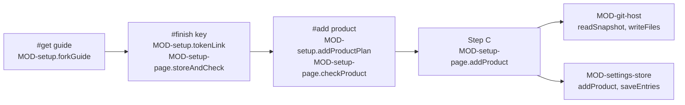

# ARC-033 Getting one's own Agent M and adding a product

## Context

A person gets their own Agent M by forking it on GitHub and turning on the fork's Pages site, which is their dashboard
(UC-014). On that dashboard they create one fine-grained token on GitHub, paste it, and from then on add products: a
product's repository is reached by that token, or on a GitLab server by a project access token of its own, receives the
review layout, and is listed in this browser only (UC-001). Nothing of this runs on a server (ARC-001): the browser
reads and writes through the git adapter (`MOD-git-host`, ARC-004) and keeps the tokens and the product list through the
settings store (`MOD-settings-store`, ARC-005).

Facts this decision rests on:

- A fork is made on GitHub's fork page: "Under "Owner," select the dropdown menu and click an owner for the forked
  repository", "By default, forks are named the same as their upstream repositories", "Click **Create fork**"
  (`https://docs.github.com/en/pull-requests/collaborating-with-pull-requests/working-with-forks/fork-a-repo`). Asked
  signed out, `https://github.com/akmaier/agent-m/fork` answers with a redirect to GitHub's login.
- Pages is turned on in the repository's settings: "Under "Build and deployment", under "Source", select **Deploy from a
  branch**", the branch from the branch menu, optionally the folder `/(root)`, then **Save**; "People with admin or
  maintainer permissions for a repository can configure a publishing source"; Pages is available in public repositories
  with GitHub Free
  (`https://docs.github.com/en/pages/getting-started-with-github-pages/configuring-a-publishing-source-for-your-github-pages-site`).
  A project site lives at `http(s)://<owner>.github.io/<repositoryname>`
  (`https://docs.github.com/en/pages/getting-started-with-github-pages/about-github-pages`), and "It can take up to 10
  minutes for changes to your site to publish"
  (`https://docs.github.com/en/pages/getting-started-with-github-pages/creating-a-github-pages-site`).
- "Workflows don't run in forked repositories by default. You must enable GitHub Actions in the **Actions** tab of the
  forked repository." (`https://docs.github.com/en/actions/reference/events-that-trigger-workflows`).
- A fine-grained token is made on `https://github.com/settings/personal-access-tokens/new`, whose fields the address can
  fill in: `name` (at most 40 characters), `description` (at most 1024), `target_name` — "the owner of the repositories
  that the token will be able to access" —, `expires_in` (1 to 366 days, or `none`), and one parameter per permission,
  among them `contents`, `issues`, `pull_requests` and `actions` (`read` or `write`), `workflows` (`write`) and `metadata`
  (`read`). "Each token is limited to access resources owned by a single user or organization." On the page, "Under
  **Repository access**, select which repositories you want the token to access"; with **Only select repositories**, the
  repositories are picked under **Selected repositories**; then **Generate token**
  (`https://docs.github.com/en/authentication/keeping-your-account-and-data-secure/managing-your-personal-access-tokens`).
  GitHub resolves an owner's name in any case: `https://api.github.com/repos/AKMAIER/agent-m` answers with the
  repository `akmaier/agent-m`.
- GitHub's page for a new repository fills in its fields from the address: `name`, `owner`, `description` and
  `visibility`, as in `https://github.com/new?name=test-repo&owner=avocado-corp`
  (`https://docs.github.com/en/repositories/creating-and-managing-repositories/creating-a-new-repository`). "An empty
  repository contains no files. It's often made if you don't initialize the repository with a README when creating it."
  (`https://docs.github.com/en/repositories/creating-and-managing-repositories/cloning-a-repository`).
- Both servers answer alike for a repository that does not exist and for one the token may not see: GitHub "uses a
  `404 Not Found` response instead of a `403 Forbidden` response to avoid confirming the existence of private
  repositories" (`https://docs.github.com/en/rest/using-the-rest-api/troubleshooting-the-rest-api`); GitLab answers 404
  where "the user isn't authorized to access the resource" (`https://docs.gitlab.com/api/rest/troubleshooting/`).
- A GitLab project access token is made under the project's **Settings > Access tokens** with **Add new token**: its name,
  an optional description, an expiration date — 365 days from today where none is entered —, a role, its scopes, then
  **Create project access token**; it is shown once. It needs "The Maintainer or Owner role for the project", and "On
  GitLab.com, project access tokens require a Premium or Ultimate subscription"
  (`https://docs.gitlab.com/user/project/settings/project_access_tokens/`); "you can restrict users from creating access
  tokens for projects in a top-level group", and project access tokens "are scoped to the associated project rather than
  a group or user" (ibid.). GitLab reports a role as its access level: "30 (Developer), 40 (Maintainer), 50 (Owner)"
  (`https://docs.gitlab.com/api/members/`).
- "You can transfer repositories to other users or organization accounts": in the repository's **Settings**, "in the
  "Danger Zone" section, click **Transfer**"; "To transfer a repository you must have administrator access to the
  repository" (`https://docs.github.com/en/repositories/creating-and-managing-repositories/transferring-a-repository`).

## Decision

1. **One decision, two modules.** `MOD-setup`, a feature, computes what getting one's own Agent M and adding a product
   need: the links of the guide, the one key's prefilled link, its expiry date and the repositories to select, the plan
   of adding a product on GitHub or on a GitLab server, the server's page for a new repository, and the paths of the
   review layout a product lacks. It sends nothing and keeps nothing. It uses two adapters, `MOD-git-host` and
   `MOD-settings-store` — an exception to ARC-003 decision 1, under which a feature reaches the outside only through
   ports passed in —, and calls only those of their functions that reach no outside system and touch no storage:
   `MOD-git-host.parseProductAddress`, `MOD-git-host.requiredPermissions`, `MOD-git-host.tokenPageUrl` and
   `MOD-settings-store.tokenFor`, so that what the page asks of a server and what this browser keeps is stated once,
   where the adapters state it. `MOD-setup-page` is the shell of `setup.html` at the root of the instance's Pages site:
   its route, the key stored and checked, the check that the key reaches a product, the layout written on a click
   before the product is listed, and every text and all HTML of the page — the token's name `Agent M · <owner>/<repo>`
   and the project token's name `Agent M` excepted, which `MOD-setup` gives, since the person finds the key by them.
2. **The page and its route** (`MOD-setup-page.route`). The page names its instance by the Pages site it is served from,
   as the main page does — `https://<owner>.github.io/<repo>/setup.html` is the instance `<owner>/<repo>` —, and its view
   by the fragment: `#get`, the guide, which is also the view without a fragment; `#finish`, the two steps of the key;
   `#add`, the Add view, which adds a product. Each view is opened by its address, `setup.html#get`, `setup.html#finish`
   and `setup.html#add`; the page holds every text and all HTML of the three, and leads to the main page only by
   **Switch to `<product>`** once a product is added (decision 9).
3. **The guide** (`#get`; `MOD-setup.ownerOf`, `MOD-setup.forkGuide`). It asks for "Your GitHub account, or the
   organisation to fork into" — a name, or its profile address `https://github.com/<name>` — and folds the reason for an
   organisation used for nothing else underneath: "Every Pages site of the same owner can read what this browser keeps for
   Agent M, your key included. An organisation that publishes no other site keeps it apart. Your key reaches the
   repositories of one owner only, so your products belong to that owner too." Then four steps, each a button and what to
   do on the page it opens; the links name the fork as GitHub names it by default, after its upstream:
   - **Step 1 · Fork** — **Open the fork page** opens the upstream's fork page: "Under Owner, choose `<owner>`; keep the
     name `<name>`; press Create fork."
   - **Step 2 · Turn on the dashboard** — **Open the Pages settings** opens the fork's Pages settings: "Under Build and
     deployment, Source, choose Deploy from a branch, then the branch main and the folder /(root), and press Save. GitHub
     lets only the repository's admins and maintainers do this, so Agent M cannot do it for you."
   - **Step 3 · Turn on the workflows — optional now** — **Open the Actions tab** opens the fork's Actions tab: "Enable
     the workflows there; GitHub runs none on a fork until its owner does. They are needed only to fetch EU legal texts
     and to write an accepted change of this instance's SPEC without a key." Beside the button, **Later** goes on to
     Step 4.
   - **Step 4 · Open your dashboard** — **Open your dashboard** opens the fork's Pages site, with the folded note "GitHub
     can take up to ten minutes after Step 2 before this address answers."

   Under the steps, folded: "Agent M is published under the MIT licence: anyone may use, copy, change and publish it, as
   long as its copyright and licence notice stay with it. Your products are not part of Agent M; each carries the licence
   you give it." A name that is no single part of an address is
   refused with "Type the name of a GitHub account or organisation, as in github.com/<name>."
4. **One key, prefilled** (`#finish`, Step A; `MOD-setup.tokenLink`, `MOD-setup.tokenName`,
   `MOD-setup.repositoryChoice`). **Step A · Create your key on GitHub**: **Create the key on GitHub** opens GitHub's
   page for a new fine-grained token with its name — `Agent M · <owner>/<repo>`, by which the person finds it again —,
   the description "Agent M's one key: saves and acceptances, issues, the jobs' pull requests, runs and the generated CI
   of `<owner>/<repo>` and its products.", the instance's owner as the owner of the repositories it reaches, a lifetime
   of 90 days, and every permission of `MOD-git-host.requiredPermissions`. The folded **Why these?** says: "Contents — to
   save and to accept. Issues — for reports that become issues. Pull requests — for the jobs' changes. Actions — to
   start a run. Workflows — for a generated CI configuration. Metadata — read by every key." Underneath: "There, under
   Repository access, choose Only select repositories and pick `<owner>/<repo>` — only the instance; products come
   later —, press Generate token, and copy it."
5. **The key stored and checked** (Step B; `MOD-setup.expiryOf`, `MOD-setup-page.storeAndCheck`). **Step B · Give the
   key to Agent M** states "Everything Agent M keeps in this browser can be read by every other Pages site of
   `<owner>.github.io`." above the tick *I have read this*, the field for the key, and its expiry date, preset to the date
   90 days from today with "Correct it if you changed it on GitHub."; **Store and check** is enabled once the tick is
   set. The key and its date are stored, the account it acts as is read and the instance read with it, and the result is
   kept with the key and saved (`MOD-settings-store.saveEntries`). The page then says "✓ The key acts as `<account>` and
   reaches `<owner>/<repo>`. Agent M warns fourteen days before it expires." — for a public repository adding "GitHub
   lets any key read a public repository, so the key's write access shows at its first save." —, or "✗ " and the reason.
   Step A and Step B each fold a **What is this?**: "A key lets Agent M act on GitHub as you, in the repositories you
   select, with the permissions listed, until its expiry date." and "There is no server: the key stays in this browser
   and goes only to GitHub's API." Beside the two steps, **Skip for now** — "Without a key, Agent M reads public
   repositories, and you accept on GitHub's own pages." — opens the review page, `docs/`, which reads with the key this
   browser keeps for a repository's server, none here (`MOD-settings-store.tokenFor`, `MOD-review-page.open`), and
   accepts through GitHub's new-file page (`MOD-review-page.acceptLink`, ARC-022 decision 6).
6. **One owner.** A fine-grained token reaches the repositories of one owner, the one its link names: the instance's.
   A GitHub product of another owner is refused when it is added (`MOD-setup.repositoryChoice`), and nothing is added:
   "`<product>` belongs to `<its owner>`, but your key reaches the repositories of `<owner>` only. Whoever administers
   `<product>` can transfer it to `<owner>` on GitHub — Settings, Danger Zone, Transfer —; then add it here again." An
   owner's name is compared without regard to case, as GitHub resolves it.
7. **Adding a product** (`#add`; `MOD-setup.addProductPlan`). The panel asks for "The address of the product's
   repository, as your browser shows it", reads it (`MOD-git-host.parseProductAddress`) and shows the route that applies,
   with Step A, **Check** and **Add product**. Once **Check** finds that the key reads a private repository — which only a
   key that reaches it can —, Step A is shown as done: "✓ Your key already reaches `<product>` — nothing to do on
   GitHub." A product this browser lists already is named so — "`<product>` is listed in this browser already." —, and
   Check and Add product go on as for a new one, adding what its layout lacks.
   - **On GitHub, Step A · Let your key reach the product**: **Open your tokens on GitHub** opens the list of the person's
     tokens, with "1. Click the key `Agent M · <owner>/<repo>`, then Edit. 2. Under Repository access, Select
     repositories, add `<product>` — keep `<owner>/<repo>` selected. 3. Press Update at the bottom. The key itself does
     not change: nothing to copy, nothing to paste here."
   - **Where this browser keeps no GitHub key**, the panel first shows Step A and Step B of the key (decisions 4 and 5),
     its Step A saying "pick `<owner>/<repo>` and `<product>`", and then goes on to the check.
   - **On a GitLab server, Step A · Create a key for this project**: **Open the project's access tokens** opens the
     project's access tokens page (`MOD-git-host.tokenPageUrl`), with "Press Add new token; name Agent M; the expiry
     date `<date>`; the role Maintainer; the scope api; then press Create project access token and copy the token —
     GitLab shows it once." — the date 90 days from today (`MOD-setup.expiryOf`); the role and the scope are those
     `MOD-git-host.requiredPermissions` gives for a GitLab project. On GitLab.com the panel adds "On GitLab.com, project
     access tokens need a Premium or Ultimate subscription." Under the steps, folded as **No Add new token, or no Access
     tokens page?**: "Either the server offers no project access tokens here — on GitLab.com they need a Premium or
     Ultimate subscription, and on any server a top-level group can restrict their creation —, or you are not
     Maintainer: creating one needs the role Maintainer or Owner in the project, so ask a Maintainer to create it, or to
     give you the role. A personal access token with the scope api would reach this project too, but it reaches every
     project you can reach on `<host>`, not only this one. You decide; Agent M keeps either for this project only and
     sends it only to `<host>`." Step B is decision 5's notice, field, date — preset to the same date — and **Store and
     check** for this project's token, which is kept for this project only and sent only to its server; the check reads
     the project with it and needs the role Maintainer, and otherwise says "The key acts on `<product>` as `<role>`, not
     as Maintainer."
8. **The check** (Step B of a product; `MOD-setup-page.checkProduct`). **Check** reads the product with the key this
   browser keeps for its server. "✓ `<product>` is reached." — for a public GitHub repository with "GitHub lets any key
   read a public repository, so the key's write access shows when the layout is written." —; or "`<product>` cannot be
   found: it does not exist yet, or your key does not reach it.", with Step A shown again and, beside it, **Create the
   repository**, which opens the server's page for a new repository (`MOD-setup.newRepositoryUrl`) — on GitHub with the
   owner and the name of the address filled in — and folds "Owner and name come from the address you gave. Public: anyone
   can read it; private: only the people you add — both work with Agent M. Add a README: a repository created without
   one has no file, and Agent M adds its layout to the default branch's last commit. A .gitignore and a licence are up to
   you. Then come back, do Step A and press Check." —; or, on GitLab, "The key acts on `<product>` as `<role>`, not as
   Maintainer." with Step A shown again; or another reason the server gave.
9. **Step C · Add the product** (`MOD-setup-page.addProduct`), one click (`MOD-review-page.clickAuthority`). The page
   reads the default branch's head (`MOD-git-host.readSnapshot`), writes the review layout the product lacks there in
   one commit (`MOD-setup.missingLayout`, `MOD-git-host.writeFiles`), and only then lists the product's address in this
   browser (`MOD-settings-store.addProduct`, `MOD-settings-store.saveEntries`); nothing is written to the instance's
   repository. It then shows "Added `<product>`." with the commit as a link — or "Added `<product>`; its layout was
   complete, so nothing was committed." — and **Switch to `<product>`**, which opens the main page at the product's
   progress, `#progress?product=<address>` (`MOD-main-page.route`). A write the server refuses is "`<product>` refused the
   write: your key does not reach it for writing yet." with Step A shown again; nothing was written, and the product is
   not listed. A default branch that moved on meanwhile is "`<product>` changed while you were adding it; press Add
   product again."; a default branch that cannot be read is "`<product>`: its default branch cannot be read —
   `<reason>`. A repository created without a README has no file to add to: add one there and press Add product
   again."; any other refusal is shown with its reason, and nothing is listed.
10. **The review layout** (`MOD-setup.missingLayout`), the paths of ARC-006 decision 2 a product needs before its first
    review: `SPEC.md`, `CHANGELOG.md`, and `docs/use-cases/`, `docs/architecture/`, `docs/approvals/` and
    `docs/spec-freigaben/`, each folder holding a `README.md`. A file is written where its path, or for a folder any
    file in it, does not exist; what exists is never touched. Its texts are the page's, for a product named `<name>`:
    - `SPEC.md` — "# `<name>` — Specification" and "The accepted requirements of `<name>`. A change is proposed under
      docs/spec-freigaben/ and written here when it is accepted.";
    - `CHANGELOG.md` — "# Changelog" and "Each release of this product adds its entry here when its test report is
      accepted.";
    - `docs/use-cases/README.md` — "# Use cases of `<name>`" and "One file per use case, UC-<nnn>-<slug>.md.";
    - `docs/architecture/README.md` — "# Architecture of `<name>`" and "One file per decision, ARC-<nnn>-<slug>.md, with
      the modules it designs.";
    - `docs/approvals/README.md` — "# Approval records of `<name>`" and "One record per acceptance, written when a person
      accepts an artifact and never edited.";
    - `docs/spec-freigaben/README.md` — "# Proposed changes of the SPEC of `<name>`" and "One folder per queue of proposed
      changes, <date>_<name>/.".

    The commit's message is "Agent M: the review layout of `<owner>/<name>`".
11. **The instance names no product.** The product list lives in this browser (`MOD-settings-store.addProduct`), and no
    write of this page goes to the instance's repository, so a sync of the fork with its upstream meets nothing of the
    person's. A local clone of the instance keeps each product checked out in its own folder under `products/`, which
    the instance's `.gitignore` keeps out of git except for `products/README.md`, which says so.



## Alternatives

- **Logging in with GitHub instead of a pasted token** — ruled out by `THE GITHUB TOKEN IS PASTED, NOT OBTAINED BY LOGIN`.
- **A token per product on GitHub** — a second key to create, store and renew for every product, where one serves every
  feature (`ONE GITHUB TOKEN SERVES EVERY FEATURE`).
- **Agent M forking for the person** — needs a token before the instance exists; the fork page is one click.
- **The layout through a pull request** — `ADDING A PRODUCT CREATES ITS LAYOUT` writes it to the default branch; there
  is nothing to review in an empty layout.
- **The product list in the instance's repository** — every sync of the fork would meet it, and the products of a
  person would be public with their instance (`NO PRODUCT IS NAMED IN THE INSTANCE REPOSITORY`).
- **Telling a missing repository from one the key does not reach** — the servers answer both alike; the page names both
  and offers both ways on.

## Consequences

- A GitHub product must belong to the instance's owner; a person whose products live elsewhere cannot add them with
  the one key, and the page says so (decision 6). The organisation recommended in the guide therefore has to hold the
  products as well.
- Of the requirements that force this decision, `MOD-git-host` keeps `ONE GITHUB TOKEN SERVES EVERY FEATURE` — the
  permissions the link asks for are its `MOD-git-host.requiredPermissions` —, and ARC-026 keeps
  `THE SHARED PAGES ORIGIN IS DISCLOSED`, whose notice Step B shows as the settings page does.
- A public repository is read by any key, so for a public instance or product the check confirms only reading; the
  first write confirms the rest, and its refusal shows Step A again (decisions 5, 8 and 9).
- Four steps begin on the main page and need texts of it that `MOD-main-page` does not hold: the link
  **Get your own Agent M** to `setup.html#get` (UC-014 1); where `MOD-settings-store.readSettings` finds no GitHub key,
  the notice **Finish setting up your instance** with **Set up now**, opening `setup.html#finish`, and **Import
  settings** beside it (UC-014 6, 7a); and the overview of an instance without products — no product and no job yet,
  **+ Add product**, the instance's own documents under `docs/`, the optional bridge (UC-014 9). Every interface they
  need is designed; they stand once the main page holds those texts.
- UC-001 1 begins with the author pressing **+ Add product** on the main page, a text and link that ARC-024 does not
  state; `MOD-setup-page.route`, which opens the Add view, is designed, and the step stands once ARC-024 states the
  link.
- UC-014 4a needs what no decision designs: the instance's workflow that writes an approved section of its own SPEC
  without a token (UC-006 4c) and the workflow that fetches EU legal texts (UC-004 7) — the two workflows Step 3 turns
  on —, and the review page's words for a SPEC entry that is *approved* but not *applied*
  (`MOD-review-core.specEntryStatus`), which say why and offer Step 3 with the link of `MOD-setup.forkGuide`.
- UC-001 3d asks Agent M to say which of two conditions holds — a server that offers no project access tokens, or an
  author who is not Maintainer —; neither is readable before the author holds a token of the project, since the role
  is read with that token and neither a group's subscription on GitLab.com nor a top-level group's restriction is read
  at all. The panel names both, and what a personal token would reach (decision 7); the step stands in no
  realisation.

## Modules

### MOD-setup

```json module
{
  "id": "MOD-setup",
  "folder": "src/setup/",
  "layer": "feature",
  "responsibility": "What getting one's own Agent M and adding a product compute: the guide's links, the one key's prefilled link, its expiry date and the repositories to select, the plan of adding a product on GitHub or GitLab, the server's page for a new repository, and the paths of the review layout a product still lacks. It sends nothing and touches no storage.",
  "realises": ["THE TOKEN LINK IS PREFILLED", "THE REPOSITORY CHOICE IS SPELLED OUT", "A TOKEN IS SCOPED TO WHAT IT WRITES", "A GITLAB PRODUCT USES A PROJECT ACCESS TOKEN"],
  "owns": ["Owner", "ForkGuide", "RepositoryChoice", "GitHubSteps", "GitLabSteps", "AddProductPlan"],
  "uses": ["MOD-contracts", "MOD-git-host", "MOD-settings-store"]
}
```

```json interface
{
  "id": "MOD-setup.ownerOf",
  "summary": "The account or organisation an instance is forked into: its name as typed, or its profile address github.com/<name>; one segment of a path, since the name enters GitHub's addresses and the host of the fork's Pages site.",
  "params": [{ "name": "input", "type": "string" }],
  "result": "Owner",
  "async": false,
  "refusals": [
    { "code": "no-owner", "when": "nothing is typed" },
    { "code": "not-an-owner", "when": "the input is no single segment of a path, or no host name" }
  ],
  "examples": [
    { "name": "a name", "input": { "input": "alice" }, "result": { "owner": "alice" } },
    { "name": "a profile address", "input": { "input": "https://github.com/alice" }, "result": { "owner": "alice" } },
    { "name": "nothing typed", "input": { "input": "" }, "refused": "no-owner" },
    { "name": "a name with a space", "input": { "input": "al ice" }, "refused": "not-an-owner" }
  ]
}
```

```json interface
{
  "id": "MOD-setup.forkGuide",
  "summary": "The links of the guide that gets a person their own Agent M (UC-014 steps 1 to 5): the fork page of the instance whose dashboard shows the guide, and — a fork keeping its upstream's name — the fork's Pages settings, its Actions tab and its dashboard at the root of its Pages site.",
  "params": [{ "name": "upstream", "type": "Product" }, { "name": "owner", "type": "Owner" }],
  "result": "ForkGuide",
  "async": false,
  "refusals": [{ "code": "not-github", "when": "the upstream is no GitHub repository" }],
  "examples": [
    {
      "name": "alice forks akmaier's Agent M",
      "input": {
        "upstream": { "kind": "github", "address": "https://github.com/akmaier/agent-m", "host": "github.com", "server": "https://github.com", "repo": "akmaier/agent-m" },
        "owner": { "owner": "alice" }
      },
      "result": { "upstream": "akmaier/agent-m", "owner": "alice", "name": "agent-m", "fork": "https://github.com/akmaier/agent-m/fork", "repository": "https://github.com/alice/agent-m", "pages": "https://github.com/alice/agent-m/settings/pages", "actions": "https://github.com/alice/agent-m/actions", "dashboard": "https://alice.github.io/agent-m/" }
    },
    {
      "name": "an upstream on GitLab",
      "input": {
        "upstream": { "kind": "gitlab", "address": "https://gitlab.example.org/group/tools/thesis", "host": "gitlab.example.org", "server": "https://gitlab.example.org", "repo": "group/tools/thesis" },
        "owner": { "owner": "alice" }
      },
      "refused": "not-github"
    }
  ]
}
```

```json interface
{
  "id": "MOD-setup.tokenName",
  "summary": "The name the one token carries: \"Agent M · \" and the instance's repository, cut to GitHub's limit of 40 characters.",
  "params": [{ "name": "instance", "type": "Product" }],
  "result": "string",
  "async": false,
  "refusals": [],
  "examples": [
    {
      "name": "alice's instance",
      "input": {
        "instance": { "kind": "github", "address": "https://github.com/alice/agent-m", "host": "github.com", "server": "https://github.com", "repo": "alice/agent-m" }
      },
      "result": "Agent M · alice/agent-m"
    },
    {
      "name": "a long owner's instance",
      "input": {
        "instance": { "kind": "github", "address": "https://github.com/the-institute-of-pattern-recognition/agent-m", "host": "github.com", "server": "https://github.com", "repo": "the-institute-of-pattern-recognition/agent-m" }
      },
      "result": "Agent M · the-institute-of-pattern-recog"
    }
  ]
}
```

```json interface
{
  "id": "MOD-setup.expiryOf",
  "summary": "The expiry date a key created today carries for the lifetime its link asks for: the date that many days after today, which Step B presets.",
  "params": [{ "name": "today", "type": "string" }, { "name": "days", "type": "integer" }],
  "result": "string",
  "async": false,
  "refusals": [
    { "code": "not-a-date", "when": "today is no date YYYY-MM-DD" },
    { "code": "not-a-lifetime", "when": "the days lie outside 1 to 366" }
  ],
  "examples": [
    {
      "name": "ninety days from a day in October",
      "input": { "today": "2026-10-09", "days": 90 },
      "result": "2027-01-07"
    },
    { "name": "across a leap day", "input": { "today": "2027-12-01", "days": 90 }, "result": "2028-02-29" },
    { "name": "no date", "input": { "today": "09.10.2026", "days": 90 }, "refused": "not-a-date" },
    { "name": "no lifetime", "input": { "today": "2026-10-09", "days": 0 }, "refused": "not-a-lifetime" }
  ]
}
```

```json interface
{
  "id": "MOD-setup.tokenLink",
  "summary": "The link to GitHub's page for a new fine-grained token with its fields filled in: the name (tokenName), the description the page gives, the instance's owner as the resource owner — a token reaches the repositories of that one owner —, the lifetime in days, and every permission the features need (MOD-git-host.requiredPermissions).",
  "params": [
    { "name": "instance", "type": "Product" },
    { "name": "description", "type": "string" },
    { "name": "days", "type": "integer" }
  ],
  "result": "string",
  "async": false,
  "refusals": [
    { "code": "not-github", "when": "the instance is no GitHub repository" },
    { "code": "not-a-lifetime", "when": "the days lie outside 1 to 366" },
    { "code": "too-long", "when": "the description holds more than 1024 characters" }
  ],
  "examples": [
    {
      "name": "the one token for ninety days",
      "input": {
        "instance": { "kind": "github", "address": "https://github.com/alice/agent-m", "host": "github.com", "server": "https://github.com", "repo": "alice/agent-m" },
        "description": "Agent M's one key: saves and acceptances, issues, the jobs' pull requests, runs and the generated CI of alice/agent-m and its products.",
        "days": 90
      },
      "result": "https://github.com/settings/personal-access-tokens/new?name=Agent+M+%C2%B7+alice%2Fagent-m&description=Agent+M%27s+one+key%3A+saves+and+acceptances%2C+issues%2C+the+jobs%27+pull+requests%2C+runs+and+the+generated+CI+of+alice%2Fagent-m+and+its+products.&target_name=alice&expires_in=90&contents=write&issues=write&pull_requests=write&actions=write&workflows=write&metadata=read"
    },
    {
      "name": "a lifetime beyond a year",
      "input": {
        "instance": { "kind": "github", "address": "https://github.com/alice/agent-m", "host": "github.com", "server": "https://github.com", "repo": "alice/agent-m" },
        "description": "Agent M's one key: saves and acceptances, issues, the jobs' pull requests, runs and the generated CI of alice/agent-m and its products.",
        "days": 400
      },
      "refused": "not-a-lifetime"
    }
  ]
}
```

```json interface
{
  "id": "MOD-setup.repositoryChoice",
  "summary": "What the person selects under Only select repositories: the instance and the products given, each by owner and name; a product of another owner than the instance's is refused, for the one token reaches the repositories of one owner only.",
  "params": [{ "name": "instance", "type": "Product" }, { "name": "products", "type": "Product[]" }],
  "result": "RepositoryChoice",
  "async": false,
  "refusals": [
    { "code": "not-github", "when": "a product is on a GitLab server, whose key is a project access token" },
    { "code": "other-owner", "when": "a product belongs to another owner than the instance" }
  ],
  "examples": [
    {
      "name": "the instance alone",
      "input": {
        "instance": { "kind": "github", "address": "https://github.com/alice/agent-m", "host": "github.com", "server": "https://github.com", "repo": "alice/agent-m" },
        "products": []
      },
      "result": { "owner": "alice", "select": ["alice/agent-m"] }
    },
    {
      "name": "the instance and a product",
      "input": {
        "instance": { "kind": "github", "address": "https://github.com/alice/agent-m", "host": "github.com", "server": "https://github.com", "repo": "alice/agent-m" },
        "products": [
          { "kind": "github", "address": "https://github.com/alice/notes", "host": "github.com", "server": "https://github.com", "repo": "alice/notes" }
        ]
      },
      "result": { "owner": "alice", "select": ["alice/agent-m", "alice/notes"] }
    },
    {
      "name": "a product of another owner",
      "input": {
        "instance": { "kind": "github", "address": "https://github.com/alice/agent-m", "host": "github.com", "server": "https://github.com", "repo": "alice/agent-m" },
        "products": [
          { "kind": "github", "address": "https://github.com/bob/notes", "host": "github.com", "server": "https://github.com", "repo": "bob/notes" }
        ]
      },
      "refused": "other-owner"
    },
    {
      "name": "a GitLab project",
      "input": {
        "instance": { "kind": "github", "address": "https://github.com/alice/agent-m", "host": "github.com", "server": "https://github.com", "repo": "alice/agent-m" },
        "products": [
          { "kind": "gitlab", "address": "https://gitlab.example.org/group/tools/thesis", "host": "gitlab.example.org", "server": "https://gitlab.example.org", "repo": "group/tools/thesis" }
        ]
      },
      "refused": "not-github"
    }
  ]
}
```

```json interface
{
  "id": "MOD-setup.addProductPlan",
  "summary": "The plan of adding a product (UC-001): its address read (MOD-git-host.parseProductAddress); on GitHub the token page, the token to click by its name, the repository to add and the one to keep (repositoryChoice); on GitLab the project's access tokens page (MOD-git-host.tokenPageUrl) with the token's name and the role and scope MOD-git-host.requiredPermissions gives for a GitLab project, and whether the server is GitLab.com, where project access tokens need a Premium or Ultimate subscription; whether this browser keeps the token that reaches it, and whether the product is listed already.",
  "params": [
    { "name": "address", "type": "string" },
    { "name": "instance", "type": "Product" },
    { "name": "settings", "type": "Settings" }
  ],
  "result": "AddProductPlan",
  "async": false,
  "refusals": [
    { "code": "not-an-address", "when": "MOD-git-host.parseProductAddress refuses with not-an-address" },
    { "code": "not-https", "when": "MOD-git-host.parseProductAddress refuses with not-https" },
    { "code": "credential-in-address", "when": "MOD-git-host.parseProductAddress refuses with credential-in-address" },
    { "code": "not-a-repository", "when": "MOD-git-host.parseProductAddress refuses with not-a-repository" },
    { "code": "other-owner", "when": "a GitHub product belongs to another owner than the instance" }
  ],
  "examples": [
    {
      "name": "a GitHub product, the key stored",
      "input": {
        "address": "https://github.com/alice/notes",
        "instance": { "kind": "github", "address": "https://github.com/alice/agent-m", "host": "github.com", "server": "https://github.com", "repo": "alice/agent-m" },
        "settings": {
          "github": {
            "token": "github_pat_11ALICE0example",
            "expires": "2027-01-07",
            "tested": { "ok": "2026-10-08" }
          },
          "gitlab": [],
          "products": [],
          "endpoints": [],
          "bridge": null,
          "mailbox": null,
          "notAnIssue": [],
          "jumpHost": null,
          "sessions": [],
          "resourceKeys": []
        }
      },
      "result": {
        "product": { "kind": "github", "address": "https://github.com/alice/notes", "host": "github.com", "server": "https://github.com", "repo": "alice/notes" },
        "listed": false,
        "route": "github",
        "tokenStored": true,
        "gitlab": null,
        "github": {
          "tokens": "https://github.com/settings/personal-access-tokens",
          "token": "Agent M · alice/agent-m",
          "add": "alice/notes",
          "keep": "alice/agent-m",
          "select": ["alice/agent-m", "alice/notes"]
        }
      }
    },
    {
      "name": "no key stored yet",
      "input": {
        "address": "https://github.com/alice/notes",
        "instance": { "kind": "github", "address": "https://github.com/alice/agent-m", "host": "github.com", "server": "https://github.com", "repo": "alice/agent-m" },
        "settings": {
          "github": null,
          "gitlab": [],
          "products": [],
          "endpoints": [],
          "bridge": null,
          "mailbox": null,
          "notAnIssue": [],
          "jumpHost": null,
          "sessions": [],
          "resourceKeys": []
        }
      },
      "result": {
        "product": { "kind": "github", "address": "https://github.com/alice/notes", "host": "github.com", "server": "https://github.com", "repo": "alice/notes" },
        "listed": false,
        "route": "github",
        "tokenStored": false,
        "gitlab": null,
        "github": {
          "tokens": "https://github.com/settings/personal-access-tokens",
          "token": "Agent M · alice/agent-m",
          "add": "alice/notes",
          "keep": "alice/agent-m",
          "select": ["alice/agent-m", "alice/notes"]
        }
      }
    },
    {
      "name": "a GitLab project",
      "input": {
        "address": "https://gitlab.example.org/group/tools/thesis/-/tree/main",
        "instance": { "kind": "github", "address": "https://github.com/alice/agent-m", "host": "github.com", "server": "https://github.com", "repo": "alice/agent-m" },
        "settings": {
          "github": {
            "token": "github_pat_11ALICE0example",
            "expires": "2027-01-07",
            "tested": { "ok": "2026-10-08" }
          },
          "gitlab": [
            { "address": "https://gitlab.example.org/group/tools/thesis", "token": "glpat-example-maintainer", "expires": "2027-01-07", "tested": null }
          ],
          "products": ["https://github.com/alice/notes", "https://gitlab.example.org/group/tools/thesis"],
          "endpoints": [],
          "bridge": null,
          "mailbox": null,
          "notAnIssue": [],
          "jumpHost": null,
          "sessions": [],
          "resourceKeys": []
        }
      },
      "result": {
        "product": { "kind": "gitlab", "address": "https://gitlab.example.org/group/tools/thesis", "host": "gitlab.example.org", "server": "https://gitlab.example.org", "repo": "group/tools/thesis" },
        "listed": true,
        "route": "gitlab",
        "tokenStored": true,
        "github": null,
        "gitlab": { "page": "https://gitlab.example.org/group/tools/thesis/-/settings/access_tokens", "name": "Agent M", "role": "Maintainer", "scope": "api", "subscription": false }
      }
    },
    {
      "name": "a project on GitLab.com",
      "input": {
        "address": "https://gitlab.com/fau/thesis-tool",
        "instance": { "kind": "github", "address": "https://github.com/alice/agent-m", "host": "github.com", "server": "https://github.com", "repo": "alice/agent-m" },
        "settings": {
          "github": {
            "token": "github_pat_11ALICE0example",
            "expires": "2027-01-07",
            "tested": { "ok": "2026-10-08" }
          },
          "gitlab": [],
          "products": [],
          "endpoints": [],
          "bridge": null,
          "mailbox": null,
          "notAnIssue": [],
          "jumpHost": null,
          "sessions": [],
          "resourceKeys": []
        }
      },
      "result": {
        "product": { "kind": "gitlab", "address": "https://gitlab.com/fau/thesis-tool", "host": "gitlab.com", "server": "https://gitlab.com", "repo": "fau/thesis-tool" },
        "listed": false,
        "route": "gitlab",
        "tokenStored": false,
        "github": null,
        "gitlab": { "page": "https://gitlab.com/fau/thesis-tool/-/settings/access_tokens", "name": "Agent M", "role": "Maintainer", "scope": "api", "subscription": true }
      }
    },
    {
      "name": "another owner's repository",
      "input": {
        "address": "https://github.com/bob/notes",
        "instance": { "kind": "github", "address": "https://github.com/alice/agent-m", "host": "github.com", "server": "https://github.com", "repo": "alice/agent-m" },
        "settings": {
          "github": {
            "token": "github_pat_11ALICE0example",
            "expires": "2027-01-07",
            "tested": { "ok": "2026-10-08" }
          },
          "gitlab": [],
          "products": [],
          "endpoints": [],
          "bridge": null,
          "mailbox": null,
          "notAnIssue": [],
          "jumpHost": null,
          "sessions": [],
          "resourceKeys": []
        }
      },
      "refused": "other-owner"
    },
    {
      "name": "no address",
      "input": {
        "address": "notes",
        "instance": { "kind": "github", "address": "https://github.com/alice/agent-m", "host": "github.com", "server": "https://github.com", "repo": "alice/agent-m" },
        "settings": {
          "github": {
            "token": "github_pat_11ALICE0example",
            "expires": "2027-01-07",
            "tested": { "ok": "2026-10-08" }
          },
          "gitlab": [],
          "products": [],
          "endpoints": [],
          "bridge": null,
          "mailbox": null,
          "notAnIssue": [],
          "jumpHost": null,
          "sessions": [],
          "resourceKeys": []
        }
      },
      "refused": "not-an-address"
    }
  ]
}
```

```json interface
{
  "id": "MOD-setup.newRepositoryUrl",
  "summary": "The server's page for a new repository, offered where a product cannot be found: GitHub's, with the owner and the name of the address filled in, or the GitLab server's page for a new project.",
  "params": [{ "name": "product", "type": "Product" }],
  "result": "string",
  "async": false,
  "refusals": [],
  "examples": [
    {
      "name": "on GitHub",
      "input": {
        "product": { "kind": "github", "address": "https://github.com/alice/notes", "host": "github.com", "server": "https://github.com", "repo": "alice/notes" }
      },
      "result": "https://github.com/new?name=notes&owner=alice"
    },
    {
      "name": "on a GitLab server",
      "input": {
        "product": { "kind": "gitlab", "address": "https://gitlab.example.org/group/tools/thesis", "host": "gitlab.example.org", "server": "https://gitlab.example.org", "repo": "group/tools/thesis" }
      },
      "result": "https://gitlab.example.org/projects/new"
    }
  ]
}
```

```json interface
{
  "id": "MOD-setup.missingLayout",
  "summary": "The paths of the review layout a commit of a product lacks (ADDING A PRODUCT CREATES ITS LAYOUT): of SPEC.md, CHANGELOG.md and the four folders of ARC-006 — each given a README.md —, those whose file, or for a folder any file in it, the commit does not hold; none where the layout is complete.",
  "params": [{ "name": "snapshot", "type": "Snapshot" }],
  "result": "string[]",
  "async": false,
  "refusals": [],
  "examples": [
    {
      "name": "a product with a README only",
      "input": {
        "snapshot": {
          "commit": "c100000000000000000000000000000000000000",
          "tree": [{ "path": "README.md", "blob": "0000000000000000000000000000000000000000" }]
        }
      },
      "result": ["SPEC.md", "CHANGELOG.md", "docs/use-cases/README.md", "docs/architecture/README.md", "docs/approvals/README.md", "docs/spec-freigaben/README.md"]
    },
    {
      "name": "a product with its use cases",
      "input": {
        "snapshot": {
          "commit": "c100000000000000000000000000000000000000",
          "tree": [
            { "path": "README.md", "blob": "0000000000000000000000000000000000000000" },
            { "path": "docs/use-cases/UC-001-write-a-note.md", "blob": "0000000000000000000000000000000000000000" }
          ]
        }
      },
      "result": ["SPEC.md", "CHANGELOG.md", "docs/architecture/README.md", "docs/approvals/README.md", "docs/spec-freigaben/README.md"]
    },
    {
      "name": "the complete layout",
      "input": {
        "snapshot": {
          "commit": "c100000000000000000000000000000000000000",
          "tree": [
            { "path": "CHANGELOG.md", "blob": "0000000000000000000000000000000000000000" },
            { "path": "README.md", "blob": "0000000000000000000000000000000000000000" },
            { "path": "SPEC.md", "blob": "0000000000000000000000000000000000000000" },
            { "path": "docs/approvals/README.md", "blob": "0000000000000000000000000000000000000000" },
            { "path": "docs/architecture/README.md", "blob": "0000000000000000000000000000000000000000" },
            { "path": "docs/spec-freigaben/README.md", "blob": "0000000000000000000000000000000000000000" },
            { "path": "docs/use-cases/UC-001-write-a-note.md", "blob": "0000000000000000000000000000000000000000" }
          ]
        }
      },
      "result": []
    }
  ]
}
```

### MOD-setup-page

```json module
{
  "id": "MOD-setup-page",
  "folder": "src/setup-page/",
  "layer": "shell",
  "responsibility": "The shell of setup.html: the guide that gets a person their own Agent M, the two steps that finish setting up an instance's key, and the panel that adds a product — its routes, the token stored after the shared origin's notice and checked, the check that the key reaches a product, the layout written on a click before the product is listed, and every text and all HTML of the page.",
  "realises": ["ADDING A PRODUCT CREATES ITS LAYOUT", "A GITLAB PRODUCT USES A PROJECT ACCESS TOKEN", "THE DASHBOARD WRITES ONLY ON A PERSON'S CLICK"],
  "owns": ["SetupRoute", "TokenInput", "TokenCheck", "ProductCheck", "AddResult"],
  "uses": ["MOD-contracts", "MOD-git-host", "MOD-settings-store", "MOD-setup", "MOD-review-page"]
}
```

```json interface
{
  "id": "MOD-setup-page.route",
  "summary": "The instance from the Pages site the page is served from — https://<owner>.github.io/<repo>/setup.html is <owner>/<repo>, as the main page derives it —, and the view from the fragment — get (the guide), finish (the two steps of the key), add (a product) —, the guide where there is none.",
  "params": [{ "name": "location", "type": "string" }],
  "result": "SetupRoute",
  "async": false,
  "refusals": [
    { "code": "not-an-address", "when": "the location is no address" },
    { "code": "not-the-setup-page", "when": "the location is not setup.html at the root of a GitHub Pages site" },
    { "code": "unknown-view", "when": "the fragment names no view" }
  ],
  "examples": [
    {
      "name": "the guide on akmaier's dashboard",
      "input": { "location": "https://akmaier.github.io/agent-m/setup.html" },
      "result": {
        "instance": { "kind": "github", "address": "https://github.com/akmaier/agent-m", "host": "github.com", "server": "https://github.com", "repo": "akmaier/agent-m" },
        "view": "get"
      }
    },
    {
      "name": "adding a product on alice's",
      "input": { "location": "https://alice.github.io/agent-m/setup.html#add" },
      "result": {
        "instance": { "kind": "github", "address": "https://github.com/alice/agent-m", "host": "github.com", "server": "https://github.com", "repo": "alice/agent-m" },
        "view": "add"
      }
    },
    {
      "name": "on the owner's own site",
      "input": { "location": "https://Alice.github.io/setup.html#finish" },
      "result": {
        "instance": { "kind": "github", "address": "https://github.com/alice/alice.github.io", "host": "github.com", "server": "https://github.com", "repo": "alice/alice.github.io" },
        "view": "finish"
      }
    },
    {
      "name": "the main page",
      "input": { "location": "https://alice.github.io/agent-m/" },
      "refused": "not-the-setup-page"
    },
    {
      "name": "an unknown view",
      "input": { "location": "https://alice.github.io/agent-m/setup.html#welcome" },
      "refused": "unknown-view"
    }
  ]
}
```

```json interface
{
  "id": "MOD-setup-page.storeAndCheck",
  "summary": "Step B of the key, for the instance's GitHub token or a GitLab product's project access token: only after the person confirmed the notice that every Pages site of the same owner reads this browser's settings, the token is kept with its expiry date and checked — the account it acts as (MOD-git-host.tokenAccount) and the repository it is to reach (MOD-git-host.repositoryInfo), where a GitLab token must act as Maintainer —, the result kept with the token (MOD-settings-store.recordTest). A public repository is read by any token, so that the key's write access is confirmed at its first write.",
  "params": [
    { "name": "input", "type": "TokenInput" },
    { "name": "entries", "type": "SettingEntries" },
    { "name": "today", "type": "string" },
    { "name": "fetch", "type": "FetchPort" }
  ],
  "result": "TokenCheck",
  "async": true,
  "refusals": [
    { "code": "not-read", "when": "the notice of the shared Pages origin is not confirmed" },
    { "code": "incomplete", "when": "MOD-settings-store refuses the token with incomplete" },
    { "code": "not-a-date", "when": "the expiry date is no date" }
  ],
  "examples": [
    {
      "name": "alice's key reaches her public instance",
      "input": {
        "input": {
          "token": "github_pat_11ALICE0example",
          "expires": "2027-01-07",
          "read": true,
          "product": { "kind": "github", "address": "https://github.com/alice/agent-m", "host": "github.com", "server": "https://github.com", "repo": "alice/agent-m" }
        },
        "entries": {},
        "today": "2026-10-09",
        "fetch": [
          {
            "request": { "method": "GET", "url": "https://api.github.com/user" },
            "response": { "status": 200, "body": { "login": "alice" } }
          },
          {
            "request": { "method": "GET", "url": "https://api.github.com/repos/alice/agent-m" },
            "response": {
              "status": 200,
              "body": { "visibility": "public", "private": false, "default_branch": "main" }
            }
          }
        ]
      },
      "result": {
        "entries": { "agent-m.github-token": "github_pat_11ALICE0example", "agent-m.github-token-expires": "2027-01-07", "agent-m.github-token-tested": "{\"ok\":\"2026-10-09\"}" },
        "result": "works",
        "account": "alice",
        "visibility": "public",
        "role": 0,
        "writeLater": true,
        "reason": ""
      }
    },
    {
      "name": "the notice not confirmed",
      "input": {
        "input": {
          "token": "github_pat_11ALICE0example",
          "expires": "2027-01-07",
          "read": false,
          "product": { "kind": "github", "address": "https://github.com/alice/agent-m", "host": "github.com", "server": "https://github.com", "repo": "alice/agent-m" }
        },
        "entries": {},
        "today": "2026-10-09",
        "fetch": []
      },
      "refused": "not-read"
    },
    {
      "name": "a token GitHub refuses",
      "input": {
        "input": {
          "token": "github_pat_11ALICE0example",
          "expires": "2027-01-07",
          "read": true,
          "product": { "kind": "github", "address": "https://github.com/alice/agent-m", "host": "github.com", "server": "https://github.com", "repo": "alice/agent-m" }
        },
        "entries": {},
        "today": "2026-10-09",
        "fetch": [
          {
            "request": { "method": "GET", "url": "https://api.github.com/user" },
            "response": { "status": 401, "body": { "message": "Bad credentials" } }
          }
        ]
      },
      "result": {
        "entries": { "agent-m.github-token": "github_pat_11ALICE0example", "agent-m.github-token-expires": "2027-01-07", "agent-m.github-token-tested": "{\"refused\":true}" },
        "result": "refused",
        "account": "",
        "visibility": "",
        "role": 0,
        "writeLater": false,
        "reason": "github.com refused the token"
      }
    },
    {
      "name": "a project token acting as Maintainer",
      "input": {
        "input": {
          "token": "glpat-example-maintainer",
          "expires": "2027-01-07",
          "read": true,
          "product": { "kind": "gitlab", "address": "https://gitlab.example.org/group/tools/thesis", "host": "gitlab.example.org", "server": "https://gitlab.example.org", "repo": "group/tools/thesis" }
        },
        "entries": { "agent-m.github-token": "github_pat_11ALICE0example", "agent-m.github-token-expires": "2027-01-07", "agent-m.github-token-tested": "{\"ok\":\"2026-10-08\"}" },
        "today": "2026-10-09",
        "fetch": [
          {
            "request": { "method": "GET", "url": "https://gitlab.example.org/api/v4/user" },
            "response": { "status": 200, "body": { "username": "project_7_bot_1a2b" } }
          },
          {
            "request": { "method": "GET", "url": "https://gitlab.example.org/api/v4/projects/group%2Ftools%2Fthesis" },
            "response": {
              "status": 200,
              "body": {
                "visibility": "private",
                "default_branch": "main",
                "permissions": { "project_access": { "access_level": 40 } }
              }
            }
          }
        ]
      },
      "result": {
        "entries": { "agent-m.github-token": "github_pat_11ALICE0example", "agent-m.github-token-expires": "2027-01-07", "agent-m.github-token-tested": "{\"ok\":\"2026-10-08\"}", "agent-m.gitlab-tokens": "{\"https://gitlab.example.org/group/tools/thesis\":{\"token\":\"glpat-example-maintainer\",\"expires\":\"2027-01-07\",\"tested\":{\"ok\":\"2026-10-09\"}}}" },
        "result": "works",
        "account": "project_7_bot_1a2b",
        "visibility": "private",
        "role": 40,
        "writeLater": false,
        "reason": ""
      }
    },
    {
      "name": "a project token acting as Developer",
      "input": {
        "input": {
          "token": "glpat-example-developer",
          "expires": "2027-01-07",
          "read": true,
          "product": { "kind": "gitlab", "address": "https://gitlab.example.org/group/tools/thesis", "host": "gitlab.example.org", "server": "https://gitlab.example.org", "repo": "group/tools/thesis" }
        },
        "entries": { "agent-m.github-token": "github_pat_11ALICE0example", "agent-m.github-token-expires": "2027-01-07", "agent-m.github-token-tested": "{\"ok\":\"2026-10-08\"}" },
        "today": "2026-10-09",
        "fetch": [
          {
            "request": { "method": "GET", "url": "https://gitlab.example.org/api/v4/user" },
            "response": { "status": 200, "body": { "username": "project_7_bot_1a2b" } }
          },
          {
            "request": { "method": "GET", "url": "https://gitlab.example.org/api/v4/projects/group%2Ftools%2Fthesis" },
            "response": {
              "status": 200,
              "body": {
                "visibility": "private",
                "default_branch": "main",
                "permissions": { "project_access": { "access_level": 30 } }
              }
            }
          }
        ]
      },
      "result": {
        "entries": { "agent-m.github-token": "github_pat_11ALICE0example", "agent-m.github-token-expires": "2027-01-07", "agent-m.github-token-tested": "{\"ok\":\"2026-10-08\"}", "agent-m.gitlab-tokens": "{\"https://gitlab.example.org/group/tools/thesis\":{\"token\":\"glpat-example-developer\",\"expires\":\"2027-01-07\",\"tested\":{\"refused\":true}}}" },
        "result": "refused",
        "account": "project_7_bot_1a2b",
        "visibility": "private",
        "role": 30,
        "writeLater": false,
        "reason": "the key acts on group/tools/thesis as Developer, not as Maintainer"
      }
    },
    {
      "name": "an expiry that is no date",
      "input": {
        "input": {
          "token": "github_pat_11ALICE0example",
          "expires": "in three months",
          "read": true,
          "product": { "kind": "github", "address": "https://github.com/alice/agent-m", "host": "github.com", "server": "https://github.com", "repo": "alice/agent-m" }
        },
        "entries": {},
        "today": "2026-10-09",
        "fetch": []
      },
      "refused": "not-a-date"
    }
  ]
}
```

```json interface
{
  "id": "MOD-setup-page.checkProduct",
  "summary": "Step B of adding a product: whether the key this browser keeps reaches the product — read with it (MOD-git-host.repositoryInfo) — and its default branch; a product not found does not exist yet, or the key does not reach it, and the page offers Step A again and the server's page for a new repository (MOD-setup.newRepositoryUrl); a GitLab token below Maintainer reaches it but cannot write the layout; a public GitHub repository is read by any token, so that write access is confirmed when the layout is written.",
  "params": [
    { "name": "plan", "type": "AddProductPlan" },
    { "name": "settings", "type": "Settings" },
    { "name": "fetch", "type": "FetchPort" }
  ],
  "result": "ProductCheck",
  "async": true,
  "refusals": [],
  "examples": [
    {
      "name": "a private product the key reaches",
      "input": {
        "plan": {
          "product": { "kind": "github", "address": "https://github.com/alice/notes", "host": "github.com", "server": "https://github.com", "repo": "alice/notes" },
          "listed": false,
          "route": "github",
          "tokenStored": true,
          "gitlab": null,
          "github": {
            "tokens": "https://github.com/settings/personal-access-tokens",
            "token": "Agent M · alice/agent-m",
            "add": "alice/notes",
            "keep": "alice/agent-m",
            "select": ["alice/agent-m", "alice/notes"]
          }
        },
        "settings": {
          "github": {
            "token": "github_pat_11ALICE0example",
            "expires": "2027-01-07",
            "tested": { "ok": "2026-10-08" }
          },
          "gitlab": [],
          "products": [],
          "endpoints": [],
          "bridge": null,
          "mailbox": null,
          "notAnIssue": [],
          "jumpHost": null,
          "sessions": [],
          "resourceKeys": []
        },
        "fetch": [
          {
            "request": { "method": "GET", "url": "https://api.github.com/repos/alice/notes" },
            "response": {
              "status": 200,
              "body": { "visibility": "private", "private": true, "default_branch": "main" }
            }
          }
        ]
      },
      "result": { "reachable": true, "visibility": "private", "defaultBranch": "main", "role": 0, "writeLater": false, "stepA": false, "newRepository": "", "reason": "" }
    },
    {
      "name": "a public product",
      "input": {
        "plan": {
          "product": { "kind": "github", "address": "https://github.com/alice/notes", "host": "github.com", "server": "https://github.com", "repo": "alice/notes" },
          "listed": false,
          "route": "github",
          "tokenStored": true,
          "gitlab": null,
          "github": {
            "tokens": "https://github.com/settings/personal-access-tokens",
            "token": "Agent M · alice/agent-m",
            "add": "alice/notes",
            "keep": "alice/agent-m",
            "select": ["alice/agent-m", "alice/notes"]
          }
        },
        "settings": {
          "github": {
            "token": "github_pat_11ALICE0example",
            "expires": "2027-01-07",
            "tested": { "ok": "2026-10-08" }
          },
          "gitlab": [],
          "products": [],
          "endpoints": [],
          "bridge": null,
          "mailbox": null,
          "notAnIssue": [],
          "jumpHost": null,
          "sessions": [],
          "resourceKeys": []
        },
        "fetch": [
          {
            "request": { "method": "GET", "url": "https://api.github.com/repos/alice/notes" },
            "response": {
              "status": 200,
              "body": { "visibility": "public", "private": false, "default_branch": "main" }
            }
          }
        ]
      },
      "result": { "reachable": true, "visibility": "public", "defaultBranch": "main", "role": 0, "writeLater": true, "stepA": false, "newRepository": "", "reason": "" }
    },
    {
      "name": "a product that cannot be found",
      "input": {
        "plan": {
          "product": { "kind": "github", "address": "https://github.com/alice/notes", "host": "github.com", "server": "https://github.com", "repo": "alice/notes" },
          "listed": false,
          "route": "github",
          "tokenStored": true,
          "gitlab": null,
          "github": {
            "tokens": "https://github.com/settings/personal-access-tokens",
            "token": "Agent M · alice/agent-m",
            "add": "alice/notes",
            "keep": "alice/agent-m",
            "select": ["alice/agent-m", "alice/notes"]
          }
        },
        "settings": {
          "github": {
            "token": "github_pat_11ALICE0example",
            "expires": "2027-01-07",
            "tested": { "ok": "2026-10-08" }
          },
          "gitlab": [],
          "products": [],
          "endpoints": [],
          "bridge": null,
          "mailbox": null,
          "notAnIssue": [],
          "jumpHost": null,
          "sessions": [],
          "resourceKeys": []
        },
        "fetch": [
          {
            "request": { "method": "GET", "url": "https://api.github.com/repos/alice/notes" },
            "response": { "status": 404, "body": { "message": "Not Found" } }
          }
        ]
      },
      "result": { "reachable": false, "visibility": "", "defaultBranch": "", "role": 0, "writeLater": false, "stepA": true, "newRepository": "https://github.com/new?name=notes&owner=alice", "reason": "alice/notes cannot be found: it does not exist yet, or the key does not reach it" }
    },
    {
      "name": "a GitLab project the Maintainer's token reaches",
      "input": {
        "plan": {
          "product": { "kind": "gitlab", "address": "https://gitlab.example.org/group/tools/thesis", "host": "gitlab.example.org", "server": "https://gitlab.example.org", "repo": "group/tools/thesis" },
          "listed": true,
          "route": "gitlab",
          "tokenStored": true,
          "github": null,
          "gitlab": { "page": "https://gitlab.example.org/group/tools/thesis/-/settings/access_tokens", "name": "Agent M", "role": "Maintainer", "scope": "api", "subscription": false }
        },
        "settings": {
          "github": {
            "token": "github_pat_11ALICE0example",
            "expires": "2027-01-07",
            "tested": { "ok": "2026-10-08" }
          },
          "gitlab": [
            { "address": "https://gitlab.example.org/group/tools/thesis", "token": "glpat-example-maintainer", "expires": "2027-01-07", "tested": null }
          ],
          "products": ["https://github.com/alice/notes", "https://gitlab.example.org/group/tools/thesis"],
          "endpoints": [],
          "bridge": null,
          "mailbox": null,
          "notAnIssue": [],
          "jumpHost": null,
          "sessions": [],
          "resourceKeys": []
        },
        "fetch": [
          {
            "request": { "method": "GET", "url": "https://gitlab.example.org/api/v4/projects/group%2Ftools%2Fthesis" },
            "response": {
              "status": 200,
              "body": {
                "visibility": "private",
                "default_branch": "main",
                "permissions": { "project_access": { "access_level": 40 } }
              }
            }
          }
        ]
      },
      "result": { "reachable": true, "visibility": "private", "defaultBranch": "main", "role": 40, "writeLater": false, "stepA": false, "newRepository": "", "reason": "" }
    }
  ]
}
```

```json interface
{
  "id": "MOD-setup-page.addProduct",
  "summary": "Step C, on a click: the product's default branch read (MOD-git-host.readSnapshot), the files of the review layout it lacks (MOD-setup.missingLayout) written there with the page's texts in one commit (MOD-git-host.writeFiles) — a write the server refuses names the key and writes nothing —, and only then the product's address listed in this browser (MOD-settings-store.addProduct); nothing is written to the instance's repository. A product whose layout is complete is only listed.",
  "params": [
    { "name": "plan", "type": "AddProductPlan" },
    { "name": "check", "type": "ProductCheck" },
    { "name": "settings", "type": "Settings" },
    { "name": "entries", "type": "SettingEntries" },
    { "name": "fetch", "type": "FetchPort" },
    { "name": "authority", "type": "Authority" }
  ],
  "result": "AddResult",
  "async": true,
  "refusals": [
    { "code": "no-authority", "when": "the authority is not a person's click" },
    { "code": "not-reachable", "when": "the check found the product not reached" },
    { "code": "write-refused", "when": "the server refuses the write: the key does not reach the product for writing" },
    { "code": "moved", "when": "the default branch moved on after it was read" },
    { "code": "no-token", "when": "this browser keeps no key for the product's server and the layout is to be written" },
    { "code": "unread", "when": "MOD-git-host.readSnapshot refuses to read the default branch" },
    { "code": "rate-limited-account", "when": "MOD-git-host refuses with rate-limited-account on writing the layout" },
    { "code": "rate-limited-network", "when": "MOD-git-host refuses with rate-limited-network on writing the layout" },
    { "code": "server-error", "when": "MOD-git-host refuses with server-error on writing the layout" },
    { "code": "unreachable", "when": "MOD-git-host refuses with unreachable on writing the layout" },
    { "code": "credential-in-url", "when": "MOD-git-host refuses with credential-in-url on writing the layout" }
  ],
  "examples": [
    {
      "name": "the layout written, the product listed",
      "input": {
        "plan": {
          "product": { "kind": "github", "address": "https://github.com/alice/notes", "host": "github.com", "server": "https://github.com", "repo": "alice/notes" },
          "listed": false,
          "route": "github",
          "tokenStored": true,
          "gitlab": null,
          "github": {
            "tokens": "https://github.com/settings/personal-access-tokens",
            "token": "Agent M · alice/agent-m",
            "add": "alice/notes",
            "keep": "alice/agent-m",
            "select": ["alice/agent-m", "alice/notes"]
          }
        },
        "check": { "reachable": true, "visibility": "private", "defaultBranch": "main", "role": 0, "writeLater": false, "stepA": false, "newRepository": "", "reason": "" },
        "settings": {
          "github": {
            "token": "github_pat_11ALICE0example",
            "expires": "2027-01-07",
            "tested": { "ok": "2026-10-08" }
          },
          "gitlab": [],
          "products": [],
          "endpoints": [],
          "bridge": null,
          "mailbox": null,
          "notAnIssue": [],
          "jumpHost": null,
          "sessions": [],
          "resourceKeys": []
        },
        "entries": { "agent-m.github-token": "github_pat_11ALICE0example", "agent-m.github-token-expires": "2027-01-07", "agent-m.github-token-tested": "{\"ok\":\"2026-10-08\"}" },
        "fetch": [
          {
            "request": { "method": "GET", "url": "https://api.github.com/repos/alice/notes/commits/main" },
            "response": { "status": 200, "body": { "sha": "c100000000000000000000000000000000000000" } }
          },
          {
            "request": { "method": "GET", "url": "https://api.github.com/repos/alice/notes/git/trees/c100000000000000000000000000000000000000?recursive=1" },
            "response": {
              "status": 200,
              "body": {
                "tree": [{ "path": "README.md", "type": "blob", "sha": "07ee4c15207ed4f3b8c13096f83abaa9a2c83af1" }]
              }
            }
          },
          {
            "request": { "method": "GET", "url": "https://api.github.com/repos/alice/notes/git/commits/c100000000000000000000000000000000000000" },
            "response": {
              "status": 200,
              "body": {
                "sha": "c100000000000000000000000000000000000000",
                "tree": { "sha": "c200000000000000000000000000000000000000" }
              }
            }
          },
          {
            "request": {
              "method": "POST",
              "url": "https://api.github.com/repos/alice/notes/git/trees",
              "body": {
                "base_tree": "c200000000000000000000000000000000000000",
                "tree": [
                  { "path": "SPEC.md", "mode": "100644", "type": "blob", "content": "# notes — Specification\n\nThe accepted requirements of notes. A change is proposed under `docs/spec-freigaben/` and written here when it is accepted.\n" },
                  { "path": "CHANGELOG.md", "mode": "100644", "type": "blob", "content": "# Changelog\n\nEach release of this product adds its entry here when its test report is accepted.\n" },
                  { "path": "docs/use-cases/README.md", "mode": "100644", "type": "blob", "content": "# Use cases of notes\n\nOne file per use case, `UC-<nnn>-<slug>.md`.\n" },
                  { "path": "docs/architecture/README.md", "mode": "100644", "type": "blob", "content": "# Architecture of notes\n\nOne file per decision, `ARC-<nnn>-<slug>.md`, with the modules it designs.\n" },
                  { "path": "docs/approvals/README.md", "mode": "100644", "type": "blob", "content": "# Approval records of notes\n\nOne record per acceptance, written when a person accepts an artifact and never edited.\n" },
                  { "path": "docs/spec-freigaben/README.md", "mode": "100644", "type": "blob", "content": "# Proposed changes of the SPEC of notes\n\nOne folder per queue of proposed changes, `<date>_<name>/`.\n" }
                ]
              }
            },
            "response": { "status": 201, "body": { "sha": "c300000000000000000000000000000000000000" } }
          },
          {
            "request": {
              "method": "POST",
              "url": "https://api.github.com/repos/alice/notes/git/commits",
              "body": {
                "message": "Agent M: the review layout of alice/notes",
                "tree": "c300000000000000000000000000000000000000",
                "parents": ["c100000000000000000000000000000000000000"]
              }
            },
            "response": {
              "status": 201,
              "body": { "sha": "c400000000000000000000000000000000000000", "html_url": "https://github.com/alice/notes/commit/c400000000000000000000000000000000000000" }
            }
          },
          {
            "request": {
              "method": "PATCH",
              "url": "https://api.github.com/repos/alice/notes/git/refs/heads/main",
              "body": { "sha": "c400000000000000000000000000000000000000", "force": false }
            },
            "response": { "status": 200, "body": { "object": { "sha": "c400000000000000000000000000000000000000" } } }
          }
        ],
        "authority": { "kind": "click" }
      },
      "result": {
        "entries": { "agent-m.github-token": "github_pat_11ALICE0example", "agent-m.github-token-expires": "2027-01-07", "agent-m.github-token-tested": "{\"ok\":\"2026-10-08\"}", "agent-m.products": "[\"https://github.com/alice/notes\"]" },
        "commit": { "sha": "c400000000000000000000000000000000000000", "url": "https://github.com/alice/notes/commit/c400000000000000000000000000000000000000" },
        "written": ["SPEC.md", "CHANGELOG.md", "docs/use-cases/README.md", "docs/architecture/README.md", "docs/approvals/README.md", "docs/spec-freigaben/README.md"]
      }
    },
    {
      "name": "the complete layout: only listed",
      "input": {
        "plan": {
          "product": { "kind": "github", "address": "https://github.com/alice/notes", "host": "github.com", "server": "https://github.com", "repo": "alice/notes" },
          "listed": false,
          "route": "github",
          "tokenStored": true,
          "gitlab": null,
          "github": {
            "tokens": "https://github.com/settings/personal-access-tokens",
            "token": "Agent M · alice/agent-m",
            "add": "alice/notes",
            "keep": "alice/agent-m",
            "select": ["alice/agent-m", "alice/notes"]
          }
        },
        "check": { "reachable": true, "visibility": "private", "defaultBranch": "main", "role": 0, "writeLater": false, "stepA": false, "newRepository": "", "reason": "" },
        "settings": {
          "github": {
            "token": "github_pat_11ALICE0example",
            "expires": "2027-01-07",
            "tested": { "ok": "2026-10-08" }
          },
          "gitlab": [],
          "products": [],
          "endpoints": [],
          "bridge": null,
          "mailbox": null,
          "notAnIssue": [],
          "jumpHost": null,
          "sessions": [],
          "resourceKeys": []
        },
        "entries": { "agent-m.github-token": "github_pat_11ALICE0example", "agent-m.github-token-expires": "2027-01-07", "agent-m.github-token-tested": "{\"ok\":\"2026-10-08\"}" },
        "fetch": [
          {
            "request": { "method": "GET", "url": "https://api.github.com/repos/alice/notes/commits/main" },
            "response": { "status": 200, "body": { "sha": "c100000000000000000000000000000000000000" } }
          },
          {
            "request": { "method": "GET", "url": "https://api.github.com/repos/alice/notes/git/trees/c100000000000000000000000000000000000000?recursive=1" },
            "response": {
              "status": 200,
              "body": {
                "tree": [
                  { "path": "CHANGELOG.md", "type": "blob", "sha": "825c32f0d03d98995ebe3e6d797f14daf2df51d9" },
                  { "path": "README.md", "type": "blob", "sha": "07ee4c15207ed4f3b8c13096f83abaa9a2c83af1" },
                  { "path": "SPEC.md", "type": "blob", "sha": "c1eda56d434736713a87c99dccbd4d346f29af42" },
                  { "path": "docs/approvals/README.md", "type": "blob", "sha": "4a28bdea4ed9cb3a7cf4ff8b1a9c026877f7ded3" },
                  { "path": "docs/architecture/README.md", "type": "blob", "sha": "c79bec1ac69aea018b5cde0795c622f97a281171" },
                  { "path": "docs/spec-freigaben/README.md", "type": "blob", "sha": "2a47635e1989ce93d149d1e18cef017b4243138e" },
                  { "path": "docs/use-cases/UC-001-write-a-note.md", "type": "blob", "sha": "d54eb74d7ae30ad1456fd50e9d75d6f7222c3cc0" }
                ]
              }
            }
          }
        ],
        "authority": { "kind": "click" }
      },
      "result": {
        "entries": { "agent-m.github-token": "github_pat_11ALICE0example", "agent-m.github-token-expires": "2027-01-07", "agent-m.github-token-tested": "{\"ok\":\"2026-10-08\"}", "agent-m.products": "[\"https://github.com/alice/notes\"]" },
        "commit": null,
        "written": []
      }
    },
    {
      "name": "a public product the key does not reach for writing",
      "input": {
        "plan": {
          "product": { "kind": "github", "address": "https://github.com/alice/notes", "host": "github.com", "server": "https://github.com", "repo": "alice/notes" },
          "listed": false,
          "route": "github",
          "tokenStored": true,
          "gitlab": null,
          "github": {
            "tokens": "https://github.com/settings/personal-access-tokens",
            "token": "Agent M · alice/agent-m",
            "add": "alice/notes",
            "keep": "alice/agent-m",
            "select": ["alice/agent-m", "alice/notes"]
          }
        },
        "check": { "reachable": true, "visibility": "public", "defaultBranch": "main", "role": 0, "writeLater": true, "stepA": false, "newRepository": "", "reason": "" },
        "settings": {
          "github": {
            "token": "github_pat_11ALICE0example",
            "expires": "2027-01-07",
            "tested": { "ok": "2026-10-08" }
          },
          "gitlab": [],
          "products": [],
          "endpoints": [],
          "bridge": null,
          "mailbox": null,
          "notAnIssue": [],
          "jumpHost": null,
          "sessions": [],
          "resourceKeys": []
        },
        "entries": { "agent-m.github-token": "github_pat_11ALICE0example", "agent-m.github-token-expires": "2027-01-07", "agent-m.github-token-tested": "{\"ok\":\"2026-10-08\"}" },
        "fetch": [
          {
            "request": { "method": "GET", "url": "https://api.github.com/repos/alice/notes/commits/main" },
            "response": { "status": 200, "body": { "sha": "c100000000000000000000000000000000000000" } }
          },
          {
            "request": { "method": "GET", "url": "https://api.github.com/repos/alice/notes/git/trees/c100000000000000000000000000000000000000?recursive=1" },
            "response": {
              "status": 200,
              "body": {
                "tree": [{ "path": "README.md", "type": "blob", "sha": "07ee4c15207ed4f3b8c13096f83abaa9a2c83af1" }]
              }
            }
          },
          {
            "request": { "method": "GET", "url": "https://api.github.com/repos/alice/notes/git/commits/c100000000000000000000000000000000000000" },
            "response": {
              "status": 200,
              "body": {
                "sha": "c100000000000000000000000000000000000000",
                "tree": { "sha": "c200000000000000000000000000000000000000" }
              }
            }
          },
          {
            "request": {
              "method": "POST",
              "url": "https://api.github.com/repos/alice/notes/git/trees",
              "body": {
                "base_tree": "c200000000000000000000000000000000000000",
                "tree": [
                  { "path": "SPEC.md", "mode": "100644", "type": "blob", "content": "# notes — Specification\n\nThe accepted requirements of notes. A change is proposed under `docs/spec-freigaben/` and written here when it is accepted.\n" },
                  { "path": "CHANGELOG.md", "mode": "100644", "type": "blob", "content": "# Changelog\n\nEach release of this product adds its entry here when its test report is accepted.\n" },
                  { "path": "docs/use-cases/README.md", "mode": "100644", "type": "blob", "content": "# Use cases of notes\n\nOne file per use case, `UC-<nnn>-<slug>.md`.\n" },
                  { "path": "docs/architecture/README.md", "mode": "100644", "type": "blob", "content": "# Architecture of notes\n\nOne file per decision, `ARC-<nnn>-<slug>.md`, with the modules it designs.\n" },
                  { "path": "docs/approvals/README.md", "mode": "100644", "type": "blob", "content": "# Approval records of notes\n\nOne record per acceptance, written when a person accepts an artifact and never edited.\n" },
                  { "path": "docs/spec-freigaben/README.md", "mode": "100644", "type": "blob", "content": "# Proposed changes of the SPEC of notes\n\nOne folder per queue of proposed changes, `<date>_<name>/`.\n" }
                ]
              }
            },
            "response": { "status": 403, "body": { "message": "Resource not accessible by personal access token" } }
          }
        ],
        "authority": { "kind": "click" }
      },
      "refused": "write-refused"
    },
    {
      "name": "the branch moved meanwhile",
      "input": {
        "plan": {
          "product": { "kind": "github", "address": "https://github.com/alice/notes", "host": "github.com", "server": "https://github.com", "repo": "alice/notes" },
          "listed": false,
          "route": "github",
          "tokenStored": true,
          "gitlab": null,
          "github": {
            "tokens": "https://github.com/settings/personal-access-tokens",
            "token": "Agent M · alice/agent-m",
            "add": "alice/notes",
            "keep": "alice/agent-m",
            "select": ["alice/agent-m", "alice/notes"]
          }
        },
        "check": { "reachable": true, "visibility": "private", "defaultBranch": "main", "role": 0, "writeLater": false, "stepA": false, "newRepository": "", "reason": "" },
        "settings": {
          "github": {
            "token": "github_pat_11ALICE0example",
            "expires": "2027-01-07",
            "tested": { "ok": "2026-10-08" }
          },
          "gitlab": [],
          "products": [],
          "endpoints": [],
          "bridge": null,
          "mailbox": null,
          "notAnIssue": [],
          "jumpHost": null,
          "sessions": [],
          "resourceKeys": []
        },
        "entries": { "agent-m.github-token": "github_pat_11ALICE0example", "agent-m.github-token-expires": "2027-01-07", "agent-m.github-token-tested": "{\"ok\":\"2026-10-08\"}" },
        "fetch": [
          {
            "request": { "method": "GET", "url": "https://api.github.com/repos/alice/notes/commits/main" },
            "response": { "status": 200, "body": { "sha": "c100000000000000000000000000000000000000" } }
          },
          {
            "request": { "method": "GET", "url": "https://api.github.com/repos/alice/notes/git/trees/c100000000000000000000000000000000000000?recursive=1" },
            "response": {
              "status": 200,
              "body": {
                "tree": [{ "path": "README.md", "type": "blob", "sha": "07ee4c15207ed4f3b8c13096f83abaa9a2c83af1" }]
              }
            }
          },
          {
            "request": { "method": "GET", "url": "https://api.github.com/repos/alice/notes/git/commits/c100000000000000000000000000000000000000" },
            "response": {
              "status": 200,
              "body": {
                "sha": "c100000000000000000000000000000000000000",
                "tree": { "sha": "c200000000000000000000000000000000000000" }
              }
            }
          },
          {
            "request": {
              "method": "POST",
              "url": "https://api.github.com/repos/alice/notes/git/trees",
              "body": {
                "base_tree": "c200000000000000000000000000000000000000",
                "tree": [
                  { "path": "SPEC.md", "mode": "100644", "type": "blob", "content": "# notes — Specification\n\nThe accepted requirements of notes. A change is proposed under `docs/spec-freigaben/` and written here when it is accepted.\n" },
                  { "path": "CHANGELOG.md", "mode": "100644", "type": "blob", "content": "# Changelog\n\nEach release of this product adds its entry here when its test report is accepted.\n" },
                  { "path": "docs/use-cases/README.md", "mode": "100644", "type": "blob", "content": "# Use cases of notes\n\nOne file per use case, `UC-<nnn>-<slug>.md`.\n" },
                  { "path": "docs/architecture/README.md", "mode": "100644", "type": "blob", "content": "# Architecture of notes\n\nOne file per decision, `ARC-<nnn>-<slug>.md`, with the modules it designs.\n" },
                  { "path": "docs/approvals/README.md", "mode": "100644", "type": "blob", "content": "# Approval records of notes\n\nOne record per acceptance, written when a person accepts an artifact and never edited.\n" },
                  { "path": "docs/spec-freigaben/README.md", "mode": "100644", "type": "blob", "content": "# Proposed changes of the SPEC of notes\n\nOne folder per queue of proposed changes, `<date>_<name>/`.\n" }
                ]
              }
            },
            "response": { "status": 201, "body": { "sha": "c300000000000000000000000000000000000000" } }
          },
          {
            "request": {
              "method": "POST",
              "url": "https://api.github.com/repos/alice/notes/git/commits",
              "body": {
                "message": "Agent M: the review layout of alice/notes",
                "tree": "c300000000000000000000000000000000000000",
                "parents": ["c100000000000000000000000000000000000000"]
              }
            },
            "response": {
              "status": 201,
              "body": { "sha": "c400000000000000000000000000000000000000", "html_url": "https://github.com/alice/notes/commit/c400000000000000000000000000000000000000" }
            }
          },
          {
            "request": {
              "method": "PATCH",
              "url": "https://api.github.com/repos/alice/notes/git/refs/heads/main",
              "body": { "sha": "c400000000000000000000000000000000000000", "force": false }
            },
            "response": { "status": 422, "body": { "message": "Update is not a fast forward" } }
          }
        ],
        "authority": { "kind": "click" }
      },
      "refused": "moved"
    },
    {
      "name": "a default branch that cannot be read",
      "input": {
        "plan": {
          "product": { "kind": "github", "address": "https://github.com/alice/notes", "host": "github.com", "server": "https://github.com", "repo": "alice/notes" },
          "listed": false,
          "route": "github",
          "tokenStored": true,
          "gitlab": null,
          "github": {
            "tokens": "https://github.com/settings/personal-access-tokens",
            "token": "Agent M · alice/agent-m",
            "add": "alice/notes",
            "keep": "alice/agent-m",
            "select": ["alice/agent-m", "alice/notes"]
          }
        },
        "check": { "reachable": true, "visibility": "private", "defaultBranch": "main", "role": 0, "writeLater": false, "stepA": false, "newRepository": "", "reason": "" },
        "settings": {
          "github": {
            "token": "github_pat_11ALICE0example",
            "expires": "2027-01-07",
            "tested": { "ok": "2026-10-08" }
          },
          "gitlab": [],
          "products": [],
          "endpoints": [],
          "bridge": null,
          "mailbox": null,
          "notAnIssue": [],
          "jumpHost": null,
          "sessions": [],
          "resourceKeys": []
        },
        "entries": { "agent-m.github-token": "github_pat_11ALICE0example", "agent-m.github-token-expires": "2027-01-07", "agent-m.github-token-tested": "{\"ok\":\"2026-10-08\"}" },
        "fetch": [
          {
            "request": { "method": "GET", "url": "https://api.github.com/repos/alice/notes/commits/main" },
            "response": { "status": 404, "body": { "message": "Not Found" } }
          }
        ],
        "authority": { "kind": "click" }
      },
      "refused": "unread"
    },
    {
      "name": "no click",
      "input": {
        "plan": {
          "product": { "kind": "github", "address": "https://github.com/alice/notes", "host": "github.com", "server": "https://github.com", "repo": "alice/notes" },
          "listed": false,
          "route": "github",
          "tokenStored": true,
          "gitlab": null,
          "github": {
            "tokens": "https://github.com/settings/personal-access-tokens",
            "token": "Agent M · alice/agent-m",
            "add": "alice/notes",
            "keep": "alice/agent-m",
            "select": ["alice/agent-m", "alice/notes"]
          }
        },
        "check": { "reachable": true, "visibility": "private", "defaultBranch": "main", "role": 0, "writeLater": false, "stepA": false, "newRepository": "", "reason": "" },
        "settings": {
          "github": {
            "token": "github_pat_11ALICE0example",
            "expires": "2027-01-07",
            "tested": { "ok": "2026-10-08" }
          },
          "gitlab": [],
          "products": [],
          "endpoints": [],
          "bridge": null,
          "mailbox": null,
          "notAnIssue": [],
          "jumpHost": null,
          "sessions": [],
          "resourceKeys": []
        },
        "entries": { "agent-m.github-token": "github_pat_11ALICE0example", "agent-m.github-token-expires": "2027-01-07", "agent-m.github-token-tested": "{\"ok\":\"2026-10-08\"}" },
        "fetch": [],
        "authority": { "kind": "ci-secret" }
      },
      "refused": "no-authority"
    }
  ]
}
```

## Types

```json type
{
  "$id": "Owner",
  "description": "The GitHub account or organisation an instance is forked into.",
  "type": "object",
  "required": ["owner"],
  "additionalProperties": false,
  "properties": { "owner": { "type": "string", "minLength": 1 } },
  "examples": [{ "owner": "alice" }]
}
```

```json type
{
  "$id": "ForkGuide",
  "description": "The links of the guide to one's own Agent M: the upstream, the owner, the name the fork keeps, the upstream's fork page, the fork, its Pages settings, its Actions tab and its dashboard.",
  "type": "object",
  "required": ["upstream", "owner", "name", "fork", "repository", "pages", "actions", "dashboard"],
  "additionalProperties": false,
  "properties": {
    "upstream": { "type": "string", "pattern": "^[^/]+/.+$" },
    "owner": { "type": "string", "minLength": 1 },
    "name": { "type": "string", "minLength": 1 },
    "fork": { "type": "string", "pattern": "^https://" },
    "repository": { "type": "string", "pattern": "^https://" },
    "pages": { "type": "string", "pattern": "^https://" },
    "actions": { "type": "string", "pattern": "^https://" },
    "dashboard": { "type": "string", "pattern": "^https://" }
  },
  "examples": [
    { "upstream": "akmaier/agent-m", "owner": "alice", "name": "agent-m", "fork": "https://github.com/akmaier/agent-m/fork", "repository": "https://github.com/alice/agent-m", "pages": "https://github.com/alice/agent-m/settings/pages", "actions": "https://github.com/alice/agent-m/actions", "dashboard": "https://alice.github.io/agent-m/" }
  ]
}
```

```json type
{
  "$id": "RepositoryChoice",
  "description": "The owner whose repositories the one token reaches, and the repositories to select under Only select repositories, the instance first.",
  "type": "object",
  "required": ["owner", "select"],
  "additionalProperties": false,
  "properties": {
    "owner": { "type": "string", "minLength": 1 },
    "select": { "type": "array", "items": { "type": "string", "pattern": "^[^/]+/.+$" } }
  },
  "examples": [
    { "owner": "alice", "select": ["alice/agent-m"] },
    { "owner": "alice", "select": ["alice/agent-m", "alice/notes"] }
  ]
}
```

```json type
{
  "$id": "GitHubSteps",
  "description": "Step A of adding a GitHub product: the page of the person's tokens, the token to click by its name, the repository to add, the instance to keep selected, and both as they are then selected.",
  "type": "object",
  "required": ["tokens", "token", "add", "keep", "select"],
  "additionalProperties": false,
  "properties": {
    "tokens": { "type": "string", "pattern": "^https://" },
    "token": { "type": "string", "minLength": 1 },
    "add": { "type": "string", "pattern": "^[^/]+/.+$" },
    "keep": { "type": "string", "pattern": "^[^/]+/.+$" },
    "select": { "type": "array", "items": { "type": "string", "pattern": "^[^/]+/.+$" } }
  },
  "examples": [
    {
      "tokens": "https://github.com/settings/personal-access-tokens",
      "token": "Agent M · alice/agent-m",
      "add": "alice/notes",
      "keep": "alice/agent-m",
      "select": ["alice/agent-m", "alice/notes"]
    }
  ]
}
```

```json type
{
  "$id": "GitLabSteps",
  "description": "Step A of adding a GitLab product: the project's access tokens page, the token's name, role and scope, and whether the server is GitLab.com, where project access tokens need a Premium or Ultimate subscription.",
  "type": "object",
  "required": ["page", "name", "role", "scope", "subscription"],
  "additionalProperties": false,
  "properties": {
    "page": { "type": "string", "pattern": "^https://" },
    "name": { "type": "string", "minLength": 1 },
    "role": { "type": "string" },
    "scope": { "type": "string" },
    "subscription": { "type": "boolean" }
  },
  "examples": [
    { "page": "https://gitlab.example.org/group/tools/thesis/-/settings/access_tokens", "name": "Agent M", "role": "Maintainer", "scope": "api", "subscription": false }
  ]
}
```

```json type
{
  "$id": "AddProductPlan",
  "description": "The plan of adding a product: the product, whether it is listed already, its route — GitHub or GitLab — with the steps of that route, and whether this browser keeps the token that reaches it.",
  "type": "object",
  "required": ["product", "listed", "route", "tokenStored", "github", "gitlab"],
  "additionalProperties": false,
  "properties": {
    "product": { "$ref": "Product" },
    "listed": { "type": "boolean" },
    "route": { "type": "string", "enum": ["github", "gitlab"] },
    "tokenStored": { "type": "boolean" },
    "github": { "anyOf": [{ "$ref": "GitHubSteps" }, { "type": "null" }] },
    "gitlab": { "anyOf": [{ "$ref": "GitLabSteps" }, { "type": "null" }] }
  },
  "examples": [
    {
      "product": { "kind": "github", "address": "https://github.com/alice/notes", "host": "github.com", "server": "https://github.com", "repo": "alice/notes" },
      "listed": false,
      "route": "github",
      "tokenStored": true,
      "gitlab": null,
      "github": {
        "tokens": "https://github.com/settings/personal-access-tokens",
        "token": "Agent M · alice/agent-m",
        "add": "alice/notes",
        "keep": "alice/agent-m",
        "select": ["alice/agent-m", "alice/notes"]
      }
    },
    {
      "product": { "kind": "gitlab", "address": "https://gitlab.example.org/group/tools/thesis", "host": "gitlab.example.org", "server": "https://gitlab.example.org", "repo": "group/tools/thesis" },
      "listed": true,
      "route": "gitlab",
      "tokenStored": true,
      "github": null,
      "gitlab": { "page": "https://gitlab.example.org/group/tools/thesis/-/settings/access_tokens", "name": "Agent M", "role": "Maintainer", "scope": "api", "subscription": false }
    }
  ]
}
```

```json type
{
  "$id": "SetupRoute",
  "description": "The instance the setup page is served for, and its view: the guide, finishing the key, or adding a product.",
  "type": "object",
  "required": ["instance", "view"],
  "additionalProperties": false,
  "properties": { "instance": { "$ref": "Product" }, "view": { "type": "string", "enum": ["get", "finish", "add"] } },
  "examples": [
    {
      "instance": { "kind": "github", "address": "https://github.com/alice/agent-m", "host": "github.com", "server": "https://github.com", "repo": "alice/agent-m" },
      "view": "add"
    },
    {
      "instance": { "kind": "github", "address": "https://github.com/alice/alice.github.io", "host": "github.com", "server": "https://github.com", "repo": "alice/alice.github.io" },
      "view": "finish"
    }
  ]
}
```

```json type
{
  "$id": "TokenInput",
  "description": "What Step B takes: the pasted token, its expiry date, whether the person confirmed the notice of the shared Pages origin, and the repository the token is to reach.",
  "type": "object",
  "required": ["token", "expires", "read", "product"],
  "additionalProperties": false,
  "properties": {
    "token": { "type": "string" },
    "expires": { "type": "string" },
    "read": { "type": "boolean" },
    "product": { "$ref": "Product" }
  },
  "examples": [
    {
      "token": "github_pat_11ALICE0example",
      "expires": "2027-01-07",
      "read": true,
      "product": { "kind": "github", "address": "https://github.com/alice/agent-m", "host": "github.com", "server": "https://github.com", "repo": "alice/agent-m" }
    }
  ]
}
```

```json type
{
  "$id": "TokenCheck",
  "description": "What Step B found: the entries with the token and its last test, whether it works, the account it acts as, the repository's visibility and the GitLab role, whether write access is confirmed only at the first write, and why it was refused.",
  "type": "object",
  "required": ["entries", "result", "account", "visibility", "role", "writeLater", "reason"],
  "additionalProperties": false,
  "properties": {
    "entries": { "$ref": "SettingEntries" },
    "result": { "type": "string", "enum": ["works", "refused"] },
    "account": { "type": "string" },
    "visibility": { "type": "string" },
    "role": { "type": "integer", "minimum": 0 },
    "writeLater": { "type": "boolean" },
    "reason": { "type": "string" }
  },
  "examples": [
    {
      "entries": { "agent-m.github-token": "github_pat_11ALICE0example", "agent-m.github-token-expires": "2027-01-07", "agent-m.github-token-tested": "{\"ok\":\"2026-10-09\"}" },
      "result": "works",
      "account": "alice",
      "visibility": "public",
      "role": 0,
      "writeLater": true,
      "reason": ""
    },
    {
      "entries": { "agent-m.github-token": "github_pat_11ALICE0example", "agent-m.github-token-expires": "2027-01-07", "agent-m.github-token-tested": "{\"ok\":\"2026-10-08\"}", "agent-m.gitlab-tokens": "{\"https://gitlab.example.org/group/tools/thesis\":{\"token\":\"glpat-example-developer\",\"expires\":\"2027-01-07\",\"tested\":{\"refused\":true}}}" },
      "result": "refused",
      "account": "project_7_bot_1a2b",
      "visibility": "private",
      "role": 30,
      "writeLater": false,
      "reason": "the key acts on group/tools/thesis as Developer, not as Maintainer"
    }
  ]
}
```

```json type
{
  "$id": "ProductCheck",
  "description": "Whether the key reaches a product: its visibility, default branch and GitLab role; whether write access is confirmed only when the layout is written; whether Step A is shown again, the page for a new repository where the product cannot be found, and why.",
  "type": "object",
  "required": ["reachable", "visibility", "defaultBranch", "role", "writeLater", "stepA", "newRepository", "reason"],
  "additionalProperties": false,
  "properties": {
    "reachable": { "type": "boolean" },
    "visibility": { "type": "string" },
    "defaultBranch": { "type": "string" },
    "role": { "type": "integer", "minimum": 0 },
    "writeLater": { "type": "boolean" },
    "stepA": { "type": "boolean" },
    "newRepository": { "type": "string" },
    "reason": { "type": "string" }
  },
  "examples": [
    { "reachable": true, "visibility": "private", "defaultBranch": "main", "role": 0, "writeLater": false, "stepA": false, "newRepository": "", "reason": "" },
    { "reachable": false, "visibility": "", "defaultBranch": "", "role": 0, "writeLater": false, "stepA": true, "newRepository": "https://github.com/new?name=notes&owner=alice", "reason": "alice/notes cannot be found: it does not exist yet, or the key does not reach it" }
  ]
}
```

```json type
{
  "$id": "AddResult",
  "description": "A product added: the entries with its address listed, the commit of its layout — none where the layout was complete —, and the files written.",
  "type": "object",
  "required": ["entries", "commit", "written"],
  "additionalProperties": false,
  "properties": {
    "entries": { "$ref": "SettingEntries" },
    "commit": { "anyOf": [{ "$ref": "CommitResult" }, { "type": "null" }] },
    "written": { "type": "array", "items": { "type": "string", "minLength": 1 } }
  },
  "examples": [
    {
      "entries": { "agent-m.github-token": "github_pat_11ALICE0example", "agent-m.github-token-expires": "2027-01-07", "agent-m.github-token-tested": "{\"ok\":\"2026-10-08\"}", "agent-m.products": "[\"https://github.com/alice/notes\"]" },
      "commit": { "sha": "c400000000000000000000000000000000000000", "url": "https://github.com/alice/notes/commit/c400000000000000000000000000000000000000" },
      "written": ["SPEC.md", "CHANGELOG.md", "docs/use-cases/README.md", "docs/architecture/README.md", "docs/approvals/README.md", "docs/spec-freigaben/README.md"]
    },
    {
      "entries": { "agent-m.github-token": "github_pat_11ALICE0example", "agent-m.github-token-expires": "2027-01-07", "agent-m.github-token-tested": "{\"ok\":\"2026-10-08\"}", "agent-m.products": "[\"https://github.com/alice/notes\"]" },
      "commit": null,
      "written": []
    }
  ]
}
```

## Realisation

| Step | Interfaces |
|---|---|
| UC-014 2 | MOD-setup.forkGuide |
| UC-014 3 | MOD-setup.forkGuide |
| UC-014 4 | MOD-setup.forkGuide |
| UC-014 5 | MOD-setup.forkGuide |
| UC-014 7 | MOD-setup-page.route, MOD-setup.tokenLink, MOD-setup.tokenName, MOD-git-host.requiredPermissions, MOD-setup.repositoryChoice |
| UC-014 8 | MOD-setup.expiryOf, MOD-setup-page.storeAndCheck, MOD-settings-store.storeGitHubToken, MOD-settings-store.readSettings, MOD-settings-store.tokenFor, MOD-git-host.tokenAccount, MOD-git-host.repositoryInfo, MOD-settings-store.recordTest, MOD-settings-store.saveEntries |
| UC-014 3a | — GitHub answers the dashboard's address with 404 while Pages is off; nothing of Agent M runs there, and nothing else is affected |
| UC-014 1a | — the person syncs the fork on GitHub; the instance's repository names no product (decision 11), so the sync meets nothing of theirs |
| UC-014 6a | MOD-setup-page.route, MOD-review-page.route, MOD-review-page.open, MOD-settings-store.tokenFor, MOD-review-views.reviewList, MOD-review-page.acceptLink, MOD-git-host.newFileUrl |
| UC-014 1b | — the person clones the fork, and git keeps every folder under products/ out of it by the instance's .gitignore, except products/README.md, which says so (decision 11) |
| UC-001 2 | MOD-setup.addProductPlan, MOD-git-host.parseProductAddress |
| UC-001 3 | MOD-setup.addProductPlan, MOD-git-host.parseProductAddress, MOD-settings-store.tokenFor, MOD-setup.repositoryChoice, MOD-git-host.tokenPageUrl, MOD-setup.tokenName |
| UC-001 3.1 | MOD-setup.addProductPlan, MOD-setup.tokenName |
| UC-001 3.2 | MOD-setup.addProductPlan, MOD-setup.repositoryChoice |
| UC-001 3.3 | — the author presses Update on GitHub's page of the token, as the panel's Step A says (decision 7) |
| UC-001 4 | MOD-setup-page.checkProduct, MOD-settings-store.tokenFor, MOD-git-host.repositoryInfo |
| UC-001 5 | MOD-review-page.clickAuthority, MOD-setup-page.addProduct, MOD-settings-store.tokenFor, MOD-git-host.readSnapshot, MOD-setup.missingLayout, MOD-git-host.writeFiles, MOD-settings-store.addProduct, MOD-settings-store.saveEntries, MOD-main-page.route |
| UC-001 3a | MOD-setup.addProductPlan, MOD-git-host.parseProductAddress, MOD-setup-page.checkProduct, MOD-settings-store.tokenFor, MOD-git-host.repositoryInfo |
| UC-001 3b | MOD-setup.addProductPlan, MOD-git-host.parseProductAddress, MOD-settings-store.tokenFor, MOD-setup.repositoryChoice, MOD-git-host.tokenPageUrl, MOD-setup.tokenName, MOD-setup.tokenLink, MOD-git-host.requiredPermissions, MOD-setup.expiryOf, MOD-setup-page.storeAndCheck, MOD-settings-store.storeGitHubToken, MOD-settings-store.readSettings, MOD-settings-store.tokenFor, MOD-git-host.tokenAccount, MOD-git-host.repositoryInfo, MOD-settings-store.recordTest, MOD-settings-store.saveEntries |
| UC-001 4a | MOD-setup-page.checkProduct, MOD-settings-store.tokenFor, MOD-git-host.repositoryInfo |
| UC-001 5a | MOD-review-page.clickAuthority, MOD-setup-page.addProduct, MOD-settings-store.tokenFor, MOD-git-host.readSnapshot, MOD-setup.missingLayout, MOD-git-host.writeFiles |
| UC-001 2a | MOD-setup-page.checkProduct, MOD-settings-store.tokenFor, MOD-git-host.repositoryInfo, MOD-setup.newRepositoryUrl |
| UC-001 2b | MOD-setup.addProductPlan, MOD-git-host.parseProductAddress, MOD-settings-store.tokenFor, MOD-setup.repositoryChoice |
| UC-001 5b | MOD-review-page.clickAuthority, MOD-setup-page.addProduct, MOD-settings-store.tokenFor, MOD-git-host.readSnapshot, MOD-setup.missingLayout, MOD-settings-store.addProduct, MOD-settings-store.saveEntries |
| UC-001 1a | MOD-setup-page.route, MOD-settings-store.readSettings, MOD-setup.addProductPlan, MOD-git-host.parseProductAddress, MOD-settings-store.tokenFor, MOD-setup.repositoryChoice, MOD-git-host.tokenPageUrl, MOD-setup.tokenName, MOD-setup.tokenLink, MOD-git-host.requiredPermissions, MOD-setup.expiryOf, MOD-setup-page.storeAndCheck, MOD-settings-store.storeGitHubToken, MOD-git-host.tokenAccount, MOD-git-host.repositoryInfo, MOD-settings-store.recordTest, MOD-settings-store.saveEntries, MOD-setup-page.checkProduct, MOD-review-page.clickAuthority, MOD-setup-page.addProduct, MOD-git-host.readSnapshot, MOD-setup.missingLayout, MOD-git-host.writeFiles, MOD-settings-store.addProduct, MOD-settings-store.saveEntries |
| UC-001 3c | MOD-setup.addProductPlan, MOD-git-host.parseProductAddress, MOD-settings-store.tokenFor, MOD-git-host.requiredPermissions, MOD-git-host.tokenPageUrl, MOD-setup.expiryOf, MOD-setup-page.storeAndCheck, MOD-settings-store.storeGitLabToken, MOD-settings-store.readSettings, MOD-settings-store.tokenFor, MOD-git-host.tokenAccount, MOD-git-host.repositoryInfo, MOD-settings-store.recordTest, MOD-settings-store.saveEntries |
