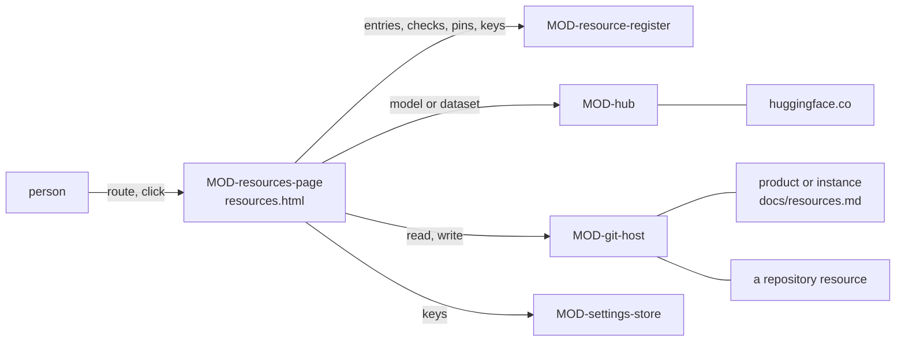

# ARC-034 The product's resources

## Context

A product names what it is built with, tested on or calls at runtime — another repository, data, a model, a cluster, a
model server, an agent service — in `docs/resources.md` of its own repository, each resource pinned to the exact state the
product uses, with its licence, its maintainer and the route by which it is reached (UC-040). The instance keeps a list of
its own in the same form, and neither list inherits from the other. A resource is not a requirement source — a rule the
product must meet, kept in the library of ARC-032 — and not a participant — whatever works on the product, kept in the
instance's `docs/participants.md` (ARC-019) —; a system in two roles is declared in both places.

Every page reads and writes repositories through the git adapter (ARC-004), keeps the browser's settings through the
settings store (ARC-005) — among them `ResourceKey`, a resource's key by the name its entry gives, with the origin of the
one server it goes to (`MOD-settings-store.storeResourceKey`) —, and computes a file's SHA-256 where the page runs
(`MOD-source-library.sha256Files`). The people a repository lists as consenting to be named are read from its
`docs/collaborators.md` (`MOD-settings-views.parseCollaborators`, ARC-026).

Facts this decision rests on:

- The Hugging Face Hub documents its API in an OpenAPI description (`https://huggingface.co/.well-known/openapi.md`, linked
  from `https://huggingface.co/docs/hub/api`). Its Python client reads a model at `{endpoint}/api/models/{repo_id}`, or at
  `.../revision/{revision}` with the revision URL-encoded, and a dataset at `{endpoint}/api/datasets/...` alike; the
  answer's fields include `sha`, `author`, `private`, `cardData`, `lastModified` — "Date of last commit to the repo" — and
  `gated`, "Is the repo gated. If so, whether there is manual or automatic approval", one of `"auto"`, `"manual"` or `false`
  (`https://github.com/huggingface/huggingface_hub/blob/main/src/huggingface_hub/hf_api.py`, `model_info`, `dataset_info`,
  `ModelInfo`). The same client asks `{endpoint}/api/whoami-v2` for the account behind a token. It reads a `401` from a
  repository's API as a repository not found — "401 is misleading as it is returned for: private and gated repos if user
  is not authenticated; missing repos" —, a `403` as a token without "the correct permissions", and a missing revision by
  the error code `RevisionNotFound`
  (`https://github.com/huggingface/huggingface_hub/blob/main/src/huggingface_hub/utils/_http.py`, `hf_raise_for_status`).
- Asked with the origin `https://alice.github.io`, `https://huggingface.co/api/models/openai-community/gpt2` answers `200`
  with `access-control-allow-origin: https://alice.github.io`, `sha` `607a30d783dfa663caf39e06633721c8d4cfcd7e` and
  `cardData.license` `mit`, and `ratelimit-policy: "fixed window";"api";q=500;w=300`; the preflight of a request with an
  `Authorization` header answers `200` with `access-control-allow-headers: authorization` and
  `access-control-allow-methods: GET`. `.../api/models/meta-llama/Llama-3.1-8B` answers `gated` `manual` and
  `cardData.license` `llama3.1`, and a file of it, `https://huggingface.co/meta-llama/Llama-3.1-8B/resolve/main/config.json`,
  answers `401` with `x-error-code: GatedRepo` without a token; `.../api/datasets/stanfordnlp/imdb` answers
  `cardData.license` `["other"]`. A repository the Hub does not know, `.../api/models/no-such-owner-xyz/no-such-model-xyz`,
  answers `401` "Invalid username or password.", a revision it does not have,
  `.../gpt2/revision/no-such-branch-xyz`, answers `404` with `x-error-code: RevisionNotFound`, a public model asked with an
  invalid bearer token answers `200`, and `https://huggingface.co/api/whoami-v2` without a token answers `401`. These
  answers were read with `curl`, not from a browser.
- A Hub token has the role `read`, `write` or `fine-grained`; "`read`: tokens with this role can only be used to provide
  read access to repositories you could read", and tokens are made at `https://huggingface.co/settings/tokens`
  (`https://huggingface.co/docs/hub/security-tokens`). A gated model's users "must agree to share their contact
  information (username and email address) with the model authors to access the model files", granted at once under
  automatic approval or after the authors' review under manual approval; "To download files from a gated model you'll
  need to be authenticated", a script "with a user token" (`https://huggingface.co/docs/hub/models-gated`).
- A fine-grained GitHub token has one resource owner — "The token will only be able to access resources owned by the
  selected resource owner" —, the repositories selected under *Repository access* and the permissions selected under
  *Permissions*; "Tokens always include read-only access to all public repositories on GitHub". The page that makes one
  is prefilled by the parameters `name` (at most 40 characters), `description`, `target_name` — "the owner of the
  repositories that the token will be able to access" —, `expires_in` (1 to 366 days) and a permission with its level,
  `contents=read` making a token "with `contents:read` and `metadata:read`"
  (`https://docs.github.com/en/authentication/keeping-your-account-and-data-secure/managing-your-personal-access-tokens`).
- A GitLab project access token is "scoped to the associated project", cannot be used "to access resources in other
  projects", and is made under *Settings → Access tokens* of the project with a role; on GitLab.com it needs a Premium or
  Ultimate subscription, on GitLab Self-Managed any license
  (`https://docs.gitlab.com/user/project/settings/project_access_tokens/`). The scope `read_api` "Grants read access to
  the API for the token's scope" (`https://docs.gitlab.com/security/tokens/access_token_scopes/`); the role Guest "Cannot
  push code or access repository", Reporter may "View code, create issues, and generate reports. Cannot push code or
  manage protected branches" (`https://docs.gitlab.com/user/permissions/`).

## Decision

1. **One decision, three modules.** `MOD-resource-register`, a kernel, holds the six kinds, the list's format and its check,
   a new resource and the list's edits, the pins, a repository's due diligence, what a restricted resource keeps out of
   the repository, the key a resource's requests carry, the newer state upstream and the move of a pin, and the views the
   page shows. `MOD-hub` is the adapter of the Hugging Face Hub. `MOD-resources-page` is the shell of `resources.html` at
   the root of the instance's Pages site: its route, the reading of a list, a repository resource on its server, a model or
   a dataset on the Hub, the save on a click, and every text and all HTML of the page.
2. **The list** (`ResourcesFile`, `MOD-resource-register.parseResources`, `MOD-resource-register.formatResources`):
   `docs/resources.md` of the repository whose list it is — a product's, or the instance's (`A PRODUCT DECLARES ITS
   RESOURCES`, `THE INSTANCE DECLARES ITS OWN RESOURCES`) —, a heading, a sentence that a credential is named and never
   written, and one section per resource: its name as heading, then ten fields as list lines — `kind`, `system`, `address`,
   `pin`, `licence`, `redistribution`, `maintainer`, `route`, `place`, `secret`, `—` where empty — and, for data or a model
   pinned by its files, a table of every file with its SHA-256. A field outside the ten is read as written, so that the
   check can name it.
3. **The six kinds** (`MOD-resource-register.kinds`; `THE RESOURCE KIND IS ONE OF A CLOSED SET`), each with what it records:

   | Kind | Pinned by | Licence | Maintainer | Place | Routes |
   |---|---|---|---|---|---|
   | `repository` | its commit | ✓ | ✓ | | `browser` |
   | `data` | a revision, or the SHA-256 of every file | ✓ | ✓ | | `browser`, `bridge`, `runner:<label>` |
   | `model` | a revision, or the SHA-256 of every file | ✓ | ✓ | | `browser`, `bridge`, `runner:<label>` |
   | `compute` | nothing — its environment is pinned in the job's own files | | | ✓ | `bridge`, `runner:<label>` |
   | `endpoint` | the identifier of the model it serves | | | ✓ | `bridge`, `runner:<label>` |
   | `agent` | the identifier of the model or version it serves | | ✓ | ✓ | `bridge`, `runner:<label>` |

   `browser` names a resource read on its host — by the page, and by a job that downloads it —; `bridge` the local bridge
   (UC-011) and `runner:<label>` a self-hosted runner by its label, the routes by which a job reaches a resource on a
   machine (`A COMPUTE RESOURCE IS REACHED THROUGH THE BRIDGE OR A SELF-HOSTED RUNNER`). Data or a model on a share that
   only a machine reaches takes that machine's route. A compute resource records what it is, `SLURM cluster` or
   `GPU machine`, under `system`; its address is optional.
4. **The check** (`MOD-resource-register.checkResources`), against the people the repository's `docs/collaborators.md`
   lists as consenting, gives one finding per rule broken, each naming its rule: a list outside `docs/resources.md`, and a
   name given twice (`A PRODUCT DECLARES ITS RESOURCES`); a participant's field — `capabilities`, `role`, `roles` —
   (`A RESOURCE IS USED, A PARTICIPANT DEVELOPS`); a kind outside the six; no address, compute excepted; a commit or a
   revision not in full 40 characters, files without the SHA-256 of each, an endpoint or an agent without its served model,
   files on a kind pinned otherwise (`A RESOURCE IS PINNED TO AN EXACT STATE`); a pin on compute (`A COMPUTE ENVIRONMENT IS
   PINNED IN THE JOB'S OWN FILES`); no licence (`A RESOURCE DECLARES ITS LICENCE`); redistribution not stated as `yes`, `no`
   or `unknown`, and an unknown licence stated to permit it (`A RESTRICTED RESOURCE IS REFERENCED, NEVER COPIED`); no
   maintainer, or one in none of the forms `@account`, `org: <name>`, `collaborator: <name>`, `unknown` (`A RESOURCE NAMES
   ITS MAINTAINER`), and a collaborator the repository does not list as consenting (`A PERSON IS NAMED BY ACCOUNT OR WITH
   CONSENT`); a route the kind does not take (`A COMPUTE RESOURCE IS REACHED THROUGH THE BRIDGE OR A SELF-HOSTED RUNNER`
   for compute, `A JOB RUNS ONLY WHERE ITS RESOURCES ARE REACHABLE` for the others); no processing place (`A RESOURCE
   DECLARES WHERE IT PROCESSES DATA`); and a secret not written as `ci <NAME>` or `browser <NAME>` (`A RESOURCE ENTRY NAMES
   ITS SECRET, NOT ITS VALUE`). An unknown licence is a warning: the resource is treated as restricted (UC-040 4a).
5. **A new resource** (`MOD-resource-register.newResource`): the form gives the kind, the name, the address, the route and,
   for compute, what it is; a kind read on its host is reached through the browser unless the form names a job's route;
   the licence and its redistribution start `unknown`. Where the data given to compute, an endpoint or an agent is
   processed is preset to *this machine* for the bridge on the person's machine, and asked otherwise
   (`MOD-resource-register.placePreset`; UC-040 6). The list is edited as a whole — a resource added or put in the place
   of the one it replaces (`MOD-resource-register.withResource`), removed (`MOD-resource-register.withoutResource`) — and
   checked before **Save** shows: the page shows the findings of the check of what it would save, and the save checks
   again.
6. **What is read about a resource.**
   - *A repository* (`MOD-resources-page.readRepository`) is read on its server — GitHub or a GitLab server, as the git
     adapter reaches it — with the key its entry names, else with the token stored for that server; a public repository
     on GitHub is read with the stored token, which reads every public repository. The page reads the head of its
     default branch, its root's licence file and that file's text (`MOD-resource-register.licenceFile`), and its newest
     commits up to that head, at most a hundred. The due diligence of ch. 6 §5 (`MOD-resource-register.dueDiligence`)
     gives the commit, the licence file, the date of the last commit, how many people committed in the year before — "at
     least" that many where every commit read lies in that year — and whether one person made them all; the resource is
     pinned at that commit and its maintainer preset to the account or group that owns it, where none is entered
     (`MOD-resource-register.fromRepository`).
   - *A model or a dataset on the Hub* (`MOD-resources-page.readHub`, `MOD-hub.hubAddress`, `MOD-hub.hubInfo`) is read at
     `https://huggingface.co/api/models/<owner>/<name>` or `.../api/datasets/<owner>/<name>`, at a revision — its newest
     where none is given —, with the Hub's key its entry names where it names one; the answer gives the revision's commit,
     the licence its card names — several joined —, whether it is gated manually or automatically or private, its owner
     and when it last changed. The resource is pinned at that commit, its licence taken from the card — `unknown` where the
     card names none —, its maintainer preset to the owning account (`MOD-resource-register.fromHub`). A repository the Hub
     does not show this browser — one it does not know, or a private one without a key that reads it — answers `401`, a key
     without the permission `403`: the page names all three in its refusal and asks for a key (UC-040 3c); a missing
     revision is told by its error code. A gated model's description is read without a key; its files need one.
   - *Data or a model elsewhere* — a folder on a share, a checkpoint file — is pinned by the SHA-256 of every file the
     person selects, computed where the page runs, the files going nowhere (`MOD-source-library.sha256Files`,
     `MOD-resource-register.withFiles`).
   - *Compute, an endpoint and an agent* are named, their route chosen and, for an endpoint or an agent, its base address
     entered; nothing is read from the page.
7. **A pin the person enters** (`MOD-resource-register.enteredPin`). Where the Hub does not answer the browser, the revision
   is pasted from the Hub's *Files and versions* page (UC-040 3b); where a repository cannot be read and the person saves
   it unchecked, its commit is pasted (UC-040 3a): in both, only a full 40-character commit hash is taken, never a
   branch's name such as `main`, which moves. An endpoint's or an agent's pin is the identifier of the model it serves:
   the check through the bridge or a runner records it (UC-040 7); saved without that check, it is the identifier the
   person enters, one word as the server's list of models names it (`meta-llama/Llama-3.1-8B-Instruct`, `qwen2.5:7b`).
   Compute takes no pin.
8. **Credentials** (`A RESOURCE ENTRY NAMES ITS SECRET, NOT ITS VALUE`, `A RESOURCE CREDENTIAL GOES ONLY TO ITS
   RESOURCE`). An entry names where its credential is held: `ci <NAME>` — a CI secret of the repository by its name, its
   value stored on the server's page of the repository's CI secrets, which the page links (`MOD-git-host.secretsPageUrl`),
   never on this page — or `browser <NAME>` — a key kept in this browser.
   A key is stored under its name with the origin its resource's requests go to — GitHub's API for a repository on
   github.com, else the origin of the resource's address (`MOD-resource-register.keyServer`,
   `MOD-settings-store.storeResourceKey`, `MOD-settings-store.saveEntries`) —, and a request carries it only where that
   origin is the one the key is stored for (`MOD-resource-register.resourceKey`): a key stored for another server is
   refused, not sent. The Hub's key goes to `https://huggingface.co` alone (`MOD-hub.hubInfo`). This holds for the
   requests of this page; the key a request through the bridge would carry to compute, an endpoint or an agent comes with
   the check of the second part (consequences). Before a list is written,
   the page looks for every token, key and password this browser keeps — each of at least eight characters — in its text
   and refuses the save where one stands in it (`MOD-resource-register.secretFree`). No key stands in an address
   (`A CREDENTIAL IS NEVER PLACED IN A URL`).
9. **A private repository the stored token cannot read** (UC-040 3a). The token Agent M asks for writes to the instance and
   the products alone (`A TOKEN IS SCOPED TO WHAT IT WRITES`); on GitHub its permissions apply to every repository it
   selects, and its one resource owner may not be the resource's, so adding the resource to it would grant write access
   or fail. The page names the refusal and links the making of a key that only reads the resource
   (`MOD-resource-register.readTokenLink`): on GitHub the new fine-grained token's page prefilled with the name *Agent M
   reads <repository>*, the resource's owner, read access to contents and 90 days — the person then selects the
   repository under *Repository access* —; on a GitLab server the project's *Access tokens* page, where the role
   *Reporter* and the scope `read_api` are chosen. The key is kept as the resource's `browser <NAME>` and the repository read
   again with it; until that read succeeds, nothing is saved but a commit the person pastes (decision 7).
10. **A restricted resource** (`MOD-resource-register.restriction`; `A RESTRICTED RESOURCE IS REFERENCED, NEVER COPIED`): a
    repository, data or a model whose licence is unknown, does not permit redistribution, or of which that is not known.
    Its entry holds its address and its pin — a commit, a revision or the hashes of its files —, never its content; the
    save writes `docs/resources.md` and nothing else (`MOD-resources-page.saveResources`). Whether the licence permits
    redistribution is stated by the person — `yes`, `no`, `unknown`, starting `unknown` —, not derived from the licence's
    name.
11. **The maintainer** (`A RESOURCE NAMES ITS MAINTAINER`): an account `@<account>`, an organisation `org: <name>`, a
    collaborator `collaborator: <name>` whom the repository's `docs/collaborators.md` lists as consenting, or `unknown`.
    *Bus factor 1* is shown beside a resource one person keeps — one person made every commit of the last year, or its
    maintainer is one collaborator (`MOD-resource-register.busFactorOne`) —; it is no finding of the check, and the entry
    is saved as entered (UC-040 4c).
12. **The pin over time** (`A PINNED RESOURCE MOVES ONLY WHEN A PERSON MOVES IT`). A newer commit or revision read upstream
    is shown beside the pin and changes nothing (`MOD-resource-register.newerState`); the pin moves only by the person's
    **Move**, which puts the new state into the list (`MOD-resource-register.movePin`) and saves it on that click.
13. **Two lists, two roles** (`INSTANCE AND PRODUCT RESOURCES ARE INDEPENDENT`, `ONE SYSTEM IN TWO ROLES IS TWO ENTRIES`).
    Each list is read and saved on its own; nothing of the instance's list enters a product's but a resource copied on
    **Copy from the instance** (`MOD-resource-register.copyResource`; UC-040 2c), a copy linked to nothing, edited and
    saved like any other: the form of a product's new resource reads the instance's list and offers each resource of it
    that the product's list does not hold. An endpoint or an agent that also works on the product is declared again as a
    participant: the page links the participants' form of the settings page opened with its type and address
    (`MOD-resource-register.participantFor`, `MOD-settings-page.route`, `MOD-process-config.participantPreset`), and the
    two entries share no field.
14. **The page** (`MOD-resources-page`). Its route (`MOD-resources-page.route`) gives the views `#resources`,
    `#resource?name=<name>` and `#add?kind=<kind>`, each with `product=<address>` for a product's list and without it for
    the instance's. A product's view links its list as *Resources*, `#resources?product=<address>` (UC-040 1); the settings
    page links the instance's as *Instance resources* (ARC-026 decision 3); the library's explanation of what a source is
    links the product's list (UC-015 2c). The page reads the list at the head of the default branch with its check and the
    consenting collaborators (`MOD-resources-page.readResources`) and shows it grouped by kind
    (`MOD-resource-register.resourcesView`). It saves on a click (`THE DASHBOARD WRITES ONLY ON A PERSON'S CLICK`, `ONE
    CLICK PER DECISION`, `A PERSON'S OWN INPUT IS COMMITTED DIRECTLY`): one commit of `docs/resources.md` on the head read,
    refused where the file changed after the page read it, its check finds an error, or it holds a secret of this
    browser (`MOD-resources-page.saveResources`). A rule a resource imposes is no requirement through its entry: the page
    links the library to register its terms as a source and link them to the product (`MOD-library-page.route`; UC-040 2b,
    4b).
15. **The page's texts** (`EVERY STEP EXPLAINS ITSELF`). The list folds out *What is this?*: "A resource is something this
    product is built with, tested on or calls at runtime — a private repository of DLLs, meta-llama/Llama-3.1-8B on
    Hugging Face at a fixed revision, the SLURM cluster Alex at NHR@FAU, a vLLM endpoint on gpu01 that the product
    queries." — "A requirement source is a rule the product must meet — the EU AI Act, IEC 62304 class B —; it is kept in
    the library." — "A participant works on the product — a colleague, Claude Code on your machine, a CI agent —; it is
    kept with the participants." — "A system that the product uses and that also works on it is declared twice, once as a
    resource and once as a participant." **+ Add resource** gives each kind one sentence and an example: "A repository —
    another repository the product is built with, on GitHub or a GitLab server, pinned at its commit; for example
    https://gitlab.rrze.fau.de/lme/speech-dlls"; "Data — a dataset on Hugging Face, pinned at a revision, or files, pinned
    by the SHA-256 of each; for example https://huggingface.co/datasets/stanfordnlp/imdb"; "A model — a model on Hugging
    Face, pinned at a revision, or checkpoint files, pinned by the SHA-256 of each; for example
    https://huggingface.co/meta-llama/Llama-3.1-8B"; "Compute — a SLURM cluster or a GPU machine the product's jobs run
    on, reached through the bridge or a self-hosted runner; for example the cluster Alex at NHR@FAU"; "An endpoint — a
    model server the product calls at runtime, pinned by the model it serves; for example http://gpu01:8000/v1"; "An agent —
    an agent service the product delegates to at runtime, pinned by the model or version it serves". Beside a restricted
    resource: "Only the address and the pin are written to the product repository; the content stays where it is." Beside
    an unknown licence: "The licence is not known: the resource is treated as restricted until someone records it." Beside
    a licence or usage policy: "A resource's terms — a licence, a usage policy — become requirements only through a source:
    register them in the library and link them to this product." The credential folds out: "A CI secret is named here; its
    value is kept in the repository's secrets. A key in this browser is sent only to this resource's server. A leaked key is
    like a published credit-card number (Vibe Coding, ch. 10). Keep it out of every file, message and screenshot." Bus
    factor 1 folds out: "One person keeps this resource. If that person stops, nobody else knows it — the PEAKS example of
    Vibe Coding, ch. 6 §5." The place asks: "Where is the data you give it processed? For example this machine, or
    NHR@FAU, Erlangen." A gated or private model: "This model's files are read with a Hugging Face token of an account that
    may read them — for a gated model, after its conditions are accepted on its page. Make a token with the role read at
    https://huggingface.co/settings/tokens; it is sent only to Hugging Face." The Hub not answering: "Hugging Face did not
    answer this browser. Paste the revision from the model's page, Files and versions: the full commit hash, not a branch
    such as main." A private repository: "<repository> cannot be read with the token stored for <server>. Make a token that
    only reads it, and keep it here as this resource's key; the token that writes to your products is not changed." The
    resource that also works on the product: "Does it also work on the product — as a coding agent? Declare it a second
    time, as a participant; the two entries share nothing." A rule, not a thing used: "Is it a rule the product must meet?
    Then it is a requirement source." A resource the instance declares: "The instance declares this resource. Copy it into
    this product's list: the copy is the product's own, and a later change on either side leaves the other as it is."



## Alternatives

- **The resources in `MOD-source-library`, designed with later parts of ARC-032** — the earlier plan, one module for both
  registers, as ARC-032's consequences name it. Rejected: a module is designed in one decision (ARC-020 decision 3), so
  ARC-032 would carry two registers that share no file, no type, no check and no page — the rules a product must meet,
  kept once in the instance and linked by version (UC-004, UC-015, UC-016), and the things it uses, kept in each
  repository's own list with a pin, a route and a credential (`A PRODUCT DECLARES ITS RESOURCES`, UC-040). Each register
  stays one kernel and one page; they share the git adapter, the settings store and the hashes of selected files
  (`MOD-source-library.sha256Files`).
- **One file per resource** — rejected: `A PRODUCT DECLARES ITS RESOURCES` names one file, `docs/resources.md`, one entry
  per resource; one file is read and saved in one request each.
- **The resource repository added to the token that writes to the products** — rejected: it would carry write access to
  the resource, against `A TOKEN IS SCOPED TO WHAT IT WRITES`, and a GitHub token reaches one owner's repositories only;
  a key that only reads the resource is kept as the resource's own.
- **Redistribution derived from the licence's name** — rejected: it needs a register of licences and what each permits,
  for which this decision has no fetched source; the person states it, and an unknown answer restricts the resource.
- **The Hub read through the bridge** — rejected: the Hub answers the page's origin with its CORS headers, as measured
  above; the bridge stays for what the browser cannot reach, and a Hub that does not answer is answered by a pasted
  revision.
- **The key in the entry, encrypted** — rejected: `NO SECRET IN THE REPOSITORY` holds for every value of a credential; the
  entry names where it is held.

## Consequences

- The kernel reads, checks and edits the list with no request; the page alone reads and writes repositories, through the
  git adapter, and the Hub, through its adapter.
- **Not realised here — the check by the resource's route** (UC-040 7, 7a, 7b, 7c). Step 7 reaches each resource by its
  route: a read on the host for a repository, data or a model — `MOD-resources-page.readRepository`,
  `MOD-resources-page.readHub` —, and through the bridge a harmless request — a SLURM cluster's partitions, an endpoint's
  served models — for which the bridge has no handler yet: its route table names `GET /endpoint/models` (ARC-011) and no
  module answers it, and none lists a cluster's partitions. A key the bridge would forward leaves the browser, so the
  request's credential is part of that design (`A RESOURCE CREDENTIAL GOES ONLY TO ITS RESOURCE`). 7a names the bridge's
  refusals, 7b runs a check job on a runner's label through the product's workflow (ARC-015, ARC-029), 7c compares the
  served model with the pin. They come with the second part of this decision.
- **Not realised here — the instance's own list through the settings page** (UC-040 1b): it runs steps 2 to 8, step 7
  among them; the route, the reading and the save of the instance's list are designed (`MOD-resources-page.route` without
  a product).
- **Not realised here — the jobs** (UC-040 9, 9a, 9b, 1a; `A JOB RUNS ONLY WHERE ITS RESOURCES ARE REACHABLE`). Which jobs
  and tests name a resource, which runtimes and participants reach it by its route, and the pinned state in a job's
  inputs need the job definitions to name the resources they use (ARC-007) and the dispatch to filter by route
  (ARC-029). 9a also shows "the jobs that use the resource" beside a newer state and covers a served model; the newer
  commit or revision and its move are designed (decision 12). They come with the second part.
- **The test of a resource key on the settings page** comes with the second part: it reads, with the key alone, a resource
  that names it — a repository on its server, a model on the Hub, an endpoint through the bridge —, so it needs the
  resources the instance and the products declare and the check through the bridge. A public model on the Hub answers a
  request with an invalid key as one without, so the Hub's key is tested at `/api/whoami-v2`, which answers `401` without
  a valid one.
- **An open measurement** (`BROWSER REACHABILITY IS MEASURED, NOT ASSUMED`): the Hub's answers above were read with `curl`
  sending the page's origin; whether current browsers read them from a Pages origin, with and without a key, is measured
  before the page is released and recorded in `docs/measurements/`. A Hub that does not answer the browser is answered by
  a pasted revision (decision 7).
- **Kept elsewhere** — the requirements under `forced_by` that this decision does not place: `NO SECRET IN THE REPOSITORY`
  (ARC-028; here `MOD-resource-register.secretFree` before every save), `CONFIGURATION IS STORED IN LOCALSTORAGE, NOT IN A
  COOKIE` (`MOD-settings-store`, ARC-005), `A TOKEN GOES ONLY TO THE SERVER THAT ISSUED IT`, `A CREDENTIAL IS NEVER PLACED
  IN A URL` and `THE DASHBOARD WRITES ONLY ON A PERSON'S CLICK` (`MOD-git-host`, ARC-004), `A PERSON'S OWN INPUT IS
  COMMITTED DIRECTLY`, `ONE CLICK PER DECISION` and `EVERY STEP EXPLAINS ITSELF` (`MOD-review-page`, ARC-022),
  `BROWSER REACHABILITY IS MEASURED, NOT ASSUMED` (ARC-009), `THE PRODUCT REPOSITORY IS SELF-SUFFICIENT` (ARC-001). `A
  RESOURCE'S TERMS ENTER AS A SOURCE`: a requirement naming a resource as its source names no source the product links,
  which `MOD-artifacts.checkSpec` reports (ARC-006). `A TOKEN IS SCOPED TO WHAT IT WRITES` (`MOD-setup`, ARC-033); this
  decision asks for no token that writes.
- **Kept in part, not placed** (`A RESOURCE CREDENTIAL GOES ONLY TO ITS RESOURCE`): the browser's half is kept — a key
  goes only to the origin it is stored for (`MOD-resource-register.keyServer`, `MOD-resource-register.resourceKey`), the
  Hub's key only to the Hub (`MOD-hub.hubInfo`); the half of a request through the bridge, which would carry a key to
  compute, an endpoint or an agent, waits for the check of the second part. The requirement is placed when both are
  designed.
- **Kept in part, not placed** (`A PERSON IS NAMED BY ACCOUNT OR WITH CONSENT`): a resource's maintainer is named by account,
  by organisation, or as a collaborator the repository lists as consenting, which the check keeps
  (`MOD-resource-register.checkResources`, against `MOD-settings-views.parseCollaborators`). A name in any other
  artifact — above all one a participant generates — is checked against `docs/collaborators.md` by no design yet; that
  check belongs among the checks a drafting job's output must pass in its correction loop (ARC-007, ARC-031), and the
  decision that designs it places the rule.
- A repository's whole tree is read for its root's licence file — on a GitLab server one request per hundred files —;
  a narrower read waits for the git adapter to list one folder.
- A resource's key is stored as any key of this browser (ARC-005): it is exported with the settings and cleared on the
  settings page.

## Modules

### MOD-resource-register

```json module
{
  "id": "MOD-resource-register",
  "folder": "src/resource-register/",
  "layer": "kernel",
  "responsibility": "The resources a product or the instance is built with, tested on or calls at runtime: the six kinds and what each records, the list's format and its check, a new resource, the list's edits, the pin a read gives, a person enters or the files' hashes make, a repository's due diligence, what a restricted resource keeps out of the repository, the key a resource's requests carry and where a read-only one is made, the newer state upstream and the move of a pin, the list as the page shows it, and the participant a resource that also works on the product is declared as.",
  "realises": ["A PRODUCT DECLARES ITS RESOURCES", "A RESOURCE IS USED, A PARTICIPANT DEVELOPS", "THE RESOURCE KIND IS ONE OF A CLOSED SET", "A RESOURCE IS PINNED TO AN EXACT STATE", "A PINNED RESOURCE MOVES ONLY WHEN A PERSON MOVES IT", "A RESOURCE DECLARES ITS LICENCE", "A RESOURCE NAMES ITS MAINTAINER", "A RESOURCE ENTRY NAMES ITS SECRET, NOT ITS VALUE", "A COMPUTE RESOURCE IS REACHED THROUGH THE BRIDGE OR A SELF-HOSTED RUNNER", "A RESOURCE DECLARES WHERE IT PROCESSES DATA"],
  "owns": ["ResourceKind", "ResourceFile", "ResourceField", "ResourceEntry", "ResourceForm", "SecretValue", "SecretFree", "ResourceRestriction", "DueDiligence", "DueDiligenceOrNone", "ResourceKeyUse", "ReadTokenLink", "NewerState", "ResourceLine", "ResourcesGroup", "ParticipantPrefill", "ResourcesFile"],
  "uses": ["MOD-contracts"]
}
```

```json interface
{
  "id": "MOD-resource-register.kinds",
  "summary": "The six kinds of resource in their order, each with what pins it — a commit, a revision or the files' hashes, the served model, or nothing —, whether it declares a licence, a maintainer and where it processes data, the routes by which it is reached, and for compute what it may be.",
  "params": [],
  "result": "ResourceKind[]",
  "async": false,
  "refusals": [],
  "examples": [
    {
      "name": "the closed set",
      "input": {},
      "result": [
        {
          "kind": "repository",
          "pin": "commit",
          "licence": true,
          "maintainer": true,
          "place": false,
          "routes": ["browser"],
          "systems": []
        },
        {
          "kind": "data",
          "pin": "revision-or-files",
          "licence": true,
          "maintainer": true,
          "place": false,
          "routes": ["browser", "bridge", "runner"],
          "systems": []
        },
        {
          "kind": "model",
          "pin": "revision-or-files",
          "licence": true,
          "maintainer": true,
          "place": false,
          "routes": ["browser", "bridge", "runner"],
          "systems": []
        },
        {
          "kind": "compute",
          "pin": "none",
          "licence": false,
          "maintainer": false,
          "place": true,
          "routes": ["bridge", "runner"],
          "systems": ["SLURM cluster", "GPU machine"]
        },
        {
          "kind": "endpoint",
          "pin": "served-model",
          "licence": false,
          "maintainer": false,
          "place": true,
          "routes": ["bridge", "runner"],
          "systems": []
        },
        {
          "kind": "agent",
          "pin": "served-model",
          "licence": false,
          "maintainer": true,
          "place": true,
          "routes": ["bridge", "runner"],
          "systems": []
        }
      ]
    }
  ]
}
```

```json interface
{
  "id": "MOD-resource-register.parseResources",
  "summary": "A resource list, docs/resources.md: one entry per section, its name the heading, its ten fields as written — kind, system, address, pin, licence, redistribution, maintainer, route, place, secret —, any other field as written, and the files of data or a model pinned by its files.",
  "params": [{ "name": "text", "type": "string" }],
  "result": "ResourceEntry[]",
  "async": false,
  "refusals": [{ "code": "not-resources", "when": "the text does not begin with a heading" }],
  "examples": [
    {
      "name": "the product's six resources",
      "input": { "text": "# Resources\n\nOne section per resource this repository is built with, tested on or calls at runtime (UC-040). A credential is named\nwhere it is held, never written here.\n\n## speech-dlls\n\n- kind: repository\n- system: —\n- address: https://github.com/alice-lab/speech-dlls\n- pin: 5d1e0c7a9b3f2e4d6c8a0b1c2d3e4f5a6b7c8d9e\n- licence: internal use within the lab\n- redistribution: no\n- maintainer: @alice-lab\n- route: browser\n- place: —\n- secret: browser SPEECH_DLLS_READ\n\n## gpt2\n\n- kind: model\n- system: —\n- address: https://huggingface.co/openai-community/gpt2\n- pin: 607a30d783dfa663caf39e06633721c8d4cfcd7e\n- licence: mit\n- redistribution: yes\n- maintainer: @openai-community\n- route: browser\n- place: —\n- secret: —\n\n## llama-3.1-8b\n\n- kind: model\n- system: —\n- address: https://huggingface.co/meta-llama/Llama-3.1-8B\n- pin: d04e592bb4f6aa9cfee91e2e20afa771667e1d4b\n- licence: llama3.1\n- redistribution: unknown\n- maintainer: @meta-llama\n- route: browser\n- place: —\n- secret: ci HF_TOKEN\n\n## imdb\n\n- kind: data\n- system: —\n- address: https://huggingface.co/datasets/stanfordnlp/imdb\n- pin: e6281661ce1c48d982bc483cf8a173c1bbeb5d31\n- licence: other\n- redistribution: unknown\n- maintainer: @stanfordnlp\n- route: browser\n- place: —\n- secret: —\n\n## alex\n\n- kind: compute\n- system: SLURM cluster\n- address: —\n- pin: —\n- licence: —\n- redistribution: —\n- maintainer: —\n- route: runner:alex\n- place: NHR@FAU, Erlangen\n- secret: —\n\n## local-llm\n\n- kind: endpoint\n- system: —\n- address: http://gpu01:8000/v1\n- pin: meta-llama/Llama-3.1-8B-Instruct\n- licence: —\n- redistribution: —\n- maintainer: —\n- route: runner:gpu\n- place: the group's server room, Erlangen\n- secret: ci LOCAL_LLM_KEY\n" },
      "result": [
        {
          "name": "speech-dlls",
          "kind": "repository",
          "system": "",
          "address": "https://github.com/alice-lab/speech-dlls",
          "pin": "5d1e0c7a9b3f2e4d6c8a0b1c2d3e4f5a6b7c8d9e",
          "files": [],
          "licence": "internal use within the lab",
          "redistribution": "no",
          "maintainer": "@alice-lab",
          "route": "browser",
          "place": "",
          "secret": "browser SPEECH_DLLS_READ",
          "others": []
        },
        {
          "name": "gpt2",
          "kind": "model",
          "system": "",
          "address": "https://huggingface.co/openai-community/gpt2",
          "pin": "607a30d783dfa663caf39e06633721c8d4cfcd7e",
          "files": [],
          "licence": "mit",
          "redistribution": "yes",
          "maintainer": "@openai-community",
          "route": "browser",
          "place": "",
          "secret": "",
          "others": []
        },
        {
          "name": "llama-3.1-8b",
          "kind": "model",
          "system": "",
          "address": "https://huggingface.co/meta-llama/Llama-3.1-8B",
          "pin": "d04e592bb4f6aa9cfee91e2e20afa771667e1d4b",
          "files": [],
          "licence": "llama3.1",
          "redistribution": "unknown",
          "maintainer": "@meta-llama",
          "route": "browser",
          "place": "",
          "secret": "ci HF_TOKEN",
          "others": []
        },
        {
          "name": "imdb",
          "kind": "data",
          "system": "",
          "address": "https://huggingface.co/datasets/stanfordnlp/imdb",
          "pin": "e6281661ce1c48d982bc483cf8a173c1bbeb5d31",
          "files": [],
          "licence": "other",
          "redistribution": "unknown",
          "maintainer": "@stanfordnlp",
          "route": "browser",
          "place": "",
          "secret": "",
          "others": []
        },
        {
          "name": "alex",
          "kind": "compute",
          "system": "SLURM cluster",
          "address": "",
          "pin": "",
          "files": [],
          "licence": "",
          "redistribution": "",
          "maintainer": "",
          "route": "runner:alex",
          "place": "NHR@FAU, Erlangen",
          "secret": "",
          "others": []
        },
        {
          "name": "local-llm",
          "kind": "endpoint",
          "system": "",
          "address": "http://gpu01:8000/v1",
          "pin": "meta-llama/Llama-3.1-8B-Instruct",
          "files": [],
          "licence": "",
          "redistribution": "",
          "maintainer": "",
          "route": "runner:gpu",
          "place": "the group's server room, Erlangen",
          "secret": "ci LOCAL_LLM_KEY",
          "others": []
        }
      ]
    },
    {
      "name": "a text without its heading",
      "input": { "text": "## gpt2\n\n- kind: model\n" },
      "refused": "not-resources"
    }
  ]
}
```

```json interface
{
  "id": "MOD-resource-register.formatResources",
  "summary": "The text of a resource list: the heading, a sentence that a credential is named and never written, and per resource its section — ten fields as list lines, \"—\" where empty, other fields after them, and the table of its files where it has some.",
  "params": [{ "name": "entries", "type": "ResourceEntry[]" }],
  "result": "string",
  "async": false,
  "refusals": [],
  "examples": [
    {
      "name": "a compute resource and a checkpoint pinned by its files",
      "input": {
        "entries": [
          {
            "name": "alex",
            "kind": "compute",
            "system": "SLURM cluster",
            "address": "",
            "pin": "",
            "files": [],
            "licence": "",
            "redistribution": "",
            "maintainer": "",
            "route": "runner:alex",
            "place": "NHR@FAU, Erlangen",
            "secret": "",
            "others": []
          },
          {
            "name": "whisper-finetuned",
            "kind": "model",
            "system": "",
            "address": "smb://lab-share/models/whisper-finetuned",
            "pin": "files",
            "files": [
              { "name": "config.json", "sha256": "4b22222222222222222222222222222222222222222222222222222222222222" },
              { "name": "model.safetensors", "sha256": "a799999999999999999999999999999999999999999999999999999999999999" }
            ],
            "licence": "unknown",
            "redistribution": "unknown",
            "maintainer": "collaborator: Bob Example",
            "route": "runner:gpu",
            "place": "",
            "secret": "",
            "others": []
          }
        ]
      },
      "result": "# Resources\n\nOne section per resource this repository is built with, tested on or calls at runtime (UC-040). A credential is named\nwhere it is held, never written here.\n\n## alex\n\n- kind: compute\n- system: SLURM cluster\n- address: —\n- pin: —\n- licence: —\n- redistribution: —\n- maintainer: —\n- route: runner:alex\n- place: NHR@FAU, Erlangen\n- secret: —\n\n## whisper-finetuned\n\n- kind: model\n- system: —\n- address: smb://lab-share/models/whisper-finetuned\n- pin: files\n- licence: unknown\n- redistribution: unknown\n- maintainer: collaborator: Bob Example\n- route: runner:gpu\n- place: —\n- secret: —\n\n| File | SHA-256 |\n|---|---|\n| config.json | 4b22222222222222222222222222222222222222222222222222222222222222 |\n| model.safetensors | a799999999999999999999999999999999999999999999999999999999999999 |\n"
    }
  ]
}
```

```json interface
{
  "id": "MOD-resource-register.checkResources",
  "summary": "Every finding on a resource list against the people its repository lists as consenting to be named: not in docs/resources.md, a name given twice, a participant's field or another field, a kind outside the closed set, no address, a pin missing or not exact, a pin where the kind takes none, no licence or its redistribution not stated, an unknown licence permitting redistribution, no maintainer or one in no allowed form or not consenting, a route the kind does not take, no processing place, a secret not named by where it is held; an unknown licence is a warning.",
  "params": [
    { "name": "path", "type": "string" },
    { "name": "text", "type": "string" },
    { "name": "collaborators", "type": "Collaborator[]" }
  ],
  "result": "Finding[]",
  "async": false,
  "refusals": [],
  "examples": [
    {
      "name": "the product's list as committed",
      "input": {
        "path": "docs/resources.md",
        "text": "# Resources\n\nOne section per resource this repository is built with, tested on or calls at runtime (UC-040). A credential is named\nwhere it is held, never written here.\n\n## speech-dlls\n\n- kind: repository\n- system: —\n- address: https://github.com/alice-lab/speech-dlls\n- pin: 5d1e0c7a9b3f2e4d6c8a0b1c2d3e4f5a6b7c8d9e\n- licence: internal use within the lab\n- redistribution: no\n- maintainer: @alice-lab\n- route: browser\n- place: —\n- secret: browser SPEECH_DLLS_READ\n\n## gpt2\n\n- kind: model\n- system: —\n- address: https://huggingface.co/openai-community/gpt2\n- pin: 607a30d783dfa663caf39e06633721c8d4cfcd7e\n- licence: mit\n- redistribution: yes\n- maintainer: @openai-community\n- route: browser\n- place: —\n- secret: —\n\n## llama-3.1-8b\n\n- kind: model\n- system: —\n- address: https://huggingface.co/meta-llama/Llama-3.1-8B\n- pin: d04e592bb4f6aa9cfee91e2e20afa771667e1d4b\n- licence: llama3.1\n- redistribution: unknown\n- maintainer: @meta-llama\n- route: browser\n- place: —\n- secret: ci HF_TOKEN\n\n## imdb\n\n- kind: data\n- system: —\n- address: https://huggingface.co/datasets/stanfordnlp/imdb\n- pin: e6281661ce1c48d982bc483cf8a173c1bbeb5d31\n- licence: other\n- redistribution: unknown\n- maintainer: @stanfordnlp\n- route: browser\n- place: —\n- secret: —\n\n## alex\n\n- kind: compute\n- system: SLURM cluster\n- address: —\n- pin: —\n- licence: —\n- redistribution: —\n- maintainer: —\n- route: runner:alex\n- place: NHR@FAU, Erlangen\n- secret: —\n\n## local-llm\n\n- kind: endpoint\n- system: —\n- address: http://gpu01:8000/v1\n- pin: meta-llama/Llama-3.1-8B-Instruct\n- licence: —\n- redistribution: —\n- maintainer: —\n- route: runner:gpu\n- place: the group's server room, Erlangen\n- secret: ci LOCAL_LLM_KEY\n",
        "collaborators": [{ "name": "Bob Example", "account": "@bob" }]
      },
      "result": []
    },
    {
      "name": "a dataset whose licence is not known",
      "input": {
        "path": "docs/resources.md",
        "text": "# Resources\n\nOne section per resource this repository is built with, tested on or calls at runtime (UC-040). A credential is named\nwhere it is held, never written here.\n\n## imdb\n\n- kind: data\n- system: —\n- address: https://huggingface.co/datasets/stanfordnlp/imdb\n- pin: e6281661ce1c48d982bc483cf8a173c1bbeb5d31\n- licence: unknown\n- redistribution: unknown\n- maintainer: @stanfordnlp\n- route: browser\n- place: —\n- secret: —\n",
        "collaborators": [{ "name": "Bob Example", "account": "@bob" }]
      },
      "result": [
        { "artifact": "imdb", "line": 12, "kind": "warning", "what": "the licence is not known; the resource is treated as restricted", "rule": "A RESTRICTED RESOURCE IS REFERENCED, NEVER COPIED", "fix": "record the licence once it is known" }
      ]
    },
    {
      "name": "a branch as pin, a person named without consent, a compute pin, a participant's field, a kind outside the set",
      "input": {
        "path": "docs/resources.md",
        "text": "# Resources\n\n## llama\n\n- kind: model\n- system: —\n- address: https://huggingface.co/meta-llama/Llama-3.1-8B\n- pin: main\n- licence: —\n- redistribution: —\n- maintainer: Carla Muster\n- route: bridge\n- place: —\n- secret: —\n\n## alex\n\n- kind: compute\n- system: SLURM cluster\n- address: —\n- pin: modules gcc/12 cuda/12.4\n- licence: —\n- redistribution: —\n- maintainer: —\n- route: —\n- place: —\n- secret: —\n- capabilities: run code and tests\n\n## gpu01\n\n- kind: server\n- system: —\n- address: http://gpu01:8000/v1\n- pin: —\n- licence: —\n- redistribution: —\n- maintainer: —\n- route: runner:gpu\n- place: —\n- secret: —\n",
        "collaborators": [{ "name": "Bob Example", "account": "@bob" }]
      },
      "result": [
        { "artifact": "llama", "line": 8, "kind": "error", "what": "the revision is not recorded in full", "rule": "A RESOURCE IS PINNED TO AN EXACT STATE", "fix": "pin the full 40-character revision, or write files and the SHA-256 of every file" },
        { "artifact": "llama", "line": 9, "kind": "error", "what": "the licence is not recorded", "rule": "A RESOURCE DECLARES ITS LICENCE", "fix": "record the licence or the terms of use, or unknown" },
        { "artifact": "llama", "line": 10, "kind": "error", "what": "whether the licence permits redistribution is not stated", "rule": "A RESTRICTED RESOURCE IS REFERENCED, NEVER COPIED", "fix": "write yes, no or unknown" },
        { "artifact": "llama", "line": 11, "kind": "error", "what": "the maintainer Carla Muster is none of @account, org: <name>, collaborator: <name>, unknown", "rule": "A RESOURCE NAMES ITS MAINTAINER", "fix": "write the maintainer in one of the four forms" },
        { "artifact": "alex", "line": 28, "kind": "error", "what": "the resource carries the participant's field capabilities", "rule": "A RESOURCE IS USED, A PARTICIPANT DEVELOPS", "fix": "declare whatever works on the product as a participant (UC-017); a resource carries no capabilities and no role" },
        { "artifact": "alex", "line": 21, "kind": "error", "what": "a compute resource records a pin", "rule": "A COMPUTE ENVIRONMENT IS PINNED IN THE JOB'S OWN FILES", "fix": "pin the container image by its digest, or the modules with their versions, in the job's own files" },
        { "artifact": "alex", "line": 25, "kind": "error", "what": "the route (none) is none the kind takes", "rule": "A COMPUTE RESOURCE IS REACHED THROUGH THE BRIDGE OR A SELF-HOSTED RUNNER", "fix": "write bridge, or runner:<label> of a self-hosted runner" },
        { "artifact": "alex", "line": 26, "kind": "error", "what": "where the data given to it is processed is not stated", "rule": "A RESOURCE DECLARES WHERE IT PROCESSES DATA", "fix": "name the place, for example this machine or NHR@FAU, Erlangen" },
        { "artifact": "gpu01", "line": 32, "kind": "error", "what": "the kind server is none of the closed set", "rule": "THE RESOURCE KIND IS ONE OF A CLOSED SET", "fix": "write one of repository, data, model, compute, endpoint, agent" }
      ]
    },
    {
      "name": "an unknown licence permitting redistribution, a collaborator not listed, a key's value, an endpoint without its model",
      "input": {
        "path": "docs/resources.md",
        "text": "# Resources\n\n## speech-dlls\n\n- kind: repository\n- system: —\n- address: https://github.com/alice-lab/speech-dlls\n- pin: 5d1e0c7a9b3f2e4d6c8a0b1c2d3e4f5a6b7c8d9e\n- licence: unknown\n- redistribution: yes\n- maintainer: collaborator: Carla Muster\n- route: browser\n- place: —\n- secret: github_pat_read_example\n\n## local-llm\n\n- kind: endpoint\n- system: —\n- address: http://gpu01:8000/v1\n- pin: —\n- licence: —\n- redistribution: —\n- maintainer: —\n- route: runner:gpu\n- place: —\n- secret: ci LOCAL_LLM_KEY\n",
        "collaborators": [{ "name": "Bob Example", "account": "@bob" }]
      },
      "result": [
        { "artifact": "speech-dlls", "line": 9, "kind": "warning", "what": "the licence is not known; the resource is treated as restricted", "rule": "A RESTRICTED RESOURCE IS REFERENCED, NEVER COPIED", "fix": "record the licence once it is known" },
        { "artifact": "speech-dlls", "line": 10, "kind": "error", "what": "an unknown licence permits no redistribution", "rule": "A RESTRICTED RESOURCE IS REFERENCED, NEVER COPIED", "fix": "record the licence, or write unknown" },
        { "artifact": "speech-dlls", "line": 11, "kind": "error", "what": "Carla Muster is not listed as consenting in docs/collaborators.md", "rule": "A PERSON IS NAMED BY ACCOUNT OR WITH CONSENT", "fix": "name the person by their account, or list them as consenting first" },
        { "artifact": "speech-dlls", "line": 14, "kind": "error", "what": "the secret is not named by where it is held and by its name", "rule": "A RESOURCE ENTRY NAMES ITS SECRET, NOT ITS VALUE", "fix": "write ci NAME for a CI secret or browser NAME for a key in the browser, never the value" },
        { "artifact": "local-llm", "line": 21, "kind": "error", "what": "the served model is not recorded", "rule": "A RESOURCE IS PINNED TO AN EXACT STATE", "fix": "record the identifier of the model it serves" },
        { "artifact": "local-llm", "line": 26, "kind": "error", "what": "where the data given to it is processed is not stated", "rule": "A RESOURCE DECLARES WHERE IT PROCESSES DATA", "fix": "name the place, for example this machine or NHR@FAU, Erlangen" }
      ]
    },
    {
      "name": "a list kept elsewhere",
      "input": {
        "path": "docs/dependencies.md",
        "text": "# Resources\n\nOne section per resource this repository is built with, tested on or calls at runtime (UC-040). A credential is named\nwhere it is held, never written here.\n\n## gpt2\n\n- kind: model\n- system: —\n- address: https://huggingface.co/openai-community/gpt2\n- pin: 607a30d783dfa663caf39e06633721c8d4cfcd7e\n- licence: mit\n- redistribution: yes\n- maintainer: @openai-community\n- route: browser\n- place: —\n- secret: —\n",
        "collaborators": []
      },
      "result": [
        { "artifact": "docs/dependencies.md", "line": 0, "kind": "error", "what": "the resources are in docs/dependencies.md, not in docs/resources.md", "rule": "A PRODUCT DECLARES ITS RESOURCES", "fix": "keep the resources in docs/resources.md of the repository" }
      ]
    }
  ]
}
```

```json interface
{
  "id": "MOD-resource-register.secretFree",
  "summary": "Whether a text to be written holds none of the secrets this browser keeps — every one of at least eight characters is looked for in it.",
  "params": [{ "name": "text", "type": "string" }, { "name": "secrets", "type": "SecretValue[]" }],
  "result": "SecretFree",
  "async": false,
  "refusals": [{ "code": "secret-in-text", "when": "the text holds the value of a secret this browser keeps" }],
  "examples": [
    {
      "name": "the secret's name only",
      "input": {
        "text": "# Resources\n\nOne section per resource this repository is built with, tested on or calls at runtime (UC-040). A credential is named\nwhere it is held, never written here.\n\n## speech-dlls\n\n- kind: repository\n- system: —\n- address: https://github.com/alice-lab/speech-dlls\n- pin: 5d1e0c7a9b3f2e4d6c8a0b1c2d3e4f5a6b7c8d9e\n- licence: internal use within the lab\n- redistribution: no\n- maintainer: @alice-lab\n- route: browser\n- place: —\n- secret: browser SPEECH_DLLS_READ\n\n## gpt2\n\n- kind: model\n- system: —\n- address: https://huggingface.co/openai-community/gpt2\n- pin: 607a30d783dfa663caf39e06633721c8d4cfcd7e\n- licence: mit\n- redistribution: yes\n- maintainer: @openai-community\n- route: browser\n- place: —\n- secret: —\n\n## llama-3.1-8b\n\n- kind: model\n- system: —\n- address: https://huggingface.co/meta-llama/Llama-3.1-8B\n- pin: d04e592bb4f6aa9cfee91e2e20afa771667e1d4b\n- licence: llama3.1\n- redistribution: unknown\n- maintainer: @meta-llama\n- route: browser\n- place: —\n- secret: ci HF_TOKEN\n\n## imdb\n\n- kind: data\n- system: —\n- address: https://huggingface.co/datasets/stanfordnlp/imdb\n- pin: e6281661ce1c48d982bc483cf8a173c1bbeb5d31\n- licence: other\n- redistribution: unknown\n- maintainer: @stanfordnlp\n- route: browser\n- place: —\n- secret: —\n\n## alex\n\n- kind: compute\n- system: SLURM cluster\n- address: —\n- pin: —\n- licence: —\n- redistribution: —\n- maintainer: —\n- route: runner:alex\n- place: NHR@FAU, Erlangen\n- secret: —\n\n## local-llm\n\n- kind: endpoint\n- system: —\n- address: http://gpu01:8000/v1\n- pin: meta-llama/Llama-3.1-8B-Instruct\n- licence: —\n- redistribution: —\n- maintainer: —\n- route: runner:gpu\n- place: the group's server room, Erlangen\n- secret: ci LOCAL_LLM_KEY\n",
        "secrets": [{ "name": "settings.resourceKeys[0].key", "value": "github_pat_read_example" }]
      },
      "result": { "ok": true }
    },
    {
      "name": "a key's value written as the secret",
      "input": {
        "text": "# Resources\n\n## speech-dlls\n\n- kind: repository\n- system: —\n- address: https://github.com/alice-lab/speech-dlls\n- pin: 5d1e0c7a9b3f2e4d6c8a0b1c2d3e4f5a6b7c8d9e\n- licence: unknown\n- redistribution: yes\n- maintainer: collaborator: Carla Muster\n- route: browser\n- place: —\n- secret: github_pat_read_example\n\n## local-llm\n\n- kind: endpoint\n- system: —\n- address: http://gpu01:8000/v1\n- pin: —\n- licence: —\n- redistribution: —\n- maintainer: —\n- route: runner:gpu\n- place: —\n- secret: ci LOCAL_LLM_KEY\n",
        "secrets": [{ "name": "settings.resourceKeys[0].key", "value": "github_pat_read_example" }]
      },
      "refused": "secret-in-text"
    }
  ]
}
```

```json interface
{
  "id": "MOD-resource-register.newResource",
  "summary": "A resource as the form starts it: its name, kind and address; the route — the browser for a kind read on its host unless the form names a job's route, the bridge or a self-hosted runner by its label for compute, an endpoint or an agent —; what a compute resource is; the licence and its redistribution unknown until recorded.",
  "params": [{ "name": "form", "type": "ResourceForm" }, { "name": "entries", "type": "ResourceEntry[]" }],
  "result": "ResourceEntry",
  "async": false,
  "refusals": [
    { "code": "unknown-kind", "when": "the kind is none of the six" },
    { "code": "no-name", "when": "the name is empty" },
    { "code": "duplicate-name", "when": "the list has a resource of that name" },
    { "code": "no-address", "when": "a resource other than compute has no address" },
    { "code": "wrong-route", "when": "the route is none the kind takes" },
    { "code": "no-system", "when": "a compute resource is none of what it may be" }
  ],
  "examples": [
    {
      "name": "a private repository",
      "input": {
        "form": { "kind": "repository", "name": "speech-dlls", "address": "https://github.com/alice-lab/speech-dlls", "route": "", "system": "" },
        "entries": [
          {
            "name": "gpt2",
            "kind": "model",
            "system": "",
            "address": "https://huggingface.co/openai-community/gpt2",
            "pin": "607a30d783dfa663caf39e06633721c8d4cfcd7e",
            "files": [],
            "licence": "mit",
            "redistribution": "yes",
            "maintainer": "@openai-community",
            "route": "browser",
            "place": "",
            "secret": "",
            "others": []
          }
        ]
      },
      "result": {
        "name": "speech-dlls",
        "kind": "repository",
        "system": "",
        "address": "https://github.com/alice-lab/speech-dlls",
        "pin": "",
        "files": [],
        "licence": "unknown",
        "redistribution": "unknown",
        "maintainer": "",
        "route": "browser",
        "place": "",
        "secret": "",
        "others": []
      }
    },
    {
      "name": "a SLURM cluster through the bridge",
      "input": {
        "form": { "kind": "compute", "name": "alex", "address": "", "route": "bridge", "system": "SLURM cluster" },
        "entries": []
      },
      "result": {
        "name": "alex",
        "kind": "compute",
        "system": "SLURM cluster",
        "address": "",
        "pin": "",
        "files": [],
        "licence": "",
        "redistribution": "",
        "maintainer": "",
        "route": "bridge",
        "place": "",
        "secret": "",
        "others": []
      }
    },
    {
      "name": "an endpoint a self-hosted runner reaches",
      "input": {
        "form": { "kind": "endpoint", "name": "local-llm", "address": "http://gpu01:8000/v1", "route": "runner:gpu", "system": "" },
        "entries": []
      },
      "result": {
        "name": "local-llm",
        "kind": "endpoint",
        "system": "",
        "address": "http://gpu01:8000/v1",
        "pin": "",
        "files": [],
        "licence": "",
        "redistribution": "",
        "maintainer": "",
        "route": "runner:gpu",
        "place": "",
        "secret": "",
        "others": []
      }
    },
    {
      "name": "a kind outside the set",
      "input": {
        "form": { "kind": "library", "name": "numpy", "address": "https://github.com/numpy/numpy", "route": "", "system": "" },
        "entries": []
      },
      "refused": "unknown-kind"
    },
    {
      "name": "a name the list has",
      "input": {
        "form": { "kind": "model", "name": "gpt2", "address": "https://huggingface.co/openai-community/gpt2", "route": "", "system": "" },
        "entries": [
          {
            "name": "gpt2",
            "kind": "model",
            "system": "",
            "address": "https://huggingface.co/openai-community/gpt2",
            "pin": "607a30d783dfa663caf39e06633721c8d4cfcd7e",
            "files": [],
            "licence": "mit",
            "redistribution": "yes",
            "maintainer": "@openai-community",
            "route": "browser",
            "place": "",
            "secret": "",
            "others": []
          }
        ]
      },
      "refused": "duplicate-name"
    },
    {
      "name": "a cluster reached through the browser",
      "input": {
        "form": { "kind": "compute", "name": "alex", "address": "", "route": "browser", "system": "SLURM cluster" },
        "entries": []
      },
      "refused": "wrong-route"
    },
    {
      "name": "a cluster without what it is",
      "input": {
        "form": { "kind": "compute", "name": "alex", "address": "", "route": "bridge", "system": "" },
        "entries": []
      },
      "refused": "no-system"
    },
    {
      "name": "a model without its address",
      "input": {
        "form": { "kind": "model", "name": "llama", "address": " ", "route": "", "system": "" },
        "entries": []
      },
      "refused": "no-address"
    }
  ]
}
```

```json interface
{
  "id": "MOD-resource-register.placePreset",
  "summary": "Where the data given to a resource is processed, as the form presets it: this machine for compute, an endpoint or an agent reached through the bridge on the person's machine; empty where the person is asked.",
  "params": [{ "name": "kind", "type": "string" }, { "name": "route", "type": "string" }],
  "result": "string",
  "async": false,
  "refusals": [],
  "examples": [
    {
      "name": "an endpoint through the bridge",
      "input": { "kind": "endpoint", "route": "bridge" },
      "result": "this machine"
    },
    { "name": "a cluster a runner reaches", "input": { "kind": "compute", "route": "runner:alex" }, "result": "" },
    {
      "name": "a model, which processes no data of its own",
      "input": { "kind": "model", "route": "browser" },
      "result": ""
    }
  ]
}
```

```json interface
{
  "id": "MOD-resource-register.withResource",
  "summary": "The list with a resource added at its end, or put in the place of the one it replaces by name.",
  "params": [
    { "name": "entries", "type": "ResourceEntry[]" },
    { "name": "entry", "type": "ResourceEntry" },
    { "name": "replaces", "type": "string" }
  ],
  "result": "ResourceEntry[]",
  "async": false,
  "refusals": [
    { "code": "duplicate-name", "when": "another resource of the list has the entry's name" },
    { "code": "not-found", "when": "the list has no resource of the name replaced" }
  ],
  "examples": [
    {
      "name": "a model added",
      "input": {
        "entries": [
          {
            "name": "alex",
            "kind": "compute",
            "system": "SLURM cluster",
            "address": "",
            "pin": "",
            "files": [],
            "licence": "",
            "redistribution": "",
            "maintainer": "",
            "route": "runner:alex",
            "place": "NHR@FAU, Erlangen",
            "secret": "",
            "others": []
          }
        ],
        "entry": {
          "name": "gpt2",
          "kind": "model",
          "system": "",
          "address": "https://huggingface.co/openai-community/gpt2",
          "pin": "607a30d783dfa663caf39e06633721c8d4cfcd7e",
          "files": [],
          "licence": "mit",
          "redistribution": "yes",
          "maintainer": "@openai-community",
          "route": "browser",
          "place": "",
          "secret": "",
          "others": []
        },
        "replaces": ""
      },
      "result": [
        {
          "name": "alex",
          "kind": "compute",
          "system": "SLURM cluster",
          "address": "",
          "pin": "",
          "files": [],
          "licence": "",
          "redistribution": "",
          "maintainer": "",
          "route": "runner:alex",
          "place": "NHR@FAU, Erlangen",
          "secret": "",
          "others": []
        },
        {
          "name": "gpt2",
          "kind": "model",
          "system": "",
          "address": "https://huggingface.co/openai-community/gpt2",
          "pin": "607a30d783dfa663caf39e06633721c8d4cfcd7e",
          "files": [],
          "licence": "mit",
          "redistribution": "yes",
          "maintainer": "@openai-community",
          "route": "browser",
          "place": "",
          "secret": "",
          "others": []
        }
      ]
    },
    {
      "name": "a cluster now reached through the bridge",
      "input": {
        "entries": [
          {
            "name": "alex",
            "kind": "compute",
            "system": "SLURM cluster",
            "address": "",
            "pin": "",
            "files": [],
            "licence": "",
            "redistribution": "",
            "maintainer": "",
            "route": "runner:alex",
            "place": "NHR@FAU, Erlangen",
            "secret": "",
            "others": []
          },
          {
            "name": "gpt2",
            "kind": "model",
            "system": "",
            "address": "https://huggingface.co/openai-community/gpt2",
            "pin": "607a30d783dfa663caf39e06633721c8d4cfcd7e",
            "files": [],
            "licence": "mit",
            "redistribution": "yes",
            "maintainer": "@openai-community",
            "route": "browser",
            "place": "",
            "secret": "",
            "others": []
          }
        ],
        "entry": {
          "name": "alex",
          "kind": "compute",
          "system": "SLURM cluster",
          "address": "",
          "pin": "",
          "files": [],
          "licence": "",
          "redistribution": "",
          "maintainer": "",
          "route": "bridge",
          "place": "NHR@FAU, Erlangen",
          "secret": "",
          "others": []
        },
        "replaces": "alex"
      },
      "result": [
        {
          "name": "alex",
          "kind": "compute",
          "system": "SLURM cluster",
          "address": "",
          "pin": "",
          "files": [],
          "licence": "",
          "redistribution": "",
          "maintainer": "",
          "route": "bridge",
          "place": "NHR@FAU, Erlangen",
          "secret": "",
          "others": []
        },
        {
          "name": "gpt2",
          "kind": "model",
          "system": "",
          "address": "https://huggingface.co/openai-community/gpt2",
          "pin": "607a30d783dfa663caf39e06633721c8d4cfcd7e",
          "files": [],
          "licence": "mit",
          "redistribution": "yes",
          "maintainer": "@openai-community",
          "route": "browser",
          "place": "",
          "secret": "",
          "others": []
        }
      ]
    },
    {
      "name": "a second resource of one name",
      "input": {
        "entries": [
          {
            "name": "gpt2",
            "kind": "model",
            "system": "",
            "address": "https://huggingface.co/openai-community/gpt2",
            "pin": "607a30d783dfa663caf39e06633721c8d4cfcd7e",
            "files": [],
            "licence": "mit",
            "redistribution": "yes",
            "maintainer": "@openai-community",
            "route": "browser",
            "place": "",
            "secret": "",
            "others": []
          }
        ],
        "entry": {
          "name": "gpt2",
          "kind": "model",
          "system": "",
          "address": "https://huggingface.co/openai-community/gpt2",
          "pin": "607a30d783dfa663caf39e06633721c8d4cfcd7e",
          "files": [],
          "licence": "mit",
          "redistribution": "yes",
          "maintainer": "@openai-community",
          "route": "browser",
          "place": "",
          "secret": "",
          "others": []
        },
        "replaces": ""
      },
      "refused": "duplicate-name"
    },
    {
      "name": "a resource the list does not have replaced",
      "input": {
        "entries": [
          {
            "name": "gpt2",
            "kind": "model",
            "system": "",
            "address": "https://huggingface.co/openai-community/gpt2",
            "pin": "607a30d783dfa663caf39e06633721c8d4cfcd7e",
            "files": [],
            "licence": "mit",
            "redistribution": "yes",
            "maintainer": "@openai-community",
            "route": "browser",
            "place": "",
            "secret": "",
            "others": []
          }
        ],
        "entry": {
          "name": "alex",
          "kind": "compute",
          "system": "SLURM cluster",
          "address": "",
          "pin": "",
          "files": [],
          "licence": "",
          "redistribution": "",
          "maintainer": "",
          "route": "runner:alex",
          "place": "NHR@FAU, Erlangen",
          "secret": "",
          "others": []
        },
        "replaces": "alex"
      },
      "refused": "not-found"
    }
  ]
}
```

```json interface
{
  "id": "MOD-resource-register.withoutResource",
  "summary": "The list without a resource.",
  "params": [{ "name": "entries", "type": "ResourceEntry[]" }, { "name": "name", "type": "string" }],
  "result": "ResourceEntry[]",
  "async": false,
  "refusals": [{ "code": "not-found", "when": "the list has no resource of that name" }],
  "examples": [
    {
      "name": "the cluster removed",
      "input": {
        "entries": [
          {
            "name": "alex",
            "kind": "compute",
            "system": "SLURM cluster",
            "address": "",
            "pin": "",
            "files": [],
            "licence": "",
            "redistribution": "",
            "maintainer": "",
            "route": "runner:alex",
            "place": "NHR@FAU, Erlangen",
            "secret": "",
            "others": []
          },
          {
            "name": "gpt2",
            "kind": "model",
            "system": "",
            "address": "https://huggingface.co/openai-community/gpt2",
            "pin": "607a30d783dfa663caf39e06633721c8d4cfcd7e",
            "files": [],
            "licence": "mit",
            "redistribution": "yes",
            "maintainer": "@openai-community",
            "route": "browser",
            "place": "",
            "secret": "",
            "others": []
          }
        ],
        "name": "alex"
      },
      "result": [
        {
          "name": "gpt2",
          "kind": "model",
          "system": "",
          "address": "https://huggingface.co/openai-community/gpt2",
          "pin": "607a30d783dfa663caf39e06633721c8d4cfcd7e",
          "files": [],
          "licence": "mit",
          "redistribution": "yes",
          "maintainer": "@openai-community",
          "route": "browser",
          "place": "",
          "secret": "",
          "others": []
        }
      ]
    },
    {
      "name": "a resource the list does not have",
      "input": {
        "entries": [
          {
            "name": "gpt2",
            "kind": "model",
            "system": "",
            "address": "https://huggingface.co/openai-community/gpt2",
            "pin": "607a30d783dfa663caf39e06633721c8d4cfcd7e",
            "files": [],
            "licence": "mit",
            "redistribution": "yes",
            "maintainer": "@openai-community",
            "route": "browser",
            "place": "",
            "secret": "",
            "others": []
          }
        ],
        "name": "alex"
      },
      "refused": "not-found"
    }
  ]
}
```

```json interface
{
  "id": "MOD-resource-register.copyResource",
  "summary": "A product's list with a resource of the instance's list copied to its end: a copy linked to nothing, edited and saved like any other.",
  "params": [
    { "name": "from", "type": "ResourceEntry[]" },
    { "name": "name", "type": "string" },
    { "name": "to", "type": "ResourceEntry[]" }
  ],
  "result": "ResourceEntry[]",
  "async": false,
  "refusals": [
    { "code": "not-found", "when": "the instance declares no resource of that name" },
    { "code": "duplicate-name", "when": "the product's list has a resource of that name" }
  ],
  "examples": [
    {
      "name": "the lab's endpoint copied",
      "input": {
        "from": [
          {
            "name": "lab-llm",
            "kind": "endpoint",
            "system": "",
            "address": "http://localhost:11434/v1",
            "pin": "qwen2.5:7b",
            "files": [],
            "licence": "",
            "redistribution": "",
            "maintainer": "",
            "route": "bridge",
            "place": "this machine",
            "secret": "",
            "others": []
          },
          {
            "name": "alex",
            "kind": "compute",
            "system": "SLURM cluster",
            "address": "",
            "pin": "",
            "files": [],
            "licence": "",
            "redistribution": "",
            "maintainer": "",
            "route": "bridge",
            "place": "NHR@FAU, Erlangen",
            "secret": "",
            "others": []
          }
        ],
        "name": "lab-llm",
        "to": [
          {
            "name": "gpt2",
            "kind": "model",
            "system": "",
            "address": "https://huggingface.co/openai-community/gpt2",
            "pin": "607a30d783dfa663caf39e06633721c8d4cfcd7e",
            "files": [],
            "licence": "mit",
            "redistribution": "yes",
            "maintainer": "@openai-community",
            "route": "browser",
            "place": "",
            "secret": "",
            "others": []
          }
        ]
      },
      "result": [
        {
          "name": "gpt2",
          "kind": "model",
          "system": "",
          "address": "https://huggingface.co/openai-community/gpt2",
          "pin": "607a30d783dfa663caf39e06633721c8d4cfcd7e",
          "files": [],
          "licence": "mit",
          "redistribution": "yes",
          "maintainer": "@openai-community",
          "route": "browser",
          "place": "",
          "secret": "",
          "others": []
        },
        {
          "name": "lab-llm",
          "kind": "endpoint",
          "system": "",
          "address": "http://localhost:11434/v1",
          "pin": "qwen2.5:7b",
          "files": [],
          "licence": "",
          "redistribution": "",
          "maintainer": "",
          "route": "bridge",
          "place": "this machine",
          "secret": "",
          "others": []
        }
      ]
    },
    {
      "name": "a resource the instance does not declare",
      "input": {
        "from": [
          {
            "name": "lab-llm",
            "kind": "endpoint",
            "system": "",
            "address": "http://localhost:11434/v1",
            "pin": "qwen2.5:7b",
            "files": [],
            "licence": "",
            "redistribution": "",
            "maintainer": "",
            "route": "bridge",
            "place": "this machine",
            "secret": "",
            "others": []
          },
          {
            "name": "alex",
            "kind": "compute",
            "system": "SLURM cluster",
            "address": "",
            "pin": "",
            "files": [],
            "licence": "",
            "redistribution": "",
            "maintainer": "",
            "route": "bridge",
            "place": "NHR@FAU, Erlangen",
            "secret": "",
            "others": []
          }
        ],
        "name": "gpt2",
        "to": []
      },
      "refused": "not-found"
    },
    {
      "name": "a name the product's list has",
      "input": {
        "from": [
          {
            "name": "lab-llm",
            "kind": "endpoint",
            "system": "",
            "address": "http://localhost:11434/v1",
            "pin": "qwen2.5:7b",
            "files": [],
            "licence": "",
            "redistribution": "",
            "maintainer": "",
            "route": "bridge",
            "place": "this machine",
            "secret": "",
            "others": []
          },
          {
            "name": "alex",
            "kind": "compute",
            "system": "SLURM cluster",
            "address": "",
            "pin": "",
            "files": [],
            "licence": "",
            "redistribution": "",
            "maintainer": "",
            "route": "bridge",
            "place": "NHR@FAU, Erlangen",
            "secret": "",
            "others": []
          }
        ],
        "name": "alex",
        "to": [
          {
            "name": "alex",
            "kind": "compute",
            "system": "SLURM cluster",
            "address": "",
            "pin": "",
            "files": [],
            "licence": "",
            "redistribution": "",
            "maintainer": "",
            "route": "runner:alex",
            "place": "NHR@FAU, Erlangen",
            "secret": "",
            "others": []
          }
        ]
      },
      "refused": "duplicate-name"
    }
  ]
}
```

```json interface
{
  "id": "MOD-resource-register.enteredPin",
  "summary": "A resource pinned at what the person enters where no read gives it: for a repository, data or a model the full 40-character commit hash — never a branch's name —; for an endpoint or an agent the identifier of the model it serves, one word as the server's list of models names it.",
  "params": [{ "name": "entry", "type": "ResourceEntry" }, { "name": "text", "type": "string" }],
  "result": "ResourceEntry",
  "async": false,
  "refusals": [
    { "code": "not-a-commit", "when": "a repository's, data's or a model's pin is no full 40-character commit hash" },
    { "code": "no-model", "when": "an endpoint's or an agent's model is empty or more than one word" },
    { "code": "no-pin", "when": "the kind takes no pin" }
  ],
  "examples": [
    {
      "name": "a revision pasted from the Hub's Files and versions",
      "input": {
        "entry": {
          "name": "gpt2",
          "kind": "model",
          "system": "",
          "address": "https://huggingface.co/openai-community/gpt2",
          "pin": "",
          "files": [],
          "licence": "unknown",
          "redistribution": "unknown",
          "maintainer": "",
          "route": "browser",
          "place": "",
          "secret": "",
          "others": []
        },
        "text": " 607a30d783dfa663caf39e06633721c8d4cfcd7e "
      },
      "result": {
        "name": "gpt2",
        "kind": "model",
        "system": "",
        "address": "https://huggingface.co/openai-community/gpt2",
        "pin": "607a30d783dfa663caf39e06633721c8d4cfcd7e",
        "files": [],
        "licence": "unknown",
        "redistribution": "unknown",
        "maintainer": "",
        "route": "browser",
        "place": "",
        "secret": "",
        "others": []
      }
    },
    {
      "name": "the model an endpoint serves",
      "input": {
        "entry": {
          "name": "local-llm",
          "kind": "endpoint",
          "system": "",
          "address": "http://gpu01:8000/v1",
          "pin": "",
          "files": [],
          "licence": "",
          "redistribution": "",
          "maintainer": "",
          "route": "runner:gpu",
          "place": "the group's server room, Erlangen",
          "secret": "ci LOCAL_LLM_KEY",
          "others": []
        },
        "text": "meta-llama/Llama-3.1-8B-Instruct"
      },
      "result": {
        "name": "local-llm",
        "kind": "endpoint",
        "system": "",
        "address": "http://gpu01:8000/v1",
        "pin": "meta-llama/Llama-3.1-8B-Instruct",
        "files": [],
        "licence": "",
        "redistribution": "",
        "maintainer": "",
        "route": "runner:gpu",
        "place": "the group's server room, Erlangen",
        "secret": "ci LOCAL_LLM_KEY",
        "others": []
      }
    },
    {
      "name": "a branch's name",
      "input": {
        "entry": {
          "name": "gpt2",
          "kind": "model",
          "system": "",
          "address": "https://huggingface.co/openai-community/gpt2",
          "pin": "",
          "files": [],
          "licence": "unknown",
          "redistribution": "unknown",
          "maintainer": "",
          "route": "browser",
          "place": "",
          "secret": "",
          "others": []
        },
        "text": "main"
      },
      "refused": "not-a-commit"
    },
    {
      "name": "an endpoint's model left empty",
      "input": {
        "entry": {
          "name": "local-llm",
          "kind": "endpoint",
          "system": "",
          "address": "http://gpu01:8000/v1",
          "pin": "",
          "files": [],
          "licence": "",
          "redistribution": "",
          "maintainer": "",
          "route": "runner:gpu",
          "place": "the group's server room, Erlangen",
          "secret": "ci LOCAL_LLM_KEY",
          "others": []
        },
        "text": ""
      },
      "refused": "no-model"
    },
    {
      "name": "a pin for a cluster",
      "input": {
        "entry": {
          "name": "alex",
          "kind": "compute",
          "system": "SLURM cluster",
          "address": "",
          "pin": "",
          "files": [],
          "licence": "",
          "redistribution": "",
          "maintainer": "",
          "route": "runner:alex",
          "place": "NHR@FAU, Erlangen",
          "secret": "",
          "others": []
        },
        "text": "gcc/12"
      },
      "refused": "no-pin"
    }
  ]
}
```

```json interface
{
  "id": "MOD-resource-register.withFiles",
  "summary": "Data or a model pinned by its files: every file with its SHA-256, as the page computed them from the files the person selected.",
  "params": [{ "name": "entry", "type": "ResourceEntry" }, { "name": "hashes", "type": "SourceFileHash[]" }],
  "result": "ResourceEntry",
  "async": false,
  "refusals": [
    { "code": "not-files", "when": "the kind is not pinned by files" },
    { "code": "no-files", "when": "no file is given" }
  ],
  "examples": [
    {
      "name": "a checkpoint on the group's share",
      "input": {
        "entry": {
          "name": "whisper-finetuned",
          "kind": "model",
          "system": "",
          "address": "smb://lab-share/models/whisper-finetuned",
          "pin": "",
          "files": [],
          "licence": "unknown",
          "redistribution": "unknown",
          "maintainer": "collaborator: Bob Example",
          "route": "runner:gpu",
          "place": "",
          "secret": "",
          "others": []
        },
        "hashes": [
          { "name": "config.json", "sha256": "4b22222222222222222222222222222222222222222222222222222222222222" },
          { "name": "model.safetensors", "sha256": "a799999999999999999999999999999999999999999999999999999999999999" }
        ]
      },
      "result": {
        "name": "whisper-finetuned",
        "kind": "model",
        "system": "",
        "address": "smb://lab-share/models/whisper-finetuned",
        "pin": "files",
        "files": [
          { "name": "config.json", "sha256": "4b22222222222222222222222222222222222222222222222222222222222222" },
          { "name": "model.safetensors", "sha256": "a799999999999999999999999999999999999999999999999999999999999999" }
        ],
        "licence": "unknown",
        "redistribution": "unknown",
        "maintainer": "collaborator: Bob Example",
        "route": "runner:gpu",
        "place": "",
        "secret": "",
        "others": []
      }
    },
    {
      "name": "a repository",
      "input": {
        "entry": {
          "name": "speech-dlls",
          "kind": "repository",
          "system": "",
          "address": "https://github.com/alice-lab/speech-dlls",
          "pin": "",
          "files": [],
          "licence": "unknown",
          "redistribution": "unknown",
          "maintainer": "",
          "route": "browser",
          "place": "",
          "secret": "",
          "others": []
        },
        "hashes": [
          { "name": "config.json", "sha256": "4b22222222222222222222222222222222222222222222222222222222222222" },
          { "name": "model.safetensors", "sha256": "a799999999999999999999999999999999999999999999999999999999999999" }
        ]
      },
      "refused": "not-files"
    },
    {
      "name": "no file",
      "input": {
        "entry": {
          "name": "whisper-finetuned",
          "kind": "model",
          "system": "",
          "address": "smb://lab-share/models/whisper-finetuned",
          "pin": "",
          "files": [],
          "licence": "unknown",
          "redistribution": "unknown",
          "maintainer": "collaborator: Bob Example",
          "route": "runner:gpu",
          "place": "",
          "secret": "",
          "others": []
        },
        "hashes": []
      },
      "refused": "no-files"
    }
  ]
}
```

```json interface
{
  "id": "MOD-resource-register.licenceFile",
  "summary": "The licence file at a repository's root — LICENSE, LICENCE or COPYING, with or without .md, .txt or .rst —; empty where there is none.",
  "params": [{ "name": "paths", "type": "string[]" }],
  "result": "string",
  "async": false,
  "refusals": [],
  "examples": [
    {
      "name": "a licence beside the code",
      "input": { "paths": ["README.md", "LICENSE.md", "lib/speech.dll", "lib/LICENSE"] },
      "result": "LICENSE.md"
    },
    { "name": "none at the root", "input": { "paths": ["README.md", "lib/LICENSE"] }, "result": "" }
  ]
}
```

```json interface
{
  "id": "MOD-resource-register.dueDiligence",
  "summary": "A repository's due diligence from what its server gave, at a time: the commit it is pinned at, its licence file, the date of its last commit, how many people committed in the year before — at least that many where every commit read lies in that year —, and whether one person made them all.",
  "params": [{ "name": "read", "type": "RepositoryRead" }, { "name": "now", "type": "string" }],
  "result": "DueDiligence",
  "async": false,
  "refusals": [],
  "examples": [
    {
      "name": "two people in the last year",
      "input": {
        "read": {
          "address": "https://github.com/alice-lab/speech-dlls",
          "branch": "main",
          "commit": "5d1e0c7a9b3f2e4d6c8a0b1c2d3e4f5a6b7c8d9e",
          "licenceFile": "LICENSE.md",
          "licenceText": "# Licence\n\nThe speech DLLs may be used within the lab only. They may not be passed on.\n",
          "commits": [
            { "sha": "5d1e0c7a9b3f2e4d6c8a0b1c2d3e4f5a6b7c8d9e", "title": "Build the DLLs for the new recogniser", "date": "2026-09-21T09:12:00Z", "author": "carla" },
            { "sha": "4c2b000000000000000000000000000000000000", "title": "Fix the 32-bit build", "date": "2026-06-02T15:40:00Z", "author": "bob" },
            { "sha": "3a19000000000000000000000000000000000000", "title": "First build", "date": "2025-03-11T08:05:00Z", "author": "carla" }
          ],
          "limit": 100
        },
        "now": "2026-10-04T12:00:00Z"
      },
      "result": { "commit": "5d1e0c7a9b3f2e4d6c8a0b1c2d3e4f5a6b7c8d9e", "licenceFile": "LICENSE.md", "lastCommit": "2026-09-21T09:12:00Z", "committers": 2, "atLeast": false, "busFactorOne": false }
    },
    {
      "name": "one person",
      "input": {
        "read": {
          "address": "https://github.com/alice-lab/speech-dlls",
          "branch": "main",
          "commit": "5d1e0c7a9b3f2e4d6c8a0b1c2d3e4f5a6b7c8d9e",
          "licenceFile": "LICENSE.md",
          "licenceText": "# Licence\n\nThe speech DLLs may be used within the lab only. They may not be passed on.\n",
          "commits": [
            { "sha": "5d1e0c7a9b3f2e4d6c8a0b1c2d3e4f5a6b7c8d9e", "title": "Build the DLLs for the new recogniser", "date": "2026-09-21T09:12:00Z", "author": "carla" },
            { "sha": "3a19000000000000000000000000000000000000", "title": "First build", "date": "2025-03-11T08:05:00Z", "author": "carla" }
          ],
          "limit": 100
        },
        "now": "2026-10-04T12:00:00Z"
      },
      "result": { "commit": "5d1e0c7a9b3f2e4d6c8a0b1c2d3e4f5a6b7c8d9e", "licenceFile": "LICENSE.md", "lastCommit": "2026-09-21T09:12:00Z", "committers": 1, "atLeast": false, "busFactorOne": true }
    },
    {
      "name": "every commit read within the year",
      "input": {
        "read": {
          "address": "https://github.com/alice-lab/speech-dlls",
          "branch": "main",
          "commit": "5d1e0c7a9b3f2e4d6c8a0b1c2d3e4f5a6b7c8d9e",
          "licenceFile": "LICENSE.md",
          "licenceText": "# Licence\n\nThe speech DLLs may be used within the lab only. They may not be passed on.\n",
          "commits": [
            { "sha": "5d1e0c7a9b3f2e4d6c8a0b1c2d3e4f5a6b7c8d9e", "title": "Build the DLLs for the new recogniser", "date": "2026-09-21T09:12:00Z", "author": "carla" },
            { "sha": "4c2b000000000000000000000000000000000000", "title": "Fix the 32-bit build", "date": "2026-06-02T15:40:00Z", "author": "bob" }
          ],
          "limit": 2
        },
        "now": "2026-10-04T12:00:00Z"
      },
      "result": { "commit": "5d1e0c7a9b3f2e4d6c8a0b1c2d3e4f5a6b7c8d9e", "licenceFile": "LICENSE.md", "lastCommit": "2026-09-21T09:12:00Z", "committers": 2, "atLeast": true, "busFactorOne": false }
    }
  ]
}
```

```json interface
{
  "id": "MOD-resource-register.fromRepository",
  "summary": "A repository resource pinned at the commit its due diligence names, its maintainer — where none is entered — the account or group that owns it on its server.",
  "params": [{ "name": "entry", "type": "ResourceEntry" }, { "name": "diligence", "type": "DueDiligence" }],
  "result": "ResourceEntry",
  "async": false,
  "refusals": [],
  "examples": [
    {
      "name": "the speech DLLs",
      "input": {
        "entry": {
          "name": "speech-dlls",
          "kind": "repository",
          "system": "",
          "address": "https://github.com/alice-lab/speech-dlls",
          "pin": "",
          "files": [],
          "licence": "unknown",
          "redistribution": "unknown",
          "maintainer": "",
          "route": "browser",
          "place": "",
          "secret": "",
          "others": []
        },
        "diligence": { "commit": "5d1e0c7a9b3f2e4d6c8a0b1c2d3e4f5a6b7c8d9e", "licenceFile": "LICENSE.md", "lastCommit": "2026-09-21T09:12:00Z", "committers": 2, "atLeast": false, "busFactorOne": false }
      },
      "result": {
        "name": "speech-dlls",
        "kind": "repository",
        "system": "",
        "address": "https://github.com/alice-lab/speech-dlls",
        "pin": "5d1e0c7a9b3f2e4d6c8a0b1c2d3e4f5a6b7c8d9e",
        "files": [],
        "licence": "unknown",
        "redistribution": "unknown",
        "maintainer": "@alice-lab",
        "route": "browser",
        "place": "",
        "secret": "",
        "others": []
      }
    }
  ]
}
```

```json interface
{
  "id": "MOD-resource-register.fromHub",
  "summary": "A data or model resource as the Hub describes it: pinned at the revision's commit, its licence as the Hub's card names it — unknown where none —, its maintainer — where none is entered — the account that owns it on the Hub.",
  "params": [{ "name": "entry", "type": "ResourceEntry" }, { "name": "info", "type": "HubInfo" }],
  "result": "ResourceEntry",
  "async": false,
  "refusals": [],
  "examples": [
    {
      "name": "GPT-2 under MIT",
      "input": {
        "entry": {
          "name": "gpt2",
          "kind": "model",
          "system": "",
          "address": "https://huggingface.co/openai-community/gpt2",
          "pin": "",
          "files": [],
          "licence": "unknown",
          "redistribution": "unknown",
          "maintainer": "",
          "route": "browser",
          "place": "",
          "secret": "",
          "others": []
        },
        "info": { "kind": "model", "repo": "openai-community/gpt2", "sha": "607a30d783dfa663caf39e06633721c8d4cfcd7e", "licence": "mit", "gated": "no", "private": false, "author": "openai-community", "lastModified": "2024-02-19T10:57:45.000Z" }
      },
      "result": {
        "name": "gpt2",
        "kind": "model",
        "system": "",
        "address": "https://huggingface.co/openai-community/gpt2",
        "pin": "607a30d783dfa663caf39e06633721c8d4cfcd7e",
        "files": [],
        "licence": "mit",
        "redistribution": "unknown",
        "maintainer": "@openai-community",
        "route": "browser",
        "place": "",
        "secret": "",
        "others": []
      }
    },
    {
      "name": "a model whose card names no licence",
      "input": {
        "entry": {
          "name": "thesis-model",
          "kind": "model",
          "system": "",
          "address": "https://huggingface.co/alice/thesis-model",
          "pin": "",
          "files": [],
          "licence": "unknown",
          "redistribution": "unknown",
          "maintainer": "",
          "route": "browser",
          "place": "",
          "secret": "browser HF_TOKEN",
          "others": []
        },
        "info": { "kind": "model", "repo": "alice/thesis-model", "sha": "7e3d000000000000000000000000000000000000", "licence": "", "gated": "no", "private": true, "author": "alice", "lastModified": "2026-08-30T10:00:00.000Z" }
      },
      "result": {
        "name": "thesis-model",
        "kind": "model",
        "system": "",
        "address": "https://huggingface.co/alice/thesis-model",
        "pin": "7e3d000000000000000000000000000000000000",
        "files": [],
        "licence": "unknown",
        "redistribution": "unknown",
        "maintainer": "@alice",
        "route": "browser",
        "place": "",
        "secret": "browser HF_TOKEN",
        "others": []
      }
    }
  ]
}
```

```json interface
{
  "id": "MOD-resource-register.busFactorOne",
  "summary": "Whether one person keeps a resource: one person made every commit of the last year, or its maintainer is one consenting collaborator.",
  "params": [{ "name": "entry", "type": "ResourceEntry" }, { "name": "diligence", "type": "DueDiligenceOrNone" }],
  "result": "boolean",
  "async": false,
  "refusals": [],
  "examples": [
    {
      "name": "one committer",
      "input": {
        "entry": {
          "name": "speech-dlls",
          "kind": "repository",
          "system": "",
          "address": "https://github.com/alice-lab/speech-dlls",
          "pin": "5d1e0c7a9b3f2e4d6c8a0b1c2d3e4f5a6b7c8d9e",
          "files": [],
          "licence": "internal use within the lab",
          "redistribution": "no",
          "maintainer": "@alice-lab",
          "route": "browser",
          "place": "",
          "secret": "browser SPEECH_DLLS_READ",
          "others": []
        },
        "diligence": { "commit": "5d1e0c7a9b3f2e4d6c8a0b1c2d3e4f5a6b7c8d9e", "licenceFile": "LICENSE.md", "lastCommit": "2026-09-21T09:12:00Z", "committers": 1, "atLeast": false, "busFactorOne": true }
      },
      "result": true
    },
    {
      "name": "a checkpoint one colleague keeps",
      "input": {
        "entry": {
          "name": "whisper-finetuned",
          "kind": "model",
          "system": "",
          "address": "smb://lab-share/models/whisper-finetuned",
          "pin": "",
          "files": [],
          "licence": "unknown",
          "redistribution": "unknown",
          "maintainer": "collaborator: Bob Example",
          "route": "runner:gpu",
          "place": "",
          "secret": "",
          "others": []
        },
        "diligence": null
      },
      "result": true
    },
    {
      "name": "two committers",
      "input": {
        "entry": {
          "name": "speech-dlls",
          "kind": "repository",
          "system": "",
          "address": "https://github.com/alice-lab/speech-dlls",
          "pin": "5d1e0c7a9b3f2e4d6c8a0b1c2d3e4f5a6b7c8d9e",
          "files": [],
          "licence": "internal use within the lab",
          "redistribution": "no",
          "maintainer": "@alice-lab",
          "route": "browser",
          "place": "",
          "secret": "browser SPEECH_DLLS_READ",
          "others": []
        },
        "diligence": { "commit": "5d1e0c7a9b3f2e4d6c8a0b1c2d3e4f5a6b7c8d9e", "licenceFile": "LICENSE.md", "lastCommit": "2026-09-21T09:12:00Z", "committers": 2, "atLeast": false, "busFactorOne": false }
      },
      "result": false
    }
  ]
}
```

```json interface
{
  "id": "MOD-resource-register.restriction",
  "summary": "Whether a resource is restricted — its licence unknown, not permitting redistribution, or that not known —, and why; only its address and its pin are written to the repository.",
  "params": [{ "name": "entry", "type": "ResourceEntry" }],
  "result": "ResourceRestriction",
  "async": false,
  "refusals": [],
  "examples": [
    {
      "name": "a licence that permits no redistribution",
      "input": {
        "entry": {
          "name": "speech-dlls",
          "kind": "repository",
          "system": "",
          "address": "https://github.com/alice-lab/speech-dlls",
          "pin": "5d1e0c7a9b3f2e4d6c8a0b1c2d3e4f5a6b7c8d9e",
          "files": [],
          "licence": "internal use within the lab",
          "redistribution": "no",
          "maintainer": "@alice-lab",
          "route": "browser",
          "place": "",
          "secret": "browser SPEECH_DLLS_READ",
          "others": []
        }
      },
      "result": { "restricted": true, "reason": "its licence does not permit redistribution" }
    },
    {
      "name": "a licence not known",
      "input": {
        "entry": {
          "name": "whisper-finetuned",
          "kind": "model",
          "system": "",
          "address": "smb://lab-share/models/whisper-finetuned",
          "pin": "",
          "files": [],
          "licence": "unknown",
          "redistribution": "unknown",
          "maintainer": "collaborator: Bob Example",
          "route": "runner:gpu",
          "place": "",
          "secret": "",
          "others": []
        }
      },
      "result": { "restricted": true, "reason": "its licence is not known" }
    },
    {
      "name": "MIT, redistribution permitted",
      "input": {
        "entry": {
          "name": "gpt2",
          "kind": "model",
          "system": "",
          "address": "https://huggingface.co/openai-community/gpt2",
          "pin": "607a30d783dfa663caf39e06633721c8d4cfcd7e",
          "files": [],
          "licence": "mit",
          "redistribution": "yes",
          "maintainer": "@openai-community",
          "route": "browser",
          "place": "",
          "secret": "",
          "others": []
        }
      },
      "result": { "restricted": false, "reason": "" }
    },
    {
      "name": "compute, which has no licence",
      "input": {
        "entry": {
          "name": "alex",
          "kind": "compute",
          "system": "SLURM cluster",
          "address": "",
          "pin": "",
          "files": [],
          "licence": "",
          "redistribution": "",
          "maintainer": "",
          "route": "runner:alex",
          "place": "NHR@FAU, Erlangen",
          "secret": "",
          "others": []
        }
      },
      "result": { "restricted": false, "reason": "" }
    }
  ]
}
```

```json interface
{
  "id": "MOD-resource-register.keyServer",
  "summary": "The origin a resource's requests go to, for which its key is stored: GitHub's API for a repository on github.com, else its address's origin — a GitLab server, the Hub, an endpoint, an agent.",
  "params": [{ "name": "entry", "type": "ResourceEntry" }],
  "result": "string",
  "async": false,
  "refusals": [{ "code": "no-server", "when": "the address is no web address" }],
  "examples": [
    {
      "name": "a repository on GitHub",
      "input": {
        "entry": {
          "name": "speech-dlls",
          "kind": "repository",
          "system": "",
          "address": "https://github.com/alice-lab/speech-dlls",
          "pin": "5d1e0c7a9b3f2e4d6c8a0b1c2d3e4f5a6b7c8d9e",
          "files": [],
          "licence": "internal use within the lab",
          "redistribution": "no",
          "maintainer": "@alice-lab",
          "route": "browser",
          "place": "",
          "secret": "browser SPEECH_DLLS_READ",
          "others": []
        }
      },
      "result": "https://api.github.com"
    },
    {
      "name": "a model on the Hub",
      "input": {
        "entry": {
          "name": "gpt2",
          "kind": "model",
          "system": "",
          "address": "https://huggingface.co/openai-community/gpt2",
          "pin": "607a30d783dfa663caf39e06633721c8d4cfcd7e",
          "files": [],
          "licence": "mit",
          "redistribution": "yes",
          "maintainer": "@openai-community",
          "route": "browser",
          "place": "",
          "secret": "",
          "others": []
        }
      },
      "result": "https://huggingface.co"
    },
    {
      "name": "a repository on a GitLab server",
      "input": {
        "entry": {
          "name": "speech-dlls",
          "kind": "repository",
          "system": "",
          "address": "https://gitlab.example.org/lme/speech-dlls",
          "pin": "5d1e0c7a9b3f2e4d6c8a0b1c2d3e4f5a6b7c8d9e",
          "files": [],
          "licence": "internal use within the lab",
          "redistribution": "no",
          "maintainer": "@alice-lab",
          "route": "browser",
          "place": "",
          "secret": "browser SPEECH_DLLS_READ",
          "others": []
        }
      },
      "result": "https://gitlab.example.org"
    },
    {
      "name": "a cluster without an address",
      "input": {
        "entry": {
          "name": "alex",
          "kind": "compute",
          "system": "SLURM cluster",
          "address": "",
          "pin": "",
          "files": [],
          "licence": "",
          "redistribution": "",
          "maintainer": "",
          "route": "runner:alex",
          "place": "NHR@FAU, Erlangen",
          "secret": "",
          "others": []
        }
      },
      "refused": "no-server"
    }
  ]
}
```

```json interface
{
  "id": "MOD-resource-register.resourceKey",
  "summary": "The key a resource's requests carry: the key its entry names as held in this browser, where it is stored for the origin those requests go to; none for a CI secret or no secret.",
  "params": [{ "name": "entry", "type": "ResourceEntry" }, { "name": "keys", "type": "ResourceKey[]" }],
  "result": "ResourceKeyUse",
  "async": false,
  "refusals": [
    { "code": "no-key", "when": "the key the entry names is not stored in this browser" },
    { "code": "other-server", "when": "the key the entry names is stored for another server than the one the resource's requests go to" },
    { "code": "no-server", "when": "the entry's address is no web address" }
  ],
  "examples": [
    {
      "name": "the read-only key of the speech DLLs",
      "input": {
        "entry": {
          "name": "speech-dlls",
          "kind": "repository",
          "system": "",
          "address": "https://github.com/alice-lab/speech-dlls",
          "pin": "5d1e0c7a9b3f2e4d6c8a0b1c2d3e4f5a6b7c8d9e",
          "files": [],
          "licence": "internal use within the lab",
          "redistribution": "no",
          "maintainer": "@alice-lab",
          "route": "browser",
          "place": "",
          "secret": "browser SPEECH_DLLS_READ",
          "others": []
        },
        "keys": [
          { "name": "SPEECH_DLLS_READ", "server": "https://api.github.com", "key": "github_pat_read_example", "tested": null },
          { "name": "HF_TOKEN", "server": "https://huggingface.co", "key": "hf_example_read_token", "tested": null }
        ]
      },
      "result": { "key": "github_pat_read_example", "server": "https://api.github.com" }
    },
    {
      "name": "a CI secret",
      "input": {
        "entry": {
          "name": "llama-3.1-8b",
          "kind": "model",
          "system": "",
          "address": "https://huggingface.co/meta-llama/Llama-3.1-8B",
          "pin": "d04e592bb4f6aa9cfee91e2e20afa771667e1d4b",
          "files": [],
          "licence": "llama3.1",
          "redistribution": "unknown",
          "maintainer": "@meta-llama",
          "route": "browser",
          "place": "",
          "secret": "ci HF_TOKEN",
          "others": []
        },
        "keys": [
          { "name": "SPEECH_DLLS_READ", "server": "https://api.github.com", "key": "github_pat_read_example", "tested": null },
          { "name": "HF_TOKEN", "server": "https://huggingface.co", "key": "hf_example_read_token", "tested": null }
        ]
      },
      "result": { "key": "", "server": "" }
    },
    {
      "name": "a key not stored here",
      "input": {
        "entry": {
          "name": "speech-dlls",
          "kind": "repository",
          "system": "",
          "address": "https://github.com/alice-lab/speech-dlls",
          "pin": "5d1e0c7a9b3f2e4d6c8a0b1c2d3e4f5a6b7c8d9e",
          "files": [],
          "licence": "internal use within the lab",
          "redistribution": "no",
          "maintainer": "@alice-lab",
          "route": "browser",
          "place": "",
          "secret": "browser SPEECH_DLLS_READ",
          "others": []
        },
        "keys": []
      },
      "refused": "no-key"
    },
    {
      "name": "a key stored for another server",
      "input": {
        "entry": {
          "name": "speech-dlls",
          "kind": "repository",
          "system": "",
          "address": "https://github.com/alice-lab/speech-dlls",
          "pin": "5d1e0c7a9b3f2e4d6c8a0b1c2d3e4f5a6b7c8d9e",
          "files": [],
          "licence": "internal use within the lab",
          "redistribution": "no",
          "maintainer": "@alice-lab",
          "route": "browser",
          "place": "",
          "secret": "browser SPEECH_DLLS_READ",
          "others": []
        },
        "keys": [
          { "name": "SPEECH_DLLS_READ", "server": "https://gitlab.example.org", "key": "github_pat_read_example", "tested": null }
        ]
      },
      "refused": "other-server"
    }
  ]
}
```

```json interface
{
  "id": "MOD-resource-register.readTokenLink",
  "summary": "Where the person makes a key that only reads a private repository resource: on GitHub the new fine-grained token's page prefilled with the repository's owner, read access to contents and 90 days; on a GitLab server the project's access tokens, where the role Reporter and the scope read_api are chosen.",
  "params": [{ "name": "entry", "type": "ResourceEntry" }],
  "result": "ReadTokenLink",
  "async": false,
  "refusals": [{ "code": "not-a-repository", "when": "the resource is no repository on a git server" }],
  "examples": [
    {
      "name": "on GitHub",
      "input": {
        "entry": {
          "name": "speech-dlls",
          "kind": "repository",
          "system": "",
          "address": "https://github.com/alice-lab/speech-dlls",
          "pin": "",
          "files": [],
          "licence": "unknown",
          "redistribution": "unknown",
          "maintainer": "",
          "route": "browser",
          "place": "",
          "secret": "",
          "others": []
        }
      },
      "result": { "url": "https://github.com/settings/personal-access-tokens/new?name=Agent+M+reads+speech-dlls&description=Read-only+access+to+alice-lab%2Fspeech-dlls+for+the+resource+speech-dlls&target_name=alice-lab&expires_in=90&contents=read", "server": "https://api.github.com", "grants": "contents: read" }
    },
    {
      "name": "on a GitLab server",
      "input": {
        "entry": {
          "name": "speech-dlls",
          "kind": "repository",
          "system": "",
          "address": "https://gitlab.example.org/lme/speech-dlls",
          "pin": "",
          "files": [],
          "licence": "unknown",
          "redistribution": "unknown",
          "maintainer": "",
          "route": "browser",
          "place": "",
          "secret": "",
          "others": []
        }
      },
      "result": { "url": "https://gitlab.example.org/lme/speech-dlls/-/settings/access_tokens", "server": "https://gitlab.example.org", "grants": "role Reporter, scope read_api" }
    },
    {
      "name": "a model",
      "input": {
        "entry": {
          "name": "gpt2",
          "kind": "model",
          "system": "",
          "address": "https://huggingface.co/openai-community/gpt2",
          "pin": "607a30d783dfa663caf39e06633721c8d4cfcd7e",
          "files": [],
          "licence": "mit",
          "redistribution": "yes",
          "maintainer": "@openai-community",
          "route": "browser",
          "place": "",
          "secret": "",
          "others": []
        }
      },
      "refused": "not-a-repository"
    }
  ]
}
```

```json interface
{
  "id": "MOD-resource-register.newerState",
  "summary": "The state upstream beside a resource's pin, and whether it is newer; the pin stays until a person moves it.",
  "params": [{ "name": "entry", "type": "ResourceEntry" }, { "name": "upstream", "type": "string" }],
  "result": "NewerState",
  "async": false,
  "refusals": [],
  "examples": [
    {
      "name": "a newer commit",
      "input": {
        "entry": {
          "name": "speech-dlls",
          "kind": "repository",
          "system": "",
          "address": "https://github.com/alice-lab/speech-dlls",
          "pin": "5d1e0c7a9b3f2e4d6c8a0b1c2d3e4f5a6b7c8d9e",
          "files": [],
          "licence": "internal use within the lab",
          "redistribution": "no",
          "maintainer": "@alice-lab",
          "route": "browser",
          "place": "",
          "secret": "browser SPEECH_DLLS_READ",
          "others": []
        },
        "upstream": "6e2f000000000000000000000000000000000000"
      },
      "result": { "name": "speech-dlls", "pin": "5d1e0c7a9b3f2e4d6c8a0b1c2d3e4f5a6b7c8d9e", "upstream": "6e2f000000000000000000000000000000000000", "newer": true }
    },
    {
      "name": "the pinned commit",
      "input": {
        "entry": {
          "name": "speech-dlls",
          "kind": "repository",
          "system": "",
          "address": "https://github.com/alice-lab/speech-dlls",
          "pin": "5d1e0c7a9b3f2e4d6c8a0b1c2d3e4f5a6b7c8d9e",
          "files": [],
          "licence": "internal use within the lab",
          "redistribution": "no",
          "maintainer": "@alice-lab",
          "route": "browser",
          "place": "",
          "secret": "browser SPEECH_DLLS_READ",
          "others": []
        },
        "upstream": "5d1e0c7a9b3f2e4d6c8a0b1c2d3e4f5a6b7c8d9e"
      },
      "result": { "name": "speech-dlls", "pin": "5d1e0c7a9b3f2e4d6c8a0b1c2d3e4f5a6b7c8d9e", "upstream": "5d1e0c7a9b3f2e4d6c8a0b1c2d3e4f5a6b7c8d9e", "newer": false }
    }
  ]
}
```

```json interface
{
  "id": "MOD-resource-register.movePin",
  "summary": "The list with a resource's pin moved to the state the person chose.",
  "params": [
    { "name": "entries", "type": "ResourceEntry[]" },
    { "name": "name", "type": "string" },
    { "name": "pin", "type": "string" }
  ],
  "result": "ResourceEntry[]",
  "async": false,
  "refusals": [{ "code": "not-found", "when": "the list has no resource of that name" }],
  "examples": [
    {
      "name": "the speech DLLs moved",
      "input": {
        "entries": [
          {
            "name": "speech-dlls",
            "kind": "repository",
            "system": "",
            "address": "https://github.com/alice-lab/speech-dlls",
            "pin": "5d1e0c7a9b3f2e4d6c8a0b1c2d3e4f5a6b7c8d9e",
            "files": [],
            "licence": "internal use within the lab",
            "redistribution": "no",
            "maintainer": "@alice-lab",
            "route": "browser",
            "place": "",
            "secret": "browser SPEECH_DLLS_READ",
            "others": []
          }
        ],
        "name": "speech-dlls",
        "pin": "6e2f000000000000000000000000000000000000"
      },
      "result": [
        {
          "name": "speech-dlls",
          "kind": "repository",
          "system": "",
          "address": "https://github.com/alice-lab/speech-dlls",
          "pin": "6e2f000000000000000000000000000000000000",
          "files": [],
          "licence": "internal use within the lab",
          "redistribution": "no",
          "maintainer": "@alice-lab",
          "route": "browser",
          "place": "",
          "secret": "browser SPEECH_DLLS_READ",
          "others": []
        }
      ]
    },
    {
      "name": "a resource the list does not have",
      "input": {
        "entries": [
          {
            "name": "speech-dlls",
            "kind": "repository",
            "system": "",
            "address": "https://github.com/alice-lab/speech-dlls",
            "pin": "5d1e0c7a9b3f2e4d6c8a0b1c2d3e4f5a6b7c8d9e",
            "files": [],
            "licence": "internal use within the lab",
            "redistribution": "no",
            "maintainer": "@alice-lab",
            "route": "browser",
            "place": "",
            "secret": "browser SPEECH_DLLS_READ",
            "others": []
          }
        ],
        "name": "gpt2",
        "pin": "6e2f000000000000000000000000000000000000"
      },
      "refused": "not-found"
    }
  ]
}
```

```json interface
{
  "id": "MOD-resource-register.resourcesView",
  "summary": "The list as the page shows it, grouped by the six kinds in their order: each resource with what it is, its address, pin, licence, maintainer, route, place and secret, whether it is restricted, and how many errors its check found.",
  "params": [{ "name": "entries", "type": "ResourceEntry[]" }, { "name": "findings", "type": "Finding[]" }],
  "result": "ResourcesGroup[]",
  "async": false,
  "refusals": [],
  "examples": [
    {
      "name": "the product's list",
      "input": {
        "entries": [
          {
            "name": "speech-dlls",
            "kind": "repository",
            "system": "",
            "address": "https://github.com/alice-lab/speech-dlls",
            "pin": "5d1e0c7a9b3f2e4d6c8a0b1c2d3e4f5a6b7c8d9e",
            "files": [],
            "licence": "internal use within the lab",
            "redistribution": "no",
            "maintainer": "@alice-lab",
            "route": "browser",
            "place": "",
            "secret": "browser SPEECH_DLLS_READ",
            "others": []
          },
          {
            "name": "gpt2",
            "kind": "model",
            "system": "",
            "address": "https://huggingface.co/openai-community/gpt2",
            "pin": "607a30d783dfa663caf39e06633721c8d4cfcd7e",
            "files": [],
            "licence": "mit",
            "redistribution": "yes",
            "maintainer": "@openai-community",
            "route": "browser",
            "place": "",
            "secret": "",
            "others": []
          },
          {
            "name": "llama-3.1-8b",
            "kind": "model",
            "system": "",
            "address": "https://huggingface.co/meta-llama/Llama-3.1-8B",
            "pin": "d04e592bb4f6aa9cfee91e2e20afa771667e1d4b",
            "files": [],
            "licence": "llama3.1",
            "redistribution": "unknown",
            "maintainer": "@meta-llama",
            "route": "browser",
            "place": "",
            "secret": "ci HF_TOKEN",
            "others": []
          },
          {
            "name": "imdb",
            "kind": "data",
            "system": "",
            "address": "https://huggingface.co/datasets/stanfordnlp/imdb",
            "pin": "e6281661ce1c48d982bc483cf8a173c1bbeb5d31",
            "files": [],
            "licence": "other",
            "redistribution": "unknown",
            "maintainer": "@stanfordnlp",
            "route": "browser",
            "place": "",
            "secret": "",
            "others": []
          },
          {
            "name": "alex",
            "kind": "compute",
            "system": "SLURM cluster",
            "address": "",
            "pin": "",
            "files": [],
            "licence": "",
            "redistribution": "",
            "maintainer": "",
            "route": "runner:alex",
            "place": "NHR@FAU, Erlangen",
            "secret": "",
            "others": []
          },
          {
            "name": "local-llm",
            "kind": "endpoint",
            "system": "",
            "address": "http://gpu01:8000/v1",
            "pin": "meta-llama/Llama-3.1-8B-Instruct",
            "files": [],
            "licence": "",
            "redistribution": "",
            "maintainer": "",
            "route": "runner:gpu",
            "place": "the group's server room, Erlangen",
            "secret": "ci LOCAL_LLM_KEY",
            "others": []
          }
        ],
        "findings": []
      },
      "result": [
        {
          "kind": "repository",
          "resources": [
            { "name": "speech-dlls", "system": "", "address": "https://github.com/alice-lab/speech-dlls", "pin": "5d1e0c7a9b3f2e4d6c8a0b1c2d3e4f5a6b7c8d9e", "licence": "internal use within the lab", "maintainer": "@alice-lab", "route": "browser", "place": "", "secret": "browser SPEECH_DLLS_READ", "restricted": true, "errors": 0 }
          ]
        },
        {
          "kind": "data",
          "resources": [
            { "name": "imdb", "system": "", "address": "https://huggingface.co/datasets/stanfordnlp/imdb", "pin": "e6281661ce1c48d982bc483cf8a173c1bbeb5d31", "licence": "other", "maintainer": "@stanfordnlp", "route": "browser", "place": "", "secret": "", "restricted": true, "errors": 0 }
          ]
        },
        {
          "kind": "model",
          "resources": [
            { "name": "gpt2", "system": "", "address": "https://huggingface.co/openai-community/gpt2", "pin": "607a30d783dfa663caf39e06633721c8d4cfcd7e", "licence": "mit", "maintainer": "@openai-community", "route": "browser", "place": "", "secret": "", "restricted": false, "errors": 0 },
            { "name": "llama-3.1-8b", "system": "", "address": "https://huggingface.co/meta-llama/Llama-3.1-8B", "pin": "d04e592bb4f6aa9cfee91e2e20afa771667e1d4b", "licence": "llama3.1", "maintainer": "@meta-llama", "route": "browser", "place": "", "secret": "ci HF_TOKEN", "restricted": true, "errors": 0 }
          ]
        },
        {
          "kind": "compute",
          "resources": [
            { "name": "alex", "system": "SLURM cluster", "address": "", "pin": "", "licence": "", "maintainer": "", "route": "runner:alex", "place": "NHR@FAU, Erlangen", "secret": "", "restricted": false, "errors": 0 }
          ]
        },
        {
          "kind": "endpoint",
          "resources": [
            { "name": "local-llm", "system": "", "address": "http://gpu01:8000/v1", "pin": "meta-llama/Llama-3.1-8B-Instruct", "licence": "", "maintainer": "", "route": "runner:gpu", "place": "the group's server room, Erlangen", "secret": "ci LOCAL_LLM_KEY", "restricted": false, "errors": 0 }
          ]
        },
        { "kind": "agent", "resources": [] }
      ]
    }
  ]
}
```

```json interface
{
  "id": "MOD-resource-register.participantFor",
  "summary": "What the participants' form is opened with for a resource that also works on the product — declared again, separately, sharing no field: an endpoint as a model endpoint, an agent as a sandboxed agent, with its address.",
  "params": [{ "name": "entry", "type": "ResourceEntry" }],
  "result": "ParticipantPrefill",
  "async": false,
  "refusals": [{ "code": "not-a-participant-kind", "when": "the resource is neither an endpoint nor an agent" }],
  "examples": [
    {
      "name": "the endpoint on gpu01",
      "input": {
        "entry": {
          "name": "local-llm",
          "kind": "endpoint",
          "system": "",
          "address": "http://gpu01:8000/v1",
          "pin": "meta-llama/Llama-3.1-8B-Instruct",
          "files": [],
          "licence": "",
          "redistribution": "",
          "maintainer": "",
          "route": "runner:gpu",
          "place": "the group's server room, Erlangen",
          "secret": "ci LOCAL_LLM_KEY",
          "others": []
        }
      },
      "result": { "type": "model endpoint", "address": "http://gpu01:8000/v1" }
    },
    {
      "name": "a cluster",
      "input": {
        "entry": {
          "name": "alex",
          "kind": "compute",
          "system": "SLURM cluster",
          "address": "",
          "pin": "",
          "files": [],
          "licence": "",
          "redistribution": "",
          "maintainer": "",
          "route": "runner:alex",
          "place": "NHR@FAU, Erlangen",
          "secret": "",
          "others": []
        }
      },
      "refused": "not-a-participant-kind"
    }
  ]
}
```

### MOD-hub

```json module
{
  "id": "MOD-hub",
  "folder": "src/hub/",
  "layer": "adapter",
  "responsibility": "The Hugging Face Hub, read from the browser through the fetch port: a model's or a dataset's repository from its address, and what the Hub's API says of it at a revision — its commit, its licence, whether it is gated or private, and who owns it; a key goes to the Hub alone.",
  "realises": [],
  "owns": ["HubRepo", "HubInfo"],
  "uses": ["MOD-contracts"]
}
```

```json interface
{
  "id": "MOD-hub.hubAddress",
  "summary": "A model's or a dataset's repository on the Hub from its address — https://huggingface.co/<owner>/<name> or https://huggingface.co/datasets/<owner>/<name>, any path after the name left out.",
  "params": [{ "name": "address", "type": "string" }],
  "result": "HubRepo",
  "async": false,
  "refusals": [
    { "code": "not-a-hub-address", "when": "the address names no model or dataset on https://huggingface.co" }
  ],
  "examples": [
    {
      "name": "a model",
      "input": { "address": "https://huggingface.co/meta-llama/Llama-3.1-8B" },
      "result": { "kind": "model", "repo": "meta-llama/Llama-3.1-8B" }
    },
    {
      "name": "a dataset's file",
      "input": { "address": "https://huggingface.co/datasets/stanfordnlp/imdb/blob/main/README.md" },
      "result": { "kind": "dataset", "repo": "stanfordnlp/imdb" }
    },
    {
      "name": "a repository on GitHub",
      "input": { "address": "https://github.com/alice-lab/speech-dlls" },
      "refused": "not-a-hub-address"
    },
    {
      "name": "a Space",
      "input": { "address": "https://huggingface.co/spaces/alice/demo" },
      "refused": "not-a-hub-address"
    }
  ]
}
```

```json interface
{
  "id": "MOD-hub.hubInfo",
  "summary": "What the Hub says of a model or a dataset at a revision — its newest where none is given —: the revision's commit, the licence its card names, whether it is gated, manually or automatically, or private, the account that owns it, and when it last changed; a key, where given, is sent to the Hub alone.",
  "params": [
    { "name": "repo", "type": "HubRepo" },
    { "name": "revision", "type": "string" },
    { "name": "key", "type": "string" },
    { "name": "fetch", "type": "FetchPort" }
  ],
  "result": "HubInfo",
  "async": true,
  "refusals": [
    { "code": "not-readable", "when": "the Hub lets this browser not read the repository: it does not exist, it is private or gated, or the key cannot read it" },
    { "code": "no-revision", "when": "the repository has no such revision" },
    { "code": "rate-limited", "when": "the Hub's rate limit is used up" },
    { "code": "server-error", "when": "the Hub answers with another error" },
    { "code": "unreachable", "when": "no answer arrives: the browser may not reach the Hub" }
  ],
  "examples": [
    {
      "name": "GPT-2 at its newest revision",
      "input": {
        "repo": { "kind": "model", "repo": "openai-community/gpt2" },
        "revision": "",
        "key": "",
        "fetch": [
          {
            "request": { "method": "GET", "url": "https://huggingface.co/api/models/openai-community/gpt2" },
            "response": {
              "status": 200,
              "body": {
                "id": "openai-community/gpt2",
                "author": "openai-community",
                "sha": "607a30d783dfa663caf39e06633721c8d4cfcd7e",
                "lastModified": "2024-02-19T10:57:45.000Z",
                "private": false,
                "gated": false,
                "cardData": { "license": "mit" }
              }
            }
          }
        ]
      },
      "result": { "kind": "model", "repo": "openai-community/gpt2", "sha": "607a30d783dfa663caf39e06633721c8d4cfcd7e", "licence": "mit", "gated": "no", "private": false, "author": "openai-community", "lastModified": "2024-02-19T10:57:45.000Z" }
    },
    {
      "name": "GPT-2 at its branch main",
      "input": {
        "repo": { "kind": "model", "repo": "openai-community/gpt2" },
        "revision": "main",
        "key": "",
        "fetch": [
          {
            "request": { "method": "GET", "url": "https://huggingface.co/api/models/openai-community/gpt2/revision/main" },
            "response": {
              "status": 200,
              "body": {
                "id": "openai-community/gpt2",
                "author": "openai-community",
                "sha": "607a30d783dfa663caf39e06633721c8d4cfcd7e",
                "lastModified": "2024-02-19T10:57:45.000Z",
                "private": false,
                "gated": false,
                "cardData": { "license": "mit" }
              }
            }
          }
        ]
      },
      "result": { "kind": "model", "repo": "openai-community/gpt2", "sha": "607a30d783dfa663caf39e06633721c8d4cfcd7e", "licence": "mit", "gated": "no", "private": false, "author": "openai-community", "lastModified": "2024-02-19T10:57:45.000Z" }
    },
    {
      "name": "a gated model",
      "input": {
        "repo": { "kind": "model", "repo": "meta-llama/Llama-3.1-8B" },
        "revision": "",
        "key": "",
        "fetch": [
          {
            "request": { "method": "GET", "url": "https://huggingface.co/api/models/meta-llama/Llama-3.1-8B" },
            "response": {
              "status": 200,
              "body": {
                "id": "meta-llama/Llama-3.1-8B",
                "author": "meta-llama",
                "sha": "d04e592bb4f6aa9cfee91e2e20afa771667e1d4b",
                "lastModified": "2024-10-16T22:00:37.000Z",
                "private": false,
                "gated": "manual",
                "cardData": { "license": "llama3.1" }
              }
            }
          }
        ]
      },
      "result": { "kind": "model", "repo": "meta-llama/Llama-3.1-8B", "sha": "d04e592bb4f6aa9cfee91e2e20afa771667e1d4b", "licence": "llama3.1", "gated": "manual", "private": false, "author": "meta-llama", "lastModified": "2024-10-16T22:00:37.000Z" }
    },
    {
      "name": "a dataset",
      "input": {
        "repo": { "kind": "dataset", "repo": "stanfordnlp/imdb" },
        "revision": "",
        "key": "",
        "fetch": [
          {
            "request": { "method": "GET", "url": "https://huggingface.co/api/datasets/stanfordnlp/imdb" },
            "response": {
              "status": 200,
              "body": {
                "id": "stanfordnlp/imdb",
                "author": "stanfordnlp",
                "sha": "e6281661ce1c48d982bc483cf8a173c1bbeb5d31",
                "lastModified": "2024-01-04T12:09:45.000Z",
                "private": false,
                "gated": false,
                "cardData": { "license": ["other"] }
              }
            }
          }
        ]
      },
      "result": { "kind": "dataset", "repo": "stanfordnlp/imdb", "sha": "e6281661ce1c48d982bc483cf8a173c1bbeb5d31", "licence": "other", "gated": "no", "private": false, "author": "stanfordnlp", "lastModified": "2024-01-04T12:09:45.000Z" }
    },
    {
      "name": "a private model read with its owner's key",
      "input": {
        "repo": { "kind": "model", "repo": "alice/thesis-model" },
        "revision": "",
        "key": "hf_example_read_token",
        "fetch": [
          {
            "request": { "method": "GET", "url": "https://huggingface.co/api/models/alice/thesis-model" },
            "response": {
              "status": 200,
              "body": {
                "id": "alice/thesis-model",
                "author": "alice",
                "sha": "7e3d000000000000000000000000000000000000",
                "lastModified": "2026-08-30T10:00:00.000Z",
                "private": true,
                "gated": false,
                "cardData": {}
              }
            }
          }
        ]
      },
      "result": { "kind": "model", "repo": "alice/thesis-model", "sha": "7e3d000000000000000000000000000000000000", "licence": "", "gated": "no", "private": true, "author": "alice", "lastModified": "2026-08-30T10:00:00.000Z" }
    },
    {
      "name": "a private model without the key",
      "input": {
        "repo": { "kind": "model", "repo": "alice/thesis-model" },
        "revision": "",
        "key": "",
        "fetch": [
          {
            "request": { "method": "GET", "url": "https://huggingface.co/api/models/alice/thesis-model" },
            "response": { "status": 401, "body": { "error": "Invalid username or password." } }
          }
        ]
      },
      "refused": "not-readable"
    },
    {
      "name": "a revision the model does not have",
      "input": {
        "repo": { "kind": "model", "repo": "openai-community/gpt2" },
        "revision": "no-such-branch",
        "key": "",
        "fetch": [
          {
            "request": { "method": "GET", "url": "https://huggingface.co/api/models/openai-community/gpt2/revision/no-such-branch" },
            "response": {
              "status": 404,
              "headers": { "x-error-code": "RevisionNotFound" },
              "body": { "error": "Invalid rev id: no-such-branch" }
            }
          }
        ]
      },
      "refused": "no-revision"
    },
    {
      "name": "the Hub's limit used up",
      "input": {
        "repo": { "kind": "model", "repo": "openai-community/gpt2" },
        "revision": "",
        "key": "",
        "fetch": [
          {
            "request": { "method": "GET", "url": "https://huggingface.co/api/models/openai-community/gpt2" },
            "response": { "status": 429, "body": { "error": "rate limit" } }
          }
        ]
      },
      "refused": "rate-limited"
    },
    {
      "name": "no answer",
      "input": {
        "repo": { "kind": "model", "repo": "openai-community/gpt2" },
        "revision": "",
        "key": "",
        "fetch": []
      },
      "refused": "unreachable"
    }
  ]
}
```

### MOD-resources-page

```json module
{
  "id": "MOD-resources-page",
  "folder": "src/resources-page/",
  "layer": "shell",
  "responsibility": "The page resources.html at the root of the instance's Pages site, where a product's resources — or the instance's own — are declared: its route, the reading of a list with its check and the people consenting to be named, a repository resource read on its server and a model or a dataset on the Hub, the save of the list on a click, and every text and all HTML of the page.",
  "realises": ["A RESTRICTED RESOURCE IS REFERENCED, NEVER COPIED", "THE INSTANCE DECLARES ITS OWN RESOURCES", "INSTANCE AND PRODUCT RESOURCES ARE INDEPENDENT"],
  "owns": ["ResourcesRoute", "ResourcesRead", "RepositoryRead"],
  "uses": ["MOD-contracts", "MOD-resource-register", "MOD-hub", "MOD-git-host", "MOD-settings-store", "MOD-review-page", "MOD-settings-views", "MOD-source-library"]
}
```

```json interface
{
  "id": "MOD-resources-page.route",
  "summary": "What the resources page shows, from its address and the fragment: the instance — derived from the page resources.html at the root of its Pages site —, the view — the list, one resource, or the form that adds one of a kind —, whose list it is — the product the address names, else the instance's own —, the resource and the kind.",
  "params": [{ "name": "hash", "type": "string" }, { "name": "pagesAddress", "type": "string" }],
  "result": "ResourcesRoute",
  "async": false,
  "refusals": [
    { "code": "not-a-pages-address", "when": "the page is not resources.html at the root of a GitHub Pages site" },
    { "code": "unknown-view", "when": "the fragment names no view of the page" },
    { "code": "no-name", "when": "a resource's view names no resource" },
    { "code": "unknown-kind", "when": "the form names no kind of the six" }
  ],
  "examples": [
    {
      "name": "a product's resources",
      "input": { "hash": "#resources?product=https%3A%2F%2Fgithub.com%2Falice%2Fnotes", "pagesAddress": "https://alice.github.io/agent-m/resources.html" },
      "result": { "instance": "https://github.com/alice/agent-m", "view": "resources", "target": "https://github.com/alice/notes", "name": "", "kind": "" }
    },
    {
      "name": "the instance's own resources",
      "input": { "hash": "", "pagesAddress": "https://alice.github.io/agent-m/resources.html" },
      "result": { "instance": "https://github.com/alice/agent-m", "view": "resources", "target": "https://github.com/alice/agent-m", "name": "", "kind": "" }
    },
    {
      "name": "one resource of a product",
      "input": { "hash": "#resource?product=https%3A%2F%2Fgithub.com%2Falice%2Fnotes&name=llama-3.1-8b", "pagesAddress": "https://alice.github.io/agent-m/resources.html" },
      "result": { "instance": "https://github.com/alice/agent-m", "view": "resource", "target": "https://github.com/alice/notes", "name": "llama-3.1-8b", "kind": "" }
    },
    {
      "name": "the form for a model",
      "input": { "hash": "#add?product=https%3A%2F%2Fgithub.com%2Falice%2Fnotes&kind=model", "pagesAddress": "https://alice.github.io/agent-m/resources.html" },
      "result": { "instance": "https://github.com/alice/agent-m", "view": "add", "target": "https://github.com/alice/notes", "name": "", "kind": "model" }
    },
    {
      "name": "the form for a kind outside the set",
      "input": { "hash": "#add?kind=library", "pagesAddress": "https://alice.github.io/agent-m/resources.html" },
      "refused": "unknown-kind"
    },
    {
      "name": "a resource's view without its name",
      "input": { "hash": "#resource", "pagesAddress": "https://alice.github.io/agent-m/resources.html" },
      "refused": "no-name"
    },
    {
      "name": "a view the page does not have",
      "input": { "hash": "#jobs", "pagesAddress": "https://alice.github.io/agent-m/resources.html" },
      "refused": "unknown-view"
    },
    {
      "name": "the settings page's address",
      "input": { "hash": "", "pagesAddress": "https://alice.github.io/agent-m/settings.html" },
      "refused": "not-a-pages-address"
    }
  ]
}
```

```json interface
{
  "id": "MOD-resources-page.readResources",
  "summary": "A repository's resource list at the head of its default branch — empty where it has none yet —, with its blob, the findings of its check against the people its docs/collaborators.md lists as consenting, those people, and whether this browser keeps a token that may write to it.",
  "params": [
    { "name": "target", "type": "string" },
    { "name": "settings", "type": "Settings" },
    { "name": "fetch", "type": "FetchPort" },
    { "name": "texts", "type": "StoragePort" }
  ],
  "result": "ResourcesRead",
  "async": true,
  "refusals": [
    { "code": "not-an-address", "when": "the address is no repository's address" },
    { "code": "token-refused", "when": "the server refuses the token" },
    { "code": "rate-limited-account", "when": "the account's rate limit is used up" },
    { "code": "rate-limited-network", "when": "the network's rate limit for requests without a token is used up" },
    { "code": "no-access", "when": "the token lacks the permission or the repository" },
    { "code": "not-found", "when": "the server knows no such repository, or does not show it to this token" },
    { "code": "server-error", "when": "the server answers with another error" },
    { "code": "unreachable", "when": "no answer arrives" }
  ],
  "examples": [
    {
      "name": "the product's list and its collaborators",
      "input": {
        "target": "https://github.com/alice/notes",
        "settings": {
          "github": { "token": "github_pat_example", "expires": "2026-12-31", "tested": null },
          "gitlab": [],
          "products": [],
          "endpoints": [],
          "bridge": null,
          "mailbox": null,
          "notAnIssue": [],
          "jumpHost": null,
          "sessions": [],
          "resourceKeys": [
            { "name": "SPEECH_DLLS_READ", "server": "https://api.github.com", "key": "github_pat_read_example", "tested": null },
            { "name": "HF_TOKEN", "server": "https://huggingface.co", "key": "hf_example_read_token", "tested": null }
          ]
        },
        "fetch": [
          {
            "request": { "method": "GET", "url": "https://api.github.com/repos/alice/notes" },
            "response": {
              "status": 200,
              "body": { "visibility": "private", "private": true, "default_branch": "main" }
            }
          },
          {
            "request": { "method": "GET", "url": "https://api.github.com/repos/alice/notes/commits/main" },
            "response": { "status": 200, "body": { "sha": "b700000000000000000000000000000000000000" } }
          },
          {
            "request": { "method": "GET", "url": "https://api.github.com/repos/alice/notes/git/trees/b700000000000000000000000000000000000000?recursive=1" },
            "response": {
              "status": 200,
              "body": {
                "tree": [
                  { "path": "SPEC.md", "type": "blob", "sha": "c1eda56d434736713a87c99dccbd4d346f29af42" },
                  { "path": "docs/collaborators.md", "type": "blob", "sha": "9151432310144d21e228ae8bac2e28cdc660146f" },
                  { "path": "docs/resources.md", "type": "blob", "sha": "eb0836abf0751e200b5cbdbdd3b3c27a5e49f84f" }
                ]
              }
            }
          },
          {
            "request": { "method": "GET", "url": "https://api.github.com/user" },
            "response": { "status": 200, "body": { "login": "alice" } }
          }
        ],
        "texts": { "9151432310144d21e228ae8bac2e28cdc660146f": "# Collaborators\n\nThe people who agreed to be named in this repository (UC-042), each with the account they have on its server.\n\n| Name | Account |\n|---|---|\n| Bob Example | @bob |\n", "eb0836abf0751e200b5cbdbdd3b3c27a5e49f84f": "# Resources\n\nOne section per resource this repository is built with, tested on or calls at runtime (UC-040). A credential is named\nwhere it is held, never written here.\n\n## speech-dlls\n\n- kind: repository\n- system: —\n- address: https://github.com/alice-lab/speech-dlls\n- pin: 5d1e0c7a9b3f2e4d6c8a0b1c2d3e4f5a6b7c8d9e\n- licence: internal use within the lab\n- redistribution: no\n- maintainer: @alice-lab\n- route: browser\n- place: —\n- secret: browser SPEECH_DLLS_READ\n\n## gpt2\n\n- kind: model\n- system: —\n- address: https://huggingface.co/openai-community/gpt2\n- pin: 607a30d783dfa663caf39e06633721c8d4cfcd7e\n- licence: mit\n- redistribution: yes\n- maintainer: @openai-community\n- route: browser\n- place: —\n- secret: —\n\n## llama-3.1-8b\n\n- kind: model\n- system: —\n- address: https://huggingface.co/meta-llama/Llama-3.1-8B\n- pin: d04e592bb4f6aa9cfee91e2e20afa771667e1d4b\n- licence: llama3.1\n- redistribution: unknown\n- maintainer: @meta-llama\n- route: browser\n- place: —\n- secret: ci HF_TOKEN\n\n## imdb\n\n- kind: data\n- system: —\n- address: https://huggingface.co/datasets/stanfordnlp/imdb\n- pin: e6281661ce1c48d982bc483cf8a173c1bbeb5d31\n- licence: other\n- redistribution: unknown\n- maintainer: @stanfordnlp\n- route: browser\n- place: —\n- secret: —\n\n## alex\n\n- kind: compute\n- system: SLURM cluster\n- address: —\n- pin: —\n- licence: —\n- redistribution: —\n- maintainer: —\n- route: runner:alex\n- place: NHR@FAU, Erlangen\n- secret: —\n\n## local-llm\n\n- kind: endpoint\n- system: —\n- address: http://gpu01:8000/v1\n- pin: meta-llama/Llama-3.1-8B-Instruct\n- licence: —\n- redistribution: —\n- maintainer: —\n- route: runner:gpu\n- place: the group's server room, Erlangen\n- secret: ci LOCAL_LLM_KEY\n" }
      },
      "result": {
        "target": "https://github.com/alice/notes",
        "head": "b700000000000000000000000000000000000000",
        "branch": "main",
        "blob": "eb0836abf0751e200b5cbdbdd3b3c27a5e49f84f",
        "entries": [
          {
            "name": "speech-dlls",
            "kind": "repository",
            "system": "",
            "address": "https://github.com/alice-lab/speech-dlls",
            "pin": "5d1e0c7a9b3f2e4d6c8a0b1c2d3e4f5a6b7c8d9e",
            "files": [],
            "licence": "internal use within the lab",
            "redistribution": "no",
            "maintainer": "@alice-lab",
            "route": "browser",
            "place": "",
            "secret": "browser SPEECH_DLLS_READ",
            "others": []
          },
          {
            "name": "gpt2",
            "kind": "model",
            "system": "",
            "address": "https://huggingface.co/openai-community/gpt2",
            "pin": "607a30d783dfa663caf39e06633721c8d4cfcd7e",
            "files": [],
            "licence": "mit",
            "redistribution": "yes",
            "maintainer": "@openai-community",
            "route": "browser",
            "place": "",
            "secret": "",
            "others": []
          },
          {
            "name": "llama-3.1-8b",
            "kind": "model",
            "system": "",
            "address": "https://huggingface.co/meta-llama/Llama-3.1-8B",
            "pin": "d04e592bb4f6aa9cfee91e2e20afa771667e1d4b",
            "files": [],
            "licence": "llama3.1",
            "redistribution": "unknown",
            "maintainer": "@meta-llama",
            "route": "browser",
            "place": "",
            "secret": "ci HF_TOKEN",
            "others": []
          },
          {
            "name": "imdb",
            "kind": "data",
            "system": "",
            "address": "https://huggingface.co/datasets/stanfordnlp/imdb",
            "pin": "e6281661ce1c48d982bc483cf8a173c1bbeb5d31",
            "files": [],
            "licence": "other",
            "redistribution": "unknown",
            "maintainer": "@stanfordnlp",
            "route": "browser",
            "place": "",
            "secret": "",
            "others": []
          },
          {
            "name": "alex",
            "kind": "compute",
            "system": "SLURM cluster",
            "address": "",
            "pin": "",
            "files": [],
            "licence": "",
            "redistribution": "",
            "maintainer": "",
            "route": "runner:alex",
            "place": "NHR@FAU, Erlangen",
            "secret": "",
            "others": []
          },
          {
            "name": "local-llm",
            "kind": "endpoint",
            "system": "",
            "address": "http://gpu01:8000/v1",
            "pin": "meta-llama/Llama-3.1-8B-Instruct",
            "files": [],
            "licence": "",
            "redistribution": "",
            "maintainer": "",
            "route": "runner:gpu",
            "place": "the group's server room, Erlangen",
            "secret": "ci LOCAL_LLM_KEY",
            "others": []
          }
        ],
        "findings": [],
        "collaborators": [{ "name": "Bob Example", "account": "@bob" }],
        "writable": true
      }
    },
    {
      "name": "the instance's own list",
      "input": {
        "target": "https://github.com/alice/agent-m",
        "settings": {
          "github": { "token": "github_pat_example", "expires": "2026-12-31", "tested": null },
          "gitlab": [],
          "products": [],
          "endpoints": [],
          "bridge": null,
          "mailbox": null,
          "notAnIssue": [],
          "jumpHost": null,
          "sessions": [],
          "resourceKeys": [
            { "name": "SPEECH_DLLS_READ", "server": "https://api.github.com", "key": "github_pat_read_example", "tested": null },
            { "name": "HF_TOKEN", "server": "https://huggingface.co", "key": "hf_example_read_token", "tested": null }
          ]
        },
        "fetch": [
          {
            "request": { "method": "GET", "url": "https://api.github.com/repos/alice/agent-m" },
            "response": {
              "status": 200,
              "body": { "visibility": "public", "private": false, "default_branch": "main" }
            }
          },
          {
            "request": { "method": "GET", "url": "https://api.github.com/repos/alice/agent-m/commits/main" },
            "response": { "status": 200, "body": { "sha": "a900000000000000000000000000000000000000" } }
          },
          {
            "request": { "method": "GET", "url": "https://api.github.com/repos/alice/agent-m/git/trees/a900000000000000000000000000000000000000?recursive=1" },
            "response": {
              "status": 200,
              "body": {
                "tree": [
                  { "path": "docs/resources.md", "type": "blob", "sha": "e0fe3c3bd2e8e4ca92b5798bdeee8bedfbd39f8e" }
                ]
              }
            }
          },
          {
            "request": { "method": "GET", "url": "https://api.github.com/user" },
            "response": { "status": 200, "body": { "login": "alice" } }
          }
        ],
        "texts": { "e0fe3c3bd2e8e4ca92b5798bdeee8bedfbd39f8e": "# Resources\n\nOne section per resource this repository is built with, tested on or calls at runtime (UC-040). A credential is named\nwhere it is held, never written here.\n\n## lab-llm\n\n- kind: endpoint\n- system: —\n- address: http://localhost:11434/v1\n- pin: qwen2.5:7b\n- licence: —\n- redistribution: —\n- maintainer: —\n- route: bridge\n- place: this machine\n- secret: —\n\n## alex\n\n- kind: compute\n- system: SLURM cluster\n- address: —\n- pin: —\n- licence: —\n- redistribution: —\n- maintainer: —\n- route: bridge\n- place: NHR@FAU, Erlangen\n- secret: —\n" }
      },
      "result": {
        "target": "https://github.com/alice/agent-m",
        "head": "a900000000000000000000000000000000000000",
        "branch": "main",
        "blob": "e0fe3c3bd2e8e4ca92b5798bdeee8bedfbd39f8e",
        "entries": [
          {
            "name": "lab-llm",
            "kind": "endpoint",
            "system": "",
            "address": "http://localhost:11434/v1",
            "pin": "qwen2.5:7b",
            "files": [],
            "licence": "",
            "redistribution": "",
            "maintainer": "",
            "route": "bridge",
            "place": "this machine",
            "secret": "",
            "others": []
          },
          {
            "name": "alex",
            "kind": "compute",
            "system": "SLURM cluster",
            "address": "",
            "pin": "",
            "files": [],
            "licence": "",
            "redistribution": "",
            "maintainer": "",
            "route": "bridge",
            "place": "NHR@FAU, Erlangen",
            "secret": "",
            "others": []
          }
        ],
        "findings": [],
        "collaborators": [],
        "writable": true
      }
    },
    {
      "name": "a product without a list yet",
      "input": {
        "target": "https://github.com/alice/plain",
        "settings": {
          "github": { "token": "github_pat_example", "expires": "2026-12-31", "tested": null },
          "gitlab": [],
          "products": [],
          "endpoints": [],
          "bridge": null,
          "mailbox": null,
          "notAnIssue": [],
          "jumpHost": null,
          "sessions": [],
          "resourceKeys": [
            { "name": "SPEECH_DLLS_READ", "server": "https://api.github.com", "key": "github_pat_read_example", "tested": null },
            { "name": "HF_TOKEN", "server": "https://huggingface.co", "key": "hf_example_read_token", "tested": null }
          ]
        },
        "fetch": [
          {
            "request": { "method": "GET", "url": "https://api.github.com/repos/alice/plain" },
            "response": {
              "status": 200,
              "body": { "visibility": "private", "private": true, "default_branch": "main" }
            }
          },
          {
            "request": { "method": "GET", "url": "https://api.github.com/repos/alice/plain/commits/main" },
            "response": { "status": 200, "body": { "sha": "c400000000000000000000000000000000000000" } }
          },
          {
            "request": { "method": "GET", "url": "https://api.github.com/repos/alice/plain/git/trees/c400000000000000000000000000000000000000?recursive=1" },
            "response": {
              "status": 200,
              "body": {
                "tree": [{ "path": "SPEC.md", "type": "blob", "sha": "21c97253b3b8a7c443ef3fc1ef28edb69ff665c4" }]
              }
            }
          },
          {
            "request": { "method": "GET", "url": "https://api.github.com/user" },
            "response": { "status": 200, "body": { "login": "alice" } }
          }
        ],
        "texts": {}
      },
      "result": {
        "target": "https://github.com/alice/plain",
        "head": "c400000000000000000000000000000000000000",
        "branch": "main",
        "blob": "",
        "entries": [],
        "findings": [],
        "collaborators": [],
        "writable": true
      }
    },
    {
      "name": "a token the server refuses",
      "input": {
        "target": "https://github.com/alice/notes",
        "settings": {
          "github": { "token": "github_pat_example", "expires": "2026-12-31", "tested": null },
          "gitlab": [],
          "products": [],
          "endpoints": [],
          "bridge": null,
          "mailbox": null,
          "notAnIssue": [],
          "jumpHost": null,
          "sessions": [],
          "resourceKeys": [
            { "name": "SPEECH_DLLS_READ", "server": "https://api.github.com", "key": "github_pat_read_example", "tested": null },
            { "name": "HF_TOKEN", "server": "https://huggingface.co", "key": "hf_example_read_token", "tested": null }
          ]
        },
        "fetch": [
          {
            "request": { "method": "GET", "url": "https://api.github.com/repos/alice/notes" },
            "response": { "status": 401, "body": { "message": "Bad credentials" } }
          }
        ],
        "texts": {}
      },
      "refused": "token-refused"
    }
  ]
}
```

```json interface
{
  "id": "MOD-resources-page.readRepository",
  "summary": "A repository resource on its server, read with the key its entry names — else the token stored for that server —: its default branch, the commit at its head, its licence file with its text, and its newest commits up to that commit, at most a hundred, each with its author and date.",
  "params": [
    { "name": "entry", "type": "ResourceEntry" },
    { "name": "settings", "type": "Settings" },
    { "name": "fetch", "type": "FetchPort" }
  ],
  "result": "RepositoryRead",
  "async": true,
  "refusals": [
    { "code": "no-key", "when": "the key the entry names is not stored in this browser" },
    { "code": "other-server", "when": "the key the entry names is stored for another server than the one the resource's requests go to" },
    { "code": "no-server", "when": "the entry's address is no web address" },
    { "code": "not-https", "when": "the address does not use https" },
    { "code": "credential-in-address", "when": "the address carries a user name or a token" },
    { "code": "not-a-repository", "when": "the address names no repository" },
    { "code": "no-file", "when": "the licence file cannot be read at the commit" },
    { "code": "credential-in-url", "when": "the URL of a request would hold the key or token; nothing is sent" },
    { "code": "not-an-address", "when": "the address is no repository's address" },
    { "code": "token-refused", "when": "the server refuses the token" },
    { "code": "rate-limited-account", "when": "the account's rate limit is used up" },
    { "code": "rate-limited-network", "when": "the network's rate limit for requests without a token is used up" },
    { "code": "no-access", "when": "the token lacks the permission or the repository" },
    { "code": "not-found", "when": "the server knows no such repository, or does not show it to this token" },
    { "code": "server-error", "when": "the server answers with another error" },
    { "code": "unreachable", "when": "no answer arrives" }
  ],
  "examples": [
    {
      "name": "a private repository read with its own read-only key",
      "input": {
        "entry": {
          "name": "speech-dlls",
          "kind": "repository",
          "system": "",
          "address": "https://github.com/alice-lab/speech-dlls",
          "pin": "",
          "files": [],
          "licence": "unknown",
          "redistribution": "unknown",
          "maintainer": "",
          "route": "browser",
          "place": "",
          "secret": "browser SPEECH_DLLS_READ",
          "others": []
        },
        "settings": {
          "github": { "token": "github_pat_example", "expires": "2026-12-31", "tested": null },
          "gitlab": [],
          "products": [],
          "endpoints": [],
          "bridge": null,
          "mailbox": null,
          "notAnIssue": [],
          "jumpHost": null,
          "sessions": [],
          "resourceKeys": [
            { "name": "SPEECH_DLLS_READ", "server": "https://api.github.com", "key": "github_pat_read_example", "tested": null },
            { "name": "HF_TOKEN", "server": "https://huggingface.co", "key": "hf_example_read_token", "tested": null }
          ]
        },
        "fetch": [
          {
            "request": { "method": "GET", "url": "https://api.github.com/repos/alice-lab/speech-dlls" },
            "response": {
              "status": 200,
              "body": { "visibility": "private", "private": true, "default_branch": "main" }
            }
          },
          {
            "request": { "method": "GET", "url": "https://api.github.com/repos/alice-lab/speech-dlls/commits/main" },
            "response": { "status": 200, "body": { "sha": "5d1e0c7a9b3f2e4d6c8a0b1c2d3e4f5a6b7c8d9e" } }
          },
          {
            "request": { "method": "GET", "url": "https://api.github.com/repos/alice-lab/speech-dlls/git/trees/5d1e0c7a9b3f2e4d6c8a0b1c2d3e4f5a6b7c8d9e?recursive=1" },
            "response": {
              "status": 200,
              "body": {
                "tree": [
                  { "path": "LICENSE.md", "type": "blob", "sha": "a41b8be40b8f37f8a528d47115a6a502a4bae07a" },
                  { "path": "README.md", "type": "blob", "sha": "3ceaef976df0a8f3dd6f3aaf7f470c49d439a26f" },
                  { "path": "lib/speech.dll", "type": "blob", "sha": "261c09db966025730eaa0fcdf977bf729c3a8e7a" }
                ]
              }
            }
          },
          {
            "request": { "method": "GET", "url": "https://api.github.com/repos/alice-lab/speech-dlls/contents/LICENSE.md?ref=5d1e0c7a9b3f2e4d6c8a0b1c2d3e4f5a6b7c8d9e" },
            "response": { "status": 200, "body": "# Licence\n\nThe speech DLLs may be used within the lab only. They may not be passed on.\n" }
          },
          {
            "request": { "method": "GET", "url": "https://api.github.com/repos/alice-lab/speech-dlls/commits?sha=5d1e0c7a9b3f2e4d6c8a0b1c2d3e4f5a6b7c8d9e&per_page=100" },
            "response": {
              "status": 200,
              "body": [
                {
                  "sha": "5d1e0c7a9b3f2e4d6c8a0b1c2d3e4f5a6b7c8d9e",
                  "commit": {
                    "message": "Build the DLLs for the new recogniser",
                    "committer": { "date": "2026-09-21T09:12:00Z" },
                    "author": { "name": "Carla Muster" }
                  },
                  "author": { "login": "carla" }
                },
                {
                  "sha": "4c2b000000000000000000000000000000000000",
                  "commit": {
                    "message": "Fix the 32-bit build",
                    "committer": { "date": "2026-06-02T15:40:00Z" },
                    "author": { "name": "Bob Example" }
                  },
                  "author": { "login": "bob" }
                },
                {
                  "sha": "3a19000000000000000000000000000000000000",
                  "commit": {
                    "message": "First build",
                    "committer": { "date": "2025-03-11T08:05:00Z" },
                    "author": { "name": "Carla Muster" }
                  },
                  "author": { "login": "carla" }
                }
              ]
            }
          }
        ]
      },
      "result": {
        "address": "https://github.com/alice-lab/speech-dlls",
        "branch": "main",
        "commit": "5d1e0c7a9b3f2e4d6c8a0b1c2d3e4f5a6b7c8d9e",
        "licenceFile": "LICENSE.md",
        "licenceText": "# Licence\n\nThe speech DLLs may be used within the lab only. They may not be passed on.\n",
        "commits": [
          { "sha": "5d1e0c7a9b3f2e4d6c8a0b1c2d3e4f5a6b7c8d9e", "title": "Build the DLLs for the new recogniser", "date": "2026-09-21T09:12:00Z", "author": "carla" },
          { "sha": "4c2b000000000000000000000000000000000000", "title": "Fix the 32-bit build", "date": "2026-06-02T15:40:00Z", "author": "bob" },
          { "sha": "3a19000000000000000000000000000000000000", "title": "First build", "date": "2025-03-11T08:05:00Z", "author": "carla" }
        ],
        "limit": 100
      }
    },
    {
      "name": "a private repository the stored token cannot read",
      "input": {
        "entry": {
          "name": "speech-dlls",
          "kind": "repository",
          "system": "",
          "address": "https://github.com/alice-lab/speech-dlls",
          "pin": "",
          "files": [],
          "licence": "unknown",
          "redistribution": "unknown",
          "maintainer": "",
          "route": "browser",
          "place": "",
          "secret": "",
          "others": []
        },
        "settings": {
          "github": { "token": "github_pat_example", "expires": "2026-12-31", "tested": null },
          "gitlab": [],
          "products": [],
          "endpoints": [],
          "bridge": null,
          "mailbox": null,
          "notAnIssue": [],
          "jumpHost": null,
          "sessions": [],
          "resourceKeys": []
        },
        "fetch": [
          {
            "request": { "method": "GET", "url": "https://api.github.com/repos/alice-lab/speech-dlls" },
            "response": { "status": 404, "body": { "message": "Not Found" } }
          }
        ]
      },
      "refused": "not-found"
    },
    {
      "name": "a key not stored in this browser",
      "input": {
        "entry": {
          "name": "speech-dlls",
          "kind": "repository",
          "system": "",
          "address": "https://github.com/alice-lab/speech-dlls",
          "pin": "",
          "files": [],
          "licence": "unknown",
          "redistribution": "unknown",
          "maintainer": "",
          "route": "browser",
          "place": "",
          "secret": "browser SPEECH_DLLS_READ",
          "others": []
        },
        "settings": {
          "github": { "token": "github_pat_example", "expires": "2026-12-31", "tested": null },
          "gitlab": [],
          "products": [],
          "endpoints": [],
          "bridge": null,
          "mailbox": null,
          "notAnIssue": [],
          "jumpHost": null,
          "sessions": [],
          "resourceKeys": []
        },
        "fetch": []
      },
      "refused": "no-key"
    },
    {
      "name": "a key stored for another server",
      "input": {
        "entry": {
          "name": "speech-dlls",
          "kind": "repository",
          "system": "",
          "address": "https://github.com/alice-lab/speech-dlls",
          "pin": "",
          "files": [],
          "licence": "unknown",
          "redistribution": "unknown",
          "maintainer": "",
          "route": "browser",
          "place": "",
          "secret": "browser SPEECH_DLLS_READ",
          "others": []
        },
        "settings": {
          "github": { "token": "github_pat_example", "expires": "2026-12-31", "tested": null },
          "gitlab": [],
          "products": [],
          "endpoints": [],
          "bridge": null,
          "mailbox": null,
          "notAnIssue": [],
          "jumpHost": null,
          "sessions": [],
          "resourceKeys": [
            { "name": "SPEECH_DLLS_READ", "server": "https://gitlab.example.org", "key": "github_pat_read_example", "tested": null }
          ]
        },
        "fetch": []
      },
      "refused": "other-server"
    }
  ]
}
```

```json interface
{
  "id": "MOD-resources-page.readHub",
  "summary": "A model or a dataset on the Hub at a revision — its newest where none is given —, read with the Hub's key its entry names, where it names one.",
  "params": [
    { "name": "entry", "type": "ResourceEntry" },
    { "name": "revision", "type": "string" },
    { "name": "settings", "type": "Settings" },
    { "name": "fetch", "type": "FetchPort" }
  ],
  "result": "HubInfo",
  "async": true,
  "refusals": [
    { "code": "not-a-hub-address", "when": "the address names no model or dataset on the Hub" },
    { "code": "no-key", "when": "the key the entry names is not stored in this browser" },
    { "code": "other-server", "when": "the key the entry names is stored for another server than the one the resource's requests go to" },
    { "code": "no-server", "when": "the entry's address is no web address" },
    { "code": "not-readable", "when": "the Hub lets this browser not read the repository: it does not exist, it is private or gated, or the key cannot read it" },
    { "code": "no-revision", "when": "the repository has no such revision" },
    { "code": "rate-limited", "when": "the Hub's rate limit is used up" },
    { "code": "server-error", "when": "the Hub answers with another error" },
    { "code": "unreachable", "when": "no answer arrives: the browser may not reach the Hub" }
  ],
  "examples": [
    {
      "name": "GPT-2 at its newest revision",
      "input": {
        "entry": {
          "name": "gpt2",
          "kind": "model",
          "system": "",
          "address": "https://huggingface.co/openai-community/gpt2",
          "pin": "",
          "files": [],
          "licence": "unknown",
          "redistribution": "unknown",
          "maintainer": "",
          "route": "browser",
          "place": "",
          "secret": "",
          "others": []
        },
        "revision": "",
        "settings": {
          "github": { "token": "github_pat_example", "expires": "2026-12-31", "tested": null },
          "gitlab": [],
          "products": [],
          "endpoints": [],
          "bridge": null,
          "mailbox": null,
          "notAnIssue": [],
          "jumpHost": null,
          "sessions": [],
          "resourceKeys": [
            { "name": "SPEECH_DLLS_READ", "server": "https://api.github.com", "key": "github_pat_read_example", "tested": null },
            { "name": "HF_TOKEN", "server": "https://huggingface.co", "key": "hf_example_read_token", "tested": null }
          ]
        },
        "fetch": [
          {
            "request": { "method": "GET", "url": "https://huggingface.co/api/models/openai-community/gpt2" },
            "response": {
              "status": 200,
              "body": {
                "id": "openai-community/gpt2",
                "author": "openai-community",
                "sha": "607a30d783dfa663caf39e06633721c8d4cfcd7e",
                "lastModified": "2024-02-19T10:57:45.000Z",
                "private": false,
                "gated": false,
                "cardData": { "license": "mit" }
              }
            }
          }
        ]
      },
      "result": { "kind": "model", "repo": "openai-community/gpt2", "sha": "607a30d783dfa663caf39e06633721c8d4cfcd7e", "licence": "mit", "gated": "no", "private": false, "author": "openai-community", "lastModified": "2024-02-19T10:57:45.000Z" }
    },
    {
      "name": "a private model read with the Hub's key",
      "input": {
        "entry": {
          "name": "thesis-model",
          "kind": "model",
          "system": "",
          "address": "https://huggingface.co/alice/thesis-model",
          "pin": "",
          "files": [],
          "licence": "unknown",
          "redistribution": "unknown",
          "maintainer": "",
          "route": "browser",
          "place": "",
          "secret": "browser HF_TOKEN",
          "others": []
        },
        "revision": "",
        "settings": {
          "github": { "token": "github_pat_example", "expires": "2026-12-31", "tested": null },
          "gitlab": [],
          "products": [],
          "endpoints": [],
          "bridge": null,
          "mailbox": null,
          "notAnIssue": [],
          "jumpHost": null,
          "sessions": [],
          "resourceKeys": [
            { "name": "SPEECH_DLLS_READ", "server": "https://api.github.com", "key": "github_pat_read_example", "tested": null },
            { "name": "HF_TOKEN", "server": "https://huggingface.co", "key": "hf_example_read_token", "tested": null }
          ]
        },
        "fetch": [
          {
            "request": { "method": "GET", "url": "https://huggingface.co/api/models/alice/thesis-model" },
            "response": {
              "status": 200,
              "body": {
                "id": "alice/thesis-model",
                "author": "alice",
                "sha": "7e3d000000000000000000000000000000000000",
                "lastModified": "2026-08-30T10:00:00.000Z",
                "private": true,
                "gated": false,
                "cardData": {}
              }
            }
          }
        ]
      },
      "result": { "kind": "model", "repo": "alice/thesis-model", "sha": "7e3d000000000000000000000000000000000000", "licence": "", "gated": "no", "private": true, "author": "alice", "lastModified": "2026-08-30T10:00:00.000Z" }
    },
    {
      "name": "a repository on GitHub",
      "input": {
        "entry": {
          "name": "speech-dlls",
          "kind": "repository",
          "system": "",
          "address": "https://github.com/alice-lab/speech-dlls",
          "pin": "",
          "files": [],
          "licence": "unknown",
          "redistribution": "unknown",
          "maintainer": "",
          "route": "browser",
          "place": "",
          "secret": "",
          "others": []
        },
        "revision": "",
        "settings": {
          "github": { "token": "github_pat_example", "expires": "2026-12-31", "tested": null },
          "gitlab": [],
          "products": [],
          "endpoints": [],
          "bridge": null,
          "mailbox": null,
          "notAnIssue": [],
          "jumpHost": null,
          "sessions": [],
          "resourceKeys": [
            { "name": "SPEECH_DLLS_READ", "server": "https://api.github.com", "key": "github_pat_read_example", "tested": null },
            { "name": "HF_TOKEN", "server": "https://huggingface.co", "key": "hf_example_read_token", "tested": null }
          ]
        },
        "fetch": []
      },
      "refused": "not-a-hub-address"
    },
    {
      "name": "the Hub's key not stored here",
      "input": {
        "entry": {
          "name": "thesis-model",
          "kind": "model",
          "system": "",
          "address": "https://huggingface.co/alice/thesis-model",
          "pin": "",
          "files": [],
          "licence": "unknown",
          "redistribution": "unknown",
          "maintainer": "",
          "route": "browser",
          "place": "",
          "secret": "browser HF_TOKEN",
          "others": []
        },
        "revision": "",
        "settings": {
          "github": { "token": "github_pat_example", "expires": "2026-12-31", "tested": null },
          "gitlab": [],
          "products": [],
          "endpoints": [],
          "bridge": null,
          "mailbox": null,
          "notAnIssue": [],
          "jumpHost": null,
          "sessions": [],
          "resourceKeys": []
        },
        "fetch": []
      },
      "refused": "no-key"
    }
  ]
}
```

```json interface
{
  "id": "MOD-resources-page.saveResources",
  "summary": "A resource list written to its repository's docs/resources.md on a click: one commit on the head read, where the file is still the version the page opened — none, for a new list —, its check against the consenting collaborators finds no error, and it holds none of the secrets this browser keeps; nothing else is written.",
  "params": [
    { "name": "target", "type": "string" },
    { "name": "text", "type": "string" },
    { "name": "openedBlob", "type": "string" },
    { "name": "collaborators", "type": "Collaborator[]" },
    { "name": "settings", "type": "Settings" },
    { "name": "fetch", "type": "FetchPort" },
    { "name": "authority", "type": "Authority", "optional": true }
  ],
  "result": "CommitResult",
  "async": true,
  "refusals": [
    { "code": "no-authority", "when": "no click authorises the save" },
    { "code": "no-token", "when": "no token is stored for the repository" },
    { "code": "not-saved", "when": "the check of the list finds an error" },
    { "code": "secret-in-text", "when": "the list holds the value of a secret this browser keeps" },
    { "code": "moved", "when": "the file changed after the page read it" },
    { "code": "not-https", "when": "the address does not use https" },
    { "code": "credential-in-address", "when": "the address carries a user name or a token" },
    { "code": "not-a-repository", "when": "the address names no repository" },
    { "code": "wrong-token", "when": "a GitHub token is stored for a repository on a GitLab server" },
    { "code": "credential-in-url", "when": "the URL of a request would hold the token; nothing is sent" },
    { "code": "not-an-address", "when": "the address is no repository's address" },
    { "code": "token-refused", "when": "the server refuses the token" },
    { "code": "rate-limited-account", "when": "the account's rate limit is used up" },
    { "code": "rate-limited-network", "when": "the network's rate limit for requests without a token is used up" },
    { "code": "no-access", "when": "the token lacks the permission or the repository" },
    { "code": "not-found", "when": "the server knows no such repository, or does not show it to this token" },
    { "code": "server-error", "when": "the server answers with another error" },
    { "code": "unreachable", "when": "no answer arrives" }
  ],
  "examples": [
    {
      "name": "the lab's endpoint copied into the product's list",
      "input": {
        "target": "https://github.com/alice/notes",
        "text": "# Resources\n\nOne section per resource this repository is built with, tested on or calls at runtime (UC-040). A credential is named\nwhere it is held, never written here.\n\n## speech-dlls\n\n- kind: repository\n- system: —\n- address: https://github.com/alice-lab/speech-dlls\n- pin: 5d1e0c7a9b3f2e4d6c8a0b1c2d3e4f5a6b7c8d9e\n- licence: internal use within the lab\n- redistribution: no\n- maintainer: @alice-lab\n- route: browser\n- place: —\n- secret: browser SPEECH_DLLS_READ\n\n## gpt2\n\n- kind: model\n- system: —\n- address: https://huggingface.co/openai-community/gpt2\n- pin: 607a30d783dfa663caf39e06633721c8d4cfcd7e\n- licence: mit\n- redistribution: yes\n- maintainer: @openai-community\n- route: browser\n- place: —\n- secret: —\n\n## llama-3.1-8b\n\n- kind: model\n- system: —\n- address: https://huggingface.co/meta-llama/Llama-3.1-8B\n- pin: d04e592bb4f6aa9cfee91e2e20afa771667e1d4b\n- licence: llama3.1\n- redistribution: unknown\n- maintainer: @meta-llama\n- route: browser\n- place: —\n- secret: ci HF_TOKEN\n\n## imdb\n\n- kind: data\n- system: —\n- address: https://huggingface.co/datasets/stanfordnlp/imdb\n- pin: e6281661ce1c48d982bc483cf8a173c1bbeb5d31\n- licence: other\n- redistribution: unknown\n- maintainer: @stanfordnlp\n- route: browser\n- place: —\n- secret: —\n\n## alex\n\n- kind: compute\n- system: SLURM cluster\n- address: —\n- pin: —\n- licence: —\n- redistribution: —\n- maintainer: —\n- route: runner:alex\n- place: NHR@FAU, Erlangen\n- secret: —\n\n## local-llm\n\n- kind: endpoint\n- system: —\n- address: http://gpu01:8000/v1\n- pin: meta-llama/Llama-3.1-8B-Instruct\n- licence: —\n- redistribution: —\n- maintainer: —\n- route: runner:gpu\n- place: the group's server room, Erlangen\n- secret: ci LOCAL_LLM_KEY\n\n## lab-llm\n\n- kind: endpoint\n- system: —\n- address: http://localhost:11434/v1\n- pin: qwen2.5:7b\n- licence: —\n- redistribution: —\n- maintainer: —\n- route: bridge\n- place: this machine\n- secret: —\n",
        "openedBlob": "eb0836abf0751e200b5cbdbdd3b3c27a5e49f84f",
        "collaborators": [{ "name": "Bob Example", "account": "@bob" }],
        "settings": {
          "github": { "token": "github_pat_example", "expires": "2026-12-31", "tested": null },
          "gitlab": [],
          "products": [],
          "endpoints": [],
          "bridge": null,
          "mailbox": null,
          "notAnIssue": [],
          "jumpHost": null,
          "sessions": [],
          "resourceKeys": [
            { "name": "SPEECH_DLLS_READ", "server": "https://api.github.com", "key": "github_pat_read_example", "tested": null },
            { "name": "HF_TOKEN", "server": "https://huggingface.co", "key": "hf_example_read_token", "tested": null }
          ]
        },
        "fetch": [
          {
            "request": { "method": "GET", "url": "https://api.github.com/repos/alice/notes" },
            "response": {
              "status": 200,
              "body": { "visibility": "private", "private": true, "default_branch": "main" }
            }
          },
          {
            "request": { "method": "GET", "url": "https://api.github.com/repos/alice/notes/git/ref/heads/main" },
            "response": { "status": 200, "body": { "object": { "sha": "b700000000000000000000000000000000000000" } } }
          },
          {
            "request": { "method": "GET", "url": "https://api.github.com/repos/alice/notes/commits/b700000000000000000000000000000000000000" },
            "response": { "status": 200, "body": { "sha": "b700000000000000000000000000000000000000" } }
          },
          {
            "request": { "method": "GET", "url": "https://api.github.com/repos/alice/notes/git/trees/b700000000000000000000000000000000000000?recursive=1" },
            "response": {
              "status": 200,
              "body": {
                "tree": [
                  { "path": "SPEC.md", "type": "blob", "sha": "c1eda56d434736713a87c99dccbd4d346f29af42" },
                  { "path": "docs/collaborators.md", "type": "blob", "sha": "9151432310144d21e228ae8bac2e28cdc660146f" },
                  { "path": "docs/resources.md", "type": "blob", "sha": "eb0836abf0751e200b5cbdbdd3b3c27a5e49f84f" }
                ]
              }
            }
          },
          {
            "request": { "method": "GET", "url": "https://api.github.com/repos/alice/notes/git/commits/b700000000000000000000000000000000000000" },
            "response": { "status": 200, "body": { "tree": { "sha": "db00000000000000000000000000000000000000" } } }
          },
          {
            "request": {
              "method": "POST",
              "url": "https://api.github.com/repos/alice/notes/git/trees",
              "body": {
                "base_tree": "db00000000000000000000000000000000000000",
                "tree": [
                  { "path": "docs/resources.md", "mode": "100644", "type": "blob", "content": "# Resources\n\nOne section per resource this repository is built with, tested on or calls at runtime (UC-040). A credential is named\nwhere it is held, never written here.\n\n## speech-dlls\n\n- kind: repository\n- system: —\n- address: https://github.com/alice-lab/speech-dlls\n- pin: 5d1e0c7a9b3f2e4d6c8a0b1c2d3e4f5a6b7c8d9e\n- licence: internal use within the lab\n- redistribution: no\n- maintainer: @alice-lab\n- route: browser\n- place: —\n- secret: browser SPEECH_DLLS_READ\n\n## gpt2\n\n- kind: model\n- system: —\n- address: https://huggingface.co/openai-community/gpt2\n- pin: 607a30d783dfa663caf39e06633721c8d4cfcd7e\n- licence: mit\n- redistribution: yes\n- maintainer: @openai-community\n- route: browser\n- place: —\n- secret: —\n\n## llama-3.1-8b\n\n- kind: model\n- system: —\n- address: https://huggingface.co/meta-llama/Llama-3.1-8B\n- pin: d04e592bb4f6aa9cfee91e2e20afa771667e1d4b\n- licence: llama3.1\n- redistribution: unknown\n- maintainer: @meta-llama\n- route: browser\n- place: —\n- secret: ci HF_TOKEN\n\n## imdb\n\n- kind: data\n- system: —\n- address: https://huggingface.co/datasets/stanfordnlp/imdb\n- pin: e6281661ce1c48d982bc483cf8a173c1bbeb5d31\n- licence: other\n- redistribution: unknown\n- maintainer: @stanfordnlp\n- route: browser\n- place: —\n- secret: —\n\n## alex\n\n- kind: compute\n- system: SLURM cluster\n- address: —\n- pin: —\n- licence: —\n- redistribution: —\n- maintainer: —\n- route: runner:alex\n- place: NHR@FAU, Erlangen\n- secret: —\n\n## local-llm\n\n- kind: endpoint\n- system: —\n- address: http://gpu01:8000/v1\n- pin: meta-llama/Llama-3.1-8B-Instruct\n- licence: —\n- redistribution: —\n- maintainer: —\n- route: runner:gpu\n- place: the group's server room, Erlangen\n- secret: ci LOCAL_LLM_KEY\n\n## lab-llm\n\n- kind: endpoint\n- system: —\n- address: http://localhost:11434/v1\n- pin: qwen2.5:7b\n- licence: —\n- redistribution: —\n- maintainer: —\n- route: bridge\n- place: this machine\n- secret: —\n" }
                ]
              }
            },
            "response": { "status": 201, "body": { "sha": "dc00000000000000000000000000000000000000" } }
          },
          {
            "request": {
              "method": "POST",
              "url": "https://api.github.com/repos/alice/notes/git/commits",
              "body": {
                "message": "docs: the resources",
                "tree": "dc00000000000000000000000000000000000000",
                "parents": ["b700000000000000000000000000000000000000"]
              }
            },
            "response": {
              "status": 201,
              "body": { "sha": "dd00000000000000000000000000000000000000", "html_url": "https://github.com/alice/notes/commit/dd00000000000000000000000000000000000000" }
            }
          },
          {
            "request": {
              "method": "PATCH",
              "url": "https://api.github.com/repos/alice/notes/git/refs/heads/main",
              "body": { "sha": "dd00000000000000000000000000000000000000", "force": false }
            },
            "response": { "status": 200, "body": { "object": { "sha": "dd00000000000000000000000000000000000000" } } }
          }
        ],
        "authority": { "kind": "click" }
      },
      "result": { "sha": "dd00000000000000000000000000000000000000", "url": "https://github.com/alice/notes/commit/dd00000000000000000000000000000000000000" }
    },
    {
      "name": "a first list of a product",
      "input": {
        "target": "https://github.com/alice/plain",
        "text": "# Resources\n\nOne section per resource this repository is built with, tested on or calls at runtime (UC-040). A credential is named\nwhere it is held, never written here.\n\n## gpt2\n\n- kind: model\n- system: —\n- address: https://huggingface.co/openai-community/gpt2\n- pin: 607a30d783dfa663caf39e06633721c8d4cfcd7e\n- licence: mit\n- redistribution: yes\n- maintainer: @openai-community\n- route: browser\n- place: —\n- secret: —\n",
        "openedBlob": "",
        "collaborators": [],
        "settings": {
          "github": { "token": "github_pat_example", "expires": "2026-12-31", "tested": null },
          "gitlab": [],
          "products": [],
          "endpoints": [],
          "bridge": null,
          "mailbox": null,
          "notAnIssue": [],
          "jumpHost": null,
          "sessions": [],
          "resourceKeys": [
            { "name": "SPEECH_DLLS_READ", "server": "https://api.github.com", "key": "github_pat_read_example", "tested": null },
            { "name": "HF_TOKEN", "server": "https://huggingface.co", "key": "hf_example_read_token", "tested": null }
          ]
        },
        "fetch": [
          {
            "request": { "method": "GET", "url": "https://api.github.com/repos/alice/plain" },
            "response": {
              "status": 200,
              "body": { "visibility": "private", "private": true, "default_branch": "main" }
            }
          },
          {
            "request": { "method": "GET", "url": "https://api.github.com/repos/alice/plain/git/ref/heads/main" },
            "response": { "status": 200, "body": { "object": { "sha": "c400000000000000000000000000000000000000" } } }
          },
          {
            "request": { "method": "GET", "url": "https://api.github.com/repos/alice/plain/commits/c400000000000000000000000000000000000000" },
            "response": { "status": 200, "body": { "sha": "c400000000000000000000000000000000000000" } }
          },
          {
            "request": { "method": "GET", "url": "https://api.github.com/repos/alice/plain/git/trees/c400000000000000000000000000000000000000?recursive=1" },
            "response": {
              "status": 200,
              "body": {
                "tree": [{ "path": "SPEC.md", "type": "blob", "sha": "21c97253b3b8a7c443ef3fc1ef28edb69ff665c4" }]
              }
            }
          },
          {
            "request": { "method": "GET", "url": "https://api.github.com/repos/alice/plain/git/commits/c400000000000000000000000000000000000000" },
            "response": { "status": 200, "body": { "tree": { "sha": "db00000000000000000000000000000000000000" } } }
          },
          {
            "request": {
              "method": "POST",
              "url": "https://api.github.com/repos/alice/plain/git/trees",
              "body": {
                "base_tree": "db00000000000000000000000000000000000000",
                "tree": [
                  { "path": "docs/resources.md", "mode": "100644", "type": "blob", "content": "# Resources\n\nOne section per resource this repository is built with, tested on or calls at runtime (UC-040). A credential is named\nwhere it is held, never written here.\n\n## gpt2\n\n- kind: model\n- system: —\n- address: https://huggingface.co/openai-community/gpt2\n- pin: 607a30d783dfa663caf39e06633721c8d4cfcd7e\n- licence: mit\n- redistribution: yes\n- maintainer: @openai-community\n- route: browser\n- place: —\n- secret: —\n" }
                ]
              }
            },
            "response": { "status": 201, "body": { "sha": "dc00000000000000000000000000000000000000" } }
          },
          {
            "request": {
              "method": "POST",
              "url": "https://api.github.com/repos/alice/plain/git/commits",
              "body": {
                "message": "docs: the resources",
                "tree": "dc00000000000000000000000000000000000000",
                "parents": ["c400000000000000000000000000000000000000"]
              }
            },
            "response": {
              "status": 201,
              "body": { "sha": "dd00000000000000000000000000000000000000", "html_url": "https://github.com/alice/plain/commit/dd00000000000000000000000000000000000000" }
            }
          },
          {
            "request": {
              "method": "PATCH",
              "url": "https://api.github.com/repos/alice/plain/git/refs/heads/main",
              "body": { "sha": "dd00000000000000000000000000000000000000", "force": false }
            },
            "response": { "status": 200, "body": { "object": { "sha": "dd00000000000000000000000000000000000000" } } }
          }
        ],
        "authority": { "kind": "click" }
      },
      "result": { "sha": "dd00000000000000000000000000000000000000", "url": "https://github.com/alice/plain/commit/dd00000000000000000000000000000000000000" }
    },
    {
      "name": "the instance's own list",
      "input": {
        "target": "https://github.com/alice/agent-m",
        "text": "# Resources\n\nOne section per resource this repository is built with, tested on or calls at runtime (UC-040). A credential is named\nwhere it is held, never written here.\n\n## lab-llm\n\n- kind: endpoint\n- system: —\n- address: http://localhost:11434/v1\n- pin: qwen2.5:7b\n- licence: —\n- redistribution: —\n- maintainer: —\n- route: bridge\n- place: this machine\n- secret: —\n\n## alex\n\n- kind: compute\n- system: SLURM cluster\n- address: —\n- pin: —\n- licence: —\n- redistribution: —\n- maintainer: —\n- route: bridge\n- place: NHR@FAU, Erlangen\n- secret: —\n\n## local-llm\n\n- kind: endpoint\n- system: —\n- address: http://gpu01:8000/v1\n- pin: meta-llama/Llama-3.1-8B-Instruct\n- licence: —\n- redistribution: —\n- maintainer: —\n- route: runner:gpu\n- place: the group's server room, Erlangen\n- secret: ci LOCAL_LLM_KEY\n",
        "openedBlob": "e0fe3c3bd2e8e4ca92b5798bdeee8bedfbd39f8e",
        "collaborators": [],
        "settings": {
          "github": { "token": "github_pat_example", "expires": "2026-12-31", "tested": null },
          "gitlab": [],
          "products": [],
          "endpoints": [],
          "bridge": null,
          "mailbox": null,
          "notAnIssue": [],
          "jumpHost": null,
          "sessions": [],
          "resourceKeys": [
            { "name": "SPEECH_DLLS_READ", "server": "https://api.github.com", "key": "github_pat_read_example", "tested": null },
            { "name": "HF_TOKEN", "server": "https://huggingface.co", "key": "hf_example_read_token", "tested": null }
          ]
        },
        "fetch": [
          {
            "request": { "method": "GET", "url": "https://api.github.com/repos/alice/agent-m" },
            "response": {
              "status": 200,
              "body": { "visibility": "public", "private": false, "default_branch": "main" }
            }
          },
          {
            "request": { "method": "GET", "url": "https://api.github.com/repos/alice/agent-m/git/ref/heads/main" },
            "response": { "status": 200, "body": { "object": { "sha": "a900000000000000000000000000000000000000" } } }
          },
          {
            "request": { "method": "GET", "url": "https://api.github.com/repos/alice/agent-m/commits/a900000000000000000000000000000000000000" },
            "response": { "status": 200, "body": { "sha": "a900000000000000000000000000000000000000" } }
          },
          {
            "request": { "method": "GET", "url": "https://api.github.com/repos/alice/agent-m/git/trees/a900000000000000000000000000000000000000?recursive=1" },
            "response": {
              "status": 200,
              "body": {
                "tree": [
                  { "path": "docs/resources.md", "type": "blob", "sha": "e0fe3c3bd2e8e4ca92b5798bdeee8bedfbd39f8e" }
                ]
              }
            }
          },
          {
            "request": { "method": "GET", "url": "https://api.github.com/repos/alice/agent-m/git/commits/a900000000000000000000000000000000000000" },
            "response": { "status": 200, "body": { "tree": { "sha": "db00000000000000000000000000000000000000" } } }
          },
          {
            "request": {
              "method": "POST",
              "url": "https://api.github.com/repos/alice/agent-m/git/trees",
              "body": {
                "base_tree": "db00000000000000000000000000000000000000",
                "tree": [
                  { "path": "docs/resources.md", "mode": "100644", "type": "blob", "content": "# Resources\n\nOne section per resource this repository is built with, tested on or calls at runtime (UC-040). A credential is named\nwhere it is held, never written here.\n\n## lab-llm\n\n- kind: endpoint\n- system: —\n- address: http://localhost:11434/v1\n- pin: qwen2.5:7b\n- licence: —\n- redistribution: —\n- maintainer: —\n- route: bridge\n- place: this machine\n- secret: —\n\n## alex\n\n- kind: compute\n- system: SLURM cluster\n- address: —\n- pin: —\n- licence: —\n- redistribution: —\n- maintainer: —\n- route: bridge\n- place: NHR@FAU, Erlangen\n- secret: —\n\n## local-llm\n\n- kind: endpoint\n- system: —\n- address: http://gpu01:8000/v1\n- pin: meta-llama/Llama-3.1-8B-Instruct\n- licence: —\n- redistribution: —\n- maintainer: —\n- route: runner:gpu\n- place: the group's server room, Erlangen\n- secret: ci LOCAL_LLM_KEY\n" }
                ]
              }
            },
            "response": { "status": 201, "body": { "sha": "dc00000000000000000000000000000000000000" } }
          },
          {
            "request": {
              "method": "POST",
              "url": "https://api.github.com/repos/alice/agent-m/git/commits",
              "body": {
                "message": "docs: the resources",
                "tree": "dc00000000000000000000000000000000000000",
                "parents": ["a900000000000000000000000000000000000000"]
              }
            },
            "response": {
              "status": 201,
              "body": { "sha": "dd00000000000000000000000000000000000000", "html_url": "https://github.com/alice/agent-m/commit/dd00000000000000000000000000000000000000" }
            }
          },
          {
            "request": {
              "method": "PATCH",
              "url": "https://api.github.com/repos/alice/agent-m/git/refs/heads/main",
              "body": { "sha": "dd00000000000000000000000000000000000000", "force": false }
            },
            "response": { "status": 200, "body": { "object": { "sha": "dd00000000000000000000000000000000000000" } } }
          }
        ],
        "authority": { "kind": "click" }
      },
      "result": { "sha": "dd00000000000000000000000000000000000000", "url": "https://github.com/alice/agent-m/commit/dd00000000000000000000000000000000000000" }
    },
    {
      "name": "a list whose check finds errors",
      "input": {
        "target": "https://github.com/alice/notes",
        "text": "# Resources\n\n## llama\n\n- kind: model\n- system: —\n- address: https://huggingface.co/meta-llama/Llama-3.1-8B\n- pin: main\n- licence: —\n- redistribution: —\n- maintainer: Carla Muster\n- route: bridge\n- place: —\n- secret: —\n\n## alex\n\n- kind: compute\n- system: SLURM cluster\n- address: —\n- pin: modules gcc/12 cuda/12.4\n- licence: —\n- redistribution: —\n- maintainer: —\n- route: —\n- place: —\n- secret: —\n- capabilities: run code and tests\n\n## gpu01\n\n- kind: server\n- system: —\n- address: http://gpu01:8000/v1\n- pin: —\n- licence: —\n- redistribution: —\n- maintainer: —\n- route: runner:gpu\n- place: —\n- secret: —\n",
        "openedBlob": "eb0836abf0751e200b5cbdbdd3b3c27a5e49f84f",
        "collaborators": [{ "name": "Bob Example", "account": "@bob" }],
        "settings": {
          "github": { "token": "github_pat_example", "expires": "2026-12-31", "tested": null },
          "gitlab": [],
          "products": [],
          "endpoints": [],
          "bridge": null,
          "mailbox": null,
          "notAnIssue": [],
          "jumpHost": null,
          "sessions": [],
          "resourceKeys": [
            { "name": "SPEECH_DLLS_READ", "server": "https://api.github.com", "key": "github_pat_read_example", "tested": null },
            { "name": "HF_TOKEN", "server": "https://huggingface.co", "key": "hf_example_read_token", "tested": null }
          ]
        },
        "fetch": [],
        "authority": { "kind": "click" }
      },
      "refused": "not-saved"
    },
    {
      "name": "a key's value pasted as a licence",
      "input": {
        "target": "https://github.com/alice/notes",
        "text": "# Resources\n\nOne section per resource this repository is built with, tested on or calls at runtime (UC-040). A credential is named\nwhere it is held, never written here.\n\n## speech-dlls\n\n- kind: repository\n- system: —\n- address: https://github.com/alice-lab/speech-dlls\n- pin: 5d1e0c7a9b3f2e4d6c8a0b1c2d3e4f5a6b7c8d9e\n- licence: github_pat_read_example\n- redistribution: no\n- maintainer: @alice-lab\n- route: browser\n- place: —\n- secret: browser SPEECH_DLLS_READ\n\n## gpt2\n\n- kind: model\n- system: —\n- address: https://huggingface.co/openai-community/gpt2\n- pin: 607a30d783dfa663caf39e06633721c8d4cfcd7e\n- licence: mit\n- redistribution: yes\n- maintainer: @openai-community\n- route: browser\n- place: —\n- secret: —\n",
        "openedBlob": "eb0836abf0751e200b5cbdbdd3b3c27a5e49f84f",
        "collaborators": [{ "name": "Bob Example", "account": "@bob" }],
        "settings": {
          "github": { "token": "github_pat_example", "expires": "2026-12-31", "tested": null },
          "gitlab": [],
          "products": [],
          "endpoints": [],
          "bridge": null,
          "mailbox": null,
          "notAnIssue": [],
          "jumpHost": null,
          "sessions": [],
          "resourceKeys": [
            { "name": "SPEECH_DLLS_READ", "server": "https://api.github.com", "key": "github_pat_read_example", "tested": null },
            { "name": "HF_TOKEN", "server": "https://huggingface.co", "key": "hf_example_read_token", "tested": null }
          ]
        },
        "fetch": [],
        "authority": { "kind": "click" }
      },
      "refused": "secret-in-text"
    },
    {
      "name": "the list changed meanwhile",
      "input": {
        "target": "https://github.com/alice/notes",
        "text": "# Resources\n\nOne section per resource this repository is built with, tested on or calls at runtime (UC-040). A credential is named\nwhere it is held, never written here.\n\n## speech-dlls\n\n- kind: repository\n- system: —\n- address: https://github.com/alice-lab/speech-dlls\n- pin: 5d1e0c7a9b3f2e4d6c8a0b1c2d3e4f5a6b7c8d9e\n- licence: internal use within the lab\n- redistribution: no\n- maintainer: @alice-lab\n- route: browser\n- place: —\n- secret: browser SPEECH_DLLS_READ\n\n## gpt2\n\n- kind: model\n- system: —\n- address: https://huggingface.co/openai-community/gpt2\n- pin: 607a30d783dfa663caf39e06633721c8d4cfcd7e\n- licence: mit\n- redistribution: yes\n- maintainer: @openai-community\n- route: browser\n- place: —\n- secret: —\n\n## llama-3.1-8b\n\n- kind: model\n- system: —\n- address: https://huggingface.co/meta-llama/Llama-3.1-8B\n- pin: d04e592bb4f6aa9cfee91e2e20afa771667e1d4b\n- licence: llama3.1\n- redistribution: unknown\n- maintainer: @meta-llama\n- route: browser\n- place: —\n- secret: ci HF_TOKEN\n\n## imdb\n\n- kind: data\n- system: —\n- address: https://huggingface.co/datasets/stanfordnlp/imdb\n- pin: e6281661ce1c48d982bc483cf8a173c1bbeb5d31\n- licence: other\n- redistribution: unknown\n- maintainer: @stanfordnlp\n- route: browser\n- place: —\n- secret: —\n\n## alex\n\n- kind: compute\n- system: SLURM cluster\n- address: —\n- pin: —\n- licence: —\n- redistribution: —\n- maintainer: —\n- route: runner:alex\n- place: NHR@FAU, Erlangen\n- secret: —\n\n## local-llm\n\n- kind: endpoint\n- system: —\n- address: http://gpu01:8000/v1\n- pin: meta-llama/Llama-3.1-8B-Instruct\n- licence: —\n- redistribution: —\n- maintainer: —\n- route: runner:gpu\n- place: the group's server room, Erlangen\n- secret: ci LOCAL_LLM_KEY\n\n## lab-llm\n\n- kind: endpoint\n- system: —\n- address: http://localhost:11434/v1\n- pin: qwen2.5:7b\n- licence: —\n- redistribution: —\n- maintainer: —\n- route: bridge\n- place: this machine\n- secret: —\n",
        "openedBlob": "eb0836abf0751e200b5cbdbdd3b3c27a5e49f84f",
        "collaborators": [{ "name": "Bob Example", "account": "@bob" }],
        "settings": {
          "github": { "token": "github_pat_example", "expires": "2026-12-31", "tested": null },
          "gitlab": [],
          "products": [],
          "endpoints": [],
          "bridge": null,
          "mailbox": null,
          "notAnIssue": [],
          "jumpHost": null,
          "sessions": [],
          "resourceKeys": [
            { "name": "SPEECH_DLLS_READ", "server": "https://api.github.com", "key": "github_pat_read_example", "tested": null },
            { "name": "HF_TOKEN", "server": "https://huggingface.co", "key": "hf_example_read_token", "tested": null }
          ]
        },
        "fetch": [
          {
            "request": { "method": "GET", "url": "https://api.github.com/repos/alice/notes" },
            "response": {
              "status": 200,
              "body": { "visibility": "private", "private": true, "default_branch": "main" }
            }
          },
          {
            "request": { "method": "GET", "url": "https://api.github.com/repos/alice/notes/git/ref/heads/main" },
            "response": { "status": 200, "body": { "object": { "sha": "ae00000000000000000000000000000000000000" } } }
          },
          {
            "request": { "method": "GET", "url": "https://api.github.com/repos/alice/notes/commits/ae00000000000000000000000000000000000000" },
            "response": { "status": 200, "body": { "sha": "ae00000000000000000000000000000000000000" } }
          },
          {
            "request": { "method": "GET", "url": "https://api.github.com/repos/alice/notes/git/trees/ae00000000000000000000000000000000000000?recursive=1" },
            "response": {
              "status": 200,
              "body": {
                "tree": [
                  { "path": "SPEC.md", "type": "blob", "sha": "c1eda56d434736713a87c99dccbd4d346f29af42" },
                  { "path": "docs/collaborators.md", "type": "blob", "sha": "9151432310144d21e228ae8bac2e28cdc660146f" },
                  { "path": "docs/resources.md", "type": "blob", "sha": "3a0eff9b929ee214ac2f744520e30e9f9f8e157e" }
                ]
              }
            }
          }
        ],
        "authority": { "kind": "click" }
      },
      "refused": "moved"
    },
    {
      "name": "no click",
      "input": {
        "target": "https://github.com/alice/notes",
        "text": "# Resources\n\nOne section per resource this repository is built with, tested on or calls at runtime (UC-040). A credential is named\nwhere it is held, never written here.\n\n## speech-dlls\n\n- kind: repository\n- system: —\n- address: https://github.com/alice-lab/speech-dlls\n- pin: 5d1e0c7a9b3f2e4d6c8a0b1c2d3e4f5a6b7c8d9e\n- licence: internal use within the lab\n- redistribution: no\n- maintainer: @alice-lab\n- route: browser\n- place: —\n- secret: browser SPEECH_DLLS_READ\n\n## gpt2\n\n- kind: model\n- system: —\n- address: https://huggingface.co/openai-community/gpt2\n- pin: 607a30d783dfa663caf39e06633721c8d4cfcd7e\n- licence: mit\n- redistribution: yes\n- maintainer: @openai-community\n- route: browser\n- place: —\n- secret: —\n\n## llama-3.1-8b\n\n- kind: model\n- system: —\n- address: https://huggingface.co/meta-llama/Llama-3.1-8B\n- pin: d04e592bb4f6aa9cfee91e2e20afa771667e1d4b\n- licence: llama3.1\n- redistribution: unknown\n- maintainer: @meta-llama\n- route: browser\n- place: —\n- secret: ci HF_TOKEN\n\n## imdb\n\n- kind: data\n- system: —\n- address: https://huggingface.co/datasets/stanfordnlp/imdb\n- pin: e6281661ce1c48d982bc483cf8a173c1bbeb5d31\n- licence: other\n- redistribution: unknown\n- maintainer: @stanfordnlp\n- route: browser\n- place: —\n- secret: —\n\n## alex\n\n- kind: compute\n- system: SLURM cluster\n- address: —\n- pin: —\n- licence: —\n- redistribution: —\n- maintainer: —\n- route: runner:alex\n- place: NHR@FAU, Erlangen\n- secret: —\n\n## local-llm\n\n- kind: endpoint\n- system: —\n- address: http://gpu01:8000/v1\n- pin: meta-llama/Llama-3.1-8B-Instruct\n- licence: —\n- redistribution: —\n- maintainer: —\n- route: runner:gpu\n- place: the group's server room, Erlangen\n- secret: ci LOCAL_LLM_KEY\n\n## lab-llm\n\n- kind: endpoint\n- system: —\n- address: http://localhost:11434/v1\n- pin: qwen2.5:7b\n- licence: —\n- redistribution: —\n- maintainer: —\n- route: bridge\n- place: this machine\n- secret: —\n",
        "openedBlob": "eb0836abf0751e200b5cbdbdd3b3c27a5e49f84f",
        "collaborators": [{ "name": "Bob Example", "account": "@bob" }],
        "settings": {
          "github": { "token": "github_pat_example", "expires": "2026-12-31", "tested": null },
          "gitlab": [],
          "products": [],
          "endpoints": [],
          "bridge": null,
          "mailbox": null,
          "notAnIssue": [],
          "jumpHost": null,
          "sessions": [],
          "resourceKeys": [
            { "name": "SPEECH_DLLS_READ", "server": "https://api.github.com", "key": "github_pat_read_example", "tested": null },
            { "name": "HF_TOKEN", "server": "https://huggingface.co", "key": "hf_example_read_token", "tested": null }
          ]
        },
        "fetch": []
      },
      "refused": "no-authority"
    }
  ]
}
```

## Types

```json type
{
  "$id": "ResourceKind",
  "description": "A kind of resource: what pins it — commit, revision-or-files, served-model, or none —, whether it declares a licence, a maintainer and where it processes data, the routes by which it is reached — browser, bridge, runner (a self-hosted runner by its label) —, and for compute what it may be.",
  "type": "object",
  "required": ["kind", "pin", "licence", "maintainer", "place", "routes", "systems"],
  "additionalProperties": false,
  "properties": {
    "kind": { "type": "string", "enum": ["repository", "data", "model", "compute", "endpoint", "agent"] },
    "pin": { "type": "string", "enum": ["commit", "revision-or-files", "served-model", "none"] },
    "licence": { "type": "boolean" },
    "maintainer": { "type": "boolean" },
    "place": { "type": "boolean" },
    "routes": { "type": "array", "items": { "type": "string", "enum": ["browser", "bridge", "runner"] } },
    "systems": { "type": "array", "items": { "type": "string" } }
  },
  "examples": [
    {
      "kind": "repository",
      "pin": "commit",
      "licence": true,
      "maintainer": true,
      "place": false,
      "routes": ["browser"],
      "systems": []
    },
    {
      "kind": "compute",
      "pin": "none",
      "licence": false,
      "maintainer": false,
      "place": true,
      "routes": ["bridge", "runner"],
      "systems": ["SLURM cluster", "GPU machine"]
    }
  ]
}
```

```json type
{
  "$id": "ResourceFile",
  "description": "A file of data or a model pinned by its files, by its name, with its SHA-256 as written — empty where none is.",
  "type": "object",
  "required": ["name", "sha256"],
  "additionalProperties": false,
  "properties": { "name": { "type": "string", "minLength": 1 }, "sha256": { "type": "string" } },
  "examples": [
    { "name": "config.json", "sha256": "4b22222222222222222222222222222222222222222222222222222222222222" }
  ]
}
```

```json type
{
  "$id": "ResourceField",
  "description": "A field of a resource's section that is none of the ten, as written, so that a check can name it.",
  "type": "object",
  "required": ["field", "value"],
  "additionalProperties": false,
  "properties": { "field": { "type": "string", "minLength": 1 }, "value": { "type": "string" } },
  "examples": [{ "field": "capabilities", "value": "run code and tests" }]
}
```

```json type
{
  "$id": "ResourceEntry",
  "description": "A resource as read — each field as written, so that a check can name what is wrong: its name, kind, what it is (for compute), address, pin — a commit, a revision, files or the served model —, the files of a pin by files, licence, whether the licence permits redistribution (yes, no, unknown), maintainer, route, processing place, where its secret is held (ci NAME or browser NAME), and any other field.",
  "type": "object",
  "required": ["name", "kind", "system", "address", "pin", "files", "licence", "redistribution", "maintainer", "route", "place", "secret", "others"],
  "additionalProperties": false,
  "properties": {
    "name": { "type": "string", "minLength": 1 },
    "kind": { "type": "string" },
    "system": { "type": "string" },
    "address": { "type": "string" },
    "pin": { "type": "string" },
    "files": { "type": "array", "items": { "$ref": "ResourceFile" } },
    "licence": { "type": "string" },
    "redistribution": { "type": "string" },
    "maintainer": { "type": "string" },
    "route": { "type": "string" },
    "place": { "type": "string" },
    "secret": { "type": "string" },
    "others": { "type": "array", "items": { "$ref": "ResourceField" } }
  },
  "examples": [
    {
      "name": "speech-dlls",
      "kind": "repository",
      "system": "",
      "address": "https://github.com/alice-lab/speech-dlls",
      "pin": "5d1e0c7a9b3f2e4d6c8a0b1c2d3e4f5a6b7c8d9e",
      "files": [],
      "licence": "internal use within the lab",
      "redistribution": "no",
      "maintainer": "@alice-lab",
      "route": "browser",
      "place": "",
      "secret": "browser SPEECH_DLLS_READ",
      "others": []
    },
    {
      "name": "alex",
      "kind": "compute",
      "system": "SLURM cluster",
      "address": "",
      "pin": "",
      "files": [],
      "licence": "",
      "redistribution": "",
      "maintainer": "",
      "route": "runner:alex",
      "place": "NHR@FAU, Erlangen",
      "secret": "",
      "others": []
    },
    {
      "name": "local-llm",
      "kind": "endpoint",
      "system": "",
      "address": "http://gpu01:8000/v1",
      "pin": "meta-llama/Llama-3.1-8B-Instruct",
      "files": [],
      "licence": "",
      "redistribution": "",
      "maintainer": "",
      "route": "runner:gpu",
      "place": "the group's server room, Erlangen",
      "secret": "ci LOCAL_LLM_KEY",
      "others": []
    }
  ]
}
```

```json type
{
  "$id": "ResourceForm",
  "description": "What the form of a new resource gives: its kind, name and address, the route — empty for the browser —, and what a compute resource is — empty for every other kind.",
  "type": "object",
  "required": ["kind", "name", "address", "route", "system"],
  "additionalProperties": false,
  "properties": {
    "kind": { "type": "string" },
    "name": { "type": "string" },
    "address": { "type": "string" },
    "route": { "type": "string" },
    "system": { "type": "string" }
  },
  "examples": [{ "kind": "compute", "name": "alex", "address": "", "route": "bridge", "system": "SLURM cluster" }]
}
```

```json type
{
  "$id": "SecretValue",
  "description": "A secret this browser keeps, by where it is kept, with its value — looked for in a text before it is written.",
  "type": "object",
  "required": ["name", "value"],
  "additionalProperties": false,
  "properties": { "name": { "type": "string", "minLength": 1 }, "value": { "type": "string" } },
  "examples": [{ "name": "settings.resourceKeys[0].key", "value": "github_pat_read_example" }]
}
```

```json type
{
  "$id": "SecretFree",
  "description": "That a text holds none of the secrets looked for.",
  "type": "object",
  "required": ["ok"],
  "additionalProperties": false,
  "properties": { "ok": { "type": "boolean" } },
  "examples": [{ "ok": true }]
}
```

```json type
{
  "$id": "ResourceRestriction",
  "description": "Whether a resource is restricted, and why — empty where it is not.",
  "type": "object",
  "required": ["restricted", "reason"],
  "additionalProperties": false,
  "properties": { "restricted": { "type": "boolean" }, "reason": { "type": "string" } },
  "examples": [
    { "restricted": true, "reason": "its licence does not permit redistribution" },
    { "restricted": false, "reason": "" }
  ]
}
```

```json type
{
  "$id": "DueDiligence",
  "description": "A repository's due diligence: the commit it is pinned at, its licence file — empty where none —, the date of its last commit, how many people committed in the last year, whether that is a lower bound, and whether one person made every commit.",
  "type": "object",
  "required": ["commit", "licenceFile", "lastCommit", "committers", "atLeast", "busFactorOne"],
  "additionalProperties": false,
  "properties": {
    "commit": { "type": "string", "pattern": "^([0-9a-f]{40})?$" },
    "licenceFile": { "type": "string" },
    "lastCommit": { "type": "string" },
    "committers": { "type": "integer", "minimum": 0 },
    "atLeast": { "type": "boolean" },
    "busFactorOne": { "type": "boolean" }
  },
  "examples": [
    { "commit": "5d1e0c7a9b3f2e4d6c8a0b1c2d3e4f5a6b7c8d9e", "licenceFile": "LICENSE.md", "lastCommit": "2026-09-21T09:12:00Z", "committers": 2, "atLeast": false, "busFactorOne": false },
    { "commit": "5d1e0c7a9b3f2e4d6c8a0b1c2d3e4f5a6b7c8d9e", "licenceFile": "LICENSE.md", "lastCommit": "2026-09-21T09:12:00Z", "committers": 1, "atLeast": false, "busFactorOne": true }
  ]
}
```

```json type
{
  "$id": "DueDiligenceOrNone",
  "description": "A repository's due diligence, or null where none was read.",
  "anyOf": [{ "$ref": "DueDiligence" }, { "type": "null" }],
  "examples": [null]
}
```

```json type
{
  "$id": "ResourceKeyUse",
  "description": "The key a resource's requests carry and the origin it is stored for — both empty where the resource names no key in this browser.",
  "type": "object",
  "required": ["key", "server"],
  "additionalProperties": false,
  "properties": { "key": { "type": "string" }, "server": { "type": "string" } },
  "examples": [{ "key": "", "server": "" }]
}
```

```json type
{
  "$id": "ReadTokenLink",
  "description": "Where the person makes a read-only key for a private repository resource: the page's address, the origin the key is stored for, and what the key grants.",
  "type": "object",
  "required": ["url", "server", "grants"],
  "additionalProperties": false,
  "properties": { "url": { "type": "string" }, "server": { "type": "string" }, "grants": { "type": "string" } },
  "examples": [
    { "url": "https://gitlab.example.org/lme/speech-dlls/-/settings/access_tokens", "server": "https://gitlab.example.org", "grants": "role Reporter, scope read_api" }
  ]
}
```

```json type
{
  "$id": "NewerState",
  "description": "A resource's pin beside the state upstream — empty where none was read —, and whether that is newer.",
  "type": "object",
  "required": ["name", "pin", "upstream", "newer"],
  "additionalProperties": false,
  "properties": {
    "name": { "type": "string" },
    "pin": { "type": "string" },
    "upstream": { "type": "string" },
    "newer": { "type": "boolean" }
  },
  "examples": [
    { "name": "speech-dlls", "pin": "5d1e0c7a9b3f2e4d6c8a0b1c2d3e4f5a6b7c8d9e", "upstream": "6e2f000000000000000000000000000000000000", "newer": true }
  ]
}
```

```json type
{
  "$id": "ResourceLine",
  "description": "A resource as the page lists it: what it is, its address, pin, licence, maintainer, route, place and secret, whether it is restricted, and how many errors its check found.",
  "type": "object",
  "required": ["name", "system", "address", "pin", "licence", "maintainer", "route", "place", "secret", "restricted", "errors"],
  "additionalProperties": false,
  "properties": {
    "name": { "type": "string" },
    "system": { "type": "string" },
    "address": { "type": "string" },
    "pin": { "type": "string" },
    "licence": { "type": "string" },
    "maintainer": { "type": "string" },
    "route": { "type": "string" },
    "place": { "type": "string" },
    "secret": { "type": "string" },
    "restricted": { "type": "boolean" },
    "errors": { "type": "integer", "minimum": 0 }
  },
  "examples": [
    { "name": "speech-dlls", "system": "", "address": "https://github.com/alice-lab/speech-dlls", "pin": "5d1e0c7a9b3f2e4d6c8a0b1c2d3e4f5a6b7c8d9e", "licence": "internal use within the lab", "maintainer": "@alice-lab", "route": "browser", "place": "", "secret": "browser SPEECH_DLLS_READ", "restricted": true, "errors": 0 }
  ]
}
```

```json type
{
  "$id": "ResourcesGroup",
  "description": "The resources of one kind, as the page groups them.",
  "type": "object",
  "required": ["kind", "resources"],
  "additionalProperties": false,
  "properties": {
    "kind": { "type": "string", "enum": ["repository", "data", "model", "compute", "endpoint", "agent"] },
    "resources": { "type": "array", "items": { "$ref": "ResourceLine" } }
  },
  "examples": [
    {
      "kind": "compute",
      "resources": [
        { "name": "alex", "system": "SLURM cluster", "address": "", "pin": "", "licence": "", "maintainer": "", "route": "runner:alex", "place": "NHR@FAU, Erlangen", "secret": "", "restricted": false, "errors": 0 }
      ]
    }
  ]
}
```

```json type
{
  "$id": "ParticipantPrefill",
  "description": "The type and the address the participants' form is opened with, for a resource that also works on the product.",
  "type": "object",
  "required": ["type", "address"],
  "additionalProperties": false,
  "properties": {
    "type": { "type": "string", "enum": ["model endpoint", "sandboxed agent"] },
    "address": { "type": "string" }
  },
  "examples": [{ "type": "model endpoint", "address": "http://gpu01:8000/v1" }]
}
```

```json type
{
  "$id": "HubRepo",
  "description": "A model's or a dataset's repository on the Hub: which of the two, and its owner and name.",
  "type": "object",
  "required": ["kind", "repo"],
  "additionalProperties": false,
  "properties": {
    "kind": { "type": "string", "enum": ["model", "dataset"] },
    "repo": { "type": "string", "pattern": "^[^/\\s]+/[^/\\s]+$" }
  },
  "examples": [
    { "kind": "model", "repo": "meta-llama/Llama-3.1-8B" },
    { "kind": "dataset", "repo": "stanfordnlp/imdb" }
  ]
}
```

```json type
{
  "$id": "HubInfo",
  "description": "What the Hub says of a model or a dataset at a revision: which of the two, its owner and name, the revision's commit, the licence its card names — several joined, empty where none —, whether it is gated (no, manual, auto), whether it is private, the account that owns it, and when it last changed.",
  "type": "object",
  "required": ["kind", "repo", "sha", "licence", "gated", "private", "author", "lastModified"],
  "additionalProperties": false,
  "properties": {
    "kind": { "type": "string", "enum": ["model", "dataset"] },
    "repo": { "type": "string" },
    "sha": { "type": "string" },
    "licence": { "type": "string" },
    "gated": { "type": "string", "enum": ["no", "manual", "auto"] },
    "private": { "type": "boolean" },
    "author": { "type": "string" },
    "lastModified": { "type": "string" }
  },
  "examples": [
    { "kind": "model", "repo": "openai-community/gpt2", "sha": "607a30d783dfa663caf39e06633721c8d4cfcd7e", "licence": "mit", "gated": "no", "private": false, "author": "openai-community", "lastModified": "2024-02-19T10:57:45.000Z" },
    { "kind": "model", "repo": "meta-llama/Llama-3.1-8B", "sha": "d04e592bb4f6aa9cfee91e2e20afa771667e1d4b", "licence": "llama3.1", "gated": "manual", "private": false, "author": "meta-llama", "lastModified": "2024-10-16T22:00:37.000Z" }
  ]
}
```

```json type
{
  "$id": "RepositoryRead",
  "description": "A repository resource as its server gave it: its address, default branch, the commit at its head, its licence file and that file's text — both empty where none —, its newest commits up to that commit, and how many were asked for.",
  "type": "object",
  "required": ["address", "branch", "commit", "licenceFile", "licenceText", "commits", "limit"],
  "additionalProperties": false,
  "properties": {
    "address": { "type": "string" },
    "branch": { "type": "string" },
    "commit": { "type": "string", "pattern": "^([0-9a-f]{40})?$" },
    "licenceFile": { "type": "string" },
    "licenceText": { "type": "string" },
    "commits": { "type": "array", "items": { "$ref": "CommitTitle" } },
    "limit": { "type": "integer", "minimum": 1 }
  },
  "examples": [
    {
      "address": "https://github.com/alice-lab/speech-dlls",
      "branch": "main",
      "commit": "5d1e0c7a9b3f2e4d6c8a0b1c2d3e4f5a6b7c8d9e",
      "licenceFile": "LICENSE.md",
      "licenceText": "# Licence\n\nThe speech DLLs may be used within the lab only. They may not be passed on.\n",
      "commits": [
        { "sha": "5d1e0c7a9b3f2e4d6c8a0b1c2d3e4f5a6b7c8d9e", "title": "Build the DLLs for the new recogniser", "date": "2026-09-21T09:12:00Z", "author": "carla" },
        { "sha": "4c2b000000000000000000000000000000000000", "title": "Fix the 32-bit build", "date": "2026-06-02T15:40:00Z", "author": "bob" },
        { "sha": "3a19000000000000000000000000000000000000", "title": "First build", "date": "2025-03-11T08:05:00Z", "author": "carla" }
      ],
      "limit": 100
    }
  ]
}
```

```json type
{
  "$id": "ResourcesRoute",
  "description": "What the resources page shows: the instance, the view, whose list it is — a product's address or the instance's —, the resource and the kind it names — empty where none.",
  "type": "object",
  "required": ["instance", "view", "target", "name", "kind"],
  "additionalProperties": false,
  "properties": {
    "instance": { "type": "string" },
    "view": { "type": "string", "enum": ["resources", "resource", "add"] },
    "target": { "type": "string" },
    "name": { "type": "string" },
    "kind": { "type": "string" }
  },
  "examples": [
    { "instance": "https://github.com/alice/agent-m", "view": "resources", "target": "https://github.com/alice/notes", "name": "", "kind": "" },
    { "instance": "https://github.com/alice/agent-m", "view": "add", "target": "https://github.com/alice/notes", "name": "", "kind": "model" }
  ]
}
```

```json type
{
  "$id": "ResourcesRead",
  "description": "A resource list as the page read it: the repository, the head read, its default branch, the list's blob — empty where it has none yet —, its entries, the findings of its check, the people listed as consenting to be named, and whether this browser keeps a token that may write to it.",
  "type": "object",
  "required": ["target", "head", "branch", "blob", "entries", "findings", "collaborators", "writable"],
  "additionalProperties": false,
  "properties": {
    "target": { "type": "string" },
    "head": { "type": "string" },
    "branch": { "type": "string" },
    "blob": { "type": "string" },
    "entries": { "type": "array", "items": { "$ref": "ResourceEntry" } },
    "findings": { "type": "array", "items": { "$ref": "Finding" } },
    "collaborators": { "type": "array", "items": { "$ref": "Collaborator" } },
    "writable": { "type": "boolean" }
  },
  "examples": [
    {
      "target": "https://github.com/alice/plain",
      "head": "c400000000000000000000000000000000000000",
      "branch": "main",
      "blob": "",
      "entries": [],
      "findings": [],
      "collaborators": [],
      "writable": true
    }
  ]
}
```

```json format
{
  "$id": "ResourcesFile",
  "description": "The resources a repository — a product or the instance — is built with, tested on or calls at runtime, one section per resource.",
  "path": "docs/resources.md",
  "syntax": "text",
  "content": "string",
  "examples": ["# Resources\n\nOne section per resource this repository is built with, tested on or calls at runtime (UC-040). A credential is named\nwhere it is held, never written here.\n\n## gpt2\n\n- kind: model\n- system: —\n- address: https://huggingface.co/openai-community/gpt2\n- pin: 607a30d783dfa663caf39e06633721c8d4cfcd7e\n- licence: mit\n- redistribution: yes\n- maintainer: @openai-community\n- route: browser\n- place: —\n- secret: —\n\n## alex\n\n- kind: compute\n- system: SLURM cluster\n- address: —\n- pin: —\n- licence: —\n- redistribution: —\n- maintainer: —\n- route: runner:alex\n- place: NHR@FAU, Erlangen\n- secret: —\n"]
}
```

## Realisation

| Step | Interfaces |
|---|---|
| UC-040 1 | MOD-resources-page.route, MOD-resources-page.readResources, MOD-resource-register.resourcesView |
| UC-040 2 | MOD-resource-register.kinds, MOD-resources-page.route |
| UC-040 3 | MOD-resource-register.newResource, MOD-resources-page.readRepository, MOD-resource-register.dueDiligence, MOD-resource-register.fromRepository, MOD-resources-page.readHub, MOD-resource-register.fromHub, MOD-source-library.sha256Files, MOD-resource-register.withFiles |
| UC-040 4 | MOD-resource-register.withResource, MOD-resource-register.formatResources, MOD-resource-register.checkResources, MOD-resource-register.restriction |
| UC-040 5 | MOD-git-host.secretsPageUrl, MOD-resource-register.keyServer, MOD-settings-store.storeResourceKey, MOD-settings-store.saveEntries |
| UC-040 6 | MOD-resource-register.placePreset |
| UC-040 8 | MOD-resource-register.enteredPin, MOD-resource-register.withResource, MOD-resource-register.formatResources, MOD-resources-page.saveResources |
| UC-040 2a | MOD-resource-register.participantFor, MOD-settings-page.route, MOD-process-config.participantPreset |
| UC-040 2b | MOD-library-page.route |
| UC-040 2c | MOD-resources-page.readResources, MOD-resource-register.copyResource, MOD-resource-register.formatResources, MOD-resources-page.saveResources |
| UC-040 3a | MOD-resources-page.readRepository, MOD-resource-register.readTokenLink, MOD-resource-register.keyServer, MOD-settings-store.storeResourceKey, MOD-settings-store.saveEntries, MOD-resource-register.enteredPin, MOD-resource-register.withResource, MOD-resource-register.formatResources, MOD-resources-page.saveResources |
| UC-040 3b | MOD-resources-page.readHub, MOD-resource-register.enteredPin |
| UC-040 3c | MOD-resources-page.readHub, MOD-resource-register.keyServer, MOD-settings-store.storeResourceKey, MOD-settings-store.saveEntries |
| UC-040 4a | MOD-resource-register.newResource, MOD-resource-register.fromHub, MOD-resource-register.restriction, MOD-resource-register.withResource, MOD-resource-register.formatResources, MOD-resource-register.checkResources |
| UC-040 4b | MOD-library-page.route |
| UC-040 4c | MOD-resource-register.dueDiligence, MOD-resource-register.busFactorOne |
| UC-015 2c | MOD-resources-page.route, MOD-library-page.route |
