# ARC-035 Requirements derived from a source

## Context

UC-005 turns the content of a registered source into candidate requirements, for the author to approve or reject one by
one. The source library holds a source's register entry with its versions, each fixed by identifier and the SHA-256 of
its files, and a product's links, each naming a version and its hash (ARC-032). A drafting job is data — its definition,
its prompt, the checks it names — and runs its correction loop by the steps every runtime takes (`MOD-drafting`,
ARC-031). A SPEC change is proposed in a change queue: a folder under `docs/spec-freigaben/` whose entries each hold the
complete section as proposed, beside a rationale with the impact list, accepted one by one on the review page (ARC-021,
UC-006). What a requirement constrains is named by where it lives; a product requirement that asks more of its process
adds its gates and artifacts through the product's declaration (ARC-019). The form of a requirement — a name in capitals,
its source, one rule, its check — is checked by `MOD-artifacts.checkSpec` (ARC-006).

The earlier module file of `MOD-derivation` set out the derivation rules for every kind the SPEC applies them to; this
decision designs the module for requirements derived from a source.

## Decision

1. **One module.** `MOD-derivation`, a feature, holds the derivation of requirements from a source: what exists, what is
   read of the source, what is sent, the check of each round, the merge and the classification after the rounds, the
   review panel, the queue written, and the measured classification. `MOD-drafting` runs the job's rounds and names its
   check (ARC-031); the main page reads the product and the register, starts the job, shows the panel and writes on the
   author's clicks (ARC-024); every text the page shows is the main page's.
2. **What exists** (`MOD-derivation.existingRequirements`): every requirement of the SPEC, and every one an open entry of
   the product's change queues proposes — an entry whose queue's decisions name none for it —, a requirement an entry
   carries over unchanged counted once, each with where it stands (`DERIVATION SEES THE EXISTING REQUIREMENTS`); and the
   sections of the SPEC.
3. **What is read of the source** (`MOD-derivation.sourceExcerpt`). The author picks one of the product's linked sources
   (`MOD-source-library.parseLinks`) and, optionally, a part of its entry's parts (UC-005 1). The page reads the linked
   version's Markdown files where the entry keeps its content — in the instance, or in the repository the entry names —,
   as the library page reads a version's texts (`MOD-library-page.versionTexts`, from and to the linked version;
   `MOD-source-library.publicity`), and each file's SHA-256 is computed where the page runs
   (`MOD-source-library.sha256Files`); a file whose hash differs from the version's record is refused, nothing is sent, and
   the page names the new version to register (UC-005 1a, `A SOURCE VERSION IS FIXED BY IDENTIFIER AND HASH`). Only a
   version kept as Markdown has a text to send; a PDF, a Word file or an archive — which the library names no text (ARC-032
   decision 13), an EU legal text fetched as PDF among them — is refused with the reason, and a repository's content, or a
   content kept nowhere, is read by no interface for a derivation (`MOD-library-page.versionTexts` refuses it). Where a
   part is named, the excerpt is the section of the text whose heading names it.
4. **What is sent** (`MOD-derivation.derivationSources`): the excerpt, named by its source, version and part, and every
   existing requirement — those of the SPEC by their sections, those of the open queues apart, named as proposed —, with
   their counts for the run panel (`MOD-drafting.draftPanel`, `THE PAGE STATES WHAT IT SENDS WHERE`), which checks the fit
   before anything is sent (`MOD-job-harness.contextFits`, `NO REQUIREMENT IS LEFT OUT OF THE CONTEXT SILENTLY`); where it
   does not fit, the panel names how many requirements there are and what the participant holds, and the person picks a
   holder with a larger context or a smaller part (UC-005 2a). A restricted source's content goes only to the processing
   places it permits (`MOD-source-library.restrictionsOf`, `RESTRICTED CONTENT GOES ONLY WHERE ITS SOURCE PERMITS`): its label
   names them; one that permits no place is sent nowhere — the form ARC-032 leaves to the jobs that send a source. The job's
   record names the source as its input, and each entry's rationale its version and part (decision 8). The definition,
   `src/job-harness/jobs/derive-requirements/job.json`:

   ```json
{
  "kind": "derive-requirements",
  "mode": "draft",
  "produces": ["requirement"],
  "capabilities": ["draft text"],
  "inputs": [
    { "name": "source", "of": "SRC" },
    { "name": "requirements", "of": "requirement", "all": true }
  ],
  "output": {
    "type": "object",
    "required": ["candidates", "justifications"],
    "properties": {
      "candidates": {
        "type": "array",
        "items": {
          "type": "object",
          "required": ["class"],
          "properties": {
            "name": { "type": "string" },
            "rule": { "type": "string" },
            "check": { "type": "string" },
            "passage": { "type": "string" },
            "reason": { "type": "string" },
            "section": { "type": "string" },
            "constrains": { "type": "string" },
            "class": { "type": "string", "enum": ["new", "change", "duplicate", "conflict"] },
            "refersTo": { "type": "string" },
            "source": { "type": "string" }
          }
        }
      },
      "justifications": { "type": "array" }
    }
  },
  "checks": ["requirement-candidates"],
  "rounds": 3,
  "result": "queue-entry"
}
   ```

   and its prompt, `src/job-harness/jobs/derive-requirements/prompt.md`:

   ```markdown
Derive candidate requirements from the excerpt of a source below, against the product's existing requirements, which follow
it: a rule the excerpt states becomes a candidate, classed by what the existing requirements already say.

A requirement has a name in capitals that is its identifier, its source, one rule stated as a single testable sentence, and
the check that guards it: the test that guards it, `tests/<file>`, or: no automatic check; at review.

Class each candidate against the existing requirements:
- "new" — no existing requirement covers it: give its name, and in "section" the section of the SPEC it belongs to;
- "change" — it alters an existing requirement: name that requirement in "refersTo", and give the rule and check as they
  should read;
- "duplicate" — it restates an existing requirement: name that requirement in "refersTo";
- "conflict" — it contradicts an existing requirement: name that requirement in "refersTo", and give the source's rule.

For each candidate, quote in "passage" the sentence of the excerpt it comes from, word for word; say in "reason" why the
rule follows from that passage; and state in "constrains" whether it constrains the "product" or the development "process".
A rule the excerpt takes from another source names that source's identifier in "source".

Answer with JSON only, in this form:
{"candidates": [{"name": "…", "rule": "…", "check": "…", "passage": "…", "reason": "…", "section": "…", "constrains": "product", "class": "new", "refersTo": "", "source": ""}], "justifications": []}
Where a finding sent back to you is a warning you keep, add to "justifications"
{"artifact": "candidate <its number in your list>", "line": 1, "rule": "<the rule it names>", "reason": "<one line>"}.

The excerpt:

{{source}}

The existing requirements:

{{requirements}}
   ```

5. **The check of each round** (`MOD-derivation.candidateFindings`, the check `requirement-candidates` of
   `MOD-drafting.draftRound`): each candidate as the requirement it would become — the existing one's name for a change, a
   duplicate or a conflict — through `MOD-artifacts.checkSpec` against the product's links, its class, the existing
   requirement it refers to, its passage, and what it constrains; each finding named by the candidate's place in the
   answer. An error goes back to the participant; a rule holding a conjunction is a warning — split it, or give the reason
   it states one thing (UC-005 6.3, `ONE STATEMENT PER REQUIREMENT`) —; a conflict, and a rule of a source the product does
   not link (UC-005 5a), are the person's and never sent back. A candidate's class is one of the four where the answer
   enters (`A CANDIDATE IS NEW, A CHANGE, A DUPLICATE OR A CONFLICT`): the job's output schema names them, so that an
   answer with another class is unreadable and goes back (`MOD-drafting.draftRound`), and the check gives an error for a
   candidate whose class is none of them; every type that carries a candidate's class holds the four alone.
6. **After the rounds.** The candidates stating the same rule — compared case folded, white space collapsed, a final full
   stop dropped — become one that names every passage (`MOD-derivation.mergeCandidates`,
   `CANDIDATES ARE DEDUPLICATED AMONG THEMSELVES`). A new candidate whose name, or any candidate whose rule as compared,
   equals an existing requirement's is a duplicate of it whatever the model said (`MOD-derivation.classifyCandidates`,
   `EXACT DUPLICATES ARE FOUND WITHOUT A MODEL`); every other class is the model's, marked as such. The job's end states the
   candidates shown (`MOD-drafting.jobEnd`).
7. **The review panel** (`MOD-derivation.reviewPanel`): the candidates by class, each beside the existing requirement it
   refers to as the SPEC now holds it, with the findings the last round left on it (UC-005 6.3); a conflict with both
   sides' sources and their authority, the normative side named (UC-005 7a; `A CONFLICT IS DECIDED BY A PERSON`); a rule of
   an unlinked source apart, as a hint to link it first (UC-005 5a); a candidate that constrains the process marked, whose
   gates and artifacts the product's declaration adds once it is accepted (UC-005 5b, UC-002 7). The author moves a
   candidate to another class, splits a flagged one, and decides each conflict — as a change, or keeping the existing
   requirement (UC-005 6a, 7): every class is shown to the person, who can change it
   (`THE MODEL'S CLASSIFICATION IS MEASURED, NOT TRUSTED`). Where every candidate is a duplicate, the panel says so
   (UC-005 7b).
8. **The queue written** (`MOD-derivation.proposalQueue`, UC-005 8). **Write proposals**, one click, writes a new queue
   `docs/spec-freigaben/<date>[<letter>]_derived-<source>`, its first of a day without a letter, with one entry per
   section of the SPEC the decided candidates touch, holding the complete section as proposed (ARC-021 decision 4,
   `AN ACCEPTED SPEC CHANGE IS WRITTEN WITH ITS APPROVAL`): a new requirement appended to its section; a change, and a
   conflict decided as one, under the existing name, its rule and check replaced and the source added
   (`A CHANGE IS PROPOSED UNDER THE EXISTING NAME`); a duplicate's source added to the requirement it restates
   (`A DUPLICATE ADDS A SOURCE, NOT A REQUIREMENT`). Held, not written, each named in the panel — once the queue is
   written, beside it — as a finding for the person with the rule that holds it, in the compiler form
   (`MOD-contracts.formatFinding`): a conflict not decided as a change, a hint, a candidate without its name, rule or
   check — a duplicate needs only the requirement it restates —, one that refers to no existing requirement, one that
   refers to a requirement proposed only in an open entry — until that entry is decided —, a new one without a section
   of the SPEC, and a duplicate whose requirement names the source already. Where every decided candidate is held, the
   plan holds no folder, file or entry and the page writes nothing; the panel says "Nothing to write: every candidate is
   held." above the candidates, each with its held finding (UC-005 8a). Each entry's rationale — where a rule's reasons
   stand, never beside the rule in the SPEC — names the source's version and part, each candidate's class, its passages
   and why it follows from them, and the impact list of every requirement it changes
   (`MOD-traceability.requirementImpact`, `A REQUIREMENT IS NOT CHANGED WITHOUT AN IMPACT LIST`); the review page shows
   each entry beside the section it replaces (UC-006 2, `NO PROPOSAL WITHOUT THE CURRENT TEXT BESIDE IT`). The commit
   names the job, the participant, the model, the Agent M version and the rounds (`MOD-job-harness.commitMessage`), and
   no entry names any of them (`AN ARTIFACT RECORDS THE VERSION THAT PRODUCED IT`). The queue is planned at the head the
   page read and written only on that head (`MOD-main-page.commitChange`). The entries are open until accepted on the
   review page (UC-005 9, UC-006).
9. **The classification measured** (`MOD-derivation.classificationRate`): a fixed set of examples — a passage, the existing
   requirements of the fixture product, the class it must get —, each class in several phrasings, run against a
   participant's model through the job's own rounds — an example whose rounds end with no readable answer is classed
   otherwise —; the share the model classes alike, overall and per class, is reported beside the last release's rate, not
   gated (`A MODEL-DEPENDENT TEST IS MEASURED AS A RATE`, ARC-016). The set is data, one Markdown file beside its loader.
10. **Where it runs.** A derivation's candidates are shown to the author before anything is written (UC-005 7, 8), and the
    job runs in the browser tab for a model endpoint, as a job that drafts items does (ARC-031 decision 2).

```mermaid
flowchart LR
    S["linked source<br/>sourceExcerpt, hashes"] --> I["derivationSources<br/>with existingRequirements"]
    I --> R["Run (click)"] --> C["rounds in the tab<br/>draftRound: requirement-candidates"]
    C --> M["mergeCandidates"] --> K["classifyCandidates<br/>exact duplicates"]
    K --> P["reviewPanel<br/>author moves, splits, decides"]
    P --> W["Write proposals (click)"] --> Q["proposalQueue<br/>docs/spec-freigaben/…"]
    Q --> A["review page<br/>accepted entry by entry"]
```



## Alternatives

- **One entry per candidate** — rejected: an accepted entry replaces its whole section
  (`AN ACCEPTED SPEC CHANGE IS WRITTEN WITH ITS APPROVAL`, ARC-021 decision 4), and a second entry for the same section is
  stale once the first is accepted (`A STALE APPROVAL IS NOT APPLIED`); the author decides each candidate in the panel,
  and accepts entry by entry.
- **A conflict written as an open entry** — rejected by `A CONFLICT IS DECIDED BY A PERSON`: nothing is applied before a
  person decides; a conflict is written only as decided.
- **The model's class taken as it is** — rejected by `EXACT DUPLICATES ARE FOUND WITHOUT A MODEL` and
  `THE MODEL'S CLASSIFICATION IS MEASURED, NOT TRUSTED`.
- **The participant, the model and the version named in each entry** — rejected: the commit names them, and the artifact's
  own text names none of them (`AN ARTIFACT RECORDS THE VERSION THAT PRODUCED IT`).
- **A fifth field saying what a requirement constrains** — rejected by `A REQUIREMENT HAS FOUR FIELDS`; how a requirement
  states it is left (consequences).
- **The text of a PDF or a Word file extracted in the browser** — not chosen here: the derivation sends a text whose
  bytes the version records with their hash, and a text extracted from a PDF is not the bytes that were read (ARC-032's
  alternatives); a version kept as Markdown has such a text.

## Consequences

- The earlier module file of `MOD-derivation` leaves the working tree with its two approval records: this decision is where
  the module is designed (ARC-020 decisions 3 and 12).
- **Not realised here — the rules the earlier module file named for other kinds.**
  `A PROMPTED REQUIREMENT CHANGE FOLLOWS THE DERIVATION RULES` and `A PROMPTED USE-CASE CHANGE SEES ITS NEIGHBOURS` come with
  the change by prompt (UC-019); `THE DERIVATION RULES HOLD FOR ARCHITECTURE` with a participant's derivation of decisions
  (UC-022); `TEST GENERATION SEES THE EXISTING TESTS` with the generated test battery (UC-026);
  `EVOLUTION ENTERS THROUGH THE SPECIFICATION` with the triage of an issue (UC-012).
- **Not realised here — UC-005 1, 1a, 2 and 2a.** A source's content may be PDF, Word or Markdown files, a zip archive of
  such files, or a repository at a named commit (`A SOURCE IS FILES, AN ARCHIVE OR A REPOSITORY`), and UC-005 derives from
  exactly the linked version; these steps' interfaces carry a version kept as Markdown only. Missing: the text of a
  version kept as PDF, Word or an archive, which ARC-032 names as no text (`MOD-library-page.versionTexts`), designed
  nowhere yet, and with it the reading of such a version's bytes where the page runs, for the hash UC-005 1 and 1a check
  — the page's fetch port carries text (ARC-004 decision 1) —; likewise the text of a repository at its commit, which no
  interface reads for a derivation.
- **Not realised here — UC-005 3 to 7 and 5a, 5b, 6a, 7a, 7b.** Designed: the rounds in the tab, with the check of each
  round, the merge, the classification and the review panel (decisions 5–7; ARC-031's `MOD-drafting.draftRound`,
  `MOD-drafting.runRounds`, `MOD-drafting.jobEnd`). Missing: CI and the bridge keeping a job's candidates for the panel,
  and the text of a version kept as PDF, Word or an archive (the bullet above). The deriving participant runs in the
  browser, in GitHub Actions or behind the bridge (UC-005's precondition), and a step that covers several runtimes stands
  only once each is designed (ARC-020 decision 9); so these steps have no rows.
- **Not realised here — the requirement's own statement of what it constrains** (`A REQUIREMENT NAMES WHAT IT CONSTRAINS`).
  The four fields of a requirement (ARC-006 decision 4) carry none, and no decision designs how a requirement states it
  without a fifth field: ARC-019 derives what a requirement adds to a workflow from the product's declaration (ARC-019
  decision 4), which the requirement itself does not state. UC-005 5 and 5b, which supply that statement — a candidate
  names what it constrains, and one that constrains the process is marked —, need it; until then the candidate's
  `constrains` marks the panel and is written into no requirement.
- The main page gains the derivation of requirements from a linked source (`#requirements`) and the change `proposals`,
  which writes a derivation's queue only on the head it was planned at (ARC-024).
- `MOD-artifacts.checkSpec` finds a conjunction for a person; a derivation's check sends it back as a warning first, as
  UC-005 6.3 has it, and what is left is shown flagged.

## Modules

### MOD-derivation

```json module
{
  "id": "MOD-derivation",
  "folder": "src/derivation/",
  "layer": "feature",
  "responsibility": "Requirements derived from a product's linked source: every requirement of the SPEC and of its open change queues, the linked version's text read and checked against its hashes, what the job sends, the check of each round, the candidates of a run merged, an exact duplicate found without a model, each candidate classified and shown beside the requirement it refers to, the decided ones written as a change queue, and the rate at which a model classifies as a fixed set of examples says.",
  "realises": ["DERIVATION SEES THE EXISTING REQUIREMENTS", "A CANDIDATE IS NEW, A CHANGE, A DUPLICATE OR A CONFLICT", "EXACT DUPLICATES ARE FOUND WITHOUT A MODEL", "THE MODEL'S CLASSIFICATION IS MEASURED, NOT TRUSTED", "A CHANGE IS PROPOSED UNDER THE EXISTING NAME", "A DUPLICATE ADDS A SOURCE, NOT A REQUIREMENT", "A CONFLICT IS DECIDED BY A PERSON", "CANDIDATES ARE DEDUPLICATED AMONG THEMSELVES"],
  "owns": ["QueueEntryText", "QueueText", "ExistingRequirement", "ExistingRequirementOrNone", "ExistingRequirements", "SourceExcerpt", "DerivationContext", "RequirementCandidate", "MergedCandidate", "ClassifiedCandidate", "DecidedCandidate", "ConflictSide", "PanelItem", "ReviewPanel", "QueueEntryPlan", "QueuePlan", "ClassGiven", "RateExample", "RateOrNone", "ClassRate", "ClassificationRate"],
  "uses": ["MOD-contracts", "MOD-artifacts", "MOD-review-core", "MOD-traceability", "MOD-source-library"]
}
```

```json interface
{
  "id": "MOD-derivation.existingRequirements",
  "summary": "Every requirement of a product a derivation sees (DERIVATION SEES THE EXISTING REQUIREMENTS): those of the SPEC, and those an open entry of one of its change queues proposes — an entry whose queue's decisions name none for it —, a requirement an entry carries over unchanged counted once; and the sections of the SPEC.",
  "params": [{ "name": "spec", "type": "string" }, { "name": "queues", "type": "QueueText[]" }],
  "result": "ExistingRequirements",
  "async": false,
  "refusals": [],
  "examples": [
    {
      "name": "the thesis's SPEC and its open queue",
      "input": {
        "spec": "# Thesis — Specification\n\n## 1. Writing\n\n**ONE CLICK** *(PO A. Maier)*\nA decision takes one click.\n*Check:* no automatic check; at review.\n\n**NO SERVER** *(PO A. Maier)*\nThe product runs no server of its own.\n*Check:* `tests/test_no_server.py`\n\n**A CHAPTER SHOWS ITS WORD COUNT** *(PO A. Maier)*\nThe editor shows how many words the chapter being written has.\n*Check:* `tests/pages.test.mjs`\n\n## 2. Review\n\n**EVERY TEXT IS REVIEWED** *(PO A. Maier)*\nA document binds only once it is accepted.\n*Check:* `tests/pages.test.mjs`\n",
        "queues": [
          {
            "folder": "docs/spec-freigaben/2026-10-03_writing",
            "index": "# SPEC approvals — queue 2026-10-03_writing\n\n**Zieldatei aller Einträge:** `SPEC.md`\n\n| Nr | Datei | Anker (Überschrift, wortgetreu) | bis (exklusiv) | Commits |\n|---|---|---|---|---|\n| 01 | `SPEC.md` | ## 1. Writing | — | — |\n",
            "decisions": "# Decisions — queue 2026-10-03_writing\n\nAppend-only.\n",
            "entries": [
              { "nr": 1, "text": "## 1. Writing\n\n**ONE CLICK** *(PO A. Maier)*\nA decision takes one click once its inputs are complete.\n*Check:* no automatic check; at review.\n\n**NO SERVER** *(PO A. Maier)*\nThe product runs no server of its own.\n*Check:* `tests/test_no_server.py`\n\n**A CHAPTER IS EXPORTED** *(PO A. Maier)*\nEvery accepted chapter can be exported as PDF.\n*Check:* `tests/export.test.mjs`\n" }
            ]
          }
        ]
      },
      "result": {
        "requirements": [
          { "name": "ONE CLICK", "source": "PO A. Maier", "rule": "A decision takes one click.", "check": "no automatic check; at review.", "section": "1. Writing", "where": "SPEC.md" },
          { "name": "NO SERVER", "source": "PO A. Maier", "rule": "The product runs no server of its own.", "check": "`tests/test_no_server.py`", "section": "1. Writing", "where": "SPEC.md" },
          { "name": "A CHAPTER SHOWS ITS WORD COUNT", "source": "PO A. Maier", "rule": "The editor shows how many words the chapter being written has.", "check": "`tests/pages.test.mjs`", "section": "1. Writing", "where": "SPEC.md" },
          { "name": "EVERY TEXT IS REVIEWED", "source": "PO A. Maier", "rule": "A document binds only once it is accepted.", "check": "`tests/pages.test.mjs`", "section": "2. Review", "where": "SPEC.md" },
          { "name": "ONE CLICK", "source": "PO A. Maier", "rule": "A decision takes one click once its inputs are complete.", "check": "no automatic check; at review.", "section": "1. Writing", "where": "docs/spec-freigaben/2026-10-03_writing 01" },
          { "name": "A CHAPTER IS EXPORTED", "source": "PO A. Maier", "rule": "Every accepted chapter can be exported as PDF.", "check": "`tests/export.test.mjs`", "section": "1. Writing", "where": "docs/spec-freigaben/2026-10-03_writing 01" }
        ],
        "sections": ["1. Writing", "2. Review"]
      }
    },
    {
      "name": "an entry decided already",
      "input": {
        "spec": "# Thesis — Specification\n\n## 1. Writing\n\n**ONE CLICK** *(PO A. Maier)*\nA decision takes one click.\n*Check:* no automatic check; at review.\n\n**NO SERVER** *(PO A. Maier)*\nThe product runs no server of its own.\n*Check:* `tests/test_no_server.py`\n\n**A CHAPTER SHOWS ITS WORD COUNT** *(PO A. Maier)*\nThe editor shows how many words the chapter being written has.\n*Check:* `tests/pages.test.mjs`\n\n## 2. Review\n\n**EVERY TEXT IS REVIEWED** *(PO A. Maier)*\nA document binds only once it is accepted.\n*Check:* `tests/pages.test.mjs`\n",
        "queues": [
          {
            "folder": "docs/spec-freigaben/2026-10-03_writing",
            "index": "# SPEC approvals — queue 2026-10-03_writing\n\n**Zieldatei aller Einträge:** `SPEC.md`\n\n| Nr | Datei | Anker (Überschrift, wortgetreu) | bis (exklusiv) | Commits |\n|---|---|---|---|---|\n| 01 | `SPEC.md` | ## 1. Writing | — | — |\n",
            "decisions": "# Decisions — queue 2026-10-03_writing\n\nAppend-only.\n\n| 2026-10-05 | 01 | angenommen | spec-2026-10-03_writing-01-0f3c2a1b9d8e.md |\n",
            "entries": [
              { "nr": 1, "text": "## 1. Writing\n\n**ONE CLICK** *(PO A. Maier)*\nA decision takes one click once its inputs are complete.\n*Check:* no automatic check; at review.\n\n**NO SERVER** *(PO A. Maier)*\nThe product runs no server of its own.\n*Check:* `tests/test_no_server.py`\n\n**A CHAPTER IS EXPORTED** *(PO A. Maier)*\nEvery accepted chapter can be exported as PDF.\n*Check:* `tests/export.test.mjs`\n" }
            ]
          }
        ]
      },
      "result": {
        "requirements": [
          { "name": "ONE CLICK", "source": "PO A. Maier", "rule": "A decision takes one click.", "check": "no automatic check; at review.", "section": "1. Writing", "where": "SPEC.md" },
          { "name": "NO SERVER", "source": "PO A. Maier", "rule": "The product runs no server of its own.", "check": "`tests/test_no_server.py`", "section": "1. Writing", "where": "SPEC.md" },
          { "name": "A CHAPTER SHOWS ITS WORD COUNT", "source": "PO A. Maier", "rule": "The editor shows how many words the chapter being written has.", "check": "`tests/pages.test.mjs`", "section": "1. Writing", "where": "SPEC.md" },
          { "name": "EVERY TEXT IS REVIEWED", "source": "PO A. Maier", "rule": "A document binds only once it is accepted.", "check": "`tests/pages.test.mjs`", "section": "2. Review", "where": "SPEC.md" }
        ],
        "sections": ["1. Writing", "2. Review"]
      }
    }
  ]
}
```

```json interface
{
  "id": "MOD-derivation.sourceExcerpt",
  "summary": "The text of the version a product's link names (UC-005 1): every file the version records, read where the entry keeps its content (MOD-library-page.versionTexts) and checked against the SHA-256 the version records (MOD-source-library.sha256Files) — a file that differs is refused, and nothing is sent (UC-005 1a) —; only a version kept as Markdown has a text to send. Where a part is named — the author's, else the link's —, the excerpt is the section of the text whose heading names it.",
  "params": [
    { "name": "link", "type": "SourceLink" },
    { "name": "entry", "type": "SourceEntry" },
    { "name": "contents", "type": "VersionText[]" },
    { "name": "part", "type": "string" }
  ],
  "result": "SourceExcerpt",
  "async": true,
  "refusals": [
    { "code": "other-source", "when": "the link names another source than the entry" },
    { "code": "no-version", "when": "the source has no version the link names" },
    { "code": "no-file", "when": "the version records no file" },
    { "code": "not-text", "when": "a file of the version is no Markdown" },
    { "code": "missing-file", "when": "a file the version records was not read" },
    { "code": "changed", "when": "a file read has another SHA-256 than the version records" },
    { "code": "no-part", "when": "no heading of the text names the part" }
  ],
  "examples": [
    {
      "name": "the examination regulations",
      "input": {
        "link": {
          "source": "SRC-exam-rules",
          "version": 1,
          "sha256": "66b3ea665f199d46f513b488c0ce4da7b9b5529a96be55f099fbb7f313ead306",
          "part": "",
          "lookAgain": []
        },
        "entry": {
          "id": "SRC-exam-rules",
          "name": "Examination regulations for theses",
          "kind": "document",
          "authority": "normative",
          "licence": "republish",
          "terms": "the faculty's regulations, public",
          "content": "files",
          "address": "",
          "location": "",
          "places": [],
          "parts": ["Length", "Submission", "Review"],
          "language": "",
          "versions": [
            {
              "version": 1,
              "identifier": "Examination regulations 2025",
              "date": "2025-04-01",
              "files": [
                { "name": "exam-rules-2025.md", "sha256": "4380d7431a72c49c4f2162e1d5417f8cbc335494e91cfb6465e8cd6d9d98b4ce" }
              ],
              "contentStream": "",
              "note": ""
            }
          ]
        },
        "contents": [
          { "name": "exam-rules-2025.md", "text": "# Examination regulations for theses\n\n## Length\n\nA thesis has at most 80 000 words.\n\nEach chapter shows its word count.\n\n## Submission\n\nThe thesis is submitted as one PDF file.\n\nThe thesis is kept on the faculty's server.\n\n## Review\n\nA thesis binds only once two reviewers accept it.\n\n## In short\n\nIn short: a thesis has at most 80 000 words.\n" }
        ],
        "part": ""
      },
      "result": { "source": "SRC-exam-rules", "version": 1, "identifier": "Examination regulations 2025", "authority": "normative", "part": "", "text": "# Examination regulations for theses\n\n## Length\n\nA thesis has at most 80 000 words.\n\nEach chapter shows its word count.\n\n## Submission\n\nThe thesis is submitted as one PDF file.\n\nThe thesis is kept on the faculty's server.\n\n## Review\n\nA thesis binds only once two reviewers accept it.\n\n## In short\n\nIn short: a thesis has at most 80 000 words.\n" }
    },
    {
      "name": "the part on submission",
      "input": {
        "link": {
          "source": "SRC-exam-rules",
          "version": 1,
          "sha256": "66b3ea665f199d46f513b488c0ce4da7b9b5529a96be55f099fbb7f313ead306",
          "part": "",
          "lookAgain": []
        },
        "entry": {
          "id": "SRC-exam-rules",
          "name": "Examination regulations for theses",
          "kind": "document",
          "authority": "normative",
          "licence": "republish",
          "terms": "the faculty's regulations, public",
          "content": "files",
          "address": "",
          "location": "",
          "places": [],
          "parts": ["Length", "Submission", "Review"],
          "language": "",
          "versions": [
            {
              "version": 1,
              "identifier": "Examination regulations 2025",
              "date": "2025-04-01",
              "files": [
                { "name": "exam-rules-2025.md", "sha256": "4380d7431a72c49c4f2162e1d5417f8cbc335494e91cfb6465e8cd6d9d98b4ce" }
              ],
              "contentStream": "",
              "note": ""
            }
          ]
        },
        "contents": [
          { "name": "exam-rules-2025.md", "text": "# Examination regulations for theses\n\n## Length\n\nA thesis has at most 80 000 words.\n\nEach chapter shows its word count.\n\n## Submission\n\nThe thesis is submitted as one PDF file.\n\nThe thesis is kept on the faculty's server.\n\n## Review\n\nA thesis binds only once two reviewers accept it.\n\n## In short\n\nIn short: a thesis has at most 80 000 words.\n" }
        ],
        "part": "Submission"
      },
      "result": { "source": "SRC-exam-rules", "version": 1, "identifier": "Examination regulations 2025", "authority": "normative", "part": "Submission", "text": "## Submission\n\nThe thesis is submitted as one PDF file.\n\nThe thesis is kept on the faculty's server.\n" }
    },
    {
      "name": "a text changed since its version was registered",
      "input": {
        "link": {
          "source": "SRC-exam-rules",
          "version": 1,
          "sha256": "66b3ea665f199d46f513b488c0ce4da7b9b5529a96be55f099fbb7f313ead306",
          "part": "",
          "lookAgain": []
        },
        "entry": {
          "id": "SRC-exam-rules",
          "name": "Examination regulations for theses",
          "kind": "document",
          "authority": "normative",
          "licence": "republish",
          "terms": "the faculty's regulations, public",
          "content": "files",
          "address": "",
          "location": "",
          "places": [],
          "parts": ["Length", "Submission", "Review"],
          "language": "",
          "versions": [
            {
              "version": 1,
              "identifier": "Examination regulations 2025",
              "date": "2025-04-01",
              "files": [
                { "name": "exam-rules-2025.md", "sha256": "4380d7431a72c49c4f2162e1d5417f8cbc335494e91cfb6465e8cd6d9d98b4ce" }
              ],
              "contentStream": "",
              "note": ""
            }
          ]
        },
        "contents": [
          { "name": "exam-rules-2025.md", "text": "# Examination regulations for theses\n\n## Length\n\nA thesis has at most 90 000 words.\n\nEach chapter shows its word count.\n\n## Submission\n\nThe thesis is submitted as one PDF file.\n\nThe thesis is kept on the faculty's server.\n\n## Review\n\nA thesis binds only once two reviewers accept it.\n\n## In short\n\nIn short: a thesis has at most 80 000 words.\n" }
        ],
        "part": ""
      },
      "refused": "changed"
    },
    {
      "name": "a version kept as PDF",
      "input": {
        "link": {
          "source": "SRC-exam-rules",
          "version": 1,
          "sha256": "66b3ea665f199d46f513b488c0ce4da7b9b5529a96be55f099fbb7f313ead306",
          "part": "",
          "lookAgain": []
        },
        "entry": {
          "id": "SRC-exam-rules",
          "name": "Examination regulations for theses",
          "kind": "document",
          "authority": "normative",
          "licence": "republish",
          "terms": "the faculty's regulations, public",
          "content": "files",
          "address": "",
          "location": "",
          "places": [],
          "parts": ["Length", "Submission", "Review"],
          "language": "",
          "versions": [
            {
              "version": 1,
              "identifier": "Examination regulations 2025",
              "date": "2025-04-01",
              "files": [
                { "name": "exam-rules-2025.pdf", "sha256": "4380d7431a72c49c4f2162e1d5417f8cbc335494e91cfb6465e8cd6d9d98b4ce" }
              ],
              "contentStream": "",
              "note": ""
            }
          ]
        },
        "contents": [],
        "part": ""
      },
      "refused": "not-text"
    },
    {
      "name": "a part the text has no heading for",
      "input": {
        "link": {
          "source": "SRC-exam-rules",
          "version": 1,
          "sha256": "66b3ea665f199d46f513b488c0ce4da7b9b5529a96be55f099fbb7f313ead306",
          "part": "",
          "lookAgain": []
        },
        "entry": {
          "id": "SRC-exam-rules",
          "name": "Examination regulations for theses",
          "kind": "document",
          "authority": "normative",
          "licence": "republish",
          "terms": "the faculty's regulations, public",
          "content": "files",
          "address": "",
          "location": "",
          "places": [],
          "parts": ["Length", "Submission", "Review"],
          "language": "",
          "versions": [
            {
              "version": 1,
              "identifier": "Examination regulations 2025",
              "date": "2025-04-01",
              "files": [
                { "name": "exam-rules-2025.md", "sha256": "4380d7431a72c49c4f2162e1d5417f8cbc335494e91cfb6465e8cd6d9d98b4ce" }
              ],
              "contentStream": "",
              "note": ""
            }
          ]
        },
        "contents": [
          { "name": "exam-rules-2025.md", "text": "# Examination regulations for theses\n\n## Length\n\nA thesis has at most 80 000 words.\n\nEach chapter shows its word count.\n\n## Submission\n\nThe thesis is submitted as one PDF file.\n\nThe thesis is kept on the faculty's server.\n\n## Review\n\nA thesis binds only once two reviewers accept it.\n\n## In short\n\nIn short: a thesis has at most 80 000 words.\n" }
        ],
        "part": "Appendix"
      },
      "refused": "no-part"
    }
  ]
}
```

```json interface
{
  "id": "MOD-derivation.derivationSources",
  "summary": "What the job that derives requirements sends (UC-005 2, 3): the excerpt, named by its source, version and part, and every existing requirement — those of the SPEC by their sections, those of the open queues apart —; how many of each, for the run panel; and, for a restricted source, the label its permitted processing places make (RESTRICTED CONTENT GOES ONLY WHERE ITS SOURCE PERMITS). A restricted source that permits no place is sent nowhere.",
  "params": [
    { "name": "excerpt", "type": "SourceExcerpt" },
    { "name": "existing", "type": "ExistingRequirements" },
    { "name": "restrictions", "type": "Restriction[]" }
  ],
  "result": "DraftSources",
  "async": false,
  "refusals": [{ "code": "not-permitted", "when": "the source is restricted and permits no processing place" }],
  "examples": [
    {
      "name": "the examination regulations",
      "input": {
        "excerpt": { "source": "SRC-exam-rules", "version": 1, "identifier": "Examination regulations 2025", "authority": "normative", "part": "", "text": "# Examination regulations for theses\n\n## Length\n\nA thesis has at most 80 000 words.\n\nEach chapter shows its word count.\n\n## Submission\n\nThe thesis is submitted as one PDF file.\n\nThe thesis is kept on the faculty's server.\n\n## Review\n\nA thesis binds only once two reviewers accept it.\n\n## In short\n\nIn short: a thesis has at most 80 000 words.\n" },
        "existing": {
          "requirements": [
            { "name": "ONE CLICK", "source": "PO A. Maier", "rule": "A decision takes one click.", "check": "no automatic check; at review.", "section": "1. Writing", "where": "SPEC.md" },
            { "name": "NO SERVER", "source": "PO A. Maier", "rule": "The product runs no server of its own.", "check": "`tests/test_no_server.py`", "section": "1. Writing", "where": "SPEC.md" },
            { "name": "A CHAPTER SHOWS ITS WORD COUNT", "source": "PO A. Maier", "rule": "The editor shows how many words the chapter being written has.", "check": "`tests/pages.test.mjs`", "section": "1. Writing", "where": "SPEC.md" },
            { "name": "EVERY TEXT IS REVIEWED", "source": "PO A. Maier", "rule": "A document binds only once it is accepted.", "check": "`tests/pages.test.mjs`", "section": "2. Review", "where": "SPEC.md" },
            { "name": "ONE CLICK", "source": "PO A. Maier", "rule": "A decision takes one click once its inputs are complete.", "check": "no automatic check; at review.", "section": "1. Writing", "where": "docs/spec-freigaben/2026-10-03_writing 01" },
            { "name": "A CHAPTER IS EXPORTED", "source": "PO A. Maier", "rule": "Every accepted chapter can be exported as PDF.", "check": "`tests/export.test.mjs`", "section": "1. Writing", "where": "docs/spec-freigaben/2026-10-03_writing 01" }
          ],
          "sections": ["1. Writing", "2. Review"]
        },
        "restrictions": [{ "source": "SRC-iec-62304", "permitted": [] }]
      },
      "result": {
        "inputs": { "source": "SRC-exam-rules, version Examination regulations 2025\n\n# Examination regulations for theses\n\n## Length\n\nA thesis has at most 80 000 words.\n\nEach chapter shows its word count.\n\n## Submission\n\nThe thesis is submitted as one PDF file.\n\nThe thesis is kept on the faculty's server.\n\n## Review\n\nA thesis binds only once two reviewers accept it.\n\n## In short\n\nIn short: a thesis has at most 80 000 words.", "requirements": "### 1. Writing\n\n**ONE CLICK** *(PO A. Maier)*\nA decision takes one click.\n*Check:* no automatic check; at review.\n\n**NO SERVER** *(PO A. Maier)*\nThe product runs no server of its own.\n*Check:* `tests/test_no_server.py`\n\n**A CHAPTER SHOWS ITS WORD COUNT** *(PO A. Maier)*\nThe editor shows how many words the chapter being written has.\n*Check:* `tests/pages.test.mjs`\n\n### 2. Review\n\n**EVERY TEXT IS REVIEWED** *(PO A. Maier)*\nA document binds only once it is accepted.\n*Check:* `tests/pages.test.mjs`\n\n### Proposed in docs/spec-freigaben/2026-10-03_writing 01, not yet accepted\n\n**ONE CLICK** *(PO A. Maier)*\nA decision takes one click once its inputs are complete.\n*Check:* no automatic check; at review.\n\n**A CHAPTER IS EXPORTED** *(PO A. Maier)*\nEvery accepted chapter can be exported as PDF.\n*Check:* `tests/export.test.mjs`" },
        "counts": { "source": 1, "requirements": 6 },
        "disclosed": [
          { "name": "the excerpt of SRC-exam-rules, version Examination regulations 2025", "count": 1 },
          { "name": "requirements of the SPEC and of its open queues", "count": 6 }
        ],
        "labels": [],
        "names": ["SRC-exam-rules"]
      }
    },
    {
      "name": "a norm that may go to this machine",
      "input": {
        "excerpt": { "source": "SRC-iec-62304", "version": 1, "identifier": "IEC 62304:2006", "authority": "normative", "part": "", "text": "# Software safety classification\n\nThe manufacturer assigns each software system a safety class.\n" },
        "existing": {
          "requirements": [
            { "name": "ONE CLICK", "source": "PO A. Maier", "rule": "A decision takes one click.", "check": "no automatic check; at review.", "section": "1. Writing", "where": "SPEC.md" },
            { "name": "NO SERVER", "source": "PO A. Maier", "rule": "The product runs no server of its own.", "check": "`tests/test_no_server.py`", "section": "1. Writing", "where": "SPEC.md" },
            { "name": "A CHAPTER SHOWS ITS WORD COUNT", "source": "PO A. Maier", "rule": "The editor shows how many words the chapter being written has.", "check": "`tests/pages.test.mjs`", "section": "1. Writing", "where": "SPEC.md" },
            { "name": "EVERY TEXT IS REVIEWED", "source": "PO A. Maier", "rule": "A document binds only once it is accepted.", "check": "`tests/pages.test.mjs`", "section": "2. Review", "where": "SPEC.md" },
            { "name": "ONE CLICK", "source": "PO A. Maier", "rule": "A decision takes one click once its inputs are complete.", "check": "no automatic check; at review.", "section": "1. Writing", "where": "docs/spec-freigaben/2026-10-03_writing 01" },
            { "name": "A CHAPTER IS EXPORTED", "source": "PO A. Maier", "rule": "Every accepted chapter can be exported as PDF.", "check": "`tests/export.test.mjs`", "section": "1. Writing", "where": "docs/spec-freigaben/2026-10-03_writing 01" }
          ],
          "sections": ["1. Writing", "2. Review"]
        },
        "restrictions": [{ "source": "SRC-iec-62304", "permitted": ["this machine"] }]
      },
      "result": {
        "inputs": { "source": "SRC-iec-62304, version IEC 62304:2006\n\n# Software safety classification\n\nThe manufacturer assigns each software system a safety class.", "requirements": "### 1. Writing\n\n**ONE CLICK** *(PO A. Maier)*\nA decision takes one click.\n*Check:* no automatic check; at review.\n\n**NO SERVER** *(PO A. Maier)*\nThe product runs no server of its own.\n*Check:* `tests/test_no_server.py`\n\n**A CHAPTER SHOWS ITS WORD COUNT** *(PO A. Maier)*\nThe editor shows how many words the chapter being written has.\n*Check:* `tests/pages.test.mjs`\n\n### 2. Review\n\n**EVERY TEXT IS REVIEWED** *(PO A. Maier)*\nA document binds only once it is accepted.\n*Check:* `tests/pages.test.mjs`\n\n### Proposed in docs/spec-freigaben/2026-10-03_writing 01, not yet accepted\n\n**ONE CLICK** *(PO A. Maier)*\nA decision takes one click once its inputs are complete.\n*Check:* no automatic check; at review.\n\n**A CHAPTER IS EXPORTED** *(PO A. Maier)*\nEvery accepted chapter can be exported as PDF.\n*Check:* `tests/export.test.mjs`" },
        "counts": { "source": 1, "requirements": 6 },
        "disclosed": [
          { "name": "the excerpt of SRC-iec-62304, version IEC 62304:2006", "count": 1 },
          { "name": "requirements of the SPEC and of its open queues", "count": 6 }
        ],
        "labels": [{ "owner": "SRC-iec-62304", "places": ["this machine"], "writing": false }],
        "names": ["SRC-iec-62304"]
      }
    },
    {
      "name": "a norm that permits no place",
      "input": {
        "excerpt": { "source": "SRC-iec-62304", "version": 1, "identifier": "IEC 62304:2006", "authority": "normative", "part": "", "text": "# Software safety classification\n\nThe manufacturer assigns each software system a safety class.\n" },
        "existing": {
          "requirements": [
            { "name": "ONE CLICK", "source": "PO A. Maier", "rule": "A decision takes one click.", "check": "no automatic check; at review.", "section": "1. Writing", "where": "SPEC.md" },
            { "name": "NO SERVER", "source": "PO A. Maier", "rule": "The product runs no server of its own.", "check": "`tests/test_no_server.py`", "section": "1. Writing", "where": "SPEC.md" },
            { "name": "A CHAPTER SHOWS ITS WORD COUNT", "source": "PO A. Maier", "rule": "The editor shows how many words the chapter being written has.", "check": "`tests/pages.test.mjs`", "section": "1. Writing", "where": "SPEC.md" },
            { "name": "EVERY TEXT IS REVIEWED", "source": "PO A. Maier", "rule": "A document binds only once it is accepted.", "check": "`tests/pages.test.mjs`", "section": "2. Review", "where": "SPEC.md" },
            { "name": "ONE CLICK", "source": "PO A. Maier", "rule": "A decision takes one click once its inputs are complete.", "check": "no automatic check; at review.", "section": "1. Writing", "where": "docs/spec-freigaben/2026-10-03_writing 01" },
            { "name": "A CHAPTER IS EXPORTED", "source": "PO A. Maier", "rule": "Every accepted chapter can be exported as PDF.", "check": "`tests/export.test.mjs`", "section": "1. Writing", "where": "docs/spec-freigaben/2026-10-03_writing 01" }
          ],
          "sections": ["1. Writing", "2. Review"]
        },
        "restrictions": [{ "source": "SRC-iec-62304", "permitted": [] }]
      },
      "refused": "not-permitted"
    }
  ]
}
```

```json interface
{
  "id": "MOD-derivation.candidateFindings",
  "summary": "The check of each round of a derivation (the check requirement-candidates of MOD-drafting.draftRound): each candidate as the requirement it would become (MOD-artifacts.checkSpec, against the product's links) and its class against the existing requirements, each finding named by the candidate's place; a rule holding a conjunction is a warning — split it, or give the reason it states one thing —; a source the product does not link, and a conflict, are for the person and never sent back.",
  "params": [{ "name": "draft", "type": "any" }, { "name": "context", "type": "DerivationContext" }],
  "result": "Finding[]",
  "async": false,
  "refusals": [],
  "examples": [
    {
      "name": "the first answer",
      "input": {
        "draft": {
          "candidates": [
            { "name": "A THESIS HAS AT MOST 80 000 WORDS", "rule": "A thesis has at most 80 000 words.", "check": "`tests/test_word_limit.py`", "passage": "A thesis has at most 80 000 words.", "reason": "the regulations cap a thesis's length", "section": "1. Writing", "constrains": "product", "class": "new", "refersTo": "", "source": "" },
            { "name": "A CHAPTER SHOWS ITS WORD COUNT", "rule": "Each chapter shows its word count.", "check": "`tests/pages.test.mjs`", "passage": "Each chapter shows its word count.", "reason": "", "section": "1. Writing", "constrains": "product", "class": "new", "refersTo": "", "source": "" },
            { "name": "", "rule": "A document binds only once two reviewers accept it.", "check": "`tests/pages.test.mjs`", "passage": "A thesis binds only once two reviewers accept it.", "reason": "the regulations ask for a second reviewer", "section": "", "constrains": "process", "class": "change", "refersTo": "EVERY TEXT IS REVIEWED", "source": "" },
            { "name": "", "rule": "The thesis is kept on the faculty's server.", "check": "no automatic check; at review.", "passage": "The thesis is kept on the faculty's server.", "reason": "the faculty archives every thesis", "section": "", "constrains": "product", "class": "conflict", "refersTo": "NO SERVER", "source": "" },
            { "name": "A THESIS IS SUBMITTED AS ONE PDF", "rule": "The thesis is submitted as one PDF file.", "check": "", "passage": "The thesis is submitted as one PDF file.", "reason": "", "section": "1. Writing", "constrains": "product", "class": "new", "refersTo": "", "source": "" },
            { "name": "A THESIS IS SUBMITTED AND ARCHIVED", "rule": "The thesis is submitted as one PDF file and archived.", "check": "`tests/export.test.mjs`", "passage": "The thesis is submitted as one PDF file.", "reason": "", "section": "1. Writing", "constrains": "product", "class": "new", "refersTo": "", "source": "" },
            { "name": "A THESIS CITES EVERY SOURCE", "rule": "A thesis cites every source it uses.", "check": "no automatic check; at review.", "passage": "Cite every source you use.", "reason": "", "section": "1. Writing", "constrains": "product", "class": "new", "refersTo": "", "source": "SRC-uni-statutes" }
          ],
          "justifications": []
        },
        "context": {
          "existing": [
            { "name": "ONE CLICK", "source": "PO A. Maier", "rule": "A decision takes one click.", "check": "no automatic check; at review.", "section": "1. Writing", "where": "SPEC.md" },
            { "name": "NO SERVER", "source": "PO A. Maier", "rule": "The product runs no server of its own.", "check": "`tests/test_no_server.py`", "section": "1. Writing", "where": "SPEC.md" },
            { "name": "A CHAPTER SHOWS ITS WORD COUNT", "source": "PO A. Maier", "rule": "The editor shows how many words the chapter being written has.", "check": "`tests/pages.test.mjs`", "section": "1. Writing", "where": "SPEC.md" },
            { "name": "EVERY TEXT IS REVIEWED", "source": "PO A. Maier", "rule": "A document binds only once it is accepted.", "check": "`tests/pages.test.mjs`", "section": "2. Review", "where": "SPEC.md" },
            { "name": "ONE CLICK", "source": "PO A. Maier", "rule": "A decision takes one click once its inputs are complete.", "check": "no automatic check; at review.", "section": "1. Writing", "where": "docs/spec-freigaben/2026-10-03_writing 01" },
            { "name": "A CHAPTER IS EXPORTED", "source": "PO A. Maier", "rule": "Every accepted chapter can be exported as PDF.", "check": "`tests/export.test.mjs`", "section": "1. Writing", "where": "docs/spec-freigaben/2026-10-03_writing 01" }
          ],
          "linked": ["SRC-exam-rules"],
          "source": "SRC-exam-rules"
        }
      },
      "result": [
        { "artifact": "candidate 4", "line": 1, "kind": "person", "what": "the candidate contradicts NO SERVER", "rule": "A CONFLICT IS DECIDED BY A PERSON", "fix": "decide between NO SERVER and the source's rule; nothing is written until you do" },
        { "artifact": "candidate 5", "line": 1, "kind": "error", "what": "no check", "rule": "A REQUIREMENT HAS FOUR FIELDS", "fix": "add a line *Check:* naming the test that guards it, or: no automatic check; at review." },
        { "artifact": "candidate 6", "line": 1, "kind": "warning", "what": "the rule contains \"and\"", "rule": "ONE STATEMENT PER REQUIREMENT", "fix": "split the rule into one requirement per statement, or give the reason it states one thing" },
        { "artifact": "candidate 7", "line": 1, "kind": "person", "what": "the product does not link SRC-uni-statutes", "rule": "A REQUIREMENT HAS A REGISTERED SOURCE", "fix": "link the source in the product's docs/sources.md first (UC-015); the candidate is not proposed until then" }
      ]
    },
    {
      "name": "the corrected answer",
      "input": {
        "draft": {
          "candidates": [
            { "name": "A THESIS HAS AT MOST 80 000 WORDS", "rule": "A thesis has at most 80 000 words.", "check": "`tests/test_word_limit.py`", "passage": "A thesis has at most 80 000 words.", "reason": "the regulations cap a thesis's length", "section": "1. Writing", "constrains": "product", "class": "new", "refersTo": "", "source": "" },
            { "name": "A CHAPTER SHOWS ITS WORD COUNT", "rule": "Each chapter shows its word count.", "check": "`tests/pages.test.mjs`", "passage": "Each chapter shows its word count.", "reason": "", "section": "1. Writing", "constrains": "product", "class": "new", "refersTo": "", "source": "" },
            { "name": "", "rule": "A document binds only once two reviewers accept it.", "check": "`tests/pages.test.mjs`", "passage": "A thesis binds only once two reviewers accept it.", "reason": "the regulations ask for a second reviewer", "section": "", "constrains": "process", "class": "change", "refersTo": "EVERY TEXT IS REVIEWED", "source": "" },
            { "name": "", "rule": "The thesis is kept on the faculty's server.", "check": "no automatic check; at review.", "passage": "The thesis is kept on the faculty's server.", "reason": "the faculty archives every thesis", "section": "", "constrains": "product", "class": "conflict", "refersTo": "NO SERVER", "source": "" },
            { "name": "A THESIS IS SUBMITTED AS ONE PDF", "rule": "The thesis is submitted as one PDF file.", "check": "`tests/export.test.mjs`", "passage": "The thesis is submitted as one PDF file.", "reason": "", "section": "1. Writing", "constrains": "product", "class": "new", "refersTo": "", "source": "" },
            { "name": "A THESIS CITES EVERY SOURCE", "rule": "A thesis cites every source it uses.", "check": "no automatic check; at review.", "passage": "Cite every source you use.", "reason": "", "section": "1. Writing", "constrains": "product", "class": "new", "refersTo": "", "source": "SRC-uni-statutes" },
            { "name": "A THESIS IS SHORT", "rule": "A thesis has at most 80 000 words", "check": "`tests/test_word_limit.py`", "passage": "In short: a thesis has at most 80 000 words.", "reason": "", "section": "1. Writing", "constrains": "product", "class": "new", "refersTo": "", "source": "" }
          ],
          "justifications": []
        },
        "context": {
          "existing": [
            { "name": "ONE CLICK", "source": "PO A. Maier", "rule": "A decision takes one click.", "check": "no automatic check; at review.", "section": "1. Writing", "where": "SPEC.md" },
            { "name": "NO SERVER", "source": "PO A. Maier", "rule": "The product runs no server of its own.", "check": "`tests/test_no_server.py`", "section": "1. Writing", "where": "SPEC.md" },
            { "name": "A CHAPTER SHOWS ITS WORD COUNT", "source": "PO A. Maier", "rule": "The editor shows how many words the chapter being written has.", "check": "`tests/pages.test.mjs`", "section": "1. Writing", "where": "SPEC.md" },
            { "name": "EVERY TEXT IS REVIEWED", "source": "PO A. Maier", "rule": "A document binds only once it is accepted.", "check": "`tests/pages.test.mjs`", "section": "2. Review", "where": "SPEC.md" },
            { "name": "ONE CLICK", "source": "PO A. Maier", "rule": "A decision takes one click once its inputs are complete.", "check": "no automatic check; at review.", "section": "1. Writing", "where": "docs/spec-freigaben/2026-10-03_writing 01" },
            { "name": "A CHAPTER IS EXPORTED", "source": "PO A. Maier", "rule": "Every accepted chapter can be exported as PDF.", "check": "`tests/export.test.mjs`", "section": "1. Writing", "where": "docs/spec-freigaben/2026-10-03_writing 01" }
          ],
          "linked": ["SRC-exam-rules"],
          "source": "SRC-exam-rules"
        }
      },
      "result": [
        { "artifact": "candidate 4", "line": 1, "kind": "person", "what": "the candidate contradicts NO SERVER", "rule": "A CONFLICT IS DECIDED BY A PERSON", "fix": "decide between NO SERVER and the source's rule; nothing is written until you do" },
        { "artifact": "candidate 6", "line": 1, "kind": "person", "what": "the product does not link SRC-uni-statutes", "rule": "A REQUIREMENT HAS A REGISTERED SOURCE", "fix": "link the source in the product's docs/sources.md first (UC-015); the candidate is not proposed until then" }
      ]
    },
    {
      "name": "a class none of the four",
      "input": {
        "draft": {
          "candidates": [
            { "name": "A THESIS HAS AT MOST 80 000 WORDS", "rule": "A thesis has at most 80 000 words.", "check": "`tests/test_word_limit.py`", "passage": "A thesis has at most 80 000 words.", "reason": "the regulations cap a thesis's length", "section": "1. Writing", "constrains": "product", "class": "addition", "refersTo": "", "source": "" }
          ],
          "justifications": []
        },
        "context": {
          "existing": [
            { "name": "ONE CLICK", "source": "PO A. Maier", "rule": "A decision takes one click.", "check": "no automatic check; at review.", "section": "1. Writing", "where": "SPEC.md" },
            { "name": "NO SERVER", "source": "PO A. Maier", "rule": "The product runs no server of its own.", "check": "`tests/test_no_server.py`", "section": "1. Writing", "where": "SPEC.md" },
            { "name": "A CHAPTER SHOWS ITS WORD COUNT", "source": "PO A. Maier", "rule": "The editor shows how many words the chapter being written has.", "check": "`tests/pages.test.mjs`", "section": "1. Writing", "where": "SPEC.md" },
            { "name": "EVERY TEXT IS REVIEWED", "source": "PO A. Maier", "rule": "A document binds only once it is accepted.", "check": "`tests/pages.test.mjs`", "section": "2. Review", "where": "SPEC.md" },
            { "name": "ONE CLICK", "source": "PO A. Maier", "rule": "A decision takes one click once its inputs are complete.", "check": "no automatic check; at review.", "section": "1. Writing", "where": "docs/spec-freigaben/2026-10-03_writing 01" },
            { "name": "A CHAPTER IS EXPORTED", "source": "PO A. Maier", "rule": "Every accepted chapter can be exported as PDF.", "check": "`tests/export.test.mjs`", "section": "1. Writing", "where": "docs/spec-freigaben/2026-10-03_writing 01" }
          ],
          "linked": ["SRC-exam-rules"],
          "source": "SRC-exam-rules"
        }
      },
      "result": [
        { "artifact": "candidate 1", "line": 1, "kind": "error", "what": "the class addition is none of new, change, duplicate and conflict", "rule": "A CANDIDATE IS NEW, A CHANGE, A DUPLICATE OR A CONFLICT", "fix": "class the candidate as new, change, duplicate or conflict against the existing requirements" }
      ]
    }
  ]
}
```

```json interface
{
  "id": "MOD-derivation.mergeCandidates",
  "summary": "The candidates of one run that state the same rule — compared case folded, white space collapsed, a final full stop dropped — merged into one naming every passage, reason and place in the answer (CANDIDATES ARE DEDUPLICATED AMONG THEMSELVES); the first of them gives the other fields.",
  "params": [{ "name": "candidates", "type": "RequirementCandidate[]" }],
  "result": "MergedCandidate[]",
  "async": false,
  "refusals": [],
  "examples": [
    {
      "name": "the length rule from two passages",
      "input": {
        "candidates": [
          { "name": "A THESIS HAS AT MOST 80 000 WORDS", "rule": "A thesis has at most 80 000 words.", "check": "`tests/test_word_limit.py`", "passage": "A thesis has at most 80 000 words.", "reason": "the regulations cap a thesis's length", "section": "1. Writing", "constrains": "product", "class": "new", "refersTo": "", "source": "" },
          { "name": "A CHAPTER SHOWS ITS WORD COUNT", "rule": "Each chapter shows its word count.", "check": "`tests/pages.test.mjs`", "passage": "Each chapter shows its word count.", "reason": "", "section": "1. Writing", "constrains": "product", "class": "new", "refersTo": "", "source": "" },
          { "name": "", "rule": "A document binds only once two reviewers accept it.", "check": "`tests/pages.test.mjs`", "passage": "A thesis binds only once two reviewers accept it.", "reason": "the regulations ask for a second reviewer", "section": "", "constrains": "process", "class": "change", "refersTo": "EVERY TEXT IS REVIEWED", "source": "" },
          { "name": "", "rule": "The thesis is kept on the faculty's server.", "check": "no automatic check; at review.", "passage": "The thesis is kept on the faculty's server.", "reason": "the faculty archives every thesis", "section": "", "constrains": "product", "class": "conflict", "refersTo": "NO SERVER", "source": "" },
          { "name": "A THESIS IS SUBMITTED AS ONE PDF", "rule": "The thesis is submitted as one PDF file.", "check": "`tests/export.test.mjs`", "passage": "The thesis is submitted as one PDF file.", "reason": "", "section": "1. Writing", "constrains": "product", "class": "new", "refersTo": "", "source": "" },
          { "name": "A THESIS CITES EVERY SOURCE", "rule": "A thesis cites every source it uses.", "check": "no automatic check; at review.", "passage": "Cite every source you use.", "reason": "", "section": "1. Writing", "constrains": "product", "class": "new", "refersTo": "", "source": "SRC-uni-statutes" },
          { "name": "A THESIS IS SHORT", "rule": "A thesis has at most 80 000 words", "check": "`tests/test_word_limit.py`", "passage": "In short: a thesis has at most 80 000 words.", "reason": "", "section": "1. Writing", "constrains": "product", "class": "new", "refersTo": "", "source": "" }
        ]
      },
      "result": [
        {
          "name": "A THESIS HAS AT MOST 80 000 WORDS",
          "rule": "A thesis has at most 80 000 words.",
          "check": "`tests/test_word_limit.py`",
          "constrains": "product",
          "section": "1. Writing",
          "class": "new",
          "refersTo": "",
          "source": "",
          "passages": ["A thesis has at most 80 000 words.", "In short: a thesis has at most 80 000 words."],
          "reasons": ["the regulations cap a thesis's length"],
          "places": [1, 7]
        },
        {
          "name": "A CHAPTER SHOWS ITS WORD COUNT",
          "rule": "Each chapter shows its word count.",
          "check": "`tests/pages.test.mjs`",
          "constrains": "product",
          "section": "1. Writing",
          "class": "new",
          "refersTo": "",
          "source": "",
          "passages": ["Each chapter shows its word count."],
          "reasons": [],
          "places": [2]
        },
        {
          "name": "",
          "rule": "A document binds only once two reviewers accept it.",
          "check": "`tests/pages.test.mjs`",
          "constrains": "process",
          "section": "",
          "class": "change",
          "refersTo": "EVERY TEXT IS REVIEWED",
          "source": "",
          "passages": ["A thesis binds only once two reviewers accept it."],
          "reasons": ["the regulations ask for a second reviewer"],
          "places": [3]
        },
        {
          "name": "",
          "rule": "The thesis is kept on the faculty's server.",
          "check": "no automatic check; at review.",
          "constrains": "product",
          "section": "",
          "class": "conflict",
          "refersTo": "NO SERVER",
          "source": "",
          "passages": ["The thesis is kept on the faculty's server."],
          "reasons": ["the faculty archives every thesis"],
          "places": [4]
        },
        {
          "name": "A THESIS IS SUBMITTED AS ONE PDF",
          "rule": "The thesis is submitted as one PDF file.",
          "check": "`tests/export.test.mjs`",
          "constrains": "product",
          "section": "1. Writing",
          "class": "new",
          "refersTo": "",
          "source": "",
          "passages": ["The thesis is submitted as one PDF file."],
          "reasons": [],
          "places": [5]
        },
        {
          "name": "A THESIS CITES EVERY SOURCE",
          "rule": "A thesis cites every source it uses.",
          "check": "no automatic check; at review.",
          "constrains": "product",
          "section": "1. Writing",
          "class": "new",
          "refersTo": "",
          "source": "SRC-uni-statutes",
          "passages": ["Cite every source you use."],
          "reasons": [],
          "places": [6]
        }
      ]
    }
  ]
}
```

```json interface
{
  "id": "MOD-derivation.classifyCandidates",
  "summary": "Each merged candidate classified (A CANDIDATE IS NEW, A CHANGE, A DUPLICATE OR A CONFLICT): a new candidate whose name, or any candidate whose rule as compared, equals an existing requirement's is a duplicate of it whatever the model said (EXACT DUPLICATES ARE FOUND WITHOUT A MODEL); every other class is the model's and marked as such, for the person to keep or change; a source the product does not link makes it a hint, not proposed; a candidate that constrains the process is marked.",
  "params": [{ "name": "merged", "type": "MergedCandidate[]" }, { "name": "context", "type": "DerivationContext" }],
  "result": "ClassifiedCandidate[]",
  "async": false,
  "refusals": [],
  "examples": [
    {
      "name": "the merged candidates",
      "input": {
        "merged": [
          {
            "name": "A THESIS HAS AT MOST 80 000 WORDS",
            "rule": "A thesis has at most 80 000 words.",
            "check": "`tests/test_word_limit.py`",
            "constrains": "product",
            "section": "1. Writing",
            "class": "new",
            "refersTo": "",
            "source": "",
            "passages": ["A thesis has at most 80 000 words.", "In short: a thesis has at most 80 000 words."],
            "reasons": ["the regulations cap a thesis's length"],
            "places": [1, 7]
          },
          {
            "name": "A CHAPTER SHOWS ITS WORD COUNT",
            "rule": "Each chapter shows its word count.",
            "check": "`tests/pages.test.mjs`",
            "constrains": "product",
            "section": "1. Writing",
            "class": "new",
            "refersTo": "",
            "source": "",
            "passages": ["Each chapter shows its word count."],
            "reasons": [],
            "places": [2]
          },
          {
            "name": "",
            "rule": "A document binds only once two reviewers accept it.",
            "check": "`tests/pages.test.mjs`",
            "constrains": "process",
            "section": "",
            "class": "change",
            "refersTo": "EVERY TEXT IS REVIEWED",
            "source": "",
            "passages": ["A thesis binds only once two reviewers accept it."],
            "reasons": ["the regulations ask for a second reviewer"],
            "places": [3]
          },
          {
            "name": "",
            "rule": "The thesis is kept on the faculty's server.",
            "check": "no automatic check; at review.",
            "constrains": "product",
            "section": "",
            "class": "conflict",
            "refersTo": "NO SERVER",
            "source": "",
            "passages": ["The thesis is kept on the faculty's server."],
            "reasons": ["the faculty archives every thesis"],
            "places": [4]
          },
          {
            "name": "A THESIS IS SUBMITTED AS ONE PDF",
            "rule": "The thesis is submitted as one PDF file.",
            "check": "`tests/export.test.mjs`",
            "constrains": "product",
            "section": "1. Writing",
            "class": "new",
            "refersTo": "",
            "source": "",
            "passages": ["The thesis is submitted as one PDF file."],
            "reasons": [],
            "places": [5]
          },
          {
            "name": "A THESIS CITES EVERY SOURCE",
            "rule": "A thesis cites every source it uses.",
            "check": "no automatic check; at review.",
            "constrains": "product",
            "section": "1. Writing",
            "class": "new",
            "refersTo": "",
            "source": "SRC-uni-statutes",
            "passages": ["Cite every source you use."],
            "reasons": [],
            "places": [6]
          }
        ],
        "context": {
          "existing": [
            { "name": "ONE CLICK", "source": "PO A. Maier", "rule": "A decision takes one click.", "check": "no automatic check; at review.", "section": "1. Writing", "where": "SPEC.md" },
            { "name": "NO SERVER", "source": "PO A. Maier", "rule": "The product runs no server of its own.", "check": "`tests/test_no_server.py`", "section": "1. Writing", "where": "SPEC.md" },
            { "name": "A CHAPTER SHOWS ITS WORD COUNT", "source": "PO A. Maier", "rule": "The editor shows how many words the chapter being written has.", "check": "`tests/pages.test.mjs`", "section": "1. Writing", "where": "SPEC.md" },
            { "name": "EVERY TEXT IS REVIEWED", "source": "PO A. Maier", "rule": "A document binds only once it is accepted.", "check": "`tests/pages.test.mjs`", "section": "2. Review", "where": "SPEC.md" },
            { "name": "ONE CLICK", "source": "PO A. Maier", "rule": "A decision takes one click once its inputs are complete.", "check": "no automatic check; at review.", "section": "1. Writing", "where": "docs/spec-freigaben/2026-10-03_writing 01" },
            { "name": "A CHAPTER IS EXPORTED", "source": "PO A. Maier", "rule": "Every accepted chapter can be exported as PDF.", "check": "`tests/export.test.mjs`", "section": "1. Writing", "where": "docs/spec-freigaben/2026-10-03_writing 01" }
          ],
          "linked": ["SRC-exam-rules"],
          "source": "SRC-exam-rules"
        }
      },
      "result": [
        {
          "name": "A THESIS HAS AT MOST 80 000 WORDS",
          "rule": "A thesis has at most 80 000 words.",
          "check": "`tests/test_word_limit.py`",
          "constrains": "product",
          "section": "1. Writing",
          "class": "new",
          "refersTo": "",
          "source": "SRC-exam-rules",
          "passages": ["A thesis has at most 80 000 words.", "In short: a thesis has at most 80 000 words."],
          "reasons": ["the regulations cap a thesis's length"],
          "places": [1, 7],
          "hint": "",
          "process": false,
          "by": "participant"
        },
        {
          "name": "",
          "rule": "Each chapter shows its word count.",
          "check": "`tests/pages.test.mjs`",
          "constrains": "product",
          "section": "1. Writing",
          "class": "duplicate",
          "refersTo": "A CHAPTER SHOWS ITS WORD COUNT",
          "source": "SRC-exam-rules",
          "passages": ["Each chapter shows its word count."],
          "reasons": [],
          "places": [2],
          "hint": "",
          "process": false,
          "by": "agent-m"
        },
        {
          "name": "",
          "rule": "A document binds only once two reviewers accept it.",
          "check": "`tests/pages.test.mjs`",
          "constrains": "process",
          "section": "",
          "class": "change",
          "refersTo": "EVERY TEXT IS REVIEWED",
          "source": "SRC-exam-rules",
          "passages": ["A thesis binds only once two reviewers accept it."],
          "reasons": ["the regulations ask for a second reviewer"],
          "places": [3],
          "hint": "",
          "process": true,
          "by": "participant"
        },
        {
          "name": "",
          "rule": "The thesis is kept on the faculty's server.",
          "check": "no automatic check; at review.",
          "constrains": "product",
          "section": "",
          "class": "conflict",
          "refersTo": "NO SERVER",
          "source": "SRC-exam-rules",
          "passages": ["The thesis is kept on the faculty's server."],
          "reasons": ["the faculty archives every thesis"],
          "places": [4],
          "hint": "",
          "process": false,
          "by": "participant"
        },
        {
          "name": "A THESIS IS SUBMITTED AS ONE PDF",
          "rule": "The thesis is submitted as one PDF file.",
          "check": "`tests/export.test.mjs`",
          "constrains": "product",
          "section": "1. Writing",
          "class": "new",
          "refersTo": "",
          "source": "SRC-exam-rules",
          "passages": ["The thesis is submitted as one PDF file."],
          "reasons": [],
          "places": [5],
          "hint": "",
          "process": false,
          "by": "participant"
        },
        {
          "name": "A THESIS CITES EVERY SOURCE",
          "rule": "A thesis cites every source it uses.",
          "check": "no automatic check; at review.",
          "constrains": "product",
          "section": "1. Writing",
          "class": "new",
          "refersTo": "",
          "source": "SRC-uni-statutes",
          "passages": ["Cite every source you use."],
          "reasons": [],
          "places": [6],
          "hint": "SRC-uni-statutes is not linked to the product; link it first (UC-015)",
          "process": false,
          "by": "participant"
        }
      ]
    }
  ]
}
```

```json interface
{
  "id": "MOD-derivation.reviewPanel",
  "summary": "The review panel (UC-005 7): the candidates by class, each beside the existing requirement it refers to as it now reads — the SPEC's text where the SPEC holds it — with the findings the loop's last round left on it; a conflict with both sides' sources, their authority and which side is normative (UC-005 7a, A CONFLICT IS DECIDED BY A PERSON); the hints apart; and whether every candidate proposed is a duplicate (UC-005 7b).",
  "params": [
    { "name": "classified", "type": "ClassifiedCandidate[]" },
    { "name": "existing", "type": "ExistingRequirements" },
    { "name": "register", "type": "SourceEntry[]" },
    { "name": "findings", "type": "Finding[]" }
  ],
  "result": "ReviewPanel",
  "async": false,
  "refusals": [],
  "examples": [
    {
      "name": "the regulations' candidates",
      "input": {
        "classified": [
          {
            "name": "A THESIS HAS AT MOST 80 000 WORDS",
            "rule": "A thesis has at most 80 000 words.",
            "check": "`tests/test_word_limit.py`",
            "constrains": "product",
            "section": "1. Writing",
            "class": "new",
            "refersTo": "",
            "source": "SRC-exam-rules",
            "passages": ["A thesis has at most 80 000 words.", "In short: a thesis has at most 80 000 words."],
            "reasons": ["the regulations cap a thesis's length"],
            "places": [1, 7],
            "hint": "",
            "process": false,
            "by": "participant"
          },
          {
            "name": "",
            "rule": "Each chapter shows its word count.",
            "check": "`tests/pages.test.mjs`",
            "constrains": "product",
            "section": "1. Writing",
            "class": "duplicate",
            "refersTo": "A CHAPTER SHOWS ITS WORD COUNT",
            "source": "SRC-exam-rules",
            "passages": ["Each chapter shows its word count."],
            "reasons": [],
            "places": [2],
            "hint": "",
            "process": false,
            "by": "agent-m"
          },
          {
            "name": "",
            "rule": "A document binds only once two reviewers accept it.",
            "check": "`tests/pages.test.mjs`",
            "constrains": "process",
            "section": "",
            "class": "change",
            "refersTo": "EVERY TEXT IS REVIEWED",
            "source": "SRC-exam-rules",
            "passages": ["A thesis binds only once two reviewers accept it."],
            "reasons": ["the regulations ask for a second reviewer"],
            "places": [3],
            "hint": "",
            "process": true,
            "by": "participant"
          },
          {
            "name": "",
            "rule": "The thesis is kept on the faculty's server.",
            "check": "no automatic check; at review.",
            "constrains": "product",
            "section": "",
            "class": "conflict",
            "refersTo": "NO SERVER",
            "source": "SRC-exam-rules",
            "passages": ["The thesis is kept on the faculty's server."],
            "reasons": ["the faculty archives every thesis"],
            "places": [4],
            "hint": "",
            "process": false,
            "by": "participant"
          },
          {
            "name": "A THESIS IS SUBMITTED AS ONE PDF",
            "rule": "The thesis is submitted as one PDF file.",
            "check": "`tests/export.test.mjs`",
            "constrains": "product",
            "section": "1. Writing",
            "class": "new",
            "refersTo": "",
            "source": "SRC-exam-rules",
            "passages": ["The thesis is submitted as one PDF file."],
            "reasons": [],
            "places": [5],
            "hint": "",
            "process": false,
            "by": "participant"
          },
          {
            "name": "A THESIS CITES EVERY SOURCE",
            "rule": "A thesis cites every source it uses.",
            "check": "no automatic check; at review.",
            "constrains": "product",
            "section": "1. Writing",
            "class": "new",
            "refersTo": "",
            "source": "SRC-uni-statutes",
            "passages": ["Cite every source you use."],
            "reasons": [],
            "places": [6],
            "hint": "SRC-uni-statutes is not linked to the product; link it first (UC-015)",
            "process": false,
            "by": "participant"
          }
        ],
        "existing": {
          "requirements": [
            { "name": "ONE CLICK", "source": "PO A. Maier", "rule": "A decision takes one click.", "check": "no automatic check; at review.", "section": "1. Writing", "where": "SPEC.md" },
            { "name": "NO SERVER", "source": "PO A. Maier", "rule": "The product runs no server of its own.", "check": "`tests/test_no_server.py`", "section": "1. Writing", "where": "SPEC.md" },
            { "name": "A CHAPTER SHOWS ITS WORD COUNT", "source": "PO A. Maier", "rule": "The editor shows how many words the chapter being written has.", "check": "`tests/pages.test.mjs`", "section": "1. Writing", "where": "SPEC.md" },
            { "name": "EVERY TEXT IS REVIEWED", "source": "PO A. Maier", "rule": "A document binds only once it is accepted.", "check": "`tests/pages.test.mjs`", "section": "2. Review", "where": "SPEC.md" },
            { "name": "ONE CLICK", "source": "PO A. Maier", "rule": "A decision takes one click once its inputs are complete.", "check": "no automatic check; at review.", "section": "1. Writing", "where": "docs/spec-freigaben/2026-10-03_writing 01" },
            { "name": "A CHAPTER IS EXPORTED", "source": "PO A. Maier", "rule": "Every accepted chapter can be exported as PDF.", "check": "`tests/export.test.mjs`", "section": "1. Writing", "where": "docs/spec-freigaben/2026-10-03_writing 01" }
          ],
          "sections": ["1. Writing", "2. Review"]
        },
        "register": [
          {
            "id": "SRC-exam-rules",
            "name": "Examination regulations for theses",
            "kind": "document",
            "authority": "normative",
            "licence": "republish",
            "terms": "the faculty's regulations, public",
            "content": "files",
            "address": "",
            "location": "",
            "places": [],
            "parts": ["Length", "Submission", "Review"],
            "language": "",
            "versions": [
              {
                "version": 1,
                "identifier": "Examination regulations 2025",
                "date": "2025-04-01",
                "files": [
                  { "name": "exam-rules-2025.md", "sha256": "4380d7431a72c49c4f2162e1d5417f8cbc335494e91cfb6465e8cd6d9d98b4ce" }
                ],
                "contentStream": "",
                "note": ""
              }
            ]
          },
          {
            "id": "SRC-iec-62304",
            "name": "IEC 62304 — Medical device software — Software life cycle processes",
            "kind": "standard",
            "authority": "normative",
            "licence": "restricted",
            "terms": "© IEC; copies may not be passed on",
            "content": "files",
            "address": "",
            "location": "https://github.com/alice/norms",
            "places": [],
            "parts": [],
            "language": "",
            "versions": [
              {
                "version": 1,
                "identifier": "IEC 62304:2006",
                "date": "2006-05-09",
                "files": [
                  { "name": "iec-62304-2006.md", "sha256": "7cae7d990dd0e233bd6324c2a253df5d6cf539d0686ff294d980ba9910cc7506" }
                ],
                "contentStream": "",
                "note": ""
              }
            ]
          }
        ],
        "findings": [
          { "artifact": "candidate 4", "line": 1, "kind": "person", "what": "the candidate contradicts NO SERVER", "rule": "A CONFLICT IS DECIDED BY A PERSON", "fix": "decide between NO SERVER and the source's rule; nothing is written until you do" },
          { "artifact": "candidate 6", "line": 1, "kind": "person", "what": "the product does not link SRC-uni-statutes", "rule": "A REQUIREMENT HAS A REGISTERED SOURCE", "fix": "link the source in the product's docs/sources.md first (UC-015); the candidate is not proposed until then" }
        ]
      },
      "result": {
        "new": [
          {
            "place": 1,
            "candidate": {
              "name": "A THESIS HAS AT MOST 80 000 WORDS",
              "rule": "A thesis has at most 80 000 words.",
              "check": "`tests/test_word_limit.py`",
              "constrains": "product",
              "section": "1. Writing",
              "class": "new",
              "refersTo": "",
              "source": "SRC-exam-rules",
              "passages": ["A thesis has at most 80 000 words.", "In short: a thesis has at most 80 000 words."],
              "reasons": ["the regulations cap a thesis's length"],
              "places": [1, 7],
              "hint": "",
              "process": false,
              "by": "participant"
            },
            "existing": null,
            "findings": [],
            "sides": [],
            "normative": ""
          },
          {
            "place": 5,
            "candidate": {
              "name": "A THESIS IS SUBMITTED AS ONE PDF",
              "rule": "The thesis is submitted as one PDF file.",
              "check": "`tests/export.test.mjs`",
              "constrains": "product",
              "section": "1. Writing",
              "class": "new",
              "refersTo": "",
              "source": "SRC-exam-rules",
              "passages": ["The thesis is submitted as one PDF file."],
              "reasons": [],
              "places": [5],
              "hint": "",
              "process": false,
              "by": "participant"
            },
            "existing": null,
            "findings": [],
            "sides": [],
            "normative": ""
          }
        ],
        "change": [
          {
            "place": 3,
            "candidate": {
              "name": "",
              "rule": "A document binds only once two reviewers accept it.",
              "check": "`tests/pages.test.mjs`",
              "constrains": "process",
              "section": "",
              "class": "change",
              "refersTo": "EVERY TEXT IS REVIEWED",
              "source": "SRC-exam-rules",
              "passages": ["A thesis binds only once two reviewers accept it."],
              "reasons": ["the regulations ask for a second reviewer"],
              "places": [3],
              "hint": "",
              "process": true,
              "by": "participant"
            },
            "existing": { "name": "EVERY TEXT IS REVIEWED", "source": "PO A. Maier", "rule": "A document binds only once it is accepted.", "check": "`tests/pages.test.mjs`", "section": "2. Review", "where": "SPEC.md" },
            "findings": [],
            "sides": [],
            "normative": ""
          }
        ],
        "duplicate": [
          {
            "place": 2,
            "candidate": {
              "name": "",
              "rule": "Each chapter shows its word count.",
              "check": "`tests/pages.test.mjs`",
              "constrains": "product",
              "section": "1. Writing",
              "class": "duplicate",
              "refersTo": "A CHAPTER SHOWS ITS WORD COUNT",
              "source": "SRC-exam-rules",
              "passages": ["Each chapter shows its word count."],
              "reasons": [],
              "places": [2],
              "hint": "",
              "process": false,
              "by": "agent-m"
            },
            "existing": { "name": "A CHAPTER SHOWS ITS WORD COUNT", "source": "PO A. Maier", "rule": "The editor shows how many words the chapter being written has.", "check": "`tests/pages.test.mjs`", "section": "1. Writing", "where": "SPEC.md" },
            "findings": [],
            "sides": [],
            "normative": ""
          }
        ],
        "conflict": [
          {
            "place": 4,
            "candidate": {
              "name": "",
              "rule": "The thesis is kept on the faculty's server.",
              "check": "no automatic check; at review.",
              "constrains": "product",
              "section": "",
              "class": "conflict",
              "refersTo": "NO SERVER",
              "source": "SRC-exam-rules",
              "passages": ["The thesis is kept on the faculty's server."],
              "reasons": ["the faculty archives every thesis"],
              "places": [4],
              "hint": "",
              "process": false,
              "by": "participant"
            },
            "existing": { "name": "NO SERVER", "source": "PO A. Maier", "rule": "The product runs no server of its own.", "check": "`tests/test_no_server.py`", "section": "1. Writing", "where": "SPEC.md" },
            "findings": [
              { "artifact": "candidate 4", "line": 1, "kind": "person", "what": "the candidate contradicts NO SERVER", "rule": "A CONFLICT IS DECIDED BY A PERSON", "fix": "decide between NO SERVER and the source's rule; nothing is written until you do" }
            ],
            "sides": [
              { "side": "candidate", "source": "SRC-exam-rules", "authority": "normative" },
              { "side": "existing", "source": "PO A. Maier", "authority": "" }
            ],
            "normative": "candidate"
          }
        ],
        "hints": [
          {
            "place": 6,
            "candidate": {
              "name": "A THESIS CITES EVERY SOURCE",
              "rule": "A thesis cites every source it uses.",
              "check": "no automatic check; at review.",
              "constrains": "product",
              "section": "1. Writing",
              "class": "new",
              "refersTo": "",
              "source": "SRC-uni-statutes",
              "passages": ["Cite every source you use."],
              "reasons": [],
              "places": [6],
              "hint": "SRC-uni-statutes is not linked to the product; link it first (UC-015)",
              "process": false,
              "by": "participant"
            },
            "existing": null,
            "findings": [
              { "artifact": "candidate 6", "line": 1, "kind": "person", "what": "the product does not link SRC-uni-statutes", "rule": "A REQUIREMENT HAS A REGISTERED SOURCE", "fix": "link the source in the product's docs/sources.md first (UC-015); the candidate is not proposed until then" }
            ],
            "sides": [],
            "normative": ""
          }
        ],
        "allDuplicates": false
      }
    },
    {
      "name": "every candidate a duplicate",
      "input": {
        "classified": [
          {
            "name": "",
            "rule": "Each chapter shows its word count.",
            "check": "`tests/pages.test.mjs`",
            "constrains": "product",
            "section": "1. Writing",
            "class": "duplicate",
            "refersTo": "A CHAPTER SHOWS ITS WORD COUNT",
            "source": "SRC-exam-rules",
            "passages": ["Each chapter shows its word count."],
            "reasons": [],
            "places": [2],
            "hint": "",
            "process": false,
            "by": "agent-m"
          },
          {
            "name": "A THESIS CITES EVERY SOURCE",
            "rule": "A thesis cites every source it uses.",
            "check": "no automatic check; at review.",
            "constrains": "product",
            "section": "1. Writing",
            "class": "new",
            "refersTo": "",
            "source": "SRC-uni-statutes",
            "passages": ["Cite every source you use."],
            "reasons": [],
            "places": [6],
            "hint": "SRC-uni-statutes is not linked to the product; link it first (UC-015)",
            "process": false,
            "by": "participant"
          }
        ],
        "existing": {
          "requirements": [
            { "name": "ONE CLICK", "source": "PO A. Maier", "rule": "A decision takes one click.", "check": "no automatic check; at review.", "section": "1. Writing", "where": "SPEC.md" },
            { "name": "NO SERVER", "source": "PO A. Maier", "rule": "The product runs no server of its own.", "check": "`tests/test_no_server.py`", "section": "1. Writing", "where": "SPEC.md" },
            { "name": "A CHAPTER SHOWS ITS WORD COUNT", "source": "PO A. Maier", "rule": "The editor shows how many words the chapter being written has.", "check": "`tests/pages.test.mjs`", "section": "1. Writing", "where": "SPEC.md" },
            { "name": "EVERY TEXT IS REVIEWED", "source": "PO A. Maier", "rule": "A document binds only once it is accepted.", "check": "`tests/pages.test.mjs`", "section": "2. Review", "where": "SPEC.md" },
            { "name": "ONE CLICK", "source": "PO A. Maier", "rule": "A decision takes one click once its inputs are complete.", "check": "no automatic check; at review.", "section": "1. Writing", "where": "docs/spec-freigaben/2026-10-03_writing 01" },
            { "name": "A CHAPTER IS EXPORTED", "source": "PO A. Maier", "rule": "Every accepted chapter can be exported as PDF.", "check": "`tests/export.test.mjs`", "section": "1. Writing", "where": "docs/spec-freigaben/2026-10-03_writing 01" }
          ],
          "sections": ["1. Writing", "2. Review"]
        },
        "register": [
          {
            "id": "SRC-exam-rules",
            "name": "Examination regulations for theses",
            "kind": "document",
            "authority": "normative",
            "licence": "republish",
            "terms": "the faculty's regulations, public",
            "content": "files",
            "address": "",
            "location": "",
            "places": [],
            "parts": ["Length", "Submission", "Review"],
            "language": "",
            "versions": [
              {
                "version": 1,
                "identifier": "Examination regulations 2025",
                "date": "2025-04-01",
                "files": [
                  { "name": "exam-rules-2025.md", "sha256": "4380d7431a72c49c4f2162e1d5417f8cbc335494e91cfb6465e8cd6d9d98b4ce" }
                ],
                "contentStream": "",
                "note": ""
              }
            ]
          },
          {
            "id": "SRC-iec-62304",
            "name": "IEC 62304 — Medical device software — Software life cycle processes",
            "kind": "standard",
            "authority": "normative",
            "licence": "restricted",
            "terms": "© IEC; copies may not be passed on",
            "content": "files",
            "address": "",
            "location": "https://github.com/alice/norms",
            "places": [],
            "parts": [],
            "language": "",
            "versions": [
              {
                "version": 1,
                "identifier": "IEC 62304:2006",
                "date": "2006-05-09",
                "files": [
                  { "name": "iec-62304-2006.md", "sha256": "7cae7d990dd0e233bd6324c2a253df5d6cf539d0686ff294d980ba9910cc7506" }
                ],
                "contentStream": "",
                "note": ""
              }
            ]
          }
        ],
        "findings": []
      },
      "result": {
        "new": [],
        "change": [],
        "duplicate": [
          {
            "place": 1,
            "candidate": {
              "name": "",
              "rule": "Each chapter shows its word count.",
              "check": "`tests/pages.test.mjs`",
              "constrains": "product",
              "section": "1. Writing",
              "class": "duplicate",
              "refersTo": "A CHAPTER SHOWS ITS WORD COUNT",
              "source": "SRC-exam-rules",
              "passages": ["Each chapter shows its word count."],
              "reasons": [],
              "places": [2],
              "hint": "",
              "process": false,
              "by": "agent-m"
            },
            "existing": { "name": "A CHAPTER SHOWS ITS WORD COUNT", "source": "PO A. Maier", "rule": "The editor shows how many words the chapter being written has.", "check": "`tests/pages.test.mjs`", "section": "1. Writing", "where": "SPEC.md" },
            "findings": [],
            "sides": [],
            "normative": ""
          }
        ],
        "conflict": [],
        "hints": [
          {
            "place": 2,
            "candidate": {
              "name": "A THESIS CITES EVERY SOURCE",
              "rule": "A thesis cites every source it uses.",
              "check": "no automatic check; at review.",
              "constrains": "product",
              "section": "1. Writing",
              "class": "new",
              "refersTo": "",
              "source": "SRC-uni-statutes",
              "passages": ["Cite every source you use."],
              "reasons": [],
              "places": [6],
              "hint": "SRC-uni-statutes is not linked to the product; link it first (UC-015)",
              "process": false,
              "by": "participant"
            },
            "existing": null,
            "findings": [],
            "sides": [],
            "normative": ""
          }
        ],
        "allDuplicates": true
      }
    }
  ]
}
```

```json interface
{
  "id": "MOD-derivation.proposalQueue",
  "summary": "The files of the change queue the author's Write proposals writes (UC-005 8), docs/spec-freigaben/<date>[<letter>]_derived-<source>, one entry per section of the SPEC the decided candidates touch, holding the complete section as proposed: a new requirement appended; a change, and a conflict decided as one, under the existing name, its rule and check replaced and the source added (A CHANGE IS PROPOSED UNDER THE EXISTING NAME); a duplicate's source added to the requirement it restates (A DUPLICATE ADDS A SOURCE, NOT A REQUIREMENT). Held, not written, each as a finding for the person with the rule that holds it: a conflict not decided as a change, a hint, a candidate without its name, rule or check — a duplicate needs only the requirement it restates —, one that refers to no existing requirement, one that refers to a requirement proposed only in an open entry — until that entry is decided —, a new one without a section of the SPEC, and a duplicate whose requirement names the source already; where every decided candidate is held, a plan with no folder, file or entry and its held findings (UC-005 8a). Each entry's rationale names the source's version, each candidate's class, passages and reasons, and the impact list of every requirement it changes (MOD-traceability.requirementImpact); no entry names a participant, a model or an Agent M version.",
  "params": [
    { "name": "decided", "type": "DecidedCandidate[]" },
    { "name": "spec", "type": "string" },
    { "name": "existing", "type": "ExistingRequirements" },
    { "name": "graph", "type": "LinkGraph" },
    { "name": "folders", "type": "string[]" },
    { "name": "date", "type": "string" },
    { "name": "excerpt", "type": "SourceExcerpt" }
  ],
  "result": "QueuePlan",
  "async": false,
  "refusals": [],
  "examples": [
    {
      "name": "the server kept as it reads",
      "input": {
        "decided": [
          {
            "name": "A THESIS HAS AT MOST 80 000 WORDS",
            "rule": "A thesis has at most 80 000 words.",
            "check": "`tests/test_word_limit.py`",
            "constrains": "product",
            "section": "1. Writing",
            "class": "new",
            "refersTo": "",
            "source": "SRC-exam-rules",
            "passages": ["A thesis has at most 80 000 words.", "In short: a thesis has at most 80 000 words."],
            "reasons": ["the regulations cap a thesis's length"],
            "places": [1, 7],
            "hint": "",
            "process": false,
            "by": "participant",
            "resolution": ""
          },
          {
            "name": "",
            "rule": "Each chapter shows its word count.",
            "check": "`tests/pages.test.mjs`",
            "constrains": "product",
            "section": "1. Writing",
            "class": "duplicate",
            "refersTo": "A CHAPTER SHOWS ITS WORD COUNT",
            "source": "SRC-exam-rules",
            "passages": ["Each chapter shows its word count."],
            "reasons": [],
            "places": [2],
            "hint": "",
            "process": false,
            "by": "agent-m",
            "resolution": ""
          },
          {
            "name": "",
            "rule": "A document binds only once two reviewers accept it.",
            "check": "`tests/pages.test.mjs`",
            "constrains": "process",
            "section": "",
            "class": "change",
            "refersTo": "EVERY TEXT IS REVIEWED",
            "source": "SRC-exam-rules",
            "passages": ["A thesis binds only once two reviewers accept it."],
            "reasons": ["the regulations ask for a second reviewer"],
            "places": [3],
            "hint": "",
            "process": true,
            "by": "participant",
            "resolution": ""
          },
          {
            "name": "",
            "rule": "The thesis is kept on the faculty's server.",
            "check": "no automatic check; at review.",
            "constrains": "product",
            "section": "",
            "class": "conflict",
            "refersTo": "NO SERVER",
            "source": "SRC-exam-rules",
            "passages": ["The thesis is kept on the faculty's server."],
            "reasons": ["the faculty archives every thesis"],
            "places": [4],
            "hint": "",
            "process": false,
            "by": "participant",
            "resolution": "keep"
          },
          {
            "name": "A THESIS IS SUBMITTED AS ONE PDF",
            "rule": "The thesis is submitted as one PDF file.",
            "check": "`tests/export.test.mjs`",
            "constrains": "product",
            "section": "1. Writing",
            "class": "new",
            "refersTo": "",
            "source": "SRC-exam-rules",
            "passages": ["The thesis is submitted as one PDF file."],
            "reasons": [],
            "places": [5],
            "hint": "",
            "process": false,
            "by": "participant",
            "resolution": ""
          },
          {
            "name": "A THESIS CITES EVERY SOURCE",
            "rule": "A thesis cites every source it uses.",
            "check": "no automatic check; at review.",
            "constrains": "product",
            "section": "1. Writing",
            "class": "new",
            "refersTo": "",
            "source": "SRC-uni-statutes",
            "passages": ["Cite every source you use."],
            "reasons": [],
            "places": [6],
            "hint": "SRC-uni-statutes is not linked to the product; link it first (UC-015)",
            "process": false,
            "by": "participant",
            "resolution": ""
          }
        ],
        "spec": "# Thesis — Specification\n\n## 1. Writing\n\n**ONE CLICK** *(PO A. Maier)*\nA decision takes one click.\n*Check:* no automatic check; at review.\n\n**NO SERVER** *(PO A. Maier)*\nThe product runs no server of its own.\n*Check:* `tests/test_no_server.py`\n\n**A CHAPTER SHOWS ITS WORD COUNT** *(PO A. Maier)*\nThe editor shows how many words the chapter being written has.\n*Check:* `tests/pages.test.mjs`\n\n## 2. Review\n\n**EVERY TEXT IS REVIEWED** *(PO A. Maier)*\nA document binds only once it is accepted.\n*Check:* `tests/pages.test.mjs`\n",
        "existing": {
          "requirements": [
            { "name": "ONE CLICK", "source": "PO A. Maier", "rule": "A decision takes one click.", "check": "no automatic check; at review.", "section": "1. Writing", "where": "SPEC.md" },
            { "name": "NO SERVER", "source": "PO A. Maier", "rule": "The product runs no server of its own.", "check": "`tests/test_no_server.py`", "section": "1. Writing", "where": "SPEC.md" },
            { "name": "A CHAPTER SHOWS ITS WORD COUNT", "source": "PO A. Maier", "rule": "The editor shows how many words the chapter being written has.", "check": "`tests/pages.test.mjs`", "section": "1. Writing", "where": "SPEC.md" },
            { "name": "EVERY TEXT IS REVIEWED", "source": "PO A. Maier", "rule": "A document binds only once it is accepted.", "check": "`tests/pages.test.mjs`", "section": "2. Review", "where": "SPEC.md" },
            { "name": "ONE CLICK", "source": "PO A. Maier", "rule": "A decision takes one click once its inputs are complete.", "check": "no automatic check; at review.", "section": "1. Writing", "where": "docs/spec-freigaben/2026-10-03_writing 01" },
            { "name": "A CHAPTER IS EXPORTED", "source": "PO A. Maier", "rule": "Every accepted chapter can be exported as PDF.", "check": "`tests/export.test.mjs`", "section": "1. Writing", "where": "docs/spec-freigaben/2026-10-03_writing 01" }
          ],
          "sections": ["1. Writing", "2. Review"]
        },
        "graph": {
          "nodes": [
            { "id": "ARC-001", "kind": "architecture-decision", "path": "docs/architecture/ARC-001-static-pages.md", "status": "changed" },
            { "id": "ARC-002", "kind": "architecture-decision", "path": "docs/architecture/ARC-002-export.md", "status": "open" },
            { "id": "EVERY TEXT IS REVIEWED", "kind": "requirement", "path": "SPEC.md", "status": "accepted" },
            { "id": "MOD-export", "kind": "module", "path": "docs/architecture/ARC-002-export.md", "status": "open" },
            { "id": "MOD-pages", "kind": "module", "path": "docs/architecture/ARC-001-static-pages.md", "status": "changed" },
            { "id": "NO SERVER", "kind": "requirement", "path": "SPEC.md", "status": "accepted" },
            { "id": "UC-001", "kind": "use-case", "path": "docs/use-cases/UC-001-accept-a-chapter.md", "status": "accepted" },
            { "id": "UC-002", "kind": "use-case", "path": "docs/use-cases/UC-002-write-a-chapter.md", "status": "changed" },
            { "id": "tests/pages.test.mjs", "kind": "test", "path": "tests/pages.test.mjs", "status": "" }
          ],
          "edges": [
            { "from": "ARC-001", "to": "NO SERVER", "via": "forced_by" },
            { "from": "MOD-pages", "to": "NO SERVER", "via": "realises" },
            { "from": "MOD-pages", "to": "EVERY TEXT IS REVIEWED", "via": "realises" },
            { "from": "ARC-002", "to": "EVERY TEXT IS REVIEWED", "via": "forced_by" },
            { "from": "MOD-export", "to": "EVERY TEXT IS REVIEWED", "via": "realises" },
            { "from": "UC-001", "to": "EVERY TEXT IS REVIEWED", "via": "realises" },
            { "from": "UC-002", "to": "NO SERVER", "via": "realises" },
            { "from": "tests/pages.test.mjs", "to": "EVERY TEXT IS REVIEWED", "via": "guards" }
          ],
          "modules": [],
          "unknown": []
        },
        "folders": ["docs/spec-freigaben/2026-10-03_writing"],
        "date": "2026-10-14",
        "excerpt": { "source": "SRC-exam-rules", "version": 1, "identifier": "Examination regulations 2025", "authority": "normative", "part": "", "text": "# Examination regulations for theses\n\n## Length\n\nA thesis has at most 80 000 words.\n\nEach chapter shows its word count.\n\n## Submission\n\nThe thesis is submitted as one PDF file.\n\nThe thesis is kept on the faculty's server.\n\n## Review\n\nA thesis binds only once two reviewers accept it.\n\n## In short\n\nIn short: a thesis has at most 80 000 words.\n" }
      },
      "result": {
        "folder": "docs/spec-freigaben/2026-10-14_derived-src-exam-rules",
        "files": [
          { "path": "docs/spec-freigaben/2026-10-14_derived-src-exam-rules/index.md", "text": "# SPEC approvals — queue 2026-10-14_derived-src-exam-rules\n\n**Zieldatei aller Einträge:** `SPEC.md`\n\n| Nr | Datei | Anker (Überschrift, wortgetreu) | bis (exklusiv) | Commits |\n|---|---|---|---|---|\n| 01 | `SPEC.md` | ## 1. Writing | — | — |\n| 02 | `SPEC.md` | ## 2. Review | — | — |\n" },
          { "path": "docs/spec-freigaben/2026-10-14_derived-src-exam-rules/entscheidungen.md", "text": "# Decisions — queue 2026-10-14_derived-src-exam-rules\n\nAppend-only.\n" },
          { "path": "docs/spec-freigaben/2026-10-14_derived-src-exam-rules/01-writing.md", "text": "## 1. Writing\n\n**ONE CLICK** *(PO A. Maier)*\nA decision takes one click.\n*Check:* no automatic check; at review.\n\n**NO SERVER** *(PO A. Maier)*\nThe product runs no server of its own.\n*Check:* `tests/test_no_server.py`\n\n**A CHAPTER SHOWS ITS WORD COUNT** *(PO A. Maier; SRC-exam-rules)*\nThe editor shows how many words the chapter being written has.\n*Check:* `tests/pages.test.mjs`\n\n**A THESIS HAS AT MOST 80 000 WORDS** *(SRC-exam-rules)*\nA thesis has at most 80 000 words.\n*Check:* `tests/test_word_limit.py`\n\n**A THESIS IS SUBMITTED AS ONE PDF** *(SRC-exam-rules)*\nThe thesis is submitted as one PDF file.\n*Check:* `tests/export.test.mjs`\n" },
          { "path": "docs/spec-freigaben/2026-10-14_derived-src-exam-rules/01-writing.begruendung.md", "text": "# 1. Writing\n\nDerived from SRC-exam-rules, version Examination regulations 2025.\n\n- **A THESIS HAS AT MOST 80 000 WORDS** — new, from \"A thesis has at most 80 000 words.\" and \"In short: a thesis has at most 80 000 words.\" — the regulations cap a thesis's length\n- **A CHAPTER SHOWS ITS WORD COUNT** — restated by \"Each chapter shows its word count.\"; SRC-exam-rules added to its source\n- **A THESIS IS SUBMITTED AS ONE PDF** — new, from \"The thesis is submitted as one PDF file.\"\n\n**Impact list.** A CHAPTER SHOWS ITS WORD COUNT: none.\n" },
          { "path": "docs/spec-freigaben/2026-10-14_derived-src-exam-rules/02-review.md", "text": "## 2. Review\n\n**EVERY TEXT IS REVIEWED** *(PO A. Maier; SRC-exam-rules)*\nA document binds only once two reviewers accept it.\n*Check:* `tests/pages.test.mjs`\n" },
          { "path": "docs/spec-freigaben/2026-10-14_derived-src-exam-rules/02-review.begruendung.md", "text": "# 2. Review\n\nDerived from SRC-exam-rules, version Examination regulations 2025.\n\n- **EVERY TEXT IS REVIEWED** — changed, from \"A thesis binds only once two reviewers accept it.\" — the regulations ask for a second reviewer\n\n**Impact list.** EVERY TEXT IS REVIEWED: UC-001 (realises), ARC-002 (forced_by), MOD-export (realises), MOD-pages (realises), tests/pages.test.mjs (guards).\n" }
        ],
        "entries": [
          {
            "nr": 1,
            "anchor": "## 1. Writing",
            "names": ["A CHAPTER SHOWS ITS WORD COUNT", "A THESIS HAS AT MOST 80 000 WORDS", "A THESIS IS SUBMITTED AS ONE PDF"]
          },
          { "nr": 2, "anchor": "## 2. Review", "names": ["EVERY TEXT IS REVIEWED"] }
        ],
        "held": [
          { "artifact": "NO SERVER", "line": 0, "kind": "person", "what": "NO SERVER is kept as it reads", "rule": "A CONFLICT IS DECIDED BY A PERSON", "fix": "nothing to write: the existing requirement stays as it reads" },
          { "artifact": "A THESIS CITES EVERY SOURCE", "line": 0, "kind": "person", "what": "SRC-uni-statutes is not linked to the product", "rule": "A REQUIREMENT HAS A REGISTERED SOURCE", "fix": "link the source in the product's docs/sources.md first (UC-015)" }
        ]
      }
    },
    {
      "name": "the conflict decided as a change, the second queue of the day",
      "input": {
        "decided": [
          {
            "name": "A THESIS HAS AT MOST 80 000 WORDS",
            "rule": "A thesis has at most 80 000 words.",
            "check": "`tests/test_word_limit.py`",
            "constrains": "product",
            "section": "1. Writing",
            "class": "new",
            "refersTo": "",
            "source": "SRC-exam-rules",
            "passages": ["A thesis has at most 80 000 words.", "In short: a thesis has at most 80 000 words."],
            "reasons": ["the regulations cap a thesis's length"],
            "places": [1, 7],
            "hint": "",
            "process": false,
            "by": "participant",
            "resolution": ""
          },
          {
            "name": "",
            "rule": "Each chapter shows its word count.",
            "check": "`tests/pages.test.mjs`",
            "constrains": "product",
            "section": "1. Writing",
            "class": "duplicate",
            "refersTo": "A CHAPTER SHOWS ITS WORD COUNT",
            "source": "SRC-exam-rules",
            "passages": ["Each chapter shows its word count."],
            "reasons": [],
            "places": [2],
            "hint": "",
            "process": false,
            "by": "agent-m",
            "resolution": ""
          },
          {
            "name": "",
            "rule": "A document binds only once two reviewers accept it.",
            "check": "`tests/pages.test.mjs`",
            "constrains": "process",
            "section": "",
            "class": "change",
            "refersTo": "EVERY TEXT IS REVIEWED",
            "source": "SRC-exam-rules",
            "passages": ["A thesis binds only once two reviewers accept it."],
            "reasons": ["the regulations ask for a second reviewer"],
            "places": [3],
            "hint": "",
            "process": true,
            "by": "participant",
            "resolution": ""
          },
          {
            "name": "",
            "rule": "The thesis is kept on the faculty's server.",
            "check": "no automatic check; at review.",
            "constrains": "product",
            "section": "",
            "class": "conflict",
            "refersTo": "NO SERVER",
            "source": "SRC-exam-rules",
            "passages": ["The thesis is kept on the faculty's server."],
            "reasons": ["the faculty archives every thesis"],
            "places": [4],
            "hint": "",
            "process": false,
            "by": "participant",
            "resolution": "change"
          },
          {
            "name": "A THESIS IS SUBMITTED AS ONE PDF",
            "rule": "The thesis is submitted as one PDF file.",
            "check": "`tests/export.test.mjs`",
            "constrains": "product",
            "section": "1. Writing",
            "class": "new",
            "refersTo": "",
            "source": "SRC-exam-rules",
            "passages": ["The thesis is submitted as one PDF file."],
            "reasons": [],
            "places": [5],
            "hint": "",
            "process": false,
            "by": "participant",
            "resolution": ""
          },
          {
            "name": "A THESIS CITES EVERY SOURCE",
            "rule": "A thesis cites every source it uses.",
            "check": "no automatic check; at review.",
            "constrains": "product",
            "section": "1. Writing",
            "class": "new",
            "refersTo": "",
            "source": "SRC-uni-statutes",
            "passages": ["Cite every source you use."],
            "reasons": [],
            "places": [6],
            "hint": "SRC-uni-statutes is not linked to the product; link it first (UC-015)",
            "process": false,
            "by": "participant",
            "resolution": ""
          }
        ],
        "spec": "# Thesis — Specification\n\n## 1. Writing\n\n**ONE CLICK** *(PO A. Maier)*\nA decision takes one click.\n*Check:* no automatic check; at review.\n\n**NO SERVER** *(PO A. Maier)*\nThe product runs no server of its own.\n*Check:* `tests/test_no_server.py`\n\n**A CHAPTER SHOWS ITS WORD COUNT** *(PO A. Maier)*\nThe editor shows how many words the chapter being written has.\n*Check:* `tests/pages.test.mjs`\n\n## 2. Review\n\n**EVERY TEXT IS REVIEWED** *(PO A. Maier)*\nA document binds only once it is accepted.\n*Check:* `tests/pages.test.mjs`\n",
        "existing": {
          "requirements": [
            { "name": "ONE CLICK", "source": "PO A. Maier", "rule": "A decision takes one click.", "check": "no automatic check; at review.", "section": "1. Writing", "where": "SPEC.md" },
            { "name": "NO SERVER", "source": "PO A. Maier", "rule": "The product runs no server of its own.", "check": "`tests/test_no_server.py`", "section": "1. Writing", "where": "SPEC.md" },
            { "name": "A CHAPTER SHOWS ITS WORD COUNT", "source": "PO A. Maier", "rule": "The editor shows how many words the chapter being written has.", "check": "`tests/pages.test.mjs`", "section": "1. Writing", "where": "SPEC.md" },
            { "name": "EVERY TEXT IS REVIEWED", "source": "PO A. Maier", "rule": "A document binds only once it is accepted.", "check": "`tests/pages.test.mjs`", "section": "2. Review", "where": "SPEC.md" },
            { "name": "ONE CLICK", "source": "PO A. Maier", "rule": "A decision takes one click once its inputs are complete.", "check": "no automatic check; at review.", "section": "1. Writing", "where": "docs/spec-freigaben/2026-10-03_writing 01" },
            { "name": "A CHAPTER IS EXPORTED", "source": "PO A. Maier", "rule": "Every accepted chapter can be exported as PDF.", "check": "`tests/export.test.mjs`", "section": "1. Writing", "where": "docs/spec-freigaben/2026-10-03_writing 01" }
          ],
          "sections": ["1. Writing", "2. Review"]
        },
        "graph": {
          "nodes": [
            { "id": "ARC-001", "kind": "architecture-decision", "path": "docs/architecture/ARC-001-static-pages.md", "status": "changed" },
            { "id": "ARC-002", "kind": "architecture-decision", "path": "docs/architecture/ARC-002-export.md", "status": "open" },
            { "id": "EVERY TEXT IS REVIEWED", "kind": "requirement", "path": "SPEC.md", "status": "accepted" },
            { "id": "MOD-export", "kind": "module", "path": "docs/architecture/ARC-002-export.md", "status": "open" },
            { "id": "MOD-pages", "kind": "module", "path": "docs/architecture/ARC-001-static-pages.md", "status": "changed" },
            { "id": "NO SERVER", "kind": "requirement", "path": "SPEC.md", "status": "accepted" },
            { "id": "UC-001", "kind": "use-case", "path": "docs/use-cases/UC-001-accept-a-chapter.md", "status": "accepted" },
            { "id": "UC-002", "kind": "use-case", "path": "docs/use-cases/UC-002-write-a-chapter.md", "status": "changed" },
            { "id": "tests/pages.test.mjs", "kind": "test", "path": "tests/pages.test.mjs", "status": "" }
          ],
          "edges": [
            { "from": "ARC-001", "to": "NO SERVER", "via": "forced_by" },
            { "from": "MOD-pages", "to": "NO SERVER", "via": "realises" },
            { "from": "MOD-pages", "to": "EVERY TEXT IS REVIEWED", "via": "realises" },
            { "from": "ARC-002", "to": "EVERY TEXT IS REVIEWED", "via": "forced_by" },
            { "from": "MOD-export", "to": "EVERY TEXT IS REVIEWED", "via": "realises" },
            { "from": "UC-001", "to": "EVERY TEXT IS REVIEWED", "via": "realises" },
            { "from": "UC-002", "to": "NO SERVER", "via": "realises" },
            { "from": "tests/pages.test.mjs", "to": "EVERY TEXT IS REVIEWED", "via": "guards" }
          ],
          "modules": [],
          "unknown": []
        },
        "folders": ["docs/spec-freigaben/2026-10-03_writing", "docs/spec-freigaben/2026-10-14_derived-src-exam-rules"],
        "date": "2026-10-14",
        "excerpt": { "source": "SRC-exam-rules", "version": 1, "identifier": "Examination regulations 2025", "authority": "normative", "part": "", "text": "# Examination regulations for theses\n\n## Length\n\nA thesis has at most 80 000 words.\n\nEach chapter shows its word count.\n\n## Submission\n\nThe thesis is submitted as one PDF file.\n\nThe thesis is kept on the faculty's server.\n\n## Review\n\nA thesis binds only once two reviewers accept it.\n\n## In short\n\nIn short: a thesis has at most 80 000 words.\n" }
      },
      "result": {
        "folder": "docs/spec-freigaben/2026-10-14b_derived-src-exam-rules",
        "files": [
          { "path": "docs/spec-freigaben/2026-10-14b_derived-src-exam-rules/index.md", "text": "# SPEC approvals — queue 2026-10-14b_derived-src-exam-rules\n\n**Zieldatei aller Einträge:** `SPEC.md`\n\n| Nr | Datei | Anker (Überschrift, wortgetreu) | bis (exklusiv) | Commits |\n|---|---|---|---|---|\n| 01 | `SPEC.md` | ## 1. Writing | — | — |\n| 02 | `SPEC.md` | ## 2. Review | — | — |\n" },
          { "path": "docs/spec-freigaben/2026-10-14b_derived-src-exam-rules/entscheidungen.md", "text": "# Decisions — queue 2026-10-14b_derived-src-exam-rules\n\nAppend-only.\n" },
          { "path": "docs/spec-freigaben/2026-10-14b_derived-src-exam-rules/01-writing.md", "text": "## 1. Writing\n\n**ONE CLICK** *(PO A. Maier)*\nA decision takes one click.\n*Check:* no automatic check; at review.\n\n**NO SERVER** *(PO A. Maier; SRC-exam-rules)*\nThe thesis is kept on the faculty's server.\n*Check:* no automatic check; at review.\n\n**A CHAPTER SHOWS ITS WORD COUNT** *(PO A. Maier; SRC-exam-rules)*\nThe editor shows how many words the chapter being written has.\n*Check:* `tests/pages.test.mjs`\n\n**A THESIS HAS AT MOST 80 000 WORDS** *(SRC-exam-rules)*\nA thesis has at most 80 000 words.\n*Check:* `tests/test_word_limit.py`\n\n**A THESIS IS SUBMITTED AS ONE PDF** *(SRC-exam-rules)*\nThe thesis is submitted as one PDF file.\n*Check:* `tests/export.test.mjs`\n" },
          { "path": "docs/spec-freigaben/2026-10-14b_derived-src-exam-rules/01-writing.begruendung.md", "text": "# 1. Writing\n\nDerived from SRC-exam-rules, version Examination regulations 2025.\n\n- **A THESIS HAS AT MOST 80 000 WORDS** — new, from \"A thesis has at most 80 000 words.\" and \"In short: a thesis has at most 80 000 words.\" — the regulations cap a thesis's length\n- **A CHAPTER SHOWS ITS WORD COUNT** — restated by \"Each chapter shows its word count.\"; SRC-exam-rules added to its source\n- **NO SERVER** — contradicted, and decided as a change, from \"The thesis is kept on the faculty's server.\" — the faculty archives every thesis\n- **A THESIS IS SUBMITTED AS ONE PDF** — new, from \"The thesis is submitted as one PDF file.\"\n\n**Impact list.** A CHAPTER SHOWS ITS WORD COUNT: none; NO SERVER: UC-002 (realises), ARC-001 (forced_by), MOD-pages (realises).\n" },
          { "path": "docs/spec-freigaben/2026-10-14b_derived-src-exam-rules/02-review.md", "text": "## 2. Review\n\n**EVERY TEXT IS REVIEWED** *(PO A. Maier; SRC-exam-rules)*\nA document binds only once two reviewers accept it.\n*Check:* `tests/pages.test.mjs`\n" },
          { "path": "docs/spec-freigaben/2026-10-14b_derived-src-exam-rules/02-review.begruendung.md", "text": "# 2. Review\n\nDerived from SRC-exam-rules, version Examination regulations 2025.\n\n- **EVERY TEXT IS REVIEWED** — changed, from \"A thesis binds only once two reviewers accept it.\" — the regulations ask for a second reviewer\n\n**Impact list.** EVERY TEXT IS REVIEWED: UC-001 (realises), ARC-002 (forced_by), MOD-export (realises), MOD-pages (realises), tests/pages.test.mjs (guards).\n" }
        ],
        "entries": [
          {
            "nr": 1,
            "anchor": "## 1. Writing",
            "names": ["A CHAPTER SHOWS ITS WORD COUNT", "NO SERVER", "A THESIS HAS AT MOST 80 000 WORDS", "A THESIS IS SUBMITTED AS ONE PDF"]
          },
          { "nr": 2, "anchor": "## 2. Review", "names": ["EVERY TEXT IS REVIEWED"] }
        ],
        "held": [
          { "artifact": "A THESIS CITES EVERY SOURCE", "line": 0, "kind": "person", "what": "SRC-uni-statutes is not linked to the product", "rule": "A REQUIREMENT HAS A REGISTERED SOURCE", "fix": "link the source in the product's docs/sources.md first (UC-015)" }
        ]
      }
    },
    {
      "name": "nothing to write: every candidate held",
      "input": {
        "decided": [
          {
            "name": "",
            "rule": "The thesis is kept on the faculty's server.",
            "check": "no automatic check; at review.",
            "constrains": "product",
            "section": "",
            "class": "conflict",
            "refersTo": "NO SERVER",
            "source": "SRC-exam-rules",
            "passages": ["The thesis is kept on the faculty's server."],
            "reasons": ["the faculty archives every thesis"],
            "places": [4],
            "hint": "",
            "process": false,
            "by": "participant",
            "resolution": ""
          },
          {
            "name": "A THESIS CITES EVERY SOURCE",
            "rule": "A thesis cites every source it uses.",
            "check": "no automatic check; at review.",
            "constrains": "product",
            "section": "1. Writing",
            "class": "new",
            "refersTo": "",
            "source": "SRC-uni-statutes",
            "passages": ["Cite every source you use."],
            "reasons": [],
            "places": [6],
            "hint": "SRC-uni-statutes is not linked to the product; link it first (UC-015)",
            "process": false,
            "by": "participant",
            "resolution": ""
          }
        ],
        "spec": "# Thesis — Specification\n\n## 1. Writing\n\n**ONE CLICK** *(PO A. Maier)*\nA decision takes one click.\n*Check:* no automatic check; at review.\n\n**NO SERVER** *(PO A. Maier)*\nThe product runs no server of its own.\n*Check:* `tests/test_no_server.py`\n\n**A CHAPTER SHOWS ITS WORD COUNT** *(PO A. Maier)*\nThe editor shows how many words the chapter being written has.\n*Check:* `tests/pages.test.mjs`\n\n## 2. Review\n\n**EVERY TEXT IS REVIEWED** *(PO A. Maier)*\nA document binds only once it is accepted.\n*Check:* `tests/pages.test.mjs`\n",
        "existing": {
          "requirements": [
            { "name": "ONE CLICK", "source": "PO A. Maier", "rule": "A decision takes one click.", "check": "no automatic check; at review.", "section": "1. Writing", "where": "SPEC.md" },
            { "name": "NO SERVER", "source": "PO A. Maier", "rule": "The product runs no server of its own.", "check": "`tests/test_no_server.py`", "section": "1. Writing", "where": "SPEC.md" },
            { "name": "A CHAPTER SHOWS ITS WORD COUNT", "source": "PO A. Maier", "rule": "The editor shows how many words the chapter being written has.", "check": "`tests/pages.test.mjs`", "section": "1. Writing", "where": "SPEC.md" },
            { "name": "EVERY TEXT IS REVIEWED", "source": "PO A. Maier", "rule": "A document binds only once it is accepted.", "check": "`tests/pages.test.mjs`", "section": "2. Review", "where": "SPEC.md" },
            { "name": "ONE CLICK", "source": "PO A. Maier", "rule": "A decision takes one click once its inputs are complete.", "check": "no automatic check; at review.", "section": "1. Writing", "where": "docs/spec-freigaben/2026-10-03_writing 01" },
            { "name": "A CHAPTER IS EXPORTED", "source": "PO A. Maier", "rule": "Every accepted chapter can be exported as PDF.", "check": "`tests/export.test.mjs`", "section": "1. Writing", "where": "docs/spec-freigaben/2026-10-03_writing 01" }
          ],
          "sections": ["1. Writing", "2. Review"]
        },
        "graph": {
          "nodes": [
            { "id": "ARC-001", "kind": "architecture-decision", "path": "docs/architecture/ARC-001-static-pages.md", "status": "changed" },
            { "id": "ARC-002", "kind": "architecture-decision", "path": "docs/architecture/ARC-002-export.md", "status": "open" },
            { "id": "EVERY TEXT IS REVIEWED", "kind": "requirement", "path": "SPEC.md", "status": "accepted" },
            { "id": "MOD-export", "kind": "module", "path": "docs/architecture/ARC-002-export.md", "status": "open" },
            { "id": "MOD-pages", "kind": "module", "path": "docs/architecture/ARC-001-static-pages.md", "status": "changed" },
            { "id": "NO SERVER", "kind": "requirement", "path": "SPEC.md", "status": "accepted" },
            { "id": "UC-001", "kind": "use-case", "path": "docs/use-cases/UC-001-accept-a-chapter.md", "status": "accepted" },
            { "id": "UC-002", "kind": "use-case", "path": "docs/use-cases/UC-002-write-a-chapter.md", "status": "changed" },
            { "id": "tests/pages.test.mjs", "kind": "test", "path": "tests/pages.test.mjs", "status": "" }
          ],
          "edges": [
            { "from": "ARC-001", "to": "NO SERVER", "via": "forced_by" },
            { "from": "MOD-pages", "to": "NO SERVER", "via": "realises" },
            { "from": "MOD-pages", "to": "EVERY TEXT IS REVIEWED", "via": "realises" },
            { "from": "ARC-002", "to": "EVERY TEXT IS REVIEWED", "via": "forced_by" },
            { "from": "MOD-export", "to": "EVERY TEXT IS REVIEWED", "via": "realises" },
            { "from": "UC-001", "to": "EVERY TEXT IS REVIEWED", "via": "realises" },
            { "from": "UC-002", "to": "NO SERVER", "via": "realises" },
            { "from": "tests/pages.test.mjs", "to": "EVERY TEXT IS REVIEWED", "via": "guards" }
          ],
          "modules": [],
          "unknown": []
        },
        "folders": ["docs/spec-freigaben/2026-10-03_writing"],
        "date": "2026-10-14",
        "excerpt": { "source": "SRC-exam-rules", "version": 1, "identifier": "Examination regulations 2025", "authority": "normative", "part": "", "text": "# Examination regulations for theses\n\n## Length\n\nA thesis has at most 80 000 words.\n\nEach chapter shows its word count.\n\n## Submission\n\nThe thesis is submitted as one PDF file.\n\nThe thesis is kept on the faculty's server.\n\n## Review\n\nA thesis binds only once two reviewers accept it.\n\n## In short\n\nIn short: a thesis has at most 80 000 words.\n" }
      },
      "result": {
        "folder": "",
        "files": [],
        "entries": [],
        "held": [
          { "artifact": "NO SERVER", "line": 0, "kind": "person", "what": "the conflict with NO SERVER is not decided", "rule": "A CONFLICT IS DECIDED BY A PERSON", "fix": "decide the conflict: as a change, or keep the existing requirement" },
          { "artifact": "A THESIS CITES EVERY SOURCE", "line": 0, "kind": "person", "what": "SRC-uni-statutes is not linked to the product", "rule": "A REQUIREMENT HAS A REGISTERED SOURCE", "fix": "link the source in the product's docs/sources.md first (UC-015)" }
        ]
      }
    },
    {
      "name": "a new requirement with no section chosen",
      "input": {
        "decided": [
          {
            "name": "A THESIS HAS AT MOST 80 000 WORDS",
            "rule": "A thesis has at most 80 000 words.",
            "check": "`tests/test_word_limit.py`",
            "constrains": "product",
            "section": "",
            "class": "new",
            "refersTo": "",
            "source": "SRC-exam-rules",
            "passages": ["A thesis has at most 80 000 words.", "In short: a thesis has at most 80 000 words."],
            "reasons": ["the regulations cap a thesis's length"],
            "places": [1, 7],
            "hint": "",
            "process": false,
            "by": "participant",
            "resolution": ""
          },
          {
            "name": "",
            "rule": "Each chapter shows its word count.",
            "check": "`tests/pages.test.mjs`",
            "constrains": "product",
            "section": "1. Writing",
            "class": "duplicate",
            "refersTo": "A CHAPTER SHOWS ITS WORD COUNT",
            "source": "SRC-exam-rules",
            "passages": ["Each chapter shows its word count."],
            "reasons": [],
            "places": [2],
            "hint": "",
            "process": false,
            "by": "agent-m",
            "resolution": ""
          }
        ],
        "spec": "# Thesis — Specification\n\n## 1. Writing\n\n**ONE CLICK** *(PO A. Maier)*\nA decision takes one click.\n*Check:* no automatic check; at review.\n\n**NO SERVER** *(PO A. Maier)*\nThe product runs no server of its own.\n*Check:* `tests/test_no_server.py`\n\n**A CHAPTER SHOWS ITS WORD COUNT** *(PO A. Maier)*\nThe editor shows how many words the chapter being written has.\n*Check:* `tests/pages.test.mjs`\n\n## 2. Review\n\n**EVERY TEXT IS REVIEWED** *(PO A. Maier)*\nA document binds only once it is accepted.\n*Check:* `tests/pages.test.mjs`\n",
        "existing": {
          "requirements": [
            { "name": "ONE CLICK", "source": "PO A. Maier", "rule": "A decision takes one click.", "check": "no automatic check; at review.", "section": "1. Writing", "where": "SPEC.md" },
            { "name": "NO SERVER", "source": "PO A. Maier", "rule": "The product runs no server of its own.", "check": "`tests/test_no_server.py`", "section": "1. Writing", "where": "SPEC.md" },
            { "name": "A CHAPTER SHOWS ITS WORD COUNT", "source": "PO A. Maier", "rule": "The editor shows how many words the chapter being written has.", "check": "`tests/pages.test.mjs`", "section": "1. Writing", "where": "SPEC.md" },
            { "name": "EVERY TEXT IS REVIEWED", "source": "PO A. Maier", "rule": "A document binds only once it is accepted.", "check": "`tests/pages.test.mjs`", "section": "2. Review", "where": "SPEC.md" },
            { "name": "ONE CLICK", "source": "PO A. Maier", "rule": "A decision takes one click once its inputs are complete.", "check": "no automatic check; at review.", "section": "1. Writing", "where": "docs/spec-freigaben/2026-10-03_writing 01" },
            { "name": "A CHAPTER IS EXPORTED", "source": "PO A. Maier", "rule": "Every accepted chapter can be exported as PDF.", "check": "`tests/export.test.mjs`", "section": "1. Writing", "where": "docs/spec-freigaben/2026-10-03_writing 01" }
          ],
          "sections": ["1. Writing", "2. Review"]
        },
        "graph": {
          "nodes": [
            { "id": "ARC-001", "kind": "architecture-decision", "path": "docs/architecture/ARC-001-static-pages.md", "status": "changed" },
            { "id": "ARC-002", "kind": "architecture-decision", "path": "docs/architecture/ARC-002-export.md", "status": "open" },
            { "id": "EVERY TEXT IS REVIEWED", "kind": "requirement", "path": "SPEC.md", "status": "accepted" },
            { "id": "MOD-export", "kind": "module", "path": "docs/architecture/ARC-002-export.md", "status": "open" },
            { "id": "MOD-pages", "kind": "module", "path": "docs/architecture/ARC-001-static-pages.md", "status": "changed" },
            { "id": "NO SERVER", "kind": "requirement", "path": "SPEC.md", "status": "accepted" },
            { "id": "UC-001", "kind": "use-case", "path": "docs/use-cases/UC-001-accept-a-chapter.md", "status": "accepted" },
            { "id": "UC-002", "kind": "use-case", "path": "docs/use-cases/UC-002-write-a-chapter.md", "status": "changed" },
            { "id": "tests/pages.test.mjs", "kind": "test", "path": "tests/pages.test.mjs", "status": "" }
          ],
          "edges": [
            { "from": "ARC-001", "to": "NO SERVER", "via": "forced_by" },
            { "from": "MOD-pages", "to": "NO SERVER", "via": "realises" },
            { "from": "MOD-pages", "to": "EVERY TEXT IS REVIEWED", "via": "realises" },
            { "from": "ARC-002", "to": "EVERY TEXT IS REVIEWED", "via": "forced_by" },
            { "from": "MOD-export", "to": "EVERY TEXT IS REVIEWED", "via": "realises" },
            { "from": "UC-001", "to": "EVERY TEXT IS REVIEWED", "via": "realises" },
            { "from": "UC-002", "to": "NO SERVER", "via": "realises" },
            { "from": "tests/pages.test.mjs", "to": "EVERY TEXT IS REVIEWED", "via": "guards" }
          ],
          "modules": [],
          "unknown": []
        },
        "folders": ["docs/spec-freigaben/2026-10-03_writing"],
        "date": "2026-10-14",
        "excerpt": { "source": "SRC-exam-rules", "version": 1, "identifier": "Examination regulations 2025", "authority": "normative", "part": "", "text": "# Examination regulations for theses\n\n## Length\n\nA thesis has at most 80 000 words.\n\nEach chapter shows its word count.\n\n## Submission\n\nThe thesis is submitted as one PDF file.\n\nThe thesis is kept on the faculty's server.\n\n## Review\n\nA thesis binds only once two reviewers accept it.\n\n## In short\n\nIn short: a thesis has at most 80 000 words.\n" }
      },
      "result": {
        "folder": "docs/spec-freigaben/2026-10-14_derived-src-exam-rules",
        "files": [
          { "path": "docs/spec-freigaben/2026-10-14_derived-src-exam-rules/index.md", "text": "# SPEC approvals — queue 2026-10-14_derived-src-exam-rules\n\n**Zieldatei aller Einträge:** `SPEC.md`\n\n| Nr | Datei | Anker (Überschrift, wortgetreu) | bis (exklusiv) | Commits |\n|---|---|---|---|---|\n| 01 | `SPEC.md` | ## 1. Writing | — | — |\n" },
          { "path": "docs/spec-freigaben/2026-10-14_derived-src-exam-rules/entscheidungen.md", "text": "# Decisions — queue 2026-10-14_derived-src-exam-rules\n\nAppend-only.\n" },
          { "path": "docs/spec-freigaben/2026-10-14_derived-src-exam-rules/01-writing.md", "text": "## 1. Writing\n\n**ONE CLICK** *(PO A. Maier)*\nA decision takes one click.\n*Check:* no automatic check; at review.\n\n**NO SERVER** *(PO A. Maier)*\nThe product runs no server of its own.\n*Check:* `tests/test_no_server.py`\n\n**A CHAPTER SHOWS ITS WORD COUNT** *(PO A. Maier; SRC-exam-rules)*\nThe editor shows how many words the chapter being written has.\n*Check:* `tests/pages.test.mjs`\n" },
          { "path": "docs/spec-freigaben/2026-10-14_derived-src-exam-rules/01-writing.begruendung.md", "text": "# 1. Writing\n\nDerived from SRC-exam-rules, version Examination regulations 2025.\n\n- **A CHAPTER SHOWS ITS WORD COUNT** — restated by \"Each chapter shows its word count.\"; SRC-exam-rules added to its source\n\n**Impact list.** A CHAPTER SHOWS ITS WORD COUNT: none.\n" }
        ],
        "entries": [{ "nr": 1, "anchor": "## 1. Writing", "names": ["A CHAPTER SHOWS ITS WORD COUNT"] }],
        "held": [
          { "artifact": "A THESIS HAS AT MOST 80 000 WORDS", "line": 0, "kind": "person", "what": "no section of the SPEC is chosen", "rule": "AN ACCEPTED SPEC CHANGE IS WRITTEN WITH ITS APPROVAL", "fix": "choose the section of the SPEC it belongs to" }
        ]
      }
    },
    {
      "name": "a duplicate whose requirement names the source already",
      "input": {
        "decided": [
          {
            "name": "A THESIS HAS AT MOST 80 000 WORDS",
            "rule": "A thesis has at most 80 000 words.",
            "check": "`tests/test_word_limit.py`",
            "constrains": "product",
            "section": "1. Writing",
            "class": "new",
            "refersTo": "",
            "source": "SRC-exam-rules",
            "passages": ["A thesis has at most 80 000 words.", "In short: a thesis has at most 80 000 words."],
            "reasons": ["the regulations cap a thesis's length"],
            "places": [1, 7],
            "hint": "",
            "process": false,
            "by": "participant",
            "resolution": ""
          },
          {
            "name": "",
            "rule": "Each chapter shows its word count.",
            "check": "`tests/pages.test.mjs`",
            "constrains": "product",
            "section": "1. Writing",
            "class": "duplicate",
            "refersTo": "A CHAPTER SHOWS ITS WORD COUNT",
            "source": "SRC-exam-rules",
            "passages": ["Each chapter shows its word count."],
            "reasons": [],
            "places": [2],
            "hint": "",
            "process": false,
            "by": "agent-m",
            "resolution": ""
          }
        ],
        "spec": "# Thesis — Specification\n\n## 1. Writing\n\n**ONE CLICK** *(PO A. Maier)*\nA decision takes one click.\n*Check:* no automatic check; at review.\n\n**NO SERVER** *(PO A. Maier)*\nThe product runs no server of its own.\n*Check:* `tests/test_no_server.py`\n\n**A CHAPTER SHOWS ITS WORD COUNT** *(PO A. Maier; SRC-exam-rules)*\nThe editor shows how many words the chapter being written has.\n*Check:* `tests/pages.test.mjs`\n\n## 2. Review\n\n**EVERY TEXT IS REVIEWED** *(PO A. Maier)*\nA document binds only once it is accepted.\n*Check:* `tests/pages.test.mjs`\n",
        "existing": {
          "requirements": [
            { "name": "ONE CLICK", "source": "PO A. Maier", "rule": "A decision takes one click.", "check": "no automatic check; at review.", "section": "1. Writing", "where": "SPEC.md" },
            { "name": "NO SERVER", "source": "PO A. Maier", "rule": "The product runs no server of its own.", "check": "`tests/test_no_server.py`", "section": "1. Writing", "where": "SPEC.md" },
            { "name": "A CHAPTER SHOWS ITS WORD COUNT", "source": "PO A. Maier; SRC-exam-rules", "rule": "The editor shows how many words the chapter being written has.", "check": "`tests/pages.test.mjs`", "section": "1. Writing", "where": "SPEC.md" },
            { "name": "EVERY TEXT IS REVIEWED", "source": "PO A. Maier", "rule": "A document binds only once it is accepted.", "check": "`tests/pages.test.mjs`", "section": "2. Review", "where": "SPEC.md" },
            { "name": "ONE CLICK", "source": "PO A. Maier", "rule": "A decision takes one click once its inputs are complete.", "check": "no automatic check; at review.", "section": "1. Writing", "where": "docs/spec-freigaben/2026-10-03_writing 01" },
            { "name": "A CHAPTER IS EXPORTED", "source": "PO A. Maier", "rule": "Every accepted chapter can be exported as PDF.", "check": "`tests/export.test.mjs`", "section": "1. Writing", "where": "docs/spec-freigaben/2026-10-03_writing 01" }
          ],
          "sections": ["1. Writing", "2. Review"]
        },
        "graph": {
          "nodes": [
            { "id": "ARC-001", "kind": "architecture-decision", "path": "docs/architecture/ARC-001-static-pages.md", "status": "changed" },
            { "id": "ARC-002", "kind": "architecture-decision", "path": "docs/architecture/ARC-002-export.md", "status": "open" },
            { "id": "EVERY TEXT IS REVIEWED", "kind": "requirement", "path": "SPEC.md", "status": "accepted" },
            { "id": "MOD-export", "kind": "module", "path": "docs/architecture/ARC-002-export.md", "status": "open" },
            { "id": "MOD-pages", "kind": "module", "path": "docs/architecture/ARC-001-static-pages.md", "status": "changed" },
            { "id": "NO SERVER", "kind": "requirement", "path": "SPEC.md", "status": "accepted" },
            { "id": "UC-001", "kind": "use-case", "path": "docs/use-cases/UC-001-accept-a-chapter.md", "status": "accepted" },
            { "id": "UC-002", "kind": "use-case", "path": "docs/use-cases/UC-002-write-a-chapter.md", "status": "changed" },
            { "id": "tests/pages.test.mjs", "kind": "test", "path": "tests/pages.test.mjs", "status": "" }
          ],
          "edges": [
            { "from": "ARC-001", "to": "NO SERVER", "via": "forced_by" },
            { "from": "MOD-pages", "to": "NO SERVER", "via": "realises" },
            { "from": "MOD-pages", "to": "EVERY TEXT IS REVIEWED", "via": "realises" },
            { "from": "ARC-002", "to": "EVERY TEXT IS REVIEWED", "via": "forced_by" },
            { "from": "MOD-export", "to": "EVERY TEXT IS REVIEWED", "via": "realises" },
            { "from": "UC-001", "to": "EVERY TEXT IS REVIEWED", "via": "realises" },
            { "from": "UC-002", "to": "NO SERVER", "via": "realises" },
            { "from": "tests/pages.test.mjs", "to": "EVERY TEXT IS REVIEWED", "via": "guards" }
          ],
          "modules": [],
          "unknown": []
        },
        "folders": ["docs/spec-freigaben/2026-10-03_writing"],
        "date": "2026-10-14",
        "excerpt": { "source": "SRC-exam-rules", "version": 1, "identifier": "Examination regulations 2025", "authority": "normative", "part": "", "text": "# Examination regulations for theses\n\n## Length\n\nA thesis has at most 80 000 words.\n\nEach chapter shows its word count.\n\n## Submission\n\nThe thesis is submitted as one PDF file.\n\nThe thesis is kept on the faculty's server.\n\n## Review\n\nA thesis binds only once two reviewers accept it.\n\n## In short\n\nIn short: a thesis has at most 80 000 words.\n" }
      },
      "result": {
        "folder": "docs/spec-freigaben/2026-10-14_derived-src-exam-rules",
        "files": [
          { "path": "docs/spec-freigaben/2026-10-14_derived-src-exam-rules/index.md", "text": "# SPEC approvals — queue 2026-10-14_derived-src-exam-rules\n\n**Zieldatei aller Einträge:** `SPEC.md`\n\n| Nr | Datei | Anker (Überschrift, wortgetreu) | bis (exklusiv) | Commits |\n|---|---|---|---|---|\n| 01 | `SPEC.md` | ## 1. Writing | — | — |\n" },
          { "path": "docs/spec-freigaben/2026-10-14_derived-src-exam-rules/entscheidungen.md", "text": "# Decisions — queue 2026-10-14_derived-src-exam-rules\n\nAppend-only.\n" },
          { "path": "docs/spec-freigaben/2026-10-14_derived-src-exam-rules/01-writing.md", "text": "## 1. Writing\n\n**ONE CLICK** *(PO A. Maier)*\nA decision takes one click.\n*Check:* no automatic check; at review.\n\n**NO SERVER** *(PO A. Maier)*\nThe product runs no server of its own.\n*Check:* `tests/test_no_server.py`\n\n**A CHAPTER SHOWS ITS WORD COUNT** *(PO A. Maier; SRC-exam-rules)*\nThe editor shows how many words the chapter being written has.\n*Check:* `tests/pages.test.mjs`\n\n**A THESIS HAS AT MOST 80 000 WORDS** *(SRC-exam-rules)*\nA thesis has at most 80 000 words.\n*Check:* `tests/test_word_limit.py`\n" },
          { "path": "docs/spec-freigaben/2026-10-14_derived-src-exam-rules/01-writing.begruendung.md", "text": "# 1. Writing\n\nDerived from SRC-exam-rules, version Examination regulations 2025.\n\n- **A THESIS HAS AT MOST 80 000 WORDS** — new, from \"A thesis has at most 80 000 words.\" and \"In short: a thesis has at most 80 000 words.\" — the regulations cap a thesis's length\n\n**Impact list.** none.\n" }
        ],
        "entries": [{ "nr": 1, "anchor": "## 1. Writing", "names": ["A THESIS HAS AT MOST 80 000 WORDS"] }],
        "held": [
          { "artifact": "A CHAPTER SHOWS ITS WORD COUNT", "line": 0, "kind": "person", "what": "A CHAPTER SHOWS ITS WORD COUNT names SRC-exam-rules already", "rule": "A DUPLICATE ADDS A SOURCE, NOT A REQUIREMENT", "fix": "nothing to add: the requirement names the source" }
        ]
      }
    },
    {
      "name": "a candidate without its check",
      "input": {
        "decided": [
          {
            "name": "A THESIS HAS AT MOST 80 000 WORDS",
            "rule": "A thesis has at most 80 000 words.",
            "check": "`tests/test_word_limit.py`",
            "constrains": "product",
            "section": "1. Writing",
            "class": "new",
            "refersTo": "",
            "source": "SRC-exam-rules",
            "passages": ["A thesis has at most 80 000 words.", "In short: a thesis has at most 80 000 words."],
            "reasons": ["the regulations cap a thesis's length"],
            "places": [1, 7],
            "hint": "",
            "process": false,
            "by": "participant",
            "resolution": ""
          },
          {
            "name": "A THESIS IS SUBMITTED AS ONE PDF",
            "rule": "The thesis is submitted as one PDF file.",
            "check": "",
            "constrains": "product",
            "section": "1. Writing",
            "class": "new",
            "refersTo": "",
            "source": "SRC-exam-rules",
            "passages": ["The thesis is submitted as one PDF file."],
            "reasons": [],
            "places": [5],
            "hint": "",
            "process": false,
            "by": "participant",
            "resolution": ""
          }
        ],
        "spec": "# Thesis — Specification\n\n## 1. Writing\n\n**ONE CLICK** *(PO A. Maier)*\nA decision takes one click.\n*Check:* no automatic check; at review.\n\n**NO SERVER** *(PO A. Maier)*\nThe product runs no server of its own.\n*Check:* `tests/test_no_server.py`\n\n**A CHAPTER SHOWS ITS WORD COUNT** *(PO A. Maier)*\nThe editor shows how many words the chapter being written has.\n*Check:* `tests/pages.test.mjs`\n\n## 2. Review\n\n**EVERY TEXT IS REVIEWED** *(PO A. Maier)*\nA document binds only once it is accepted.\n*Check:* `tests/pages.test.mjs`\n",
        "existing": {
          "requirements": [
            { "name": "ONE CLICK", "source": "PO A. Maier", "rule": "A decision takes one click.", "check": "no automatic check; at review.", "section": "1. Writing", "where": "SPEC.md" },
            { "name": "NO SERVER", "source": "PO A. Maier", "rule": "The product runs no server of its own.", "check": "`tests/test_no_server.py`", "section": "1. Writing", "where": "SPEC.md" },
            { "name": "A CHAPTER SHOWS ITS WORD COUNT", "source": "PO A. Maier", "rule": "The editor shows how many words the chapter being written has.", "check": "`tests/pages.test.mjs`", "section": "1. Writing", "where": "SPEC.md" },
            { "name": "EVERY TEXT IS REVIEWED", "source": "PO A. Maier", "rule": "A document binds only once it is accepted.", "check": "`tests/pages.test.mjs`", "section": "2. Review", "where": "SPEC.md" },
            { "name": "ONE CLICK", "source": "PO A. Maier", "rule": "A decision takes one click once its inputs are complete.", "check": "no automatic check; at review.", "section": "1. Writing", "where": "docs/spec-freigaben/2026-10-03_writing 01" },
            { "name": "A CHAPTER IS EXPORTED", "source": "PO A. Maier", "rule": "Every accepted chapter can be exported as PDF.", "check": "`tests/export.test.mjs`", "section": "1. Writing", "where": "docs/spec-freigaben/2026-10-03_writing 01" }
          ],
          "sections": ["1. Writing", "2. Review"]
        },
        "graph": {
          "nodes": [
            { "id": "ARC-001", "kind": "architecture-decision", "path": "docs/architecture/ARC-001-static-pages.md", "status": "changed" },
            { "id": "ARC-002", "kind": "architecture-decision", "path": "docs/architecture/ARC-002-export.md", "status": "open" },
            { "id": "EVERY TEXT IS REVIEWED", "kind": "requirement", "path": "SPEC.md", "status": "accepted" },
            { "id": "MOD-export", "kind": "module", "path": "docs/architecture/ARC-002-export.md", "status": "open" },
            { "id": "MOD-pages", "kind": "module", "path": "docs/architecture/ARC-001-static-pages.md", "status": "changed" },
            { "id": "NO SERVER", "kind": "requirement", "path": "SPEC.md", "status": "accepted" },
            { "id": "UC-001", "kind": "use-case", "path": "docs/use-cases/UC-001-accept-a-chapter.md", "status": "accepted" },
            { "id": "UC-002", "kind": "use-case", "path": "docs/use-cases/UC-002-write-a-chapter.md", "status": "changed" },
            { "id": "tests/pages.test.mjs", "kind": "test", "path": "tests/pages.test.mjs", "status": "" }
          ],
          "edges": [
            { "from": "ARC-001", "to": "NO SERVER", "via": "forced_by" },
            { "from": "MOD-pages", "to": "NO SERVER", "via": "realises" },
            { "from": "MOD-pages", "to": "EVERY TEXT IS REVIEWED", "via": "realises" },
            { "from": "ARC-002", "to": "EVERY TEXT IS REVIEWED", "via": "forced_by" },
            { "from": "MOD-export", "to": "EVERY TEXT IS REVIEWED", "via": "realises" },
            { "from": "UC-001", "to": "EVERY TEXT IS REVIEWED", "via": "realises" },
            { "from": "UC-002", "to": "NO SERVER", "via": "realises" },
            { "from": "tests/pages.test.mjs", "to": "EVERY TEXT IS REVIEWED", "via": "guards" }
          ],
          "modules": [],
          "unknown": []
        },
        "folders": ["docs/spec-freigaben/2026-10-03_writing"],
        "date": "2026-10-14",
        "excerpt": { "source": "SRC-exam-rules", "version": 1, "identifier": "Examination regulations 2025", "authority": "normative", "part": "", "text": "# Examination regulations for theses\n\n## Length\n\nA thesis has at most 80 000 words.\n\nEach chapter shows its word count.\n\n## Submission\n\nThe thesis is submitted as one PDF file.\n\nThe thesis is kept on the faculty's server.\n\n## Review\n\nA thesis binds only once two reviewers accept it.\n\n## In short\n\nIn short: a thesis has at most 80 000 words.\n" }
      },
      "result": {
        "folder": "docs/spec-freigaben/2026-10-14_derived-src-exam-rules",
        "files": [
          { "path": "docs/spec-freigaben/2026-10-14_derived-src-exam-rules/index.md", "text": "# SPEC approvals — queue 2026-10-14_derived-src-exam-rules\n\n**Zieldatei aller Einträge:** `SPEC.md`\n\n| Nr | Datei | Anker (Überschrift, wortgetreu) | bis (exklusiv) | Commits |\n|---|---|---|---|---|\n| 01 | `SPEC.md` | ## 1. Writing | — | — |\n" },
          { "path": "docs/spec-freigaben/2026-10-14_derived-src-exam-rules/entscheidungen.md", "text": "# Decisions — queue 2026-10-14_derived-src-exam-rules\n\nAppend-only.\n" },
          { "path": "docs/spec-freigaben/2026-10-14_derived-src-exam-rules/01-writing.md", "text": "## 1. Writing\n\n**ONE CLICK** *(PO A. Maier)*\nA decision takes one click.\n*Check:* no automatic check; at review.\n\n**NO SERVER** *(PO A. Maier)*\nThe product runs no server of its own.\n*Check:* `tests/test_no_server.py`\n\n**A CHAPTER SHOWS ITS WORD COUNT** *(PO A. Maier)*\nThe editor shows how many words the chapter being written has.\n*Check:* `tests/pages.test.mjs`\n\n**A THESIS HAS AT MOST 80 000 WORDS** *(SRC-exam-rules)*\nA thesis has at most 80 000 words.\n*Check:* `tests/test_word_limit.py`\n" },
          { "path": "docs/spec-freigaben/2026-10-14_derived-src-exam-rules/01-writing.begruendung.md", "text": "# 1. Writing\n\nDerived from SRC-exam-rules, version Examination regulations 2025.\n\n- **A THESIS HAS AT MOST 80 000 WORDS** — new, from \"A thesis has at most 80 000 words.\" and \"In short: a thesis has at most 80 000 words.\" — the regulations cap a thesis's length\n\n**Impact list.** none.\n" }
        ],
        "entries": [{ "nr": 1, "anchor": "## 1. Writing", "names": ["A THESIS HAS AT MOST 80 000 WORDS"] }],
        "held": [
          { "artifact": "A THESIS IS SUBMITTED AS ONE PDF", "line": 0, "kind": "person", "what": "A THESIS IS SUBMITTED AS ONE PDF has no check", "rule": "A REQUIREMENT HAS FOUR FIELDS", "fix": "give it its check before it is written" }
        ]
      }
    },
    {
      "name": "a change to a requirement no one has",
      "input": {
        "decided": [
          {
            "name": "A THESIS HAS AT MOST 80 000 WORDS",
            "rule": "A thesis has at most 80 000 words.",
            "check": "`tests/test_word_limit.py`",
            "constrains": "product",
            "section": "1. Writing",
            "class": "new",
            "refersTo": "",
            "source": "SRC-exam-rules",
            "passages": ["A thesis has at most 80 000 words.", "In short: a thesis has at most 80 000 words."],
            "reasons": ["the regulations cap a thesis's length"],
            "places": [1, 7],
            "hint": "",
            "process": false,
            "by": "participant",
            "resolution": ""
          },
          {
            "name": "",
            "rule": "A document binds only once two reviewers accept it.",
            "check": "`tests/pages.test.mjs`",
            "constrains": "process",
            "section": "",
            "class": "change",
            "refersTo": "EVERY CHAPTER IS REVIEWED",
            "source": "SRC-exam-rules",
            "passages": ["A thesis binds only once two reviewers accept it."],
            "reasons": ["the regulations ask for a second reviewer"],
            "places": [3],
            "hint": "",
            "process": true,
            "by": "participant",
            "resolution": ""
          }
        ],
        "spec": "# Thesis — Specification\n\n## 1. Writing\n\n**ONE CLICK** *(PO A. Maier)*\nA decision takes one click.\n*Check:* no automatic check; at review.\n\n**NO SERVER** *(PO A. Maier)*\nThe product runs no server of its own.\n*Check:* `tests/test_no_server.py`\n\n**A CHAPTER SHOWS ITS WORD COUNT** *(PO A. Maier)*\nThe editor shows how many words the chapter being written has.\n*Check:* `tests/pages.test.mjs`\n\n## 2. Review\n\n**EVERY TEXT IS REVIEWED** *(PO A. Maier)*\nA document binds only once it is accepted.\n*Check:* `tests/pages.test.mjs`\n",
        "existing": {
          "requirements": [
            { "name": "ONE CLICK", "source": "PO A. Maier", "rule": "A decision takes one click.", "check": "no automatic check; at review.", "section": "1. Writing", "where": "SPEC.md" },
            { "name": "NO SERVER", "source": "PO A. Maier", "rule": "The product runs no server of its own.", "check": "`tests/test_no_server.py`", "section": "1. Writing", "where": "SPEC.md" },
            { "name": "A CHAPTER SHOWS ITS WORD COUNT", "source": "PO A. Maier", "rule": "The editor shows how many words the chapter being written has.", "check": "`tests/pages.test.mjs`", "section": "1. Writing", "where": "SPEC.md" },
            { "name": "EVERY TEXT IS REVIEWED", "source": "PO A. Maier", "rule": "A document binds only once it is accepted.", "check": "`tests/pages.test.mjs`", "section": "2. Review", "where": "SPEC.md" },
            { "name": "ONE CLICK", "source": "PO A. Maier", "rule": "A decision takes one click once its inputs are complete.", "check": "no automatic check; at review.", "section": "1. Writing", "where": "docs/spec-freigaben/2026-10-03_writing 01" },
            { "name": "A CHAPTER IS EXPORTED", "source": "PO A. Maier", "rule": "Every accepted chapter can be exported as PDF.", "check": "`tests/export.test.mjs`", "section": "1. Writing", "where": "docs/spec-freigaben/2026-10-03_writing 01" }
          ],
          "sections": ["1. Writing", "2. Review"]
        },
        "graph": {
          "nodes": [
            { "id": "ARC-001", "kind": "architecture-decision", "path": "docs/architecture/ARC-001-static-pages.md", "status": "changed" },
            { "id": "ARC-002", "kind": "architecture-decision", "path": "docs/architecture/ARC-002-export.md", "status": "open" },
            { "id": "EVERY TEXT IS REVIEWED", "kind": "requirement", "path": "SPEC.md", "status": "accepted" },
            { "id": "MOD-export", "kind": "module", "path": "docs/architecture/ARC-002-export.md", "status": "open" },
            { "id": "MOD-pages", "kind": "module", "path": "docs/architecture/ARC-001-static-pages.md", "status": "changed" },
            { "id": "NO SERVER", "kind": "requirement", "path": "SPEC.md", "status": "accepted" },
            { "id": "UC-001", "kind": "use-case", "path": "docs/use-cases/UC-001-accept-a-chapter.md", "status": "accepted" },
            { "id": "UC-002", "kind": "use-case", "path": "docs/use-cases/UC-002-write-a-chapter.md", "status": "changed" },
            { "id": "tests/pages.test.mjs", "kind": "test", "path": "tests/pages.test.mjs", "status": "" }
          ],
          "edges": [
            { "from": "ARC-001", "to": "NO SERVER", "via": "forced_by" },
            { "from": "MOD-pages", "to": "NO SERVER", "via": "realises" },
            { "from": "MOD-pages", "to": "EVERY TEXT IS REVIEWED", "via": "realises" },
            { "from": "ARC-002", "to": "EVERY TEXT IS REVIEWED", "via": "forced_by" },
            { "from": "MOD-export", "to": "EVERY TEXT IS REVIEWED", "via": "realises" },
            { "from": "UC-001", "to": "EVERY TEXT IS REVIEWED", "via": "realises" },
            { "from": "UC-002", "to": "NO SERVER", "via": "realises" },
            { "from": "tests/pages.test.mjs", "to": "EVERY TEXT IS REVIEWED", "via": "guards" }
          ],
          "modules": [],
          "unknown": []
        },
        "folders": ["docs/spec-freigaben/2026-10-03_writing"],
        "date": "2026-10-14",
        "excerpt": { "source": "SRC-exam-rules", "version": 1, "identifier": "Examination regulations 2025", "authority": "normative", "part": "", "text": "# Examination regulations for theses\n\n## Length\n\nA thesis has at most 80 000 words.\n\nEach chapter shows its word count.\n\n## Submission\n\nThe thesis is submitted as one PDF file.\n\nThe thesis is kept on the faculty's server.\n\n## Review\n\nA thesis binds only once two reviewers accept it.\n\n## In short\n\nIn short: a thesis has at most 80 000 words.\n" }
      },
      "result": {
        "folder": "docs/spec-freigaben/2026-10-14_derived-src-exam-rules",
        "files": [
          { "path": "docs/spec-freigaben/2026-10-14_derived-src-exam-rules/index.md", "text": "# SPEC approvals — queue 2026-10-14_derived-src-exam-rules\n\n**Zieldatei aller Einträge:** `SPEC.md`\n\n| Nr | Datei | Anker (Überschrift, wortgetreu) | bis (exklusiv) | Commits |\n|---|---|---|---|---|\n| 01 | `SPEC.md` | ## 1. Writing | — | — |\n" },
          { "path": "docs/spec-freigaben/2026-10-14_derived-src-exam-rules/entscheidungen.md", "text": "# Decisions — queue 2026-10-14_derived-src-exam-rules\n\nAppend-only.\n" },
          { "path": "docs/spec-freigaben/2026-10-14_derived-src-exam-rules/01-writing.md", "text": "## 1. Writing\n\n**ONE CLICK** *(PO A. Maier)*\nA decision takes one click.\n*Check:* no automatic check; at review.\n\n**NO SERVER** *(PO A. Maier)*\nThe product runs no server of its own.\n*Check:* `tests/test_no_server.py`\n\n**A CHAPTER SHOWS ITS WORD COUNT** *(PO A. Maier)*\nThe editor shows how many words the chapter being written has.\n*Check:* `tests/pages.test.mjs`\n\n**A THESIS HAS AT MOST 80 000 WORDS** *(SRC-exam-rules)*\nA thesis has at most 80 000 words.\n*Check:* `tests/test_word_limit.py`\n" },
          { "path": "docs/spec-freigaben/2026-10-14_derived-src-exam-rules/01-writing.begruendung.md", "text": "# 1. Writing\n\nDerived from SRC-exam-rules, version Examination regulations 2025.\n\n- **A THESIS HAS AT MOST 80 000 WORDS** — new, from \"A thesis has at most 80 000 words.\" and \"In short: a thesis has at most 80 000 words.\" — the regulations cap a thesis's length\n\n**Impact list.** none.\n" }
        ],
        "entries": [{ "nr": 1, "anchor": "## 1. Writing", "names": ["A THESIS HAS AT MOST 80 000 WORDS"] }],
        "held": [
          { "artifact": "EVERY CHAPTER IS REVIEWED", "line": 0, "kind": "person", "what": "EVERY CHAPTER IS REVIEWED names no existing requirement", "rule": "A CANDIDATE IS NEW, A CHANGE, A DUPLICATE OR A CONFLICT", "fix": "name the existing requirement it refers to, or class it new" }
        ]
      }
    },
    {
      "name": "a change to a requirement only an open entry proposes",
      "input": {
        "decided": [
          {
            "name": "A THESIS HAS AT MOST 80 000 WORDS",
            "rule": "A thesis has at most 80 000 words.",
            "check": "`tests/test_word_limit.py`",
            "constrains": "product",
            "section": "1. Writing",
            "class": "new",
            "refersTo": "",
            "source": "SRC-exam-rules",
            "passages": ["A thesis has at most 80 000 words.", "In short: a thesis has at most 80 000 words."],
            "reasons": ["the regulations cap a thesis's length"],
            "places": [1, 7],
            "hint": "",
            "process": false,
            "by": "participant",
            "resolution": ""
          },
          {
            "name": "",
            "rule": "A chapter is exported as one PDF file.",
            "check": "`tests/export.test.mjs`",
            "constrains": "product",
            "section": "",
            "class": "change",
            "refersTo": "A CHAPTER IS EXPORTED",
            "source": "SRC-exam-rules",
            "passages": ["The thesis is submitted as one PDF file."],
            "reasons": ["the regulations ask for one PDF"],
            "places": [3],
            "hint": "",
            "process": false,
            "by": "participant",
            "resolution": ""
          }
        ],
        "spec": "# Thesis — Specification\n\n## 1. Writing\n\n**ONE CLICK** *(PO A. Maier)*\nA decision takes one click.\n*Check:* no automatic check; at review.\n\n**NO SERVER** *(PO A. Maier)*\nThe product runs no server of its own.\n*Check:* `tests/test_no_server.py`\n\n**A CHAPTER SHOWS ITS WORD COUNT** *(PO A. Maier)*\nThe editor shows how many words the chapter being written has.\n*Check:* `tests/pages.test.mjs`\n\n## 2. Review\n\n**EVERY TEXT IS REVIEWED** *(PO A. Maier)*\nA document binds only once it is accepted.\n*Check:* `tests/pages.test.mjs`\n",
        "existing": {
          "requirements": [
            { "name": "ONE CLICK", "source": "PO A. Maier", "rule": "A decision takes one click.", "check": "no automatic check; at review.", "section": "1. Writing", "where": "SPEC.md" },
            { "name": "NO SERVER", "source": "PO A. Maier", "rule": "The product runs no server of its own.", "check": "`tests/test_no_server.py`", "section": "1. Writing", "where": "SPEC.md" },
            { "name": "A CHAPTER SHOWS ITS WORD COUNT", "source": "PO A. Maier", "rule": "The editor shows how many words the chapter being written has.", "check": "`tests/pages.test.mjs`", "section": "1. Writing", "where": "SPEC.md" },
            { "name": "EVERY TEXT IS REVIEWED", "source": "PO A. Maier", "rule": "A document binds only once it is accepted.", "check": "`tests/pages.test.mjs`", "section": "2. Review", "where": "SPEC.md" },
            { "name": "ONE CLICK", "source": "PO A. Maier", "rule": "A decision takes one click once its inputs are complete.", "check": "no automatic check; at review.", "section": "1. Writing", "where": "docs/spec-freigaben/2026-10-03_writing 01" },
            { "name": "A CHAPTER IS EXPORTED", "source": "PO A. Maier", "rule": "Every accepted chapter can be exported as PDF.", "check": "`tests/export.test.mjs`", "section": "1. Writing", "where": "docs/spec-freigaben/2026-10-03_writing 01" }
          ],
          "sections": ["1. Writing", "2. Review"]
        },
        "graph": {
          "nodes": [
            { "id": "ARC-001", "kind": "architecture-decision", "path": "docs/architecture/ARC-001-static-pages.md", "status": "changed" },
            { "id": "ARC-002", "kind": "architecture-decision", "path": "docs/architecture/ARC-002-export.md", "status": "open" },
            { "id": "EVERY TEXT IS REVIEWED", "kind": "requirement", "path": "SPEC.md", "status": "accepted" },
            { "id": "MOD-export", "kind": "module", "path": "docs/architecture/ARC-002-export.md", "status": "open" },
            { "id": "MOD-pages", "kind": "module", "path": "docs/architecture/ARC-001-static-pages.md", "status": "changed" },
            { "id": "NO SERVER", "kind": "requirement", "path": "SPEC.md", "status": "accepted" },
            { "id": "UC-001", "kind": "use-case", "path": "docs/use-cases/UC-001-accept-a-chapter.md", "status": "accepted" },
            { "id": "UC-002", "kind": "use-case", "path": "docs/use-cases/UC-002-write-a-chapter.md", "status": "changed" },
            { "id": "tests/pages.test.mjs", "kind": "test", "path": "tests/pages.test.mjs", "status": "" }
          ],
          "edges": [
            { "from": "ARC-001", "to": "NO SERVER", "via": "forced_by" },
            { "from": "MOD-pages", "to": "NO SERVER", "via": "realises" },
            { "from": "MOD-pages", "to": "EVERY TEXT IS REVIEWED", "via": "realises" },
            { "from": "ARC-002", "to": "EVERY TEXT IS REVIEWED", "via": "forced_by" },
            { "from": "MOD-export", "to": "EVERY TEXT IS REVIEWED", "via": "realises" },
            { "from": "UC-001", "to": "EVERY TEXT IS REVIEWED", "via": "realises" },
            { "from": "UC-002", "to": "NO SERVER", "via": "realises" },
            { "from": "tests/pages.test.mjs", "to": "EVERY TEXT IS REVIEWED", "via": "guards" }
          ],
          "modules": [],
          "unknown": []
        },
        "folders": ["docs/spec-freigaben/2026-10-03_writing"],
        "date": "2026-10-14",
        "excerpt": { "source": "SRC-exam-rules", "version": 1, "identifier": "Examination regulations 2025", "authority": "normative", "part": "", "text": "# Examination regulations for theses\n\n## Length\n\nA thesis has at most 80 000 words.\n\nEach chapter shows its word count.\n\n## Submission\n\nThe thesis is submitted as one PDF file.\n\nThe thesis is kept on the faculty's server.\n\n## Review\n\nA thesis binds only once two reviewers accept it.\n\n## In short\n\nIn short: a thesis has at most 80 000 words.\n" }
      },
      "result": {
        "folder": "docs/spec-freigaben/2026-10-14_derived-src-exam-rules",
        "files": [
          { "path": "docs/spec-freigaben/2026-10-14_derived-src-exam-rules/index.md", "text": "# SPEC approvals — queue 2026-10-14_derived-src-exam-rules\n\n**Zieldatei aller Einträge:** `SPEC.md`\n\n| Nr | Datei | Anker (Überschrift, wortgetreu) | bis (exklusiv) | Commits |\n|---|---|---|---|---|\n| 01 | `SPEC.md` | ## 1. Writing | — | — |\n" },
          { "path": "docs/spec-freigaben/2026-10-14_derived-src-exam-rules/entscheidungen.md", "text": "# Decisions — queue 2026-10-14_derived-src-exam-rules\n\nAppend-only.\n" },
          { "path": "docs/spec-freigaben/2026-10-14_derived-src-exam-rules/01-writing.md", "text": "## 1. Writing\n\n**ONE CLICK** *(PO A. Maier)*\nA decision takes one click.\n*Check:* no automatic check; at review.\n\n**NO SERVER** *(PO A. Maier)*\nThe product runs no server of its own.\n*Check:* `tests/test_no_server.py`\n\n**A CHAPTER SHOWS ITS WORD COUNT** *(PO A. Maier)*\nThe editor shows how many words the chapter being written has.\n*Check:* `tests/pages.test.mjs`\n\n**A THESIS HAS AT MOST 80 000 WORDS** *(SRC-exam-rules)*\nA thesis has at most 80 000 words.\n*Check:* `tests/test_word_limit.py`\n" },
          { "path": "docs/spec-freigaben/2026-10-14_derived-src-exam-rules/01-writing.begruendung.md", "text": "# 1. Writing\n\nDerived from SRC-exam-rules, version Examination regulations 2025.\n\n- **A THESIS HAS AT MOST 80 000 WORDS** — new, from \"A thesis has at most 80 000 words.\" and \"In short: a thesis has at most 80 000 words.\" — the regulations cap a thesis's length\n\n**Impact list.** none.\n" }
        ],
        "entries": [{ "nr": 1, "anchor": "## 1. Writing", "names": ["A THESIS HAS AT MOST 80 000 WORDS"] }],
        "held": [
          { "artifact": "A CHAPTER IS EXPORTED", "line": 0, "kind": "person", "what": "A CHAPTER IS EXPORTED stands only in docs/spec-freigaben/2026-10-03_writing 01, open", "rule": "NO PROPOSAL WITHOUT THE CURRENT TEXT BESIDE IT", "fix": "decide that entry first; the candidate is written against the SPEC's text" }
        ]
      }
    }
  ]
}
```

```json interface
{
  "id": "MOD-derivation.classificationRate",
  "summary": "How often a model classifies as a fixed set of examples says (THE MODEL'S CLASSIFICATION IS MEASURED, NOT TRUSTED): the share of the examples whose class the model gave, overall and per class, beside the last release's rate and the change — reported, not gated.",
  "params": [
    { "name": "examples", "type": "RateExample[]" },
    { "name": "classes", "type": "ClassGiven[]" },
    { "name": "previous", "type": "RateOrNone" }
  ],
  "result": "ClassificationRate",
  "async": false,
  "refusals": [{ "code": "not-paired", "when": "the classes given are not one per example" }],
  "examples": [
    {
      "name": "eight phrasings, one classed otherwise",
      "input": {
        "examples": [
          { "phrasing": "A thesis has at most 80 000 words.", "expected": "new" },
          { "phrasing": "Theses are limited to 80 000 words.", "expected": "new" },
          { "phrasing": "Each chapter shows its word count.", "expected": "duplicate" },
          { "phrasing": "The number of words of a chapter is shown while writing.", "expected": "duplicate" },
          { "phrasing": "A thesis binds only once two reviewers accept it.", "expected": "change" },
          { "phrasing": "Two reviewers accept a document before it binds.", "expected": "change" },
          { "phrasing": "The thesis is kept on the faculty's server.", "expected": "conflict" },
          { "phrasing": "The faculty's server keeps every thesis.", "expected": "conflict" }
        ],
        "classes": ["new", "new", "duplicate", "new", "change", "change", "conflict", "conflict"],
        "previous": 0.75
      },
      "result": {
        "runs": 8,
        "agreed": 7,
        "rate": 0.88,
        "perClass": [
          { "class": "new", "runs": 2, "agreed": 2 },
          { "class": "change", "runs": 2, "agreed": 2 },
          { "class": "duplicate", "runs": 2, "agreed": 1 },
          { "class": "conflict", "runs": 2, "agreed": 2 }
        ],
        "previous": 0.75,
        "change": 0.13
      }
    },
    {
      "name": "the first release measured",
      "input": {
        "examples": [
          { "phrasing": "A thesis has at most 80 000 words.", "expected": "new" },
          { "phrasing": "Theses are limited to 80 000 words.", "expected": "new" },
          { "phrasing": "Each chapter shows its word count.", "expected": "duplicate" },
          { "phrasing": "The number of words of a chapter is shown while writing.", "expected": "duplicate" },
          { "phrasing": "A thesis binds only once two reviewers accept it.", "expected": "change" },
          { "phrasing": "Two reviewers accept a document before it binds.", "expected": "change" },
          { "phrasing": "The thesis is kept on the faculty's server.", "expected": "conflict" },
          { "phrasing": "The faculty's server keeps every thesis.", "expected": "conflict" }
        ],
        "classes": ["new", "new", "duplicate", "new", "change", "change", "conflict", "conflict"],
        "previous": null
      },
      "result": {
        "runs": 8,
        "agreed": 7,
        "rate": 0.88,
        "perClass": [
          { "class": "new", "runs": 2, "agreed": 2 },
          { "class": "change", "runs": 2, "agreed": 2 },
          { "class": "duplicate", "runs": 2, "agreed": 1 },
          { "class": "conflict", "runs": 2, "agreed": 2 }
        ],
        "previous": null,
        "change": null
      }
    },
    {
      "name": "a class missing",
      "input": {
        "examples": [
          { "phrasing": "A thesis has at most 80 000 words.", "expected": "new" },
          { "phrasing": "Theses are limited to 80 000 words.", "expected": "new" },
          { "phrasing": "Each chapter shows its word count.", "expected": "duplicate" },
          { "phrasing": "The number of words of a chapter is shown while writing.", "expected": "duplicate" },
          { "phrasing": "A thesis binds only once two reviewers accept it.", "expected": "change" },
          { "phrasing": "Two reviewers accept a document before it binds.", "expected": "change" },
          { "phrasing": "The thesis is kept on the faculty's server.", "expected": "conflict" },
          { "phrasing": "The faculty's server keeps every thesis.", "expected": "conflict" }
        ],
        "classes": ["new", "duplicate", "new", "change", "change", "conflict", "conflict"],
        "previous": null
      },
      "refused": "not-paired"
    }
  ]
}
```

## Types

```json type
{
  "$id": "QueueEntryText",
  "description": "An entry of a change queue as read: its number and its text, the complete section it proposes.",
  "type": "object",
  "required": ["nr", "text"],
  "additionalProperties": false,
  "properties": { "nr": { "type": "integer", "minimum": 1 }, "text": { "type": "string" } },
  "examples": [
    { "nr": 1, "text": "## 1. Writing\n\n**ONE CLICK** *(PO A. Maier)*\nA decision takes one click once its inputs are complete.\n*Check:* no automatic check; at review.\n\n**NO SERVER** *(PO A. Maier)*\nThe product runs no server of its own.\n*Check:* `tests/test_no_server.py`\n\n**A CHAPTER IS EXPORTED** *(PO A. Maier)*\nEvery accepted chapter can be exported as PDF.\n*Check:* `tests/export.test.mjs`\n" }
  ]
}
```

```json type
{
  "$id": "QueueText",
  "description": "A change queue as read: its folder, its index, its decisions and its entries.",
  "type": "object",
  "required": ["folder", "index", "decisions", "entries"],
  "additionalProperties": false,
  "properties": {
    "folder": { "type": "string", "pattern": "^docs/spec-freigaben/[^/]+$" },
    "index": { "type": "string" },
    "decisions": { "type": "string" },
    "entries": { "type": "array", "items": { "$ref": "QueueEntryText" } }
  },
  "examples": [
    {
      "folder": "docs/spec-freigaben/2026-10-03_writing",
      "index": "# SPEC approvals — queue 2026-10-03_writing\n\n**Zieldatei aller Einträge:** `SPEC.md`\n\n| Nr | Datei | Anker (Überschrift, wortgetreu) | bis (exklusiv) | Commits |\n|---|---|---|---|---|\n| 01 | `SPEC.md` | ## 1. Writing | — | — |\n",
      "decisions": "# Decisions — queue 2026-10-03_writing\n\nAppend-only.\n",
      "entries": [
        { "nr": 1, "text": "## 1. Writing\n\n**ONE CLICK** *(PO A. Maier)*\nA decision takes one click once its inputs are complete.\n*Check:* no automatic check; at review.\n\n**NO SERVER** *(PO A. Maier)*\nThe product runs no server of its own.\n*Check:* `tests/test_no_server.py`\n\n**A CHAPTER IS EXPORTED** *(PO A. Maier)*\nEvery accepted chapter can be exported as PDF.\n*Check:* `tests/export.test.mjs`\n" }
      ]
    }
  ]
}
```

```json type
{
  "$id": "ExistingRequirement",
  "description": "A requirement a derivation sees: its four fields, its section, and where it stands — SPEC.md, or the queue folder and entry that propose it.",
  "type": "object",
  "required": ["name", "source", "rule", "check", "section", "where"],
  "additionalProperties": false,
  "properties": {
    "name": { "type": "string", "minLength": 1 },
    "source": { "type": "string" },
    "rule": { "type": "string" },
    "check": { "type": "string" },
    "section": { "type": "string" },
    "where": { "type": "string", "minLength": 1 }
  },
  "examples": [
    { "name": "ONE CLICK", "source": "PO A. Maier", "rule": "A decision takes one click.", "check": "no automatic check; at review.", "section": "1. Writing", "where": "SPEC.md" },
    { "name": "A CHAPTER IS EXPORTED", "source": "PO A. Maier", "rule": "Every accepted chapter can be exported as PDF.", "check": "`tests/export.test.mjs`", "section": "1. Writing", "where": "docs/spec-freigaben/2026-10-03_writing 01" }
  ]
}
```

```json type
{
  "$id": "ExistingRequirementOrNone",
  "description": "An existing requirement, or null where a candidate refers to none.",
  "anyOf": [{ "$ref": "ExistingRequirement" }, { "type": "null" }],
  "examples": [
    null,
    { "name": "EVERY TEXT IS REVIEWED", "source": "PO A. Maier", "rule": "A document binds only once it is accepted.", "check": "`tests/pages.test.mjs`", "section": "2. Review", "where": "SPEC.md" }
  ]
}
```

```json type
{
  "$id": "ExistingRequirements",
  "description": "Every requirement a derivation sees, and the sections of the SPEC.",
  "type": "object",
  "required": ["requirements", "sections"],
  "additionalProperties": false,
  "properties": {
    "requirements": { "type": "array", "items": { "$ref": "ExistingRequirement" } },
    "sections": { "type": "array", "items": { "type": "string" } }
  },
  "examples": [
    {
      "requirements": [
        { "name": "ONE CLICK", "source": "PO A. Maier", "rule": "A decision takes one click.", "check": "no automatic check; at review.", "section": "1. Writing", "where": "SPEC.md" },
        { "name": "NO SERVER", "source": "PO A. Maier", "rule": "The product runs no server of its own.", "check": "`tests/test_no_server.py`", "section": "1. Writing", "where": "SPEC.md" },
        { "name": "A CHAPTER SHOWS ITS WORD COUNT", "source": "PO A. Maier", "rule": "The editor shows how many words the chapter being written has.", "check": "`tests/pages.test.mjs`", "section": "1. Writing", "where": "SPEC.md" },
        { "name": "EVERY TEXT IS REVIEWED", "source": "PO A. Maier", "rule": "A document binds only once it is accepted.", "check": "`tests/pages.test.mjs`", "section": "2. Review", "where": "SPEC.md" },
        { "name": "ONE CLICK", "source": "PO A. Maier", "rule": "A decision takes one click once its inputs are complete.", "check": "no automatic check; at review.", "section": "1. Writing", "where": "docs/spec-freigaben/2026-10-03_writing 01" },
        { "name": "A CHAPTER IS EXPORTED", "source": "PO A. Maier", "rule": "Every accepted chapter can be exported as PDF.", "check": "`tests/export.test.mjs`", "section": "1. Writing", "where": "docs/spec-freigaben/2026-10-03_writing 01" }
      ],
      "sections": ["1. Writing", "2. Review"]
    }
  ]
}
```

```json type
{
  "$id": "SourceExcerpt",
  "description": "What a derivation reads of a source: the source, the version and its identifier, the source's authority, the part — empty for the whole —, and the text.",
  "type": "object",
  "required": ["source", "version", "identifier", "authority", "part", "text"],
  "additionalProperties": false,
  "properties": {
    "source": { "type": "string", "pattern": "^SRC-[a-z0-9]+(-[a-z0-9]+)*$" },
    "version": { "type": "integer", "minimum": 1 },
    "identifier": { "type": "string" },
    "authority": { "type": "string" },
    "part": { "type": "string" },
    "text": { "type": "string" }
  },
  "examples": [
    { "source": "SRC-exam-rules", "version": 1, "identifier": "Examination regulations 2025", "authority": "normative", "part": "", "text": "# Examination regulations for theses\n\n## Length\n\nA thesis has at most 80 000 words.\n\nEach chapter shows its word count.\n\n## Submission\n\nThe thesis is submitted as one PDF file.\n\nThe thesis is kept on the faculty's server.\n\n## Review\n\nA thesis binds only once two reviewers accept it.\n\n## In short\n\nIn short: a thesis has at most 80 000 words.\n" },
    { "source": "SRC-exam-rules", "version": 1, "identifier": "Examination regulations 2025", "authority": "normative", "part": "Submission", "text": "## Submission\n\nThe thesis is submitted as one PDF file.\n\nThe thesis is kept on the faculty's server.\n" }
  ]
}
```

```json type
{
  "$id": "DerivationContext",
  "description": "What a derivation's candidates are checked against: the existing requirements, the sources the product links, and the source derived from.",
  "type": "object",
  "required": ["existing", "linked", "source"],
  "additionalProperties": false,
  "properties": {
    "existing": { "type": "array", "items": { "$ref": "ExistingRequirement" } },
    "linked": { "type": "array", "items": { "type": "string" } },
    "source": { "type": "string", "minLength": 1 }
  },
  "examples": [
    {
      "existing": [
        { "name": "ONE CLICK", "source": "PO A. Maier", "rule": "A decision takes one click.", "check": "no automatic check; at review.", "section": "1. Writing", "where": "SPEC.md" },
        { "name": "NO SERVER", "source": "PO A. Maier", "rule": "The product runs no server of its own.", "check": "`tests/test_no_server.py`", "section": "1. Writing", "where": "SPEC.md" },
        { "name": "A CHAPTER SHOWS ITS WORD COUNT", "source": "PO A. Maier", "rule": "The editor shows how many words the chapter being written has.", "check": "`tests/pages.test.mjs`", "section": "1. Writing", "where": "SPEC.md" },
        { "name": "EVERY TEXT IS REVIEWED", "source": "PO A. Maier", "rule": "A document binds only once it is accepted.", "check": "`tests/pages.test.mjs`", "section": "2. Review", "where": "SPEC.md" },
        { "name": "ONE CLICK", "source": "PO A. Maier", "rule": "A decision takes one click once its inputs are complete.", "check": "no automatic check; at review.", "section": "1. Writing", "where": "docs/spec-freigaben/2026-10-03_writing 01" },
        { "name": "A CHAPTER IS EXPORTED", "source": "PO A. Maier", "rule": "Every accepted chapter can be exported as PDF.", "check": "`tests/export.test.mjs`", "section": "1. Writing", "where": "docs/spec-freigaben/2026-10-03_writing 01" }
      ],
      "linked": ["SRC-exam-rules"],
      "source": "SRC-exam-rules"
    }
  ]
}
```

```json type
{
  "$id": "RequirementCandidate",
  "description": "A candidate requirement as a participant answers it: a name for a new one, its rule and check, the passage it comes from and why it follows from it, the section of a new one, whether it constrains the product or the process, its class — one of the four, as the job's output schema requires —, the existing requirement a change, a duplicate or a conflict refers to, and the source of a rule taken from another one — the other fields as answered, so that a check can name what is missing.",
  "type": "object",
  "required": ["class"],
  "additionalProperties": false,
  "properties": {
    "name": { "type": "string" },
    "rule": { "type": "string" },
    "check": { "type": "string" },
    "passage": { "type": "string" },
    "reason": { "type": "string" },
    "section": { "type": "string" },
    "constrains": { "type": "string" },
    "class": { "type": "string", "enum": ["new", "change", "duplicate", "conflict"] },
    "refersTo": { "type": "string" },
    "source": { "type": "string" }
  },
  "examples": [
    { "name": "A THESIS HAS AT MOST 80 000 WORDS", "rule": "A thesis has at most 80 000 words.", "check": "`tests/test_word_limit.py`", "passage": "A thesis has at most 80 000 words.", "reason": "the regulations cap a thesis's length", "section": "1. Writing", "constrains": "product", "class": "new", "refersTo": "", "source": "" },
    { "name": "", "rule": "The thesis is kept on the faculty's server.", "check": "no automatic check; at review.", "passage": "The thesis is kept on the faculty's server.", "reason": "the faculty archives every thesis", "section": "", "constrains": "product", "class": "conflict", "refersTo": "NO SERVER", "source": "" }
  ]
}
```

```json type
{
  "$id": "MergedCandidate",
  "description": "A candidate after the merge of one run: its fields, and every passage, reason and place in the answer of the candidates stating its rule.",
  "type": "object",
  "required": ["name", "rule", "check", "constrains", "section", "class", "refersTo", "source", "passages", "reasons", "places"],
  "additionalProperties": false,
  "properties": {
    "name": { "type": "string" },
    "rule": { "type": "string" },
    "check": { "type": "string" },
    "constrains": { "type": "string" },
    "section": { "type": "string" },
    "class": { "type": "string", "enum": ["new", "change", "duplicate", "conflict"] },
    "refersTo": { "type": "string" },
    "source": { "type": "string" },
    "passages": { "type": "array", "items": { "type": "string" } },
    "reasons": { "type": "array", "items": { "type": "string" } },
    "places": { "type": "array", "items": { "type": "integer", "minimum": 1 } }
  },
  "examples": [
    {
      "name": "A THESIS HAS AT MOST 80 000 WORDS",
      "rule": "A thesis has at most 80 000 words.",
      "check": "`tests/test_word_limit.py`",
      "constrains": "product",
      "section": "1. Writing",
      "class": "new",
      "refersTo": "",
      "source": "",
      "passages": ["A thesis has at most 80 000 words.", "In short: a thesis has at most 80 000 words."],
      "reasons": ["the regulations cap a thesis's length"],
      "places": [1, 7]
    },
    {
      "name": "",
      "rule": "A document binds only once two reviewers accept it.",
      "check": "`tests/pages.test.mjs`",
      "constrains": "process",
      "section": "",
      "class": "change",
      "refersTo": "EVERY TEXT IS REVIEWED",
      "source": "",
      "passages": ["A thesis binds only once two reviewers accept it."],
      "reasons": ["the regulations ask for a second reviewer"],
      "places": [3]
    }
  ]
}
```

```json type
{
  "$id": "ClassifiedCandidate",
  "description": "A merged candidate classified: its class, and who gave it — the participant, or Agent M where an exact duplicate overrides it —, the hint where its source is not linked, and whether it constrains the process.",
  "type": "object",
  "required": ["name", "rule", "check", "constrains", "section", "class", "refersTo", "source", "passages", "reasons", "places", "by", "hint", "process"],
  "additionalProperties": false,
  "properties": {
    "name": { "type": "string" },
    "rule": { "type": "string" },
    "check": { "type": "string" },
    "constrains": { "type": "string" },
    "section": { "type": "string" },
    "class": { "type": "string", "enum": ["new", "change", "duplicate", "conflict"] },
    "refersTo": { "type": "string" },
    "source": { "type": "string" },
    "passages": { "type": "array", "items": { "type": "string" } },
    "reasons": { "type": "array", "items": { "type": "string" } },
    "places": { "type": "array", "items": { "type": "integer", "minimum": 1 } },
    "by": { "type": "string", "enum": ["participant", "agent-m"] },
    "hint": { "type": "string" },
    "process": { "type": "boolean" }
  },
  "examples": [
    {
      "name": "A THESIS HAS AT MOST 80 000 WORDS",
      "rule": "A thesis has at most 80 000 words.",
      "check": "`tests/test_word_limit.py`",
      "constrains": "product",
      "section": "1. Writing",
      "class": "new",
      "refersTo": "",
      "source": "SRC-exam-rules",
      "passages": ["A thesis has at most 80 000 words.", "In short: a thesis has at most 80 000 words."],
      "reasons": ["the regulations cap a thesis's length"],
      "places": [1, 7],
      "hint": "",
      "process": false,
      "by": "participant"
    },
    {
      "name": "",
      "rule": "Each chapter shows its word count.",
      "check": "`tests/pages.test.mjs`",
      "constrains": "product",
      "section": "1. Writing",
      "class": "duplicate",
      "refersTo": "A CHAPTER SHOWS ITS WORD COUNT",
      "source": "SRC-exam-rules",
      "passages": ["Each chapter shows its word count."],
      "reasons": [],
      "places": [2],
      "hint": "",
      "process": false,
      "by": "agent-m"
    }
  ]
}
```

```json type
{
  "$id": "DecidedCandidate",
  "description": "A classified candidate as the author leaves it in the review panel — its class, fields and parts as they decided them —, with a conflict's resolution: change, keep, or empty while undecided.",
  "type": "object",
  "required": ["name", "rule", "check", "constrains", "section", "class", "refersTo", "source", "passages", "reasons", "places", "by", "hint", "process", "resolution"],
  "additionalProperties": false,
  "properties": {
    "name": { "type": "string" },
    "rule": { "type": "string" },
    "check": { "type": "string" },
    "constrains": { "type": "string" },
    "section": { "type": "string" },
    "class": { "type": "string", "enum": ["new", "change", "duplicate", "conflict"] },
    "refersTo": { "type": "string" },
    "source": { "type": "string" },
    "passages": { "type": "array", "items": { "type": "string" } },
    "reasons": { "type": "array", "items": { "type": "string" } },
    "places": { "type": "array", "items": { "type": "integer", "minimum": 1 } },
    "by": { "type": "string", "enum": ["participant", "agent-m"] },
    "hint": { "type": "string" },
    "process": { "type": "boolean" },
    "resolution": { "type": "string", "enum": ["", "change", "keep"] }
  },
  "examples": [
    {
      "name": "",
      "rule": "The thesis is kept on the faculty's server.",
      "check": "no automatic check; at review.",
      "constrains": "product",
      "section": "",
      "class": "conflict",
      "refersTo": "NO SERVER",
      "source": "SRC-exam-rules",
      "passages": ["The thesis is kept on the faculty's server."],
      "reasons": ["the faculty archives every thesis"],
      "places": [4],
      "hint": "",
      "process": false,
      "by": "participant",
      "resolution": "keep"
    },
    {
      "name": "",
      "rule": "The thesis is kept on the faculty's server.",
      "check": "no automatic check; at review.",
      "constrains": "product",
      "section": "",
      "class": "conflict",
      "refersTo": "NO SERVER",
      "source": "SRC-exam-rules",
      "passages": ["The thesis is kept on the faculty's server."],
      "reasons": ["the faculty archives every thesis"],
      "places": [4],
      "hint": "",
      "process": false,
      "by": "participant",
      "resolution": "change"
    }
  ]
}
```

```json type
{
  "$id": "ConflictSide",
  "description": "A side of a conflict: the candidate's or the existing requirement's, one of its sources, and that source's authority — empty for a source the register does not hold.",
  "type": "object",
  "required": ["side", "source", "authority"],
  "additionalProperties": false,
  "properties": {
    "side": { "type": "string", "enum": ["candidate", "existing"] },
    "source": { "type": "string" },
    "authority": { "type": "string" }
  },
  "examples": [
    { "side": "candidate", "source": "SRC-exam-rules", "authority": "normative" },
    { "side": "existing", "source": "PO A. Maier", "authority": "" }
  ]
}
```

```json type
{
  "$id": "PanelItem",
  "description": "A candidate in the review panel: its place among the merged candidates, the candidate, the existing requirement it refers to, the findings the last round left on it, and for a conflict both sides and which of them is normative — candidate, existing, both, or empty.",
  "type": "object",
  "required": ["place", "candidate", "existing", "findings", "sides", "normative"],
  "additionalProperties": false,
  "properties": {
    "place": { "type": "integer", "minimum": 1 },
    "candidate": { "$ref": "ClassifiedCandidate" },
    "existing": { "$ref": "ExistingRequirementOrNone" },
    "findings": { "type": "array", "items": { "$ref": "Finding" } },
    "sides": { "type": "array", "items": { "$ref": "ConflictSide" } },
    "normative": { "type": "string", "enum": ["", "candidate", "existing", "both"] }
  },
  "examples": [
    {
      "place": 4,
      "candidate": {
        "name": "",
        "rule": "The thesis is kept on the faculty's server.",
        "check": "no automatic check; at review.",
        "constrains": "product",
        "section": "",
        "class": "conflict",
        "refersTo": "NO SERVER",
        "source": "SRC-exam-rules",
        "passages": ["The thesis is kept on the faculty's server."],
        "reasons": ["the faculty archives every thesis"],
        "places": [4],
        "hint": "",
        "process": false,
        "by": "participant"
      },
      "existing": { "name": "NO SERVER", "source": "PO A. Maier", "rule": "The product runs no server of its own.", "check": "`tests/test_no_server.py`", "section": "1. Writing", "where": "SPEC.md" },
      "findings": [
        { "artifact": "candidate 4", "line": 1, "kind": "person", "what": "the candidate contradicts NO SERVER", "rule": "A CONFLICT IS DECIDED BY A PERSON", "fix": "decide between NO SERVER and the source's rule; nothing is written until you do" }
      ],
      "sides": [
        { "side": "candidate", "source": "SRC-exam-rules", "authority": "normative" },
        { "side": "existing", "source": "PO A. Maier", "authority": "" }
      ],
      "normative": "candidate"
    },
    {
      "place": 1,
      "candidate": {
        "name": "A THESIS HAS AT MOST 80 000 WORDS",
        "rule": "A thesis has at most 80 000 words.",
        "check": "`tests/test_word_limit.py`",
        "constrains": "product",
        "section": "1. Writing",
        "class": "new",
        "refersTo": "",
        "source": "SRC-exam-rules",
        "passages": ["A thesis has at most 80 000 words.", "In short: a thesis has at most 80 000 words."],
        "reasons": ["the regulations cap a thesis's length"],
        "places": [1, 7],
        "hint": "",
        "process": false,
        "by": "participant"
      },
      "existing": null,
      "findings": [],
      "sides": [],
      "normative": ""
    }
  ]
}
```

```json type
{
  "$id": "ReviewPanel",
  "description": "The review panel: the candidates by class, the hints apart, and whether every candidate proposed is a duplicate.",
  "type": "object",
  "required": ["new", "change", "duplicate", "conflict", "hints", "allDuplicates"],
  "additionalProperties": false,
  "properties": {
    "new": { "type": "array", "items": { "$ref": "PanelItem" } },
    "change": { "type": "array", "items": { "$ref": "PanelItem" } },
    "duplicate": { "type": "array", "items": { "$ref": "PanelItem" } },
    "conflict": { "type": "array", "items": { "$ref": "PanelItem" } },
    "hints": { "type": "array", "items": { "$ref": "PanelItem" } },
    "allDuplicates": { "type": "boolean" }
  },
  "examples": [
    {
      "new": [
        {
          "place": 1,
          "candidate": {
            "name": "A THESIS HAS AT MOST 80 000 WORDS",
            "rule": "A thesis has at most 80 000 words.",
            "check": "`tests/test_word_limit.py`",
            "constrains": "product",
            "section": "1. Writing",
            "class": "new",
            "refersTo": "",
            "source": "SRC-exam-rules",
            "passages": ["A thesis has at most 80 000 words.", "In short: a thesis has at most 80 000 words."],
            "reasons": ["the regulations cap a thesis's length"],
            "places": [1, 7],
            "hint": "",
            "process": false,
            "by": "participant"
          },
          "existing": null,
          "findings": [],
          "sides": [],
          "normative": ""
        },
        {
          "place": 5,
          "candidate": {
            "name": "A THESIS IS SUBMITTED AS ONE PDF",
            "rule": "The thesis is submitted as one PDF file.",
            "check": "`tests/export.test.mjs`",
            "constrains": "product",
            "section": "1. Writing",
            "class": "new",
            "refersTo": "",
            "source": "SRC-exam-rules",
            "passages": ["The thesis is submitted as one PDF file."],
            "reasons": [],
            "places": [5],
            "hint": "",
            "process": false,
            "by": "participant"
          },
          "existing": null,
          "findings": [],
          "sides": [],
          "normative": ""
        }
      ],
      "change": [
        {
          "place": 3,
          "candidate": {
            "name": "",
            "rule": "A document binds only once two reviewers accept it.",
            "check": "`tests/pages.test.mjs`",
            "constrains": "process",
            "section": "",
            "class": "change",
            "refersTo": "EVERY TEXT IS REVIEWED",
            "source": "SRC-exam-rules",
            "passages": ["A thesis binds only once two reviewers accept it."],
            "reasons": ["the regulations ask for a second reviewer"],
            "places": [3],
            "hint": "",
            "process": true,
            "by": "participant"
          },
          "existing": { "name": "EVERY TEXT IS REVIEWED", "source": "PO A. Maier", "rule": "A document binds only once it is accepted.", "check": "`tests/pages.test.mjs`", "section": "2. Review", "where": "SPEC.md" },
          "findings": [],
          "sides": [],
          "normative": ""
        }
      ],
      "duplicate": [
        {
          "place": 2,
          "candidate": {
            "name": "",
            "rule": "Each chapter shows its word count.",
            "check": "`tests/pages.test.mjs`",
            "constrains": "product",
            "section": "1. Writing",
            "class": "duplicate",
            "refersTo": "A CHAPTER SHOWS ITS WORD COUNT",
            "source": "SRC-exam-rules",
            "passages": ["Each chapter shows its word count."],
            "reasons": [],
            "places": [2],
            "hint": "",
            "process": false,
            "by": "agent-m"
          },
          "existing": { "name": "A CHAPTER SHOWS ITS WORD COUNT", "source": "PO A. Maier", "rule": "The editor shows how many words the chapter being written has.", "check": "`tests/pages.test.mjs`", "section": "1. Writing", "where": "SPEC.md" },
          "findings": [],
          "sides": [],
          "normative": ""
        }
      ],
      "conflict": [
        {
          "place": 4,
          "candidate": {
            "name": "",
            "rule": "The thesis is kept on the faculty's server.",
            "check": "no automatic check; at review.",
            "constrains": "product",
            "section": "",
            "class": "conflict",
            "refersTo": "NO SERVER",
            "source": "SRC-exam-rules",
            "passages": ["The thesis is kept on the faculty's server."],
            "reasons": ["the faculty archives every thesis"],
            "places": [4],
            "hint": "",
            "process": false,
            "by": "participant"
          },
          "existing": { "name": "NO SERVER", "source": "PO A. Maier", "rule": "The product runs no server of its own.", "check": "`tests/test_no_server.py`", "section": "1. Writing", "where": "SPEC.md" },
          "findings": [
            { "artifact": "candidate 4", "line": 1, "kind": "person", "what": "the candidate contradicts NO SERVER", "rule": "A CONFLICT IS DECIDED BY A PERSON", "fix": "decide between NO SERVER and the source's rule; nothing is written until you do" }
          ],
          "sides": [
            { "side": "candidate", "source": "SRC-exam-rules", "authority": "normative" },
            { "side": "existing", "source": "PO A. Maier", "authority": "" }
          ],
          "normative": "candidate"
        }
      ],
      "hints": [
        {
          "place": 6,
          "candidate": {
            "name": "A THESIS CITES EVERY SOURCE",
            "rule": "A thesis cites every source it uses.",
            "check": "no automatic check; at review.",
            "constrains": "product",
            "section": "1. Writing",
            "class": "new",
            "refersTo": "",
            "source": "SRC-uni-statutes",
            "passages": ["Cite every source you use."],
            "reasons": [],
            "places": [6],
            "hint": "SRC-uni-statutes is not linked to the product; link it first (UC-015)",
            "process": false,
            "by": "participant"
          },
          "existing": null,
          "findings": [
            { "artifact": "candidate 6", "line": 1, "kind": "person", "what": "the product does not link SRC-uni-statutes", "rule": "A REQUIREMENT HAS A REGISTERED SOURCE", "fix": "link the source in the product's docs/sources.md first (UC-015); the candidate is not proposed until then" }
          ],
          "sides": [],
          "normative": ""
        }
      ],
      "allDuplicates": false
    },
    {
      "new": [],
      "change": [],
      "duplicate": [
        {
          "place": 1,
          "candidate": {
            "name": "",
            "rule": "Each chapter shows its word count.",
            "check": "`tests/pages.test.mjs`",
            "constrains": "product",
            "section": "1. Writing",
            "class": "duplicate",
            "refersTo": "A CHAPTER SHOWS ITS WORD COUNT",
            "source": "SRC-exam-rules",
            "passages": ["Each chapter shows its word count."],
            "reasons": [],
            "places": [2],
            "hint": "",
            "process": false,
            "by": "agent-m"
          },
          "existing": { "name": "A CHAPTER SHOWS ITS WORD COUNT", "source": "PO A. Maier", "rule": "The editor shows how many words the chapter being written has.", "check": "`tests/pages.test.mjs`", "section": "1. Writing", "where": "SPEC.md" },
          "findings": [],
          "sides": [],
          "normative": ""
        }
      ],
      "conflict": [],
      "hints": [
        {
          "place": 2,
          "candidate": {
            "name": "A THESIS CITES EVERY SOURCE",
            "rule": "A thesis cites every source it uses.",
            "check": "no automatic check; at review.",
            "constrains": "product",
            "section": "1. Writing",
            "class": "new",
            "refersTo": "",
            "source": "SRC-uni-statutes",
            "passages": ["Cite every source you use."],
            "reasons": [],
            "places": [6],
            "hint": "SRC-uni-statutes is not linked to the product; link it first (UC-015)",
            "process": false,
            "by": "participant"
          },
          "existing": null,
          "findings": [],
          "sides": [],
          "normative": ""
        }
      ],
      "allDuplicates": true
    }
  ]
}
```

```json type
{
  "$id": "QueueEntryPlan",
  "description": "An entry of the queue a derivation writes: its number, the heading of the section it replaces, and the requirements it adds or changes.",
  "type": "object",
  "required": ["nr", "anchor", "names"],
  "additionalProperties": false,
  "properties": {
    "nr": { "type": "integer", "minimum": 1 },
    "anchor": { "type": "string", "pattern": "^## .+$" },
    "names": { "type": "array", "items": { "type": "string" } }
  },
  "examples": [
    {
      "nr": 1,
      "anchor": "## 1. Writing",
      "names": ["A CHAPTER SHOWS ITS WORD COUNT", "A THESIS HAS AT MOST 80 000 WORDS", "A THESIS IS SUBMITTED AS ONE PDF"]
    },
    { "nr": 2, "anchor": "## 2. Review", "names": ["EVERY TEXT IS REVIEWED"] }
  ]
}
```

```json type
{
  "$id": "QueuePlan",
  "description": "The queue a derivation writes: its folder, its files, its entries, and a finding for each candidate held — no folder, file or entry where every candidate is held.",
  "type": "object",
  "required": ["folder", "files", "entries", "held"],
  "additionalProperties": false,
  "properties": {
    "folder": { "type": "string", "pattern": "^(docs/spec-freigaben/[0-9]{4}-[0-9]{2}-[0-9]{2}[a-z]?_derived-src-[a-z0-9-]+)?$" },
    "files": { "type": "array", "items": { "$ref": "FileText" } },
    "entries": { "type": "array", "items": { "$ref": "QueueEntryPlan" } },
    "held": { "type": "array", "items": { "$ref": "Finding" } }
  },
  "examples": [
    {
      "folder": "docs/spec-freigaben/2026-10-14_derived-src-exam-rules",
      "files": [
        { "path": "docs/spec-freigaben/2026-10-14_derived-src-exam-rules/index.md", "text": "# SPEC approvals — queue 2026-10-14_derived-src-exam-rules\n\n**Zieldatei aller Einträge:** `SPEC.md`\n\n| Nr | Datei | Anker (Überschrift, wortgetreu) | bis (exklusiv) | Commits |\n|---|---|---|---|---|\n| 01 | `SPEC.md` | ## 1. Writing | — | — |\n| 02 | `SPEC.md` | ## 2. Review | — | — |\n" },
        { "path": "docs/spec-freigaben/2026-10-14_derived-src-exam-rules/entscheidungen.md", "text": "# Decisions — queue 2026-10-14_derived-src-exam-rules\n\nAppend-only.\n" },
        { "path": "docs/spec-freigaben/2026-10-14_derived-src-exam-rules/01-writing.md", "text": "## 1. Writing\n\n**ONE CLICK** *(PO A. Maier)*\nA decision takes one click.\n*Check:* no automatic check; at review.\n\n**NO SERVER** *(PO A. Maier)*\nThe product runs no server of its own.\n*Check:* `tests/test_no_server.py`\n\n**A CHAPTER SHOWS ITS WORD COUNT** *(PO A. Maier; SRC-exam-rules)*\nThe editor shows how many words the chapter being written has.\n*Check:* `tests/pages.test.mjs`\n\n**A THESIS HAS AT MOST 80 000 WORDS** *(SRC-exam-rules)*\nA thesis has at most 80 000 words.\n*Check:* `tests/test_word_limit.py`\n\n**A THESIS IS SUBMITTED AS ONE PDF** *(SRC-exam-rules)*\nThe thesis is submitted as one PDF file.\n*Check:* `tests/export.test.mjs`\n" },
        { "path": "docs/spec-freigaben/2026-10-14_derived-src-exam-rules/01-writing.begruendung.md", "text": "# 1. Writing\n\nDerived from SRC-exam-rules, version Examination regulations 2025.\n\n- **A THESIS HAS AT MOST 80 000 WORDS** — new, from \"A thesis has at most 80 000 words.\" and \"In short: a thesis has at most 80 000 words.\" — the regulations cap a thesis's length\n- **A CHAPTER SHOWS ITS WORD COUNT** — restated by \"Each chapter shows its word count.\"; SRC-exam-rules added to its source\n- **A THESIS IS SUBMITTED AS ONE PDF** — new, from \"The thesis is submitted as one PDF file.\"\n\n**Impact list.** A CHAPTER SHOWS ITS WORD COUNT: none.\n" },
        { "path": "docs/spec-freigaben/2026-10-14_derived-src-exam-rules/02-review.md", "text": "## 2. Review\n\n**EVERY TEXT IS REVIEWED** *(PO A. Maier; SRC-exam-rules)*\nA document binds only once two reviewers accept it.\n*Check:* `tests/pages.test.mjs`\n" },
        { "path": "docs/spec-freigaben/2026-10-14_derived-src-exam-rules/02-review.begruendung.md", "text": "# 2. Review\n\nDerived from SRC-exam-rules, version Examination regulations 2025.\n\n- **EVERY TEXT IS REVIEWED** — changed, from \"A thesis binds only once two reviewers accept it.\" — the regulations ask for a second reviewer\n\n**Impact list.** EVERY TEXT IS REVIEWED: UC-001 (realises), ARC-002 (forced_by), MOD-export (realises), MOD-pages (realises), tests/pages.test.mjs (guards).\n" }
      ],
      "entries": [
        {
          "nr": 1,
          "anchor": "## 1. Writing",
          "names": ["A CHAPTER SHOWS ITS WORD COUNT", "A THESIS HAS AT MOST 80 000 WORDS", "A THESIS IS SUBMITTED AS ONE PDF"]
        },
        { "nr": 2, "anchor": "## 2. Review", "names": ["EVERY TEXT IS REVIEWED"] }
      ],
      "held": [
        { "artifact": "NO SERVER", "line": 0, "kind": "person", "what": "NO SERVER is kept as it reads", "rule": "A CONFLICT IS DECIDED BY A PERSON", "fix": "nothing to write: the existing requirement stays as it reads" },
        { "artifact": "A THESIS CITES EVERY SOURCE", "line": 0, "kind": "person", "what": "SRC-uni-statutes is not linked to the product", "rule": "A REQUIREMENT HAS A REGISTERED SOURCE", "fix": "link the source in the product's docs/sources.md first (UC-015)" }
      ]
    },
    {
      "folder": "",
      "files": [],
      "entries": [],
      "held": [
        { "artifact": "NO SERVER", "line": 0, "kind": "person", "what": "the conflict with NO SERVER is not decided", "rule": "A CONFLICT IS DECIDED BY A PERSON", "fix": "decide the conflict: as a change, or keep the existing requirement" },
        { "artifact": "A THESIS CITES EVERY SOURCE", "line": 0, "kind": "person", "what": "SRC-uni-statutes is not linked to the product", "rule": "A REQUIREMENT HAS A REGISTERED SOURCE", "fix": "link the source in the product's docs/sources.md first (UC-015)" }
      ]
    }
  ]
}
```

```json type
{
  "$id": "ClassGiven",
  "description": "The class a model gave an example of the measured set: one of the four, or empty where its rounds ended with no readable answer.",
  "type": "string",
  "enum": ["", "new", "change", "duplicate", "conflict"],
  "examples": ["change", ""]
}
```

```json type
{
  "$id": "RateExample",
  "description": "An example of the fixed set the classification is measured on: a phrasing, and the class it must get.",
  "type": "object",
  "required": ["phrasing", "expected"],
  "additionalProperties": false,
  "properties": {
    "phrasing": { "type": "string", "minLength": 1 },
    "expected": { "type": "string", "enum": ["new", "change", "duplicate", "conflict"] }
  },
  "examples": [
    { "phrasing": "A thesis has at most 80 000 words.", "expected": "new" },
    { "phrasing": "Theses are limited to 80 000 words.", "expected": "new" }
  ]
}
```

```json type
{
  "$id": "RateOrNone",
  "description": "A rate between 0 and 1, or null where there is none.",
  "anyOf": [{ "type": "number", "minimum": 0, "maximum": 1 }, { "type": "null" }],
  "examples": [0.75, null]
}
```

```json type
{
  "$id": "ClassRate",
  "description": "How many examples of one class were run and how many the model classed alike.",
  "type": "object",
  "required": ["class", "runs", "agreed"],
  "additionalProperties": false,
  "properties": {
    "class": { "type": "string", "enum": ["new", "change", "duplicate", "conflict"] },
    "runs": { "type": "integer", "minimum": 0 },
    "agreed": { "type": "integer", "minimum": 0 }
  },
  "examples": [{ "class": "new", "runs": 2, "agreed": 2 }, { "class": "change", "runs": 2, "agreed": 2 }]
}
```

```json type
{
  "$id": "ClassificationRate",
  "description": "The measured classification: the examples run, those the model classed alike, the rate, the rate per class, the last release's rate and the change — null where there is no last release.",
  "type": "object",
  "required": ["runs", "agreed", "rate", "perClass", "previous", "change"],
  "additionalProperties": false,
  "properties": {
    "runs": { "type": "integer", "minimum": 0 },
    "agreed": { "type": "integer", "minimum": 0 },
    "rate": { "type": "number", "minimum": 0, "maximum": 1 },
    "perClass": { "type": "array", "items": { "$ref": "ClassRate" } },
    "previous": { "$ref": "RateOrNone" },
    "change": { "anyOf": [{ "type": "number" }, { "type": "null" }] }
  },
  "examples": [
    {
      "runs": 8,
      "agreed": 7,
      "rate": 0.88,
      "perClass": [
        { "class": "new", "runs": 2, "agreed": 2 },
        { "class": "change", "runs": 2, "agreed": 2 },
        { "class": "duplicate", "runs": 2, "agreed": 1 },
        { "class": "conflict", "runs": 2, "agreed": 2 }
      ],
      "previous": 0.75,
      "change": 0.13
    },
    {
      "runs": 8,
      "agreed": 7,
      "rate": 0.88,
      "perClass": [
        { "class": "new", "runs": 2, "agreed": 2 },
        { "class": "change", "runs": 2, "agreed": 2 },
        { "class": "duplicate", "runs": 2, "agreed": 1 },
        { "class": "conflict", "runs": 2, "agreed": 2 }
      ],
      "previous": null,
      "change": null
    }
  ]
}
```

## Realisation

| Step | Interfaces |
|---|---|
| UC-005 8 | MOD-review-page.clickAuthority, MOD-derivation.proposalQueue, MOD-traceability.requirementImpact, MOD-main-page.commitChange, MOD-process-views.planChange, MOD-job-harness.commitMessage, MOD-git-host.writeFiles, MOD-contracts.formatFinding |
| UC-005 9 | MOD-review-page.route, MOD-review-page.open, MOD-review-views.reviewList, MOD-review-views.showEntry, MOD-review-page.clickAuthority, MOD-review-page.accept, MOD-review-core.planAcceptance, MOD-git-host.writeFiles |
| UC-005 3a | — the author leaves Run unpressed; the page sends nothing |
| UC-005 8a | MOD-review-page.clickAuthority, MOD-derivation.proposalQueue, MOD-contracts.formatFinding |
