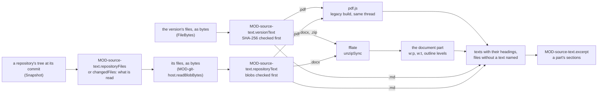

# ARC-036 The text of a source version

## Context

The content of a source is "a set of files (PDF, Word, Markdown), a zip archive of such files, or a repository at a
named commit" (`A SOURCE IS FILES, AN ARCHIVE OR A REPOSITORY`). The library keeps a Markdown file as its text and a PDF,
a Word file or a zip archive as its bytes (ARC-032 decision 5), and every EU legal text arrives as a PDF (ARC-032
decision 12). A derivation reads exactly the version a product links, checks its hash and sends its text, or the part the
author names (UC-005 1, 1a, 2, 2a); a link may name the part that applies — "a safety class, a chapter, a set of
articles" (`A LINK NAMES THE PART THAT APPLIES`). A move to a new version shows, where both versions are text, the passages
that changed (UC-016 4). A source that is a repository stays in that repository, its version a commit (ARC-032
decisions 4, 5).

The text is read in the browser tab, in CI and in the bridge, which is built from the dashboard's modules
(`THE BRIDGE IS BUILT FROM THE DASHBOARD'S CODE`), and a job gives the same artifact in each (`A RUNTIME IS INTERCHANGEABLE`).
No code reaches a page from a CDN; a library is vendored as an ES module under a licence compatible with MIT (ARC-002,
`AGENT M IS MIT-LICENSED`). ARC-032 rejects keeping a text turned into Markdown as a source's content: "a text turned into
Markdown is not the bytes that were read".

Facts this decision rests on:

- pdf.js takes a PDF as "Binary PDF data" (`data`), and gives a page's text as items, each with its string (`str`) and
  `hasEOL` — "Indicating if the text content is followed by a line-break." Its fonts are by default "converted to OpenType
  fonts and loaded via the Font Loading API or `@font-face` rules" unless `disableFontFace` is set, and `useSystemFonts`
  lets a font that is not embedded "fallback to a system font" (`types/src/display/api.d.ts` of `pdfjs-dist` 6.4.299). Where
  `globalThis.pdfjsWorker` holds the module of its worker, a document is opened with that module's message handler in the
  same thread — `#initialize()` calls `#setupFakeWorker()` when `globalThis.pdfjsWorker?.WorkerMessageHandler` is set —,
  and no `Worker` is started (`legacy/build/pdf.mjs`). Its README: "For usage with older browsers/environments, without
  native support for the latest JavaScript features, please see the `legacy/` folder."
- `docs/measurements/2026-10-05_source-texts.md` records the measurements this decision rests on. Of `pdfjs-dist`
  6.4.299 in Node 25.9.0: the build of `build/` prints "Please use the `legacy` build in Node.js environments." and stops
  on a PDF that LibreOffice 26.2.3.2 wrote, "s.getOrInsertComputed is not a function" — Node 25.9.0 has no
  `Map.prototype.getOrInsertComputed`, Deno 2.9.7 has —; the build of `legacy/build/` reads the same PDF, and of the AI
  Act's PDF gives the same text as `build/`.
- Deno: "statically analyzable dynamic imports (imports that have the string literal within the `import("...")` call
  expression) will be included in the output", while "code for workers is not included in the compiled executable by
  default" (`https://docs.deno.com/runtime/reference/cli/compile.md`). `deno compile` of Deno 2.9.7 embedded the module and
  the vendored files, 1.88 MB, and the compiled program derived the same texts as `deno run` (the measurement above).
- WordprocessingML: "A paragraph contains one or more `<r>` elements ... A run contains one or more `<t>` elements. The
  `<t>` element contains a range of text", and "The document.xml file corresponds to the WordprocessingML main document part
  and it is this part that contains the content of the main body of the document"
  (`https://learn.microsoft.com/en-us/office/open-xml/word/structure-of-a-wordprocessingml-document`). After ISO/IEC 29500-1,
  as Microsoft's reference of the Open XML SDK quotes it (`https://learn.microsoft.com/en-us/dotnet/api/documentformat.openxml.wordprocessing.<class>`):
  `t` "shall be used for all text runs which are not" in a deleted region or "within a field code" (`text`); `tab` places "a
  tab character" and `br` "a break" "at the current location in the run content" (`tabchar`, `break`); `outlineLvl` "can be
  from 0 to 9, where 9 specifically indicates that there is no outline level specifically applied to this paragraph", and
  "If this element is omitted, then the outline level of the content is assumed to be 9 (no level)" (`outlinelevel`);
  `pStyle` names "the paragraph style which shall be used to format the contents of this paragraph" (`paragraphstyleid`),
  and `basedOn` "the parent style from which this style inherits" (`basedon`). The package of a Word file made with
  python-docx 1.2.0 names its main part by the relationship
  `http://schemas.openxmlformats.org/officeDocument/2006/relationships/officeDocument`, target `word/document.xml`.
- The git adapter reads a commit's tree, every file with its blob — marked where the server lists it only in part —,
  and a file's bytes by its blob, checked to hash to it (ARC-004 decisions 3, 4; `MOD-git-host.readSnapshot`,
  `MOD-git-host.readBlobBytes`).
- GitHub: "The primary rate limit for unauthenticated requests is 60 requests per hour"; a token's requests "count
  towards your personal rate limit of 5,000 requests per hour"; and "No more than 900 points per minute are allowed for
  REST API endpoints", "Most REST API `GET`, `HEAD`, and `OPTIONS` requests" costing one point
  (`https://docs.github.com/en/rest/using-the-rest-api/rate-limits-for-the-rest-api`).
- A `.doc` file is "the binary file format used by Microsoft Word 97, Microsoft Word 2000, Microsoft Word 2002, and
  Microsoft Office Word 2003" (`https://learn.microsoft.com/en-us/openspecs/office_file_formats/ms-doc/ccd7b486-7881-484c-a137-51170af7cc22`).
- fflate's `unzipSync` takes a filter: "By default, all files in a ZIP archive are extracted, but a filter can save
  resources by telling the library not to decompress certain files" (`README.md` of `fflate` 0.8.3).
- The AI Act's PDF, as ARC-032's fetch gets it — 2 583 319 bytes, 144 pages —, has an outline of the act and its thirteen
  annexes, and no entry for a chapter, a section or an article; in its text "CHAPTER III", "SECTION 1", `Article 6` and
  "ANNEX III" each stand alone on a line, a heading's title on the line after it (the measurement above).

## Decision

1. **Derived when read, stored nowhere.** `MOD-source-text`, a feature (ARC-003), derives the text of a version from the
   bytes of its files each time it is read — for a derivation (UC-005 1) and for the passages of a move (UC-016 4) —; the
   text is written to no repository and kept in no store of a browser or the bridge. Every file is read from the bytes its
   version fixes — by the SHA-256 the version records, or by the blob its repository's commit names —, so that what is
   sent is what was registered; a Markdown file is its own text.
2. **Checked before read** (`MOD-source-text.versionText`; `A SOURCE VERSION IS FIXED BY IDENTIFIER AND HASH`). The version's
   files are given by their bytes (`FileBytes`), each by the name its version records, and each must hash to the SHA-256
   the version records; else nothing is derived and the reading is refused: `changed` — a file's bytes are not those of
   the version, a new version is to be registered (UC-005 1a, UC-016) —, `missing-file`, `not-recorded` — a file the version
   does not record —, `no-file` — a version that records no file yet, an EU legal text awaiting its fetch —, `no-version`,
   and `repository` — a source that is a repository at a commit, whose text is read by its tree (decision 4).
3. **The text of each kind of file**, the kind told by the end of its name:
   - **Markdown** (`.md`, `.markdown`): its UTF-8 text, its line ends written `\n`.
   - **PDF** (`.pdf`), by pdf.js: each page's text items in their order, a line ending after an item followed by a line
     break; each page's text closed by a line end, and the pages separated by a line that holds a form feed (U+000C)
     alone, so that the page of a line is one more than the form-feed lines before it.
   - **Word** (`.docx`): the main document part — the part the package's `officeDocument` relationship names,
     `word/document.xml` where it names none —, read by `MOD-source-text`'s own code from the members fflate unpacks: each
     paragraph (`w:p`) one line, in the order of the document, the paragraphs of a table's cells among them; a paragraph's
     text the texts of its runs (`w:t`), a tab (`w:tab`) as a tab, a break (`w:br`, `w:cr`) as a line end. Deleted text
     (`w:delText`) and field codes (`w:instrText`) are not text; headers, footers, footnotes and comments stand in other
     parts and are not read; a number Word puts before a numbered paragraph is no text of the document.
   - **zip archive** (`.zip`): each member in the order of its path, by the rule of its kind, named
     `<archive>/<path>`; a directory is no member.
4. **A repository at its commit** (`MOD-source-text.repositoryFiles`, `MOD-source-text.repositoryText`;
   `A SOURCE IS FILES, AN ARCHIVE OR A REPOSITORY`, `A LIVING SOURCE IS PINNED`). A source that is a repository is read
   at the commit its version names, and its text is the text of that commit's files, each named by its path, as an
   archive's members are named by theirs. The git adapter reads the commit's tree, every file with its blob
   (`MOD-git-host.readSnapshot`); a tree the server lists only in part is refused (`too-large`), since its text would
   leave out files nobody sees. Of its files, a Markdown file, a PDF and a Word file (`.docx`) are read, by their
   blobs' bytes (`MOD-git-host.readBlobBytes`), in the order of their paths, by the rules of decision 3; a `.doc` file
   and a file of any other kind — code, data, an image, an archive — are named without being read, with why
   (decision 5). A part narrows what is read: a part whose first name is the path of a file or a folder of the tree —
   `docs/safety`, `docs/rules.pdf / Article 3` — names the files at or under it; a part whose first name is no path names
   a heading any file may hold, or a scope (decision 7), and every file is read. At most 500 files are read for one version: where a part
   names more, nothing is read and the reading is refused (`too-many-files`), its reason naming how many, and a page that
   meets it reads: "This part names <n> files with a text; at most 500 are read. Name a folder or a file of the
   repository as the part." One reading so stays below GitHub's 900 points a minute, with room for the page's
   other requests, and its files take at most a tenth of a token's 5 000 requests an hour (context) — the one token serves every
   feature (`ONE GITHUB TOKEN SERVES EVERY FEATURE`), and so does its budget. Each file read must be a file of the
   commit's tree and hash to its blob before anything is derived (`not-recorded`, `changed`); a tree of another commit
   than the version names is refused (`not-the-commit`). For the passages between two commits (UC-016 4), only the files
   of a kind that is read whose blob differs, or whose path one commit alone holds, are read, at most 500 together, and
   such files of another kind are named (`MOD-source-text.changedFiles`).
5. **A file without a text is named, with why** — neither refused nor guessed: `word-97`, a Word 97–2003 file (`.doc`);
   `no-text-layer`, a PDF with no text on any page — a scan; `locked`, a PDF locked by a password; `unreadable`, a file its
   kind's reader cannot read — a damaged PDF, a `.docx` without its document part, a zip archive that is none or a member
   that will not unpack, a Markdown file that is no UTF-8 —; `other-kind`, a member of an archive or a repository's file
   that is no PDF, Word or Markdown file — code, an image, an archive inside the archive or the repository. A page that
   names one reads, after the file's name:
   `word-97` — "a Word 97–2003 file; its text is not read. Register a version saved as .docx or PDF."; `no-text-layer` —
   "a PDF without text, such as a scan."; `locked` — "a PDF locked by a password."; `unreadable` — "this file cannot be read
   as what its name says."; `other-kind` — "no PDF, Word or Markdown file."
6. **The headings of a text**, each with its line, its level and its path — the headings it stands in and itself, joined
   with ` / ` —: those its file marks, or its designations where it holds more of them.
   - A Markdown file marks a line of one to six `#` and a space, outside fenced code, at the level of its `#`.
   - A Word file marks a paragraph with an outline level from 0 to 8 — its own, or its style's through the styles that style
     is based on —, at that level plus one; level 9, or none, is body text.
   - A PDF marks each entry of its outline whose title is a line of the page the entry points to, at the entry's depth in
     the outline plus one.
   - A designation is a line that holds nothing but a word — a capital and further letters, a full stop allowed at its
     end — or `§`, and a number — arabic, arabic with a small letter, roman, or one capital letter: `Article 5`,
     "CHAPTER III", "ANNEX IV", `§ 12`, `Annex A` —; or a line that begins with a number of two or more parts and goes on
     with a title that begins with a capital letter, `5.1.1 Software development plan`. A numbered line stands at the
     level of its number's parts. A word stands one level below the deepest word that opens it, at level 1 where none
     does: a word opens another where a line of it is followed, two lines further at most, by a line of the other; an
     opening that would let a word open itself is not counted, the openings taken in the order they first occur. In the
     AI Act, `CHAPTER` and `ANNEX` stand at level 1, `SECTION` and the numbered points of its annexes, `3.1.`, at 2, and
     `Article` at 3.
7. **A part and its excerpt** (`MOD-source-text.excerpt`; `A LINK NAMES THE PART THAT APPLIES`). A part names a heading by
   its text, or by its text's beginning up to a space or a sign, case and spacing aside — `article 5` names `Article 5`,
   not `Article 50`; a heading within others by their names joined with ` / ` — "CHAPTER III / SECTION 1" —, the first of
   which may name a file or a folder of the version — `guide.zip/2-rules.docx / Protection`, `docs/rules.pdf / Article 3`;
   a whole file by its name — a repository's file by its path —, and every file of a folder by the folder's path —
   `docs/safety`, `guide.zip` for an archive's members —, a name that is a file's or a folder's naming that before any
   heading; several parts joined with `; `. A part's section runs from its heading's line to the line before the next
   heading of its level or a higher one in the same file, or to the file's end; the excerpt holds the sections in the order
   of the text, and an empty part gives the whole text. A part no heading, file or folder answers cuts nothing: it is the
   scope the excerpt applies to (`Excerpt.scope`) — a safety class, a risk category, as a link names the part that applies
   (UC-015 3) —, and where no part cuts, the excerpt is the whole text. A page that shows an excerpt with a scope reads,
   for each scope: "No heading, file or folder of the text is named "<scope>": the whole text is taken, and "<scope>" is
   named as the scope it applies to." — "the sections named are taken" where other parts cut the text. A part several
   headings answer is refused (`several-parts`), each named by its path, so that the person names the one meant within
   another.
8. **Two libraries, vendored** (ARC-002): `pdfjs-dist`'s `legacy/build/pdf.min.mjs` and
   `legacy/build/pdf.worker.min.mjs`, and `fflate`'s `esm/browser.js` as `fflate.browser.mjs`. pdf.js is imported on the
   first PDF, by dynamic imports of literal specifiers, which a compiled bridge includes; its worker's module, imported
   beside it, is set as `globalThis.pdfjsWorker`, so that the worker's code runs in the same thread and no `Worker`
   starts in any runtime. pdf.js is given the bytes, never an address — neither the document's nor one of the data it
   reads apart: character maps, fonts, decoders —, with `disableFontFace: true`, `useSystemFonts: false` and
   `verbosity: 0` in every runtime: it fetches nothing (`NO SERVER`) — in the three browsers of decision 9 a page
   requested its own modules, the vendored files and the files it read, and nothing else
   (`docs/measurements/2026-10-05_source-texts.md`). Its two files call the platform's `fetch`, and request otherwise,
   only for what they are given the address of; ARC-003 decision 7 sets them apart from the boundary of `fetch` on that
   reason alone: only this module imports them, its `getDocument` names no address, and `tests/test_no_backend.py`, the
   check of `NO SERVER`, holds both. fflate is imported with the module; its file starts a `Worker` only in its
   asynchronous functions, which this module does not call.
9. **The same text in every runtime** (`A RUNTIME IS INTERCHANGEABLE`). `docs/measurements/2026-10-05_source-texts.md`
   records the reference implementation of `MOD-source-text`, with the vendored files, on the AI Act's PDF, a Word file
   made with python-docx 1.2.0, its PDF made by LibreOffice 26.2.3.2, its `.doc` made by macOS's `textutil`, a zip
   archive of them with an image and the `.doc`, and a repository of them at two commits, its trees' blobs computed in
   the runtime: Node 25.9.0, Deno 2.9.7 — run and compiled —, Chrome 154.0.8037.93, Firefox 155.0 and WebKit 26.6 gave
   the same texts, headings, excerpts, scopes, files read and refusals, by the SHA-256 of each. The AI Act's text,
   595 993 characters in 6 391 lines with 172 headings, took 0.35 s to 0.61 s. The text of the PDF LibreOffice wrote has
   the lines of poppler's `pdftotext -raw` 26.04.0; the text of the Word file has mammoth 1.13.0's paragraphs, and keeps
   as two lines the paragraph whose break mammoth's raw text drops. A repository on a server, and a PDF whose fonts need
   pdf.js's character maps, were not measured.



### Due diligence (read 2026-10-04, UTC)

Sources: npm registry document `https://registry.npmjs.org/<package>` — the licence of the latest version, the dates of
its first and latest versions, the versions published in the twelve months before the reading, its dependencies;
downloads `https://api.npmjs.org/downloads/point/last-month/<package>`; repository
`https://api.github.com/repos/<owner>/<repo>` — stars — with `/license` and `/releases`; issue counts
`https://api.github.com/search/issues?q=repo:<owner>/<repo>+is:issue+is:open` (and `is:closed`, `is:closed+closed:>=2025-10-05`,
`created:>=2025-10-05`). For `DecompressionStream`, `https://raw.githubusercontent.com/mdn/browser-compat-data/main/api/DecompressionStream.json`.
Agent M's licence is MIT; a licence is compatible when it permits redistribution in an MIT project with its notice kept
(ARC-002 decision 3).

| Candidate | Role | Licence (source) | Against MIT | Releases | Issues | Adoption |
|---|---|---|---|---|---|---|
| **pdfjs-dist** (mozilla/pdf.js) — chosen | a PDF's text | Apache-2.0 (npm field; `LICENSE` of mozilla/pdf.js) | compatible | first 2014-09-22, latest 6.4.299 on 2026-10-03, 13 versions in 12 months; no dependencies | 374 open, 10 219 closed, 340 closed and 287 opened since 2025-10-05 | 120 674 214 downloads last month; 53 978 stars |
| unpdf (unjs/unpdf) | a PDF's text, a build of pdf.js | MIT (npm, GitHub) | compatible | first 2023-08-11, latest 1.8.1 on 2026-08-13, 9 versions in 12 months | 1 open, 37 closed, 9 closed and 6 opened | 17 438 852; 1 241 stars |
| pdf-parse (mehmet-kozan/pdf-parse) | a PDF's text | Apache-2.0 (npm, GitHub) | compatible | first 2018-01-07, latest 2.4.5 on 2025-10-20; its 35 versions of the 12 months published between 2025-10-06 and 2025-10-29; depends on `pdfjs-dist` and `@napi-rs/canvas` | 23 open, 19 closed, 17 closed and 34 opened | 37 401 792; 222 stars |
| pdf2json (modesty/pdf2json) | a PDF's text | Apache-2.0 (npm field; `license.txt`: "Licensed under the Apache License, Version 2.0"; GitHub reports NOASSERTION) | compatible | first 2012-11-09, latest 4.1.0 on 2026-09-11, 5 versions in 12 months; `engines`: Node ≥ 22.23.2 | 73 open, 206 closed, 29 closed and 6 opened | 1 981 792; 2 214 stars |
| mupdf (ArtifexSoftware/mupdf.js) | a PDF's text | AGPL-3.0-or-later (npm; GitHub AGPL-3.0) | **marked — AGPL-3.0, not known to be compatible** | first 2023-03-19, latest 1.28.1 on 2026-09-06, 3 versions in 12 months | 12 open, 94 closed, 20 closed and 12 opened | 1 932 198; 610 stars |
| tesseract.js (naptha/tesseract.js) | the text of a scan | Apache-2.0 (npm, GitHub) | compatible | first 2015-07-07, latest 7.0.0 on 2025-12-15, 1 version in 12 months | 35 open, 706 closed, 10 closed and 12 opened | 13 153 262; 38 754 stars |
| **fflate** (101arrowz/fflate) — chosen | a zip archive's members, a Word file's parts | MIT (npm; `LICENSE` of 101arrowz/fflate) | compatible | first 2020-09-20, latest 0.8.3 on 2026-05-16, 5 versions in 12 months; no dependencies | 30 open, 122 closed, 18 closed and 29 opened | 355 790 116; 3 034 stars |
| jszip (Stuk/jszip) | a zip archive's members | MIT OR GPL-3.0-or-later (npm field; `LICENSE.markdown`: "dual licensed. At your choice you may use it under the MIT license *or* the GPLv3"; GitHub reports NOASSERTION) | compatible, under MIT | first 2013-09-11, latest 3.10.2 on 2026-09-08, 1 version in 12 months; depends on `lie`, `pako`, `setimmediate`, `readable-stream` | 357 open, 356 closed, 20 closed and 6 opened | 192 189 056; 10 388 stars |
| @zip.js/zip.js (gildas-lormeau/zip.js) | a zip archive's members | BSD-3-Clause (npm, GitHub) | compatible | first 2021-01-19, latest 2.23.0 on 2026-10-03, 76 versions in 12 months | 0 open, 399 closed, 40 closed and 40 opened | 24 957 786; 3 895 stars |
| unzipit (greggman/unzipit) | a zip archive's members | MIT (npm; `LICENSE.md` the MIT text; GitHub reports NOASSERTION) | compatible | first 2019-09-23, latest 2.1.1 on 2026-09-19, 5 versions in 12 months | 16 open, 17 closed, 1 closed and 3 opened | 2 420 626; 165 stars |
| `DecompressionStream("deflate-raw")` | inflating a zip archive's members | built into the runtime | n/a | Chrome 103, Firefox 113, Safari 16.4, Node 21.2.0, Deno 1.23 (mdn/browser-compat-data) | n/a | n/a |
| mammoth (mwilliamson/mammoth.js) | a Word file's text | BSD-2-Clause (npm, GitHub) | compatible | first 2013-05-06, latest 1.13.0 on 2026-09-26, 5 versions in 12 months; depends on `lop`, `jszip`, `argparse`, `base64-js`, `underscore`, `xmlbuilder`, `@xmldom/xmldom`, `dingbat-to-unicode` | 56 open, 344 closed, 23 closed and 23 opened | 37 568 844; 6 317 stars |
| docx-preview (VolodymyrBaydalka/docxjs) | a Word file rendered into a page | Apache-2.0 (npm, GitHub) | compatible | first 2018-03-09, latest 0.4.1 on 2026-09-21, 2 versions in 12 months; depends on `jszip` | 61 open, 92 closed, 4 closed and 19 opened | 7 210 611; 2 110 stars |
| officeparser (harshankur/officeParser) | the text of office files and PDFs | MIT (npm, GitHub) | compatible | first 2019-04-15, latest 8.1.0 on 2026-09-29, 28 versions in 12 months; depends on `fflate`, `file-type`, `pdfjs-dist`, `tesseract.js`, `@xmldom/xmldom`; 31 036 183 bytes unpacked | 3 open, 71 closed, 34 closed and 29 opened | 3 448 429; 553 stars |
| word-extractor (morungos/node-word-extractor) | a `.doc` file's text | MIT (npm, GitHub) | compatible | first 2016-01-14, latest 1.0.4 on 2021-07-26, none in 12 months; depends on `saxes`, `yauzl` | 8 open, 38 closed, none closed and 1 opened | 3 363 840; 150 stars |
| cfb (SheetJS/js-cfb) | the container of a `.doc` file | Apache-2.0 (npm, GitHub) | compatible | first 2013-09-05, latest 1.2.2 on 2022-04-06, none in 12 months | 7 open, 11 closed, none closed or opened | 57 218 579; 79 stars |

## Alternatives

- **The text kept beside the content** — a `.txt` or Markdown file next to each PDF, Word file or archive, written when the
  version is registered or fetched. Rejected: ARC-032 rejects a text turned into Markdown as a source's content, and a
  second file is a second copy that a version's hashes do not fix; derived when read, the text follows from the bytes the
  hashes fix, in every runtime alike (decision 9).
- **pdf.js's build of `build/`** — rejected: it needs JavaScript features Node 25.9.0 lacks (context); the README sends
  such environments to `legacy/`. The legacy build is 523 774 and 1 321 307 bytes against 458 904 and 1 264 342.
- **pdf.js's worker in a `Worker`** — not chosen: a page would start one and the bridge would need the worker's file
  included apart (context), a second path beside the one CI and the bridge take; in the same thread, the AI Act took
  0.35 s to 0.61 s (decision 9).
- **unpdf** — not chosen: it "Ships with a serverless build of Mozilla's PDF.js" (its README); pdf.js itself, released by
  its makers, is one layer less.
- **pdf-parse** — rejected: it depends on `pdfjs-dist` and on `@napi-rs/canvas` — "Canvas for Node.js with skia backend",
  a binary package per platform (`https://registry.npmjs.org/@napi-rs%2Fcanvas`, 1.0.10) —, and published no version in
  the eleven months before the reading.
- **pdf2json** — rejected: its repository describes it as "for server-side PDF processing", and its `engines` field names
  Node only.
- **mupdf** — rejected: AGPL-3.0, marked against MIT.
- **Reading the text of a scan (tesseract.js)** — not chosen: optical recognition is a guess of each character, which a
  text sent to derive requirements must not hold unmarked; a scan is named as having no text (decision 5).
- **mammoth for Word** — not chosen: its package is CommonJS, and "the standalone JavaScript file `mammoth.browser.js`,
  which includes both mammoth and its dependencies" "uses any loaded module system" (its README) — no ES module a page,
  Node and Deno import unchanged (ARC-002). Its raw text drops a break within a paragraph (decision 9).
- **docx-preview** — rejected: it renders a document into an element of a page; Node and Deno have none.
- **officeparser** — not chosen: for three kinds of file it brings optical recognition, a second XML reader and a second
  copy of pdf.js and fflate, 31 MB unpacked.
- **jszip** — not chosen: its package names no ES module — `main` is `./lib/index`, and it has no `module`, `type` or
  `exports` field — and four dependencies; fflate has an ES module and no dependency.
- **@zip.js/zip.js and unzipit** — not chosen: their interfaces are asynchronous, built on workers or on
  `DecompressionStream`; fflate's `unzipSync` reads a member with no further machinery.
- **`DecompressionStream("deflate-raw")` and a reader of the zip format of Agent M's own** — not chosen: no library, but a
  reader of the archive's directory written and kept in Agent M, beside a decompression that the runtimes offer only
  since the versions named.
- **The text of a `.doc` file (word-extractor, cfb)** — not chosen: word-extractor reads with Node, and neither has
  published a version since 2022; a `.doc` is named, and its text is had from a version saved as `.docx` or PDF
  (decision 5).
- **Every file of a repository read as text** — not chosen: the files a source is made of are PDF, Word and Markdown
  files (`A SOURCE IS FILES, AN ARCHIVE OR A REPOSITORY`), and read as text, a repository's code and data would make every
  script part of what a derivation sends; they are named, so that the person sees what the text leaves out (decision 4).
- **No bound on the files read** — rejected: one reading of a large repository could spend the hour's requests of the one
  token every feature uses (context); 500 files bound it, and a folder or a file as the part narrows it.
- **A repository cloned in the page** — rejected: a page cannot read GitHub's smart-HTTP endpoint, which answers without
  any `Access-Control-*` header (ARC-004, alternatives).
- **A tree read a sub-tree at a time where the server lists it only in part** — not chosen: GitHub's own advice for such
  a tree, "use the non-recursive method of fetching trees, and fetch one sub-tree at a time" (`https://docs.github.com/en/rest/git/trees`),
  needs a read of a folder's tree that nothing else needs; such a tree is refused (decision 4).
- **A PDF's outline as its only headings** — rejected: the AI Act's outline names its annexes and none of its articles
  (context); a file's marks count where they are more than its designations.
- **A designation followed by its title on the same line** — rejected: in the AI Act's text, lines that begin with
  `Article 39 of the Charter` or `Section 2 of this Chapter` are running text that a line break began.

## Consequences

- A scan, a locked PDF and a `.doc` give no text; the person registers a version from which one is read.
- **A large repository is read by parts.** Where a part names more than 500 files with a text — no part, or a heading
  any file may hold —, the reading is refused (`too-many-files`) and the person names a folder or a file; the passages
  between two commits read only what changed, so that a commit changing a few files of a large repository costs a few
  reads. A tree the server lists only in part — on GitHub beyond 100 000 entries or 7 MB — is not read (`too-large`).
- Without a token, a public repository on GitHub is read within the network's 60 requests an hour, two of them for the
  tree: a reading of more files than the hour leaves — 58 at most — is refused partway as a used-up limit
  (`rate-limited-network`, ARC-004).
- **What a heading's form misses.** A file that marks no heading and sets its designation and title on one line —
  `§ 5 Prüfungsausschuss` in a PDF — has no heading there, and a part naming it is a scope of the whole text; a
  designation that a title's line break sets alone is taken for a heading — `Article 49` closing a title of the AI Act's
  Annex VIII —, and its path, `ANNEX VIII / Article 49`, tells it from `CHAPTER III / SECTION 5 / Article 49`.
- pdf.js is given no address of the predefined character maps it ships apart (`cmaps/`, decision 8); for a PDF whose
  fonts need one, it reports "Ensure that the `cMapUrl` API parameter is provided." (`legacy/build/pdf.mjs`). No PDF
  measured needed one, and what such a PDF's text then holds is not measured.
- The check of `NO SERVER` (`tests/test_no_backend.py`) finds 24 request channels in pdf.js's two files — `fetch`,
  `XMLHttpRequest`, `Worker`, `import()`, a loading element, `url()` — and a `Worker` in fflate's
  (`docs/measurements/2026-10-05_source-texts.md`): its list of permitted channels names each with its reason before the
  files are vendored, and the two dynamic imports of `MOD-source-text`, of those files from the page's own origin.
- The two files of pdf.js, 1.85 MB, load on the first PDF only; fflate, 90 922 bytes, with the module.
- A new pdf.js may give a PDF another text: the hashes fix the bytes, not the text, so a passage's line or page can move
  with an update, which reaches the instance as any update of a vendored library, by a pull request (ARC-002).
- No use-case step is realised here. The passages of a move take these interfaces among theirs where the library page
  is designed (UC-016 4, ARC-032), and the reading of a source for a derivation where the derivation is (UC-005 1, 1a,
  2, 2a).

## Modules

### MOD-source-text

```json module
{
  "id": "MOD-source-text",
  "folder": "src/source-text/",
  "layer": "feature",
  "responsibility": "The text of a source version, derived from the bytes of its files whenever it is read — a Markdown file as its text, a PDF by pdf.js, a Word file from its document part, a zip archive's members and a repository's files at its commit by their kinds —, once each file is checked against the hash its version fixes; the files of a repository a part names or two commits changed; the headings of each text; and the excerpt a part names.",
  "realises": ["A SOURCE IS FILES, AN ARCHIVE OR A REPOSITORY", "A SOURCE VERSION IS FIXED BY IDENTIFIER AND HASH"],
  "owns": ["SourceText", "Heading", "NoText", "VersionRead", "RepositoryFiles", "ChangedFiles", "TextSection", "Excerpt"],
  "uses": ["MOD-contracts"]
}
```

```json interface
{
  "id": "MOD-source-text.versionText",
  "summary": "The text of a version of a source, derived from the bytes of its files when it is read: each file the version records, given by its bytes and checked against the SHA-256 the version records before anything is derived; then each file's text by its kind — a Markdown file as its text, a PDF by pdf.js, its pages separated by a line that holds a form feed, a Word file's paragraphs from its document part, a zip archive's members in the order of their paths, each by its kind — with the headings of each text, and every file or member that yields no text, named with why.",
  "params": [
    { "name": "entry", "type": "SourceEntry" },
    { "name": "version", "type": "integer" },
    { "name": "files", "type": "FileBytes[]" }
  ],
  "result": "VersionRead",
  "async": true,
  "refusals": [
    { "code": "no-version", "when": "the source has no such version" },
    { "code": "repository", "when": "the source is a repository at a commit, whose text repositoryText reads" },
    { "code": "no-file", "when": "the version records no file yet" },
    { "code": "not-recorded", "when": "a file is given that the version does not record" },
    { "code": "missing-file", "when": "a file the version records is not given" },
    { "code": "changed", "when": "a file's bytes hash to another SHA-256 than the version records" }
  ],
  "examples": [
    {
      "name": "a lab's rules kept as PDF",
      "input": {
        "entry": {
          "id": "SRC-lab-rules",
          "name": "The imaging lab's rules",
          "kind": "document",
          "authority": "normative",
          "licence": "republish",
          "terms": "CC BY 4.0",
          "content": "files",
          "address": "",
          "location": "",
          "places": [],
          "parts": [],
          "language": "",
          "versions": [
            {
              "version": 1,
              "identifier": "2025 edition",
              "date": "2025-11-03",
              "files": [
                { "name": "rules.pdf", "sha256": "92a2932d729b5019362f58bca86a9fe049f2b759a8c2845e1a22dcb0b0ffb04b" }
              ],
              "contentStream": "",
              "note": ""
            },
            {
              "version": 2,
              "identifier": "2026 edition",
              "date": "2026-06-01",
              "files": [
                { "name": "rules-2026.pdf", "sha256": "595de3d3c80c751f9c6cf2483b9d1dba7b7d3f28df35e3fd148d353f52c7a2a1" }
              ],
              "contentStream": "",
              "note": ""
            }
          ]
        },
        "version": 1,
        "files": [
          { "name": "rules.pdf", "base64": "JVBERi0xLjQKMSAwIG9iago8PCAvVHlwZSAvRm9udCAvU3VidHlwZSAvVHlwZTEgL0Jhc2VGb250IC9IZWx2ZXRpY2EgL0VuY29kaW5nIC9XaW5BbnNpRW5jb2RpbmcgPj4KZW5kb2JqCjIgMCBvYmoKPDwgL0xlbmd0aCAyODggPj4Kc3RyZWFtCkJUIC9GMSAxMSBUZiAxNCBUTCA3MiA3NzAgVGQgKFJ1bGVzIG9mIHRoZSBpbWFnaW5nIGxhYikgVGogVCogKENIQVBURVIgSSkgVGogVCogKEdlbmVyYWwgcHJvdmlzaW9ucykgVGogVCogKEFydGljbGUgMSkgVGogVCogKFNjb3BlKSBUaiBUKiAoVGhlc2UgcnVsZXMgYXBwbHkgdG8gZXZlcnkgcGVyc29uIGluIHRoZSBsYWIuKSBUaiBUKiAoQXJ0aWNsZSAyKSBUaiBUKiAoRGVmaW5pdGlvbnMpIFRqIFQqIChBIHNhbXBsZSBpcyBhbnkgc3BlY2ltZW4gYnJvdWdodCBpbnRvIHRoZSBsYWIuKSBUaiBUKiBFVAplbmRzdHJlYW0KZW5kb2JqCjMgMCBvYmoKPDwgL1R5cGUgL1BhZ2UgL1BhcmVudCA2IDAgUiAvTWVkaWFCb3ggWzAgMCA1OTUgODQyXSAvUmVzb3VyY2VzIDw8IC9Gb250IDw8IC9GMSAxIDAgUiA+PiA+PiAvQ29udGVudHMgMiAwIFIgPj4KZW5kb2JqCjQgMCBvYmoKPDwgL0xlbmd0aCAyMjQgPj4Kc3RyZWFtCkJUIC9GMSAxMSBUZiAxNCBUTCA3MiA3NzAgVGQgKENIQVBURVIgSUkpIFRqIFQqIChQcm90ZWN0aW9uKSBUaiBUKiAoQXJ0aWNsZSAzKSBUaiBUKiAoRXllcykgVGogVCogKFdlYXIgcHJvdGVjdGl2ZSBnbGFzc2VzIHdoZW5ldmVyIGEgbGFzZXIgaXMgb24uKSBUaiBUKiAoQXJ0aWNsZSA0KSBUaiBUKiAoUmVwb3J0aW5nKSBUaiBUKiAoUmVwb3J0IGEgZmF1bHQgYXQgb25jZS4pIFRqIFQqIEVUCmVuZHN0cmVhbQplbmRvYmoKNSAwIG9iago8PCAvVHlwZSAvUGFnZSAvUGFyZW50IDYgMCBSIC9NZWRpYUJveCBbMCAwIDU5NSA4NDJdIC9SZXNvdXJjZXMgPDwgL0ZvbnQgPDwgL0YxIDEgMCBSID4+ID4+IC9Db250ZW50cyA0IDAgUiA+PgplbmRvYmoKNiAwIG9iago8PCAvVHlwZSAvUGFnZXMgL0tpZHMgWzMgMCBSIDUgMCBSXSAvQ291bnQgMiA+PgplbmRvYmoKNyAwIG9iago8PCAvVHlwZSAvQ2F0YWxvZyAvUGFnZXMgNiAwIFIgPj4KZW5kb2JqCnhyZWYKMCA4CjAwMDAwMDAwMDAgNjU1MzUgZiAKMDAwMDAwMDAwOSAwMDAwMCBuIAowMDAwMDAwMTA2IDAwMDAwIG4gCjAwMDAwMDA0NDUgMDAwMDAgbiAKMDAwMDAwMDU3MSAwMDAwMCBuIAowMDAwMDAwODQ2IDAwMDAwIG4gCjAwMDAwMDA5NzIgMDAwMDAgbiAKMDAwMDAwMTAzNSAwMDAwMCBuIAp0cmFpbGVyCjw8IC9TaXplIDggL1Jvb3QgNyAwIFIgPj4Kc3RhcnR4cmVmCjEwODQKJSVFT0YK" }
        ]
      },
      "result": {
        "texts": [
          {
            "name": "rules.pdf",
            "text": "Rules of the imaging lab\nCHAPTER I\nGeneral provisions\nArticle 1\nScope\nThese rules apply to every person in the lab.\nArticle 2\nDefinitions\nA sample is any specimen brought into the lab.\n\f\nCHAPTER II\nProtection\nArticle 3\nEyes\nWear protective glasses whenever a laser is on.\nArticle 4\nReporting\nReport a fault at once.\n",
            "headings": [
              { "line": 2, "level": 1, "text": "CHAPTER I", "path": "CHAPTER I" },
              { "line": 4, "level": 2, "text": "Article 1", "path": "CHAPTER I / Article 1" },
              { "line": 7, "level": 2, "text": "Article 2", "path": "CHAPTER I / Article 2" },
              { "line": 11, "level": 1, "text": "CHAPTER II", "path": "CHAPTER II" },
              { "line": 13, "level": 2, "text": "Article 3", "path": "CHAPTER II / Article 3" },
              { "line": 16, "level": 2, "text": "Article 4", "path": "CHAPTER II / Article 4" }
            ]
          }
        ],
        "notText": []
      }
    },
    {
      "name": "safety rules kept as a Word file",
      "input": {
        "entry": {
          "id": "SRC-lab-safety",
          "name": "The lab's safety rules",
          "kind": "document",
          "authority": "normative",
          "licence": "republish",
          "terms": "CC BY 4.0",
          "content": "files",
          "address": "",
          "location": "",
          "places": [],
          "parts": [],
          "language": "",
          "versions": [
            {
              "version": 1,
              "identifier": "edition 4",
              "date": "2026-01-15",
              "files": [
                { "name": "rules.docx", "sha256": "9c19ebf2b2da2c1934248802571812ff641ebc1f5d633cbe3111c502ceb584af" }
              ],
              "contentStream": "",
              "note": ""
            }
          ]
        },
        "version": 1,
        "files": [
          { "name": "rules.docx", "base64": "UEsDBBQAAAAIAAAAIVz1bniw+gAAAC0CAAATAAAAW0NvbnRlbnRfVHlwZXNdLnhtbK2Ru07DMBSGd57C8lolDgwIoTgduIzAUB7gyD5JrPomH7c0b4/TlA6owMJo/5fvl92uD86yPSYywUt+XTecoVdBGz9I/r55ru44owxegw0eJZ+Q+Lq7ajdTRGIl7EnyMed4LwSpER1QHSL6ovQhOcjlmAYRQW1hQHHTNLdCBZ/R5yrPHbxrH7GHnc3s6VCulyEJLXH2sBhnluQQozUKctHF3utvlOpEqEvy6KHRRFoVAxcXCbPyM+CUey0vk4xG9gYpv4ArLvERkhY6qJ0ryfr3mgs7Q98bhef83BZTUEhUntzZ+qw4MH711w7Kk0X6/xVL7xdeHH+7+wRQSwMEFAAAAAgAAAAhXLmBRHGwAAAAKgEAAAsAAABfcmVscy8ucmVsc43POw7CMAwG4J1TRN5pWgaEUJMuCKkrKgeIEjeNaB5KwqO3JwMDIAZG278/y233sDO5YUzGOwZNVQNBJ70yTjM4D8f1DkjKwikxe4cMFkzQ8VV7wlnkspMmExIpiEsMppzDntIkJ7QiVT6gK5PRRytyKaOmQciL0Eg3db2l8d0A/mGSXjGIvWqADEvAf2w/jkbiwcurRZd/nPhKFFlEjZnB3UdF1atdFRYob+nHi/wJUEsDBBQAAAAIAAAAIVw4aNb3XAEAAB8EAAARAAAAd29yZC9kb2N1bWVudC54bWy1Uz1PwzAQ3fkVJw9s1G0HhEKTTiAGhooWMV+caxPJsS3bTci/55JSkCqIqkpdfImT93Hv7MXys9bQkA+VNamYTaYCyChbVGaXivfN892DgBDRFKitoVR0FMQyu1m0SWHVviYTgRlMSNpUlDG6RMqgSqoxTKwjw9+21tcY+dXvZGt94bxVFAIL1FrOp9N7WWNlRMaUuS26vrphWfmhrGOnCdqkQZ2KTRU1CZkt5M8PwzK4SIJDxR6dp0C+IZG9Yg4BtxQ78HtNoYfFAewPFONqL4R9ELPzBdeKu/5fZQy6KfnpYBPQOd1BtEA8mg4cz8caqAzEkkBjPrl6IytvI6nIp+Iyqfn5Uk/d2GDGkB+EHty304ZgpzGEE7IjA+bydOtv0rYk08cOyEnzHlQBrLl+4m/krI+MuSyLA5xNb3GvuUY2rQhusXaPYLCm4ewU1FSK/mpGHq+f/L3a2RdQSwMEFAAAAAgAAAAhXJ3zsjeuAAAAGwEAABwAAAB3b3JkL19yZWxzL2RvY3VtZW50LnhtbC5yZWxzjc+7CsJAEAXQ3q9YpjebWIhINmlESCvxA4bN5IH7YmcV8/cu2ChYWF6GOXembp/WiAdFXrxTUBUlCHLaD4ubFFz78/YAghO6AY13pGAlhrbZ1BcymPIOz0tgkRHHCuaUwlFK1jNZ5MIHcnky+mgx5RgnGVDfcCK5K8u9jJ8GNF+m6AYFsRsqEP0a6B/bj+Oi6eT13ZJLPyokp9Xk+0WPcaKk4J2L7IBsavn1U/MCUEsDBBQAAAAIAAAAIVxduI+t/QAAAJECAAAPAAAAd29yZC9zdHlsZXMueG1spVBLboMwEN33FJb3jYFFVSEgu6iVqraL9ABTmACSf/I4UG5fmwQ2SRupXdnz5v3sYvulJBvQUW90ydNNwhnq2jS9bkv+sd/dP3JGHnQD0mgs+YTEt9VdMebkJ4nEgl5TPpa8897mQlDdoQLaGIs67A7GKfBhdK0YjWusMzUSBXslRZYkD0JBr3m1GLIx95MNQRYctA5sxwPU4AGO0oeCcZqJz03JX6O5nMUaVNQOIFdYVIU4k2/Yr4b73ku88DuhIsKfQNi86f8nPSHEP04vwrrTgqU3Asfcvrt4mKOXvcaXQS6k5FxoJvyxWPZjsexqsfU9v1dLr1dbblR9A1BLAQIUABQAAAAIAAAAIVz1bniw+gAAAC0CAAATAAAAAAAAAAAAAACAAQAAAABbQ29udGVudF9UeXBlc10ueG1sUEsBAhQAFAAAAAgAAAAhXLmBRHGwAAAAKgEAAAsAAAAAAAAAAAAAAIABKwEAAF9yZWxzLy5yZWxzUEsBAhQAFAAAAAgAAAAhXDho1vdcAQAAHwQAABEAAAAAAAAAAAAAAIABBAIAAHdvcmQvZG9jdW1lbnQueG1sUEsBAhQAFAAAAAgAAAAhXJ3zsjeuAAAAGwEAABwAAAAAAAAAAAAAAIABjwMAAHdvcmQvX3JlbHMvZG9jdW1lbnQueG1sLnJlbHNQSwECFAAUAAAACAAAACFcXbiPrf0AAACRAgAADwAAAAAAAAAAAAAAgAF3BAAAd29yZC9zdHlsZXMueG1sUEsFBgAAAAAFAAUAQAEAAKEFAAAAAA==" }
        ]
      },
      "result": {
        "texts": [
          {
            "name": "rules.docx",
            "text": "Lab safety rules\nScope\nThese rules apply to every person in the lab.\nProtection\nEyes\nWear protective glasses\twhenever a laser is on.\nReporting\nReport a fault at once & name the device.\n",
            "headings": [
              { "line": 2, "level": 1, "text": "Scope", "path": "Scope" },
              { "line": 4, "level": 1, "text": "Protection", "path": "Protection" },
              { "line": 5, "level": 2, "text": "Eyes", "path": "Protection / Eyes" },
              { "line": 7, "level": 1, "text": "Reporting", "path": "Reporting" }
            ]
          }
        ],
        "notText": []
      }
    },
    {
      "name": "a guide kept as a zip archive, an image and a Word 97–2003 file in it",
      "input": {
        "entry": {
          "id": "SRC-lab-guide",
          "name": "The lab's guide for newcomers",
          "kind": "document",
          "authority": "normative",
          "licence": "republish",
          "terms": "CC BY 4.0",
          "content": "archive",
          "address": "",
          "location": "",
          "places": [],
          "parts": [],
          "language": "",
          "versions": [
            {
              "version": 1,
              "identifier": "2026 edition",
              "date": "2026-02-01",
              "files": [
                { "name": "guide.zip", "sha256": "05dc5d77271662790ce5697948e08fa8e667b3585a0ba66ba3d34c06938054a8" }
              ],
              "contentStream": "",
              "note": ""
            }
          ]
        },
        "version": 1,
        "files": [
          { "name": "guide.zip", "base64": "UEsDBBQAAAAIAAAAIVxcGfW1WAAAAGUAAAAKAAAAMS1pbnRyby5tZB3Muw2AMAxF0d5TPCk9Q1BTsYFJDFhAjGxSsD2f7jbnJgw8YWlahGgULrhWgbddApPM5oLbmmNWjwshEWq1I0oJvdmmdSH64meHZrfIdgoYhW/w+h47egBQSwMEFAAAAAgAAAAhXNaNvH/YBQAA9wYAAAwAAAAyLXJ1bGVzLmRvY3gL8GZmEWFgYOAAYsWYr3kVG34BWbpMDAzCQDraOT+vJDWvJD6ksiC1OFavIjdn7cTdfocNRNrK5x36FKXKx8Ox0EJ2R8+BALkHJ+w81/xSk99ukt9/eQrfigOHMv5Pfz/97jr+c5ts1YwOetfFms9ZGO4obe/xb1/luncWi3nimnnlVOdP+LFrd5Z5sEuS6hvPT4bPK/RZVgrKBsgq/Vr0RdHyxNMZbIKOuYkOhZdNtjuxzr/4XOu87J5s+Y3tc8++eRmwbroip27htw0S6dOeCCw25Sq6ePTe6/wpr1xWeH96sfCiS5Qos7g45+ZPxg+mVOvqT+5x+8amub9BW++j4CQxqxVztU/++j6L29r5vnTr8z93xIIDPELm3bn5a42FQd3X63ynJrv++i/q/V48TqZ+92+WAJSg2tnoUrgByNJiZGDgBtLxRak5xfp6ILL3vDXfIQMetgdzg13uZUaxtQRM1uNYqa3F3iFk3psh53Vo8XZ1ZmYFNrfb++1P537fYLwz0eeYNZtvKLOj+l4jP2ML/uNf+TxOHdI0rG7nEfO58DG0+lDkk02T1YSFNDu8eZbNOTzvkor6FqVQuwXaky+6axdpLl7meKL7god56d6lH+8y/EucFGfYsTergcf7QH2OfZ/bo4OnV7tOr5/zw0sk0qV35sG77q5XV8eKimnkvzze/YcT1WMWGde+xwA9Jc/CwCAIFCnPL0rRT8lPLs0FJgRQCtgabOt/2EDg7k9Rdf6cK7nsLU6T/RTY2rrEDOPnZAuf3Kh72/fE/ueTgiZodazyiq3pnPy98P2bo582X7swgX+q6coZvsuYTmhEh6RN7/p+9vPd5gaBiyIr1i4MKRE5YrQ7cotn4tV9asKNkj4et0KmGO5yObXAa5Whzxrlw/e3Xbsu8fPq+5Ts2od7QkWYuK9EnVt+uToyOdXl2JSdurv27UqM/LlwTfJyzltLHOd2+Yqacs7UfXKe/7DRDo8m56Nyc5c77FOcuDeJj3G7iPWHat+F7UcZ3/CLPM7Sb6kV2PyZ9XrX7n/xqTy7NH++TBC+YHnXcYuDzSw+mfPHpVbwHJnkkGy3s0pZO1955Ynlj4xW/vwZ5H/3RsKxCfItcne2X25LWG7YIrxJmfnZp5LX+Ze2qVw+znfC87NcCOOanXWP8p+s6e/ZqdPNPMc3v3D9TjeztRx5G8v6EzYse/hG5EpI178sN7n18//svXVTHDUq5n7eZL4OyJIGRocMLCogCQ05QqCJbjfXIQcB1gv31kcsM58d0eFhluniof2Rue3sk8bfSemin7/r3dCIiIhrsyxfljf/Wge7a9ye4ABRVY6iW/zds0Vifn/+xtAkvIuxt3xJgmrbtptXxI1mfOI7750wUfA417MphwK9rhlHPjnEXlRp9CvD8KmEumTA/QKlndqn9/bMZzOJX/aCjXWjtJbAX6kX8rf7Hy96+eTr3Une9loqy68++e3aX7hoyYO53W8acrJ+fg3+zITqz9gd/Wv/AlkTgcUOP8yfxSWVOanFIP8tDfDOawYmuO8i0773NrqGKirsXjF11bbuLwzBMxgm1X+yCMiLn81i5im9Mvbm52d/3yT9XqoifSEwv+TkZd9Dkq9umezN8/638f5d+yI3uRLmSxk6P1uObL8aa/jsiXrnkaa4YLtpez7fe+YUcHch0y2Jbqs3fMc0PySWrJXozV5jbCrEWq3qOk2F38lxfeVWiU2G3yfzOorJbOHLOc585QFj36X2psJZned9T8Yv3jnnqFTIFT6F8IiQVovJ+TfWt/2+573ng/VCpUPzHW7seflf3VbxiL2f/qFdl5uWmjMdv7Nvd8WMxdP3HpvuqLfkSUyG2p+NEd+SN77J2vjVdn+49/rw6LyQWuYAb0YmEQbcRTQMNDAyYC+w0Q1AL7gQBmgzohRj6BrRCwaERhYmLMUEunb0xIzQ3s+MP2mjm4SeXBAmlbNgJJ4Ab1Y2kCQrEDoArV7ICuIBAFBLAwQUAAAACAAAACFcAAAAAAIAAAAAAAAABwAAAGltYWdlcy8DAFBLAwQUAAAACAAAACFctJDcRDsAAABDAAAADwAAAGltYWdlcy9sb2dvLnBuZ+sM8HPn5ZLiYmBg4PX0cAkC0owgzAEkGKzqZocCKS5PF8eQijnJCUA2EwOjx/olhSBZT1c/l3VOCU0AUEsDBBQAAAAIAAAAIVyyzaLCDQAAACAAAAASAAAAb2xkL3J1bGVzLTIwMTkuZG9ju3Be8MHCjVIPGXAAAFBLAQIUABQAAAAIAAAAIVxcGfW1WAAAAGUAAAAKAAAAAAAAAAAAAACAAQAAAAAxLWludHJvLm1kUEsBAhQAFAAAAAgAAAAhXNaNvH/YBQAA9wYAAAwAAAAAAAAAAAAAAIABgAAAADItcnVsZXMuZG9jeFBLAQIUABQAAAAIAAAAIVwAAAAAAgAAAAAAAAAHAAAAAAAAAAAAAACAAYIGAABpbWFnZXMvUEsBAhQAFAAAAAgAAAAhXLSQ3EQ7AAAAQwAAAA8AAAAAAAAAAAAAAIABqQYAAGltYWdlcy9sb2dvLnBuZ1BLAQIUABQAAAAIAAAAIVyyzaLCDQAAACAAAAASAAAAAAAAAAAAAACAAREHAABvbGQvcnVsZXMtMjAxOS5kb2NQSwUGAAAAAAUABQAkAQAATgcAAAAA" }
        ]
      },
      "result": {
        "texts": [
          {
            "name": "guide.zip/1-intro.md",
            "text": "# Lab guide\n\nRead the rules before your first session.\n\n## Booking\n\nBook the microscope a day ahead.\n",
            "headings": [
              { "line": 1, "level": 1, "text": "Lab guide", "path": "Lab guide" },
              { "line": 5, "level": 2, "text": "Booking", "path": "Lab guide / Booking" }
            ]
          },
          {
            "name": "guide.zip/2-rules.docx",
            "text": "Lab safety rules\nScope\nThese rules apply to every person in the lab.\nProtection\nEyes\nWear protective glasses\twhenever a laser is on.\nReporting\nReport a fault at once & name the device.\n",
            "headings": [
              { "line": 2, "level": 1, "text": "Scope", "path": "Scope" },
              { "line": 4, "level": 1, "text": "Protection", "path": "Protection" },
              { "line": 5, "level": 2, "text": "Eyes", "path": "Protection / Eyes" },
              { "line": 7, "level": 1, "text": "Reporting", "path": "Reporting" }
            ]
          }
        ],
        "notText": [
          { "name": "guide.zip/images/logo.png", "why": "other-kind" },
          { "name": "guide.zip/old/rules-2019.doc", "why": "word-97" }
        ]
      }
    },
    {
      "name": "a scan, a PDF locked by a password and a Word 97–2003 file",
      "input": {
        "entry": {
          "id": "SRC-lab-archive",
          "name": "The lab's rules of earlier years",
          "kind": "document",
          "authority": "normative",
          "licence": "republish",
          "terms": "CC BY 4.0",
          "content": "files",
          "address": "",
          "location": "",
          "places": [],
          "parts": [],
          "language": "",
          "versions": [
            {
              "version": 1,
              "identifier": "as kept",
              "date": "2019-04-01",
              "files": [
                { "name": "scan.pdf", "sha256": "53fd8c25394e6147530df8f21f6c845ae53920b2fc57731e7924018188609c8d" },
                { "name": "locked.pdf", "sha256": "703dc82b5b526f811b9198b6171303eddfb2f84e2cb2a6016cee0fe37913d6d9" },
                { "name": "rules-2019.doc", "sha256": "472119b737108e9e13a5bc5350adaa4e5ed010b954f7533f9c12249043e95b03" }
              ],
              "contentStream": "",
              "note": ""
            }
          ]
        },
        "version": 1,
        "files": [
          { "name": "scan.pdf", "base64": "JVBERi0xLjQKMSAwIG9iago8PCAvVHlwZSAvRm9udCAvU3VidHlwZSAvVHlwZTEgL0Jhc2VGb250IC9IZWx2ZXRpY2EgL0VuY29kaW5nIC9XaW5BbnNpRW5jb2RpbmcgPj4KZW5kb2JqCjIgMCBvYmoKPDwgL0xlbmd0aCAyNSA+PgpzdHJlYW0KMC41IGcgNzIgNTAwIDQ1MCAyNzAgcmUgZgplbmRzdHJlYW0KZW5kb2JqCjMgMCBvYmoKPDwgL1R5cGUgL1BhZ2UgL1BhcmVudCA0IDAgUiAvTWVkaWFCb3ggWzAgMCA1OTUgODQyXSAvUmVzb3VyY2VzIDw8IC9Gb250IDw8IC9GMSAxIDAgUiA+PiA+PiAvQ29udGVudHMgMiAwIFIgPj4KZW5kb2JqCjQgMCBvYmoKPDwgL1R5cGUgL1BhZ2VzIC9LaWRzIFszIDAgUl0gL0NvdW50IDEgPj4KZW5kb2JqCjUgMCBvYmoKPDwgL1R5cGUgL0NhdGFsb2cgL1BhZ2VzIDQgMCBSID4+CmVuZG9iagp4cmVmCjAgNgowMDAwMDAwMDAwIDY1NTM1IGYgCjAwMDAwMDAwMDkgMDAwMDAgbiAKMDAwMDAwMDEwNiAwMDAwMCBuIAowMDAwMDAwMTgxIDAwMDAwIG4gCjAwMDAwMDAzMDcgMDAwMDAgbiAKMDAwMDAwMDM2NCAwMDAwMCBuIAp0cmFpbGVyCjw8IC9TaXplIDYgL1Jvb3QgNSAwIFIgPj4Kc3RhcnR4cmVmCjQxMwolJUVPRgo=" },
          { "name": "locked.pdf", "base64": "JVBERi0xLjcKJcK1wrYKJSBXcml0dGVuIGJ5IE11UERGIDEuMjcuMgoKMSAwIG9iago8PC9UeXBlL0NhdGFsb2cvUGFnZXMgMiAwIFIvSW5mbzw8L1Byb2R1Y2VyPDg1NzFBNkE1MzNGNTcyOUZEN0E2Q0VBQ0E3QzUwMUQ2NTlENkQ4OEVFRDU5OTQwN0E2NzBCQUM4RDkzRDg3ODM+Pj4+PgplbmRvYmoKCjIgMCBvYmoKPDwvVHlwZS9QYWdlcy9Db3VudCAxL0tpZHNbNCAwIFJdPj4KZW5kb2JqCgozIDAgb2JqCjw8L0ZvbnQ8PC9oZWx2IDUgMCBSPj4+PgplbmRvYmoKCjQgMCBvYmoKPDwvVHlwZS9QYWdlL01lZGlhQm94WzAgMCA1OTUgODQyXS9Sb3RhdGUgMC9SZXNvdXJjZXMgMyAwIFIvUGFyZW50IDIgMCBSL0NvbnRlbnRzWzYgMCBSXT4+CmVuZG9iagoKNSAwIG9iago8PC9UeXBlL0ZvbnQvU3VidHlwZS9UeXBlMS9CYXNlRm9udC9IZWx2ZXRpY2EvRW5jb2RpbmcvV2luQW5zaUVuY29kaW5nPj4KZW5kb2JqCgo2IDAgb2JqCjw8L0xlbmd0aCAxMjgvRmlsdGVyL0ZsYXRlRGVjb2RlPj4Kc3RyZWFtCrpCEKUrovnQ5vyJEBId2g+8Fbi3ecnUfe4VoXC6wsehjKBb0UwyxnD7cnPU2+yrH6x7zo7xyg06QDjL+QFFGXT1CaO0Kf2CyJyrVgmm1vd6epZMtb2wnsxkLSXOyb+pJ6U7COU23S7/5U5kMJUAfSsgBSR36CfIf6BhxB5bQaPDCmVuZHN0cmVhbQplbmRvYmoKCnhyZWYKMCA3CjAwMDAwMDAwMDAgNjU1MzUgZiAKMDAwMDAwMDA0MiAwMDAwMCBuIAowMDAwMDAwMTcyIDAwMDAwIG4gCjAwMDAwMDAyMjQgMDAwMDAgbiAKMDAwMDAwMDI2NSAwMDAwMCBuIAowMDAwMDAwMzcyIDAwMDAwIG4gCjAwMDAwMDA0NjEgMDAwMDAgbiAKCnRyYWlsZXIKPDwvU2l6ZSA3L1Jvb3QgMSAwIFIvSURbPDg2RjhFMjg5NjhBQUMxMjZEMkVDMjAzM0EzMTQ0MkRFPjw5QkI5QTAwREVBNzE4MUY1NTJCNTMyQ0NGQkUxRTM5Nj5dL0VuY3J5cHQ8PC9GaWx0ZXIvU3RhbmRhcmQvUiA2L1YgNS9MZW5ndGggMjU2L1AgLTQvRW5jcnlwdE1ldGFkYXRhIHRydWUvU3RtRi9TdGRDRi9TdHJGL1N0ZENGL0NGPDwvU3RkQ0Y8PC9BdXRoRXZlbnQvRG9jT3Blbi9DRk0vQUVTVjMvTGVuZ3RoIDMyPj4+Pi9PPEIyRUU3NDc3MDVFRjFENzQ3MDQyNEE0REJBRjZENjcwQ0FDRUIwMTlCRkQyNDZBOTdBOTk2QzU2OUE5RkY5QjRBNUJFRTAyODZDMkMzQzNERkRBREIxRUREOEVGNThERj4vVTxENEM2NzUwRUM5ODMxMjJGRTY0QTI4MTc2MkVGNjk1NjIyOEVENUI4RkRGQTU1MzcwNzc4MjEwRUVERDU3RjY0NjI2NkEzNjEwMjY2N0Y0RkIyNzNCQjExMkFCOTA1RjY+L09FPDE4NDhEMjk4NUNBNzREODU4MDI1OTdCNDU4RThCQzk1MDY0RUY2RkVFRUFFRDQ3OTQwMjZBQkE4RUFDMjM0ODU+L1VFPDQ1MjAyOTI4MzYwQTkzQkI1MkFBMEFGRTQ5MTc1QzQzRTkxMzU0M0U3QkJGQjk0RTA5OTk0MzU2MzdCQzEzMzk+L1Blcm1zPDI3OTFGMTQ2QTMyOUNENzgzQThGOURGMDI1Qzc5RDNGPj4+Pj4Kc3RhcnR4cmVmCjY1OAolJUVPRgo=" },
          { "name": "rules-2019.doc", "base64": "0M8R4KGxGuEAAAAAAAAAAAAAAAAAAAAAAAAAAAAAAAA=" }
        ]
      },
      "result": {
        "texts": [],
        "notText": [
          { "name": "scan.pdf", "why": "no-text-layer" },
          { "name": "locked.pdf", "why": "locked" },
          { "name": "rules-2019.doc", "why": "word-97" }
        ]
      }
    },
    {
      "name": "a file whose bytes changed since its version was registered",
      "input": {
        "entry": {
          "id": "SRC-lab-rules",
          "name": "The imaging lab's rules",
          "kind": "document",
          "authority": "normative",
          "licence": "republish",
          "terms": "CC BY 4.0",
          "content": "files",
          "address": "",
          "location": "",
          "places": [],
          "parts": [],
          "language": "",
          "versions": [
            {
              "version": 1,
              "identifier": "2025 edition",
              "date": "2025-11-03",
              "files": [
                { "name": "rules.pdf", "sha256": "92a2932d729b5019362f58bca86a9fe049f2b759a8c2845e1a22dcb0b0ffb04b" }
              ],
              "contentStream": "",
              "note": ""
            },
            {
              "version": 2,
              "identifier": "2026 edition",
              "date": "2026-06-01",
              "files": [
                { "name": "rules-2026.pdf", "sha256": "595de3d3c80c751f9c6cf2483b9d1dba7b7d3f28df35e3fd148d353f52c7a2a1" }
              ],
              "contentStream": "",
              "note": ""
            }
          ]
        },
        "version": 1,
        "files": [
          { "name": "rules.pdf", "base64": "JVBERi0xLjQKMSAwIG9iago8PCAvVHlwZSAvRm9udCAvU3VidHlwZSAvVHlwZTEgL0Jhc2VGb250IC9IZWx2ZXRpY2EgL0VuY29kaW5nIC9XaW5BbnNpRW5jb2RpbmcgPj4KZW5kb2JqCjIgMCBvYmoKPDwgL0xlbmd0aCAyODggPj4Kc3RyZWFtCkJUIC9GMSAxMSBUZiAxNCBUTCA3MiA3NzAgVGQgKFJ1bGVzIG9mIHRoZSBpbWFnaW5nIGxhYikgVGogVCogKENIQVBURVIgSSkgVGogVCogKEdlbmVyYWwgcHJvdmlzaW9ucykgVGogVCogKEFydGljbGUgMSkgVGogVCogKFNjb3BlKSBUaiBUKiAoVGhlc2UgcnVsZXMgYXBwbHkgdG8gZXZlcnkgcGVyc29uIGluIHRoZSBsYWIuKSBUaiBUKiAoQXJ0aWNsZSAyKSBUaiBUKiAoRGVmaW5pdGlvbnMpIFRqIFQqIChBIHNhbXBsZSBpcyBhbnkgc3BlY2ltZW4gYnJvdWdodCBpbnRvIHRoZSBsYWIuKSBUaiBUKiBFVAplbmRzdHJlYW0KZW5kb2JqCjMgMCBvYmoKPDwgL1R5cGUgL1BhZ2UgL1BhcmVudCA2IDAgUiAvTWVkaWFCb3ggWzAgMCA1OTUgODQyXSAvUmVzb3VyY2VzIDw8IC9Gb250IDw8IC9GMSAxIDAgUiA+PiA+PiAvQ29udGVudHMgMiAwIFIgPj4KZW5kb2JqCjQgMCBvYmoKPDwgL0xlbmd0aCAyNDYgPj4Kc3RyZWFtCkJUIC9GMSAxMSBUZiAxNCBUTCA3MiA3NzAgVGQgKENIQVBURVIgSUkpIFRqIFQqIChQcm90ZWN0aW9uKSBUaiBUKiAoQXJ0aWNsZSAzKSBUaiBUKiAoRXllcykgVGogVCogKFdlYXIgcHJvdGVjdGl2ZSBnbGFzc2VzIHdoZW5ldmVyIGEgbGFzZXIgaXMgb24uKSBUaiBUKiAoQXJ0aWNsZSA0KSBUaiBUKiAoUmVwb3J0aW5nKSBUaiBUKiAoUmVwb3J0IGEgZmF1bHQgdG8gdGhlIHNhZmV0eSBvZmZpY2VyIGF0IG9uY2UuKSBUaiBUKiBFVAplbmRzdHJlYW0KZW5kb2JqCjUgMCBvYmoKPDwgL1R5cGUgL1BhZ2UgL1BhcmVudCA2IDAgUiAvTWVkaWFCb3ggWzAgMCA1OTUgODQyXSAvUmVzb3VyY2VzIDw8IC9Gb250IDw8IC9GMSAxIDAgUiA+PiA+PiAvQ29udGVudHMgNCAwIFIgPj4KZW5kb2JqCjYgMCBvYmoKPDwgL1R5cGUgL1BhZ2VzIC9LaWRzIFszIDAgUiA1IDAgUl0gL0NvdW50IDIgPj4KZW5kb2JqCjcgMCBvYmoKPDwgL1R5cGUgL0NhdGFsb2cgL1BhZ2VzIDYgMCBSID4+CmVuZG9iagp4cmVmCjAgOAowMDAwMDAwMDAwIDY1NTM1IGYgCjAwMDAwMDAwMDkgMDAwMDAgbiAKMDAwMDAwMDEwNiAwMDAwMCBuIAowMDAwMDAwNDQ1IDAwMDAwIG4gCjAwMDAwMDA1NzEgMDAwMDAgbiAKMDAwMDAwMDg2OCAwMDAwMCBuIAowMDAwMDAwOTk0IDAwMDAwIG4gCjAwMDAwMDEwNTcgMDAwMDAgbiAKdHJhaWxlcgo8PCAvU2l6ZSA4IC9Sb290IDcgMCBSID4+CnN0YXJ0eHJlZgoxMTA2CiUlRU9GCg==" }
        ]
      },
      "refused": "changed"
    },
    {
      "name": "a file not given",
      "input": {
        "entry": {
          "id": "SRC-lab-rules",
          "name": "The imaging lab's rules",
          "kind": "document",
          "authority": "normative",
          "licence": "republish",
          "terms": "CC BY 4.0",
          "content": "files",
          "address": "",
          "location": "",
          "places": [],
          "parts": [],
          "language": "",
          "versions": [
            {
              "version": 1,
              "identifier": "2025 edition",
              "date": "2025-11-03",
              "files": [
                { "name": "rules.pdf", "sha256": "92a2932d729b5019362f58bca86a9fe049f2b759a8c2845e1a22dcb0b0ffb04b" }
              ],
              "contentStream": "",
              "note": ""
            },
            {
              "version": 2,
              "identifier": "2026 edition",
              "date": "2026-06-01",
              "files": [
                { "name": "rules-2026.pdf", "sha256": "595de3d3c80c751f9c6cf2483b9d1dba7b7d3f28df35e3fd148d353f52c7a2a1" }
              ],
              "contentStream": "",
              "note": ""
            }
          ]
        },
        "version": 1,
        "files": []
      },
      "refused": "missing-file"
    },
    {
      "name": "a file the version does not record",
      "input": {
        "entry": {
          "id": "SRC-lab-rules",
          "name": "The imaging lab's rules",
          "kind": "document",
          "authority": "normative",
          "licence": "republish",
          "terms": "CC BY 4.0",
          "content": "files",
          "address": "",
          "location": "",
          "places": [],
          "parts": [],
          "language": "",
          "versions": [
            {
              "version": 1,
              "identifier": "2025 edition",
              "date": "2025-11-03",
              "files": [
                { "name": "rules.pdf", "sha256": "92a2932d729b5019362f58bca86a9fe049f2b759a8c2845e1a22dcb0b0ffb04b" }
              ],
              "contentStream": "",
              "note": ""
            },
            {
              "version": 2,
              "identifier": "2026 edition",
              "date": "2026-06-01",
              "files": [
                { "name": "rules-2026.pdf", "sha256": "595de3d3c80c751f9c6cf2483b9d1dba7b7d3f28df35e3fd148d353f52c7a2a1" }
              ],
              "contentStream": "",
              "note": ""
            }
          ]
        },
        "version": 1,
        "files": [
          { "name": "rules.pdf", "base64": "JVBERi0xLjQKMSAwIG9iago8PCAvVHlwZSAvRm9udCAvU3VidHlwZSAvVHlwZTEgL0Jhc2VGb250IC9IZWx2ZXRpY2EgL0VuY29kaW5nIC9XaW5BbnNpRW5jb2RpbmcgPj4KZW5kb2JqCjIgMCBvYmoKPDwgL0xlbmd0aCAyODggPj4Kc3RyZWFtCkJUIC9GMSAxMSBUZiAxNCBUTCA3MiA3NzAgVGQgKFJ1bGVzIG9mIHRoZSBpbWFnaW5nIGxhYikgVGogVCogKENIQVBURVIgSSkgVGogVCogKEdlbmVyYWwgcHJvdmlzaW9ucykgVGogVCogKEFydGljbGUgMSkgVGogVCogKFNjb3BlKSBUaiBUKiAoVGhlc2UgcnVsZXMgYXBwbHkgdG8gZXZlcnkgcGVyc29uIGluIHRoZSBsYWIuKSBUaiBUKiAoQXJ0aWNsZSAyKSBUaiBUKiAoRGVmaW5pdGlvbnMpIFRqIFQqIChBIHNhbXBsZSBpcyBhbnkgc3BlY2ltZW4gYnJvdWdodCBpbnRvIHRoZSBsYWIuKSBUaiBUKiBFVAplbmRzdHJlYW0KZW5kb2JqCjMgMCBvYmoKPDwgL1R5cGUgL1BhZ2UgL1BhcmVudCA2IDAgUiAvTWVkaWFCb3ggWzAgMCA1OTUgODQyXSAvUmVzb3VyY2VzIDw8IC9Gb250IDw8IC9GMSAxIDAgUiA+PiA+PiAvQ29udGVudHMgMiAwIFIgPj4KZW5kb2JqCjQgMCBvYmoKPDwgL0xlbmd0aCAyMjQgPj4Kc3RyZWFtCkJUIC9GMSAxMSBUZiAxNCBUTCA3MiA3NzAgVGQgKENIQVBURVIgSUkpIFRqIFQqIChQcm90ZWN0aW9uKSBUaiBUKiAoQXJ0aWNsZSAzKSBUaiBUKiAoRXllcykgVGogVCogKFdlYXIgcHJvdGVjdGl2ZSBnbGFzc2VzIHdoZW5ldmVyIGEgbGFzZXIgaXMgb24uKSBUaiBUKiAoQXJ0aWNsZSA0KSBUaiBUKiAoUmVwb3J0aW5nKSBUaiBUKiAoUmVwb3J0IGEgZmF1bHQgYXQgb25jZS4pIFRqIFQqIEVUCmVuZHN0cmVhbQplbmRvYmoKNSAwIG9iago8PCAvVHlwZSAvUGFnZSAvUGFyZW50IDYgMCBSIC9NZWRpYUJveCBbMCAwIDU5NSA4NDJdIC9SZXNvdXJjZXMgPDwgL0ZvbnQgPDwgL0YxIDEgMCBSID4+ID4+IC9Db250ZW50cyA0IDAgUiA+PgplbmRvYmoKNiAwIG9iago8PCAvVHlwZSAvUGFnZXMgL0tpZHMgWzMgMCBSIDUgMCBSXSAvQ291bnQgMiA+PgplbmRvYmoKNyAwIG9iago8PCAvVHlwZSAvQ2F0YWxvZyAvUGFnZXMgNiAwIFIgPj4KZW5kb2JqCnhyZWYKMCA4CjAwMDAwMDAwMDAgNjU1MzUgZiAKMDAwMDAwMDAwOSAwMDAwMCBuIAowMDAwMDAwMTA2IDAwMDAwIG4gCjAwMDAwMDA0NDUgMDAwMDAgbiAKMDAwMDAwMDU3MSAwMDAwMCBuIAowMDAwMDAwODQ2IDAwMDAwIG4gCjAwMDAwMDA5NzIgMDAwMDAgbiAKMDAwMDAwMTAzNSAwMDAwMCBuIAp0cmFpbGVyCjw8IC9TaXplIDggL1Jvb3QgNyAwIFIgPj4Kc3RhcnR4cmVmCjEwODQKJSVFT0YK" },
          { "name": "rules.docx", "base64": "UEsDBBQAAAAIAAAAIVz1bniw+gAAAC0CAAATAAAAW0NvbnRlbnRfVHlwZXNdLnhtbK2Ru07DMBSGd57C8lolDgwIoTgduIzAUB7gyD5JrPomH7c0b4/TlA6owMJo/5fvl92uD86yPSYywUt+XTecoVdBGz9I/r55ru44owxegw0eJZ+Q+Lq7ajdTRGIl7EnyMed4LwSpER1QHSL6ovQhOcjlmAYRQW1hQHHTNLdCBZ/R5yrPHbxrH7GHnc3s6VCulyEJLXH2sBhnluQQozUKctHF3utvlOpEqEvy6KHRRFoVAxcXCbPyM+CUey0vk4xG9gYpv4ArLvERkhY6qJ0ryfr3mgs7Q98bhef83BZTUEhUntzZ+qw4MH711w7Kk0X6/xVL7xdeHH+7+wRQSwMEFAAAAAgAAAAhXLmBRHGwAAAAKgEAAAsAAABfcmVscy8ucmVsc43POw7CMAwG4J1TRN5pWgaEUJMuCKkrKgeIEjeNaB5KwqO3JwMDIAZG278/y233sDO5YUzGOwZNVQNBJ70yTjM4D8f1DkjKwikxe4cMFkzQ8VV7wlnkspMmExIpiEsMppzDntIkJ7QiVT6gK5PRRytyKaOmQciL0Eg3db2l8d0A/mGSXjGIvWqADEvAf2w/jkbiwcurRZd/nPhKFFlEjZnB3UdF1atdFRYob+nHi/wJUEsDBBQAAAAIAAAAIVw4aNb3XAEAAB8EAAARAAAAd29yZC9kb2N1bWVudC54bWy1Uz1PwzAQ3fkVJw9s1G0HhEKTTiAGhooWMV+caxPJsS3bTci/55JSkCqIqkpdfImT93Hv7MXys9bQkA+VNamYTaYCyChbVGaXivfN892DgBDRFKitoVR0FMQyu1m0SWHVviYTgRlMSNpUlDG6RMqgSqoxTKwjw9+21tcY+dXvZGt94bxVFAIL1FrOp9N7WWNlRMaUuS26vrphWfmhrGOnCdqkQZ2KTRU1CZkt5M8PwzK4SIJDxR6dp0C+IZG9Yg4BtxQ78HtNoYfFAewPFONqL4R9ELPzBdeKu/5fZQy6KfnpYBPQOd1BtEA8mg4cz8caqAzEkkBjPrl6IytvI6nIp+Iyqfn5Uk/d2GDGkB+EHty304ZgpzGEE7IjA+bydOtv0rYk08cOyEnzHlQBrLl+4m/krI+MuSyLA5xNb3GvuUY2rQhusXaPYLCm4ewU1FSK/mpGHq+f/L3a2RdQSwMEFAAAAAgAAAAhXJ3zsjeuAAAAGwEAABwAAAB3b3JkL19yZWxzL2RvY3VtZW50LnhtbC5yZWxzjc+7CsJAEAXQ3q9YpjebWIhINmlESCvxA4bN5IH7YmcV8/cu2ChYWF6GOXembp/WiAdFXrxTUBUlCHLaD4ubFFz78/YAghO6AY13pGAlhrbZ1BcymPIOz0tgkRHHCuaUwlFK1jNZ5MIHcnky+mgx5RgnGVDfcCK5K8u9jJ8GNF+m6AYFsRsqEP0a6B/bj+Oi6eT13ZJLPyokp9Xk+0WPcaKk4J2L7IBsavn1U/MCUEsDBBQAAAAIAAAAIVxduI+t/QAAAJECAAAPAAAAd29yZC9zdHlsZXMueG1spVBLboMwEN33FJb3jYFFVSEgu6iVqraL9ABTmACSf/I4UG5fmwQ2SRupXdnz5v3sYvulJBvQUW90ydNNwhnq2jS9bkv+sd/dP3JGHnQD0mgs+YTEt9VdMebkJ4nEgl5TPpa8897mQlDdoQLaGIs67A7GKfBhdK0YjWusMzUSBXslRZYkD0JBr3m1GLIx95MNQRYctA5sxwPU4AGO0oeCcZqJz03JX6O5nMUaVNQOIFdYVIU4k2/Yr4b73ku88DuhIsKfQNi86f8nPSHEP04vwrrTgqU3Asfcvrt4mKOXvcaXQS6k5FxoJvyxWPZjsexqsfU9v1dLr1dbblR9A1BLAQIUABQAAAAIAAAAIVz1bniw+gAAAC0CAAATAAAAAAAAAAAAAACAAQAAAABbQ29udGVudF9UeXBlc10ueG1sUEsBAhQAFAAAAAgAAAAhXLmBRHGwAAAAKgEAAAsAAAAAAAAAAAAAAIABKwEAAF9yZWxzLy5yZWxzUEsBAhQAFAAAAAgAAAAhXDho1vdcAQAAHwQAABEAAAAAAAAAAAAAAIABBAIAAHdvcmQvZG9jdW1lbnQueG1sUEsBAhQAFAAAAAgAAAAhXJ3zsjeuAAAAGwEAABwAAAAAAAAAAAAAAIABjwMAAHdvcmQvX3JlbHMvZG9jdW1lbnQueG1sLnJlbHNQSwECFAAUAAAACAAAACFcXbiPrf0AAACRAgAADwAAAAAAAAAAAAAAgAF3BAAAd29yZC9zdHlsZXMueG1sUEsFBgAAAAAFAAUAQAEAAKEFAAAAAA==" }
        ]
      },
      "refused": "not-recorded"
    },
    {
      "name": "an EU legal text awaiting its fetch",
      "input": {
        "entry": {
          "id": "SRC-ai-act",
          "name": "Regulation (EU) 2024/1689 — Artificial Intelligence Act",
          "kind": "regulation",
          "authority": "normative",
          "licence": "republish",
          "terms": "reuse permitted with acknowledgement of the source",
          "content": "files",
          "address": "https://eur-lex.europa.eu/legal-content/EN/TXT/?uri=CELEX:32024R1689",
          "location": "",
          "places": [],
          "parts": ["prohibited practice", "high-risk AI system", "general-purpose AI model"],
          "language": "eng",
          "versions": [
            { "version": 1, "identifier": "32024R1689", "date": "", "files": [], "contentStream": "", "note": "" }
          ]
        },
        "version": 1,
        "files": []
      },
      "refused": "no-file"
    },
    {
      "name": "a repository at its commit",
      "input": {
        "entry": {
          "id": "SRC-lab-tools",
          "name": "lab-tools — the group's measurement scripts",
          "kind": "system",
          "authority": "informational",
          "licence": "restricted",
          "terms": "internal; not to be passed on",
          "content": "repository",
          "address": "https://github.com/alice/lab-tools",
          "location": "",
          "places": ["this machine"],
          "parts": [],
          "language": "",
          "versions": [
            {
              "version": 1,
              "identifier": "e4c1b2a39f00d7a1c3b5e6f708192a3b4c5d6e7f",
              "date": "2026-09-20",
              "files": [],
              "contentStream": "",
              "note": ""
            }
          ]
        },
        "version": 1,
        "files": []
      },
      "refused": "repository"
    },
    {
      "name": "a version the source does not have",
      "input": {
        "entry": {
          "id": "SRC-lab-rules",
          "name": "The imaging lab's rules",
          "kind": "document",
          "authority": "normative",
          "licence": "republish",
          "terms": "CC BY 4.0",
          "content": "files",
          "address": "",
          "location": "",
          "places": [],
          "parts": [],
          "language": "",
          "versions": [
            {
              "version": 1,
              "identifier": "2025 edition",
              "date": "2025-11-03",
              "files": [
                { "name": "rules.pdf", "sha256": "92a2932d729b5019362f58bca86a9fe049f2b759a8c2845e1a22dcb0b0ffb04b" }
              ],
              "contentStream": "",
              "note": ""
            },
            {
              "version": 2,
              "identifier": "2026 edition",
              "date": "2026-06-01",
              "files": [
                { "name": "rules-2026.pdf", "sha256": "595de3d3c80c751f9c6cf2483b9d1dba7b7d3f28df35e3fd148d353f52c7a2a1" }
              ],
              "contentStream": "",
              "note": ""
            }
          ]
        },
        "version": 3,
        "files": []
      },
      "refused": "no-version"
    }
  ]
}
```

```json interface
{
  "id": "MOD-source-text.repositoryFiles",
  "summary": "The files of a repository's commit that a part names, from the commit's tree: those read — each Markdown file, PDF and Word file at or under the paths the part begins with, every such file where it begins with no path, by its blob, in the order of their paths — and those named without being read, with why.",
  "params": [
    { "name": "entry", "type": "SourceEntry" },
    { "name": "version", "type": "integer" },
    { "name": "snapshot", "type": "Snapshot" },
    { "name": "part", "type": "string" }
  ],
  "result": "RepositoryFiles",
  "async": false,
  "refusals": [
    { "code": "no-version", "when": "the source has no such version" },
    { "code": "not-a-repository", "when": "the source is kept as files or an archive, whose text versionText reads" },
    { "code": "not-the-commit", "when": "the tree given is of another commit than the version names" },
    { "code": "too-large", "when": "the server lists the commit's tree only in part" },
    { "code": "too-many-files", "when": "more than 500 files with a text would be read; the reason names how many" }
  ],
  "examples": [
    {
      "name": "the group's scripts at their commit",
      "input": {
        "entry": {
          "id": "SRC-lab-tools",
          "name": "lab-tools — the group's measurement scripts",
          "kind": "system",
          "authority": "informational",
          "licence": "restricted",
          "terms": "internal; not to be passed on",
          "content": "repository",
          "address": "https://github.com/alice/lab-tools",
          "location": "",
          "places": ["this machine"],
          "parts": [],
          "language": "",
          "versions": [
            {
              "version": 1,
              "identifier": "e4c1b2a39f00d7a1c3b5e6f708192a3b4c5d6e7f",
              "date": "2026-09-20",
              "files": [],
              "contentStream": "",
              "note": ""
            },
            {
              "version": 2,
              "identifier": "5b9e0c7d3a2f418e6b1c0d9a8f7e6d5c4b3a2918",
              "date": "2026-10-01",
              "files": [],
              "contentStream": "",
              "note": ""
            }
          ]
        },
        "version": 1,
        "snapshot": {
          "commit": "e4c1b2a39f00d7a1c3b5e6f708192a3b4c5d6e7f",
          "tree": [
            { "path": "README.md", "blob": "1da4d58710b31295e277c8e63159f862a09b2117" },
            { "path": "docs/rules.pdf", "blob": "a455fa0fabcf29ae3af50f180fda983e394ada99" },
            { "path": "docs/old/rules-2019.doc", "blob": "b507e5035b4bffb42e4d0fa327a810a577ca0d3d" },
            { "path": "docs/safety/eyes.md", "blob": "5bbcff73dea0f265660eaddcc0fdfacd3e078677" },
            { "path": "docs/safety/lasers.md", "blob": "2d4a1727dc03eafc3fa0288935f86a3590cfb8a8" },
            { "path": "docs/figures/stage.png", "blob": "029ace0fcbb58feb758971feed0457fd34dbb60b" },
            { "path": "measure.py", "blob": "3773c8ef870ca0dfb448af01df2d233951d121d5" }
          ]
        },
        "part": ""
      },
      "result": {
        "read": [
          { "path": "README.md", "blob": "1da4d58710b31295e277c8e63159f862a09b2117" },
          { "path": "docs/rules.pdf", "blob": "a455fa0fabcf29ae3af50f180fda983e394ada99" },
          { "path": "docs/safety/eyes.md", "blob": "5bbcff73dea0f265660eaddcc0fdfacd3e078677" },
          { "path": "docs/safety/lasers.md", "blob": "2d4a1727dc03eafc3fa0288935f86a3590cfb8a8" }
        ],
        "notText": [
          { "name": "docs/figures/stage.png", "why": "other-kind" },
          { "name": "docs/old/rules-2019.doc", "why": "word-97" },
          { "name": "measure.py", "why": "other-kind" }
        ]
      }
    },
    {
      "name": "a folder as the part",
      "input": {
        "entry": {
          "id": "SRC-lab-tools",
          "name": "lab-tools — the group's measurement scripts",
          "kind": "system",
          "authority": "informational",
          "licence": "restricted",
          "terms": "internal; not to be passed on",
          "content": "repository",
          "address": "https://github.com/alice/lab-tools",
          "location": "",
          "places": ["this machine"],
          "parts": [],
          "language": "",
          "versions": [
            {
              "version": 1,
              "identifier": "e4c1b2a39f00d7a1c3b5e6f708192a3b4c5d6e7f",
              "date": "2026-09-20",
              "files": [],
              "contentStream": "",
              "note": ""
            },
            {
              "version": 2,
              "identifier": "5b9e0c7d3a2f418e6b1c0d9a8f7e6d5c4b3a2918",
              "date": "2026-10-01",
              "files": [],
              "contentStream": "",
              "note": ""
            }
          ]
        },
        "version": 1,
        "snapshot": {
          "commit": "e4c1b2a39f00d7a1c3b5e6f708192a3b4c5d6e7f",
          "tree": [
            { "path": "README.md", "blob": "1da4d58710b31295e277c8e63159f862a09b2117" },
            { "path": "docs/rules.pdf", "blob": "a455fa0fabcf29ae3af50f180fda983e394ada99" },
            { "path": "docs/old/rules-2019.doc", "blob": "b507e5035b4bffb42e4d0fa327a810a577ca0d3d" },
            { "path": "docs/safety/eyes.md", "blob": "5bbcff73dea0f265660eaddcc0fdfacd3e078677" },
            { "path": "docs/safety/lasers.md", "blob": "2d4a1727dc03eafc3fa0288935f86a3590cfb8a8" },
            { "path": "docs/figures/stage.png", "blob": "029ace0fcbb58feb758971feed0457fd34dbb60b" },
            { "path": "measure.py", "blob": "3773c8ef870ca0dfb448af01df2d233951d121d5" }
          ]
        },
        "part": "docs/safety"
      },
      "result": {
        "read": [
          { "path": "docs/safety/eyes.md", "blob": "5bbcff73dea0f265660eaddcc0fdfacd3e078677" },
          { "path": "docs/safety/lasers.md", "blob": "2d4a1727dc03eafc3fa0288935f86a3590cfb8a8" }
        ],
        "notText": []
      }
    },
    {
      "name": "an article of a file named by its path",
      "input": {
        "entry": {
          "id": "SRC-lab-tools",
          "name": "lab-tools — the group's measurement scripts",
          "kind": "system",
          "authority": "informational",
          "licence": "restricted",
          "terms": "internal; not to be passed on",
          "content": "repository",
          "address": "https://github.com/alice/lab-tools",
          "location": "",
          "places": ["this machine"],
          "parts": [],
          "language": "",
          "versions": [
            {
              "version": 1,
              "identifier": "e4c1b2a39f00d7a1c3b5e6f708192a3b4c5d6e7f",
              "date": "2026-09-20",
              "files": [],
              "contentStream": "",
              "note": ""
            },
            {
              "version": 2,
              "identifier": "5b9e0c7d3a2f418e6b1c0d9a8f7e6d5c4b3a2918",
              "date": "2026-10-01",
              "files": [],
              "contentStream": "",
              "note": ""
            }
          ]
        },
        "version": 1,
        "snapshot": {
          "commit": "e4c1b2a39f00d7a1c3b5e6f708192a3b4c5d6e7f",
          "tree": [
            { "path": "README.md", "blob": "1da4d58710b31295e277c8e63159f862a09b2117" },
            { "path": "docs/rules.pdf", "blob": "a455fa0fabcf29ae3af50f180fda983e394ada99" },
            { "path": "docs/old/rules-2019.doc", "blob": "b507e5035b4bffb42e4d0fa327a810a577ca0d3d" },
            { "path": "docs/safety/eyes.md", "blob": "5bbcff73dea0f265660eaddcc0fdfacd3e078677" },
            { "path": "docs/safety/lasers.md", "blob": "2d4a1727dc03eafc3fa0288935f86a3590cfb8a8" },
            { "path": "docs/figures/stage.png", "blob": "029ace0fcbb58feb758971feed0457fd34dbb60b" },
            { "path": "measure.py", "blob": "3773c8ef870ca0dfb448af01df2d233951d121d5" }
          ]
        },
        "part": "docs/rules.pdf / Article 3"
      },
      "result": {
        "read": [{ "path": "docs/rules.pdf", "blob": "a455fa0fabcf29ae3af50f180fda983e394ada99" }],
        "notText": []
      }
    },
    {
      "name": "a heading as the part, which any file may hold",
      "input": {
        "entry": {
          "id": "SRC-lab-tools",
          "name": "lab-tools — the group's measurement scripts",
          "kind": "system",
          "authority": "informational",
          "licence": "restricted",
          "terms": "internal; not to be passed on",
          "content": "repository",
          "address": "https://github.com/alice/lab-tools",
          "location": "",
          "places": ["this machine"],
          "parts": [],
          "language": "",
          "versions": [
            {
              "version": 1,
              "identifier": "e4c1b2a39f00d7a1c3b5e6f708192a3b4c5d6e7f",
              "date": "2026-09-20",
              "files": [],
              "contentStream": "",
              "note": ""
            },
            {
              "version": 2,
              "identifier": "5b9e0c7d3a2f418e6b1c0d9a8f7e6d5c4b3a2918",
              "date": "2026-10-01",
              "files": [],
              "contentStream": "",
              "note": ""
            }
          ]
        },
        "version": 1,
        "snapshot": {
          "commit": "e4c1b2a39f00d7a1c3b5e6f708192a3b4c5d6e7f",
          "tree": [
            { "path": "README.md", "blob": "1da4d58710b31295e277c8e63159f862a09b2117" },
            { "path": "docs/rules.pdf", "blob": "a455fa0fabcf29ae3af50f180fda983e394ada99" },
            { "path": "docs/old/rules-2019.doc", "blob": "b507e5035b4bffb42e4d0fa327a810a577ca0d3d" },
            { "path": "docs/safety/eyes.md", "blob": "5bbcff73dea0f265660eaddcc0fdfacd3e078677" },
            { "path": "docs/safety/lasers.md", "blob": "2d4a1727dc03eafc3fa0288935f86a3590cfb8a8" },
            { "path": "docs/figures/stage.png", "blob": "029ace0fcbb58feb758971feed0457fd34dbb60b" },
            { "path": "measure.py", "blob": "3773c8ef870ca0dfb448af01df2d233951d121d5" }
          ]
        },
        "part": "Switching on"
      },
      "result": {
        "read": [
          { "path": "README.md", "blob": "1da4d58710b31295e277c8e63159f862a09b2117" },
          { "path": "docs/rules.pdf", "blob": "a455fa0fabcf29ae3af50f180fda983e394ada99" },
          { "path": "docs/safety/eyes.md", "blob": "5bbcff73dea0f265660eaddcc0fdfacd3e078677" },
          { "path": "docs/safety/lasers.md", "blob": "2d4a1727dc03eafc3fa0288935f86a3590cfb8a8" }
        ],
        "notText": [
          { "name": "docs/figures/stage.png", "why": "other-kind" },
          { "name": "docs/old/rules-2019.doc", "why": "word-97" },
          { "name": "measure.py", "why": "other-kind" }
        ]
      }
    },
    {
      "name": "the tree of another commit",
      "input": {
        "entry": {
          "id": "SRC-lab-tools",
          "name": "lab-tools — the group's measurement scripts",
          "kind": "system",
          "authority": "informational",
          "licence": "restricted",
          "terms": "internal; not to be passed on",
          "content": "repository",
          "address": "https://github.com/alice/lab-tools",
          "location": "",
          "places": ["this machine"],
          "parts": [],
          "language": "",
          "versions": [
            {
              "version": 1,
              "identifier": "e4c1b2a39f00d7a1c3b5e6f708192a3b4c5d6e7f",
              "date": "2026-09-20",
              "files": [],
              "contentStream": "",
              "note": ""
            },
            {
              "version": 2,
              "identifier": "5b9e0c7d3a2f418e6b1c0d9a8f7e6d5c4b3a2918",
              "date": "2026-10-01",
              "files": [],
              "contentStream": "",
              "note": ""
            }
          ]
        },
        "version": 1,
        "snapshot": {
          "commit": "5b9e0c7d3a2f418e6b1c0d9a8f7e6d5c4b3a2918",
          "tree": [
            { "path": "README.md", "blob": "1da4d58710b31295e277c8e63159f862a09b2117" },
            { "path": "docs/old/rules-2019.doc", "blob": "b507e5035b4bffb42e4d0fa327a810a577ca0d3d" },
            { "path": "docs/safety/lasers.md", "blob": "2d4a1727dc03eafc3fa0288935f86a3590cfb8a8" },
            { "path": "docs/figures/stage.png", "blob": "029ace0fcbb58feb758971feed0457fd34dbb60b" },
            { "path": "docs/rules.pdf", "blob": "22aeb8a6663e306a910fc15d3f331b61ccab5aec" },
            { "path": "docs/safety/eyes.md", "blob": "47b343777079553543f6bca950971e83f004b345" },
            { "path": "docs/safety/fire.md", "blob": "f699a2411afb2e599874b6c1099061b01d6a89ac" },
            { "path": "measure.py", "blob": "349d7b8a700bbe02571832f735b8abd99a99b1ac" }
          ]
        },
        "part": ""
      },
      "refused": "not-the-commit"
    },
    {
      "name": "a tree the server lists only in part",
      "input": {
        "entry": {
          "id": "SRC-lab-tools",
          "name": "lab-tools — the group's measurement scripts",
          "kind": "system",
          "authority": "informational",
          "licence": "restricted",
          "terms": "internal; not to be passed on",
          "content": "repository",
          "address": "https://github.com/alice/lab-tools",
          "location": "",
          "places": ["this machine"],
          "parts": [],
          "language": "",
          "versions": [
            {
              "version": 1,
              "identifier": "e4c1b2a39f00d7a1c3b5e6f708192a3b4c5d6e7f",
              "date": "2026-09-20",
              "files": [],
              "contentStream": "",
              "note": ""
            },
            {
              "version": 2,
              "identifier": "5b9e0c7d3a2f418e6b1c0d9a8f7e6d5c4b3a2918",
              "date": "2026-10-01",
              "files": [],
              "contentStream": "",
              "note": ""
            }
          ]
        },
        "version": 1,
        "snapshot": {
          "commit": "e4c1b2a39f00d7a1c3b5e6f708192a3b4c5d6e7f",
          "tree": [
            { "path": "README.md", "blob": "1da4d58710b31295e277c8e63159f862a09b2117" },
            { "path": "docs/rules.pdf", "blob": "a455fa0fabcf29ae3af50f180fda983e394ada99" },
            { "path": "docs/old/rules-2019.doc", "blob": "b507e5035b4bffb42e4d0fa327a810a577ca0d3d" },
            { "path": "docs/safety/eyes.md", "blob": "5bbcff73dea0f265660eaddcc0fdfacd3e078677" },
            { "path": "docs/safety/lasers.md", "blob": "2d4a1727dc03eafc3fa0288935f86a3590cfb8a8" },
            { "path": "docs/figures/stage.png", "blob": "029ace0fcbb58feb758971feed0457fd34dbb60b" },
            { "path": "measure.py", "blob": "3773c8ef870ca0dfb448af01df2d233951d121d5" }
          ],
          "truncated": true
        },
        "part": "docs/safety"
      },
      "refused": "too-large"
    },
    {
      "name": "a source kept as files",
      "input": {
        "entry": {
          "id": "SRC-lab-rules",
          "name": "The imaging lab's rules",
          "kind": "document",
          "authority": "normative",
          "licence": "republish",
          "terms": "CC BY 4.0",
          "content": "files",
          "address": "",
          "location": "",
          "places": [],
          "parts": [],
          "language": "",
          "versions": [
            {
              "version": 1,
              "identifier": "2025 edition",
              "date": "2025-11-03",
              "files": [
                { "name": "rules.pdf", "sha256": "92a2932d729b5019362f58bca86a9fe049f2b759a8c2845e1a22dcb0b0ffb04b" }
              ],
              "contentStream": "",
              "note": ""
            },
            {
              "version": 2,
              "identifier": "2026 edition",
              "date": "2026-06-01",
              "files": [
                { "name": "rules-2026.pdf", "sha256": "595de3d3c80c751f9c6cf2483b9d1dba7b7d3f28df35e3fd148d353f52c7a2a1" }
              ],
              "contentStream": "",
              "note": ""
            }
          ]
        },
        "version": 1,
        "snapshot": {
          "commit": "e4c1b2a39f00d7a1c3b5e6f708192a3b4c5d6e7f",
          "tree": [
            { "path": "README.md", "blob": "1da4d58710b31295e277c8e63159f862a09b2117" },
            { "path": "docs/rules.pdf", "blob": "a455fa0fabcf29ae3af50f180fda983e394ada99" },
            { "path": "docs/old/rules-2019.doc", "blob": "b507e5035b4bffb42e4d0fa327a810a577ca0d3d" },
            { "path": "docs/safety/eyes.md", "blob": "5bbcff73dea0f265660eaddcc0fdfacd3e078677" },
            { "path": "docs/safety/lasers.md", "blob": "2d4a1727dc03eafc3fa0288935f86a3590cfb8a8" },
            { "path": "docs/figures/stage.png", "blob": "029ace0fcbb58feb758971feed0457fd34dbb60b" },
            { "path": "measure.py", "blob": "3773c8ef870ca0dfb448af01df2d233951d121d5" }
          ]
        },
        "part": ""
      },
      "refused": "not-a-repository"
    }
  ]
}
```

```json interface
{
  "id": "MOD-source-text.changedFiles",
  "summary": "The files of two commits of a repository whose text the passages between them need — of a kind that is read, each whose path one commit alone holds or whose blob differs, in each commit, by its blob — and the files of another kind that so changed, each named once with why.",
  "params": [
    { "name": "entry", "type": "SourceEntry" },
    { "name": "from", "type": "integer" },
    { "name": "to", "type": "integer" },
    { "name": "older", "type": "Snapshot" },
    { "name": "newer", "type": "Snapshot" }
  ],
  "result": "ChangedFiles",
  "async": false,
  "refusals": [
    { "code": "no-version", "when": "the source has no such version" },
    { "code": "not-a-repository", "when": "the source is kept as files or an archive, whose text versionText reads" },
    { "code": "not-the-commit", "when": "a tree given is of another commit than its version names" },
    { "code": "too-large", "when": "the server lists a commit's tree only in part" },
    { "code": "too-many-files", "when": "more than 500 files with a text would be read in the two commits together; the reason names how many" }
  ],
  "examples": [
    {
      "name": "a newer commit of the group's scripts",
      "input": {
        "entry": {
          "id": "SRC-lab-tools",
          "name": "lab-tools — the group's measurement scripts",
          "kind": "system",
          "authority": "informational",
          "licence": "restricted",
          "terms": "internal; not to be passed on",
          "content": "repository",
          "address": "https://github.com/alice/lab-tools",
          "location": "",
          "places": ["this machine"],
          "parts": [],
          "language": "",
          "versions": [
            {
              "version": 1,
              "identifier": "e4c1b2a39f00d7a1c3b5e6f708192a3b4c5d6e7f",
              "date": "2026-09-20",
              "files": [],
              "contentStream": "",
              "note": ""
            },
            {
              "version": 2,
              "identifier": "5b9e0c7d3a2f418e6b1c0d9a8f7e6d5c4b3a2918",
              "date": "2026-10-01",
              "files": [],
              "contentStream": "",
              "note": ""
            }
          ]
        },
        "from": 1,
        "to": 2,
        "older": {
          "commit": "e4c1b2a39f00d7a1c3b5e6f708192a3b4c5d6e7f",
          "tree": [
            { "path": "README.md", "blob": "1da4d58710b31295e277c8e63159f862a09b2117" },
            { "path": "docs/rules.pdf", "blob": "a455fa0fabcf29ae3af50f180fda983e394ada99" },
            { "path": "docs/old/rules-2019.doc", "blob": "b507e5035b4bffb42e4d0fa327a810a577ca0d3d" },
            { "path": "docs/safety/eyes.md", "blob": "5bbcff73dea0f265660eaddcc0fdfacd3e078677" },
            { "path": "docs/safety/lasers.md", "blob": "2d4a1727dc03eafc3fa0288935f86a3590cfb8a8" },
            { "path": "docs/figures/stage.png", "blob": "029ace0fcbb58feb758971feed0457fd34dbb60b" },
            { "path": "measure.py", "blob": "3773c8ef870ca0dfb448af01df2d233951d121d5" }
          ]
        },
        "newer": {
          "commit": "5b9e0c7d3a2f418e6b1c0d9a8f7e6d5c4b3a2918",
          "tree": [
            { "path": "README.md", "blob": "1da4d58710b31295e277c8e63159f862a09b2117" },
            { "path": "docs/old/rules-2019.doc", "blob": "b507e5035b4bffb42e4d0fa327a810a577ca0d3d" },
            { "path": "docs/safety/lasers.md", "blob": "2d4a1727dc03eafc3fa0288935f86a3590cfb8a8" },
            { "path": "docs/figures/stage.png", "blob": "029ace0fcbb58feb758971feed0457fd34dbb60b" },
            { "path": "docs/rules.pdf", "blob": "22aeb8a6663e306a910fc15d3f331b61ccab5aec" },
            { "path": "docs/safety/eyes.md", "blob": "47b343777079553543f6bca950971e83f004b345" },
            { "path": "docs/safety/fire.md", "blob": "f699a2411afb2e599874b6c1099061b01d6a89ac" },
            { "path": "measure.py", "blob": "349d7b8a700bbe02571832f735b8abd99a99b1ac" }
          ]
        }
      },
      "result": {
        "from": [
          { "path": "docs/rules.pdf", "blob": "a455fa0fabcf29ae3af50f180fda983e394ada99" },
          { "path": "docs/safety/eyes.md", "blob": "5bbcff73dea0f265660eaddcc0fdfacd3e078677" }
        ],
        "to": [
          { "path": "docs/rules.pdf", "blob": "22aeb8a6663e306a910fc15d3f331b61ccab5aec" },
          { "path": "docs/safety/eyes.md", "blob": "47b343777079553543f6bca950971e83f004b345" },
          { "path": "docs/safety/fire.md", "blob": "f699a2411afb2e599874b6c1099061b01d6a89ac" }
        ],
        "notText": [{ "name": "measure.py", "why": "other-kind" }]
      }
    },
    {
      "name": "the trees of the two commits given the other way round",
      "input": {
        "entry": {
          "id": "SRC-lab-tools",
          "name": "lab-tools — the group's measurement scripts",
          "kind": "system",
          "authority": "informational",
          "licence": "restricted",
          "terms": "internal; not to be passed on",
          "content": "repository",
          "address": "https://github.com/alice/lab-tools",
          "location": "",
          "places": ["this machine"],
          "parts": [],
          "language": "",
          "versions": [
            {
              "version": 1,
              "identifier": "e4c1b2a39f00d7a1c3b5e6f708192a3b4c5d6e7f",
              "date": "2026-09-20",
              "files": [],
              "contentStream": "",
              "note": ""
            },
            {
              "version": 2,
              "identifier": "5b9e0c7d3a2f418e6b1c0d9a8f7e6d5c4b3a2918",
              "date": "2026-10-01",
              "files": [],
              "contentStream": "",
              "note": ""
            }
          ]
        },
        "from": 1,
        "to": 2,
        "older": {
          "commit": "5b9e0c7d3a2f418e6b1c0d9a8f7e6d5c4b3a2918",
          "tree": [
            { "path": "README.md", "blob": "1da4d58710b31295e277c8e63159f862a09b2117" },
            { "path": "docs/old/rules-2019.doc", "blob": "b507e5035b4bffb42e4d0fa327a810a577ca0d3d" },
            { "path": "docs/safety/lasers.md", "blob": "2d4a1727dc03eafc3fa0288935f86a3590cfb8a8" },
            { "path": "docs/figures/stage.png", "blob": "029ace0fcbb58feb758971feed0457fd34dbb60b" },
            { "path": "docs/rules.pdf", "blob": "22aeb8a6663e306a910fc15d3f331b61ccab5aec" },
            { "path": "docs/safety/eyes.md", "blob": "47b343777079553543f6bca950971e83f004b345" },
            { "path": "docs/safety/fire.md", "blob": "f699a2411afb2e599874b6c1099061b01d6a89ac" },
            { "path": "measure.py", "blob": "349d7b8a700bbe02571832f735b8abd99a99b1ac" }
          ]
        },
        "newer": {
          "commit": "e4c1b2a39f00d7a1c3b5e6f708192a3b4c5d6e7f",
          "tree": [
            { "path": "README.md", "blob": "1da4d58710b31295e277c8e63159f862a09b2117" },
            { "path": "docs/rules.pdf", "blob": "a455fa0fabcf29ae3af50f180fda983e394ada99" },
            { "path": "docs/old/rules-2019.doc", "blob": "b507e5035b4bffb42e4d0fa327a810a577ca0d3d" },
            { "path": "docs/safety/eyes.md", "blob": "5bbcff73dea0f265660eaddcc0fdfacd3e078677" },
            { "path": "docs/safety/lasers.md", "blob": "2d4a1727dc03eafc3fa0288935f86a3590cfb8a8" },
            { "path": "docs/figures/stage.png", "blob": "029ace0fcbb58feb758971feed0457fd34dbb60b" },
            { "path": "measure.py", "blob": "3773c8ef870ca0dfb448af01df2d233951d121d5" }
          ]
        }
      },
      "refused": "not-the-commit"
    }
  ]
}
```

```json interface
{
  "id": "MOD-source-text.repositoryText",
  "summary": "The text of a repository at its commit, of the files given by their bytes: each checked to be a file of the commit's tree that hashes to its blob before anything is derived; then each file's text by its kind, named by its path, in the order of the paths, with the headings of each text, and every file that yields no text, named with why.",
  "params": [
    { "name": "entry", "type": "SourceEntry" },
    { "name": "version", "type": "integer" },
    { "name": "snapshot", "type": "Snapshot" },
    { "name": "files", "type": "FileBytes[]" }
  ],
  "result": "VersionRead",
  "async": true,
  "refusals": [
    { "code": "no-version", "when": "the source has no such version" },
    { "code": "not-a-repository", "when": "the source is kept as files or an archive, whose text versionText reads" },
    { "code": "not-the-commit", "when": "the tree given is of another commit than the version names" },
    { "code": "too-large", "when": "the server lists the commit's tree only in part" },
    { "code": "not-recorded", "when": "a file is given that the commit's tree does not hold" },
    { "code": "changed", "when": "a file's bytes do not hash to the blob the commit's tree names" }
  ],
  "examples": [
    {
      "name": "the group's scripts at their commit",
      "input": {
        "entry": {
          "id": "SRC-lab-tools",
          "name": "lab-tools — the group's measurement scripts",
          "kind": "system",
          "authority": "informational",
          "licence": "restricted",
          "terms": "internal; not to be passed on",
          "content": "repository",
          "address": "https://github.com/alice/lab-tools",
          "location": "",
          "places": ["this machine"],
          "parts": [],
          "language": "",
          "versions": [
            {
              "version": 1,
              "identifier": "e4c1b2a39f00d7a1c3b5e6f708192a3b4c5d6e7f",
              "date": "2026-09-20",
              "files": [],
              "contentStream": "",
              "note": ""
            },
            {
              "version": 2,
              "identifier": "5b9e0c7d3a2f418e6b1c0d9a8f7e6d5c4b3a2918",
              "date": "2026-10-01",
              "files": [],
              "contentStream": "",
              "note": ""
            }
          ]
        },
        "version": 1,
        "snapshot": {
          "commit": "e4c1b2a39f00d7a1c3b5e6f708192a3b4c5d6e7f",
          "tree": [
            { "path": "README.md", "blob": "1da4d58710b31295e277c8e63159f862a09b2117" },
            { "path": "docs/rules.pdf", "blob": "a455fa0fabcf29ae3af50f180fda983e394ada99" },
            { "path": "docs/old/rules-2019.doc", "blob": "b507e5035b4bffb42e4d0fa327a810a577ca0d3d" },
            { "path": "docs/safety/eyes.md", "blob": "5bbcff73dea0f265660eaddcc0fdfacd3e078677" },
            { "path": "docs/safety/lasers.md", "blob": "2d4a1727dc03eafc3fa0288935f86a3590cfb8a8" },
            { "path": "docs/figures/stage.png", "blob": "029ace0fcbb58feb758971feed0457fd34dbb60b" },
            { "path": "measure.py", "blob": "3773c8ef870ca0dfb448af01df2d233951d121d5" }
          ]
        },
        "files": [
          { "name": "README.md", "base64": "IyBsYWItdG9vbHMKClNjcmlwdHMgdGhhdCBtZWFzdXJlIHRoZSBkcmlmdCBvZiB0aGUgbWljcm9zY29wZSdzIHN0YWdlLgo=" },
          { "name": "docs/rules.pdf", "base64": "JVBERi0xLjQKMSAwIG9iago8PCAvVHlwZSAvRm9udCAvU3VidHlwZSAvVHlwZTEgL0Jhc2VGb250IC9IZWx2ZXRpY2EgL0VuY29kaW5nIC9XaW5BbnNpRW5jb2RpbmcgPj4KZW5kb2JqCjIgMCBvYmoKPDwgL0xlbmd0aCAyODggPj4Kc3RyZWFtCkJUIC9GMSAxMSBUZiAxNCBUTCA3MiA3NzAgVGQgKFJ1bGVzIG9mIHRoZSBpbWFnaW5nIGxhYikgVGogVCogKENIQVBURVIgSSkgVGogVCogKEdlbmVyYWwgcHJvdmlzaW9ucykgVGogVCogKEFydGljbGUgMSkgVGogVCogKFNjb3BlKSBUaiBUKiAoVGhlc2UgcnVsZXMgYXBwbHkgdG8gZXZlcnkgcGVyc29uIGluIHRoZSBsYWIuKSBUaiBUKiAoQXJ0aWNsZSAyKSBUaiBUKiAoRGVmaW5pdGlvbnMpIFRqIFQqIChBIHNhbXBsZSBpcyBhbnkgc3BlY2ltZW4gYnJvdWdodCBpbnRvIHRoZSBsYWIuKSBUaiBUKiBFVAplbmRzdHJlYW0KZW5kb2JqCjMgMCBvYmoKPDwgL1R5cGUgL1BhZ2UgL1BhcmVudCA2IDAgUiAvTWVkaWFCb3ggWzAgMCA1OTUgODQyXSAvUmVzb3VyY2VzIDw8IC9Gb250IDw8IC9GMSAxIDAgUiA+PiA+PiAvQ29udGVudHMgMiAwIFIgPj4KZW5kb2JqCjQgMCBvYmoKPDwgL0xlbmd0aCAyMjQgPj4Kc3RyZWFtCkJUIC9GMSAxMSBUZiAxNCBUTCA3MiA3NzAgVGQgKENIQVBURVIgSUkpIFRqIFQqIChQcm90ZWN0aW9uKSBUaiBUKiAoQXJ0aWNsZSAzKSBUaiBUKiAoRXllcykgVGogVCogKFdlYXIgcHJvdGVjdGl2ZSBnbGFzc2VzIHdoZW5ldmVyIGEgbGFzZXIgaXMgb24uKSBUaiBUKiAoQXJ0aWNsZSA0KSBUaiBUKiAoUmVwb3J0aW5nKSBUaiBUKiAoUmVwb3J0IGEgZmF1bHQgYXQgb25jZS4pIFRqIFQqIEVUCmVuZHN0cmVhbQplbmRvYmoKNSAwIG9iago8PCAvVHlwZSAvUGFnZSAvUGFyZW50IDYgMCBSIC9NZWRpYUJveCBbMCAwIDU5NSA4NDJdIC9SZXNvdXJjZXMgPDwgL0ZvbnQgPDwgL0YxIDEgMCBSID4+ID4+IC9Db250ZW50cyA0IDAgUiA+PgplbmRvYmoKNiAwIG9iago8PCAvVHlwZSAvUGFnZXMgL0tpZHMgWzMgMCBSIDUgMCBSXSAvQ291bnQgMiA+PgplbmRvYmoKNyAwIG9iago8PCAvVHlwZSAvQ2F0YWxvZyAvUGFnZXMgNiAwIFIgPj4KZW5kb2JqCnhyZWYKMCA4CjAwMDAwMDAwMDAgNjU1MzUgZiAKMDAwMDAwMDAwOSAwMDAwMCBuIAowMDAwMDAwMTA2IDAwMDAwIG4gCjAwMDAwMDA0NDUgMDAwMDAgbiAKMDAwMDAwMDU3MSAwMDAwMCBuIAowMDAwMDAwODQ2IDAwMDAwIG4gCjAwMDAwMDA5NzIgMDAwMDAgbiAKMDAwMDAwMTAzNSAwMDAwMCBuIAp0cmFpbGVyCjw8IC9TaXplIDggL1Jvb3QgNyAwIFIgPj4Kc3RhcnR4cmVmCjEwODQKJSVFT0YK" },
          { "name": "docs/safety/eyes.md", "base64": "IyBFeWVzCgpXZWFyIHByb3RlY3RpdmUgZ2xhc3NlcyB3aGVuZXZlciBhIGxhc2VyIGlzIG9uLgo=" },
          { "name": "docs/safety/lasers.md", "base64": "IyBMYXNlcnMKCiMjIFN3aXRjaGluZyBvbgoKU2F5IHNvIGluIHRoZSByb29tIGZpcnN0Lgo=" }
        ]
      },
      "result": {
        "texts": [
          {
            "name": "README.md",
            "text": "# lab-tools\n\nScripts that measure the drift of the microscope's stage.\n",
            "headings": [{ "line": 1, "level": 1, "text": "lab-tools", "path": "lab-tools" }]
          },
          {
            "name": "docs/rules.pdf",
            "text": "Rules of the imaging lab\nCHAPTER I\nGeneral provisions\nArticle 1\nScope\nThese rules apply to every person in the lab.\nArticle 2\nDefinitions\nA sample is any specimen brought into the lab.\n\f\nCHAPTER II\nProtection\nArticle 3\nEyes\nWear protective glasses whenever a laser is on.\nArticle 4\nReporting\nReport a fault at once.\n",
            "headings": [
              { "line": 2, "level": 1, "text": "CHAPTER I", "path": "CHAPTER I" },
              { "line": 4, "level": 2, "text": "Article 1", "path": "CHAPTER I / Article 1" },
              { "line": 7, "level": 2, "text": "Article 2", "path": "CHAPTER I / Article 2" },
              { "line": 11, "level": 1, "text": "CHAPTER II", "path": "CHAPTER II" },
              { "line": 13, "level": 2, "text": "Article 3", "path": "CHAPTER II / Article 3" },
              { "line": 16, "level": 2, "text": "Article 4", "path": "CHAPTER II / Article 4" }
            ]
          },
          {
            "name": "docs/safety/eyes.md",
            "text": "# Eyes\n\nWear protective glasses whenever a laser is on.\n",
            "headings": [{ "line": 1, "level": 1, "text": "Eyes", "path": "Eyes" }]
          },
          {
            "name": "docs/safety/lasers.md",
            "text": "# Lasers\n\n## Switching on\n\nSay so in the room first.\n",
            "headings": [
              { "line": 1, "level": 1, "text": "Lasers", "path": "Lasers" },
              { "line": 3, "level": 2, "text": "Switching on", "path": "Lasers / Switching on" }
            ]
          }
        ],
        "notText": []
      }
    },
    {
      "name": "a file whose bytes are not its blob's",
      "input": {
        "entry": {
          "id": "SRC-lab-tools",
          "name": "lab-tools — the group's measurement scripts",
          "kind": "system",
          "authority": "informational",
          "licence": "restricted",
          "terms": "internal; not to be passed on",
          "content": "repository",
          "address": "https://github.com/alice/lab-tools",
          "location": "",
          "places": ["this machine"],
          "parts": [],
          "language": "",
          "versions": [
            {
              "version": 1,
              "identifier": "e4c1b2a39f00d7a1c3b5e6f708192a3b4c5d6e7f",
              "date": "2026-09-20",
              "files": [],
              "contentStream": "",
              "note": ""
            },
            {
              "version": 2,
              "identifier": "5b9e0c7d3a2f418e6b1c0d9a8f7e6d5c4b3a2918",
              "date": "2026-10-01",
              "files": [],
              "contentStream": "",
              "note": ""
            }
          ]
        },
        "version": 1,
        "snapshot": {
          "commit": "e4c1b2a39f00d7a1c3b5e6f708192a3b4c5d6e7f",
          "tree": [
            { "path": "README.md", "blob": "1da4d58710b31295e277c8e63159f862a09b2117" },
            { "path": "docs/rules.pdf", "blob": "a455fa0fabcf29ae3af50f180fda983e394ada99" },
            { "path": "docs/old/rules-2019.doc", "blob": "b507e5035b4bffb42e4d0fa327a810a577ca0d3d" },
            { "path": "docs/safety/eyes.md", "blob": "5bbcff73dea0f265660eaddcc0fdfacd3e078677" },
            { "path": "docs/safety/lasers.md", "blob": "2d4a1727dc03eafc3fa0288935f86a3590cfb8a8" },
            { "path": "docs/figures/stage.png", "blob": "029ace0fcbb58feb758971feed0457fd34dbb60b" },
            { "path": "measure.py", "blob": "3773c8ef870ca0dfb448af01df2d233951d121d5" }
          ]
        },
        "files": [
          { "name": "docs/rules.pdf", "base64": "JVBERi0xLjQKMSAwIG9iago8PCAvVHlwZSAvRm9udCAvU3VidHlwZSAvVHlwZTEgL0Jhc2VGb250IC9IZWx2ZXRpY2EgL0VuY29kaW5nIC9XaW5BbnNpRW5jb2RpbmcgPj4KZW5kb2JqCjIgMCBvYmoKPDwgL0xlbmd0aCAyODggPj4Kc3RyZWFtCkJUIC9GMSAxMSBUZiAxNCBUTCA3MiA3NzAgVGQgKFJ1bGVzIG9mIHRoZSBpbWFnaW5nIGxhYikgVGogVCogKENIQVBURVIgSSkgVGogVCogKEdlbmVyYWwgcHJvdmlzaW9ucykgVGogVCogKEFydGljbGUgMSkgVGogVCogKFNjb3BlKSBUaiBUKiAoVGhlc2UgcnVsZXMgYXBwbHkgdG8gZXZlcnkgcGVyc29uIGluIHRoZSBsYWIuKSBUaiBUKiAoQXJ0aWNsZSAyKSBUaiBUKiAoRGVmaW5pdGlvbnMpIFRqIFQqIChBIHNhbXBsZSBpcyBhbnkgc3BlY2ltZW4gYnJvdWdodCBpbnRvIHRoZSBsYWIuKSBUaiBUKiBFVAplbmRzdHJlYW0KZW5kb2JqCjMgMCBvYmoKPDwgL1R5cGUgL1BhZ2UgL1BhcmVudCA2IDAgUiAvTWVkaWFCb3ggWzAgMCA1OTUgODQyXSAvUmVzb3VyY2VzIDw8IC9Gb250IDw8IC9GMSAxIDAgUiA+PiA+PiAvQ29udGVudHMgMiAwIFIgPj4KZW5kb2JqCjQgMCBvYmoKPDwgL0xlbmd0aCAyNDYgPj4Kc3RyZWFtCkJUIC9GMSAxMSBUZiAxNCBUTCA3MiA3NzAgVGQgKENIQVBURVIgSUkpIFRqIFQqIChQcm90ZWN0aW9uKSBUaiBUKiAoQXJ0aWNsZSAzKSBUaiBUKiAoRXllcykgVGogVCogKFdlYXIgcHJvdGVjdGl2ZSBnbGFzc2VzIHdoZW5ldmVyIGEgbGFzZXIgaXMgb24uKSBUaiBUKiAoQXJ0aWNsZSA0KSBUaiBUKiAoUmVwb3J0aW5nKSBUaiBUKiAoUmVwb3J0IGEgZmF1bHQgdG8gdGhlIHNhZmV0eSBvZmZpY2VyIGF0IG9uY2UuKSBUaiBUKiBFVAplbmRzdHJlYW0KZW5kb2JqCjUgMCBvYmoKPDwgL1R5cGUgL1BhZ2UgL1BhcmVudCA2IDAgUiAvTWVkaWFCb3ggWzAgMCA1OTUgODQyXSAvUmVzb3VyY2VzIDw8IC9Gb250IDw8IC9GMSAxIDAgUiA+PiA+PiAvQ29udGVudHMgNCAwIFIgPj4KZW5kb2JqCjYgMCBvYmoKPDwgL1R5cGUgL1BhZ2VzIC9LaWRzIFszIDAgUiA1IDAgUl0gL0NvdW50IDIgPj4KZW5kb2JqCjcgMCBvYmoKPDwgL1R5cGUgL0NhdGFsb2cgL1BhZ2VzIDYgMCBSID4+CmVuZG9iagp4cmVmCjAgOAowMDAwMDAwMDAwIDY1NTM1IGYgCjAwMDAwMDAwMDkgMDAwMDAgbiAKMDAwMDAwMDEwNiAwMDAwMCBuIAowMDAwMDAwNDQ1IDAwMDAwIG4gCjAwMDAwMDA1NzEgMDAwMDAgbiAKMDAwMDAwMDg2OCAwMDAwMCBuIAowMDAwMDAwOTk0IDAwMDAwIG4gCjAwMDAwMDEwNTcgMDAwMDAgbiAKdHJhaWxlcgo8PCAvU2l6ZSA4IC9Sb290IDcgMCBSID4+CnN0YXJ0eHJlZgoxMTA2CiUlRU9GCg==" }
        ]
      },
      "refused": "changed"
    },
    {
      "name": "a file the commit's tree does not hold",
      "input": {
        "entry": {
          "id": "SRC-lab-tools",
          "name": "lab-tools — the group's measurement scripts",
          "kind": "system",
          "authority": "informational",
          "licence": "restricted",
          "terms": "internal; not to be passed on",
          "content": "repository",
          "address": "https://github.com/alice/lab-tools",
          "location": "",
          "places": ["this machine"],
          "parts": [],
          "language": "",
          "versions": [
            {
              "version": 1,
              "identifier": "e4c1b2a39f00d7a1c3b5e6f708192a3b4c5d6e7f",
              "date": "2026-09-20",
              "files": [],
              "contentStream": "",
              "note": ""
            },
            {
              "version": 2,
              "identifier": "5b9e0c7d3a2f418e6b1c0d9a8f7e6d5c4b3a2918",
              "date": "2026-10-01",
              "files": [],
              "contentStream": "",
              "note": ""
            }
          ]
        },
        "version": 1,
        "snapshot": {
          "commit": "e4c1b2a39f00d7a1c3b5e6f708192a3b4c5d6e7f",
          "tree": [
            { "path": "README.md", "blob": "1da4d58710b31295e277c8e63159f862a09b2117" },
            { "path": "docs/rules.pdf", "blob": "a455fa0fabcf29ae3af50f180fda983e394ada99" },
            { "path": "docs/old/rules-2019.doc", "blob": "b507e5035b4bffb42e4d0fa327a810a577ca0d3d" },
            { "path": "docs/safety/eyes.md", "blob": "5bbcff73dea0f265660eaddcc0fdfacd3e078677" },
            { "path": "docs/safety/lasers.md", "blob": "2d4a1727dc03eafc3fa0288935f86a3590cfb8a8" },
            { "path": "docs/figures/stage.png", "blob": "029ace0fcbb58feb758971feed0457fd34dbb60b" },
            { "path": "measure.py", "blob": "3773c8ef870ca0dfb448af01df2d233951d121d5" }
          ]
        },
        "files": [{ "name": "docs/safety/fire.md", "base64": "IyBGaXJlCgpMZWF2ZSBieSB0aGUgbm9ydGggZG9vci4K" }]
      },
      "refused": "not-recorded"
    },
    {
      "name": "the tree of another commit",
      "input": {
        "entry": {
          "id": "SRC-lab-tools",
          "name": "lab-tools — the group's measurement scripts",
          "kind": "system",
          "authority": "informational",
          "licence": "restricted",
          "terms": "internal; not to be passed on",
          "content": "repository",
          "address": "https://github.com/alice/lab-tools",
          "location": "",
          "places": ["this machine"],
          "parts": [],
          "language": "",
          "versions": [
            {
              "version": 1,
              "identifier": "e4c1b2a39f00d7a1c3b5e6f708192a3b4c5d6e7f",
              "date": "2026-09-20",
              "files": [],
              "contentStream": "",
              "note": ""
            },
            {
              "version": 2,
              "identifier": "5b9e0c7d3a2f418e6b1c0d9a8f7e6d5c4b3a2918",
              "date": "2026-10-01",
              "files": [],
              "contentStream": "",
              "note": ""
            }
          ]
        },
        "version": 2,
        "snapshot": {
          "commit": "e4c1b2a39f00d7a1c3b5e6f708192a3b4c5d6e7f",
          "tree": [
            { "path": "README.md", "blob": "1da4d58710b31295e277c8e63159f862a09b2117" },
            { "path": "docs/rules.pdf", "blob": "a455fa0fabcf29ae3af50f180fda983e394ada99" },
            { "path": "docs/old/rules-2019.doc", "blob": "b507e5035b4bffb42e4d0fa327a810a577ca0d3d" },
            { "path": "docs/safety/eyes.md", "blob": "5bbcff73dea0f265660eaddcc0fdfacd3e078677" },
            { "path": "docs/safety/lasers.md", "blob": "2d4a1727dc03eafc3fa0288935f86a3590cfb8a8" },
            { "path": "docs/figures/stage.png", "blob": "029ace0fcbb58feb758971feed0457fd34dbb60b" },
            { "path": "measure.py", "blob": "3773c8ef870ca0dfb448af01df2d233951d121d5" }
          ]
        },
        "files": []
      },
      "refused": "not-the-commit"
    }
  ]
}
```

```json interface
{
  "id": "MOD-source-text.excerpt",
  "summary": "The excerpt a part names: the section of each heading the part names — by the heading's text or its beginning up to a space or a sign, case and spacing aside, a heading within others by their names joined with \" / \", the first of which may name a file or a folder of the version, a whole file by its name and a folder's files by its path, several parts joined with \"; \" —, from the heading's line to the line before the next heading of its level or a higher one in the same file, in the order of the text; a part that answers no heading, file or folder cuts nothing and is named as the scope the excerpt applies to; the whole text, file by file, where no part cuts it.",
  "params": [{ "name": "texts", "type": "SourceText[]" }, { "name": "part", "type": "string" }],
  "result": "Excerpt",
  "async": false,
  "refusals": [
    { "code": "several-parts", "when": "several headings answer a part; the reason names each by its path" }
  ],
  "examples": [
    {
      "name": "an article",
      "input": {
        "texts": [
          {
            "name": "rules.pdf",
            "text": "Rules of the imaging lab\nCHAPTER I\nGeneral provisions\nArticle 1\nScope\nThese rules apply to every person in the lab.\nArticle 2\nDefinitions\nA sample is any specimen brought into the lab.\n\f\nCHAPTER II\nProtection\nArticle 3\nEyes\nWear protective glasses whenever a laser is on.\nArticle 4\nReporting\nReport a fault at once.\n",
            "headings": [
              { "line": 2, "level": 1, "text": "CHAPTER I", "path": "CHAPTER I" },
              { "line": 4, "level": 2, "text": "Article 1", "path": "CHAPTER I / Article 1" },
              { "line": 7, "level": 2, "text": "Article 2", "path": "CHAPTER I / Article 2" },
              { "line": 11, "level": 1, "text": "CHAPTER II", "path": "CHAPTER II" },
              { "line": 13, "level": 2, "text": "Article 3", "path": "CHAPTER II / Article 3" },
              { "line": 16, "level": 2, "text": "Article 4", "path": "CHAPTER II / Article 4" }
            ]
          }
        ],
        "part": "Article 3"
      },
      "result": {
        "part": "Article 3",
        "sections": [
          { "name": "rules.pdf", "heading": "CHAPTER II / Article 3", "fromLine": 13, "toLine": 15, "text": "Article 3\nEyes\nWear protective glasses whenever a laser is on.\n" }
        ],
        "scope": []
      }
    },
    {
      "name": "a chapter, with its articles",
      "input": {
        "texts": [
          {
            "name": "rules.pdf",
            "text": "Rules of the imaging lab\nCHAPTER I\nGeneral provisions\nArticle 1\nScope\nThese rules apply to every person in the lab.\nArticle 2\nDefinitions\nA sample is any specimen brought into the lab.\n\f\nCHAPTER II\nProtection\nArticle 3\nEyes\nWear protective glasses whenever a laser is on.\nArticle 4\nReporting\nReport a fault at once.\n",
            "headings": [
              { "line": 2, "level": 1, "text": "CHAPTER I", "path": "CHAPTER I" },
              { "line": 4, "level": 2, "text": "Article 1", "path": "CHAPTER I / Article 1" },
              { "line": 7, "level": 2, "text": "Article 2", "path": "CHAPTER I / Article 2" },
              { "line": 11, "level": 1, "text": "CHAPTER II", "path": "CHAPTER II" },
              { "line": 13, "level": 2, "text": "Article 3", "path": "CHAPTER II / Article 3" },
              { "line": 16, "level": 2, "text": "Article 4", "path": "CHAPTER II / Article 4" }
            ]
          }
        ],
        "part": "CHAPTER I"
      },
      "result": {
        "part": "CHAPTER I",
        "sections": [
          { "name": "rules.pdf", "heading": "CHAPTER I", "fromLine": 2, "toLine": 10, "text": "CHAPTER I\nGeneral provisions\nArticle 1\nScope\nThese rules apply to every person in the lab.\nArticle 2\nDefinitions\nA sample is any specimen brought into the lab.\n\f\n" }
        ],
        "scope": []
      }
    },
    {
      "name": "an article named within its chapter, and a second part",
      "input": {
        "texts": [
          {
            "name": "rules.pdf",
            "text": "Rules of the imaging lab\nCHAPTER I\nGeneral provisions\nArticle 1\nScope\nThese rules apply to every person in the lab.\nArticle 2\nDefinitions\nA sample is any specimen brought into the lab.\n\f\nCHAPTER II\nProtection\nArticle 3\nEyes\nWear protective glasses whenever a laser is on.\nArticle 4\nReporting\nReport a fault at once.\n",
            "headings": [
              { "line": 2, "level": 1, "text": "CHAPTER I", "path": "CHAPTER I" },
              { "line": 4, "level": 2, "text": "Article 1", "path": "CHAPTER I / Article 1" },
              { "line": 7, "level": 2, "text": "Article 2", "path": "CHAPTER I / Article 2" },
              { "line": 11, "level": 1, "text": "CHAPTER II", "path": "CHAPTER II" },
              { "line": 13, "level": 2, "text": "Article 3", "path": "CHAPTER II / Article 3" },
              { "line": 16, "level": 2, "text": "Article 4", "path": "CHAPTER II / Article 4" }
            ]
          }
        ],
        "part": "chapter ii / article 4; Article 1"
      },
      "result": {
        "part": "chapter ii / article 4; Article 1",
        "sections": [
          { "name": "rules.pdf", "heading": "CHAPTER I / Article 1", "fromLine": 4, "toLine": 6, "text": "Article 1\nScope\nThese rules apply to every person in the lab.\n" },
          { "name": "rules.pdf", "heading": "CHAPTER II / Article 4", "fromLine": 16, "toLine": 18, "text": "Article 4\nReporting\nReport a fault at once.\n" }
        ],
        "scope": []
      }
    },
    {
      "name": "a heading in one file of an archive",
      "input": {
        "texts": [
          {
            "name": "guide.zip/1-intro.md",
            "text": "# Lab guide\n\nRead the rules before your first session.\n\n## Booking\n\nBook the microscope a day ahead.\n",
            "headings": [
              { "line": 1, "level": 1, "text": "Lab guide", "path": "Lab guide" },
              { "line": 5, "level": 2, "text": "Booking", "path": "Lab guide / Booking" }
            ]
          },
          {
            "name": "guide.zip/2-rules.docx",
            "text": "Lab safety rules\nScope\nThese rules apply to every person in the lab.\nProtection\nEyes\nWear protective glasses\twhenever a laser is on.\nReporting\nReport a fault at once & name the device.\n",
            "headings": [
              { "line": 2, "level": 1, "text": "Scope", "path": "Scope" },
              { "line": 4, "level": 1, "text": "Protection", "path": "Protection" },
              { "line": 5, "level": 2, "text": "Eyes", "path": "Protection / Eyes" },
              { "line": 7, "level": 1, "text": "Reporting", "path": "Reporting" }
            ]
          }
        ],
        "part": "guide.zip/2-rules.docx / Protection"
      },
      "result": {
        "part": "guide.zip/2-rules.docx / Protection",
        "sections": [
          { "name": "guide.zip/2-rules.docx", "heading": "Protection", "fromLine": 4, "toLine": 6, "text": "Protection\nEyes\nWear protective glasses\twhenever a laser is on.\n" }
        ],
        "scope": []
      }
    },
    {
      "name": "a whole file of an archive",
      "input": {
        "texts": [
          {
            "name": "guide.zip/1-intro.md",
            "text": "# Lab guide\n\nRead the rules before your first session.\n\n## Booking\n\nBook the microscope a day ahead.\n",
            "headings": [
              { "line": 1, "level": 1, "text": "Lab guide", "path": "Lab guide" },
              { "line": 5, "level": 2, "text": "Booking", "path": "Lab guide / Booking" }
            ]
          },
          {
            "name": "guide.zip/2-rules.docx",
            "text": "Lab safety rules\nScope\nThese rules apply to every person in the lab.\nProtection\nEyes\nWear protective glasses\twhenever a laser is on.\nReporting\nReport a fault at once & name the device.\n",
            "headings": [
              { "line": 2, "level": 1, "text": "Scope", "path": "Scope" },
              { "line": 4, "level": 1, "text": "Protection", "path": "Protection" },
              { "line": 5, "level": 2, "text": "Eyes", "path": "Protection / Eyes" },
              { "line": 7, "level": 1, "text": "Reporting", "path": "Reporting" }
            ]
          }
        ],
        "part": "guide.zip/1-intro.md"
      },
      "result": {
        "part": "guide.zip/1-intro.md",
        "sections": [
          { "name": "guide.zip/1-intro.md", "heading": "", "fromLine": 1, "toLine": 7, "text": "# Lab guide\n\nRead the rules before your first session.\n\n## Booking\n\nBook the microscope a day ahead.\n" }
        ],
        "scope": []
      }
    },
    {
      "name": "a folder of a repository",
      "input": {
        "texts": [
          {
            "name": "README.md",
            "text": "# lab-tools\n\nScripts that measure the drift of the microscope's stage.\n",
            "headings": [{ "line": 1, "level": 1, "text": "lab-tools", "path": "lab-tools" }]
          },
          {
            "name": "docs/rules.pdf",
            "text": "Rules of the imaging lab\nCHAPTER I\nGeneral provisions\nArticle 1\nScope\nThese rules apply to every person in the lab.\nArticle 2\nDefinitions\nA sample is any specimen brought into the lab.\n\f\nCHAPTER II\nProtection\nArticle 3\nEyes\nWear protective glasses whenever a laser is on.\nArticle 4\nReporting\nReport a fault at once.\n",
            "headings": [
              { "line": 2, "level": 1, "text": "CHAPTER I", "path": "CHAPTER I" },
              { "line": 4, "level": 2, "text": "Article 1", "path": "CHAPTER I / Article 1" },
              { "line": 7, "level": 2, "text": "Article 2", "path": "CHAPTER I / Article 2" },
              { "line": 11, "level": 1, "text": "CHAPTER II", "path": "CHAPTER II" },
              { "line": 13, "level": 2, "text": "Article 3", "path": "CHAPTER II / Article 3" },
              { "line": 16, "level": 2, "text": "Article 4", "path": "CHAPTER II / Article 4" }
            ]
          },
          {
            "name": "docs/safety/eyes.md",
            "text": "# Eyes\n\nWear protective glasses whenever a laser is on.\n",
            "headings": [{ "line": 1, "level": 1, "text": "Eyes", "path": "Eyes" }]
          },
          {
            "name": "docs/safety/lasers.md",
            "text": "# Lasers\n\n## Switching on\n\nSay so in the room first.\n",
            "headings": [
              { "line": 1, "level": 1, "text": "Lasers", "path": "Lasers" },
              { "line": 3, "level": 2, "text": "Switching on", "path": "Lasers / Switching on" }
            ]
          }
        ],
        "part": "docs/safety"
      },
      "result": {
        "part": "docs/safety",
        "sections": [
          { "name": "docs/safety/eyes.md", "heading": "", "fromLine": 1, "toLine": 3, "text": "# Eyes\n\nWear protective glasses whenever a laser is on.\n" },
          { "name": "docs/safety/lasers.md", "heading": "", "fromLine": 1, "toLine": 5, "text": "# Lasers\n\n## Switching on\n\nSay so in the room first.\n" }
        ],
        "scope": []
      }
    },
    {
      "name": "an article of a file named by its path",
      "input": {
        "texts": [
          {
            "name": "README.md",
            "text": "# lab-tools\n\nScripts that measure the drift of the microscope's stage.\n",
            "headings": [{ "line": 1, "level": 1, "text": "lab-tools", "path": "lab-tools" }]
          },
          {
            "name": "docs/rules.pdf",
            "text": "Rules of the imaging lab\nCHAPTER I\nGeneral provisions\nArticle 1\nScope\nThese rules apply to every person in the lab.\nArticle 2\nDefinitions\nA sample is any specimen brought into the lab.\n\f\nCHAPTER II\nProtection\nArticle 3\nEyes\nWear protective glasses whenever a laser is on.\nArticle 4\nReporting\nReport a fault at once.\n",
            "headings": [
              { "line": 2, "level": 1, "text": "CHAPTER I", "path": "CHAPTER I" },
              { "line": 4, "level": 2, "text": "Article 1", "path": "CHAPTER I / Article 1" },
              { "line": 7, "level": 2, "text": "Article 2", "path": "CHAPTER I / Article 2" },
              { "line": 11, "level": 1, "text": "CHAPTER II", "path": "CHAPTER II" },
              { "line": 13, "level": 2, "text": "Article 3", "path": "CHAPTER II / Article 3" },
              { "line": 16, "level": 2, "text": "Article 4", "path": "CHAPTER II / Article 4" }
            ]
          },
          {
            "name": "docs/safety/eyes.md",
            "text": "# Eyes\n\nWear protective glasses whenever a laser is on.\n",
            "headings": [{ "line": 1, "level": 1, "text": "Eyes", "path": "Eyes" }]
          },
          {
            "name": "docs/safety/lasers.md",
            "text": "# Lasers\n\n## Switching on\n\nSay so in the room first.\n",
            "headings": [
              { "line": 1, "level": 1, "text": "Lasers", "path": "Lasers" },
              { "line": 3, "level": 2, "text": "Switching on", "path": "Lasers / Switching on" }
            ]
          }
        ],
        "part": "docs/rules.pdf / Article 3"
      },
      "result": {
        "part": "docs/rules.pdf / Article 3",
        "sections": [
          { "name": "docs/rules.pdf", "heading": "CHAPTER II / Article 3", "fromLine": 13, "toLine": 15, "text": "Article 3\nEyes\nWear protective glasses whenever a laser is on.\n" }
        ],
        "scope": []
      }
    },
    {
      "name": "the whole text",
      "input": {
        "texts": [
          {
            "name": "part-1.md",
            "text": "# Handbook, part 1\n\n## Scope\n\nThis part covers the microscopes.\n",
            "headings": [
              { "line": 1, "level": 1, "text": "Handbook, part 1", "path": "Handbook, part 1" },
              { "line": 3, "level": 2, "text": "Scope", "path": "Handbook, part 1 / Scope" }
            ]
          },
          {
            "name": "part-2.md",
            "text": "# Handbook, part 2\n\n## Scope\n\nThis part covers the lasers.\n",
            "headings": [
              { "line": 1, "level": 1, "text": "Handbook, part 2", "path": "Handbook, part 2" },
              { "line": 3, "level": 2, "text": "Scope", "path": "Handbook, part 2 / Scope" }
            ]
          }
        ],
        "part": ""
      },
      "result": {
        "part": "",
        "sections": [
          { "name": "part-1.md", "heading": "", "fromLine": 1, "toLine": 5, "text": "# Handbook, part 1\n\n## Scope\n\nThis part covers the microscopes.\n" },
          { "name": "part-2.md", "heading": "", "fromLine": 1, "toLine": 5, "text": "# Handbook, part 2\n\n## Scope\n\nThis part covers the lasers.\n" }
        ],
        "scope": []
      }
    },
    {
      "name": "a heading two files have",
      "input": {
        "texts": [
          {
            "name": "part-1.md",
            "text": "# Handbook, part 1\n\n## Scope\n\nThis part covers the microscopes.\n",
            "headings": [
              { "line": 1, "level": 1, "text": "Handbook, part 1", "path": "Handbook, part 1" },
              { "line": 3, "level": 2, "text": "Scope", "path": "Handbook, part 1 / Scope" }
            ]
          },
          {
            "name": "part-2.md",
            "text": "# Handbook, part 2\n\n## Scope\n\nThis part covers the lasers.\n",
            "headings": [
              { "line": 1, "level": 1, "text": "Handbook, part 2", "path": "Handbook, part 2" },
              { "line": 3, "level": 2, "text": "Scope", "path": "Handbook, part 2 / Scope" }
            ]
          }
        ],
        "part": "Scope"
      },
      "refused": "several-parts"
    },
    {
      "name": "a safety class, which is no heading of the text: its scope",
      "input": {
        "texts": [
          {
            "name": "rules.pdf",
            "text": "Rules of the imaging lab\nCHAPTER I\nGeneral provisions\nArticle 1\nScope\nThese rules apply to every person in the lab.\nArticle 2\nDefinitions\nA sample is any specimen brought into the lab.\n\f\nCHAPTER II\nProtection\nArticle 3\nEyes\nWear protective glasses whenever a laser is on.\nArticle 4\nReporting\nReport a fault at once.\n",
            "headings": [
              { "line": 2, "level": 1, "text": "CHAPTER I", "path": "CHAPTER I" },
              { "line": 4, "level": 2, "text": "Article 1", "path": "CHAPTER I / Article 1" },
              { "line": 7, "level": 2, "text": "Article 2", "path": "CHAPTER I / Article 2" },
              { "line": 11, "level": 1, "text": "CHAPTER II", "path": "CHAPTER II" },
              { "line": 13, "level": 2, "text": "Article 3", "path": "CHAPTER II / Article 3" },
              { "line": 16, "level": 2, "text": "Article 4", "path": "CHAPTER II / Article 4" }
            ]
          }
        ],
        "part": "safety class B"
      },
      "result": {
        "part": "safety class B",
        "sections": [
          { "name": "rules.pdf", "heading": "", "fromLine": 1, "toLine": 18, "text": "Rules of the imaging lab\nCHAPTER I\nGeneral provisions\nArticle 1\nScope\nThese rules apply to every person in the lab.\nArticle 2\nDefinitions\nA sample is any specimen brought into the lab.\n\f\nCHAPTER II\nProtection\nArticle 3\nEyes\nWear protective glasses whenever a laser is on.\nArticle 4\nReporting\nReport a fault at once.\n" }
        ],
        "scope": ["safety class B"]
      }
    },
    {
      "name": "an article, for a safety class",
      "input": {
        "texts": [
          {
            "name": "rules.pdf",
            "text": "Rules of the imaging lab\nCHAPTER I\nGeneral provisions\nArticle 1\nScope\nThese rules apply to every person in the lab.\nArticle 2\nDefinitions\nA sample is any specimen brought into the lab.\n\f\nCHAPTER II\nProtection\nArticle 3\nEyes\nWear protective glasses whenever a laser is on.\nArticle 4\nReporting\nReport a fault at once.\n",
            "headings": [
              { "line": 2, "level": 1, "text": "CHAPTER I", "path": "CHAPTER I" },
              { "line": 4, "level": 2, "text": "Article 1", "path": "CHAPTER I / Article 1" },
              { "line": 7, "level": 2, "text": "Article 2", "path": "CHAPTER I / Article 2" },
              { "line": 11, "level": 1, "text": "CHAPTER II", "path": "CHAPTER II" },
              { "line": 13, "level": 2, "text": "Article 3", "path": "CHAPTER II / Article 3" },
              { "line": 16, "level": 2, "text": "Article 4", "path": "CHAPTER II / Article 4" }
            ]
          }
        ],
        "part": "Article 3; safety class B"
      },
      "result": {
        "part": "Article 3; safety class B",
        "sections": [
          { "name": "rules.pdf", "heading": "CHAPTER II / Article 3", "fromLine": 13, "toLine": 15, "text": "Article 3\nEyes\nWear protective glasses whenever a laser is on.\n" }
        ],
        "scope": ["safety class B"]
      }
    }
  ]
}
```

## Types

```json type
{
  "$id": "SourceText",
  "description": "The text of one file of a version — a file of an archive named <archive>/<path>, a repository's file by its path —, as derived when it was read, with its headings.",
  "type": "object",
  "required": ["name", "text", "headings"],
  "additionalProperties": false,
  "properties": {
    "name": { "type": "string", "minLength": 1 },
    "text": { "type": "string" },
    "headings": { "type": "array", "items": { "$ref": "Heading" } }
  },
  "examples": [
    {
      "name": "guide.zip/1-intro.md",
      "text": "# Lab guide\n\nRead the rules before your first session.\n\n## Booking\n\nBook the microscope a day ahead.\n",
      "headings": [
        { "line": 1, "level": 1, "text": "Lab guide", "path": "Lab guide" },
        { "line": 5, "level": 2, "text": "Booking", "path": "Lab guide / Booking" }
      ]
    }
  ]
}
```

```json type
{
  "$id": "Heading",
  "description": "A heading of a text: its line, its level — 1 the highest —, its text, and its path: the headings it stands in and itself, joined with \" / \".",
  "type": "object",
  "required": ["line", "level", "text", "path"],
  "additionalProperties": false,
  "properties": {
    "line": { "type": "integer", "minimum": 1 },
    "level": { "type": "integer", "minimum": 1 },
    "text": { "type": "string", "minLength": 1 },
    "path": { "type": "string", "minLength": 1 }
  },
  "examples": [{ "line": 4, "level": 2, "text": "Article 1", "path": "CHAPTER I / Article 1" }]
}
```

```json type
{
  "$id": "NoText",
  "description": "A file — of a version, of an archive, of a repository — without a text, and why: a Word 97–2003 file, a PDF without text — a scan —, a PDF locked by a password, a file its kind's reader cannot read, or a member of an archive or a repository's file that is no PDF, Word or Markdown file.",
  "type": "object",
  "required": ["name", "why"],
  "additionalProperties": false,
  "properties": {
    "name": { "type": "string", "minLength": 1 },
    "why": { "type": "string", "enum": ["word-97", "no-text-layer", "locked", "unreadable", "other-kind"] }
  },
  "examples": [{ "name": "scan.pdf", "why": "no-text-layer" }]
}
```

```json type
{
  "$id": "VersionRead",
  "description": "A version as read: the text of each file that has one, in the order the version records the files — a repository's in the order of their paths —, and each file without a text.",
  "type": "object",
  "required": ["texts", "notText"],
  "additionalProperties": false,
  "properties": {
    "texts": { "type": "array", "items": { "$ref": "SourceText" } },
    "notText": { "type": "array", "items": { "$ref": "NoText" } }
  },
  "examples": [
    {
      "texts": [],
      "notText": [
        { "name": "scan.pdf", "why": "no-text-layer" },
        { "name": "locked.pdf", "why": "locked" },
        { "name": "rules-2019.doc", "why": "word-97" }
      ]
    }
  ]
}
```

```json type
{
  "$id": "RepositoryFiles",
  "description": "The files of a repository's commit a part names: those read, each with its blob, in the order of their paths, and those named without being read, with why.",
  "type": "object",
  "required": ["read", "notText"],
  "additionalProperties": false,
  "properties": {
    "read": { "type": "array", "items": { "$ref": "TreeEntry" } },
    "notText": { "type": "array", "items": { "$ref": "NoText" } }
  },
  "examples": [
    {
      "read": [
        { "path": "docs/safety/eyes.md", "blob": "5bbcff73dea0f265660eaddcc0fdfacd3e078677" },
        { "path": "docs/safety/lasers.md", "blob": "2d4a1727dc03eafc3fa0288935f86a3590cfb8a8" }
      ],
      "notText": []
    }
  ]
}
```

```json type
{
  "$id": "ChangedFiles",
  "description": "The files of two commits of a repository whose text the passages between them need, in the older and in the newer commit, each with its blob, and the files of another kind that changed, named with why.",
  "type": "object",
  "required": ["from", "to", "notText"],
  "additionalProperties": false,
  "properties": {
    "from": { "type": "array", "items": { "$ref": "TreeEntry" } },
    "to": { "type": "array", "items": { "$ref": "TreeEntry" } },
    "notText": { "type": "array", "items": { "$ref": "NoText" } }
  },
  "examples": [
    {
      "from": [
        { "path": "docs/rules.pdf", "blob": "a455fa0fabcf29ae3af50f180fda983e394ada99" },
        { "path": "docs/safety/eyes.md", "blob": "5bbcff73dea0f265660eaddcc0fdfacd3e078677" }
      ],
      "to": [
        { "path": "docs/rules.pdf", "blob": "22aeb8a6663e306a910fc15d3f331b61ccab5aec" },
        { "path": "docs/safety/eyes.md", "blob": "47b343777079553543f6bca950971e83f004b345" },
        { "path": "docs/safety/fire.md", "blob": "f699a2411afb2e599874b6c1099061b01d6a89ac" }
      ],
      "notText": [{ "name": "measure.py", "why": "other-kind" }]
    }
  ]
}
```

```json type
{
  "$id": "TextSection",
  "description": "One section of an excerpt: the file it stands in, the path of its heading — empty for a whole file —, its first and its last line, and its text.",
  "type": "object",
  "required": ["name", "heading", "fromLine", "toLine", "text"],
  "additionalProperties": false,
  "properties": {
    "name": { "type": "string", "minLength": 1 },
    "heading": { "type": "string" },
    "fromLine": { "type": "integer", "minimum": 1 },
    "toLine": { "type": "integer", "minimum": 0 },
    "text": { "type": "string" }
  },
  "examples": [
    { "name": "rules.pdf", "heading": "CHAPTER II / Article 3", "fromLine": 13, "toLine": 15, "text": "Article 3\nEyes\nWear protective glasses whenever a laser is on.\n" }
  ]
}
```

```json type
{
  "$id": "Excerpt",
  "description": "What a part names of a version's text: the part, its parts joined with \"; \"; their sections in the order of the text — the whole text where no part cuts it —; and the scope, the parts that answer no heading, file or folder of the text, which the excerpt applies to — a safety class, a risk category.",
  "type": "object",
  "required": ["part", "sections", "scope"],
  "additionalProperties": false,
  "properties": {
    "part": { "type": "string" },
    "sections": { "type": "array", "items": { "$ref": "TextSection" } },
    "scope": { "type": "array", "items": { "type": "string", "minLength": 1 } }
  },
  "examples": [
    {
      "part": "Article 3",
      "sections": [
        { "name": "rules.pdf", "heading": "CHAPTER II / Article 3", "fromLine": 13, "toLine": 15, "text": "Article 3\nEyes\nWear protective glasses whenever a laser is on.\n" }
      ],
      "scope": []
    },
    {
      "part": "Article 3; safety class B",
      "sections": [
        { "name": "rules.pdf", "heading": "CHAPTER II / Article 3", "fromLine": 13, "toLine": 15, "text": "Article 3\nEyes\nWear protective glasses whenever a laser is on.\n" }
      ],
      "scope": ["safety class B"]
    }
  ]
}
```
