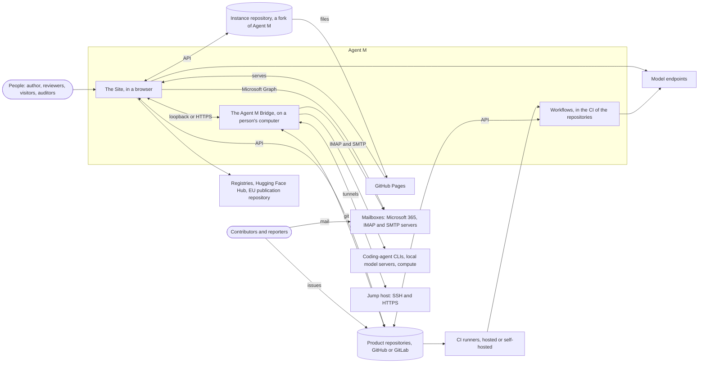
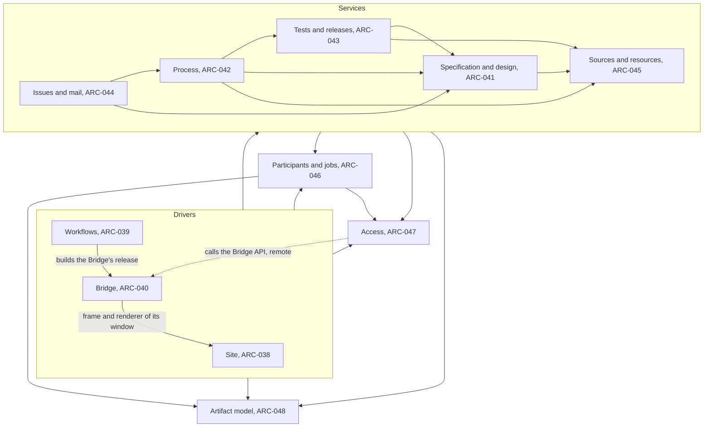
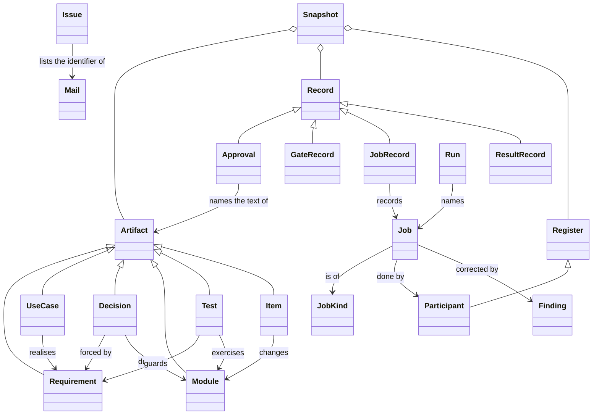
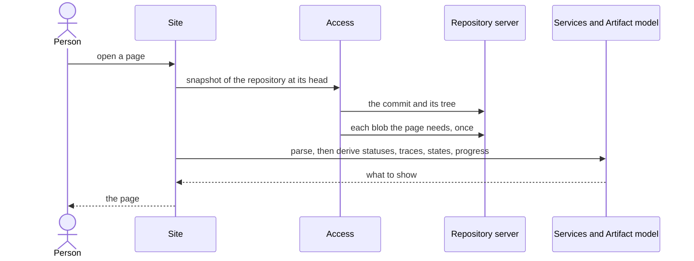
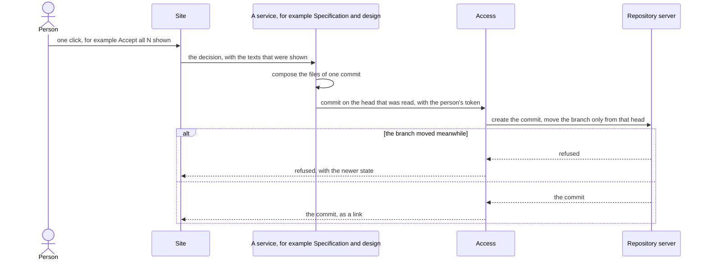
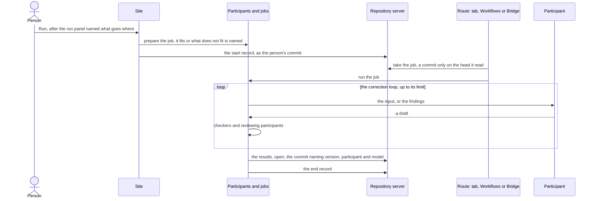
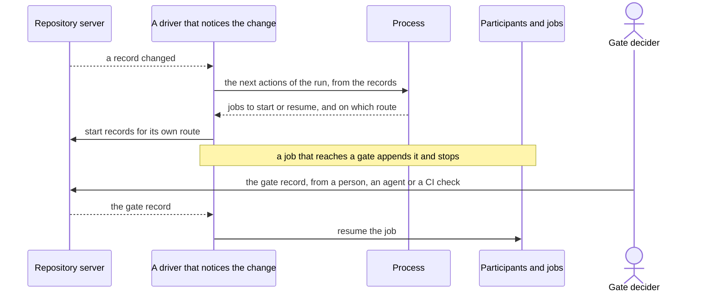
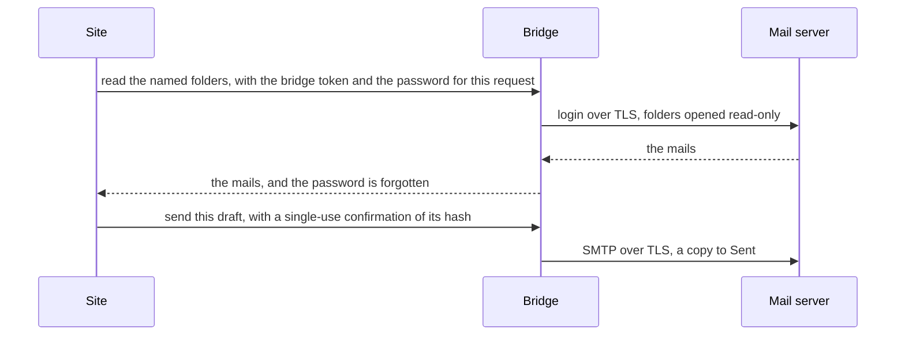
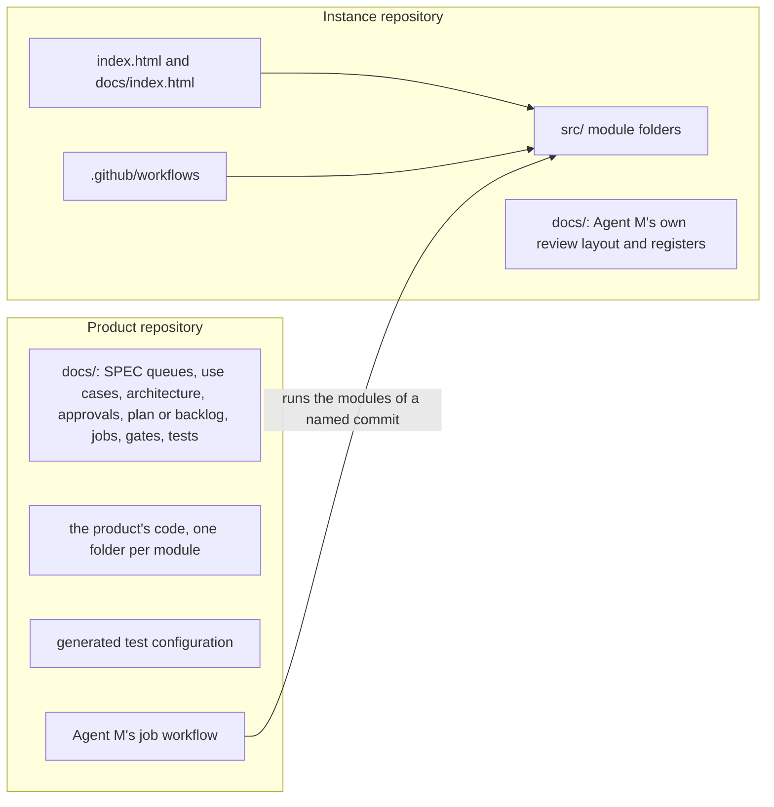
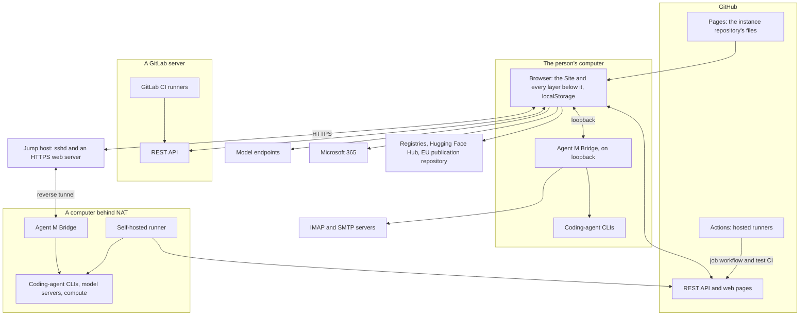

# ARC-037 Agent M as a whole

This decision states Agent M's system as a whole. Every other decision of Agent M refines it: one decision per
subsystem, ARC-038 to ARC-048, and the further decisions ARC-049 to ARC-053.

## Context

Agent M runs the requirements-driven cycle — sources, requirements, use cases, architecture, implementation, tests,
release — on repositories, with people and agents doing the work and people deciding at its gates. It has no server, no
account system and no database of its own (`NO SERVER`). This is what it works with:

| Around Agent M | What it is | How Agent M meets it |
|---|---|---|
| People | the author who runs the instance, reviewers, visitors, stakeholders, auditors; contributors who file issues; reporters who send mail | in a browser, on the instance's site; reporters only through their mail |
| The instance repository | the person's fork of Agent M on GitHub (`AN INSTANCE IS A FORK OF AGENT M`): Agent M's code, Agent M's own artifacts, and the instance's registers — participants, sources, process models, resources | read and written through GitHub's API; its files served by GitHub Pages from the root of its default branch |
| Product repositories | one per product the instance manages, on GitHub or on a GitLab server: the product's code, and its artifacts, records and settings below `docs/` | read and written through the server's API; the product's CI runs Agent M's workflows |
| CI services | GitHub Actions and GitLab CI, on the server's runners or on self-hosted runners | run Agent M's job workflow and the test configuration Agent M generates |
| Model endpoints | OpenAI-compatible or Anthropic endpoints, hosted, or on a person's computer | called from the browser, from CI, or through the Bridge |
| A person's computers | with the Agent M Bridge: coding-agent CLIs with their own login, local model servers, compute such as a cluster; possibly behind NAT | reached by the page on loopback, or through a jump host |
| A jump host | an SSH server with an HTTPS web server that a person controls | carries the tunnels to computers behind NAT |
| Mailboxes | Microsoft 365 with its identity platform and Microsoft Graph; any other mailbox on IMAP and SMTP servers | Microsoft 365 from the browser; every other mailbox through the Bridge |
| Registries | package registries (npm, PyPI, crates.io, Maven Central), source repositories, the Hugging Face Hub, the EU's publication repository | read for due diligence, for resource pins and for legal texts |



## Decision

Agent M is built as **programs without a server of their own that share one store — the Git repositories — and run the
same JavaScript modules in three drivers**: the Site in the person's browser, the Workflows in the CI of the
repositories, and the Agent M Bridge on a person's computer. Everything Agent M keeps is a Markdown file in a
repository; the one exception is what belongs to one person on one browser — tokens, keys, the product list — which is
kept in that browser (`CONFIGURATION LIVES IN THE BROWSER`). Everything Agent M shows is derived from these files, and
from the CI services and Bridges that run its jobs, at the moment it is shown.

**Modules are shared, not repeated.** What several subsystems, or both programs — the site and the Bridge —, need is
one module, used by all of them: a shared module belongs to exactly one subsystem, the lowest in the layers that needs
it (`A MODULE BELONGS TO ONE SUBSYSTEM`), and every subsystem and program above it uses it. Where several parts would
differ only in data, the data is kept as data and one module interprets it (design patterns, below).

### Patterns

| Pattern | Family | What it organises | Why |
|---|---|---|---|
| Repository | structuring | The Git repositories of the instance and its products are the one store every part shares: artifacts, records, registers and settings, all as Markdown. The parts never call each other except through these files, the browser's store and the Bridge's API. | `NO SERVER` leaves no other store. Acceptance is a commit (`ACCEPTANCE IS A COMMIT BY THE ACCEPTING PERSON`), status is derived from the records (`STATUS IS DERIVED FROM THE RECORDS`), and the product repository stays complete without Agent M (`THE PRODUCT REPOSITORY IS SELF-SUFFICIENT`). Git supplies the history, the authorship and the atomic commit. |
| Layers | structuring | The code: the drivers — Site, Workflows, Bridge — above the services — Specification and design, Process, Tests and releases, Issues and mail, Sources and resources —, above Participants and jobs, above the Artifact model and Access. A layer uses only the layers below it. | Everything below the drivers is the same set of modules in all three drivers (`ONE DEFINITION, THREE DRIVERS`). The Artifact model at the bottom is pure, and can be tested without any server (`DESIGN TO TEST`). |
| Pipe-and-filter | structuring | Every job: its input assembled and checked to fit, sent to a participant, the draft passed through checkers — deterministic ones, and reviewing participants — whose findings go back to the participant in the correction loop, then written. Mail runs the same way into issues: read, identified, matched, proposed, searched for people, rewritten, checked, decided. | Each check is a filter of its own and is added for a job kind without touching the others (`A DRAFT THAT FAILS A CHECK GOES BACK TO ITS PARTICIPANT`, `AN ARCHITECTURE DRAFT IS CHECKED BEFORE A PERSON SEES IT`, `A REWRITTEN TEXT IS CHECKED BY THREE LLMS`). |
| Plug-in | adaptable | Job kinds; repository hosts (GitHub, GitLab); participant drivers (a model endpoint, a coding-agent process, a Bridge); mail routes (Microsoft Graph, IMAP through the Bridge); process models and practices, which are data. Each extension point is an interface its plug-ins implement. | `THE CATALOGUE IS DATA`, `GITLAB PRODUCTS ARE SUPPORTED`, `A RUNTIME IS INTERCHANGEABLE`, `OPEN FOR EXTENSION, CLOSED FOR CHANGE`. |
| Client-server | distributed | The Site is a fat client: it derives and checks everything itself, and uses the repository servers' APIs, the model endpoints and Microsoft Graph as its servers. The Bridge is a server for the page, on its computer's loopback. | `NO SERVER`: the only servers are services the person already uses. The work they do not do — deriving, checking, composing commits — runs in the client. |
| Broker | distributed | The Bridge stands between the page or a workflow and what only a computer can do: coding-agent CLIs with their own login, IMAP and SMTP, local model servers and compute. It knows what is installed on its computer and is reached directly or, through tunnels, via a jump host. | A browser can neither open IMAP or SSH connections nor start processes, and local logins stay on their computer (`A LOCAL AGENT USES THE PERSON'S OWN LOGIN`, `THE BRIDGE FINDS THE INSTALLED AGENTS`, `A BRIDGE BEHIND NAT IS REACHED THROUGH A REVERSE TUNNEL`). |

**Design patterns that let one module serve many.** Within these architectural patterns, three design patterns keep
parts that would otherwise be near copies of each other in one place:

| Design pattern | What it replaces | Where |
|---|---|---|
| Strategy, with the kinds as data | a module per kind of job — deriving requirements, use cases or an architecture, generating tests, proposing issues, drafting replies and the others. Every kind is a data folder in one catalogue; the one runner interprets it; the steps that need knowledge — recipes that assemble an input, checks, writers — are strategies under names, offered by the modules that own that knowledge. | MOD-job-catalogue, MOD-job-runner (ARC-046) |
| Interpreter, with formats as schemas | a reader, writer and checker per format — use cases, decisions, module files, items, approval, gate, job and result records, and the registers of participants, sources, resources, process models, declarations, schedules and settings. Each format is a schema in its owner's folder; one module reads, writes and checks every document of that shape. | MOD-documents (ARC-048) |
| Template method, with descriptors | a page per kind of reviewed artifact, and a page per view over the trace graph. One review page and one trace page each run their flow once; a kind or a view adds only its descriptor. | MOD-review-pages, MOD-trace-pages (ARC-038) |

The repository is also how the drivers coordinate without a server: a job is queued by committing its start record; the
driver whose route the job names takes it by a commit that succeeds only on the head it read; and whenever a record
changes, a driver that notices it computes the next actions of the runs concerned from the records, and starts those
that are its own (process view). Nothing is kept anywhere else, so any driver can take over where another stopped.

### Subsystems

| Subsystem | Decision | Responsibility | What it offers the subsystems above it |
|---|---|---|---|
| Site | ARC-038 | the pages people use: the main page at the root and the review pages under `docs/`; the menu in the order of the process; the Pattern Recognition Lab's look; one review page and one trace page for every kind and view; Markdown and Mermaid rendered safely; editors, forms, run panels, explanations | its frame and renderer, which the Bridge's window uses |
| Workflows | ARC-039 | the CI driver: the entries of Agent M's job workflow in each product repository — queued jobs, runs, gates decided by CI checks, the Definition-of-Done check, events in time — and of the instance's own workflows | workflow entries, run by CI |
| Bridge | ARC-040 | the desktop app on a person's computer: its local API, the jobs of coding agents on that computer, IMAP and SMTP, SSH tunnels, its window, its signed releases | the Bridge API, over HTTP, to the page and to the Bridge client |
| Specification and design | ARC-041 | the change control of every reviewed artifact — requirements, use cases, the architecture, release test reports —: statuses from approval records, acceptance, change queues, saves | statuses, acceptance, proposals, saves, and the recipes and writers its artifacts' job kinds use |
| Process | ARC-042 | how each product is developed and how its work is organised: process models and the product's declaration, gates and the Definition of Done, implementation plans and backlogs, runs, progress | workflows and gate states, item states and startability, the next actions of a run, progress and stage shares, and the recipes and writers of its job kinds |
| Tests and releases | ARC-043 | the product's tests as evidence: the schedule and the CI configuration generated from it, result and counter-proof records, release candidates, reports, tags and the audit | the schedule and generated configuration, results per commit, the release flow, the audit, and the recipes, checks and writers of the test job kinds |
| Issues and mail | ARC-044 | a product's issues and the mail behind them: mailbox routes, mail identifiers, personal data kept out of repositories, mail into issues, replies, and the handling of an issue as a bug or a change | mailbox operations, intake, replies, issue handling, and the recipes, checks and writers of the mail and issue job kinds |
| Sources and resources | ARC-045 | what a product must meet and what it uses, each pinned exactly: the instance's register of requirement sources and a product's links to them, the resource lists, the due-diligence facts read from registries | the registers, a source's content checked against its hash, facts with address and date, licence compatibility, and the strategies of a source excerpt and of due diligence |
| Participants and jobs | ARC-046 | who does a job and how every job runs: the participant list, model endpoints, coding-agent processes, the one runner with its correction loop, the catalogue of every job kind as data, job records and their states, the routes a job takes | eligibility of participants, preparing and running any job, the catalogue, records and derived states, starting, resuming and cancelling on a route |
| Access | ARC-047 | everything the code reaches outside itself, behind interfaces that name how they fail: the repository servers and local clones, the browser's store, the Bridge | snapshots, history, commits, pull requests, CI runs, issues, tags; browser settings and the settings export; the Bridge client |
| Artifact model | ARC-048 | the formats of the review layout and all that follows from texts alone: the schema interpreter for documents, records and registers, identifiers, the SPEC, test declarations, group files, findings, candidates, the trace graph | parsing, writing, checking and deriving — pure functions over texts |



Among the services, each uses only those it points to. The three arrows that end at a driver are sharing, not layering:
the Bridge's window is drawn with the Site's frame and renderer; the instance's workflow builds the Bridge's release with
the Bridge's own build module (ARC-039); and the Bridge client in Access speaks the protocol that the Bridge defines in
its module of the API, which itself uses no other module.

The further decisions refine single choices: ARC-049 Markdown, sanitising and diagrams in the page; ARC-050 the Bridge's
desktop runtime; ARC-051 IMAP and SMTP in the Bridge; ARC-052 SSH in the Bridge; ARC-053 the Microsoft sign-in in the
page. Each library decision carries its due diligence.

### Logical view

The abstractions every subsystem shares, and how they relate:



| Abstraction | What it is | Defined in |
|---|---|---|
| Snapshot | the files of one repository at one commit, read lazily | MOD-repository-hosts |
| Artifact | a requirement, use case, decision, module, test or item: a text with an identifier, proposed until accepted | MOD-spec-document, MOD-test-document, and the schemas of MOD-documents |
| Schema | the definition of one document format — file name, front matter keys and their types, sections, or a register's columns —, kept in the folder of the module that owns the format | MOD-documents |
| Record | an approval, gate, job or test result record: evidence, written once or only appended to, never shown for acceptance | the schemas of MOD-approvals, MOD-product-process, MOD-job-ledger, MOD-result-records |
| Register | a list kept in a repository: participants, sources, resources, process models, a product's declaration, schedule and settings | the schema of the module that owns each |
| Finding | one problem with a draft, in the one form of a compiler message | MOD-text-tools |
| Job kind | a kind of work defined once as data: what its participant needs, its preconditions, recipes, prompt, output schema, checks, reviewers, gates and writer | MOD-job-catalogue |
| Strategy | a named step a job kind uses — a recipe, a check, a writer —, offered by the module that owns its knowledge | MOD-job-runner, and the module offering it |
| Job, Run | one execution of a kind, with a record; a job that names its jobs | MOD-job-ledger, MOD-run-planner |
| Participant | a person or an agent from the instance's list, reached through a driver | MOD-participant-list |
| Mail, Issue | a mail named only by its pseudonymous identifier; an issue that lists those identifiers | MOD-mail-records |

### Process view

**Reading.** A page reads one snapshot per repository and derives everything it shows; it writes nothing.



**A person's decision.** Every write that a person decides is one commit made with that person's own token, on the
head that was read; if the branch moved meanwhile, the commit is refused and the newer state is shown
(`THE DASHBOARD WRITES ONLY ON A PERSON'S CLICK`, `A SAVE IS REFUSED WHEN THE TEXT CHANGED MEANWHILE`).



**A job.** The person's click commits the job's start record; the route the job names takes it and runs it. In the
browser tab the click and the taking are one step; in CI the push of the start record starts the job workflow; a Bridge
takes the jobs of its participants when it reads the repository. The run panel has named every destination and what is
sent there before the click (`THE PAGE STATES WHAT IT SENDS WHERE`).



**A run and a gate.** A run is a job that names its jobs. Whenever a record changes — a job ended, a gate was recorded, a
pull request was merged — a driver that notices it computes the run's next actions from the records alone and starts
those of its own route. A job that reaches a gate appends that it waits there and stops; it resumes once the gate's
decider has recorded the decision (`A JOB STOPS AT EVERY GATE`, `A RUN CONTINUES WITHOUT A CLICK BETWEEN ITS JOBS`).



**Mail through the Bridge.** The password travels with each request and is forgotten after it; nothing is changed in the
mailbox by reading; a mail is sent only with a single-use confirmation of the exact mail shown.



### Development view

The instance repository is served as it is: there is no build step for the Site (`THE PAGES ROOT IS THE REPOSITORY
ROOT`).

```text
/                       the instance repository; GitHub Pages serves it from here
├── index.html          the main page
├── docs/index.html     the review pages; every other file under docs/ is Agent M's own review layout
├── src/<slug>/         one folder per module MOD-<slug>: index.mjs is its interface, every other file is private;
│                       its data files and, in vendor/, its vendored libraries
├── .github/workflows/  the instance's workflows: Agent M's own tests, applying approved changes of its SPEC,
│                       fetching legal texts, building the Bridge
├── tests/              Agent M's tests; each names the module it exercises and the requirements it guards
├── products/README.md  in a local clone, products are cloned beside it, and git ignores them
├── LICENSE             the MIT licence
└── SPEC.md
```

A module is the folder `src/<slug>/` of its identifier `MOD-<slug>` (`A MODULE IS A FOLDER`); a module uses another only
through that module's `index.mjs` (`DEVELOP AGAINST INTERFACES`). Each module is plain ECMAScript modules, loaded by the
browser as they are and by Node — in CI and inside the Bridge — as they are. Code that needs a capability of one
platform says so in its module file: the Bridge's modules and `MOD-agent-processes` run in Node only, the pages only in a
browser.

| Subsystem | Module folders under `src/` |
|---|---|
| Site | `site-frame`, `markdown-render`, `main-page`, `review-pages`, `trace-pages`, `implementation-pages`, `test-pages`, `maintenance-pages`, `settings-pages` |
| Workflows | `workflow-entries` |
| Bridge | `bridge-http`, `bridge-jobs`, `mail-protocols`, `tunnels`, `desktop-shell`, `bridge-build` |
| Specification and design | `approvals`, `spec-changes`, `artifact-edits` |
| Process | `model-catalogue`, `product-process`, `work-plans`, `run-planner`, `progress-measures` |
| Tests and releases | `test-schedule`, `result-records`, `release-evidence` |
| Issues and mail | `mail-routes`, `mail-records`, `personal-data`, `mail-handling`, `issue-handling` |
| Sources and resources | `source-register`, `resource-list`, `reuse-facts` |
| Participants and jobs | `participant-list`, `endpoint-calls`, `agent-processes`, `job-runner`, `job-catalogue`, `job-ledger`, `runtimes` |
| Access | `repository-hosts`, `browser-store`, `bridge-client` |
| Artifact model | `text-tools`, `documents`, `identifiers`, `spec-document`, `test-document`, `group-document`, `trace-graph` |

A product repository holds what Agent M writes there, and nothing that exists only inside Agent M: its review layout
below `docs/`, its records, its settings, the test configuration generated from its schedule, and the job workflow that
runs Agent M's jobs in its CI. The job workflow names the instance repository and the commit of Agent M it runs; the
product's artifacts never depend on it.



### Physical view



| Part | Runs on | Reaches |
|---|---|---|
| Site, with every subsystem below it except the Bridge's | the person's browser, from the files GitHub Pages serves | the repository servers, model endpoints, Microsoft 365, registries — each named before it is called (`NO SERVER`) — and Bridges |
| Workflows, with the same subsystems | GitHub's or GitLab's runners, or a self-hosted runner, with Node | the product's server with the person's token from a CI secret; the participant's endpoint or agent with its key from a CI secret |
| Bridge | a person's computer, as a signed app | coding-agent CLIs, mail servers, local model servers, compute; the jump host over SSH; product repositories with the computer's own git login |
| Jump host's web server | the jump host | the end of a Bridge's reverse tunnel, on the jump host's loopback |

### Scenarios

Each accepted use case, as the subsystems that make it possible and how they interact. The use cases themselves say step
by step what happens; this does not repeat them. "The runner" is MOD-job-runner running a kind of MOD-job-catalogue;
the strategies it uses are named with the subsystem that offers them.

| Use case | Scenario |
|---|---|
| UC-001 | Site guides the steps with the token links Access names; Access reads the product repository with the stored token; Specification and design writes the missing review layout as one commit through Access; Access adds the product's address to the browser's store. |
| UC-002 | Site's form, built from Process's declaration schema, shows the catalogue and the declaration; Process validates the model, derives the workflow with the gates the product's process requirements add — read through the Artifact model — and checks every assignment with Participants and jobs, against the places Sources and resources permit; the declaration is one commit through Access. |
| UC-003 | Site stores the endpoint through Access; Participants and jobs sends the test request directly, or through the Bridge client to a model server on a computer, and names why a browser cannot call an endpoint. |
| UC-004 | Site's form collects the entry; Sources and resources computes the hashes with the Artifact model and writes the register entry and its content where its licence allows through Access; for an EU legal text, the Workflows' entry fetches the text with Sources and resources and completes the entry. |
| UC-005 | The runner prepares the derivation kind with the excerpt of the linked, hash-checked source version (Sources and resources) and the SPEC with its open queues (Specification and design); Site's run panel states what goes where; the runner sends it on the participant's route and corrects the draft with the Artifact model's checks and classes of candidates; Specification and design's writer turns the classified candidates into a change queue. |
| UC-006 | Site's review page shows the current section beside the proposal; Specification and design checks the blob SHAs and, with Sources and resources' links, that every requirement names a linked source, accepts the entries in their queue's order and writes record, section and decision in one commit through Access; without a token, Access opens GitHub's page, and the Workflows' entry applies the committed approval with the same functions. |
| UC-007 | The runner runs the use-case kind with the chosen requirements and every use case (Specification and design's recipes), checked by the Artifact model's use-case schema and graph checks; Specification and design's writer commits the use cases open, with the next free identifiers. |
| UC-008 | Site's review page renders the use case; Specification and design derives its status and its last accepted text from the approval records and writes the records of everything accepted in one commit through Access, or Access's GitHub page without a token. |
| UC-010 | Participants and jobs queues the job by its start record; the push starts the Workflows' entry, which takes the job and runs the same kind with the participant's key and the person's token from CI secrets, writes the results open through Access's local clone, and appends the end record. |
| UC-011 | Site pairs through Access's Bridge client; the Bridge checks the token, runs the job with the runner and the coding agent, writes through Access's local clone with the computer's own git login and appends the end record; for a computer behind NAT, the Bridge's tunnels or the commands Access writes reach it through the jump host. |
| UC-012 | The runner runs the analysis kind with Issues and mail's recipe of the issue and what it touches, found by the Artifact model's trace graph; a bug becomes the fixing kind on a coding participant's route, whose pull request passes Process's Definition-of-Done check in CI; a change goes to the kind that changes requirements, whose queue names the issue. |
| UC-013 | Tests and releases computes the version, marks the candidate and starts the complete run through Participants and jobs; every level leaves its result record; Tests and releases composes the report, and the acceptance, the changelog entry and the tag on the tested commit are written through Specification and design's approvals and Access. |
| UC-014 | Site guides the fork, Pages and Actions through the links Access names, states the shared origin, stores the token in the browser's store and checks it against the instance repository through Access. |
| UC-015 | Site's form, from Sources and resources' links schema, lists the register; the links file is committed through Access. |
| UC-016 | Sources and resources records the new version, finds the products on older versions and, with the Artifact model, the requirements from that source and the passages that changed; moving a product is one commit through Access. |
| UC-017 | Site's form, from Participants and jobs' participant schema, keeps the entry; an agent is tested through the Bridge client; a self-hosted runner of a repository Access reports as public is refused; the entry is committed through Access. |
| UC-018 | Site's review page opens the editor with marks from the Artifact model's checks and the impact list from its trace graph; Specification and design saves a use case as an edit and a requirement as an entry of the person's open queue of the day, each only if the text is unchanged since it was opened. |
| UC-019 | The runner runs the change kind with the target and its neighbours (Specification and design's recipes) and corrects it; Site's review page shows the draft against the current text, and saving continues as in UC-018; a CI agent's draft arrives through the Workflows as an open file or a queue entry. |
| UC-020 | Site's trace page reads, through Access, the snapshot at the chosen tag or default branch and its history; the Artifact model builds the tree from the group file and derives traces and gaps; Specification and design adds open proposals, statuses and each requirement's history. |
| UC-021 | Site's review page arranges; the Artifact model applies the moves and keeps one place per item; Specification and design saves only the group file; proposing groups is a kind the runner runs. |
| UC-022 | Specification and design's precondition checks that every use case is accepted and no architecture exists; the runner runs the derivation kind with the whole SPEC and every accepted use case, the draft checked by the Artifact model and, once complete, by the review kind on a participant of another model whose findings the drafter weighs; Sources and resources' due-diligence step reads each reuse candidate's facts; Specification and design's writer commits every file open; acceptance is UC-008's on the review page. |
| UC-023 | Specification and design saves an edit, or the runner runs the change kind with the same review; the impact list comes from the Artifact model's trace graph — modules, interfaces that break, code files in module folders, tests, requirements, plan steps and backlog items. |
| UC-024 | Process gives the declaration, the plan's derived states and, as a recipe, the implementation inputs; Participants and jobs starts each step's job on a Bridge or in the Workflows; the coding agent works test-first; Process's Definition-of-Done check runs in the product's CI from the configuration Tests and releases generated; merges and states come through Access. |
| UC-025 | Site's trace page reads the snapshot with every code file through Access; the Artifact model's trace graph derives each module's row, its gaps and the imports between module folders; Site draws the component diagram. |
| UC-026 | The runner runs the test-generation kind with Tests and releases' recipe of every existing test guarding the selection and the product's paid services, on a participant other than the implementer for release tests; Tests and releases' check compares the proposed cases with the existing tests; the participant writes the tests and counter-proofs on a branch and opens a pull request through Access. |
| UC-027 | Tests and releases checks the schedule, from its schema, and generates the CI configuration with the Definition-of-Done check and without runs for job records, and opens one pull request through Access. |
| UC-028 | Tests and releases reads the result records of the commit from the branch `test-results`, finds flaky tests and compares rates; a missing level is run as a kind through Participants and jobs, and its writer appends the record. |
| UC-029 | Site's trace page groups the tests the Artifact model reads by level, requirement, use case or module; Tests and releases adds each test's history from the result records. |
| UC-030 | Site's trace page shows the audit Tests and releases derives at the tag from the Artifact model, Sources and resources' links, the result records and the approval records; the export is committed only on a person's click, through Access. |
| UC-031 | Site's form, from Process's model schema, edits a definition; Process validates what the schema cannot and previews the plan of requirements times phases; Site draws it live; saving is one commit through Access. |
| UC-032 | Process derives each item's state and checks the order bottom-up against the architecture through the Artifact model; proposing items is a kind the runner runs with Process's recipe and writer; items, order and sprints are committed through Access. |
| UC-033 | Issues and mail prefills the item from the issue and its class; Process writes item and order; Access comments on and labels the issue. |
| UC-034 | Process finds the startable items and gives the implementation inputs and the gates; Participants and jobs starts the jobs on their routes; gates are decided and recorded through Process; the pull request merges once Process's Definition-of-Done check holds. |
| UC-035 | Process computes the progress in the model's measure, the gate states, what is blocked and who works on what, from the records Access reads and the live job states of Participants and jobs. |
| UC-036 | Site's main page lists the jobs of every product, which Participants and jobs derives from their records and their runtimes' live states, streams logs and cancels or retries; a person's gate decision is checked and recorded by Process. |
| UC-037 | Issues and mail's mail routes sign in with Microsoft in the page, or test the IMAP route through the Bridge client and the Bridge; Access keeps the connection in the browser's store. |
| UC-038 | Issues and mail reads the mailbox through its route, names mails by identifier and matches threads; the runner runs the kind that proposes issues and the kind that rewrites report data, each text checked by Issues and mail's search for the mail's people and the rewriting by three checking participants; issues are created or extended through Access on the person's click. |
| UC-039 | Issues and mail derives the replies due from the issues and the mailbox; the runner runs the kind that drafts replies; Issues and mail stores them in the mailbox's Drafts folder, sends each only with the person's confirmation, and notes it in the issue through Access. |
| UC-040 | Site's form, from Sources and resources' resource schema, keeps the entry; pins and facts are read through Access and the Hugging Face Hub; a resource is checked through the Bridge client, or by a check kind on a runner; the entry is committed through Access. |
| UC-041 | Process derives the sprint's increment and numbers and records the review and the retrospective; an agent's close is a kind that the Workflows or a Bridge start when the sprint ends; merging the sprint branch is a pull request through Access. |
| UC-042 | Site lists every setting: Access's browser store tests, clears, exports and imports the browser's; each repository setting is edited in a form from its owner's schema and committed through Access. |
| UC-043 | Process's run planner turns the selection into a run and its next actions — CI first, then the steps in the order of the interfaces, then the tests, then the validation —; Participants and jobs starts them; the Workflows and the Bridge keep the run going while no tab is open. |
| UC-044 | Site offers the signed file of the Bridge's release and pairs it through Access; the Bridge's window, drawn with the Site's frame, lists the agents Participants and jobs finds, shows its token and opens its own tunnels. |
| UC-045 | The runner runs the planning kind with Process's recipe of the architecture and the model; Process checks the draft against the module order the Artifact model derives; the plan is committed through Access. |
| UC-046 | Site's main page reads the instance's or each product's snapshot through Access; Process derives the stage shares, the build in progress and what waits for a person, with the job states of Participants and jobs. |

### Testing

| Level | What is tested | How |
|---|---|---|
| Module | each module through its interface | unit tests with node's test runner on every commit; the Artifact model on fixture texts; Access and the participant drivers on recorded or constructed responses; no test on a commit calls a paid service (`COMMIT TESTS CALL NO PAID SERVICE`) |
| Subsystem | each subsystem's offered interface, with its modules together | component tests: services against fixture repositories behind a fake repository host; Participants and jobs with fixture participants; the Bridge against local test servers — SSH, IMAP and SMTP with and without TLS, an HTTPS proxy; Workflows on a fixture repository in a temporary git |
| System | each use case end to end | system tests that drive the pages in a headless browser against fixture repositories; release tests, one or more per requirement, written by a participant other than the implementer; model-dependent checks as rates over a fixed number of runs, nightly |
| Use | the product in real use | manual tests whose outcome a person enters |

Every test names the module it exercises and the requirements it guards, in the form MOD-test-document defines. A new
test is shown to fail on a planted fault before it is accepted. The architecture itself is checked by review, never by a
test (`AN ARCHITECTURE IS CHECKED BY REVIEW, NOT BY TESTS`).

## Alternatives

- **A server of Agent M's own**, holding state and running jobs. Rejected: `NO SERVER`.
- **A database or the server's issue boards as the store of state.** Rejected: state is derived from records in the
  repositories (`STATUS IS DERIVED FROM THE RECORDS`), the product repository stays complete without Agent M, and GitLab
  products would need a second store.
- **A single-page application compiled by a bundler and deployed from a build.** Rejected: the site is served from the
  root of the default branch as it is (`THE PAGES ROOT IS THE REPOSITORY ROOT`), and a build would put a second form of
  the code between the repository and the page (`KEEP IT SIMPLE`).
- **Runs coordinated only by the open browser tab.** Rejected: a run continues without a click between its jobs, also
  when no tab is open; only the CI services and the Bridges are there when no person is.
- **A module per kind of job, per document format and per page of a menu entry.** Rejected: these would differ only in
  data; one runner, one schema interpreter and two page templates keep the differences as data (`DON'T REPEAT YOURSELF`,
  `OPEN FOR EXTENSION, CLOSED FOR CHANGE`).
- **Separate code for each driver.** Rejected: `ONE DEFINITION, THREE DRIVERS`.
- **Services of our own, one per function, behind a service registry.** Rejected: there is nothing to host them on, and
  the repository already is the one place where the parts meet.

## Consequences

- A new kind of job, document format, reviewed artifact or trace view is data — a catalogue folder, a schema, a
  descriptor —, plus a strategy only where a step needs knowledge no module offers yet.
- Every read is a request to a repository server and counts against its rate limit; a page reads one snapshot and each
  blob once, and a used-up limit is named, never blamed on the token.
- Concurrent writers are safe because every commit is made only on the head that was read; the loser is refused and
  shown the newer state.
- Everything is recomputed when it is shown; for the size of a product's repository that is cheaper than keeping a
  derived store consistent.
- A job taken by CI or by a Bridge runs with the person's credentials held there — a CI secret, the computer's own
  login — never with anything from the browser.
- The Bridge must be built, signed and notarised for each platform by the publisher of Agent M's releases.
- The code written before this architecture lies outside every module's folder; it is reported as a gap until
  implementation jobs move it into the folders of these modules.
