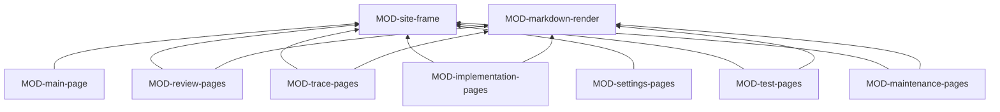

# ARC-038 The site

## Context

People meet Agent M only through its site (UC-046): the main page at the root of the instance's Pages address shows what
goes on — every product's progress by stage, or Agent M's own while there is no product, the build as it happens, what
waits for a person, every job —, and the pages under `docs/` are where documents are reviewed and edited. The menu
follows the process: requirements, use cases, architecture, implementation, tests, releases, then maintenance and
settings. Every step explains itself to someone new to it, every run says what it sends where, every decision is one
click, and the site wears the look of the Pattern Recognition Lab. The site is served as the files of the repository's
default branch, without a build (`THE PAGES ROOT IS THE REPOSITORY ROOT`).

Much of what these pages do is the same for different kinds of artifact. A use case, an architecture decision, a module
file, a SPEC change entry and a release test report are each listed with their status, opened with their difference to
the last accepted text, accepted one by one, ticked or all shown, edited, changed by prompt, drafted, and arranged in
groups (UC-006, UC-008, UC-018, UC-019, UC-021, UC-022, UC-023). The specification browser, its gaps, the modules view,
the tests browser and the audit are each a tree or table over the trace graph, with filters, at a chosen version
(UC-020, UC-025, UC-029, UC-030). And every register a person edits on a page — participants, sources, resources,
process models, the product's declaration, the schedule, settings — is a form over a document of the common shape.

## Decision

The Site is the browser's driver of ARC-037: **two HTML entry pages that load one frame and the views of the menu, all as
plain ECMAScript modules, with the repeated page shapes written once as templates**.

- **One review page for every reviewed kind** (template method). MOD-review-pages runs the review flow once; a kind
  takes part through a descriptor — its folder and schema, the checks to mark in the editor, the job kinds that draft or
  change it, the service that saves or accepts it, and, where it has one, an extra section such as the architecture's
  rounds and due diligence or a SPEC entry's impact list.
- **One trace page for every view over the trace graph** (template method). MOD-trace-pages runs version choice,
  tree or table, filters and following a link once; the specification browser, the gaps, the modules view with its
  component diagram, the tests browser and the audit are its descriptors.
- **One form for every register** (interpreter). MOD-site-frame renders and checks a form from a document's schema, the
  same schema MOD-documents reads (ARC-048), so a register's page needs no form code of its own.
- **Shared with the Bridge.** The Bridge's window is rendered with MOD-site-frame and MOD-markdown-render (ARC-040), so
  its explanations, look and texts are the site's.

The views compose the services, Participants and jobs, Access and the artifact model; they keep no state of their own
beyond what is on the screen. The entry pages register the strategies of the modules the views include with the job
runner, which makes the Site one of the three drivers (ARC-046).

### Responsibility within the system

Showing everything Agent M derives, in the order of the process, and turning each decision a person takes into exactly
one call of the service that owns it; explaining every step; stating, before every run, every destination and what goes
there; rendering artifacts safely, with their diagrams, and their differences.

### The interface it offers

To people: the main page `index.html` at the root of the instance's Pages address, and the review pages
`docs/index.html`, whose views are addressed by the fragment of the address — each view for the product chosen. To other
subsystems: the frame and the renderer, which the Bridge's window uses.

| Module | Functions other modules use |
|---|---|
| MOD-site-frame | the types `View`, `Route`, `ViewContext` and `PageSetup`; `startPage`, `embedRoute`, `menuOf`, `instanceOf`, `chosenProduct`, `explain`, `runPanel`, `confirmDecision`, `notice`, `schemaForm` |
| MOD-markdown-render | `renderArtifact`, `renderMermaid`, `openEditor`, `showDifference` |

### Its modules

| Module | Folder | Responsibility |
|---|---|---|
| MOD-site-frame | `src/site-frame/` | what every page shares: the header with the lab's logo and the menu in the order of the process, the colours and fonts of the lab's look, the product selector, the notices — a token that expires, setup not finished —, the routing of views by the address's fragment, the instance derived from the Pages address, the folded explanations, the run panel that names every destination and what goes there, the dialog of a decision, and the form built from a schema |
| MOD-markdown-render | `src/markdown-render/` | Markdown rendered to sanitised HTML, Mermaid diagrams drawn from their blocks, the editor with its live preview, a difference shown line by line; the vendored libraries in its `vendor/` folder |
| MOD-main-page | `src/main-page/` | the main page: the greeting, a card per product with its stage bar and its build, Agent M's own card without a product, what waits for a person, and every job of every product with its detail — log, cancel, retry, the decision of a gate a person holds |
| MOD-review-pages | `src/review-pages/` | the review flow of every reviewed kind — use cases, architecture decisions and module files, SPEC change entries, release test reports —: the list with statuses, a file with its difference to its last accepted text, accepting one, the ticked ones or all shown, editing, changing by prompt, drafting, arranging groups; one descriptor per kind |
| MOD-trace-pages | `src/trace-pages/` | the views over the trace graph at a chosen version: the specification browser with a requirement's traces, proposals and history; the gaps; the modules view with its rows, gaps and component diagram; the tests browser; the audit with its export; one descriptor per view |
| MOD-implementation-pages | `src/implementation-pages/` | Implementation: how the product is developed and the process models of the instance; the plan or the backlog and sprints, with closing a sprint; implementing steps or items; a run over a selection; progress in the model's measure |
| MOD-test-pages | `src/test-pages/` | Tests and Releases: the schedule, the runs of a commit, generating tests; the release panel with the release test report |
| MOD-maintenance-pages | `src/maintenance-pages/` | Maintenance: issues with their analysis, class, fix and move to the backlog; mail read into issues; replies to answer, drafts and sending, asking a reporter |
| MOD-settings-pages | `src/settings-pages/` | Settings: every setting on one page with its test, change, clear and its notices; getting one's own Agent M; adding a product; participants; endpoints; the source library and a product's links; resources; the mailbox; the Bridge, the jump host and remote sessions; export and import |

The menu's entries map onto these modules: Requirements to the trace pages' specification browser and the review pages'
SPEC entries; Use cases and Architecture to the review pages, with the architecture's modules view on the trace pages;
Implementation, Tests, Releases, Maintenance and Settings to their own modules, Releases with the audit on the trace
pages. `index.html` starts the frame with the main page; `docs/index.html` starts it with every other view. The frame
knows views only as the routes the entry page hands it, so no view module is used by the frame.

## Alternatives

- **A page module per menu entry, each with its own review flow.** Rejected: the review of use cases, decisions, module
  files, SPEC entries and reports is the same flow; written per entry it would be written five times (`DON'T REPEAT
  YOURSELF`).
- **A web framework with components and a build.** Rejected: no build step stands between the repository and the page;
  the views are small enough for plain modules (`KEEP IT SIMPLE`).
- **A form written by hand for every register.** Rejected: the registers already have schemas; a form generated from the
  schema cannot disagree with the format.
- **A user interface of its own for the Bridge's window.** Rejected: the Bridge is built from the dashboard's code; its
  window uses the site's frame and renderer.

## Consequences

- A new reviewed kind is a descriptor and a schema; the review flow does not change.
- Every page reads the repositories when it opens; a visitor without a token is limited by the network's rate limit,
  which the page names.
- A view never computes a status of its own; anything it shows can be recomputed by the service that owns it.
- The site can be opened from any fork's Pages address and shows that fork's instance.
