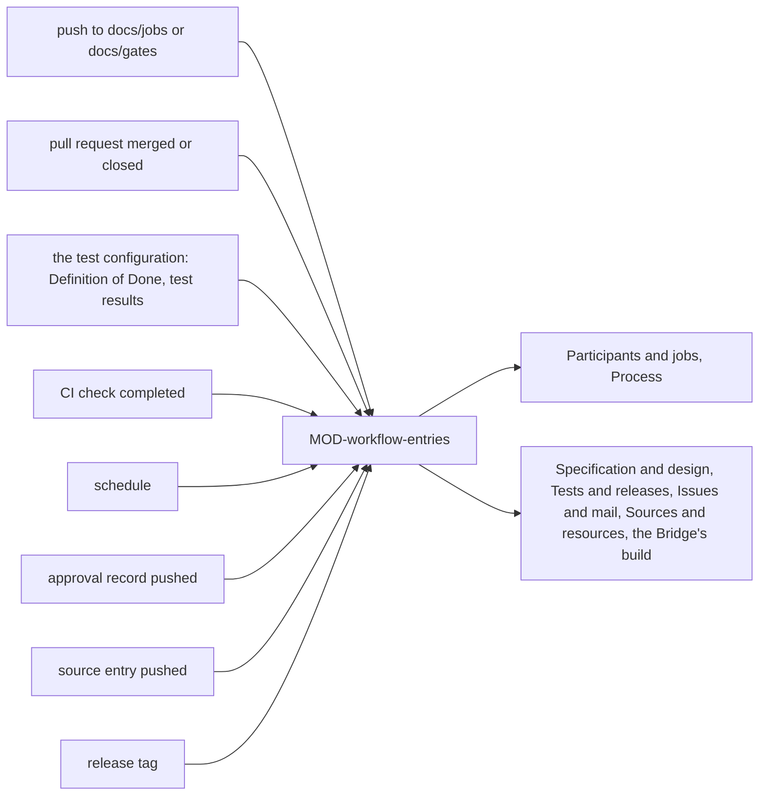

# ARC-039 The workflows

## Context

Two kinds of work happen when nobody's browser is open. In each product repository, jobs of CI agents run in the
product's own CI, runs must go on to their next jobs, gates decided by a CI check must be recorded, the Definition of
Done must be checked on every pull request, and a sprint an agent closes must start when it ends (UC-010, UC-024,
UC-034, UC-041, UC-043). In the instance repository, an approval of the instance's own SPEC committed without a token
must be applied, EU legal texts must be fetched, and the Bridge must be built and signed on a release (UC-004, UC-006,
UC-044). All of it must run the same modules the page runs (`ONE DEFINITION, THREE DRIVERS`).

## Decision

The Workflows are the CI driver of ARC-037: **one module of entry points that compose the shared modules for one event
each**, run by Node in GitHub Actions or GitLab CI. The entries of a product's job workflow and those of the instance's
own workflows are of the same kind — read the event, compose, act, end with a status —, so they are one module. The
workflow files that call them are generated for products by MOD-runtimes (the job workflow) and MOD-test-schedule (the test configuration, with the Definition-of-Done check), and kept for the
instance under `.github/workflows/`. A product's workflow runs the modules of the instance repository at the commit its
file names; it reads the person's token and the participant's key only from the product's CI secrets.

### Responsibility within the system

Running in a product's CI: taking and running the queued jobs of CI routes, resuming them after their gate, advancing
runs on every change of their records, recording the decision of gates a CI check decides, checking pull requests
against the Definition of Done, and the events in time — a sprint's end. Running in the instance's CI: applying approved
changes of the instance's own SPEC, fetching legal texts, building and publishing the Bridge.

### The interface it offers

| Module | Entry points CI runs |
|---|---|
| MOD-workflow-entries | in a product: `onRecordsChanged`, `onDoneCheck`, `onPullRequestClosed`, `onCheckCompleted`, `onTestsFinished`, `onSchedule`, `onDispatch`; in the instance: `onApprovalsCommitted`, `onSourcesCommitted`, `onReleaseTagged` |

Every entry reads its event, its secrets and the repository it runs in from the CI's environment, does its work through
the shared modules and ends with a status CI shows; it keeps nothing between runs.

### Its modules

| Module | Folder | Responsibility |
|---|---|---|
| MOD-workflow-entries | `src/workflow-entries/` | the entries of Agent M's job workflow in a product — on a commit to `docs/jobs/` or `docs/gates/`, take and run or resume the queued jobs of the CI route and compute the runs' next actions; on a pull request merged or closed, closing its issues with links, the runs' next actions and, on GitLab, the pipeline schedule; on a completed CI check that decides a gate, its gate record; on a schedule, the events in time; on dispatch, a job started from GitHub's Actions page —, the entries the generated test configuration calls — the Definition-of-Done check of a pull request, and the result record of a test run —, and the entries of the instance's workflows — applying approval records of the instance's SPEC that the dashboard did not apply; fetching an EU legal text when its register entry asks for it; building the Bridge's release with MOD-bridge-build. It works on the repository it runs in through two of Access's adapters with the same person's token from a CI secret: the local clone of the checkout for files and commits, the server's API for pull requests, issues, checks and releases |

## Alternatives

- **A separate implementation of jobs for CI, for example in Python.** Rejected: `ONE DEFINITION, THREE DRIVERS`; the
  instance's workflow applies an approved change of its SPEC with the same functions the dashboard uses.
- **A long-running workflow that waits at a gate.** Rejected: a gate may wait for days, longer than a CI job should run;
  a job stops at its gate and is resumed by the next event.
- **Separate modules for a product's and the instance's workflows.** Rejected: both are entries of the same shape; one
  module keeps the composition of the shared modules in one place.
- **A published package or action that products install.** Rejected: the instance is the product's Agent M; its own
  repository at a named commit is what a product's workflow runs, without a registry in between.

## Consequences

- A product's job workflow needs two CI secrets — the person's Agent M token and the agent's key — named by the
  dashboard, never asked for.
- Every append to a job record or a gate record starts a short run of the job workflow, which usually finds nothing to
  do; the test configuration starts none for such a commit (`A JOB RECORD STARTS NO CI RUN`).
- A run of CI agents advances while nobody is online; scheduled workflows of public repositories may be paused by the
  server after inactivity, which the schedule page names (UC-027).
- Agent M's own development does not change a product's behaviour until the product's workflow is moved to a newer commit
  of the instance.
