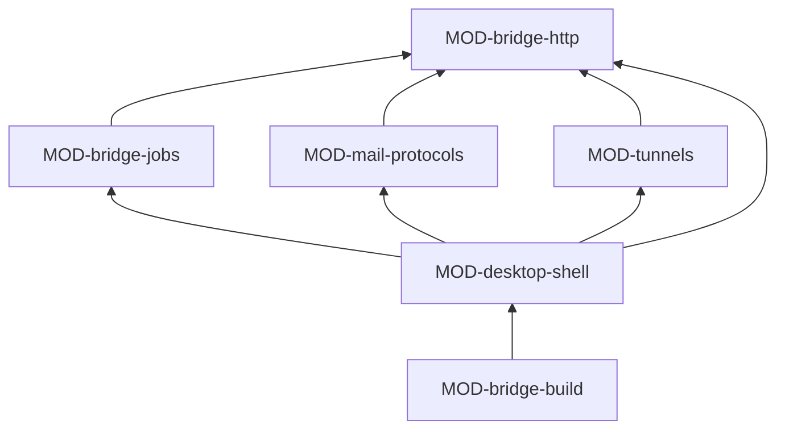

# ARC-040 The Agent M Bridge

## Context

Some work can only be done on a person's computer: running a coding agent with the login it already has there,
speaking IMAP and SMTP to a mail server, calling a local model server or a cluster, and reaching a computer behind NAT
through a jump host (UC-011, UC-037, UC-040). A browser can do none of this. The Bridge is Agent M's second level: an app
a person who never used a terminal installs by double-click and pairs by copying one token (UC-044). It must listen only
on loopback, answer only with its token, hold a mailbox password only for one request, and be built from the same code
the page uses (`THE BRIDGE IS BUILT FROM THE DASHBOARD'S CODE`). When no tab is open, the Bridge is also where a run whose
jobs are its agents' keeps going (ARC-037, process view).

## Decision

The Bridge is a driver of ARC-037: **a desktop app with a local HTTP API, built from the shared modules, whose handlers
are its own modules and whose window is its only user interface**. Its runtime and packaging are decided in ARC-050, its
mail libraries in ARC-051, its SSH in ARC-052. It defines the protocol of its API in a module that uses no other, so the
page's Bridge client in Access speaks it without a cycle. The app's main module composes everything; no handler module
uses another handler module.

**What the Bridge shares rather than repeats.** It runs jobs with the same job runner, catalogue, ledger and run planner
as the page and CI (ARC-046, ARC-042); it reads and writes product repositories through the same host interface as every
other program, with Access's adapter for a local clone and the computer's own git login (ARC-047); it reads the
dashboard's settings export with the same function that writes it (MOD-browser-store); and its window is rendered with
the site's frame and renderer (ARC-038), so its look, explanations and texts are the site's.

### Responsibility within the system

Offering the page and the Bridge client a token-guarded API on loopback; running the jobs of its computer's agents —
those handed over by the page and those it takes itself from the repositories of runs it serves —; speaking IMAP and
SMTP over TLS for one request at a time; opening and keeping its SSH tunnels with its own key; showing its pairing token,
agents, tunnels and updates in its window; and being released as one signed file per platform.

### The interface it offers

The Bridge API, over HTTP, defined in MOD-bridge-http and described in its file: pairing test, jobs (hand over, list,
log, cancel), mail (read folders read-only, find by identifier, read Drafts and Sent, store a draft, send with a
single-use confirmation, test), probes (an agent's harmless request, an endpoint's served models, the short test of a
local endpoint the page explicitly marked as through the Bridge, a cluster's partitions), tunnels (state). Every request
carries the Bridge's token in its own header; a request through the jump host also carries the web server's login, which
the web server checks first.

| Module | Functions other subsystems use |
|---|---|
| MOD-bridge-http | `bridgeApi` — the protocol, with its routes, request and answer formats and failures |

### Its modules

| Module | Folder | Responsibility |
|---|---|---|
| MOD-bridge-http | `src/bridge-http/` | the API's protocol and the server: binding to `127.0.0.1`, `::1` or `localhost` only; the token on every request; the pairing token kept across restarts in a file outside every repository that only its user can read, renewed by *pair anew*; cross-origin answers for the instance's Pages origin only; routes dispatched to the handlers the app hands it; no request body ever logged |
| MOD-bridge-jobs | `src/bridge-jobs/` | the Bridge as a route: jobs handed over by the page, and queued jobs of its agents that it takes itself from the product repositories through Access's local clone with the computer's own git login; running them with the job runner and the agent processes; their records; advancing the runs it serves from the run planner's next actions; starting an agent's sprint close when the sprint ends; the probes |
| MOD-mail-protocols | `src/mail-protocols/` | IMAP and SMTP for the mail routes: a login only over implicit TLS or STARTTLS; folders opened read-only, no flag changed; finding a mail by the identifier of its `Message-ID`; Drafts and Sent by their markings; storing a draft; sending only with a valid single-use confirmation of the mail's hash, and a copy to Sent; the password held only for the request |
| MOD-tunnels | `src/tunnels/` | the Bridge's own SSH key pair, made on first use, its private key readable only by its owner and never exported; the reverse tunnel bound to the jump host's loopback, or the forward on the person's computer, opened from the tunnel plan in the Bridge's settings, kept open and reopened after sleep or network changes; their state |
| MOD-desktop-shell | `src/desktop-shell/` | the app: icon in the menu bar or tray, or its window open where there is no tray; the window, rendered with the site's frame and renderer — agents with versions, how to install a missing one and *Check again*, the pairing token with *Copy* and *Pair anew*, the jump host and the public key, tunnel state, importing the dashboard's settings export —; pause and quit; offering a newer release and installing it only after the click, only with a valid signature; composing the other modules |
| MOD-bridge-build | `src/bridge-build/` | the release build of the instance's release workflow: one file per platform — a disk image for macOS, an installer for Windows, an executable for Linux —, each signed, and notarised for macOS; the checksums; the update feed with signatures; no file published unsigned |

MOD-bridge-jobs uses Participants and jobs — the runner, the catalogue, the agent processes, the job ledger —, Process's
run planner and progress facts, and Access's repository hosts; on a Bridge the facts that need a server are unknown, so
it advances a run only as far as the records allow, and merges and CI results are advanced by the CI entries and the
page. MOD-tunnels reads the tunnel plan whose format Access's Bridge client defines. MOD-mail-protocols answers in the
mailbox types of MOD-mail-routes and names mails with MOD-mail-records' identifier. MOD-desktop-shell, which composes the
app, uses the Site's frame and renderer, Access's reading of a settings export and its tunnel commands, the agent
processes' list of installed agents, and registers the strategies of the services with the job runner.

### The formats it owns

The Bridge API (MOD-bridge-http); the Bridge's settings file, the part of the dashboard's export it takes over
(MOD-desktop-shell); the update feed (MOD-bridge-build).

## Alternatives

- **A command-line program the person starts in a terminal.** Rejected: `THE BRIDGE RUNS AS AN APP`; the person may never
  have used a terminal.
- **A browser extension instead of an app.** Rejected: an extension cannot start a coding agent's process, open SSH
  tunnels or speak IMAP.
- **A separate program per function — one for agents, one for mail, one for tunnels.** Rejected: one token, one pairing
  and one app to install (`KEEP IT SIMPLE`).
- **Handlers that call each other.** Rejected: the app composes them; each handler stays testable on its own.

## Consequences

- Without the Bridge, Agent M still works at level 1; with it, local agents use the person's subscription and logins.
- Each release costs a build on three platforms and the publisher's signing certificates.
- A Bridge that is quit ends its running jobs as cancelled; runs it served wait until it runs again or the tab is open.
